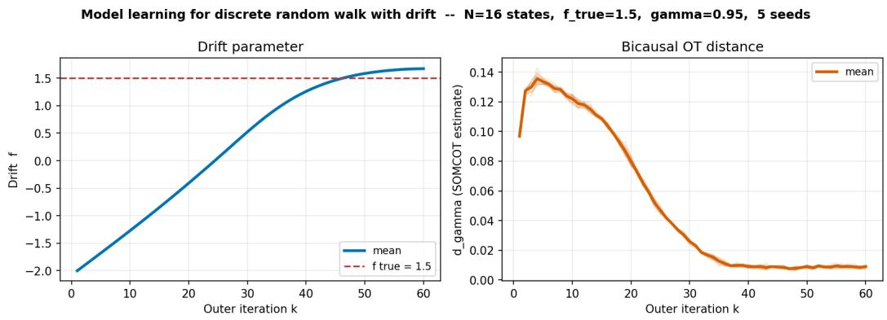
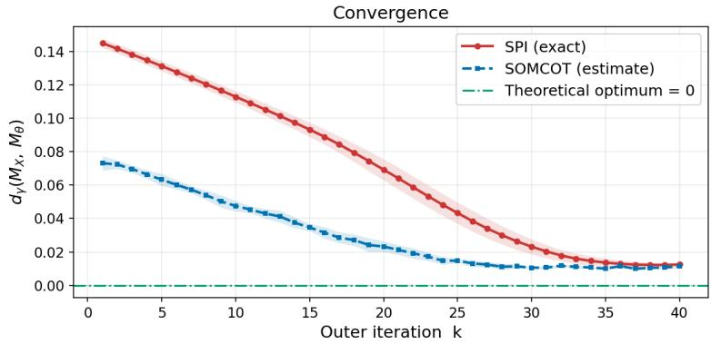
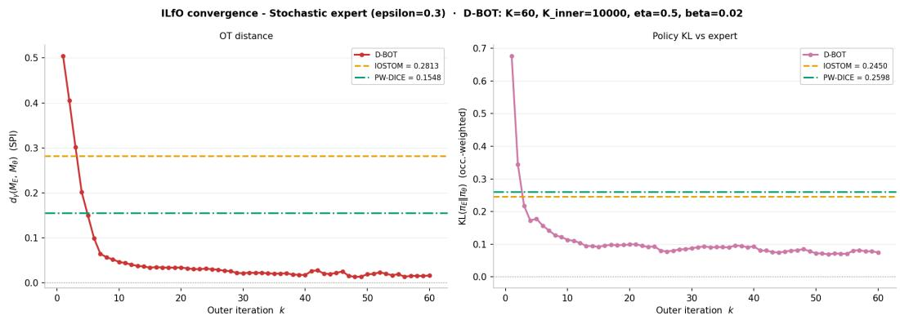
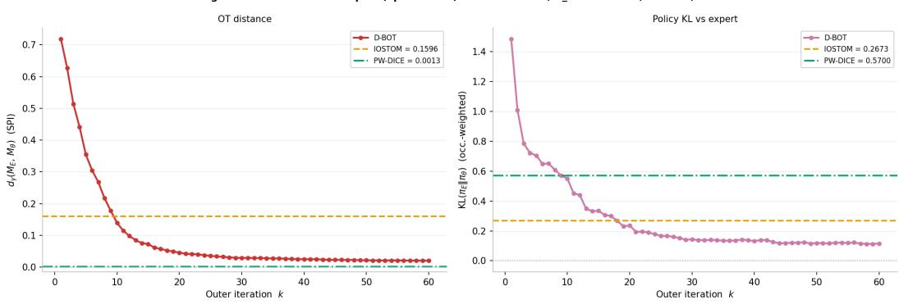
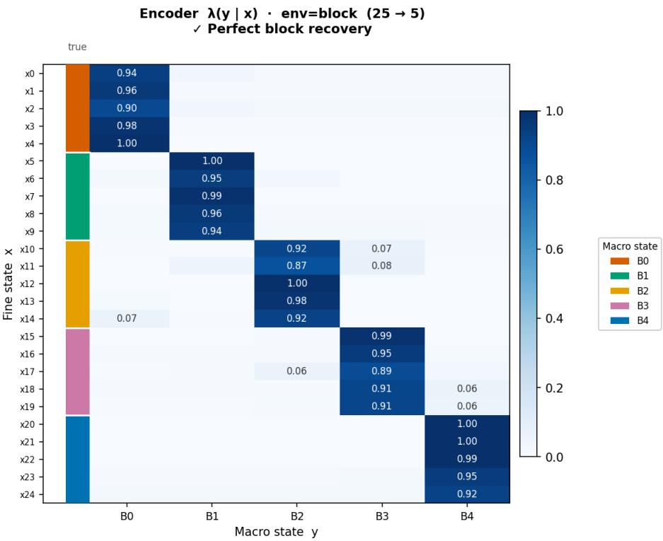
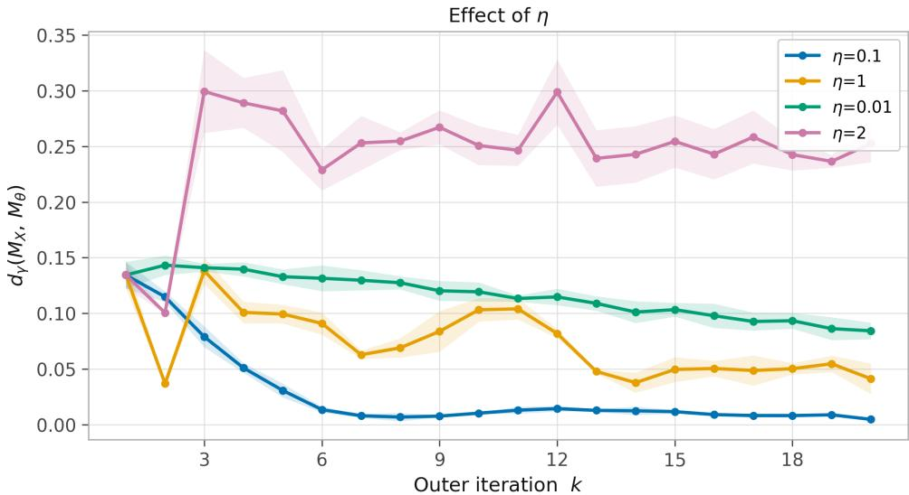
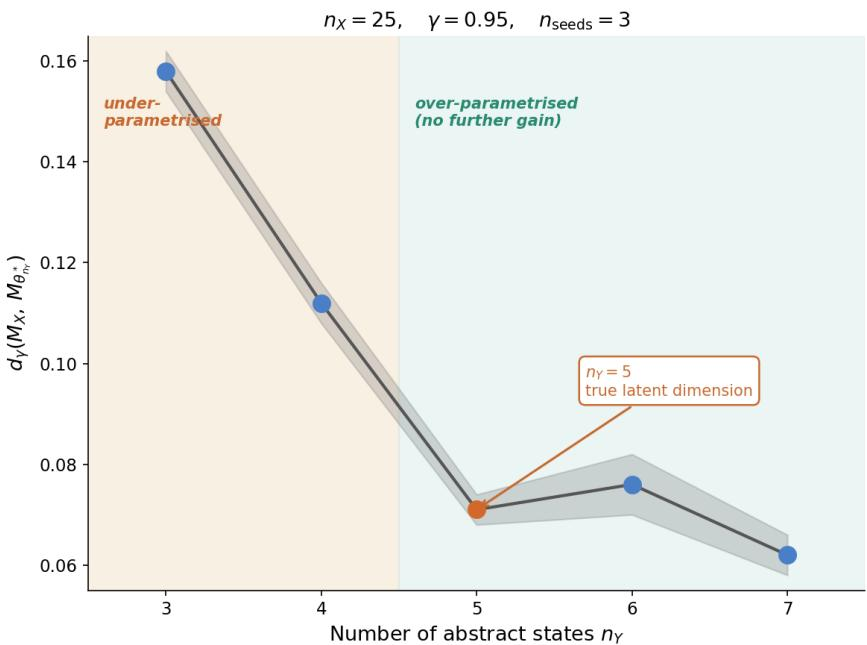

# Differentiating Bisimulation Metrics: A Framework for Parametric Markov Chain Fitting via Bicausal Optimal Transport

Sergio Calo1∗ Amy Zhang2 Javier Segovia-Aguas1 Anders Jonsson1 1Universitat Pompeu Fabra, Barcelona, Spain 2University of Texas at Austin

## Abstract

Many problems in sequential decision-making, such as imitation learning from observations, state-space compression, world-model learning, and sim-to-real transfer, can be reduced to learning a model such that a notion of distance with respect to the target process is minimized. We consider this general framework and consider the bisimulation metric, equivalently Bicausal Optimal Transport (BOT), as the notion of distance to minimize. We show that BOT, since it can be formulated as a linear program (LP), is differentiable with respect to the model dynamics. We then derive an exact closed-form gradient via the envelope theorem applied to the LP saddle point. The result is a general algorithm, Differentiable Bicausal Optimal Transport (D-BOT), that can be applied to each of the problems above. The proposed algorithm learns the best model by alternating between distance computation and gradient steps. We apply D-BOT for three different settings: state-space compression, parametric model learning, and imitation learning from observations (ILfO). We show empirical results that confirm the viability of all three instantiations.

## 1 Introduction

Many problems in sequential decision-making reduce to a common template: define a parametric model of a stochastic process, sample transitions from a reference process, and the requirement that the two be brought as close as possible by adjusting the model’s parameters. In Imitation Learning from Observations (ILfO), for instance, one asks for a policy whose induced chain matches an expert’s transitions without access to the expert’s actions. System identification and sim-to-real transfer require tuning a set of parameters until the simulator reproduces real-world trajectories. State-space compression aims to find a small abstract process whose dynamics faithfully approximate those of a much larger original system.

The central difficulty is that “as close as possible” must be defined carefully. Stochastic processes unfold over time, and a meaningful distance between them should respect this temporal, causal structure: it should penalise not just mismatches in where the process spends its time, but mismatches in how it moves from one state to the next. A distance based on marginal state-occupancy, for instance, cannot distinguish two policies that may produce the same marginal distribution over states while producing very different behaviors. What is needed is a distance that couples the two processes jointly across time, so that the cost of matching one trajectory to another reflects the sequential structure of both. At the same time, the distance must be practically usable: it must be estimable from sample transitions alone, without requiring knowledge of the underlying transition kernels, and it must be differentiable with respect to the model parameters so that gradient-based optimization can be applied.

We argue that the bisimulation metric, recently shown to be equivalent to the bicausal optimal transport distance [Calo et al., 2024], which couples two processes in a way that respects the causal, temporal ordering of both chains, satisfies all of these requirements simultaneously. This connection to optimal transport opens a rich set of algorithmic tools. In particular, Calo et al. [2025] recently showed that the bisimulation metric can be computed from sample transitions alone, without knowledge of either transition kernel, via a stochastic primal-dual algorithm called SOMCOT. The present paper shows that the same LP formulation that enables SOMCOT also makes the bisimulation metric differentiable with respect to the parameters of the model being fitted. The gradient has a closed-form solution, obtained by applying the envelope theorem [Danskin, 1967] to the LP saddle point: it involves only two of the six dual variables that SOMCOT already computes as a byproduct, and requires no differentiation through the inner optimization.

We design D-BOT (Differentiable Bicausal Optimal Transport) around this gradient: the algorithm alternates between running SOMCOT and taking a gradient step on the model parameters. The outer loop is the same regardless of the application; what differs is only how $\nabla _ { \boldsymbol { \theta } } \nu _ { \boldsymbol { \theta } }$ (that is, the gradient of the transition occupancy) is computed for each particular parametrization. For state-space compression and parametric model learning, where $P _ { \theta }$ is an explicit differentiable kernel, both share an identical gradient computation and are unified in Section 4. For imitation learning from observations, where $P _ { \theta }$ is parametrized only implicitly through a parametric policy acting in an MDP, the gradient takes the form of a policy gradient under an implicitly defined reward (Section 5).

Contributions. We derive an exact closed-form gradient of the bisimulation metric with respect to any differentiable parametrization of the second chain, via the envelope theorem applied to the LP saddle point of Calo et al. [2025] (Section 3). Based on this we propose D-BOT, a general algorithm for parametric chain fitting that tackles many of the main problems in reinforcement learning. In particular, we instantiate it for state-space compression, parametric model learning, and imitation learning from observations, providing complete algorithmic descriptions and empirical results (Sections 4–5).

## 1.1 Related work.

Imitation learning from observations has been studied as a distribution-matching problem, with methods minimising either KL divergences [Kostrikov et al., 2020] or optimal transport distances [Dadashi et al., 2021, Yan et al., 2024, Pham et al., 2025] between state-occupancy marginals. Representation learning and state-space compression have been approached through the lens of bisimulation [Ferns et al., 2004, Givan et al., 2003, Castro, 2020, Zhang et al., 2021, Chen and Pan, 2022, Kemertas and Jepson, 2022], with recent work focusing on scalable and differentiable approximations of the bisimulation metric. Parametric model learning and system identification have been treated as separate estimation problems. These three lines of work have developed largely in isolation. However, to the best of our knowledge, no prior work provides a unified framework that incorporates all of them. We discuss the related work of each area and the connections to this work separately in Appendix E.

## 2 Background

We consider two stationary Markov processes $\mathcal { M } _ { X } = ( \mathcal { X } , P _ { X } , \nu _ { 0 , X } )$ and $\mathcal { M } _ { Y } = ( \mathcal { V } , P _ { Y } , \nu _ { 0 , Y } )$ where X and Y are finite state spaces, $P _ { X } : \mathcal { X } \to \Delta ( \mathcal { X } )$ and $P _ { Y } : \mathcal { Y } \to \Delta ( \mathcal { Y } )$ are the transition kernels, and $\nu _ { 0 , X } , \nu _ { 0 , Y }$ are the initial distributions. We assume without loss of generality that both initial distributions are Dirac measures on fixed states x and y .

Given a ground cost $c : \mathcal { X } \times \mathcal { Y }  \mathbb { R } _ { + }$ , the discounted total cost between two trajectories $\bar { x } =$ $( x _ { 0 } , x _ { 1 } , \ldots )$ and $\begin{array} { r } { \bar { y } = ( y _ { 0 } , y _ { 1 } , \dots ) \mathrm { i s } c _ { \gamma } ( \bar { x } , \bar { y } ) = \sum _ { t = 0 } ^ { \infty } \gamma ^ { t } c ( x _ { t } , y _ { t } ) } \end{array}$ for a discount factor $\gamma \in ( 0 , 1 )$ .

## 2.1 Bicausal Couplings

A coupling of $\mathcal { M } _ { X }$ and $\mathcal { M } _ { Y }$ is a joint process on $\mathcal { X } \times \mathcal { V }$ whose marginals equal $\mathcal { M } _ { X }$ and $\mathcal { M } _ { Y }$ respectively. A coupling π is bicausal if, for all $n \geq 0$

$$
\sum _ { y } \pi ( x y \mid \bar { x } ^ { n - 1 } \bar { y } ^ { n - 1 } ) = P _ { X } ( x \mid \bar { x } ^ { n - 1 } ) \quad \mathrm { a n d } \quad \sum _ { x } \pi ( x y \mid \bar { x } ^ { n - 1 } \bar { y } ^ { n - 1 } ) = P _ { Y } ( y \mid \bar { y } ^ { n - 1 } ) .
$$

Intuitively, bicausal couplings respect the temporal structure of both chains: neither chain can peek at the other’s future. Let $\Pi _ { \mathrm { b c } }$ denote the set of all bicausal couplings. Moulos [2021] showed that restricting to Markovian bicausal couplings—where the joint transition at time t depends only on the current pair $( X _ { t } , Y _ { t } )$ —does not increase the optimal transport cost. This reduction to Markovian couplings is what enables the LP formulation below.

## 2.2 Bisimulation Metric

The bisimulation metric (equivalently, the bicausal OT distance) between $\mathcal { M } _ { X }$ and $\mathcal { M } _ { Y }$ is

$$
d _ { \gamma } ( \mathcal { M } _ { X } , \mathcal { M } _ { Y } ) \ = \ \operatorname* { i n f } _ { \pi \in \Pi _ { \mathrm { b c } } } \int c _ { \gamma } ( X , Y ) d \pi ( X , Y ) .\tag{1}
$$

As noted by Calo et al. [2024], this quantity coincides with the bisimulation metric of Ferns et al. [2004] and Givan et al. [2003] when the ground cost is the absolute difference in state rewards:

$$
c ( x , y ) = | r ( x ) - r ( y ) | ,\tag{2}
$$

where $r : \mathcal { X } \to ]$ R is the reward function.

Connection to reinforcement learning. In the RL setting, $\mathcal { M } _ { X }$ and $\mathcal { M } _ { Y }$ are not given directly; they are typically induced by policies acting in an MDP. Given a discounted MDP $( S , { \mathcal { A } } , P , r , \gamma )$ and a policy π $: S  \Delta ( { \mathcal { A } } )$ , the policy induces a Markov chain over S with transition kernel $\begin{array} { r } { P ^ { \pi } ( s ^ { \prime } | \hat { s } ) = \bar { \sum } _ { a } \pi ( a | s ) P ( \acute { s } ^ { \prime } | s , a ) } \end{array}$ . Notably, π also induces a reward function in the Markov chain as $r ^ { \pi } : S $ R defined by $\begin{array} { r } { r ^ { \pi } ( s ) { \stackrel { . } { = } } \sum _ { a } \pi ( a | \dot { s } ) r ( s , a ) } \end{array}$ . Any Markov chain $\mathcal { M } _ { X }$ can therefore be viewed as arising from some MDP-policy pair, and the bisimulation metric between two chains corresponds to comparing the behaviors induced by two policies (or two MDPs) in a principled, causally-aware manner.

## 2.3 LP Formulation

The distance (Eq. 1) can be rewritten as a linear program in the occupancy coupling, defined for a coupling $\pi \in \Pi _ { \mathrm { b c } }$ as

$$
\mu ^ { \pi } ( x , y , x ^ { \prime } , y ^ { \prime } ) = ( 1 - \gamma ) \sum _ { t = 0 } ^ { \infty } \gamma ^ { t } \mathbb { P } _ { \pi } \big [ X _ { t } = x , Y _ { t } = y , X _ { t + 1 } = x ^ { \prime } , Y _ { t + 1 } = y ^ { \prime } \big ] ,
$$

where $\mathbb { P } _ { \pi }$ is the probability measure on the joint process $( X _ { t } , Y _ { t } ) _ { t \geq 0 }$ induced by the coupling π. Introduce the marginal transition occupancy measures:

$$
\begin{array} { r l } & { \nu _ { X } \left( x , x ^ { \prime } \right) = ( 1 - \gamma ) \displaystyle \sum _ { t \geq 0 } \gamma ^ { t } \mathbb { P } [ X _ { t } = x , X _ { t + 1 } = x ^ { \prime } ] , } \\ & { \nu _ { Y } \left( y , y ^ { \prime } \right) = ( 1 - \gamma ) \displaystyle \sum _ { t > 0 } \gamma ^ { t } \mathbb { P } [ Y _ { t } = y , Y _ { t + 1 } = y ^ { \prime } ] . } \end{array}
$$

Calo et al. [2025] show that for all $x , y , x ^ { \prime } , y ^ { \prime }$ , the distance $d _ { \gamma } ( { \mathcal { M } } _ { X } , { \mathcal { M } } _ { Y } ) = \operatorname* { i n f } _ { \mu , \lambda _ { X } , \lambda _ { Y } } \langle \mu , c \rangle$ subject to:

$$
\sum _ { x ^ { \prime } , y ^ { \prime } } \mu ( x , y , x ^ { \prime } , y ^ { \prime } ) = \gamma \sum _ { \hat { x } , \hat { y } } \mu ( \hat { x } , \hat { y } , x , y ) + ( 1 - \gamma ) \nu _ { 0 } ( x , y ) ,\tag{flow}
$$

$$
\sum _ { y ^ { \prime } } \mu ( x , y , x ^ { \prime } , y ^ { \prime } ) = \nu _ { X } ( x , x ^ { \prime } ) \lambda _ { X } ( y | x ) ,\tag{causal-X}
$$

$$
\sum _ { x ^ { \prime } } \mu ( x , y , x ^ { \prime } , y ^ { \prime } ) = \nu _ { Y } ( y , y ^ { \prime } ) \lambda _ { Y } ( x | y ) ,\tag{causal-Y}
$$

for some $\lambda _ { X } \in \Delta ( \mathcal { V } ) ^ { \mathcal { X } }$ and $\lambda _ { Y } \in \Delta ( \mathcal { X } ) ^ { \mathcal { Y } }$ . Crucially, the constraints involve only the occupancy measures $\nu _ { X }$ and $\nu _ { Y }$ , not the transition kernels directly, making them computable from sample transitions alone.

Interpretation of $\lambda _ { X }$ and $\lambda _ { Y }$ . From $( \mathrm { E q . c a u s a l - } X ) , \lambda _ { X } ( y | x )$ is the conditional distribution of $Y$ given $X = x$ under the optimal coupling. From the lens of representation learning, λ is interpretable as a soft encoder from observations to abstract states. Symmetrically, $\lambda _ { Y } ( x | y )$ is a soft decoder from abstract states back to observations.

## 2.4 Lagrangian and the SOMCOT Algorithm

We associate dual variables with each constraint: $V \in \mathbb { R } ^ { x \times y }$ for the flow constraint $( \mathrm { E q }$ . flow), $\alpha _ { X } \in \mathbb { R } ^ { \mathcal { X } \times \mathcal { X } \times \mathcal { Y } }$ for the causal-X constraint (Eq. causal-X), and $\alpha _ { Y } \in \mathbb { R } ^ { \mathcal { X } \times \mathcal { Y } \times \mathcal { Y } }$ for the causal-Y constraint $( \operatorname { E q } .$ causal-Y). Writing $\langle \cdot , \cdot \rangle$ for the Euclidean inner product on the appropriate index set, and defining

$$
\delta ( x , y , x ^ { \prime } , y ^ { \prime } ) : = c ( x , y ) + \alpha _ { X } ( x , x ^ { \prime } , y ) + \alpha _ { Y } ( x , y , y ^ { \prime } ) + \gamma V ( x ^ { \prime } , y ^ { \prime } ) - V ( x , y ) ,
$$

the Lagrangian compacts to

$$
{ \mathcal { L } } = \langle \mu , \delta \rangle - \langle \nu _ { X } \lambda _ { X } , \alpha _ { X } \rangle - \langle \nu _ { Y } \lambda _ { Y } , \alpha _ { Y } \rangle + ( 1 - \gamma ) \langle \nu _ { 0 } , V \rangle ,\tag{3}
$$

where $( \nu _ { X } \lambda _ { X } ) ( x , x ^ { \prime } , y ) : = \nu _ { X } ( x , x ^ { \prime } ) \lambda _ { X } ( y | x )$ and similarly for $\nu _ { Y } \lambda _ { Y }$ . The distance equals the saddle-point value:

$$
d _ { \gamma } ( { \mathcal M } _ { X } , { \mathcal M } _ { Y } ) = \operatorname* { m i n } _ { \substack { \mu , \lambda _ { X } , \lambda _ { Y } } } \operatorname* { m a x } _ { \alpha _ { X } , \alpha _ { Y } , V } { \mathcal L } ( \mu , \lambda _ { X } , \lambda _ { Y } ; \alpha _ { X } , \alpha _ { Y } , V ) .\tag{4}
$$

SOMCOT [Calo et al., 2025] solves $( \mathrm { E q . 4 } )$ from sample transitions alone, without knowledge of $P _ { X }$ or $P _ { Y }$ . It draws one transition $( X _ { k } , \bar { X } _ { k } ^ { \prime } ) \sim \nu _ { X }$ and $\left( Y _ { k } , Y _ { k } ^ { \prime } \right) \sim \nu _ { Y }$ per iteration, updates primal variables $( \mu , \lambda _ { X } , \lambda _ { Y } )$ via stochastic mirror descent with entropic regularization, and dual variables $( \alpha _ { X } , \alpha _ { Y } , V )$ via projected gradient ascent. Upon termination, SOMCOT returns the time-averaged iterates $( \bar { \mu } , \bar { \lambda } _ { X } , \bar { \lambda } _ { Y } , \bar { \alpha } _ { X } , \bar { \alpha } _ { Y } , \bar { V } )$ along with the distance estimate $\hat { d } _ { \gamma } = \langle \bar { \mu } , c \rangle$

## 2.5 Problem Formulation

We now turn to the setting that motivates this work. Suppose the first chain $\mathcal { M } _ { X }$ is a fixed target process, representing, for instance, an expert’s behavior or a reference environment. The second chain is parametrized: $\mathcal { M } _ { Y } = \mathcal { M } _ { \theta }$ , where $\theta \in \Theta \subseteq \mathbb { R } ^ { d }$ governs the transition kernel $P _ { \theta } : \mathcal { V } \to \Delta ( \mathcal { V } )$ and hence the occupancy measure νθ. We seek the parameter vector that brings $\mathcal { M } _ { \theta }$ as close as possible to $\mathcal { M } _ { X }$ under the bisimulation metric. The mapping $\theta \mapsto \nu _ { \theta }$ refers to the transition occupancy measure of ${ \mathcal { M } } _ { \theta } \left( { \mathrm { E q } } \right.$ . 10), which is determined by $P _ { \theta }$ and the initial distribution $\nu _ { 0 , Y }$ . Note that $\nu _ { \theta }$ satisfies the causal-Y constraint (Eq. causal-Y), and any parametrization θ that determines $P _ { \theta }$ therefore also determines $\mu$ through that constraint:

$$
\theta ^ { * } = \underset { \theta \in \Theta } { \arg \operatorname* { m i n } } \ d _ { \gamma } ( \mathcal { M } _ { X } , \mathcal { M } _ { \theta } ) .\tag{5}
$$

Because $d _ { \gamma } ( \mathcal { M } _ { X } , \mathcal { M } _ { \theta } )$ is the value of the LP in Section 2.3, which is linear, and hence convex, in $\nu _ { \theta }$ the objective in (Eq. 5) inherits this property whenever $\theta \mapsto \nu _ { \theta }$ is itself convex. More generally, even when this map is nonlinear (for example, when $P _ { \theta }$ is induced by a neural-network policy), first-order methods remain applicable provided the gradient $\nabla _ { \theta } d _ { \gamma } ( \mathcal { M } _ { X } , \mathcal { M } _ { \theta } )$ can be computed or estimated efficiently.

Solving (Eq. 5) requires differentiating through the inner optimal-transport problem, which couples $\mathcal { M } _ { X }$ and $\mathcal { M } _ { \theta }$ via the bicausal LP. The next section derives a closed form for this gradient and builds the D-BOT algorithm around it.

## 3 The D-BOT Framework

Consider the setting introduced in (Eq. 5); the missing ingredient is $\nabla _ { \theta } d _ { \gamma } ( \mathcal { M } _ { X } , \mathcal { M } _ { \theta } )$ . In this section we show how to obtain this gradient and describe the resulting algorithm.

## 3.1 Gradient of the Bisimulation Metric

Examining the Lagrangian (Eq. 3), θ enters only through the term involving $\nu _ { \theta }$ , namely:

$$
{ \mathcal { L } } _ { \theta } ( \mu , \lambda _ { X } , \lambda _ { Y } ; \alpha _ { X } , \alpha _ { Y } , V ) = \underbrace { \langle \mu , c \rangle + \dots } _ { \mathrm { i n d e p e n d e n t o f } \theta } - \ \sum _ { x , y , y ^ { \prime } } \nu _ { \theta } ( y , y ^ { \prime } ) \lambda _ { Y } ( x | y ) \alpha _ { Y } ( x , y , y ^ { \prime } ) .\tag{6}
$$

Theorem 1 (Gradient of the bisimulation metric). Let $\theta \mapsto \nu _ { \theta }$ be differentiable, and let $d _ { \gamma }$ be the bisimulation metric. At the saddle point $\left( \mu ^ { * } , \lambda _ { X } ^ { * } , \lambda _ { Y } ^ { * } ; \alpha _ { X } ^ { * } , \alpha _ { Y } ^ { * } , V ^ { * } \right)$

$$
\nabla _ { \theta } d _ { \gamma } ( \mathcal { M } _ { X } , \mathcal { M } _ { \theta } ) \ = \ - \sum _ { x , y , y ^ { \prime } } \lambda _ { Y } ^ { * } ( x \vert y ) \alpha _ { Y } ^ { * } ( x , y , y ^ { \prime } ) \nabla _ { \theta } \nu _ { \theta } ( y , y ^ { \prime } ) .\tag{7}
$$

Proof sketch. Since θ appears only through $\nu _ { \theta }$ in (6), and the primal variables $( \mu ^ { \ast } , \lambda _ { X } ^ { \ast } , \lambda _ { Y } ^ { \ast } )$ satisfy all LP constraints (flow)–(causal-Y ) at the saddle point, the envelope theorem for parametric LPs [Puterman, 1994] states that the derivative of the optimal value with respect to θ equals the partial derivative of the Lagrangian at the saddle point. The expression in (7) follows immediately by differentiating the $\nu _ { \theta } \cdot$ -dependent term in (6). A complete proof is given in Appendix A.

Remark 1 (Consecuences of the envelope theorem). Due to the envelope theorem, the variables ${ \lambda } _ { Y } ^ { * }$ and $\alpha _ { Y } ^ { * }$ are treated as constants with respect to θ at the saddle point. Only νθ needs to be differentiated, so the gradient computation is cheap regardless ofthe complexity ofthe SOMCOT inner loop.

Remark 2 (Convexity in $\nu _ { \theta } )$ . Because $d _ { \gamma } ( M _ { X } , M _ { \theta } )$ is the value ofa linear program, it is convex as a function of the transition occupancy measure νθ. However, the parametrization $\theta \mapsto \nu _ { \theta }$ induced by the Markov dynamics is generally nonlinear, and may be highly nonconvex (for example, when $P _ { \theta }$ is represented by a neural network policy). Consequently, the outer optimization problem in (Eq. 5) is, in general, a nonconvex bilevel optimization problem. The contribution ofthis work is therefore not a global convexity result, but rather the derivation ofan exactfirst-order gradient ofthe bisimulation metric with respect to the model parameters.

## 3.2 The D-BOT General Algorithm

Theorem 1 translates directly into a first-order optimization algorithm for minimizing the bisimulation distance $d _ { \gamma } ( M _ { X } , M _ { \theta } )$ with respect to θ: alternate between running SOMCOT to produce dual certificates and taking a gradient step on θ. We call this D-BOT (Differentiable Bicausal Optimal Transport) and state it as Algorithm 1.

Algorithm 1 D-BOT: Differentiable Bicausal Optimal Transport Fitting   
Require: Sample access to $\mathcal { M } _ { X } ;$ parametric chain $\mathcal { M } _ { \theta }$ (any differentiable parametrization); cost $c ;$   
step size η; iterations $K .$   
1: Initialize $\theta _ { 0 } ( \mathrm { e . g . }$ uniformly at random or from a prior).   
2: for $k _ { - } = 1 , 2 , \ldots , K$ do   
3: $( \bar { \lambda } _ { Y , k } , \bar { \alpha } _ { Y , k } ) \gets \mathrm { S O M C O T } ( \mathcal { M } _ { X } , \mathcal { M } _ { \theta _ { k - 1 } } , c )$ // OT step   
4: Gradient computation:   
5: Compute $\widehat { \nabla _ { \theta } d _ { \gamma } }$ via $( \mathrm { E q . } 7 )$ , differentiating $\nu _ { \theta _ { k - 1 } }$ for the specific parametrization (see Sec  
tions 4.1 and 5).   
6: $\theta _ { k }  \theta _ { k - 1 } - \eta \widehat { \nabla _ { \theta } d _ { \gamma } }$ // parameter update   
7: end for   
8: return $\theta _ { K } ;$ encoder ${ \bar { \lambda } } _ { X } ;$ decoder $\bar { \lambda } _ { Y } .$

The outer loop of Algorithm 1 does not change between applications; what varies is only how $\nabla _ { \boldsymbol { \theta } } \nu _ { \boldsymbol { \theta } }$ is computed:

• Representation learning (Section 4): $P _ { \theta }$ is an explicit differentiable kernel, so $\nu _ { \theta }$ is computable in closed form and its gradient is obtained by pathwise autodifferentiation through a linear system solve. This covers both parametric model learning $( | \mathcal { V } | = | \mathcal { X } |$ system identification) and state-space compression $( | \mathcal { V } | \ll | \mathcal { X } |$ , dimensionality reduction); the gradient machinery is identical in both cases.

• Imitation learning from observations (Section 5): $P _ { \theta }$ is induced by a policy $\pi _ { \theta }$ acting in an MDP and is not directly differentiable. The gradient of $\nu _ { \theta }$ is estimated via the policy gradient theorem.

## 4 Representation Learning via D-BOT

In this section we introduce the application of the general algorithm D-BOT for the settings of model learning and state-space compression.

## 4.1 Setting

Given sample transitions from a target chain $\mathcal { M } _ { X } = ( \mathcal { X } , P _ { X } , \nu _ { 0 , X } )$ , we want to fit a parametric chain $\mathcal { M } _ { \theta } \overset { ^ { \cdot } } { = } ( \mathcal { V } , P _ { \theta } , \nu _ { 0 , Y } )$ by minimizing

$$
\theta ^ { * } \ = \ \underset { \theta } { \arg \operatorname* { m i n } } \ d _ { \gamma } ( \mathcal { M } _ { X } , \mathcal { M } _ { \theta } ) .\tag{8}
$$

Here $\theta$ is any parameter vector that determines the row-stochastic kernel $P _ { \theta } : \mathcal { V } \to \Delta ( \mathcal { V } )$ . We will consider the following two scenarios:

• Parametric model learning $( | \mathcal { Y } | = | \mathcal { X } | ) \colon \mathcal { M } _ { \theta }$ lives on the same state space as $\mathcal { M } _ { X }$ and is fitted to reproduce its dynamics as faithfully as possible. This is a system-identification task; the bisimulation metric acts as the loss.

• State-space compression $( | \mathcal { V } | \ll | \mathcal { X } | ) \colon \mathcal { M } _ { \theta }$ lives on a smaller abstract space. Minimizing the bisimulation distance simultaneously learns compressed dynamics and a soft encoder/decoder pair that relates abstract states to the original ones.

Beyond the compressed kernel $P _ { \theta } ^ { * }$ , the optimal coupling $\mu ^ { * }$ simultaneously identifies a soft encoder $\lambda _ { X } ^ { * } ( \cdot | x ) \in \Delta ( \bar { \mathcal { Y } } )$ and a soft decoder $\bar { \lambda } _ { Y } ^ { * } ( \cdot | y ) \in \bar { \Delta ( \mathcal { X } ) }$ such that the latent dynamics of $\mathcal { M } _ { X }$ factor through $\mathcal { M } _ { \theta } .$ ∗ with minimal distortion. If $d _ { \gamma } ( { \mathcal { M } } _ { X } , { \mathcal { M } } _ { \theta ^ { * } } ) = 0$ , the hard encoder ${ \hat { \phi } } ( x ) =$ arg max $_ y \lambda _ { X } ^ { * } ( y | x )$ realizes an exact aggregation [Givan et al., 2003].

## 4.2 Computing ∇θνθ

For an explicit kernel parametrization $\theta \mapsto P _ { \theta }$ , the transition occupancy $\nu _ { \theta }$ factors as $\nu _ { \theta } ( y , y ^ { \prime } ) =$ $\rho _ { \theta } ( y ) P _ { \theta } ( y ^ { \prime } | y )$ , where the discounted state-occupancy $\rho _ { \theta } \in \mathbb { R } ^ { n _ { Y } }$ (where $n _ { Y } = | \mathcal { V } | )$ is the unique solution of

$$
\left( I - \gamma P _ { \theta } ^ { \top } \right) \rho _ { \theta } \ = \ \left( 1 - \gamma \right) \nu _ { 0 , Y } ,\tag{9}
$$

giving the closed-form expression

$$
\nu _ { \theta } ( y , y ^ { \prime } ) = \Big [ ( 1 - \gamma ) ( I - \gamma P _ { \theta } ^ { \top } ) ^ { - 1 } \nu _ { 0 , Y } \Big ] _ { y } \cdot P _ { \theta } ( y ^ { \prime } | y ) .\tag{10}
$$

Substituting into (Eq. 7) and detaching the dual certificates $( \bar { \lambda } _ { Y } , \bar { \alpha } _ { Y } )$ returned by SOMCOT,

$$
\nabla _ { \theta } d _ { \gamma } ( \mathcal { M } _ { X } , \mathcal { M } _ { \theta } ) \ = \ - \sum _ { x , y , y ^ { \prime } } \bar { \lambda } _ { Y } ( x | y ) \bar { \alpha } _ { Y } ( x , y , y ^ { \prime } ) \nabla _ { \theta } \nu _ { \theta } ( y , y ^ { \prime } ) .\tag{11}
$$

Provided $P _ { \theta }$ is differentiable in $\theta ,$ the chain rule applies directly: $\nabla _ { \boldsymbol { \theta } } \nu _ { \boldsymbol { \theta } }$ is obtained by differentiating through (Eq. 10), where the backward pass through the linear solver is handled implicitly by automatic differentiation.2

The full pseudocode for this procedure (D-BOT-REPR) is given as Algorithm 2 in Appendix B. For model learning set $n _ { Y } = n _ { X }$ and $\nu _ { 0 , Y } = \nu _ { 0 , X } ;$ for compression choose $n _ { Y } \ll n _ { X }$ and set $\nu _ { 0 , Y }$ to any fixed distribution (e.g. uniform). In both cases the encoder $\bar { \lambda } _ { X }$ and decoder $\bar { \lambda } _ { Y }$ are returned by SOMCOT at no extra cost; for model learning they are not used.

## 4.3 Experimental results

We test Algorithm 2 for both settings, comparing against the exact distance from Sinkhorn Policy Iteration (SPI) Calo et al. [2024], which requires full kernel knowledge.

Model Learning: We fit a parametric model on a discrete random walk with drift: $N = 1 6$ states with reflecting boundaries, drift parameter f (true value $f _ { \mathrm { t r u e } } = 1 . 5 , \gamma = 0 . 9 5 )$ . We initialize with $f _ { 0 } = - 2$ , strongly biased in the wrong direction.. Figure 1 shows gradient updates monotonically steering f toward $f _ { \mathrm { t r u e } } ,$ with a brief overshoot due to finite step size. The learned drift slightly overshoots beyond $\mathrm { \dot { f } _ { t r u e } } = 1 . 5$ due to small approximation errors in the SOMCOT distance estimates. The experiment confirms that the bisimulation gradient correctly identifies the generating parameter from sample transitions alone, even from a heavily misspecified initialization.

  
Figure 1: Model learning $( n _ { Y } = n _ { X } = 1 6 , f _ { \mathrm { t r u e } } = 1 . 5 , \gamma = 0 . 9 5 )$ . Left: learned drift f versus outer iteration k; dashed red line marks the true value. Right: SOMCOT estimate of $d _ { \gamma } ( \mathcal { M } _ { X } , \mathcal { M } _ { \theta } )$

State-Space Compression: We compress a block-chain of $\iota _ { X } = 2 5$ states (5 blocks of behaviorally identical states) to $n _ { Y } = 5$ abstract states. The ground cost is the absolute reward difference between x and y, where each block shares a reward proportional to its index; This cost is zero precisely when x belongs to the block corresponding to y, and grows linearly with the number of blocks separating x from y, imposing an ordinal geometry on the abstract space. Figure 2 shows the bisimulation distance converging to near zero, and the recovered encoder (Figure 5) cleanly assigns each group of five states to a single abstract state with no explicit clustering objective. Overestimating nY does not degrade performance (redundant states are left unused), though it increases cost since SOMCOT scales as $\stackrel { \cdot } { \mathcal { O } } ( n _ { X } ^ { 2 } n _ { Y } ^ { 2 } )$ ; see Appendix D for full ablations.

  
Figure 2: State-space compression $( n _ { X } ~ = ~ 2 5 , ~ n _ { Y } ~ = ~ 5 , ~ \gamma ~ = ~ 0 . 9 5 ) \colon$ : bisimulation distance $d _ { \gamma } \mathsf { ( } \mathcal { M } _ { X } , \mathcal { M } _ { \theta } \bigr )$ versus outer iterations. The 5-state abstract chain faithfully represents the original 25-state chain.

## 5 Imitation Learning from Observations

This section instantiates D-BOT for the Imitation Learning from Observations (ILfO) setting, where the learner observes only state transitions from an expert and must recover a policy that reproduces the same induced Markov chain.

## 5.1 Setting

We consider a standard discounted MDP $\mathcal { M } = ( \mathcal { S } , \mathcal { A } , P , \gamma )$ as in Section 2, with an unknown reward function. The learner has access to an expert dataset $\begin{array} { r } { \mathcal { D } _ { E } = \{ ( s _ { i } , s _ { i } ^ { \prime } ) \} _ { i = 1 } ^ { N } } \end{array}$ of consecutive state transitions with no action or reward labels — strictly harder than standard imitation learning.

Each policy $\pi _ { \theta }$ induces a Markov chain $\mathcal { M } _ { \pi _ { \theta } }$ over S with transition kernel $\begin{array} { r l } { P _ { \theta } ( s ^ { \prime } | s ) } & { { } = } \end{array}$ $\begin{array} { r } { \sum _ { a } \pi _ { \boldsymbol { \theta } } \dot { ( } a | s \dot { ) } P ( s ^ { \prime } | s , a ) } \end{array}$ . Let $\mathcal { M } _ { E }$ be the analogous chain induced by the expert. The objective is

$$
\operatorname* { m i n } _ { \theta } \ d _ { \gamma } ( { \mathcal { M } } _ { E } , { \mathcal { M } } _ { \pi _ { \theta } } ) .
$$

## 5.2 Computing $\nabla _ { \boldsymbol { \theta } } \nu _ { \boldsymbol { \theta } }$ via Policy Gradient

In the ILfO setting, $P _ { \theta }$ is the marginalization of the MDP kernel over $\pi _ { \theta }$ and is not directly differentiable with respect to θ. We instead rewrite the ν -dependent term in (Eq. 7) as an expectation under the induced policy. Using the shared state space $\begin{array} { r } { \mathcal { X } = \mathcal { Y } = \mathcal { S } ; } \end{array}$

$$
\sum _ { s , s ^ { \prime } } \nu _ { \theta } ( s , s ^ { \prime } ) \sum _ { a } \bar { \lambda } _ { Y } ( a | s ) \bar { \alpha } _ { Y } ( a , s , s ^ { \prime } ) = { \mathbb E } _ { \pi _ { \theta } } \left[ \sum _ { t = 0 } ^ { \infty } \gamma ^ { t } \sum _ { a } \bar { \lambda } _ { Y } ( a | S _ { t } ) \bar { \alpha } _ { Y } ( a , S _ { t } , S _ { t + 1 } ) \right] .\tag{12}
$$

This is a standard discounted RL objective under the implicit reward

$$
r ( s , s ^ { \prime } ) : = - \sum _ { a } \bar { \lambda } _ { Y } ( a | s ) \bar { \alpha } _ { Y } ( a , s , s ^ { \prime } ) .\tag{13}
$$

Corollary 1 (Policy gradient for ILfO). As a corollary of the policy gradient theorem [Sutton et al., 1999],

$$
\begin{array} { r } { \widehat { \nabla _ { \theta } d _ { \gamma } } = - \mathbb { E } _ { ( s , s ^ { \prime } ) \sim \nu _ { \pi _ { \theta } } } \left[ \nabla _ { \theta } \log \pi _ { \theta } ( s ^ { \prime } | s ) Q _ { \pi _ { \theta } } ^ { r } ( s , s ^ { \prime } ) \right] , } \end{array}\tag{14}
$$

where $Q _ { \pi _ { \theta } } ^ { r }$ is the action-value function under the implicit reward r.

Unlike the compression case, both inner and outer optimization loops must run until convergence, as the implicit reward changes each time $\pi _ { \theta }$ is updated: SOMCOT runs to convergence first, producing a stationary $r _ { k } ;$ only then does the policy update loop converge under that fixed reward. The full pseudocode is Algorithm 3 in Appendix B.

Interpretation of the implicit reward. The reward $r _ { k } ( s , s ^ { \prime } )$ scores each state transition according to how well it explains the expert’s causal transition structure. Unlike occupancy-based methods that assign rewards to states alone, $r _ { k }$ is sensitive to how the agent moves between states. The reward is re-estimated at every outer iteration as $\pi _ { \theta }$ improves, so it adapts automatically as the imitating policy approaches the expert.

## 5.3 Experimental Results

Environment and baselines. We evaluate D-BOT-IL O on a 5-state discrete chain MDP with four actions (left, right, stay, jump-to-start) and stochastic transitions. The expert policy is an ε-soft "go right" policy; we consider stochastic and deterministic expert policies. The learner observes only consecutive state pairs $( s , s ^ { \prime } )$ from expert rollouts and has no access to action labels. We compare against two baselines: IOSTOM [Pham et al., 2025], an offline ILfO method that matches joint statetransition occupancies via Q-learning with LSIQ-style targets and advantage-weighted regression for policy extraction; PW-DICE [Yan et al., 2024], a one-shot convex program that minimises a regularised primal Wasserstein distance between learner and expert estimated state occupancies. The cost function used assigns a cost 0 if the states are the same, and cost 1 otherwise.

Results. Figures 3 and 4 show the SPI distance and KL divergence over outer iterations for both expert variants. D-BOT-ILFO monotonically reduces the bisimulation distance across all settings, and simultaneously drives down the policy KL. In particular, our method outperform others in the precense of stochasticity in the expert poilcy. These results confirm that D-BOT correctly captures causal transition structure that marginal occupancy measures cannot distinguish.

ILfO convergence - Non-stochastic expert (epsilon=0.0) · D-BOT: K=60, K\_inner=10000, eta=0.5, beta=0.02  
  
Figure 3: ILfO results with a stochastic expert policy.

  
Figure 4: ILfO results with a deterministic expert policy.

## 6 Conclusion

We have shown that the bisimulation metric between Markov chains is differentiable with respect to the parameters of either chain, and that its gradient admits a clean closed-form expression via the envelope theorem applied to the LP saddle point of Calo et al. [2025]. The resulting algorithm, D-BOT, fits parametric Markov chains to reference processes by gradient descent on the bicausal OT distance and instantiates naturally for state-space compression, parametric model learning, and imitation learning from observations.

Limitations. The envelope theorem holds exactly only at the true saddle point, so stopping SOM-COT early biases the outer gradient proportionally to the inner approximation error. More inner iterations reduce this bias but increase computation per outer step. A single-loop variant that updates θ and the primal-dual variables jointly would remove this trade-off entirely; the linear dependence of the objective on ν suggests this is feasible, in the spirit of Ballu et al. [2020] for static OT.

As discussed, the considered optimization problem is generally nonconvex. Therefore D-BOT inherits the standard limitations of gradient-based optimization: convergence guarantees are local and would depend on initialization, step sizes, and optimization dynamics. Under exact inner solves, the method performs gradient descent on the true bisimulation metric; however, global optimality cannot in general be guaranteed.

Memory and per-iteration cost scale as $\mathcal { O } ( | \mathcal { X } | ^ { 2 } | \mathcal { V } | ^ { 2 } )$ , since SOMCOT maintains an explicit occupancy coupling, limiting the current implementation to chains with at most a few hundred states. Scaling up to large or even continuous state spaces would require approximating the primal and dual variables by parametrized functions (for example, neural networks), but deriving stable stochastic updates for this setting is challenging.

## Acknowledgments

Amy Zhang is supported by NSF 2340651, NSF 2402650, NSF AI Institute for Foundations of Machine Learning (IFML), TRI, and ARO W911NF-24-1-0193. Anders Jonsson is partially supported by Spanish grants PID2023-147145NB-I00 and CEX2021-001195-M, funded by MCIN/AEI/10.13039/501100011033. Javier Segovia-Aguas is supported by the Ramón y Cajal program, RYC2024-050163-I, funded by MICIU/AEI/10.13039/501100011033 and FSE+.

## References

M. Ballu, Q. Berthet, and F. Bach. Stochastic optimization for regularized Wasserstein estimators. In International Conference on Machine Learning, 2020.

S. Calo, A. Jonsson, G. Neu, L. Schwartz, and J. Segovia-Aguas. Bisimulation metrics are optimal transport distances, and can be computed efficiently. In Advances in Neural Information Processing Systems, 2024.

S. Calo, A. Jonsson, G. Neu, L. Schwartz, and J. Segovia-Aguas. Distances for Markov chains from sample streams. arXiv preprint arXiv:2505.18005, 2025.

P. S. Castro. Scalable methods for computing state similarity in deterministic Markov decision processes. In AAAI Conference on Artificial Intelligence, 2020.

W.-D. Chang, S. Fujimoto, D. Meger, and G. Dudek. Imitation learning from observation through optimal transport. In Reinforcement Learning Conference, 2024.

J. Chen and S. J. Pan. Learning representations via a robust behavioral metric for deep reinforcement learning. In Advances in Neural Information Processing Systems, 2022.

R. Dadashi, L. Hussenot, M. Geist, and O. Pietquin. Primal Wasserstein imitation learning. In International Conference on Learning Representations, 2021.

J. M. Danskin. The Theory of Max-Min and its Application to Weapons Allocation Problems. Springer-Verlag, Berlin, Heidelberg, 1967.

J. Desharnais, V. Gupta, R. Jagadeesan, and P. Panangaden. Metrics for labeled Markov systems. In International Conference on Concurrency Theory, 1999.

N. Ferns, P. Panangaden, and D. Precup. Metrics for finite Markov decision processes. In Uncertainty in Artificial Intelligence, 2004.

R. Givan, T. Dean, and M. Greig. Equivalence notions and model minimization in Markov decision processes. Artificial Intelligence, 147(1-2):163–223, 2003.

M. Kemertas and A. Jepson. Approximate policy iteration with bisimulation metrics. Transactions on Machine Learning Research, 2022.

S. Kim, J. Park, and S. Oh. LobsDICE: Offline imitation learning from observations via stationary distribution correction estimation. In Advances in Neural Information Processing Systems, 2022.

I. Kostrikov, O. Nachum, and J. Tompson. Imitation learning via off-policy distribution matching. In International Conference on Learning Representations, 2020.

Y. Luo, Z. Jiang, S. Cohen, E. Grefenstette, and M. P. Deisenroth. Optimal transport for offline imitation learning. In International Conference on Learning Representations, 2023.

Y. J. Ma, D. Jayaraman, and O. Bastani. SMODICE: Offline imitation learning via stationary occupancy measure difference minimization. In International Conference on Machine Learning, 2022.

V. Moulos. Bicausal optimal transport for Markov chains via dynamic programming. In IEEE International Symposium on Information Theory, 2021.

H. T. Pham, T. T. Doan, T. T. Nguyen, and D. Phung. IOSTOM: Offline imitation learning from observations via state transition occupancy matching. In Advances in Neural Information Processing Systems, 2025.

M. L. Puterman. Markov Decision Processes: Discrete Stochastic Dynamic Programming. Wiley-Interscience, 1994.

H. Sikchi, C. Chuck, A. Zhang, and S. Niekum. A dual approach to imitation learning from observations with offline datasets. In Conference on Robot Learning, 2024.

W. Sun, A. Vemula, B. Boots, and D. Bagnell. Provably efficient imitation learning from observation alone. In International Conference on Machine Learning, 2019.

R. S. Sutton, D. McAllester, S. Singh, and Y. Mansour. Policy gradient methods for reinforcement learning with function approximation. In S. Solla, T. Leen, and K. Müller, editors, Advances in Neural Information Processing Systems, volume 12. MIT Press, 1999. URL https://proceedings.neurips.cc/paper\_files/paper/1999/file/ 464d828b85b0bed98e80ade0a5c43b0f-Paper.pdf.

F. Torabi, G. Warnell, and P. Stone. Behavioral cloning from observation. In International Joint Conference on Artificial Intelligence, 2018.

F. van Breugel and J. Worrell. An algorithm for quantitative verification of probabilistic transition systems. In International Conference on Concurrency Theory, 2001.

K. Yan, A. G. Schwing, and Y.-X. Wang. Offline imitation from observation via primal Wasserstein state occupancy matching. In International Conference on Machine Learning, 2024.

A. Zhang, R. T. McAllister, R. Calandra, Y. Gal, and S. Levine. Learning invariant representations for reinforcement learning without reconstruction. In International Conference on Learning Representations, 2021.

## A Proof of Theorem 1

We prove formula (7) in two steps.

Step 1: θ enters the Lagrangian only through $\nu _ { \theta } .$ . Inspecting (3), every term except the third line involves only $\nu _ { X } , \nu _ { 0 }$ , and the primal–dual variables $( \mu , \lambda _ { X } , \lambda _ { Y } , \alpha _ { X } , \alpha _ { Y } , V )$ ; the sole θ-dependent term is

$$
- \sum _ { x , y , y ^ { \prime } } \nu _ { \theta } ( y , y ^ { \prime } ) \lambda _ { Y } ( x | y ) \alpha _ { Y } ( x , y , y ^ { \prime } ) ,\tag{15}
$$

and the dependence is linear in $\nu _ { \theta }$

Step 2: Apply the envelope theorem and differentiate. By the envelope theorem for parametric LPs [Puterman, 1994]

$$
\nabla _ { \theta } d _ { \gamma } ( { \mathcal M } _ { X } , { \mathcal M } _ { \theta } ) = \frac { \partial } { \partial \theta } { \mathcal L } ( \mu ^ { * } , \lambda _ { X } ^ { * } , \lambda _ { Y } ^ { * } ; \alpha _ { X } ^ { * } , \alpha _ { Y } ^ { * } , V ^ { * } ) \bigg \vert _ { \theta } ,
$$

where $\left( \mu ^ { * } , \lambda _ { X } ^ { * } , \lambda _ { Y } ^ { * } ; \alpha _ { X } ^ { * } , \alpha _ { Y } ^ { * } , V ^ { * } \right)$ is the saddle point of (4). Since ${ \lambda } _ { Y } ^ { * }$ and $\alpha _ { Y } ^ { * }$ are constants with respect to θ at the saddle point, differentiating (15) and exchanging the (finite) sum with the derivative gives

$$
\nabla _ { \theta } d _ { \gamma } ( \mathcal { M } _ { X } , \mathcal { M } _ { \theta } ) \ = \ - \sum _ { x , y , y ^ { \prime } } \lambda _ { Y } ^ { * } ( x \vert y ) \alpha _ { Y } ^ { * } ( x , y , y ^ { \prime } ) \nabla _ { \theta } \nu _ { \theta } ( y , y ^ { \prime } ) ,
$$

which is exactly (7).

## B Instantiation Algorithms

This appendix collects the full pseudocode for the two D-BOT instantiations described in the main text. Both share the same outer structure as the general Algorithm 1: alternate between an SOMCOT solve that produces dual certificates $( \bar { \lambda } _ { Y } , \bar { \alpha } _ { Y } )$ ) and a gradient step that uses those certificates to update the model parameters. What differs between them is how the gradient of the transition occupancy $\nabla _ { \boldsymbol { \theta } } \nu _ { \boldsymbol { \theta } }$ is computed, which in turn reflects the different ways θ parametrizes the chain.

Algorithm 2 (D-BOT-REPR). This instantiation covers both parametric model learning and statespace compression (Section 4). The transition kernel $P _ { \theta }$ is an explicit differentiable function of θ, so $\nu _ { \theta }$ is available in closed form via the linear system $( 1 0 )$ , and $\nabla _ { \boldsymbol { \theta } } \nu _ { \boldsymbol { \theta } }$ is obtained by differentiating through the linear solve with standard autodiff. The two sub-tasks (model learning with $n _ { Y } = n _ { X }$ and compression with $n _ { Y } \ll n _ { X } )$ share identical gradient machinery; the only difference is the size of the abstract state space $\mathcal { V }$

Algorithm 3 (D-BOT-ILFO). This instantiation handles imitation learning from observations (Section 5), where $P _ { \theta }$ is the kernel induced by a policy $\pi _ { \theta }$ acting in an MDP and is not directly differentiable. Rather than differentiating through the dynamics, the ν -dependent term in the gradient is rewritten as a standard discounted RL objective under an implicit reward $r _ { k }$ derived from the dual certificates, and $\nabla _ { \boldsymbol { \theta } } \nu _ { \boldsymbol { \theta } }$ is then estimated via the policy gradient theorem. The policy optimization algorithm must run to convergence at each outer iteration, while the implicit reward is fixed. The implicit reward $r _ { k }$ then changes whenever π is updated.

## C Practical considerations

Choice of ground cost. The bisimulation metric depends on a user-specified ground cost $\bf ( c ( x , y ) )$ that measures instantaneous mismatch between states. In the classical bisimulation metric literature for Markov decision processes, this cost is typically chosen as the absolute reward difference, $c ( x , y ) = \left| r ( x ) - r ( y ) \right|$ , where r is the state reward function Ferns et al. [2004]. Intuitively, two states are considered behaviorally similar if they yield similar immediate rewards and induce similar future transition structure.

More generally, c may encode any task-relevant notion of local discrepancy between states, including feature-space distances or learned representation metrics. The choice of c is therefore application dependent and constitutes part of the modelling assumptions of the method.

Algorithm 2 D-BOT-REPR: Representation Learning via Bicausal OT   
Require: Samples from ${ \overline { { \mathcal { M } _ { X } } } } ;$ ; model space size $n _ { Y } \leq n _ { X } ;$ cost $c ;$ discount $\gamma ;$ Iterations $K ;$ step   
size η.   
1: Initialize $\theta _ { 0 } ;$   
2: for $k = 1 , \ldots , K$ do   
3: $( \bar { \lambda } _ { Y , k } , \bar { \alpha } _ { Y , k } ) \gets \mathrm { S O M C O T } ( \mathcal { M } _ { X } , \mathcal { M } _ { \theta _ { k - 1 } } , c )$ // OT step   
4: Gradient step:   
5: Compute $\nu _ { \theta _ { k - 1 } }$ via (Eq. 10)   
6: Compute $\widehat { \nabla _ { \theta } \nu _ { \theta _ { k - 1 } } }$ via autodiff.   
7: $\widehat { \nabla _ { \theta } d _ { \gamma } } \longleftarrow - \bar { \lambda } _ { Y } \bar { \alpha } _ { Y } \widehat { \nabla _ { \theta } \nu _ { \theta _ { k - 1 } } } .$   
8: $\theta _ { k }  \theta _ { k - 1 } - \eta \widehat { \nabla _ { \theta } d _ { \gamma } }$   
9: end for   
10: return $P _ { \theta _ { K } } ;$ encoder $\lambda _ { X } ;$ decoder $\bar { \lambda } _ { Y }$

Algorithm 3 D-BOT-ILFO: ILfO via Bicausal OT   
Require: Expert dataset $\mathcal { D } _ { E } ;$ cost c; step size $\eta ;$ iterations K.   
1: Initialize $\pi _ { \theta _ { 0 } }$   
2: for $k = 1 , 2 , \ldots , K$ do   
OT step (run until convergence):   
$( \bar { \lambda } _ { Y , k } , \bar { \alpha } _ { Y , k } ) \gets \mathrm { S O M C O T } \Big ( \ M _ { E } , \ M _ { \pi _ { \theta _ { k - 1 } } } , c \Big )$   
4: Implicit reward (fixed):   
$r _ { k } ( s , s ^ { \prime } ) = - \sum _ { a } \bar { \lambda } _ { Y , k } ( a | s ) \bar { \alpha } _ { Y , k } ( a , s , s ^ { \prime } )$   
5: Policy optimization (run until convergence): update $\pi _ { \theta _ { k } }$ by any RL algorithm (e.g. policy   
gradient) maximising $\begin{array} { r } { \mathbb { E } _ { \pi _ { \theta } } \left[ \sum _ { t \geq 0 } \gamma ^ { t } r _ { k } ( S _ { t } , S _ { t + 1 } ) \right] } \end{array}$ with $r _ { k }$ held fixed.   
6: end for   
7: return $\pi _ { \boldsymbol { \theta } _ { K } }$

Softmax parametrization. The gradient (Eq. 11) is parametrization-agnostic; any smooth map $\theta \mapsto P _ { \theta }$ can be plugged in. For all experiments here we use the logit matrix $\mathbf { \bar { \theta } } = \operatorname { v e c } ( \dot { W } ) \in \mathbb { R } ^ { n _ { Y } \times n _ { Y } ^ { \star } }$ :

$$
P _ { \theta } ( y ^ { \prime } | y ) = \frac { e ^ { W _ { y y ^ { \prime } } } } { \sum _ { y ^ { \prime \prime } } e ^ { W _ { y y ^ { \prime \prime } } } } , \qquad \forall y , y ^ { \prime } \in \mathcal { V } .\tag{16}
$$

Softmax ensures row-stochasticity and $P _ { \theta } ( y ^ { \prime } \vert y ) ~ > ~ 0$ everywhere, guaranteeing invertibility of $( I - \gamma P _ { \theta } ^ { \top } )$ ). This implies that Softmax parametrization can’t represent probabilities of exact mass 0. Other kinds of parametrizations must be explored when required by the environment properties.

Computational cost of the linear solve. Solving (Eq. 9) requires inverting the $n _ { Y } \times n _ { Y }$ matrix $( I - \bar { \gamma } P _ { \theta } ^ { \top } )$ , which costs $O ( n _ { Y } ^ { 3 } )$ . Since SOMCOT operates on the joint space $\mathcal { X } \times \mathcal { V }$ and has cost $O ( n _ { X } ^ { 2 } n _ { Y } ^ { 2 } )$ , and $n _ { X } \gg n _ { Y }$ by assumption, the linear solve is not a bottleneck in the tabular setting: $n _ { Y } ^ { 3 } \ll \bar { n _ { X } ^ { 2 } } n _ { Y } ^ { 2 }$

Warm starting. Because consecutive iterates $\theta _ { k }$ and $\theta _ { k - 1 }$ differ by a small step, the chain $\mathcal { M } _ { \theta _ { k } }$ changes slowly. Re-initialising SOMCOT from scratch at each outer step is therefore wasteful. The primal–dual variables from iteration $k - 1$ provide a warm start for the inner solve at iteration k, substantially reducing the number of inner iterations needed.

Gradient bias. The envelope theorem is exact only at the true saddle point. Since SOMCOT terminates after finitely many inner iterations, the returned duals are approximate, introducing a bias in the outer gradient proportional to the inner approximation error. Increasing $K _ { \mathrm { i n } }$ reduces this bias at the cost of more computation per outer step. This bias is analyzed further in Section 6.

## D Ablation Studies

This appendix collects ablation experiments for both the compression and ILfO instantiations of D-BOT. The goal is to characterize sensitivity to the main hyperparameters and to verify that the algorithm is robust across reasonable choices.

## D.1 State-Space Compression Ablations

Encoder structure. Figure 5 shows the soft encoder $\lambda _ { X }$ recovered at convergence on the blockchain environment. The encoder correctly maps clusters of original states to single abstract states, confirming that the coupling $\mu ^ { * }$ simultaneously identifies a meaningful aggregation without any explicit clustering objective.

  
Figure 5: Recovered soft encoder $\lambda _ { X } ( y | x )$ at convergence on the block-chain environment $( n _ { X } = 2 5 $ $n _ { Y } = 5 , \gamma = 0 . 9 5 )$ . Rows correspond to original states $x \in \mathcal { X } ;$ columns to abstract states $y \in \mathcal { V }$ The encoder assigns each group of five original states to a distinct abstract state, recovering the true block structure.

Sensitivity to the outer learning rate $\eta _ { \mathrm { o u t } } .$ Figure 6 reports the final bisimulation distance as a function of outer iterations for three values of the outer learning rate $\eta _ { \mathrm { o u t } }$ . Too large a value causes oscillations in the outer loop, while too small a value slows convergence without improving the final solution. The final output is robust for the tested values.

Sensitivity to the abstract space size $n _ { Y } .$ . Figure 7 addresses a practical question that arises whenever D-BOT-COMPRESS is deployed: the algorithm requires $n _ { Y }$ to be fixed before training, yet the true latent dimension of $\mathcal { M } _ { X }$ may not be known in advance.

The left panel shows the achieved bisimulation distance as a function of $n _ { Y }$ . When $n _ { Y }$ is smaller than the true latent dimension (the under-parametrized regime), the abstract chain lacks the expressive power to capture all the dynamics of $\mathcal { M } _ { X }$ , and the distance remains large. When $n _ { Y }$ equals the true latent dimension, the distance reaches its minimum. Crucially, increasing $n _ { Y }$ beyond the true dimension does not degrade performance: the algorithm simply leaves the redundant abstract states unused, and the distance stays at its minimum. This means that $n _ { Y }$ need only be an upper bound on the true latent dimension. Note that choosing a larger n does not hurt the quality of the learned model, but it does increase computational cost since SOMCOT scales as $\mathcal { O } ( n _ { X } ^ { 2 } n _ { Y } ^ { 2 } )$

  
Figure 6: Effect of the outer learning rate $\eta _ { \mathrm { o u t } }$ on the convergence of D-BOT-COMPRESS (blockchain, $n _ { Y } = 5 , \gamma = 0 . 9 5 )$ ). Moderate values converge reliably; an excessively large rate introduces oscillations.

The right panel shows convergence curves for each value of $n _ { Y }$ across outer iterations, confirming that the over-parametrized runs $( n _ { Y } > 5 )$ converge to the same distance as the exactly-specified run $( n _ { Y } = 5 )$ , while the under-parametrized runs $( n _ { Y } < 5 )$ plateau at a higher distance.

  
Figure 7: Effect of the abstract space size n on compression quality (block-chain, $n _ { X } = 2 5 =$ $5 \times 5 ,$ true latent dim $= 5 , \gamma = 0 . 9 5 )$ . Left: Final bisimulation distance $d _ { \gamma } ( \mathcal { M } _ { X } , \mathcal { M } _ { \theta ^ { * } } )$ versus nY. The distance drops sharply from the under-parametrized regime $( n _ { Y } < 5 )$ to the true latent dimension $( n _ { Y } = 5 ,$ , orange marker), then remains flat as $n _ { Y }$ increases, this confirms that over-parametrization does not hurt the output.

## E Extended Related Work

Representation learning. Representation learning in reinforcement learning aims to find compact latent models that preserve the behavioral structure of the original process. Bisimulation metrics emerged as principled notions of behavioral equivalence for stochastic processes [Desharnais et al., 1999, Ferns et al., 2004, van Breugel and Worrell, 2001]. Givan et al. [2003] showed that exact bisimulation induces state aggregations preserving optimal behavior, establishing a theoretical basis for state-space compression.

More recently, contributions have focused on scalable and differentiable approximations of these ideas. Castro [2020] proposed efficient algorithms for computing state similarity metrics in deterministic Markov decision processes (MDPs), enabling approximate aggregation in larger domains. Zhang et al. [2021] introduced invariant representation learning objectives for reinforcement learning, learning latent embeddings that preserve task-relevant behavioral structure. Chen and Pan [2022] proposed robust behavioral metrics for deep reinforcement learning, learning representations that explicitly preserve transition dynamics under perturbations. Kemertas and Jepson [2022] incorporated bisimulation metrics into approximate policy iteration, demonstrating that behavior-aware metrics can improve both representation quality and control performance.

Imitation learning from observations. Different approaches to ILfO have been proposed. Earlier work such as Behavioral Cloning from Observation (BCO) by Torabi et al. [2018] learns an inverse dynamics model to map state transitions back into actions before applying behavior cloning. More closely related to this work, a large body of work formulates ILfO as a problem of distribution matching: the learner attempts to match some informative distribution (e.g. state occupancy measure) of the expert by minimizing a divergence or distance between them. We can group the existing approaches into methods that minimize either the KL-divergence or the optimal transport distance. Within KL-based methods, Kostrikov et al. [2020] proposed ValueDICE, which formulates imitation as stationary distribution matching through a Donsker-Varadhan representation of the KL divergence. Ma et al. [2022] and Kim et al. [2022] propose variations to the KL objective by adding regularization terms. More recently, Pham et al. [2025] introduced IOSTOM, which matches state-transition occupancies without requiring an adversarial discriminator. Within OT based methods, Dadashi et al. [2021] introduced Primal Wasserstein Imitation Learning (PWIL), which estimates a Wasserstein distance between state-action occupancy measures. Luo et al. [2023] proposed Optimal Transport for Offline Imitation Learning (OTR), computing Wasserstein distances between empirical occupancy measures to relabel offline trajectories. Sikchi et al. [2024] developed DILO (a dual formulation) for imitation from observation, combining state-only expert trajectories with offline RL data. Chang et al. [2024] proposed an OT-based approach for imitation from observation (OOPS) that defines trajectory-level distances. Yan et al. [2024] jointly learn a ground metric via contrastive learning and propose Primal Wasserstein Imitation from Observations (PW-DICE), minimizing the Wasserstein distance between state occupancies. Sun et al. [2019] study the sample complexity of ILfO in the online setting, providing provable efficiency guarantees.

We argue that methods that match state-occupancy marginals are fundamentally limited: different policies can yield identical marginal occupancies while producing qualitatively different transition behaviors. Divergence-based methods [Kostrikov et al., 2020, Ma et al., 2022, Kim et al., 2022] also suffer from sensitivity to distributional overlap, and static OT methods [Dadashi et al., 2021, Luo et al., 2023, Chang et al., 2024] compute couplings over trajectory samples without respecting temporal causality. Looking at the bisimulation metric (Eq. 1) instead directly addresses these limitations, since it is defined in the full causal-temporal structure of the induced chain.