# Difusion Policy Improvement with Proposal-Conditioned Refinement Flows

Junhyun Ha1, Juho Lee1 and Byungwoo Park1

1KAIST

Difusion and flow policies can model complex behaviors in ofline reinforcement learning (RL). However, penalizing their KL divergence from the behavior policy can discourage actions having high critic values with low behavior density. Directly refining behavior proposals may be an alternative, yet Gaussian or deterministic editors limit expressiveness to represent multiple separated modes for the same proposal. In this work, we introduce Proposal-Conditioned Refinement Flows (PReFlow), a policy extraction method combining criticbased proposal selection with a conditional refinement flow. To optimize proposal selection and refinement together, we formulate a KL-regularized objective whose optimum induces a Gibbs policy over final actions under a Gaussian-smoothed behavior prior. The refinement flow can represent multiple high value modes, while a proposal-centered Gaussian reference regulates large action changes. This Gaussian reference further enables us to make use of simulation-free, closed form adjoint matching targets from sampled endpoints and critic gradients, yielding a single velocity regression loss without a backward adjoint solve. On 50 OGBench tasks, PReFlow achieves competitive ofline performance and the highest aggregate score among the compared methods after online fine-tuning, reaching 91% after 500K environment steps.

## 1. Introduction

Difusion and flow models provide expressive policy classes for ofline reinforcement learning (RL), capable of representing complex, multimodal action distributions (Wang et al., 2023; Hansen-Estruch et al., 2023; Park et al., 2025b). The central challenge is to improve such policies using a learned critic while avoiding out-of-distribution actions, where value estimates can be unreliable (Fujimoto et al., 2019; Kumar et al., 2020). A common approach is behavior regularized policy improvement, which balances critic value against deviation from the behavior policy. QAM (Li and Levine, 2026) optimizes an expressive flow policy under KL regularization. However, this can restrict improvement when high value actions have low behavior density, even if they lie close to likely behavior actions.

Candidate-based policy extraction methods ofer another approach, using the critic to select promising actions sampled from the behavior policy (Ghasemipour et al., 2021; Hansen-Estruch et al., 2023). But their output is restricted to the candidates, even when better actions lie nearby. This suggests treating the selected action as a proposal that can be further refined toward higher-value actions.

Residual policies learn additive refinements to base actions (Silver et al., 2018; Johannink et al., 2019; Yuan et al., 2025), where multiple distinct refinements may improve a given state and proposal. However, existing residual policies based on Gaussian (Dong et al., 2026a; Li and Levine, 2026) or deterministic (Mu, 2026; Cheng et al., 2026) refinements ofer limited flexibility. SPAR (Zhao et al., 2026) supports multimodal refinements through a conditional VAE, but requires residual reconstruction and latent self-imitation. This leads to the following question:

## How can we make local action refinement both expressive and eficient to learn?

To answer this question, we introduce Proposal-Conditioned Refinement Flows (PReFlow), a policy extraction method that models additive action refinements with a conditional flow. A behavior flow generates proposals, and the critic selects the one with the highest value. Conditioned on the state and selected proposal, the flow samples a refinement, which is added to the proposal to produce the final action (Figure 1). We regularize the refined-action distribution toward a Gaussian centered at the proposal. This reference discourages large action changes without restricting the refinement distribution to a Gaussian family, allowing distinct high value refinements of the same proposal.

We formulate a joint KL regularized objective for proposal selection and conditional refinement, whose optimum induces a Gibbs policy under a Gaussian-smoothed behavior prior. The Gaussian refinement reference also enables closed form adjoint matching targets (Shin et al., 2026; Havens et ${ \mathrm { a l . } }$ , 2025). Given refinement endpoints from forward rollouts of the current flow, we construct these targets without further simulation and train the conditional flow with a single velocity regression loss.

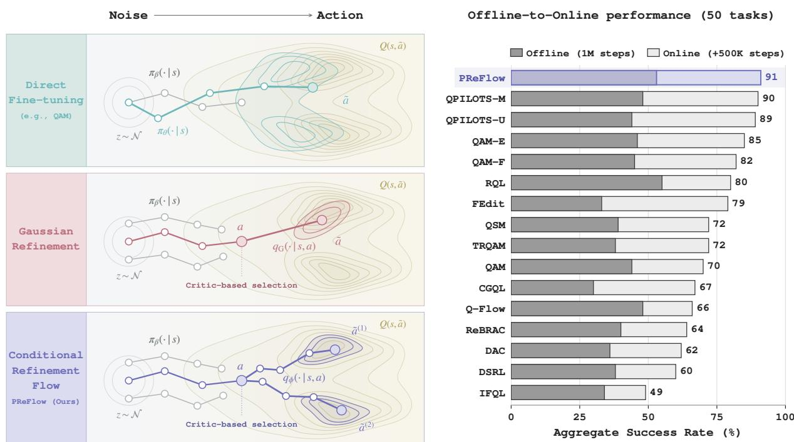

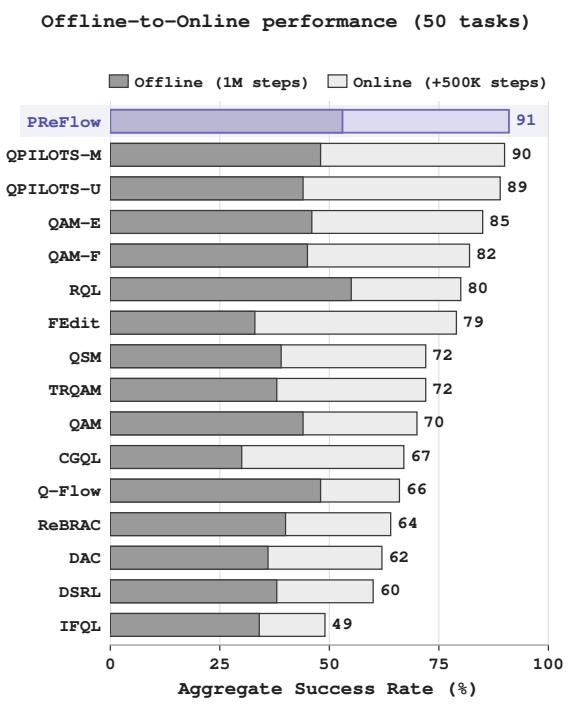  
Figure 1: PReFlow: proposal selection and stochastic refinement. A behavior flow generates proposals, the critic selects one, and a conditional flow refines it to produce final action $\tilde { \boldsymbol { a } } = \boldsymbol { a } + \Delta \boldsymbol { a }$ . The performance panel reports mean success rates across the 50 OGBench tasks (Table 1).

We evaluate PReFlow on 50 OGBench tasks (Park et al., 2025a), comparing it against a broad range of policy extraction methods for flow and difusion policies. PReFlow achieves the highest aggregate ofline-to-online performance among the compared methods while remaining competitive in ofline RL. Our controlled ablations further show gains from expressive flow refinement over Gaussian editing, improvements even with a single proposal, and additional benefits from proposal selection.

## 2. Preliminaries

We introduce the problem setting and the background underlying our conditional refinement method.

Behavior regularized policy extraction. We consider a Markov decision process (MDP) $\begin{array} { r l } { \mathcal { M } } & { { } = } \end{array}$ $( \cal S , A , P , \gamma , R , \mu )$ , where $s$ is the state space, $\mathcal { A } = \mathbb { R } ^ { A }$ is the action space, $P : \mathcal { S } \times \mathcal { A }  \Delta \mathcal { S }$ is the transition function, $\gamma \in [ 0 , 1 )$ is the discount factor, $R : { \mathcal { S } } \times \mathbb { R } ^ { A } \to$ R is the reward function, and $\mu \in \Delta \mathcal { S }$ is the initial state distribution. The goal of Ofline RL is to learn a policy $\pi _ { \theta } : S  \Delta \mathcal { A }$ that maximizes the expected discounted return $\begin{array} { r } { \mathbb { E } \big [ \sum _ { k = 0 } ^ { \infty } \gamma ^ { k } R ( s _ { k } , a _ { k } ) \big ] } \end{array}$ from a dataset $\mathcal { D } = \{ ( s _ { i } , a _ { i } , s _ { i } ^ { \prime } , r _ { i } ) \} _ { i = 1 } ^ { | \mathcal { D } | }$ collected by behavior policy $\pi _ { \beta }$ . Ofline-to-Online (O2O) RL further aims to fine-tune this policy with limited online interactions. Given a learnable critic $Q _ { \psi } : S \times \mathcal { A }  \mathbb { R }$ , we formulate policy extraction with KL regularization toward the behavior policy

$$
\operatorname* { m a x } _ { \pi } \mathbb { E } _ { { \tilde { a } } \sim \pi ( \cdot \vert s ) } \bigl [ Q _ { \psi } ( s , { \tilde { a } } ) \bigr ] - \frac { 1 } { \tau ( s ) } \mathrm { K L } ( \pi \| \pi _ { \beta } ) ,\tag{1}
$$

where $\tau ( s ) > 0$ controls the critic value relative to the KL penalty (Nair et al., 2020). Optimizing over action distributions gives the Gibbs policy, which favors actions with higher critic values

$$
\pi ^ { \star } ( { \tilde { a } } \mid s ) \propto \pi _ { \beta } ( { \tilde { a } } \mid s ) e ^ { \tau ( s ) Q _ { \psi } ( s , { \tilde { a } } ) } .\tag{2}
$$

Flow matching. To learn the reference $\pi _ { \beta }$ in (1), we fit a velocity field $f _ { \beta }$ to �. This velocity field transforms Gaussian noise into a behavior action through an ordinary diferential equation (ODE),

$$
\mathrm { d } X _ { t } = f _ { \beta } ( X _ { t } , t \mid s ) \mathrm { d } t , \quad X _ { 0 } \sim { \mathcal { N } } ( 0 , I _ { A } ) , \quad X _ { 1 } \sim \pi _ { \beta } ( \cdot \mid s ) .\tag{3}
$$

To train $f _ { \beta } ,$ , we pair a dataset action � at state � with Gaussian noise $x _ { 0 }$ and form the linear interpolation $x _ { t } = ( 1 - t ) x _ { 0 } + t a$ . Its velocity provides the regression target in the flow matching loss (Lipman et al., 2023; Liu et al., 2023; Albergo and Vanden-Eijnden, 2023)

$$
\begin{array} { r } { \mathcal { L } _ { \mathrm { F M } } ( \beta ) = \mathbb { E } _ { t \sim \mathcal { U } ( 0 , 1 ) , { x } _ { 0 } \sim \mathcal { N } , ( s , a ) \sim \mathcal { D } } \left[ \| f _ { \beta } ( x _ { t } , t \mid s ) - ( a - x _ { 0 } ) \| _ { 2 } ^ { 2 } \right] , } \end{array}\tag{4}
$$

Q-learning with adjoint matching. QAM (Li and Levine, 2026) learns a flow $f _ { \theta }$ to approximate the Gibbs policy (2). Using $f _ { \theta }$ as the ODE velocity in (3) defines the policy $\pi _ { \theta }$ and final action ${ \tilde { a } } ,$

$$
\tilde { a } = \mathrm { O D E } _ { f _ { \theta } } ( \varepsilon ; s ) \sim \pi _ { \theta } ( \cdot \mid s ) , \quad \varepsilon \sim \mathcal { N } ( 0 , I _ { A } ) .\tag{5}
$$

Here $\mathrm { O D E } _ { f } ( \varepsilon ; s )$ denotes the endpoint obtained by integrating the flow � from �. To train $f _ { \theta }$ , QAM uses adjoint matching (AM) (Domingo i Enrich et al., 2025), with $f _ { \beta }$ fixed as the reference during each policy update. To construct regression targets for this update, AM samples trajectories $\mathbf { X } = \{ X _ { t } \} _ { t \in [ 0 , 1 ] }$ from a stochastic diferential equation (SDE). For a fixed state �, the SDE uses the current flow $f _ { \theta }$ and the memoryless noise schedule $\sigma _ { t } = \sqrt { 2 ( 1 - t ) / t }$

$$
\mathrm { d } X _ { t } = \Bigl ( 2 f _ { \theta } ( X _ { t } , t \mid s ) - X _ { t } / t \Bigr ) \mathrm { d } t + \sigma _ { t } \mathrm { d } B _ { t } , \qquad X _ { 0 } \sim \mathcal { N } ( 0 , I _ { A } ) ,\tag{6}
$$

where $B _ { t }$ is standard Brownian motion. Along each trajectory, AM computes the lean adjoint $\lambda ( \mathbf { X } , t )$ by propagating the endpoint critic gradient backward using the Jacobian of the reference drift,

$$
\mathrm { d } \lambda ( \mathbf { X } , t ) = - \nabla _ { X _ { t } } \left[ 2 f _ { \beta } ( X _ { t } , t \mid s ) - X _ { t } / t \right] \lambda ( \mathbf { X } , t ) \mathrm { d } t , \quad \lambda ( \mathbf { X } , 1 ) = - \tau ( s ) \nabla _ { X _ { 1 } } Q _ { \psi } ( s , X _ { 1 } ) .\tag{7}
$$

The lean adjoint defines the velocity target $f _ { \beta } - \sigma _ { t } ^ { 2 } \lambda / 2$ for $f _ { \theta ; }$ , yielding the regression loss

$$
\mathcal { L } _ { \mathrm { A M } } ( \theta ) = \mathbb { E } _ { \mathbf { X } } \left[ \int _ { 0 } ^ { 1 } \Big \| 2 \big ( f _ { \theta } ( X _ { t } , t \mid s ) - f _ { \beta } ( X _ { t } , t \mid s ) \big ) / \sigma _ { t } + \sigma _ { t } \lambda ( \mathbf { X } , t ) \Big \| _ { 2 } ^ { 2 } \mathrm { d } t \right] .\tag{8}
$$

Because (7) depends on the Jacobian of $f _ { \beta }$ , constructing these targets involves a sequential backward pass of vector–Jacobian products along the entire sampled SDE trajectory.

## 3. Policy Improvement with Conditional Refinement Flows

In this section, we introduce PReFlow, which learns local value-guided refinements conditioned on proposals from the behavior policy. We motivate this formulation and develop a joint regularized objective for proposal selection and refinement. From this objective, we derive simulation-free adjoint matching targets to train the flow. Proofs and technical details are provided in Appendix A.

## 3.1. Towards Expressive Conditional Refinement

Behavior regularized flow policies. The goal of policy extraction (1) is to generate final actions from the Gibbs policy $\mathit { \Pi } ^ { \cdot \mathrm { ~ \Pi ~ } } \pi ^ { \star }$ in (2). QAM (Li and Levine, 2026) approximates this target by optimizing $f _ { \theta }$ with adjoint matching (8), so the learned policy directly generates $\tilde { a } \sim \pi _ { \theta } ( \cdot \mid s )$ . The KL penalty introduces the behaviordensity factor $\pi _ { \beta } ( \tilde { a } \mid s )$ into the Gibbs target. Low behavior density can therefore reduce the weight of high value actions even when they lie close to behavior actions. This motivates a conditional approach that regularizes action changes relative to each behavior proposal.

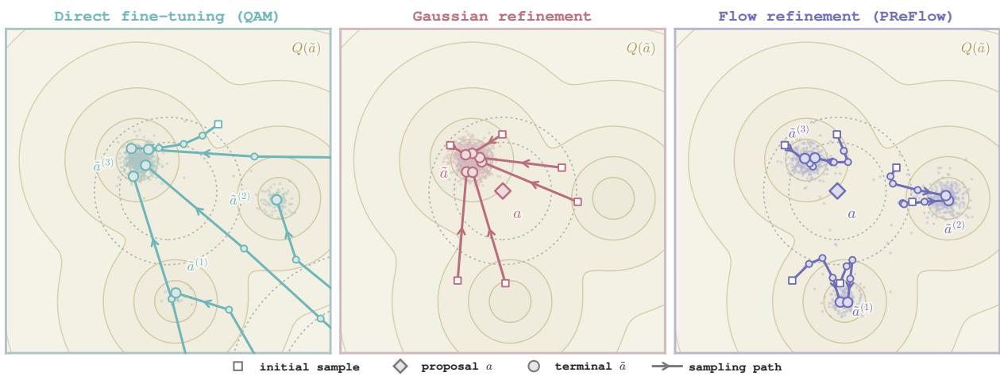  
Figure 2: Toy comparison of policy extraction methods. Fine-tuning the full flow (QAM) undercovers the two modes farther from the proposal, and Gaussian refinement concentrates on a single mode. PReFlow captures all three modes. Appendix D.4 provides details of the toy experiment.

Existing action editors. At state $s ,$ the behavior flow $f _ { \beta }$ trained with the flow matching loss (4) generates a proposal � by integrating the ODE (3). With � fixed, an action editor learns the conditional distribution $\pi ^ { \mathrm { r e f } } ( \cdot \mid s , a )$ of an additive refinement $\Delta a$ . The final action is generated in two stages,

$$
a \sim \pi _ { \beta } ( \cdot \mid s ) , \Delta a \sim \pi ^ { \mathrm { r e f } } ( \cdot \mid s , a ) , \tilde { a } = a + \Delta a .\tag{9}
$$

Because multiple distinct refinements of the same proposal can yield high critic values at a given state, the conditional policy can benefit from representing multiple modes.

For example, Gaussian-based editors have been proposed to model stochastic refinements (Dong et al., 2026a), while deterministic editors have been developed to map each state and proposal $( s , a )$ to a single refinement $( \mathrm { M u } ,$ 2026; Cheng et al., 2026). Both parameterizations might restrict the refinement distribution $\pi ^ { \mathrm { r e f } } ( \cdot | s , a )$ to be a single mode, limiting its flexibility in capturing distinct refinement modes. A multimodal refinement policy based on a conditional VAE has been proposed to address this limitation (Zhao et al., 2026), but its training combines weighted residual reconstruction with an additional latent self-imitation objective. To retain this expressiveness while simplifying training, we seek a conditional refinement policy learned with a single regression objective.

Proposal-conditioned refinement flows. To this end, we introduce PReFlow, which refines a behavior proposal $a \sim \pi _ { \beta } ( \cdot | s )$ using an expressive conditional flow. We train the refinement flow policy $\pi ^ { \mathrm { r e f } } ( \cdot | s , a )$ to maximize the expected critic value of the refined action $\tilde { \boldsymbol { a } } ,$ with KL regularization toward the Gaussian reference $\rho _ { \delta } = \mathcal { N } ( 0 , \delta ^ { 2 } I )$ , where $\delta > 0$ sets the reference refinement scale. Equivalently, the distribution of $\tilde { a } = a + \Delta a$ is regularized toward $\mathcal { N } ( a , \delta ^ { 2 } I )$ , therefore the proposal � serves as both an input to the conditional flow and the center of the regularization reference. This reference discourages large action changes without restricting $\pi ^ { \mathrm { r e f } }$ to a Gaussian family, allowing multiple high value refinements of the same proposal as depicted in Fig. 2.

The Gaussian reference also simplifies training by admitting a reference process with closed form intermediate-state distributions and lean adjoints (Domingo i Enrich et al., 2025; Shin et al., 2026). Given refinement endpoints sampled from the current flow, these expressions enable simulation-free construction of regression targets from Gaussian bridge samples and endpoint critic gradients. The resulting single regression objective requires neither a backward adjoint solve nor an additional residual-reconstruction loss. We formalize the conditional objective and use its optimal value to guide proposal selection in the next section, and then derive the regression objective in Section 3.3.

## 3.2. A Regularized Objective for Conditional Policy Improvement

Starting from policy extraction objective (1), we first derive a refinement objective for $\Delta a$ conditioned on a fixed behavior proposal � and then use its optimal value to guide proposal selection.

Conditional refinement objective. For state �, we sample a proposal $a \sim \pi _ { \beta } ( \cdot \mid s )$ from the behavior flow and hold it fixed during refinement. We optimize $\pi _ { a } ( \cdot \mid s )$ , the conditional distribution of the refined action $\tilde { a } = a + \Delta a$ . To regularize action changes relative to $^ { a , }$ we replace the behavior reference in (1) with $\mathcal { N } ( a , \delta ^ { 2 } I )$ , as motivated in Section 3.1. For $\tau = \tau ( s ) > 0$ , the objective is

$$
\mathbb { E } _ { \tilde { a } \sim \pi _ { a } ( \cdot | s ) } [ Q _ { \psi } ( s , \tilde { a } ) ] - \frac { 1 } { \tau } \mathrm { K L } \bigl ( \pi _ { a } ( \cdot | s ) \| \mathcal { N } ( a , \delta ^ { 2 } I ) \bigr ) .\tag{10}
$$

With proposal � fixed, writing $\Delta a = \tilde { a } - a$ gives $\pi _ { a } ( a + \Delta a \mid s ) = \pi ^ { \mathrm { r e f } } ( \Delta a \mid s , a )$ . Since the reference for �˜ is $\mathcal { N } ( a , \delta ^ { 2 } I )$ , the corresponding reference for ∆� is $\rho _ { \delta } = \mathcal { N } ( 0 , \delta ^ { 2 } I )$ . By the translation invariance of KL divergence, we can rewrite the refinement objective in (10) as

$$
\begin{array} { r } { \mathcal { I } _ { s , a } ( \pi ^ { \mathrm { r e f } } ) = \mathbb { E } _ { \Delta a \sim \pi ^ { \mathrm { r e f } } ( \cdot \vert s , a ) } [ Q _ { \psi } ( s , a + \Delta a ) ] - \frac { 1 } { \tau } \operatorname { K L } \left( \pi ^ { \mathrm { r e f } } ( \cdot \vert s , a ) \Vert \rho _ { \delta } \right) . } \end{array}\tag{11}
$$

Applying the Gibbs solution (2) to (11) gives

$$
\pi ^ { \mathrm { r e f } , \star } ( \Delta a \mid s , a ) \propto \exp \left( \tau Q _ { \psi } ( s , a + \Delta a ) - \frac { \| \Delta a \| ^ { 2 } } { 2 \delta ^ { 2 } } \right) .\tag{12}
$$

The target balances critic value against refinement magnitude without directly penalizing low behavior density.   
It can be multimodal despite its Gaussian reference when the critic favors distinct refinements.

To provide intuition for this optimality, we further define $Z ( s , a ) = \mathbb { E } _ { \Delta a \sim \rho _ { \delta } } [ e ^ { \tau Q _ { \psi } ( s , a + \Delta a ) } ]$ ], the partition function of the optimal refinement policy. Then, we can rewrite the objective (11) as

$$
\mathcal { T } _ { s , a } ( \pi ^ { \mathrm { r e f } } ) = \frac { 1 } { \tau } \log Z ( s , a ) - \frac { 1 } { \tau } \mathrm { K L } \big ( \pi ^ { \mathrm { r e f } } \parallel \pi ^ { \mathrm { r e f } , \star } \big ) .\tag{13}
$$

The first term is independent of $\pi ^ { \mathrm { r e f } }$ , and the KL divergence reaches its minimum at $\pi ^ { \mathrm { r e f } } = \pi ^ { \mathrm { r e f , \star } }$

Joint refinement and proposal selection. We have optimized $\pi ^ { \mathrm { r e f } }$ for a fixed proposal �. Since the optimal value of (11) depends on the proposal and balances critic value against the KL penalty, we now optimize proposal selection with refinement. We denote this optimal conditional value by

$$
V _ { \delta } ( s , a ) = \operatorname* { s u p } _ { \pi ^ { \mathrm { r e f } } } \mathcal T _ { s , a } ( \pi ^ { \mathrm { r e f } } ) = \frac { 1 } { \tau } \log Z ( s , a ) .\tag{14}
$$

Let $\pi ^ { \mathrm { b a s e } } ( \cdot \mid s )$ denote the distribution of selected proposals. To evaluate selection and refinement jointly, we average ${ \mathcal { I } } _ { s , a } ( \pi ^ { \mathrm { r e f } } )$ over $a \sim \pi ^ { \mathrm { b a s e } } ( \cdot \mid s )$ . Since proposals come from $\pi _ { \beta } .$ , we regularize $\pi ^ { \mathrm { b a s e } }$ toward it via KL penalty. Using the same coeficient $1 / \tau$ for both stages gives the joint objective

$$
\begin{array} { r } { \mathcal { I } _ { s } ( \pi ^ { \mathrm { b a s e } } , \pi ^ { \mathrm { r e f } } ) = \mathbb { E } _ { a \sim \pi ^ { \mathrm { b a s e } } ( \cdot \vert s ) } [ \mathcal { I } _ { s , a } ( \pi ^ { \mathrm { r e f } } ) ] - \frac { 1 } { \tau } \operatorname { K L } \bigl ( \pi ^ { \mathrm { b a s e } } ( \cdot \vert s ) \Vert \pi _ { \beta } ( \cdot \vert s ) \bigr ) . } \end{array}\tag{15}
$$

With optimal conditional refinement, the first term becomes $\mathbb { E } _ { a \sim \pi ^ { \mathrm { b a s e } } } [ V _ { \delta } ( s , a ) ]$ ]. Applying the same Gibbs solution with $V _ { \delta }$ in place of $Q _ { \psi }$ therefore gives the optimal proposal-selection policy

$$
\pi ^ { \mathrm { b a s e , } \star } ( a \mid s ) \propto \pi _ { \beta } ( a \mid s ) \exp ( \tau V _ { \delta } ( s , a ) ) = \pi _ { \beta } ( a \mid s ) Z ( s , a ) .\tag{16}
$$

This policy favors proposals according to their value after regularized refinement.

Optimal two-stage policy. We now relate this two-stage policy to the final action target in (2). Using the common coeficient $1 / \tau _ { \ast }$ , the KL chain rule combines the two penalties into a joint KL penalty relative to $\pi _ { \beta } ( \boldsymbol { a } \ | \ s ) \rho _ { \delta } ( \Delta \boldsymbol { a } )$ . This reference first draws a behavior proposal and then adds an independent Gaussian refinement. Its final action distribution is therefore $\begin{array} { r } { \pi _ { \beta , \delta } ( \tilde { a } \mid s ) = \int \pi _ { \beta } ( a \mid s ) \rho _ { \delta } ( \tilde { a } - a ) } \end{array}$ d�. This Gaussiansmoothed behavior prior averages Gaussian neighborhoods centered at behavior proposals. The joint optimum reweights the reference by $e ^ { \tau \tilde { Q } _ { \psi } ( s , \tilde { a } ) }$ . Since this weight depends only on the final action, integrating out the proposal gives the following result.

Proposition 3.1 (Final policy under proposal-relative refinement). Jointly optimizing (15) over all proposal selection and conditional refinement policies yields the final action policy

$$
\pi _ { \delta } ^ { \star } ( \tilde { a } \mid s ) \propto \bar { \pi } _ { \beta , \delta } ( \tilde { a } \mid s ) e ^ { \tau Q _ { \psi } ( s , \tilde { a } ) } .\tag{17}
$$

The two stages of proposal selection and refinement recover the Gibbs policy improvement rule with $\bar { \pi } _ { \beta , \delta }$ replacing $\pi _ { \beta }$ . Proposals originate from $\pi _ { \beta }$ , while $\delta$ controls the spread of their Gaussian neighborhoods. Nearby proposals can provide reference density to actions with low behavior density.

Practical proposal selection. Computing ${ \cal V } _ { \delta } ( s , a )$ requires integrating over possible refinements, whereas $Q _ { \psi } ( s , a )$ is available from a critic evaluation. For a suficiently smooth critic, the small-� expansion $V _ { \delta } ( s , a ) = Q _ { \psi } ( s , a ) + O ( \delta ^ { 2 } )$ motivates using the critic value as an approximation. For $K$ candidates $a _ { 1 : K } \sim \pi _ { \beta } ( \cdot \mid s )$ , replacing $V _ { \delta } ( s , a _ { i } )$ by $Q _ { \psi } ( s , a _ { i } )$ in (16) gives finite-temperature selection weights �� $\propto \exp ( \tau Q _ { \psi } ( s , a _ { i } ) )$ ). We instead use greedy selection as shown in Algorithm 1; Appendix E.3 provides comparison of two methods.

Algorithm 1 PReFlow: Action generation   
Input: $s , f _ { \beta } , v _ { \phi } , Q _ { \psi } , K , \delta .$   
$\varepsilon _ { 1 : K } ^ { \prime } \overset { \mathrm { i . i . d . } } { \sim } { \mathcal { N } } ( 0 , I )$   
$a _ { 1 : K } \gets \mathrm { O D E } _ { f _ { \beta } } ( \varepsilon _ { 1 : K } ^ { \prime } ; s )$ ◁ (3)   
$I \gets \arg \operatorname* { m a x } _ { i \in \{ 1 , . . . , K \} } Q _ { \psi } ( s , a _ { i } )$   
� ← ��   
�0 ∼ � (0, �)   
$y _ { 1 } \gets \mathrm { O D E } _ { v _ { \phi } } ( y _ { 0 } ; s , a )$ ◁ (19)   
Output: (�, �1).

## 3.3. Simulation-free Training of Flow Refinement

Conditional flow parameterization. To parameterize the refinement policy, we write $\Delta a = \delta y$ and $\tilde { \boldsymbol { a } } = \boldsymbol { a } + \delta \boldsymbol { y }$ Using the Gaussian reference $\rho = \mathcal { N } ( 0 , I )$ for $y ,$ we can rewrite (12) as

$$
q ^ { \star } ( y \mid s , a ) \propto \rho ( y ) \exp ( \tau Q _ { \psi } ( s , a + \delta y ) ) .\tag{18}
$$

We approximate this target with a conditional flow:

$$
\frac { \mathrm { d } Y _ { t } } { \mathrm { d } t } = v _ { \phi } ( Y _ { t } , t \mid s , a ) , \qquad Y _ { 0 } \sim { \mathcal N } ( 0 , I ) , \qquad Y _ { 1 } \sim q _ { \phi } ( \cdot \mid s , a ) .\tag{19}
$$

With the state and proposal fixed throughout the rollout, the endpoint yields the refinement $\Delta a = \delta Y _ { 1 }$

Simulation-free target construction. To train this flow, we construct regression targets using the stochastic optimal control (SOC) formulation of Adjoint Matching (Domingo i Enrich et al., 2025). QAM (Li and Levine, 2026) uses the pretrained behavior flow as its reference, so constructing targets requires the sequential backward solve of (7). Our objective instead regularizes the refinement toward the Gaussian reference $\rho ,$ while the behavior flow only generates proposals. We therefore use the memoryless linear Gaussian reference flow (Shin et al., 2026), whose velocity field is $v _ { 0 } ( y , t ) = ( 2 t - 1 ) y / d ( t )$ with $d ( t ) = t ^ { 2 } + ( 1 - t ) ^ { 2 }$ . Using $v _ { 0 }$ in place of $f _ { \theta }$ in the memoryless SDE (6) defines a Gaussian reference process for the normalized refinement $y ,$ with terminal distribution $\rho$ and closed form bridges for constructing the targets.

Algorithm 2 PReFlow: Flow Update   
Input: � $, f _ { \beta } , v _ { \phi } , Q _ { \psi } , \delta , \tau$   
Generate endpoints   
Sample a replay state $s \sim \mathcal { D } .$   
(�, �1) ← Algorithm $1 , K = 1 .$   
$( a , y _ { 1 } ) \gets \mathrm { s g } [ ( a , y _ { 1 } ) ]$ ◁ sg: stop-gradient   
Construct the velocity target   
$t \sim \mathcal { U } ( 0 , 1 ) , \varepsilon \sim \mathcal { N } ( 0 , I )$   
Compute �� using (20).   
$\tilde { a } _ { 1 }  a + \delta y _ { 1 }$   
Compute $v ^ { \mathrm { t g t } }$ using (21).   
Update the refinement flow   
Update � by minimizing (22).   
Output: $v _ { \phi }$

Since the conditional target is independent of the proposal- Since the conditional target is independent of the proposalselection rule, we draw proposals directly from $\pi _ { \beta }$ . Following Adjoint Sampling (Havens et al., 2025), we generate an endpoint $y _ { 1 } \sim q _ { \phi } ( \cdot \mid s , a )$ with a forward flow rollout and define the refined action as $\tilde { a } _ { 1 } = a + \delta y _ { 1 }$ We then draw $t \sim \mathcal { U } ( 0 , 1 )$ and directly sample the intermediate state from the reference process conditioned on $y _ { 1 }$ as

$$
y _ { t } = t y _ { 1 } + ( 1 - t ) \varepsilon , \qquad \varepsilon \sim \mathcal { N } ( 0 , I ) .\tag{20}
$$

Proposition 3.2 (Simulation-free refinement velocity target). For an endpoint $y _ { 1 }$ and a bridge sample $y _ { t }$ from (20), the adjoint matching velocity target for the Gaussian reference above is

$$
v ^ { \mathrm { t g t } } ( y _ { t } , y _ { 1 } , t \mid s , a ) = \frac { 2 t - 1 } { d ( t ) } y _ { t } + \frac { \tau \delta ( 1 - t ) } { d ( t ) } \nabla _ { \tilde { a } } Q _ { \psi } ( s , \tilde { a } _ { 1 } ) .\tag{21}
$$

With $v _ { \phi }$ and $v _ { 0 }$ replacing $f _ { \theta }$ and $f _ { \beta }$ , the integrand in (8) becomes $\frac { 4 } { \sigma _ { \phi } ^ { 2 } } \lVert v _ { \phi } - v ^ { \mathrm { t g t } } \rVert _ { 2 } ^ { 2 }$ . Following RAM (Bergmeister et al., 2026), we omit this time weight and use unweighted regression on the bridge samples, holding sampled endpoints and targets fixed during the update.

$$
\begin{array} { r } { \mathcal { L } _ { \mathrm { a c t o r } } ( \phi ) = \mathbb { E } _ { s \sim \mathcal { D } , \ a \sim \pi _ { \beta } ( \cdot \vert s ) , \ y _ { 1 } \sim q _ { \phi } ( \cdot \vert s , a ) } \Bigl [ \big \| v _ { \phi } ( y _ { t } , t \vert s , a ) - \mathrm { s g } [ v ^ { \mathrm { t g t } } ] \big \| _ { 2 } ^ { 2 } \Bigr ] , } \\ { \quad t \sim \mathcal { U } ( 0 , 1 ) , \varepsilon \sim \mathcal { N } ( 0 , I ) \qquad } \end{array}\tag{22}
$$

Algorithm 2 summarizes the refinement flow update. The full training algorithm, including critic and behavior flow updates, is provided in Algorithm 3 in Appendix C.3.

## 4. Related Work

Policy extraction with difusion and flow policies. Difusion and flow policies incorporate critic information through end-to-end gradients (Wang et al., 2023), value-weighted fitting (Zhang et al., 2025), score or noiseregression objectives (Psenka et al., 2024; Fang et al., 2025), and energy guidance (Lu et al., 2023; Alles et al., 2025). FQL (Park et al., 2025b) regularizes a separate noise-conditioned one-step actor toward a flow behavior model, while Q-Flow and RQL (Doo et al., 2026; Oberai et al., 2026) learn values over intermediate generative states. QPILOTS and QGF apply critic-gradient guidance during sampling (Ruan et al., 2026; Zhou et al., 2026). PReFlow instead trains its conditional refinement flow with endpoint critic gradients. At inference, critic values guide selection among behavior proposals, while refinement requires no critic-gradient evaluations.

Behavior proposals and conditional action refinement. Selection among behavior proposals (Ghasemipour et al., 2021; Hansen-Estruch et al., 2023; Lin et al., 2026) can be combined with local improvement (Fujimoto et al., 2019; Mark et al., 2024; Dong et al., 2026a). Residual policies learn additive modifications to basepolicy actions (Silver et al., 2018; Johannink et al., 2019; Yuan et al., 2025). EXPO and QAM-E use Gaussian editors (Dong et al., 2026a; Li and Levine, 2026), whereas DeFlow and Fisher Decorator learn deterministic refinements (Mu, 2026; Cheng et al., 2026). SPAR (Zhao et al., 2026) learns multimodal residuals through a conditional VAE and latent self-imitation, and evaluates flow-based variants. FLAG (Kim et al., 2026) uses local Gaussian policies around flow-generated anchors to supervise policy improvement. PReFlow trains a conditional refinement flow with adjoint matching under proposal-centered KL regularization.

## 5. Experiments

We evaluate PReFlow in ofline and ofline-to-online reinforcement learning and examine the efects of refinement policy design, along with computational cost and hyperparameter sensitivity. Detailed experimental settings and hyperparameter settings are provided in Appendix D.

Domains and datasets. We evaluate PReFlow on a total of 50 tasks from the OGBench single-task suite (Park et al., 2025a), spanning antmaze, humanoidmaze, scene, puzzle, and cube domains. We follow QAM’s advanced ten domain variants and reward configurations (Li and Levine, 2026).

<table><tr><td rowspan=1 colspan=21>al       ag       hm      h1     scene    p33     p44      c2       c3       c4      all</td></tr><tr><td rowspan=1 colspan=21>Method        5 tasks     5 tasks     5 tasks     5 tasks     5 tasks     5 tasks     5 tasks     5 tasks     5 tasks     5 tasks    50 tasks</td></tr><tr><td rowspan=1 colspan=21>Gaussian</td></tr><tr><td rowspan=1 colspan=6>[94,95] [97,98]  [53,60][69,79]</td><td rowspan=1 colspan=4>[65,74][52,63]</td><td rowspan=1 colspan=3>[15,19] [18,28]  [61,69] [</td><td rowspan=1 colspan=1>98,99]</td><td rowspan=1 colspan=1>[73,84] [100,100]</td><td rowspan=1 colspan=2>[0,0] [0,0]</td><td rowspan=1 colspan=2>[8,10] [96,98]  [0,1][9,20]</td><td rowspan=1 colspan=1>[6,11] [79,80]</td><td rowspan=1 colspan=1>[39,41] [63,65]</td></tr><tr><td rowspan=1 colspan=4>ReBRAC      9498</td><td rowspan=1 colspan=2>57→75</td><td rowspan=1 colspan=4>69→58</td><td rowspan=1 colspan=3>17→23   65→</td><td rowspan=1 colspan=1>99</td><td rowspan=1 colspan=1>79100</td><td rowspan=1 colspan=2>0→0</td><td rowspan=1 colspan=1>997</td><td rowspan=1 colspan=1>1→14</td><td rowspan=1 colspan=1>980</td><td rowspan=1 colspan=1>40→64</td></tr><tr><td rowspan=4 colspan=4>Guidance[88,92] [91,96]</td><td rowspan=4 colspan=2>[19,29] [83,91]</td><td rowspan=4 colspan=3>[79,84][78,81]</td><td rowspan=4 colspan=1></td><td rowspan=4 colspan=2>[5,7] [1,3]</td><td rowspan=1 colspan=1></td><td rowspan=1 colspan=1></td><td rowspan=1 colspan=1></td><td rowspan=1 colspan=2></td><td rowspan=1 colspan=1></td><td rowspan=1 colspan=1></td><td></td><td></td></tr><tr><td></td><td></td><td></td><td rowspan=3 colspan=2>[0,0][94,100]</td><td rowspan=3 colspan=1>[31,34][98,99]</td><td></td><td></td><td></td></tr><tr><td></td><td></td><td></td><td></td><td rowspan=2 colspan=1>[18,19] [62,71]</td><td rowspan=2 colspan=1>[38,40] [71,73]</td></tr><tr><td rowspan=1 colspan=1>[77,80] [</td><td rowspan=1 colspan=1>81,83]</td><td rowspan=1 colspan=1>[52,63] [82,90]</td><td rowspan=1 colspan=1>[5,6][25,28]</td></tr><tr><td rowspan=1 colspan=3>QSM          90→94</td><td rowspan=1 colspan=1></td><td rowspan=1 colspan=5>24→87   82→80</td><td></td><td rowspan=1 colspan=2>6→2</td><td rowspan=1 colspan=2>78→82</td><td rowspan=1 colspan=1>57→86</td><td rowspan=1 colspan=2>0→98</td><td rowspan=1 colspan=1>33→98</td><td rowspan=1 colspan=1>6→27</td><td rowspan=1 colspan=1>19→67</td><td rowspan=1 colspan=1>39→72</td></tr><tr><td rowspan=1 colspan=3>QPILOTS-U   82→96[74,88][93,98]</td><td rowspan=1 colspan=1></td><td rowspan=1 colspan=2>1→89[0,14][85,95]</td><td rowspan=1 colspan=3>6399[64,75][98,100]</td><td></td><td rowspan=1 colspan=2>8→59[6,16][38,70]</td><td rowspan=1 colspan=1>899[91,98] [</td><td rowspan=1 colspan=1>897,100]</td><td rowspan=1 colspan=1>100→100[99,100] [100,100]</td><td rowspan=1 colspan=2>16100[2,27] [100,100]</td><td rowspan=1 colspan=1>75→100[70,81][99,100]</td><td rowspan=1 colspan=1>7→69[5,9][67,75]</td><td rowspan=1 colspan=1>3→78[3,20][78,80]</td><td rowspan=1 colspan=1>44→89[46,50] [87,91]</td></tr><tr><td rowspan=1 colspan=3>QPILOTS-M   82→97</td><td rowspan=1 colspan=1></td><td rowspan=1 colspan=2>10→90</td><td rowspan=1 colspan=3>71→99</td><td rowspan=1 colspan=3>12→60</td><td rowspan=1 colspan=1>95→</td><td rowspan=1 colspan=1>99</td><td rowspan=1 colspan=1>100→100</td><td rowspan=1 colspan=2>17→100</td><td rowspan=1 colspan=1>75→100</td><td rowspan=1 colspan=1>7→72</td><td rowspan=1 colspan=1>10→79</td><td rowspan=1 colspan=1>48→90</td></tr><tr><td rowspan=2 colspan=3>Post-processing[56,66][88,91]</td><td rowspan=1 colspan=1></td><td rowspan=1 colspan=2></td><td rowspan=1 colspan=3></td><td rowspan=1 colspan=1></td><td rowspan=1 colspan=2></td><td rowspan=1 colspan=1></td><td rowspan=1 colspan=1></td><td rowspan=1 colspan=1></td><td rowspan=1 colspan=2></td><td rowspan=1 colspan=1></td><td rowspan=1 colspan=1></td><td rowspan=1 colspan=1></td><td rowspan=1 colspan=1></td></tr><tr><td rowspan=1 colspan=1></td><td rowspan=1 colspan=2>[1,4][36,45]</td><td rowspan=1 colspan=3>[48,58][71,82]</td><td rowspan=1 colspan=1></td><td rowspan=1 colspan=2>[2,5][22,36]</td><td rowspan=1 colspan=1>[99,100] [</td><td rowspan=1 colspan=1>100,100]</td><td rowspan=1 colspan=1>[82,92][78,95]</td><td rowspan=1 colspan=2>[0,0] [0,0]</td><td rowspan=1 colspan=1>[72,76][99,99]</td><td rowspan=1 colspan=1>[1,2] [0,0]</td><td rowspan=1 colspan=1>[2,3][77,78]</td><td rowspan=1 colspan=1>[38,39] [59,61]</td></tr><tr><td rowspan=1 colspan=3>DSRL         61→90</td><td rowspan=1 colspan=1></td><td rowspan=1 colspan=2>340</td><td rowspan=1 colspan=3>53→77</td><td rowspan=1 colspan=1></td><td rowspan=1 colspan=2>3→29</td><td rowspan=1 colspan=1>99→</td><td rowspan=1 colspan=1>100</td><td rowspan=1 colspan=1>87→87</td><td rowspan=1 colspan=2>0→0</td><td rowspan=1 colspan=1>74→99</td><td rowspan=1 colspan=1>1→0</td><td rowspan=1 colspan=1>2→78</td><td rowspan=1 colspan=1>38→60</td></tr><tr><td rowspan=1 colspan=3>[54,62] [95,96]</td><td rowspan=1 colspan=1></td><td rowspan=1 colspan=2>[1,3] [83,90]</td><td rowspan=1 colspan=3>[20,23][72,88]</td><td rowspan=1 colspan=1></td><td rowspan=1 colspan=2>[2,3][5,11]</td><td rowspan=1 colspan=1>[60,65]</td><td rowspan=1 colspan=1>[98,99]</td><td rowspan=1 colspan=1>[98,100] [100,100]</td><td rowspan=1 colspan=2>[30,37] [100,100]</td><td rowspan=1 colspan=1>[37,43] [100,100]</td><td rowspan=1 colspan=1>[2,3][34,45]</td><td rowspan=1 colspan=1>[3,7][79,80]</td><td rowspan=1 colspan=1>[32,33] [78,80]</td></tr><tr><td rowspan=1 colspan=3>FEdit        58→96</td><td rowspan=1 colspan=3>286</td><td rowspan=1 colspan=3>22→80</td><td rowspan=1 colspan=1></td><td rowspan=1 colspan=2>3→8</td><td rowspan=1 colspan=1>62→</td><td rowspan=1 colspan=1>99</td><td rowspan=1 colspan=1>99100</td><td rowspan=1 colspan=2>34100</td><td rowspan=1 colspan=1>40100</td><td rowspan=1 colspan=1>240</td><td rowspan=1 colspan=1>580</td><td rowspan=1 colspan=1>33→79</td></tr><tr><td rowspan=1 colspan=3>[32,39] [71,81]</td><td rowspan=1 colspan=3>[0,2][16,18]</td><td rowspan=1 colspan=1>[</td><td rowspan=1 colspan=2>85,87][47,56]</td><td rowspan=1 colspan=1></td><td rowspan=1 colspan=2>[21,27][5,9]</td><td rowspan=1 colspan=1>[83,85]</td><td rowspan=1 colspan=1>[96,97]</td><td rowspan=1 colspan=1>[100,100] [99,100]</td><td rowspan=1 colspan=2>[0,0] [0,0]</td><td rowspan=1 colspan=1>[10,12][79,80]</td><td rowspan=1 colspan=1>[0,0] [0,0]</td><td rowspan=1 colspan=1>[1,3][58,63]</td><td rowspan=1 colspan=1>[34,35] [48,50]</td></tr><tr><td rowspan=1 colspan=3>IFQL         36→76</td><td rowspan=1 colspan=3>1→17</td><td rowspan=1 colspan=1></td><td rowspan=1 colspan=2>8651</td><td rowspan=1 colspan=1></td><td rowspan=1 colspan=3>24→7    849</td><td rowspan=1 colspan=1>6</td><td rowspan=1 colspan=1>100→100</td><td rowspan=1 colspan=2>0→0</td><td rowspan=1 colspan=1>11→79</td><td rowspan=1 colspan=1>0→0</td><td rowspan=1 colspan=1>2→61</td><td rowspan=1 colspan=1>34→49</td></tr><tr><td rowspan=1 colspan=2>Intermediate-valu</td><td rowspan=1 colspan=1>e le</td><td rowspan=1 colspan=3>arning</td><td rowspan=1 colspan=1></td><td rowspan=1 colspan=2></td><td rowspan=1 colspan=1></td><td rowspan=1 colspan=2></td><td rowspan=1 colspan=1></td><td rowspan=1 colspan=1></td><td rowspan=1 colspan=1></td><td rowspan=1 colspan=2></td><td rowspan=1 colspan=1></td><td rowspan=1 colspan=1></td><td rowspan=1 colspan=1></td><td rowspan=1 colspan=1></td></tr><tr><td rowspan=1 colspan=2>[94,96]</td><td rowspan=1 colspan=1>[97,99]</td><td rowspan=1 colspan=3>[32,39][51,58]</td><td rowspan=1 colspan=1>[</td><td rowspan=1 colspan=2>86,89][95,96]</td><td rowspan=1 colspan=1></td><td rowspan=1 colspan=2>[7,10][9,12]</td><td rowspan=1 colspan=1>[96,98] [</td><td rowspan=1 colspan=1>99,100]</td><td rowspan=1 colspan=1>[100,100] [100,100]</td><td rowspan=1 colspan=2>[0,1] [0,1]</td><td rowspan=1 colspan=1>[34,39] [99,100]</td><td rowspan=1 colspan=1>[2,4][17,34]</td><td rowspan=1 colspan=1>[11,19] [80,80]</td><td rowspan=1 colspan=1>[47,48] [65,67]</td></tr><tr><td rowspan=1 colspan=2>Q-Flow      95</td><td rowspan=1 colspan=1>98</td><td rowspan=1 colspan=1></td><td rowspan=1 colspan=2>36→54</td><td rowspan=1 colspan=1></td><td rowspan=1 colspan=2>87→96</td><td rowspan=1 colspan=1></td><td rowspan=1 colspan=2>8→10</td><td rowspan=1 colspan=1>97→</td><td rowspan=1 colspan=1>99</td><td rowspan=1 colspan=1>100→100</td><td rowspan=1 colspan=2>0→0</td><td rowspan=1 colspan=1>37→99</td><td rowspan=1 colspan=1>3→25</td><td rowspan=1 colspan=1>1580</td><td rowspan=1 colspan=1>48→66</td></tr><tr><td rowspan=2 colspan=1>RQL</td><td></td><td></td><td></td><td></td><td></td><td></td><td></td><td></td><td></td><td></td><td></td><td></td><td></td><td></td><td></td><td></td><td></td><td></td><td></td><td></td></tr><tr><td rowspan=1 colspan=1>82→</td><td rowspan=1 colspan=1>90</td><td rowspan=1 colspan=1></td><td rowspan=1 colspan=2>41→58</td><td rowspan=1 colspan=1></td><td rowspan=1 colspan=2>96→99</td><td rowspan=1 colspan=1></td><td rowspan=1 colspan=2>40→51</td><td rowspan=1 colspan=1>87→</td><td rowspan=1 colspan=1>98</td><td rowspan=1 colspan=1>100→100</td><td rowspan=1 colspan=2>32100</td><td rowspan=1 colspan=1>18→91</td><td rowspan=1 colspan=1>3→38</td><td rowspan=1 colspan=1>4980</td><td rowspan=1 colspan=1>55→80</td></tr><tr><td rowspan=1 colspan=1>Adjoint</td><td rowspan=1 colspan=1>matching</td><td rowspan=1 colspan=1></td><td rowspan=1 colspan=1></td><td rowspan=1 colspan=1>[14,22]</td><td rowspan=1 colspan=1></td><td rowspan=1 colspan=1></td><td rowspan=1 colspan=1></td><td rowspan=1 colspan=1></td><td rowspan=1 colspan=1></td><td rowspan=1 colspan=1>[9,14][17,24]</td><td rowspan=1 colspan=1></td><td rowspan=1 colspan=1></td><td rowspan=1 colspan=1></td><td rowspan=1 colspan=1></td><td rowspan=1 colspan=1>[0,0]</td><td rowspan=1 colspan=1>[0,8]</td><td rowspan=1 colspan=1>[62,66] [100,100]</td><td rowspan=1 colspan=1>[3,4][64,76]</td><td rowspan=1 colspan=1>[2,4][67,74]</td><td rowspan=1 colspan=1>[44,45] [69,71]</td></tr><tr><td rowspan=1 colspan=1>QAM</td><td rowspan=1 colspan=1>81→</td><td rowspan=1 colspan=1>98</td><td rowspan=1 colspan=1></td><td rowspan=1 colspan=1>18→</td><td rowspan=1 colspan=2>53</td><td rowspan=1 colspan=1>67→</td><td rowspan=1 colspan=1>83</td><td rowspan=1 colspan=1></td><td rowspan=1 colspan=2>11→21</td><td rowspan=1 colspan=1>97→</td><td rowspan=1 colspan=1>100</td><td rowspan=1 colspan=1>100→100</td><td rowspan=1 colspan=2>03</td><td rowspan=1 colspan=1>64100</td><td rowspan=1 colspan=1>3→70</td><td rowspan=1 colspan=1>3→71</td><td rowspan=1 colspan=1>44→70</td></tr><tr><td rowspan=2 colspan=1>QAM-F</td><td></td><td></td><td></td><td></td><td></td><td></td><td></td><td></td><td></td><td></td><td></td><td></td><td></td><td></td><td></td><td></td><td></td><td></td><td></td><td></td></tr><tr><td rowspan=1 colspan=1>83→</td><td rowspan=1 colspan=1>93</td><td rowspan=1 colspan=1></td><td rowspan=1 colspan=1>12→</td><td rowspan=1 colspan=2>72</td><td rowspan=1 colspan=1>65→</td><td rowspan=1 colspan=1>85</td><td rowspan=1 colspan=1></td><td rowspan=1 colspan=2>12→20</td><td rowspan=1 colspan=1>951</td><td rowspan=1 colspan=1>00</td><td rowspan=1 colspan=1>99100</td><td rowspan=1 colspan=2>6100</td><td rowspan=1 colspan=1>65100</td><td rowspan=1 colspan=1>3→68</td><td rowspan=1 colspan=1>14→79</td><td rowspan=1 colspan=1>45→82</td></tr><tr><td rowspan=2 colspan=1>QAM-E</td><td></td><td></td><td></td><td></td><td></td><td></td><td></td><td></td><td></td><td></td><td></td><td></td><td></td><td></td><td></td><td></td><td></td><td rowspan=1 colspan=1>[4,6] [79,79]</td><td rowspan=1 colspan=1>[4,9][79,80]</td><td rowspan=1 colspan=1>[45,47] [84,86]</td></tr><tr><td rowspan=1 colspan=1>83→</td><td rowspan=1 colspan=1>96</td><td rowspan=1 colspan=1></td><td rowspan=1 colspan=1>19</td><td rowspan=1 colspan=2>5</td><td rowspan=1 colspan=1>59→</td><td rowspan=1 colspan=1>83</td><td rowspan=1 colspan=1></td><td rowspan=1 colspan=2>2→16</td><td rowspan=1 colspan=1>971</td><td rowspan=1 colspan=1>00</td><td rowspan=1 colspan=1>100→100</td><td rowspan=1 colspan=1>39→</td><td rowspan=1 colspan=1>99</td><td rowspan=1 colspan=1>65100</td><td rowspan=1 colspan=1>579</td><td rowspan=1 colspan=1>6→79</td><td rowspan=1 colspan=1>4685</td></tr><tr><td></td><td></td><td></td><td></td><td></td><td rowspan=2 colspan=4>TRQAM</td><td></td><td></td><td></td><td></td><td></td><td></td><td></td><td rowspan=1 colspan=1>[0,0]</td><td rowspan=1 colspan=1>[73,76][100,100]</td><td rowspan=1 colspan=1>[4,6][73,78]</td><td rowspan=1 colspan=1>[2,5][76,77]</td><td rowspan=1 colspan=1>[37,39][72,73]</td></tr><tr><td></td><td rowspan=1 colspan=1>82→</td><td rowspan=1 colspan=1>97</td><td rowspan=1 colspan=4>14→92</td><td rowspan=1 colspan=2>28→76</td><td rowspan=1 colspan=1></td><td rowspan=1 colspan=2>2→7</td><td rowspan=1 colspan=1>72→</td><td rowspan=1 colspan=1>99</td><td rowspan=1 colspan=1>100→100</td><td rowspan=1 colspan=2>00</td><td rowspan=1 colspan=1>75→100</td><td rowspan=1 colspan=2>5→76    3→76</td><td rowspan=1 colspan=1>38→72</td></tr><tr><td rowspan=2 colspan=1>Ours</td><td rowspan=1 colspan=1></td><td rowspan=1 colspan=1></td><td rowspan=1 colspan=2></td><td rowspan=1 colspan=2></td><td rowspan=1 colspan=1></td><td rowspan=1 colspan=1></td><td rowspan=1 colspan=1></td><td rowspan=1 colspan=2></td><td rowspan=1 colspan=1></td><td rowspan=1 colspan=1></td><td rowspan=1 colspan=1></td><td rowspan=1 colspan=1></td><td rowspan=1 colspan=1></td><td rowspan=1 colspan=1></td><td rowspan=1 colspan=2></td><td rowspan=1 colspan=1></td></tr><tr><td rowspan=1 colspan=1>[79,85]</td><td rowspan=1 colspan=1>[98,99]</td><td rowspan=1 colspan=2>[8,15][9</td><td rowspan=1 colspan=2>1,97]</td><td rowspan=1 colspan=1>[60,69][</td><td rowspan=1 colspan=1>91,99]</td><td rowspan=1 colspan=1></td><td rowspan=1 colspan=2>[20,28][58,72]</td><td rowspan=1 colspan=1>[96,97]</td><td rowspan=1 colspan=1>[98,99]</td><td rowspan=1 colspan=1>[100,100] [100,100]</td><td rowspan=1 colspan=1>[58,74] [1</td><td rowspan=1 colspan=1>00,100]</td><td rowspan=1 colspan=1>[56,62] [100,100]</td><td rowspan=1 colspan=2>[5,8][74,77] [12,17][80,80]</td><td rowspan=1 colspan=1>[51,54] [90,92]</td></tr><tr><td rowspan=1 colspan=14>PReFlow     8298   12→94   65→95   2465   97→99</td><td rowspan=1 colspan=1>100→100</td><td rowspan=1 colspan=2>66100</td><td rowspan=1 colspan=4>59100  7→75   15→80   5391</td></tr></table>

Table 1: OGBench: ofline → online success rates (%). Each cell shows end-of-ofline (left) and end-of-online (right) success rates with 95% CIs over seeds in small gray brackets. Best results per domain are highlighted. Per-task results are in Appendix E.6.

Baselines. We compare with the policy extraction baselines originally evaluated by Li and Levine (2026): Gaussian policy (ReBRAC (Tarasov et al., 2023)), critic-guided method (QSM (Psenka et al., 2024)), postprocessing methods (DSRL, FEdit, and IFQL (Wagenmaker et al., 2025; Li and Levine, 2026)), and adjoint matching methods (QAM, QAM-F, and QAM-E (Li and Levine, 2026)). We also compare with more recent policy extraction methods for flow policies, QPILOTS-M/U (Ruan et al., 2026), Q-Flow (Doo et al., 2026), RQL (Oberai et al., 2026), and TRQAM (Dong et al., 2026b).

## 5.1. Ofline and Ofline-to-Online Performance

Following the QAM protocol (Li and Levine, 2026), we train for 1M ofline gradient steps and fine-tune for 500K online environment steps. We report success rates at the end of each phase. Domain scores average five tasks, and the overall score averages all 50 tasks. We use eight seeds per task for PReFlow and the reproduced baselines. Task-level results and learning curves are in Appendix E.6.

Table 1 reports ofline and ofline-to-online performance. PReFlow achieves an aggregate ofline score of 53, competitive with RQL and above all evaluated adjoint matching and test-time steering baselines. On p44, it exceeds the strongest baseline by about 27 percentage points. PReFlow also outperforms FEdit and IFQL, which use Gaussian editing and selection among behavior samples.

After 500K online environment steps, PReFlow reaches an aggregate score of 91, the highest mean among the compared methods. Figure 3 shows that PReFlow outperforms RQL and Q-Flow after fine-tuning on ag,hl, and c3 despite relatively low ofline scores. Unlike intermediate value learning methods like RQL and Q-Flow, PReFlow trains its refinement flow directly from critic gradients at the final action. This may help the refiner respond more directly to critic updates from online data, while critic-based proposal selection allows PReFlow to further benefit from these updates.

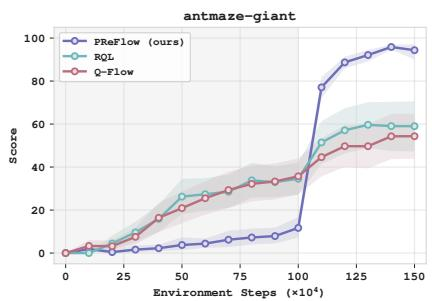

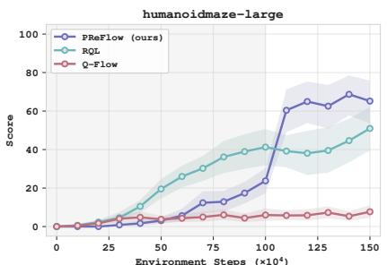

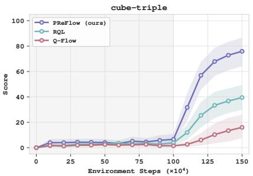  
Figure 3: Learning curves during online fine-tuning. PReFlow, RQL, and Q-Flow are fine-tuned for 0.5M online environment steps after 1M ofline gradient steps. Curves show means over three seeds; shaded regions show pointwise 95% confidence intervals.

## 5.2. Expressiveness and Eficiency of Conditional Refinement Flow

Refinement policy class on OGBench. We compare no refinement, a learned Gaussian, and PReFlow on four OGBench domains: al, hm, scene, and c2. We use a single proposal, and set $\delta = 0 . 1$ for refinement scale. Both Gaussian and flow refinement policies are trained under the conditional objective in (11). Table 2 shows that both refiners substantially improve over the base policy. The flow achieves higher mean scores than the Gaussian across all four domains, supporting the benefits of expressive conditional refinement.

Computational cost. We next examine the computational cost of learning the flow refinement policy. Figure 4 compares the wall-clock time per full training update with QAM, QAM-E, QPILOTS-U, and QPILOTS-M on GPU, averaged over five flow-step counts: 5, 10, 20, 50, and 100. PReFlow has the lowest mean update time among the compared methods. Its regression target is constructed in closed form without any backward simulation, whereas QAM requires sequential backward adjoint propagation. QPILOTS requires per-step steering with additional estimators to sample actions.

## 5.3. Efect of Proposal Selection

<table><tr><td></td><td></td><td colspan="2">Refinement  $\mathrm { T y p e }$ </td></tr><tr><td></td><td></td><td>Domain Base Gaussian</td><td>Flow</td></tr><tr><td>al</td><td> $2 . 3 { \pm } 0 . 8$ </td><td> $7 6 . 3 { \pm } 7 . 2$ </td><td> $7 9 . 0 { \pm } 7 . 5 $ </td></tr><tr><td>hm</td><td> $2 . 7 \pm 1 . 0$ </td><td> $5 7 . 1 \pm 8 . 5$ </td><td> $6 9 . 2 { \pm } 1 . 2 $ </td></tr><tr><td>scene</td><td> $3 . 9 \pm 1 . 5$ </td><td> $6 8 . 1 \pm 3 . 2 $ </td><td> $7 3 . 1 { \pm } 0 . 8 $ </td></tr><tr><td>c2</td><td> $2 . 0 \pm 0 . 0$ </td><td> $4 0 . 8 \pm 5 . 2$ </td><td> $5 3 . 9 { \pm 3 . 3 }$ </td></tr></table>

Table 2: Ofline success rates (%) after 1M steps with $K = 1$  
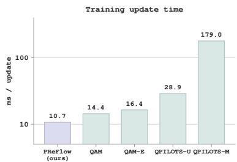  
Figure 4: Mean wall-clock time per full training update.

The policy-class comparison above fixes $K = 1$ . We now vary $K \in \{ 1 , 2 , 4 , 8 \}$ while retaining learned refinement in every setting. For $K > 1 _ { : }$ , PReFlow selects the behavior proposal with the highest critic value before refinement, while $K = 1$ directly refines a single sampled proposal.

Figure 5 presents results on c2, scene, and hm. Overall, proposal selection complements learned refinement, with gains in ofline performance and final online success rates already evident with $K = 2$ . Full results for all ten OGBench domains are provided in Appendix E.3. We further compare proposal selection with and without refinement in Appendix E.4, showing selection alone improves over the behavior policy but remains far below refinement even with a single proposal.

## 5.4. Sensitivity to Refinement Scale and Inverse Temperature

We study how the refinement scale � and inverse temperature � afect PReFlow’s performance. As shown in Figure 6, we find that performance varies with both � and �. Under a local linear approximation, the conditional target induces an action refinement with mean $\tau \delta ^ { 2 } \nabla _ { a } Q ( s , a )$ and covariance $\bar { \delta ^ { 2 } } I$ . Both � and $\tau$ therefore control the efective refinement strength.

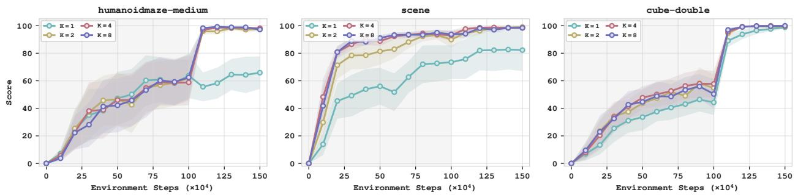  
Figure 5: Efect of proposal selection. PReFlow with $K \in \{ 1 , 2 , 4 , 8 \}$ behavior proposals on hm, scene, and c2. All settings use the learned flow to refine the proposal with the highest critic value. Curves show means over three seeds; shaded regions show pointwise 95% confidence intervals.

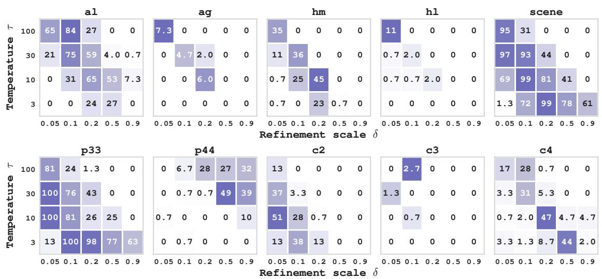  
Figure 6: Sensitivity to the refinement scale and inverse temperature. Ofline performance on OGBench domains across diferent combinations of the refinement scale � and inverse temperature � . Each cell reports the mean performance over three seeds.

## 6. Conclusion

We present PReFlow, a policy extraction method that selects among behavior proposals with the critic and refines the selected proposal with a conditional flow. A proposal-centered Gaussian reference encourages small action changes, while the flow can represent several high-value refinements of the same proposal. The same reference provides closed-form adjoint matching targets from sampled refinement endpoints and critic gradients, allowing simulation-free training of the flow without a backward adjoint solve. On 50 OGBench tasks, PReFlow is competitive in ofline RL and attains the highest aggregate success rate after online fine-tuning among the baselines. Our results suggest that expressive policies help not only in modeling multimodal behavior but also in refining each proposal.

Limitation. Proposal selection uses $Q _ { \psi }$ as an approximation to the refinement value � , but proposals with similar critic values can difer in $V _ { \delta }$ through the local gradient and curvature of the critic. Eficient estimation of $V _ { \delta }$ that captures this dependence is a natural direction for future work.

## References

Michael Samuel Albergo and Eric Vanden-Eijnden. Building normalizing flows with stochastic interpolants. In The Eleventh International Conference on Learning Representations, 2023. URL https://openreview.net/

forum?id=li7qeBbCR1t.

Marvin Alles, Nutan Chen, Patrick van der Smagt, and Botond Cseke. FlowQ: Energy-guided flow policies for ofline reinforcement learning. arXiv preprint arXiv:2505.14139, 2025. URL https://arxiv.org/abs/ 2505.14139.

Andreas Bergmeister, Stefanie Jegelka, Nikolas Nüsken, Carles Domingo-Enrich, and Jakiw Pidstrigach. Reinforce adjoint matching: Scaling rl post-training of difusion and flow-matching models. arXiv preprint arXiv:2605.10759, 2026.

Xiaoyuan Cheng, Haoyu Wang, Wenxuan Yuan, Ziyan Wang, Zonghao Chen, Li Zeng, and Zhuo Sun. Fisher decorator: Refining flow policy via a local transport map. arXiv preprint arXiv:2604.17919, 2026.

Shutong Ding, Ke Hu, Zhenhao Zhang, Kan Ren, Weinan Zhang, Jingyi Yu, Jingya Wang, and Ye Shi. Difusionbased reinforcement learning via q-weighted variational policy optimization. In The Thirty-eighth Annual Conference on Neural Information Processing Systems, 2024. URL https://openreview.net/forum?id= UWUUVKtKeu.

Carles Domingo i Enrich, Michal Drozdzal, Brian Karrer, and Ricky T. Q. Chen. Adjoint matching: Fine-tuning flow and difusion generative models with memoryless stochastic optimal control. In Y. Yue, A. Garg, N. Peng, F. Sha, and R. Yu, editors, International Conference on Learning Representations, volume 2025, pages 53791–53846, 2025. URL https://proceedings.iclr.cc/paper\_files/paper/2025/file/ 852f50969a9e523ec41d26f2f68bd456-Paper-Conference.pdf.

Perry Dong, Qiyang Li, Dorsa Sadigh, and Chelsea Finn. EXPO: Stable reinforcement learning with expressive policies. In The Fourteenth International Conference on Learning Representations, 2026a. URL https: //openreview.net/forum?id=aFjSjkB6CV.

Yonghoon Dong, Kyungmin Lee, Changyeon Kim, Jaehyuk Kim, and Jinwoo Shin. Trust region q adjoint matching. arXiv preprint arXiv:2605.27079, 2026b.

JaeHyeok Doo, Byeongguk Jeon, Seonghyeon Ye, Kimin Lee, and Minjoon Seo. Q-flow: Stable and expressive reinforcement learning with flow-based policy. In International Conference on Machine Learning, 2026.

Linjiajie Fang, Ruoxue Liu, Jing Zhang, Wenjia Wang, and Bingyi Jing. Difusion actor-critic: Formulating constrained policy iteration as difusion noise regression for ofline reinforcement learning. In Y. Yue, A. Garg, N. Peng, F. Sha, and R. Yu, editors, International Conference on Learning Representations, volume 2025, pages 75743–75763, 2025. URL https://proceedings.iclr.cc/paper\_files/paper/2025/file/ bca7a9a0dd85e2a68420e5cae27eccfb-Paper-Conference.pdf.

Scott Fujimoto, David Meger, and Doina Precup. Of-policy deep reinforcement learning without exploration. In International conference on machine learning, pages 2052–2062. PMLR, 2019.

Abdelghani Ghanem and Mounir Ghogho. Entropy-regularized adjoint matching for ofline reinforcement learning. arXiv preprint arXiv:2605.06156, 2026.

Seyed Kamyar Seyed Ghasemipour, Dale Schuurmans, and Shixiang Shane Gu. Emaq: Expected-max q-learning operator for simple yet efective ofline and online rl. In Marina Meila and Tong Zhang, editors, Proceedings of the 38th International Conference on Machine Learning, volume 139 of Proceedings of Machine Learning Research, pages 3682–3691. PMLR, 18–24 Jul 2021. URL https://proceedings.mlr.press/v139/ ghasemipour21a.html.

Philippe Hansen-Estruch, Ilya Kostrikov, Michael Janner, Jakub Grudzien Kuba, and Sergey Levine. Idql: Implicit q-learning as an actor-critic method with difusion policies. arXiv preprint arXiv:2304.10573, 2023.

Aaron J Havens, Benjamin Kurt Miller, Bing Yan, Carles Domingo-Enrich, Anuroop Sriram, Daniel S. Levine, Brandon M Wood, Bin Hu, Brandon Amos, Brian Karrer, Xiang Fu, Guan-Horng Liu, and Ricky T. Q. Chen. Adjoint sampling: Highly scalable difusion samplers via adjoint matching. In Aarti Singh, Maryam Fazel, Daniel Hsu, Simon Lacoste-Julien, Felix Berkenkamp, Tegan Maharaj, Kiri Wagstaf, and Jerry Zhu, editors, Proceedings of the 42nd International Conference on Machine Learning, volume 267 of Proceedings of Machine Learning Research, pages 22204–22237. PMLR, 13–19 Jul 2025. URL https://proceedings.mlr.press/ v267/havens25a.html.

Tobias Johannink, Shikhar Bahl, Ashvin Nair, Jianlan Luo, Avinash Kumar, Matthias Loskyll, Juan Aparicio Ojea, Eugen Solowjow, and Sergey Levine. Residual reinforcement learning for robot control. In 2019 International Conference on Robotics and Automation (ICRA), pages 6023–6029, 2019. doi: 10.1109/ICRA.2019.8794127.

Sungha Kim, Gawon Lee, Jusuk Lee, Jonghae Park, H Jin Kim, and Daesol Cho. Flag: Flow policy maxent-rl by latent augmented guidance. arXiv preprint arXiv:2605.30749, 2026.

Aviral Kumar, Aurick Zhou, George Tucker, and Sergey Levine. Conservative Q-learning for ofline reinforcement learning. In Advances in Neural Information Processing Systems, volume 33, pages 1179–1191. Curran Associates, Inc., 2020. URL https://proceedings.neurips.cc/paper\_files/paper/2020/file/ 0d2b2061826a5df3221116a5085a6052-Paper.pdf.

Qiyang Li and Sergey Levine. Q-learning with adjoint matching. In C. Vondrick, B. Hariharan, C. Rafel, L. Pinto, D. Yang, and A. Faust, editors, International Conference on Learning Representations, volume 2026, pages 9010–9041, 2026. URL https://proceedings.iclr.cc/paper\_files/paper/2026/file/ 0f85efb1e7545dc35a1b5e4d45aaf3c2-Paper-Conference.pdf.

Xuyao Lin, Yixiang Shan, Jinru Duan, Tao Yang, Xinyu Zhao, Runyu Lei, Yiming Zhao, Jiaxin Fan, Zongbao Feng, and Peng Jia. Decoupling policy extraction for ofline reinforcement learning. arXiv preprint arXiv:2608.20909, 2026.

Yaron Lipman, Ricky T. Q. Chen, Heli Ben-Hamu, Maximilian Nickel, and Matthew Le. Flow matching for generative modeling. In The Eleventh International Conference on Learning Representations, 2023. URL https://openreview.net/forum?id=PqvMRDCJT9t.

Xingchao Liu, Chengyue Gong, and qiang liu. Flow straight and fast: Learning to generate and transfer data with rectified flow. In The Eleventh International Conference on Learning Representations, 2023. URL https://openreview.net/forum?id=XVjTT1nw5z.

Cheng Lu, Huayu Chen, Jianfei Chen, Hang Su, Chongxuan Li, and Jun Zhu. Contrastive energy prediction for exact energy-guided difusion sampling in ofline reinforcement learning. In Andreas Krause, Emma Brunskill, Kyunghyun Cho, Barbara Engelhardt, Sivan Sabato, and Jonathan Scarlett, editors, Proceedings of the 40th International Conference on Machine Learning, volume 202 of Proceedings of Machine Learning Research, pages 22825–22855. PMLR, 23–29 Jul 2023. URL https://proceedings.mlr.press/v202/lu23d.html.

Max Sobol Mark, Tian Gao, Georgia Gabriela Sampaio, Mohan Kumar Srirama, Archit Sharma, Chelsea Finn, and Aviral Kumar. Policy agnostic rl: Ofline rl and online rl fine-tuning of any class and backbone. arXiv preprint arXiv:2412.06685, 2024.

Zhancun Mu. Deflow: Decoupling manifold modeling and value maximization for ofline policy extraction. arXiv preprint arXiv:2601.10471, 2026.

Ashvin Nair, Abhishek Gupta, Murtaza Dalal, and Sergey Levine. Awac: Accelerating online reinforcement learning with ofline datasets. arXiv preprint arXiv:2006.09359, 2020.

Aditya Oberai, Seohong Park, and Sergey Levine. Reversal q-learning. arXiv preprint arXiv:2606.17551, 2026.

Seohong Park, Kevin Frans, Benjamin Eysenbach, and Sergey Levine. OGBench: Benchmarking ofline goal-conditioned RL. In The Thirteenth International Conference on Learning Representations, 2025a. URL https://openreview.net/forum?id=M992mjgKzI.

Seohong Park, Qiyang Li, and Sergey Levine. Flow q-learning. In Aarti Singh, Maryam Fazel, Daniel Hsu, Simon Lacoste-Julien, Felix Berkenkamp, Tegan Maharaj, Kiri Wagstaf, and Jerry Zhu, editors, Proceedings of the 42nd International Conference on Machine Learning, volume 267 of Proceedings of Machine Learning Research, pages 48104–48127. PMLR, 13–19 Jul 2025b. URL https://proceedings.mlr.press/v267/ park25f.html.

Michael Psenka, Alejandro Escontrela, Pieter Abbeel, and Yi Ma. Learning a difusion model policy from rewards via q-score matching. In Ruslan Salakhutdinov, Zico Kolter, Katherine Heller, Adrian Weller, Nuria Oliver, Jonathan Scarlett, and Felix Berkenkamp, editors, Proceedings of the 41st International Conference on Machine Learning, volume 235 of Proceedings of Machine Learning Research, pages 41163–41182. PMLR, 21–27 Jul 2024. URL https://proceedings.mlr.press/v235/psenka24a.html.

Yifan Ruan, Chenyang Cao, Andreas Burger, Ali Pesaranghader, Kaveh Kamali, Jaehong Kim, Nandita Vijaykumar, Alan Aspuru-Guzik, Igor Gilitschenski, and Nicholas Rhinehart. Qpilots: Eficient test-time q-steering for flow policies. arXiv preprint arXiv:2606.14801, 2026.

Jeongwoo Shin, Dongsoo Shin, Yuchen Zhu, Wei Guo, Yongxin Chen, Joonseok Lee, Jaewoong Choi, and Jaemoo Choi. Eficient adjoint matching for fine-tuning difusion models. arXiv preprint arXiv:2605.11480, 2026.

Tom Silver, Kelsey Allen, Josh Tenenbaum, and Leslie Kaelbling. Residual policy learning. arXiv preprint arXiv:1812.06298, 2018.

Denis Tarasov, Vladislav Kurenkov, Alexander Nikulin, and Sergey Kolesnikov. Revisiting the minimalist approach to ofline reinforcement learning. In A. Oh, T. Naumann, A. Globerson, K. Saenko, M. Hardt, and S. Levine, editors, Advances in Neural Information Processing Systems, volume 36, pages 11592–11620. Curran Associates, Inc., 2023. doi: 10.52202/075280-0511. URL https://proceedings.neurips.cc/paper\_ files/paper/2023/file/26cce1e512793f2072fd27c391e04652-Paper-Conference.pdf.

Serge Thilges, Onur Celik, Denis Blessing, Emiliyan Gospodinov, and Gerhard Neumann. Scalable maximum entropy reinforcement learning for difusion policies via adjoint matching. arXiv preprint arXiv:2606.22630, 2026.

Andrew Wagenmaker, Yunchu Zhang, Mitsuhiko Nakamoto, Seohong Park, Waleed Yagoub, Anusha Nagabandi, Abhishek Gupta, and Sergey Levine. Steering your difusion policy with latent space reinforcement learning. In 9th Annual Conference on Robot Learning, 2025. URL https://openreview.net/forum? id=jU7AbGq3se.

Zhendong Wang, Jonathan J Hunt, and Mingyuan Zhou. Difusion policies as an expressive policy class for ofline reinforcement learning. In The Eleventh International Conference on Learning Representations, 2023. URL https://openreview.net/forum?id=AHvFDPi-FA.

Xiu Yuan, Tongzhou Mu, Stone Tao, Yunhao Fang, Mengke Zhang, and Hao Su. Policy decorator: Modelagnostic online refinement for large policy model. In The Thirteenth International Conference on Learning Representations, 2025. URL https://openreview.net/forum?id=e5jGTEiJMT.

Shiyuan Zhang, Weitong Zhang, and Quanquan Gu. Energy-weighted flow matching for ofline reinforcement learning. In The Thirteenth International Conference on Learning Representations, 2025. URL https: //openreview.net/forum?id=HA0oLUvuGI.

Jiaxin Zhao, Weihang Pan, Xun Liang, and Binbin Lin. SPAR: Support-preserving action rectification. In Forty-third International Conference on Machine Learning, 2026. URL https://openreview.net/forum? id=XiaqvkSnWk.

Zhiyuan Zhou, Andy Peng, Charles Xu, Qiyang Li, Tobias Springenberg, Kevin Frans, and Sergey Levine. Test-time gradient guidance of flow policies in reinforcement learning. arXiv preprint arXiv:2606.11087, 2026.

## A. Proofs and Technical Details

We derive the optimal refinement and selection policies, the adjoint target, and the proposal-selection approximation. We use the notation of the main text, with $\tau = \tau ( s ) > 0$ and $\delta > 0$

## A.1. Optimal proposal-conditioned policy improvement

Suppose $Q _ { \psi } ( s , \cdot )$ is bounded. For the proofs, define

$$
Z ( s , a ) = \mathbb { E } _ { \Delta a \sim \rho _ { \delta } } \left[ e ^ { \tau Q _ { \psi } ( s , a + \Delta a ) } \right] , \quad Z _ { J } ( s ) = \mathbb { E } _ { a \sim \pi _ { \beta } } [ Z ( s , a ) ] .\tag{23}
$$

Both constants are finite and strictly positive. Since the critic is considered bounded, it is suficient to consider policies with finite KL penalties. Substituting the normalized form of (12) into (11) gives

$$
\mathcal { T } _ { s , a } ( \pi ^ { \mathrm { r e f } } ) = \frac { 1 } { \tau } \log Z ( s , a ) - \frac { 1 } { \tau } \mathrm { K L } \Big ( \pi ^ { \mathrm { r e f } } \left\| \pi ^ { \mathrm { r e f } , \star } \right) .\tag{24}
$$

Thus $\pi ^ { \mathrm { r e f , \star } }$ is optimal, with $V _ { \delta } ( s , a ) = \tau ^ { - 1 } \log Z ( s , a )$

Proof of Proposition 3.1. After optimizing conditional refinement, (15) reduces to

$$
\begin{array} { r } { \mathbb { E } _ { a \sim \pi ^ { \mathrm { b a s e } } } [ V _ { \delta } ( s , a ) ] - \tau ^ { - 1 } \operatorname { K L } ( \pi ^ { \mathrm { b a s e } } \| \pi _ { \beta } ) . } \end{array}\tag{25}
$$

Applying the same Gibbs variational identity gives the optimal selection policy

$$
\pi ^ { \mathrm { b a s e } , \star } ( a \mid s ) = \frac { \pi _ { \beta } ( a \mid s ) e ^ { \tau V _ { \delta } ( s , a ) } } { Z _ { J } ( s ) } = \frac { \pi _ { \beta } ( a \mid s ) Z ( s , a ) } { Z _ { J } ( s ) } ,\tag{26}
$$

Substituting this policy and the normalized refinement target into the final-action mixture yields

$$
\pi _ { \hat { \delta } } ^ { \star } ( \tilde { a } \mid s ) = \int \pi ^ { \mathrm { b a s e } , \star } ( a \mid s ) \pi ^ { \mathrm { r e f } , \star } ( \tilde { a } - a \mid s , a ) \mathrm { d } a = \frac { e ^ { \tau Q _ { \psi } ( s , \tilde { a } ) } } { Z _ { J } ( s ) } \mathbb { E } _ { a \sim \pi _ { \beta } } \left[ \rho _ { \delta } ( \tilde { a } - a ) \right] .\tag{27}
$$

Expanding the Gaussian density $\rho _ { \delta }$ gives (17), which characterizes the unclipped action distribution. □

## A.2. Gaussian reference and adjoint target

As in Section 3.3, write $\Delta a = \delta y , \rho = \mathcal { N } ( 0 , I )$ . We use the $C = 1$ member of the linear reference family in Shin et al. (2026, Proposition 3.1). With $d ( t ) = t ^ { 2 } + ( 1 - t ) ^ { 2 }$ , its drift and difusion coeficient are

$$
b ( y , t ) = D ( t ) y , \qquad D ( t ) = { \frac { 2 t ^ { 2 } - 1 } { t d ( t ) } } , \qquad \sigma ( t ) ^ { 2 } = { \frac { 2 ( 1 - t ) } { t } } , \quad 0 < t < 1 .\tag{28}
$$

Its marginals are $\mathcal { N } ( 0 , d ( t ) I )$ , its terminal law is $\rho ,$ and its endpoint-conditioned marginal is the bridge in (20). The singular coeficients at $t = 0$ are interpreted through the Gaussian entrance law, see Shin et al. (2026, Appendix B.3) for the reference construction.

Since the terminal law matches the Gaussian prior in (18), the density correction in Shin et al. (2026, Proposition 3.2) vanishes. The terminal cost is therefore $g _ { s , a } ( y ) = - \tau Q _ { \psi } ( s , a + \delta y )$ . For the controlled SDE $\mathrm { d } Y _ { t } = ( b ( Y _ { t } , t ) + \sigma ( t ) u _ { t } ) \mathrm { d } t + \sigma ( t ) \mathrm { d } W _ { t }$ , the memoryless SOC formulation yields the optimal endpoint law $q ^ { \star }$ in (18), under the usual well-posedness and change-of-measure conditions and a realizable terminal tilt (Domingo i Enrich et al., 2025, Section 4 and Appendices C.4 and D).

The reference velocity is $v _ { 0 } ( y , t ) = ( 2 t - 1 ) y / d ( t )$ , and we parameterize the control as

$$
\boldsymbol { u } _ { \phi } ( y , t \mid s , a ) = \frac { 2 } { \sigma ( t ) } \big ( \boldsymbol { v } _ { \phi } ( y , t \mid s , a ) - \boldsymbol { v } _ { 0 } ( y , t ) \big ) .\tag{29}
$$

This gives controlled drift $2 v _ { \phi } - y / t$ . Following Adjoint Sampling (Havens et al., 2025), we hold the sampled endpoint fixed during the update and draw intermediate states from (20).

Proof of Proposition 3.2. The reference Jacobian is $\nabla _ { y } b ( y , t ) = D ( t ) I$ . Thus (7) gives $\dot { \lambda } ( t ) = - D ( t ) \lambda ( t )$ , with $\lambda ( 1 ) = - \tau \nabla _ { y } Q _ { \psi } ( s , a + \delta y ) | _ { y = y _ { 1 } }$ . Using $\begin{array} { r } { D ( t ) = \frac { \mathrm { d } } { \mathrm { d } t } \log ( d ( t ) / t ) } \end{array}$ and $d ( 1 ) = 1$ , we obtain

$$
\lambda ( t ) = \exp \left( \int _ { t } ^ { 1 } D ( r ) \mathrm { d } r \right) \lambda ( 1 ) = \frac { t } { d ( t ) } \lambda ( 1 ) .\tag{30}
$$

The AM control target is $- \sigma ( t ) \lambda ( t )$ . Converting it to a velocity through (29) yields

$$
\begin{array} { l } { v ^ { \mathrm { t g t } } ( y _ { t } , y _ { 1 } , t \mid s , a ) = v _ { 0 } ( y _ { t } , t ) - \displaystyle \frac { \sigma ( t ) ^ { 2 } } { 2 } \lambda ( t ) } \\ { = \displaystyle \frac { 2 t - 1 } { d ( t ) } y _ { t } + \frac { 1 - t } { d ( t ) } \tau \nabla _ { y } Q _ { \psi } ( s , a + \delta y ) \vert _ { y = y _ { 1 } } . } \end{array}\tag{31}
$$

Finally, the chain rule gives $\nabla _ { y } Q _ { \psi } ( s , a + \delta y ) | _ { y = y _ { 1 } } = \delta \nabla _ { \tilde { a } } Q _ { \psi } ( s , \tilde { a } _ { 1 } )$ , which establishes (21).

The control-to-velocity conversion also determines the AM loss weight:

$$
\left. u _ { \phi } + \sigma ( t ) \lambda ( t ) \right. ^ { 2 } = \frac { 4 } { \sigma ( t ) ^ { 2 } } \left. v _ { \phi } - v ^ { \mathrm { t g t } } \right. ^ { 2 } .\tag{32}
$$

The weight is $4 / \sigma ( t ) ^ { 2 } = 2 t / ( 1 - t )$ . Following Bergmeister et al. (2026, Appendix B.2), we omit the weight and sample time uniformly in (22). For a frozen endpoint distribution and finite losses, positive time weights preserve the pointwise conditional-mean minimizer in an unrestricted velocity class, but can change the fit of a finite network.

The idealized Adjoint Sampling characterization requires both population regression stationarity and consistency of the learned dynamics with the reference bridges (Havens et al., 2025, Theorem C.3). Here, consistency requires the ODE velocity to equal the flow-matching velocity associated with its own endpoint distribution and (20). The target derivation alone establishes neither this consistency nor convergence of finite-network training or finite-step sampling to $q ^ { \star }$

## A.3. Proposal-selection approximation

We justify replacing ${ \cal V } _ { \delta } ( s , a )$ by the critic value in selection weights. Keep � fixed and suppose $Q _ { \psi } ( s , \cdot )$ is bounded and twice continuously diferentiable near �. For $F ( x ) = e ^ { \tau Q _ { \psi } ( s , x ) }$ and $Y \sim \rho _ { ; }$ , a second-order Taylor expansion gives

$$
\mathbb { E } [ F ( a + \delta Y ) ] = F ( a ) + \frac { \delta ^ { 2 } } { 2 } \mathrm { t r } ( \nabla _ { a } ^ { 2 } F ( a ) ) + o ( \delta ^ { 2 } ) .\tag{33}
$$

The linear term vanishes because $\mathbb { E } [ Y ] = 0$ , and the quadratic term uses $\mathbb { E } [ Y Y ^ { \top } ] = I $ . Continuity of the Hessian controls the local remainder, and boundedness of $F$ and Gaussian tails make the contribution outside that neighborhood $o ( \delta ^ { 2 } )$ . Taking the logarithm and dividing by � yields

$$
V _ { \delta } ( s , a ) = Q _ { \psi } ( s , a ) + \frac { \delta ^ { 2 } } { 2 } \left[ \mathrm { t r } ( \nabla _ { a } ^ { 2 } Q _ { \psi } ( s , a ) ) + \tau \| \nabla _ { a } Q _ { \psi } ( s , a ) \| ^ { 2 } \right] + o ( \delta ^ { 2 } ) .\tag{34}
$$

Thus $V _ { \delta } ( s , a ) = Q _ { \psi } ( s , a ) + O ( \delta ^ { 2 } )$ , motivating the leading-order weights $e ^ { \tau Q _ { \psi } ( s , a ) }$ for small refinement scales. For i.i.d. behavior proposals, weights $Z ( s , a _ { i } ) = e ^ { \tau V _ { \delta } ( s , a _ { i } ) }$ give a self-normalized importance-sampling approximation to $\pi ^ { \mathrm { b a s e } , \star }$ . Since the weights are bounded and positive, the strong law of large numbers gives almost-sure convergence of weighted expectations of bounded test functions to their expectations under �base,⋆ as the number of candidates increases. Replacing $V _ { \delta }$ by $Q _ { \psi }$ gives the finite-temperature weights $w _ { i } \propto e ^ { \tau Q _ { \psi } \left( s , a _ { i } \right) }$ used in Section 3.2.

Our implementation selects $I = \arg \operatorname* { m a x } _ { i } Q _ { \psi } ( s , a _ { i } )$ before refinement. Table 6 compares greedy and finite-temperature selection empirically.

## B. Extended Related Work

## B.1. Policy extraction with difusion and flow policies

Q-Flow and RQL difer in how they learn values over intermediate generative states. Q-Flow (Doo et al., 2026) fits an auxiliary value network to critic evaluations at endpoints obtained by integrating the current flow from intermediate states. Its policy update then uses gradients of this intermediate value network. RQL (Oberai et al., 2026) reconstructs virtual trajectories by running the flow backward from dataset actions and uses multi-step returns to learn values in the expanded MDP. PReFlow evaluates $Q _ { \psi }$ at the final refined action and uses its gradient to construct a velocity target through the analytic reference adjoint. Its actor update requires neither an intermediate value estimator nor value backups across refinement steps.

QPILOTS (Ruan et al., 2026) estimates guidance from clean actions conditioned on an intermediate flow state. QPILOTS-U uses a denoised point estimate, whereas QPILOTS-M trains a meta flow map to produce approximate posterior samples. The auxiliary model in QPILOTS-M therefore supports critic-gradient estimation during sampling. PReFlow’s additional flow models refinements conditioned on a behavior proposal. The critic gradient supervises this flow during training, so the refinement rollout requires no critic gradients at inference time.

## B.2. Behavior proposals and conditional action refinement

SPAR (Zhao et al., 2026) evaluates flow-based residual policies in addition to its conditional VAE formulation. Its latent self-imitation procedure samples residual candidates from a target policy, weights them using conservative advantage estimates, and fits the residual policy to these weighted samples. Both the weights and sampled residuals are detached during this update. PReFlow specifies a conditional Gibbs target through its proposalcentered KL objective. The critic gradient at a sampled refined action determines a detached velocity target through the analytic adjoint.

FLAG (Kim et al., 2026) uses a local Gaussian policy around each flow-generated anchor. With fixed covariance, the EM update moves each anchor toward the mean of a reweighted local target. Its expressive action marginal arises from mixing these local policies over flow latents. PReFlow’s conditional flow can represent multiple refinement modes for the same proposal; its Gaussian reference defines the KL penalty rather than the policy family.

The regularization of refinements also difers across methods. DeFlow constrains the displacement of a deterministic refiner (Mu, 2026), while Fisher Decorator penalizes a local transport map using the behavior score (Cheng et al., 2026). PReFlow’s Gaussian KL regularizer balances expected squared displacement against conditional entropy. It discourages large edits without imposing a hard radius on individual refinements or requiring an estimate of the behavior score.

EMaQ and decoupled policy extraction use critic values to select among behavior proposals (Ghasemipour et al., 2021; Lin et al., 2026). PReFlow’s joint objective weights proposals by their optimal regularized refinement value, accounting for the value and KL cost of subsequent refinement. At the joint optimum, the unclipped action marginal is a Gibbs policy under the Gaussian-smoothed behavior prior. The implementation uses critic-based argmax selection; this rule does not in general sample the optimal proposal marginal (Appendix A.3).

## B.3. Adjoint matching and tractable reference dynamics

QAM applies Adjoint Matching (Domingo i Enrich et al., 2025; Li and Levine, 2026) with a learned behavior flow as the reference. Although its actor update avoids backpropagation through the optimized policy’s sampler, target construction requires a backward lean-adjoint solve through the behavior reference. TRQAM (Dong et al., 2026b) adapts the constraint through a path-space trust region, while ME-AM (Ghanem and Ghogho, 2026) modifies entropy regularization and introduces a mixture behavior prior.

EAM (Shin et al., 2026) constructs linear reference dynamics with closed form lean adjoints. To preserve the original reward-tilted pretrained distribution, it corrects the terminal cost for the change of reference; the gradient of this correction depends on the pretrained model’s score. PReFlow uses the � = 1 member of EAM’s reference family. Its terminal law $\rho = \mathcal { N } ( 0 , I )$ already matches the prior in our conditional refinement objective, so the density correction vanishes. The terminal cost is therefore $- \tau Q _ { \psi } ( s , a + \delta y )$ , while behavior information

enters through the proposals.

Adjoint Sampling (Havens et al., 2025) uses reference bridges to separate endpoint generation from the construction of intermediate training samples. AMDP (Thilges et al., 2026) applies reciprocal adjoint matching to maximum-entropy RL. PReFlow uses this training construction for its conditional refinement objective. Proposals and refinement endpoints are generated by detached forward rollouts. Given an endpoint, the analytic reference bridge and lean adjoint provide intermediate samples and velocity targets without further trajectory simulation or a backward solve. The simulation-free property applies to these operations; generating the endpoints still requires forward rollouts.

Appendix A.2 derives our velocity target and time weighting, and states the consistency conditions underlying the idealized Adjoint Sampling characterization (Havens et al., 2025, Theorem C.3).

## C. Additional Method Details

## C.1. Temperature Adaptation

A fixed $\tau$ can lead to diferent deviations from the reference across domains because the critic gradients have diferent scales. We use a cheap local approximation of the conditional KL to guide temperature adaptation.

Local KL approximation. For fixed � and $^ { a , }$ consider the linear approximation $Q _ { \psi } ( s , a + \delta y ) \approx Q _ { \psi } ( s , a ) +$ $\delta g _ { a } ^ { \top } y , g _ { a } = \nabla _ { a } Q _ { \psi } ( s , a )$ . With the Gaussian reference $\rho = \mathcal { N } ( 0 , I )$ , the corresponding conditional target is $q _ { \mathrm { l i n } } ^ { \star } = \mathcal { N } ( \tau \delta g _ { a } , I )$ . Writing $d _ { \mathrm { a c t } } = \dim ( { \mathcal A } )$ , its KL per action dimension is $\begin{array} { r l r } { \frac { 1 } { d _ { \mathrm { a c t } } } \mathrm { K L } ( q _ { \mathrm { l i n } } ^ { \star } | | \rho ) } & { { } = } & { \frac { \tau ^ { 2 } \delta ^ { 2 } \| g _ { a } \| ^ { 2 } } { 2 d _ { \mathrm { a c t } } } = } \end{array}$ $\frac { 1 } { 2 } \left( \frac { \mathbb { E } _ { y \sim q _ { \mathrm { l i n } } ^ { \star } } \| y \| ^ { 2 } } { d _ { \mathrm { a c t } } } - 1 \right)$ . Under this approximation, estimating the KL requires only squared endpoint norms. We use this expression as a cheap KL proxy for the learned refinement policy.

Temperature update. For endpoints sampled from the current refinement policy, define the normalized second moment, or dispersion, as disp $\begin{array} { r l } { \mathbf { \Phi } } & { { } = \frac { \hat { 1 } } { d _ { \mathrm { s c t } } } \mathbb { E } \| y _ { 1 } \| ^ { 2 } } \end{array}$ . The reference $\rho$ has dispersion one, regardless of the action dimension or chunk length. For the linearized target, a dispersion target $c \geq 1$ therefore corresponds to a conditional KL of $( c - 1 ) / 2$ per action dimension. We adjust � to keep the measured dispersion close to � using $\mathcal { L } _ { \tau } = \log \tau \left( \mathrm { s g } [ \mathrm { d i s p } ] - c \right)$ . We initialize � to 10 on al, ag, and p44, and to 30 on c4. The temperature is updated at every gradient step.

## C.2. Implementation details

Critic and behavior-flow updates. We follow QAM (Li and Levine, 2026) for the critic architecture, ensemble aggregation, Bellman backup construction, and target-network updates. The behavior-flow initialization and training schedule during ofline and online learning also follow QAM. Critic values and action gradients use the same ensemble aggregation rules as QAM. We train the critic with the same expectile regression objective as RQL (Oberai et al., 2026), using the domain-specific � values in Appendix D.2. Training proposals for the refinement-flow update are drawn directly from $\pi _ { \beta } ,$ without proposal selection, as in (22). For each TD target, we also sample one proposal from $\pi _ { \beta }$ and refine it with $q _ { \phi }$ . The �-candidate selection rule in Algorithm 1 is used for action generation.

Action selection and clipping. A single batched behavior-flow rollout generates the � candidate proposals. Our benchmark policy chooses the candidate with the highest critic value and samples a refinement conditioned on that proposal. When $K = 1$ , this reduces to refining the only available proposal. The resulting action $\tilde { \boldsymbol { a } } = \boldsymbol { a } + \delta \boldsymbol { y }$ is clipped to the environment’s action bounds.

## C.3. Training procedure

Algorithm 3 summarizes one joint update of the critic, behavior flow, and refinement flow. Following QAM (Li and Levine, 2026), we use ten critics $\{ Q _ { \psi ^ { j } } \} _ { j = 1 } ^ { 1 0 }$ and their target networks $\{ Q _ { \bar { \psi } ^ { j } } \} _ { j = 1 } ^ { 1 0 }$ . Let $\bar { Q } _ { \mathrm { m e a n } }$ and $\bar { Q } _ { \mathrm { s t d } }$

Algorithm 3 PReFlow: Joint training update   
Input: Minibatch $\boldsymbol { B }$ of replay samples $( s , a , s ^ { \prime } , r , m )$ , behavior flow $f _ { \beta } ,$ refinement flow $v _ { \phi } ,$ critic parameters $\psi ,$ target   
parameters $\bar { \psi } ,$ discount $\gamma ,$ backup horizon ℎ, pessimism $\rho _ { Q }$ , target update rate �, refinement scale $\delta ,$ inverse temperature   
$\tau ,$ and expectile $\kappa .$   
Critic update   
Generate $\tilde { a } ^ { \prime }$ at each $s ^ { \prime }$ using Algorithm 1 with $K = 1$   
Clip $\tilde { a } ^ { \prime }$ to the action bounds.   
Update each critic $\psi ^ { j } , j = 1 , \ldots , 1 0 ,$ by minimizing   
$\mathcal { L } ( \psi ^ { j } ) = \ell _ { \kappa } \Big ( \mathrm { s g } \Big [ r + \gamma ^ { h } m \bar { Q } ( s ^ { \prime } , \tilde { a } ^ { \prime } ) \Big ] - Q _ { \psi ^ { j } } ( s , a ) \Big )$   
Behavior-flow update   
Update $\beta$ using the flow-matching loss in (4) on $( s , a )$ from $B .$   
Refinement-flow update   
Update � using Algorithm $2$ on the states in $B .$ ◁ Training proposals use $K = 1$   
if automatic temperature adaptation is enabled then   
Update log � as described in Appendix C.1, using the endpoints from the refinement update.   
end if   
Target-network update   
$\begin{array} { r } { \bar { \psi }  ( 1 - \lambda ) \bar { \psi } + \lambda \psi . } \end{array}$   
Output: Updated $\beta , \phi , \psi , \bar { \psi } ,$ and $\tau .$

denote the mean and standard deviation of the target ensemble. The pessimistic target value is

$$
\bar { Q } ( s , a ) = \bar { Q } _ { \mathrm { m e a n } } ( s , a ) - \rho _ { Q } \bar { Q } _ { \mathrm { s t d } } ( s , a ) ,\tag{35}
$$

where $\rho _ { Q }$ corresponds to QAM’s pessimism coeficient $\rho .$ The critic $Q _ { \psi }$ used for proposal selection and refinement denotes the mean of the critic ensemble.

We retain our expectile extension of QAM’s squared TD-error loss: $\ell _ { \kappa } ( e ) = \left| \kappa - { \bf 1 } _ { \{ e < 0 \} } \right| e ^ { 2 }$ , where � is the target minus the prediction. The default $\kappa = 0 . 5$ recovers squared-error regression up to a constant factor; we use $\kappa = 0 . 7$ on $^ { c 2 }$ and ${ \tt c 4 }$ . For an ℎ-step backup, $r$ denotes the accumulated discounted reward, $s ^ { \prime }$ the bootstrap state, and � the bootstrap mask. The target therefore uses the discount $\gamma ^ { h } m$ . Losses below are averaged over the minibatch, and target parameters are initialized as $\bar { \psi }  \psi$

## D. Experimental Details

## D.1. Benchmark and evaluation protocol

Our implementation builds on the oficial QAM codebase (Li and Levine, 2026), and we follow its experimental protocol on the OGBench single-task benchmark (Park et al., 2025a). Unless otherwise stated, we use QAM’s default architecture and optimization settings for the shared components, including its domain-specific discount factors and critic pessimism coeficients; see Appendices E and F of Li and Levine (2026).

We evaluate ten OGBench domains, with five tasks per domain (50 tasks total): antmaze-large (al), antmaze-giant (ag), humanoidmaze-medium (hm), humanoidmaze-large (hl), scene, puzzle-3x3 (p33), puzzle-4x4 (p44), cube-double (c2), cube-triple (c3), and cube-quadruple (c4).

Following Li and Levine (2026), we use the default navigate datasets for al, ag, hm, and hl, and the play datasets for the manipulation domains. We use the 100M-transition datasets for p44 and ${ \mathsf { c } } 4 ,$ , and sparse rewards for scene, p33, and p44. Action chunking uses $h = 5$ for manipulation and $h = 1$ for navigation.

The benchmark protocol consists of 1M ofline gradient steps followed by 500K online environment steps. For our runs, we evaluate every 50K steps using 50 episodes per task and seed, and report success rates at the end of each phase. Domain scores average five tasks, and the overall score averages all 50 tasks. For the main benchmark, PReFlow and our reproductions of TRQAM, Q-Flow, and RQL use eight seeds per task. Result sources and seed counts for the other baselines are given in Appendix D.3. We use three seeds for ablation studies and additional analyses, unless otherwise stated. The separate toy and ablation protocols are specified in Appendices D.4, D.5, and D.6.

<table><tr><td>Domain</td><td>T</td><td>δ</td><td>K</td><td>Notes</td></tr><tr><td>al</td><td>auto  $\left( c { = } 2 . 5 \right)$ </td><td>0.1</td><td>1</td><td>一</td></tr><tr><td>ag</td><td>auto (c=1.5)</td><td>0.1</td><td>1</td><td> $\delta _ { \mathrm { o n l i n e } } { = } 0 . 2$ </td></tr><tr><td>hm</td><td>30</td><td>0.1</td><td>4</td><td></td></tr><tr><td>hl</td><td>100</td><td>0.05</td><td>4</td><td>一</td></tr><tr><td>scene</td><td>3</td><td>0.1</td><td>4</td><td>sparse</td></tr><tr><td> $\mathtt { p } 3 3$ </td><td>3</td><td>0.1</td><td>4</td><td>sparse</td></tr><tr><td>p44</td><td>auto (c=2.0)</td><td>0.9</td><td>1</td><td>sparse, 100M</td></tr><tr><td>c2</td><td>3</td><td>0.1</td><td>8</td><td> $\kappa = 0 . 7$ </td></tr><tr><td>c3</td><td>30</td><td>0.1</td><td>1</td><td>一</td></tr><tr><td>c4</td><td>auto (c=15)</td><td>0.1</td><td>4</td><td> $\kappa = 0 . 7 ,$  100M</td></tr></table>

Table 3: Per-domain PReFlow settings. “auto $( c ) ^ { \mathfrak { n } }$ denotes the temperature adaptation of Appendix C.1 with target �.

Hardware. We ran our experiments on NVIDIA GPUs, including RTX 3090, RTX A6000, RTX 4090, and RTX 5090 models. Computational cost comparisons were measured on a single NVIDIA RTX A6000 GPU, with the timing protocol detailed in Appendix D.7.

## D.2. PReFlow hyperparameters

For our proposal-conditioned refinement velocity network, we use a four-layer MLP with 512 hidden units per layer, where the state and proposal are concatenated as input. Both the behavior and refinement flows use 10 Euler integration steps.

Table 3 reports the per-domain PReFlow settings. We search over fixed inverse temperatures $\tau ~ \in ~ \{ 3 , 1 0 , 3 0 , 1 0 0 \}$ and dispersion targets $c ~ \in ~ \{ 1 . 5 , 2 . 0 , 2 . 5 , 5 . 0 , 1 5 . 0 \}$ for automatic temperature adaptation (Appendix C.1). We also search over refinement scales $\delta \in \{ 0 . 0 5 , 0 . 1 , 0 . 2 , 0 . 5 , 0 . 9 \}$ and numbers of behavior proposals $K \in \{ 1 , 2 , 4 , 8 \}$ . We evaluate each candidate configuration with three seeds per task, and select the configuration that maximizes the sum of the success rates at the end of ofline training and online fine-tuning. We then fix this configuration for all five tasks in the domain and report results averaged over eight seeds per task.

We use QAM’s squared TD-error objective (Li and Levine, 2026) as the default for critic learning. Following RQL (Oberai et al., 2026), we also consider an asymmetric version that gives diferent weights to predictions below and above their TD targets. This expectile regression loss is controlled by �: our default $\kappa = 0 . 5$ recovers QAM’s loss up to a constant factor, while $\kappa > 0 . 5$ gives more weight to predictions below their targets. We use $\kappa = 0 . 7$ only on c2 and c4.

TRQAM (Dong et al., 2026b) increases its KL budget at the ofline-to-online transition on ag. Motivated by this choice, we test increasing PReFlow’s refinement scale � from 0.1 during ofline training to 0.2 during online fine-tuning. We apply this adjustment only to ag. Both this adjustment and the expectile choices above are treated as domain-specific hyperparameter settings.

Sensitivity sweep. For Figure $^ { 6 , }$ we vary � and fixed � with � = 1 and $\kappa = 0 . 5$ , without temperature adaptation. We evaluate one task per domain, using task 1 for navigation and task 2 for manipulation. For c4, all tested configurations yielded zero success on task 2, so we instead use task 1 to illustrate performance diferences across hyperparameter settings. Each configuration is trained for 1M ofline gradient steps without online fine-tuning. Each cell reports the mean success rate over three seeds at the 1M-step checkpoint.

## D.3. Baselines

For ReBRAC, FBRAC, BAM, FQL, FAWAC, CGQL and its variants, DAC, QSM, DSRL, FEdit, IFQL, and QAM and its variants, we use the released results from QAM (Li and Levine, 2026), with 12 seeds per task. Table 1 reports a subset of these methods; the full task-level tables additionally include FBRAC, BAM, FQL, FAWAC, CGQL-M, and CGQL-L. We refer to Appendices E and F of Li and Levine (2026) for their implementations and hyperparameter settings. We re-run TRQAM, Q-Flow, and RQL using the protocol in Appendix D.1, with eight seeds per task. For QPILOTS-M and QPILOTS-U, we use the authors’ released results with eight seeds per task, as detailed below.

TRQAM. TRQAM (Dong et al., 2026b) extends QAM with a path-space KL constraint relative to the behavior flow. It adjusts a trust-region parameter in the sampling dynamics through projected dual updates, using the estimated KL along sampled trajectories to track a prescribed budget � .

We use the authors’ reported budget for �KL except hm and hl. Using the published budget of $\epsilon _ { \mathrm { K L } } = 0 . 5$ left the KL constraint unsatisfied under our protocol, with the dual variable reaching its optimization boundary.

Following the authors’ tuning protocol, we sweep $\epsilon _ { \mathrm { K L } } \in \{ 1 . 0 , 2 . 0 , 4 . 0 \}$ on tasks 1 and 4 using two seeds per configuration. We select $\epsilon _ { \mathrm { K L } } = 1 . 0$ for both domains and fix it across all five tasks. We do not use BC pre-training.

Q-Flow. Q-Flow (Doo et al., 2026) learns a value function over intermediate flow states. For a sampled intermediate state, it runs the policy to the endpoint and uses the terminal critic value as a regression target. The policy is then trained by adding the gradient of this intermediate value function to the standard flow-matching target, avoiding backpropagation through the full flow rollout.

We use the authors’ released implementation. The original paper averages ofline evaluations at 800K, 900K, and 1M gradient steps. We instead report the evaluation at 1M steps to match the other methods in our comparison.

RQL. RQL (Oberai et al., 2026) treats individual flow-refinement steps as actions in an expanded MDP. It reverses flows from dataset actions to construct virtual trajectories for of-policy learning, and reduces the efective value-learning horizon introduced by the refinement steps. This allows it to train the full flow policy without backpropagating through the entire sampling process.

We extend the implementation to support online data collection and the streaming OGBench datasets, and use the authors’ reported per-domain hyperparameters.

QPILOTS. QPILOTS (Ruan et al., 2026) steers a behavior flow at inference time by computing critic guidance from clean-action estimates at each flow step. QPILOTS-U uses a Tweedie point estimate, while QPILOTS-M uses approximate samples from the conditional endpoint distribution generated by an auxiliary meta flow map.

We use the authors’ released results for both variants, based on eight seeds per task and the hyperparameter settings reported in their paper.

## D.4. Toy example: conditional multimodality

This example illustrates the conditional refinement policies in Section 3.1 and Figure 2. We adapt the three-peak continuous bandit of QVPO (Ding et al., 2024) and use its reward as a fixed critic, omitting the state argument:

$$
Q ( \tilde { a } ) = \sum _ { i = 1 } ^ { 3 } \frac { w } { 2 \pi \sigma ^ { 2 } } \exp \left( - \frac { \| \tilde { a } - \mu _ { i } \| ^ { 2 } } { 2 \sigma ^ { 2 } } \right) .\tag{36}
$$

We use $w = 1 . 5 , \mu _ { 1 } = ( - 1 . 3 5 , 0 . 6 5 ) , \mu _ { 2 } = ( - 0 . 6 5 , 1 . 3 5 ) , \mu _ { 3 } = ( - 1 . 6 1 , 1 . 6 1 )$ , and $\sigma = 0 . 2$ in place of the original 0.1. We fix the proposal $a = ( - 1 . 4 0 , 1 . 4 0 )$ , the refinement scale $\delta = 0 . 5 ,$ and the inverse temperature $\tau = 2$ Writing $\Delta a = \delta y$ , the conditional objective in (11) gives the target

$$
\begin{array} { r } { \boldsymbol { q } ^ { \star } ( \boldsymbol { y } ) \propto \mathcal { N } ( \boldsymbol { y } ; 0 , I ) e ^ { \tau \boldsymbol { Q } ( \boldsymbol { a } + \delta \boldsymbol { y } ) } . } \end{array}\tag{37}
$$

We compare flow refinement, full-covariance Gaussian refinement, and QAM (Li and Levine, 2026) on the same problem. The two refinement policies use the same conditional objective, critic, proposal, reference, $\delta ,$ and �. All three methods are trained for 100K steps using Adam with global-norm gradient clipping at 1.0. The initial learning rate is $\eta _ { 0 } = 5 \times 1 0 ^ { - 4 }$ , reduced to $\eta _ { 0 } / 1 0$ at 60% of training and $\eta _ { 0 } / 3 0$ at 90%. The flow and

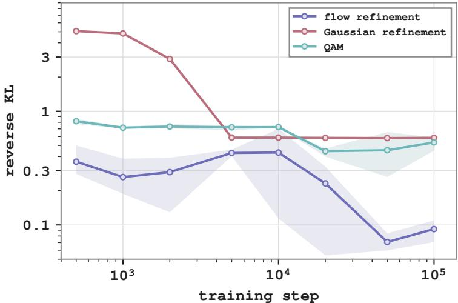  
Figure 7: KL divergence to the target on the toy problem. Lines show means over 3 seeds, and shaded regions show one standard deviation. Both axes are logarithmic.

Gaussian use batch sizes of 4096 and 32,768, respectively. The flow uses a $3 \times 2 5 6 ~ \mathrm { M L P }$ with a zero-initialized output layer and 32 Euler integration steps. The Gaussian is trained using reparameterization gradients of the same conditional objective. For QAM, the behavior policy is set to the reference law $\pi _ { \beta } = \mathcal { N } ( a , \delta ^ { 2 } I )$ . We realize it as a rectified flow from $\mathcal { N } ( 0 , I )$ with a closed form velocity field. QAM fine-tunes this flow in action space by adjoint matching using (6)-(8) with the same critic and $\tau ,$ and uses the same batch size, network, and number of discretization steps as the flow refinement. Its target density is proportional to $\pi _ { \beta } ( \tilde { a } ) e ^ { \tau Q ( \tilde { a } ) }$ and corresponds to $q ^ { \star }$ under $\tilde { \boldsymbol { a } } = \boldsymbol { a } + \delta \boldsymbol { y }$

Figure 7 tracks the KL divergence from each learned distribution � to the target during training, $D _ { \mathrm { K L } } ( q \parallel q ^ { \star } ) = \mathbb { E } _ { y \sim q } \bigl [ \log q ( y ) - \log q ^ { \star } ( y ) \bigr ]$ , which we estimate with 100,000 samples from �. Flow refinement attains the lowest mean KL at every evaluated step and ends below 0.1.

## D.5. Refinement policy class on OGBench

We describe the refinement policy comparison in Table 2 of Sec. 5.2. We use a learned diagonal Gaussian policy, $q _ { \phi } ( y \mid s , a ) = \mathcal { N } ( \mu _ { \phi } ( s , a )$ , di $\arg ( \sigma _ { \phi } ^ { 2 } ( s , a ) ) $ . The learned Gaussian uses the same state and proposal inputs and MLP hidden-layer sizes as the refinement flow, and is trained to maximize

$$
\tau \mathbb { E } _ { y \sim q _ { \phi } ( \cdot | s , a ) } \left[ Q _ { \psi } ( s , a + \delta y ) \right] - \mathrm { K L } ( q _ { \phi } ( \cdot | s , a ) | | \mathcal { N } ( 0 , I ) ) .\tag{38}
$$

We also include a variant without refinement $( \delta = 0 )$ . The learned Gaussian and flow both use $\delta = 0 . 1$ ; the no-refinement variant returns the behavior proposal directly. All variants use $K = 1$ . We evaluate on al, hm, scene, and ${ \tt c 2 } _ { \tt i }$ , with five tasks each and three seeds per task. Both refiners use fixed inverse temperatures of 100, 30, 3, and 3 on al, hm, scene, and ${ \mathsf { c } } 2 _ { \mathrm { : } }$ , respectively. We use $\kappa = 0 . 7$ on $^ { c 2 }$ and $\kappa = 0 . 5$ elsewhere. We report ofline success rates after 1M gradient steps, evaluated over 50 episodes per task and seed.

## D.6. Proposal selection

We compare three rules for selecting among � behavior proposals: uniform sampling, sampling with probabilities proportional to exp $( \tau Q _ { \psi } ( s , a _ { i } ) )$ , and selecting the proposal with the highest critic value. The selected proposal is then refined using the learned refinement flow. For softmax selection, we use the domain-specific � values in Table 3. Each setting is evaluated over three seeds, with each seed covering all five tasks in a domain, as reported in Table 6.

## D.7. Timing methodology

Figure 4 reports mean full-training-update times on a single NVIDIA RTX A6000 GPU, averaged over five flow-step counts: 5, 10, 20, 50, and 100.

<table><tr><td>Method</td><td>al 5 tasks</td><td>hm 5 tasks</td><td>scene</td><td>c2</td></tr><tr><td></td><td>[43,52]</td><td>[5,8]</td><td>5 tasks [12,15]</td><td>5 tasks [2,4]</td></tr><tr><td>SPAR anchor</td><td>48</td><td>7</td><td>14</td><td>3</td></tr><tr><td></td><td>[55,64]</td><td>[6,9]</td><td>[26,29]</td><td>[2,4]</td></tr><tr><td>SPAR</td><td>60</td><td>8</td><td>27</td><td>3</td></tr><tr><td></td><td>[79,85]</td><td>[60,69]</td><td>[96,97]</td><td>[56,62]</td></tr><tr><td>PReFlow</td><td>82</td><td>65</td><td>97</td><td>59</td></tr></table>

Table 4: Comparison with SPAR. Ofline success rates (%) averaged over eight seeds and five tasks per domain, with 95% confidence intervals in small gray brackets above the means. Best results per domain are highlighted. SPAR is evaluated after 1M gradient steps of critic and anchor training followed by 1M steps of residual training.
<table><tr><td>Method</td><td>Actor grad.</td><td>Critic</td><td>grad. Full step</td></tr><tr><td>QAM</td><td>3.40</td><td>2.13</td><td>8.22</td></tr><tr><td>QAM-E</td><td>5.08</td><td>2.71</td><td>9.97</td></tr><tr><td>PReFlow (ours)</td><td>2.65</td><td>2.43</td><td>7.18</td></tr><tr><td>QPILOTS-U</td><td>0.84</td><td>6.99</td><td>10.93</td></tr><tr><td>QPILOTS-M</td><td>0.91</td><td>49.69</td><td>51.20</td></tr></table>

Table 5: Training-update cost on c2 (ms). Median times over 30 calls after warm-up, measured on the same GPU. Actor and critic columns measure loss-gradient computation without optimizer updates; the full step includes all training updates. The lowest time in each column is highlighted

Table 5 provides a separate timing breakdown at 10 Euler steps. We use c2 input shapes: 37-dimensional observations and 5-dimensional actions with chunk length ℎ = 5 (25-dimensional action chunks), batch size ${ } ^ { 2 5 6 , }$ and 10 Euler steps per flow rollout. Each method runs in a separate subprocess. After five warm-up calls, we time 30 calls with device synchronization via jax.block\_until\_ready and report the median in milliseconds.

## E. Additional Experimental Results

## E.1. Comparison with SPAR

SPAR (Zhao et al., 2026) also refines an anchor action with a residual policy. It trains a conditional VAE over the residual by advantage-weighted reconstruction and latent self-imitation. We port the authors’ implementation to the QAM codebase and keep SPAR’s own critic, anchor, and action-selection rule.

SPAR first trains an IQL critic and a tanh-Gaussian anchor for 1M gradient steps, and then trains the residual for 1M steps with both networks frozen. At evaluation, it executes the best of ten residual candidates only when their robust critic value exceeds that of the anchor. Network sizes, action chunking, discount factors, and the evaluation protocol match PReFlow. We tune the anchor (Gaussian or behavior flow), the advantage filter (hard or soft), the guide weight $\lambda _ { g } \in \{ 0 . 5 , 1 , 2 \}$ , and the ensemble penalty $\lambda _ { u } \in \{ 0 , 0 . 5 , 1 \}$ on al, hm, scene, and c2 with three seeds per task.

The paper’s main configuration (Gaussian anchor, hard filter, $\lambda _ { g } = 1 , \lambda _ { u } = 0 . 5 )$ gives the highest average, so we run it with eight seeds per task. Table 4 reports ofline success rates after 1M gradient steps of residual training. SPAR improves on its anchor on al and scene, but it remains below PReFlow in all four domains.

## E.2. Computational cost

Table 5 provides the timing breakdown at 10 Euler steps. The timing methodology is described in Appendix D.7.

## E.3. Efect of Proposal Selection

Figure 9 provides the full learning curves for the experiment in Section 5.3 across all ten OGBench domains.

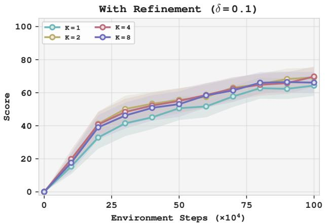

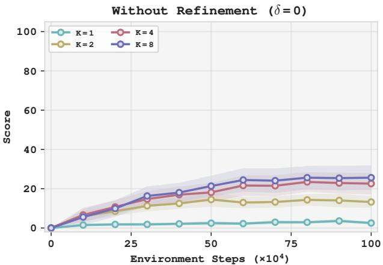  
Figure 8: Proposal selection with and without refinement. Ofline success rates average on c2, hm, scene, al for $K \in \{ 1 , 2 , 4 , 8 \}$ , with refinement $( \delta = 0 . 1$ , left) and without refinement $( \delta = 0 ,$ right). Without refinement, the selected proposal is executed directly. Curves show means over three seeds; shaded regions show pointwise 95% confidence intervals.

Table 6 shows that critic-guided selection improves performance over uniform selection on c2 and scene, while the improvement on hm is limited. Argmax achieves the highest mean success rate in four of the six domain-� settings and remains competitive in the other two. Based on these results, we use argmax selection in our benchmark experiments. Appendix A.3 distinguishes greedy selection from the finite-temperature policy derived from the joint objective.
<table><tr><td></td><td></td><td colspan="3"> $K = 4$ </td><td colspan="3"> $K = 8$ </td></tr><tr><td>Domain</td><td> $K = 1$ </td><td> $\mathtt { U n i f o r m }$ </td><td>Softmax</td><td> $\mathtt { A r g m a x }$ </td><td></td><td>Uniform Softmax</td><td> $\mathtt { A r g m a x }$ </td></tr><tr><td>hm  $( \tau = 3 0 )$ </td><td> $6 9 . 2 { \pm } 1 . 2 $ </td><td> $6 8 . 8 { \pm } 2 . 6 $ </td><td> $7 0 . 1 \pm 3 . 1$ </td><td> $7 0 . 0 { \pm } 2 . 9 $ </td><td> $6 8 . 7 { \pm } 0 . 8 $ </td><td> $6 6 . 0 { \pm } 3 . 3 $ </td><td> $6 9 . 2 { \pm } 3 . 4 $ </td></tr><tr><td>scene  $( \tau = 3 )$ </td><td> $7 3 . 1 { \pm } 0 . 8 $ </td><td> $7 4 . 0 { \pm } 1 . 7 $ </td><td> $8 9 . 5 { \pm } 0 . 8 $ </td><td> $9 4 . 9 { \pm } 1 . 0 $ </td><td> $7 4 . 1 { \pm } 0 . 8 $ </td><td> $9 0 . 7 { \pm } 1 . 7 $ </td><td> $9 2 . 8 { \pm } 0 . 6 $ </td></tr><tr><td> ${ \mathsf { c } } 2 \left( { \boldsymbol { \tau } } = 3 \right)$ </td><td> $5 3 . 9 { \pm } 3 . 3 $ </td><td> $5 0 . 3 { \pm } 6 . 9$ </td><td> $6 1 . 3 { \pm } 1 . 0 $ </td><td> $6 3 . 3 { \pm } 4 . 2 $ </td><td> $4 9 . 6 { \pm } 8 . 0 $ </td><td> $6 0 . 1 \pm 3 . 9$ </td><td> $5 8 . 7 { \pm } 4 . 1 $ </td></tr></table>

Table 6: Efect of the selection rule. Ofline success rates (%) after 1M gradient steps. Entries report mean ± standard deviation over three seeds, with each seed’s score averaged over five tasks. The listed � values apply to softmax selection. Best results are highlighted among the three rules for each domain and �.

## E.4. Proposal selection without refinement

To separate the contributions of proposal selection and refinement, we repeat the � sweep of Section 5.3 with refinement disabled $( \delta = 0 )$ , so that the selected behavior proposal is executed directly. All other settings follow Section 5.3. Figure 8 reports ofline success rates averaged over four domains (al, hm, scene, c2). Without refinement, $K = 1$ reduces to the behavior policy and scores near zero. Selecting among more proposals helps, but remains far below refinement with a single proposal. Refinement therefore accounts for most of the improvement, while proposal selection complements it.

## E.5. Domain-specific hyperparameter choices

The hyperparameter settings are given in Appendix D.2.

Critic expectile. With all other hyperparameters fixed, increasing � from 0.5 to 0.7 improves ofline performance by 4.9 and 5.9 percentage points on c2 and c4, respectively. This change does not consistently improve performance on the other domains. We hypothesize that increased critic overestimation limits its benefit on those domains.

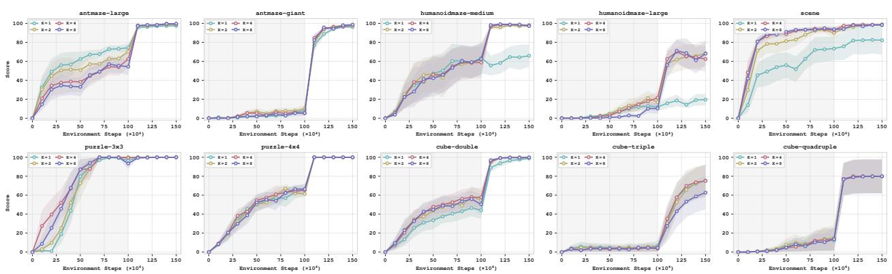  
Figure 9: Efect of proposal selection across all ten OGBench domains. PReFlow with � ∈ {1, 2, 4, 8} behavior proposals. All settings use the learned refinement flow to refine the proposal with the highest critic value. Curves show means over three seeds; shaded regions show pointwise 95% confidence intervals.

Refinement scale during online fine-tuning. Increasing the refinement scale � from 0.1 during ofline training to 0.2 during online fine-tuning improves online performance on ag, but does not yield significant gains on other domains.

## E.6. Full task-level results

Tables 7 and 8 report success rates on all 50 tasks at the end of ofline training and after online fine-tuning, respectively. PReFlow, TRQAM, Q-Flow, and RQL use eight seeds per task under our common protocol. For the baselines evaluated by Li and Levine (2026), we use their released results with 12 seeds per task. Each task cell reports the mean success rate with a 95% confidence interval over seeds. Aggregate rows report the mean across the five tasks in each domain. Figure 10 provides the task-level learning curves. QPILOTS-M/U are included in the domain-level comparison in Table 1, but not in these task-level tables; their result sources are given in Appendix D.3.

## E.7. Full training curves

Figure 10 presents the training curves of PReFlow on all 50 tasks, together with the curves of the baselines evaluated by Li and Levine (2026), plotted from their released results. Online fine-tuning begins after 1M ofline gradient steps and continues for 500K environment steps.

<table><tr><td rowspan=1 colspan=33></td></tr><tr><td rowspan=1 colspan=1></td><td rowspan=1 colspan=3></td><td rowspan=1 colspan=2></td><td rowspan=1 colspan=1></td><td rowspan=1 colspan=1></td><td rowspan=1 colspan=1></td><td rowspan=1 colspan=1></td><td rowspan=1 colspan=3></td><td rowspan=1 colspan=1></td><td></td><td rowspan=2 colspan=2></td><td rowspan=2 colspan=1></td><td rowspan=2 colspan=3></td><td rowspan=2 colspan=1></td><td rowspan=2 colspan=2></td><td rowspan=2 colspan=2></td><td rowspan=2 colspan=4></td><td rowspan=3 colspan=3></td></tr><tr><td rowspan=1 colspan=1>task1</td><td rowspan=1 colspan=3></td><td rowspan=1 colspan=2></td><td rowspan=1 colspan=1>93</td><td rowspan=1 colspan=1></td><td rowspan=1 colspan=1>63</td><td rowspan=1 colspan=1>56</td><td rowspan=1 colspan=1></td><td rowspan=1 colspan=2>39</td><td rowspan=1 colspan=1>88</td><td></td></tr><tr><td rowspan=1 colspan=1>task2</td><td rowspan=1 colspan=1>88</td><td></td><td rowspan=1 colspan=1></td><td rowspan=1 colspan=1>60</td><td></td><td rowspan=1 colspan=1>86</td><td rowspan=1 colspan=1></td><td rowspan=1 colspan=1></td><td rowspan=1 colspan=1>49</td><td rowspan=1 colspan=1></td><td rowspan=1 colspan=2></td><td rowspan=1 colspan=1></td><td></td><td rowspan=1 colspan=2></td><td rowspan=1 colspan=1>75</td><td rowspan=1 colspan=1></td><td rowspan=1 colspan=2></td><td rowspan=1 colspan=1></td><td rowspan=1 colspan=2></td><td rowspan=1 colspan=1>64</td><td rowspan=1 colspan=1></td><td rowspan=1 colspan=2>81</td><td rowspan=1 colspan=1>62</td><td rowspan=1 colspan=1>92</td><td rowspan=1 colspan=1></td></tr><tr><td rowspan=1 colspan=1>task3</td><td rowspan=1 colspan=1>98</td><td></td><td rowspan=1 colspan=1></td><td rowspan=1 colspan=1>94</td><td></td><td rowspan=1 colspan=1>59</td><td rowspan=1 colspan=1>40</td><td rowspan=1 colspan=1></td><td rowspan=1 colspan=1>90</td><td rowspan=1 colspan=1></td><td rowspan=1 colspan=2></td><td rowspan=1 colspan=1>98</td><td></td><td rowspan=1 colspan=2>99</td><td rowspan=1 colspan=1>81</td><td rowspan=1 colspan=1></td><td rowspan=1 colspan=2>65</td><td rowspan=1 colspan=1></td><td rowspan=1 colspan=2></td><td rowspan=1 colspan=1>96</td><td rowspan=1 colspan=1></td><td rowspan=1 colspan=2>94</td><td rowspan=1 colspan=1></td><td rowspan=1 colspan=1>98</td><td rowspan=1 colspan=1>94</td><td rowspan=1 colspan=1></td><td rowspan=1 colspan=1>90</td></tr><tr><td rowspan=1 colspan=1>task4</td><td rowspan=1 colspan=1>94</td><td></td><td rowspan=1 colspan=1></td><td rowspan=1 colspan=1>85</td><td></td><td rowspan=1 colspan=1>54</td><td rowspan=1 colspan=1>18</td><td rowspan=1 colspan=1></td><td rowspan=1 colspan=1></td><td></td><td rowspan=1 colspan=2></td><td rowspan=1 colspan=1>91</td><td></td><td rowspan=1 colspan=2></td><td rowspan=1 colspan=1>18</td><td rowspan=1 colspan=1></td><td rowspan=1 colspan=2>28</td><td rowspan=1 colspan=1>25</td><td rowspan=1 colspan=2></td><td rowspan=1 colspan=1>81</td><td rowspan=1 colspan=1></td><td rowspan=1 colspan=2></td><td rowspan=1 colspan=1>80</td><td rowspan=1 colspan=1></td><td rowspan=1 colspan=1>80</td><td rowspan=1 colspan=1></td><td rowspan=1 colspan=1></td></tr><tr><td rowspan=1 colspan=1>task5</td><td rowspan=1 colspan=1>95</td><td></td><td rowspan=1 colspan=1></td><td rowspan=1 colspan=1>88</td><td></td><td rowspan=1 colspan=1>86</td><td rowspan=1 colspan=1>22</td><td rowspan=1 colspan=1></td><td rowspan=1 colspan=1>80</td><td></td><td rowspan=1 colspan=2></td><td rowspan=1 colspan=1>92</td><td></td><td rowspan=1 colspan=2></td><td rowspan=1 colspan=1>69</td><td rowspan=1 colspan=1></td><td rowspan=1 colspan=2></td><td rowspan=1 colspan=1></td><td rowspan=1 colspan=2></td><td rowspan=1 colspan=1>87</td><td rowspan=1 colspan=1></td><td rowspan=1 colspan=2>83</td><td rowspan=1 colspan=1></td><td rowspan=1 colspan=1></td><td rowspan=1 colspan=1></td><td rowspan=1 colspan=1></td><td rowspan=1 colspan=1>82</td></tr><tr><td rowspan=1 colspan=1>agg.</td><td rowspan=1 colspan=1>94</td><td></td><td rowspan=1 colspan=1></td><td rowspan=1 colspan=2></td><td rowspan=1 colspan=1></td><td rowspan=1 colspan=1></td><td rowspan=1 colspan=1></td><td rowspan=1 colspan=1></td><td></td><td rowspan=1 colspan=2></td><td rowspan=1 colspan=1>88</td><td></td><td rowspan=1 colspan=2></td><td rowspan=1 colspan=1>61</td><td rowspan=1 colspan=1></td><td rowspan=1 colspan=2></td><td rowspan=1 colspan=1></td><td rowspan=1 colspan=2></td><td rowspan=1 colspan=1>83</td><td rowspan=1 colspan=1></td><td rowspan=1 colspan=2>83</td><td rowspan=1 colspan=1></td><td rowspan=1 colspan=1></td><td rowspan=1 colspan=1>82</td><td rowspan=1 colspan=2></td></tr><tr><td rowspan=1 colspan=1>task1</td><td rowspan=1 colspan=2></td><td rowspan=1 colspan=1></td><td rowspan=1 colspan=2></td><td rowspan=1 colspan=1></td><td rowspan=1 colspan=1></td><td rowspan=1 colspan=1></td><td rowspan=1 colspan=1></td><td rowspan=1 colspan=2></td><td></td><td rowspan=1 colspan=1></td><td></td><td rowspan=1 colspan=2></td><td rowspan=1 colspan=1></td><td rowspan=1 colspan=3></td><td rowspan=1 colspan=1></td><td rowspan=1 colspan=2></td><td rowspan=1 colspan=1></td><td rowspan=1 colspan=1></td><td rowspan=1 colspan=2></td><td rowspan=1 colspan=1></td><td rowspan=1 colspan=1></td><td rowspan=1 colspan=3></td></tr><tr><td rowspan=1 colspan=1>task2</td><td rowspan=1 colspan=2></td><td rowspan=1 colspan=1></td><td rowspan=1 colspan=2></td><td rowspan=1 colspan=1></td><td rowspan=1 colspan=1></td><td rowspan=1 colspan=1></td><td rowspan=1 colspan=1></td><td rowspan=1 colspan=2></td><td></td><td rowspan=1 colspan=1></td><td></td><td rowspan=1 colspan=1></td><td></td><td rowspan=1 colspan=1></td><td rowspan=1 colspan=3></td><td rowspan=1 colspan=1></td><td rowspan=1 colspan=2></td><td rowspan=1 colspan=1></td><td rowspan=1 colspan=1></td><td rowspan=1 colspan=2></td><td rowspan=1 colspan=1></td><td rowspan=1 colspan=1></td><td rowspan=4 colspan=3></td></tr><tr><td rowspan=1 colspan=1>task3</td><td rowspan=1 colspan=2></td><td rowspan=1 colspan=1></td><td rowspan=1 colspan=2></td><td rowspan=1 colspan=1></td><td rowspan=1 colspan=1></td><td rowspan=1 colspan=1></td><td rowspan=1 colspan=1></td><td rowspan=1 colspan=2></td><td></td><td rowspan=1 colspan=1></td><td></td><td rowspan=1 colspan=1></td><td></td><td rowspan=1 colspan=1></td><td rowspan=1 colspan=3></td><td rowspan=1 colspan=1></td><td rowspan=1 colspan=2></td><td rowspan=1 colspan=1></td><td rowspan=1 colspan=1></td><td rowspan=1 colspan=2></td><td rowspan=1 colspan=1></td><td rowspan=1 colspan=1></td></tr><tr><td rowspan=1 colspan=1>task4</td><td rowspan=1 colspan=1>74</td><td></td><td rowspan=1 colspan=1></td><td rowspan=1 colspan=2></td><td rowspan=1 colspan=1></td><td rowspan=1 colspan=1></td><td rowspan=1 colspan=1></td><td rowspan=1 colspan=1></td><td rowspan=1 colspan=2></td><td></td><td rowspan=1 colspan=1></td><td></td><td rowspan=1 colspan=1></td><td></td><td rowspan=1 colspan=1>12</td><td rowspan=1 colspan=1></td><td rowspan=1 colspan=2></td><td rowspan=1 colspan=1></td><td rowspan=1 colspan=2></td><td rowspan=1 colspan=1></td><td rowspan=1 colspan=1></td><td rowspan=1 colspan=2></td><td rowspan=1 colspan=1></td><td rowspan=1 colspan=1></td></tr><tr><td rowspan=1 colspan=1>task5</td><td rowspan=1 colspan=1>89</td><td></td><td rowspan=1 colspan=1></td><td rowspan=1 colspan=2></td><td rowspan=1 colspan=1></td><td rowspan=1 colspan=1></td><td rowspan=1 colspan=1></td><td rowspan=1 colspan=1>22</td><td rowspan=1 colspan=2></td><td></td><td rowspan=1 colspan=2>25</td><td rowspan=1 colspan=1>58</td><td></td><td rowspan=1 colspan=1></td><td rowspan=1 colspan=1></td><td rowspan=1 colspan=2></td><td rowspan=1 colspan=1></td><td rowspan=1 colspan=2></td><td rowspan=1 colspan=1>43</td><td rowspan=1 colspan=1></td><td rowspan=1 colspan=2></td><td rowspan=1 colspan=1>52</td><td rowspan=1 colspan=1></td></tr><tr><td rowspan=1 colspan=1>agg.</td><td rowspan=1 colspan=2></td><td rowspan=1 colspan=1></td><td rowspan=1 colspan=2></td><td rowspan=1 colspan=1></td><td rowspan=1 colspan=1></td><td rowspan=1 colspan=1></td><td rowspan=1 colspan=1></td><td></td><td rowspan=1 colspan=2></td><td rowspan=1 colspan=2></td><td rowspan=1 colspan=1>24</td><td></td><td rowspan=1 colspan=1></td><td rowspan=1 colspan=1></td><td rowspan=1 colspan=2></td><td rowspan=1 colspan=1></td><td rowspan=1 colspan=2></td><td rowspan=1 colspan=1>12</td><td rowspan=1 colspan=1></td><td rowspan=1 colspan=2></td><td rowspan=1 colspan=1></td><td rowspan=1 colspan=1></td><td rowspan=1 colspan=1></td><td rowspan=1 colspan=1></td><td rowspan=1 colspan=1></td></tr><tr><td rowspan=1 colspan=1>task1</td><td rowspan=1 colspan=2></td><td rowspan=1 colspan=1></td><td rowspan=1 colspan=2></td><td rowspan=1 colspan=1></td><td rowspan=1 colspan=1></td><td rowspan=1 colspan=1></td><td rowspan=1 colspan=1></td><td></td><td rowspan=1 colspan=2></td><td rowspan=1 colspan=2></td><td rowspan=1 colspan=2></td><td rowspan=1 colspan=1></td><td rowspan=1 colspan=1></td><td rowspan=1 colspan=2></td><td rowspan=1 colspan=1></td><td rowspan=1 colspan=2></td><td rowspan=1 colspan=1></td><td rowspan=1 colspan=1></td><td rowspan=1 colspan=2></td><td rowspan=1 colspan=1></td><td rowspan=1 colspan=1></td><td rowspan=1 colspan=2></td><td rowspan=1 colspan=1></td></tr><tr><td rowspan=1 colspan=1>task2</td><td rowspan=1 colspan=2></td><td rowspan=1 colspan=1></td><td rowspan=1 colspan=2>69</td><td rowspan=1 colspan=1>95</td><td rowspan=1 colspan=1></td><td rowspan=1 colspan=1></td><td rowspan=1 colspan=1></td><td></td><td rowspan=1 colspan=2></td><td rowspan=1 colspan=2></td><td rowspan=1 colspan=2></td><td rowspan=1 colspan=1>91</td><td rowspan=1 colspan=1></td><td rowspan=1 colspan=2>39</td><td rowspan=1 colspan=1>92</td><td rowspan=1 colspan=2></td><td rowspan=1 colspan=1>98</td><td rowspan=1 colspan=1></td><td rowspan=1 colspan=2>99</td><td rowspan=1 colspan=1></td><td rowspan=1 colspan=1>96</td><td rowspan=1 colspan=2>100</td><td rowspan=1 colspan=1>98</td></tr><tr><td rowspan=1 colspan=1>task3</td><td rowspan=1 colspan=2></td><td rowspan=1 colspan=1>28</td><td rowspan=1 colspan=2></td><td rowspan=1 colspan=1>96</td><td rowspan=1 colspan=1>20</td><td rowspan=1 colspan=1></td><td rowspan=1 colspan=2></td><td rowspan=1 colspan=2></td><td rowspan=1 colspan=1>92</td><td></td><td rowspan=1 colspan=2></td><td rowspan=1 colspan=1>36</td><td rowspan=1 colspan=3></td><td rowspan=1 colspan=1></td><td rowspan=1 colspan=2></td><td rowspan=1 colspan=1>95</td><td rowspan=1 colspan=1></td><td rowspan=1 colspan=2>68</td><td rowspan=1 colspan=1>28</td><td rowspan=1 colspan=1></td><td rowspan=1 colspan=2>100</td><td rowspan=1 colspan=1>68</td></tr><tr><td rowspan=1 colspan=1>task4</td><td rowspan=1 colspan=2></td><td rowspan=1 colspan=1></td><td rowspan=1 colspan=2>22</td><td rowspan=1 colspan=1></td><td rowspan=1 colspan=1></td><td rowspan=1 colspan=1>23</td><td rowspan=1 colspan=2></td><td rowspan=1 colspan=1></td><td></td><td rowspan=1 colspan=1>43</td><td></td><td rowspan=1 colspan=1>31</td><td></td><td rowspan=1 colspan=1></td><td rowspan=1 colspan=3></td><td rowspan=1 colspan=1>60</td><td rowspan=1 colspan=2></td><td rowspan=1 colspan=1></td><td rowspan=1 colspan=1></td><td rowspan=1 colspan=2></td><td rowspan=1 colspan=1></td><td rowspan=1 colspan=1></td><td rowspan=1 colspan=2></td><td rowspan=1 colspan=1></td></tr><tr><td rowspan=1 colspan=1>task5</td><td rowspan=1 colspan=2></td><td rowspan=1 colspan=1></td><td rowspan=1 colspan=2>83</td><td rowspan=1 colspan=1>99</td><td rowspan=1 colspan=1>36</td><td rowspan=1 colspan=1>89</td><td rowspan=1 colspan=2>100</td><td rowspan=1 colspan=1>98</td><td></td><td rowspan=1 colspan=1>99</td><td></td><td rowspan=1 colspan=1>98</td><td></td><td rowspan=1 colspan=1>90</td><td rowspan=1 colspan=2></td><td></td><td rowspan=1 colspan=1>98</td><td rowspan=1 colspan=2></td><td rowspan=1 colspan=1>99</td><td rowspan=1 colspan=1></td><td rowspan=1 colspan=2>99</td><td rowspan=1 colspan=1></td><td rowspan=1 colspan=1>99</td><td rowspan=1 colspan=2></td><td rowspan=1 colspan=1>99</td></tr><tr><td rowspan=1 colspan=1>agg.</td><td rowspan=1 colspan=2></td><td rowspan=1 colspan=1></td><td rowspan=1 colspan=2></td><td rowspan=1 colspan=1>68</td><td rowspan=1 colspan=1></td><td rowspan=1 colspan=1></td><td rowspan=1 colspan=2></td><td rowspan=1 colspan=2></td><td rowspan=1 colspan=2></td><td rowspan=1 colspan=2></td><td rowspan=1 colspan=1>53</td><td rowspan=1 colspan=2></td><td></td><td rowspan=1 colspan=1></td><td rowspan=1 colspan=2></td><td rowspan=1 colspan=1>65</td><td rowspan=1 colspan=1></td><td rowspan=1 colspan=2></td><td rowspan=1 colspan=1></td><td rowspan=1 colspan=1></td><td rowspan=1 colspan=2></td><td rowspan=1 colspan=1></td></tr><tr><td rowspan=1 colspan=1>task1</td><td rowspan=1 colspan=2></td><td rowspan=1 colspan=1></td><td rowspan=1 colspan=2></td><td rowspan=1 colspan=1></td><td rowspan=1 colspan=1></td><td rowspan=1 colspan=1></td><td rowspan=1 colspan=2></td><td rowspan=1 colspan=2></td><td rowspan=1 colspan=2></td><td rowspan=1 colspan=2></td><td rowspan=1 colspan=1></td><td rowspan=1 colspan=2></td><td></td><td rowspan=1 colspan=1></td><td rowspan=1 colspan=2></td><td rowspan=1 colspan=1></td><td rowspan=1 colspan=1></td><td rowspan=1 colspan=2></td><td rowspan=1 colspan=1></td><td rowspan=1 colspan=1></td><td rowspan=1 colspan=2></td><td rowspan=1 colspan=1></td></tr><tr><td rowspan=1 colspan=1>task2</td><td rowspan=1 colspan=2></td><td rowspan=1 colspan=1></td><td rowspan=1 colspan=2></td><td rowspan=1 colspan=1></td><td rowspan=1 colspan=1></td><td rowspan=1 colspan=1></td><td rowspan=1 colspan=1></td><td></td><td rowspan=1 colspan=2></td><td rowspan=1 colspan=2></td><td rowspan=1 colspan=2></td><td rowspan=1 colspan=1></td><td rowspan=1 colspan=2></td><td></td><td rowspan=1 colspan=1></td><td rowspan=1 colspan=2></td><td rowspan=1 colspan=1></td><td rowspan=1 colspan=1></td><td rowspan=1 colspan=2></td><td rowspan=1 colspan=1></td><td rowspan=1 colspan=1></td><td rowspan=1 colspan=2></td><td rowspan=1 colspan=1></td></tr><tr><td rowspan=1 colspan=1>task3</td><td rowspan=1 colspan=2></td><td rowspan=1 colspan=1></td><td rowspan=1 colspan=2></td><td rowspan=1 colspan=1></td><td rowspan=1 colspan=1></td><td rowspan=1 colspan=1></td><td rowspan=1 colspan=1></td><td></td><td rowspan=1 colspan=2></td><td rowspan=1 colspan=2></td><td rowspan=1 colspan=2></td><td rowspan=1 colspan=4></td><td rowspan=1 colspan=1></td><td rowspan=1 colspan=2></td><td rowspan=1 colspan=1>19</td><td rowspan=1 colspan=1></td><td rowspan=1 colspan=2></td><td rowspan=1 colspan=1></td><td rowspan=1 colspan=1></td><td rowspan=1 colspan=2></td><td rowspan=3 colspan=1></td></tr><tr><td rowspan=1 colspan=1>task4</td><td rowspan=1 colspan=2></td><td rowspan=1 colspan=1></td><td rowspan=1 colspan=2></td><td rowspan=1 colspan=1></td><td rowspan=1 colspan=1></td><td rowspan=1 colspan=1></td><td rowspan=1 colspan=1></td><td></td><td rowspan=1 colspan=2></td><td rowspan=1 colspan=2></td><td rowspan=1 colspan=2></td><td rowspan=1 colspan=1></td><td></td><td rowspan=1 colspan=2></td><td rowspan=1 colspan=1></td><td rowspan=1 colspan=2></td><td rowspan=1 colspan=1>12</td><td rowspan=1 colspan=1></td><td rowspan=1 colspan=2></td><td rowspan=1 colspan=1></td><td rowspan=1 colspan=1></td><td rowspan=1 colspan=1>46</td><td rowspan=1 colspan=1></td></tr><tr><td rowspan=1 colspan=1>task5</td><td rowspan=1 colspan=2></td><td rowspan=1 colspan=1></td><td rowspan=1 colspan=2></td><td rowspan=1 colspan=1></td><td rowspan=1 colspan=1></td><td rowspan=1 colspan=1></td><td rowspan=1 colspan=1></td><td></td><td rowspan=1 colspan=2></td><td rowspan=1 colspan=2></td><td rowspan=1 colspan=2></td><td rowspan=1 colspan=1></td><td></td><td rowspan=1 colspan=2></td><td rowspan=1 colspan=1>29</td><td rowspan=1 colspan=1></td><td></td><td rowspan=1 colspan=1>19</td><td rowspan=1 colspan=1></td><td rowspan=1 colspan=2></td><td rowspan=1 colspan=1></td><td rowspan=1 colspan=1></td><td rowspan=1 colspan=1>40</td><td rowspan=1 colspan=1></td></tr><tr><td rowspan=1 colspan=1>agg.</td><td rowspan=1 colspan=2></td><td rowspan=1 colspan=1></td><td rowspan=1 colspan=2></td><td rowspan=1 colspan=1></td><td rowspan=1 colspan=1></td><td rowspan=1 colspan=1></td><td rowspan=1 colspan=1></td><td></td><td rowspan=1 colspan=2></td><td rowspan=1 colspan=2></td><td rowspan=1 colspan=2></td><td rowspan=1 colspan=1></td><td></td><td rowspan=1 colspan=2></td><td rowspan=1 colspan=1></td><td rowspan=1 colspan=1></td><td></td><td rowspan=1 colspan=1></td><td rowspan=1 colspan=1></td><td rowspan=1 colspan=3></td><td rowspan=1 colspan=1></td><td rowspan=1 colspan=1></td><td rowspan=1 colspan=1></td><td rowspan=1 colspan=1></td></tr><tr><td rowspan=1 colspan=1>task1</td><td rowspan=1 colspan=2></td><td rowspan=1 colspan=1></td><td rowspan=1 colspan=2></td><td rowspan=1 colspan=1></td><td rowspan=1 colspan=1></td><td rowspan=1 colspan=1></td><td rowspan=1 colspan=1></td><td></td><td rowspan=1 colspan=2></td><td rowspan=1 colspan=2></td><td rowspan=1 colspan=2></td><td rowspan=1 colspan=1></td><td></td><td rowspan=1 colspan=2></td><td rowspan=1 colspan=1></td><td rowspan=1 colspan=1></td><td></td><td rowspan=1 colspan=1></td><td rowspan=1 colspan=1></td><td rowspan=1 colspan=3></td><td rowspan=1 colspan=1>9,10000</td><td rowspan=1 colspan=1>9.10000</td><td rowspan=1 colspan=1></td><td rowspan=1 colspan=1></td></tr><tr><td rowspan=1 colspan=1>task2</td><td rowspan=1 colspan=2>90</td><td rowspan=1 colspan=1>80</td><td rowspan=1 colspan=2>99</td><td rowspan=1 colspan=1></td><td rowspan=1 colspan=1></td><td rowspan=1 colspan=1>88</td><td rowspan=1 colspan=1>99</td><td></td><td rowspan=1 colspan=2>98</td><td rowspan=1 colspan=2>99</td><td rowspan=1 colspan=2></td><td rowspan=1 colspan=1>100</td><td></td><td rowspan=1 colspan=2></td><td rowspan=1 colspan=1>63</td><td rowspan=1 colspan=1></td><td></td><td rowspan=1 colspan=1>99</td><td rowspan=1 colspan=1></td><td rowspan=1 colspan=2>98</td><td rowspan=1 colspan=1>100</td><td rowspan=1 colspan=1>100</td><td rowspan=1 colspan=1>67</td><td rowspan=1 colspan=1></td><td rowspan=1 colspan=1>100</td></tr><tr><td rowspan=1 colspan=1>task3</td><td rowspan=1 colspan=2></td><td rowspan=1 colspan=1></td><td rowspan=1 colspan=2>99</td><td rowspan=1 colspan=1></td><td rowspan=1 colspan=1></td><td rowspan=1 colspan=1>23</td><td rowspan=1 colspan=1>92</td><td></td><td rowspan=1 colspan=2></td><td rowspan=1 colspan=2></td><td rowspan=1 colspan=2></td><td rowspan=1 colspan=1></td><td></td><td rowspan=1 colspan=2></td><td rowspan=1 colspan=1></td><td rowspan=1 colspan=1>100</td><td></td><td rowspan=1 colspan=1>95</td><td rowspan=1 colspan=1></td><td rowspan=1 colspan=2>100</td><td rowspan=1 colspan=1></td><td rowspan=1 colspan=1>96</td><td rowspan=1 colspan=1>94</td><td rowspan=1 colspan=1></td><td rowspan=1 colspan=1></td></tr><tr><td rowspan=1 colspan=1>task4</td><td rowspan=1 colspan=2></td><td rowspan=1 colspan=1>49</td><td rowspan=1 colspan=2>96</td><td rowspan=1 colspan=1>92</td><td rowspan=1 colspan=1></td><td rowspan=1 colspan=1></td><td rowspan=1 colspan=1></td><td></td><td rowspan=1 colspan=2></td><td rowspan=1 colspan=2></td><td rowspan=1 colspan=2></td><td rowspan=1 colspan=1>100</td><td></td><td rowspan=1 colspan=2></td><td rowspan=1 colspan=1>98</td><td rowspan=1 colspan=1>100</td><td></td><td rowspan=1 colspan=1>93</td><td rowspan=1 colspan=1></td><td rowspan=1 colspan=2>100</td><td rowspan=1 colspan=1></td><td rowspan=1 colspan=1>99</td><td rowspan=1 colspan=1>98</td><td rowspan=1 colspan=1></td><td rowspan=1 colspan=1></td></tr><tr><td rowspan=1 colspan=1>task5</td><td rowspan=1 colspan=2></td><td rowspan=1 colspan=1></td><td rowspan=1 colspan=2></td><td rowspan=1 colspan=1></td><td rowspan=1 colspan=1></td><td rowspan=1 colspan=1></td><td rowspan=1 colspan=1></td><td></td><td rowspan=1 colspan=2></td><td rowspan=1 colspan=2></td><td rowspan=1 colspan=2></td><td rowspan=1 colspan=1>100</td><td></td><td rowspan=1 colspan=2></td><td rowspan=1 colspan=1></td><td rowspan=1 colspan=1></td><td></td><td rowspan=1 colspan=1>88</td><td rowspan=1 colspan=1></td><td rowspan=1 colspan=2>88</td><td rowspan=1 colspan=1></td><td rowspan=1 colspan=1>92</td><td rowspan=1 colspan=1></td><td rowspan=1 colspan=1></td><td rowspan=1 colspan=1>89</td></tr><tr><td rowspan=1 colspan=1>agg.</td><td rowspan=1 colspan=2></td><td rowspan=1 colspan=1></td><td rowspan=1 colspan=2></td><td rowspan=1 colspan=1></td><td rowspan=1 colspan=1></td><td rowspan=1 colspan=1></td><td rowspan=1 colspan=1></td><td></td><td rowspan=1 colspan=2></td><td rowspan=1 colspan=2></td><td rowspan=1 colspan=2></td><td rowspan=1 colspan=1>99</td><td></td><td rowspan=1 colspan=2></td><td rowspan=1 colspan=1></td><td rowspan=1 colspan=1></td><td></td><td rowspan=1 colspan=1>95</td><td rowspan=1 colspan=1></td><td rowspan=1 colspan=3></td><td rowspan=1 colspan=1></td><td rowspan=1 colspan=1></td><td rowspan=1 colspan=1></td><td rowspan=1 colspan=1></td></tr><tr><td rowspan=1 colspan=1>task1</td><td rowspan=1 colspan=2></td><td rowspan=1 colspan=1></td><td rowspan=1 colspan=2></td><td rowspan=1 colspan=1></td><td rowspan=1 colspan=1></td><td rowspan=1 colspan=1></td><td rowspan=1 colspan=1>1 10</td><td></td><td rowspan=1 colspan=2></td><td rowspan=1 colspan=2></td><td rowspan=1 colspan=2></td><td rowspan=1 colspan=1></td><td></td><td rowspan=1 colspan=2></td><td rowspan=1 colspan=1>[1100]</td><td rowspan=1 colspan=1></td><td></td><td rowspan=1 colspan=1>[96,10</td><td rowspan=1 colspan=1></td><td rowspan=1 colspan=1></td><td></td><td rowspan=1 colspan=1></td><td rowspan=1 colspan=1></td><td rowspan=1 colspan=1></td><td rowspan=1 colspan=1></td><td rowspan=1 colspan=1>[10]</td></tr><tr><td rowspan=1 colspan=1>task2</td><td rowspan=1 colspan=2></td><td rowspan=1 colspan=1></td><td rowspan=1 colspan=2></td><td rowspan=1 colspan=1></td><td rowspan=1 colspan=1></td><td rowspan=1 colspan=1></td><td rowspan=1 colspan=1>100</td><td></td><td rowspan=1 colspan=2></td><td rowspan=1 colspan=2></td><td rowspan=1 colspan=2></td><td rowspan=1 colspan=1>83</td><td></td><td rowspan=1 colspan=2>100</td><td rowspan=1 colspan=1>100</td><td rowspan=1 colspan=1>100</td><td></td><td rowspan=1 colspan=1>100</td><td rowspan=1 colspan=1></td><td rowspan=1 colspan=1>100</td><td></td><td rowspan=1 colspan=1>100</td><td rowspan=1 colspan=1>100</td><td rowspan=1 colspan=1>100</td><td rowspan=1 colspan=1></td><td rowspan=1 colspan=1>100</td></tr><tr><td rowspan=1 colspan=1>task3</td><td rowspan=1 colspan=2></td><td rowspan=1 colspan=1></td><td rowspan=1 colspan=2></td><td rowspan=1 colspan=1></td><td rowspan=1 colspan=1></td><td rowspan=1 colspan=1>24</td><td rowspan=1 colspan=1>100</td><td></td><td rowspan=1 colspan=2></td><td rowspan=1 colspan=2></td><td rowspan=1 colspan=2></td><td rowspan=1 colspan=1>83</td><td></td><td rowspan=1 colspan=2></td><td rowspan=1 colspan=1>100</td><td rowspan=1 colspan=1>100</td><td></td><td rowspan=1 colspan=1>100</td><td rowspan=1 colspan=1></td><td rowspan=1 colspan=2>100</td><td rowspan=1 colspan=1>100</td><td rowspan=1 colspan=1>100</td><td rowspan=1 colspan=1>100</td><td rowspan=1 colspan=1></td><td rowspan=1 colspan=1>100</td></tr><tr><td rowspan=1 colspan=1>task4</td><td rowspan=1 colspan=2></td><td rowspan=1 colspan=1></td><td rowspan=1 colspan=2>92</td><td rowspan=1 colspan=1></td><td rowspan=1 colspan=1></td><td rowspan=1 colspan=1>25</td><td rowspan=1 colspan=1>100</td><td></td><td rowspan=1 colspan=2></td><td rowspan=1 colspan=2></td><td rowspan=1 colspan=2></td><td rowspan=1 colspan=1>83</td><td></td><td rowspan=1 colspan=2></td><td rowspan=1 colspan=1>100</td><td rowspan=1 colspan=1>100</td><td></td><td rowspan=1 colspan=1>100</td><td rowspan=1 colspan=1></td><td rowspan=1 colspan=2>100</td><td rowspan=1 colspan=1>100</td><td rowspan=1 colspan=1>100</td><td rowspan=1 colspan=1>100</td><td rowspan=1 colspan=1></td><td rowspan=1 colspan=1>100</td></tr><tr><td rowspan=1 colspan=1>task5</td><td rowspan=1 colspan=2></td><td rowspan=1 colspan=1></td><td rowspan=1 colspan=2></td><td rowspan=1 colspan=1></td><td rowspan=1 colspan=1></td><td rowspan=1 colspan=1></td><td rowspan=1 colspan=1>100</td><td></td><td rowspan=1 colspan=2>88</td><td rowspan=1 colspan=2></td><td rowspan=1 colspan=2></td><td rowspan=1 colspan=1>100</td><td></td><td rowspan=1 colspan=2>100</td><td rowspan=1 colspan=1>100</td><td rowspan=1 colspan=1>100</td><td></td><td rowspan=1 colspan=1>100</td><td rowspan=1 colspan=1></td><td rowspan=1 colspan=2>100</td><td rowspan=1 colspan=1>100</td><td rowspan=1 colspan=1>100</td><td rowspan=1 colspan=1>100</td><td rowspan=1 colspan=1></td><td rowspan=1 colspan=1>100</td></tr><tr><td rowspan=1 colspan=1>agg.</td><td rowspan=1 colspan=2></td><td rowspan=1 colspan=1></td><td rowspan=1 colspan=2></td><td rowspan=1 colspan=1></td><td rowspan=1 colspan=1></td><td rowspan=1 colspan=1>48</td><td rowspan=1 colspan=1>100</td><td></td><td rowspan=1 colspan=2></td><td rowspan=1 colspan=2></td><td rowspan=1 colspan=2></td><td rowspan=1 colspan=1></td><td></td><td rowspan=1 colspan=2></td><td rowspan=1 colspan=1>100</td><td rowspan=1 colspan=1>100</td><td></td><td rowspan=1 colspan=1>99</td><td rowspan=1 colspan=1></td><td rowspan=1 colspan=3>100</td><td rowspan=1 colspan=1>100</td><td rowspan=1 colspan=1>100</td><td rowspan=1 colspan=1></td><td rowspan=1 colspan=1>100</td></tr><tr><td rowspan=1 colspan=1>p44task1</td><td rowspan=1 colspan=2>[0,0]0</td><td rowspan=1 colspan=1>[19,39]29</td><td rowspan=1 colspan=2>[0,0]0</td><td rowspan=1 colspan=1>17]</td><td rowspan=1 colspan=1>[0,0]0</td><td rowspan=1 colspan=1>[33,78]56</td><td rowspan=1 colspan=1>[0,0]0</td><td></td><td rowspan=1 colspan=2>[0,0]0</td><td rowspan=1 colspan=2>[0,0]0</td><td rowspan=1 colspan=2>[0,0]0</td><td rowspan=1 colspan=1>[0,0]0</td><td></td><td rowspan=1 colspan=2>[58,83]71</td><td rowspan=1 colspan=1>[0,0]0</td><td rowspan=1 colspan=1>[0,0]0</td><td></td><td rowspan=1 colspan=2>[12,28]20</td><td rowspan=1 colspan=3>[77,92]  [0,1]85   0</td><td rowspan=1 colspan=1>[0,1]0</td><td rowspan=1 colspan=1>[37.9</td><td rowspan=1 colspan=1></td><td rowspan=1 colspan=1>58381</td></tr><tr><td rowspan=1 colspan=1>task2</td><td rowspan=1 colspan=2>[0,0]0[0,0]</td><td rowspan=1 colspan=1>[6,20]13[8,25]</td><td rowspan=1 colspan=2>[0,0]0[0,0]</td><td rowspan=1 colspan=1>[0,2]1[1,7]</td><td rowspan=1 colspan=1>0[0,0]</td><td rowspan=1 colspan=1>[3,25]12[21,61]</td><td rowspan=1 colspan=1>[0,0]0[0,0]</td><td></td><td rowspan=1 colspan=2>[0,0]0[0,0]</td><td rowspan=1 colspan=2>0[0,0]</td><td rowspan=1 colspan=2>[0,0]0[0,0]</td><td rowspan=1 colspan=1>[0,2][0,0]</td><td></td><td rowspan=1 colspan=2>[3,26]13[26,53]</td><td rowspan=1 colspan=1>[0,1][0,1]</td><td rowspan=1 colspan=1>[0,1]0[0,0]</td><td></td><td rowspan=1 colspan=2>[1,9]5[1,5]</td><td rowspan=1 colspan=3>[2,12]   [0,1]1    0[48,64]  [0,0]</td><td rowspan=1 colspan=1>[0,0]0[0,2]</td><td rowspan=1 colspan=1>[0,31]11[9,62]</td><td rowspan=1 colspan=1></td><td rowspan=1 colspan=1>[28,71]50[70,92]</td></tr><tr><td rowspan=1 colspan=1>task3</td><td rowspan=1 colspan=2>0[0,0]</td><td rowspan=1 colspan=1>16[2,10]</td><td rowspan=1 colspan=2>0[0,1]</td><td rowspan=1 colspan=1>3[0,5]</td><td rowspan=1 colspan=1>0[0,0]</td><td rowspan=1 colspan=1>41[0,26]</td><td rowspan=1 colspan=1>0[0,0]</td><td></td><td rowspan=1 colspan=2>0[0,0]</td><td rowspan=1 colspan=1>0[0,0]</td><td></td><td rowspan=1 colspan=1>0[0,0]</td><td rowspan=1 colspan=1></td><td rowspan=1 colspan=1>0[0,0]</td><td></td><td rowspan=1 colspan=2>39[4,25]</td><td rowspan=1 colspan=1>0[0,0]</td><td rowspan=1 colspan=1>0[0,0]</td><td></td><td rowspan=1 colspan=1>3[1,9]</td><td rowspan=1 colspan=1></td><td rowspan=1 colspan=3>56   0[18,41]  [0,1]</td><td rowspan=1 colspan=1>1[0,0]</td><td rowspan=1 colspan=1>34[3,49]</td><td rowspan=1 colspan=1></td><td rowspan=1 colspan=1>82[47,79]</td></tr><tr><td rowspan=1 colspan=1>task4</td><td rowspan=1 colspan=2>0[0,0]</td><td rowspan=1 colspan=1>6[4,25]</td><td rowspan=1 colspan=2>0[0,0]</td><td rowspan=1 colspan=1>2[0,6]</td><td rowspan=1 colspan=1>0[0,1]</td><td rowspan=1 colspan=1>11[0,8]</td><td rowspan=1 colspan=1>0[0,0]</td><td></td><td rowspan=1 colspan=2>0[0,0]</td><td rowspan=1 colspan=1>0[0,0]</td><td></td><td rowspan=1 colspan=1>0[0,0]</td><td rowspan=1 colspan=1></td><td rowspan=1 colspan=1>0[0,0]</td><td></td><td rowspan=1 colspan=1>14[20,45]</td><td></td><td rowspan=1 colspan=1>0[0,0]</td><td rowspan=1 colspan=1>0[0,1]</td><td></td><td rowspan=1 colspan=1>4[0,3]</td><td rowspan=1 colspan=1></td><td rowspan=1 colspan=2>29[8,31]</td><td rowspan=1 colspan=1>0[0,1]</td><td rowspan=1 colspan=1>0[0,1]</td><td rowspan=1 colspan=1>23[1,43]</td><td rowspan=1 colspan=1></td><td rowspan=1 colspan=1>65[33,72]</td></tr><tr><td rowspan=1 colspan=1>task5</td><td rowspan=1 colspan=2>0[0,0]</td><td rowspan=1 colspan=1>13[12,19]</td><td rowspan=1 colspan=2>0[0,0]</td><td rowspan=1 colspan=1>2[3,7]</td><td rowspan=1 colspan=1>0[0,0]</td><td rowspan=1 colspan=1>3[16,33]</td><td rowspan=1 colspan=1>0[0,0]</td><td></td><td rowspan=1 colspan=2>0[0,0]</td><td rowspan=1 colspan=2>0[0,0]</td><td rowspan=1 colspan=2>0[0,0]</td><td rowspan=1 colspan=1>0[0,0]</td><td></td><td rowspan=1 colspan=1>32[30,37]</td><td></td><td rowspan=1 colspan=1>0[0,0]</td><td rowspan=1 colspan=1>0[0,0]</td><td></td><td rowspan=1 colspan=1>2[5,8]</td><td rowspan=1 colspan=1></td><td rowspan=1 colspan=2>19[35,43]</td><td rowspan=1 colspan=1>0[0,0]</td><td rowspan=1 colspan=1>0[0,1]</td><td rowspan=1 colspan=1>19[21,43]</td><td rowspan=1 colspan=1></td><td rowspan=1 colspan=1>54[58,74]</td></tr><tr><td rowspan=1 colspan=1>agg.</td><td rowspan=1 colspan=2>0</td><td rowspan=1 colspan=1>15</td><td rowspan=1 colspan=2>0</td><td rowspan=1 colspan=1>5</td><td rowspan=1 colspan=1>0</td><td rowspan=1 colspan=1>24</td><td rowspan=1 colspan=1>0</td><td rowspan=1 colspan=1></td><td rowspan=1 colspan=2>0</td><td rowspan=1 colspan=2>0</td><td rowspan=1 colspan=2>0</td><td rowspan=1 colspan=1>0</td><td></td><td rowspan=1 colspan=1>34</td><td></td><td rowspan=1 colspan=1>0</td><td rowspan=1 colspan=1>0</td><td></td><td rowspan=1 colspan=1>6</td><td rowspan=1 colspan=1></td><td rowspan=1 colspan=2>39</td><td rowspan=1 colspan=1>0</td><td rowspan=1 colspan=1>0</td><td rowspan=1 colspan=1>32</td><td rowspan=1 colspan=1></td><td rowspan=1 colspan=1>66</td></tr><tr><td rowspan=1 colspan=1>[task1</td><td rowspan=1 colspan=2>24,35]29[3,10]</td><td rowspan=1 colspan=1>[0,0]0[0,0]</td><td rowspan=1 colspan=2>[80,88]84[40,56]</td><td rowspan=1 colspan=1>[77,86]81[40,52]</td><td rowspan=1 colspan=1>[7,10]8[0,1]</td><td rowspan=1 colspan=1>[51,60]55[32,46]</td><td rowspan=1 colspan=1>[45,55]50[41,49]</td><td rowspan=1 colspan=1></td><td rowspan=1 colspan=2>[58,67]62[46,58]</td><td rowspan=1 colspan=2>[32,40]36[30,40]</td><td rowspan=1 colspan=2>[75,85]80[25,33]</td><td rowspan=1 colspan=1>[88,92]90[82,91]</td><td></td><td rowspan=1 colspan=1>[73,81]77[21,34]</td><td></td><td rowspan=1 colspan=1>[14,18]16[10,14]</td><td rowspan=1 colspan=1>[80,89]85[72,86]</td><td></td><td rowspan=1 colspan=1>[80,88]84[80,88]</td><td rowspan=1 colspan=1></td><td rowspan=1 colspan=2>[86,92]89[71,83]</td><td rowspan=1 colspan=1>[94,98]96[81,90]</td><td rowspan=1 colspan=1>[46,66]56[27,36]</td><td rowspan=1 colspan=1>[39,46][143030]</td><td rowspan=1 colspan=1></td><td rowspan=1 colspan=1>[84,93]88[49,62]</td></tr><tr><td rowspan=1 colspan=1>task2</td><td rowspan=1 colspan=2>6[1,5]</td><td rowspan=1 colspan=1>0[0,0]</td><td rowspan=1 colspan=2>49[31,46]</td><td rowspan=1 colspan=1>46[35,49]</td><td rowspan=1 colspan=1>0[0,0]</td><td rowspan=1 colspan=1>39[36,50]</td><td rowspan=1 colspan=1>46</td><td rowspan=1 colspan=1></td><td rowspan=1 colspan=2>52[49,56]</td><td rowspan=1 colspan=2>35[26,36]</td><td rowspan=1 colspan=2>2929,38]</td><td rowspan=1 colspan=1>87</td><td></td><td rowspan=1 colspan=1>28[36,52]</td><td></td><td rowspan=1 colspan=1>12[8,12]</td><td rowspan=1 colspan=1>79[47,61]</td><td></td><td rowspan=1 colspan=1>84[51,66]</td><td rowspan=1 colspan=1></td><td rowspan=1 colspan=2>77[47,62]</td><td rowspan=1 colspan=1>86[76,88]</td><td rowspan=1 colspan=1>32[18,22]</td><td rowspan=1 colspan=1>24[10,13]</td><td rowspan=1 colspan=1></td><td rowspan=7 colspan=1>55[50,68]59[27,36]32[56,66]61[56,62]59</td></tr><tr><td rowspan=1 colspan=1>task3</td><td rowspan=1 colspan=2>2[0,2]</td><td rowspan=1 colspan=1>0[0,0]</td><td rowspan=1 colspan=2>38[5,12]</td><td rowspan=1 colspan=1>42[8,12]</td><td rowspan=1 colspan=1>0[0,0]</td><td rowspan=1 colspan=1>44[10,16]</td><td rowspan=1 colspan=1>50[8,13]</td><td rowspan=1 colspan=1></td><td rowspan=1 colspan=2>52[16,21]</td><td rowspan=1 colspan=2>31[13,18]</td><td rowspan=1 colspan=2>33[3,8]</td><td rowspan=1 colspan=1>85[27,37]</td><td></td><td rowspan=1 colspan=2>44[11,16]</td><td rowspan=1 colspan=1>10[2,6]</td><td rowspan=1 colspan=1>54[18,25]</td><td></td><td rowspan=1 colspan=1>59[16,21]</td><td rowspan=1 colspan=1></td><td rowspan=1 colspan=2>55[16,28]</td><td rowspan=1 colspan=1>82[32,38]</td><td rowspan=1 colspan=1>20[7,13]</td><td rowspan=1 colspan=2>12[2,6]</td></tr><tr><td rowspan=1 colspan=1>task4</td><td rowspan=1 colspan=2>[2,7]</td><td rowspan=1 colspan=1>0[0,0]</td><td rowspan=1 colspan=2>8[46,64]</td><td rowspan=1 colspan=1>10[43,56]</td><td rowspan=1 colspan=1>0[0,1]</td><td rowspan=1 colspan=1>13[36,</td><td rowspan=1 colspan=1>11</td><td rowspan=1 colspan=1></td><td rowspan=1 colspan=2>18[36,46]</td><td rowspan=1 colspan=2>16[51,61]</td><td rowspan=1 colspan=2>5[12,19]</td><td rowspan=1 colspan=1>32</td><td></td><td rowspan=1 colspan=2>14[33,44]</td><td rowspan=1 colspan=1>4[8,14]</td><td rowspan=1 colspan=1>22[78,85]</td><td></td><td rowspan=1 colspan=1>18[79,82]</td><td rowspan=1 colspan=1></td><td rowspan=1 colspan=3>22   35[70,80]</td><td rowspan=1 colspan=1>10[58,71]</td><td rowspan=1 colspan=2>4[7,12]</td></tr><tr><td rowspan=1 colspan=1>task5 [</td><td rowspan=1 colspan=2>48,10]</td><td rowspan=1 colspan=1>0[0,0]</td><td rowspan=1 colspan=2>56[44,50]</td><td rowspan=1 colspan=1>50[43,49]</td><td rowspan=1 colspan=1>0[2,2]</td><td rowspan=1 colspan=1>42[36,41]</td><td rowspan=1 colspan=2>48[39,43]</td><td rowspan=1 colspan=2>41[43,47]</td><td rowspan=1 colspan=2>56[33,36]</td><td rowspan=1 colspan=2>16[31,34]</td><td rowspan=1 colspan=1>76</td><td></td><td rowspan=1 colspan=2>39[37,43]</td><td rowspan=1 colspan=1>11[10,12]</td><td rowspan=1 colspan=1>82[62,66]</td><td></td><td rowspan=1 colspan=2>81[63,67]</td><td rowspan=1 colspan=3>83   75[63,68]  [73,76]</td><td rowspan=1 colspan=1>64[34,39]</td><td></td><td></td></tr><tr><td></td><td></td><td></td><td rowspan=3 colspan=1>0</td><td rowspan=3 colspan=2>47</td><td></td><td></td><td></td><td></td><td></td><td></td><td></td><td></td><td></td><td></td><td></td><td rowspan=3 colspan=1>77]</td><td></td><td></td><td></td><td></td><td></td><td></td><td></td><td></td><td></td><td></td><td></td><td></td><td></td><td></td></tr><tr><td></td><td></td><td></td><td></td><td></td><td></td><td></td><td></td><td></td><td></td><td></td><td></td><td></td><td></td><td></td><td></td><td></td><td></td><td></td><td></td><td></td><td></td><td></td><td></td><td></td><td></td><td rowspan=2 colspan=2>10[17,20]18</td></tr><tr><td rowspan=1 colspan=1>agg.</td><td rowspan=1 colspan=2>9</td><td rowspan=1 colspan=1>46</td><td rowspan=1 colspan=1>2</td><td rowspan=1 colspan=1>38</td><td rowspan=1 colspan=4>41   45</td><td rowspan=1 colspan=2>35</td><td rowspan=1 colspan=2>33</td><td></td><td rowspan=1 colspan=2>40</td><td rowspan=1 colspan=1>11</td><td rowspan=1 colspan=1>64</td><td></td><td rowspan=1 colspan=2>65</td><td rowspan=1 colspan=3>65   75</td><td rowspan=1 colspan=1>37</td></tr><tr><td rowspan=1 colspan=1>c3task1</td><td rowspan=1 colspan=2>[2,5]4</td><td rowspan=1 colspan=1>[0,3][10,0</td><td rowspan=1 colspan=2>[8,19]14</td><td rowspan=1 colspan=1>[10,19]15</td><td rowspan=1 colspan=1>[0,1]0[0.0]</td><td rowspan=1 colspan=1>[33,46]39</td><td rowspan=1 colspan=4>[34,46]  [33,46]  [40   40</td><td rowspan=1 colspan=2>17,31]24</td><td rowspan=1 colspan=2>[21,31]26</td><td rowspan=1 colspan=1>[3,10]7</td><td></td><td rowspan=1 colspan=2>[8,13]11</td><td rowspan=1 colspan=1>[1,2]2</td><td rowspan=1 colspan=1>[10,17]14</td><td></td><td rowspan=1 colspan=2>[9,14]11</td><td rowspan=1 colspan=3>[12,22] [15,22]16   19</td><td rowspan=1 colspan=1>[8,16]12</td><td rowspan=1 colspan=2>[7,13]10</td><td rowspan=4 colspan=1>[25,40]32[0,2]0[0,1]0[0,1]0[0,0]</td></tr><tr><td rowspan=1 colspan=1>task2</td><td rowspan=1 colspan=2>[0,0]0[0,0]</td><td rowspan=1 colspan=1>0[0,0]</td><td rowspan=1 colspan=2>[0,1]0[1,5]</td><td rowspan=1 colspan=1>[0,1]0[0,1]</td><td rowspan=1 colspan=1>0[0,0]</td><td rowspan=1 colspan=1>[0,0]0[0,1]</td><td rowspan=1 colspan=2>[0,0]0[0,1]</td><td rowspan=1 colspan=2>0[0,0]</td><td rowspan=1 colspan=2>0[0,0]</td><td rowspan=1 colspan=2>[0,2]1[0,1]</td><td rowspan=1 colspan=4>0    0[0,1]   [0,1]</td><td rowspan=1 colspan=1>0[0,0]</td><td rowspan=1 colspan=1>[0,2]1[2,3]</td><td></td><td rowspan=1 colspan=2>[0,0]0[0,3]</td><td rowspan=1 colspan=3>[1,4]   [0,3]2   2[1,4]   [1,6]</td><td rowspan=1 colspan=1>[0,1]0[1,4]</td><td rowspan=1 colspan=2>[1,4]2[0,1]</td></tr><tr><td rowspan=1 colspan=1>task3</td><td rowspan=1 colspan=2>010</td><td rowspan=1 colspan=1>0[0,0]</td><td rowspan=1 colspan=2>3</td><td rowspan=1 colspan=1>1</td><td rowspan=1 colspan=1>0[0,0]</td><td rowspan=1 colspan=1></td><td rowspan=1 colspan=1>0</td><td></td><td rowspan=1 colspan=2>0</td><td rowspan=1 colspan=2>0</td><td rowspan=1 colspan=2>0</td><td rowspan=1 colspan=4>0    0</td><td rowspan=1 colspan=1>0</td><td rowspan=1 colspan=1>2</td><td></td><td rowspan=1 colspan=2>2</td><td rowspan=1 colspan=3>2    4[1.    [0</td><td rowspan=1 colspan=3>2    0[0,0]   [0,1]</td></tr><tr><td rowspan=1 colspan=1>task4</td><td rowspan=1 colspan=2>0[0,0]</td><td rowspan=1 colspan=1>0[0,0]</td><td rowspan=1 colspan=2>0[0,0]</td><td rowspan=1 colspan=1>0[0,0]</td><td rowspan=1 colspan=1>0[0,0]</td><td rowspan=1 colspan=1>0[0,0]</td><td rowspan=1 colspan=1>0[0,0]</td><td></td><td rowspan=1 colspan=2>0[0,0]</td><td rowspan=1 colspan=2>0[0,0]</td><td rowspan=1 colspan=2>0[0,0]</td><td rowspan=1 colspan=1>0[0,0]</td><td rowspan=1 colspan=3>0[0,0]</td><td rowspan=1 colspan=1>0[0,0]</td><td rowspan=1 colspan=1>0[0,0]</td><td></td><td rowspan=1 colspan=2>0[0,0]</td><td rowspan=1 colspan=1>2[0,0]</td><td></td><td rowspan=1 colspan=1>0[0,0]</td><td rowspan=1 colspan=1>0[0,1]</td><td rowspan=1 colspan=2>0[1,3]</td></tr><tr><td rowspan=1 colspan=1>task5</td><td rowspan=1 colspan=2>0[0,1]</td><td rowspan=1 colspan=1>0[0,1]</td><td rowspan=1 colspan=2>0[2,5]</td><td rowspan=1 colspan=1>0[2,4]</td><td rowspan=1 colspan=1>0[0,0]</td><td rowspan=1 colspan=1>0</td><td rowspan=1 colspan=1>0</td><td></td><td rowspan=1 colspan=2>0</td><td rowspan=1 colspan=2>0[3,6]</td><td rowspan=1 colspan=2>0[5,6]</td><td rowspan=1 colspan=1>0[1,2]</td><td rowspan=2 colspan=3>0[2,3]2</td><td rowspan=2 colspan=1>00</td><td rowspan=2 colspan=1>0[3,4]3</td><td></td><td rowspan=2 colspan=2>03</td><td rowspan=2 colspan=1>0[4,6]5</td><td></td><td rowspan=2 colspan=2>0    0[4,6]   [2,4]5    3</td><td rowspan=2 colspan=2>2[2,4]3</td><td rowspan=2 colspan=1>0[5.8]</td></tr><tr><td rowspan=1 colspan=1>agg.</td><td rowspan=1 colspan=2>1</td><td rowspan=1 colspan=1>0</td><td rowspan=1 colspan=2>3</td><td rowspan=1 colspan=1>3</td><td rowspan=1 colspan=1>0</td><td rowspan=1 colspan=1>8</td><td rowspan=1 colspan=4>8    8</td><td rowspan=1 colspan=2>5</td><td rowspan=1 colspan=2>6</td><td rowspan=1 colspan=1></td><td></td><td></td></tr><tr><td rowspan=1 colspan=1>C4task1</td><td rowspan=1 colspan=2>[23,48]35[1,12]</td><td rowspan=1 colspan=1>[0,0]0[0,0]</td><td rowspan=1 colspan=2>[0,1]0[0,0]</td><td rowspan=1 colspan=1>[4,22]11[0,0]</td><td rowspan=1 colspan=1>[0,0]0[0,0]</td><td rowspan=1 colspan=1>[0,0]0[0,0]</td><td rowspan=1 colspan=1>[2,3]2[0,0]</td><td rowspan=1 colspan=2>[1,3]2[0,0]</td><td rowspan=1 colspan=1></td><td rowspan=1 colspan=2>[3,25]12[0,1]</td><td rowspan=1 colspan=2>[87,92]90[0,0]</td><td rowspan=1 colspan=1>[6,12]9[0,1]</td><td rowspan=1 colspan=3>[8,30]19[0,4]</td><td rowspan=6 colspan=12>[46,70]59[0,0]   [0,0]   [0,2]   [0,0]   [0,0]   [13,34]  [73,94]   [0,2]85    1[61,77]   [9,21]70   15[0,0]   [0,0]   [0,0]   [0,0]   [0,0]   [10,28]   [0,0]0    0               0   0   19   0[0,0]   [0,0]   [0,0]   [0,0]   [0,0]   [0,0]   [0,0]0    0    0    0    0    0    0    0[1,3]   [2,4]  [11,17]   [4,9]   [2,5]  [11,19]  [44,53]  [12,17]2     3    14   6    3   15   49   15</td></tr><tr><td rowspan=1 colspan=1>task2 [</td><td rowspan=1 colspan=2>1.4]</td><td rowspan=1 colspan=1>0[0,0]</td><td rowspan=1 colspan=2>0[0,0]</td><td rowspan=1 colspan=1>0[0,0]</td><td rowspan=1 colspan=1>0[0,0]</td><td rowspan=1 colspan=1>0[0,0]</td><td rowspan=1 colspan=1>0</td><td rowspan=1 colspan=2>0</td><td rowspan=1 colspan=1></td><td rowspan=1 colspan=2>1</td><td rowspan=1 colspan=2>0</td><td rowspan=1 colspan=1></td><td rowspan=1 colspan=3>[1,3]2</td><td rowspan=1 colspan=1></td><td rowspan=1 colspan=1></td><td rowspan=2 colspan=4></td><td rowspan=2 colspan=3></td></tr><tr><td rowspan=1 colspan=1>task3</td><td rowspan=1 colspan=2>3[0,0]</td><td rowspan=1 colspan=1>0[0,0]</td><td rowspan=1 colspan=2>0[0,0]</td><td rowspan=1 colspan=1>0[0,0]</td><td rowspan=1 colspan=1>0[0,0]</td><td rowspan=1 colspan=1>0[0,0]</td><td rowspan=1 colspan=1>0[0,0]</td><td rowspan=1 colspan=2>0[0,0]</td><td rowspan=1 colspan=1></td><td rowspan=1 colspan=2>0[0,0]</td><td rowspan=1 colspan=2>0[1,7]</td><td rowspan=1 colspan=4>2[0,0]   [0,2]</td><td rowspan=1 colspan=3></td><td rowspan=1 colspan=1></td></tr><tr><td rowspan=1 colspan=1>task4</td><td rowspan=1 colspan=2>0</td><td rowspan=1 colspan=1>0[0,0]</td><td rowspan=1 colspan=2>0[0,0]</td><td rowspan=1 colspan=1>0[0,0]</td><td rowspan=1 colspan=1>0</td><td rowspan=1 colspan=1>0</td><td rowspan=2 colspan=1>00[0,1]</td><td rowspan=2 colspan=3>00[0,1]</td><td rowspan=2 colspan=2>00[1,5]</td><td rowspan=2 colspan=2>4[0,0]0[18,19]</td><td rowspan=2 colspan=4>0   10    0[2,3]   [3,7]</td><td rowspan=1 colspan=3></td><td rowspan=1 colspan=1>0</td></tr><tr><td rowspan=1 colspan=1>task5</td><td rowspan=1 colspan=2>0[6,11]</td><td rowspan=1 colspan=1>0[0,0]</td><td rowspan=1 colspan=2>0[0,0]</td><td rowspan=1 colspan=1>0[1,5]</td><td rowspan=1 colspan=1>0[0,0]</td><td rowspan=1 colspan=1>0[0,0]</td></tr><tr><td rowspan=1 colspan=1>agg.</td><td rowspan=1 colspan=2>9</td><td rowspan=1 colspan=1>0</td><td rowspan=1 colspan=2>0</td><td rowspan=1 colspan=1>2</td><td rowspan=1 colspan=1>0</td><td rowspan=1 colspan=1>0</td><td rowspan=1 colspan=1></td><td rowspan=1 colspan=3>0</td><td rowspan=1 colspan=2>3</td><td rowspan=1 colspan=2>19</td><td rowspan=1 colspan=4>5</td></tr></table>

Table 7: Per-task ofline success rates (%) after 1M gradient steps. Each cell shows the mean over seeds, with a 95% confidence interval in small gray brackets above it. agg. rows report the mean across the five tasks. Best results in each row are highlighted, including ties.

<table><tr><td rowspan=1 colspan=1>Task</td><td rowspan=1 colspan=10>ReBRAC FBRAC BAM FQL FAWAC</td><td rowspan=1 colspan=27></td></tr><tr><td rowspan=1 colspan=1></td><td rowspan=1 colspan=2></td><td rowspan=1 colspan=2></td><td></td><td></td><td></td><td></td><td></td><td></td><td></td><td></td><td></td><td></td><td></td><td></td><td></td><td></td><td></td><td></td><td></td><td></td><td></td><td></td><td></td><td></td><td></td><td></td><td></td><td></td><td></td><td></td><td></td><td></td><td></td><td></td><td></td></tr><tr><td></td><td rowspan=3 colspan=2>[9989]</td><td rowspan=3 colspan=2></td><td rowspan=3 colspan=2></td><td rowspan=3 colspan=1></td><td></td><td rowspan=3 colspan=2></td><td rowspan=3 colspan=1>[98,100]</td><td></td><td rowspan=3 colspan=1>[87,92]]</td><td></td><td rowspan=3 colspan=2></td><td rowspan=3 colspan=1>[9,97]]</td><td rowspan=3 colspan=2></td><td rowspan=3 colspan=3></td><td></td><td></td><td></td><td></td><td></td><td></td><td></td><td></td><td></td><td></td><td></td><td></td><td></td><td></td><td></td></tr><tr><td></td><td></td><td></td><td></td><td rowspan=2 colspan=1></td><td></td><td rowspan=2 colspan=2></td><td rowspan=2 colspan=2></td><td rowspan=2 colspan=1></td><td rowspan=2 colspan=3></td><td rowspan=2 colspan=1></td><td rowspan=3 colspan=4></td></tr><tr><td rowspan=1 colspan=1>task1</td><td></td><td></td><td></td><td></td></tr><tr><td rowspan=1 colspan=1>task2</td><td rowspan=1 colspan=2></td><td rowspan=1 colspan=2></td><td rowspan=1 colspan=2></td><td rowspan=1 colspan=1>97</td><td rowspan=1 colspan=1></td><td rowspan=1 colspan=2></td><td rowspan=1 colspan=1>83</td><td></td><td rowspan=1 colspan=1>[46]</td><td></td><td rowspan=1 colspan=1>38</td><td rowspan=1 colspan=1></td><td rowspan=1 colspan=1></td><td></td><td rowspan=1 colspan=1></td><td rowspan=1 colspan=3></td><td rowspan=1 colspan=1>89</td><td></td><td rowspan=1 colspan=2></td><td rowspan=1 colspan=1>94]</td><td></td><td rowspan=1 colspan=1>78</td><td></td><td rowspan=1 colspan=1>90</td><td rowspan=1 colspan=1></td><td rowspan=1 colspan=1>94</td></tr><tr><td rowspan=1 colspan=1>task3</td><td rowspan=1 colspan=2>100</td><td rowspan=1 colspan=2></td><td rowspan=1 colspan=2></td><td rowspan=1 colspan=1>100</td><td rowspan=1 colspan=1></td><td rowspan=1 colspan=1>61</td><td></td><td rowspan=1 colspan=1>98</td><td></td><td rowspan=1 colspan=1>96</td><td></td><td rowspan=1 colspan=1>94</td><td rowspan=1 colspan=1></td><td rowspan=1 colspan=1>100</td><td></td><td rowspan=1 colspan=1>100</td><td></td><td rowspan=1 colspan=2>98</td><td rowspan=1 colspan=1></td><td rowspan=1 colspan=1>100</td><td></td><td rowspan=1 colspan=2></td><td rowspan=1 colspan=1>100</td><td></td><td rowspan=1 colspan=1>99</td><td></td><td rowspan=1 colspan=1>100</td><td rowspan=1 colspan=1>100</td><td rowspan=1 colspan=1>100</td><td rowspan=1 colspan=2>100</td><td rowspan=1 colspan=2>100</td></tr><tr><td rowspan=1 colspan=1>task4</td><td rowspan=1 colspan=2>98</td><td rowspan=1 colspan=2></td><td rowspan=1 colspan=1>94</td><td></td><td rowspan=1 colspan=1>100</td><td rowspan=1 colspan=1></td><td rowspan=1 colspan=1>20</td><td></td><td rowspan=1 colspan=1>96</td><td></td><td rowspan=1 colspan=1>89</td><td></td><td rowspan=1 colspan=1>87</td><td rowspan=1 colspan=1></td><td rowspan=1 colspan=1>98</td><td></td><td rowspan=1 colspan=2>99</td><td rowspan=1 colspan=2>90</td><td rowspan=1 colspan=1></td><td rowspan=1 colspan=1>96</td><td></td><td rowspan=1 colspan=1>83</td><td></td><td rowspan=1 colspan=1></td><td></td><td rowspan=1 colspan=1>94</td><td></td><td rowspan=1 colspan=1>96</td><td rowspan=1 colspan=1></td><td rowspan=1 colspan=1>99</td><td rowspan=1 colspan=2></td><td rowspan=1 colspan=2></td></tr><tr><td rowspan=1 colspan=1>task5</td><td rowspan=1 colspan=2></td><td rowspan=1 colspan=2></td><td rowspan=1 colspan=1>96</td><td></td><td rowspan=1 colspan=1>100</td><td rowspan=1 colspan=1></td><td rowspan=1 colspan=1>23</td><td></td><td rowspan=1 colspan=1>96</td><td></td><td rowspan=1 colspan=1>90</td><td></td><td rowspan=1 colspan=1>90</td><td rowspan=1 colspan=1></td><td rowspan=1 colspan=1>99</td><td></td><td rowspan=1 colspan=2>99</td><td rowspan=1 colspan=2>94</td><td rowspan=1 colspan=1></td><td rowspan=1 colspan=1>97</td><td></td><td rowspan=1 colspan=1>73</td><td></td><td rowspan=1 colspan=1>99</td><td></td><td rowspan=1 colspan=1>97</td><td></td><td rowspan=1 colspan=1></td><td rowspan=1 colspan=1></td><td rowspan=1 colspan=1>99</td><td rowspan=1 colspan=2>88</td><td rowspan=1 colspan=2></td></tr><tr><td rowspan=1 colspan=1>agg.</td><td rowspan=1 colspan=2></td><td rowspan=1 colspan=2></td><td rowspan=1 colspan=1></td><td></td><td rowspan=1 colspan=1>99</td><td rowspan=1 colspan=1></td><td rowspan=1 colspan=2></td><td rowspan=1 colspan=1></td><td></td><td rowspan=1 colspan=1>82</td><td></td><td rowspan=1 colspan=1></td><td rowspan=1 colspan=1></td><td rowspan=1 colspan=1></td><td></td><td rowspan=1 colspan=2></td><td rowspan=1 colspan=2></td><td rowspan=1 colspan=1></td><td rowspan=1 colspan=1></td><td></td><td rowspan=1 colspan=2></td><td rowspan=1 colspan=1></td><td></td><td rowspan=1 colspan=1></td><td></td><td rowspan=1 colspan=1></td><td rowspan=1 colspan=1></td><td rowspan=1 colspan=1></td><td></td><td rowspan=1 colspan=1></td><td rowspan=1 colspan=2></td></tr><tr><td rowspan=1 colspan=1>task1</td><td rowspan=1 colspan=2></td><td rowspan=1 colspan=2></td><td rowspan=1 colspan=2></td><td rowspan=1 colspan=1></td><td rowspan=1 colspan=1></td><td rowspan=1 colspan=2></td><td rowspan=1 colspan=1></td><td></td><td rowspan=1 colspan=1></td><td></td><td rowspan=1 colspan=1></td><td rowspan=1 colspan=1></td><td rowspan=1 colspan=1></td><td rowspan=1 colspan=2></td><td></td><td rowspan=1 colspan=2></td><td rowspan=1 colspan=1></td><td rowspan=1 colspan=1>[9,93]]</td><td></td><td rowspan=1 colspan=2></td><td rowspan=1 colspan=1></td><td></td><td rowspan=1 colspan=1></td><td></td><td rowspan=1 colspan=1></td><td rowspan=1 colspan=1></td><td rowspan=1 colspan=1></td><td rowspan=1 colspan=1></td><td rowspan=1 colspan=1></td><td rowspan=1 colspan=2></td></tr><tr><td rowspan=1 colspan=1>task2</td><td rowspan=1 colspan=2></td><td rowspan=1 colspan=2></td><td rowspan=1 colspan=2></td><td rowspan=1 colspan=1>97</td><td rowspan=1 colspan=1></td><td rowspan=1 colspan=2></td><td rowspan=1 colspan=1>92</td><td></td><td rowspan=1 colspan=1>88</td><td></td><td rowspan=1 colspan=1>74</td><td rowspan=1 colspan=1></td><td rowspan=1 colspan=1>95</td><td rowspan=1 colspan=2></td><td></td><td rowspan=1 colspan=2>16</td><td rowspan=1 colspan=1></td><td rowspan=1 colspan=1>87</td><td></td><td rowspan=1 colspan=2></td><td rowspan=1 colspan=1></td><td></td><td rowspan=1 colspan=1>90</td><td></td><td rowspan=1 colspan=1>98</td><td rowspan=1 colspan=1></td><td rowspan=1 colspan=1>59</td><td rowspan=1 colspan=1></td><td rowspan=1 colspan=1>96</td><td rowspan=1 colspan=2></td></tr><tr><td rowspan=1 colspan=1>task3</td><td rowspan=1 colspan=2></td><td rowspan=1 colspan=2></td><td rowspan=1 colspan=2></td><td rowspan=1 colspan=1>87</td><td rowspan=1 colspan=3></td><td rowspan=1 colspan=1>55</td><td></td><td rowspan=1 colspan=1>14</td><td></td><td rowspan=1 colspan=1></td><td rowspan=1 colspan=1></td><td rowspan=1 colspan=1>94</td><td></td><td rowspan=1 colspan=2>98</td><td rowspan=1 colspan=2></td><td rowspan=1 colspan=1></td><td rowspan=1 colspan=1>65</td><td></td><td rowspan=1 colspan=2></td><td rowspan=1 colspan=1></td><td></td><td rowspan=1 colspan=1></td><td></td><td rowspan=1 colspan=1>93</td><td rowspan=1 colspan=1>82</td><td rowspan=1 colspan=2></td><td rowspan=1 colspan=1>50</td><td rowspan=2 colspan=2></td></tr><tr><td rowspan=1 colspan=1>task4</td><td rowspan=1 colspan=2></td><td rowspan=1 colspan=2></td><td rowspan=1 colspan=2></td><td rowspan=1 colspan=1>94</td><td rowspan=1 colspan=1></td><td rowspan=1 colspan=2></td><td rowspan=1 colspan=1>94</td><td></td><td rowspan=1 colspan=1>90</td><td></td><td rowspan=1 colspan=1>87</td><td rowspan=1 colspan=1></td><td rowspan=1 colspan=1>96</td><td></td><td rowspan=1 colspan=2>100</td><td rowspan=1 colspan=2>66</td><td rowspan=1 colspan=1></td><td rowspan=1 colspan=1>93</td><td></td><td rowspan=1 colspan=2></td><td rowspan=1 colspan=1></td><td></td><td rowspan=1 colspan=1>91</td><td></td><td rowspan=1 colspan=1>98</td><td rowspan=1 colspan=1></td><td rowspan=1 colspan=2></td><td rowspan=1 colspan=1>26</td></tr><tr><td rowspan=1 colspan=1>task5</td><td rowspan=1 colspan=2></td><td rowspan=1 colspan=2></td><td rowspan=1 colspan=2></td><td rowspan=1 colspan=1>98</td><td rowspan=1 colspan=1></td><td rowspan=1 colspan=2></td><td rowspan=1 colspan=1>93</td><td></td><td rowspan=1 colspan=1>93</td><td></td><td rowspan=1 colspan=1>87</td><td rowspan=1 colspan=1></td><td rowspan=1 colspan=1>99</td><td></td><td rowspan=1 colspan=2>99</td><td rowspan=1 colspan=2>93</td><td rowspan=1 colspan=1>97</td><td></td><td rowspan=1 colspan=2></td><td rowspan=1 colspan=1>97</td><td></td><td rowspan=1 colspan=1>98</td><td></td><td rowspan=1 colspan=1>96</td><td rowspan=1 colspan=1>98</td><td rowspan=1 colspan=1></td><td></td><td rowspan=1 colspan=1>97</td><td rowspan=1 colspan=1></td><td rowspan=1 colspan=1>99</td></tr><tr><td rowspan=1 colspan=1>agg.</td><td rowspan=1 colspan=2></td><td rowspan=1 colspan=2></td><td rowspan=1 colspan=2></td><td rowspan=1 colspan=1>93</td><td rowspan=1 colspan=1></td><td rowspan=1 colspan=2></td><td rowspan=1 colspan=1>85</td><td></td><td rowspan=1 colspan=1></td><td></td><td rowspan=1 colspan=1>57</td><td rowspan=1 colspan=1></td><td rowspan=1 colspan=1>87</td><td></td><td rowspan=1 colspan=2></td><td rowspan=1 colspan=2>40</td><td rowspan=1 colspan=1>86</td><td rowspan=1 colspan=3></td><td rowspan=1 colspan=1>53</td><td></td><td rowspan=1 colspan=1>72</td><td></td><td rowspan=1 colspan=1>95</td><td rowspan=1 colspan=1></td><td rowspan=1 colspan=1></td><td></td><td rowspan=1 colspan=1>58</td><td rowspan=1 colspan=1></td><td rowspan=1 colspan=1></td></tr><tr><td rowspan=1 colspan=1>task1</td><td rowspan=1 colspan=2></td><td rowspan=1 colspan=2></td><td rowspan=1 colspan=2></td><td rowspan=1 colspan=1></td><td rowspan=1 colspan=1></td><td rowspan=1 colspan=2></td><td rowspan=1 colspan=1></td><td></td><td rowspan=1 colspan=1></td><td></td><td rowspan=1 colspan=2></td><td rowspan=1 colspan=1></td><td></td><td rowspan=1 colspan=4></td><td rowspan=1 colspan=1></td><td></td><td rowspan=1 colspan=2></td><td rowspan=1 colspan=2></td><td rowspan=1 colspan=1></td><td></td><td rowspan=1 colspan=1></td><td rowspan=1 colspan=1></td><td rowspan=1 colspan=1></td><td></td><td rowspan=1 colspan=1></td><td rowspan=1 colspan=1></td><td rowspan=1 colspan=1></td></tr><tr><td rowspan=1 colspan=1>task2</td><td rowspan=1 colspan=2></td><td rowspan=1 colspan=2></td><td rowspan=1 colspan=2></td><td rowspan=1 colspan=1>99</td><td rowspan=1 colspan=1></td><td rowspan=1 colspan=2></td><td rowspan=1 colspan=1>88</td><td></td><td rowspan=1 colspan=1>100</td><td></td><td rowspan=1 colspan=2></td><td rowspan=1 colspan=1></td><td></td><td rowspan=1 colspan=2></td><td rowspan=1 colspan=1>81</td><td></td><td rowspan=1 colspan=1>81</td><td></td><td rowspan=1 colspan=2></td><td rowspan=1 colspan=2></td><td rowspan=1 colspan=1>100</td><td></td><td rowspan=1 colspan=1>100</td><td rowspan=1 colspan=1></td><td rowspan=1 colspan=1></td><td></td><td rowspan=1 colspan=1>100</td><td rowspan=1 colspan=1></td><td rowspan=1 colspan=1></td></tr><tr><td rowspan=1 colspan=1>task3</td><td rowspan=1 colspan=2></td><td rowspan=1 colspan=2></td><td rowspan=1 colspan=2>86</td><td rowspan=1 colspan=1>98</td><td rowspan=1 colspan=1></td><td rowspan=1 colspan=2>24</td><td rowspan=1 colspan=1>92</td><td></td><td rowspan=1 colspan=1>88</td><td></td><td rowspan=1 colspan=2></td><td rowspan=1 colspan=1>99</td><td></td><td rowspan=1 colspan=2></td><td rowspan=1 colspan=1>85</td><td></td><td rowspan=1 colspan=1>79</td><td></td><td rowspan=1 colspan=2></td><td rowspan=1 colspan=1>94</td><td></td><td rowspan=1 colspan=1>97</td><td></td><td rowspan=1 colspan=1></td><td rowspan=1 colspan=1></td><td rowspan=1 colspan=1></td><td></td><td rowspan=1 colspan=1>99</td><td rowspan=1 colspan=1></td><td rowspan=1 colspan=1>100</td></tr><tr><td rowspan=1 colspan=1>task4</td><td rowspan=1 colspan=4></td><td rowspan=1 colspan=2></td><td rowspan=1 colspan=1>65</td><td rowspan=1 colspan=1></td><td rowspan=1 colspan=2></td><td rowspan=1 colspan=1>40</td><td></td><td rowspan=1 colspan=1>90</td><td></td><td rowspan=1 colspan=2></td><td rowspan=1 colspan=1>56</td><td></td><td rowspan=1 colspan=2></td><td rowspan=1 colspan=1>53</td><td></td><td rowspan=1 colspan=1>68</td><td></td><td rowspan=1 colspan=2></td><td rowspan=1 colspan=1>82</td><td></td><td rowspan=1 colspan=1>57</td><td></td><td rowspan=1 colspan=1>60</td><td rowspan=1 colspan=1></td><td rowspan=1 colspan=1>83</td><td></td><td rowspan=1 colspan=1>98</td><td rowspan=1 colspan=1></td><td rowspan=1 colspan=1></td></tr><tr><td rowspan=1 colspan=1>task5</td><td rowspan=1 colspan=4></td><td rowspan=1 colspan=2></td><td rowspan=1 colspan=1>98</td><td rowspan=1 colspan=1></td><td rowspan=1 colspan=2>50</td><td rowspan=1 colspan=1>92</td><td></td><td rowspan=1 colspan=1>100</td><td></td><td rowspan=1 colspan=2>99</td><td rowspan=1 colspan=1>99</td><td></td><td rowspan=1 colspan=2>99</td><td rowspan=1 colspan=1>96</td><td></td><td rowspan=1 colspan=1>100</td><td></td><td rowspan=1 colspan=2>69</td><td rowspan=1 colspan=1>99</td><td></td><td rowspan=1 colspan=1>100</td><td></td><td rowspan=1 colspan=1>100</td><td rowspan=1 colspan=1></td><td rowspan=1 colspan=1>100</td><td></td><td rowspan=1 colspan=1>100</td><td rowspan=1 colspan=1></td><td rowspan=1 colspan=1>100</td></tr><tr><td rowspan=1 colspan=1>agg.</td><td rowspan=1 colspan=4></td><td rowspan=1 colspan=2></td><td rowspan=1 colspan=1></td><td rowspan=1 colspan=1></td><td rowspan=1 colspan=2></td><td rowspan=1 colspan=1></td><td rowspan=1 colspan=2></td><td></td><td rowspan=1 colspan=2></td><td rowspan=1 colspan=1>88</td><td rowspan=1 colspan=3></td><td rowspan=1 colspan=1></td><td></td><td rowspan=1 colspan=1>80</td><td></td><td rowspan=1 colspan=2></td><td rowspan=1 colspan=1></td><td></td><td rowspan=1 colspan=1>85</td><td></td><td rowspan=1 colspan=1></td><td rowspan=1 colspan=1></td><td rowspan=1 colspan=2></td><td rowspan=1 colspan=2></td><td rowspan=1 colspan=1></td></tr><tr><td rowspan=1 colspan=1>task1</td><td rowspan=1 colspan=4></td><td rowspan=1 colspan=2></td><td rowspan=1 colspan=1></td><td rowspan=1 colspan=1></td><td rowspan=1 colspan=2></td><td rowspan=1 colspan=1></td><td rowspan=1 colspan=2></td><td></td><td rowspan=1 colspan=2></td><td rowspan=1 colspan=1></td><td rowspan=1 colspan=3></td><td rowspan=1 colspan=1></td><td></td><td rowspan=1 colspan=1></td><td rowspan=1 colspan=3></td><td rowspan=1 colspan=1></td><td></td><td rowspan=1 colspan=1></td><td></td><td rowspan=1 colspan=1></td><td rowspan=1 colspan=1></td><td rowspan=1 colspan=2></td><td rowspan=1 colspan=2></td><td rowspan=1 colspan=1></td></tr><tr><td rowspan=1 colspan=1>task2</td><td rowspan=1 colspan=4></td><td rowspan=1 colspan=2></td><td rowspan=1 colspan=1></td><td rowspan=1 colspan=1></td><td rowspan=1 colspan=2></td><td rowspan=1 colspan=1></td><td rowspan=1 colspan=2></td><td></td><td rowspan=1 colspan=2></td><td rowspan=1 colspan=1></td><td rowspan=1 colspan=3></td><td rowspan=1 colspan=1>25</td><td></td><td rowspan=1 colspan=1></td><td rowspan=1 colspan=3></td><td rowspan=1 colspan=1></td><td></td><td rowspan=1 colspan=1></td><td></td><td rowspan=1 colspan=1></td><td rowspan=1 colspan=1></td><td rowspan=1 colspan=2></td><td rowspan=1 colspan=2></td><td rowspan=1 colspan=1></td></tr><tr><td rowspan=1 colspan=1>task3</td><td rowspan=1 colspan=4></td><td rowspan=1 colspan=2></td><td rowspan=1 colspan=1></td><td rowspan=1 colspan=3></td><td rowspan=1 colspan=1>12</td><td rowspan=1 colspan=3></td><td rowspan=1 colspan=2></td><td rowspan=1 colspan=1></td><td rowspan=1 colspan=3></td><td rowspan=1 colspan=3></td><td rowspan=1 colspan=3></td><td rowspan=1 colspan=3></td><td></td><td rowspan=1 colspan=2></td><td rowspan=1 colspan=4></td><td rowspan=1 colspan=1>88</td></tr><tr><td rowspan=1 colspan=1>task4</td><td rowspan=1 colspan=2>20</td><td rowspan=1 colspan=2></td><td rowspan=1 colspan=2>20</td><td rowspan=1 colspan=1>15</td><td rowspan=1 colspan=1></td><td rowspan=1 colspan=2></td><td rowspan=1 colspan=1></td><td></td><td rowspan=1 colspan=1>44</td><td rowspan=1 colspan=1></td><td rowspan=1 colspan=2></td><td rowspan=1 colspan=1>43</td><td></td><td rowspan=1 colspan=2></td><td rowspan=1 colspan=2>20</td><td rowspan=1 colspan=1></td><td rowspan=1 colspan=3></td><td rowspan=1 colspan=1></td><td></td><td rowspan=1 colspan=1>22</td><td></td><td rowspan=1 colspan=1></td><td rowspan=1 colspan=1></td><td rowspan=1 colspan=2></td><td rowspan=1 colspan=1>50</td><td rowspan=1 colspan=1></td><td rowspan=1 colspan=1>65</td></tr><tr><td rowspan=1 colspan=1>task5</td><td rowspan=1 colspan=2></td><td rowspan=1 colspan=2></td><td rowspan=1 colspan=2>22</td><td rowspan=1 colspan=1>10</td><td rowspan=1 colspan=1></td><td rowspan=1 colspan=1>0</td><td></td><td rowspan=1 colspan=1></td><td></td><td rowspan=1 colspan=1>40</td><td rowspan=1 colspan=1></td><td rowspan=1 colspan=2></td><td rowspan=1 colspan=1>41</td><td></td><td rowspan=1 colspan=2></td><td rowspan=1 colspan=2>16</td><td rowspan=1 colspan=1></td><td></td><td rowspan=1 colspan=2></td><td rowspan=1 colspan=1>27</td><td></td><td rowspan=1 colspan=1>20</td><td></td><td rowspan=1 colspan=1></td><td rowspan=1 colspan=1></td><td rowspan=1 colspan=2></td><td rowspan=1 colspan=1>47</td><td rowspan=1 colspan=1></td><td rowspan=1 colspan=1>80</td></tr><tr><td rowspan=1 colspan=1>agg.</td><td rowspan=1 colspan=2></td><td rowspan=1 colspan=1></td><td rowspan=1 colspan=1></td><td rowspan=1 colspan=2></td><td rowspan=1 colspan=1></td><td rowspan=1 colspan=1></td><td rowspan=1 colspan=1></td><td></td><td rowspan=1 colspan=1></td><td></td><td rowspan=1 colspan=1>34</td><td rowspan=1 colspan=1></td><td rowspan=1 colspan=2></td><td rowspan=1 colspan=1></td><td></td><td rowspan=1 colspan=2></td><td rowspan=1 colspan=2></td><td rowspan=1 colspan=1></td><td></td><td rowspan=1 colspan=2></td><td rowspan=1 colspan=1></td><td></td><td rowspan=1 colspan=1>20</td><td></td><td rowspan=1 colspan=2></td><td rowspan=1 colspan=2></td><td rowspan=1 colspan=1></td><td rowspan=1 colspan=1></td><td rowspan=1 colspan=1></td></tr><tr><td rowspan=1 colspan=1>taski</td><td rowspan=1 colspan=2>11001</td><td rowspan=1 colspan=1></td><td rowspan=1 colspan=1></td><td rowspan=1 colspan=2></td><td rowspan=1 colspan=1>10100</td><td rowspan=1 colspan=1></td><td rowspan=1 colspan=1></td><td></td><td rowspan=1 colspan=1></td><td></td><td rowspan=1 colspan=1></td><td rowspan=1 colspan=1></td><td rowspan=1 colspan=2></td><td rowspan=1 colspan=1></td><td></td><td rowspan=1 colspan=2></td><td rowspan=1 colspan=2>[10100]</td><td rowspan=1 colspan=1></td><td></td><td rowspan=1 colspan=2></td><td rowspan=1 colspan=1></td><td></td><td rowspan=1 colspan=1></td><td></td><td rowspan=1 colspan=2></td><td rowspan=1 colspan=2></td><td rowspan=1 colspan=1></td><td rowspan=1 colspan=1></td><td rowspan=1 colspan=1></td></tr><tr><td rowspan=1 colspan=1>task2</td><td rowspan=1 colspan=2>100</td><td rowspan=1 colspan=1>100</td><td rowspan=1 colspan=1></td><td rowspan=1 colspan=2></td><td rowspan=1 colspan=1>100</td><td rowspan=1 colspan=1></td><td rowspan=1 colspan=1>100</td><td></td><td rowspan=1 colspan=1>99</td><td></td><td rowspan=1 colspan=1>99</td><td rowspan=1 colspan=1></td><td rowspan=1 colspan=2></td><td rowspan=1 colspan=1>100</td><td></td><td rowspan=1 colspan=2>100</td><td rowspan=1 colspan=2>100</td><td rowspan=1 colspan=1>100</td><td></td><td rowspan=1 colspan=2>100</td><td rowspan=1 colspan=1>100</td><td></td><td rowspan=1 colspan=1>100</td><td></td><td rowspan=1 colspan=1>100</td><td rowspan=1 colspan=1>100</td><td rowspan=1 colspan=2>100</td><td rowspan=1 colspan=1>100</td><td rowspan=1 colspan=1></td><td rowspan=1 colspan=1>100</td></tr><tr><td rowspan=1 colspan=1>task3</td><td rowspan=1 colspan=2>99</td><td rowspan=1 colspan=1>100</td><td rowspan=1 colspan=1></td><td rowspan=1 colspan=2>100</td><td rowspan=1 colspan=1>100</td><td rowspan=1 colspan=1></td><td rowspan=1 colspan=1>69</td><td></td><td rowspan=1 colspan=1>93</td><td></td><td rowspan=1 colspan=1>98</td><td rowspan=1 colspan=1></td><td rowspan=1 colspan=2></td><td rowspan=1 colspan=1>100</td><td></td><td rowspan=1 colspan=2>100</td><td rowspan=1 colspan=2>100</td><td rowspan=1 colspan=1>100</td><td></td><td rowspan=1 colspan=2>100</td><td rowspan=1 colspan=1>100</td><td></td><td rowspan=1 colspan=1>100</td><td></td><td rowspan=1 colspan=1>100</td><td rowspan=1 colspan=1>100</td><td rowspan=1 colspan=2>100</td><td rowspan=1 colspan=1>100</td><td rowspan=1 colspan=1></td><td rowspan=1 colspan=1>100</td></tr><tr><td rowspan=1 colspan=1>task4</td><td rowspan=1 colspan=2>99</td><td rowspan=1 colspan=1>99</td><td rowspan=1 colspan=1></td><td rowspan=1 colspan=2>98</td><td rowspan=1 colspan=1>100</td><td rowspan=1 colspan=1></td><td rowspan=1 colspan=1>100</td><td></td><td rowspan=1 colspan=1>72</td><td></td><td rowspan=1 colspan=1>90</td><td rowspan=1 colspan=1></td><td rowspan=1 colspan=2></td><td rowspan=1 colspan=1>94</td><td></td><td rowspan=1 colspan=2>98</td><td rowspan=1 colspan=2>100</td><td rowspan=1 colspan=1>98</td><td></td><td rowspan=1 colspan=2>98</td><td rowspan=1 colspan=1>100</td><td></td><td rowspan=1 colspan=1>99</td><td></td><td rowspan=1 colspan=1></td><td rowspan=1 colspan=1>99</td><td rowspan=1 colspan=2></td><td rowspan=1 colspan=1>89</td><td rowspan=1 colspan=1></td><td rowspan=1 colspan=1>98</td></tr><tr><td rowspan=1 colspan=1>task5</td><td rowspan=1 colspan=2>96</td><td rowspan=1 colspan=1>94</td><td rowspan=1 colspan=1></td><td rowspan=1 colspan=2>100</td><td rowspan=1 colspan=1>58</td><td rowspan=1 colspan=1></td><td rowspan=1 colspan=1>95</td><td></td><td rowspan=1 colspan=1>60</td><td></td><td rowspan=1 colspan=1>75</td><td rowspan=1 colspan=1></td><td rowspan=1 colspan=2></td><td rowspan=1 colspan=1>93</td><td></td><td rowspan=1 colspan=2></td><td rowspan=1 colspan=2>100</td><td rowspan=1 colspan=1>95</td><td></td><td rowspan=1 colspan=2></td><td rowspan=1 colspan=1>100</td><td></td><td rowspan=1 colspan=1>99</td><td></td><td rowspan=1 colspan=1>100</td><td rowspan=1 colspan=1>98</td><td rowspan=1 colspan=2></td><td rowspan=1 colspan=1>99</td><td rowspan=1 colspan=1></td><td rowspan=1 colspan=1>96</td></tr><tr><td rowspan=1 colspan=1>agg.</td><td rowspan=1 colspan=2></td><td rowspan=1 colspan=1>99</td><td rowspan=1 colspan=1></td><td rowspan=1 colspan=2></td><td rowspan=1 colspan=1>92</td><td rowspan=1 colspan=1></td><td rowspan=1 colspan=1>93</td><td></td><td rowspan=1 colspan=1>85</td><td></td><td rowspan=1 colspan=2></td><td rowspan=1 colspan=2></td><td rowspan=1 colspan=2></td><td rowspan=1 colspan=2></td><td rowspan=1 colspan=2>100</td><td rowspan=1 colspan=1></td><td></td><td rowspan=1 colspan=2></td><td rowspan=1 colspan=1>100</td><td></td><td rowspan=1 colspan=1>100</td><td rowspan=1 colspan=3></td><td rowspan=1 colspan=2></td><td rowspan=1 colspan=1>98</td><td rowspan=1 colspan=1></td><td rowspan=1 colspan=1></td></tr><tr><td rowspan=2 colspan=1>task1</td><td rowspan=2 colspan=2>100</td><td rowspan=2 colspan=1>100</td><td rowspan=2 colspan=1></td><td rowspan=2 colspan=2>100</td><td></td><td></td><td></td><td></td><td></td><td></td><td></td><td></td><td></td><td></td><td></td><td></td><td></td><td></td><td></td><td></td><td></td><td></td><td></td><td></td><td></td><td></td><td></td><td></td><td></td><td></td><td></td><td></td><td></td><td></td><td></td></tr><tr><td rowspan=1 colspan=1></td><td rowspan=1 colspan=1></td><td rowspan=1 colspan=1></td><td></td><td rowspan=1 colspan=1>[100.10</td><td></td><td rowspan=1 colspan=1></td><td rowspan=1 colspan=1></td><td rowspan=1 colspan=2></td><td rowspan=1 colspan=2></td><td rowspan=1 colspan=1></td><td></td><td rowspan=1 colspan=2></td><td rowspan=1 colspan=1></td><td></td><td rowspan=1 colspan=2></td><td rowspan=1 colspan=2></td><td rowspan=1 colspan=1></td><td></td><td rowspan=1 colspan=2></td><td rowspan=1 colspan=2></td><td rowspan=1 colspan=1></td><td rowspan=1 colspan=1></td><td rowspan=1 colspan=1></td></tr><tr><td rowspan=1 colspan=1>task2</td><td rowspan=1 colspan=2>100</td><td rowspan=1 colspan=1>92</td><td rowspan=1 colspan=1></td><td rowspan=1 colspan=2>92</td><td rowspan=1 colspan=1>100</td><td rowspan=1 colspan=1></td><td rowspan=1 colspan=1></td><td></td><td rowspan=1 colspan=1>100</td><td></td><td rowspan=1 colspan=1>100</td><td rowspan=1 colspan=1></td><td rowspan=1 colspan=2>100</td><td rowspan=1 colspan=1>42</td><td></td><td rowspan=1 colspan=1>99</td><td></td><td rowspan=1 colspan=2>83</td><td rowspan=1 colspan=1>100</td><td></td><td rowspan=1 colspan=2>100</td><td rowspan=1 colspan=1>100</td><td></td><td rowspan=1 colspan=1>100</td><td></td><td rowspan=1 colspan=1>100</td><td rowspan=1 colspan=1>100</td><td rowspan=1 colspan=2>100</td><td rowspan=1 colspan=1>100</td><td rowspan=1 colspan=1></td><td rowspan=1 colspan=1>100</td></tr><tr><td rowspan=1 colspan=1>task3</td><td rowspan=1 colspan=2>100</td><td rowspan=1 colspan=1>100</td><td rowspan=1 colspan=1></td><td rowspan=1 colspan=2>100</td><td rowspan=1 colspan=1>100</td><td rowspan=1 colspan=1></td><td rowspan=1 colspan=2></td><td rowspan=1 colspan=1>100</td><td rowspan=1 colspan=3></td><td rowspan=1 colspan=2>100</td><td rowspan=1 colspan=1>15</td><td></td><td rowspan=1 colspan=1>72</td><td></td><td rowspan=1 colspan=2>83</td><td rowspan=1 colspan=1>100</td><td></td><td rowspan=1 colspan=2>100</td><td rowspan=1 colspan=1>100</td><td></td><td rowspan=1 colspan=1>100</td><td></td><td rowspan=1 colspan=1>100</td><td rowspan=1 colspan=1>100</td><td rowspan=1 colspan=2>100</td><td rowspan=1 colspan=1>100</td><td rowspan=1 colspan=1></td><td rowspan=1 colspan=1>100</td></tr><tr><td rowspan=1 colspan=1>task4</td><td rowspan=1 colspan=2>100</td><td rowspan=1 colspan=1>100</td><td rowspan=1 colspan=1></td><td rowspan=1 colspan=2>[10,59]</td><td rowspan=1 colspan=1>100</td><td rowspan=1 colspan=1></td><td rowspan=1 colspan=2>[0,2]</td><td rowspan=1 colspan=1>100</td><td></td><td rowspan=1 colspan=1>[100,100]</td><td rowspan=1 colspan=1></td><td rowspan=1 colspan=2>100</td><td rowspan=1 colspan=1>[14,28]</td><td></td><td rowspan=1 colspan=1>84[65,88]</td><td></td><td rowspan=1 colspan=2>83[100,100]</td><td rowspan=1 colspan=1>100</td><td></td><td rowspan=1 colspan=2>98</td><td rowspan=1 colspan=1>100</td><td></td><td rowspan=1 colspan=1>100</td><td></td><td rowspan=1 colspan=1>100</td><td rowspan=1 colspan=1>100[100,100]</td><td rowspan=1 colspan=2>100</td><td rowspan=1 colspan=1>100[100,100]</td><td rowspan=1 colspan=1></td><td rowspan=1 colspan=1>100[100,100]</td></tr><tr><td rowspan=1 colspan=1>task5</td><td rowspan=1 colspan=2>100[100,100]</td><td rowspan=1 colspan=1>84</td><td rowspan=1 colspan=1></td><td rowspan=1 colspan=2>34[74,88]</td><td rowspan=1 colspan=1>100[100,100]</td><td rowspan=1 colspan=1></td><td rowspan=1 colspan=2>1[</td><td rowspan=1 colspan=1>100100,100]</td><td></td><td rowspan=1 colspan=1>100</td><td rowspan=1 colspan=1></td><td rowspan=1 colspan=2>100[100,100]</td><td rowspan=1 colspan=1>21[35,42]</td><td></td><td rowspan=1 colspan=1>77[82,90]</td><td></td><td rowspan=1 colspan=2>100[78,95]</td><td rowspan=1 colspan=1>100[100,100]</td><td></td><td rowspan=1 colspan=2>[99,100]</td><td rowspan=1 colspan=1>100[100,100]</td><td></td><td rowspan=1 colspan=1>100[100,100]</td><td></td><td rowspan=1 colspan=1>100[100,100]</td><td rowspan=1 colspan=1>100[100,100]</td><td rowspan=1 colspan=2>100[100,100]</td><td rowspan=1 colspan=1>100[100,100]</td><td rowspan=1 colspan=1>[</td><td rowspan=1 colspan=1>100,100]100</td></tr><tr><td rowspan=1 colspan=1>agg.</td><td rowspan=1 colspan=2>100</td><td rowspan=1 colspan=1>[90310]</td><td rowspan=1 colspan=1></td><td rowspan=1 colspan=2>82</td><td rowspan=1 colspan=1>100</td><td rowspan=1 colspan=1></td><td rowspan=1 colspan=2></td><td rowspan=1 colspan=1>100</td><td></td><td rowspan=1 colspan=1>[979</td><td rowspan=1 colspan=1></td><td rowspan=1 colspan=2>100</td><td rowspan=1 colspan=1>38</td><td></td><td rowspan=1 colspan=1>86</td><td></td><td rowspan=1 colspan=2>87</td><td rowspan=1 colspan=1>100</td><td></td><td rowspan=1 colspan=2>100</td><td rowspan=1 colspan=1>100</td><td></td><td rowspan=1 colspan=1>100</td><td></td><td rowspan=1 colspan=1>100</td><td rowspan=1 colspan=1>100</td><td rowspan=1 colspan=2>100</td><td rowspan=1 colspan=1>100</td><td rowspan=1 colspan=1></td><td rowspan=2 colspan=1>100[100,100]100</td></tr><tr><td rowspan=1 colspan=1>p44task1</td><td rowspan=1 colspan=2>[0,0]0[0,0]</td><td rowspan=1 colspan=1>[100,100]100</td><td rowspan=1 colspan=1></td><td rowspan=1 colspan=2>[0,0]0[0,0]</td><td rowspan=1 colspan=1>[100,100100[100,100]</td><td rowspan=1 colspan=1>]</td><td rowspan=1 colspan=2>[0,1]0[0,1]</td><td rowspan=1 colspan=1>[100,100]100</td><td rowspan=1 colspan=2>[20,64]42</td><td rowspan=1 colspan=1></td><td rowspan=1 colspan=2>23[19,60]</td><td rowspan=1 colspan=1>10 </td><td></td><td rowspan=1 colspan=1>[99,100]100</td><td></td><td rowspan=1 colspan=2>[0,0]0[0,0]</td><td rowspan=1 colspan=1>[100,100]100[100,100]</td><td></td><td rowspan=1 colspan=2>[0,0]</td><td rowspan=1 colspan=1>010[0,25]</td><td></td><td rowspan=1 colspan=1>[100,100]100[100,100]</td><td></td><td rowspan=1 colspan=2>[100,100] 0.11[100,100][0,0]100</td><td rowspan=1 colspan=2>[0,1]0[0,1]</td><td rowspan=1 colspan=1>[100,100100[100,100]</td><td rowspan=1 colspan=1>]</td></tr><tr><td rowspan=1 colspan=1>task2</td><td rowspan=1 colspan=2>0[0,0]</td><td rowspan=1 colspan=1>100 01[58,100]</td><td rowspan=1 colspan=1></td><td rowspan=1 colspan=2>0[0,0]</td><td rowspan=1 colspan=1>100[100,100]</td><td rowspan=1 colspan=1></td><td rowspan=1 colspan=2>0[0,1]</td><td rowspan=1 colspan=1>[100,100]</td><td rowspan=1 colspan=2>17[15,63]</td><td rowspan=1 colspan=1></td><td rowspan=1 colspan=1>[0,33]</td><td rowspan=1 colspan=1></td><td rowspan=1 colspan=1>0[0,0]</td><td></td><td rowspan=1 colspan=1>99[99,100]</td><td></td><td rowspan=1 colspan=2>0[0,0]</td><td rowspan=1 colspan=1>100[100,100]</td><td></td><td rowspan=1 colspan=2>0[0,0]</td><td rowspan=1 colspan=1>8[0,1]</td><td></td><td rowspan=1 colspan=1>100[100,100]</td><td></td><td rowspan=1 colspan=1>100[84,100]</td><td rowspan=1 colspan=1>0[0,0]</td><td rowspan=1 colspan=2>0[0,1]</td><td rowspan=1 colspan=1>100[100,100]</td><td rowspan=1 colspan=1></td><td rowspan=1 colspan=1>10001[100,100]</td></tr><tr><td rowspan=1 colspan=1>task3</td><td rowspan=1 colspan=2>0[0,0]</td><td rowspan=1 colspan=1>83</td><td rowspan=1 colspan=1></td><td rowspan=1 colspan=2>0[0,0]</td><td rowspan=1 colspan=1>100</td><td rowspan=1 colspan=1></td><td rowspan=1 colspan=2>0[0,0]</td><td rowspan=1 colspan=1>100</td><td rowspan=1 colspan=2>37[0,35]</td><td rowspan=1 colspan=1></td><td rowspan=1 colspan=1>14[5,44]</td><td rowspan=1 colspan=1></td><td rowspan=1 colspan=1></td><td></td><td rowspan=1 colspan=1>100[98,100]</td><td></td><td rowspan=1 colspan=2>0[0,0]</td><td rowspan=1 colspan=1>100[100,100]</td><td></td><td rowspan=1 colspan=2>0[0,0]</td><td rowspan=1 colspan=1>0[0,0]</td><td></td><td rowspan=1 colspan=1>100[100,100]</td><td></td><td rowspan=1 colspan=1>94[100,100]</td><td rowspan=1 colspan=1>0[0,0]</td><td rowspan=1 colspan=2>0[0,1]</td><td rowspan=1 colspan=1>100[100,100</td><td rowspan=1 colspan=1>]</td><td rowspan=1 colspan=1>100[100,100]</td></tr><tr><td rowspan=1 colspan=1>task4</td><td rowspan=1 colspan=2>0[0,0]</td><td rowspan=1 colspan=1>92</td><td rowspan=1 colspan=1></td><td rowspan=1 colspan=2>0[0,0]</td><td rowspan=1 colspan=1>100[100,100]</td><td rowspan=1 colspan=1></td><td rowspan=1 colspan=2>0[0,1]</td><td rowspan=1 colspan=1></td><td rowspan=1 colspan=2>16[10,56]</td><td rowspan=1 colspan=1></td><td rowspan=1 colspan=1>23[0,30]</td><td rowspan=1 colspan=1></td><td rowspan=1 colspan=1>[01</td><td></td><td rowspan=1 colspan=1>99[74,100]</td><td></td><td rowspan=1 colspan=2>0[0,0]</td><td rowspan=1 colspan=1>100[100,100]</td><td></td><td rowspan=1 colspan=2>0[0,0]</td><td rowspan=1 colspan=1>[10.25]</td><td></td><td rowspan=1 colspan=1>100[100,100]</td><td></td><td rowspan=1 colspan=1>100[100,100]</td><td rowspan=1 colspan=1>0[0,1]</td><td rowspan=1 colspan=2>0[0,1]</td><td rowspan=1 colspan=1>[100,100100</td><td rowspan=1 colspan=1>] [</td><td rowspan=1 colspan=1>100100,100]</td></tr><tr><td rowspan=1 colspan=1>task5</td><td rowspan=1 colspan=2>0[0,0]</td><td rowspan=1 colspan=1>18383]</td><td rowspan=1 colspan=1></td><td rowspan=1 colspan=2>0[0,0]</td><td rowspan=1 colspan=1>100</td><td rowspan=1 colspan=1></td><td rowspan=1 colspan=2>0[0,1]</td><td rowspan=1 colspan=1>92[88,100]</td><td rowspan=1 colspan=2>32 28]</td><td rowspan=1 colspan=1></td><td rowspan=1 colspan=1>13</td><td rowspan=1 colspan=1></td><td rowspan=1 colspan=1></td><td></td><td rowspan=1 colspan=1>91</td><td></td><td rowspan=1 colspan=2>0[0,0]</td><td rowspan=1 colspan=1>100100,100</td><td></td><td rowspan=1 colspan=2>0[0,0]</td><td rowspan=1 colspan=2>8[0,8]</td><td rowspan=1 colspan=1>100[100,100]</td><td></td><td rowspan=1 colspan=1>100[97,100]</td><td rowspan=1 colspan=1>0[0,0]</td><td rowspan=1 colspan=2>0[0,1]</td><td rowspan=1 colspan=1>100[100,100</td><td rowspan=1 colspan=1>]</td><td rowspan=1 colspan=1>100[100,100]</td></tr><tr><td rowspan=1 colspan=1>agg.c2</td><td rowspan=1 colspan=2>0</td><td rowspan=1 colspan=2>92</td><td rowspan=1 colspan=2>0</td><td rowspan=1 colspan=1>100</td><td rowspan=1 colspan=1></td><td rowspan=1 colspan=2>0</td><td rowspan=1 colspan=1>95</td><td></td><td rowspan=1 colspan=2>29</td><td rowspan=1 colspan=1>25</td><td rowspan=1 colspan=1></td><td rowspan=1 colspan=2>0</td><td rowspan=1 colspan=1>98</td><td></td><td rowspan=1 colspan=2>0</td><td rowspan=1 colspan=1>100</td><td rowspan=1 colspan=3>0</td><td rowspan=1 colspan=2>3</td><td rowspan=1 colspan=1>100</td><td></td><td rowspan=1 colspan=1>99</td><td rowspan=1 colspan=1>0</td><td rowspan=1 colspan=2>0</td><td rowspan=1 colspan=1>100</td><td rowspan=1 colspan=1></td><td rowspan=1 colspan=1>100</td></tr><tr><td rowspan=1 colspan=1>task1 9</td><td rowspan=1 colspan=2>19090][98,99]</td><td rowspan=1 colspan=2>[94,99]97[93,98]</td><td rowspan=1 colspan=2>[99,100]100[99,100]</td><td rowspan=1 colspan=1>[100,100]100[99,100]</td><td rowspan=1 colspan=1></td><td rowspan=1 colspan=2>[4,18]10[1,4]</td><td rowspan=1 colspan=1>[100,100]100[98,100]</td><td></td><td rowspan=1 colspan=2>[100,100]100[97,99]</td><td rowspan=1 colspan=2>[100,100]100[99,100]</td><td rowspan=1 colspan=1>[100,100]100[100,100]</td><td></td><td rowspan=1 colspan=1>[100,100]100[99,100]</td><td></td><td rowspan=1 colspan=2>[99,100]100[97,100]</td><td rowspan=1 colspan=1>[100,100]100[100,100]</td><td></td><td rowspan=1 colspan=2>[100,100]100[95,99]</td><td rowspan=1 colspan=1>100001[100,100]</td><td></td><td rowspan=1 colspan=1>[100,100]100[100,100]</td><td></td><td rowspan=1 colspan=1>9.001[100,100]</td><td rowspan=1 colspan=1>[100,100]100[100,100]</td><td rowspan=1 colspan=2>[99,100]100[99,100]</td><td rowspan=1 colspan=1>198.1090[97,99]</td><td rowspan=1 colspan=1>1</td><td rowspan=1 colspan=1>[100,100]100[99,100]</td></tr><tr><td rowspan=1 colspan=1>task2</td><td rowspan=1 colspan=2>99</td><td rowspan=1 colspan=2>96</td><td rowspan=1 colspan=2>99</td><td rowspan=1 colspan=1>100</td><td rowspan=1 colspan=1></td><td rowspan=1 colspan=2>2[1,2]</td><td rowspan=1 colspan=1>99[99,100]</td><td></td><td rowspan=1 colspan=1>98[97,100]</td><td rowspan=1 colspan=1></td><td rowspan=1 colspan=2>100[98,100]</td><td rowspan=1 colspan=1>100[99,100]</td><td></td><td rowspan=1 colspan=1>99[99,100]</td><td></td><td rowspan=1 colspan=2>98[99,100]</td><td rowspan=1 colspan=1>100[100,100]</td><td></td><td rowspan=1 colspan=2>97[96,98]</td><td rowspan=1 colspan=1>100[100,100]</td><td></td><td rowspan=1 colspan=1>100[100,100]</td><td></td><td rowspan=1 colspan=1>100[100,100]</td><td rowspan=1 colspan=1>100[100,100]</td><td rowspan=1 colspan=2>100[99,100]</td><td rowspan=1 colspan=1>98[96,99]</td><td rowspan=1 colspan=1></td><td rowspan=1 colspan=1>100[100,100]</td></tr><tr><td rowspan=1 colspan=1>task3</td><td rowspan=1 colspan=2>197. 81[92,98]</td><td rowspan=1 colspan=2>9 1[56,80]</td><td rowspan=1 colspan=2>[9 9901[95,99]</td><td rowspan=1 colspan=1>[100,100]</td><td rowspan=1 colspan=1></td><td rowspan=1 colspan=2>2[0,0]</td><td rowspan=1 colspan=1>99[77,93]</td><td></td><td rowspan=1 colspan=1>98[90,96]</td><td rowspan=1 colspan=1></td><td rowspan=1 colspan=2>199</td><td rowspan=1 colspan=1>100[96,98]</td><td></td><td rowspan=1 colspan=1>19,990]</td><td></td><td rowspan=1 colspan=2>100[96,99]</td><td rowspan=1 colspan=1>100[99,100]</td><td></td><td rowspan=1 colspan=2>97[4,8]</td><td rowspan=1 colspan=2>100[99,100]</td><td rowspan=1 colspan=1>100[99,100]</td><td></td><td rowspan=1 colspan=1>100[100,100]</td><td rowspan=1 colspan=1>100[99,100]</td><td rowspan=1 colspan=2>100[98,99]</td><td rowspan=1 colspan=1>98[51,68]</td><td rowspan=1 colspan=1></td><td rowspan=1 colspan=1>100[100,100]</td></tr><tr><td rowspan=1 colspan=1>task4</td><td rowspan=1 colspan=2></td><td rowspan=1 colspan=2>12686]]</td><td rowspan=1 colspan=2></td><td rowspan=1 colspan=1>100[100,100]</td><td rowspan=1 colspan=1></td><td rowspan=1 colspan=2>0[8,23]</td><td rowspan=1 colspan=1>87[98,100]</td><td rowspan=1 colspan=3>93</td><td rowspan=1 colspan=2></td><td rowspan=1 colspan=1>97</td><td></td><td rowspan=1 colspan=1>1969</td><td></td><td rowspan=1 colspan=2>98</td><td rowspan=1 colspan=1>100100,100</td><td></td><td rowspan=1 colspan=2></td><td rowspan=1 colspan=2>100</td><td rowspan=1 colspan=1>100[100,100</td><td></td><td rowspan=1 colspan=1>100</td><td rowspan=1 colspan=1>100</td><td rowspan=1 colspan=1>19.0]</td><td></td><td rowspan=1 colspan=1>60</td><td rowspan=1 colspan=1></td><td rowspan=1 colspan=1>100[100,100]</td></tr><tr><td rowspan=1 colspan=1>task5</td><td rowspan=1 colspan=2></td><td rowspan=1 colspan=2>41</td><td rowspan=1 colspan=2></td><td rowspan=1 colspan=1>100[100,100]</td><td rowspan=1 colspan=1></td><td rowspan=1 colspan=2>15[4,8]</td><td rowspan=1 colspan=1>99</td><td rowspan=1 colspan=3>198[97,98]</td><td rowspan=1 colspan=2>99</td><td rowspan=1 colspan=1>99</td><td></td><td rowspan=1 colspan=1>94</td><td></td><td rowspan=1 colspan=2>99</td><td rowspan=1 colspan=1>100[100,100]</td><td></td><td rowspan=1 colspan=2></td><td rowspan=1 colspan=2>100001[100,100]</td><td rowspan=1 colspan=1>100</td><td></td><td rowspan=1 colspan=1>10001[100,100]</td><td rowspan=1 colspan=1>10001[100,100]</td><td rowspan=1 colspan=1>100</td><td></td><td rowspan=1 colspan=1>[9 90]</td><td rowspan=1 colspan=1></td><td rowspan=1 colspan=1>100[100,100]</td></tr><tr><td rowspan=1 colspan=1>agg.</td><td rowspan=1 colspan=2>[9</td><td rowspan=1 colspan=2>[799]</td><td rowspan=1 colspan=2>[998</td><td rowspan=1 colspan=1>100</td><td rowspan=1 colspan=1></td><td rowspan=1 colspan=2>6</td><td rowspan=1 colspan=1>[91</td><td rowspan=1 colspan=3>98</td><td rowspan=1 colspan=1>99</td><td rowspan=1 colspan=1></td><td rowspan=1 colspan=1>[999]</td><td></td><td rowspan=1 colspan=1>19.98</td><td rowspan=1 colspan=3>[9991</td><td rowspan=1 colspan=1>100</td><td></td><td rowspan=1 colspan=2>[7.9</td><td rowspan=1 colspan=2>100</td><td rowspan=1 colspan=1>100</td><td></td><td rowspan=1 colspan=1>100</td><td rowspan=1 colspan=1>100</td><td rowspan=1 colspan=1>199901</td><td></td><td rowspan=1 colspan=1>9 3</td><td rowspan=1 colspan=1></td><td rowspan=1 colspan=1>100</td></tr><tr><td rowspan=1 colspan=1>task1</td><td rowspan=1 colspan=2>[37,84]61[0,24]</td><td rowspan=1 colspan=2>[4,40]20[0,2]</td><td rowspan=1 colspan=2>[58,100]83</td><td rowspan=1 colspan=1>[99,100]100[38,84]</td><td rowspan=1 colspan=3>[0,0]0[0,0]</td><td rowspan=1 colspan=1>[99,100]100[0,0]</td><td></td><td rowspan=1 colspan=2>[100,100]100[0,1]</td><td rowspan=1 colspan=1>[99,10099[0,2]</td><td rowspan=1 colspan=1>]</td><td rowspan=1 colspan=1>[100,100]100[4,13]</td><td></td><td rowspan=1 colspan=1>[99,10099[8,20]</td><td rowspan=1 colspan=3>]  [1,2]1[0,0]</td><td rowspan=1 colspan=1>[64,100]85[0,5]</td><td rowspan=1 colspan=3>[0,1]0[0,0]</td><td rowspan=1 colspan=2>[100,100]100[43,89]</td><td rowspan=1 colspan=1>[95,100]98[42,86]</td><td></td><td rowspan=1 colspan=2>[100,100] [100,100]100  100[97,99]  [78,96]</td><td rowspan=1 colspan=2>[19,78]47[6,52]</td><td rowspan=1 colspan=1>[87,94]90[15,52]</td><td rowspan=1 colspan=1></td><td rowspan=1 colspan=1>[100,100]100[94,97]</td></tr><tr><td rowspan=1 colspan=1>task2</td><td rowspan=1 colspan=2>9[0,1]</td><td rowspan=1 colspan=2>1[0,1]</td><td rowspan=1 colspan=2>[479111[44,66]</td><td rowspan=1 colspan=1>61[78,84]</td><td rowspan=1 colspan=1></td><td rowspan=1 colspan=2>0</td><td rowspan=1 colspan=1>0[0,0]</td><td></td><td rowspan=1 colspan=2>0[0,0]</td><td rowspan=1 colspan=1>1[0,0]</td><td rowspan=1 colspan=1></td><td rowspan=1 colspan=1>[5.12]</td><td></td><td rowspan=1 colspan=1>14[5,17]</td><td rowspan=1 colspan=3>0[0,0]</td><td rowspan=1 colspan=1>2[77,85]</td><td rowspan=1 colspan=3>0[0,0]</td><td rowspan=1 colspan=2>67</td><td rowspan=1 colspan=1>[85,552]</td><td></td><td rowspan=1 colspan=1></td><td rowspan=1 colspan=1>90[91,96]</td><td rowspan=1 colspan=2>28[22,52]</td><td rowspan=1 colspan=1>34[21,</td><td rowspan=1 colspan=1></td><td rowspan=1 colspan=1>96[88,96]</td></tr><tr><td rowspan=1 colspan=1>task3</td><td rowspan=1 colspan=4>0    1[0,1]   [0,1]</td><td rowspan=1 colspan=2>57</td><td rowspan=1 colspan=1>81[42,68]</td><td rowspan=1 colspan=1></td><td rowspan=1 colspan=2>0</td><td rowspan=1 colspan=2>0[0,0]</td><td rowspan=1 colspan=2>0[0,0]</td><td rowspan=1 colspan=1>0[0,2]</td><td rowspan=1 colspan=1></td><td rowspan=1 colspan=2>9[5,10]</td><td rowspan=1 colspan=1>11[7,11]</td><td rowspan=1 colspan=3>0[0,0]</td><td rowspan=1 colspan=1>81</td><td rowspan=1 colspan=3>0[0,0]</td><td rowspan=1 colspan=2></td><td rowspan=1 colspan=1>88</td><td></td><td rowspan=1 colspan=1></td><td rowspan=1 colspan=1>93[89,98]</td><td rowspan=1 colspan=2>36[6,28]</td><td rowspan=1 colspan=2>36[0,11]</td><td rowspan=1 colspan=1>92[86,93]</td></tr><tr><td rowspan=1 colspan=1>task4</td><td rowspan=1 colspan=4>0    0[0,0]   [0,0]</td><td rowspan=1 colspan=2>[25 0 0[0,0]</td><td rowspan=1 colspan=1>56</td><td rowspan=1 colspan=1></td><td rowspan=1 colspan=2>0[0,0]</td><td rowspan=1 colspan=1>0[0,0]</td><td rowspan=1 colspan=1></td><td rowspan=1 colspan=2>0[0,0]</td><td rowspan=1 colspan=1>1[0,0]</td><td rowspan=1 colspan=1></td><td rowspan=1 colspan=1>7[0,0]</td><td></td><td rowspan=1 colspan=1>9[0,0]</td><td rowspan=1 colspan=3>0[0,0]</td><td rowspan=1 colspan=1>[1311][0,0]</td><td rowspan=1 colspan=3>0[0,0]</td><td rowspan=1 colspan=2>[0,0]</td><td rowspan=1 colspan=1>[859][0,1]</td><td></td><td rowspan=1 colspan=1>99[0,0]</td><td rowspan=1 colspan=1>94[0,3]</td><td rowspan=1 colspan=1>15[0,2]</td><td rowspan=1 colspan=3>4[17,34]</td><td rowspan=1 colspan=1>89[0,0]</td></tr><tr><td rowspan=1 colspan=1>task5</td><td rowspan=1 colspan=4>0    0[9,20]</td><td rowspan=1 colspan=2>0</td><td rowspan=1 colspan=1>[54,65]</td><td rowspan=1 colspan=1></td><td rowspan=1 colspan=2>0[0,0]</td><td rowspan=1 colspan=1>0</td><td rowspan=1 colspan=1></td><td rowspan=1 colspan=2>0[20,20]</td><td rowspan=1 colspan=1>0</td><td rowspan=1 colspan=1></td><td rowspan=1 colspan=1>0[24,26]</td><td></td><td rowspan=1 colspan=1>0[25,28]</td><td rowspan=1 colspan=3>0</td><td rowspan=1 colspan=1>0</td><td rowspan=1 colspan=3>0[0,0]</td><td rowspan=1 colspan=2>0</td><td rowspan=1 colspan=1>0</td><td rowspan=1 colspan=2>0</td><td rowspan=1 colspan=1></td><td rowspan=1 colspan=1>0</td><td rowspan=1 colspan=3>26[33,43]</td><td rowspan=3 colspan=1>0[100,100]100[100,100]</td></tr><tr><td rowspan=1 colspan=1>agg.</td><td rowspan=1 colspan=4>14</td><td rowspan=1 colspan=2>45 50</td><td rowspan=1 colspan=1>60</td><td rowspan=1 colspan=1></td><td rowspan=1 colspan=2>0</td><td rowspan=1 colspan=2></td><td rowspan=1 colspan=2>20</td><td rowspan=1 colspan=1>20</td><td rowspan=1 colspan=1></td><td rowspan=1 colspan=1>25</td><td></td><td rowspan=1 colspan=1>27</td><td rowspan=1 colspan=3></td><td rowspan=1 colspan=1>[34 41</td><td rowspan=1 colspan=3>0</td><td rowspan=1 colspan=2></td><td rowspan=1 colspan=1>68</td><td rowspan=1 colspan=2></td><td rowspan=1 colspan=1>[7 81</td><td rowspan=1 colspan=1></td><td rowspan=1 colspan=3>38</td></tr><tr><td rowspan=1 colspan=1>c4   [task1</td><td rowspan=1 colspan=4>100,100] [96,100]100  98[35</td><td rowspan=1 colspan=2>[100,100]100</td><td rowspan=1 colspan=1>[100,100]100</td><td rowspan=1 colspan=3>[0,0]0</td><td rowspan=1 colspan=4>[5726   [62,96]81[0,1]   [37,66]</td><td rowspan=1 colspan=1>[94,98]96</td><td rowspan=1 colspan=1></td><td rowspan=1 colspan=1>[100,100]100</td><td></td><td rowspan=1 colspan=1>[100,100100</td><td rowspan=1 colspan=3>] [100,100]100</td><td rowspan=1 colspan=1>[100,100]100</td><td></td><td rowspan=1 colspan=2>9.001[80,91]</td><td rowspan=1 colspan=3>[100,100] [100,100100  100[64,90]  [98,100]</td><td rowspan=1 colspan=2>] [100,100]100</td><td rowspan=1 colspan=1>[100,100]100</td><td rowspan=1 colspan=1>[100,100]100[99,100]</td><td rowspan=1 colspan=3>[100,100]100[100,100]</td></tr><tr><td rowspan=1 colspan=1>task2</td><td rowspan=1 colspan=1>100</td><td rowspan=1 colspan=3>59</td><td rowspan=1 colspan=2>85</td><td rowspan=1 colspan=1>100[98,100]</td><td rowspan=1 colspan=3>0[0,0]</td><td rowspan=1 colspan=1>0[0,0]</td><td rowspan=1 colspan=1></td><td rowspan=1 colspan=2>52[32,52]</td><td rowspan=1 colspan=1>66[36,58]</td><td rowspan=1 colspan=1></td><td rowspan=1 colspan=1>62[72,83]</td><td></td><td rowspan=1 colspan=1>50[88,95]</td><td rowspan=1 colspan=3>[9,98]]</td><td rowspan=1 colspan=1></td><td></td><td rowspan=1 colspan=1>85[58,70]</td><td></td><td rowspan=1 colspan=2>80</td><td rowspan=1 colspan=1>99</td><td rowspan=1 colspan=2>100[95,99]</td><td rowspan=1 colspan=1>97[92,94]</td><td rowspan=1 colspan=1>100[99,100]</td><td rowspan=1 colspan=3>100[98,100]</td><td rowspan=2 colspan=1>100[100,100]100[100,100]</td></tr><tr><td rowspan=1 colspan=1>task3</td><td rowspan=1 colspan=1>[94,100</td><td rowspan=1 colspan=3>[31,72]</td><td rowspan=1 colspan=2>78 ]</td><td rowspan=1 colspan=1>99[99,100]</td><td rowspan=1 colspan=3>0</td><td rowspan=1 colspan=1>0[0,0]</td><td rowspan=1 colspan=1></td><td rowspan=1 colspan=2>43[0,0]</td><td rowspan=1 colspan=1>48[0,1]</td><td rowspan=1 colspan=1></td><td rowspan=1 colspan=1>78[49,65]</td><td rowspan=1 colspan=1></td><td rowspan=1 colspan=1>192]</td><td rowspan=1 colspan=3></td><td rowspan=1 colspan=1>[98.190]1[100,100]</td><td rowspan=1 colspan=2>64[46,63]</td><td></td><td rowspan=1 colspan=2>[72,90]</td><td rowspan=1 colspan=1>[99,100]</td><td rowspan=1 colspan=2>97[98,100]</td><td rowspan=1 colspan=1>93</td><td rowspan=1 colspan=1>100[98,100]</td><td rowspan=1 colspan=3>99[99,1100]</td></tr><tr><td rowspan=1 colspan=1>task4</td><td rowspan=1 colspan=1>98[0,0]</td><td rowspan=1 colspan=3>51[0,0]</td><td rowspan=1 colspan=2>50[0,0]</td><td rowspan=1 colspan=1>99[0,0]</td><td rowspan=1 colspan=3>0[0,0]</td><td rowspan=1 colspan=1>0[0,0]</td><td rowspan=1 colspan=1></td><td rowspan=1 colspan=2>0[0,0]</td><td rowspan=1 colspan=1>0[0,0]</td><td rowspan=1 colspan=1></td><td rowspan=1 colspan=1>57[0,0]</td><td rowspan=1 colspan=1></td><td rowspan=1 colspan=1>93[0,0]</td><td rowspan=1 colspan=3>[0,2]</td><td rowspan=1 colspan=1>100</td><td rowspan=2 colspan=8>99[0,0]  [0,0]   [0,0]   [0,0]0   0         0[79,80]  [58,63]       [79,80]</td><td rowspan=1 colspan=1>54</td><td rowspan=1 colspan=1>82</td><td rowspan=3 colspan=4>99   92   100  100  100[0,0]   [0,0]   [0,0]   [0,0]   [0,0]0   0    0    0[79,80]  [76,77]  [80,80] [79,80]79   76   80   80   80</td></tr><tr><td rowspan=1 colspan=1>task5</td><td rowspan=1 colspan=4>0    0[79,80] [44,59]</td><td rowspan=1 colspan=2>0[59,69]</td><td rowspan=1 colspan=4>0    0[79,80]  [0,0]</td><td rowspan=1 colspan=2>0[10,17]</td><td rowspan=1 colspan=2>0[30,40]</td><td rowspan=1 colspan=2>0[39,45]</td><td rowspan=1 colspan=2>0[56,62]</td><td rowspan=1 colspan=1>0[62,71]</td><td rowspan=1 colspan=3>1[77,78]</td><td></td><td></td><td></td></tr><tr><td rowspan=1 colspan=1>agg.</td><td rowspan=1 colspan=4>80   51</td><td rowspan=1 colspan=2>64</td><td rowspan=1 colspan=4>80   0</td><td rowspan=1 colspan=2>14</td><td rowspan=1 colspan=2>35</td><td rowspan=1 colspan=2>42</td><td rowspan=1 colspan=2>59</td><td rowspan=1 colspan=1>67</td><td rowspan=1 colspan=3>78</td><td rowspan=1 colspan=7>80  61   71   79</td><td></td><td></td><td></td><td></td></tr></table>

Table 8: Per-task performance after 500K online environment steps (success rate, %). Data sources, seed counts, confidence intervals, and highlighting follow Table 7. Best results in each row are highlighted, including ties.

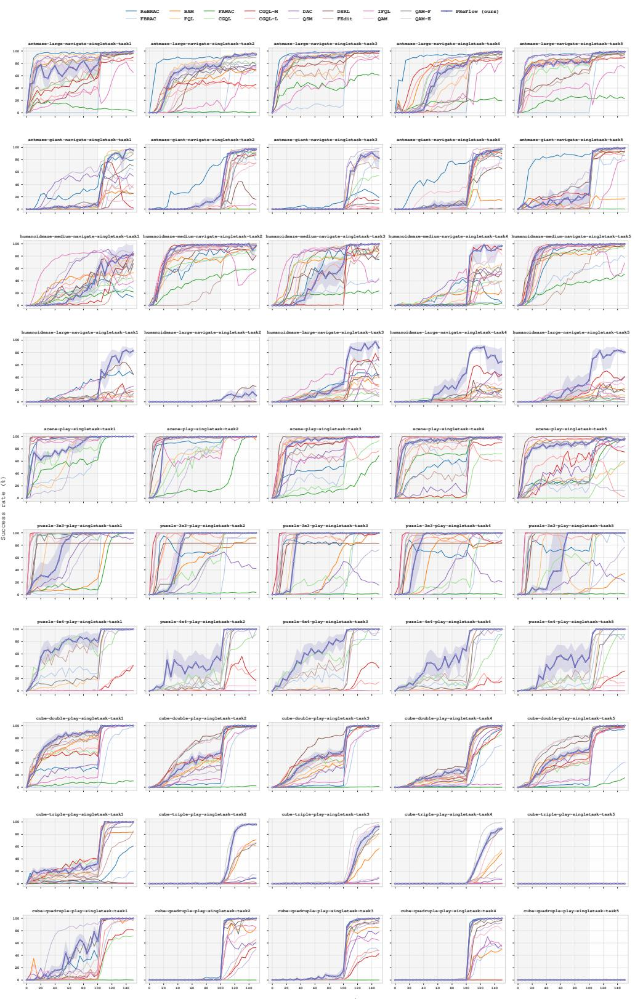  
Figure 10: Full training curves on the 50 OGBench tasks. Online fine-tuning begins after 1M ofline gradient steps and continues for 500K environment steps.