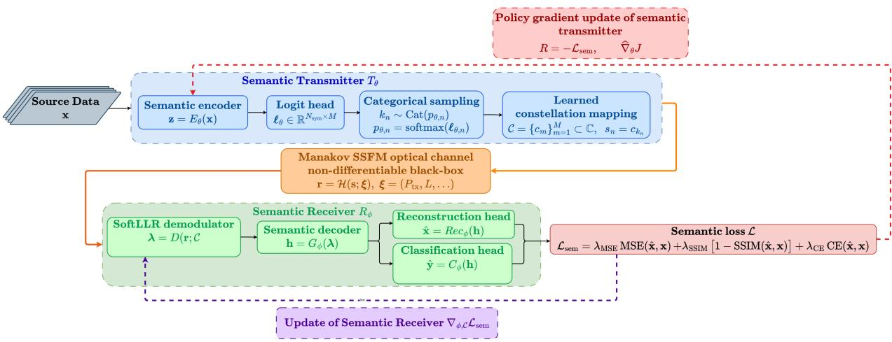
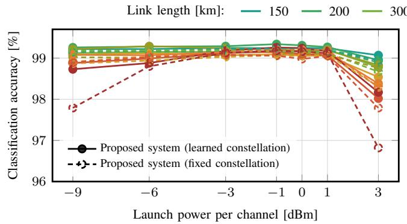
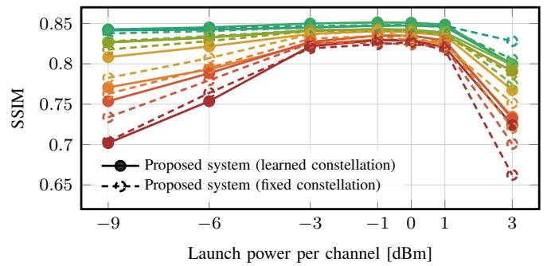
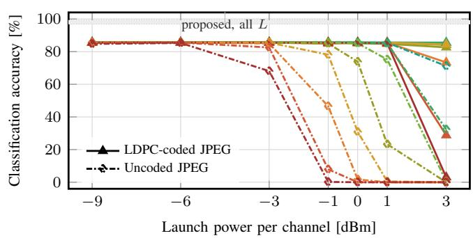
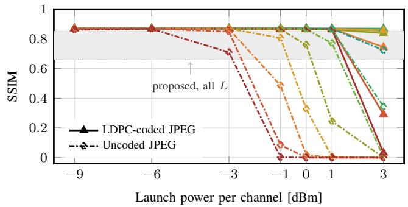
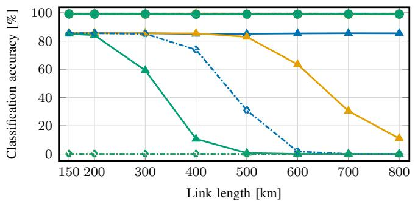
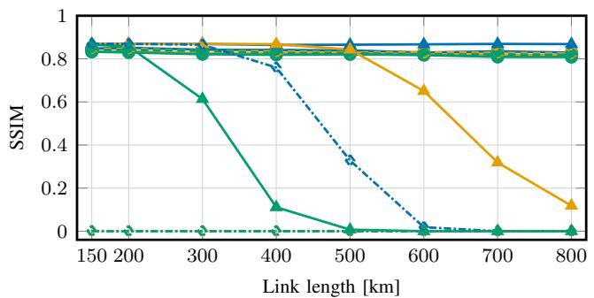

# End-to-End Optical Semantic Communication over a Nonlinear WDM Fiber Link [Invited]

Hussein Jammal, Andrea Bianco, Cristina Rottondi

Department of Electronics and Telecommunications, Politecnico di Torino, Turin, Italy name.surname@polito.it

Abstract—Emerging optical-network applications increasingly use received data for inference and control rather than exact source reproduction, creating an opportunity to trade bit-level fidelity for greater transmission reach and efficiency. We propose an end-to-end optical semantic communication system for joint image classification and reconstruction over a nonlinear wavelength-division multiplexed (WDM) fiber channel. The system maps each image directly into a fixed-length sequence of channel symbols that preserves task-relevant information, without explicit source compression or channel coding. Experiments on the MNIST dataset cover launch powers from −9 to +3 dBm, fiber lengths up to 800 km, and 16-, 64-, and 256-Quadrature Amplitude Modulation (QAM) formats. At 0 dBm, classification accuracy remains between 98.92% and 99.31% across all tested link lengths and modulation orders, while requiring fewer transmitted symbols than a Low-Density Parity-Check (LDPC)-coded JPEG baseline at every tested modulation order. These results show that semantic communication can simultaneously extend optical reach and reduce transmission resources by conveying only task-relevant information.

Index Terms—semantic communication, joint source–channel coding, optical fiber communication, reinforcement learning

## I. INTRODUCTION

Many networked applications, including digital twins, distributed sensing, and machine-to-machine communication, require the delivery of information that is sufficient to accomplish a specific task rather than an exact reproduction of the source data. This task-oriented communication paradigm has become increasingly relevant with the growing use of artificial intelligence (AI), although the underlying requirement is not limited to AI-driven applications [1]–[3]. As such applications increasingly rely on optical backbone, data-center, and access networks to transport their data, a mismatch emerges: the applications may only require task-relevant information, whereas conventional optical communication systems are designed for transparent and reliable recovery of the transmitted bitstream.

Semantic communication addresses this mismatch through a compact semantic representation that encodes the source data while preserving the information relevant to the end-to-end application task [4], [5]. In joint source–channel coding (JSCC), the semantic encoder, channel-symbol mapping, and receiver are optimized together to maximize task performance after transmission [6], [7]. The resulting representation is therefore both task-aware and channel-aware. Changing the channel distribution used during optimization can change the semantic encoder parameters, the representation, and its mapping to transmitted symbols. This differs from a conventional pipeline in which source compression, forward-error correction (FEC), and modulation are designed independently for reliable bit recovery [8].

In end-to-end JSCC, the joint optimization is typically performed by backpropagation and therefore requires a differentiable channel model to propagate gradients from the receiver to the transmitter. Since the channel model directly influences the learned semantic representation, it should also capture the relevant physical impairments as accurately as possible. This requirement is particularly challenging for coherent wavelength-division multiplexed (WDM) fiber links, where chromatic dispersion introduces memory, amplified spontaneous emission (ASE) noise accumulates across amplified spans, and Kerr nonlinearity makes the distortion dependent on the transmitted waveform and launch power [9]. Differentiable Gaussian approximations enable gradient-based training, but represent nonlinear propagation through aggregate noise statistics and may therefore miss temporal correlations and nonlinear symbol interactions [10]. Split-step Fourier method (SSFM) models capture these effects more directly, but do not readily provide the channel derivatives required for backpropagation. Consequently, end-to-end optical learning over SSFM models has mainly focused on modulation, bit or symbol recovery, and achievable information rate [11]–[13], whereas optical semantic JSCC has relied primarily on differentiable Gaussian approximations [14], [15]. Thus, directly optimizing an optical semantic communication system over a nonlinear WDM fiber simulator without channel derivatives, and evaluating its robustness across launch powers and link lengths, remains an open problem [16].

To address this gap, we propose and evaluate an optical semantic communication system optimized using a blackbox, non-differentiable Manakov-SSFM model of a coherent nonlinear WDM fiber link. The proposed system performs joint image classification and reconstruction and maps the semantic representation onto channel symbols without any explicit source compression or channel coding stage. We consider two variants: one in which the constellation geometry is learned jointly with the transmitter and receiver, and one in which a conventional quadrature amplitude modulation (QAM) constellation is kept fixed. In both cases, the receiver processes soft channel outputs through a dual-head architecture for classification and reconstruction. To train the system, we adopt a two-phase strategy that first pretrains the components on a differentiable additive white Gaussian noise (AWGN) surrogate and then alternates gradient-based receiver updates with policy-gradient transmitter updates driven by task performance measured after fiber [4]; in the learnedconstellation variant, the constellation is also updated during receiver optimization. We evaluate both variants across launch powers from −9 to +3 dBm, link lengths from 150 to 800 km, and QAM orders of 16, 64, and 256, and compare them at equal launch power with conventional JPEG pipelines without FEC and with low-density parity-check (LDPC) coding. The proposed system preserves task performance across the tested conditions, degrades gradually where the conventional pipelines collapse, and transmits fewer symbols than the LDPC-coded JPEG pipeline.

The remainder of this paper is organized as follows: Sec. II presents the system model and end-to-end optimization, Sec. III describes the experimental setup, Sec. IV discusses the results and Sec. V concludes the paper.

## II. SYSTEM MODEL AND END-TO-END OPTIMIZATION

## A. Problem Formulation

Let $\textit { \textbf { D } } = \{ ( \mathbf { x } _ { i } , y _ { i } ) \} _ { i = 1 } ^ { N }$ denote a labeled image dataset, where $\mathbf { x } _ { i } ~ \in ~ [ 0 , 1 ] ^ { H \times W } ~ \mathrm { i s }$ an image and $y _ { i } \ \in \ \{ 1 , \ldots , K \}$ is its class label. The semantic transmitter $T _ { \theta } ,$ , with trainable parameters $\theta ,$ maps x to a block $\textbf { s } ~ \in ~ \mathbb { C } ^ { N _ { \mathrm { { s y m } } } }$ of $N _ { \mathrm { s y m } }$ complex channel symbols through an M-point constellation C. Let $\mathcal { H } ( \cdot ; \xi , L )$ represent the WDM fiber channel and receiver digital signal processing (DSP), where $L$ is the link length and $\xi$ contains the launch power, amplifier-noise, and neighboringchannel realizations. The semantic receiver $R _ { \phi }$ , with trainable parameters ϕ, produces a reconstructed image xˆ and a classlogit vector yˆ according to

$$
\begin{array} { r } { ( \hat { \mathbf { x } } , \hat { \mathbf { y } } ) = R _ { \phi } ( \mathcal { H } ( T _ { \theta } ( \mathbf { x } ; \mathcal { C } ) ; \xi , L ) ; \mathcal { C } ) . } \end{array}\tag{1}
$$

Here, $\hat { \textbf { y } } \in \ \mathbb { R } ^ { K }$ contains the classification logits, and the inferred class is $\hat { y } = \arg \operatorname* { m a x } _ { j } \hat { y } _ { j }$ where $\hat { y } \in \{ 1 , \ldots , K \}$

The objective is to learn θ, ϕ, and, in the learnedconstellation variant, C, by minimizing a semantic loss $\mathcal { L } _ { \mathrm { s e m } }$ that jointly measures classification and reconstruction performance minθ $\cdot , \phi , \mathcal { C } \operatorname { \mathbb { E } } ( \mathbf { x } , y ) { \sim } \mathcal { D } , \xi \operatorname { \big [ } \mathcal { L } _ { \mathrm { s e m } } \big ]$ , where the minimization over C applies only to the learned-constellation variant.

## B. Semantic Transmitter

Fig. 1 illustrates the proposed system architecture. The forward path comprises the semantic transmitter, Manakov SSFM channel, soft demodulator, and semantic receiver. The two outputs define a common semantic loss that provides tasklevel feedback for optimizing the proposed system according to Eq. (II-A).

The semantic transmitter $T _ { \theta }$ comprises a two-stage convolutional encoder $E _ { \theta }$ followed by a linear logit head. The encoder extracts the semantic representation z from the source image x. The logit head maps z to a logit vector $\boldsymbol { \ell _ { \theta , n } } \in \mathbb { R } ^ { M }$ for each of the $N _ { \mathrm { s y m } }$ transmitted symbols, from which a softmax defines a categorical distribution $p _ { \theta , n } ( \cdot \mid \mathbf { x } )$ over the M constellation points; the index $k _ { n }$ for the n-th symbol is drawn from this distribution and mapped to the constellation point $c _ { k _ { n } } \in \mathcal { C }$

The constellation $\mathcal { C } ~ = ~ \{ c _ { m } \} _ { m = 1 } ^ { M }$ is initialized as Graylabeled square QAM and normalized so that its points have unit average energy, i.e., $\begin{array} { r } { \frac { 1 } { M } \sum _ { m = 1 } ^ { M } | c _ { m } | ^ { 2 } = 1 } \end{array}$ . In the learned variant, the in-phase and quadrature (I/Q) coordinates are optimized jointly with the semantic transmitter and semantic receiver; this constraint is imposed only at initialization, so the learned geometry is free to depart from unit average energy during training. In the fixed-constellation variant, C retains its initial QAM geometry and unit average energy.

Because the constellation energy is unconstrained after initialization, and because the symbol distribution $p _ { \theta , n } ( \cdot \mid \mathbf { x } )$ is data-dependent and therefore non-uniform over ${ \mathcal { C } } ,$ the empirical energy of a transmitted block is in general not unity. Each block is consequently normalized by its empirical symbolenergy factor

$$
a = \left( \frac { 1 } { N _ { \mathrm { s y m } } } \sum _ { n = 1 } ^ { N _ { \mathrm { s y m } } } | c _ { k _ { n } } | ^ { 2 } \right) ^ { 1 / 2 } ,\tag{2}
$$

and the transmitted symbols are defined as $\begin{array} { r } { s _ { n } ~ = ~ c _ { k _ { n } } / a . } \end{array}$ such that $\begin{array} { r } { \frac { 1 } { N _ { \mathrm { s v m } } } \sum _ { n = 1 } ^ { N _ { \mathrm { s y m } } } | s _ { n } | ^ { 2 } = 1 } \end{array}$ . This normalization prevents reductions in $\mathcal { L } _ { \mathrm { s e m } }$ from being achieved completely by increasing transmitted block energy, and separates launch-power control from constellation geometry.

## C. Optical Channel Model

The transmitted block in Eq. (2) is upsampled at $S _ { \mathrm { p s } }$ samples per symbol and shaped by a unit-energy root-raised-cosine (RRC) filter with $N _ { \mathrm { R R C } }$ taps and roll-off $\beta .$ The waveform is scaled to the prescribed per-channel launch power $P _ { \mathrm { t x } } ,$ , which is controlled independently of the semantic representation. The channel of interest (CoI) is multiplexed with $N _ { \mathrm { c h } } - 1$ power-matched neighboring WDM channels, each carrying independent, identically distributed 16-QAM symbols. The neighbor modulation order is held at 16-QAM irrespective of the CoI order M, so that the inter-channel interference environment is identical across the M sweep and any variation with M is attributable to the CoI alone. Joint WDM propagation includes inter-channel nonlinear interference such as cross-phase modulation and four-wave mixing.

The composite optical field is propagated using the Manakov equation, solved numerically by SSFM [17], with an adaptive step size based on a maximum nonlinear phase rotation criterion and bounded by h. The single-polarization launch is represented by setting the orthogonal component to zero, and polarization-mode dispersion is not modeled. Each fiber span is followed by an erbium-doped fiber amplifier (EDFA) that compensates span loss and adds ASE noise according to its noise figure $N F _ { \ast }$ thereby including ASE noise, signal–signal and signal–noise Kerr interactions. At the receiver, standard coherent DSP applies full-link electronic dispersion compensation, CoI downconversion, matched filtering, symbol-rate downsampling, and per-block normalization to unit average power, which absorbs the launch scaling, span loss and amplifier gain into a single scalar [18].

  
Fig. 1: Architecture and optimization flow of the proposed system.

Carrier-phase processing differs between the proposed system and the JPEG baselines. The proposed system applies no carrier-phase recovery and must accommodate the residual nonlinear phase rotation through its semantic receiver. In contrast, the JPEG baselines use ideal carrier-phase recovery with one maximum-likelihood phase estimate per block computed from the transmitted symbols. This choice provides the conventional baselines with an optimistic performance bound. The recovered symbol sequence $\left\{ r _ { n } \right\}$ is supplied to the soft demodulator. Numerical waveform, WDM, and link parameters are reported in Sec. III.

## D. Semantic Receiver

The semantic receiver can be written as $R _ { \phi } = G _ { \phi } \circ D ,$ where $D ( \cdot ; \mathcal { C } )$ is a soft-output max-log demodulator and $G _ { \phi }$ is the neural semantic decoder. The normalized block is first rescaled by the transmit-side factor $^ { a , }$ assumed known at the receiver, so that D evaluates its likelihoods against the shared constellation C on the transmitted symbol scale. For each recovered symbol $r _ { n } .$ , D computes the log-likelihood ratio (LLR) for bit position q,

$$
\lambda _ { n , q } = \operatorname* { m i n } _ { c \in \mathcal { C } _ { q , 0 } } | r _ { n } - c | ^ { 2 } - \operatorname* { m i n } _ { c \in \mathcal { C } _ { q , 1 } } | r _ { n } - c | ^ { 2 } ,\tag{3}
$$

where $\mathcal { C } _ { q , 0 }$ and $\mathcal { C } _ { q , 1 }$ are the subsets of constellation points labeled 0 and 1 at bit position $q ,$ respectively. Stacking over all symbols and bit positions yields the LLR vector $\pmb { \lambda } \in \mathbb { R } ^ { N _ { \mathrm { s y m } } \mathrm { \bar { l o g } } _ { 2 } M }$ , which is forwarded to the semantic decoder without hard decisions or channel decoding.

The neural semantic decoder $G _ { \phi }$ maps λ to two task outputs through independent paths. The reconstruction head $\operatorname { R e c } _ { \phi } ( \lambda )$ projects λ to a spatial feature volume via a fully connected layer, refines it through a residual block at the bottleneck resolution, and upsamples through two transposedconvolutional stages that mirror the spatial downsampling of $E _ { \theta }$ , yielding the flattened reconstructed image $\hat { \mathbf { x } } \in \overset { \sim } { \mathbb { R } ^ { H W } }$ . In parallel, the classification head $C _ { \phi } ( \lambda )$ maps λ to class logits $\bar { \bf y } \in \mathbb { R } ^ { K }$ through two fully connected layers. Both heads are trained jointly through the semantic loss $\mathcal { L } _ { \mathrm { s e m } }$

## E. Training Procedure and Alternating Optimization

The channel model H is implemented using SSFM and is treated as non-differentiable because its Jacobian ∂H/∂s is unavailable to the learning algorithm. In addition, categorical sampling has no pathwise derivative with respect to θ. Starting directly from random weights also creates a cold-start problem because the receiver initially observes an unstructured symbol mapping, which provides noisy reward signals for policygradient updates. Training therefore comprises differentiable pretraining over an AWGN surrogate followed by alternating receiver and transmitter optimization over the SSFM channel. The trainable variables are θ, ϕ, and C (the latter only in the learned- constellation variant).

1) Semantic Loss: The semantic loss combines crossentropy (CE) for classification, mean-squared error (MSE) for pixel fidelity, and the structural similarity index measure (SSIM) [19]:

$$
\begin{array} { r l } & { \mathcal { L } _ { \mathrm { s e m } } = \lambda _ { \mathrm { M S E } } \mathrm { M S E } ( \hat { \mathbf { x } } , \mathbf { x } ) + \lambda _ { \mathrm { S S I M } } [ 1 - \mathrm { S S I M } ( \hat { \mathbf { x } } , \mathbf { x } ) ] } \\ & { \quad \quad \quad + \lambda _ { \mathrm { C E } } \mathrm { C E } ( \hat { \mathbf { y } } , y ) , } \end{array}\tag{4}
$$

where CE promotes correct classification, MSE penalizes pixel-wise reconstruction error, and SSIM preserves local image structure that MSE alone may smooth.

2) Phase 1: Differentiable Pretraining: Pretraining replaces SSFM with differentiable AWGN and categorical sampling with a hard straight-through Gumbel Softmax estimator [20]. The forward pass selects a constellation point, while the backward pass differentiates through its continuous relaxation to initialize θ, ϕ, as well as C in the learned-constellation variant, before black-box optimization.

3) Phase 2: Alternating Black-Box Optimization: After pretraining, the AWGN surrogate is discarded and alternating black-box optimization over the SSFM channel runs for $N _ { \mathrm { a l t } }$ outer iterations. Within each outer iteration, the semantic receiver is updated for $N _ { \mathrm { R X } }$ gradient steps, followed by $N _ { \mathrm { T X } }$ policy-gradient steps for the semantic transmitter.

Receiver update. The semantic transmitter parameters θ are frozen, and symbols are selected deterministically according to $k _ { n } = \arg \operatorname* { m a x } _ { m } p _ { \theta , n } ( m \mid \mathbf { x } )$ . The SSFM channel propagates these symbols, after which gradients flow through the soft demodulator and semantic receiver to update ϕ. In the learnedconstellation variant, C is updated through the differentiable LLR metric; no gradient is propagated through the SSFM channel or into θ.

Transmitter update. The semantic receiver parameters $\phi$ and constellation C are frozen. Symbol indices $k _ { n }$ are sampled from $p _ { \theta , n } ( \cdot \mid \mathbf { x } )$ , and the frozen receiver assigns the reward $R = - \mathcal { L } _ { \mathrm { s e m } }$ after SSFM propagation. Defining the transmitter objective as $J ( \theta ) = \mathbb { E } [ R ]$ ], the semantic transmitter parameters θ are updated using the score-function estimator [21]:

$$
\nabla _ { \theta } J = \mathbb { E } \left[ ( R - b ) \nabla _ { \theta } \sum _ { n = 1 } ^ { N _ { \mathrm { s y m } } } \log p _ { \theta , n } ( k _ { n } \mid \mathbf { x } ) \right] ,\tag{5}
$$

where b is an exponential-moving-average reward baseline updated across mini-batches and outer iterations. Rewards above or below b respectively increase or decrease the probabilities of the selected symbols, reducing estimator variance without gradients through categorical sampling or the channel. For efficient per-sample rewards, the structural term is approximated by $1 - \exp ( - \mathrm { M S E } )$ , while true SSIM is retained for receiver training and evaluation. Freezing C prevents simultaneous changes to the policy and discrete action geometry.

## III. EXPERIMENTAL SETTINGS

Data. Experiments use the MNIST dataset with $H = W =$ 28 and $K = 1 0$ , including 60,000 training images and 10,000 test images [22]. Pixel intensities are normalized to [0, 1], and the same test set is used across all experiments for evaluation.

Model variants. Each image is transmitted using a fixed block of $N _ { \mathrm { s y m } } = 1 2 8$ symbols, while the QAM order varies over $M \in \{ 1 6 , 6 4 , 2 5 6 \}$ . For both learned and fixed constellations the CoI is placed at the center of the WDM grid.

Neural architecture. Across both system variants, the embedding and decoder hidden dimensions are fixed at 32 and 256, respectively, and training uses a batch size of 32.

Optical channel configuration. Tab. I lists the waveform, WDM, and fiber parameters. Before launch-power scaling, each waveform generated by the proposed system is normalized to unit average power; hence, the reported launch power denotes the per-channel average power at the fiber input. Waveform generation, filtering, and propagation are implemented using OptiCommPy [23].

TABLE I: Optical waveform and fiber parameters.
<table><tr><td>Symbol</td><td>Quantity</td><td>Value</td></tr><tr><td> $\overline { { R _ { \mathrm { s y m } } } }$ </td><td>Symbol rate</td><td>32 GBaud</td></tr><tr><td> $S _ { \mathrm { p s } }$ </td><td>Samples per symbol</td><td>16</td></tr><tr><td> $N _ { \mathrm { R R C } }$ </td><td>RRC filter length</td><td>1024 taps</td></tr><tr><td> $\beta$ </td><td>RRC roll-off factor</td><td>0.01</td></tr><tr><td> $N _ { \mathrm { c h } }$ </td><td>Number of WDM channels</td><td>11</td></tr><tr><td> $\Delta f$ </td><td>WDM channel spacing</td><td>37.5 GHz</td></tr><tr><td> $k _ { \mathrm { C o I } }$ </td><td>CoI position</td><td>0 (center)</td></tr><tr><td> $M _ { \mathrm { n b r } }$ </td><td>Neighbor modulation order</td><td>16-QAM</td></tr><tr><td> $L$ </td><td>Link length</td><td>[150, 200, 300, 400, 500, 600, 700, 800] km</td></tr><tr><td> $L _ { \mathrm { s p a n } }$ </td><td>Span length</td><td>50 km</td></tr><tr><td> $h$ </td><td>Nominal SSFM step</td><td>0.5 km, phase-adaptive</td></tr><tr><td> $_ \alpha$ </td><td>Attenuation coefficient</td><td>0.2 dB/km</td></tr><tr><td> $D$ </td><td>Dispersion parameter</td><td>16 ps/(nm·km)</td></tr><tr><td> $\gamma$ </td><td>Kerr coefficient</td><td> $1 . 3 \mathrm { \dot { ~ W } ^ { - 1 } k m ^ { - 1 } }$ </td></tr><tr><td> $\dot { F } _ { c }$ </td><td>Carrier frequency</td><td>193.1 THz</td></tr><tr><td> $N F$ </td><td>EDFA noise figure</td><td>4.5 dB</td></tr></table>

Training configuration. The semantic-loss weights are $\lambda _ { \mathrm { M S E } } = 1 , \lambda _ { \mathrm { S S I M } } = 0 . 5$ , and $\lambda _ { \mathrm { C E } } = 1$ . AWGN pretraining runs for 10 epochs at a signal-to-noise ratio (SNR) of 20 dB. Then, Manakov-SSFM fine-tuning uses $N _ { \mathrm { a l t } } ~ = ~ 1 0 0$ outer iterations, each with $N _ { \mathrm { R X } } = 5 0$ receiver gradient and $N _ { \mathrm { T X } } = 5 0$ transmitter policy-gradient steps per iteration, with the launch power sampled uniformly from $[ - 3 , + 3 ]$ dBm. A separate model is trained for each combination of link length, modulation order, and constellation variant, resulting in 48 systems with identical architectures, hyperparameters, and training budgets.

Baselines. Two baselines apply JPEG compression with quality factor $Q \ : = \ : 2 5$ , which controls the tradeoff between compression and reconstruction fidelity. The uncoded JPEG baseline transmits the compressed bitstream directly, whereas the LDPC-coded JPEG baseline applies rate-1/2 LDPC coding [24]. After channel demodulation and, for the coded baseline, LDPC decoding, successfully recovered JPEG images are classified by a separately trained ResNet-18 [25], an 18-layer residual CNN followed by a 10-class linear head, trained on uncompressed samples. The same classifier is used for both baselines and all channel conditions. A channel-free control also classified the Q = 25 JPEG images after compression and decompression without optical propagation, thereby isolating the source-compression effect. If JPEG decoding fails, the frame is counted as a classification error and assigned zero SSIM because no image is available for classification. Both baselines use the same optical channel as the proposed system and are compared at equal per-channel average launch power.

Evaluation. Performance is evaluated at launch powers of $- 9 , - 6 , - 3 , - 1 , 0 , 1$ , and 3 dBm. Classification accuracy is used as task metric, while SSIM quantifies reconstruction quality.

## IV. RESULTS AND DISCUSSION

## A. Robustness to launch power and reach

Fig. 2 compares the classification accuracy and the SSIM of the proposed semantic system and the two baselines using 16-QAM transmission, across launch powers and link lengths. Fig. 2a shows that the accuracy of the semantic transmission system remains stable from −9 to +1 dBm, varying by at most 0.6 percentage points at any link length, with a loss below one point at +3 dBm. Since the system is trained with launch power drawn from $[ - 3 , + 3 ]$ dBm, the stability at −9 and −6 dBm is an out-of-distribution result rather than a fitted one. In contrast, Fig. 2b shows the accuracy trend of the JPEG baselines. When JPEG decoding succeeds, classification accuracy saturates at approximately 85%. The channel-free JPEG control yields the same accuracy ceiling, confirming that the plateau is imposed by the lossy JPEG source-compression setting, rather than by the optical channel. In the LDPCcoded baseline, FEC can recover the compressed bitstream but cannot restore information discarded by the source coder.

(a) Classification accuracy of the proposed system  
  
(c) SSIM of the proposed system.

(b) JPEG-baseline classification accuracy.  
  
(d) JPEG-baseline SSIM.  
Fig. 2: Classification accuracy (top) and SSIM (bottom) versus launch power at M = 16. Color indicates link length. The proposed system is shown on the left and the JPEG baselines on the right, where shading marks the performance range of the proposed system.  
Scheme: Proposed system (learned constellation) Proposed system (fixed constellation) LDPC-coded JPEG Uncoded JPEG

  
(a) Accuracy versus link length at 0 dBm.

  
(b) SSIM versus link length at 0 dBm.  
Fig. 3: Classification accuracy (a) and SSIM (b) versus link length at nominal launch power of 0 dBm. Color indicates QAM order $M \in \{ 1 6 , 6 4 , 2 5 6 \}$ while marker and line style indicate the system variant.

At +3 dBm, the accuracy of the LDPC-coded JPEG baseline falls to 73.4%, 28.8%, and 3.1% at 600, 700, and 800 km, respectively, while the uncoded JPEG baseline reaches zero by −1 dBm at 800 km, its collapse migrating to lower power as the link lengthens. This behavior reflects the sensitivity of the entropy-coded JPEG stream to residual bit errors, where a single uncorrected error can invalidate the payload.

The SSIM trends reported in Fig. 2c reveal an operatingpower optimum between −1 and 0 dBm, balancing low-power ASE noise and high-power Kerr nonlinearity. However, the SSIM of the semantic communication system stays above 0.66 throughout the sweep. By contrast, Fig. 2d shows an

SSIM near 0.869 when JPEG decoding succeeds and near zero when it fails. JPEG therefore provides higher reconstruction fidelity under reliable decoding, whereas the proposed system degrades gradually beyond the baseline failure point. The learned and fixed constellations perform almost identically.

## B. Reach at nominal launch power

Fig. 3a shows that at 0 dBm the proposed system maintains 98.92–99.31% accuracy from 150 to 800 km at every QAM order, with at most a 0.23 percentage point difference between the learned and fixed constellations. In contrast, the uncoded JPEG baseline falls from 85.09% at 300 km to 1.72% at

600 km with 16-QAM and is nearly unusable at the shortest link length with higher QAM orders. The LDPC-coded JPEG baseline preserves approximately 85% accuracy through 800 km with 16-QAM. This ceiling holds only while decoding succeeds, as accuracy still falls to 11.02% at 800 km with 64- QAM and to 0.67% at 500 km with 256-QAM, because a denser constellation reduces the noise margin at fixed launch power. FEC therefore extends reach but does not remove the dependence on QAM order.

Fig. 3b shows a similar pattern in terms of reconstruction quality. The SSIM of the semantic communication system remains between 0.808 and 0.851, whereas the JPEG baselines SSIM drops sharply once decoding becomes unreliable.

## C. Transmission cost

At $R _ { \mathrm { s y m } } = 3 2$ GBaud, each symbol has duration $T _ { \mathrm { s y m } } =$ $1 / R _ { \mathrm { s y m } } = 3 1 . 2 5$ ps and carries $\log _ { 2 } M$ bits. The transmission time per image, $\tau ~ = ~ N _ { \mathrm { s y m } } / R _ { \mathrm { s y m } }$ , therefore depends on symbol count but not on the QAM order. The semantic communication system transmits $N _ { \mathrm { s y m } } = 1 2 8$ symbols per image, fixing its transmission time at 4.0 ns. The JPEG baselines instead transmit fixed entropy-coded payloads, so their symbol counts and transmission times decrease as M grows. Table II shows that the semantic communication system uses fewer symbols and less transmission time than the LDPC-coded JPEG baseline at every QAM order: 128 versus 466/311/233 symbols and 4.0 ns versus 14.6/9.7/7.3 ns. The uncoded JPEG baseline becomes slightly cheaper only at 256-QAM, where it is unreliable beyond short link lengths. Thus, the proposed system achieves lower transmission cost than the LDPC-coded JPEG baseline while maintaining a constant transmission time across modulation orders.

## V. CONCLUSION

This work presented an end-to-end optical semantic communication system for joint image classification and reconstruction over a nonlinear WDM fiber link. By optimizing task performance directly over a non-differentiable Manakov-SSFM channel, the proposed system maintains near-99% classification accuracy over link lengths up to 800 km across 16-, 64-, and 256-QAM, while the conventional JPEG baselines exhibit pronounced reach limitations and abrupt performance collapse as channel conditions worsen. At the same time, the semantic system transmits each image using only 128 symbols in a fixed 4.0 ns, reducing the transmission cost with respect to the LDPC-coded JPEG baseline at every tested modulation order. The results show that semantic communication can extend the usable reach of nonlinear optical links while reducing the transmission resources required to accomplish the target task.

TABLE II: Transmission cost per image at 16/64/256-QAM.
<table><tr><td>Scheme</td><td>Symbols/image</td><td>Transmission time [ns]</td></tr><tr><td>Semantic system</td><td>128/128/128</td><td>4.0/4.0/4.0</td></tr><tr><td>Uncoded JPEG</td><td>233/155/117</td><td>7.3/4.9/3.7</td></tr><tr><td>LDPC-coded JPEG</td><td>466/311/233</td><td>14.6/9.7/7.3</td></tr></table>

## REFERENCES

[1] Q. Lan et al., “What is semantic communication? a view on conveying meaning in the era of machine intelligence,” Journal of Communications and Information Networks, vol. 6, no. 4, pp. 336–371, 2021.

[2] H. Xie et al., “Deep learning enabled semantic communication systems,” IEEE Transactions on Signal Processing, vol. 69, pp. 2663–2675, 2021.

[3] Z. Qin et al., “Semantic communications: Principles and challenges,” arXiv preprint arXiv:2201.01389, 2021.

[4] H. Zhang et al., “Deep learning-enabled semantic communication systems with task-unaware transmitter and dynamic data,” IEEE Journal on Selected Areas in Communications, vol. 40, no. 12, pp. 3229–3243, 2022.

[5] D. G”und”uz et al., “Beyond transmitting bits: Context, semantics, and task-oriented communications,” arXiv preprint arXiv:2207.09353, 2022.

[6] E. Bourtsoulatze et al., “Deep joint source-channel coding for wireless image transmission,” IEEE Transactions on Cognitive Communications and Networking, vol. 5, no. 3, pp. 567–579, 2019.

[7] D. Burth Kurka and D. G”und”uz, “Joint source-channel coding of images with (not very) deep learning,” in 2020 International Zurich Seminar on Information and Communication (IZS 2020), 2020, pp. 90– 94.

[8] C. E. Shannon, “A mathematical theory of communication,” Bell System Technical Journal, vol. 27, no. 3, pp. 379–423, 1948.

[9] G. P. Agrawal, Nonlinear Fiber Optics, 6th ed. Academic Press, 2019.

[10] P. Poggiolini et al., “Polynomial closed form model for ultra-wideband transmission systems,” Journal of Lightwave Technology, 2026.

[11] O. Jovanovic et al., “Geometric constellation shaping for fiber-optic channels via end-to-end learning,” Journal of Lightwave Technology, vol. 41, no. 12, pp. 3726–3736, 2023.

[12] ——, “End-to-end learning of a constellation shape robust to channel condition uncertainties,” Journal of Lightwave Technology, vol. 40, no. 10, pp. 3316–3324, 2022.

[13] S. Gaiarin et al., “End-to-end optimization of coherent optical communications over the split-step fourier method guided by the nonlinear fourier transform theory,” Journal of Lightwave Technology, vol. 39, no. 2, pp. 418–428, 2020.

[14] X. Cai et al., “Convolutional autoencoder-enhanced semantic communication in optical fiber systems,” IEEE Transactions on Cognitive Communications and Networking, 2026.

[15] ——, “Machine learning-enhanced semantic communication in optical fiber systems,” in 2025 25th Anniversary International Conference on Transparent Optical Networks (ICTON), 2025, pp. 1–4.

[16] F. Ait Aoudia and J. Hoydis, “End-to-end learning of communications systems without a channel model,” in 2018 52nd Asilomar Conference on Signals, Systems, and Computers, 2018, pp. 298–303.

[17] D. Marcuse et al., “Application of the manakov-PMD equation to studies of signal propagation in optical fibers with randomly varying birefringence,” Journal of Lightwave Technology, vol. 15, no. 9, pp. 1735–1746, 1997.

[18] S. J. Savory, “Digital coherent optical receivers: Algorithms and subsystems,” IEEE Journal of Selected Topics in Quantum Electronics, vol. 16, no. 5, pp. 1164–1179, 2010.

[19] Z. Wang et al., “Image quality assessment: From error visibility to structural similarity,” IEEE Transactions on Image Processing, vol. 13, no. 4, pp. 600–612, 2004.

[20] E. Jang et al., “Categorical reparameterization with Gumbel-Softmax,” in International Conference on Learning Representations, 2017.

[21] R. J. Williams, “Simple statistical gradient-following algorithms for connectionist reinforcement learning,” Machine Learning, vol. 8, pp. 229–256, 1992.

[22] Y. LeCun et al., “Gradient-based learning applied to document recognition,” Proceedings of the IEEE, vol. 86, no. 11, pp. 2278–2324, 1998.

[23] E. Forestieri et al., “OptiCommPy: Open-source Python library for optical communications,” https //github.com/edsonportosilva/OptiCommPy, 2023.

[24] T. J. Richardson and R. L. Urbanke, “Efficient encoding of low-density parity-check codes,” IEEE Transactions on Information Theory, vol. 47, no. 2, pp. 638–656, Feb. 2001.

[25] K. He, X. Zhang, S. Ren, and J. Sun, “Deep residual learning for image recognition,” in Proc. IEEE Conf. Comput. Vis. Pattern Recognit. (CVPR), 2016, pp. 770–778.