# Explore Broadly, Reason Sharply: Push Small Models toward the Frontier via Sampling

Panagiotis Theodoropoulos1,\*, Nan Jiang2, Xintong Duan3, Ali Hasan3, Yuriy Nevmyvaka3, Evangelos A. Theodorou1 and Wei Deng3,†

1Georgia Institute of Technology, 2University of Texas at El Paso, 3ML Research, Morgan Stanley

Power-sharpened sampling is an inference-time alternative to reinforcement-learning (RL) post-training for enhancing reasoning in large language models (LLMs). High-probability sequences are amplified under the base model without parameter updates or external rewards, avoiding the costly optimization and jagged generalization of RL. However, this approach faces a fundamental exploration–exploitation trade-of, as strong sharpening restricts exploration, trapping samplers in plausible but incorrect reasoning trajectories, whereas weak sharpening leaves the answer distribution difuse. To resolve this trade-of, we introduce Parallel Power Tempering (PPT), instantiating power-sharpened LLM sampling via parallel tempering. Running multiple interacting replicas in parallel at diferent sharpening levels allows lower-power replicas to explore diverse reasoning trajectories and higher-power chains to further exploit higher-likelihood responses favored by the sharpened target. Specifically, we tailor PPT to inference-time sampling by mitigating a truncation bias, identified in prior power samplers, and investigate efective swap strategies under finite memory and compute budgets. Extensive experimentation shows that PPT substantially improves single-chain power-sharpened sampling and outperforms RL-post-trained models, producing higher-quality reasoning traces and even achieving performance comparable to frontier models.

## 1. Introduction

Reinforcement Learning (RL)-guided post-training with task-specific rewards is a widely used recipe for improving the reasoning capabilities in LLMs (Guo et al., 2025; Shao et al., 2024). This approach is particularly efective in domains such as mathematics and code generation, where automated verifiers can reliably assess correctness. However, RL post-training requires access to a verifier or reward model that scores sampled outputs, and it requires expensive gradient-based updates to the model’s parameters (Shao et al., 2024). Moreover, reliable rewards are often unavailable for open-ended scientific inquiry, deliberation, and long-horizon planning. Even when rewards exist, optimizing for a narrow set of rewarded tasks can erode prior capabilities and yield “jagged” generalization to nearby problems (Hu et al., 2026). These limitations motivate inference-time alternatives that improve reasoning without parameter updates or external rewards.

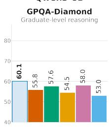

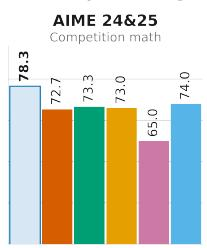

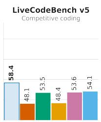

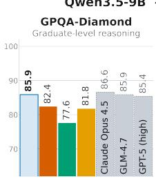

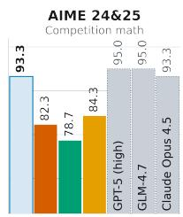

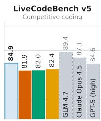  
Figure 1 | Single-shot accuracy (%) of Parallel Power Tempering. Left: Qwen3-8B across three benchmarks. Right: Qwen3.5-9B on GPQA-Diamond, AIME 24&25 and LiveCodeBench v5 against decoding baselines and the reported scores of frontier models.

Traditional inference-time methods improve generation either by selecting a high-scoring sequence among multiple completions (Huang et al., 2025; Kang et al., 2025), or by locally reshaping token probabilities with temperature and truncation rules (Holtzman et al., 2020; Meister et al., 2023; Nguyen et al., 2025; Tang et al., 2025). The latter are inherently myopic, as they modify each decoding step without directly controlling the distribution over complete responses. Neither approach generally samples from a prescribed sequence-level target.

In this vein, recent works suggest that a model’s capability can be substantially enhanced at inference time by sampling from a sharpened distribution over the model’s outputs (Ji et al., 2026; Karan and Du, 2026). Such sequence-level targets naturally depend on Monte Carlo methods for controllable generation and blockwise resampling (Forristal et al., 2023; Mireshghallah et al., 2022). The cornerstone hypothesis is that reasoning trajectories are latent in models, and thus, sequence-level sharpening amplifies these trajectories, enabling sampling from them without additional RL post-training while yielding comparable inference-time reasoning performance.

However, power-sharpened sampling introduces a fundamental inference-time challenge. Sharpening concentrates the sampling distribution around high-likelihood responses, which can improve finalanswer quality, but excessive concentration can trap the sampler in locally plausible yet incorrect reasoning paths (Ji et al., 2026; Karan and Du, 2026). This behavior is especially consequential for multi-step reasoning tasks, where an early mistake can lead to a coherent but wrong solution (Li et al., 2025). Conversely, flatter distributions explore a broader range of alternative reasoning paths, but may also generate noisy or lower-quality responses that are unsuitable as final outputs (Troshin et al., 2025). Thus, power-sharpened LLM sampling faces a central exploration–exploitation trade-of: the sampler must explore diverse reasoning trajectories while still exploiting the sharpened distribution to produce high-quality answers.

To address this challenge, we introduce Parallel Power Tempering (PPT), a power-sharpened parallel tempering sampler for LLM inference. Our method adapts classical parallel tempering, also known as replica exchange, from multi-modal MCMC (Earl and Deem, 2005; Geyer, 1991; Hukushima and Nemoto, 1996; Swendsen and Wang, 1986) to sequence-level power-sharpened LLM sampling. Parallel tempering transfers naturally to the LLM regime. Instead of running a single sampler at one sharpening level, PPT runs replicas in parallel over a ladder of sharpening levels. Unlike prior LLM replica-exchange methods that vary prefix length (He et al., 2026), all replicas share a common horizon, which enables whole-record swaps. The lower-sharpening replicas act as exploratory chains that can search broadly across possible responses, while the higher-sharpening replicas act as exploitative chains that concentrate on responses favored by the sharpened objective. The replicas are coupled through swap moves, which allow neighboring replicas to exchange their generated responses according to a principled and tractable Metropolis–Hastings acceptance rule (Deng et al., 2020; Syed et al., 2022). Every swap decision therefore reduces to the base-model log-probabilities of the two responses being exchanged, which are already cached from generation, so a swap requires no additional model evaluations. In this way, promising reasoning paths discovered by exploratory replicas can be transferred to sharper replicas, while sharper replicas can escape poorly mixed regions by exchanging with flatter chains. We evaluate PPT across a range of small open-source models on benchmarks spanning mathematics, coding, and STEM reasoning. Our main contributions can be summarized as follows:

• We introduce PPT, a novel power-sharpened parallel tempering sampler specially adapted to LLM sampling that runs a ladder of replicas at various sharpening levels and couples adjacent replicas through swap moves, letting exploratory low-power chains feed diverse states to exploitative high-power chains, mitigating the central limitation on the exploration–exploitation trade-of.

• We identify a structural truncation bias in prior implementations of early-stopped power sampling, which parallel tempering cannot repair, and eliminate it via a fixed-horizon construction that preserves the true sharpened target. Since every swap schedule is exact under this construction, we further study eficient swap strategies subject to memory and compute constraints.

• Extensive experiments across math, STEM, and code reasoning benchmarks on multiple open models show that PPT substantially outperforms sampling and RL baselines in nearly all settings. Notably, with Qwen3.5-9B, it even matches or exceeds the performance of frontier models, as illustrated in Figure 1.

## 2. Preliminaries

## 2.1. Notations

Let x0 denote a given prompt and let $\mathbf { x } _ { 0 : T } = \left( \mathbf { x } _ { 0 } , x _ { 1 } , \ldots , x _ { T } \right)$ be a sequence of generated tokens appended to that prompt, where each $x _ { t }$ belongs to a finite vocabulary V. An autoregressive LLM factorizes the joint distribution over $\mathbf { x } _ { 0 : T }$ via the chain rule $\begin{array} { r } { p _ { 0 } ( \mathbf { x } _ { 1 : T } | \mathbf { x } _ { 0 } ) = \prod _ { t = 1 } ^ { T } p _ { 0 } ( x _ { t } \mid \mathbf { x } _ { 0 : t - 1 } ) } \end{array}$ . At fixed horizon �, let $S _ { T }$ be the finite state space containing sequences of length-� and records terminated at $\tau \leq T$ . Postterminal entries are filled with deterministic padding leading to a state $( x _ { 1 } , \dots , x _ { \tau - 1 } , \mathrm { E O S } , \bot , \dots , \bot )$ so $p _ { 0 } ( \mathbf { x } _ { 1 : T } \mid \mathbf { x } _ { 0 } )$ through � or until EOS. Sampling proceeds sequentially: at each step $t = 1 , \dots , T _ { \mathrm { { ; } } }$ , a token is drawn from $x _ { t } \sim p _ { 0 } ( \cdot \mid \mathbf { x } _ { 0 : t - 1 } )$

## 2.2. Power Sharpening for LLMs

Recent work proposes sampling from a power-sharpened variant of this distribution (Ji et al., 2026; Karan and Du, 2026):

$$
\pi _ { \alpha } ( \mathbf { x } _ { 1 : T } \mid \mathbf { x } _ { 0 } ) = { \frac { p _ { 0 } ( \mathbf { x } _ { 1 : T } \mid \mathbf { x } _ { 0 } ) ^ { \alpha } } { Z _ { \alpha } ( \mathbf { x } _ { 0 } ) } } , \qquad Z _ { \alpha } ( \mathbf { x } _ { 0 } ) = \sum _ { \mathbf { x } _ { 1 : T } ^ { \prime } \in \mathcal { V } ^ { T } } p _ { 0 } ( \mathbf { x } _ { 1 : T } ^ { \prime } \mid \mathbf { x } _ { 0 } ) ^ { \alpha } ,\tag{1}
$$

where $\alpha > 1$ is the sharpening parameter and $Z _ { \alpha } ( \mathbf { x } _ { 0 } )$ is the normalizing constant. Raising the base distribution to a power of � suppresses low-likelihood continuations while amplifying high-likelihood ones (Karan and Du, 2026). However, direct autoregressive sampling from $\pi _ { \alpha }$ is intractable, since the normalizing constant in Eq. 1 requires summing the powered likelihood over all possible future completions. For this reason Metropolis–Hastings sampling was employed.

Metropolis–Hastings (MH) is an MCMC algorithm for sampling from a distribution known only up to a normalizing constant (Hastings, 1970; Metropolis et al., 1953). Given a target density $\pi _ { \alpha } ( \mathbf { x } )$ 2 MH constructs a Markov chain $\mathbf { x } ^ { ( 0 ) }  \mathbf { x } ^ { ( 1 ) }  \cdots  \mathbf { x } ^ { ( n ) }$ as follows. From the current state $\mathbf { x } ^ { ( i ) }$ , a candidate y is drawn from a proposal distribution. Let $g _ { \alpha }$ be the tokenwise-powered proposal

$$
g _ { \alpha } ( x _ { t } \mid \mathbf { x } _ { 0 } , \mathbf { x } _ { < t } ) = { \frac { p _ { 0 } ( x _ { t } \mid \mathbf { x } _ { 0 } , \mathbf { x } _ { < t } ) ^ { \alpha } } { \sum _ { \nu \in { \mathcal { V } } } p _ { 0 } ( \nu \mid \mathbf { x } _ { 0 } , \mathbf { x } _ { < t } ) ^ { \alpha } } } .\tag{2}
$$

After EOS, its only admissible output is ⊥, with probability one. Although tractable, $g _ { \alpha }$ is a tokenwise proposal and is not the sequence-level target $\pi _ { \alpha }$ . Following Karan and Du (2026), draw a restart position � from a state-independent distribution, retain the prefix $\mathbf { x } _ { < r . }$ , and resample the sufix using

$$
q _ { r } ( \mathbf { y } \mid \mathbf { x } ) = \mathbf { 1 } \{ \mathbf { y } _ { < r } = \mathbf { x } _ { < r } \} \prod _ { t = r } ^ { T } g _ { \alpha } ( y _ { t } \mid \mathbf { x } _ { 0 } , \mathbf { y } _ { < t } ) .
$$

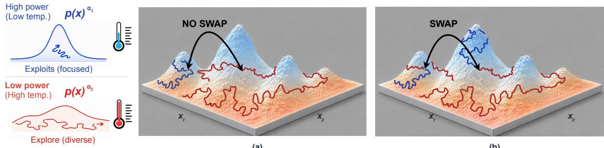  
Figure 2 | In our PPT, a flat, low-power chain $p ( \mathbf { x } ) ^ { \alpha _ { 2 } }$ (red) explores freely while a sharp, high-power chain $p ( \mathbf { x } ) ^ { \alpha _ { 1 } }$ (blue) exploits local modes to reason sharply; periodically the chains propose to swap states. In (a) the swap is rejected and both stay put. In (b), it is accepted, letting the focused chain teleport to a high-probability region the explorer found, rather than climbing over the barrier itself.

(a)

(b)

If � lies after the current EOS, the padding convention makes this a self-transition. Conditional on the sampled �, accept the proposal with probability

$$
A _ { r } ( \mathbf { x } , \mathbf { y } ) = \operatorname* { m i n } \left\{ 1 , { \frac { \pi _ { \alpha } ( \mathbf { y } \mid \mathbf { x } _ { 0 } ) q _ { r } ( \mathbf { x } \mid \mathbf { y } ) } { \pi _ { \alpha } ( \mathbf { x } \mid \mathbf { x } _ { 0 } ) q _ { r } ( \mathbf { y } \mid \mathbf { x } ) } } \right\} .\tag{3}
$$

Each MH restart preserves $\pi _ { \alpha } ;$ thus, the state-independent mixture over � also preserves $\pi _ { \alpha }$

## 2.3. Parallel Tempering

Parallel tempering (PT) is an MCMC technique designed to improve mixing for target distributions that are dificult to explore directly, such as multimodal or highly concentrated distributions (Earl and Deem, 2005; Swendsen and Wang, 1986). Instead of running one chain, PT runs multiple chains, or replicas, in parallel over a ladder of tempered distributions.

PT introduces a sequence of auxiliary distributions $\pi _ { 1 } ( \mathbf { x } ) , \pi _ { 2 } ( \mathbf { x } ) , \ldots , \pi _ { K } ( \mathbf { x } )$ . The joint state of all replicas is denoted by $\mathbf { X } = \left( \mathbf { x } ^ { ( 1 ) } , \mathbf { x } ^ { ( 2 ) } , \ldots , \mathbf { x } ^ { ( K ) } \right)$ , where $\mathbf { x } ^ { ( k ) }$ is the current state of replica �. The replicas are coupled together through swaps between neighboring replicas � and $k + 1$ proposing state exchange as $( \mathbf { x } ^ { ( k ) } , \mathbf { \bar { x } } ^ { ( k + 1 ) } ) \to ( \bar { \mathbf { x } ^ { ( k + 1 ) } } , \bar { \mathbf { x } ^ { ( k ) } } )$ , with acceptance probability

$$
A _ { \mathrm { s w a p } } = \operatorname* { m i n } \left\{ 1 , \frac { \pi _ { k } \left( \mathbf { x } ^ { ( k + 1 ) } \right) \pi _ { k + 1 } \left( \mathbf { x } ^ { ( k ) } \right) } { \pi _ { k } \left( \mathbf { x } ^ { ( k ) } \right) \pi _ { k + 1 } \left( \mathbf { x } ^ { ( k + 1 ) } \right) } \right\} .\tag{4}
$$

## 3. Methodology

## 3.1. Motivation: The Exploration Bottleneck

Recall that at horizon �, the sharpened power target has the form $\pi _ { \alpha } ( \mathbf { x } ) \propto p _ { 0 } ( \mathbf { x } ) ^ { \alpha }$ . The power � encodes an exploration–exploitation trade-of that no single value resolves: raising it concentrates mass on high-likelihood responses—desirable when high-likelihood traces are more coherent or reliable—but sharpens the landscape and impedes local exploration, while lowering it flattens the landscape and eases exploration at the price of leaving good answers difuse.

To address this exploration–exploitation trade-of, we introduce Parallel Power Tempering (PPT), which couples multiple replicas through swaps. Specializing the parallel-tempering construction from Section 2 to sequence-level power targets, we choose a ladder of sharpening powers $1 \leq \alpha _ { 1 } < \cdots < \alpha _ { K }$ and assign replica � the target $\pi _ { \alpha _ { k } } ( \mathbf { x } ) \propto p _ { 0 } ( \mathbf { x } ) ^ { \alpha _ { k } }$ and couple the replicas through state swaps. Replicas with small $\alpha _ { k }$ act as high-temperature explorers that range across alternative reasoning paths, while swaps let the promising trajectories they discover travel up the ladder to the target chain—the sharpest rung $\alpha _ { K }$ —which thus reaches high-probability regions by exchange rather than by climbing over reasoning barriers itself. See Figure 2 for a visual example.

## 3.2. Structural Truncation Bias and the Fixed-Horizon Correction

To apply PPT to variable-length sequences, refinement must allow early termination to be revised. Naïvely extending the early-stopping implementation of Karan and Du (2026) to the parallel-tempering setting inherits a one-way truncation bias. Each sufix proposal regenerates only through the current realized length, so a shorter candidate y can satisfy $q ( \mathbf { y } \mid \mathbf { x } ) > 0$ while $q ( \mathbf { x } \mid \mathbf { y } ) = 0$ . The exact MH rule should reject this move, but the implementation can accept it using token scores truncated to the candidate’s endpoint. Therefore, the accepted shortenings create uncompensated probability flow toward shorter records, preventing the sampler from preserving the true target.

Under a uniform accepted-shortening condition, this one-way truncation also yields an asymptotic bias floor. More formally, let $\mathcal { B } _ { h }$ denote the records of length at most $h ,$ and let $\ v { b } _ { h } ^ { ( k ) } = \pi _ { \alpha _ { k } } ( \mathcal { B } _ { h } ^ { c } )$ denote the probability mass of longer records at rung �. Assume the MH updates accept a move shortening a record from above ℎ to at most $h ,$ with probability $\delta > 0$ , but can never lengthen records. Then for any initial distribution $\nu ,$ after � iterations, we show in App. C.2 that

$$
\operatorname* { l i m i n f } _ { N \to \infty } \mathrm { T V } ( \nu _ { N } , \Pi ) \geq 1 - \prod _ { k = 1 } ^ { K } ( 1 - b _ { h } ^ { ( k ) } ) .\tag{5}
$$

This inequality quantifies the asymptotic error due to the violation of the target preservation by the unbalanced MH rule. Crucially, this truncation would hinder PPT’s ability to explore, as shortened records transferred to lower power rung would retain their restricted generation budget.

Remark 3.1. To remove this one-way truncation, we maintain a fixed horizon �, through deterministic post-EOS padding $\perp ,$ allowing sufix proposals starting at or before EOS to regenerate up to � regardless of the current completion length, and explore more efectively. We show in App. C that this fixed-horizon correction removes structural truncation bias, while local MH updates composed with replica swaps preserve the true sharpened target.

Error Floor: Example. To better understand the efect of the one-way truncation, consider one chain at a fixed horizon $T = 2$ with power $\alpha = 2$ and vocabulary $\{ a , e \}$ , where � is the terminal token. The model assigns probability $1 / 2$ to each token at every unfinished prefix. On the common record space $( X _ { 1 } , X _ { 2 } , X _ { 3 } , X _ { 4 } ) =$ $( ( e , \bot ) , ( a ) , ( a , e ) , ( a , a ) )$ , and the powered target is $\begin{array} { r } { \pi = ( \frac { 2 } { 3 } , 0 , \frac { 1 } { 6 } , \frac { 1 } { 6 } ) } \end{array}$ assigning zero target mass on the unfinished one-token record $X _ { 2 }$ Assume, both samplers start from $X _ { 3 } = ( a , e )$ and perform � MH updates. Once unbalanced refinement accepts a one-token record, it cannot revisit either two-token continuation. Fixed-horizon refinement retains this possibility: from $X _ { 1 : }$ , it returns to a two-token record with probability $1 / 8$ per update. Thus an early EOS remains revisable. For $N \geq 1$ , the fixed-horizon and truncating laws $\nu _ { N }$ and $\widetilde { \nu } _ { N }$ satisfy

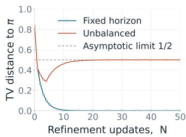  
Figure 3 | Comparison between fixed-horizon and unbalanced refinement starting from $X _ { 3 }$

$$
\mathrm { T V } ( \nu _ { N } , \pi ) = \frac { 2 } { 3 } ( \frac { 5 } { 8 } ) ^ { N } \xrightarrow [ N  \infty ] { } 0 ,
$$

$$
\mathrm { T V } ( \widetilde { \nu } _ { N } , \pi ) \xrightarrow [ N  \infty ] { 1 } \frac 1 2 ,
$$

Although, unbalanced refinement initially reduces the error, as illustrated in Figure 3, exploration is eventually confined to the one-token records. More details are left for App. C.

## 3.3. Parallel Power Tempering

Following the progressive schedule of Karan and Du (2026), we choose a block width � and define

$$
T _ { m } = \operatorname* { m i n } \{ m B , T \} , \qquad m = 0 , \ldots , M , \qquad M = \lceil T / B \rceil .
$$

The fixed-horizon construction of Remark 3.1 is applied at every stage. More specifically, at stage �, all replicas share horizon $T _ { m }$ , with positions after EOS padded by ⊥. Let us denote the record of replica � by $\mathbf { x } ^ { ( k ) } \in S _ { T _ { m } }$ , targeting $\pi _ { k } ( \mathbf { x } ) \propto p _ { 0 } ( \mathbf { x } ) ^ { \alpha _ { k } }$ , with stage-� joint target being expressed as

$$
\Pi _ { m } \Big ( \mathbf { x } ^ { ( 1 ) } , \ldots , \mathbf { x } ^ { ( K ) } \Big ) : = \prod _ { k = 1 } ^ { K } \pi _ { k } \Big ( \mathbf { x } ^ { ( k ) } \Big ) .\tag{6}
$$

Because $\Pi _ { m }$ factorizes, its $k ^ { \mathrm { { t h } } }$ marginal is $\pi _ { k } .$ Since $T _ { M } = T$ , the designated rung $k ^ { \star }$ has marginal $\pi _ { k ^ { \star } } = \pi _ { \alpha ^ { \star } }$ , which is exactly the target at the horizon-� (Section 2). The auxiliary replicas provide potential transport paths without altering this output marginal; their mixing advantage is conditional on their local kernels being faster than the output-rung kernel.

(1) Block proposal. Starting from its stage- $( m - 1 )$ record, we extend each open replica by up to � tokens using the tokenwise-powered proposal $g _ { \alpha _ { k } }$ from Eq. 2:

$$
x _ { t } ^ { ( k ) } \sim g _ { \alpha _ { k } } \Big ( \cdot \mid \mathbf { x } _ { < t } ^ { ( k ) } \Big ) , \qquad t = T _ { m - 1 } + 1 , \ldots , T _ { m } .\tag{7}
$$

Generation stops at EOS, so only non-terminated records require model calls. Sampling from $g _ { \alpha _ { k } }$ corresponds to token-level decoding at temperature $1 / \alpha _ { k } ,$ which difers from the sequence-level target. Therefore, block extension initializes stage � but does not draw from target $\Pi _ { m }$

(2) Local refinement. At stage � and rung �, fix the current record $\mathbf { x } \in S _ { T _ { m } }$ . Each local update draws a resampling position $r \sim \mathrm { U n i f } \{ 1 , \dots , T _ { m } \}$ , retains the prefix $\mathbf { x } _ { < r } ,$ , and regenerates the sufix, yielding $\mathbf { y } \sim q _ { r } ( \cdot \mid \mathbf { x } )$ , where

$$
q _ { r } ( \mathbf { y } \mid \mathbf { x } ) : = \mathbf { 1 } \{ \mathbf { y } _ { < r } = \mathbf { x } _ { < r } \} \prod _ { t = r } ^ { T _ { m } } g _ { \alpha _ { k } } ( y _ { t } \mid \mathbf { y } _ { < t } ) .\tag{8}
$$

The MH correction accepts the candidate with probability

$$
A ^ { \mathrm { r e f i n e } } = \operatorname* { m i n } \left\{ 1 , { \frac { \pi _ { k } ( \mathbf { y } ) q _ { r } ( \mathbf { x } \mid \mathbf { y } ) } { \pi _ { k } ( \mathbf { x } ) q _ { r } ( \mathbf { y } \mid \mathbf { x } ) } } \right\} .\tag{9}
$$

For each fixed $r ,$ the resulting MH kernel preserves $\pi _ { k } ;$ hence, so does the state-independent uniform mixture over $r .$ Because � may fall anywhere in the record, refinement can revise decisions before the newest block. Forward and reverse probabilities are both evaluated through $T _ { m }$

(3) Swaps. At horizon $T _ { m }$ , to couple the chains along the ladder, we sweep through the adjacent pairs in order $k = 1 , \ldots , K - 1$ and propose exchanging the records at rungs � and $k + 1$

$$
( { \mathbf { x } ^ { ( k ) } } , { \mathbf { x } ^ { ( k + 1 ) } } ) \mapsto ( { \mathbf { x } ^ { ( k + 1 ) } } , { \mathbf { x } ^ { ( k ) } } ) ,
$$

committing each accepted swap before proceeding to the next pair. This sequential ordering allows a state to traverse multiple rungs within one sweep. Related ordered swap schedules are studied in classical parallel tempering (Deng et al., 2023).

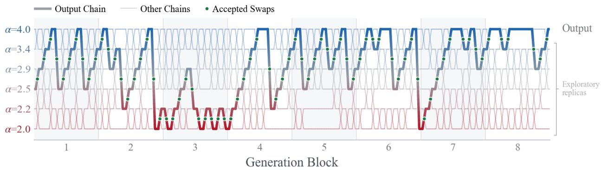  
Figure 4 | Parallel tempering across the sharpening ladder. Green dots mark accepted adjacent swaps; the colored gradient line traces a sampled trajectory across replicas and generation blocks.

In Figure 4, the sequence that is ultimately returned has been carried by accepted swaps through every rung of the ladder, from the most exploratory replica to the sharpest, before reaching the output rung. The MH acceptance probability is

$$
A ^ { \mathrm { s w a p } } = \operatorname* { m i n } \left\{ 1 , \frac { \pi _ { k } ( \mathbf { x } ^ { ( k + 1 ) } ) \pi _ { k + 1 } ( \mathbf { x } ^ { ( k ) } ) } { \pi _ { k } ( \mathbf { x } ^ { ( k ) } ) \pi _ { k + 1 } ( \mathbf { x } ^ { ( k + 1 ) } ) } \right\} .\tag{10}
$$

Substituting $\pi _ { k } \propto p _ { 0 } ^ { \alpha _ { k } }$ cancels the normalizing constants and gives

$$
\begin{array} { r } { A ^ { \mathrm { s w a p } } = \operatorname* { m i n } \biggr \{ 1 , \exp \bigg [ ( \alpha _ { k + 1 } - \alpha _ { k } ) \left( \log p _ { 0 } ( \mathbf { x } ^ { ( k ) } ) - \log p _ { 0 } ( \mathbf { x } ^ { ( k + 1 ) } ) \right) \bigg ] \biggr \} . } \end{array}\tag{11}
$$

Free Exploration. Swaps can transport promising trajectories from exploratory rungs to a sharper rung whose local updates can complete them, potentially exponentially accelerating discovery of better modes (Dong and Tong, 2022), rather than improving only linearly with additional independent samples. Notably, this exploration comes with minimal computational overhead as each adjacent exchange is an MH move evaluated from cached sequence likelihoods, so the exchange itself requires no additional model passes (Table 3). Algorithm 1 specifies the complete schedule, and Appendix B gives implementation details; after stage �, the record at rung $k ^ { \star }$ is returned.

## 3.4. Ladder Design

To efectively capitalize the benefit of Parallel Tempering, adjacent chains overlap suficiently. Powers placed too far apart exchange rarely and cut the ladder into isolated pieces; powers placed too close spend replicas without suficient exploration. For fixed endpoints $\alpha _ { 1 } , \alpha _ { K }$ and � chains, an optimal ladder design is the equi-accepting ladder (Deng et al., 2023; Rathore et al., 2005). For expected acceptance $\mathcal { A } _ { k }$ between rungs � and $k + 1$ , the intermediate powers are chosen such that

$$
\mathcal { A } _ { 1 } = \mathcal { A } _ { 2 } = \cdot \cdot \cdot = \mathcal { A } _ { K - 1 } .\tag{12}
$$

A pair with substantially lower acceptance is a bottleneck that throttles transport along the whole ladder, while unusually high acceptance signals two powers that are needlessly close; equalizing acceptances maximizes the weakest link (Appendix D.2).

Remark 3.2. The acceptance rate $\mathcal { A } _ { k }$ in Eq. 11 is governed by the gap $\alpha _ { k + 1 } - \alpha _ { k }$ and the spread of the sequence log-likelihood log $p _ { 0 } .$ . When this spread scales as $1 / \alpha ,$ then $\mathcal { A } _ { k }$ becomes a function of the ratio $\alpha _ { k + 1 } / \alpha _ { k } ,$ and the equi-accepting condition of Eq. 12 reduces to the geometric ladder

$$
\alpha _ { k } = \alpha _ { 1 } \left( { \frac { \alpha _ { K } } { \alpha _ { 1 } } } \right) ^ { \frac { k - 1 } { K - 1 } } , \qquad k = 1 , \ldots , K ,
$$

Table 1 | Pass@1 accuracy (%) with one returned completion per item. Bold marks the best result, including ties, within each model group
<table><tr><td>Method</td><td>MATH500</td><td>GPQA</td><td>HumanEval</td><td>GSM8K</td><td>AIME 24&amp;25</td><td>LCB v5</td></tr><tr><td>Qwen3-4B</td><td></td><td></td><td></td><td></td><td></td><td></td></tr><tr><td>Standard</td><td>83.3</td><td>51.0</td><td>85.4</td><td>94.6</td><td>70.7</td><td>45.6</td></tr><tr><td>Lower Temperature</td><td>85.1</td><td>48.5</td><td>86.6</td><td>94.5</td><td>72.0</td><td>44.8</td></tr><tr><td>Power Sampling</td><td>83.5</td><td>51.0</td><td>90.2</td><td>94.2</td><td>73.3</td><td>55.1</td></tr><tr><td>PowerSMC</td><td>83.2</td><td>47.5</td><td>87.9</td><td>94.3</td><td>61.7</td><td>52.3</td></tr><tr><td>GRPO</td><td>85.6</td><td>50.0</td><td>91.6</td><td>94.6</td><td>73.3</td><td>52.7</td></tr><tr><td>PPT (Ours)</td><td>86.0</td><td>53.6</td><td>93.9</td><td>94.8</td><td>78.3</td><td>57.9</td></tr><tr><td>Qwen3-8B</td><td></td><td></td><td></td><td></td><td></td><td></td></tr><tr><td>Standard</td><td>83.9</td><td>55.8</td><td>84.9</td><td>94.6</td><td>72.7</td><td>48.1</td></tr><tr><td>Lower Temperature</td><td>84.6</td><td>54.5</td><td>87.2</td><td>95.0</td><td>73.0</td><td>48.4</td></tr><tr><td>Power Sampling</td><td>82.2</td><td>57.6</td><td>90.7</td><td>95.2</td><td>73.3</td><td>53.5</td></tr><tr><td>PowerSMC</td><td>84.1</td><td>58.0</td><td>90.2</td><td>95.5</td><td>65.0</td><td>53.6</td></tr><tr><td>GRPO</td><td>86.4</td><td>53.0</td><td>93.3</td><td>94.6</td><td>74.0</td><td>54.1</td></tr><tr><td>PPT (Ours)</td><td>88.0</td><td>60.1</td><td>94.9</td><td>95.5</td><td>78.3</td><td>58.4</td></tr></table>

In practice, we initialize with a geometric ladder and tune the intermediate powers empirically until the measured swap acceptances are approximately equal. More details are left for App. D.

Schedule Each adjacent-pair swap is itself an MH move on the joint target, so any composition of swaps preserves $\Pi _ { m }$ at every stage $m ,$ and hence Π. Therefore, the communication schedule cannot change what we sample, only how fast records travel across the ladder. Choosing one is an eficiency question, and its answer depends on the regime. In our implementation, we employ an ordered sweep of adjacent exchanges, applying each accepted swap immediately, as presented in Section 3.3. This allows a state to traverse several rungs within a single sweep. An alternative schedule is an asymptotically-optimal swap schedule in classical parallel tempering: the deterministic even–odd (DEO) communication defined in (Okabe et al., 2001; Syed et al., 2022), which attempts a single parity matching of disjoint interfaces and alternates between the two matchings, so that the swaps within a round can run in parallel.

Remark 3.3. If acceptance probabilities are history-independent and equal to a constant ${ \bar { \mathcal { A } } } ,$ then the expected iteration counts for a tagged-replica round trip are

$$
\mathbb { E } T _ { \mathrm { A D J } } = K \left( 1 + ( K - 1 ) \frac { 1 - \bar { \mathcal { A } } } { \bar { \mathcal { A } } } \right) , \qquad \mathbb { E } T _ { \mathrm { D E O } } = 2 K \left( 1 + ( K - 1 ) \frac { 1 - \bar { \mathcal { A } } } { \bar { \mathcal { A } } } \right) ,\tag{13}
$$

Thus, ordered ADJ requires half as many expected iterations as DEO, where an ADJ iteration comprises a complete adjacent sweep and a DEO iteration comprises one parity layer. This reduction comes at the cost of executing all � − 1 swap attempts sequentially. In our regime, where we use few replicas and communication overhead is small relative to local refinement, this tradeoffavors ADJ. Conversely, DEO becomesfasterfor suficiently large $K ,$ since ADJ’s sequential communication overhead grows quadratically with the number of replicas, compared to the DEO’s linear scaling.

## 4. Experiments

## 4.1. Main Results

We compare PPT with standard and low-temperature decoding, Power Sampling (Karan and Du, 2026), PowerSMC (Azizi et al., 2026), and GRPO (Shao et al., 2024), which is a training-based reference. Table 1 reports results for Qwen3-4B and Qwen3-8B on MATH500 (Lightman et al., 2024), GPQA (Rein et al., 2024), HumanEval (Chen et al., 2021), GSM8K (Cobbe et al., 2021), AIME 24&25 (Zhang and Math-AI, 2024; Zhang and Team, 2025), and LiveCodeBench (LCB) v5 (Jain et al., 2025), with a common benchmark-specific completion cap shared by all methods. Table 2 extends the comparison to the more recent and capable Qwen3.5-9B on the three most challenging benchmarks: GPQA, AIME 24&25, and LCB v5.

Table 2 | Pass@1 Accuracy using Qwen3.5-9B on GPQA, AIME 24&25 and LCB v5.
<table><tr><td>Qwen3.5-9B</td><td>GPQA AIME 24&amp;25</td><td></td><td>LCB</td></tr><tr><td>Standard</td><td>82.4</td><td>82.3</td><td>81.9</td></tr><tr><td>Power Sampling</td><td>77.6</td><td>78.7</td><td>82.0</td></tr><tr><td>Lower Temperature</td><td>81.8</td><td>84.3</td><td>82.4</td></tr><tr><td>GPT-5†</td><td>85.4</td><td>95.0</td><td>84.6</td></tr><tr><td>Opus 4.5†</td><td>86.6</td><td>93.3</td><td>87.1</td></tr><tr><td>GLM 4.7†</td><td>85.9</td><td>95.0</td><td>89.4</td></tr><tr><td>PPT(Ours)</td><td>85.9</td><td>93.3</td><td>84.9</td></tr></table>

Table 3 | Per-example runtime and peak memory for our implementation.
<table><tr><td>Method</td><td>Peak KV cache Local-update memory (GiB)</td><td>time (sec)</td><td>Swap overhead (sec)</td></tr><tr><td>Qwen3-8B</td><td></td><td></td><td></td></tr><tr><td>Single chain</td><td>0.86</td><td>36.1</td><td></td></tr><tr><td>PPT (K = 4)</td><td>3.21</td><td>37.2</td><td>0.037</td></tr><tr><td>Qwen3.5-9B</td><td></td><td></td><td></td></tr><tr><td>Single chain</td><td>3.06</td><td>43.8</td><td></td></tr><tr><td>PPT (K = 3)</td><td>7.56</td><td>75.4</td><td>0.08</td></tr></table>

† Reported values.

Across both tables, PPT attains the best or tied-best accuracy in all 15 model–benchmark settings, spanning mathematics, science, and code; its only tie is on the saturated GSM8K. It is demonstrated that single-chain sharpening is unreliable on strong models, as Power Sampling falls below standard decoding in most Qwen3.5-9B benchmarks, PowerSMC trails standard decoding by a wide margin on AIME 24&25, and lower-temperature decoding yields only modest gains. Conversely, PPT targets the same powered distribution and outperforms every sampling-based baseline, never regresses below standard decoding, and even achieves higher accuracy than GRPO without additional parameter updates or rewards. Notably, using Qwen3.5-9B, we observed performance that matches and even exceeds frontier models. Additional results are in Appendix H.

Runtime and Memory Cost Furthermore, we provide a breakdown of the computational cost of PPT in the LCB v5 dataset. Table 3 reports per problem: peak-memory usage, local-update time, and replica-exchange overhead for the single chain (� = 1) and PPT (� = 4 for Qwen3-8B, � = 3 for Qwen3.5-9B). The eficiency of our implementation is highlighted as batching local updates across replicas accelerates wall-clock inference-time. As shown in Table 3, the multi-replica runs require only 1.03× and 1.72× the single-chain local-update wall-clock time for Qwen3-8B and Qwen3.5-9B, respectively, while replica exchange accounts for only 0.1% of the total time in both cases. However, this eficiency comes at the expense of higher peak memory usage: approximately 3.73× and 2.47× higher than the single-chain values.

## 4.2. Compute-matched Controls

Additional single-chain refinement. To test whether additional refinement of a single chain can recover the gains of PPT, we increase the number of MCMC steps in single chain settings (� = 1) to match the total compute in terms of decode tokens generated by our multi-chain PPT on Qwen3-8B. Table 4 shows that PPT remains consistently more accurate across all four benchmarks. The largest gaps occur on the hardest tasks, namely LCB v5 and AIME 24&25, where PPT reaches 58.4% and 78.3% compared with 54.9% and 75.3% for the extended single chain, respectively. Thus, additional single-chain refinement does not close the performance gap at the matched compute budget.

Table 4 | Compute-matched Qwen3-8B accuracy (%) between our multi-chain PPT (� > 1) and single chain (� = 1) samplers.
<table><tr><td colspan="2">Benchmark PPT</td><td>Single-chain</td></tr><tr><td>MATH500</td><td>88.0</td><td>85.6</td></tr><tr><td>GPQA</td><td>60.1</td><td>59.1</td></tr><tr><td>AIME 24&amp;25</td><td>78.3</td><td>75.3</td></tr><tr><td>LCB v5</td><td>58.4</td><td>54.9</td></tr></table>

Table 5 | Compute-matched accuracy (%) with and without swaps using the same number of chains. Pass@1 scores a single selected trace; Vote takes the majority answer across traces. Bold marks the better result.
<table><tr><td rowspan="2">Method</td><td colspan="2">MATH 500</td><td colspan="2">AIME 24&amp;25</td><td colspan="2">GPQA</td></tr><tr><td>Pass@1</td><td>Vote</td><td>Pass@1</td><td>Vote</td><td>Pass@1</td><td>Vote</td></tr><tr><td colspan="7">Qwen3-4B</td></tr><tr><td>Uncoupled ladder</td><td>84.2</td><td>87.6</td><td>75.7</td><td>78.3</td><td>52.3</td><td>48.5</td></tr><tr><td>PPT (Ours)</td><td>86.0</td><td>88.8</td><td>78.3</td><td>80.0</td><td>53.6</td><td>55.1</td></tr><tr><td colspan="7">Qwen3-8B</td></tr><tr><td>Uncoupled ladder</td><td>86.0</td><td>87.4</td><td>76.7</td><td>80.0</td><td>57.6</td><td>58.9</td></tr><tr><td>PPT (Ours)</td><td>88.0</td><td>90.0</td><td>78.3</td><td>81.7</td><td>60.1</td><td>61.6</td></tr></table>

K uncoupled chains. To isolate the contribution of parallel tempering, Table 5 compares PPT with an uncoupled ladder on both Qwen3 models. The uncoupled ladder runs the same number of chains, each refined independently over a fixed horizon with no swaps. We report two metrics: i) Pass@1 scores a single trace; the coldest rung for PPT, and the rung with the highest accumulated log-likelihood for the uncoupled ladder, and ii) Vote takes the majority answer across all traces. Table 5 shows that enabling swaps consistently improves both the Pass@1 and voting accuracy in every model–benchmark setting. Overall, we can see that significant gains are attributed to the exchange mechanism, not merely running and aggregating more replicas.

## 4.3. Ablation Studies

Number of replicas. We sweep � = 1–5 with fixed sharpening range, block size, and MCMC steps, using our fixed-horizon kernel at � = 1 (Figure 5, left). Compute is measured in wall-clock time in seconds per example. Parallel batching lowers the cost per replica, so running � chains scales more favorably than �-fold times a single-chain run. For example, with � = 4, the total cost is only 2.1× and 1.2× that of a single chain on MATH500 and HumanEval, respectively. These results further demonstrate the favorable runtime scaling of PPT as the number of chains increases. Beyond five replicas, per-replica accuracy plateaus, with diminishing returns for further increasing. We found that accuracy saturates around four to five replicas: � = 4, gains 2.7 and 3.9 percentage points over � = 1, while � = 5 peaks at +3.2 and +4.5.

Ladder design. We examine the efect of appropriate ladder design in the eficacy of the model. We compare: i) randomly picked ladder temperatures, ii) arithmetic sequences , iii) geometric sequences, and iv) equi-accepting sharpening ladders with � = 5 and fixed block size and decoding budget (Figure 5, right). Ladder spacing controls how readily states move between exploratory and strongly sharpened replicas. Random and arithmetic spacing ofer limited gains, with random spacing even harming HumanEval. Geometric spacing, which uses equal power ratios (Remark 3.2), improves both benchmarks, while equi-accepting performs best. By approximately equalizing adjacent swap-acceptance rates, the latter aims to prevent any single pair from becoming a communication bottleneck. These results suggest that balancing communication across the ladder helps replicas share useful exploration more efectively.

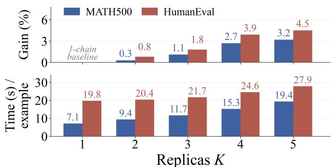

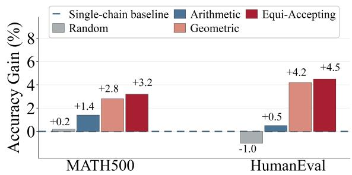  
Figure 5 | Replica count and ladder design. Left: (Top): accuracy gain as the number of replicas increases, and (Bottom): the corresponding compute in wall-clock time per example; the favorable scaling reflects the batching of replicas in parallel. Right: efect of ladder design on accuracy across two datasets, MATH500 and HumanEval, with � = 5 replicas.

## 5. Conclusion

We introduced PPT, a parallel tempering sampler for power-sharpened LLM distributions that addresses the exploration–exploitation trade-of of single-chain power sampling. Low-power replicas explore diverse reasoning trajectories, high-power replicas refine them, and swaps couple the ladder power moving promising traces toward the sharpest rung at negligible cost. In our analysis, we identified a structural truncation bias in early-stopped power samplers and removed it with a fixed-horizon construction that restores preservation of the true sharpened target, and provides all chains the same exploration bandwidth. Empirically, PPT is best or tied-best in all 15 model–benchmark settings and outperforms GRPO without parameter updates or rewards, with gains that come from the swaps rather than extra compute or chains. With Qwen3.5-9B, it performs comparably to frontier models, suggesting that small frozen models can reason without additional parameter updates.

## Acknowledgment

We thank the CoreWeave AI cloud platform for supporting part of the computational resources used in this work. Nan Jiang acknowledges support from the Texas Advanced Computing Center (TACC) under award CCR25054. E.A. Theodorou and P. Theodoropoulos were partly supported by the Defense Advanced Research Projects Agency (DARPA) through the Artificial Intelligence Quantified (AIQ) program, under Cooperative Agreement No. HR00112520010. The views, opinions, and/or findings expressed are those of the authors and should not be interpreted as representing the oficial views or policies of the Department of Defense or the U.S. Government.

## References

Emmanuel Anaya Gonzalez, Sairam Vaidya, Kanghee Park, Ruyi Ji, Taylor Berg-Kirkpatrick, and Loris D’Antoni. Constrained Sampling for Language Models Should Be Easy: An MCMC Perspective. Advances in Neural Information Processing Systems, 38:59951–59981, 2026.

Seyedarmin Azizi, Erfan Baghaei Potraghloo, Minoo Ahmadi, Souvik Kundu, and Massoud Pedram. Power-SMC: Low-Latency Sequence-Level Power Sampling for Training-Free LLM Reasoning. CoRR, abs/2602.10273, 2026.

M. Chen, J. Tworek, H. Jun, Q. Yuan, H. P. de Oliveira Pinto, J. Kaplan, H. Edwards, Y. Burda, N. Joseph, G. Brockman, A. Ray, R. Puri, G. Krueger, M. Petrov, H. Khlaaf, G. Sastry, P. Mishkin, B. Chan, S. Gray, N. Ryder, M. Pavlov, A. Power, L. Kaiser, M. Bavarian, C. Winter, P. Tillet, F. P. Such, D. Cummings, M. Plappert, F. Chantzis, E. Barnes, A. Herbert-Voss, W. H. Guss, A. Nichol, A. Paino, N. Tezak, J. Tang, I. Babuschkin, S. Balaji, S. Jain, W. Saunders, C. Hesse, A. N. Carr, J. Leike, J. Achiam, V. Misra, E. Morikawa, A. Radford, M. Knight, M. Brundage, M. Murati, K. Mayer, P. Welinder, B. McGrew, D. Amodei, S. McCandlish, I. Sutskever, and W. Zaremba. Evaluating Large Language Models Trained on Code. CoRR, abs/2107.03374, 2021.

Yilei Chen, Souradip Chakraborty, Lorenz Wolf, Yannis Paschalidis, and Aldo Pacchiano. Post-training Large Language Models for Diverse High-Quality Responses. arXiv preprint arXiv:2509.04784, 2025.

Karl Cobbe, Vineet Kosaraju, Mohammad Bavarian, Mark Chen, Heewoo Jun, Lukasz Kaiser, Matthias Plappert, Jerry Tworek, Jacob Hilton, Reiichiro Nakano, Christopher Hesse, and John Schulman. Training Verifiers to Solve Math Word Problems. CoRR, abs/2110.14168, 2021.

Wei Deng, Qi Feng, Liyao Gao, Faming Liang, and Guang Lin. Non-convex Learning via Replica Exchange Stochastic Gradient MCMC. In Proceedings of the 37th International Conference on Machine Learning, volume 119, pages 2474–2483, 2020.

Wei Deng, Qian Zhang, Qi Feng, Faming Liang, and Guang Lin. Non-reversible Parallel Tempering for Deep Posterior Approximation. In Thirty-Seventh AAAI Conference on Artificial Intelligence, pages 7332–7339, 2023.

Jing Dong and Xin T Tong. Spectral Gap of Replica Exchange Langevin Difusion on Mixture Distributions. Stochastic Processes and their Applications, 151:451–489, 2022.

Weihua Du, Yiming Yang, and Sean Welleck. Optimizing Temperature for Language Models with Multi-Sample Inference. In Proceedings of the 42nd International Conference on Machine Learning, volume 267, pages 14648–14668, 2025.

David J Earl and Michael W Deem. Parallel Tempering: Theory, Applications, and New Perspectives. Physical Chemistry Chemical Physics, 7(23):3910–3916, 2005.

Gonçalo R Faria, Sweta Agrawal, António Farinhas, Ricardo Rei, José G de Souza, and André F Martins. QUEST: Quality-aware Metropolis-Hastings Sampling for Machine Translation. Advances in Neural Information Processing Systems, 37:89042–89068, 2024.

Shengyu Feng, Xiang Kong, Shuang Ma, Aonan Zhang, Dong Yin, Chong Wang, Ruoming Pang, and Yiming Yang. Step-by-Step Reasoning for Math Problems via Twisted Sequential Monte Carlo. In The Thirteenth International Conference on Learning Representations, 2025.

Jarad Forristal, Fatemehsadat Mireshghallah, Greg Durrett, and Taylor Berg-Kirkpatrick. A Block Metropolis-Hastings Sampler for Controllable Energy-based Text Generation. In Proceedings of the 27th Conference on Computational Natural Language Learning (CoNLL), pages 403–413, 2023.

Charles J. Geyer. Markov Chain Monte Carlo Maximum Likelihood. In Computing Science and Statistics: Proceedings of the 23rd Symposium on the Interface, pages 156–163, 1991.

Daya Guo, Dejian Yang, Haowei Zhang, Junxiao Song, Ruoyu Zhang, Runxin Xu, Qihao Zhu, Shirong Ma, Peiyi Wang, Xiao Bi, et al. Deepseek-R1: Incentivizing Reasoning Capability in LLMs via Reinforcement Learning. arXiv preprint arXiv:2501.12948, 2025.

W Keith Hastings. Monte Carlo Sampling Methods using Markov Chains and Their Applications. Biometrika, 57(1):97–109, 1970.

Andre Wang He, Daniel Fried, and Sean Welleck. Rewarding the Unlikely: Lifting GRPO Beyond Distribution Sharpening. In Proceedings of the 2025 Conference on Empirical Methods in Natural Language Processing, pages 25548–25560, 2025.

Jiajun He, Zongyu Guo, José Miguel Hernández-Lobato, and Yuanqi Du. Recipes for Steering and Scaling LLMs via Sampling. arXiv preprint arXiv:2608.26120, 2026.

Dan Hendrycks, Collin Burns, Saurav Kadavath, Akul Arora, Steven Basart, Eric Tang, Dawn Song, and Jacob Steinhardt. Measuring Mathematical Problem Solving with the MATH Dataset. arXiv preprint arXiv:2103.03874, 2021.

Ari Holtzman, Jan Buys, Li Du, Maxwell Forbes, and Yejin Choi. The Curious Case of Neural Text Degeneration. In 8th International Conference on Learning Representations, 2020.

Chuxuan Hu, Yuxuan Zhu, Antony Kellermann, Caleb Biddulph, Suppakit Waiwitlikhit, Jason Benn, and Daniel Kang. Breaking Barriers: Do Reinforcement Post Training Gains Transfer To Unseen Domains? In The Fourteenth International Conference on Learning Representations, 2026.

Jingcheng Hu, Yinmin Zhang, Qi Han, Daxin Jiang, Xiangyu Zhang, and Heung-Yeung Shum. Open-Reasoner-Zero: An Open Source Approach to Scaling Up Reinforcement Learning on the Base Model. In Advances in Neural Information Processing Systems, volume 38, pages 162239–162262, 2025.

Audrey Huang, Adam Block, Qinghua Liu, Nan Jiang, Akshay Krishnamurthy, and Dylan J. Foster. Is Best-of-N the Best of Them? Coverage, Scaling, and Optimality in Inference-Time Alignment. In Proceedings of the 42nd International Conference on Machine Learning, volume 267, pages 25075– 25126, 2025.

Koji Hukushima and Koji Nemoto. Exchange Monte Carlo Method and Application to Spin Glass Simulations. Journal of the Physical Society of Japan, 65(6):1604–1608, 1996.

Naman Jain, King Han, Alex Gu, Wen-Ding Li, Fanjia Yan, Tianjun Zhang, Sida Wang, Armando Solar-Lezama, Koushik Sen, and Ion Stoica. LiveCodeBench: Holistic and Contamination Free Evaluation of Large Language Models for Code. In The Thirteenth International Conference on Learning Representations, 2025.

Xiaotong Ji, Rasul Tutunov, Matthieu Zimmer, and Haitham Bou Ammar. Scalable power sampling: Unlocking eficient, training-free reasoning for llms via distribution sharpening. arXiv preprint arXiv:2601.21590, 2026.

Zhewei Kang, Xuandong Zhao, and Dawn Song. Scalable Best-of-N Selection for Large Language Models via Self-Certainty. In Advances in Neural Information Processing Systems, volume 38, pages 19720–19745, 2025.

Aayush Karan and Yilun Du. Reasoning with Sampling: Your Base Model is Smarter Than You Think. In The Fourteenth International Conference on Learning Representations, 2026.

David A Kofke. On the acceptance probability of replica-exchange monte carlo trials. The Journal of chemical physics, 117(15):6911–6914, 2002.

Aminata Kone and David A. Kofke. Selection of Temperature Intervals for Parallel-Tempering Simulations. The Journal of Chemical Physics, 122(20):206101, 2005.

Nathan Lambert, Jacob Morrison, Valentina Pyatkin, Shengyi Huang, Hamish Ivison, Faeze Brahman, Lester James V Miranda, Alisa Liu, Nouha Dziri, Shane Lyu, et al. Tülu 3: Pushing frontiers in open language model post-training. arXiv preprint arXiv:2411.15124, 2024.

Marvin Li, Aayush Karan, and Sitan Chen. Blink of an Eye: a Simple Theory for Feature Localization in Generative Models. In Forty-second International Conference on Machine Learning, volume 267, pages 35047–35080, 2025.

Hunter Lightman, Vineet Kosaraju, Yura Burda, Harri Edwards, Bowen Baker, Teddy Lee, Jan Leike, John Schulman, Ilya Sutskever, and Karl Cobbe. Let’s Verify Step by Step. In The Twelfth International Conference on Learning Representations, 2024.

Jelena Markovic-Voronov, Wenhui Zhu, Bo Long, Zhipeng Wang, Suyash Gupta, Kayhan Behdin, Bee-Chung Chen, and Deepak Agarwal. Sampling for quality: Training-free reward-guided LLM decoding via sequential monte carlo. arXiv preprint arXiv:2604.16453, 2026.

Clara Meister, Tiago Pimentel, Gian Wiher, and Ryan Cotterell. Locally Typical Sampling. Transactions of the Association for Computational Linguistics, 11:102–121, 2023.

Nicholas Metropolis, Arianna W. Rosenbluth, Marshall N. Rosenbluth, Augusta H. Teller, and Edward Teller. Equation of State Calculations by Fast Computing Machines. Journal of Chemical Physics, 21 (6):1087–1092, 1953.

Fatemehsadat Mireshghallah, Kartik Goyal, and Taylor Berg-Kirkpatrick. Mix and Match: Learningfree Controllable Text Generation using Energy Language Models. In Proceedings of the 60th Annual Meeting of the Association for Computational Linguistics, pages 401–415, 2022.

Minh Nhat Nguyen, Andrew Baker, Clement Neo, Allen Roush, Andreas Kirsch, and Ravid Shwartz-Ziv. Turning Up the Heat: Min-p Sampling for Creative and Coherent LLM Outputs. In The Thirteenth International Conference on Learning Representations, 2025.

Tsuneyasu Okabe, Masaaki Kawata, Yuko Okamoto, and Masuhiro Mikami. Replica-exchange monte carlo method for the isobaric–isothermal ensemble. Chemical physics letters, 335(5-6):435–439, 2001.

Long Ouyang, Jefrey Wu, Xu Jiang, Diogo Almeida, Carroll Wainwright, Pamela Mishkin, Chong Zhang, Sandhini Agarwal, Katarina Slama, Alex Ray, John Schulman, Jacob Hilton, Fraser Kelton, Luke Miller, Maddie Simens, Amanda Askell, Peter Welinder, Paul F Christiano, Jan Leike, and Ryan Lowe. Training Language Models to Follow Instructions with Human Feedback. In Advances in Neural Information Processing Systems, volume 35, pages 27730–27744, 2022.

Nitin Rathore, Manan Chopra, and Juan J de Pablo. Optimal Allocation of Replicas in Parallel Tempering Simulations. The Journal of chemical physics, 122(2):024111, 2005.

David Rein, Betty Li Hou, Asa Cooper Stickland, Jackson Petty, Richard Yuanzhe Pang, Julien Dirani, Julian Michael, and Samuel R Bowman. GPQA: A Graduate-level Google-proof Q&A Benchmark. In First Conference on Language Modeling, 2024.

Zhihong Shao, Peiyi Wang, Qihao Zhu, Runxin Xu, Junxiao Song, Xiao Bi, Haowei Zhang, Mingchuan Zhang, Y. K. Li, Y. Wu, and Daya Guo. DeepSeekMath: Pushing the Limits of Mathematical Reasoning in Open Language Models. arXiv preprint arXiv:2402.03300, 2024.

Yuji Sugita and Yuko Okamoto. Replica-Exchange Molecular Dynamics Method for Protein Folding. Chemical Physics Letters, 314(1–2):141–151, 1999.

Robert H. Swendsen and Jian-Sheng Wang. Replica Monte Carlo Simulation of Spin-Glasses. Physical Review Letters, 57(21):2607–2609, 1986.

Saifuddin Syed, Vittorio Romaniello, Trevor Campbell, and Alexandre Bouchard-Côté. Parallel tempering on optimized paths. In International Conference on Machine Learning, pages 10033– 10042. PMLR, 2021.

Saifuddin Syed, Alexandre Bouchard-Côté, George Deligiannidis, and Arnaud Doucet. Non-reversible Parallel Tempering: A Scalable Highly Parallel MCMC scheme. Journal of the Royal Statistical Society: Series B (Statistical Methodology), 84(2):321–350, 2022.

Chenxia Tang, Jianchun Liu, Hongli Xu, and Liusheng Huang. Top-��: Eliminating Noise in Logit Space for Robust Token Sampling of LLM. In Proceedings of the 63rd Annual Meeting of the Association for Computational Linguistics (Volume 1: Long Papers), pages 10758–10774, 2025.

Akiyoshi Tomihari and Issei Sato. Power Distribution Bridges Sampling, Self-Reward RL, and Self-Distillation. arXiv preprint arXiv:2605.04542, 2026.

Sergey Troshin, Wafaa Mohammed, Yan Meng, Christof Monz, Antske Fokkens, and Vlad Niculae. Control the Temperature: Selective Sampling for Diverse and High-Quality LLM Outputs. In Second Conference on Language Modeling, 2025.

Tianchun Wang, Zichuan Liu, Yuanzhou Chen, Jonathan Light, Weiyang Liu, Haifeng Chen, Xiang Zhang, and Wei Cheng. On the Efect of Sampling Diversity in Scaling LLM Inference. arXiv preprint arXiv:2502.11027, 2025.

Yang Yue, Zhiqi Chen, Rui Lu, Andrew Zhao, Zhaokai Wang, Yang Yue, Shiji Song, and Gao Huang. Does Reinforcement Learning Really Incentivize Reasoning Capacity in LLMs Beyond the Base Model? In Advances in Neural Information Processing Systems, volume 38, Main Conference, pages 57654–57689, 2025.

Yifan Zhang and Team Math-AI. American Invitational Mathematics Examination (AIME) 2024, 2024.

Yifan Zhang and Math-AI Team. American Invitational Mathematics Examination (AIME) 2025, 2025. URL https://huggingface.co/datasets/math-ai/aime25.

Stephen Zhao, Rob Brekelmans, Alireza Makhzani, and Roger Baker Grosse. Probabilistic Inference in Language Models via Twisted Sequential Monte Carlo. In Proceedings of the 41st International Conference on Machine Learning, volume 235, pages 60704–60748, 2024.

## Contents

1 Introduction   
2 Preliminaries 3   
2.1 Notations . 3   
2.2 Power Sharpening for LLMs . 3   
2.3 Parallel Tempering   
3 Methodology   
3.1 Motivation: The Exploration Bottleneck 4   
3.2 Structural Truncation Bias and the Fixed-Horizon Correction   
3.3 Parallel Power Tempering . 6   
3.4 Ladder Design   
4 Experiments 8   
4.1 Main Results 8   
4.2 Compute-matched Controls . 9   
4.3 Ablation Studies 10   
5 Conclusion 11   
A Notation and Preliminaries 17   
A.1 Prompt-conditioned autoregressive model 17   
A.2 Sequence-level power target . 18   
A.3 Sequence-level powering is not tokenwise temperature decoding 18   
B Implementation Details 19   
B.1 Step 1: Block extension 19   
B.2 Step 2: Local refinement 20   
B.3 Step 3: Swap exchange . 21   
B.4 Putting the implementation together 21   
C Theoretical Properties: Bias and Exactness of PPT 21   
C.1 Fixed-horizon targets and PPT kernels 21   
C.2 Structural bias from one-way truncation in PPT 24   
C.3 Target preservation and convergence of fixed-horizon PPT 26   
C.4 A finite illustration of target preservation and one-way truncation bias 28   
D Power-Ladder Design 30   
D.1 Thermodynamic coordinate and exact swap overlap 30   
D.2 Max–min design and the unique equi-accepting ladder 31   
E Chain Communication Protocol 32   
F Extended Related Work 34   
G Experimental Settings 35   
G.1 Choice of Baselines 35   
G.2 Choice of Datasets 36   
G.3 Evaluation Metrics 36   
G.4 Configuration . . 37   
H Extended Experimental Results 38   
H.1 Extended Main Results 38   
H.2 Ablation Studies 40

## A. Notation and Preliminaries

This section establishes the fixed-horizon representation used throughout the paper. It introduces prompt-conditioned completion records, the sequence-level power target, the tokenwise-powered proposal distribution, and the sequence of stage horizons used by the progressive sampler.

## A.1. Prompt-conditioned autoregressive model

Fix a tokenized prompt $\mathbf { x } _ { 0 } .$ , a finite language-model vocabulary $\mathcal { N } _ { \mathrm { L M } } .$ a set of configured terminal tokens $\mathcal { E } \subseteq \mathcal { V } _ { \mathrm { L M } }$ , and a maximum completion horizon $T \geq 1$ . Let $\perp \notin \mathcal { V } _ { \mathrm { L M } }$ be an auxiliary post-terminal symbol used to express the fixed-horizon state space, and define the augmented vocabulary

$$
\mathcal { V } : = \mathcal { V } _ { \mathrm { L M } } \cup \{ \perp \} .
$$

The symbol ⊥ serves exclusively as bookkeeping for the configured post-terminal convention. A completion record stores the generated completion tokens, while the prompt $\mathbf { x } _ { 0 }$ enters every model distribution as fixed conditioning context. For every supported pre-terminal history $h ,$ the language model defines normalized next-token probabilities $p _ { \mathrm { L M } } ( \nu \mid \mathbf { x } _ { 0 } , h ) , \nu \in \mathcal { V } _ { \mathrm { L M } }$ . We define a completion history open through the position preceding its first configured terminal token and terminated from that token onward. The configured post-terminal convention extends the model distribution to $_ \textmd { ‰}$ through

$$
p _ { 0 } ( \nu \mid \mathbf { x } _ { 0 } , h ) : = \left\{ \begin{array} { l l } { p _ { \mathrm { L M } } ( \nu \mid \mathbf { x } _ { 0 } , h ) , } & { h \mathrm { i s ~ s u p p o r t e d ~ a n d ~ o p e n ~ a n d ~ } \nu \in \mathcal { N } _ { \mathrm { L M } } , } \\ { 1 , } & { h \mathrm { ~ i s ~ s u p p o r t e d ~ a n d ~ t e r m i n a t e d ~ a n d ~ } \nu = \perp , } \\ { 0 , } & { \mathrm { i n ~ a l l ~ r e m a i n i n g ~ c a s e s } . } \end{array} \right.\tag{14}
$$

In Eq. 14, invalid constructions, such as $\mathbf { a } \perp$ before the first terminal token or a non-⊥ token after termination, are assigned zero probability. Generation ends at the first configured terminal token. The post-terminal convention then fills the remaining horizon with ⊥, each padding position contributing a factor of one.

A fixed-horizon record $\mathbf { x } = x _ { 1 : T } \in \mathcal { V } ^ { T }$ then has prompt-conditioned probability

$$
p _ { 0 } ( \mathbf { x } \mid \mathbf { x } _ { 0 } ) : = \prod _ { t = 1 } ^ { T } p _ { 0 } \big ( x _ { t } \mid \mathbf { x } _ { 0 } , \mathbf { x } _ { < t } \big ) ,\tag{15}
$$

where each factor is given by Eq. 14, so any record containing an invalid construction has zero probability. The positive-support state space at horizon � is denoted

$$
\begin{array} { r } { S _ { T } : = \left\{ \mathbf { x } \in \mathcal { V } ^ { T } : p _ { 0 } ( \mathbf { x } \mid \mathbf { x } _ { 0 } ) > 0 \right\} . } \end{array}\tag{16}
$$

For a sequence x, we define its first terminal position by

$$
\tau ( \mathbf { x } ) : = \operatorname* { m i n } \{ t \in \{ 1 , \dots , T \} : x _ { t } \in \mathcal { E } \} ,
$$

with its completion length given by len $( \mathbf { x } ) : = \operatorname* { m i n } \{ \tau ( \mathbf { x } ) , T \}$ . For $\mathbf { x } \in S _ { T }$ , when $\boldsymbol { \tau } ( \mathbf { x } ) \le T$ , the fixedhorizon state satisfies $\mathbf { X } _ { \tau ( \mathbf { x } ) + 1 : T } = ( \bot , \dots , \bot )$ , and its probability simplifies to

$$
p _ { 0 } ( \mathbf { x } _ { 1 : T } \mid \mathbf { x } _ { 0 } ) = \prod _ { t = 1 } ^ { \tau ( \mathbf { x } ) } p _ { \mathrm { L M } } ( x _ { t } \mid \mathbf { x } _ { 0 } , \mathbf { x } _ { < t } ) .\tag{17}
$$

For $\mathbf { x } \in S _ { T } .$ , when no terminal token is emitted, the language model generates all � positions and the completion is right-censored at the declared horizon. The implementation supports both explicit deterministic tails and equivalent implicit-tail representations. In the latter representation, the stored completion record together with the configured post-terminal convention uniquely specifies the corresponding element of $S _ { T }$ . During progressive construction, an open completion record of length below � serves as an intermediate record, and generation through the remaining positions produces its fixed-horizon representation.

## A.2. Sequence-level power target

For a sharpening power $\alpha \ge 1$ , we define the sequence-level power target on $S _ { T }$ by

$$
\pi _ { \alpha , T } ( \textbf { x } | \textbf { x } _ { 0 } ) : = \frac { p _ { 0 } ( \textbf { x } | \textbf { x } _ { 0 } ) ^ { \alpha } } { Z _ { \alpha , T } ( \textbf { x } _ { 0 } ) } , \qquad Z _ { \alpha , T } ( \textbf x _ { 0 } ) : = \sum _ { \textbf { z } \in S _ { T } } p _ { 0 } ( \textbf z | \textbf { x } _ { 0 } ) ^ { \alpha } .\tag{18}
$$

The finite state space and its positive support give $0 < Z _ { \alpha , T } ( { \bf x } _ { 0 } ) < \infty ,$ so Equation 18 defines a probability distribution on the fixed-horizon completion space. Following the above, we define the sequence energy as $U _ { T } ( \mathbf { x } ) : = - \log p _ { 0 } ( \mathbf { x } \mid \mathbf { x } _ { 0 } )$ . The target then takes the Gibbs form

$$
\pi _ { \alpha , T } ( \mathbf { x } \mid \mathbf { x } _ { 0 } ) = Z _ { \alpha , T } ( \mathbf { x } _ { 0 } ) ^ { - 1 } \exp \{ - \alpha U _ { T } ( \mathbf { x } ) \} .
$$

Now consider a power ladder with $1 \leq \alpha _ { 1 } < \alpha _ { 2 } < \cdot \cdot \cdot < \alpha _ { K } _ { ; }$ , associating a replica with each power level. The joint replica state is given by $\mathbf { X } = \left( \mathbf { x } ^ { ( 1 ) } , \ldots , \mathbf { x } ^ { ( K ) } \right) \in S _ { T } ^ { K }$ , with its joint product target being written as

$$
\Pi _ { T } ( \mathbf { X } \mid \mathbf { x } _ { 0 } ) : = \prod _ { k = 1 } ^ { K } \pi _ { \alpha _ { k } , T } \left( \mathbf { X } ^ { ( k ) } \mid \mathbf { x } _ { 0 } \right) .\tag{19}
$$

Each power remains associated with its rung index. A predesignated output rung $k ^ { \star }$ therefore has target marginal $\pi _ { \alpha _ { k } \star , T }$ . The choice of $k ^ { \star }$ is fixed independently of the realized completion records. The horizon � forms part of the target specification, and every target statement in this appendix refers to this declared finite horizon. For $K = 1$ , the product target reduces to a single sequence-level target and the adjacent-exchange operation becomes the identity.

## A.3. Sequence-level powering is not tokenwise temperature decoding

Sequence-level powering generally difers from tokenwise temperature decoding because its nexttoken conditional depends on possible continuations; see Tomihari and Sato (2026, Section 4.1) for the analysis and derivation. For a supported prefix $h _ { t } : = ( { \bf x } _ { 0 } , { \bf x } _ { < t } )$ , define the tokenwise powered normalizer and proposal used by our sampler:

$$
z _ { \alpha , t } ( h _ { t } ) : = \sum _ { \nu \in \mathcal { V } } p _ { 0 } ( \nu \mid h _ { t } ) ^ { \alpha } ,\tag{20}
$$

$$
g _ { \alpha , t } ( \nu \mid h _ { t } ) : = \frac { p _ { 0 } ( \nu \mid h _ { t } ) ^ { \alpha } } { z _ { \alpha , t } ( h _ { t } ) } .\tag{21}
$$

Conditioning on $h _ { t }$ abbreviates conditioning on $\left( { { \bf { x } } _ { 0 } } , { { \bf { x } } _ { < t } } \right)$ throughout. After a terminal token, $g _ { \alpha , t }$ places unit mass on $\perp ,$ , following the configured post-terminal convention. In our notation, the powered continuation mass is

$$
H _ { \alpha , t } ( \nu \mid h _ { t } ) : = \left\{ \begin{array} { l l } { { \displaystyle \sum _ { \mathbf { u } _ { t + 1 : T } \in \mathcal { V } ^ { T - t } } p _ { 0 } ( \mathbf { u } _ { t + 1 : T } \mid h _ { t } , \nu ) ^ { \alpha } , } } & { { p _ { 0 } ( \nu \mid h _ { t } ) > 0 , } } \\ { { \mathbf { 0 } , } } & { { p _ { 0 } ( \nu \mid h _ { t } ) = 0 . } } \end{array} \right.\tag{22}
$$

$\mathrm { A t } \ t = T$ , the continuation is empty and carries mass one, so $H _ { \alpha , T } ( \nu \mid h _ { T } ) = 1$ whenever $p _ { 0 } ( \nu \mid h _ { T } ) > 0$ Therefore, the sequence-level target induces the next-token conditional

$$
\pi _ { \alpha , T } ( \nu \mid h _ { t } ) = \frac { p _ { 0 } ( \nu \mid h _ { t } ) ^ { \alpha } H _ { \alpha , t } ( \nu \mid h _ { t } ) } { \displaystyle \sum _ { u \in \mathcal { V } } p _ { 0 } ( u \mid h _ { t } ) ^ { \alpha } H _ { \alpha , t } ( u \mid h _ { t } ) } .\tag{23}
$$

The tractable proposal $g _ { \alpha , t }$ omits the continuation factor $H _ { \alpha , t }$ and equals this conditional only when that factor is constant over supported next tokens.

## B. Implementation Details

A naive implementation runs the � replicas sequentially, giving �-fold wall-clock time increase for � replicas. Instead, we execute block extensions and sufix-resampling proposals for all replicas jointly on a paged-attention engine (vLLM), while preserving each replica’s proposal temperature $\tau _ { k } = 1 / \alpha _ { k }$ Continuous batching handles the variable-length sufix proposals with little padding, and KV-cache reuse allows proposed sufixes to be generated and scored using cached prefix states. In other words, each replica stores its current sequence, cached base-model log-probability, and KV-cache handle, so an accepted swap merely exchanges record and cache without additional model evaluation. Total generated tokens still grow with �, but per-refinement-round wall-clock scales more favorably, until GPU saturation, after which scaling approaches the �-fold limit. This optimization comes solely from parallel execution and leaves the local MH and swap kernels unchanged.

The implementation combines three operations at each progressive stage: block extension, local refinement, and parallel tempering swaps. The first operation carries every completion record to the current stage horizon. The second operation refreshes a sufix of each record through a Metropolis– Hastings transition. Lastly, the third operation swaps whole records between adjacent powers.

## B.1. Step 1: Block extension

Our implementation follows the blockwise construction of (Karan and Du, 2026). We define $B \geq 1$ to be the block width and further write $\begin{array} { r } { M : = \left\lceil \frac { T } { B } \right\rceil , \quad T _ { m } : = \operatorname* { m i n } \{ m B , T \} , \quad m = 0 , \ldots , M } \end{array}$ , with $T _ { 0 } = 0$ and $T _ { M } = T$ . All fixed-horizon definitions apply at $T _ { m }$ by replacing � with $T _ { m }$ . In particular, we define the block-wise state space $S _ { T _ { m } }$ , with the terminal position and length on that space. For stage � and rung $k ,$ abbreviate

$$
\pi _ { m , k } ( \cdot ) : = \pi _ { \alpha _ { k } , T _ { m } } ( \cdot \mid \mathbf { x } _ { 0 } ) , \qquad \Pi _ { m } ( \mathbf { X } ) : = \Pi _ { T _ { m } } ( \mathbf { X } \mid \mathbf { x } _ { 0 } ) = \prod _ { k = 1 } ^ { K } \pi _ { m , k } \big ( \mathbf { x } ^ { ( k ) } \big ) .\tag{24}
$$

Thus, we can infer that the terminal-stage target is $\Pi _ { M } = \Pi _ { T }$ . For the rest of this section, the fixed conditioning on $\mathbf { x } _ { 0 }$ is suppressed in stage notation.

Block extension from $T _ { m - 1 }$ to $T _ { m }$ initializes the state on the enlarged space. Sampling new tokens from $g _ { \alpha _ { k } , \ l }$ � are generally not distributed from the target law of $\pi _ { m , k }$ . Therefore, we can interpret block extension as a warm start for the subsequent Metropolis–Hastings refinement. A finite number of refinement steps produces an approximation to $\Pi _ { m }$ . The exact invariance and convergence results below concern the local and parallel tempering kernels after the stage horizon has been fixed.

A record is active at the start of block extension exactly when its current state is open. Activity is recomputed after all preceding local refinements and parallel tempering swaps. Thus, if an accepted refinement removes a terminal token, the record becomes active and is extended at the next stage. A currently terminated record is extended deterministically through its post-terminal tail. At rung �, every model-generated token is drawn according to

$$
x _ { t } ^ { ( k ) } \sim g _ { \alpha _ { k } , t } \left( \cdot \mid \mathbf { x } _ { 0 } , \mathbf { x } _ { < t } ^ { ( k ) } \right) , \qquad t = T _ { m - 1 } + 1 , \ldots , T _ { m } .\tag{25}
$$

The generation for each rung stops after the first terminal token, and following the post-terminal convention the remaining positions are filled up to $T _ { m }$ deterministically. Requests may be batched across prompts and rungs without altering the record-specific law in Equation 25.

For each model-generated token, the implementation stores its base-model log probability

$$
\ell _ { t } ( { \mathbf { x } } ) : = \log p _ { 0 } ( x _ { t } \mid { \mathbf { x } } _ { 0 } , { \mathbf { x } } _ { < t } ) .\tag{26}
$$

For every rung �, the corresponding tokenwise normalizer is

$$
\zeta _ { t , j } ( \mathbf { x } ) : = \log z _ { \alpha _ { j } , t } ( \mathbf { x } _ { 0 } , \mathbf { x } _ { < t } ) , \qquad j = 1 , \dotsc , K .\tag{27}
$$

Finally, deterministic post-terminal positions satisfy $\ell _ { t } ( { \mathbf { x } } ) = \zeta _ { t , j } ( { \mathbf { x } } ) = 0 _ { : }$ , so their tails may be stored explicitly or reconstructed when evaluating fixed-horizon sums.

## B.2. Step 2: Local refinement

After extension, each rung receives its configured number of local updates. Fix a stage � and rung �. The implementation uses the state-independent uniform restart law

$$
r \sim \omega _ { m , k } , \qquad \omega _ { m , k } ( r ) = \frac { 1 } { T _ { m } } , \qquad r \in \{ 1 , \ldots , T _ { m } \} .
$$

The theory below allows any state-independent restart law and requires $\omega _ { m , k } ( 1 ) > 0$ only for convergence. Conditioned on $r ,$ the proposal retains the prefix before � and regenerates the sufix through the common endpoint $T _ { m } \mathrm { { : } }$ :

$$
q _ { m , k , r } ( \mathbf { y } \mid \mathbf { x } ) : = \mathbf { 1 } \{ \mathbf { y } _ { < r } = \mathbf { x } _ { < r } \} \prod _ { t = r } ^ { T _ { m } } g _ { \alpha _ { k } , t } \left( y _ { t } \mid \mathbf { x } _ { 0 } , \mathbf { y } _ { < t } \right) .\tag{28}
$$

If $r > \tau ( \mathbf { x } )$ , the retained prefix is already terminated and the proposal is a self-transition. The implementation detects this from the stored terminal position and issues no model call. Nevertheless, the restart law is applied over all of $\{ 1 , \ldots , T _ { m } \}$ rather than over $\{ 1 , \ldots , \tau ( \mathbf { x } ) \}$ . Restricting it to the open positions would make $\omega$ depend on the current state and would require $\mathbf { a } \tau ( \mathbf { x } ) / \tau ( \mathbf { y } )$ factor in the acceptance ratio. If for the new position $r \le \tau ( \mathbf { x } )$ , the proposal move could remove, replace, or relocate the terminal token. Because all records lie in $S _ { T _ { m } }$ , both directions use the same restart set and are evaluated through the same horizon; post-terminal factors equal one.

The proposal is accepted with probability

$$
\begin{array} { r } { A _ { m , k , r } ( \mathbf { x } , \mathbf { y } ) : = 1 \wedge \frac { \pi _ { m , k } ( \mathbf { y } ) q _ { m , k , r } ( \mathbf { x } \mid \mathbf { y } ) } { \pi _ { m , k } ( \mathbf { x } ) q _ { m , k , r } ( \mathbf { y } \mid \mathbf { x } ) } . } \end{array}\tag{29}
$$

The usual MH convention is used when the reverse proposal probability vanishes. The factor $\omega _ { m , k } ( \boldsymbol { r } )$ cancels because the restart law is independent of the current state. For supported $\mathbf x , \mathbf y$ with $\begin{array} { r } { \mathbf { x } _ { < r } = \mathbf { y } _ { < r } , } \end{array}$ the powered base-model terms also cancel, as shown next. The resulting cached acceptance ratio is

$$
\log R _ { m , k , r } ^ { \mathrm { l o c } } ( \mathbf { x } , \mathbf { y } ) : = \log \frac { \pi _ { m , k } ( \mathbf { y } ) q _ { m , k , r } ( \mathbf { x } \mid \mathbf { y } ) } { \pi _ { m , k } ( \mathbf { x } ) q _ { m , k , r } ( \mathbf { y } \mid \mathbf { x } ) } = \sum _ { t = r } ^ { T _ { m } } \left[ \zeta _ { t , k } ( \mathbf { y } ) - \zeta _ { t , k } ( \mathbf { x } ) \right] .\tag{30}
$$

An accepted proposal replaces the sufix and all aligned ℓ- and �-entries. A rejected proposal retains the current completion record and its cache. Updates across rungs use independent auxiliary randomness but may be batched into a shared model evaluation.

## B.3. Step 3: Swap exchange

Local refinement updates the completion records within their current rungs, while parallel tempering swaps transport complete records across the power ladder. For $k \in \{ 1 , \ldots , K - 1 \}$ , let $\sigma _ { k }$ denote the transposition of coordinates � and $k + 1$ . The proposed exchange is accepted with probability

$$
A _ { m , k } ^ { \mathrm { s w a p } } ( \mathbf { X } ) : = 1 \wedge \frac { \Pi _ { m } ( \sigma _ { k } \mathbf { X } ) } { \Pi _ { m } ( \mathbf { X } ) } .\tag{31}
$$

Writing x $\mathbf { \Psi } : = \mathbf { x } ^ { ( k ) }$ and $\mathbf { y } : = \mathbf { x } ^ { ( k + 1 ) }$ , the log acceptance ratio is

$$
\log \frac { \Pi _ { m } ( \sigma _ { k } { \mathbf X } ) } { \Pi _ { m } ( { \mathbf X } ) } = ( \alpha _ { k + 1 } - \alpha _ { k } ) \left[ \log p _ { 0 } ( { \mathbf x } \mid { \mathbf x } _ { 0 } ) - \log p _ { 0 } ( { \mathbf y } \mid { \mathbf x } _ { 0 } ) \right] .\tag{32}
$$

The cached base-model scores satisfy

$$
\log p _ { 0 } ( \mathbf { x } \mid \mathbf { x } _ { 0 } ) = \sum _ { t = 1 } ^ { T _ { m } } \ell _ { t } ( \mathbf { x } ) ,
$$

so the cached completion records supply the full exchange ratio.

An ordered adjacent sweep attempts exchanges for $k = 1 , \ldots , K - 1$ in increasing order, so each attempt acts on the result of the preceding ones. The powers remain attached to their rung indices, while an accepted exchange moves the complete record and every aligned cache. For $K = 1$ , no exchange is attempted.

## B.4. Putting the implementation together

Let $n _ { \mathrm { l o c a l } , m }$ denote the number of synchronized local rounds in one schedule period, and let �sweep,� denote the number of ordered adjacent sweeps that follow. At stage �, block extension first advances every record from $T _ { m - 1 }$ to $T _ { m }$ . The sampler then repeats $N _ { m }$ schedule periods, each consisting of $n _ { \mathrm { l o c a l } , m }$ local rounds followed by $n _ { \mathrm { s w e e p } , m }$ ordered sweeps. A zero count skips the corresponding operation. After stage �, the predesignated rung $k ^ { \star }$ supplies the returned record, which is presented through its first configured terminal token or through � if it is right-censored.

Algorithm 1 summarizes this execution order. The formal Markov kernels induced by these operations are introduced once, in Section C.

## C. Theoretical Properties: Bias and Exactness of PPT

In this section, we study the exactness of PPT. First, we define the complete transition kernel and show how one-way truncating local updates lead to structural bias in both the ensemble and the returned rung, despite the chain swaps. Then, we establish that PPT can preserve the true target for fixed-horizon MH updates and prove asymptotic convergence to the intended target under supported full restarts.

## C.1. Fixed-horizon targets and PPT kernels

We start by fixing a stage �, after block extension and hold its horizon $T _ { m }$ fixed. We will suppress the stage index throughout for notation simplicity. Therefore, denote by $S _ { T }$ the space of records with horizon �, including records that terminate earlier and are padded with ⊥. Subsequently, we denote

Algorithm 1 Progressive fixed-horizon parallel tempering   
Input: Fixed prompt $\mathbf { x } _ { 0 } .$ , horizon $T ,$ block width $B ,$ ladder powers $\alpha _ { 1 : K } ,$ stage counts $N _ { 1 : M : }$ , update   
schedules $n _ { \mathrm { l o c a l } , 1 : M }$ and �sweep 1:�, output rung $k ^ { \star }$   
Output: A completion from rung $k ^ { \star }$   
1: Initialize records $\mathbf { x } ^ { ( 1 : K ) }$ and their aligned caches as empty.   
2: for stage $m = 1 , \ldots , M$ do   
3: Set the current horizon $T _ { m } \gets$ min{��, �}.   
⊲ Step 1: Block extension. Expose the next block of tokens and extend each replica to $T _ { m }$   
4: for $k = 1 , \ldots , K$ do   
5: while $\mathbf { x } ^ { ( k ) }$ is open and $| \mathbf { x } ^ { ( k ) } | < T _ { m }$ do   
6: Sample the next token from $\ddot { g } _ { \alpha _ { k } , t } ( \cdot \mid \mathbf { x } _ { 0 } , \mathbf { x } _ { < t } ^ { ( k ) } )$   
7: Append the token and its cached ℓ- and $\zeta \cdot$ -values to $\mathbf { x } ^ { ( k ) }$   
8: Apply the post-terminal convention through $T _ { m }$   
9: for $n = 1 , \ldots , N _ { m }$ do   
⊲ Step 2: Local refinement. Resample sufixes within each rung, preserving its target distribution.   
10: for $a = 1 , \ldots , n _ { \mathrm { l o c a l } , m }$ do   
11: for $k = 1 , \ldots , K$ do   
12: Sample $r \sim \omega _ { m , k } .$   
13: Propose y by resampling the corresponding sufix through $T _ { m }$ from $q _ { m , k , r } ( \cdot \mid \mathbf { x } ^ { ( k ) } )$   
14: With probability $A _ { m , k , r } ( \mathbf { x } ^ { ( k ) } , \mathbf { y } )$ , replace $\mathbf { x } ^ { ( k ) }$ and its cache by y and its cache.   
⊲ Step 3: Replica swaps. Exchange adjacent rungs so records can move between power levels.   
15: for $b = 1 , \ldots , n _ { \mathrm { s w e e p } , m }$ do   
16: for $k = 1 , \ldots , K - 1$ do   
17: With probability $A _ { m , k } ^ { \mathsf { s w a p } } ( \mathbf { X } )$ , swap replicas � and $k + 1$ , including their caches.   
18: Let $\mathbf { x } \gets \mathbf { x } ^ { ( k ^ { \star } ) }$   
19: return x through its first configured terminal token, or all of x through � if no such token occurs.

by len(x) the number of generated tokens before padding, including the terminal token when present.   
An unterminated record in $S _ { T }$ has length �.

Then, at rung $k ,$ we write the marginal target as $\pi _ { k } = \pi _ { \alpha _ { k } , T }$ defined in Eq. 24. The ensemble state and target are

$$
\mathbf { X } = ( \mathbf { x } ^ { ( 1 ) } , \ldots , \mathbf { x } ^ { ( K ) } ) , \qquad \Pi ( \mathbf { X } ) = \prod _ { k = 1 } ^ { K } \pi _ { k } ( \mathbf { x } ^ { ( k ) } ) .
$$

Lastly, for any joint law $\mu ,$ , we express its marginal at rung � as $\mu ^ { ( k ) }$ . Distributional deviations are measured by the total variation,

$$
\mathrm { T V } ( \mu , \nu ) = \frac { 1 } { 2 } \sum _ { \mathbf { x } } | \mu ( \mathbf { x } ) - \nu ( \mathbf { x } ) | = \operatorname* { s u p } _ { A } | \mu ( A ) - \nu ( A ) | .
$$

The sum is over the common finite space of the two laws. Results for $\mu ^ { ( k ) }$ apply directly when rung � is selected as the output.

Local refinement. For a fixed prompt $\mathbf { x } _ { 0 } ,$ rung $k ,$ and restart position $r \in \{ 1 , \ldots , T \}$ , the proposal retains positions before � and regenerates the remaining record:

$$
q _ { k , r } ( \mathbf { y } \mid \mathbf { x } ) = \mathbf { 1 } \{ \mathbf { y } _ { < r } = \mathbf { x } _ { < r } \} \prod _ { t = r } ^ { T } g _ { \alpha _ { k } , t } ( y _ { t } \mid \mathbf { x } _ { 0 } , \mathbf { y } _ { < t } ) .
$$

Here $\mathbf { y } _ { < r } = \left( y _ { 1 } , \ldots , y _ { r - 1 } \right)$ , and $g _ { \alpha _ { k } , t }$ is the normalized token proposal defined in Subsection B.2. Once a terminal token appears, each remaining padding token has proposal probability one. Thus forward and reverse proposals share the endpoint $T ,$ even when the two records terminate at prior positions. For a pair with $q _ { k , r } ( \mathbf { y } \mid \mathbf { x } ) > 0$ , the MH acceptance probability is

$$
A _ { k , r } ( \mathbf { x } , \mathbf { y } ) = 1 \wedge \frac { \pi _ { k } ( \mathbf { y } ) q _ { k , r } ( \mathbf { x } \mid \mathbf { y } ) } { \pi _ { k } ( \mathbf { x } ) q _ { k , r } ( \mathbf { y } \mid \mathbf { x } ) } .
$$

A proposed move with zero reverse probability is rejected. Set $A _ { k , r } ( \mathbf { x } , \mathbf { y } ) = 0$ when $q _ { k , r } ( \mathbf { y } \mid \mathbf { x } ) = 0$ since such a pair is never proposed. The resulting transition kernel is

$$
L _ { k , r } ( \mathbf { x } , \mathbf { y } ) = \left\{ \begin{array} { l l } { q _ { k , r } ( \mathbf { y } \mid \mathbf { x } ) A _ { k , r } ( \mathbf { x } , \mathbf { y } ) , } & { \mathbf { y } \neq \mathbf { x } , } \\ { 1 - \displaystyle \sum _ { \mathbf { z } \neq \mathbf { x } } q _ { k , r } ( \mathbf { z } \mid \mathbf { x } ) A _ { k , r } ( \mathbf { x } , \mathbf { z } ) , } & { \mathbf { y } = \mathbf { x } . } \end{array} \right.
$$

Its diagonal includes both self-proposals and rejected proposals.

Restart positions have state-independent probabilities $\omega _ { k } ( r ) \geq 0$ , with $\begin{array} { r } { \sum _ { r = 1 } ^ { T } \omega _ { k } ( r ) = 1 } \end{array}$ . The rung-level kernel and one synchronized local sweep are

$$
L _ { k } ( { \mathbf x } , { \mathbf y } ) = \sum _ { r = 1 } ^ { T } \omega _ { k } ( r ) L _ { k , r } ( { \mathbf x } , { \mathbf y } ) , \qquad { \mathcal { R } } ( { \mathbf X } , { \mathbf Y } ) = \prod _ { k = 1 } ^ { K } L _ { k } ( { \mathbf x } ^ { ( k ) } , { \mathbf y } ^ { ( k ) } ) .
$$

The product expresses conditional independence of the complete local updates across rungs.

Replica exchange. Let $\sigma _ { k } \mathbf { X }$ exchange coordinates � and $k + 1$ . The adjacent rung MH acceptance probability is given by

$$
A _ { k } ^ { \mathrm { s w a p } } ( \mathbf { X } ) = 1 \wedge \frac { \Pi ( \sigma _ { k } \mathbf { X } ) } { \Pi ( \mathbf { X } ) } = 1 \wedge \frac { \pi _ { k } ( \mathbf { x } ^ { ( k + 1 ) } ) \pi _ { k + 1 } ( \mathbf { x } ^ { ( k ) } ) } { \pi _ { k } ( \mathbf { x } ^ { ( k ) } ) \pi _ { k + 1 } ( \mathbf { x } ^ { ( k + 1 ) } ) } ,
$$

defining the swap kernel as follows:

$$
W _ { k } ( { \bf X } , { \bf Y } ) = A _ { k } ^ { \mathrm { s w a p } } ( { \bf X } ) { \bf 1 } \{ { \bf Y } = \sigma _ { k } { \bf X } \} + [ 1 - A _ { k } ^ { \mathrm { s w a p } } ( { \bf X } ) ] { \bf 1 } \{ { \bf Y } = { \bf X } \} .
$$

Therefore, the ordered adjacent sweep is defined as the composition of all $W _ { k }$ , namely: $C = W _ { 1 } \cdot \cdot \cdot W _ { K - 1 }$ Kernels act on laws from the right, so $W _ { 1 }$ is applied first and each exchange acts on the records produced by the preceding exchanges.

Complete PPT transition. Fix integers $n _ { \mathrm { l o c a l } } \geq 1$ and $n _ { \mathrm { s w e e p } } \geq 0$ . One refinement round has kernel

$$
P = \mathcal { R } ^ { n _ { \mathrm { l o c a l } } } C ^ { n _ { \mathrm { s w e e p } } } .
$$

Thus $n _ { \mathrm { l o c a l } }$ counts synchronized local sweeps per round, and $n _ { \tt S W e e p }$ counts adjacent exchange sweeps. Starting from a law $\mu _ { 0 } ,$ the law after � rounds is $\mu _ { N } = \mu _ { 0 } P ^ { N }$ . The horizon, targets, restart probabilities, and schedule remain fixed during these rounds. Block extension changes the state space and supplies the initializer; it is not part of $P .$

## C.2. Structural bias from one-way truncation in PPT

The structural bias arises when a record’s current length becomes the generation budget for subsequent local proposals. For instance, if a proposal replaces a 10-token sequence with one that terminates after 4 tokens, then next proposal is capped at 4 tokens. It would be unable to reconstruct the original 10-token record, implying that the reverse proposal has zero probability. Computing the acceptance ratio only using token scores through the shorter endpoint can miss this loss of reverse support and accept the shortening move. The exact MH rule would reject it. Accepting shortening moves while rejecting length-increasing moves results in one-way probability leakage from longer records to shorter ones with no return flow.

In PPT, a swap can give a rung a longer record from another rung, but it only moves a record that already exists. Hence, accepting shortening moves at the target violates target invariance, with parallel tempering unable to undo this violation. Furthermore, under a uniform accepted-entry condition, we show that repeated shortening also yields an asymptotic bias floor for the ensemble and returned rung.

Truncating kernel and comparison space. We denote the local transition kernel implemented by the truncating sampler at rung � by $\widetilde { L _ { k } } .$ , including acceptance and rejection. Since truncation may produce unterminated records shorter than �, we compare the sampler and target on a common finite space $\widetilde { S } _ { T } \supseteq S _ { T }$ containing these records. Additionally, each marginal target $\pi _ { k }$ is extended by zero outside ${ \cal { S } } _ { T }$ , and len(x) counts generated tokens before padding.

The synchronized kernel $\widetilde { \mathcal { R } }$ applies the local updates independently across rungs. A complete round $\widetilde { P }$ consists of $n _ { \mathrm { l o c a l } }$ such sweeps followed by $n _ { \tt S W e e p }$ exchange sweeps ${ \widetilde { C } } \mathbf { i }$

$$
\widetilde { \mathcal { R } } ( \mathbf { X } , \mathbf { Y } ) = \prod _ { k = 1 } ^ { K } \widetilde { L } _ { k } ( \mathbf { x } ^ { ( k ) } , \mathbf { y } ^ { ( k ) } ) , \qquad \widetilde { P } = \widetilde { \mathcal { R } } ^ { n _ { \mathrm { l o c a l } } } \widetilde { C } ^ { n _ { \mathrm { s w e e p } } } .
$$

Here $\widetilde { C }$ only exchanges or retains records; it need not preserve Π. Starting from an initial law ${ \widetilde { \mu } } _ { 0 } .$ , the ensemble law after � complete rounds is $\widetilde { \mu } _ { N } = \widetilde { \mu } _ { 0 } \widetilde { P } ^ { N }$

Short records and excluded target mass. Fix a length threshold $1 \leq h < T$ . We denote the set of records of length at most ℎ by B, and the target probability of a longer record at rung � by $b _ { k } \mathrm { : }$

$$
\mathcal { B } = \{ \mathbf { x } \in \widetilde { S } _ { T } : \mathrm { l e n } ( \mathbf { x } ) \leq h \} , \qquad b _ { k } = \pi _ { k } ( \mathcal { B } ^ { c } ) .
$$

An ensemble belongs to $\mathcal { B } ^ { K }$ precisely when every record is short. Under the product target Π, this event has probability $\textstyle \prod _ { k } ( 1 - b _ { k } )$ , so the target probability of at least one long record is

$$
\Pi ( ( \mathcal { B } ^ { K } ) ^ { c } ) = 1 - \prod _ { k = 1 } ^ { K } ( 1 - b _ { k } ) .
$$

This joint target mass and the individual masses $b _ { k }$ will determine the bias bounds for the ensemble and returned rung, respectively.

One-way drift. Assume local updates under $\widetilde { P }$ never increase record length. A short record then remains in B after every local update. To track shortening across the ensemble, define $V ( \mathbf { X } )$ as the number of long records:

$$
V ( \mathbf { X } ) = \sum _ { j = 1 } ^ { K } \mathbf { 1 } \{ \mathbf { x } ^ { ( j ) } \notin \mathcal { B } \}
$$

Note, that local updates under $\widetilde { P }$ cannot increase this count, and that swaps with $\widetilde { C }$ preserve it. For a record initially drawn from a law � on $\widetilde { S } _ { T }$ , let $D _ { k } ( \nu )$ be the probability that an accepted local update at rung � crosses from ${ \mathcal { B } } ^ { c }$ into B.

$$
D _ { k } ( \nu ) = \sum _ { \mathbf { x } \notin \mathcal { B } } \nu ( \mathbf { x } ) \widetilde { L _ { k } } ( \mathbf { x } , \mathcal { B } ) .
$$

Then, for any initial law $\nu ,$ one local update decreases the probability of a long record by exactly the accepted crossing probability $D _ { k } ( \nu )$ :

$$
\begin{array} { r } { ( \nu \widetilde { L _ { k } } ) ( \mathcal { B } ^ { c } ) = \nu ( \mathcal { B } ^ { c } ) - D _ { k } ( \nu ) . } \end{array}
$$

Since no record in $\mathcal { B }$ can leave it under a local update, the loss of mass from ${ \mathcal { B } } ^ { c }$ equals $D _ { k } ( \nu )$

Additionally, consider an ensemble initialized from Π. We define $\varphi _ { k } : = D _ { k } ( \nu )$ , when the record is drawn from the marginal target $\pi _ { k } .$ . Summing over target marginals gives a decrease of $\sum _ { k } \varphi _ { k }$ in the expected count after the first local sweep. This loss gives the following bounds on the expected count and the TV error after one complete round:

$$
\mathbb { E } _ { \Pi } [ V ] - \mathbb { E } _ { \Pi \widetilde { P } } [ V ] \geq \sum _ { k } \varphi _ { k } , \qquad \mathrm { T V } ( \Pi \widetilde { P } , \Pi ) \geq \frac { 1 } { K } \sum _ { k } \varphi _ { k } .
$$

Thus $\textstyle \sum _ { k } \varphi _ { k } > 0$ implies Π $[ \widetilde { P } \neq \Pi$ . Positive shortening flow at the target is suficient to violate invariance; no uniform shortening probability is needed. Crossings observed under a transient law � estimate $D _ { k } ( \nu )$ , so they alone do not establish the target flow $\varphi _ { k }$

Uniform accepted entry. To obtain an asymptotic bias floor from any initializer, we additionally assume that every long record becomes short with probability at least $\delta \in ( 0 , 1 ]$ in one local update, uniformly over records and rungs. Together with the closure of ${ \mathcal { B } } _ { z }$ this gives

$$
\widetilde { L } _ { k } ( \mathbf { x } , \mathcal { B } ) = 1 \quad ( \mathbf { x } \in \mathcal { B } ) , \qquad \widetilde { L } _ { k } ( \mathbf { x } , \mathcal { B } ) \geq \delta \quad ( \mathbf { x } \notin \mathcal { B } ) .\tag{33}
$$

The lower bound concerns accepted transitions: positive probability of proposing a short record alone does not guarantee entry into B.

Theorem C.1 (Structural bias of truncating PPT). Under Eq. 33, after $N \geq 1$ rounds from any initializer ${ \widetilde { \mu } } _ { 0 } ,$ , the ensemble and each rung � satisfy the following TV lower bounds:

$$
\begin{array} { l } { \displaystyle \mathrm { T V } ( \widetilde { \mu } _ { N } , \Pi ) \geq \left[ 1 - \prod _ { j = 1 } ^ { K } ( 1 - b _ { j } ) - K ( 1 - \delta ) ^ { N } \right] _ { + } , } \\ { \displaystyle \mathrm { T V } ( \widetilde { \mu } _ { N } ^ { ( k ) } , \pi _ { k } ) \geq \left[ b _ { k } - K ( 1 - \delta ) ^ { N } \right] _ { + } , } \end{array}\tag{34}
$$

(35)

Here $[ u ] _ { + } = \operatorname* { m a x } \{ u , 0 \}$ , and the correction term $K ( 1 - \delta ) ^ { N }$ bounds the probability that any long record remains. As this term vanishes, the excluded target masses give the asymptotic bias floors:

$$
\operatorname* { l i m } _ { N \to \infty } \mathrm { { T V } } ( \widetilde { \mu } _ { N } , \Pi ) \geq 1 - \prod _ { j = 1 } ^ { K } ( 1 - b _ { j } ) ,\tag{36}
$$

$$
\operatorname* { l i m } _ { N \to \infty } \operatorname* { i n f } _ { \mathrm { T V } ( } \widetilde { \mu } _ { N } ^ { ( k ) } , \pi _ { k } ) \geq b _ { k } .\tag{37}
$$

Proof. Let $\mathbf { X } ^ { \prime }$ be the ensemble after the MH-update per rung from X. Each long record remains long with probability at most $1 - \delta _ { i }$ , while short records remain short. Thus the expected number of long records contracts as follows:

$$
\begin{array} { r l } { \displaystyle \mathbb { E } [ V ( \mathbf { X } ^ { \prime } ) \mid \mathbf { X } ] = \sum _ { j = 1 } ^ { K } { \widetilde { L } _ { j } } ( \mathbf { x } ^ { ( j ) } , { \mathcal { B } } ^ { c } ) } \\ { \leq ( 1 - \delta ) \sum _ { j = 1 } ^ { K } \mathbf { 1 } \{ \mathbf { x } ^ { ( j ) } \notin { \mathcal { B } } \} = ( 1 - \delta ) V ( \mathbf { X } ) . } \end{array}
$$

Since swaps preserve $V ,$ only local refinement can afect this count. Therefore, repeating this contraction for � iterations yields

$$
\mathbb { E } _ { \widetilde { \mu } _ { N } } V \le K ( 1 - \delta ) ^ { N } .
$$

Now, we consider at least one long record at any rung � which means $V \geq 1$ . Since $\begin{array} { r }  \mathbf { 1 } _ { V \geq 1 } \leq V _ { : } \end{array}$ , the probability of this event is bounded by the expected count of long records

$$
\widetilde { \mu } _ { N } ^ { ( k ) } ( \mathcal { B } ^ { c } ) \leq \widetilde { \mu } _ { N } ( ( \mathcal { B } ^ { K } ) ^ { c } ) \leq \mathbb { E } _ { \widetilde { \mu } _ { N } } V \leq K ( 1 - \delta ) ^ { N } .
$$

From joint target Π, the probabilities of these event is $b _ { k }$ and $\begin{array} { r } { 1 - \prod _ { j } ( 1 - b _ { j } ) } \end{array}$ , respectively.

Computing the TV distance between the two events above yields

$$
\begin{array} { r } { \mathrm { T V } ( \widetilde { \mu } _ { N } ^ { ( k ) } , \pi _ { k } ) \ge \left[ b _ { k } - \mathbb { E } _ { \widetilde { \mu } _ { N } } V \right] _ { + } , } \end{array}\tag{38}
$$

$$
\mathrm { T V } ( \widetilde { \mu } _ { N } , \Pi ) \geq \left[ 1 - \prod _ { j = 1 } ^ { K } ( 1 - b _ { j } ) - \mathbb { E } _ { \widetilde { \mu } _ { N } } V \right] _ { + } .\tag{39}
$$

Substituting the preceding bound on $\mathbb { E } _ { \widetilde { \mu } _ { N } } V$ proves the finite-run inequalities. Then as $N  \infty$ , this expected count tends to zero, yielding the stated asymptotic bias floors. □

The quantities $b _ { k }$ determine the structural bias floors, while � controls how fast, they are approached. The inequalities above quantify structural bias caused by violation of the target preservation for the one-way truncating MH-update law.

## C.3. Target preservation and convergence of fixed-horizon PPT

In our implementation, we eliminate the structural bias and one-way truncation shown above, by keeping a common horizon � fixed throughout refinement. Every record and both directions of every local proposal use this endpoint, with deterministic padding after a terminal token. Consequently, early termination does not reduce the budget for later proposals, since a restart at or before the terminal position can regenerate beyond it, up to �, when proposal support permits. MH acceptance computed on this common space preserves the intended targets, and supported full restarts ensure convergence to them. This removes the asymptotic truncation bias.

We now analyze � on $S _ { T } ^ { K }$ , where the intended target is strictly positive and both proposal directions use the same horizon.

Proposition 1 (Target preservation). Each fixed-position kernel $L _ { k , r }$ is reversible with respect to $\pi _ { k } .$ . The local sweep ${ \mathcal { R } } ,$ each swap $W _ { k } ,$ the ordered swap sweep C, and the complete PPT kernel � preserve Π.

Proof. For distinct $\mathbf { x } , \mathbf { y } ,$ the accepted local flow is

$$
\pi _ { k } ( \mathbf x ) L _ { k , r } ( \mathbf x , \mathbf y ) = \operatorname* { m i n } \{ \pi _ { k } ( \mathbf x ) q _ { k , r } ( \mathbf y \mid \mathbf x ) , \pi _ { k } ( \mathbf y ) q _ { k , r } ( \mathbf x \mid \mathbf y ) \} ,
$$

which is symmetric in $\mathbf { x } , \mathbf { y } .$ . Thus each fixed-position kernel preserves $\pi _ { k } ,$ as does its state-independent mixture $L _ { k }$ . Independence across rungs then gives $\Pi { \mathcal { R } } = \Pi$ . Similarly, the accepted swap flow is

$$
\Pi ( { \bf X } ) A _ { k } ^ { \mathrm { s w a p } } ( { \bf X } ) = \operatorname* { m i n } \{ \Pi ( { \bf X } ) , \Pi ( \sigma _ { k } { \bf X } ) \} ,
$$

which is symmetric under the exchange. Hence $\Pi W _ { k } = \Pi$ . Composing these invariant kernels proves $\Pi C = \Pi$ and $\Pi P = \Pi$ . The ordered compositions need not be reversible. □

In contrast, the error of the one-way truncation violates target invariance. If $\begin{array} { r } { \sum _ { k } b _ { k } > 0 } \end{array}$ , then starting from Π gives a positive expected count $\mathbb { E } _ { \Pi } V = \sum _ { k } b _ { k }$ , which one complete truncating round strictly decreases. Hence $\Pi \widetilde { P } \neq \Pi$

Supported full restart. $\mathbf { A } \mathbf { t } \ \boldsymbol { r } = 1$ , no part of the current record is retained, so

$$
q _ { k } ^ { \mathrm { f u l l } } ( \mathbf { y } ) : = q _ { k , 1 } ( \mathbf { y } \mid \mathbf { x } ) = \prod _ { t = 1 } ^ { T } g _ { \alpha _ { k } , t } ( y _ { t } \mid \mathbf { x } _ { 0 } , \mathbf { y } _ { < t } )
$$

is independent of x. Suppose every rung selects this restart with probability $\omega _ { k } ( 1 ) > 0$ , and $q _ { k } ^ { \mathrm { f u l l } } ( { \mathbf { y } } ) > 0$ for every $\mathbf { y } \in S _ { T }$ . Define

$$
\varepsilon _ { k } = \omega _ { k } ( 1 ) \operatorname* { m i n } _ { \mathbf { y } \in S _ { T } } \frac { q _ { k } ^ { \mathrm { f u l l } } ( \mathbf { y } ) } { \pi _ { k } ( \mathbf { y } ) } , \qquad \varepsilon = \prod _ { k = 1 } ^ { K } \varepsilon _ { k } .
$$

The minimum ratio measures worst-case proposal coverage: it is the largest constant for which the proposal assigns at least that multiple of the target probability to every record. Multiplication by $\omega _ { k } ( 1 )$ accounts for how often a full restart is selected. The proof below shows that, regardless of the current record, the local transition contains a component of weight $\varepsilon _ { k }$ distributed as $\pi _ { k } .$ . Independence makes $\varepsilon$ the corresponding weight of the product target in a joint local sweep. Finiteness, positive support, and normalization imply $0 < \varepsilon _ { k } \le 1$ and $0 < \varepsilon \leq 1$

Theorem C.2 (Convergence of the PPT ensemble and returned rung). Under the supported-full-restart conditions above, Π is the unique invariant law of �. For any initializer $\mu _ { 0 }$ on $S _ { T } ^ { K } ,$ , any rung $k ,$ and $N \geq 1$

$$
\mathrm { T V } ( \mu _ { N } ^ { ( k ) } , \pi _ { k } ) \le \mathrm { T V } ( \mu _ { N } , \Pi ) \le ( 1 - \varepsilon ) ^ { N } \mathrm { T V } ( \mu _ { 0 } , \Pi ) \xrightarrow [ N \to \infty ] 0 .\tag{40}
$$

Proof. The full-restart component of the local MH kernel satisfies

$$
\begin{array} { r l } & { L _ { k } ( { \bf x } , { \bf y } ) \ge \omega _ { k } ( 1 ) q _ { k } ^ { \mathrm { f u l l } } ( { \bf y } ) \operatorname* { m i n } \left\{ 1 , \frac { \pi _ { k } ( { \bf y } ) q _ { k } ^ { \mathrm { f u l l } } ( { \bf x } ) } { \pi _ { k } ( { \bf x } ) q _ { k } ^ { \mathrm { f u l l } } ( { \bf y } ) } \right\} } \\ & { \quad \quad \quad \quad = \omega _ { k } ( 1 ) \pi _ { k } ( { \bf y } ) \operatorname* { m i n } \left\{ \frac { q _ { k } ^ { \mathrm { f u l l } } ( { \bf y } ) } { \pi _ { k } ( { \bf y } ) } , \frac { q _ { k } ^ { \mathrm { f u l l } } ( { \bf x } ) } { \pi _ { k } ( { \bf x } ) } \right\} \ge \varepsilon _ { k } \pi _ { k } ( { \bf y } ) . } \end{array}
$$

For $\mathbf { y } = \mathbf { x } ,$ , self-proposals alone provide this lower bound; rejections only add diagonal mass. Multiplying over rungs gives

$$
{ \mathcal R } ( \mathbf { X } , \mathbf { Y } ) \geq \varepsilon \Pi ( \mathbf { Y } ) \quad { \mathrm { f o r ~ a l l ~ } } \mathbf { X } , \mathbf { Y } \in S _ { T } ^ { K } .
$$

If $\varepsilon = 1$ , one local sweep has law Π, and later invariant updates preserve it. Otherwise define the residual kernel

$$
Q ( \mathbf { X } , \mathbf { Y } ) = \frac { \mathcal { R } ( \mathbf { X } , \mathbf { Y } ) - \varepsilon \Pi ( \mathbf { Y } ) } { 1 - \varepsilon } .
$$

The lower bound makes $Q$ nonnegative, its rows sum to one, and $\Pi { \mathcal { R } } = \Pi$ implies $\Pi Q = \Pi$ . Consequently, it holds that

$$
\mathrm { T V } ( \nu \mathcal { R } , \Pi ) = \left( 1 - \varepsilon \right) \mathrm { T V } ( \nu Q , \Pi Q ) \leq \left( 1 - \varepsilon \right) \mathrm { T V } ( \nu , \Pi ) .
$$

This implies that each local refinement step contracts the error by a factor of at most 1−�. Additionally, since swaps preserve Π and cannot increase TV, we conclude that thejoint bound is proved for the entire algorithm. Marginalization proves the rung bound. Convergence from every initializer establishes uniqueness of the invariant law. □

Scope. It is noted that the supported full restarts are a suficient condition for convergence. Additionally, the coeficient � is a worst-case guarantee and can be very small. Uniform restart selection alone contributes a factor $T ^ { - K }$ through $\omega _ { k } ( 1 ) = 1 / T$ , and the minimum proposal-to-target ratio can be smaller still. Theorem C.2 therefore establishes asymptotic exactness; it does not certify a small error at a practical refinement budget. At the terminal horizon, the law produced by the preceding block extensions serves as $\mu _ { 0 } .$ , and further fixed-horizon refinement converges to the output target without requiring consistency between stage targets at diferent horizons. The statement concerns refinement at a fixed terminal horizon, not the number of block extensions.

## C.4. A finite illustration of target preservation and one-way truncation bias

Lastly, we present an example instantiating the lower bound of Subsection 3.2. It contrasts a fixedhorizon Metropolis–Hastings transition with the unbalanced current-length-capped transition discussed above. The example makes both efects explicit on a common 4-state comparison space.

Four-state example. Take one rung with a fixed horizon $T = 2 , \alpha = 2 ,$ and vocabulary $\{ a , e \}$ , where � is terminal and $p _ { 0 } ( a \mid h ) = p _ { 0 } ( e \mid h ) = 1 / 2$ at every open prefix. Let $X _ { 1 } = ( e , \bot ) , X _ { 2 } = ( a ) , X _ { 3 } = ( a , e )$ and $X _ { 4 } = ( a , a )$ , with respective lengths (1, 1, 2, 2). The valid fixed-horizon space is $S _ { 2 } = \{ X _ { 1 } , X _ { 3 } , X _ { 4 } \}$ $X _ { 2 }$ is prematurely censored and appears only in the enlarged comparison space. Write $p _ { 0 , 2 }$ for the base record law at horizon two, extended by zero on $X _ { 2 }$ . Its probabilities and powered target, obtained by normalizing $p _ { 0 , 2 } ^ { 2 }$ with $Z = 3 / 8$ , are

$$
\left( p _ { 0 , 2 } ( X _ { i } ) \right) _ { i = 1 } ^ { 4 } = \left( { \frac { 1 } { 2 } } , 0 , { \frac { 1 } { 4 } } , { \frac { 1 } { 4 } } \right) , \qquad \pi = \left( { \frac { 2 } { 3 } } , 0 , { \frac { 1 } { 6 } } , { \frac { 1 } { 6 } } \right) .\tag{41}
$$

Here $X _ { 3 }$ terminates at the horizon, whereas $X _ { 4 }$ reaches the horizon without a terminal token. Both are valid records; the shorter unfinished record $X _ { 2 }$ has zero target mass, despite its nonzero prefix likelihood. Symmetry gives the full-restart proposal $q ^ { \mathrm { f u l l } } \ = \ \bar { p _ { 0 , 2 } } .$ , but $q ^ { \mathrm { f u l l } } \ \ne \ \pi \colon$ the proposal is normalized tokenwise, whereas � uses a single sequence-level normalizer. Deterministic padding leaves these weights unchanged.

The corrected update chooses a restart position uniformly from {1, 2} and regenerates through the common endpoint �, padding after EOS. Its full-restart component is an independence proposal with acceptance probability $A _ { 1 } ( \mathbf { x } , \mathbf { y } ) = 1 \land p _ { 0 , 2 } ( \mathbf { y } ) / p _ { 0 , 2 } ( \mathbf { x } )$ on valid records. The unbalanced update instead chooses the restart uniformly from $\{ 1 , \ldots , \mathrm { l e n } ( \mathbf { x } ) \}$ , caps regeneration at len(x), and applies the token-score acceptance rule through the candidate endpoint without checking reverse support.

The two kernels are found to be

$$
P ^ { \mathrm { f i x } } = \left( { \begin{array} { c c c c } { 7 / 8 } & { 0 } & { 1 / 1 6 } & { 1 / 1 6 } \\ { 0 } & { 1 } & { 0 } & { 0 } \\ { 1 / 4 } & { 0 } & { 3 / 8 } & { 3 / 8 } \\ { 1 / 4 } & { 0 } & { 3 / 8 } & { 3 / 8 } \end{array} } \right) ,\tag{42}
$$

$$
\widetilde { P } = \left( \begin{array} { c c c c } { 1 / 2 } & { 1 / 2 } & { 0 } & { 0 } \\ { 1 / 2 } & { 1 / 2 } & { 0 } & { 0 } \\ { 1 / 4 } & { 0 } & { 3 / 8 } & { 3 / 8 } \\ { 1 / 4 } & { 0 } & { 3 / 8 } & { 3 / 8 } \end{array} \right) .
$$

The self-loop at $X _ { 2 }$ in $P ^ { \mathrm { f i x } }$ only embeds the corrected kernel in the comparison space; this zero-target state is unreachable from $S _ { 2 }$

Then, we consider the laws $\nu _ { N } ~ = ~ \delta _ { X _ { 4 } } ( P ^ { \mathrm { f i x } } ) ^ { N }$ and $\widetilde \nu _ { N } \ = \ \delta _ { X _ { 4 } } \widetilde P ^ { N } ,$ , with no block extensions during refinement. Starting from $X _ { 3 }$ gives the same TV curves: $\pi ( X _ { 3 } ) = \pi ( X _ { 4 } )$ , and their transition rows coincide in each kernel. Direct calculation gives $\pi P ^ { \mathrm { { f i x } } } = \pi$ and $\mathrm { T V } ( \nu _ { N } , \pi ) \to 0$ . In contrast, $\widetilde { P }$ neither preserves � nor converges to it: $\begin{array} { r } { \widetilde { \nu } _ { N }  \frac { 1 } { 2 } \delta _ { X _ { 1 } } + \frac { 1 } { 2 } \delta _ { X _ { 2 } } } \end{array}$ , and

$$
\begin{array} { c } { { \pi \widetilde { \cal P } = \displaystyle \left( \frac 5 { 1 2 } , \frac 1 3 , \frac 1 8 , \frac 1 8 \right) \neq \pi , } } \\ { { \displaystyle \operatorname* { l i m } _ { N \longrightarrow \infty } \mathrm { T V } ( \widetilde { \nu } _ { N } , \pi ) = \displaystyle \frac 1 { 2 } \left( \frac 1 6 + \frac 1 2 + \frac 1 6 + \frac 1 6 \right) = \displaystyle \frac 1 { 2 } . } } \end{array}\tag{43}
$$

More explicitly, for $N \geq 1$

$$
\begin{array} { l } { \displaystyle \mathrm { T V } ( \nu _ { N } , \pi ) = \frac { 2 } { 3 } \left( \frac { 5 } { 8 } \right) ^ { N } , } \\ { \displaystyle \mathrm { T V } ( \widetilde { \nu } _ { N } , \pi ) = \operatorname* { m a x } \left\{ \frac { 1 } { 6 } + \frac { 1 } { 3 } \left( \frac { 3 } { 4 } \right) ^ { N } , \frac { 1 } { 2 } - \frac { 2 } { 3 } \left( \frac { 3 } { 4 } \right) ^ { N } \right\} . } \end{array}\tag{44}
$$

At $N = 2 ,$ , the unbalanced TV error has decreased to $^ { 1 7 / 4 8 , }$ but remains above the corrected error $2 5 / 9 6$ . The unbalanced error reaches its minimum $3 7 / 1 2 8$ at $N = 4 ,$ then rises toward $1 / 2$ . Finite-step improvement therefore does not establish target preservation. Figure 6 shows this transient behavior and the subsequent asymptotic separation.

Recovery of the structural lower bound. The example realizes the confinement mechanism of Subsection C.2 with the closed set of one-token records. From either longer record, the chain enters this set in one step with probability $1 / 4 ,$ while the intended target assigns mass $1 / 3$ to its complement:

$$
\mathcal { B } = \mathcal { B } _ { 1 } = \{ X _ { 1 } , X _ { 2 } \} , \quad \delta = \frac { 1 } { 4 } , \quad b _ { 1 } = \pi ( \mathcal { B } ^ { c } ) = \frac { 1 } { 3 } .
$$

With $K = n _ { \mathrm { l o c a l } } = 1$ , Eq. 35 gives the finite-step lower bound $\left[ \frac { 1 } { 3 } - ( \frac { 3 } { 4 } ) ^ { N } \right] _ { + }$ , and hence the asymptotic floor $1 / 3$ . This length-only bound can be sharpened by using the zero target mass of the prematurely censored record $X _ { 2 }$ . The second coordinate of $\widetilde { \nu } _ { N }$ gives, for $N \geq 1$

$$
\mathrm { T V } ( \widetilde { \nu } _ { N } , \pi ) \ge \widetilde { \nu } _ { N } ( X _ { 2 } ) = \frac { 1 } { 2 } - \frac { 2 } { 3 } \left( \frac { 3 } { 4 } \right) ^ { N } .\tag{45}
$$

For every $N \geq 4 _ { : }$ , the mass on each valid record is at most its target mass, so all excess mass lies on $X _ { 2 }$ and this bound is an equality. It therefore recovers exactly the asymptotic floor $1 / 2$ attained by the unbalanced trajectory; the confinement bound $1 / 3$ remains a valid but weaker guarantee.

(a) Selected TV values
<table><tr><td>N</td><td>Fixed horizon</td><td>Unbalanced</td></tr><tr><td>0</td><td>0.83333</td><td>0.83333</td></tr><tr><td>1</td><td>0.41667</td><td>0.41667</td></tr><tr><td>2</td><td>0.26042</td><td>0.35417</td></tr><tr><td>3</td><td>0.16276</td><td>0.30729</td></tr><tr><td>4</td><td>0.10173</td><td>0.28906</td></tr><tr><td>5</td><td>0.06358</td><td>0.34180</td></tr><tr><td>10</td><td>0.00606</td><td>0.46246</td></tr><tr><td>∞</td><td>0</td><td>1/2</td></tr></table>

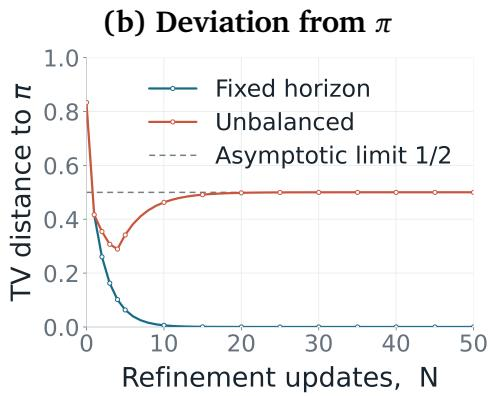  
Figure 6 | Selected values and total-variation trajectories from $X _ { 4 }$ (identical TV values from $X _ { 3 } )$ . The unbalanced curve uses the unbalanced kernel e�. The dashed line is the attained asymptotic floor ${ 1 / 2 } ;$ TV can lie below it at finite �.

Takeaway. At a fixed refinement stage, a current-endpoint kernel—one whose proposals cannot extend past the current record’s length—can only shorten a record or preserve its length. If it accepts shortening moves with positive probability under the intended target �, mass flows irreversibly toward shorter records and � cannot be invariant; the early-stopping implementation’s truncatedscore acceptance rule permits exactly this. Fixed-horizon refinement removes this obstruction by defining proposals on a common state space in which both directions have positive probability, so the MH correction is non-degenerate and the chain can move across record lengths.

## D. Power-Ladder Design

This section develops a principled design rule for the power ladder at a fixed horizon $T ,$ following (Kofke, 2002; Rathore et al., 2005; Syed et al., 2022). Recall that we denote the fixed-horizon state space with $S _ { T }$ , the sequence energy by $U ( \mathbf { x } ) : = - \log p _ { 0 } ( \mathbf { x } \mid \mathbf { x } _ { 0 } )$ , and the the sequence-level power target by $\pi _ { \alpha } ( \mathbf { x } ) : = Z _ { \alpha } ( \mathbf { x } _ { 0 } ) ^ { - 1 } e ^ { - \alpha U ( \mathbf { x } ) }$ . Fix the number of replicas � and the endpoint powers $\alpha _ { 1 }$ and $\alpha _ { K } .$ . Every adjacent pair satisfies $\alpha _ { k } < \alpha _ { k + 1 }$ . The analysis assumes equilibrium draws at the two rungs involved in each exchange and studies the resulting expected swap acceptance.

The design criterion below uses equilibrium overlap (Deng et al., 2023; Rathore et al., 2005). Thus, each sequence from adjacent temperatures is represented by independent draws from its two power targets. This criterion isolates the geometry of the ladder; observed acceptance in a finite run also reflects warm-up, local mixing, and Monte Carlo variability.

## D.1. Thermodynamic coordinate and exact swap overlap

For $\alpha < \beta _ { : }$ , let $X _ { \alpha } \sim \pi _ { \alpha }$ and $X _ { \beta } \sim \pi _ { \beta }$ independently. The swap log ratio is $G _ { \alpha , \beta } : = ( \beta - \alpha ) \{ U ( X _ { \beta } ) - U ( X _ { \alpha } ) \}$ 2 and the exact equilibrium acceptance is $\bar { a } ( \alpha , \beta ) : = \mathbb { E } [ 1 \wedge e ^ { G _ { \alpha , \beta } } ]$ . Define $\sigma ^ { 2 } ( s ) : = \operatorname { V a r } _ { \pi _ { s } } [ U ( X ) ]$ . The exponential-family identity $\begin{array} { r } { \frac { d } { d s } \mathbb { E } _ { \pi _ { s } } \bigl [ U ( X ) \bigr ] = - \sigma ^ { 2 } ( s ) } \end{array}$ and independence yield

$$
\mathbb { E } [ G _ { \alpha , \beta } ] = - ( \beta - \alpha ) \int _ { \alpha } ^ { \beta } \sigma ^ { 2 } ( s ) d s , \quad \quad \mathrm { V a r } ( G _ { \alpha , \beta } ) = ( \beta - \alpha ) ^ { 2 } \{ \sigma ^ { 2 } ( \alpha ) + \sigma ^ { 2 } ( \beta ) \} .\tag{46}
$$

To describe the local scale, let $\sigma ( \alpha )$ denote the energy standard deviation under $\pi _ { \alpha }$ . The corresponding thermodynamic distance and total ladder length are

$$
d ( \alpha , \beta ) = \int _ { \alpha } ^ { \beta } \sigma ( s ) d s , \qquad D _ { \mathrm { t o t } } = d ( \alpha _ { 1 } , \alpha _ { K } ) .
$$

On the finite state space, the power family varies smoothly with $\alpha ,$ and its mean energy satisfies $\begin{array} { r } { \frac { d } { d \alpha } \mathbb { E } _ { \pi _ { \alpha } } [ U ( X ) ] = - \sigma ^ { 2 } ( \bar { \alpha } ) } \end{array}$ . Together with the independence of $X _ { \alpha }$ and $X _ { \beta }$ , this gives the following local behavior when $\beta = \alpha + \delta $

$$
\begin{array} { r } { \mathbb { E } [ G _ { \alpha , \alpha + \delta } ] = - d ( \alpha , \alpha + \delta ) ^ { 2 } + O ( \delta ^ { 3 } ) , \qquad \mathrm { V a r } ( G _ { \alpha , \alpha + \delta } ) = 2 d ( \alpha , \alpha + \delta ) ^ { 2 } + O ( \delta ^ { 3 } ) . } \end{array}\tag{47}
$$

These expansions identify thermodynamic distance as the local scale of the swap log ratio. They do not imply Gaussianity, so Gaussian shape is an additional finite-gap approximation (Kofke, 2002). Specifically, we use

$$
G _ { \mathrm { { G } } } ( \alpha , \beta ) \sim N \left( - d ( \alpha , \beta ) ^ { 2 } , 2 d ( \alpha , \beta ) ^ { 2 } \right) ,
$$

and denote its predicted acceptance by $a _ { \mathrm { G } } ( \alpha , \beta ) = \mathbb { E } [ 1 \wedge e ^ { G _ { \mathrm { G } } ( \alpha , \beta ) } ]$ . All optimality claims below refer to this Gaussian surrogate.

## D.2. Max–min design and the unique equi-accepting ladder

Adjacent exchanges form a path, so every trip between the endpoint rungs must cross every interface. When interfaces are attempted equally often, the smallest predicted adjacent acceptance is a natural bottleneck proxy for end-to-end transport. For fixed $K , \alpha _ { 1 }$ , and $\alpha _ { K } .$ , we consequently consider

$$
\begin{array} { c } { { \displaystyle { \operatorname* { m a x } } \qquad \operatorname* { m i n } _ { { } \alpha _ { { } } , \ldots { } , \alpha _ { K - 1 } : \qquad } \operatorname* { m i n } _ { { } 1 \leq k < K } a _ { { \mathsf { G } } } ( \alpha _ { k } , \alpha _ { k + 1 } ) . } } \\ { { \alpha _ { 1 } < \alpha _ { 2 } < \cdots < \alpha _ { K - 1 } < \alpha _ { K } } } \end{array}\tag{48}
$$

This criterion optimizes the weakest interface rather than the average acceptance across the ladder.

Lemma D.1 (Optimal Gaussian equi-accepting ladder). Suppose � takes at least two values on $S _ { T }$ Under the Gaussian surrogate, the predicted acceptance between $\alpha < \beta$ is

$$
a _ { \mathrm { G } } ( \alpha , \beta ) = A ( d ( \alpha , \beta ) ) , \qquad A ( d ) : = 2 \Phi \left( - \frac { d } { \sqrt { 2 } } \right) ,
$$

where Φ is the standard normal cumulative distribution function. The unique solution of $E q .$ . 48 divides the total thermodynamic length equally among the $K - 1$ adjacent interfaces:

$$
\int _ { \alpha _ { k } ^ { \mathrm { o p t } } } ^ { \alpha _ { k + 1 } ^ { \mathrm { o p t } } } \sigma ( s ) d s = \frac { D _ { \mathrm { t o t } } } { K - 1 } , \qquad k = 1 , \dots , K - 1 .\tag{49}
$$

Consequently, every interface has the common predicted acceptance $A ( D _ { \mathrm { t o t } } / ( K - 1 ) )$ .

Proof. For $d = d ( \alpha , \beta ) \ : > \ : 0$ and $G _ { \mathrm { G } } \sim \mathcal { N } ( - d ^ { 2 } , 2 d ^ { 2 } )$ , the Gaussian tail and its exponential tilt give $\mathbb { P } ( G _ { \mathbb { G } } \ge 0 ) + \mathbb { E } [ e ^ { G _ { \mathbb { G } } } \mathbf { 1 } \{ G _ { \mathbb { G } } < 0 \} ] = 2 \Phi ( - d / \sqrt { 2 } )$ . This proves the stated acceptance formula, and � is strictly decreasing (Kofke, 2002).

For any feasible ladder, let $d _ { k } = d ( \alpha _ { k } , \alpha _ { k + 1 } )$ . Positive support and nonconstant � imply $\sigma ( \alpha ) > 0 _ { : }$ while additivity gives $\textstyle \sum _ { k = 1 } ^ { K - 1 } d _ { k } = D _ { \mathrm { t o t } }$ . Consequently, min $\mathrm { : } a _ { \mathrm { G } } ( \alpha _ { k } , \alpha _ { k + 1 } ) = A ( \operatorname* { m a x } _ { k } { d _ { k } } )$ . Since $\operatorname* { m a x } _ { k } d _ { k } \geq$ $D _ { \mathrm { t o t } } / ( K - 1 )$ , with equality if and only if all gaps equal their average, the equal-gap vector is uniquely optimal.

Finally, the map $F ( \alpha ) \ = \ d ( \alpha _ { 1 } , \alpha ) / D _ { \mathrm { t o t } }$ is continuous and strictly increasing, so the optimal gaps determine the unique rungs $\alpha _ { k } ^ { \mathrm { o p t } } = F ^ { - 1 } ( ( k - 1 ) / ( K - 1 ) ) , k = 1 , \dots , K$ □

Thus equi-acceptance follows from the max–min objective: fixed total thermodynamic length forces the optimal ladder to balance every bottleneck. When � is constant on $S _ { T } ,$ , every power target is the same, $\sigma ( \alpha ) = 0 _ { : }$ , and each swap is accepted. Every feasible ladder is then max–min optimal. Lemma D.1 covers the varying-energy regime in which rung placement afects transport (Rathore et al., 2005; Syed et al., 2022).

Corollary D.2 (Arithmetic and geometric ladder templates). Fix $K , \alpha _ { 1 { \mathrm { : } } }$ , and $\alpha _ { K } ,$ and apply the max–min construction of Lemma D.1 to either of the following idealized thermodynamic design curves on $[ \alpha _ { 1 } , \alpha _ { K } ]$ Each curve yields a unique surrogate ladder:

$$
\begin{array} { r l } { \sigma ( \alpha ) = \sigma _ { 0 } > 0 \quad \Longrightarrow \quad \alpha _ { k } ^ { \mathrm { o p t } } = \alpha _ { k } ^ { \mathrm { a r i t h } } : = \alpha _ { 1 } + \displaystyle \frac { k - 1 } { K - 1 } ( \alpha _ { K } - \alpha _ { 1 } ) , \qquad k = 1 , \dots , K , } \\ { C ( \alpha ) = \alpha ^ { 2 } \sigma ^ { 2 } ( \alpha ) = c > 0 \quad \Longrightarrow \quad \alpha _ { k } ^ { \mathrm { o p t } } = \alpha _ { k } ^ { \mathrm { g e o m } } : = \alpha _ { 1 } \left( \displaystyle \frac { \alpha _ { K } } { \alpha _ { 1 } } \right) ^ { ( k - 1 ) / ( K - 1 ) } , \qquad k = 1 , \dots , K . } \end{array}\tag{50}
$$

Proof. When $\sigma ( \alpha ) = \sigma _ { 0 }$ , integration gives $d ( \alpha , \beta ) = \sigma _ { 0 } ( \beta - \alpha )$ . Equal thermodynamic gaps are equal raw-power gaps, and the fixed endpoints make each gap $( \alpha _ { K } - \alpha _ { 1 } ) / ( K - 1 )$ . When $C ( \alpha ) = c ,$ one has $\sigma ( \alpha ) = \sqrt { c } / \alpha .$ , so integration gives $d ( \alpha , \beta ) = \sqrt { c } \log ( \beta / \alpha )$ . Equal thermodynamic gaps are then equal logpower gaps, and the fixed endpoints make each log gap $\log ( \alpha _ { K } / \alpha _ { 1 } ) / ( K - 1 )$ . These two substitutions yield Equation 50; by Lemma D.1, every interface then has the common predicted acceptance $A ( D _ { \mathrm { t o t } } / ( K - 1 ) ) , \mathrm { i . e . , } A \big ( \sigma _ { 0 } ( \alpha _ { K } - \alpha _ { 1 } ) / ( K - 1 ) \big )$ for the arithmetic template and $A \big ( \sqrt { c } \log ( \alpha _ { K } / \alpha _ { 1 } ) / ( K - 1 ) \big )$ for the geometric one. □

These exact curves are idealized design models. Approximate flatness of $\sigma ( \alpha )$ gives a near-arithmetic initialization, while approximate constancy of $C ( \alpha )$ gives a near-geometric initialization. Pilot calibration can refine either template toward equal thermodynamic gaps (Kofke, 2002).

In a finite state space, exact constancy of $\sigma ^ { 2 } ( \alpha )$ on an open interval forces $\sigma ^ { 2 } ( \alpha ) = 0$ and constant energy: analyticity extends the constant value across the positive power domain, while concentration on minimum-energy states sends the variance to zero as $\alpha \to \infty$ . Therefore, positive constant variance is an idealized local model, and arithmetic spacing is a local empirical template.

## E. Chain Communication Protocol

Each adjacent-pair swap is itself an MH move on the joint target, so any composition of swaps preserves $\Pi _ { m }$ at every stage �, and hence Π: the communication schedule cannot change what we sample, only how fast records travel across the ladder. Hence, choosing one is an eficiency question, and its answer depends on the regime.

Rungs are indexed $1 , \ldots , K$ as in the main text, and edge $k \in \{ 1 , \ldots , K - 1 \}$ joins rungs � and $k + 1$ . An attempt on edge � is accepted with probability $a _ { k } \in ( 0 , 1 ]$ ; as in the remark of Section 3.4, acceptance decisions are taken to be independent with these fixed, history-independent probabilities, and we write

$$
r _ { k } = 1 - a _ { k } , \qquad \rho _ { k } = \frac { r _ { k } } { a _ { k } } , \qquad R = \sum _ { k = 1 } ^ { K - 1 } \rho _ { k } .
$$

The schedules are defined as follows.

Ordered ADJ: one sweep attempts edges $1 , 2 , \ldots , K - 1$ in order, applying each accepted exchange immediately. Observe the tagged replica at complete-sweep boundaries. Its round trip starts at rung 1, visits rung �, and then returns to rung 1. Let $T _ { \mathrm { A D J } }$ count sweeps, referring to one tagged replica’s trip, rather than completion of a trip by every replica. We proceed to derive the expected iteration count for a round trip $\mathbb { E } T _ { \mathrm { A D J } }$

Upward passage. Follow the first upward crossing of each edge �. Successful crossings can cascade through the entire ladder within one sweep, so the passage takes one sweep plus delays caused by rejections. After a rejection at edge $k ,$ the tag stays in the prefix $\{ 1 , \ldots , k \}$ until its next attempt at that edge. Observe the tag just before edge � is scheduled in each sweep. Until the next attempt, its motion is the ordered scan confined to this prefix. Starting from �, the mean time to return to � and retry is also � sweeps. The number of rejections before the successful crossing is geometric, with mean $\rho _ { k } = r _ { k } / a _ { k }$ . Independence and the Markov property make the expected delay at this edge $k \rho _ { k }$ Summing gives

$$
H _ { 1 \to K } ^ { \mathrm { A D J } } = 1 + \sum _ { k = 1 } ^ { K - 1 } k \rho _ { k } .\tag{51}
$$

Downward passage. A successful move from $k + 1$ to � occurs after edge $k - 1$ has already been processed. Thus the tag can move down by at most one rung per sweep, so the passage takes $K - 1$ sweeps plus rejection delays. After rejecting edge � from rung $k + 1$ , the tag makes an excursion in the sufix $\{ k + 1 , \ldots , K \}$ before retrying. Observing just before edge � is scheduled, the return-time fact gives a mean retry delay of $K - k$ sweeps. There are on average $\rho _ { k }$ rejections before the successful downward crossing, hence

$$
H _ { K \to 1 } ^ { \mathrm { A D J } } = ( K - 1 ) + \sum _ { k = 1 } ^ { K - 1 } ( K - k ) \rho _ { k } .\tag{52}
$$

An endpoint reached during a sweep remains occupied until its end, so these passage counts agree with the stated sweep-boundary convention. Adding the two expectations gives

$$
\mathbb { E } T _ { \mathrm { A D J } } = K ( 1 + R ) .\tag{53}
$$

Lastly, we can compare the expected iteration count above with the corresponding expected count for the asymptotically optimal schedule deterministic even–odd (DEO) introduced by (Okabe et al., 2001). More specifically in DEO, one layer attempts all even or all odd edges, alternating the two matchings deterministically. In the lifted state $( k , \varepsilon )$ , the sign $\varepsilon \in \{ - 1 , + 1 \}$ is the next proposed direction. Acceptance preserves the sign; rejection reverses it. An outward direction at an endpoint reverses in one idle layer. We count the round trip, including both turnaround layers. This is the recurring endpoint-arrival convention.

The corresponding expected count is

$$
\mathbb { E } T _ { \mathrm { D E O } } = 2 K ( 1 + R ) .\tag{54}
$$

Subsequently, assume $d _ { \mathrm { A D J } }$ and $d _ { \mathrm { D E O } }$ denote the iteration durations, including refinement and swap communication. When the additional communication cost of ordered ADJ is negligible relative to $d _ { \mathrm { D E O } }$ , the expected round-trip elapsed times satisfy

$$
\frac { \mathbb { E } C _ { \mathrm { A D J } } } { \mathbb { E } C _ { \mathrm { D E O } } } = \frac { d _ { \mathrm { A D J } } } { 2 d _ { \mathrm { D E O } } } = \frac { 1 } { 2 } + \frac { d _ { \mathrm { A D J } } - d _ { \mathrm { D E O } } } { 2 d _ { \mathrm { D E O } } } \approx \frac { 1 } { 2 } .
$$

Remark E.1. DEO becomes preferable when the additional sequential communication outweighs this iteration-count advantage, namely when $d _ { \mathrm { A D J } } > 2 d _ { \mathrm { D E O } }$ . In particular, as $K  \infty ,$ the quadratic scaling $\Theta ( K ^ { 2 } ( 1 + R ) )$ of the ordered sweep dominates. Under these timing assumptions, DEO is asymptotically faster as the number of replicas grows.

## F. Extended Related Work

Distribution sharpening for LLMs. A major goal of LLM post-training is to shift probability mass toward higher-quality responses. RLHF optimizes against learned human-preference rewards (Ouyang et al., 2022), while RLVR methods such as GRPO optimize against verifiable task rewards and have improved mathematical and coding performance (Guo et al., 2025; Hu et al., 2025; Lambert et al., 2024; Shao et al., 2024). However, post-training is expensive, reward-dependent, and can reduce output diversity by reinforcing already likely solution modes (Chen et al., 2025; He et al., 2025; Yue et al., 2025). This motivates training-free inference-time methods that sharpen or reshape the base distribution without updating model weights.

Inference-time scaling. Best-of-� and reward-reranking improve generation by sampling multiple completions and selecting a high-scoring one (Huang et al., 2025; Wang et al., 2025). Temperature and truncation methods, including low-temperature, modify local token probabilities to balance quality and diversity (Du et al., 2025; Meister et al., 2023; Troshin et al., 2025). These approaches are efective but are generally heuristic: they do not sample from a specified sequence-level target distribution.

Power distribution sampling. Power distribution sampling replaces these heuristics with an explicit sequence-level target, the power distribution $\pi _ { \alpha } \propto p _ { 0 } ^ { \alpha }$ with $\alpha > 1$ (Eq. 1), which sharpens the base model over whole completions rather than token by token. Karan and Du (2026) introduced Power Sampling, which targets $\pi _ { \alpha }$ with a Metropolis–Hastings chain whose proposals regenerate a uniformly chosen sufix under the tokenwise-powered proposal $g _ { \alpha }$ (Eq. 2), applied blockwise over progressively longer prefixes. Without training, rewards, or verifiers, it nearly matches and in some cases exceeds GRPO on MATH500, HumanEval, and GPQA, but repeated sufix regeneration makes it expensive at inference time. Two follow-ups reduce this cost. Ji et al. (2026) show that $\pi _ { \alpha }$ can be approximated autoregressively by the low-temperature distribution rescaled with token-level factors that capture the quality of future continuations; they estimate these factors with Monte Carlo rollouts and a jackknife bias correction, which removes the MCMC loop and reduces latency by more than an order of magnitude. PowerSMC (Azizi et al., 2026) instead targets $\pi _ { \alpha }$ with sequential Monte Carlo: a small set of particles is advanced in parallel under $g _ { \alpha . }$ , which they show is the unique prefix-only proposal minimizing the incremental weight variance, with token-by-token importance-weight correction, resampling when needed, and an exponent-bridging schedule that stabilizes the particles. It matches or exceeds MH-based Power Sampling on MATH500 at a fraction of its latency. PPT builds on the local MH refinement of Power Sampling, and we compare against both Power Sampling and PowerSMC in our experiments.

Monte Carlo methods for LLM inference. MCMC and SMC provide principled alternatives to heuristic decoding for unnormalized sequence-level targets. MCMC constructs a Markov chain with the desired stationary distribution, and has been used for energy-based controllable text generation, blockwise text resampling, quality-aware machine translation, and constrained LM sampling (Anaya Gonzalez et al., 2026; Faria et al., 2024; Forristal et al., 2023; Mireshghallah et al., 2022). SMC instead maintains weighted particles across a sequence of intermediate targets and has recently been applied to twisted SMC for language-model inference, mathematical reasoning, and reward-guided decoding (Feng et al., 2025; Markovic-Voronov et al., 2026; Zhao et al., 2024).

Parallel tempering. Parallel tempering is designed to improve MCMC mixing by running multiple tempered replicas and swapping their states with a Metropolis correction. It originated in spinglass simulation (Swendsen and Wang, 1986), was generalized to statistical MCMC (Geyer, 1991), and became standard in exchange Monte Carlo and molecular simulation (Earl and Deem, 2005; Hukushima and Nemoto, 1996; Sugita and Okamoto, 1999). Later work tunes the temperature ladder (Kone and Kofke, 2005), optimizes the annealing path (Syed et al., 2021), and uses nonreversible replica dynamics (Okabe et al., 2001; Syed et al., 2022). These methods exploit hightemperature replicas for exploration and low-temperature replicas for target concentration. Existing LLM samplers rarely use this exchange mechanism: they typically rely on a single MH chain (Karan and Du, 2026), independent best-of-� samples (Huang et al., 2025), or SMC particles (Azizi et al., 2026). PPT adapts parallel tempering to LLM sampling by transferring states from exploratory replicas to sharpened targets, with the aim of improving finite-budget mixing while exploiting parallel execution.

Recently, He et al. (2026) developed replica-exchange sampling for LLMs using intermediate targets at a common sharpening temperature indexed by prefix length, with exchange proposals that extend and truncate token chunks. Instead, PPT couples replicas at diferent sharpening powers over a common horizon at each generation stage, exchanging entire sequence records using cached likelihoods without additional model evaluations. This construction explicitly couples exploration under flatter distributions with concentration under sharper targets over the same completion space.

## G. Experimental Settings

## G.1. Choice of Baselines

• Standard Decoding. We sample directly from the autoregressive model �0 using standard ancestral decoding at temperature one, corresponding to the unsharpened target $\alpha = 1$ . This baseline measures the raw capability of the underlying model and serves as the reference against which all sharpening gains are reported.

• Low Temperature Decoding. We decode from the autoregressive model at a reduced sampling temperature $\tau = 1 / \alpha < 1$ , the standard heuristic for concentrating probability on high-likelihood tokens. Because temperature sharpens each next-token conditional independently, it does not reproduce the sequence-level power target $\pi _ { \alpha } \propto p _ { 0 } ^ { \alpha }$ (Equation 23).

• Power Sampling (Blockwise MH Sampler) (Karan and Du, 2026). For the Power Sampling results of Table 1, we use the authors’ released implementation without modification. In particular it retains the early stopping analyzed in Section 3.2, where each proposal is generated and scored only through the current realized length.

• Power Sequential Monte Carlo: A particle-based alternative that approximates the same tempered target by maintaining a population of partial sequences and periodically resampling them in proportion to their power-reweighted importance weights. It represents the sequential Monte Carlo counterpart to our parallel tempering scheme, allowing us to contrast population resampling against exchange-based transport.

• GRPO: Group Relative Policy Optimization (Shao et al., 2024) is a reinforcement-learning method that fine-tunes the model weights to concentrate probability mass on high-reward trajectories. Unlike the inference-time samplers above, GRPO modifies the model itself and requires a verifiable reward signal. we include it as a strong training-based reference point to assess how far a purely inference-time sampler can close the gap to a method that pays the additional cost of post-training.

For Power Sampling (Karan and Du, 2026) and PowerSMC, we based our experiments on the respective oficial implementations, left their sampling kernels unmodified, and tuned their method-specific hyperparameters independently for each model to obtain the strongest performance we could achieve under the common evaluation protocol.

## G.2. Choice of Datasets

• MATH500: The MATH dataset (Hendrycks et al., 2021) consists of competition math problems spanning seven categories including geometry, number theory, and precalculus. There are 12500 problems total, with 7500 training problems and 5000 test problems. MATH500 is a fixed subset of 500 problems from the test set (Lightman et al., 2024).

• HumanEval: HumanEval is a set of 164 handwritten programming problems covering algorithms, reasoning, mathematics, and language comprehension (Chen et al., 2021). Each problem has an average of 7.7 associated unit tests, where solving the problem corresponds to passing all unit tests.

• GPQA: GPQA (Rein et al., 2024) is a dataset of multiple-choice science questions (physics, chemistry, and biology) which require advanced reasoning skills to solve. We use the GPQA Diamond subset for evaluation, which consists of 198 questions which represent the highest quality subset of the GPQA dataset.

• GSM8K: GSM8K is a dataset of grade-school math word problems that require multi-step arithmetic reasoning to solve (Cobbe et al., 2021). Each problem is paired with a natural-language solution and a single numeric final answer, and correctness is scored by exact match on that answer. We evaluate on the standard 1319-problem test split.

• AIME 24&25: The AIME 24&25 sets collect the problems from the American Invitational Mathematics Examination for those years, a high-dificulty olympiad-style competition whose questions each have an integer answer between 0 and 999 (Zhang and Math-AI, 2024; Zhang and Team, 2025). We evaluate on the combined 60-problem set, both examinations (I and II) from 2024 and 2025 respectively. This benchmark probes performance on the hardest, most reasoning-intensive mathematics in our suite, where exploration of distinct solution paths matters most.

• LCB v5: LiveCodeBench is a contamination-aware coding benchmark that continuously collects problems from competitive-programming contests (Jain et al., 2025).

## G.3. Evaluation Metrics

Task accuracy. Our primary metric is strict pass@1 accuracy: for each benchmark item, every method returns exactly one completion, and we report the percentage of items solved. No method uses reward- or verifier-based reranking or oracle filtering. For GSM8K and AIME 24&25, we extract the final numeric answer and require an exact match after standard normalization. GPQA is scored by exact match on the selected multiple-choice option. MATH500 is scored with the PRM800K/Hendrycks-MATH equivalence grader.

Code correctness. For HumanEval, and LiveCodeBench v5, we report execution-based pass@1. A completion is correct only if it compiles or executes successfully and passes every associated unit test; invalid programs, runtime errors, and timeouts receive zero credit.

Diagnostic and eficiency metrics. To characterize the generated reasoning traces, we additionally report the average token log-likelihood under the base model, $\textstyle T ^ { - 1 } \sum _ { t = 1 } ^ { T } \log p _ { 0 } ( x _ { t } \mid x _ { < t } )$ . Confidence is measured as the mean negative next-token entropy,

$$
C ( \boldsymbol { x } ) = \frac { 1 } { T } \sum _ { t = 1 } ^ { T } \sum _ { \nu \in \mathcal { V } } p _ { 0 } ( \nu \mid \boldsymbol { x } _ { < t } ) \log p _ { 0 } ( \nu \mid \boldsymbol { x } _ { < t } ) ,
$$

with values closer to zero indicating greater confidence; we first average over generated positions within each completion and then average the resulting completion-level scores across benchmark items.

Table 6 | PPT hyperparameters for the Qwen3-4B and Qwen3-8B evaluations. � is the generation block size, and $N _ { \mathrm { M C M C } }$ is the number of local refinement steps per block.
<table><tr><td>Benchmark</td><td>K</td><td> $\left\{ \alpha _ { k } \right\}$ </td><td>T</td><td>B</td><td>NMCMC</td></tr><tr><td>MATH500</td><td>4</td><td>{2.35, 2.5, 2.7, 2.9}</td><td>8192</td><td>4096</td><td>10</td></tr><tr><td>AIME 24&amp;25</td><td>4</td><td>{1.8, 1.95, 2.15, 2.4}</td><td>32768</td><td>8192</td><td>10</td></tr><tr><td>GPQA-Diamond</td><td>3</td><td>{1.15, 1.3, 1.5}</td><td>16384</td><td>4096</td><td>6</td></tr><tr><td>LiveCodeBench v5</td><td>4</td><td>{1.8, 2.0, 2.2, 2.4}</td><td>8192</td><td>2048</td><td>8</td></tr><tr><td>HumanEval</td><td>3</td><td>{1.5, 1.6, 1.8}</td><td>4096</td><td>2048</td><td>20</td></tr><tr><td>GSM8K</td><td>6</td><td> $\{ 2 . 0 , 2 . 3 , 2 . 6 , 3 . 0 , 3 . 5 , 4 . 0 \}$ </td><td>3072</td><td>192</td><td>10</td></tr></table>

Table 7 | PPT hyperparameters for the Qwen3.5-9B evaluations. � is the generation block size, and �MCMC is the number of local refinement steps per block.

<table><tr><td>Benchmark</td><td>K</td><td> $\left\{ \alpha _ { k } \right\}$ </td><td>T</td><td>B</td><td>NMCMC</td></tr><tr><td>GPQA-Diamond</td><td>3</td><td>{1.05, 1.10, 1.25}</td><td>131,072</td><td>131,072</td><td>10</td></tr><tr><td>AIME 24&amp;25</td><td>3</td><td>{1.25, 1.4, 1.6}</td><td>65,536</td><td>65,536</td><td>5</td></tr><tr><td>LiveCodeBench v5</td><td>3</td><td>{1.1, 1.25, 1.4}</td><td>131,072</td><td>131,072</td><td>5</td></tr></table>

## G.4. Configuration

Models and prompting. The evaluated checkpoints range from 3.8B to 9B parameters and include base, instruction-tuned, and GRPO-trained models from the Qwen2.5, Qwen3, Qwen3.5, Phi-3.5, and Tulu-3 families. No additional training is performed as part of our evaluation. The Qwen3 models use their tokenizer-provided chat templates, whereas the Qwen2.5 models use raw prompts. Experiments were run on NVIDIA H100 hardware. The requested completion budget is capped per item by the checkpoint context length minus the prompt length and a 64-token safety margin. The Qwen2.5- Math experiments use $T = 3 0 7 2$ . For Qwen3, Table 6 shows: GSM8K use $T = 3 0 7 2$ , HumanEval use � = 4096, MATH500 and LCB v5 experiments use $T = 8 1 9 2$ , Qwen3 GPQA experiments use � = 16384, and Qwen3 AIME 24&25 experiments use $T = 3 2 7 6 8$ . Lastly, for Qwen3.5 GPQA and LCB v5 use $T = 1 3 1 0 7 2$ , and AIME 24&25 use $T = 6 5 5 3 6$

PowerSMC implementation. PowerSMC maintains normalized particle weights $\bar { w } _ { i }$ and computes

$$
\mathsf E S S = \frac { 1 } { \sum _ { i = 1 } ^ { N } \bar { w } _ { i } ^ { 2 } } .
$$

ESS is checked at the configured token interval and at the final horizon. When it falls below 0.5�, the implementation performs systematic resampling and resets the particle weights. At the end of generation, one particle is sampled according to the final normalized weights. Particles are internal sampler states and are not counted as additional evaluation completions. Lastly, PowerSMC uses a per-particle EOS handling.

Across all configurations, replica � is the returned replica and has target power $\alpha ^ { \star }$ . Local proposals draw the restart position uniformly from $\{ 1 , \ldots , T _ { m } \}$ and regenerate the sufix using temperature $\tau _ { k } ~ = ~ 1 / \alpha _ { k } , ~ \mathrm { t o p } { \cdot } p ~ = ~ 1$ , disabled top-�, and min-� = 0. We apply one ordered adjacent sweep, $( 1 , 2 ) , ( 2 , 3 ) , \ldots , ( K - 1 , K )$ , after every synchronized local-MH round.

Common Comparison Protocol Two entries are compared, in Table 1 or in Appendix H, only when they satisfy the following conditions:

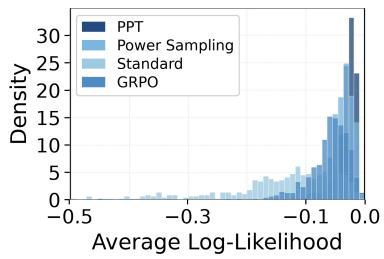

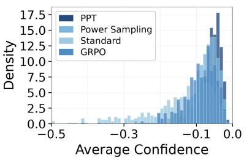

<table><tr><td>Missing figure:</td></tr><tr><td>figures/acc_vs_mcmc.png</td></tr></table>

Figure 7 | Confidence comparison across methods on MATH500 using Qwen3-8B; values closer to zero indicate more plausible traces.  
Figure 8 | Accuracy gain over the onestep baseline for varying number of refinement steps.

• Grading. Public or oficial graders throughout.

• Prompt. Every baseline is compared with PPT under an identical prompt.

• Completion cap. Identical horizon for all baselines.

## H. Extended Experimental Results

## H.1. Extended Main Results

Table 8 shows that PPT is the most consistent method across model families and task types, attaining the best or tied-best performance in the large majority of settings. Its advantage is clearest for the Qwen3 models on the hardest tasks: the largest margin over the strongest baseline is on AIME 24&25 for Qwen3-4B (5.0 points) and on LCB v5 for Qwen3-8B (4.3 points). Results from other model families are more mixed. On tasks where the model is already near saturation, PPT remains competitive. This pattern is consistent with the central intuition behind parallel tempering: exploratory replicas can search across diferent reasoning modes, while exchange lets the output rung inherit promising trajectories instead of having to discover them on its own. Because the main comparison changes more than one component relative to Power Sampling, the table establishes the breadth of the improvement; the matched ablations below isolate the efects of fixed-horizon refinement and replica exchange.

Acceptance Rates Table 9 reports the mean acceptance rate of swap proposals between adjacent rungs, averaged over all exchange attempts in the run, across six benchmarks and six models. Two regularities stand out. First, acceptance is governed by the model and by the task. Second, the Qwen3 models accept far fewer swaps (0.18 − 0.37) than the other models (0.35 − 0.58). Both regimes nonetheless sit in the range classically recommended for parallel tempering (roughly 0.15 − 0.6), so the ladders are communicating rather than idling; a denser ladder for the newer and more capable models would raise acceptance further at the cost of more replicas, and we leave that trade-of to the ladder-design discussion.

Confidence of Trace Figure 7 complements task accuracy by asking whether the returned traces lie in regions that the model itself regards as plausible. As illustrated, for both average log-likelihood and negative next-token entropy, PPT concentrates more of the distribution near zero and suppresses the difuse low-score tail seen most clearly under standard decoding. This is the behavior expected from sequence-level sharpening: trajectories discovered across the ladder can move to the output rung when they are compatible with the sharper target. These diagnostics measure the model’s internal

Table 8 | Single-sample performance (%) across reasoning, coding, and knowledge benchmarks. Bold indicates the best result within each base-model group. Scores are averaged over 5 random seeds and reported as mean ± standard deviation. Dashes ’—’ indicate that no GRPO result is available for Phi 3.5 instruct.
<table><tr><td>Method</td><td>MATH 500</td><td>GPQA</td><td>Human Eval</td><td>GSM8K</td><td>AIME 24&amp;25</td><td>LCB v5</td></tr><tr><td>Qwen 2.5 MATH</td><td></td><td></td><td></td><td></td><td></td><td></td></tr><tr><td>Standard</td><td>51.6 ±1.8</td><td>31.6 ±1.1</td><td>30.5 ±1.8</td><td>71.4 ±0.9</td><td>4.3 ±0.9</td><td>2.5 ±0.9</td></tr><tr><td>Lower Temperature</td><td>72.7 ±0.7</td><td>35.9 ±2.3</td><td>53.0 ±2.2</td><td>85.1 ±1.2</td><td>11.0 ±1.5</td><td>7.6 ±2.1</td></tr><tr><td>Power Sampling</td><td>76.7 ±0.4</td><td>35.9 ±1.8</td><td>56.7 ±0.4</td><td>86.7 ±0.3</td><td>15.7 ±1.5</td><td>8.9 ±1.2</td></tr><tr><td>PowerSMC</td><td>78.0 ±0.7</td><td>32.8 ±1.4</td><td>59.1 ±2.6</td><td>85.4 ±1.0</td><td>13.3 ±1.2</td><td>10.7 ±1.0</td></tr><tr><td>GRPO</td><td>77.3 ±0.6</td><td>36.5 ±2.7</td><td>53.7 ±1.1</td><td>86.4 ±0.4</td><td>13.3 ±1.7</td><td>2.8 ±1.1</td></tr><tr><td>PPT (Ours)</td><td>79.6 ±0.8</td><td>37.6 ±1.1</td><td>60.6 ±1.3</td><td>91.4 ±1.1</td><td>17.7 ±1.5</td><td>12.5 ±1.9</td></tr><tr><td>Qwen 2.5</td><td></td><td></td><td></td><td></td><td></td><td></td></tr><tr><td>Standard</td><td>43.0 ±3.0</td><td>28.6 ±2.0</td><td>20.7 ±0.9</td><td>59.2 ±1.1</td><td>4.3 ±1.9</td><td>2.5 ±0.3</td></tr><tr><td>Lower Temperature</td><td>63.8 ±2.2</td><td>32.8 ±2.1</td><td>51.8 ±0.7</td><td>81.0 ±0.5</td><td>6.7 ±2.0</td><td>15.1 ±1.8</td></tr><tr><td>Power Sampling</td><td>69.6 ±2.1</td><td>33.2 ±2.9</td><td>58.7 ±2.5</td><td>86.1 ±0.5</td><td>9.0 ±1.5</td><td>6.6 ±0.8</td></tr><tr><td>PowerSMC</td><td>70.3 ±0.7</td><td>34.0 ±0.6</td><td>59.4 ±0.8</td><td>86.3 ±0.4</td><td>12.7 ±1.9</td><td>15.0 ±0.7</td></tr><tr><td>GRPO</td><td>74.0 ±1.1</td><td>33.5 ±2.5</td><td>57.3 ±0.9</td><td>84.2 ±0.4</td><td>13.3 ±1.2</td><td>16.9 ±1.2</td></tr><tr><td>PPT (Ours)</td><td>74.0 ±1.5</td><td>34.9 ±0.7</td><td>61.6 ±0.9</td><td>88.1 ±0.5</td><td>15.7 ±0.9</td><td>9.3 ±0.5</td></tr><tr><td>Phi 3.5 instruct</td><td></td><td></td><td></td><td></td><td></td><td></td></tr><tr><td>Standard</td><td>37.9 ±1.4</td><td>31.6 ±1.4</td><td>37.9 ±1.1</td><td>80.4 ±0.5</td><td>2.3 ±0.9</td><td>7.2 ±1.3</td></tr><tr><td>Lower Temperature</td><td>41.1 ±0.8</td><td>31.3 ±0.4</td><td> $6 1 . 0 \pm 1 . 2$ </td><td>82.3 ±0.4</td><td>4.3 ±1.5</td><td>8.1 ±1.8</td></tr><tr><td>Power Sampling</td><td>38.2 ±1.2</td><td>29.8 ±2.6</td><td>67.0 ±0.8</td><td>81.9 ±0.7</td><td>6.7 ±1.2</td><td>11.7 ±1.9</td></tr><tr><td>PowerSMC</td><td>45.1 ±0.8</td><td>31.8 ±1.1</td><td>63.4 ±0.4</td><td>86.7 ±0.6</td><td>4.3 ±0.9</td><td>8.4 ±2.2</td></tr><tr><td>GRPO</td><td></td><td></td><td></td><td></td><td></td><td></td></tr><tr><td>PPT (Ours)</td><td>48.4 ±1.1</td><td>33.4 ±0.9</td><td>68.3 ±0.7</td><td>88.6 ±0.4</td><td>4.3 ±1.5</td><td>12.0 ±2.2</td></tr><tr><td>Tulu</td><td></td><td></td><td></td><td></td><td></td><td></td></tr><tr><td>Standard</td><td>44.9 ±1.0</td><td>26.8 ±0.5</td><td>59.8 ±1.8</td><td>85.4 ±0.3</td><td>2.3 ±1.5</td><td>9.8 ±0.9</td></tr><tr><td>Lower Temperature</td><td>45.2 ±1.1</td><td>26.3 ±0.5</td><td>63.4 ±1.5</td><td>87.3 ±0.2</td><td>2.3 ±1.5</td><td>10.0 ±1.3</td></tr><tr><td>Power Sampling</td><td>49.9 ±0.9</td><td>32.3 ±2.2</td><td>59.8 ±0.9</td><td>87.8 ±0.1</td><td>4.3 ±0.9</td><td>11.1 ±0.9</td></tr><tr><td>PowerSMC</td><td>50.3 ±0.6</td><td>31.8 ±0.6</td><td>60.2 ±0.9</td><td>87.7 ±0.2</td><td>4.3 ±0.9</td><td>12.2 ±0.7</td></tr><tr><td>GRPO</td><td>47.0 ±0.8</td><td>24.7 ±0.4</td><td>61.3 ±1.1</td><td>87.6 ±0.1</td><td>4.3 ±1.5</td><td>11.0 ±0.5</td></tr><tr><td>PPT (Ours)</td><td>51.8 ±0.6</td><td>35.9 ±0.7</td><td>64.0 ±1.6</td><td>89.7 ±0.3</td><td>6.7 ±3.1</td><td>12.6 ±0.6</td></tr><tr><td>Qwen3-4B</td><td></td><td></td><td></td><td></td><td></td><td></td></tr><tr><td>Standard</td><td>83.3 ±1.6</td><td>51.0 ±1.3</td><td>85.4 ±2.6</td><td>94.6 ±0.1</td><td>70.7 ±1.9</td><td>45.6 ±0.4</td></tr><tr><td>Lower Temperature</td><td>85.1 ±0.4</td><td>48.5 ±1.2</td><td>86.6 ±1.8</td><td>94.5 ±0.2</td><td>72.0 ±1.8</td><td>44.8 ±1.5</td></tr><tr><td>Power Sampling</td><td>83.5 ±2.5</td><td>51.0 ±0.7</td><td>90.2 ±1.5</td><td>94.2 ±0.1</td><td>73.3 ±1.2</td><td>55.1 ±1.7</td></tr><tr><td>PowerSMC</td><td>83.2 ±1.2</td><td>47.5 ±1.4</td><td>87.9 ±0.9</td><td>94.3 ±0.1</td><td>61.7 ±1.2</td><td>52.3 ±1.5</td></tr><tr><td>GRPO</td><td>85.6 ±0.6</td><td>50.0 ±0.6</td><td>91.6 ±0.7</td><td>94.6 ±0.1</td><td>73.3 ±1.7</td><td>52.7 ±1.8</td></tr><tr><td>PPT (Ours)</td><td>86.0 ±0.7</td><td>53.6 ±0.9</td><td>93.9 ±2.3</td><td>94.8 ±0.2</td><td>78.3 ±2.4</td><td>57.9 ±1.3</td></tr><tr><td>Qwen3-8B</td><td></td><td></td><td></td><td></td><td></td><td></td></tr><tr><td>Standard</td><td>83.9 ±1.2</td><td>55.8 ±1.7</td><td>84.9 ±1.2</td><td>94.6 ±0.3</td><td>72.7 ±3.8</td><td>48.1 ±1.7</td></tr><tr><td>Lower Temperature</td><td>84.6 ±0.4</td><td>54.5 ±2.1</td><td>87.2 ±0.6</td><td>95.0 ±0.2</td><td>73.0 ±4.6</td><td>48.4 ±2.5</td></tr><tr><td>Power Sampling</td><td>82.2 ±1.8</td><td>57.6 ±1.6</td><td>90.7 ±1.6</td><td>95.2 ±0.5</td><td>73.3 ±2.4</td><td>53.5 ±1.2</td></tr><tr><td>PowerSMC</td><td>84.1 ±0.6</td><td>58.0 ±0.6</td><td>90.2 ±0.4</td><td>95.5 ±0.1</td><td>65.0 ±1.2</td><td>53.6 ±1.0</td></tr><tr><td>GRPO</td><td>86.4 ±0.6</td><td>53.0 ±0.7</td><td>93.3 ±1.2</td><td>94.6 ±0.4</td><td>74.0 ±0.9</td><td>54.1 ±2.3</td></tr><tr><td>PPT (Ours)</td><td>88.0 ±0.6</td><td>60.1 ±0.8</td><td>94.9 ±1.5</td><td>95.5 ±0.2</td><td>78.3 ±2.6</td><td>58.4 ±1.3</td></tr></table>

Table 9 | Mean swap acceptance of the replica ladder.
<table><tr><td>Dataset</td><td>Qwen3-8B</td><td>Qwen3-4B</td><td>Qwen 2.5 MATH</td><td>Qwen 2.5</td><td>Tulu</td><td>Phi 3.5 instruct</td></tr><tr><td>MATH500</td><td>0.199</td><td>0.242</td><td>0.446</td><td>0.500</td><td>0.487</td><td>0.373</td></tr><tr><td>AIME 24&amp;25</td><td>0.192</td><td>0.276</td><td>0.404</td><td>0.533</td><td>0.449</td><td>0.392</td></tr><tr><td>GSM8K</td><td>0.274</td><td>0.332</td><td>0.427</td><td>0.455</td><td>0.505</td><td>0.382</td></tr><tr><td>GPQA-D</td><td>0.203</td><td>0.240</td><td>0.346</td><td>0.405</td><td>0.498</td><td>0.400</td></tr><tr><td>HumanEval</td><td>0.205</td><td>0.374</td><td>0.428</td><td>0.580</td><td>0.478</td><td>0.421</td></tr><tr><td>LiveCodeBench</td><td>0.222</td><td>0.260</td><td>0.530</td><td>0.511</td><td>0.482</td><td>0.425</td></tr></table>

preference rather than calibration, so they support the intended concentration mechanism but do not by themselves establish correctness.

## H.2. Ablation Studies

Impact of MCMC steps. The number of local refinement steps �MCMC specifies the number of MH-update attempts per replica per block. Figure 8 demonstrates the accuracy gain over a single step, as most of the improvement arrives by 4 steps (+3.0 on MATH500, +4.1 on HumanEval), and the best results come at 10 steps (+4.4 and +6.6). More refinement therefore helps overall but the gain is not monotone in $N _ { \mathrm { M C M C } }$ and since local updates dominate runtime (Table 3), $N _ { \mathrm { M C M C } }$ is the main knob for trading accuracy against cost.

Compute-matched comparison In this section, we consider two complementary compute-matched controls: a single chain given more MCMC refinement steps, and multiple uncoupled chains.

More refinement in a single chain. First, Table 10 compares PPT with � > 1 replicas against a single chain (� = 1). We increase the number of MCMC steps in the single-chain run until its total generatedtoken budget matches or even exceeds that of the multi-replica run. Both methods return one trace, so this comparison tests whether the same token budget is better spent on additional refinement of one chain or on interacting replicas. PPT achieves consistently higher accuracy across all eight comparisons, with the largest gains on AIME.

Table 10 | Compute-matched single-trace comparison. Entries report Accuracy (Tokens×103), with accuracy in percent and decode tokens per problem in parentheses, including refinement proposals. The � = 1 control uses additional MCMC steps to match the decode-token budget of PPT (� > 1). Bold marks the higher accuracy for each benchmark and model.
<table><tr><td rowspan=1 colspan=1>Method</td><td rowspan=1 colspan=1>MATH 500</td><td rowspan=1 colspan=1>GPQA</td><td rowspan=1 colspan=1>AIME 24&amp;25</td><td rowspan=1 colspan=1>LCB v5</td></tr><tr><td rowspan=2 colspan=5>Qwen3-4BSingle chain (K = 1) 84.8 (112)</td></tr><tr><td rowspan=1 colspan=1>84.8 (112)</td><td rowspan=1 colspan=1>53.0 (212)</td><td rowspan=1 colspan=1>72.7 (95)</td><td rowspan=1 colspan=1>56.0 (255)</td></tr><tr><td rowspan=1 colspan=1>PPT (Ours) (K &gt; 1)</td><td rowspan=1 colspan=1>86.0 (83)</td><td rowspan=1 colspan=1>53.6 (146)</td><td rowspan=1 colspan=1>78.3 (87)</td><td rowspan=1 colspan=1>57.9 (233)</td></tr><tr><td rowspan=2 colspan=5>Qwen3-8BSingle chain (K = 1)</td></tr><tr><td rowspan=1 colspan=1>85.6 (131)</td><td rowspan=1 colspan=1>59.1 (363)</td><td rowspan=1 colspan=1>75.3 (215)</td><td rowspan=1 colspan=1>54.9 (213)</td></tr><tr><td rowspan=1 colspan=1>PPT (Ours) (K &gt; 1)</td><td rowspan=1 colspan=1>88.0 (89)</td><td rowspan=1 colspan=1>60.1 (349)</td><td rowspan=1 colspan=1>78.3 (151)</td><td rowspan=1 colspan=1>58.4 (210)</td></tr></table>

Multiple traces. Subsequently, Table 11 compares PPT against two multi-trace baselines, each given the same decode-token budget as the coupled run. The uncoupled ladder keeps the replica count, powers $\left\{ \alpha _ { k } \right\}$ , horizon, block size, and refinement schedule of PPT but disables all swap attempts, so it isolates the efect of exchanging records during generation. Best-of-� (BoN) draws independent samples from the model until the budget is used, so it represents the standard way of spending extra inference compute across many traces. For our metrics, we use: Pass@1 returns one final record; Vote takes the majority over final answers, breaking ties by cumulative base-model log-likelihood.

Table 11 | Compute-matched accuracy (%) of PPT, the uncoupled ladder (no swaps), and Best-of-� under the same decode-token budget. For the uncoupled ladder, the two Pass@1 values correspond to returning the highest-likelihood trace (Likelihood Rank) and the trace at rung $k ^ { \star }$ (Coldest Rung). Bold marks the best result within each column and model group.
<table><tr><td rowspan="2">Method</td><td colspan="2">MATH 500</td><td colspan="2">GPQA</td><td colspan="2">AIME 24&amp;25</td></tr><tr><td>Pass@1</td><td>Vote</td><td>Pass@1</td><td>Vote</td><td>Pass@1</td><td>Vote</td></tr><tr><td colspan="7">Qwen3-4B</td></tr><tr><td>Uncoupled ladder</td><td>84.2/83.6 87.6</td><td></td><td></td><td></td><td></td><td></td></tr><tr><td>(Likelihood / Coldest Rung)</td><td>84.7</td><td>89.2</td><td>52.3/52.948.5</td><td></td><td></td><td>75.7/74.3 78.3</td></tr><tr><td>Best-of-N PPT (Ours)</td><td>86.0</td><td>88.8</td><td>52.4 53.6</td><td>54.7 55.1</td><td>71.3 78.3</td><td>77.7 80.0</td></tr><tr><td></td><td></td><td></td><td></td><td></td><td></td><td></td></tr><tr><td colspan="7">Qwen3-8B</td></tr><tr><td>Uncoupled ladder</td><td></td><td></td><td></td><td></td><td></td><td></td></tr><tr><td>(Likelihood / Coldest Rung) Best-of-N</td><td>86.0/84.9 87.4 84.6</td><td>90.3</td><td>57.6/57.6 58.9</td><td></td><td>76.7/76.7 80.0</td><td></td></tr><tr><td></td><td>88.0</td><td>90.0</td><td>56.5 60.1</td><td>60.1 61.6</td><td>72.8</td><td>78.6</td></tr><tr><td>PPT (Ours)</td><td></td><td></td><td></td><td></td><td>78.3</td><td>81.7</td></tr></table>

For Pass@1, PPT returns its coldest-rung (�★) trace and Best-of-� its highest-log-likelihood trace; the uncoupled ladder is reported under both rules for a like-for-like comparison. The single-trace readout gives a clear comparison of sampling quality, and there PPT is the strongest method in every setting. The records returned by PPT consistently outperform both the traces from the uncoupled ladder and from BoN at the same compute. Compared with the uncoupled ladder, exchange improves the single-trace and vote accuracy in every model–benchmark setting, and on AIME 24&25 it raises all three settings for both models, by a considerable margin. This shows that the gains come from how exchange reshapes each chain’s trajectory, not from spending more tokens.

Taken together, these controls show that the benefit of PPT holds whether compute is matched through deeper refinement of one chain, several chains without exchange, or independent base-model samples.

Fixed Horizon vs One-Way Truncation Table 12 separates the efect of the fixed-horizon correction from the efect of replica exchange. With exchange disabled, moving to a common fixed-horizon state space improves accuracy for both models. Retaining reversible sufix moves lets refinement reconsider where a response should end, rather than making an early EOS an irreversible change of state space. Enabling exchange further improves accuracy. The strongest results consequently come from two complementary ingredients—a valid fixed-horizon kernel that can revise trajectories in both directions, and communication that transports useful trajectories across sharpening levels.

The two kernels treat termination asymmetrically. Under the truncating kernel, an accepted early EOS permanently shrinks the proposal budget of every later local move, while a record that has not terminated can only be shortened by a proposal that itself terminates. Consequently, the terminal position is efectively frozen after a few updates. Conversely, under the fixed-horizon kernel, a restart at or before the terminal position regenerates the sufix through $T _ { m }$ in both directions, so refinement can move the EOS earlier or later and can convert a right-censored record into a terminated one.

Consistent with this, moving from the truncating to the fixed-horizon kernel at � = 1 lowers the hit-capacity rate from 9.2% to 8.0% on Qwen3-4B and from 12.2% to 9.5% on Qwen3-8B, so more responses terminate within budget, and accuracy rises at the same time. Enabling exchange on top of the fixed-horizon kernel leaves the hit-capacity rate essentially unchanged (7.6% and 9.6%) while improving accuracy further, which is the expected signature of swaps acting on which trajectories reach the output rung rather than on termination behavior. The correction is therefore practically useful as well as theoretically necessary, and the two ingredients of PPT contribute through distinct mechanisms.

Table 12 | Pass@1 accuracy (%) and hit-capacity rate (%, share of returned responses that exhaust the completion budget without emitting EOS) on MATH500 for the truncating single-chain sampler (Power Sampling), a fixed-horizon single chain, and PPT (fixed horizon, � > 1 replicas with swaps). Bold marks the best accuracy for each model.
<table><tr><td rowspan="2">Method</td><td colspan="2">Qwen3-4B</td><td colspan="2">Qwen3-8B</td></tr><tr><td>Acc. ↑1</td><td>Hit cap. ↓</td><td>Acc. ↑</td><td>Hit cap. ↓</td></tr><tr><td>Truncating, K = 1 (Power Sampling)</td><td>83.5</td><td>9.2</td><td>82.2</td><td>12.2</td></tr><tr><td>Fixed-horizon, K = 1</td><td>84.5</td><td>8.0</td><td>85.3</td><td>9.5</td></tr><tr><td>PPT (Ours) (fixed-horizon, K &gt; 1)</td><td>86.0</td><td>7.6</td><td>88.0</td><td>9.6</td></tr></table>

Table 13 | Communication-schedule ablation: single-sample accuracy (%) of PPT with DEO versus the ordered adjacent sweep (ADJ, our default), under otherwise identical configurations. Bold marks the better schedule.
<table><tr><td>Schedule</td><td>MATH500</td><td>GPQA</td><td>HumanEval</td><td>AIME 24&amp;25</td><td>LCB v5</td></tr><tr><td colspan="6">Qwen 2.5 MATH</td></tr><tr><td>PPT with DEO</td><td>77.8</td><td>32.3</td><td>57.6</td><td>15.7</td><td>11.3</td></tr><tr><td>PPT with ADJ (default)</td><td>79.6</td><td>37.6</td><td>60.6</td><td>17.7</td><td>12.5</td></tr><tr><td colspan="6">Qwen3-4B</td></tr><tr><td>PPT with DEO</td><td>84.7</td><td>53.0</td><td>90.2</td><td>73.3</td><td>53.8</td></tr><tr><td>PPT with ADJ (default)</td><td>86.0</td><td>53.6</td><td>93.9</td><td>78.3</td><td>57.9</td></tr><tr><td colspan="6">Qwen3-8B</td></tr><tr><td>PPT with DEO</td><td>85.9</td><td>57.1</td><td>90.2</td><td>75.7</td><td>55.3</td></tr><tr><td>PPT with ADJ (default)</td><td>88.0</td><td>60.1</td><td>94.9</td><td>78.3</td><td>58.4</td></tr></table>

Communication Schedule: DEO versus Ordered Adjacent Sweeps Appendix E compares the ordered adjacent sweep (ADJ) with deterministic even–odd communication (DEO). Table 13 presents an empirical comparison between the schedules showing that, for the same finite iteration budget, ADJ consistently achieves higher accuracy than DEO across all evaluated models and benchmarks, suggesting that its greater exploration per iteration translates into improved predictive performance.