# FEEDBACK-CALIBRATED PROTEIN OPTIMIZATION WITH BATCH-ALIGNED TAIL ARBITRATION

Zefeng Lin1 Xianyong Fang3 Tianfan Fu2 Xiaohua Xu1

1School of Computer Science and Technology, University of Science and Technology of China, Hefei, Anhui, China

2State Key Laboratory for Novel Software Technology at Nanjing University, School of Computer Science, Nanjing University, Nanjing, Jiangsu, China

3School of Computer Science and Technology, Anhui University, Hefei, Anhui, China

## ABSTRACT

Protein optimization aims to discover high-fitness sequences under a limited experimental budget. Existing machine-learning methods use task-specific predictors, biological priors, or ranking-aware objectives to guide which variants are tested in the next experimental round. However, these methods cannot adapt to shifts in the reliability of predictive evidence as measurements accumulate and ensure the correct ranking of key high-fitness candidates. To address these challenges, we propose Batch-Aligned Tail Arbitration (BATA), which uses experimental feedback to adaptively combine prior-informed and task-specific rankings for next-batch selection, with calibration focused on the batch-aligned high-fitness region. Across measured GB1, PABP, and TrpB landscapes, BATA achieves the best mean task rank (1.67) in final best fitness after 480 measurements. Controlled comparisons further show task-dependent gains from high-fitness calibration and batch alignment. Our work introduces feedback-calibrated predictor arbitration, where experimental feedback dynamically determines how predictive evidence guides next-batch selection, opening a new direction for protein optimization.

## 1 INTRODUCTION

Protein optimization aims to discover amino acid sequences with improved functional properties for applications such as therapeutics, industrial biotechnology, and environmental engineering (Notin et al., 2024; Listov et al., 2024). The performance of a protein for a target function is commonly measured by its fitness, and the relationship between protein sequences and their fitness values defines a proteinfitness landscape (Freschlin et al., 2022). However, protein fitness landscapes are vast and often rugged, while the fitness of a candidate sequence can usually be determined only through costly experimental measurements (Yang et al., 2024; Sandhu et al., 2025). To reduce experimental costs under a limited assay budget, modern protein optimization commonly uses machine-learning models to predict fitness from available measurements and iteratively select promising variants for subsequent experiments (Rapp et al., 2024; Herrera-Rocha et al., 2025). Existing machine-learning methods for protein optimization can be broadly grouped into three categories: (1) Active-learning and Bayesian-optimization methods iteratively train a fitness predictor on measured variants and use its predictions to select candidates for the next round of experiments (Yang et al., 2025; Bal et al., 2025). (2) Prior-guided methods incorporate evolutionary or generative sequence priors to guide the search when task-specific measurements are limited (Amin et al., 2025). (3) Ranking-aware methods focus more directly on ordering promising variants so that high-fitness candidates can be prioritized for experimental evaluation (Karimi et al., 2025; Xu et al., 2026). Despite their different designs, these approaches all rely on predictive evidence to guide which variants should be tested in the next experimental round.

However, the predictive evidence used by these methods is not equally reliable throughout an optimization: (1) When only a few experimental measurements are available, a task-specific predictor is trained on limited data and may be unreliable, especially on sparse or difficult fitness landscapes (Ghaffari et al., 2024; Li et al., 2025; Ibarraran et al., 2026). In this stage, broader biological priors can provide useful guidance. (2) As more measurements are collected, the task-specific predictor can become more informative, while the relative contribution of the biological prior may change across optimization rounds. (3) Even accurate prediction across all measured variants does not necessarily guarantee correct ranking among the key high-fitness candidates considered for the next batch, which will decide the success of the next experiment. Therefore, the main challenge is to use experimental feedback to determine how much each source of predictive evidence should influence next-batch selection, while correctly ranking the most promising high-fitness candidates. To address these challenges, we propose Batch-Aligned Tail Arbitration (BATA), a method for feedback-calibrated protein optimization (Figure 1). For the first challenge, BATA retains both a prior-informed and task-specific predictor, allowing the biological prior to provide complementary guidance when task-specific measurements are still limited. Their predictions are converted to percentile ranks so that the two sources of evidence can be compared on a common scale. For the second challenge, BATA uses five-fold out-of-fold (OOF) predictions on measured variants to assess the current usefulness of each predictor. It then learns a mixture weight from the measured fitness values and updates this weight after every batch, allowing the relative contribution of the two predictors to change as experimental evidence accumulates. For the third challenge, BATA calibrates this mixture weight specifically on the highest-fitness measured variants instead of all observations. The calibration cutoff is set to the next batch size, and a logarithmically discounted cumulative gain (DCG) weight places greater emphasis on variants near the top of the fitness ranking. The obtained weighted rank objective has a closed-form solution, and the learned mixture is used to rank unmea sured sequences for the next experimental batch.

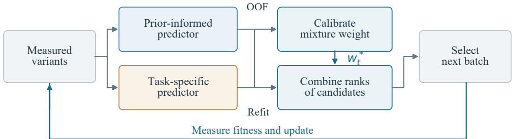  
Figure 1: BATA overview. Measured fitness trains both predictors and calibrates their relative influence. Five-fold out-of-fold (OOF) predictions are converted to ranks to fit a mixture weight on the observed high-fitness region. After refitting on all measurements, the predictors rank unmeasured candidates. Their weighted ranks guide batch selection, and the new measurements start the next round.

## Our main contributions are summarized as follows:

(1) We formulate feedback-calibrated protein optimization as a decision problem in which experimental measurements determine not only how task-specific predictors are updated, but also how prior-informed and task-specific evidence should contribute to next-batch selection. (2) We propose BATA, which evaluates both predictors using out-of-fold evidence, adaptively learns their mixture weight from measured fitness, and calibrates this weight on a batch-aligned high-fitness region using a DCG-weighted rank objective with a closed-form solution, to adjust the relative contribution of different evidence while prioritizing the promising high-fitness candidates.

(3) Across GB1, PABP, and TrpB, BATA achieves the best mean task rank (1.67) in final best fitness over 35 matched initializations per task, while controlled comparisons reveal when high-fitness calibration, batch alignment, and prior-informed evidence are useful. Our work extends the role of experimental feedback from updating predictors to arbitrating complementary predictive evidence, offering a new direction for feedback-calibrated protein optimization.

## 2 RELATED WORK

Learning from experimental feedback. Machine-learning-assisted directed evolution uses measured protein variants to fit a fitness predictor and select candidates for the next experiment (Wu et al., 2019; Yang et al., 2019). EVOLVEpro combines protein-language-model representations with task-specific regression, while ProSpero updates a fitness predictor from feedback to guide search beyond wild-type neighborhoods (Jiang et al., 2025; Kmicikiewicz et al., 2025). EvoMax further combines complementary models for protein evolution with sparse experimental data (Wan et al., 2026). These studies show how experimental feedback can improve predictions and guide search. BATA extends this feedback loop by using measured outcomes not only to update predictors but also to recalibrate how predictive evidence guides the next experimental batch.

Searching protein fitness landscapes. Protein optimization also benefits from methods that change the search space or the way it is explored. GGS smooths a learned fitness landscape, and LatProtRL uses reinforcement learning to search a continuous protein representation (Kirjner et al., 2024; Lee et al., 2024). KnowRLM incorporates biological knowledge into reinforced language modeling, while VLGPO combines a generative prior with fitness guidance in a latent-space optimization method (Wang et al., 2024; Bogensperger et al., 2025). In contrast, BATA leaves the representation and search space unchanged and instead focuses on how predictive evidence is combined within batch selection.

Priors and sequential decisions. Prior-guided optimization studies how existing knowledge can support a sequence of experimental decisions. In Bayesian optimization, DynMeanBO changes the influence of an expert prior, while ToSFiT and BOLT use language models for sequential optimization and transfer across tasks (Qu et al., 2026; Menet et al., 2026; Zeng et al., 2026). For proteins, Data Distillation and REAP learn candidate preferences or rankings to prioritize promising variants (Karimi et al., 2025; Xu et al., 2026). Building on these, BATA uses a prior-informed predictor to provide biological guidance when task-specific measurements are still limited.

## 3 FEEDBACK-CALIBRATED PROTEIN OPTIMIZATION

Let $\mathcal { X } = \{ x _ { 1 } , \ldots , x _ { N } \}$ be a finite protein sequence candidate pool and $f ( x )$ its experimental fitness. At round t, the available data are

$$
\mathcal { D } _ { t } = \{ ( x _ { i } , y _ { i } ) : x _ { i } \in \mathcal { M } _ { t } , y _ { i } = f ( x _ { i } ) \} ,\tag{1}
$$

where $\mathcal { M } _ { t }$ contains the sequences measured so far. The optimizer chooses B distinct sequences $B _ { t + 1 } \subseteq \mathcal { X } \setminus \mathcal { M } _ { t }$ for the next batch. Their fitness values are revealed together and added to form $\mathcal { D } _ { t + 1 }$ . Unmeasured fitness values are unavailable for fitting, calibration, and selection. The goal of the protein optimization task is to maximize the best observed fitness under a fixed measurement budget. We start with 96 measurements and add four batches of $B = 9 6$ . The primary endpoint, Final@480, is the highest fitness found among these 480 measurements:

$$
{ \mathrm { F i n a l @ 4 8 0 } } = \operatorname* { m a x } _ { x \in { \mathcal { M } } _ { 4 } } f ( x ) .\tag{2}
$$

The secondary metric, Query-AUC, is the normalized area under the best-so-far fitness curve from 96 to 480 measurements (Appendix A). A higher Query-AUC indicates earlier discovery of highfitness variants. The prior-informed predictor and the task-specific predictor learn from the same revealed fitness measurements, but use different sequence representations and prediction models. Their rankings can therefore disagree. We define feedback calibration as using measured data to estimate how these rankings should be combined. Only B candidates can be tested in the next batch, making their position near the top of the ranking especially relevant. Therefore, calibration should account for both the observed high-fitness region and the next batch size.

## 4 BATCH-ALIGNED TAIL ARBITRATION

At each round, BATA uses measured fitness to set the balance between the prior-informed predictor and the task-specific predictor. It chooses a mixture weight that brings their combined ranking closest to the observed ranking of high-fitness variants. The same weight combines their rankings over unmeasured sequences for next-batch selection (Figure 1).

## 4.1 PRIOR-INFORMED AND TASK-SPECIFIC PREDICTORS

The prior-informed predictor is an ensemble of Ridge regression models trained on direct coupling analysis (DCA) features, which summarize evolutionary sequence statistics (Morcos et al., 2011). The task-specific predictor uses the sequence representation and prediction model specified for each benchmark in Appendix A. Both predictors are fitted to the same measured fitness data. As measurements accumulate, the prior-informed predictor is refitted while retaining the evolutionary information in its DCA features. At round t, reindex the $n _ { t } = | \mathcal { D } _ { t } |$ measured variants by $i = 1 , \dots , n _ { t }$ and collect their fitness values in $\mathbf { y } = ( y _ { i } ) _ { i = 1 } ^ { n _ { t } }$ . To obtain out-of-fold (OOF) predictions, we divide these variants into five folds. For each fold, the prior-informed and task-specific predictors are trained on the other four folds and predict the held-out variants. Averaging the ensemble members gives two OOF vectors, $\hat { \mathbf { y } } ^ { \mathrm { p r i o r } }$ and $\hat { \mathbf { y } } ^ { \mathrm { t a s k } }$ , with one prediction per variant. Each prediction is made without training on that variant’s fitness value. We convert the fitness and OOF vectors to percentile ranks:

$$
\mathbf { r } ^ { y } = \rho ( \mathbf { y } ) , \qquad \mathbf { r } ^ { p } = \rho ( \hat { \mathbf { y } } ^ { \mathrm { p r i o r } } ) , \qquad \mathbf { r } ^ { a } = \rho ( \hat { \mathbf { y } } ^ { \mathrm { t a s k } } ) .\tag{3}
$$

For a real vector of length $n \geq 1 , \rho : \mathbb { R } ^ { n }  [ 1 / n , 1 ] ^ { n }$ assigns average ascending ranks and divides them by n. Thus, higher values receive higher percentile ranks. The components $r _ { i } ^ { y } , r _ { i } ^ { p }$ , and $r _ { i } ^ { a }$ denote the fitness, prior-informed, and task-specific ranks of measured variant i.

## 4.2 CALIBRATION ON THE OBSERVED HIGH-FITNESS REGION

To match calibration to the next batch size, set the fitness-rank cutoff to $k _ { t } = \operatorname* { m i n } ( B , n _ { t } )$ . We assign each variant its average descending fitness rank $p _ { i }$ . We weight the top-ranked variants using the logarithmic discount from discounted cumulative gain (DCG), which gives more weight to items near the top of a ranking (Järvelin & Kekäläinen, 2002):

$$
q _ { i } = \left\{ \begin{array} { l l } { 1 / \log _ { 2 } ( p _ { i } + 1 ) , } & { p _ { i } \leq k _ { t } , } \\ { 0 , } & { p _ { i } > k _ { t } . } \end{array} \right.\tag{4}
$$

Higher-fitness variants receive larger weights, and variants below the cutoff receive zero weight. Average ranks treat tied fitness values equally, so a tie at the cutoff can make the number of nonzero weights differ from $k _ { t }$ . All 96 initial measurements are within the first-round cutoff. Later rounds focus on the high-fitness region of the growing measured set. Let $w \in [ 0 , 1 ]$ be the weight of the prior-informed predictor; the task-specific predictor has weight $1 - w$ . Their combined rank score is $r _ { i } ( w ) = w r _ { i } ^ { \bar { p } } + ( 1 - w ) r _ { i } ^ { a }$ . We choose w to minimize the squared error between the combined rank and the observed fitness rank, using the DCG discounts $q _ { i }$ as sample weights:

$$
\mathcal { L } _ { \mathrm { B A T A } } ( w ) = \sum _ { i = 1 } ^ { n _ { t } } q _ { i } \big [ r _ { i } ^ { y } - w r _ { i } ^ { p } - ( 1 - w ) r _ { i } ^ { a } \big ] ^ { 2 } .\tag{5}
$$

## 4.3 CLOSED-FORM WEIGHT AND CANDIDATE SELECTION

To compute the mixture weight, set $d _ { i } = r _ { i } ^ { p } - r _ { i } ^ { a }$ and $z _ { i } = r _ { i } ^ { y } - r _ { i } ^ { a }$ . The loss is a one-dimensional convex quadratic with constrained solution

$$
w _ { t } ^ { * } = \Pi _ { [ 0 , 1 ] } \left( \frac { \sum _ { i } q _ { i } d _ { i } z _ { i } } { \sum _ { i } q _ { i } d _ { i } ^ { 2 } } \right) ,\tag{6}
$$

Here $\Pi _ { [ 0 , 1 ] }$ clips a value to [0, 1]. If the denominator is zero, we set $w _ { t } ^ { * } = 0$ . The implementation applies this rule when the denominator is no greater than $\epsilon _ { \mathrm { m a c h } }$ , the float64 machine epsilon. Larger values of $\boldsymbol { w } _ { t } ^ { * }$ give the prior-informed predictor more influence; smaller values give the task-specific predictor more influence. BATA recomputes $\boldsymbol { w } _ { t } ^ { * }$ after each batch, so new fitness measurements can change the balance between the predictors. After estimating $\boldsymbol { w } _ { t } ^ { * }$ , we refit both predictors on all measured variants. Let $g _ { t , m } ^ { \mathrm { p r i o r } }$ and $g _ { t , m } ^ { \mathrm { t a s k } }$ be their prediction functions for member $m = 1 , \ldots , L ,$ each mapping a sequence in $\mathcal { X }$ to a real-valued fitness prediction. A single-model predictor is reused across all L members of the other ensemble. We reindex the remaining pool $\mathcal { U } _ { t } \bar { = } \mathcal { X } \backslash \mathcal { M } _ { t }$ by $x _ { 1 } , \ldots , x _ { N - n _ { t } }$ and form prediction vectors $\mathbf { g } _ { t , m } ^ { \mathrm { p r i o r } } = ( g _ { t , m } ^ { \mathrm { p r i o r } } ( x _ { j } ) ) _ { j = 1 } ^ { N - n _ { t } }$ and $\mathbf { g } _ { t , m } ^ { \mathrm { t a s k } }$ in the same way. We rank each member’s vector over this pool and combine its components:

$$
s _ { j , m } = w _ { t } ^ { * } \big [ \rho ( \mathbf { g } _ { t , m } ^ { \mathrm { p r i o r } } ) \big ] _ { j } + ( 1 - w _ { t } ^ { * } ) \big [ \rho ( \mathbf { g } _ { t , m } ^ { \mathrm { t a s k } } ) \big ] _ { j } .\tag{7}
$$

Algorithm 1 BATA for sequential protein optimization   
Require: Candidate pool ${ \overline { { \alpha } } } ,$ , initial data $\overline { { \mathcal { D } _ { 0 } } } .$ , batch size B, rounds T, selection rule A   
1: for $t = 0 , \ldots , T - 1$ do   
2: Let $\mathcal { M } _ { t }$ be the sequences in $\mathcal { D } _ { t } .$   
3: Obtain five-fold OOF predictions from both predictors on $\mathcal { D } _ { t } .$   
4: Compute percentile ranks $r ^ { y } , r ^ { p } , r ^ { a }$ and weights q (Eqs. 3–4).   
5: Compute w∗ by Eq. 6, with the stated numerical convention.   
6: Refit both predictors on $\mathcal { D } _ { t }$ and compute pool scores s by Eq. 7.   
7: Select $\tilde { B _ { t + 1 } } = A ( s , B ) \subseteq \mathcal { X } \setminus \mathcal { M } _ { t } .$   
8: Reveal the full batch and add its measurements to form $\mathcal { D } _ { t + 1 }$   
9: end for   
10: return The highest-fitness measured variant.

These pool ranks stay fixed while the batch is selected. GB1 and TrpB use Thompson-style selection (Russo et al., 2018): an ensemble member is sampled for each candidate choice, and its highestscoring remaining sequence is selected. PABP greedily selects sequences using the mean combined score. The selection rule returns B distinct sequences before any fitness values from that batch are measured. In our experiments, $T = 4$ such rounds follow the initial measurements.

## 4.4 PROPERTIES OF THE CALIBRATION RULE

Proposition 1 (Optimality for the observed rank loss). For fixed ranks and nonnegative $q _ { i } ,$ Eq. 6 uniquely minimizes Eq. 5 over [0, 1] when $\begin{array} { r } { \sum _ { i } q _ { i } d _ { i } ^ { 2 } > 0 . } \end{array}$ . If this sum is zero, the loss is constant and $w _ { t } ^ { * } = 0$ is a minimizer.

Proposition 2 (Score-scale invariance). With a fixed tie convention, strictly increasing transformations ofeither predictor’sfixed, ensemble-averaged OOF vector or each member’sfixed pool vector leave the calibration weight andfused percentile-rank scores unchanged.

Therefore, BATA can calibrate predictors with different score units by solving one convex problem per round. Appendix D provides proofs of both properties.

## 5 EXPERIMENTS

## 5.1 EXPERIMENTAL SETUP

We evaluate BATA by replaying sequential optimization on measured GB1, PABP, and TrpB fitness landscapes (Melamed et al., 2013; Wu et al., 2016; Johnston et al., 2024). Each campaign is one optimization run: 96 initial measurements followed by four batches of 96, for 480 unique measurements. We report the Final@480 and Query-AUC metrics defined in Section 3. The main cohort, Main-35, uses 35 matched initialization sets per task. A separate sensitivity cohort uses 70 initializations for GB1 and TrpB and retains the 35 PABP initializations. Model fitting and candidate selection use only fitness values revealed by the current round. We compare BATA with ALDE, EVOLVEpro-650M, REAP100-650M, and a random forest (RF). These baselines use active learning, protein-language-model regression, rank-guided learning, and standard supervised selection, respectively (Jiang et al., 2025; Yang et al., 2025; Xu et al., 2026). All methods within a task and cohort share the initialization identities and the 480-measurement budget. BATA’s prior-informed predictor uses a DCA-based Ridge ensemble. Its task-specific predictor uses one-hot Ridge models on GB1 and ESM2-650M random forests on PABP and TrpB. Appendix A lists the ensemble sizes, selection rules, and analysis cohorts. Tables give means and sample standard deviations. Curve bands give pointwise 95% bootstrap confidence intervals (CIs), obtained by resampling complete campaigns.

## 5.2 OPTIMIZATION QUALITY AND DISCOVERY SPEED

BATA has the lowest mean Final@480 rank across the three Main-35 tasks (1.67; Table 1). It achieves the highest mean Final@480 on PABP and TrpB, while ALDE leads on GB1. BATA

Table 1: Main optimization results. Final@480 is the best observed fitness after 480 measurements. Entries give means ± sample standard deviations over 35 matched initializations per task (Main-35). The last two columns average the task-wise ranks of Final@480 and Query-AUC, the area-under-curve metric for discovery speed. Lower mean ranks are better. Bold marks the best task mean or mean rank.
<table><tr><td>Method</td><td>GB1</td><td>PABP</td><td>TrpB</td><td></td><td>Final rank AUC rank</td></tr><tr><td>BATA</td><td> $0 . 8 5 1 2 \pm 0 . 1 0 8 3$ </td><td> $\mathbf { 2 . 4 1 6 9 \pm 0 . 4 2 3 2 }$ </td><td> $\mathbf { 0 . 9 2 0 9 \pm 0 . 0 4 2 2 }$ </td><td>1.67</td><td>2.00</td></tr><tr><td>ALDE</td><td> $\mathbf { 0 . 9 3 4 7 \pm 0 . 0 9 0 4 }$ </td><td> $1 . 8 1 8 3 \pm 0 . 1 8 1 4$ </td><td> $0 . 8 9 5 8 \pm 0 . 1 0 9 9$ </td><td>3.00</td><td>2.67</td></tr><tr><td>EVOLVEpro-650M</td><td> $0 . 7 3 4 4 \pm 0 . 0 9 6 6$ </td><td> $2 . 3 6 7 6 \pm 0 . 4 7 4 5$ </td><td> $0 . 8 9 8 2 \pm 0 . 0 8 3 9$ </td><td>3.00</td><td>3.00</td></tr><tr><td>REAP100-650M</td><td> $0 . 8 9 5 8 \pm 0 . 0 9 4 4$ </td><td> $1 . 9 9 6 0 \pm 0 . 2 3 7 1$ </td><td> $0 . 8 8 5 8 \pm 0 . 1 1 7 7$ </td><td>3.33</td><td>3.67</td></tr><tr><td>RF</td><td> $0 . 8 2 9 4 \pm 0 . 1 0 7 0$ </td><td> $1 . 9 8 4 9 \pm 0 . 2 5 3 3$ </td><td> $0 . 8 9 3 4 \pm 0 . 1 2 2 4$ </td><td>4.00</td><td>3.67</td></tr></table>

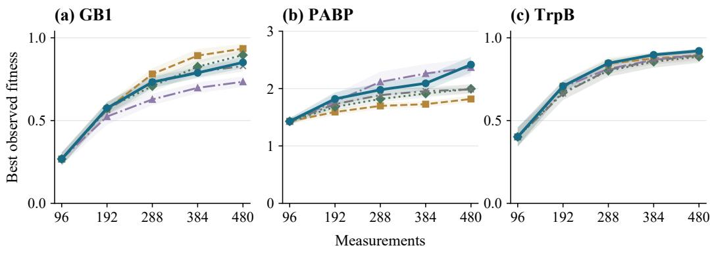  
BATA ALDE EVOLVEpro-650M REAP100-650M RF

Figure 2: Optimization trajectories. Lines show mean best-observed fitness and bands show pointwise 95% bootstrap confidence intervals over 35 matched campaigns per method and task (Main-35). Points mark the initial measurements and each completed batch. Fitness values use each task’s native scale.

also has the lowest mean Query-AUC rank (2.00). Figure 2 tracks best-observed fitness over the five measurement milestones. On PABP, EVOLVEpro discovers high-fitness variants earlier, as measured by Query-AUC, but BATA reaches a higher Final@480. Appendix B reports the full Query-AUC results and per-campaign distributions.

## 5.3 ROBUSTNESS ACROSS INITIALIZATION COHORTS

The larger sensitivity cohort changes the ordering of methods (Figure 3). BATA and REAP100 share a mean Final@480 rank of 2.00 in this cohort, and ALDE still leads on GB1. On TrpB, REAP100 has a slightly higher mean Final@480 than BATA (0.9232 versus 0.9181), while BATA has higher Query-AUC (0.7911 versus 0.7687). The bootstrap intervals in Figure 3 describe uncertainty within each cohort, not paired changes between cohorts. Appendix B gives the full sensitivity table.

## 5.4 HOW DOES FEEDBACK CHANGE THE MIXTURE?

Across the four batch decisions, the mean weight on the prior-informed predictor falls from 0.466 to 0.089 on GB1 and from 0.518 to 0.163 on TrpB (Figure 4). The final weight is lower than the first in 33 of 35 GB1 campaigns and 34 of 35 TrpB campaigns, so the mean decline reflects most individual runs. On PABP, the mean weight falls only from 0.460 to 0.403, with 19 campaigns showing decreases and 16 showing increases.

(a) Mean task rank  
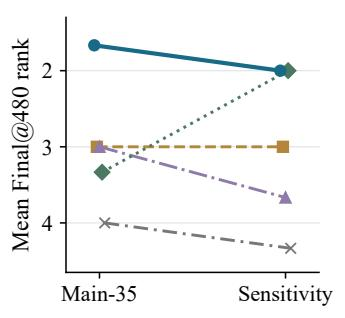

(b) GB1  
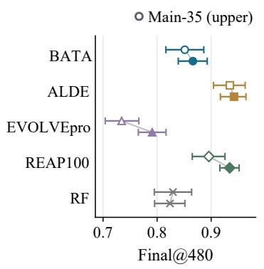

(c) TrpB  
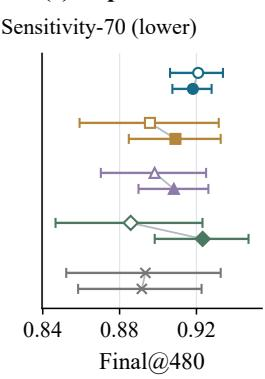  
BATA ALDE EVOLVEpro-650M REAP100-650M RF

Figure 3: Initialization sensitivity. (a) Mean Final@480 ranks in Main-35 and the sensitivity setting, which uses 70 initializations for GB1 and TrpB and retains 35 for PABP. (b,c) Mean Final@480 and 95% bootstrap intervals for each cohort. Within each method, upper markers show Main-35 and lower markers show the separate 70-initialization cohort. Colors and marker shapes identify methods. Gray lines connect cohort means.  
(a) Mean weight  
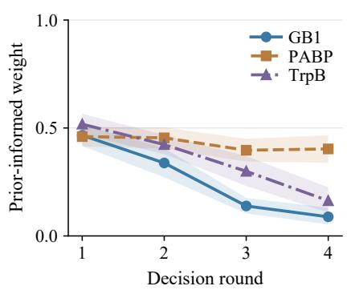

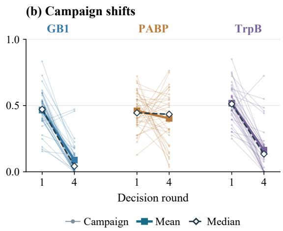  
Figure 4: Feedback changes predictor weights. (a) Mean weights on the prior-informed predictor, with pointwise 95% bootstrap intervals over 35 Main-35 campaigns per task. (b) Light lines connect each campaign’s first and last weights; squares and open diamonds show the mean and median, respectively. A lower prior-informed weight gives the task-specific predictor more influence in the combined ranking.

## 5.5 WHY BATCH-ALIGNED TAIL CALIBRATION?

We compare four calibration objectives: global rank error (G-Rank), uniformly weighted top-96 error (T-Uniform-96), discounted cumulative gain (DCG)-weighted top-96 error (T-DCG-96, BATA), and DCG-weighted top-192 error (T-DCG-192). The top-96 and top-192 labels denote measuredfitness rank cutoffs, using average ranks for ties. We hold the predictor configurations, out-of-fold procedure, rank combination, selection rules, initialization identities, and measurement budget fixed. The study has 24 matched groups per task and 288 optimization runs across the four objectives. T-DCG-96 has the lowest mean task rank for both Final@480 and Query-AUC (1.33; Figure 5b). On TrpB, its mean Final@480 exceeds G-Rank by 0.0256 (paired 95% CI [0.0092, 0.0456]) and T-DCG-192 by 0.0115 ([0.0027, 0.0224]). On PABP, DCG weighting improves mean Final@480 over uniform top-96 weighting by 0.1719 ([0.0226, 0.3320]). GB1 has nearly equal mean Final@480 under the top-96 and top-192 objectives, with a difference of −0.0006. Figure 5a shows all nine contrasts in each task’s native fitness units.

(a) Paired Final@480 differences  
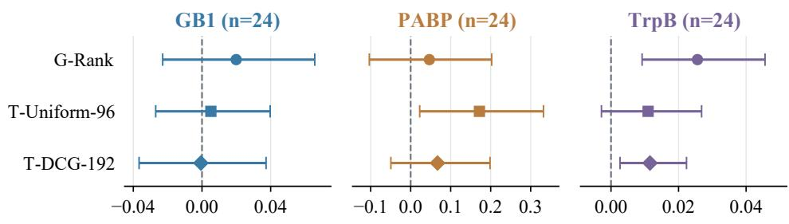

T-DCG-96 − alternative  
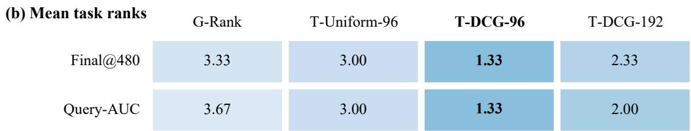  
Figure 5: Calibration objectives. (a) All nine paired Final@480 differences between T-DCG-96 (BATA) and the alternative objectives, with the study’s 95% bootstrap intervals over 24 matched groups per task. T-DCG-96 applies discounted cumulative gain (DCG) weights at a measuredfitness rank cutoff of 96. Ties use average ranks, so the number of weighted variants can differ from 96. Positive differences favor T-DCG-96; separate task axes retain the native fitness units. (b) Mean task ranks for Final@480 and Query-AUC from the same 288 optimization runs. Lower ranks are better.

## 5.6 COMPARISON WITH A STRONGER TASK-SPECIFIC PREDICTOR

We compare BATA with Fine-only M20, a 20-member task-specific ensemble without the priorinformed predictor (Figure 6). The comparison uses 35 matched pairs each for GB1 and PABP, 24 each for HIS7 and GRB2, and a separate 70-initialization sensitivity cohort for TrpB. On TrpB, Fineonly M20 reaches a mean Final@480 of 0.9388, compared with 0.9181 for BATA, giving a paired advantage of 0.0207 (95% CI [0.0045, 0.0364]). BATA has higher means on the other four tasks, with paired intervals that include zero. Fine-only M20 changes three parts of the configuration: it increases the task-specific ensemble size, removes the prior-informed predictor, and uses Thompsonstyle selection on tasks where BATA uses greedy selection. In separate controls with matched taskspecific predictor capacity, BATA has a higher mean Final@480 than task-specific-only prediction on TrpB, but the paired interval includes zero (Appendix C). A threshold-switching test also finds that low prior-informed weights do not consistently predict gains from switching to Fine-only M20.

Stronger task-specific predictor  
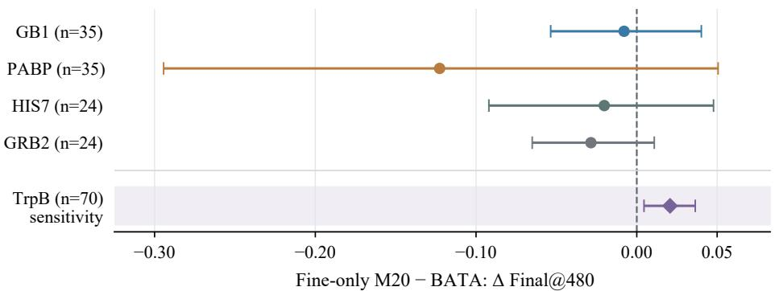  
Figure 6: Stronger task-specific predictor. Paired mean Final@480 differences (Fine-only M20 minus BATA) with 95% confidence intervals. Positive values favor Fine-only M20. GB1 and PABP use n = 35, HIS7 and GRB2 use n = 24, and the separate TrpB sensitivity cohort uses n = 70. Fine-only M20 uses a 20-member task-specific ensemble, removes the prior-informed predictor, and changes the selection rule on some tasks.

## 6 DISCUSSION AND LIMITATIONS

The experiments show where feedback calibration helps. First, the prior-informed predictor’s weight falls across most GB1 and TrpB campaigns, while PABP weights change less consistently. Second, the matched objective study shows task-dependent gains from fitting the high-fitness region and matching the cutoff to the batch size. Third, the stronger task-specific ensemble improves TrpB optimization in the independent 70-initialization cohort. These findings support updating the mixture as measurements accumulate, while comparing alternative predictor configurations directly. The learned weight describes agreement with the currently measured fitness ranking; it cannot by itself identify the best future predictor configuration. Retrospective fitness landscapes let us compare methods under matched initializations and fixed measurement budgets. Prospective use must also account for laboratory constraints, assay variation, and measurement noise. BATA uses a DCAbased prior-informed predictor and estimates one mixture weight per round with five-fold OOF fitting. Therefore, its optimization performance depends on the quality of the two predictors, and its computational cost includes repeated fitting. The runtime and capacity analyses in the appendice quantify these costs and identify task-level failures.

## 7 CONCLUSION

BATA uses measured fitness to update two predictors and calibrate their influence on the next experimental batch. It fits a closed-form mixture weight to the observed high-fitness region, with a rank cutoff matched to the batch size. BATA achieves the best mean task rank for Final@480 in Main-35 across three protein landscapes. Matched controls show task-dependent gains from the calibration objective, while stronger-predictor comparisons identify cases that favor a task-specific ensemble. The results support updating predictor weights from experimental feedback while evaluating the predictor configuration for each task.

## AI USE STATEMENT

Generative AI tools were used to assist literature retrieval, research ideation and experimental workflows, manuscript drafting and revision, software review, and figure preparation. All AI-assisted research outputs, code, experimental results, citations, and interpretations were reviewed and verified by the authors. All reported numerical results originate from recorded model evaluations and measured protein fitness-landscape analyses. The authors take full responsibility for the final content.

## REPRODUCIBILITY STATEMENT

Sections 3–4 define the task, calibration loss, and algorithm. Section 5.1 and Appendix A specify the measurement budgets, predictor configurations, selection rules, and cohorts. The appendices report task-level results, paired comparisons, uncertainty estimates, and proofs. The experiment records identify the initialization sets, random seeds, query histories, and source data for the reported results.

## REFERENCES

Alan Amin, Nate Gruver, Yilun Kuang, Yucen Li, Hunter Elliott, Calvin McCarter, Aniruddh Raghu, Peyton Greenside, and Andrew Gordon Wilson. Bayesian optimization of antibodies informed by a generative model of evolving sequences. In ICLR, 2025. URL https://proceedings. iclr.cc/paper\_files/paper/2025/hash/6cdd4ce9330025967dd1ed0bed30 10f5-Abstract-Conference.html.

Melis Ilayda Bal, Pier Giuseppe Sessa, Mojmir Mutny, and Andreas Krause. Optimistic games for combinatorial Bayesian optimization with application to protein design. In ICLR, 2025. URL https://proceedings.iclr.cc/paper\_files/paper/2025/hash/434743b5 9a2ef42d657e61e06f0dd97b-Abstract-Conference.html.

Lea Bogensperger, Dominik Narnhofer, Ahmed Allam, Konrad Schindler, and Michael Krauthammer. A variational perspective on generative protein fitness optimization. In ICML, volume 267 of Proceedings of Machine Learning Research, pp. 4700–4712. PMLR, 2025. URL https://proceedings.mlr.press/v267/bogensperger25a.html.

Chase R. Freschlin, Sarah A. Fahlberg, and Philip A. Romero. Machine learning to navigate fitness landscapes for protein engineering. Current Opinion in Biotechnology, 75:102713, 2022. doi: 10.1016/j.copbio.2022.102713.

Saba Ghaffari, Ehsan Saleh, Alex Schwing, Yu-Xiong Wang, Martin Burke, and Saurabh Sinha. Robust model-based optimization for challenging fitness landscapes. In ICLR, 2024. URL http s://proceedings.iclr.cc/paper\_files/paper/2024/hash/f84ceafb242f 0de36f8c49452fbae6de-Abstract-Conference.html.

Fabio Herrera-Rocha, David Medina-Ortiz, Fabian Mauz, Juergen Pleiss, and Mehdi D. Davari. Best practices for machine learning-assisted protein engineering. Journal of Chemical Information and Modeling, 65(23):12655–12667, 2025. doi: 10.1021/acs.jcim.5c01983.

Sebastian Ibarraran, Shriram Chennakesavalu, Frank Hu, and Grant M. Rotskoff. Efficient, Few-Shot Directed Evolution with Energy Rank Alignment. Journal of Chemical Information and Modeling, 66(17):10609–10621, 2026. doi: 10.1021/acs.jcim.6c01333. URL https://doi. org/10.1021/acs.jcim.6c01333.

Kalervo Järvelin and Jaana Kekäläinen. Cumulated gain-based evaluation of IR techniques. ACM Transactions on Information Systems, 20(4):422–446, 2002. doi: 10.1145/582415.582418. URL https://doi.org/10.1145/582415.582418.

Kaiyi Jiang, Zhaoqing Yan, Matteo Di Bernardo, Samantha R. Sgrizzi, Lukas Villiger, Alisan Kayabolen, B. J. Kim, Josephine K. Carscadden, Masahiro Hiraizumi, Hiroshi Nishimasu, Jonathan S. Gootenberg, and Omar O. Abudayyeh. Rapid in silico directed evolution

by a protein language model with EVOLVEpro. Science, 387(6732):eadr6006, 2025. doi: 10.1126/science.adr6006. URL https://doi.org/10.1126/science.adr6006.

Kadina E. Johnston, Patrick J. Almhjell, Ella J. Watkins-Dulaney, Grace Liu, Nicholas J. Porter, Jason Yang, and Frances H. Arnold. A combinatorially complete epistatic fitness landscape in an enzyme active site. Proceedings ofthe National Academy ofSciences, 121(32):e2400439121, 2024. doi: 10.1073/pnas.2400439121. URL https://doi.org/10.1073/pnas.24004 39121.

Mostafa Karimi, Sharmi Banerjee, Tommi Jaakkola, Bella Dubrov, Shang Shang, and Ron Benson. Data distillation for extrapolative protein design through exact preference optimization. In ICLR, 2025. URL https://proceedings.iclr.cc/paper\_files/paper/2025/hash/ a9ea92ef18aae17627d133534209e640-Abstract-Conference.html.

Andrew Kirjner, Jason Yim, Raman Samusevich, Shahar Bracha, Tommi Jaakkola, Regina Barzilay, and Ila Fiete. Improving protein optimization with smoothed fitness landscapes. In ICLR, 2024. URL https://proceedings.iclr.cc/paper\_files/paper/2024/hash/cbb7 a23649b25001e797a726cf75498e-Abstract-Conference.html.

Michal Kmicikiewicz, Vincent Fortuin, and Ewa Szczurek. ProSpero: Active Learning for Robust Protein Design Beyond Wild-Type Neighborhoods. In NeurIPS, volume 38, pp. 131015–131048, 2025. doi: 10.52202/085713-4364. URL https://proceedings.neurips.cc/paper \_files/paper/2025/hash/bde1c75d7d89e64d6d93dce1c68dc3d8-Abstrac t-Conference.html.

Minji Lee, Luiz Felipe Vecchietti, Hyunkyu Jung, Hyun Joo Ro, Meeyoung Cha, and Ho Min Kim. Robust optimization in protein fitness landscapes using reinforcement learning in latent space. In ICML, volume 235 of Proceedings ofMachine Learning Research, pp. 26976–26990. PMLR, 2024. URL https://proceedings.mlr.press/v235/lee24x.html.

Francesca-Zhoufan Li, Jason Yang, Kadina E. Johnston, Emre Gürsoy, Yisong Yue, and Frances H. Arnold. Evaluation of machine learning-assisted directed evolution across diverse combinatorial landscapes. Cell Systems, 16(9):101387, 2025. doi: 10.1016/j.cels.2025.101387. URL https: //doi.org/10.1016/j.cels.2025.101387.

Zeming Lin, Halil Akin, Roshan Rao, Brian Hie, Zhongkai Zhu, Wenting Lu, Nikita Smetanin, Robert Verkuil, Ori Kabeli, Yaniv Shmueli, Allan dos Santos Costa, Maryam Fazel-Zarandi, Tom Sercu, Salvatore Candido, and Alexander Rives. Evolutionary-scale prediction of atomic-level protein structure with a language model. Science, 379(6637):1123–1130, 2023. doi: 10.1126/sc ience.ade2574. URL https://doi.org/10.1126/science.ade2574.

Dina Listov, Casper A. Goverde, Bruno E. Correia, and Sarel Jacob Fleishman. Opportunities and challenges in design and optimization of protein function. Nature Reviews Molecular Cell Biology, 25(8):639–653, 2024. doi: 10.1038/s41580-024-00718-y.

Daniel Melamed, David L. Young, Caitlin E. Gamble, Christina R. Miller, and Stanley Fields. Deep mutational scanning of an RRM domain of the Saccharomyces cerevisiae poly(A)-binding protein. RNA, 19(11):1537–1551, 2013. doi: 10.1261/rna.040709.113. URL https: //doi.org/10.1261/rna.040709.113.

Nicolas Menet, Aleksandar Terzic, Michael Hersche, Andreas Krause, and Abbas Rahimi. Thompson sampling via fine-tuning of LLMs. In ICLR, 2026. URL https://proceedings.iclr .cc/paper\_files/paper/2026/hash/707a2d58641b2192203b4bf4c532cfe1 -Abstract-Conference.html.

Faruck Morcos, Andrea Pagnani, Bryan Lunt, Arianna Bertolino, Debora S. Marks, Chris Sander, Riccardo Zecchina, José N. Onuchic, Terence Hwa, and Martin Weigt. Direct-coupling analysis of residue coevolution captures native contacts across many protein families. Proceedings of the National Academy of Sciences, 108(49):E1293–E1301, 2011. doi: 10.1073/pnas.1111471108. URL https://doi.org/10.1073/pnas.1111471108.

Pascal Notin, Aaron Kollasch, Daniel Ritter, Lood van Niekerk, Steffanie Paul, Han Spinner, Nathan Rollins, Ada Shaw, Rose Orenbuch, Ruben Weitzman, Jonathan Frazer, Mafalda Dias, Dinko Franceschi, Yarin Gal, and Debora Marks. ProteinGym: Large-Scale Benchmarks for Protein Fitness Prediction and Design. In NeurIPS, volume 36, pp. 64331–64379, 2023. doi: 10.52202 /075280-2810. URL https://proceedings.neurips.cc/paper\_files/paper/2 023/hash/cac723e5ff29f65e3fcbb0739ae91bee-Abstract-Datasets\_and\_ Benchmarks.html.

Pascal Notin, Nathan Rollins, Yarin Gal, Chris Sander, and Debora Marks. Machine learning for functional protein design. Nature Biotechnology, 42(2):216–228, 2024. doi: 10.1038/s41587-0 24-02127-0.

Chongqi Qu, Meiqin Liu, Jian Lan, Shanling Dong, and Zhunga Liu. Incorporating expert priors into Bayesian optimization via dynamic mean decay. In ICLR, 2026. URL https://procee dings.iclr.cc/paper\_files/paper/2026/hash/020e313d40a7c060ed07a1 0cef287750-Abstract-Conference.html.

Jacob T. Rapp, Bennett J. Bremer, and Philip A. Romero. Self-driving laboratories to autonomously navigate the protein fitness landscape. Nature Chemical Engineering, 1(1):97–107, 2024. doi: 10.1038/s44286-023-00002-4.

Daniel J. Russo, Benjamin Van Roy, Abbas Kazerouni, Ian Osband, and Zheng Wen. A Tutorial on Thompson Sampling. Foundations and Trends in Machine Learning, 11(1):1–96, 2018. doi: 10.1561/2200000070. URL https://doi.org/10.1561/2200000070.

Mahakaran Sandhu, John Z. Chen, Dana S. Matthews, Matthew A. Spence, Sacha B. Pulsford, Barnabas Gall, Joe A. Kaczmarski, James Nichols, Nobuhiko Tokuriki, and Colin J. Jackson. Computational and experimental exploration of protein fitness landscapes: Navigating smooth and rugged terrains. Biochemistry, 64(8):1673–1684, 2025. doi: 10.1021/acs.biochem.4c00673.

Shijie Wan, Jackson Gold, Pranay Vure, Casey S. Mogilevsky, Ananya Talikoti, Tianrong Chen, Aman Gupta, Trisha Biswas, Zheng You, Vir Acharya, Pranam Chatterjee, Xiao Wang, and Xue Gao. Adaptive model-guided protein evolution with sparse data optimizes compact eukaryotic genome editors. Nature Biotechnology, 2026. doi: 10.1038/s41587-026-03272-4. URL https: //doi.org/10.1038/s41587-026-03272-4.

Yuhao Wang, Qiang Zhang, Ming Qin, Xiang Zhuang, Xiaotong Li, Zhichen Gong, Zeyuan Wang, Yu Zhao, Jianhua Yao, Keyan Ding, and Huajun Chen. Knowledge-aware reinforced language models for protein directed evolution. In ICML, volume 235 of Proceedings of Machine Learning Research, pp. 52260–52273. PMLR, 2024. URL https://proceedings.mlr.press/ v235/wang24cq.html.

Nicholas C Wu, Lei Dai, C Anders Olson, James O Lloyd-Smith, and Ren Sun. Adaptation in protein fitness landscapes is facilitated by indirect paths. eLife, 5:e16965, 2016. doi: 10.7554/elife.16965. URL https://doi.org/10.7554/elife.16965.

Zachary Wu, S. B. Jennifer Kan, Russell D. Lewis, Bruce J. Wittmann, and Frances H. Arnold. Machine learning-assisted directed protein evolution with combinatorial libraries. Proceedings of the National Academy of Sciences, 116(18):8852–8858, 2019. doi: 10.1073/pnas.1901979116. URL https://doi.org/10.1073/pnas.1901979116.

Jingyi Xu, Yan Zheng, Rajamanikandan Sundarraj, Kenneth Woycechowsky, Zhiguang Yuchi, and Yingjin Yuan. Rank-guided learning accelerates automated enzyme engineering. Nature Communications, 17:9584, 2026. doi: 10.1038/s41467- 026- 76264-2. URL https: //doi.org/10.1038/s41467-026-76264-2.

Jason Yang, Francesca-Zhoufan Li, and Frances H. Arnold. Opportunities and challenges for machine learning-assisted enzyme engineering. ACS Central Science, 10(2):226–241, 2024. doi: 10.1021/acscentsci.3c01275.

Jason Yang, Ravi G. Lal, James C. Bowden, Raul Astudillo, Mikhail A. Hameedi, Sukhvinder Kaur, Matthew Hill, Yisong Yue, and Frances H. Arnold. Active learning-assisted directed evolution. Nature Communications, 16(1):714, 2025. doi: 10.1038/s41467-025-55987-8. URL https: //doi.org/10.1038/s41467-025-55987-8.

Kevin K. Yang, Zachary Wu, and Frances H. Arnold. Machine-learning-guided directed evolution for protein engineering. Nature Methods, 16(8):687–694, 2019. doi: 10.1038/s41592-019-049 6-6. URL https://doi.org/10.1038/s41592-019-0496-6.

Yimeng Zeng, Natalie Maus, Haydn Jones, Jeffrey Tao, Fangping Wan, Marcelo Der Torossian Torres, Cesar de la Fuente, Ryan Marcus, Osbert Bastani, and Jacob Gardner. Scaling multitask Bayesian optimization with large language models. In ICLR, 2026. URL https: //proceedings.iclr.cc/paper\_files/paper/2026/hash/a4a3689e5c a538e340f58cdd29f513a9-Abstract-Conference.html.

## A REPRODUCIBILITY AND PROTOCOL DETAILS

## A.1 MEASUREMENTS AND METRICS

Each optimization campaign starts with 96 measured variants and selects four batches of 96 distinct variants. The simulator reveals a batch’s fitness values only after every candidate in that batch has been selected. Previously measured variants are excluded from later batches. Model fitting, cross-validation, weight estimation, and selection use only the currently revealed labels. A complete campaign therefore contains 480 unique measurements. Let $b _ { q }$ be the best fitness observed after q queries. Final@480 is $b _ { 4 8 0 }$ . Query-AUC measures the area under the best-so-far fitness curve:

$$
\mathrm { Q u e r y – A U C } = \frac { b _ { 9 6 } + 2 ( b _ { 1 9 2 } + b _ { 2 8 8 } + b _ { 3 8 4 } ) + b _ { 4 8 0 } } { 8 } .\tag{8}
$$

This is the normalized trapezoidal area from queries 96–480. Each campaign gives one Final value and one Query-AUC value. The plotted lines connect batch endpoints; no within-batch ordering of outcomes is reconstructed.

## A.2 SEQUENCE DATA AND PREDICTORS

Each task keeps the candidate ordering and fitness scale from its data release. PABP, HIS7, and GRB2 use the frozen ProteinGym v1.3 substitution tables (Notin et al., 2023). GB1 uses the scaleto-maximum table from the energy-rank-alignment data release, and TrpB uses the fitness table distributed with ALDE. Before replay, input identities are checked against the experiment manifests. The reported comparisons apply no additional filtering based on fitness outcomes. The priorinformed predictor contains five Ridge models fitted to direct coupling analysis (DCA) features, which summarize evolutionary sequence statistics. Ridge fitting standardizes features and fitness using only its training subset. The regularization parameter is selected from 17 logarithmically spaced values between $1 0 ^ { - 4 }$ and $1 0 ^ { 4 }$ , followed by fitting five bootstrap models. The task-specific predictors use Ridge regression or random forest (RF) models, as listed in Table A1. ESM2-650M provides fixed sequence representations (Lin et al., 2023); the predictor fitted to these representations is updated after each revealed batch.

Table A1: Task-specific predictors and selection rules in the main BATA comparison. Every task uses five DCA-based Ridge models for the prior-informed predictor.
<table><tr><td>Task</td><td>Representation</td><td>Task-specific predictor</td><td>Selection</td></tr><tr><td>GB1</td><td>One-hot</td><td>Five-member Ridge ensemble</td><td>Thompson-style</td></tr><tr><td>PABP</td><td>ESM2-650M</td><td>One random forest, 100 trees</td><td>Greedy mean</td></tr><tr><td>TrpB</td><td>ESM2-650M</td><td>Five bootstrap forests, 100 trees each</td><td>Thompson-style</td></tr></table>

Five-fold out-of-fold (OOF) fitting starts from a seeded permutation of the measured indices. Each fold model is trained on the other four folds, so a variant’s OOF prediction comes from models fitted without its fitness value. Ensemble predictions are averaged before forming each predictor’s OOF rank vector. For selection from the unmeasured pool, each fitted ensemble member is ranked separately. PABP reuses its single task-specific prediction vector across the five prior-informed ensemble members. Greedy selection orders candidates by their mean combined score. Thompsonstyle selection samples a member for each choice and skips candidates already selected. Candidateindex order breaks selection ties deterministically. Percentile ranks are average ascending ranks divided by the vector length. The descending fitness ranks in Eq. 4 also use average ranks. Therefore, a tied group at the cutoff can change how many observations receive nonzero weight. The cutoff remains min $( B , n _ { t } )$ . In Eq. 6, the implementation sets the prior-informed predictor’s weight to zero when the denominator is no greater than float64 machine epsilon. Proposition 1 states the exact mathematical result for a zero denominator.

## A.3 SEPARATE EVALUATION COHORTS

Main-35 contains 525 campaigns: five methods on three tasks, each with 35 matched initializations. The larger sensitivity setting adds 700 campaign records for the five methods on GB1 and TrpB, using 70 initializations per task; PABP keeps its original 35. Campaigns are matched within each task and cohort. Therefore, the lines between cohorts in Figure 3 compare cohort summaries. They are not paired campaign differences. Method means are ranked within each task, and these ranks are then averaged across tasks. The calibration-objective comparison contains 24 matched groups per task and four objectives, giving 288 optimization runs. Predictor configurations, five-fold OOF fitting, rank combination, selection rules, initialization identities, and measurement budgets are fixed. The 72 reused T-DCG-96 trajectories use the rank cutoff of 96 and DCG weights defined in Eq. 4. Reuse followed exact checks that the candidate trajectories matched the current configuration. The controls with matched task-specific predictor capacity, the stronger 20-member task-specific ensemble (Fine-only M20), and the threshold-switching rule G20 each use separate cohorts. G20 switches to Fine-only M20 when the prior-informed predictor’s weight falls below 0.20.

## A.4 UNCERTAINTY AND REPRODUCIBILITY CHECKS

Curve bands are pointwise 95% confidence intervals (CIs) from percentile-bootstrap resampling of complete campaigns. Paired contrasts resample matched campaign differences within each task. Figure 5 uses the released intervals for the calibration-objective study. The controls with matched task-specific predictor capacity use the prespecified 20,000-resample calculation. Table standard deviations describe variation among campaigns; CIs describe uncertainty in a mean or mean difference. Paired comparisons use matched differences, not overlap between pointwise curve bands. The public code repository at https://github.com/John-Lin98/BATA provides initialization identities, algorithm seeds, result tables, and scripts for the reported analyses. The figure data identify their task and cohort, allowing means, paired differences, and batch trajectories to be checked independently. Assay data, alignments, pretrained weights, and feature caches are not bundled. The code documentation specifies external sources, fixed revisions, input hashes, and feature-rebuilding commands. The redistribution terms for the GB1 and TrpB alignments remain unconfirmed; these alignments are obtained separately from the identified provider.

## B ADDITIONAL EXPERIMENTAL RESULTS

## B.1 FULL MAIN AND SENSITIVITY RESULTS

Table 1 reports Main-35 endpoints, and Table A2 reports Query-AUC for the same campaigns. Figure A1 shows the full campaign distributions. Each empirical cumulative curve includes all 35 outcomes for one method and task, showing the variation behind the reported mean.

Table A2: Main-35 discovery speed. Query-AUC means ± sample standard deviation (SD) over 35 matched initializations per task. Higher Query-AUC and lower mean rank are better.
<table><tr><td>Method</td><td>GB1</td><td>PABP</td><td>TrpB</td><td>Mean rank</td></tr><tr><td>BATA</td><td> $0 . 6 6 3 8 \pm 0 . 0 7 2 7$ </td><td> $1 . 9 5 3 0 \pm 0 . 2 6 5 0$ </td><td> $\mathbf { 0 . 7 7 8 3 \pm 0 . 0 5 5 3 }$ </td><td>2.00</td></tr><tr><td>ALDE</td><td> $\mathbf { 0 . 7 1 1 1 \pm 0 . 0 7 3 6 }$ </td><td> $1 . 6 6 0 2 \pm 0 . 1 3 5 1$ </td><td> $0 . 7 6 8 9 \pm 0 . 0 8 8 8$ </td><td>2.67</td></tr><tr><td>EVOLVEpro-650M</td><td> $0 . 5 8 7 7 \pm 0 . 0 9 4 5$ </td><td> $\mathbf { 2 . 0 1 2 2 \pm 0 . 3 5 2 6 }$ </td><td> $0 . 7 5 7 9 \pm 0 . 0 8 0 8$ </td><td>3.00</td></tr><tr><td> $\mathrm { R E A P 1 0 0 - } 6 5 0 \mathrm { M }$ </td><td> $0 . 6 7 2 3 \pm 0 . 0 8 4 7$ </td><td> $1 . 7 8 0 9 \pm 0 . 1 3 9 1$ </td><td> $0 . 7 4 2 6 \pm 0 . 1 0 5 6$ </td><td>3.67</td></tr><tr><td>RF</td><td> $0 . 6 6 0 0 \pm 0 . 0 9 2 0$ </td><td> $1 . 8 1 9 0 \pm 0 . 1 6 9 9$ </td><td> $0 . 7 4 4 9 \pm 0 . 1 0 3 5$ </td><td>3.67</td></tr></table>

Table A3 reports both metrics in the separate sensitivity setting. GB1 and TrpB use 70 initializations each, while PABP retains Main-35. BATA and REAP100 tie for the lowest Final mean rank, and BATA has the lowest Query-AUC mean rank. These rankings compare cohort summaries; campaign pairs are matched only within a cohort.

(a) GB1  
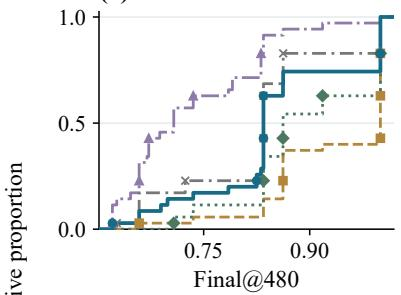

(b) PABP  
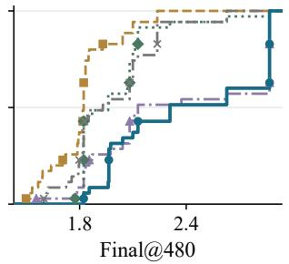

(c) TrpB  
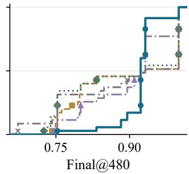  
(f) TrpB

(d) GB1  
(e) PABP  
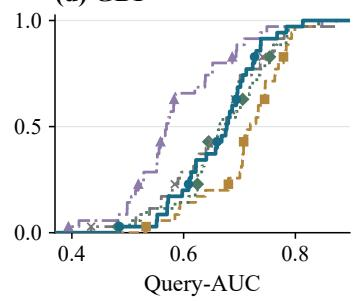

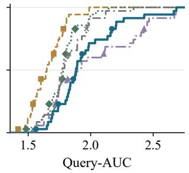

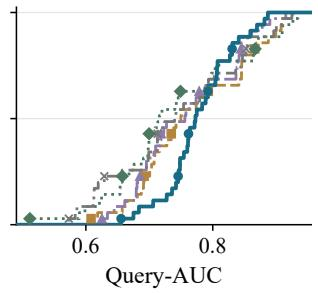  
BATA ALDE EVOLVEpro-650M REAP100-650M RF  
Figure A1: Campaign outcome distributions. Empirical cumulative distributions of Main-35 Final@480 and Query-AUC. Each curve contains 35 outcomes for one method and task, measured on that task’s native fitness scale.

Table A3: Sensitivity results. Means ± standard deviation (SD) and mean task ranks for GB1 and TrpB with 70 initializations and PABP with 35. The two sections report Final@480 and Query-AUC, respectively.  
Final@480 (mean ± SD)
<table><tr><td>Method</td><td> $\mathbf { \overline { { G B 1 } } } \left( \mathbf { n } = 7 \mathbf { 0 } \right)$ </td><td> $\overline { { \mathbf { P A B P } \left( \mathbf { n } = 3 5 \right) } }$ </td><td> $\overline { { { \bf { T r p B } } \left( { \bf n } = 7 { \bf 0 } \right) } }$ </td><td>Mean rank</td></tr><tr><td>BATA</td><td> $0 . 8 6 6 2 \pm 0 . 1 1 4 7$ </td><td> $2 . 4 1 6 9 \pm 0 . 4 2 3 2$ </td><td> $0 . 9 1 8 1 \pm 0 . 0 4 4 1$ </td><td>2.00</td></tr><tr><td>ALDE</td><td> $0 . 9 4 2 3 \pm 0 . 1 0 1 5$ </td><td> $1 . 8 1 8 3 \pm 0 . 1 8 1 4$ </td><td> $0 . 9 0 9 1 \pm 0 . 1 0 3 2$ </td><td>3.00</td></tr><tr><td>EVOLVEpro-650M</td><td> $0 . 7 9 0 9 \pm 0 . 1 1 0 6$ </td><td> $2 . 3 6 7 6 \pm 0 . 4 7 4 5$ </td><td> $0 . 9 0 8 2 \pm 0 . 0 7 8 4$ </td><td>3.67</td></tr><tr><td>REAP100-650M</td><td> $0 . 9 3 4 3 \pm 0 . 0 7 6 9$ </td><td> $1 . 9 9 6 0 \pm 0 . 2 3 7 1$ </td><td> $0 . 9 2 3 2 \pm 0 . 1 0 4 5$ </td><td>2.00</td></tr><tr><td>RF</td><td> $0 . 8 2 3 8 \pm 0 . 1 2 1 4$ </td><td> $1 . 9 8 4 9 \pm 0 . 2 5 3 3$ </td><td> $0 . 8 9 1 6 \pm 0 . 1 3 8 7$ </td><td>4.33</td></tr></table>

Query-AUC (mean ± SD)
<table><tr><td>Method</td><td> $\mathbf { \overline { { G B 1 } } } \left( \mathbf { n } = 7 \mathbf { 0 } \right)$ </td><td> $\overline { { \mathbf { P A B P } \left( \mathbf { n } = 3 5 \right) } }$ </td><td> $\overline { { \mathbf { T r p B } \left( \mathbf { n } = 7 \mathbf { 0 } \right) } }$ </td><td>Mean rank</td></tr><tr><td>BATA</td><td> $\overline { { 0 . 6 8 1 6 \pm 0 . 0 8 7 8 } }$ </td><td> $\overline { { 1 . 9 5 3 0 \pm 0 . 2 6 5 0 } }$ </td><td> $\overline { { 0 . 7 9 1 1 \pm 0 . 0 5 1 8 } }$ </td><td>2.33</td></tr><tr><td>ALDE</td><td> $0 . 7 5 2 5 \pm 0 . 0 9 7 5$ </td><td> $1 . 6 6 0 2 \pm 0 . 1 3 5 1$ </td><td> $0 . 7 7 3 4 \pm 0 . 0 9 0 6$ </td><td>2.67</td></tr><tr><td>EVOLVEpro-650M</td><td> $0 . 6 3 7 4 \pm 0 . 1 0 5 0$ </td><td> $2 . 0 1 2 2 \pm 0 . 3 5 2 6$ </td><td> $0 . 7 6 5 6 \pm 0 . 0 8 3 1$ </td><td>3.33</td></tr><tr><td>REAP100-650M</td><td> $0 . 7 1 8 8 \pm 0 . 0 9 3 2$ </td><td> $1 . 7 8 0 9 \pm 0 . 1 3 9 1$ </td><td> $0 . 7 6 8 7 \pm 0 . 0 9 6 0$ </td><td>3.00</td></tr><tr><td>RF</td><td> $0 . 6 8 5 0 \pm 0 . 1 1 9 0$ </td><td> $1 . 8 1 9 0 \pm 0 . 1 6 9 9$ </td><td> $0 . 7 4 6 9 \pm 0 . 1 1 2 8$ </td><td>3.67</td></tr></table>

Lower mean rank is better.

## B.2 CALIBRATION OUTCOMES AND WEIGHT VARIATION

The four-objective comparison changes the calibration loss while keeping the predictors and selec tion rules fixed. Table A4 reports task means, and Figure A2 shows all 24 matched groups. Figure 5a reports all nine paired differences with their intervals, including those that span zero.

Table A4: Calibration-objective results. Mean Final@480 over 24 matched groups per task. Final and Query-AUC ranks are computed from task means and then averaged; lower ranks are better.
<table><tr><td>Objective</td><td>GB1</td><td>PABP</td><td>TrpB</td><td>Final rank</td><td>AUC rank</td></tr><tr><td>G-Rank</td><td>0.8297</td><td>2.3605</td><td>0.9045</td><td>3.33</td><td>3.67</td></tr><tr><td>T-Uniform-96</td><td>0.8445</td><td>2.2353</td><td>0.9191</td><td>3.00</td><td>3.00</td></tr><tr><td>T-DCG-96</td><td>0.8496</td><td>2.4072</td><td>0.9301</td><td>1.33</td><td>1.33</td></tr><tr><td>T-DCG-192</td><td>0.8503</td><td>2.3401</td><td>0.9186</td><td>2.33</td><td>2.00</td></tr></table>

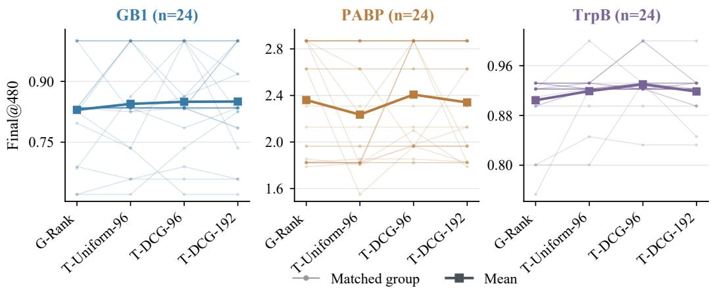  
Figure A2: Matched groups across calibration objectives. Each light line connects one group’s outcomes under the four objectives; squares show objective means. Each task contains 24 matched groups.  
Figure A3 shows all 420 mixture weights in the original campaign order. GB1 and TrpB mainly shift toward the task-specific predictor, while PABP shows more varied changes. Campaign order is kept fixed across rounds and does not depend on final fitness.

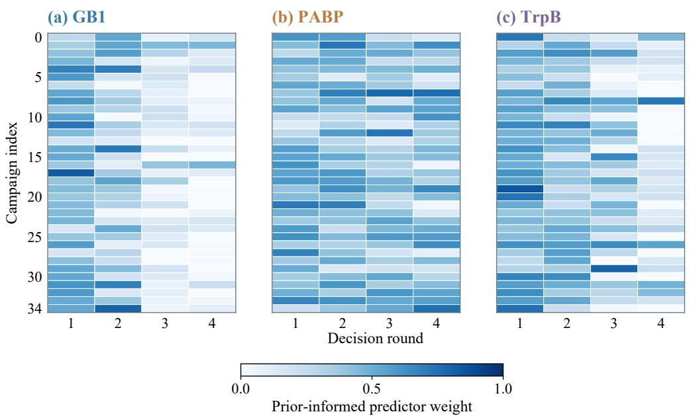  
Figure A3: Mixture weights across all campaigns. Each task contains 35 campaigns and four decision rounds. Zero assigns all weight to the task-specific predictor; one assigns all weight to the prior-informed predictor. All heatmaps use this shared scale.

## B.3 RUNTIME, CAPACITY, AND TASK-LEVEL LIMITS

An implementation optimization reduced median warm-cache runtime for the five-member (M5) configuration from 1092.19 to 171.96 seconds, with identical recorded candidate trajectories and metrics. Optimized M5 took 1.91 times the REAP10 runtime under this timing protocol. Figure A4a shows the three completed timings for each configuration. The 100-member (M100) runs in panel (b) reached their declared time limits after two rounds, so their elapsed times cover only part of a campaign. With 24 matched initializations, BATA using ESM2-650M reached mean Final

(a) Completed timings

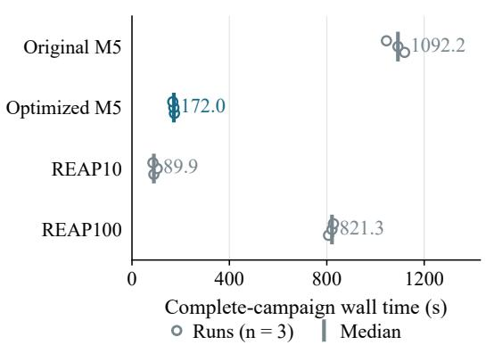

(b) Partial M100 timings
<table><tr><td rowspan=1 colspan=1>Run</td><td rowspan=1 colspan=1>Limit (s)</td><td rowspan=1 colspan=1>Stopped (s)</td></tr><tr><td rowspan=1 colspan=1>1</td><td rowspan=1 colspan=1>1614</td><td rowspan=1 colspan=1>1642</td></tr><tr><td rowspan=1 colspan=1>2</td><td rowspan=1 colspan=1>1643</td><td rowspan=1 colspan=1>1670</td></tr><tr><td rowspan=1 colspan=1>3</td><td rowspan=1 colspan=1>1655</td><td rowspan=1 colspan=1>1682</td></tr></table>

3/3 stopped after two rounds  
Figure A4: Runtime and ensemble size. (a) Complete-campaign wall times and medians from three engineering timings per configuration. (b) Elapsed times of three M100 attempts stopped after two rounds at their time limits. These times cover incomplete campaigns.

values of 2.4072 on PABP and 0.9301 on TrpB. The evaluated EVOLVEpro-15B adaptation reached 2.1177 and 0.8257, respectively. Increasing the BATA ensemble to 20 members (M20) increased runtime and still gave a lower Final than REAP100 on the complete TrpB development cohort. Each comparison evaluates the full predictor and selection configuration, so language-model size is one of several differences. Additional studies show where other configurations perform better. The global mean squared error (Global-MSE) configuration outperformed BATA on PABP in the 24-initialization auxiliary study. FolDE led under the separate 48-query PABP protocol, and the HIS7 and GRB2 transfer comparisons favored RF and REAP100, respectively. Global-MSE uses raw-score fusion and also changes covariance estimation and cross-fitting; the four-objective study changes only the rank-space calibration loss. These studies use separate protocols and cohorts and are reported independently of Main-35.

## C EXPERT COMPARISONS AND SWITCHING DIAGNOSTICS

## C.1 STRONGER TASK-SPECIFIC PREDICTION

Fine-only M20 uses 20 task-specific ensemble members and removes the prior-informed predictor. Figure 6 reports 188 matched pairs: 35 each for GB1 and PABP, 24 each for HIS7 and GRB2, and 70 from a separate TrpB sensitivity cohort. On TrpB, mean Final is 0.9388 for Fine-only M20 and 0.9181 for BATA. The paired advantage of Fine-only M20 is 0.0207, with a 95% confidence interval (CI) of [0.0045, 0.0364]. These TrpB initializations are independent of Main-35. Fine-only M20 changes ensemble capacity and uses Thompson-style selection on every task, including PABP and GRB2 where BATA uses greedy selection. Therefore, the comparison evaluates these configuration changes along with removal of the prior-informed predictor. The following controls keep the original task-specific predictor capacity and selection rule.

## C.2 CONTROLS WITH MATCHED TASK-SPECIFIC PREDICTOR CAPACITY

The control set contains 216 runs: BATA, task-specific-only prediction, and equal-rank combination, each evaluated on 24 matched initializations per main task. The task-specific predictors keep their original configurations: five Ridge models on GB1, five bootstrap random forests on TrpB, and one random forest with 100 trees on PABP. PABP task-specific-only predictions reuse the released EVOLVEpro/RF100 control. Figure A5 reports BATA minus control, so positive values favor BATA. Figure 6 uses Fine-only M20 minus BATA.

Matched task-specific predictor capacity  
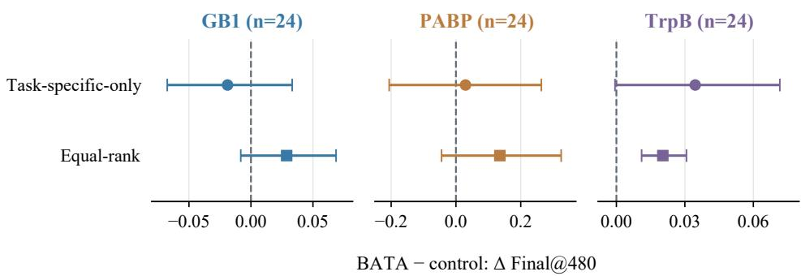  
Figure A5: Controls with matched task-specific predictor capacity. Paired mean Final@480 differences and 95% bootstrap intervals for BATA minus task-specific-only prediction and equalrank combination, using 24 matched initializations per main task. Each task has a separate axis in its native fitness units. Positive values favor BATA.

On TrpB, BATA exceeds task-specific-only prediction by a mean of 0.0345306. The prespecified 20,000-resample CI is [−0.000608, 0.071601], so uncertainty in this mean advantage extends across zero. Compared with equal-rank combination, BATA has a mean advantage of 0.020349 and a CI of [0.011045, 0.030704]. The independent TrpB-70 M20 comparison evaluates a larger task-specific ensemble, so it answers a different question from these controls.

## C.3 THRESHOLD DEVELOPMENT AND INDEPENDENT CONFIRMATION

The 0.20-threshold switching rule (G20) uses Fine-only M20 when BATA’s fitted prior-informed predictor weight is below 0.20. Otherwise, it keeps the BATA combination. Development evaluated thresholds 0.20, 0.30, and 0.40 and Fine-only M20 with five seeds per task across five tasks. These four variants required 100 new runs; the comparison also reused 25 BATA controls. G20 had the lowest development macro normalized regret: 0.1040, compared with 0.5040 and 0.5495 for the higher thresholds. The threshold was then fixed before generating a separate confirmation cohort. During development, G20 switched in 19 of 100 decisions, while G30 (threshold 0.30) and G40 (0.40) switched in 32 and 45, respectively. These more frequent switching rules had worse development scores. Confirmation used ten new initializations per task for BATA, Fine-only M20, and G20, giving 150 complete 480-query campaigns (Table A5). The confirmation initialization identities and algorithm seeds have no recorded overlap with the historical manifest bank.

Table A5: Independent confirmation of the switching rule. Mean Final@480 over ten matched initializations per task. Bold marks the best task mean. Ranks use the released deterministic tie rule: decreasing mean, then increasing arm identifier.
<table><tr><td>Task</td><td>BATA</td><td>G20</td><td>Fine-only M20</td></tr><tr><td>GB1</td><td>0.8802</td><td>0.8519</td><td>0.8549</td></tr><tr><td>PABP</td><td>2.3132</td><td>2.2571</td><td>2.0830</td></tr><tr><td>TrpB</td><td>0.9399</td><td>0.9554</td><td>0.9665</td></tr><tr><td>HÍS7</td><td>1.4138</td><td>1.4138</td><td>1.3227</td></tr><tr><td>GRB2</td><td>0.6276</td><td>0.6276</td><td>0.5964</td></tr><tr><td>Mean rank</td><td>1.40</td><td>2.20</td><td>2.40</td></tr></table>

In confirmation, G20 used Fine-only M20 in 30% of decision rounds on GB1 and TrpB, 5% on PABP, 10% on GRB2, and none on HIS7. Its paired Final differences from BATA were −0.0284 on GB1 (95% CI [−0.0731, 0]), −0.0560 on PABP ([−0.1681, 0]), +0.0155 on TrpB ([0, 0.0359]), and zero on HIS7 and GRB2. Figure A6 shows the ranks and switching frequency at each round. A low prior-informed predictor weight describes the current mixture but does not consistently predict gains from switching to the larger task-specific ensemble.

(a) Final@480 rank

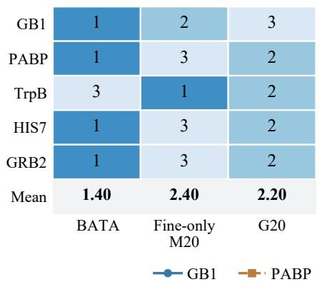  
(b) G20 switching

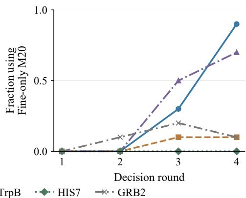  
Figure A6: Switching-rule results. (a) Task-wise Final ranks and released mean ranks in the independent ten-initialization cohort. (b) Fraction of campaigns using Fine-only M20 at each round. G20 uses the fixed threshold of 0.20. Decision rounds within a campaign are dependent.

## D PROOFS FOR THE CALIBRATION RULE

Both propositions analyze one round with fixed fitted predictions, ranks, and sample weights. Their conclusions apply to the calibration objective in Eq. 5.

## D.1 PROOF OF PROPOSITION 1

Write $\begin{array} { r } { A = \sum _ { i } q _ { i } d _ { i } ^ { 2 } , C = \sum _ { i } q _ { i } d _ { i } z _ { i } } \end{array}$ , and $\textstyle K = \sum _ { i } q _ { i } z _ { i } ^ { 2 }$ . The loss expands to

$$
\begin{array} { r } { \mathcal { L } _ { \mathrm { B A T A } } ( w ) = A w ^ { 2 } - 2 C w + K , \qquad A \geq 0 . } \end{array}\tag{9}
$$

For $A > 0$ , completing the square gives

$$
{ \mathcal { L } } _ { \mathrm { B A T A } } ( w ) = A \left( w - { \frac { C } { A } } \right) ^ { 2 } + K - { \frac { C ^ { 2 } } { A } } .\tag{10}
$$

The unique unconstrained minimizer is $C / A .$ Over $[ 0 , 1 ]$ , the minimizer is the closest point to $C / A$ in that interval, $\Pi _ { [ 0 , 1 ] } ( C / A )$ . If $A = 0 ,$ every term with $q _ { i } > 0$ has $d _ { i } = 0 .$ . Hence $\bar { C _ { \mathrm { \scriptsize ~ = ~ 0 , ~ } } }$ and the loss is constant. The convention $w = 0$ is then optimal. The minimum loss is at most the loss at either endpoint, each of which uses one predictor alone. The implementation sets $w = 0$ when A is no larger than float64 machine epsilon, treating an almost-flat objective as numerically degenerate. The exact uniqueness claim in the proposition applies to the mathematical case $A > 0$

## D.2 PROOF OF PROPOSITION 2

A strictly increasing transformation preserves order and ties: $u \ : < \ : v$ if and only if $h ( u ) < h ( v )$ and $u = v$ if and only $\mathrm { i f } \ h ( u ) = h ( v )$ . Therefore, average ranks and their percentile normalization stay unchanged. Transforming either fixed, ensemble-averaged OOF score vector leaves $ r ^ { p } , r ^ { a } , d , z$ and the weight in Eq. 6 unchanged. The observed fitness ranks and sample weights $q _ { i }$ also stay unchanged. Applying the same argument to each member’s fixed scores in the unmeasured pool leaves both percentile-rank vectors in Eq. 7 unchanged. Their weighted combination is therefore unchanged. The calibration denominator also stays unchanged, so the implementation’s deterministic numerical convention gives the same result.