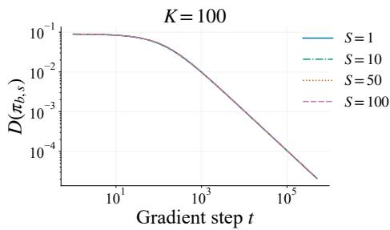
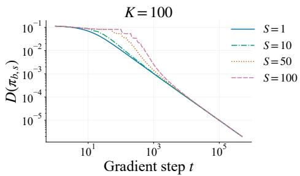
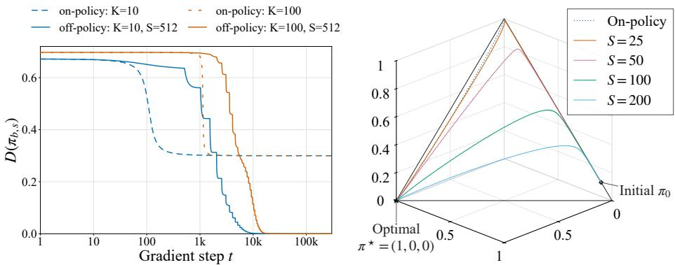

# FINE-TUNING ON SELF-GENERATED AND REWARD-WEIGHTED DATA: LEARNING DYNAMICS, CONVER-GENCE RATES, AND BENEFITS OF OFF-POLICYNESS

Zhiwei Wang ∗   
Department of Mathematical Sciences   
Tsinghua University   
zhiweithu@gmail.com   
Yanxi Chen   
Alibaba Group   
yxchen0@outlook.com   
Yaliang Li & Bolin Ding   
Alibaba Group   
{yaliang.li, bolin.ding}@alibaba-inc.com

## ABSTRACT

We study the learning dynamics of fine-tuning a policy model on self-generated and reward-weighted rollout data, with particular focus on a generalized version of classic REINFORCE — referred to as RE(S)— that updates the rollout distribution once every $S \geq 1$ gradient steps. Prior work in bandits and reinforcement learning has developed rich theory for REINFORCE and policy gradient methods, and on-policy sampling (i.e., a small value of S, ideally 1) is often viewed as crucial to their success; yet in prominent application like post-training large language models, reward-guided self-training has proved to be effective even when the rollout distribution is updated infrequently, but theoretical understanding remains limited for the learning dynamics and convergence properties of these off-policy methods. To bridge these gaps, we develop a unified theory for RE(S) that covers the full spectrum of $S \geq 1 { : }$ it can be interpreted as a stage-wise iterative optimization process, where each stage takes S gradient steps for minimizing the Kullback–Leibler distance to a fixed reward-weighted rollout distribution. For multi-arm bandits with softmax policies, our in-depth analysis and numerical experiments reveal three key findings: (1) for any fixed S, RE(S) enjoys global convergence to the optimal policy as the number of rollout distribution updates $B = \lfloor T \bar { / } S \rfloor \to \infty$ , where $T$ denotes the total number of gradient steps; (2) we prove tight two-sided bounds for the convergence rate of RE(S), and show that its suboptimality gap achieves an asymptotic $\Theta \bar { ( 1 / T ) }$ convergence rate, while S only affects the length of a burn-in phase; (3) when initialized at a weak policy with a small optimal-action probability, RE(1) gets trapped around suboptimal policies for a long period, whereas RE(S) with a suitable S avoids the detour and achieves significantly faster convergence to the global optimum, highlighting the benefits of off-policyness in this case.

## 1 INTRODUCTION

Multi-armed bandits and reinforcement learning (RL) have a long history (Lattimore & Szepesvári, 2020; Sutton & Barto, 1998) and have achieved substantial empirical success, including the recent use of RL in post-training large language models (LLMs) (Ouyang et al., 2022; Touvron et al., 2023; OpenAI, 2024; DeepSeek-AI, 2025; Kimi-Team, 2025). Many algorithms in these areas can be viewed as fine-tuning a policy model $\pi _ { \theta }$ on self-generated and reward-weighted data. One prominent example is the classical REINFORCE algorithm (Williams, 1992) that, in the bandit setting, estimates the policy gradient by $( 1 / N ) \textstyle \sum _ { i = 1 } ^ { N } r _ { i }$ ∇θ log $\pi _ { \boldsymbol { \theta } } ( a _ { i } )$ , where $a _ { i } \sim \pi _ { \theta }$ is a sampled action and $r _ { i }$ is the reward for taking action $a _ { i }$

This perspective highlights a gap between two major lines of methodology, practice, and theory:

(1) In the bandit and RL literature, there exists a rich theory for policy gradient and policy iteration methods, including convergence and sample-complexity guarantees (Sutton et al., 1999; Agarwal et al., 2021; Mei et al., 2020b; 2023; Lu et al., 2024). Much of this theory assumes on-policy sampling, where the rollout distribution matches the current policy under optimization. Methods that account for (a limited degree of) off-policyness often require explicit algorithmic modifications, for example through trust-region regularization or clipping importance-sampling ratios (Schulman et al., 2015; 2017; Espeholt et al., 2018). In practice, keeping the rollout and training policies closely aligned is also an important design consideration for these methods, motivating substantial efforts to support frequent and efficient synchronization of LLM model weights in RL infrastructure (Sheng et al., 2024; Hu et al., 2024; Pan et al., 2025).

(2) However, in the broader reward-guided self-training paradigm, it is also common to update the rollout distribution infrequently while fine-tuning the policy model on rollout samples weighted or filtered by their rewards, using standard log-likelihood objectives. Successful examples in the LLM domain include STaR (Zelikman et al., 2022), RAFT (Dong et al., 2023), ReST (Gulcehre et al., 2023), $\mathrm { R e S T ^ { E M } }$ (Singh et al., 2024), rejection-sampling fine-tuning in Llama 2 (Touvron et al., 2023), AsymRE (Arnal et al., 2026), and more recent industrial practice. Such methods can be implemented with simple infrastructure: an LLM inference engine (Kwon et al., 2023; Zheng et al., 2024) generates rollout data and periodically loads an updated policy checkpoint, while a standard supervised fine-tuning (SFT) engine performs gradient updates on the reward-weighted or reward-filtered data. Despite their empirical success, theoretical understanding and guarantees for these off-policy methods remain limited.

These observations raise intriguing research questions. What are the connections and differences between these two lines of on-policy versus off-policy methodology? How does rollout staleness affect policy learning? What convergence guarantees can be established when the rollout distribution is synchronized with the trained policy infrequently? In particular, can off-policyness possibly lead to faster convergence than on-policy learning?

Contributions and outline. Towards answering these questions, we focus on a simple algorithm termed RE(S) and formalized in Algorithm 1, which is a generalized version of vanilla REINFORCE that updates the rollout distribution once every $S \geq 1$ gradient steps. The parameter S denotes the maximum staleness of a rollout sample with respect to the most updated policy model, and RE(1) reduces to standard on-policy REINFORCE. We show in Section 2 that RE(S) can be interpreted as a stage-wise iterative optimization process, where each stage effectively takes S gradient steps for minimizing the Kullback-Leibler (KL) distance to the reward-weighted rollout distribution. Unlike on-policy REINFORCE — which moves along the direction of standard policy gradient — our interpretation shows that RE(S) takes an alternative path towards the optimal policy.

In Section 3, we further focus on K-arm bandits and policies with softmax parameterization, for in-depth analysis and formal theoretical guarantees. Our key findings include the following:

1. Theorem 3.1: RE(S) enjoys global convergence to the optimal policy as the total number of gradient steps $T \to \infty$ regardless of S, as long as the number of rollout distribution updates $\mathbf { \bar { \boldsymbol { B } } } = \lfloor \boldsymbol { T } / S \rfloor$ also grows unbounded;

2. Theorems 3.3 and 3.4: We prove tight two-sided bounds showing that the suboptimality gap of RE(S) achieves an asymptotic $\mathsf { \bar { \Theta } } ( 1 / T )$ convergence rate with respect to the number of gradient updates, while S only affects the length of a burn-in phase;

3. Theorem 3.6: When initialized at a weak policy with a small optimal-action probability x, RE(1) provably gets trapped around suboptimal policies for $\dot { \Omega } ( x ^ { - ( K - 1 ) } )$ ) steps, whereas RE(S) with $S \stackrel { \cdot } { = } \Theta ( x ^ { - 1 } \bar { ) }$ avoids such a detour and approaches the global optimum within $O ( x ^ { - 1 } \log ( 1 / x ) )$ gradient steps, highlighting the benefits of off-policyness in this case.

Discussion on prior literature and its connections to our work can be found in Section 4. Limitations of our work and directions for future research are discussed in Section 5. We hope that our theoretical study and numerical experiments can offer new insights for reward-guided self-training methodology, and inspire further research or practice in this area.

## 2 A HIGH-LEVEL UNDERSTANDING OF RE(S) LEARNING DYNAMICS

We formalize the problem setting as follows. Consider a multi-arm bandit with action space ${ \mathcal { A } } .$ . Let θ denote the parameters of a policy, and $\pi _ { \theta }$ denote its output distribution. Every time an action a $, \in { \mathcal { A } }$ is sampled from the policy distribution $a \sim \pi _ { \theta }$ , it receives a (stochastic) reward $r \sim P _ { R } ( a )$ with expectation $\mathbb { E } [ r ] = \bar { \mu ( a ) } \overset { \cdot } { \geq } 0$ . We assume non-negative reward means $\mu$ throughout this work. The mean reward of a policy π is denoted by $J ( \pi ) : = \mathbb { E } _ { a \sim \pi } \mu ( a )$

The RE(S) algorithm is formalized in Algorithm 1. It is a double-loop process: in the b-th outer iteration, a total of $N \times S$ action-reward pairs are sampled from the same rollout distribution $\pi _ { \boldsymbol { \theta } _ { b , 0 } } ;$ then, the inner loop takes S gradient steps of reward-weighted fine-tuning, each consuming N rollout samples. It is obvious that the special case $S = 1$ reduces to standard on-policy REINFORCE.

Algorithm 1 RE(S), a general version   
Input: initial policy parameters $\theta _ { 0 , 0 }$ , staleness $S \in \mathbb { N } _ { + }$ , learning rate $\eta > 0 .$   
for $b = 0 , 1 , \dotsc , \dot { B } - 1$ do   
Sample $a _ { s , i } \sim \pi _ { \theta _ { b , 0 } }$ and its reward $r _ { s , i } \sim P _ { R } ( a _ { s , i } ) , 0 \le s < S , 1 \le i \le N .$   
for $s = 0 , 1 , \ldots , \dot { S } - 1$ do   
$\begin{array} { r } { \theta _ { b , s + 1 }  \theta _ { b , s } + \frac { \eta } { N } \sum _ { i = 1 } ^ { N } r _ { s , i } \nabla _ { \theta } \log \pi _ { \theta } ( a _ { s , i } ) | _ { \theta = \theta _ { b , s } } . } \end{array}$   
end   
Set $\theta _ { b + 1 , 0 }  \theta _ { b , S }$   
end

While standard policy gradient theory says $\mathbb { E } _ { a \sim \pi _ { \theta } } [ \mu ( a ) \nabla _ { \theta } \log \pi _ { \theta } ( a ) ] = \nabla _ { \theta } J ( \pi _ { \theta } )$ , such unbiasedness is clearly not true for the gradient estimate in RE(S) when off-policyness occurs, namely $S > 1$ Fortunately, we can show that RE(S) takes an alternative path towards the optimal policy. Indeed, RE(S) can be viewed as a stage-wise optimization process, where each stage takes S gradient-descent steps for minimizing the KL distance to the reward-weighted rollout distribution $\tilde { \pi } _ { b } ^ { \mu } \mathrm { . }$

$$
\begin{array} { r l } & { \mathbb { E } _ { a \sim \pi _ { \theta _ { b , 0 } } , r \sim P _ { R } ( a ) } [ r \cdot \nabla _ { \theta } \log \pi _ { \theta } ( a ) ] = \mathbb { E } _ { a \sim \pi _ { \theta _ { b , 0 } } } [ \mu ( a ) \cdot \nabla _ { \theta } \log \pi _ { \theta } ( a ) ] } \\ & { \quad \quad = Z _ { b } \cdot \displaystyle \int _ { a \in \mathcal { A } } \frac { \pi _ { \theta _ { b , 0 } } ( a ) \mu ( a ) } { Z _ { b } } \nabla _ { \theta } \log \pi _ { \theta } ( a ) \mathrm { d } a = Z _ { b } \cdot \mathbb { E } _ { a \sim \pi _ { b } ^ { \mu } } \nabla _ { \theta } \log \pi _ { \theta } ( a ) } \\ & { \quad \quad = - Z _ { b } \cdot \nabla _ { \theta } \mathrm { D } _ { \mathrm { K L } } \Big ( \tilde { \pi } _ { b } ^ { \mu } \| \pi _ { \theta } \Big ) , } \end{array}
$$

where $\tilde { \pi } _ { b } ^ { \mu }$ and $Z _ { b }$ are defined by

$$
\tilde { \pi } _ { b } ^ { \mu } ( a ) : = \frac { \pi _ { \theta _ { b , 0 } } ( a ) \mu ( a ) } { Z _ { b } } , \quad Z _ { b } : = \int _ { a \in \mathcal { A } } \pi _ { \theta _ { b , 0 } } ( a ) \mu ( a ) \mathrm { d } a = \mathbb { E } _ { a \sim \pi _ { \theta _ { b , 0 } } } \mu ( a ) .
$$

If S is sufficiently large, then by the end of the inner loop, $\pi _ { \theta _ { b + 1 , 0 } } = \pi _ { \theta _ { b , S } }$ will ideally get close to $\tilde { \pi } _ { b } ^ { \mu }$ , which is a higher-reward policy than $\pi _ { \boldsymbol { \theta } _ { b , 0 } } .$ . Thus RE(S) could converge to the optimal policy as the rollout distribution gets updated for $B  \infty$ times. In the next section, we formalize this intuition and provide in-depth convergence analysis in concrete settings.

## 3 IN-DEPTH ANALYSIS FOR BANDITS AND SOFTMAX POLICIES

In this section, we present in-depth analysis for the learning dynamics and convergence rates of RE(S) in bandits with softmax policies. Our key findings include global convergence of RE(S) to the optimal policy (Section 3.1), two-sided bounds for convergence rates that reveal two distinct time scales in the learning dynamics of RE(S) (Section 3.2), and the benefits of off-policyness in accelerating convergence under certain conditions (Section 3.3). We conclude with numerical validation of these theoretical findings (Section 3.4).

Problem setup. Following the formulation in Section 2, we further assume a discrete action space $\pmb { \mathscr { A } } = [ K ] : = \hat { \{ 1 , \dots , K \} }$ , and a reward-mean vector $\mu = [ \mu ( 1 ) , \ldots , \mu ( K ) ]$ . Assume that there is a unique optimal action, indexed by 1 without loss of generality. We let $\mu _ { \mathrm { m a x } } / \mu _ { \mathrm { m i n } }$ and $\Delta$ denote the maximum/minimum reward and the reward gap between the top-2 actions, respectively:

$$
\mu _ { \operatorname* { m a x } } : = \mu ( 1 ) > \mu ( a ) \geq \mu _ { \operatorname* { m i n } } > 0 , \quad 2 \leq a \leq K ; \quad \quad \Delta : = \mu _ { \operatorname* { m a x } } - \operatorname* { m a x } _ { 2 < a < K } \mu ( a ) > 0 .
$$

We focus on policies with softmax parameterization throughout this section:

$$
\theta = \left[ \theta ( 1 ) , \ldots , \theta ( K ) \right] \in \mathbb { R } ^ { K } , \quad \pi _ { \theta } ( a ) = { \frac { e ^ { \theta ( a ) } } { \sum _ { j = 1 } ^ { K } e ^ { \theta ( j ) } } } , \quad 1 \leq a \leq K .
$$

Suppose that every coordinate of the initial logit vector θ is finite, hence the initial policy has full support over A. The learner aims to find the policy $\pi _ { \theta }$ that maximizes the objective function:

$$
J ( \pi _ { \theta } ) = \mathbb { E } _ { a \sim \pi _ { \theta } } \mu ( a ) = \langle \pi _ { \theta } , \mu \rangle .\tag{1}
$$

For notational simplicity, we will use $\pi _ { b , s }$ and $\pi _ { \theta _ { b , s } }$ interchangeably. In this concrete setting, the infinite-sample limit of the gradient estimate in Algorithm 1 can be calculated by

$$
g _ { b , s } : = \pi _ { b , 0 } \odot \mu - J ( \pi _ { b , 0 } ) \pi _ { b , s } ,
$$

where ⊙ denotes element-wise multiplication; see Lemma A.1 in the appendix for the derivation.   
This leads us to the specialized version of RE(S) in Algorithm 2, which we investigate in this section.

Algorithm 2 RE(S), softmax parameterization and infinite-sample limit   
Input: initial logits $\theta _ { 0 , 0 } \in \mathbb { R } ^ { K }$ , staleness $S \in \mathbb { N } _ { + }$ , learning rate $\eta > 0$   
for $b = 0 , 1 , \dotsc , \bar { B } - 1$ do   
for $s = 0 , 1 , \ldots , S - 1$ do   
$\theta _ { b , s + 1 }  \theta _ { b , s } + \eta ( \pi _ { b , 0 } \odot \mu - J ( \pi _ { b , 0 } ) \pi _ { b , s } ) .$   
end   
Set $\theta _ { b + 1 , 0 }  \theta _ { b , S } .$   
end

## 3.1 GLOBAL CONVERGENCE TO THE OPTIMAL POLICY

The following theorem guarantees global convergence of RE(S) to the optimal policy $\pi ^ { \star } = e _ { 1 }$ namely probability 1 on the optimal action and 0 elsewhere.

Theorem 3.1. Suppose that $\theta _ { 0 , 0 } \in \mathbb { R } ^ { K }$ isfinite, and the learning rate $\eta > 0$ satisfies $\eta \cdot \mu _ { m a x } < 4$ Then for any fixed integer $S \geq 1 , R E ( S )$ converges to the optimal policy asymptotically:

$$
\pi _ { b , s }  e _ { 1 } f o r a l l \quad 0 \leq s \leq S \quad a s \quad b  \infty .
$$

Proofsketch. The proof combines improvement of the surrogate objective with bounds on changes in the logits. The step-size condition and smoothness ensure that $J _ { b } : = J ( \pi _ { b , 0 } )$ is nondecreasing in b, so it converges to some $J _ { \infty } \leq \mu ( 1 )$ . The remaining work is to rule out convergence to a suboptimal action. To prove this by contradiction, suppose that $J _ { \infty } < \mu ( 1 )$ . For fixed S, logit changes during each stage tend to zero. Actions with rewards above $J _ { \infty }$ eventually have increasing logits, and those below it have decreasing logits. The estimate $\| g _ { b , 0 } \| _ { 2 } \le C ( J _ { \infty } - J _ { b } )$ implies $\begin{array} { r } { \sum _ { b } ( J _ { \infty } - J _ { b } ) = \infty , } \end{array}$ since a finite sum would make all logits converge to finite values and prevent the optimal action’s gradient from tending to zero. Keeping $J _ { b } \leq J _ { \infty }$ therefore requires an action a with $\mu ( a ) < J _ { \infty }$ and $\begin{array} { r } { \sum _ { b } \pi _ { b , 0 } ( a ) = \infty } \end{array}$ , therefore its logit tends $\mathrm { t o } - \infty$ . Since the optimal logit is bounded below, the optimal action eventually has greater probability, which implies $\begin{array} { r } { \sum _ { b } \pi _ { b , 0 } ( 1 ) = \infty } \end{array}$ and its logit tends to +∞. The probability of every action with $\mu ( a ) < J _ { \infty }$ , divided by the optimal action’s probability, then tends to zero. These actions can no longer offset the optimal action’s positive contribution to $J _ { b } - J _ { \infty }$ , giving $J _ { b } > J _ { \infty }$ , which is a contradiction. Therefore $J _ { \infty }$ must be $\mu ( 1 ) = \mu _ { \mathrm { m a x } }$ , which means convergence to the optimal policy. See Appendix A for the full proof. □

## 3.2 TWO-SIDED BOUNDS FOR CONVERGENCE RATES

We next characterize the convergence rate of RE(S) and its dependence on S. Denote the suboptimality gaps of policies by

$$
D ( \pi ) : = \mu _ { \operatorname* { m a x } } - J ( \pi ) , \qquad d _ { b } : = D ( \pi _ { b , 0 } ) ,
$$

and define the surrogate loss function $L$ as

$$
L ( \pi _ { b , s } ; \pi _ { b , 0 } ) : = \mathbb { E } _ { a \sim \pi _ { b , 0 } } \mu ( a ) \log \pi _ { b , s } ( a ) .
$$

Our analysis critically relies on the following lemma that quantifies progress within each inner loop. Lemma 3.2 (Progress and suboptimality gaps within an inner loop). Consider the b-th outer iteration ofAlgorithm 2. Suppose that $\eta \cdot \mu _ { m a x } < 4$ . For every $1 \leq s \leq S ,$ we have

$$
\lambda \big ( \pi _ { b , 0 } ( 1 ) \big ) \operatorname* { m i n } \{ \eta s d _ { b } ^ { 2 } , d _ { b } \} \leq L ( \pi _ { b , s } ; \pi _ { b , 0 } ) - L ( \pi _ { b , 0 } ; \pi _ { b , 0 } )
$$

$$
\leq J ( \pi _ { b , s } ) - J ( \pi _ { b , 0 } ) \leq A \operatorname* { m i n } \{ \eta s d _ { b } ^ { 2 } , d _ { b } \} ,\tag{2}
$$

$$
a n d \quad \rho d _ { b } \leq D ( \pi _ { b , s } ) \leq d _ { b } ,\tag{3}
$$

where the specific forms of λ(·), ρ and A can be found in Appendix B.

Proofsketch. We focus on explaining the proof idea of the most important lower bound in $\operatorname { E q . } \left( 2 \right)$ and proofs of the remaining results can be found in Appendix B. It is known that for on-policy softmax policy gradient, smoothness and the non-uniform Łojasiewicz inequality give an $\dot { \Omega } ( \eta d _ { b } ^ { 2 } )$ improvement per step (Mei et al., 2020b). For fixed inner loop step s, when $\eta s d _ { b } \leq 1$ , a small suboptimality gap $d _ { b }$ limits how far the current policy can move over the inner loop. Therefore, the accumulated progress is $\Omega ( s \eta d _ { b } ^ { 2 } )$ in this inner loop. This also explains the on-policy order of progress near convergence. But when $\eta s d _ { b } > 1$ , the gradient can be very different from on-policy gradient during the inner loop. Nonetheless, the optimal action gradient component remains at least half of its initial value for about $1 / ( \eta d _ { b } )$ steps. Combining this with the on-policy result, we see that the progress in this inner loop is at least $\bar { \Omega } ( \eta d _ { b } ^ { 2 } \cdot 1 / ( \eta d _ { b } \bar { \bf { \Theta } } ) ) = \Omega ( d _ { b } )$ □

Eq. (2) in the above lemma suggests that $J ( \pi _ { b , s } ) - J ( \pi _ { b , 0 } ) = \Theta \big ( \operatorname* { m i n } \{ \eta s d _ { b } ^ { 2 } , d _ { b } \} \big )$ . With the progress of the optimization, decreasing $d _ { b }$ changes this scale from $\Theta ( d _ { b } )$ to $\Theta ( \eta s d _ { b } ^ { 2 } )$ . This change essentially causes the two time scales that we will soon describe in the main theorems below. The reason behind the lower bound in Eq. (3) is that, increasing the likelihood of the reward-weighted rollout distribution prevents an arbitrarily large reduction of the suboptimality gap within the same inner loop.

Building on Lemma 3.2, we can now establish upper and lower bounds for the convergence rates of RE(S) in Theorems 3.3 and 3.4 respectively. We introduce a new notation $p _ { \operatorname* { m i n } } : = \operatorname* { i n f } _ { b \geq 0 } \pi _ { b , 0 } ( 1 ) >$ 0, whose positivity1 originates from Theorem 3.1. In the following theorems, we use the notation $t = b S + s ,$ , where $0 \leq s \leq S$ , for the total number of gradient steps needed to achieve $\pi _ { b , s }$ in RE(S). Theorem 3.3 (Upper Bound). Suppose that $\eta \cdot \mu _ { m a x } < 4$ . There exists a constant $c > 0$ (depending only on $K , \mu , \eta ,$ and $p _ { \mathrm { m i n } } )$ such that, ifwe define

$$
\bar { b } = \left\{ \begin{array} { l l } { 0 } & { i f \quad \eta S d _ { 0 } \leq 1 , } \\ { \left\lceil \frac { \log ( \eta S d _ { 0 } ) } { \log ( 1 + c ) } \right\rceil } & { i f \quad \eta S d _ { 0 } > 1 , } \end{array} \right.\tag{4}
$$

then for $0 \leq b \leq { \bar { b } } ,$ we have

$$
D ( \pi _ { b , s } ) \leq d _ { 0 } ( 1 + c ) ^ { - b } ,\tag{5}
$$

whereas for every $b \geq { \bar { b } } ,$ , we have

$$
D ( \pi _ { b , s } ) \leq \frac { 1 } { d _ { \overline { { b } } } ^ { - 1 } + c \eta ( t - \overline { { t } } ) } , \quad w h e r e \quad t = b S + s , \quad \overline { { t } } = \bar { b } S .\tag{6}
$$

Theorem 3.4 (Lower Bound). Suppose that $\eta \cdot \mu _ { m a x } < 4 .$ . Let A and $\rho \in ( 0 , 1 )$ be the constants in Lemma 3.2, and define

$$
\begin{array} { r } { \bar { b } ^ { \prime } = \left\{ \begin{array} { l l } { 0 } & { i f \quad \eta S d _ { 0 } \le ( 1 - \rho ) / A , } \\ { \left\lceil \frac { \log \left( A \eta S d _ { 0 } / ( 1 - \rho ) \right) } { \log \left( 1 / \rho \right) } \right\rceil } & { i f \quad \eta S d _ { 0 } > ( 1 - \rho ) / A , } \end{array} \right. } \end{array}\tag{7}
$$

then for $0 \leq b \leq \bar { b } ^ { \prime }$ , we have

$$
D ( \pi _ { b , S } ) \geq d _ { 0 } \rho ^ { b + 1 } ,\tag{8}
$$

whereas for every $b \geq \bar { b } ^ { \prime }$ , we have

$$
D ( \pi _ { b , s } ) \geq \frac { 1 } { d _ { 0 } ^ { - 1 } \rho ^ { - \bar { b } ^ { \prime } } + ( A / \rho ) \eta ( t - \bar { t } ^ { \prime } ) } , \quad w h e r e \quad t = b S + s , \quad \bar { t } ^ { \prime } = \bar { b } ^ { \prime } S .\tag{9}
$$

Proof sketch. Using Lemma 3.2 and dividing Eq. (2) therein by $d _ { b } D ( \pi _ { b , s } )$ , we have

$$
\lambda ( p _ { \mathrm { m i n } } ) \operatorname* { m i n } \{ \eta s , \frac { 1 } { d _ { b } } \} \leq \lambda \big ( \pi _ { b , 0 } ( 1 ) \big ) \operatorname* { m i n } \{ \eta s , \frac { 1 } { d _ { b } } \} \leq \frac { 1 } { D \big ( \pi _ { b , s } \big ) } - \frac { 1 } { d _ { b } } \leq \operatorname* { m i n } \left\{ \frac { A } { \rho } \eta s , \frac { 1 - \rho } { \rho } \frac { 1 } { d _ { b } } \right\} .
$$

Denote $a _ { b } : = 1 / d _ { b }$ . For $s \ = \ S$ , replacing each bound by equality gives two sequences of the form $a _ { b + 1 } = a _ { b } + \operatorname* { m i n } \{ x \eta S , y a _ { b } \}$ , starting at $a _ { 0 } = 1 / d _ { 0 }$ . The coefficients x and y come from the corresponding side of the inequality. This update is increasing in $a _ { b } ,$ so the two sequences remain lower and upper bounds on $1 / d _ { b }$ at every inner loop. When $y a _ { b } < x \eta S$ , the update is $a _ { b + 1 } = ( 1 + y ) a _ { b }$ . Once $y a _ { b } \geq x \eta S ,$ , it becomes $a _ { b + 1 } = a _ { b } + x \eta S$ and remains in this case. See Appendix B.2 for the complete proof. □

Remark 3.5. Several previous works studied similar problems but with different theoretical techniques. Mei et al. (2020b) lower bound improvement by a multiple of the squared gap using smoothness and a non-uniform Łojasiewicz inequality; such a bound is not guaranteed to hold for every step of an inner loop in the RE(S) algorithm that we study, since its gradient update $g = q \odot \mu - J ( q ) \pi$ (where $q$ denotes the rollout distribution) can vanish. Liu et al. (2024) use the nonnegativity of $( u ( a ) - u ( a ^ { \prime } ) ) ( e ^ { \eta u ( a ) } - e ^ { \eta u ( a ^ { \prime } ) } )$ , where $u = \nabla _ { \theta } J ;$ ; for $\mathrm { R E } ( S )$ , the corresponding terms are $( u ( a ) -$ $u ( a ^ { \prime } ) ) ( e ^ { \eta g ( a ) } - e ^ { \eta g ( a ^ { \prime } ) } )$ , and these two factors need not have the same sign. Some works consider stage-wise algorithms similar to RE(S), where each inner loop uses a fixed rollout distribution $q \mathrm { : }$ Arnal et al. (2026) identify the inner loop convergence limit through a Lyapunov function, and then iterate this limiting map across outer iterations, while Štrupl et al. (2022) use exact weighted-likelihood maximization, nonnegative action-value variance, and probability ratios to prove improvement and convergence. For bandits with positive rewards, both yield the updated rollout distribution $q ^ { + } = q \odot \mathbf { \bar { \mu } } / J ( q )$ , but $\mathrm { R E } ( S )$ with a finite S value need not obey this identity. Adapting their arguments to RE(S) would require additional control of how incomplete fitting within a stage changes these ratios. Our proposed analysis instead estimates improvement over a finite-step stage in terms of the current suboptimality gap, including cases when the gap approaches zero and when it does not.

## 3.3 BENEFITS OF OFF-POLICYNESS

While the previous theorems present $\Theta ( 1 / t )$ asymptotic convergence rates regardless of the value of S, there exist other terms in the bounds that can play a crucial role in the overall speed of convergence. In the following, we identify settings where, perhaps surprisingly, RE(S) with a suitably large $\bar { S }$ can achieve much faster convergence than on-policy RE(1).

Assume $K \geq 3$ and consider the following assumptions:

$$
\mu _ { \mathrm { m a x } } = \mu ( 1 ) > \mu ( 2 ) > \mu ( a ) \geq \mu _ { \mathrm { m i n } } > 0 , \quad 3 \leq a \leq K ; \quad \quad \Delta = \mu ( 1 ) - \mu ( 2 ) > 0 .
$$

Fix weights $w ( a ) > 0$ for $2 \leq a \leq K$ with $\textstyle \sum _ { a = 2 } ^ { K } w ( a ) = 1$ , and initialize RE(S) with the following policy $\pi _ { 0 , 0 } \colon$

$$
\pi _ { 0 , 0 } ( 1 ) = x > 0 , \quad \pi _ { 0 , 0 } ( a ) = ( 1 - x ) w ( a ) , \quad 2 \leq a \leq K .\tag{10}
$$

Now we consider a family of initial conditions specified by the optimal-action probability $x \in ( 0 , 1 )$ while fixing other factors like $K , \mu , w ,$ , and η satisfying $0 < \eta \mu _ { \mathrm { m a x } } < 4$ . For any target accuracy $0 < \epsilon < \Delta / 2$ , we define $T _ { \epsilon } ( S )$ as the number of gradient steps required by RE(S) to achieve it:

$$
T _ { \epsilon } ( S ) : = \operatorname* { i n f } \{ b S : b \geq 0 , D ( \pi _ { b , 0 } ) \leq \epsilon \} .\tag{11}
$$

Focusing on asymptotic $x \to 0$ , the theorem below demonstrates provable benefits of off-policyness. Theorem 3.6. Under the conditions stated above, we have

$$
T _ { \epsilon } ( 1 ) = \Omega \Bigl ( x ^ { - ( K - 1 ) } \Bigr ) .
$$

Moreover, there exists an integer $S _ { x } = \Theta ( x ^ { - 1 } )$ ,for which

$$
T _ { \epsilon } ( S _ { x } ) = O \bigl ( x ^ { - 1 } \log ( 1 / x ) \bigr ) , \quad a n d t h u s \quad \frac { T _ { \epsilon } ( S _ { x } ) } { T _ { \epsilon } ( 1 ) } \longrightarrow 0 \quad a s \quad x  0 .
$$

The implicit constants in these bounds may depend on $K , \mu , w , \eta , \epsilon ,$ but not on x.

We provide an intuitive explanation below. On-policy policy gradient follows the direction of steepest first-order increase in expected reward, yet this local improvement might substantially reduce the optimal action’s probability. Once trapped near a suboptimal vertex of the probability simplex, the small probability of the optimal action could suppress its gradient, making recovery very slow. This slow transient behavior of softmax policy gradient has also been established theoretically and observed empirically by previous works (Mei et al., 2020a; Mei & Osband, 2026). In contrast, RE(S) fixes the rollout distribution within each stage and takes gradient steps to reduce the forward KL divergence from the reward-weighted target to the current policy. Reward weighting assigns the largest multiplicative weight to the optimal action, so once the KL divergence is sufficiently small, its probability increases relative to its value at the start of the stage. Choosing a suitable S for sufficiently accurate fitting therefore ensures progress in the optimal action’s probability after each inner loop. This property holds for every full-support policy, including policies near a suboptimal vertex. Therefore, even if RE(S) has slower progress than on-policy RE(1) early in training, it can maintain steady progress in increasing the probability of the optimal action, avoiding the stagnation that may occur with RE(1) and thus achieving faster convergence eventually.

Proofsketch. For RE(1), probability-ratio identities and conservation of the logit sum show that the optimal-action probability becomes $O ( x ^ { K - 1 } )$ while most probability concentrates on action 2. Controlling the time spent in this region yields the $\Omega ( x ^ { - ( K - 1 ) } )$ lower bound. For RE(S), each reward-weighted target increases the log-odds of the optimal action by at least a fixed positive amount. Its logits differ from the stage’s initial logits only by reward-dependent shifts, and standard optimization analysis gives an $O ( 1 / \bar { S } )$ KL fitting error bound for an S-step stage, with a constant term independent of x. A binary-KL bound shows that an error below a sufficiently small multiple of x preserves a fixed fraction of this log-odds gain. Thus $S _ { x } = \Theta ( x ^ { - 1 } )$ suffices to ensure that the optimal-action probability at the end of a stage remains at least x throughout. Accumulating the fixed log-odds gains takes $O ( \log ( 1 / x ) )$ stages, leading to $O ( x ^ { - 1 } \log ( 1 / x ) )$ total gradient steps. See Appendix C for the complete proof. □

## 3.4 NUMERICAL VALIDATION

We first conduct experiments to verify the theoretical findings in Theorems 3.3 and 3.4, namely the convergence rates of RE(S). The empirical results are shown in Figure 1, whose concrete settings are explained in the caption. In the first setting, we observe that when initialized at a strong policy, RE(S) converges to the optimal policy at a $\bar { \Theta } ( 1 / t )$ rate (where t is the number of gradient steps) after a short burn-in phase; in particular, the learning curves of RE(S) with different $\check { S }$ values mostly overlap when using t as the X-axis. In the second setting where the initial policy is relatively weaker (though still dominated by the optimal action) and the learning rate $\eta$ is larger, RE(S) with a larger S exhibits a longer burn-in phase and initially lags behind, but eventually catches up with on-policy RE(1) and achieves the same $\Theta ( 1 / t )$ convergence rate, as predicted by our main theorems.

We further conduct experiments to verify Theorem 3.6, namely the benefits of off-policyness in accelerating the convergence of RE(S) when the initial policy has a small optimal-action probability. The empirical results are shown in Figure 2, whose concrete settings are explained in the caption. In the first plot, we observe that the suboptimality gap of on-policy RE(1) decays quickly at the beginning, but then plateaus at 0.3 — the suboptimality gap of the second-best action — for a long period; in contrast, RE(S) with a large $S = 5 1 2$ makes steady progress towards the global optimum and eventually reaches a suboptimality gap close to zero. The second plot visualizes the optimization trajectories of RE(S) with different S values in a minimal 3-action setting; it clearly demonstrates how RE(1) takes a long detour in its trajectory towards the optimal policy, whereas RE(S) with larger S avoids the trap and achieves faster convergence to the global optimum.

Figure 1: Empirical validation of $\mathrm { R E } ( S )$ convergence rates in two concrete settings, both with $K = 1 0 0$ Left: the reward-mean vector is $\mu = [ 1 , 0 . 1 , . . . , 0 . 1 ]$ , the initial policy $\pi _ { 0 , 0 }$ has probability 0.9 on the optimal action and equal probabilities on the remaining actions, and the learning rate $\eta = 0 . 0 9 5$ . Right: $\mu = [ 1 , 0 . 6 , \ldots , 0 . 6 ] , \pi _ { 0 , 0 }$ has probability 0.7 on the optimal action and equal probabilities on the remaining actions, and $\eta = 1$  
  
Figure 2: Empirical validation of the benefits of off-policyness. Left: $K \in \{ 1 0 , 1 0 0 \}$ , the rewardmean vector is $\mu = [ 1 , 0 . 7 , 0 . 3 , 0 . 3 , . . . ]$ , the initial policy $\pi _ { 0 , 0 }$ satisfies $\pi _ { 0 , 0 } ( 1 ) = 0 . 1 / K$ and $\pi _ { 0 , 0 } ( a ) \propto e ^ { - 2 \mu ( a ) }$ for $2 \leq a \leq K$ . Right: a minimal setting for visualizing the optimization trajectories of $\mathrm { R E } ( S )$ , with $K = 3 , \mu = [ 1 , 0 . 9 , 0 . 8 9 ]$ , and $\pi _ { 0 , 0 } = [ 0 . 0 0 0 5 , 0 . 1 , 0 . 8 9 9 5 ]$ . The learning rate $\eta = 0 . 5$ for both experiments.

## 4 RELATED WORK

Reward-guided self-training. Reward-guided self-training has been used to improve LLM reasoning and alignment by training on model-generated outputs that are weighted or selected based on task feedback. STaR learns from rationales that yield correct answers, RAFT selects outputs for training by reward ranking, and ReST-EM uses binary feedback in an expectation-maximization procedure (Zelikman et al., 2022; Dong et al., 2023; Singh et al., 2024). Ghosh et al. (2020) derive a policyimprovement bound for reward-weighted likelihood fitting that does not require exact optimization. In tabular settings, reward-weighted regression and zero-baseline AsymRE — both of which have a stage-wise structure akin to RE(S) — have been shown to converge globally from any full-support initial policy when the surrogate objective within each stage is fitted exactly or to convergence (Štrupl et al., 2022; Arnal et al., 2026), but their results do not cover finite-step fitting; in comparison, our convergence results in this work cover the full range $S \geq 1$ . Methods with finite-step inner loops include iw-SFT, which periodically reweights a fixed curated dataset and yields a reward-weighted surrogate loss before clipping or smoothing operations (Qin & Springenberg, 2025). Russo (2026) formulates finite-step fitting of success-conditioned targets, but does not establish convergence of the resulting iterative procedure. All these works do not establish global convergence or rates measured in total gradient steps when each stage performs a fixed finite number S of updates.

Softmax policy gradient. Global convergence and $O ( 1 / T )$ rates have been established for exact softmax policy gradient (Mei et al., 2020b; Liu et al., 2024; Lu et al., 2024); our results in Theorems 3.1, 3.3 and 3.4 extend these conclusions to RE(S) with $S \geq 1$ . Almost-sure convergence has also been established for stochastic REINFORCE in bandits and finite-horizon tabular MDPs (Mei et al., 2023; Robertson et al., 2025). Lower bounds nevertheless show slow escape from unfavorable initialization in bandits and exponential iteration complexity on particular discounted MDPs (Mei et al., 2020a; Li et al., 2023). Mei et al. (2020a) address this issue by changing the policy parameterization, while Mei & Osband (2026) use gradient gating to accelerate escape from suboptimal corners of the probability simplex. Our results in Theorem 3.6 show that an appropriate degree of off-policyness can also reduce this delay without further algorithmic modifications.

Off-policy algorithms. Global convergence guarantees for dedicated off-policy RL algorithms allow state-distribution mismatch (Laroche & Tachet des Combes, 2021; Zhang et al., 2022). They retain current-policy action weights, directly or through importance-sampling ratios, whereas RE(S) uses the stale action weights without importance-sampling correction. FMA-PG provides policyimprovement guarantees for finite-step surrogate optimization within each inner loop, while SPMA’s convergence bound includes an additive term for errors due to approximate fitting (Vaswani et al., 2022; Asad et al., 2025). Dai et al. (2026) prove global linear convergence of multi-step PPO-Clip with KL regularization under a bound on the sum of inner step sizes. All these guarantees do not directly yield global convergence rates for the uncorrected, unregularized reward-weighted update rule in RE(S) with a fixed S value; our work fills in this gap of the literature.

## 5 LIMITATIONS AND FUTURE WORK

This work has investigated the learning dynamics of RE(S)— probably the simplest possible algorithm for fine-tuning on self-generated and reward-weighted data — with in-depth convergence analysis for multi-arm bandits and softmax policies. Future work may extend the theoretical study to broader settings, such as contextual bandits, Markov decision processes, policies with different parameterizations, or other learning algorithms. Moreover, our analysis focuses on convergence properties and considers the infinite-sample limit of gradient dynamics; future work may investigate sample complexities in finite-sample settings. In terms of empirical work, it remains open to verify which parts of our results hold true in realistic scenarios, see if our theoretical results can inspire better practice of reward-guided self-training, and identify gaps between theory and practice that require further research.

## REFERENCES

Alekh Agarwal, Sham M. Kakade, Jason D. Lee, and Gaurav Mahajan. On the Theory of Policy Gradient Methods: Optimality, Approximation, and Distribution Shift. Journal of Machine Learning Research, 22(98):1–76, 2021.

Charles Arnal, Gaëtan Narozniak, Vivien Cabannes, Yunhao Tang, Julia Kempe, and Remi Munos. Asymmetric reinforce for off-policy reinforcement learning: Balancing positive and negative rewards. Advances in Neural Information Processing Systems, 38:9640–9664, 2026.

Reza Asad, Reza Babanezhad Harikandeh, Issam H. Laradji, Nicolas Le Roux, and Sharan Vaswani. Fast convergence of softmax policy mirror ascent. In Proceedings of The 28th International Conference on Artificial Intelligence and Statistics, volume 258 of Proceedings of Machine Learning Research, pp. 3943–3951. PMLR, 03–05 May 2025.

Qiming Dai, Yin Liu, Junyu Zhang, and Zaiwen Wen. Non-asymptotic global convergence of ppo-clip. arXiv, 2026.

DeepSeek-AI. DeepSeek-R1: Incentivizing reasoning capability in LLMs via reinforcement learning. arXiv, 2025.

Hanze Dong, Wei Xiong, Deepanshu Goyal, Yihan Zhang, Winnie Chow, Rui Pan, Shizhe Diao, Jipeng Zhang, Kashun Shum, and Tong Zhang. RAFT: Reward rAnked FineTuning for Generative Foundation Model Alignment. Transactions on Machine Learning Research, 2023.

Lasse Espeholt, Hubert Soyer, Remi Munos, Karen Simonyan, Vlad Mnih, Tom Ward, Yotam Doron, Vlad Firoiu, Tim Harley, Iain Dunning, Shane Legg, and Koray Kavukcuoglu. IMPALA: Scalable

distributed deep-RL with importance weighted actor-learner architectures. In Proceedings of the 35th International Conference on Machine Learning, volume 80 of Proceedings of Machine Learning Research, pp. 1407–1416. PMLR, 10–15 Jul 2018.

Dibya Ghosh, Marlos C. Machado, and Nicolas Le Roux. An Operator View of Policy Gradient Methods. In Advances in Neural Information Processing Systems, volume 33, 2020.

Caglar Gulcehre, Tom Le Paine, Srivatsan Srinivasan, Ksenia Konyushkova, Lotte Weerts, Abhishek Sharma, Aditya Siddhant, Alex Ahern, Miaosen Wang, Chenjie Gu, Wolfgang Macherey, Arnaud Doucet, Orhan Firat, and Nando de Freitas. Reinforced self-training (rest) for language modeling. arXiv, 2023.

Jian Hu, Xibin Wu, Zilin Zhu, Xianyu, Weixun Wang, Dehao Zhang, and Yu Cao. OpenRLHF: An easy-to-use, scalable and high-performance RLHF framework. arXiv preprint arXiv:2405.11143, 2024.

Kimi-Team. Kimi k1.5: Scaling reinforcement learning with LLMs. arXiv preprint arXiv:2501.12599, 2025.

Woosuk Kwon, Zhuohan Li, Siyuan Zhuang, Ying Sheng, Lianmin Zheng, Cody Hao Yu, Joseph E. Gonzalez, Hao Zhang, and Ion Stoica. Efficient memory management for large language model serving with pagedattention. arXiv, 2023.

Romain Laroche and Remi Tachet des Combes. Dr jekyll & mr hyde: the strange case of offpolicy policy updates. In Advances in Neural Information Processing Systems, volume 34, pp. 24442–24454, 2021.

Tor Lattimore and Csaba Szepesvári. Bandit Algorithms. Cambridge University Press, 2020.

Gen Li, Yuting Wei, Yuejie Chi, and Yuxin Chen. Softmax policy gradient methods can take exponential time to converge. Mathematical Programming, 201(1):707–802, 2023.

Jiacai Liu, Wenye Li, and Ke Wei. Elementary analysis of policy gradient methods. arXiv, 2024.

Michael Lu, Matin Aghaei, Anant Raj, and Sharan Vaswani. Towards principled, practical policy gradient for bandits and tabular mdps. arXiv preprint arXiv:2405.13136, 2024.

Jincheng Mei and Ian Osband. Delightful Gradients Accelerate Corner Escape. arXiv preprint arXiv:2605.11908, 2026.

Jincheng Mei, Chenjun Xiao, Bo Dai, Lihong Li, Csaba Szepesvári, and Dale Schuurmans. Escaping the Gravitational Pull of Softmax. In Advances in Neural Information Processing Systems, volume 33, 2020a.

Jincheng Mei, Chenjun Xiao, Csaba Szepesvári, and Dale Schuurmans. On the Global Convergence Rates of Softmax Policy Gradient Methods. In Proceedings ofthe 37th International Conference on Machine Learning, volume 119 of Proceedings of Machine Learning Research, pp. 6820–6829, 2020b.

Jincheng Mei, Zixin Zhong, Bo Dai, Alekh Agarwal, Csaba Szepesvari, and Dale Schuurmans. Stochastic gradient succeeds for bandits. In International Conference on Machine Learning, pp. 24325–24360. PMLR, 2023.

Yurii Nesterov. Introductory lectures on convex optimization: A basic course. Springer Science & Business Media, 2013.

OpenAI. OpenAI o1 system card. arXiv Preprint arXiv:2412.16720, 2024.

Long Ouyang, Jeffrey Wu, Xu Jiang, Diogo Almeida, Carroll Wainwright, Pamela Mishkin, Chong Zhang, Sandhini Agarwal, Katarina Slama, Alex Ray, John Schulman, Jacob Hilton, Fraser Kelton, Luke Miller, Maddie Simens, Amanda Askell, Peter Welinder, Paul F Christiano, Jan Leike, and Ryan Lowe. Training language models to follow instructions with human feedback. In Advances in Neural Information Processing Systems, volume 35, pp. 27730–27744. Curran Associates, Inc., 2022.

Xuchen Pan, Yanxi Chen, Yushuo Chen, Yuchang Sun, Daoyuan Chen, Wenhao Zhang, Yuexiang Xie, Yilun Huang, Yilei Zhang, Dawei Gao, Weijie Shi, Yaliang Li, Bolin Ding, and Jingren Zhou. Trinity-RFT: A general-purpose and unified framework for reinforcement fine-tuning of large language models. arXiv Preprint arXiv:2505.17826, 2025.

Chongli Qin and Jost Tobias Springenberg. Supervised Fine Tuning on Curated Data is Reinforcement Learning (and can be improved). arXiv preprint arXiv:2507.12856, 2025.

Samuel Robertson, Thang Chu, Bo Dai, Dale Schuurmans, Csaba Szepesvari, and Jincheng Mei. Reinforce converges to optimal policies with any learning rate. In Advances in Neural Information Processing Systems, 2025.

Daniel Russo. Success Conditioning as Policy Improvement: The Optimization Problem Solved by Imitating Success. arXiv preprint arXiv:2601.18175, 2026.

John Schulman, Sergey Levine, Pieter Abbeel, Michael Jordan, and Philipp Moritz. Trust region policy optimization. In International conference on machine learning, pp. 1889–1897. PMLR, 2015.

John Schulman, Filip Wolski, Prafulla Dhariwal, Alec Radford, and Oleg Klimov. Proximal policy optimization algorithms. arXiv preprint arXiv:1707.06347, 2017.

Guangming Sheng, Chi Zhang, Zilingfeng Ye, Xibin Wu, Wang Zhang, Ru Zhang, Yanghua Peng, Haibin Lin, and Chuan Wu. HybridFlow: A flexible and efficient RLHF framework. arXiv, 2024.

Avi Singh, John D. Co-Reyes, Rishabh Agarwal, Ankesh Anand, Piyush Patil, Xavier Garcia, Peter J. Liu, James Harrison, Jaehoon Lee, Kelvin Xu, Aaron Parisi, Abhishek Kumar, Alex Alemi, Alex Rizkowsky, Azade Nova, Ben Adlam, Bernd Bohnet, Gamaleldin Elsayed, Hanie Sedghi, Igor Mordatch, Isabelle Simpson, Izzeddin Gur, Jasper Snoek, Jeffrey Pennington, Jiri Hron, Kathleen Kenealy, Kevin Swersky, Kshiteej Mahajan, Laura Culp, Lechao Xiao, Maxwell L. Bileschi, Noah Constant, Roman Novak, Rosanne Liu, Tris Warkentin, Yundi Qian, Yamini Bansal, Ethan Dyer, Behnam Neyshabur, Jascha Sohl-Dickstein, and Noah Fiedel. Beyond human data: Scaling self-training for problem-solving with language models. arXiv, 2024.

Miroslav Štrupl, Francesco Faccio, Dylan R Ashley, Rupesh Kumar Srivastava, and Jürgen Schmidhuber. Reward-Weighted Regression Converges to a Global Optimum. Proceedings of the AAAI Conference on Artificial Intelligence, 36(8):8361–8369, 2022.

Richard S Sutton and Andrew G Barto. Reinforcement learning: An introduction. MIT press Cambridge, 1998.

Richard S Sutton, David McAllester, Satinder Singh, and Yishay Mansour. Policy gradient methods for reinforcement learning with function approximation. Advances in neural information processing systems, 12, 1999.

Hugo Touvron, Louis Martin, Kevin Stone, Peter Albert, Amjad Almahairi, Yasmine Babaei, Nikolay Bashlykov, Soumya Batra, Prajjwal Bhargava, Shruti Bhosale, Dan Bikel, Lukas Blecher, Cristian Canton Ferrer, Moya Chen, Guillem Cucurull, David Esiobu, Jude Fernandes, Jeremy Fu, Wenyin Fu, Brian Fuller, Cynthia Gao, Vedanuj Goswami, Naman Goyal, Anthony Hartshorn, Saghar Hosseini, Rui Hou, Hakan Inan, Marcin Kardas, Viktor Kerkez, Madian Khabsa, Isabel Kloumann, Artem Korenev, Punit Singh Koura, Marie-Anne Lachaux, Thibaut Lavril, Jenya Lee, Diana Liskovich, Yinghai Lu, Yuning Mao, Xavier Martinet, Todor Mihaylov, Pushkar Mishra, Igor Molybog, Yixin Nie, Andrew Poulton, Jeremy Reizenstein, Rashi Rungta, Kalyan Saladi, Alan Schelten, Ruan Silva, Eric Michael Smith, Ranjan Subramanian, Xiaoqing Ellen Tan, Binh Tang, Ross Taylor, Adina Williams, Jian Xiang Kuan, Puxin Xu, Zheng Yan, Iliyan Zarov, Yuchen Zhang, Angela Fan, Melanie Kambadur, Sharan Narang, Aurelien Rodriguez, Robert Stojnic, Sergey Edunov, and Thomas Scialom. Llama 2: Open foundation and fine-tuned chat models. arXiv, 2023.

Sharan Vaswani, Olivier Bachem, Simone Totaro, Robert Müller, Shivam Garg, Matthieu Geist, Marlos C. Machado, Pablo Samuel Castro, and Nicolas Le Roux. A general class of surrogate functions for stable and efficient reinforcement learning. In Proceedings ofThe 25th International Conference on Artificial Intelligence and Statistics, volume 151 of Proceedings of Machine Learning Research, pp. 8619–8649. PMLR, 28–30 Mar 2022.

Ronald J Williams. Simple statistical gradient-following algorithms for connectionist reinforcement learning. Machine learning, 8(3):229–256, 1992.

Eric Zelikman, Yuhuai Wu, Jesse Mu, and Noah Goodman. Star: Bootstrapping reasoning with reasoning. In Advances in Neural Information Processing Systems, volume 35, pp. 15476–15488. Curran Associates, Inc., 2022. doi: 10.52202/068431-1126.

Shangtong Zhang, Remi Tachet des Combes, and Romain Laroche. Global optimality and finite sample analysis of softmax off-policy actor critic under state distribution mismatch. Journal of Machine Learning Research, 23(343):1–91, 2022.

Lianmin Zheng, Liangsheng Yin, Zhiqiang Xie, Chuyue Sun, Jeff Huang, Cody Hao Yu, Shiyi Cao, Christos Kozyrakis, Ion Stoica, Joseph E. Gonzalez, Clark Barrett, and Ying Sheng. Sglang: Efficient execution of structured language model programs. In Conference on Neural Information Processing Systems (NeurIPS), 2024.

## A PROOFS FOR SECTION 3.1

Lemma A.1. Consider the surrogate objective function

$$
L ( \pi _ { b , s } ; \pi _ { b , 0 } ) = \sum _ { a \in \mathcal { A } } \pi _ { b , 0 } ( a ) \mu ( a ) \log \pi _ { b , s } ( a ) .
$$

With $\pi _ { b , 0 }$ fixed, the gradient with respect to the logit parameter $\theta ,$ evaluated at $\theta = \theta _ { b , s } ,$ , satisfies

$$
\begin{array} { r } { g _ { b , s } : = \nabla _ { \theta } L ( \pi _ { \theta } ; \pi _ { b , 0 } ) | _ { \theta = \theta _ { b , s } } = \pi _ { b , 0 } \odot \mu - J ( \pi _ { b , 0 } ) \pi _ { b , s } . } \end{array}
$$

Proof. Note that

$$
\begin{array} { l } { \displaystyle \nabla _ { \theta } L ( \pi _ { \theta } ; \pi _ { b , 0 } ) \vert _ { \theta = \theta _ { b , s } } = \sum _ { a \in \mathcal { A } } \pi _ { b , 0 } ( a ) \mu ( a ) \frac { \displaystyle \nabla _ { \theta } \pi _ { \theta } ( a ) \vert _ { \theta = \theta _ { b , s } } } { \pi _ { b , s } ( a ) } } \\ { = \sum _ { a \in \mathcal { A } } \pi _ { b , 0 } ( a ) \mu ( a ) \frac { \pi _ { b , s } ( a ) e _ { a } - \pi _ { b , s } ( a ) \pi _ { b , s } } { \pi _ { b , s } ( a ) } } \\ { = \sum _ { a \in \mathcal { A } } \pi _ { b , 0 } ( a ) \mu ( a ) e _ { a } - \sum _ { a \in \mathcal { A } } \pi _ { b , 0 } ( a ) \mu ( a ) \pi _ { b , s } } \\ { = \pi _ { b , 0 } \odot \mu - J ( \pi _ { b , 0 } ) \pi _ { b , s } = g _ { b , s } . } \end{array}
$$

Lemma A.2. $\nabla _ { \theta } L ( \pi _ { \theta } ; \pi _ { b , 0 } )$ has a Lipschitz constant no greater than $J ( \pi _ { b , 0 } ) / 2 .$

Proof. Define

$$
\begin{array} { r } { H ( \pi ) = \mathrm { d i a g } ( \pi ) - \pi \pi ^ { \top } . } \end{array}
$$

This matrix is positive semidefinite. By Gershgorin’s theorem, its eigenvalues are bounded above by maxa $2 \pi ( a ) ( \bar { 1 ^ { - } } \pi ( a ) ) \leq 1 / 2$ , and hence

$$
0 \preceq H ( \pi ) \preceq I / 2 .\tag{12}
$$

We also have

$$
\nabla _ { \boldsymbol { \theta } } ^ { 2 } L ( \pi _ { \boldsymbol { \theta } } ; \pi _ { \boldsymbol { b } , 0 } ) = - J ( \pi _ { \boldsymbol { b } , 0 } ) H ( \pi _ { \boldsymbol { \theta } } ) .\tag{13}
$$

Thus $\nabla _ { \theta } L ( \pi _ { \theta } ; \pi _ { b , 0 } )$ has a Lipschitz constant no greater than $J ( \pi _ { b , 0 } ) / 2 .$

Lemma A.3. Suppose $\eta \mu _ { m a x } \ < \ 4 .$ . Consider how the logit of each action evolves under this assumption. We have

$$
\| g _ { b , s } \| _ { 2 } \leq \| g _ { b , 0 } \| _ { 2 } .
$$

Proof. Fix b. Note that the surrogate objective is concave and can be written as

$$
L ( \pi _ { \boldsymbol { \theta } } ; \pi _ { b , 0 } ) = \sum _ { a \in \mathcal { A } } \pi _ { b , 0 } ( a ) \mu ( a ) \boldsymbol { \theta } ( a ) - J ( \pi _ { b , 0 } ) \log \sum _ { a \in \mathcal { A } } \boldsymbol { e } ^ { \boldsymbol { \theta } ( a ) } .
$$

The Hessian bound from Eq. (12) and Eq. (13) shows that $\nabla L ( \pi _ { \boldsymbol { \theta } } ; \pi _ { b , 0 } )$ has a Lipschitz constant of at most $J ( \pi _ { b , 0 } ) / 2$ . For $0 \leq s < S$ , by the standard co-coercivity inequality (Nesterov, 2013),

$$
\begin{array} { r l } {  { \langle \nabla _ { \theta } L ( \pi _ { b , s } ; \pi _ { b , 0 } ) - \nabla _ { \theta } L ( \pi _ { b , s + 1 } ; \pi _ { b , 0 } ) , \theta _ { b , s + 1 } - \theta _ { b , s } \rangle } } \\ & { \ge \frac { 2 } { J ( \pi _ { b , 0 } ) } \| \nabla _ { \theta } L ( \pi _ { b , s } ; \pi _ { b , 0 } ) - \nabla _ { \theta } L ( \pi _ { b , s + 1 } ; \pi _ { b , 0 } ) \| _ { 2 } ^ { 2 } . } \end{array}
$$

Substituting $\nabla _ { \boldsymbol { \theta } } L ( \pi _ { b , s } ; \pi _ { b , 0 } ) = g _ { b , s }$ and $\theta _ { b , s + 1 } - \theta _ { b , s } = \eta g _ { b , s }$ gives

$$
\eta \langle g _ { b , s } - g _ { b , s + 1 } , g _ { b , s } \rangle \geq \frac { 2 } { J ( \pi _ { b , 0 } ) } \| g _ { b , s + 1 } - g _ { b , s } \| _ { 2 } ^ { 2 } .
$$

Therefore, since $\eta J ( \pi _ { b , 0 } ) < 4$

$$
\begin{array} { l } { \displaystyle \| g _ { b , s + 1 } \| _ { 2 } ^ { 2 } = \| g _ { b , s } \| _ { 2 } ^ { 2 } + 2 \langle g _ { b , s + 1 } - g _ { b , s } , g _ { b , s } \rangle + \| g _ { b , s + 1 } - g _ { b , s } \| _ { 2 } ^ { 2 } } \\ { \displaystyle \leq \| g _ { b , s } \| _ { 2 } ^ { 2 } - \left( \frac { 4 } { \eta J ( \pi _ { b , 0 } ) } - 1 \right) \| g _ { b , s + 1 } - g _ { b , s } \| _ { 2 } ^ { 2 } } \\ { \displaystyle \leq \| g _ { b , s } \| _ { 2 } ^ { 2 } . } \end{array}
$$

It follows that

$$
\| g _ { b , s } \| _ { 2 } \leq \| g _ { b , 0 } \| _ { 2 } ,
$$

which completes our proof.

Proof of Theorem 3.1. Using lemma A.2, we have

$$
L ( \pi _ { b , s + 1 } ; \pi _ { b , 0 } ) - L ( \pi _ { b , s } ; \pi _ { b , 0 } ) \geq \eta \left( 1 - \frac { \eta J ( \pi _ { b , 0 } ) } { 4 } \right) \| g _ { b , s } \| _ { 2 } ^ { 2 } .\tag{14}
$$

Action 1 is uniquely optimal and rewards are nonnegative, so $\mu _ { \mathrm { m a x } } > 0$ . Every policy coordinate remains strictly positive after finitely many updates, and hence $J ( \pi _ { b , 0 } ) \geq \mu _ { \operatorname* { m a x } } \pi _ { b , 0 } ( 1 ) > 0$ . The right side is nonnegative because $0 < J ( \pi _ { b , 0 } ) \le \mu _ { \mathrm { m a x } }$ and $\eta \mu _ { \mathrm { m a x } } < 4$ . For $0 \leq s \leq S$ , using the inequality log $x \leq x - 1$ we have

$$
\begin{array} { r l } & { L ( \pi _ { b , s } ; \pi _ { b , 0 } ) - L ( \pi _ { b , 0 } ; \pi _ { b , 0 } ) = \displaystyle \sum _ { a \in \mathcal { A } } \pi _ { b , 0 } ( a ) \mu ( a ) \log \frac { \pi _ { b , s } ( a ) } { \pi _ { b , 0 } ( a ) } } \\ & { \qquad \quad \leq \displaystyle \sum _ { a \in \mathcal { A } } \pi _ { b , 0 } ( a ) \mu ( a ) \left( \frac { \pi _ { b , s } ( a ) } { \pi _ { b , 0 } ( a ) } - 1 \right) } \\ & { \qquad \quad = J ( \pi _ { b , s } ) - J ( \pi _ { b , 0 } ) . } \end{array}\tag{15}
$$

Hence $J ( \pi _ { b , s } ) \geq J ( \pi _ { b , 0 } )$ . Taking $s = S$ gives $J ( \pi _ { b + 1 , 0 } ) \ge J ( \pi _ { b , 0 } )$ . Since $J ( \pi _ { b , 0 } ) \le \mu _ { \mathrm { m a x } }$ , there exists $J _ { \infty } \le \mu _ { \mathrm { m a x } }$ such that $J ( \pi _ { b , 0 } )  J _ { \infty }$ . Summing Eq. (14) over the updates in the inner loop and using Eq. (15) gives

$$
J ( \pi _ { b + 1 , 0 } ) - J ( \pi _ { b , 0 } ) \geq \eta \left( 1 - \frac { \eta \mu _ { \operatorname* { m a x } } } { 4 } \right) \sum _ { s = 0 } ^ { S - 1 } \| g _ { b , s } \| _ { 2 } ^ { 2 } .\tag{16}
$$

Summing over b then we have

$$
\sum _ { b = 0 } ^ { \infty } \sum _ { s = 0 } ^ { S - 1 } \| g _ { b , s } \| _ { 2 } ^ { 2 } \leq \frac { \mu _ { \operatorname* { m a x } } - J _ { 0 } } { \eta ( 1 - \eta \mu _ { \operatorname* { m a x } } / 4 ) } < \infty .
$$

In particular, $g _ { b , 0 }  0$ . We have

$$
g _ { b , 0 } ( a ) = \pi _ { b , 0 } ( a ) ( \mu ( a ) - J ( \pi _ { b , 0 } ) ) .
$$

Thus, if $\dot { \boldsymbol { \mu } } ( a ) \neq \boldsymbol { J _ { \infty } }$ , then $\pi _ { b , 0 } ( a )  0$ . Define

$$
{ \mathcal { M } } = \{ a \in { \mathcal { A } } : \mu ( a ) = J _ { \infty } \} .
$$

Since the probabilities sum to 1, we have $\mathcal { M } \neq \emptyset$ and

$$
\sum _ { a \in \mathcal { M } } \pi _ { b , 0 } ( a ) \longrightarrow 1 .\tag{17}
$$

We now prove $J _ { \infty } = \mu ( 1 )$ . Suppose for contradiction that $J _ { \infty } < \mu ( 1 )$ , and define

$$
\mathcal { M } _ { + } = \{ a : \mu ( a ) > J _ { \infty } \} , \qquad \mathcal { M } _ { - } = \{ a : \mu ( a ) < J _ { \infty } \} .
$$

Then $1 \in \mathcal { M } _ { + }$ . Since ${ \cal J } ( \pi _ { b , 0 } )$ increases monotonically to $J _ { \infty } ,$ , we have $J ( \pi _ { b , 0 } ) \le J _ { \infty }$ throughout. By lemma ${ \mathrm { A } } . 3$ , we have

$$
\operatorname* { m a x } _ { 0 \leq s \leq S } \| \theta _ { b , s } - \theta _ { b , 0 } \| _ { 2 } \leq \eta S \| g _ { b , 0 } \| _ { 2 } \longrightarrow 0 .\tag{18}
$$

By the definition of $\pi _ { \theta }$

$$
\frac { \pi _ { b , s } ( a ) } { \pi _ { b , 0 } ( a ) } = \frac { \exp ( \theta _ { b , s } ( a ) - \theta _ { b , 0 } ( a ) ) } { \sum _ { c \in \mathcal { A } } \pi _ { b , 0 } ( c ) \exp ( \theta _ { b , s } ( c ) - \theta _ { b , 0 } ( c ) ) } \longrightarrow 1 .\tag{19}
$$

Here the convergence is uniform over the finitely many actions a and steps $0 \leq s \leq S$ . Thus

$$
\frac { g _ { b , s } ( a ) } { \pi _ { b , 0 } ( a ) } = \mu ( a ) - J ( \pi _ { b , 0 } ) \frac { \pi _ { b , s } ( a ) } { \pi _ { b , 0 } ( a ) } \longrightarrow \mu ( a ) - J _ { \infty } .
$$

Since the action set is finite, there exists $B _ { 0 }$ such that, whenever $b \geq B _ { 0 }$ , the logit of each action in $\mathcal { M } _ { + }$ strictly increases at every update of the inner loop, while the logit of each action in $\mathcal { M } _ { - }$ strictly decreases. More precisely,

$$
\begin{array} { r l } & { \theta _ { b + 1 , 0 } ( a ) - \theta _ { b , 0 } ( a ) \geq \displaystyle \frac { \eta { \cal S } } { 2 } ( \mu ( a ) - J _ { \infty } ) \pi _ { b , 0 } ( a ) , \quad a \in { \cal M } _ { + } , } \\ & { \theta _ { b + 1 , 0 } ( a ) - \theta _ { b , 0 } ( a ) \leq - \displaystyle \frac { \eta { \cal S } } { 2 } ( J _ { \infty } - \mu ( a ) ) \pi _ { b , 0 } ( a ) , a \in { \cal M } _ { - } . } \end{array}\tag{20}
$$

The logit of action 1 is nondecreasing from this point onward, so $\theta _ { b , 0 } ( 1 )$ is bounded below. At the same time, Eq. (17) and $\pi _ { b , 0 } ( 1 )  0$ give

$$
\sum _ { a \in \mathcal { M } } \exp ( \theta _ { b , 0 } ( a ) - \theta _ { b , 0 } ( 1 ) ) = \frac { \sum _ { a \in \mathcal { M } } \pi _ { b , 0 } ( a ) } { \pi _ { b , 0 } ( 1 ) } \longrightarrow + \infty .
$$

Hence

$$
\operatorname* { m a x } _ { a \in \mathcal { M } } \theta _ { b , 0 } ( a ) \longrightarrow + \infty .\tag{21}
$$

We now bound the gradient norm in terms of $J _ { \infty } - J ( \pi _ { b , 0 } )$ . For notational simplicity, write

$$
h _ { b } : = \| g _ { b , 0 } \| _ { 2 } .
$$

After the rollout policy is refreshed for the next stage, its initial gradient satisfies

$$
\begin{array} { r l } & { g _ { b + 1 , 0 } ( a ) = \pi _ { b + 1 , 0 } ( a ) ( \mu ( a ) - J ( \pi _ { b + 1 , 0 } ) ) } \\ & { \qquad = \frac { \pi _ { b + 1 , 0 } ( a ) } { \pi _ { b , 0 } ( a ) } g _ { b , 0 } ( a ) - ( J ( \pi _ { b + 1 , 0 } ) - J ( \pi _ { b , 0 } ) ) \pi _ { b + 1 , 0 } ( a ) . } \end{array}
$$

The gradient norm does not increase within the inner loop, so $\lVert \theta _ { b + 1 , 0 } - \theta _ { b , 0 } \rVert _ { 2 } \leq \eta S h _ { b }$ . The difference between the largest and smallest coordinates of a vector is at most $\sqrt { 2 }$ times its Euclidean norm. The ratio formula Eq. (19) for $\pi _ { \theta }$ therefore gives

$$
\frac { \pi _ { b + 1 , 0 } ( a ) } { \pi _ { b , 0 } ( a ) } \geq e ^ { - \sqrt { 2 } \eta S h _ { b } } .
$$

Combining the reverse triangle inequality with $\| \pi _ { b + 1 , 0 } \| _ { 2 } \leq 1$ and $J ( \pi _ { b + 1 , 0 } ) - J ( \pi _ { b , 0 } ) \geq 0$ gives

$$
\begin{array} { l } { \displaystyle h _ { b + 1 } \geq \left( \sum _ { a \in \mathcal { A } } \left[ \frac { \pi _ { b + 1 , 0 } ( a ) } { \pi _ { b , 0 } ( a ) } g _ { b , 0 } ( a ) \right] ^ { 2 } \right) ^ { 1 / 2 } - \left( J ( \pi _ { b + 1 , 0 } ) - J ( \pi _ { b , 0 } ) \right) \left\| \pi _ { b + 1 , 0 } \right\| _ { 2 } } \\ { \displaystyle \qquad \geq e ^ { - \sqrt { 2 } \eta S h _ { b } } \left( \sum _ { a \in \mathcal { A } } g _ { b , 0 } ( a ) ^ { 2 } \right) ^ { 1 / 2 } - \left( J ( \pi _ { b + 1 , 0 } ) - J ( \pi _ { b , 0 } ) \right) } \\ { \displaystyle \qquad = e ^ { - \sqrt { 2 } \eta S h _ { b } } h _ { b } - \left( J ( \pi _ { b + 1 , 0 } ) - J ( \pi _ { b , 0 } ) \right) . } \end{array}
$$

Using $1 - e ^ { - x } \leq x .$ , we obtain

$$
\begin{array} { r l } & { h _ { b } - h _ { b + 1 } \leq ( 1 - e ^ { - \sqrt { 2 } \eta S h _ { b } } ) h _ { b } + ( J ( \pi _ { b + 1 , 0 } ) - J ( \pi _ { b , 0 } ) ) } \\ & { \qquad \leq \sqrt { 2 } \eta S h _ { b } ^ { 2 } + ( J ( \pi _ { b + 1 , 0 } ) - J ( \pi _ { b , 0 } ) ) . } \end{array}
$$

The lower bound Eq. (16) on the increase in the objective gives

$$
\eta \left( 1 - \frac { \eta \mu _ { \mathrm { m a x } } } { 4 } \right) h _ { b } ^ { 2 } \leq J ( \pi _ { b + 1 , 0 } ) - J ( \pi _ { b , 0 } ) .
$$

Then $h _ { b } - h _ { b + 1 } \leq ( 1 + \sqrt { 2 } S / ( 1 - \eta \mu _ { \operatorname* { m a x } } / 4 ) ) ( J ( \pi _ { b + 1 , 0 } ) - J ( \pi _ { b , 0 } ) )$ . Summing from round b to round B gives

$$
h _ { b } - h _ { B + 1 } \leq ( 1 + \sqrt { 2 } S / ( 1 - \eta \mu _ { \operatorname* { m a x } } / 4 ) ) ( J ( \pi _ { B + 1 , 0 } ) - J ( \pi _ { b , 0 } ) ) .
$$

Since $h _ { B + 1 }  0$ and $J ( \pi _ { B + 1 , 0 } )  J _ { \infty }$ , letting $B  \infty$ yields

$$
\| g _ { b , s } \| _ { 2 } \le \| g _ { b , 0 } \| _ { 2 } \le ( 1 + \sqrt { 2 } S / ( 1 - \eta \mu _ { \operatorname* { m a x } } / 4 ) ) ( J _ { \infty } - J ( \pi _ { b , 0 } ) ) , \qquad 0 \le s < S .
$$

$\begin{array} { r } { \operatorname { I f } \sum _ { b } ( J _ { \infty } - J ( \pi _ { b , 0 } ) ) < \infty , } \end{array}$ , then

$$
\begin{array} { r l } { \displaystyle \sum _ { b = 0 } ^ { \infty } \| \theta _ { b + 1 , 0 } - \theta _ { b , 0 } \| _ { 2 } \leq \eta \displaystyle \sum _ { b = 0 } ^ { \infty } \sum _ { s = 0 } ^ { S - 1 } \| g _ { b , s } \| _ { 2 } } & { } \\ { \leq \eta S ( 1 + \sqrt { 2 } S / ( 1 - \eta \mu _ { \operatorname* { m a x } } / 4 ) ) \displaystyle \sum _ { b = 0 } ^ { \infty } ( J _ { \infty } - J ( \pi _ { b , 0 } ) ) < \infty . } & { } \end{array}
$$

Every logit coordinate would then converge to a finite value, contradicting Eq. (21). Therefore

$$
\sum _ { b = 0 } ^ { \infty } ( J _ { \infty } - J ( \pi _ { b , 0 } ) ) = + \infty .\tag{22}
$$

We now use the increasing logits of actions with higher rewards and the decreasing logits of actions with lower rewards to derive a contradiction. Note that we have

$$
\begin{array} { r l } {  { 0 \le J _ { \infty } - J ( \pi _ { b , 0 } ) = \sum _ { a \in \mathcal { M } _ { - } } ( J _ { \infty } - \mu ( a ) ) \pi _ { b , 0 } ( a ) - \sum _ { a \in \mathcal { M } _ { + } } ( \mu ( a ) - J _ { \infty } ) \pi _ { b , 0 } ( a ) } } \\ & { \le \sum _ { a \in \mathcal { M } _ { - } } ( J _ { \infty } - \mu ( a ) ) \pi _ { b , 0 } ( a ) } \end{array}
$$

Together with Eq. (22), this shows that $\mathcal { M } _ { - } \neq \emptyset$ and that there exists $\ell \in \mathcal { M } _ { - }$ such that

$$
\sum _ { b = 0 } ^ { \infty } \pi _ { b , 0 } ( \ell ) = + \infty .
$$

Summing the inequality in Eq. (20) for action ℓ gives $\theta _ { b , 0 } ( \ell ) \to - \infty$ . Since $\theta _ { b , 0 } ( 1 )$ is bounded below,

$$
\frac { \pi _ { b , 0 } ( 1 ) } { \pi _ { b , 0 } ( \ell ) } = \exp \bigl ( \theta _ { b , 0 } ( 1 ) - \theta _ { b , 0 } ( \ell ) \bigr ) \longrightarrow + \infty .
$$

Thus, for all sufficiently large b, we have $\pi _ { b , 0 } ( 1 ) \geq \pi _ { b , 0 } ( \ell )$ , and hence

$$
\sum _ { b = 0 } ^ { \infty } \pi _ { b , 0 } ( 1 ) = + \infty .
$$

Applying Eq. (20) again gives $\theta _ { b , 0 } ( 1 ) \to + \infty$ . For every $a \in \mathcal { M } _ { - } , \theta _ { b , 0 } ( a )$ is nonincreasing from $B _ { 0 }$ onward and is therefore bounded above. Hence

$$
\frac { \pi _ { b , 0 } ( a ) } { \pi _ { b , 0 } ( 1 ) } = \exp \bigl ( \theta _ { b , 0 } ( a ) - \theta _ { b , 0 } ( 1 ) \bigr ) \longrightarrow 0 , \qquad a \in \mathcal { M } _ { - } .
$$

Consequently,

$$
\begin{array} { r l r } {  { J ( \pi _ { b , 0 } ) - J _ { \infty } = \sum _ { a \in \mathcal { M } _ { + } } ( \mu ( a ) - J _ { \infty } ) \pi _ { b , 0 } ( a ) - \sum _ { a \in \mathcal { M } _ { - } } ( J _ { \infty } - \mu ( a ) ) \pi _ { b , 0 } ( a ) } } \\ & { } & { \geq \pi _ { b , 0 } ( 1 ) [ \mu ( 1 ) - J _ { \infty } - \sum _ { a \in \mathcal { M } _ { - } } ( J _ { \infty } - \mu ( a ) ) \frac { \pi _ { b , 0 } ( a ) } { \pi _ { b , 0 } ( 1 ) } ] > 0 } \end{array}
$$

This holds for all sufficiently large b, contradicting $J ( \pi _ { b , 0 } ) \le J _ { \infty }$ . Hence $J _ { \infty } = \mu ( 1 )$ . Since action 1 is uniquely optimal, $\mathcal { M } = \{ 1 \}$ , and Eq. (17) gives

$$
\pi _ { b , 0 } \longrightarrow e _ { 1 } , \qquad J ( \pi _ { b , 0 } ) \longrightarrow \mu ( 1 ) .
$$

Since $J ( \pi _ { b , s } ) \geq J ( \pi _ { b , 0 } )$ , we have

$$
0 \leq \mu _ { \operatorname* { m a x } } - J ( \pi _ { b , s } ) \leq \mu _ { \operatorname* { m a x } } - J ( \pi _ { b , 0 } )  0 .
$$

And we have the lower bound

$$
\mu _ { \operatorname* { m a x } } - J ( \pi _ { b , s } ) \geq \Delta ( 1 - \pi _ { b , s } ( 1 ) ) .
$$

Therefore

$$
\operatorname* { m a x } _ { 0 \leq s \leq S } \| \pi _ { b , s } - e _ { 1 } \| _ { 1 } \leq \frac { 2 ( \mu _ { \operatorname* { m a x } } - J ( \pi _ { b , 0 } ) ) } { \Delta } \to 0 .
$$

This completes the proof.

## B PROOFS FOR SECTION 3.2

## B.1 PROOF OF LEMMA 3.2

Constants. The constants in Lemma 3.2 are

$$
A = 4 + 6 \eta \mu _ { \mathrm { m a x } } , \qquad \rho = \frac { \mu _ { \mathrm { m i n } } \Delta } { \mu _ { \mathrm { m a x } } ^ { 2 } } \exp \left( - \frac { \mu _ { \mathrm { m a x } } ^ { 2 } } { \mu _ { \mathrm { m i n } } \Delta } \right) .
$$

$$
\lambda \bigl ( \pi _ { b , 0 } ( 1 ) \bigr ) = \Bigl ( 1 - \frac { \eta \mu _ { \mathrm { m a x } } } { 4 } \Bigr ) \frac { ( \pi _ { b , 0 } ( 1 ) ) ^ { 2 } } { 8 \sqrt { 2 } } \log \biggl ( 1 + \frac { \Delta } { 2 \mu _ { \mathrm { m a x } } } \biggr ) .
$$

Here $0 < \rho < 1$ and $0 < \lambda ( \pi _ { b , 0 } ( 1 ) ) < 1$

Focusing on the b-th outer iteration, we write

$$
q : = \pi _ { b , 0 } , \quad d : = D ( q ) > 0 , \quad p _ { k } : = \pi _ { b , k } , \quad g _ { k } : = g _ { b , k }
$$

for notational simplicity. Finite logits and the unique optimum ensure $d > 0$ . We keep the inner loop index on logits only when needed.

For this fixed q, Eq. (14) ensures that $L ( p _ { k + 1 } ; q ) \ge L ( p _ { k } ; q )$ for every $0 \leq k < S .$ . By Lemma A.3,

$$
\| g _ { k } \| _ { 2 } \leq \| g _ { 0 } \| _ { 2 } \leq \| g _ { 0 } \| _ { 1 } = \sum _ { a } q ( a ) | d - ( \mu _ { \operatorname* { m a x } } - \mu ( a ) ) | \leq \sum _ { a } q ( a ) ( d + \mu _ { \operatorname* { m a x } } - \mu ( a ) ) = 2 d .\tag{23}
$$

Lower bound. Let

$$
r _ { k } = \operatorname* { m a x } _ { a } ( \theta _ { b , k } ( a ) - \theta _ { b , 0 } ( a ) ) - \operatorname* { m i n } _ { a } ( \theta _ { b , k } ( a ) - \theta _ { b , 0 } ( a ) ) .
$$

Note that

$$
\frac { p _ { k } ( a ) } { q ( a ) } = \frac { \exp ( \theta _ { b , k } ( a ) - \theta _ { b , 0 } ( a ) ) } { \sum _ { j } q ( j ) \exp ( \theta _ { b , k } ( j ) - \theta _ { b , 0 } ( j ) ) } .\tag{24}
$$

Eq. (24) gives $e ^ { - r _ { k } } \leq p _ { k } ( a ) / q ( a ) \leq e ^ { r _ { k } }$ . Then we have

$$
p _ { k } ( 1 ) \leq \frac { q ( 1 ) e ^ { r _ { k } } } { 1 - q ( 1 ) + q ( 1 ) e ^ { r _ { k } } } , \qquad p _ { k } ( 1 ) - q ( 1 ) \leq q ( 1 ) ( 1 - q ( 1 ) ) ( e ^ { r _ { k } } - 1 ) .\tag{25}
$$

Also, $\begin{array} { r } { d = \sum _ { a > 1 } ( \mu _ { \mathrm { m a x } } - \mu ( a ) ) q ( a ) \geq \Delta ( 1 - q ( 1 ) ) } \end{array}$ . For any $1 \leq s \leq S$ , choose

$$
N _ { s } = \operatorname* { m i n } \Biggl \{ s , \left\lfloor \frac { \log ( 1 + \Delta / ( 2 \mu _ { \mathrm { m a x } } ) ) } { 2 \sqrt { 2 } \eta d } \right\rfloor + 1 \Biggr \} .
$$

By Eq. (23), for every $k < N _ { s }$

$$
r _ { k } \le \sqrt { 2 } \eta \sum _ { j < k } \| g _ { j } \| _ { 2 } \le 2 \sqrt { 2 } \eta k d \le \log \left( 1 + \frac { \Delta } { 2 \mu _ { \operatorname* { m a x } } } \right) .
$$

Substituting into Eq. (25) yields

$$
p _ { k } ( 1 ) - q ( 1 ) \leq \frac { q ( 1 ) ( 1 - q ( 1 ) ) \Delta } { 2 \mu _ { \operatorname* { m a x } } } \leq \frac { q ( 1 ) d } { 2 \mu _ { \operatorname* { m a x } } } .
$$

Since $0 < J ( \pi _ { b , 0 } ) \le \mu _ { \mathrm { m a x } }$ , this implies

$$
g _ { k } ( 1 ) = q ( 1 ) d - J ( \pi _ { b , 0 } ) ( p _ { k } ( 1 ) - q ( 1 ) ) \geq { \frac { 1 } { 2 } } q ( 1 ) d
$$

Sum Eq. (14) over $k = 0 , \ldots , N _ { s } - 1$ and use monotonicity between steps $N _ { s }$ and s to obtain

$$
\begin{array} { r l } & { L ( p _ { s } ; q ) - L ( q ; q ) \geq L ( p _ { N _ { s } } ; q ) - L ( q ; q ) } \\ & { \qquad \geq \left( 1 - \frac { \eta \mu _ { \operatorname* { m a x } } } { 4 } \right) \frac { q ( 1 ) ^ { 2 } \eta N _ { s } d ^ { 2 } } { 4 } } \\ & { \qquad \geq \left( 1 - \frac { \eta \mu _ { \operatorname* { m a x } } } { 4 } \right) \frac { q ( 1 ) ^ { 2 } \log ( 1 + \Delta / ( 2 \mu _ { \operatorname* { m a x } } ) ) } { 8 \sqrt { 2 } } \operatorname* { m i n } \{ \eta s d ^ { 2 } , d \} . } \end{array}
$$

For the last inequality, set $\alpha = \log ( 1 + \Delta / ( 2 \mu _ { \operatorname* { m a x } } ) ) / ( 2 \sqrt { 2 } ) \in ( 0 , 1 )$ . Then $N _ { s } \geq \operatorname* { m i n } \{ s , \alpha / ( \eta d ) \}$ so $\eta N _ { s } d ^ { 2 } \geq \operatorname* { m i n } \{ \eta s \dot { d } ^ { 2 } , \alpha d \} \geq \alpha \operatorname* { m i n } \{ \eta s \dot { d } ^ { 2 } , \dot { d } \}$

Upper bound. We have

$$
\nabla _ { \theta } J ( \pi _ { \theta } ) ( a ) = \pi _ { \theta } ( a ) ( \mu ( a ) - J ( \pi _ { \theta } ) ) , \qquad \| \nabla _ { \theta } J ( \pi _ { \theta } ) \| _ { 2 } \leq \| \nabla _ { \theta } J ( \pi _ { \theta } ) \| _ { 1 } \leq 2 D ( \pi _ { \theta } ) .
$$

Equations (14) and (15) imply $D ( p _ { k } ) \leq d ,$ hence $\| \nabla _ { \theta } J ( p _ { k } ) \| _ { 2 } \leq 2 d .$ Differentiating once more gives

$$
\begin{array} { r } { \nabla _ { \theta } ^ { 2 } J ( \pi _ { \theta } ) = \mathrm { d i a g } ( \nabla _ { \theta } J ( \pi _ { \theta } ) ) - \nabla _ { \theta } J ( \pi _ { \theta } ) { \pi } _ { \theta } ^ { \top } - \pi _ { \theta } \nabla _ { \theta } J ( \pi _ { \theta } ) ^ { \top } . } \end{array}
$$

Because $\begin{array} { r l r } { | \mu ( a ) \ - \ J ( \pi _ { \theta } ) | } & { { } \le } & { \mu _ { \operatorname* { m a x } } } \end{array}$ , we have $\begin{array} { r l r } { \| \nabla _ { \theta } J ( \pi _ { \theta } ) \| _ { 2 } } & { { } \le } & { \| \nabla _ { \theta } J ( \pi _ { \theta } ) \| _ { 1 } \quad \le \quad \mu _ { \mathrm { m a x } } , } \end{array}$ $\| \mathrm { d i a g } ( \nabla _ { \boldsymbol { \theta } } J ( \pi _ { \boldsymbol { \theta } } ) ) \| _ { 2 } \leq \mu _ { \operatorname* { m a x } } ,$ and $\| \pi _ { \theta } \| _ { 2 } \leq 1$ . Therefore $\| \nabla _ { \theta } ^ { 2 } J ( \pi _ { \theta } ) \| _ { 2 } \leq 3 \mu _ { \operatorname* { m a x } }$ . From Taylor’s theorem and Eq. (23) we have

$$
\begin{array} { r l } & { J ( p _ { k + 1 } ) - J ( p _ { k } ) \leq \eta \nabla _ { \theta } J ( p _ { k } ) ^ { \top } g _ { k } + \frac { 3 \mu _ { \operatorname* { m a x } } \eta ^ { 2 } } { 2 } \| g _ { k } \| _ { 2 } ^ { 2 } } \\ & { \qquad \leq 4 \eta d ^ { 2 } + 6 \mu _ { \operatorname* { m a x } } \eta ^ { 2 } d ^ { 2 } = ( 4 + 6 \eta \mu _ { \operatorname* { m a x } } ) \eta d ^ { 2 } . } \end{array}
$$

Summing over $k < s$ and using $0 \leq J ( p _ { s } ) - J ( \pi _ { b , 0 } ) \leq d$ proves the upper bound in Eq. (2). The middle inequality is Eq. (15).

A lower bound on the suboptimality gap. We prove a bound for any positive policy p satisfying $L ( p ; q ) \geq L ( q ; q )$ , and then apply it to $p _ { s }$ . The gap and reward bounds imply

$$
\Delta \sum _ { a > 1 } q ( a ) \leq d \leq \mu _ { \operatorname* { m a x } } \sum _ { a > 1 } q ( a ) , \qquad H _ { q } : = \sum _ { a > 1 } q ( a ) \mu ( a ) \geq \mu _ { \operatorname* { m i n } } \sum _ { a > 1 } q ( a ) \geq \frac { \mu _ { \operatorname* { m i n } } d } { \mu _ { \operatorname* { m a x } } } > 0 .
$$

The optimal action contributes at most

$$
\mu _ { \operatorname* { m a x } } q ( 1 ) \log \frac { p ( 1 ) } { q ( 1 ) } \leq \mu _ { \operatorname* { m a x } } ( p ( 1 ) - q ( 1 ) ) \leq \mu _ { \operatorname* { m a x } } ( 1 - q ( 1 ) ) \leq \frac { \mu _ { \operatorname* { m a x } } d } { \Delta } .
$$

Jensen’s inequality for the suboptimal terms gives

$$
\begin{array} { r l r } {  { \sum _ { a > 1 } q ( a ) \mu ( a ) \log \frac { p ( a ) } { q ( a ) } = H _ { q } \sum _ { a > 1 } \frac { q ( a ) \mu ( a ) } { H _ { q } } \log \frac { p ( a ) } { q ( a ) } } } \\ & { } & { \leq H _ { q } \log ( \displaystyle \sum _ { a > 1 } \frac { q ( a ) \mu ( a ) } { H _ { q } } \frac { p ( a ) } { q ( a ) } ) = H _ { q } \log \frac { \sum _ { a > 1 } \mu ( a ) p ( a ) } { H _ { q } } . } \end{array}
$$

Since $\begin{array} { r } { D ( p ) \geq \Delta \sum _ { a > 1 } p ( a ) } \end{array}$ , we have

$$
\frac { \sum _ { a > 1 } \mu ( a ) p ( a ) } { H _ { q } } \leq \frac { \mu _ { \mathrm { m a x } } D ( p ) } { \Delta H _ { q } } \leq \frac { \mu _ { \mathrm { m a x } } ^ { 2 } } { \mu _ { \mathrm { m i n } } \Delta } \frac { D ( p ) } { d } .
$$

Consequently,

$$
0 \leq L ( p ; q ) - L ( q ; q ) \leq \frac { \mu _ { \mathrm { m a x } } d } { \Delta } + H _ { q } \log \left( \frac { \mu _ { \mathrm { m a x } } ^ { 2 } } { \mu _ { \mathrm { m i n } } \Delta } \frac { D ( p ) } { d } \right) .
$$

Rearranging and using $H _ { q } \geq \mu _ { \operatorname* { m i n } } d / \mu _ { \operatorname* { m a x } }$ gives

$$
\log \left( \frac { \mu _ { \mathrm { m a x } } ^ { 2 } } { \mu _ { \mathrm { m i n } } \Delta } \frac { D ( p ) } { d } \right) \geq - \frac { \mu _ { \mathrm { m a x } } d } { \Delta H _ { q } } \geq - \frac { \mu _ { \mathrm { m a x } } ^ { 2 } } { \mu _ { \mathrm { m i n } } \Delta } , \qquad D ( p ) \geq \rho d .
$$

Taking $p = p _ { s }$ and combining with $D ( p _ { s } ) \leq d$ proves Eq. (3) in the lemma.

## B.2 PROOFS OF THEOREMS 3.3 AND 3.4

Lemma B.1. Under the assumptions ofLemma 3.2, $\begin{array} { r } { p _ { \operatorname* { m i n } } : = \operatorname* { i n f } _ { b \geq 0 } \pi _ { b , 0 } ( 1 ) > 0 . } \end{array}$ . Set $\lambda _ { * } = \lambda ( p _ { \mathrm { m i n } } )$ For every $b \geq 0$ and $0 \leq s \leq S$

$$
\frac { 1 } { D ( \pi _ { b , s } ) } - \frac { 1 } { d _ { b } } \geq \lambda _ { * } \operatorname* { m i n } \left\{ \eta s , \frac { 1 } { d _ { b } } \right\} ,\tag{26}
$$

$$
\frac { 1 } { D ( \pi _ { b , s } ) } - \frac { 1 } { d _ { b } } \leq \operatorname* { m i n } \left\{ \frac { A } { \rho } \eta s , \frac { 1 - \rho } { \rho } \frac { 1 } { d _ { b } } \right\} .\tag{27}
$$

Proof. Using Lemma 3.2 and $D ( \pi _ { b , s } ) \leq d _ { b }$ give

$$
\frac { 1 } { D ( \pi _ { b , s } ) } - \frac { 1 } { d _ { b } } = \frac { J ( \pi _ { b , s } ) - J ( \pi _ { b , 0 } ) } { D ( \pi _ { b , s } ) d _ { b } } \geq \lambda _ { * } \operatorname* { m i n } \left\{ \eta s , \frac { 1 } { d _ { b } } \right\} .
$$

For the upper bound, let $\xi = ( d _ { b } - D ( \pi _ { b , s } ) ) / d _ { b }$ . Then

$$
0 \leq \xi \leq A \eta s d _ { b } , \qquad \xi \leq 1 - \rho , \qquad \frac { 1 } { D ( \pi _ { b , s } ) } - \frac { 1 } { d _ { b } } = \frac { \xi } { ( 1 - \xi ) d _ { b } } .
$$

Bounding the last expression with these two inequalities proves Eq. (27). $\mathbf { A } \mathbf { t } \ s = 0$ , both sides are zero. □

For $x , y > 0$ , define the comparison sequence

$$
a _ { 0 , 0 } ^ { x , y } = d _ { 0 } ^ { - 1 } , \qquad a _ { b , s } ^ { x , y } = a _ { b , 0 } ^ { x , y } + \operatorname* { m i n } \{ x \eta s , y a _ { b , 0 } ^ { x , y } \} , \qquad a _ { b + 1 , 0 } ^ { x , y } = a _ { b , S } ^ { x , y } .\tag{28}
$$

Set

$$
b _ { x , y } = \left\{ \begin{array} { l l } { 0 , } & { \eta S d _ { 0 } \le y / x , } \\ { \left\lceil \frac { \log \left( x \eta S d _ { 0 } / y \right) } { \log \left( 1 + y \right) } \right\rceil , } & { \eta S d _ { 0 } > y / x . } \end{array} \right.\tag{29}
$$

Define the following function:

$$
\mathcal { C } _ { x , y } ( t , S , d _ { 0 } ) = \left\{ \begin{array} { l l } { d _ { 0 } ^ { - 1 } + x \eta t , } & { \eta S d _ { 0 } \leq y / x , } \\ { \displaystyle \frac { ( 1 + y ) ^ { b } } { d _ { 0 } } + \operatorname* { m i n } \left\{ x \eta s , \frac { y ( 1 + y ) ^ { b } } { d _ { 0 } } \right\} , } & { \eta S d _ { 0 } > y / x , \ b < b _ { x , y } , } \\ { \displaystyle \frac { ( 1 + y ) ^ { b _ { x , y } } } { d _ { 0 } } + x \eta ( t - S b _ { x , y } ) , } & { \eta S d _ { 0 } > y / x , \ b \geq b _ { x , y } . } \end{array} \right.\tag{30}
$$

Then we have:

Lemma B.2. The map $a \mapsto a + \operatorname* { m i n } \{ x \eta s , y a \}$ is increasing for every $s \geq 0$ . For $t = b S + s$ with $0 \leq s < S$ , we have $\begin{array} { r } { a _ { b , s } ^ { \mathit { \dot { x } } , y } = \mathcal { C } _ { x , y } ( t , S , \operatorname { \dot { d } } _ { 0 } ) } \end{array}$

Proof. The map is increasing because min $\{ x \eta s , y a \}$ is nondecreasing in a. To compute the sequence, first consider the complete-stage recurrence

$$
a _ { b + 1 , 0 } ^ { x , y } = \left\{ \begin{array} { l l } { ( 1 + y ) a _ { b , 0 } ^ { x , y } , \quad a _ { b , 0 } ^ { x , y } < x \eta S / y , } \\ { a _ { b , 0 } ^ { x , y } + x \eta S , \quad a _ { b , 0 } ^ { x , y } \geq x \eta S / y . } \end{array} \right.
$$

Since the sequence is increasing, once it reaches $x \eta S / y$ , every subsequent stage adds the same amount xηS.

If $\eta S d _ { 0 } \le y / x$ , then $a _ { 0 , 0 } ^ { x , y } = d _ { 0 } ^ { - 1 } \geq x \eta S / y$ . The additive update therefore applies from the first stage, giving $a _ { b , 0 } ^ { x , y } = d _ { 0 } ^ { - 1 } + b x \eta S$

$\mathrm { I f } \eta S d _ { 0 } > y / x$ , each complete stage initially multiplies the current value by $1 + y$ . The first stage index at which the threshold is reached is the smallest integer b satisfying

$$
\frac { ( 1 + y ) ^ { b } } { d _ { 0 } } \geq \frac { x \eta S } { y } ,
$$

which is exactly $b _ { x , y }$ in Eq. (29). Consequently,

$$
a _ { b , 0 } ^ { x , y } = \left\{ \begin{array} { l l } { \displaystyle \frac { ( 1 + y ) ^ { b } } { d _ { 0 } } , } & { 0 \leq { b < b _ { x , y } } , } \\ { \displaystyle \frac { ( 1 + y ) ^ { b _ { x , y } } } { d _ { 0 } } + x \eta S ( { b - b _ { x , y } } ) , } & { { b \geq b _ { x , y } } . } \end{array} \right.
$$

Finally, the definition of $a _ { b , s } ^ { x , y }$ adds min $\{ x \eta s , y a _ { b , 0 } ^ { x , y } \}$ to the stage-start value. Before the threshold is reached, this minimum remains as written. Once $a _ { b , 0 } ^ { x , y } \geq x \eta S / y$ , it equals xηs because $s < S$ Substituting the stage-start values above and using $t = b S + s$ gives the three branches of Eq. (30).

Proofofmain theorems. By Lemmas B.1 and B.2, induction over complete stages, starting from $1 / d _ { 0 } ,$ , gives

$$
a _ { b , s } ^ { \lambda _ { * } , \lambda _ { * } } \leq \frac { 1 } { D ( \pi _ { b , s } ) } \leq a _ { b , s } ^ { A / \rho , ( 1 - \rho ) / \rho } .
$$

At the final incomplete stage, apply Eqs. (26)–(27) with its actual number s of completed steps. Then we have the two-sided bound

$$
\frac { 1 } { \mathscr { C } _ { A / \rho , ( 1 - \rho ) / \rho } ( t , S , d _ { 0 } ) } \leq D ( \pi _ { b , s } ) \leq \frac { 1 } { \mathscr { C } _ { \lambda _ { * } , \lambda _ { * } } ( t , S , d _ { 0 } ) } .
$$

Upper bound. Set $c = \lambda$ ∗ and let $\bar { b } = b _ { c , c }$ . For $0 \leq b \leq \bar { b }$ , Eq. (30) gives

$$
D ( \pi _ { b , s } ) \leq d _ { 0 } ( 1 + c ) ^ { - b } , \qquad 0 \leq s \leq S .
$$

$\mathrm { A t } \ : b = \bar { b } ,$ it also gives $d _ { \bar { b } } \leq 1 / ( \eta S )$ ). By monotonicity, we have $1 / d _ { b } \geq \eta S$ for every $b \geq { \bar { b } } .$ For these stages, the minimum in Eq. (26) equals ηs. Summing over complete stages and then the final s steps yields

$$
D ( \pi _ { b , s } ) \leq \frac { 1 } { d _ { \bar { b } } ^ { - 1 } + c \eta ( t - \bar { b } S ) } , \qquad b \geq \bar { b } , \quad t = b S + s .
$$

Lower bound. For the upper comparison sequence, define

$$
\begin{array} { r } { \bar { b } ^ { \prime } = b _ { A / \rho , ( 1 - \rho ) / \rho } = \left\{ \begin{array} { l r } { 0 , } & { \eta S d _ { 0 } \leq ( 1 - \rho ) / A , } \\ { \left\lceil \frac { \log \left( A \eta S d _ { 0 } / ( 1 - \rho ) \right) } { \log \left( 1 / \rho \right) } \right\rceil , } & { \eta S d _ { 0 } > ( 1 - \rho ) / A . } \end{array} \right. } \end{array}\tag{31}
$$

Here $1 + y = 1 / \rho .$ Eq. (30) gives the bound

$$
D ( \pi _ { b , s } ) \geq \left[ \frac { \rho ^ { - b } } { d _ { 0 } } + \operatorname* { m i n } \left\{ \frac { A } { \rho } \eta s , \frac { ( 1 - \rho ) \rho ^ { - b } } { \rho d _ { 0 } } \right\} \right] ^ { - 1 } , \qquad b < \bar { b } ^ { \prime } .
$$

By Eq. $( 3 ) , d _ { b + 1 } \geq \rho d _ { b }$ . Induction therefore gives, for every $b \geq 0 ,$

$$
D ( \pi _ { b , 0 } ) \geq d _ { 0 } \rho ^ { b } , \qquad D ( \pi _ { b , S } ) \geq d _ { 0 } \rho ^ { b + 1 } .\tag{32}
$$

For $b \geq \bar { b } ^ { \prime }$ , Eq. (30) gives

$$
D ( \pi _ { b , s } ) \geq \frac { 1 } { d _ { 0 } ^ { - 1 } \rho ^ { - \bar { b } ^ { \prime } } + ( A / \rho ) \eta ( t - \bar { b } ^ { \prime } S ) } .
$$

## B.3 EXPLICIT CONSTANTS FOR THE CONVERGENCE RATES

Lemma B.3. $H 0 < \eta \mu _ { m a x } \leq 2$ and $\pi _ { 0 , 0 } ( 1 ) \geq \pi _ { 0 , 0 } ( a )$ for every $a > 1$ , then $\pi _ { b , s } ( 1 ) \geq \pi _ { b , s } ( a ) f o r$ every $b \geq 0$ and $0 \leq s \leq S .$ Consequently, $p _ { \mathrm { m i n } } \ge 1 / K$

Proof. Assume inductively that $q = \pi _ { b , 0 }$ satisfies $q ( 1 ) \geq q ( a )$ for all $a > 1$ . Fix $a > 1$ and write $\xi _ { s } = \theta _ { b , s } ( 1 ) - \theta _ { b , s } ( a )$ . Then $\xi _ { 0 } = \log ( q ( 1 ) / q ( a ) ) \geq 0$ , and $q ( 1 ) \mu _ { \mathrm { m a x } } - q ( a ) \mu ( a ) > 0$ because action 1 is uniquely optimal and $q ( a ) > 0$ . Whenever $\xi _ { s } \ge 0$

$$
0 \leq \pi _ { b , s } ( 1 ) - \pi _ { b , s } ( a ) = \frac { e ^ { \theta _ { b , s } ( a ) } ( e ^ { \xi _ { s } } - 1 ) } { \sum _ { j \in \mathcal { A } } e ^ { \theta _ { b , s } ( j ) } } \leq \frac { e ^ { \xi _ { s } } - 1 } { e ^ { \xi _ { s } } + 1 } = \operatorname { t a n h } ( \xi _ { s } / 2 ) \leq \frac { \xi _ { s } } { 2 } .
$$

The update therefore gives

$$
\begin{array} { r l } & { \xi _ { s + 1 } = \xi _ { s } + \eta \bigl [ q ( 1 ) \mu _ { \operatorname* { m a x } } - q ( a ) \mu ( a ) - J ( q ) ( \pi _ { b , s } ( 1 ) - \pi _ { b , s } ( a ) ) \bigr ] } \\ & { \qquad \geq \left( 1 - \frac { \eta J ( q ) } { 2 } \right) \xi _ { s } + \eta ( q ( 1 ) \mu _ { \operatorname* { m a x } } - q ( a ) \mu ( a ) ) \geq 0 . } \end{array}
$$

The last inequality uses $\eta J ( q ) \leq \eta \mu _ { \mathrm { m a x } } \leq 2$ . Induction over s preserves the ordering within the stage. Taking $s = S$ transfers it to the next stage, so induction over b proves the ordering at every iterate. In particular, $\pi _ { b , 0 } ( 1 ) \geq 1 / K$ for every b. □

Explicit rate constants. By Lemma $\mathbf { B } . 3 , p _ { \mathrm { m i n } } \ge 1 / K$ . Set $C _ { 2 } = \lambda ( 1 / K )$ and $C _ { 1 } = A / \rho$ . Since $A \geq 4$ and $0 < \rho < 1 , ( 1 - \rho ) / \rho \leq C _ { 1 }$ . Equations (26) and (27) now imply

$$
C _ { 2 } \operatorname* { m i n } \left\{ \eta s , \frac { 1 } { d _ { b } } \right\} \leq \frac { 1 } { D ( \pi _ { b , s } ) } - \frac { 1 } { d _ { b } } \leq C _ { 1 } \operatorname* { m i n } \left\{ \eta s , \frac { 1 } { d _ { b } } \right\} .
$$

Applying the same comparison as in Appendix B.2 gives

$$
\frac { 1 } { \mathscr { C } _ { C _ { 1 } , C _ { 1 } } ( t , S , d _ { 0 } ) } \leq D ( \pi _ { b , s } ) \leq \frac { 1 } { \mathscr { C } _ { C _ { 2 } , C _ { 2 } } ( t , S , d _ { 0 } ) } , \qquad t = b S + s .
$$

For completeness, writing $b _ { \beta } = b _ { \beta , \beta }$ , the symmetric comparison function is

$$
\mathcal { C } _ { \beta , \beta } ( t , S , d _ { 0 } ) = \left\{ \begin{array} { l l } { d _ { 0 } ^ { - 1 } + \beta \eta t , } & { \eta S d _ { 0 } \leq 1 , } \\ { \displaystyle \frac { ( 1 + \beta ) ^ { b } } { d _ { 0 } } + \beta \operatorname* { m i n } \left\{ \eta s , \frac { ( 1 + \beta ) ^ { b } } { d _ { 0 } } \right\} , } & { \eta S d _ { 0 } > 1 , \ b < b _ { \beta } , } \\ { \displaystyle \frac { ( 1 + \beta ) ^ { b _ { \beta } } } { d _ { 0 } } + \beta \eta ( t - S b _ { \beta } ) , } & { \eta S d _ { 0 } > 1 , \ b \geq b _ { \beta } . } \end{array} \right.
$$

If $\eta S d _ { 0 } > 1$ , then $b _ { \beta } = \lceil \log ( \eta S d _ { 0 } ) / \log ( 1 + \beta ) \rceil$ , otherwise $b _ { \beta } = 0$

## C PROOFS FOR SECTION 3.3

Throughout this section, we consider the problem settings as described in Section 3.3, with an action space of size $K \geq 3$ . For a full-support policy q and positive reward means $\mu ,$ , write

$$
\widehat { \pi } _ { q } ( a ) : = \frac { q ( a ) \mu ( a ) } { J ( q ) } , \qquad a \in \mathcal { A } .
$$

When $q = \pi _ { b , 0 } ,$ this is the reward-weighted rollout distribution $\tilde { \pi } _ { b } ^ { \mu }$ from Section 2. All constants denoted by $c , C > 0$ below, whose values can change across different parts of our analysis, are independent of the initial optimal-action probability x and parameters like $B , S , T$ that account for the total number of iterations in the $\mathrm { R E } ( S )$ algorithm.

## C.1 PART 1 OF THEOREM 3.6: LOWER BOUND FOR ON-POLICY RE(1)

For $S = 1$ , each stage consists of one gradient step, so $\pi _ { b , 0 }$ is reached after exactly b steps. We will show that reaching the target accuracy requires passing through a policy that assigns probability $1 - O ( x ^ { K - 1 } )$ to action 2. The following estimate then bounds how quickly the remaining probability can grow.

Lemma C.1. Fix an action $j$ and let $m _ { b } ( j ) = 1 - \pi _ { b , 0 } ( j )$ . Then we have

$$
\frac { 1 } { m _ { b + 1 } ( j ) } \geq \frac { 1 } { m _ { b } ( j ) } - 2 \eta \mu _ { m a x } .\tag{33}
$$

Therefore, for integers $b , n \geq 0$ such that $2 \eta \mu _ { m a x } n m _ { b } ( j ) < 1$

$$
\pi _ { b + n , 0 } ( a ) \leq m _ { b + n } ( j ) \leq \frac { m _ { b } ( j ) } { 1 - 2 \eta \mu _ { m a x } n m _ { b } ( j ) } , \qquad \forall a \neq j .\tag{34}
$$

Proof. For $a \neq j$ , we have $| g _ { b , 0 } ( a ) | \leq \mu _ { \mathrm { m a x } } \pi _ { b , 0 } ( a ) \leq \mu _ { \mathrm { m a x } } m _ { b } ( j )$ . Since $\begin{array} { r } { \sum _ { a } g _ { b , 0 } ( a ) = 0 } \end{array}$ , also $\begin{array} { r } { | g _ { b , 0 } ( j ) | \leq \sum _ { a \neq j } | g _ { b , 0 } ( a ) | \leq \mu _ { \operatorname* { m a x } } m _ { b } ( j ) } \end{array}$ . The update of each probability ratio gives

$$
\begin{array} { r l r } {  { \frac { m _ { b + 1 } ( j ) } { 1 - m _ { b + 1 } ( j ) } = \sum _ { a \ne j } \frac { \pi _ { b , 0 } ( a ) } { \pi _ { b , 0 } ( j ) } \exp \bigl ( \eta ( g _ { b , 0 } ( a ) - g _ { b , 0 } ( j ) ) \bigr ) } } \\ & { } & \\ & { } & { \qquad \le \frac { m _ { b } ( j ) } { 1 - m _ { b } ( j ) } \exp ( 2 \eta \mu _ { \mathrm { m a x } } m _ { b } ( j ) ) . \qquad } \end{array}
$$

Policy probability remain positive at finite iterates for each action. Using $e ^ { - v } \geq 1 - v$ , we obtain

$$
\begin{array} { r l } {  { \frac { 1 } { m _ { b + 1 } ( j ) } - 1 \geq ( \frac { 1 } { m _ { b } ( j ) } - 1 ) e ^ { - 2 \eta \mu _ { \mathrm { m a x } } m _ { b } ( j ) } } \quad } & { } \\ & { \geq ( \frac { 1 } { m _ { b } ( j ) } - 1 ) ( 1 - 2 \eta \mu _ { \mathrm { m a x } } m _ { b } ( j ) ) . } \end{array}
$$

Hence $1 / m _ { b + 1 } ( j ) \geq 1 / m _ { b } ( j ) - 2 \eta \mu _ { \operatorname* { m a x } } ( 1 - m _ { b } ( j ) ) \geq 1 / m _ { b } ( j ) - 2 \eta \mu _ { \operatorname* { m a x } }$ . Summing this inequality over n updates and taking reciprocals when the resulting lower bound is positive proves Eq. (34).

Proofofthefirst part ofTheorem 3.6. For $S = 1$ , Eqs. (14) and (15) imply $J ( \pi _ { b + 1 , 0 } ) \ge J ( \pi _ { b , 0 } )$ We first use this monotonicity to obtain a uniformly negative advantage for every action $a \geq 3 .$ . Set

$$
\overline { { { \mu } } } : = \operatorname * { m a x } _ { 3 \leq a \leq K } \mu ( a ) , \qquad \kappa : = \frac { \mu ( 2 ) - \overline { { { \mu } } } } { 4 } > 0 .
$$

Consider the separate bandit on actions $2 , \ldots , K$ , initialized at w. It has a unique optimal action $^ { 2 , }$ finite initial logits log $w ( a )$ , and $\eta \mu ( 2 ) < 4$ . Theorem 3.1, applied with $S = 1$ , shows that its mean reward converges to $\mu ( 2 )$ . Choose a fixed integer $b _ { 0 } \geq 1$ at which this mean reward is at least $\overline { { \mu } } + 2 \kappa$

The full on-policy update has the probability representation

$$
\pi _ { b + 1 , 0 } ( a ) = \frac { \pi _ { b , 0 } ( a ) \exp ( \eta g _ { b , 0 } ( a ) ) } { \sum _ { j = 1 } ^ { K } \pi _ { b , 0 } ( j ) \exp ( \eta g _ { b , 0 } ( j ) ) } .\tag{35}
$$

When $x = 0$ , action 1 has zero probability and the update reduces to that of the bandit on actions $2 , \ldots , K$ , initialized at w. By the choice of $b _ { 0 } ,$ , this reduced bandit has mean reward at least $\pi + 2 \kappa$ after b updates. The update map is continuous in the policy, including at the boundary of the simplex. Thus, for sufficiently small $x > 0$ , the mean reward after the same $b _ { 0 }$ updates differs from that of the reduced bandit by less than κ, giving $J ( \pi _ { b _ { 0 } , 0 } ) \geq \overline { { \mu } } + \kappa$ . Since the mean reward is nondecreasing and $\mu ( a ) \leq \overline { { \mu } }$ for every $a \geq 3 ,$ , it follows that

$$
J ( \pi _ { b , 0 } ) - \mu ( a ) \ge \kappa , \qquad b \ge b _ { 0 } , \quad 3 \le a \le K .\tag{36}
$$

Here $b _ { 0 }$ is chosen from the reduced bandit and depends not on x.

Probability concentration on the suboptimal action. Define the cumulative increase of the optimal logit by

$$
\ell _ { b } = \eta \sum _ { k = 0 } ^ { b - 1 } \pi _ { k , 0 } ( 1 ) D ( \pi _ { k , 0 } ) = \theta _ { b , 0 } ( 1 ) - \theta _ { 0 , 0 } ( 1 ) .\tag{37}
$$

This sequence is nondecreasing, and each one-step increment is in $[ 0 , \eta \mu _ { \mathrm { m a x } } ]$ . The probability-ratio update and $\begin{array} { r } { \sum _ { a } g _ { b , 0 } ( a ) = 0 } \end{array}$ give the exact identity

$$
\prod _ { a = 2 } ^ { K } \frac { \pi _ { b , 0 } ( a ) } { \pi _ { b , 0 } ( 1 ) } = \frac { ( 1 - x ) ^ { K - 1 } \prod _ { a = 2 } ^ { K } w ( a ) } { x ^ { K - 1 } } e ^ { - K \ell _ { b } } .\tag{38}
$$

Indeed, the one-step change in the logarithm of the left-hand side is $\begin{array} { r l } { \eta \sum _ { a = 2 } ^ { K } ( g _ { b , 0 } ( a ) - g _ { b , 0 } ( 1 ) ) = } & { { } } \end{array}$ $- K \eta g _ { b , 0 } ( 1 )$

Now we define $b _ { \epsilon } = T _ { \epsilon } ( 1 )$ . Since

$$
D ( \pi _ { b _ { \epsilon } , 0 } ) \geq \Delta \bigl ( 1 - \pi _ { b _ { \epsilon } , 0 } ( 1 ) \bigr ) ,
$$

the condition $\epsilon < \Delta / 2$ implies $\pi _ { b _ { \epsilon } , 0 } ( 1 ) > 1 / 2$ . Every factor on the left-hand side of Eq. (38) is then less than one, so

$$
\ell _ { b _ { \epsilon } } > \frac { 1 } { K } \log \frac { ( 1 - x ) ^ { K - 1 } \prod _ { a = 2 } ^ { K } w ( a ) } { x ^ { K - 1 } } = \frac { K - 1 } { K } \log ( 1 / x ) + O ( 1 ) .
$$

On the other hand, $\ell _ { b _ { 0 } } \leq b _ { 0 } \eta \mu _ { \mathrm { m a x } }$ . For sufficiently small $x ,$ it follows that $b _ { \epsilon } > b _ { 0 }$ and $\ell _ { b _ { \epsilon } } - \ell _ { b _ { 0 } } > 1$ Thus the first crossing index

$$
b _ { \mathrm { c } } : = \operatorname* { m i n } \{ b \geq b _ { 0 } : \ell _ { b } - \ell _ { b _ { 0 } } \geq 1 \}
$$

exists and satisfies $b _ { 0 } < b _ { \mathrm { c } } \leq b _ { \epsilon }$ . The one-step bound on $\ell _ { b }$ gives

$$
\begin{array} { r l r l } { 1 \le \ell _ { b _ { \mathrm { c } } } - \ell _ { b _ { 0 } } \le 1 + \eta \mu _ { \mathrm { m a x } } , } & { } & & { \ell _ { b _ { \mathrm { c } } } \le 1 + ( b _ { 0 } + 1 ) \eta \mu _ { \mathrm { m a x } } . } \end{array}\tag{39}
$$

For $3 \leq a \leq K$ and $b \geq b _ { 0 }$ , Eq. (36) and the nonnegative optimal advantage imply $g _ { b , 0 } ( 1 ) - g _ { b , 0 } ( a ) \geq$ $\kappa \pi _ { b , 0 } ( a )$ . Using $e ^ { v } - 1 \geq$ v in the exact ratio update, we obtain

$$
\begin{array} { r l r } & { } & { \frac { \pi _ { b + 1 , 0 } \left( 1 \right) } { \pi _ { b + 1 , 0 } \left( a \right) } - \frac { \pi _ { b , 0 } \left( 1 \right) } { \pi _ { b , 0 } \left( a \right) } = \frac { \pi _ { b , 0 } \left( 1 \right) } { \pi _ { b , 0 } \left( a \right) } \left[ e ^ { \eta \left( g _ { b , 0 } \left( 1 \right) - g _ { b , 0 } \left( a \right) \right) } - 1 \right] } \\ & { } & { \geq \eta \kappa \pi _ { b , 0 } ( 1 ) \geq \frac { \kappa } { \mu _ { \operatorname* { m a x } } } ( \ell _ { b + 1 } - \ell _ { b } ) . } \end{array}\tag{40}
$$

Here the last inequality follows from $\ell _ { b + 1 } - \ell _ { b } = \eta \pi _ { b , 0 } ( 1 ) D ( \pi _ { b , 0 } ) \leq \eta \mu _ { \operatorname* { m a x } } \pi _ { b , 0 } ( 1 )$ . Summing from $b _ { 0 }$ to $b _ { \mathrm { c } } - 1$ gives

$$
\frac { \pi _ { b _ { \mathrm { c } } , 0 } ( a ) } { \pi _ { b _ { \mathrm { c } } , 0 } ( 1 ) } \leq \frac { \mu _ { \operatorname* { m a x } } } { \kappa } , \qquad 3 \leq a \leq K .\tag{41}
$$

By Eq. (39), $\ell _ { b _ { \mathrm { c } } }$ has an upper bound independent of x. Hence, for sufficiently small x, Eq. (38) gives

$$
\prod _ { a = 2 } ^ { K } \frac { \pi _ { b _ { \mathrm { c } } , 0 } ( a ) } { \pi _ { b _ { \mathrm { c } } , 0 } ( 1 ) } \geq c _ { 1 } x ^ { - ( K - 1 ) } ,
$$

where $c _ { 1 } > 0$ is independent of x. By Eq. (41), the product of the factors for actions $3 , \ldots , K$ is at most $( \mu _ { \mathrm { m a x } } / \kappa ) ^ { K - 2 }$ . The remaining factor therefore satisfies

$$
\frac { \pi _ { b _ { \mathrm { c } } , 0 } ( 2 ) } { \pi _ { b _ { \mathrm { c } } , 0 } ( 1 ) } \geq \frac { c _ { 1 } x ^ { - ( K - 1 ) } } { ( \mu _ { \operatorname* { m a x } } / \kappa ) ^ { K - 2 } } = c _ { 2 } x ^ { - ( K - 1 ) } ,
$$

where $c _ { 2 } : = c _ { 1 } ( \kappa / \mu _ { \mathrm { m a x } } ) ^ { K - 2 } > 0$ is also independent of x. Thus, we further have

$$
\pi _ { b _ { \mathrm { c } } , 0 } ( 1 ) \leq c _ { 2 } ^ { - 1 } x ^ { K - 1 } .
$$

Defining $C _ { 1 } : = c _ { 2 } ^ { - 1 } \operatorname* { m a x } \{ 1 , \mu _ { \operatorname* { m a x } } / \kappa \}$ , using Eq. (41) and summing over $a \neq 2 .$ , we obtain

$$
m _ { b _ { \mathrm { c } } } ( 2 ) = \displaystyle \sum _ { a \neq 2 } \pi _ { b _ { \mathrm { c } } , 0 } ( a ) \leq C _ { 1 } x ^ { K - 1 } \quad ( a \neq 2 ) ,\tag{42}
$$

In particular, $\pi _ { b _ { \mathrm { c } } , 0 } ( 1 ) < 1 / 2$ for sufficiently small x. On the other hand, by the definition of $b _ { \epsilon }$ and $\epsilon < \Delta / 2$ , we have $\pi _ { b _ { \epsilon } , 0 } ( 1 ) > 1 / 2$ . Since $b _ { \mathrm { c } } \leq b _ { \epsilon }$ , it follows that $b _ { \mathrm { c } } < b _ { \epsilon }$

The steps required to reach the target. Note that mb $_ \varepsilon ( 2 ) \geq \pi _ { b _ { \epsilon } , 0 } ( 1 ) > 1 / 2$ . Using Lemma C.1, summing Eq. (33) from $b _ { \mathrm { c } } \mathrm { t o } b _ { \epsilon } - 1$ and using Eq. (42), we obtain

$$
T _ { \epsilon } ( 1 ) = b _ { \epsilon } \geq b _ { \epsilon } - b _ { \mathrm { c } } \geq \frac { ( m _ { b _ { \mathrm { c } } } ( 2 ) ) ^ { - 1 } - 2 } { 2 \eta \mu _ { \operatorname* { m a x } } } \geq \frac { 1 } { 4 \eta \mu _ { \operatorname* { m a x } } ( K - 1 ) C _ { 1 } } x ^ { - ( K - 1 ) }
$$

for all sufficiently small x. This proves the first part of Theorem 3.6.

## C.2 PART 2 OF THEOREM 3.6: UPPER BOUND FOR OFF-POLICY RE(S)

We first bound the KL divergence to a fixed reward-weighted rollout distribution. We then use this bound to show that a sufficiently long inner loop preserves part of the target’s improvement in the optimal action log-odds.

Lemma C.2. For a stage beginning at $q = \pi _ { b , 0 }$ and any integer $S \geq 1$

$$
D _ { K L } ( \widehat { \pi } _ { q } \| \pi _ { b , S } ) \leq \frac { \| \log \mu \| _ { 2 } ^ { 2 } } { 2 \eta \mu _ { m i n } ( 1 - \eta \mu _ { m a x } / 4 ) S } ,\tag{43}
$$

where ∥ log $\begin{array} { r } { \mu \| _ { 2 } ^ { 2 } = \sum _ { a = 1 } ^ { K } ( \log \mu ( a ) ) ^ { 2 } . } \end{array}$

Proof. The frozen target is represented by the logits

$$
\theta ^ { \ast } : = \theta _ { b , 0 } + \log \mu , \qquad \| \theta ^ { \ast } - \theta _ { b , 0 } \| _ { 2 } ^ { 2 } = \| \log \mu \| _ { 2 } ^ { 2 } .\tag{44}
$$

Indeed, $\pi _ { \theta ^ { * } } = \widehat { \pi } _ { q }$ , so $\theta ^ { * }$ maximizes $L ( \pi _ { \theta } ; q )$ and its gradient vanishes there. Let $e _ { s } = \theta ^ { * } - \theta _ { b , s }$ and denote the surrogate gap by

$$
\delta _ { s } : = L ( \widehat \pi _ { q } ; q ) - L ( \pi _ { b , s } ; q ) = J ( \pi _ { b , 0 } ) \mathrm { D } _ { \mathrm { K L } } ( \widehat \pi _ { q } \| \pi _ { b , s } ) .
$$

The surrogate is concave with a $J ( \pi _ { b , 0 } ) / 2 \cdot$ -Lipschitz gradient by Lemma $_ { \mathrm { A } . 2 }$ and Eq. (13). Cocoercivity therefore gives $\| g _ { b , s } \| _ { 2 } ^ { 2 } \leq ( J ( \pi _ { b , 0 } ) / 2 ) \langle e _ { s } , g _ { b , s } \rangle$ . Using $e _ { s + 1 } = e _ { s } - \eta g _ { b , s }$ and concavity, we have

$$
\begin{array} { r l } & { \| e _ { s } \| _ { 2 } ^ { 2 } - \| e _ { s + 1 } \| _ { 2 } ^ { 2 } = 2 \eta \langle e _ { s } , g _ { b , s } \rangle - \eta ^ { 2 } \| g _ { b , s } \| _ { 2 } ^ { 2 } } \\ & { \qquad \geq 2 \eta \left( 1 - \displaystyle \frac { \eta J ( \pi _ { b , 0 } ) } { 4 } \right) \langle e _ { s } , g _ { b , s } \rangle } \\ & { \qquad \geq 2 \eta \left( 1 - \displaystyle \frac { \eta J ( \pi _ { b , 0 } ) } { 4 } \right) \delta _ { s } . } \end{array}
$$

By Eq. (14), $\delta _ { s }$ is nonincreasing. Summing over the inner loop and using $\| e _ { S } \| _ { 2 } ^ { 2 } \ge 0$ gives

$$
S \delta _ { S } \leq \sum _ { s = 0 } ^ { S - 1 } \delta _ { s } \leq \frac { \Vert \log \mu \Vert _ { 2 } ^ { 2 } } { 2 \eta ( 1 - \eta J ( \pi _ { b , 0 } ) / 4 ) } .
$$

Dividing by $J ( \pi _ { b , 0 } ) S$ and using $\mu _ { \operatorname* { m i n } } \le J ( \pi _ { b , 0 } ) \le \mu _ { \operatorname* { m a x } }$ proves the claim.

Lemma C.3. Let ${ \widehat { \pi } } , p$ be positive probability vectors, $\alpha = \widehat { \pi } ( 1 )$ , and $0 < v \le 1 / 2$ . Writing $\mathrm { l o g i t } ( u ) : = \log ( u / ( 1 - u ) )$ ), we have

$$
D _ { K L } ( \widehat { \pi } | | p ) \leq \frac { 1 } { 8 } \operatorname* { m i n } \{ \alpha , 1 - \alpha \} v ^ { 2 } \quad \Longrightarrow \quad \mathrm { l o g i t } ( p ( 1 ) ) \geq \mathrm { l o g i t } ( \alpha ) - v .\tag{45}
$$

Proof. If $p ( 1 ) \geq \alpha$ , the conclusion is immediate. Otherwise, set $d = \mathrm { l o g i t } ( \alpha ) - \mathrm { l o g i t } ( p ( 1 ) ) > 0$ Combining all actions other than action 1 by the log-sum inequality, we obtain

$$
\operatorname { D } _ { \mathrm { K L } } ( { \widehat { \pi } } \| p ) \geq \alpha \log { \frac { \alpha } { p ( 1 ) } } + ( 1 - \alpha ) \log { \frac { 1 - \alpha } { 1 - p ( 1 ) } } = f ( d ) ,
$$

where $f ( t ) : = \alpha t + \log ( 1 - \alpha + \alpha e ^ { - t } )$ . Here $f ( 0 ) = f ^ { \prime } ( 0 ) = 0 .$ , and $f$ is strictly increasing for $t > 0$ . For $0 \leq t \leq v \leq 1 / 2$

$$
f ^ { \prime \prime } ( t ) = \frac { \alpha ( 1 - \alpha ) e ^ { - t } } { ( 1 - \alpha + \alpha e ^ { - t } ) ^ { 2 } } \geq \frac { \alpha ( 1 - \alpha ) } { 2 } \geq \frac { 1 } { 4 } \operatorname* { m i n } \{ \alpha , 1 - \alpha \} .
$$

Integrating twice gives $f ( v ) \geq \operatorname* { m i n } \{ \alpha , 1 - \alpha \} v ^ { 2 } / 8$ . If $d > v$ , then $f ( d ) > f ( v )$ , contradicting the assumed KL bound. Therefore we have $d \leq v .$ □

Proof of the second part of Theorem 3.6. Set $h : = 1 - \epsilon / ( \mu _ { \operatorname* { m a x } } - \mu _ { \operatorname* { m i n } } ) > 1 / 2$ . When $\pi _ { b , 0 } ( 1 ) \geq h$ we have $D ( \pi _ { b , 0 } ) \le \epsilon$ . In the following, assume that x is sufficiently small so that

$$
0 < x \le \frac { \mu _ { \mathrm { m i n } } ( 1 - h ) } { \mu _ { \mathrm { m a x } } } = \frac { \mu _ { \mathrm { m i n } } \epsilon } { \mu _ { \mathrm { m a x } } ( \mu _ { \mathrm { m a x } } - \mu _ { \mathrm { m i n } } ) } .\tag{46}
$$

This is a fixed positive upper bound and implies $x < h$

Progress in one stage. Consider a stage beginning at $q ~ = ~ \pi _ { b , 0 }$ with $x \le q ( 1 ) < h$ , and let $\alpha = \widehat { \pi } _ { q } ( 1 )$ . Both parts of the target distribution have mass at least x:

$$
\alpha = \frac { \mu _ { \operatorname* { m a x } } q ( 1 ) } { J ( \pi _ { b , 0 } ) } \geq q ( 1 ) \geq x , \qquad 1 - \alpha \geq \frac { \mu _ { \operatorname* { m i n } } ( 1 - q ( 1 ) ) } { \mu _ { \operatorname* { m a x } } } > \frac { \mu _ { \operatorname* { m i n } } ( 1 - h ) } { \mu _ { \operatorname* { m a x } } } \geq x .
$$

The target reward-weighted rollout distribution increases the optimal action’s log-odds by

$$
\begin{array} { r l r } & { } & { \mathrm { l o g i t } ( \alpha ) - \mathrm { l o g i t } ( q ( 1 ) ) = \log \displaystyle \frac { \mu _ { \mathrm { m a x } } ( 1 - q ( 1 ) ) } { \sum _ { a > 1 } q ( a ) \mu ( a ) } } \\ & { } & { \geq \log \displaystyle \frac { \mu _ { \mathrm { m a x } } } { \mu ( 2 ) } \geq \displaystyle \frac { \Delta } { \mu _ { \mathrm { m a x } } } . } \end{array}\tag{47}
$$

To preserve at least half of this lower bound after the inner loop updates, choose a fixed coefficient

$$
c _ { S } = \frac { 1 6 \mu _ { \mathrm { m a x } } ^ { 2 } \| \log \mu \| _ { 2 } ^ { 2 } } { \eta \mu _ { \mathrm { m i n } } ( 1 - \eta \mu _ { \mathrm { m a x } } / 4 ) \Delta ^ { 2 } } , \qquad S _ { x } : = \left\lceil \frac { c _ { S } } { x } \right\rceil .\tag{48}
$$

Use the same number of gradient steps, $S _ { x } ,$ , in every inner loop. For $v : = \Delta / ( 2 \mu _ { \mathrm { m a x } } ) \in ( 0 , 1 / 2 )$ Lemma C.2 gives

$$
\mathrm { D } _ { \mathrm { K L } } ( \widehat { \pi } _ { q } \| \pi _ { b , S _ { x } } ) \leq \frac { x \Delta ^ { 2 } } { 3 2 \mu _ { \operatorname* { m a x } } ^ { 2 } } = \frac { x v ^ { 2 } } { 8 } \leq \frac { 1 } { 8 } \operatorname* { m i n } \{ \alpha , 1 - \alpha \} v ^ { 2 } .
$$

Lemma C.3 and Eq. (47) now yield

$$
\mathrm { l o g i t } ( \pi _ { b + 1 , 0 } ( 1 ) ) \geq \mathrm { l o g i t } ( \alpha ) - \frac { \Delta } { 2 \mu _ { \mathrm { m a x } } } \geq \mathrm { l o g i t } ( \pi _ { b , 0 } ( 1 ) ) + \frac { \Delta } { 2 \mu _ { \mathrm { m a x } } } ,\tag{49}
$$

where $\pi _ { b + 1 , 0 } = \pi _ { b , S _ { x } }$

The number of stages. Let $b _ { * } : = \operatorname* { i n f } \{ b \geq 0 : \pi _ { b , 0 } ( 1 ) \geq h \}$ , with $b _ { * } = \infty$ if the set is empty. Until this threshold is reached, Eq. (49) shows that the optimal action probability increases after each inner loop and stays at least x. Induction therefore gives

$$
\mathrm { l o g i t } ( \pi _ { b , 0 } ( 1 ) ) \geq \mathrm { l o g i t } ( x ) + \frac { b \Delta } { 2 \mu _ { \mathrm { m a x } } }\tag{50}
$$

for every integer $0 \leq b \leq b _ { * } . \ \mathrm { H f } \ b _ { * } = \infty$ , the bound holds for all $b \geq 0$ . Since Eq. (46) implies $x \leq 1 - h$

$$
\mathrm { l o g i t } ( h ) - \mathrm { l o g i t } ( x ) = \log \frac { h ( 1 - x ) } { ( 1 - h ) x } \leq 2 \log ( 1 / x ) .
$$

Define

$$
B _ { x } : = \left\lceil \frac { 4 \mu _ { \mathrm { m a x } } } { \Delta } \log ( 1 / x ) \right\rceil .
$$

We claim that $b _ { * } \leq B _ { x }$ . Suppose for contradiction that $b _ { * } > B _ { x }$ . Then using Eq. (50) at $b = B _ { x }$ we have

$$
\begin{array} { l } { \displaystyle \log \mathrm { i t } ( \pi _ { B _ { x } , 0 } ( 1 ) ) \geq \log \mathrm { i t } ( x ) + \frac { B _ { x } \Delta } { 2 \mu _ { \operatorname* { m a x } } } } \\ { \geq \log \mathrm { i t } ( x ) + 2 \log ( 1 / x ) \geq \log \mathrm { i t } ( h ) . } \end{array}
$$

Since logit is strictly increasing, this implies $\pi _ { B _ { x } , 0 } ( 1 ) \geq h ,$ contradicting the definition of $b _ { * }$ . Hence we have $b _ { * } \le B _ { x } . \mathrm { A t } b = b _ { * }$ ,

$$
D ( \pi _ { b _ { * } , 0 } ) \leq ( \mu _ { \operatorname* { m a x } } - \mu _ { \operatorname* { m i n } } ) ( 1 - \pi _ { b _ { * } , 0 } ( 1 ) ) \leq \epsilon .
$$

Thus

$$
T _ { \epsilon } ( S _ { x } ) \leq b _ { * } S _ { x } \leq B _ { x } S _ { x } = O \big ( x ^ { - 1 } \log ( 1 / x ) \big ) .\tag{51}
$$

Here $c _ { S } > 0$ is fixed independently of $x ,$ so $S _ { x } = \Theta ( x ^ { - 1 } )$ . Since $K \geq 3$ , combining Eq. (51) with the first part of the theorem gives

$$
{ \frac { T _ { \epsilon } ( S _ { x } ) } { T _ { \epsilon } ( 1 ) } } \leq C x ^ { K - 2 } \log ( 1 / x ) \longrightarrow 0 \qquad { \mathrm { a s ~ } } x \downarrow 0 .
$$