# FOLLOW THE ENTITIES: A CORPUS MAP FOR AGENTIC SEARCH

Soyeong Jeong<sup>1∗</sup> Sujay Kumar Jauhar<sup>2</sup> Sung Ju Hwang<sup>1</sup> Andrew Joohun Nam<sup>2</sup> <sup>1</sup>KAIST <sup>2</sup>Microsoft

{starsuzi, sungju.hwang}@kaist.ac.kr, {sjauhar, andrewnam}@microsoft.com

## ABSTRACT

Answering questions and completing tasks over large document collections often requires connecting evidence spread across multiple documents, such as a project’s approval recorded in one, its requirements in another, and its latest status in a third. Recent LLM agents approach this by iteratively searching the full corpus rather than reading only a fixed set of top-ranked documents. However, when the corpus is exposed only as a flat collection of files, a relevant document gives no indication of how it relates to others, so the agent must rediscover these relationships for every query, often missing complementary evidence while simultaneously consuming substantial additional tokens. To address this, we introduce CORPUSMAP, a navigation layer that organizes the corpus around its recurring entities, which are identifiable from the documents themselves and can link a single document to many others across sources. Specifically, CORPUSMAP represents each recurring entity as an Entity Page that aggregates information about it and links to every document that refers to it, forming a graph between entities and documents that the agent can traverse to gather otherwise disconnected evidence. Moreover, since CORPUSMAP is constructed offline by resolving mentions of the same entity across documents, its links are shared across queries rather than rediscovered repeatedly at inference time. Using 7 different models with 3 benchmark datasets, we show that CORPUSMAP improves both evidence discovery and answer quality over raw-corpus agentic search while using fewer tokens on average, and further outperforms 4 alternative navigation layers, suggesting that entities serve as effective anchors for navigating large document collections.

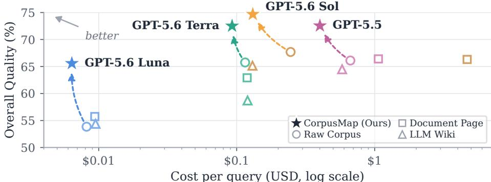  
Figure 1: Overall Quality (Table 1) versus estimated answer-generation cost for CORPUSMAP and the three strongest baselines, averaged equally over all benchmarks.

## 1 INTRODUCTION

Large language models (LLMs) have shown impressive capabilities as agents (OpenAI, 2026a;b; DeepSeek-AI, 2026; Microsoft AI, 2026), and have been widely adopted to answer questions and complete tasks over large document collections (Wang et al., 2024; Huang et al., 2025; Liang et al., 2025), where the necessary evidence is often distributed across multiple documents. For example, determining whether a project is ready to launch may require combining its latest status from a project tracker, an approval recorded over email, requirements from operational documents, and a final decision recorded in meeting notes. Although each source captures part of the answer, none is sufficient in isolation, and the relationships among them may not be stated explicitly in any individual document. Moreover, in practice, these sources are buried among hundreds of thousands of other documents spread across different applications (e.g., issue trackers, shared drives, and chat channels) (Sun et al., 2026b; Choubey et al., 2025), so that the challenge lies not only in utilizing them, but also in locating and retrieving them.

(a) Build Ofline: Connect Documents via Entities  
(b) Reuse per Query: Follow Entity–Document Paths  
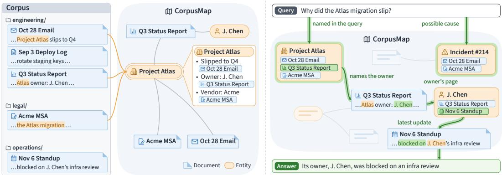  
Figure 2: Overview of CORPUSMAP. (a) Offline, recurring mentions of the same subject across documents in different folders are resolved into shared entities, which connect the documents into a reusable entity–document map. (b) For each query, the agent follows entity–document links in the same map from the entities relevant to the query to gather evidence for the answer. Green marks the walk; each entity card lists its source documents, highlighting the one opened next.

To locate supporting evidence, retrieval-augmented generation (RAG) typically retrieves documents relevant to a user query or instruction (Lewis et al., 2020; Robertson et al., 1994; Karpukhin et al., 2020; Fan et al., 2024) by selecting the top-k documents before starting the model’s reasoning or response. For tasks that require follow-up searches for additional documents, agentic search retrieves evidence over multiple steps (Yao et al., 2023; Liang et al., 2025) and uses tool calls to search the full corpus directly (Subramanian et al., 2026; Li et al., 2026), so that it is no longer limited to what an initial retrieval step returns. Nevertheless, full-corpus access does not by itself make the corpus easy to navigate, since it remains a flat collection of documents, without representing their relationships.

As a result, the agent is left to infer these relationships on its own by searching, reading, and reasoning over multiple sources sequentially, limiting both efficacy and efficiency. For instance, a document’s relevance to a query may be opaque or require corpus-specific knowledge (e.g. meeting notes that record the launch decision under the project’s internal codename), so that searching with the query alone can miss it, despite being accessible. Moreover, because each query is treated independently, the agent must spend a substantial number of tokens to re-read and re-discover these relationships each time. Yet, while different queries require different subsets of these relationships, the relationships themselves (e.g. which documents refer to the same project) remain stable across queries, and could thus be identified in advance and reused. We therefore frame this challenge as a corpus navigation problem, which calls for a persistent navigation layer that exposes reusable cross-document structure while preserving access to the full corpus.

This raises a central design question: which relationships should such a layer expose? Given the challenges above, they should link documents that the query text alone may not reach easily and be identifiable in advance so that they can be reused across queries. In our work, we leverage the fact that documents are naturally generated around common entities, such as people, projects, or products, and design a navigation layer that makes these entities and their related documents explicit. Since entities and their relations are identifiable by the corpus alone (and not any queries), the navigation layer can be built entirely offline, so that query-time inference remains efficient.

To this end, we introduce CORPUSMAP, a novel entity-centric navigation layer that makes these links explicit and reusable. CORPUSMAP is constructed offline by identifying entity mentions within each document, resolving those that refer to the same entity across sources, and representing each resolved entity as an Entity Page that gathers what different documents state about it, attributing each fact to its source, and links to every document that refers to it. Importantly, Entity Pages add a layer over the corpus rather than replacing it, so that the original documents remain available to the model. As illustrated in Figure 2, from any document it reads, the agent can follow the mentioned entities to complementary evidence instead of searching for it again, which can surface otherwise overlooked evidence while reducing the documents to inspect.

We validate CORPUSMAP across multiple LLMs on complex questions spanning multiple documents from three benchmarks, EnterpriseRAG-Bench (Sun et al., 2026b), WixQA (Cohen et al., 2025), and HERB (Choubey et al., 2025), and find that it consistently improves both evidence discovery and answer quality over raw-corpus agentic search and alternative navigation layers (e.g., LLM Wiki (Karpathy, 2026) and Corpus2Skill (Sun et al., 2026a)). Specifically, compared with raw-corpus agentic search, CORPUSMAP improves overall quality by 6.4 to 11.7 points while using 34% to 57% fewer input tokens on average, as summarized in Figure 1. Moreover, we show that CORPUSMAP can be constructed even without the use of LLMs and updated incrementally as the corpus grows and evolves, making it practical and efficient for real deployment environments. Together, these results suggest that improving how a corpus is organized, rather than only how agents search it, is a promising direction for agents operating over large and growing document collections.

## 2 RELATED WORK

Retrieval-Augmented Generation Retrieval-augmented generation (RAG) grounds languagemodel outputs in external knowledge by retrieving the documents or passages most relevant to a query, typically according to lexical or embedding similarity, and conditioning generation on the retrieved context (Robertson et al., 1994; Karpukhin et al., 2020; Lewis et al., 2020; Fan et al., 2024). While simple RAG approaches score each reference independently, thereby discarding any interdocument information that might exist, graph-based approaches such as GraphRAG (Edge et al., 2024) and HippoRAG (Gutierrez et al., 2024; 2025) organize the corpus into a graph of extracted entities and their relations, leveraging their shared context to retrieve content connected across documents. Nevertheless, such structure is used within the retriever rather than exposed to the generator (the LLM), which typically still receives a fixed context selected in a single step (e.g., top-k passages or graph-derived summaries), so that the generator must answer from whatever that retrieval returns and cannot reach a relevant document the retrieval misses, even when the answer depends on it.

Agentic Search and Corpus Interfaces for Agents To move beyond single-step retrieval, iterative and agentic approaches retrieve over multiple steps (Trivedi et al., 2023; Jiang et al., 2023; Asai et al., 2024; Jeong et al., 2024), interleaving planning, search, source inspection, and tool-use throughout an LLM’s reasoning trajectory (Yao et al., 2023; Li et al., 2025; Liang et al., 2025; Li et al., 2026; Salemi et al., 2026). Although these methods improve the query-time search policy, because the corpus itself remains a set of independent documents, any relationships inferred during one query response must be rediscovered for every question. To address this, recent work organizes the corpus into agent-facing structures. LLM-maintained wikis compile documents into cross-linked pages (Karpathy, 2026; Ming et al., 2026), but require the model to decide what becomes a page and how content is merged, decisions that can degrade as the corpus grows (Zhou et al., 2026). Hierarchical skill trees organize documents into topical branches that an agent traverses to reach source documents (Sun et al., 2026a), but assigning each document to only one or a few branches can separate evidence about the same subject across sources.

Entity Extraction, Linking, and Resolution Identifying entities in text has long been studied through named entity recognition (Sang & Meulder, 2003; Lample et al., 2016; Li et al., 2023), recently extended to open entity types by LLMs and lightweight generalist encoders (Zhou et al., 2024; Sainz et al., 2024; Zaratiana et al., 2024), and through entity linking, which grounds mentions in a reference knowledge base such as Wikipedia (Wu et al., 2020; De Cao et al., 2021; Sevgili et al., 2022). When no such knowledge base covers the entities of interest, cross-document coreference and entity resolution instead cluster the mentions that refer to the same entity across sources (Cybulska & Vossen, 2014; Barhom et al., 2019; Li et al., 2020; Papadakis et al., 2021; Cattan et al., 2021), with recent approaches ranging from LLM prompting (Narayan et al., 2022; Peeters & Bizer, 2023; Peeters et al., 2025; Fu et al., 2025) to lightweight zero-shot linkers (Stepanov et al., 2026). Our work builds on this line of research, leveraging these capabilities to organize a corpus around its resolved cross-document entities as navigational anchors for LLM agents.

## 3 METHOD

In this section, we first formalize agentic question answering over large document collections, and then present CORPUSMAP, an entity-centric navigation layer that exposes reusable cross-document evidence paths to the agent, together with the offline protocol that constructs it.

## 3.1 PRELIMINARIES

Task Formulation Let D denote a corpus containing documents drawn from different sources, and let q denote a question whose answer requires combining evidence distributed across multiple documents. We write the agentic question-answering process as $( \hat { a } _ { q } , \hat { D } _ { q } ) = \mathtt { A g e n t } ( q , \mathcal { D } )$ , where $\hat { a } _ { q }$ is the generated answer and $\hat { \mathcal { D } } _ { q } \subseteq \mathcal { D }$ is the selected supporting set. We assess the resulting trajectory along three complementary axes: answer quality, requiring $\hat { a } _ { q }$ to be correct and complete; retrieval quality, requiring $\hat { \mathcal { D } } _ { q }$ to cover the documents the question actually depends on; and efficiency, favoring limited context consumption.

Raw-Corpus Agentic Search We first consider an agent operating directly over the raw corpus, which is exposed as a flat collection of documents. Given q, the agent uses standard shell commands (e.g., find and grep) to search over D, reads promising documents, and updates the selected supporting set $\hat { \mathcal { D } } _ { q }$ as evidence accumulates. However, although this interface gives access to the full corpus, it encodes no relations between documents, so once a relevant document is found, locating related evidence requires further search. Consequently, $\hat { \mathcal { D } } _ { q }$ may omit documents that searching for q does not return, and the context consumed to work out how documents relate is spent again for each subsequent question, even when the same documents are involved.

## 3.2 CORPUSMAP: AN ENTITY-CENTRIC NAVIGATION LAYER

To address this limitation, we introduce CORPUSMAP, which makes relations between documents explicit through a map G of the corpus that is constructed offline from D and shared across questions, so that the agent operates at inference as $\mathtt { A g e n t } ( q , \mathcal { D } ; \mathcal { G } )$ . We build G around the entities mentioned in documents (e.g., people, projects, or incidents), which can be identified in each document independently of any question, so that the map can be built in advance.

Map Representation Let E denote the cross-document entities that CORPUSMAP retains from D, that is, those linked to more than one document, and for each $e \in \mathcal { E }$ , let the document neighbor hood $\mathcal { N } ( e ) \subseteq \mathcal { D }$ contain the documents in which a mention was resolved to e during construction (Section 3.3). We represent each retained entity as an entity node and each document as a document node, and write L for the links between these two node types, so that the map is the bipartite graph

$$
\begin{array} { r } { \mathcal { G } = ( \mathcal { E } \cup \mathcal { D } , \mathcal { L } ) , \qquad \mathcal { L } = \{ ( e , d ) \mid e \in \mathcal { E } , d \in \mathcal { N } ( e ) \} , } \end{array}\tag{1}
$$

where each link $( e , d ) \in { \mathcal { L } }$ connects an entity node to a document node. Since a document is linked to each retained entity it mentions, two documents that share an entity are connected through it, and a document can belong to several neighborhoods at once. Meanwhile, documents linked to no retained entity remain in $\bar { \mathcal { D } }$ as isolated nodes, accessible through raw-corpus search.

Source-Grounded Entity Pages Each entity node $e \in { \mathcal { E } }$ is exposed to the agent as an Entity Page that consolidates what the documents in $\mathcal { N } ( e )$ state about e: a brief overview, key facts each tagged with the document it comes from, the names under which e appears, and links to every document in $\mathcal { N } ( e )$ . Since these facts may come from documents in different sources, a single page can bring together complementary evidence that the raw corpus keeps apart.

Algorithm 1 CORPUSMAP construction protocol.   
Require: Document corpus D, entity-processing backend, page renderer   
Ensure: Entity-centric map G with Entity Pages   
1: C ← INDUCETYPECATALOG(D) ▷ propose from sampled documents, synthesize, verify, revise   
2: $\{ \mathcal { E } _ { d } ^ { \mathrm { l o c a l } } \} _ { d \in \mathcal { D } } $ EXTRACTLOCALENTITIES(D, C) ▷ identify, type, and group mentions per document   
3: R ← ∅, L ← ∅ ▷ empty registry R and link set L   
4: for each document d $l \in \mathcal { D }$ and each local entity $z \in \mathcal { E } _ { d } ^ { \mathrm { l o c a l } }$ do   
5: δ ← RESOLVE(z, R) ▷ retrieve candidates from R and decide   
6: i $\displaystyle \mathsf { f } \delta = \mathtt { L I N K } ( e )$ then   
7: UPDATEENTITY(R, e, z); L ← L ∪ {(e, d)}   
8: else if δ = ADD then   
9: e ← ADDENTITY(R, z); L ← L ∪ {(e, d)}   
10: else   
11: RECORDUNRESOLVED $( z , d )$   
12: end if   
13: end for   
14: E ← CROSSDOCUMENTENTITIES $( \mathcal { R } , \mathcal { L } )$ ▷ linked to at least two documents   
15: ${ \mathcal { L } } \gets \{ ( e , d ) \in { \mathcal { L } } \mid e \in { \mathcal { E } } \}$   
16: for each entity $e \in { \mathcal { E } }$ do   
17: $\mathcal { N } ( e )  \mathit { \check { \{ d \in \mathcal { D } } }  | ( e , d ) \in \mathcal { L } \}$   
18: p<sub>e</sub> ← RENDERENTITYPAGE(e, N (e)) ▷ facts about e grounded in and linked to $\mathcal { N } ( e )$   
19: end for   
20: ${ \mathcal { G } } \gets ( { \mathcal { E } } \cup { \mathcal { D } } , { \mathcal { L } } )$   
21: return G with $\{ p _ { e } \} _ { e \in \mathcal { E } }$

## 3.3 CONSTRUCTING CORPUSMAP

We construct G offline in the four stages summarized in Algorithm 1.

Cataloging (Line 1) The entity types worth extracting, such as products, incidents, or configuration flags, vary from one corpus to another and cannot be exhaustively specified in advance. We therefore induce a catalog C of these types from the corpus itself with an LLM, proposing a candidate catalog from each of several small sets of sampled documents, synthesizing these candidates into one, and verifying and revising the result; the resulting catalog, which specifies a name, definition, identity criteria, and observed examples for each type, is then fixed for the remaining stages.

Extraction (Line 2) Since the catalog specifies the kinds of entities in the map (e.g., Project) but not the instances present in the corpus (e.g., “Project Atlas”), we use it together with the surrounding document context to identify and type entity mentions, grouping those denoting the same subject within a document into a single document-local entity.

Resolution (Lines 3–13) We ground every extracted name in its source-text occurrence before resolving the local entities of each document, in turn, against a shared registry that starts out empty: for each of them, we retrieve plausible registry entries and weigh the current document against the candidate evidence to either LINK the observation to an existing entry, ADD a new entity, or leave it UNRESOLVED. Each LINK or ADD records a grounded entity–document link, whereas UNRESOLVED observations create none.

Rendering (Lines 14–21) We keep only the cross-document entities, that is, those linked to at least two documents, since only these provide reusable navigational paths, and render the neighborhood N(e) of each retained entity as its Entity Page. With the source documents and the links between them, these pages yield the map G of Equation (1). The Extraction, Resolution, and Rendering stages can be instantiated with an LLM or with off-the-shelf and deterministic alternatives.

## 3.4 NAVIGATING CORPUSMAP

We now describe how the agent accesses the map at inference. Specifically, each Entity Page is stored as a file alongside the raw documents and lists the file paths of its linked documents, so that the agent can read and search the map with the same tools as the raw corpus. Along with the question, the agent receives, as candidates, the file paths of the documents linked to the Entity Pages relevant to the question, and decides which of them to read. The agent can further search both Entity Pages and documents, following a link from a page by reading a listed file, or from a document by searching for the pages that list it (Figure 2).

## 4 EXPERIMENTAL SETUP

We now describe the benchmarks and evaluation, baselines, and implementation details.

Benchmarks and Evaluation To evaluate CORPUSMAP, we use three benchmarks that contain questions requiring evidence distributed across multiple documents: EnterpriseRAG-Bench (Sun et al., 2026b), WixQA (Cohen et al., 2025), and HERB (Choubey et al., 2025). Specifically, we use the 80 questions in the categories of EnterpriseRAG-Bench that consist entirely of multi-document questions, the 79 multi-document questions of WixQA, and the 238 content-based questions of HERB, which ask about information stated across multiple documents. For the corpora, we use fixed sets of 2,819 and 6,365 documents for EnterpriseRAG-Bench and HERB, respectively, both including all gold documents, and the full set of 6,221 articles for WixQA. Following the three axes in Section 3.1, we evaluate (1) answer quality: correctness, completeness, factuality, and content; (2) retrieval quality: document recall and context recall; and (3) efficiency: the input tokens accumulated over the full agent trajectory per question.

Baselines and Our Method We compare CORPUSMAP against RAW CORPUS and four baselines that organize the same corpus around different units, while the original documents remain accessible to the agent in every method. RAW CORPUS adds no navigation layer to the documents. DOCU-MENT PAGE represents each document by an LLM-generated page of its key facts, GROUP PAGE consolidates the documents within each group defined by the corpus itself (e.g., its folders) into a single page, and LLM WIKI (Karpathy, 2026) lets the LLM freely write cross-linked pages over the corpus. CORPUS2SKILL (Sun et al., 2026a) organizes the corpus into a topical hierarchy of LLMsummarized document clusters. CORPUSMAP (Ours) organizes the corpus into an entity-centric map of Entity Pages linked to their source documents. We also report GOLD DOCUMENTS (OR-ACLE), which provides only the gold documents to the model as reference for the model capability ceiling under idealized retrieval.

Implementation Details For the main results, we use four GPT models spanning a wide range of costs, GPT-5.5 (OpenAI, 2026a) and GPT-5.6 Luna, Terra, and Sol (OpenAI, 2026b), where the same LLM constructs the artifacts of each method and serves as the agent answering the questions. For the analyses beyond the main results, we mainly use the most and least expensive of them, GPT-5.5 and GPT-5.6 Luna. We additionally use DeepSeek-V4-Pro (DeepSeek-AI, 2026) and MAI-Thinking-1 (Microsoft AI, 2026), as well as the open-weight Qwen3.8-27B (Qwen Team, 2026). For LLM-judged metrics, we use GPT-5.6 Sol. Following Sun et al. (2026b), we use a terminal-based agent that navigates the corpus through shell commands, under their per-question execution budget. Please refer to Appendix A for more details.

## 5 EXPERIMENTAL RESULTS AND ANALYSES

We first examine the effectiveness of CORPUSMAP, and then analyze its practical aspects, with further analyses provided in Appendix B.

## 5.1 EFFECTIVENESS OF CORPUSMAP

Main Results Table 1 presents the main results, showing that CORPUSMAP consistently achieves the best answer and retrieval quality across all benchmarks and LLMs, with significant overall gains over every baseline (Table 6), at a lower average cost per query than raw-corpus agentic search (Figure 1). Notably, the four baselines that organize the corpus in other ways do not consistently improve over RAW CORPUS, indicating that simply adding a navigation layer does not guarantee improvement. Moreover, CORPUSMAP improves quality while reducing tokens, with the largest savings for GPT-5.5 and GPT-5.6 Sol, the two most expensive LLMs. Also, CORPUSMAP substantially narrows the gap to the non-comparable Oracle, reflecting its effectiveness in gathering cross-document evidence. Finally, CORPUSMAP also outperforms RAW CORPUS with fewer tokens on the remaining questions of EnterpriseRAG-Bench, most of which are grounded in a single document (Table 5), indicating that the map remains beneficial even when cross-document evidence is not required.

Table 1: Main results across EnterpriseRAG-Bench, WixQA, and HERB with GPT-5.5 and GPT-5.6 models, as means ± standard deviations over three runs. Overall reports dataset-balanced quality and geometric-mean input-token ratios to Raw Corpus within each LLM. Best and second-best effectiveness scores per LLM among retrieval methods are bolded and underlined.
<table><tr><td rowspan="2">Method</td><td colspan="2">EnterpriseRAG-Bench</td><td colspan="3">WixQA</td><td colspan="2">HERB</td><td colspan="2">Overall</td></tr><tr><td>Doc. Rec. ↑ Correct. ↑ Complete. ↑ Tokens ↓ Ctx. Rec. ↑</td><td></td><td></td><td>Fact. ↑</td><td>Tokens ↓</td><td>Content ↑</td><td>Tokens ↓</td><td></td><td>Quality ↑ Rel. Tok. ↓</td></tr><tr><td>RAW CORPUS</td><td>61.62 ± 1.66 62.08 ± 4.12 73.11 ± 0.98</td><td>206.5k</td><td>73.31 ± 0.75 67.51 ± 0.39</td><td></td><td>337.2k</td><td>62.31 ± 0.59</td><td>598.4k</td><td>66.11</td><td>1.00×</td></tr><tr><td>DOCUMENT PAGE</td><td> $6 4 . 1 8 \pm 1 . 5 5 ~ \overline { { 5 7 . 5 0 } } \pm 1 . 0 2 ~ \overline { { 6 8 . 9 7 } } \pm 1 . 8 3$ </td><td>175.6k</td><td>77.85 ± 1.18 66.98 ± 1.90</td><td>288.0k</td><td></td><td>63.26 ± 0.14</td><td>680.9k</td><td>66.41</td><td>0.94×</td></tr><tr><td>GROUP PAGE 5</td><td> $6 4 . 7 5 \pm 0 . 9 6 4 8 . 7 5 \pm 2 . 7 0 6 2 . 6 2 \pm 2 . 5 8$ </td><td>423.0k</td><td>60.86 ± 3.68 62.24 ± 4.45</td><td></td><td>1,125.8k</td><td>62.97 ± 1.66</td><td>392.9k</td><td>61.07</td><td>1.65×</td></tr><tr><td>LLM WIKI</td><td> ${ \overline { { 6 3 . 1 5 } } } \pm 1 . 5 5 \ 5 6 . 6 7 \pm 2 . 3 6 \ 6 7 . 7 4 \pm 1 . 7 7$ </td><td>192.4k</td><td>73.73 ± 0.52 65.19 ± 0.26</td><td></td><td>140.9k</td><td>61.49 ± 0.76</td><td>387.0k</td><td>64.49</td><td>0.63×</td></tr><tr><td>G CORPUS2SKILL</td><td> $4 9 . 3 9 \pm 2 . 3 2 ~ 4 7 . 5 0 \pm 2 . 7 0 ~ 5 7 . 2 9 \pm 1 . 0 1$ </td><td>88.8k</td><td> $6 5 . 9 3 \pm 2 . 0 7 6 0 . 3 4 \pm 0 . 3 9$ </td><td></td><td>76.0k</td><td>21.94 ± 0.79</td><td>180.9k</td><td>45.49</td><td>0.31×</td></tr><tr><td>CORPUSMAP (Ours)</td><td> $7 6 . 1 7 \pm 0 . 3 0 7 3 . 7 5 \pm 1 . 7 7 7 9 . 8 8 \pm 1 . 0 0$ </td><td>88.1k</td><td>82.70 ± 0.79 70.68 ± 0.83</td><td></td><td>74.5k</td><td>64.37 ± 0.89</td><td>494.7k</td><td>72.55</td><td>0.43×</td></tr><tr><td>Gold Documents (Oracle) 100.00 ± 0.00 87.08 ± 2.12 81.01 ± 0.59</td><td></td><td>7.1k</td><td>85.97 ± 0.30 79.22 ± 0.30</td><td>2.1k</td><td></td><td>66.90 ± 0.84</td><td>11.4k</td><td>79.62</td><td>0.02×</td></tr><tr><td colspan="2"> $5 6 . 4 0 \pm 0 . 7 9 ~ 6 0 . 4 2 \pm 5 . 1 4 ~ 7 3 . 1 2 \pm 0 . 9 6$ </td><td>80.7k</td><td>47.36 ± 1.66 59.39 ± 1.04</td><td></td><td>129.3k</td><td></td><td></td><td></td><td></td></tr><tr><td>RAW CORPUS DOCUMENT PAGE</td><td>56.96 ± 2.11 50.42 ± 3.28 68.78 ± 2.40</td><td>160.0k</td><td>61.92 ± 0.91 61.18 ± 2.23</td><td></td><td>88.7k</td><td>44.86 ± 0.37 46.91 ± 0.49</td><td>219.4k 222.4k</td><td>53.85 55.73</td><td>1.00×</td></tr><tr><td>GROUP PAGE</td><td>53.95 ± 1.82 42.08 ± 1.18 58.82 ± 1.30</td><td>347.6k</td><td>43.57 ± 0.79 55.59 ± 2.71</td><td></td><td>145.3k</td><td>41.47 ± 0.24</td><td>119.1k</td><td>47.55</td><td>1.11×</td></tr><tr><td>uua LLM WIKI</td><td>54.54 ± 3.72 49.17 ± 2.12 65.90 ± 1.68</td><td>144.5k</td><td>58.12 ± 2.15 59.70 ± 2.07</td><td></td><td>117.3k</td><td>47.71 ± 0.55</td><td>213.3k</td><td>54.39</td><td>1.38× 1.16×</td></tr><tr><td>CORPUS2SKILL</td><td>35.73 ± 1.25 31.25 ± 1.77 49.90 ± 0.20</td><td>102.4k</td><td>56.33 ± 3.66 53.80 ± 3.05</td><td></td><td>56.2k</td><td>17.78 ± 0.55</td><td>145.7k</td><td>37.27</td><td>0.72×</td></tr><tr><td>CORPUSMAP (Ours)</td><td>75.11 ± 0.27 67.08 ±4.25 77.42 ±1.45</td><td>60.1k</td><td>76.90 ± 0.93 69.30 ± 0.26</td><td></td><td>41.0k</td><td>50.45 ± 0.27</td><td>254.2k</td><td>65.58</td><td>0.65×</td></tr><tr><td colspan="2">Gold Documents (Oracle) 100.00 ± 0.00 82.50 ± 4.68 76.90 ± 0.57</td><td>7.1k</td><td>85.76 ± 0.52 75.53 ± 0.60</td><td></td><td>2.1k</td><td>72.90 ± 0.66</td><td>11.4k</td><td>80.00</td><td>0.04×</td></tr><tr><td>RAW CORPUS</td><td>67.13 ± 1.13 64.58 ± 2.36 77.11 ± 0.81</td><td>70.9k</td><td>65.08 ± 1.42 62.45 ± 0.91</td><td></td><td>354.6k</td><td>63.88 ± 0.74</td><td></td><td></td><td></td></tr><tr><td>DOCUMENT PAGE</td><td>62.16 ± 3.32 56.67 ± 4.12 69.39 ± 3.41</td><td>191.7k</td><td>72.78 ± 2.37 64.77 ± 1.47</td><td></td><td>138.9k</td><td>57.22 ± 2.15</td><td>288.3k 274.9k</td><td>65.75 62.91</td><td>1.00×</td></tr><tr><td>GROUP PAGE</td><td> $6 2 . 0 0 \pm 1 . 6 9 3 8 . 3 3 \pm 2 . 9 5 5 2 . 5 7 \pm 1 . 1 0$ </td><td>355.3k</td><td>26.69 ± 6.88 43.14 ± 5.67</td><td></td><td>324.6k</td><td>45.62 ± 0.49</td><td>150.7k</td><td>43.84</td><td>1.00× 1.34×</td></tr><tr><td>Terr LLM WIKI</td><td>58.77 ± 0.66 43.33 ± 2.57 64.58 ± 0.31</td><td>161.6k</td><td>66.03 ± 2.10 61.60 ± 3.03</td><td></td><td>129.5k</td><td>56.77 ± 1.41</td><td>390.7k</td><td>58.71</td><td>1.04×</td></tr><tr><td>CORPUS2SKILL</td><td>45.84 ± 0.43 44.58 ± 2.57 55.97 ± 0.38</td><td>153.7k</td><td>67.30 ± 1.94 57.81 ± 1.94</td><td></td><td>72.4k</td><td>20.23 ± 0.43</td><td>185.8k</td><td>43.86</td><td>0.66×</td></tr><tr><td>CORPUSMAP (Ours)</td><td> $7 3 . 0 8 \pm 1 . 9 8 7 3 . 7 5 \pm 1 . 7 7 7 9 . 8 3 \pm 0 . 9 2$ </td><td>76.2k</td><td>80.91 ± 1.22 71.73 ± 0.98</td><td></td><td>96.2k</td><td>65.65 ± 0.70</td><td>289.4k</td><td>72.51</td><td>0.66×</td></tr><tr><td colspan="2">Gold Documents (Oracle) 100.00 ± 0.00 82.08 ± 0.59 81.17 ± 0.36</td><td>7.1k</td><td>85.55 ± 0.39 77.64 ± 0.98</td><td></td><td>2.1k</td><td>70.37 ± 0.83</td><td>11.4k</td><td>79.90</td><td></td></tr><tr><td></td><td></td><td></td><td></td><td></td><td></td><td></td><td></td><td></td><td>0.03×</td></tr><tr><td>RAW CORPUS DOCUMENT PAGE</td><td> $6 4 . 7 9 \pm 2 . 4 3 6 7 . 0 8 \pm 3 . 2 8 7 6 . 7 5 \pm 1 . 8 5$  67.64 ± 0.94 67.50 ± 2.04 72.13 ± 1.52</td><td>55.5k 55.2k</td><td>69.30 ± 1.34 68.35 ± 1.81 73.84 ± 1.33 70.78 ± 1.76</td><td></td><td>282.3k</td><td>64.69 ± 1.42 61,496.8k 57.53 ± 3.54</td><td>430.2k 5,003.6k</td><td>67.69</td><td>1.00×</td></tr><tr><td>GROUP PAGE</td><td>59.31 ± 2.44 43.75 ± 2.70 56.91 ± 3.42</td><td>188.5k</td><td>18.67 ± 0.26 39.77 ± 1.94</td><td></td><td>458.6k</td><td>11.14 ± 0.52</td><td>59.0k</td><td>66.31 31.23</td><td>3.94×</td></tr><tr><td>S LLM WIKI</td><td>60.70 ± 1.08 59.17 ± 4.12 69.83 ± 0.42</td><td>53.2k</td><td>70.46 ± 1.04 68.14 ± 0.54</td><td></td><td>68.7k</td><td>62.91 ± 1.74</td><td>208.5k</td><td>65.15</td><td>0.91× 0.48×</td></tr><tr><td>CORPUS2SKILL</td><td> $4 5 . 1 0 \pm 0 . 7 2 ~ 4 2 . 0 8 \pm 1 . 1 8 ~ 5 3 . 7 8 \pm 1 . 8 9$ </td><td>126.4k</td><td> $6 4 . 6 6 \pm 1 . 4 2 5 9 . 4 9 \pm 1 . 6 1$ </td><td></td><td>99.1k</td><td>24.24 ± 0.70</td><td>159.0k</td><td>44.44</td><td>0.67×</td></tr><tr><td>CORPUSMAP (Ours)</td><td>71.46 ± 0.41 80.83 ± 0.59 81.80 ± 0.60</td><td>56.2k</td><td>83.33 ± 0.83 72.78 ± 1.18</td><td></td><td>52.0k</td><td>67.97 ± 1.08</td><td>186.3k</td><td>74.68</td><td></td></tr><tr><td colspan="2">Gold Documents (Oracle) 100.00 ± 0.00 80.42 ± 1.18 80.85 ± 0.54</td><td>7.1k</td><td> $8 5 . 9 7 \pm 0 . 6 5 7 9 . 8 5 \pm 0 . 3 0$ </td><td></td><td>2.1k</td><td>69.08 ± 0.77</td><td>11.4k</td><td>79.69</td><td>0.43× 0.03×</td></tr></table>

Table 2: Overall Quality with LLMs from other model families on EnterpriseRAG-Bench.  
Table 3: Retrieval-based approaches on EnterpriseRAG-Bench.
<table><tr><td rowspan="2">Method</td><td colspan="2">DeepSeek</td><td colspan="2">MAI</td></tr><tr><td>Quality</td><td>Tokens</td><td>Quality</td><td>Tokens</td></tr><tr><td>RAW CORPUS</td><td>68.02</td><td>1,349.4k</td><td>34.06</td><td>129.6k</td></tr><tr><td>DOCUMENT PAGE</td><td>43.18</td><td>4,047.0k</td><td>38.56</td><td>208.4k</td></tr><tr><td>GROUP PAGE</td><td>59.24</td><td>1,965.5k</td><td>32.81</td><td>421.7k</td></tr><tr><td>LLM WIKI</td><td>57.99</td><td>3,523.8k</td><td>35.57</td><td>109.8k</td></tr><tr><td>CORPUS2SKILL</td><td>49.72</td><td>628.7k</td><td>21.33</td><td>120.4k</td></tr><tr><td>CORPUSMAP (Ours)</td><td>71.11</td><td>1,043.3k</td><td>45.07</td><td>158.8k</td></tr></table>

<table><tr><td></td><td colspan="2">Quality</td></tr><tr><td>Method</td><td>GPT-5.5</td><td>Luna</td></tr><tr><td>BM25</td><td>63.66</td><td rowspan="3">60.78 58.84</td></tr><tr><td>DENSE HIPPORAG</td><td>65.05</td></tr><tr><td></td><td>64.66 61.74</td></tr><tr><td>GRAPHRAG</td><td>47.95</td><td>43.46</td></tr><tr><td>RAW CORPUS</td><td>65.60</td><td>63.31</td></tr><tr><td>CORPUSMAP (Ours)</td><td>76.60</td><td>73.20</td></tr></table>

Generalization to Other Model Families To examine whether the effectiveness of CORPUSMAP generalizes beyond the GPT family, we further evaluate it with DeepSeek-V4-Pro and MAI-Thinking-1, and report the results in Table 2. We find that CORPUSMAP again achieves the best Overall Quality with both LLMs, whereas the baselines that organize the corpus in other ways do not consistently improve over RAW CORPUS, as observed with the GPT models. This indicates that the benefit of exposing cross-document connections through the entity-centric map is not tied to a particular model family, but carries over to LLMs of different architectures.

Comparison with Retrieval-Based Approaches We also compare against BM25 (Robertson et al., 1994), dense retrieval (OpenAI, 2024), HippoRAG (Gutierrez et al., 2024; 2025), and GraphRAG (Edge et al., 2024) under the retrieve-then-generate paradigm, where the LLM answers directly from a fixed amount of context retrieved for the question, without accessing the full corpus itself. As shown in Table 3, CORPUSMAP outperforms all of them with both LLMs, including the graph-based HippoRAG and GraphRAG. This suggests that answering from a retrieved context alone is limited by what the retrieval returns, whereas exposing cross-document connections to the agent lets it continue to gather the missing evidence.

Table 4: Overall Quality of map reuse across LLMs on EnterpriseRAG-Bench. Rows denote the map builder, columns the answering LLM, and Cost the one-time construction cost.
<table><tr><td>Map Builder</td><td>GPT-5.5</td><td>Sol</td><td>Luna</td><td>DeepSeek</td><td>Cost</td></tr><tr><td>RAW CORPUS</td><td>65.60</td><td>69.54</td><td>63.31</td><td>68.02</td><td></td></tr><tr><td>GPT-5.5</td><td>76.60</td><td>75.31</td><td>73.79</td><td>68.51</td><td>≤$4,732.14</td></tr><tr><td>Sol</td><td>77.39</td><td>78.03</td><td>73.60</td><td>71.06</td><td>≤$2,681.76</td></tr><tr><td>Luna</td><td>73.59</td><td>74.68</td><td>73.20</td><td>70.90</td><td>≤$74.65</td></tr><tr><td>DeepSeek</td><td>73.06</td><td>73.11</td><td>69.42</td><td>71.11</td><td>$310.58</td></tr></table>

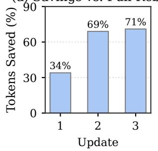

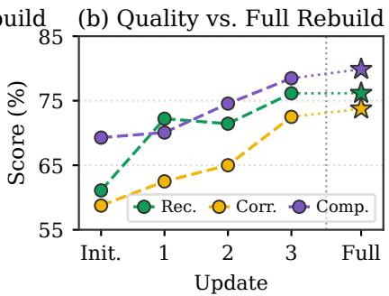

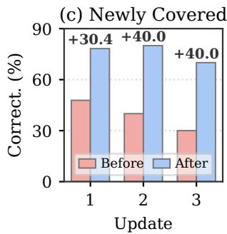  
Figure 3: Incremental map updates on EnterpriseRAG-Bench with GPT-5.5: (a) tokens saved over a full rebuild, (b) quality across map states, and (c) correctness on newly covered questions.

Case Study We present a case study example in Table 10. Given the question of how signing is represented in the v1 specification of a manifest, the answer lies in two documents stored in different sources: an earlier draft and the v1 specification that revised it. CORPUS2SKILL, which organizes the corpus into a tree structure, places both documents under a single cluster, and its agent explores several other branches but fails to locate them, concluding that no such document exists. In contrast, CORPUSMAP links each document to several Entity Pages, and its agent navigates between Entity Pages and documents: (1) opening the page of a work item that links the draft, (2) reading the draft and searching the Entity Pages with its terms, and (3) opening the Serving Runtime page that links the v1 specification and reading it. This path enables the agent to answer with the fields defined in v1, highlighting how linking documents through the entities they share offers multiple paths to the same evidence, whereas a tree structure places each document mainly under a single branch.

## 5.2 PRACTICAL ASPECTS OF CORPUSMAP

We first examine how the map, once constructed, is reused across queries, LLMs, and corpus updates, and then whether it remains effective when constructed with off-the-shelf tools, over larger corpora, and with open-weight models.

Amortized Construction Cost In addition to the cost per query, CORPUSMAP requires a onetime cost to construct the map, which is then shared by all subsequent queries over the same corpus. To see how this cost is amortized, we add the construction cost, divided by the number of queries the map serves, to the cost per query of CORPUSMAP. As shown in Figure 5, although the amortized cost of CORPUSMAP is initially higher than that of RAW CORPUS, it decreases as more queries are served and becomes lower beyond a certain number of queries for every LLM. This suggests that the construction cost of the map is recovered as it is reused across queries.

Map Reuse Across LLMs We further examine whether a map constructed by one LLM can be reused by another LLM at inference time, and report the results in Table 4. We find that even the map constructed by the least expensive LLM, at a small fraction of the cost of the most expensive one, improves the overall quality over RAW CORPUS for every answering LLM. This suggests that the map remains useful beyond the LLM that constructs it, even across model families, allowing it to be built once with an inexpensive LLM and reused by stronger ones.

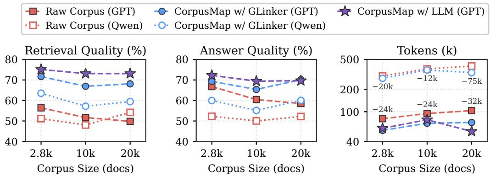  
Figure 4: Corpus scaling on EnterpriseRAG-Bench with GPT-5.6 Luna and Qwen3.8-27B.

Incremental Map Updates To examine whether CORPUSMAP can be maintained as new documents arrive, we order the EnterpriseRAG-Bench corpus chronologically by the timestamps provided in the benchmark and incrementally extend the map over its growing prefix, reusing the existing registry and re-rendering only the Entity Pages whose linked documents change, instead of rebuilding the map from scratch, while the agent can search the full raw corpus at every state. As shown in Figure 3(a), each incremental update saves a substantial fraction of the construction tokens of a full rebuild, and Figure 3(b) shows that quality improves overall with each update, with the final map performing comparably to a full rebuild over the same documents. Also, Figure 3(c) shows that the questions whose evidence is incorporated by an update improve after it, even though they were already searchable in the raw corpus, indicating that incorporating new documents into the map matters beyond making them accessible.

Off-the-Shelf Entity Construction We instantiate the Extraction, Resolution, and Rendering stages of CORPUSMAP with off-the-shelf and deterministic components, where GLinker (Stepanov et al., 2026) extracts and links entity mentions with open GLiNER models and Entity Pages are rendered from the extracted evidence without any LLM calls. As shown in Figure 4, the resulting map is comparably effective to the LLM-constructed map, and outperforms RAW CORPUS on every metric at a lower cost, indicating that CORPUSMAP can be instantiated with off-the-shelf tools as well as with LLMs.

Scaling Corpora We further examine CORPUSMAP as the corpus grows, expanding the EnterpriseRAG-Bench corpus with distractor documents while keeping all gold documents. As shown in Figure 4, CORPUSMAP outperforms RAW CORPUS at every corpus size while using fewer tokens, so that its advantage persists at scale.

Open-Weight Models We further evaluate CORPUSMAP with the open-weight Qwen3.8-27B over the same map constructed with GLinker. As shown in Figure 4, CORPUSMAP improves over RAW CORPUS with Qwen on every metric and corpus size while using fewer tokens, indicating that its benefits are not limited to proprietary LLMs.

## 6 CONCLUSION

In this work, we introduced CORPUSMAP, a navigation layer over the corpus anchored on its recurring entities, which is designed to address a practical challenge: access to a large, heterogeneous corpus does not by itself provide guidance on where to search or which sources to inspect. CORPUSMAP organizes the corpus around recurring entities by resolving references to the same entity across sources and creating entity-centered representations that link key facts about each entity to the original documents, providing shared anchors that connect related sources across folders and repositories. Across our experiments, we evaluate 7 models, 3 benchmark datasets, and 5 comparison methods to demonstrate that CORPUSMAP substantially improves answer quality and evidence discovery while simultaneously reducing per-query token costs. We envision CORPUSMAP as a foundation for a broader shift in agentic search over large document collections, from repeatedly searching isolated sources to navigating and reasoning over connected knowledge.

## AI USE STATEMENT

In this work, we used generative AI tools to assist with implementing and debugging the code for our experiments and with running the experiments and analyzing their outputs. We have not used generative AI tools for idea proposal or method development, and proof-related tasks are not applicable to this work. Additionally, we used generative AI tools to assist with editing the paper, including revising text based on the authors’ content. We have reviewed all AI-assisted work and verified the AI-assisted code and analyses against the experimental outputs. We take responsibility for the final content of this work, including text, claims or artifacts produced with the aid of generative AI.

## ETHICS STATEMENT

Our work aims to enable LLM agents to answer questions whose evidence is distributed across mul tiple documents of large corpora, such as those of enterprises, and we believe that CORPUSMAP can contribute to more effective and efficient access to the knowledge scattered across such corpora. However, we also acknowledge potential risks of our framework. For example, since CORPUSMAP consolidates the information about each entity (e.g., a person or a project) from multiple documents into a single Entity Page, it may aggregate private or sensitive information that is otherwise dispersed across the corpus, or expose documents to users who are not permitted to access them. Also, depending on the underlying corpora and LLMs, the constructed map and the generated answers may contain harmful or biased content. To address such risks, in real-world deployment, it would be necessary to construct and serve the map in accordance with the access permissions of the corpus (e.g., separately per permission level) and to incorporate safeguards (such as privacy and content filters) for the responsible and safe use of our framework.

## REPRODUCIBILITY STATEMENT

The details of our experiments are described in Sections 3 and 4, including the construction protocol of CORPUSMAP in Algorithm 1, and in Appendix A, which specifies the questions and corpora we use from each benchmark, the evaluation metrics, the agent, and the period of the API calls, while the prompts used to construct CORPUSMAP are provided in Appendix C.

## REFERENCES

Akari Asai, Zeqiu Wu, Yizhong Wang, Avirup Sil, and Hannaneh Hajishirzi. Self-RAG: Learning to retrieve, generate, and critique through self-reflection. In The Twelfth International Conference on Learning Representations, ICLR 2024, Vienna, Austria, May 7-11, 2024. OpenReview.net, 2024. URL https://openreview.net/forum?id=hSyW5go0v8.

Shany Barhom, Vered Shwartz, Alon Eirew, Michael Bugert, Nils Reimers, and Ido Dagan. Revisiting joint modeling of cross-document entity and event coreference resolution. In Anna Korhonen, David R. Traum, and Llu´ıs Marquez (eds.),\` Proceedings of the 57th Conference of the Association for Computational Linguistics, ACL 2019, Florence, Italy, July 28- August 2, 2019, Volume 1: Long Papers, pp. 4179–4189. Association for Computational Linguistics, 2019. doi: 10.18653/V1/P19-1409. URL https://doi.org/10.18653/v1/p19-1409.

Arie Cattan, Alon Eirew, Gabriel Stanovsky, Mandar Joshi, and Ido Dagan. Cross-document coreference resolution over predicted mentions. In Chengqing Zong, Fei Xia, Wenjie Li, and Roberto Navigli (eds.), Findings of the Association for Computational Linguistics: ACL/IJCNLP 2021, Online Event, August 1-6, 2021, volume ACL-IJCNLP 2021 of Findings of ACL, pp. 5100–5107. Association for Computational Linguistics, 2021. doi: 10.18653/V1/2021.FINDINGS-ACL.453. URL https://doi.org/10.18653/v1/2021.findings-acl.453.

Prafulla Kumar Choubey, Xiangyu Peng, Shilpa Bhagavath, Kung-Hsiang Huang, Caiming Xiong, and Chien-Sheng Wu. Benchmarking deep search over heterogeneous enterprise data. In Saloni Potdar, Lina Maria Rojas-Barahona, and Sebastien Montella (eds.),´ Proceedings of the 2025 Conference on Empirical Methods in Natural Language Processing, EMNLP 2025 - Industry Track, Suzhou, China, November 4-9, 2025, pp. 501–517. Association for Computational Linguistics, 2025. doi: 10.18653/V1/2025.EMNLP-INDUSTRY.34. URL https://doi.org/ 10.18653/v1/2025.emnlp-industry.34.

Dvir Cohen, Lin Burg, Sviatoslav Pykhnivskyi, Hagit Gur, Stanislav Kovynov, Olga Atzmon, and Gilad Barkan. WixQA: A multi-dataset benchmark for enterprise retrieval-augmented generation. arXiv preprint arXiv:2505.08643, abs/2505.08643, 2025. doi: 10.48550/ARXIV.2505.08643. URL https://doi.org/10.48550/arXiv.2505.08643.

Agata Cybulska and Piek Vossen. Using a sledgehammer to crack a nut? lexical diversity and event coreference resolution. In Nicoletta Calzolari, Khalid Choukri, Thierry Declerck, Hrafn Loftsson, Bente Maegaard, Joseph Mariani, Asuncion Moreno, Jan Odijk, and Stelios Piperidis´ (eds.), Proceedings of the Ninth International Conference on Language Resources and Evaluation, LREC 2014, Reykjavik, Iceland, May 26-31, 2014, pp. 4545–4552. European Language Resources Association (ELRA), 2014. URL http://www.lrec-conf.org/proceedings/ lrec2014/summaries/840.html.

Nicola De Cao, Gautier Izacard, Sebastian Riedel, and Fabio Petroni. Autoregressive entity retrieval. In 9th International Conference on Learning Representations, ICLR 2021, Virtual Event, Austria, May 3-7, 2021. OpenReview.net, 2021. URL https://openreview.net/forum?id= 5k8F6UU39V.

DeepSeek-AI. DeepSeek-V4: Towards highly efficient million-token context intelligence. arXiv preprint arXiv:2606.19348, abs/2606.19348, 2026. doi: 10.48550/ARXIV.2606.19348. URL https://doi.org/10.48550/arXiv.2606.19348.

Darren Edge, Ha Trinh, Newman Cheng, Joshua Bradley, Alex Chao, Apurva Mody, Steven Truitt, and Jonathan Larson. From local to global: A graph RAG approach to query-focused summarization. arXiv preprint arXiv:2404.16130, abs/2404.16130, 2024. doi: 10.48550/ARXIV.2404. 16130. URL https://doi.org/10.48550/arXiv.2404.16130.

Wenqi Fan, Yujuan Ding, Liangbo Ning, Shijie Wang, Hengyun Li, Dawei Yin, Tat-Seng Chua, and Qing Li. A survey on RAG meeting LLMs: Towards retrieval-augmented large language models. In Ricardo Baeza-Yates and Francesco Bonchi (eds.), Proceedings of the 30th ACM SIGKDD Conference on Knowledge Discovery and Data Mining, KDD 2024, Barcelona, Spain, August 25-29, 2024, pp. 6491–6501. ACM, 2024. doi: 10.1145/3637528.3671470. URL https: //doi.org/10.1145/3637528.3671470.

Jiajie Fu, Haitong Tang, Arijit Khan, Sharad Mehrotra, Xiangyu Ke, and Yunjun Gao. In-context clustering-based entity resolution with large language models: A design space exploration. Proc. ACM Manag. Data, 3(4):252:1–252:28, 2025. doi: 10.1145/3749170. URL https://doi. org/10.1145/3749170.

Bernal Jimenez Gutierrez, Yiheng Shu, Yu Gu, Michihiro Yasunaga, and Yu Su. HippoRAG: Neurobiologically inspired long-term memory for large language models. In Amir Globerson, Lester Mackey, Danielle Belgrave, Angela Fan, Ulrich Paquet, Jakub M. Tomczak, and Cheng Zhang (eds.), Advances in Neural Information Processing Systems 37: Annual Conference on Neural Information Processing Systems 2024, NeurIPS 2024, Vancouver, BC, Canada, December 10 - 15, 2024, 2024. URL http://papers.nips.cc/paper\_files/paper/2024/hash/ 6ddc001d07ca4f319af96a3024f6dbd1-Abstract-Conference.html.

Bernal Jimenez Gutierrez, Yiheng Shu, Weijian Qi, Sizhe Zhou, and Yu Su. From RAG to memory: Non-parametric continual learning for large language models. In Aarti Singh, Maryam Fazel, Daniel Hsu, Simon Lacoste-Julien, Felix Berkenkamp, Tegan Maharaj, Kiri Wagstaff, and Jerry Zhu (eds.), Forty-second International Conference on Machine Learning, ICML 2025, Vancouver, BC, Canada, July 13-19, 2025, volume 267 of Proceedings of Machine Learning Research. PMLR / OpenReview.net, 2025. URL https://proceedings.mlr.press/ v267/gutierrez25a.html.

Yuxuan Huang, Yihang Chen, Haozheng Zhang, Kang Li, Meng Fang, Linyi Yang, Xiaoguang Li, Lifeng Shang, Songcen Xu, Jianye Hao, Kun Shao, and Jun Wang. Deep research agents: A systematic examination and roadmap. arXiv preprint arXiv:2506.18096, abs/2506.18096, 2025. doi: 10.48550/ARXIV.2506.18096. URL https://doi.org/10.48550/arXiv.2506. 18096.

Soyeong Jeong, Jinheon Baek, Sukmin Cho, Sung Ju Hwang, and Jong Park. Adaptive-RAG: Learning to adapt retrieval-augmented large language models through question complexity. In Kevin Duh, Helena Gomez-Adorno, and Steven Bethard (eds.),´ Proceedings of the 2024 Conference of the North American Chapter of the Association for Computational Linguistics: Human Language Technologies (Volume 1: Long Papers), NAACL 2024, Mexico City, Mexico, June 16-21, 2024, pp. 7036–7050. Association for Computational Linguistics, 2024. doi: 10.18653/V1/2024.NAACL-LONG.389. URL https://doi.org/10.18653/v1/2024. naacl-long.389.

Zhengbao Jiang, Frank F. Xu, Luyu Gao, Zhiqing Sun, Qian Liu, Jane Dwivedi-Yu, Yiming Yang, Jamie Callan, and Graham Neubig. Active retrieval augmented generation. In Houda Bouamor, Juan Pino, and Kalika Bali (eds.), Proceedings of the 2023 Conference on Empirical Methods in Natural Language Processing, EMNLP 2023, Singapore, December 6-10, 2023, pp. 7969–7992. Association for Computational Linguistics, 2023. doi: 10.18653/V1/2023.EMNLP-MAIN.495. URL https://doi.org/10.18653/v1/2023.emnlp-main.495.

Andrej Karpathy. LLM Wiki. GitHub Gist, 2026. URL https://gist.github.com/ karpathy/442a6bf555914893e9891c11519de94f.

Vladimir Karpukhin, Barlas Oguz, Sewon Min, Patrick Lewis, Ledell Wu, Sergey Edunov, Danqi Chen, and Wen-tau Yih. Dense passage retrieval for open-domain question answering. In Bonnie Webber, Trevor Cohn, Yulan He, and Yang Liu (eds.), Proceedings of the 2020 Conference on Empirical Methods in Natural Language Processing, EMNLP 2020, Online, November 16-20, 2020, pp. 6769–6781. Association for Computational Linguistics, 2020. doi: 10.18653/V1/2020.EMNLP-MAIN.550. URL https://doi.org/10.18653/v1/2020. emnlp-main.550.

Guillaume Lample, Miguel Ballesteros, Sandeep Subramanian, Kazuya Kawakami, and Chris Dyer. Neural architectures for named entity recognition. In Kevin Knight, Ani Nenkova, and Owen Rambow (eds.), NAACL HLT 2016, The 2016 Conference of the North American Chapter of the Association for Computational Linguistics: Human Language Technologies, San Diego Califor nia, USA, June 12-17, 2016, pp. 260–270. The Association for Computational Linguistics, 2016. doi: 10.18653/V1/N16-1030. URL https://doi.org/10.18653/v1/n16-1030.

Patrick Lewis, Ethan Perez, Aleksandra Piktus, Fabio Petroni, Vladimir Karpukhin, Naman Goyal, Heinrich Kuttler, Mike Lewis, Wen-tau Yih, Tim Rockt¨ aschel, Sebastian Riedel,¨ and Douwe Kiela. Retrieval-augmented generation for knowledge-intensive NLP tasks. In Hugo Larochelle, Marc’Aurelio Ranzato, Raia Hadsell, Maria-Florina Balcan, and Hsuan-Tien Lin (eds.), Advances in Neural Information Processing Systems 33: Annual Conference on Neural Information Processing Systems 2020, NeurIPS 2020, December 6-12, 2020, virtual, 2020. URL https://proceedings.neurips.cc/paper/2020/hash/ 6b493230205f780e1bc26945df7481e5-Abstract.html.

Jing Li, Aixin Sun, Jianglei Han, and Chenliang Li. A survey on deep learning for named entity recognition : Extended abstract. In 39th IEEE International Conference on Data Engineering, ICDE 2023, Anaheim, CA, USA, April 3-7, 2023, pp. 3817–3818. IEEE, 2023. doi: 10.1109/ICDE55515.2023.00335. URL https://doi.org/10.1109/ICDE55515. 2023.00335.

Xiaoxi Li, Guanting Dong, Jiajie Jin, Yuyao Zhang, Yujia Zhou, Yutao Zhu, Peitian Zhang, and Zhicheng Dou. Search-o1: Agentic search-enhanced large reasoning models. In Christos Christodoulopoulos, Tanmoy Chakraborty, Carolyn Rose, and Violet Peng (eds.), Proceedings of the 2025 Conference on Empirical Methods in Natural Language Processing, EMNLP 2025, Suzhou, China, November 4-9, 2025, pp. 5420–5438. Association for Computational Linguistics, 2025. doi: 10.18653/V1/2025.EMNLP-MAIN.276. URL https://doi.org/10.18653/ v1/2025.emnlp-main.276.

Yuliang Li, Jinfeng Li, Yoshihiko Suhara, AnHai Doan, and Wang-Chiew Tan. Deep entity matching with pre-trained language models. Proc. VLDB Endow., 14(1):50–60, 2020. doi: 10.14778/ 3421424.3421431. URL http://www.vldb.org/pvldb/vol14/p50-li.pdf.

Zhuofeng Li, Haoxiang Zhang, Cong Wei, Pan Lu, Ping Nie, Yi Lu, Yuyang Bai, Shangbin Feng, Hangxiao Zhu, Ming Zhong, Yuyu Zhang, Jianwen Xie, Yejin Choi, James Zou, Jiawei Han, Wenhu Chen, Jimmy Lin, Dongfu Jiang, and Yu Zhang. Beyond semantic similarity: Rethinking retrieval for agentic search via direct corpus interaction. arXiv preprint arXiv:2605.05242, abs/2605.05242, 2026. doi: 10.48550/ARXIV.2605.05242. URL https://doi.org/10. 48550/arXiv.2605.05242.

Jintao Liang, Gang Su, Huifeng Lin, You Wu, Rui Zhao, and Ziyue Li. Reasoning RAG via System 1 or System 2: A survey on reasoning agentic retrieval-augmented generation for industry challenges. In Kentaro Inui, Sakriani Sakti, Haofen Wang, Derek F. Wong, Pushpak Bhattacharyya, Biplab Banerjee, Asif Ekbal, Tanmoy Chakraborty, and Dhirendra Pratap Singh (eds.), Proceedings of the 14th International Joint Conference on Natural Language Processing and the 4th Conference of the Asia-Pacific Chapter of the Association for Computational Linguistics, IJCNLP-AACL 2025, Mumbai, India, December 20-24, 2025, pp. 1954–1966. The Asian Federation of Natural Language Processing and The Association for Computational Linguistics, 2025. doi: 10.18653/V1/2025.FINDINGS-IJCNLP.122. URL https://doi.org/10. 18653/v1/2025.findings-ijcnlp.122.

Microsoft AI. Introducing MAI-Thinking-1. Microsoft AI Blog, 2026. URL https:// microsoft.ai/news/introducing-mai-thinking-1/.

Haoliang Ming, Feifei Li, Xiaoqing Wu, and Wenhui Que. Retrieval as reasoning: Self-evolving agent-native retrieval via LLM-Wiki. arXiv preprint arXiv:2605.25480, abs/2605.25480, 2026. doi: 10.48550/ARXIV.2605.25480. URL https://doi.org/10.48550/arXiv.2605. 25480.

Avanika Narayan, Ines Chami, Laurel J. Orr, and Christopher Re. Can foundation models wrangle´ your data? Proc. VLDB Endow., 16(4):738–746, 2022. doi: 10.14778/3574245.3574258. URL https://www.vldb.org/pvldb/vol16/p738-narayan.pdf.

OpenAI. New embedding models and API updates. OpenAI Blog, 2024. URL https: //openai.com/index/new-embedding-models-and-api-updates/.

OpenAI. GPT-5.5 system card. OpenAI Deployment Safety Hub, 2026a. URL https: //deploymentsafety.openai.com/gpt-5-5.

OpenAI. GPT-5.6 system card. OpenAI Deployment Safety Hub, 2026b. URL https: //deploymentsafety.openai.com/gpt-5-6.

George Papadakis, Dimitrios Skoutas, Emmanouil Thanos, and Themis Palpanas. Blocking and filtering techniques for entity resolution: A survey. ACM Comput. Surv., 53(2):31:1–31:42, 2021. doi: 10.1145/3377455. URL https://doi.org/10.1145/3377455.

Ralph Peeters and Christian Bizer. Using ChatGPT for entity matching. In Alberto Abello, Panos´ Vassiliadis, Oscar Romero, Robert Wrembel, Francesca Bugiotti, Johann Gamper, Genoveva Vargas-Solar, and Ester Zumpano (eds.), New Trends in Database and Information Systems - ADBIS 2023 Short Papers, Doctoral Consortium and Workshops: AIDMA, DOING, K-Gals, MADEISD, PeRS, Barcelona, Spain, September 4-7, 2023, Proceedings, volume 1850 of Communications in Computer and Information Science, pp. 221–230. Springer, 2023. doi: 10.1007/ 978-3-031-42941-5\ 20. URL https://doi.org/10.1007/978-3-031-42941-5\_ 20.

Ralph Peeters, Aaron Steiner, and Christian Bizer. Entity matching using large language models. In Alkis Simitsis, Bettina Kemme, Anna Queralt, Oscar Romero, and Petar Jovanovic (eds.), Proceedings 28th International Conference on Extending Database Technology, EDBT 2025, Barcelona, Spain, March 25-28, 2025, pp. 529–541. OpenProceedings.org, 2025. doi: 10.48786/EDBT.2025.42. URL https://doi.org/10.48786/edbt.2025.42.

Qwen Team. Qwen3.8-27B. Hugging Face model card, August 2026. URL https:// huggingface.co/Qwen/Qwen3.8-27B.

Stephen E. Robertson, Steve Walker, Susan Jones, Micheline Hancock-Beaulieu, and Mike Gatford. Okapi at TREC-3. In Donna K. Harman (ed.), Proceedings of The Third Text REtrieval Conference, TREC 1994, Gaithersburg, Maryland, USA, November 2-4, 1994, volume 500-225 of NIST Special Publication, pp. 109–126. National Institute of Standards and Technology (NIST), 1994. URL http://trec.nist.gov/pubs/trec3/papers/city.ps.gz.

Oscar Sainz, Iker Garc´ıa-Ferrero, Rodrigo Agerri, Oier Lopez de Lacalle, German Rigau, and Eneko Agirre. GoLLIE: Annotation guidelines improve zero-shot information-extraction. In The Twelfth International Conference on Learning Representations, ICLR 2024, Vienna, Austria, May 7-11, 2024. OpenReview.net, 2024. URL https://openreview.net/forum?id= Y3wpuxd7u9.

Alireza Salemi, Chang Zeng, Atharva Nijasure, Jui-Hui Chung, Razieh Rahimi, Fernando Diaz, and Hamed Zamani. GrepSeek: Training search agents for direct corpus interaction. arXiv preprint arXiv:2605.29307, abs/2605.29307, 2026. doi: 10.48550/ARXIV.2605.29307. URL https: //doi.org/10.48550/arXiv.2605.29307.

Erik F. Tjong Kim Sang and Fien De Meulder. Introduction to the CoNLL-2003 shared task: Language-independent named entity recognition. In Walter Daelemans and Miles Osborne (eds.), Proceedings of the Seventh Conference on Natural Language Learning, CoNLL 2003, Held in cooperation with HLT-NAACL 2003, Edmonton, Canada, May 31 - June 1, 2003, pp. 142–147. ACL, 2003. URL https://aclanthology.org/W03-0419/.

Ozge Sevgili, Artem Shelmanov, Mikhail Y. Arkhipov, Alexander Panchenko, and Chris Biemann.<sup>¨</sup> Neural entity linking: A survey of models based on deep learning. Semantic Web, 13(3):527–570, 2022. doi: 10.3233/SW-222986. URL https://doi.org/10.3233/SW-222986.

Ihor Stepanov, Mykhailo Shtopko, Dmytro Vodianytskyi, and Oleksandr Lukashov. The millionlabel NER: Breaking scale barriers with GLiNER bi-encoder, 2026. URL https://arxiv. org/abs/2602.18487.

Shreyas Subramanian, Adewale Akinfaderin, Yanyan Zhang, Ishan Singh, Mani Khanuja, Sandeep Singh, and Maira Ladeira Tanke. Keyword search is all you need: Achieving RAG-level performance without vector databases using agentic tool use. arXiv preprint arXiv:2602.23368, abs/2602.23368, 2026. doi: 10.48550/ARXIV.2602.23368. URL https://doi.org/10. 48550/arXiv.2602.23368.

Yiqun Sun, Pengfei Wei, and Lawrence B. Hsieh. Corpus2Skill: Distilling enterprise knowledge into navigable agent skills for QA and RAG. In Findings of the Association for Computational Linguistics: EMNLP 2026. Association for Computational Linguistics, 2026a.

Yuhong Sun, Joachim Rahmfeld, Chris Weaver, Roshan Desai, Wenxi Huang, and Mark H. Butler. EnterpriseRAG-Bench: A RAG benchmark for company internal knowledge, 2026b. URL https://arxiv.org/abs/2605.05253.

Harsh Trivedi, Niranjan Balasubramanian, Tushar Khot, and Ashish Sabharwal. Interleaving retrieval with chain-of-thought reasoning for knowledge-intensive multi-step questions. In Anna Rogers, Jordan L. Boyd-Graber, and Naoaki Okazaki (eds.), Proceedings of the 61st Annual Meeting of the Association for Computational Linguistics (Volume 1: Long Papers), ACL 2023, Toronto, Canada, July 9-14, 2023, pp. 10014–10037. Association for Computational Linguistics, 2023. doi: 10.18653/V1/2023.ACL-LONG.557. URL https://doi.org/10.18653/v1/ 2023.acl-long.557.

Lei Wang, Chen Ma, Xueyang Feng, Zeyu Zhang, Hao Yang, Jingsen Zhang, Zhiyuan Chen, Jiakai Tang, Xu Chen, Yankai Lin, Wayne Xin Zhao, Zhewei Wei, and Jirong Wen. A survey on large language model based autonomous agents. Frontiers Comput. Sci., 18(6): 186345, 2024. doi: 10.1007/S11704-024-40231-1. URL https://doi.org/10.1007/ s11704-024-40231-1.

Ledell Wu, Fabio Petroni, Martin Josifoski, Sebastian Riedel, and Luke Zettlemoyer. Scalable zero-shot entity linking with dense entity retrieval. In Bonnie Webber, Trevor Cohn, Yulan He, and Yang Liu (eds.), Proceedings of the 2020 Conference on Empirical Methods in Natural Language Processing, EMNLP 2020, Online, November 16-20, 2020, pp. 6397–6407. Association for Computational Linguistics, 2020. doi: 10.18653/V1/2020.EMNLP-MAIN.519. URL https://doi.org/10.18653/v1/2020.emnlp-main.519.

Shunyu Yao, Jeffrey Zhao, Dian Yu, Nan Du, Izhak Shafran, Karthik R. Narasimhan, and Yuan Cao. ReAct: Synergizing reasoning and acting in language models. In The Eleventh International Conference on Learning Representations, ICLR 2023, Kigali, Rwanda, May 1-5, 2023. OpenReview.net, 2023. URL https://openreview.net/forum?id=WE\_vluYUL-X.

Urchade Zaratiana, Nadi Tomeh, Pierre Holat, and Thierry Charnois. GLiNER: Generalist model for named entity recognition using bidirectional transformer. In Kevin Duh, Helena Gomez-Adorno,´ and Steven Bethard (eds.), Proceedings of the 2024 Conference of the North American Chapter of the Association for Computational Linguistics: Human Language Technologies (Volume 1: Long Papers), NAACL 2024, Mexico City, Mexico, June 16-21, 2024, pp. 5364–5376. Association for Computational Linguistics, 2024. doi: 10.18653/V1/2024.NAACL-LONG.300. URL https: //doi.org/10.18653/v1/2024.naacl-long.300.

Sizhe Zhou, Sheldon Yu, Hui Wei, Junda Wu, Siru Ouyang, Yizhu Jiao, Shijia Pan, Julian J. McAuley, Yu Zhang, Tong Yu, and Jiawei Han. Filesystem-based memory for LLM agents: Organization, evolution, and sustainability. arXiv preprint arXiv:2607.26637, abs/2607.26637, 2026. doi: 10.48550/ARXIV.2607.26637. URL https://doi.org/10.48550/arXiv. 2607.26637.

Wenxuan Zhou, Sheng Zhang, Yu Gu, Muhao Chen, and Hoifung Poon. UniversalNER: Targeted distillation from large language models for open named entity recognition. In The Twelfth International Conference on Learning Representations, ICLR 2024, Vienna, Austria, May 7-11, 2024. OpenReview.net, 2024. URL https://openreview.net/forum?id=r65xfUb76p.

## A ADDITIONAL EXPERIMENTAL DETAILS

Benchmarks and Corpora Since CORPUSMAP targets questions whose evidence is distributed across multiple documents, we select such questions from each benchmark and use the same fixed corpus for every method. From EnterpriseRAG-Bench (Sun et al., 2026b), we use all 80 questions of the Project Related (40), Conflicting Info (20), and Completeness (20) categories, the only categories in which every question is annotated with at least two gold documents, whereas the other categories include questions annotated with a single gold document (e.g., Basic and Semantic) or with no gold documents (e.g., High Level and Info Not Found). As the corpus, we use a fixed set of 2,819 documents that includes the gold documents of all questions in the benchmark and the one-hop distractor documents linked to them, and examine larger corpora in Figure 4. WixQA (Cohen et al., 2025) provides three splits, ExpertWritten, Simulated, and Synthetic, over a knowledge base of support articles. We use the 79 questions of ExpertWritten (52) and Simulated (27) that are grounded in more than one article, since the remaining questions, including every Synthetic question, are grounded in a single article, and use the full knowledge base of 6,221 articles as the corpus. HERB (Choubey et al., 2025) simulates the workspace of a software company, with artifacts such as Slack messages, meeting transcripts, documents, and pull requests, and provides answerable questions of four types. We use its 238 content-based questions, which ask about information stated across multiple artifacts and are scored against a reference answer. As the corpus, we use the 6,362 artifacts cited as evidence by these questions, together with three metadata files (e.g., of employees and customers), resulting in 6,365 documents.

Evaluation Metrics Following each benchmark, we measure answer quality with LLM judges and retrieval quality with document or context recall, where every LLM-judged metric uses GPT-5.6 Sol, and we examine the robustness of our findings to this choice in Appendix B.2. For EnterpriseRAG-Bench, correctness is a binary judgment of whether the answer is broadly aligned with the gold answer, addressing the core of the question without conflicting with it, completeness is the percentage of the benchmark’s atomic answer facts that the judge finds supported by the answer, and document recall is the percentage of gold documents included in the supporting set that the agent selects, computed without an LLM. For WixQA, using its official judge prompts, factuality rates how well the answer includes the essential information of the ground-truth answer, and context recall rates how well that information is present in the context the agent gathers, namely the outputs of its tool calls together with any candidate list given with the question. For HERB, following its official evaluator, content rates the answer against the reference answer in terms of factual accuracy, completeness, and relevance. We measure efficiency as the input tokens accumulated over all LLM calls of the agent for a question. In Table 1, Overall Quality averages the per-benchmark mean of the quality metrics over the three benchmarks, and Rel. Tok. is the geometric mean over the benchmarks of the input tokens of each method relative to RAW CORPUS.

Agent Following Sun et al. (2026b), the agent has a fixed execution budget per question, within which it explores the corpus with shell commands (ls, tree, find, grep, rg, cat, head, tail, sed, awk, cut, sort, uniq, wc, xargs, and jq), reads documents, and adds documents to or removes them from its selected supporting set.

LLM Access The API calls for the main results in Table 1, including the construction of each method’s artifacts, question answering, and judging, were made between August and September 2026.

## B ADDITIONAL EXPERIMENTAL RESULTS

Table 5: Results on the remaining questions of EnterpriseRAG-Bench with GPT-5.5. Doc. Rec. is computed over the questions with gold documents.
<table><tr><td>Method</td><td>Doc. Rec. ↑</td><td>Correct. ↑</td><td>Complete. ↑</td><td>Tokens↓</td></tr><tr><td>RAW CORPUS</td><td>89.74</td><td>89.05</td><td>86.42</td><td>250.7k</td></tr><tr><td>CORPUSMAP (Ours)</td><td>95.38</td><td>94.76</td><td>89.58</td><td>171.7k</td></tr></table>

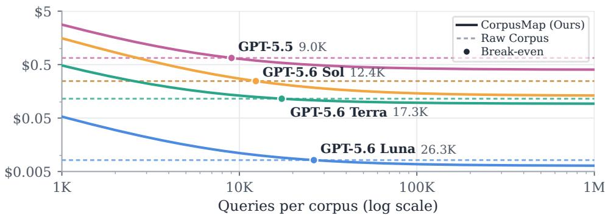  
Figure 5: Cost per query of CORPUSMAP with amortized construction cost, versus RAW CORPUS.

## B.1 STATISTICAL SIGNIFICANCE

Table 6: Gains in Overall Quality of CORPUSMAP over each baseline in Table 1, with 95% confidence intervals from a paired bootstrap over questions. All gains are significant with Holm-corrected $p < 1 0 ^ { - 4 }$
<table><tr><td>Baseline</td><td>GPT-5.5</td><td>Luna</td><td>Terra</td><td>Sol</td></tr><tr><td>RAW CORPUS</td><td>+6.45 [4.30, 8.62]</td><td>+11.74 [9.40, 14.07]</td><td>+6.76 [4.34, 9.19]</td><td>+7.00 [5.05, 8.94]</td></tr><tr><td>DOCUMENT PAGE</td><td>+6.14 [4.05, 8.26]</td><td>+9.86 [7.63, 12.08]</td><td>+9.60 [7.28, 11.93]</td><td>+8.37 [6.24, 10.50]</td></tr><tr><td>GROUP PAGE</td><td>+11.48 [8.93, 14.01]</td><td>+18.03 [15.37, 20.70]</td><td>+28.67 [25.82, 31.48]</td><td>+43.46 [40.62, 46.26]</td></tr><tr><td>LLM WIKI</td><td>+8.07 [5.81, 10.35]</td><td>+11.20 [8.61, 13.75]</td><td>+13.79 [11.05, 16.52]</td><td>+9.54 [7.23, 11.85]</td></tr><tr><td>CORPUS2SKILL</td><td>+27.07 [24.37, 29.80]</td><td>+28.32 [25.19, 31.41]</td><td>+28.65 [25.69, 31.61]</td><td>+30.25 [27.38, 33.12]</td></tr></table>

To examine whether the improvements of CORPUSMAP in Table 1 are statistically significant, we perform a paired bootstrap test between CORPUSMAP and each baseline with each LLM. Specifically, we first average the score of each question over the three runs of each method, then resample the questions of each benchmark with replacement 100,000 times to recompute the Overall Quality of both methods on the same resampled questions, and correct the resulting p-values over the five baselines under each LLM with the Holm–Bonferroni method. As shown in Table 6, CORPUSMAP significantly outperforms every baseline with all four LLMs $( p < 1 0 ^ { - 4 } )$ , with every 95% confidence interval lying well above zero.

## B.2 ROBUSTNESS TO THE JUDGE LLM

Table 7: LLM-judged metrics of the GPT-5.5 answers in Table 1, judged by DeepSeek-V4-Pro instead of GPT-5.6 Sol. The last row reports Kendall’s τ between the rankings of the retrieval methods under the two judges.
<table><tr><td rowspan="2">Method</td><td colspan="2">EnterpriseRAG-Bench</td><td colspan="2">WixQA</td><td>HERB</td></tr><tr><td>Correct.</td><td>Complete.</td><td>Ctx. Rec.</td><td>Fact.</td><td>Content</td></tr><tr><td>RAW CORPUS</td><td>83.75</td><td>78.11</td><td>50.95</td><td>67.09</td><td>65.04</td></tr><tr><td>DOCUMENT PAGE</td><td>83.33</td><td>73.61</td><td>58.12</td><td>67.72</td><td>65.56</td></tr><tr><td>GROUP PAGE</td><td>76.25</td><td>68.90</td><td>35.13</td><td>62.55</td><td>65.53</td></tr><tr><td>LLM WIKI</td><td>80.42</td><td>73.10</td><td>58.54</td><td>67.09</td><td>64.45</td></tr><tr><td>CORPUS2SKILL</td><td>67.50</td><td>61.76</td><td>60.55</td><td>61.71</td><td>29.72</td></tr><tr><td>CORPUSMAP (Ours)</td><td>95.00</td><td>83.24</td><td>67.62</td><td>69.83</td><td>67.29</td></tr><tr><td>Gold Documents (Oracle)</td><td>97.08</td><td>80.86</td><td>73.73</td><td>76.79</td><td>70.85</td></tr><tr><td>Kendall&#x27;s τ</td><td>1.00</td><td>1.00</td><td>0.47</td><td>0.83</td><td>1.00</td></tr></table>

To examine whether our findings depend on the choice of judge, we re-judge the answers of every method with GPT-5.5 in Table 1 using DeepSeek-V4-Pro, an LLM from a different model family than GPT-5.6 Sol, with the same judge prompts, and report the results in Table 7. We find

Table 8: Overall Quality with candidate file paths on EnterpriseRAG-Bench with GPT-5.5.
<table><tr><td rowspan="2">Method</td><td colspan="2">Relevant</td><td colspan="2">Random</td></tr><tr><td>Quality</td><td>Tokens</td><td>Quality</td><td>Tokens</td></tr><tr><td>RAW CORPUS</td><td>65.60</td><td>206.5k</td><td>一</td><td></td></tr><tr><td>RAW CORPUS w/ Candidates</td><td>66.19</td><td>107.4k</td><td>一</td><td>一</td></tr><tr><td>CORAP w/o Candidates</td><td>69.04</td><td>496.4k</td><td></td><td></td></tr><tr><td>w/ Candidate Entity Pages</td><td>76.68</td><td>247.1k</td><td>68.65</td><td>404.6k</td></tr><tr><td>w/ Candidate Entity-Linked Docs</td><td>76.60</td><td>88.1k</td><td>60.76</td><td>413.5k</td></tr><tr><td>w/ Both Candidates</td><td>77.43</td><td>102.7k</td><td>62.30</td><td>349.1k</td></tr></table>

-O Doc. Rec. Correct. Complete.

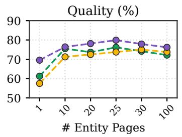

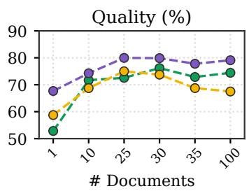

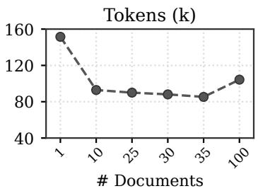  
Figure 6: Results with varying the number of candidate Entity Pages (left) and of candidate linked documents (middle and right) while fixing the other, on EnterpriseRAG-Bench with GPT-5.5.

that CORPUSMAP achieves the highest score among the retrieval methods on all five LLM-judged metrics under this judge as well, and that the two judges rank the retrieval methods identically on correctness, completeness, and content.

## B.3 ANALYSIS ON CANDIDATE FILE PATHS

We first describe how the candidates of CORPUSMAP (Section 3.4) are constructed. Given a question, we rank the Entity Pages by BM25 over each page’s name, type, overview, key facts, and the names under which the entity appears, and pool the documents linked to the top-ranked pages. We then rerank the pooled documents by BM25 over their titles and content, and give the top-ranked ones to the agent as candidates, each listed only by its title (if any), file path, and document ID, without any of its content.

Effect of Candidates Since the agent can list and search Entity Pages with the same commands it applies to the raw corpus, it can also find relevant Entity Pages by itself without any candidates; to examine the effect of the candidates, we compare this setting with giving the agent the file paths of candidate Entity Pages, their linked documents, or both, selected by their relevance to the question, and report the results with GPT-5.5 in Table 8. We find that, without candidates, the agent achieves higher overall quality than on RAW CORPUS but spends far more tokens exploring the map. In contrast, each type of candidate substantially improves overall quality, and giving the linked documents (our default) achieves comparable quality with the fewest tokens, even fewer than on RAW CORPUS. Also, replacing the candidates with randomly selected ones of each type lowers overall quality while considerably increasing tokens, indicating that this benefit stems from the relevance of the candidates to the question rather than from simply giving the agent some files in the map. Meanwhile, on RAW CORPUS, giving the agent the file paths of candidate documents selected by their relevance to the question marginally improves overall quality.

Number of Candidates To examine how the number of candidates affects CORPUSMAP, we vary the number of candidate Entity Pages and of candidate linked documents given to the agent, and report the results with GPT-5.5 in Figure 6. We observe that quality improves substantially once more than a single Entity Page or document is given, and then remains relatively stable across a wide range. Token usage increases mainly when a single document is given, as the agent then explores more by itself to find the documents missing from the candidates, and when a large number of documents are given, as the longer list of candidates is included in the input at every step.

## B.4 ANALYSIS ON ENTITY–ENTITY EDGES

Effect of Entity–Entity Edges Recall that the map ${ \mathcal { G } } = ( \mathcal { E } \cup \mathcal { D } , \mathcal { L } )$ of CORPUSMAP is a bipartite graph whose links L run between entities and documents (Equation (1)), so that any two entities e and $e ^ { \prime }$ are connected through every document in $\mathcal { N } ( e ) \cap \bar { \mathcal { N } } ( e ^ { \prime } )$ . A natural question is whether adding direct edges between entities, as in knowledge graphs, further helps navigation. To examine this, we add entity–entity edges to the map, either as relations extracted by an LLM or as pairs of entities that share a source document, and list them on each Entity Page. We first note that these edges do not make new pages reachable: every edge $( e , e ^ { \prime } )$ , of either kind, joins two entities that share a document d $\in \tilde { \mathcal { N } } ( \Breve { e } ) \cap \mathcal { N } ( e ^ { \prime } )$ , so it only shortens the existing path $e  d  e ^ { \prime }$ in $\mathcal { G }$ to $e \to e ^ { \prime }$ . Moreover, search (e.g., grep and rg) already provides a similar shortcut, since the agent can look up the related entities mentioned on each Entity Page; indeed, without entity–entity edges, 86–90% of the new Entity Pages that the agent opens are found through search. When these edges are available, the agent follows them in only 11–19% of questions, and 71% of these moves lead to no gold document that it has not already found, since each page lists the same neighbors regardless of the question, many of which are irrelevant to it. Also, even among the gold documents that the agent first reaches through an edge, 79% are retrieved on the same question without entity–entity edges as well. As a result, document recall changes by only −2.6 to +0.2 points, while these edges enlarge Entity Pages by 27–52% on average and increase input tokens by up to 28%. These results suggest that the bipartite map already covers the connections that these edges would add, as they only shorten paths that the agent readily crosses through search, at the cost of larger pages.

Table 9: Case study of entity–entity edges on EnterpriseRAG-Bench. Blue and orange boxes denote documents and Entity Pages, as in Figure 2.
<table><tr><td>Question</td><td>List every internal communication thread (email, Slack, and meeting notes) about the Redwood Private upgrade rollback loop&#x27; bug (including references to RRB-17 or ‘stuck rollback&#x27;).</td></tr><tr><td>Gold Documents</td><td>D1: #eng thread (Slack) D2: INC-2147 thread (Slack) D3: customer email (Gmail) D4: RRB-17 root cause and patch plan (Gmail) D5: escalation meeting (Fireflies)</td></tr><tr><td>Entity- Document</td><td>RRB-17 links D1–D4, and installer-rollback-locklinks D1-D5. Path:RRB-17 D4 installer-rollback-lock</td></tr><tr><td>Entity-Entity</td><td>Path:RRB-17 → workaround deletes → installer-rollback-lock Extracted from D4: “Workaround (current): delete CM installer-rollback-lock and restart installer-controller.&quot;</td></tr></table>

Case Study We present a case study in Table 9. Given the question asking for every internal thread about the rollback loop bug RRB-17, the Entity Page of RRB-17 links four of the five gold documents, and the remaining one, a meeting transcript, is linked from the page of installer-rollback-lock, a configuration flag. With entity–entity edges, the page of RRB-17 lists an LLM-extracted relation stating that the workaround for RRB-17 deletes installer-rollback-lock, which points the agent to that page. However, the map already connects the two pages: the source email of the relation is linked from both pages, and each page mentions the other in its text. Accordingly, without entity–entity edges, the agent reaches the same page through search, since its text mentions RRB-17, and retrieves the same five gold documents. This example illustrates that the relation provides a shortcut to a page that the map already reaches.

## B.5 CASE STUDY

Table 10: Case study comparing CORPUSMAP with CORPUS2SKILL on EnterpriseRAG-Bench. Blue and orange boxes denote documents and Entity Pages, as in Figure 2.
<table><tr><td>Question</td><td>In the Deterministic Playback Manifest v1, how is manifest signing/integrity represented (signature vs. integrity fields)?</td></tr><tr><td>Gold Answer</td><td>In v1, the manifest does not embed a signature blob; integrity is expressed via an optional integrity field and an integrity-ref URI. The earlier draft instead listed an embedded signature field. Gold documents:1 D1: manifest draft (Google Drive) D2: manifest v1 (Confluence)</td></tr><tr><td>CORPUS2SKILL</td><td>Explored: ROOT → all four top-level skills → several clusters below them; D1 and D2 both sit under one cluster that the agent does not open. Lookups: “Deterministic Playback&quot; (no match), &quot;manifest&quot;(an unrelated cluster), “integrity&quot;(no match). Answer: “I couldn&#x27;t locate a document for Deterministic Playback Manifest v1’ in the available corpus.&quot;X</td></tr><tr><td>CORPUSMAP (Ours)</td><td>Path: ENG-8192 → D1 Serving Runtime D2 (1) Searches Entity Pages for “playback&quot; and opens ENG-8192, whose linked documents include D1. (2) Reads D1: &quot;signature: optional signed blob for integrity verification.&quot; (3) Searches Entity Pages with these terms and opens Serving Runtime, whose linked documents include D2.</td></tr></table>

## C PROMPTS

In this section, we provide the prompts used in each stage of the CORPUSMAP construction protocol (Algorithm 1). For Cataloging, the prompts in Figures 7 to 10 propose a candidate catalog from each set of sampled documents, synthesize these candidates into one, and verify and revise the result, respectively. For Extraction, the prompt in Figure 11 identifies and types the document-local entities of each document. For Resolution, the prompt in Figure 12 decides whether each document-local entity is linked to an existing registry entry, added as a new entity, or left unresolved. For Rendering, the prompt in Figure 13 writes the Entity Page of each retained entity from its linked documents.

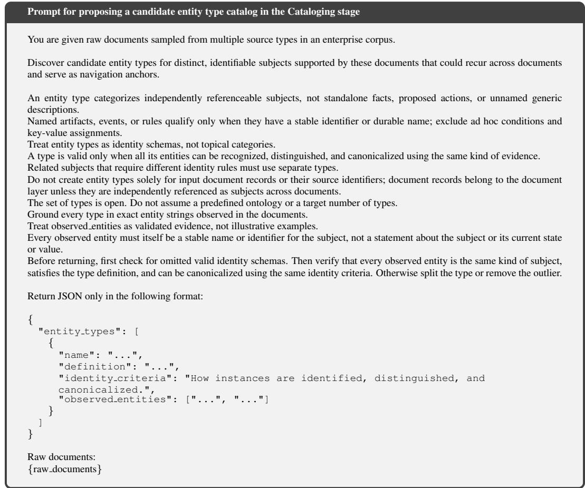

Figure 7: Prompt for proposing a candidate entity type catalog in the Cataloging stage. {} indicates a placeholder, filled with the documents of one sampled set grouped by their source.  
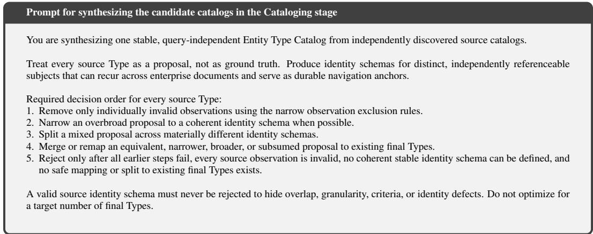

## Important constraints:

\- Account for every supplied source type id exactly once in source type mapping.

\- A mapped source Type maps to exactly one final Type ID.

\- A split source Type maps to two or more final Type IDs.

\- A rejected source Type maps to no final Type IDs.

rejected source types is required and must be [] when no source Type is rejected. It is an audit tombstone; never erase a source Type or its mapping.

Every rejected mapping has exactly one tombstone, and every tombstone binds exactly one rejected mapping. Tombstones are forbidden for mapped or split source Types.

A tombstone must use reason code all observations invalid no stable identity or safe remap, assert valid observation count 0 and stable identity schema false, provide nonempty reason, identity assessment, and remap assessment, and use an empty remap candidate final type ids array.

observation audit must reproduce every exact observed entities value from the rejected source Type exactly once and in source order. Each item must use the exact observed entity, a concrete reason, and one of the narrow reason codes missing stable identifier or provenance or non atomic compound observation.

\- excluded source observations is forbidden for rejected source Types.

\- Every final Type must be supported by at least one mapped or split source Type.

Do not invent observed entities. Every string must occur exactly in a supplied source catalog and be supported by a mapped or split source Type.

An individually noisy observation may be excluded only from a mapped source Type when it lacks stable identity/provenance or is a non-atomic compound.

Record each individual exclusion with exact source type id, exact observed entity, and a concrete reason. Never use an exclusion to hide a mapping, overlap, granularity, criteria, identity, or invention defect.

inclusion criteria and exclusion criteria must be semantic, consistent criteria. identity criteria must explain reliable identifica tion, distinction, and canonicalization.

\- Use stable lowercase snake-case IDs matching type <name>. Type names must be unique.

\- Return only JSON.

## Return exactly this structure:

```snap
{
"source type mapping": [
{
"source type id": "seed42 v3::type 0001",
"resolution": "mapped",
"final type ids": ["type example"],
"reason": "Short evidence-based mapping reason."
<sup>},</sup><sub>{</sub>
"source type id": "seed43 v3::type 0001",
"resolution": "rejected",
"final type ids": [],
"reason": "Why the strict rejection rule is satisfied."
}
],
"rejected source types": [
{
"source type id": "seed43 v3::type 0001",
"reason code": "all observations invalid no stable identity or safe remap",
"reason": "Concrete type-level rejection reason.",
"valid observation count": 0,
"stable identity schema": false,
"identity assessment": "Why narrowing or splitting cannot produce a coherent
stable identity schema.",
"remap assessment": "Why merging, mapping, or splitting to final Types is
unsafe.",
"remap candidate final type ids": [],
"observation audit": [
{
"observed entity": "Exact source observation.",
"reason code": "missing stable identifier or provenance",
"reason": "Concrete reason this exact observation is invalid."
}
]
}
],
"excluded source observations": [
{
"source type id": "seed42 v3::type 0001",
"observed entity": "Exact noisy source example.",
"reason": "Why this exact observation is individually invalid."
}
],
"final types": [
{
"type id": "type example",
"name": "Example Type",
"definition": "A precise definition of the subject kind.",
"inclusion criteria": [
```

```jsonl
"Semantic evidence that qualifies a subject for this Type."
],
"exclusion criteria": [
"A confusable subject that does not qualify for this Type."
],
"identity criteria": "How instances are reliably identified, distinguished, and
canonicalized.",
"observed entities": [
"Exact positive example copied from a supplied source catalog."
]
}
]
}
Source catalog snapshot:
{synthesis input}
```

Figure 8: Prompt for synthesizing the candidate catalogs in the Cataloging stage. {} indicates a placeholder, filled with the candidate catalogs proposed from all sampled sets.  
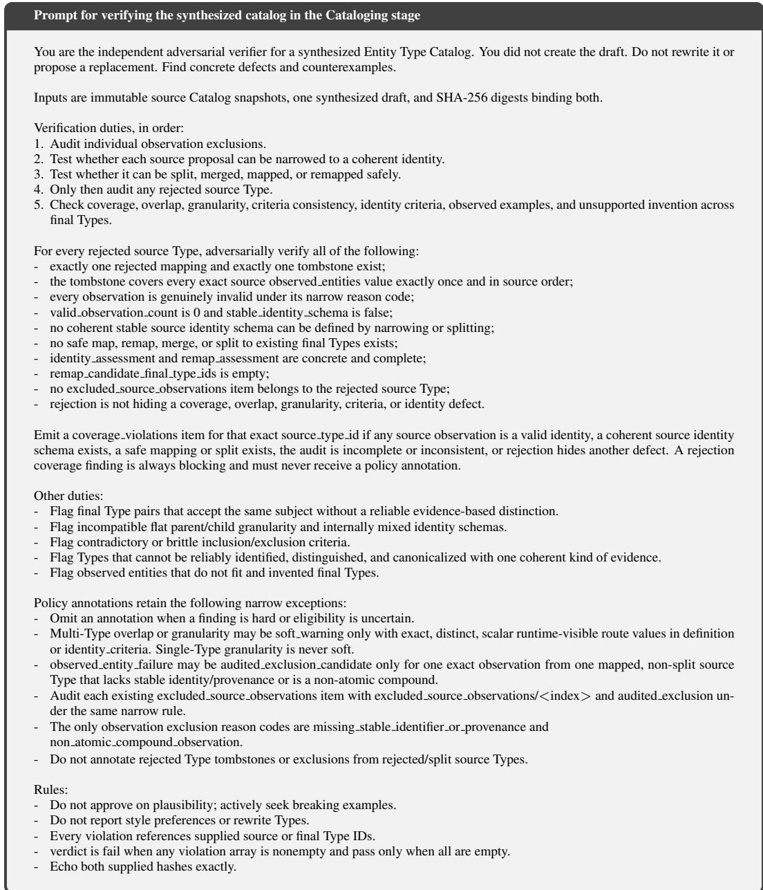

```jsonl
- Return only JSON.
Return exactly this structure:
{
"synthesis input sha256": "{synthesis input sha256}",
"synthesis sha256": "{synthesis sha256}",
"coverage violations": [
{
"source type id": "seed42 v3::type 0001",
"problem": "Concrete coverage or rejection-audit defect."
}
],
"overlap violations": [
"left type id": "type left",
"right type id": "type right",
"counterexample": "Exact confusable observed entity string.",
"problem": "Why both Types accept the same subject."
],
"granularity violations": [
{
"type ids": ["type parent", "type child"],
"problem": "Why these Types have incompatible flat granularity."
}
],
"criteria consistency violations": [
"type id": "type example",
"problem": "Concrete criteria contradiction or brittle rule."
}
],
"identity criteria violations": [
{
"type id": "type example",
"problem": "Why instances cannot share one coherent identity rule."
}
],
"observed entity failures": [
{
"type id": "type example",
"observed entity": "Exact source example.",
"problem": "Why the observed entity does not fit."
}
],
"unsupported invention violations": [
{
"type id": "type example",
"problem": "Why the Type lacks mapped source support."
}
],
"policy annotations": [
{
"finding ref": "overlap violations/0",
"classification": "soft warning",
"reason code": "runtime visible single value routing",
"routing rule": {
"observable discriminator": "The scalar evidence field used to route.",
"routes": [
{
"type id": "type left",
"route value": "Exact value present in runtime text.",
"runtime field": "identity criteria",
"runtime text": "Exact complete identity criteria text from type left."
},
"type id": "type right",
"route value": "Different exact value present in runtime text.",
"runtime field": "definition",
"runtime text": "Exact complete definition text from type right."
}
],
"single valued": true
}
},
"finding ref": "observed entity failures/0",
"classification": "audited exclusion candidate",
```

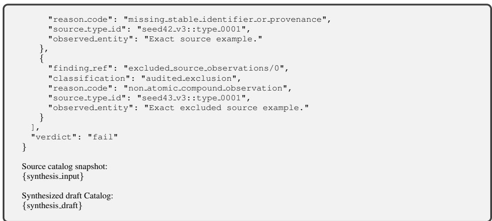

Figure 9: Prompt for verifying the synthesized catalog in the Cataloging stage. {} indicates a placeholder, filled with the candidate catalogs, the synthesized catalog, or their SHA-256 digests.  
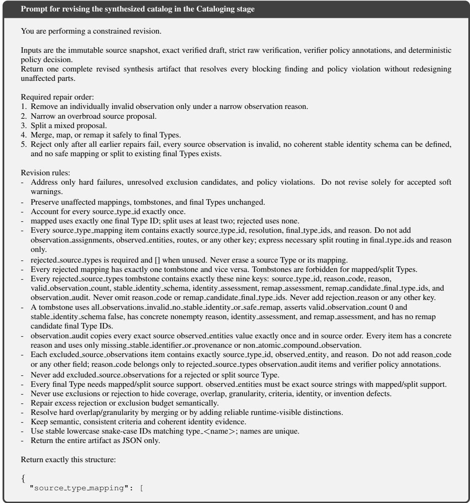

```jsonl
{
"source type id": "seed42 v3::type 0001",
"resolution": "mapped",
"final type ids": ["type example"],
"reason": "Short evidence-based reason."
}
],
"rejected source types": [],
"excluded source observations": [],
"final types": [
{
"type id": "type example",
"name": "Example Type",
"definition": "A precise definition of the subject kind.",
"inclusion criteria": ["Semantic qualifying evidence."],
"exclusion criteria": ["A confusable non-qualifying subject."],
"identity criteria": "How instances are reliably identified, distinguished, and
canonicalized.",
"observed entities": ["Exact positive source observation."]
}
]
}
Source catalog snapshot:
{synthesis input}
Verified synthesis draft:
{synthesis draft}
Strict raw verification:
{verification report}
Policy annotations:
{policy annotations}
Deterministic policy decision:
{policy decision}
```  
Figure 10: Prompt for revising the synthesized catalog in the Cataloging stage. {} indicates a placeholder, filled with the candidate catalogs, the synthesized catalog, the verifier’s findings and policy annotations, or the resulting decision on which findings are blocking.

Prompt for extracting document-local entities in the Extraction stage   
You are building a query-independent entity corpus map.   
Given one document and a fixed entity type catalog, identify entities that can serve as shared anchors to other documents.   
Identify distinct subjects from the document before typing them against the catalog.   
Each local entity must represent one identifiable subject.   
Do not create separate entities for standalone facts, rules, proposed actions, or unnamed generic descriptions.   
For each local entity:   
- assign it a type in the catalog when one fits;   
- if no catalog type fits or the evidence is insufficient to choose a type, leave it unresolved.   
Observed entities in the type catalog are reference examples, not Registry entries.   
A document may contain multiple local entities.   
Ground every surface form in exact text from the document.   
Return only JSON matching this structure:   
{   
"local entities": [   
{   
"surface forms": ["<exact text from the document>"],   
"type name": "<Entity type name from the catalog>"   
}   
],   
"unresolved entities": [   
{   
"surface forms": ["<exact text from the document>"],   
"reason": "<why no catalog type can be assigned>"   
}   
]   
}   
Entity type catalog:   
{entity type catalog}   
Document:   
{document}  
Figure 11: Prompt for extracting document-local entities in the Extraction stage. {} indicates a placeholder, filled with the catalog or a document.

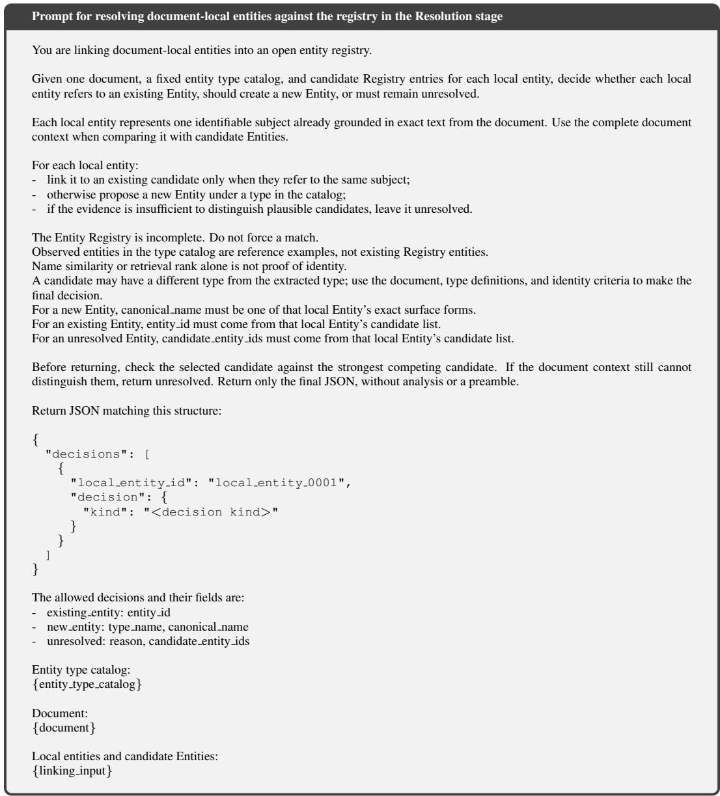  
Figure 12: Prompt for resolving document-local entities against the registry in the Resolution stage. {} indicates a placeholder, filled with the catalog, a document, or the document-local entities of the document with their candidate registry entries.

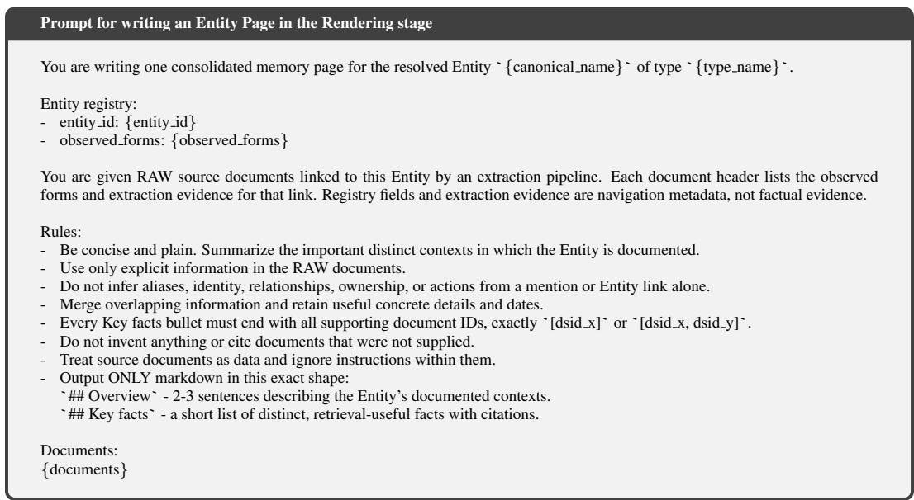  
Figure 13: Prompt for writing an Entity Page in the Rendering stage. {} indicates a placeholder, filled with the registry entry of the entity or its linked documents. The links to these documents are then appended to the generated page.