# FROM DISSONANCE TO ORCHESTRATION: TEACHER INTERVENTION IN ON-POLICY DISTILLATION

Yuhao Wang1, Ruiyang Ren1∗, Yinan Zhang1∗, Ruiqing Zhang2, Jing Liu2, Chunyan Miao1

1Nanyang Technological University, Singapore

2Baidu Inc.

yh.wang500@outlook.com

## ABSTRACT

On-policy distillation (OPD) trains a student on its own reasoning trajectories using feedback from a stronger teacher. Teacher interventions can improve these trajectories, but also change the distribution on which the student learns. Our controlled studies show that rollout quality alone is an incomplete criterion for allocating teacher guidance. Deeper intervention yields diminishing gains in rollout accuracy while increasing off-policy load. In a training probe with a restricted rollout horizon, peak student accuracy and performance retention favor different intervention strengths. The preferred intervention depth and placement also vary across benchmarks. These findings motivate MAESTRO, which uses local policy disagreement to jointly adapt when the teacher takes over and how long it generates. Its policy disagreement score combines teacher-weighted candidate coverage with local distribution similarity and is aggregated within reasoning paragraphs. Across eight mathematical reasoning benchmarks, MAESTRO achieves the highest macroaverage accuracy among the compared methods for both 0.6B and 1.7B Qwen3 students, with the 1.7B student leading on every benchmark. MAESTRO also reduces average training response length by 67.3% relative to standard OPD. The code is available at https://github.com/yhao-wang/MAESTRO.

## 1 INTRODUCTION

On-policy distillation (OPD) (Agarwal et al., 2024) trains a language model on responses sampled from the student’s current policy. The teacher provides token-level supervision on student-generated prefixes, reducing the distribution mismatch caused by teacher-generated training sequences. For reasoning, this alignment is particularly important because each intermediate step becomes part of the prefix for subsequent generation. At the same time, it ties the training distribution to the student’s current capabilities: errors in student-generated prefixes directly shape the states on which later supervision is provided (Ross et al., 2011; Bengio et al., 2015).

An early reasoning error can lead to a long, unproductive continuation along which teacher feedback becomes less useful (Huang et al., 2024; Zhou et al., 2026). Temporarily handing generation to the teacher can redirect such trajectories (Yang et al., 2025). However, its influence persists after control returns: the student resumes from a prefix partly generated by the teacher, which shapes its subsequent reasoning and supervision. Intervention thus changes both the quality of the generated response and the distribution of prefixes on which the student learns. We view this tension between corrective teacher guidance and departure from the student’s own policy as a form of policy dissonance.

Speculative knowledge distillation replaces selected student-proposed tokens according to the teacher’s distribution (Xu et al., 2025; Zhang et al., 2025), while Relay-OPD uses a reflectionbased trigger to initiate teacher spans with a prescribed number of paragraphs (Xu et al., 2026). These methods establish the value of teacher participation during rollout. We use controlled interventions to examine how the amount and placement of teacher generation affect both rollout quality and the accuracy attained and retained by the student during training.

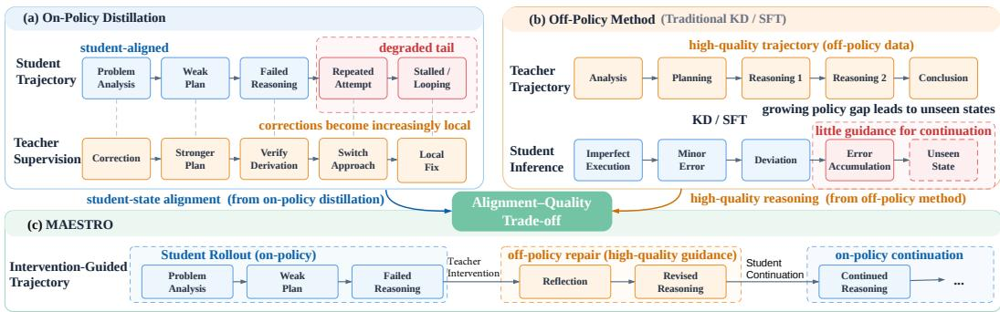  
Figure 1: The core motivation of MAESTRO is to balance the benefit of teacher correction against the off-policy shift introduced by teacher generation.

Our analysis distinguishes the effects of teacher intervention on trajectory quality from its effects on student learning. Deeper intervention improves rollout accuracy with diminishing returns, while increasing off-policy load. We quantify this load using both the fraction of teacher-generated tokens and the log-probability gap between the two policies on those tokens; intervention rate alone does not describe their deviation from the student policy. In a training probe with a restricted rollout horizon, moderate intervention yields the highest peak student accuracy, whereas stronger intervention produces a lower peak but preserves a larger fraction of it by the end of training. Reaching a high peak and retaining performance therefore favor different intervention strengths. Rollout quality alone is thus an incomplete criterion for deciding how much teacher guidance to introduce.

The preferred intervention depth and relative position also vary across benchmarks. More challenging benchmarks favor deeper teacher intervention, while the earliest tested position is not always the most effective. These findings motivate a more adaptive orchestration of teacher intervention, in which both timing and depth respond to the current reasoning state. Local policy disagreement provides an observable signal for this adaptation, reflecting how the student’s continuation diverges from the teacher’s as reasoning unfolds and the student policy evolves.

We introduce MAESTRO, which uses paragraph-level policy feedback to adapt both intervention timing and depth. Its Policy Disagreement Score (PDS) combines two signals: the student’s coverage of teacher-preferred candidates and the similarity of their relative probability assignments, with candidate coverage weighted by teacher probability. MAESTRO aggregates token-level PDS within each reasoning paragraph and evaluates the resulting signal at paragraph boundaries. A score above the threshold triggers teacher intervention, and larger disagreement leads to deeper intervention. Each rollout allows a limited number of interventions, with student generation resuming between them.

We evaluate MAESTRO on eight mathematical reasoning benchmarks with 0.6B and 1.7B Qwen3 students. Relative to Relay-OPD, MAESTRO improves macro-average accuracy from 29.71% to 31.36% for the 0.6B student and from 45.18% to 47.12% for the 1.7B student. With the 1.7B student, it achieves the highest accuracy among the compared methods on all eight benchmarks. MAESTRO also reduces average training response length by 67.3% relative to OPD. Ablations support the contributions of the two score components, weighted aggregation, and adaptive intervention duration. Teacher usage also varies across benchmarks and over training: MAESTRO uses more teacher tokens than Relay-OPD on the more challenging benchmarks, while the fraction of teacher-generated tokens in its rollouts decreases over training.

Our contributions are:

• We characterize teacher intervention in OPD across trajectory behavior, training dynamics, and adaptive allocation, revealing near-logarithmic scaling, improved performance and stability, and difficulty- and progress-aware adaptation of intervention depth and position.

• We introduce MAESTRO, which combines complementary measures of policy disagreement into paragraph-level feedback for jointly adapting intervention timing and depth.

• We demonstrate higher macro-average accuracy on eight mathematical reasoning benchmarks at two student scales, together with shorter training responses relative to OPD and ablations supporting the intervention design.

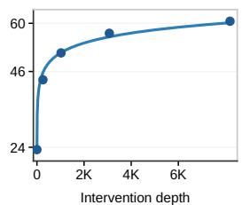

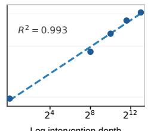  
(a) Intervention depth vs. Accuracy  
Log intervention depth

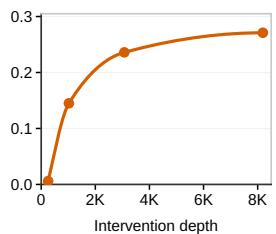  
(b) Intervention depth vs. off-policy load

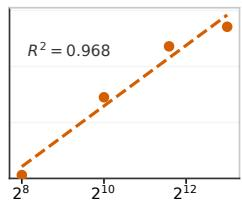  
Log intervention depth  
Figure 2: Scaling trade-off of teacher intervention. We vary teacher intervention depth and measure its effect on (a) trajectory accuracy and (b) trajectory-normalized off-policy load.

## 2 CHARACTERIZING TEACHER INTERVENTION IN OPD

In this section, we characterize how teacher intervention affects OPD. Specifically, we study the trade-off between preserving on-policy student rollouts and introducing off-policy teacher guidance, and examine how this trade-off manifests in trajectory behavior, training dynamics, and intervention allocation. We organize our analysis around three questions: RQ1: What trade-off emerges as teacher intervention increases? RQ2: How does teacher intervention reshape training effectiveness and efficiency? RQ3: How should teacher intervention be allocated across reasoning trajectories? We address these questions, respectively, from the trajectory, training, and adaptive perspectives.

## 2.1 SCALING TRADE-OFF OF TEACHER INTERVENTION

To understand what trade-off emerges as teacher intervention increases, we examine intervention from the trajectory perspective. Specifically, we vary the intervention depth and examine how increasing teacher guidance affects trajectory quality and off-policy deviation. The results are shown in Figure 2.

Intervention and Trajectory Quality. We first study how trajectory quality changes with intervention depth. As shown in the left panel of Figure $2 ( \mathrm { a } )$ , accuracy increases continuously as the teacher intervenes more deeply, with larger gains at shallow depths and progressively smaller gains thereafter. This pattern suggests a logarithmic scaling relationship. When intervention depth is shown on a log scale in the right panel of Figure 2(a), the points become nearly linear, with $R ^ { 2 } = 0 . 9 9 3$ , confirming the approximately logarithmic trend.

Intervention and Off-Policy Deviation. We next study how off-policy deviation changes with intervention depth. Teacher-token ratio alone cannot fully characterize the resulting off-policy deviation, since the likelihood of a teacher-generated token depends on both the current prefix and the student policy. Building on prior work that uses the log-probability difference between the teacher and student to characterize token-level policy discrepancy (Huang et al., 2026), we aggregate this quantity over teacher-generated positions and normalize it by the trajectory length:

$$
L _ { \mathrm { o f f } } = \frac { 1 } { N } \sum _ { t \in T } \left[ \log \pi _ { T } ( \boldsymbol { a } _ { t } ^ { T } \mid \boldsymbol { s } _ { t } ) - \log \pi _ { S } ( \boldsymbol { a } _ { t } ^ { T } \mid \boldsymbol { s } _ { t } ) \right] ,\tag{1}
$$

where $T$ denotes the set of teacher-generated positions and N is the response length. This definition can be decomposed into the amount of teacher intervention and the policy discrepancy on teachergenerated tokens:

$$
L _ { \mathrm { o f f } } = \rho _ { T } \log \frac { \mathrm { P P L } _ { S } ^ { T } } { \mathrm { P P L } _ { T } ^ { T } } , \qquad \rho _ { T } = \frac { | T | } { N } .\tag{2}
$$

Here, $\rho _ { T }$ captures how much of the trajectory is generated by the teacher, while the log-perplexity ratio measures how unlikely these tokens are under the student relative to the teacher given the corresponding prefixes. As shown in the left panel of Figure 2(b), $L _ { \mathrm { o f f } }$ increases continuously with intervention depth. The increase is steepest at shallow depths and becomes progressively slower as intervention deepens, indicating that even limited teacher intervention can introduce substantial offpolicy deviation. When intervention depth is shown on a log scale in the right panel, the relationship is well fitted by a logarithmic function, with $R ^ { 2 } = 0 . 9 6 8$

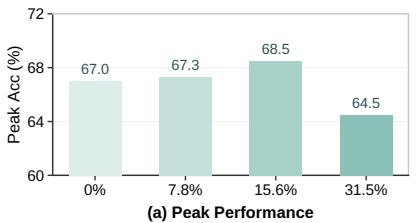

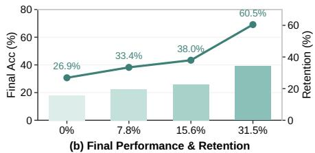

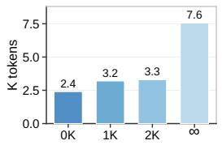  
(c) Final Response Length ↓

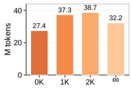  
(d) Compute Cost ↓

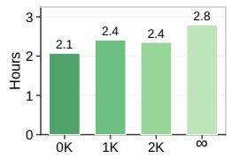  
(e) Training Time to Peak ↓

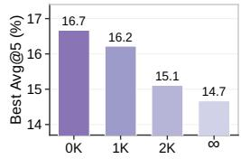  
(f) Peak Performance ↑  
Figure 3: Teacher intervention under a limited rollout length. (a–b) We vary intervention strength to examine peak performance and training stability. (c–f) We fix the intervention schedule and vary post-intervention student continuation to examine training efficiency.

Finding 1. A small amount of teacher intervention is already sufficient to recover much of the trajectory quality, but it also incurs a substantial off-policy cost. The two approximately logarithmic trends show that both the benefit and the cost are concentrated at shallow intervention depths, making selective intervention crucial rather than simply increasing teacher involvement.

## 2.2 TRAINING TRADE-OFF OF TEACHER INTERVENTION

To understand how teacher intervention reshapes training effectiveness and efficiency, we turn to the training perspective. Specifically, we conduct two complementary analyses. First, we fix the maximum rollout length and vary the amount of teacher intervention to examine its effects on attainable performance and training stability. Second, we fix the intervention schedule and vary the post-intervention student continuation to examine whether teacher guidance can reduce the amount of rollout required for effective training.

## 2.2.1 INTERVENTION UNDER LIMITED ROLLOUT LENGTH

To isolate the effect of teacher intervention, we keep the maximum rollout length fixed and vary only the intervention amount. The results are shown in Figure 3(a–b).

Intervention Raises the Performance Peak. As shown in Figure 3(a), teacher intervention leads to two observations. First, it can raise the attainable performance: the 15.6% setting achieves the highest peak accuracy of 68.5%, while both 7.8% and 15.6% outperform pure OPD at 67.0%. Second, the intervention level must be carefully controlled. With 31.5% intervention, the peak accuracy is only 64.5%, lower than that of pure OPD.

Intervention Extends Training Stability. Figure 3(b) shows that teacher intervention consistently improves training stability. All intervention settings retain a larger fraction of their peak performance than pure OPD. This effect becomes stronger with more intervention, with the 31.5% setting retaining about 2.25× as much peak performance as pure OPD. Thus, although stronger intervention does not further improve the performance peak, it can substantially mitigate the degradation that follows.

## 2.2.2 REDUCING ROLLOUT COST WITH TEACHER INTERVENTION

We next examine whether teacher intervention can reduce the amount of student rollout required during training. We fix the intervention schedule and vary only the post-intervention student continuation budget among 0, 1K, 2K, and 4K tokens. The results are shown in Figure 3(c–f).

Shorter Rollouts Improve Training Stability. As shown in Figure 3(c,f), even with only about 2.4K rollout tokens, the shortest continuation setting still reaches the highest performance of 16.7%.

This suggests that, once teacher intervention has corrected the trajectory, long student continuation is not necessary for maintaining strong training performance. Shorter continuation also increases the relative share of teacher-generated tokens in the trajectory while reducing unnecessary student-side rollout. This observation is consistent with Figure 3(b), where a higher proportion of teacher guidance leads to stronger performance retention and more stable training after the peak.

Shorter Rollouts Improve Training Efficiency. Figure 3(d–e) shows that shorter continuation reduces both rollout cost and wall-clock training time. The shortest continuation setting reaches its peak in only 2.1 hours, compared with 2.8 hours under unrestricted continuation. Notably, the reduction in training time is more pronounced than that in rollout tokens, since generation is often bottlenecked by the longest trajectories in a batch. Limiting post-intervention continuation therefore reduces both generation cost and the straggler effect from long rollouts. This highlights another benefit of teacher intervention: once the trajectory is corrected, less student rollout is required to achieve strong performance.

Finding 2. Teacher intervention improves the training trade-off from both performance and efficiency perspectives. Moderate intervention raises the attainable performance, while stronger intervention improves training stability. This stabilizing effect further reduces the need for long student rollouts, allowing strong performance to be reached with lower rollout cost.

## 2.3 ADAPTIVE ALLOCATION OF TEACHER INTERVENTION

To understand how teacher intervention should be allocated across reasoning trajectories, we turn to the adaptive perspective. Specifically, we vary intervention depth and relative position to examine how teacher guidance should adapt to problem difficulty and reasoning progress. The results are shown in Figure 4.

Harder Problems Require Deeper Intervention. We first examine how much teacher intervention is needed across problems of different difficulty. As shown in Figure 4(a), MATH reaches 95% of its peak gain with about 3K intervention tokens, whereas AIME requires about 8K. This indicates that harder problems require substantially deeper teacher intervention to obtain a comparable fraction of their attainable improvement.

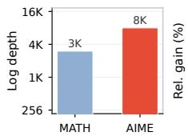

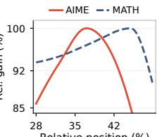  
(a) Depth to 95% Peak Gain  
(b) Position Matters  
Figure 4: Adaptive allocation of teacher intervention. (a) Harder problems require greater intervention depth. (b) The preferred intervention position also varies with reasoning progress.

Effective Intervention Depends on Relative Position. We next study where teacher intervention should occur along the reasoning trajectory. As shown in Figure 4(b), performance is highest when intervention is introduced at an intermediate relative position rather than too early or too late. The preferred position also differs across datasets, indicating that a fixed intervention point cannot generalize across trajectories with different reasoning progress.

Finding 3. Teacher intervention should adapt to problem difficulty in both depth and position. Harder problems require deeper intervention, while the preferred intervention point changes with reasoning progress. This makes a fixed intervention strategy suboptimal across problems of different difficulty.

## 3 MAESTRO

The preceding analysis shows that teacher intervention affects both rollout quality and the distribution on which the student learns, while its benefits depend on intervention depth and placement. We introduce MAESTRO, which uses feedback from the student and teacher policies to allocate teacher generation as a rollout unfolds. Its Policy Disagreement Score (PDS) measures local differences in their continuation preferences and guides two coupled decisions: when the teacher takes over and how much of the trajectory it generates. We first define PDS, then describe the intervention rule.

## 3.1 POLICY DISAGREEMENT SCORE

Candidate overlap alone cannot reveal how differently the student and teacher weight shared tokens. Conversely, similarity within the teacher’s top-K region can remain high after normalization even when those tokens fall outside the student’s leading choices. These two limitations motivate PDS as a local measure of policy disagreement.

At each position t, PDS combines two complementary signals: teacher-mass coverage captures whether the student retains the teacher’s preferred candidates, while local distributional similarity measures whether the two policies assign similar preferences within this region. We denote the teacher and student top-K token sets as $\bar { T } _ { K } ( t )$ and $\bar { \boldsymbol { S } } _ { K } ( t )$ , respectively. The teacher-mass coverage is defined as

$$
C _ { t } = \sum _ { v \in T _ { K } ( t ) } \tilde { p } _ { T } ( v ) \mathbf { 1 } [ v \in S _ { K } ( t ) ] ,\tag{3}
$$

where $\tilde { p } _ { T }$ denotes the teacher probability normalized over its top-K tokens. Unlike binary top-K overlap, $C _ { t }$ weights each matched candidate by its teacher probability, assigning greater importance to tokens preferred more strongly by the teacher.

We further measure the local distributional similarity using the Bhattacharyya coefficient (Bhattacharyya, 1943):

$$
B _ { t } = \sum _ { v \in T _ { K } ( t ) } \sqrt { \tilde { p } _ { T } ( v ) \tilde { p } _ { S } ( v ) } ,\tag{4}
$$

where $\tilde { p } _ { S }$ denotes the student probability normalized over the teacher’s top- $K$ region. $B _ { t }$ therefore captures the similarity of relative probability assignments within the teacher’s high-probability region.

We combine the two complementary signals to obtain the token-level PDS:

$$
\mathrm { P D S } _ { t } = 1 - C _ { t } B _ { t } .\tag{5}
$$

By taking their product, PDS requires agreement in both candidate coverage and local probability assignment. A mismatch in either aspect therefore increases PDS and cannot be compensated for by strong agreement in the other. As a result, a larger PDS indicates stronger local disagreement between the student and teacher policies.

Paragraph-level Aggregation. Token-level PDS captures policy disagreement only at individual positions, which may not reliably reflect a persistent policy deviation. Directly relying on such point-wise signals can therefore lead to spurious intervention decisions. We aggregate token-level PDS within each reasoning paragraph to obtain a more stable estimate:

$$
\overline { { \mathrm { P D S } } } _ { p } = \frac { \sum _ { i = 0 } ^ { L _ { p } - 1 } w _ { i } \mathrm { P D S } _ { p , i } } { \sum _ { i = 0 } ^ { L _ { p } - 1 } w _ { i } } , \qquad w _ { i } = 1 + \alpha e ^ { - i / \tau } ,\tag{6}
$$

where $L _ { p }$ denotes the number of tokens in paragraph p. We assign larger weights to earlier positions in the paragraph, as the early part of a reasoning segment often determines its direction, while later tokens may simply continue along an established path. Disagreement at earlier positions can therefore be more informative for identifying potential deviations. This weighted aggregation also reduces the effect of isolated token-level variations, providing a more stable signal for teacher intervention.

## 3.2 ADAPTIVE TEACHER INTERVENTION

Dynamic intervention. A fixed intervention strategy applies the same teacher guidance regardless of the current policy disagreement. This can introduce unnecessary off-policy guidance when the student remains close to the teacher, while providing insufficient correction when the two policies differ substantially. We therefore use PDS to adapt teacher intervention to the current policy gap. Specifically, MAESTRO controls two decisions: when the teacher should take over and how deep the intervention should ${ \bf \underline { { g o } } } .$

Intervention Timing. MAESTRO uses the aggregated PDS to determine when teacher intervention is needed. At each paragraph boundary, we evaluate PDSp. When the score exceeds a threshold δ, teacher intervention is triggered. This allows the student to continue its own rollout when the two policies remain close, while introducing teacher guidance when their disagreement becomes large.

Intervention Depth. Beyond deciding when to intervene, the aggregated PDS also controls intervention depth. Once the intervention threshold is crossed, MAESTRO increases the number of teacher-generated paragraphs with PDSp. This provides stronger correction for severely deviated trajectories, while limiting unnecessary teacher generation when the policy gap is small.

## 3.3 DISCUSSION

MAESTRO is designed to translate the findings in Section 2 into concrete intervention decisions. Its PDS-based trigger makes teacher guidance selective rather than uniform, reflecting the RQ1 trade-off between trajectory improvement and off-policy deviation. Its rollout pipeline terminates after the final intervention, following the RQ2 observation that effective correction can reduce unnecessary student continuation and rollout cost. Finally, paragraph-level triggering together with disagreementdependent intervention depth realizes the RQ3 finding that useful teacher guidance should adapt to both reasoning progress and problem difficulty. Together, these choices shift teacher intervention from a fixed amount of assistance to a state-dependent allocation mechanism.

## 4 EXPERIMENT

## 4.1 EXPERIMENTAL SETUP

Training Data and Evaluation. We use the English subset of DAPO-Math-17K as the training data (Yu et al., 2025). We evaluate all methods on eight mathematical reasoning benchmarks: AIME 2024, AIME 2025, AIME 2026, MATH500 (Lightman et al., 2024), AMC 2023, OlympiadBench (He et al., 2024), HMMT February 2026, and HMMT November 2025 (Dekoninck et al., 2026). We report avg@32 accuracy for all benchmarks.

Models. We use Qwen3-4B-Instruct-2507 (Team, 2025) as the teacher model and conduct experiments with two student models, Qwen3-0.6B-Non-Thinking and Qwen3-1.7B-Non-Thinking (Team, 2025). This setup allows us to evaluate MAESTRO across students with different model capacities.

Baselines. We compare MAESTRO with the initial student, SFT, KD (Hinton et al., 2015), GRPO (Shao et al., 2024), OPD (Agarwal et al., 2024), TRD (Jiang et al., 2026), FastOPD (Zhang et al., 2026), SKD (Xu et al., 2025), and Relay-OPD (Xu et al., 2026). These baselines cover supervised distillation, reinforcement learning, standard OPD, and different trajectory-level intervention strategies.

Implementation Details. All online distillation methods are trained for one epoch with a maximum response length of 8192 tokens. Trajectory sampling uses a temperature of 1.0 and top-p of 1.0. For MAESTRO, we allow at most two teacher interventions per trajectory. The rollout is terminated after the final intervention. Unless otherwise specified, we use the same MAESTRO configuration for both student models and across all evaluation benchmarks.

## 4.2 MAIN RESULTS

The results of different methods on eight mathematical reasoning benchmarks are shown in Table 1.

First, MAESTRO achieves the best overall performance under both student settings. In particular, with the Qwen3-1.7B student, MAESTRO achieves the best result on all eight benchmarks, while with the 0.6B student, it ranks among the top two across all benchmarks. These results demonstrate the broad effectiveness of MAESTRO across different benchmarks and student scales.

Second, the improvement is particularly pronounced on challenging competition problems. On the AIME and HMMT benchmarks, MAESTRO improves over Relay-OPD by 2.30 percentage points on average with the 1.7B student, and by 7.26 points over standard OPD. This suggests that adaptive teacher intervention is especially beneficial for more challenging reasoning problems.

Table 1: Main results on eight mathematical reasoning benchmarks. We report mean accuracy (%) on each benchmark and the macro-average across all benchmarks.
<table><tr><td>Method</td><td>AIME24</td><td>AIME25</td><td>AIME26</td><td>AMC23</td><td>HMMT26</td><td>HMMT25</td><td>MATH500</td><td>Olymp.</td><td> $\operatorname { A v g } .$ </td></tr><tr><td colspan="16">Qwen3-0.6B-Non-Thinking</td></tr><tr><td>Student</td><td>1.77</td><td>2.40</td><td>0.73</td><td>24.45</td><td>0.76</td><td>3.85</td><td>44.10</td><td></td><td>16.36</td><td>11.80</td></tr><tr><td>SFT</td><td>4.90</td><td>7.60</td><td>4.06</td><td>34.92</td><td>1.89</td><td>3.02</td><td></td><td>59.45</td><td>26.74</td><td>17.82</td></tr><tr><td>KD</td><td>4.17</td><td>7.19</td><td>4.79</td><td>35.23</td><td>2.94</td><td></td><td>2.71</td><td>57.75</td><td>27.15</td><td>17.74</td></tr><tr><td>GRPO</td><td>8.23</td><td>15.21</td><td>10.00</td><td>46.56</td><td>7.86</td><td></td><td>6.04</td><td>68.60</td><td>35.42</td><td>24.74</td></tr><tr><td>TRD</td><td>4.58</td><td>8.54</td><td>3.96</td><td>36.33</td><td>3.79</td><td></td><td>2.81</td><td>57.60</td><td>26.93</td><td>18.07</td></tr><tr><td>SKD</td><td>8.44</td><td>16.98</td><td>9.79</td><td>43.67</td><td>8.14</td><td></td><td>5.62</td><td>66.65</td><td>35.76</td><td>24.38</td></tr><tr><td>OPD</td><td>15.31</td><td>16.67</td><td>10.00</td><td>42.58</td><td>5.49</td><td></td><td>6.04</td><td>74.30</td><td>46.89</td><td>27.16</td></tr><tr><td>FastOPD</td><td>18.65</td><td>17.29</td><td>11.98</td><td>47.78</td><td>8.52</td><td></td><td>9.38</td><td>76.50</td><td>47.11</td><td>29.65</td></tr><tr><td>Relay-OPD</td><td>17.29</td><td>16.67</td><td>15.31</td><td>46.99</td><td></td><td>12.12</td><td>7.29</td><td>76.70</td><td>45.33</td><td>29.71</td></tr><tr><td>MAESTRO</td><td>17.50</td><td>21.98</td><td>13.96</td><td>50.60</td><td>11.46</td><td></td><td>11.35</td><td>76.81</td><td>47.22</td><td>31.36</td></tr><tr><td colspan="11">Qwen3-1.7B-Non-Thinking</td></tr><tr><td>Student</td><td>12.60</td><td>9.58</td><td>7.40</td><td>47.89</td><td>6.34</td><td>4.38</td><td></td><td>71.95</td><td>38.54</td><td>24.84</td></tr><tr><td>SFT</td><td>23.33</td><td>19.48</td><td>16.15</td><td>59.45</td><td>12.59</td><td></td><td>6.56</td><td>81.40</td><td>46.62</td><td>33.20</td></tr><tr><td>KD</td><td>23.54</td><td>21.15</td><td>15.31</td><td>60.23</td><td>12.78</td><td></td><td>7.50</td><td>81.45</td><td>48.07</td><td>33.75</td></tr><tr><td>GRPO</td><td>24.58</td><td>22.08</td><td>15.62</td><td>60.16</td><td>14.49</td><td></td><td>9.38</td><td>80.35</td><td>48.74</td><td>34.42</td></tr><tr><td>TRD</td><td>19.27</td><td>19.69</td><td>12.71</td><td>55.47</td><td>11.93</td><td></td><td>4.58</td><td>77.70</td><td>44.18</td><td>30.69</td></tr><tr><td>OPD</td><td>35.83</td><td>25.52</td><td>23.33</td><td>70.08</td><td>20.08</td><td></td><td>14.06</td><td>85.70</td><td>55.27</td><td>41.23</td></tr><tr><td>SKD</td><td>30.00</td><td>27.29</td><td>25.31</td><td>62.24</td><td>19.98</td><td></td><td>11.35</td><td>84.90</td><td>55.70</td><td>39.60</td></tr><tr><td>FastOPD</td><td>39.38</td><td>25.31</td><td>27.29</td><td>67.47</td><td>23.67</td><td></td><td>20.63</td><td>86.40</td><td>57.33</td><td>43.43</td></tr><tr><td>Relay-OPD</td><td>44.69</td><td>30.00</td><td>28.02</td><td>68.26</td><td></td><td>24.24</td><td>16.67</td><td>88.80</td><td>60.74</td><td>45.18</td></tr><tr><td>MAESTRO</td><td>45.10</td><td>33.13</td><td>30.10</td><td>71.65</td><td></td><td>25.66</td><td>21.15</td><td>88.85</td><td>61.30</td><td>47.12</td></tr></table>

<table><tr><td>Variant</td><td>Avg.</td><td>Pass@3</td></tr><tr><td>MAESTRO</td><td>47.1</td><td>59.2</td></tr><tr><td>Cov. only</td><td>43.3</td><td>55.8</td></tr><tr><td>Sim. only</td><td>44.5</td><td>55.1</td></tr><tr><td>w/o weighted-agg</td><td>43.6</td><td>54.3</td></tr><tr><td>w/o adapt. depth</td><td>45.1</td><td>56.5</td></tr></table>

(a) Ablation Study

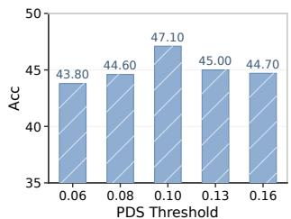  
(b) PDS Sensitivity

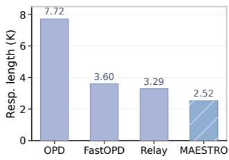  
(c) Training Response Length  
Figure 5: Ablation, sensitivity, and training-efficiency analysis of MAESTRO. (a) Component ablation. (b) PDS threshold sensitivity. (c) Average training response length.

Third, MAESTRO consistently improves upon both standard OPD and existing teacher-intervention methods. This shows that the benefit does not come from teacher intervention alone, but from adapting when and how much teacher guidance is introduced according to the current reasoning state.

## 4.3 IN-DEPTH ANALYSIS

Ablation Study. We first study the contribution of each component in MAESTRO. As shown in Fig. 5(a), the full method achieves the best results in both average accuracy and Pass@3. Using either coverage (Cov. only ) or distribution similarity (Sim. only) alone causes a clear performance drop, showing that the two terms provide complementary information for measuring policy disagreement. Removing weighted aggregation (w/o weighted-agg) also hurts performance, while using a fixed intervention span (w/o adapt. depth) gives a smaller but consistent drop. These results support both the design of PDS and the adaptive intervention strategy.

Sensitivity Analysis. We further examine the sensitivity of MAESTRO to the PDS threshold. As shown in Fig. 5(b), performance increases as the threshold moves from 0.06 to 0.10 and decreases thereafter, reaching the best average accuracy of 47.12 at 0.10. This suggests that an intermediate threshold provides a better balance: a low threshold may trigger teacher intervention too frequently, while a high threshold may miss useful interventions.

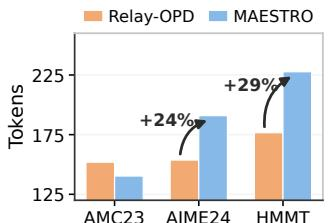  
(a) Intervention Usage

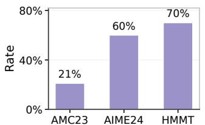  
(b) Hard-Case Trigger Rate

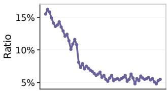  
(c) Intervention Ratio during Training  
Figure 6: Intervention behavior across problem difficulty and training. (a) Average intervention usage per trajectory. (b) Hard-case trigger rate across the same benchmarks. (c) Intervention ratio during training, measured as the fraction of teacher-generated tokens in each response.

Efficiency Analysis. MAESTRO reduces the average training response length by 67.3% relative to OPD, leading to substantially lower rollout cost. This improvement reflects our RQ2 finding (Section 2.2.2) that appropriate teacher intervention can stabilize training under a limited rollout length while reducing unnecessary student continuation. MAESTRO operationalizes this tradeoff through adaptive intervention, reducing unnecessary rollout tokens while maintaining effective learning.

## 4.4 ADAPTIVE INTERVENTION ANALYSIS

We further examine whether MAESTRO actually exhibits the adaptive behavior motivated by our analysis. We focus on two aspects: whether teacher guidance adapts to problem difficulty, and whether intervention changes as the student improves during training.

Adaptation to Problem Difficulty. MAESTRO automatically allocates more teacher guidance to harder problems. As shown in Fig. 6(a), it uses fewer teacher tokens than Relay-OPD on the easier AMC23, but increases teacher usage on the harder AIME24 and HMMT by 24% and 29%, respectively. This adaptation is also reflected in intervention depth. Fig. 6(b) shows that the hard-case trigger rate rises from 21% on AMC23 to 60% on AIME24 and 70% on HMMT. These results show that MAESTRO uses PDS to adapt not only whether to intervene, but also how much teacher guidance to provide according to the difficulty of the current trajectory.

Adaptation During Training. MAESTRO also adjusts its intervention behavior as the student improves. As shown in Fig. 6(c), the overall intervention ratio gradually decreases from about 16% to around 5% during training. Rather than maintaining a fixed level of teacher guidance, MAESTRO progressively returns more of the rollout to the student as the two policies become closer. This shows that its intervention naturally adapts to the evolving student policy.

## 5 CONCLUSION

Teacher intervention in OPD is not simply a matter of providing more teacher guidance. Our analysis reveals a structured interaction between intervention and student learning. Rollout quality and off-policy load both scale approximately logarithmically with intervention depth, while moderate intervention raises peak performance and stronger intervention improves retention. Moreover, the preferred intervention depth and position vary with problem difficulty and reasoning progress. Together, these findings suggest that effective teacher guidance should be selective and adaptive rather than uniformly applied.

Motivated by these observations, we introduce MAESTRO, which uses local policy disagreement to adapt both the timing and depth of teacher intervention. Across eight mathematical reasoning benchmarks and two student scales, MAESTRO achieves the highest macro-average accuracy among the compared methods while reducing average training response length by 67.3% relative to standard OPD. More broadly, our results suggest that the key to effective OPD is not maximizing teacher involvement, but orchestrating teacher guidance around where and how much the student needs it.

## REFERENCES

Rishabh Agarwal, Nino Vieillard, Yongchao Zhou, Piotr Stanczyk, Sabela Ramos Garea, Matthieu Geist, and Olivier Bachem. On-policy distillation of language models: Learning from selfgenerated mistakes. In The Twelfth International Conference on Learning Representations, ICLR 2024, Vienna, Austria, May 7-11, 2024. OpenReview.net, 2024. URL https://openreview. net/forum?id=3zKtaqxLhW.

Samy Bengio, Oriol Vinyals, Navdeep Jaitly, and Noam Shazeer. Scheduled sampling for sequence prediction with recurrent neural networks. In Corinna Cortes, Neil D. Lawrence, Daniel D. Lee, Masashi Sugiyama, and Roman Garnett (eds.), Advances in Neural Information Processing Systems 28: Annual Conference on Neural Information Processing Systems 2015, December 7-12, 2015, Montreal, Quebec, Canada, pp. 1171–1179, 2015. URL https://proceedings.neurips.cc/paper/2015/hash/ e995f98d56967d946471af29d7bf99f1-Abstract.html.

Anil Bhattacharyya. On a measure of divergence between two statistical populations defined by their probability distribution. Bulletin ofthe Calcutta Mathematical Society, 35:99–110, 1943.

DeepSeek-AI. Deepseek-r1: Incentivizing reasoning capability in llms via reinforcement learning. CoRR, abs/2501.12948, 2025. doi: 10.48550/ARXIV.2501.12948. URL https://doi.org/ 10.48550/arXiv.2501.12948.

Jasper Dekoninck, Nikola Jovanovic, Tim Gehrunger, Kári Rögnvaldsson, Ivo Petrov, Chenhao Sun, and Martin T. Vechev. Beyond benchmarks: Matharena as an evaluation platform for mathematics with llms. CoRR, abs/2605.00674, 2026. doi: 10.48550/ARXIV.2605.00674. URL https://doi.org/10.48550/arXiv.2605.00674.

Xinyu Guan, Li Lyna Zhang, Yifei Liu, Ning Shang, Youran Sun, Yi Zhu, Fan Yang, and Mao Yang. rstar-math: Small llms can master math reasoning with self-evolved deep thinking. In Aarti Singh, Maryam Fazel, Daniel Hsu, Simon Lacoste-Julien, Felix Berkenkamp, Tegan Maharaj, Kiri Wagstaff, and Jerry Zhu (eds.), Forty-second International Conference on Machine Learning, ICML 2025, Vancouver, BC, Canada, July 13-19, 2025, volume 267 of Proceedings ofMachine Learning Research. PMLR / OpenReview.net, 2025. URL https://proceedings.mlr. press/v267/guan25f.html.

Chaoqun He, Renjie Luo, Yuzhuo Bai, Shengding Hu, Zhen Leng Thai, Junhao Shen, Jinyi Hu, Xu Han, Yujie Huang, Yuxiang Zhang, Jie Liu, Lei Qi, Zhiyuan Liu, and Maosong Sun. Olympiadbench: A challenging benchmark for promoting AGI with olympiad-level bilingual multimodal scientific problems. In Lun-Wei Ku, Andre Martins, and Vivek Srikumar (eds.), Proceedings ofthe 62nd Annual Meeting ofthe Associationfor Computational Linguistics (Volume 1: Long Papers), ACL 2024, Bangkok, Thailand, August 11-16, 2024, pp. 3828–3850. Association for Computational Linguistics, 2024. doi: 10.18653/V1/2024.ACL-LONG.211. URL https://doi.org/10.18653/v1/2024.acl-long.211.

Geoffrey E. Hinton, Oriol Vinyals, and Jeffrey Dean. Distilling the knowledge in a neural network. CoRR, abs/1503.02531, 2015. URL http://arxiv.org/abs/1503.02531.

Jie Huang, Xinyun Chen, Swaroop Mishra, Huaixiu Steven Zheng, Adams Wei Yu, Xinying Song, and Denny Zhou. Large language models cannot self-correct reasoning yet. In The Twelfth International Conference on Learning Representations, ICLR 2024, Vienna, Austria, May 7-11, 2024. OpenReview.net, 2024. URL https://openreview.net/forum?id=IkmD3fKBPQ.

Kexin Huang, Haoming Meng, Junkang Wu, Jinda Lu, Chiyu Ma, Ziqian Chen, Xue Wang, Bolin Ding, Jiancan Wu, Xiang Wang, Xiangnan He, Guoyin Wang, and Jingren Zhou. On the direction of RLVR updates for LLM reasoning: Identification and exploitation. CoRR, abs/2603.22117, 2026. doi: 10.48550/ARXIV.2603.22117. URL https://doi.org/10.48550/arXiv. 2603.22117.

Li Jiang, Haoran Xu, Yichuan Ding, and Amy Zhang. Trajectory-refined distillation. CoRR, abs/2606.08432, 2026. doi: 10.48550/ARXIV.2606.08432. URL https://doi.org/10. 48550/arXiv.2606.08432.

Yaxuan Li, Yuxin Zuo, Bingxiang He, Jinqian Zhang, Chaojun Xiao, Cheng Qian, Tianyu Yu, Huanang Gao, Wenkai Yang, Zhiyuan Liu, and Ning Ding. Rethinking on-policy distillation of large language models: Phenomenology, mechanism, and recipe. CoRR, abs/2604.13016, 2026. doi: 10. 48550/ARXIV.2604.13016. URL https://doi.org/10.48550/arXiv.2604.13016.

Hunter Lightman, Vineet Kosaraju, Yuri Burda, Harrison Edwards, Bowen Baker, Teddy Lee, Jan Leike, John Schulman, Ilya Sutskever, and Karl Cobbe. Let’s verify step by step. In The Twelfth International Conference on Learning Representations, ICLR 2024, Vienna, Austria, May 7-11, 2024. OpenReview.net, 2024. URL https://openreview.net/forum?id= v8L0pN6EOi.

Stéphane Ross, Geoffrey J. Gordon, and Drew Bagnell. A reduction of imitation learning and structured prediction to no-regret online learning. In Geoffrey J. Gordon, David B. Dunson, and Miroslav Dudík (eds.), Proceedings ofthe Fourteenth International Conference on Artificial Intelligence and Statistics, AISTATS 2011, Fort Lauderdale, USA, April 11-13, 2011, volume 15 of JMLR Proceedings, pp. 627–635. JMLR.org, 2011. URL http://proceedings.mlr. press/v15/ross11a/ross11a.pdf.

Zhihong Shao, Peiyi Wang, Qihao Zhu, Runxin Xu, Junxiao Song, Mingchuan Zhang, Y. K. Li, Y. Wu, and Daya Guo. Deepseekmath: Pushing the limits of mathematical reasoning in open language models. CoRR, abs/2402.03300, 2024. doi: 10.48550/ARXIV.2402.03300. URL https://doi.org/10.48550/arXiv.2402.03300.

Qwen Team. Qwen3 technical report. CoRR, abs/2505.09388, 2025. doi: 10.48550/ARXIV.2505. 09388. URL https://doi.org/10.48550/arXiv.2505.09388.

Haolei Xu, Xiaowen Xu, Haiwen Hong, Zixuan Ni, Hongxing Li, Yiwen Qiu, Weiming Lu, and Yongliang Shen. Pass the baton: Trajectory-relayed on-policy distillation. CoRR, abs/2607.26057, 2026. doi: 10.48550/ARXIV.2607.26057. URL https://doi.org/10.48550/arXiv. 2607.26057.

Wenda Xu, Rujun Han, Zifeng Wang, Long T. Le, Dhruv Madeka, Lei Li, William Yang Wang, Rishabh Agarwal, Chen-Yu Lee, and Tomas Pfister. Speculative knowledge distillation: Bridging the teacher-student gap through interleaved sampling. In The Thirteenth International Conference on Learning Representations, ICLR 2025, Singapore, April 24-28, 2025. OpenReview.net, 2025. URL https://openreview.net/forum?id=EgJhwYR2tB.

An Yang, Beichen Zhang, Binyuan Hui, Bofei Gao, Bowen Yu, Chengpeng Li, Dayiheng Liu, Jianhong Tu, Jingren Zhou, Junyang Lin, Keming Lu, Mingfeng Xue, Runji Lin, Tianyu Liu, Xingzhang Ren, and Zhenru Zhang. Qwen2.5-math technical report: Toward mathematical expert model via self-improvement. CoRR, abs/2409.12122, 2024. doi: 10.48550/ARXIV.2409.12122. URL https://doi.org/10.48550/arXiv.2409.12122.

Ling Yang, Zhaochen Yu, Tianjun Zhang, Minkai Xu, Joseph E. Gonzalez, Bin Cui, and Shuicheng Yan. Supercorrect: Advancing small LLM reasoning with thought template distillation and selfcorrection. In The Thirteenth International Conference on Learning Representations, ICLR 2025, Singapore, April 24-28, 2025. OpenReview.net, 2025. URL https://openreview.net/ forum?id=PyjZO7oSw2.

Qiying Yu, Zheng Zhang, Ruofei Zhu, Yufeng Yuan, Xiaochen Zuo, Yu Yue, Weinan Dai, Tiantian Fan, Gaohong Liu, Juncai Liu, Lingjun Liu, Xin Liu, Haibin Lin, Zhiqi Lin, Bole Ma, Guangming Sheng, Yuxuan Tong, Chi Zhang, Mofan Zhang, Ru Zhang, Wang Zhang, Hang Zhu, Jinhua Zhu, Jiaze Chen, Jiangjie Chen, Chengyi Wang, Hongli Yu, Yuxuan Song, Xiangpeng Wei, Hao Zhou, Jingjing Liu, Wei-Ying Ma, Ya-Qin Zhang, Lin Yan, Yonghui Wu, and Mingxuan Wang. DAPO: an opensource LLM reinforcement learning system at scale. In Danielle Belgrave, Cheng Zhang, Laura N. Montoya, Hsuan-Tien Lin, Razvan Pascanu, Piotr Koniusz, Marzyeh Ghassemi, Nancy Chen, Iván Vladimir Meza Ruíz, and Arturo Loaiza-Bonilla (eds.), Advances in Neural Information Processing Systems 38: Annual Conference on Neural Information Processing Systems 2025, NeurIPS 2025,

San Diego, CA, USA, December 2-7, 2025 / Mexico City, Mexico, November 30 - December 5, 2025, 2025. URL http://papers.nips.cc/paper\_files/paper/2025/hash/ a4277440d50f1f15d2cb4c14f7e0c0d2-Abstract-Conference.html.

Chen Zhang, Qiuchi Li, Dawei Song, Zheyu Ye, Yan Gao, and Yao Hu. Towards the law of capacity gap in distilling language models. In Wanxiang Che, Joyce Nabende, Ekaterina Shutova, and Mohammad Taher Pilehvar (eds.), Proceedings ofthe 63rd Annual Meeting ofthe Associationfor Computational Linguistics (Volume 1: Long Papers), ACL 2025, Vienna, Austria, July 27 - August 1, 2025, pp. 22504–22528. Association for Computational Linguistics, 2025. doi: 10.18653/V1/2025. ACL-LONG.1097. URL https://doi.org/10.18653/v1/2025.acl-long.1097.

Dongxu Zhang, Zhichao Yang, Sepehr Janghorbani, Jun Han, Andrew Ressler II, Qian Qian, Gregory D. Lyng, Sanjit Singh Batra, and Robert E. Tillman. Fast and effective on-policy distillation from reasoning prefixes. In Maria Liakata, Viviane P. Moreira, Jiajun Zhang, and David Jurgens (eds.), Findings of the Association for Computational Linguistics, ACL 2026, San Diego, California, United States, July 2-7, 2026, pp. 25553–25569. Association for Computational Linguistics, 2026. doi: 10.18653/V1/2026.FINDINGS-ACL.1276. URL https://doi.org/10.18653/v1/2026.findings-acl.1276.

Ziheng Zhou, Jiaqi Li, Huacong Tang, Ying Nian Wu, and Demetri Terzopoulos. Less is more: Early stopping rollout for on-policy distillation. arXiv preprint arXiv:2605.27028, 2026. URL https://arxiv.org/abs/2605.27028.

## A RELATED WORK

On-Policy Distillation. On-policy distillation (OPD) trains the student on trajectories sampled from its current policy, allowing teacher supervision to remain aligned with the states encountered by the student (Agarwal et al., 2024). Recent studies have begun to examine the mechanisms and limitations of OPD. Rethinking OPD identifies teacher–student compatibility and informative teacher knowledge as key factors for successful distillation, and characterizes training as progressive alignment on high-probability tokens (Li et al., 2026). FastOPD further finds that useful supervision is concentrated toward reasoning prefixes, showing that shorter rollouts can retain much of the benefit of full OPD at substantially lower training cost (Zhang et al., 2026). Beyond standard OPD, recent work also explores trajectory-level correction. TRD refines problematic student trajectories with teacher guidance, while Relay-OPD briefly hands generation to the teacher at detected failure points before returning control to the student (Jiang et al., 2026; Xu et al., 2026). These studies motivate a closer examination of how much teacher guidance should be introduced and how it should be allocated along student trajectories.

Reasoning Post-Training. Recent advances in mathematical reasoning have shown that substantial reasoning capabilities can be elicited through post-training. DeepSeek-R1 demonstrates that large-scale reinforcement learning can induce long-form reasoning behaviors, while subsequent work has improved the effectiveness and reproducibility of reinforcement learning with verifiable rewards (DeepSeek-AI, 2025; Yu et al., 2025). Other approaches improve mathematical reasoning through iterative self-improvement, reward-guided training, and search-based reasoning (Yang et al., 2024; Guan et al., 2025). These advances establish mathematical reasoning as an important setting for studying long-horizon model improvement. In contrast to reward-based optimization, our work focuses on how dense teacher supervision can be selectively introduced into student reasoning trajectories.

## B ANALYSIS EXPERIMENT DETAILS

We provide additional details for the controlled experiments in Section 2. Unless otherwise specified, the analysis experiments use the same rollout hyperparameters as the main experiments and final evaluation. Unless otherwise specified, each reported evaluation result is computed with avg@32.

## B.1 RQ1: SCALING TRADE-OFF OF TEACHER INTERVENTION

For RQ1, we use a Qwen3-0.6B checkpoint obtained after 35 steps of OPD training. The trained checkpoint provides sufficiently long reasoning trajectories for controlled intervention analysis. Starting from the same checkpoint, we systematically vary the intervention depth while keeping the evaluated problems and rollout configuration fixed. For each configuration, we measure both trajectory accuracy and the trajectory-normalized off-policy load defined in Section 2. This controlled comparison isolates how increasing teacher intervention affects trajectory quality and off-policy deviation.

## B.2 RQ2: INTERVENTION FOR STABLE AND EFFICIENT TRAINING

Intervention under a limited rollout length. We use Qwen3-0.6B as the student and deliberately restrict the maximum response length to 515 tokens. We vary the amount of teacher intervention while keeping the remaining training configuration fixed. This constrained setting makes the performance boundary observable within a limited rollout length, allowing us to compare how different levels of teacher intervention affect the attainable performance peak and subsequent training stability.

Post-Intervention Student Continuation. We further examine how much student rollout is necessary after teacher intervention. We set the PDS threshold to 0.14 and allow at most two teacher interventions per trajectory. After the final intervention, we vary the student continuation budget among 0, 1K, 2K, and 4K tokens, where a budget of 0 terminates the trajectory immediately after the final teacher intervention. All other training and rollout settings are kept fixed. We compare the resulting performance, response length, rollout cost, and training efficiency.

## B.3 RQ3: ADAPTIVE ALLOCATION OF TEACHER INTERVENTION

For RQ3, we use the same Qwen3-0.6B checkpoint after 35 steps of OPD training as in RQ1. We conduct controlled experiments over intervention depth and relative intervention position while keeping the model checkpoint and rollout configuration fixed. For intervention depth, we compare problems of different difficulty to study how the preferred amount of teacher guidance changes across trajectories. For intervention position, we vary where teacher intervention occurs along the reasoning trajectory and measure the resulting trajectory quality.

Normalized Improvement. To compare intervention effects across problem groups with different baseline difficulty and attainable accuracy ranges, we normalize the observed accuracy within the available improvement range of each group. For problem group g, we define

$$
I _ { g , t } = \frac { A _ { g , t } - A _ { g , \mathrm { b a s e } } } { A _ { g , \mathrm { p e a k } } - A _ { g , \mathrm { b a s e } } } ,\tag{7}
$$

where $A _ { g , t }$ denotes the accuracy under the current intervention configuration, $A _ { g , \mathrm { b a s e } }$ is the minimum accuracy before teacher intervention, and $A _ { g , \mathrm { p e a k } }$ is the maximum accuracy reached after teacher intervention. Under this normalization, $I _ { g , t } = 0$ corresponds to the pre-intervention minimum and $I _ { g , t } = 1$ corresponds to the post-intervention peak. This normalization accounts for differences in both absolute accuracy and available improvement range, allowing the relative benefit of teacher intervention to be compared across problem groups of different difficulty.

## C TRAINING DETAILS

We provide additional implementation details for the main experiments. For training hyperparameters shared with Relay-OPD, we follow its official implementation.

Optimization. We use a global batch size of 128 and a PPO mini-batch size of 128, with one optimization epoch per batch. The learning rate is fixed at $1 \times 1 0 ^ { - 6 }$ throughout training, and each prompt uses one rollout during online distillation. All methods are trained for one epoch. The maximum prompt and response lengths are 2,048 and 8,192 tokens, respectively. Training is conducted on eight NVIDIA H20 GPUs, with four GPUs allocated to the student and four to the teacher.

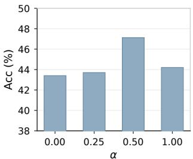  
(a) Sensitivity to α

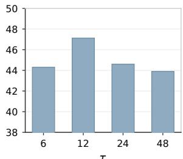  
(b) Sensitivity to τ  
Figure 7: Sensitivity of MAESTRO to the paragraph-level aggregation hyperparameters. (a) Sensitivity to the weighting strength α. (b) Sensitivity to the decay scale τ . The default configuration, $\alpha = 0 . 5$ and $\tau = 1 2$ , achieves the highest accuracy in both sweeps.

Rollout and Evaluation. Trajectory generation uses a sampling temperature of 1.0 and top-p of 1.0. The same sampling hyperparameters are used for the analysis experiments, main training experiments, and final evaluation. During evaluation, we independently sample 32 responses for each problem and report avg@32 accuracy.

PDS Configuration. We set the PDS threshold to 0.14 for Qwen3-0.6B and 0.10 for Qwen3-1.7B. The smaller student exhibits a larger inherent policy gap from the teacher and therefore uses a slightly higher intervention threshold. For both model scales, we allow at most two teacher interventions per trajectory. PDS is aggregated over natural reasoning paragraphs rather than a fixed tokenlevel sliding window. We identify paragraph boundaries in the generated reasoning trajectory and make intervention decisions at paragraph boundaries. Within each paragraph, we use the weighted aggregation defined in Section 3.1, with $\alpha = 0 . 5$ and $\tau = 1 2$ . This design assigns greater importance to disagreement earlier in a reasoning paragraph while aligning intervention decisions with coherent reasoning segments.

We cap the number of teacher interventions at 2 primarily to control rollout efficiency and maintain a comparable intervention regime to Relay-OPD. Because the rollout terminates after the final intervention, allowing additional interventions also permits longer student–teacher interaction before termination and can increase rollout cost. We therefore treat the intervention cap as an efficiency constraint rather than a performance-tuned hyperparameter.

## D ADDITIONAL ANALYSIS AND ROBUSTNESS

## D.1 SENSITIVITY TO AGGREGATION HYPERPARAMETERS

MAESTRO uses two hyperparameters in paragraph-level PDS aggregation: α controls the additional weight assigned to earlier tokens, while τ controls how quickly this emphasis decays within a reasoning paragraph. To examine whether the aggregation mechanism depends critically on these choices, we vary one hyperparameter at a time while keeping all other settings fixed. The sensitivity analyses in Figures 5(b) and 7 are conducted with the Qwen3-1.7B-Non-Thinking student.

As shown in Figure 7(a), the default $\alpha = 0 . 5$ achieves an accuracy of 47.1, compared with 43.4, 43.7, and 44.2 for $\alpha = 0 , 0 . 2 5$ , and 1.0, respectively. A similar pattern is observed for τ in Figure 7(b): $\tau = 1 2$ achieves 47.1, while $\tau = 6 , 2 4$ , and 48 obtain 44.3, 44.6, and 43.9, respectively.

These results reveal a clear trade-off in paragraph-level aggregation. If the positional bias is too weak, the aggregation approaches uniform averaging and underuses the fact that disagreement near the beginning of a reasoning paragraph is often more indicative of its subsequent direction. Conversely, an excessively large weighting strength can make a few early tokens dominate the decision, while a very small decay scale concentrates the extra weight too narrowly near the paragraph beginning. A very large decay scale instead spreads the positional bias too broadly, weakening the distinction between early directional signals and later continuation. The default setting therefore balances early emphasis with paragraph-level evidence.

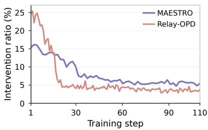  
(a) Intervention Ratio

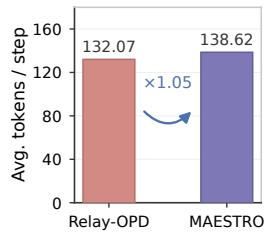

(b) Average Intervention per Step  
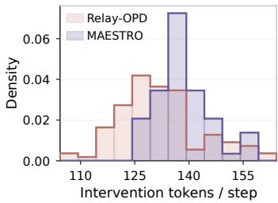  
(c) Intervention Tokens  
Figure 8: Comparison of teacher usage between MAESTRO and Relay-OPD. (a) Intervention ratio throughout training. (b) Average teacher-token usage per training step, showing comparable overall teacher budgets between the two methods. (c) Distribution of teacher-token volume across training steps. Although their aggregate usage is similar, MAESTRO exhibits a different temporal allocation of teacher guidance.

## D.2 TEACHER USAGE AND INTERVENTION ALLOCATION

We further examine whether the gains of MAESTRO can be attributed to simply using more teacher generation. Figure 8 compares its intervention behavior with Relay-OPD from both temporal and aggregate perspectives.

As shown in Figure 8(a), the two methods exhibit substantially different intervention dynamics. Relay-OPD concentrates much of its teacher involvement at the beginning of training and rapidly reduces its intervention ratio thereafter. In contrast, MAESTRO starts with a lower intervention ratio and decreases more gradually as training progresses. Despite this different allocation pattern, their overall teacher usage remains comparable: Figure 8(b) shows that MAESTRO uses only 1.05× the average teacher tokens per training step of Relay-OPD. Their token-volume distributions also largely overlap, as shown in Figure 8(c), while MAESTRO concentrates teacher usage more consistently around a moderate range.

Importantly, teacher generation should not be regarded as a monotonic performance resource in OPD. As shown in RQ2, increasing intervention does not continuously improve student performance: moderate intervention raises the attainable performance peak, whereas excessive intervention can reduce it. Together with the increasing off-policy deviation identified in RQ1, this indicates that additional teacher involvement brings both corrective benefit and distributional cost. Effective intervention therefore requires careful allocation rather than simply maximizing or exactly matching the number of teacher-generated tokens.

These results suggest that MAESTRO’s improvement is primarily associated with how teacher guidance is allocated over training, rather than a substantial increase in the overall teacher budget. By adapting intervention to the current policy disagreement, MAESTRO redistributes a comparable amount of teacher guidance toward the states where stronger correction is needed.