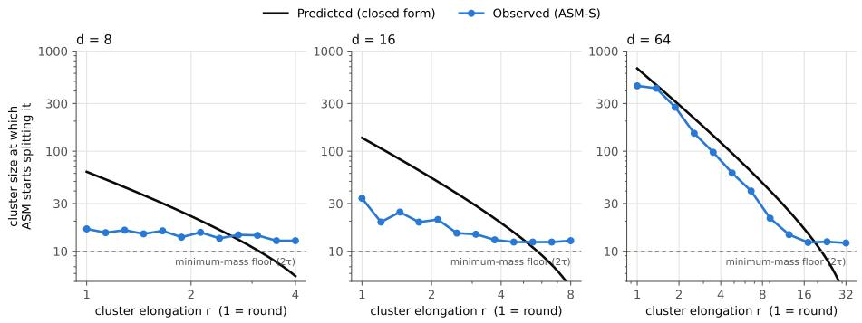
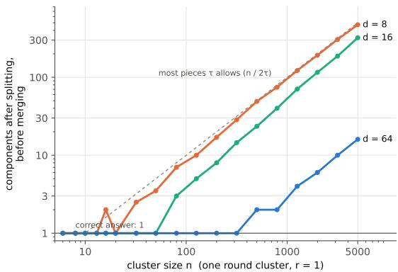
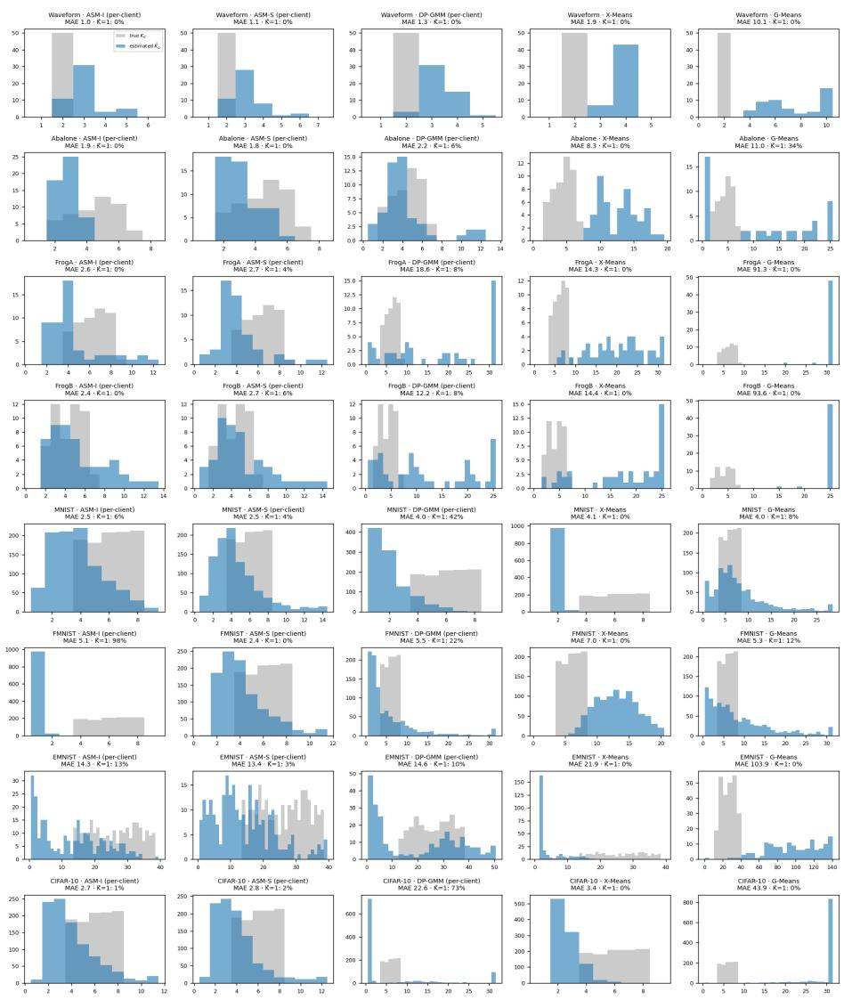
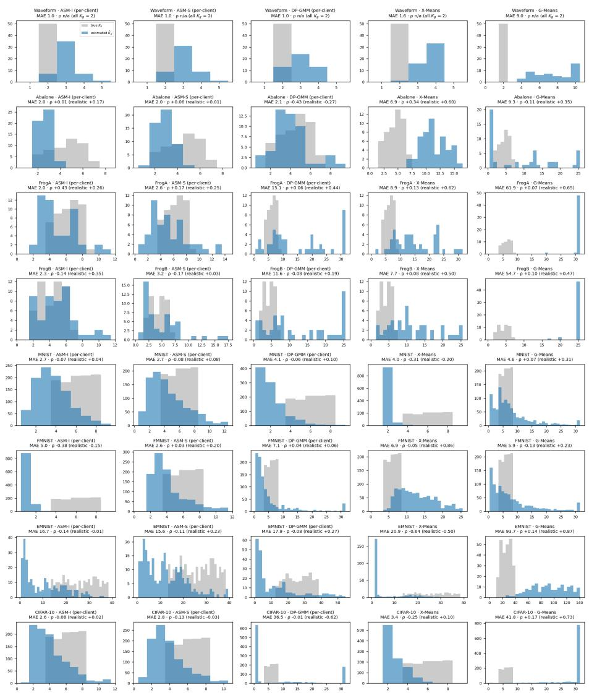
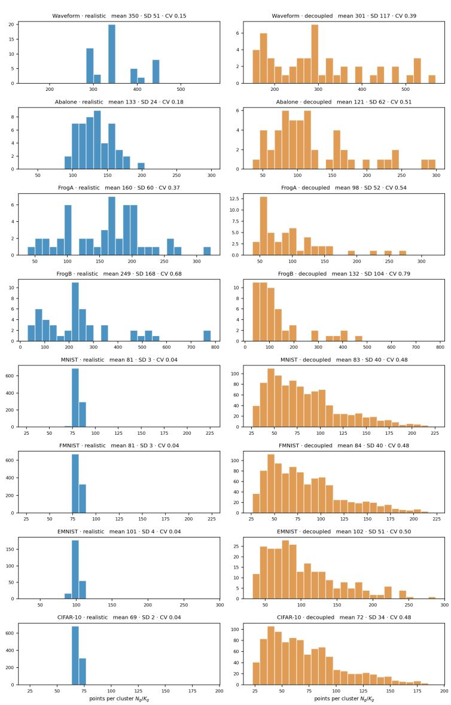

# Federated Clustering with Unknown Local and Global Cluster Cardinalities

Mitushi Goyal, Tarun S., Riddhanya Senapathi, Arun Raman

BITS Pilani K. K. Birla Goa Campus, Goa, India.

## Abstract

Federated clustering methods that do not require the global number of clusters K still assume that each client knows its local number $K _ { g } .$ . This assumption is hard to justify when clients know no more about their data than the server does, as in fault diagnosis across independently operated industrial sites. We propose a two-phase framework in which neither count is known: each client first estimates $K _ { g }$ from its own data, and an aggregator that requires local counts, such as FedGEM, then uses these estimates in place of the true values. For the first phase we introduce Adaptive Split–Merge (ASM), which grows a spherical Gaussian mixture by BIC-driven splitting and then merges excess components. ASM uses no labels, selects its hyperparameters on held-out client data only, and makes no assumption about how clusters are shared across clients. We derive a closed-form split criterion whose critical cluster size falls with anisotropy and rises with dimension, and show empirically that over-fragmentation grows with the number of points per cluster, which federation divides among clients. Across eight datasets, ASM with FedGEM attains a mean ARI of 0.333, against 0.256 for the next best label-free estimator and 0.361 when the true local counts are supplied. It also gives the most reliable global estimates of K and is robust when client size is decoupled from local cardinality.

## 1 Introduction

Federated clustering recovers cluster structure from unlabeled data held by clients that cannot pool it for reasons of privacy, regulation or cost. Each client can find structure in its own data, but the server must decide which of these locally discovered structures correspond to the same global cluster, without ever seeing the data behind them.

A concrete instance arises for original equipment manufacturers (OEMs) of capital-intensive industrial systems such as power generators, which are contractually bound to guarantee the reliability of equipment operated by their clients (Ibrahim et al., 2026). Meeting these guarantees requires the OEM to detect and diagnose faults from sensor data collected across client sites, and the problem is unsupervised and federated by necessity. The OEM does not know every fault class in advance. Labels supplied by clients are unreliable because labeling standards and maintenance practices difer from site to site. Raw sensor data cannot be shared. FedGEM (Ibrahim et al., 2026) addresses this setting without requiring the global number of clusters K, but it still assumes that each client knows its own local number $K _ { g } .$ . However, it is reasonable to assume that the plant operators know no more about the equipment’s fault classes than the OEM that designed it, so the reasons K is unknown apply equally to every $K _ { g } .$

The same independence constrains how any method can be tuned. Each site operates its equipment under its own maintenance regime and has no access to other sites’ data, so hyperparameters cannot be tuned jointly, either across sites or between a site and the OEM. Sites can, however, exchange information with the OEM at the level of parameters and summaries, repeatedly if needed. This naturally separates the problem into two phases: each site first decides on its own how finely to describe its data, and the OEM then reconciles these descriptions across sites through repeated exchange of parameters.

The granularity with which a site describes its data matters in two ways. Clients can get their own class-counts wrong, and what the server can do about it depends on the direction of the error. If a client reports two components where one was present, the server can merge them from the reported parameters alone. If it reports one where two were present, no correction is possible: many diferent pairs of components share the same mean and covariance, and resolving the ambiguity would require a change in the information sharing structure. That argues for reporting finely, but the same quantity governs disclosure: a site reporting a single component reveals little beyond the gross statistics of its operation, while one reporting a component per measurement has shared the raw data it was contractually unable to send. The number of reported components therefore sits on a continuum, with recoverability increasing along it and confidentiality decreasing, and the first phase must place itself deliberately between the two. Finally, how many points a site holds may or may not reflect how many clusters it holds, depending on how its data were collected (for example, periodic logging, event-triggered logging, curated logging such as during diagnostic tests etc.), so an estimator of $K _ { g }$ must not rely on client size as a proxy.

We propose a two-phase framework in which each client first estimates $K _ { g }$ from its own data and a federated aggregator that requires local counts, such as FedGEM, then takes these estimates in place of the true values. For the first phase we introduce the Adaptive Split–Merge (ASM) estimator, which grows a spherical Gaussian mixture (and thus, ASM-S) by recursive binary splitting: each candidate split is initialized along the principal direction, as in G-means (Hamerly & Elkan, 2003), fitted by EM, and accepted when it improves the Bayesian Information Criterion, as in X-means (Pelleg & Moore, 2000). ASM adds a merge stage that undoes excess splits, and selects all hyperparameters on held-out client data, without labels.

## Contributions.

• A two-phase framework for federated clustering in which neither the local nor the global number of clusters is known. The framework is modular in both phases: any centralized method that estimates the number of clusters can serve as the local estimator, and any federated aggregator that requires local counts, such as FedGEM, can serve as the second phase, without modification to either.

• ASM, a label-free local cardinality estimator that combines BICdriven splitting with a merge stage and selects its hyperparameters on each client’s own held-out data (Section 4).

• An analysis of when BIC splitting fragments a single cluster. A closed-form criterion gives a critical cluster size that falls with anisotropy and rises with dimension. Synthetic experiments confirm it once smallsample inflation of anisotropy is accounted for and show that, beyond the critical size, splitting continues until the minimum-mass constraint binds. On pooled benchmarks, sample size governs the over-fragmentation of the split stage, and a bound derived from class anisotropy predicts where merging begins on seven of eight datasets (Section 4).

• A federated evaluation that decouples client size from local cardinality. Across eight datasets, ASM-S with FedGEM attains a mean ARI of 0.333, against 0.256 for the next best label-free method and 0.361 when the true local counts are supplied. It gives the most reliable global estimates, with $| \hat { K } - K ^ { * } | \le 2 1$ against up to 188 and 263 for DP-GMM and G-means, and is unafected when client size is made independent of $K _ { g }$ (Section 5).

## 2 Related work

Table 1 summarizes the methods discussed below by what each requires as input.

Federated clustering with known K. k-FED (Dennis et al., 2021) runs kmeans on each client and clusters the pooled centroids into K global clusters in a single round. FedKmeans (Garst & Reinders, 2024) performs federated Lloyd iterations under a shared K. The federated fuzzy c-means methods FFCM-avg1 and FFCM-avg2 (Stallmann & Wilbik, 2022) use fuzzy memberships and difer in how local prototypes are averaged. All of these require K at the server.

Federated clustering with unknown K. AFCL (Zhang et al., 2025) initializes each client with more seed points than clusters and lets redundant seeds merge through interaction with the server, so that the number of distinct clusters emerges as a by-product; clients may also communicate with the server asynchronously. FedGEM (Ibrahim et al., 2026) casts federated clustering as federated generalized EM: each client fits a local mixture with $K _ { g }$ components together with an uncertainty set for each component, and the server groups components whose sets overlap, estimating K as the number of groups. Because this grouping never uses a cluster count, FedGEM can serve as the second phase of our framework (Section 5). SPAHM (Yurochkin et al., 2019) takes a related approach for models trained independently on separate datasets, matching their parameters under a Bayesian nonparametric prior so that the number of global components is inferred. These methods relax the assumption of a known K but retain other cardinality inputs: FedGEM takes each $K _ { g }$ as given, SPAHM aggregates local models whose sizes were fixed beforehand, and the published experiments of AFCL draw the initial number of seeds from [K, 2K].

Table 1: Clustering methods by the cardinality information each requires. † AFCL does not take $K _ { g } ,$ , but its initial number of seeds is set with reference to K. ‡ ASM fits spherical Gaussian components on each client; the global cluster model is that of the second-phase aggregator.
<table><tr><td>Method</td><td>Federated</td><td>Unknown K</td><td>Unknown  $K _ { g }$ </td><td>Cluster model</td></tr><tr><td>k-means / GMM</td><td>x</td><td>x</td><td></td><td>spherical / Gaussian</td></tr><tr><td>X-means (Pelleg &amp; Moore, 2000)</td><td>x</td><td>√</td><td></td><td>spherical Gaussian</td></tr><tr><td>G-means (Hamerly &amp; Elkan, 2003)</td><td>x</td><td>√</td><td></td><td>Gaussian</td></tr><tr><td>DP-GMM (Antoniak, 1974)</td><td>x</td><td>√</td><td></td><td>Gaussian</td></tr><tr><td>k-FED (Dennis et al., 2021)</td><td>√</td><td>x</td><td>x</td><td>spherical</td></tr><tr><td>FedKmeans (Garst &amp; Reinders, 2024)</td><td>√</td><td>x</td><td>x</td><td>spherical</td></tr><tr><td>FFCM (Stallmann &amp; Wilbik, 2022)</td><td>√</td><td>x</td><td>x</td><td>fuzzy / spherical</td></tr><tr><td>SPAHM (Yurochkin et al., 2019)</td><td>√</td><td>√</td><td>x</td><td>model-agnostic</td></tr><tr><td>AFCL (Zhang et al., 2025)</td><td>√</td><td>√</td><td>(√)t</td><td>centroid-based</td></tr><tr><td>FedGEM (Ibrahim et al., 2026)</td><td>√</td><td>√</td><td>x</td><td>isotropic Gaussian</td></tr><tr><td>This work</td><td>√</td><td>√</td><td>√</td><td>spherical Gaussian‡</td></tr></table>

Local cardinality. To our knowledge, no federated clustering method estimates both the local counts $K _ { g }$ and the global count K from data without cardinality inputs. Our framework treats both as unknown and supplies the local counts that aggregators such as FedGEM require.

Choosing the number of clusters in centralized clustering. X-means (Pelleg & Moore, 2000) splits a centroid when the split improves the Bayesian Information Criterion, and G-means (Hamerly & Elkan, 2003) splits when a onedimensional projection of the assigned points fails a normality test, initializing the children along the principal direction. Split-and-merge EM (Ueda et al., 2000) uses split and merge moves to escape local optima at a fixed number of components, whereas Figueiredo & Jain (2002) select the number of components by annihilating weak components under a minimum-message-length criterion. Dirichlet-process mixtures (Antoniak, 1974; Blei & Jordan, 2006) infer the number of components under a nonparametric prior. ASM shares the BIC-driven recursive splitting of X-means and the principal-direction initialization of Gmeans, but fits each candidate split by EM under a spherical Gaussian model. It also introduces a merge stage that operates on the same components, selection of all hyperparameters on held-out client data alone, and an analysis of when the BIC split criterion fragments a single cluster (Section 4), which applies to X-means-type estimators generally. We compare against DP-GMM, X-means and G-means as first-phase estimators in Section 5.

Clustered federated learning. Clustered federated learning (Ghosh et al., 2020; Sattler et al., 2020) groups clients with similar data distributions in order to train a separate model for each group. It clusters clients rather than data points and is complementary to the problem studied here.

## 3 Problem setting

A server coordinates G clients. Client $g ~ \in ~ [ G ]$ holds $\mathcal { X } _ { g } ~ = ~ \{ \pmb { x } _ { g i } \} _ { i = 1 } ^ { N _ { g } } ~ \subset ~ \mathbb { R } ^ { d }$ and may share model parameters or summary statistics with the server, but never observations. Clients cannot tune hyperparameters jointly, either with one another or with the server: any hyperparameter used on client g must be selected from $\chi _ { g }$ alone. Client-server communication is limited to parameters and summary statistics, and the local phase requires no iteration with the server. The pooled data $\textstyle { \mathcal { X } } = \bigcup _ { q } { \mathcal { X } } _ { g }$ belong to K global clusters indexed by [K]. Client g holds points from a subset $S _ { g } \subseteq [ K ]$ of local cardinality $K _ { g } = | S _ { g } |$ , where

$$
\bigcup _ { g = 1 } ^ { G } S _ { g } = [ K ] , \qquad 2 \leq K _ { g } < K { \mathrm { ~ f o r ~ a l l ~ } } g , \qquad S _ { g } \cap S _ { g ^ { \prime } } \neq \emptyset { \mathrm { ~ f o r ~ s o m e ~ } } g \neq g ^ { \prime } .\tag{1}
$$

Clients difer both in which clusters they hold and in the proportions of those clusters, so the local data distributions are non-IID. Neither the server nor the clients know $K , \{ K _ { g } \} _ { g = 1 } ^ { G }$ or $\{ S _ { g } \} _ { g = 1 } ^ { G }$ . The goal is to partition X into global clusters and to estimate K without moving data between clients.

The framework has two phases. First, each client independently computes an estimate $\hat { K } _ { g } = \mathcal { A } ( \mathcal { X } _ { g } )$ of its local cardinality. Second, an aggregator that requires local cardinalities, such as FedGEM (Ibrahim et al., 2026), takes $\{ \hat { K } _ { g } \}$ in place of the true values and, using client-side computations, returns global cluster parameters and $\hat { K }$ . We make no generative assumption about the data: ASM uses Gaussian components as a working model, and the analysis of Section 4 is carried out for Gaussian clusters to characterize its behavior, but neither the method nor the experiments require the data to follow a Gaussian mixture. In many of the experiments, clusters are the classes of benchmark datasets. Class labels are used only to construct the client subsets $S _ { g }$ and to evaluate the results, never by the methods.

## 4 Adaptive split–merge (ASM) algorithm and Analysis

## 4.1 Algorithm and Analysis

ASM starts from a single component containing all of the client’s points and grows the model by recursive binary splitting. To decide whether to split a component, it computes the eigendecomposition of its covariance matrix: the leading eigenvector $v _ { 1 }$ , with eigenvalue $\lambda _ { 1 }$ , gives the direction of greatest spread. Two candidate centroids are formed by perturbing the component mean along this direction in opposite senses, $\mu _ { \pm } = \mu \pm \delta \sqrt { \lambda _ { 1 } } v _ { 1 }$ , where $\delta$ is the split factor, and are used to initialize an EM run restricted to the component’s points and capped at 15 iterations. The split is accepted if it improves the Bayesian Information Criterion (BIC) over the unsplit component (Appendix B) and each child retains an efective mass, the sum of its responsibilities, of at least τthresh. The points of an accepted split are reassigned to the child with the highest responsibility, and the children are tested for further splitting in the next pass. Once no split is accepted, components are merged greedily, one pair at a time, whenever their centroids are closer than a multiple of their combined spread,

$$
\| \mu _ { i } - \mu _ { j } \| _ { 2 } \leq \alpha ( \sigma _ { i } + \sigma _ { j } ) ,\tag{2}
$$

where $\sigma _ { k } = \sqrt { \mathrm { t r } ( \Sigma _ { k } ) / d }$ is the root-mean-square per-dimension deviation of component k and $\alpha > 0$ is the merge factor. Under the spherical model, a component has standard deviation $\sigma _ { k }$ along every direction, so equation 2 tests whether two components overlap along the line joining their means, independently of the dimension; the criterion is of the Davies–Bouldin form (Davies & Bouldin, 1979). The pooled mean and spread are recomputed after each merge, and the estimated local count $K _ { g }$ is the number of components that remain. Pseudocode is given in Appendix A.

When does ASM split? Under simplifying assumptions, the split rule admits a closed form that explains ASM’s operating envelope. For a single Gaussian cluster of n points cut at its median along the leading eigenvector, the split criterion (equation 4 in Appendix B) is met when:

$$
\frac { n } { \log n } > \frac { d + 2 } { g ( r , d ) } , \qquad g ( r , d ) = - d \log \Bigl ( 1 - \frac { 2 r } { \pi d } \Bigr ) \approx \frac { 2 r } { \pi } , \qquad r = \frac { \lambda _ { 1 } } { { \mathrm { t r } } \Sigma / d } .\tag{3}
$$

The rule is invariant to feature scale and defines a critical cluster size that falls with the anisotropy r and rises with the dimension d. Three consequences follow. Isotropic clusters are protected up to a size that grows with $d ,$ which accounts for near-exact recovery of isotropic clusters in high dimension. Anisotropy is the binding limitation: an elongated cluster reaches its critical size at roughly $1 / r$ of the isotropic value and is then split even though it is a single true cluster. And because every cluster has a finite critical size, larger clients split more readily which makes the merge stage in the algorithm essential.

  
Figure 1: Size at which ASM-S begins to split a single Gaussian cluster, as a function of its anisotropy r $( r = 1$ is round). Black: prediction of equation 3 with the population anisotropy. Blue: size above which at least half of the proposed splits are accepted (50 draws per point, $\delta = 1 .$ $\tau _ { \mathrm { t h r e s h } } = 5 )$ . Below a curve the cluster is kept whole; above ${ \mathrm { i t } } ,$ it is split. Dashed: $2 \tau _ { \mathrm { t h r e s h } }$ , the smallest size the minimum-mass constraint allows to be split.

Validating the split analysis. To test the analysis directly, we apply the split test of ASM-S (ASM with Spherical Gaussians) to a single Gaussian cluster, for which every accepted split is spurious. The cluster has anisotropy $r ,$ set independently of the dimension, and for each $( d , r )$ we record the size above which at least half of the proposed splits are accepted (Appendix C). Figure 1 compares this onset with the prediction of equation 3. At $d = 6 4$ the prediction tracks the observed onset across an order of magnitude in both r and n: a round cluster is kept whole up to about 450 points, whereas one with $r \approx 9$ is split from about 20. At $d = 8$ and 16 the prediction is optimistic: ASM-S splits even round clusters from 15 to 35 points, and the onset sits just above the smallest size the minimum-mass constraint permits. Both efects have a single cause. When n is not much larger than $d ,$ the anisotropy estimated from a cluster’s own points exceeds its population value, and with r measured on the sample the closed form reproduces the idealized split decision in 94–97% of draws. Once a split is accepted, the recursion continues well below the onset, because halving a cluster inflates the sample anisotropy of its children. In low dimension a single cluster of 500 points yields about 50 components before merging at $d = 8$ and about 20 at $d = 1 6$ , approaching the bound set by the minimum-mass constraint (Figure 2). In this regime the merge stage determines the final count.

## 4.2 ASM on pooled benchmark data

The analysis in the previous subsection predicts that ASM is least accurate when a single client holds a large dataset. We therefore evaluate it first in the pooled setting on eight benchmark datasets: four tabular (Waveform, Abalone, FrogA, FrogB) and four image datasets (MNIST, FMNIST, EMNIST, CIFAR-10). Hyperparameters of ASM-S and DP-GMM are selected without labels by

the silhouette objective, and results are reported as held-out ARI over ten seeds. As reference points we include X-means, G-means and k-means given the true $K ^ { * }$ (Table 2).  
Table 2: Pooled (single-client) benchmark: held-out ARI ± 95% CI half-width (t, n = 10 seeds 42–51); second line Kˆ = mean estimated K. ASM-S and DP-GMM chosen by the label-free silhouette objective; X-/G-Means have none. Oracle: k-means with the true K given (k-means++ initialisation, 10 restarts).The other methods do not use the true K.
<table><tr><td>Dataset</td><td> $K ^ { * }$ </td><td>ASM-S</td><td>DP-GMM</td><td>X-Means</td><td>G-Means</td><td>k-means, K known</td></tr><tr><td>Waveform</td><td>3</td><td>0.256 ± 0.006 K 3.0</td><td>0.273 ± 0.005 K 6.3</td><td>0.308 ± 0.016 K 6.2</td><td>0.208 ± 0.073 K 46.2</td><td>0.254 ± 0.002 K = 3</td></tr><tr><td>Abalone</td><td>8</td><td>0.087 ± 0.006 K 7.5</td><td>0.084 ± 0.008 K 13.5</td><td>0.058 ± 0.003 K 28.3</td><td>0.023 ± 0.003 129.1</td><td>0.086 ± 0.004 K = 8</td></tr><tr><td>FrogA</td><td>10</td><td>0.273 ± 0.013 K 10.6</td><td>0.090 ± 0.003 K 100.3</td><td>0.124 ± 0.005 K 77.6</td><td>0.070 ± 0.006 K 200.0</td><td>0.452 ± 0.034 K = 10</td></tr><tr><td>FrogB</td><td>8</td><td>0.153 ± 0.016 ê 10.8</td><td>0.054 ± 0.002 K 99.8</td><td>0.078 ± 0.004 K 76.9</td><td>0.046 ± 0.002 K 200.0</td><td>0.369 ± 0.006 K = 8</td></tr><tr><td>MNIST</td><td>10</td><td>0.162 ± 0.010 K 81.0</td><td>0.224 ± 0.019 19.5</td><td>0.112 ± 0.006 K 2.0</td><td>0.078 ± 0.000 K 200.0</td><td>0.643 ± 0.003 K = 10</td></tr><tr><td>FMNIST</td><td>10</td><td>0.070 ± 0.001 ê 152.5</td><td>0.049 ± 0.027 K 2.5</td><td>0.060 ± 0.001 K 200.0</td><td>0.062 ± 0.002 K 200.0</td><td>0.431 ± 0.002 K = 10</td></tr><tr><td>EMNIST</td><td>47</td><td>0.180 ± 0.003 K 193.2</td><td>0.202 ± 0.001 K 198.1</td><td>0.017 ± 0.001 K 2.0</td><td>0.200 ± 0.001 K 200.0</td><td>0.326 ± 0.002 K = 47</td></tr><tr><td>CIFAR-10</td><td>10</td><td>0.156 ± 0.009 K 87.7</td><td>0.259 ± 0.012 ê 71.3</td><td>0.083 ± 0.001 K 200.0</td><td>0.084 ± 0.002 K 200.0</td><td>0.647 ± 0.002 K = 10</td></tr></table>

Comparison with other estimators. On the tabular datasets, ASM-S is the only method whose estimate is close to $K ^ { * }$ throughout $( \hat { K } = 3 . 0 , 7 . 5 , 1 0 . 6 , 1 0 . 8 )$ X-means and G-means miss by an order of magnitude or reach the cap of 200 components, and DP-GMM over-estimates on the Frog datasets by a factor of ten. On Waveform and Abalone, the ARI of ASM-S equals that of k-means with $K ^ { * }$ given (0.256 vs. 0.254 and 0.087 vs. 0.086), so ARI there is limited by the class structure. On the Frog datasets, ASM-S recovers the count but not the partition, reaching about half the ARI of k-means with $K ^ { * }$ given. The image datasets behave diferently. k-means with $K ^ { * }$ given reaches ARI of 0.43–0.65, so the representations separate the classes well, yet ASM-S over-estimates K by a factor of 4 to 15, and DP-GMM achieves higher ARI on three of the four. The rest of this section uses the analysis to explain this gap.

Sample size. The number of components produced by the split stage grows with the number of points per cluster (Figure 2). Reducing each image dataset to a fixed random 25% (Table 3) lowers the estimate of ASM-S by a factor of 3 to 5 and raises its ARI on all four datasets, while k-means with $K ^ { * }$ given is unchanged. The subsample is therefore not an easier clustering problem and the improvement comes from the smaller sample. Because the hyperparameters are re-selected on the subsample, the comparison reflects both the smaller sample and the re-selected configuration.

Table 3: Class anisotropy, onset of merging, and the efect of sample size on ASM-S in the pooled setting. $r _ { \mathrm { m e d } } { : }$ median over classes of $\lambda _ { 1 } ( \Sigma _ { k } ) / ( \mathrm { t r } \Sigma _ { k } / d )$ , computed from the labels for analysis only. $0 . 8 \sqrt { r _ { \mathrm { m e d } } } .$ predicted merge factor at which fragments of a typical class are reunited (Appendix B). $\alpha _ { 1 / 2 } \colon$ interval of grid values between which the estimated count first falls to half its value without merging (Table 6). $\hat { K }$ and ARI: ASM-S on the full data → a fixed random 25% of each image dataset, with hyperparameters re-selected by the silhouette objective on the subsample; mean over seeds 42–51. Oracle: k-means with $K ^ { * }$ given.
<table><tr><td colspan="6"></td><td colspan="2">ASM-S</td><td>Oracle</td></tr><tr><td>Dataset</td><td>d</td><td> $K ^ { * }$ </td><td> $r _ { \mathrm { m e d } }$ </td><td> $0 . 8 \sqrt { r _ { \mathrm { m e d } } }$ </td><td> $\alpha _ { 1 / 2 }$ </td><td> $\hat { K }$ </td><td>ARI</td><td>ARI</td></tr><tr><td>Waveform</td><td>21</td><td>3</td><td>6.39</td><td>2.02</td><td>1.0-1.25</td><td>3.0</td><td>0.256</td><td>0.254</td></tr><tr><td>Abalone</td><td>7</td><td>8</td><td>6.34</td><td>2.01</td><td>1.5-2.0</td><td>7.5</td><td>0.087</td><td>0.086</td></tr><tr><td>FrogA</td><td>21</td><td>10</td><td>9.74</td><td>2.50</td><td>2.0-3.0</td><td>10.6</td><td>0.273</td><td>0.452</td></tr><tr><td>FrogB</td><td>21</td><td>8</td><td>10.11</td><td>2.54</td><td>2.0-3.0</td><td>10.8</td><td>0.153</td><td>0.369</td></tr><tr><td>MNIST</td><td>10</td><td>10</td><td>2.07</td><td>1.15</td><td>1.0-1.25</td><td> $8 1 . 0  2 6 . 5 $ </td><td> $0 . 1 6 2  0 . 3 3 1$ </td><td> $0 . 6 4 3  0 . 6 3 8$ </td></tr><tr><td>FMNIST</td><td>64</td><td>10</td><td>21.12</td><td>3.68</td><td>&gt; 3.0</td><td>152.5 → 38.4</td><td> $0 . 0 7 0  0 . 2 0 3$ </td><td> $0 . 4 3 1  0 . 4 2 9$ </td></tr><tr><td>EMNIST</td><td>16</td><td>47</td><td>4.07</td><td>1.61</td><td>1.25-1.5</td><td>193.2 → 45.9</td><td> $0 . 1 8 0  0 . 2 2 2$ </td><td> $0 . 3 2 6  0 . 3 1 5$ </td></tr><tr><td>CIFAR-10</td><td>64</td><td>10</td><td>8.16</td><td>2.29</td><td>2.0-3.0</td><td> $8 7 . 7  1 7 . 3$ </td><td> $0 . 1 5 6  0 . 4 2 5$ </td><td> $0 . 6 4 7  0 . 6 4 3$ </td></tr></table>

The merge stage. Table 6 in the Appendix holds the splits fixed and varies the merge factor. Without merging, the split stage over-estimates K on every dataset, by a factor of 1.5 to 15, as expected for pooled sample sizes. The merge rule does not act for $\alpha \leq 0 . 7 5$ on any dataset. It removes most of the excess as it starts acting. For instance, on Waveform it reduces 28.8 components to the three classes and triples ARI. The analysis estimates that merging begins for fragments of a class with anisotropy r only when $\alpha \gtrsim 0 . 8 \sqrt { r }$ (Appendix B). Evaluated at the median class anisotropy of each dataset (Table 3), this bound matches, to within one grid step, the value of α at which the estimated count first halves on seven of the eight datasets. The exception is Waveform, whose merging begins earlier. The bound also accounts for FMNIST. Its median class anisotropy is 21, so merging requires $\alpha \approx 3 . 7$ , beyond every value tested, and the estimate stays at the split-stage count. On MNIST and EMNIST, the bound is met at moderate $\alpha ,$ but larger values begin to join distinct classes, and the estimate passes from tens of components to about one between adjacent grid values, so no single α recovers $K ^ { * }$ . The silhouette objective also leaves some ARI unused on these datasets (0.200 at $\alpha = 1 . 2 5$ against 0.162 selected on MNIST).

Summary. The pooled benchmarks confirm the role of sample size identified by the analysis. The anisotropy bound predicts where merging begins, but not whether it can stop at the right count. On the tabular datasets a single merge factor brings the estimate close to $K ^ { * }$ ; on the image datasets none does. Merging is absent within the searched range on FMNIST, whose classes are the most anisotropic, and on MNIST and EMNIST the estimate passes from tens of components to about one between adjacent values of α. On these data the single-parameter merge rule may be the main limitation of ASM-S.

## 5 ASM in the Federated Setting

We evaluate the two-phase pipeline end to end. In Phase 1, each client estimates its local cardinality $K _ { g }$ from its own data; in Phase 2, FedGEM receives the estimates $\{ \hat { K } _ { g } \}$ in place of the true values and returns the global cluster structure and Kˆ . We compare ASM-S with three other label-free Phase 1 methods, DP-GMM, X-means and G-means, and with an oracle that supplies the true $K _ { g } .$ Every client selects its hyperparameters independently, by the silhouette of its Phase 1 clustering on its own held-out points, and passes only $\hat { K } _ { g }$ to FedGEM.

Client partitions. For each dataset we use G clients (Table 8), and each client is assigned a random subset of the classes, 0.55K on average, subject to equation 1. Points of a class are disjoint across the clients that hold it. We construct two partitions. In partition A, each class is divided equally among the clients that hold it. Since each class is held by about 0.55K clients, a client holds on average about $1 / ( 0 . 5 5 K )$ of a class’s points: about 18% for $K = 1 0$ and 4% for EMNIST, below the 25% subsample of Section 4.2 on every image dataset. Under partition A, however, client size grows almost in proportion to $K _ { g }$ , which could let a Phase 1 method infer $K _ { g }$ from client size rather than from cluster structure. In partition B, each client keeps the same classes, but its size is drawn independently of $K _ { g }$ from $[ 0 . 5 N _ { \mathrm { m e d } } , 2 N _ { \mathrm { m e d } } ]$ , where $N _ { \mathrm { m e d } }$ is the median client size under partition A. On the image datasets, the elasticity of client size with respect to $K _ { g }$ is about one under partition A and about zero under partition B (Appendix G.1); construction details are given in Appendix G.

Results under partition A. Table 4 reports downstream ARI and the error of the global estimate. ASM-S attains the highest mean ARI among the label-free methods on four of the eight datasets (Waveform, FrogA, FrogB and MNIST) and trails the best label-free method by at most 0.024 on the other four. Averaged over the eight datasets, its ARI is 0.333, against 0.256 for X-means, 0.214 for DP-GMM, 0.163 for G-means and 0.361 for the oracle that supplies the true $K _ { g }$ . ASM-S is within 0.03 of the oracle on five datasets and exceeds it on FrogA. Its global estimates are also the most reliable: $| \hat { K } - K ^ { * } |$ never exceeds 21 for ASM-S and averages 6.9, compared with 5.4 for the oracle, whereas it reaches 188 for DP-GMM and 263 for G-means. DP-GMM is competitive in ARI on Waveform, Abalone and EMNIST, but its global estimate is of by 44.3 on FrogA, 28.9 on FrogB, 101.1 on FMNIST and 187.8 on CIFAR-10. The image datasets on which ASM-S over-fragmented in the pooled setting behave diferently here: on MNIST, FMNIST and CIFAR-10 its ARI rises from 0.162, 0.070 and 0.156 in the pooled setting to 0.418, 0.250 and 0.380, consistent with the smaller per-client cluster sizes.

Table 4: Full federated pipeline, Regime A, per-client hyperparameter selection. Global ARI ± 95% CI half-width (t, n = 10 seeds 42–51); second line Kˆ = mean estimated global K, |∆K| = mean $\hat { K } - K ^ { * }$ . Mean row = unweighted mean over the 8 datasets. CIFAR-10 G-Means: 5 timed-out seeds filled from an identical rerun.
<table><tr><td>Dataset</td><td>ASM-S</td><td>DP-GMM</td><td>X-Means</td><td>G-Means</td><td>Oracle-K</td></tr><tr><td rowspan="2">Waveform</td><td>0.258 ± 0.011</td><td>0.256 ± 0.027</td><td>0.249 ± 0.027</td><td>0.111 ± 0.023</td><td>0.339 ± 0.024</td></tr><tr><td>K 4.5 · |∆K| 1.5</td><td>K 4.2 · |∆K| 1.2</td><td>K 5.4 · |∆K| 2.4</td><td> 29.9 · |∆K| 26.9</td><td>K 2.0 · |∆K| 1.0</td></tr><tr><td rowspan="2">Abalone</td><td>0.089 ± 0.015</td><td>0.100 ± 0.005</td><td>0.098 ± 0.007</td><td>0.080 ± 0.012</td><td>0.103 ± 0.007</td></tr><tr><td>K 4.9 · |∆K| 3.1</td><td>K 8.3 · |∆K| 2.9</td><td>K 16.7 · |∆K| 8.7</td><td> 24.7 · |∆K| 16.7</td><td>K 6.0 · |∆K| 2.0</td></tr><tr><td rowspan="2">FrogA</td><td>0.634 ± 0.118</td><td>0.243 ± 0.088</td><td>0.381 ± 0.104</td><td>0.174 ± 0.034</td><td>0.601 ± 0.104</td></tr><tr><td>K 7.9 · |∆K| 3.7</td><td>K 54.3 · |∆K| 44.3</td><td>K 30.6 · |∆K| 20.6</td><td> 131.2 · |∆K| 121.2</td><td>K 7.9 · |∆K| 2.1</td></tr><tr><td rowspan="2">FrogB</td><td>0.401 ± 0.097</td><td>0.234 ± 0.076</td><td>0.252 ± 0.059</td><td>0.070 ± 0.014</td><td>0.451 ± 0.093</td></tr><tr><td>K 8.8 · |∆K| 3.4</td><td> 36.9 · |∆K| 28.9</td><td> 29.2 · |∆K| 21.2</td><td>K 165.6 · |∆K| 157.6</td><td>K 5.9 · |∆K| 2.1</td></tr><tr><td rowspan="2">MNIST</td><td>0.418 ± 0.036</td><td>0.355 ± 0.041</td><td>0.198 ± 0.044</td><td>0.287 ± 0.039</td><td>0.446 ± 0.048</td></tr><tr><td>K 18.5 · |∆K| 8.5</td><td>K 8.1 · |∆K| 1.9</td><td>K 3.6 · |∆K| 6.4</td><td>K 43.8 · |∆K| 33.8</td><td>K 9.4 · |∆K| 1.0</td></tr><tr><td rowspan="2">FMNIST</td><td>0.250 ± 0.029</td><td>0.178 ± 0.044</td><td>0.274 ± 0.026</td><td>0.249 ± 0.023</td><td></td></tr><tr><td>K 16.6 · |∆K| 7.0</td><td> 111.1 · |∆K| 101.1</td><td> 21.1 · |∆K| 11.1</td><td>K 38.3 · |∆K| 28.3</td><td>0.252 ± 0.027 K 8.0 · |∆K| 2.0</td></tr><tr><td rowspan="2">EMNIST</td><td>0.237 ± 0.006</td><td>0.250 ± 0.008</td><td>0.193 ± 0.022</td><td>0.164 ± 0.009</td><td>0.257 ± 0.011</td></tr><tr><td>K 48.3 · |∆K| 7.3</td><td>K 67.8 · |∆K| 20.8</td><td> 25.7 · |∆K| 21.3</td><td> 309.9 · |∆K| 262.9</td><td> 49.5 · |∆K| 2.5</td></tr><tr><td rowspan="2">CIFAR-10</td><td>0.380 ± 0.029</td><td>0.097 ± 0.020</td><td>0.404 ± 0.058</td><td>0.169 ± 0.016</td><td>0.442 ± 0.017</td></tr><tr><td>K 30.9 · |∆K| 20.9</td><td> 197.8 · |∆K| 187.8</td><td> 18.2 · |∆K| 8.2</td><td>K 97.2 · |∆K| 87.2</td><td>K 40.8 · |∆K| 30.8</td></tr></table>

Results under partition B. Partition B tests whether a Phase 1 method recovers $K _ { g }$ from cluster structure or merely from client size. The test matters most for ASM, whose split criterion depends on sample size equation 3. The estimates of ASM-S are unafected by the change of partition: pooled over datasets and seeds, the relative error of its global estimate Kˆ is statistically equivalent across the two partitions within a margin of ±0.2 (two one-sided tests), and no individual dataset shows a significant diference. X-means and G-means, by contrast, change significantly on three and four of the eight datasets, respectively (Appendix G.2). The accuracy of ASM-S under partition A therefore does not rely on the correlation between client size and $K _ { g }$ . The true and estimated local cardinalities of every client, for all methods and both partitions, are shown in Figures 3 and 4.

Computational cost. Table 5 reports the mean Phase 1 wall-clock time per client. ASM-S is the fastest method on six of the eight datasets and has the lowest mean, 339 ms against 558 ms for G-means, 1,110 ms for DP-GMM and 1,943 ms for X-means; G-means is faster on MNIST and FMNIST. Timings reflect the implementations used (Appendix F) and were measured on CPUonly Google Cloud virtual machines running Debian 12, using Python 3.11, scikit-learn 1.6, and NumPy 2.0. No GPUs were used. Runtime measurements were performed on an N2 instance with 32 vCPUs (Intel Xeon), while other experiments used an E2 instance with 12 vCPUs (AMD EPYC 7B12, 12 GB RAM).

Table 5: Mean Phase-1 wall-clock time per client (ms) in the federated benchmark. Bold: fastest.
<table><tr><td>Dataset</td><td>ASM-S</td><td>DP-GMM</td><td>X-Means</td><td>G-Means</td></tr><tr><td>Waveform</td><td>266</td><td>309</td><td>865</td><td>500</td></tr><tr><td>Abalone</td><td>193</td><td>529</td><td>1,654</td><td>490</td></tr><tr><td>FrogA</td><td>410</td><td>1,041</td><td>3,217</td><td>679</td></tr><tr><td>FrogB</td><td>314</td><td>1,072</td><td>2,883</td><td>710</td></tr><tr><td>MNIST</td><td>96</td><td>399</td><td>565</td><td>70</td></tr><tr><td>FMNIST</td><td>211</td><td>528</td><td>3,478</td><td>114</td></tr><tr><td>EMNIST</td><td>1,135</td><td>4,839</td><td>2,643</td><td>1,763</td></tr><tr><td>CIFAR-10</td><td>90</td><td>166</td><td>238</td><td>136</td></tr><tr><td>Mean</td><td>339</td><td>1,110</td><td>1,943</td><td>558</td></tr></table>

## 6 Conclusion

We studied federated clustering when neither the local nor the global number of clusters is known, a setting that arises when independent sites, such as the clients of an equipment manufacturer, know no more about their cluster structure than the server does. We proposed a two-phase framework in which each client estimates its local count independently and a federated aggregator reconciles the results, and introduced ASM as a label-free first phase that combines BICdriven splitting with a merge stage.

Our analysis characterizes when such an estimator works. The split criterion admits a critical cluster size that falls with anisotropy and rises with dimension, and beyond it a single cluster is fragmented until the minimum-mass constraint binds, so the merge stage, rather than the split criterion, determines the final count. On pooled benchmarks, over-fragmentation grows with the number of points per class and shrinks when the sample is reduced, and the onset of merging follows a bound derived from class anisotropy. In the federated setting, where each client holds only part of each class, ASM-S with FedGEM comes within 0.03 ARI of the oracle with true local counts on five of eight datasets, gives the most reliable global estimates of the label-free methods, is robust when client size is decoupled from local cardinality, and is the fastest on average.

Several limitations remain. On the pooled image datasets no single merge factor recovers the true count: merging either does not begin within the searched range or passes from tens of components to about one between adjacent values, and the silhouette objective does not always select the most accurate setting. A merge criterion that accounts for component shape, or that stops at a datadriven count, is a natural next step. In deployment, clusters that dominate a site’s data, such as normal operation in the OEM setting, can exceed the critical size at every site, and their fragmentation must then be corrected by the merge stage or the aggregator. Our treatment of disclosure is informal, and we do not provide formal privacy guarantees. Finally, the analysis relies on idealizations (Gaussian clusters, hard assignments and population moments) whose efects we quantify empirically rather than bound.

## Generative AI Usage Statement

We used a large language model assistant (Claude, Anthropic) in the following ways. Paper writing: drafting and editing of text in all sections, including the introduction, related work, problem setup, experimental narrative and conclusion; and suggesting keywords and the choice of primary area. Literature: suggesting related work (X-means, G-means, split-and-merge EM, parameter-matching aggregation and clustered federated learning). Theory: deriving the closedform BIC split criterion for the spherical Gaussian model, its reduction to an anisotropy threshold, the merge-factor bound $\alpha \gtrsim 0 . 8 \sqrt { r }$ , and the termination argument (Section 4 and Appendix B), and editing the wording of the experimental sections and appendices. Methodology and implementation: proposing diagnostic experiments (the oracle baseline, the merge-factor sweep with fixed splits, the subsampling experiment and the class-level anisotropy diagnostic), and writing the code and figures for the single-cluster validation experiment (Section 4 and Appendix C). Code: assisting with the implementation of ASM and the experimental pipeline and running and debugging experiment and analysis scripts on top of the implementation of ASM and FedGEM, Interpretation: suggesting explanations of the benchmark results, several of which we tested and revised or discarded. The authors checked all derivations, verified every reported number against the experimental outputs, and take full responsibility for the content of the paper.

## Reproducibility statement

The ASM algorithm is specified in Section 4, and complete pseudocode in Appendix A. The analysis of our implementation of FedGEM compared to the paper’s results is in Appendix E. The hyperparameter selection protocol, including the construction of the held-out client split, number of clients and perclient sample sizes, is described in Appendix F and G; no labels or ground-truth cluster counts are used at any point in selection. The codebase is attached as a zip file in supplementary material.

## References

Charles E. Antoniak. Mixtures of Dirichlet processes with applications to Bayesian nonparametric problems. The Annals of Statistics, pp. 1152–1174, 1974.

David M Blei and Michael I Jordan. Variational inference for dirichlet process mixtures. 2006.

David L Davies and Donald W Bouldin. A cluster separation measure. IEEE transactions on pattern analysis and machine intelligence, (2):224–227, 1979.

Don Kurian Dennis, Tian Li, and Virginia Smith. Heterogeneity for the win: One-shot federated clustering. In International Conference on Machine Learning, pp. 2611–2620. PMLR, 2021.

Mario A. T. Figueiredo and Anil K. Jain. Unsupervised learning of finite mixture models. IEEE Transactions on pattern analysis and machine intelligence, 24 (3):381–396, 2002.

Swier Garst and Marcel Reinders. Federated k-means clustering. In International Conference on Pattern Recognition, pp. 107–122. Springer, 2024.

Avishek Ghosh, Jichan Chung, Dong Yin, and Kannan Ramchandran. An efficient framework for clustered federated learning. In Advances in Neural Information Processing Systems, volume 33, pp. 19586–19597, 2020.

Greg Hamerly and Charles Elkan. Learning the k in k-means. Advances in Neural Information Processing Systems, 16, 2003.

M. Ibrahim, N. Gebraeel, and W. Xie. A federated generalized expectationmaximization algorithm for mixture models with an unknown number of components. arXiv preprint arXiv:2601.21160, 2026. International Conference on Learning Representations (ICLR).

Iain M Johnstone. On the distribution of the largest eigenvalue in principal components analysis. The Annals of statistics, 29(2):295–327, 2001.

Fabian Pedregosa et al. Scikit-learn: Machine learning in Python. Journal of Machine Learning Research, 12:2825–2830, 2011.

Dan Pelleg and Andrew W. Moore. X-means: Extending k-means with eficient estimation of the number of clusters. In Proceedings of the International Conference on Machine Learning (ICML), volume 1, pp. 727–734, 2000.

Felix Sattler, Klaus-Robert M¨uller, and Wojciech Samek. Clustered federated learning: Model-agnostic distributed multitask optimization under privacy constraints. IEEE transactions on neural networks and learning systems, 32 (8):3710–3722, 2020.

Morris Stallmann and Anna Wilbik. Towards federated clustering: A federated fuzzy c-means algorithm (FFCM). arXiv preprint arXiv:2201.07316, 2022.

Naonori Ueda, Ryohei Nakano, Zoubin Ghahramani, and Geofrey E Hinton. Smem algorithm for mixture models. Neural computation, 12(9):2109–2128, 2000.

Mikhail Yurochkin, Mayank Agarwal, Soumya Ghosh, Kristjan Greenewald, and Nghia Hoang. Statistical model aggregation via parameter matching. Advances in neural information processing systems, 32, 2019.

Y. Zhang, Y. Zhang, Y. Lu, M. Li, X. Chen, and Y.-m. Cheung. Asynchronous federated clustering with unknown number of clusters. In Proceedings of the AAAI Conference on Artificial Intelligence, volume 39, pp. 22695–22703, 2025.

## Supplementary material A The ASM Algorithm pseudocode

Algorithm 1 Adaptive Split–Merge (ASM)   
Require: Local dataset ${ \mathcal { D } } _ { g } ,$ split factor $\delta ,$ minimum mass threshold τthresh,   
merge factor $\alpha ,$ EM iteration cap $T = 1 5$   
1: $K _ { g } \gets 1$   
2: Initialize Gaussian using the empirical mean of $\mathcal { D } _ { g }$   
3: repeat   
4: SplitAccepted ← False   
5: for all components $k = 1 , \dots , K _ { g }$ do   
6: Fit a one-component model to the points of component k by EM $( \leq T$   
iterations)   
7: Compute the largest eigenvalue $\lambda _ { 1 }$ and corresponding eigenvector $v _ { 1 }$ of   
the responsibility-weighted covariance   
8: Initialize child means as $\mu _ { k } ^ { ( 1 ) } , \mu _ { k } ^ { ( 2 ) }  \mu _ { k } \pm \delta \sqrt { \lambda _ { 1 } } v _ { 1 }$   
9: Fit a two-component model to the same points by EM $( \leq T$ iterations),   
initialized at $\mu _ { k } ^ { ( 1 ) } , \mu _ { k } ^ { ( 2 ) }$   
10: Compute the BIC improvement $\Delta _ { \mathrm { B I C } }$ of the two-component model over   
the one-component model   
11: if $\Delta _ { \mathrm { B I C } } > 0$ and both children have efective mass $\geq \tau _ { \mathrm { t h r e s h } }$ then   
12: Mark k for splitting; each point of k goes to the child it is most   
responsible for   
13: SplitAccepted ← True   
14: end if   
15: end for   
16: Replace every marked parent by its two children $\{ K _ { g } \gets K _ { g } + \# \mathrm { s p l i t s } \}$   
17: until SplitAccepted = False   
18: repeat   
19: MergeOccurred ← False   
20: if some pair (i, j) satisfies $\| \mu _ { i } - \mu _ { j } \| _ { 2 } \leq \alpha ( \sigma _ { i } + \sigma _ { j } )$ , where $\sigma _ { k } = \sqrt { \mathrm { t r } ( \Sigma _ { k } ) / d }$   
then   
21: Merge the first such pair: size-weighted mean, pooled points, σ recom  
puted $\{ K _ { g }  K _ { g } - 1 \}$   
22: MergeOccurred ← True   
23: end if   
24: until MergeOccurred = False   
25: return Refined local mixture model

## B Analysis of the ASM Split Criterion

## B.1 The criterion

ASM accepts a proposed split of component k when it improves a BIC-style score computed on the $n _ { k }$ points of component k alone,

$$
\Delta _ { \mathrm { B I C } } \ = \ L _ { 2 } - L _ { 1 } - \frac { d + 2 } { 2 } \log n _ { k } ,\tag{4}
$$

and the split is accepted when $\Delta _ { \mathrm { B I C } } > 0$ , that is, when

$$
2 ( L _ { 2 } - L _ { 1 } ) > ( d + 2 ) \log n _ { k } .\tag{5}
$$

Local log-likelihoods. $L _ { M } , M \in \{ 1 , 2 \}$ , is computed from an M-component spherical Gaussian mixture, $\Sigma _ { m } = s _ { m } ^ { 2 } I _ { d }$ , fitted by EM to the $n _ { k }$ points. The EM objective decomposes into a mixing-weight term and a component term,

$$
Q = \sum _ { i = 1 } ^ { n _ { k } } \sum _ { m = 1 } ^ { M } \gamma _ { i m } \log w _ { m } \ + \underbrace { \sum _ { i = 1 } ^ { n _ { k } } \sum _ { m = 1 } ^ { M } \gamma _ { i m } \log \mathcal { N } \big ( x _ { i } \mid \mu _ { m } , s _ { m } ^ { 2 } I _ { d } \big ) } _ { L _ { M } } ,\tag{6}
$$

where $\gamma _ { i m }$ are the responsibilities from the final E-step and $w _ { m }$ the mixing weights. We use the component term as the local log-likelihood $L _ { M }$ . For $M = 1$ $\gamma _ { i 1 } = 1$ and log $w _ { 1 } = 0$ , so $L _ { 1 }$ is the ordinary single-Gaussian log-likelihood. For $M = 2 , L _ { 2 }$ omits the mixing-weight term, which at the M-step equals $- n _ { k } H ( w )$ with H the entropy of the mixing weights; $L _ { 2 }$ is therefore not the observed-data log-likelihood $\begin{array} { r } { \sum _ { i } \log \sum _ { m } w _ { m } \mathcal { N } ( x _ { i } \mid \mu _ { m } , s _ { m } ^ { 2 } I _ { d } ) } \end{array}$ , and relative to the completedata objective it credits a split with up to nk log 2.

Penalty. Splitting one component into two adds a d-dimensional mean, a variance and a mixing weight, that is, d + 2 free parameters. If the covariance is instead fixed at $I _ { d }$ , the variance is not estimated and the penalty becomes $\textstyle { \frac { d + 1 } { 2 } }$ log nk.

## B.2 Closed form under hard assignment

Under the spherical model, the maximum-likelihood estimates are ${ \hat { \mu } } = { \bar { x } }$ and $\hat { s } ^ { 2 } = \mathrm { t r } \hat { \Sigma } / d$ , and at the optimum the quadratic term of the log-likelihood reduces to a constant, giving

$$
L _ { 1 } = - \frac { n _ { k } d } { 2 } \log \bigl ( 2 \pi \hat { s } ^ { 2 } \bigr ) - \frac { n _ { k } d } { 2 } .\tag{7}
$$

Assigning each point wholly to one of two components of sizes $\rho n _ { k }$ and $( 1 - \rho ) n _ { k }$ with variances $\hat { s } _ { 1 } ^ { 2 }$ and $\hat { s } _ { 2 } ^ { 2 }$ , each component contributes a term of the same form, so

$$
{ \cal L } _ { 2 } = - \frac { d } { 2 } \sum _ { m = 1 } ^ { 2 } n _ { m } \log \bigl ( 2 \pi \hat { s } _ { m } ^ { 2 } \bigr ) - \frac { n _ { k } d } { 2 } .\tag{8}
$$

The constants cancel. Writing $\tilde { s } ^ { 2 } = ( \hat { s } _ { 1 } ^ { 2 } ) ^ { \rho } ( \hat { s } _ { 2 } ^ { 2 } ) ^ { 1 - \rho }$ for the weighted geometric mean of the component variances,

$$
L _ { 2 } - L _ { 1 } = \frac { n _ { k } d } { 2 } \log \frac { \hat { s } ^ { 2 } } { \tilde { s } ^ { 2 } } ,\tag{9}
$$

and equation 5 becomes

$$
n _ { k } d \log \frac { \hat { s } ^ { 2 } } { \tilde { s } ^ { 2 } } ~ > ~ ( d + 2 ) \log n _ { k } .\tag{10}
$$

Because the variances enter only through their ratio, the criterion is invariant under any rescaling $x \mapsto$ cx of the feature space. This does not hold when the covariance is fixed at $I _ { d } \colon$ the gain is then $\frac { 1 } { 2 } \ \frac { n _ { 1 } n _ { 2 } } { n _ { k } } \lVert \hat { \mu } _ { 1 } - \hat { \mu } _ { 2 } \rVert ^ { 2 }$ , which scales as $c ^ { 2 }$ while the penalty does not. Had the mixing-weight term been retained in $L _ { 2 }$ the left-hand side of equation 10 would carry an additional $- 2 n _ { k } H ( \rho )$

## B.3 Reduction to an anisotropy threshold

Consider a single Gaussian cluster with covariance eigenvalues $\lambda _ { 1 } \geq \cdots \geq \lambda _ { d } .$ cut at its median along the leading eigenvector, as ASM’s initialization proposes, so that $\rho = { \textstyle { \frac { 1 } { 2 } } }$ . On either side of the cut, the coordinate along the split direction is half-normal with variance $\lambda _ { 1 } ( 1 - 2 / \pi )$ , while the orthogonal coordinates, being independent of it, are unchanged. In the large-sample limit, therefore,

$$
\hat { s } ^ { 2 } = \bar { \lambda } \equiv \frac { \mathrm { t r } \Sigma } { d } , \qquad \tilde { s } ^ { 2 } = \bar { \lambda } - \frac { 2 } { \pi } \frac { \lambda _ { 1 } } { d } .\tag{11}
$$

Define the anisotropy ratio $r = \lambda _ { 1 } / \bar { \lambda } \in [ 1 , d ] .$ , equal to one for an isotropic cluster and large for an elongated one. Since $- \log ( 1 - x ) \geq x$ , the left-hand side of equation 10 is at least $2 n _ { k } r / \pi$ , with near equality when $2 r / ( \pi d ) \ll 1$ . The split is therefore accepted when

$$
\frac { n _ { k } } { \log n _ { k } } > \frac { \pi ( d + 2 ) } { 2 r } .\tag{12}
$$

## B.4 Consequences

Every cluster has a critical size. Equation equation 12 defines, for each anisotropy $r ,$ a critical size $n ^ { * } ( r ) { \mathrm { : } }$ a single true cluster with fewer points is not split, and one with more is. Since $r \geq 1$ , no cluster larger than about $2 \tau _ { \mathrm { t h r e s h } }$ is protected at every size; an isotropic cluster is split once $n _ { k } /$ log $n _ { k }$ exceeds $( d + 2 ) / g ( 1 , d )$

Anisotropy is the binding limitation. Since $g ( r , d ) \approx 2 r / \pi$ , the critical size decreases roughly as $1 / r$ , so an elongated cluster is fragmented at a fraction of the size at which an isotropic cluster of the same dimension would be.

Dimension protects against splitting. The critical size increases with d: the penalty grows with the number of parameters, while the gain per point from a cut along a single direction, $g ( r , d )$ , does not grow with d and decreases toward $2 r / \pi$ . Isotropic clusters in high dimension are therefore split only at large sample sizes.

More data per client makes splitting more permissive. For a fixed cluster shape, the criterion is met once $n _ { k }$ exceeds $n ^ { * } ( r )$ , so ASM is best matched to the federated regime of moderately sized clients and over-splits toward the centralized limit, in which one client holds the entire dataset.

Termination. The minimum-mass constraint guarantees termination: a component is split only if both children retain efective mass at least $\tau _ { \mathrm { t h r e s h } }$ , so no component with fewer than about $2 \tau _ { \mathrm { t h r e s h } }$ points is split and the local count before merging satisfies $K _ { g } \lesssim n _ { g } / \tau _ { \mathrm { t h r e s h } }$ . At the population level the criterion would stop the recursion much earlier. A median cut halves the number of points, and since each child’s leading eigenvalue is at most $\lambda _ { 1 }$ while its trace falls by $( 2 / \pi ) \lambda _ { 1 }$ , its anisotropy is at most $r / { \bigl ( } 1 - 2 r / ( \pi d ) { \bigr ) }$ ; for a round cluster this is only $d / ( d - 2 / \pi )$ . The children would then fail the criterion after a number of levels logarithmic in $n _ { k }$ . In finite samples, however, halving a component inflates the sample anisotropy of its children, and the recursion continues until the minimum-mass constraint binds in low dimension (Appendix C).

Role of the merge stage. Because the split stage protects no cluster larger than about $2 \tau _ { \mathrm { t h r e s h } }$ , the merge stage prevents the fragmentation of large clusters. A median split of a Gaussian with anisotropy r and mean per-dimension variance $\bar { \lambda }$ produces children whose means are $2 \sqrt { 2 / \pi } \sqrt { \lambda _ { 1 } } \approx 1 . 6 \sqrt { r \bar { \lambda } }$ apart, each with per-dimension deviation close to $\sqrt { \bar { \lambda } }$ when $r \ll d .$ The merge rule equation 2 therefore reunites them whenever $\alpha \gtrsim 0 . 8 \sqrt { r }$ , where $r$ is the anisotropy of the component that was split, as estimated from its points. Spurious splits of round clusters are undone for $\alpha \gtrsim 0 . 8$ at the population level, whereas those of elongated clusters, or of small fragments whose sample anisotropy is inflated, require a larger $\alpha ,$ which in turn risks merging genuinely distinct clusters. Anisotropy thus limits both stages: it makes spurious splits more likely and makes them harder to undo.

## B.5 Approximations

The analysis makes three idealizations. First, it assumes hard assignments. At any parameter values, $\sum _ { m } \gamma _ { i m }$ log $ { \mathcal { N } } _ { m } \leq  { \mathrm { m a x } } _ { m }$ log ${ \mathcal { N } } _ { m } ,$ so the component-term gain obtained by EM does not exceed the hard-assignment gain, and equation 12 is a lower bound on the size and anisotropy at which splits are accepted. The gap can be substantial for a spurious split of a single Gaussian, where responsibilities near the cut are close to $\frac { 1 } { 2 }$ and EM draws the two components together; with EM capped at 15 iterations, the realized gain also depends on the initialization.

Second, the factor $2 / \pi$ is exact only for a median cut of a Gaussian parent: the children of a cut are truncated rather than Gaussian, so the factor is approximate beyond the first level, and a genuinely bimodal cluster separates further and is correctly split more readily. Third, the analysis uses population moments. With $n _ { k }$ not much larger than $d ,$ the anisotropy estimated from the component’s own points exceeds its population value (Appendix $\mathrm { C } )$ , so splits are accepted at smaller sizes than equation 12 predicts with the population r.

## C Synthetic Validation of the Split Analysis

Setup. Each dataset is a single Gaussian cluster in $\mathbb { R } ^ { d }$ with covariance diag $( \kappa , 1 , \ldots , 1 )$ and $\kappa = r ( d - 1 ) / ( d - r )$ , which gives population anisotropy exactly r in any dimension and so separates the efects of shape and dimension. We use $d \in \{ 8 , 1 6 , 6 4 \}$ , twelve values of $r$ spaced logarithmically from 1 to $d / 2$ , and eighteen cluster sizes from 6 to 5000. Because the data contain one cluster, any accepted split is spurious. The split test follows Algorithm A: EM initialized at $\mu \pm \delta \sqrt { \lambda _ { 1 } } v _ { 1 }$ , at most 15 iterations, the component-term likelihood of $\mathrm { A p - }$ pendix B, and acceptance when $\Delta _ { \mathrm { B I C } } > 0$ and both children have efective mass at least $\tau _ { \mathrm { t h r e s h } } = 5$ . For comparison we also evaluate the idealized split of the analysis: a hard cut through the mean orthogonal to $v _ { 1 }$ , without a mass constraint. Acceptance probabilities use 50 independent draws per configuration, and component counts before merging use 20 draws of the full recursive split stage. The onset in Figure 1 is the size above which at least half of the splits are accepted at every larger size, interpolated logarithmically between grid points.

Sample anisotropy. The closed form equation 3 is stated in terms of the population anisotropy, but the split test sees only the cluster’s own points. For an isotropic cluster the leading sample eigenvalue concentrates near $( 1 +$ $\sqrt { d / n } ) ^ { 2 }$ while the mean eigenvalue stays near one (Johnstone, 2001), so the sample anisotropy is approximately $\hat { r } \approx ( 1 + \sqrt { d / n } ) ^ { 2 }$ , well above one when n is comparable to $d .$ Substituting ˆr into the criterion gives a self-consistent onset of about 250 points for a round cluster at $d = 6 4$ , in agreement with the idealized hard split (248 points), compared with 671 from the population value. Across all configurations, the criterion evaluated with the sample anisotropy predicts the outcome of the idealized split in 97%, 94% and $9 7 \%$ of draws at $d = 8 ,$ 16 and 64, against 90%, 85% and 92% with the population anisotropy. The analysis is therefore accurate once r is read as the anisotropy of the points being tested.

Soft assignment and initialization. Soft EM raises the onset relative to the idealized hard split for near-isotropic clusters in high dimension, from 248 to about 450 points for a round cluster at $d = 6 4$ , consistent with the lowerbound argument of Appendix B. For elongated clusters the two coincide. The onset is unchanged for $\delta \in \{ 0 . 5 , 1 , 2 \}$ in every configuration, so the split factor is not a sensitive hyperparameter.

  
Figure 2: Number of components produced by the split stage of ASM-S, before merging, for a single round Gaussian cluster $( r = 1 )$ of n points; the correct count is one. Median over 20 draws, $\delta = 1$ $\tau _ { \mathrm { t h r e s h } } = 5$ . Dashed: the bound $n / ( 2 \tau _ { \mathrm { t h r e s h } } )$ set by the minimum-mass constraint.

The split stage does not stop at the onset. Figure 2 reports the number of components produced by the split stage, before merging, for a single round cluster. Beyond the onset the count grows roughly in proportion to n. At $d = 8$ it follows the bound $n / ( 2 \tau _ { \mathrm { t h r e s h } } )$ imposed by the minimum-mass constraint, reaching about 470 components for $n \ = \ 5 0 0 0 ;$ at $d \ = \ 1 6$ it reaches about 320, and at $d = 6 4$ about 16. The recursion continues because the children of a split are not rounder than their parent: each accepted split halves the number of points, which inflates the sample anisotropy of the children, and in a representative run at $d = 8$ the median sample anisotropy rises from 1.06 at the root to about 2.7 eleven levels down. Termination is therefore governed by the minimum-mass constraint in low dimension and by the growth of the BIC penalty with d in high dimension, not by the cluster’s shape.

Implications. Two consequences follow for ASM as a whole. First, in low dimension and at the sample sizes of a pooled dataset, a single true cluster reaches the merge stage as tens to hundreds of components, so the accuracy of the final count rests on the merge rule and on the choice of $\alpha ;$ from Appendix B, the fragments of a cluster with anisotropy r are reunited only when $\alpha \gtrsim 0 . 8 \sqrt { r }$ Second, the number of components grows with the number of points per cluster, so smaller per-client datasets produce fewer spurious components. This is the sense in which ASM is better suited to the federated regime of moderately sized clients than to the centralized limit.

## D Analysis of ASM Merge

Table 6: Merge ablation for ASM-S on pooled data over a range of merge thresholds α. Held-out ARI (mean over 10 seeds, 42–51) with the mean number of components Kˆ below it; “no merge” is the split tree itself. Bold: the α selected by silhouette. $^ { \uparrow } / { ^ \downarrow } ;$ ARI significantly higher/lower than without the merge (Wilcoxon signed-rank, paired by seed, $p < 0 . 0 5 )$ . At $\alpha = 0 . 2 5$ the merge never fires on any dataset (identical to no merge). ∗MNIST’s selected $\alpha = 1 . 1$ 1 is not a column: ARI 0.162, Kˆ 81.0.
<table><tr><td rowspan="2">Dataset</td><td rowspan="2">no merge</td><td colspan="7">Merge threshold α</td></tr><tr><td>0.5</td><td>0.75</td><td>1.0</td><td>1.25</td><td>1.5</td><td>2.0</td><td>3.0</td></tr><tr><td rowspan="2">Waveform</td><td>0.083</td><td>0.083</td><td>0.083</td><td>0.083</td><td>0.208↑</td><td>0.303↑</td><td>0.256↑</td><td>0.050</td></tr><tr><td>K 28.8</td><td>K 28.8</td><td>K 28.8</td><td>K 28.8</td><td>ê 11.1</td><td>K 6.2</td><td>K 3.0</td><td>K 1.4</td></tr><tr><td rowspan="2">Abalone</td><td>0.076</td><td>0.076</td><td>0.076</td><td>0.076</td><td>0.077</td><td>0.077</td><td>0.087↑</td><td>0.086↑</td></tr><tr><td>K 16.3</td><td>K 16.3</td><td>K 16.3</td><td>K 16.2</td><td>K 15.4</td><td>K 9.9</td><td>K 7.5</td><td>K 3.5</td></tr><tr><td rowspan="2">FrogA</td><td>0.225</td><td>0.225</td><td>0.225</td><td>0.222</td><td>0.219↓</td><td>0.215↓</td><td>0.273↑</td><td>0.497↑</td></tr><tr><td>K 15.5</td><td>ê 15.5</td><td>ê 15.5</td><td>K 15.2</td><td>K 14.6</td><td>K 14.0</td><td>K 10.6</td><td>K 6.7</td></tr><tr><td rowspan="2">FrogB</td><td>0.139</td><td>0.139</td><td>0.139</td><td>0.136</td><td>0.134</td><td>0.127↓</td><td>0.153</td><td>0.275↑</td></tr><tr><td>K 15.6</td><td>K 15.6</td><td>K 15.6</td><td>ê 14.9</td><td>K 14.7</td><td>K 13.9</td><td>K 10.8</td><td>K 6.2</td></tr><tr><td rowspan="2">MNIST*</td><td>0.090</td><td>0.090</td><td>0.090</td><td>0.112†</td><td>0.200↑</td><td>0.136↑</td><td></td><td></td></tr><tr><td>K 150.9</td><td>K 150.9</td><td>K 150.9</td><td>ê 121.3</td><td>K 27.2</td><td>K 16.0</td><td>0.002↓ K 1.2</td><td>0.000↓ K 1.0</td></tr><tr><td rowspan="2">FMNIST</td><td>0.070</td><td>0.070</td><td>0.070</td><td>0.070</td><td>0.070</td><td>0.070</td><td>0.070</td><td>0.071↑</td></tr><tr><td>K 152.5</td><td>K 152.5</td><td>ê 152.5</td><td>ê 152.5</td><td>K 152.5</td><td>K 152.5</td><td>K 152.5</td><td>ê 149.9</td></tr><tr><td rowspan="2">EMNIST</td><td>0.180</td><td>0.180</td><td>0.180</td><td>0.180</td><td>0.189↑</td><td>0.230↑</td><td>0.057↓</td><td>0.000↓</td></tr><tr><td>K 193.2</td><td>ê 193.2</td><td>ê 193.2</td><td>ê 193.1</td><td>ê 176.7</td><td>K 76.6</td><td>ê 21.6</td><td>K 1.0</td></tr><tr><td rowspan="2">CIFAR-10</td><td>0.120</td><td>0.120</td><td>0.120</td><td>0.120</td><td>0.121</td><td>0.122↑</td><td>0.156↑</td><td>0.164↑</td></tr><tr><td>ê 112.5</td><td>ê 112.5</td><td>K 112.5</td><td>K 112.5</td><td>K 112.1</td><td>K 110.8</td><td>K 87.7</td><td>K 30.9</td></tr></table>

## E Our FedGEM implementation and the released code

Why a separate implementation. ASM is evaluated inside FedGEM, so every result depends on the aggregator being implemented as specified. Running the released code unmodified, we found three steps that we implement diferently: two in which the code departs from the algorithm of Ibrahim et al. (2026), and one in which paper and code agree but, as far as we can tell, contain a sign error. (i) The per-round uncertainty radius is meant to be found by bisection. In the released code the condition of the bisection loop is never satisfied on entry, so the radius always keeps its initial value $\| \hat { M } - \theta \| ^ { 2 } / 2$ . Our implementation runs the bisection. Run unmodified on MNIST, the released code reproduces the published global cardinality almost exactly $( \hat { K } = 1 3 . 6$ against the published 13.6), which indicates that the published numbers were obtained with this unrefined radius. (ii) When the uncertainty balls $B ( \theta _ { 1 } , r _ { 1 } )$ and $B ( \theta _ { 2 } , r _ { 2 } )$ of two clients overlap, the server moves both components to a point ν intended to lie in their intersection. Algorithm 2 of the paper and the released code step from $\theta _ { 1 }$ in the direction $\theta _ { 1 } - \theta _ { 2 }$ , away from the second ball; we step in the direction $\theta _ { 2 } - \theta _ { 1 }$ , toward it. Over 20,000 random overlapping pairs in 2 to 64 dimensions, our ν lies in both balls in every case and the published formula in 5.9% of cases, only when the second ball already contains $\theta _ { 1 }$ with room to spare. (iii) The released code stops early when the means change by less than $1 0 ^ { - 3 }$ ; we run a fixed $T = 1 0$ rounds (the released FMNIST script uses $T = 2 0 )$ . As in the released code, components of the same client are never grouped together.

Metric and results. The released code reports the mean over clients of each client’s ARI under its own components (personalised ARI). Our primary metric is the ARI of the global model on the pooled test set, and we report both. Table 7 compares, on the personalised metric, the published results, the released code as run by us (8–10 runs on seven datasets) and our implementation (Oracle-$K _ { g } ,$ ten repetitions on all eight). The implementations difer in accuracy in both directions: ours is higher on Waveform, Abalone, FMNIST and CIFAR-10 and lower on FrogA and FrogB. Ours, however, estimates the global cardinality much more closely. Its $| \hat { K } - K ^ { \star } |$ is smaller than that of the published results on seven of the eight datasets, for example FrogA 7.9 against 23.9 with $K ^ { \star } = 1 0$ and EMNIST 49.5 against 58.7 with $K ^ { \star } = 4 7$ The exception is CIFAR-10, where both overshoot (40.8 against 37.7). It is also smaller than that of the released code on six of the seven datasets on which we ran it; the exception is Waveform. On FMNIST the released script, run with its own $T = 2 0$ , reaches $\hat { K } = 9 0 :$ ; with $T = 1 0$ as in ours it gives 9.1. Because $\mathrm { O r a c l e } { - } K _ { g }$ run through the same implementation, the comparisons of Section 5 do not depend on these diferences.

Table 7: FedGEM with the true local cardinalities: personalised $\mathrm { A R I } \pm 9 5 \%$ CI (tdistribution) and, below it, the mean global Kˆ . Published: Table 1 of Ibrahim et al. (2026), CI from the reported SD with n = 50. Released code: the authors’ unmodified FedGEM code run by us (8–10 runs; FMNIST with the script’s $T = 2 0 ;$ not run on CIFAR-10). Ours: our implementation, ten repetitions (seeds 42–51); last column its global ARI. Protocols also difer in partition, number of repetitions and feature standardisation.
<table><tr><td rowspan="2">Dataset</td><td rowspan="2"> $K ^ { * }$ </td><td colspan="3">personalised ARI ()</td><td rowspan="2">ours, global ARI</td></tr><tr><td>published</td><td>released code</td><td>ours</td></tr><tr><td>Waveform</td><td>3</td><td> $0 . 3 3 5 \pm 0 . 0 2 2$  K 4.4</td><td> $0 . 3 1 8 \pm 0 . 0 7 8$  K 3.7</td><td> $0 . 4 0 5 \pm 0 . 0 6 3$   $\hat { K } 2 . 0$ </td><td> $0 . 3 3 9 \pm 0 . 0 2 4$ </td></tr><tr><td>Abalone</td><td>8</td><td> $0 . 1 3 8 \pm 0 . 0 1 6$  K 12.1</td><td> $0 . 1 3 1 \pm 0 . 0 3 2$  ê 15.2</td><td> $0 . 1 7 4 \pm 0 . 0 3 6$  K 6.0</td><td> $0 . 1 0 3 \pm 0 . 0 0 7$ </td></tr><tr><td>FrogA</td><td>10</td><td> $0 . 5 5 2 \pm 0 . 0 3 7$  ê 23.9</td><td>0.626 ± 0.063 ê 31.4</td><td> $0 . 4 8 9 \pm 0 . 0 5 5$  K 7.9</td><td> $0 . 6 0 1 \pm 0 . 1 0 4$ </td></tr><tr><td>FrogB</td><td>8</td><td>0.468 ± 0.033 K 20.0</td><td>0.481 ± 0.128 K 22.9</td><td>0.318 ± 0.089 K 5.9</td><td> $0 . 4 5 1 \pm 0 . 0 9 3$ </td></tr><tr><td>MNIST</td><td>10</td><td> $0 . 4 5 2 \pm 0 . 0 1 4$  K 13.6</td><td> $0 . 4 8 1 \pm 0 . 0 3 3$  K 13.6</td><td> $0 . 4 9 0 \pm 0 . 0 1 4$  K 9.4</td><td> $0 . 4 4 6 \pm 0 . 0 4 8$ </td></tr><tr><td>FMNIST</td><td>10</td><td> $0 . 2 8 7 \pm 0 . 0 1 6$  ê 17.6</td><td>0.195 ± 0.031 K 90.0</td><td> $0 . 3 6 2 \pm 0 . 0 0 9$  K 8.0</td><td> $0 . 2 5 2 \pm 0 . 0 2 7$ </td></tr><tr><td>EMNIST</td><td>47</td><td>0.285 ± 0.006 K 58.7</td><td>0.322 ± 0.026 K 57.7</td><td>0.332 ± 0.004 K 49.5</td><td> $0 . 2 5 7 \pm 0 . 0 1 1$ </td></tr><tr><td>CIFAR-10</td><td>10</td><td>0.286 ± 0.009 K 37.7</td><td></td><td>0.546 ± 0.019 K 40.8</td><td> $0 . 4 4 2 \pm 0 . 0 1 7$ </td></tr></table>

## F Implementation and protocol details

Data. The tabular features are standardised; as in the released loader of Ibrahim et al. (2026), the categorical sex attribute of Abalone is removed, and its age bins yield $K ^ { \star } = 8 .$ . The image datasets are used as embeddings without standardisation:MNIST $( d = 1 0 )$ uses the released VAE embeddings; FMNIST $( d = 6 4 )$ and EMNIST (d = 16) use VAE embeddings that we trained with the architecture specified by Ibrahim et al. (2026); CIFAR-10 (d = 64) uses the released Barlow Twins embeddings passed through a second-stage VAE that we retrained, because the original was not released. FrogA and FrogB share one feature matrix and difer only in their labels. Every evaluation seed (42–51) draws a stratified train/test split: 70/30, and 50/50 for EMNIST. Every class is held by at least two clients.

## Local EM and comparison methods.

• ASM-I (identity covariance) uses a dedicated EM implementation with fixed $\Sigma = \cal I$ and estimated weights.

• ASM-S (spherical covariance) uses scikit-learn’s GaussianMixture (Pe-

Table 8: Datasets and federation settings. $\overline { { K _ { g } } } \mathrm { : }$ mean number of classes per client.
<table><tr><td>Dataset</td><td>N</td><td> $d$ </td><td> $K ^ { \star }$ </td><td> $G$ </td><td>train/test</td><td> $\overline { { K _ { g } } }$ </td><td>features</td></tr><tr><td>Waveform</td><td>5,000</td><td>21</td><td>3</td><td>5</td><td>70/30</td><td>2.0</td><td>raw, standardised</td></tr><tr><td>Abalone</td><td>4,177</td><td>7</td><td>8</td><td>5</td><td>70/30</td><td>4.5</td><td>raw (sex removed), standardised</td></tr><tr><td>FrogA</td><td>7,195</td><td>21</td><td>10</td><td>5</td><td>70/30</td><td>6.3</td><td>raw, standardised</td></tr><tr><td>FrogB</td><td>7,195</td><td>21</td><td>8</td><td>5</td><td>70/30</td><td>4.3</td><td>raw, standardised</td></tr><tr><td>MNIST</td><td>70,000</td><td>10</td><td>10</td><td>100</td><td>70/30</td><td>6.1</td><td>VAE embedding</td></tr><tr><td>FMNIST</td><td>70,000</td><td>64</td><td>10</td><td>100</td><td>70/30</td><td>6.1</td><td>VAE embedding</td></tr><tr><td>EMNIST</td><td>131,600</td><td>16</td><td>47</td><td>25</td><td>50/50</td><td>26.1</td><td>VAE embedding</td></tr></table>

dregosa et al., 2011), with the perturbed means as initial means.

• Merge rule. All ASM runs, under both ASM-I and ASM-S, use the linear merge rule: two components are merged when $\| \mu _ { i } - \mu _ { j } \| \le \alpha ( \sigma _ { i } + \sigma _ { j } )$ with $\sigma = \sqrt { \mathrm { t r } \Sigma / d }$

• DP-GMM: scikit-learn BayesianGaussianMixture with spherical covariance, truncation level 200 and at most 200 iterations. Components below the weight threshold are removed, and their points are reassigned to the nearest remaining mean.

• X-Means and G-Means: the pyclustering implementations with at most 200 clusters.

Every Phase 1 method therefore has the same capacity of 200 components.

Hyperparameter grids.

Setting Grid   
ASM (ASM-I / ASM-S). real data (federated: selected per client: pooled: one configuration: 120 configurations) A ∈ {20, 50, 80, 120, 200}, δ ∈ {0.3, 0.5, 0.7, 1.0}, α ∈ {0.25, 0.5, 0.75, 1.0, 1.5, 2.0}   
ASM (ASM-I / ASM-S), MNIST (140 configurations) as above, with α ∈ {0.25, 0.5, 0.75, 0.9, 1.0, 1.1, 1.2}   
DP-GMM (truncation level 200; 24 configurations) concentration ∈ {0.001, 0.01, 0.1, 1, 10, 100}, weight threshold ∈ {0.001, 0.01, 0.03, 0.1}   
υ , tabular data Waveform {1, 5, 10}; Abalone {5000, 7000, 9000}; FrogA, FrogB {104, 105, 106}   
υg, image embeddings

With per-client selection, each client chooses its own configuration from the grid by the silhouette of its Phase 1 clustering on its own held-out points.

Time limits. Each FedGEM run used to select $v _ { g }$ was limited to 150 s, and values whose runs timed out on both tuning seeds were excluded from selection. Evaluation runs were limited to 3,600 s. G-Means exceeded this limit on 5 of 10 seeds for CIFAR-10 on Regime A’s partition; these were filled from an identical rerun. It also exceeded the limit on 1 seed for EMNIST on Regime B’s partition, which is reported over the remaining 9. No other evaluation run timed out.

$C I F A R – 1 0 ~ v _ { g }$ . The value of 10 difers from the paper’s 20. The paper did not release itssecond-stage VAE, so we retrained it, and the retrained features have a diferent scale (a standard deviation of about 2.2 per dimension, against about 1 for the other embeddings). On these features the silhouette diferences across the $v _ { g }$ grid were within noise. We therefore fixed $v _ { g }$ at the value at which our implementation’s global cardinality is closest to the published one.

Selection score. Each client’s training data are split at random into fitting (80%) and validation (20%) sets. Every client fits Phase 1 with each configuration on its fitting set and keeps the configuration with the largest silhouette of its own validation points under its own components (ties:smaller $\hat { K } _ { g } ,$ then grid order). No information is pooled across clients.

Pooled regime. With a single client holding all data, configurations are selected on a random subsample of at most 30,000 points split 80/20 (tuning seeds 1000, 1001). The score is the silhouette of the validation points, each assigned to the nearest component mean. Every method is then fitted on the training part of each evaluation split and scored by the ARI of the held-out test points assigned to the nearest component mean.

## G Regime A and B

Figures 3 and 4 show what Phase 1 hands to Phase 2 on every client. Each row is one dataset and each column one method. The grey histogram gives the true local cardinalities $K _ { g }$ of all clients over the ten repetitions, and the blue histogram gives the estimates $\hat { K } _ { g }$ of the same clients, the method is accurate when the two histograms overlap.

Train/test split and clients. For every evaluation seed, each dataset is first split into a training and a held-out test set, stratified by class. Only the training set is distributed to clients. The number of clients G is fixed per dataset: $G = 5$ for Waveform, Abalone, FrogA and FrogB, G = 25 for EMNIST and $G = 1 0 0$ for MNIST, FMNIST and CIFAR-10. A client’s true local cardinality $K _ { g }$ is the number of distinct clusters present among the data points it receives.

## Regime A.

1. Class sets. Each client draws a number of classes uniformly from {⌊0.55K⌉− $j , \dots , \lfloor 0 . 5 5 K \rceil + j \}$ with $j = \operatorname* { m a x } ( 1 , \lfloor 0 . 2 5 K \rceil )$ , clipped to $[ 2 , K - 1 ]$ , and then that many classes uniformly at random without replacement. Every client therefore holds a strict subset of the classes (for Waveform, with $K = 3 ,$ , every client holds exactly two).

2. Coverage. Any class held by fewer than two clients is added to randomly chosen clients that do not yet hold it and hold fewer than K − 1 classes, until every class has at least two owners.

3. Allocation. The training points of each class are shufled and divided into equal parts among the clients that hold the class. Clients are disjoint and every training point is assigned.

A draw is accepted if every client holds between 2 and K − 1 classes and at least 100 points; otherwise it is redrawn (at most 200 times, keeping the draw with the largest minimum client size). Because a client receives an equal share of each of its classes, its size grows with its number of classes: the Spearman correlation between $N _ { g }$ and $K _ { g }$ is 0.98–0.99 on the image datasets and 0.85 on Abalone, and the number of points per class, $N _ { g } / K _ { g } ,$ varies little across clients (coeficient of variation 0.04 on the image datasets). The correlation is weaker on FrogA (0.52) and FrogB (0.36), whose classes difer strongly in size, and undefined on Waveform, where every $K _ { g } = 2$ . This partition is representative of practice, but a method that counts points could appear to count clusters.

  
Figure 3: Local cardinalities under Regime A: true $K _ { g }$ (grey) and estimated $\hat { K } _ { g }$ (blue) for every client over ten repetitions. Rows are datasets; columns are, from left to right, ASM-I, ASM-S, DP-GMM, X-Means and G-Means. Panel titles give the mean absolute error of $\hat { K } _ { g }$ and the share of clients with $\hat { K } _ { g } = 1$

  
Figure 4: Local cardinalities under the Regime B, laid out as in Figure 3. Panel titles give the mean absolute error of $\hat { K } _ { g }$ and the Spearman correlation ρ between $\hat { K } _ { g }$ and $K _ { g } ,$ , with the value under the Regime A in brackets.

Regime B. Regime B’s partition is derived from the Regime A’s partition of the same seed and removes the link between size and cardinality while keeping each client’s class set, and hence its true $K _ { g }$

1. Target sizes. Let $N _ { \mathrm { m e d } }$ be the median client size of Regime A. Each client draws a target size $T _ { g } = N _ { \mathrm { m e d } } e ^ { u _ { g } }$ with $u _ { g } \sim \mathcal { U } [ \log 0 . 5$ , log 2], independently of $K _ { g } ,$ i.e. log-uniformly over the fourfold range $[ 0 . 5 N _ { \mathrm { m e d } } , 2 N _ { \mathrm { m e d } } ]$

2. Allocation. Each client requests $T _ { g } / K _ { g }$ points from each of its classes. When the requests for a class exceed its training points, all requests for that class are scaled down by the same factor. Each client then receives max(2, round(·)) points of each of its classes, drawn without replacement from the shufled class pool, so clients remain disjoint; unlike Regime A, not every training point need be used.

3. Fallback. A client that would receive fewer than 60 points keeps its Regime A data.

Regime B’s partition removes the size shortcut: on the image datasets the correlation between $N _ { g }$ and $K _ { g }$ is statistically equivalent to zero (−0.01 to 0.04), the coeficient of variation of $N _ { g } / K _ { g }$ rises from 0.04 to 0.48–0.50, and the elasticity b in log $N _ { g } = a + b \log K _ { g }$ falls from 1.00–1.03 to −0.03–0.05. A side efect is that clients with more classes now hold fewer points per class.

Method settings on the two partitions. On both partitions each client selects its own Phase 1 configuration on its own data (Appendix F); only the FedGEM setting $v _ { g }$ is carried over from Regime A’s tuning. Oracle- $K _ { g }$ is given the true class count of each client. All other protocol details (evaluation seeds 42–51, held-out test set, statistics) are as in Appendix F.

## G.1 Points per cluster in Regime A and B

Regime B’s partition is meant to remove the link between a client’s size and its number of classes. We check this directly with a simple quantity, the number of points a client holds per class,

$$
\mathrm { p o i n t s ~ p e r ~ c l u s t e r } = N _ { g } / K _ { g } .
$$

Table 9: Full federated pipeline, Regime B, per-client hyperparameter selection. Global ARI ± 95% CI half-width (t, n = 10 seeds 42–51) on the Regime B; second line $\hat { K } , | \Delta K | = \mathrm { m e a n } - \hat { K } - K ^ { * } -$ . Mean row = unweighted mean over 8 datasets.
<table><tr><td>Dataset</td><td>ASM-S</td><td>DP-GMM</td><td>X-Means</td><td>G-Means</td><td>Oracle-K</td></tr><tr><td rowspan="2">Waveform</td><td>0.280 ± 0.022</td><td>0.252 ± 0.027</td><td>0.271 ± 0.032</td><td>0.138 ± 0.035</td><td>0.340 ± 0.011</td></tr><tr><td>K 4.4 · |∆K| 1.4</td><td>K 4.1 · |∆K| 1.1</td><td> $\begin{array} { c } { { \hat { K } 5 . 2 \cdot | \Delta K | \cdot 2 . 2 } } \\ { { 0 . 1 0 0 \pm 0 . 0 0 8 } } \end{array}$ </td><td>K 21.3 · |∆K| 18.3</td><td>K 2.0 · |∆K| 1.0</td></tr><tr><td rowspan="2">Abalone</td><td>0.092 ± 0.010</td><td>0.097 ± 0.014</td><td></td><td>0.071 ± 0.012</td><td>0.101 ± 0.007</td></tr><tr><td>K 3.8 · |∆K| 4.2</td><td> $\begin{array} { c } { { \hat { K } 6 . 5 \cdot | \Delta K | 1 . 7 } } \\ { { 0 . 3 8 4 \pm 0 . 1 6 9 } } \end{array}$ </td><td></td><td></td><td>K 6.0 · |∆K| 2.0</td></tr><tr><td rowspan="2">FrogA</td><td>0.651 ± 0.123</td><td></td><td> $\begin{array} { c } { { \hat { K } 1 4 . 4 \cdot | \Delta K | 6 . 4 } } \\ { { 0 . 4 9 4 \pm 0 . 1 6 9 } } \end{array}$ </td><td> $\hat { K } ~ 2 8 . 4 \cdot | \Delta K | ~ 2 0 . 4 \rrangle$ </td><td>0.588 ± 0.138</td></tr><tr><td>K 9.1 · |∆K| 2.3</td><td>K 53.2 · |∆K| 43.2</td><td>K 24.9 · |∆K| 14.9</td><td>K 99.8 · |∆K| 89.8</td><td>K 7.9 · |∆K| 2.1</td></tr><tr><td rowspan="2">FrogB</td><td>0.442 ± 0.083</td><td>0.255 ± 0.055</td><td>0.329 ± 0.094</td><td>0.190 ± 0.041</td><td>0.385 ± 0.096</td></tr><tr><td>K 10.4 · |∆K| 3.0</td><td>K 33.2 · |∆K| 25.2</td><td> 20.9 · |∆K| 12.9</td><td>K 89.5 · |∆K| 81.5</td><td>K 5.9 · |∆K| 2.1</td></tr><tr><td rowspan="2">MNIST</td><td>0.420 ± 0.032</td><td>0.408 ± 0.025</td><td>0.248 ± 0.051</td><td>0.273 ± 0.048</td><td>0.418 ± 0.057</td></tr><tr><td>K 14.7 · |∆K| 4.7</td><td>K 11.1 · |∆K| 1.9</td><td>K 4.6 · |∆K| 5.4</td><td>K 53.6 · |∆K| 43.6</td><td>K 8.7 · |∆K| 1.3</td></tr><tr><td rowspan="2">FMNIST</td><td>0.274 ± 0.022</td><td>0.172 ± 0.027</td><td>0.283 ± 0.021</td><td>0.247 ± 0.024</td><td>0.250 ± 0.025</td></tr><tr><td>K 14.2 · |∆K| 4.4</td><td> 114.3 · |∆K| 104.3</td><td> 25.6 · |∆K| 15.6</td><td>K 46.6 · |∆K| 36.6</td><td> 8.0 · |∆K| 2.0</td></tr><tr><td rowspan="2">EMNIST</td><td>0.240 ± 0.011</td><td>0.258 ± 0.011</td><td>0.264 ± 0.021</td><td>0.149 ± 0.008</td><td>0.242 ± 0.007</td></tr><tr><td>K 44.7 · |∆K| 7.1</td><td>K 71.2 · |∆K| 24.2</td><td>K 47.0 · |∆K| 7.8</td><td>K 364.8 · |∆K| 317.8 · n = 9</td><td>K 46.4 · |∆K| 1.2</td></tr><tr><td rowspan="2">CIFAR-10</td><td>0.379 ± 0.037</td><td>0.096 ± 0.008</td><td>0.403 ± 0.040</td><td>0.155 ± 0.013</td><td>0.415 ± 0.040</td></tr><tr><td>K 31.7 · |∆K| 21.7</td><td>K 199.4 · |∆K| 189.4</td><td> 21.8 · |∆K| 11.8</td><td>K 111.3 · |∆K| 101.3</td><td>K 43.6 · |∆K| 33.6</td></tr></table>

If client size is proportional to cardinality, as the construction of Regime A’s partition implies, $N _ { g } / K _ { g }$ is nearly the same for every client; if size is unrelated to cardinality, it varies widely. We compute it for every client of every evaluation seed (42–51) on both partitions, using the partitions of the main experiments, and summarise its spread by the standard deviation (SD) and the coeficient of variation, CV = SD/mean, which allows datasets with diferent class sizes to be compared.

Descriptive results. Table 10 and Figure 5 report the distribution over all clients and seeds. On the four image datasets Regime A’s partition gives almost every client the same number of points per class: the CV is 0.04 (SD 2–4 points around means of 69–101), and the Spearman correlation between $N _ { g }$ and $K _ { g }$ is 0.98–0.99. In Regime B’s the mean is essentially unchanged, but the spread grows about twelve fold (CV 0.48–0.50, SD 34–51), and the correlation between $N _ { g }$ and $K _ { g }$ vanishes (−0.01 to 0.04). The tabular datasets behave in the same direction but start from a larger spread in Regime A (CV 0.15–0.68), for the reason discussed below.

Statistical tests. Clients of the same seed share one partition and are therefore not independent, so every test below uses the seed as the unit of replication (ten seeds per dataset). Regime B’s partition of a seed is built from Regime A’s partition of the same seed, so the two partitions are paired by seed. We test two properties (Table 11).

1. Dispersion. For each seed and partition we compute the CV of $N _ { g } / K _ { g }$ over that seed’s clients and test whether Regime B’s CV exceeds the Regime A’s partition one with a one-sided Wilcoxon signed-rank test over the ten seeds, Holm-corrected across the eight datasets. We also report the ratio of the two CVs over all clients, with a 95% confidence interval obtained by resampling whole seeds (10,000 draws).

Table 10: Points per cluster $N _ { g } / K _ { g }$ over every client and seed (seeds 42–51) of the realistic and decoupled partitions: mean, standard deviation, coeficient of variation (SD/mean) and Spearman correlation between client size $N _ { g }$ and cardinality $K _ { g } \ ( ^ { \mathfrak { s } } - ^ { \mathfrak { s } } ;$ every Waveform client has $K _ { g } = 2 )$ . A near-constant $N _ { g } / K _ { g }$ (low CV) means client size is proportional to cardinality.
<table><tr><td></td><td></td><td colspan="4">realistic</td><td colspan="4">decoupled</td></tr><tr><td>Dataset</td><td>cases</td><td>mean</td><td>SD</td><td>CV</td><td> $\rho ( N _ { g } , K _ { g } )$ </td><td>mean</td><td>SD</td><td>CV</td><td> $\rho ( N _ { g } , K _ { g } )$ </td></tr><tr><td>Waveform</td><td>50</td><td>350</td><td>51</td><td>0.15</td><td></td><td>301</td><td>117</td><td>0.39</td><td></td></tr><tr><td>Abalone</td><td>50</td><td>133</td><td>24</td><td>0.18</td><td>+0.85</td><td>121</td><td>62</td><td>0.51</td><td>+0.14</td></tr><tr><td>FrogA</td><td>50</td><td>160</td><td>60</td><td>0.37</td><td>+0.52</td><td>98</td><td>52</td><td>0.54</td><td>+0.08</td></tr><tr><td>FrogB</td><td>50</td><td>249</td><td>168</td><td>0.68</td><td>+0.36</td><td>132</td><td>104</td><td>0.79</td><td>-0.08</td></tr><tr><td>MNIST</td><td>1000</td><td>81</td><td>3</td><td>0.04</td><td>+0.98</td><td>83</td><td>40</td><td>0.48</td><td>-0.01</td></tr><tr><td>FMNIST</td><td>1000</td><td>81</td><td>3</td><td>0.04</td><td>+0.98</td><td>84</td><td>40</td><td>0.48</td><td>-0.01</td></tr><tr><td>EMNIST</td><td>250</td><td>101</td><td>4</td><td>0.04</td><td>+0.99</td><td>102</td><td>51</td><td>0.50</td><td>+0.04</td></tr><tr><td>CIFAR-10</td><td>1000</td><td>69</td><td>2</td><td>0.04</td><td>+0.98</td><td>72</td><td>34</td><td>0.48</td><td>-0.01</td></tr></table>

Table 11: Tests of the points-per-cluster comparison, with the seed as the unit of replication (10 seeds; the two partitions are paired by seed). CV: coeficient of variation of $N _ { g } / K _ { g }$ within a seed (median over seeds). p: one-sided Wilcoxon signed-rank test of $\mathrm { C V _ { d e c o u p l e d } \ > \ C V _ { r e a l i s t i c } }$ over seeds, Holm-corrected across datasets. CV ratio: decoupled / realistic over all clients, 95% CI from resampling whole seeds. b: elasticity in log $N _ { g } = a + b \log K _ { g }$ with a 95% seed-bootstrap CI; $b = 1$ means client size is proportional to cardinality, b = 0 that it is unrelated $( \vphantom { \sqrt [ 5 ] { 3 } } ^ { 6 6 } - \vphantom { \sqrt [ 5 ] { 3 } } ^ { 5 9 } )$ : every Waveform client has $K _ { g } = 2 )$
<table><tr><td>Dataset</td><td>CV realistic</td><td>CV decoupled</td><td>seeds higher</td><td>p</td><td>CV ratio [95% CI]</td><td></td><td>b realistic [95% CI]</td><td>b decoupled [95% CI]</td></tr><tr><td>Waveform</td><td>0.11</td><td>0.42</td><td>10/10</td><td>0.008</td><td></td><td>2.66 [1.94, 4.08]</td><td></td><td></td></tr><tr><td>Abalone</td><td>0.09</td><td>0.46</td><td>10/10</td><td>0.008</td><td>2.85</td><td>[2.34, 3.74]</td><td>0.85 [0.68, 1.02]</td><td>0.11 [-0.06, 0.32]</td></tr><tr><td>FrogA</td><td>0.39</td><td>0.48</td><td>6/10</td><td>0.275</td><td></td><td>1.43 [1.04, 1.97]</td><td>1.33 [0.75, 1.89]</td><td>0.16 [-0.33, 0.59]</td></tr><tr><td>FrogB</td><td>0.63</td><td>0.58</td><td>5/10</td><td>0.500</td><td></td><td>1.17 [0.99, 1.53]</td><td>0.74 [0.12, 1.34]</td><td>-0.16 [-0.56, 0.30]</td></tr><tr><td>MNIST</td><td>0.03</td><td>0.48</td><td>10/10</td><td>0.008</td><td></td><td>11.96 [10.01, 15.74]</td><td>1.01 [0.99, 1.02]</td><td>-0.03 [-0.15, 0.09]</td></tr><tr><td>FMNIST</td><td>0.02</td><td>0.48</td><td>10/10</td><td>0.008</td><td></td><td>13.43 [10.95, 18.98]</td><td>1.00 [0.99, 1.02]</td><td>-0.03 [-0.15, 0.09]</td></tr><tr><td>EMNIST</td><td>0.03</td><td>0.50</td><td>10/10</td><td>0.008</td><td>11.17</td><td>[9.41, 14.80]</td><td>1.03 [1.01, 1.04]</td><td>0.05 [-0.03, 0.12]</td></tr><tr><td>CIFAR-10</td><td>0.02</td><td>0.48</td><td>10/10</td><td>0.008</td><td></td><td>13.42 [10.94, 18.80]</td><td>1.00 [0.99, 1.02]</td><td>-0.03 [-0.15, 0.09]</td></tr></table>

2. Proportionality. We fit the elasticity b in log $N _ { g } = a + b$ log $K _ { g }$ over all clients of a partition, with a 95% confidence interval from the same seed bootstrap. Client size proportional to cardinality corresponds to $b = 1 ;$ size unrelated to cardinality corresponds to $b = 0$

Results of the tests. On six of the eight datasets the dispersion of points per cluster is higher in Regime B’ partition in every one of the ten seeds $( p = 0 . 0 0 8$ after Holm correction, the smallest value attainable with ten paired seeds). The CV ratio is 11–13 on the image datasets (95% intervals from 9.4 to 19.0) and about 3 on Waveform and Abalone (intervals 1.9–4.1 and 2.3–3.7). The elasticities confirm the mechanism: on the image datasets b is 1.00–1.03 in Regime A’s partition, so client size is proportional to cardinality, and −0.03 to 0.05 in Regime B’s, with every interval containing zero, so size carries no information about cardinality. Abalone follows the same pattern $( b = 0 . 8 5$ , interval [0.68, 1.02], against 0.11, interval $[ - 0 . 0 6 , 0 . 3 2 ] ) $ ; on Waveform every client holds two classes, so b is undefined.

FrogA and FrogB are the exceptions: the increase in CV is not significant $( p = 0 . 2 8$ and 0.50). Their classes difer in size by up to a factor of sixty (48 to 2,905 training points), so the number of points a client holds per class already depends strongly on which classes it holds, and Regime A’s partition is only weakly coupled to begin with (CV 0.39 and 0.63, correlations 0.52 and 0.36). Regime B’s partition still removes the remaining link: Regime B’s elasticities are 0.16 and −0.16, with intervals containing zero.

## G.2 Robustness of cardinality prediction to the partition

In Regime A’s partition, a client’s size grows with the number of classes it holds (Appendix G.1), so a Phase 1 method could estimate $K _ { g }$ from $N _ { g }$ instead of from the structure of the data. Regime B’s partition removes this link while keeping every client’s class set. If a method’s estimate of the number of clusters does not depend on client size, its accuracy should be the same on both partitions. If it does depend on client size, its accuracy should change. We test this directly on the quantity the pipeline is meant to deliver, the final number of clusters $\tilde { K }$ and on the local estimates $\hat { K } _ { g }$ it is built from.

Design. All numbers come from the runs of the main experiments (evaluation seeds 42–51, eight datasets). Regime B’s partition of a seed is constructed from Regime A’s partition of the same seed, so the two partitions are paired by seed. Clients within a seed are not independent, so the seed is the unit of replication throughout.

1. Global count. For each method, dataset and seed we compute the relative error of the final count, $e ~ = ~ | \hat { K } - K ^ { * } | / K ^ { * }$ , and the paired diference $D = e _ { \mathrm { r e g i m e - b } } - e _ { \mathrm { r e g i m e - a } } .$

• Diference test: a two-sided Wilcoxon signed-rank test over the ten seeds on each dataset, Holm-corrected across the eight datasets within each method.

• Equivalence test: two one-sided tests (TOST). The partitions count as equivalent when the 90% confidence interval of the mean of D lies inside ±0.2, that is, within 20% of the true number of clusters.

• Pooled tests: both tests are repeated on all 80 dataset–seed pairs.

2. Local estimates. For each seed and partition we compute three quantities over that seed’s clients:

• the mean relative error $| \hat { K } _ { g } - K _ { g } | / K _ { g } ;$

We compare the two partitions with Wilcoxon signed-rank tests over the seeds. On Waveform every client holds two classes, so the correlation with $K _ { g }$ is undefined there.

Table 12: Robustness of cardinality prediction to the partition (realistic → decoupled; the two partitions are paired by seed and client, seeds 42–51). Global: relative error of the final count, $| \hat { K } - K ^ { * } | / K ^ { * } ; D =$ decoupled − realistic, mean over the 80 dataset– seed pairs with a 90% CI; “equivalent”: the CI lies within ±0.2 (TOST); “sig. dif.”: datasets with a significant diference (two-sided Wilcoxon over seeds, Holm across datasets, $p < 0 . 0 5 ) ;$ “equiv.”: datasets on which the partitions are equivalent. Local, mean over datasets: relative error of the clients’ estimates $| \hat { K } _ { g } - K _ { g } | / K _ { g } ,$ , and the Spearman correlation of $\hat { K } _ { g }$ with the true $K _ { g }$ and with the client size $N _ { g }$ (computed within each seed). Oracle-K receives the true $K _ { g }$ and has no local estimates.
<table><tr><td rowspan="2">Method</td><td colspan="5">global: final K</td><td colspan="3">local: clients&#x27;  $\hat { K } _ { g }$ </td></tr><tr><td>D [90% CI]</td><td></td><td>equivalent</td><td>sig. diff.</td><td>equiv.</td><td>rel. error</td><td> $\rho ( \hat { K } _ { g } , K _ { g } )$ </td><td> $\rho ( \hat { K } _ { g } , N _ { g } )$ </td></tr><tr><td>ASM-I</td><td>+0.048 [-0.029, +0.125]</td><td>yes</td><td></td><td>0/8</td><td>5/8</td><td> $0 . 5 1  0 . 5 2$ </td><td> $+ 0 . 1 0  - 0 . 0 5$ </td><td> $+ 0 . 0 7  + 0 . 1 3$ </td></tr><tr><td>ASM-S</td><td>-0.081 [-0.161, -0.002]</td><td></td><td>yes</td><td>0/8</td><td>1/8</td><td> $0 . 4 7  0 . 5 1$ </td><td> $+ 0 . 1 1  - 0 . 0 3$ </td><td> $+ 0 . 0 8  + 0 . 1 4$ </td></tr><tr><td>DP-GMM</td><td>-0.025 [-0.513, +0.462]</td><td></td><td>no</td><td>0/8</td><td>1/8</td><td> $1 . 7 3  1 . 9 0$ </td><td> $+ 0 . 0 2  - 0 . 0 8$ </td><td> $+ 0 . 1 1  + 0 . 1 0$ </td></tr><tr><td>X-Means</td><td>-0.192 [-0.314, -0.071]</td><td></td><td>no</td><td>3/8</td><td>1/8</td><td> $1 . 5 0  1 . 1 8$ </td><td> $+ 0 . 2 8  - 0 . 1 0$ </td><td> $+ 0 . 3 2  + 0 . 5 8$ </td></tr><tr><td>G-Means</td><td>-1.357 [-2.226, -0.488]</td><td></td><td>no</td><td>4/8</td><td>0/8</td><td> $7 . 1 2  5 . 5 7$ </td><td> $+ 0 . 5 2  + 0 . 0 5$ </td><td> $+ 0 . 5 2  + 0 . 5 2$ </td></tr><tr><td>Oracle-K</td><td>+0.035 [-0.013, +0.084]</td><td></td><td>yes</td><td>0/8</td><td>7/8</td><td></td><td></td><td></td></tr></table>

We compare ASM-I and ASM-S with DP-GMM, X-Means and G-Means, and with Oracle-K. Oracle-K receives the true $K _ { g } ,$ so any change in its error is due only to the Phase 2 aggregation.

Results for the global count. Table 12 summarises the tests.

ASM. Pooled over datasets, the error of ASM’s final count is statistically equivalent on the two partitions. No dataset shows a significant diference for either variant after Holm correction. Its mean relative local error changes little (ASM-I 0.51 to 0.52, ASM-S 0.47 to 0.51), and it is equivalent within ±0.1 on four and three of the eight datasets respectively.For ASM-S the error is in fact slightly lower on Regime B, most visibly on MNIST (0.85 to 0.47) and FMNIST (0.70 to 0.44). Removing the size information therefore does not hurt it.

Oracle-K. It behaves the same way: pooled $D = + 0 . 0 4 , \mathrm { C I } [ - 0 . 0 1 , 0 . 0 8 ]$ , and it is equivalent on seven of the eight datasets. This confirms that the Phase 2 aggregation is itself insensitive to the partition.

Size-based baselines. X-Means and G-Means are not robust: X-Means changes significantly on three datasets, and its pooled diference is significant $( D =$ $- 0 . 1 9 , \mathrm { ~ C I ~ } [ - 0 . 3 1 , - 0 . 0 7 ] , \mathrm { ~ } p \mathrm { ~ = ~ } 0 . 0 3 )$ . G-Means changes significantly on four datasets: its error rises on CIFAR-10 and EMNIST and falls on FrogA and FrogB. Because the direction difers between datasets, the pooled Wilcoxon test is not significant $( p \ : = \ : 0 . 1 9 )$ , but the mean shift is large $( D = - 1 . 3 6 )$ and equivalence fails.

DP-GMM. It shows no significant change, but its errors are so large and variable (relative errors of 10 to 19 on FMNIST and CIFAR-10) that equivalence cannot be established either (CI [−0.51, 0.46]).

Points per cluster for every client and seed (seeds 42-51  
  
Figure 5: Points per cluster $N _ { g } / K _ { g }$ for every client and seed (seeds 42–51), Regime A (left) and Regime B (right), with the mean, SD and CV of each distribution.

## H Runtime complexity

Table 13: Dominant computational cost of the Phase-1 methods as implemented. R: split rounds; I: EM, variational or Lloyd iterations; T: DP truncation level.
<table><tr><td>Method</td><td>dominant cost of one run on N points in d dimensions</td><td>what multiplies it</td></tr><tr><td>ASM-I, ASM-S</td><td> ${ \cal O } \big ( R \left[ N d ^ { 2 } + I N d \right] \big ) \ + \ \mathrm { m e r g e } \ { \cal O } ( M \hat { K } N d )$ </td><td>R split rounds (≈ log2 K), I ≤ 15 EM steps, M merge passes</td></tr><tr><td>DP-GMM</td><td>O(ITNd)</td><td>truncation T = 200 in every iteration, I ≤ 200</td></tr><tr><td>X-Means</td><td> $\dot { O ( R I \hat { K } \hat { N } d ) }$ </td><td>a full K-means refit after every split round</td></tr><tr><td>G-Means</td><td> $O \big ( R [ I \hat { K } N \dot { d } + N \log N ] \big )$ </td><td>as X-Means, plus an Anderson-Darling test per cluster</td></tr></table>

A split test of ASM fits one and two components to the points of a single component, so a round of tests over all current components touches every point once, at cost $O ( N d ^ { 2 } )$ for the leading eigenvector that sets the initial split direction plus $O ( I N d )$ for at most $I = 1 5$ EM steps; because accepted splits are applied simultaneously, the number of rounds grows like $\log _ { 2 } \hat { K }$ for balanced trees, for both ASM-I and ASM-S. No step of ASM costs a factor of $\hat { K }$ in the number of points processed. DP-GMM pays its truncation level $T = 2 0 0$ in every variational iteration regardless of how many components survive, and X-Means and G-Means refit all $\hat { K }$ means after every round of splits. The merge is quadratic in $\hat { K }$ and matters only when splitting overshoots, as in the pooled setting (Table 2).