# FlowMap-OPD: Rollout-Kernel Separation for On-Policy Distillation of Few-Step Flow-Map Generators

Zhiqi Li\* Bo Zhu Georgia Institute of Technology

Project: https://zhiqili-cg.github.io/Flowmap\_OPD\_project/ Code: https://github.com/ZhiqiLi-CG/Flowmap\_OPD\_source

  
Figure 1: Three specialist teachers, one native student. By separating native rollout from the teacher-supervision kernel, FlowMap-OPD rapidly distills the complementary capabilities of three specialist teachers into a single few-step student: visual preferences, text rendering, and object relations. Large images show outputs from the same student across tasks; the lower-right thumbnails show the corresponding specialist outputs.

## Abstract

Few-step flow-map generators, including MeanFlow and consistency models, enable efficient sampling through long-range transport, yet their on-policy distillation remains underexplored. We introduce FlowMap-OPD, an on-policy distillation framework that separates student-state acquisition from teacher-student distribution comparison. A formulation based on state marginals establishes this separation, while flowvelocity consistency connects local supervision to the deployed long-range map. Within this framework, we develop flow-map, induced-velocity, and instantaneous-velocity distribution supervision, each paired with a separately specified native flow-map rollout. Cross-capacity ImageNet experiments across three teacher rewards identify instantaneous-velocity distribution supervision with independently tunable student consistency as the most effective choice. In text-to-image experiments, FlowMap-OPD demonstrates strong multi-specialist consolidation capabilities and surpasses multi-reward Flow-Map GRPO in task performance and convergence speed.

## 1 Introduction

On-policy distillation (OPD) trains a student using teacher supervision on states encountered during its own generation [1, 8]. Unlike distillation based solely on teachergenerated data, OPD reduces the mismatch between training and inference distributions by training on states drawn from the student's own generation distribution, allowing the student to learn from its own mistakes [1]. DiffusionOPD and Flow-OPD extend this principle to diffusion and flow-matching models through local teacher-student transition-distribution comparisons [4, 13]. These comparisons provide direct guidance throughout generation, without requiring terminal rewards or credit assignment across preceding sampling steps. Their trajectory-level formulations use the same student transition kernel for rollout and teacher comparison, coupling two distinct design choices: which states the student visits and what the teacher supervises at those states.

Conventional diffusion and flow-matching samplers require many sequential model evaluations, making both generation and on-policy state collection costly. Flow-map generators such as MeanFlow and consistency models reduce this cost by directly predicting long-range transport in one or a few steps [6, 17, 20]. Yet on-policy distillation for these few-step generators remains underexplored. In MeanFlow, the same network predicts average velocities over finite intervals and instantaneous velocities on the diagonal, providing both flowmap and velocity representations. Flow-velocity consistency links these representations, suggesting that sampling and supervision need not use the same interface. This raises our central question: must a flow-map generator use the same representation for rollout and teacher-student distribution comparison, or can it collect states through long-range maps while learning through a different, consistent representation?

We introduce FlowMap-OPD, a theoretical framework based on rollout–kernel separation. Starting from trajectorylevel OPD, we rewrite its additive local objective as teacher– student comparisons over the joint distribution of studentgenerated states and comparison times. For a fixed local comparison and time weighting, the expected objective depends on these state marginals and comparison-time distributions rather than the full cross-time coupling of the rollout. This separates two roles: the rollout provides training states, while a compatible optimization kernel defines the teacher-student comparison at those states. Flow-velocity consistency then connects local velocity supervision to the long-range map used for generation. This separation is particularly natural for OPD, where teachers provide local supervision without requiring credit assignment from terminal rewards.

Our theory establishes when rollout replacement preserves the distillation objective and how flow-velocity consistency connects local supervision to the deployed flow map. Building on these results, FlowMap-OPD pairs native flowmap rollouts with flow-map [14], induced-velocity [10], or instantaneous-velocity distribution supervision, expanding the supervision design space for few-step flow-map generators. In the instantaneous-velocity instance, the teacher provides instantaneous-velocity targets at student-visited states, while student self-consistency connects this supervision to the longrange map used for generation. Our cross-capacity ImageNet study tests twelve configurations under each of three teacher rewards, identifying instantaneous velocity supervision with separately tunable consistency as an effective instantiation while revealing reward-dependent trade-offs. Text-to-image experiments further demonstrate strong multi-specialist consolidation in a single few-step student. Given already available specialist teachers, FlowMap-OPD surpasses multi-reward Flow-Map GRPO in task performance and convergence speed. Our contributions are:

• Rollout-kernel separation for flow-map OPD. We formulate teacher-student comparison over student state marginals at the selected comparison times, separating state acquisition from supervision, and characterize the conditions under which rollout replacement preserves the objective and expected update.

• An expanded design space for flow-map OPD. Supervision can act through transport representations different from the native sampler. Within this space, we identify instantaneous velocity matching with independently tunable self-consistency as the most effective practical design.

• Effective distillation across model capacities and specialist teachers. FlowMap-OPD improves generation quality in XL/2-to-B/2 distillation and consolidates three specialist teachers into a single student with performance comparable to each specialist on its corresponding benchmark.

## 2 Background

We use θ for student parameters and T for the fixed teacher.   
Generation runs from noise at t = 1 toward data at t = 0.

Continuous dynamics. Continuous-time generative models, including Flow Matching and diffusion models [15, 19] describe transport from a simple noise distribution $p _ { 1 }$ to the data distribution $p _ { 0 } = p _ { \mathrm { d a t a } }$ through a probability path $\{ p _ { t } \} _ { t \in [ 0 , 1 ] }$ . In the ODE formulation, a state evolves according to ${ d x _ { t } } \bar { / { d t } } = v ( x _ { t } , t )$ , starting from a noise sample $x _ { 1 } \sim p _ { 1 }$ and moving toward $t = 0$ , where v is the instantaneous velocity field. The probability path satisfies the continuity equation $\partial _ { t } p _ { t } + \nabla _ { x } \cdot ( p _ { t } \boldsymbol { v } ) = 0$ The model specifies local motion $v _ { t } ^ { \theta } ( x ) : = v ^ { \theta } ( x , t )$ at a given state and time, and the sequential sampling in (2) arises by choosing a time grid $\mathcal { G } = \{ t _ { i } \} _ { i = 0 } ^ { N }$ with $1 = t _ { 0 } > t _ { 1 } > \cdot \cdot \cdot > t _ { N } = 0$ and discretizing these dynamics on each interval. With $h _ { i } = t _ { i } - t _ { i + 1 }$ , an explicit Euler step gives ${ { x } } _ { t _ { i + 1 } } = { { x } } _ { t _ { i } } - { { h } } _ { i } { { v } } ^ { \theta } ( { { x } } _ { t _ { i } } , { { t } } _ { i } )$ , defining the Dirac kernel $\bar { K _ { i } ^ { \theta } ( \cdot \mid x , \mathcal { G } ) = \delta _ { x - h _ { i } v ^ { \theta } ( x , t _ { i } ) } } ,$

Stochastic sampling uses the SDE [19]

$$
d x _ { t } = b _ { t } ( x _ { t } ) d t + g _ { t } d \overline { { W } } _ { t } ,\tag{1}
$$

where $\begin{array} { r } { b _ { t } = v _ { t } - \frac { 1 } { 2 } g _ { t } ^ { 2 } \nabla _ { x } \log p _ { t } } \end{array}$ and $\overline { { W } } _ { t }$ is reverse-time Brownian motion. Its discrete step is $x _ { t _ { i + 1 } } = x _ { t _ { i } } - h _ { i } b _ { t _ { i } } ( x _ { t _ { i } } ) +$ $g _ { t _ { i } } \sqrt { h _ { i } } \xi _ { i }$ , with $\xi _ { i } \sim \mathcal { N } ( 0 , \mathrm { I } )$ , giving a Gaussian transition. With the same initial distribution, this SDE and the ODE share the marginals $p _ { t }$ (Appendix A.3). Discretizing the student's SDE defines the transition kernel $K _ { i } ^ { \theta } ( \cdot \mid x , \mathcal { G } ) =$ $\mathcal { N } ( x - h _ { i } b _ { t _ { i } } ^ { \theta } ( x ) , h _ { i } g _ { t _ { i } } ^ { 2 } \mathrm { I } )$

Flow maps. The flow map $\psi _ { t \to r } : \mathbb { R } ^ { d } \to \mathbb { R } ^ { d }$ transports a state from time t to time r along the deterministic ODE, satisfying $\psi _ { t  r } ( x _ { t } ) = x _ { r }$ for any trajectory of $d x _ { t } / d t =$ $v ( x _ { t } , t )$ . Equivalently, $\begin{array} { r } { \psi _ { t  r } ( x _ { t } ) = x _ { t } - \int _ { r } ^ { t } v ( x _ { \tau } , \tau ) } \end{array}$ dτ. The maps satisfy $\psi _ { t  t } = \mathrm { I d }$ and the composition relation $\psi _ { t \to r } =$ $\psi _ { s \to r } \circ \psi _ { t \to s } { \mathrm { ~ f o r ~ } } r \leq s \leq t .$ The flow map transports not only individual states but also their distributions: if $x _ { t } \sim p _ { t }$ , then $x _ { r } = \psi _ { t  r } ( x _ { t } ) \sim p _ { r }$ , giving the pushforward relation $\begin{array} { r } { p _ { r } = } \end{array}$ $( \psi _ { t  r } ) _ { \# } p _ { t }$ . Since the ODE and its marginal-preserving SDE share the same probability path, this deterministic map also represents the SDE's time marginals through $p _ { t } = ( \psi _ { 1  t } ) _ { \# } p _ { 1 }$

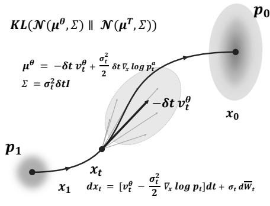  
(1) Flow/Diffusion OPD

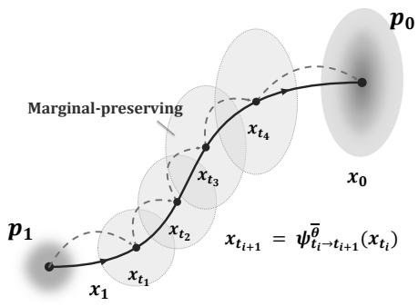  
(2) FlowMap OPD rollout

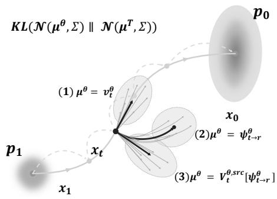  
(3) FlowMap OPD optimization  
Figure 2: From local-transition OPD to few-step flow-map OPD with separate rollout and teacher comparison. (1) Flow/Diffusion OPD [4, 13] uses the same local transition distributions from $\begin{array} { r } { d x _ { t } = [ v _ { t } ^ { \theta } - \frac { g _ { t } ^ { 2 } } { 2 } \nabla _ { x } \log p _ { t } ] d t + g _ { t } d \overline { { W } } } \end{array}$ t for rollout and teacher-student comparison. (2) FlowMap-OPD collects states through long-range map rollouts. $x _ { t _ { i + 1 } } = \psi _ { t _ { i }  t _ { i + 1 } } ^ { \theta } ( x _ { t _ { i } } )$ . (3) Independently of the rollout transition, optimization compares teacher-student distributions through $\mathrm { K L } ( \mathcal { N } ( \boldsymbol { \mu } ^ { \theta } , \boldsymbol { \Sigma } ) | | \mathcal { N } ( \boldsymbol { \mu } ^ { T } , \boldsymbol { \Sigma } ) )$ 2 with means constructed from direct velocities $v ^ { \theta } ( x , t )$ (Section 4.5), flow maps $\psi _ { t  r } ^ { \theta } ( x )$ with their stochastic corrections (Section 4.3), or induced velocities $V ^ { \theta , \mathrm { s r c } } ( x , r , t )$ and $V ^ { \theta , \mathrm { d s t } } ( x , r , t )$ (Section 4.4).

Thus, even when methods such as DiffusionOPD and Flow-OPD [4, 13] use discretized stochastic dynamics to obtain tractable transition kernels K, the underlying continuous-time marginals can be expressed through the ODE flow map. Fewstep models directly parameterize this long-range transport operator by $\psi _ { t  r } ^ { \theta }$

## 3 Rollout-Kernel Separation for Flow-Map Distillation

Few-step flow-map generation brings together two transport representations: a flow map for long-range transport and a velocity field for instantaneous dynamics. Flow-velocity consistency links these representations, motivating the use of different, compatible transport representations for different roles in distillation. We develop this idea in three steps. Section 3 establishes how rollout and optimization kernel can be specified separately in the OPD objective. Section 4 establishes the flow-velocity consistency relations that connect these transport representations and support their use in different roles. Section 4.2 uses these relations to construct concrete supervision kernels and pair them with native MeanFlow and CM rollouts, respecting each model's time parameterization.

## 3.1 From trajectories to state marginals

Consider generation from noise at $t \ : = \ : 1$ to data at $t = 0$ on a fixed grid $\mathcal { G } = ( 1 = t _ { 0 } > \cdots > t _ { N } = 0 )$ Teacher and student share conditioning, coordinates, guidance, and the time convention. In trajectory-level OPD [4, 13], the student samples

$$
x _ { t _ { 0 } } \sim p _ { 1 } , \qquad x _ { t _ { i + 1 } } \sim K _ { i } ^ { \theta } ( \cdot \mid x _ { t _ { i } } , \mathcal { G } ) ,\tag{2}
$$

producing a trajectory $\tau \sim \mathcal { T } ( K ^ { \theta } ; \mathcal { G } , p _ { 1 } )$ , where $K _ { i } ^ { \theta }$ is the student transition kernel and $\mathcal { T } ( K ^ { \theta } ; \mathcal { G } , p _ { 1 } )$ denotes the trajectory distribution induced by this sampling procedure. Along the

sampled trajectory, each student transition is compared with the teacher through the local discrepancy

$$
\begin{array} { r } { \ell _ { i } ^ { K } ( \theta , T ; x , \mathcal { G } ) = \mathrm { K L } \big ( K _ { i } ^ { \theta } ( \cdot  { | } x , \mathcal { G } ) \big | \big | K _ { i } ^ { T } ( \cdot  { | } x , \mathcal { G } ) \big ) . } \end{array}\tag{3}
$$

The overall trajectory-level OPD objective is

$$
J _ { K } ^ { \mathcal { G } } ( \theta ) = \mathbb { E } _ { \tau \sim \mathcal { T } ( K ^ { \theta } ; \mathcal { G } , p _ { 1 } ) } \left[ \sum _ { i = 0 } ^ { N - 1 } \ell _ { i } ^ { K } ( \theta , T ; x _ { t _ { i } } ( \tau ) , \mathcal { G } ) \right] .\tag{4}
$$

Here $x _ { t _ { i } } ( \tau )$ is the state visited at time $t _ { i }$ in the sampled trajectory τ. In this formulation, the same student transition $K ^ { \theta }$ serves two roles: it generates the rollout and defines the transition compared with the teacher. State acquisition and supervision are therefore tied to the same transition family, as illustrated in Figure 2(1).

Our starting point for separating these roles is the locality and additivity of the objective. Once a query state is obtained by sampling a rollout trajectory, and thus follows the corresponding state marginal, each teacher-student discrepancy can be evaluated without the rest of the trajectory or the procedure used to collect it. Its expectation therefore depends only on the marginal state distribution at that query. More formally, let $d _ { i } ^ { \mathcal { T } , \breve { \theta } } ( \cdot \mid \mathcal { G } )$ be the state marginal at time $t _ { i }$ induced by the rollout T above, where $d _ { 0 } ^ { \mathcal { T } , \theta } ( \cdot \mid \mathcal { G } ) = p _ { 1 }$ and $\begin{array} { r } { d _ { i + 1 } ^ { \mathcal { T } , \theta } ( d y \mid \mathcal { G } ) = \int K _ { i } ^ { \theta } ( d y \mid x , \mathcal { G } ) d _ { i } ^ { \mathcal { T } , \theta } ( d x \mid \mathcal { G } ) } \end{array}$ , and let $X _ { t _ { i } }$ denote a state sampled from this marginal. Exchanging the finite sum and expectation gives

$$
J _ { K } ^ { \mathcal { G } } ( \theta ) = \sum _ { i = 0 } ^ { N - 1 } \mathbb { E } _ { X _ { t _ { i } } \sim d _ { i } ^ { T , \theta } ( \cdot | \mathcal { G } ) } [ \ell _ { i } ^ { K } ( \theta , T ; X _ { t _ { i } } , \mathcal { G } ) ] .\tag{5}
$$

Equation (5) expresses local kernel optimization through state marginals, but these marginals are still defined through sequential sampling. The continuous dynamics and flow maps in Section 2 express these marginals directly.

Marginal formulation. We write the continuous-time state marginal as

$$
d _ { t } ^ { \psi , \theta } = ( \psi _ { 1  t } ^ { \theta } ) _ { \# } p _ { 1 } ,\tag{6}
$$

which is the limit of the rollout marginal $d _ { i } ^ { \mathcal { T } , \theta } ( \cdot \mid \mathcal { G } )$ in (5) as $N  \infty ( \mathrm { A }$ ppendix A.3). For the student and teacher SDEs in Eq. (1) with a shared noise coefficient $g _ { t } > 0$ , discretization gives Gaussian transition kernels whose conditional KL is exactly $\ell _ { i } ^ { K } ( \theta , T ; x , \mathcal { G } ) = h _ { i } \| b _ { t _ { i } } ^ { \theta } ( x ) - b _ { t _ { i } } ^ { T } ( x ) \| ^ { 2 } / ( 2 g _ { t _ { i } } ^ { 2 } )$ . Thus Eq. (5) sums the drift discrepancy weighted by each time interval. As the grid is refined with $N \to \infty$ and its state marginals converge, this sum yields the continuous-time objective (Appendix A.3):

$$
J ( \theta ) = \mathbb { E } _ { t , \boldsymbol { x } \sim d _ { t } ^ { \psi , \theta } } \left[ \frac { \| b _ { t } ^ { \theta } ( \boldsymbol { x } ) - b _ { t } ^ { T } ( \boldsymbol { x } ) \| ^ { 2 } } { 2 g _ { t } ^ { 2 } } \right] .\tag{7}
$$

The separated objective. Building on the state-marginal formulation of the original OPD objective in Eq. (7), we define a general FlowMap-OPD objective with a chosen local comparison l:

$$
\begin{array} { r } { \mathcal { L } ( \boldsymbol { \theta } ) = \mathbb { E } _ { z \sim \rho ^ { \boldsymbol { \theta } } } [ \ell ( \boldsymbol { \theta } , T ; z ) ] . } \end{array}\tag{8}
$$

Here $\boldsymbol { z } = ( x _ { t } , t )$ for single-time comparisons and $\boldsymbol { z } = ( x _ { t } , t , r )$ for two-time comparisons, and $\rho ^ { \theta }$ denotes the corresponding joint distribution of student-generated states and comparison times. This distribution is independent of the rollout procedure, provided that the state marginals and the sampling distribution of comparison times are preserved. The loss l specifies teacher– student distribution matching through a discrete kernel KL or its weighted regression form, optionally with a consistency penalty; Sections 4.3, 4.4, and 4.5 give the concrete choices.

As shown in Eq. (8), regardless of how states are obtained, preserving their marginal distribution at each query time preserves the objective for a fixed local comparison and time weighting. Consequently, the rollout can be chosen for efficient state acquisition, while the optimization kernel is chosen for teacher-student comparison at those states. The two roles need not use the same transition: a flow-map rollout can supply states for a local velocity comparison, provided that it preserves the required marginals. This is the basis of rollout-kernel separation. Keeping the original comparison and matching its state marginals and time weighting recovers the original objective. Choosing a different comparison instead defines a new distillation objective within the same framework; Section 4 establishes how flow-velocity consistency connects different transport representations to the same deployed map.

## 3.2 Optimizing with separated rollouts

Based on the marginal formulation above, we optimize FlowMap-OPD by collecting student states through a chosen rollout and applying a separately specified teacher-student distribution comparison at those states.

Rollout. Let T be an arbitrary student rollout policy, with state marginals $\bar { d } _ { t } ^ { \mathcal { T } , \theta }$ . At query times covering the supervised intervals and weighted according to the objective's time average, it supplies training states through

$$
x _ { t } \sim d _ { t } ^ { \tau , \theta } .\tag{9}
$$

To preserve the continuous flow-map objective, the rollout must retain $d _ { t } ^ { \mathcal { T } , \theta } = ( \psi _ { 1  t } ^ { \theta } ) _ { \# } p _ { 1 }$ . For example, starting from $x _ { t _ { 0 } } \sim p _ { 1 }$ , the rollout can use few-step long-range updates $x _ { t _ { i + 1 } } = \psi _ { t _ { i }  t _ { i + 1 } } ^ { \theta } ( x _ { t _ { i } } )$ , as in MeanFlow, or numerically integrate the instantaneous velocity, as in Flow Matching, e.g., ${ { x } } _ { t _ { i + 1 } } = { { x } } _ { t _ { i } } - { { h } } _ { i } { { v } } ^ { \theta } ( { { x } } _ { t _ { i } } , { { t } } _ { i } )$ with small $h _ { i } = t _ { i } - t _ { i + 1 }$ . In either case, the visited states supply training queries.

Optimization kernel. The optimization kernel specifies the local teacher-student distribution comparison. We evaluate the local loss $\ell ( \theta , T ; x _ { t } , t )$ over the rollout-supplied marginals, as in (5) and (7). Concretely, the comparison can match flow-map predictions (Section 4.3), map-induced velocities (Section 4.4) or instantaneous velocity predictions with a flow-velocity consistency penalty (Section 4.5). The corresponding kernel KL determines the matching discrepancy and its weighting. Holding sampled states fixed, we update

$$
\theta \gets \theta - \eta \nabla _ { \theta } \ell ( \theta , T ; x _ { t } , t ) ,\tag{10}
$$

where η is the learning rate. The following result states when changing the rollout preserves this optimization objective.

Theorem 1 (Marginal-preserving rollout replacement). Fix θ, the local comparison, and time weighting. Suppose both rollouts use the same sampling rules for all comparison times including any conditioning on the sampled state or other times. $I f d _ { t } ^ { \mathcal { T } , \theta } = d _ { t } ^ { \tilde { \mathcal { T } } , \theta }$ at almost every queried time, the two rollouts give the same expected local loss and the same expected update in (10), provided the loss and its state-fixed gradient are integrable.

The proof and a bound for unequal marginals appear in Appendix A.4. Changing the comparison kernel defines a new local objective. The transition kernel used for teacher– student distribution matching need not be the transition used by the rollout to collect training states. For example, long-range flow-map updates can supply states for velocitykernel comparison. When the two roles use different transport representations, flow-velocity consistency connects the supervised object to the map used for generation. Section 4 establishes this connection and its error bounds; Section 4.2 develops the resulting rollout-kernel pairings.

## 4 Supervision Interfaces and Consistency

By introducing long-range predictions alongside instantaneous velocities, flow-map generators naturally provide two representations of transport. Their consistency must be maintained during training to prevent a mismatch between the rollout and the optimization kernel. We establish this connection and quantify how consistency errors affect native few-step generation.

  
Figure 3: Specialist capabilities consolidated in the same few-step student. Each row compares the base, all three specialists, and $\mathrm { F l o w M a p { \mathrm { - O P D } } }$ on the same prompt and initial noise with the same few-step sampler. Gold borders mark the specialist for each task; the green column shows the same student across all three tasks: a seed packet labeled “Magic Beans Inside," a medieval wolf adventurer, and a truck to the left of a refrigerator. Full task scores are reported in Table 2.

## 4.1 Flow-velocity consistency

Consider a velocity field v and a candidate long-range flow map $\psi _ { t  r } .$ The flow-map definition gives two local consistency relations. At the source, taking a short velocity step before applying the remaining map leaves the destination unchanged to first order: $\psi _ { t  r } ( x ) = \psi _ { t - \varepsilon  r } ( x -$ $\varepsilon v ( x , t ) ) + o ( \varepsilon )$ At the destination, extending transport by a short step follows the arrival velocity: $\psi _ { t  r - \varepsilon } ( x ) = $ $\psi _ { t  r } ( x ) - \varepsilon v ( \psi _ { t  r } ( x ) , r ) + o ( \varepsilon )$ . Taking the first-order limit as $\varepsilon  0$ in these two views, illustrated in Figure 4, yields the source and destination consistency identities [2, 6] (Appendix B.1):

$$
\begin{array} { r l } & { \partial _ { t } \psi _ { t  r } ( x ) + ( J _ { x } \psi _ { t  r } ( x ) ) v ( x , t ) = 0 , } \\ & { \qquad \partial _ { r } \psi _ { t  r } ( x ) = v ( \psi _ { t  r } ( x ) , r ) . } \end{array}\tag{11}
$$

The first keeps the predicted destination fixed as the source moves; the second makes the destination move according to the same dynamics.

A learned map may depart from these identities. We define its consistency residuals directly from the map derivatives:

$$
c ^ { \mathrm { s r c } } ( x , r , t ) = - \partial _ { t } \psi _ { t  r } ( x ) - ( J _ { x } \psi _ { t  r } ( x ) ) v ( x , t ) ,\tag{12}
$$

$$
c ^ { \mathrm { d s t } } ( x , r , t ) = \partial _ { r } \psi _ { t  r } ( x ) - v ( \psi _ { t  r } ( x ) , r ) .\tag{13}
$$

Both residuals vanish when (11) holds. Their squared norms $\| c ^ { \mathrm { s r c } } ( x , r , t ) \| ^ { 2 }$ and $\| c ^ { \mathrm { d s t } } ( x , r , t ) \| ^ { 2 }$ provide consistency losses; the theorem below explains what satisfying these relations determines about the map.

Theorem 2 (Flow-map identification from consistency). Let v be a velocity field and $\psi _ { t  r } ^ { v }$ its flow map as defined by the ODE in Section 2. Let $\psi _ { t  r }$ be another family of maps with $\psi _ { t  t } ( x ) = x .$ . Under the transport regularity conditions of Assumption B.1, if ψ and v satisfy either the source or destination consistency relation in (11) throughout the comparison domain, then

$$
\psi _ { t  r } ( x ) = \psi _ { t  r } ^ { v } ( x ) .\tag{14}
$$

The proof is given in Appendix B.1.

We assume a consistent teacher: $\psi ^ { T }$ is the flow map induced by $v ^ { T }$ and satisfies both consistency relations. During learning, we constrain the student flow map to satisfy either source or destination consistency with its velocity field, and match that field to the teacher velocity. When these constraints hold, i.e., $c ^ { \theta , \mathrm { s r c } } = 0 \mathrm { o r } c ^ { \theta , \mathrm { d s t } } = 0$ , together with $v ^ { \theta } = v ^ { T }$ , Theorem 2 gives

$$
\psi _ { t  r } ^ { \theta } = \psi _ { t  r } ^ { T } .\tag{15}
$$

where $c ^ { \theta , \mathrm { s r c } }$ and $c ^ { \theta , \mathrm { d s t } }$ denote the student consistency residuals. Composing the student maps therefore recovers the teacher transport on any valid sampling grid. Thus consistency makes native map and exact velocity rollouts supply the same marginals, while teacher-velocity matching identifies the long-range transport to be learned. Corollary B.3 gives the conditions for recovering these relations from population losses.

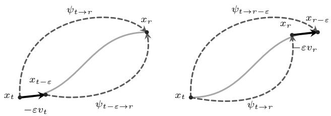

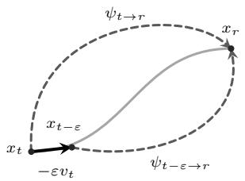  
(a) Source (src)

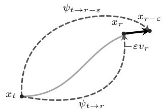  
(b) Destination (dst)  
Figure 4: Source and destination consistency. Gray S-curves show the continuous trajectory; dashed arcs show separate long- and short-range flow-map jumps, and black straight arrows show local velocity steps. (a) Source: the direct map $\psi _ { t  r }$ agrees to first order with a step $x _ { t - \varepsilon } = x _ { t } - \varepsilon v _ { t }$ followed by $\psi _ { t - \varepsilon \to r } . \ ( \mathbf { b } )$ Destination: $\psi _ { t  r - \varepsilon }$ agrees to first order with $\psi _ { t  r }$ followed by $x _ { r - \varepsilon } = x _ { r } - \varepsilon v _ { r }$ . Here $v _ { t } = v ( x _ { t } , t )$ and $v _ { r } = v ( x _ { r } , r )$ . These two routes give the identities in Eq. 11.

Approximate velocity matching and flow-velocity consistency can jointly control the student's transport error through either the source or destination relation (Theorems B.4 and B.5 in Appendices B.2 and B.3). With exact consistency, both bounds depend only on velocity error.

## 4.2 Native rollout families

The consistency relations support several ways to supervise the same long-range generator. We first specify its native rollout, then construct flow-map and induced-velocity comparisons, before developing instantaneous velocity supervision with independently tunable consistency.

Although training states can be collected through multi-step velocity integration, we use native few-step flow-map rollouts for more efficient state acquisition. We consider two classes of flow-map parameterizations: fixed-endpoint maps $\psi _ { t  0 } .$ which vary the source time while keeping the destination fixed, and two-time maps $\psi _ { t  r } ,$ which allow both source and destination times to vary within $0 \leq r \leq t \leq 1$ . We use CM and MeanFlow as representative examples, respectively, and retain their native few-step rollouts to collect training states.

Fixed-endpoint maps: CM. A CM-style model predicts a fixed endpoint $G ^ { \theta } ( x , t ) = \psi _ { t  0 } ^ { \theta } ( x )$ , with $G ^ { \theta } ( x , 0 ) = x$ . Its network output $f ^ { \theta }$ is converted to this prediction through the checkpoint's preconditioning:

$$
G ^ { \theta } ( x , t ) = c _ { \mathrm { s k i p } } ( t ) x + c _ { \mathrm { o u t } } ( t ) f ^ { \theta } \big ( c _ { \mathrm { i n } } ( t ) x , c _ { \mathrm { n o i s e } } ( t ) \big ) .\tag{16}
$$

The native rollout predicts the endpoint and re-noises it to the next time $r < t { : }$

$$
x _ { r } = \alpha _ { r } G ^ { \theta } ( x _ { t } , t ) + \beta _ { r } \xi , \qquad \xi \sim \mathcal { N } ( 0 , \mathrm { I } ) , \quad 0 < r < t ,\tag{17}
$$

where $\alpha _ { r } , \beta _ { r }$ follow the model's noise schedule.

Two-time maps: MeanFlow. MeanFlow [6] parameterizes the map through an average-velocity network $v _ { t  r } ^ { \theta } ;$ its diagonal gives the instantaneous velocity:

$$
\begin{array} { r l } & { \psi _ { t  r } ^ { \theta } ( x ) = x - h v _ { t  r } ^ { \theta } ( x ) , \qquad h = t - r , } \\ & { \upsilon ^ { \theta } ( x , t ) = v _ { t  t } ^ { \theta } ( x ) . } \end{array}\tag{18}
$$

The native rollout advances through this long-range flow map:

$$
x _ { t _ { i + 1 } } = \psi _ { t _ { i }  t _ { i + 1 } } ^ { \theta } ( x _ { t _ { i } } ) .\tag{19}
$$

Although the same model exposes an instantaneous velocity on the diagonal, which can be used to collect rollout states, we retain native flow-map sampling for its few-step efficiency.

## 4.3 Flow-map comparisons

Our first supervision interface uses the stochastic flow-map kernels derived from Flow-Map GRPO [14] to compare student and teacher predictions. We focus on two-time models, using MeanFlow's average-velocity parameterization as a representative example; the single-time formulation for consistency models is discussed in Appendix C.4.

Stochastic flow-map comparison. A conditional KL requires probability kernels. Flow-Map GRPO [14] generates stochastic trajectories by randomizing each flow-map sampling step. Starting from $x _ { t _ { 0 } } \sim p _ { 1 }$ , each step takes the current state $\boldsymbol { x } = \boldsymbol { x } _ { t _ { i } }$ at $t = t _ { i }$ and samples the next state at $r = t _ { i + 1 }$ . For the rectified schedule, the local Gaussian sampling rule is

$$
\begin{array} { l } { { \displaystyle { \widetilde { x } _ { r } ^ { \theta } = ( 1 - \frac { \varepsilon \lambda ^ { 2 } } { 1 - r } ) \psi _ { t  r } ^ { \theta } ( x ) } } } \\ { { \displaystyle ~ - \varepsilon \lambda ^ { 2 } v ^ { \theta } ( \psi _ { t  r } ^ { \theta } ( x ) , r ) + \lambda \sqrt { \frac { 2 \varepsilon r } { 1 - r } } \xi . } } \end{array}\tag{20}
$$

Here $0 < \varepsilon < r < 1 , r < t \leq 1 , \lambda > 0$ and $\xi \sim \mathcal { N } ( 0 , \mathrm { I } )$ Setting $x _ { t _ { i + 1 } } = \widetilde { x } _ { t _ { i + 1 } } ^ { \theta }$ and repeating with independent noise draws produces the stochastic trajectory. This step defines the conditional kernel $\begin{array} { r } { K ^ { \theta } ( \cdot \mid x , r , t ) = \mathcal { N } ( \mu ^ { \theta } , \frac { 2 \varepsilon \lambda ^ { 2 } r } { 1 - r } \mathrm { I } ) } \end{array}$ , where $\mu ^ { \theta } = \psi _ { t  r } ^ { \theta } ( x ) - \varepsilon \lambda ^ { 2 } [ \psi _ { t  r } ^ { \theta } ( x ) / ( 1 - r ) + v ^ { \theta } \bar { ( } \psi _ { t  r } ^ { \theta } ( x ) , r ) ]$ The teacher kernel $K ^ { T }$ is constructed identically, replacing θ with T and keeping the same noise parameters. We use this kernel for comparison at states supplied by the selected rollout. Applying the conditional KL in (3) gives

$$
\begin{array} { r l } & { \ell _ { \operatorname* { m a p } } ( \theta , T ; x , r , t ) = D _ { \mathrm { K L } } ( K ^ { \theta } \| K ^ { T } ) } \\ & { \qquad = w _ { \mathrm { m a p } } \big \| \big ( 1 - \frac { \varepsilon \lambda ^ { 2 } } { 1 - r } \big ) \Delta \psi - \varepsilon \lambda ^ { 2 } \Delta v \big \| ^ { 2 } , } \end{array}\tag{21}
$$

where $w _ { \mathrm { m a p } } = ( 1 - r ) / ( 4 \varepsilon \lambda ^ { 2 } r ) , \Delta \psi = \psi _ { t  r } ^ { \theta } ( x ) - \psi _ { t  r } ^ { T } ( x )$ and $\Delta v \ = \ v ^ { \theta } ( \psi _ { t  r } ^ { \theta } ( x ) , r ) - v ^ { T } ( \psi _ { t  r } ^ { T } ( x ) , r )$ . Thus OPD compares the randomized flow-map transitions, including their velocity corrections. Appendix C gives the derivation and the conditions under which the underlying stochastic construction preserves the boundary marginal.

Deterministic limit. As λ → 0, Eq. (20) approaches the deterministic flow-map step, analogous to the ODE formulation in DiffusionOPD [13]. For fixed $0 < \varepsilon < r < t \leq 1$ and finite predictions, the variance-scaled loss $\frac { 2 \varepsilon \lambda ^ { 2 } r } { 1 - r } \ell _ { \mathrm { m a p } }$ converges as $\lambda  0$ to

$$
\begin{array} { r } { \ell _ { \mathrm { m a p - r e g } } = \frac { 1 } { 2 } \| \psi _ { t  r } ^ { \theta } ( x ) - \psi _ { t  r } ^ { T } ( x ) \| ^ { 2 } . } \end{array}\tag{22}
$$

This is the scaled zero-noise limit, rather than the KL between the resulting point masses. The teacher target can be supplied by a compatible learned map or by integrating its velocity. With a shared average-velocity parameterization, the loss equals $h ^ { 2 } \| v _ { t  r } ^ { \theta } - v _ { t  r } ^ { T } \| ^ { 2 } / 2$

## 4.4 Induced-velocity comparisons

We reuse the instantaneous-velocity kernel in (3), replacing its student velocity prediction with one expressed through the long-range flow map using consistency. The kernel construction and conditional KL remain the same. Following MeanFlowNFT [10] for the source construction, and using destination consistency for its counterpart, we obtain

$$
V ^ { \theta , \mathrm { s r c } } = v _ { t  r } ^ { \theta } + h ( \partial _ { t } v _ { t  r } ^ { \theta } + ( J _ { x } v _ { t  r } ^ { \theta } ) v ^ { \theta } ) ,\tag{23}
$$

$$
V ^ { \theta , \mathrm { d s t } } = \partial _ { r } \psi _ { t  r } ^ { \theta } ( x ) .\tag{24}
$$

Substituting these predictions into the same velocity-kernel KL gives the source-induced loss, $\ell _ { \mathrm { s r c } } = w _ { \mathrm { s r c } } \Vert V ^ { \theta , \mathrm { s r c } } - \upsilon ^ { T } ( x , t ) \Vert ^ { 2 }$ the destination-induced loss is $\begin{array} { r c l } { \ell _ { \mathrm { d s t } } } & { = } & { w _ { \mathrm { d s t } } \| V ^ { \theta , \mathrm { d s t } } } \end{array} -$ $v ^ { T } ( \psi _ { t  r } ^ { \theta } ( x ) , r ) \| ^ { 2 }$ The kernels are evaluated at (x, t) for source supervision and $( \psi _ { t  r } ^ { \theta } ( x ) , r )$ for destination supervision. Their weights follow the same KL formula (86).

Through flow-velocity consistency, the velocity-kernel KL supervises the student's long-range flow map via its induced velocity prediction (Proposition C.1).

## 4.5 Instantaneous velocity supervision with tunable consistency

We use the velocity-matching loss induced by the local kernel KL in (3), as in DiffusionOPD, and add flow-velocity consistency:

$$
\mathcal { L } _ { \mathrm { v e l o c i t y } } ( \theta ) = \mathbb { E } _ { t , x \sim d _ { t } ^ { T , \theta } } \left[ w _ { v } \left. v _ { t } ^ { \theta } - v _ { t } ^ { T } \right. ^ { 2 } + \lambda _ { c } \left. c ^ { \theta } \right. ^ { 2 } \right] .\tag{25}
$$

Here $v _ { t } ^ { \theta }$ and $v _ { t } ^ { T }$ are evaluated at the sampled state $x ,$ and $c ^ { \theta }$ can be either $c ^ { \theta , \mathrm { s r c } } \ _ { 0 \mathrm { r } c } \theta , \mathrm { d s t }$ , as defined in Section 4.1. The weight $w _ { v }$ is determined by the velocity-kernel KL (Appendix C), and the expectation also averages the consistency interval $r < t .$ For example, the MeanFlow source residual is $c ^ { \theta , \mathrm { s r c } } = v _ { t  r } ^ { \theta } +$ $( t - r ) ( \bar { \partial _ { t } } v _ { t  r } ^ { \theta } + ( J _ { x } v _ { t  r } ^ { \theta } ) v ^ { \theta } ) - v ^ { \theta }$ . The velocity term learns teacher dynamics; the consistency term connects them to the long-range flow map, as quantified by Theorems B.4 and B.5.

Algorithm 1 FlowMap-OPD training with separated rollout   
and supervision   
Require: Two-time student θ, fixed teacher T, supervision   
choice, and optional consistency weight $\lambda _ { c } \geq 0$   
1: for each training round do   
2: Collect native states using (19); store states and times   
as detached queries   
3: for each update on the buffer do   
4: Sample $( x , t )$ with the prescribed weighting and   
comparison time r when required   
5: if flow-map supervision then   
6: $\ell \gets \ell _ { \mathrm { m a p } }$ from (21), or $\ell _ { \mathrm { m a p - r e g } }$ from (22) in   
the deterministic limit   
7: else if induced-velocity supervision then   
8: Compute the source or destination predictor   
using (23) or (24)   
9: $\ell \gets \ell _ { \mathrm { s r c } }$ or $\ell _ { \mathrm { d s t } }$ with the corresponding teacher   
target (Section 4.4)   
10: else Instantaneous-velocity supervision   
11: $\ell  w _ { v } \| v _ { t } ^ { \theta } ( x ) - v _ { t } ^ { T } ( x ) \| ^ { 2 }$   
12: $\mathbf { i f } \lambda _ { c } > 0$ then   
13: Evaluate the chosen consistency penalty $\widetilde { \ell } _ { c }$   
14: $\ell \gets \ell + \lambda _ { c } \widetilde { \ell _ { c } }$   
15: end if   
16: end if   
17: $\theta  \theta - \eta \nabla _ { \theta } \ell ,$ holding queries fixed   
18: end for   
19: end for   
20: return the updated student with its native sampler

Learned teacher maps and velocity-induced transport. The exact-recovery statements use a compatible teacher. In empirical post-training, its learned map $\mathcal { \hat { \psi } } ^ { T }$ may differ from the ODE flow $\boldsymbol { \psi } ^ { v ^ { T } }$ induced by its velocity. The elementary decomposition $\| \psi ^ { \theta } - \psi ^ { T } \| \leq \| \psi ^ { \theta } - \psi ^ { v ^ { \bar { T } } } \| + \| \psi ^ { v ^ { T } } - \psi ^ { T } \|$ separates student transfer error from this teacher representation gap. Accordingly, reducing a student consistency residual need not monotonically improve reproduction of the teacher's learned map.

Relation to source-induced-velocity supervision. We compare the instantaneous-velocity objective in Eq. (25) with source-induced-velocity supervision from Section 4.4. At the same source query, let $\mathbf { \bar { \Psi } } e ^ { \theta } \ = \ v _ { t } ^ { \theta } ( x ) - v _ { t } ^ { T } ( x )$ and $c =$ $c ^ { \theta , \mathrm { s r c } } ( x , r , t )$ . The source-induced predictor in Eq. (23) satisfies $V ^ { \theta , \mathrm { s r c } } - v _ { t } ^ { T } ( x ) = e ^ { \theta } + c .$ Thus, suppressing kernel weights, its teacher-matching loss is

$$
\| e ^ { \theta } + c \| ^ { 2 } = \| e ^ { \theta } \| ^ { 2 } + \| c \| ^ { 2 } + 2 \langle e ^ { \theta } , c \rangle .\tag{26}
$$

The cross term couples velocity error and consistency error, allowing them to reinforce or partly cancel. In contrast, the instantaneous-velocity objective in Eq. (25) controls the two errors separately through $\bar { w _ { v } } \| e ^ { \theta } \| ^ { 2 } + \lambda _ { c } \| c \| ^ { 2 }$ . This makes $\lambda _ { c } \geq 0$ an independent design choice; ${ \lambda } _ { c } = 0$ recovers velocity-only supervision. The algebra explains the distinction between objectives, while the ImageNet comparison determines our practical choice. These are forward-value identities; the stoppedtarget and stopped-JVP updates below have their own gradients.

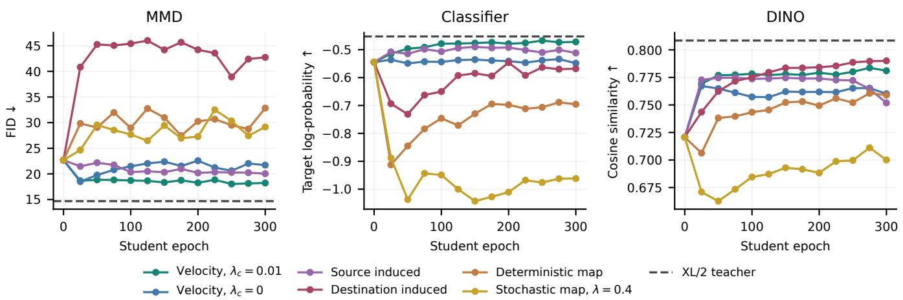  
Figure 5: Cross-capacity transfer under three teacher rewards. Separate XL/2-to-B/2 runs compare representative supervision recipes. Panels show MMD-setting FID, classifier target log-probability, and DINO cosine similarity under native four-step generation. Every marker is a recorded evaluation; curves stop at the common epoch 300. Dashed lines show the frozen teacher actually used in each sweep. Complete coefficient sweeps and five-step curves appear in Appendix E.

## 4.6 Algorithm and implementation

We summarize FlowMap-OPD training in Algorithm 1. For a two-time student, each round collects native states, applies the selected flow-map, induced-velocity, or instantaneous-velocity comparison, and refreshes the queries with the updated student Below we describe the sampling and implementation details.

Time sampling and state collection. All three supervision choices collect states with the current student on $t _ { 0 } > \cdots >$ tN:

$$
x _ { t _ { i + 1 } } = \psi _ { t _ { i }  t _ { i + 1 } } ^ { \theta } ( x _ { t _ { i } } ) , \qquad x _ { t _ { 0 } } \sim p _ { 1 } .\tag{27}
$$

Parameters are fixed during collection, and sampled states are detached for optimization. ImageNet uses four steps following MeanFlow [6]; text-to-image uses five steps following Flow-Map GRPO [14]. Our training formulation supports random time grids, with the five-step sampling rule and its estimator given in Appendix A.7. CM rollouts use (17), with endpoint comparisons in Appendix C.4.

Kernel evaluation and updates. For each detached query, we evaluate the selected objective from Sections 4.3–4.5. The rollout interval h, velocity-kernel length δ, and anchor interval ε are chosen separately; the few-step rollout does not fix the comparison scale. Algorithm 1 holds sampled queries fixed during each update (Proposition A.6).

Gradient computation. For inputs $( x , r , t )$ , we compute the source JVP in direction $( v ^ { \theta } , 0 , 1 )$ and stop its gradient to avoid backpropagating through the derivative computation.

Table 1: Three separate XL/2-to-B/2 reward-transfer settings. All students use epoch 300, with native four-step sampling. Columns report MMD-teacher transfer by FID, classifier transfer by target log-probability, and DINO transfer by cosine similarity. These are different reward settings, not three scores of one student. Best and second-best student results are bold and underlined, respectively.
<table><tr><td>Supervision</td><td>MMD FID↓</td><td>Classifier log py ↑</td><td>DINO Cosine ↑</td></tr><tr><td>B/2 base</td><td>22.68</td><td>-0.5448</td><td>0.7207</td></tr><tr><td>XL/2 teacher</td><td>14.68</td><td>-0.4526</td><td>0.8084</td></tr><tr><td>Flow-map supervision</td><td></td><td></td><td></td></tr><tr><td>Stochastic map, λ = 0.1</td><td>29.15</td><td>-0.9623</td><td>0.7004</td></tr><tr><td>Stochastic map, λ = 0.2</td><td>29.15</td><td>-0.9621</td><td>0.7003</td></tr><tr><td>Stochastic map, λ = 0.4</td><td>29.15</td><td>-0.9619</td><td>0.7001</td></tr><tr><td>Stochastic map, λ = 0.8</td><td>27.89</td><td>-0.9813</td><td>0.6989</td></tr><tr><td>Deterministic map</td><td>32.84</td><td>-0.6956</td><td>0.7589</td></tr><tr><td>Induced-velocity supervision</td><td></td><td></td><td></td></tr><tr><td>Source induced</td><td>20.04</td><td>-0.5118</td><td>0.7519</td></tr><tr><td>Destination induced</td><td>42.74</td><td>-0.5682</td><td>0.7901</td></tr><tr><td>Instantaneous velocity supervision</td><td></td><td></td><td></td></tr><tr><td>Velocity, λc = 0</td><td>21.72</td><td>-0.5484</td><td>0.7601</td></tr><tr><td>Velocity, λc = 0.01</td><td>18.23</td><td>-0.4720</td><td>0.7811</td></tr><tr><td>Velocity, λc = 0.1</td><td>21.05</td><td>-0.5378</td><td>0.7679</td></tr><tr><td>Velocity, λc = 1</td><td>43.07</td><td>-0.6710</td><td>0.0202</td></tr><tr><td>Velocity, λc = 10</td><td>392.78</td><td>-7.7761</td><td>0.0183</td></tr></table>

The source-consistency loss is

$$
\begin{array} { r } { \widetilde { \ell } _ { c } = \| v _ { t  r } ^ { \theta } + h \mathrm { \tiny ~ s g } [ \partial _ { t } v _ { t  r } ^ { \theta } + ( J _ { x } v _ { t  r } ^ { \theta } ) v ^ { \theta } ] - v ^ { \theta } \| ^ { 2 } . } \end{array}\tag{28}
$$

We use the same stopped JVP in source-induced velocity supervision. Implementation details are given in Appendix D.

## 5 Experiments

Our main experiments use MeanFlow; supplementary results for CM students appear in Appendix E (Table 7). We first compare supervision choices on ImageNet by separately distilling MMD-, classifier-, and DINO-adapted XL/2 teachers into B/2 students. This comparison selects the velocity-supervision objective with a tunable consistency term. We then use this objective family for text-to-image specialist consolidation and study its consistency coefficient separately.

## 5.1 Design-space exploration on ImageNet

We compare three supervision families by distilling XL/2 MeanFlow teachers into B/2 students with the same native rollout and number of optimization steps.

Setup. For each reward (MMD distribution matching, classifier target log-probability, or DINO cosine similarity), a student initialized from the same pretrained B/2 model distills a preprovided teacher optimized with Flow-Map GRPO [14]. Each setting compares twelve configurations spanning stochastic and deterministic flow-map supervision, source- and destinationinduced velocity, and instantaneous velocity with varying consistency weights. All use deterministic four-step rollouts and are compared at epoch 300. We evaluate 5,000 images from ImageNet classes 0–99; FID uses 2,000 held-out reference images. Appendix E gives the training and evaluation details.

Results. Instantaneous velocity supervision with $\lambda _ { c } =$ 0.01 provides the strongest overall balance across the three reward settings, ranking first for MMD and classifier transfer and second for DINO (Table 1); Figure 5 shows training progress. It achieves MMD FID 18.23 and classifier log-probability —0.4720, improving on the base's 22.68 and —0.5448. For DINO, its cosine similarity of 0.7811 is close to the best value, 0.7901 from destination-induced supervision, while retaining substantially higher recall (0.1160 versus 0.0225). This configuration therefore combines strong reward transfer across all three settings with better DINO coverage than the highest-reward alternative. Full metrics appear in Appendix E. We therefore use instantaneous velocity supervision with tunable consistency for text-to-image consolidation. Since large consistency weights degrade transfer, we examine this coefficient again in the text-to-image setting.

## 5.2 Specialist-teacher consolidation

We combine three task-specialized teachers into one native MeanFlow student: an OCR teacher, a PickScore teacher, and a GenEval teacher [7, 11]. The base is FLUX.1-lite-8B with a pretrained MeanFlow checkpoint, using $5 1 2 \times 5 1 2$ resolution and guidance 3.5. Both teachers and the student are trained with LoRA; the teachers are optimized using Flow-Map GRPO [14]. Training prompts are sampled in a 1:1:1 task ratio, with each prompt routed to its corresponding teacher.

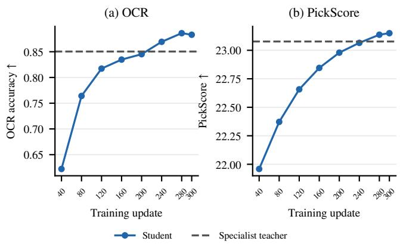  
Figure 6: Three-teacher transfer during training. Full-testset OCR and PickScore scores during training and at update 300; markers are actual evaluations and lines connect measurements without smoothing. Dashed lines denote the respective specialists. Both panels report the same student with $\lambda _ { c } = 0 . 0 0 1$

Training and evaluation. We use five-step flow-map rollouts following Flow-Map GRPO [14]. Motivated by the ImageNet results, we use instantaneous velocity supervision with $\lambda _ { c } = 0 . 0 0 1$ for this application. Each update uses 48 prompts with 24 samples per prompt, giving 1,152 trajectories on eight H100 GPUs. We use AdamW with learning rate $1 0 ^ { - 4 }$ and train for 300 updates. EMA students are evaluated every 40 updates on the full OCR and PickScore test sets. Offline GenEval evaluation is performed at the final checkpoint. Figure 6 shows the training evaluations.

Transfer across tasks. The same student checkpoint acquires all three specialist capabilities in only 300 training steps. GenEval improves from 0.5041 to 0.8580, OCR from 0.3491 to 0.8830, and PickScore from 20.9758 to 23.1502. The respective specialist scores are 0.8454, 0.8504 and 23.0772. The student exceeds these specialist scores using the same number of sampling steps. Figure 10 shows paired base, specialist and student outputs; additional examples appear in Appendix G.

Two-task consolidation versus mixed-reward GRPO. Given already available OCR and PickScore specialist teachers, we compare OPD consolidation with directly optimizing both rewards using multi-reward Flow-Map GRPO. Both settings use a 50/50 mixture of OCR and PickScore training prompts, the same pretrained MeanFlow backbone, and the same fivestep rollouts. GRPO uses training settings following Flow-Map GRPO [14], with OCR/PickScore reward weights of 0.5/0.5. Both methods use eight H100 GPUs.

Figure 7 compares the training progress of OPD and GRPO. At update 300, OPD reaches OCR 0.8629 and PickScore 23.1677, compared with 0.8158 and 22.9825 for GRPO at update 1,400. OPD already exceeds these GRPO scores at update 200, with OCR 0.8661 and PickScore 23.0723. These results demonstrate faster convergence in training updates and better performance on both tasks than mixed-reward GRPO.

Table 2: Three specialist teachers distilled into one five-step student. The student uses $\lambda _ { c } = 0 . 0 0 1$ at update 300. Task scores and DrawBench scores are shown side by side; higher is better.
<table><tr><td></td><td colspan="3">Task scores</td><td colspan="5">DrawBench scores</td></tr><tr><td>Model / supervision</td><td>GenEval</td><td>OCR</td><td>PickScore</td><td>PickScore</td><td>Aesthetic</td><td>DeQA</td><td>ImgRwd</td><td>UniRwd</td></tr><tr><td>Base</td><td>0.5041</td><td>0.3491</td><td>20.9758</td><td>21.6298</td><td>5.5368</td><td>4.1712</td><td>0.3918</td><td>2.7187</td></tr><tr><td>Task-specialized teachers</td><td></td><td></td><td></td><td></td><td></td><td></td><td></td><td></td></tr><tr><td>GenEval teacher</td><td>0.8454</td><td></td><td></td><td>21.8184</td><td>5.3905</td><td>3.2086</td><td>0.6426</td><td>2.8719</td></tr><tr><td>OCR teacher</td><td></td><td>0.8504</td><td></td><td>21.9869</td><td>5.5111</td><td>4.1396</td><td>0.5386</td><td>2.8049</td></tr><tr><td>PickScore teacher</td><td></td><td></td><td>23.0772</td><td>23.3711</td><td>6.1510</td><td>4.0829</td><td>1.1402</td><td>3.2005</td></tr><tr><td>One student trained with all three teachers</td><td></td><td></td><td></td><td></td><td></td><td></td><td></td><td></td></tr><tr><td>Velocity-supervised FlowMap-OPD</td><td>0.8580</td><td>0.8830</td><td>23.1502</td><td>23.4490</td><td>6.1338</td><td>4.2747</td><td>1.2141</td><td>3.4191</td></tr></table>

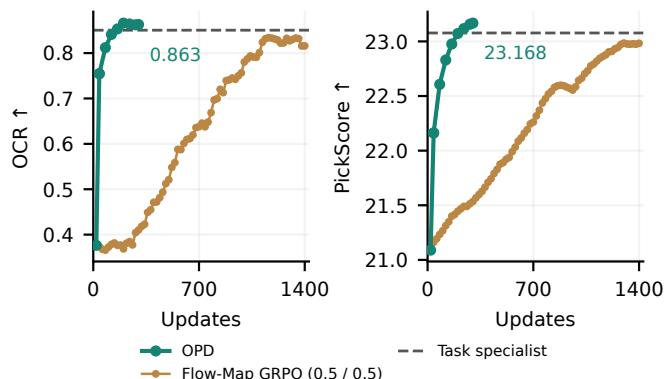  
Figure 7: Two specialist teachers versus direct mixedreward optimization. EMA OCR and PickScore scores for two-teacher OPD and Flow-Map GRPO with equal OCR/PickScore reward weights. Dashed lines denote the task specialists. The shared starting marker is a visual reference.

## 5.3 Consistency strength and teacher transfer

$\lambda _ { c }$ ∈ {0, 0.001, 0.01, 0.1, 1} in velocitysupervised FlowMap-OPD with the same three specialist teachers. Table 3 reports full-test-set scores at update 200 from these separate sweep runs; the application above uses update 300 with $\lambda _ { c } = 0 . 0 0 1$

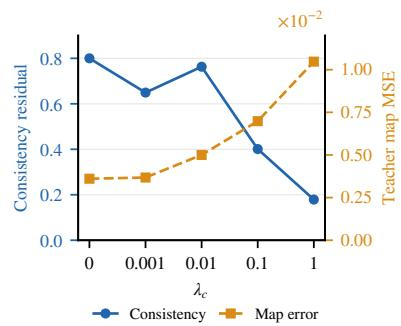  
Figure 8: Consistency (solid, left) versus teacher-map error.(dashed, right) across $\lambda _ { c }$

Figure 8 compares consistency loss and teacher-map error at update 200. Increasing λc from 0 to 1 reduces the unweighted source residual from 0.800 to 0.179, but increases teacher-map MSE from 0.0036 to 0.0105. All three task scores decline at the larger tested penalties. The smaller coefficient $\lambda _ { c } = 0 . 0 0 1$

Table 3: MeanFlow consistency sweep at update 200.
<table><tr><td> $\lambda _ { c }$ </td><td>GenEval ↑</td><td>OCR↑</td><td>PickScore ↑</td></tr><tr><td>0</td><td>0.827</td><td>0.830</td><td>22.8533</td></tr><tr><td>0.001</td><td>0.838</td><td>0.845</td><td>22.9794</td></tr><tr><td>0.01</td><td>0.725</td><td>0.806</td><td>22.6529</td></tr><tr><td>0.1</td><td>0.568</td><td>0.646</td><td>22.0283</td></tr><tr><td>1</td><td>0.450</td><td>0.340</td><td>21.5939</td></tr></table>

improves all three scores over $\lambda _ { c } = 0 ( \mathrm { T a b l e } 3 )$

These results suggest that the pretrained student retains a degree of flow-velocity consistency during distillation even without an explicit consistency penalty. A small penalty improves teacher transfer, whereas stronger regularization further reduces the residual at the expense of transfer quality. This trend is consistent with the ImageNet results. Flow-velocity consistency connects the supervised representation to the deployed map, but a smaller residual alone does not guarantee better teacher transfer.

## 6 Related Work

On-policy distillation and direct teacher supervision. Learning from teacher feedback on student-generated behavior has a broader history in policy distillation. Czarnecki et al. [3] analyze how different policy-distillation formulations change the optimization objective and learning behavior. For language models, GKD trains on student-generated sequences and allows different teacher-student divergences, directly addressing the mismatch between training prefixes and inference-time outputs [1]. MiniLLM minimizes reverse KL through policygradient optimization, with a single-step decomposition and teacher-mixed sampling to stabilize learning [9]. DistiLLM studies the related efficiency problem: it combines skew-KL losses with adaptive off-policy reuse of student-generated outputs, reducing the cost of repeatedly collecting fresh samples [12]. These works make both the sampling distribution and the comparison objective central design choices. In continuous generation, DiffusionOPD and Flow-OPD formulate teacher feedback through local conditional transitions [4, 13], while Any-OPD addresses heterogeneous flow-matching teachers and students by comparing decoded outputs in a shared visual representation [5]. Our focus is the additional freedom available to few-step flow-map students: their native sampler uses long-range transport, whereas teacher supervision can act on local dynamics or on a separately constructed flow-map transition. Starting from additive local OPD objectives, we characterize when rollout changes preserve the objective and establish how flow-velocity consistency connects the chosen supervision to the deployed map.

Flow maps, consistency, and post-training. Few-step flowmap methods learn long-range transport while using consistency with local dynamics to constrain it. MeanFlow distinguishes average from instantaneous velocity and derives an identity linking the two [6]; consistency models learn endpoint predictions that agree along a transport trajectory [17, 20]. Flow Map Matching develops Eulerian and Lagrangian characterizations of long-range flow maps, and Align Your Flow studies scalable continuous-time flow-map distillation [2, 18]. These relationships also support post-training: MeanFlowNFT optimizes an induced instantaneous predictor while retaining average-velocity sampling, whereas Flow-Map GRPO constructs anchored stochastic transitions around long-range flow maps [10, 14]. We bring these complementary interfaces into a common OPD formulation. Native flow-map rollout supplies the training queries, and velocity-space or flow-map kernels specify the teacher comparison. Our consistency and deployment results explain when optimization through these interfaces constrains the flow-map generator used at inference.

Sampler-learner separation in reinforcement learning. DiffusionNFT and DMSampler explore different combinations of sampling procedures and learning objectives for diffusion reinforcement learning [16, 21]. We develop this perspective for few-step flow-map OPD, where a teacher directly supervises the student at states produced by its rollout. Our framework separates the sampling procedure from the teacher-student comparison, allowing generation and supervision to use different compatible representations connected by flow-velocity consistency.

## 7 Conclusion

We introduced FlowMap-OPD, a framework that separates student-state collection from teacher-student distribution comparison for few-step flow-map generators. This separation expands the design space of on-policy distillation: a student can retain its native flow-map rollout while learning through flow-map, induced-velocity, or instantaneous-velocity supervision. Our theory establishes when different rollouts preserve the training objective and how flow-velocity consistency connects supervision to the deployed generator.

Experiments demonstrate effective transfer across model capacities on ImageNet and consolidation of three specialist teachers into a single text-to-image student. The consolidated student matches or exceeds each specialist on its corresponding benchmark while retaining few-step generation. These results show that separating rollout from supervision provides a practical way to transfer diverse teacher capabilities to efficient flow-map students.

## References

[1] Rishabh Agarwal, Nino Vieillard, Yongchao Zhou, Piotr Stanczyk, Sabela Ramos, Matthieu Geist, and Olivier Bachem. On-policy distillation of language models: Learning from selfgenerated mistakes. arXiv preprint arXiv:2306.13649, 2023. URLhttps://arxiv.org/abs/2306.13649.

[2] Nicholas M. Boffi, Michael S. Albergo, and Eric Vanden-Eijnden. Flow map matching with stochastic interpolants: A mathematical framework for consistency models. arXiv preprint arXiv:2406.07507, 2024. URL https://arxiv. org/abs/2406.07507v2.Revised2025.

[3] Wojciech Marian Czarnecki, Razvan Pascanu, Simon Osindero, Siddhant M. Jayakumar, Grzegorz Swirszcz, and Max Jaderberg. Distilling policy distillation. In International Conference on Artificial Intelligence and Statistics, 2019. URL https : // arxiv.org/abs/1902.02186.

[4] Zhen Fang, Wenxuan Huang, Yu Zeng, Yiming Zhao, Shuang Chen, Kaituo Feng, Yunlong Lin, Lin Chen, Zehui Chen, Shaosheng Cao, and Feng Zhao. Flow-OPD: Onpolicy distillation for flow matching models. arXiv preprint arXiv:2605.08063, 2026. URL https://arxiv.org/ abs/2605.08063.Version5.

[5] Siming Fu, Zheming Fu, Ruizhe He, Hualiang Wang, Jie Huang, Xiaoxiao Ma, Mingchen Zhong, Weihu Huang, Xiaoxuan He, and Haojun Xu. Any-OPD: Heterogeneous onpolicy distillation for flow-matching models via representationspace bridging. arXiv preprint arXiv:2608.03316, 2026. URL https://arxiv.org/abs/2608.03316.

[6] Zhengyang Geng, Mingyang Deng, Xingjian Bai, J. Zico Kolter, and Kaiming He. Mean flows for one-step generative modeling. arXiv preprint arXiv:2505.13447, 2025. URL https://arxiv.org/abs/2505.13447.

[7] Dhruba Ghosh, Hanna Hajishirzi, and Ludwig Schmidt. GenEval: An object-focused framework for evaluating textto-image alignment. arXiv preprint arXiv:2310.11513, 2023. URLhttps://arxiv.org/abs/2310.11513.

[8] Yuxian Gu, Li Dong, Furu Wei, and Minlie Huang. MiniLLM: On-policy distillation of large language models. arXiv preprint arXiv:2306.08543, 2023. URL https://arxiv.org/ abs/2306.08543.

[9] Yuxian Gu, Li Dong, Furu Wei, and Minlie Huang. MiniLLM: Knowledge distillation of large language models. In International Conference on Learning Representations, 2024. URL https://arxiv.org/abs/2306.08543.

[10] Yushi Huang, Xiangxin Zhou, Jun Zhang, Liefeng Bo, and Tianyu Pang. MeanFlowNFT: Bringing forwardprocess RL to average-velocity generators. arXiv preprint arXiv:2607.15273, 2026. URL https://arxiv.org/ abs/2607.15273v2.Version2.

[11] Yuval Kirstain, Adam Polyak, Uriel Singer, Shahbuland Matiana, Joe Penna, and Omer Levy. Pick-a-pic: An open dataset of user preferences for text-to-image generation. arXiv preprint arXiv:2305.01569, 2023. URL https://arxiv. org/abs/2305.01569.

[12] Jongwoo Ko, Sungnyun Kim, Tianyi Chen, and Se-Young Yun. DistiLLM: Towards streamlined distillation for large language models. In International Conference on Machine Learning, 2024.URLhttps://arxiv.org/abs/2402.03898.

[13] Quanhao Li, Junqiu Yu, Kaixun Jiang, Yujie Wei, Zhen Xing, Pandeng Li, Ruihang Chu, Shiwei Zhang, Yu Liu, and Zuxuan Wu. DiffusionOPD: A unified perspective of on-policy distillation in diffusion models. arXiv preprint arXiv:2605.15055, 2026. URL https://arxiv.org/ abs/2605.15055v2.

[14] Zhiqi Li, Wen Zhang, and Bo Zhu. Flow-map GRPO: Reinforcement learning for few-step flow-map generators via anchored stochastic composition. arXiv preprint arXiv:2607.00535, 2026. URL https://arxiv.org/abs/2607.00535v1. Version 1.

[15] Yaron Lipman, Ricky T. Q. Chen, Heli Ben-Hamu, Maximilian Nickel, and Matt Le. Flow matching for generative modeling. In International Conference on Learning Representations, 2023. URLhttps://arxiv.org/abs/2210.02747.

[16] Z. Liu, A. Wu, Z. Qiu, Y. Pan, T. Yao, and T. Mei. Distillation models are good samplers for diffusion reinforcement learning. In International Conference on Machine Learning, 2026. URL https://github.com/HiDream-ai/DMSampler.

[17] Cheng Lu and Yang Song. Simplifying, stabilizing and scaling continuous-time consistency models. In International Conference on Learning Representations, volume 2025, pages 50611– 50649, 2025.

[18] Amirmojtaba Sabour, Sanja Fidler, and Karsten Kreis. Align your flow: Scaling continuous-time flow map distillation. arXiv preprint arXiv:2506.14603, 2025. URL https://arxiv. org/abs/2506.14603.

[19] Yang Song, Jascha Sohl-Dickstein, Diederik P. Kingma, Abhishek Kumar, Stefano Ermon, and Ben Poole. Score-based generative modeling through stochastic differential equations. In International Conference on Learning Representations, 2021. URLhttps://arxiv.org/abs/2011.13456.

[20] Yang Song, Prafulla Dhariwal, Mark Chen, and Ilya Sutskever. Consistency models. arXiv preprint arXiv:2303.01469, 2023. URLhttps://arxiv.org/abs/2303.01469.

[21] K. Zheng, H. Chen, H. Ye, H. Wang, Q. Zhang, K. Jiang, H. Su, S. Ermon, J. Zhu, and M.-Y. Liu. DiffusionNFT: Online diffusion reinforcement with forward process. arXiv preprint arXiv:2509.16117, 2026. URL https://arxiv. org/abs/2509.16117v2.Version2.

## Appendix contents

The appendices provide proofs for the separated objective and consistency results, followed by kernel constructions, implementation details, and additional experimental evidence.

A Rollout Separation and Sampling 13   
A.1 Sampled states, comparison times, and rollout distributions . 13   
A.2 Marginal formulation of the objective 14   
A.3 Discrete and continuous state marginals 14   
A.4 Rollout replacement and mismatch 16   
A.5 Comparison chains and path KL 17   
A.6 Gradients with fixed sampled states and times 18   
A.7 Random-time training and unbiased estimation 19   
B Flow-Velocity Consistency and Error Bounds 19   
B.1 Flow-Velocity Consistency 19   
B.2 Source-consistency error bound 20   
B.3 Destination-consistency error bound 21   
B.4 Error propagation through native rollouts 22   
B.5 Population training losses and coverage 23   
C Supervision Kernels and Model Compatibility 24   
C.1 Schedule-compatible local velocity kernels 24   
C.2 Anchored flow-map kernels 24   
C.3 Induced source and destination supervision 25   
C.4 Fixed-endpoint consistency models 25   
D Gradient Implementation 26   
E Additional ImageNet Results 26   
F Text-to-Image Consistency Analysis 29   
G Paired Qualitative Comparisons 30   
G.1 Cross-task Specialist-Student Comparisons . 30   
G.2 OCR Capability Comparisons . 33   
G.3 Visual Preference Comparisons 35   
G.4 Compositional Generation Comparisons 37

## A Rollout Separation and Sampling

## A.1 Sampled states, comparison times, and rollout distributions

We use the state marginals and local comparison from Section 3. A query z retains the sampled state and the times needed by that comparison.

Let $\mathcal { X } = \mathbb { R } ^ { d }$ be the state space. Sample a grid $\mathcal { G } = ( 1 = t _ { 0 } > \cdots > t _ { N } = 0 ) \sim \gamma$ , where $\gamma$ is the chosen distribution of time grids and N is the number of steps. A fixed grid corresponds to a point mass. Conditioning on a task or prompt is retained whenever it affects the comparison

For rollout policy $\tau$ and student parameters $\theta ,$ write ${ \mathcal { T } } ^ { \theta } ( d \tau \mid { \mathcal { G } } )$ for the conditional trajectory distribution, where $\tau =$ $( x _ { 0 } , \ldots , x _ { N } )$ . Here $x _ { i } : = x _ { t _ { i } }$ denotes the state at the corresponding grid time. For a measurable set $A \subseteq { \mathcal { X } }$ , its state marginals are

$$
d _ { i } ^ { T , \theta } ( A \mid { \mathcal { G } } ) = { \mathcal { T } } ^ { \theta } ( x _ { i } \in A \mid { \mathcal { G } } ) .\tag{29}
$$

The rollout may be deterministic or history-dependent; no state density is required. Throughout this appendix, we fix a local comparison and its comparison-variable sampling rule. The collected query distribution is held fixed when differentiating the local objective.

Choose measurable weights $a _ { i } ( { \mathcal { G } } ) \geq 0$ with $\begin{array} { r } { \sum _ { i = 0 } ^ { N - 1 } a _ { i } ( \mathcal G ) = 1 } \end{array}$ . Given ${ \mathcal { G } } ,$ the query index is selected independently of the realized path using these weights. Let $\zeta$ collect any additional comparison choices, such as a destination time or an anchor interval, and let $q ( d \zeta \mid x , i , \mathcal { G } )$ be their conditional sampling distribution. For the chosen local loss $\ell ,$ define its conditional average

$$
\overline { { \ell } } ^ { \theta } ( x , i , \mathcal { G } ) = \int \ell ( \theta , T ; ( \mathcal { G } , i , x ) , \zeta ) q ( d \zeta \mid x , i , \mathcal { G } ) .\tag{30}
$$

Here $z = ( \mathcal { G } , i , x )$ . We assume the expected absolute loss is finite. For nonnegative losses, the marginal identity also holds with infinite values by Tonelli's theorem.

Sampled states and separated comparisons. The population objective corresponding to the sampled update in (10) is

$$
\begin{array} { r } { \mathcal { L } _ { \mathcal { T } } ( \boldsymbol { \theta } ) = \mathbb { E } _ { z \sim \rho ^ { \mathcal { T } , { \theta } } } [ \ell ( \boldsymbol { \theta } , T ; z ) ] , } \end{array}\tag{31}
$$

where $\rho ^ { \mathcal { T } , \theta }$ is the distribution of queries collected by the frozen rollout, and z retains the state and all times required by the comparison. The shorthand $\ell ( \theta , T ; x _ { t } , t )$ in the main text averages any additional comparison choices at fixed $( x _ { t } , t )$ . Specifically, draw $\mathcal { G } \sim \gamma .$ a rollout $\tau \sim \mathcal { T } ^ { \theta } ( \cdot \mid \mathcal { G } )$ , and an index I with probabilities $a _ { i } ( \mathcal { G } )$ . The resulting query is $\boldsymbol { z } = ( \boldsymbol { \mathcal { G } } , \boldsymbol { I } , \boldsymbol { x } _ { t _ { I } } )$ . The local comparison may be a conditional kernel KL, its regression form, or a loss with a separately specified consistency penalty. In Eq. (31), auxiliary variables are averaged as $\begin{array} { r } { \ell ( \theta , T ; z ) = \int \ell ( \theta , T ; z , \zeta ) q ( d \zeta \mid z ) } \end{array}$ . For uniform index weights $a _ { i } = 1 / N$ conditioning on the grid gives

$$
\mathcal { L } _ { 7 } ^ { \mathcal { G } } ( \boldsymbol { \theta } ) = \frac { 1 } { N } \sum _ { i = 0 } ^ { N - 1 } \mathbb { E } _ { \boldsymbol { x } \sim d _ { i } ^ { T , \boldsymbol { \theta } } ( . | \mathcal { G } ) } [ \ell ( \boldsymbol { \theta } , T ; z _ { i } , \boldsymbol { \zeta } ) ] .\tag{32}
$$

Here $z _ { i } = ( \mathcal { G } , i , x )$ . Averaging over $\mathcal { G } \sim \gamma$ gives (31). If the comparison and its auxiliary rule depend on the grid only through the source and destination times, we use $\boldsymbol { z } = ( \boldsymbol { x } , t , \boldsymbol { r } )$ , where $r = t _ { i + 1 }$ and $t = t _ { i }$ . This query order matches the main text; map residuals retain the argument order $( x , r , t )$ . Proposition $\mathrm { A . 7 }$ states the compression condition. For continuous flow-map marginals, let $\mu$ denote the distribution of comparison times. The corresponding expression is

$$
\mathcal { L } _ { \psi } ( \theta ) = \int _ { [ 0 , 1 ] } \int \overline { { { \ell } } } ( \theta , T ; x , t ) ( \psi _ { 1  t } ^ { \theta } ) _ { \# } p _ { 1 } ( d x ) \mu ( d t ) ,\tag{33}
$$

where $\overline { { \ell } } ( \theta , T ; x , t ) = \mathbb { E } _ { \zeta \sim q ( \cdot | x , t ) } [ \ell ( \theta , T ; x , t , \zeta ) ]$

## A.2 Marginal formulation of the objective

Define the base-query distribution on $( \mathcal G , i , x )$ by

$$
\rho ^ { \mathcal { T } , \theta } ( d \mathcal { G } , \{ i \} , d x ) = \gamma ( d \mathcal { G } ) a _ { i } ( \mathcal { G } ) d _ { i } ^ { \mathcal { T } , \theta } ( d x \mid \mathcal { G } ) ,\tag{34}
$$

and the augmented query distribution by

$$
\eta ^ { \mathcal { T } , \theta } ( d \mathcal { G } , \{ i \} , d x , d \zeta ) = \rho ^ { \mathcal { T } , \theta } ( d \mathcal { G } , \{ i \} , d x ) q ( d \zeta \mid x , i , \mathcal { G } ) .\tag{35}
$$

Both are probability measures.

Theorem A.1 (General marginal sufficiency). Under the preceding measurability and integrability assumptions,

$$
\begin{array} { l } { \displaystyle \mathcal { L } _ { \mathcal { T } } ( \theta ) = \int \gamma ( d \mathcal { G } ) \int \mathcal { T } ^ { \theta } ( d \tau \mid \mathcal { G } ) \sum _ { i } a _ { i } ( \mathcal { G } ) \overline { { \ell } } ^ { \theta } ( x _ { i } , i , \mathcal { G } ) } \\ { \displaystyle \quad \quad = \int \gamma ( d \mathcal { G } ) \sum _ { i } a _ { i } ( \mathcal { G } ) \int \overline { { \ell } } ^ { \theta } ( x , i , \mathcal { G } ) d _ { i } ^ { T , \theta } ( d x \mid \mathcal { G } ) } \\ { \displaystyle \quad \quad = \int \ell ( \theta , T ; ( \mathcal { G } , i , x ) , \zeta ) \eta ^ { T , \theta } ( d \mathcal { G } , \{ i \} , d x , d \zeta ) . } \end{array}\tag{36}
$$

Proof. Condition on ${ \mathcal { G } } .$ Exchange the finite sum and the path integral. Each summand is a function only of the coordinate $x _ { i }$ and its retained query variables, so integrating against the path distribution is equivalent to integrating against its coordinate marginal. Integrate over $\mathcal { G }$ and then substitute (30). □

For a fixed grid and $a _ { i } = 1 / N$ , the middle line is (32). Sampling I with probabilities $a _ { i } ( \mathcal { G } )$ yields (31). This gives the sampling form used in the main text.

## A.3 Discrete and continuous state marginals

Exact integral form on a finite grid. For the uniform query rule, define the probability measure $\begin{array} { r } { \mu _ { \mathcal { G } } = N ^ { - 1 } \sum _ { i = 0 } ^ { N - 1 } \delta _ { t _ { i } } } \end{array}$ . On its support, define $\ell ^ { K } ( \theta , T ; x , t _ { i } , \mathcal { G } ) = \ell _ { i } ^ { K } ( \theta , T ; x , \mathcal { G } )$ and $d _ { t _ { i } } ^ { \mathcal { T } , \theta } = d _ { i } ^ { \mathcal { T } , \theta } ( \cdot \mid \mathcal { G } )$ . Integrating against this atomic measure gives

$$
\int \int \ell ^ { K } ( \theta , T ; x , t , \mathcal { G } ) d _ { t } ^ { T , \theta } ( d x ) \mu _ { \mathcal { G } } ( d t ) = \frac { 1 } { N } \sum _ { i = 0 } ^ { N - 1 } \int \ell _ { i } ^ { K } ( \theta , T ; x , \mathcal { G } ) d _ { i } ^ { T , \theta } ( d x \mid \mathcal { G } ) .
$$

The right side is $J _ { K } ^ { \mathcal { G } } / N$ by (5). Thus the atomic-time integral is an exact representation of the normalized finite-grid objective.   
The continuous flow-map expression in (7) additionally specifies the continuous-time marginal family and query rule below.

Continuous-time queries. A continuous query rule replaces the atomic time measure by a declared probability measure $\mu ( d t )$ for example w(t) dt with $\textstyle \int _ { 0 } ^ { 1 } w ( t ) d t = 1$ . Given state marginals $d _ { t }$ and a conditional rule $q ( d \zeta \mid x , t )$ that retains all comparison variables, the objective is

$$
\mathcal { L } = \int _ { 0 } ^ { 1 } \int \int \ell ( \theta , T ; x , t , \zeta ) q ( d \zeta \mid x , t ) d _ { t } ( d x ) \mu ( d t ) .\tag{37}
$$

Destination times and finite comparison intervals belong to $\zeta$ when they are not determined by t. Thus continuous-time notation preserves the conditioning needed by a flow-map loss.

Proposition A.2 (Discrete-to-continuous marginal objectives). Fix a velocity field v that is globally Lipschitz in space and time on $\mathbb { R } ^ { d } \times [ 0 , 1 ]$ , with Lipschitz constant $L ,$ and let $p _ { 1 }$ have inite irst moment. Write $W _ { 1 } f o r$ the Wasserstein distance with Euclidean transport cost. Let ψ be its exact flow map and set $d _ { t } = ( \psi _ { 1  t } ) _ { \# } p _ { 1 }$ . For grids ${ \mathcal { G } } _ { n }$ with $N _ { n }$ intervals and mesh $\delta _ { n } = \operatorname* { m a x } _ { i } ( t _ { i } - t _ { i + 1 } ) \to 0$ , let $d _ { i } ^ { n }$ denote its Euler-rollout marginals initialized from $p _ { 1 }$ . For $v = v ^ { \theta }$ , these are the marginals $d _ { i } ^ { { \cal T } , \theta } ( \cdot \vert \mathcal { G } _ { n } )$ in the main text; n indexes grid refinement. Then, for a constant C independent of $\cdot _ { n , \cdot }$

$$
\operatorname* { m a x } _ { i } W _ { 1 } ( d _ { i } ^ { n } , d _ { t _ { i } } ) \leq C \delta _ { n } .\tag{38}
$$

Let $g ( x , t )$ be bounded, continuous in time, and uniformly $L _ { g } – L$ ipschitz in x. It may be the comparison after averaging its auxiliary variables. Choose nonnegative weights $a _ { i } ^ { n }$ with sum one, and assume $\begin{array} { r } { \mu _ { n } = \sum _ { i } a _ { i } ^ { n } \delta _ { t _ { i } } } \end{array}$ converges weakly to $\mu .$ For discrete comparisons $g _ { i } ^ { n }$ $\begin{array} { r } { s a t i s f y i n g \ \epsilon _ { n } : = \operatorname* { m a x } _ { i } \operatorname* { s u p } _ { x } | g _ { i } ^ { n } ( x ) - g ( x , t _ { i } ) | \to 0 , } \end{array}$ defne

$$
\begin{array} { l } { { \displaystyle { A _ { n } = \sum _ { i } a _ { i } ^ { n } \int g _ { i } ^ { n } ( x ) d _ { i } ^ { n } ( d x ) , } } } \\ { { \displaystyle { A = \int \int g ( x , t ) d _ { t } ( d x ) \mu ( d t ) . } } } \end{array}\tag{39}
$$

Writing $\begin{array} { r } { m ( t ) = \int g ( x , t ) d _ { t } ( d x ) } \end{array}$ , we have

$$
| A _ { n } - A | \leq \epsilon _ { n } + L _ { g } C \delta _ { n } + \left| \int m ( t ) \left[ \mu _ { n } - \mu \right] ( d t ) \right| \longrightarrow 0 .\tag{40}
$$

The same objective conclusion holds for any stochastic discretization whose marginals satisfy maxi $W _ { 1 } ( d _ { i } ^ { n } , d _ { t _ { i } } )  0$

Proof. Couple the Euler states $\boldsymbol { x } _ { t _ { i } } ^ { n }$ and the exact states $x _ { t _ { i } } ^ { \psi } = \psi _ { 1  t _ { i } } ( x _ { t _ { 0 } } )$ using the same $x _ { t _ { 0 } } \sim p _ { 1 }$ . Global Lipschitz continuity gives linear growth and su $\mathrm { p } _ { t } | \boldsymbol { x } _ { t } ^ { \psi } | \leq C _ { 0 } ( 1 + | \boldsymbol { x } _ { t _ { 0 } } | )$ . Over a step $h _ { i } = t _ { i } - t _ { i + 1 }$ , the exact update has the form

$$
x _ { t _ { i + 1 } } ^ { \psi } = x _ { t _ { i } } ^ { \psi } - h _ { i } v ( x _ { t _ { i } } ^ { \psi } , t _ { i } ) + r _ { i } , \qquad | r _ { i } | \leq C _ { 1 } ( 1 + | x _ { t _ { 0 } } | ) h _ { i } ^ { 2 } .
$$

Indeed, subtract the left-endpoint velocity from the ODE integral and use the space and time Lipschitz bounds. Here $C _ { 0 } , C _ { 1 }$ depend only on the velocity bounds. If $e _ { i } = | x _ { t _ { i } } ^ { n } - x _ { t _ { i } } ^ { \psi } |$ , then $e _ { 0 } = 0$ and

$$
e _ { i + 1 } \leq ( 1 + L h _ { i } ) e _ { i } + C _ { 1 } ( 1 + | x _ { t _ { 0 } } | ) h _ { i } ^ { 2 } .
$$

Discrete Gronwall and $\textstyle \sum _ { i } h _ { i } ^ { 2 } \leq \delta _ { n }$ give maxi $e _ { i } \le C _ { 2 } ( 1 + | x _ { t _ { 0 } } | ) \delta _ { n }$ . Taking expectation in this coupling proves (38).

Next replace $g _ { i } ^ { n } \ b y \ g ( \cdot , t _ { i } )$ , at cost at most $\epsilon _ { n } .$ and replace $d _ { i } ^ { n }$ by $d _ { t _ { i } }$ , at cost at most $L _ { g } C \delta _ { n }$ . The remaining discrete objective is $\textit { f m } ( t ) \mu _ { n } ( d t )$ . The exact flow is continuous in time; boundedness and continuity of $g$ imply continuity of m by dominated convergence. Weak convergence of $\mu _ { n }$ therefore gives the last term in (40). For a stochastic discretization, replace the Euler bound by its assumed marginal-convergence bound. □

From continuous drift comparison to discrete kernel KL. For the decreasing-time SDEs in the main text, the discretized kernels are

$$
K _ { i } ^ { a } ( \cdot  { | } x , \mathcal { G } _ { n } ) = \mathcal { N } ( x - h _ { i } b _ { t _ { i } } ^ { a } ( x ) , h _ { i } g _ { t _ { i } } ^ { 2 } \mathrm { I } ) , \qquad a \in \{ \theta , T \} .
$$

The Gaussian KL formula gives

$$
\begin{array} { r } { \ell _ { i } ^ { K } ( \theta , T ; x , \mathcal { G } _ { n } ) = \frac { \| h _ { i } ( b _ { t _ { i } } ^ { \theta } ( x ) - b _ { t _ { i } } ^ { T } ( x ) ) \| ^ { 2 } } { 2 h _ { i } g _ { t _ { i } } ^ { 2 } } } \\ { = h _ { i } \frac { \| b _ { t _ { i } } ^ { \theta } ( x ) - b _ { t _ { i } } ^ { T } ( x ) \| ^ { 2 } } { 2 g _ { t _ { i } } ^ { 2 } } . } \end{array}\tag{41}
$$

The finite-step KL is $h _ { i }$ times the local drift discrepancy.

Set $g ( x , t ) = \| b _ { t } ^ { \theta } ( x ) - b _ { t } ^ { T } ( x ) \| ^ { 2 } / ( 2 g _ { t } ^ { 2 } )$ in Proposition A.2. Assume this comparison satisfies that proposition's continuity and boundedness conditions, and the student stochastic discretization satisfies maxi $W _ { 1 } ( d _ { i } ^ { T , \theta } ( \cdot \ | \ \mathcal { G } _ { n } ) , d _ { t _ { i } } ^ { \psi , \theta } )  0$ . Here the continuous student SDE shares the exact ODE flow-map marginals by Appendix A.3. Taking weights $a _ { i } ^ { n } = h _ { i }$ and using (41) gives

$$
\begin{array} { l } { \displaystyle \operatorname* { l i m } _ { n \to \infty } J _ { K } ^ { \mathcal { G } _ { n } } ( \theta ) = \int _ { 0 } ^ { 1 } \int \frac { \| b _ { t } ^ { \theta } ( x ) - b _ { t } ^ { T } ( x ) \| ^ { 2 } } { 2 g _ { t } ^ { 2 } } d _ { t } ^ { \psi , \theta } ( d x ) d t } \\ { \displaystyle \quad \quad = J ( \theta ) . } \end{array}\tag{42}
$$

This proves the connection between (5) and (7). The t-expectation in the latter is shorthand for this unit-interval time integral. The sum is not divided by $N _ { n }$ , since each kernel KL already contains $h _ { i }$ . The same conclusion extends to an unbounded continuous discrepancy under uniform integrability of its evaluations under the discrete and limiting joint query distributions, by truncation.

For other fixed local comparisons that do not contain a time-step factor, uniform query averaging uses $N _ { n } ^ { - 1 } \sum _ { i }$ instead. On nonuniform grids, uniform index weights may converge to a different time distribution, whereas weights $h _ { i }$ give the time integral above. An additional path-KL interpretation requires the conditions in Theorem A.5.

ODE and SDE marginal agreement. Assume $p _ { t }$ is a smooth positive density solving $\partial _ { t } p _ { t } = - \nabla _ { x } \cdot \left( p _ { t } v _ { t } \right)$ , and assume the ODE and SDE below are well posed with a unique solution to the associated density equation and the same initial distribution. To check the decreasing-time sign, set $r = 1 - t , y _ { r } = x _ { 1 - r }$ , and $\widetilde { p } _ { r } = p _ { 1 - r }$ . The SDE in the main text becomes a forward-time SDE with drift $- v ( y _ { r } , 1 - r ) + ( g _ { 1 - r } ^ { 2 } / 2 ) \nabla _ { y } \log \widetilde { p } _ { r } ( y _ { r } )$ . Its density equation, evaluated at $\widetilde { p } _ { r }$ , is

$$
\begin{array} { r l } & { \partial _ { r } \widetilde { p } _ { r } = \nabla _ { y } \cdot ( \widetilde { p } _ { r } v _ { 1 - r } ) - \frac { g _ { 1 - r } ^ { 2 } } { 2 } \Delta \widetilde { p } _ { r } + \frac { g _ { 1 - r } ^ { 2 } } { 2 } \Delta \widetilde { p } _ { r } } \\ & { \qquad = \nabla _ { y } \cdot ( \widetilde { p } _ { r } v _ { 1 - r } ) , } \end{array}
$$

which is the density equation of ${ { d y _ { r } } } / { { d r } } = - v ( y _ { r } , 1 - r )$ . Uniqueness and the common initial distribution establish marginal agreement. The equality concerns the continuous dynamics with the compatible score; finite-step discretizations introduce approximation error. The local Gaussian formulas in Appendix C use this same decreasing-time sign convention.

Continuous flow maps and discrete rollout marginals. For a measurable flow map, $d _ { t } ^ { \psi , \theta } = ( \psi _ { 1  t } ^ { \theta } ) _ { \# } p _ { 1 }$ means that, for every integrable test function $f ,$

$$
\int f ( x ) d _ { t } ^ { \psi , \theta } ( d x ) = \int f ( \psi _ { 1  t } ^ { \theta } ( x _ { t _ { 0 } } ) ) p _ { 1 } ( d x _ { t _ { 0 } } ) .
$$

Substituting this marginal in (37) gives (7) when the local comparison is the drift discrepancy $\lVert b _ { t } ^ { \theta } - b _ { t } ^ { T } \rVert ^ { 2 } / ( 2 g _ { t } ^ { 2 } )$ and time is integrated with Lebesgue measure on [0, 1]. For a general comparison, freezing the map parameters at $\theta$ gives (33).

To relate this continuous description to a discrete native rollout, assume the flow-map composition identity

$$
\psi _ { q  r } ^ { \theta } \circ \psi _ { t  q } ^ { \theta } = \psi _ { t  r } ^ { \theta } , \qquad r \leq q \leq t .
$$

Starting at $x _ { t _ { 0 } } \sim p _ { 1 }$ , induction over the grid then gives $x _ { t _ { i } } = \psi _ { 1  t _ { i } } ^ { \theta } ( x _ { t _ { 0 } } )$ and hence $d _ { i } ^ { T , \theta } ( \cdot \ | \ \mathcal { G } ) = d _ { t _ { i } } ^ { \psi , \theta }$ . The grid selects query times from the same continuous marginal family. For a learned map with imperfect composition consistency, the actual multistep marginals need not equal the direct-map pushforwards. The finite-grid marginal formulation uses those actual marginals; Proposition A.4 controls the objective change when they are replaced by the continuous-map marginals.

For a Markov stochastic rollout, let $K _ { i } ^ { \theta }$ denote its state-transition kernel at fixed θ and ${ \mathcal { G } } ,$ and abbreviate $d _ { i } = d _ { i } ^ { T , \theta } ( \cdot \mid \mathcal { G } )$ . The marginal recursion is

$$
d _ { 0 } = p _ { 1 } , d _ { i + 1 } ( A ) = \int K _ { i } ^ { \theta } ( A \mid x , \mathcal { G } ) d _ { i } ( d x ) .
$$

Such a rollout realizes the same continuous flow-map marginals if its kernels satisfy $\begin{array} { r } { d _ { t _ { i + 1 } } ^ { \psi , \theta } ( A ) = \int K _ { i } ^ { \theta } ( A \mid x , \mathcal { G } ) d _ { t _ { i } } ^ { \psi , \theta } ( d x ) } \end{array}$ at each step. This marginal-preservation condition, rather than equality of trajectories, permits stochastic acquisition within the same marginal objective. For history-dependent rollouts, the general path-distribution definition in (29) applies

## A.4 Rollout replacement and mismatch

Theorem A.3 (General marginal-preserving rollout replacement). Fix θ, and let T and $\widetilde { \tau }$ satisfy the setup of Appendix A.1. Fix the same grid distribution $\gamma ,$ weights $a _ { i } ,$ auxiliary rule $q ,$ and local loss, integrable under both query distributions. If

$$
d _ { i } ^ { T , \theta } ( \cdot \mid \mathcal { G } ) = d _ { i } ^ { \widetilde { T } , \theta } ( \cdot \mid \mathcal { G } )
$$

for γ-almost every G and every index with $a _ { i } ( { \mathcal { G } } ) > 0$ then

$$
\mathcal { L } _ { \mathcal { T } } ( \boldsymbol { \theta } ) = \mathcal { L } _ { \widetilde { \mathcal { T } } } ( \boldsymbol { \theta } ) .
$$

Equality of the base-query distributions is also sufficient. If the local loss is differentiable in a neighborhood of θ, with derivatives dominated by integrable envelopes under both fixed augmented query distributions, then their expected gradients with the query distribution held fixed agree as well. Neither conclusion requires equality of the two path distributions.

Proof. Theorem A.1 writes both objectives as integrals of the same local loss against their augmented query distributions. Matching the conditional marginals with the same $\gamma , a _ { i } , q$ makes these distributions equal. Under the derivative assumptions, apply dominated differentiation to the same integral representation. □

Matching query distributions preserves the expected local loss and update; cross-time correlation can still affect estimator variance. Pairwise losses require pairwise query distributions, and batch-dependent normalization must be included in the comparison.

Proposition A.4 (General Wasserstein mismatch bound). Suppose $\overline { { \ell } } ^ { \theta } ( \cdot , i , \mathcal { G } )$ is $L _ { i , \mathcal { G } }$ -Lipschitz on the comparison state space and the two conditional state distributions have finite first moments. For fixed weights, grid distribution, and auxiliary rule,

$$
| \mathcal { L } _ { \mathcal { T } } - \mathcal { L } _ { \widetilde { \mathcal { T } } } | \leq \int \gamma ( d \mathcal { G } ) \sum _ { i } a _ { i } ( \mathcal { G } ) L _ { i , \mathcal { G } } W _ { 1 } \Big ( d _ { i } ^ { \mathcal { T } , \theta } ( \cdot  { | \mathcal { G } ) , } d _ { i } ^ { \widetilde { T } , \theta } ( \cdot  { | \mathcal { G } ) \Big ) , }\tag{43}
$$

provided the right-hand side is integrable.

Proof. Write $g ( x ) = \overline { { \ell } } ^ { \theta } ( x , i , \mathcal { G } )$ at fixed (i, G). For any coupling $\kappa _ { i , \mathcal { G } }$ of the two conditional state distributions,

$$
\begin{array} { r } { \displaystyle \left. \int g ( x ) d _ { i } ^ { T , \theta } ( d x \mid \mathcal { G } ) - \int g ( x ) d _ { i } ^ { \widetilde { T } , \theta } ( d x \mid \mathcal { G } ) \right. \le \displaystyle \int \left. g ( x ) - g ( y ) \right. \kappa _ { i , \mathcal { G } } ( d x , d y ) } \\ { \le L _ { i , \mathcal { G } } \displaystyle \int \left. x - y \right. \kappa _ { i , \mathcal { G } } ( d x , d y ) . } \end{array}\tag{44}
$$

Taking the infimum over couplings yields $L _ { i , \mathcal { G } } W _ { 1 }$ at each (G, i). Weight by $a _ { i } ( \mathcal { G } )$ and integrate over the grid.

For a fixed grid and uniform weights, every joint sampling of $( x _ { i } , \widetilde { x } _ { i } )$ with the two required marginals yields

$$
| \mathcal { L } _ { T } ^ { \mathcal { G } } - \mathcal { L } _ { \widetilde { \tau } } ^ { \mathcal { G } } | \leq \frac { 1 } { N } \sum _ { i } L _ { i , { \mathcal { G } } } \mathbb { E } [ \| x _ { i } - \widetilde { x } _ { i } \| | { \mathcal { G } } ] .\tag{45}
$$

The Lipschitz constant is that of the integrated local loss $\overline { { \ell } } ^ { \theta }$

## A.5 Comparison chains and path KL

For a fixed grid, choose comparison kernels $K _ { i } ^ { \theta }$ and $K _ { i } ^ { T }$ separately from the rollout. Denote their induced trajectory distributions by

$$
\Pi ^ { \theta , \mathcal { G } } ( d \tau ) = p _ { 1 } ( d x _ { 0 } ) \prod _ { i } K _ { i } ^ { \theta } ( d x _ { i + 1 } \mid x _ { i } , \mathcal { G } ) , \qquad \Pi ^ { T , \mathcal { G } } ( d \tau ) = p _ { 1 } ( d x _ { 0 } ) \prod _ { i } K _ { i } ^ { T } ( d x _ { i + 1 } \mid x _ { i } , \mathcal { G } ) .\tag{46}
$$

Denote the coordinate marginals of IIθ,9 by $\Pi ^ { \theta , \mathcal { G } }$ $d _ { i } ^ { K , \theta } ( \cdot \mid \mathcal { G } )$ . The subscript i identifies a time interval, as in the main text.

Theorem A.5 (Comparison-chain path KL). Let the kernels in (46) be measurable Markov kernels with the same initial distribution. For γ-almost every G, assume $K _ { i } ^ { \theta } ( \cdot \ | \ x , \mathcal { G } ) \ll K _ { i } ^ { T } ( \cdot \ | \ x , \mathcal { G } )$ for $d _ { i } ^ { K , \theta } ( \cdot \mid \mathcal { G } )$ -almost every x, and assume that the expected unnormalized sum of conditional KLs is finite. If the rollout with parameters held fxed has conditional marginals $d _ { i } ^ { \mathcal { I } , \theta } ( \cdot \mid \mathcal { G } ) = d _ { i } ^ { K , \theta } ( \cdot \mid \mathcal { G } )$ at each compared index, then

$$
\begin{array} { r l } & { \displaystyle \int \gamma ( d \mathcal { G } ) \int \mathcal { T } ^ { \theta } ( d \tau \mid \mathcal { G } ) \sum _ { i } \mathrm { K L } \big ( K _ { i } ^ { \theta } ( \cdot \mid x _ { i } , \mathcal { G } ) \big | \big | K _ { i } ^ { T } ( \cdot \mid x _ { i } , \mathcal { G } ) \big ) } \\ & { \quad = \displaystyle \int \gamma ( d \mathcal { G } ) \mathrm { K L } ( \Pi ^ { \theta , \mathcal { G } } | | \Pi ^ { T , \mathcal { G } } ) } \\ & { \quad = \mathrm { K L } \big ( \gamma ( d \mathcal { G } ) \Pi ^ { \theta , \mathcal { G } } ( d \tau ) \big | \big | \gamma ( d \mathcal { G } ) \Pi ^ { T , \mathcal { G } } ( d \tau ) \big ) . } \end{array}\tag{47}
$$

No equality between $\mathcal { T } ^ { \theta } ( \cdot \mid \mathcal { G } )$ and $\Pi ^ { \theta , \mathcal { G } }$ is required. For the conditional-KL objective with uniform index selection, the left side is $N \mathcal { L } _ { \mathcal { T } }$

Proof. For each grid, the KL chain rule gives

$$
{ \mathrm { K L } } ( \Pi ^ { \theta , \mathcal { G } } \Vert \Pi ^ { T , \mathcal { G } } ) = \sum _ { i } \int { \mathrm { K L } } \big ( K _ { i } ^ { \theta } ( \cdot \ \vert \ x , \mathcal { G } ) \big \Vert K _ { i } ^ { T } ( \cdot \ \vert \ x , \mathcal { G } ) \big ) d _ { i } ^ { K , \theta } ( d x \ \vert \ \mathcal { G } ) .\tag{48}
$$

This follows by expanding the path log Radon-Nikodym derivative as the sum of conditional log likelihood ratios and integrating each term conditional on $x _ { i }$ . Replace the outer marginal of each term by the matching rollout marginal, then integrate over G. Applying the chain rule to the joint grid-path distributions gives the last equality because their grid distribution is identical.

For a fixed grid with uniform query weights, this gives

$$
N \mathcal { L } _ { \mathcal { T } } ^ { \mathcal { G } } = \mathrm { K L } ( \Pi ^ { \theta , \mathcal { G } } \Vert \Pi ^ { T , \mathcal { G } } ) .\tag{49}
$$

The theorem concerns the sum of conditional KLs, not that sum plus an arbitrary regularizer. After discarding the grid, data processing only guarantees that the KL between mixed path distributions is at most the joint grid-path KL. This is a value identity at fixed parameters; it is not an identity of full gradients and gradients with the query distribution held fixed.

An auxiliary comparison rule does not by itself define a Markov chain. When anchors, extra variables, or histories are needed to interpret a comparison as a transition, the declared chain state must retain them, and the query-distribution matching condition applies to that full state. Otherwise the conditional loss remains a valid local objective without the path-KL interpretation. Deterministic comparisons are treated as regression when unequal Dirac transitions would have infinite KL.

## A.6 Gradients with fixed sampled states and times

Proposition A.6 (Differentiation under a fixed sampling distribution). Fix the sampled-state distribution at parameters θ, including the grid, index, and additional-time sampling rules. Let θ denote the parameter argument of the loss while this distribution is held fxed. Assume the local loss is integrable and differentiable in a neighborhood of θ, and that its parameter derivatives are bounded by an integrable envelope under $\eta ^ { \mathcal { T } , \theta }$ . Then

$$
\nabla _ { \vartheta } \int \ell ( \vartheta , T ; z , \zeta ) \eta ^ { \mathcal { T } , \theta } ( d z , d \zeta ) \bigg | _ { \vartheta = \theta } = \int \nabla _ { \theta } \ell ( \theta , T ; z , \zeta ) \eta ^ { \mathcal { T } , \theta } ( d z , d \zeta ) .\tag{50}
$$

Proof. Dominated differentiation permits moving the parameter derivative inside the integral in Theorem A.1.

Proposition A.6 uses exact differentiation of the local loss. Appendix D specifies the stopped-JVP and stopped-target updates used in Algorithm 1. For either convention, matching the complete query distribution also matches the expected update, provided that the same update rule is used and its output is integrable. This follows by applying the marginal identity to each component of that update, without identifying it with the exact gradient above.

## Retaining the variables required by the comparison.

Proposition A.7 (Query compression). Let $z = ( \mathcal { G } , i , x )$ and $\chi ( z ) = ( x , t _ { i } , t _ { i + 1 } )$ . Suppose the integrated local loss factors as $\overline { { \ell } } ^ { \theta } ( z ) = \widetilde { \ell } ^ { \theta } ( \chi ( z ) )$ for a measurable integrable function ${ \widetilde { \ell } } ^ { \theta }$ . Then

$$
\mathcal { L } _ { \mathcal { T } } = \int \overline { { { \ell } } } ^ { \theta } d \rho ^ { \mathcal { T } , \theta } = \int \widetilde { \ell } ^ { \theta } d ( \chi _ { \# } \rho ^ { \mathcal { T } , \theta } ) .
$$

A sufficient condition is that both the unaveraged local loss and its auxiliary query rule depend on z only through $\chi ( z )$

Proof. The equality is the defining integral identity for the pushforward measure. Under the sufficient condition, first integrating over auxiliary queries produces the required factorization. □

A velocity-only loss may admit a further reduction to $( x , t _ { i } )$ . An interval loss generally does not: the joint relationship of the state with source and destination times must be retained. Auxiliary times may differ from adjacent rollout times, but their specified conditional rule must also be retained

A finite detached buffer approximates the population query distribution empirically. Averages over sampled rollouts estimate the population objective; correlation between queries within a rollout affects their variance. Differentiation on a fixed buffer is exact for its empirical objective, while population error guarantees require population losses or a separate generalization argument.

## A.7 Random-time training and unbiased estimation

Our random-time training construction draws four independent uniform interior times, independently of $x _ { t _ { 0 } } \sim p _ { 1 }$ , and sorts them as $1 > t _ { 1 } > \cdot \cdot \cdot > t _ { 4 } > 0$ , with $t _ { 0 } = 1$ and $t _ { 5 } = 0$ . For an integrable function $f ,$ selecting one of the five source indices uniformly gives

$$
\mathbb { E } \left[ { \frac { 1 } { 5 } } \sum _ { i = 0 } ^ { 4 } f ( t _ { i } ) \right] = { \frac { 1 } { 5 } } f ( 1 ) + { \frac { 4 } { 5 } } \int _ { 0 } ^ { 1 } f ( t ) d t .\tag{51}
$$

Sorting leaves the sum over the four interior draws unchanged, proving the identity. The selected time therefore follows $\textstyle { \frac { 1 } { 5 } } \delta _ { 1 } + { \frac { 4 } { 5 } } \mathrm { U n i f o r m } ( 0 , 1 )$ ; individual order statistics do not. Uniform continuous-time weighting is recovered by averaging only the four interior queries, or by assigning weights $5 / 4$ to interior terms and zero to the initial term in the five-query average. A minimum-spacing rejection rule changes this distribution. Adjacent interior times cover $0 < r < t < 1$ , with their joint distribution determined by the sorting rule.

Averaging all starts and sampling one uniformly have the same expected loss but different cost and variance. More generally, sampling index i with probability $r _ { i } > 0$ to estimate weights $a _ { i }$ requires the factor $a _ { i } / r _ { i }$ . For independent rollouts at fixed parameters, integrable weighted losses and state-fixed gradients obey the strong law of large numbers. Within-rollout query correlations affect variance, not this consistency of the empirical average.

## B Flow-Velocity Consistency and Error Bounds

We use the consistency residuals in Eqs. (12)–(13) and the consistent teacher $\psi ^ { T }$ defined in the main text.

## B.1 Flow-Velocity Consistency

Assumption B.1 (Transport regularity). The velocity fields are continuous in time and locally Lipschitz in state, uniformly on compact subsets, with unique nonexplosive flows on the intervals considered. The queried maps are continuously differentiable in state and both times for $r < t ,$ extend continuously to the identity boundary, and have the derivatives appearing in the residuals. All required flow segments and arrival curves remain in the comparison domains. Residuals extend continuously where boundary limits are used.

For the calculations below, we represent the average velocity as $v _ { t  r } ^ { \theta } ( x ) = ( x - \psi _ { t  r } ^ { \theta } ( x ) ) / ( t - r )$ for $r \ < \ t$ Then $J _ { x } \psi _ { t  r } ^ { \theta } - \mathrm { I } = - ( t - r ) J _ { x } v _ { t  r } ^ { \theta }$ , so the Jacobian condition in (57) is equivalent to the bound on $J _ { x } v _ { t  r } ^ { \theta }$ used below.

Assumption B.2 (Average-velocity representation). Assume Assumption B.1. At fixed θ, write $\psi _ { t  r } ^ { \theta } ( x ) = x - ( t - r ) v _ { t  r } ^ { \theta } ( x )$ and identify $v ^ { \theta } ( x , t ) = v _ { t  t } ^ { \theta } ( x )$ . The average-velocity representation has the derivatives and continuous boundary limits used below.

In this parameterization, the main-text residuals become, for $h = t - r .$

$$
\begin{array} { r } { c ^ { \theta , \mathrm { s r c } } = v _ { t  r } ^ { \theta } + h ( \partial _ { t } v _ { t  r } ^ { \theta } + ( J _ { x } v _ { t  r } ^ { \theta } ) v ^ { \theta } ) - v ^ { \theta } , \qquad c ^ { \theta , \mathrm { d s t } } ( x , r , t ) = \partial _ { r } \psi _ { t  r } ^ { \theta } ( x ) - v ^ { \theta } ( \psi _ { t  r } ^ { \theta } ( x ) , r ) . } \end{array}
$$

In the source residual, $v _ { t  r } ^ { \theta }$ and its derivatives are evaluated at x and $v ^ { \theta } \operatorname { a t } \left( x , t \right) ; r$ is fixed in $\partial _ { t }$ . The superscript v in $\psi ^ { v }$ denotes the flow map induced by the velocity field v, whereas $\psi ^ { \theta }$ denotes the learned student map.

Source and destination identities. Consider an interior interval $r < t$ and sufficiently small $\varepsilon > 0$ . Differentiability of the map gives the source expansion

$$
\begin{array} { r l } & { \psi _ { t - \varepsilon \to r } ^ { \theta } ( x - \varepsilon v ^ { \theta } ( x , t ) ) } \\ & { \quad = \psi _ { t \to r } ^ { \theta } ( x ) - \varepsilon \big [ \partial _ { t } \psi _ { t \to r } ^ { \theta } ( x ) + ( J _ { x } \psi _ { t \to r } ^ { \theta } ( x ) ) v ^ { \theta } ( x , t ) \big ] + o ( \varepsilon ) . } \end{array}\tag{52}
$$

Equating this with the direct-map prediction to first order, dividing by $\varepsilon ,$ and taking $\varepsilon \downarrow 0$ yields $\partial _ { t } \psi ^ { \theta } + ( J _ { x } \psi ^ { \theta } ) v ^ { \theta } = 0$ . For the destination,

$$
\psi _ { t  r - \varepsilon } ^ { \theta } ( x ) = \psi _ { t  r } ^ { \theta } ( x ) - \varepsilon \partial _ { r } \psi _ { t  r } ^ { \theta } ( x ) + o ( \varepsilon ) .\tag{53}
$$

Comparing this expansion with the short velocity step from $\psi _ { t  r } ^ { \theta } ( x )$ gives $\partial _ { r } \psi _ { t  r } ^ { \theta } ( x ) = v ^ { \theta } ( \psi _ { t  r } ^ { \theta } ( x ) , r )$ . Thus both first-order relations give (11); conversely, these derivative identities imply the first-order relations by the same expansions. Boundary statements follow by the assumed continuous limits.

Diagonal matching alone. For a stationary teacher $v ^ { T } = 0$ , take $v _ { t  r } ^ { \theta } ( x ) = - ( t - r ) a$ with a nonzero constant vector a. Then $v ^ { \theta } ( x , t ) = v _ { t  t } ^ { \theta } ( x ) = 0 = v ^ { T } ( x , t )$ , but $\psi _ { t  r } ^ { \theta } ( x ) = x + ( t - r ) ^ { 2 } a \neq x = \psi _ { t  r } ^ { T } ( x )$ . Thus exact diagonal matching permits an incorrect finite displacement. The source residual detects it: $c ^ { \theta , \mathrm { s r c } } = - 2 ( t - r ) a$

We now prove the flow-velocity identification result in Theorem 2.

Proof. For source consistency, fix $r < t$ and let $x _ { q } = \psi _ { t  q } ^ { v } ( x )$ . Along this trajectory,

$$
\frac { d } { d q } \psi _ { q  r } ( x _ { q } ) = \partial _ { q } \psi _ { q  r } ( x _ { q } ) + ( J _ { x } \psi _ { q  r } ( x _ { q } ) ) v ( x _ { q } , q ) = 0 .\tag{54}
$$

The identity boundary therefore gives

$$
\psi _ { t  r } ( x ) = \psi _ { r  r } ( x _ { r } ) = x _ { r } = \psi _ { t  r } ^ { v } ( x ) .\tag{55}
$$

For destination consistency, the assumed relation gives $\partial _ { q } \psi _ { t  q } ( x ) = v ( \psi _ { t  q } ( x ) , q )$ with $\psi _ { t  t } ( x ) = x$ . Uniqueness of the ODE solution yields $\psi _ { t  q } ( x ) = \psi _ { t  q } ^ { v } ( x )$ , proving the same conclusion. □

For the student pair, apply this theorem with $v = v ^ { \theta }$ and $\psi = \psi ^ { \boldsymbol { \theta } }$ . If also $\boldsymbol { v } ^ { \theta } = \boldsymbol { v } ^ { T }$ , this gives (15); composing maps then recovers the teacher transport. Native map and exact velocity rollouts from the same initial noise then coincide on every valid grid, and hence have identical joint distributions of states and comparison times under the same time-selection rule.

For the average-velocity representation, the same relations follow from $\psi ^ { \theta } = x - h v _ { t  r } ^ { \theta } , h = t - r ,$ since

$$
\begin{array} { r l } & { \partial _ { t } \psi ^ { \theta } = - v _ { t  r } ^ { \theta } - h \partial _ { t } v _ { t  r } ^ { \theta } , } \\ & { J _ { x } \psi ^ { \theta } = \mathrm { I } - h ( J _ { x } v _ { t  r } ^ { \theta } ) , } \\ & { \partial _ { r } \psi ^ { \theta } = v _ { t  r } ^ { \theta } - h \partial _ { r } v _ { t  r } ^ { \theta } . } \end{array}\tag{56}
$$

Substitution gives the MeanFlow residuals.

Corollary B.3 (Identification from zero population losses). Assume Assumption B.2. Let the velocity error and one of the consistency residuals be continuous on their respective required domains. If each has zero weighted squared population loss under a query distribution of full support on that domain, with its weight strictly positive almost everywhere, then both residuals vanish throughout their domains. Consequently, $v ^ { \theta } = v ^ { T }$ and Theorem 2 gives $\psi ^ { \theta } = \psi ^ { v ^ { \theta } } = \psi ^ { T }$

Proof. A zero nonnegative population loss yields a zero residual almost everywhere under its query distribution. To conclude a pointwise identity on a required domain, continuity of the residual and full support of that query distribution on the domain are sufficient: a nonzero value would, by continuity, yield a neighborhood with positive residual and positive query mass, contradicting zero loss. Velocity and consistency queries require their respective support conditions and positive weights. For a fixed finite grid alone, vanishing residuals at its sampled nodes do not establish the differential identities between nodes.

## B.2 Source-consistency error bound

Write $e ^ { \theta } = v ^ { \theta } - v ^ { T }$ and $\epsilon _ { \psi } ( x , r , t ) : = \| \psi _ { t  r } ^ { \theta } ( x ) - \psi _ { t  r } ^ { T } ( x ) \|$

Theorem B.4 (Error transfer through source consistency). Under the transport regularity conditions of Assumption $B . I ,$ consider a source x and interval $[ r , t ]$ , and let $x _ { q } = \psi _ { t  q } ^ { T } ( x )$ be the teacher-trajectory state at time q. Suppose for $q \in ( r , t ]$ that

$$
\begin{array} { c } { { \| c ^ { \theta , \mathrm { s r c } } ( x _ { q } , r , q ) \| \leq \epsilon _ { c } , \qquad \| e ^ { \theta } ( x _ { q } , q ) \| \leq \epsilon _ { v } , } } \\ { { \| J _ { x } \psi _ { q  r } ^ { \theta } ( x _ { q } ) - \mathrm { I } \| _ { \mathrm { o p } } \leq M ( q - r ) . } } \end{array}\tag{57}
$$

Then, with $h = t - r ,$

$$
\epsilon _ { \psi } ( x , r , t ) \leq h \epsilon _ { c } + ( h + M h ^ { 2 } / 2 ) \epsilon _ { v } .\tag{58}
$$

Proof. The predictor in Eq. (23) has teacher mismatch

$$
R ^ { \theta , \mathrm { s r c } } = v _ { t  r } ^ { \theta } + h \big ( \partial _ { t } v _ { t  r } ^ { \theta } + ( J _ { x } v _ { t  r } ^ { \theta } ) v ^ { \theta } \big ) - v ^ { T } = c ^ { \theta , \mathrm { s r c } } + e ^ { \theta } .\tag{59}
$$

The residual appropriate to a teacher characteristic instead is

$$
\begin{array} { r l } & { R ^ { T , \theta } : = v _ { t  r } ^ { \theta } + h \big ( \partial _ { t } v _ { t  r } ^ { \theta } + ( J _ { x } v _ { t  r } ^ { \theta } ) v ^ { T } \big ) - v ^ { T } } \\ & { \qquad = c ^ { \theta , \mathrm { s r c } } + ( J _ { x } \psi _ { t  r } ^ { \theta } ) e ^ { \theta } . } \end{array}\tag{60}
$$

All source quantities in these identities are evaluated at $( x , r , t )$ , with both velocities evaluated at $( x , t )$

For $x _ { q } = \psi _ { t  q } ^ { T } ( x )$ , the chain rule gives

$$
\frac { d } { d q } \psi _ { q  r } ^ { \theta } ( x _ { q } ) = - R ^ { T , \theta } ( x _ { q } , r , q ) .\tag{61}
$$

Integration from r to $t ,$ using the identity boundary, yields

$$
\psi _ { t  r } ^ { \theta } ( x ) - \psi _ { t  r } ^ { T } ( x ) = - \int _ { r } ^ { t } R ^ { T , \theta } ( x _ { q } , r , q ) d q .\tag{62}
$$

Under (57), with interval length $q - r$ at the integration point

$$
\begin{array} { c l l } { \displaystyle \| \psi _ { t  r } ^ { \theta } ( x ) - \psi _ { t  r } ^ { T } ( x ) \| \leq \int _ { r } ^ { t } \big [ \epsilon _ { c } + ( 1 + M ( q - r ) ) \epsilon _ { v } \big ] d q } \\ { = h \epsilon _ { c } + ( h + M h ^ { 2 } / 2 ) \epsilon _ { v } . } \end{array}\tag{63}
$$

The identity $R ^ { T , \theta } = R ^ { \theta , \mathrm { s r c } } - h ( J _ { x } v _ { t  r } ^ { \theta } ) e ^ { \theta }$ also gives the alternative bound $h \epsilon _ { \mathrm { s r c } } + M h ^ { 2 } \epsilon _ { v } / 2 \mathrm { ~ i f ~ } \| R ^ { \theta , \mathrm { s r c } } \| \le \epsilon _ { \mathrm { s r c } }$ on the required segments.

## B.3 Destination-consistency error bound

Theorem B.5 (Error transfer through destination consistency). Under the transport regularity conditions of Assumption B.1, suppose the teacher velocity is $L _ { T } – L i p s c h i t z$ on the comparison domain. $I f \| c ^ { \theta , \mathrm { d s t } } ( x , q , t ) \| \leq \epsilon _ { c }$ and $\| e ^ { \theta } ( \psi _ { t  q } ^ { \theta } ( x ) , q ) \| \leq \epsilon _ { v } f c$ r $q \in [ r , t ]$ then

$$
\epsilon _ { \psi } ( x , r , t ) \leq h e ^ { L _ { T } h } ( \epsilon _ { c } + \epsilon _ { v } ) , \quad h = t - r .\tag{64}
$$

Along the predicted arrival curve $\psi _ { t  q } ^ { \theta } ( x )$ , the teacher-relative destination residual is

$$
\begin{array} { r l } & { R ^ { \theta , \mathrm { d s t } } ( x , q , t ) = \partial _ { q } \psi _ { t  q } ^ { \theta } ( x ) - v ^ { T } ( \psi _ { t  q } ^ { \theta } ( x ) , q ) } \\ & { \quad \quad \quad = c ^ { \theta , \mathrm { d s t } } ( x , q , t ) + e ^ { \theta } ( \psi _ { t  q } ^ { \theta } ( x ) , q ) . } \end{array}\tag{65}
$$

Proof of Theorem B.5. Both curves start from x at time t. Integrating their derivatives backward and using the teacher's Lipschitz bound gives

$$
\| \psi _ { t  r } ^ { \theta } ( x ) - \psi _ { t  r } ^ { T } ( x ) \| \leq \int _ { r } ^ { t } [ L _ { T } \| \psi _ { t  q } ^ { \theta } ( x ) - \psi _ { t  q } ^ { T } ( x ) \| + \| R ^ { \theta , \mathrm { d s t } } ( x , q , t ) \| ] d q .
$$

Reverse-time Gronwall therefore yields

$$
\epsilon _ { \psi } ( x , r , t ) \leq \int _ { r } ^ { t } e ^ { L _ { T } ( q - r ) } \| R ^ { \theta , \mathrm { d s t } } ( x , q , t ) \| d q .\tag{66}
$$

Substituting $\| R ^ { \theta , \mathrm { d s t } } \| \le \epsilon _ { c } + \epsilon _ { v }$ and $e ^ { L _ { T } ( q - r ) } \leq e ^ { L _ { T } h }$ proves (64).

Uniform errors and native composition. Suppose these bounds hold with common constants along every arrival curve launched from native source states. For a grid from 1 to 0, define $x _ { t _ { i + 1 } } ^ { \psi } = \psi _ { t _ { i }  t _ { i + 1 } } ^ { \theta } ( x _ { t _ { i } } ^ { \psi } )$ and $x _ { t _ { i } } ^ { T } = \psi _ { 1  t _ { i } } ^ { T } \overline { { ( x _ { t _ { 0 } } ^ { \psi } ) } }$ . Then

$$
\lVert x _ { t _ { N } } ^ { \psi } - x _ { t _ { N } } ^ { T } \rVert \leq e ^ { L _ { T } } ( \epsilon _ { c } + \epsilon _ { v } ) .\tag{67}
$$

To see this, let $D _ { i } = \Vert x _ { t _ { i } } ^ { \psi } - x _ { t _ { i } } ^ { T } \Vert$ and $h _ { i } = t _ { i } - t _ { i + 1 }$ . Teacher-flow stability gives

$$
D _ { i + 1 } \leq e ^ { L _ { T } h _ { i } } D _ { i } + h _ { i } e ^ { L _ { T } h _ { i } } ( \epsilon _ { c } + \epsilon _ { v } ) .
$$

With $D _ { 0 } = 0$ , iteration yields $\begin{array} { r } { D _ { N } \leq \left( \epsilon _ { c } + \epsilon _ { v } \right) \sum _ { i } h _ { i } e ^ { L _ { T } t _ { i } } \leq e ^ { L _ { T } } ( \epsilon _ { c } + \epsilon _ { v } ) } \end{array}$ , since $\textstyle \sum _ { i } h _ { i } = 1$ . This proves (67), conditionally on any valid grid for which the bounds hold.

## B.4 Error propagation through native rollouts

For a fixed grid, define

$$
\boldsymbol { x } _ { t _ { 0 } } ^ { \psi } = \boldsymbol { x } _ { t _ { 0 } } ^ { T } \sim p _ { 1 } , \quad \boldsymbol { x } _ { t _ { i + 1 } } ^ { \psi } = \psi _ { t _ { i } \to t _ { i + 1 } } ^ { \theta } ( \boldsymbol { x } _ { t _ { i } } ^ { \psi } ) , \quad \boldsymbol { x } _ { t _ { i + 1 } } ^ { T } = \psi _ { t _ { i } \to t _ { i + 1 } } ^ { T } ( \boldsymbol { x } _ { t _ { i } } ^ { T } ) .\tag{68}
$$

Here $x _ { t _ { i } } ^ { \psi }$ and $x _ { t _ { i } } ^ { T }$ are the random states obtained by drawing the shared initial state from $p _ { 1 }$ . Let $\pi ^ { \psi , \mathcal { G } , \theta }$ be the native output distribution and $\overset { \cdot } { \pi } { } ^ { T } = ( \psi _ { 1  0 } ^ { T } ) _ { \# } p _ { 1 }$ . Write $W _ { 2 }$ for the quadratic Wasserstein distance.

Theorem B.6 (Gridwise and distributional deployment). Assume Assumption B.2, and that $v ^ { T }$ is globally LT-Lipschitz on the comparison domain. Suppose the hypotheses of Theorem B.4 hold with common constants for all teacher segments launched from native source states, for p₁-almost every initial state. Then, for $h _ { i } = t _ { i } - t _ { i + 1 }$

$$
\| x _ { t _ { N } } ^ { \psi } - x _ { t _ { N } } ^ { T } \| \leq \mathcal { B } ( \mathcal { G } ) : = e ^ { L _ { T } } \left[ \epsilon _ { c } + \left( 1 + \frac { M } { 2 } \sum _ { i } h _ { i } ^ { 2 } \right) \epsilon _ { v } \right] \quad a l m o s t s u r e l y .\tag{69}
$$

If the output distributions have fnite second moments, $W _ { 2 } ( \pi ^ { \psi , \mathcal { G } , \theta } , \pi ^ { T } ) \le B ( \mathcal { G } )$ . For an independent grid drawn from a deployment-grid distribution $\gamma _ { \mathrm { d e p } } ,$ if the hypotheses hold conditionally almost everywhere, the mixed native output distribution has finite second moment, and $\mathbb { E } _ { \mathcal { G } } B ( \mathcal { G } ) ^ { 2 } < \infty ,$ then

$$
W _ { 2 } \biggl ( \int \pi ^ { \psi , \mathcal { G } , \theta } \gamma _ { \mathrm { d e p } } ( d \mathcal { G } ) , \pi ^ { T } \biggr ) \leq \bigl ( \mathbb { E } _ { \mathcal { G } } \mathcal { B } ( \mathcal { G } ) ^ { 2 } \bigr ) ^ { 1 / 2 } .
$$

Proof. For the coupled rollouts (68), let $D _ { i } = \Vert x _ { t _ { i } } ^ { \psi } - x _ { t _ { i } } ^ { T } \Vert$ . Add and subtract $\psi _ { t _ { i }  t _ { i + 1 } } ^ { T } ( x _ { t _ { i } } ^ { \psi } )$ to obtain

$$
\begin{array} { r l } & { D _ { i + 1 } \leq \| \psi _ { t _ { i }  t _ { i + 1 } } ^ { \theta } ( x _ { t _ { i } } ^ { \psi } ) - \psi _ { t _ { i }  t _ { i + 1 } } ^ { T } ( x _ { t _ { i } } ^ { \psi } ) \| } \\ & { \quad \quad + \| \psi _ { t _ { i }  t _ { i + 1 } } ^ { T } ( x _ { t _ { i } } ^ { \psi } ) - \psi _ { t _ { i }  t _ { i + 1 } } ^ { T } ( x _ { t _ { i } } ^ { T } ) \| } \\ & { \quad \quad \leq \beta _ { i } + e ^ { L _ { T } h _ { i } } D _ { i } , } \end{array}\tag{70}
$$

where $\beta _ { i } = h _ { i } \epsilon _ { c } + ( h _ { i } + M h _ { i } ^ { 2 } / 2 ) \epsilon _ { v }$ . Since $D _ { 0 } = 0$ and $\textstyle \sum _ { i } h _ { i } = 1$

$$
D _ { N } \leq e ^ { L _ { T } } \sum _ { i } \beta _ { i } = e ^ { L _ { T } } \left[ \epsilon _ { c } + \left( 1 + \textstyle { \frac { M } { 2 } } \sum _ { i } h _ { i } ^ { 2 } \right) \epsilon _ { v } \right] = : { \mathcal { B } } ( \mathcal { G } ) .\tag{71}
$$

This proves the samplewise deployment bound.

For output distributions with finite second moments, the shared-noise construction is an admissible coupling. Hence

$$
W _ { 2 } ( \pi ^ { \psi , \mathcal { G } , \theta } , \pi ^ { T } ) \leq \left( \mathbb { E } [ D _ { N } ^ { 2 } \mid \mathcal { G } ] \right) ^ { 1 / 2 } \leq \mathcal { B } ( \mathcal { G } ) .\tag{72}
$$

For a grid sampled independently of the initial noise, the mixed native output distribution obeys

$$
W _ { 2 } \biggl ( \int \pi ^ { \psi , \mathcal { G } , \theta } \gamma _ { \mathrm { d e p } } ( d \mathcal { G } ) , \pi ^ { T } \biggr ) \leq \biggl ( \int \mathcal { B } ( \mathcal { G } ) ^ { 2 } \gamma _ { \mathrm { d e p } } ( d \mathcal { G } ) \biggr ) ^ { 1 / 2 } .\tag{73}
$$

The teacher marginal remains $\pi ^ { T }$ for every grid because it uses an exact flow with the same initial distribution. A numerical teacher solver introduces an additional integration error. The bound $\textstyle \sum _ { i } h _ { i } ^ { 2 } \leq 1$ yields a grid-independent estimate.

Corollary B.7 (Approximate state-marginal matching). Assume Assumption B.2 for the student field and let it be $L _ { \theta } – L i p s c h i t z$ on the comparison domain. Suppose $\| \bar { c } ^ { \theta , \mathrm { s r c } } \| \leq \epsilon _ { c }$ : along all student-velocity segments launched from native states with their associated destinations, almost surely $L e t x _ { t _ { i } } ^ { v } = \psi _ { 1  t _ { i } } ^ { v ^ { \theta } } ( x _ { t _ { 0 } } ^ { \psi } )$ denote the exact student-velocity rollout. Then, under shared initial noise,

$$
\| x _ { t _ { i } } ^ { \psi } - x _ { t _ { i } } ^ { v } \| \leq ( 1 - t _ { i } ) e ^ { L _ { \theta } ( 1 - t _ { i } ) } \epsilon _ { c } .
$$

When the two state distributions have inite second moments, the same bound holds for their $W _ { 2 }$ distance. Here $d _ { i } ^ { \psi , \theta } ( \cdot \mid \mathcal { G } )$ and $d _ { i } ^ { v , \theta } ( \cdot \mid \mathcal { G } )$ denote the native-map and exact-velocity rollout marginals, respectively; they need not equal the direct-map pushforward $d _ { t _ { i } } ^ { \psi , \theta }$ . The statements hold conditionally on any admissible fxed or independently sampled grid.

Proof. Use $v ^ { T } = v ^ { \theta }$ in the preceding argument, so the velocity error is zero and each local error is bounded by $h _ { i } \epsilon _ { c } .$ Up to time $t _ { i }$ , the total elapsed time is $1 - t _ { i }$ , giving

$$
\| x _ { t _ { i } } ^ { \psi } - x _ { t _ { i } } ^ { v } \| \leq ( 1 - t _ { i } ) e ^ { L _ { \theta } ( 1 - t _ { i } ) } \epsilon _ { c } .\tag{74}
$$

The same coupling gives

$$
W _ { 2 } \Big ( d _ { i } ^ { \psi , \theta } ( \cdot \mid \mathcal { G } ) , d _ { i } ^ { v , \theta } ( \cdot \mid \mathcal { G } ) \Big ) \leq ( 1 - t _ { i } ) e ^ { L _ { \theta } ( 1 - t _ { i } ) } \epsilon _ { c }\tag{75}
$$

when second moments exist. Substituting the paired-state estimate at the same θ into (45) gives a fixed-kernel acquisition bound with the sampled queries held fixed during optimization.

## B.5 Population training losses and coverage

Let $\mathcal { G } \sim \gamma _ { \mathrm { d e p } }$ be a deployment grid independent of the initial noise, and let $x _ { t _ { i } } ^ { \psi }$ be the current student's native states. Write $x _ { i , q } = \psi _ { t _ { i }  q } ^ { T } ( x _ { t _ { i } } ^ { \psi } )$ . For every bounded measurable test function f on the corresponding state-time domain, define the two analysis distributions by

$$
\int f d \nu _ { v } = \mathbb { E } \sum _ { i } \int _ { t _ { i + 1 } } ^ { t _ { i } } f ( x _ { i , q } , q ) d q ,\tag{76}
$$

$$
\int f d \nu _ { c } = \mathbb { E } \sum _ { i } \int _ { t _ { i + 1 } } ^ { t _ { i } } f ( x _ { i , q } , t _ { i + 1 } , q ) d q .\tag{77}
$$

They have total mass one because $\textstyle \sum _ { i } h _ { i } = 1$ . These analysis measures describe the transport segments used in the proof.

Let $\mu _ { v }$ and $\mu _ { c }$ be the actual population distributions of training states and comparison times for the two residuals. They may be induced by frozen student rollouts and by auxiliary queries. Define

$$
\mathcal { L } _ { v } = \int w _ { v } \| e ^ { \theta } \| ^ { 2 } d \mu _ { v } , \qquad \mathcal { L } _ { c } = \int \| c ^ { \theta , \mathrm { s r c } } \| ^ { 2 } d \mu _ { c } .\tag{78}
$$

The coverage assumption is

$$
\nu _ { v } \ll \mu _ { v } , \quad \frac { d \nu _ { v } } { d \mu _ { v } } \leq C _ { v } \quad \mu _ { v } \mathbf { - a . e . } , \qquad \nu _ { c } \ll \mu _ { c } , \quad \frac { d \nu _ { c } } { d \mu _ { c } } \leq C _ { c } \quad \mu _ { c } \mathbf { - a . e . } .\tag{79}
$$

These bounds imply $\textstyle \int f d \nu _ { v } \leq C _ { v } \int f d \mu _ { v }$ and $\textstyle \int f d \nu _ { c } \leq C _ { c } \int f d \mu _ { c }$ for every nonnegative $f .$ They supply the link from deployment errors to population training losses.

Theorem B.8 (Covered population-loss transfer). Assume Assumption $B . 2 ; v ^ { T }$ is L-Lipschitz on the comparison domain; and $\| J _ { x } v _ { t \to r } ^ { \theta } \| _ { \mathrm { o p } } \leq M$ along the teacher segments defining $\nu _ { c } .$ Let the population training measures $\mu _ { v } , \mu _ { c }$ have finite losses (78) Assume (79) with finite $C _ { v } , C _ { c }$ and $w _ { v } \geq w _ { \operatorname* { m i n } } > 0 \mu _ { \iota }$ ,-almost everywhere. Then

$$
\mathbb { E } \| x _ { t _ { N } } ^ { \psi } - x _ { t _ { N } } ^ { T } \| ^ { 2 } \leq 2 e ^ { 2 L _ { T } } \left[ C _ { c } \mathcal { L } _ { c } + \frac { ( 1 + M ) ^ { 2 } C _ { v } } { w _ { \operatorname* { m i n } } } \mathcal { L } _ { v } \right] .
$$

The expectation includes an independent random deployment grid when one is used. If both output distributions have finite second moments, the same right-hand side bounds $W _ { 2 } ^ { 2 } ( \pi ^ { \dot { \psi } , \theta } , \bar { \pi } ^ { T } )$ , where $\begin{array} { r } { \pi ^ { \psi , \theta } = \int \pi ^ { \psi , \mathcal { G } , \theta } \gamma _ { \mathrm { d e p } } ( d \mathcal { G } ) } \end{array}$

Proof. Let $D _ { N } = \| x _ { t _ { N } } ^ { \psi } - x _ { t _ { N } } ^ { T } \|$ and set $r _ { i } ( q ) = \lVert c ^ { \theta , \mathrm { s r c } } ( x _ { i , q } , t _ { i + 1 } , q ) \rVert + ( 1 + M ) \lVert e ^ { \theta } ( x _ { i , q } , q ) \rVert$ . The local error identity and the grid recursion imply

$$
D _ { N } \leq e ^ { L _ { T } } \sum _ { i } \int _ { t _ { i + 1 } } ^ { t _ { i } } r _ { i } ( q ) d q .\tag{80}
$$

The total integration length is one. Cauchy-Schwarz and $( a + b ) ^ { 2 } \leq 2 a ^ { 2 } + 2 b ^ { 2 }$ therefore give

$$
\mathbb { E } D _ { N } ^ { 2 } \leq 2 e ^ { 2 L _ { T } } \left[ \int \| c ^ { \theta , \mathrm { s r c } } \| ^ { 2 } d \nu _ { c } + ( 1 + M ) ^ { 2 } \int \| e ^ { \theta } \| ^ { 2 } d \nu _ { v } \right] .\tag{81}
$$

If (79) holds and $w _ { v } \ge w _ { \operatorname* { m i n } } > 0$ on the relevant training support, then

$$
\int \| c ^ { \theta , \mathrm { s r c } } \| ^ { 2 } d \nu _ { c } \leq C _ { c } \mathcal { L } _ { c } , \qquad \int \| e ^ { \theta } \| ^ { 2 } d \nu _ { v } \leq \frac { C _ { v } } { w _ { \mathrm { m i n } } } \mathcal { L } _ { v } .\tag{82}
$$

Combining these inequalities proves the expected-output-error bound. With finite second moments,

$$
W _ { 2 } ^ { 2 } ( \pi ^ { \psi , \theta } , \pi ^ { T } ) \leq \mathbb { E } D _ { N } ^ { 2 } \leq 2 e ^ { 2 L _ { T } } \left[ C _ { c } \mathcal { L } _ { c } + \frac { ( 1 + M ) ^ { 2 } C _ { v } } { w _ { \operatorname* { m i n } } } \mathcal { L } _ { v } \right] .\tag{83}
$$

The constants quantify both off-trajectory coverage and mismatch between current deployment and a frozen acquisition distribution. A finite empirical buffer or randomized times alone do not establish bounded ratios. If a schedule omits endpoint intervals, the omitted transport requires an additional error term or a separate boundary guarantee.

## C Supervision Kernels and Model Compatibility

## C.1 Schedule-compatible local velocity kernels

Let $X _ { 0 }$ be a data sample and $\xi \sim \mathcal { N } ( 0 , \mathrm { I } )$ independent noise. For differentiable schedule coefficients $\alpha _ { t } , \beta _ { t }$ , the affine path is $X _ { t } = \alpha _ { t } X _ { 0 } + \beta _ { t } \xi$ , with density $p _ { t }$ . Its exact velocity is $v ( x , t ) = \mathbb { E } [ \dot { \alpha } _ { t } X _ { 0 } + \dot { \beta } _ { t } \xi \ | \ X _ { t } = x ]$ . Writing $D _ { t } = \alpha _ { t } \dot { \beta } _ { t } - \dot { \alpha } _ { t } \beta _ { t }$ , elimination of the conditional data prediction gives $\alpha _ { t } v - { \dot { \alpha } } _ { t } x = D _ { t } \mathbb { E } [ \xi \mid X _ { t } = x ]$ . Since the score is $s _ { v } ( x , t ) = - \mathbb { E } [ \xi \mid X _ { t } = x ] / \beta _ { t }$ , for $\beta _ { t } D _ { t } \neq 0$ we obtain

$$
s _ { v } ( x , t ) = \frac { \dot { \alpha } _ { t } x - \alpha _ { t } v ( x , t ) } { \beta _ { t } D _ { t } } .\tag{84}
$$

For a velocity prediction $w = w ( x , t )$ , substitute this score into the reverse SDE in Eq. (1). An Euler step of length $\delta > 0$ and diffusion coefficient $g _ { t } > 0$ has mean and covariance

$$
m _ { w } = x - \delta \left[ w + { \frac { g _ { t } ^ { 2 } } { 2 \beta _ { t } D _ { t } } } ( \alpha _ { t } w - \dot { \alpha } _ { t } x ) \right] , \qquad \Sigma _ { t } = g _ { t } ^ { 2 } \delta \mathrm { I } .\tag{85}
$$

Define $K _ { w } ^ { \delta } ( \cdot \mid x , t ) = \mathcal { N } ( m _ { w } , \Sigma _ { t } )$ . For student and teacher at the same $( x , t )$ with shared covariance, the mean difference is $- \delta ( 1 + g _ { t } ^ { 2 } \alpha _ { t } / ( 2 \beta _ { t } D _ { t } ) ) ( v ^ { \theta } - v ^ { T } )$ . The Gaussian KL formula therefore gives

$$
D _ { \mathrm { K L } } ( K _ { v ^ { \theta } } ^ { \delta } \| K _ { v ^ { T } } ^ { \delta } ) = \frac { \delta } { 2 g _ { t } ^ { 2 } } \left( 1 + \frac { g _ { t } ^ { 2 } \alpha _ { t } } { 2 \beta _ { t } D _ { t } } \right) ^ { 2 } \left\| v ^ { \theta } - v ^ { T } \right\| ^ { 2 } .\tag{86}
$$

For rectified flow, $\alpha _ { t } = 1 - t , \beta _ { t } = t ,$ and $D _ { t } = 1$ , giving

$$
m _ { w } = x - \delta \left[ w + \frac { g _ { t } ^ { 2 } } { 2 t } \{ x + ( 1 - t ) w \} \right] , \qquad w _ { \mathrm { K L } } ( t , \delta ) = \frac { \delta } { 2 g _ { t } ^ { 2 } } \left( 1 + \frac { g _ { t } ^ { 2 } ( 1 - t ) } { 2 t } \right) ^ { 2 } .\tag{87}
$$

For TrigFlow with data scale $\sigma _ { d } > 0 .$ use $\alpha _ { t } = \cos ( \pi t / 2 ) , \beta _ { t } = \sigma _ { d } \sin ( \pi t / 2 )$ , and $D _ { t } = ( \pi / 2 ) \sigma _ { d }$ The Gaussian KL is exact for the displayed kernels. Marginal preservation additionally requires compatible dynamics and exact integration. Kernel noise and weighting can be chosen separately from rollout noise.

## C.2 Anchored flow-map kernels

Instantiate the local-anchor construction of Flow-Map GRPO [14]. Under our reverse-time convention, let $0 < \varepsilon < r < t \leq 1$ and $\lambda > 0$ . The sampling rule in Eq. (20) is

$$
\widetilde { x } _ { r } ^ { \theta } = \psi _ { t  r } ^ { \theta } ( x ) - \varepsilon \lambda ^ { 2 } [ \frac { \psi _ { t  r } ^ { \theta } ( x ) } { 1 - r } + v ^ { \theta } ( \psi _ { t  r } ^ { \theta } ( x ) , r ) ] + \lambda \sqrt { \frac { 2 \varepsilon r } { 1 - r } } \xi , \qquad \xi \sim \mathcal { N } ( 0 , \mathrm { I } ) .\tag{88}
$$

The teacher uses the same rule with θ replaced by $T .$ Thus $K ^ { \theta }$ and $K ^ { T }$ have respective means $\mu ^ { \theta } , \mu ^ { T }$ and shared variance $\nu _ { r } ^ { 2 } = 2 \varepsilon \lambda ^ { 2 } r / ( 1 - r )$ . Subtracting their means and applying the Gaussian KL formula gives

$$
D _ { \mathrm { K L } } ( K ^ { \theta } \| K ^ { T } ) = \frac { 1 - r } { 4 \varepsilon \lambda ^ { 2 } r } \left\| \mu ^ { \theta } - \mu ^ { T } \right\| ^ { 2 } = \frac { 1 - r } { 4 \varepsilon \lambda ^ { 2 } r } \left\| ( 1 - \varepsilon \lambda ^ { 2 } / ( 1 - r ) ) \Delta \psi - \varepsilon \lambda ^ { 2 } \Delta v \right\| ^ { 2 } ,\tag{89}
$$

where $\Delta \psi = \psi _ { t  r } ^ { \theta } ( x ) - \psi _ { t  r } ^ { T } ( x )$ and $\Delta v = v ^ { \theta } ( \psi _ { t  r } ^ { \theta } ( x ) , r ) - v ^ { T } ( \psi _ { t  r } ^ { T } ( x ) , r )$ . Each velocity correction is evaluated at its model's predicted destination. For exact compatible dynamics, the rectified-flow score satisfies $s _ { v } ( x , r ) = - [ x + ( 1 - r ) v ( x , r ) ] / r$ The correction is therefore a Langevin step with drift $\lambda ^ { 2 } r s _ { v } / ( 1 - r )$ and diffusion coefficient $\lambda { \sqrt { 2 r / ( 1 - r ) } }$ , at fixed physical

time $^ { r } \cdot$ Its density equation preserves $p _ { r }$ because $- \nabla _ { x } \cdot \left( p _ { r } s _ { v } \right) + \Delta _ { x } p _ { r } = 0$ . Thus exact integration preserves the boundary marginal; the displayed Gaussian is its Euler approximation over anchor length ε.

The corrected means also control map error when the teacher velocity is LT-Lipschitz and $1 - \varepsilon \lambda ^ { 2 } / ( 1 - r ) - \varepsilon \lambda ^ { 2 } L _ { T } > 0 \colon$

$$
\begin{array} { r l } & { ( 1 - \displaystyle \frac { \varepsilon \lambda ^ { 2 } } { 1 - r } - \varepsilon \lambda ^ { 2 } L _ { T } ) \| \Delta \psi \| } \\ & { \quad \leq \| \mu ^ { \theta } - \mu ^ { T } \| + \varepsilon \lambda ^ { 2 } \| v ^ { \theta } ( \psi _ { t  r } ^ { \theta } ( x ) , r ) - v ^ { T } ( \psi _ { t  r } ^ { \theta } ( x ) , r ) \| . } \end{array}\tag{90}
$$

To obtain this bound, split $\Delta v$ into the student-teacher velocity difference at $\psi _ { t  r } ^ { \theta } ( x )$ and the teacher-velocity difference between the two predicted destinations. The latter is bounded by $L _ { T } \lVert \Delta \psi \rVert$ . Apply the reverse triangle inequality to $\mu ^ { \theta } - \mu ^ { T } =$ $( 1 - \varepsilon \lambda ^ { 2 } / ( 1 - r ) ) \Delta \psi - \varepsilon \lambda ^ { 2 } \Delta v$

For the deterministic regression in Eq. (22), the scaled limit is $\nu _ { r } ^ { 2 } D _ { \mathrm { K L } } ( K ^ { \theta } | | K ^ { T } ) \to \left| \left| \psi _ { t \to r } ^ { \theta } - \psi _ { t \to r } ^ { T } \right| \right| ^ { 2 } / 2 \mathrm { a s } \lambda \to 0$ , provided the fields are finite. At zero noise, unequal point masses have infinite KL, so this regression uses the scaled limit.

## C.3 Induced source and destination supervision

Proposition C.1 (Consistency from induced teacher supervision). Assume Assumption B.2, with $v _ { t  \ 1 } ^ { \theta }$ . and its first derivatives continuous up to the diagonal. On the continuous comparison domain, suppose either

$$
V ^ { \theta , \mathrm { s r c } } ( x , r , t ) = v ^ { T } ( x , t ) \quad o r \quad V ^ { \theta , \mathrm { d s t } } ( x , r , t ) = v ^ { T } ( \psi _ { t  r } ^ { \theta } ( x ) , r )
$$

holds for every admissible $( x , r , t )$ , including limits $r \uparrow t .$ Then $v ^ { \theta } = v ^ { T } , \psi _ { t  r } ^ { \theta } = \psi _ { t  r } ^ { T } ,$ and both $c ^ { \theta , \mathrm { s r c } }$ and $c ^ { \theta , \mathrm { d s t } }$ vanish. The same conclusion follows from either zero weighted squared population loss when its query distribution has full support on this domain and its weight is strictly positive almost everywhere.

Proof. Use the predictors in Eqs. $( 2 3 ) ‐ ( 2 4 )$ and write $h = t - r$ . For source supervision, take $r \uparrow t .$ The derivative correction $h ( \partial _ { t } \hat { v } _ { t  r } ^ { \theta } + ( \hat { J _ { x } } \overset { \theta } { v _ { t  r } ^ { \theta } } ) v ^ { \theta } )$ vanishes, giving $v ^ { \theta } ( x , t ) = v _ { { t  t } } ^ { \theta } ( x ) = v ^ { T } ( x , t )$ . The identity $V ^ { \theta , \mathrm { s r c } } - \dot { v } ^ { T } = c ^ { \theta , \mathrm { s r c } } + ( v ^ { \theta } - v ^ { T } )$ then gives $c ^ { \theta , \mathrm { s r c } } = 0$ Theorem 2 implies $\psi ^ { \theta } = \psi ^ { v ^ { \theta } } = \psi ^ { T }$

For destination supervision, fix $( x , t )$ . The assumed equality gives $\partial _ { r } \psi _ { t  r } ^ { \theta } ( x ) = v ^ { T } ( \psi _ { t  r } ^ { \theta } ( x ) , r )$ with $\psi _ { t  t } ^ { \theta } ( x ) = x$ Uniqueness of the teacher ODE therefore yields $\psi _ { t  r } ^ { \theta } ( x ) = \stackrel { \bf { \bar { \psi } } } { \psi _ { t  r } ^ { T } } ( x )$ . Moreover, $\partial _ { r } \psi ^ { \theta } = v _ { t  r } ^ { \theta } - h \partial _ { r } v _ { t  r } ^ { \theta }$ tends to $v ^ { \theta } ( x , t )$ as $r \uparrow t ,$ whereas the teacher side tends to $\boldsymbol { v } ^ { T } ( \boldsymbol { x } , t )$ . Thus $v ^ { \theta } = v ^ { T }$ also holds.

In either case, the map is the exact flow of the common velocity. Its source and destination flow identities give both zero consistency residuals. For population losses, continuity and full support convert zero weighted squared loss into pointwise matching by the argument in Corollary B.3, after which the preceding proof applies. □

For two-time MeanFlow, the induced source target $V ^ { \theta , \mathrm { s r c } }$ is defined in (23). With $e ^ { \theta } = v ^ { \theta } - v ^ { T }$ as in Appendix B.2, its teacher mismatch is $c ^ { \theta , \mathrm { s r c } } + e ^ { \theta }$ , so

$$
\left\| V ^ { \theta , \mathrm { s r c } } - v ^ { T } \right\| ^ { 2 } \leq 2 \left\| c ^ { \theta , \mathrm { s r c } } \right\| ^ { 2 } + 2 \left\| e ^ { \theta } \right\| ^ { 2 } .\tag{91}
$$

Thus separate velocity and consistency penalties control the induced-source residual; finite-error cancellation can occur when only their sum is matched. A teacher-directed source variant uses $v ^ { T }$ in the JVP direction. Its residual is exactly $R ^ { T , \theta }$ from (60); it is a direct Eulerian map-distillation control grounded in Flow Map Matching [2]. For destination supervision, compare $\partial _ { r } \psi _ { t  r } ^ { \theta } ( x )$ with $v ^ { T } ( \psi _ { t  r } ^ { \theta } ( x ) , r )$ . The comparison retains the source and interval and queries the teacher at $\psi _ { t  r } ^ { \theta } ( x )$ . Appendix D specifies the gradient conventions.

## C.4 Fixed-endpoint consistency models

A native CM model exposes $G ^ { \theta } ( x , t )$ with a fixed destination, rather than a learned two-time $\psi _ { t  r } ^ { \theta }$ . Its source residual with a compatible teacher velocity is

$$
C ^ { \theta , \mathrm { C M } } ( { \boldsymbol { x } } , t ) = \partial _ { t } G ^ { \theta } ( { \boldsymbol { x } } , t ) + ( J _ { \boldsymbol { x } } G ^ { \theta } ( { \boldsymbol { x } } , t ) ) { \boldsymbol { v } } ^ { T } ( { \boldsymbol { x } } , t ) .\tag{92}
$$

With $G ^ { \theta } = \psi _ { t  0 } ^ { \theta } .$ this sign convention gives $C ^ { \theta , \mathrm { C M } } = - c ^ { \mathrm { s r c } }$ for the pair $( G ^ { \theta } , v ^ { T } )$ . If $G ^ { \theta } ( x , 0 ) = x$ and this residual vanishes on the required domain, integration along a teacher characteristic yields $G ^ { \theta } ( x , t ) = \psi _ { t  0 } ^ { T } ( x )$ . More generally, with $x _ { q } = \psi _ { t  q } ^ { T } ( x )$

$$
{ G } ^ { \theta } ( \boldsymbol { x } , t ) - \psi _ { t  0 } ^ { T } ( \boldsymbol { x } )  \leq \int _ { 0 } ^ { t }  \boldsymbol { C } ^ { \theta , \mathrm { C M } } ( \boldsymbol { x } _ { q } , q )  d q .\tag{93}
$$

For $t > 0 , v _ { t  0 } ^ { \theta } ( x ) = ( x - G ^ { \theta } ( x , t ) ) / t$ exposes the induced teacher-guided source predictor $v _ { t  0 } ^ { \theta } + t ( \partial _ { t } v _ { t  0 } ^ { \theta } + ( J _ { x } v _ { t  0 } ^ { \theta } ) v ^ { T } ) =$ $\boldsymbol { v } ^ { T } - C ^ { \theta , \mathrm { C M } }$ . This construction supervises a fixed-endpoint CM in velocity space using the teacher velocity as the closure field.

Native endpoint prediction plus re-noising uses

$$
x _ { r } = \alpha _ { r } G ^ { \theta } ( x _ { t } , t ) + \beta _ { r } \xi , \qquad 0 < r < t .\tag{94}
$$

An endpoint-anchor comparison with $\lambda > 0$ and $\beta _ { r } > 0$ uses

$$
K ^ { \theta , \mathrm { C M } } ( \cdot \vert \ x , t , r ) = \mathcal { N } ( \alpha _ { r } G ^ { \theta } ( x , t ) , \lambda ^ { 2 } \beta _ { r } ^ { 2 } \mathrm { I } ) , \qquad D _ { \mathrm { K L } } ( K ^ { \theta , \mathrm { C M } } \| K ^ { T , \mathrm { C M } } ) = \frac { \alpha _ { r } ^ { 2 } } { 2 \lambda ^ { 2 } \beta _ { r } ^ { 2 } } \left\| G ^ { \theta } - G ^ { T } \right\| ^ { 2 } .\tag{95}
$$

Here $K ^ { T , \mathrm { C M } }$ replaces the student endpoint prediction by $G ^ { T }$ with the same schedule and variance. Equal endpoint maps therefore give equal kernels. The final data step uses deterministic regression.

Table 4: Supervision choices supported by each native parameterization.
<table><tr><td>Native family</td><td>Source interface</td><td>Destination interface</td><td>Flow-map interface</td></tr><tr><td>MeanFlow, two-time map</td><td>Self-induced or teacher-directed source predictor; instantaneous-velocity supervision</td><td>Learned destination derivative at the student proposal</td><td>Direct flow-map regression or local-anchor Gaussian comparison</td></tr><tr><td>CM, endpoint plus re-noising</td><td>with consistency is also available Endpoint source tangent with declared teacher-velocity closure</td><td>Unavailable natively: no learned destination-time derivative</td><td>Endpoint-anchor Gaussian comparison or endpoint regression</td></tr></table>

## D Gradient Implementation

Exact and stopped-JVP updates. For MeanFlow input order $( x , r , t )$ , the source JVP is

$$
( v _ { t  r } ^ { \theta } , D ^ { \theta } ) = \mathrm { J V P } \big ( ( x , r , t ) \mapsto v _ { t  r } ^ { \theta } ( x ) ; ( x , r , t ) ; ( v ^ { \theta } ( x , t ) , 0 , 1 ) \big ) .\tag{96}
$$

Here $D ^ { \theta } = \partial _ { t } v _ { { t }  r } ^ { \theta } + ( J _ { x } v _ { { t }  r } ^ { \theta } ) v ^ { \theta } ( x , t )$ , with $h = t - r$ . The JVP evaluates the required directional derivative at the sampled state and times. Exact minimization of $\| v _ { t  r } ^ { \theta } + h D ^ { \theta } - v ^ { \theta } ( x , t ) \| ^ { 2 }$ differentiates all student occurrences. Equation (28) has the same residual value but a different backward rule. Our primary implementation detaches the entire JVP output, including its dependence on the direction; the explicit average-velocity and diagonal-velocity predictions remain differentiable. Teacher parameters remain frozen; an exact destination-residual gradient retains the teacher-input derivative.

For T2I coordinates $( x , t , h )$ with $h = t - r ,$ the same source JVP uses direction $( v ^ { \theta } , 1 , 1 )$ , since differentiating at fixed r also differentiates $h ;$ the forward residual is unchanged. For induced-destination supervision, the reported implementation stops the teacher target, including its input derivative, whereas the mathematical objective permits differentiation through that input.

If a required operator lacks JVP support, a one-sided fallback approximates

$$
\partial _ { t } v _ { t  r } ^ { \theta } ( x ) + ( J _ { x } v _ { t  r } ^ { \theta } ( x ) ) b \approx \frac { v _ { t + \eta  r } ^ { \theta } ( x + \eta b ) - v _ { t  r } ^ { \theta } ( x ) } { \eta } ,\tag{97}
$$

with fixed direction b and a valid signed η. Its discretization error is additional to the theoretical residual.

## E Additional ImageNet Results

Teacher and student. Both models use the MeanFlow parameterization. We use three pre-provided XL/2 teachers adapted to separate rewards: maximum mean discrepancy rewards distribution matching (MMD); classifier reward maximizes the target-class log-probability under a frozen ConvNeXt-Base (Classifier); and the reward maximizes cosine similarity to the mean class feature computed from 50 real training images using frozen DINOv2-small features (DINO). Each setting tests transfer from a separately adapted teacher. We study asymmetric distillation from XL/2 teachers to B/2 students, all initialized from the same pretrained B/2 model. All 36 configurations are compared at epoch 300.

Supervision comparison. Each reward setting compares the same twelve B/2 configurations at epoch 300: velocity supervision with $\lambda _ { c } \in \{ 0 , 0 . 0 1 , 0 . 1 , 1 , 1 0 \}$ , stochastic flow-map supervision with $\lambda \in \{ 0 . 1 , 0 . 2 , 0 . 4 , 0 . 8 \}$ , deterministic map regression, and source- and destination-induced velocity supervision. Each epoch collects 256 trajectories and takes four updates of effective batch size 256. We use AdamW with learning rate $1 0 ^ { - 4 }$ , weight decay $1 0 ^ { - 4 }$ , gradient clipping at 1, and fresh rank-64 LoRA adapters with scaling 128. For off-diagonal queries, the destination is the native next time with probability 0.5, otherwise uniform in (0, t). Following MeanFlow, the induced-source recipe uses 75% diagonal queries; both induced recipes use adaptive weighting and stopped targets. Consistency uses the stopped-JVP update. Stochastic-map comparison uses $\varepsilon = 0 . 0 1$ and its kernel-KL weight, with deterministic comparison when $r \leq \varepsilon .$ Squared errors are averaged over latent coordinates. Instantaneous velocity uses $w _ { v } = 1 \mathrm { ; }$ ; deterministic map regression retains the $h ^ { 2 } / 2$ displacement scaling. Induced losses use unit outer weighting and per-sample adaptive normalization $\ell / \mathrm { s g } ( \ell + 1 0 ^ { - 6 } )$ . The stochastic-map velocity correction is detached.

Evaluation. We evaluate 5,000 generated images across ImageNet classes 0–99, with 50 images per class. FID, precision and recall are computed against 2,000 real test images; a separate set of 3,000 real images is used for validation. All student main results use epoch 300. Four-step evaluation uses the native uniform grid [1, 0.75, 0.5, 0.25, 0]. To test whether distillation gains persist when the number of sampling steps changes, we also evaluate five-step generation using linspace(1, 0.05, 5) followed by zero. Table 5 compares four- and five-step results; Figure 9 shows the training curves. Following the time discretization in Flow-Map GRPO [14], we also evaluate the same frozen checkpoints at 4, 5, 8 and 16 steps using linspace(1, 0.05, N) followed by zero.

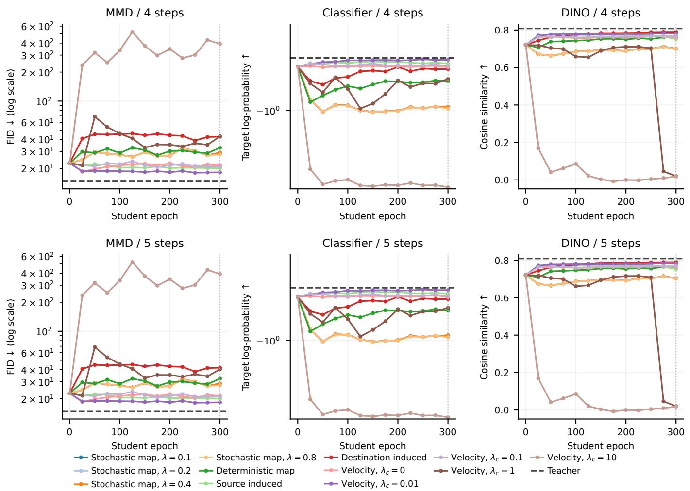  
Figure 9: All twelve supervision configurations for each of the three teacher rewards, under four-step (top) and five-step (bottom) generation. Markers are recorded evaluations, dashed horizontal lines are the frozen teachers, and the dotted vertical line marks the common epoch-300 comparison. MMD FID uses a logarithmic scale; classifier log-probability uses a symmetric logarithmic scale with a linear region between —1 and 1, retaining unstable configurations. Curves end at the last available evaluation.

Table 5: Four- and five-step reward-transfer results at epoch 300. Each reward setting reports its corresponding metric. Best student results in each column are bold.
<table><tr><td></td><td colspan="2">MMD: FID↓</td><td colspan="2">Classifier: log py ↑</td><td colspan="2">DINO: Cosine ↑</td></tr><tr><td>Supervision</td><td>4 steps</td><td>5 steps</td><td>4 steps</td><td>5 steps</td><td>4 steps</td><td>5 steps</td></tr><tr><td>B/2 base</td><td>22.68</td><td>22.72</td><td>-0.5448</td><td>-0.5451</td><td>0.7207</td><td>0.7215</td></tr><tr><td>XL/2 teacher</td><td>14.68</td><td>14.73</td><td>-0.4526</td><td>-0.4500</td><td>0.8084</td><td>0.8096</td></tr><tr><td>Stochastic map, λ = 0.1</td><td>29.15</td><td>28.70</td><td>-0.9623</td><td>-0.9474</td><td>0.7004</td><td>0.7040</td></tr><tr><td>Stochastic map,  $\lambda = 0 . 2$ </td><td>29.15</td><td>28.70</td><td>-0.9621</td><td>-0.9472</td><td>0.7003</td><td>0.7040</td></tr><tr><td>Stochastic map,  $\lambda = 0 . 4$ </td><td>29.15</td><td>28.70</td><td>-0.9619</td><td>-0.9469</td><td>0.7001</td><td>0.7037</td></tr><tr><td>Stochastic map, λ = 0.8</td><td>27.89</td><td>27.52</td><td>-0.9813</td><td>-0.9670</td><td>0.6989</td><td>0.7023</td></tr><tr><td>Deterministic map</td><td>32.84</td><td>32.31</td><td>-0.6956</td><td>-0.6860</td><td>0.7589</td><td>0.7624</td></tr><tr><td>Source induced</td><td>20.04</td><td>19.99</td><td>-0.5118</td><td>-0.5113</td><td>0.7519</td><td>0.7531</td></tr><tr><td>Destination induced</td><td>42.74</td><td>41.92</td><td>-0.5682</td><td>-0.5671</td><td>0.7901</td><td>0.7904</td></tr><tr><td>Velocity, λc = 0</td><td>21.72</td><td>21.44</td><td>-0.5484</td><td>-0.5453</td><td>0.7601</td><td>0.7625</td></tr><tr><td>Velocity,  $\lambda _ { c } = 0 . 0 1$ </td><td>18.23</td><td>18.33</td><td>-0.4720</td><td>-0.4737</td><td>0.7811</td><td>0.7817</td></tr><tr><td>Velocity,  $\lambda _ { c } = 0 . 1$ </td><td>21.05</td><td>21.01</td><td>-0.5378</td><td>-0.5371</td><td>0.7679</td><td>0.7684</td></tr><tr><td>Velocity,  $\lambda _ { c } = 1$ </td><td>43.07</td><td>40.33</td><td>-0.6710</td><td>-0.6582</td><td>0.0202</td><td>0.0202</td></tr><tr><td>Velocity,  $\lambda _ { c } = 1 0$ </td><td>392.78</td><td>392.19</td><td>-7.7761</td><td>-7.7774</td><td>0.0183</td><td>0.0183</td></tr></table>

Table 6: Fixed epoch-300 checkpoints under the fixed-tail deployment sweep. Lower test FID is better; best student results are bold.
<table><tr><td>Supervision</td><td>Epoch</td><td>4 steps</td><td>5 steps</td><td>8 steps</td><td>16 steps</td></tr><tr><td>B/2 base</td><td>0</td><td>22.48</td><td>22.72</td><td>22.88</td><td>22.87</td></tr><tr><td>Velocity,  $\lambda _ { c } = 0$ </td><td>300</td><td>23.58</td><td>21.44</td><td>19.29</td><td>19.17</td></tr><tr><td>Velocity,  $\lambda _ { c } = 0 . 0 1$ </td><td>300</td><td>18.14</td><td>18.33</td><td>18.33</td><td>18.56</td></tr><tr><td>Velocity,  $\lambda _ { c } = 0 . 1$ </td><td>300</td><td>21.59</td><td>21.01</td><td>20.42</td><td>20.41</td></tr><tr><td>Velocity,  $\lambda _ { c } = 1$ </td><td>300</td><td>41.40</td><td>40.33</td><td>37.19</td><td>34.74</td></tr><tr><td>Velocity,  $\lambda _ { c } = 1 0$ </td><td>300</td><td>395.48</td><td>392.19</td><td>388.29</td><td>386.52</td></tr><tr><td>Stochastic map,  $\lambda = 0 . 1$ </td><td>300</td><td>32.79</td><td>28.70</td><td>25.63</td><td>24.87</td></tr><tr><td>Stochastic map,  $\lambda = 0 . 2$ </td><td>300</td><td>32.79</td><td>28.70</td><td>25.63</td><td>24.87</td></tr><tr><td>Stochastic map,  $\lambda = 0 . 4$ </td><td>300</td><td>32.79</td><td>28.70</td><td>25.63</td><td>24.87</td></tr><tr><td>Stochastic map,  $\lambda = 0 . 8$ </td><td>300</td><td>31.40</td><td>27.52</td><td>24.63</td><td>23.88</td></tr><tr><td>Deterministic map</td><td>300</td><td>36.92</td><td>32.31</td><td>28.35</td><td>27.53</td></tr><tr><td>Source-induced velocity</td><td>300</td><td>20.42</td><td>19.99</td><td>19.77</td><td>19.71</td></tr><tr><td>Destination-induced velocity</td><td>300</td><td>46.25</td><td>41.92</td><td>36.13</td><td>33.65</td></tr></table>

Consistency-model distillation. We additionally apply FlowMap-OPD to a fixed-endpoint CM parameterization, distilling an MMD-adapted XL/2 teacher into a B/2 student. Table 7 compares endpoint-map and source-induced velocity supervision at epoch 150. Source-induced supervision achieves the lowest FID among the compared recipes under both four- and five-step generation, supporting the use of FlowMap-OPD with CM students as well as two-time flow-map students.

Table 7: Supplementary CM distillation at epoch 150. We report FID under four- and five-step generation; lower is better.
<table><tr><td>Supervision</td><td>Four-step FID ↓</td><td>Five-step FID ↓</td></tr><tr><td>Stochastic endpoint map, λ = 0.1</td><td>41.01</td><td>39.72</td></tr><tr><td>Stochastic endpoint map, λ = 0.2</td><td>40.91</td><td>39.67</td></tr><tr><td>Stochastic endpoint map, λ = 0.4</td><td>40.66</td><td>39.28</td></tr><tr><td>Stochastic endpoint map, λ = 0.8</td><td>40.34</td><td>38.78</td></tr><tr><td>Stochastic endpoint map, λ = 1.0</td><td>40.12</td><td>38.54</td></tr><tr><td>Deterministic endpoint map</td><td>40.96</td><td>39.68</td></tr><tr><td>Source-induced velocity</td><td>22.45</td><td>21.03</td></tr><tr><td>Source-induced velocity with adaptive weighting</td><td>392.95</td><td>415.18</td></tr></table>

## F Text-to-Image Consistency Analysis

Consistency strength. We vary λc and compare the students after 200 training steps. Table 8 reports student consistency and teacher-matching errors. A stronger penalty reduces the consistency residual, but large weights increase the difference from the teacher and reduce task performance (Table 3). The coefficient therefore controls how strongly the student fits the teacher relative to its own consistency constraint.

Table 8: Consistency and teacher-matching errors after 200 training steps, averaged over the preceding 20 steps at the last supervised interval. Velocity errors are mean squared differences from the teacher; map-composition error measures agreement between direct and composed student maps
<table><tr><td> $\lambda _ { c }$ </td><td>Source residual</td><td>Velocity mismatch</td><td>Average-velocity mismatch</td><td>Map composition error</td></tr><tr><td>0</td><td>0.800</td><td>0.017</td><td>0.031</td><td>0.003391</td></tr><tr><td>0.001</td><td>0.649</td><td>0.020</td><td>0.032</td><td>0.003148</td></tr><tr><td>0.01</td><td>0.763</td><td>0.053</td><td>0.043</td><td>0.003504</td></tr><tr><td>0.1</td><td>0.401</td><td>0.088</td><td>0.060</td><td>0.002558</td></tr><tr><td>1</td><td>0.179</td><td>0.171</td><td>0.090</td><td>0.001996</td></tr></table>

## G Paired Qualitative Comparisons

We compare the base, all three specialist teachers and the same student. Within each row, the models share the prompt, initial noise, few-step sampling grid and guidance. These illustrative comparisons use the $\lambda _ { c } = 0$ student.

## G.1 Cross-task Specialist-Student Comparisons

Each panel combines examples from the three tasks to show specialist capabilities and their consolidation in one student.

OCR | A vintage movie poster featuring the title text "Dersu Uzala" in elegant, bold letters, set against a backdrop of a serene, snow-covered forest. The scene captures the essence of a deep, contemplative journey through...  

  
PICKSCORE | aerial view of a small tropical island with a nice beach and palm trees

  
GENEVAL | a photo of a baseball glove right of a bear

  
Figure 10: Complementary specialist capabilities in one student. Rows compare text rendering, visual preferences and object relations. Columns show the base, OCR teacher, PickScore teacher, GenEval teacher and the same student.

OCR | A close-up of a vintage seed packet, labeled "Magic Beans Inside", lying on a rustic wooden table, with a pair of old gardening gloves and a spade resting nearby, surrounded by lush green plants and flowers in a sunlit...  

  
PICKSCORE | A photo of a orange tabby cat wearing a cowboy hat, full body

  
GENEVAL | a photo of a blue laptop and a brown bear

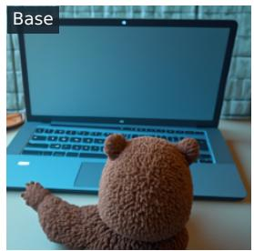

  
Figure 11: Cross-task specialist-student comparison. Rows cover OCR, visual preferences and compositional generation. Each row compares the base, three specialist teachers and the same student under a shared prompt, initial noise and few-step sampler.

OCR | A classroom scene with a teacher placing a golden "Math Star" sticker on a student's notebook, surrounded by math books and charts, capturing the moment of achievement and pride.  

  
PICKSCORE | back gustav royo ingle mother facing head towards wall recalling hardworking famine, Christian Krohg,melancholia

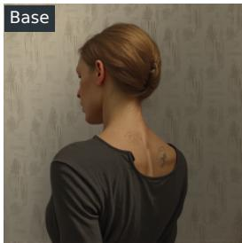

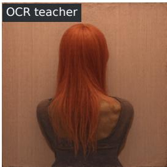  
GENEVAL | a photo of a black donut

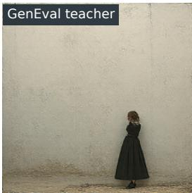

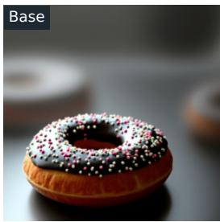

  
Figure 12: Cross-task specialist-student comparison. Rows cover OCR, visual preferences and compositional generation. Each row compares the base, three specialist teachers and the same student under a shared prompt, initial noise and few-step sampler.

## G.2 OCR Capability Comparisons

OCR | A realistic photograph of a modern doctor's office reception area, featuring a "Please Wait Here" sign prominently displayed on the desk, with comfortable seating and medical posters on the walls.  
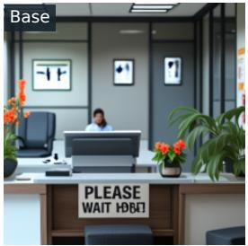

OCR | A vintage movie poster featuring the title text "Dersu Uzala" in elegant, bold letters, set against a backdrop of a serene, snow-covered forest. The scene captures the essence of a deep, contemplative journey through...  

OCR | A realistic photograph of an elevator emergency panel with clear instructions that read "Call 911", set against a modern, metallic interior with soft lighting highlighting the panel.  
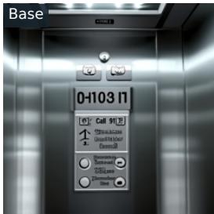

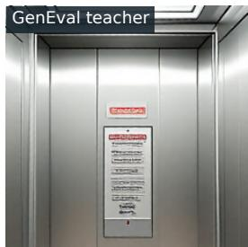  
Figure 13: Paired OCR examples. Columns show the base, OCR teacher, PickScore teacher, GenEval teacher, and the same student. Each row shares the prompt, initial noise and few-step sampler.

OCR | A cozy campsite at dusk, with a campfire blazing warmly. A package of marshmallows labeled "Extra Gooey" sits next to the fire, partially opened, revealing large, fluffy marshmallows ready for roasting. The scene is...

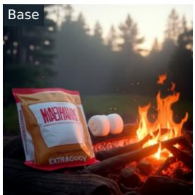

OCR | A futuristic spaceship cockpit with a digital screen displaying "Fuel Low" warning, set against the backdrop of a star-studded galaxy, with control panels and futuristic interfaces around.  

OCR | A chef stands in a bustling kitchen, wearing an apron embroidered with "Kiss the Cook or Else", preparing a gourmet dish while surrounded by steaming pots and fresh ingredients.  

  
Figure 14: Paired OCR examples. Columns show the base, OCR teacher, PickScore teacher, GenEval teacher, and the same student. Each row shares the prompt, initial noise and few-step sampler.

## G.3 Visual Preference Comparisons

PICKSCORE | A-team gmc 1982 van, black, red, grey, red alloy wheels

  
PICKSCORE | aerial view of a small tropical island with a nice beach and palm trees

  
PICKSCORE | an anthropomorphic grey wolf, medieval, adventurer, dnd, town, rpg, rustic, fantasy, hd digital art

  
Figure 15: Paired PickScore examples. Columns show the base, OCR teacher, PickScore teacher, GenEval teacher, and the same student. Each row shares the prompt, initial noise and few-step sampler.

PICKSCORE | strybk, Five christian people wearing purple religious robes with their head covered surrounded by pink flowers and with an open purple arch above. They are standing next to each other and looking at the viewer's direction....

PICKSCORE | a disco ball sitting on top of a tiled floor, trending digital fantasy art, healthcare worker, planet earth background, depicted as a 3 d render, hollow cheeks, executive industry banner, orb, world of madness,..  

  
PICKSCORE | Primordial fire bunny, By Wadim Kashin, Brian Froud and Miho Hirano, highly detailed

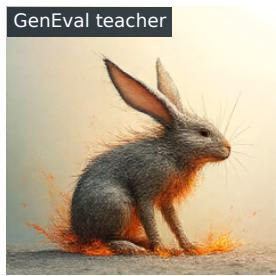  
Figure 16: Paired PickScore examples. Columns show the base, OCR teacher, PickScore teacher, GenEval teacher, and the same student. Each row shares the prompt, initial noise and few-step sampler.

## G.4 Compositional Generation Comparisons

GENEVAL | a photo of a white orange  

  
GENEVAL | a photo of a car

  
GENEVAL | a photo of a baseball glove right of a bear

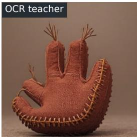

  
Figure 17: Paired GenEval examples. Columns show the base, OCR teacher, PickScore teacher, GenEval teacher, and the same student. Each row shares the prompt, initial noise and few-step sampler.

GENEVAL | a photo of a hair drier below an elephant  

  
GENEVAL | a photo of a couch left of a toaster

  
GENEVAL | a photo of a truck left of a refrigerator

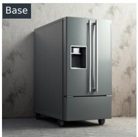

  
Figure 18: Paired GenEval examples. Columns show the base, OCR teacher, PickScore teacher, GenEval teacher, and the same student. Each row shares the prompt, initial noise and few-step sampler.

