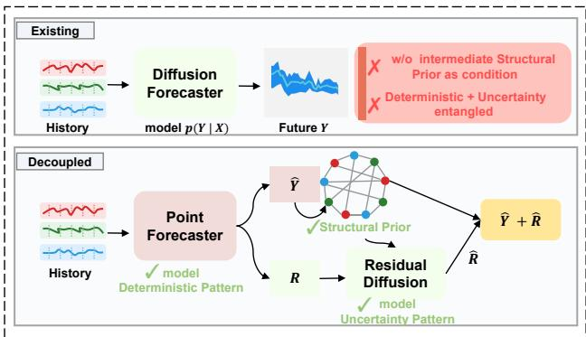
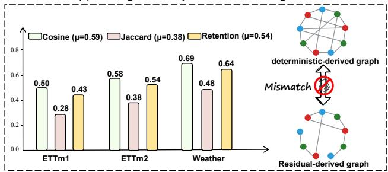
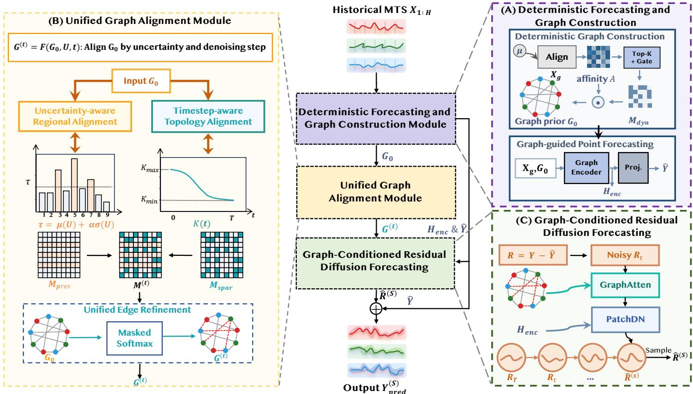
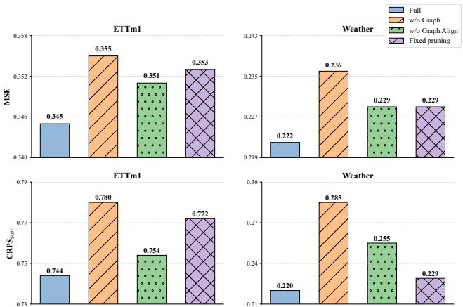
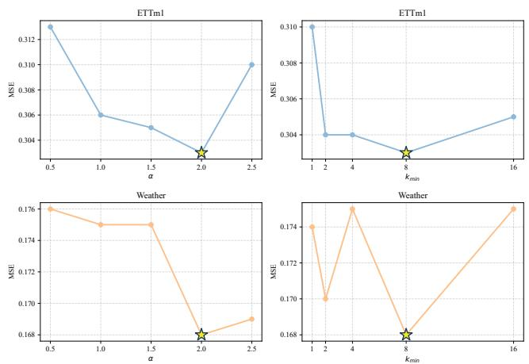

# GARDif: Graph-Aligned Residual Difusion for Probabilistic Multivariate Time-Series Forecasting

Rui Han1, Min Yang1, Xu Zhang2, Xinghao Yang3, Wei Liu4, Yongshun Gong1

1Shandong University, Jinan, China

2Macquarie University, Sydney, Australia

3China University of Petroleum (East China), Qingdao, China

4University of Technology Sydney, Sydney, Australia

{hanrui021, minyang}@mail.sdu.edu.cn, xu.zhang12@hdr.mq.edu.au, yangxh@upc.edu.cn, wei.liu@uts.edu.au, ysgong@sdu.edu.cn

## Abstract

Difusion models have recently shown strong potential for probabilistic multivariate time-series forecasting by modeling complex conditional distributions. Recent decoupled difusion frameworks further separate forecasting into deterministic prediction and stochastic residual generation, making it natural to derive dependency graphs from deterministic representations and use them to guide residual difusion. However, we show that this direct structural transfer is unreliable. Although deterministic-derived graphs encode useful global dependency priors, they exhibit substantial edge-level misalignment with residual dependency structures, introducing inaccurate or redundant conditions during residual generation. This reveals a previously overlooked deterministic-toresidual structural alignment problem in decoupled difusion forecasting. To address this problem, we propose GARDif, a Graph-Aligned Residual Difusion framework for probabilistic multivariate time-series forecasting. Instead of treating deterministic-derived graphs as fixed difusion conditions, GARDif progressively adapts them to residual generation. Specifically, GARDif estimates residual uncertainty to distinguish high- and low-uncertainty regions, enabling uncertainty-aware structural refinement, and further performs timestep-aware edge sparsification during reverse difusion to evolve graph conditions from broad dependency aggregation to localized residual refinement. Extensive experiments on six real-world benchmarks demonstrate that GARDif consistently improves probabilistic forecasting performance and uncertainty calibration over strong baselines.

## Introduction

Multivariate Time-Series Forecasting (MTSF) plays a critical role in various real-world applications, including energy management (Nowotarski and Weron 2018; Deb et al. 2017; Xue and Salim 2023), trafic planning (Shu, Cai, and Xiong 2021; An et al. 2025; Li et al. 2025b), weather monitoring (Gong et al. 2024; Angryk et al. 2020; Karevan and Suykens 2020), urban mobility (Li et al. 2024a; Qu et al. 2022; Yang et al. 2025; Zhang et al. 2023, 2025), and finance (Wiese et al. 2020; Zhu et al. 2024). Recently, difusion models have demonstrated strong potential for probabilistic time-series forecasting due to their capability of modeling complex conditional distributions. However, efective probabilistic forecasting for multivariate time series requires not only modeling temporal uncertainty but also capturing dependencies among variables. Existing graph-conditioned diffusion methods (Wen et al. 2023; Liu et al. 2023a; Lin et al. 2025) address this challenge by incorporating graph structures as additional priors, yet they typically rely on predefined physical graphs, which are unavailable in many general multivariate time-series scenarios.

(a) Existing vs. Decoupled Diffusion Paradigm  
  
(b) Structural Mismatch  
Figure 1: (a) Comparison between existing difusion forecasting and the decoupled forecasting paradigm. Decoupling deterministic and uncertainty modeling enables the deterministic stage to provide structural priors for uncertaintyaware residual difusion. (b) Quantitative evidence of structural mismatch between deterministic-derived and residualderived graphs.

Recent decoupled difusion forecasting frameworks (Li et al. 2025a) provide a new perspective by separating forecasting into a deterministic prediction stage and a residual generation stage. As illustrated in Figure 1(a), this decomposition naturally enables the construction of dependency graphs from deterministic forecasting representations to guide residual difusion. However, a fundamental question remains: can deterministic-derived structures be directly transferred to residual generation? The deterministic and residual stages optimize diferent objectives and may capture distinct dependency patterns, making such direct transfer potentially unreliable.

To investigate this issue, we compare deterministicderived graphs with residual-derived graphs constructed using the same graph generation strategy. As shown in Figure 1(b), deterministic-derived graphs preserve meaningful global dependency patterns, evidenced by their moderate cosine similarity with residual-derived graphs. However, their substantially lower Jaccard similarity and edge retention ratio reveal significant edge-level inconsistencies between the two stages. This indicates that although deterministic graphs provide valuable structural priors, directly reusing them as fixed conditions may introduce inaccurate or redundant dependencies during residual difusion. Such structural mismatch is consistently observed across datasets with diverse temporal dynamics, revealing a previously overlooked graph transfer problem in decoupled difusion forecasting. This motivates a new problem: deterministic-to-residual structural alignment, which aims to adaptively solve the structural mismatch between deterministic forecasting and residual generation while preserving the useful global dependency priors encoded by deterministic-derived graphs.

To address this challenge, structural transfer should be treated as an adaptive alignment process rather than a direct graph reuse strategy. This is because deterministicto-residual structural mismatch is neither spatially uniform nor temporally static, but varies across residual regions and evolves along the reverse difusion trajectory. On the one hand, residual uncertainty indicates where richer structural guidance is needed: highly uncertain regions require richer dependency exploration, whereas low-uncertainty regions can benefit from suppressing redundant connections. On the other hand, the reverse difusion process imposes timestepdependent structural demands, where early denoising steps favor broader dependency aggregation and later steps require more localized residual refinement. Therefore, efective residual difusion calls for an alignment mechanism that identifies uncertainty-dependent regions and dynamically adjusts graph edges along denoising timesteps.

Motivated by these observations, we propose GARDif, a Graph-Aligned Residual Difusion framework for probabilistic multivariate time-series forecasting. Instead of using deterministic-derived graphs as fixed difusion conditions, GARDif treats them as global structural priors and progressively refines them for residual generation. Specifically, GARDif first constructs a deterministic dependency graph from intermediate forecasting representations. It then estimates residual uncertainty to distinguish high- and lowuncertainty regions, enabling uncertainty-aware structural refinement. Finally, GARDif performs timestep-aware edge sparsification during reverse difusion, allowing the graph condition to evolve from broad dependency aggregation to localized residual refinement. Extensive experiments demonstrate that GARDif consistently improves probabilistic forecasting performance across multiple benchmarks.

Our main contributions are summarized as follows:

• We identify and empirically analyze a previously overlooked structural transfer problem in decoupled difusion forecasting, showing that deterministic-derived graphs provide useful priors but exhibit significant misalignment with residual dependency structures.

• We propose GARDif, a graph-aligned residual difusion framework that couples uncertainty-aware region selection with timestep-aware edge sparsification to align deterministic-derived graph with residual difusion.

• Extensive experiments on six real-world benchmarks demonstrate that GARDif consistently outperforms strong baselines in probabilistic forecasting and uncertainty calibration.

## Related Work

## Difusion-Based Time-Series Forecasting

Difusion probabilistic models (Ho, Jain, and Abbeel 2020) have recently shown strong potential for probabilistic timeseries forecasting by modeling complex conditional distributions through iterative denoising. Representative methods adapt difusion models to sequential forecasting from diferent perspectives. TimeGrad (Rasul et al. 2021) performs autoregressive denoising conditioned on historical observations, while CSDI (Tashiro et al. 2021) adopts a nonautoregressive Transformer backbone for conditional timeseries generation. Subsequent studies further improve temporal representation learning and denoising architectures for forecasting (Alcaraz and Strodthof 2022; Li et al. 2024b).

Most existing difusion-based forecasters directly model the future trajectory as a unified stochastic distribution, which entangles predictable temporal patterns with uncertain residual variations. Recent decoupled difusion frameworks (Li et al. 2025a) alleviate this issue by separating deterministic prediction from residual generation. However, they typically use deterministic outputs only as conditioning signals, leaving the dependency structures learned in the deterministic stage underexplored. In contrast, GARDif extracts deterministic-derived dependency graphs and further studies how such structures should be aligned with residual difusion.

## Graph-Conditioned Difusion Models

Graph-conditioned difusion models incorporate graph topology into the denoising process to enhance structured dependency modeling. In spatio-temporal forecasting, Dif-STG (Wen et al. 2023) introduces graph-guided spatial aggregation into difusion forecasting, PriSTI (Liu et al. 2023a) extracts coarse spatiotemporal dependencies from observed values as a global context prior and incorporates geographic relationships into the difusion-based imputation process, and SpecSTG (Lin et al. 2025) extends graph-conditioned difusion to the spectral domain. These methods demonstrate the efectiveness of graph priors when reliable topology is available.

Nevertheless, existing graph-conditioned difusion methods are less suitable for general MTSF. They mainly rely on predefined physical graphs, which are unavailable in many non-spatial scenarios, and usually keep the graph condition fixed throughout reverse difusion. This static design overlooks the evolving structural demands of denoising, where early steps favor broader dependency aggregation while later steps require more localized residual refinement. Diferent from prior methods, GARDif derives graphs from deterministic forecasting representations and adaptively refines them through uncertainty-aware region selection and timestepaware edge sparsification.

## Method

## Overview

Given historical observations $\mathbf { X } _ { 1 : H } \in \mathbb { R } ^ { C \times H }$ and prediction target $\mathbf { Y } _ { 1 : L } \in \mathbb { R } ^ { C \times L }$ , GARDif follows a decoupled forecasting formulation:

$$
{ \bf Y } _ { 1 : L } = \hat { \bf Y } + { \bf R } ,\tag{1}
$$

where $\hat { \mathbf { Y } } = f _ { \theta } ( \mathbf { X } _ { 1 : H } )$ is the deterministic prediction and $\mathbf { R } = \mathbf { Y } _ { 1 : L } - \hat { \mathbf { Y } }$ is the residual. The deterministic stage captures predictable temporal patterns, while the difusion model is responsible for generating stochastic residuals. Diferent from prior decoupled difusion methods that mainly use deterministic predictions as conditioning signals, GARDif further exploits the structural information learned in the deterministic stage. Specifically, we first construct a deterministic dependency graph $\mathbf { G } _ { 0 }$ from intermediate forecasting representations. Since $\mathbf { G } _ { 0 }$ is optimized for point prediction rather than residual generation, directly reusing it as a fixed graph condition may introduce residual-irrelevant dependencies. We therefore formulate graph conditioning as an alignment problem:

$$
\mathbf { G } ^ { ( t ) } = F ( \mathbf { G } _ { 0 } , \mathbf { U } , t ) ,\tag{2}
$$

where U denotes patch-level residual uncertainty and t is the reverse difusion timestep. The aligned graph $\mathbf { \dot { G } } ^ { ( t ) }$ is then used to condition the residual denoising process:

$$
p _ { \phi } ( \mathbf { R } \mid \mathbf { H } _ { \mathrm { e n c } } , \mathbf { G } ^ { ( t ) } ) ,\tag{3}
$$

where $\mathbf { H } _ { \mathrm { e n c } }$ denotes deterministic forecasting representations.

## Deterministic Forecasting and Graph Construction

The deterministic forecasting stage serves two purposes: producing the point forecast and extracting a transferable structural prior for residual difusion. Rather than treating deterministic forecasting solely as a prediction module, we exploit its intermediate representations to model inter-variable dependencies that capture the global dependency backbone of the input series.

Patch Embedding. Given an input multivariate time series $\mathbf { X } \in \mathbb { R } ^ { C \times H }$ , we divide each variable into non-overlapping patches of length p and project them into a latent space,

$$
\mathbf { X } _ { p } = \operatorname { E m b e d d i n g } ( \operatorname { P a t c h i n g } ( \mathbf { X } ) ) \in \mathbb { R } ^ { N \times D } ,\tag{4}
$$

where $N = C \times n , n = \lceil H / p \rceil$ , and D denotes the embedding dimension. Patch-level representations provide stable units for both dependency modeling and deterministic forecasting.

Deterministic Graph Construction. To obtain a robust structural prior, we first calibrate patch representations with a global context anchor:

$$
\mathbf { X } _ { g } = \mathbf { X } _ { p } + \mathrm { L N } ( \mathrm { M L P } \left( [ \mathbf { X } _ { p } \| \pmb { \mu } ] \right) ) ,\tag{5}
$$

where $\pmb { \mu }$ is the mean feature over all patches.

Pairwise afinities are then computed by

$$
\begin{array} { r } { A = \mathrm { G E L U } \left( \mathbf { X } _ { g } W _ { 1 } ( \mathbf { X } _ { g } W _ { 2 } ) ^ { \top } \right) , } \end{array}\tag{6}
$$

followed by Top-K sparsification to retain dominant dependencies. To further suppress noisy structural patterns, we employ a structure-gated mechanism that adaptively reweights candidate dependency structures, yielding the deterministicderived graph

$$
G _ { 0 } = A \odot M _ { \mathrm { d y n } } ,\tag{7}
$$

where $M _ { \mathrm { d y n } }$ denotes the dynamic structural mask.

Graph-guided Point Forecasting. The graph $\mathbf { G } _ { 0 }$ is used to enhance deterministic forecasting representations:

$$
\mathbf { H } = \mathrm { G r a p h E n c o d e r } ( \mathbf { X } _ { g } , G _ { 0 } ) , \qquad \hat { \mathbf { Y } } = \mathrm { P r o j } ( \mathbf { H } ) ,\tag{8}
$$

The detailed implementation of the graph encoder and structure gate is provided in the Appendix D.1. Although $G _ { 0 }$ captures stable global inter-variable dependencies, it is optimized for deterministic prediction rather than residual generation. Consequently, directly using $G _ { 0 }$ as the structural condition for residual difusion introduces structural bias, motivating the unified graph alignment module described next.

## Unified Graph Alignment Module

Motivation: Refine Rather Than Rebuild. As shown in Figure 1(b), the deterministic-derived graph $G _ { 0 }$ preserves a transferable global backbone but difers from the residualderived graph in fine-grained topology. Thus, $G _ { 0 }$ is neither fully reliable nor entirely invalid. Discarding it would lose useful structural priors, whereas directly reusing it would introduce residual-incompatible dependencies. We therefore formulate graph conditioning as a constrained refinement problem:

$$
\mathbf { G } ^ { ( t ) } = F ( G _ { 0 } , \mathbf { U } , t ) ,\tag{9}
$$

where U denotes patch-level residual uncertainty and t is the reverse difusion timestep.

Residual Uncertainty Estimation. Graph alignment requires a patch-level uncertainty signal indicating where residual variations are insuficiently explained by the deterministic structure. Under the decoupled formulation $\mathbf { Y } = \hat { \mathbf { Y } } + \mathbf { R }$ , the residual $\mathbf R = \mathbf Y - \hat { \mathbf Y }$ represents the stochastic component left for difusion modeling. Therefore, its magnitude provides a natural proxy for local forecasting dificulty: larger residuals indicate regions where more candidate correction paths should be preserved.

  
Figure 2: Overview of GARDif. The deterministic forecasting module extracts representations and constructs a structural prior graph. The graph alignment module refines the prior using residual uncertainty and difusion timestep. The graph-conditioned difusion module then performs residual generation with dynamic structural guidance.

During training, the true residual is directly accessible. During inference, we estimate residual magnitude with a lightweight proxy network:

$$
\tilde { \mathbf { R } } = \mathrm { M L P } ( \hat { \mathbf { Y } } ) \in \mathbb { R } ^ { C \times L } .\tag{10}
$$

The proxy is not required to predict the exact residual value, but only to recover the relative residual magnitude used to distinguish high- and low-uncertainty patches, which is substantially simpler than modeling the full residual distribution.

In both training and inference, patch-level uncertainty is computed by reshaping the residual magnitude into patches and aggregating over each patch:

$$
\mathbf { U } = \mathrm { M e a n } ( \mathrm { P a t c h i n g } ( R ) ) \in \mathbb { R } ^ { N } ,\tag{11}
$$

where R denotes the absolute value of R during training and R˜ during inference, and $\mathbf { U } _ { i }$ represents the uncertainty of patch i.

Uncertainty-aware Regional Alignment. To align $G _ { 0 }$ with residual dependency patterns, we first identify highand low-uncertainty patches to determine where structural information should be preserved or selectively refined. Highuncertainty patches indicate regions where residual dependencies are less reliably explained by the deterministic backbone. Therefore, aggressively pruning edges in these regions may prematurely remove useful residual-correction paths. In contrast, low-uncertainty patches are better explained by the deterministic model, where redundant connections can be safely suppressed to encourage selective refinement. We do not assume that all edges connected to a high-uncertainty patch are equally important. Instead, high uncertainty indicates a higher risk of removing useful residual-correction paths.

We identify high-uncertainty patches via a dynamic ασ criterion:

$$
\boldsymbol { \tau } = \mu ( \mathbf { U } ) + \alpha \cdot \boldsymbol { \sigma } ( \mathbf { U } ) ,\tag{12}
$$

where $\mu ( \cdot )$ and $\sigma ( \cdot )$ denote the mean and standard deviation over all patches, and α is a tunable coeficient. Unlike fixed thresholds, this data-adaptive criterion accommodates varying uncertainty distributions across datasets and instances. Patches satisfying $\mathbf { U } _ { i } > \tau$ are designated as highuncertainty, for which candidate edges are preserved via an uncertainty-preserving mask:

$$
M _ { \mathrm { p r e s } } ^ { i j } = { \bf 1 } \left[ U _ { i } > \tau \right] ,\tag{13}
$$

Timestep-aware Topology Alignment. We dynamically adjust the edge sparsity level along the reverse difusion trajectory through a Top-K scheduling strategy. In the early reverse difusion stages (large t), the denoising network operates under high noise levels and benefits from higherconnectivity graph interactions to recover coarse global structure; in later stages (small t), the signal is nearly clean and localized refinement is preferred, making redundant edges harmful rather than helpful.

We capture this progression via a continuous Top-K scheduling strategy with cosine annealing:

$$
K ( t ) = K _ { \operatorname* { m i n } } + \frac { 1 } { 2 } ( K _ { \operatorname* { m a x } } - K _ { \operatorname* { m i n } } ) \left( 1 - \cos \left( \pi \frac { t } { T } \right) \right) ,\tag{14}
$$

where $T$ is the total number of difusion steps, $K _ { \mathrm { m a x } }$ and $K _ { \mathrm { m i n } }$ control the connectivity range and t denotes reverse difusion step. This yields $K ( T ) = K _ { \operatorname* { m a x } }$ at the start of reverse difusion and $K ( 0 ) = K _ { \operatorname* { m i n } }$ at convergence, enabling a smooth transition aligned with progressive denoising objectives. Furthermore, when $t \geq \eta T$ (where η is an earlystage threshold), the graph enters a maximum-connectivity regime within the candidate graph regime to maximally support coarse structure recovery in the noisiest denoising stages. The Top-K sparse mask for low-uncertainty regions is:

$$
M _ { \mathrm { s p a r } } = \mathrm { T o p K } ( G _ { 0 } , \ : K ( t ) ) .\tag{15}
$$

Unified Edge Refinement. The two masks serve complementary roles: $M ^ { \mathrm { p r e s } }$ preserves uncertainty-sensitive candidate connectivity irrespective of difusion progress, while $M ^ { \mathrm { s p a r } }$ enforces timestep-appropriate sparsity in lowuncertainty regions. We unify them via logical disjunction, ensuring any edge flagged by either criterion is retained:

$$
M ^ { ( t ) } = M _ { \mathrm { p r e s } } \vee M _ { \mathrm { s p a r } } .\tag{16}
$$

Edges not selected by either mask are suppressed by setting their logits $\mathrm { t o \ - } \infty$ before normalization. The aligned adjacency matrix is obtained via masked softmax:

$$
\mathbf { G } ^ { ( t ) } = \mathrm { M a s k e d S o f t m a x } ( G _ { 0 } \odot M ^ { ( t ) } ) .\tag{17}
$$

Through this unified refinement, $\mathbf { G } ^ { ( t ) }$ simultaneously achieves structural alignment with residual dependency patterns and temporal alignment with the evolving objectives of reverse difusion, providing adaptive structural conditioning for residual difusion.

## Graph-Conditioned Residual Difusion

Given the deterministic prediction $\hat { \mathbf { Y } } .$ , we model the prediction residual

$$
\mathbf { R } = \mathbf { Y } - \hat { \mathbf { Y } }\tag{18}
$$

using a conditional denoising difusion process. Rather than learning residual dynamics independently, the difusion model is conditioned on the aligned graph $\dot { \mathbf { G } } ^ { ( t ) }$ , allowing residual generation to exploit dynamically refined structural dependencies throughout reverse difusion.

Forward Difusion. Following the standard DDPM formulation, Gaussian noise is gradually added to the clean residual:

$$
q ( \mathbf { R } _ { t } | \mathbf { R } ) = \mathcal { N } \left( \sqrt { \bar { \alpha } _ { t } } \mathbf { R } , ( 1 - \bar { \alpha } _ { t } ) \mathbf { I } \right) ,\tag{19}
$$

where $\begin{array} { r } { \bar { \alpha } _ { t } \ = \prod _ { i = 1 } ^ { t } \alpha _ { i } } \end{array}$ . The complete forward and reverse difusion formulation follows the standard DDPM framework and is omitted for brevity.

Graph-Conditioned Denoising. Unlike existing graphconditioned difusion models that employ a fixed graph during denoising, our structural condition is dynamically updated at every reverse difusion step through the graph alignment module:

$$
\mathbf { G } ^ { ( t ) } = F ( \mathbf { G } _ { 0 } , \mathbf { U } , t ) .\tag{20}
$$

Consequently, the denoising network receives a timestepaware structural condition whose connectivity evolves together with the reverse difusion process, providing dense global interactions in early denoising stages and progressively sparse local refinement as difusion converges.

Graph-Guided Feature Refinement. Before entering the denoising backbone, noisy residual patches ${ \mathbf { R } } _ { t } \in \mathbb { R } ^ { N \times \widecheck P }$ are projected into latent representations with timestep embeddings,

$$
\mathbf { E } = \mathrm { L i n e a r } ( \mathbf { R } _ { t } ) + \mathrm { T i m e E m b } ( t ) ,\tag{21}
$$

and refined through a graph-gated multi-head attention module conditioned on $\mathbf { G } ^ { ( t ) }$

$$
{ \bf E } ^ { \prime } = \mathrm { G r a p h A t t n } ( { \bf E } , { \bf G } ^ { ( t ) } ) .\tag{22}
$$

Specifically, the graph is used to modulate self-attention scores through a learnable gating mechanism, enabling structural dependencies to guide feature interaction while preserving the flexibility of Transformer attention. The refined features are added back to the noisy residual through a residual connection before denoising.

PatchDN Backbone. The graph-enhanced features are then processed by the PatchDN (Li et al. 2025a) denoising backbone to predict either the injected noise or the clean residual, depending on the adopted difusion parameterization:

$$
\hat { \mathbf { \epsilon } } _ { \phi } \operatorname { o r } \hat { \mathbf { R } } _ { \phi } = \operatorname { P a t c h D N } ( \mathbf { E } ^ { \prime } , t , \mathbf { H } _ { \mathrm { e n c } } ) ,\tag{23}
$$

where $\mathbf { H } _ { \mathrm { e n c } }$ denotes deterministic forecasting representations used as conditional context. PatchDN adopts a standard Transformer architecture with adaptive layer normalization, while the proposed graph-conditioned attention provides dynamic structural guidance throughout reverse difusion. After $T$ reverse difusion steps, the denoised residual Rˆ is added to the deterministic forecast to obtain the final prediction:

$$
\mathbf { Y } _ { \mathrm { p r e d } } ^ { ( s ) } = \hat { \mathbf { Y } } + \hat { \mathbf { R } } ^ { ( s ) } , \quad s = 1 , \ldots , S ,\tag{24}
$$

where s denotes the sampling index and S is the total number of samples. At inference time, multiple residual samples $\{ \hat { \mathbf { R } } ^ { ( s ) } \} _ { s = 1 } ^ { S }$ are generated to form $\{ \mathbf { Y } _ { \mathrm { p r e d } } ^ { ( s ) } \} _ { s = 1 } ^ { S }$ , which approximates the predictive distribution.

Optimization Objective. GARDif is trained with a joint objective that combines residual difusion learning, deterministic forecasting, uncertainty estimation, and structural regularization:

$$
\begin{array} { r } { \mathcal { L } = \mathcal { L } _ { \mathrm { d i f f } } + \lambda _ { 1 } \mathcal { L } _ { \mathrm { p o i n t } } + \lambda _ { 2 } \mathcal { L } _ { \mathrm { u n c } } + \lambda _ { 3 } \mathcal { L } _ { \mathrm { g a t e } } . } \end{array}\tag{25}
$$

Here, ${ \mathcal { L } } _ { \mathrm { d i f f } }$ optimizes residual denoising, ${ \mathcal { L } } _ { \mathrm { p o i n t } }$ supervises the deterministic forecast, ${ \mathcal { L } } _ { \mathrm { u n c } }$ trains the residual uncertainty estimator, and $\mathcal { L } _ { \mathrm { g a t e } }$ regularizes the learned graph structure. Details are provided in Appendix E.

<table><tr><td rowspan="2">Model</td><td rowspan="2">ETTm1 CRPS</td><td colspan="2">ETTm2 CRPS</td><td colspan="2">Weather CRPS  $\mathrm { C R P S _ { s u m } }$ </td><td colspan="2">Solar CRPS  $\mathrm { C R P S _ { s u m } }$ </td><td colspan="2">ECL</td><td colspan="2">Traffic</td></tr><tr><td> $\mathrm { C R P S _ { s u m } }$ </td><td></td><td> $\mathrm { C R P S _ { s u m } }$ </td><td></td><td></td><td></td><td>CRPS</td><td> $\mathrm { C R P S _ { s u m } }$ </td><td>CRPS</td><td> $\mathrm { C R P S _ { s u m } }$ </td></tr><tr><td>TimeDiff</td><td>0.490</td><td>2.195</td><td>0.320</td><td>1.597</td><td>0.302 2.625</td><td>0.700</td><td>2.408</td><td></td><td>0.735 1.966</td><td>0.766</td><td>1.885</td></tr><tr><td>TMDM</td><td>0.380</td><td>1.665</td><td>0.298 1.412</td><td>0.244</td><td>1.915</td><td>0.355</td><td>1.534</td><td>0.438</td><td>1.573</td><td>0.453</td><td>1.587</td></tr><tr><td>NsDiff D3U</td><td>0.394</td><td>1.878</td><td>0.315</td><td>1.564 0.230</td><td>1.971</td><td>0.273</td><td>0.951</td><td>0.285</td><td>0.874</td><td>0.319</td><td>0.864</td></tr><tr><td></td><td>0.283</td><td>0.801</td><td>0.247</td><td>0.114 0.208</td><td>0.248</td><td>0.174</td><td>0.604</td><td>0.202</td><td>0.665</td><td>0.224</td><td>0.786</td></tr><tr><td>Ours</td><td>0.273</td><td>0.744</td><td>0.234</td><td>0.093</td><td>0.199 0.220</td><td>0.166</td><td>0.463</td><td>0.191</td><td>0.459</td><td>0.212</td><td>0.459</td></tr></table>

Table 1: Probabilistic forecasting performance. All results are reported with input length H=96 and averaged over three forecasting horizons $( L \in \{ 9 6 , 1 9 2 , 3 3 6 \}$ ). Best results are highlighted in bold. See Table 6 for full results.
<table><tr><td>Model</td><td>ETTm1 MSE MAE</td><td>MSE</td><td>ETTm2 MAE</td><td>MSE</td><td>Weather MAE</td><td>MSE</td><td>Solar MAE</td><td>MSE</td><td>ECL MAE</td><td>MSE</td><td>Traffic MAE</td></tr><tr><td colspan="10">Point Forecasting Models</td><td></td><td></td><td></td><td></td></tr><tr><td>PatchTST</td><td>0.359</td><td>0.381 0.247</td><td>0.304</td><td>0.227</td><td></td><td>0.258</td><td>0.242</td><td>0.275</td><td>0.177</td><td>0.263</td><td>0.455</td><td>0.287</td></tr><tr><td>TimesNet</td><td>0.386</td><td>0.404</td><td>0.254</td><td>0.307</td><td>0.225</td><td>0.263</td><td>0.251</td><td>0.272</td><td>0.186</td><td>0.288</td><td>0.613</td><td>0.325</td></tr><tr><td>iTransformer</td><td>0.381</td><td>0.397</td><td>0.252 0.312</td><td></td><td>0.227</td><td>0.257</td><td>0.231</td><td>0.257</td><td>0.164</td><td>0.256</td><td>0.411</td><td>0.276</td></tr><tr><td>TimeBridge</td><td>0.360</td><td>0.375 0.244</td><td>0.307</td><td></td><td>0.221</td><td>0.248</td><td>0.220</td><td>0.230</td><td>0.155</td><td>0.256</td><td>0.411</td><td>0.273</td></tr><tr><td>TimeFilter</td><td>0.355</td><td>0.381</td><td>0.242</td><td>0.305</td><td>0.226</td><td>0.258</td><td>0.226</td><td>0.254</td><td>0.167</td><td>0.262</td><td>0.396</td><td>0.261</td></tr><tr><td colspan="9">Probabilistic Forecasting Models</td><td></td><td></td><td></td></tr><tr><td>TimeDiff</td><td>0.573</td><td>0.503</td><td>0.274</td><td>0.332</td><td>0.259</td><td>0.315</td><td>0.901</td><td>0.714</td><td>0.824</td><td>0.749</td><td>0.762</td><td>0.519</td></tr><tr><td>TMDM</td><td>0.564</td><td>0.502</td><td>0.361</td><td>0.373</td><td>0.287</td><td>0.303</td><td>0.276</td><td>0.309</td><td>0.219</td><td>0.330</td><td>0.625</td><td>0.374</td></tr><tr><td>NsDiff</td><td>0.561</td><td>0.489</td><td>0.452</td><td>0.425</td><td>0.255</td><td>0.290</td><td>0.307</td><td>0.329</td><td>0.197</td><td>0.305</td><td>0.497</td><td>0.358</td></tr><tr><td>D3U</td><td>0.360</td><td>0.385</td><td>0.247</td><td>0.315</td><td>0.226</td><td>0.278</td><td>0.223</td><td>0.267</td><td>0.179</td><td>0.269</td><td>0.527</td><td>0.297</td></tr><tr><td>Ours</td><td>0.345</td><td>0.375</td><td>0.239</td><td>0.303</td><td>0.222</td><td>0.264</td><td>0.215</td><td>0.242</td><td>0.161</td><td>0.255</td><td>0.419</td><td>0.278</td></tr></table>

Table 2: Deterministic forecasting performance. All results are reported with input length H=96 and averaged over three forecasting horizons $( L \in \{ 9 6 , 1 9 \bar { 2 } , \bar { 3 } 3 6 \}$ ). Best results are highlighted in bold. See Table 7 for full results.

## Experiments

We evaluate GARDif on six real-world datasets, focusing on predictive performance and the validity of the proposed structural and uncertainty-aware mechanisms.

RQ1: How does GARDif perform in probabilistic forecasting compared with state-of-the-art difusion-based methods? RQ2: Does the proposed framework improve deterministic forecasting accuracy?

RQ3: What is the contribution of graph conditioning, topology refinement, and timestep-aware pruning?

RQ4: Does the learned uncertainty reliably reflect residual magnitude and support residual-aware graph alignment? RQ5: How sensitive is GARDif to key hyperparameters?

## Experimental Setup

Datasets. We evaluate GARDif on six widely used multivariate time series datasets: ETTm1, ETTm2, Weather, Solar-Energy (Solar), Electricity (ECL), and Trafic. These datasets cover diverse temporal dynamics including strong seasonality and complex inter-variable dependencies.

Baselines. We compare GARDif with representative methods from both deterministic and probabilistic forecast-

ing methods. (1) Deterministic methods: PatchTST (Nie et al.   
2023), TimesNet (Wu et al. 2022), iTransformer (Liu et al.   
2023b), TimeBridge (Liu et al. 2024), TimeFilter (Hu et al.   
2025). (2) Probabilistic methods: TimeDif (Shen and Kwok   
2023), TMDM (Li et al. 2024b), NsDif (Ye, Xu, and Gui   
2025), D3U (Li et al. 2025a).

Evaluation Metrics. For probabilistic forecasting, we use CRPS and CRPSsum. For deterministic forecasting, we report MSE and MAE. Lower values indicate better performance.

Implementation Details. We adopt a difusion process with $T ~ = ~ 1 0 0$ steps and a linear noise schedule with $\beta _ { 1 } = 1 0 ^ { - 4 }$ and $\beta _ { T } = 0 . 0 2$ . For the uncertainty-aware graph alignment module, we set $\alpha = 2 . 0 \ : \mathrm { . }$ , and use a continuous Top-K scheduling strategy with $K _ { \operatorname* { m i n } } = 4 , K _ { \operatorname* { m a x } } = 3 2 .$ and $\eta = 0 . 7 5$ . During inference, we approximate predictive distributions using 100 difusion samples. All experiments are implemented in PyTorch (Paszke et al. 2019) and conducted on an NVIDIA GeForce RTX 4090 GPU with 24GB memory. Details are described in Appendix F.3.

Figure 3: Ablation study on ETTm1 and Weather. The lookback horizon H is 96. See Table 8 for full results.
<table><tr><td>Dataset</td><td>Setting MSE</td><td>MAE CRPS</td><td> $\mathbf { C R P S _ { s u m } }$ </td></tr><tr><td>ETTm1</td><td>Pred. Unc. Oracle Res.</td><td>0.345 0.375 0.273 0.346 0.375 0.272</td><td>0.744 0.751</td></tr><tr><td>Weather</td><td>Pred. Unc. Oracle Res.</td><td>0.222 0.268 0.202 0.222 0.268 0.202</td><td>0.220 0.220</td></tr></table>

Table 3: Performance comparison between predicted uncertainty and oracle residuals. Results are reported with input length $H { = } 9 6$ and averaged over three forecasting horizons $( L \in \{ 9 6 , 1 9 2 , 3 3 6 \}$ ). See Table 9 for full results.

## Overall Results

Probabilistic Forecasting Performance (RQ1). Table 1 reports probabilistic forecasting performance in terms of CRPS and $\mathrm { C R P S } _ { \mathrm { s u m } } .$ . GARDif consistently outperforms all competing methods across all six benchmarks. Compared with the strongest difusion baseline D3U (Li et al. 2025a), GARDif achieves up to 5.5% lower CRPS and 41.6% lower $\mathrm { C R P S _ { s u m } }$ . Such consistent gains suggest that adaptive graph conditioning provides informative structural guidance for residual difusion and improves distributional calibration across diverse temporal patterns.

Deterministic Forecasting Performance (RQ2). Table 2 presents deterministic forecasting results. GARDif achieves competitive deterministic performance across most benchmarks, particularly ETTm1, ETTm2, and Solar. Compared with strong baselines including TimeFilter and PatchTST, GARDif yields consistent improvements in both MSE and MAE. These results indicate that the learned structural representations are beneficial not only for residual generation but also for deterministic point forecasting.

## Ablation Study (RQ3)

Three ablated variants are designed to verify the contribution of each core module: -w/o Graph discards graph conditioning and uses temporal representations only; -w/o Graph Align directly employs the deterministic graph as a fixed condition without alignment; -Fixed Pruning applies constant top-8 sparsity across all denoising steps, removing timestep adaptation.

  
Figure 4: Parameter Sensitivity on ETTm1 and Weather.

Figure 3 shows consistent performance degradation of all variants on both ETTm1 and Weather datasets. The drop of -w/o Graph confirms the necessity of graph guidance for capturing inter-variable dependencies. The degradation of -w/o Graph Align indicates that unrefined deterministic graphs bring suboptimal topology to residual difusion. The decline of -Fixed Pruning further demonstrates that static sparsity fails to adapt to evolving denoising objectives.

## Uncertainty Quality Analysis (RQ4)

We first evaluate the alignment between estimated uncertainty and oracle residuals via the Exact Matching Rate (EMR), which quantifies the share of patches consistently classified into high/low-uncertainty groups by both criteria. Our estimator achieves EMR of 0.92 on ETTm1 and 0.94 on Weather, verifying its ability to reliably capture local forecasting dificulty.

We further compare downstream forecasting performance using predicted uncertainty versus oracle residuals in Table 3. The two settings yield highly consistent results across all metrics on both datasets. For instance, on 96-step ETTm1, CRPS reaches 0.254 with predicted uncertainty versus 0.250 with oracle residuals. This confirms that the proposed uncertainty proxy acts as a reliable surrogate for oracle residuals without degrading performance.

## Parameter Sensitivity Analysis (RQ5)

We evaluate the sensitivity of GARDif to α and $K _ { \mathrm { m i n } } .$ which control uncertainty-aware graph construction and sparsity. As shown in Figure 4, the model is stable across a wide range of both parameters, with best performance at moderate values. Too small or too large values of α and $K _ { \mathrm { m i n } }$ both degrade performance due to over-dense or over-sparse structures. Overall, GARDif is robust to hyperparameter variations.

## Conclusion

In this work, we proposed GARDif, a Graph-Aligned Residual Difusion framework for probabilistic multivariate timeseries forecasting. Motivated by the structural mismatch between deterministic forecasting and residual generation, GARDif treats deterministic-derived graphs as global structural priors rather than fixed difusion conditions. It progressively aligns these priors with residual difusion through uncertainty-aware regional alignment and timestep-aware topology refinement. The former preserves richer candidate dependencies in high-uncertainty regions, while the latter dynamically adjusts graph sparsity along the reverse denoising trajectory, enabling a transition from broad dependency aggregation to localized residual refinement. Extensive experiments on six real-world benchmarks demonstrate that GARDif consistently improves probabilistic forecasting performance and uncertainty calibration over strong baselines.

## References

Alcaraz, J. M. L.; and Strodthof, N. 2022. Difusion-based time series imputation and forecasting with structured state space models. arXiv preprint arXiv:2208.09399.

An, Y.; Li, Z.; Li, X.; Liu, W.; Yang, X.; Sun, H.; Chen, M.; Zheng, Y.; and Gong, Y. 2025. Spatio-Temporal Multivariate Probabilistic Modeling for Trafic Prediction. IEEE Transactions on Knowledge and Data Engineering.

Angryk, R. A.; Martens, P. C.; Aydin, B.; Kempton, D.; Mahajan, S. S.; Basodi, S.; Ahmadzadeh, A.; Cai, X.; Filali Boubrahimi, S.; Hamdi, S. M.; et al. 2020. Multivariate time series dataset for space weather data analytics. Scientific data, 7(1): 227.

Deb, C.; Zhang, F.; Yang, J.; Lee, S. E.; and Shah, K. W. 2017. A review on time series forecasting techniques for building energy consumption. Renewable and Sustainable Energy Reviews, 74: 902–924.

Gong, Y.; He, T.; Chen, M.; Wang, B.; Nie, L.; and Yin, Y. 2024. Spatio-temporal enhanced contrastive and contextual learning for weather forecasting. IEEE Transactions on Knowledge and Data Engineering, 36(8): 4260–4274.

Ho, J.; Jain, A.; and Abbeel, P. 2020. Denoising difusion probabilistic models. Advances in neural information processing systems, 33: 6840–6851.

Hu, Y.; Zhang, G.; Liu, P.; Lan, D.; Li, N.; Cheng, D.; Dai, T.; Xia, S.-T.; and Pan, S. 2025. TimeFilter: Patch-specific spatial-temporal graph filtration for time series forecasting. arXiv preprint arXiv:2501.13041.

Karevan, Z.; and Suykens, J. A. 2020. Transductive LSTM for time-series prediction: An application to weather forecasting. Neural Networks, 125: 1–9.

Li, Q.; Zhang, Z.; Yao, L.; Li, Z.; Zhong, T.; and Zhang, Y. 2025a. Difusion-based decoupled deterministic and uncertain framework for probabilistic multivariate time series forecasting. In The Thirteenth International Conference on Learning Representations.

Li, X.; Gong, Y.; Liu, W.; Yin, Y.; Zheng, Y.; and Nie, L. 2024a. Dual-track spatio-temporal learning for urban flow

prediction with adaptive normalization. Artificial Intelligence, 328: 104065.

Li, X.; Zhang, Y.; Long, G.; Hu, Y.; Lu, W.; Chen, M.; Zhang, C.; and Gong, Y. 2025b. Adaptive Trafic Forecasting on Daily Basis: A Spatio-Temporal Context Learning Approach. IEEE Transactions on Knowledge and Data Engineering.

Li, Y.; Chen, W.; Hu, X.; Chen, B.; Sun, B.; and Zhou, M. 2024b. Transformer-modulated difusion models for probabilistic multivariate time series forecasting. In The Twelfth International Conference on Learning Representations.

Lin, L.; Shi, D.; Han, A.; and Gao, J. 2025. Specstg: A fast spectral difusion framework for probabilistic spatiotemporal trafic forecasting. In 2025 International Joint Conference on Neural Networks (IJCNN), 1–10. IEEE.

Liu, M.; Huang, H.; Feng, H.; Sun, L.; Du, B.; and Fu, Y. 2023a. Pristi: A conditional difusion framework for spatiotemporal imputation. In 2023 IEEE 39th International Conference on Data Engineering (ICDE), 1927–1939. IEEE.

Liu, P.; Wu, B.; Hu, Y.; Li, N.; Dai, T.; Bao, J.; and Xia, S.-t. 2024. Timebridge: Non-stationarity matters for long-term time series forecasting. arXiv preprint arXiv:2410.04442.

Liu, Y.; Hu, T.; Zhang, H.; Wu, H.; Wang, S.; Ma, L.; and Long, M. 2023b. itransformer: Inverted transformers are efective for time series forecasting. arXiv preprint arXiv:2310.06625.

Nie, Y.; Nguyen, N. H.; Sinthong, P.; and Kalagnanam, J. 2023. A Time Series is Worth 64 Words: Long-term Forecasting with Transformers. In The Eleventh International Conference on Learning Representations.

Nowotarski, J.; and Weron, R. 2018. Recent advances in electricity price forecasting: A review of probabilistic forecasting. Renewable and Sustainable Energy Reviews, 81: 1548–1568.

Paszke, A.; Gross, S.; Massa, F.; Lerer, A.; Bradbury, J.; Chanan, G.; Killeen, T.; Lin, Z.; Gimelshein, N.; Antiga, L.; et al. 2019. Pytorch: An imperative style, high-performance deep learning library. Advances in neural information processing systems, 32.

Qu, H.; Gong, Y.; Chen, M.; Zhang, J.; Zheng, Y.; and Yin, Y. 2022. Forecasting fine-grained urban flows via spatiotemporal contrastive self-supervision. IEEE Transactions on Knowledge and Data Engineering, 35(8): 8008–8023.

Rasul, K.; Seward, C.; Schuster, I.; and Vollgraf, R. 2021. Autoregressive denoising difusion models for multivariate probabilistic time series forecasting. In International conference on machine learning, 8857–8868. PMLR.

Shen, L.; and Kwok, J. 2023. Non-autoregressive conditional difusion models for time series prediction. In International Conference on Machine Learning, 31016–31029. PMLR.

Shu, W.; Cai, K.; and Xiong, N. N. 2021. A short-term trafic flow prediction model based on an improved gate recurrent unit neural network. IEEE Transactions on Intelligent Transportation Systems, 23(9): 16654–16665.

Tashiro, Y.; Song, J.; Song, Y.; and Ermon, S. 2021. Csdi: Conditional score-based difusion models for probabilistic time series imputation. Advances in neural information processing systems, 34: 24804–24816.

Wen, H.; Lin, Y.; Xia, Y.; Wan, H.; Wen, Q.; Zimmermann, R.; and Liang, Y. 2023. Difstg: Probabilistic spatio-temporal graph forecasting with denoising difusion models. In Proceedings of the 31st ACM international conference on advances in geographic information systems, 1–12.

Wiese, M.; Knobloch, R.; Korn, R.; and Kretschmer, P. 2020. Quant GANs: deep generation of financial time series. Quantitative Finance, 20(9): 1419–1440.

Wu, H.; Hu, T.; Liu, Y.; Zhou, H.; Wang, J.; and Long, M. 2022. Timesnet: Temporal 2d-variation modeling for general time series analysis. arXiv preprint arXiv:2210.02186.

Xue, H.; and Salim, F. D. 2023. Utilizing language models for energy load forecasting. In Proceedings ofthe 10th ACM International Conference on Systems for Energy-Eficient Buildings, Cities, and Transportation, 224–227.

Yang, M.; Li, X.; Xu, B.; Nie, X.; Zhao, M.; Zhang, C.; Zheng, Y.; and Gong, Y. 2025. STDA: Spatio-Temporal Deviation Alignment Learning for Cross-city Fine-grained Urban Flow Inference. IEEE Transactions on Knowledge and Data Engineering.

Ye, W.; Xu, Z.; and Gui, N. 2025. Non-stationary Difusion For Probabilistic Time Series Forecasting. arXiv preprint arXiv:2505.04278.

Zhang, X.; Cao, M.; Gong, Y.; Wu, X.; Dong, X.; Guo, Y.; Zhao, L.; and Zhang, C. 2025. Enhancing urban flow prediction via mutual reinforcement with multi-scale regional information. Neural Networks, 182: 106900.

Zhang, X.; Gong, Y.; Zhang, X.; Wu, X.; Zhang, C.; and Dong, X. 2023. Mask-and contrast-enhanced spatiotemporal learning for urban flow prediction. In Proceedings of the 32nd ACM international conference on information and knowledge management, 3298–3307.

Zhu, P.; Li, Y.; Hu, Y.; Liu, Q.; Cheng, D.; and Liang, Y. 2024. Lsr-igru: Stock trend prediction based on long shortterm relationships and improved gru. In Proceedings of the 33rd ACM International Conference on Information and Knowledge Management, 5135–5142.