# GENERATIVE INTERACTIONS: WEAVING MULTIPARTY HUMAN MOTION WITH BILEVEL LATENT DYNAMICS

Ojas Shirekar   
TU Delft   
Delft, The Netherlands   
o.k.shirekar@tudelft.nl   
Agustinas Jucasˇ   
University of Oxford   
Oxford, UK   
augustinasjucas@gmail.com   
Yash Surange   
TU Delft   
Delft, The Netherlands   
y.surange@student.tudelft.nl   
Chirag Raman   
TU Delft   
Delft, The Netherlands   
c.a.raman@tudelft.nl

## ABSTRACT

Human social behaviour is not a collection of independent motions, but a jointly organised process in which group dynamics and individual variation continuously shape one another. Yet existing social motion models often prioritise plausible trajectories while leaving interaction state implicit, limiting their ability to transfer across groups, tasks, and partial-observation regimes. To address this gap, we introduce Bilevel Representations for Agent Interaction Dynamics (BRAID), a hierarchical sequential latent-variable model for generative multi-person interaction. BRAID explicitly formulates social motion generation as a meta-transfer learning problem: shared interaction priors are learned across datasets and adapted through arbitrary context sets of observed people and joints. The model represents each scene through a group-level latent state that captures shared interaction dynamics and person-level latent states that capture individual behaviour conditioned on the evolving group context. This modelling choice enables coherent generation under full, sparse, or partial observations while exposing compact social-state vectors that can serve as an interface for downstream embodied-agent systems. We evaluate BRAID under a unified SMPL-based representation on social forecasting, tracking and in-filling, and response generation, using metrics that assess not only reconstruction accuracy but also realism, diversity, temporal alignment, and interpersonal coordination. We further analyse the hierarchical latent space, showing that it captures separable group- and individual-level structure.

## 1 INTRODUCTION

Human social interaction couples group-level coordination with individual behavioural variation. Embodied AI systems that perceive or participate in these interactions must track how a situation is unfolding, how participants influence one another, and which continuations are plausible. This motivates learning structured social-state representations alongside realistic motion generation. These representations must account for non-verbal signals, including posture, head nods, gestures, and gaze (Sacks et al., 1974; Terry et al., 1999; Oers et al., 2005; Kleef et al., 2007; Matsumoto, 2007; Smith & Louis, 2009; Pruitt & Riechert, 2011; Levinson & Torreira, 2015; Zanlungo et al., 2017; Raman et al., 2023; Rathbone et al., 2023; Markhorst et al., 2026), while accommodating multiple valid responses shaped by individual traits, group roles, cultural contexts, and situational norms.

Learning transferable social structure is difficult with scarce and fragmented interaction data. Motion capture datasets such as Panoptic (Joo et al., 2016), DnD (Mughal et al., 2024), and Embody3D (McLean et al., 2025) cover only a fraction of real-world situations and interaction styles. As Raman et al. (2023) argue, the challenge is therefore not only data scarcity but transfer: models must learn structure that generalises across datasets, contexts, and observation regimes.

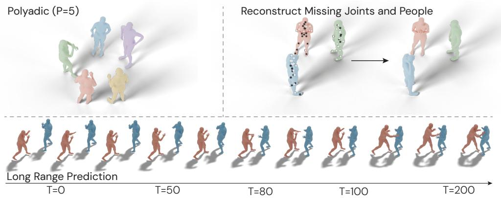  
Figure 1: A generative model for multi-agent interaction. We propose Bilevel Representations for Agent Interaction Dynamics (BRAID), a unified model of multi-party group behaviour.

Existing human motion generators (Tevet et al., 2022a;b; Guo et al., 2022; Diomataris et al., 2024) provide strong foundations for individual movement. Social motion methods address interaction, but often leave the interplay between shared dynamics and individual traits implicit (Wang et al., 2021; Chew et al., 2025; Lin et al., 2026), with limited adaptability to varying context. The central gap is a reusable social-state representation that jointly captures group and individual dynamics, supports generation under full or partial observations, and transfers across datasets. These capabilities are rarely addressed together: plausible trajectories remain the primary endpoint, while compact, inspectable state representations could also inform policies, planners, and memory systems that condition on ongoing interaction.

To address this gap, we propose BRAID (Bilevel Representations for Agent Interaction Dynamics), a hierarchical sequential latent-variable model for multi-person social behaviour. A group latent captures shared interaction dynamics, while person latents encode individual behaviour conditioned on the group state. Their coupled temporal evolution supports coherent generation, and arbitrary context sets accommodate full, sparse, or partial observations. We learn shared priors through cross-dataset meta-transfer learning across conversational, dance, and boxing data. The resulting group and person latents expose compact, inspectable social-state vectors for downstream agents.

Our main contributions can be summarised as: (i) A generative state space model for multi-person social behaviour under full, partial, or absent observations. (ii) A hierarchical social-state representa tion of shared group dynamics and individual behavioural variation. (iii) Evaluation across datasets and context regimes, including partially observed interaction partners in a scene, and (iv) analysis of group- and person-level latent structure, informed by cognitive science.

## 2 RELATED WORK

Human motion generation. Recent motion generation models produce high-quality single-person motions from text, action labels, or goals (Tevet et al., 2022b;a; Guo et al., 2022; Diomataris et al., 2024). These systems provide strong priors for individual behaviour, but they generally treat the person as the unit of generation. Social settings require a different abstraction: a pause, gesture, or step is meaningful because it is coordinated with other participants. BRAID builds on this progress but models the interaction, rather than an isolated body.

Social motion generation. Social motion methods explicitly target interaction through multiperson prediction, inpainting, response generation, or specialised domains such as gesture, dance, and reactive character motion (Wang et al., 2021; Tanke et al., 2023; Mughal et al., 2024; Siyao et al., 2024; Maluleke et al., 2025; Cen et al., 2025; Chew et al., 2025). Adjacent to this literature, Social Processes (Raman et al., 2023) forecast nonverbal social cues in conversational groups by metalearning group-specific dynamics, but do not address full-body social motion generation. Together, these approaches have substantially broadened the modelling of social interaction, but most still treat plausible future cues or trajectories as the primary endpoint. Group-level state is either absent, implicit in symmetric multi-agent architectures, or embedded inside a denoising process that does not naturally expose a compact representation for inspection or downstream integration (Preechakul et al., 2021; Pandey et al., 2022; Chen et al., 2022; Tanke et al., 2025). BRAID instead learns explicit group and person-level latents, $z _ { t } ^ { g }$ and $z _ { t } ^ { p }$ , so that shared interaction dynamics can condition individual behaviour while remaining available as reusable social-state representations.

Table 1: Comparison of methods across interaction capabilities. Latent space denotes an explicit compact latent representation of behaviour; polyadic denotes support for $\dot { P _ { \mathrm { ~ \scriptsize ~ \geq ~ 3 ~ } } }$ participants.
<table><tr><td>Method</td><td>Missing/ Noisy data</td><td>Latent space</td><td>Partner inpaint</td><td>Partner predict</td><td>Long motion</td><td>Agentic generation</td><td>Joint future prediction</td><td>Polyadic  $P \geq 3$ </td></tr><tr><td>DuoLando (2024)</td><td>X</td><td>X</td><td>V</td><td>×</td><td>X</td><td>X</td><td>×</td><td>X</td></tr><tr><td>ReMoS (2023)</td><td>×</td><td>×</td><td>V</td><td>X</td><td>×</td><td>X</td><td>×</td><td>×</td></tr><tr><td>ReGenNet (2024)</td><td>×</td><td>X</td><td>L</td><td>X</td><td>X</td><td>×</td><td>×</td><td>X</td></tr><tr><td>Human-X (2025)</td><td>×</td><td>X</td><td>√</td><td>X</td><td>×</td><td>X</td><td>×</td><td>×</td></tr><tr><td>ARFlow (2025)</td><td>×</td><td>X</td><td>X</td><td>√</td><td>√</td><td>×</td><td>×</td><td>X</td></tr><tr><td>Ready-to-React (2025)</td><td>×</td><td>×</td><td>×</td><td>√</td><td>V</td><td>X</td><td>×</td><td>×</td></tr><tr><td>MAGNet (2025)</td><td>×</td><td>×</td><td>V</td><td>V</td><td>√</td><td>√</td><td>」</td><td>√</td></tr><tr><td>Social Processes (2023)</td><td>×</td><td>了</td><td>×</td><td></td><td>×</td><td>X</td><td>√</td><td>V</td></tr><tr><td>BRAID</td><td>L</td><td>L</td><td>1</td><td>L</td><td>L</td><td>V</td><td>L</td><td>L</td></tr></table>

Neural Processes and meta-learning. Neural Processes model distributions over functions using a latent variable conditioned on a context set (Garnelo et al., 2018b;a; Kim et al., 2019). This makes them well suited to few-shot generalisation and arbitrary missing-observation patterns. Sequential Neural Processes add temporal dependence between latent states (Singh et al., 2019), and Social Processes (Raman et al., 2023) show that this family can model conversational group dynamics from sparse interaction data. BRAID extends this line by replacing the single latent state with a temporal hierarchy: a group latent for shared interaction structure and person latents for individual behaviour conditioned on that structure.

Hierarchical latent variable models. Hierarchical VAEs use top-down structure to let higher-level latents shape lower-level ones, often yielding richer multi-scale representations (Sønderby et al., 2016). Sequential variants couple these hierarchies to recurrent state models (Gregor et al., 2018), and precision-weighted or product-of-experts posteriors combine bottom-up evidence with top-down priors (Hinton, 2002; Sønderby et al., 2016). BRAID instantiates these ideas in the social motion domain: the higher-level latent captures emergent interaction properties, while person-level latents encode individual variation conditioned on that shared context. Our staged KL annealing and free-bit terms follow established practice for stabilising hierarchical VAEs (Kingma et al., 2016; Sønderby et al., 2016; Vahdat & Kautz, 2020), with a warm-up order chosen to stabilise group structure before person-level variation.

## 3 PROBLEM STATEMENT

Consider a temporal Neural Process setting with stochastic processes $\mathcal { P } _ { 1 } , \ldots , \mathcal { P } _ { T }$ . At each time step $t ,$ we observe a possibly empty context set $C _ { t } \ : = \ \{ ( \overline { { x _ { t } ^ { i } } } , y _ { t } ^ { i } ) \} _ { i \in \mathcal { T } _ { t } ^ { C } }$ and define a target set $D _ { t } : = \{ ( x _ { t } ^ { i } , y _ { t } ^ { i } ) \} _ { i \in \mathcal { T } _ { t } ^ { D } }$ , with $\mathcal { T } _ { t } ^ { C } \subseteq \mathcal { T } _ { t } ^ { D }$ . Let $X _ { t } : = \{ x _ { t } ^ { i } \} _ { i \in \mathcal { T } _ { t } ^ { D } }$ and $Y _ { t } : = \{ y _ { t } ^ { i } \} _ { i \in \mathcal { T } _ { t } ^ { D } }$ denote the corresponding target inputs and outputs; the held-out elements $\operatorname { \dot { D } } _ { t } \setminus C _ { t }$ are the query locations and target values to be predicted.

A standard Neural Process uses a single latent $z _ { t }$ conditioned on the current context $C _ { t }$ , but does not model dependencies between successive processes. BRAID instead introduces L latent levels $z _ { t } ^ { ( 0 ) } , \ldots , z _ { t } ^ { ( L - 1 ) }$ , conditioned on the context, latent history, and lower levels in the hierarchy. Writing $C , D , X , Y$ for the full temporal sequences, $Z ^ { ( k ) } : = ( z _ { 1 } ^ { \top ( k ) } , \top \cdot \cdot , z _ { T } ^ { ( k ) } )$ , and $Z _ { < t } : = \{ z _ { < t } ^ { ( k ) } \} _ { k = 0 } ^ { L - 1 }$ , the

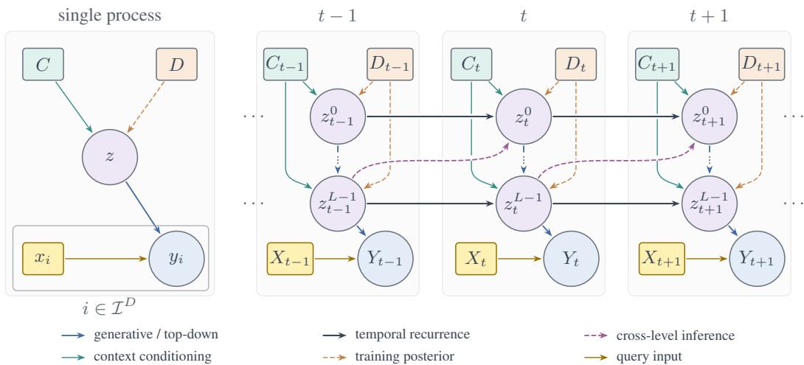  
(a) Neural Process: one latent (b) BRAID: a hierarchy of latents linked across time. Each column is one time for the observed context. step; vertical dots indicate intermediate levels.  
Figure 2: Neural Process and BRAID. C: observed context; $D \supseteq C { : }$ full target set; $X \colon$ query inputs; $Y { : }$ outputs. Dashed arrows denote inference-only dependencies.

generative model factorises as:

$$
\begin{array} { l } { { \displaystyle p ( Y , Z ^ { ( 0 ) } , Z ^ { ( 1 ) } , \dots , Z ^ { ( L - 1 ) } \mid X , C ) = } } \\ { { \displaystyle \prod _ { t = 1 } ^ { T } p _ { \theta } ( Y _ { t } \mid X _ { t } , z _ { t } ^ { ( 0 ) } , \dots , z _ { t } ^ { ( L - 1 ) } ) p _ { \theta } ( z _ { t } ^ { ( 0 ) } \mid Z _ { < t } , C _ { t } ) \prod _ { k = 1 } ^ { L - 1 } p _ { \theta } ( z _ { t } ^ { ( k ) } \mid Z _ { < t } , z _ { t } ^ { ( k - 1 ) } , C _ { t } ) . } } \end{array}\tag{1}
$$

The decoder likelihood factorises over target elements, and we initialise $z _ { 0 } ^ { ( k ) } : =$ null for all $k \in$ $[ 0 , L - 1 ]$ . In the two-level social-motion model introduced in Section $4 , z _ { t } ^ { ( 0 ) }$ is the group latent and $\overline { { z _ { t } ^ { ( 1 ) } } }$ is the structured collection of person-level latents.

## 4 METHOD

While BRAID admits a L-level hierarchy, our approach instantiates the simplest case of a two-level latent hierarchy. A group latent $z _ { t } ^ { g }$ captures shared interaction state, such as phase, tempo, and proxemics, while person latents $\{ \stackrel {  } { z _ { t } ^ { p } } \} _ { p = 1 } ^ { P ^ { \bar { } } }$ capture individual behaviour conditioned on that group context. This mirrors accounts of social interaction as a jointly maintained process in which grouplevel coordination constrains individual action (Sacks et al., 1974; Chartrand & Bargh, 1999; Hoehl et al., 2020; Hale et al., 2020; Pötschulat, 2026). We describe the scene representation, latent dynamics, context encoder, and learning objective below.

## 4.1 MOTION REPRESENTATION

We represent a scene as $T$ time steps with P people. Each person has SMPL-X shape $\beta ^ { p } \in \mathbb { R } ^ { 1 6 }$ 6D joint rotations $\Theta _ { t } ^ { p } \in \mathbb { R } ^ { J \times 6 }$ (Zhou et al., 2018), and root-relative joints $\tilde { K } _ { t , j } ^ { p }$ . We additionally store canonical root motion $g _ { t } ^ { p }$ , using floor-anchored, yaw-normalised ${ \mathrm { S E } } ( 3 )$ quantities similar to Holden et al. (2016; 2017); Yi et al. (2024); Maluleke et al. (2025). To retain spatial awareness, we encode pairwise canonical-frame transforms $\mathbf { T } _ { t } ^ { p  q } \in \mathbb { R } ^ { 9 }$ with an MLP and mean-pool them over observed partners before fusing them into the context representation. Throughout, we write ${ \mathcal { M } } = \{ \Delta { \bf T } ^ { \mathrm { c a n } }$ can→root $\mathbf { T } ^ { p  q } \}$ for the three canonical transforms the model predicts—the frame-to-frame canonical displacement, the canonical-to-root transform, and the pairwise partner transform—each carrying a rotation $R _ { m }$ and a translation $t _ { m }$

Following section 3, each observation is represented as a context point $( x _ { t } ^ { ( p , j ) } , y _ { t } ^ { ( p , j ) } )$ , where $\boldsymbol { x } _ { t } ^ { ( p , j ) }$ identifies a person and joint/root slot. For $j \ge 1 , y _ { t } ^ { ( p , j ) } = [ \Theta _ { t , j } ^ { p } , \tilde { K } _ { t , j } ^ { p } ] ; \mathrm { f o r } j = 0 , y _ { t } ^ { ( p , 0 ) } = g _ { t } ^ { p }$

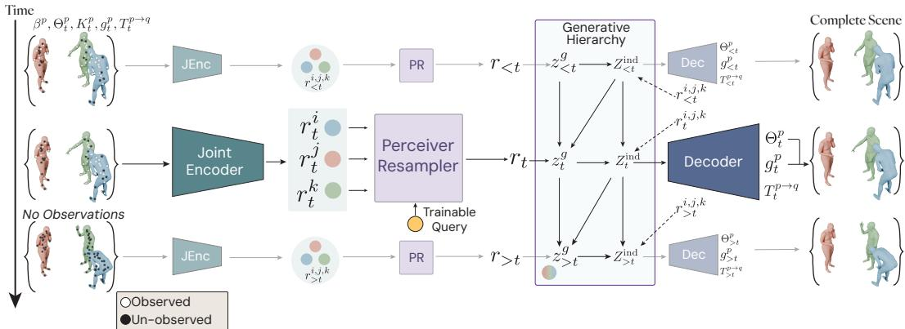  
Figure 3: High-level architectural view of the model. Illustration shows a interacting triad. On the left the model receives partial observations at various time steps and it generates the complete scene including each person $p \in \{ i , j , k \}$

We define the complete target set and observed context set using index sets $\mathcal { T } _ { t } ^ { D } = [ 1 , P ] \times [ 0 , J ]$ and $\mathcal { T } _ { t } ^ { C } \subseteq \mathcal { Z } _ { t } ^ { D } \colon D _ { t } : = \{ ( x _ { t } ^ { ( p , j ) } , y _ { t } ^ { ( p , j ) } ) \} _ { ( p , j ) \in \mathcal { T } _ { t } ^ { D } } , C _ { t } : = \{ ( x _ { t } ^ { ( p , j ) } , y _ { t } ^ { ( p , j ) } ) \} _ { ( p , j ) \in \mathcal { T } _ { t } ^ { C } }$ . Missing joints or people are simply omitted from $C _ { t } .$ , so forecasting, tracking/in-filling, and response generation differ only in which indices are observed.

## 4.2 LATENT ENCODING AND GENERATIVE MODEL

We instantiate the hierarchy from eq. (1) with a group latent $z _ { t } ^ { g }$ and person latents $Z _ { t } ^ { \mathrm { i n d } } = \{ z _ { t } ^ { p } \} _ { p = 1 } ^ { P }$ Given $C _ { t }$ , the model samples the group latent, samples person latents conditioned on it, and decodes all target motion quantities (dropping index j for simplicity):

$$
\begin{array} { r l } & { \displaystyle p _ { \theta } ( Y , Z ^ { g } , Z ^ { \mathrm { i n d } } \mid X , C ) = \prod _ { t = 1 } ^ { T } p _ { \theta } ( z _ { t } ^ { g } \mid z _ { < t } ^ { g } , Z _ { < t } ^ { \mathrm { i n d } } , C _ { t } ) } \\ & { \displaystyle \prod _ { p = 1 } ^ { P } p _ { \theta } ( z _ { t } ^ { p } \mid z _ { < t } ^ { p } , z _ { t } ^ { g } , C _ { t } ) p _ { \theta } ( y _ { t } ^ { p } \mid x _ { t } ^ { p } , z _ { t } ^ { p } ) , } \end{array}\tag{2}
$$

The decoder factorises over target indices $( p , j ) \in \mathcal { T } _ { t } ^ { D }$ , predicting $g _ { t } ^ { p }$ for $j = 0$ and root-relative rotations/keypoints for $j \geq 1$

Pretrained motion decoder. Body pose is decoded through a temporal motion VAE (Kingma & Welling, 2013) that is pretrained on complete motion and then frozen. A trainable adapter maps the latents, person histories, and canonical root motion to the VAE’s codes (one per four frames), which the frozen decoder turns into joint rotations; separate heads predict the canonical and partner transforms. The VAE thus supplies short-horizon body kinematics, while BRAID models the social structure that selects among them. Each decoded frame therefore depends on a short window of $z ^ { p }$ and $z ^ { g }$ around t (Appendix D).

## 4.3 CONTEXT ENCODING

Both the generative and inference networks condition on deterministic context representations: a group summary $r _ { t }$ and per-person summaries $\boldsymbol { r } _ { t } ^ { p }$ . We embed observed joint features with joint tokens, use cross-attention to relate context joints to target slots within each person, and add a continuous RoPE-inspired person embedding (Su et al., 2021) so person slots remain distinguishable under masking. Temporal attention and cross-person attention then capture short-range dynamics and coordination, and a perceiver-style resampler (Jaegle et al., 2021) compresses per-person tokens into the group representation $r _ { t }$

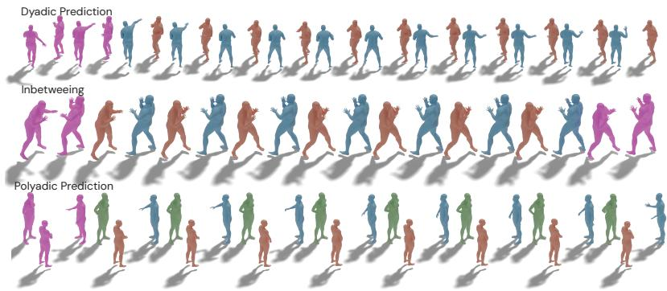  
Figure 4: Samples from BRAID for dyadic prediction, in-betweening, and polyadic prediction, spanning boxing and conversational interactions. Frames in Pink are given as input. Qualitative videos are in the Supplement.

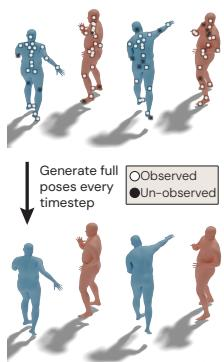  
Figure 5: Full-pose generation with missing joints.

## 4.4 INFERENCE AND LEARNING

Learning requires posterior inference over the latent social state implied by eq. (2). Since the true posterior $p ( \hat { Z } ^ { g } , Z ^ { \mathrm { i \hat { n } d } } \mid C , D )$ is intractable, we train with a variational approximation (Feynman, 1955; 1972; Peterson & Anderson, 1987; Kingma & Welling, 2013; Rezende et al., 2014; Blei et al., 2016). We introduce an amortised variational distribution that mirrors the temporal and hierarchical structure of the generative model:

$$
q _ { \phi } ( Z ^ { g } , Z ^ { \mathrm { i n d } } \mid C , D ) = \prod _ { t = 1 } ^ { T } q _ { \phi } ( z _ { t } ^ { g } \mid z _ { < t } ^ { g } , Z _ { < t } ^ { \mathrm { i n d } } , C , D ) \prod _ { p = 1 } ^ { P } q _ { \phi } ( z _ { t } ^ { p } \mid z _ { < t } ^ { p } , z _ { t } ^ { g } , C , D ) .\tag{3}
$$

Temporal Parameterisation. The conditional distributions above are parameterised by recurrent networks that encode their stated latent histories. The group network encodes $( z _ { < t } ^ { g } , Z _ { < t } ^ { \mathrm { i n d } } )$ , while the person network encodes $z _ { < t } ^ { p }$ ; both also receive the corresponding context representations from section 4.3. Their LSTM activations are deterministic implementation details, rather than additional variables in the probabilistic model, so the factorisations are written directly in terms of latent histories and observed sets.

Precision-Weighted Posterior. Rather than parametrising the posterior directly, we compute it as a precision-weighted combination of two signals: a bottom-up proposal driven by the full target data and a top-down term from the prior, based on prior work by Sønderby et al. (2016). For the group latent, let $H _ { t } ^ { g ^ { \smash { \prime } } } = ( z _ { < t } ^ { g } , Z _ { < t } ^ { \mathrm { i n d } } )$ , and define $( \mu _ { \mathrm { b u } } , \sigma _ { \mathrm { b u } } ) = f _ { \phi } ^ { \mathrm { b u } } ( \dot { H _ { t } ^ { g } } , C , D )$ and $( \mu _ { \mathrm { t d } } , \sigma _ { \mathrm { t d } } ) = f _ { \theta } ^ { \mathrm { t d } } ( \bar { H } _ { t } ^ { g } , \dot { C } _ { t } )$ , where $f ^ { \mathrm { b u } }$ and $f ^ { \mathrm { t d } }$ are the bottom-up and top-down encoder networks respectively. The fused posterior parameters are obtained by precision merging:

$$
\sigma _ { q } ^ { - 2 } = \sigma _ { \mathrm { { b u } } } ^ { - 2 } + \sigma _ { \mathrm { { t d } } } ^ { - 2 } , \qquad \mu _ { q } = \sigma _ { q } ^ { 2 } \bigl ( \sigma _ { \mathrm { { b u } } } ^ { - 2 } \mu _ { \mathrm { { b u } } } + \sigma _ { \mathrm { { t d } } } ^ { - 2 } \mu _ { \mathrm { { t d } } } \bigr ) .\tag{4}
$$

This can be viewed as a product-of-experts combination (Hinton, 2002) of two diagonal Gaussians, where each expert’s influence is proportional to its precision. The same merging scheme is applied for each person-level latent $\widehat { z } _ { t } ^ { p } \colon$ the corresponding networks condition on $\bar { ( z _ { < t } ^ { p } , z _ { t } ^ { g } , C , D ) }$ and $\dot { ( } z _ { < t } ^ { p } , z _ { t } ^ { g } , C _ { t } )$ ), respectively. Along with sharing information from the generative and inference paths, this precision-weighted formulation allows the posterior to smoothly interpolate between data-driven evidence and the learned prior, which is particularly beneficial when context is sparse or absent.

Training Objective. Combining the generative model in eq. (2) with the approximate posterior in eq. (3) yields the following weighted variational objective:

$$
\begin{array} { r l } & { { \displaystyle { \mathrm { E L B O } } _ { \beta } } : = \sum _ { t = 1 } ^ { T } \biggl \langle \ln p _ { \theta } \bigl ( Y _ { t } \mid X _ { t } , z _ { t } ^ { g } , Z _ { t } ^ { \mathrm { i n d } } \bigr ) \biggr \rangle _ { \boldsymbol { q } _ { \phi } } } \\ & { \qquad - \beta _ { g } \sum _ { t = 1 } ^ { T } \biggl \langle  { { \mathbb { K } } } \mathbb { L } \bigl ( q _ { \phi } ( z _ { t } ^ { g } \mid z _ { < t } ^ { g } , Z _ { < t } ^ { \mathrm { i n d } } , C , D ) \bigr ) \parallel p _ { \theta } \bigl ( z _ { t } ^ { g } \mid z _ { < t } ^ { g } , Z _ { < t } ^ { \mathrm { i n d } } , C _ { t } \bigr ) \bigr ) \biggr \rangle _ { \boldsymbol { q } _ { \phi } } } \\ & { \qquad - \beta _ { p } \sum _ { t = 1 } ^ { T } \sum _ { p = 1 } ^ { P } \biggl \langle  { { \mathbb { K } } } \mathbb { L } \bigl ( q _ { \phi } ( z _ { t } ^ { p } \mid z _ { < t } ^ { p } , z _ { t } ^ { g } , C , D ) \bigr ) \parallel p _ { \theta } \bigl ( z _ { t } ^ { p } \mid z _ { < t } ^ { p } , z _ { t } ^ { g } , C _ { t } \bigr ) \bigr ) \biggr \rangle _ { \boldsymbol { q } _ { \phi } } , } \end{array}\tag{5}
$$

where expectations include latent histories and, for person KLs, the current group latent. For $\beta _ { g } = \beta _ { p } = 1$ , this is a lower bound on ln $p _ { \theta } ( Y \mid { \bar { X , C } } ) ;$ Appendix A gives the derivation and weighting details. We maximise eq. (5); equivalently, we minimise $\mathcal { L } _ { \mathrm { E L B O } } : = - \mathrm { E L B O } _ { \beta }$ . We also supervise joint rotations, root-relative joint positions, and canonical transforms with reconstruction losses $\mathcal { L } _ { \mathrm { p o s e } } , \mathcal { L } _ { \mathrm { k e y } }$ , and ${ \mathcal { L } } _ { \mathrm { r o o t } }$ , respectively. The full training objective is

$$
{ \mathcal { L } } _ { \mathrm { t r a i n } } = { \mathcal { L } } _ { \mathrm { E L B O } } + \lambda _ { \mathrm { p o s e } } { \mathcal { L } } _ { \mathrm { p o s e } } + \lambda _ { \mathrm { k e y } } { \mathcal { L } } _ { \mathrm { k e y } } + \lambda _ { \mathrm { r o o t } } { \mathcal { L } } _ { \mathrm { r o o t } } .\tag{6}
$$

Reconstruction-loss definitions and further training details are given in Appendix C.

## 5 EXPERIMENTS

Datasets. To evaluate the performance of BRAID, we conduct a number of experiments using the Haggling (Joo et al., 2016), DnD (Mughal et al., 2024), DD100 (Siyao et al., 2024), DuoBox (Cen et al., 2025) and Embody3D (McLean et al., 2025) datasets. Unless otherwise stated, models have approximately 16M parameters and use AdamW (Loshchilov & Hutter, 2017) with a learning rate of $1 e - 4$ . Training details and model-size comparisons are given in Appendices C and E.

Metrics. Multiparty generation requires more than agreement with a single recorded future: valid continuations can differ in timing, role assignment, and interaction style. Standard reference errors (MPJPE, MPJVE) penalise such alternatives without separating them from socially incoherent motion, so low error alone does not establish the quality or variety of generated interactions. Likewise, diversity (DIV) is only meaningful alongside distributional fit (Fréchet distance, FD), and foot skating (FS) and interpenetration (IP) flag specific artefacts without establishing physical plausibility. We report these for comparability with prior work, but prioritise interaction-level structure following Shirekar et al. (2025): synchrony, via cross-recurrence quantification analysis as deviations in recurrence rate (∆RR) and determinism (∆DET) from the ground truth, and structural similarity, via Soft-DTW (SDTW) and its cross-person variant (Cr. SDTW), which compare trajectories up to natural timing variation. All metrics are lower-is-better except DIV; Appendix H gives definitions and interpretation.

## 5.1 RESULTS

A shared social-state formulation supports both forecasting future behaviour and completing missing observations. Tables 2 to 4 evaluate the reusable representation motivated in Section 1 through forecasting, inpainting, and partner/dyadic prediction. The same group and person latent formulation handles each setting by treating observed joints and people as context and unobserved ones as targets. We first examine what social information the latent state retains, then assess how this shared representation supports generation across tasks and observation regimes.

Group latents organise activity structure, while person latents retain participant information across changing groups. Figure 6 shows that the group latent $Z ^ { g }$ forms structured clusters across DD100, Panoptic Haggling, and within DD100 it separates dances based on whether they belong to the Latin or Western ballroom dance styles. In contrast, Figure 7 shows that $Z ^ { \mathrm { i n d } }$ preserves person-specific structure: embeddings of the same participant remain close even across different Embody3D groups. In the full latent space, same-person distances have a median of 6.36, versus 16.22 for different-person pairs (ratio 0.392); the median same-person pair lies at the 15.7th percentile of the different-person distance distribution. Nearest-neighbour retrieval, excluding candidates from the query’s group, recovers the same individual in 99/239 queries (41.4%); Appendix B gives the protocol and detailed results. This persistence across groups supports the social-state aim in Section 1: retaining information about who is participating as the interaction context changes. Together with the activity structure in $Z ^ { g } .$ , it provides evidence that the latents carry inspectable social information alongside their use for generation. Hierarchy ablations and qualitative probes in Appendix G further connect these representations to generation: thefull hierarchy improves cross-person alignment over either single-level variant, while varying person latents or changing the group-latent source produces different interaction realisations.

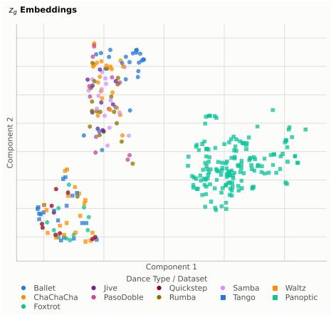

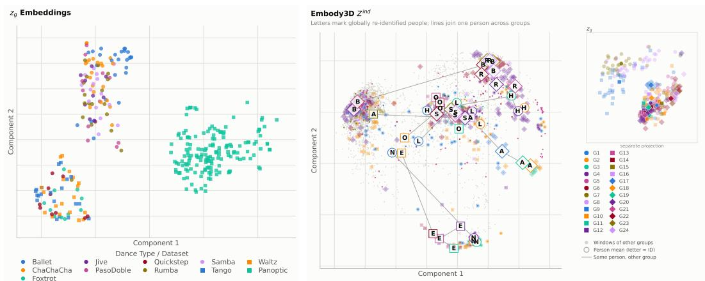  
Figure 6: Zg PACMAP (Wang et al., 2020) embeddings over DD100, and Panoptic Haggling.

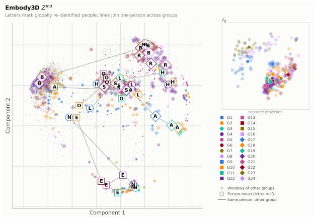  
Figure 7: Zind PCA embeddings of Embody3D with common individuals across groups. Embeddings show the model latent space organising itself to cluster individuals.

Table 2: Social forecasting by observability and group size N. Bold: best; underlined: second best per setting, excluding RS and NN. Models trained without the motion VAE (Appendix D). †RS and NN ranked, as no learned baseline is available.
<table><tr><td></td><td>N Method</td><td>△RR↓</td><td>∆DET↓</td><td></td><td> SDTW↓ Cr. SDTW↓</td><td>IP↓</td><td>FD↓</td><td>DIV↑</td><td>FS↓</td><td>MPJPE↓ MPJVE↓</td><td></td></tr><tr><td colspan="10">Full Observability</td></tr><tr><td>2 RS</td><td></td><td>0.013</td><td>0.131</td><td>8.741</td><td>2.028</td><td>&lt;0.005</td><td></td><td>5.485 90.58</td><td>0.011</td><td>1.471</td><td>0.013</td></tr><tr><td></td><td>NN</td><td>0.013</td><td>0.093</td><td>8.292</td><td>2.059</td><td>&lt;0.005</td><td>0.319</td><td></td><td>&lt;0.001</td><td>0.898</td><td>0.014</td></tr><tr><td></td><td>MAGNet</td><td>0.012</td><td>0.350</td><td>6.041</td><td>1.348</td><td>0.024</td><td>0.490</td><td>0.524</td><td>0.570</td><td>0.595</td><td>0.185</td></tr><tr><td></td><td>BRAID</td><td>0.012</td><td>0.168</td><td>7.416</td><td>1.620</td><td>&lt;0.005</td><td>0.239</td><td>2.316</td><td>0.001</td><td>0.305</td><td>0.013</td></tr><tr><td>3</td><td>RS</td><td>0.013</td><td>0.166</td><td>8.533</td><td>1.898</td><td>0.222</td><td>2.131</td><td>80.86</td><td>0.012</td><td>1.647</td><td>0.010</td></tr><tr><td></td><td>NN</td><td>0.013</td><td>0.149</td><td>8.342</td><td>2.194</td><td>0.177</td><td>1.808</td><td></td><td>0.018</td><td>1.120</td><td>0.009</td></tr><tr><td></td><td>MAGNet BRAID</td><td>0.013 0.012</td><td>0.335</td><td>7.318</td><td>1.531</td><td>0.189</td><td>0.378</td><td>0.586</td><td>0.452</td><td>0.755</td><td>0.437</td></tr><tr><td></td><td></td><td></td><td>0.202</td><td>8.025</td><td>1.964</td><td>0.005</td><td>0.221</td><td>1.974</td><td>0.071</td><td>0.260</td><td>0.012</td></tr><tr><td>4</td><td>RS</td><td>0.013</td><td>0.22</td><td>8.184</td><td>2.470</td><td>0.354</td><td>6.01</td><td>65.94</td><td>0.01</td><td>1.63</td><td>0.01</td></tr><tr><td></td><td>NN</td><td>0.013</td><td>0.18</td><td>8.324</td><td>2.194</td><td>0.177</td><td>1.80</td><td></td><td>0.013</td><td>1.47</td><td>0.01</td></tr><tr><td></td><td>MAGNet BRAID</td><td>0.013 0.012</td><td>0.391</td><td>6.996</td><td>1.731</td><td>0.232</td><td>0.768</td><td>0.710</td><td>0.481</td><td>0.937</td><td>0.624</td></tr><tr><td></td><td></td><td></td><td>0.197</td><td>7.771</td><td>1.919</td><td>0.022</td><td>0.216</td><td>3.19</td><td>0.099</td><td>0.353</td><td>0.015</td></tr><tr><td>5†</td><td>RS</td><td>0.0128</td><td>0.174</td><td>8.279</td><td>1.542</td><td>&lt; 0.005</td><td>1.348</td><td>21.61</td><td>0.0</td><td>0.751</td><td>0.011</td></tr><tr><td></td><td>NN</td><td>0.0129</td><td>0.160</td><td>8.160</td><td>1.549</td><td>0.001</td><td>1.291</td><td></td><td>0.0</td><td>0.742</td><td>0.011</td></tr><tr><td></td><td>BRAID</td><td>0.012</td><td>0.228</td><td>8.725</td><td>2.186</td><td>&lt;0.001</td><td>1.766</td><td>0.039</td><td>0.0</td><td>0.217</td><td>0.008</td></tr><tr><td colspan="10">Partial Observability</td><td></td><td></td><td></td></tr><tr><td>2</td><td>RoHM</td><td>0.013</td><td>0.241</td><td>4.552</td><td>0.883</td><td>0.147</td><td>0.406</td><td>0.093</td><td>0.167</td><td>0.489</td><td>0.043</td></tr><tr><td></td><td>BRAID</td><td>0.012</td><td>0.168</td><td>7.420</td><td>1.60</td><td>0.0013</td><td>0.126</td><td>2.51</td><td>0.0012</td><td>0.400</td><td>0.016</td></tr><tr><td>3</td><td>RoHM</td><td>0.013</td><td>0.314</td><td>4.666</td><td>0.848</td><td>0.168</td><td>0.631</td><td>0.081</td><td>0.173</td><td>0.444</td><td>0.041</td></tr><tr><td></td><td>BRAID</td><td>0.013</td><td>0.200</td><td>8.06</td><td>1.934</td><td>0.003</td><td>0.141</td><td>2.398</td><td>0.235</td><td>0.297</td><td>0.015</td></tr><tr><td>4</td><td>RoHM</td><td>0.013</td><td>0.302</td><td>4.593</td><td>0.862</td><td>0.125</td><td>0.701</td><td>0.101</td><td>0.186</td><td>0.461</td><td>0.041</td></tr><tr><td></td><td>BRAID</td><td>0.012</td><td>0.2</td><td>7.80</td><td>1.89</td><td>0.016</td><td>0.20</td><td>3.59</td><td>0.096</td><td>0.33</td><td>0.015</td></tr><tr><td>5</td><td>RoHM</td><td>0.014</td><td>0.206</td><td>8.130</td><td>1.019</td><td>0.3626</td><td>0.32</td><td>0.107</td><td>0.131</td><td>0.533</td><td>0.028</td></tr><tr><td></td><td>BRAID</td><td>0.012</td><td>0.226</td><td>8.722</td><td>2.164</td><td>0.0005</td><td>1.73</td><td>0.039</td><td>0</td><td>0.213</td><td>0.008</td></tr></table>

Table 3: Partner inpainting on Panoptic and DD100. Bold: best; underlined: second best per setting, excluding RS and NN.
<table><tr><td></td><td>Method</td><td>∆RR↓</td><td>∆DET↓</td><td>SDTW↓</td><td>Cr. SDTW↓</td><td>IP↓</td><td>FD↓</td><td>DIV↑</td><td>FS↓</td><td>MPJPE↓ MPJVE↓</td><td></td></tr><tr><td>Panoptic RS</td><td></td><td>0.013</td><td>0.142</td><td>8.069</td><td>2.399</td><td>0.167</td><td>22.692</td><td>68.505</td><td>0.462</td><td>1.371</td><td>0.017</td></tr><tr><td></td><td>NN</td><td>0.013</td><td>0.129</td><td>8.483</td><td>1.932</td><td>0</td><td>4.203</td><td></td><td>0.587</td><td>1.080</td><td>0.010</td></tr><tr><td></td><td>Social Processes (2023)</td><td>0.009</td><td>0.156</td><td>8.952</td><td>3.689</td><td>0</td><td>0.951</td><td>0.120</td><td>0.385</td><td>0.247</td><td>0.006</td></tr><tr><td>BRAID</td><td></td><td>0.009</td><td>0.196</td><td>7.490</td><td>1.260</td><td>0</td><td>0.139</td><td>1.525</td><td>&lt;0.005</td><td>0.217</td><td>0.009</td></tr><tr><td>Partial Observability</td><td></td><td></td><td></td><td></td><td></td><td></td><td></td><td></td><td></td><td></td><td></td></tr><tr><td></td><td>RoHM (2024)</td><td>0.013</td><td>0.221</td><td>8.252</td><td>1.008</td><td>0.179</td><td>0.255</td><td>0.030</td><td>0.172</td><td>0.417</td><td>0.022</td></tr><tr><td></td><td>BRAID</td><td>0.009</td><td>0.195</td><td>7.493</td><td>1.262</td><td>0.0</td><td>0.130</td><td>3.640</td><td>0.016</td><td>0.239</td><td>0.018</td></tr><tr><td>DD100</td><td>RS</td><td>0.010</td><td>0.063</td><td>8.595</td><td>3.377</td><td></td><td></td><td>0.175 11.600 88.595</td><td>0.228</td><td>1.761</td><td>0.042</td></tr><tr><td></td><td>NN</td><td>0.009</td><td>0.044</td><td>7.673</td><td>2.018</td><td>0.302</td><td>1.420</td><td></td><td>0.021</td><td>1.642</td><td>0.049</td></tr><tr><td></td><td>Duolando (2024)</td><td></td><td></td><td></td><td></td><td></td><td>18.180</td><td>0.000</td><td>1.880</td><td>1.680</td><td>0.070</td></tr><tr><td></td><td>MAGNet (2025)</td><td>0.013</td><td>0.184</td><td>5.646</td><td>2.022</td><td>0.169</td><td>0.42</td><td>0.71</td><td>0.873</td><td>1.187</td><td>0.036</td></tr><tr><td></td><td>Social Processes (2023)</td><td>0.007</td><td>0.180</td><td>8.328</td><td>1.937</td><td>0.332</td><td>2.05</td><td>1.42</td><td>0.097</td><td>1.062</td><td>0.033</td></tr><tr><td>BRAID</td><td></td><td>0.008</td><td>0.06</td><td>4.590</td><td>1.527</td><td>0.117</td><td>0.075</td><td>7.72</td><td>0.012</td><td>1.050</td><td>0.028</td></tr><tr><td colspan="2">Partial Observability</td><td></td><td></td><td></td><td></td><td></td><td></td><td></td><td></td><td></td><td></td></tr><tr><td></td><td>RoHM (2024)</td><td>0.013</td><td>0.289</td><td>7.017</td><td>1.494</td><td>0.241</td><td>0.173</td><td>0.08</td><td>0.311</td><td>1.053</td><td>0.047</td></tr><tr><td>BRAID</td><td></td><td>0.008</td><td>0.066</td><td>4.623</td><td>1.514</td><td>0.118</td><td>0.075</td><td>7.49</td><td>0.013</td><td>1.050</td><td>0.028</td></tr></table>

Under partial observation, forecasting retains sample diversity and temporal structure while improving distributional fit. Partial observability here denotes joints missing through selfocclusion (Sigal & Black, 2006; Yao et al., 2022) or occlusion by other participants (Joo et al., 2016; Raman et al., 2022), simulated by masking context joints as in prior work (Zhang et al., 2024); occluding all of a person’s joints extends this to a missing person. Comparing BRAID’s full and

partial observation results in Table 2, FD decreases at every group size, including 0.239 to 0.126 for two people and 0.221 to 0.141 for three. DIV increases for two to four people and is unchanged for five; SDTW changes by less than 0.5%, and cross-person SDTW improves throughout. This stability supports the introductory goal of a social state that sustains generation as available evidence changes. The robustness is metric-specific: three-person FS rises from 0.071 to 0.235, and MPJPE increases for two and three people. Recorded Embody3D motion has zero FS, so the nonzero FS for three and four people is an artefact. Its interpenetration rate is also low (0.0002–0.0007); BRAID’s partialobservation IP (0.0013–0.016) remains above this level, though 8–110 times lower than RoHM’s.

Table 4: Partner and dyadic forecasting with a missing partner on DuoBox. Bold: best; underlined: second best per setting, excluding RS and NN.
<table><tr><td>Method</td><td colspan="10">Partner Motion Prediction</td><td colspan="10">Dyadic Motion Prediction</td></tr><tr><td></td><td>∆RR↓</td><td>∆DET↓</td><td>SDTW↓</td><td>Cr. SDTW↓</td><td>IP↓</td><td>FD↓</td><td>DIV↑</td><td>FS↓</td><td>MPJPE↓</td><td>MPJVE↓</td><td>∆RR↓</td><td>∆DET↓</td><td>SDTW↓</td><td>Cr. SDTW↓</td><td>IP↓</td><td>FD↓</td><td>DIV↑</td><td>FS↓</td><td>MPJPE↓</td><td>MPJVE↓</td></tr><tr><td>RS</td><td>0.010</td><td>0.064</td><td>7.702</td><td>2.554</td><td>0.001</td><td>0.310</td><td>15.9</td><td>0.049</td><td>1.071</td><td>0.041</td><td>0.011</td><td>0.066</td><td>7.698</td><td>2.552</td><td></td><td>0.002 0.119</td><td>16.232</td><td>0.047</td><td>1.074</td><td>0.042</td></tr><tr><td>NN</td><td>0.009</td><td>0.064</td><td>6.598</td><td>2.525</td><td>0.001</td><td>0.766</td><td></td><td>0.026</td><td>0.880</td><td>0.040</td><td>0.009</td><td>0.065</td><td>6.604</td><td>2.528</td><td></td><td>0.002 0.295</td><td></td><td>0.026</td><td>0.895</td><td>0.041</td></tr><tr><td>R2R (2025)</td><td></td><td></td><td></td><td></td><td></td><td>0.181</td><td>0.318</td><td>0.255</td><td>0.580</td><td>0.029</td><td></td><td></td><td></td><td></td><td></td><td>0.337</td><td>0.395</td><td>0.249</td><td>0.624</td><td>0.029</td></tr><tr><td>MAGNet (2025)</td><td>0.007</td><td>0.069</td><td>1.560</td><td>0.444</td><td>0.001</td><td>0.057</td><td>0.034</td><td>0.071</td><td>0.125</td><td>0.022</td><td>0.012</td><td>0.120</td><td>4.564</td><td>1.886</td><td></td><td>0.004 0.102</td><td>0.370</td><td>0.087</td><td>0.697</td><td>0.032</td></tr><tr><td>Partial Observability</td><td></td><td></td><td></td><td></td><td></td><td></td><td></td><td></td><td></td><td></td><td></td><td>0.231</td><td></td><td></td><td></td><td></td><td></td><td></td><td></td><td></td></tr><tr><td>RoHM (2024) BRAID</td><td>0.014 0.007</td><td>0.166 0.087</td><td>3.457 6.360</td><td>1.551 0.971</td><td>0.095 0.009</td><td>0.325 0.116</td><td>0.026 2.39</td><td>0.638 0.172</td><td>0.660 0.912</td><td>0.041 0.030</td><td>0.0134 0.008</td><td>0.081</td><td>6.914 5.743</td><td>1.760 0.945</td><td>0.210 0.009</td><td>0.325 0.115</td><td>0.026 2.37</td><td>0.638 0.157</td><td>0.660 0.773</td><td>0.041 0.031</td></tr></table>

Against baselines, BRAID has the lowest FD for two to four people within each observation regime;   
its lowest MPJPE at every group size further supports reference recovery.

For five-person DnD, participants mostly stand around a table playing the game. BRAID’s zero FS matches the recorded motion, which also has zero FS, and its IP (at most 0.001) stays below the recorded rate of 0.0016. DIV 0.039 should be interpreted in this activity context, as the dataset involves five people standing still quite often. FD favours NN under full observations and RoHM under partial observations, identifying distributional matching as a direction for improvement in this setting. Activity and group size vary together, precluding a group-size-only explanation.

Partner inpainting combines greater sample variation with better temporal alignment and less foot skating than RoHM. Under partial observations, BRAID improves DIV, FS, FD, and SDTW over RoHM on both inpainting datasets (Table 3). On DD100, DIV rises from 0.080 to 7.49, while FS falls from 0.311 to 0.013 and SDTW from 7.017 to 4.623. Recorded motion has zero FS on both datasets, so BRAID’s FS is also closer to the data. Interpenetration must be read against the recorded rate. Panoptic participants never touch, and BRAID likewise produces no interpenetration, whereas RoHM reaches 0.179. DD100 dancers in close hold overlap in 29% of recorded frames (IP 0.288), so BRAID’s lower IP (0.118 versus 0.241 for RoHM) reflects looser partner coupling rather than fewer artefacts. Lower MPJPE additionally supports reference recovery, while RoHM’s lower cross-person SDTW on both datasets identifies closer interpersonal alignment as its complementary strength.

A social state can represent varied futures while preserving distributional fit under partial observation. Relative to RoHM, BRAID produces more diverse samples with lower FD in both DuoBox prediction settings under partial observations (Table 4). In dyadic prediction, DIV rises from 0.026 to 2.37 and FD falls from 0.325 to 0.115. Foot skating must be read against the data: fast boxing footwork gives the recorded motion an FS of 0.276 (0.283 in partner prediction). RoHM exceeds this rate (0.638), whereas BRAID falls below it (0.157 and 0.172), consistent with generated joint speeds of roughly half the recorded ones. Dyadic IP (0.009) remains about ten times the recorded rate of 0.0008. RoHM tracks the recorded future more closely by MPJPE (0.660 versus 0.773). For the social-state motivation, this supports representing possible continuations beyond a single recorded trajectory. Such samples could supply candidate futures to a agent’s planner.

The social state carries structure from context, even across domains. A model trained only on DD100 dance, never shown conversation, still keeps a plausible conversational formation when given 40 frames of held-out Panoptic context. What it lacks is the activity’s own dynamics: it drifts toward dance-like rotations, whereas adding conversational data lowers cross-person SDTW from 1.424 to 0.511 and FD from 1.94 to 0.27 (Appendix F).

## 6 DISCUSSION AND CONCLUSION

BRAID frames multi-person motion as conditional generation over arbitrary context sets: a single joint-level interface covers full or sparse observation, missing joints or people, and future rollout without task-specific heads. Across forecasting, partner inpainting, and dyadic prediction, it retains distributional fit and temporal alignment as evidence is removed, and produces varied completions rather than a single averaged future. Its latent social state is also inspectable: without supervision, Zg organises interactions by activity and dance style, and $Z ^ { \mathrm { i n d } }$ recovers the same participant across different groups. The model also generalises formation structure across domains (Appendix F).

These two levels of social state open several directions. Because Zg summarises the ongoing interaction, it could serve as a compact belief state for agents that observe or join a group, conditioning their policies on the phase of an interaction or detecting when it shifts. Because ${ Z } ^ { \mathrm { i n d } }$ persists across groups, it could support memory of who someone is across encounters and adaptation to an individual’s interaction style. More broadly, both states could be supplied to foundation models, vision-language-action models, and robot controllers as a compact summary of human interaction, helping them gauge how a group is coordinated and how each person tends to behave without reasoning over raw pose streams. Editing or exchanging the two levels, as in the group-latent switch of Appendix G, suggests controllable synthesis of social scenarios for training and evaluating agents. The evidence covers the evaluated social-motion datasets and depends on SMPL-X preprocessing quality. Diversity is low in the largely stationary five-person DnD scenes, and pose and timing errors can accumulate over long open-loop rollouts; since new observations can enter the context at any time, however, the model can correct its predictions as evidence arrives, as in tracking. The latent analyses show useful structure but not complete disentanglement; incorporating BRAID in a simulator or agent world model is the natural next step.

## AI USE STATEMENT

We have not used generative AI tools for proposing or refining hypotheses, generating synthetic data sets, cleaning and reformatting datasets, and supporting qualitative and thematic data analysis and providing critical ingredients for proving mathematical claims, assisting in the writing of proofs, and assisting with translation are not applicable to this work. We used generative AI tools for modifying scientific figures, creating or editing software code, and editing the research paper to improve readability. We have reviewed all AI-assisted work.

## REFERENCES

David M Blei, Alp Kucukelbir, and Jon D McAuliffe. Variational inference: A review for statisticians. arXiv, 2016. doi: 10.48550/arxiv.1601.00670.

Zhi Cen, Huaijin Pi, Sida Peng, Qing Shuai, Yujun Shen, Hujun Bao, Xiaowei Zhou, and Ruizhen Hu. Ready-to-React: Online Reaction Policy for Two-Character Interaction Generation. arXiv, 2025. doi: 10.48550/arxiv.2502.20370.

Tanya L Chartrand and John A Bargh. The chameleon effect: The perception–behavior link and social interaction. Journal ofpersonality and social psychology, 76(6):893–910, 1999. ISSN 0022- 3514. doi: 10.1037/0022-3514.76.6.893. URL https://doi.apa.org/doi/10.1037/ 0022-3514.76.6.893.

Xin Chen, Biao Jiang, Wen Liu, Zilong Huang, Bin Fu, Tao Chen, Jingyi Yu, and Gang Yu. Executing your Commands via Motion Diffusion in Latent Space. arXiv, 2022. doi: 10.48550/arxiv.2212. 04048.

Jouh Yeong Chew, Zhi-Yi Lin, and Xucong Zhang. SBM: Social Behavior Model for Human-Like Action Generation. Companion Proceedings of the 27th International Conference on Multimodal Interaction, pp. 32–36, 2025. doi: 10.1145/3747327.3763038.

I Coco, Moreno, Dan Mønster, Giuseppe Leonardi, Rick Dale, and Sebastian Wallot. Unidimensional and multidimensional methods for recurrence quantification analysis with crqa. The R Journal, 13(1):145, 5 2021. ISSN 2006.0195. doi: 10.32614/rj-2021-062. URL https://journal. r-project.org/archive/2021/RJ-2021-062/index.html.

Markos Diomataris, Nikos Athanasiou, Omid Taheri, Xi Wang, Otmar Hilliges, and Michael J Black. WANDR: Intention-guided human motion generation. arXiv, 4 2024. doi: 10.48550/arxiv.2404. 15383. URL http://arxiv.org/abs/2404.15383.

R. P. Feynman. Slow electrons in a polar crystal. Physical Review, 97(3):660–665, 1955. ISSN 0031-899X. doi: 10.1103/physrev.97.660.

R. P. Feynman. Statistical mechanics: a set of lectures. Frontiers in physics : a lecture note and reprint series. Sarat Book Distributors, 1972. ISBN 9788187169970. URL https://books. google.nl/books?id=Vflsca1UFZoC.

Marta Garnelo, Dan Rosenbaum, Chris J Maddison, Tiago Ramalho, David Saxton, Murray Shanahan, Yee Whye Teh, Danilo J Rezende, and S M Ali Eslami. Conditional neural processes. arXiv, 2018a. doi: 10.48550/arxiv.1807.01613.

Marta Garnelo, Jonathan Schwarz, Dan Rosenbaum, Fabio Viola, Danilo J Rezende, S M Ali Eslami, and Yee Whye Teh. Neural Processes. arXiv, 7 2018b. doi: 10.48550/arxiv.1807.01622. URL http://arxiv.org/abs/1807.01622.

Anindita Ghosh, Rishabh Dabral, Vladislav Golyanik, Christian Theobalt, and Philipp Slusallek. ReMoS: 3d motion-conditioned reaction synthesis for two-person interactions. arXiv [cs.CV], 11 2023. ISSN 2311.1705. URL http://arxiv.org/abs/2311.17057.

Karol Gregor, George Papamakarios, Frederic Besse, Lars Buesing, and Theophane Weber. Temporal Difference Variational Auto-Encoder. arXiv, 2018. doi: 10.48550/arxiv.1806.03107.

Chuan Guo, Shihao Zou, Xinxin Zuo, Sen Wang, Wei Ji, Xingyu Li, and Li Cheng. Generating Diverse and Natural 3D Human Motions from Text. 2022 IEEE/CVF Conference on Computer Vision and Pattern Recognition (CVPR), 00:5142–5151, 2022. doi: 10.1109/cvpr52688.2022.00509.

Joanna Hale, Jamie A Ward, Francesco Buccheri, Dominic Oliver, and Antonia F de C Hamilton. Are you on my wavelength? interpersonal coordination in dyadic conversations. Journal of nonverbal behavior, 44(1):63–83, 2020. ISSN 0191-5886. doi: 10.1007/s10919-019-00320-3. URL http://dx.doi.org/10.1007/s10919-019-00320-3.

Geoffrey E. Hinton. Training Products of Experts by Minimizing Contrastive Divergence. Neural Computation, 14(8):1771–1800, 2002. ISSN 0899-7667. doi: 10.1162/089976602760128018.

Stefanie Hoehl, Merle Fairhurst, and Annett Schirmer. Interactional synchrony: signals, mechanisms and benefits. Social Cognitive and Affective Neuroscience, 16(1-2):5–18, 2020. ISSN 1749-5016. doi: 10.1093/scan/nsaa024.

Daniel Holden, Jun Saito, and Taku Komura. A deep learning framework for character motion synthesis and editing. ACM Transactions on Graphics (TOG), 35(4):1–11, 2016. ISSN 0730-0301. doi: 10.1145/2897824.2925975.

Daniel Holden, Taku Komura, and Jun Saito. Phase-functioned neural networks for character control. ACM Transactions on Graphics (TOG), 36(4):1–13, 2017. ISSN 0730-0301. doi: 10.1145/3072959.3073663.

Andrew Jaegle, Felix Gimeno, Andrew Brock, Andrew Zisserman, Oriol Vinyals, and Joao Carreira. Perceiver: General Perception with Iterative Attention. arXiv, 2021. doi: 10.48550/arxiv.2103. 03206.

Kaiyang Ji, Ye Shi, Zichen Jin, Kangyi Chen, Lan Xu, Yuexin Ma, Jingyi Yu, and Jingya Wang. Towards immersive human-x interaction: A real-time framework for physically plausible motion synthesis. arXiv, 2025. doi: 10.48550/arxiv.2508.02106.

Wentao Jiang, Jingya Wang, Kaiyang Ji, Baoxiong Jia, Siyuan Huang, and Ye Shi. ARFlow: Human action-reaction flow matching with physical guidance. arXiv, 2025. doi: 10.48550/arxiv.2503. 16973.

Hanbyul Joo, Tomas Simon, Xulong Li, Hao Liu, Lei Tan, Lin Gui, Sean Banerjee, Timothy Godisart, Bart Nabbe, Iain Matthews, Takeo Kanade, Shohei Nobuhara, and Yaser Sheikh. Panoptic studio: A massively multiview system for social interaction capture. arXiv, 12 2016. ISSN 1612.0315. doi: 10.48550/arxiv.1612.03153. URL http://arxiv.org/abs/1612.03153.

Hyunjik Kim, Andriy Mnih, Jonathan Schwarz, Marta Garnelo, Ali Eslami, Dan Rosenbaum, Oriol Vinyals, and Yee Whye Teh. Attentive Neural Processes. arXiv, 2019. doi: 10.48550/arxiv.1901. 05761.

Diederik P Kingma and Max Welling. Auto-encoding variational bayes. arXiv [stat.ML], 12 2013. ISSN 1312.6114. doi: 10.48550/arxiv.1312.6114. URL http://dx.doi.org/10.48550/ arxiv.1312.6114.

Diederik P Kingma, Tim Salimans, Rafal Jozefowicz, Xi Chen, Ilya Sutskever, and Max Welling. Improving Variational Inference with Inverse Autoregressive Flow. arXiv, 2016. doi: 10.48550/ arxiv.1606.04934.

Gerben A Van Kleef, Wolfgang Steinel, Daan Van Knippenberg, Michael A Hogg, and Alicia Svensson. Group member prototypicality and intergroup negotiation: How one’s standing in the group affects negotiation behaviour. British Journal ofSocial Psychology, 46(1):129–152, 3 2007. ISSN 0144-6665. doi: 10.1348/014466605x89353. URL http://dx.doi.org/10.1348/ 014466605X89353.

Stephen C Levinson and Francisco Torreira. Timing in turn-taking and its implications for processing models of language. Frontiers in psychology, 6:731, 6 2015. ISSN 1664-1078. doi: 10.3389/fpsyg. 2015.00731. URL https://www.ncbi.nlm.nih.gov/pmc/articles/PMC4464110.

Zhi-Yi Lin, Thomas Markhorst, Jouh Yeong Chew, and Xucong Zhang. PolySLGen: Online Multimodal Speaking-Listening Reaction Generation in Polyadic Interaction. arXiv, 2026. doi: 10.48550/arxiv.2604.08125.

Ilya Loshchilov and Frank Hutter. Decoupled weight decay regularization. arXiv, 2017. doi: 10.48550/arxiv.1711.05101.

Vongani H. Maluleke, Kie Horiuchi, Lea Wilken, Evonne Ng, Jitendra Malik, and Angjoo Kanazawa. Diffusion forcing for multi-agent interaction sequence modeling. arXiv, 2025. doi: 10.48550/arxiv. 2512.17900.

Thomas Markhorst, Zhi-Yi Lin, Jouh Yeong Chew, Jan van Gemert, and Xucong Zhang. MuPPet: Multi-person 2D-to-3D Pose Lifting. arXiv, 2026. doi: 10.48550/arxiv.2604.09715.

David Matsumoto. Culture, context, and behavior. Journal of personality, 75(6):1285–1319, 12 2007. ISSN 1467-6494. doi: 10.1111/j.1467-6494.2007.00476.x. URL https://www.ncbi.nlm. nih.gov/pubmed/17995466.

Claire McLean, Makenzie Meendering, Tristan Swartz, Orri Gabbay, Alexandra Olsen, Rachel Jacobs, Nicholas Rosen, Philippe de Bree, Tony Garcia, Gadsden Merrill, Jake Sandakly, Julia Buffalini, Neham Jain, Steven Krenn, Moneish Kumar, Dejan Markovic, Evonne Ng, Fabian Prada, Andrew Saba, Siwei Zhang, Vasu Agrawal, Tim Godisart, Alexander Richard, and Michael Zollhoefer. Embody 3d: A large-scale multimodal motion and behavior dataset. arXiv, 2025. doi: 10.48550/arxiv.2510.16258.

Muhammad Hamza Mughal, Rishabh Dabral, Ikhsanul Habibie, Lucia Donatelli, Marc Habermann, and Christian Theobalt. ConvoFusion: Multi-modal conversational diffusion for co-speech gesture synthesis. arXiv, 3 2024. doi: 10.48550/arxiv.2403.17936. URL http://arxiv.org/abs/ 2403.17936.

Kees van Oers, Margreet Klunder, and Piet J Drent. Context dependence of personalities: risktaking behavior in a social and a nonsocial situation. Behavioral ecology: official journal ofthe International Society for Behavioral Ecology, 16(4):716–723, 7 2005. ISSN 1045-2249. doi: 10.1093/beheco/ari045. URL http://academic.oup.com/beheco/article/16/4/ 716/214729/Context-dependence-of-personalities-risktaking.

Kushagra Pandey, Avideep Mukherjee, Piyush Rai, and Abhishek Kumar. DiffuseVAE: Efficient, Controllable and High-Fidelity Generation from Low-Dimensional Latents. arXiv, 2022. doi: 10.48550/arxiv.2201.00308.

Carsten Peterson and James R Anderson. A mean field theory learning algorithm for neural networks. Complex systems, 1(5), 1987.

Konpat Preechakul, Nattanat Chatthee, Suttisak Wizadwongsa, and Supasorn Suwajanakorn. Diffusion Autoencoders: Toward a Meaningful and Decodable Representation. arXiv, 2021. doi: 10.48550/arxiv.2111.15640.

Jonathan N Pruitt and Susan E Riechert. How within-group behavioural variation and task efficiency enhance fitness in a social group. Proceedings. Biological sciences, 278(1709):1209–1215, 4 2011. ISSN 0962-8452. doi: 10.1098/rspb.2010.1700. URL https://www.ncbi.nlm.nih.gov/ pmc/articles/PMC3049074.

Maike Pötschulat. Transcript frame analysis: Thinking with goffman about interview data. Qualitative Research, 2026. ISSN 1468-7941. doi: 10.1177/14687941251398982.

Chirag Raman, Jose Vargas-Quiros, Stephanie Tan, Ashraful Islam, Ekin Gedik, and H Hung. ConfLab: A data collection concept, dataset, and benchmark for machine analysis of free-standing social interactions in the wild. Neural Information Processing Systems, 35:23701–23715, 10 May 2022. URL https://proceedings.neurips.cc/paper\_files/paper/ 2022/hash/95f9ad2e251e9014697589037450f9bb-Abstract-Datasets\_ and\_Benchmarks.html.

Chirag Raman, Hayley Hung, and Marco Loog. Social processes: Self-supervised meta-learning over conversational groups for forecasting nonverbal social cues. In ECCV 2022 Workshops: Tel Aviv, Israel, October 23–27, 2022, Lecture Notes in Computer Science, pp. 639–659. Springer Nature Switzerland, Cham, 2023. ISBN 9783031250651. doi: 10.1007/978-3-031-25066-8\_37. URL https://link.springer.com/10.1007/978-3-031-25066-8\_37.

Joanne A Rathbone, Tegan Cruwys, Mark Stevens, Laura J Ferris, and Katherine J Reynolds. The reciprocal relationship between social identity and adherence to group norms. The British journal of social psychology, 62(3):1346–1362, 7 2023. ISSN 2044-8309. doi: 10.1111/bjso.12635. URL https://www.ncbi.nlm.nih.gov/pubmed/36786397.

Danilo Jimenez Rezende, Shakir Mohamed, and Daan Wierstra. Stochastic backpropagation and approximate inference in deep generative models. arXiv, 2014. doi: 10.48550/arxiv.1401.4082.

Harvey Sacks, Emanuel A Schegloff, and Gail Jefferson. A simplest systematics for the organization of turn-taking for conversation. Language, 50(4):696, 12 1974. ISSN 0097-8507. doi: 10.2307/ 412243. URL https://www.jstor.org/stable/412243?origin=crossref.

Ojas Shirekar, Wim Pouw, Chenxu Hao, Vrushank Phadnis, Thabo Beeler, and Chirag Raman. Multimodal Quantitative Measures for Multiparty Behavior Evaluation. Proceedings ofthe 27th International Conference on Multimodal Interaction, pp. 249–264, 8 2025. doi: 10.1145/3716553. 3750752.

L Sigal and M J Black. Measure locally, reason globally: Occlusion-sensitive articulated pose estimation. In 2006 IEEE Computer Society Conference on Computer Vision and Pattern Recognition - Volume 2 (CVPR’06). IEEE, 2006. ISBN 9780769525976. doi: 10.1109/cvpr.2006.180. URL https://ieeexplore.ieee.org/document/1641003.

Gautam Singh, Jaesik Yoon, Youngsung Son, and Sungjin Ahn. Sequential neural processes. arXiv [cs.LG], 24 June 2019. URL http://arxiv.org/abs/1906.10264.

Li Siyao, Tianpei Gu, Zhitao Yang, Zhengyu Lin, Ziwei Liu, Henghui Ding, Lei Yang, and Chen Change Loy. Duolando: Follower GPT with off-policy reinforcement learning for dance accompaniment. arXiv, 2024. doi: 10.48550/arxiv.2403.18811.

Joanne R Smith and Winnifred R Louis. Group norms and the attitude-behaviour relationship: Group norms and attitude-behaviour relations. Social and personality psychology compass, 3(1):19–35, 1 2009. ISSN 1751-9004. doi: 10.1111/j.1751-9004.2008.00161. x. URL https://compass.onlinelibrary.wiley.com/doi/full/10.1111/j. 1751-9004.2008.00161.x.

Jianlin Su, Yu Lu, Shengfeng Pan, Ahmed Murtadha, Bo Wen, and Yunfeng Liu. RoFormer: Enhanced Transformer with Rotary Position Embedding. arXiv, 2021. doi: 10.48550/arxiv.2104.09864.

Casper Kaae Sønderby, Tapani Raiko, Lars Maaløe, Søren Kaae Sønderby, and Ole Winther. Ladder variational autoencoders. arXiv, 2016. doi: 10.48550/arxiv.1602.02282.

Julian Tanke, Linguang Zhang, Amy Zhao, Chengcheng Tang, Yujun Cai, Lezi Wang, Po-Chen Wu, Juergen Gall, and Cem Keskin. Social diffusion: Long-term multiple human motion anticipation. 2023 IEEE/CVF International Conference on Computer Vision (ICCV), 00:9567–9577, 10 2023. doi: 10.1109/iccv51070.2023.00880. URL http://dx.doi.org/10.1109/ICCV51070. 2023.00880.

Julian Tanke, Takashi Shibuya, Kengo Uchida, Koichi Saito, and Yuki Mitsufuji. Dyadic mamba: Long-term dyadic human motion synthesis. arXiv [cs.CV], 14 May 2025. doi: 10.48550/arXiv. 2505.09827. URL http://arxiv.org/abs/2505.09827.

Deborah J Terry, Michael A Hogg, and Katherine M White. The theory of planned behaviour: Selfidentity, social identity and group norms. The British journal of social psychology, 38(3):225–244, 9 1999. ISSN 2044-8309. doi: 10.1348/014466699164149. URL https://bpspsychub. onlinelibrary.wiley.com/doi/abs/10.1348/014466699164149.

Guy Tevet, Brian Gordon, Amir Hertz, Amit H Bermano, and Daniel Cohen-Or. MotionCLIP: Exposing human motion generation to CLIP space. arXiv [cs.CV], 3 2022a. ISSN 2203.0806. URL http://arxiv.org/abs/2203.08063.

Guy Tevet, Sigal Raab, Brian Gordon, Yonatan Shafir, Daniel Cohen-Or, and Amit H Bermano. Human Motion Diffusion Model. arXiv, 9 2022b. ISSN 2209.1491. doi: 10.48550/arxiv.2209. 14916. URL http://arxiv.org/abs/2209.14916.

Arash Vahdat and Jan Kautz. NVAE: A deep hierarchical variational autoencoder. arXiv, 2020. doi: 10.48550/arxiv.2007.03898.

Sebastian Wallot. Multidimensional cross-recurrence quantification analysis (MdCRQA) - a method for quantifying correlation between multivariate time-series. Multivariate behavioral research, 54(2):173–191, 3 2019. ISSN 0027-3171. doi: 10.1080/00273171.2018.1512846. URL https: //www.ncbi.nlm.nih.gov/pubmed/30569740.

Sebastian Wallot and Giuseppe Leonardi. Analyzing multivariate dynamics using cross-recurrence quantification analysis (CRQA), diagonal-cross-recurrence profiles (DCRP), and multidimensional recurrence quantification analysis (MdRQA) - a tutorial in r. Frontiers in psychology, 9:2232, 12 2018. ISSN 1664-1078. doi: 10.3389/fpsyg.2018.02232. URL https://www.frontiersin. org/journals/psychology/articles/10.3389/fpsyg.2018.02232/full.

Jiashun Wang, Huazhe Xu, Medhini Narasimhan, and Xiaolong Wang. Multi-Person 3D Motion Prediction with Multi-Range Transformers. arXiv, 2021. doi: 10.48550/arxiv.2111.12073.

Yingfan Wang, Haiyang Huang, Cynthia Rudin, and Yaron Shaposhnik. Understanding how dimension reduction tools work: An empirical approach to deciphering t-SNE, UMAP, TriMAP, and PaCMAP for data visualization. arXiv, 2020. doi: 10.48550/arxiv.2012.04456.

Liang Xu, Yizhou Zhou, Yichao Yan, Xin Jin, Wenhan Zhu, Fengyun Rao, Xiaokang Yang, and Wenjun Zeng. ReGenNet: Towards human action-reaction synthesis. arXiv [cs.CV], pp. 1759–1769, 18 March 2024. doi: 10.48550/arXiv.2403.11882. URL https://openaccess.thecvf.com/content/CVPR2024/html/Xu\_ReGenNet\_ Towards\_Human\_Action-Reaction\_Synthesis\_CVPR\_2024\_paper.html.

Chun-Han Yao, Jimei Yang, Duygu Ceylan, Yi Zhou, Yang Zhou, and Ming-Hsuan Yang. Learning visibility for robust dense human body estimation. In Lecture Notes in Computer Science, Lecture Notes in Computer Science, pp. 412–428. Springer Nature Switzerland, Cham, 2022. ISBN 9783031197680,9783031197697. doi: 10.1007/978-3-031-19769-7\_24. URL http://dx. doi.org/10.1007/978-3-031-19769-7\_24.

Brent Yi, Vickie Ye, Maya Zheng, Yunqi Li, Lea Müller, Georgios Pavlakos, Yi Ma, Jitendra Malik, and Angjoo Kanazawa. Estimating body and hand motion in an ego-sensed world. arXiv, 2024. doi: 10.48550/arxiv.2410.03665.

Francesco Zanlungo, Zeynep Yücel, Dražen Bršciˇ c, Takayuki Kanda, and Norihiro Hagita. Intrinsic´ group behaviour: Dependence of pedestrian dyad dynamics on principal social and personal features. PloS one, 12(11):e0187253, 11 2017. ISSN 1932-6203. doi: 10.1371/journal.pone. 0187253. URL https://www.ncbi.nlm.nih.gov/pmc/articles/PMC5667819.

Siwei Zhang, Bharat Lal Bhatnagar, Yuanlu Xu, Alexander Winkler, Petr Kadlecek, Siyu Tang, and Federica Bogo. RoHM: Robust human motion reconstruction via diffusion. arXiv, 2024. doi: 10.48550/arxiv.2401.08570.

Yi Zhou, Connelly Barnes, Jingwan Lu, Jimei Yang, and Hao Li. On the continuity of rotation representations in neural networks. arXiv, 2018. doi: 10.48550/arxiv.1812.07035.

## A DERIVATION OF THE EVIDENCE LOWER BOUND

We derive the objective in eq. (5) by introducing the approximate posterior into the marginal likelihood, applying Jensen’s inequality, and separating the temporal and hierarchical factors. We first take $\beta _ { g } = \beta _ { p } = 1$ , then describe the weighted training objective.

Notation and factorisation. Let $Z = ( Z ^ { g } , Z ^ { \mathrm { i n d } } )$ denote the full latent trajectory and $H _ { t } \ =$ $( z _ { < t } ^ { g } , Z _ { < t } ^ { \mathrm { i n d } } )$ its history before time t. The observed context C and full target data $D \doteq ( X , Y )$ are fixed throughout the derivation. To keep the algebra readable, write the conditional densities as

$$
\begin{array} { r l r l } & { q _ { t } ^ { g } : = q _ { \phi } ( z _ { t } ^ { g } \mid H _ { t } , C , D ) , \qquad } & & { p _ { t } ^ { g } : = p _ { \theta } ( z _ { t } ^ { g } \mid H _ { t } , C _ { t } ) , } \\ & { q _ { t } ^ { p } : = q _ { \phi } ( z _ { t } ^ { p } \mid z _ { < t } ^ { p } , z _ { t } ^ { g } , C , D ) , \qquad } & & { p _ { t } ^ { p } : = p _ { \theta } ( z _ { t } ^ { p } \mid z _ { < t } ^ { p } , z _ { t } ^ { g } , C _ { t } ) , } \\ & { \ell _ { t } ^ { p } : = p _ { \theta } ( y _ { t } ^ { p } \mid x _ { t } ^ { p } , z _ { t } ^ { p } ) . } \end{array}
$$

As in eq. (2), the joint-slot index is suppressed in $\ell _ { t } ^ { p } ;$ ; the likelihood factorises over the target slots for each person. The generative and variational distributions are therefore

$$
p _ { \theta } ( Y , Z \mid X , C ) = \prod _ { t = 1 } ^ { T } p _ { t } ^ { g } \prod _ { p = 1 } ^ { P } p _ { t } ^ { p } \ell _ { t } ^ { p } , \qquad q _ { \phi } ( Z \mid C , D ) = \prod _ { t = 1 } ^ { T } q _ { t } ^ { g } \prod _ { p = 1 } ^ { P } q _ { t } ^ { p } .
$$

In particular, there is one group factor per time step and one person factor per person and time step.   
Below, q abbreviates $q _ { \phi } ( \breve { Z } \mid \vec { C } , D )$ .

From marginal likelihood to a lower bound. Multiplying and dividing the integrand by $q ,$ and using the concavity of the logarithm, gives

$$
\begin{array} { r l } & { \displaystyle \ln p _ { \theta } ( Y \mid X , C ) = \ln \int p _ { \theta } ( Y , Z \mid X , C ) \mathrm { d } Z } \\ & { \quad \quad \quad = \ln \mathbb { E } _ { q } \bigg [ \frac { p _ { \theta } ( Y , Z \mid X , C ) } { q _ { \phi } ( Z \mid C , D ) } \bigg ] } \\ & { \quad \quad \geq \mathbb { E } _ { q } \bigg [ \mathrm { l n } \frac { p _ { \theta } ( Y , Z \mid X , C ) } { q _ { \phi } ( Z \mid C , D ) } \bigg ] = : \mathrm { E L B O } _ { 1 } . } \end{array}\tag{7}
$$

The gap is ln $p _ { \theta } ( Y \mid X , C ) - \mathrm { E L B O _ { 1 } } = \mathbb { K L } ( q _ { \phi } ( Z \mid C , D ) \| p _ { \theta } ( Z \mid X , Y , C ) ) \geq 0$ , so equality holds when the variational distribution equals the true posterior.

Separating time, people, and hierarchy. Substituting the factorisations into eq. (7), expanding the logarithm of each product, and using linearity of expectation yields

$$
\begin{array} { r l r } {  { \mathrm { E L B O } _ { 1 } = \mathbb { E } _ { q } [ \ln \frac { \prod _ { t = 1 } ^ { T } p _ { t } ^ { g } \prod _ { p = 1 } ^ { P } p _ { t } ^ { p } \ell _ { t } ^ { p } } { \prod _ { t = 1 } ^ { T } q _ { t } ^ { g } \prod _ { p = 1 } ^ { P } q _ { t } ^ { p } } ] } } \\ & { } & { = \sum _ { t = 1 } ^ { T } \sum _ { p = 1 } ^ { P } \mathbb { E } _ { q } [ \ln \ell _ { t } ^ { p } ] - \sum _ { t = 1 } ^ { T } \mathbb { E } _ { q } [ \ln \frac { q _ { t } ^ { g } } { p _ { t } ^ { g } } ] - \sum _ { t = 1 } ^ { T } \sum _ { p = 1 } ^ { P } \mathbb { E } _ { q } [ \ln \frac { q _ { t } ^ { p } } { p _ { t } ^ { p } } ] . } \end{array}\tag{8}
$$

The first term scores reconstruction of each person’s target motion. The remaining terms compare the target-informed posterior with the context-conditioned prior at the group and person levels.

Conditional KL terms. Let $q _ { < t }$ be the marginal distribution of $H _ { t }$ under $q ,$ and let $\scriptstyle q < t , g$ be the marginal distribution of $( H _ { t } , z _ { t } ^ { g } )$ . For a fixed history, integrating the group log-ratio over $z _ { t } ^ { g }$ gives a KL divergence. For the person log-ratio, we also fix $\dot { z } _ { t } ^ { g }$ before integrating over $\overline { { z } } _ { t } ^ { p }$ . The law of iterated expectation thus gives

$$
\mathbb { E } _ { q } \left[ \ln \frac { q _ { t } ^ { g } } { p _ { t } ^ { g } } \right] = \mathbb { E } _ { q < t } \left[ \mathbb { E } _ { q _ { t } ^ { g } } \left[ \ln \frac { q _ { t } ^ { g } } { p _ { t } ^ { g } } \right] \right] = \mathbb { E } _ { q < t } [ \mathbb { K L } ( q _ { t } ^ { g } \| p _ { t } ^ { g } ) ] ,
$$

$$
\mathbb { E } _ { q } \left[ \ln \frac { q _ { t } ^ { p } } { p _ { t } ^ { p } } \right] = \mathbb { E } _ { q < t , g } \left[ \mathbb { E } _ { q _ { t } ^ { p } } \left[ \ln \frac { q _ { t } ^ { p } } { p _ { t } ^ { p } } \right] \right] = \mathbb { E } _ { q < t , g } [ \mathbb { K L } ( q _ { t } ^ { p } \| p _ { t } ^ { p } ) ] .
$$

Future latents and other current person latents integrate out. The outer expectations remain because the conditional factors depend on sampled histories and the person factors also depend on the sampled group latent. Substituting into eq. (8) gives

$$
\begin{array} { r l r } {  { \mathrm { E L B O _ { 1 } } = \sum _ { t = 1 } ^ { T } \mathbb { E } _ { q } \big [ \ln p _ { \theta } \big ( Y _ { t } \mid X _ { t } , z _ { t } ^ { g } , Z _ { t } ^ { \mathrm { i n d } } \big ) \big ] } } \\ & { } & { \displaystyle - \sum _ { t = 1 } ^ { T } \mathbb { E } _ { q < t } \big [ \mathbb { K L } \big ( q _ { t } ^ { g } \| p _ { t } ^ { g } \big ) \big ] - \sum _ { t = 1 } ^ { T } \sum _ { p = 1 } ^ { P } \mathbb { E } _ { q < t , g } \big [ \mathbb { K L } \big ( q _ { t } ^ { p } \| p _ { t } ^ { p } \big ) \big ] . } \end{array}\tag{9}
$$

Although the likelihood is written using both latent levels, the decoder in eq. (2) depends directly on the person latents; the group latent influences it through those latents. The group KL is counted once per time step, rather than once per person.

Weighting and evaluation during training. Denote the expected reconstruction term in eq. (9) by R, and its summed group and person KL terms by $\kappa _ { g }$ and $\begin{array} { r } { { \mathcal { K } } _ { p } . } \end{array}$ Introducing the training weights gives exactly eq. (5):

$$
\mathrm { E L B O } _ { \beta } = \mathcal { R } - \beta _ { g } K _ { g } - \beta _ { p } K _ { p } = \mathrm { E L B O } _ { 1 } - ( \beta _ { g } - 1 ) K _ { g } - ( \beta _ { p } - 1 ) K _ { p } .
$$

Thus $\beta _ { g } = \beta _ { p } = 1$ recovers the standard ELBO. If both weights are at least one, the objective remains a lower bound, but arbitrary weights (for example, values below one during KL warm-up) do not in general preserve that guarantee. The weights are training choices, not a consequence of Jensen’s inequality. In eq. (5), the common expectation notation $\langle \cdot \rangle _ { q _ { \phi } }$ implicitly uses the appropriate marginals specified above.

For the diagonal Gaussian factors used here, each conditional KL can be evaluated analytically at a sampled history (and sampled group latent for the person terms). The remaining expectations over latent trajectories and reconstruction can be estimated with reparameterised posterior samples. The auxiliary reconstruction losses in eq. (6) are additional supervision and are not part of this likelihood-bound derivation.

## B CROSS-GROUP PERSON RE-IDENTIFICATION

Protocol. We analyse the model trained jointly on the two-, three-, and four-person subsets of Embody3D. The analysis split contains 87 groups, 1,600 sequences of 200 frames, and 91 individuals. We first average each participant’s inferred person latent over the frames of a sequence, then average across sequences containing that same person in the same group. This produces 268 vectors, one per (person, group) pair. Distances are Euclidean distances in the full latent space; the two-dimensional PCA projection is used only for visualisation. Identity labels are used only for evaluation: training includes neither identity supervision nor a re-identification objective.

Cross-group similarity. The median same-person distance is 6.36, compared with 16.22 for different people (ratio 0.392). To make these distances easier to interpret, we rank each same-person pair within the different-person distance distribution. The median pair lies at the 15.7th percentile. Different-person pairs may come from the same group, so the reference distribution also includes people who share an interaction context.

• Top left: the displayed different-person control pairs (n = 150) approximately follow the uniform percentile reference.

• Bottom left: same-person pairs (n = 399) instead pile up near 0, with a median percentile of 16: the typical person is closer to themselves in another group than 84% of stranger pairs are to each other. The shaded strip holds 38 relatively distant same-person pairs above the $8 0 ^ { \mathrm { t h } }$ percentile, showing that this structure is not equally strong for every pair.

• Right: the cumulative view of the same percentiles; the diagonal is the uniform reference, and the shaded area shows the excess of close same-person pairs.

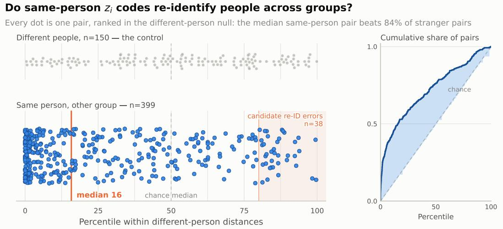  
Figure 8: The individual latent $z ^ { i }$ remembers who someone is, across different groups. Each person gets one $z ^ { i }$ vector per group they appear in. We measure the distance between two vectors of the same person seen in two different groups, and report it as a percentile of the distances between different people: percentile 20 means that pair is closer together than 80% of pairs of strangers. $\operatorname { I f } z ^ { i }$ carried no identity-related distance structure, the reference would be a uniform percentile distribution with median 50.

Nearest-neighbour retrieval. For each vector whose person appears in at least two groups, we rank vectors from other groups by distance and test whether the nearest neighbour belongs to the same individual. This recovers the correct identity in 99 of 239 eligible queries (41.4% top-1 accuracy), without metric learning or re-ranking. The 239 retrieval queries and 399 same-person pairs in Figure 8 count different units: one is a query vector, the other a cross-group pair. Excluding the query’s group tests transfer across group contexts, although different groups can still share partners or activities. Together with the distance analysis, retrieval supports persistent participant-specific information in the person latent, while leaving room for context-dependent variation; it does not establish a context-free or causally identifiable identity representation.

## C TRAINING DETAILS

Data preparation. We train on the Haggling, DnD, DD100, and DuoBox datasets using the train/validation/test partitions described in the respective papers. For Embody3D we use the split provided by MAGnet authors. Further, broken clips from Haggling are filtered out. All datasets are converted to the common motion representation of Section 4.1. Motion is resampled to 30 fps and divided into windows of 200 frames, using a stride of 150 frames during training. We normalise all inputs using statistics computed on the training split only. We apply person order augmentaiton and joint masking.

Training-example construction. Each training example contains between 2 and 5 participants. To train a single model for forecasting, in-filling, missing-joint completion, and response generation, we sample a context pattern for every clip. For forecasting examples, the observed prefix contains 30 to 70 frames; for temporal in-filling, observations are retained [give the interval or mask distribution]; and for joint- or person-level completion, we hide 30% of the joints randomly or completely hide one or more participants randomly. The observed context varies throughout the clip and across training samples, so the model learns to adapt to arbitrary context sets. Masks are regenerated at every update with a step-dependent seed. The target is always the full window of 200 frames.

Architecture. Unless otherwise stated, models contain approximately 16M trainable parameters. The group and person latent variables have dimensions 32 and 16, respectively, and the personhistory LSTM has hidden width 256. The context encoder uses 3 layers with hidden width 256, 8 attention heads, and a perceiver resampler. Dedicated heads predict canonical root motion and partner transforms, while body pose is decoded through a frozen, pretrained motion VAE (Appendix D). Dropout is set to 0.1. Unless noted otherwise, these settings are shared across all datasets and evaluation tasks.

Reconstruction losses. In addition to the ELBO, we supervise the decoded body directly to stabilise training and keep rotations, joint positions, and global placement mutually consistent. The reconstruction terms in eq. (6) use the geodesic distance between rotations on $\mathrm { S O ( 3 ) }$ and the smooth L1 (Huber) penalty:

$$
d _ { R } ( \hat { R } , R ) = \operatorname { a r c c o s } \big ( ( \operatorname { t r } ( \hat { R } ^ { \top } R ) - 1 ) / 2 \big ) , \qquad \rho ( x ; \beta ) = \left\{ x ^ { 2 } / 2 \beta , \qquad | x | < \beta , \right.\tag{10}
$$

With these, we supervise per-joint rotations (weighted by $\alpha _ { j } )$ , root-relative joint positions, and the canonical transforms of M defined in section 4.1:

$$
\begin{array} { l l } { { \displaystyle { \mathcal { L } } _ { \mathrm { p o s e } } = { \mathbb { E } } \Big [ \sum _ { j } \alpha _ { j } \rho \big ( d _ { R } ( { \hat { R } } ^ { j } , R ^ { j } ) ; 1 \big ) \Big ] , } } & { { \qquad \mathcal { L } } _ { \mathrm { k e y } } = { \mathbb { E } } \big [ \rho ( { \hat { K } } - K ; 0 . 0 5 ) \big ] , \quad }  \\ { { \displaystyle { \mathcal { L } } _ { \mathrm { r o o t } } = \sum _ { m \in \mathcal { M } } { \mathbb { E } } \big [ \rho \big ( d _ { R } ( { \hat { R } } _ { m } , R _ { m } ) ; 1 \big ) + \rho ( { \hat { t } } _ { m } - t _ { m } ; 1 ) \big ] , } } & { { \qquad \quad } } \end{array}\tag{11}
$$

Each term is averaged over valid (non-masked) entries and summed over time and people.

Optimisation and objective. We optimise all models with AdamW (Loshchilov & Hutter, 2017), an initial learning rate of $\mathrm { 1 e - 4 }$ with a cosine scheduler. Weight decay 1e − 4. The base model is trained for approximately 50 passes over the training windows, with the cosine schedule spanning the full run; gradients are clipped to a maximum norm of 1. In Equation (6), we use $\bar { \lambda } _ { \mathrm { p o s e } } = 2 \bar { 0 }$ $\lambda _ { \mathrm { k e y } } = 1 0 .$ , and $\lambda _ { \mathrm { { r o o t } } } = 1$ , with unit weight on the rotation and translation of each transform in M. We additionally use auxiliary terms with the following weights: joint velocity 10 (Huber, $\beta = 0 . 0 5 )$ root position 1; canonical trajectory position and yaw 10 each; canonical translation and rotation velocity 10 and 5; rotation-velocity matching $5 ;$ partner consistency 5; foot contact 1; canonicaltrajectory negative log-likelihood 1; and body negative log-likelihood 0.001. The group and person KL terms use $\beta _ { g } = 0 . 0 1$ and $\beta _ { p } = 0 . 0 5$ , respectively. During initial training, both coefficients are multiplied by min $\mathsf { \Omega } _ { \mathsf { l } } ( s / 1 0 0 0 , 1 )$ , where s is the optimisation step; continuation runs retain the full coefficients without restarting warm-up. The main posterior objective applies free bits of 0.05 nats per latent dimension, using $\bar { \operatorname* { m a x } } ( \mathrm { K L } _ { d } , 0 . 0 5 )$ before aggregation. The posterior-dropout auxiliary objective uses the same KL coefficients without free bits.

## D MODEL IMPLEMENTATION

Training has two parts: a temporal motion VAE, pretrained once and then frozen, and the hierarchical latent-variable model, trained on top of the frozen VAE decoder. The hierarchical model is first trained from scratch and then refined through a sequence of continuation stages (Table 5).

Scope. The motion VAE and the staged training below are used for the DD100 and DuoBox models. The Embody3D and DnD models behind the $N = 2 { - } 5$ results in Table 2 were trained with the base BRAID objective only (Appendix C), without the pretrained motion VAE or the continuation stages due to the lack of resources. We will update these results with models trained through the full pipeline. Likewise, the analyses and ablation tables in Appendices E to G and I use BRAID without the motion VAE.

## D.1 TEMPORAL MOTION VAE

Architecture. The VAE is a temporal convolutional encoder–decoder of width 256 and depth 3, with 4× temporal compression: each person receives one code $c _ { k } ^ { p } \in \mathbb { R } ^ { 1 2 8 }$ per block of four frames. Its input per frame is the 6D rotation of each of the $J = 2 1$ non-root body joints together with the canonical-to-root transform Tcan→root $\in \mathbb { R } ^ { 9 }$ , giving 135 channels. Encoder and decoder are both conditioned on $\boldsymbol { u } _ { t } ^ { p } = [ \Delta \mathbf { T } _ { t } ^ { \mathrm { c a n } } , \beta ^ { p } ] \in \mathbb { R } ^ { 2 5 }$ , the canonical frame-to-frame increment and the 16 shape coefficients; the increment of the first frame is set to the identity. Poses, conditions and codes are standardised with fixed training-set statistics. The encoder outputs a diagonal Gaussian posterior whose standard deviation is bounded as $\sigma = 0 . 1 + 0 . 9 5 \mathrm { i g m o i d } ( \cdot )$ , used consistently for sampling and for the KL term. A separate head predicts foot-contact logits. During pretraining, the encoder and decoder see the complete motion of every present person and the true canonical trajectory; only padding is masked.

Objective. With ˆ· denoting reconstructions, the VAE minimises

$$
\begin{array} { r l } & { \mathcal { L } _ { \mathrm { V A E } } = \mathrm { M S E } ( \hat { \Theta } , \Theta ) + 1 0 \| \hat { K } - K \| _ { 1 } + 1 0 \| \hat { t } ^ { \mathrm { r o o t } } - t ^ { \mathrm { r o o t } } \| _ { 1 } + 0 . 1 \rho \big ( \hat { K } ^ { \mathrm { w } } - \dot { K } ^ { \mathrm { w } } ; 0 . 2 \big ) } \\ & { \qquad + 0 . 1 \mathrm { B C E } ( \hat { m } , m ) + 0 . 5 \mathcal { L } _ { \mathrm { f o o t } } + \beta _ { \mathrm { V A E } } \mathbb { K } \mathbb { L } \big ( q _ { \psi } ( c \mid \Theta , u ) \| \mathcal { N } ( 0 , I ) \big ) , } \end{array}\tag{12}
$$

where the MSE is taken over standardised poses, K are root-relative joint positions and $t ^ { \mathrm { r o o t } }$ root positions (both in metres), $\dot { K } ^ { \mathrm { w } }$ are world-frame joint velocities, $\rho$ is the Huber penalty of eq. (10), m are foot-contact labels, and ${ \mathcal { L } } _ { \mathrm { f o o t } }$ is a Huber stance/skating penalty. The KL is averaged per latent dimension, and $\beta _ { \mathrm { V A E } }$ is ramped linearly from 0 to $1 0 ^ { - 3 }$ over the first 1,000 updates.

Optimisation and freezing. We use AdamW with weight decay $1 0 ^ { - 4 }$ and global-norm clipping at 1, batch size 16, and a learning rate warmed up from $1 0 ^ { - 5 }$ to $2 \mathrm { e } { - 4 }$ over 200 steps and then cosine-decayed to $2 \mathrm { e } { - } 5 .$ , for approximately 100 passes over the training windows. After pretraining, the VAE weights are excluded from all optimiser updates; gradients still propagate through the frozen decoder to its inputs. A digest of the VAE parameters is re-verified at the end of every later stage.

## D.2 COUPLING THE HIERARCHY TO THE MOTION VAE

Latent update rates and posterior merging. The group latent $z ^ { g } \in \mathbb { R } ^ { 3 2 }$ is updated every five frames and held constant in between; person latents $z _ { t } ^ { p } \in \mathbb { R } ^ { 1 6 }$ are sampled every frame, conditioned on the current group sample. Each person carries a recurrent history $h _ { t } ^ { \tilde { p } }$ (LSTM, width 256), and the group transition receives a masked max-pool over people of features computed from the updated $h _ { t } ^ { p }$ and the previous $z _ { t - 1 } ^ { p }$ . In the precision merge of eq. (4), the prior precision is capped at the bottom-up precision, $\sigma _ { \mathrm { t d } } ^ { - 2 }  \operatorname* { m i n } ( \sigma _ { \mathrm { t d } } ^ { - 2 } , \sigma _ { \mathrm { b u } } ^ { - 2 } )$ , so the posterior cannot be dominated by the prior when target evidence is available. During training, the bottom-up evidence is produced by the context encoder of section 4.3 applied to the full target, followed by a backward LSTM smoother.

Trajectory and interaction heads. Dedicated heads predict the canonical increments $\Delta \mathbf { T } _ { t } ^ { \mathrm { c a n } }$ and the partner transforms $\mathbf { T } _ { t } ^ { p  q }$ from $z ^ { g } , z _ { t } ^ { p }$ , and $h _ { t } ^ { p }$

Body path. Person latents are first smoothed with a fixed $[ 1 , 2 , 1 ] / 4$ temporal filter at strength 0.5. A trainable temporal adapter (four-frame packing, width 256, three dilated residual blocks) maps $[ z ^ { g } , z ^ { p } , \phi ( h ^ { p } ) , \bar { u ^ { p } } ]$ , where $\overset { \cdot } { \phi } ( h ^ { p } )$ are history features and $\bar { u } ^ { p }$ the normalised canonical increments and shape coefficients, to standardised 128-dimensional codes $\hat { c } _ { k } ^ { p }$ . These codes are de-standardised and decoded by the frozen VAE decoder into joint rotations and Tcan→root, which are then supervised with the reconstruction losses of eq. (11). The decoder condition uses the recorded $\Delta { \bf T } ^ { \mathrm { c a n } }$ with probability 0.5 during training (teacher forcing) and the predicted increment otherwise; at generation it always uses the prediction.

Generation. Generation reads only the observed context: latents are sampled from the priors, and neither target motion nor target codes are accessed. World-frame roots are anchored to the observed roots.

## D.3 TRAINING STAGES

Stage 1: base model. The hierarchical model is initialised from scratch around the frozen VAE and trained with the objective and schedule of Appendix C at batch size 4. In this stage, gradients from the trajectory losses to $z ^ { p }$ through its direct input to the trajectory head are stopped.

Continuation recipe (Stages 2–4). Each continuation restores model weights, AdamW moments, the step counter, and the random-number state from its parent’s final checkpoint. We verify that a save/restore round trip is bitwise exact and that the restored model reproduces the parent’s final held-out evaluation before training resumes. Continuations replace the parent’s schedule with a constant learning rate of $3 \mathrm { e } { - 5 }$ , keep weight decay and clipping unchanged, fix the KL multiplier at 1 (no annealing), and run for half the number of updates of Stage 1.

Table 5: Training stages. The motion VAE is frozen after Stage 0. Each continuation restores the full state of its parent’s final checkpoint.
<table><tr><td>Stage</td><td>Initialisation</td><td>Trainable</td><td>Change relative to parent</td></tr><tr><td>0. Motion VAE</td><td>Scratch</td><td>VAE</td><td></td></tr><tr><td>1. Base</td><td>Scratch; VAE from 0 All but VAE</td><td></td><td></td></tr><tr><td>2. Posterior dropout</td><td>Stage 1</td><td>All but VAE</td><td>Dual-rollout posterior dropout; trajec- tory losses reach  $z ^ { p }$  directly</td></tr><tr><td>3. Code supervision</td><td>Stage 2</td><td>All but VAE</td><td>Frozen-encoder code loss on the dense branch</td></tr><tr><td>4. VAE-informed posterior Stage 3</td><td></td><td></td><td>All but VAE, + projection Frozen-encoder codes as additional  $z ^ { p }$  posterior evidence</td></tr></table>

Stage 2: dual-rollout posterior dropout and trajectory coupling. Each update evaluates two independent recurrent rollouts with the same weights. The dense branch samples every frame from the posterior and uses the full Stage-1 objective, including teacher forcing and free bits. The mixed branch draws a per-frame mask $b _ { t } \sim$ Bernoulli(0.5), shared across people and the minibatch, and samples frame t from the posterior if $b _ { t } = 1$ and from the prior otherwise. Only posterior-sampled frames are scored in this branch, using the likelihood and the raw KL (the group KL only on its update frames); normalisers use the full count of eligible frames, geometry, velocity and foot terms are omitted, and the body decoder always uses the predicted trajectory. The two gradients are summed with unit weight, clipped jointly, and applied as a single AdamW step. In both branches the posterior retains access to the full target: posterior dropout changes where samples are drawn from, not the evidence available to the posterior. This stage also removes the Stage-1 stop-gradient, so trajectory losses update $z ^ { p }$ through its direct input to the trajectory head.

Stage 3: frozen-encoder code supervision. In the dense branch only, we add

$$
\mathcal { L } _ { \mathrm { c o d e } } = \frac { 1 } { \left| \mathcal { V } \right| D } \sum _ { ( b , k , p ) \in \mathcal { V } } \sum _ { d = 1 } ^ { D } \left( \frac { \hat { c } _ { b , k , d } ^ { p } - \mathrm { s g } \left[ \mu _ { \psi } ( Y , u ) _ { b , k , d } ^ { p } \right] } { s _ { d } } \right) ^ { 2 } ,\tag{13}
$$

where cˆ are the adapter’s codes in the dense posterior rollout, $\mu _ { \psi } ( Y , u )$ is the frozen VAE encoder’s posterior mean for the complete training motion under the true conditions, sg denotes stop-gradient, $s _ { d }$ is the fixed training-set standard deviation of code channel d, $D = 1 2 8$ , and V is the set of valid (batch, code position, person) indices. Targets are packed exactly as in VAE pretraining. The weight $\lambda _ { \mathrm { c o d e } } = 3 . 5$ was fixed before training on the first four continuation batches, such that the gradient norm of the code term over the adapter parameters equals half that of the dense-branch objective. A rule based on the whole-model gradient norm was not used, since that norm is dominated by trajectory and hierarchy gradients by roughly three orders of magnitude.

Stage 4: VAE-informed posterior. Stage 4 continues Stage 3 with the same recipe and $\lambda _ { \mathrm { c o d e } }$ Frozen-encoder mean codes of the posterior-visible target frames are standardised, repeated over each four-frame block, passed through a new zero-initialised linear layer $( 1 2 8  8 0 $ , 10,320 parameters), and added to the per-person evidence entering the bottom-up person posterior $q _ { \mathrm { b u } } \big ( z _ { t } ^ { \dot { p } } \mid h _ { t } ^ { \dot { p } } , \cdot , z ^ { g } \big )$ . The group posterior, all priors, and the generation path are unchanged; the codes are detached and the VAE remains frozen. Before training we verify that installing the branch leaves the dense rollout bit-identical, that generation is unchanged when hidden target frames are corrupted, and that existing AdamW moments are preserved while the new parameters’ moments start at zero. The DD100 and DuoBox results use the final Stage 4 checkpoint.

Implementation. All models are implemented in Jax/Flax NNX.

## E MODEL SIZE COMPARISONS

We vary model capacity while holding the training data, learning-rate schedule, and epoch budget fixed. This comparison evaluates model selection under a common training budget; it does not establish a scaling limit. Larger models may require different optimisation settings or more data, which this sweep does not test.

The 16M model attains the lowest SDTW, cross-person SDTW, and FD on both Panoptic and DD100 (Tables 6 and 7). Larger variants improve determinism error and produce greater sample spread, but their higher cross-person SDTW and FD show that this additional variation does not translate into closer interaction structure or distributional agreement under the tested setup. The 16M choice therefore provides a useful balance for our emphasis on coordinated, distributionally faithful generation, rather than a claim of superiority on every diagnostic.

The best result in each column is shown in bold, and the second-best distinct result is underlined.   
Tied values receive the same formatting.

Table 6: Model-size comparison on Panoptic.
<table><tr><td>Model</td><td>CRQA (RR)</td><td>CRQA (DET)</td><td>SDTW (×103)</td><td>xPerson SDTW (× 103)</td><td>FD</td><td>DIV</td><td>FS</td><td>MPJPE</td><td>MPJVE</td></tr><tr><td>4M</td><td>0.011</td><td>0.33</td><td>3.146</td><td>0.774</td><td>0.86</td><td>0.18</td><td>0.52</td><td>0.16</td><td>0.013</td></tr><tr><td>16M</td><td>0.011</td><td>0.28</td><td>3.061</td><td>0.511</td><td>0.27</td><td>0.42</td><td>0.59</td><td>0.13</td><td>0.012</td></tr><tr><td>25M</td><td>0.011</td><td>0.21</td><td>8.596</td><td>1.489</td><td>0.34</td><td>1.40</td><td>0.55</td><td>0.20</td><td>0.015</td></tr><tr><td>32M</td><td>0.011</td><td>0.21</td><td>8.600</td><td>1.371</td><td>0.34</td><td>1.47</td><td>0.61</td><td>0.20</td><td>0.013</td></tr></table>

Table 7: Model-size comparison on DD100.
<table><tr><td>Model</td><td>CRQA (RR)</td><td>CRQA (DET)</td><td>SDTW (×103)</td><td>xPerson SDTW (× 103)</td><td>FD</td><td>DIV</td><td>FS</td><td>MPJPE</td><td>MPJVE</td></tr><tr><td>4M</td><td>0.012</td><td>0.45</td><td>2.818</td><td>1.072</td><td>2.51</td><td>12.00</td><td>0.14</td><td>0.83</td><td>0.04</td></tr><tr><td>16M</td><td>0.010</td><td>0.36</td><td>2.390</td><td>0.785</td><td>0.63</td><td>5.81</td><td>0.13</td><td>0.72</td><td>0.05</td></tr><tr><td>25M</td><td>0.012</td><td>0.23</td><td>6.358</td><td>1.526</td><td>0.92</td><td>33.39</td><td>0.16</td><td>1.36</td><td>0.05</td></tr><tr><td>32M</td><td>0.012</td><td>0.22</td><td>6.202</td><td>1.463</td><td>1.04</td><td>35.47</td><td>0.15</td><td>1.34</td><td>0.05</td></tr></table>

## F CROSS-DATASET AND CROSS-DOMAIN GENERALISATION

Setup. We distinguish generalisation to unseen groups from transfer to an unseen activity domain. Model A is trained jointly on Panoptic Haggling (three-person conversational interaction) and DD100 (partnered dance), whereas Model B is trained only on DD100. Both are evaluated on the same held-out Panoptic groups, using 40 frames of conversational motion as context and generating the following 60 frames. Evaluation covers 200 batches of 32 sequences. Thus, both models encounter unseen groups, while conversational interaction is an unseen training domain only for Model B. Adaptation uses the supplied context without test-time parameter updates.

Table 8: Cross-domain forecasting on held-out Panoptic Haggling groups, with 40 context frames and 60 generated frames. Bold: best; underlined: second best.
<table><tr><td colspan="10">SDTW↓ Cr. SDTW↓</td></tr><tr><td>Training data</td><td></td><td>△RR↓ △DET↓</td><td> $\times 1 0 ^ { 3 }$ </td><td> $\times 1 0 ^ { 3 }$ </td><td></td><td>FD↓ DIV↑ 1</td><td></td><td></td><td>FS↓ MPJPE↓ MPJVE↓</td></tr><tr><td>Panoptic + DD100</td><td>0.011</td><td>0.28</td><td>3.061</td><td>0.511</td><td>0.27</td><td>0.42</td><td>0.59</td><td>0.13</td><td>0.012</td></tr><tr><td>DD100 only</td><td>0.011</td><td>0.31</td><td>4.473</td><td>1.424</td><td>1.94</td><td>1.10</td><td>0.24</td><td>0.28</td><td>0.026</td></tr></table>

Activity-specific dynamics within a shared model. Joint training improves cross-person SDTW from 1.424 to 0.511 and FD from 1.94 to 0.27 (Table 8), alongside closer temporal alignment and reference recovery. In the qualitative comparison (Figure 9), the jointly trained model maintains the conversational formation and generates gestures appropriate to that activity. The dance-only model retains plausible body poses and a sensible group formation, but also produces spinning motions characteristic of its training domain. This separates transfer of broad pose and formation structure from adaptation to activity-specific interaction dynamics. The result supports learning multiple domains with shared weights and conditioning on new groups; it does not establish equivalent performance on activities absent from training.

(a) Trained on Panoptic Haggling + DD100  
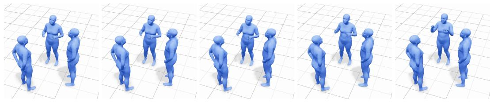

(b) Trained on DD100 only  
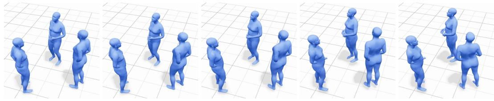  
Figure 9: Cross-domain forecasting on a held-out Panoptic Haggling group, using frames from the supplementary videos. Both models observe the same 40 frames of conversational motion and generate the next 60. Context frames are rendered from each model’s own reconstruction, so the frame-40 panels differ slightly between rows. (a) The jointly trained model keeps a stable conversational formation while the central participant continues to gesture. (b) The DD100-only model, which never sees conversational data during training, also preserves plausible poses and a coherent conversational formation, indicating that it carries forward the group structure given in the context. However, the right-hand participant turns away from the group, a rotation characteristic of partnered dance rather than conversation.

The dance-only model has higher DIV and lower FS, illustrating why sample spread and foot stability should be interpreted alongside activity-appropriate alignment and distributional fit. The grouplatent structure in Figure 6 complements this comparison: corpus and dance-family organisation is consistent with the inferred social state retaining activity information within a shared model.

## G CONTRIBUTION OF THE BILEVEL HIERARCHY

Variants. All variants in this section, including the full model, are trained without the motion VAE (Appendix D). We compare the full group-and-person hierarchy with two removals, keeping the remainder of the architecture fixed. The group-only variant removes person latents, so individual variation must be represented through the shared zg. The person-only variant removes social context: the person axis is folded into the batch, and each participant is modelled independently through zp. These comparisons test the functional contributions of the two levels alongside the latent-space analysis in Appendix B.

Table 9: Bilevel-hierarchy ablations on Panoptic Haggling. Bold: best; underlined: second best.
<table><tr><td></td><td colspan="9">SDTW↓ Cr. SDTW↓</td></tr><tr><td>Latent structure</td><td></td><td>△RR↓ △DET↓</td><td> $\times 1 0 ^ { 3 }$ </td><td> $\times 1 0 ^ { 3 }$ </td><td>FD↓</td><td></td><td>DIV↑ FS↓</td><td></td><td>MPJPE↓ MPJVE↓</td></tr><tr><td> $z _ { g }$  and zi</td><td>0.011</td><td>0.28</td><td>3.061</td><td>0.511</td><td>0.27</td><td>0.42</td><td>0.59</td><td>0.13</td><td>0.012</td></tr><tr><td> $z _ { g }$ </td><td>0.011</td><td>0.38</td><td>3.193</td><td>1.119</td><td>0.51</td><td>0.67</td><td>0.69</td><td>0.21</td><td>0.012</td></tr><tr><td>Person only (no social context)</td><td>0.012</td><td>0.19</td><td>8.530</td><td>1.305</td><td>0.18</td><td>1.28</td><td>0.61</td><td>0.18</td><td>0.014</td></tr></table>

Individual flexibility supports interpersonal alignment. On Panoptic, removing person latents changes SDTW modestly, from 3.061 to 3.193, but more than doubles cross-person SDTW, from 0.511 to 1.119 (Table 9). Removing social context increases cross-person SDTW further to 1.305, while SDTW rises to 8.530. The same cross-person ordering appears on DD100: 0.785 for the full hierarchy, 0.920 for group only, and 1.534 for person only. On DD100, removing social context also raises SDTW from 2.39 to 6.35 and MPJPE from 0.72 to 1.30. Together, these results suggest that separate person latents help express individual behaviour in relation to the group, and that social context contributes to both interpersonal alignment and individual motion prediction.

Complementary metrics reveal the contribution of social structure. The person-only model attains lower FD on Panoptic (0.18 versus 0.27) and lower determinism error on both datasets. These are complementary strengths rather than evidence of uniform superiority by either variant. FD over per-person frame features evaluates marginal motion statistics, while determinism summarises one aspect of recurrence structure; neither alone establishes that the generated participants remain aligned with one another. The full hierarchy’s advantage in cross-person SDTW therefore provides more specific evidence for the social-state motivation: modelling participants jointly helps recover the structure of their interaction. These architectural ablations support distinct functional contributions of group and person latents, without asserting causal identifiability of the learned representation.

Conditional person-level variation. We also examine generation while keeping the observed context and group latent fixed and varying only the person latents (Figure 10a). In the DuoBox example, three samples produce different poses and orientations from the same context. Their relative arrangements also vary: the person latents express individual realisations of an interaction rather than motion details that leave group geometry invariant. This complements the re-identification result in Appendix B: participant-specific information can persist across contexts while allowing multiple ways to participate in the current interaction.

Changing the group state during generation. In a second experiment, we generate 50 frames using a group-latent trajectory from one source sequence, then switch to the trajectory from another sequence containing the same individuals in a different interaction. Person latents are sampled conditionally on the active group latent, so they respond to the switch through the hierarchy. The selected frames in Figure 10b show a change in participants’ postures and group arrangement. This illustrates that the group latent affects the generated interaction through its conditional person-level realisations. Since the person latents also change, the experiment tests the hierarchy’s response to a change of group state, rather than isolating a direct effect of the group latent with every other latent held fixed.

## H EVALUATION METRICS AND INTERPRETATION

Our evaluation follows the multiparty behaviour framework of Shirekar et al. (2025) and combines interaction structure, distributional agreement, sample variation, and physical diagnostics. These quantities address complementary questions; no single score establishes that a continuation is both plausible and socially appropriate.

Baselines. RS and NN are naive, non-learned reference baselines: RS returns a randomly sampled sequence from the training data, and NN returns the training sequence closest to the observed context. They indicate the scores reachable by replaying recorded motion without modelling the interaction, and are therefore excluded from the best/second-best ranking in the main tables. MAGNet (Maluleke et al., 2025) was not evaluated on five-person interactions in its original work, so we do not report it for DnD (N = 5) in Table 2; for that setting under full observation, where no learned baseline remains, the ranking includes RS and NN.

Recurrence and temporal coordination. Cross-recurrence quantification analysis (CRQA) compares participants’ motion states across time. A recurrence occurs when two states are within a dataset-specific distance radius, calibrated to a 2% recurrence rate and then held fixed for analysis (Wallot & Leonardi, 2018; Wallot, 2019; Coco et al., 2021; Shirekar et al., 2025). Recurrence rate (RR) is the fraction of state pairs marked as recurrent. Determinism (DET) is the fraction of recurrent points that belong to diagonal line structures, reflecting sustained sequences of similar states. Off-diagonal recurrences allow temporal offsets, so the comparison can capture leading and following rather than requiring participants to move identically at the same instant. We report absolute deviations of RR and DET from their ground-truth values, denoted ∆RR and ∆DET; lower values indicate closer agreement with the recorded recurrence statistics.

(a) Same context and group latent; different person-latent samples  
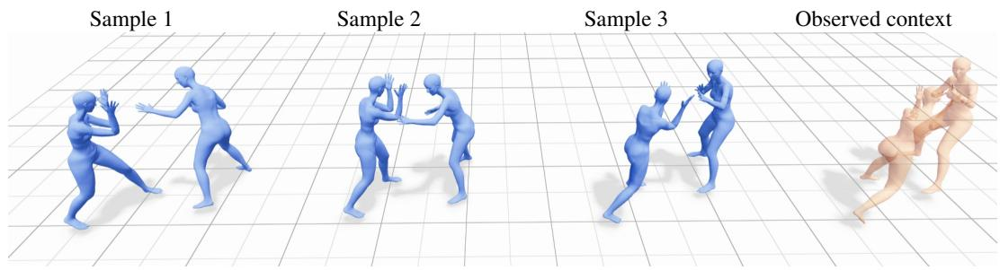

(b) Switching the source of the group latent during generation Before the switch  
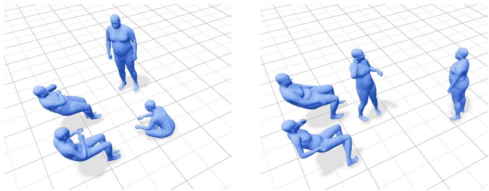  
Figure 10: Qualitative probes of the latent hierarchy, using frames from the supplementary videos. (a) Three generated dyads (blue) share the same context (peach, right) and group latent but use different person-latent samples. (b) Selected states before and after changing the group-latent source; person latents are sampled conditionally on the active group state.

Trajectory structure with timing flexibility. Soft dynamic time warping (SDTW) compares motion trajectories while allowing temporal alignment. It therefore tolerates timing shifts that framewise position error penalises directly. The cross-person variant applies this comparison to relations between participants’ motion signals, testing whether the generated interaction preserves their relative temporal structure. Lower values are better in both cases. Cross-person SDTW is especially relevant to our social-state motivation: individually plausible motions can still form a poorly aligned group. Where a table header specifies ×103, each displayed entry represents that many thousands in the underlying SDTW score.

Distributional fit and variation. Fréchet distance (FD) compares generated and reference motion distributions through the means and covariances of their evaluation features. Lower FD indicates closer agreement in that feature space. For the hierarchy ablations, these are per-person frame features: a good marginal motion distribution can coexist with errors in how people move together. Diversity (DIV) measures the average pairwise distance between generated samples. Higher DIV indicates more variation, but does not by itself demonstrate coverage of valid interactions. We consequently interpret DIV alongside FD, temporal structure, and the activity: a relatively stationary conversation need not exhibit the same motion spread as dancing or boxing.

Table 10: Additional baselines on Panoptic Haggling: 70 observed and 130 predicted frames, with 20% missing context joints. Bold: best; underlined: second best; –: unreported.
<table><tr><td colspan="9">SDTW↓ Cr. SDTW↓</td></tr><tr><td>Model</td><td></td><td>△RR↓ △DET↓</td><td> $\times 1 0 ^ { 3 }$ </td><td> $\times 1 0 ^ { 3 }$ </td><td>FD↓</td><td>DIV↑</td><td>FS↓</td><td>MPJPE↓ MPJVE↓</td><td></td></tr><tr><td>BRAID</td><td>0.011</td><td>0.28</td><td>3.061</td><td>0.511</td><td>0.27</td><td>0.42</td><td>0.59</td><td>0.13</td><td>0.012</td></tr><tr><td>SNP-style</td><td>0.011</td><td>0.38</td><td>3.193</td><td>1.119</td><td>0.51</td><td>0.67</td><td>0.69</td><td>0.21</td><td>0.012</td></tr><tr><td>SP-style</td><td>0.011</td><td>0.20</td><td>4.530</td><td>1.940</td><td>0.92</td><td>0.11</td><td>0.31</td><td>0.21</td><td>0.006</td></tr><tr><td>RoHM</td><td>0.013</td><td>0.21</td><td>8.251</td><td>1.007</td><td>1.285</td><td>一</td><td>0.17</td><td>0.442</td><td>0.052</td></tr></table>

Table 11: Additional baselines on DD100: 70 observed and 130 predicted frames, with 20% missing context joints. Bold: best; underlined: second best; –: unreported.
<table><tr><td colspan="9">SDTW↓ Cr. SDTW↓</td></tr><tr><td>Model</td><td>∆RR↓</td><td>∆DET↓</td><td> $\times 1 0 ^ { 3 }$ </td><td> $\times 1 0 ^ { 3 }$ </td><td>FD↓</td><td>DIV↑</td><td>FS↓</td><td></td><td>MPJPE↓ MPJVE↓</td></tr><tr><td>BRAID</td><td>0.010</td><td>0.36</td><td>2.390</td><td>0.785</td><td>0.63</td><td>5.81</td><td>0.13</td><td>0.72</td><td>0.05</td></tr><tr><td>SNP-style</td><td>0.012</td><td>0.38</td><td>2.620</td><td>0.920</td><td>1.45</td><td>3.53</td><td>0.12</td><td>0.71</td><td>0.04</td></tr><tr><td>SP-style</td><td>0.010</td><td>0.28</td><td>4.303</td><td>1.504</td><td>2.07</td><td>1.28</td><td>0.08</td><td>0.90</td><td>0.03</td></tr><tr><td>RoHM</td><td>0.013</td><td>0.29</td><td>7.017</td><td>1.493</td><td>2.29</td><td>一</td><td>0.31</td><td>1.03</td><td>0.11</td></tr></table>

Reference recovery and physical artefacts. Mean per-joint position error (MPJPE) averages the distance between predicted and recorded joint positions; mean per-joint velocity error (MPJVE) similarly measures velocity disagreement. Lower values indicate closer recovery of the particular recorded continuation. Because other continuations may also be valid, these errors complement the generative metrics rather than defining overall sample quality. Foot skating (FS) measures sliding during detected ground contact, and interpenetration (IP) measures body overlap. Lower values indicate fewer of these specific artefacts; they provide useful physical checks without establishing physical plausibility in every respect. Both are also non-zero in recorded motion for some activities, for example when dancers in close hold overlap under the capsule test or boxers move their feet quickly, so values below the recorded rate need not indicate better motion. Where relevant, we quote these recorded rates alongside the results.

## I ADDITIONAL NEURAL-PROCESS BASELINE COMPARISONS

Protocol and baselines. We report an additional forecasting comparison using 70 observed frames with 20% of joints randomly missing and a 130-frame prediction horizon. These results belong to this specific protocol and should be read separately from the main evaluation tables. We compare BRAID with SP-style (Raman et al., 2023) and SNP-style (Singh et al., 2019) implementations and RoHM (Zhang et al., 2024). The SP-style implementation is adapted to accept missing joints; the SNP-style variant uses a single group latent without the person-level hierarchy.

A consistent gain in trajectory and interaction structure. BRAID achieves the lowest SDTW, cross-person SDTW, and FD on both datasets in this comparison (Tables 10 and 11). The result links the hierarchy’s benefit to both individual trajectory structure and interpersonal alignment, alongside better distributional agreement. The advantage is not uniform across all diagnostics: SP-style has lower determinism and velocity errors, and lower foot skating; SNP-style yields greater diversity on Panoptic and slightly lower position error on DD100. On DD100, BRAID combines the highest reported diversity with the lowest FD. Read together, these measures support richer samples that remain close to the reference distribution under this protocol, while the physical and reconstruction scores identify complementary strengths of the baselines.