# GLASS: GLOBAL LATENT AGGREGATION WITH SLOT-BASED SET DECODING FOR SCALABLE ALL-ATOM CRYSTAL GENERATION

Hendrik Kraß∗ Institute for Artificial Intelligence University of Stuttgart

Mathias Niepert†   
Institute for Artificial Intelligence   
University of Stuttgart   
NEC Labs Europe   
Seyed Mohamad Moosavi†   
Department of Chemical Engineering   
& Applied Chemistry   
University of Toronto   
Vector Institute

## ABSTRACT

Generative models for crystals enable the discovery of novel structures, but scaling all-atom generation to larger systems such as metal–organic frameworks remains challenging. We connect this difficulty to the correspondence problem of particlespace generation. Even on a single fixed target set, index-free permutationequivariant particle flows require substantially more training for reliable generation as set size and density increase, under both independent and optimaltransport couplings. To resolve this challenge, we introduce GLASS—Global Latent Aggregation with Slot-based Set Decoding, which encodes structures in a permutation-invariant global latent space and learns their distribution via flow matching. A learned-slot decoder constructs all atoms in parallel, removing atomwise correspondence from generative transport. On MP20, GLASS is competitive with particle-space models, and flow training can reach the validity of the training data at every structure size. On a QMOF subset, GLASS generates MOFs with up to 150 atoms per unit cell without conditioning on building blocks, topology, or composition, and approaches the structural validity of the training data. On both datasets, flow training exposes a validity–novelty tradeoff, and MOF novelty remains limited by autoencoder generalization on the available data. These results show that separating correspondence assignment from generative transport provides a simple route toward high-validity generation of larger atomistic systems.

## 1 INTRODUCTION

Generative models for crystals are increasingly capable of producing valid and novel structures (Xie et al., 2022; Miller et al., 2024; Betala et al., 2025). This is particularly promising for materials discovery, where useful structures occupy only a tiny fraction of a vast chemical design space (Sanchez-Lengeling & Aspuru-Guzik, 2018), and novel materials are required to address challenges such as carbon capture (Ozkan & Custelcean, 2022), water purification (Werber et al., 2016), catalysis (Guo et al., 2024), and energy storage (Tabor et al., 2018). However, these models are frequently evaluated on datasets with limited structure size, such as MP20 (Xie et al., 2022; Jain et al., 2013) and MPTS52 (Baird et al., 2024), which contain structures with up to 20 and 52 atoms, respectively.

Metal–organic frameworks (MOFs), with applications such as carbon capture, are an important target beyond small-crystal benchmarks (Duan et al., 2025b). Many approaches simplify MOF generation by decomposing structures into reusable building blocks (Fu et al., 2024; Jiao et al., 2025;

Duan et al., 2025a; Kim et al., 2025b;a), conditioning generation on topology, building blocks, supplied composition, or molecular graphs (Kim et al., 2026; Inizan et al., 2025), or using other structured representations (Park et al., 2025b). Without these restrictions, all-atom MOF generation remains challenging and leads to lower validity than for small crystals (Joshi et al., 2025; Morehead et al., 2026; Ren et al., 2026). Mofasa narrows this gap with a combination of design choices, including atom-wise latents, residual vector quantization regularization, and a canonical graph ordering (Simkus et al., 2025), but its validity remains below that of the training structures. Motivated by this challenge, we investigate how the representation used during generation can support larger all-atom crystals.

Generative models in domains such as images or videos typically operate on vector representations with a fixed correspondence, where each vector entry deterministically maps to an image pixel or patch. Atomistic systems, however, are sets without an intrinsic order, such that many different vector representations describe the same physical structure. In particle-space flow matching, a training path connects randomly placed source particles to the atoms of a target crystal. Defining this path requires deciding which source particle moves toward which target atom. We refer to this pairing as the source-to-target correspondence, and the difficulty of learning transport that depends on it the correspondence problem. Different pairings describe the same final crystal but prescribe different particle-wise trajectories. The selected pairing defines the training supervision, while the model learns the resulting velocity field without explicit access to the pairing. During generation, no target crystal is available for matching.

In particle-space flow matching with independent coupling, source and target configurations are sampled independently, and particle-wise correspondence is determined implicitly by their indexed representations. Explicit strategies for simplifying this correspondence include canonicalization, which imposes a reproducible ordering in target samples that models can access via an index signal (Zhou et al., 2026; Seong et al., 2026; Simkus et al., 2025), matching-based approaches, which optimize the pairing between source particles and target atoms (Klein et al., 2023), or symmetryreduced representations, which represent symmetry-equivalent atoms through Wyckoff positions or symmetry-inequivalent sites (Cao et al., 2025; Ekstrom Kelvinius et al., 2025; Kazeev et al., 2025).¨ Stochastic sampling, such as the churn in Crystalite’s sampler (Veljkovic et al., 2026), can addition-´ ally separate particles that an equivariant model would otherwise move identically (Appendix F.5). These strategies can improve generation in practice, but none removes the correspondence ambiguity in general: optimal-transport pairings switch discontinuously with the source configuration, and no canonical ordering is continuous over a distribution of point sets (Dym et al., 2024), so nearby structures can receive different orderings.

In controlled experiments, we find that the training required for reliable generation in index-free permutation-equivariant particle flows increases substantially as set cardinality and target density increase, even when each model is trained on a single target grid. This trend persists when the training pairings are selected using optimal transport. Two properties make this setting hard: optimal-transport pairings switch discontinuously with the source configuration, and a deterministic permutation-equivariant model must give identical predictions to particles with identical states (Kaba & Ravanbakhsh, 2024; Zhang et al., 2022). A learned-slot model can instead assign stable identities to each particle, resulting in fast and reliable learning. These observations motivate removing atom-wise correspondence from generative transport altogether.

This issue is not unique to atomistic generative modeling. Predicting bounding boxes, reconstructing sets, or generating point clouds all require models to produce unordered outputs without assuming a fixed correspondence between prediction and target elements. This has been studied explicitly as the responsibility problem in set autoencoding (Zhang et al., 2020), and methods such as DSPN (Zhang et al., 2019), TSPN (Kosiorek et al., 2020), and DETR (Carion et al., 2020) use invariant representations or permutation-invariant matching to respect this permutation invariance. More gen erally, permutation-invariant global representations provide a way to describe a set without retaining the identities of its individual elements (Zaheer et al., 2017). While such representations are not universally lossless and their required capacity depends on the represented set (Wagstaff et al., 2019; 2022), they offer a way to remove element-wise correspondence from the representation.

We introduce GLASS—Global Latent Aggregation with Slot-based Set Decoding, which encodes each crystal into a permutation-invariant global latent representation and learns its distribution via flow matching. A learned-slot decoder reconstructs the all-atom structure in a single parallel pass.

We match predicted and target atoms when training the autoencoder, while flow matching operates entirely in the fixed-dimensional latent space. Concurrent work also applies fixed-dimensional latent flow matching to molecules (Yao et al., 2026), using canonical atom sequences and autoregressive decoding. GLASS instead combines a permutation-invariant latent with parallel decoding of the crystal structures.

On MP20, GLASS is competitive with particle-space models, and continued flow training reaches the validity of the training data at every structure size. To establish its scaling to larger structures, our main demonstration is unconditional all-atom MOF generation up to 150 atoms per unit cell, where GLASS approaches the raw structural validity of the QMOF150 training data. On both datasets, flow training moves generation along a validity–novelty frontier.

## Our contributions are:

1. The correspondence problem as a scaling bottleneck. We isolate a failure mode of indexfree permutation-equivariant particle flows: even on a single fixed target, training required for reliable generation grows substantially with set size and density under both independent and optimal-transport couplings, whereas breaking the symmetry with learned slots makes the same targets easy to learn at every size.

2. Removing correspondence from generative transport. We introduce GLASS, which removes atom-wise correspondence from generative transport: flow matching operates in a permutation-invariant global latent space, and atom-wise correspondence enters only the reconstruction objective of a slot decoder, without an imposed canonical atom ordering.

3. Near-training validity for all-atom MOFs. GLASS generates unconditional all-atom MOFs with up to 150 atoms at near-training structural validity, demonstrating the scalability of the approach. However, most generated structures recover training samples, revealing a generalization limitation on this dataset.

## 2 THE CORRESPONDENCE PROBLEM IN EQUIVARIANT SET FLOWS

Atomistic generative models commonly use permutation-equivariant architectures to respect atom exchangeability. Constructing a particle-space training path then requires pairing source particles with target sites. Since the target set has no intrinsic ordering, many pairings are possible, which each prescribe different particle-wise motions. We study how this ambiguity affects learning as the number of particles grows.

Let $\mathbf { x } _ { 0 } = \left( x _ { 0 , 1 } , \ldots , x _ { 0 , N } \right)$ denote the source configuration and $\mathbf { y } = ( y _ { 1 } , \dots , y _ { N } )$ an ordered representation of the target set. A permutation $\pi \in S _ { N }$ of the N indices pairs source particle i with target site $y _ { \pi ( i ) }$ . Writing $\mathbf { y } ^ { \pi } = \left( y _ { \pi ( 1 ) } , \ldots , y _ { \pi ( N ) } \right)$ , conditional flow matching (Lipman et al., 2023; Albergo & Vanden-Eijnden, 2023) uses

$$
\begin{array} { r } { \mathbf { x } _ { t } ^ { \pi } = ( 1 - t ) \mathbf { x } _ { 0 } + t \mathbf { y } ^ { \pi } , \qquad \mathbf { u } ^ { \pi } = \mathbf { y } ^ { \pi } - \mathbf { x } _ { 0 } , } \\ { \mathcal { L } _ { \mathrm { C F M } } = \mathbb { E } _ { t , \mathbf { x } _ { 0 } , \mathbf { y } , \pi } \left[ \left\| v _ { \theta } ( \mathbf { x } _ { t } ^ { \pi } , t ) - \mathbf { u } ^ { \pi } \right\| _ { F } ^ { 2 } \right] . \qquad } \end{array}
$$

In our fixed-grid experiment, independent coupling pairs source particles with randomly ordered target sites. Optimal transport (OT) instead selects $\pi ^ { \star } \in$ arg min $\textstyle \pi \in S _ { N } \sum _ { i } \| x _ { 0 , i } - y _ { \pi ( i ) } \| _ { 2 } ^ { 2 }$ (Klein et al., 2023). Under squared loss, the optimal predictor is the conditional mean of the prescribed velocity given the intermediate state and time, which the model learns without explicit access to the permutation. During generation, no target is supplied for matching, and the learned velocity field is integrated to generate the final state.

## 2.1 CARDINALITY AND GENERATION RELIABILITY

To separate the effect of cardinality from that of learning a data distribution, we reduce generation to its simplest form: reproducing a single fixed set of sites. For each $N ,$ we train a permutationequivariant Transformer (Vaswani et al., 2017) on one fixed target grid in $[ - 1 , 1 ] ^ { 2 }$ (Figure 1a). Particles carry only positions, with no indexing signal. Cardinality and density increase together, requiring finer spatial resolution. We assign each generated particle to its nearest target site; a sample fails if two particles select the same site (duplicate-site occupancy).

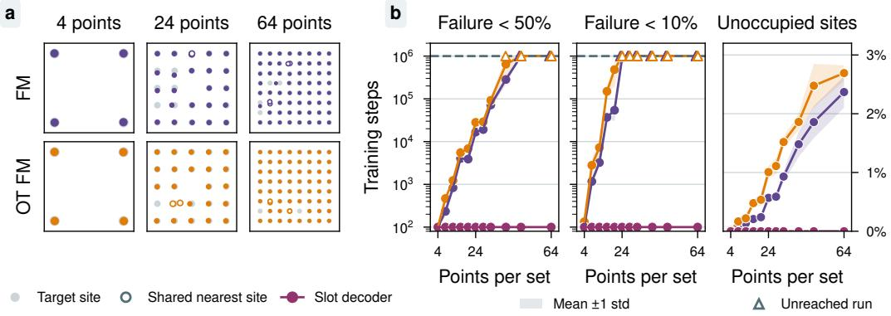  
Figure 1: Training requirements and site coverage in index-free permutation-equivariant particle flows. a) Target grids and generated samples from independent and optimal-transport (OT) couplings. Hollow markers indicate generated particles sharing a nearest target site. b) Left and center: training steps to whole-set failure rates below 50 % and 10 %. Right: mean unoccupied-site fraction at final checkpoints. The slot decoder realizes each target from learned slots with Hungarian matching and reaches every threshold at its first evaluation. Curves summarize three runs; shading denotes one standard deviation. Hollow triangles mark unreached thresholds.

Figure 1b reports training steps required to reach whole-set failure rates below 50 % and $1 0 \%$ , and the final unoccupied-site fraction. Both couplings require more training at larger N, with several runs missing the thresholds within 1M training steps; optimal-transport coupling does not remove this dependence (Table 2, Appendix C). As a control, we train the same targets with a latent-free version of the GLASS decoder: learned slot embeddings processed by self-attention layers of comparable size and trained with Hungarian matching to the target sites. This model reaches both thresholds at the first evaluation at 100 gradient steps for every N and leaves no site unoccupied (Figure 1b; worst generated outputs shown in Figure 5).

## 2.2 ASSIGNMENT SENSITIVITY AND EQUIVARIANCE

As the difficulty appears even for a single fixed target, we examine two properties of the transport problem itself that become more demanding as sets grow larger and denser. First, small changes in source positions can switch the OT pairing and prescribe sharply different initial velocities. For example, consider target sites $y _ { 1 } = ( - 1 , 0 ) , y _ { 2 } = ( 1 , 0 )$ and source particles at $x _ { 0 , 1 } = ( \varepsilon , 1 ) , x _ { 0 , 2 } =$ $( - \varepsilon , - 1 )$ . Changing the sign of ε switches the first particle’s destination between the two sites. The model must learn this discontinuous dependence across source configurations, even though each prescribed path is continuous in time. While exact OT paths remain separated for distinct target sites and their intermediate configurations determine the pairing (Appendix B.1), learning this discrete boundary can be challenging.

Second, permutation equivariance imposes a separate constraint: a deterministic equivariant predictor must give identical outputs to particles with identical states (Zhang et al., 2022; Kaba & Ravanbakhsh, 2024), and separating nearby particles requires correspondingly high sensitivity (Appendix B.2). Denser targets tighten both constraints, since smaller positional errors change the nearest target site.

For a single target, learned slot identities break this symmetry directly (Figure 1b), making learning on these samples trivial. When considering a distribution of crystals, no continuous canonical ordering exists (Dym et al., 2024) to assign a stable ordering. GLASS instead learns slots to decode structures and performs generation in a permutation-invariant latent space, decoupling the correspondence problem from the generative transport.

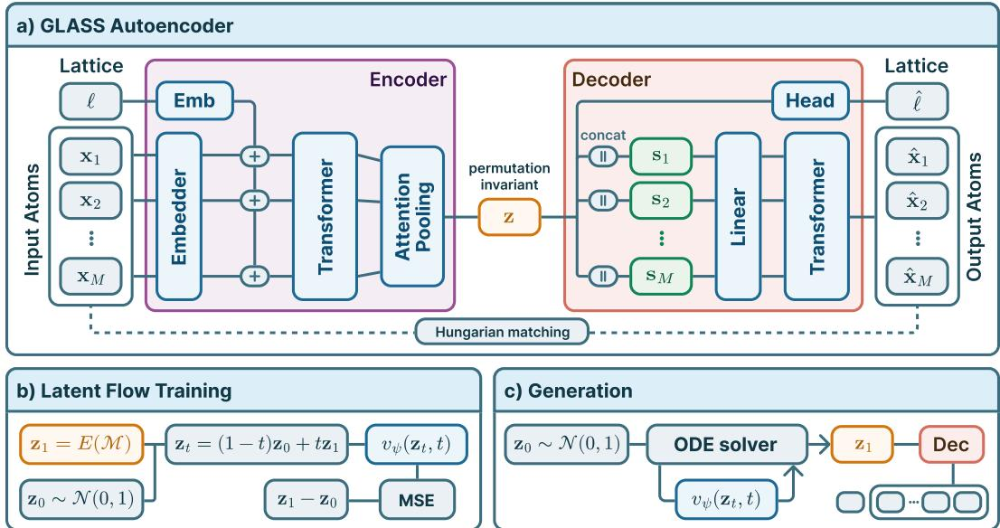  
Figure 2: GLASS architecture. A Transformer encoder and invariant attention pooling map a crystal to a global latent vector. Learned decoder slots predict atom types and coordinates in parallel, while a separate head predicts the lattice. Flow matching generates new latents, which are decoded into all-atom structures.

## 3 GLASS ARCHITECTURE

Building on Section 2, GLASS removes the correspondence problem from generative transport by separating transport from atom-wise reconstruction. An autoencoder encodes each crystal into a permutation-invariant global latent vector $\mathbf { z } \in \mathbb { R } ^ { d _ { z } }$ and reconstructs it with a learned-slot decoder. We then train a flow in this fixed-dimensional latent space (Figure 2).

## 3.1 AUTOENCODER

A crystal structure $\mathcal { M } = ( { \bf A } , { \bf F } , { \bf L } )$ with n atoms is described by three variables: atom types $\mathbf { A \in }$ $\{ 1 , \ldots , 9 4 \} ^ { n }$ , represented by atomic numbers; fractional coordinates $\mathbf { F } \in [ 0 , 1 ) ^ { n \times 3 }$ with rows $\mathbf { f } _ { i } ^ { \top }$ and lattice parameters $\mathbf { L } = ( a , b , c , \alpha , \beta , \gamma ) ^ { \top }$ with lengths $a , b , \cdot$ c and angles $\alpha , \beta , \gamma$ . We denote the unordered atom set by $x = \{ \mathbf { x } _ { 1 } , \ldots , \mathbf { x } _ { n } \}$ , where $\mathbf { x } _ { i } = \mathbf { \bar { ( } } A _ { i } , \mathbf { f } _ { i } ^ { \top } ) ^ { \top }$ is the vector describing atom i.

We adopt a tokenization that assigns one token to each atom and adds a lattice embedding onto every token. Atom types are represented through learned embeddings, while fractional coordinates are embedded using periodic Fourier features, making the periodicity directly visible to the model. We represent the lattice as ℓ = [log a, log b, log c, cos α, cos β, cos γ]⊤, which is embedded separately and added to each atom token, giving

$$
\mathbf { t } _ { i } ^ { ( 0 ) } = E _ { A } ( A _ { i } ) + E _ { f } ( \mathbf { f } _ { i } ) + E _ { L } ( \boldsymbol { \ell } ) .\tag{1}
$$

The resulting token set is processed by multiple Transformer encoder layers before a final attentionpooling operation with a global learned query. Throughout the encoder, permutation equivariance is preserved, while the final pooled latent is invariant to permutation.

The pooled bottleneck breaks the input-to-output atom correspondence. To decode a structure from the global latent code, we use M learned slot embeddings ${ \bf s } _ { j }$ , each of which is concatenated with the latent representation and linearly projected,

$$
\begin{array} { r } { { \bf u } _ { j } = { \bf W } _ { u } [ { \bf s } _ { j } ; { \bf z } ] + { \bf b } _ { u } . } \end{array}\tag{2}
$$

The resulting slot representations are passed through Transformer layers and decoded through separate coordinate and type heads. The learned slot identities provide a stable symmetry-breaking signal, allowing the model to produce distinct output atoms without retaining the original ordering of the input atoms. The type head predicts atom types and an additional empty class for masked atoms. Each slot is assigned its most probable type; empty slots are discarded, determining the output atom count up to M. A separate head predicts the lattice directly from the global latent. The decoder thus generates atom count, types, coordinates, and lattice together. Representation and padding details are given in Appendix D.1.

The autoencoder is trained to reconstruct its inputs. Since the global bottleneck does not retain the input ordering, we match predicted and target atoms using the Hungarian algorithm (Kuhn, 1955). For a structure with n atoms, padded to M entries, the periodic squared Cartesian error between the position predicted by slot i and target atom j is

$$
\delta _ { i j } ^ { 2 } = \operatorname* { m i n } _ { \mathbf { k } \in \{ - 1 , 0 , 1 \} ^ { 3 } } \left( \mathbf { f } _ { j } - \hat { \mathbf { f } } _ { i } - \mathbf { k } \right) ^ { \top } \mathbf { G } \left( \mathbf { f } _ { j } - \hat { \mathbf { f } } _ { i } - \mathbf { k } \right) ,\tag{3}
$$

where G is the Gram matrix of the target cell. With $\hat { A } _ { i , a }$ the predicted probability of type a for slot $i ,$ and type 0 marking empty slots and target padding, the matching cost and assignment are

$$
C _ { i j } = - \frac { \lambda _ { A } } { M } \log \hat { A } _ { i , A _ { j } } + \frac { \lambda _ { f } } { 3 n } { \bf 1 } [ A _ { j } \neq 0 ] \delta _ { i j } ^ { 2 } , \qquad \pi ^ { \star } = \arg \operatorname* { m i n } _ { \pi \in S _ { M } } \sum _ { i = 1 } ^ { M } C _ { i , \pi ( i ) } .\tag{4}
$$

Given $\pi ^ { \star }$ , the type and coordinate losses are

$$
\mathcal { L } _ { \mathrm { t y p e } } = - \frac { 1 } { M } \sum _ { i = 1 } ^ { M } \log \hat { A } _ { i , A _ { \pi ^ { \star } ( i ) } } , \qquad \mathcal { L } _ { \mathrm { c o o r d } } = \frac { 1 } { 3 n } \sum _ { i = 1 } ^ { M } \mathbf { 1 } [ A _ { \pi ^ { \star } ( i ) } \neq 0 ] \delta _ { i , \pi ^ { \star } ( i ) } ^ { 2 } ,\tag{5}
$$

and the lattice head is trained with $\begin{array} { r } { \mathcal { L } _ { \mathrm { c e l l } } = \frac { 1 } { 6 } \sum _ { k } ( \hat { \ell } _ { k } - \ell _ { k } ) ^ { 2 } } \end{array}$

To improve local geometry reconstruction, we add an auxiliary short-range pair-distance loss. For every pair of real atoms under $\pi ^ { \star }$ , we compare predicted and target minimum-image distances $\hat { d } _ { i j }$ and $d _ { i j }$ through the relative error $e _ { i j } = ( ( \hat { d } _ { i j } - d _ { i j } ) / d _ { i j } ) ^ { 2 }$

$$
{ \mathcal { L } } _ { \mathrm { p a i r } } = { \frac { \sum _ { i < j } w ( d _ { i j } ) e _ { i j } } { \sum _ { i < j } w ( d _ { i j } ) } } , \qquad w ( d ) = \left\{ { \begin{array} { l l } { 1 , } & { d \leq 3 , } \\ { { \frac { 1 } { 2 } } \left[ 1 + \cos \left( \pi { \frac { d - 3 } { 2 } } \right) \right] , } & { 3 < d < 5 , } \\ { 0 , } & { d \geq 5 , } \end{array} } \right.\tag{6}
$$

The total objective is $\mathcal { L } _ { \mathrm { A E } } = \lambda _ { A } \mathcal { L } _ { \mathrm { t y p e } } + \lambda _ { f } \mathcal { L } _ { \mathrm { c o o r d } } + \lambda _ { \mathrm { c e l l } } \mathcal { L } _ { \mathrm { c e l l } } + \lambda _ { \mathrm { p a i r } } \mathcal { L } _ { \mathrm { p a i r } } .$

## 3.2 LATENT FLOW MATCHING

After training the autoencoder, we freeze its parameters and train a time-conditioned residual multilayer perceptron as the latent flow model. Given an encoded data latent $\mathbf { z } _ { 1 }$ and Gaussian noise $\mathbf { z } _ { 0 }$ , we interpolate as ${ \bf z } _ { t } = ( 1 - t ) { \bf z } _ { 0 } + t { \bf z } _ { 1 }$ and train a vector field $v _ { \psi } ( \mathbf { z } _ { t } , t )$ to predict the constant velocity ${ \bf z } _ { 1 } - { \bf z } _ { 0 }$ . The flow-matching objective is

$$
\mathcal { L } _ { \mathrm { f l o w } } = \mathbb { E } _ { \mathbf { z } _ { 0 } , \mathbf { z } _ { 1 } , t } \left[ \frac { 1 } { d _ { z } } \left. v _ { \psi } ( \mathbf { z } _ { t } , t ) - ( \mathbf { z } _ { 1 } - \mathbf { z } _ { 0 } ) \right. _ { 2 } ^ { 2 } \right] .\tag{7}
$$

For sample generation, the learned flow is integrated from Gaussian noise in latent space. The generated latent is transformed back to the original latent scale and decoded into the full crystal structure in a single parallel pass. Sampling settings are given in Appendix D.

For $K$ vector-field evaluations, generation costs $T _ { \mathrm { G L A S S } } = K C _ { \mathrm { l a t e n t } } ( d _ { z } ) + C _ { \mathrm { d e c } } ( M )$ . At fixed model capacity, latent integration is independent of atom count, and the quadratic attention over the M decoder slots is evaluated only once per generated structure (Appendix I).

## 4 EXPERIMENTS

We first evaluate autoencoder generalization, generated structural validity, and novelty on small crystals, before investigating the model on larger all-atom MOFs.

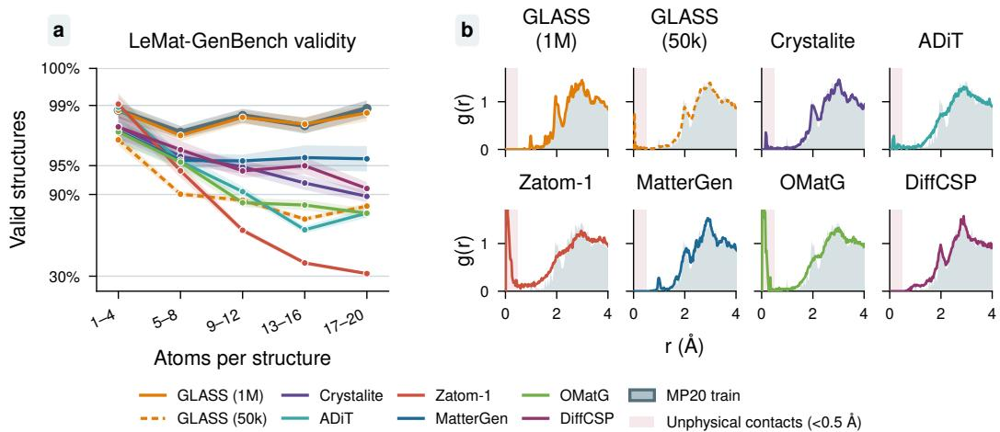  
Figure 3: Validity by size and local geometric fidelity on MP20-generated structures. (a) LeMat-GenBench validity before relaxation as a function of atom count, including GLASS at 50k and 1M flow-training steps, each with 10, 000 samples. Bands show 95% Wilson intervals; the vertical axis uses an arcsinh scale that expands differences near 100 %. (b) Radial distribution functions for 13– 16 atoms, compared with MP20 training data (grey). The red shaded interval marks interatomic distances below 0.5 A.˚

We train GLASS on MP20, containing Materials Project crystals with up to 20 atoms (Xie et al., 2022; Jain et al., 2013) and compare generation performance with Crystalite (Veljkovic et al., 2026),´ ADiT (Joshi et al., 2025), Zatom-1 (Morehead et al., 2026), MatterGen (Zeni et al., 2025), OMatG (Hollmer et al., 2025), and DiffCSP (Jiao et al., 2023a), and include LeMat-GenBench leaderboard results for OMatG-FC (Martirossyan et al., 2026), MiAD (Okhotin et al., 2026), and Chemeleon-2 (Park & Walsh, 2026) in Table 1.

On this dataset, the autoencoder shows a validation gap: held-out reconstruction RMSD is 0.3001 A,˚ against 0.0339 A on training structures. Of 512 held-out reconstructions, ˚ 81.64 % pass LeMat validity checks, compared with 97.85 % of their targets.

Despite this reconstruction gap, generated structures can closely match training-set validity, based on LeMat-GenBench’s validity criteria (Betala et al., 2025). After 1M flow steps, 30, 000 samples from three training seeds reach 98.38 % raw validity, against 98.45 % for training data, and stay within 0.2 percentage points in every size bin (Figure 3a; Table 12). Every comparison model loses validity between the smallest and largest bins, most strongly for Zatom-1, from 99.04 % at 1–4 atoms to 34.17 % at 17–20 atoms. In contrast, MatterGen’s decline is modest, and we show more details in Appendix F.3. These trends are consistent with the correspondence difficulty shown in Section 2.

Radial distribution functions show how this agreement extends to local geometry (Figure 3b). GLASS at 1M closely matches the training peaks, while comparison models show broader or distorted peaks and excess short-distance weight, particularly unphysical close contacts for Zatom-1 and OMatG. GLASS at 50k captures the main distribution but retains geometric defects.

However, matching training geometry does not establish novelty or energetic stability, which are important targets for materials discovery. We therefore evaluate GLASS with LeMat-GenBench (Table 1): SUN and MSUN measure unique, novel yields in disjoint stable and metastable MLIP energy ranges, with novelty assessed against the benchmark’s broad reference database. For models with relaxed generated samples, validity nearly saturates at 96–97 % across the displayed methods; novelty and energetic stability remain distinguishing factors.

For GLASS, these criteria favor an earlier checkpoint: longer flow training improves validity but reduces valid-and-novel yield from 45.45 % at 50k to 3.16 % at 1M (Figure 6). We select the 50k checkpoint for a balance between validity and novelty. With relaxation using NequIP-OAM-L (Batzner et al., 2022; Kavanagh & MIR Group @ Harvard, 2026), GLASS samples reach 96.56 % validity, 52.71 % novelty, and the highest metastable fraction in the displayed group. A SUN score of 1.92 % leads this group, and MSUN (21.16 %) is close to Crystalite (22.60 %). GLASS is thus competitive on MP20, although its raw validity on the 50k checkpoint is lower than the unrelaxed baselines. Protocols and complementary Crystalite scores are shown in Appendix D and Table 13.

Table 1: LeMat-GenBench evaluation on MP20. Results are grouped by input pre-relaxation. GLASS uses the 50k flow checkpoint; reference values are obtained from the official HuggingFace space (Betala et al., 2025). Additional models appear in Table 11. Stability metrics are MLIP-based estimates, and MSUN excludes SUN. Bold denotes the best displayed mean within each group.
<table><tr><td>Model</td><td>Valid (%) ↑</td><td>Unique (%) ↑</td><td>Novel (%) ↑</td><td>Stable (%)↑</td><td>Metastable (%) ↑</td><td>SUN (%) ↑</td><td>MSUN (%)↑</td><td>E above hull (eV/atom) ↓</td><td>Relax. RMSD (Å) ↓</td></tr><tr><td colspan="10">Pre-relaxed inputs</td></tr><tr><td>Crystalite</td><td>97.20</td><td>95.80</td><td>53.20</td><td>12.70</td><td>51.60</td><td>1.50</td><td>22.60</td><td>0.0905</td><td>0.1322</td></tr><tr><td>OMatG</td><td>96.40</td><td>95.20</td><td>51.20</td><td>11.60</td><td>49.80</td><td>1.00</td><td>18.00</td><td>0.0956</td><td>0.0759</td></tr><tr><td>MiAD</td><td>96.20</td><td>94.30</td><td>40.20</td><td>6.40</td><td>62.00</td><td>1.00</td><td>16.60</td><td>0.0804</td><td>0.2494</td></tr><tr><td>MatterGen</td><td>95.70</td><td>95.10</td><td>70.50</td><td>2.00</td><td>33.40</td><td>0.20</td><td>15.00</td><td>0.1834</td><td>0.3878</td></tr><tr><td>OMatG-FC</td><td>97.20</td><td>92.80</td><td>28.90</td><td>18.40</td><td>57.90</td><td>1.70</td><td>12.00</td><td>0.0694</td><td>0.0685</td></tr><tr><td>GLASS + NequIP</td><td>96.56</td><td>95.48</td><td>52.71</td><td>11.75</td><td>63.08</td><td>1.92</td><td>21.16</td><td>0.1261</td><td>0.1258</td></tr><tr><td></td><td>± 0.39</td><td>± 0.66</td><td>± 1.40</td><td>± 0.51</td><td>± 1.52</td><td>± 0.18</td><td>± 1.40</td><td>± 0.0080</td><td>± 0.0071</td></tr><tr><td colspan="10">Inputs without pre-relaxation</td></tr><tr><td>Chemeleon2 DiffCSP</td><td>95.20</td><td>88.10</td><td>71.60</td><td>0.00</td><td>39.80</td><td>0.00</td><td>21.20</td><td>0.1557</td><td>0.4226</td></tr><tr><td></td><td>95.70</td><td>94.80</td><td>66.20</td><td>2.30</td><td>29.80</td><td>0.10</td><td>8.50</td><td>0.2747</td><td>0.5857</td></tr><tr><td>GLASS</td><td>89.29</td><td>88.32</td><td>45.65</td><td>0.93</td><td>41.95</td><td>0.15</td><td>11.49</td><td>0.3140</td><td>0.4290</td></tr><tr><td></td><td>± 0.59</td><td>± 0.68</td><td>± 1.20</td><td>± 0.10</td><td>± 1.65</td><td>± 0.06</td><td>± 0.61</td><td>± 0.0083</td><td>± 0.0077</td></tr></table>

## 5 HIGH-VALIDITY GENERATION OF METAL–ORGANIC FRAMEWORKS

To test whether this structural fidelity extends to larger crystals, we apply GLASS to QMOF (Rosen et al., 2021), with up to 150 atoms per cell, using the same architecture and a 64-dimensional latent. Generation is unconditioned on building blocks, topology, or composition; validity is assessed with MOFChecker (Jin et al., 2025).

We find that the autoencoder gap is larger here: held-out RMSD is 1.2473 A, against 0.0190˚ A˚ on training structures. Increasing latent dimension from 32 to 128 barely changes this gap (Appendix E.3).

As on MP20, the model can achieve high generation validity, which rises through our reported 1M checkpoint (Figure 8). GLASS reaches 74.8 % raw validity, against 80.3 % for training data, 52.9 % for Mofasa (Simkus et al., 2025), and 15.1–16.3 % for ADiT, Zatom-1, and SinAE (Joshi et al., 2025; Morehead et al., 2026; Ren et al., 2026).

This advantage persists across sizes (Figure 4a). GLASS nearly matches training validity at 20–35 atoms and retains 67.8 % at 131–150 atoms, against 78.5 % for training data, 38.3 % for Mofasa, and 0.8 % for Zatom-1. Its lower rates of disconnected molecules and undercoordination explain much of the advantage over ADiT, Zatom-1, and SinAE (Figure 4b). Relaxation with eSEN-OAM+D3 (Fu et al., 2025; Grimme et al., 2010) raises overall validity to 78.72 % (Appendix G).

This structural fidelity, however, comes with limited novelty. Under Mofasa’s MOFid (Bucior et al., 2019) convention, valid, novel, and unique yield (VNU) is 8.76 %, versus Mofasa’s reported 42.4 %. However, different training splits make this comparison only indicative (Appendix G.2). Novelty analysis with StructureMatcher (Ong et al., 2013) finds that 98.3 % of valid GLASS samples match training structures, compared to only 0.15 % of valid Mofasa samples matching any QMOF150 structure (Appendix G.3). GLASS’s validity therefore primarily reflects reliable generation of familiar frameworks.

Unlike on MP20, earlier checkpoints offer little improvement: valid, unmatched yield falls from 2.20 % at 250k to 1.28 % at 1M. This brings the larger autoencoder validation gap into focus: its poor generalization may restrict validity before the flow closely fits the training latents. Decoding away from training encodings may fail, favoring familiar frameworks at the later flow checkpoints.

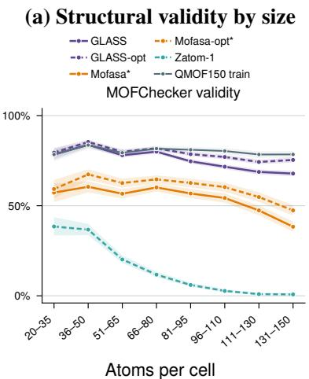

(b) Raw MOFChecker validity breakdown
<table><tr><td>Criterion</td><td>Train</td><td>GLASS</td><td>Mofasa*</td><td>ADiT</td><td>Zatom-1</td><td>SinAE</td></tr><tr><td>Overall valid ↑</td><td>80.3</td><td>74.8</td><td>52.9</td><td>15.7</td><td>15.1</td><td>16.3</td></tr><tr><td>Has C ↑</td><td>100.0</td><td>99.1</td><td>98.4</td><td>100.0</td><td>100.0</td><td>100.0</td></tr><tr><td>Has H ↑</td><td>99.8</td><td>98.9</td><td>98.4</td><td>99.6</td><td>100.0</td><td>99.8</td></tr><tr><td>Atom overlap ↓</td><td>0.0</td><td>1.3</td><td>2.8</td><td>8.3</td><td>8.8</td><td>5.2</td></tr><tr><td>Overcoord.  ↓</td><td>0.0</td><td>0.5</td><td>2.5</td><td>23.6</td><td>1.1</td><td>12.8</td></tr><tr><td>Overcoord. N ↓</td><td>0.0</td><td>0.1</td><td>1.6</td><td>1.5</td><td>0.0</td><td>0.4</td></tr><tr><td>Overcoord. H↓</td><td>0.0</td><td>1.0</td><td>2.4</td><td>1.0</td><td>2.9</td><td>1.3</td></tr><tr><td>Undercoord. C ↓</td><td>5.9</td><td>8.2</td><td>20.1</td><td>60.0</td><td>65.4</td><td>39.2</td></tr><tr><td>Undercoord. N ↓</td><td>6.9</td><td>11.4</td><td>12.9</td><td>39.1</td><td>22.8</td><td>26.9</td></tr><tr><td>Undercoord. rare earth ↓</td><td>0.0</td><td>0.1</td><td>2.1</td><td>0.4</td><td>0.0</td><td>0.2</td></tr><tr><td>Has metal ↑</td><td>100.0</td><td>99.0</td><td>97.7</td><td>100.0</td><td>100.0</td><td>100.0</td></tr><tr><td>Lone molecule ↓</td><td>9.7</td><td>12.1</td><td>31.3</td><td>72.9</td><td>80.5</td><td>49.8</td></tr><tr><td>High charge ↓</td><td>1.0</td><td>1.4</td><td>3.5</td><td>0.9</td><td>0.5</td><td>0.2</td></tr><tr><td>Terminal oxo ↓</td><td>0.0</td><td>0.5</td><td>2.5</td><td>2.6</td><td>0.3</td><td>3.1</td></tr><tr><td>Undercoord. alk./alk.-earth ↓</td><td>0.2</td><td>0.3</td><td>3.0</td><td>1.0</td><td>0.3</td><td>0.7</td></tr><tr><td>Geom. exposed metal ↓</td><td>1.7</td><td>2.6</td><td>5.3</td><td>7.0</td><td>1.8</td><td>4.0</td></tr></table>

Figure 4: Structural validity of raw and relaxed all-atom MOF generations. GLASS uses the 1M-step flow checkpoint. (a) MOFChecker validity by atom count before and after relaxation (opt), compared with QMOF150 training data; bands show 95% Wilson intervals. ADiT and SinAE are absent because no released QMOF samples or checkpoints were available. (b) Raw-generation validity and individual checks (%). Arrows indicate the preferred direction; defect flags can overlap. ∗Mofasa: precomputed MOFChecker results for 10,000 released samples with 20–150 atoms and their relaxed counterparts; trained on QMOF structures up to 170 atoms with a different split. All models are shown in Appendix G.

To test whether the autoencoder gap can be closed, we train the GLASS autoencoder on LeMat-Bulk, with 5M training structures of up to 20 atoms, where held-out reconstruction nearly matches training (0.046 versus 0.043 A; Appendix E.4). Thus, the small-crystal validation gap is largely˚ closed in this setting, supporting that broader autoencoder pretraining can improve generalization.

## 6 DISCUSSION AND CONCLUSION

We introduced GLASS to separate the correspondence problem from generative transport. We showed that GLASS is competitive on small-crystal generation and achieves leading structural validity among the compared all-atom MOF models, but novel framework generation remains an unresolved limitation. On MP20, the 50k flow checkpoint combines high validity after relaxation with SUN and MSUN yields near the top of the comparison; at 1M, raw validity and local geometry closely match the training data, at the cost of novelty. On QMOF150, GLASS generates structures with up to 150 atoms at validity approaching that of the training data, without building blocks, topology, or composition as input. Most valid outputs, however, reproduce known training frameworks.

The validity results support separating generative transport from atom correspondence. Our fixedgrid experiments isolate a mechanism consistent with the size-dependent declines of several all-atom models: index-free permutation-equivariant flows need more training to generate a fixed target as the number of particles grows, while a slot decoder with learned identities realizes the same targets within a small, constant budget at every size. GLASS removes this correspondence problem from transport by learning the flow in a permutation-invariant global latent space. The evaluations show that this representation can preserve local geometry and framework connectivity across substantially larger atomistic structures.

A central remaining difficulty is decoding unseen structures reliably. Universal continuous invariant representations of arbitrary sets require sufficient latent dimension as cardinality grows (Wagstaff et al., 2019). Yet 32 latent dimensions already fit the QMOF150 training structure closely, and increasing this dimension to 128 changes reconstruction errors only modestly (Appendix E.3). The much smaller train–validation gap on LeMat-Bulk suggests that this gap is not intrinsic to the architecture, although the comparison does not isolate dataset size. Whether pretraining on larger MOF datasets improves reconstruction and valid novel yield remains to be tested.

A global latent also enables new future directions: property-informed latent training, as explored in Crys-JEPA (Liu et al., 2026) and EF-TALFM (Yao et al., 2026), could additionally favor energetically useful or property-targeted regions.

Limitations. High MOF validity on QMOF150 comes with little novelty, and a validity deficit remains for the largest frameworks. MOFChecker tests selected structural and chemical criteria; passing these checks does not establish energetic stability. The MP20 stability results are MLIPbased estimates and can differ from first-principles evaluations. The immediate priority for future work is improved autoencoder generalization and measuring whether this increases the yield of valid, novel frameworks.

## AI USE STATEMENT

In this work, we used LLMs to assist with software implementation, debugging, and code review; to provide feedback on experimental methodology and implementation; and to provide feedback on and assist in checking mathematical arguments. LLMs were also used for literature retrieval and discovery, and to suggest, draft, and improve formulations in the manuscript.

All AI-assisted code, mathematical arguments, citations, and manuscript text were critically reviewed and verified by the authors. The scientific questions, methodological choices, experiments, interpretation of results, and final claims were determined by the authors. LLMs were not used to generate synthetic datasets. The authors take full responsibility for the final content of this work.

## REPRODUCIBILITY STATEMENT

We provide code for training, sampling, and evaluation at https://github.com/henk789/ glass. Appendix D specifies datasets and splits, autoencoder and flow settings (Tables 3 and 4), reconstruction metrics, geometry relaxation, and the LeMat-GenBench and Crystalite evaluation protocols. MOF validity uses MOFChecker 0.9.6, and similarity to training structures uses the StructureMatcher settings provided in Appendix G.3. The fixed-grid experiment and slot-decoder control are specified in Appendix C, with code contained in the released repository. Main result report means and sample standard deviations over three training runs; sampling seeds and sample counts are given with each evaluation. Baseline samples are taken from public releases or generated from released checkpoints (Appendix F.3).

## ACKNOWLEDGMENTS

The authors thank the International Max Planck Research School for Intelligent Systems (IMPRS-IS) for supporting Hendrik Kraß. This work was funded by the Deutsche Forschungsgemeinschaft (DFG, German Research Foundation) – Project number 569019417. The authors gratefully acknowledge the computing time made available to them on the high-performance computer at the NHR Center of TU Dresden. This center is jointly supported by the Federal Ministry of Research, Technology and Space of Germany and the state governments participating in the NHR (www.nhrverein.de/unsere-partner). SMM acknowledges support from the University of Toronto’s Data Science Institute and the Acceleration Consortium, which receives funding from the Canada First Research Excellence Fund (CFREF).

## REFERENCES

Panos Achlioptas, Olga Diamanti, Ioannis Mitliagkas, and Leonidas Guibas. Learning Representations and Generative Models for 3D Point Clouds. In Proceedings of the 35th International Conference on Machine Learning, pp. 40–49. PMLR, July 2018.

Michael S. Albergo and Eric Vanden-Eijnden. Building Normalizing Flows with Stochastic Interpolants, March 2023.

Sterling G. Baird, Hasan M. Sayeed, Joseph Montoya, and Taylor D. Sparks. Matbench-genmetrics: A Python library for benchmarking crystal structure generative models using time-based splits of Materials Project structures. Journal of Open Source Software, 9(97):5618, May 2024. ISSN 2475-9066. doi: 10.21105/joss.05618.

Ilyes Batatia, David P´ eter Kov´ acs, Gregor N. C. Simm, Christoph Ortner, and G´ abor Cs´ anyi. MACE:´ Higher Order Equivariant Message Passing Neural Networks for Fast and Accurate Force Fields, January 2023.

Ilyes Batatia, Philipp Benner, Yuan Chiang, Alin M. Elena, David P. Kov´ acs, Janosh Riebesell,´ Xavier R. Advincula, Mark Asta, Matthew Avaylon, William J. Baldwin, Fabian Berger, Noam Bernstein, Arghya Bhowmik, Samuel M. Blau, Vlad Carare, James P. Darby, Sandip De, Fla-˘ viano Della Pia, Volker L. Deringer, Rokas Elijosius, Zakariya El-Machachi, Fabio Falcioni, Ed-ˇ vin Fako, Andrea C. Ferrari, Annalena Genreith-Schriever, Janine George, Rhys E. A. Goodall, Clare P. Grey, Petr Grigorev, Shuang Han, Will Handley, Hendrik H. Heenen, Kersti Hermansson, Christian Holm, Jad Jaafar, Stephan Hofmann, Konstantin S. Jakob, Hyunwook Jung, Venkat Kapil, Aaron D. Kaplan, Nima Karimitari, James R. Kermode, Namu Kroupa, Jolla Kullgren, Matthew C. Kuner, Domantas Kuryla, Guoda Liepuoniute, Johannes T. Margraf, Ioan-Bogdan Magdau, Angelos Michaelides, J. Harry Moore, Aakash A. Naik, Samuel P. Niblett, Sam Wal-˘ ton Norwood, Niamh O’Neill, Christoph Ortner, Kristin A. Persson, Karsten Reuter, Andrew S. Rosen, Lars L. Schaaf, Christoph Schran, Benjamin X. Shi, Eric Sivonxay, Tamas K. Stenczel,´ Viktor Svahn, Christopher Sutton, Thomas D. Swinburne, Jules Tilly, Cas van der Oord, Eszter Varga-Umbrich, Tejs Vegge, Martin Vondrak, Yangshuai Wang, William C. Witt, Fabian Zills,´ and Gabor Cs´ anyi. A foundation model for atomistic materials chemistry, March 2024.´

Simon Batzner, Albert Musaelian, Lixin Sun, Mario Geiger, Jonathan P. Mailoa, Mordechai Kornbluth, Nicola Molinari, Tess E. Smidt, and Boris Kozinsky. E(3)-equivariant graph neural networks for data-efficient and accurate interatomic potentials. Nature Communications, 13(1), May 2022. ISSN 2041-1723. doi: 10.1038/s41467-022-29939-5.

Siddharth Betala, Samuel P. Gleason, Ali Ramlaoui, Andy Xu, Georgia Channing, Daniel Levy, Clementine Fourrier, Nikita Kazeev, Chaitanya K. Joshi, S´ ekou-Oumar Kaba, F´ elix Therrien,´ Alex Hernandez-Garcia, Roc´ıo Mercado, N. M. Anoop Krishnan, and Alexandre Duval. LeMat GenBench: A Unified Evaluation Framework for Crystal Generative Models, December 2025.

Cyprien Bone, Matthew Walker, Bradley A. A. Martin, Kuangdai Leng, Luis M. Antunes, Ricardo Grau-Crespo, Amil Aligayev, Javier Dominguez, and Keith T. Butler. Discovery and recovery of crystalline materials with property-conditioned transformers, June 2026.

Benjamin J. Bucior, Andrew S. Rosen, Maciej Haranczyk, Zhenpeng Yao, Michael E. Ziebel, Omar K. Farha, Joseph T. Hupp, J. Ilja Siepmann, Alan Aspuru-Guzik, and Randall Q. Snurr.´ Identification Schemes for Metal–Organic Frameworks To Enable Rapid Search and Cheminfor matics Analysis. Crystal Growth & Design, 19(11):6682–6697, November 2019. ISSN 1528- 7483. doi: 10.1021/acs.cgd.9b01050.

Zhendong Cao, Xiaoshan Luo, Jian Lv, and Lei Wang. Space group informed transformer for crystalline materials generation. Science Bulletin, pp. S2095927325009752, September 2025. ISSN 20959273. doi: 10.1016/j.scib.2025.09.035.

Nicolas Carion, Francisco Massa, Gabriel Synnaeve, Nicolas Usunier, Alexander Kirillov, and Sergey Zagoruyko. End-to-End Object Detection with Transformers, May 2020.

Jiacheng Chen, Ruizhi Deng, and Yasutaka Furukawa. PolyDiffuse: Polygonal Shape Reconstruction via Guided Set Diffusion Models. In Thirty-Seventh Conference on Neural Information Processing Systems, November 2023.

Orion Cohen, Janosh Riebesell, Rhys Goodall, Adeesh Kolluru, Stefano Falletta, Joseph Krause, Jorge Colindres, Gerbrand Ceder, and Abhijeet S Gangan. TorchSim: An efficient atomistic simulation engine in PyTorch. AIfor Science, 1(2):025003, November 2025. ISSN 3050-287X. doi: 10.1088/3050-287X/ae1799.

Daniel W. Davies, Keith T. Butler, Adam J. Jackson, Jonathan M. Skelton, Kazuki Morita, and Aron Walsh. SMACT: Semiconducting Materials by Analogy and Chemical Theory. Journal of Open Source Software, 4(38):1361, June 2019. ISSN 2475-9066. doi: 10.21105/joss.01361.

Chenru Duan, Aditya Nandy, Sizhan Liu, Yuanqi Du, Liu He, Yi Qu, Haojun Jia, and Jin-Hu Dou. Building-Block Aware Generative Modeling for 3D Crystals of Metal Organic Frameworks, May 2025a.

Chenru Duan, Aditya Nandy, Shyam Chand Pal, Xin Yang, Wenhao Gao, Yuanqi Du, Hendrik Kraß, Yeonghun Kang, Varinia Bernales, Zuyang Ye, Tristan Pyle, Ray Yang, Zeqi Gu, Philippe Schwaller, Shengqian Ma, Shijing Sun, Alan Aspuru-Guzik, Seyed Mohamad Moosavi, Robert´ Wexler, and Zhiling Zheng. The Rise of Generative AI for Metal-Organic Framework Design and Synthesis, August 2025b.

Jed A. Duersch, Elohan Veillon, Astrid Klipfel, Adlane Sayede, and Zied Bouraoui. Fourier Transformers for Latent Crystallographic Diffusion and Generative Modeling, February 2026.

Nadav Dym, Hannah Lawrence, and Jonathan W. Siegel. Equivariant Frames and the Impossibility of Continuous Canonicalization, June 2024.

Filip Ekstrom Kelvinius, Oskar B. Andersson, Abhijith S Parackal, Dong Qian, Rickard Armiento,¨ and Fredrik Lindsten. WyckoffDiff – A Generative Diffusion Model for Crystal Symmetry. In Aarti Singh, Maryam Fazel, Daniel Hsu, Simon Lacoste-Julien, Felix Berkenkamp, Tegan Maharaj, Kiri Wagstaff, and Jerry Zhu (eds.), Proceedings of the 42nd International Conference on Machine Learning, volume 267 of Proceedings ofMachine Learning Research, pp. 15130–15147. PMLR, July 2025.

Haoqiang Fan, Hao Su, and Leonidas Guibas. A Point Set Generation Network for 3D Object Reconstruction from a Single Image. In 2017 IEEE Conference on Computer Vision and Pattern Recognition (CVPR), pp. 2463–2471, July 2017. doi: 10.1109/CVPR.2017.264.

Xiang Fu, Tian Xie, Andrew Scott Rosen, Tommi S. Jaakkola, and Jake Allen Smith. MOFDiff: Coarse-grained Diffusion for Metal-Organic Framework Design. In The Twelfth International Conference on Learning Representations, 2024.

Xiang Fu, Brandon M. Wood, Luis Barroso-Luque, Daniel S. Levine, Meng Gao, Misko Dzamba, and C. Lawrence Zitnick. Learning Smooth and Expressive Interatomic Potentials for Physical Property Prediction, February 2025.

Stefan Grimme, Jens Antony, Stephan Ehrlich, and Helge Krieg. A consistent and accurate ab initio parametrization of density functional dispersion correction (DFT-D) for the 94 elements H-Pu. The Journal of Chemical Physics, 132(15):154104, April 2010. ISSN 0021-9606, 1089-7690. doi: 10.1063/1.3382344.

Stefan Grimme, Stephan Ehrlich, and Lars Goerigk. Effect of the damping function in dispersion corrected density functional theory. Journal of Computational Chemistry, 32(7):1456–1465, May 2011. ISSN 0192-8651, 1096-987X. doi: 10.1002/jcc.21759.

Jinyang Guo, Yousof Haghshenas, Yiran Jiao, Priyank Kumar, Boris I. Yakobson, Ajit Roy, Yan Jiao, Klaus Regenauer-Lieb, David Nguyen, and Zhenhai Xia. Rational Design of Earth-Abundant Catalysts toward Sustainability. Advanced Materials, 36(42):2407102, 2024. ISSN 1521-4095. doi: 10.1002/adma.202407102.

Doron Haviv, Aram-Alexandre Pooladian, Dana Pe’er, and Brandon Amos. Wasserstein Flow Matching: Generative Modeling Over Families of Distributions. In Forty-Second International Conference on Machine Learning, June 2025.

Ask Hjorth Larsen, Jens Jørgen Mortensen, Jakob Blomqvist, Ivano E Castelli, Rune Christensen, Marcin Dułak, Jesper Friis, Michael N Groves, Bjørk Hammer, Cory Hargus, Eric D Hermes, Paul C Jennings, Peter Bjerre Jensen, James Kermode, John R Kitchin, Esben Leonhard Kolsbjerg, Joseph Kubal, Kristen Kaasbjerg, Steen Lysgaard, Jon Bergmann Maronsson, Tristan Max-´ son, Thomas Olsen, Lars Pastewka, Andrew Peterson, Carsten Rostgaard, Jakob Schiøtz, Ole Schutt, Mikkel Strange, Kristian S Thygesen, Tejs Vegge, Lasse Vilhelmsen, Michael Walter,¨

Zhenhua Zeng, and Karsten W Jacobsen. The atomic simulation environment—a Python library for working with atoms. Journal of Physics: Condensed Matter, 29(27):273002, June 2017. ISSN 1361-648X. doi: 10.1088/1361-648x/aa680e.

Philipp Hollmer, Thomas Egg, Maya M. Martirossyan, Eric Fuemmeler, Zeren Shui, Amit Gupta, Pawan Prakash, Adrian Roitberg, Mingjie Liu, George Karypis, Mark Transtrum, Richard G. Hennig, Ellad B. Tadmor, and Stefano Martiniani. Open Materials Generation with Stochastic Interpolants. In AIfor Accelerated Materials Design - ICLR 2025, April 2025.

Emiel Hoogeboom, Victor Garcia Satorras, Clement Vignac, and Max Welling. Equivariant Diffu-´ sion for Molecule Generation in 3D, June 2022.

Ka-Hei Hui, Chao Liu, Xiaohui Zeng, Chi-Wing Fu, and Arash Vahdat. Not-So-Optimal Transport Flows for 3D Point Cloud Generation. 2025.

Theo Jaffrelot Inizan, Sherry Yang, Aaron Kaplan, Yen-hsu Lin, Jian Yin, Saber Mirzaei, Mona Abdelgaid, Ali H. Alawadhi, KwangHwan Cho, Zhiling Zheng, Ekin Dogus Cubuk, Christian Borgs, Jennifer T. Chayes, Kristin A. Persson, and Omar M. Yaghi. System of Agentic AI for the Discovery of Metal-Organic Frameworks, April 2025.

Ross Irwin, Alessandro Tibo, Jon Paul Janet, and Simon Olsson. SemlaFlow – Efficient 3D Molecular Generation with Latent Attention and Equivariant Flow Matching, February 2025.

Anubhav Jain, Shyue Ping Ong, Geoffroy Hautier, Wei Chen, William Davidson Richards, Stephen Dacek, Shreyas Cholia, Dan Gunter, David Skinner, Gerbrand Ceder, and Kristin A. Persson. Commentary: The Materials Project: A materials genome approach to accelerating materials innovation. APL Materials, 1(1):011002, July 2013. ISSN 2166-532X. doi: 10.1063/1.4812323.

Rui Jiao, Wenbing Huang, Peijia Lin, Jiaqi Han, Pin Chen, Yutong Lu, and Yang Liu. Crystal Structure Prediction by Joint Equivariant Diffusion. In Thirty-Seventh Conference on Neural Information Processing Systems, 2023a.

Rui Jiao, Wenbing Huang, Yu Liu, Deli Zhao, and Yang Liu. Space Group Constrained Crystal Generation. In The Twelfth International Conference on Learning Representations, October 2023b.

Rui Jiao, Hanlin Wu, Wenbing Huang, Yuxuan Song, Yawen Ouyang, Yu Rong, Tingyang Xu, Pengju Wang, Hao Zhou, Wei-Ying Ma, Jingjing Liu, and Yang Liu. MOF-BFN: Metal-Organic Frameworks Structure Prediction via Bayesian Flow Networks. In The Thirty-ninth Annual Conference on Neural Information Processing Systems, October 2025.

Xin Jin, Kevin Maik Jablonka, Elias Moubarak, Yutao Li, and Berend Smit. MOFChecker: A package for validating and correcting metal–organic framework (MOF) structures. Digital Discovery, 4(6):1560–1569, May 2025. ISSN 2635-098X. doi: 10.1039/d5dd00109a.

Chaitanya K. Joshi, Xiang Fu, Yi-Lun Liao, Vahe Gharakhanyan, Benjamin Kurt Miller, Anuroop Sriram, and Zachary W. Ulissi. All-atom Diffusion Transformers: Unified generative modelling of molecules and materials, March 2025.

Sekou-Oumar Kaba and Siamak Ravanbakhsh. Symmetry Breaking and Equivariant Neural Net-´ works, March 2024.

Tero Karras, Miika Aittala, Timo Aila, and Samuli Laine. Elucidating the Design Space of Diffusion-Based Generative Models, October 2022.

Sean R. Kavanagh and MIR Group @ Harvard. NequIP & Allegro Foundation Potentials, February´ 2026.

Nikita Kazeev, Wei Nong, Ignat Romanov, Ruiming Zhu, Andrey Ustyuzhanin, Shuya Yamazaki, and Kedar Hippalgaonkar. Wyckoff Transformer: Generation of Symmetric Crystals. In Proceedings of the 42nd International Conference on Machine Learning, volume 267 of Proceedings of Machine Learning Research, pp. 29495–29526. PMLR, 2025.

Jinwoo Kim, Jaehoon Yoo, Juho Lee, and Seunghoon Hong. SetVAE: Learning Hierarchical Composition for Generative Modeling of Set-Structured Data, March 2021.

Nayoung Kim, Seongsu Kim, and Sungsoo Ahn. Flexible MOF generation with torsion-aware flow matching. In D. Belgrave, C. Zhang, H. Lin, R. Pascanu, P. Koniusz, M. Ghassemi, and N. Chen (eds.), Advances in Neural Information Processing Systems, volume 38, Main Conference, pp. 13790–13820. Curran Associates, Inc., 2025a. doi: 10.52202/085713-0464.

Nayoung Kim, Seongsu Kim, Minsu Kim, Jinkyoo Park, and Sungsoo Ahn. MOFFlow: Flow matching for structure prediction of metal-organic frameworks. In Y. Yue, A. Garg, N. Peng, F. Sha, and R. Yu (eds.), International Conference on Learning Representations, volume 2025, pp. 98142–98162, 2025b.

Nayoung Kim, Honghui Kim, Sihyun Yu, Minkyu Kim, Seongsu Kim, and Sungsoo Ahn. Atom-MOF: All-Atom Flow Matching for MOF-Adsorbate Structure Prediction, February 2026.

Leon Klein, Andreas Kramer, and Frank No¨ e. Equivariant flow matching, November 2023.´

Gyeonghoon Ko and Juho Lee. Permutation-Symmetrized Diffusion for Unconditional Molecular Generation, 2026.

Ryan Kortvelesy, Steven Morad, and Amanda Prorok. Permutation-Invariant Set Autoencoders with Fixed-Size Embeddings for Multi-Agent Learning. In Proceedings of the 22nd International Conference on Autonomous Agents and Multiagent Systems, AAMAS ’23. International Foundation for Autonomous Agents and Multiagent Systems, 2023.

Adam R. Kosiorek, Hyunjik Kim, and Danilo J. Rezende. Conditional Set Generation with Transformers, July 2020.

Hendrik Kraß, Ju Huang, and Seyed Mohamad Moosavi. MOFSimBench: Evaluating universal machine learning interatomic potentials in metal-organic framework molecular modeling. npj Computational Materials, 12(1):4, December 2025. ISSN 2057-3960. doi: 10.1038/ s41524-025-01872-3.

H. W. Kuhn. The Hungarian method for the assignment problem. Naval Research Logistics Quarterly, 2(1-2):83–97, 1955. ISSN 1931-9193. doi: 10.1002/nav.3800020109.

Juho Lee, Yoonho Lee, Jungtaek Kim, Adam Kosiorek, Seungjin Choi, and Yee Whye Teh. Set Transformer: A Framework for Attention-based Permutation-Invariant Neural Networks. In Proceedings of the 36th International Conference on Machine Learning, pp. 3744–3753. PMLR, May 2019.

Yaron Lipman, Ricky T. Q. Chen, Heli Ben-Hamu, Maximilian Nickel, and Matt Le. Flow Matching for Generative Modeling, February 2023.

Nian Liu, Nikita Kazeev, Stephen Gregory Dale, Artem Maevskiy, Yuwei Zeng, Ryoji Kubo, Pengru Huang, Thomas Laurent, Yann LeCun, Kostya S. Novoselov, and Xavier Bresson. Crys-JEPA: Accelerating Crystal Discovery via Embedding Screening and Generative Refinement, May 2026.

Francesco Locatello, Dirk Weissenborn, Thomas Unterthiner, Aravindh Mahendran, Georg Heigold, Jakob Uszkoreit, Alexey Dosovitskiy, and Thomas Kipf. Object-centric learning with slot attention. In H. Larochelle, M. Ranzato, R. Hadsell, M.F. Balcan, and H. Lin (eds.), Advances in Neural Information Processing Systems, volume 33, pp. 11525–11538. Curran Associates, Inc., 2020.

Xiaoshan Luo, Zhenyu Wang, Qingchang Wang, Xuechen Shao, Jian Lv, Lei Wang, Yanchao Wang, and Yanming Ma. CrystalFlow: A flow-based generative model for crystalline materials. Nature Communications, 16(1):9267, October 2025a. ISSN 2041-1723. doi: 10.1038 s41467-025-64364-4.

Yanchen Luo, Zhiyuan Liu, Yi Zhao, Sihang Li, Hengxing Cai, Kenji Kawaguchi, Tat-Seng Chua, Yang Zhang, and Xiang Wang. Towards Unified and Lossless Latent Space for 3D Molecular Latent Diffusion Modeling. In The Thirty-ninth Annual Conference on Neural Information Pro cessing Systems, 2025b.

Maya M. Martirossyan, Hillary Pan, Philipp Hollmer, and Stefano Martiniani. Framework-¨ Constrained Materials Generation. In AIfor Accelerated Materials Design - ICLR 2026, March 2026.

Benjamin Kurt Miller, Ricky T. Q. Chen, Anuroop Sriram, and Brandon M. Wood. FlowMM: Generating Materials with Riemannian Flow Matching, June 2024.

Alex Morehead, Miruna Cretu, Antonia Panescu, Rishabh Anand, Maurice Weiler, Tynan Perez, Samuel Blau, Steven Farrell, Wahid Bhimji, Anubhav Jain, Hrushikesh Sahasrabuddhe, Pietro Lio, Tommi Jaakkola, Rafael Gomez-Bombarelli, Rex Ying, N. Benjamin Erichson, and Michael W. Mahoney. Zatom-1: A Multimodal Flow Foundation Model for 3D Molecules and Materials, 2026.

Andrey Okhotin, Maksim Nakhodnov, Nikita Kazeev, Mikhail Lazarev, Andrey E. Ustyuzhanin, and Dmitry Vetrov. MiAD: Mirage Atom Diffusion for De Novo Crystal Generation, May 2026.

Shyue Ping Ong, William Davidson Richards, Anubhav Jain, Geoffroy Hautier, Michael Kocher, Shreyas Cholia, Dan Gunter, Vincent L. Chevrier, Kristin A. Persson, and Gerbrand Ceder. Python Materials Genomics (pymatgen): A robust, open-source python library for materials analysis. Computational Materials Science, 68:314–319, February 2013. ISSN 0927-0256. doi: 10.1016/ j.commatsci.2012.10.028.

Mihrimah Ozkan and Radu Custelcean. The status and prospects of materials for carbon capture technologies. MRS Bulletin, 47(4):390–394, April 2022. ISSN 1938-1425. doi: 10.1557/ s43577-022-00364-9.

Hyunsoo Park and Aron Walsh. Guiding generative models to uncover diverse and novel crystals via reinforcement learning. Nature Machine Intelligence, pp. 1–13, July 2026. ISSN 2522-5839. doi: 10.1038/s42256-026-01262-4.

Hyunsoo Park, Anthony Onwuli, and Aron Walsh. Exploration of crystal chemical space using textguided generative artificial intelligence. Nature Communications, 16(1):4379, May 2025a. ISSN 2041-1723. doi: 10.1038/s41467-025-59636-y.

Junkil Park, Youhan Lee, and Jihan Kim. Multi-modal conditional diffusion model using signed distance functions for metal-organic frameworks generation. Nature Communications, 16(1):34, January 2025b. ISSN 2041-1723. doi: 10.1038/s41467-024-55390-9.

Yuxuan Ren, Fan Yang, Jianhua Yao, and Yatao Bian. SinAE: A Single-Architecture Flow-Matching Autoencoder for Cross-Domain Atomic Systems, July 2026.

Benjamin Rhodes, Sander Vandenhaute, Vaidotas Simkus, James Gin, Jonathan Godwin, Tim Duig-ˇ nan, and Mark Neumann. Orb-v3: Atomistic simulation at scale, April 2025.

Andrew S. Rosen, Shaelyn M. Iyer, Debmalya Ray, Zhenpeng Yao, Alan Aspuru-Guzik, Laura´ Gagliardi, Justin M. Notestein, and Randall Q. Snurr. Machine learning the quantum-chemical properties of metal–organic frameworks for accelerated materials discovery. Matter, 4(5):1578– 1597, May 2021. ISSN 2590-2385. doi: 10.1016/j.matt.2021.02.015.

Benjamin Sanchez-Lengeling and Alan Aspuru-Guzik. Inverse molecular design using machine´ learning: Generative models for matter engineering. Science, 361(6400):360–365, July 2018. ISSN 1095-9203. doi: 10.1126/science.aat2663.

Kiyoung Seong, Sungsoo Ahn, Sehui Han, and Changyoung Park. Multimodal Crystal Flow: Anyto-Any Modality Generation for Unified Crystal Modeling, May 2026.

Vaidotas Simkus, Anders Christensen, Steven Bennett, Ian Johnson, Mark Neumann, James Gin, Jonathan Godwin, and Benjamin Rhodes. Mofasa: A Step Change in Metal-Organic Framework Generation, December 2025.

Martin Simonovsky and Nikos Komodakis. GraphVAE: Towards Generation of Small Graphs Using Variational Autoencoders. In Vera Kˇ urkov˚ a, Yannis Manolopoulos, Barbara Hammer, Lazaros´ Iliadis, and Ilias Maglogiannis (eds.), Artificial Neural Networks and Machine Learning – ICANN 2018, pp. 412–422, Cham, 2018. Springer International Publishing. ISBN 978-3-030-01418-6. doi: 10.1007/978-3-030-01418-6 41.

Daniel P. Tabor, Lo¨ıc M. Roch, Semion K. Saikin, Christoph Kreisbeck, Dennis Sheberla, Joseph H. Montoya, Shyam Dwaraknath, Muratahan Aykol, Carlos Ortiz, Hermann Tribukait, Carlos Amador-Bedolla, Christoph J. Brabec, Benji Maruyama, Kristin A. Persson, and Alan Aspuru-´ Guzik. Accelerating the discovery of materials for clean energy in the era of smart automation. Nature Reviews Materials, 3(5):5–20, May 2018. ISSN 2058-8437. doi: 10.1038/ s41578-018-0005-z.

Ashish Vaswani, Noam Shazeer, Niki Parmar, Jakob Uszkoreit, Llion Jones, Aidan N Gomez, Łukasz Kaiser, and Illia Polosukhin. Attention is all you need. In I. Guyon, U. Von Luxburg, S. Bengio, H. Wallach, R. Fergus, S. Vishwanathan, and R. Garnett (eds.), Advances in Neural Information Processing Systems, volume 30. Curran Associates, Inc., 2017.

Tin Hadzi Veljkoviˇ c, Joshua Rosenthal, Ivor Lon´ cariˇ c, and Jan-Willem van de Meent. Crystalite: A´ Lightweight Transformer for Efficient Crystal Modeling, July 2026.

Nicolas Vercheval, Remco Royen, Adrian Munteanu, and Aleksandra Pizurica. PCGen: A Fullyˇ Parallelizable Point Cloud Generative Model. Sensors, 24(5):1414, January 2024. ISSN 1424- 8220. doi: 10.3390/s24051414.

Clement Vignac and Pascal Frossard. Top-N: Equivariant set and graph generation without exchangeability, April 2022.

Edward Wagstaff, Fabian Fuchs, Martin Engelcke, Ingmar Posner, and Michael A. Osborne. On the Limitations of Representing Functions on Sets. In Proceedings of the 36th International Conference on Machine Learning, pp. 6487–6494. PMLR, May 2019.

Edward Wagstaff, Fabian B. Fuchs, Martin Engelcke, Michael A. Osborne, and Ingmar Posner. Universal approximation of functions on sets. The Journal of Machine Learning Research, 23(1): 151:6762–151:6817, January 2022. ISSN 1532-4435.

Sinan Wang, Jinjin He, Shenyifan Lu, Ruicheng Wang, Greg Turk, and Bo Zhu. Generative Modeling with Orbit-Space Particle Flow Matching, May 2026.

Jay R. Werber, Chinedum O. Osuji, and Menachem Elimelech. Materials for next-generation desalination and water purification membranes. Nature Reviews Materials, 1(5):16018, April 2016. ISSN 2058-8437. doi: 10.1038/natrevmats.2016.18.

Brandon M. Wood, Misko Dzamba, Xiang Fu, Meng Gao, Muhammed Shuaibi, Luis Barroso-Luque, Kareem Abdelmaqsoud, Vahe Gharakhanyan, John R. Kitchin, Daniel S. Levine, Kyle Michel, Anuroop Sriram, Taco Cohen, Abhishek Das, Ammar Rizvi, Sushree Jagrti Sahoo, Zachary W. Ulissi, and C. Lawrence Zitnick. UMA: A family of universal models for atoms. In Advances in Neural Information Processing Systems, volume 38, 2025. doi: 10.52202/ 085713-4310.

Tian Xie, Xiang Fu, Octavian-Eugen Ganea, Regina Barzilay, and Tommi S. Jaakkola. Crystal Diffusion Variational Autoencoder for Periodic Material Generation. In International Conference on Learning Representations, 2022.

Andy Xu, Rohan Desai, Larry Wang, Ethan Ritz, and Gabriel Hope. PLaID++: A Preference Aligned Language Model for Targeted Inorganic Materials Design, June 2026.

Minkai Xu, Alexander Powers, Ron Dror, Stefano Ermon, and Jure Leskovec. Geometric Latent Diffusion Models for 3D Molecule Generation, May 2023.

Qi Yan, Zhengyang Liang, Yang Song, Renjie Liao, and Lele Wang. SwinGNN: Rethinking Permutation Invariance in Diffusion Models for Graph Generation. Transactions on Machine Learning Research, March 2024. ISSN 2835-8856.

Guandao Yang, Xun Huang, Zekun Hao, Ming-Yu Liu, Serge Belongie, and Bharath Hariharan. PointFlow: 3D Point Cloud Generation with Continuous Normalizing Flows, September 2019.

Yaoqing Yang, Chen Feng, Yiru Shen, and Dong Tian. FoldingNet: Point Cloud Auto-Encoder via Deep Grid Deformation. In 2018 IEEE/CVF Conference on Computer Vision and Pattern Recognition, pp. 206–215, June 2018. doi: 10.1109/CVPR.2018.00029.

Weichi Yao, Cameron Gruich, Bryan R. Goldsmith, and Yixin Wang. Fixed-Dimensional Latent Flow for Generating Variable-Size 3D Molecules, September 2026.

Xiaohan Yi, Guikun Xu, Zhong Zhang, Liu Liu, Yatao Bian, Xi Xiao, and Peilin Zhao. CrystalDiT: A diffusion transformer for crystal generation. In Proceedings ofthe Fortieth AAAI Conference on Artificial Intelligence and Thirty-Eighth Conference on Innovative Applications ofArtificial Intelligence and Sixteenth Symposium on Educational Advances in Artificial Intelligence, volume 40 of AAAI’26/IAAI’26/EAAI’26, pp. 1462–1470. AAAI Press, June 2026. ISBN 978-1-57735-906- 7. doi: 10.1609/aaai.v40i2.37121.

Manzil Zaheer, Satwik Kottur, Siamak Ravanbakhsh, Barnabas Poczos, Russ R Salakhutdinov, and Alexander Smola. Deep sets. In I. Guyon, U. Von Luxburg, S. Bengio, H. Wallach, R. Fergus, S. Vishwanathan, and R. Garnett (eds.), Advances in Neural Information Processing Systems, volume 30. Curran Associates, Inc., 2017.

Xiaohui Zeng, Arash Vahdat, Francis Williams, Zan Gojcic, Or Litany, Sanja Fidler, and Karsten Kreis. LION: Latent Point Diffusion Models for 3D Shape Generation, October 2022.

Claudio Zeni, Robert Pinsler, Daniel Zugner, Andrew Fowler, Matthew Horton, Xiang Fu, Zilong¨ Wang, Aliaksandra Shysheya, Jonathan Crabbe, Shoko Ueda, Roberto Sordillo, Lixin Sun, Jake´ Smith, Bichlien Nguyen, Hannes Schulz, Sarah Lewis, Chin-Wei Huang, Ziheng Lu, Yichi Zhou, Han Yang, Hongxia Hao, Jielan Li, Chunlei Yang, Wenjie Li, Ryota Tomioka, and Tian Xie. A generative model for inorganic materials design. Nature, 639(8055):624–632, March 2025. ISSN 1476-4687. doi: 10.1038/s41586-025-08628-5.

Yan Zhang, Jonathon Hare, and Adam Prugel-Bennett. Deep set prediction networks. In H. Wallach, H. Larochelle, A. Beygelzimer, F. dAlche-Buc, E. Fox, and R. Garnett (eds.),´ Advances in Neural Information Processing Systems, volume 32. Curran Associates, Inc., 2019.

Yan Zhang, Jonathon Hare, and Adam Prugel-Bennett. FSPOOL: LEARNING SET REPRESEN- ¨ TATIONS WITH FEATUREWISE SORT POOLING. 2020.

Yan Zhang, David W. Zhang, Simon Lacoste-Julien, Gertjan J. Burghouts, and Cees G. M. Snoek. Multiset-Equivariant Set Prediction with Approximate Implicit Differentiation, February 2022.

Cai Zhou, Zijie Chen, Zian Li, Jike Wang, Kaiyi Jiang, Pan Li, Rose Yu, Muhan Zhang, Stephen Bates, and Tommi Jaakkola. Rethinking Diffusion Models with Symmetries through Canonical ization with Applications to Molecular Graph Generation, February 2026.

## A RELATED WORK

Molecular and Crystal Generative Models. Direct atomistic models retain particle-indexed coordinates and types throughout generation. Examples include EDM (Hoogeboom et al., 2022) and SemlaFlow (Irwin et al., 2025) for molecules, and DiffCSP (Jiao et al., 2023a), FlowMM (Miller et al., 2024), OMatG (Hollmer et al., 2025), CrystalFlow (Luo et al., 2025a), Crystalite (Veljkovic et al., 2026), and MatterGen (Zeni et al., 2025) for crystals.´

Latent models can also retain element-wise structure: GeoLDM (Xu et al., 2023) uses pointstructured latents; ADiT (Joshi et al., 2025) and UAE-3D (Luo et al., 2025b) use atom- or tokenstructured representations; and SinAE (Ren et al., 2026) uses variable-length atomic latents and an iterative flow-matching decoder. Mofasa (Simkus et al., 2025) combines global and atom-wise latents. CDVAE (Xie et al., 2022) encodes a crystal globally, but conditions annealed Langevin dynamics on randomly initialized atoms. Fourier Transformers (Duersch et al., 2026) instead generate reciprocal-space densities. EF-TALFM (Yao et al., 2026) transports a single molecule-level latent and reconstructs molecules autoregressively from a canonical atom sequence. Canonical ordering is also used by CanonFlow (Zhou et al., 2026), MCFlow (Seong et al., 2026), and Mofasa.

Generation of Large MOFs. MOFDiff (Fu et al., 2024) generates coarse-grained building blocks. MOFFlow (Kim et al., 2025b) and MOF-BFN (Jiao et al., 2025) predict lattice parameters and rigidbody placements of supplied blocks; MOFFlow-2 (Kim et al., 2025a) extends this to generated blocks and torsional degrees of freedom. BBA MOF Diffusion (Duan et al., 2025a) uses buildingblock and topology representations, while MOFFUSION (Park et al., 2025b) maps generated pore representations to framework components. AtomMOF (Kim et al., 2026) conditions on buildingblock graphs, and MOFGen (Inizan et al., 2025) uses composition-conditioned generation within a refinement and synthesis pipeline. Mofasa jointly generates atom types, coordinates, and lattices for structures with hundreds of atoms and is the closest prior work to our unconditional all-atom MOF setting.

Point-Cloud Generative Models. PointFlow (Yang et al., 2019) combines a global shape latent with a point-level flow, while LION (Zeng et al., 2022) diffuses global and point-structured latents. Equivariant flow matching (Klein et al., 2023) aligns source particles and target points using OT. Not-So-Optimal Transport (Hui et al., 2025) studies how coupling redistributes vector-field complexity. Wasserstein Flow Matching (Haviv et al., 2025) treats point clouds as empirical distributions, and Orbit-Space Particle Flow Matching (Wang et al., 2026) uses a representation of the permutation quotient.

Global-code point generation predates these methods: PSGN (Fan et al., 2017) predicts a point set from an image representation; Achlioptas et al. (2018) learn generative models over global point-cloud latents; FoldingNet (Yang et al., 2018) decodes through fixed grid seeds; and PCGen (Vercheval et al., 2024) generates point clouds in parallel from compact global variables.

General Set Models. Deep Sets (Zaheer et al., 2017) and Set Transformer (Lee et al., 2019) provide invariant aggregation and attention-based set processing. Fixed-dimensional continuous representations are not universally lossless; worst-case latent-width requirements can grow with cardinality (Wagstaff et al., 2019; 2022).

FSPool (Zhang et al., 2020) identifies the responsibility problem in set reconstruction. DSPN (Zhang et al., 2019) reconstructs sets by optimization, whereas TSPN (Kosiorek et al., 2020) predicts them in one Transformer pass. PISA (Kortvelesy et al., 2023) combines a global embedding with deterministic queries; Top-N (Vignac & Frossard, 2022) uses latent-conditioned reference elements. Learned queries and matching also appear in DETR (Carion et al., 2020), and Slot Attention (Locatello et al., 2020) learns object-centric slots. SetVAE (Kim et al., 2021) uses hierarchical set latents, while GraphVAE (Simonovsky & Komodakis, 2018) decodes a global latent and aligns outputs by graph matching.

Permutation Ambiguity and Symmetry. Permutation-Symmetrized Diffusion (Ko & Lee, 2026), PolyDiffuse (Chen et al., 2023), and SwinGNN (Yan et al., 2024) address equivalent indexed representations in molecular, set, and graph generation. Deterministic equivariant functions cannot distinguish elements with identical complete states (Kaba & Ravanbakhsh, 2024; Zhang et al., 2022), and continuous canonicalization has limitations under common symmetry groups (Dym et al., 2024). GLASS builds on invariant representation and set decoding to combine global latent transport with parallel all-atom reconstruction, without requiring a canonical atom order.

## B ADDITIONAL THEORY FOR THE CORRESPONDENCE PROBLEM

## B.1 ASSIGNMENT BOUNDARIES AND EXACT OT PATHS

For source configuration $\mathbf { x } _ { \mathrm { 0 } }$ and target set y, OT selects $\pi ^ { \star } \in$ arg $\mathrm { m i n } _ { \pi \in S _ { N } } C _ { \pi } ( \mathbf { x } _ { 0 } )$ , where $C _ { \pi } ( \mathbf { x } _ { 0 } ) = \| \mathbf { x } _ { 0 } - \mathbf { y } ^ { \pi } \| _ { F } ^ { 2 }$ . For two source particles at positions $x _ { 1 } , x _ { 2 }$ and target points $y _ { 1 } , y _ { 2 }$ , expanding the identity and swapped costs gives

$$
C _ { \mathrm { i d } } - C _ { \mathrm { s w a p } } = 2 ( x _ { 1 } - x _ { 2 } ) ^ { \top } ( y _ { 2 } - y _ { 1 } ) .\tag{8}
$$

The assignment switches across $( x _ { 1 } - x _ { 2 } ) ^ { \top } ( y _ { 1 } - y _ { 2 } ) = 0$ . For example, take $y _ { 1 } ~ = ~ ( - 1 , 0 )$ $y _ { 2 } = ( 1 , 0 )$ and $x _ { 1 } = ( \varepsilon , 1 ) , x _ { 2 } = ( - \varepsilon , - 1 )$ . The first particle is assigned to $y _ { 2 }$ for $\varepsilon > 0$ and to $y _ { 1 }$

for $\varepsilon < 0$ , with initial velocity limits $( 1 , - 1 )$ and $( - 1 , - 1 )$ . The discontinuity is in the dependence on source positions; each path remains continuous in time.

For a fixed target set with distinct sites, define $\mathbf x _ { t } = ( 1 - t ) \mathbf x _ { 0 } + t \mathbf y ^ { \pi ^ { \star } }$ , with $0 < t < 1$ . For any $\sigma \neq \pi ^ { \star }$

$$
\begin{array} { r l } & { C _ { \sigma } ( \mathbf { x } _ { t } ) - C _ { \pi ^ { \star } } ( \mathbf { x } _ { t } ) = ( 1 - t ) \big [ C _ { \sigma } ( \mathbf { x } _ { 0 } ) - C _ { \pi ^ { \star } } ( \mathbf { x } _ { 0 } ) \big ] } \\ & { \qquad + t \| \mathbf { y } ^ { \pi ^ { \star } } - \mathbf { y } ^ { \sigma } \| _ { F } ^ { 2 } > 0 . } \end{array}\tag{9}
$$

Optimality makes the first term nonnegative; distinct target sites make the second positive. Matching $\mathbf { x } _ { t }$ to the target therefore uniquely recovers $\pi ^ { \star }$ , then $\mathbf { x } _ { 0 } = ( \mathbf { x } _ { t } - t \mathbf { y } ^ { \pi ^ { \star } } ) / ( 1 - t )$ and the prescribed velocity.

For two particles assigned to distinct target sites, set $a = x _ { 0 , i } - x _ { 0 , j }$ and $b = y _ { \pi ^ { \star } ( i ) } - y _ { \pi ^ { \star } ( j ) }$ Optimality against swapping their destinations gives $a ^ { \top } b \geq 0$ , so

$$
\| x _ { t , i } - x _ { t , j } \| _ { 2 } ^ { 2 } = ( 1 - t ) ^ { 2 } \| a \| _ { 2 } ^ { 2 } + 2 t ( 1 - t ) a ^ { \top } b + t ^ { 2 } \| b \| _ { 2 } ^ { 2 } \geq t ^ { 2 } \| b \| _ { 2 } ^ { 2 } .\tag{10}
$$

Thus, particles following exact OT paths remain separated for $t > 0$

## B.2 EQUIVARIANCE AND LOCAL SENSITIVITY

We specialize the symmetry constraints of Zhang et al. (2022); Kaba & Ravanbakhsh (2024). Let $x _ { i }$ denote the complete state of particle $i ,$ with time and shared conditioning fixed, and let $f$ be deterministic and permutation equivariant. If the permutation $P _ { i j }$ exchanging particles $i , j$ satisfies $P _ { i j } \mathbf { x } = \mathbf { x }$ , then $f ( \mathbf { x } ) = P _ { i j } f ( \mathbf { x } )$ , giving $f _ { i } ( { \bf x } ) = f _ { j } ( { \bf x } )$

If f is also L-Lipschitz in the Frobenius norm on a permutation-invariant domain, then

$$
\begin{array} { r } { \| \boldsymbol { f } ( \mathbf { x } ) - P _ { i j } \boldsymbol { f } ( \mathbf { x } ) \| _ { F } \leq L \| \mathbf { x } - P _ { i j } \mathbf { x } \| _ { F } , } \end{array}\tag{11}
$$

which gives $\| f _ { i } ( \mathbf { x } ) - f _ { j } ( \mathbf { x } ) \| _ { 2 } \leq L \| x _ { i } - x _ { j } \| _ { 2 }$ . Now let $f$ predict endpoint positions, let $y _ { i } , y _ { j }$ denote its assigned target sites separated by $\Delta$ , and suppose each endpoint error is at most η. The triangle inequality yields

$$
\begin{array} { l } { \Delta \leq \| y _ { i } - f _ { i } ( \mathbf { x } ) \| _ { 2 } + \| f _ { i } ( \mathbf { x } ) - f _ { j } ( \mathbf { x } ) \| _ { 2 } + \| f _ { j } ( \mathbf { x } ) - y _ { j } \| _ { 2 } } \\ { \quad \leq 2 \eta + L \delta , \qquad \delta = \| x _ { i } - x _ { j } \| _ { 2 } . } \end{array}\tag{12}
$$

For an $L _ { v } – 1$ Lipschitz equivariant velocity predictor, the same triangle-inequality argument applies to prescribed velocities $u _ { i } , u _ { j }$ . If each velocity error is at most $\eta _ { v }$ , then

$$
\begin{array} { r } { \Delta _ { v } \leq 2 \eta _ { v } + L _ { v } \delta , \qquad \Delta _ { v } = \| u _ { i } - u _ { j } \| _ { 2 } . } \end{array}\tag{13}
$$

Both bounds require sufficient predictor sensitivity when nearby states have well-separated targets. They constrain prediction accuracy, not training time. If the endpoint predictor is the complete sampling map, L is the Lipschitz constant of that map.

## C ADDITIONAL DETAILS FOR THE FIXED-GRID EXPERIMENT

## C.1 TARGET GRIDS AND TRAINING PROTOCOL

We use $N \in \{ 4 , 8 , 1 2 , 1 6 , 2 0 , 2 4 , 2 8 , 3 2 , 4 0 , 4 8 , 6 4 \}$ and three training seeds per coupling. All target grids lie in $[ - \bar { 1 } , 1 ] ^ { 2 }$ . For each N, we construct an $r \times c$ grid spanning this domain, with

$$
\begin{array} { r } { r = \lceil \sqrt { N } \rceil , \~ c = \left\lceil \frac { N } { r } \right\rceil , } \\ { \Delta x = \displaystyle \frac { 2 } { c - 1 } , \~ \Delta y = \displaystyle \frac { 2 } { r - 1 } . } \end{array}\tag{14}
$$

$\mathrm { I f } r c > N$ , the surplus sites nearest the origin are removed. The displayed cases use a full $2 \times 2$ grid at $N = 4 , \mathrm { { a } } \ 5 \times 5$ grid with its center removed at $N = 2 4$ , and a full $8 \times 8$ grid at $N = 6 4$ . The domain area remains 4, the site density is $N / 4$ , and minimum target spacing decreases approximately as $2 / \sqrt { N }$

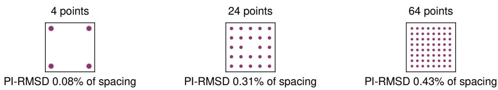  
Figure 5: Slot-decoder outputs on the fixed target grids. For each displayed N, the run with the largest final PI-RMSD among three seeds, stated relative to the minimum target-site spacing. No target site is shared.

Each flow uses a three-layer permutation-equivariant Transformer with width 64, four attention heads, feedforward width 128, GELU activations, pre-layer normalization, and no dropout or particle-index embeddings. The input concatenates each particle’s two coordinates with time; a linear output head predicts its two velocity components. We train in FP32 with AdamW, learning rate $1 0 ^ { - 3 }$ , weight decay $1 0 ^ { - 6 }$ , batch size 512, and gradient norm clipping at 1.

Independent coupling draws a fresh random target permutation for each training pair. OT coupling uses the Hungarian algorithm to minimize the sum of squared source-to-target distances within each configuration. Training times are uniform on [0, 1), and the velocity loss is averaged over samples, particles, and coordinates.

The flow runs in Figure 1 stop at the first evaluation with mean absolute permutation-invariant RMSD (PI-RMSD) at most 0.01, or at 1M updates. For one generated set,

$$
\mathrm { P I - R M S D } ( \hat { \mathbf { x } } , \mathbf { y } ) = \left[ \frac { 1 } { N } \operatorname* { m i n } _ { \pi \in S _ { N } } \sum _ { i } \big \| \hat { x } _ { i } - y _ { \pi ( i ) } \big \| _ { 2 } ^ { 2 } \right] ^ { 1 / 2 } .\tag{15}
$$

This stopping tolerance is in the coordinates of $[ - 1 , 1 ] ^ { 2 }$ and is not divided by grid spacing. Evaluation uses 64 uniform Euler steps and a fixed set of 1, 024 Gaussian source configurations per run, separate from the training pool. Evaluations occur every 100 updates below 20k, every 500 below 100k, every 2k below 500k, and every 5k thereafter.

## C.2 SLOT-DECODER CONTROL

The slot decoder is the GLASS decoder without a global latent. Each of N learned 64-dimensional slot embeddings is linearly projected to width 64 and processed by three pre-layer-norm selfattention layers with four heads and SwiGLU feedforward blocks, followed by a final layer norm and a linear head predicting two coordinates. It is trained on the same fixed target grids with the flows optimizer settings, one target set per step, and a mean-squared error to the target sites. At every step, the target sites are randomly permuted and matched to the predicted positions with the Hungarian algorithm, as in autoencoder training. The decoder output is deterministic, so each evaluation scores one set with the metrics below. Training stops at the first evaluation, every 100 steps, at which the mean PI-RMSD is at most 0.01 of the minimum target-site spacing. For all N and seeds, this occurs at the first evaluation, where both failure thresholds are also met, so the reported training steps do not depend on the stopping rule. Figure 5 shows the worst of the three runs at each displayed N.

## C.3 OCCUPANCY METRICS AND TRAINING-STEP SUMMARIES

For N generated particles and N target sites, define the nearest-site assignment $\begin{array} { r l } { a ( i ) } & { { } = } \end{array}$ arg minj $\| \hat { x } _ { i } - y _ { j } \| _ { 2 }$ , choosing the lowest target index in a tie, and

$$
m ( \hat { \mathbf { x } } , \mathbf { y } ) = 1 - \frac { | \{ a ( i ) : i = 1 , \dots , N \} | } { N } .\tag{16}
$$

Here m is the unoccupied-site fraction, and a set fails when $m > 0$ . These metrics use no distance threshold: distinct generated particles can share a nearest site, and unique occupancy does not bound positional error.

Table 2: Failure rates (%) at different sampling resolutions for one training run per setting. Dashes denote resolutions not evaluated.
<table><tr><td>N</td><td>Coupling</td><td>64 steps</td><td>1024 steps</td><td>4096 steps</td></tr><tr><td>4</td><td>Independent</td><td>0.00</td><td>0.00</td><td>一</td></tr><tr><td>4</td><td>OT</td><td>0.00</td><td>0.00</td><td>一</td></tr><tr><td>24</td><td>Independent</td><td>10.16</td><td>5.86</td><td>5.86</td></tr><tr><td>24</td><td>OT</td><td>20.31</td><td>19.92</td><td>19.92</td></tr><tr><td>64</td><td>Independent</td><td>80.08</td><td>58.20</td><td>57.03</td></tr><tr><td>64</td><td>OT</td><td>88.28</td><td>87.50</td><td>87.50</td></tr></table>

For each run, we record the first evaluated training step at which the failure rate is below 50 % or 10 %. Figure 1b reports the mean and standard deviation across three runs, assigning unreached thresholds the 1M-step budget and marking them with hollow triangles.

At each flow run’s final checkpoint, we average m over all 1, 024 generated sets, including those with $m = 0$ , and report the mean and standard deviation across runs. Final checkpoints follow the stopping rule above and can differ in training duration. For the flows, the mean unoccupied-site fraction rises from near zero at small N to approximately 2–3 % at $N = 6 4 $ the slot decoder leaves no site unoccupied at any N.

## C.4 SAMPLING-RESOLUTION CONTROL

We evaluate retained checkpoints at $N = 4 , 2 4$ , 64 from one training seed with multiple Euler resolutions, using the same initial samples for each checkpoint. The metric is the percentage of generated sets with duplicate-site occupancy.

Finer integration improves the larger independent-coupling models, while OT changes little. For both couplings, the change from 1024 to 4096 steps is small and the cardinality dependence remains.

## D EXPERIMENTAL DETAILS AND MODEL SETTINGS

## D.1 DATASETS AND REPRESENTATION

MP20 uses the CDVAE split of 27, 136/9, 047/9, 046 training/validation/test structures. QMOF150 uses the ADiT split of 14, 589/1, 024/1, 024 structures with at most 150 atoms per cell. We use periodic fractional coordinates without translation augmentation or origin alignment. The encoder masks padding and pools over real atoms; the decoder predicts atomic numbers 1, . . . , 94 and empty class 0. Fractional coordinates are wrapped into [0, 1).

## D.2 TRAINING AND SAMPLING

We train the autoencoder, freeze it, and standardize its latents using training-set means and standard deviations before fitting the flow. Tables 3 and 4 give the settings. Reconstruction losses pool their sums and normalization counts across the minibatch.

We use the 50k flow checkpoint for MP20 to balance validity and novelty, including all MP20 ablations, and the 1M checkpoint for QMOF150. Main comparisons average three independent training runs; ablations use one run per setting. Reported ± values are sample standard deviations across runs.

Table 3: Autoencoder settings. Ablations vary the indicated component.
<table><tr><td>Setting</td><td>MP20</td><td>QMOF150</td></tr><tr><td>Model dimension</td><td>256</td><td>256</td></tr><tr><td>Latent dimension</td><td>16</td><td>64</td></tr><tr><td>Encoder layers</td><td>4</td><td>4</td></tr><tr><td>Decoder layers</td><td>6</td><td>12</td></tr><tr><td>Attention heads</td><td>8</td><td>8</td></tr><tr><td>Decoder slot dimension</td><td>32</td><td>32</td></tr><tr><td>Coordinate Fourier bands</td><td>4</td><td>4</td></tr><tr><td>Training steps</td><td>100k</td><td>100k</td></tr><tr><td>Batch size</td><td>256</td><td>256</td></tr><tr><td>Peak learning rate</td><td> $3 \times 1 0 ^ { - 4 }$ </td><td> $3 \times 1 0 ^ { - 4 }$ </td></tr><tr><td>Warmup steps</td><td>2k</td><td>1k</td></tr><tr><td>Optimizer</td><td>AdamW</td><td>AdamW</td></tr><tr><td>Weight decay</td><td>0</td><td>0</td></tr><tr><td>Training precision</td><td>FP32</td><td>FP32</td></tr><tr><td colspan="3">Coordinate / type / lattice / pair loss weights  $4 . 0 / 0 . 0 5 / 5 . 0 / 0 . 5$   $1 . 0 / 0 . 0 5 / 5 . 0 / 0 . 5$ </td></tr></table>

Table 4: Latent flow settings. Sampling steps count midpoint integration steps.
<table><tr><td>Setting</td><td>MP20</td><td>QMOF150</td></tr><tr><td>Hidden dimension</td><td>768</td><td>768</td></tr><tr><td>Residual blocks</td><td>8</td><td>8</td></tr><tr><td>Training steps</td><td>1M</td><td>1M</td></tr><tr><td>Batch size</td><td>1024</td><td>1024</td></tr><tr><td>Peak learning rate Warmup steps</td><td> $3 \times 1 0 ^ { - 4 }$  2k</td><td> $3 \times 1 0 ^ { - 4 }$ </td></tr><tr><td>Optimizer</td><td>AdamW</td><td>2k</td></tr><tr><td>Weight decay</td><td>0</td><td>AdamW</td></tr><tr><td>EMA decay</td><td>0.9999</td><td>0</td></tr><tr><td>Training precision</td><td></td><td>0.9999</td></tr><tr><td></td><td>BF16</td><td>BF16</td></tr><tr><td>Sampling steps</td><td>32</td><td>32</td></tr><tr><td>Integrator</td><td>Midpoint</td><td>Midpoint</td></tr><tr><td>Integration / decoding precision</td><td>FP32</td><td>FP32</td></tr></table>

## D.3 RECONSTRUCTION METRICS

Reconstruction RMSD uses the predicted fractional coordinates and predicted lattice, with the reconstruction objective’s atom assignment. We average per-structure Cartesian RMSDs over the split, using a common lower-triangular cell orientation and the objective’s 27-image periodic search, without rescaling or origin alignment. Type accuracy is pooled over real target atoms; padding is excluded from both metrics.

## D.4 GEOMETRY RELAXATION

MP20 pre-relaxation uses NequIP-OAM-L (Batzner et al., 2022; Kavanagh & MIR Group @ Harvard, 2026) with ASE FIRE (Hjorth Larsen et al., 2017) and a Frechet cell filter, at most 200 steps, and ´ $f _ { \mathrm { m a x } } ~ = ~ 0 . 0 0 5 \mathrm { e V } / \mathring { \mathrm { A } }$ . LeMat’s internal relaxation is specified separately below.

GLASS-opt on QMOF150 uses eSEN-30M-OAM (Fu et al., 2025) plus two-body D3(BJ) (Grimme et al., 2010; 2011), with PBE parameters and 40-Bohr dispersion and coordination cutoffs. We selected eSEN-OAM+D3 based on its performance in MOFSimBench (Kraß et al., 2025). Both terms contribute energy, forces, and stress. Batched TorchSim (Cohen et al., 2025) L-BFGS optimizes atoms and the cell through a Frechet filter, with at most 200 steps, maximum step 0.1, and $\bar { f _ { \mathrm { m a x } } } = 0 . 0 2 \mathrm { e V } / \bar { \mathrm { A } }$ . Relaxation displacement RMSD uses fixed atom correspondence and final-cell periodic images, including cell deformation. Failed candidates remain in requested-sample yield denominators.

## D.5 LEMAT-GENBENCH EVALUATION

LeMat-GenBench evaluation (Betala et al., 2025) uses the comprehensive multi mlip hull protocol and the complete LeMat-Bulk compatible pbe novelty reference. Validity checks use charge tolerance 0.1, distance scaling 0.5, atomic-density bounds $[ 1 0 ^ { - 5 } , 0 . 5 ] \mathrm { a i o m s } / \AA ^ { 3 }$ mass-density bounds [0.01, 25] g/cm3, and format and symmetry checks. Novelty and uniqueness use StructureMatcher fingerprints with tolerance 0.1.

Energy scoring uses Orb-v3-conservative-inf-OMat (Rhodes et al., 2025), MACE-MP-0b3 (Batatia et al., 2023; 2024), and UMA-s1p1 (Wood et al., 2025) with the OMat task and their respective reference hulls. The ensemble requires two usable models, with the evaluator’s singlemodel fallback when necessary. Hull energies refer to the supplied geometry; internal relaxation uses $f _ { \mathrm { m a x } } = 0 . 0 2 \mathrm { e V } / \mathring { \mathrm { A } }$ and at most 50 steps to measure displacement. SUN requires $E _ { \mathrm { h u l l } } \leq 0 ,$ while MSUN uses the disjoint range $0 < E _ { \mathrm { h u l l } } ^ { - } \le 0 .$ 1 eV/atom.

LeMat evaluates novelty among valid candidates. We distinguish conditional novelty $N \mid V$ from valid-and-novel yield $| V \cap N | / n$ , where n is the requested sample count. Joint yields retain failed inputs; mean energies and relaxation displacement use successfully scored structures. Checkpoint sweeps and ablations report LeMat metrics without internal relaxation or its displacement metric.

## D.6 CRYSTALITE EVALUATION

The Crystalite DNG protocol (Veljkovic et al., 2026) defines structural validity by cell vol-´ ume $\geq 0 . 1 \mathrm { { \AA ^ { 3 } } }$ and minimum interatomic distance ≥ 0.5 A; composition validity uses SMACT˚ (Davies et al., 2019). StructureMatcher uses site tolerance 0.5, lattice tolerance 0.3, and angle toler ance 10◦. Novelty uses the official Crystalite training reference (27, 138 structures), and density and element-count Wasserstein distances use its validation reference (9, 046 structures). Metrics use the evaluator’s corresponding constructed and valid pools.

Thermodynamic scoring uses NequIP-OAM-L, the MP2020-like hull procedure, and the 200-step FIRE/Frechet relaxation above. Crystalite calls $E _ { \mathrm { h u l l } } \leq 0 .$ 1 eV/atom “Stable” and its stable, unique, novel intersection “S.U.N.”; this differs from LeMat’s strict SUN definition. Results are shown in section F.4.

## E ARCHITECTURE ABLATIONS

## E.1 MP20 AUTOENCODER CAPACITY

We vary latent dimension, encoder depth, and decoder depth around the reference configuration $( d _ { z } \ = \ 1 6 $ , four encoder layers, six decoder layers), reporting full-split reconstruction and LeMat metrics on 2, 500 generated structures per setting. Larger latents and deeper decoders improve reconstruction, but generation also shifts along the validity–novelty tradeoff.

Table 5: Latent dimension. Encoder and decoder depths are fixed to 4 and 6.
<table><tr><td></td><td colspan="2">AE training split</td><td colspan="2">AE validation split</td><td colspan="3">Generation (50k)</td></tr><tr><td>Latent dim.</td><td></td><td>RMSD (Å) Type acc. (%)</td><td>RMSD (Å)</td><td>Type acc. (%)</td><td>Valid (%)</td><td>Novel | valid (%)</td><td>Valid ∩ novel (%)</td></tr><tr><td>8</td><td>0.1064</td><td>100.00</td><td>0.3547</td><td>55.60</td><td>78.60</td><td>62.54</td><td>49.16</td></tr><tr><td>16</td><td>0.0339</td><td>100.00</td><td>0.3001</td><td>63.26</td><td>88.08</td><td>51.09</td><td>45.00</td></tr><tr><td>32</td><td>0.0159</td><td>100.00</td><td>0.2696</td><td>72.36</td><td>91.92</td><td>38.29</td><td>35.20</td></tr></table>

Table 6: Encoder depth. Latent dimension and decoder depth are fixed to 16 and 6.
<table><tr><td></td><td colspan="2">AE training split</td><td colspan="2">AE validation split</td><td colspan="3">Generation (50k)</td></tr><tr><td>Encoder layers</td><td>RMSD (Å)</td><td>Type acc. (%)</td><td>RMSD (Å)</td><td>Type acc. (%)</td><td>Valid (%)</td><td>Novel | valid (%)</td><td>Valid ∩ novel (%)</td></tr><tr><td>2</td><td>0.0386</td><td>100.00</td><td>0.2837</td><td>63.33</td><td>89.24</td><td>50.34</td><td>44.92</td></tr><tr><td>4</td><td>0.0339</td><td>100.00</td><td>0.3001</td><td>63.26</td><td>88.08</td><td>51.09</td><td>45.00</td></tr><tr><td>6</td><td>0.0355</td><td>100.00</td><td>0.2980</td><td>63.25</td><td>89.04</td><td>55.97</td><td>49.84</td></tr></table>

Table 7: Decoder depth. Latent dimension and encoder depth are fixed to 16 and 4.
<table><tr><td></td><td colspan="2">AE training split</td><td colspan="2">AE validation split</td><td colspan="3">Generation (50k)</td></tr><tr><td>Decoder layers</td><td></td><td>RMSD (Å) Type acc. (%)</td><td>RMSD (Å)</td><td>Type acc. (%)</td><td>Valid (%)</td><td>Novel | valid (%)</td><td>Valid∩ novel (%)</td></tr><tr><td>3</td><td>0.0622</td><td>100.00</td><td>0.3420</td><td>60.02</td><td>87.80</td><td>58.63</td><td>51.48</td></tr><tr><td>6</td><td>0.0339</td><td>100.00</td><td>0.3001</td><td>63.26</td><td>88.08</td><td>51.09</td><td>45.00</td></tr><tr><td>9</td><td>0.0271</td><td>100.00</td><td>0.2679</td><td>65.14</td><td>90.48</td><td>48.98</td><td>44.32</td></tr></table>

## E.2 VARIATIONAL BOTTLENECK ON MP20

With the same backbone and $d _ { z } = 1 6 ,$ , the variational encoder predicts a diagonal-Gaussian posterior and decodes a reparameterized sample during training:

$$
{ \mathcal { L } } _ { \mathrm { V A E } } = { \mathcal { L } } _ { \mathrm { r e c } } + \beta D _ { \mathrm { K L } } ( q ( \mathbf { z } \mid X ) \parallel { \mathcal { N } } ( \mathbf { 0 } , \mathbf { I } ) ) , \qquad \beta \in \{ 1 0 ^ { - 5 } , 1 0 ^ { - 4 } \} .\tag{17}
$$

The KL term is summed over latent dimensions and averaged over structures. Reconstruction evaluation and flow training use posterior means; generation uses the learned flow. This tests KL regularization of the representation. The weaker regularization slightly improves valid-and-novel yield, while the stronger setting increases validity at the expense of novelty (Table 8).

Table 8: Variational bottleneck. Complete-split reconstruction and LeMat metrics on 2, 500 generated structures per setting at 50k flow steps.
<table><tr><td></td><td colspan="2">Training split</td><td colspan="2">Validation split</td><td colspan="3">Generation</td></tr><tr><td>Model (β)</td><td></td><td>RMSD (Å) Type acc. (%)</td><td></td><td>RMSD (Å) Type acc. (%)</td><td>Valid (%)</td><td>Novel | valid (%)</td><td>Valid∩novel (%)</td></tr><tr><td>Deterministic</td><td>0.0339</td><td>100.00</td><td>0.3001</td><td>63.26</td><td>88.08</td><td>51.09</td><td>45.00</td></tr><tr><td>VAE (10−⁵)</td><td>0.0415</td><td>100.00</td><td>0.2915</td><td>63.55</td><td>89.84</td><td>51.47</td><td>46.24</td></tr><tr><td> $\mathsf { V A E } ( 1 0 ^ { - 4 } )$ </td><td>0.0548</td><td>100.00</td><td>0.2914</td><td>64.42</td><td>91.60</td><td>45.24</td><td>41.44</td></tr></table>

## E.3 QMOF150 AUTOENCODER CAPACITY

Increasing the latent dimension from 32 to 128 leaves the large train–validation reconstruction gap largely unchanged (Table 9).

Table 9: QMOF150 latent-dimension ablation. Complete-split reconstruction after 100k autoencoder steps.
<table><tr><td rowspan="2">Latent dim.</td><td colspan="2">Training split</td><td colspan="2">Validation split</td></tr><tr><td>RMSD (Å)</td><td>Type acc. (%)</td><td>RMSD (Å)</td><td>Type acc. (%)</td></tr><tr><td>32</td><td>0.0243</td><td>99.9990</td><td>1.2793</td><td>58.8782</td></tr><tr><td>64</td><td>0.0190</td><td>99.9999</td><td>1.2473</td><td>58.6839</td></tr><tr><td>128</td><td>0.0179</td><td>99.9999</td><td>1.2594</td><td>59.1796</td></tr></table>

## E.4 LEMAT-BULK AUTOENCODERS

We train autoencoders on the LeMat-Bulk compatible pbe subset (Betala et al., 2025), restricted to at most 20 atoms per structure. The split contains 5,101,846 training structures and 10, 000 validation structures, with no shared BAWL fingerprints between the training and validation sets. Training uses 1M steps, batch size 256, learning rate 10−4, and MP20 loss weights with type weight 0.5. All models have width 384, six encoder layers, eight decoder layers, and slot dimension 256.

The train–validation gap is much smaller than on MP20, and larger latents reduce reconstruction error (Table 10). This larger, more diverse dataset also uses different training settings, so the comparison does not isolate dataset size.

Table 10: LeMat-Bulk autoencoders. Reconstruction over the training (5,101,846 structures) and validation (10, 000 structures) splits. Invalid predicted cells, at most 0.05 % of either split, are excluded from RMSD.
<table><tr><td rowspan="2">Latent dim.</td><td colspan="2">Training split</td><td colspan="2">Validation split</td></tr><tr><td>RMSD (Å)</td><td>Type acc. (%)</td><td>RMSD (Å)</td><td>Type acc. (%)</td></tr><tr><td>32</td><td>0.0905</td><td>99.92</td><td>0.1098</td><td>97.05</td></tr><tr><td>64</td><td>0.0584</td><td>99.72</td><td>0.0637</td><td>98.85</td></tr><tr><td>128</td><td>0.0434</td><td>99.75</td><td>0.0460</td><td>99.49</td></tr></table>

## F ADDITIONAL MP20 RESULTS

## F.1 VALIDITY–NOVELTY TRADEOFF

Longer flow training increases validity while reducing novelty (Figure 6). The 50k checkpoint balances the two; the 1M checkpoint approaches training-set validity with much lower novel yield.

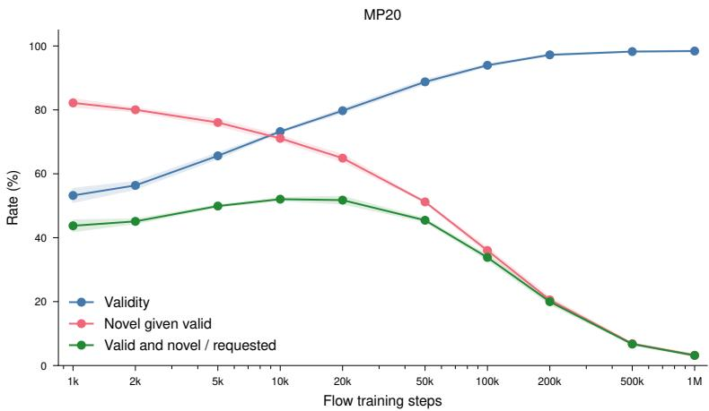  
Figure 6: MP20 validity–novelty tradeoff. Raw validity, novelty among valid candidates, and their joint yield across flow checkpoints. Curves show means and sample standard deviations over three training runs, with 2, 500 samples per run and checkpoint.

## F.2 EXTENDED LEMAT-GENBENCH COMPARISON

Table 11 extends the main comparison to all reference methods, using the protocol in Appendix D.5. Additional models include MCFlow (Seong et al., 2026), PLaID++ (Xu et al., 2026), WyFormer (Kazeev et al., 2025), Chemeleon1 (Park et al., 2025a), DiffCSP++ (Jiao et al., 2023b), CrystaLLMpi (Bone et al., 2026), and CrystalFormer (Cao et al., 2025).

Table 11: Extended LeMat-GenBench comparison. GLASS reports means and sample standard deviations over three runs at 50k, with 2, 500 samples per run. Reference results are from the benchmark leaderboard (Betala et al., 2025). Groups distinguish raw and NequIP-OAM-L-pre-relaxed inputs. MSUN excludes SUN; bold marks the best mean within each group.
<table><tr><td>Model</td><td>Valid (%)↑</td><td>Unique (%) ↑</td><td>Novel (%)↑</td><td>Stable (%) ↑</td><td>Metastable (%)↑</td><td>SUN (%) ↑</td><td>MSUN (%) ↑</td><td>E Above Hull (eV/atom) ↓</td><td>Relax. RMSD (Å) ↓</td></tr><tr><td colspan="10">Pre-relaxed inputs</td></tr><tr><td>Crystalite</td><td>97.20</td><td>95.80</td><td>53.20</td><td>12.70</td><td>51.60</td><td>1.50</td><td>22.60</td><td>0.0905</td><td>0.1322</td></tr><tr><td>MCFlow</td><td>97.20</td><td>96.30</td><td>52.20</td><td>11.90</td><td>49.30</td><td>0.70</td><td>18.90</td><td>0.0987</td><td>0.1696</td></tr><tr><td>OMatG</td><td>96.40</td><td>95.20</td><td>51.20</td><td>11.60</td><td>49.80</td><td>1.00</td><td>18.00</td><td>0.0956</td><td>0.0759</td></tr><tr><td>MiAD</td><td>96.20</td><td>94.30</td><td>40.20</td><td>6.40</td><td>62.00</td><td>1.00</td><td>16.60</td><td>0.0804</td><td>0.2494</td></tr><tr><td>MatterGen</td><td>95.70</td><td>95.10</td><td>70.50</td><td>2.00</td><td>33.40</td><td>0.20</td><td>15.00</td><td>0.1834</td><td>0.3878</td></tr><tr><td>OMatG-FC</td><td>97.20</td><td>92.80</td><td>28.90</td><td>18.40</td><td>57.90</td><td>1.70</td><td>12.00</td><td>0.0694</td><td>0.0685</td></tr><tr><td>PLaID++</td><td>96.00</td><td>77.80</td><td>24.20</td><td>12.40</td><td>60.70</td><td>1.00</td><td>7.60</td><td>0.0854</td><td>0.1286</td></tr><tr><td>WyFormer</td><td>93.40</td><td>93.00</td><td>66.40</td><td>0.50</td><td>15.70</td><td>0.10</td><td>1.90</td><td>0.4988</td><td>0.8121</td></tr><tr><td>GLASS + NequIP</td><td>96.56</td><td>95.48</td><td>52.71</td><td>11.75</td><td>63.08</td><td>1.92</td><td>21.16</td><td>0.1261</td><td>0.1258</td></tr><tr><td></td><td>± 0.39</td><td>± 0.66</td><td>± 1.40</td><td>± 0.51</td><td>± 1.52</td><td>± 0.18</td><td>± 1.40</td><td>± 0.0080</td><td>± 0.0071</td></tr><tr><td colspan="10">Inputs without pre-relaxation</td></tr><tr><td>Chemeleon2</td><td>95.20</td><td>88.10</td><td>71.60</td><td>0.00</td><td>39.80</td><td>0.00</td><td>21.20</td><td>0.1557</td><td>0.4226</td></tr><tr><td>Chemeleon1</td><td>95.40</td><td>94.80</td><td>64.00</td><td>3.60</td><td>34.40</td><td>0.30</td><td>11.30</td><td>0.2055</td><td>0.4907</td></tr><tr><td>DiffCSP</td><td>95.70</td><td>94.80</td><td>66.20</td><td>2.30</td><td>29.80</td><td>0.10</td><td>8.50</td><td>0.2747</td><td>0.5857</td></tr><tr><td>DiffCSP++</td><td>95.30</td><td>95.10</td><td>62.00</td><td>1.00</td><td>26.40</td><td>0.20</td><td>5.00</td><td>0.4093</td><td>0.6933</td></tr><tr><td>CrystaLLM-pi</td><td>86.80</td><td>84.90</td><td>24.90</td><td>2.90</td><td>49.00</td><td>0.30</td><td>3.60</td><td>0.3205</td><td>0.3631</td></tr><tr><td>CrystalFormer</td><td>69.90</td><td>69.40</td><td>31.80</td><td>1.40</td><td>28.80</td><td>0.00</td><td>3.10</td><td>0.7039</td><td>0.6585</td></tr><tr><td>ADiT</td><td>90.60</td><td>87.80</td><td>26.00</td><td>0.40</td><td>36.50</td><td>0.00</td><td>1.00</td><td>0.3333</td><td>0.3794</td></tr><tr><td>GLASS</td><td>89.29</td><td>88.32</td><td>45.65</td><td>0.93</td><td>41.95</td><td>0.15</td><td>11.49</td><td>0.3140</td><td>0.4290</td></tr><tr><td></td><td>± 0.59</td><td>± 0.68</td><td>± 1.20</td><td>± 0.10</td><td>± 1.65</td><td>± 0.06</td><td>± 0.61</td><td>± 0.0083</td><td>± 0.0077</td></tr></table>

## F.3 SIZE-RESOLVED VALIDITY AND LOCAL GEOMETRY

Table 12 separates the validity checks by atom count. Figure 7 compares pair-distance distributions with all 27, 136 MP20 training structures. Both use 10, 000 GLASS samples per training run, pooled over three runs. Samples for MatterGen and DiffCSP were obtained from the released CrystalDiT (Yi et al., 2026) repository. Crystalite and OMatG were sampled using the released checkpoint, and ADiT and Zatom-1 were obtained from the respective repositories.

The Crystalite curves use 10,000 samples from the released MP20 checkpoint with its production sampler: EMA weights, 150 Heun steps on the Karras schedule, churn, and coordinate/lattice antiannealing (Appendix F.5). For the OMatG curves, we generated 10,000 raw structures with the released MP-20-DNG Linear-SDE-Gamma checkpoint and configuration using the official omg predict sampler (710 integration steps). Its atom-count inputs comprise the 9,046 bundled MP20 test counts plus 954 resampled counts.

Table 12: LeMat-GenBench validity rates (%) corresponding exactly to the curves in the MP-20 validity plot. Overall rates include every requested structure; atom-count bins use inclusive bounds. The GT row is the plot’s 27,136-structure MP-20 training split. Bold values are the best generatedmodel result in each column.  
Total validity
<table><tr><td>Model</td><td>Overall</td><td>1-4</td><td>5-8</td><td>9-12</td><td>13-16</td><td>17-20</td></tr><tr><td>MP-20 train (GT)</td><td>98.45</td><td>98.83</td><td>97.83</td><td>98.63</td><td>98.18</td><td>98.90</td></tr><tr><td>GLASS (1M)</td><td>98.38</td><td>98.83</td><td>97.64</td><td>98.55</td><td>98.25</td><td>98.73</td></tr><tr><td>GLASS (50k)</td><td>89.23</td><td>97.36</td><td>90.07</td><td>88.52</td><td>82.00</td><td>86.79</td></tr><tr><td>Crystalite</td><td>94.44</td><td>98.11</td><td>96.00</td><td>94.86</td><td>92.40</td><td>89.54</td></tr><tr><td>ADiT</td><td>90.24</td><td>98.94</td><td>95.49</td><td>90.65</td><td>76.79</td><td>84.39</td></tr><tr><td>Zatom-1</td><td>73.52</td><td>99.04</td><td>94.33</td><td>76.51</td><td>48.89</td><td>34.17</td></tr><tr><td>MatterGen</td><td>96.05</td><td>97.91</td><td>95.60</td><td>95.54</td><td>95.88</td><td>95.76</td></tr><tr><td>OMatG</td><td>90.96</td><td>97.85</td><td>95.41</td><td>87.82</td><td>87.12</td><td>84.33</td></tr><tr><td>DiffCSP</td><td>95.17</td><td>98.12</td><td>96.61</td><td>94.32</td><td>94.98</td><td>91.33</td></tr></table>

Distance validity
<table><tr><td>Model</td><td>Overall</td><td>1-4</td><td>5-8</td><td>9-12</td><td>13-16</td><td>17-20</td></tr><tr><td>MP-20 train (GT)</td><td>100.00</td><td>100.00</td><td>100.00</td><td>100.00</td><td>100.00</td><td>100.00</td></tr><tr><td>GLASS (1M)</td><td>99.96</td><td>100.00</td><td>99.96</td><td>100.00</td><td>99.90</td><td>99.92</td></tr><tr><td>GLASS (50k)</td><td>92.07</td><td>99.28</td><td>94.28</td><td>91.24</td><td>85.12</td><td>88.72</td></tr><tr><td>Crystalite</td><td>97.51</td><td>99.95</td><td>99.70</td><td>98.77</td><td>95.50</td><td>91.90</td></tr><tr><td>ADiT</td><td>91.29</td><td>99.80</td><td>97.75</td><td>91.68</td><td>77.23</td><td>84.52</td></tr><tr><td>Zatom-1</td><td>74.55</td><td>99.60</td><td>96.25</td><td>77.73</td><td>49.57</td><td>34.61</td></tr><tr><td>MatterGen</td><td>99.91</td><td>99.95</td><td>99.89</td><td>99.97</td><td>99.79</td><td>99.78</td></tr><tr><td>OMatG</td><td>94.65</td><td>99.90</td><td>98.83</td><td>93.33</td><td>91.16</td><td>87.39</td></tr><tr><td>DiffCSP</td><td>99.02</td><td>99.95</td><td>100.00</td><td>99.63</td><td>99.00</td><td>95.81</td></tr></table>

Charge validity
<table><tr><td>Model</td><td>Overall</td><td>1-4</td><td>5-8</td><td>9-12</td><td>13-16</td><td>17-20</td></tr><tr><td>MP-20 train (GT)</td><td>98.45</td><td>98.83</td><td>97.83</td><td>98.63</td><td>98.18</td><td>98.90</td></tr><tr><td>GLASS (1M)</td><td>98.42</td><td>98.83</td><td>97.68</td><td>98.55</td><td>98.35</td><td>98.81</td></tr><tr><td>GLASS (50k)</td><td>96.62</td><td>98.08</td><td>95.36</td><td>96.66</td><td>95.79</td><td>97.49</td></tr><tr><td>Crystalite</td><td>96.85</td><td>98.17</td><td>96.26</td><td>95.97</td><td>96.90</td><td>97.40</td></tr><tr><td>ADiT</td><td>98.81</td><td>99.14</td><td>97.62</td><td>98.81</td><td>99.38</td><td>99.62</td></tr><tr><td>Zatom-1</td><td>98.56</td><td>99.35</td><td>97.86</td><td>98.61</td><td>98.34</td><td>98.74</td></tr><tr><td>MatterGen</td><td>96.13</td><td>97.96</td><td>95.71</td><td>95.57</td><td>96.09</td><td>95.88</td></tr><tr><td>OMatG</td><td>96.13</td><td>98.29</td><td>96.45</td><td>93.91</td><td>95.79</td><td>96.62</td></tr><tr><td>DiffCSP</td><td>96.05</td><td>98.17</td><td>96.61</td><td>94.69</td><td>95.99</td><td>94.93</td></tr></table>

Plausibility validity
<table><tr><td>Model</td><td>Overall</td><td>1-4</td><td>5-8</td><td>9-12</td><td>13-16</td><td>17-20</td></tr><tr><td>MP-20 train (GT)</td><td>100.00</td><td>100.00</td><td>100.00</td><td>100.00</td><td>100.00</td><td>100.00</td></tr><tr><td>GLASS (1M)</td><td>100.00</td><td>100.00</td><td>100.00</td><td>100.00</td><td>100.00</td><td>100.00</td></tr><tr><td>GLASS (50k)</td><td>99.99</td><td>99.97</td><td>100.00</td><td>100.00</td><td>100.00</td><td>100.00</td></tr><tr><td>Crystalite</td><td>100.00</td><td>100.00</td><td>100.00</td><td>100.00</td><td>100.00</td><td>100.00</td></tr><tr><td>ADiT</td><td>100.00</td><td>100.00</td><td>100.00</td><td>100.00</td><td>100.00</td><td>100.00</td></tr><tr><td>Zatom-1</td><td>100.00</td><td>100.00</td><td>100.00</td><td>100.00</td><td>100.00</td><td>100.00</td></tr><tr><td>MatterGen</td><td>100.00</td><td>100.00</td><td>100.00</td><td>100.00</td><td>100.00</td><td>100.00</td></tr><tr><td>OMatG</td><td>99.93</td><td>99.66</td><td>100.00</td><td>100.00</td><td>100.00</td><td>100.00</td></tr><tr><td>DiffCSP</td><td>99.97</td><td>100.00</td><td>100.00</td><td>99.96</td><td>100.00</td><td>99.88</td></tr></table>

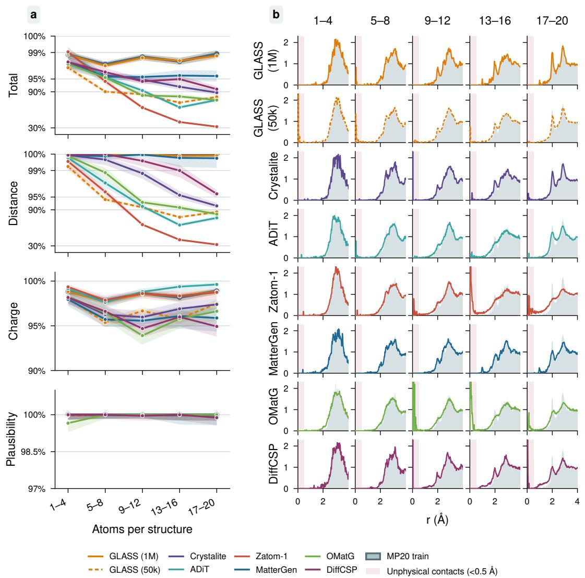  
Figure 7: MP20 validity and radial distribution functions by size. RDFs show interatomic pairdistance distributions for generated structures and the training reference.

## F.4 CRYSTALITE-PROTOCOL RESULTS

Table 13 uses the separate protocol in Appendix D.6. GLASS closely matches the density distribution but overproduces distinct elements: 3.70 per structure on average versus 3.01 in MP20 training data, explaining its larger $W _ { \mathrm { N a r y } }$

Table 13: Crystalite-protocol evaluation on MP20. GLASS uses 10, 000 samples per run across three training runs at 50k. Sampling times are reported for 1,000 structures.
<table><tr><td>Model</td><td>Struct. val. (%) ↑</td><td>Comp. val. (%) ↑</td><td>Unique (%) ↑</td><td>Novel (%)↑</td><td>U.N. (%) ↑</td><td>Stable (%)↑</td><td>S.U.N. (%)↑</td><td>Wρ ↓</td><td> $W _ { \mathrm { N a r y } }$  ↓</td><td>Time/1k (s) ↓</td></tr><tr><td>MP20 train</td><td>100.00</td><td>90.41</td><td></td><td>一</td><td>一</td><td>一</td><td>一</td><td>一</td><td></td><td></td></tr><tr><td>FlowMM</td><td>93.03</td><td>83.15</td><td>97.44</td><td>85.00</td><td>83.99</td><td>46.05</td><td>31.64</td><td>1.389</td><td>0.075</td><td>1560</td></tr><tr><td>CrystalDiT</td><td>77.82</td><td>67.28</td><td>90.88</td><td>59.33</td><td>56.86</td><td>83.41</td><td>41.70</td><td>0.202</td><td>0.171</td><td>73.72</td></tr><tr><td>DiffCSP</td><td>99.93</td><td>82.10</td><td>96.90</td><td>89.53</td><td>87.89</td><td>50.28</td><td>38.60</td><td>0.192</td><td>0.344</td><td>237</td></tr><tr><td>MatterGen ADiT</td><td>99.78</td><td>83.72</td><td>98.10</td><td>91.14</td><td>90.26</td><td>51.70</td><td>42.29</td><td>0.088</td><td>0.184</td><td>2639</td></tr><tr><td></td><td>99.52</td><td>90.15</td><td>90.25</td><td>59.80</td><td>56.91</td><td>76.90</td><td>36.76</td><td>0.231</td><td>0.089</td><td>84.81</td></tr><tr><td>Crystalite</td><td>99.61</td><td>81.72</td><td>95.24</td><td>79.30</td><td>77.33</td><td>69.72</td><td>47.49</td><td>0.051</td><td>0.127</td><td>22.36 / 5.14†</td></tr><tr><td></td><td>±0.06</td><td>±0.24</td><td>±0.19</td><td>±0.12</td><td>±0.21</td><td>±0.85</td><td>±0.77</td><td>±0.010</td><td>±0.006</td><td></td></tr><tr><td>GLASS (ours)</td><td>99.57 ± 0.08</td><td>86.02 ± 0.05</td><td>96.36 ± 0.06</td><td>72.45 ± 0.68</td><td>71.47 ± 0.78</td><td>67.79 ± 1.07</td><td>39.58 ± 0.30</td><td>0.0667 ± 0.0060</td><td>0.703 ± 0.033</td><td>0.21</td></tr></table>

† Crystalite reports 22.36 s for the original and 5.14 s for the optimized implementation. GLASS timing uses one full H100 (Table 18).

## F.5 CRYSTALITE SAMPLING ABLATION

We sample the released Crystalite MP20 model with and without noise re-injection (churn) and coordinate/lattice anti-annealing. Each setting uses 10, 000 samples, EMA weights, 150 Heun steps on the Karras schedule (Karras et al., 2022), empirical MP20 atom counts, $S _ { \mathrm { c h u r n } } = 6 0$ when enabled, and $S _ { \mathrm { n o i s e } } = 1 . 0 0 3$

With anti-annealing disabled, enabling churn raises LeMat validity from 67.03 % to 94.39 %, and from 16.67 % to 89.48 % at 17–20 atoms. Anti-annealing changes overall validity by at most 0.21 percentage points.

Table 14: Crystalite sampler settings on MP20. LeMat-GenBench total validity (%) for the four Crystalite sampler settings on 10,000 matched MP-20 samples per setting. Churn uses $S _ { \mathrm { c h u r n } } = 6 0 ;$ anti-annealing is applied to coordinates and lattices with $\rho = 1 0$ . Bold values are best in each column.
<table><tr><td>Sampler</td><td>Churn</td><td>Anti-ann.</td><td>Overall</td><td>1-4</td><td>5-8</td><td>9-12</td><td>13-16</td><td>17-20</td></tr><tr><td>Vanilla</td><td>No</td><td>No</td><td>67.03</td><td>98.17</td><td>92.65</td><td>73.25</td><td>37.29</td><td>16.67</td></tr><tr><td>Anti-annealing only</td><td>No</td><td>Yes</td><td>66.82</td><td>98.11</td><td>92.26</td><td>73.13</td><td>37.59</td><td>15.90</td></tr><tr><td>Churn only</td><td>Yes</td><td>No</td><td>94.39</td><td>98.17</td><td>95.79</td><td>94.86</td><td>92.40</td><td>89.48</td></tr><tr><td>Production</td><td>Yes</td><td>Yes</td><td>94.44</td><td>98.11</td><td>96.00</td><td>94.86</td><td>92.40</td><td>89.54</td></tr></table>

## G ADDITIONAL QMOF150 RESULTS

## G.1 STRUCTURAL VALIDITY AND RELAXATION

GLASS and QMOF150 training structures use the official MOFChecker 0.9.6. Overall validity requires carbon, hydrogen, and a metal, with none of the defect flags in Table 15. Defect frequencies can overlap. Three-dimensional graph connectivity is not required for this validity definition. Failed evaluations count as invalid.

GLASS results use 10, 000 samples from each of three training runs. The size curves pool these samples and show 95% Wilson intervals. Mofasa curves use the precomputed MOFChecker flags for 10, 000 row-matched raw and relaxed MofasaDB samples, selected uniformly among raw structures with 20–150 atoms. Mofasa uses a different training split with structures up to 170 atoms. The table retains published baseline results, including Orb-v3+D3 relaxation for Mofasa-opt.

eSEN-OAM+D3 relaxation gives a mean displacement RMSD of 0.2028 ± 0.0029 A over˚ 30, 000 structures across three training runs.

Table 15: Full MOFChecker breakdown (%). Presence and overall validity are pass rates; other rows are defect frequencies. Opt denotes relaxed structures. ∗Mofasa uses a different training split and size range; table values retain published evaluations. Bold values indicate best-in-class, separate for raw and optimized structures.
<table><tr><td rowspan="2">Criterion</td><td>Ref.</td><td colspan="2">ADiT</td><td>Zatom-1</td><td>SinAE</td><td colspan="2">Mofasa*</td><td colspan="2">GLASS (1M)</td></tr><tr><td>Train</td><td>QMOF</td><td>Joint</td><td></td><td></td><td>Raw</td><td>Opt</td><td>Raw</td><td>Opt</td></tr><tr><td>Has carbon ↑</td><td>100.0</td><td>100.0</td><td>100.0</td><td>100.0</td><td>100.0</td><td>98.4</td><td>100.0</td><td>99.1</td><td>100.0</td></tr><tr><td>Has hydrogen ↑</td><td>99.8</td><td>99.6</td><td>100.0</td><td>100.0</td><td>99.8</td><td>98.4</td><td>99.9</td><td>98.9</td><td>99.8</td></tr><tr><td>Atomic overlap ↓</td><td>0.0</td><td>8.3</td><td>10.8</td><td>8.8</td><td>5.2</td><td>2.8</td><td>0.0</td><td>1.3</td><td>0.1</td></tr><tr><td>Overcoordinated C ↓</td><td>0.0</td><td>23.6</td><td>34.3</td><td>1.1</td><td>12.8</td><td>2.5</td><td>0.0</td><td>0.5</td><td>0.0</td></tr><tr><td>Overcoordinated N ↓</td><td>0.0</td><td>1.5</td><td>1.6</td><td>0.0</td><td>0.4</td><td>1.6</td><td>0.0</td><td>0.1</td><td>0.0</td></tr><tr><td>Overcoordinated H ↓</td><td>0.0</td><td>1.0</td><td>3.6</td><td>2.9</td><td>1.3</td><td>2.4</td><td>0.0</td><td>1.0</td><td>0.0</td></tr><tr><td>Undercoordinated C↓</td><td>5.9</td><td>60.0</td><td>72.1</td><td>65.4</td><td>39.2</td><td>20.1</td><td>14.3</td><td>8.2</td><td>8.2</td></tr><tr><td>Undercoordinated N ↓</td><td>6.9</td><td>39.1</td><td>39.9</td><td>22.8</td><td>26.9</td><td>12.9</td><td>7.3</td><td>11.4</td><td>8.1</td></tr><tr><td>Undercoordinated rare earth ↓</td><td>0.0</td><td>0.4</td><td>0.8</td><td>0.0</td><td>0.2</td><td>2.1</td><td>0.2</td><td>0.1</td><td>0.1</td></tr><tr><td>Has metal ↑</td><td>100.0</td><td>100.0</td><td>99.4</td><td>100.0</td><td>100.0</td><td>97.7</td><td>99.2</td><td>99.0</td><td>99.8</td></tr><tr><td>Lone molecule ↓</td><td>9.7</td><td>72.9</td><td>83.2</td><td>80.5</td><td>49.8</td><td>31.3</td><td>27.1</td><td>12.1</td><td>11.8</td></tr><tr><td>High charge ↓</td><td>1.0</td><td>0.9</td><td>2.5</td><td>0.5</td><td>0.2</td><td>3.5</td><td>1.6</td><td>1.4</td><td>1.1</td></tr><tr><td>Suspicious terminal oxo ↓</td><td>0.0</td><td>2.6</td><td>5.8</td><td>0.3</td><td>3.1</td><td>2.5</td><td>0.5</td><td>0.5</td><td>0.0</td></tr><tr><td>Undercoordinated alkali/alkaline ↓</td><td>0.2</td><td>1.0</td><td>6.4</td><td>0.3</td><td>0.7</td><td>3.0</td><td>1.0</td><td>0.3</td><td>0.4</td></tr><tr><td>Geometrically exposed metal ↓</td><td>1.7</td><td>7.0</td><td>9.6</td><td>1.8</td><td>4.0</td><td>5.3</td><td>3.7</td><td>2.6</td><td>3.0</td></tr><tr><td>Overall valid ↑</td><td>80.3</td><td>15.7</td><td>10.2</td><td>15.1</td><td>16.3</td><td>52.9</td><td>59.8</td><td>74.8</td><td>78.7</td></tr></table>

## G.2 VALIDITY–NOVELTY TRADEOFF

The permissive MOFid convention used by Mofasa retains unresolved topologies such as ERROR, NA, and UNKNOWN; the strict convention requires a complete topology-resolved identifier. They identify 84.89 % and 32.02 % of QMOF150 training structures, respectively. Novelty is the absence of an identifiable training reference under the same convention. Missing reference identifiers can make recalled structures appear novel.

All yields use the requested sample count. Unidentified candidates do not count as novel. Valid-andnovel yield counts candidates passing both criteria; VNU additionally removes duplicate identifiers, counting an identifier when at least one candidate is valid. Conditional validity among identified novel samples uses that subset as its denominator.

Validity rises and novelty falls during flow training (Figure 8). At 1M steps, permissive VNU is 8.76 % and strict VNU is 2.70 %. Mofasa reports 42.4 % under the same permissive convention, with a different training split and reference (Simkus et al., 2025). Its higher reported novel yield accompanies lower raw structural validity.

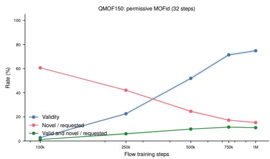

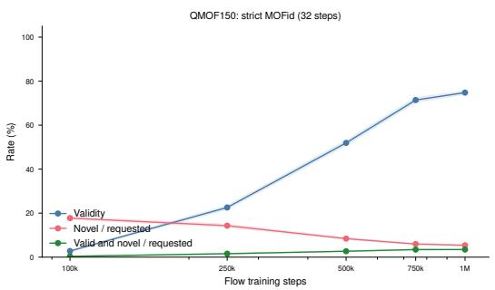  
Figure 8: QMOF150 validity–novelty tradeoff. Raw validity, MOFid novelty, and valid-and-novel yield under permissive (left) and strict (right) identifiers. Means and sample standard deviations over three training runs, with 10, 000 samples per run and checkpoint; all rates use requested-sample denominators.

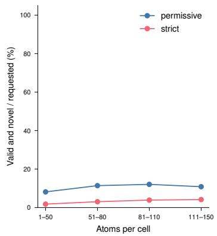

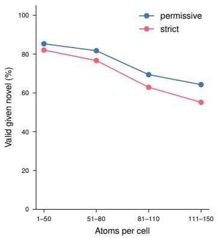  
Figure 9: QMOF150 novel yield by size at 1M steps. Valid-and-novel yield and validity among identified novel candidates under each MOFid convention. Identifier novelty can include close variants of training frameworks.

Table 16 extends the sweep to latent dimensions 32 and 128. The validity–novelty tradeoff persists across widths.

Table 16: QMOF150 generation by latent dimension and flow checkpoint. One training run per setting, with 10, 000 raw samples per checkpoint. Rates use the requested-sample denominator.
<table><tr><td colspan="3"></td><td colspan="4">Mofasa-permissive MOFid</td><td colspan="4">Strict complete MOFid</td></tr><tr><td>Latent dim.</td><td>Flow step</td><td>V</td><td>E</td><td>N</td><td>U</td><td>VNU</td><td>E</td><td>N</td><td>U</td><td>VNU</td></tr><tr><td>32</td><td>100k</td><td>3.13</td><td>67.85</td><td>60.25</td><td>66.48</td><td>1.32</td><td>20.37</td><td>17.35</td><td>20.04</td><td>0.44</td></tr><tr><td>64</td><td>100k</td><td>2.88</td><td>68.60</td><td>60.45</td><td>67.15</td><td>1.29</td><td>21.56</td><td>18.25</td><td>21.18</td><td>0.33</td></tr><tr><td>128</td><td>100k</td><td>2.44</td><td>61.11</td><td>55.65</td><td>60.05</td><td>1.03</td><td>18.41</td><td>16.23</td><td>18.15</td><td>0.35</td></tr><tr><td>32</td><td>250k</td><td>18.54</td><td>80.54</td><td>47.76</td><td>72.13</td><td>5.14</td><td>28.58</td><td>15.62</td><td>25.76</td><td>1.32</td></tr><tr><td>64</td><td>250k</td><td>23.45</td><td>80.74</td><td>41.60</td><td>69.46</td><td>6.44</td><td>30.21</td><td>15.04</td><td>26.20</td><td>1.69</td></tr><tr><td>128</td><td>250k</td><td>16.90</td><td>77.18</td><td>47.84</td><td>70.24</td><td>4.33</td><td>26.82</td><td>15.35</td><td>24.53</td><td>1.33</td></tr><tr><td>32</td><td>500k</td><td>47.19</td><td>84.29</td><td>28.75</td><td>65.93</td><td>9.04</td><td>31.41</td><td>9.47</td><td>24.78</td><td>2.19</td></tr><tr><td>64</td><td>500k</td><td>52.99</td><td>82.29</td><td>23.57</td><td>62.85</td><td>9.11</td><td>31.15</td><td>8.07</td><td>24.25</td><td>2.50</td></tr><tr><td>128</td><td>500k</td><td>44.82</td><td>81.76</td><td>29.62</td><td>65.43</td><td>8.06</td><td>29.70</td><td>9.89</td><td>23.91</td><td>2.33</td></tr><tr><td>32</td><td>750k</td><td>70.72</td><td>85.01</td><td>18.48</td><td>60.75</td><td>9.67</td><td>32.26</td><td>6.34</td><td>23.57</td><td>2.85</td></tr><tr><td>64</td><td>750k</td><td>72.56</td><td>83.33</td><td>16.88</td><td>60.06</td><td>9.45</td><td>31.47</td><td>6.06</td><td>23.13</td><td>2.87</td></tr><tr><td>128</td><td>750k</td><td>64.26</td><td>83.75</td><td>20.42</td><td>62.26</td><td>8.95</td><td>30.87</td><td>7.21</td><td>23.32</td><td>2.77</td></tr><tr><td>32</td><td>1M</td><td>73.14</td><td>85.20</td><td>16.84</td><td>59.88</td><td>9.07</td><td>32.07</td><td>5.63</td><td>23.12</td><td>2.68</td></tr><tr><td>64</td><td>1M</td><td>75.54</td><td>83.19</td><td>14.73</td><td>59.44</td><td>8.62</td><td>31.47</td><td>5.34</td><td>22.96</td><td>2.69</td></tr><tr><td>128</td><td>1M</td><td>69.67</td><td>84.19</td><td>17.89</td><td>61.33</td><td>9.14</td><td>31.21</td><td>6.38</td><td>23.27</td><td>2.97</td></tr></table>

E is the fraction with an available identifier; V is the MOFChecker-valid fraction; N is the fraction whose identifier is absent from the corresponding QMOF150 training-reference set; U is the number of distinct generated identifiers divided by the requested sample count; and VNU is the number of distinct identifiers that are both valid and novel, divided by the requested sample count.

## G.3 SIMILARITY TO TRAINING STRUCTURES

Before flow fitting, QMOF150 reconstruction RMSD is 0.0190 A on training structures and 1.2473˚ A˚ on held-out structures. Increasing latent dimension does not close this gap (Appendix E.3). During flow training, the decoder is fixed, while generated samples increasingly match training frameworks (Table 17).

We compare valid generations with all training structures of the same reduced formula using pymatgen’s StructureMatcher (Ong et al., 2013): element identity, site tolerance 0.3, lattice tolerance 0.2, angle tolerance 5◦, primitive-cell reduction, cell scaling, and supercell matching. At 1M steps, 99.7 % of unmatched valid GLASS samples have a reduced formula absent from training. The unmatched examples in Figure 14 retain training frameworks with metal substitutions.

For Mofasa, we also search QMOF150 validation and test structures because its training split differs. No additional matches are found: 0.15 % match any of the 16, 637 QMOF150 structures. This comparison uses the existing local MOFChecker 0.9.6 compatibility-profile scores for its valid subset; the size curves instead use MofasaDB’s stored scores.

Table 17: StructureMatcher comparison of valid generations with QMOF150 training structures. GLASS values are means over three training runs with 10, 000 raw samples each. Validity and valid-unmatched yield use all requested samples; the match rate is conditional on validity. ∗10,000 released samples; different training split and size range.
<table><tr><td>Flow step</td><td>Valid (%)</td><td>Matched | valid (%)</td><td>Valid, unmatched (%)</td></tr><tr><td>250k</td><td>22.57</td><td>90.27</td><td>2.20</td></tr><tr><td>500k</td><td>51.93</td><td>97.00</td><td>1.56</td></tr><tr><td>1M</td><td>74.79</td><td>98.29</td><td>1.28</td></tr><tr><td>Mofasa*</td><td>54.03</td><td>0.15</td><td>53.95</td></tr></table>

## H LATENT REPRESENTATIONS AND SLOT ORGANIZATION

The PCA projections below show qualitative organization of the training latents; axis labels give explained variance.

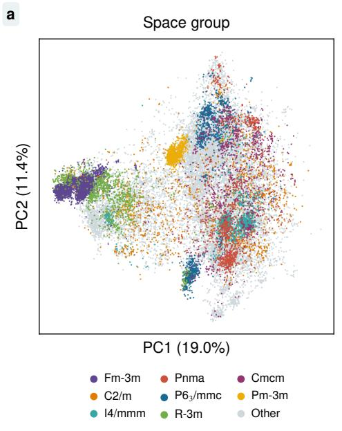

b  
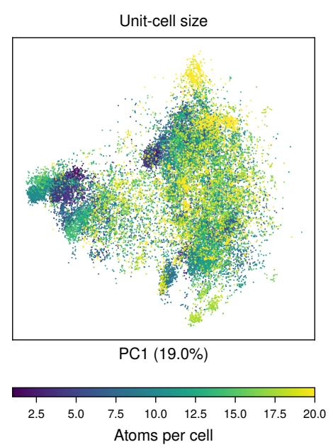  
Figure 10: MP20 latent-space visualization. PCA of MP20 autoencoder training latents, colored by space group (a) and atom count (b). Axis labels report explained variance.

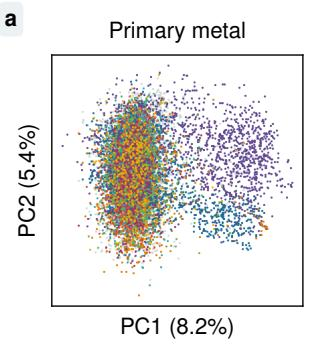

b  
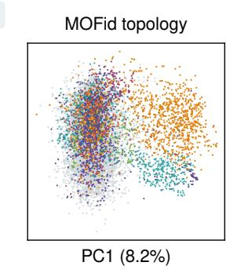

c  
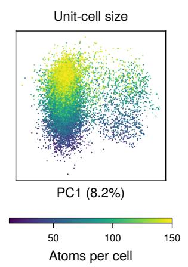  
Figure 11: QMOF150 training latents. PCA colored by the most frequent metal (a), permissive MOFid net (b), and atom count (c); grey denotes unassigned nets. One region contains predominantly Zn/pcu and Al/rna frameworks, while other classes overlap.

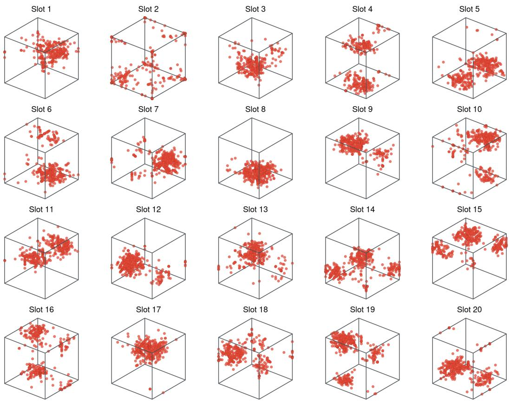  
Figure 12: Learned MP20 slot correspondences. Atoms assigned to each decoder slot across 1, 000 training structures, showing the fractional coordinates. Empty slots are excluded. Spatial patterns indicate specialization within the supplied coordinate frame.

## I COMPUTATIONAL COST

For dense-attention particle models, $K _ { x }$ model evaluations cost $K _ { x } C _ { \mathrm { a t o m } } ( n )$ , where $C _ { \mathrm { a t o m } } ( n ) =$ $\mathcal { O } ( n ^ { 2 } )$ at fixed width and depth. GLASS costs

$$
T _ { \mathrm { G L A S S } } = K _ { z } C _ { \mathrm { l a t e n t } } ( d _ { z } ) + C _ { \mathrm { d e c } } ( M ) .\tag{18}
$$

Latent integration is independent of atom count at fixed capacity; the $\mathcal { O } ( M ^ { 2 } )$ slot decoder runs once.   
Hungarian matching is used during autoencoder training only.

On one NVIDIA H100, autoencoder training takes about 20 minutes for MP20 and 3.5 hours for QMOF150; 1M flow steps take about 50 minutes on either dataset.

Table 18 reports medians over five repetitions after batch-size-specific warm-up on one NVIDIA H100 GPU. A 32-step midpoint trajectory uses 64 flow evaluations and one decoder pass. Total time includes device-to-host transfer; flow and decoder timings use GPU events. Loading, serialization, relaxation, and evaluation are excluded. The main text reports the lowest median across the listed batch sizes.

Table 18: Sampling cost per 1,000 structures on one full H100. Median seconds over five repetitions; peak memory is allocated GPU memory.
<table><tr><td>Dataset</td><td>Batch size</td><td>Total (s)</td><td>Flow (s)</td><td>Decoder (s)</td><td>Peak memory (GiB)</td></tr><tr><td rowspan="5">MP20</td><td>32</td><td>1.74</td><td>1.72</td><td>0.022</td><td>0.43</td></tr><tr><td>128</td><td>0.67</td><td>0.66</td><td>0.012</td><td>0.46</td></tr><tr><td>256</td><td>0.39</td><td>0.38</td><td>0.009</td><td>0.50</td></tr><tr><td>512</td><td>0.27</td><td>0.26</td><td>0.009</td><td>0.57</td></tr><tr><td>1,000</td><td>0.21</td><td>0.20</td><td>0.008</td><td>0.71</td></tr><tr><td rowspan="5">QMOF150</td><td>32</td><td>1.86</td><td>1.71</td><td>0.139</td><td>0.53</td></tr><tr><td>128</td><td>0.78</td><td>0.65</td><td>0.127</td><td>0.74</td></tr><tr><td>256</td><td>0.51</td><td>0.38</td><td>0.123</td><td>1.02</td></tr><tr><td>512</td><td>0.38</td><td>0.26</td><td>0.117</td><td>1.55</td></tr><tr><td>1,000</td><td>0.32</td><td>0.20</td><td>0.118</td><td>2.60</td></tr></table>

## J GENERATED STRUCTURES

Examples are selected from valid raw generations across atom-count ranges and shown with training analogues. StructureMatcher identifies matches; unmatched candidates are compared by normalized composition and minimum-image pair-distance fingerprints over the complete training split.

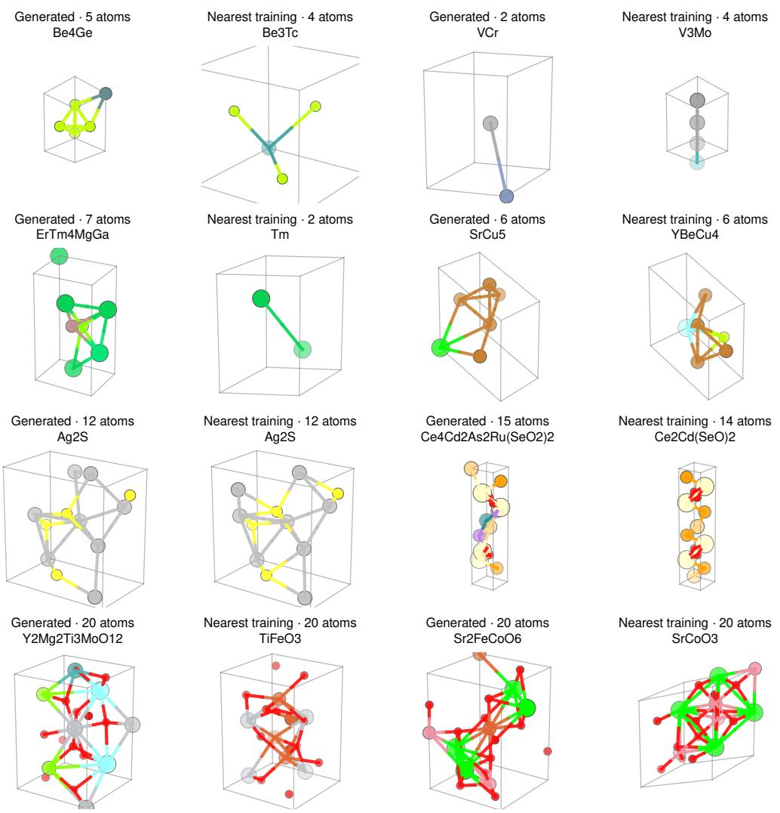  
Figure 13: Generated MP20 structures and training analogues. Two valid examples per size bin (1–5, 6–10, 11–15, and 16–20 atoms), each beside its nearest training structure under the composition and pair-distance fingerprint. Bonds are distance-based visual guides.

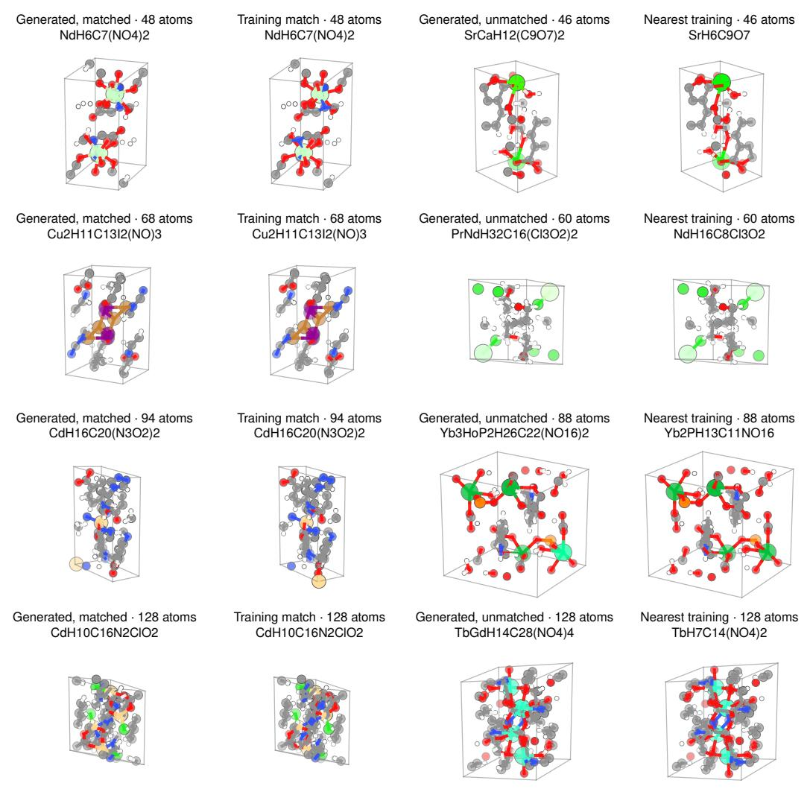  
Figure 14: Generated QMOF150 structures and training analogues. Each row covers one size range. Left: a valid generation and its StructureMatcher training match. Right: a valid unmatched generation and its nearest fingerprint analogue. These unmatched examples retain the training framework with substituted metal sites.