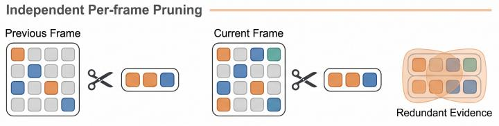
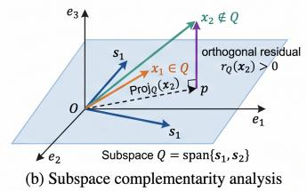
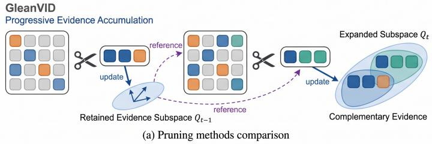
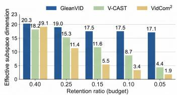
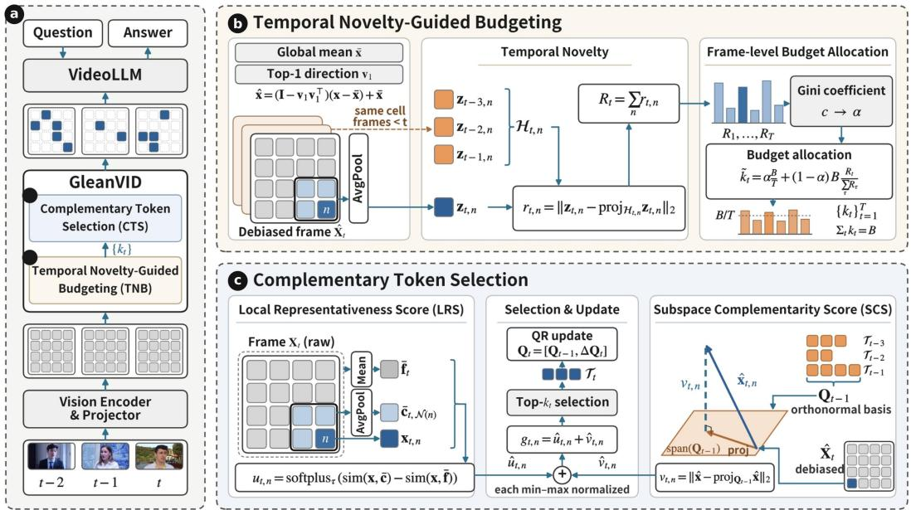
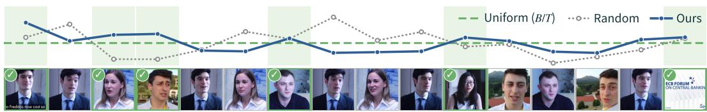
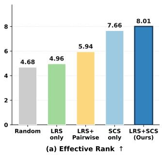
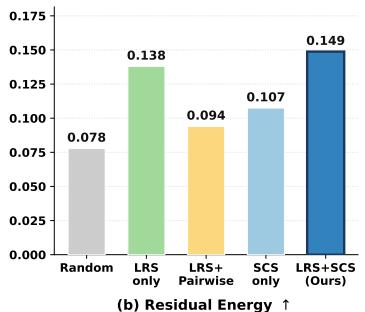
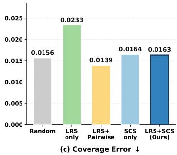
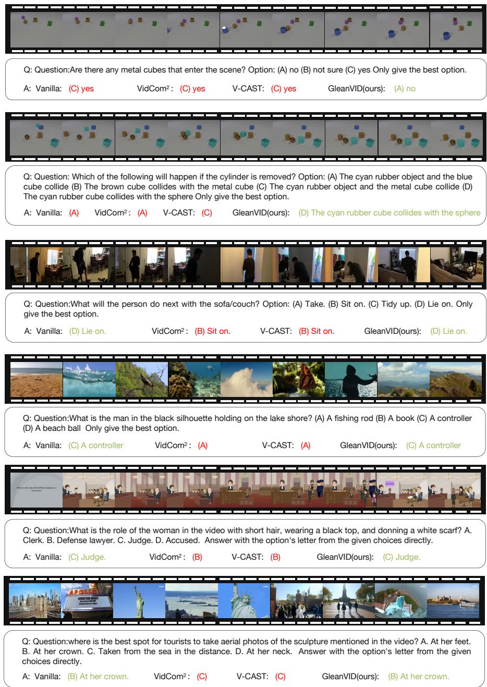

# GLEANVID: COMPLEMENTARY TOKEN SELECTION FOR EFFICIENT VIDEO LARGE LANGUAGE MODELS

Shuo Yang1∗ Changbai Li1∗ Rui Tang1 Xinyu Zhao1 Linlin Yang2 Baochang Zhang1 1Beihang University 2Communication University of China

## ABSTRACT

Video Large Language Models (VideoLLMs) have achieved strong video understanding capabilities but incur substantial inference overhead due to the large number of visual tokens. Existing VideoLLM token compression methods largely rely on selection-independent scoring, overlooking cross-frame complementarity and consequently retaining redundant evidence across frames. Instead, we view video token selection as a progressive evidence accumulation process. It aims to retain visual evidence that is individually informative and collectively complementary under a limited token budget. Building on this insight, we introduce GleanVID, a training-free inference acceleration framework for VideoLLMs. Specifically, GleanVID first allocates the global token budget across frames according to temporal novelty and then selects tokens by jointly considering local representativeness and subspace complementarity, thereby preserving richer and less redundant visual evidence. Extensive experiments across diverse VideoLLMs and benchmarks demonstrate that GleanVID consistently achieves state-of-the-art performance. Notably, with only 25% of visual tokens, GleanVID preserves 98.6% of Qwen3-VL’s original performance while reducing its prefill latency by 44.7%. On LLaVA-OV-7B, GleanVID at a 25% retention ratio even slightly surpasses the original model.

## 1 INTRODUCTION

Video Large Language Models (VideoLLMs) (Wang et al., 2025; Chen et al., 2025a; Yang et al., 2025b; Zhang et al., 2025a; Chen et al., 2025b; Lin et al., 2024), which integrate large language models (OpenAI, 2023) with visual encoders (Tschannen et al., 2025; Radford et al., 2021), have achieved remarkable performance on complex video understanding tasks such as video question answering and long video summarization. However, the inherently multi-frame nature of video results in a visual token count far exceeding that of a single image: for instance, LLaVA-OneVision (Li et al., 2025a) processes thousands of visual tokens per video, with the count rising to tens of thousands for long videos. As the computational cost of dense attention grows quadratically with sequence length, while token-wise computation and KV-cache memory also increase with the number of input tokens, long visual sequences constitute a major bottleneck for efficient VideoLLM inference.

To alleviate this bottleneck, existing VideoLLM compression methods mainly reduce visual redundancy through importance-based pruning (Chen et al., 2024; Zhang et al., 2025c; Yang et al., 2025a; Huang et al., 2025), relation-driven compression (Fu et al., 2025b; Shao et al., 2025; Fan et al., 2026; Shen et al., 2025), or set-aware token selection (Ma et al., 2026). A common practice is to assess token utility primarily using frame-local or token-wise cues, which may repeatedly retain salient content that persists over time (Fig. 1(a), top). Although recent methods (Ma et al., 2026; Fan et al., 2026) further exploit cross-frame relations or condition selection on previously retained tokens, they often characterize redundancy through pairwise or token-level interactions, without fully accounting for the information jointly covered by the accumulated evidence. This creates a mismatch with the temporal nature of video: under a limited token budget, effective token selection should progressively accumulate evidence that is individually informative and complementary to what has already been retained across frames (Fig. 1(a), bottom).

  
(c) Effective subspace dimension  
Figure 1: Motivation of GleanVID. (a) Existing methods typically prune each frame independently, retaining redundant evidence, whereas GleanVID progressively selects tokens complementary to previously retained evidence. (b) Only candidates outside the retained subspace Q (e.g., x2) contribute new information. (c) Under tighter budgets, effective dimension collapses in existing methods but remains high for GleanVID.

To better understand these limitations, we conduct diagnostic analyses on 100 LongVideoBench videos. First, across temporal gaps of 1–20 frames, the spatial positions selected by VidCom2 (Liu et al., 2025) and V-CAST (Lin et al., 2026) exhibit average IoUs of 0.257 and 0.233, respectively, compared with 0.139 for random selection, suggesting that information-driven criteria tend to revisit persistent spatial regions. Second, token-level distinctiveness does not imply set-level novelty: a candidate may differ from every selected token yet remain well explained by their joint span (Fig. 1(b)). Indeed, tokens selected by a greedy pairwise-diversity strategy retain only 29% of their feature energy outside the subspace spanned by previous selections. Third, as the retention ratio decreases from 40% to 5%, the effective dimension drops from 18.2 to 4.4 for V-CAST and from 19.1 to 1.9 for VidCom2 (Fig. 1(c)), indicating that the retained evidence collapses into a progressively lower-dimensional subspace. Together, these observations suggest that existing criteria largely overlook the joint diversity of retained evidence, especially under tight budgets.

Building on this analysis, we introduce GleanVID, a training-free inference acceleration framework that casts video token compression as progressive cross-frame evidence accumulation under a lim ited token budget. GleanVID first employs Temporal Novelty-Guided Budgeting to estimate each frame’s temporal novelty relative to recent visual content and adaptively allocate the per-frame token budget. Under these budgets, Complementary Token Selection processes frames sequentially and jointly considers local representativeness and subspace-level cross-frame complementarity. Local representativeness favors coherent and distinctive visual content within each frame while reducing sensitivity to isolated variations, but it does not explicitly account for evidence retained from earlier frames. We therefore assess cross-frame complementarity at the subspace level, favoring candidates whose features are less explainable by combinations of previously retained tokens.

Extensive experiments on three representative VideoLLMs across four video understanding bench marks demonstrate that GleanVID achieves a favorable tradeoff between efficiency and performance across different model architectures and token budgets. On Qwen3-VL-8B-Instruct with 32 input frames, GleanVID retains 98.6% of the original performance at a 25% retention ratio, while reducing prefill latency by 44.7%, total latency by 24.1%, and peak GPU memory by 13.0%, with a 32.0% increase in throughput. Moreover, when the retention ratio decreases from 25% to 15%, its relative performance decreases by only 1.6 points, from 98.6% to 97.0%, compared with a 1.9-point drop for FlashVID and a 2.8-point drop for V-CAST, demonstrating greater robustness under tighter token budgets.

Our main contributions are summarized as follows:

• We identify that common frame-local and pairwise criteria may not fully capture crossframe evidence complementarity, and cast video token selection as progressive evidence accumulation under a limited budget.

• We propose GleanVID, a training-free VideoLLM token compression framework that allocates per-frame budgets based on temporal novelty and selects tokens by balancing local representativeness with subspace-level cross-frame complementarity.

• Experiments across multiple VideoLLMs and benchmarks demonstrate a favorable tradeoff between efficiency and performance, together with stronger performance retention under tighter token budgets.

## 2 RELATED WORK

Video Large Language Models. VideoLLMs integrate visual encoders with large language models for video understanding. Early works such as Video-LLaMA (Zhang et al., 2023) and VideoChat (Li et al., 2025b) extend image-language models to videos, while LLaVA-OneVision (Li et al., 2025a), LLaVA-Video (Zhang et al., 2025d), and Qwen3-VL (Team, 2025) further improve performance through large-scale video instruction tuning and spatiotemporal designs such as dynamic-resolution encoding and MRoPE. However, encoding multiple frames yields far more visual tokens than a single image, posing significant challenges to inference efficiency.

Token Compression for VideoLLMs. To reduce visual token overhead during VideoLLM inference, recent studies have proposed a variety of training-free token compression methods, which can be broadly grouped into importance-guided pruning, relation-driven compression, and set-aware token selection. FastV (Chen et al., 2024), SparseVLM (Zhang et al., 2025c), VisionZip (Yang et al., 2025a), and PruneVid (Huang et al., 2025) select tokens based on attention, visual saliency, or question relevance. Relation-driven methods, including FrameFusion (Fu et al., 2025b), DyCoke (Tao et al., 2025), HoliTom (Shao et al., 2025), FastVID (Shen et al., 2025), and FlashVID (Fan et al., 2026), exploit spatial or temporal relations for token merging and pruning. VidCom2 (Liu et al., 2025) and V-CAST (Lin et al., 2026) further use inter-frame content variation to allocate different token budgets across frames. Set-aware methods (Ma et al., 2026) condition candidate utility on previously retained tokens, typically through token-level marginal gains or pairwise relations. Despite their favorable tradeoffs between compression ratio and performance, adequately modeling crossframe evidence complementarity during token selection remains an important direction for further investigation.

## 3 METHODOLOGY

## 3.1 PRELIMINARIES AND OVERVIEW

Given a video consisting of $T$ frames, the visual encoder produces a token tensor $\mathbf { X } = [ \mathbf { x } _ { t , n } ] \in$ $\mathbb { R } ^ { T \times N \times D }$ , where each frame contains N visual tokens of dimension $D .$ . Given a retention ratio $\rho ,$ our goal is to retain a subset $s$ of $B = \lfloor \rho T N \rfloor$ tokens while minimizing the degradation in downstream performance. Existing methods typically follow a selection-independent scoring paradigm. For simplicity, this paradigm can be expressed as computing a score $f ( \mathbf { x } _ { i } )$ for each token and retaining the global top-B tokens:

$$
S = \arg \operatorname* { t o p } _ { i \in \mathcal { T } } \mathrm { B } f ( \mathbf { x } _ { i } ) ,\tag{1}
$$

where $\mathcal { T }$ denotes the index set of all visual tokens. The scoring function $f$ may incorporate predefined reference features but remains unchanged as selection proceeds.

We instead formulate cross-frame token selection as a frame-sequential decision process:

$$
\begin{array} { r } {  { S _ { 0 } } = \emptyset , \quad  { \mathcal { T } } _ { t } = \underset { i \in  { \mathbb { Z } } _ { t } } { \arg \operatorname { t o p - k _ { t } } } g ( \mathbf { x } _ { i } ;  { S _ { t - 1 } } ) , \quad  { S _ { t } } =  { S _ { t - 1 } } \cup  { \mathcal { T } } _ { t } , } \end{array}\tag{2}
$$

where $\mathcal { T } _ { t }$ denotes the token indices in frame $t , k _ { t }$ is the token budget allocated to that frame, and $\textstyle \sum _ { t = 1 } ^ { T } k _ { t } = B$ . The scoring function $g ( \mathbf { x } _ { i } ; S _ { t - 1 } )$ evaluates each candidate with respect to the evidence retained from preceding frames. The selection-independent formulation in Eq. 1 is a special case in which g does not depend on $S _ { t - 1 }$

  
Figure 2: Overview of GleanVID. (a) GleanVID compresses the visual tokens of $T$ frames for the VideoLLM. (b) TNB measures the novelty of each neighborhood prototype against its history subspace and allocates per-frame budgets $\{ k _ { t } \}$ with a Gini-adaptive weight. (c) CTS selects the top- $\bar { \mathbf { \nabla } } _ { \bar { \mathbf { \nabla } } } \bar { k _ { t } }$ tokens by combining LRS with SCS, measured against the basis $\bar { \mathbf { Q } _ { t - 1 } }$ of retained tokens.

Building on Eq. 2, GleanVID comprises two components, as illustrated in Fig. 2. Temporal Novelty-Guided Budgeting (Section 3.2) allocates per-frame token budgets according to temporal novelty, while Complementary Token Selection (Section 3.3) sequentially selects tokens by combining the Local Representativeness Score (LRS) with the Subspace Complementarity Score (SCS) measured against the subspace spanned by previously selected tokens.

## 3.2 TEMPORAL NOVELTY-GUIDED BUDGETING

The information content carried by a video at different moments often varies, motivating per-frame budget allocation. We therefore propose a dynamic budget allocation strategy guided by content novelty: unlike segmentation-based merging (e.g., HoliTom, FastVID), our method does not disrupt tokens’ original spatial coordinate structure; and unlike fixed uniform or random allocation, it adapts each frame’s quota to content-level differences.

Context Debiasing. We first center all tokens and remove their shared dominant context direction. Let x¯ denote the mean over all tokens, and $v _ { 1 } \in \mathbb { R } ^ { D }$ the top-1 right singular vector of the centered feature matrix; the debiased feature of position n in frame t, is

$$
\begin{array} { r } { \hat { x } _ { t , n } = ( x _ { t , n } - \bar { x } ) - \big ( ( x _ { t , n } - \bar { x } ) ^ { \top } v _ { 1 } \big ) v _ { 1 } + \bar { x } . } \end{array}\tag{3}
$$

Temporal Novelty. We then quantify each token location’s temporal novelty relative to historical content. Directly comparing tokens at identical spatial positions may overestimate novelty when semantically similar content shifts because of object or camera motion. We therefore average the debiased features within the $2 \times 2$ pooling cell $\bar { \mathcal { N } } ( n )$ containing position n, obtaining the neighborhood prototype $z _ { t , n } = | \mathcal { N } ( n ) | ^ { - 1 } \sum _ { m \in \mathcal { N } ( n ) } \hat { x } _ { t , m }$ . Using the corresponding prototypes from the preceding h frames, we construct the historical reference set $H _ { t , n } = \{ z _ { t ^ { \prime } , n } \} _ { t ^ { \prime } = \operatorname* { m a x } ( 1 , t - h ) } ^ { t - 1 }$ and define temporal novelty as

$$
r _ { t , n } = \left\{ \begin{array} { l l } { \Vert z _ { t , n } \Vert _ { 2 } , } & { t = 1 , } \\ { \bigg \Vert z _ { t , n } - \mathrm { p r o j } _ { \mathrm { s p a n } ( H _ { t , n } ) } z _ { t , n } \bigg \Vert _ { 2 } , } & { t > 1 . } \end{array} \right.\tag{4}
$$

  
Figure 3: Qualitative comparison of frame-budget allocation under the same global token budget. Curves show the per-frame budget relative to the uniform allocation $B / T$ (dashed line); highlighted frames (✓) contain newly introduced visual content.

Here, $\mathrm { p r o j } _ { \mathrm { s p a n } \left( H _ { t , n } \right) } z _ { t , n }$ denotes the orthogonal projection of $z _ { t , n }$ onto the subspace spanned by the historical prototypes in $H _ { t , n }$ . A larger $r _ { t , n }$ indicates local content that is less predictable from its historical trajectory and thus more temporally novel.

Frame-level Budget Allocation. Summing token-level novelty within each frame, $\begin{array} { r } { R _ { t } = \sum _ { n } r _ { t , n } , } \end{array}$ and normalizing yields a temporal share $s _ { t } = R _ { t } / \sum _ { t ^ { \prime } } R _ { t ^ { \prime } } ;$ ; the budget for each frame mixes uniform and novelty-proportional allocation:

$$
\tilde { k } _ { t } = \alpha \cdot \frac { B } { T } + ( 1 - \alpha ) \cdot B \cdot s _ { t } .\tag{5}
$$

Here, $\alpha$ is the adaptive weight. Videos differ substantially in temporal dynamics: videos with a steady pace and evenly unfolding information exhibit little variation in novelty across frames, favoring uniform allocation, whereas videos containing scene transitions or sudden events concentrate novel information in a few key frames, favoring novelty-biased allocation. To let α match a video’s own temporal dynamics, we adaptively determine it via the Gini coefficient of the frame-level novelty distribution $\{ R _ { t } \} _ { t = 1 } ^ { T }$

$$
c = \frac { 2 \sum _ { i = 1 } ^ { T } i \cdot R _ { ( i ) } } { T \sum _ { t = 1 } ^ { T } R _ { t } } - \frac { T + 1 } { T } ,\tag{6}
$$

where $R _ { ( 1 ) } \leq \cdots \leq R _ { ( T ) }$ denotes the sorted novelty values. With its upper and lower bounds,

$$
\begin{array} { r } { \alpha = \alpha _ { \mathrm { m a x } } - ( \alpha _ { \mathrm { m a x } } - \alpha _ { \mathrm { m i n } } ) c , } \end{array}\tag{7}
$$

so that a more concentrated novelty distribution (c larger) biases the budget toward novel frames, while a more uniform distribution biases it toward equal allocation. The final integer budget $k _ { t }$ is obtained via largest-remainder rounding of $\tilde { k } _ { t }$ , ensuring $\textstyle \sum _ { t } k _ { t } = B$

## 3.3 COMPLEMENTARY TOKEN SELECTION

Given the per-frame budgets $\{ k _ { t } \} _ { t = 1 } ^ { T }$ , we next determine which tokens to retain from each frame. An informative candidate should not only represent coherent and distinctive local content, but also complement the evidence accumulated from preceding frames. We therefore evaluate each candidate using a Local Representativeness Score (LRS) and a Subspace Complementarity Score (SCS).

Local Representativeness Score (LRS). For position n in frame t, we compare its raw feature $x _ { t , n }$ against two references: the pooled prototype of its $2 \times 2$ local neighborhood, $\bar { c } _ { t , \mathcal { N } ( n ) }$ , and the global frame prototype $\bar { f } _ { t }$ (both computed from raw features). Letting sim $( \cdot , \cdot )$ denote cosine similarity, the Local Representativeness Score is defined as

$$
\boldsymbol u _ { t , n } = \mathrm { s o f t p l u s } \big ( \tau \cdot ( \mathrm { s i m } ( x _ { t , n } , \bar { c } _ { t , \mathcal { N } ( n ) } ) - \mathrm { s i m } ( x _ { t , n } , \bar { f } _ { t } ) ) \big ) / \tau ,\tag{8}
$$

where τ controls the sharpness of the mapping. A larger $u _ { t , n }$ indicates that the token is more representative of its local neighborhood, rather than merely aligning with overall frame-level saliency, favoring locally coherent and distinctive visual content while reducing sensitivity to isolated variations.

Subspace Complementarity Score (SCS). Local representativeness alone does not account for evidence already retained from preceding frames. We therefore maintain an orthonormal basis $\mathbf { Q } _ { t - 1 }$ initialized as empty $( Q _ { 0 } = \emptyset )$ , spanning the debiased features of previously selected tokens, which represents the visual evidence accumulated before frame t. The Subspace Complementarity Score of a candidate is defined by its orthogonal projection residual:

$$
v _ { t , n } = \bigl \| \hat { x } _ { t , n } - \underset { Q _ { t - 1 } } { \mathrm { p r o j } } \hat { x } _ { t , n } \bigr \| .\tag{9}
$$

A larger $v _ { t , n }$ indicates that the candidate contains a larger component not explained by the previously retained evidence and therefore provides greater cross-frame complementarity. Unlike pairwise similarity, SCS evaluates each candidate against the subspace jointly spanned by all previously selected tokens, allowing it to detect redundancy collectively covered by multiple pieces of evidence.

Within each frame, we independently min-max normalize $\{ u _ { t , n } \} _ { n = 1 } ^ { N }$ and $\{ v _ { t , n } \} _ { n = 1 } ^ { N }$ to $[ 0 , 1 ]$ , obtaining $\hat { u } _ { t , n }$ and $\hat { v } _ { t , n }$ . We instantiate the selection score in Eq. 2 as

$$
g ( \mathbf { x } _ { t , n } ; S _ { t - 1 } ) = \hat { u } _ { t , n } + \hat { v } _ { t , n } .\tag{10}
$$

We retain the top- $\cdot k _ { t }$ candidates according to Eq. 10 to form $\mathcal { T } _ { t } .$ Their orthogonal components relative to $\mathbf { Q } _ { t - 1 }$ are then incorporated into the basis to obtain $\mathbf { Q } _ { t }$ for the subsequent frame. This frame-sequential procedure progressively accumulates locally representative and cross-frame complementary visual evidence under the global token budget.

## 4 EXPERIMENTS

## 4.1 EXPERIMENTAL SETTINGS

Benchmarks. We evaluate GleanVID on four widely-used video understanding benchmarks: MVBench (Li et al., 2024), LongVideoBench (Wu et al., 2024), MLVU (Zhou et al., 2025), and VideoMME (Fu et al., 2025a). These benchmarks span a diverse range of scenarios, from short to long videos and from single-scene understanding to complex multi-task reasoning, enabling a comprehensive evaluation of both the effectiveness and generalization of our method.

Implementation Details. We evaluate GleanVID on three representative VideoLLMs with diverse architectures, LLaVA-OneVision (Li et al., 2025a), LLaVA-Video (Zhang et al., 2025d), and Qwen3- VL (Team, 2025), to assess its generality. LLaVA-OneVision and LLaVA-Video sample 32 and 64 frames by default, respectively. We evaluate all methods under two retention ratios, 25% and 15%, following the same evaluation protocol for a fair comparison. All experiments are conducted on NVIDIA H800-80G GPUs using LMMs-Eval (Zhang et al., 2025b). Additional hyperparameter settings are provided in the Appendix B.3.

## 4.2 MAIN RESULTS

Results on Qwen3-VL-8B-Instruct. Table 1 compares GleanVID with representative token compression methods under 32- and 64-frame input settings. GleanVID achieves the highest average relative performance across all settings. For example, under the 32-frame setting with a 15% retention ratio, GleanVID preserves 97.0% of the original performance, outperforming the strongest baseline, FlashVID (95.6%), and the image-oriented VisionZip (91.3%). As the retention ratio decreases from 25% to 15%, GleanVID’s relative performance drops by only 1.6 points, whereas VidCom2 and HoliTom drop by 4.1 and 2.8 points, respectively. This suggests that progressively accumulating complementary cross-frame evidence is particularly beneficial under tighter token budgets. Moreover, FlashVID runs out of memory (OOM) under the 64-frame setting, as its attention-based selection requires materialized [CLS] attention scores, limiting its compatibility with memory-efficient operators such as FlashAttention. In contrast, GleanVID requires no access to attention weights and runs without OOM under the same setting.

Results on LLaVA-OneVision-7B. We further extend our evaluation to the LLaVA series of VideoLLMs to verify the generalization of our method across different model architectures. Table 2 reports results under the 25% retention ratio: GleanVID achieves 100.3% relative performance, surpassing VisionZip (99.0%) and VidCom2 (98.8%), and slightly outperforms the vanilla model with full token input. This result suggests that the original visual token sequence may contain some cross-frame redundancy, and that GleanVID’s temporal novelty-guided budgeting and complementary token selection may help reduce its potential interference with reasoning, demonstrating the effectiveness of GleanVID.

Table 1: Performance comparison with existing baselines on Qwen3-VL-8B-Instruct across multiple benchmarks and input settings. “Average” denotes the mean performance across benchmarks.
<table><tr><td rowspan="2">Method</td><td rowspan="2">MVBench</td><td rowspan="2">LongVideo Bench</td><td rowspan="2">MLVU</td><td colspan="4">VideoMME</td><td colspan="2">Average</td></tr><tr><td>Overall</td><td>Short</td><td>Medium</td><td>Long</td><td>Score</td><td>%</td></tr><tr><td colspan="10">Max Input Frames = 64</td></tr><tr><td>Qwen3-VL-8B-Instruct</td><td>69.2</td><td>62.8</td><td>68.9</td><td>66.9</td><td>78.8</td><td>66.2</td><td>55.8</td><td>67.0</td><td>100.0</td></tr><tr><td colspan="10">Retention Ratio = 25%</td></tr><tr><td>VisionZip (CVPR&#x27;25)</td><td>64.8</td><td>58.9</td><td>63.4</td><td>63.1</td><td>73.7</td><td>60.3</td><td>55.4</td><td>62.6</td><td>93.4</td></tr><tr><td>VidCom2 (EMNLP&#x27;25)</td><td>67.5</td><td>59.6</td><td>64.0</td><td>64.9</td><td>75.4</td><td>63.4</td><td>55.9</td><td>64.0</td><td>95.5</td></tr><tr><td>FastVID (NeurIPS’25)</td><td>66.8</td><td>60.4</td><td>65.0</td><td>62.3</td><td>73.9</td><td>60.7</td><td>52.2</td><td>63.6</td><td>94.9</td></tr><tr><td>HoliTom (NeurIPS&#x27;25)</td><td>64.8</td><td>58.9</td><td>63.4</td><td>62.7</td><td>74.4</td><td>60.6</td><td>53.2</td><td>62.5</td><td>93.3</td></tr><tr><td>FlashVID (ICLR&#x27;26)</td><td>OOM</td><td>OOM</td><td>OOM</td><td>00M</td><td>OOM</td><td>O0M</td><td>OOM</td><td></td><td></td></tr><tr><td>V-CAST (2026&#x27;03)</td><td>67.7</td><td>61.2</td><td>65.3</td><td>65.1</td><td>76.8</td><td>63.2</td><td>55.3</td><td>64.8</td><td>96.7</td></tr><tr><td>GleanVID (Ours)</td><td>68.0</td><td>61.1</td><td>65.8</td><td>66.0</td><td>77.8</td><td>63.3</td><td>56.9</td><td>65.2</td><td>97.3</td></tr><tr><td colspan="10">Retention Ratio = 15%</td></tr><tr><td>VisionZip (CVPR&#x27;25)</td><td>62.0</td><td>57.7</td><td>61.4</td><td>60.4</td><td>70.3</td><td>58.4</td><td>52.6</td><td>60.4</td><td>90.1</td></tr><tr><td>VidCom2 (EMNLP&#x27;25)</td><td>64.3</td><td>57.4</td><td>60.3</td><td>62.9</td><td>72.6</td><td>61.3</td><td>54.7</td><td>61.2</td><td>91.3</td></tr><tr><td>FastVID (NeurIPS’25)</td><td>64.9</td><td>59.7</td><td>63.3</td><td>60.5</td><td>72.2</td><td>57.2</td><td>52.1</td><td>62.1</td><td>92.7</td></tr><tr><td>HoliTom (NeurIPS&#x27;25)</td><td>62.7</td><td>58.3</td><td>61.8</td><td>60.9</td><td>72.3</td><td>58.2</td><td>52.2</td><td>60.9</td><td>90.9</td></tr><tr><td>FlashVID (ICLR&#x27;26)</td><td>O0M</td><td>00M</td><td>OOM</td><td>00M</td><td>OOM</td><td>O0M</td><td>OOM</td><td></td><td></td></tr><tr><td>V-CAST (2026&#x27;03)</td><td>66.0</td><td>59.6</td><td>64.4</td><td>63.8</td><td>76.3</td><td>61.3</td><td>53.7</td><td>63.5</td><td>94.8</td></tr><tr><td>GleanVID (Ours)</td><td>67.1</td><td>60.0</td><td>65.2</td><td>64.8</td><td>76.8</td><td>62.4</td><td>55.2</td><td>64.3</td><td>96.0</td></tr><tr><td colspan="10">Max Input Frames = 32</td></tr><tr><td>Qwen3-VL-8B-Instruct</td><td>68.6</td><td>60.3</td><td>63.5</td><td>64.5</td><td>76.0</td><td>60.4</td><td>57.0</td><td>64.2</td><td>100.0</td></tr><tr><td>Retention Ratio = 25%</td><td></td><td></td><td></td><td></td><td></td><td></td><td></td><td></td><td></td></tr><tr><td>VisionZip (CVPR&#x27;25)</td><td>62.2</td><td>56.7</td><td>60.8</td><td>60.1</td><td>69.6</td><td>56.7</td><td>54.2</td><td>60.0</td><td>93.5</td></tr><tr><td>VidCom2 (EMNLP&#x27;25)</td><td>67.0</td><td>58.0</td><td>60.6</td><td>62.4</td><td>72.1</td><td>59.1</td><td>56.1</td><td>62.0</td><td>96.6</td></tr><tr><td>FastVID (NeurIPS’25)</td><td>67.3</td><td>58.7</td><td>60.7</td><td>60.5</td><td>72.0</td><td>56.8</td><td>52.7</td><td>61.8</td><td>96.3</td></tr><tr><td>HoliTom (NeurIPS&#x27;25)</td><td>63.0</td><td>56.8</td><td>61.2</td><td>59.7</td><td>71.4</td><td>54.6</td><td>53.1</td><td>60.2</td><td>93.8</td></tr><tr><td>FlashVID (ICLR&#x27;26)</td><td>67.5</td><td>58.8</td><td>61.7</td><td>62.3</td><td>74.4</td><td>58.7</td><td>53.9</td><td>62.6</td><td>97.5</td></tr><tr><td>V-CAST (2026&#x27;03)</td><td>67.5</td><td>58.1</td><td>62.7</td><td>63.5</td><td>74.4</td><td>60.2</td><td>55.8</td><td>62.9</td><td>98.0</td></tr><tr><td>GleanVID (Ours)</td><td>68.0</td><td>59.7</td><td>61.8</td><td>63.6</td><td>74.6</td><td>60.7</td><td>55.7</td><td>63.3</td><td>98.6</td></tr><tr><td colspan="10">Retention Ratio = 15%</td></tr><tr><td>VisionZip (CVPR&#x27;25)</td><td>60.1</td><td>56.2</td><td>60.0</td><td>58.2</td><td>66.9</td><td>54.9</td><td>52.9</td><td>58.6</td><td>91.3</td></tr><tr><td>VidCom2 (EMNLP&#x27;25)</td><td>64.2</td><td>56.0</td><td>57.7</td><td>59.6</td><td>68.9</td><td>56.7</td><td>53.3</td><td>59.4</td><td>92.5</td></tr><tr><td>FastVID (NeurIPS’25)</td><td>66.1</td><td>57.1</td><td>59.0</td><td>58.3</td><td>69.6</td><td>54.3</td><td>51.1</td><td>60.1</td><td>93.6</td></tr><tr><td>HoliTom (NeurIPS&#x27;25)</td><td>60.0</td><td>55.8</td><td>59.6</td><td>58.3</td><td>68.9</td><td>54.7</td><td>51.7</td><td>58.4</td><td>91.0</td></tr><tr><td>FlashVID (ICLR&#x27;26)</td><td>66.5</td><td>57.8</td><td>60.0</td><td>61.4</td><td>72.4</td><td>57.6</td><td>54.1</td><td>61.4</td><td>95.6</td></tr><tr><td>V-CAST (2026&#x27;03)</td><td>64.8</td><td>57.6</td><td>60.0</td><td>62.0</td><td>71.9</td><td>58.3</td><td>55.9</td><td>61.1</td><td>95.2</td></tr><tr><td>GleanVID (Ours)</td><td>66.0</td><td>59.0</td><td>61.4</td><td>62.6</td><td>73.6</td><td>59.6</td><td>54.6</td><td>62.3</td><td>97.0</td></tr></table>

Results on LLaVA-Video-7B. We further evaluate GleanVID on LLaVA-Video. Unlike LLaVA-OneVision, LLaVA-Video samples 64 frames by default and introduces newline tokens to explicitly encode spatiotemporal positional information. Table 3 reports results under the 25% retention ratio: despite this architectural difference, GleanVID again achieves the best performance (95.5% relative performance), surpassing the second-best HoliTom (95.2%). These results show that Glean-VID remains effective under a different visual-token organization, supporting its applicability across VideoLLM architectures.

Results under a Fixed Token Budget. Keeping the post-compression visual-token count equal to that of the uncompressed 16-frame baseline, GleanVID scales the input to 80 and 160 frames and achieves 110.4% and 112.4% relative performance, respectively, effectively converting token compression into broader temporal coverage (Appendix C.1).

## 4.3 ABLATION STUDY

We conduct ablation studies on Qwen3-VL-8B-Instruct with 32-frame input and a 15% retention ratio, examining model components, frame-budget allocation strategies, token-selection signals, and complementarity modeling. Additional hyperparameter sensitivity analyses are provided in Appendix C.2.

Table 2: Performance comparison with existing baselines on LLaVA-OV-7B across different benchmarks. We use the default 32-frame input setting.
<table><tr><td rowspan="2">Method</td><td rowspan="2">MVBench</td><td rowspan="2">LongVideo Bench</td><td rowspan="2">MLVU</td><td colspan="4">VideoMME</td><td colspan="2">Average</td></tr><tr><td>Overall</td><td>Short</td><td>Medium</td><td>Long</td><td>Score</td><td>%</td></tr><tr><td>LLaVA-OV-7B</td><td>58.3</td><td>56.6</td><td>63.1</td><td>58.4</td><td>69.9</td><td>56.7</td><td>48.8</td><td>59.1</td><td>100.0</td></tr><tr><td>Retention Ratio = 25%</td><td></td><td></td><td></td><td></td><td></td><td></td><td></td><td></td><td></td></tr><tr><td>FastV (ECCV&#x27;24)</td><td>55.5</td><td>53.3</td><td>59.6</td><td>55.3</td><td>65.0</td><td>53.8</td><td>47.0</td><td>55.9</td><td>94.6</td></tr><tr><td>Sparse VLM (ICML’25)</td><td>56.4</td><td>53.9</td><td>60.7</td><td>57.3</td><td>68.4</td><td>55.2</td><td>48.1</td><td>57.1</td><td>96.6</td></tr><tr><td>VisionZip (CVPR&#x27;25)</td><td>56.9</td><td>56.0</td><td>62.9</td><td>58.0</td><td>68.9</td><td>57.4</td><td>47.6</td><td>58.5</td><td>99.0</td></tr><tr><td>Prune Vid (ACL&#x27;25)</td><td>55.7</td><td>55.1</td><td>63.4</td><td>57.0</td><td>68.8</td><td>54.4</td><td>47.7</td><td>57.8</td><td>97.8</td></tr><tr><td>FrameFusion (ICCV’25)</td><td>56.0</td><td>54.8</td><td>61.7</td><td>57.5</td><td>68.2</td><td>55.7</td><td>48.6</td><td>57.5</td><td>97.3</td></tr><tr><td>FastVID (NeurIPS’25)</td><td>56.5</td><td>56.3</td><td>60.9</td><td>58.3</td><td>69.4</td><td>58.2</td><td>47.2</td><td>58.0</td><td>98.1</td></tr><tr><td>VidCom2 (EMNLP&#x27;25)</td><td>57.0</td><td>55.4</td><td>62.8</td><td>58.4</td><td>69.3</td><td>56.3</td><td>49.4</td><td>58.4</td><td>98.8</td></tr><tr><td>V-CAST (2026&#x27;03)</td><td>56.1</td><td>55.9</td><td>62.9</td><td>58.2</td><td>69.9</td><td>56.0</td><td>48.7</td><td>58.3</td><td>98.6</td></tr><tr><td>GleanVID (Ours)</td><td>57.1</td><td>57.3</td><td>63.0</td><td>59.7</td><td>72.3</td><td>56.8</td><td>50.0</td><td>59.3</td><td>100.3</td></tr></table>

Table 3: Performance comparison with existing baselines on LLaVA-Video-7B across different benchmarks. We use the default 64-frame input setting.
<table><tr><td rowspan="2">Method</td><td rowspan="2">MVBench</td><td rowspan="2">LongVideo Bench</td><td rowspan="2">MLVU</td><td colspan="4">VideoMME</td><td colspan="2">Average</td></tr><tr><td>Overall</td><td>Short</td><td>Medium</td><td>Long</td><td>Score</td><td>%</td></tr><tr><td>LLaVA-Video-7B</td><td>60.4</td><td>58.9</td><td>67.3</td><td>64.4</td><td>77.3</td><td>62.4</td><td>53.4</td><td>62.8</td><td>100.0</td></tr><tr><td>Retention Ratio = 25%</td><td></td><td></td><td></td><td></td><td></td><td></td><td></td><td></td><td></td></tr><tr><td>FastV (ECCV&#x27;24)</td><td>52.1</td><td>54.8</td><td>57.8</td><td>58.6</td><td>68.7</td><td>58.4</td><td>48.7</td><td>55.8</td><td>88.9</td></tr><tr><td>SparseVLM (ICML’25)</td><td>55.4</td><td>54.2</td><td>58.9</td><td>60.1</td><td>71.1</td><td>59.1</td><td>50.1</td><td>57.2</td><td>91.1</td></tr><tr><td>VisionZip (CVPR&#x27;25)</td><td>57.9</td><td>56.3</td><td>62.6</td><td>62.5</td><td>73.6</td><td>62.3</td><td>51.9</td><td>59.8</td><td>95.2</td></tr><tr><td>HoliTom (NeurIPS&#x27;25)</td><td>58.4</td><td>57.1</td><td>60.5</td><td>63.0</td><td>74.6</td><td>62.3</td><td>52.1</td><td>59.8</td><td>95.2</td></tr><tr><td>VidCom² (EMNLP&#x27;25)</td><td>57.0</td><td>57.1</td><td>58.7</td><td>61.7</td><td>73.0</td><td>61.7</td><td>50.0</td><td>58.6</td><td>93.3</td></tr><tr><td>V-CAST (2026&#x27;03)</td><td>57.8</td><td>56.8</td><td>58.2</td><td>61.5</td><td>72.2</td><td>60.9</td><td>51.3</td><td>58.6</td><td>93.3</td></tr><tr><td>GleanVID (Ours)</td><td>59.6</td><td>57.2</td><td>60.5</td><td>62.6</td><td>73.7</td><td>62.4</td><td>51.6</td><td>60.0</td><td>95.5</td></tr></table>

Ablation study on Model Components. Table 5(a) verifies the contributions of TNB and CTS. Removing TNB (degenerating to random budget allocation) leads to a drop of 1.6 points in rela tive performance, showing that, compared to random allocation, capturing the temporal distribution of video information via content-level novelty provides a more reasonable budget basis for each frame. Removing CTS (degenerating to random selection) causes a larger drop of 3.1 points. Taken together, these results demonstrate that GleanVID benefits from coordinated decisions at two complementary granularities: TNB adapts the frame-level token budget to the temporal distribution of video information, while CTS progressively constructs a compact and informative representation under the resulting budgets.

Ablation study on Frame-Budget Allocation. Table 6(a) compares different budget allocation strategies within TNB. Both random and uniform allocation disregard the temporal variation intrinsic to video content, resulting in relatively lower average performance. Figure 3 qualitatively illustrates their different allocation behaviors. Incorporating temporal novelty with a fixed mixing weight of α = 0.5 brings some improvement but behaves inconsistently across benchmarks. In contrast, our adaptive α strategy, which dynamically adjusts the weight according to the concentration of the frame-level novelty distribution, achieves the best relative performance across benchmarks.

Ablation study on Token Selection. Table 5(b) evaluates the design of the scoring mechanism within CTS. Using LRS alone leads to a drop in relative performance, indicating that the lack of cross-frame awareness leads to redundant selections across frames. Using SCS alone performs reasonably on MVBench but degrades noticeably on VideoMME, suggesting that relying solely on a candidate token’s complementarity to the subspace spanned by retained evidence may not sufficiently account for its frame-local representativeness. Combining LRS and SCS achieves a relative performance of 97.0%, outperforming either signal alone and supporting the benefit of integrating the two signals within CTS.

Table 4: Efficiency comparison on VideoMME using Qwen3-VL-8B-Instruct with a retention ratio of $\rho = 2 5 \%$ and a maximum of 32 input frames. “Prefill Latency” denotes the prompt-to-first-token time; “LLM Generation Latency” denotes the first-to-last-token decoding time; “Total Latency” denotes the end-to-end wall-clock time in our experimental setup; and “Throughput” is measured in items per second.
<table><tr><td>Method</td><td>(s)</td><td>Latency (s)</td><td>(s)</td><td>Prefill Latency ↓ LLM Generation ↓ Total Latency ↓ GPU Peak Memory ↓ Throughput ↑ (MB)</td><td>(items/s)</td><td>Performance ↑</td></tr><tr><td>Qwen3-VL-8B-Instruct</td><td>239.9</td><td>280.2</td><td>1369.5</td><td>22478.0</td><td>1.97</td><td>64.5</td></tr><tr><td>VidCom2 (EMNLP&#x27;25)</td><td> $\mathbf { 1 1 9 . 0 } _ { ( \downarrow 5 0 . 4 \% ) }$ </td><td> $\mathbf { 1 5 4 . 1 } \left( \downarrow 4 5 . 0 \% \right)$ </td><td> $\mathbf { 1 0 3 3 . 6 } \left( \downarrow 2 4 . 5 \% \right)$ </td><td> $1 9 5 4 7 . 5 \left( \downarrow 1 3 . 0 \% \right)$ </td><td> $\pmb { 2 . 6 1 } \left( 1 . 3 2 \times \right)$ </td><td> $6 2 . 4 ( \downarrow 2 . 1 )$ </td></tr><tr><td>HoliTom (NeurIPS&#x27;25)</td><td> $1 3 4 . 3 ( \downarrow 4 4 . 0 \% )$ </td><td> $1 6 9 . 6 ( \downarrow 3 9 . 5 \% )$ </td><td> $1 0 6 3 . 2 ( \scriptstyle \downarrow 2 2 . 4 \% )$ </td><td> $\underline { { 1 9 9 7 4 . 7 } } ( \downarrow 1 1 . 1 \% )$ </td><td> $2 . 5 4 \ : ( 1 . 2 9 \times )$ </td><td> $6 0 . 2 ( \downarrow 4 . 3 )$ </td></tr><tr><td>FlashVID (ICLR&#x27;26)</td><td> $1 4 5 . 0 ( \downarrow 3 9 . 6 \% )$ </td><td> $1 7 9 . 0 ( \downarrow 3 6 . 1 \% )$ </td><td> $1 1 3 2 . 2 ( \pm 1 7 . 3 \% )$ </td><td> $4 0 1 9 9 . 2 ( \uparrow 7 8 . 8 \% )$ </td><td> $2 . 3 8 ( 1 . 2 1 \times )$ </td><td> $6 2 . 3 ( \downarrow 2 . 2 ) $ </td></tr><tr><td>V-CAST (2026&#x27;03)</td><td> $1 2 1 . 2 ( \downarrow 4 9 . 5 \% )$ </td><td> $\underline { { 1 5 9 . 9 } } ( \downarrow 4 2 . 9 \% )$ </td><td> $1 0 3 9 . 7 \left( \downarrow 2 4 . 1 \% \right)$ </td><td> $1 9 5 4 7 . 5 \left( \downarrow 1 3 . 0 \% \right)$ </td><td> $2 . 6 0 ( 1 . 3 2 \times )$ </td><td> $\underline { { 6 3 . 5 } } ( \downarrow 1 . 0 )$ </td></tr><tr><td> $\mathbf { G l e a n V I D ( \mathrm { { O u r s } ) } }$ </td><td> $1 3 2 . 6 ( \scriptstyle \downarrow 4 4 . 7 \% )$ </td><td> $1 6 5 . 7 \ ( \downarrow 4 0 . 9 \% )$ </td><td> $1 0 4 0 . 1 \ : ( \downarrow 2 4 . 1 \% )$ </td><td> $1 9 5 4 7 . 5 \left( \downarrow 1 3 . 0 \% \right)$ </td><td> $2 . 6 0 ( 1 . 3 2 \times )$ </td><td> ${ \bf 6 3 . 6 } _ { ( \downarrow 0 . 9 ) }$ </td></tr></table>

Table 6: Frame-budget and complementarity ablations. Relative performance is reported in % and its drop in points.

Table 5: Component and token-selection ablations. Relative performance is reported in % and its drop in points.
<table><tr><td>Variant</td><td>MVBenchLVB MLVU VideoMME</td><td></td><td></td><td></td><td>Rel. Perf. (%)</td></tr><tr><td>(a) Model Components</td><td colspan="5"></td></tr><tr><td>w/o TNB</td><td>65.5</td><td>58.0</td><td>60.4</td><td>61.2</td><td> $9 5 . 4 ( \downarrow 1 . 6 )$ </td></tr><tr><td>w/o CTS</td><td>65.8</td><td>56.3</td><td>59.5</td><td>59.5</td><td>93.9(↓3.1)</td></tr><tr><td>GleanVID</td><td>66.0</td><td>59.0</td><td>61.4</td><td>62.6</td><td>97.0</td></tr><tr><td colspan="6">(b) Token-Selection Signals</td></tr><tr><td>LRS only</td><td>64.8</td><td>55.5</td><td>59.5</td><td>62.0</td><td> $9 4 . 2 ( \downarrow 2 . 8 ) $ </td></tr><tr><td> ${ \mathrm { S C S ~ o n l y } }$ </td><td>66.2</td><td>58.7</td><td>61.0</td><td>60.1</td><td> $9 5 . 8 ( \downarrow 1 . 2 )$ </td></tr><tr><td> $\mathrm { L R S } + \mathrm { S C S }$ </td><td>66.0</td><td>59.0</td><td>61.4</td><td>62.6</td><td>97.0</td></tr></table>

<table><tr><td>Variant</td><td colspan="4">MVBenchLVB MLVU VideoMME</td></tr><tr><td colspan="6">(a) Frame-Budget Allocation</td></tr><tr><td>Random</td><td>65.5</td><td>58.0</td><td>60.4</td><td>61.2</td><td> $9 5 . 4 ( \downarrow 1 . 6 )$ </td></tr><tr><td>Uniform</td><td>64.8</td><td>58.3</td><td>60.6</td><td>62.1</td><td> $9 5 . 8 ( \downarrow 1 . 2 )$ </td></tr><tr><td>Fixed (α=0.5)</td><td>66.1</td><td>58.5</td><td>61.1</td><td>62.4</td><td>96.6(↓0.4)</td></tr><tr><td>Adaptive</td><td>66.0</td><td>59.0</td><td>61.4</td><td>62.6</td><td>97.0</td></tr><tr><td colspan="6">(b) Complementarity Measure</td></tr><tr><td>Pairwise Distance 65.6</td><td></td><td>58.7</td><td>60.1</td><td>61.8</td><td> $9 5 . 9 ( \downarrow 1 . 1 ) $ </td></tr><tr><td>SCS</td><td>66.0</td><td>59.0</td><td>61.4</td><td>62.6</td><td>97.0</td></tr></table>

Ablation study on Complementarity Measure. Pairwise criteria evaluate a candidate against each retained token independently and may therefore overlook information jointly represented by multiple retained tokens and overvalue isolated outliers. To better account for such set-level relationships, SCS evaluates candidate complementarity against the subspace spanned by the retained evidence. To assess this design, we replace SCS with a pairwise-distance criterion while keeping all other settings unchanged. As shown in Table 6(b), this replacement reduces the relative performance from 97.0% to 95.9%, a drop of 1.1 points. These results support the effectiveness of subspace-level modeling for estimating cross-frame complementarity.

## 4.4 EFFICIENCY ANALYSIS

As shown in Table 4, compared with the uncompressed model, GleanVID reduces prefill, generation, and total latency by 44.7%, 40.9%, and 24.1%, respectively, while reducing peak GPU memory by 13.0% and improving throughput by 32.0%. Meanwhile, it preserves a VideoMME score of 63.6, only 0.9 points below the uncompressed model. Compared with VidCom2 and V-CAST, GleanVID incurs slightly higher prefill latency due to its sequential subspace updates, while achieving comparable total latency and throughput with the highest VideoMME score. Additional efficiency analyses are provided in Appendix C.3.

## 5 CONCLUSION & LIMITATION

We introduced GleanVID, a training-free visual-token compression framework for VideoLLMs. GleanVID allocates the global token budget across frames according to temporal novelty and selects tokens by balancing local representativeness with subspace-level complementarity to previously retained evidence. This two-level design prioritizes informative frames while reducing redundancy in the retained visual evidence. Across three VideoLLMs and four benchmarks, GleanVID preserves performance under varying compression settings while reducing latency and GPU memory. However, SCS’s linear-subspace formulation may not fully capture nonlinear token relations. Future work may explore richer complementarity models and broader deployment settings.

## REFERENCES

Liang Chen, Haozhe Zhao, Tianyu Liu, Shuai Bai, Junyang Lin, Chang Zhou, and Baobao Chang. An image is worth 1/2 tokens after layer 2: Plug-and-play inference acceleration for large visionlanguage models. In European Conference on Computer Vision, pp. 19–35. Springer, 2024.

Yukang Chen, Fuzhao Xue, Dacheng Li, Qinghao Hu, Ligeng Zhu, Xiuyu Li, Yunhao Fang, Haotian Tang, Shang Yang, Zhijian Liu, Yihui He, Hongxu Yin, Pavlo Molchanov, Jan Kautz, Linxi Fan, Yuke Zhu, Yao Lu, and Song Han. Longvila: Scaling long-context visual language models for long videos. In The Thirteenth International Conference on Learning Representations, ICLR 2025, Singapore, April 24-28, 2025. OpenReview.net, 2025a.

Zhe Chen, Weiyun Wang, Yue Cao, Yangzhou Liu, Zhangwei Gao, Erfei Cui, Jinguo Zhu, Shenglong Ye, Hao Tian, Zhaoyang Liu, Lixin Gu, Xuehui Wang, Qingyun Li, Yiming Ren, Zixuan Chen, Jiapeng Luo, Jiahao Wang, Tan Jiang, Bo Wang, Conghui He, Botian Shi, Xingcheng Zhang, Han Lv, Yi Wang, Wenqi Shao, Pei Chu, Zhongying Tu, Tong He, Zhiyong Wu, Huipeng Deng, Jiaye Ge, Kai Chen, Kaipeng Zhang, Limin Wang, Min Dou, Lewei Lu, Xizhou Zhu, Tong Lu, Dahua Lin, Yu Qiao, Jifeng Dai, and Wenhai Wang. Expanding performance boundaries of open-source multimodal models with model, data, and test-time scaling, 2025b.

Ziyang Fan, Keyu Chen, Ruilong Xing, Yulin Li, Li Jiang, and Zhuotao Tian. Flashvid: Efficient video large language models via training-free tree-based spatiotemporal token merging. arXiv preprint arXiv:2602.08024, 2026.

Chaoyou Fu, Yuhan Dai, Yongdong Luo, Lei Li, Shuhuai Ren, Renrui Zhang, Zihan Wang, Chenyu Zhou, Yunhang Shen, Mengdan Zhang, Peixian Chen, Yanwei Li, Shaohui Lin, Sirui Zhao, Ke Li, Tong Xu, Xiawu Zheng, Enhong Chen, Caifeng Shan, Ran He, and Xing Sun. Video-mme: The first-ever comprehensive evaluation benchmark of multi-modal llms in video analysis. In IEEE/CVF Conference on Computer Vision and Pattern Recognition, CVPR 2025, Nashville, TN, USA, June 11-15, 2025, pp. 24108–24118. Computer Vision Foundation / IEEE, 2025a.

Tianyu Fu, Tengxuan Liu, Qinghao Han, Guohao Dai, Shengen Yan, Huazhong Yang, Xuefei Ning, and Yu Wang. Framefusion: Combining similarity and importance for video token reduction on large vision language models. In 2025 IEEE/CVF International Conference on Computer Vision (ICCV), pp. 22654–22663. IEEE, 2025b.

Xiaohu Huang, Hao Zhou, and Kai Han. Prunevid: Visual token pruning for efficient video large language models. In Findings of the Association for Computational Linguistics: ACL 2025, pp. 19959–19973, 2025.

Bo Li, Yuanhan Zhang, Dong Guo, Renrui Zhang, Feng Li, Hao Zhang, Kaichen Zhang, Peiyuan Zhang, Yanwei Li, Ziwei Liu, and Chunyuan Li. Llava-onevision: Easy visual task transfer. Trans. Mach. Learn. Res., 2025, 2025a.

Kunchang Li, Yali Wang, Yinan He, Yizhuo Li, Yi Wang, Yi Liu, Zun Wang, Jilan Xu, Guo Chen, Ping Luo, Limin Wang, and Yu Qiao. Mvbench: A comprehensive multi-modal video understanding benchmark. In IEEE/CVF Conference on Computer Vision and Pattern Recognition, CVPR 2024, Seattle, WA, USA, June 16-22, 2024, pp. 22195–22206. IEEE, 2024.

KunChang Li, Yinan He, Yi Wang, Yizhuo Li, Wenhai Wang, Ping Luo, Yali Wang, Limin Wang, and Yu Qiao. Videochat: Chat-centric video understanding. Science China Information Sciences, 68(10):200102, 2025b.

Bin Lin, Yang Ye, Bin Zhu, Jiaxi Cui, Munan Ning, Peng Jin, and Li Yuan. Video-llava: Learning united visual representation by alignment before projection. In Proceedings of the 2024 conference on empirical methods in natural language processing, pp. 5971–5984, 2024.

Xinying Lin, Xuyang Liu, Yiyu Wang, Teng Ma, and Wenqi Ren. V-cast: Video curvatureaware spatio-temporal pruning for efficient video large language models. arXiv preprint arXiv:2603.27650, 2026.

Xuyang Liu, Yiyu Wang, Junpeng Ma, and Linfeng Zhang. Video compression commander: Plugand-play inference acceleration for video large language models. In Proceedings of the 2025 Conference on Empirical Methods in Natural Language Processing, pp. 1910–1924, 2025.

Junpeng Ma, Qizhe Zhang, Ming Lu, Zhibin Wang, Qiang Zhou, Jun Song, and Shanghang Zhang. Mmg-vid: Maximizing marginal gains at segment-level and token-level for efficient video llms. In Proceedings of the AAAI Conference on Artificial Intelligence, volume 40, pp. 24253–24261, 2026.

OpenAI. GPT-4 technical report. CoRR, abs/2303.08774, 2023.

Alec Radford, Jong Wook Kim, Chris Hallacy, Aditya Ramesh, Gabriel Goh, Sandhini Agarwal, Girish Sastry, Amanda Askell, Pamela Mishkin, Jack Clark, Gretchen Krueger, and Ilya Sutskever. Learning transferable visual models from natural language supervision. In Marina Meila and Tong Zhang (eds.), Proceedings of the 38th International Conference on Machine Learning, ICML 2021, 18-24 July 2021, Virtual Event, volume 139 of Proceedings of Machine Learning Research, pp. 8748–8763. PMLR, 2021.

Kele Shao, Keda TAO, Can Qin, Haoxuan You, Yang Sui, and Huan Wang. Holitom: Holistic token merging for fast video large language models. In D. Belgrave, C. Zhang, H. Lin, R. Pascanu, P. Koniusz, M. Ghassemi, and N. Chen (eds.), Advances in Neural Information Processing Systems, volume 38, Main Conference, pp. 135547–135570. Curran Associates, Inc., 2025. doi: 10.52202/085713-4525.

Leqi Shen, Guoqiang Gong, Tao He, Yifeng Zhang, Pengzhang Liu, Sicheng Zhao, and guiguang ding. Fastvid: Dynamic density pruning for fast video large language models. In D. Belgrave, C. Zhang, H. Lin, R. Pascanu, P. Koniusz, M. Ghassemi, and N. Chen (eds.), Advances in Neural Information Processing Systems, volume 38, Main Conference, pp. 123553–123581. Curran Associates, Inc., 2025. doi: 10.52202/085713-4118.

Keda Tao, Can Qin, Haoxuan You, Yang Sui, and Huan Wang. Dycoke: Dynamic compression of tokens for fast video large language models. In 2025 IEEE/CVF Conference on Computer Vision and Pattern Recognition (CVPR), pp. 18992–19001. IEEE, 2025.

Qwen Team. Qwen3-vl technical report. CoRR, abs/2511.21631, 2025.

Michael Tschannen, Alexey A. Gritsenko, Xiao Wang, Muhammad Ferjad Naeem, Ibrahim Alabdulmohsin, Nikhil Parthasarathy, Talfan Evans, Lucas Beyer, Ye Xia, Basil Mustafa, Olivier J. Henaff, Jeremiah Harmsen, Andreas Steiner, and Xiaohua Zhai. Siglip 2: Multilingual vision-´ language encoders with improved semantic understanding, localization, and dense features. CoRR, abs/2502.14786, 2025.

Yi Wang, Xinhao Li, Ziang Yan, Yinan He, Jiashuo Yu, Xiangyu Zeng, Chenting Wang, Changlian Ma, Haian Huang, Jianfei Gao, Min Dou, Kai Chen, Wenhai Wang, Yu Qiao, Yali Wang, and Limin Wang. Internvideo2.5: Empowering video mllms with long and rich context modeling. CoRR, abs/2501.12386, 2025.

Haoning Wu, Dongxu Li, Bei Chen, and Junnan Li. Longvideobench: A benchmark for long-context interleaved video-language understanding. Advances in Neural Information Processing Systems, 37:28828–28857, 2024.

Senqiao Yang, Yukang Chen, Zhuotao Tian, Chengyao Wang, Jingyao Li, Bei Yu, and Jiaya Jia. Visionzip: Longer is better but not necessary in vision language models. In 2025 IEEE/CVF Conference on Computer Vision and Pattern Recognition (CVPR), pp. 19792–19802. IEEE, 2025a.

Zuhao Yang, Yingchen Yu, Yunqing Zhao, Shijian Lu, and Song Bai. Timeexpert: An expertguided video llm for video temporal grounding. In 2025 IEEE/CVF International Conference on Computer Vision (ICCV), pp. 24286–24296. IEEE, 2025b.

Boqiang Zhang, Kehan Li, Zesen Cheng, Zhiqiang Hu, Yuqian Yuan, Guanzheng Chen, Sicong Leng, Yuming Jiang, Hang Zhang, Xin Li, Peng Jin, Wenqi Zhang, Fan Wang, Lidong Bing, and Deli Zhao. Videollama 3: Frontier multimodal foundation models for image and video understanding. CoRR, abs/2501.13106, 2025a.

Hang Zhang, Xin Li, and Lidong Bing. Video-llama: An instruction-tuned audio-visual language model for video understanding. In Proceedings of the 2023 conference on empirical methods in natural language processing: system demonstrations, pp. 543–553, 2023.

Kaichen Zhang, Bo Li, Peiyuan Zhang, Fanyi Pu, Joshua Adrian Cahyono, Kairui Hu, Shuai Liu, Yuanhan Zhang, Jingkang Yang, Chunyuan Li, and Ziwei Liu. Lmms-eval: Reality check on the evaluation of large multimodal models. In Findings of the Association for Computational Linguistics: NAACL 2025, pp. 881–916. Association for Computational Linguistics, 2025b.

Yuan Zhang, Chun-Kai Fan, Junpeng Ma, Wenzhao Zheng, Tao Huang, Kuan Cheng, Denis A. Gudovskiy, Tomoyuki Okuno, Yohei Nakata, Kurt Keutzer, and Shanghang Zhang. Sparsevlm: Visual token sparsification for efficient vision-language model inference. In Aarti Singh, Maryam Fazel, Daniel Hsu, Simon Lacoste-Julien, Felix Berkenkamp, Tegan Maharaj, Kiri Wagstaff, and Jerry Zhu (eds.), Forty-second International Conference on Machine Learning, ICML 2025, Vancouver, BC, Canada, July 13-19, 2025, volume 267 of Proceedings of Machine Learning Research. PMLR / OpenReview.net, 2025c.

Yuanhan Zhang, Jinming Wu, Wei Li, Bo Li, Zejun Ma, Ziwei Liu, and Chunyuan Li. Llava-video: Video instruction tuning with synthetic data. Trans. Mach. Learn. Res., 2025, 2025d.

Junjie Zhou, Yan Shu, Bo Zhao, Boya Wu, Zhengyang Liang, Shitao Xiao, Minghao Qin, Xi Yang, Yongping Xiong, Bo Zhang, Tiejun Huang, and Zheng Liu. MLVU: benchmarking multi-task long video understanding. In IEEE/CVF Conference on Computer Vision and Pattern Recognition, CVPR 2025, Nashville, TN, USA, June 11-15, 2025, pp. 13691–13701. Computer Vision Foundation / IEEE, 2025.

## Supplementary Material

This appendix is organized as follows:

• Appendix A details the evaluated benchmarks, including their video durations, task categories, and evaluation formats.

• Appendix B provides implementation details, including the efficient implementation of TNB and CTS, the complete algorithms, computational complexity, LLM-side FLOPs estimation, and the evaluation setup.

• Appendix C.1 evaluates GleanVID under a fixed LLM-side visual-token budget with extended input frames.

• Appendix C.2 presents further ablations and hyperparameter sensitivity analyses, including component replacement with V-CAST, debiasing rank, temporal history length, neighborhood size, LRS temperature, and adaptive allocation bounds.

• Appendix C.3 extends the efficiency analysis to LLaVA-OneVision-7B.

• Appendix C.4 analyzes cross-frame evidence complementarity via effective rank, residual energy, and coverage error.

• Appendix D presents qualitative comparisons with competing compression methods.

## A BENCHMARK DETAILS

We evaluate GleanVID on four video-understanding benchmarks covering different video durations and temporal reasoning requirements.

MVBench. MVBench (Li et al., 2024) contains 4,000 multiple-choice question-answering instances across 20 temporally sensitive tasks, with video clips primarily ranging from 5 to 35 seconds. It evaluates diverse capabilities, including action understanding, motion perception, event ordering, and temporal reasoning.

LongVideoBench. LongVideoBench (Wu et al., 2024) contains 3,763 videos and 6,678 humanannotated multiple-choice questions across 17 categories, with video durations ranging from 8 seconds to 1 hour. It evaluates long-context understanding through referring-reasoning tasks that require retrieving and integrating evidence from relevant temporal contexts.

MLVU. MLVU (Zhou et al., 2025) contains 1,730 videos and 3,102 questions across nine longvideo understanding tasks, with video durations ranging from approximately 3 minutes to more than 2 hours. Its tasks evaluate holistic, single-detail, and multi-detail understanding through both multiple-choice and free-form generation formats.

VideoMME. VideoMME (Fu et al., 2025a) contains 900 videos and 2,700 multiple-choice questions spanning six visual domains and 30 fine-grained categories. Its videos range from 11 seconds to 1 hour and are evenly divided into short-, medium-, and long-video subsets, enabling evaluation across different temporal scales.

## B IMPLEMENTATION DETAILS

## B.1 EFFICIENT IMPLEMENTATION

For Context Debiasing, we estimate the top-1 shared context direction once from all centered visual tokens in a video and remove their projections onto this direction. To efficiently compute the Temporal Novelty in Eq. 4, let $\mathbf { H } _ { t , n } \in \mathbf { \mathbb { R } } ^ { \check { h _ { t } } \times D }$ denote the matrix representation of the historical reference set $\mathcal { H } _ { t , n } .$ whose rows are the historical neighborhood prototypes associated with position

Algorithm 1 Temporal Novelty-Guided Budgeting   
Require: Visual tokens $\mathbf { X } = \{ \mathbf { x } _ { t , n } \} _ { t = 1 , n = 1 } ^ { T , N } ;$ global budget $B ;$ history length $h ;$ allocation bounds   
$\alpha _ { \mathrm { { m i n } } }$ and $\alpha _ { \mathrm { m a x } }$   
Ensure: Debiased features $\widehat { \mathbf { X } } ;$ integer frame budgets $\{ k _ { t } \} _ { t = 1 } ^ { T }$   
1: Compute the global mean $\begin{array} { r } { \bar { \mathbf { x } }  \overline { { ( T N ) ^ { - 1 } \sum _ { t , n } \mathbf { x } _ { t , n } } } } \end{array}$   
2: Form the centered token matrix $\mathbf { X } _ { c } \gets [ \mathbf { x } _ { t , n } - \bar { \mathbf { x } } ] _ { t , n }$   
3: Compute the top right singular vector $\mathbf { v } _ { 1 }$ of $\mathbf { X } _ { c }$   
4: for $t = 1$ to T do   
5: for $n = 1$ to N do   
6: $\widehat { \mathbf { x } } _ { t , n } \gets ( \mathbf { x } _ { t , n } - \bar { \mathbf { x } } ) - \big ( ( \mathbf { x } _ { t , n } - \bar { \mathbf { x } } ) ^ { \top } \mathbf { v } _ { 1 } \big ) \mathbf { v } _ { 1 } + \bar { \mathbf { x } }$   
7: $\begin{array} { r } { \mathbf { z } _ { t , n } \gets | \mathcal { N } ( n ) | ^ { - 1 } \sum _ { m \in \mathcal { N } ( n ) } \widehat { \mathbf { x } } _ { t , m } } \end{array}$   
8: end for   
9: end for   
10: $r _ { 1 , n } \gets \| { \bf z } _ { 1 , n } \| _ { 2 }$ for all n   
11: for $t = \dot { 2 }$ to T do   
12: $\mathcal { H } _ { t , n } \gets \{ \mathbf { z } _ { t ^ { \prime } , n } \} _ { t ^ { \prime } = \operatorname* { m a x } ( 1 , t - h ) } ^ { t - 1 }$ for all n   
13: Compute $\{ r _ { t , n } \} _ { n = 1 } ^ { N }$ from $\{ \mathcal { \dot { H } } _ { t , n } \} _ { n = 1 } ^ { N }$ using batched regularized Gram systems   
14: end for   
15: $\textstyle R _ { t } \gets \sum _ { n = 1 } ^ { N } r _ { t , n }$ for all t   
16: $s _ { t } \gets R _ { t } / \sum _ { t ^ { \prime } = 1 } ^ { T } R _ { t ^ { \prime } }$ for all t   
17: $c  \mathrm { G i n i } ( \overline { { R } } _ { 1 } , \ldots , \overline { { R } } _ { T } )$   
18: $\alpha  \alpha _ { \mathrm { m a x } } - ( \alpha _ { \mathrm { m a x } } - \alpha _ { \mathrm { m i n } } ) c$   
19: $\widetilde { k } _ { t } \gets \alpha B / T + ( 1 - \alpha ) B s _ { t }$ for all t   
20: $\begin{array} { r } { \{ k _ { t } \} _ { t = 1 } ^ { T }  \mathrm { L A R G E S T R E M A I N D E R } ( \{ \widetilde { k } _ { t } \} _ { t = 1 } ^ { T } , B , N ) } \end{array}$   
21: return $\widehat { \mathbf { X } } , \{ k _ { t } \} _ { t = 1 } ^ { T }$

## n. We define

$$
\begin{array} { l l } { { \displaystyle { \bf G } _ { t , n } = { \bf H } _ { t , n } { \bf H } _ { t , n } ^ { \top } + \epsilon _ { \mathrm { o r t h } } \bar { d } _ { t , n } { \bf I } } , } & { { \bar { d } _ { t , n } = \frac { \mathrm { t r } ( { \bf H } _ { t , n } { \bf H } _ { t , n } ^ { \top } ) } { h _ { t } } } , } \\ { { \displaystyle ~ { \bf b } _ { t , n } = { \bf H } _ { t , n } { \bf z } _ { t , n } } , } & { { r _ { t , n } = \sqrt { \left[ \| { \bf z } _ { t , n } \| _ { 2 } ^ { 2 } - { \bf b } _ { t , n } ^ { \top } { \bf G } _ { t , n } ^ { - 1 } { \bf b } _ { t , n } \right] _ { + } } } , } \end{array}\tag{11}
$$

where $[ a ] _ { + } = \operatorname* { m a x } ( a , 0 )$ . The diagonal regularizer improves numerical stability. We solve these Gram systems in parallel across spatial locations, avoiding a separate QR decomposition for each token trajectory.

For Complementary Token Selection, we incrementally maintain the orthonormal basis $\mathbf { Q } _ { t - 1 }$ spanning the debiased features of previously selected tokens. Let $e _ { t ^ { \prime } , n } ^ { ( t - 1 ) }$ denote the cached squared SCS residual of an unprocessed token after processing the first $t - 1$ frames. After obtaining the new orthonormal directions $\Delta \mathbf { Q } _ { t }$ from frame $t ,$ we update

$$
e _ { t ^ { \prime } , n } ^ { ( t ) } = \left[ e _ { t ^ { \prime } , n } ^ { ( t - 1 ) } - \left\| \Delta \mathbf { Q } _ { t } ^ { \top } \widehat { \mathbf { x } } _ { t ^ { \prime } , n } \right\| _ { 2 } ^ { 2 } \right] _ { + } , \qquad t ^ { \prime } > t .\tag{12}
$$

Thus, the SCS used when processing frame $t ^ { \prime }$ is $v _ { t ^ { \prime } , n } = \sqrt { e _ { t ^ { \prime } , n } ^ { ( t ^ { \prime } - 1 ) } }$ . This incremental update $\mathrm { r e \mathrm { - } }$ quires projections only onto the newly added directions, rather than recomputing projections onto the complete subspace spanned by all previously selected tokens.

Specifically, let $\mathbf { E } _ { t }$ collect the residual components of the tokens selected from frame t. We compute the reduced QR decomposition ${ \bf E } _ { t } ^ { \top } = \Delta \mathbf { Q } _ { t } ^ { \top } { \bf R } _ { t }$ t and retain only directions satisfying

$$
\vert ( \mathbf { R } _ { t } ) _ { j j } \vert > \epsilon _ { \mathrm { o r t h } } \operatorname* { m a x } _ { \ell } \vert ( \mathbf { R } _ { t } ) _ { \ell \ell } \vert .\tag{13}
$$

This relative criterion filters numerically dependent directions before $\Delta \mathbf { Q } _ { t }$ is appended to $\mathbf { Q } _ { t - 1 }$

Algorithms 1 and 2 summarize the complete procedures of Temporal Novelty-Guided Budgeting and Complementary Token Selection, respectively.

Algorithm 2 Complementary Token Selection   
Require: Raw features $\mathbf { X } ;$ debiased features $\widehat { \mathbf { X } } ;$ ; frame budgets $\{ k _ { t } \} _ { t = 1 } ^ { T } ;$ temperature τ; QR thresh  
old $\epsilon _ { \mathrm { o r t h } }$   
Ensure: Retained token index set $s$   
1: $s \gets \emptyset$   
2: $\mathbf Q \gets [ ]$ ▷ Orthonormal basis of retained evidence   
3: $\dot { e _ { t , n } }  \| \widehat { \mathbf { x } } _ { t , n } \| _ { 2 } ^ { 2 }$ for all $t , n$ ▷ Cached residual energies   
4: for $t = 1$ to T do   
5: Compute the frame prototype $\begin{array} { r } { \bar { \mathbf { f } } _ { t }  N ^ { - 1 } \sum _ { n = 1 } ^ { N } \mathbf { x } _ { t , n } } \end{array}$   
6: for $n = 1$ to N do   
7: Compute the local prototype $\begin{array} { r } { \bar { \mathbf { c } } _ { t , \mathcal { N } ( n ) } \gets | \mathcal { N } ( n ) | ^ { - 1 } \sum _ { m \in \mathcal { N } ( n ) } \mathbf { x } _ { t , m } } \end{array}$   
8: $u _ { t , n } \gets \tau ^ { - 1 }$ softplus $\left( \tau \left[ \sin ( \mathbf { x } _ { t , n } , \bar { \mathbf { c } } _ { t , \mathcal { N } ( n ) } ) - \sin ( \mathbf { x } _ { t , n } , \bar { \mathbf { f } } _ { t } ) \right] \right)$   
9: $v _ { t , n } \gets \sqrt { \operatorname* { m a x } ( e _ { t , n } , 0 ) }$   
10: end for   
11: Normalize $\{ u _ { t , n } \} _ { n = 1 } ^ { N }$ and $\{ v _ { t , n } \} _ { n = } ^ { N }$ independently to $[ 0 , 1 ] ,$ , obtaining $\hat { u } _ { t , n }$ and $\hat { v } _ { t , n }$   
12: $g _ { t , n } \gets \hat { u } _ { t , n } + \hat { v } _ { t , n }$ for all n   
13: $\mathcal { T } _ { t } \gets \mathrm { T o p K } ( \{ g _ { t , n } \} _ { n = 1 } ^ { N } , k _ { t } )$   
14: $S  S \cup { \bar { \mathcal { T } } } _ { t }$   
15: Form the selected residual matrix $\mathbf { E } _ { t }  [ ( \mathbf { I } - \mathbf { Q Q } ^ { \top } ) \widehat { \mathbf { x } } _ { t , n } ] _ { n \in \mathcal { T } _ { t } }$   
16: Compute the reduced QR decomposition $\mathbf { E } _ { t } ^ { \top } = \Delta \mathbf { Q } \mathbf { R }$   
17: Retain columns $\Delta \mathbf { q } _ { j }$ satisfying $| \dot { R } _ { j j } | > \epsilon _ { \mathrm { o r t h } }$ maxℓ $| R _ { \ell \ell } |$   
18: Append the retained directions: $\mathbf { Q } \gets [ \mathbf { Q } , \Delta \mathbf { Q } ]$   
19: for $t ^ { \prime } = t + 1$ to $T$ do   
20: for $n = 1$ to N do   
21: $e _ { t ^ { \prime } , n } \gets \operatorname* { m a x } \left( e _ { t ^ { \prime } , n } - \| \Delta \mathbf { Q } ^ { \top } \widehat { \mathbf { x } } _ { t ^ { \prime } , n } \| _ { 2 } ^ { 2 } , 0 \right)$   
22: end for   
23: end for   
24: end for   
25: Sort S by the original token order   
26: return $\dot { s }$

## B.2 COMPUTATIONAL COMPLEXITY

Let T, N, and D denote the number of frames, the number of visual tokens per frame, and the token dimension, respectively. We further denote the maximum temporal history length by $h ,$ the token budget of frame t by $k _ { t } .$ , and the final rank of the accumulated orthonormal basis by $q \leq \operatorname* { m i n } ( B , D )$ where $\begin{array} { r } { B = \sum _ { t = 1 } ^ { T } k _ { t } } \end{array}$

Compression complexity. Computing temporal novelty through the batched Gram systems requires $\mathcal { O } ( T N ( h ^ { 2 } \bar { D ^ { + } } + h ^ { \bar { 3 } } ) )$ operations. Incremental SCS updates require $\mathcal { O } ( T N D q )$ operations, while the reduced QR decompositions introduce $\begin{array} { r } { \mathcal { O } ( D \sum _ { t = 1 } ^ { T } k _ { t } ^ { 2 } ) } \end{array}$ additional cost. Therefore, the overall computational complexity of GleanVID is

$$
\mathcal { O } \left( T N ( h ^ { 2 } D + h ^ { 3 } + D q ) + D \sum _ { t = 1 } ^ { T } k _ { t } ^ { 2 } \right) .\tag{14}
$$

The incremental implementation avoids reconstructing the basis from all previously selected tokens at every frame.

LLM-side FLOPs. The language backbones of the evaluated VideoLLMs employ grouped-query attention and SwiGLU feed-forward networks. Following prior work (Fan et al., 2026), we estimate their prefill FLOPs as

$$
F _ { \mathrm { L L M } } ( n ) = L \left[ 2 n d ^ { 2 } \left( 1 + \frac { g } { a } \right) + 2 n ^ { 2 } d + 3 n d m \right] ,\tag{15}
$$

Table 7: Performance comparison under a fixed LLM-side visual-token budget on Qwen3-VL-8B-Instruct. The uncompressed 16-frame baseline, 80-frame inputs at 20% retention, and 160-frame inputs at 10% retention contain the same number of visual tokens after compression.
<table><tr><td rowspan="2">Method</td><td rowspan="2">#Frames</td><td rowspan="2">Retention Ratio  $\rho$ </td><td rowspan="2">LongVideo Bench</td><td rowspan="2">MLVU</td><td colspan="4">VideoMME</td><td rowspan="2"></td><td colspan="2">Average</td></tr><tr><td>Overall</td><td>Short</td><td>Medium</td><td>Long</td><td>Score</td><td> $\%$ </td></tr><tr><td>Vanilla</td><td>16 (1×)</td><td>100%</td><td>57.1</td><td>58.7</td><td>60.6</td><td>70.0</td><td></td><td>57.8</td><td>54.0</td><td>58.8</td><td>100.0</td></tr><tr><td>V-CAST (2026&#x27;03) GleanVID (Ours)</td><td>80 (5×)</td><td>20%</td><td>61.8</td><td>65.9</td><td>66.1</td><td>77.7</td><td></td><td>64.1</td><td>56.4</td><td>64.6</td><td>109.9</td></tr><tr><td>V-CAST (2026°03)</td><td></td><td></td><td>61.9</td><td>66.6</td><td>66.3</td><td></td><td>77.7</td><td>64.2</td><td>56.9</td><td>64.9</td><td>110.4</td></tr><tr><td>GleanVID (Ours)</td><td>160 (10×)</td><td>10%</td><td>61.0</td><td>67.3 68.8</td><td>65.9 67.2</td><td>78.0</td><td></td><td>64.4</td><td>55.3 57.8</td><td>64.7 66.1</td><td>110.1</td></tr><tr><td></td><td></td><td></td><td>62.2</td><td></td><td></td><td>77.2</td><td>66.6</td><td></td><td></td><td></td><td>112.4</td></tr></table>

where L is the number of Transformer layers, n is the complete LLM input length, d and m are the hidden and intermediate dimensions, and a and $g$ denote the numbers of query and key/value heads, respectively.

Let $n _ { \mathrm { f u l l } }$ and $n _ { \mathrm { c o m p } }$ denote the actual LLM input lengths before and after compression, including visual, textual, and special tokens. The resulting reduction in LLM-side prefill FLOPs is

$$
1 - \frac { F _ { \mathrm { L L M } } ( n _ { \mathrm { c o m p } } ) } { F _ { \mathrm { L L M } } ( n _ { \mathrm { f u l l } } ) } .\tag{16}
$$

Since visual tokens constitute the majority of the input sequence, reducing their number decreases both the quadratic attention cost and the token-wise linear projection and FFN costs. We compute Eq. 15 using the architecture parameters of each model and the actual sequence lengths observed before and after compression.

## B.3 EVALUATION SETUP

We evaluate GleanVID on Qwen3-VL-8B-Instruct, LLaVA-OneVision-7B, and LLaVA-Video-7B. Unless otherwise specified, all experiments are conducted on NVIDIA H800-80G GPUs and evaluated using the official LMMs-Eval toolkit. We use a shared default GleanVID configuration across all models and benchmarks unless stated otherwise. Specifically, we set the Context Debiasing rank to $r _ { d } = 1$ and use all available preceding frames for temporal novelty estimation. We use $2 \times 2$ neighborhoods to construct both the temporal prototypes in TNB and the local prototypes in LRS. The adaptive allocation bounds are set to $\alpha _ { \mathrm { m i n } } = 0 . 2$ and $\alpha _ { \mathrm { m a x } } = 0 . 6$ , and the LRS temperature is set to $\tau = 4 .$ . The relative tolerance $\epsilon _ { \mathrm { o r t h } }$ in Eq. 11 and 13 is set to $1 0 ^ { - 4 }$

## C ADDITIONAL EXPERIMENTAL ANALYSIS

## C.1 RESULTS UNDER A FIXED TOKEN BUDGET

To evaluate GleanVID’s ability to leverage broader temporal evidence under a fixed LLM-side visual-token budget, we increase the number of input frames while proportionally reducing the retention ratio. Specifically, the uncompressed 16-frame baseline, 80-frame inputs at a 20% retention ratio, and 160-frame inputs at a 10% retention ratio contain the same number of visual tokens after compression. As shown in Table 7, GleanVID achieves 110.4% and 112.4% relative performance with 80 and 160 input frames, respectively, outperforming V-CAST (109.9% and 110.1%) in both settings. The margin grows from 0.5 to 2.3 points as the input length increases and compression becomes more aggressive. These results show that GleanVID effectively converts token compression into broader temporal evidence coverage, with a clearer advantage under longer inputs and more aggressive compression.

## C.2 ADDITIONAL ABLATION AND SENSITIVITY ANALYSIS

Ablation study on Component Replacement. To further assess whether each component improves upon a strong existing design, we replace TNB with the budget allocation of V-CAST and CTS with its token-scoring strategy, respectively, while keeping the other component unchanged. As shown in Table 8, both replacements consistently degrade performance, reducing LongVideoBench by up to 1.0 point and VideoMME by up to 0.8 points, and replacing both components, which recovers V-CAST, yields the lowest scores. This suggests that TNB’s content-level novelty estimation allocates budgets more effectively than frame-level trajectory cues, while CTS’s subspace-level complementarity retains more informative evidence than token-wise scoring, with the two components providing complementary benefits.

Table 8: Ablation study on component replacement on Qwen3-VL-8B-Instruct with 32 input frames and a 15% retention ratio. Each variant replaces one GleanVID component with its V-CAST counterpart; V-CAST corresponds to replacing both.
<table><tr><td rowspan="2">Variant</td><td rowspan="2">LongVideoBench</td><td colspan="4">VideoMME</td></tr><tr><td>Overall</td><td>Short</td><td>Medium</td><td>Long</td></tr><tr><td>V-CAST</td><td>57.6</td><td>62.0</td><td>71.9</td><td>58.3</td><td>55.9</td></tr><tr><td>TNB → V-CAST budgeting</td><td>58.0</td><td>62.1</td><td>72.3</td><td>58.9</td><td>55.1</td></tr><tr><td>CTS → V-CAST scoring</td><td>58.1</td><td>61.8</td><td>72.6</td><td>58.4</td><td>54.3</td></tr><tr><td>GleanVID</td><td>59.0</td><td>62.6</td><td>73.6</td><td>59.6</td><td>54.6</td></tr></table>

Table 9: Sensitivity analysis of the Context Debiasing rank on Qwen3-VL-8B-Instruct with 32 input frames and a 15% retention ratio. A dagger (†) marks the default setting.  
Table 10: Sensitivity analysis of the temporal history length on Qwen3-VL-8B-Instruct with 32 input frames and a 15% retention ratio. A dagger (†) marks the default setting.
<table><tr><td rowspan="2">Rank rd LongVideoBench</td><td rowspan="2"></td><td colspan="3">VideoMME</td></tr><tr><td>Overall</td><td>Short Medium</td><td>Long</td></tr><tr><td>0</td><td>58.6</td><td>62.4</td><td>73.2 59.1</td><td>54.8</td></tr><tr><td>1†</td><td>59.0</td><td>62.6 73.6</td><td>59.6</td><td>54.6</td></tr><tr><td>2</td><td>58.8</td><td>62.5 73.3</td><td>59.4</td><td>54.8</td></tr><tr><td>4</td><td>58.8</td><td>62.6 73.6</td><td>60.0</td><td>54.1</td></tr></table>

<table><tr><td rowspan="2">History h LongVideoBench</td><td rowspan="2"></td><td colspan="4">VideoMME</td></tr><tr><td>Overall</td><td></td><td>Short Medium</td><td>Long</td></tr><tr><td>1</td><td>58.6</td><td>62.1</td><td>72.7</td><td>59.9</td><td>53.9</td></tr><tr><td>2</td><td>58.9</td><td>61.7</td><td>72.7</td><td>58.9</td><td>53.7</td></tr><tr><td>4</td><td>58.9</td><td>62.1</td><td>72.4</td><td>59.6</td><td>54.3</td></tr><tr><td>all†</td><td>59.0</td><td>62.6</td><td>73.6</td><td>59.6</td><td>54.6</td></tr></table>

Ablation study on Context Debiasing Rank. Context Debiasing is intended to reduce the influence of the shared dominant feature direction on temporal novelty estimation. Table 9 evaluates the sensitivity of GleanVID to its debiasing rank. Compared with disabling debiasing, the default rank-one setting improves LongVideoBench from 58.6 to 59.0 and VideoMME Overall from 62.4 to 62.6. Increasing the rank to two or four yields LongVideoBench scores of 58.8 and does not further improve VideoMME Overall. These results suggest a possible trade-off: removing the leading direction may help reduce shared variation, whereas extending debiasing to additional directions provides no consistent benefit and may also attenuate content-specific information. We therefore use $r _ { d } = 1$ by default.

Ablation study on Temporal History Length. TNB estimates temporal novelty relative to previously observed content, and the history length determines the temporal scope of this reference. Table 10 evaluates its influence on frame-level budget allocation. Using all available preceding frames achieves 59.0 on LongVideoBench and 62.6 on VideoMME, compared with 58.6 and 62.1 when only the immediately preceding frame is used. The settings with two and four historical frames also remain below the full-history configuration on VideoMME Overall. These results suggest that a broader history provides a more complete reference for distinguishing current changes from previously observed content, leading to more effective novelty-guided budget allocation. We therefore use all available preceding frames by default.

Ablation study on Neighborhood Size. Both TNB and LRS construct local prototypes, but use them for different purposes: TNB estimates temporal novelty, whereas LRS evaluates local representativeness for token selection. Tables 11 and 12 examine their neighborhood sizes by varying one setting at a time while keeping the other fixed. For TNB, the default 2 × 2 neighborhood improves LongVideoBench from 57.9 to 59.0 and VideoMME from 62.2 to 62.6 over pointwise estimation. Enlarging it to 4 × 4 reduces LongVideoBench to 58.1 without further improving VideoMME. A similar trend is observed for LRS: the $2 \times 2$ setting achieves the best aggregate results of 59.0 and

Table 11: Sensitivity to the neighborhood size used for temporal prototypes in TNB. A dagger (†) marks the default setting.
<table><tr><td rowspan="2">Neighborhood LongVideoBench</td><td rowspan="2"></td><td colspan="4">VideoMME</td></tr><tr><td>Overall</td><td></td><td>Short Medium</td><td>Long</td></tr><tr><td>1 × 1</td><td>57.9</td><td>62.2</td><td>72.3</td><td>59.3</td><td>55.0</td></tr><tr><td>2 × 2†</td><td>59.0</td><td>62.6</td><td>73.6</td><td>59.6</td><td>54.6</td></tr><tr><td>4×4</td><td>58.1</td><td>62.4</td><td>73.2</td><td>59.6</td><td>54.3</td></tr></table>

Table 12: Sensitivity to the neighborhood size used for local prototypes in LRS. A dagger (†) marks the default setting.
<table><tr><td rowspan="2"></td><td rowspan="2">Neighborhood LongVideoBench</td><td colspan="4">VideoMME</td></tr><tr><td>Overall</td><td></td><td>Short Medium</td><td>Long</td></tr><tr><td> $1 \times 1$ </td><td>58.8</td><td>62.5</td><td>73.4</td><td>59.7</td><td>54.3</td></tr><tr><td> $2 \times 2 ^ { \dagger }$ </td><td>59.0</td><td>62.6</td><td>73.6</td><td>59.6</td><td>54.6</td></tr><tr><td>4× 4</td><td>58.4</td><td>62.4</td><td>73.2</td><td>59.6</td><td>54.3</td></tr></table>

Table 13: Sensitivity to the LRS temperature τ . A dagger (†) marks the default setting.  
Table 14: Sensitivity to the adaptive allocation bounds. A dagger (†) marks the default setting.
<table><tr><td rowspan="2">Temperature τ LongVideoBench</td><td rowspan="2"></td><td colspan="4">VideoMME</td></tr><tr><td>Overall</td><td></td><td>Short Medium</td><td>Long</td></tr><tr><td>1</td><td>58.3</td><td>61.6</td><td>72.3</td><td>58.7</td><td>53.8</td></tr><tr><td>2</td><td>58.6</td><td>62.2</td><td>73.0</td><td>58.9</td><td>54.7</td></tr><tr><td>4†</td><td>59.0</td><td>62.6</td><td>73.6</td><td>59.6</td><td>54.6</td></tr><tr><td>8</td><td>58.6</td><td>62.8</td><td>73.6</td><td>59.9</td><td>55.0</td></tr></table>

<table><tr><td rowspan="2"> $[ \alpha _ { \mathrm { m i n } } , \alpha _ { \mathrm { m a x } } ]$ </td><td rowspan="2">LongVideoBench</td><td colspan="4">VideoMME</td></tr><tr><td>Overall</td><td></td><td>Short Medium</td><td>Long</td></tr><tr><td> $[ 0 . 2 , 0 . 4 ]$ </td><td>58.9</td><td>62.6</td><td>73.7</td><td>59.3</td><td>54.9</td></tr><tr><td> $[ 0 . 2 , 0 . 6 ] ^ { \dagger }$ </td><td>59.0</td><td>62.6</td><td>73.6</td><td>59.6</td><td>54.6</td></tr><tr><td> $[ 0 . 2 , 0 . 8 ]$ </td><td>58.7</td><td>62.4</td><td>73.2</td><td>59.8</td><td>54.2</td></tr></table>

62.6, modestly outperforming pointwise estimation, whereas the $4 \times 4$ setting degrades both scores. Despite minor subset-level variations, these results consistently favor moderate local aggregation: pointwise estimation may be sensitive to localized variations, while a coarser neighborhood may obscure spatially specific information. We therefore adopt a $2 \times 2$ neighborhood for both TNB and LRS by default.

Ablation study on LRS Temperature. The temperature τ controls the softplus mapping of LRS values and thereby affects token prioritization. Table 13 evaluates its effect. Increasing τ from 1 to 4 improves LongVideoBench from 58.3 to 59.0 and VideoMME from 61.6 to 62.6. Further increasing τ to 8 raises VideoMME to 62.8 but reduces LongVideoBench to 58.6. These results suggest that the temperature mediates a trade-off between discriminability and stability in LRSbased token ranking. The default $\tau = 4$ may preserve sufficient separation between informative and redundant tokens without making their relative priorities overly sensitive to variations in LRS values. Increasing τ further shifts this balance, resulting in benchmark-specific effects rather than consistent improvements. We therefore use $\tau = 4$ by default.

Ablation study on Adaptive Allocation Bounds. The allocation bounds determine the extent to which frame-level token budgets can adapt to temporal novelty. Table 14 fixes $\alpha _ { \mathrm { m i n } } = 0 . 2$ and varies $\alpha _ { \mathrm { m a x } }$ . The default range [0.2, 0.6] achieves the highest LongVideoBench score of 59.0 and ties for the best VideoMME score of 62.6. The alternative bounds exhibit complementary durationspecific behavior: $\alpha _ { \mathrm { m a x } } = 0 . 4$ slightly favors short and long videos, whereas $\alpha _ { \mathrm { m a x } } = 0 . 8$ favors medium-length videos, but neither improves the aggregate results. This pattern suggests that videos of different durations may benefit from different degrees of allocation flexibility. Rather than optimizing for a particular duration subset, [0.2, 0.6] maintains stronger aggregate performance across both benchmarks, providing a suitable balance between adaptive allocation and cross-duration consistency. We therefore adopt it as the default range.

## C.3 ADDITIONAL EFFICIENCY ANALYSIS

To examine whether the practical efficiency gains of GleanVID extend beyond a specific model architecture, we further evaluate it on LLaVA-OneVision-7B. As shown in Table 15, with 32 input frames and a retention ratio of $\rho = 2 5 \%$ , GleanVID reduces prefill latency, LLM generation latency, and peak GPU memory by 73.1%, 32.1%, and 11.2%, respectively, relative to the uncompressed model. At the same time, it improves the VideoMME score from 58.4 to 59.7. Among the evaluated compression methods, GleanVID offers a favorable joint efficiency–performance profile: its prefill latency is only 0.2 s above the minimum, while its VideoMME score is the highest. $\mathrm { V i d C o m ^ { 2 } }$ and V-CAST reduce generation latency by an additional 14.2 s and 9.0 s, respectively, but trail Glean-

Table 15: Efficiency and performance comparison on VideoMME using LLaVA-OneVision-7B with 32 input frames and a retention ratio of $\rho = 2 5 \%$ . Efficiency reductions and performance changes are computed relative to the uncompressed model.
<table><tr><td>Method</td><td>Prefill Latency ↓ (s)</td><td>LLM Generation Latency ↓ (s)</td><td>GPU Peak Memory ↓ (MB)</td><td>Performance ↑</td></tr><tr><td>LLaVA-OneVision-7B</td><td>99.0</td><td>180.8</td><td>21,969.0</td><td>58.4</td></tr><tr><td>VidCom² (EMNLP&#x27;25)</td><td> $2 6 . 5 ( \downarrow 7 3 . 2 \% )$ </td><td> $\mathbf { 1 0 8 . 6 } ( \mathrm { , } 3 9 . 9 \% )$ </td><td> $\underline { { 1 9 , 5 1 2 . 6 ( \downarrow 1 1 . 2 \% ) } }$ </td><td>58.4</td></tr><tr><td>FastVID (NeurIPS&#x27;25)</td><td> $7 8 . 8 ( \downarrow 2 0 . 4 \% )$ </td><td> $1 6 0 . 4 ( \downarrow 1 1 . 3 \% )$ </td><td> $\overline { { 2 0 , 8 0 3 . 5 } } ( \downarrow 5 . 3 \% )$ </td><td> $5 8 . 3 ( \downarrow 0 . 1 ) $ </td></tr><tr><td>FlashVID (ICLR&#x27;26)</td><td> $2 8 . 4 ( \downarrow 7 1 . 3 \% )$ </td><td> $1 4 6 . 1 ( \downarrow 1 9 . 2 \% )$ </td><td> $\mathbf { 1 9 , 0 5 9 . 9 } ( \downarrow 1 3 . 2 \% )$ </td><td> $5 8 . 7 ( \uparrow 0 . 3 )$ </td></tr><tr><td> ${ \mathsf { V } } – { \mathsf { C } } \mathbf { A } \mathbf { S } \mathbf { T } \ ( 2 0 2 6 ^ { \prime } 0 3 )$ </td><td> $2 7 . 0 ( \downarrow 7 2 . 7 \% )$ </td><td> $\underline { { 1 1 3 . 8 } } ( \downarrow 3 7 . 0 \% )$ </td><td> $1 9 , 5 1 2 . 6 ( \downarrow 1 1 . 2 \% )$ </td><td> $5 8 . 2 ( \downarrow 0 . 2 ) $ </td></tr><tr><td>GleanVID (Ours)</td><td> $2 6 . 7 ( \downarrow 7 3 . 1 \% )$ </td><td> $1 2 2 . 8 ( \downarrow 3 2 . 1 \% )$ </td><td> $1 9 , 5 1 2 . 6 ( \downarrow 1 1 . 2 \% )$ </td><td> $5 9 . 7 ( \uparrow 1 . 3 )$ </td></tr></table>

  
(b) Residual Energy  
Figure 4: Cross-frame evidence complementarity analysis on 100 LongVideoBench videos with 32 input frames and a 15% retention ratio. All variants use identical per-frame token budgets. Higher Effective Rank and Residual Energy indicate richer and more complementary retained evidence, while lower Coverage Error indicates better representation of discarded tokens.

VID by 1.3 and 1.5 performance points. GleanVID also achieves both lower generation latency and higher performance than FlashVID and FastVID. Overall, these results show that GleanVID substantially reduces inference cost without compromising task performance, and that this trade-off remains consistent across different VideoLLM architectures.

## C.4 CROSS-FRAME EVIDENCE COMPLEMENTARITY ANALYSIS

To assess whether the performance gains of GleanVID are consistent with its intended mechanism of progressively accumulating complementary evidence, we examine the geometric properties of the retained token set. We consider three complementary metrics: Effective Rank measures spectral diversity, Cross-Frame Residual Energy quantifies the selected components unexplained by previously retained evidence, and Coverage Error evaluates how well the final retained subspace represents discarded tokens.

As shown in Figure 4, the complete LRS+SCS configuration achieves the highest Effective Rank of 8.01 and Cross-Frame Residual Energy of 0.149. Compared with pairwise selection, it improves these metrics by 34.8% and 58.3%, respectively, indicating that subspace-aware selection retains a spectrally richer set of evidence with larger components unexplained by the selection history. Adding LRS to SCS further improves both metrics while maintaining a nearly unchanged Coverage Error. Although pairwise selection obtains the lowest Coverage Error, its substantially lower Effective Rank and Residual Energy indicate that average linear reconstruction does not necessarily imply richer complementary evidence. Overall, LRS and SCS jointly provide a favorable balance between local representativeness, cross-frame complementarity, and global evidence coverage.

## D QUALITATIVE ANALYSIS

Figure 5 presents qualitative comparisons obtained by applying different token-compression methods to LLaVA-OneVision-7B, with Vanilla denoting the uncompressed model. The examples cover diverse video-understanding requirements, including object-state tracking, physical reasoning, action prediction, fine-grained visual grounding, and long-range semantic understanding. In the first two cases, GleanVID produces the correct answers even when the uncompressed model and competing compression methods fail. These examples suggest that selectively removing temporally redundant content may reduce its interference with downstream reasoning and help the model focu on task-relevant visual evidence.

In the remaining cases, GleanVID retains the correct predictions of the uncompressed model, whereas VidCom2 and V-CAST lose temporal or fine-grained cues required for action forecasting, object identification, and long-range contextual reasoning. These observations are consistent with the two-stage design of GleanVID: temporal novelty-guided budgeting prioritizes frames containing newly introduced content, while complementary token selection retains locally representative evidence that is insufficiently covered by previous selections. Overall, the qualitative results show that GleanVID preserves task-relevant evidence while reducing cross-frame redundancy under a constrained visual-token budget.

  
Figure 5: Qualitative comparison on LLaVA-OneVision-7B. Vanilla denotes the uncompressed model, while the remaining methods apply visual-token compression to the same model. The examples cover physical reasoning, action prediction, fine-grained grounding, and long-range video understanding. Correct and incorrect predictions are shown in green and red, respectively. Glean-VID preserves task-relevant temporal and fine-grained evidence under a constrained visual-token budget.