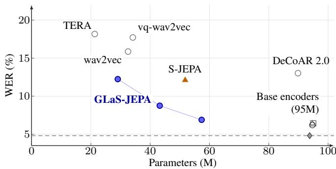
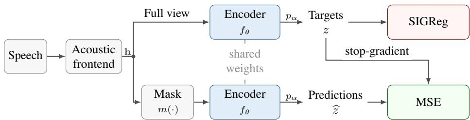
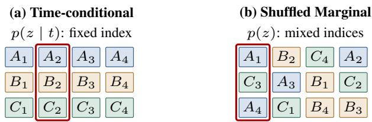
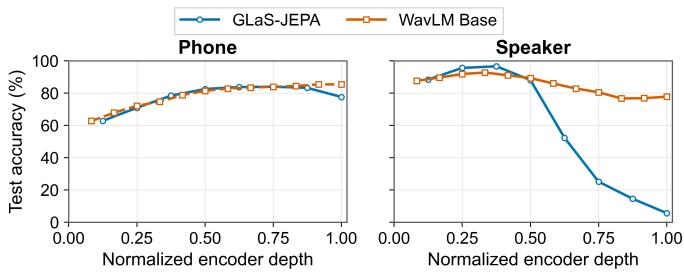

# GLaS-JEPA: GAUSSIAN-REGULARIZED SPEECH SSL WITHOUT ENGINEERED PREDICTION TARGETS

Gaspard Botte´1,2,⋆, Severin Baroudi´ 6, Samir Sadok3, Francesco Paissan2,5, Thomas Hueber7, Xavier Alameda-Pineda3, Ricard Marxer4,⋆, Mirco Ravanelli1,2,⋆

1Concordia University 2Mila – Quebec AI Institute´ 4CNRS, ILLS, Univ Toulon 3Inria, Univ. Grenoble Alpes, CNRS, LJK 6Univ Toulon, Aix Marseille Univ, CNRS, LIS 5Universite Laval ´ 7Univ. Grenoble Alpes, CNRS, Grenoble INP, GIPSA-lab, Grenoble, France

## ABSTRACT

Speech self-supervised learning aims to learn general-purpose representations for downstream speech tasks. However, current approaches rely on complex, carefully designed prediction targets. We challenge this necessity with GLaS-JEPA, a frame work that directly predicts the current encoder’s continuous representations at masked positions, without contrastive learning, discrete targets, or separate EMA target encoders. We prevent representation collapse using SIGReg representationspace regularization, eliminating the need for engineered target-generation mechanisms. Pretrained on 960 hours of LibriSpeech, our 57M-parameter model achieves a 6.89% WER on frozen-encoder SUPERB ASR and a 25.87% CER on slot filling, outperforming the best non-distilled sub-90M baselines by 43.1% and 22.0%, respectively. These results demonstrate that highly competitive speech representations can emerge from a radically simplified training recipe.

Index Terms— self-supervised learning, speech representations, JEPA, Gaussian regularization

## 1. INTRODUCTION

Speech self-supervised learning (SSL) has emerged as a powerful paradigm, achieving state-of-the-art performance across diverse downstream tasks. By allowing a pretrained encoder to transfer effectively across recognition, speaker analysis, and spoken-language understanding, SSL demonstrates remark able robustness, particularly in low-resource scenarios where labeled data is scarce [1–3]. This success motivates a closer look at the core ingredients required for compact, efficient encoders. A critical design dimension in masked-prediction speech SSL is target construction, which defines what the encoder learns to infer from context and directly shapes its learning signal. For instance, WAV2VEC 2.0 relies on quantized representations [1], HUBERT and WAVLM utilize clustered hidden units [3, 4], DATA2VEC 2.0 leverages continuous targets from an exponential-moving-average (EMA) encoder [5], and S-JEPA predicts soft Gaussian-mixture assignments [6]. These mechanisms do more than resist collapse: they fundamentally shape the information content and stability of the prediction signal. Simplified recipes such as S-JEPA still construct dedicated targets [6]. This raises a fundamental question: Are specially engineered prediction targets strictly necessary to achieve competitive performance in speech SSL?

  
Fig. 1. Frozen SUPERB ASR versus parameter count. All plotted models are pretrained on LibriSpeech 960 h, except S-JEPA, pretrained on 83k h [2, 6]. Dashed line: data2vec 2.0 WER (4.81%) [7].

To answer this, we introduce GLaS-JEPA (Gaussian LAtent Speech-JEPA), a framework that directly predicts the current encoder’s continuous representations at masked positions, bypassing discrete assignments or an EMA target encoder. Following the joint-embedding predictive architecture (JEPA) principle [8, 9], prediction occurs entirely in representation space, meaning targets evolve jointly with the model. However, optimizing these unconstrained targets risks representation collapse, where the model minimizes prediction error by outputting constant vectors and discarding speech information. Rather than relying on a target generator to prevent this, GLaS-JEPA uses Sketched Isotropic Gaussian Regularization (SIGReg) [10] to regularize the space directly. This shifts collapse prevention from complex target construction to a simple regularization term encouraging a non-collapsed Gaussian distribution. We evaluate our approach on the SU-PERB benchmark [2].

  
Fig. 2. GLaS-JEPA: shared encoder and token-wise projector $p _ { \alpha }$ . MSE uses masked predictions and stop-gradient targets; SIGReg backpropagates through the full view. The projector is discarded downstream.

Our core contributions are: (1) introducing GLaS-JEPA, a speech SSL framework that learns by predicting the encoder’s continuous representations at masked positions; (2) showing that SIGReg is sufficient to prevent collapse in this setting, dispensing with the need for target-generation mechanisms commonly used in speech SSL; and (3) establishing strong performance across content, speaker, and semantic tasks, showing that competitive speech representations can emerge from a substantially simpler training pipeline.

## 2. RELATED WORK

Constructing prediction targets. Quantization supplies discrete latent targets in WAV2VEC 2.0 and VQ-WAV2VEC [1, 11], whereas HUBERT and WAVLM predict clustered pseudo-labels [3, 4]. BEST-RQ simplifies this process with a fixed randomprojection quantizer [12], retaining a dedicated target mapping. Continuous latent prediction is already established by DATA2VEC 2.0 [5]. It constructs targets by averaging normalized upper-layer representations from a slowly moving EMA teacher, and regresses them with a separate temporal CNN predictor. The distinction in GLaS-JEPA is not continuity, but using current-encoder representations with explicit distributional regularization instead of processed EMA targets. Its token-wise linear projector maps latents independently into a 128-dimensional loss space; unlike the DATA2VEC 2.0 predictor, it does not mix neighboring positions. S-JEPA [6] instead predicts soft GMM posteriors, using MFCC features initially and EMA-encoder features. These alternatives motivate testing whether discrete target mappings and EMA-based target generation can be replaced by direct regularization of current-encoder representations.

Regularizing representations directly. VICReg and Barlow Twins explicitly constrain representation statistics, providing an alternative to predictor and stop-gradient mechanisms such as those used in SimSiam [13–15]. LEJEPA introduces SIGReg for distributional regularization [10], and LeWorldModel ap plies it to visual trajectories [16]. Building on SIGReg, we investigate whether direct representation regularization can enable current-encoder speech latent prediction without discrete assignments or an EMA teacher. Speech produces many latent frames per utterance, yielding large token populations within each batch; we study how to group them in Sec. 3.3.

Scope of comparison. Related non-distilled speech encoders include modified CPC, APC, PASE+, TERA, WAV2VEC, and DECOAR 2.0 [17–22], covering contrastive prediction, acoustic reconstruction, and multi-task objectives. A-JEPA, AUDIO-JEPA, and WAVJEPA explore related predictive representations for general audio [23–25]; we discuss them but exclude unmatched numerical comparisons because their general-audio training and evaluation differ from our speech-only setting.

## 3. GLaS-JEPA

## 3.1. Architecture and forward pass

We introduce GLaS-JEPA (Gaussian Latent Speech Joint-Embedding Predictive Architecture), a dual-path framework for direct prediction of continuous speech representations. As illustrated in Fig. 2, an acoustic frontend first processes the input speech into a sequence of continuous feature vectors h. This sequence is then branched into two parallel processing pathways: The full view provides the complete, uncorrupted feature sequence h to the encoder $f _ { \theta }$ , and a subsequent projector $p _ { \alpha }$ maps each token independently into a dedicated loss space to target representations: $\mathbf { z } = p _ { \alpha } ( f _ { \theta } ( \mathbf { h } ) )$ . The masked view applies a masking function $m ( \cdot )$ that replaces contiguous spans of the input features with a learnable mask token. The same encoder $f _ { \theta }$ processes these features and learns to infer missing content from temporal context. The shared projector $p _ { \alpha }$ then maps its representations into the loss space: $\widehat { \mathbf { z } } = p _ { \alpha } \big ( f _ { \theta } \big ( m ( \mathbf { h } ) \big ) \big )$ .

The encoder learns prediction during training; there is no separate temporal predictor or EMA teacher. The tokenwise linear projector provides a 128-dimensional bottleneck that separates the optimization loss space from the encoder representations used downstream. It can assist optimization but does not mix neighboring positions, and is discarded after pretraining.

Table 1. Frozen-encoder SUPERB results (%). Baselines: SUPERB/S-JEPA [2, 6]; SD: WavLM [3]; data2vec 2.0: ASR/ER/SF [7], SD [26]. Bold: best non-distilled sub-90M score. GLaS-JEPA uses Full Marginal SIGReg. Parameters rounded to millions.
<table><tr><td colspan="3"></td><td>Content</td><td>Speaker</td><td>Paralinguistic</td><td colspan="2">Semantic</td></tr><tr><td>Model</td><td>Params (M)</td><td>Pretrain (h)</td><td>ASR WER↓</td><td>SD DER↓</td><td>ER Acc. ↑</td><td>SFF1↑</td><td>SF CER↓</td></tr><tr><td colspan="2">Base encoders (approximately 95M parameters)</td><td></td><td></td><td></td><td></td><td></td><td></td></tr><tr><td>wav2vec 2.0 Base</td><td>95</td><td>960</td><td>6.43%</td><td>6.08</td><td>63.43</td><td>88.30</td><td>24.77</td></tr><tr><td>HuBERT Base</td><td>95</td><td>960</td><td>6.42%</td><td>5.88</td><td>64.92</td><td>88.53</td><td>25.20</td></tr><tr><td>WavLM Base</td><td>95</td><td>960</td><td>6.21%</td><td>4.55</td><td>65.94</td><td>89.38</td><td>22.86</td></tr><tr><td>data2vec 2.0 Base</td><td>94</td><td>960</td><td>4.81%</td><td>6.5</td><td>66.66</td><td>89.67</td><td>22.09</td></tr><tr><td colspan="2">Non-distilled sub-90M baselines</td><td></td><td></td><td></td><td></td><td></td><td></td></tr><tr><td>TERA</td><td>21</td><td>960</td><td>18.17%</td><td>9.96</td><td>56.27</td><td>67.50</td><td>54.17</td></tr><tr><td>wav2vec</td><td>33</td><td>960</td><td>15.86%</td><td>9.90</td><td>59.79</td><td>76.37</td><td>43.71</td></tr><tr><td>vq-wav2vec</td><td>34</td><td>960</td><td>17.71%</td><td>9.93</td><td>58.24</td><td>77.68</td><td>41.54</td></tr><tr><td>DeCoAR 2.0</td><td>90</td><td>960</td><td>13.02%</td><td>6.59</td><td>62.47</td><td>83.28</td><td>34.73</td></tr><tr><td>S-JEPA</td><td>52</td><td>83k</td><td>12.10%</td><td>一</td><td>64.83</td><td>83.05</td><td>33.17</td></tr><tr><td>GLaS-JEPA</td><td>57</td><td>960</td><td>6.89%</td><td>6.46</td><td>57.91</td><td>87.72</td><td>25.87</td></tr></table>

## 3.2. Loss function and regularization

Prediction. The model learns by minimizing the mean squared error (MSE) between the masked-view predictions bz and the full-view targets z. We simplify the notation by letting $\mathcal { M } \subseteq \{ 1 , \dots , B \} \times \{ 1 , \dots , T \}$ , represent the set of all masked time indices across a batch. The prediction loss is computed exclusively at these masked positions:

$$
\mathcal { L } _ { \mathrm { p r e d } } = \frac { 1 } { | \mathcal { M } | } \sum _ { ( b , t ) \in \mathcal { M } } \left. \widehat { \mathbf { z } } _ { b , t } - \mathrm { s g } ( \mathbf { z } _ { b , t } ) \right. _ { 2 } ^ { 2 } .\tag{1}
$$

where sg(·) denotes the stop-gradient operation. Because the targets z are generated dynamically using the current, actively updating network weights, the stop-gradient ensures the prediction loss routes gradients only through the masked forward path.

Regularization. SIGReg [10] regularizes unmasked targets z to prevent collapse. It averages weighted squared discrepancies between empirical characteristic functions of random unit projections and the standard Gaussian function $e ^ { - u ^ { 2 } / 2 }$ at frequency $u ,$ encouraging isotropic Gaussian representations. We optimize:

$$
\begin{array} { r } { \mathcal { L } = ( 1 - \lambda ) \mathcal { L } _ { \mathrm { p r e d } } + \lambda \mathcal { L } _ { \mathrm { r e g } } , \quad \mathrm { w i t h } \lambda = 0 . 0 1 . } \end{array}\tag{2}
$$

Klindt et al. [27] prove that LeJEPA guarantees linear identifiability under independent Gaussian latents and isotropic transitions, a property unique to Gaussian distributions. This raises a key empirical question for speech: is Gaussian regularization sufficient to extract useful, non-collapsed representations from complex, correlated audio? GLaS-JEPA investigates this by shifting collapse prevention entirely to ${ \mathcal { L } } _ { \mathrm { r e g } } .$ . Here, gradients from $\mathcal { L } _ { \mathrm { r e g } }$ flow exclusively through the unmasked full-view representations, preventing representation collapse without strictly enforcing exact Gaussianity on finite-length speech latents.

## 3.3. Applying Distributional Regularization

Speech representations are temporally correlated. For a latent batch $Z \in \mathbb { R } ^ { B \times T \times d _ { p } }$ , we must choose which population SI-GReg should regularize. We consider two alternatives (Fig. 3). Time-conditional SIGReg. This regularizes $p ( z \mid t )$ . At each fixed latent index t, the population contains B representations from different utterances. We average the T penalties, as in LeWorldModel [16]. Using distinct utterances limits withinutterance dependence, although shared-speaker dependence may remain.

Marginal SIGReg. This regularizes the batch-induced marginal p(z), ignoring the time index. Tokens across times and utterances belong to the same population, allowing both sources of variation to maintain a non-collapsed signal. We use two estimators of this marginal objective.

Shuffled Marginal, used only in the controlled four-layer ablation, shuffles the BT tokens into T groups of B and averages their penalties. This matches Time-conditional SIGReg in group size, number of penalties, and computation, isolating population construction rather than sample size. Full Marginal, used in our main 57M model, applies one penalty to all BT tokens. Both target the same marginal population $p ( z )$ and differ only in finite-sample estimation. Under IID sampling, both converge to the same population-level objective as sample size grows; speech tokens need not satisfy this assumption.

Population sample → SIGReg → $\mathcal { N } ( 0 , I )$ reference
<table><tr><td>SIGReg</td><td>ASR WER ↓ 1</td><td>ER Acc. ↑</td><td>SD DER↓</td></tr><tr><td>Time-conditional</td><td>13.99</td><td>57.92</td><td>7.65</td></tr><tr><td>Shuffled Marginal</td><td>12.24</td><td>58.60</td><td>6.65</td></tr></table>

Fig. 3. Time-conditional (left) and Shuffled Marginal (right), with SUPERB results for the 30M model. Colors/letters: utterances; subscripts: time indices. Outlines mark groups of B tokens.

With all other settings fixed, Shuffled Marginal improves ASR WER from 13.99% to 12.24%, ER accuracy from 57.92% to 58.60%, and SD DER from 7.65% to 6.65% (Fig. 3). These gains motivate Marginal SIGReg for the main model.

## 4. EXPERIMENTAL SETUP

Encoder and training. We pretrain on LibriSpeech 960 h [28]. The eight-layer Conformer [29] has width 576, eight heads, FFN width 2,048, and convolution kernel 31. The frontend uses 80-bin log-Mel features (25 ms window, 5 ms hop) with temporal stride four, yielding 20 ms latent spacing. A tokenwise linear projector maps encoder representations to a 128- dimensional loss space. The downstream encoder contains approximately 57M parameters, excluding the projector.

We mask 50% of positions in contiguous spans of ten latents (200 ms). Training uses 220,000 AdamW updates, 40,000-step linear warmup followed by cosine decay, peak learning rate $1 0 ^ { - 4 }$ , weight decay $1 0 ^ { - 3 }$ , and $\lambda = 0 . 0 1$ . Crops span 2–15.6 s, with approximately 4,000 s of audio per optimization step. We use Full Marginal SIGReg on all tokens in the batch.

Evaluation. For the four SUPERB tasks [2], we freeze the encoder and train task heads over a learned weighted sum of hidden layers. We follow WavLM Base learning rates and batch sizes [3] for ASR, speaker diarization (SD), emotion recognition (ER), and slot filling (SF); ASR uses no external language model. Published baselines are contextual comparisons, not matched-budget reimplementations. Linear probes assess 41-phone classification using CPC’s LibriSpeech protocol and speaker identification from time-pooled features; RankMe [30] measures effective rank.

## 5. RESULTS AND DISCUSSION

## 5.1. Downstream transfer

Table 1 tests whether current-representation prediction supports useful transfer. GLaS-JEPA achieves 6.89% WER and 25.87% SF concept error rate (CER), improving over the best listed non-distilled sub-90M baselines by 43.1% and 22.0% relatively. Against S-JEPA, it uses 57.36M rather than 51.8M parameters and 960 rather than approximately 83,000 pretraining hours. Baseline comparisons use different architectures and training budgets, so they cannot isolate the SSL objective’s effect. Accordingly, these comparisons test whether such a target-free model can be competitive, rather than whether its objective outperforms alternatives under controlled conditions.

  
Fig. 4. Phone and speaker linear-probe test accuracy versus normalized encoder depth for GLaS-JEPA and WavLM Base.

The gains are task-dependent: SF F1 reaches 87.72%, but ER accuracy (57.91%) trails S-JEPA (64.83%). GLaS-JEPA reaches 6.46% SD DER, slightly below DeCoAR 2.0 (6.59%) and data2vec 2.0 (6.5%), with approximately 39% fewer parameters. S-JEPA does not report SD here. Base encoders remain stronger in ASR, including WavLM (6.21% WER) and data2vec 2.0 (4.81%).

## 5.2. Collapse, representations, and limitations

Without SIGReg, effective rank [30] falls to 1 within a few thousand updates; phone accuracy is ∼16% with imbalanced classes. Fig. 4 tracks phone and speaker linear-probe test accuracy across encoder layers, indicating where each type of information is accessible. Depth is normalized by the number of layers to compare the 8-layer GLaS-JEPA and 12-layer WavLM Base. Their phone peaks are 83.9/85.4% at layers 6/8 and 11/12; speaker peaks are 96.5/92.7% at 3/8 and 4/12. Strong intermediate speaker encoding, then greater upper-layer loss than WavLM with retained phonetics, suggests invariance to slowly varying/global acoustic factors relevant to ER. From ∼140k to 220k steps in the same run, ASR WER improved from 7.52% to 6.89%, but ER fell from 59.20% to 57.91%. This suggests optimization increasingly favors content over paralinguistic information, though it does not establish causality.

Stable current-encoder training at ∼95M remains ongoing work; 57M competitiveness does not establish equivalent scaling to Base WavLM, HuBERT, or data2vec 2.0.

## 6. CONCLUSION

At the demonstrated scale, GLaS-JEPA replaces engineered targets with representation regularization, reaching 6.89% ASR WER at 57M parameters with competitive content, speaker, and semantic transfer. Competitive speech representations can thus emerge from current-encoder prediction without dedicated target generation.

Acknowledgments. We thank Dr. Thomas Hueber (GIPSA-lab, CNRS) for making this internship project possible. We thank Lovanya Jain for help with experiments. M. Ravanelli acknowledges support from NSERC, the Digital Research Alliance of Canada (alliancecan.ca), and Translated for funding through the Immediate Research Grant. This work benefited from support from the French National Research Agency through the ANR-20-CE23-0012- 01 (MIM) grant and from access to the HPC resources of IDRIS under allocation A0191014044.

## 7. REFERENCES

[1] A. Baevski, H. Zhou, A. Mohamed, and M. Auli, “wav2vec 2.0: A framework for self-supervised learning of speech representations,” NeurIPS, vol. 33, pp. 12449–12460, 2020.

[2] S.-w. Yang et al., “SUPERB: Speech processing universal performance benchmark,” in Interspeech, 2021, pp. 1194–1198.

[3] S. Chen et al., “WavLM: Large-scale self-supervised pretraining for full stack speech processing,” IEEE J. Sel. Topics Signal Process., vol. 16, no. 6, pp. 1505–1518, 2022.

[4] W.-N. Hsu, B. Bolte, Y.-H. H. Tsai, K. Lakhotia, R. Salakhutdinov, and A. Mohamed, “HuBERT: Self-supervised speech representation learning by masked prediction of hidden units,” IEEE/ACM Trans. Audio Speech Lang. Process., vol. 29, pp. 3451–3460, 2021.

[5] A. Baevski, A. Babu, W.-N. Hsu, and M. Auli, “Efficient selfsupervised learning with contextualized target representations for vision, speech and language,” in ICML, 2023, vol. 202 of PMLR, pp. 1416–1429.

[6] G. Ioannides et al., “S-JEPA: Soft clustering anchors for selfsupervised speech representation learning,” arXiv preprint arXiv:2606.19398, 2026.

[7] J. W. Yoon, S. M. Kim, and N. S. Kim, “MCR-Data2vec 2.0: Improving self-supervised speech pre-training via model-level consistency regularization,” in Interspeech, 2023, pp. 2833– 2837.

[8] Y. LeCun, “A path towards autonomous machine intelligence,” Position paper, OpenReview, 2022, Version 0.9.2.

[9] M. Assran et al., “Self-supervised learning from images with a joint-embedding predictive architecture,” in CVPR, 2023, pp. 15619–15629.

[10] R. Balestriero and Y. LeCun, “LeJEPA: Provable and scalable self-supervised learning without the heuristics,” arXiv preprint arXiv:2511.08544, 2025.

[11] A. Baevski, S. Schneider, and M. Auli, “vq-wav2vec: Selfsupervised learning of discrete speech representations,” in ICLR, 2020.

[12] C.-C. Chiu, J. Qin, Y. Zhang, J. Yu, and Y. Wu, “Self-supervised learning with random-projection quantizer for speech recognition,” in ICML, 2022, vol. 162 of PMLR, pp. 3915–3924.

[13] A. Bardes, J. Ponce, and Y. LeCun, “VICReg: Varianceinvariance-covariance regularization for self-supervised learning,” in ICLR, 2022.

[14] J. Zbontar, L. Jing, I. Misra, Y. LeCun, and S. Deny, “Barlow twins: Self-supervised learning via redundancy reduction,” in ICML, 2021, vol. 139 of PMLR, pp. 12310–12320.

[15] X. Chen and K. He, “Exploring simple siamese representation learning,” in CVPR, 2021, pp. 15750–15758.

[16] L. Maes, Q. Le Lidec, D. Scieur, Y. LeCun, and R. Balestriero, “LeWorldModel: Stable end-to-end joint-embedding predictive architecture from pixels,” arXiv preprint arXiv:2603.19312, 2026.

[17] M. Riviere, A. Joulin, P.-E. Mazar \` e, and E. Dupoux, “Unsuper-´ vised pretraining transfers well across languages,” in ICASSP, 2020.

[18] Y.-A. Chung, W.-N. Hsu, H. Tang, and J. Glass, “An unsupervised autoregressive model for speech representation learning,” in Interspeech, 2019, pp. 146–150.

[19] M. Ravanelli et al., “Multi-task self-supervised learning for robust speech recognition,” in ICASSP, 2020.

[20] A. T. Liu, S.-W. Li, and H.-y. Lee, “TERA: Self-supervised learning of transformer encoder representation for speech,” IEEE/ACM Trans. Audio Speech Lang. Process., vol. 29, 2021.

[21] S. Schneider, A. Baevski, R. Collobert, and M. Auli, “wav2vec: Unsupervised pre-training for speech recognition,” in Interspeech, 2019, pp. 3465–3469.

[22] S. Ling and Y. Liu, “DeCoAR 2.0: Deep contextualized acoustic representations with vector quantization,” arXiv preprint arXiv:2012.06659, 2020.

[23] Z. Fei, M. Fan, and J. Huang, “A-JEPA: Joint-embedding predictive architecture can listen,” arXiv preprint arXiv:2311.15830, 2023.

[24] L. Tuncay, E. Labbe, E. Benetos, and T. Pellegrini, “Audio-´ JEPA: Joint-embedding predictive architecture for audio representation learning,” in ICME, 2025.

[25] G. Yuksel, P. Guetschel, M. Tangermann, M. van Gerven, and K. van der Heijden, “WavJEPA: Semantic learning unlocks robust audio foundation models for raw waveforms,” arXiv preprint arXiv:2509.23238, 2025.

[26] H.-J. Chang, S. Bhati, J. Glass, and A. H. Liu, “USAD: Universal speech and audio representation via distillation,” in IEEE ASRU, 2025.

[27] D. Klindt, Y. LeCun, and R. Balestriero, “When does LeJEPA learn a world model?,” arXiv preprint arXiv:2605.26379, 2026.

[28] V. Panayotov, G. Chen, D. Povey, and S. Khudanpur, “LibriSpeech: An ASR corpus based on public domain audio books,” in ICASSP, 2015, pp. 5206–5210.

[29] A. Gulati et al., “Conformer: Convolution-augmented transformer for speech recognition,” in Interspeech, 2020, pp. 5036– 5040.

[30] Q. Garrido, R. Balestriero, L. Najman, and Y. LeCun, “RankMe: Assessing the downstream performance of pretrained selfsupervised representations by their rank,” in ICML, 2023, vol. 202 of PMLR, pp. 10929–10974.