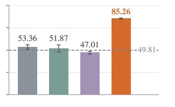
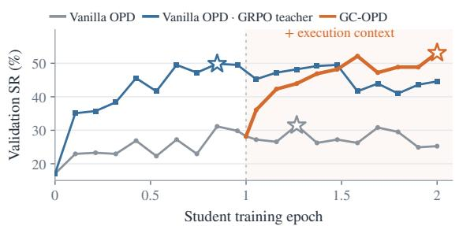
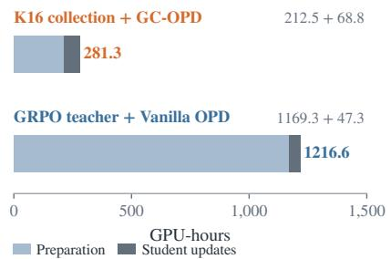
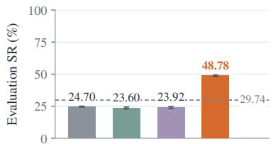
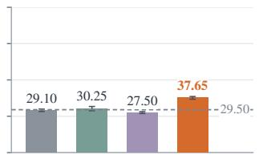
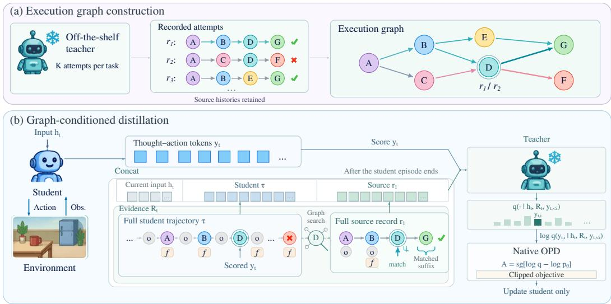
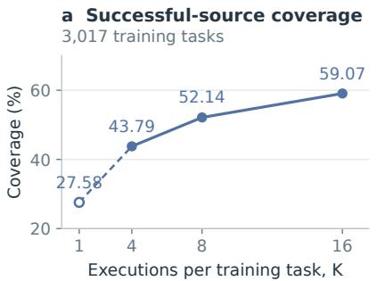
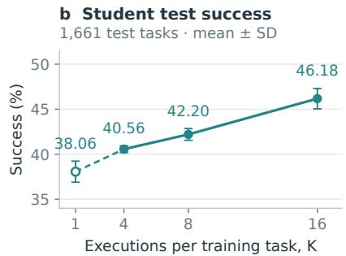

# GRAPH-CONDITIONED ON-POLICY AGENT DISTILLATION FROM OFF-THE-SHELF TEACHERS

Xiaohan Yi1,2,\*, Wen Luo3,\*, Yani Huang1,\*, Junfeng Zhan1, Asher Qin1, Peilin Zhao4, Xi Xiao2,†

1Yuanbao Team, Tencent 2Tsinghua University

3Huazhong University of Science and Technology

4School of Artificial Intelligence, Shanghai Jiao Tong University

\*Equal contribution. †Corresponding author.

yxh24@mails.tsinghua.edu.cn xiaox@sz.tsinghua.edu.cn

## ABSTRACT

On-policy distillation (OPD) trains compact language agents with teacher feedback on student-generated trajectories. In multi-turn tasks, compounding errors can move students beyond the teacher’s effective supervision. We introduce Graph-Conditioned On-Policy Agent Distillation (GC-OPD), which enriches an off-the-shelf teacher’s scoring context with execution evidence. A graph indexes repeated teacher executions by shared states while preserving complete successful and failed histories. After each student episode, GC-OPD retrieves current-state references or historical alternatives and combines them with student hindsight to score the original thought–action tokens. Using the same original teachers, GC-OPD improves mean success over vanilla OPD from 24.70% to 48.78% on ScienceWorld (4B student), from 53.36% to 85.26% on ALFWorld Unseen, and from 29.10% to 37.65% on WebShop. At matched student sizes, it also achieves higher mean success than every evaluated OPD baseline using GRPO-trained teachers on ScienceWorld and ALFWorld; the strongest such ScienceWorld 4B baseline reaches 46.66%. GC-OPD requires no task-specific teacher optimization.

## Code: https://github.com/hanyi2021/GC\_OPD

(a) ScienceWorld  

(b) Preparation and training  

(c) ScienceWorld  
  
(d) ALFWorld Unseen

(e) WebShop  
  
Figure 1: Distilling agents from off-the-shelf teachers. (a) ScienceWorld 4B validation curves (305 tasks, one seed per checkpoint); stars mark selected checkpoints. (b) Preparation and training for a 1.7B student; costs sum measured preparation and student-training stages using 64 and eight H20 GPUs, respectively. (c–e) Distillation from original teachers: student success, mean±SD over four inference seeds; dashed lines show teacher success. Cost accounting is in Appendix C.

## 1 INTRODUCTION

On-policy distillation (OPD) trains compact language agents with teacher feedback on responses sampled from the student’s own policy (Gu et al., 2024; Agarwal et al., 2024; Lu & Thinking Machines Lab, 2025). In multi-turn environments, early errors change the states encountered later: the student can drift beyond the teacher’s effective support, degrading supervision as interaction continues (Ross et al., 2011; Wang et al., 2026b). Existing methods address this problem through the interaction process. TCOD-F2B gradually increases student rollout depth; TCOD-B2F replays successful prefixes before handing control to the student (Wang et al., 2026b). FTB intervenes at high-disagreement decisions and uses subsequent student continuations to assess teacher-proposed alternatives (Chen et al., 2026). These approaches highlight a central challenge: maintaining useful supervision along the executions that students actually produce, including after they deviate.

Teacher preparation presents a second challenge. Some agent-distillation studies use taskspecialized or reinforcement-learning-trained teachers (Zhou et al., 2026; Chen et al., 2026). Preparing a large teacher adds optimization and environment-interaction costs. It also requires memory for gradients, optimizer states, and backward activations beyond the weights needed for inference (Rajbhandari et al., 2020). An off-the-shelf teacher avoids this additional optimization stage, but its task performance may initially be limited. The challenge is to use its available experience to train students competitive with those distilled from task-trained teachers.

Repeated execution exposes capabilities that a single attempt misses. In a fixed ScienceWorld evaluation bank, the original Qwen3-32B teacher (Yang et al., 2025) achieves 29.60% pass@1 and 66.83% pass@16 (Appendix Table 4). These attempts record both successful solutions and the consequences of unsuccessful choices. Can this execution experience improve the teacher’s supervision without first improving its parameters? We investigate this question using repeated executions collected on training tasks, separate from the evaluation bank.

Two design challenges arise. Evidence selection: records span many states and outcomes, so the teacher needs relevant experience without receiving the entire library or losing the history that explains an outcome. Trajectory divergence: a task may have recorded solutions even when no eligible successful record matches the student’s current state. Earlier student states may still connect to successful alternatives; those records must be identified and distinguished from the student’s actual continuation.

We introduce Graph-Conditioned On-Policy Agent Distillation (GC-OPD). Shared state locators connect visits across recorded executions, while source identities preserve their complete histories and outcomes. These graph associations guide retrieval at the student’s current state or, when eligible successful support is absent, earlier visited states. Remaining interaction cost ranks the associated successful continuations; retained records are provided in full so the teacher can account for the observations and preparations preceding their outcomes. After each episode, the fixed teacher conditions on the selected execution records and student hindsight to score the student’s original thought–action tokens. Only the student is updated.

Our contributions are threefold:

• We introduce GC-OPD, which turns recorded interactions into training-time supervision from an off-the-shelf teacher without additional teacher optimization.

• We develop source-preserving state and history retrieval, linking student decisions to complete records and exposing historical alternatives when no current-state successful reference is available.

• At matched student sizes, GC-OPD with off-the-shelf teachers achieves higher mean success than all evaluated GRPO-teacher OPD baselines on ScienceWorld and ALFWorld. ScienceWorld gains over the best such baselines are 7.48 and 2.12 percentage points for 1.7B and 4B students, with fewer interactions. WebShop also improves over vanilla OPD; ablations examine which execution evidence contributes to supervision.

## 2 RELATED WORK

## 2.1 ON-POLICY DISTILLATION FOR LARGE LANGUAGE MODELS

Knowledge distillation transfers teacher predictions to a smaller model (Hinton et al., 2015). For autoregressive models, teacher-generated training sequences can differ from the contexts encountered by the student. On-policy methods address this mismatch through supervision on student samples, following the principle of learning under the learner’s own state distribution (Ross et al., 2011). MiniLLM and generalized knowledge distillation develop distribution-matching objectives for this setting (Gu et al., 2024; Agarwal et al., 2024). Teacher context provides another source of supervision: OPCD studies context-conditioned knowledge transfer (Ye et al., 2026); OPID and SEED extract hindsight skills to rescore original responses (Yang et al., 2026; Wu et al., 2026); Skill-SD retrieves task-local skills (Wang et al., 2026a). PAST combines complete-response privilege with teacher adaptation (Feng et al., 2026). GC-OPD builds on context-conditioned OPD by selecting complete external executions through the student’s current and historical states.

## 2.2 CREDIT ASSIGNMENT IN LONG-HORIZON AGENT TASKS

Delayed outcomes provide limited information about which earlier decisions enabled success or caused failure. Policy-gradient methods connect returns to local updates (Schulman et al., 2017); hindsight experience replay reuses failed experience through goal relabeling (Andrychowicz et al., 2017), and Reflexion converts feedback into reusable verbal memory (Shinn et al., 2023). Recent agent-distillation methods provide more localized supervision. TCOD controls student interaction depth with a curriculum (Wang et al., 2026b); TurnOPD allocates rollout depth and loss across turns (Zhou et al., 2026); ATOD adjusts the balance of distillation and reinforcement learning and reweights turn-level signals (Tan et al., 2026). FTB assesses local teacher interventions using subsequent student continuations (Chen et al., 2026). AgentOPSD aggregates privileged token-level evidence into turn-level credit (Wang et al., 2026d). Graph-based methods use relations among executions to structure credit assignment (Cheng et al., 2026; Wang et al., 2026c; Gan, 2026); DART-SD uses teacher-execution graphs to generate recovery responses for masked supervised learning (Xu et al., 2026). GC-OPD uses state-associated records and student hindsight to inform feedback on the student’s original decisions, including after divergence.

## 3 GRAPH-CONDITIONED ON-POLICY AGENT DISTILLATION

## 3.1 PRELIMINARIES

For task $x ,$ a language agent interacts with an environment over multiple decisions. The student policy pθ receives public context $h _ { t } \colon$ the task, current observation, environment-provided action information, and a bounded observation–action history. It samples a thought–action response $y _ { t } = ( y _ { t , 1 } , \dots , y _ { t , | y _ { t } | } )$ (Yao et al., 2023); the environment executes its parsed action and returns an observation and feedback. Let τ denote the completed student episode, including actions, observations, feedback, and outcome.

In vanilla OPD, a fixed teacher evaluates each student-sampled token given the same history $h _ { t }$ and response prefix $y _ { t , < i }$ (Agarwal et al., 2024; Lu & Thinking Machines Lab, 2025). The formulation used here supplies the teacher–student log-probability difference as token-level feedback:

$$
\Delta _ { t , i } = \log q _ { \mathrm { T } } ( y _ { t , i } \mid h _ { t } , y _ { t , < i } ) - \log p _ { \theta } ( y _ { t , i } \mid h _ { t } , y _ { t , < i } ) .\tag{1}
$$

Only the student is updated. GC-OPD retains this interface and adds execution records to the teacher’s scoring context; the student continues to use its original decision-time context.

Two-stage training overview. GC-OPD first trains the student with vanilla OPD, whose teacher scores responses using the original decision-time context $h _ { t } .$ . It then continues training the warmedup student with graph-conditioned feedback: the teacher additionally receives student hindsight and selected execution records. Both stages count toward the student-training budget, and the teacher remains frozen throughout student training. For each task x, a generator $q _ { \mathrm { g e n } }$ collects a fixed offline library $\mathcal { D } _ { x } ;$ ; the main configuration uses the same off-the-shelf model for generation and scoring. In the GC stage, the student completes each episode before retrieval and scoring. Execution evidence is supplied only to the teacher. Figure 2 summarizes this stage.

  
Figure 2: GC-OPD overview. (a) Shared state nodes associate visits across recorded executions for reference retrieval, while source identities preserve complete histories. (b) The selected complete records and student hindsight condition the fixed teacher’s scoring of the original student tokens; only the student is updated. State and history retrieval is specified in Section 3.3, with the full procedure in Algorithm 1 (Appendix B.3).

## 3.2 SOURCE-PRESERVING EXECUTION GRAPH

Consider A–B–D–G and A–C–D–F in Figure 2. Their distinct visits to D share a locator, associating the executions for reference retrieval. Their prefixes can nevertheless contain different observations and preparations: opening and closing a drawer can restore its physical configuration while revealing its contents. D therefore provides a comparison anchor; the complete source history supplies the context needed to interpret its continuation and outcome. A shared locator alone does not make the two prefixes and suffixes interchangeable.

For a source r with $L _ { r }$ decisions, visit $\boldsymbol { v } ~ = ~ ( r , j )$ identifies the state before decision $j ,$ for $j \in \{ 0 , \ldots , L _ { r } \} ; j = L _ { r }$ is terminal. A training-only state descriptor $\phi ( x , s )$ and interaction metadata $\chi$ define a locator $z = \zeta ( \phi ( x , s ) , \chi )$ (Vapnik & Vashist, 2009; Chen et al., 2019). Continuous quantities, such as temperature in ScienceWorld, are discretized before matching. Unreliable captures receive $z ~ = ~ \bot$ and cannot match. Appendix B.2 specifies the environment-dependent descriptors and matching rules.

The source-visit graph $H _ { x } ~ = ~ ( \mathcal { W } _ { x } , \mathcal { F } _ { x } )$ contains these visits and consecutive temporal edges $( ( r , j ) , ( r , j + 1 ) )$ ). For all reliably located visits $\mathcal { V } _ { x } \subseteq \mathcal { W } _ { x }$ , projection $\pi _ { x } ( v ) = z ( v )$ induces

$$
\begin{array} { r l } & { G _ { x } = ( V _ { x } , E _ { x } ) , } \\ & { V _ { x } = \{ \pi _ { x } ( v ) : v \in \mathcal { V } _ { x } \} , } \\ & { E _ { x } = \{ ( \pi _ { x } ( u ) , \pi _ { x } ( v ) ) : ( u , v ) \in \mathcal { F } _ { x } , \ u , v \in \mathcal { V } _ { x } \} . } \end{array}\tag{2}
$$

Each shared node z in $G _ { x }$ links the source visits assigned to it:

$$
{ \mathcal { T } } _ { x } ( z ) = \{ v \in \mathcal { V } _ { x } : \pi _ { x } ( v ) = z \} , \qquad \operatorname { s r c } ( r , j ) = r .\tag{3}
$$

Here $\mathcal { T } _ { x } ( z ) = \mathcal { O }$ when $z \notin V _ { x }$ , including $z = \perp$ . A student locator queries $\mathcal { T } _ { x }$ to identify source visits; the source map src recovers their complete records from $\mathcal { D } _ { x }$ . Temporal edges retain recorded transitions. Although $G _ { x }$ may contain cycles or self-loops, chronological positions in $H _ { x }$ keep each recorded suffix finite (Appendix B.4).

Graph augmentation adds executed planner or oracle records with their origin and observed outcomes under the same source-validity interface. These additional executions, which may fail or exceed the student’s horizon, expand the library without changing the student objective (Appendix B.1).

## 3.3 STATE- AND HISTORY-CONDITIONED RETRIEVAL

Current-state evidence. A task can have successful source records without a matching visit at the student’s current decision. For decision t in completed student episode τ, let $z _ { t }$ be its locator. We query the shared-node associations in $G _ { x }$ and filter the returned visits for eligible successful continuations:

$$
\begin{array} { r } { \mathcal { A } _ { t } ^ { + } = \{ ( r , j ) \in \mathbb { Z } _ { x } ( z _ { t } ) : b ^ { + } ( r , j ) = 1 \} . } \end{array}\tag{4}
$$

Here $b ^ { + }$ checks the source outcome, recorded suffix continuity, and entry validity. When $\mathcal { A } _ { t } ^ { + }$ is nonempty, its visits compete with the student’s own continuation $( \tau , t )$ if the student succeeded. Denote this candidate set by $\mathcal { C } _ { t } ^ { + }$ and select

$$
( r _ { t } ^ { * } , j _ { t } ^ { * } ) \in \arg \operatorname* { m i n } _ { ( r , j ) \in { \mathcal { C } _ { t } ^ { + } } } d ( r , j ) , \qquad d ( r , j ) = \sum _ { \ell = j } ^ { L _ { r } - 1 } c _ { \ell } ^ { r } .\tag{5}
$$

Here $c _ { \ell } ^ { r }$ is the interaction cost, with counting conventions in Appendix B.3. External suffixes follow their source’s temporal edges in $H _ { x }$ . Ranking from the matched visit prevents earlier source detours from dominating the choice. At D, D–G determines the remaining cost, while the complete record $\mathbf { A { - } B { - } D { - } G }$ preserves the observations and preparations needed to interpret that continuation. Thus Externa $\mathsf { l } ( \bar { v } ) = \{ \mathrm { s r c } ( v ) \}$ for an external winner, and is empty if the student’s own continuation wins.

Historical evidence. When $A _ { t } ^ { + } = \emptyset$ , earlier student locators query the same graph associations. We choose the most recent anchor with eligible successful support:

$$
\alpha _ { t } = \operatorname* { m a x } \{ u \leq t : \mathcal { A } _ { u } ^ { + } \neq \varnothing \} , \qquad \operatorname* { m a x } \varnothing : = \perp .\tag{6}
$$

For a student that visits D and then reaches an unmatched X, the earlier D locates A–B–D–G as evidence for comparing the two continuations. The anchor identifies an earlier point of comparison; it neither rolls back the student nor inserts source actions into its execution. Without an anchor, an eligible same-task successful record may provide an explicitly unaligned fallback.

Reference composition. When no current-state successful reference is available, matched failed records are found independently through the same index $\mathcal { T } _ { x }$ at the latest shared student-history position, so their anchors can differ from successful references. Their observed consequences remain useful evidence without labelling every action in a failed episode as wrong. Candidate availabil ity and retention remain distinct: $\mathrm { R e t a i n } _ { \mathrm { e n v } }$ applies the environment’s assembly rules using the candidates, current-state match, and student outcome. Exact gates, fallbacks, cost counting, and tie-breaking appear in Appendix B.3.

For each scored decision, the teacher context contains the complete student execution and, when retained, at most one successful and one failed complete source. Each retains actions, observations, feedback, and outcome; source identity, verification, and association labels relate the records to the scored decision. Historical thoughts are excluded. Student hindsight remains available even without an external successful source. Tasks lacking successful source records remain in the training set.

## 3.4 EXECUTION-CONDITIONED ON-POLICY DISTILLATION

For a task batch B, freeze the rollout policy $p _ { \mathrm { o l d } } ~  ~ p _ { \theta }$ and complete student episodes before assembling evidence:

$$
\begin{array} { r } { \mathcal { B } _ { \tau } \gets \mathrm { R o l l o u t } ( p _ { \mathrm { o l d } } , B ) , \qquad R _ { t } \gets \mathrm { R e n d e r } ( \tau , t , S _ { t } ) . } \end{array}\tag{7}
$$

Here $S _ { t }$ contains the complete records retained by the rules in Section 3.3; matched visits recover their records through src. Graph associations guide reference selection, while $R _ { t }$ renders full source histories alongside the student execution. The teacher scores the same response IDs that the student

scores under its original public context $h _ { t } ;$ no missing action is inserted or substituted. Action-token scoring therefore retains the student’s original thought prefix. For teacher evidence R, define

$$
\begin{array} { r l } & { q _ { t , i } ^ { R } = q _ { \mathrm { T } } ( y _ { t , i } \mid h _ { t } , R , y _ { t , < i } ) , } \\ & { A _ { t , i } ^ { R } = \mathrm { s g } \big [ \log q _ { t , i } ^ { R } - \log p _ { \theta } ( y _ { t , i } \mid h _ { t } , y _ { t , < i } ) \big ] . } \end{array}\tag{8}
$$

Training uses $R = R _ { t } ;$ sg stops gradients through the signal, whose value uses the current student forward pass. We optimize a clipped policy-gradient surrogate (Schulman et al., 2017), with $\rho _ { t , i } =$ $p _ { \theta } ( y _ { t , i } \mid h _ { t } , y _ { t , < i } ) / p _ { \mathrm { o l d } } ( y _ { t , i } \mid h _ { t } , y _ { t , < i } ) ;$

$$
\mathcal { L } = - \sum _ { t , i } w _ { t , i } \operatorname* { m i n } \Bigl \{ \rho _ { t , i } A _ { t , i } ^ { R _ { t } } , \mathrm { c l i p } ( \rho _ { t , i } , 1 - \epsilon , 1 + \epsilon ) A _ { t , i } ^ { R _ { t } } \Bigr \} .\tag{9}
$$

Here ϵ is the clipping radius and $w _ { t , i }$ implements response masking and episode normalization (Appendix $\mathbf { A } . 2 )$ ; batch and episode indices are suppressed. The rollout policy $p _ { \mathrm { o l d } }$ enters the ratio, whereas Eq. 8 uses the current actor. The batch closes with

$$
\theta \gets \mathrm { U p d a t e } ( \theta ; \mathcal { L } _ { B _ { \tau } } ) ,\tag{10}
$$

where $\mathcal { L } _ { B }$ aggregates Eq. 9 over the collected episodes. Only the student is updated; the teacher and offline library remain fixed. Algorithm 1 in Appendix B.3 gives the complete control flow; Appendices B.5 and B.6 analyze the supervision signal. Deployment requires neither teacher calls nor graph retrieval.

## 4 EXPERIMENTS

Case study: execution context changes feedback. In ScienceWorld, the student must find a living thing, focus on it, and move it to the blue box in the living room. The complete seven-action episode below starts in the art studio; step 4 is the scored decision.

Student go hallway → go living room → look around (sees a desk with a drawer).   
Step 4 look in drawer: “The drawer isn’t open, so you can’t see inside.”   
Steps 5–7 open drawer (opens) → look in drawer (empty) → focus on book. Failure.   
Source Same three-action prefix; the matched entry is open drawer, preceded by a rejected collec  
tion attempt to look in drawer. It opens and inspects the drawer (empty), examines the   
book and drawing, then visits the greenhouse, focuses on and picks up a pea plant, and carries   
it to the blue box. Success.

Scoring the original step-4 output: look in drawer.
<table><tr><td>Teacher context</td><td>look</td><td>in</td><td>drawer</td></tr><tr><td>Vanilla OPD</td><td>97.69%</td><td>99.96%</td><td>99.95%</td></tr><tr><td>GC-OPD</td><td>26.81%</td><td>99.77%</td><td>99.99%</td></tr></table>

Execution context reduces teacher support for look by 70.88 percentage points at the rejected inspection step. Both conditions score identical student tokens with the original thought and response prefix. GC-OPD receives the complete student hindsight and source record; the display condenses observations and the source continuation. The probability change reflects their combined effect: the student hindsight itself includes the closed-drawer feedback.

## 4.1 EXPERIMENTAL SETUP

We evaluate household interaction in ALFWorld, multistage scientific tasks in ScienceWorld, and product search in WebShop (Shridhar et al., 2020; Wang et al., 2022; Yao et al., 2022). Table 1 compares vanilla OPD, TCOD-B2F, TCOD-F2B, FTB, and TurnOPD under original and task-trained teachers where available. Each trained model is evaluated with four inference seeds at temperature 0.4 and top-p = 1. We report success, environment progress or reward, and mean decisions over all tasks; ± denotes the sample SD across inference seeds.

Students share the acting protocol within each environment. Public prompts contain the task, observation, and most recent 5/5/2 observation–action pairs for ScienceWorld/ALFWorld/WebShop, with decision limits of 30/30/15. Rejected or malformed actions consume a decision. ScienceWorld has 1,661 evaluation tasks and reports best-progress Score; ALFWorld has 140 Seen and 134 Un seen tasks, with rounds pooled over both; WebShop has 500 tasks and reports final reward ×100. Interaction and evaluation details appear in Appendix A.1.

Training schedule. For ScienceWorld, vanilla OPD has a two-epoch budget; GC-OPD uses one vanilla OPD epoch followed by one GC epoch. Teachers remain frozen. Figure 1(a) shows validation curves; Appendix A.2 gives training parameters.

## 4.2 MAIN RESULTS

Table 1: Main results across ScienceWorld, ALFWorld, and WebShop. (a) Two ScienceWorld student sizes. (b) Two ALFWorld teacher conditions and WebShop. Values are mean±SD over four inference seeds; bold/underline mark the best/second-best trained students per environment, size, and metric across teacher conditions. ∗ denotes planner/oracle records used during training. The ALFWorld untrained student is repeated for comparison. Dashes denote unavailable or inapplicable entries.  
(a) ScienceWorld
<table><tr><td>Teacher policy: Qwen3-32B</td><td></td><td></td><td>SR↑</td><td></td><td>Score ↑</td><td>Rounds↓</td></tr><tr><td>Original</td><td></td><td></td><td></td><td>29.74±0.30</td><td>57.24±0.27</td><td>17.87±0.03</td></tr><tr><td>GRPO</td><td></td><td></td><td></td><td>48.43±0.56</td><td>70.57±0.50</td><td>15.74±0.13</td></tr><tr><td></td><td colspan="3">Student: Qwen3-1.7B</td><td colspan="3">Student: Qwen3-4B</td></tr><tr><td>Method</td><td>SR↑</td><td>Score ↑</td><td>Rounds↓</td><td>SR↑</td><td>Score ↑</td><td>Rounds↓</td></tr><tr><td>Untrained student</td><td>3.09±0.39</td><td></td><td>9.31 ±0.15 22.55±0.22</td><td></td><td></td><td>15.01±0.3035.46±0.36 17.27±0.13</td></tr><tr><td>Scoring teacher: Original Qwen3-32B</td><td></td><td></td><td></td><td></td><td></td><td></td></tr><tr><td>Vanilla OPD</td><td>22.31±0.40 52.79±0.35</td><td></td><td>19.66±0.15</td><td>24.70±0.35 53.47±0.52 17.24±0.15</td><td></td><td></td></tr><tr><td>TCOD-B2F 水</td><td>21.06±0.94</td><td>49.20±0.53</td><td>17.76±0.15</td><td>23.13±0.33</td><td>52.30±0.04</td><td>18.77±0.15</td></tr><tr><td>TCOD-F2B</td><td>23.34±0.51</td><td>50.20±0.46</td><td>16.91±0.11</td><td>23.60±0.80</td><td>53.05±0.64</td><td>18.78±0.20</td></tr><tr><td>FTB *</td><td>22.70±0.60</td><td>51.35±0.40</td><td>18.11±0.12</td><td>23.21±0.25</td><td>52.60±0.23</td><td>18.39±0.18</td></tr><tr><td>TurnOPD</td><td>23.84±0.41</td><td>52.63±0.62</td><td>18.51±0.13</td><td>23.92±0.83</td><td>54.32±0.70</td><td>17.72±0.10</td></tr><tr><td>GC-OPD</td><td>46.18±1.13</td><td>68.10±0.59</td><td>13.04±0.10</td><td>48.78±0.58</td><td>68.09±0.19</td><td>11.27±0.16</td></tr><tr><td>GC-OPD + GA 水</td><td>53.61±0.48</td><td>73.55±0.48</td><td>13.07±0.18</td><td>54.68±0.62</td><td>71.90±0.44</td><td>11.06±0.12</td></tr><tr><td>Scoring teacher: GRPO Qwen3-32B</td><td></td><td></td><td></td><td></td><td></td><td></td></tr><tr><td>Vanilla OPD</td><td>38.70±0.46</td><td>63.36±0.25</td><td>16.29±0.05</td><td>46.66±0.36</td><td>71.44±0.58</td><td>14.64±0.09</td></tr><tr><td>TCOD-B2F *</td><td>29.91±0.97</td><td>57.55±0.79</td><td>16.90±0.08</td><td>37.84±0.52</td><td>63.32±0.08</td><td>16.38±0.08</td></tr><tr><td>TCOD-F2B</td><td>27.75±0.27</td><td>56.72±0.20</td><td>17.20±0.05</td><td>40.13±0.17</td><td>64.88±0.53</td><td>16.21±0.15</td></tr><tr><td>FTB 水</td><td>31.58±0.71</td><td>58.38±0.58</td><td>16.67±0.13</td><td>36.56±0.29</td><td>62.42±0.57</td><td>16.70±0.10</td></tr><tr><td>TurnOPD</td><td>35.75±0.78</td><td>60.91±0.39</td><td>16.32±0.09</td><td></td><td></td><td>44.18±0.9668.62±0.84 16.05±0.08</td></tr></table>

## (b) ALFWorld and WebShop

<table><tr><td></td><td colspan="3">ALFWorld Qwen3-32B → Qwen3-1.7B</td><td colspan="3">ALFWorld Qwen3-32B GRPO → Qwen3-1.7B</td><td colspan="3">WebShop Qwen3.8-27B → Qwen3.5-0.8B</td></tr><tr><td>Method</td><td>Seen SR↑</td><td>Unseen SR↑</td><td>Rounds ↓</td><td>Seen SR↑</td><td>Unseen SR↑</td><td>Rounds ↓</td><td>SR ↑</td><td>Score ↑</td><td>Rounds ↓</td></tr><tr><td>Teacher</td><td></td><td></td><td></td><td></td><td></td><td>46.96±1.58 49.81±2.23 21.64±0.4083.57±2.10 80.22±1.29 14.05±0.23 29.50±0.82 57.54±0.47</td><td></td><td></td><td>6.34±0.12</td></tr><tr><td>Untrained student</td><td>7.86±1.75</td><td>9.14±1.54 28.35±0.25</td><td></td><td>7.86±1.75</td><td></td><td>9.14±1.5428.35±0.25</td><td>2.45±0.82</td><td></td><td>5.18±0.7714.51±0.05</td></tr><tr><td>Vanilla OPD</td><td></td><td></td><td></td><td></td><td></td><td>44.29±2.47 53.36±2.55 21.69±0.1882.86±2.67 79.48±2.24 13.71 ±0.31 29.10±0.84 55.61±1.18</td><td></td><td></td><td>6.82±0.08</td></tr><tr><td>TCOD-B2F 水</td><td></td><td></td><td></td><td></td><td></td><td>46.25±2.9455.60±2.62 21.51±0.3887.50±0.41 85.07±1.49 12.48±0.12 31.30±1.55 56.01 ±1.29</td><td></td><td></td><td>6.86±0.13</td></tr><tr><td>TCOD-F2B</td><td></td><td></td><td></td><td></td><td></td><td>43.57±2.2651.87±3.93 22.10±0.32 85.71±1.9383.21±1.55 12.69±0.11 30.25±1.4756.71±1.28</td><td></td><td></td><td>6.64±0.11</td></tr><tr><td>FTB 常</td><td></td><td></td><td>48.39±3.89 53.92±2.14 21.02±0.16 86.07±2.22 81.90±1.54 13.23±0.18 30.90±0.48 57.63±0.63</td><td></td><td></td><td></td><td></td><td></td><td>6.54±0.11</td></tr><tr><td>TurnOPD</td><td></td><td>38.57±2.54 47.01±1.61 22.92±0.3680.36±1.37 76.12±2.44 14.35±0.39 27.50±0.6654.29±0.52</td><td></td><td></td><td></td><td></td><td></td><td></td><td>6.77±0.11</td></tr><tr><td>GC-OPD</td><td></td><td>91.61±0.68 85.26±0.71 10.93±0.19</td><td></td><td></td><td></td><td></td><td></td><td>37.65±0.9360.14±1.06</td><td>6.66±0.04</td></tr><tr><td>GC-OPD + GA 水</td><td></td><td>96.07±0.9293.47±0.71</td><td>9.60±0.11</td><td></td><td></td><td></td><td>39.90±1.0662.96±1.08</td><td></td><td>6.37±0.07</td></tr></table>

Higher success than distillation from GRPO-trained teachers. With the original teacher, GC-OPD achieves higher mean success than every evaluated GRPO-teacher OPD baseline on Science-World and ALFWorld at matched student sizes (Table 1). On ScienceWorld, the 1.7B and 4B students reach 46.18% and 48.78%, exceeding the strongest GRPO-teacher baselines, both vanilla OPD, at 38.70% and 46.66%. On ALFWorld, GC-OPD reaches 91.61% Seen and 85.26% Unseen success, versus 87.50% and 85.07% for the strongest GRPO-teacher baseline, TCOD-B2F. The Unseen advantage is 0.19 percentage points in the reported mean. These comparisons support improving the teacher’s scoring context as an alternative to optimizing its parameters. GC-OPD also improves WebShop success from 29.10% to 37.65% over vanilla OPD.

Higher success with fewer interactions. Against the best GRPO-teacher baselines above, the ScienceWorld 1.7B student uses 13.04 mean rounds versus 16.29; the 4B student uses 11.27 versus 14.64. ALFWorld rounds fall from 12.48 to 10.93. GC-OPD thus achieves higher success with fewer decisions per task on average. Mean rounds include both successful and failed evaluation episodes.

## 4.3 ABLATION AND ANALYSIS

Student hindsight and reference selection. The hindsight-only control uses the same vanilla OPD parent and continuation budget as GC-OPD, providing the complete student execution and outcome without external records (Appendix A.2). It reaches 31.64% success, compared with 22.31% for vanilla OPD and 46.18% for GC-OPD (Table 2(a)). Student hindsight alone therefore falls 14.54 points below the full method. To examine external-reference selection, the minimum-prefix control uses the same K16 pool and student hindsight, but fixes successful and failed records with the shortest shared action prefix throughout each episode. Its 33.70% success leaves a 12.48-point gap to GC-OPD. These results show that the graph helps select useful execution records for supervising student decisions.

In the full GC stage (3,017 episodes, 42,537 decisions), current locators match indexed visits at 37.25% of decisions. After ranking and retention, 16.23% receive a current-state successful reference and 25.82% receive one through an earlier student-state anchor. Historical anchors thus provide more retained successful references than current-state lookup, extending reference availability beyond direct success support.

Outcome composition. We test whether failed external records add value beyond successful references and student hindsight. From the same vanilla OPD parent, training on all 3,017 tasks with the K16 graph but omitting external failed references yields 43.68% success and 13.27 mean rounds, versus 46.18% and 13.04 with both source outcomes (Table 2(a)). Removing failures loses 2.50 percentage points despite preserving successful sources and student hindsight: useful external evidence extends beyond successful solutions.

Across the default run’s 42,537 decisions, external references contain successful records only (17.68%), both outcomes (26.00%), failed records only (47.34%), or no record (8.98%), including labelled fallbacks. Every category retains the complete student execution. Failed records provide both contrasts to successful solutions and the only external action-consequence evidence for nearly half of these decisions.

Source budget and augmentation. With the original 32B generator and scorer fixed, increasing K from 1 to 16 raises successful-source coverage from 27.58% to 59.07% and student test success from 38.06% to 46.18% (Figure 3). The 8.12-point student gain shows that repeated sampling supplies useful training evidence without changing the teacher’s parameters. Adding planner executions through the same retrieval interface yields 54.68% success for the ScienceWorld 4B student, 93.47% on ALFWorld Unseen, and 39.90% on WebShop (Table 1). The same retrieval interface can thus use complementary execution sources, extending the benefit beyond repeated attempts by one teacher (Appendix B.1).

Source generator and scoring teacher. With the 8B scorer fixed, replacing 8B-generated records with 32B records raises trusted-success coverage from 48.79% to 59.07%, yet lowers student success from 27.03% to 20.97% (Table 2(b)). The branches share initialization, continuation budget, and selection rule. In this comparison, higher successful-source coverage does not translate into better student performance, suggesting that coverage alone does not fully capture the value of execution records for distillation.

Table 2: Execution-evidence ablations. ScienceWorld, 1.7B students, no planner sources; mean±SD across four inference seeds. (a) Original 32B scorer. Hindsight-only supplies the student’s complete execution without external records; the reference-based variants use $\bar { K } = 1 6$ and retain student hindsight. “Success only” removes external failed records. (b) Student SR by generator/scorer; coverage is training-task trusted-success coverage. The 8B-scorer source exchange is matched; the 32B row reports selected pipelines.  
(a) Teacher context  
(b) Generator / scorer
<table><tr><td>Configuration</td><td>SR</td><td>Rounds</td></tr><tr><td>Vanilla OPD</td><td>22.31±0.40</td><td>19.66±0.15</td></tr><tr><td>Hindsight-only</td><td>31.64±0.57</td><td>13.83±0.13</td></tr><tr><td>Minimum-prefix</td><td> $3 3 . 7 0 { \scriptstyle \pm 0 . 6 3 }$ </td><td> $1 6 . 7 6 { \scriptstyle \pm 0 . 1 0 }$ </td></tr><tr><td>GC: success only</td><td> $4 3 . 6 8 { \scriptstyle \pm 0 . 5 6 }$ </td><td> $1 3 . 2 7 { \scriptstyle \pm 0 . 1 8 }$ </td></tr><tr><td>GC: success + failure</td><td> $4 6 . 1 8 { \scriptstyle \pm 1 . 1 3 }$ </td><td> $1 3 . 0 4 { \scriptstyle \pm 0 . 1 0 }$ </td></tr></table>

<table><tr><td>Scorer</td><td></td><td>8B source 32B source</td></tr><tr><td>8B</td><td>27.03±0.44</td><td> $2 0 . 9 7 { \scriptstyle \pm 0 . 3 4 }$ </td></tr><tr><td>32B</td><td>42.49±1.11</td><td> $4 6 . 1 8 { \scriptstyle \pm 1 . 1 3 }$ </td></tr><tr><td>Coverage</td><td>48.79%</td><td>59.07%</td></tr></table>

  
Open markers: non-nested K = 1. Solid links: nested K = 4, 8, 16.  
Figure 3: Source budget and student performance. ScienceWorld, 1.7B student and original 32B teacher. (a) Trusted-success coverage on 3,017 training tasks. (b) Test SR on 1,661 tasks (mean±SD, four inference seeds). Axes differ; $K = 1$ is separately preselected, while K = 4, 8, 16 are nested.

## 4.4 COMPUTATIONAL COST

Figure 1(b) compares the ScienceWorld 1.7B routes: K16 collection plus GC-OPD (46.18% success), and GRPO teacher training plus vanilla OPD (38.70%). On 64 H20 GPUs, collection takes 3.32 hours and teacher training 18.27 hours. Two-epoch student training on eight H20 GPUs takes 8.60 and 5.91 hours, respectively. The measured stages sum to 281.27 versus 1,216.59 GPU-hours (Appendix C); lower preparation cost offsets GC-OPD’s higher student-training cost. GC-OPD also avoids teacher-side gradient and optimizer storage.

## 5 CONCLUSION

At matched student sizes, GC-OPD with off-the-shelf teachers achieves higher mean success than every evaluated GRPO-teacher OPD baseline on ScienceWorld and ALFWorld, while also improving WebShop performance over vanilla OPD. The execution graph links trajectories through shared states and retrieves useful references for student supervision. Complete source histories and student hindsight condition feedback on original responses, supporting graph-guided distillation without task-specific teacher optimization.

## REFERENCES

Rishabh Agarwal, Nino Vieillard, Yongchao Zhou, Piotr Stanczyk, Sabela Ramos, Matthieu Geist, and Olivier Bachem. On-policy distillation of language models: Learning from self-generated mistakes. In The twelfth international conference on learning representations, 2024. URL https://arxiv.org/abs/2306.13649v3.

Marcin Andrychowicz, Filip Wolski, Alex Ray, Jonas Schneider, Rachel Fong, Peter Welinder, Bob McGrew, Josh Tobin, Pieter Abbeel, and Wojciech Zaremba. Hindsight experience replay. In Advances in Neural Information Processing Systems, volume 30, 2017. URL https: //arxiv.org/abs/1707.01495.

Chishui Chen, Yaoyou Fan, Te Sun, Yi Yang, Chenghao Sun, Delin Mao, Hongbo Qiao, Zuowei Zhang, Junxi Wang, Chenxing Sun, Yangen Hu, Lu Pan, Xuyang Liu, and Linfeng Zhang. Look ahead before you distill: Future trajectory validation of teacher guidance for agentic on-policy distillation. arXiv preprint arXiv:2608.01953v2, 2026. URL https://arxiv.org/abs/ 2608.01953v2.

Dian Chen, Brady Zhou, Vladlen Koltun, and Philipp Krähenbühl. Learning by cheating. arXiv preprint arXiv:1912.12294, 2019. URL https://arxiv.org/abs/1912.12294.

Xin Cheng, Shuo He, Lang Feng, HaiYang Xu, Ming Yan, Lei Feng, and Bo An. Beyond trajectorylevel attribution: Graph-based credit assignment for agentic reinforcement learning. arXiv preprint arXiv:2605.26684v2, 2026. URL https://arxiv.org/abs/2605.26684v2.

Marc-Alexandre Côté, Ákos Kádár, Xingdi Yuan, Ben Kybartas, Tavian Barnes, Emery Fine, James Moore, Ruo Yu Tao, Matthew Hausknecht, Layla El Asri, Mahmoud Adada, Wendy Tay, and Adam Trischler. TextWorld: A learning environment for text-based games. arXiv preprint arXiv:1806.11532v2, 2018. URL https://arxiv.org/abs/1806.11532v2.

Yangyang Feng, Zhuoyan Feng, and Junlan Chen. PAST: Privileged adaptation from complete student trajectories for on-policy self-distillation, 2026. URL https://arxiv.org/abs/ 2608.08726v1.

Jinwei Gan. TIGPO: Temporal instance-graph policy optimization for long-horizon LLM agents. arXiv preprint arXiv:2609.03383v1, 2026. URL https://arxiv.org/abs/2609. 03383v1.

Yuxian Gu, Li Dong, Furu Wei, and Minlie Huang. MiniLLM: Knowledge distillation of large language models. In The Twelfth International Conference on Learning Representations, 2024. URL https://arxiv.org/abs/2306.08543v4.

Geoffrey Hinton, Oriol Vinyals, and Jeff Dean. Distilling the knowledge in a neural network. arXiv preprint arXiv:1503.02531, 2015. URL https://arxiv.org/abs/1503.02531.

Kevin Lu and Thinking Machines Lab. On-policy distillation. Thinking Machines Lab: Connectionism, 2025. doi: 10.64434/tml.20251026. URL https://thinkingmachines.ai/blog/ on-policy-distillation/.

Samyam Rajbhandari, Jeff Rasley, Olatunji Ruwase, and Yuxiong He. ZeRO: Memory optimizations toward training trillion parameter models. In Proceedings of the International Conference for High Performance Computing, Networking, Storage and Analysis, 2020. URL https://arxiv.org/abs/1910.02054.

Stéphane Ross, Geoffrey J. Gordon, and J. Andrew Bagnell. A reduction of imitation learning and structured prediction to no-regret online learning. In Proceedings of the Fourteenth International Conference on Artificial Intelligence and Statistics, volume 15 of Proceedings ofMachine Learning Research, pp. 627–635, 2011. URL https://proceedings.mlr.press/v15/ ross11a.html.

John Schulman, Filip Wolski, Prafulla Dhariwal, Alec Radford, and Oleg Klimov. Proximal policy optimization algorithms. arXiv preprint arXiv:1707.06347, 2017. URL https://arxiv. org/abs/1707.06347.

Noah Shinn, Federico Cassano, Ashwin Gopinath, Karthik Narasimhan, and Shunyu Yao. Reflexion: Language agents with verbal reinforcement learning. In Advances in Neural Information Processing Systems, volume 36, pp. 8634–8652, 2023. URL https://proceedings.neurips.cc/paper\_files/paper/2023/hash/ 1b44b878bb782e6954cd888628510e90-Abstract-Conference.html.

Mohit Shridhar, Xingdi Yuan, Marc-Alexandre Côté, Yonatan Bisk, Adam Trischler, and Matthew Hausknecht. ALFWorld: Aligning text and embodied environments for interactive learning. arXiv preprint arXiv:2010.03768, 2020.

Qitai Tan, Zefang Zong, Mo Li, Yipeng Shi, Yang Li, and Peng Chen. ATOD: Annealed turn-aware on-policy distillation for multi-turn agentic tasks. arXiv preprint arXiv:2606.27814v6, 2026. URL https://arxiv.org/abs/2606.27814v6.

Vladimir Vapnik and Akshay Vashist. A new learning paradigm: Learning using privileged information. Neural Networks, 22:544–557, 2009. doi: 10.1016/j.neunet.2009.06.042.

Hao Wang, Guozhi Wang, Han Xiao, Yufeng Zhou, Yue Pan, Jichao Wang, Ke Xu, Yafei Wen, Xiaohu Ruan, Xiaoxin Chen, and Honggang Qi. Skill-SD: Skill-conditioned self-distillation for multi-turn LLM agents. arXiv preprint arXiv:2604.10674v1, 2026a. URL https://arxiv. org/abs/2604.10674v1.

Jiaqi Wang, Wenhao Zhang, Weijie Shi, Yaliang Li, and James Cheng. TCOD: Exploring temporal curriculum in on-policy distillation for multi-turn autonomous agents. arXiv preprint arXiv:2604.24005v3, 2026b. URL https://arxiv.org/abs/2604.24005v3.

Ruoyao Wang, Peter Jansen, Marc-Alexandre Côté, and Prithviraj Ammanabrolu. ScienceWorld: Is your agent smarter than a 5th grader? arXiv preprint arXiv:2203.07540, 2022. URL https: //arxiv.org/abs/2203.07540.

Yunan Wang, Minghui Song, Zihan Zhang, Shaohan Huang, Haizhen Huang, Furu Wei, Weiwei Deng, Feng Sun, and Qi Zhang. Group-graph policy optimization for long-horizon agentic reinforcement learning. arXiv preprint arXiv:2606.22995v1, 2026c. URL https://arxiv.org/ abs/2606.22995v1.

Zi-Han Wang, Zhengxi Lu, Zhiyuan Yao, Jinyang Wu, Jie Wu, Zhengzhou Cai, Yueqing Sun, Ziang Ye, Linji Hao, Qi Gu, Xunliang Cai, Yongliang Shen, and Yujiu Yang. AgentOPSD: Recursive self-distillation for agentic reinforcement learning. arXiv preprint arXiv:2608.05987v1, 2026d. URL https://arxiv.org/abs/2608.05987v1.

Jinyang Wu, Shuo Yang, Zhengxi Lu, Fan Zhang, Yuhao Shen, Lang Feng, Haoran Luo, Zheng Lian, Shuai Zhang, Zhengqi Wen, and Jianhua Tao. SEED: Self-evolving on-policy distillation for agentic reinforcement learning. arXiv preprint arXiv:2607.14777v1, 2026. URL https: //arxiv.org/abs/2607.14777v1.

Hangrui Xu, Jiarui Wang, Yang Yang, Chuanbo Zhu, Fangda Chen, Ziqi Wu, Jingming Cai, and Yan Song. DART-SD: Diamond-topology aware retrieval and tuning for self-distillation of multi-turn tool-calling agents. arXiv preprint arXiv:2608.18524v1, 2026. URL https://arxiv.org/ abs/2608.18524v1.

An Yang, Anfeng Li, Baosong Yang, Beichen Zhang, Binyuan Hui, Bo Zheng, Bowen Yu, Chang Gao, Chengen Huang, Chenxu Lv, et al. Qwen3 technical report. arXiv preprint arXiv:2505.09388, 2025. URL https://arxiv.org/abs/2505.09388.

Shuo Yang, Jinyang Wu, Zhengxi Lu, Yuhao Shen, Fan Zhang, Lang Feng, Shuai Zhang, Haoran Luo, Zheng Lian, Zhengqi Wen, and Jianhua Tao. OPID: On-policy skill distillation for agentic reinforcement learning. arXiv preprint arXiv:2606.26790v1, 2026. URL https://arxiv. org/abs/2606.26790v1.

Shunyu Yao, Howard Chen, John Yang, and Karthik Narasimhan. WebShop: Towards scalable real-world web interaction with grounded language agents. Advances in Neural Information Processing Systems, 35:20744–20757, 2022.

Shunyu Yao, Jeffrey Zhao, Dian Yu, Nan Du, Izhak Shafran, Karthik R Narasimhan, and Yuan Cao. ReAct: Synergizing reasoning and acting in language models. In The eleventh international conference on learning representations, 2023.

Tianzhu Ye, Li Dong, Xun Wu, Shaohan Huang, and Furu Wei. On-policy context distillation for language models. arXiv preprint arXiv:2602.12275v2, 2026. URL https://arxiv.org/ abs/2602.12275v2.

Yuhang Zhou, Kai Zheng, Haoling Li, Dengyun Peng, Can Xu, and Jingjing Chen. TurnOPD: Making on-policy distillation turn-aware for efficient long-horizon agent training. arXiv preprint arXiv:2607.05804v1, 2026. URL https://arxiv.org/abs/2607.05804v1.

## A TRAINING AND EVALUATION SETTINGS

## A.1 INTERACTION, METRICS, AND DATA PARTITIONS

Dataset partitions. ALFWorld uses a 3,553-task training pool and the official 140 Seen and 134 Unseen evaluation tasks. ScienceWorld uses 3,017 training, 305 development, and 1,661 test instances. Its development tasks are held out from the official training split; its test tasks are drawn from the official development split. WebShop uses 3,000 unique training goals, 200 development goals, and the official 500 test goals. Execution-source libraries are constructed from training tasks.

Agent inputs and evaluation. Each decision receives a newly constructed user message containing the task, the current observation, and a bounded history of observation–action pairs. Each historical observation precedes its paired action. The response to that action becomes the next current observation. Earlier assistant responses, historical thoughts, and an additional student memory module are not appended. ScienceWorld additionally supplies possible action templates and object names from the environment interface. ALFWorld supplies admissible commands, and WebShop supplies the current search/click actions. The compared students receive the same environment-provided information. The same input construction and action parser are used during student rollouts and evaluation within each environment.

Table 3: Environment-specific interaction settings. Token limits are per decision; teacher-reference limits apply to graph-conditioned scoring, not to the deployed student. Rounds denotes the mean number of agent decisions over all evaluated tasks.
<table><tr><td>Setting</td><td>ScienceWorld</td><td>ALFWorld</td><td>WebShop</td></tr><tr><td>Evaluation tasks</td><td>1,661</td><td>140 Seen / 134 Unseen</td><td>500</td></tr><tr><td>History pairs</td><td>5</td><td>5</td><td>2</td></tr><tr><td>Maximum decisions</td><td>30</td><td>30</td><td>15</td></tr><tr><td>Student prompt tokens</td><td>10,240</td><td>10,240</td><td>63,488</td></tr><tr><td>Student response tokens</td><td>512</td><td>512</td><td>2,048</td></tr><tr><td>Graph-teacher context tokens</td><td>40,513</td><td>40,513</td><td>262,144</td></tr><tr><td>Evaluation temperature</td><td>0.4</td><td>0.4</td><td>0.4</td></tr><tr><td>Evaluation top-p</td><td>1</td><td>1</td><td>1</td></tr></table>

Task success is the environment’s completed-success indicator. ScienceWorld Score is the highest progress score reached in an episode, following TCOD’s released implementation (Wang et al., 2026b). WebShop reports final reward multiplied by 100, with success requiring a completed episode and reward at least $1 - 1 0 ^ { - 9 } ,$ . ALFWorld’s recorded score is binary success, so it does not provide a separate continuous-score column. Rounds counts model decisions, including malformed responses and rejected actions, rather than simulator ticks or only successful executions. Reported means and sample standard deviations use four inference seeds for one fixed trained model, with standard-deviation denominator 4 − 1.

Multiple-attempt teacher reference. Table 4 reports the original teachers’ recorded sixteenattempt evaluation banks, separate from the four-seed single-episode evaluations in Table 1. Pass@16 is the fraction of tasks with at least one successful attempt; Score@16 averages the highest episode Score per task. This is a sampling reference, not an upper bound on the trained student.

Table 4: Original-teacher performance with sixteen attempts per task. ALFWorld has binary scores, so a separate Score@16 is omitted.
<table><tr><td>Environment</td><td>Tasks</td><td>Pass@16 (%)</td><td>Score@16</td></tr><tr><td>ScienceWorld</td><td>1,661</td><td>66.83</td><td>83.11</td></tr><tr><td>ALFWorld Seen</td><td>140</td><td>77.86</td><td>一</td></tr><tr><td>ALFWorld Unseen</td><td>134</td><td>82.09</td><td></td></tr><tr><td>WebShop</td><td>500</td><td>50.60</td><td>75.60</td></tr></table>

Prompt and parser adaptations. Our task templates build on TCOD, while the bounded observation–action history settings follow the interaction design used with OPID (Wang et al., 2026b; Yang et al., 2026). We use <thought> in place of <think>, disable the tokenizer’s native thinking mode, and retain any generated custom thought as part of the current response. Parsing accepts an optional closed thought followed by exactly one closed <action>...</action> block. Multiple action blocks, unclosed tags, and non-whitespace text outside the permitted blocks are invalid. ScienceWorld additionally allows an empty action when its ambiguity prompt explicitly requests a blank cancellation; ALFWorld and WebShop reject empty actions.

A malformed response does not trigger an environment action. It consumes one decision and returns explicit format-error feedback, after which the agent may continue within its remaining budget. A well-formed action that the environment rejects also consumes a decision and retains the actual feedback. No fallback action is extracted from the response’s final characters, and evaluation grants no free format retries. Thus our reproductions use a shared adapted interaction protocol; method specific teacher supervision, curriculum, and bridge mechanisms remain separate from the student’s history representation.

WebShop model identities. The student is Qwen3.5-0.8B at revision 2fc06364715b; the teacher is Qwen3.8-27B at revision 1d4bf0f2ff60. Both use the compatible qwen3\_5 architecture configuration; the model names and revisions are verified against the archived download metadata.

## A.2 TRAINING CONFIGURATION

Table 5 summarizes the shared settings for primary GC-OPD training.

Table 5: Common training configuration.
<table><tr><td>Parameter</td><td>Value</td><td>Parameter</td><td>Value</td></tr><tr><td>Optimizer</td><td>AdamW</td><td>Learning rate</td><td>10-5</td></tr><tr><td>Adam betas</td><td>(0.9,0.999)</td><td>Weight decay</td><td>0</td></tr><tr><td>LR schedule</td><td>Constant</td><td>LR warmup steps</td><td>0</td></tr><tr><td>Task batch size</td><td>32</td><td>Rollouts per task</td><td>1</td></tr><tr><td>Training temperature</td><td>1.0</td><td>Top-p</td><td>1.0</td></tr><tr><td>Gradient clipping</td><td>1.0</td><td>OPD clipping</td><td>0.2</td></tr><tr><td>Actor passes per batch</td><td>1</td><td>Teacher parameters</td><td>Frozen</td></tr></table>

The loss averages over response tokens within each episode and then equally over episodes: $w _ { e , t , i } =$ $1 / ( N L _ { e } )$ , where N is the number of episodes and $L _ { e }$ is episode e’s total response-token count. The teacher–student log-probability feedback has coefficient one; task-reward advantages are disabled.

For TurnOPD, we follow the original paper’s adaptive rollout-depth and progressive turnnormalization design (Zhou et al., 2026).

Hindsight-only control. This control resumes the same vanilla OPD parent as ScienceWorld 1.7B GC-OPD and uses the same continuation budget, retaining student hindsight and disabling all external records. All four inference seeds evaluate the same fixed model in each condition.

## B METHOD DETAILS

This appendix details how recorded executions are organized, selected as teacher context, and used to form the distillation signal.

## B.1 EXECUTION SOURCES

Teacher executions. Source libraries use training tasks and remain fixed during the GC stage. In ScienceWorld, the original teacher records up to 30 accepted actions per execution, with temperature 0.4, top-p 1, top-k 20, a 10,240-token prompt limit, and a 512-token response limit. Each action position permits at most five sampling attempts: format errors are resampled without an environment action, while environment rejection triggers reset and verified replay of the accepted prefix before resampling. The collection history accumulates accepted user messages and action-only replies. Student rollouts and evaluation instead count every decision without free retries.

ALFWorld collection uses the H5 single-message protocol, 30 decisions, temperature 0.4, top-p 1, top-k −1, and 512 response tokens; malformed decisions consume a turn. WebShop uses H2 and 2,048 response tokens and permits same-state format resampling during collection. Records retain their actions, observations, feedback, outcomes, and source identities. Source-library success coverage is reported separately from single-execution teacher evaluation; reference selection and rendering follow Appendix B.3.

Planner and oracle executions. Graph augmentation adds executed planner or oracle records, with their origins and observed outcomes, to the teacher library before indexing. ScienceWorld executes its built-in gold-path planner with a 200-action collection limit, so a source may exceed the student’s 30-decision horizon. ALFWorld admits replay-verified successful TextWorld plans within the interaction budget (Côté et al., 2018); tasks without an admitted plan remain in training. WebShop uses a rule-based oracle with training-task product and attribute information. In our baseline reproductions, TCOD-B2F and FTB use planner prefixes; FTB also uses teacher bridges with future-continuation verification. TCOD-F2B and TurnOPD do not use planner prefixes.

The ScienceWorld 1.7B augmented variant additionally labels the final response when the episode ends naturally with a finite negative score, excluding horizon and technical stops. The ScienceWorld 4B and ALFWorld variants do not add this note.

## B.2 STATE DESCRIPTORS AND MATCHING

ScienceWorld combines a canonical physical-configuration hash with the feedback-derived focus name, ordered goal flags, and parser mode/options. Continuous-valued quantities such as temperature are discretized for matching. ALFWorld hashes the task-file identifier, sorted grounded PDDL facts, and won/lost flags. WebShop hashes page type, ordered search keywords, result-page index, product identifier (ASIN), sorted selected options, and item subpage; terminal visits use the done marker, ASIN, and selected options. WebShop reward and previously visited products are retained as metadata and do not enter the locator. These task-specific descriptors support retrieval and are not student inputs.

Every visit retains its source identity and committed-step position, including actions that leave the locator unchanged. In the ScienceWorld catalog, key-changing transitions are stored as edges and unchanged-key events as node records; both contribute temporal transitions to $H _ { x }$ and its projection in Eq. 2. Unreliable captures cannot match. Noncommitted collection retries remain labelled metadata.

## B.3 REFERENCE RETRIEVAL AND CONTEXT CONSTRUCTION

Candidate admission. Shared-node lookup returns $\mathcal { T } _ { x } ( z _ { t } )$ in Eq. 3; eligibility tests form $\mathcal { A } _ { t } ^ { + }$ as in Eq. 4. A match requires a captured, matchable locator; in ScienceWorld it also requires the same parser mode and option mapping. Matching alone does not establish eligibility as a successful source. ScienceWorld and WebShop admit successful suffixes only from records marked complete and successful, with no recorded continuity gap and with consecutive feedback/observation agreement after whitespace normalization. The entry decision must have an action or binding and must not be marked rejected, format-invalid, rolled back, or ineligible; this check applies to the entry, not every subsequent decision. Their terminal successful visits admit empty suffixes. ALFWorld uses replay-checked catalogs and requires a nonterminal entry with an executed, nonrejected, wellformed action; terminal empty suffixes are not candidates. An indexed current-state match means that a source visit matches before the successful-suffix eligibility test. Such a match can therefore exist even when $A _ { t } ^ { + } = \theta ;$ the retention rules below distinguish these two conditions. These checks establish source-record integrity and an environment/control association, not equality of acquired information. Complete prefixes are retained so that differences in observations and preparations remain visible to the scoring teacher.

Algorithm 1: Graph-conditioned on-policy distillation   
Inputs: X, pθ, qgen, qT, env.   
$\{ \mathcal { D } _ { x } , H _ { x } , G _ { x } \} _ { x \in \mathcal { X } }  \operatorname { C o l l e c t I n d e x } ( \mathcal { X } , q _ { \mathrm { g e n } } )$   
$\mathbf { \Sigma } _ { 2 } \theta \gets \mathrm { O P D W a r m S t a r t } ( \theta , q _ { \mathrm { T } } )$   
3 for GC-stage training batch $B \subseteq { \mathcal { X } } { \mathrm { : } }$   
4 $p _ { \mathrm { o l d } }  p _ { \theta } ; B _ { \tau }  \mathrm { R o l l o u t } ( p _ { \mathrm { o l d } } , B )$   
5 for $( \tau , t ) \in \mathrm { D e c i s i o n s } ( \mathcal { B } _ { \tau } ) { : }$   
6 $\mathcal { A } _ { t } ^ { + }  \mathrm { S u c c e s s V i s i t s } ( z _ { t } , \mathcal { D } _ { x } )$ [Eq. 4]   
7 $\mathbf { i f } \mathcal { A } _ { t } ^ { + }$ ̸= ∅:   
8 $\begin{array} { r } { \mathcal { C } _ { t } ^ { + } \gets \mathcal { A } _ { t } ^ { + } \cup \{ ( \tau , t ) ~ | ~ \mathrm { w o n } ( \tau ) = 1 \} ; v _ { t } ^ { * } \gets \arg \operatorname* { m i n } _ { v \in \mathcal { C } _ { \star } ^ { + } } d ( v ) } \end{array}$   
9 ${ S } _ { t } \gets$ External(v∗t )   
10 else:   
11 $\alpha _ { t }  \operatorname* { m a x } \{ u \leq t : \mathcal { A } _ { u } ^ { + } \neq \varnothing \}$ ; max $\mathcal { O } : = \bot$   
12 $v _ { t } ^ { + }  \arg \operatorname* { m i n } _ { v \in A _ { \alpha _ { t } } ^ { + } } d ( v )$ if αt $\neq \bot$ else FallbackSuccess $( \mathcal { D } _ { x } )$   
13 $\boldsymbol v _ { t } ^ { - } \gets \mathrm { F a i l e d R e f } ( \boldsymbol \tau , t , \mathcal D _ { x } ) ; \mathcal S _ { t } \gets \mathrm { R e t a i n } _ { \mathrm { e n v } } ( \boldsymbol v _ { t } ^ { + } , \boldsymbol v _ { t } ^ { - } ; \boldsymbol \tau , t , G _ { x } )$   
14 $R _ { t } \gets \mathrm { R e n d e r } ( \tau , t , S _ { t } )$   
15 $\{ A _ { t , i } ^ { R _ { t } } \} _ { \mathcal { B } _ { \tau } } \gets \mathrm { S c o r e } ( q _ { \mathrm { T } } , p _ { \theta } ; \mathcal { B } _ { \tau } , \{ R _ { t } \} )$ [Eq. 8]   
16 $\theta \gets \operatorname { U p d a t e } ( \theta ; \mathcal { L } _ { B _ { \tau } } )$ [Eq. 9]   
Helpers, retention gates, and empty-reference cases: Appendix B.3.

Decision cost and ties. The cost $d ( r , j )$ counts committed interaction decisions from source visit $j$ to the recorded ending, including observation and binding decisions. Noncommitted collection retries are excluded. Every recorded student turn has unit cost, including malformed or rejected decisions. Successful-source ties favor an external record over the student’s continuation, then smaller repetition index and earlier source position. Whole-source cost is $d ( r , 0 )$

Per-decision procedure. For each original response at decision t, the operators in Algorithm 1 expand as follows; all searches stay within task x.

1. If $\begin{array} { r } { A _ { t } ^ { + } \neq \emptyset , } \end{array}$ , rank its visits together with the student’s own continuation $( \tau , t )$ only if the episode succeeds. For the winning visit v, External(v) retains its complete external source or returns no external record if the student’s continuation wins the ranking. This branch does not add afailed reference or invokefallback retention.

2. Only if $\mathcal { A } _ { t } ^ { + } ~ = ~ \mathcal { O }$ , scan actual student visits from t back to 0 for the latest successfulsource anchor, with the same suffix ranking. Without a shared success anchor, FallbackSuccess $( \mathcal { D } _ { x } )$ selects an eligible complete same-task success by whole-source cost and labels it unaligned; if none exists, no trusted successful reference is returned. An absent anchor is ⊥ and is never used to index a candidate set or take an empty argmin. Independently, FailedRef finds the latest student position u shared with a failed record and minimizes $\dot { \ } ( | j - u | , d ( r , 0 )$ $\mathrm { r e p e t i t i o n } , j )$ over its source visits. Without a shared position, it minimizes whole-source cost and repetition index and labels the record unaligned. Successful and failed references may consequently use different historical anchors.

3. The fallback branch applies $\mathrm { R e t a i n } _ { \mathrm { e n v } } . \ \mathrm { A }$ failed student retains available successful and failed references. A successful student with no indexed current-state match uses itself alone. If it has a current match but no eligible external success, available historical or unaligned successful and failed references are retained alongside the student’s complete execution. ScienceWorld and WebShop also permit readable raw records when trusted references are unavailable, explicitly labelled unverified and unaligned; these never enter successful-suffix ranking. No missing source is fabricated.

4. Render the complete student execution first, including feedback, final outcome and the marked decision being scored. Follow it with at most one successful and one failed complete source, preserving source identities, verification, outcomes, and current/historical anchors or unaligned labels. Selected successful records precede failed records in all environments. Preserve each record’s own prefix, suffix, actions, observations and feedback; historical thoughts are excluded. Insert the evidence into the original user prompt and score the unchanged response IDs with the fixed teacher.

Rendered evidence. This excerpt preserves actual renderer labels; brackets denote omitted variable fields in this illustration, not truncation during training. The current action appears in hindsight; historical thoughts do not.

STUDENT’S COMPLETE ACTUAL ACTION/OBSERVATION EXECUTION   
Student event [t] [CURRENT SCORED DECISION]   
Recorded action: [original parsed student action]   
Actual feedback: [recorded feedback]   
[all earlier/later events and final outcome]   
COMPLETE SOURCE ACTION/OBSERVATION EXECUTION: [source ID]   
[verification, anchor, full prefix/suffix, outcome]

## B.4 PROPERTIES OF THE REPRESENTATION

Proposition 1 (Source-preserving paths). Every directed path $\left( v _ { 0 } , \ldots , v _ { m } \right)$ in the source-visit graph $H _ { x }$ has the form

$$
v _ { \ell } = ( r , j + \ell ) , \qquad \ell = 0 , \ldots , m ,\tag{11}
$$

for one source r. If all visits on the path are indexable, its projection is a walk in $G _ { x }$ ; the converse need not hold.

Proof. Every temporal edge preserves the source identifier and increments the recorded position by one, proving the first statement by induction. Projection maps each edge with indexable endpoints to $G _ { x }$ . For the converse, sources $A \ \to \ X \ \to \ \mathbf { \bar { F } }$ and $B ^ { \cdot }  X  \bar { G }$ induce a quotient walk $A \to X \to G$ without a single-source lift. QED. This proposition concerns the provenance of recorded experience: visit identities retain which history and outcome belong to each source. It does not rule out a valid newly composed cross-source path. Such a proposal would require its own transition and information conditions; GC-OPD instead supplies complete records as context for teacher scoring. Matching locators do not establish that student and source possess identical observations or preparations.

Proposition 2 (Monotonicity of recorded support). Write $\mathcal { A } ^ { + } ( z ; \mathcal { D } )$ for the candidates in Eq. 4 at locator z in library D. Fix the query locator, validity tests, and source costs. For nested libraries $\mathcal { D } \subseteq \mathcal { D } ^ { \prime }$ that preserve existing records and labels, and with eligibility defined per source rather than by rank, let

$$
m ( z ; \mathcal { D } ) = \operatorname* { m i n } _ { ( r , j ) \in A ^ { + } ( z ; \mathcal { D } ) } d ( r , j ) , \qquad \operatorname* { m i n } \mathcal { D } = + \infty .
$$

Then

$$
\begin{array} { r } { A ^ { + } ( z ; \mathcal { D } ) \subseteq A ^ { + } ( z ; \mathcal { D } ^ { \prime } ) , \qquad m ( z ; \mathcal { D } ^ { \prime } ) \leq m ( z ; \mathcal { D } ) . } \end{array}\tag{12}
$$

Proof. Every existing candidate retains its locator and validity; minimizing unchanged costs over a superset cannot increase the minimum. QED. This concerns available evidence before selection and rendering, not student policy improvement, and does not compare independently generated, nonnested libraries.

Representation size. For K sources with at most $T$ committed decisions each, $| \mathcal { W } _ { x } | \leq K ( T + 1 )$ and $| \mathcal { F } _ { x } | \le K T$ ; projection cannot increase either count. Here T bounds source length, including augmented records, rather than the student evaluation horizon. Noncommitted attempts and replay metadata are accounted for separately.

## B.5 EVIDENCE-INDUCED CHANGES IN THE TOKEN SIGNAL

For the same student parameters, input history, and response tokens, the student term in Eq. 8 cancels between two teacher contexts:

$$
A _ { t , i } ^ { R } - A _ { t , i } ^ { R _ { 0 } } = \mathrm { s g } \left[ \log q _ { t , i } ^ { R } - \log q _ { t , i } ^ { R _ { 0 } } \right] = \mathrm { s g } \left[ \log \frac { q _ { t , i } ^ { R } } { q _ { t , i } ^ { R _ { 0 } } } \right] .\tag{13}
$$

This identity relates the scores in the case study to the training signal; it does not equate a probability shift with correctness.

Table 6: ScienceWorld preparation and student-training costs. Times are measured separately for each stage. Student-training rows use a 1.7B student, a 32B teacher, and two epochs. GC-OPD includes one vanilla OPD epoch and one graph-conditioned epoch.
<table><tr><td>Stage / method</td><td>H20 GPUs</td><td>Time (h)</td><td>GPU-h</td></tr><tr><td>K = 16 collection</td><td>64</td><td>3.32</td><td>212.48</td></tr><tr><td>GRPO teacher training</td><td>64</td><td>18.27</td><td>1,169.28</td></tr><tr><td>Vanilla OPD</td><td>8</td><td>5.91</td><td>47.31</td></tr><tr><td>TCOD-B2F</td><td>8</td><td>5.70</td><td>45.58</td></tr><tr><td>TCOD-F2B</td><td>8</td><td>3.74</td><td>29.94</td></tr><tr><td>FTB</td><td>8</td><td>7.27</td><td>58.18</td></tr><tr><td>TurnOPD</td><td>8</td><td>4.35</td><td>34.81</td></tr><tr><td>GC-OPD</td><td>8</td><td>8.60</td><td>68.79</td></tr></table>

## B.6 LOCAL SENSITIVITY OF THE NATIVE OBJECTIVE

Use the episode-normalized weights from Appendix A.2. Fix the sampled responses, input histories, teacher evidence, masks, and rollout probabilities. Here i indexes an unmasked response token, including its episode and turn. At a common parameter point $\theta _ { 0 } .$ , suppose $\rho _ { i } ( \theta _ { 0 } ) = 1$ and the OPD surrogate clipping is inactive. Define

$$
g _ { i } = \nabla _ { \theta } \log p _ { \theta , i } \big | _ { \theta = \theta _ { 0 } } , \qquad \Delta _ { i } = \log q _ { i } ^ { R ^ { \prime } } - \log q _ { i } ^ { R } .
$$

Differentiating the detached surrogate in Eq. 9 gives

$$
\nabla \mathcal { L } _ { R ^ { \prime } } ( \theta _ { 0 } ) - \nabla \mathcal { L } _ { R } ( \theta _ { 0 } ) = - \sum _ { i } w _ { i } \Delta _ { i } g _ { i } .
$$

For one plain SGD step, let $\theta _ { R } ^ { + } = \theta _ { 0 } - \eta \nabla \mathcal { L } _ { R } ( \theta _ { 0 } )$ and define the change at a fixed-context probe token j by $\delta _ { R } \log p _ { j } = \log p _ { \theta _ { R } ^ { + } , j } - \log p _ { \theta _ { 0 } , j }$ . Then

$$
\delta _ { R ^ { \prime } } \log p _ { j } - \delta _ { R } \log p _ { j } = \eta \sum _ { i } w _ { i } \Delta _ { i } \langle g _ { j } , g _ { i } \rangle + O ( \eta ^ { 2 } ) .
$$

For the mean log probability of fixed action-span tokens, replace $g _ { j }$ by their mean gradient. Selftoken and cross-token terms can oppose each other. This local sensitivity identity excludes AdamW preconditioning, gradient-norm clipping, active OPD clipping, and subsequent changes in sampled trajectories.

## C COMPUTATIONAL COST DETAILS

Student training. The two-epoch student-training runs use eight H20 GPUs. Vanilla OPD takes 5.91 hours; GC-OPD takes 8.60 hours for one vanilla OPD epoch followed by one graph-conditioned epoch. The corresponding costs are 47.31 and 68.79 GPU-hours. For TCOD-B2F, TCOD-F2B, FTB, and TurnOPD, the reported times sum the complete 190-update training logs, including checkpoint saving. Times and GPU-hours are rounded for display.

Teacher preparation. Collecting the $K = 1 6$ execution library takes 3.32 hours on 64 H20 GPUs, or 212.48 GPU-hours. GRPO teacher training takes 18.27 hours on 64 H20 GPUs, or 1,169.28 GPUhours, using sampling groups of 16. These preparation times are measured separately from student training. Figure 1(b) sums each preparation stage with the corresponding student-training cost.