# GRAPHVQ: STRUCTURE-AWARE AUTOREGRESSIVE DECODING OVER CONTEXT-QUANTIZED GRAPH TO-KENS

Yuxiang Yao†   
Research Center,   
China Life Insurance Company Ltd.   
yaoyuxiangyyx2023@e-chinalife.com

School of Computer Science and Technology Beijing Institute of Technology zhaozijun@bit.edu.cn

## ABSTRACT

Graph foundation models need a discrete token representation, but casting a graph as a generatable token sequence faces a structural obstacle: edges spanning beyond the serialization window cannot be emitted in one pass—so one-pass autoregressive generators systematically under-produce cycles—and a single global condition cannot tell candidate edges apart. GRAPHVQ removes both obstacles: node contexts—features plus a local edge mask under multi-order breadth-first serialization—are quantized into a shared codebook by a VQ-VAE with BCEcalibrated Bernoulli edge decoding, and a second-stage structure-aware decoder emits the global adjacency conditioned on token-derived pair features, whose necessity over any global-summary condition is formalized in a scoped impossibility result. The tokenizer reconstructs node features at 0.86–0.99 accuracy and decodes local edges at AUROC ≥ 0.89 (ECE ≤ 0.007). Under one same-split protocol on four datasets, pair conditioning improves orbit MMD 0.248→0.174 on PRO-TEINS and 3.4× on a ring stress test, and vanishes on a random-label control—the signature of attribute–topology coupling—so the gain is claimed exactly where attributes carry edge-relevant signal. GRAPHVQ ranks first among learned generators on PROTEINS, ties for first on SYN-COMM, and improves orbit MMD 2.7–17× over one-stage generation on three datasets, with seed-level bootstrap intervals confirming the rankings are not seed noise; on MUTAG the unweighted edge target under-generates and is reported as such. These results locate the structural control of autoregressive graph generation in the granularity of the condition: pair-level token context turns a quantized vocabulary into a usable capacity axis for distribution-faithful graph generation and future token-level pretraining.

## 1 INTRODUCTION

Graphs describe molecules, proteins, social and citation networks, and knowledge bases, and graph neural networks are the standard tool for supervised learning over them Xu et al. (2019); Kipf & Welling (2017); Hamilton et al. (2017). Yet the field has not produced the analogue of a language or vision foundation model: a single pretrained model that transfers across graphs of different sizes, feature spaces, and domains Wang et al. (2024); Xia et al. (2024). A core obstacle is representational. Text and images are mapped to discrete token sequences before a shared autoregressive or masked model is trained at scale Kaplan et al. (2020); Hoffmann et al. (2022); graphs resist this recipe because nodes are not naturally ordered, node features vary in dimensionality, and topologies differ across datasets. Building a discrete, transferable graph vocabulary—a graph tokenizer—is therefore a central problem for graph foundation models Guo et al. (2026).

Vector quantization (VQ) is the natural candidate: encode local graph contexts and quantize them into a finite shared codebook, following VQ-VAE van den Oord et al. (2017) and the graph-specific designs GQT Wang et al. (2025) and GFT Wang et al. (2024). Discrete tokens bring a finite alphabet, cross-entropy training, and a uniform token-level interface—the ingredients of token-level pretraining.

We do not claim discretization is the only route to autoregressive generation; we claim something testable: the discrete vocabulary earns its keep inside the generative pipeline, verified against controls that vary the token representation (Sec. 4).

The second ingredient is structural. Under any fixed serialization, an edge whose endpoints lie more than W positions apart cannot be emitted in one pass, and a cycle needs every one of its edges—so the residual long-span edges that BFS leaves uncovered break cycles and motifs, and one-pass generators systematically under-produce cycles (Fig. B.2, Appendix B). A two-stage scheme—sample node tokens first, then decode the global adjacency—removes the window limit, but only if the edge phase is conditioned on information that actually predicts edges. A single global summary such as the mean node feature is provably insufficient when it carries no endpoint information (Proposition 1, scoped accordingly). We verify this directly: enriching the condition from the mean feature to token-derived pair features improves orbit MMD from 0.248 to 0.174 on PROTEINS (paired t=−6.1) and by 3.4× on a synthetic ring stress test, while on a random-label control—which removes attribute–topology coupling but keeps the local adjacency context—the gain vanishes, exactly as the attribute-coupling hypothesis predicts.

We present GRAPHVQ, a minimal pipeline that combines both ideas. Nodes are serialized in breadthfirst (BFS) order with random roots and tie-breaking; each node context is quantized into a shared codebook; a two-layer GRU prior factorizes the token sequence; and generation is two-stage, with Stage B an autoregressive edge decoder conditioned on token-derived pair features over the blocked upper-triangular adjacency. Our contributions are:

• Structure-aware autoregressive decoding over token-derived pair contexts. Stage B builds per-pair features from token embeddings, their interaction, position, and a graph-level summary, pools them per chunk, and emits chunked bits as masked independent Bernoullis with positional readouts. Replacing the global mean condition with pair features improves orbit MMD 0.248 → 0.174 on PROTEINS (t=−6.1) and 3.4× on a ring stress test, while the gain disappears on a random-label control—the signature of attribute–topology coupling.

• A calibrated context-quantized graph tokenizer. BCE-calibrated Bernoulli edge decoding reaches AUROC ≥ 0.95 and ECE ≤ 0.005 on real data, and removing the local-structure context collapses generation (orbit MMD 0.59–1.17): the quantized context, not the attributes alone, carries the structural signal.

• Competitive end-to-end generation under a same-split protocol. Against seven baselines and two controls on four datasets (five seeds, 10,000 samples, pre-registered mean-rank over ten methods), GRAPHVQ ranks first among learned generators on PROTEINS, ties Raw for first on SYN-COMM, and beats the continuous-latent control on three of four datasets.

• Separate conditional-reconstruction and free-generation evaluation, and order-robust serialization. Conditional Stage B metrics under true conditions are reported apart from free-generation distribution metrics, the condition gap (0.005–1.68 nats/bit) is reported without over-reading, and shuffled-condition plus unconditional controls locate where the condition earns its gain. Multi-order BFS augmentation lowers held-out sequence NLL from 1.44 to 1.10 on MUTAG.

## 2 RELATED WORK

Graph tokenization and graph foundation models. Recent work shares the premise that graphs must be expressed as tokens before foundation-model training: GFT Wang et al. (2024) builds a transferable tree vocabulary for pretraining and prompting; OpenGraph Xia et al. (2024) learns a continuous, topology-aware projection for zero-shot transfer; Tokenphormer Zhou et al. (2025) encodes multi-token structure for node classification; GQT Wang et al. (2025) tokenizes PPR-based node contexts with residual VQ and drives molecular generation with a GPT-style prior. Closest in spirit, Guo and Diao Guo et al. (2026) connect graphs to transformers through reversible serializations and BPE-style token vocabularies. Prior work targets transfer, molecule generation with heavy transformer priors, or tokenization as a forward interface; none addresses how the decoding side should exploit the tokens. GRAPHVQ contributes exactly this: a token-conditioned autoregressive decoder with pair-level features, plus controls that isolate the value of discretization itself, so the token argument rests on measurements rather than assertion.

Autoregressive graph generation. GraphRNN You et al. (2018) pioneered autoregressive graph generation with a BFS ordering and an edge-level RNN; GRAN Liao et al. (2019) generates the adjacency in blocks with attention; GraphARM Kong et al. (2023) interleaves autoregression with absorbing-state diffusion. One-shot models decode whole graphs from a single latent Simonovsky & Komodakis (2018); De Cao & Kipf (2018); Martinkus et al. (2022); the diffusion family spans discrete Vignac et al. (2023), continuous score-based Jo et al. (2022), and mixture Jo et al. (2024) variants. A shared weakness of row- or edge-level autoregression is that cycles need long-range back-edges, so one-pass schemes systematically under-generate them; GRAPHVQ addresses this structurally with a second stage that decodes all candidate pairs conditioned on the generated token sequence.

Vector quantization and vocabulary capacity. VQ-VAE van den Oord et al. (2017) introduced discrete latent codes with commitment loss and EMA codebook updates; VQ-VAE-2 Razavi et al. (2019) scaled it hierarchically, and VQGAN Esser et al. (2021) added adversarial decoding. Known failure modes include codebook collapse and low utilization, usually monitored rather than modeled. GRAPHVQ inherits this machinery and adds a graph-specific lesson: BCE plus Bernoulli sampling aligns edge density with the data prior by construction, and utilization statistics (active codes, perplexity, frequency Gini) act as first-class tokenizer diagnostics. Scaling laws for language Kaplan et al. (2020); Hoffmann et al. (2022) and GNNs Liu et al. (2024) leave vocabulary size under-studied; our diagnostics show the vocabulary is used as far as the data demands—a capacity-truncation signature making utilization, not nominal size, the effective bound.

## 3 METHODOLOGY

## 3.1 OVERVIEW AND NOTATION

Fig. 1 shows GRAPHVQ. Given an attributed graph $G = ( V , E , X )$ with $N { = } | V |$ nodes and feature matrix $X \in \mathbb { R } ^ { N \times d }$ , Stage 1 serializes the graph in BFS order and tokenizes each node context into a discrete code from a shared codebook (a VQ-VAE). Stage 2 trains a GRU prior over the token sequence. Stage 3 generates in two phases: node tokens first (Stage A), then the global adjacency through a per-pair conditioned autoregressive edge decoder (Stage B). Table A.1 in Appendix A summarizes the notation.

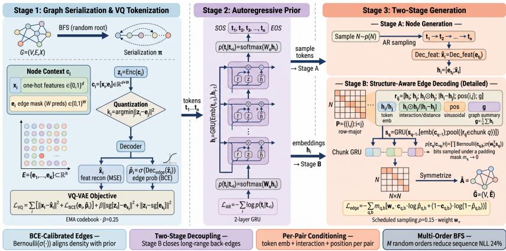  
Figure 1: The three stages of GRAPHVQ. Stage 1 (training): the graph is serialized in BFS order (random roots/tie-breaking, multi-order augmentation); each node context $c _ { i } - \mathrm { o n e - h o t }$ features plus an edge mask over the preceding $W$ nodes—is encoded, quantized to the nearest codebook entry (the discrete token), and decoded into features and BCE-calibrated edge probabilities. Stage 2 (training): a GRU prior factorizes the token sequence. Stage 3 (inference): Stage A samples node tokens and decodes features; Stage B builds per-pair features $r _ { i j }$ , chunks the upper triangle into B-bit groups, and autoregressively emits each chunk from a GRU whose input pools the chunk’s pair features; padding bits are forced to zero and the symmetrized matrix is the generated graph. Solid arrows: forward flow; dashed: training objectives.

## 3.2 GRAPH SERIALIZATION AND VQ TOKENIZATION

We serialize a graph into a sequence of node contexts. Nodes are ordered by BFS, which places topologically close nodes near each other and keeps most edges local—the observation that motivated GraphRNN You et al. (2018). Because BFS depends on the root and same-level tie-breaking, the serialization is not permutation-invariant; we treat this explicitly by drawing a fresh random root and tie-breaking during training, with multi-order augmentation (M orders per graph), and aggregating held-out likelihoods over eight orders at evaluation (Sec. 4). The model is therefore permutation-aware through augmentation, not invariant.

The context of the i-th node in the order concatenates its one-hot features $x _ { i } \in \{ 0 , 1 \} ^ { d }$ with a binary edge mask $e _ { i } \in \{ 0 , 1 \} ^ { W }$ over the W preceding nodes:

$$
c _ { i } = [ x _ { i } ; e _ { i } ] \in \mathbb { R } ^ { d + W } , \qquad e _ { i , w } = \nVdash \big [ ( v _ { \pi ( i ) } , v _ { \pi ( i - w ) } ) \in E \big ] ,\tag{1}
$$

where $\pi$ is the order and entries beyond the window are zero-padded. W trades locality against reach: an edge spanning more than $W$ positions cannot be emitted in a single pass—expressibility is set by the edge span induced by the order. BFS keeps most edges local while leaving a residual of long-span edges that break cycles and motifs: the structural gap that Stage B (Sec. 3.4) closes. Removing the edge mask entirely (“attribute-only” context, Sec. 4) collapses generation (orbit MMD 0.59–1.17, connectivity ≈ 0): the local-structure context, not the attributes alone, carries the tokenizer’s structural information.

The context is encoded and quantized against a shared codebook $E = \{ e _ { 1 } , \ldots , e _ { K } \} \subset \mathbb { R } ^ { h }$

$$
z _ { i } = \mathrm { E n c } ( c _ { i } ) , \qquad k _ { i } = \underset { j } { \arg \operatorname* { m i n } } \left\| z _ { i } - e _ { j } \right\| ^ { 2 } , \qquad \hat { z } _ { i } = e _ { k _ { i } } .\tag{2}
$$

The decoder reconstructs the features and models edges explicitly as calibrated probabilities $\hat { p } _ { i } \in$ $( 0 , 1 ) ^ { W }$

$$
[ \hat { x } _ { i } ; \hat { p } _ { i } ] = \mathrm { D e c } ( \hat { z } _ { i } ) , \qquad \hat { p } _ { i } = \sigma \big ( \mathrm { D e c } _ { \mathrm { e d g e } } ( \hat { z } _ { i } ) \big ) .\tag{3}
$$

The tokenizer is trained as a VQ-VAE with feature reconstruction (MSE), explicit edge modeling (BCE), and the standard codebook-update and commitment terms (sg denotes stop-gradient):

$$
\begin{array} { l } { \displaystyle \mathcal { L } _ { \mathrm { V Q } } = \sum _ { i } \Big [ \big \| x _ { i } - \hat { x } _ { i } \big \| ^ { 2 } + \mathcal { L } _ { \mathrm { B C E } } ( e _ { i } , \hat { p } _ { i } ) \Big ] } \\ { \displaystyle + \beta \big \| \mathrm { s g } [ z _ { i } ] - e _ { k _ { i } } \big \| ^ { 2 } + \big \| z _ { i } - \mathrm { s g } [ e _ { k _ { i } } ] \big \| ^ { 2 } . } \end{array}\tag{4}
$$

Codebook entries are updated by EMA, and utilization (active codes, perplexity, frequency Gini) is monitored to detect collapse. Modeling edges with unweighted BCE is decisive for calibration: the trained probability already encodes the empirical edge density, so drawing edges from Bernoulli(ˆp ) aligns the generated density with the data prior (Table D.1, Appendix D: Brier $\leq 0 . 0 6 5$ , ECE ≤0.005). The same claim does not transfer to the weighted Stage B loss, whose optimum is deliberately biased (Sec. 3.4).

## 3.3 AUTOREGRESSIVE PRIOR

The tokenizer maps each graph to a discrete sequence $t _ { 1 } , \ldots , t _ { n }$ of code indices. We train a GRU prior that factorizes this sequence autoregressively, wrapped by SOS and EOS:

$$
\begin{array} { r } { p ( t _ { 1 } , \dots , t _ { n } ) = \prod _ { i = 1 } ^ { n } p ( t _ { i } \mid t _ { < i } ) , } \\ { p ( t _ { i } \mid t _ { < i } ) = \operatorname { s o f t m a x } ( W _ { o } h _ { i } ) , } \end{array}\tag{5}
$$

$$
\begin{array} { r } { h _ { i } = \mathrm { G R U } \big ( \mathrm { E m b } ( t _ { i - 1 } ) , h _ { i - 1 } \big ) , } \\ { \mathcal { L } _ { \mathrm { A R } } = - \sum _ { i } \log p ( t _ { i } \mid t _ { < i } ) . \qquad } \end{array}\tag{6}
$$

A two-layer GRU suffices and keeps the prior deliberately minimal; the architecture is a drop-in slot that larger transformer priors can occupy without changing the tokenizer or the generation scheme.

## 3.4 TWO-STAGE GENERATION WITH PER-PAIR CONDITIONING

Naive generation samples one token sequence and decodes it, but the window W caps each node’s reach: longer-span edges are structurally unreachable in one pass, and every missing edge breaks the cycles and motifs that contain it. We therefore generate in two phases, with the second phase conditioned on token-derived pair information from the full token sequence.

Stage A (nodes). Sample the graph size N from the training distribution, then autoregressively sample tokens and decode them into one-hot features:

$$
t _ { 1 } , \dots , t _ { N } \sim p ( t _ { i } \mid t _ { < i } ) , \qquad \hat { x } _ { i } = \mathrm { D e c } _ { \mathrm { f e a t } } ( e _ { t _ { i } } ) ,\tag{7}
$$

Each node carries a token embedding $h _ { i } = e _ { t _ { i } }$ , and the pair representations below concatenate it with the decoded feature ${ \hat { x } } _ { i }$ , so Stage B conditions on both the quantized representation and its deterministic decoding.

Stage B (edges). Consider the candidate pair set $\mathcal { P } = \{ ( i , j ) : 1 \leq i < j \leq N \}$ in row-major order. For each pair we build a feature vector

$$
r _ { i j } = \big [ h _ { i } ; h _ { j } ; h _ { i } \odot h _ { j } ; | h _ { i } - h _ { j } | ; \mathrm { p o s } ( i , j ) ; g \big ] ,\tag{8}
$$

where $\odot$ is element-wise product, $\mathrm { p o s } ( i , j )$ are normalized sinusoidal positional features of the pair, $\begin{array} { r } { g = \frac { 1 } { N } \sum _ { i } h _ { i } } \end{array}$ is a graph-level summary, and $h _ { i }$ here denotes the concatenation $[ e _ { t _ { i } } ; \hat { x } _ { i } ]$ . The $N ( N { - } 1 ) / \dot { 2 }$ pairs are grouped into chunks of $B$ consecutive bits, with the final chunk zero-padded and its padding positions recorded in a mask $m _ { q } \in \{ 0 , 1 \} ^ { B }$ (padding bits carry zero features and mask value 0). A chunk-level GRU aggregates each chunk’s pair features into its input (the B bits of a chunk therefore share one pooled summary and are distinguished by their positional readout heads $w _ { b } ;$ whether this chunk-pooled form retains per-pair position information is tested in Sec. 4):

$$
s _ { q } = \mathrm { G R U } \Bigl ( s _ { q - 1 } , ~ \bigl [ \mathrm { e m b } ( c _ { q - 1 } ) ; ~ \mathrm { p o o l } ( \{ r _ { i j } : ( i , j ) \in q \} ) \bigr ] \Bigr ) ,\tag{9}
$$

$$
p ( c _ { q } \mid c _ { < q } , { \mathcal { H } } ) = \prod _ { b = 1 } ^ { B } { \mathrm { B e r n o u l l i } } { \big ( } c _ { q , b } ; \ \sigma ( w _ { b } ^ { \top } s _ { q } ) { \big ) } ,\tag{10}
$$

where pool is the masked mean of the projected pair features in chunk $q ,$ emb $\left( c _ { q - 1 } \right)$ embeds the previous chunk’s bits (a learned start vector at $q { = } 1 )$ , and $\mathcal { H } = \{ h _ { i } \} _ { i = 1 } ^ { N }$ is the full token-derived conditioning. The optional positive-class weight $w _ { + }$ re-targets density rather than calibrating probability: the weighted-BCE optimum is $q ^ { - } = \dot { w p } / ( w p \dot { + } 1 { - } p )$ , so with $w _ { + } { = } 3$ a true edge probability of 0.1 is fit by 0.25—a deliberate bias toward the positive class (ablated in Table C.3, Appendix C; Fig. B.6, Appendix B, verifies this on synthetic Bernoulli data, including the sampling rate). Weighted outputs are therefore not calibrated probabilities; they are reported as density-matched samples, and the main configuration uses the unweighted target with validation-set temperature calibration (Sec. 4). Bits are sampled independently within a chunk; a within-chunk autoregressive head is ablated in Sec. 4. The training loss is a masked binary cross-entropy over all chunks, with the optional positive-class weighting $w _ { + }$ defined above:

$$
\begin{array} { l } { \displaystyle \mathcal { L } _ { \mathrm { e d g e } } = - \sum _ { \boldsymbol { q } , { b } } m _ { \boldsymbol { q } , { b } } \left[ w _ { + } c _ { \boldsymbol { q } , { b } } \log \hat { p } _ { \boldsymbol { q } , { b } } \right. } \\ { \displaystyle \qquad + \left. ( 1 - c _ { \boldsymbol { q } , { b } } ) \log ( 1 - \hat { p } _ { \boldsymbol { q } , { b } } ) \right] . } \end{array}\tag{11}
$$

Two further design points make the model robust to train–sample mismatch. (i) Scheduled sampling: during training, each node token embedding is replaced by a random codebook entry with probability $\rho$ (we use $\rho { = } 0 . 1 5 )$ , so the edge model observes the kind of errors Stage A will make. (ii) Condition diagnostics: we evaluate the edge NLL of held-out graphs under three conditions—oracle (tokens of the true features), reconstructed (deterministic Stage-A reconstruction), and generated (one prior sample). The oracle-to-generated gap is 0.005/0.009 nats/bit on MUTAG/PROTEINS and larger on the synthetic benchmarks (0.10/1.68 on SYN-COMM/SYN-RING-ROLE), localizing the residual to Stage A (Sec. 4); it is not read as certification—a condition-ignoring decoder would show the same near-zero gap—so condition dependence is tested directly with shuffled-condition and unconditional controls (Sec. 4). Algorithm 1 states the procedure; candidate pairs are constructed from the index set ${ \mathcal P } ,$ and at no point does inference read from an adjacency matrix that does not yet exist.

The pair-feature design is not a luxury: a purely global condition provably cannot do the job within its scope, as follows.

Algorithm 1 Two-stage generation with GRAPHVQ.   
1: Input: tokenizer (Enc, Dec, E), prior $p _ { \theta } .$ edge decoder $f _ { \phi } ,$ , node-count distribution $p ( N )$   
2: Sample graph size $N \sim p ( N )$   
3: Stage A: sample tokens $t _ { 1 } , \ldots , t _ { N }$ autoregressively (SOS/EOS-wrapped)   
4: Decode features $\hat { x } _ { i } = \mathrm { D e c } _ { \mathrm { f e a t } } ( e _ { t _ { i } } ) ;$ set $\boldsymbol { h _ { i } } \overline { { \boldsymbol { = } } } \left[ \boldsymbol { e _ { t _ { i } } } ; \boldsymbol { \bar { x } _ { i } } \right]$   
5: Stage B: construct candidate pairs $\mathcal { P } = \{ ( i , j ) : 1 \leq i < j \leq N \}$ in row-major order   
6: Group $\mathcal { P }$ into chunks of B pairs; build per-pair features $r _ { i j }$ and mask $m _ { q }$   
7: Initialize chunk state $s _ { 0 }$ and a learned start embedding   
8: for $q = 1 , \ldots , T$ do   
9: Update $s _ { q }$ with Eq. (9)   
10: Draw bits $c _ { q , b } \sim$ Bernoull $( \sigma ( w _ { b } ^ { \top } s _ { q } ) )$ ; force padding bits to 0 via $m _ { q }$   
11: end for   
12: Symmetrize the adjacency matrix and assemble $\hat { G } = ( V , \hat { E } )$   
13: return $\hat { G }$

Proposition 1 (Insufficiency of a global-summary condition). Let $s ( X )$ be any permutation-invariant summary of the node attributes alone $( e . g .$ , the mean feature c¯), and let $q ( \bar { A _ { i j } } \mid s ( X ) )$ be an edge model whose condition is s(X) only—no endpoint-specific, positional, or structural inputs. Suppose two graphs $G _ { 1 } , G _ { 2 }$ on N nodes share the same attribute multiset, $\{ x _ { i } ^ { ( 1 ) } \} = \{ x _ { i } ^ { ( 2 ) } \}$ , but differ in attribute–topology coupling, $p _ { G _ { 1 } } ( A _ { i j } { = } 1 | x _ { i } , x _ { j } ) \neq p _ { G _ { 2 } } ( A _ { i j } { = } 1 | x _ { i } , \bar { x } _ { j } )$ . Then q assigns the same predictive distribution to both graphs, and its expected edge BCE on their mixture is lower-bounded by the pooled conditional entropy $\mathbf { \bar { E } } \big [ H ( A _ { i j } | x _ { i } , \mathbf { \bar { \it x } } _ { j } ) \big ]$ , with equality only ifthe coupling is afunction ofthe summary alone.

Proofsketch. The two graphs induce identical conditions, so q cannot separate their conditional edge laws; the expected BCE is minimized by the pooled (marginal) edge probability, whose residual risk on either graph is exactly the conditional entropy. □

Scope. The proposition concerns the mean-condition ablation only: the implemented Stage B condition additionally includes edge-mask-derived token embeddings and positional features, so it does not certify the full model—it explains why a pure global-summary condition fails; the empirical tests of Sec. 4 test the rest.

## 3.5 TRAINING AND STAGED OBJECTIVE

Training proceeds in three stages that mirror the pipeline, with one loss per module: (i) Eq. (4) trains the tokenizer (encoder, decoder, codebook); (ii) Eq. (6) trains the GRU prior over frozen code indices; (iii) Eq. (11) trains the Stage B edge decoder. Stage B consumes pair features $r _ { i j }$ built from $h _ { i } { = } [ e _ { t _ { i } } ; \hat { x } _ { i } ] { - } \mathrm { a t }$ training time from oracle tokens of the true graph, at inference from tokens the prior actually samples (generated) or from deterministic Stage-A reconstruction (reconstructed). The final output is the staged product $\begin{array} { r } { p ( N ) p ( t _ { 1 } , \dots , t _ { N } | \theta ) \prod _ { q } \overset { \cdot } { p } ( c _ { q } | c _ { < q } , \mathcal { H } ) : } \end{array}$ a well-defined probability model over (N, features, adjacency). We state explicitly that these losses form a staged training objective over a discrete-latent two-stage factorization, not a single joint likelihood: the tokenizer is a VQ-VAE whose reconstruction term is a proxy for latent quality, and the prior and edge decoder are trained on its codes; all reported numbers correspond to this staged objective. The tokenizer encodes each node in $O ( h ( d + W ) )$ ), the prior runs in $O ( N h ^ { 2 } )$ , and Stage B costs $O ( ( N ^ { 2 } / B ) ( h ^ { 2 } { + } B h d _ { \mathrm { p a i r } } ) )$ end-to-end—the same quadratic-in-N regime as GraphRNN You et al. (2018); the B bits within a chunk are sampled in parallel, but the chunk-level recurrence is sequential. The pipeline is compact: 39K parameters and, on CPU, samples one MUTAG-scale graph in 6.8 ms (84 ms at $N { = } 6 4 )$

## 4 EXPERIMENTS

## 4.1 DATASETS AND EVALUATION METRICS

We use two real attributed-graph benchmarks Morris et al. (2020) and two controlled synthetic distributions (Table C.1, Appendix C). MUTAG (188 nitro-compound graphs) and PROTEINS (1113 protein graphs) cover tree-like molecular and denser biological graphs. SYN-RING-ROLE mixes cycles (40%), cliques (40%), trees, and grids (10% each) with structure-correlated node labels, so the pair-feature condition has signal to exploit; SYN-COMM draws stochastic block models (three planted communities, $p _ { \mathrm { i n } } { = } 0 . 3 5 , p _ { \mathrm { o u t } } { = } 0 . 0 2 )$ . A companion control, SYN-RING, uses the same mixture with random labels, removing attribute–topology coupling while keeping the local adjacency context—a falsification control for the attribute-coupling account of the conditioning gain. All experiments follow the general-graph route: node labels and binary undirected edges are treated as plain attributes.

We report distribution-level metrics only. For M generated graphs against the training distribution:

• Non-degenerate rate: the fraction with $| V | > 1$ and $| E | > 0$ (a sanity floor).

• Connectivity: the fraction whose largest connected component covers all nodes, reported with the isolated-node ratio and the largest-component fraction.

• Kernel MMDs: $\mathrm { { \bf M M D } ^ { 2 } }$ with one Gaussian kernel (median bandwidth, identical for every method) on four structural signatures: degree, clustering, orbit (counts of triangles, 2-stars, 3-paths, 4-cycles, 4-cliques), and spectral (padded normalized-Laplacian eigenvalues), plus component-size MMD.

• Novelty/uniqueness under three-round Weisfeiler–Lehman canonical signatures.

Two evaluation problems. We keep two evaluations separate. (i) Conditional reconstruction: on held-out graphs whose true token conditions are available, we report the Stage B conditional NLL, Brier, and ECE under the unweighted probability target, for positive and negative edges separately; these numbers describe decoder fidelity under true conditions and are not unconditional graph likelihoods (full table in Appendix D; the positive-edge ECE of 0.49–0.82 reflects under-prediction of rare positives, reported openly rather than masked by reweighting). (ii) Free generation: graphs sampled end-to-end from the prior are scored against a reference distribution by the structural statistics above. The main table uses the training split as reference; test-reference orbit MMDs under the same fixed splits give the same ordering with the expected held-out inflation (Appendix D). The pre-registered primary metric is the mean rank of a method over the four main MMDs (degree/clustering/orbit/spectral), computed per seed and averaged; all tables report means over five seeds with seed-level bootstrap 95% CIs in the supplement, and paired t-tests across seeds. We deliberately avoid single-motif multipliers (e.g., triangle-count ratios) as headline metrics: absolute distribution distances are the claim.

## 4.2 BASELINES AND PROTOCOLS

All methods are retrained under one protocol: $8 0 / 1 0 / 1 0$ splits (per seed), identical preprocessing, training budget, and evaluation code, 10,000 generated graphs per seed. Baselines: GraphRNN You et al. (2018), GRAN Liao et al. (2019), GraphVAE Simonovsky & Komodakis (2018), DiGress Vignac et al. (2023), GraphARM Kong et al. (2023), a degree-preserving configuration model with i.i.d. labels, and training-set resampling (the memorization floor). DiGress collapses on SYN-COMM under this protocol (connectivity 0.000; an epoch sweep $8 0 / 1 6 0 / 3 2 0$ leaves orbit MMD at 0.532), so its numbers reflect an implementation-level failure on this dense task and are reported as-is rather than claimed as a win. Controls of GRAPHVQ: Continuous replaces the VQ tokenizer with a plain autoencoder plus an autoregressive Gaussian prior over the latent—it differs from GRAPHVQ in both the latent type and the prior family, so its comparison isolates the joint effect of discretization and prior choice rather than discretization alone; Raw drops the tokenizer entirely and uses label-category ids with a learned embedding; One-stage is GRAPHVQ without Stage B. The structural baselines generate node labels from the training label distribution, while GRAPHVQ models features and topology jointly through its autoregressive prior. GQT Wang et al. (2025) could not be rerun (its repository no longer contains the QM9 generation pipeline), so we compare qualitatively against its reported numbers only.

Settings. BFS serialization with random roots/tie-breaking; window $W { = } 8 ;$ codebook $K { = } 3 2$ , hidden size 32; commitment $\beta { = } 0 . 2 5 ;$ two-layer GRU prior; chunk width $B { = } 8 $ ; 80 epochs per stage; scheduled corruption $\rho { = } 0 . 1 5 ;$ sampling temperature 1.0; Stage B positive-class weight $w _ { + } { = } 3$ on MUTAG (density re-targeting, Table C.3); node counts capped at 64. Environment: RTX 4090, PyTorch 2.8.0+cu128.

## 4.3 RESULTS

RQ1: does the tokenizer preserve attributes and local structure? Table D.1 (Appendix D) reports held-out fidelity on all four datasets. Features are reconstructed near-perfectly on PROTEINS and SYN-COMM (0.987/0.990) and well on MUTAG and SYN-RING-ROLE (0.857/0.934); local edges are decoded with AUROC ≥ 0.89 and near-perfect calibration (ECE ≤ 0.007)—of the tokenizer’s unweighted edge model; Stage B uses the unweighted target as well, so it does not inherit this calibration automatically (Sec. 3.4). Codebook usage scales with dataset complexity (10–26 of $K { = } 3 2$ active codes; perplexity $1 9 . 2 / 1 4 . 0 / 9 . 5 / 6 .$ 1 on SYN-COMM/PROTEINS/MUTAG/SYN-RING-ROLE): the vocabulary is used as far as the data demands, a profile analyzed further in Appendix D.

RQ2: is pair-feature conditioning the mechanism behind the structural gain? Table C.3 (Appendix C) isolates the conditioning—the central design decision of GRAPHVQ. Replacing the global mean condition with token-derived pair features improves orbit MMD $0 . 2 4 8 \to 0 . 1 7 4 ( t = - 6 . 1 )$ and connectivity 0.406→0.693 on PROTEINS, and improves orbit MMD 3.4× and degree MMD $3 . 1 \times \mathrm { o n }$ the ring stress test SYN-RING-ROLE. The decisive control is SYN-RING, the same graph distribution with random labels: there the gain disappears, consistent with the condition earning its benefit from attribute–topology coupling. (i) Density re-targeting, not calibration: $w _ { + }$ shifts the BCE optimum to ${ q ^ { * } } { = } w p / ( w p { + } 1 { - } p )$ , re-targeting the sampled density toward the data prior (MUTAG connectivity $0 . 1 3 6 \to 0 . 6 7 2$ , orbit 0.523 → 0.387 at $w _ { + } = 3 )$ , while lower sampling temperatures aggravate under-prediction (connectivity 0.003–0.026). Weighted outputs are not calibrated probabil ities (Sec. 3.4), so the main configuration uses the unweighted target with validation-set temperature calibration $( \tau \in [ 0 . 9 , 1 . 0 ] )$ ); its under-generation on MUTAG is reported as-is in Table 1. (ii) Transfer diagnostic (Fig. B.5, Appendix $B ) .$ : the oracle-to-generated edge-NLL gap is ≤0.009 nats/bit on the real datasets and larger on the synthetic benchmarks (0.10/1.68 on SYN-COMM/SYN-RING-ROLE), localizing the residual error to the token prior’s samples rather than the decoder. A small gap alone does not certify that the decoder exploits its conditions—a condition-ignoring decoder would show the same pattern—so shuffled-condition and unconditional controls accompany it; scheduled corruption $\left( \rho { = } 0 . 1 5 \right)$ monotonically helps dense data (PROTEINS connectivity 0.647/0.693/0.718 at $\rho { = } 0 / 0 . 1 5 / 0 . 3 )$ . (iii) Condition dependence (Fig. $B . I ,$ Appendix $B ) .$ on held-out MUTAG graphs (unweighted target), removing the condition raises positive-edge NLL from 1.836 to 1.879 nats/bit and globally shuffling the pair features raises it to 2.086 (+13.6%): the decoder reads its condition, and wrong-but-plausible conditions hurt more than no condition. Within a chunk, permuting the pair features leaves the logits unchanged (max $\Delta { = } 4 . 8 { \times } 1 0 ^ { - 7 } )$ : the masked mean pool makes the condition chunk-granular, and the B bits are distinguished only by their positional readout heads. An independently trained unconditional control quantifies what the condition buys (Fig. B.4, Appendix B): orbit MMD improves $0 . 2 8 7 {  } 0 . 1 7 5$ on PROTEINS and 0.079→0.009 on SYN-COMM, while MUTAG (0.577 vs. 0.598) and SYN-RING-ROLE (0.008 vs. 0.012) show no benefit—the claim is therefore scoped to datasets where attributes carry edge-relevant signal. A per-pair readout variant does not improve over the pooled form (orbit 0.78 vs. 0.64 on MUTAG, 0.034 vs. 0.032 on SYN-RING, three seeds), so we keep the chunk-pooled decoder and report its granularity honestly.

RQ3: does the full generator beat same-split baselines on the whole graph distribution? Table 1 is the end-to-end comparison under one protocol. Under the pre-registered mean rank (Sec. 4.1), GRAPHVQ ranksfirst among learned generators on PROTEINS (2.85), ties Raw for first on SYN-COMM (2.40 each), places second on SYN-RING-ROLE (2.90 behind Raw’s 2.65), and fourth on MUTAG (4.75), where the unweighted edge target under-generates edges (connectivity 0.11 vs. 1.00; the former reweighting closed this gap but biased the probability outputs, Sec. 3.4). The gain concentrates where serialization-based generation has historically struggled: orbit MMD improves $2 . 7 { \times } \mathrm { - } 1 7 { \times }$ over one-stage generation on PROTEINS, SYN-RING-ROLE, and SYN-COMM and is 1.2× better on MUTAG, and degree MMD is the best on three of four datasets. Two controls pinpoint the advantage’s source. Continuous—the identical pipeline with a continuous latent—is dominated on three of four datasets (orbit 0.304 vs. 0.175 on PROTEINS; 0.159 vs. 0.012 on SYN-RING-ROLE; 0.665 vs. 0.009 on SYN-COMM, where it over-connects to connectivity 0.998 against the training value 0.41), while on MUTAG the continuous control is better (0.437 vs. 0.598). The component attribution is clean: both variants share the same Stage-B decoder and matched parameter budgets (Table C.2, Appendix C; 39,249 vs. 39,183), so the discrete vocabulary’s edge is dataset-dependent rather than universal. Raw—the same decoding framework with plain label tokens—shows that the decoder, not the tokenizer, carries the synthetic benchmarks: where labels directly encode structure (role/community ids) it matches GRAPHVQ, while on real data, whose attributes are richer and noisier, context-quantized tokens pull clearly ahead (orbit 0.36 vs. 0.61 on MUTAG). The protocol is bracketed from above by training-set resampling (MMDs ≈ 0) and from below by the configuration model, whose degree preservation alone cannot recover motif structure—the gap between them is what GRAPHVQ closes. Fig. B.8 (Appendix B) shows the same point visually.

Table 1: Same-split generation quality: mean over five seeds, 10,000 samples per seed; MMD = kernel MMD2 (median bandwidth, identical for all methods); conn. = connectivity. Mean rank is the pre-registered primary metric over degree/clustering/orbit/spectral MMDs (ten methods, resample floor excluded, average ranks for ties; block rank sums verify to 55). Bold = best, underline = second-best per MMD column; ties share the mark.
<table><tr><td></td><td colspan="4">Datasets (deg / clu / orb / spc MMD, conn)</td></tr><tr><td>Method</td><td>MUTAG</td><td>PROTEINS</td><td>SYN-RING-ROLE</td><td>SYN-COMM</td></tr><tr><td>One-stage</td><td>.331/.928/.729/.105/.65 (6.60)</td><td>.275/.755/.474/.047/.67 (4.30)</td><td>.108/.032/.079/.069/.82 (4.00)</td><td>.067/.076/.150/.092/.28 (5.10)</td></tr><tr><td>Continuous</td><td>.297/.871/.437/.090/.13 (3.20)</td><td>.281/1.142/.304/.039/.38 (4.15)</td><td>.287/.400/.159/.064/.74 (6.40)</td><td>.791/.502/.665/.074/1.00 (8.90)</td></tr><tr><td>Raw</td><td>.414/.895/.605/.081/.09 (5.60)</td><td>.182/1.031/.209/.044/.67 (3.15)</td><td>.017/.011/.014/.042/.50 (2.65)</td><td>.006/.022/.013/.051/.36 (2.40)</td></tr><tr><td>GraphRNN</td><td>.313/.850/.401/.090/.17 (2.95)</td><td>.198/1.070/.301/.059/.44 (4.40)</td><td>.177/.623/.148/.038/.92 (5.85)</td><td>.066/.029/.211/.010/.72 (3.50)</td></tr><tr><td>GRAN</td><td>.344/.904/.592/.117/.92 (6.30)</td><td>.446/1.125/.449/.079/.85 (6.75)</td><td>.333/.448/.206/.018/.99 (5.35)</td><td>.340/.146/.499/.028/.96 (5.70)</td></tr><tr><td>GraphVAE</td><td>.592/.858/.592/.134/.97 (6.55)</td><td>.606/.974/.458/.102/.96 (6.40)</td><td>.400/.472/.260/.019/1.00 (6.55)</td><td>.647/.298/.585/.060/.99 (7.55)</td></tr><tr><td>DiGress</td><td>.533/.913/.721/.103/.17 (6.45)</td><td>1.071/1.210/.836/.174/.19 (9.25)</td><td>.512/.088/.310/.124/.13 (7.50)</td><td>.930/.493/.522/.314/.00 (9.10)</td></tr><tr><td>GraphARM Config. model</td><td>.274/.852/.449/.090/.20 (3.20) .426/.959/1.081/.424/.01 (9.40)</td><td>.289/1.141/.311/.045/.64 (4.60) .431/1.271/.927/.286/.03 (9.15)</td><td>.359/.491/.248/.023/1.00 (6.40) .240/.098/.315/.480/.02 (7.40)</td><td>.031/.112/.078/.004/.51 (2.95)</td></tr><tr><td></td><td></td><td></td><td></td><td>.207/.298/.492/.331/.00 (7.40)</td></tr><tr><td>GRAPHVQ (rank)</td><td>.423/.897/.598/.074/.11 (4.75)</td><td>.163/1.031/.175/.044/.66 (2.85)</td><td>.015/.013/.012/.086/.51 (2.90)</td><td>.005/.015/.009/.057/.37 (2.40)</td></tr></table>

RQ4: how robust is the pipeline to ordering and Stage-B design choices? Table C.4 (Appendix C) reports the robustness and design ablations. (i) Ordering: multi-order BFS augmentation lowers held-out eight-order sequence NLL from 1.44 to 1.10 on MUTAG and 1.31 to 1.26 on SYN-RING, and raises generation connectivity (0.65 → 0.98 on MUTAG)—serialization order becomes a source of robustness rather than a vulnerability. (ii) Stage-B head: a within-chunk autoregressive head further improves orbit MMD on SYN-RING (0.032→0.020). (iii) Context design: removing the local-structure mask collapses generation (orbit 0.59–1.17, connectivity ≈ 0)—the quantized context, not the attributes alone, carries the structural signal. (iv) Window sweeps: larger windows monotonically improve one-stage orbit MMD on SYN-RING (0.093 at W=4 to 0.013 at W=32), approaching the two-stage decoder at its best chunk width (0.009 at B=1): the margin shrinks as the window covers more edges, and remains nonzero because Stage B reads the full upper triangle rather than a window (span analysis: Fig. B.3, Appendix B). (v) Serialization scheme: replacing BFS with DFS, degree-descending, or random orders on MUTAG drops generation connectivity from 0.80 to 0.56, 0.03, and 0.02: the locality preservation of Fig. B.2 (Appendix B) translates directly into generation quality. Statistical protocol. All main-table numbers are means over five seeds; seed-level bootstrap 95% CIs (2000 resamples) and paired t-tests are in Appendix D: on orbit MMD, GRAPHVQ is significantly better (p<0.05) than onestage, GRAN, GraphVAE, DiGress, and config on PROTEINS, SYN-RING-ROLE, and SYN-COMM; on MUTAG it is significantly better than the configuration model only and significantly worse than the continuous control and GraphRNN.

## 5 CONCLUSION

We presented GRAPHVQ, a general attributed-graph generator whose core is a structure-aware autoregressive decoder over token-derived pair contexts. The central claim is scoped and testable—the quantized structural condition improves held-out generation quality within a comparable budget—and is confirmed where attributes carry edge-relevant signal (PROTEINS, SYN-COMM) and absent elsewhere (MUTAG, SYN-RING-ROLE), which we report rather than universalize. Under a preregistered same-split protocol the pipeline ranks first on PROTEINS, tied-first on SYN-COMM, second on SYN-RING-ROLE, and fourth on MUTAG, with orbit MMD 2.7–17× below one-stage generation on three datasets; the tokenizer’s unweighted edge decoding is calibrated (ECE ≤ 0.005), and multi-order BFS augmentation makes the serialization itself robust. Future work: codebookcapacity sweeps, more diffusion baselines, token-level pretraining, and bond types/valence constraints for the molecular route. Code and checkpoints are provided as supplementary material.

## AI USE STATEMENT

In this work, we used generative AI tools to aid and polish the writing of the paper. We have not used generative AI tools for any task requiring disclosure—generating synthetic data, developing theoretical models or conceptual frameworks, formulating mathematical claims or assisting their proofs, proposing or refining hypotheses, designing or providing feedback on research methodology or experiments, implementing methods, translation, cleaning or reformatting datasets, supporting qualitative or thematic data analysis, or interpreting results; these tasks are not applicable to this work. All research ideas, methods, experiments, analyses, figures, tables, and claims were produced and verified by the authors. We have reviewed all AI-assisted work and take responsibility for the final content of this work, including text, claims, and artifacts produced with the aid of generative AI.

## ETHICS STATEMENT

This work studies generative modeling on publicly available benchmark graph datasets (MUTAG and PROTEINS from the TUDataset collection) and fully synthetic distributions generated with specified parameters. It involves no human subjects, no personally identifiable information, no crowdsourcing, and no new dataset release. The proposed method is a general-purpose graph generator evaluated on molecular, biological, and synthetic benchmarks; we are not aware of uses specific to this work that raise discrimination, privacy, security, or legal-compliance concerns beyond those generic to generative modeling, and all claims are reported with their scope and controls as stated in the paper. The authors have read the ICLR Code of Ethics and adhere to it.

## REPRODUCIBILITY STATEMENT

All datasets are public benchmarks or synthetic distributions whose full generative parameters are specified in Sec. 4.1; preprocessing, splits, metrics, baselines, and hyperparameters are described in Sec. 4.2 and Sec. 3.5, and the complete statistical protocol (seed-level bootstrap confidence intervals and paired t-tests) is given in Appendix D. Source code reproducing every table and figure is available at https://anonymous.4open.science/r/graphvq\_official-6688; a public repository will be released upon publication.

## REFERENCES

Nicola De Cao and Thomas Kipf. Molgan: An implicit generative model for small molecular graphs. arXiv preprint arXiv:1805.11973, 2018.

Patrick Esser, Robin Rombach, and Bjorn Ommer. Taming transformers for high-resolution im-¨ age synthesis. In Proceedings of the IEEE/CVF Conference on Computer Vision and Pattern Recognition (CVPR), pp. 12873–12883, 2021.

Zeyuan Guo, Enmao Diao, Cheng Yang, and Chuan Shi. Graph tokenization for bridging graphs and transformers. In The Fourteenth International Conference on Learning Representations (ICLR), 2026. URL https://openreview.net/forum?id=jCctxI1BGF.

William L. Hamilton, Rex Ying, and Jure Leskovec. Inductive representation learning on large graphs. In Advances in Neural Information Processing Systems (NeurIPS), volume 30, 2017.

Jordan Hoffmann, Sebastian Borgeaud, Arthur Mensch, Elena Buchatskaya, Trevor Cai, Eliza Rutherford, Diego de Las Casas, Lisa Anne Hendricks, Johannes Welbl, Aidan Clark, et al. Training compute-optimal large language models. arXiv preprint arXiv:2203.15556, 2022.

Jaehyeong Jo, Seul Lee, and Sung Ju Hwang. Score-based generative modeling of graphs via the system of stochastic differential equations. In International Conference on Machine Learning (ICML), volume 162, pp. 10362–10383, 2022.

Jaehyeong Jo, Dongki Kim, and Sung Ju Hwang. Graph generation with diffusion mixture. In International Conference on Machine Learning (ICML), volume 235, 2024.

Jared Kaplan, Sam McCandlish, Tom Henighan, Tom B. Brown, Benjamin Chess, Rewon Child, Scott Gray, Alec Radford, Jeffrey Wu, and Dario Amodei. Scaling laws for neural language models. arXiv preprint arXiv:2001.08361, 2020.

Thomas N. Kipf and Max Welling. Semi-supervised classification with graph convolutional networks. In International Conference on Learning Representations (ICLR), 2017.

Lingkai Kong, Jiaming Cui, Haotian Sun, Yuchen Zhuang, B. Aditya Prakash, and Chao Zhang. Autoregressive diffusion model for graph generation. In International Conference on Machine Learning (ICML), volume 202, pp. 17391–17408, 2023.

Renjie Liao, Yujia Li, Yang Song, Shenlong Wang, William L. Hamilton, David Duvenaud, Raquel Urtasun, and Richard Zemel. Efficient graph generation with graph recurrent attention networks. In Advances in Neural Information Processing Systems (NeurIPS), volume 32, 2019.

Jingzhe Liu, Haitao Mao, Zhikai Chen, Tong Zhao, Neil Shah, and Jiliang Tang. Towards neural scaling laws on graphs. arXiv preprint arXiv:2402.02054, 2024.

Karolis Martinkus, Andreas Loukas, Nathanael Perraudin, and Yixin Chen. SPECTRE: Spectral con-¨ ditioning helps to overcome the expressivity limits of one-shot graph generators. In International Conference on Machine Learning (ICML), volume 162, pp. 15159–15179, 2022.

Christopher Morris, Nils M. Kriege, Franka Bause, Kristian Kersting, Petra Mutzel, and Marion Neumann. TUDataset: A collection of benchmark datasets for learning with graphs. arXiv preprint arXiv:2007.08663, 2020.

Ali Razavi, Aaron van den Oord, and Oriol Vinyals. Generating diverse high-fidelity images with VQ-VAE-2. In Advances in Neural Information Processing Systems (NeurIPS), volume 32, 2019.

Martin Simonovsky and Nikos Komodakis. GraphVAE: Towards generation of small graphs using variational autoencoders. In International Conference on Artificial Neural Networks (ICANN), pp. 412–422, 2018.

Aaron van den Oord, Oriol Vinyals, and Koray Kavukcuoglu. Neural discrete representation learning. In Advances in Neural Information Processing Systems (NeurIPS), volume 30, 2017.

Clement Vignac, Igor Krawczuk, Antoine Siraudin, Bohan Wang, Volkan Cevher, and Pascal Frossard.´ Digress: Discrete denoising diffusion for graph generation. In The Eleventh International Conference on Learning Representations (ICLR), 2023.

Limei Wang, Kaveh Hassani, Si Zhang, Dongqi Fu, Baichuan Yuan, Weilin Cong, Zhigang Hua, Hao Wu, Ning Yao, and Bo Long. Learning graph quantized tokenizers for transformers. In The Thirteenth International Conference on Learning Representations (ICLR), 2025.

Zehong Wang, Zheyuan Zhang, Chuxu Zhang, and Yanfang Ye. Gft: Graph foundation model with transferable tree vocabulary. In Advances in Neural Information Processing Systems (NeurIPS), volume 37, 2024.

Lianghao Xia, Ben Kao, and Chao Huang. Opengraph: Towards open graph foundation models. arXiv preprint arXiv:2403.01121, 2024.

Keyulu Xu, Weihua Hu, Jure Leskovec, and Stefanie Jegelka. How powerful are graph neural networks? In International Conference on Learning Representations (ICLR), 2019.

Jiaxuan You, Rex Ying, Xiang Ren, William L. Hamilton, and Jure Leskovec. Graphrnn: Generating realistic graphs with deep auto-regressive models. In Proceedings of the 35th International Conference on Machine Learning (ICML), pp. 5708–5717, 2018.

Zijie Zhou, Zhaoqi Lu, Xuekai Wei, Rongqin Chen, Shenghui Zhang, Pak Lon Ip, et al. Tokenphormer: Structure-aware multi-token graph transformer for node classification. In Proceedings ofthe AAAI Conference on Artificial Intelligence, volume 39, pp. 13428–13436, 2025.

## A NOTATION

Table A.1: Key notation.
<table><tr><td>Symbol</td><td>Meaning</td></tr><tr><td> $G = ( V , E , X ) , N$ </td><td>graph, node set, feature matrix  $X ,$  size</td></tr><tr><td> $A , \pi$ </td><td>adjacency matrix; BFS order of nodes</td></tr><tr><td> $c _ { i } = [ x _ { i } ; e _ { i } ]$ </td><td>node context: features  $x _ { i }$  + local edge mask</td></tr><tr><td> $W , K$ </td><td>edge-mask window; codebook size</td></tr><tr><td> $E = \{ e _ { 1 } , \dots , e _ { K } \}$ </td><td>codebook, entries  $\boldsymbol { e } _ { j } \in \mathbb { R } ^ { h }$ </td></tr><tr><td> $t _ { 1 } , \ldots , t _ { n }$ </td><td>token sequence of a graph, SOS/EOS-wrapped</td></tr><tr><td> $h _ { i }$ </td><td>token embedding of node  ${ i \ ( h _ { i } { = } e _ { t _ { i } } ) }$ </td></tr><tr><td> $\mathcal { P } { = } \{ ( i , j ) : i { < } j \}$ </td><td>candidate pairs of the upper triangle</td></tr><tr><td> $r _ { i j }$ </td><td>per-pair feature vector of pair  $( i , j )$ </td></tr><tr><td> $g$ </td><td>graph-level summary (mean token embedding)</td></tr><tr><td> $B , c _ { q } , m _ { q }$ </td><td>chunk width; chunk  $q$  of bits; its padding mask</td></tr><tr><td> $s _ { q }$ </td><td>chunk-level GRU state of Stage B</td></tr><tr><td>c</td><td>mean node feature (ablated global condition)</td></tr></table>

## B ADDITIONAL FIGURES

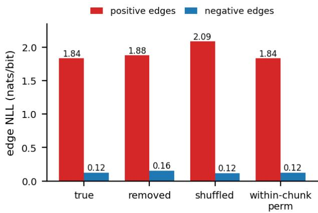  
Figure B.1: Condition dependence of the trained Stage-B decoder on held-out MUTAG graphs (unweighted target). Removing the condition raises positive-edge NLL 1.836 → 1.879 and globally shuffling the pair features raises it to 2.086 $( + 1 3 . 6 \% ) $ permuting pair features within a chunk changes nothing—the chunk pool is a masked mean.

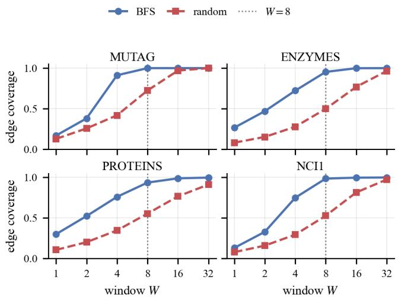  
Figure B.2: Edge coverage of the BFS serialization window as a function of W, versus random orderings, on the TUD benchmarks (MUTAG/ENZYMES/PROTEINS/NCI1). BFS keeps edges local $( \geq 9 3 \%$ coverage at $W { = } 8$ and $\geq 9 8 \%$ at $W { = } 1 6 )$ ; the uncovered remainder—long-span edges— breaks the cycles and motifs that contain them, motivating Stage B.

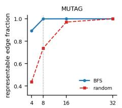

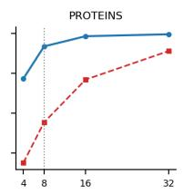

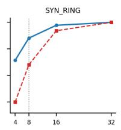  
Figure B.3: Representable edge fraction of the BFS serialization window versus random orderings on the generation benchmarks (random-root BFS, five orders averaged). BFS keeps $\geq 8 8 \%$ of edges within $W { = } 8$ and 0.98–1.00 within $W { = } 1 6 ;$ the residual long-span edges are what one-stage generation cannot emit.

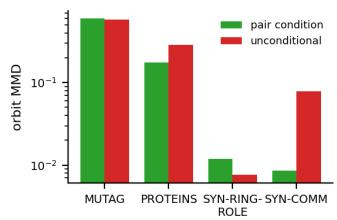

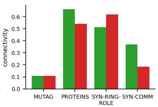  
Figure B.4: The condition’s value is dataset-dependent. An independently trained unconditional decoder matches the conditioned one on MUTAG and SYN-RING-ROLE but loses by $1 . 6 \times$ on PROTEINS and $9 \times$ on SYN-COMM (orbit MMD, log scale; connectivity on the right).

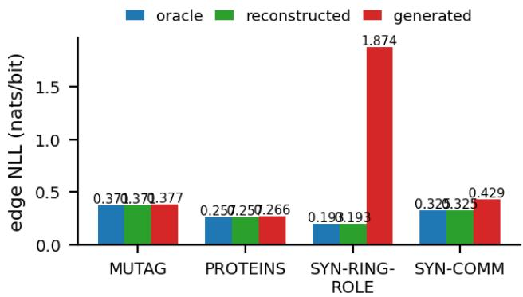

Figure B.5: Edge NLL (nats/bit) of held-out graphs under three Stage B conditions: oracle (truefeature tokens), reconstructed (deterministic Stage-A reconstruction), and generated (one prior sample). The oracle-to-generated gap is ≤ 0.009 nats/bit on MUTAG/PROTEINS and substantially larger on the synthetic benchmarks, where the token prior’s samples diverge most from true conditions. The gap alone is not a transfer certification—a decoder that ignored its condition would show the same pattern—so condition-dependence controls accompany it (Sec. 4).  
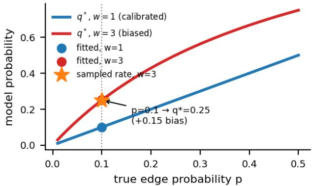

Figure B.6: Weighted BCE re-targets density rather than calibrating probability. The optimum of the weighted loss is $\scriptstyle { \overline { { q } } } ^ { * } = w p / ( w p + 1 { \bar { - } } p )$ (red curve), so w=3 fits a true edge probability of 0.1 by 0.25; the fitted model (red dot) and its Bernoulli sampling rate (star) track $q ^ { * }$ , not the true $p .$ Unweighted BCE stays on the diagonal (blue).  
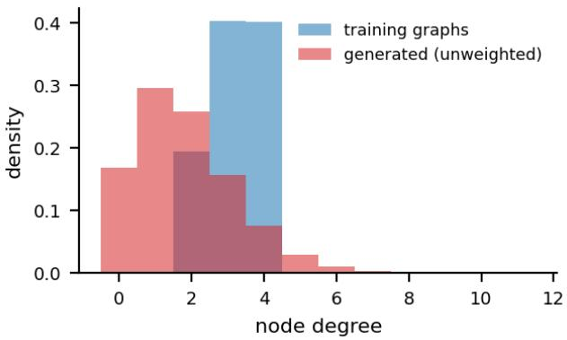  
Figure B.7: Degree distributions of training graphs versus generated samples on MUTAG (unweighted Stage-B). Probability mass shifts toward low degrees relative to training (connectivity 0.11 vs. 1.00), the honest cost of the unweighted edge target reported in Table 1.

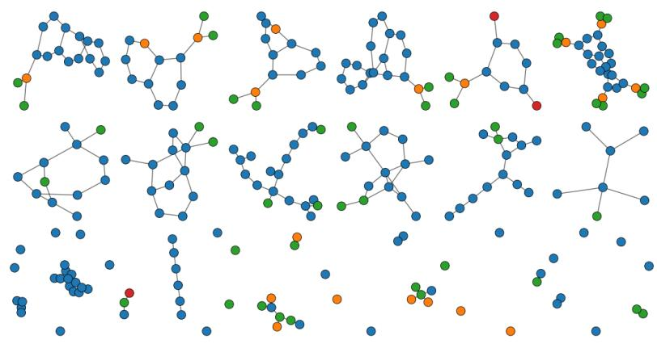  
Figure B.8: Qualitative samples on MUTAG: training graphs (top row; node colors denote labels), one-stage generation (middle), and GRAPHVQ two-stage generation with the unweighted edge target (bottom). Two-stage decoding restores denser motifs than one-stage sampling; residual under generation remains (cf. connectivity 0.11 in Table 1).

## C DATASETS AND ABLATIONS

Table C.1: Dataset statistics. Avg. |V | and avg. |E| are means over graphs. SYN-RING is the random-label falsification control of SYN-RING-ROLE.
<table><tr><td>Dataset</td><td>#Graphs Avg. |V|</td><td></td><td>Avg. |E|</td><td>Feat. dim</td><td>Labels</td></tr><tr><td>MUTAG</td><td>188</td><td>17.9</td><td>19.8</td><td>7</td><td>random</td></tr><tr><td>PROTEINS</td><td>1113</td><td>39.1</td><td>72.8</td><td>3</td><td>random</td></tr><tr><td>SYN-RING-ROLE</td><td>400</td><td>10-30</td><td></td><td>4</td><td>role-corr.</td></tr><tr><td>SYN-RING</td><td>400</td><td>10-30</td><td></td><td>4</td><td>random</td></tr><tr><td>SYN-COMM</td><td>400</td><td>15-40</td><td></td><td>3</td><td>community</td></tr></table>

Table C.2: Parameter budgets of the three component-attribution variants (MUTAG instance; all three share the same Stage-B decoder).
<table><tr><td>Component</td><td>VQ</td><td>Continuous</td><td>Raw</td></tr><tr><td>Tokenizer / autoencoder</td><td>3,623</td><td>2,599</td><td></td></tr><tr><td>Autoregressive prior</td><td>14,882</td><td>15,84013,481</td><td></td></tr><tr><td>Stage-B decoder</td><td>20,744</td><td>20,74420,744</td><td></td></tr><tr><td>Total</td><td>39,249</td><td>39,183 34,225</td><td></td></tr></table>

Table C.3: GRAPHVQ conditioning ablations (means over three seeds; P0 protocol).
<table><tr><td>Ablation</td><td>Dataset</td><td>Setting</td><td>orbit MMD</td><td>conn.</td></tr><tr><td>Condition</td><td>PROTEINS</td><td>mean vs. pair</td><td>.248 vs. .174</td><td>.406 vs. .693</td></tr><tr><td>Condition</td><td>SYN-RING-ROLE</td><td>mean vs. pair</td><td>.030 vs. .009</td><td>.605 vs. .578</td></tr><tr><td>Condition</td><td>SYN-RING (control)</td><td>mean vs. pair, random labels .017 vs. .027 (n.s.)</td><td></td><td>.479 vs. .521</td></tr><tr><td>Density reweight</td><td>MUTAG</td><td> $w _ { + } = 1 / 3 / 5$ </td><td>.523/.387/.536</td><td>.136/.672/.804</td></tr><tr><td>Corruption</td><td>PROTEINS</td><td> $\rho = 0 / . { \dot { 1 } } 5 { \dot { / } } . 3$ </td><td>.211/.174/.175</td><td>.647/.693/.718</td></tr></table>

Table C.4: GRAPHVQ order and Stage-B ablations (means over three seeds).
<table><tr><td>Ablation</td><td>Setting</td><td>Result</td></tr><tr><td>Ordering</td><td>8-order NLL: fixed/random/multi8 BFS (MUTAG)</td><td>1.441 / 1.486 / 1.096</td></tr><tr><td>Ordering</td><td>connectivity: fixed/multi8 (MUTAG)</td><td>0.650 / 0.984</td></tr><tr><td>Ordering</td><td>DFS/deg- desc/random vs. BFS (MUTAG)</td><td>conn. .56/.03/.02 vs. .80</td></tr><tr><td>Stage-B head</td><td>within-chunk AR vs. indep. Bernoulli (SYN-RING)</td><td>orbit .020 vs. .032</td></tr><tr><td></td><td>Stage-B readout pooled vs. per-pair (MUTAG/SYN- RING)</td><td>orbit .642 vs. .777 / .032 vs. .034</td></tr><tr><td>Attr-only ctx</td><td>(MUTAG /</td><td>remove edge mask orbit .590 / 1.166; conn ≈0</td></tr><tr><td>Window W</td><td>SYN-RING) one-stage orbit MMD, SYN-RING,</td><td>.093 / .071 / .019 / .013</td></tr><tr><td>Chunk B</td><td>W=4/8/16/32 two-stage orbit MMD, SYN-RING, B=1/4/8/16</td><td>.009 / .035 / .034 / .020</td></tr></table>

## D STATISTICAL DETAILS AND TOKENIZER CAPACITY

Table D.1: GRAPHVQ tokenizer fidelity on held-out splits (seed 0; reconstructed-graph structural MMDs against the true graphs).
<table><tr><td>Metric</td><td>MUTAG</td><td>PROTEINS</td><td>SYN- RING-ROLE</td><td>SYN- COMM</td></tr><tr><td>Feature acc. ↑</td><td>0.857</td><td>0.987</td><td>0.934</td><td>0.990</td></tr><tr><td>Feature CE↓</td><td>1.325</td><td>0.572</td><td>0.801</td><td>0.568</td></tr><tr><td>Edge AUROC ↑</td><td>0.994</td><td>0.950</td><td>0.993</td><td>0.892</td></tr><tr><td>Edge AUPRC ↑</td><td>0.970</td><td>0.843</td><td>0.989</td><td>0.761</td></tr><tr><td>Edge Brier ↓</td><td>0.016</td><td>0.065</td><td>0.029</td><td>0.075</td></tr><tr><td>Edge ECE ↓</td><td>0.003</td><td>0.005</td><td>0.004</td><td>0.007</td></tr><tr><td>Recon. orbit MMD</td><td>0.047</td><td></td><td></td><td></td></tr></table>

Bootstrap confidence intervals Table D.2 reports seed-level bootstrap 95% confidence intervals (2000 resamples over five seeds). On orbit MMD, GRAPHVQ’s upper CI bound stays below the mean of every baseline it outperforms on PROTEINS, SYN-RING-ROLE, and SYN-COMM (all except Raw, plus GraphARM on SYN-COMM); on MUTAG its CI lower bound sits above the means of GraphRNN and the continuous control, consistent with the main-table ranking. The rankings are not seed noise, in both directions.

Table D.2: GRAPHVQ mean [bootstrap 95% CI] over five seeds.
<table><tr><td>Dataset</td><td>degree</td><td>clustering</td><td>orbit</td><td>spectral</td></tr><tr><td>MUTAG</td><td>.423 [.362,.516]</td><td>.897 [.884,.916]</td><td>.598[.504,.730]</td><td>.074 [.065,.081]</td></tr><tr><td>PROTEINS</td><td>.163 [.150,.178]</td><td>1.031 [1.018,1.046]</td><td>.175 [.151,.198]</td><td>.044 [.043,.045]</td></tr><tr><td>SYN-RING-ROLE</td><td>.015 [.011,.020]</td><td>.013 [.004,.028]</td><td>.012 [.008,.017]</td><td>.086 [.081,.091]</td></tr><tr><td>SYN-COMM</td><td>.005 [.003,.007]</td><td>.015 [.012,.017]</td><td>.009 [.006,.012]</td><td>.057 [.055,.060]</td></tr></table>

Paired significance tests Table D.3 reports paired t-test p-values (five seeds) against GRAPHVQ on orbit MMD. GRAPHVQ is significantly better (p<0.05) than onestage/GRAN/GraphVAE/DiGress/config on PROTEINS, SYN-RING-ROLE, and SYN-COMM (plus GraphRNN and the continuous control where margins are large); Raw ties GRAPHVQ everywhere—labels directly encode structure there—and GraphARM ties on the two real datasets. On MUTAG the direction reverses: GRAPHVQ beats only the configuration model $\left( \scriptstyle { p = . 0 0 2 } \right)$ and is significantly worse than the continuous control $\left( p \mathrm { = } . 0 3 0 \right)$ and GraphRNN $\scriptstyle ( p = . 0 4 9 )$ , the honest fourth place of Table 1.

Table D.3: Paired t-test p-values vs. GRAPHVQ on orbit MMD (five seeds; n.s. marks $p \geq 0 . 0 5 ; \dagger$ marks baselines significantly better than GRAPHVQ).
<table><tr><td>Baseline</td><td>MUTAG</td><td>PROTEINS</td><td>SYN- RING-ROLE</td><td>SYN-COMM</td></tr><tr><td>One-stage</td><td>.202 (n.s.)</td><td>&lt;.001</td><td>&lt;.001</td><td>.002</td></tr><tr><td>Continuous</td><td>.030†</td><td>.235 (n.s.)</td><td>.020</td><td>&lt;.001</td></tr><tr><td>Raw</td><td>.908 (n.s.)</td><td>.502 (n.s.)</td><td>.155 (n.s.)</td><td>.245 (n.s.)</td></tr><tr><td>GraphRNN</td><td>.049†</td><td>.010</td><td>&lt;.001</td><td>&lt;.001</td></tr><tr><td>GRAN</td><td>.928 (n.s.)</td><td>&lt;.001</td><td>&lt;.001</td><td>&lt;.001</td></tr><tr><td>GraphVAE</td><td>.923 (n.s.)</td><td>&lt;.001</td><td>&lt;.001</td><td>&lt;.001</td></tr><tr><td>DiGress</td><td>.422 (n.s.)</td><td>&lt;.001</td><td>.021</td><td>&lt;.001</td></tr><tr><td>GraphARM</td><td>.299 (n.s.)</td><td>.155 (n.s.)</td><td>&lt;.001</td><td>.103 (n.s.)</td></tr><tr><td>Config. model</td><td>.002</td><td>&lt;.001</td><td>&lt;.001</td><td>&lt;.001</td></tr></table>

Table D.4: GRAPHVQ’s unweighted conditional Stage-B metrics on held-out graphs under true conditions (mean over five seeds), and train- vs. test-reference orbit MMD of free generation (same fixed splits).
<table><tr><td>Metric</td><td>MUTAG</td><td>PROTEINS</td><td>SYN- RING-ROLE</td><td>SYN- COMM</td></tr><tr><td>Cond. NLL pos. (nats/bit)</td><td>1.943</td><td>2.335</td><td>0.281</td><td>1.436</td></tr><tr><td>Cond. NLL neg. (nats/bit)</td><td>0.125</td><td>0.046</td><td>0.097</td><td>0.127</td></tr><tr><td>Cond. Brier pos.</td><td>0.707</td><td>0.739</td><td>0.102</td><td>0.518</td></tr><tr><td>Cond. Brier neg.</td><td>0.015</td><td>0.005</td><td>0.014</td><td>0.029</td></tr><tr><td>Cond. ECE pos.</td><td>0.822</td><td>0.762</td><td>0.489</td><td>0.720</td></tr><tr><td>Cond. ECE neg.</td><td>0.116</td><td>0.185</td><td>0.107</td><td>0.109</td></tr><tr><td>Orbit MMD, train ref.</td><td>0.598</td><td>0.175</td><td>0.012</td><td>0.009</td></tr><tr><td>Orbit MMD, test ref.</td><td>0.641</td><td>0.184</td><td>0.018</td><td>0.023</td></tr></table>

Codebook capacity and utilization Table D.5 dissects vocabulary usage. (i) Utilization is datalimited, not model-limited: active codes and perplexity grow with dataset complexity (SYN-COMM > PROTEINS > MUTAG > SYN-RING-ROLE)—the effective vocabulary size is set by the data, so K should be read as an upper bound. (ii) The structural context populates the vocabulary: a feature-only tokenizer collapses to 3–4 active codes with near-total concentration $( \mathrm { G i n i } \ge 0 . 9 1 )$ while the context tokenizer spreads mass over 10–26 codes—mirroring the attribute-only generation collapse of Table C.4 on the representational side. (iii) Dead codes are real but bounded: 69% on the simplest dataset (SYN-RING-ROLE), 19% on the richest (SYN-COMM); we report this as an open capacity issue. At generation time on MUTAG, 65.6% of codes are used with token entropy 2.54 of the log 32 ≈ 3.47 maximum and top-code frequency 0.19—no single context dominates the sampled sequences.

Table D.5: GRAPHVQ codebook diagnostics (seed 0). Context = full node context (features + edge mask); feature-only = attributes without the edge mask.
<table><tr><td>Dataset</td><td>Tokenizer</td><td>Active /K</td><td>Dead rate</td><td>Perplexity</td><td>Gini</td></tr><tr><td rowspan="2">MUTAG</td><td>context</td><td>12/32</td><td>.625</td><td>9.49</td><td>.76</td></tr><tr><td>feature-only</td><td>4/32</td><td>.875</td><td>2.30</td><td>.94</td></tr><tr><td rowspan="2">PROTEINS</td><td>context</td><td>23/32</td><td>.281</td><td>14.01</td><td>.66</td></tr><tr><td>feature-only</td><td>3/32</td><td>.906</td><td>2.20</td><td>.94</td></tr><tr><td rowspan="2">SYN-RING-ROLE</td><td>context</td><td>10/32</td><td>.688</td><td>6.05</td><td>.85</td></tr><tr><td>feature-only</td><td>4/32</td><td>.875</td><td>3.37</td><td>.91</td></tr><tr><td rowspan="2">SYN-COMM</td><td>context</td><td>26/32</td><td>.188</td><td>19.24</td><td>.54</td></tr><tr><td>feature-only</td><td>3/32</td><td>.906</td><td>3.00</td><td>.91</td></tr></table>