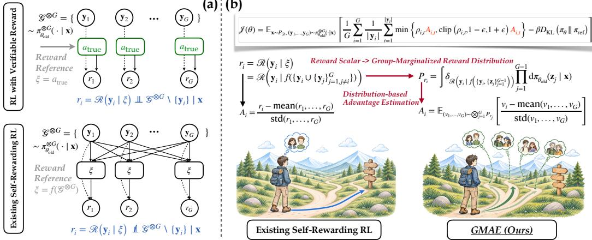  
Figure 1: (a) GMAE Motivation: RLVR evaluates each response against external ground truth, whereas in self-rewarding RL its reward representation depends on the remaining responses in its rollout group, termed its group context. (b) GMAE Overview: Conventional methods use a single group-context realization to obtain each response’s reward representation, while GMAE aggregates rewards across possible contexts into a reward distribution and estimates the expected advantage.

# GROUP-MARGINALIZED SELF-REWARDING RL DRIVES ZERO-LABEL SELF-EVOLVING

Yiming Wang1, Yikang Liu1, Qingyuan Tian1, Xingyu Chen1, Zhuosheng Zhang1, Zhaopeng Tu2, Rui Wang1

1School of Computer Science, Shanghai Jiao Tong University 2Tencent yiming.wang@sjtu.edu.cn

## ABSTRACT

Self-rewarding reinforcement learning (RL) enables large language models (LLMs) to self-evolve without human labels. Existing ensemble-based methods construct reward references from rollout groups and assign rewards accordingly. However, a response’s reward representation also depends on its randomly sampled group context, i.e., the other responses in its group. Using only one group-context realization may miss desired reward signals and provide unreliable guidance for policy optimization. To address this issue, we propose Group-Marginalized Advantage Estimation (GMAE), which aggregates reward realizations across possible contexts into a response-level distribution and estimates expected advantages. Experiments across eight benchmarks and four base models demonstrate strong performance and cross-domain generalization. GMAE also exhibits stable learning, low extra cost, and good applicability across training datasets and RL backbones.

(a) (b)

## 1 INTRODUCTION

Self-evolution enables large language models (LLMs) to learn autonomously from their own experience (Tao et al., 2024), yet becomes harder as models increasingly decide what, when, and how to evolve (Gao et al., 2025). A fundamental setting is zero-label learning, where models derive signals from environments and data without human labels. In RL post-training, this motivates self-rewarding reinforcement learning (Yuan et al., 2024; Zhao et al., 2026b), which uses self-generated rewards for policy optimization, unlike RL with verifiable rewards (RLVR) relying on ground-truth labels.

Existing self-rewarding RL methods mainly derive supervision from two sources of self-generated information: probability-based and ensemble-based signals (He et al., 2026). Probability-based methods estimate response quality from token probabilities or entropy (Zhao et al., 2026b; Li et al., 2025), but often provide weak supervision and may lead to training instability or collapse (Zhang et al., 2025; Roy et al., 2025). Ensemble-based methods instead aggregate the rollout response group into a reward reference, typically a pseudo-label obtained through majority voting (Wang et al., 2023a; Zuo et al., 2026), and reward each response against this reference. Owing to its simplicity and effectiveness, this paradigm is widely adopted, with subsequent methods refining reward-reference construction and reward function (Zhang et al., 2026a; Wang et al., 2026a; Wu et al., 2026).

Despite their promising performance, these ensemble-based methods share a hidden rewarding limitation, as illustrated in Figure 1(a). For a response used for policy optimization, its reward representation depends not only on the response itself but also on the other responses in its rollout group. These responses constitute its randomly sampled group context. This dependence on a random factor introduces uncertainty into the reward representation: a fixed response may receive the desired reward signal only under certain group contexts, as shown in Figure 2. However, existing methods represent this context-dependent reward using only a single group-context realization. If the sampled realization misses the desired signal, that signal cannot guide subsequent policy optimization. Thus, relying on a single group-context realizationfor reward representation makes policy updates sensitive to random rollout sampling, reducing policy optimization reliability.

Following the above analysis, a reward representation restricted to a single group-context realization captures the desired signal only when that realization happens to be suitable for the response. Since this depends on both the self-rewarding rule and the response characteristics, it cannot be guaranteed in practice. Therefore, we consider preserving more reward realizations across different group contexts to reduce the risk of missing desired signals. This motivates our Group-Marginalized Advantage Estimation (GMAE) strategy, illustrated in Figure 1(b). GMAE aggregates these reward realizations into a distribution that serves as the response-level reward representation, then uses it to estimate the response’s expected advantage. Notably, GMAE is a general strategy agnostic to reward-reference construction and reward function: these components define the self-rewarding rules and serve as the “fuel”, while GMAE acts as a general “vehicle” for leveraging them. To apply GMAE in practice, we instantiate it with three representative self-rewarding rules.

We conduct extensive experiments with four base models across eight benchmarks covering mathematics, science, knowledge, and coding. GMAE achieves strong performance and generalizes from mathematical training data to unseen domains, demonstrating more reliable reward estimation. It also exhibits stable learning dynamics and low variance across random seeds, demonstrating more stable optimization. Further experiments also confirm its applicability across training datasets and RL backbones. Overall, these results establish GMAE as a reliable general framework for zero-label self-evolution through self-rewarding RL.

## 2 PRELIMINARIES: RLVR AND SELF-REWARDING RL

In modern LLM post-training, RLVR is a common RL paradigm that improves reasoning through verifiable rewards. As a representative algorithm, GRPO (Shao et al., 2024) uses a PPO-style objective (Schulman et al., 2017; Ouyang et al., 2022), removing the value model and deriving advantages from group-relative rewards. At each training step, given a prompt x sampled from the dataset D, GRPO samples G responses ${ \mathcal G } ^ { \otimes G } = \{ \mathbf { y } _ { 1 } , \dotsc , \mathbf { y } _ { G } \}$ from $\pi _ { \theta _ { \mathrm { o l d } } } ( \cdot \textbf { | x } )$ . Let $\mathcal { A } ( \mathbf { y } _ { i } )$ denote the answer corresponding to response $\mathbf { y } _ { i }$ . Each response receives a scalar reward $r _ { i }$ , forming $\mathbf { r } = \left( r _ { 1 } , \ldots , r _ { G } \right)$ ), and its advantage is obtained by group-wise normalization:

$$
A _ { i } = { \frac { r _ { i } - \mu _ { \mathbf { r } } } { \sigma _ { \mathbf { r } } } } , \qquad \mu _ { \mathbf { r } } = { \frac { 1 } { G } } \sum _ { j = 1 } ^ { G } r _ { j } , \qquad \sigma _ { \mathbf { r } } = { \sqrt { { \frac { 1 } { G } } \sum _ { j = 1 } ^ { G } ( r _ { j } - \mu _ { \mathbf { r } } ) ^ { 2 } } } .\tag{1}
$$

Throughout, zero advantages are assigned whenever $\sigma _ { \mathbf { r } } = 0$ . The response-level advantage is shared across all tokens, i.e., $A _ { i , t } = A _ { i }$ . Defining $\rho _ { i , t } = \pi _ { \boldsymbol { \theta } } ( y _ { i , t } \mid \mathbf { x } , \mathbf { y } _ { i , < t } ) / \pi _ { \theta _ { \mathrm { o l d } } } ( y _ { i , t } \mid \mathbf { x } , \mathbf { y } _ { i , < t } )$ , GRPO optimizes a clipped objective with KL regularization $D _ { \mathrm { K L } }$

$$
\mathcal { I } ( \theta ) = \mathbb { E } _ { \mathbf { x } \sim P _ { D } , \mathbf { \xi } \mathbf { \xi } , \mathbf { \xi } ^ { \otimes G } \sim \pi _ { \theta , \mathbf { a d d } } ^ { \otimes G } ( \cdot | \mathbf { x } ) } \left[ \frac { 1 } { G } \sum _ { i = 1 } ^ { G } \frac { 1 } { | \mathbf { y } _ { i } | } \sum _ { t = 1 } ^ { | \mathbf { y } _ { i } | } \operatorname* { m i n } \{ \rho _ { i , t } A _ { i , t } , \exp ( \rho _ { i , t } , 1 - \epsilon , 1 + \epsilon ) A _ { i , t } \} - \beta D _ { \mathrm { K L } } ( \pi _ { \theta } \| \pi _ { \mathrm { r e f } } ) \right] .\tag{2}
$$

Standard RLVR. In Eq.1, the reward $r _ { i }$ of each response $\mathbf { y } _ { i }$ is computed by a reward function $\mathcal { R } ( \mathbf { y } _ { i } \mid \boldsymbol { \xi } )$ , where $\xi$ denotes the reward reference. In standard RLVR, this reference is given by the ground-truth answer $a _ { \mathrm { t r u e } }$ . The reward is therefore determined solely by the fixed external reference:

$$
\xi \equiv a _ { \mathrm { t r u e } } , \qquad r _ { i } ^ { \mathrm { V R } } = { \mathcal R } ( \mathbf { y } _ { i } \mid \xi ) = { \mathbb 1 } [ A ( \mathbf { y } _ { i } ) = a _ { \mathrm { t r u e } } ] .\tag{3}
$$

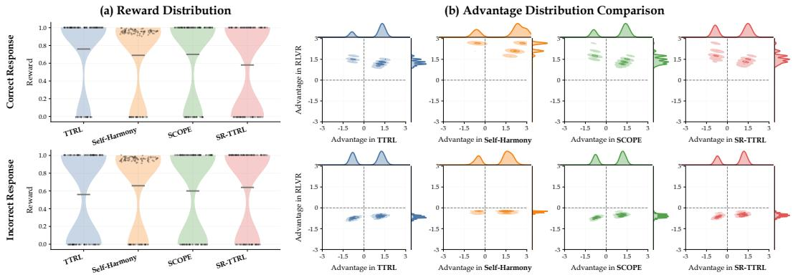  
Figure 2: Self-Reward Uncertainty Demonstration. (a) Reward distributions for a fixed correct response (top) and a fixed incorrect response (bottom) across group contexts under TTRL (Zuo et al., 2026), Self-Harmony (Wang et al., 2026a), SCOPE (Wang et al., 2026b), and SR-TTRL (Wu et al., 2026). Dots denote individual realizations and gray bars denote means. (b) Joint distributions of self-rewarding (x-axis) and RLVR (y-axis) advantages for the same responses. Results here are from Qwen $3 - 8 \mathtt { B } - \mathtt { B } \mathtt { a } \mathtt { s } \mathtt { e }$ on a DAPO-14K prompt; more cases are provided in Appendix A.

Mainstream Pipeline of Self-Rewarding RL. However, $a _ { \mathrm { t r u e } }$ is unavailable in self-rewarding RL, so $\xi$ must be inferred from the sampled rollout group ${ \mathcal G } ^ { \otimes G } = \{ \mathbf { y } _ { 1 } , \ldots , \mathbf { y } _ { G } \}$ . Specifically, a group-dependent function f constructs the reward reference $\xi = f ( \mathcal { G } ^ { \tilde { \otimes } G } )$ , against which the reward

$$
\mathbf { y } _ { i }
$$

$$
r _ { i } ^ { \mathrm { S R } } = { \mathcal { R } } ( \mathbf { y } _ { i } \mid \xi ) = { \mathcal { R } } { \big ( } \mathbf { y } _ { i } \mid f ( { \mathcal { G } } ^ { \otimes G } ) { \big ) } ~ .\tag{4}
$$

A common choice is majority voting (Wang et al., 2023a; Zuo et al., 2026), where $\xi$ is the most frequent answer among $\{ \mathcal { A } ( \dot { \mathbf { y } } _ { 1 } ) , \hdots , \bar { \mathcal { A } } ( \mathbf { y } _ { G } ) \}$ , and R is a binary indicator. Other methods refine $f$ or R while following the same pipeline. Their details are provided in Appendix B.

## 3 ON THE LIMITATION OF SELF-REWARD UNCERTAINTY

Existing self-rewarding methods differ in their choice of $( f , \mathcal { R } )$ , but share a common property: the reward assigned to each response depends on the rollout group it was sampled from. This dependence is implicit in Eq.4, where the pseudo-label $f ( { \mathcal { G } } ^ { \otimes G } )$ is constructed from the entire rollout group.

To make this dependence explicit, we fix a response $\mathbf { y } _ { i }$ and decompose its rollout group as

$$
\begin{array} { r } { \mathcal { G } ^ { \otimes G } = \left\{ \mathbf { y } _ { i } \right\} \cup \mathcal { H } _ { i } , \qquad \mathcal { H } _ { i } \triangleq \left\{ \mathbf { y } _ { j } \right\} _ { j \neq i } , } \end{array}\tag{5}
$$

where $\mathcal { H } _ { i }$ denotes the group context realized alongside $\mathbf { y } _ { i } .$ . Since all responses are independently sampled from the same policy $\pi _ { \theta _ { \mathrm { o l d } } } ( \cdot \mid \mathbf { x } )$ , group contexts follow the same underlying distribution for all focal responses. We therefore use H to denote a generic random group context. For a fixed response ${ \bf y } _ { i } ,$ its reward under $\mathcal { H }$ is

$$
r _ { i } ( \mathcal { H } ) = \mathcal { R } ( \mathbf { y } _ { i } \mid f ( \{ \mathbf { y } _ { i } \} \cup \mathcal { H } ) ) , \qquad \mathcal { H } = \{ \mathbf { z } _ { 1 } , \dots , \mathbf { z } _ { G - 1 } \} \sim Q ( \cdot \mid \mathbf { x } ) \equiv \pi _ { \theta _ { \mathrm { o l d } } } ^ { \otimes ( G - 1 ) } ( \cdot \mid \mathbf { x } )\tag{6}
$$

Although $r _ { i } ( \mathcal { H } _ { i } )$ is deterministic once the realized context $\mathcal { H } _ { i }$ is fixed, H itself is randomly sampled. Thus, the reward intended to estimate the quality of $\mathbf { y } _ { i }$ depends not only on the response itself but also on its group context, introducing uncertainty into the resulting learning signal.

Empirical Validation. We examine how group-context variation affects the reward and advantage of the same response. Given a model $\pi ,$ we fix a prompt x and sample one correct focal response $\mathbf { y } ^ { + }$ and one incorrect focal response $\mathbf { y } ^ { - }$ . For each response, we sample $M = 1 0 0$ independent group contexts, each containing $\bar { G } - 1$ newly sampled responses with $G \overset { \cdot } { = } 1 6$ . These contexts produce M self-reward realizations and group-normalized advantages, forming their empirical distributions. For comparison, we compute the corresponding RLVR advantage under each context.

Figure 2 presents results for four representative self-rewarding methods. As shown in $( \mathbf { a } ) ,$ the reward of the same response varies substantially across group contexts. Although the desired signal is positive for a correct response and negative for an incorrect one, both may receive the opposite signal under some contexts. Thus, restricting reward assignment to a single group-context realization may miss the desired signal, limiting the reliability ofself-reward as an estimate ofresponse quality. In (b), RLVR advantages vary in magnitude but preserve the desired direction: correct responses remain non-negative, whereas incorrect ones remain non-positive. By contrast, self-rewarding advantages often change sign, causing the same response to be reinforced under one context but suppressed under another. Therefore, group-context uncertainty in reward assignment can propagate into advantage estimation, making the optimization direction dependent on the sampled context.

## 4 GMAE: GROUP-MARGINALIZED ADVANTAGE ESTIMATION

Section 3 shows that a correct response may miss a positive reward signal under a single group context. However, the suitable context is response-dependent and unknown in advance, making it difficult to identify in practice. Therefore, instead of relying on one group context, we aggregate reward realizations across contexts into a distribution-level response representation, improving the chance of retaining desired signals. This idea motivates our Group-Marginalized Advantage Estimation (GMAE). In Section 4.1, we will introduce its core algorithm, and in Section 4.2, we will instantiate it with different self-rewarding rules.

## 4.1 CORE ALGORITHM

Main Step I: Group-Marginalized Reward Distribution. For a response $\mathbf { y } _ { i }$ , instead of using the scalar reward induced by the single realized group context $\mathcal { G } ^ { \otimes G } / \{ \bf { y } _ { i } \}$ , we consider its reward over the group-context distribution in $\operatorname { E q . 6 }$ . Let $\delta _ { v }$ denote the Dirac measure concentrated at $v ,$ we define the group-marginalized reward distribution as

$$
P _ { r _ { i } } = \int \delta _ { \mathcal { R } ( \mathbf { y } _ { i } \mid f ( \{ \mathbf { y } _ { i } \} \cup \mathcal { H } ) ) } \mathrm { d } Q ( \mathcal { H } \mid \mathbf { x } ) = \int \delta _ { \mathcal { R } ( \mathbf { y } _ { i } \mid f ( \{ \mathbf { y } _ { i } , \mathbf { z } _ { 1 } , \dots , \mathbf { z } _ { G - 1 } \} ) ) } \prod _ { j = 1 } ^ { G - 1 } \mathrm { d } \pi _ { \theta _ { \mathrm { o l d } } } ( \mathbf { z } _ { j } \mid \mathbf { x } ) ,\tag{7}
$$

However, directly computing $\mathrm { E q . 7 }$ is intractable because it requires marginalizing over the $( G - 1 )$ fold product distribution. Naive Monte Carlo estimation can approximate this marginalization, but requires repeatedly sampling fresh group contexts for each response, incurring substantial rollout cost. Therefore, we reuse sampled responses through a shared candidate pool (Wang et al., 2026c).

Specifically, besides the $G$ main responses ${ \mathcal G } ^ { \otimes G } = \{ \mathbf { y } _ { 1 } , \ldots , \mathbf { y } _ { G } \}$ used for policy optimization, we sample $G ^ { \prime }$ auxiliary responses to form $\mathcal { C } = \{ \mathbf { y } _ { 1 } , \dotsc , \mathbf { y } _ { G + G ^ { \prime } } \}$ . For each main response $\mathbf { y } _ { i }$ $( 1 \leq i \leq G )$ , choosing $G - 1$ companions from $\mathcal { C } \setminus \{ \mathbf { y } _ { i } \}$ yields $\binom { G + G ^ { \prime } - 1 } { G - 1 }$ possible group contexts. We uniformly sample K distinct contexts $\{ S _ { i } ^ { k } \} _ { k = 1 } ^ { K }$ up to τ, and construct the empirical distribution1

$$
\widehat { P } _ { r _ { i } } = \frac { 1 } { K } \sum _ { k = 1 } ^ { K } \delta _ { \mathcal { R } \left( \mathbf { y } _ { i } | f \left( \left\{ \mathbf { y } _ { i } \right\} \cup S _ { i } ^ { k } \right) \right) } , \qquad K = \operatorname* { m i n } \left\{ \tau , \left( \begin{array} { c } { G + G ^ { \prime } - 1 } \\ { G - 1 } \end{array} \right) \right\} .\tag{8}
$$

Now we measure the error from replacing the ideal $P _ { r _ { i } }$ in $\operatorname { E q . 7 }$ with the empirical $\widehat { P } _ { r _ { i } }$ in $\mathrm { E q } . 8$ with the total variation distance $d _ { \mathrm { T V } } ( \cdot , \cdot )$ . For a finite reward-value space $\mathcal { V } _ { i } \stackrel { - } { = } \mathrm { s u p p } ( \stackrel { - } { P } _ { r _ { i } } )$ , with the confidence level and G fixed, the error scales as

$$
d _ { \mathrm { T V } } \Big ( \widehat { P } _ { r _ { i } } , P _ { r _ { i } } \Big ) = \mathcal { O } \left( \sqrt { \frac { | \mathcal { V } _ { i } | } { K } } + \sqrt { \frac { | \mathcal { V } _ { i } | } { G + G ^ { \prime } } } \right) .\tag{9}
$$

It decreases with K and $G ^ { \prime }$ but increases with $| \nu _ { i } |$ . The exact bound and proof are in Appendix C.1.

Main Step II: Distribution-based Advantage Estimation. After marginalizing over group contexts, each $\widehat { P } _ { r _ { i } }$ defines a response-level reward profile that is no longer tied to any particular groupcontext realization. Accordingly, GMAE treats these distributions as response-level reward representations and independently draws reward realizations from them for advantage estimation.

Specifically, we construct the product distribution $\otimes _ { j = 1 } ^ { G } \widehat { P } _ { r _ { j } }$ over joint reward realizations ${ \textbf { v } } =$ $( v _ { 1 } , \ldots , v _ { G } )$ , where each $v _ { j } \sim \widehat { P } _ { r _ { j } }$ and $\begin{array} { r } { \mathbf { v } \in \widehat { \mathcal { V } } = \prod _ { j = 1 } ^ { \tilde { G } } \widehat { \mathcal { V } } _ { j } } \end{array}$ . For each $\mathbf { v } ,$ we compute the groupnormalized advantage and then take its expectation under the product distribution, yielding

$$
A _ { i } ^ { \mathrm { g m a e } } = \mathbb { E } _ { \mathbf { v } \sim \bigotimes _ { j = 1 } ^ { G } } \widehat { P } _ { r _ { j } } \left[ \frac { v _ { i } - \mu _ { \mathbf { v } } } { \sigma _ { \mathbf { v } } } \right] = \sum _ { \mathbf { v } \in \widehat { \mathbb { V } } } \left\{ \prod _ { j = 1 } ^ { G } \left[ \frac { 1 } { K } \sum _ { k = 1 } ^ { K } \mathbb { I } \left[ \mathcal { R } \left( \mathbf { y } _ { j } \mid f \left( \left\{ \mathbf { y } _ { j } \right\} \cup \mathcal { S } _ { j } ^ { k } \right) \right) = v _ { j } \right] \right] \right\} \frac { v _ { i } - \mu _ { \mathbf { v } } } { \sigma _ { \mathbf { v } } } .\tag{10}
$$

Attached Mechanism: Advantage Scale Calibration. Although group-marginalized advantages preserve richer reward information, marginalization can shrink their scale and weaken policy updates. Since $\textstyle \sum _ { i = 1 } ^ { G } A _ { i } ^ { \mathrm { g m a e } } = 0$ , their variance is Va $\begin{array} { r } { \cdot ( \{ A _ { i } ^ { \mathrm { g m a e } } \} _ { i = 1 } ^ { G } ) = \frac { 1 } { G } \sum _ { i = 1 } ^ { G } ( A _ { i } ^ { \mathrm { g m a e } } ) ^ { 2 } } \end{array}$ , which directly reflects the advantage scale and effective update strength. By Jensen’s inequality (Jensen, 1906),

$$
\operatorname { V a r } \left( \{ A _ { i } ^ { \mathrm { g m a e } } \} _ { i = 1 } ^ { G } \right) = \frac { 1 } { G } \sum _ { i = 1 } ^ { G } \left( \mathbb { E } _ { \mathbf { v } } \left[ \frac { v _ { i } - \mu _ { \mathbf { v } } } { \sigma _ { \mathbf { v } } } \right] \right) ^ { 2 } \leq \mathbb { E } _ { \mathbf { v } } \left[ \frac { 1 } { G } \sum _ { i = 1 } ^ { G } \left( \frac { v _ { i } - \mu _ { \mathbf { v } } } { \sigma _ { \mathbf { v } } } \right) ^ { 2 } \right] \leq 1 .\tag{11}
$$

The right-hand side is the expected variance of conventional group-wise advantages without marginalization and is at most 1 under normalization. Thus, marginalization often reduces the advantage scale, motivating calibration to restore the non-marginalized update strength.

Prompt-level calibration could counteract GMAE’s reduced advantage scale by matching each prompt to its scale from a single group context. However, scale differences across prompts can reflect prompt-specific reward uncertainty. A response favored in some contexts but disfavored in others has normalized advantages that partially cancel under marginalization. This reduces the prompt’s scale and makes its updates more conservative. Calibrating each prompt separately would erase these uncertainty-dependent differences. We formalize this relation in Appendix C.2.

Therefore, we adopt batch-level calibration to restore the overall scale while preserving relative scale differences across prompts. For a batch of B prompts, let $A _ { b , i } ^ { \mathrm { b a s e } }$ denote the non-marginalized advantage. We denote the batch-level scales of $A _ { b , i } ^ { \mathrm { b a s e } }$ and $A _ { b , i } ^ { \mathrm { g m a e } }$ by $\sigma _ { \mathrm { b a s e } }$ and $\sigma _ { \mathrm { g m a e } } .$

$$
\sigma _ { \mathrm { b a s e } } = \sqrt { \frac { 1 } { B G } \sum _ { b = 1 } ^ { B } \sum _ { i = 1 } ^ { G } \left( A _ { b , i } ^ { \mathrm { b a s e } } \right) ^ { 2 } } , \qquad \sigma _ { \mathrm { g m a e } } = \sqrt { \frac { 1 } { B G } \sum _ { b = 1 } ^ { B } \sum _ { i = 1 } ^ { G } \left( A _ { b , i } ^ { \mathrm { g m a e } } \right) ^ { 2 } } .\tag{12}
$$

We use $\sigma _ { \mathrm { b a s e } }$ as the reference because it retains the conventional update scale induced by group-wise normalization. We then calibrate all marginalized advantages using a shared factor λ, with a lower bound of 1 to ensure that calibration only compensates for scale contraction:

$$
\begin{array} { r } { \widetilde { A } _ { b , i } ^ { \mathrm { g m a e } } = \lambda A _ { b , i } ^ { \mathrm { g m a e } } , \qquad \lambda = \operatorname* { m a x } \left( 1 , \frac { \sigma _ { \mathrm { b a s e } } } { \sigma _ { \mathrm { g m a e } } } \right) . } \end{array}\tag{13}
$$

## 4.2 INSTANTIATING GMAE WITH SELF-REWARDING RULES

As shown in Section 4.1, GMAE is a general strategy agnostic to the reward-reference construction f and reward function R. Different $( { \bar { f } } , { \mathcal { R } } )$ configurations define different self-rewarding rules that provide the “fuel”, while GMAE serves as the “vehicle” that better leverages these signals for policy optimization. Naturally, concrete choices of f and R are required to instantiate GMAE.

We first instantiate R with the binary reward $\mathcal { R } _ { \mathrm { b i n } } ( \mathbf { y } _ { i } \mid \boldsymbol { \xi } ) = \mathbb { 1 } [ A ( \mathbf { y } _ { i } ) = \boldsymbol { \xi } ]$ , where $\xi$ denotes the reward reference. We adopt it for three reasons. First, it follows the standard reward design in RLVR. Second, it restricts $\mathcal { V } _ { i } , \widehat { \mathcal { V } } _ { i } \subseteq \{ 0 , 1 \}$ , and hence $| \widehat { \mathcal { V } } | \leq 2 ^ { G }$ , minimizing the reward-value space enumerated in $\mathrm { E q . 1 0 }$ . Third, $| \nu _ { i } | \le 2$ tightens the approximation bound in Eq.9. With $\mathcal { R } _ { \mathrm { b i n } }$ fixed, we combine it with three representative $f ,$ yielding three corresponding GMAE instantiations:

$\mathbf { G M A E } _ { 0 } { \mathrm { : } }$ Standard Voting. Following TTRL (Zuo et al., 2026), $\mathrm { G M A E _ { 0 } }$ constructs the pseudolabel by majority voting (Wang et al., 2023a) over responses sampled from the current policy:

$$
\xi _ { 0 } = f _ { 0 } ( \mathcal { G } ^ { \otimes G } ) = \arg \operatorname* { m a x } _ { a } \sum _ { j = 1 } ^ { G } \mathbb { 1 } \big [ A ( \mathbf { y } _ { j } ) = a \big ] .\tag{14}
$$

$\mathbf { G M A E } _ { \mathrm { { C R } } } { \boldsymbol { : } }$ Co-Refinement. Following Co-Reward (Zhang et al., 2026b), $\mathbf { G M A E } _ { \mathrm { C R } }$ defines the group context H as G responses sampled from a slowly updated co-teacher and constructs the reward reference by majority voting over this context, where $\alpha _ { t }$ denotes the teacher retention coefficient:

$$
\widetilde { \theta } _ { t } = \alpha _ { t } \widetilde { \theta } _ { t - 1 } + ( 1 - \alpha _ { t } ) \theta _ { \mathrm { o l d } , t } , \quad \widetilde { \mathcal { H } } = \{ \widetilde { \mathbf { y } } _ { j } \} _ { j = 1 } ^ { G } \sim \pi _ { \widetilde { \theta } _ { t } } ^ { \otimes G } ( \cdot \vert \textbf { x } ) , \quad f _ { \mathrm { C R } } \Big ( \widetilde { \mathcal { H } } \Big ) = \arg \operatorname* { m a x } _ { a } \sum _ { j = 1 } ^ { G } \mathbb { I } \big [ A ( \widetilde { \mathbf { y } } _ { j } ) = a \big ] .\tag{15}
$$

$\mathbf { G M A E } _ { \mathrm { { S R } } } { \mathrm { { : } } }$ Self-Refinement. Following SR-TTRL (Wu et al., 2026), $\mathbf { G M A E } _ { \mathrm { S R } }$ uses self-reflective verification instead of voting. For each distinct answer $^ { a , }$ it summarizes a representative response and constructs the reward reference through self-reflective comparison:

Table 1: Main Results Across Models and Domains: MEAN@16 scores on eight benchmarks across four base models. Average is computed over all eight benchmarks. Bold and underlined values denote the best and second-best results among all self-rewarding methods, respectively.
<table><tr><td rowspan="3">Method</td><td colspan="5">Mathematics</td><td rowspan="2">Science</td><td rowspan="2">Knowledge Coding MMLU-Pro</td><td rowspan="2">Average</td><td colspan="5">Mathematics MATH500</td><td rowspan="2">Science GPQA</td><td rowspan="2">Knowledge MMLU-Pro</td><td rowspan="2">Coding LiveCode</td><td rowspan="2">Average</td></tr><tr><td>MATH500 AMC</td><td></td><td>AIME24 AIME25 AIME26</td><td></td><td>GPQA</td><td>LiveCode</td><td>AMC</td><td></td><td>AIME24 AIME25 AIME26</td></tr><tr><td></td><td colspan="10"></td><td colspan="7">Qwen3-4B-Base</td></tr><tr><td>Raw Model</td><td>45.70.22</td><td>17.00.09</td><td>2.30.07 0.80.18</td><td>1.30.19</td><td>7.90.23</td><td>13.30.29</td><td>6.70.05</td><td>11.90.07</td><td>50.50.06</td><td>24.30.18</td><td>8.00.20</td><td>3.80.11</td><td>5.40.05</td><td>15.80.27</td><td>14.20.17</td><td>15.30.06</td><td>17.20.09</td></tr><tr><td>w/ Verifiable Reward</td><td>64.60.08</td><td>27.10.13</td><td>7.10.20</td><td>5.40.18</td><td>4.20.23- 22.60.24</td><td>31.00.23</td><td>14.20.07</td><td>22.00.17</td><td>81.30.16</td><td>48.00.25</td><td>19.30.03</td><td>17.70.11</td><td>14.80.18</td><td>33.00.17</td><td>39.40.32</td><td>19.10.08</td><td>34.10.13.</td></tr><tr><td>Intuitor</td><td>52.10.14</td><td>19.80.10</td><td>1.10.24</td><td>1.20.15</td><td>0.80.15 13.50.24</td><td>15.70.30</td><td>10.70.22</td><td>14.30.21</td><td>67.10.18</td><td>32.90.04</td><td>9.20.21</td><td>2.70.20</td><td>0.70.20</td><td>30.00.22</td><td>-41.T0.23</td><td>13.80.08</td><td>24.90.21</td></tr><tr><td>EM-RL*</td><td>57.50.08</td><td>19.20.23</td><td>2.60.18</td><td>1.70.13 0.90.22</td><td>13.20.32</td><td>14.80.19</td><td>11.60.08</td><td>15.20.06</td><td>70.90.19</td><td>30.50.18</td><td>4.40.09</td><td>6.30.04</td><td>2.60.08</td><td>28.30.19</td><td>40.80.25</td><td>16.30.15</td><td>25.00.21</td></tr><tr><td>TTRL</td><td>61.10.13</td><td>24.00.22</td><td>3.40.24</td><td>2.70.07 1.10.04</td><td>20.20.22</td><td>23.70.22</td><td>11.30.24</td><td>18.40.15</td><td>74.60.23</td><td>37.80.04</td><td>8.80.11</td><td>5.00.19</td><td>5.30.11</td><td>32.90.16</td><td>35.40.30</td><td>16.00.14</td><td>27.00.05</td></tr><tr><td>CoVo</td><td>52.60.08</td><td>19.00.16</td><td>1.70.11</td><td>1.10.22 1.20.06</td><td>12.80.24</td><td>17.10.25</td><td>10.10.21</td><td>14.50.12</td><td>60.00.19</td><td>29.50.11</td><td>7.90.07</td><td>5.60.04</td><td>4.80.03</td><td>28.00.20</td><td>31.90.14</td><td>15.20.10</td><td>22.90.21</td></tr><tr><td>SCOPE</td><td>56.20.07</td><td>22.30.10</td><td>4.0.22 2.50.07</td><td>1.50.05</td><td>12.00.18</td><td>13.60.19</td><td>8.40.22</td><td>15.10.21</td><td>73.80.24</td><td>38.10.05</td><td>9.80.22</td><td>6.50.21</td><td>6.10.10</td><td>31.60.31</td><td>30.20.14</td><td>16.60.22</td><td>26.60.03</td></tr><tr><td>Self-Harmony</td><td>60.10.08</td><td>22.00.21</td><td>4.00.20 1.50.12</td><td>1.50.21</td><td>20.30.23</td><td>27.40.12</td><td>11.40.19</td><td>18.50.12</td><td>73.60.12</td><td>33.60.18</td><td>8.40.23</td><td>5.30.17</td><td>5.30.08</td><td>34.80.15</td><td>41.70.31</td><td>16.20.25</td><td>27.40.10</td></tr><tr><td>Co-Reward</td><td>61.20.23</td><td>23.60.21</td><td>4.00.05 2.60.21</td><td>1.10.15</td><td>18.90.27</td><td>23.20.27</td><td>12.30.25</td><td>18.40.06</td><td>74.40.06</td><td>38.00.13</td><td>9.40.19</td><td>4.80.12</td><td>5.70.15</td><td>33.70.25</td><td>33.80.13</td><td>17.20.09</td><td>27.10.10</td></tr><tr><td>RESTRAIN</td><td>58.30.17</td><td>22.30.16</td><td>3.60.10 2.10.15</td><td>1.90.19</td><td>16.20.25</td><td>19.80.30</td><td>11.70.16</td><td>17.00.11</td><td>71.00.24</td><td>37.20.04</td><td>8.20.23</td><td>5.50.17</td><td>4.90.12</td><td>31.00.28</td><td>35.20.15</td><td>16.90.23</td><td>26.20.09</td></tr><tr><td>SR-TTRL</td><td>60.90.08</td><td>24.30.23</td><td>4.10.12 2.50.11</td><td>0.70.21</td><td>20.20.25</td><td>24.70.19</td><td>11.90.24</td><td>18.70.18</td><td>74.30.16</td><td>38.70.13</td><td>9.80.09</td><td>5.90.23</td><td>5.50.21</td><td>32.10.19</td><td>31.00.18</td><td>16.60.9</td><td>26.70.19</td></tr><tr><td>GMAE0 (Ours)</td><td>63.00.11</td><td>25.80.06</td><td>5.50.09 4.20.04</td><td>2.50.12</td><td>22.20.18</td><td>25.40.22</td><td>14.30.07</td><td>20.40.10</td><td>75.70.05</td><td>39.70.12</td><td>10.90.08</td><td>8.40.06</td><td>6.50.10</td><td>34.10.15</td><td>38.80.21</td><td>17.10.09</td><td>28.90.07</td></tr><tr><td>GMAEcR (Ours)</td><td>63.80.06</td><td>26.60.10</td><td>6.40.05 5.00.08</td><td></td><td>22.00.14</td><td>25.00.19</td><td>14.50.12</td><td>20.80.06</td><td>76.20.09</td><td>40.20.05</td><td>11.50.11</td><td>8.10.07</td><td>7.80.04</td><td>35.30.17</td><td>43.40.20</td><td>18.30.10</td><td></td></tr><tr><td>GMAESR (Ours)</td><td>63.60.08</td><td>26.40.05</td><td>4.60.00</td><td>3.00.11 3.30.06</td><td>22.20.20</td><td>26.30.16</td><td>14.80.04</td><td>21.00.11</td><td>75.70.12</td><td>41.20.08</td><td>12.00.06</td><td>9.20.10</td><td>7.00.05</td><td>34.30.22</td><td>40.40.18</td><td>17.50.07</td><td>30.10.08 29.70.00</td></tr><tr><td></td><td></td><td colspan="2">6.90.12</td><td colspan="8">Qwen3-8B-Base</td><td colspan="7">Llama3.1-8B-Instruct</td></tr><tr><td></td><td></td><td></td><td></td><td></td><td></td><td></td><td></td><td></td><td></td><td></td><td></td><td></td><td></td><td></td><td></td><td></td><td></td></tr><tr><td>Raw Model</td><td>68.50.19</td><td>35.40.11</td><td>11.30.20</td><td>7.30.07</td><td>6.10.19</td><td>31.00.17</td><td>42.80.14</td><td>19.50.06 27.70.12</td><td></td><td>47.30.14 21.30.06</td><td>7.20.15</td><td>1.50.13</td><td>1.20.25</td><td>17.40.13</td><td>21.50.29</td><td>9.20.14</td><td>15.80.20</td></tr><tr><td>w/ Verifiable Reward</td><td>83.10.25</td><td>49.40.09</td><td>20.40.10</td><td>19.10.20</td><td>16.30.17 42.90.15</td><td>71.20.30</td><td>26.00.00</td><td>40.90.11</td><td>69.40.11</td><td>41.20.07</td><td>16.20.24</td><td>-2</td><td>7.0.04</td><td>25.80.28</td><td>35.50.26</td><td>16.50.07</td><td>27.40.16</td></tr><tr><td>Intuitor</td><td>7T.I0.03</td><td>-37.80.04</td><td>T1.90.15</td><td>9.70.23</td><td>6.80.24 35.20.14</td><td>60.60.14</td><td>19.80.05</td><td>31.60.17</td><td>52.10.06</td><td>27.60.11</td><td>7.70.19</td><td></td><td>T.60.06</td><td>1990.17</td><td>27.60.32</td><td>10.20.05</td><td>18.70.21</td></tr><tr><td>EM-RL*</td><td>73.40.12</td><td>40.40.25</td><td>13.10.22</td><td>9.80.25</td><td>7.90.10 35.80.29</td><td>65.30.22</td><td>20.50.09</td><td>33.30.22</td><td>58.90.15</td><td>34.20.18</td><td>9.00.07</td><td>3.50.17</td><td>2.20.04</td><td>20.30.24</td><td>26.70.27</td><td>13.10.07</td><td>21.00.17</td></tr><tr><td>TTRL</td><td>77.80.25</td><td>43.60.03 37.10.13</td><td>13.10.14</td><td>10.50.00</td><td>6.10.16 39.70.24</td><td>64.10.14</td><td>20.90.17</td><td>34.50.04</td><td>63.80.24</td><td>36.60.10</td><td>11.60.16 10.20.14</td><td>5.00.19 2.40.17</td><td>4.10.21</td><td>21.10.30</td><td>31.80.13</td><td>14.30.12</td><td>23.50.17 19.40.13</td></tr><tr><td>CoVo SCOPE</td><td>69.90.11 77.50.23</td><td>43.30.07</td><td>11.90.09 12.50.20 12.70.15 11.50.18</td><td>9.10.15 11.50.16</td><td>7.00.06 32.30.13 7.10.22 38.60.30</td><td>52.80.16 59.30.24</td><td>20.40.04 19.50.10</td><td>30.10.05 33.70.15 21.90.16</td><td>51.30.15 60.30.15</td><td>29.50.25 32.80.13</td><td>12.10.04 8.00.16</td><td>4.20.08 3.90.19</td><td>1.90.05 3.00.09</td><td>18.50.22 20.00.22</td><td>29.30.18 30.30.21</td><td>12.40.16 11.90.22</td></table>

$$
\begin{array} { r l } & { \mathbf { s } _ { a } = \operatorname { S u m m } _ { \pi _ { \theta _ { 0 \mathrm { H } } } } \left( \mathbf { x } , \operatorname { R e p } \left\{ \mathbf { y } _ { j } \mid A ( \mathbf { y } _ { j } ) = a \right\} \right) , \qquad a \in \mathcal { U } , \qquad \mathcal { U } = \{ A ( \mathbf { y } _ { j } ) \} _ { j = 1 } ^ { G } . } \\ & { \xi _ { \mathrm { S R } } = f _ { \mathrm { S R } } ( \mathcal { G } ^ { \otimes G } ) = \operatorname { R e f l e c t } _ { \pi _ { \theta _ { \mathrm { c l } , \mathrm { l } , \mathrm { l } } } } \left( \mathbf { x } , \left\{ ( a , \mathbf { s } _ { a } ) \right\} _ { a \in \mathcal { U } } \right) . } \end{array}\tag{16}
$$

Since our core contribution lies in the general GMAE strategy, we only briefly introduce the selfrewarding rules used in these three instantiations here. Their detailed pseudocode and computational complexity analyses are deferred to Appendix D.

## 5 EXPERIMENTS

## 5.1 SETUP

Models. We conduct our main experiments on Qwen3-1.7B-Base, Qwen3-4B-Base, and Qwen3-8B-Base (Yang et al., 2025) to evaluate GMAE across model scales. We also include Llama3.1-8B-Instruct (Grattafiori et al., 2024) to assess its adaptability across model families.

Datasets. For training, we use the math dataset DAPO-14K (Yu et al., 2026). For evaluation, we select eight benchmarks across mathematics, science, knowledge, and coding domains. For mathematics, we use MATH500 (Hendrycks et al., 2021), AMC, AIME24, AIME25, and AIME26. The out-of-domain (OOD) benchmarks include GPQA (Rein et al., 2024) for science, MMLU-Pro (Wang et al., 2024b) for knowledge, and LiveCodeBench-v6 (Jain et al., 2025) for coding.

Baselines. We primarily compare GMAE with ensemble-based methods, including TTRL (Zuo et al., 2026), CoVo (Zhang et al., 2026a), SCOPE (Wang et al., 2026b), Self-Harmony (Wang et al., 2026a), RESTRAIN (YU et al., 2026), Co-Reward (Zhang et al., 2026b), and SR-TTRL (Wu et al., 2026). Detailed descriptions are provided in Appendix B. We also include two probability-based methods: Intuitor (Zhao et al., 2026b), which uses self-certainty as its reward, and EM-RL (Agarwal et al., 2026), which uses trajectory entropy as its reward. We further include an RLVR reference to measure the remaining gap to verifiable supervision. We faithfully reproduce all baselines using official implementations when available; otherwise, we implement them based on the original papers.

Implementation. We adopt GRPO (Shao et al., 2024) as the RL backbone and train each base model for one epoch with batch size 64. We use a learning rate of $1 \times 1 0 ^ { - 6 }$ with 5% warmup followed by cosine decay (Loshchilov & Hutter, 2017). For each prompt, we sample G = 16 main and $G ^ { \prime } = \mathrm { i } 6$ auxiliary responses with temperature T = 1.0 and no top-p or top-k truncation, forming a candidate pool of 32 responses. All 32 responses are generated fully in parallel during rollout. We implement all experiments with verl on NVIDIA A100 80GB GPUs.

Evaluation. For each evaluation dataset, we report MEAN@16, defined as the average PASS@1 accuracy over 16 sampled responses per problem. The subscript reports the standard deviation of per-problem PASS@1 outcomes aggregated over the evaluation set. We use temperature $T = 0 . 6 ,$ top-$p = 0 . 9 5$ , and top-k = 20 for sampling. During training, we evaluate checkpoints on DAPO-500 (Yu et al., 2026) every 20 steps and at training end, selecting the checkpoint with the highest validation MEAN@16 for final benchmarking.

Fair Cost Control. Training cost is reflected in two aspects: GPU memory and training duration. For GPU memory, all methods use $G = 1 6$ responses for policy updates. For a fair comparison, the baselines also generate 32 responses per prompt, with the additional responses used only for reward reference construction. This enlarged rollout scheme has been shown to improve performance (Zuo et al., 2026). For training duration, it varies with the computation required by each reward construction and is discussed separately in Section 5.3.

## 5.2 MAIN RESULTS

Overall Comparisons: Robust Improvement and Generalization. In Table 1, GMAE outperforms existing self-rewarding baselines across 30 of 32 model-benchmark combinations. It achieves improvements of 2.0-2.8 points over the strongest baselines, corresponding to 8.0%-12.3% relative gains across different models. Notably, GMAE approaches the performance of RLVR with verifiable rewards. For example, the performance gap on Qwen3-1.7B-Base is reduced to only 1.0 point. Moreover, although trained exclusively on mathematics, GMAE maintains strong performance on OOD benchmarks, demonstrating its broad generalization ability.

Controlled Comparisons: GMAE as a Strong General Strategy. To isolate the contribution of GMAE from the underlying self-rewarding rules, we compare each GMAE instantiation with its base version: $\mathrm { G M A E _ { 0 } }$ with TTRL, $\mathrm { G M A E } _ { \mathrm { C R } }$ with Co-Reward, and $\mathbf { G M A E } _ { \mathrm { S R } }$ with SR-TTRL. Across all comparisons, GMAE consistently improves the corresponding methods, yielding average relative gains of 8.2%, 10.3%, and 9.5%, respectively. Meanwhile, the relative ranking among different self-rewarding rules is largely preserved after applying GMAE, indicating that GMAE improves reward utilization while retaining their individual strengths. Notably, even the weakest GMAE instantiation consistently outperforms the strongest non-GMAE baseline across all evaluated models. These results demonstrate that the improvement comes from the GMAE strategy for leveraging self-reward signals, rather than from any specific self-rewarding rule alone.

## 5.3 DETAILED TRAINING BEHAVIOR

Training Dynamic: Stability Analysis. Stable training dynamics are essential for sustained selfimprovement. Figure 3 tracks performance on the $\mathsf { D A P O - } 5 0 0$ validation set throughout training. Several baselines improve initially but then degrade sharply, exhibiting a “rise-then-collapse” pattern. Notably, both probability-based methods show this behavior, suggesting that probability-based supervision can be unreliable (Zhang et al., 2025). In contrast, GMAE improves steadily and converges without collapse, demonstrating substantially more reliable training dynamics.

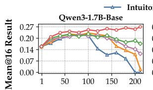

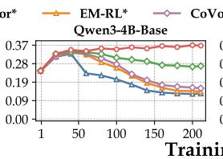

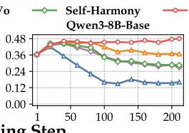

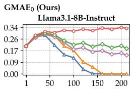  
Figure 3: Training Dynamics on the DAPO-500 validation set over training steps.

Training Robustness: Multi-Seed Training Variance. As analyzed in Section 3, randomness in rollout sampling may flip the sign of the estimated advantage for the same response, substantially affecting policy updates. We therefore test whether GMAE produces more consistent outcomes across runs. We evaluate each method over five runs on Qwen3-8B-Base, keeping the hardware, initialization, training data, batch order, and hyperparameters fixed while varying only the rollout-sampling seed. Figure 4 reports the standard deviation of MEAN@16 across runs, averaged over eight benchmarks. $\mathrm { G M A E _ { 0 } }$ achieves the lowest variance at 0.48, with lower variance in every controlled comparison: TTRL → GMAE (0.69 → 0.48), Co-Reward → $\mathrm { G M A E } _ { \mathrm { C R } } ( 0 . 7 6  0 . 5 5 )$ , and $\mathrm { S R \mathrm { - } T T R L  G M A E _ { S R } ( 0 . 7 2  0 . 5 7 ) }$ . These results show that beyond improving absolute performance, GMAE also makes training more robust.

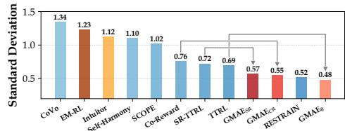  
Figure 4: Multi-Seed Training Variance. Results show the average MEAN@16 standard deviation across eight benchmarks for Qwen3-8B-Base over five training seeds.

Training Duration: Cost Analysis. With equal rollout sampling budgets, we compare end-to-end training time under the same hardware and settings, normalized to RLVR. Figure 5 shows that all three GMAE instantiations remain within the low-to-moderate cost range of existing baselines and add little overhead over their corresponding base versions. This limited overhead arises because marginalization reuses cached responses and requires only lightweight scalar computation. For example, $\mathrm { G M A E _ { 0 } }$ introduces only $G ( K - 1 )$ lightweight voting operations per prompt and at most $\bar { 2 } ^ { G }$ scalar normalizations over TTRL, resulting in nearly identical training time. Meanwhile, the more elaborate GMAE instantiations require additional computation from their

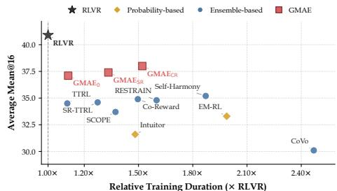  
Figure 5: Training Duration vs. Performance. Each point represents one method. Duration is normalized to RLVR, and performance is the average MEAN@16 across eight benchmarks on Qwen $3 - 8 \mathtt { B } \mathtt { - B } \mathtt { a } \mathtt { s e }$

underlying self-rewarding rules but achieve correspondingly stronger performance, yielding a favor able cost-performance trade-off.

## 6 EXTENDED ANALYSIS

## 6.1 WHY DOES GMAE WORK? A CORRECT-RESPONSE FREQUENCY ARGUMENT

The key motivation for GMAE is that a correct response may receive a positive reward only in certain group contexts, which a single realization may miss. By retaining reward realizations across contexts, GMAE preserves even sparse positive evidence. Extending this intuition to model performance, we initially expected GMAE to prevent rare correct responses from disappearing while keeping common ones frequent, as they are consistently rewarded across contexts. We test this explanation by tracking correct-response frequencies throughout training.

We compare illustrative count distributions for $\mathrm { G M A E _ { 0 } }$ and its non-marginalized version TTRL on Qwen $3 - 8 \mathtt { B } - \mathtt { B } \mathtt { a } \mathtt { s } \mathtt { e }$ at steps 50 and 200, representing early and near-final stages of the 211-step training. As shown in Figure 6, TTRL has more prompts with no correct responses, whereas $\mathrm { G M A E _ { 0 } }$ has more prompts with a small or moderate number of correct responses. The two distributions have almost the same mass at 16 correct responses. This pattern suggests that GMAE helps keep rare correct responses from disappearing while maintaining success on prompts that are already solved consistently.

## 6.2 ABLATION STUDY

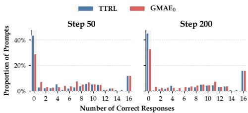

Auxiliary Response Size G′. Eq.9 establishes that the upper bound on the estimation error of $\hat { P } _ { r _ { i } }$ decreases with larger $G ^ { \prime }$ . We validate this result empirically by varying $G ^ { \prime }$ under otherwise identical configurations and performing multiple runs. When $G ^ { \prime } = \bar { 0 }$ the GMAE instantiation reduces to its base version. As shown in Figure 7, increasing $G ^ { \prime }$ consistently improves performance, but the marginal benefit drops markedly beyond markedly beyond $G ^ { \prime } = 1 6$ . This suggests that our default choice of balance between performance and rollout cost. balance between performance and rollout cost.

Figure 6: Distribution of Correct Responses per Prompt. Illustrative proportions of training prompts by the number of correct responses among $G = 1 6$ sampled responses under $\mathrm { G M A E _ { 0 } }$ and TTRL at steps 50 and 200.  
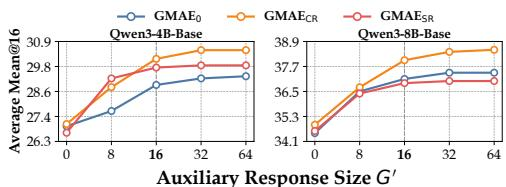  
Figure 7: Auxiliary Response Size Ablation. Average MEAN@16 across all eight benchmarks with different auxiliary response sizes.

$G ^ { \prime } = 1 6$ provides a strong

Advantage Scale Calibration Mechanism. Section 4 theoretically motivates advantage scale calibration and explains why calibration should be applied at the batch rather than prompt level. Now we empirically validate this design. Table 2 shows that batch-level calibration performs best on both models, whereas prompt-level calibration performs worst, even underperforming no calibration.

Table 2: Calibration Ablation on GMAE0. MEAN@16 results for Qwen3-8B-Base.
<table><tr><td></td><td>MATH500</td><td>AMC</td><td>AIME24</td><td>AIME25</td><td>AIME26</td><td>GPQA</td><td>MMLU-Pro</td><td>LiveCode</td><td>Average</td></tr><tr><td>w/o Calibration</td><td>78.4</td><td>45.2</td><td>16.0</td><td>10.3</td><td>9.7</td><td>39.2</td><td>63.6</td><td>22.4</td><td>35.6</td></tr><tr><td>w/ Prompt-level Calibration</td><td>78.0</td><td>44.7</td><td>15.5</td><td>10.8</td><td>8.6</td><td>39.4</td><td>63.8</td><td>21.3</td><td>35.3</td></tr><tr><td>w/ Batch-level Calibration (Ours)</td><td>79.8</td><td>46.2</td><td>16.2</td><td>12.5</td><td>9.2</td><td>41.7</td><td>67.4</td><td>23.5</td><td>37.1</td></tr></table>

Figure 8 further shows how the calibration factor λ (Eq.13) evolves during training. Its value remains between 1.15 and 1.35, confirming that GMAE consistently requires moderate scale compensation. The factor gradually decreases as training proceeds, indicating that the gap between the non-marginalized and marginalized advantage scales narrows over time.

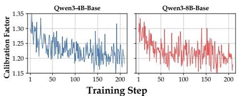  
Figure 8: Calibration Factor λ Dynamics.

## 6.3 SCALABILITY STUDY

We evaluate GMAE’s scalability along two dimensions: RL backbones and training datasets. For the former, we replace the default GRPO backbone with GSPO (Zheng et al., 2025) and REINFORCE++ (Hu et al., 2025), keeping all other settings fixed. For the latter, we train all methods on Open-RS (Dang & Ngo, 2026) and MATH-8K (Hendrycks et al., 2021), in addition to DAPO-14K. As shown in Table 3, GMAE consistently retains its advantages over representative strong baselines from Table 1, demonstrating scalability across the two training settings.

Table 3: Scalability Across Training Settings. Average MEAN@16 across all eight benchmarks for Qwen3-8B-Base. Full benchmark-wise results are in Appendix E.
<table><tr><td rowspan="2">Method</td><td colspan="2">RL Backbones</td><td colspan="2">Training Datasets</td></tr><tr><td>GSPO</td><td>REINFORCE++</td><td>Open-RS</td><td>MATH-8K</td></tr><tr><td>TTRL</td><td>35.8</td><td>32.8</td><td>34.0</td><td>33.2</td></tr><tr><td>Self-Harmony</td><td>36.1</td><td>33.6</td><td>34.9</td><td>33.0</td></tr><tr><td>Co-Reward</td><td>37.3</td><td>33.9</td><td>35.3</td><td>34.3</td></tr><tr><td>SR-TTRL</td><td>36.8</td><td>33.6</td><td>35.2</td><td>34.3</td></tr><tr><td>GMAE0 (Ours)</td><td>38.1</td><td>36.4</td><td>36.2</td><td>35.5</td></tr><tr><td>GMAEcr (Ours)</td><td>39.3</td><td>37.5</td><td>37.3</td><td>36.2</td></tr><tr><td>GMAESR (Ours)</td><td>38.7</td><td>37.1</td><td>36.6</td><td>36.5</td></tr></table>

## 7 RELATED WORK

Self-Evolving LLMs. Self-evolving LLMs improve through self-generated experience (Tao et al., 2024; Gao et al., 2025). They evolve data through self-generation or instruction evolution (Wang et al., 2023b; Xu et al., 2024) and failure-targeted augmentation (Lee et al., 2024b); reasoning through iterative refinement (Madaan et al., 2023; Shinn et al., 2023), latent-rationale bootstrapping (Zelikman et al., 2022; 2024), and structure discovery (Zhou et al., 2024); and policies or tasks through reinforced self-training, self-play (Gulcehre et al., 2023; Chen et al., 2024), and proposer–solver co-evolution (Zhao et al., 2026a; Huang et al., 2026). Yet many require demonstrations, labels, environmental feedback, or verifiers. We instead study zero-label evolution from prompts alone, without ground-truth answers or external reward models.

Self-Rewarding RL. Self-rewarding RL uses self-generated supervision, extending RLAIF (Bai et al., 2022; Lee et al., 2024a) to closed self-evaluation loops (Yuan et al., 2024; Wang et al., 2024a; Wu et al., 2025). For reasoning, probability-based methods score individual rollouts using confidence or self-certainty (Zhao et al., 2026b; Li et al., 2025), while entropy-based objectives reward concentrated token distributions (Agarwal et al., 2026). Ensemble-based methods derive pseudosupervision from multiple rollouts, beginning with answer-frequency consensus (Zuo et al., 2026) and extending to trajectory consistency (Zhang et al., 2026a), weighted or subgroup voting (Wang et al., 2026b), transformed-view agreement (Wang et al., 2026a), complementary or teacher-guided consensus (Zhang et al., 2026b), and self-reflection (Wu et al., 2026). In contrast, GMAE supports different self-reward rules and addresses their shared dependence on sampled rollout groups.

## 8 CONCLUSION

In this paper, we introduced GMAE, a general advantage-estimation strategy for self-rewarding RL. By marginalizing rewards over possible group contexts, GMAE provides more reliable optimization signals while remaining compatible with different self-rewarding rules. Experiments across multiple models and benchmarks demonstrate consistent improvements and stable training, supporting GMAE as an effective approach to zero-label self-evolution.

## AI USE STATEMENT

In this work, we used generative AI tools for writing polishing and the retrieval of some related work. We have verified the correctness of the AI-generated content and take responsibility for the final content of this work, including any text, claims, or artifacts produced with the aid of generative AI.

## REFERENCES

Shivam Agarwal, Zimin Zhang, Lifan Yuan, Jiawei Han, and Hao Peng. The unreasonable effectiveness of entropy minimization in llm reasoning. Advances in Neural Information Processing Systems, 38:107150–107180, 2026.

Yuntao Bai, Saurav Kadavath, Sandipan Kundu, Amanda Askell, Jackson Kernion, Andy Jones, Anna Chen, Anna Goldie, Azalia Mirhoseini, Cameron McKinnon, et al. Constitutional ai: Harmlessness from ai feedback. arXiv preprint arXiv:2212.08073, 2022.

Zixiang Chen, Yihe Deng, Huizhuo Yuan, Kaixuan Ji, and Quanquan Gu. Self-play fine-tuning converts weak language models to strong language models. arXiv preprint arXiv:2401.01335, 2024.

Quy-Anh Dang and Chris Ngo. Reinforcement learning for reasoning in small LLMs: What works and what doesn’t. In Logical and Symbolic Reasoning in Language Models @ AAAI 2026, 2026.

Huan-ang Gao, Jiayi Geng, Wenyue Hua, Mengkang Hu, Xinzhe Juan, Hongzhang Liu, Shilong Liu, Jiahao Qiu, Xuan Qi, Yiran Wu, et al. A survey of self-evolving agents: What, when, how, and where to evolve on the path to artificial super intelligence. arXiv preprint arXiv:2507.21046, 2025.

Aaron Grattafiori, Abhimanyu Dubey, Abhinav Jauhri, Abhinav Pandey, Abhishek Kadian, Ahmad Al-Dahle, Aiesha Letman, Akhil Mathur, Alan Schelten, Alex Vaughan, et al. The llama 3 herd of models. arXiv preprint arXiv:2407.21783, 2024.

Caglar Gulcehre, Tom Le Paine, Srivatsan Srinivasan, Ksenia Konyushkova, Lotte Weerts, Abhishek Sharma, Aditya Siddhant, Alex Ahern, Miaosen Wang, Chenjie Gu, et al. Reinforced self-training (rest) for language modeling. arXiv preprint arXiv:2308.08998, 2023.

Bingxiang He, Yuxin Zuo, Zeyuan Liu, Shangziqi Zhao, Zixuan Fu, Junlin Yang, Cheng Qian, Kaiyan Zhang, Yuchen Fan, Ganqu Cui, et al. How far can unsupervised rlvr scale llm training? In International Conference on Learning Representations, volume 2026, pp. 14823–14865, 2026.

Dan Hendrycks, Collin Burns, Saurav Kadavath, Akul Arora, Steven Basart, Eric Tang, Dawn Song, and Jacob Steinhardt. Measuring mathematical problem solving with the MATH dataset. In Thirty-fifth Conference on Neural Information Processing Systems Datasets and Benchmarks Track (Round 2), 2021.

Jian Hu, Jason Klein Liu, Haotian Xu, and Wei Shen. Reinforce++: Stabilizing critic-free policy optimization with global advantage normalization. arXiv preprint arXiv:2501.03262, 2025.

Chengsong Huang, Wenhao Yu, Xiaoyang Wang, Hongming Zhang, Zongxia Li, Ruosen Li, Jiaxin Huang, Haitao Mi, and Dong Yu. R-zero: Self-evolving reasoning llm from zero data. In International Conference on Learning Representations, volume 2026, pp. 130770–130790, 2026.

Naman Jain, Alex Gu, Wen-Ding Li, Fanjia Yan, Tianjun Zhang, Sida Wang, Armando Solar-Lezama, Koushik Sen, and Ion Stoica. Livecodebench: Holistic and contamination free evaluation of large language models for code. In International Conference on Learning Representations, volume 2025, pp. 58791–58831, 2025.

Johan Ludwig William Valdemar Jensen. Sur les fonctions convexes et les inegalit´ es entre les valeurs´ moyennes. Acta mathematica, 30(1):175–193, 1906.

Harrison Lee, Samrat Phatale, Hassan Mansoor, Thomas Mesnard, Johan Ferret, Kellie Ren Lu, Colton Bishop, Ethan Hall, Victor Carbune, Abhinav Rastogi, and Sushant Prakash. RLAIF vs. RLHF: Scaling reinforcement learning from human feedback with AI feedback. In Forty-first International Conference on Machine Learning, 2024a.

Nicholas Lee, Thanakul Wattanawong, Sehoon Kim, Karttikeya Mangalam, Sheng Shen, Gopala Anumanchipalli, Michael Mahoney, Kurt Keutzer, and Amir Gholami. Llm2llm: Boosting llms with novel iterative data enhancement. In Findings ofthe Associationfor Computational Linguistics: ACL 2024, pp. 6498–6526, 2024b.

Pengyi Li, Matvey Skripkin, Alexander Zubrey, Andrey Kuznetsov, and Ivan Oseledets. Confidence is all you need: Few-shot rl fine-tuning of language models. arXiv preprint arXiv:2506.06395, 2025.

Ilya Loshchilov and Frank Hutter. SGDR: Stochastic gradient descent with warm restarts. In International Conference on Learning Representations, 2017.

Aman Madaan, Niket Tandon, Prakhar Gupta, Skyler Hallinan, Luyu Gao, Sarah Wiegreffe, Uri Alon, Nouha Dziri, Shrimai Prabhumoye, Yiming Yang, et al. Self-refine: Iterative refinement with self-feedback. Advances in neural information processing systems, 36:46534–46594, 2023.

Long Ouyang, Jeffrey Wu, Xu Jiang, Diogo Almeida, Carroll Wainwright, Pamela Mishkin, Chong Zhang, Sandhini Agarwal, Katarina Slama, Alex Ray, et al. Training language models to follow instructions with human feedback. Advances in neural information processing systems, 35:27730– 27744, 2022.

David Rein, Betty Li Hou, Asa Cooper Stickland, Jackson Petty, Richard Yuanzhe Pang, Julien Dirani, Julian Michael, and Samuel R. Bowman. GPQA: A graduate-level google-proof q&a benchmark. In First Conference on Language Modeling, 2024.

Shuvendu Roy, Hossein Hajimirsadeghi, Mengyao Zhai, and Golnoosh Samei. You need reasoning to learn reasoning: The limitations of label-free rl in weak base models. arXiv preprint arXiv:2511.04902, 2025.

John Schulman, Filip Wolski, Prafulla Dhariwal, Alec Radford, and Oleg Klimov. Proximal policy optimization algorithms. arXiv preprint arXiv:1707.06347, 2017.

Zhihong Shao, Peiyi Wang, Qihao Zhu, Runxin Xu, Junxiao Song, Xiao Bi, Haowei Zhang, Mingchuan Zhang, YK Li, Yang Wu, et al. Deepseekmath: Pushing the limits of mathematical reasoning in open language models. arXiv preprint arXiv:2402.03300, 2024.

Noah Shinn, Federico Cassano, Ashwin Gopinath, Karthik Narasimhan, and Shunyu Yao. Reflexion: Language agents with verbal reinforcement learning. Advances in neural information processing systems, 36:8634–8652, 2023.

Zhengwei Tao, Ting-En Lin, Xiancai Chen, Hangyu Li, Yuchuan Wu, Yongbin Li, Zhi Jin, Fei Huang, Dacheng Tao, and Jingren Zhou. A survey on self-evolution of large language models. arXiv preprint arXiv:2404.14387, 2024.

Ru Wang, Wei Huang, Qi Cao, Yusuke Iwasawa, Yutaka Matsuo, and Jiaxian Guo. Self-harmony: Learning to harmonize self-supervision and self-play in test-time reinforcement learning. In International Conference on Learning Representations, volume 2026, pp. 83112–83144, 2026a.

Tianlu Wang, Ilia Kulikov, Olga Golovneva, Ping Yu, Weizhe Yuan, Jane Dwivedi-Yu, Richard Yuanzhe Pang, Maryam Fazel-Zarandi, Jason Weston, and Xian Li. Self-taught evaluators. arXiv preprint arXiv:2408.02666, 2024a.

Weiqin Wang, Yile Wang, Kehao Chen, and Hui Huang. Beyond majority voting: Towards finegrained and more reliable reward signal for test-time reinforcement learning. In Proceedings of the 64th Annual Meeting ofthe Associationfor Computational Linguistics (Volume 1: Long Papers), pp. 37251–37265, 2026b.

Xuezhi Wang, Jason Wei, Dale Schuurmans, Quoc V Le, Ed H. Chi, Sharan Narang, Aakanksha Chowdhery, and Denny Zhou. Self-consistency improves chain of thought reasoning in language models. In The Eleventh International Conference on Learning Representations, 2023a.

Yiming Wang, Zhuosheng Zhang, and Rui Wang. On the overscaling curse of parallel thinking: System efficacy contradicts sample efficiency. arXiv preprint arXiv:2601.21619, 2026c.

Yizhong Wang, Yeganeh Kordi, Swaroop Mishra, Alisa Liu, Noah A Smith, Daniel Khashabi, and Hannaneh Hajishirzi. Self-instruct: Aligning language models with self-generated instructions. In Proceedings ofthe 61st annual meeting ofthe associationfor computational linguistics (volume 1: long papers), pp. 13484–13508, 2023b.

Yubo Wang, Xueguang Ma, Ge Zhang, Yuansheng Ni, Abhranil Chandra, Shiguang Guo, Weiming Ren, Aaran Arulraj, Xuan He, Ziyan Jiang, et al. Mmlu-pro: A more robust and challenging multi task language understanding benchmark. Advances in Neural Information Processing Systems, 37: 95266–95290, 2024b.

Sitong Wu, Haoru Tan, Xichen Zhang, Bin Xia, Shaofeng Zhang, Xiaojuan Qi, Bei Yu, and Jiaya Jia. Beyond majority voting: Self-reflective test-time reinforcement learning for LLM reasoning. In Forty-third International Conference on Machine Learning, 2026.

Tianhao Wu, Weizhe Yuan, Olga Golovneva, Jing Xu, Yuandong Tian, Jiantao Jiao, Jason E Weston, and Sainbayar Sukhbaatar. Meta-rewarding language models: Self-improving alignment with llm-as-a-meta-judge. In Proceedings ofthe 2025 Conference on Empirical Methods in Natural Language Processing, pp. 11548–11565, 2025.

Can Xu, Qingfeng Sun, Kai Zheng, Xiubo Geng, Pu Zhao, Jiazhan Feng, Chongyang Tao, Qingwei Lin, and Daxin Jiang. Wizardlm: Empowering large pre-trained language models to follow complex instructions. In International Conference on Learning Representations, volume 2024, pp. 30745–30766, 2024.

An Yang, Anfeng Li, Baosong Yang, Beichen Zhang, Binyuan Hui, Bo Zheng, Bowen Yu, Chang Gao, Chengen Huang, Chenxu Lv, et al. Qwen3 technical report. arXiv preprint arXiv:2505.09388, 2025.

Qiying Yu, Zheng Zhang, Ruofei Zhu, Yufeng Yuan, Xiaochen Zuo, Yu Yue, Weinan Dai, Tiantian Fan, Gaohong Liu, Lingjun Liu, et al. Dapo: An open-source llm reinforcement learning system at scale. Advances in Neural Information Processing Systems, 38:113222–113244, 2026.

ZHAONING YU, Zhaolun Su, Leitian Tao, Haozhu Wang, Aashu Singh, Hanchao Yu, Jianyu Wang, Hongyang Gao, Weizhe Yuan, Jason E Weston, Ping Yu, and Jing Xu. RESTRAIN: From spurious votes to signals — self-training RL with self-penalization. In The Fourteenth International Conference on Learning Representations, 2026.

Weizhe Yuan, Richard Yuanzhe Pang, Kyunghyun Cho, Xian Li, Sainbayar Sukhbaatar, Jing Xu, and Jason E Weston. Self-rewarding language models. In Ruslan Salakhutdinov, Zico Kolter, Katherine Heller, Adrian Weller, Nuria Oliver, Jonathan Scarlett, and Felix Berkenkamp (eds.), Proceedings ofthe 41st International Conference on Machine Learning, volume 235 of Proceedings ofMachine Learning Research, pp. 57905–57923. PMLR, 21–27 Jul 2024.

Eric Zelikman, Yuhuai Wu, Jesse Mu, and Noah Goodman. Star: Bootstrapping reasoning with reasoning. Advances in Neural Information Processing Systems, 35:15476–15488, 2022.

Eric Zelikman, Georges Raif Harik, Yijia Shao, Varuna Jayasiri, Nick Haber, and Noah Goodman. Quiet-STar: Language models can teach themselves to think before speaking. In First Conference on Language Modeling, 2024.

Kongcheng Zhang, Qi Yao, Shunyu Liu, Yingjie Wang, Baisheng Lai, Jieping Ye, Mingli Song, and Dacheng Tao. Consistent paths lead to truth: Self-rewarding reinforcement learning for llm reasoning. Advances in Neural Information Processing Systems, 38:59849–59887, 2026a.

Yanzhi Zhang, Zhaoxi Zhang, Haoxiang Guan, Yilin Cheng, Yitong Duan, Chen Wang, Yue Wang, Shuxin Zheng, and Jiyan He. No free lunch: Rethinking internal feedback for llm reasoning. arXiv preprint arXiv:2506.17219, 2025.

Zizhuo Zhang, Jianing Zhu, Xinmu Ge, Zihua Zhao, Xuan Li, Xiao Feng, Jiangchao Yao, Bo Han, et al. Co-rewarding: Stable self-supervised rl for eliciting reasoning in large language models. In International Conference on Learning Representations, volume 2026, pp. 82520–82558, 2026b.

Andrew Zhao, Yiran Wu, Tong Wu, Quentin Xu, Yang Yue, Matthieu Lin, Shenzhi Wang, Qingyun Wu, Zilong Zheng, and Gao Huang. Absolute zero: Reinforced self-play reasoning with zero data. Advances in Neural Information Processing Systems, 38:105816–105879, 2026a.

Xuandong Zhao, Zhewei Kang, Aosong Feng, Sergey Levine, and Dawn Song. Learning to reason without external rewards. In International Conference on Learning Representations, volume 2026, pp. 2548–2581, 2026b.

Chujie Zheng, Shixuan Liu, Mingze Li, Xiong-Hui Chen, Bowen Yu, Chang Gao, Kai Dang, Yuqiong Liu, Rui Men, An Yang, et al. Group sequence policy optimization. arXiv preprint arXiv:2507.18071, 2025.

Pei Zhou, Jay Pujara, Xiang Ren, Xinyun Chen, Heng-Tze Cheng, Quoc V Le, Denny Zhou, Swaroop Mishra, Huaixiu S Zheng, et al. Self-discover: Large language models self-compose reasoning structures. Advances in Neural Information Processing Systems, 37:126032–126058, 2024.

Yuxin Zuo, Kaiyan Zhang, Li Sheng, Shang Qu, Ganqu Cui, Xuekai Zhu, Haozhan Li, Xinwei Long, Ermo Hua, Biqing Qi, et al. Ttrl: Test-time reinforcement learning. Advances in Neural Information Processing Systems, 38:131459–131483, 2026.

## A ADDITIONAL DEMONSTRATIONS OF SELF-REWARD UNCERTAINTY

We provide four additional cases following the setup of Figure 2. For each DAPO-14K prompt, we sample one correct and one incorrect focal response from Qwen3-8B-Base. Each focal response is evaluated under M = 100 independent group contexts, each containing G − 1 newly sampled responses with G = 16. We record its reward and group-normalized advantage under the four self-rewarding methods, together with its RLVR advantage under the same context.

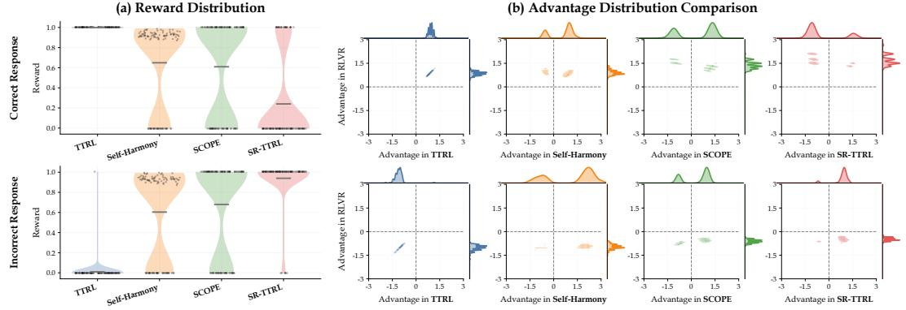  
Figure 9: Self-Reward Uncertainty (Additional Case 2).

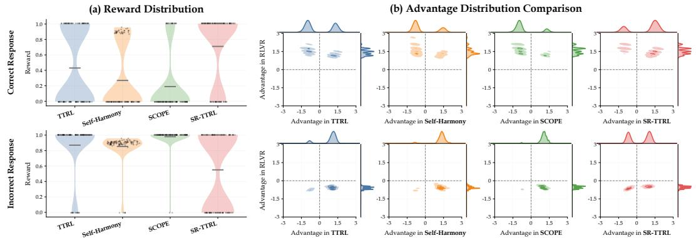  
Figure 10: Self-Reward Uncertainty (Additional Case 3).

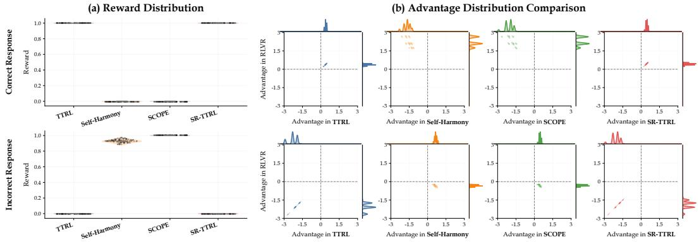  
Figure 11: Self-Reward Uncertainty (Additional Case 4).

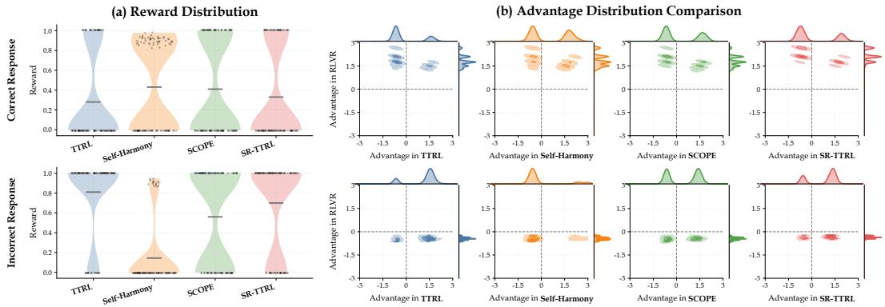  
Figure 12: Self-Reward Uncertainty (Additional Case 5).

## B SELF-REWARDING RULES OF BASELINES

We describe the self-rewarding rules used by the baselines. Following Section 2, let ${ \mathcal { G } } ^ { \otimes G } =$ $\left\{ \mathbf { y } _ { 1 } , \dotsc , \mathbf { y } _ { G } \right\}$ be the sampled response group, where $\mathbf { y } _ { i }$ denotes a complete response and $\boldsymbol { \mathcal { A } } ( \mathbf { y } _ { i } )$ extracts its final answer. Let

$$
\mathcal { U } = \{ \boldsymbol { A } ( \mathbf { y } _ { i } ) \} _ { i = 1 } ^ { G } , \qquad n ( a ) = \sum _ { i = 1 } ^ { G } \mathbb { 1 } [ \boldsymbol { A } ( \mathbf { y } _ { i } ) = a ]\tag{17}
$$

denote the set of distinct answers and the frequency of answer $^ { a , }$ respectively. In general, each method constructs a reward reference $z = f ( { \bar { Q } } ^ { \mathbf { \bar { \otimes } } G } )$ and assigns $r _ { i } = \mathcal { R } ( \mathbf { y } _ { i } \mid z )$ . Depending on the method, z may be a single pseudo-label, a collection of response-specific pseudo-labels, or structured group information.

## B.1 TTRL

TTRL (Zuo et al., 2026) uses majority voting over the extracted answers. The most frequent answer is selected as the reward reference:

$$
\boxed { z _ { \mathrm { T T R L } } = f _ { \mathrm { T T R L } } ( \mathcal { G } ^ { \otimes G } ) = \arg \operatorname* { m a x } _ { a \in \mathcal { U } } \sum _ { j = 1 } ^ { G } \mathbb { 1 } [ A ( \mathbf { y } _ { j } ) = a ] }\tag{18}
$$

Each response receives a binary reward according to whether its final answer matches this reference:

$$
\left| \mathcal { R } _ { \mathrm { T T R L } } ( \mathbf { y } _ { i } \mid z _ { \mathrm { T T R L } } ) = \mathbb { 1 } [ A ( \mathbf { y } _ { i } ) = z _ { \mathrm { T T R L } } ] \right.\tag{19}
$$

## B.2 COVO

CoVo (Zhang et al., 2026a) derives rewards from the internal reasoning trajectory of each response. Specifically, response $\mathbf { y } _ { i }$ is divided into $T _ { i }$ reasoning steps, and $\mathbf { s } _ { i , \ell }$ denotes its intermediate state before step ℓ. For a candidate answer $^ { a , }$ CoVo measures its distance from this state by

$$
d ( \mathbf { s } _ { i , \ell } , a ) = - \frac { 1 } { | a | } \sum _ { q = 1 } ^ { | a | } \log \pi _ { \theta _ { \mathrm { o l d } } } ( a _ { q } \mid \mathbf { s } _ { i , \ell } , a _ { < q } ) .\tag{20}
$$

Let $a _ { i } = \mathcal { A } ( \mathbf { y } _ { i } )$ . The consistency and volatility of $\mathbf { y } _ { i }$ are defined as

$$
\operatorname { C o n } ( \mathbf { y } _ { i } ) = \frac { 1 } { T _ { i } } \sum _ { \ell = 0 } ^ { T _ { i } - 1 } \mathbb { 1 } \bigg [ a _ { i } = \arg \operatorname* { m i n } _ { a \in \mathcal { U } } d ( \mathbf { s } _ { i , \ell } , a ) \bigg ] ,\tag{21}
$$

$$
\mathrm { V o l } ( { \bf y } _ { i } ) = \frac { 1 } { T _ { i } } \operatorname* { m a x } \biggl ( \Bigl \{ \ell : a _ { i } \neq \arg \operatorname* { m i n } _ { a \in \mathcal { U } } d ( { \bf s } _ { i , \ell } , a ) \Bigr \} \cup \{ 0 \} \biggr ) .\tag{22}
$$

Responses sharing the same extracted answer form

$$
{ \mathcal { T } } ( a ) = \left\{ j : { \mathcal { A } } ( \mathbf { y } _ { j } ) = a \right\} .\tag{23}
$$

CoVo maps each response to

$$
\mathbf { v } _ { i } = \operatorname { C o n } ( \mathbf { y } _ { i } ) \left[ \cos ( \operatorname { V o l } ( \mathbf { y } _ { i } ) ) \right]\tag{24}
$$

and aggregates these vectors within each answer group. Accordingly, its group-derived reference is

$$
\boxed { z _ { \mathrm { C o V o } } = f _ { \mathrm { C o V o } } ( \mathcal G ^ { \otimes G } ) = \left\{ \mathcal { Z } ( a ) , \left\{ \mathbf { v } _ { j } \right\} _ { j \in \mathcal { Z } ( a ) } \right\} _ { a \in \mathcal { U } } }\tag{25}
$$

The intrinsic reward of $\mathbf { y } _ { i }$ is the normalized magnitude of the aggregated vector for its answer group:

$$
r _ { i } ^ { \mathrm { i n t } } = \frac { 1 } { | \mathcal { T } ( a _ { i } ) | } \left\| \sum _ { j \in \mathcal { T } ( a _ { i } ) } \mathbf { v } _ { j } \right\| _ { 2 } .\tag{26}
$$

CoVo additionally assigns a curiosity reward $r _ { i } ^ { \mathrm { c u r } }$ based on the likelihood of transitions between successive reasoning states, together with a $\mathrm { K L }$ penalty that prevents a few extremely unlikely tokens from dominating the reward. The final reward is

$$
\boxed { \mathcal { R } _ { \mathrm { C o V o } } ( \mathbf { y } _ { i } \mid z _ { \mathrm { C o V o } } ) = r _ { i } ^ { \mathrm { i n t } } + r _ { i } ^ { \mathrm { c u r } } }\tag{27}
$$

The token-level computation of $r _ { i } ^ { \mathrm { c u r } }$ follows the original implementation of CoVo.

## B.3 SCOPE

SCOPE (Wang et al., 2026b) combines step-wise confidence weighting with subgroup-specific pseudolabels. Suppose response $\mathbf { y } _ { i }$ contains $L _ { i }$ reasoning steps, with step ℓ containing $N _ { i , \ell }$ tokens. Let $P _ { i , \ell , t } ^ { ( 1 ) } , \ldots , P _ { i , \ell , t } ^ { ( K _ { c } ) }$ denote the top- $K _ { c }$ next-token probabilities at token position t. The response-level confidence is

$$
c _ { i } = \frac { 1 } { L _ { i } } \sum _ { \ell = 1 } ^ { L _ { i } } \frac { 1 } { N _ { i , \ell } } \sum _ { t = 1 } ^ { N _ { i , \ell } } \left( - \frac { 1 } { K _ { c } } \sum _ { q = 1 } ^ { K _ { c } } \log P _ { i , \ell , t } ^ { ( q ) } \right) .\tag{28}
$$

SCOPE partitions the G responses into equal-sized subgroups. The subgroup size is dynamically selected through the Pareto criterion in the original method, which balances the agreement between responses and their subgroup labels against the diversity of labels across subgroups. Let $\mathcal { T } _ { 1 } , \ldots , \mathcal { T } _ { L }$ denote the resulting partition and let $\bar { \ell } ( i )$ satisfy $i \in \mathcal { T } _ { \ell ( i ) }$

For each subgroup $\ell ,$ SCOPE independently draws a bootstrap sample $\boldsymbol { B _ { \ell } }$ from the complete rollout group and applies confidence-weighted voting:

$$
z _ { \ell } = \arg \operatorname* { m a x } _ { a \in \mathcal { U } } \sum _ { j \in \mathcal { B } _ { \ell } } c _ { j } \mathbb { 1 } [ A ( \mathbf { y } _ { j } ) = a ] .\tag{29}
$$

Therefore, SCOPE constructs one reward reference for each response according to its subgroup:

$$
\boxed { z _ { \mathrm { S C O P E } } = f _ { \mathrm { S C O P E } } ( \mathcal { G } ^ { \otimes G } ) = \left( z _ { \ell ( 1 ) } , \dots , z _ { \ell ( G ) } \right) }\tag{30}
$$

Writing zSCOPE, ${ \bf \Phi } _ { , i } = z _ { \ell ( i ) }$ , its reward is

$$
\Big | \mathcal { R } _ { \mathrm { S C O P E } } ( \mathbf { y } _ { i } \mid z _ { \mathrm { S C O P E } } ) = \mathbb { 1 } [ A ( \mathbf { y } _ { i } ) = z _ { \mathrm { S C O P E } , i } ] \Big |\tag{31}
$$

The candidate subgroup sizes, bootstrap configuration, and Pareto selection procedure follow the original SCOPE implementation.

## B.4 SELF-HARMONY

Self-Harmony (Wang et al., 2026a) constructs two views of the same prompt. Besides the original prompt x, the model acts as a Reframer to generate a semantically equivalent prompt $\mathbf { x } ^ { \prime }$ . It then samples an additional response group

$$
\begin{array} { r } { \mathcal { G } ^ { \prime \otimes G ^ { \prime } } = \{ \mathbf { y } _ { 1 } ^ { \prime } , \dots , \mathbf { y } _ { G ^ { \prime } } ^ { \prime } \} \sim \pi _ { \theta _ { \mathrm { o l d } } } ^ { \otimes G ^ { \prime } } ( \cdot \mid \mathbf { x } ^ { \prime } ) . } \end{array}\tag{32}
$$

For each candidate answer $^ { a , }$ its empirical frequencies in the original and reframed views are

$$
p ( a ) = \frac { 1 } { G } \sum _ { i = 1 } ^ { G } \mathbb { 1 } [ A ( \mathbf { y } _ { i } ) = a ] , \qquad p ^ { \prime } ( a ) = \frac { 1 } { G ^ { \prime } } \sum _ { j = 1 } ^ { G ^ { \prime } } \mathbb { 1 } \left[ A ( \mathbf { y } _ { j } ^ { \prime } ) = a \right] .\tag{33}
$$

Self-Harmony selects the answer with the largest harmonic mean of these two frequencies:

$$
\boxed { z _ { \mathrm { S H } } = f _ { \mathrm { S H } } \Big ( \mathcal { G } ^ { \otimes G } , \mathcal { G } ^ { \prime \otimes G ^ { \prime } } \Big ) = \arg \operatorname* { m a x } _ { a } \frac { 2 p ( a ) p ^ { \prime } ( a ) } { p ( a ) + p ^ { \prime } ( a ) } }\tag{34}
$$

The score is defined as zero when $p ( a ) + p ^ { \prime } ( a ) = 0$ . The original responses are rewarded by agreement with this shared reference:

$$
\boxed { \mathcal { R } _ { \mathrm { S H } } ( { \bf y } _ { i } \mid z _ { \mathrm { S H } } ) = { \mathbb { 1 } } [ A ( { \bf y } _ { i } ) = z _ { \mathrm { S H } } ] }\tag{35}
$$

Self-Harmony also trains the reframing branch using format and diversity rewards. Their prompt templates and implementation details follow the original paper.

## B.5 RESTRAIN

RESTRAIN (YU et al., 2026) retains all distinct answers instead of selecting only the majority answer. Write $\mathcal { U } = \{ a _ { 1 } , . . . , a _ { M } \}$ and define

$$
c _ { m } = \sum _ { i = 1 } ^ { G } \mathbb { 1 } \left[ \pmb { \mathscr { A } } ( \mathbf { y } _ { i } ) = a _ { m } \right] , \qquad p _ { m } = \frac { c _ { m } } { G } .\tag{36}
$$

Given the Gaussian shaping function

$$
g ( p ) = \exp \left( - \frac { ( p - k ) ^ { 2 } } { 2 \sigma ^ { 2 } } \right) , \qquad k \in [ 0 , 1 ] , \quad \sigma > 0 ,\tag{37}
$$

RESTRAIN assigns each candidate answer the normalized weight

$$
w _ { m } = \frac { g ( p _ { m } ) } { \sum _ { \ell = 1 } ^ { M } g ( p _ { \ell } ) } .\tag{38}
$$

Its reward reference is therefore a weighted collection of candidate answers:

$$
\boxed { z _ { \mathrm { R E S } } = f _ { \mathrm { R E S } } ( \mathcal { G } ^ { \otimes G } ) = \{ ( a _ { m } , w _ { m } ) \} _ { m = 1 } ^ { M } }\tag{39}
$$

Unlike methods using a single pseudo-label, RESTRAIN evaluates each response against every candidate answer:

$$
\left| \mathcal { R } _ { \mathrm { R E S } } ( \mathbf { y } _ { i } \mid z _ { \mathrm { R E S } } ) = \{ \mathbb { 1 } [ A ( \mathbf { y } _ { i } ) = a _ { m } ] \} _ { m = 1 } ^ { M } \right|\tag{40}
$$

Let $r _ { i , m } = \mathbb { 1 } [ \mathcal { A } ( \mathbf { y } _ { i } ) = a _ { m } ]$ and let $A _ { i , m }$ be the group-normalized advantage computed from $\{ r _ { j , m } \} _ { j = 1 } ^ { G }$ . When the majority count $c _ { \operatorname* { m a x } } = \operatorname* { m a x } _ { m } c _ { m }$ falls below a threshold $\kappa ,$ RESTRAIN sets the rewards to zero and subtracts a fixed offset δ from every advantage:

$$
\widetilde { r } _ { i , m } = \left\{ \begin{array} { l l } { r _ { i , m } , } & { c _ { \operatorname* { m a x } } \geq \kappa , } \\ { 0 , } & { c _ { \operatorname* { m a x } } < \kappa , } \end{array} \right. \qquad \widetilde { A } _ { i , m } = \left\{ \begin{array} { l l } { A _ { i , m } , } & { c _ { \operatorname* { m a x } } \geq \kappa , } \\ { A _ { i , m } - \delta , } & { c _ { \operatorname* { m a x } } < \kappa . } \end{array} \right.\tag{41}
$$

The resulting GRPO objectives are combined using the pseudo-label weights:

$$
\mathcal { I } _ { \mathrm { R E S } } ( \theta ) = u _ { \mathbf { x } } \sum _ { m = 1 } ^ { M } w _ { m } \mathcal { I } _ { \mathrm { G R P O } } \Big ( \theta ; \{ \widetilde { A } _ { i , m } \} _ { i = 1 } ^ { G } \Big ) ,\tag{42}
$$

where $u _ { \mathbf { x } }$ is a fixed prompt weight obtained from the self-consistency of a frozen reference model, as defined in the original RESTRAIN implementation.

## B.6 CO-REWARDING

Co-Rewarding (Zhang et al., 2026b) constructs its reward reference using a slowly evolving teacher policy. At training step t, the teacher parameters are updated by

$$
\widetilde { \theta } _ { t } = \alpha _ { t } \widetilde { \theta } _ { t - 1 } + ( 1 - \alpha _ { t } ) \theta _ { \mathrm { o l d } , t } ,\tag{43}
$$

where $\alpha _ { t } \in [ 0 , 1 ]$ is the EMA coefficient. The teacher samples

$$
\widetilde { g } ^ { \otimes \widetilde { G } } = \big \{ \widetilde { \mathbf { y } } _ { 1 } , \dots , \widetilde { \mathbf { y } } _ { \widetilde { G } } \big \} \sim \pi _ { \widetilde { \theta } _ { t } } ^ { \otimes \widetilde { G } } ( \cdot \mid \mathbf { x } ) .\tag{44}
$$

The majority answer in this teacher-generated group becomes the reward reference:

$$
\begin{array} { r } { \boxed { z _ { \mathrm { C R } } = f _ { \mathrm { C R } } \Big ( \widetilde { \mathcal { G } } ^ { \otimes \widetilde { G } } \Big ) = \arg \underset { a } { \operatorname* { m a x } } \sum _ { j = 1 } ^ { \widetilde { G } } \mathbb { 1 } [ A ( \widetilde { \mathbf { y } } _ { j } ) = a ] } } \end{array}\tag{45}
$$

The student responses are evaluated against this reference:

$$
\boxed { \mathcal { R } _ { \mathrm { C R } } ( { \bf y } _ { i } \mid z _ { \mathrm { C R } } ) = \mathbb { 1 } [ A ( { \bf y } _ { i } ) = z _ { \mathrm { C R } } ] }\tag{46}
$$

## B.7 SR-TTRL

SR-TTRL (Wu et al., 2026) constructs its pseudo-label through three stages: exploration, summarization, and reflection. Given the sampled group $\mathcal { G } ^ { \otimes G } = \left\{ \mathbf { y } _ { 1 } , \ldots , \mathbf { y } _ { G } \right\}$ , the exploration stage first collects the distinct extracted answers

$$
\mathcal { U } = \left\{ \mathcal { A } ( \mathbf { y } _ { j } ) \right\} _ { j = 1 } ^ { G } .\tag{47}
$$

For each $a \in \mathcal { U }$ , Rep selects a representative response from those producing answer $a .$ . The summarization operator Summπ then uses the current prompt and this representative response to $\pi _ { \theta _ { \mathrm { o l d } } }$ produce a concise reasoning summary ${ \bf s } _ { a }$ . Finally, Reflect $\pi _ { \theta _ { \mathrm { o l d } } }$ jointly compares all answer–summary pairs and returns the selected answer as the pseudo-label:

$$
\begin{array} { r l } & { \mathbf { s } _ { a } = \operatorname { S u m m } _ { \pi _ { \theta _ { \mathrm { o l d } } } } \left( \mathbf { x } , \operatorname { R e p } \left\{ \mathbf { y } _ { j } \mid A ( \mathbf { y } _ { j } ) = a \right\} \right) , \qquad a \in \mathcal { U } , \qquad \mathcal { U } = \{ A ( \mathbf { y } _ { j } ) \} _ { j = 1 } ^ { G } , } \\ & { \left[ z _ { \mathrm { S R } } = f _ { \mathrm { S R } } ( \mathcal { G } ^ { \otimes G } ) = \operatorname { R e f l e c t } _ { \pi _ { \theta _ { \mathrm { o l d } } } } \left( \mathbf { x } , \{ ( a , \mathbf { s } _ { a } ) \} _ { a \in \mathcal { U } } \right) \right] . } \end{array}\tag{48}
$$

Here, Rep denotes the representative-response selection procedure, Summ summarizes the reasoning supporting each candidate answer, and Reflect compares these summarized reasoning paths to select the final reward reference. The exact summarization and reflection prompts follow the original SR-TTRL implementation.

Each sampled response is then evaluated against this reference using a binary reward:

$$
\begin{array} { r } { \boxed { \mathcal { R } _ { \mathrm { S R } } \left( \mathbf { y } _ { i } \mid z _ { \mathrm { S R } } \right) = \mathbb { 1 } \left[ \boldsymbol { A } ( \mathbf { y } _ { i } ) = z _ { \mathrm { S R } } \right] } . } \end{array}\tag{49}
$$

## C THEORY OF GMAE

## C.1 APPROXIMATION ERROR OF SHARED-POOL ESTIMATION

Here, we formalize the approximation error between the ideal group-marginalized reward distribution $P _ { r _ { i } }$ in Eq.7 and its shared-pool estimate $\widehat { P } _ { r { i } }$ in Eq.8. Let dTV denote total variation distance and assume that $\mathcal { V } _ { i } = \operatorname* { s u p p } ( P _ { r _ { i } } )$ is finite.

Theorem 1 (Approximation Error of Shared-Pool Estimation) For any $\delta \in ( 0 , 1 )$ , with probability at least $1 - \delta$ over the candidate-pool and context sampling,

$$
d _ { \mathrm { T V } } \left( \widehat { P } _ { r _ { i } } , P _ { r _ { i } } \right) \leq \sqrt { | \gamma _ { i } | \log 2 + \log ( 4 / \delta ) } \left( \frac { 1 } { \sqrt { 2 K } } + \sqrt { \frac { G - 1 } { G + G ^ { \prime } - 1 } } \right) .\tag{50}
$$

Proof. Condition on the fixed response $\mathbf { y } _ { i }$ and define

$$
N = G + G ^ { \prime } - 1 , \qquad m = G - 1 , \qquad q = \left\lfloor { \frac { N } { m } } \right\rfloor .\tag{51}
$$

Let $\mathbf { z } _ { 1 } , \ldots , \mathbf { z } _ { N }$ denote the remaining candidate responses and

$$
{ \mathfrak { S } } _ { N , m } = \{ S \subseteq \{ 1 , \dots , N \} : | S | = m \}\tag{52}
$$

denote the set of all valid companion-index subsets. For each $S \in \mathfrak { S } _ { N , m }$ , define the resulting reward as

$$
\rho _ { i } ( S ) = { \mathcal { R } } ( \mathbf { y } _ { i } \mid f ( \{ \mathbf { y } _ { i } \} \cup \{ \mathbf { z } _ { j } : j \in S \} ) ) .\tag{53}
$$

Averaging over all contexts in the candidate pool gives the complete-pool distribution

$$
\overline { { P } } _ { r _ { i } } ^ { \mathcal { C } } = \binom { N } { m } ^ { - 1 } \sum _ { S \in { \mathfrak { S } } _ { N , m } } \delta _ { \rho _ { i } ( S ) } .\tag{54}
$$

If $S _ { 1 } , \ldots , S _ { K }$ are sampled uniformly without replacement from ${ \mathfrak { S } } _ { N , m } ,$ the empirical distribution used by GMAE is

$$
\widehat { P } _ { r _ { i } } = \frac { 1 } { K } \sum _ { k = 1 } ^ { K } \delta _ { \rho _ { i } ( S _ { k } ) } .\tag{55}
$$

By the triangle inequality,

$$
\begin{array} { r l } & { d _ { \mathrm { T V } } \left( \widehat { P } _ { r _ { i } } , P _ { r _ { i } } \right) \leq d _ { \mathrm { T V } } \left( \widehat { P } _ { r _ { i } } , \overline { { P } } _ { r _ { i } } ^ { \mathcal { C } } \right) } \\ & { ~ + d _ { \mathrm { T V } } \left( \overline { { P } } _ { r _ { i } } ^ { \mathcal { C } } , P _ { r _ { i } } \right) . } \end{array}\tag{56}
$$

The first term is the context-subsampling error caused by evaluating only K contexts, while the second is the finite-pool error caused by using N sampled candidate responses.

For distributions supported on the finite space $\nu _ { i }$

$$
d _ { \mathrm { T V } } ( P , Q ) = \operatorname* { s u p } _ { A \subseteq \mathcal { V } _ { i } } \left| P ( A ) - Q ( A ) \right| .\tag{57}
$$

We first bound the context-subsampling error. For any ${ \mathcal { A } } \subseteq { \mathcal { V } } _ { i }$ , define

$$
X _ { k } ^ { \mathcal { A } } = \mathbb { 1 } [ \rho _ { i } ( S _ { k } ) \in \mathcal { A } ] .\tag{58}
$$

Conditioned on the candidate pool, $\widehat { P } _ { r _ { i } } ( A )$ is the mean of K values sampled without replacement from the finite population $\{ \mathbb { 1 } [ \rho _ { i } ( S ) \in \mathcal { A } ] : S \in \mathfrak { S } _ { N , m } \}$ , whose population mean is $\overline { { P } } _ { r _ { i } } ^ { \mathcal { C } } ( A )$ Hoeffding’s inequality for sampling without replacement therefore gives

$$
\operatorname* { P r } \left[ \left| \widehat { P } _ { r _ { i } } ( A ) - \overline { { P } } _ { r _ { i } } ^ { \mathcal { C } } ( A ) \right| \geq \epsilon _ { 1 } \Big | \mathcal { C } \right] \leq 2 \exp \left( - 2 K \epsilon _ { 1 } ^ { 2 } \right) .\tag{59}
$$

Applying a union bound over the at most $2 ^ { | \nu _ { i } | }$ subsets of $\nu _ { i }$ yields

$$
\begin{array} { r } { \operatorname* { P r } \left[ d _ { \mathrm { T V } } \left( \widehat { P } _ { r _ { i } } , \overline { { P } } _ { r _ { i } } ^ { \mathcal { C } } \right) \geq \epsilon _ { 1 } \right] \leq 2 ^ { | \mathcal { V } _ { i } | + 1 } \exp \left( - 2 K \epsilon _ { 1 } ^ { 2 } \right) . } \end{array}\tag{60}
$$

The bound is unconditional because its right-hand side does not depend on the realization of $\mathcal { C }$

We next bound the finite-pool error. For each ${ \mathcal { A } } \subseteq { \mathcal { V } } _ { i }$ , define the symmetric kernel

$$
h _ { \ b { A } } ( \mathbf { z } _ { 1 } , \ldots , \mathbf { z } _ { m } ) = \mathbb { 1 } [ \mathcal { R } ( \mathbf { y } _ { i } \mid f ( \{ \mathbf { y } _ { i } , \mathbf { z } _ { 1 } , \ldots , \mathbf { z } _ { m } \} ) ) \in \ b { A } ] .\tag{61}
$$

Its population mean is

$$
p _ { \cal A } = \mathbb { E } [ h _ { \cal A } ( { \bf z } _ { 1 } , \ldots , { \bf z } _ { m } ) ] = P _ { r _ { i } } ( \cal { A } ) .\tag{62}
$$

Moreover,

$$
\overline { { P } } _ { r _ { i } } ^ { \mathcal { C } } ( \boldsymbol { A } ) = \binom { N } { m } ^ { - 1 } \sum _ { \boldsymbol { S } \in \mathfrak { S } _ { N , m } } h _ { \boldsymbol { A } } ( \mathbf { z } _ { j } : j \in S ) ,\tag{63}
$$

which is a U-statistic of order m.

To derive its concentration, let $\Pi _ { N }$ be the set of all permutations of $\{ 1 , \ldots , N \}$ . For each $\pi \in \Pi _ { N }$ divide its first qm indices into q disjoint blocks of size m and define

$$
V _ { \pi , \boldsymbol { \mathcal { A } } } = \frac { 1 } { q } \sum _ { \ell = 1 } ^ { q } h _ { \boldsymbol { \mathcal { A } } } \big ( \mathbf { z } _ { \pi ( ( \ell - 1 ) m + 1 ) } , \dots , \mathbf { z } _ { \pi ( \ell m ) } \big ) .\tag{64}
$$

Every $m \cdot$ -subset appears equally often among these blocks over all permutations, so

$$
\overline { { P } } _ { r _ { i } } ^ { \mathcal { C } } ( \mathcal { A } ) = \frac { 1 } { N ! } \sum _ { \pi \in \Pi _ { N } } V _ { \pi , A } .\tag{65}
$$

For any $\lambda > 0$ , Jensen’s inequality gives

$$
\begin{array} { r l } & { \mathbb { E } \exp \Bigl [ \lambda \left( \overline { { P } } _ { r _ { i } } ^ { \mathcal { C } } ( \mathcal { A } ) - p _ { \mathcal { A } } \right) \Bigr ] } \\ & { \quad \leq \cfrac { 1 } { N ! } \displaystyle \sum _ { \pi \in \Pi _ { N } } \mathbb { E } \exp [ \lambda \left( V _ { \pi , \mathcal { A } } - p _ { \mathcal { A } } \right) ] . } \end{array}\tag{66}
$$

For a fixed permutation, the $q$ blocks are disjoint and hence their kernel evaluations are independent variables in [0, 1], each with mean $p _ { \mathcal { A } }$ . Hoeffding’s lemma therefore implies

$$
\mathbb { E } \exp [ \lambda \left( V _ { \pi , A } - p _ { { \cal A } } \right) ] \leq \exp \left( \frac { \lambda ^ { 2 } } { 8 q } \right) .\tag{67}
$$

Combining this with Eq.66 and applying the Chernoff bound gives

$$
\operatorname* { P r } \left[ \overline { { P } } _ { r _ { i } } ^ { \mathcal { C } } ( A ) - p _ { A } \geq \epsilon _ { 2 } \right] \leq \operatorname* { i n f } _ { \lambda > 0 } \exp \left( - \lambda \epsilon _ { 2 } + \frac { \lambda ^ { 2 } } { 8 q } \right) = \exp \left( - 2 q \epsilon _ { 2 } ^ { 2 } \right) ,\tag{68}
$$

where the minimum is attained at $\lambda = 4 q \epsilon _ { 2 }$ . Applying the same argument to the lower tail yields

$$
\operatorname* { P r } \left[ \left| \overline { { P } } _ { r _ { i } } ^ { \mathcal { C } } ( \mathcal { A } ) - P _ { r _ { i } } ( \mathcal { A } ) \right| \geq \epsilon _ { 2 } \right] \leq 2 \exp \left( - 2 q \epsilon _ { 2 } ^ { 2 } \right) .\tag{69}
$$

A union bound over all subsets of $\nu _ { i }$ then gives

$$
\mathrm { P r } \left[ d _ { \mathrm { T V } } \left( \overline { { P } } _ { r _ { i } } ^ { \mathcal { C } } , P _ { r _ { i } } \right) \geq \epsilon _ { 2 } \right] \leq 2 ^ { | \mathcal { V } _ { i } | + 1 } \exp \left( - 2 q \epsilon _ { 2 } ^ { 2 } \right) .\tag{70}
$$

Let

$$
L _ { \delta } = | \mathcal { V } _ { i } | \log 2 + \log ( 4 / \delta )\tag{71}
$$

and choose

$$
\epsilon _ { 1 } = \sqrt { \frac { L _ { \delta } } { 2 K } } , \qquad \epsilon _ { 2 } = \sqrt { \frac { L _ { \delta } } { 2 q } } .\tag{72}
$$

By Eq.60 and Eq.70, each error exceeds its corresponding bound with probability at most $\delta / 2 .$ Thus, with probability at least $1 - \delta$

$$
d _ { \mathrm { T V } } \Bigl ( \widehat { P } _ { r _ { i } } , P _ { r _ { i } } \Bigr ) \leq \sqrt { L _ { \delta } } \left( \frac { 1 } { \sqrt { 2 K } } + \frac { 1 } { \sqrt { 2 q } } \right) .\tag{73}
$$

Finally, since $N / m \geq 1$

$$
q = \left\lfloor { \frac { N } { m } } \right\rfloor \geq { \frac { N } { 2 m } } ,\tag{74}
$$

and therefore

$$
{ \frac { 1 } { \sqrt { 2 q } } } \leq { \sqrt { \frac { m } { N } } } = { \sqrt { \frac { G - 1 } { G + G ^ { \prime } - 1 } } } .\tag{75}
$$

Substituting this inequality into Eq.73 proves Eq.50.

## C.2 UNCERTAINTY-AWARE ADVANTAGE SCALE

For prompt b, let

$$
\widehat { P } _ { b } = \bigotimes _ { i = 1 } ^ { G } \widehat { P } _ { r _ { b , i } }\tag{76}
$$

denote the joint reward distribution. For a reward realization $\mathbf { v } = ( v _ { 1 } , \dots , v _ { G } ) \sim { \widehat { P } } _ { b }$ , define its normalized advantage vector as

$$
\mathbf { a } _ { b } ( \mathbf { v } ) = \left\{ \left( \begin{array} { l l } { \displaystyle \frac { v _ { 1 } - \mu _ { \mathbf { v } } } { \sigma _ { \mathbf { v } } } , \hdots , \displaystyle \frac { v _ { G } - \mu _ { \mathbf { v } } } { \sigma _ { \mathbf { v } } } \right) , } & { \sigma _ { \mathbf { v } } > 0 , } \\ { \mathbf { 0 } , } & { \sigma _ { \mathbf { v } } = 0 . } \end{array} \right.\tag{77}
$$

The corresponding GMAE advantage vector is

$$
\begin{array} { r } { \mathbf { A } _ { b } ^ { \mathrm { g m a e } } = \mathbb { E } _ { \mathbf { v } } \left[ \mathbf { a } _ { b } ( \mathbf { v } ) \right] . } \end{array}\tag{78}
$$

Since every $\mathbf { a } _ { b } ( \mathbf { v } )$ is zero-centered, $\textstyle \sum _ { i = 1 } ^ { G } A _ { b , i } ^ { \mathrm { g m a e } } = 0$ , and the prompt-wise GMAE scale satisfies

$$
( s _ { b } ^ { \mathrm { g m a e } } ) ^ { 2 } = \mathrm { V a r } \left( \{ A _ { b , i } ^ { \mathrm { g m a e } } \} _ { i = 1 } ^ { G } \right) = \frac { 1 } { G } \left. \mathbf { A } _ { b } ^ { \mathrm { g m a e } } \right. _ { 2 } ^ { 2 } .\tag{79}
$$

Let $\mathbf { v }$ and $\mathbf { v } ^ { \prime }$ be independent draws from $\widehat { P } _ { b }$ . We define the context-induced reward uncertainty as

$$
\mathcal { U } _ { b } = \operatorname* { P r } _ { \mathbf { v } } ( \boldsymbol { \sigma } _ { \mathbf { v } } = 0 ) + \frac { 1 } { 2 G } \mathbb { E } _ { \mathbf { v } , \mathbf { v } ^ { \prime } } \left[ \left| \left| \mathbf { a } _ { b } ( \mathbf { v } ) - \mathbf { a } _ { b } ( \mathbf { v } ^ { \prime } ) \right| \right| _ { 2 } ^ { 2 } \right] .\tag{80}
$$

The first term captures reward realizations with no relative reward information, while the second measures disagreement between relative reward assignments across realizations.

## Theorem 2 (Reward Uncertainty and GMAE Scale) For every prompt b,

$$
\begin{array} { r } { \left( s _ { b } ^ { \mathrm { g m a e } } \right) ^ { 2 } = 1 - \mathcal { U } _ { b } . } \end{array}\tag{81}
$$

Consequently, greater context-induced reward uncertainty yields a smaller prompt-wise GMAE scale.

Proof. For any non-degenerate reward realization, group-wise normalization gives

$$
{ \frac { 1 } { G } } \left\| \mathbf { a } _ { b } ( \mathbf { v } ) \right\| _ { 2 } ^ { 2 } = { \frac { 1 } { G } } \sum _ { i = 1 } ^ { G } \left( { \frac { v _ { i } - \mu _ { \mathbf { v } } } { \sigma _ { \mathbf { v } } } } \right) ^ { 2 } = 1 .\tag{82}
$$

When $\sigma _ { \mathbf { v } } = 0$ , we assign $\mathbf { a } _ { b } ( \mathbf { v } ) = \mathbf { 0 }$ . Therefore,

$$
\frac { 1 } { G } \mathbb { E } _ { \mathbf { v } } \left[ \left\| \mathbf { a } _ { b } ( \mathbf { v } ) \right\| _ { 2 } ^ { 2 } \right] = 1 - \operatorname* { P r } _ { \mathbf { v } } ( \sigma _ { \mathbf { v } } = 0 ) .\tag{83}
$$

Because v and $\mathbf { v } ^ { \prime }$ are independent and identically distributed,

$$
\begin{array} { r l } & { \displaystyle \frac { 1 } { 2 G } \mathbb { E } _ { \mathbf { v } , \mathbf { v } ^ { \prime } } \left[ \left\| \mathbf { a } _ { b } ( \mathbf { v } ) - \mathbf { a } _ { b } ( \mathbf { v } ^ { \prime } ) \right\| _ { 2 } ^ { 2 } \right] } \\ & { \quad = \displaystyle \frac { 1 } { G } \mathbb { E } _ { \mathbf { v } } \left[ \left\| \mathbf { a } _ { b } ( \mathbf { v } ) \right\| _ { 2 } ^ { 2 } \right] - \frac { 1 } { G } \left\| \mathbb { E } _ { \mathbf { v } } \left[ \mathbf { a } _ { b } ( \mathbf { v } ) \right] \right\| _ { 2 } ^ { 2 } } \\ & { \quad = 1 - \operatorname* { P r } ( \sigma _ { \mathbf { v } } = 0 ) - ( s _ { b } ^ { \mathrm { g m a e } } ) ^ { 2 } . } \end{array}\tag{84}
$$

Rearranging Eq.84 gives

$$
\begin{array} { l } { \displaystyle \big ( s _ { b } ^ { \mathrm { g m a e } } \big ) ^ { 2 } = 1 - \Bigg [ \operatorname* { P r } _ { \mathbf { v } } \big ( \sigma _ { \mathbf { v } } = 0 \big ) } \\ { \displaystyle \qquad + \frac { 1 } { 2 G } \mathbb { E } _ { \mathbf { v } , \mathbf { v } ^ { \prime } } \left[ \big \| \mathbf { a } _ { b } \big ( \mathbf { v } \big ) - \mathbf { a } _ { b } \big ( \mathbf { v } ^ { \prime } \big ) \big \| _ { 2 } ^ { 2 } \right] \Bigg ] } \\ { \displaystyle = 1 - \mathcal { U } _ { b } , } \end{array}\tag{85}
$$

which proves the theorem.

Theorem 2 explains why advantage signs matter. When a response is favored in some reward realizations but disfavored in others, its normalized advantage changes sign, increasing the disagreement term in Eq.80. Marginalization then causes stronger cancellation and produces a smaller scale, leading to more conservative policy updates.

Prompt-level calibration would independently restore every prompt to its non-marginalized scale and remove these uncertainty-dependent differences. In contrast, batch-level calibration applies one shared factor $\lambda ,$ , so

$$
{ \frac { \widetilde s _ { b } ^ { \mathrm { g m a e } } } { \widetilde s _ { b ^ { \prime } } ^ { \mathrm { g m a e } } } } = { \frac { \lambda s _ { b } ^ { \mathrm { g m a e } } } { \lambda s _ { b ^ { \prime } } ^ { \mathrm { g m a e } } } } = { \frac { s _ { b } ^ { \mathrm { g m a e } } } { s _ { b ^ { \prime } } ^ { \mathrm { g m a e } } } } ,\tag{86}
$$

preserving the relative uncertainty-aware scales across prompts.

## D DETAILED IMPLEMENTATION OF GMAE INSTANTIATION

This section details the three GMAE instantiations introduced in Section 4.2. All three use the binary reward

$$
\mathcal { R } _ { \mathrm { b i n } } ( \mathbf { y } _ { i } \mid z ) = \mathbb { 1 } [ A ( \mathbf { y } _ { i } ) = z ] ,\tag{87}
$$

where z is the reward reference constructed by the corresponding self-rewarding rule.

Given K reward realizations $\{ r _ { i } ^ { k } \} _ { k = 1 } ^ { K }$ for response ${ \bf y } _ { i } ,$ its empirical reward distribution is

$$
p _ { i } = \frac { 1 } { K } \sum _ { k = 1 } ^ { K } r _ { i } ^ { k } , \qquad \widehat { P } _ { r _ { i } } = p _ { i } \delta _ { 1 } + ( 1 - p _ { i } ) \delta _ { 0 } .\tag{88}
$$

For $\mathbf { v } = ( v _ { 1 } , \dots , v _ { G } ) \in \{ 0 , 1 \} ^ { G }$ , define

$$
w _ { \mathbf { p } } ( \mathbf { v } ) = \prod _ { j = 1 } ^ { G } p _ { j } ^ { v _ { j } } ( 1 - p _ { j } ) ^ { 1 - v _ { j } } , \qquad h _ { i } ( \mathbf { v } ) = \left\{ \begin{array} { l l } { \frac { v _ { i } - \mu _ { \mathbf { v } } } { \sigma _ { \mathbf { v } } } , } & { \sigma _ { \mathbf { v } } > 0 , } \\ { 0 , } & { \sigma _ { \mathbf { v } } = 0 , } \end{array} \right.\tag{89}
$$

where

$$
\mu _ { \mathbf { v } } = { \frac { 1 } { G } } \sum _ { j = 1 } ^ { G } v _ { j } , \qquad \sigma _ { \mathbf { v } } = { \sqrt { { \frac { 1 } { G } } \sum _ { j = 1 } ^ { G } ( v _ { j } - \mu _ { \mathbf { v } } ) ^ { 2 } } } .\tag{90}
$$

The marginalized advantage can therefore be computed exactly as

$$
A _ { i } ^ { \mathrm { g m a e } } = \sum _ { \mathbf { v } \in \{ 0 , 1 \} ^ { G } } w _ { \mathbf { p } } ( \mathbf { v } ) h _ { i } ( \mathbf { v } ) .\tag{91}
$$

The first reward realization is produced by the original group used by the corresponding base method and provides $A _ { i } ^ { \mathrm { b a s e } }$ for calibration. After processing all prompts in a batch, we apply the batch-level calibration in Eq.13.

Each instantiation requires $G ^ { \prime }$ auxiliary rollouts beyond its base method. We therefore focus below on the additional operations performed after rollout generation.

Algorithm 1: GMAE0: Standard Voting   
Input: Prompt x, policy $\pi _ { \boldsymbol { \theta } _ { \mathrm { o l d } } } ,$ group sizes $G , G ^ { \prime }$ , and number of contexts K   
Output: Advantages $\{ \breve { A } _ { i } ^ { \mathrm { g m a e } } \} _ { i = 1 } ^ { G }$ 1   
Sample $\mathcal { C } = \{ \mathbf { y } _ { 1 } , \dotsc , \mathbf { \bar { y } } _ { G + G ^ { \prime } } \}$ from $\pi _ { \theta _ { \mathrm { o l d } } } ( \cdot \mid \mathbf { x } ) ;$   
Set $\mathcal { G } ^ { \otimes G } = \left\{ \mathbf { y } _ { 1 } , \ldots , \mathbf { y } _ { G } \right\}$ and $z ^ { 1 } = f _ { 0 } ( { \mathcal { G } } ^ { \otimes G } ) ;$   
for $i = 1 , \dots , G$ do   
Set $r _ { i } ^ { 1 } = \mathcal { R } _ { \mathrm { b i n } } ( \mathbf { y } _ { i } \mid z ^ { 1 } ) ;$   
Sample $K - 1$ distinct contexts $\{ S _ { i } ^ { k } \} _ { k = 2 } ^ { K }$ from $\mathcal { C } \setminus \{ \mathbf { y } _ { i } \}$ , with $| S _ { i } ^ { k } | = G - 1 ;$   
for $k = 2 , \ldots , K$ do   
Set $B _ { i } ^ { k } = \{ \mathbf { y } _ { i } \} \cup S _ { i } ^ { k } ;$   
Compute $z _ { i } ^ { k } = f _ { 0 } ( B _ { i } ^ { k } ) ;$   
Set $r _ { i } ^ { k } = \mathcal { R } _ { \mathrm { b i n } } ( \mathbf { y } _ { i } \mid z _ { i } ^ { k } ) ;$   
end   
Compute $\begin{array} { r } { p _ { i } = K ^ { - 1 } \sum _ { k = 1 } ^ { K } r _ { i } ^ { k } ; } \end{array}$   
end   
Compute $\{ A _ { i } ^ { \mathrm { g m a e } } \} _ { i = 1 } ^ { G }$ using Eq.91;   
return $\{ A _ { i } ^ { \mathrm { g m a e } } \} _ { i = 1 } ^ { G } ;$

## D.1 GMAE : STANDARD VOTING

$\mathrm { G M A E _ { 0 } }$ instantiates GMAE with the majority-voting rule used by TTRL (Zuo et al., 2026). For any response group B, its reward reference is

$$
f _ { 0 } ( \mathcal { B } ) = \arg \operatorname* { m a x } _ { a } \sum _ { \mathbf { y } \in \mathcal { B } } \mathbb { 1 } [ A ( \mathbf { y } ) = a ] .\tag{92}
$$

The original rollout group is used as the first realization. For each focal response, the remaining $K - 1$ contexts are sampled uniformly without replacement from the shared candidate pool.

Additional Computation. Compared with TTRL, $\mathrm { G M A E _ { 0 } }$ evaluates $K - 1$ additional group contexts for each focal response. This adds $G ( K - 1 )$ majority-voting operations and the same number of binary reward evaluations. Since each vote scans G responses, these operations require $\mathcal { O } ( G ^ { 2 } ( K - 1 ) )$ ) scalar computation. Exact distribution-based advantage estimation further enumerates at most $2 ^ { G }$ joint binary reward realizations, requiring $\mathcal { O } ( G 2 ^ { G } )$ scalar computation. These operations require neither additional model generation nor backpropagation.

## D.2 GMAECR: CO-REFINEMENT

$\mathrm { G M A E } _ { \mathrm { C R } }$ follows Co-Rewarding (Zhang et al., 2026b). At training step t, its co-teacher parameters are updated as

$$
\widetilde { \theta } _ { t } = \alpha _ { t } \widetilde { \theta } _ { t - 1 } + ( 1 - \alpha _ { t } ) \theta _ { \mathrm { o l d } , t } ,\tag{93}
$$

where $\alpha _ { t } \in [ 0 , 1 ]$ is the teacher update coefficient. For a co-teacher response group ${ \widetilde { B } } ,$ the reward reference is

$$
f _ { \mathrm { C R } } ( \widetilde { \cal B } ) = \arg \operatorname* { m a x } _ { a } \sum _ { \widetilde { \bf y } \in \widetilde { \cal B } } \mathbb { 1 } [ \cal  A ( \widetilde { \bf y } ) = a ] .\tag{94}
$$

The reward reference depends only on the co-teacher group. Therefore, the same $K$ reward references can be reused for all G main responses.

Additional Computation. The co-teacher update is inherited from Co-Rewarding and therefore introduces no GMAE-specific computation. Compared with Co-Rewarding, $\mathrm { G M A E } _ { \mathrm { C R } }$ performs $K - 1$ additional majority votes over groups of $G$ co-teacher responses. Because each reward reference is shared across all main responses, it also adds $G ( K - 1 )$ binary reward evaluations. Together with exact advantage estimation, the additional scalar complexity is

$$
\mathcal { O } \bigl ( G ( K - 1 ) + G 2 ^ { G } \bigr ) .\tag{95}
$$

Algorithm 2: GMAECR: Co-Refinement   
Input: Prompt $\mathbf { x } ,$ parameters $\theta _ { \mathrm { o l d } , t }$ and $\widetilde { \theta } _ { t - 1 } .$ , coefficient $\alpha _ { t } ,$ group sizes $G , G ^ { \prime } .$ , and number of   
contexts $\dot { K }$   
Output: Advantages $\{ A _ { i } ^ { \mathrm { g m a e } } \} _ { i = 1 } ^ { G }$   
Update $\widetilde { \theta } _ { t }$ using Eq.93;   
Sample $\mathcal { G } ^ { \otimes G } = \{ \mathbf { y } _ { i } \} _ { i = 1 } ^ { G }$ from $\pi _ { \theta _ { \mathrm { o l d } , t } } ( \cdot \mid \mathbf { x } )$   
Sample $\widetilde { \mathcal { C } } = \{ \widetilde { \mathbf { y } } _ { j } \} _ { j = 1 } ^ { G + G ^ { \prime } }$ from $\pi _ { \widetilde { \theta } _ { t } } ( \cdot \mid \mathbf { x } ) ;$   
Set $\widetilde { B } ^ { 1 } = \{ \widetilde { \bf { y } } _ { j } \} _ { j = 1 } ^ { G } ;$   
Sample K − 1 distinct groups $\{ \widetilde { B } ^ { k } \} _ { k = 2 } ^ { K }$ from ${ \tilde { \mathcal { C } } } ,$ with $| \widetilde { B } ^ { k } | = G ;$   
for $\dot { k } = 1 , \dots , K$ do   
Compute $z _ { \mathrm { C R } } ^ { k } = f _ { \mathrm { C R } } ( \widetilde { B } ^ { k } ) ;$   
end   
for $i = 1 , \dots , G$ do   
for $k = 1 , \ldots , K$ do   
Set $r _ { i } ^ { k } = \mathcal { R } _ { \mathrm { b i n } } ( \mathbf { y } _ { i } \mid z _ { \mathrm { C R } } ^ { k } ) ;$   
end   
Compute $\begin{array} { r } { p _ { i } = K ^ { - 1 } \sum _ { k = 1 } ^ { K } r _ { i } ^ { k } ; } \end{array}$   
end   
Compute $\{ A _ { i } ^ { \mathrm { g m a e } } \} _ { i = 1 } ^ { G }$ using Eq.91;   
return $\{ A _ { i } ^ { \mathrm { g m a e } } \} _ { i = 1 } ^ { G } ;$

## D.3 GMAESR: SELF-REFINEMENT

$\mathrm { G M A E } _ { \mathrm { S R } }$ follows the self-reflective reward construction of SR-TTRL (Wu et al., 2026). Instead of independently performing self-reflection for every group context, it first ranks all candidate answers in the shared pool and then reuses this ranking across contexts.

Given the shared candidate pool $\mathcal { C } = \{ \mathbf { y } _ { 1 } , \dotsc , \mathbf { y } _ { G + G ^ { \prime } } \}$ , let

$$
\mathcal { U } _ { \mathcal { C } } = \left\{ \mathcal { A } ( \mathbf { y } _ { j } ) \right\} _ { j = 1 } ^ { G + G ^ { \prime } }\tag{96}
$$

denote its set of distinct answers. For each $a \in \mathcal { U } _ { { \mathcal { C } } } , { \mathrm { G M A E } } _ { \mathrm { S R } }$ selects a representative response and summarizes its reasoning:

$$
\begin{array} { r } { \mathbf { s } _ { a } = \mathrm { S u m m } _ { \pi _ { \theta _ { \mathrm { o l d } } } } \left( \mathbf { x } , \mathrm { R e p } \left\{ \mathbf { y } _ { j } \in \mathcal { C } \mid A ( \mathbf { y } _ { j } ) = a \right\} \right) . } \end{array}\tag{97}
$$

It then performs self-reflection once over all answer-summary pairs, producing a ranking $\scriptstyle \succ _ { \mathrm { S R } }$ over $\mathcal { U } _ { C } \mathbf { : }$

$$
\scriptstyle \succ \mathrm { s R } = \mathrm { R e f l e c t } _ { \pi _ { \theta _ { \mathrm { o l d } } } } \left( \mathbf { x } , \{ ( a , \mathbf { s } _ { a } ) \} _ { a \in \mathcal { U } _ { c } } \right) .\tag{98}
$$

Here, $a \succ \qop \mathrm { s R } a ^ { \prime }$ means that a is ranked above $a ^ { \prime }$ by self-reflection. The representative-selection rule, summary prompt, and reflection prompt follow the original SR-TTRL implementation.

For the k-th group context of response ${ \bf y } _ { i } ,$ , define

$$
\mathcal { B } _ { i } ^ { k } = \{ \mathbf { y } _ { i } \} \cup \mathcal { S } _ { i } ^ { k } , \qquad \mathcal { U } _ { i } ^ { k } = \left\{ \mathcal { A } ( \mathbf { y } ) \mid \mathbf { y } \in \mathcal { B } _ { i } ^ { k } \right\} .\tag{99}
$$

Its reward reference is the highest-ranked answer present in this context:

$$
z _ { \mathrm { S R } , i } ^ { k } = \operatorname* { m a x } _ { \succ \mathrm { s } _ { \mathrm { R } } } \mathcal { U } _ { i } ^ { k } , \qquad r _ { i } ^ { k } = \mathcal { R } _ { \mathrm { b i n } } \left( \mathbf { y } _ { i } \mid z _ { \mathrm { S R } , i } ^ { k } \right) .\tag{100}
$$

Additional Computation. Let $U _ { \mathrm { b a s e } }$ and $U _ { \mathrm { p o o l } }$ denote the numbers of distinct answers in the original rollout group and the shared candidate pool, respectively. SR-TTRL summarizes $U _ { \mathrm { b a s e } }$ answer classes and performs one reflection, whereas $\mathbf { G M A E } _ { \mathrm { S R } }$ summarizes $U _ { \mathrm { p o o l } }$ classes and also performs only one reflection. Therefore, $\mathbf { G M A E } _ { \mathrm { S R } }$ adds $U _ { \mathrm { p o o l } } - U _ { \mathrm { b a s e } } \leq G ^ { \prime }$ summary operations and does not increase the number of reflection operations, although the single reflection covers a larger candidate set.

Algorithm 3: GMAESR: Self-Refinement   
Input: Prompt x, policy $\pi _ { \boldsymbol { \theta } _ { \mathrm { o l d } } } ,$ group sizes $G , G ^ { \prime } .$ , and number of contexts K   
Output: Advantages $\{ \boldsymbol { \check { A } } _ { i } ^ { \mathrm { g m a e } } \} _ { i = 1 } ^ { \check { G } }$   
Sample $\mathcal { C } = \{ \mathbf { y } _ { 1 } , \dotsc , \mathbf { \bar { y } } _ { G + G ^ { \prime } } \}$ from $\pi _ { \theta _ { \mathrm { o l d } } } ( \cdot \mid \mathbf { x } ) ;$   
Set $\mathcal { G } ^ { \otimes G } = \{ \mathbf { y } _ { 1 } , \dots , \mathbf { y } _ { G } \} ;$   
Construct the distinct-answer set $\displaystyle { \mathcal { U } } c ;$   
foreach $a \in \mathcal { U } _ { C }$ do   
Select $\begin{array} { r } { { \bf y } _ { a } ^ { \mathrm { r e p } } = \mathrm { R e p } \{ { \bf y } _ { j } \in \mathcal { C } : A ( { \bf y } _ { j } ) = a \} ; } \end{array}$   
Compute $\begin{array} { r } { \mathbf { s } _ { a } = \mathrm { S u m m } _ { \pi _ { \theta _ { \mathrm { o l d } } } } ( \mathbf { x } , \mathbf { y } _ { a } ^ { \mathrm { r e p } } ) ; } \end{array}$   
end   
Compute the global answer ranking ≻SR using Eq.98;   
for $i \bar { = } 1 , \ldots , \bar { G }$ do   
Set ${ \cal S } _ { i } ^ { 1 } = \dot { \mathcal { G } } ^ { \otimes G } \setminus \{ { \bf y } _ { i } \} ;$   
Sample $K - 1$ additional distinct contexts $\{ S _ { i } ^ { k } \} _ { k = 2 } ^ { K }$ from $\mathcal { C } \setminus \{ \mathbf { y } _ { i } \}$ , with $| S _ { i } ^ { k } | = G - 1 ;$   
for $\bar { k } = 1 , \ldots , K$ do   
Set $B _ { i } ^ { k } = \{ \mathbf { y } _ { i } \} \cup S _ { i } ^ { k } ;$   
Extract the answers $\mathcal { U } _ { i } ^ { k } = \{ \mathcal { A } ( \mathbf { y } ) : \mathbf { y } \in B _ { i } ^ { k } \}$   
Select $z _ { \mathrm { S R } , i } ^ { k } = \operatorname* { m a x } _ { \succ \mathrm { s } _ { \mathrm { R } } } \mathcal { U } _ { i } ^ { k } ;$   
Set $r _ { i } ^ { k } = \mathcal { R } _ { \mathrm { b i n } } ( \mathbf { y } _ { i } \mid z _ { \mathrm { S R } , i } ^ { k } ) ;$   
end   
Compute $\begin{array} { r } { p _ { i } = K ^ { - 1 } \sum _ { k = 1 } ^ { K } r _ { i } ^ { k } ; } \end{array}$   
end   
Compute $\{ A _ { i } ^ { \mathrm { g m a e } } \} _ { i = 1 } ^ { G }$ using Eq.91;   
return $\{ A _ { i } ^ { \mathrm { g m a e } } \} _ { i = 1 } ^ { G } ;$

Once the global ranking is obtained, each additional context requires only extracting its answers and selecting the highest-ranked one. Compared with SR-TTRL, this introduces $G ( K { \bar { - } } 1 )$ contextspecific ranking lookups and binary reward evaluations. A direct implementation scans at most G responses per context, giving $\mathcal { O } ( G ^ { 2 } \overbar ( K - 1 ) )$ scalar computation. Exact distribution-based advantage estimation further requires $\bar { \mathcal { O } } ( G 2 ^ { G } )$ scalar operations. Thus, $\mathbf { G M A E } _ { \mathrm { S R } }$ reuses a single self-reflective ranking across all contexts rather than repeating the expensive reflection procedure K times.

## E FULL SCALABILITY ANALYSIS RESULTS

Table 4: Scalability on RL backbone. Benchmark-wise MEAN@16 results on Qwen $3 - 8 \mathtt { B } - \mathtt { B } \bar { \mathfrak { c } }$ se using GSPO as the RL backbone.
<table><tr><td rowspan="2">Method</td><td colspan="5">Mathematics</td><td rowspan="2">Science GPQA</td><td rowspan="2">Knowledge MMLU-Pro</td><td rowspan="2">Coding LiveCode</td><td rowspan="2">Average</td></tr><tr><td>MATH500</td><td>AMC</td><td>AIME24</td><td>AIME25</td><td>AIME26</td></tr><tr><td>TTRL</td><td>78.8</td><td>45.3</td><td>14.4</td><td>11.3</td><td>7.2</td><td>40.3</td><td>66.6</td><td>22.3</td><td>35.8</td></tr><tr><td>Self-Harmony</td><td>78.4</td><td>43.2</td><td>15.2</td><td>11.0</td><td>6.7</td><td>40.9</td><td>70.8</td><td>22.8</td><td>36.1</td></tr><tr><td>Co-Reward</td><td>80.3</td><td>47.7</td><td>15.5</td><td>12.7</td><td>7.9</td><td>42.0</td><td>68.7</td><td>23.2</td><td>37.3</td></tr><tr><td>SR-TTRL</td><td>79.7</td><td>47.1</td><td>14.7</td><td>12.6</td><td>8.0</td><td>41.4</td><td>67.6</td><td>22.9</td><td>36.8</td></tr><tr><td>GMAE0 (Ours)</td><td>81.9</td><td>48.7</td><td>17.3</td><td>14.0</td><td>9.0</td><td>42.1</td><td>67.9</td><td>24.2</td><td>38.1</td></tr><tr><td>GMAEcr (Ours)</td><td>83.3</td><td>50.0</td><td>17.6</td><td>15.0</td><td>9.7</td><td>43.8</td><td>69.7</td><td>25.0</td><td>39.3</td></tr><tr><td>GMAEsr (Ours)</td><td>82.4</td><td>49.8</td><td>17.5</td><td>14.5</td><td>9.1</td><td>43.2</td><td>68.5</td><td>24.8</td><td>38.7</td></tr></table>

Table 5: Scalability on RL backbone. Benchmark-wise MEAN@16 results on Qwen3-8B-Base using REINFORCE++ as the RL backbone.
<table><tr><td rowspan="2">Method</td><td colspan="5">Mathematics</td><td>Science</td><td>Knowledge</td><td>Coding</td><td rowspan="2">Average</td></tr><tr><td>MATH500</td><td>AMC</td><td>AIME24</td><td>AIME25</td><td>AIME26</td><td>GPQA</td><td>MMLU-Pro</td><td>LiveCode</td></tr><tr><td>TTRL</td><td>75.9</td><td>40.1</td><td>10.7</td><td>9.7</td><td>5.7</td><td>36.8</td><td>64.3</td><td>19.4</td><td>32.8</td></tr><tr><td>Self-Harmony</td><td>75.5</td><td>39.6</td><td>11.1</td><td>10.4</td><td>6.3</td><td>38.1</td><td>68.3</td><td>19.6</td><td>33.6</td></tr><tr><td>Co-Reward</td><td>76.7</td><td>41.5</td><td>11.9</td><td>11.5</td><td>6.6</td><td>37.7</td><td>64.5</td><td>20.4</td><td>33.9</td></tr><tr><td>SR-TTRL</td><td>76.9</td><td>40.8</td><td>11.7</td><td>10.8</td><td>6.1</td><td>37.4</td><td>65.0</td><td>20.1</td><td>33.6</td></tr><tr><td>GMAE0 (Ours)</td><td>79.8</td><td>45.5</td><td>13.8</td><td>12.9</td><td>9.3</td><td>40.2</td><td>66.7</td><td>22.8</td><td>36.4</td></tr><tr><td>GMAEcr (Ours)</td><td>80.5</td><td>47.8</td><td>14.9</td><td>14.2</td><td>10.2</td><td>41.0</td><td>66.8</td><td>24.3</td><td>37.5</td></tr><tr><td>GMAEsr (Ours)</td><td>80.0</td><td>47.1</td><td>14.4</td><td>13.7</td><td>9.2</td><td>41.0</td><td>67.4</td><td>23.7</td><td>37.1</td></tr></table>

Table 6: Scalability on training dataset. MEAN@16 results on Qwen3-8B-Base trained with the Open-RS dataset.
<table><tr><td rowspan="2">Method</td><td colspan="5">Mathematics</td><td rowspan="2">Science GPQA</td><td rowspan="2">Knowledge MMLU-Pro</td><td rowspan="2">Coding LiveCode</td><td rowspan="2">Average</td></tr><tr><td>MATH500</td><td>AMC</td><td>AIME24</td><td>AIME25</td><td>AIME26</td></tr><tr><td>TTRL</td><td>76.4</td><td>42.7</td><td>13.5</td><td>10.4</td><td>7.6</td><td>38.8</td><td>62.1</td><td>20.3</td><td>34.0</td></tr><tr><td>Self-Harmony</td><td>75.6</td><td>41.6</td><td>13.7</td><td>10.8</td><td>7.2</td><td>39.3</td><td>69.3</td><td>21.4</td><td>34.9</td></tr><tr><td>Co-Reward</td><td>77.3</td><td>43.2</td><td>14.1</td><td>11.6</td><td>7.8</td><td>40.4</td><td>64.9</td><td>22.7</td><td>35.3</td></tr><tr><td>SR-TTRL</td><td>77.0</td><td>43.5</td><td>13.8</td><td>11.4</td><td>7.8</td><td>40.5</td><td>65.7</td><td>22.2</td><td>35.2</td></tr><tr><td>GMAE0 (Ours)</td><td>77.8</td><td>44.0</td><td>14.9</td><td>12.3</td><td>8.3</td><td>41.2</td><td>67.9</td><td>22.9</td><td>36.2</td></tr><tr><td>GMAEcR (Ours)</td><td>79.3</td><td>46.5</td><td>16.3</td><td>13.7</td><td>9.0</td><td>42.3</td><td>68.5</td><td>23.1</td><td>37.3</td></tr><tr><td>GMAESR (Ours)</td><td>78.6</td><td>46.1</td><td>16.2</td><td>13.0</td><td>8.8</td><td>40.3</td><td>67.2</td><td>22.9</td><td>36.6</td></tr></table>

Table 7: Scalability on training dataset. MEAN@16 results on Qwen3-8B-Base trained with the MATH-8K dataset.
<table><tr><td rowspan="2">Method</td><td colspan="5">Mathematics</td><td rowspan="2">Science</td><td rowspan="2">Knowledge MMLU-Pro</td><td rowspan="2">Coding LiveCode</td><td rowspan="2">Average</td></tr><tr><td>MATH500</td><td>AMC</td><td>AIME24</td><td>AIME25</td><td>AIME26 GPQA</td></tr><tr><td>TTRL</td><td>75.5</td><td>41.2</td><td>12.3</td><td>9.5</td><td>6.7</td><td>37.5</td><td>63.2</td><td>19.5</td><td>33.2</td></tr><tr><td>Self-Harmony</td><td>76.4</td><td>41.5</td><td>12.0</td><td>9.9</td><td>6.5</td><td>37.3</td><td>61.3</td><td>19.4</td><td>33.0</td></tr><tr><td>Co-Reward</td><td>77.0</td><td>42.3</td><td>13.6</td><td>8.9</td><td>7.1</td><td>38.2</td><td>66.0</td><td>21.2</td><td>34.3</td></tr><tr><td>SR-TTRL</td><td>77.1</td><td>42.3</td><td>13.6</td><td>10.4</td><td>7.8</td><td>38.6</td><td>63.9</td><td>21.0</td><td>34.3</td></tr><tr><td>GMAE0 (Ours)</td><td>79.1</td><td>43.7</td><td>15.0</td><td>11.1</td><td>8.3</td><td>40.1</td><td>65.1</td><td>21.2</td><td>35.5</td></tr><tr><td>GMAEcr (Ours)</td><td>80.3</td><td>44.0</td><td>15.7</td><td>12.0</td><td>9.0</td><td>41.0</td><td>64.4</td><td>22.9</td><td>36.2</td></tr><tr><td> $\mathbf { G M A E _ { S R } }$  (Ours)</td><td>80.8</td><td>43.5</td><td>15.4</td><td>12.3</td><td>9.5</td><td>41.2</td><td>66.1</td><td>23.2</td><td>36.5</td></tr></table>