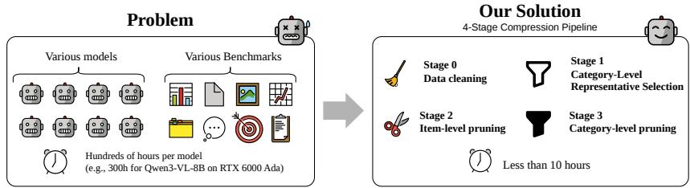
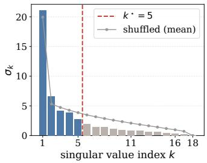
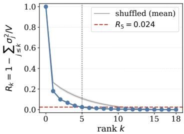
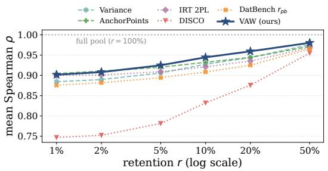
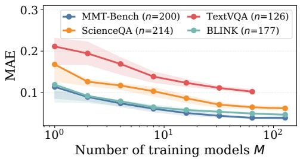
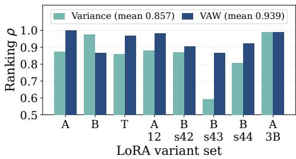
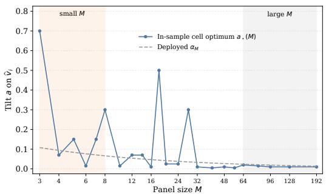
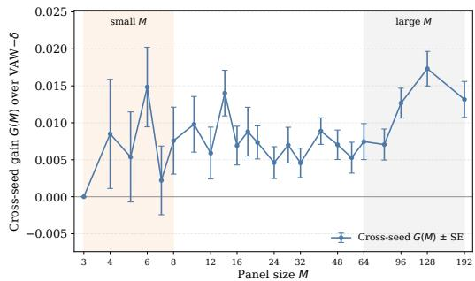

# HIERARCHICAL COMPRESSION OF VISION-LANGUAGE MODEL BENCHMARKS

Hyunjong Ok1∗ Seunggu Kang2† Jaeho Lee1†

1Pohang University of Science and Technology 2Upstage AI {hyunjong.ok, jaeho.lee}@postech.ac.kr, seunggu@upstage.ai

## ABSTRACT

Thorough evaluation of vision–language models (VLMs) has become prohibitively expensive, as benchmarks span an ever-broader spectrum of capabilities and new models arrive at a relentless pace. Benchmark compression methods that preserve model rankings at a fraction of the cost are well studied for language models, but for VLMs the question remains under-explored. We present PRIMEBench (Pruning Redundant Items for Multimodal Evaluation), a vision-aware hierarchical benchmark compression framework that substantially reduces evaluation cost while preserving model rankings. This hierarchical framework operates in four stages: data cleaning to remove items answerable without the image and all-correct items, category representative selection to pick one benchmark per capability category, item pruning with Vision-Aware Variance (VAW), and category-count pruning. VAW combines inter-model variance with a vision-dependence score computed from multimodal embeddings alone, while encouraging coverage of diverse items within each benchmark. On models held out from item selection, it has the highest mean fidelity at the released 5% retention. The hierarchical design lets practitioners stop at any stage to match their compute budget; the released suite removes over 97% of items while preserving model rankings. Beyond compression, our analyses show how VLM evaluation behaves as model panels grow and evolve, providing guidance for designing future benchmarks that are more efficient, robust to model turnover, and explicit about the limits of evaluation-side pruning.

## 1 INTRODUCTION

A single full-suite evaluation of a modern vision–language model (VLM) now consumes hundred of GPU-hours. The benchmark landscape has expanded far beyond traditional visual question answering (Goyal et al., 2017; Hudson & Manning, 2019) to include GUI and web understanding for vision agents (Cheng et al., 2024; Koh et al., 2024), with new categories emerging rapidly alongside advances in agentic and embodied AI. Consequently, every new model release must be evaluated against an ever-growing suite of benchmarks, causing evaluation costs to compound.

In this work, we study the problem of compressing VLM benchmarks for efficient evaluation. Such compression is possible because VLM benchmarks exhibit redundancy at two levels. First, across benchmarks, the model-benchmark score matrix is markedly low-rank, suggesting that many benchmarks measure overlapping capabilities. Second, within benchmarks, many items contribute little discriminative signal, because they are unimportant or redundant with other items. Although several prior works have explored benchmark compression using these redundancies, they focus exclusively on within-benchmark redundancy (Polo et al., 2024; Kipnis et al., 2025; Wang et al., 2026). Moreover, only a handful of studies consider compression for VLM benchmarks, and none validates benchmark-level compression at large scale (Uebayashi et al., 2026; Joshi et al., 2026).

To this end, we propose PRIMEBench, a hierarchical benchmark compression framework for VLMs, supported by large-scale evaluations. Our method exploits across- and within-benchmark redundancies. Across benchmarks, benchmarks within a capability category induce highly correlated model rankings (Liang et al., 2022; Polo et al., 2024); we replace each category with a single representative benchmark and exhaustively select a compact subset that preserves the full-suite ordering. Within benchmarks, items solved by all models or failed by all carry no separation signal, while items with high inter-model variance dominate ranking quality; the all-wrong tail has a diagnostic role for future VLM evaluation. We exploit these redundancies with one VLMspecific consideration: criteria for text-only large language models (LLMs) cannot tell apart items whose answer requires the image from items whose answer is text-driven, so we treat per-item vision-dependence as a design principle.

  
Figure 1: Per-model VLM evaluation cost grows to hundreds of GPU-hours; PRIMEBench compresses the same suite to a compact subset that preserves model rankings. Left: a full sweep over the benchmark suite consumes hundreds of GPU-hours per model and compounds with quarterly model releases. Right: the rankings induced by the compact PRIMEBench suite track the full-suite rankings closely at a small fraction of the original item budget.

Our four-stage pipeline processes the score matrix end to end. Data Cleaning (Stage 0) removes items solvable without visual input and items answered correctly by every model. Category Representative Selection (Stage 1) picks one representative benchmark per category by correlation against the category mean, the average standardised score over the category’s benchmarks. Item Pruning with Vision-Aware Variance (Stage 2) first divides the category budget, the number of items the category keeps, among its benchmarks in proportion to their sizes, which gives each benchmark its share. Within each benchmark it groups the items into coverage cells (clusters of items with similar visiontext embeddings, one per item to keep) and keeps the highest-scoring item of each cell. The score is the inter-model variance plus a label-free vision-dependence prior, and the prior’s effective weight is annealed with the number of evaluated models so that it fades as variance estimates become reliable Category-Count Pruning (Stage 3) selects a compact subset of category pools, yielding the released suite. We validate the pipeline on a panel of 30 recent VLMs and its benchmark selection externally on a large public leaderboard, and complement it with diagnostic analyses that go beyond ranking and aim to inspire the design of next-generation VLM benchmarks.

## Our contributions are threefold.

1. Open four-stage VLM compression pipeline. We release PRIMEBench, to our knowledge the first VLM compression suite that compresses both benchmarks and items, with an end-toend evaluation of ranking preservation, including on models held out from selection, and a benchmark-level check on an external leaderboard.

2. Vision-Aware Variance (VAW), a variance-based item criterion with a label-free visiondependence prior and coverage cells. VAW scores each item by its inter-model variance plus a vision-dependence prior computed from embeddings alone, whose effective weight shrinks as the number of models M grows, and keeps one item per cell within each benchmark’s share.

3. Diagnostic analyses that guide future VLM evaluation. Beyond compression, our analyses explain where the gain of VAW comes from, test whether a compressed selection stays valid as new models arrive, and mark where compressed evaluation helps and where it stops, pointing to how evaluation suites can stay efficient as the model landscape changes.

## 2 RELATED WORK

VLM benchmarks and evaluation. VLMs are now evaluated across a broad capability spectrum: general visual question answering (Goyal et al., 2017; Hudson & Manning, 2019), document and chart understanding (Mathew et al., 2021; Masry et al., 2022), and multi-discipline reasoning (Yue et al., 2024; Liu et al., 2024b; Fu et al., 2025). Evaluating a single model now routinely spans 20+ benchmarks, with public leaderboards such as the OpenVLM leaderboard (Duan et al., 2024) aggregating community results at increasing cost. Discriminative signal diminishes as models improve, since competitive models increasingly solve the same items (Kiela et al., 2021).

Table 1: Selected benchmark compression methods, organised by modality, compression level, and validation panel size. Mod. denotes the demonstration setting in the original work (T=textonly LLMs, V=vision–language). Level: B=benchmark, I=item. Scale: largest validation panel. PRIMEBench combines benchmark- and item-level compression, releases a compact suite, and validates item selection on 30 VLMs and benchmark-level ranking preservation against 231 VLMs.
<table><tr><td>Method</td><td>Mod.</td><td>Level</td><td>Scale</td></tr><tr><td>tinyBenchmarks (Polo et al., 2024)</td><td>T</td><td>I</td><td>~300 LLMs</td></tr><tr><td>metabench (Kipnis et al., 2025)</td><td>T</td><td>I</td><td>~5000 LLMs</td></tr><tr><td>DISCO (Rubinstein et al., 2026)</td><td>T</td><td>I</td><td></td></tr><tr><td>EssenceBench (Wang et al., 2026)</td><td>T</td><td>I</td><td></td></tr><tr><td>SparseEval (Zhang et al., 2026)</td><td>T</td><td>I</td><td></td></tr><tr><td>SubLIME (Saranathan et al., 2025)</td><td>T</td><td>I</td><td></td></tr><tr><td>M3IRT (Uebayashi et al., 2026)</td><td>V</td><td>I</td><td>24 VLMs</td></tr><tr><td>DatBench (Joshi et al., 2026)</td><td>V</td><td>I</td><td>27 VLMs</td></tr><tr><td>PRIMEBench (ours)</td><td>V</td><td>B+I</td><td>30/231 VLMs</td></tr></table>

Benchmark compression. A growing body of work reduces evaluation cost by selecting item subsets, but almost exclusively for text-only LLMs. Item-level criteria fall into families: item response theory (IRT) anchor selection (tinyBenchmarks (Polo et al., 2024), metabench (Kipnis et al., 2025)), inter-model-disagreement ranking (DISCO (Rubinstein et al., 2026)), genetic-algorithm search guided by sample attribution (EssenceBench (Wang et al., 2026)), sparse-anchor optimisation (SparseEval (Zhang et al., 2026)), rank-correlation prediction (SubLIME (Saranathan et al., 2025)), and embedding coverage (LMMs-Eval Lite (Zhang et al., 2025b)). Like tinyBenchmarks and DISCO, which evaluate a subset on models outside the set it was fitted on, we score every VLM selector on models unseen during selection. For multimodal evaluation, prior work has proposed multimodal IRT that decomposes item difficulty into image-only, text-only, and cross-modal factors and uses it to select subsets (M3IRT (Uebayashi et al., 2026)), and applied point-biserial item discrimination to VLM benchmarks (DatBench (Joshi et al., 2026)); none releases a compressed suite that jointly compresses the benchmark axis (which benchmarks to keep) and the item axis (which items within each benchmark to retain), and DatBench’s correctness-only criterion remains vision-blind, ignoring whether an item’s answer requires the visual input. PRIMEBench unifies the two axes for multimodal evaluation and validates benchmark-level ranking preservation on a large external panel.

## 3 PROBLEM STATEMENT

We formalise the task of benchmark compression as follows. Let M be a set of M models, and let B be a catalogue of B benchmarks. Each benchmark $b \in B$ is a set of $N _ { b }$ items.

The item score $x _ { m , b , i }$ denotes the prediction quality of the model $m \in \mathcal { M }$ on the i-th item of the benchmark $b \in B$ . For closed-option problems, we have $x _ { m , b , i } \in \{ 0 , 1 \}$ , indicating whether the model has been correct on the item or not. The item score can be continuous, e.g., when using continuous metrics or LLM judge outputs. The score $\begin{array} { r } { s _ { m , b } = \frac { 1 } { N _ { b } } \sum _ { i = 1 } ^ { N _ { b } } x _ { m , b , i } } \end{array}$ is the average item score of the model m on benchmark b, where $N _ { b }$ is the number of items in b. The mean score $\begin{array} { r } { \bar { s } _ { m } = \frac { 1 } { B } \sum _ { b } { s _ { m , b } } } \end{array}$ is the average score of a model m over all B benchmarks.

The full ranking π is an ordering of M models according to the mean score, i.e.,

$$
\pi = ( m _ { ( 1 ) } , m _ { ( 2 ) } , \ldots , m _ { ( M ) } ) , \mathrm { s u c h t h a t } \bar { s } _ { m _ { ( 1 ) } } \geq \bar { s } _ { m _ { ( 2 ) } } \geq \cdot \cdot \cdot \geq \bar { s } _ { m _ { ( M ) } }\tag{1}
$$

We consider compressing this catalogue along two axes: across-benchmark, and within-benchmark. In other words, our goal is to select the benchmark subset $\cal S \subseteq \cal B$ and the item subsets $\mathcal { T } _ { b } ^ { \prime } \subseteq \mathcal { T } _ { b } : =$ $\{ 1 , \ldots , N _ { b } \}$ for each $b \in S$ in a way that the ranking evaluated on this set is close to the full ranking π. Precisely, let $\bar { s } _ { m } ^ { \prime }$ be the average score of the model m over the compressed suite, and $\pi ^ { \prime }$ be the corresponding compressed ranking. Then, our goal is to solve:

$$
\operatorname* { m a x } _ { \mathcal { S } , \{ \mathcal { X } _ { b } ^ { \prime } \} } \rho ( \pi , \pi ^ { \prime } ) , \qquad \mathrm { s u b j e c t  t o } \quad | \mathcal { S } | \leq k , | \mathcal { Z } _ { b } ^ { \prime } | \leq r N _ { b } ,\tag{2}
$$

where k is the number of benchmarks (category pools in Stage 3) kept, $r$ is the fraction of each benchmark’s items kept (the retention; Stage 2 adds a 100-item floor per category pool), and $\rho ( \cdot , \cdot )$ is the Spearman rank correlation.

## 4 METHOD

Compression of a multi-benchmark VLM evaluation suite has two natural axes: which benchmarks to keep and which items within them to retain. Before either decision can be made, the item pool itself needs to be cleaned of items that no longer separate models or that admit a non-visual shortcut. Our method therefore proceeds in four stages—data cleaning (Section 4.1), category representative selection (Section 4.2), item pruning with VAW (Section 4.3), and category-count pruning (Section 4.4)—each motivated by a distinct property of VLM evaluation.

## 4.1 STAGE 0: DATA CLEANING

Stage 0 filters out benchmark items that do not carry useful evaluation signals. For example, the items that all models in M can answer correctly may carry no useful information for ranking. Also, the items that can be answered correctly from the text alone may fall outside the scope of VLM evaluation—their solvability reflects language priors that are measured by LLM-only benchmarks already, not vision–language capability. This stage removes both populations to obtain a clean pool that measures VLM-specific capability. We use this pool as the reference for end-to-end evaluation.

Concretely, for benchmarks with binary correctness $x _ { m , b , i } \in \{ 0 , 1 \}$ , Stage 0 applies two filters, the second where enough image-free scores exist.

• The all-correct filter removes items that all evaluated models in M solve correctly, i.e., $x _ { m , b , i } = 1$ for all $m \in \mathcal { M }$ . For items that all models predict incorrectly, we keep those items, since later generations of models may solve them.

• The blind-solvability filter computes $\beta _ { i ^ { - } }$ —the fraction of the models run without images that answer item i correctly from the text prompt alone—and removes items with $\beta _ { i } \geq \tau$ for a fixed $\scriptstyle \tau = 2 / 3 ,$ a text-only filtering strategy motivated by MMStar (Chen et al., 2024a).

On benchmarks with continuous or judge scores both filters use the scores scaled to [0, 1], so an item is blind-solvable when the image-free models reach a mean score of at least $2 / 3$ (Section B).

## 4.2 STAGE 1: CATEGORY REPRESENTATIVE SELECTION

Stage 1 reduces the number of benchmarks by removing the benchmarks that measure overlapping VLM capabilities. We organise the benchmarks into 18 capability categories—constructed by aggregating the evaluation taxonomies adopted by recent frontier VLM technical reports (Bai et al., 2025a; Wang et al., 2025; Hong et al., 2025)—and select one representative benchmark for each category. We provide additional details on the category construction in Section C.1.

More formally, define the score vector ${ \bf s } _ { b } = ( s _ { 1 , b } , \ldots , s _ { M , b } )$ for each benchmark b. For each category C, we define its category mean as an average of the z-score-normalised score vectors of the benchmarks belonging to this category, i.e., $\begin{array} { r } { \mathbf { s } _ { C } = \bar { \frac { \mathbf { \rho } _ { 1 } } { | C | } } \sum _ { b \in C } z ( \mathbf { s } _ { b } ) } \end{array}$ , where $z ( \cdot )$ denotes the z-score normalisation. As the category representative, we select the benchmark whose score vector is best correlated with the category mean:

$$
b _ { C } ^ { * } = \arg \operatorname* { m a x } _ { b \in C } \rho ( \mathbf { s } _ { b } , \mathbf { s } _ { C } ) .\tag{3}
$$

For categories whose representative correlates weakly with the category mean, we supplement it with items from other benchmarks in the category, using a variance-ranked prefix of those candidate items, to preserve the category-level ranking; details are in Section C.2.

## 4.3 STAGE 2: ITEM PRUNING WITH VISION-AWARE VARIANCE

Stage 2 reduces the number of items in category pools, by keeping only the items that play a critical role in ranking the vision–language capabilities of VLMs. Our decision criterion is similar to that in Stage 0. In particular, we ask two questions: (1) Does this item provide meaningful discriminative signal? (2) Does this item use visual input in a meaningful way?

Precisely, we define the following VAW (Vision-AWare Variance) score

$$
q _ { i } ^ { \mathrm { V A W } } = \widehat { \sigma } _ { i } ^ { 2 } + \alpha \cdot \delta _ { i } ^ { \mathrm { V L } } ,\tag{4}
$$

which is a mixture of two scores: $\widehat { \sigma } _ { i } ^ { 2 }$ is the variance score, measuring the strength of the discriminative signal provided by the item $i ; \delta _ { i } ^ { \mathrm { V L } }$ is the vision-dependence score, a proxy score for measuring how much the item relies on visual input; the weight $\alpha \geq 0$ sets their balance.

Variance score. The variance score is a ${ \sqrt { M } } .$ -scaled variance of item scores across models, i.e.,

$$
\widehat { \sigma } _ { i } ^ { 2 } : = \frac { 1 } { \sqrt { M } } \sum _ { m = 1 } ^ { M } ( x _ { m , i } - \bar { x } _ { i } ) ^ { 2 } ,\tag{5}
$$

where $\begin{array} { r } { \bar { x } _ { i } = \frac { 1 } { M } \sum _ { m } x _ { m , i } } \end{array}$ is the average item score of the models on item i, and item scores are scaled from the range of their metric to [0, 1] so that binary and continuous scores share one scale.1 Whenever the item score is binary, the variance score admits a simpler form $\widehat { \sigma } _ { i } ^ { 2 } = \sqrt { M } \bar { x } _ { i } ( 1 - \bar { x } _ { i } ) . ^ { 2 }$ LLM benchmark compression methods also use similar variance scores (Rubinstein et al., 2026).

We use $1 / \sqrt { M }$ as the scaling factor instead of the standard $1 / M .$ . This makes the effective weight of the vision-dependence score decrease with the number of evaluated models. Dividing (4) by $\sqrt { M }$ gives $\widehat { v } _ { i } + \left( \alpha / \sqrt { M } \right) \delta _ { i } ^ { \mathrm { V L } }$ , where $\widehat { v } _ { i } = \widehat { \sigma } _ { i } ^ { 2 } / \sqrt { M }$ is the plug-in variance of the item’s scores across models and $\alpha _ { M } = \alpha / \sqrt { M }$ is the tilt. Under i.i.d. model responses, the estimation error of $\widehat { v } _ { i }$ concentrates at the generic $O ( M ^ { - 1 / 2 } )$ rate (Section F.2), while the tilt shrinks at the same rate. Thus, the vision-dependence term has greater relative weight for smaller model panels and fades as the variance estimate becomes more stable. For a common M, this rescaling does not change the item ranking; when the number of valid model scores differs across items, we rank using the corresponding divided score. We fix $\alpha = 0 . 1 8 7$ for all experiments, without tuning it on the held-out splits; $\alpha = 0$ gives the variance score alone.

Vision-dependence score. The vision-dependence score measures how adding visual inputs can steer the direction of the text-only embedding. Precisely, the score is defined as the cosine distance

$$
\delta _ { i } ^ { \mathrm { V L } } = 1 - \cos ( E _ { i } ^ { \mathrm { L } } , E _ { i } ^ { \mathrm { V L } } ) ,\tag{6}
$$

where $E _ { i } ^ { \mathrm { L } }$ denotes the text-only embedding of the item prompt, and $E _ { i } ^ { \mathrm { V L } }$ denotes the vision-text embedding, both extracted by one VLM encoder, Qwen3-VL-Embedding-8B (Li et al., 2026).

The vision-dependence score has two advantages. First, the score is easy to compute, as we do not need to generate answers in multiple decoding steps. Second, the score is label-free: it does not use the models’ item scores $x _ { m , b , i }$

Selection with coverage cells. At retention r, a Stage 1 category pool of $n _ { C }$ items keeps $K _ { C } =$ max( $\lfloor r n _ { C } \rfloor$ , min $( n _ { C }$ , 100)) items, which we call the category budget. We divide this budget among benchmarks in proportion to their sizes, so benchmark b receives $K _ { b }$ items as its benchmark share. Within each benchmark, we group the items into $K _ { b }$ coverage cells by k-means on the vision-text embeddings $E _ { i } ^ { \mathrm { V L } }$ and keep the highest-scoring item from each cell. This fills the benchmark share while discouraging near-duplicate items from consuming the budget. Ties are broken in a seeded random order, and the embeddings are reduced to 64 dimensions by a fixed random projection before k-means. As M grows, VAW recovers the variance-only choice within each cell when the competing items are sufficiently separated in variance (Section F.2).

  
Figure 2: The VLM score matrix is markedly low-rank. Singular-value spectrum $( l e f t )$ and cumulative residual energy (right) of the per-model z-normalised category score matrix. The top-5 singular values capture 97.6% of the spectral energy, matching the released number of categories $k ^ { \star } { = } 5$

## 4.4 STAGE 3: CATEGORY-COUNT PRUNING

Stage 3 further compresses the suite by pruning out redundant categories. The key motivation comes from the observation that the model×category score matrix is markedly low-rank. On the 18-category score matrix, the cumulative spectral energy reaches 95% within the top-5 singular values, where energy is the sum of squared singular values (Figure 2).

We therefore select a subset of k categories from $\tilde { B } _ { - }$ —the set of category pools constructed by Stage 1. Let π˜ denote the model ranking induced by the mean score over all Stage 2-pruned category pools in ${ \tilde { B } } ,$ and let $\tilde { \bf s } _ { C }$ denote the per-model score vector on category pool C after Stage 2 item pruning at r=5% (i.e., Stage 3 is fitted on the Stage 2 output, making the four-stage pipeline strictly sequential). Because the search space $\binom { | \tilde { B } | } { k }$ is small for the numbers of categories of interest, we exhaustively enumerate every k-subset and pick the one that maximises Spearman correlation with π˜:

$$
S _ { k } ^ { \star } = \arg \operatorname* { m a x } _ { S \subseteq \tilde { \mathcal { B } } , | S | = k } \rho \left( \tilde { \pi } , \operatorname { r a n k } \left( \frac { 1 } { | S | } \sum _ { C \in \mathcal { S } } \tilde { \mathbf { s } } _ { C } \right) \right) .\tag{7}
$$

The k-sweep is in Section E.

Concretely, the released suite reports only the k selected category pools, each pruned by Stage 2, yielding $\dot { \Sigma } _ { C \in S _ { k } ^ { \star } } K _ { C }$ items in total.

## 5 EXPERIMENTAL SETUP

Models. We evaluate the proposed compression pipeline on 30 vision–language and omni models from multiple families, including Qwen, InternVL, Gemma, LLaVA-OneVision, MiniCPM-V, and Kimi-VL; per-model details are in Section A.1. Vision-text embeddings from Qwen3-VL-Embedding-8B (Li et al., 2026), which is not among the evaluated models, are used for Stage 2; Section D.4 compares alternative embedding encoders.

Benchmarks. The catalogue contains 43 benchmarks organised into 18 capability categories spanning visual question answering, reasoning, document understanding, and GUI/web understanding; scoring types and item counts are given in Section A.2.

External validation. We additionally evaluate on the OpenVLM leaderboard (Duan et al., 2024), which contains up to 265 VLMs; details are in Section H.

Baselines. Method comparisons focus on Stage 2, where the item selectors differ. We compare VAW with DISCO (Rubinstein et al., 2026), DatBench $r _ { p b }$ (Joshi et al., 2026), IRT 2PL (Kipnis et al., 2025), AnchorPoints (Vivek et al., 2024), and Variance at retentions $r \in \{ 1 , 2 , 5 , 1 0 , 2 0 , 5 0 \} ^ { \circ }$ . Variance selects the category-wide top-K items $( K { = } K _ { C } )$ by Equation (5), without benchmark shares or coverage cells. DISCO selects items from prediction disagreement on the logged model answers; for a consistent comparison, its selected items are scored by their mean rather than by DISCO’s learned performance predictor.

Metrics and evaluation. Our primary metric is the Spearman rank correlation (Spearman, 1904) between compressed- and full-pool model rankings. Each split partitions the 30 models into build and held-out sets, with Stage 2 selection performed only on the build models. For the Stage 2 comparison, all selectors operate on common category pools, built once on the full panel, and fidelity is measured on held-out models within each category. For end-to-end evaluation, Stages 1–3 are re-fitted on the build models and evaluated against the ranking from all Stage 0-cleaned benchmarks. Category pools retain at least 100 items, with smaller pools kept in full; the same floor applies to every selector. We report results over 20 balanced random 15/15 splits and a chronological split using the 15 oldest models for selection. Stage 0 cleaning and the released suite both use the full 30-model panel. Additional protocol details are provided in Section D.3.

Table 2: Stage 0–3 pipeline at a glance: the released suite preserves model rankings with a fraction of the original items. Change is relative to each row’s input, except for the released suite, which is relative to all 43 benchmarks. $\rho$ is the median over categories for Stage 1, the mean over categories on unseen models for Stage 2, the correlation of the 5 selected categories against all 18 pruned categories for Stage 3, and the correlation with the ranking over all Stage 0-cleaned benchmarks for the released suite.
<table><tr><td>Stage</td><td>Unit</td><td>Input</td><td>Output</td><td>Change</td><td>Ranking fidelity ρ</td></tr><tr><td>Stage 0 (cleaning)</td><td>items</td><td>386,324</td><td>270,408</td><td>-30.0%</td><td></td></tr><tr><td>Stage 1 (category rep)</td><td>benchmarks</td><td>43</td><td>18</td><td>-58.1%</td><td>0.951 (median)</td></tr><tr><td>Stage 2 (item pruning, VAW)</td><td>category-pool items</td><td>222,376</td><td>11,498</td><td>-94.8%</td><td>0.925 (mean)</td></tr><tr><td>Stage 3 (k=5)</td><td>categories</td><td>18</td><td>5</td><td>-72.2%</td><td>0.988</td></tr><tr><td>Released suite</td><td>items</td><td>386,324</td><td>9,377</td><td>-97.57%</td><td>0.959</td></tr></table>

  
(a) Spearman ρ vs. retention r.

<table><tr><td>Selector</td><td>1%</td><td>2%</td><td>5%</td><td>10%</td><td>20%</td><td>50%</td></tr><tr><td>Variance</td><td>0.884</td><td>0.890</td><td>0.906</td><td>0.927</td><td>0.944</td><td>0.976</td></tr><tr><td>AnchorPoints (Vivek et al., 2024)</td><td>0.904</td><td>0.911</td><td>0.920</td><td>0.932</td><td>0.944</td><td>0.971</td></tr><tr><td>IRT 2PL (Kipnis et al., 2025)</td><td>0.900</td><td>0.901</td><td>0.909</td><td>0.921</td><td>0.935</td><td>0.968</td></tr><tr><td>DISCO (Rubinstein et al., 2026)</td><td>0.747</td><td>0.752</td><td>0.781</td><td>0.832</td><td>0.876</td><td>0.955</td></tr><tr><td>DatBench rpb (Joshi et al., 2026)</td><td>0.876</td><td>0.882</td><td>0.894</td><td>0.908</td><td>0.925</td><td>0.965</td></tr><tr><td>VAW (ours)</td><td>0.902</td><td>0.908</td><td>0.925</td><td>0.944</td><td>0.959</td><td>0.980</td></tr></table>

(b) Values at fixed r.  
(Bold = best per column; underline = second.)  
Figure 3: VAW leads at the released 5% retention on models held out from Stage 2 selection. Stage 2 item pruning on the 18 PRIMEBench category pools, with selection on half of the model panel and mean Spearman $\rho$ evaluated on the other half over 20 random splits.

## 6 RESULTS

End-to-end compression. The full Stage 0→3 pipeline reduces the 386,324 items of the 43 benchmarks to 9,377 at k=5, and the released suite achieves ρ=0.959 on the full 30-VLM panel against the unpruned Stage 0-cleaned reference (Table 2).

Stage 0 (data cleaning). The blind-solvability filter (τ=2/3) removes items solvable without the image, and the complementary all-correct filter removes items that every model solves. Stage 0 keeps all-wrong items to avoid prematurely discarding items that later models may solve; Stage 2 may subsequently prune them, since their inter-model variance is zero. Together the two filters retain 270,408 of the 386,324 items of the 43 benchmarks; per-filter breakdown is in Section B.

Stage 1 (category representative selection). For each of the 18 capability categories we pick the benchmark whose per-model score vector best correlates with the category mean (Equation (3)); after same-category item-level supplementation, the median per-category ρ is 0.951. The per-category list and supplementation cost are in Section C.

Stage 2 (item pruning with Vision-Aware Variance). Within each category pool, Stage 2 keeps a small fraction r of items. On the 18 PRIMEBench category pools evaluated on held-out models (Figure 3), VAW has the highest fidelity at $r = 5 { - } 5 0 \%$ , while AnchorPoints leads at $r \leq 2 \%$ Ablations show that benchmark shares and coverage cells account for most of $\mathrm { V A W } \mathbf { \dot { s } }$ gain over plain Variance, and embedding-based cells outperform random partitions (Section D.4). Comparisons with selection and scoring on the same OpenVLM models are in Section H.2.

Stage 3 (category-count pruning). Stage 3 selects k of the Stage 2-pruned category pools by exhaustively evaluating all $\binom { 1 8 } { k }$ subsets. Its selection objective compares the ranking induced by the selected categories with that induced by all 18 pruned categories. At the released setting $k = 5 ,$ , Stage 3 selects {Academic Knowledge, Chart Understanding, Hallucination Detection, Visual Reasoning, Web/UI Understanding} and reaches $\rho = 0 . 9 8 8$ against this 18-category pruned reference.

This differs from the end-to-end fidelity of the released suite $( \rho = 0 . 9 5 9$ above), which is measured against the ranking from all Stage 0-cleaned benchmarks. We further evaluate generalisation under the unseen-model protocol: Stages 1–3 are fitted on 15 build models and evaluated on the other 15. Averaged over 20 splits, VAW at $r { = } 5 \%$ followed by Stage 3 reaches $\rho = 0 . 8 9 2$ against the same Stage 0 reference, within 0.01 of Stage 3 without item pruning (0.901; Section D.3).

External validation. On 231 of 265 OpenVLM models scored on at least half of the 14 benchmarks overlapping with PRIMEBench, Stage 3 exhaustive selection at $k = 5$ achieves $\rho = 0 . 9 8 8$ against the 14-benchmark ranking. Era-stratified spectral analysis shows that the top five components hold 86–89% of the energy in every release-date cohort (Table 19); details are in Section H.

## 7 DISCUSSION

The results show that PRIMEBench preserves model rankings at a fraction of the original evaluation cost. We ask why VAW works, whether the selection ages, what it misses, and where else it applies.

(1) Where the gain of VAW comes from. VAW is vision-aware in two places: its coverage cells are drawn on vision-text embeddings, and its score adds a vision-dependence tilt. At our panel size, most of the gain comes from the cells. In the held-out ablation (Section D.4), VAW with benchmark shares alone reaches 0.908 at $r { = } 5 \%$ , essentially matching Variance (0.906); adding vision-text coverage cells raises it to 0.925 and outperforms random partitions of the same size. The tilt follows a theoretical scaling with panel size M: the plug-in variance concentrates at rate $M ^ { - 1 / 2 }$ , so VAW anneals the tilt at the same rate, $\alpha / \sqrt { M }$ , and its selection approaches the variance selector as M grows. The OpenVLM scan shows that the best in-cell tilt tends to decrease with M and is of the same order as the deployed $\alpha / \sqrt { M }$ on large panels. $\mathrm { A t \ } r { = } 2 \%$ , the cross-seed-selected tilt improves $\rho$ over variance-only selection in the same cells at every tested size from $M { = } 4$ to 192; from $\dot { M } { = } 1 4$ onward, the gain is 0.005–0.017 and exceeds two standard errors at every tested size. These results support smaller tilts on larger panels (Sections F.2 and G).

(2) Shelf life: does a frozen benchmark selection age as newer models arrive? We order the OpenVLM models with a known release date by release date, select the Stage 3 subset on the oldest 132 models, freeze it, and evaluate it as the panel grows to 166, 200, and 203 models. Its ranking fidelity stays at $\rho { \approx } 0 . 9 9$ , within 0.0004 of the best subset refitted on each enlarged panel. Because the OpenVLM score matrix is low-rank, even random five-benchmark subsets preserve rankings reasonably well, so we also rank the frozen subset among all five-benchmark subsets; it stays at or above the 99.9th percentile throughout the dated range. The benchmark-level selection therefore remains stable over the dated range studied (Section I.1).

(3) Capability Frontier: items that every current family finds hard. Stage 2 favours items that separate today’s models, so items that most current models still fail tend to be pruned, even though such hard cases may become informative as capabilities improve. We therefore release a second set, the Capability Frontier: among items that every current model family finds hard (each family’s mean score at most half the maximum, panel mean at least 0.10), we keep those with the largest difficulty-weighted variance (the plug-in variance times the mean shortfall $1 - { \bar { x } } _ { i } ) ;$ ; as a heuristic budget, the set size is the in-band pool size times the panel’s largest per-generation accuracy gain. The resulting 1,653 items still separate the oldest and newest Qwen generations (Section I.2). Whether they will separate future models is untested, so we treat the set as a diagnostic of the current panel rather than a forecast.

  
(a) Left-out benchmark prediction.

  
(b) Ranking LoRA variants of one model.  
Figure 4: Benchmark scores predict a left-out benchmark better as models accumulate, and VAW ranks close variants of one model better than Variance. (a) Mean absolute error (MAE) with the $p 2 5 \cdot$ –p75 band over 30 splits; n: models scored. (b) Variant-ranking ρ at $r { = } 5 \%$ on the eight stable LoRA variant sets (A, B: learning-rate grids; T: one run; 12: twelve rates; s42–s44: seeds; 3B: Qwen2.5-VL-3B-Instruct).

(4) Beyond ranking: predicting a left-out benchmark from the others. Ranking fidelity is our primary objective, but benchmark scores may also support performance estimation. We predict a model’s score on a left-out OpenVLM benchmark from its scores on the others, and vary the number M of models used to fit the predictor. The prediction error falls as M grows (Figure 4a), paralleling LLM studies that estimate a benchmark score from a few of its items (Polo et al., 2024; Rubinstein et al., 2026); our setting instead predicts across benchmarks. Because VLM leaderboards still have sparse cross-benchmark coverage, these estimates may improve as coverage grows. The predictors are full benchmark scores, not the released suite (Section I.3).

(5) Another use: ranking a few checkpoints of one model. Model developers often use a benchmark to choose among checkpoints or hyper-parameters of one model rather than to rank model families, a harder test because such variants differ little. We fine-tune Qwen2-VL-2B on ScienceQA with LoRA (low-rank adaptation; rank 16, two epochs) and form three kinds of variant sets: learning-rate grids, the final adapters of runs with 8 or 12 learning rates (a wide grid A and a narrower grid B, whose 12-rate version is repeated with three training seeds); a trajectory of 8 checkpoints spread over one run; and the 12-rate grid A repeated on Qwen2.5-VL-3B-Instruct. No variant takes part in item selection, and we compare their ranking on the selected items with that on the full test set. On the eight variant sets whose full-test ranking is stable (bootstrap $\rho \ge 0 . 9 0 )$ , VAW raises this ρ over Variance by 0.082 on average at $r { = } 5 \%$ (Figure 4b): it is ahead in six sets, behind on the 8-rate grid B and level on the 3B grid, and its lead ranges from 0.04 to 0.28 across the three seeds of the 12-rate grid B (Section I.4). Here only 8 or 12 closely related variants are ranked, so a few uninformative items can more easily reorder them; VAW’s gain over Variance here is about four times its gain on the broader model panel (0.019). The two settings differ and the variants of one run are not independent draws, so this comparison is descriptive, but it suggests that VAW may be particularly useful for ranking small sets of closely related model variants.

(6) Do evaluation-side item scores also prune training data? A negative control. An item score that finds informative evaluation items could in principle also select informative training data. We fine-tune a SigLIP+BERT multiple-choice model on ScienceQA training subsets chosen by six selectors (Random, Variance, VAW, DatBench $r _ { p b }$ , AnchorPoints and IRT 2PL) at retentions from 5% to 90%, with three seeds. No selector beats random sampling by more than the seed spread, and Variance trails it by 10.5–20.2 points of test accuracy at $r \leq 3 0 \%$ (Section I.5). Training selection and evaluation compression are distinct problems: the former rewards informative training examples, the latter items that separate models. We therefore do not recommend VAW or other evaluation-side scores for training-data pruning; uniform random sampling remains the safer baseline there.

## 8 CONCLUSION

We presented PRIMEBench, a vision-aware hierarchical framework for compressing VLM evaluation across both benchmarks and items. Its four-stage pipeline reduces the items of the original 43- benchmark suite by over 97% while closely preserving model rankings, and its item selector, Vision-Aware Variance, performs best at the released 5% retention on models held out from selection. We further validate the benchmark-level compression mechanism on a substantially larger external OpenVLM panel.

Overall, our results show that hierarchical compression can substantially reduce the cost of broad VLM evaluation while retaining the ranking information needed to compare new models. Practical limitations and broader implications are discussed in Sections J and K.

## REFERENCES

Harsh Agrawal, Karan Desai, Yufei Wang, Xinlei Chen, Rishabh Jain, Mark Johnson, Dhruv Batra, Devi Parikh, Stefan Lee, and Peter Anderson. Nocaps: Novel object captioning at scale. In 2019 IEEE/CVF International Conference on Computer Vision (ICCV). IEEE, 2019.

Xiang An, Yin Xie, Kaicheng Yang, Wenkang Zhang, Xiuwei Zhao, Zheng Cheng, Yirui Wang, Songcen Xu, Changrui Chen, Didi Zhu, et al. Llava-onevision-1.5: Fully open framework for democratized multimodal training. arXiv preprint arXiv:2509.23661, 2025.

Xiang An, Yin Xie, Feilong Tang, Yunyao Yan, Huajie Tan, Didi Zhu, Changrui Chen, Xiuwei Zhao, Bin Qin, Kaicheng Yang, et al. Llava-onevision-2: Towards next-generation perceptual intelligence. arXiv preprint arXiv:2605.25979, 2026.

Jinze Bai, Shuai Bai, Shusheng Yang, Shijie Wang, Sinan Tan, Peng Wang, Junyang Lin, Chang Zhou, and Jingren Zhou. Qwen-VL: A versatile vision-language model for understanding, localization, text reading, and beyond. arXiv preprint arXiv:2308.12966, 2023.

Shuai Bai, Yuxuan Cai, Ruizhe Chen, Keqin Chen, Xionghui Chen, Zesen Cheng, Lianghao Deng, Wei Ding, Chang Gao, Chunjiang Ge, et al. Qwen3-vl technical report. arXiv preprint arXiv:2511.21631, 2025a.

Shuai Bai, Keqin Chen, Xuejing Liu, Jialin Wang, Wenbin Ge, Sibo Song, Kai Dang, Peng Wang, Shijie Wang, Jun Tang, Humen Zhong, Yuanzhi Zhu, Mingkun Yang, Zhaohai Li, Jianqiang Wan, Pengfei Wang, Wei Ding, Zheren Fu, Yiheng Xu, Jiabo Ye, Xi Zhang, Tianbao Xie, Zesen Cheng, Hang Zhang, Zhibo Yang, Haiyang Xu, Junyang Lin, et al. Qwen2.5-VL technical report. arXiv preprint arXiv:2502.13923, 2025b.

Lin Chen, Jinsong Li, Xiaoyi Dong, Pan Zhang, Yuhang Zang, Zehui Chen, Haodong Duan, Jiaqi Wang, Yu Qiao, Dahua Lin, et al. Are we on the right way for evaluating large vision-language models? Advances in Neural Information Processing Systems, 2024a.

Xingyu Chen, Zihan Zhao, Lu Chen, JiaBao Ji, Danyang Zhang, Ao Luo, Yuxuan Xiong, and Kai Yu. Websrc: A dataset for web-based structural reading comprehension. In Proceedings ofthe 2021 Conference on Empirical Methods in Natural Language Processing, 2021.

Xinlei Chen, Hao Fang, Tsung-Yi Lin, Ramakrishna Vedantam, Saurabh Gupta, Piotr Dollár, and C Lawrence Zitnick. Microsoft coco captions: Data collection and evaluation server. arXiv preprint arXiv:1504.00325, 2015.

Zhe Chen, Weiyun Wang, Yue Cao, Yangzhou Liu, Zhangwei Gao, Erfei Cui, Jinguo Zhu, Shenglong Ye, Hao Tian, Zhaoyang Liu, et al. Expanding performance boundaries of open-source multimodal models with model, data, and test-time scaling. arXiv preprint arXiv:2412.05271, 2024b.

Zhe Chen, Weiyun Wang, Hao Tian, Shenglong Ye, Zhangwei Gao, Erfei Cui, Wenwen Tong, Kongzhi Hu, Jiapeng Luo, Zheng Ma, et al. How far are we to gpt-4v? closing the gap to commercial multimodal models with open-source suites. Science China Information Sciences, 2024c.

Kanzhi Cheng, Qiushi Sun, Yougang Chu, Fangzhi Xu, Li YanTao, Jianbing Zhang, and Zhiyong Wu. Seeclick: Harnessing gui grounding for advanced visual gui agents. In Proceedings of the 62nd Annual Meeting of the Association for Computational Linguistics (Volume 1: Long Papers), 2024.

Haodong Duan, Junming Yang, Yuxuan Qiao, Xinyu Fang, Lin Chen, Yuan Liu, Xiaoyi Dong, Yuhang Zang, Pan Zhang, Jiaqi Wang, et al. Vlmevalkit: An open-source toolkit for evaluating large multi-modality models. In Proceedings ofthe 32nd ACM international conference on multimedia, 2024.

Chaoyou Fu, Peixian Chen, Yunhang Shen, Yulei Qin, Mengdan Zhang, Xu Lin, Jinrui Yang, Xiawu Zheng, Ke Li, Xing Sun, et al. MME: A comprehensive evaluation benchmark for multimodal large language models. In Advances in Neural Information Processing Systems (NeurIPS), 2025.

Xingyu Fu, Yushi Hu, Bangzheng Li, Yu Feng, Haoyu Wang, Xudong Lin, Dan Roth, Noah A Smith, Wei-Chiu Ma, and Ranjay Krishna. Blink: Multimodal large language models can see but not perceive. In European Conference on Computer Vision. Springer, 2024.

Yash Goyal, Tejas Khot, Douglas Summers-Stay, Dhruv Batra, and Devi Parikh. Making the V in VQA matter: Elevating the role of image understanding in visual question answering. In Proceedings of the IEEE conference on computer vision and pattern recognition, 2017.

Aaron Grattafiori, Abhimanyu Dubey, Abhinav Jauhri, Abhinav Pandey, Abhishek Kadian, Ahmad Al-Dahle, Aiesha Letman, Akhil Mathur, Alan Schelten, Alex Vaughan, et al. The llama 3 herd of models. arXiv preprint arXiv:2407.21783, 2024.

Tianrui Guan, Fuxiao Liu, Xiyang Wu, Ruiqi Xian, Zongxia Li, Xiaoyu Liu, Xijun Wang, Lichang Chen, Furong Huang, Yaser Yacoob, et al. Hallusionbench: an advanced diagnostic suite for entangled language hallucination and visual illusion in large vision-language models. In 2024 IEEE/CVF Conference on Computer Vision and Pattern Recognition (CVPR). IEEE, 2024.

Chaoqun He, Renjie Luo, Yuzhuo Bai, Shengding Hu, Zhen Thai, Junhao Shen, Jinyi Hu, Xu Han, Yujie Huang, Yuxiang Zhang, et al. Olympiadbench: A challenging benchmark for promoting agi with olympiad-level bilingual multimodal scientific problems. In Proceedings of the 62nd Annual Meeting of the Association for Computational Linguistics (Volume 1: Long Papers), 2024.

Wenyi Hong, Wenmeng Yu, Xiaotao Gu, Guo Wang, Guobing Gan, Haomiao Tang, Jiale Cheng, Ji Qi, Junhui Ji, Lihang Pan, et al. Glm-4.5 v and glm-4.1 v-thinking: Towards versatile multimodal reasoning with scalable reinforcement learning. arXiv preprint arXiv:2507.01006, 2025.

Drew A Hudson and Christopher D Manning. Gqa: A new dataset for real-world visual reasoning and compositional question answering. In 2019 IEEE/CVF Conference on Computer Vision and Pattern Recognition (CVPR). IEEE, 2019.

Siddharth Joshi, Haoli Yin, Rishabh Adiga, Ricardo Monti, Aldo Carranza, Alex Fang, Alvin Deng, Amro Abbas, Brett Larsen, Cody Blakeney, et al. Datbench: Discriminative, faithful, and efficient vlm evaluations. arXiv preprint arXiv:2601.02316, 2026.

Sahar Kazemzadeh, Vicente Ordonez, Mark Matten, and Tamara Berg. ReferItGame: Referring to objects in photographs of natural scenes. In Proceedings of the 2014 Conference on Empirical Methods in Natural Language Processing (EMNLP), 2014.

Aniruddha Kembhavi, Mike Salvato, Eric Kolve, Minjoon Seo, Hannaneh Hajishirzi, and Ali Farhadi. A diagram is worth a dozen images. In European conference on computer vision. Springer, 2016.

Douwe Kiela, Max Bartolo, Yixin Nie, Divyansh Kaushik, Atticus Geiger, Zhengxuan Wu, Bertie Vidgen, Grusha Prasad, Amanpreet Singh, Pratik Ringshia, et al. Dynabench: Rethinking benchmarking in nlp. In Proceedings of the 2021 conference of the North American chapter of the Association for Computational Linguistics: human language technologies, 2021.

Alex Kipnis, Konstantinos Voudouris, Luca Schulze Buschoff, and Eric Schulz. metabench-a sparse benchmark of reasoning and knowledge in large language models. In International Conference on Learning Representations, 2025.

Jing Yu Koh, Robert Lo, Lawrence Jang, Vikram Duvvur, Ming Lim, Po-Yu Huang, Graham Neubig, Shuyan Zhou, Russ Salakhutdinov, and Daniel Fried. Visualwebarena: Evaluating multimodal agents on realistic visual web tasks. In Proceedings ofthe 62nd Annual Meeting ofthe Association for Computational Linguistics (Volume 1: Long Papers), 2024.

Bo Li, Yuanhan Zhang, Dong Guo, Renrui Zhang, Feng Li, Hao Zhang, Kaichen Zhang, Peiyuan Zhang, Yanwei Li, Ziwei Liu, and Chunyuan Li. LLaVA-onevision: Easy visual task transfer. Transactions on Machine Learning Research, 2025. ISSN 2835-8856.

Bohao Li, Rui Wang, Guangzhi Wang, Yuying Ge, Yixiao Ge, and Ying Shan. Seed-bench: Benchmarking multimodal llms with generative comprehension. arXiv preprint arXiv:2307.16125, 2023a.

Mingxin Li, Yanzhao Zhang, Dingkun Long, Keqin Chen, Sibo Song, Shuai Bai, Zhibo Yang, Pengjun Xie, An Yang, Dayiheng Liu, et al. Qwen3-vl-embedding and qwen3-vl-reranker: A unified framework for state-of-the-art multimodal retrieval and ranking. arXiv preprint arXiv:2601.04720, 2026.

Yifan Li, Yifan Du, Kun Zhou, Jinpeng Wang, Xin Zhao, and Ji-Rong Wen. Evaluating object hallucination in large vision-language models. In Proceedings of the 2023 conference on empirical methods in natural language processing, 2023b.

Percy Liang, Rishi Bommasani, Tony Lee, Dimitris Tsipras, Dilara Soylu, Michihiro Yasunaga, Yian Zhang, Deepak Narayanan, Yuhuai Wu, Ananya Kumar, et al. Holistic evaluation of language models. arXiv preprint arXiv:2211.09110, 2022.

Haotian Liu, Chunyuan Li, Qingyang Wu, and Yong Jae Lee. Visual instruction tuning. Advances in neural information processing systems, 2023.

Junpeng Liu, Yifan Song, Bill Yuchen Lin, Wai Lam, Graham Neubig, Yuanzhi Li, and Xiang Yue. Visualwebbench: How far have multimodal LLMs evolved in web page understanding and grounding? In First Conference on Language Modeling, 2024a.

Yuan Liu, Haodong Duan, Yuanhan Zhang, Bo Li, Songyang Zhang, Wangbo Zhao, Yike Yuan, Jiaqi Wang, Conghui He, Ziwei Liu, et al. Mmbench: Is your multi-modal model an all-around player? In European conference on computer vision. Springer, 2024b.

Yuliang Liu, Zhang Li, Mingxin Huang, Biao Yang, Wenwen Yu, Chunyuan Li, Xu-Cheng Yin, Cheng-Lin Liu, Lianwen Jin, and Xiang Bai. Ocrbench: on the hidden mystery of ocr in large multimodal models. Science China Information Sciences, 2024c.

Pan Lu, Swaroop Mishra, Tanglin Xia, Liang Qiu, Kai-Wei Chang, Song-Chun Zhu, Oyvind Tafjord, Peter Clark, and Ashwin Kalyan. Learn to explain: Multimodal reasoning via thought chains for science question answering. Advances in neural information processing systems, 2022.

Pan Lu, Hritik Bansal, Tony Xia, Jiacheng Liu, Chunyuan Li, Hannaneh Hajishirzi, Hao Cheng, Kai-Wei Chang, Michel Galley, and Jianfeng Gao. Mathvista: Evaluating mathematical reasoning of foundation models in visual contexts. In International Conference on Learning Representations, 2024.

Junhua Mao, Jonathan Huang, Alexander Toshev, Oana Camburu, Alan L Yuille, and Kevin Murphy. Generation and comprehension of unambiguous object descriptions. In Proceedings of the IEEE conference on computer vision and pattern recognition, 2016.

Andrés Marafioti, Orr Zohar, Miquel Farré, Merve Noyan, Elie Bakouch, Pedro Cuenca, Cyril Zakka, Loubna Ben Allal, Anton Lozhkov, Nouamane Tazi, et al. Smolvlm: Redefining small and efficient multimodal models. arXiv preprint arXiv:2504.05299, 2025.

Kenneth Marino, Mohammad Rastegari, Ali Farhadi, and Roozbeh Mottaghi. Ok-vqa: A visual question answering benchmark requiring external knowledge. In 2019 IEEE/CVF conference on computer vision and pattern recognition (CVPR). IEEE, 2019.

Ahmed Masry, Jia Qing Tan, Shafiq Joty, Enamul Hoque, et al. Chartqa: A benchmark for question answering about charts with visual and logical reasoning. In Findings of the association for computational linguistics: ACL 2022, 2022.

Minesh Mathew, Dimosthenis Karatzas, and CV Jawahar. Docvqa: A dataset for vqa on document images. In 2021 IEEE Winter Conference on Applications of Computer Vision (WACV). IEEE, 2021.

Minesh Mathew, Viraj Bagal, Rubèn Tito, Dimosthenis Karatzas, Ernest Valveny, and CV Jawahar. Infographicvqa. In 2022 IEEE/CVF Winter Conference on Applications of Computer Vision (WACV). IEEE, 2022.

Rui Meng, Ziyan Jiang, Ye Liu, Mingyi Su, Xinyi Yang, Yuepeng Fu, Can Qin, Raghuveer Thirukovalluru, Xuan Zhang, Zeyuan Chen, Ran Xu, Caiming Xiong, Yingbo Zhou, Wenhu Chen, and Semih Yavuz. VLM2Vec-V2: Advancing multimodal embedding for videos, images, and visual documents. Transactions on Machine Learning Research, 2026.

OpenBMB. MiniCPM-V 4.6. https://huggingface.co/openbmb/MiniCPM-V-4.6, 2026. Official model card; accessed 2026-09-25.

Felipe Maia Polo, Lucas Weber, Leshem Choshen, Yuekai Sun, Gongjun Xu, and Mikhail Yurochkin. tinybenchmarks: evaluating LLMs with fewer examples. In Forty-first International Conference on Machine Learning, 2024.

Yusu Qian, Hanrong Ye, Jean-Philippe Fauconnier, Peter Grasch, Yinfei Yang, and Zhe Gan. Miabench: Towards better instruction following evaluation of multimodal llms. In International Conference on Learning Representations, 2025.

Alexander Rubinstein, Benjamin Raible, Martin Gubri, and Seong Joon Oh. Disco: Diversifying sample condensation for efficient model evaluation. In International Conference on Learning Representations, 2026.

Gayathri Saranathan, Cong Xu, Mahammad Parwez Alam, Tarun Kumar, Martin Foltin, Soon Yee Wong, and Suparna Bhattacharya. SubLIME: Subset selection via rank correlation prediction for data-efficient LLM evaluation. In Proceedings ofthe 63rd Annual Meeting ofthe Associationfor Computational Linguistics (Volume 1: Long Papers), 2025.

Madhuri Shanbhogue, Zhe Li, Shanfeng Zhang, Gustavo Hernández Ábrego, Shih-Cheng Huang, Aashi Jain, Daniel Salz, Sonam Goenka, Chaitra Hegde, Ji Ma, et al. Gemini embedding 2: A native multimodal embedding model from gemini. arXiv preprint arXiv:2605.27295, 2026.

Oleksii Sidorov, Ronghang Hu, Marcus Rohrbach, and Amanpreet Singh. Textcaps: a dataset for image captioning with reading comprehension. In European conference on computer vision. Springer, 2020.

Amanpreet Singh, Vivek Natarajan, Meet Shah, Yu Jiang, Xinlei Chen, Dhruv Batra, Devi Parikh, and Marcus Rohrbach. Towards vqa models that can read. In 2019 IEEE/CVF Conference on Computer Vision and Pattern Recognition (CVPR). IEEE, 2019.

Charles Spearman. The proof and measurement of association between two things. The American Journal ofPsychology, 1904.

Gemini Robotics Team, Saminda Abeyruwan, Joshua Ainslie, Jean-Baptiste Alayrac, Montserrat Gonzalez Arenas, Travis Armstrong, Ashwin Balakrishna, Robert Baruch, Maria Bauza, Michiel Blokzijl, et al. Gemini robotics: Bringing ai into the physical world. arXiv preprint arXiv:2503.20020, 2025a.

Gemma Team, Aishwarya Kamath, Johan Ferret, Shreya Pathak, Nino Vieillard, Ramona Merhej, Sarah Perrin, Tatiana Matejovicova, Alexandre Ramé, Morgane Rivière, et al. Gemma 3 technical report. arXiv preprint arXiv:2503.19786, 2025b.

Gemma Team, Sherif El Abd, Vaibhav Aggarwal, Robin Algayres, Alek Andreev, Olivier Bachem, Ian Ballantyne, Cormac Brick, Victor Carbune, Michelle Casbon, et al. Gemma 4 technical report.˘ arXiv preprint arXiv:2607.02770, 2026.

Kimi Team, Angang Du, Bohong Yin, Bowei Xing, Bowen Qu, Bowen Wang, Cheng Chen, Chenlin Zhang, Chenzhuang Du, Chu Wei, et al. Kimi-vl technical report. arXiv preprint arXiv:2504.07491, 2025c.

NAVER Cloud HyperCLOVA X Team. Hyperclova x 8b omni. arXiv preprint arXiv:2601.01792, 2026.

Shengbang Tong, Ellis Brown, Penghao Wu, Sanghyun Woo, Manoj Middepogu, Sai C Akula, Jihan Yang, Shusheng Yang, Adithya Iyer, Xichen Pan, et al. Cambrian-1: A fully open, vision-centric exploration of multimodal llms. Advances in Neural Information Processing Systems, 2024.

Alexandre B. Tsybakov. Optimal aggregation of classifiers in statistical learning. The Annals of Statistics, 2004.

Shunki Uebayashi, Kento Masui, Kyohei Atarashi, Han Bao, Hisashi Kashima, Naoto Inoue, Mayu Otani, and Koh Takeuchi. Evaluating cross-modal reasoning ability and problem characteristics with multimodal item response theory. arXiv preprint arXiv:2603.02663, 2026.

Rajan Vivek, Kawin Ethayarajh, Diyi Yang, and Douwe Kiela. Anchor points: Benchmarking models with much fewer examples. In Proceedings ofthe 18th Conference ofthe European Chapter ofthe Associationfor Computational Linguistics (Volume 1: Long Papers), 2024.

Junyang Wang, Yuhang Wang, Guohai Xu, Jing Zhang, Yukai Gu, Haitao Jia, Jiaqi Wang, Haiyang Xu, Ming Yan, Ji Zhang, et al. Amber: An llm-free multi-dimensional benchmark for mllms hallucination evaluation. arXiv preprint arXiv:2311.07397, 2023.

Ke Wang, Junting Pan, Weikang Shi, Zimu Lu, Houxing Ren, Aojun Zhou, Mingjie Zhan, and Hongsheng Li. Measuring multimodal mathematical reasoning with math-vision dataset. Advances in Neural Information Processing Systems, 2024a.

Peng Wang, Shuai Bai, Sinan Tan, Shijie Wang, Zhihao Fan, Jinze Bai, Keqin Chen, Xuejing Liu, Jialin Wang, Wenbin Ge, et al. Qwen2-vl: Enhancing vision-language model’s perception of the world at any resolution. arXiv preprint arXiv:2409.12191, 2024b.

Shaobo Wang, Cong Wang, Wenjie Fu, Yue Min, Mingquan Feng, Isabel Guan, Xuming Hu, Conghui He, Cunxiang Wang, Kexin Yang, et al. Rethinking llm evaluation: Can we evaluate llms with 200× less data? In International Conference on Learning Representations, 2026.

Weiyun Wang, Zhangwei Gao, Lixin Gu, Hengjun Pu, Long Cui, Xingguang Wei, Zhaoyang Liu, Linglin Jing, Shenglong Ye, Jie Shao, et al. Internvl3. 5: Advancing open-source multimodal models in versatility, reasoning, and efficiency. arXiv preprint arXiv:2508.18265, 2025.

Zirui Wang, Mengzhou Xia, Luxi He, Howard Chen, Yitao Liu, Richard Zhu, Kaiqu Liang, Xindi Wu, Haotian Liu, Sadhika Malladi, et al. Charxiv: Charting gaps in realistic chart understanding in multimodal llms. Advances in Neural Information Processing Systems, 2024c.

xAI. RealWorldQA. https://huggingface.co/datasets/xai-org/RealworldQA, 2024.

Jin Xu, Zhifang Guo, Jinzheng He, Hangrui Hu, Ting He, Shuai Bai, Keqin Chen, Jialin Wang, Yang Fan, Kai Dang, Bin Zhang, Xiong Wang, Yunfei Chu, and Junyang Lin. Qwen2.5-omni technical report. arXiv preprint arXiv:2503.20215, 2025a. URL https://arxiv.org/abs/2503. 20215.

Jin Xu, Zhifang Guo, Hangrui Hu, Yunfei Chu, Xiong Wang, Jinzheng He, Yuxuan Wang, Xian Shi, Ting He, Xinfa Zhu, et al. Qwen3-omni technical report. arXiv preprint arXiv:2509.17765, 2025b.

Kaining Ying, Fanqing Meng, Jin Wang, Zhiqian Li, Han Lin, Yue Yang, Hao Zhang, Wenbo Zhang, Yuqi Lin, Shuo Liu, jiayi lei, Quanfeng Lu, Runjian Chen, Peng Xu, Renrui Zhang, Haozhe Zhang, Peng Gao, Yali Wang, Yu Qiao, Ping Luo, Kaipeng Zhang, and Wenqi Shao. MMT-bench: A comprehensive multimodal benchmark for evaluating large vision-language models towards multitask AGI. In Forty-first International Conference on Machine Learning, 2024.

Licheng Yu, Patrick Poirson, Shan Yang, Alexander C Berg, and Tamara L Berg. Modeling context in referring expressions. In European conference on computer vision. Springer, 2016.

Tianyu Yu, Zefan Wang, Chongyi Wang, Fuwei Huang, Wenshuo Ma, Zhihui He, Tianchi Cai, Weize Chen, Yuxiang Huang, Ranchi Zhao, et al. Minicpm-v 4.5: Cooking efficient mllms via architecture, data, and training recipe. In Proceedings ofthe IEEE/CVF Conference on Computer Vision and Pattern Recognition, 2026.

Weihao Yu, Zhengyuan Yang, Linjie Li, Jianfeng Wang, Kevin Lin, Zicheng Liu, Xinchao Wang, and Lijuan Wang. MM-vet: Evaluating large multimodal models for integrated capabilities. In Proceedings of the 41st International Conference on Machine Learning, 2024.

Xiang Yue, Yuansheng Ni, Kai Zhang, Tianyu Zheng, Ruoqi Liu, Ge Zhang, Samuel Stevens, Dongfu Jiang, Weiming Ren, Yuxuan Sun, et al. Mmmu: A massive multi-discipline multimodal understanding and reasoning benchmark for expert agi. In Proceedings of the IEEE/CVF conference on computer vision and pattern recognition, 2024.

Xiang Yue, Tianyu Zheng, Yuansheng Ni, Yubo Wang, Kai Zhang, Shengbang Tong, Yuxuan Sun, Botao Yu, Ge Zhang, Huan Sun, et al. Mmmu-pro: A more robust multi-discipline multimodal understanding benchmark. In Proceedings of the 63rd Annual Meeting of the Association for Computational Linguistics (Volume 1: Long Papers), 2025.

Ge Zhang, Xinrun Du, Bei Chen, Yiming Liang, Tongxu Luo, Tianyu Zheng, Kang Zhu, Yuyang Cheng, Chunpu Xu, Shuyue Guo, et al. Cmmmu: A chinese massive multi-discipline multimodal understanding benchmark. arXiv preprint arXiv:2401.11944, 2024.

Jiahui Zhang, Yurui Chen, Yueming Xu, Ze Huang, Jilin Mei, Chunhui Chen, Yanpeng Zhou, Yu-Jie Yuan, Xinyue Cai, Guowei Huang, et al. From flatland to space: Teaching vision-language models to perceive and reason in 3d. Advances in Neural Information Processing Systems, 2025a.

Kaichen Zhang, Bo Li, Peiyuan Zhang, Fanyi Pu, Joshua Adrian Cahyono, Kairui Hu, Shuai Liu, Yuanhan Zhang, Jingkang Yang, Chunyuan Li, et al. Lmms-eval: Reality check on the evaluation of large multimodal models. In Findings ofthe Associationfor Computational Linguistics: NAACL 2025, 2025b.

Taolin Zhang, Hang Guo, Wang Lu, Tao Dai, Shu-Tao Xia, and Jindong Wang. Sparseeval: Efficient evaluation of large language models by sparse optimization. In The Fourteenth International Conference on Learning Representations, 2026.

Jinguo Zhu, Weiyun Wang, Zhe Chen, Zhaoyang Liu, Shenglong Ye, Lixin Gu, Hao Tian, Yuchen Duan, Weijie Su, Jie Shao, et al. Internvl3: Exploring advanced training and test-time recipes for open-source multimodal models. arXiv preprint arXiv:2504.10479, 2025.

## Appendix

A Model and Benchmark Details 17   
A.1 Model details 17   
A.2 Benchmark details 17   
B Stage 0: Data Cleaning 19   
C Stage 1: Category Representative Selection 21   
C.1 Category representative selection . 21   
C.2 Multi-source item supplementation for low-ρ categories 21   
D Stage 2: Item Pruning with VAW 23   
D.1 Selection rule 23   
D.2 Per-category variation . 23   
D.3 Unseen-model protocols 23   
D.4 Cell-space ablation 25   
E Stage 3: Category-Count Pruning 27   
F Theoretical Analysis 28   
F.1 Notation and standing assumptions 28   
F.2 Behaviour of VAW as the number of models grows 29   
F.3 Formal proofs 30   
F.4 Spectral intuition for the low-rank structure of VLM score matrices . 33   
G Finite-M Scan of the Vision Tilt inside Cells 33   
H External Validation on OpenVLM 34   
H.1 OpenVLM data 34   
H.2 Stage 2 on OpenVLM: selector comparison 34   
H.3 Stage 3 on OpenVLM: benchmark selection 34   
H.4 Stage 3 on OpenVLM: low rank across release eras 35   
I Additional Analyses 35   
I.1 Shelf life of a frozen benchmark selection 35   
I.2 Capability Frontier: a descriptive stress set 36   
I.3 Left-out benchmark prediction across panel sizes 36   
I.4 Checkpoint and hyper-parameter ranking . 37   
I.5 Evaluation-compression selectors do not transfer to training-data pruning 37

## J Limitations

## K Broader Impact

## A MODEL AND BENCHMARK DETAILS

## A.1 MODEL DETAILS

The model panel has 30 vision–language and omni models from ten families (Table 3). Selection experiments split the panel into build models that choose the items and held-out models that are scored (Section D.3). Every model is evaluated through lmms-eval (Zhang et al., 2025b) with greedy decoding.

Table 3: The panel has 30 vision–language and omni models from ten families.
<table><tr><td>Model</td><td>Family</td></tr><tr><td>Qwen-VL-Chat (Bai et al., 2023)</td><td>Qwen</td></tr><tr><td>Qwen2-VL-7B-Instruct (Wang et al., 2024b)</td><td>Qwen</td></tr><tr><td>Qwen2.5-VL-7B-Instruct (Bai et al., 2025b)</td><td>Qwen</td></tr><tr><td>Qwen2.5-Omni-3B (Xu et al., 2025a)</td><td>Qwen</td></tr><tr><td>Qwen2.5-Omni-7B (Xu et al., 2025a)</td><td>Qwen</td></tr><tr><td>Qwen3-VL-2B-Instruct (Bai et al., 2025a)</td><td>Qwen</td></tr><tr><td>Qwen3-VL-4B-Instruct (Bai et al., 2025a)</td><td>Qwen</td></tr><tr><td>Qwen3-VL-8B-Instruct (Bai et al., 2025a)</td><td>Qwen</td></tr><tr><td>Qwen3-VL-30B-A3B-Instruct (Bai et al., 2025a)</td><td>Qwen</td></tr><tr><td>Qwen3-Omni-30B-A3B-Instruct (Xu et al., 2025b)</td><td>Qwen</td></tr><tr><td>InternVL2-8B (Chen et al., 2024c)</td><td>InternVL</td></tr><tr><td>InternVL2.5-8B (Chen et al., 2024b)</td><td>InternVL</td></tr><tr><td>InternVL3-8B (Zhu et al., 2025)</td><td>InternVL</td></tr><tr><td>InternVL3.5-8B (Wang et al., 2025)</td><td>InternVL</td></tr><tr><td>Gemma3-4B-IT (Team et al., 2025b)</td><td>Gemma3</td></tr><tr><td>Gemma3-12B-IT (Team et al., 2025b)</td><td>Gemma3</td></tr><tr><td>Gemma4-E2B-IT (Team et al., 2026)</td><td>Gemma4</td></tr><tr><td>Gemma4-E4B-IT (Team et al., 2026)</td><td>Gemma4</td></tr><tr><td>Gemma4-26B-A4B-IT (Team et al., 2026)</td><td>Gemma4</td></tr><tr><td>Gemma4-31B-IT (Team et al., 2026)</td><td>Gemma4</td></tr><tr><td>LLaVA-OneVision-Qwen2-7B-OV (Li et al., 2025)</td><td>LLaVA-OneVision</td></tr><tr><td>LLaVA-OneVision-1.5-4B-Instruct (An et al., 2025)</td><td>LLaVA-OneVision</td></tr><tr><td>LLaVA-OneVision-1.5-8B-Instruct (An et al., 2025)</td><td>LLaVA-OneVision</td></tr><tr><td>LLaVA-OneVision-2-8B-Instruct (An et al., 2026)</td><td>LLaVA-OneVision</td></tr><tr><td>Llama-3.2-11B-Vision-Instruct (Grattafiori et al., 2024)</td><td>Llama</td></tr><tr><td>SmolVLM2-2.2B-Instruct (Marafioti et al., 2025)</td><td>SmolVLM</td></tr><tr><td>Kimi-VL-A3B-Instruct (Team et al., 2025c)</td><td>Kimi-VL</td></tr><tr><td>MiniCPM-V-4.5 (Yu et al., 2026)</td><td>MiniCPM-V</td></tr><tr><td>MiniCPM-V-4.6 (OpenBMB, 2026)</td><td>MiniCPM-V</td></tr><tr><td>HyperCLOVAX-SEED-Omni-8B (Team, 2026)</td><td>HyperCLOVAX</td></tr></table>

## A.2 BENCHMARK DETAILS

Table 4 lists all benchmarks in the catalogue, grouped by the 18 capability categories used in Stage 1.

Asset licences. All upstream benchmarks and model checkpoints are publicly released for research use, and we use them for evaluation and for diagnostic fine-tuning on ScienceQA (Sections I.4 and I.5).

Table 4: The catalogue mixes binary, continuous, GPT-judged, and aggregate scoring. Scoring = the per-benchmark metric that feeds Stage 1; Items = the benchmark’s items before Stage 0 cleaning (386,324 in total); MCQ = multiple-choice question, CoT = chain-of-thought, ANLS = average normalised Levenshtein similarity, MRA = mean relative accuracy, aAcc = HallusionBench all-question accuracy, Cover = AMBER object coverage, GPT = judged by a GPT model.
<table><tr><td>Category</td><td>Benchmark</td><td>Scoring</td><td>Items</td></tr><tr><td>Comprehensive</td><td>MME (Fu et al., 2025) MMBench (Liu et al., 2024b)</td><td>Perception aggregate</td><td>2,374</td></tr><tr><td></td><td>MM-Vet (Yu et al., 2024)</td><td>GPT GPT</td><td>4,329 218</td></tr><tr><td>Academic Knowledge</td><td>MMMU (Yue et al., 2024)</td><td>MCQ exact match</td><td>900</td></tr><tr><td></td><td>MMMU-Pro (Yue et al., 2025)</td><td>MCQ exact match</td><td>1,730</td></tr><tr><td></td><td>CMMMU (Zhang et al., 2024)</td><td>MCQ exact match</td><td>900</td></tr><tr><td>Visual Reasoning</td><td>VQAv2 (Goyal et al., 2017)</td><td>Exact match</td><td>214,354</td></tr><tr><td></td><td>GQA (Hudson &amp; Manning, 2019)</td><td>Exact match</td><td>12,578</td></tr><tr><td></td><td>BLINK (Fu et al., 2024)</td><td>Aggregate</td><td>1,901</td></tr><tr><td></td><td></td><td></td><td></td></tr><tr><td>Math Reasoning</td><td>MathVista (Lu et al., 2024)</td><td>CoT, GPT</td><td>1,000</td></tr><tr><td></td><td>MathVision (Wang et al., 2024a)</td><td>Exact match</td><td>304</td></tr><tr><td></td><td>OlympiadBench (He et al., 2024)</td><td>GPT</td><td>150</td></tr><tr><td>Document Understanding</td><td>DocVQA (Mathew et al., 2021)</td><td>ANLS</td><td>5,349</td></tr><tr><td></td><td>InfoVQA (Mathew et al., 2022)</td><td>ANLS</td><td>2,801</td></tr><tr><td>Text Recognition</td><td>TextVQA (Singh et al., 2019)</td><td>Exact match</td><td>5,000</td></tr><tr><td></td><td>OCRBench (Liu et al., 2024c)</td><td>Accuracy</td><td>1,000</td></tr><tr><td>Chart Understanding</td><td>ChartQA (Masry et al., 2022)</td><td>Relaxed accuracy</td><td>2,500</td></tr><tr><td></td><td>CharXiv (descriptive) (Wang et al., 2024c)</td><td>GPT</td><td>4,000</td></tr><tr><td></td><td>CharXiv (reasoning) (Wang et al., 2024c)</td><td>GPT</td><td>1,000</td></tr><tr><td>Science Knowledge</td><td>ScienceQA (Lu et al., 2022)</td><td>MCQ exact match</td><td>4,241</td></tr><tr><td></td><td>AI2D (Kembhavi et al., 2016)</td><td>MCQ exact match</td><td>3,088</td></tr><tr><td>Object Grounding</td><td>RefCOCO (Kazemzadeh et al., 2014)</td><td>BLEU (region caption)</td><td>1,975</td></tr><tr><td></td><td>RefCOCO+ (Kazemzadeh et al., 2014)</td><td>BLEU (region caption)</td><td>1,975</td></tr><tr><td></td><td>RefCOCOg (Mao et al., 2016; Yu et al., 2016)</td><td>BLEU (region caption)</td><td>5,023</td></tr><tr><td>Spatial Reasoning</td><td>CV-Bench (Tong et al., 2024)</td><td>Exact match</td><td>2,638</td></tr><tr><td></td><td>SPARBench (Zhang et al., 2025a)</td><td>MRA</td><td>2,842</td></tr><tr><td>Image Understanding</td><td>SEEDBench (Li et al., 2023a)</td><td>MCQ exact match</td><td>14,233</td></tr><tr><td></td><td>RealWorldQA (xAI, 2024)</td><td>Exact match</td><td>765</td></tr><tr><td></td><td>LLaVA-W (Liu et al., 2023)</td><td>GPT</td><td>60</td></tr><tr><td>Image Captioning</td><td>COCO-Cap (Chen et al., 2015)</td><td>BLEU</td><td>5,000</td></tr><tr><td></td><td>NoCaps (Agrawal et al., 2019)</td><td>BLEU</td><td>4,500</td></tr><tr><td></td><td>TextCaps (Sidorov et al., 2020)</td><td>BLEU</td><td>3,166</td></tr><tr><td>Hallucination Detection</td><td>POPE (Li et al., 2023b)</td><td>Accuracy</td><td>9,000</td></tr><tr><td></td><td>HallusionBench (Guan et al., 2024)</td><td>aAcc</td><td>951</td></tr><tr><td></td><td>AMBER (Wang et al., 2023)</td><td>Cover</td><td>1,004</td></tr><tr><td>Commonsense</td><td>OK-VQA (Marino et al., 2019)</td><td>Exact match</td><td>5,046</td></tr><tr><td>Multi-Turn/Multilingual</td><td>MMT-Bench (Ying et al., 2024)</td><td>MCQ exact match</td><td>3,127</td></tr><tr><td></td><td>MIA-Bench (Qian et al., 2025)</td><td>GPT</td><td>400</td></tr><tr><td>Web/UI Understanding</td><td>ScreenSpot (Cheng et al., 2024)</td><td>Centre accuracy</td><td>1,272</td></tr><tr><td></td><td>VisualWebBench (Liu et al., 2024a)</td><td>F1</td><td>314</td></tr><tr><td></td><td>WebSRC (Chen et al., 2021)</td><td>SQuAD F1</td><td>52,826</td></tr><tr><td>Object Recognition</td><td>ERQA (Team et al., 2025a)</td><td>Exact match</td><td>400</td></tr><tr><td>Instruction Following</td><td>LLaVA-Bench-COCO (Liu et al., 2023)</td><td>GPT</td><td>90</td></tr></table>

## B STAGE 0: DATA CLEANING

Stage 0 runs on all 43 benchmarks, with every item score scaled to [0, 1]. Both filters run once, before any split; the all-correct filter uses the whole panel, and the blind-solvability filter uses the image-free runs described next. The all-correct filter removes an item when every evaluated model with a valid score gets the maximum score. The blind-solvability filter is inspired by MMStar (Chen et al., 2024a): the models we also ran without images (Qwen-VL-Chat, Qwen2-VL, Qwen2.5-VL, Qwen3-VL 2B–8B, InternVL2–3.5 and Gemma3) answer each item from its text alone, and the item is removed when their mean score is at least 2/3, a threshold not tuned on any ranking result. Benchmarks with too few valid image-free scores (COCO-Cap, MathVista, OlympiadBench, CharXiv, MM-Vet, MIA-Bench, LLaVA-Bench-COCO and LLaVA-W) go through the all-correct filter only.

All-wrong items are kept. Later models may solve them; with zero variance, Stage 2 rarely keeps them. Table 5 gives the per-benchmark counts. Stage 0 removes 115,916 of the 386,324 items (30.0%), and 11,247 of them fail both filters.

Table 5: Stage 0 removes 115,916 of the 386,324 items of the 43 benchmarks. The all-correct filter uses every evaluated model, the blind-solvability filter the image-free runs. An item can fail both filters, so the removed count is the union. The fraction removed ranges from 0.0% (14 benchmarks) to 78.3% (scienceqa).
<table><tr><td>Benchmark</td><td>Items</td><td>All-correct</td><td>Blind-solvable</td><td>Removed</td><td>%</td></tr><tr><td>vqav2_val</td><td>214,354</td><td>19,983</td><td>59,226</td><td>75,349</td><td>35.2</td></tr><tr><td>websrc_val</td><td>52,826</td><td>7,825</td><td>3,552</td><td>10,537</td><td>19.9</td></tr><tr><td>seedbench</td><td>14,233</td><td>3,212</td><td>3,620</td><td>5,780</td><td>40.6</td></tr><tr><td>gqa</td><td>12,578</td><td>316</td><td>2,660</td><td>2,904</td><td>23.1</td></tr><tr><td>pope</td><td>9,000</td><td>5,304</td><td>4,500</td><td>6,831</td><td>75.9</td></tr><tr><td>docvqa_val</td><td>5,349</td><td>13</td><td>107</td><td>119</td><td>2.2</td></tr><tr><td>ok_vqa_val2014</td><td>5,046</td><td>188</td><td>94</td><td>264</td><td>5.2</td></tr><tr><td>refcocog_bbox_test</td><td>5,023</td><td>0</td><td>0</td><td>0</td><td>0.0</td></tr><tr><td>textvqa_val</td><td>5,000</td><td>912</td><td>151</td><td>1,028</td><td>20.6</td></tr><tr><td>coco2017_cap_val</td><td>5,000</td><td>0</td><td>0</td><td>0</td><td>0.0</td></tr><tr><td>nocaps_val</td><td>4,500</td><td>0</td><td>0</td><td>0</td><td>0.0</td></tr><tr><td>mmbench_en_dev</td><td>4,329</td><td>1,320</td><td>993</td><td>1,983</td><td>45.8</td></tr><tr><td>scienceqa</td><td>4,241</td><td>1,200</td><td>3,244</td><td>3,321</td><td>78.3</td></tr><tr><td>charxiv_val_descriptive</td><td>4,000</td><td>117</td><td>0</td><td>117</td><td>2.9</td></tr><tr><td>textcaps_val</td><td>3,166</td><td>0</td><td>0</td><td>0</td><td>0.0</td></tr><tr><td>mmt_val</td><td>3,127</td><td>395</td><td>652</td><td>949</td><td>30.3</td></tr><tr><td>ai2d</td><td>3,088</td><td>322</td><td>1,635</td><td>1,672</td><td>54.1</td></tr><tr><td>sparbench</td><td>2,842</td><td>0</td><td>33</td><td>33</td><td>1.2</td></tr><tr><td>infovqa_val</td><td>2,801</td><td>0</td><td>269</td><td>269</td><td>9.6</td></tr><tr><td>cv_bench</td><td>2,638</td><td>225</td><td>883</td><td>1,039</td><td>39.4</td></tr><tr><td>chartqa</td><td>2,500</td><td>496</td><td>208</td><td>584</td><td>23.4</td></tr><tr><td>mme</td><td>2,374</td><td>473</td><td>1,012</td><td>1,201</td><td>50.6</td></tr><tr><td>refcoco_bbox_testA</td><td>1,975</td><td>0</td><td>0</td><td>0</td><td>0.0</td></tr><tr><td>refcoco+_bbox_testA</td><td>1,975</td><td>0</td><td>0</td><td>0</td><td>0.0</td></tr><tr><td>blink</td><td>1,901</td><td>44</td><td>587</td><td>614</td><td>32.3</td></tr><tr><td>mmmu_pro_standard</td><td>1,730</td><td>22</td><td>162</td><td>172</td><td>9.9</td></tr><tr><td>screenspot_rec_test</td><td>1,272</td><td>0</td><td>0</td><td>0</td><td>0.0</td></tr><tr><td>amber_g</td><td>1,004</td><td>0</td><td>0</td><td>0</td><td>0.0</td></tr><tr><td>mathvista_testmini_cot</td><td>1,000</td><td>40</td><td>0</td><td>40</td><td>4.0</td></tr><tr><td>ocrbench</td><td>1,000</td><td>227</td><td>12</td><td>234</td><td>23.4</td></tr><tr><td>charxiv_val_reasoning</td><td>1,000</td><td>0</td><td>0</td><td>0</td><td>0.0</td></tr><tr><td>hallusion_bench_image</td><td>951</td><td>45</td><td>161</td><td>200</td><td>21.0</td></tr><tr><td>mmmu_val</td><td>900</td><td>30</td><td>264</td><td>268</td><td>29.8</td></tr><tr><td>cmmmu_val</td><td>900</td><td>9</td><td>152</td><td>153</td><td>17.0</td></tr><tr><td>realworldqa</td><td>765</td><td>23</td><td>176</td><td>190</td><td>24.8</td></tr><tr><td>mia_bench</td><td>400</td><td>0</td><td>0</td><td>0</td><td>0.0</td></tr><tr><td>erqa</td><td>400</td><td>6</td><td>56</td><td>58</td><td>14.5</td></tr><tr><td>visualwebbench_webqa</td><td>314</td><td>0</td><td>6</td><td>6</td><td>1.9</td></tr><tr><td>mathvision_testmini</td><td>304</td><td>0</td><td>1</td><td>1</td><td>0.3</td></tr><tr><td>mmvet</td><td>218</td><td>0</td><td>0</td><td>0</td><td>0.0</td></tr><tr><td>olympiadbench_OE_MM_maths_en_COMP</td><td>150</td><td>0</td><td>0</td><td>0</td><td>0.0</td></tr><tr><td>llava_bench_coco</td><td>90</td><td>0</td><td>0</td><td>0</td><td>0.0</td></tr><tr><td>llava_in_the_wild</td><td>60</td><td>0</td><td>0</td><td>0</td><td>0.0</td></tr><tr><td>Total</td><td>386,324</td><td>42,747</td><td>84,416</td><td>115,916</td><td>30.0</td></tr></table>

## C STAGE 1: CATEGORY REPRESENTATIVE SELECTION

## C.1 CATEGORY REPRESENTATIVE SELECTION

The 18 categories follow the capability groupings used in recent frontier VLM technical reports (Bai et al., 2025a; Wang et al., 2025; Hong et al., 2025). Each benchmark is assigned to the category of its primary capability (Table 4), and the mapping is fixed before any selection. For each of the 18 categories, Stage 1 picks the benchmark whose per-model score correlates best with the category mean of z-normalised scores (Equation (3)), computed on the cleaned pool that Stage 2 consumes. Table 6 lists the representatives and Table 7 every candidate. The representative correlations have median 0.925; they fall below 0.90 in eight categories, lowest in Hallucination Detection (0.699) and Visual Reasoning (0.758), where no benchmark tracks the category mean closely.

Table 6: Stage 1 representatives of the 18 capability categories. The representative maximises the Spearman correlation between its per-model score and the category mean of z-normalised scores (Equation (3)); the last column gives the correlation across models after pooling the same-category supplements (Section C.2). Per-candidate correlations are in Table 7.
<table><tr><td>Category</td><td>Representative</td><td>Stage  $1 \rho$ </td><td>Supplemented  $\rho$ </td></tr><tr><td>Academic Knowledge</td><td>mmmu_val</td><td>0.941</td><td>0.951</td></tr><tr><td>Chart Understanding</td><td>charxiv_val_descriptive</td><td>0.858</td><td>0.951</td></tr><tr><td>Commonsense</td><td>ok_vqa_val2014</td><td>1.000</td><td>1.000</td></tr><tr><td>Comprehensive</td><td>mmbench_en_dev</td><td>0.875</td><td>0.942</td></tr><tr><td>Document Understanding</td><td>infovqa_val</td><td>0.992</td><td>0.992</td></tr><tr><td>Hallucination Detection</td><td>amber_g</td><td>0.699</td><td>0.947</td></tr><tr><td>Image Captioning</td><td>nocaps_val</td><td>0.980</td><td>0.980</td></tr><tr><td>Image Understanding</td><td>seedbench</td><td>0.910</td><td>0.933</td></tr><tr><td>Instruction Following</td><td>1lava_bench_coco</td><td>1.000</td><td>1.000</td></tr><tr><td>Math Reasoning</td><td>mathvision_testmini</td><td>0.898</td><td>0.950</td></tr><tr><td>Multi-Turn/Multilingual</td><td>mmt_val</td><td>0.863</td><td>0.924</td></tr><tr><td>Object Grounding</td><td>refcoco+_bbox_testA</td><td>0.950</td><td>0.953</td></tr><tr><td>Object Recognition</td><td>erqa</td><td>1.000</td><td>1.000</td></tr><tr><td>Science Knowledge</td><td>scienceqa</td><td>0.945</td><td>0.950</td></tr><tr><td>Spatial Reasoning</td><td>cv_bench</td><td>0.860</td><td>0.951</td></tr><tr><td>Text Recognition</td><td>textvqa_val</td><td>0.958</td><td>0.958</td></tr><tr><td>Visual Reasoning</td><td>vqav2_val</td><td>0.758</td><td>0.764</td></tr><tr><td>Web/UI Understanding</td><td>visualwebbench_webqa</td><td>0.794</td><td>0.800</td></tr></table>

## C.2 MULTI-SOURCE ITEM SUPPLEMENTATION FOR LOW-ρ CATEGORIES

When the representative alone has $\rho < 0 . 9 5$ , Stage 1 adds items from the other benchmarks of the same category, starting from the representative’s full cleaned item set. Supplements are added in descending variance of their scaled scores, with ties broken by benchmark order and item index, and after each addition we recompute the Spearman correlation between the item-pooled score of the supplemented pool and the category mean. Supplementation stops at the first $\rho \ge 0 . 9 5$ , or at the maximum $\rho$ when the target is not reached. Supplement items come from the Stage 0-cleaned pool, like the representatives. This pooled correlation (the last column of Table 6) can differ from the Stage 1 correlation of the representative, because it pools items of benchmarks with different metrics and sizes.

Table 8 shows three regimes. Six categories need no supplement, six reach $\rho \ge 0 . 9 5$ with 2–1,287 added items, and six stay below the target: Comprehensive (0.942), Hallucination Detection (0.947), Image Understanding (0.933), Multi-Turn/Multilingual (0.924), Visual Reasoning (0.764) and Web/UI Understanding (0.800). The supplements become part of the category pool, so the categories with large supplements also carry large pools after pruning.

Table 7: Per-candidate Stage 1 correlations in the multi-benchmark categories. Spearman ρ between each candidate’s per-model score and the category mean of z-normalised scores; the representative is in bold. MM-Vet is scored on 29 models because one model’s score is missing.
<table><tr><td>Category</td><td>Benchmark</td><td>ρ</td></tr><tr><td rowspan="3">Academic Knowledge</td><td>mmmu_val</td><td>0.941</td></tr><tr><td>mmmu_pro_standard</td><td>0.933</td></tr><tr><td>cmmmu_val</td><td>0.908</td></tr><tr><td rowspan="3">Chart Understanding</td><td>chartqa</td><td>0.668</td></tr><tr><td>charxiv_val_descriptive</td><td>0.858</td></tr><tr><td>charxiv_val_reasoning</td><td>0.840</td></tr><tr><td rowspan="3">Comprehensive</td><td>mme</td><td>0.540</td></tr><tr><td>mmbench_en_dev</td><td>0.875</td></tr><tr><td>mmvet</td><td>0.834</td></tr><tr><td rowspan="2">Document Understanding</td><td>docvqa_val</td><td>0.975</td></tr><tr><td>infovqa_val</td><td>0.992</td></tr><tr><td rowspan="3">Hallucination Detection</td><td>pope</td><td>0.683</td></tr><tr><td>hallusion_bench_image</td><td>0.510</td></tr><tr><td>amber_g</td><td>0.699</td></tr><tr><td rowspan="3">Image Captioning</td><td>coco2017_cap_val</td><td>0.975</td></tr><tr><td>nocaps_val</td><td>0.980</td></tr><tr><td>textcaps_val</td><td>0.917</td></tr><tr><td rowspan="3">Image Understanding</td><td>seedbench</td><td>0.910</td></tr><tr><td>realworldqa</td><td>0.858</td></tr><tr><td>llava_in_the_wild</td><td>0.752</td></tr><tr><td rowspan="3">Math Reasoning</td><td>mathvista_testmini_cot</td><td>0.807</td></tr><tr><td>mathvision testmini</td><td>0.898</td></tr><tr><td>olympiadbench_OE_MM_maths_en_COMP</td><td>0.848</td></tr><tr><td rowspan="2">Multi-Turn/Multilingual</td><td>mmt_val</td><td>0.863</td></tr><tr><td>mia_bench</td><td>0.762</td></tr><tr><td rowspan="3">Object Grounding</td><td>refcoco_bbox_testA</td><td>0.945</td></tr><tr><td>refcoco+_bbox_testA</td><td>0.950</td></tr><tr><td>refcocog_bbox_test</td><td>0.860</td></tr><tr><td rowspan="2">Science Knowledge</td><td>scienceqa</td><td>0.945</td></tr><tr><td>ai2d</td><td>0.916</td></tr><tr><td rowspan="2">Spatial Reasoning</td><td>cv_bench</td><td>0.860</td></tr><tr><td>sparbench</td><td>0.680</td></tr><tr><td rowspan="2">Text Recognition</td><td>textvqa_val</td><td>0.958</td></tr><tr><td>ocrbench</td><td>0.867</td></tr><tr><td rowspan="2">Visual Reasoning</td><td>vqav2_val gqa</td><td>0.758 0.687</td></tr><tr><td>blink</td><td>0.562</td></tr><tr><td rowspan="3">Web/UI Understanding</td><td>screenspot_rec_test</td><td>0.534</td></tr><tr><td>visualwebbench_webqa</td><td>0.794</td></tr><tr><td>websrc_val</td><td>0.781</td></tr></table>

Table 8: Twelve of the 18 categories reach $\rho \ge 0 . 9 5 ,$ , six of them through supplementation; six stay below it even at the best prefix of the supplements. Tier 1 needs no supplement, tier 2 reaches the target, tier 3 does not. Items are added from the other benchmarks of the category in descending variance of their scaled scores, and $\rho$ is the correlation across models between the item-pooled score and the category mean. The supplements enter the category pool. Object Grounding is supplemented because its representative has ρ=0.9497 before rounding (0.950 in Table 6).
<table><tr><td>Category</td><td>Representative</td><td></td><td>Tier Rep. items</td><td>Added</td><td>Available</td><td>Final  $\rho$ </td></tr><tr><td>Commonsense</td><td>ok_vqa_val2014</td><td>1</td><td>4,782</td><td>0</td><td>0</td><td>1.000</td></tr><tr><td>Document Understanding</td><td>infovqa_val</td><td>1</td><td>2,532</td><td>0</td><td>5,230</td><td>0.992</td></tr><tr><td>Image Captioning</td><td>nocaps_val</td><td>1</td><td>4,500</td><td>0</td><td>8,166</td><td>0.980</td></tr><tr><td>Instruction Following</td><td>llava_bench_coco</td><td>1</td><td>90</td><td>0</td><td>0</td><td>1.000</td></tr><tr><td>Object Recognition</td><td>erqa</td><td>1</td><td>342</td><td>0</td><td>0</td><td>1.000</td></tr><tr><td>Text Recognition</td><td>textvqa_val</td><td>1</td><td>3,972</td><td>0</td><td>766</td><td>0.958</td></tr><tr><td>Object Grounding</td><td>refcoco+_bbox_testA</td><td>2</td><td>1,975</td><td>2</td><td>6,998</td><td>0.953</td></tr><tr><td>Academic Knowledge</td><td>mmmu_val</td><td>2</td><td>632</td><td>5</td><td>2,305</td><td>0.951</td></tr><tr><td>Math Reasoning</td><td>mathvision_testmini</td><td>2</td><td>303</td><td>66</td><td>1,110</td><td>0.950</td></tr><tr><td>Science Knowledge</td><td>scienceqa</td><td>2</td><td>920</td><td>93</td><td>1,416</td><td>0.950</td></tr><tr><td>Spatial Reasoning</td><td>cv_bench</td><td>2</td><td>1,599</td><td>673</td><td>2,809</td><td>0.951</td></tr><tr><td>Chart Understanding</td><td>charxiv_val_descriptive</td><td>2</td><td>3,883</td><td>1,287</td><td>2,916</td><td>0.951</td></tr><tr><td>Image Understanding</td><td>seedbench</td><td>3</td><td>8,453</td><td>293</td><td>635</td><td>0.933</td></tr><tr><td>Multi-Turn/Multilingual</td><td>mmt_val</td><td>3</td><td>2,178</td><td>393</td><td>400</td><td>0.924</td></tr><tr><td>Hallucination Detection</td><td>amber_g</td><td>3</td><td>1,004</td><td>709</td><td>2,920</td><td>0.947</td></tr><tr><td>Comprehensive</td><td>mmbench_en_dev</td><td>3</td><td>2,346</td><td>961</td><td>1,391</td><td>0.942</td></tr><tr><td>Visual Reasoning</td><td>vqav2_val</td><td>3</td><td>139,005</td><td>1,656</td><td>10,961</td><td>0.764</td></tr><tr><td>Web/UI Understanding</td><td>visualwebbench_webqa</td><td>3</td><td>308</td><td>37,414</td><td>43,561</td><td>0.800</td></tr></table>

## D STAGE 2: ITEM PRUNING WITH VAW

## D.1 SELECTION RULE

Item scores are scaled linearly to [0, 1], and an invalid record counts as missing, not as zero. IRT 2PL needs binary responses, so it receives the scores binarised, VQA-style soft and judge scores at half their scale, and captioning, referring-expression and the remaining graded scores at the benchmark median; every other selector and every ranking target use the scaled scores, so DatBench’s $r _ { p b }$ becomes the Pearson item–rest correlation on continuous scores, which equals the point-biserial correlation on binary ones.

Within benchmark $b ,$ the cells are drawn from the vision-text embeddings $E _ { i } ^ { \mathrm { V L } }$ of Qwen3-VL-Embedding-8B (Li et al., 2026). They use item content only, so they stay fixed across panels and model subsamples. The 64-dimensional projection only speeds up k-means on the 4,096-dimensional embeddings of 222,149 items.

Items without a vision-text embedding enter no cell and have $\delta _ { i } ^ { \mathrm { V L } } = 0 ;$ a share that the cells cannot fill is completed with the benchmark’s highest-scoring remaining items.

## D.2 PER-CATEGORY VARIATION

On unseen models VAW keeps $\rho \ge 0 . 9 0$ in thirteen of the 18 categories at r=5% (Table 9). The weakest are Spatial Reasoning (0.801, 113 kept items), Academic Knowledge (0.848, 100 items) and Object Recognition (0.858, 100 items). Academic Knowledge and Object Recognition are small pools (637 and 342 items) that keep only the 100-item floor, and Spatial Reasoning keeps 113 items, so a small set of items carries each of these categories. Users who need one of these categories at fine resolution should evaluate the full benchmark or use a larger retention r.

## D.3 UNSEEN-MODEL PROTOCOLS

A split divides the panel into build models, which select the items, and held-out models, which are scored. Selection reads only the build columns. Stages 0 and 1 use the responses of the whole panel and are run once, so the pools are fixed before any split; the cells use no model responses, and every variance, IRT or AnchorPoints clustering fit uses the build models alone. The protocol therefore tests Stage 2 selection on unseen models, not the construction of the pools; the end-to-end protocol below refits Stages 1 to 3 on the build models. For each category we compute the Spearman correlation over the held-out models between their mean on the full pool and their mean on the selected items, and average over the categories with a finite value. A category whose correlation is undefined in a split, because every held-out model receives the same score on the selected items, is left out of that split’s mean. Of the six retentions, the tables report $r \in \{ 2 , 5 , 1 0 \} \%$

Table 9: VAW keeps $\rho \ge 0 . 9 0$ on unseen models in thirteen of 18 categories at $r { = } 5 \% ;$ the weakest are Spatial Reasoning, Academic Knowledge and Object Recognition. Per-category Spearman ρ on the held-out models, mean over the 20 random splits (Section D.3). Pool = cleaned representative plus supplements; $K = \operatorname* { m a x } ( \lfloor r N _ { - }$ ⌋, min(N, 100)). The macro $\rho$ values are 0.925 (VAW) and 0.906 (Variance, seeded random tie-breaking). The higher of the two selectors is in bold.
<table><tr><td>Category</td><td>Representative</td><td>Pool</td><td>K</td><td>VAW</td><td>Variance</td></tr><tr><td>Image Captioning</td><td>nocaps_val</td><td>4,500</td><td>225</td><td>0.984</td><td>0.984</td></tr><tr><td>Visual Reasoning</td><td>vqav2_val</td><td>140,661</td><td>7,033</td><td>0.979</td><td>0.952</td></tr><tr><td>Commonsense</td><td>ok_vqa_val2014</td><td>4,782</td><td>239</td><td>0.970</td><td>0.968</td></tr><tr><td>Document Understanding</td><td>infovqa_val</td><td>2,532</td><td>126</td><td>0.966</td><td>0.955</td></tr><tr><td>Object Grounding</td><td>refcoco+_bbox_testA</td><td>1,977</td><td></td><td>1000.942</td><td>0.949</td></tr><tr><td>Text Recognition</td><td>textvqa_val</td><td>3,972</td><td>198</td><td>0.948</td><td>0.935</td></tr><tr><td>Chart Understanding</td><td>charxiv_val_descriptive</td><td>5,170</td><td>258</td><td>0.936</td><td>0.906</td></tr><tr><td>Web/UI Understanding</td><td>visualwebbench_webqa</td><td>37,722</td><td></td><td>1,8860.936</td><td>0.852</td></tr><tr><td>Comprehensive</td><td>mmbench_en_dev</td><td>3,307</td><td>165</td><td>0.928</td><td>0.883</td></tr><tr><td>Multi-Turn/Multilingual</td><td>mmt_val</td><td>2,571</td><td>128</td><td>0.907</td><td>0.902</td></tr><tr><td>Science Knowledge</td><td>scienceqa</td><td>1,013</td><td></td><td>100 0.930</td><td>0.907</td></tr><tr><td>Hallucination Detection</td><td>amber_g</td><td>1,713</td><td></td><td>1000.887</td><td>0.748</td></tr><tr><td>Image Understanding</td><td>seedbench</td><td>8,746</td><td>437</td><td>0.884</td><td>0.897</td></tr><tr><td>Spatial Reasoning</td><td>cv_bench</td><td>2,272</td><td></td><td>113 0.801</td><td>0.837</td></tr><tr><td>Math Reasoning</td><td>mathvision_testmini</td><td>369</td><td></td><td>1000.943</td><td>0.905</td></tr><tr><td>Academic Knowledge</td><td>mmmu_val</td><td>637</td><td></td><td>1000.848</td><td>0.873</td></tr><tr><td>Instruction Following</td><td>1lava_bench_coco</td><td>90</td><td></td><td>90 1.000</td><td>1.000</td></tr><tr><td>Object Recognition</td><td>erqa</td><td>342</td><td></td><td>1000.858</td><td>0.855</td></tr></table>

Table 10: On unseen models, VAW has the highest mean at $r { = } 5 \%$ and $1 0 \% .$ , and AnchorPoints at $r { = } 2 \% .$ . Selection uses half of the panel and $\rho$ is measured on the other half, averaged over the 18 categories (all with a defined correlation) and 20 random splits; the last column gives $\rho$ on the chronological split at r=5%. Best in bold, second best underlined.
<table><tr><td>Selector</td><td> $r { = } 2 \%$ </td><td> $r { = } 5 \%$ </td><td> $r { = } 1 0 \%$ </td><td>Chronological</td></tr><tr><td>VAW (ours)</td><td>0.908</td><td>0.925</td><td>0.944</td><td>0.936</td></tr><tr><td>Variance</td><td>0.890</td><td>0.906</td><td>0.927</td><td>0.889</td></tr><tr><td>IRT 2PL</td><td>0.901</td><td>0.909</td><td>0.921</td><td>0.915</td></tr><tr><td>AnchorPoints</td><td>0.911</td><td>0.920</td><td>0.932</td><td>0.929</td></tr><tr><td>DatBench  $r _ { p b }$ </td><td>0.882</td><td>0.894</td><td>0.908</td><td>0.854</td></tr><tr><td>DISCO</td><td>0.752</td><td>0.781</td><td>0.832</td><td>0.780</td></tr></table>

The random-split protocol draws 20 random 15/15 splits with a fixed seed and reports the mean (Table 10). The chronological protocol orders the models by public release date, builds on the 15 oldest and scores the 15 newest; the $1 0 / 2 0$ and 20/10 splits are sensitivity checks (VAW 0.917 and 0.938). Models without a verifiable release date belong to the newest release waves and sort last, and no undated model enters a build set. Each correlation needs at least 10 held-out models with finite scores. The per-split distribution is in Table 11.

Variance uses seeded random tie-breaking, as in the main comparison. At r=5% VAW reaches a mean of 0.925 against 0.920 for AnchorPoints, 0.909 for IRT 2PL and 0.906 for Variance. $\mathrm { A t \ } r { = } 2 \%$ AnchorPoints has the highest mean (0.911 against 0.908 for VAW). At r=5% VAW is the best in 10 of the 20 splits (Table 11); with 15 held-out models the split-to-split sd (0.01–0.03) is as large as the gaps between selectors. A single chronological split is subject to this variability as well, so we report it beside the random-split mean.

Table 11: On unseen models VAW has the highest mean at $r { = } 5 \%$ and $1 0 \%$ and AnchorPoints at $r { = } 2 \%$ , but single splits overlap widely. Macro Spearman $\rho$ (mean over categories) on the held-out models. Left: 20 random 15/15 splits; sd, min and max over splits at $r { = } 5 \%$ , and the number of splits in which the selector is the best of the 6 listed. Right: the chronological split, built on the 15 oldest models and scored on the 15 newest, at $r { = } 5 \%$ . The split sd is 0.01–0.03, so the ranking rests on the means, not on single splits. Best in bold, second best underlined.
<table><tr><td></td><td colspan="6">Random 15/15 splits</td><td></td><td>Chronological</td></tr><tr><td>Selector</td><td>2%</td><td>5%</td><td>sd</td><td>min</td><td>max</td><td>best</td><td>10%</td><td>5%</td></tr><tr><td>VAW</td><td>0.908</td><td>0.925</td><td>0.018</td><td>0.867</td><td>0.949</td><td>10</td><td>0.944</td><td>0.936</td></tr><tr><td>IRT 2PL</td><td>0.901</td><td>0.909</td><td>0.021</td><td>0.849</td><td>0.930</td><td>4</td><td>0.921</td><td>0.915</td></tr><tr><td>AnchorPoints</td><td>0.911</td><td>0.920</td><td>0.012</td><td>0.891</td><td>0.942</td><td>5</td><td>0.932</td><td>0.929</td></tr><tr><td>Variance</td><td>0.890</td><td>0.906</td><td>0.016</td><td>0.858</td><td>0.933</td><td>1</td><td>0.927</td><td>0.889</td></tr><tr><td>DatBench  $r _ { p b }$ </td><td>0.882</td><td>0.894</td><td>0.021</td><td>0.853</td><td>0.929</td><td>0</td><td>0.908</td><td>0.854</td></tr><tr><td>DISCO</td><td>0.752</td><td>0.781</td><td>0.033</td><td>0.722</td><td>0.840</td><td>0</td><td>0.832</td><td>0.780</td></tr></table>

End-to-end comparison. Stage 0 is a data-cleaning step applied once on all models: an item that every model answers correctly adds the same score to every model and cannot change a ranking, and a blind-solvable item does not belong to a vision–language ranking. For each split, Stage 1 is refitted on the build models (representatives and supplements from their scores), every Stage 2 selector selects items at retention r on the build models, Stage 3 searches all $\binom { 1 8 } { 5 }$ category subsets on the build columns of the pruned matrix, and the held-out models are scored. The end-to-end $\rho$ compares the held-out ranking by the category means over all Stage 0-cleaned benchmarks with the ranking by the pruned $k { = } 5$ leaderboard. This reference replaces the benchmark mean $\bar { s } _ { m }$ of Section 3 by the mean of the category means, which weights each category equally. A second score keeps all pruned categories and omits Stage 3. On the 20 random splits (Table 12), Stage 3 only, without Stage 2 pruning, reaches 0.901. At r=5% every selector lies between 0.870 and 0.893, with AnchorPoints highest, Variance at 0.889 and VAW at 0.892, and each selector beats Stage 3 only in 6 to 8 of the 20 splits. The split-to-split sd of the end-to-end $\rho$ is 0.05–0.09, so the selectors overlap substantially, because Stage 3 chooses 5 of 18 categories from 15 build models and the chosen set changes from split to split. $\mathrm { A t \ } r = 5 \%$ , VAW is no more than 0.01 below every alternative, including Stage 3 only (VAW 0.892 against 0.901 for Stage 3 only), though not ahead of all of them. $\mathrm { A t \ } r { = } 2 \%$ and 10% it is 0.04 and 0.05 below the best selector. Without Stage 3 the 18 pruned categories preserve the ranking closely (VAW 0.956, IRT 2PL 0.958).

Table 12: End to end, the Stage 2 selectors and Stage 3 alone differ little relative to split-to-split variability. Spearman $\rho$ over held-out models between the ranking by the category means over all Stage 0-cleaned benchmarks and the k=5 leaderboard after Stage 2 at retention r and Stage 3 on the build models; 20 random splits. No Stage 3 scores all pruned categories; the next column counts splits in which the selector beats Stage 3 without Stage 2 pruning (Stage 3 only). The split-to-split sd of the end-to-end $\rho$ is 0.05–0.09, as large as the gaps between selectors. Variance here breaks ties by item index. Best in bold, second best underlined.
<table><tr><td rowspan="2">Stage 2 selector</td><td colspan="3">End-to-end</td><td colspan="2">r=5%</td></tr><tr><td>2%</td><td>5%</td><td>10%</td><td>No Stage 3</td><td>&gt;Stage 3 only</td></tr><tr><td>Stage 3 only</td><td>0.901</td><td>0.901</td><td>0.901</td><td>一</td><td>一</td></tr><tr><td>VAW</td><td>0.869</td><td>0.892</td><td>0.866</td><td>0.956</td><td>6/20</td></tr><tr><td>IRT 2PL</td><td>0.907</td><td>0.890</td><td>0.909</td><td>0.958</td><td>7/20</td></tr><tr><td>AnchorPoints</td><td>0.899</td><td>0.893</td><td>0.898</td><td>0.950</td><td>8/20</td></tr><tr><td>DatBench  $r _ { p b }$ </td><td>0.870</td><td>0.870</td><td>0.883</td><td>0.944</td><td>8/20</td></tr><tr><td>Variance</td><td>0.873</td><td>0.889</td><td>0.917</td><td>0.947</td><td>7/20</td></tr><tr><td>DISCO</td><td>0.846</td><td>0.871</td><td>0.889</td><td>0.949</td><td>6/20</td></tr></table>

## D.4 CELL-SPACE ABLATION

The ablation keeps the score, the benchmark shares and the number of cells, and varies the space in which the cells are drawn: the vision-text embedding (the default), the text-only embedding of the same encoder under the same projection, or a random partition of each benchmark’s items into the same number of groups. Two further arms remove the cells and keep only the benchmark shares, or replace the cells with a DPP (determinantal point process). Inside each benchmark share it runs the greedy MAP (maximum a posteriori) selection of ${ \bar { \cal L } } = \mathrm { d i a g } ( q )$ G diag(q) with an RBF (radial basis function) kernel G on the projected embeddings, whose bandwidth is the median squared distance of 2,000 random item pairs, so no weight is tuned. All arms run on the 20 random splits of Section D.3 (Table 13).

With benchmark shares alone VAW reaches 0.908 at $r { = } 5 \%$ , level with Variance (0.906), and visiontext cells add 0.017 (18 of 20 splits). Vision-text cells are ahead of random partitions of the same size by 0.011 on average and in 16 of 20 splits, so the gain depends on grouping similar items together. Text-only cells are within about 0.005 of vision-text cells (vision-text minus text-only mean difference −0.005, positive in 6 of 20 splits), so the coverage gain does not require image inputs to build the cells. The DPP variant reaches 0.919 against 0.925 for the cells; both use the embeddings, but the DPP also needs a kernel and a bandwidth, while the number of cells is fixed by the budget, so the pipeline uses the cells. $\mathrm { { A t } \it { r } \mathrm { { = } 1 0 \% } }$ the three cell spaces are within about 0.007, with text-only cells highest and the random partition lowest.

Inside vision-text cells the vision-dependence score $\delta ^ { \mathrm { V L } }$ changes the macro $\rho$ by +0.002 at $r { = } 2 \%$ (9 of 20 splits), +0.003 at $r { = } 5 \%$ and −0.002 at $r { = } 1 0 \%$ . These differences, computed before rounding, are descriptive; Section G reports a scan across panel sizes. The differences between cell spaces and against the DPP are at most 0.019, against split-to-split sds of 0.010–0.018 for these arms.

Table 13: $\mathbf { A } \mathbf { t } \ r { = } 5 \%$ embedding cells beat random partitions with either the vision-text or the text-only embedding. Macro Spearman ρ (mean over categories) on held-out models, mean over the 20 random splits of Section D.3. −δ: α=0, without the vision-dependence score. Best in bold, second best underlined.
<table><tr><td>Selector</td><td>2%</td><td>5%</td><td>10%</td></tr><tr><td>VAW, vision-text cells</td><td>0.908</td><td>0.925</td><td>0.944</td></tr><tr><td>VAW, text-only cells</td><td>0.914</td><td>0.930</td><td>0.946</td></tr><tr><td>VAW, random partition</td><td>0.895</td><td>0.914</td><td>0.939</td></tr><tr><td>VAW—δ, vision-text cells</td><td>0.906</td><td>0.921</td><td>0.946</td></tr><tr><td>VAW—δ, text-only cells</td><td>0.910</td><td>0.929</td><td>0.944</td></tr><tr><td>VAW—δ, random partition</td><td>0.895</td><td>0.914</td><td>0.937</td></tr><tr><td>DPP, vision-text</td><td>0.897</td><td>0.919</td><td>0.942</td></tr><tr><td>DPP, text-only</td><td>0.900</td><td>0.924</td><td>0.943</td></tr><tr><td>DPP—δ, vision-text</td><td>0.898</td><td>0.921</td><td>0.943</td></tr><tr><td>VAW, shares only</td><td>0.884</td><td>0.908</td><td>0.930</td></tr><tr><td>Variance, shares only</td><td>0.893</td><td>0.908</td><td>0.932</td></tr><tr><td>Variance</td><td>0.890</td><td>0.906</td><td>0.927</td></tr></table>

Encoder of the vision-dependence score. We computed $\delta ^ { \mathrm { V L } }$ and the cells with three other encoders (Qwen3-VL-Embedding-2B, VLM2Vec-V2 (Meng et al., 2026) and Gemini-Embedding-2 (Shanbhogue et al., 2026)) and ran VAW with each on the held-out models of the 20 random splits (Table 14). $\mathrm { A t \ } r = 5 \%$ every other encoder is 0.011–0.012 below the default, so the choice of encoder moves the result by about 0.01; at $r { = } 2 \%$ and 10% every other encoder is above the default.

Table 14: Swapping the encoder lowers VAW by 0.011–0.012 at $r { = } 5 \%$ . Macro Spearman $\rho$ (mean over categories) on held-out models, mean over the 20 random $1 5 / 1 5$ splits, on the four categories that every encoder covers (Comprehensive, Document Understanding, Text Recognition, Science Knowledge). Each encoder supplies both $\overset { \cdot } { \delta } ^ { \mathrm { V L } }$ and the cells; $\Delta \rho$ is against the default encoder at $r { = } 5 \%$ . Variance (item-index tie-breaking) is a reference on the same splits and categories. Best in bold, second best underlined.
<table><tr><td>Encoder</td><td> $r { = } 2 \%$ </td><td> $r { = } 5 \%$ </td><td> $r { = } 1 0 \%$ </td><td> $\Delta \rho$ </td></tr><tr><td>Qwen3-VL-Embedding-8B (default)</td><td>0.907</td><td>0.943</td><td>0.949</td><td></td></tr><tr><td>Qwen3-VL-Embedding-2B</td><td>0.911</td><td>0.931</td><td>0.950</td><td>-0.012</td></tr><tr><td>VLM2Vec-V2</td><td>0.923</td><td>0.932</td><td>0.956</td><td>-0.011</td></tr><tr><td>Gemini-Embedding-2</td><td>0.909</td><td>0.932</td><td>0.954</td><td>-0.011</td></tr><tr><td>Variance</td><td>0.897</td><td>0.914</td><td>0.940</td><td>-0.029</td></tr></table>

## E STAGE 3: CATEGORY-COUNT PRUNING

Stage 3 enumerates all $\textstyle { \binom { 1 8 } { k } }$ category subsets (Equation (7)) on the Stage 2 output at $r { = } 5 \% ;$ ; for k=5 it enumerates 8,568 subsets. Exact ties in $\rho$ are broken by taking the first subset in alphabetical category order. We report two correlations for each k (Table 15). The Stage 3 convention compares the ranking by the k selected pruned categories with the ranking by all 18 pruned categories, which is the quantity the search maximises. The end-to-end correlation compares it with the ranking by the category means over all Stage 0-cleaned benchmarks, and is the one reported for the released suite. The released suite uses $k { = } 5$ , chosen from the spectrum of the category score matrix (Figure 2); Stage 3 maximises ranking fidelity at that k and does not minimise the number of items. The selected subsets are not nested across $k ,$ and the category pools differ widely in size (Visual Reasoning alone keeps 7,033 items), so the item count is not monotone in k: the k=8 subset omits Visual Reasoning and keeps 1,136 items at an end-to-end $\rho$ of 0.962 on the full panel. A user who needs fewer items can take this subset from Table 15. The released composition is in Table 16.

Table 15: Exhaustive Stage 3 k-sweep on the Stage 2-pruned (r=5%, VAW) category matrix. Top-1 of the $\binom { 1 8 } { k }$ subsets by Spearman $\rho$ against the 18-category ranking on the pruned matrix (Stage 3 convention), also evaluated against the category means over all Stage 0-cleaned benchmarks (end-to-end).
<table><tr><td></td><td colspan="2"> $\rho$ </td><td></td><td></td></tr><tr><td>k</td><td>Stage 3</td><td>End-to-end</td><td>Items</td><td>Selected categories</td></tr><tr><td>3</td><td>0.976</td><td>0.919</td><td>7,391</td><td>Academic Knowledge, Chart Understanding, Visual Reasoning</td></tr><tr><td>5</td><td>0.988</td><td>0.959</td><td>9,377</td><td>Academic Knowledge, Chart Understanding, Hallucination Detection, Visual Reasoning, Web/UI Understanding</td></tr><tr><td>8</td><td>0.996</td><td>0.962</td><td>1,136</td><td>Academic Knowledge, Chart Understanding, Commonsense, Document Understanding, Math Reasoning, Object Recognition,</td></tr><tr><td>10</td><td>0.995</td><td>0.958</td><td>9,882</td><td>Science Knowledge, Spatial Reasoning Academic Knowledge, Comprehensive, Hallucination Detection, Math Reasoning, Object Grounding, Object Recognition, Science Knowledge, Text Recognition, Visual Reasoning,</td></tr></table>

Table 16: Composition of the released suite. The k=5 categories of Table 15 and the items each keeps after Stage 2 at $r { = } 5 \%$
<table><tr><td>Category</td><td>Items kept</td></tr><tr><td>Academic Knowledge</td><td>100</td></tr><tr><td>Chart Understanding</td><td>258</td></tr><tr><td>Hallucination Detection</td><td>100</td></tr><tr><td>Visual Reasoning</td><td>7,033</td></tr><tr><td>Web/UI Understanding</td><td>1,886</td></tr><tr><td>Total</td><td>9,377</td></tr></table>

Cross-family agreement. The item-level agreement between model families on the released suite, the Spearman correlation between two families’ mean scores over its $^ { 9 , 3 7 7 }$ items for the families with at least four models, is between 0.115 and 0.463 over the 6 family pairs, so the families differ in which items they find hard.

## F THEORETICAL ANALYSIS

Section F.1 fixes the notation and the standing assumptions, Section F.2 states the results for the VAW score of Equation (4) on a single item pool, in the ranking-equivalent form $\widehat { v } _ { i } + \alpha _ { M } \delta _ { i } ^ { \mathrm { V L } }$ , and its paragraph on cells carries them into the cells of Stage 2; Section F.3 proves them, and Section F.4 gives the matrix reading of the low-rank observation behind Stage 3. In words, the plug-in variance of an item is estimated with noise of order $M ^ { - 1 / 2 }$ (Theorem 1); a tilt held fixed as the panel grows converges to a different selection whenever it changes the population top-K (Theorem 2); a decaying tilt such as $\alpha _ { M }$ approaches the population variance selector at an explicit rate when the boundaryatom mass of A4 vanishes (Theorem 3), and recovers it exactly with high probability under the boundary-gap condition A3 (Proposition 1); and for a fixed pool and fixed cells each statement holds inside every cell (Section F.2).

## F.1 NOTATION AND STANDING ASSUMPTIONS

M is the panel size and N the size of the item pool. For item $i , x _ { 1 , i } , \ldots , x _ { M , i }$ are the per-model correctness indicators, $\begin{array} { r } { \widehat { p _ { i } } = \frac { 1 } { M } \sum _ { m = 1 } ^ { M } x _ { m , i } } \end{array}$ is the empirical correctness rate, $p _ { i } = \mathbb { E } [ x _ { m , i } ]$ is the correctness probability, $v _ { i } = p _ { i } ( 1 - p _ { i } )$ is the population Bernoulli variance, and $\widehat { v } _ { i } = \widehat { p } _ { i } ( 1 - \widehat { p } _ { i } )$ is the plug-in variance estimator; for binary scoring the variance score of Equation (5) equals $\sqrt { M } \widehat { v } _ { i } . \delta _ { i } ^ { \mathrm { V L } } \in [ 0 , D _ { \delta } ]$ is the vision-dependence score, α is the weight of Equation (4), and $\alpha _ { M }$ the corresponding tilt on $\widehat { v } _ { i } ,$ , related by $\alpha _ { M } = \alpha / \sqrt { M }$ (Equation (8)); the pipeline uses $\alpha = \alpha _ { 0 } \sqrt { 1 4 } \approx$ $0 . 1 8 7$ with $\alpha _ { 0 } = 0 . 0 5$ , that is $\alpha _ { M } = \alpha _ { 0 } \sqrt { 1 4 / M } . T _ { K } ( \cdot )$ returns the indices of the K largest scores (ties broken by a fixed order that does not depend on the responses), $S _ { V } ^ { * } = T _ { K } ( v _ { i } )$ is the population variance top-K set, $S _ { \mathrm { V A W } } ( M ; a ) = T _ { K } ( \widehat { v } _ { i } + a \delta _ { i } ^ { \mathrm { V L } } )$ is the top-K set on one pool for a tilt $a \geq 0$ on $\widehat { v } _ { i }$ (the pipeline uses $a = \overset { \cdot } { \alpha } _ { M } ) , K / N$ is the effective retention after the 100-item floor and $\triangle$ the symmetric difference.

Assumptions used by the theorems. $( A l ) i . i . d .$ Bernoulli within item. For each item i the per-model correctness indicators $x _ { 1 , i } , \ldots , x _ { M , i }$ are i.i.d. Bernoulli(p ). Scores in [0, 1]. Stage 2 uses item scores scaled to [0, 1]. For scores that are i.i.d. in [0, 1] within an item (A1 with the Bernoulli law replaced by a law on $[ 0 , 1 ] )$ , let $v _ { i }$ be the population variance of the item score and $\begin{array} { r } { \widehat { v } _ { i } = \frac { 1 } { M } \sum _ { m } ( x _ { m , i } - \bar { x } _ { i } ) ^ { 2 } } \end{array}$ its plug-in estimator, which equals $\widehat { p } _ { i } ( 1 - \widehat { p } _ { i } )$ for binary scores. Changing one model’s score changes $\widehat { v } _ { i }$ by at most $3 / M$ , and $\begin{array} { r } { \mathbb { E } [ \widehat { v } _ { i } ] = ( 1 - \frac { 1 } { M } ) v _ { i } } \end{array}$ with $v _ { i } \leq 1 / 4 ,$ , so McDiarmid’s inequality gives $\begin{array} { r } { \operatorname* { P r } ( | \widehat { v } _ { i } - v _ { i } | \geq \epsilon + \frac { 1 } { 4 M } ) \leq 2 \exp ( - 2 M \epsilon ^ { 2 } / 9 ) } \end{array}$ . The results below are stated under (A1); with this bound in place of Theorem 1 they hold with $\sqrt { \log ( 2 N / \eta ) / ( 2 M ) }$ ) replaced by $\begin{array} { r } { 3 \sqrt { \log ( 2 N / \eta ) / ( 2 M ) } + \frac { 1 } { 4 M } , } \end{array}$ so the generic concentration and the downstream selection rates are unchanged, while the $\Theta ( 1 / \bar { M } )$ refinement at $p _ { i } = 1 / 2$ is specific to binary scores. When items have different numbers $M _ { i }$ of valid records, $M _ { i }$ replaces $M$ item by item, the ranked score is $\widehat { v } _ { i } + \alpha \delta _ { i } ^ { \mathrm { V L } } / \sqrt { M _ { i } }$ , the uniform bounds hold with $M = \operatorname* { m i n } _ { i } M _ { i }$ , and recovery requires min $M _ { i }$ to grow. (A2) Bounded vision-dependence score. $\delta _ { i } ^ { \mathrm { V L } } \in [ 0 , D _ { \delta } ]$ for some constant $D _ { \delta } < \infty ;$ for the cosine distance used here $D _ { \delta } = 2$ . (A3) Boundary-gap condition (used by Theorem 2 and Proposition $I ) .$ . The population top-K boundary gap $\begin{array} { r } { \Delta _ { V } : = \operatorname* { m i n } _ { i \in S _ { V } ^ { * } } v _ { i } - \operatorname* { m a x } _ { j \not \in S _ { V } ^ { * } } v _ { j } } \end{array}$ is strictly positive. (A4) Margin condition with boundary-atom mass (used by Theorem 3). There exist a boundary threshold $\tau _ { K } \in [ 0 , 1 ]$ separating the population top-K from the rest, a margin constant $L _ { V } < \infty$ , and a (possibly N-dependent) boundary-atom mass $\gamma _ { N } \geq 0$ such that

$$
\frac { 1 } { N } \# \{ i : | v _ { i } - \tau _ { K } | \leq h \} \ \leq \ \gamma _ { N } + 2 L _ { V } h \qquad \mathrm { f o r ~ e v e r y ~ } h > 0 ,
$$

where $\gamma _ { N }$ absorbs any mass at the boundary. This is the standard nonparametric margin condition (Tsybakov, 2004) adapted to a finite item pool with explicit tie accounting.

## F.2 BEHAVIOUR OF VAW AS THE NUMBER OF MODELS GROWS

Bridging Equation (4) to the theorems below. The released VAW score in Equation (4) is $q _ { i } ^ { \mathrm { V A W } } = \overline { { \sigma } } _ { i } ^ { 2 } \overline { { + } } \alpha \delta _ { i } ^ { \mathrm { V L } }$ with $\begin{array} { r } { \widehat { \sigma } _ { i } ^ { 2 } = \frac { 1 } { \sqrt { M } } \sum _ { m } ( x _ { m , i } - \bar { x } _ { i } ) ^ { 2 } } \end{array}$ , which for binary scoring equals $\sqrt { M } \widehat { v } _ { i }$ where $\widehat { v } _ { i } = \widehat { p } _ { i } \big ( 1 - \widehat { p } _ { i } \big )$ . For a common M across the compared items, multiplying by the positive constant $1 / \sqrt { M }$ does not change the top-K selector or the per-cell maximiser of Stage 2 and yields the ranking-equivalent score

$$
\frac { q _ { i } ^ { \mathrm { V A W } } } { \sqrt { M } } = \widehat { v } _ { i } + \alpha _ { M } \delta _ { i } ^ { \mathrm { V L } } , \alpha _ { M } = \frac { \alpha } { \sqrt { M } } .\tag{8}
$$

A fixed weight α in Equation (4) therefore induces an annealed tilt $\alpha _ { M } = O ( M ^ { - 1 / 2 } )$ on the standard plug-in variance ${ \widehat { v } } _ { i } .$ . The results below are stated for the tilted top-K selector on one pool of N items, and the paragraph on cells below applies them to the cells. The theorems below are stated in this normalised parametrisation: Theorem 3 governs the implementation schedule realised by Equation (4) via $\alpha _ { M } = \alpha / \sqrt { M }$ , while Theorem 2 concerns the (different) regime in which a fixed tilt a is held constant against $\widehat { v } _ { i }$ rather than against ${ \widehat { \sigma } } _ { i } ^ { 2 }$

Theorem 1 (Variance-estimator concentration). Let $x _ { 1 , i } , . . . , x _ { M , i } \stackrel { \mathrm { i i d } } { \sim }$ Bernoulli $( p _ { i } )$ with $v _ { i } =$ $p _ { i } ( 1 - p _ { i } )$ . The plug-in variance estimator $\widehat { v } _ { i } = \widehat { p _ { i } } \big ( 1 - \widehat { p _ { i } } \big )$ satisfies

$$
\begin{array} { r } { \mathbb { E } [ \widehat { v } _ { i } ] = \big ( 1 - \frac { 1 } { M } \big ) v _ { i } , \qquad \mathrm { V a r } ( \widehat { v } _ { i } ) \leq \frac { v _ { i } } { M } \leq \frac { 1 } { 4 M } , } \end{array}
$$

and for every $\epsilon > 0 , \mathrm { P r } ( | \widehat { v } _ { i } - v _ { i } | \geq \epsilon ) \leq 2 \exp ( - 2 M \epsilon ^ { 2 } ) . A t p _ { i } = 1 / 2$ the rate sharpens to $\mathrm { s d } ( \hat { v } _ { i } ) = \Theta ( 1 / M )$

Theorem 2 (Fixed normalised tilt is inconsistent when it changes the population top-K). Assume A1, A2. Either of the following regimes is admissible: (i) the item count N is fixed as $M \to \infty ;$ $( i i ) \ N = N _ { M }$ grows but the perturbed boundary gap $\Delta _ { \mathrm { A d d , N } } ( a )$ , the population top-K gap of $v _ { i } + a \delta _ { i } ^ { \mathrm { V L } }$ (written $\Delta _ { \mathrm { A d d } } ( a )$ in the proof), satisfies $\Delta _ { \mathrm { A d d , N } } ( a ) \gg \sqrt { \log N / M }$ so that uniform concentration drives the empirical perturbed top-K set to its population counterpart. For any fixed $a > 0$ independent of M, the additive VAW score $q _ { i } ^ { \mathrm { A d d } } ( \mathbf { \dot { M } } ; a ) = \widehat { v } _ { i } + a \delta _ { i } ^ { \mathrm { V } }$ converges in probability to the perturbed population score $v _ { i } + a \delta _ { i } ^ { \mathrm { V L } }$ . If the perturbed population top-K set $S _ { \mathrm { A d d } } ^ { * } ( a ) : = T _ { K } ( v _ { i } + a \delta _ { i } ^ { \mathrm { V L } } )$ differsfrom the population variance top-K set $S _ { V } ^ { * } { = } T _ { K } ( v _ { i } )$ and both have positive boundary gaps, then

$$
\operatorname* { P r } \left( S _ { \mathrm { V A W } } ( M ; a ) = S _ { V } ^ { * } \right) \ \to \ 0 \quad a s \ M \to \infty .
$$

Remark on Equation (4). The fixed-tilt impossibility above is stated for the normalised additive score $\widehat { v } _ { i } + a \delta _ { i } ^ { \mathrm { V L } }$ . The released score Equation (4) uses $\widehat { \sigma } _ { i } ^ { 2 } = \sqrt { M } \widehat { v } _ { i }$ in place of $\widehat { v } _ { i }$ , so a fixed weight α in Equation (4) is ranking-equivalent to the annealed schedule $\alpha _ { M } = \alpha / \sqrt { M }$ on $\widehat { v } _ { i }$ (cf. Equation (8)); this case is governed by Theorem $^ { 3 , }$ not by Theorem 2.

Proposition 1 (Fixed-pool exact recovery under the boundary-gap condition). Assume A1, A2, A3 with positive top-K variance gap $\Delta _ { V } > 0 ,$ and a non-negative annealing schedule $\alpha _ { M } \geq 0$ . Then for every $\eta \in ( 0 , 1 )$ , with probability at least $1 - \eta$

$$
\operatorname* { m a x } _ { i } | \widehat { v } _ { i } - v _ { i } | \ \leq \ \sqrt { \frac { \log ( 2 N / \eta ) } { 2 M } } .
$$

Consequently, whenever the panel size M and schedule $\alpha _ { M }$ satisfy

$$
D _ { \delta } \alpha _ { M } + \sqrt { \frac { \log ( 2 N / \eta ) } { 2 M } } < \Delta _ { V } / 2 ,
$$

the VAW selector recovers $S _ { V } ^ { * }$ exactly with probability at least $1 - \eta \colon \operatorname* { P r } ( S _ { \mathrm { V A W } } ( M ; \alpha _ { M } ) = S _ { V } ^ { * } ) \geq$ $1 - \eta .$

Theorem 3 (Annealed tilt approaches the population variance selector — density-margin rate). Assume A1, A2, A4 with constant $L _ { V }$ and boundary-atom mass $\gamma _ { N } ,$ , and a non-negative annealing schedule $\alpha _ { M } \geq 0$ with $\alpha _ { M }  0 .$ . For any confidence parameter $\eta \in ( 0 , 1 )$ , the VAW selector with annealed schedule $\alpha _ { M }  0$ satisfies, with probability at least $1 - \eta ,$

$$
\frac { | S _ { \mathrm { V A W } } ( M ; \alpha _ { M } ) \triangle S _ { V } ^ { * } | } { K } = { \cal O } \biggl ( \frac { N } { K } \Bigl [ \gamma _ { N } + \alpha _ { M } + \sqrt { \frac { \log ( N / \eta ) } { M } } \Bigr ] \biggr ) ,
$$

where the $\gamma _ { N }$ term carries any boundary-atom mass that A4 cannot continuously bound. For a fixed retention $r = K / N > 0 , N / K = 1 / r$ is a constant and the rate simplifies to $O ( \gamma _ { N } +$ $\alpha _ { M } + \sqrt { \log ( N / \eta ) / M } )$ ; the schedule realised by Equation (4) via the $1 / \sqrt { M }$ variance scaling is $\alpha _ { M } = \alpha / \sqrt { M }$ on $\widehat { v } _ { i }$ (cf. Equation (8)), so the $\alpha _ { M }$ and $\sqrt { \log N / M }$ terms scale as $O ( M ^ { - 1 / 2 } )$ up to logfactors and the symmetric-differencefraction vanishes whenever the displayed right-hand side tends to zero.

What these theorems do not claim. Theorem 3 shows that the annealed tilt approaches the population variance selector at large M when all terms of its bound vanish; for a fixed pool under the boundary-gap condition (A3), Proposition 1 gives exact recovery. At the panel sizes used here $( M \leq 3 0 $ with pools of 90 items or more in our panel, and up to 265 models with pools of 218 items or more on OpenVLM), the union-bound radius over all items used in Proposition 1 at confidence 0.95 exceeds $1 / 8 ,$ , half the largest possible gap between two variances, so the bounds describe the large-M regime and give no finite-sample guarantee at these panel sizes. The analysis does not show that variance selection is the strongest selector at large $M ,$ which would need a minimax lower bound, nor that the tilt improves on variance at small $M ,$ which would need a finite-sample risk bound; the properties above bound the effect of the tilt in the limit under these conditions and do not show that it helps. Whether it helps is an empirical question, answered by the scan of Section G. The results also differ in kind from the IRT-based selection of tinyBenchmarks (Polo et al., 2024) and metabench (Kipnis et al., 2025), which fit a parametric response model and select items with it. Our statements assume no ability model and bound the estimation error of a model-free item statistic. Four limits apply. The pool is chosen with model responses: Stage 0 removes items by their responses, Stage 1 picks benchmarks by response correlations and adds supplements in descending variance of the same scores (Section C.2), so A1 is assumed for the fixed pool rather than inherited from the pipeline. A1 also treats the models as independent draws, while models of one family share architecture and data, so the effective panel size is smaller than $M ;$ extending the bounds to dependent families would need a dependence model and a matching concentration bound, which we do not provide. The margin constant $L _ { V }$ of A4 is a population quantity that we do not estimate. The bounds hold within one pool, and transfer across pools requires the distribution of $( v _ { i } , \delta _ { i } ^ { \mathrm { V L } } )$ to be stable.

Inside the cells. Stage 2 keeps one item per cell (Section 4.3). A cell is itself an item pool, so for a fixed pool and fixed cells the results above apply inside every cell with $K = 1$ , and one union bound over all N items covers every cell at once. The population choice of a cell is its variance maximiser, which the annealed tilt recovers as M grows when the cell’s best two items are separated (Proposition 1 with $K = 1$ , which needs the deviation radius below half the smallest such gap over all cells). As for the whole pool, the statements treat the pool and its cells as fixed; the pool itself is chosen with model responses in Stages 0 and 1, which is the first of the limits listed above.

Scope of the design. The in-cell score $q _ { i } ^ { \mathrm { V A W } } = { \widehat { \sigma } } _ { i } ^ { 2 } + \alpha \delta _ { i } ^ { \mathrm { V L } }$ of Equation (4) is constrained in four ways, the first three by construction and the fourth under the assumptions of Section F.1. First, what it adds to the variance score uses no response information, since the cells and $\delta _ { i } ^ { \mathrm { V L } }$ come from frozen vision-text embeddings (Qwen3-VL-Embedding-8B), not from model responses; the pool they act on is fixed by Stages 0 and 1, which do use responses. Second, it is VLM-targeted, since $\delta _ { i } ^ { \mathrm { V L } }$ measures how far the image moves an item’s representation, which a text-only criterion cannot see. Third, it is annealed, since the ranked score $q _ { i } ^ { \mathrm { V A } } \mathrm { \bar { W } } / \mathrm { \sqrt { \cal M } }$ equals the plug-in variance plus $\left( \alpha / \sqrt { M } \right) \delta _ { i } ^ { \mathrm { V L } }$ , so the tilt on the plug-in variance shrinks as $M ^ { - 1 / 2 }$ , the worst-case rate at which that variance concentrates (Theorem 1). Fourth, it recovers variance-only selection. Setting $\alpha { = } 0$ gives variance-only selection in the same cells $( \mathsf { V A W } - \delta )$ , and for a fixed pool and fixed cells Proposition 1 holds within each cell with $K = 1$ , so under a boundary-gap condition (A3) on the cells the VAW choice recovers the choice by the items’ true variances as M grows. Section G reports its measured effect at each panel size.

## F.3 FORMAL PROOFS

This subsection proves Theorems 1 to 3 and Proposition 1, with the notation and assumptions $_ \mathrm { A } 1 { - } \mathrm { A } 4$ of Section F.1; the spectral low-rank structure (Figure 2) is an empirical observation, discussed in Section F.4.

## F.3.1 PROOF OF THEOREM 1 (VARIANCE-ESTIMATOR CONCENTRATION)

The proof computes the mean from binomial moments and transfers Hoeffding concentration from $\widehat { p } _ { i }$ to $\widehat { v } _ { i }$ through the 1-Lipschitz map $x \mapsto x ( 1 - x )$ ; the sharper rate at $p _ { i } = 1 / 2$ follows because the quadratic expansion of that map is exact.

Let $\begin{array} { r } { S _ { M } = \sum _ { m = 1 } ^ { M } x _ { m , i } = M \widehat { p _ { i } } , \operatorname { s o } S _ { M } \sim \mathrm { B i n o m i a l } ( M , p _ { i } ) | } \end{array}$

Mean. $\mathbb { E } [ \widehat { v } _ { i } ] = \mathbb { E } [ \widehat { p _ { i } } ] - \mathbb { E } [ \widehat { p } _ { i } ^ { 2 } ]$ ]. Since $\mathbb { E } [ \widehat { p } _ { i } ] = p _ { i }$ and $\mathrm { V a r } ( \widehat { p } _ { i } ) = p _ { i } ( 1 - p _ { i } ) / M = v _ { i } / M$ , we have $\mathbb { E } [ \widehat { p } _ { i } ^ { 2 } ] = { p } _ { i } ^ { 2 } + \overline { { v } } _ { i } / M$ . Therefore

$$
\mathbb { E } [ \widehat { v } _ { i } ] = p _ { i } - p _ { i } ^ { 2 } - v _ { i } / M = v _ { i } ( 1 - 1 / M ) .
$$

Variance. Write ${ \widehat { v } } _ { i } = g ( { \widehat { p } } _ { i } )$ for $g ( x ) = x ( 1 - x )$ . The function g is 1-Lipschitz on $[ 0 , 1 ]$ (since $| g ^ { \prime } ( x ) | = | 1 - 2 x | \leq 1 )$ , so for any pair of i.i.d. copies X, Y of $\widehat { p } _ { i }$ we have $( g { \bar { ( } } X ) - g ( Y ) ) ^ { 2 } \leq ( X -$ ${ \bar { Y } } ^ { 2 }$ deterministically; taking expectations and using the identity $\begin{array} { r } { \operatorname { V a r } ( g ( \widehat { p } _ { i } ) ) \overset { \sim } { = } \frac { 1 } { 2 } \mathbb { E } [ ( \Breve { g } ( X ) - g ( \grave { Y } ) ) ^ { 2 } ] } \end{array}$ yields the finite-sample bound

$$
\operatorname { V a r } ( { \widehat { v } } _ { i } ) \leq \operatorname { V a r } ( { \widehat { p } } _ { i } ) = v _ { i } / M \leq 1 / ( 4 M ) .
$$

Concentration. Apply Hoeffding’s inequality to $\widehat { p } _ { i } \colon \operatorname* { P r } ( | \widehat { p } _ { i } - p _ { i } | \geq \epsilon ) \leq 2 \exp ( - 2 M \epsilon ^ { 2 } )$ . The 1-Lipschitz property of g gives the deterministic bound $| { \widehat { v } } _ { i } - v _ { i } | = | g ( { \widehat { p } } _ { i } ) - g ( p _ { i } ) | \leq | { \widehat { p } } _ { i } - p _ { i } |$ Chaining the two bounds:

$$
\begin{array} { r } { \operatorname* { P r } \bigl ( | \widehat { v } _ { i } - v _ { i } | \geq \epsilon \bigr ) \leq \operatorname* { P r } \bigl ( | \widehat { p } _ { i } - p _ { i } | \geq \epsilon \bigr ) \leq 2 \exp ( - 2 M \epsilon ^ { 2 } ) , } \end{array}
$$

which is exactly the bound stated in the theorem.

Refined rate at $p _ { i } = 1 / 2 . \quad \mathrm { A t } p _ { i } = 1 / 2 , g ^ { \prime } ( p _ { i } ) = 0$ , and because g is quadratic the second-order Taylor expansion is exact with no remainder:

$$
\widehat { v } _ { i } - v _ { i } \ : = \ : g ( \widehat { p } _ { i } ) - g ( p _ { i } ) \ : = \ : - ( \widehat { p } _ { i } - 1 / 2 ) ^ { 2 } .
$$

For $S _ { M } \sim \mathrm { B i n o m i a l } ( M , 1 / 2 ) , \mathrm { V a r } ( ( { \widehat { p } } _ { i } - 1 / 2 ) ^ { 2 } ) = ( M - 1 ) / ( 8 M ^ { 3 } ) = \Theta ( 1 / M ^ { 2 } ) , \mathrm { s o ~ s d } ( { \widehat { v } } _ { i } ) = 0 .$ $\Theta ( 1 / M )$ , sharper than the generic $\Theta ( M ^ { - 1 / 2 } )$ rate. □

## F.3.2 PROOF OF THEOREM 2 (FIXED NORMALISED TILT IS INCONSISTENT WHEN IT CHANGES THE POPULATION TOP-K)

The strategy is uniform convergence of the perturbed empirical score to its population counterpart $\begin{array} { r } { v _ { i } + a \delta _ { i } ^ { \mathrm { V L } } \colon } \end{array}$ the perturbed population top-K set has its own positive boundary gap, so the empirical selector locks onto that perturbed set, which differs from $S _ { V } ^ { * }$ by assumption.

Fix $a > 0$ independent of M. Define $u _ { i } ^ { ( M ) } : = \widehat { v } _ { i } + a \delta _ { i } ^ { \mathrm { V L } }$ and the population perturbed score $u _ { i } : = v _ { i } + a \delta _ { i } ^ { \mathrm { V L } }$ . By Theorem $1 , \widehat { v } _ { i } \ \xrightarrow { p } \ v _ { i }$ at rate $O ( M ^ { - 1 / 2 } )$ ; since $\delta _ { i } ^ { \mathrm { V L } }$ is fixed (label-free, not estimated from the panel), $u _ { i } ^ { ( M ) } \ \xrightarrow { p } u _ { i }$ uniformly in $i \in \{ 1 , \ldots , N \}$ by union bound: for any $\epsilon > 0$

$$
\operatorname* { P r } \bigl ( \operatorname* { m a x } _ { i } | u _ { i } ^ { ( M ) } - u _ { i } | \ge \epsilon \bigr ) \le 2 N \exp ( - 2 M \epsilon ^ { 2 } ) \to 0 \mathrm { ~ a s ~ } M \to \infty .
$$

For the growing-N regime $N = N _ { M } , \mathrm { s e t } \epsilon _ { M } = \Delta _ { \mathrm { A d d } , \mathrm { N _ { M } } } ( a ) / 2$ so that

$$
\operatorname* { P r } \bigl ( \operatorname* { m a x } _ { i } | u _ { i } ^ { ( M ) } - u _ { i } | \geq \Delta _ { \mathrm { A d d } , \mathrm { N } _ { \mathrm { M } } } ( a ) / 2 \bigr ) \leq 2 N _ { M } \exp \bigl ( - M \Delta _ { \mathrm { A d d } , \mathrm { N } _ { \mathrm { M } } } ( a ) ^ { 2 } / 2 \bigr ) \to 0 ,
$$

which holds under the gap rate $\Delta _ { \mathrm { A d d , N } } ( a ) \gg \sqrt { \log N / M }$ stated in the theorem. Let $S _ { \mathrm { A d d } } ^ { * } ( a ) : =$ $T _ { K } ( u _ { i } )$ . Suppose $S _ { \mathrm { A d d } } ^ { * } \bar { ( } a \bar { ) } \neq S _ { V } ^ { * } : = \bar { T } _ { K } \bar { ( } v _ { i } )$ , and let

$$
\Delta _ { \mathrm { A d d } } ( a ) : = \operatorname* { m i n } _ { i \in S _ { \mathrm { A d d } } ^ { * } ( a ) } u _ { i } - \operatorname* { m a x } _ { j \notin S _ { \mathrm { A d d } } ^ { * } ( a ) } u _ { j } > 0
$$

denote the population top-K boundary gap of the perturbed score (positive by assumption). On the event $\{ \mathrm { m a x } _ { i } | u _ { i } ^ { ( M ) } - u _ { i } | < \Delta _ { \mathrm { A d d } } ( a ) / 2 \}$ , the empirical top-K set $T _ { K } ( u _ { i } ^ { ( M ) } ) = S _ { \mathrm { V A W } } ( M ; a )$ equals $S _ { \mathrm { A d d } } ^ { * } ( a )$ exactly (the gap is wider than the maximum perturbation, so no item flips across the boundary). The probability of this event tends to 1 as $M  \infty ,$ so

$$
\operatorname* { P r } \bigl ( S _ { \mathrm { V A W } } ( M ; a ) = S _ { \mathrm { A d d } } ^ { * } ( a ) \bigr ) \to 1 .
$$

Since $S _ { \mathrm { A d d } } ^ { * } ( a ) \neq S _ { V } ^ { * } , \operatorname* { P r } ( S _ { \mathrm { V A W } } ( M ; a ) = S _ { V } ^ { * } )  0 .$

## F.3.3 PROOF OF THEOREM 3 (ANNEALED TILT APPROACHES THE POPULATION VARIANCE SELECTOR)

We bound the uniform deviation of the annealed score by an estimation-noise term plus the vanishing tilt, show that every misclassified item lies in a near-boundary band twice as wide as that deviation, and let the margin condition A4 convert the band width into an item count.

Let $\alpha _ { M }  0$ as $M \to \infty$ and fix $\eta \in ( 0 , 1 )$ . Write $u _ { i } ^ { ( M ) } : = \widehat { v } _ { i } + \alpha _ { M } \delta _ { i } ^ { \mathrm { V L } }$ and decompose

$$
u _ { i } ^ { ( M ) } - v _ { i } = \left( \widehat { v } _ { i } - v _ { i } \right) + \alpha _ { M } \delta _ { i } ^ { \mathrm { V L } } .
$$

The first term is bounded uniformly in i by Hoeffding + union bound: with probability at least $1 - \eta .$

$$
\operatorname* { m a x } _ { i } \left| \widehat { v } _ { i } - v _ { i } \right| \leq \sqrt { \frac { \log ( 2 N / \eta ) } { 2 M } } = O \left( \sqrt { \frac { \log ( N / \eta ) } { M } } \right) .
$$

The second term is bounded deterministically: $| \alpha _ { M } \delta _ { i } ^ { \mathrm { V L } } | ~ \le ~ \alpha _ { M } D _ { \delta } ~ = ~ { \cal O } ( \alpha _ { M } )$ Therefore maxi $| u _ { i } ^ { ( M ) } - v _ { i } | = O ( \alpha _ { M } + \sqrt { \log ( N / \eta ) / M } )$ with probability at least $1 - \eta .$

Let $\tau _ { K }$ denote the population boundary threshold separating top-K from the rest under $\mathbf { A } 4 ,$ and write $\xi _ { M } = \operatorname* { m a x } _ { \ell } | u _ { \ell } ^ { ( M ) } - v _ { \ell } |$ . We show by a pairwise gap argument that $S _ { \mathrm { V A W } } ( M ; \alpha _ { M } ) \triangle S _ { V } ^ { * }$ is contained in the near-boundary set $\{ i : | v _ { i } - \tau _ { K } | \le 2 \bar { \xi _ { M } } \}$ . For any $i \in S _ { V } ^ { * } \backslash \ l { S } _ { \mathrm { V A W } } ( M ; \alpha _ { M } )$ and $j \in S _ { \mathrm { V A W } } ( M ; \alpha _ { M } ) \backslash S _ { V } ^ { * }$ , the empirical top-K rule gives ${ \bar { u } _ { i } ^ { ( M ) } } \geq u _ { i } ^ { ( M ) }$ , hence $v _ { i } \leq u _ { i } ^ { ( M ) } + \xi _ { M } \leq$ $u _ { j } ^ { ( M ) } + \xi _ { M } \leq v _ { j } + 2 \xi _ { M }$ . Since $v _ { i } \geq \tau _ { K }$ (top side) and $v _ { j } \le \tau _ { K }$ (bottom side), both lie within $2 \xi _ { M }$ of $\tau _ { K } .$ , so $| v _ { i } - \tau _ { K } | \leq 2 \xi _ { M }$ and $| v _ { j } - \tau _ { K } | \le 2 \xi _ { M }$ . Applying A4 with $h = 2 \xi _ { M }$ , whose $\gamma _ { N }$ term absorbs boundary ties (including the boundary item itself in finite pools), the number of items that can be misclassified is at most

$$
\begin{array} { r } { N \cdot \Big [ \gamma _ { N } + 2 L _ { V } \cdot 2 \operatorname* { m a x } _ { i } | u _ { i } ^ { ( M ) } - v _ { i } | \Big ] = N \cdot \Big [ \gamma _ { N } + 4 L _ { V } \operatorname* { m a x } _ { i } | u _ { i } ^ { ( M ) } - v _ { i } | \Big ] } \\ { = O \Bigg ( N \Big [ \gamma _ { N } + \alpha _ { M } + \sqrt { \frac { \log ( N / \eta ) } { M } } \Big ] \Bigg ) , } \end{array}
$$

This bound is density-based with explicit tie accounting: we do not assume the boundary-gap condition (A3), and we do not condition on an event in which exactly zero items cross the boundary; the $\gamma _ { N }$ term handles both the K-th order-statistic atom and any other boundary ties. Dividing by K gives the symmetric-difference bound

$$
\frac { | S _ { \mathrm { V A W } } ( M ; \alpha _ { M } ) \triangle S _ { V } ^ { * } | } { K } = O \bigg ( \frac { N } { K } \Big [ \gamma _ { N } + \alpha _ { M } + \sqrt { \frac { \log ( N / \eta ) } { M } } \Big ] \bigg ) .
$$

For the implementation schedule $\alpha _ { M } = \alpha / \sqrt { M }$ realised by Equation (4) (cf. Equation $( 8 ) ) , \alpha _ { M } =$ $O ( M ^ { - 1 / 2 } )$ matches the estimator-noise term up to constants and log factors, so the two M-dependent terms vanish at rate $O ( M ^ { - 1 / 2 } )$ up to logarithmic factors; the $\gamma _ { N }$ term must vanish separately under the assumed asymptotic regime $( { \bf e . g . } , \gamma _ { N }  0$ under A4 in the large-N limit, or $\cdot \gamma _ { N } \leq c / N$ for a constant c independent of N, which vanishes as $N  \infty$ , if the only boundary atom is the order-statistic itself). □

## F.3.4 PROOF OF PROPOSITION 1 (FIXED-POOL EXACT RECOVERY)

Hoeffding’s inequality and a union bound give a uniform deviation radius $\zeta _ { M }$ for the tilted score; once $\zeta _ { M }$ is below half the population boundary gap $\Delta _ { V }$ , no item can cross the top-K boundary, which forces exact recovery.

By Hoeffding’s inequality applied to each $\widehat { p } _ { i }$ followed by the 1-Lipschitz bound $\left| \widehat { v } _ { i } - v _ { i } \right| \leq \left| \widehat { p } _ { i } - p _ { i } \right|$ from Theorem $1 , \dot { \mathrm { P r } } ( | \widehat { v } _ { i } - \widehat { v } _ { i } | \geq \epsilon ) \leq 2 \dot { \mathrm { e x p } } ( - 2 M \epsilon ^ { 2 } )$ for each i. By a union bound over N items,

$$
\mathrm { P r } \Big ( \operatorname* { m a x } _ { i } | \widehat { v } _ { i } - v _ { i } | \geq \epsilon \Big ) \ \leq \ 2 N \exp ( - 2 M \epsilon ^ { 2 } ) .
$$

Setting $2 N \exp ( - 2 M \epsilon ^ { 2 } ) = \eta \mathrm { y i e l d s } \epsilon = \sqrt { \log ( 2 N / \eta ) / ( 2 M ) }$ . Combining with the deterministic bound $| \alpha _ { M } \delta _ { i } ^ { \mathrm { V L } } | \leq D _ { \delta } \alpha _ { M }$ , the maximum perturbation between the empirical score $\widehat { v } _ { i } + \alpha _ { M } \delta _ { i } ^ { \mathrm { V L } }$ and

the population variance $v _ { i }$ is, with probability at least $1 - \eta$

$$
\operatorname* { m a x } _ { i } | ( \widehat { v } _ { i } + \alpha _ { M } \delta _ { i } ^ { \mathrm { V L } } ) - v _ { i } | \ \leq \ D _ { \delta } \alpha _ { M } + \sqrt { \frac { \log ( 2 N / \eta ) } { 2 M } } .
$$

Define $\zeta _ { M } = D _ { \delta } \alpha _ { M } + \sqrt { { \log ( 2 N / \eta ) } / { ( 2 M ) } }$ . With probability at least $1 - \eta ,$ , maxi $\begin{array} { r } { \big \vert \big ( \widehat { v } _ { i } + \alpha _ { M } \delta _ { i } ^ { \mathrm { V L } } \big ) - } \end{array}$ $v _ { i } | \leq \zeta _ { M } . \mathrm { I f } \zeta _ { M } < \Delta _ { V } \dot { / } 2$ , then for every $i \in S _ { V } ^ { * }$ and $j \notin S _ { V } ^ { * }$ ,

$$
\begin{array} { r } { ( \widehat { v } _ { i } + \alpha _ { M } \delta _ { i } ^ { \mathrm { V L } } ) - ( \widehat { v } _ { j } + \alpha _ { M } \delta _ { j } ^ { \mathrm { V L } } ) \geq ( v _ { i } - v _ { j } ) - 2 \zeta _ { M } \geq \Delta _ { V } - 2 \zeta _ { M } > 0 , } \end{array}
$$

so the empirical top-K set equals $S _ { V } ^ { * }$ exactly.

## F.4 SPECTRAL INTUITION FOR THE LOW-RANK STRUCTURE OF VLM SCORE MATRICES

The low-rank structure enters the pipeline as an empirical observation. The leading singular values of the category matrix carry most of its energy (Figure 2), which motivates the small number of categories in Stage 3 (Section 4.4).

Intuition. Eckart–Young is a matrix-level statement: it bounds the squared Frobenius residual of the rank-k SVD approximation $\mathbf { S } _ { k } ^ { \mathrm { s v d } }$ of the z-normalised model-by-category matrix $\mathbf { S } , \lVert \mathbf { S } - \mathbf { S } _ { k } ^ { \mathrm { s v d } } \rVert _ { F } ^ { 2 } =$ $V - V _ { k } = V \bar { R _ { k } }$ (with V the total and $V _ { k }$ the top-k squared Frobenius energy, and $R _ { k }$ the relative residual energy), not the projection residual of an arbitrary single vector. Under a unit-Frobenius normalisation $V = 1$ (the z-normalised matrix of Figure 2 has instead), the matrix-level translation into an entrywise bound on the mean score vector follows from a Cauchy–Schwarz argument: $\| \mathbf { s } _ { \mathrm { f u l l } } - \mathbf { s } _ { k } ^ { \mathrm { s v d } } \| _ { \infty } \leq \sqrt { R _ { k } / B _ { \mathrm { c a t } } }$ for the column-mean score vectors of S and $\mathbf { S } _ { k } ^ { \mathrm { s v d } }$ over its $B _ { \mathrm { c a t } }$ columns; without the $V = 1$ normalisation the bound reads $\sqrt { V R _ { k } / B _ { \mathrm { c a t } } }$ . Before item pruning 95% of the energy needs 4 components (participation-ratio effective rank $( \sum _ { j } \lambda _ { j } ) ^ { 2 } / \sum _ { j } \lambda _ { j } ^ { 2 }$ over the singular values $\lambda _ { j } , 4 . 5 3 )$ , within the number of categories Stage 3 keeps; after Stage 2 keeps 5% of the items it needs 7 (effective rank 7.73; top-5 92.2%), more than Stage 3 keeps, because sampling noise and the variance criterion, which keeps the items that separate models, spread energy over more components. Stage 3 only has to reproduce the ranking by the mean score, which is one linear functional of the matrix, so a number of categories below the effective rank can preserve it; the exhaustive k-sweep measures how far (Table 15).

## G FINITE-M SCAN OF THE VISION TILT INSIDE CELLS

This section asks whether the tilt $\alpha _ { M } \delta _ { i } ^ { \mathrm { V L } }$ improves ranking fidelity inside the cells, and how the best tilt depends on the panel size. Without cells the in-sample optimum of the normalised tilt is at most 0.02 at every M, with a gain over Variance of at most +0.007 under seeded random tie-breaking. Figure 5 shows the scan inside cells.

The scan uses the 10 OpenVLM benchmarks whose items align with our embeddings (AI2D, DocVQA, InfoVQA, MMT-Bench, MM-Vet, MathVista, OCRBench, RealWorldQA, SEEDBench, TextVQA) and the models that cover at least 95% of a benchmark; at the largest panel sizes only the benchmarks with enough such models remain (down to seven). For each of 23 panel sizes M from 3 to 192 it draws 30 model subsamples. Five seeds split each benchmark’s items into halves, and for each seed and fold the training half selects $K = \mathrm { m a x } ( \lfloor 0 . 0 2 n _ { \mathrm { t r a i n } } \rfloor , 1 )$ items $( r { = } 2 \% )$ , with $n _ { \mathrm { t r a i n } }$ the number of items in the training half, while all items are evaluated; ρ is the Spearman correlation over the M models between the kept-item mean and the all-item mean. The cells are drawn by k-means from the training-half items’ projected vision-text embeddings, fixed across M, subsamples and a, and for each of 19 tilts a from 0 to 2 and the pipeline’s $\alpha _ { M }$ , each cell contributes its item with the largest $\widehat { v } _ { i } + a \delta _ { i } ^ { \mathrm { V L } }$ . The baseline is VAW−δ in the same cells $( a = 0 )$ .

The in-sample $a ^ { \star } ( M )$ maximises the mean gain over the baseline. Because a maximum over a grid is optimistic, the reported gain is a cross-seed gain: the tilt is chosen on two split seeds, and the gain $\bar { G } ( M )$ and its standard error are measured on the other three. We report the trend of $a ^ { \star } ( M )$ over the 23 panel sizes and, at each size, $G ( M )$ with $t = G ( M ) / \mathrm { S E }$ . Ties follow the seeded random order.

The best tilt shrinks as the panel grows: the Spearman correlation between M and $a ^ { \star } ( M ) { \mathrm { i s - 0 . 6 6 4 } }$ with $a ^ { \star }$ between 0.005 and 0.02 for every $\dot { M } \geq 3 2$ , of the same order as the deployed $\alpha _ { M } ~ ( 0 . 0 1 4 -$ 0.023 for $M \geq 6 4 )$ . The tilt chosen on the selection seeds gives a positive cross-seed gain at every M

  
(a) In-sample best tilt $a ^ { \star } ( M )$ inside cells and the deployed αM.

  
(b) Cross-seed gain G(M) over VAW−δ in the same cells, ± one SE.

Figure 5: Inside cells the best tilt tends to decrease with the panel size, and cross-seed tilt selection improves ranking fidelity. In-cell scan on the 10 OpenVLM benchmarks with aligned $\delta ^ { \mathrm { V L } }$ at $r { = } 2 \% \colon 2 3$ panel sizes $M \in [ 3 , 1 9 2 ]$ , 30 model subsamples per M, 5 item splits × 2 folds, and one cell per selected item. The tilt is chosen on two split seeds and its gain over $\mathrm { V A W } - \delta ( a { = } 0$ in the same cells) is measured on the other three, with seeded random tie-breaking. Shaded: small $( M \leq 8 )$ and large $( M \geq 6 4 )$ panels. The best tilt falls with M (Spearman −0.664), and the cross-seed gain is positive at every $M \geq 4$ and exceeds two standard errors at every $M \geq 1 4$

from 4 to 192. From M=14 on the gain exceeds two standard errors at every size $( G = 0 . 0 0 5 \mathrm { - } 0 . 0 1 7 )$ and at every $M \geq 6 4$ it is $G = 0 . 0 0 7 – 0 . 0 1 7$ with $t = 3 . 1 – 7 . 4 ;$ among $M \leq 8$ it exceeds two standard errors only at $M { = } 6 \left( G = 0 . 0 1 5 , t = 2 . 8 \right)$ . These results support smaller tilts on larger panels, in the direction of the annealing of Section F.2, and inside the cells the cross-seed-selected tilt adds a consistent gain on moderate and large panels.

## H EXTERNAL VALIDATION ON OPENVLM

## H.1 OPENVLM DATA

OpenVLM publishes per-item predictions of up to 265 models on the 14 benchmarks that overlap with our catalogue: AI2D, ChartQA, DocVQA, InfoVQA, MathVista, MME, MMMU, MMT-Bench, MM-Vet, OCRBench, RealWorldQA, ScienceQA, SEEDBench and TextVQA. Per-item correctness uses each benchmark’s own metric, with rule-based matching as an offline stand-in for the GPT grading of MM-Vet. All predictions are produced with the image, so the blind-solvability filter of Stage 0, which needs an image-free run, cannot be applied to these records; the all-correct filter, Stage 2 and Stage 3 can. The full pipeline, including the released suite, is validated end to end only on our own panel.

## H.2 STAGE 2 ON OPENVLM: SELECTOR COMPARISON

Every selector keeps round(rN) items of each benchmark, and ρ compares the ranking on the kept items with the full-benchmark ranking on the same models, so this comparison is same-model. With hundreds of models IRT 2PL leads at $r { \le } 2 \%$ (0.922 and 0.938) and AnchorPoints from $r { = } 5 \%$ to 20% (Table 17), as expected for response-pattern fits scored on the models they were fitted to. On the 8 benchmarks with a closed answer space, each scored by 200 or more models, DISCO’s selection score reaches 0.910 against 0.907 for Variance at r=5%.

## H.3 STAGE 3 ON OPENVLM: BENCHMARK SELECTION

The reference ranking is the mean of per-benchmark z-scores over each model’s available benchmarks, without imputation, on the 231 models that cover at least 7 of the 14 benchmarks. Exhaustive selection at k=5 reaches $\rho { = } 0 . 9 8 8$ (Table 18) with AI2D, MMMU, OCRBench, RealWorldQA and ScienceQA, and greedy selection is within 0.002 of exhaustive at every k. The selection is re-fitted on OpenVLM, so this checks the Stage 3 mechanism on a larger and more diverse panel; whether a frozen selection holds for newer models is tested by the shelf-life analysis of Section I.1.

Table 17: With up to 263 models per benchmark, IRT 2PL leads at $r { \le } 2 \%$ and AnchorPoints at $r { = } 5 { - } 2 0 \%$ . Mean Spearman ρ over the 14 OpenVLM benchmarks between the full-benchmark ranking and the ranking on the kept items; selection and scoring use the same OpenVLM models (same-model), each benchmark selected on its own; 200–263 models score ten benchmarks, and ChartQA, DocVQA, InfoVQA and TextVQA have 33, 61, 53 and 126. Best in bold, second best underlined.
<table><tr><td>Selector</td><td>1%</td><td>2%</td><td>5%</td><td>10%</td><td>20%</td><td>50%</td></tr><tr><td>Variance</td><td>0.818</td><td>0.889</td><td>0.932</td><td>0.953</td><td>0.973</td><td>0.993</td></tr><tr><td>DatBench  $r _ { p b }$ </td><td>0.805</td><td>0.847</td><td>0.903</td><td>0.929</td><td>0.959</td><td>0.986</td></tr><tr><td>AnchorPoints</td><td>0.869</td><td>0.931</td><td>0.955</td><td>0.966</td><td>0.974</td><td>0.992</td></tr><tr><td>IRT 2PL</td><td>0.922</td><td>0.938</td><td>0.952</td><td>0.962</td><td>0.971</td><td>0.988</td></tr></table>

Table 18: Five of the 14 OpenVLM benchmarks recover the full ranking at ρ=0.988. $\rho$ of exhaustive Stage 3 selection against the 14-benchmark ranking on the 231 models that cover at least 7 benchmarks, with 95% CIs from 10,000 paired bootstrap resamples stratified over 95 model families inferred from model names (53 of them singletons); the CI is computed on the selected subset and omits selection uncertainty. The last column fills missing scores with the benchmark mean over all 265 models and re-selects the subset.
<table><tr><td> $k$ </td><td> $\rho$ </td><td>95% CI</td><td> $\rho ,$  mean imputation</td></tr><tr><td>3</td><td>0.978</td><td>[0.973, 0.982]</td><td>0.951</td></tr><tr><td>5</td><td>0.988</td><td>[0.984, 0.990]</td><td>0.978</td></tr><tr><td>8</td><td>0.994</td><td>[0.993, 0.995]</td><td>0.990</td></tr></table>

## H.4 STAGE 3 ON OPENVLM: LOW RANK ACROSS RELEASE ERAS

We split the 265 OpenVLM models into three release eras and recompute the spectrum of each era’s z-normalised matrix over the 14 benchmarks (Table 19). In every era the top five components hold 86–89% of the energy and the participation-ratio effective rank is 7.2–8.1, about half the number of benchmarks; this concentration is what allows a small k in Stage 3.

Table 19: The top five components hold 86–89% of the OpenVLM spectral energy in every release era. Spectrum of each era’s z-normalised model-by-benchmark matrix; the last era has 13 benchmarks because one has no scores, and each model’s era is inferred from its name. This concentration is what lets a few benchmarks stand in for all of them.
<table><tr><td>Release era</td><td>Models</td><td>Benchmarks</td><td>Components for 95%</td><td></td><td>Participation ratio Top-5 energy (%)</td></tr><tr><td>Before Jun 2024</td><td>73</td><td>14</td><td>8</td><td>7.2</td><td>88.8</td></tr><tr><td>Jun-Dec 2024</td><td>114</td><td>14</td><td>9</td><td>7.7</td><td>88.1</td></tr><tr><td>From Jan 2025</td><td>78</td><td>13</td><td>8</td><td>8.1</td><td>86.0</td></tr></table>

## I ADDITIONAL ANALYSES

## I.1 SHELF LIFE OF A FROZEN BENCHMARK SELECTION

We resolve Hugging Face Hub release dates for 203 of the 265 OpenVLM models, sort them by date and append the 62 undated models last. On each cumulative panel the models with at least 7 of the 14 benchmarks are kept first, and the per-benchmark z-normalisation is fitted on them afterwards. The exhaustive k=5 selection on the 132 oldest dated models is {AI2D, MathVista, MME, MMMU, OCRBench}. Frozen, it reaches ρ=0.988, 0.990, 0.989 and 0.989 at M=132, 166, 200 and 203 (Table 20), at or above the 99.9th percentile of all 2,002 five-benchmark subsets on each panel, at most 0.0004 below the best subset. On the 55 newer dated models alone, with the normalisation of the M=203 panel kept, it reaches 0.989, at the 88th percentile. As a separate stress test, appending the 62 undated models lowers it to 0.971 (65th percentile), where the best subset reaches 0.988. On the dated panels, a greedy selection frozen the same way reaches 0.986–0.988. Because a random five-benchmark subset already reaches $\rho { \approx } 0 . 9 7$ on average on this low-rank matrix, we rank the frozen selection among all subsets rather than against a fixed threshold. The comparison is relative to other subsets and does not test the item-level release, and Hub release dates are an imperfect proxy for model generation, so we treat the trace as a stress test, not a causal claim.

Table 20: A five-benchmark selection frozen on the 132 oldest dated OpenVLM models keeps $\rho \approx 0 . 9 9$ as newer dated models join, at or above the 99.9th percentile of all 2,002 fivebenchmark subsets; appending the 62 undated models lowers it to 0.971. Cumulative panels in release order; M counts dated models, and the last row appends the 62 undated models. Scored = models with at least 7 of the 14 benchmarks. Gap = best subset $\rho$ minus frozen $\rho .$
<table><tr><td>M</td><td>Scored</td><td>Frozen  $\rho$ </td><td>Random-five mean</td><td>Percentile</td><td>Gap</td></tr><tr><td>132</td><td>126</td><td>0.988</td><td>0.965</td><td>100.0</td><td>0.0000</td></tr><tr><td>166</td><td>150</td><td>0.990</td><td>0.970</td><td>100.0</td><td>0.0000</td></tr><tr><td>200</td><td>178</td><td>0.989</td><td>0.971</td><td>99.9</td><td>0.0001</td></tr><tr><td>203</td><td>181</td><td>0.989</td><td>0.971</td><td>99.9</td><td>0.0003</td></tr><tr><td>203 dated  $+ 6 2$  undated</td><td>231</td><td>0.971</td><td>0.962</td><td>64.8</td><td>0.0168</td></tr></table>

## I.2 CAPABILITY FRONTIER: A DESCRIPTIVE STRESS SET

The Capability Frontier collects the items that most current VLMs fail. An item is a candidate when every family’s mean score on it is at most 0.5 (the ten families of Table 3) and at least two models are scored on it; 33,262 items qualify. The Frontier selects only from the 16,692 of them with a panel mean score in [0.10, 0.50], which excludes items that almost every model fails, and keeps those with the largest difficulty-weighted variance $\widehat { v } _ { i } ( 1 - \bar { x } _ { i } )$ . As a heuristic budget, its size applies the largest per-step accuracy gain along the panel’s model axes, the Qwen per-generation gain on the full pool (Table 21), to this in-band pool, so that $1 6 { , } 6 9 2 \times 0 . 0 9 9 0 2$ gives 1,653 items.

We use the Frontier as a descriptive stress set for the current panel. On its items the Qwen-VL-Chat→Qwen3-VL-8B generation gap is 0.62× its full-pool value, so the Frontier still separates the Qwen generations. Because the Qwen family’s own mean score helps define the pool, this ratio partly reflects the selection itself. VQAv2 supplies 33% of the items, but model scores weight benchmarks equally, so VQAv2 does not dominate them. We have not tested whether Frontier items become discriminative as newer generations arrive; the shelf-life check of Section I.1 is benchmark-level on OpenVLM and does not bear on these items. The item list is produced by the same pipeline and panel as the released suite and released with it.

Table 21: The Qwen generation axis gives the largest per-step gain, 0.099, and sets the Frontier size. Accuracy gain on the full pool between the endpoint models of each axis, divided by the number of steps. The Frontier keeps 16,692×0.09902≈1,653 items.
<table><tr><td>Axis</td><td>Endpoints</td><td>Gain</td><td>Steps</td><td>Per step</td></tr><tr><td>Qwen generations</td><td>Qwen-VL-Chat → Qwen3-VL-8B</td><td>+0.297</td><td>3</td><td>0.099</td></tr><tr><td>InternVL generations</td><td>InternVL2-8B → InternVL3.5-8B</td><td>+0.051</td><td>3</td><td>0.017</td></tr><tr><td>Qwen3 parameter scale</td><td> $\mathrm { Q w e n 3 – V L - 2 B }  \mathrm { Q w e n 3 – V L - 8 B }$ </td><td>+0.088</td><td>2</td><td>0.044</td></tr></table>

## I.3 LEFT-OUT BENCHMARK PREDICTION ACROSS PANEL SIZES

We evaluate left-out benchmark prediction on four OpenVLM targets: MMT-Bench, ScienceQA, TextVQA, and BLINK. For each target, a Ridge regressor takes the model’s scores on the remaining aggregate benchmarks as input (13 features, or 14 for BLINK) and predicts its score on the target benchmark. Depending on the target, 126–214 models have a score on it. We vary the number of training models from M=1 to 128 (64 for TextVQA) and report MAE on the remaining models over 30 random splits.

Table 22 lists the MAE of each target at each M, and Figure 4a plots it. The MAE decreases from 0.11–0.21 at M=1 to 0.04–0.10 at the largest available number of training models. The improvement becomes smaller at larger M: between M=64 and 128, MMT-Bench remains at 0.039 MAE, while ScienceQA and BLINK improve by at most 0.003. TextVQA is available for 126 models, so M=64 is its largest tested training size. The predictors are full benchmark scores, not the released suite, so the analysis probes cross-benchmark redundancy rather than the compressed suite.

Table 22: Left-out benchmark error falls with the number of training models and flattens beyond M=64. Mean MAE over 30 random splits of a Ridge regressor that predicts each target benchmark from the other OpenVLM aggregate benchmarks, by the number M of training models. Models = models scored on the target, with a missing feature score replaced by its mean over the training models; TextVQA has no tested training size above M=64.
<table><tr><td>Target</td><td>Models</td><td>M=1</td><td>2</td><td>4</td><td>8</td><td>16</td><td>32</td><td>64</td><td>128</td></tr><tr><td>MMT-Bench</td><td>200</td><td>0.114</td><td>0.089</td><td>0.074</td><td>0.061</td><td>0.051</td><td>0.044</td><td>0.039</td><td>0.039</td></tr><tr><td>ScienceQA</td><td>214</td><td>0.168</td><td>0.126</td><td>0.117</td><td>0.103</td><td>0.086</td><td>0.071</td><td>0.065</td><td>0.062</td></tr><tr><td>TextVQÀ</td><td>126</td><td>0.211</td><td>0.194</td><td>0.169</td><td>0.139</td><td>0.123</td><td>0.111</td><td>0.102</td><td></td></tr><tr><td>BLINK</td><td>177</td><td>0.119</td><td>0.092</td><td>0.079</td><td>0.065</td><td>0.058</td><td>0.054</td><td>0.049</td><td>0.047</td></tr></table>

## I.4 CHECKPOINT AND HYPER-PARAMETER RANKING

A compressed suite is also used to rank variants of one model. The variant sets are LoRA fine-tunes (rank 16, two epochs) of Qwen2-VL-2B on ScienceQA: learning-rate grid A (eight rates, final adapter of each), a narrower grid B, eight checkpoints spread over one training run, eight adapters from the converged end of the middle-rate run, and a denser 15-checkpoint trajectory. Grid A is also run with twelve rates, grid B with twelve rates at three training seeds, and grid A with twelve rates on Qwen2.5-VL-3B-Instruct. Items are selected on the ScienceQA records of 30 panel models, and no variant takes part in selection. Fidelity is the Spearman $\rho$ between the ranking of the variants on the selected items and on the full 4,241-item test set. A variant set supports a conclusion only if its full-test ranking is itself stable, with bootstrap $\rho \ge 0 . 9 0 $ , a conservative ceiling that the converged tail and the dense trajectory fail.

On the eight ceiling-passing variant sets at $r { = } 5 \%$ (Table 23), VAW beats Variance by more than one adjacent swap in six variant sets and loses in one, for a mean gain of 0.082. The mean gain comes mostly from the twelve-rate grid B at seeds 43 and 44, where Variance falls to 0.592 and 0.808, while at seed 42 VAW is also ahead (0.908 against 0.870); across the three seeds the VAW lead ranges from +0.04 to +0.28. Because the variants of one training run are not independent draws, we report this comparison descriptively.

Table 23: VAW raises the checkpoint-ranking fidelity over Variance in six of the eight ceilingpassing variant sets. Spearman ρ (average ranks for ties) between the ranking of LoRA variants on the selected ScienceQA items and on the full 4,241-item test set; items are selected on 30 panel models, which never include the variants. n = variants; ceiling = bootstrap ρ of the full-test ranking, and variant sets below 0.90 support no conclusion. Without ties, one adjacent swap moves ρ by 0.024 (n=8), 0.007 (n=12) or 0.004 (n=15). Means over the eight ceiling-passing variant sets at r=5%: Variance 0.857, VAW 0.939. With 920 pool items, both retentions select the 100-item floor, so their columns coincide. The higher of the two selectors is in bold.
<table><tr><td></td><td></td><td></td><td colspan="2">r=5%</td><td colspan="2">r=10%</td></tr><tr><td>Variant set</td><td>n</td><td>Ceiling</td><td>Variance</td><td>VAW</td><td>Variance</td><td>VAW</td></tr><tr><td>LR grid A</td><td>8</td><td>1.00</td><td>0.874</td><td>1.000</td><td>0.874</td><td>1.000</td></tr><tr><td>LR grid B</td><td>8</td><td>0.99</td><td>0.976</td><td>0.868</td><td>0.976</td><td>0.868</td></tr><tr><td>Trajectory</td><td>8</td><td>0.98</td><td>0.861</td><td>0.970</td><td>0.861</td><td>0.970</td></tr><tr><td>Converged tail</td><td>8</td><td>0.62</td><td>-0.252</td><td>0.540</td><td>-0.252</td><td>0.540</td></tr><tr><td>Trajectory, dense</td><td>15</td><td>0.87</td><td>0.585</td><td>0.882</td><td>0.585</td><td>0.882</td></tr><tr><td>LR grid À, 12 rates</td><td>12</td><td>1.00</td><td>0.881</td><td>0.982</td><td>0.881</td><td>0.982</td></tr><tr><td>LR grid B, 12 rates, seed 42</td><td>12</td><td>0.99</td><td>0.870</td><td>0.908</td><td>0.870</td><td>0.908</td></tr><tr><td>LR grid B, 12 rates, seed 43</td><td>12</td><td>0.99</td><td>0.592</td><td>0.868</td><td>0.592</td><td>0.868</td></tr><tr><td>LR grid B, 12 rates, seed 44</td><td>12</td><td>0.99</td><td>0.808</td><td>0.924</td><td>0.808</td><td>0.924</td></tr><tr><td>LR grid A, 12 rates, 3B</td><td>12</td><td>1.00</td><td>0.991</td><td>0.989</td><td>0.991</td><td>0.989</td></tr></table>

## I.5 EVALUATION-COMPRESSION SELECTORS DO NOT TRANSFER TO TRAINING-DATA PRUNING

To test whether evaluation-compression selectors carry over to training-data selection, we finetune a SigLIP-base vision encoder with a BERT-base text encoder and a multiple-choice scalar head on ScienceQA, with no ScienceQA-specific training before this experiment. For each ratio $r \in \{ 0 . 0 5 , 0 . 1 , 0 . 2 , 0 . 3 , 0 . 5 , 0 . 7 , 0 . 9 \}$ and each of three seeds (42, 1337, 2024), we train on the selected fraction of the 11,453-item training pool (a stratified 90% of the 12,726 training items; the other 10% is the early-stopping set) and report accuracy on the full 4,241-item test split. We compare six selectors: Random, Variance, VAW (the released selector, which keeps one item from each of K coverage cells of the vision-text embeddings), DatBench $r _ { p b }$ (Joshi et al., 2026), AnchorPoints (Vivek et al., 2024) (here k-means on SigLIP image embeddings, with no response signal, unlike the responsebased AnchorPoints used for evaluation) and IRT 2PL (Kipnis et al., 2025). The response-based selectors score the training items on the correctness matrix of the 30 panel models. Variance, VAW and DatBench select the same items for every seed; AnchorPoints and IRT vary with it.

No selector beats Random by more than the seed spread (Table 24). $\mathrm { A t } r \le 0 . 3$ VAW is within 3.1 points of test accuracy of Random and ahead of it only at r=0.3, by 0.8 points against seed standard deviations of 2–3 points; Variance trails Random by 10.5–20.2 points, and the best of DatBench, AnchorPoints and IRT trails it by 1.8–9.5 points. $\mathrm { A t } \ r { = } 0 . 5$ and 0.7 Random leads every selector by at least 1.3 points, and at r=0.9 DatBench and IRT edge past it by 1.7 and 1.1 points. The result indicates that training selection and evaluation compression are different problems, since the first rewards informative training examples and the second rewards items that separate models. We therefore do not recommend evaluation-side item scores, VAW included, for training-data pruning; in this setting uniform random sampling is the safer baseline.

Table 24: No evaluation-compression selector reliably beats random sampling for training-data selection. ScienceQA test accuracy, mean over 3 seeds, of a SigLIP+BERT model fine-tuned on the selected fraction r of the training pool. VAW is ahead of Random only at $r { = } 0 . 3 ,$ and DatBench $r _ { p b }$ and IRT 2PL only at r=0.9, each within the seed spread. Best in bold, second best underlined.
<table><tr><td>Selector</td><td>0.05</td><td>0.1</td><td>0.2</td><td>0.3</td><td>0.5</td><td>0.7</td><td>0.9</td></tr><tr><td>Random</td><td>0.542</td><td>0.619</td><td>0.707</td><td>0.735</td><td>0.782</td><td>0.805</td><td>0.804</td></tr><tr><td>Variance</td><td>0.437</td><td>0.473</td><td>0.505</td><td>0.565</td><td>0.676</td><td>0.748</td><td>0.796</td></tr><tr><td>VAW</td><td>0.541</td><td>0.607</td><td>0.676</td><td>0.743</td><td>0.751</td><td>0.773</td><td>0.803</td></tr><tr><td>DatBench  $r _ { p b }$  (Joshi et al., 2026)</td><td>0.512</td><td>0.549</td><td>0.612</td><td>0.670</td><td>0.723</td><td>0.769</td><td>0.821</td></tr><tr><td>AnchorPoints (Vivek et al., 2024)</td><td>0.524</td><td>0.545</td><td>0.572</td><td>0.633</td><td>0.739</td><td>0.792</td><td>0.782</td></tr><tr><td>IRT 2PL (Kipnis et al., 2025)</td><td>0.452</td><td>0.477</td><td>0.526</td><td>0.569</td><td>0.704</td><td>0.761</td><td>0.815</td></tr></table>

## J LIMITATIONS

Panel size and evaluation noise. With 10 to 20 held-out models per split, the split-to-split variation of ρ is comparable to the gaps between the stronger selectors, so we report means over 20 splits, with the number of splits each selector wins, and make no claim that depends on a single split.

External validation. On OpenVLM we validate Stage 3 at the benchmark level and compare Stage 2 selectors under same-model scoring; the blind-solvability filter cannot be rerun there, because the records carry no image-free predictions. The released suite is validated end to end only on our panel.

Scope of the theory. The theoretical results show that the effect of the annealed tilt on the plug-in variance shrinks at the rate of the estimation noise and that, for a fixed pool and fixed cells with a boundary-gap condition (A3), the cell selector recovers the per-cell variance choice as M grows; at the panel sizes used here they give no finite-sample guarantee, and they do not show that the tilt or the cells improve ranking fidelity. Evidence on those questions comes from the experiments of Sections D.4 and G.

Size of the vision contribution. Embedding cells beat random partitions by about 0.011 in $\rho ,$ and text-only cells do as well as vision-text cells, so the gain comes from grouping similar items and does not require image inputs to build the cells.

Cross-benchmark prediction. Scores on the other OpenVLM benchmarks predict a left-out benchmark with an error that falls as the number of training models grows (Figure 4a), but the error is still 0.04–0.10 MAE at the largest panels available, and we have not tested the released suite itself as an estimator.

Judges and modality scope. Scores on the judge-scored benchmarks inherit the errors of their judge. The panel contains only open-weight models on image–text benchmarks; proprietary API models and video or audio benchmarks are not covered. Stages 1 and 3 consume only the score matrix and are modality-agnostic, and Stage 0 extends to another modality by rerunning inference with that modality removed; Stage 2 would need a dependence score and an embedding for the new modality.

## K BROADER IMPACT

PRIMEBench lowers the cost of VLM evaluation by replacing repeated full-suite evaluation with a compact, ranking-preserving subset. This can make systematic VLM evaluation more accessible to small-budget research groups, reduce duplicated GPU expenditure across model releases, and lower the environmental cost of large-scale benchmarking. The released suite also provides a common reference point for comparing new models without requiring every group to rerun hundreds of thousands of benchmark items.

The main risk is that aggressive compression may narrow the community’s attention towards capabilities that are already well represented in existing benchmarks. A compact suite should therefore not be treated as a substitute for comprehensive evaluation in high-stakes deployment settings or for auditing newly emerging capabilities. To mitigate this, PRIMEBench is released as a hierarchical pipeline rather than only as a fixed item set: users can stop at less compressed stages when broader coverage is required, and future versions can refresh the item pool as new model families and new capability axes appear.