# A Dynamical Theory of LoRA in Continual Learning

Théo Marchetta1,†, ‡, Filippo Alessandroni1,†, Alessandro Breccia2, Alessandro Ingrosso3, and Federica Gerace1

1 Department of Mathematics, Alma Mater Studiorum – Università di Bologna, Piazza di Porta San Donato 5, 40126 Bologna, Italy

2Gatsby Computational Neuroscience Unit, University College London 3Donders Centre for Neuroscience, Radboud University, Nijmegen, The Netherlands

† Equal contributions.

‡ Correspondence to: theo.marchetta@unibo.it

## Abstract

Despite the widespread use of Low-Rank Adaptation (LoRA), little is known about its dynamics in continual learning and the mechanisms by which low-rank updates afect catastrophic forgetting. We provide an asymptotically exact dynamical characterization of LoRA in a solvable two-task teacher-student model. In the high-dimensional online-learning limit, we derive a closed system of ordinary diferential equations for a finite set of macroscopic order parameters, yielding exact expressions for the generalization errors throughout both the initial Task 1 learning phase and the subsequent LoRA fine-tuning on Task 2. The theory quantitatively matches finite-dimensional simulations and exposes two characteristic efects of LoRA: low-rank adaptation reduces interference with features learned on the first task, but its initialization slows adaptation to the second task. Building on this mechanistic picture, we analyze a state-dependent masking strategy that freezes hidden units carrying the strongest first-task representations and restricts adaptation to the complementary subspace. This structural partitioning markedly reduces forgetting, while preserving plasticity on the new task. Our framework further clarifies the role of adapter rank: transfer improves only up to the intrinsic dimensionality of the target task and saturates beyond it, while forgetting continues to grow with rank. These results provide a dynamical and geometric account of how low-rank adaptation organizes information across sequential tasks and are qualitatively reproduced on a sequential MNIST benchmark.

## 1 Introduction

Modern machine-learning systems are increasingly adapted to new tasks rather than trained from scratch. This paradigm is particularly important for large pre-trained models, for which updating all parameters can be computationally and memory intensive. Parameter-eficient fine-tuning (PEFT) methods address this problem by restricting adaptation to a small set of trainable parameters [Xu et al., 2023, Han et al., 2024]. Among them, Low-Rank Adaptation (LoRA) [Hu et al., 2022] has become a widely used approach: the pre-trained weights are frozen and adaptation is performed through a trainable low-rank perturbation.

Freezing the pre-trained weights, however, does not by itself guarantee that the behavior learned before fine-tuning is preserved. The LoRA update changes the efective representation seen by the network and can therefore interfere with features that were useful for previous tasks. This issue is particularly relevant in continual learning [Wang et al., 2024], where models are trained sequentially and must acquire new information without catastrophically forgetting previously learned tasks [McCloskey and Cohen, 1989]. Recent methods have consequently sought to control the subspace in which LoRA updates occur, for example by constructing directions that reduce interference with previous tasks [Liang and Li, 2024] or by adapting underutilized spectral directions [Rüdiger and Raschka, 2026]. Yet understanding why low-rank adaptation retains or forgets information requires a dynamical description of how the adapter interacts with the representation learned before the task switch.

A growing theoretical literature has begun to characterize diferent aspects of LoRA, including its expressivity, convergence, initialization, and optimization dynamics [Zeng and Lee, 2024, Xu et al., 2023, Kim et al., 2025]. Existing dynamical analyses either condition on a fixed pretrained state [Nwemadji et al., 2026] or do not resolve the time dependence across the two stages [Duranthon et al., 2026]. These works provide important insights into LoRA adaptation, but leave open a complementary question central to continual learning: how does a low-rank update dynamically reorganize representations learned on a previous task, and how does this geometry jointly shape transfer to the new task and forgetting of the old one?

We address this question in a solvable two-task teacher-student model, building on the highdimensional online-learning framework of Lee et al. [2021, 2022]. Task 1 is learned by standard SGD; at the task switch, the learned representation is frozen and Task 2 is learned through the LoRA update. In the high-dimensional limit, we derive a closed system of deterministic ordinary diferential equations (ODEs) for a finite set of macroscopic overlaps that determine the generalization errors on both tasks. LoRA changes the dynamical equations after the switch: the pretrained overlaps become fixed, while additional order parameters track the geometry of the LoRA adapter relative to the frozen representation and to both teachers. This framework reveals reduced interference but slower adaptation under LoRA, and allows us to study subspace restriction, adapter rank, and task similarity within a common stability-plasticity picture.

## Main contributions.

• Dynamical theory of sequential LoRA. We derive an asymptotically exact high-dimensional description of Task 1 feature learning followed by Task 2 LoRA adaptation. The stochastic dynamics close onto a finite system of ODEs that jointly determine transfer, forgetting, and representation geometry.

• LoRA-specific mechanisms and structured adaptation. We show that LoRA freezes the pretrained overlaps while introducing new adapter-representation and adapter-teacher overlaps, revealing reduced interference but slower adaptation from the initialization [Biderman et al., 2024]. Motivated by existing subspace-constrained adaptation methods [Liang and Li, 2024, Rüdiger and Raschka, 2026], we incorporate a state-dependent masking rule into the same dynamical theory, showing that it strongly reduces forgetting while preserving Task 2 performance; we observe the same qualitative behavior on MNIST.

• Rank, similarity, and stability-plasticity. We characterize how adapter rank and task similarity control transfer and forgetting: useful transfer saturates once the adapter can represent the target feature space, while forgetting increases. Interference between tasks peaks at intermediate task similarity and is strongly suppressed by structured masking, mitigating forgetting.

The code used in the present manuscript is provided in this repository.

## 2 Related Work

High-dimensional learning dynamics. Our analysis builds on a rigorous statistical-physics description of online learning [Goldt et al., 2019], where high-dimensional stochastic updates reduce to deterministic dynamics for a finite set of macroscopic order parameters [Gardner and Derrida, 1989, Saad and Solla, 1995a,b, Biehl and Schwarze, 1999]. The generalization error can then be expressed in terms of this suficient statistics across training time. Lee et al. [2021] extended this formalism to continual learning under standard SGD, showing how task similarity controls transfer and forgetting;

subsequent work studied feature re-use and optimal control [Lee et al., 2022, Mori et al., 2025]. Our Task 1 dynamics follow this framework, but after the switch we freeze the learned representation and optimize a factorized low-rank perturbation, which requires a diferent macroscopic closure.

Continual learning with LoRA. Continual-learning methods mitigate catastrophic forgetting through regularization, replay, or architectural separation [Kirkpatrick et al., 2017, Chaudhry et al., 2019, Rusu et al., 2022]. Recent LoRA-based approaches instead constrain the adapter update [Lu et al., 2025, Wei et al., 2025, Liang and Li, 2024, Che et al., 2026]. Most relevant here, InfLoRA selects directions designed to reduce previous-task interference [Liang and Li, 2024], while MiCA restricts adaptation using the spectral structure of the pretrained model [Rüdiger and Raschka, 2026]. Our objective is complementary: rather than proposing a new subspace-selection principle, we use a solvable dynamical model to analyze how constraining the LoRA update relative to previously learned features afects the stability–plasticity trade-of.

Theoretical analyses of LoRA. LoRA theory has addressed expressivity, optimization, convergence, and generalization [Zeng and Lee, 2024, Xu et al., 2025, Kim et al., 2025, Kratsios et al., 2025]. Most closely related, Nwemadji et al. [2026] study LoRA fine-tuning dynamics conditional on a pretrained state. Our setting instead tracks the full sequential process: we dynamically generate the pretrained state through Task 1 learning and subsequently track both Task 2 acquisition and Task 1 forgetting. Duranthon et al. [2026] instead provide a high-dimensional asymptotic theory of pre-training and LoRA fine-tuning in a solvable attention model, without resolving the time-dependent training dynamics across the two stages. Our framework therefore connects dynamical continual-learning theory with a time-resolved theory of low-rank adaptation.

## 3 Continual Learning with LoRA: Problem Setting

We study continual learning in a two-task teacher-student setting [Gardner and Derrida, 1989, Lee et al., 2021]. Let

$$
\phi ( \pmb \xi ; J , \mathbf v ) = \sum _ { i = 1 } ^ { D } v _ { i } g \left( \frac { J _ { i } \pmb \xi } { \sqrt { N } } \right)\tag{1}
$$

denote a two-layer fully connected network with D hidden units, first-layer weights $\pmb { J } \in \mathbb { R } ^ { D \times N }$ readout weights $\pmb { v } \in \mathbb { R } ^ { D }$ , and activation function $g .$ The notation $f ( x ; y )$ distinguishes the variable x from the fixed parameter y. Inputs are sampled independently as ${ \pmb \xi } \sim \mathcal { N } ( { \bf 0 } , { \pmb I } _ { N } )$

Teachers and task similarity. The two tasks are generated by fixed teacher networks indexed by $* \in \{ \dag , \ddag \}$ , with parameters $( W ^ { * } , v ^ { * } )$ , where $W ^ { * } \in \mathbb { R } ^ { M \times N }$ and ${ \pmb v } ^ { * } \in \mathbb { R } ^ { M }$ . Their targets are

$$
y ^ { * } = \phi ( \pmb { \xi } ; \pmb { W } ^ { * } , \pmb { v } ^ { * } ) .\tag{2}
$$

Teacher † defines Task 1 and teacher ‡ Task 2. To control task similarity, we draw $W _ { i j } ^ { \dag } \stackrel { \mathrm { i i d } } { \sim } \mathcal { N } ( 0 , 1 )$ and set $\begin{array} { r } { { \cal W } ^ { \ddagger } = c { \cal W } ^ { \dag } + \sqrt { 1 - c ^ { 2 } } { \bf Z } , ~ { \bf Z } _ { i j } \overset { \mathrm { i i d } } { \sim } \mathcal { N } ( 0 , 1 ) } \end{array}$ , with Z independent of $W ^ { \dagger }$ and $c \in [ 0 , 1 ]$ . In the high-dimensional limit $N \to \infty$ with $M = O ( 1 )$

$$
\frac { 1 } { N } { \bf W } ^ { \dagger } ( { \bf W } ^ { \dagger } ) ^ { T } \longrightarrow c { \cal I } _ { M } .\tag{3}
$$

Hence, $c = 0$ corresponds to asymptotically orthogonal teacher features, whereas $c = 1$ gives identical first-layer teacher representations. For both teachers, we take uniform readout weights with opposite signs, $\dot { \mathbf { } v _ { i } ^ { \dagger } } = + 1$ and $v _ { i } ^ { \ddag } = - 1$ for $i \in [ M ]$

Student and sequential learning protocol. The student has shared first-layer weights $\pmb { J } \in \mathbb { R } ^ { K \times N }$ and task-specific readout heads ${ \pmb h } ^ { \dag } , { \pmb h } ^ { \ddag } \in \mathbb { R } ^ { K }$ , with prediction

$$
\hat { y } ^ { * } = \phi ( \xi ; J , h ^ { * } ) .\tag{4}
$$

Task identity is therefore known at evaluation time, and since $\mathbf { } _ { h } \dag$ is frozen after the switch (below), the forgetting we measure is caused by changes in the shared first layer alone. Unless stated otherwise, we consider $K = 2 M$ , so that the student has suficient hidden-layer capacity to represent both teachers without an intrinsic width bottleneck.

Training proceeds sequentially. During Task 1, J and $\mathbf { } _ { h } \dag$ are optimized by online SGD on the squared loss using samples generated by teacher †. Writing $\mu$ for the number of examples presented, the macroscopic dynamics evolve on the rescaled time $\begin{array} { r } { \tau = \frac { \mu } { N } } \end{array}$ , and each task is trained for $\tau \in [ 0 , \alpha ]$ ; α therefore sets the number of training steps per task, $T = \alpha N$ (see Appendix B). At the task switch, examples begin to be generated by teacher ‡. Let $J _ { s }$ denote the first-layer weights at the task switch. During Task $2 , J _ { s }$ and $\pmb { h } ^ { \dagger }$ are frozen, while adaptation is performed through a LoRA update

$$
\pmb { J } = \pmb { J _ { s } } + \Delta \pmb { J } , \qquad \Delta \pmb { J } = \frac { \gamma } { \sqrt { L } } \pmb { B } \pmb { A } ,\tag{5}
$$

where $\pmb { A } \in \mathbb { R } ^ { L \times N } , B \in \mathbb { R } ^ { K \times L }$ , L is the adapter rank, and $\gamma$ controls the update scale. During Task 2, A, B, and $h ^ { \ddag }$ are trainable. The LoRA factors are initialized so that $\Delta { \bf { J } } = { \bf { 0 } }$ at the task switch, ensuring that inserting the adapter does not immediately perturb the Task 1 representation. Details on initialization of the low-rank adapters are reported in Appendix F.

Generalization error and high-dimensional limit. Performance on task $* \in \{ \dag , \ddag \}$ is measured by the population generalization error

$$
\epsilon ^ { * } = \frac { 1 } { 2 } \mathbb { E } _ { \pmb { \xi } } \bigg [ \Big ( \phi ( \pmb { \xi } ; \pmb { J } , \pmb { h } ^ { * } ) - \phi ( \pmb { \xi } ; \pmb { W } ^ { * } , \pmb { v } ^ { * } ) \Big ) ^ { 2 } \bigg ] .\tag{6}
$$

We work in the online-learning regime, where each SGD step uses an independent sample from the data-generating distribution. Throughout we take $\eta _ { J } \mathbf { \Omega } , \eta _ { A }$ , ηB and $\eta _ { h }$ for the learning rates of the first layer, the two adapter factors and the readouts; their N-scalings are fixed in Appendix C and their values are reported in Appendix H. In the following, we show that, in the limit $N  \infty$ with $K , M , L = O ( 1 )$ , the stochastic training dynamics concentrate onto a closed deterministic system for a finite set of macroscopic order parameters, from which we can track the evolution of the generalization error of both tasks with training time.

## 4 A Dynamical Theory of LoRA in Continual Learning

We now derive a closed macroscopic description of the sequential learning dynamics in the highdimensional limit for activation function $g ( z ) = \mathrm { e r f } ( z / \sqrt { 2 } )$ . Our analysis builds on the online teacherstudent framework of Lee et al. [2021, 2022]. The key diference arises after the task switch: instead of continuing to update the student first-layer weights, we freeze the Task 1 representation and optimize a factorized low-rank perturbation. This changes both the microscopic dynamics and the set of macroscopic quantities required to obtain a closed theory.

Task 1: standard feature learning. During training on Task 1, the student weights $( J ^ { \mu } , ( h ^ { \dagger } ) ^ { \mu } )$ are updated via online SGD on the squared loss. The resulting prediction error on the µ-th example is

$$
\Delta ^ { \dagger , \mu } = \sum _ { k = 1 } ^ { K } ( h _ { k } ^ { \dagger } ) ^ { \mu } g ( x _ { k } ^ { \mu } ) - \sum _ { m = 1 } ^ { M } v _ { m } ^ { \dagger } g ( \rho _ { m } ^ { \mu } ) .\tag{7}
$$

a)  
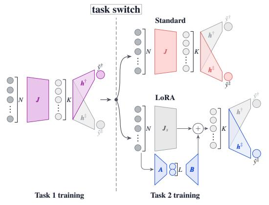

b)  
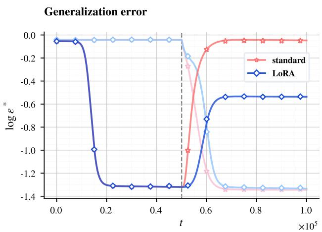

c)  
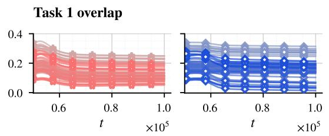

d)  
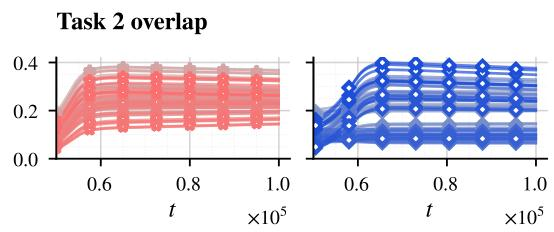  
Figure 1: Generalization and representation dynamics under LoRA and full fine-tuning for a sequential training. a) Schematic of the sequential training setting. We first train the first-layer weights and a readout head on a synthetic dataset corresponding to Task 1. We then train on a correlated dataset corresponding to Task 2, where we either update the first-layer weights or freeze them and instead train a low-rank adapter. In both cases, we train a second readout head. b) Task 1 (dark) and Task 2 (light) generalization errors for full fine-tuning and LoRA. The gray dashed line marks the task switch. $c \mathrm { - } d )$ Student overlaps with teachers as defined in Eqs. (18)-(19) after the task switch for both full fine-tuning (red) and LoRA (blue). Solid lines denote theoretical ODE predictions and markers finite-dimensional simulations. Parameters: $N = 1 0 ^ { 3 }$ 2 $K = 1 0$ $M = 5 ,$ , L = 5, c = 0.5, $\alpha = 5 0$

where, for an input $\xi ^ { \mu } , \rho _ { m } ^ { \mu }$ and $x _ { k } ^ { \mu }$ define the Task 1 teacher and student preactivations

$$
\rho _ { m } ^ { \mu } = \frac { W _ { m } ^ { \dagger } \xi ^ { \mu } } { \sqrt { N } } , \qquad x _ { k } ^ { \mu } = \frac { J _ { k } ^ { \mu } \xi ^ { \mu } } { \sqrt { N } } .\tag{8}
$$

The scaling in $N$ is chosen such that the macroscopic quantities evolve on the time scale $\tau = \mu / N$ as $N  \infty .$ , this phase coincides with the standard continual-learning dynamics of Lee et al. [2021]. All details on these existing results can be found in Appendix B.

Task 2: low-rank adaptation of a frozen representation. At the task switch, the feature matrix is frozen at $J _ { s }$ and the efective representation becomes

$$
J = J _ { s } + \frac { \gamma } { \sqrt { L } } B A .\tag{9}
$$

During this phase, A, B, and $h ^ { \ddag }$ are updated by online SGD, while $J _ { s }$ and $\pmb { h } ^ { \dagger }$ remain frozen. The

resulting Task 2 prediction error is therefore

$$
\Delta ^ { \ddagger } = \sum _ { k = 1 } ^ { K } h _ { k } ^ { \ddagger } g ( \tilde { x } _ { k } ) - \sum _ { p = 1 } ^ { M } v _ { p } ^ { \ddagger } g ( \nu _ { p } ) .\tag{10}
$$

which depends on the Task-2 teacher fields, the frozen student fields and the L LoRA fields

$$
\nu _ { p } ^ { \mu } = \frac { W _ { p } ^ { \pm } \xi ^ { \mu } } { \sqrt { N } } , \qquad x _ { k } = \frac { ( J _ { s } ) _ { k } \xi } { \sqrt { N } } , \qquad z _ { i } = \frac { A _ { i } \xi } { \sqrt { N } } ,\tag{11}
$$

so that the adapted student preactivation is

$$
\tilde { x } _ { k } = x _ { k } + \frac { \gamma } { \sqrt L } \sum _ { i = 1 } ^ { L } B _ { k i } z _ { i } .\tag{12}
$$

Macroscopic order parameters. The population generalization errors in (6) depend on the Ndimensional input only through the scalar fields. Since ${ \pmb \xi } \sim \mathcal { N } ( 0 , \pmb { I } _ { N } )$ and all fields above are linear functions of ξ, they are jointly zero-mean Gaussian. Their distribution is therefore fully determined by their second moments, which are normalized inner products between the corresponding weight vectors. Before the task switch, we track

$$
\begin{array} { r } { \pmb { Q } _ { k l } : = \langle x _ { k } x _ { l } \rangle , \qquad \pmb { R } _ { k m } : = \langle x _ { k } \rho _ { m } \rangle , \qquad \pmb { U } _ { k p } : = \langle x _ { k } \nu _ { p } \rangle , } \end{array}\tag{13}
$$

together with the fixed teacher overlaps

$$
\mathbf { T } _ { m n } : = \langle \rho _ { m } \rho _ { n } \rangle , \qquad V _ { m p } : = \langle \rho _ { m } \nu _ { p } \rangle , \qquad S _ { p q } : = \langle \nu _ { p } \nu _ { q } \rangle ,\tag{14}
$$

which, by the teacher construction satisfy $\pmb { T } = \pmb { S } = \pmb { I } _ { M }$ and $V = c I _ { M }$ in the high-dimensional limit. Equivalently, by replacing the field definition

$$
\pmb { Q } _ { k l } = \frac { 1 } { N } \pmb { J } _ { k } \pmb { J } _ { l } ^ { T } , \qquad \pmb { R } _ { k m } = \frac { 1 } { N } \pmb { J } _ { k } ( \pmb { W } _ { m } ^ { \dagger } ) ^ { T } , \qquad \pmb { U } _ { k p } = \frac { 1 } { N } \pmb { J } _ { k } ( \pmb { W } _ { p } ^ { \dagger } ) ^ { T } ,\tag{15}
$$

with analogous expressions for $\mathbf { \Delta } T , V , S$ . Thus Q describes the geometry of the student representation, R and U its alignment with Tasks 1 and 2, and T, V, S the fixed geometry of the teachers.

LoRA introduces four additional overlap matrices,

$$
\Phi _ { i j } : = \langle z _ { i } z _ { j } \rangle , \qquad \Xi _ { k i } : = \langle x _ { k } z _ { i } \rangle , \qquad \mathbf { A } _ { m i } : = \langle \rho _ { m } z _ { i } \rangle , \qquad \mathbf { T } _ { p i } : = \langle \nu _ { p } z _ { i } \rangle .\tag{16}
$$

In weight space,

$$
\Phi _ { i j } = \frac { 1 } { N } A _ { i } A _ { j } ^ { T } , \qquad \Xi _ { k i } = \frac { 1 } { N } ( J _ { s } ) _ { k } A _ { i } ^ { T } , \qquad \Lambda _ { m i } = \frac { 1 } { N } W _ { m } ^ { \dagger } A _ { i } ^ { T } , \qquad \Gamma _ { p i } = \frac { 1 } { N } W _ { p } ^ { \dagger } A _ { i } ^ { T } .\tag{17}
$$

Hence Φ describes the geometry of the trainable LoRA directions, Ξ their alignment with the frozen student representation, and Γ and Λ their alignment with the Task 2 and Task 1 teachers, respectively. Since $\bar { B } \in \mathbb { R } ^ { K \times L }$ remains finite-dimensional as $N \to \infty$ , its entries are tracked explicitly.

How LoRA changes the dynamical closure. This is the central modification relative to standard continual learning. Under full fine-tuning, the student overlaps themselves continue to evolve after the task switch. Under LoRA, $Q _ { s } , R _ { s } , U _ { s }$ are fixed at their Task 1 values, and the geometry of the efective representation is reconstructed from these frozen overlaps and the adapter variables. In particular,

$$
\langle \tilde { x } _ { k } \rho _ { m } \rangle = ( R _ { s } ) _ { k m } + \frac { \gamma } { \sqrt { L } } ( B \Lambda ^ { T } ) _ { k m } ,\tag{18}
$$

$$
\langle \tilde { x } _ { k } \nu _ { p } \rangle = ( U _ { s } ) _ { k p } + \frac { \gamma } { \sqrt { L } } ( B \Gamma ^ { T } ) _ { k p } ,\tag{19}
$$

and

$$
\langle \widetilde { \boldsymbol { x } } _ { k } \widetilde { \boldsymbol { x } } _ { l } \rangle = ( \pmb { Q } _ { s } ) _ { k l } + \frac { \gamma } { \sqrt { L } } \left[ ( \boldsymbol { \Xi } \pmb { B } ^ { T } ) _ { k l } + ( \pmb { B } \pmb { \Xi } ^ { T } ) _ { k l } \right] + \frac { \gamma ^ { 2 } } { L } ( \pmb { B } \pmb { \Phi } \pmb { B } ^ { T } ) _ { k l } .\tag{20}
$$

These relations completely determine the covariance matrix of the adapted preactivations and therefore the population errors on both tasks. More precisely, in the high-dimensional limit, during Task 2 training the generalization errors of both tasks are functions of the order parameters

$$
\begin{array} { c } { { \displaystyle \operatorname* { l i m } _ { N  \infty } \epsilon ^ { \dagger } = \epsilon ^ { \dagger } ( \Xi , \Phi , \Lambda , B ; Q _ { s } , R _ { s } , T , h ^ { \dagger } , v ^ { \dagger } ) } } \\ { { \displaystyle \operatorname* { l i m } _ { N  \infty } \epsilon ^ { \dagger } = \epsilon ^ { \dagger } ( \Xi , \Phi , \Gamma , B , h ^ { \dagger } ; Q _ { s } , U _ { s } , S , v ^ { \dagger } ) } } \end{array}\tag{21}
$$

The corresponding explicit expressions are given in Appendix C.

Deterministic high-dimensional dynamics. The evolution equations follow by combining the microscopic SGD updates with the definitions above and taking the limit $N \to \infty$ at fixed $\tau = \mu / N$ As an illustration, consider

$$
\Gamma _ { p i } = \frac { 1 } { N } { \bf W } _ { p } ^ { \ddag } A _ { i } ^ { T } ,\tag{22}
$$

which measures the alignment between the i-th LoRA direction and the $p \textmd { - }$ th Task 2 teacher feature. Its evolution is

$$
\frac { \mathrm { d } \Gamma _ { p i } } { \mathrm { d } \tau } = - \eta _ { A } \frac { \gamma } { \sqrt { L } } \sum _ { k = 1 } ^ { K } h _ { k } ^ { \ddagger } B _ { k i } \left. \Delta ^ { \ddagger } g ^ { \prime } ( \tilde { x } _ { k } ) \nu _ { p } \right. .\tag{23}
$$

Analogous calculations yield a closed deterministic system for Φ, Ξ, Γ, Λ, B and $h ^ { \ddag }$ . For $g ( z ) =$ $\operatorname { e r f } ( z / { \sqrt { 2 } } )$ , all Gaussian expectations can be evaluated in closed form as algebraic functions of the instantaneous order parameters. The complete ODE system and the corresponding generalization-error expressions for Task 2 training are provided in Appendix C.

LoRA versus full fine-tuning. Figure 1b compares the resulting LoRA dynamics (blue) with standard full fine-tuning (red). Full fine-tuning rapidly increases the Task 1 error after the switch, whereas LoRA preserves substantially more of the previously learned representation while reaching a comparable asymptotic Task 2 error. The theoretical trajectories (solid lines) closely match finitedimensional simulations (markers).

The overlap dynamics provide a geometric explanation. Under full fine-tuning, the shared representation itself moves toward Task 2, thereby modifying features acquired on Task 1. Under LoRA, the pretrained component remains fixed and the change in Task 1 and Task 2 alignment is mediated only by $B \Lambda ^ { T }$ and ${ \bar { B \mathbf { I } } } ^ { T }$ , respectively. As illustrated in Fig. 1c-d, LoRA increases alignment with the new task while preserving a larger fraction of the Task 1 alignment than full fine-tuning. This provides a direct representation-level explanation for its reduced forgetting.

In Fig. 1, the task switch occurs before the student fully specializes to the Task 1 teacher, as indicated by Fig. 1c. This regime is practically relevant, since training is typically stopped once a target performance is reached rather than after complete representational specialization; in addition, the time constant for symmetric-subspace escape grows with K, so full specialization at $K > M$ requires substantially longer training. Results in the fully specialized regime are reported in Appendix E.

LoRA also adapts more slowly at early times, as observed empirically [Liu et al., 2024, Li et al., 2025]. Our theory attributes this to the dynamics of the adapter: with A initialized at zero, the Task-2 signal must first build up the adapter overlaps Φ and Γ through the rank-L bottleneck, while the up-projection B evolves on the slower readout timescale. This transient delays the growth of the Task 2 overlap, as seen in Fig. 1d, and slows early adaptation relative to full fine-tuning.

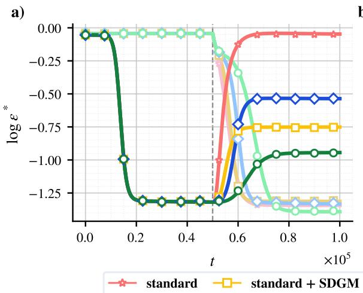

b)  
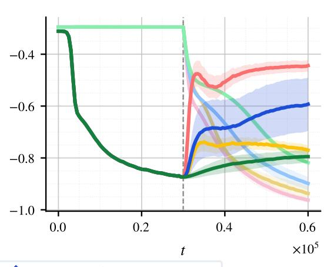  
Figure 2: State-dependent masking reduces forgetting. a) Generalization dynamics for full fine-tuning, LoRA, and their SDGM-constrained variants. Parameters: $N = 1 0 ^ { 3 } , K = 1 0 , M = 5$ $L = 5 , \kappa = 5 , c = 0 . 5 , \alpha = 5 0$ . b) Corresponding results on a real experiment on the MNIST dataset sequential training (see Appendix G for details). SDGM improves Task 1 retention while preserving comparable Task 2 performance. For the experiment, the curves are averaged over 10 independent training realizations.

## 5 Stability and Plasticity through the Lens of the Theory

## 5.1 State-Dependent Masking Mitigates Forgetting

The theory suggests that forgetting can be reduced by preventing the LoRA update from acting on feature directions that are strongly used by Task 1. In the multi-head teacher-student model, the magnitude of the Task 1 readout coeficient $| h _ { i } ^ { \dagger } |$ provides a simple measure of the importance of hidden unit i for the first task. We therefore rank the hidden units by $| h _ { i } ^ { \dagger } |$ at the task switch, freeze the κ largest, and restrict Task 2 adaptation to the complementary set. We refer to this state-dependent partition as State-Dependent Gradient Masking (SDGM).

Within LoRA, we implement this constraint by fixing the up-projection factor to a sparse mask $\pmb { \Omega } \in \{ 0 , 1 \} ^ { K \times L }$ whose nonzero rows correspond only to the plastic hidden units, while optimizing the down-projection A and the Task 2 readout $h ^ { \ddag }$ . The efective representation is therefore

$$
J = J _ { s } + { \frac { \gamma } { \sqrt L } } \Omega A .\tag{24}
$$

Because Ω is constructed from the Task 1 state and then held fixed, the same macroscopic theory applies by setting B = Ω and $d B / d \tau = 0$ , while evolving Φ, Ξ, Γ, Λ and $h ^ { \ddagger }$ . The explicit mask construction and the corresponding modification of the ODE system are given in Appendix D.1.

This construction is closely related to subspace-constrained PEFT methods such as InfLoRA and MiCA [Liang and Li, 2024, Rüdiger and Raschka, 2026]. The distinction is that here the protected subspace is selected directly from the network state reached after Task 1, using the task-specific readout as an importance score, and its efect on the subsequent dynamics can be followed analytically.

Figure 2a shows that SDGM (green) substantially improves Task 1 retention relative to vanilla LoRA (blue) while preserving similar asymptotic Task 2 performance, with the theoretical trajectories closely matching finite-dimensional simulations. The inverse-selection control in Appendix D.2, which protects the least important Task 1 units instead, at the same number of trainable directions, produces substantially more forgetting, showing that the gain depends on which directions are protected rather than only on reducing the dimensionality of the trainable subspace. The same qualitative efect persists with ReLU activations as illustrated in Appendix D.3.

Applying the same state-dependent mask to full fine-tuning (yellow) also reduces forgetting, confirming that targeted protection of Task 1-relevant features is beneficial independently of the low-rank parameterization (Fig. 2). However, in the regime considered here, combining this restriction with LoRA (green) yields the strongest Task 1 retention at comparable Task 2 performance.

Figure 2b shows analogous behavior on a sequential MNIST. In this case, Task 1 is a binary classification problem distinguishing digits smaller than 5 from digits greater than or equal to 5, while Task 2 distinguishes even from odd digits. As we can see, SDGM plus LoRA again improves Task 1 retention while preserving competitive Task 2 performance; experimental details are in Appendix G.

## 5.2 Adapter Rank and the Stability–Plasticity Trade-of

The LoRA rank L controls the dimensionality of the trainable update and therefore provides a natural handle on the stability-plasticity trade-of. This dynamical framework allows us to quantify this trade-of by varying L while tracking both transfer to Task 2 and forgetting on Task 1, defined as

$$
\mathrm { F o r g e t t i n g } = \log \epsilon _ { \mathrm { f i n a l } } ^ { \dagger } - \log \epsilon _ { s } ^ { \dagger } , \qquad \mathrm { T r a n s f e r } = \log \epsilon _ { s } ^ { \dagger } - \log \epsilon _ { \mathrm { f i n a l } } ^ { \dagger } ,\tag{25}
$$

where $\epsilon _ { \mathrm { f i n a l } } ^ { * }$ is the error at the end of the sequential training for task ∗. Figure 3c shows that, for vanilla LoRA (blue), increasing L initially improves Task 2 transfer but also increases Task 1 forgetting. With SDGM (green), transfer likewise improves with rank, while forgetting remains substantially lower because adaptation is restricted away from Task 1-relevant directions. For this comparison, we set $\kappa = K - L$ so that the number of frozen directions decreases with the adapter capacity. At the same time, this choice allows the student to allocate exactly L units for Task 2.

A second feature is that transfer gains saturate as L approaches the teacher width M. Since Task 2 is generated by M independent feature directions, increasing the rank beyond this scale provides little additional representational benefit on Task 2, while retaining increasingly less information on Task 1, resulting in increased forgetting.

## 5.3 Task similarity and interference

We next vary the teacher similarity $c \in [ 0 , 1 ]$ . As shown in Fig. 3a, forgetting under full fine-tuning (red) and vanilla LoRA (blue) is strongly non-monotonic, with maximal interference at intermediate similarity, consistent with previous continual-learning analyses [Ramasesh et al., 2021, Lee et al., 2021, 2022, Jarvis et al., 2025]. When c is small, the tasks occupy nearly orthogonal feature directions and interact weakly; when c approaches one, previously learned features can be reused. At intermediate similarity, however, the tasks overlap enough to induce updates along shared directions while remaining suficiently diferent to distort the Task 1 representation.

SDGM substantially suppresses this intermediate-similarity interference while preserving comparable Task 2 transfer across the range of c (panel b). This highlights the key geometric limitation of vanilla LoRA: restricting the rank of the update does not control its orientation relative to previously learned features. By protecting Task 1-relevant directions and redirecting adaptation toward the complementary subspace, SDGM improves the stability-plasticity trade-of especially when the update is already low rank.

## 6 Discussion and Conclusions

We developed a high-dimensional dynamical theory of LoRA in continual learning that follows the complete sequential process from Task 1 feature learning to Task 2 low-rank adaptation. The theory shows that LoRA changes both the geometry and timescale of learning: freezing the pretrained representation reduces interference, whereas the rank-restricted, zero-initialized adapter must first build up alignment through the low-rank bottleneck, which slows early adaptation. More generally, low rank alone does not prevent forgetting; the orientation of the adaptation subspace relative to previously learned features is equally important. This perspective explains why state-dependent masking reduces forgetting and clarifies how rank and task similarity shape the stability-plasticity trade-of.

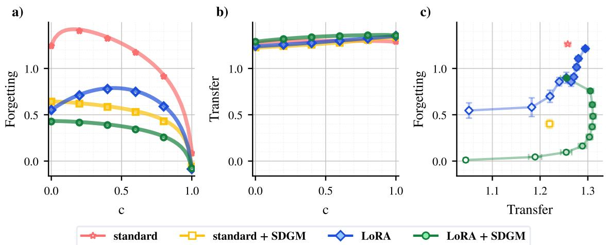  
Figure 3: Impact of LoRA on the Stability-Plasticity Trade-of. a) Task 1 Forgetting and b) Task 2 Transfer as a function of teacher similarity c. Solid lines denote theoretical predictions and markers simulation. c) Forgetting versus Transfer as the LoRA rank L varies from light $( L = 1 )$ to dark marker $( L = 1 0 )$ for $c = 0 . 5$ . Vanilla LoRA gains transfer at the cost of increased forgetting, whereas LoRA+SDGM maintains greater stability. Transfer gains saturate as L approaches the teacher width M. For SDGM, $\kappa = K - L$ . We average over 10 diferent seeds. Lines in panel c are shown to guide the eyes. Parameters: $N = 1 0 ^ { 3 }$ , K = 10, M = 5, α = 50. In panel a and b we used $L = 5$

Our analysis is deliberately restricted to a solvable two-layer, two-task online-learning model, so its quantitative predictions should not be transferred directly to large deep networks. Its purpose is instead to isolate mechanisms that are dificult to disentangle empirically. The qualitative agreement on sequential MNIST suggests that these mechanisms extend beyond the analytically tractable setting and motivates studying dynamically constrained adaptation in deeper networks and longer task sequences.

## Acknowledgments

We thank Sebastian Goldt, Stefano Sarao Manelli and Francesco Camilli for insightful discussions on this work. The work of TM was supported by the European Union – NextGenerationEU under the National Recovery and Resilience Plan (PNRR), Mission 4, Component 2, Investment 3.3, “Introduction of innovative PhD programmes responding to the innovation needs of enterprises and promoting the recruitment of researchers by enterprises” (D.M. 630/2024), CUP J33C24001630009, and by Syndiag S.r.L. This work was conducted in the spirit of the Slow Science Manifesto slow-science.com, advocating for collaborative and sustainable research.

## References

Dan Biderman, Jacob Portes, Jose Javier Gonzalez Ortiz, Mansheej Paul, Philip Greengard, Connor Jennings, Daniel King, Sam Havens, Vitaliy Chiley, Jonathan Frankle, Cody Blakeney, and John Patrick Cunningham. LoRA learns less and forgets less. Transactions on Machine Learning Research, 2024. ISSN 2835-8856. URL https://openreview.net/forum?id=aloEru2qCG. Featured Certification.

Michael Biehl and H Schwarze. Learning by on-line gradient descent. Journal of Physics A: Mathematical and General, 28:643–656, 01 1999. doi: 10.1088/0305-4470/28/3/018.

Arslan Chaudhry, Marcus Rohrbach, Mohamed Elhoseiny, Thalaiyasingam Ajanthan, Puneet K. Dokania, Philip H. S. Torr, and Marc’Aurelio Ranzato. On tiny episodic memories in continual learning, 2019.

Chang Che, Ziqi Wang, Pengwan Yang, Cheems Wang, Hui Ma, and Zenglin Shi. Lora in lora: Towards parameter-eficient architecture expansion for continual visual instruction tuning. Proceedings of the AAAI Conference on Artificial Intelligence, 40(24):19978–19986, Mar. 2026. doi: 10.1609/aaai.v40i24. 39082. URL https://ojs.aaai.org/index.php/AAAI/article/view/39082.

O. Duranthon, F. Boncoraglio, and L. Zdeborová. High-dimensional theory of lora fine-tuning in a solvable attention model, 2026. URL https://arxiv.org/abs/2606.05899.

E. Gardner and Bernard Derrida. Three unfinished works on the optimal storage capacity of networks. Journal of Physics A: Mathematical and Theoretical, 22(12):1983–1994, 1989. doi: 10.1088/0305-4470/ 22/12/004. URL https://hal.science/hal-03285594.

Sebastian Goldt, Madhu Advani, Andrew Saxe, Florent Krzakala, and Lenka Zdeborová. Dynamics of stochastic gradient descent for two-layer neural networks in the teacher-student setup. In H. Wallach, H. Larochelle, A. Beygelzimer, F. d'Alché-Buc, E. Fox, and R. Garnett, editors, Advances in Neural Information Processing Systems, volume 32. Curran Associates, Inc., 2019. URL https://proceedings. neurips.cc/paper\_files/paper/2019/file/cab070d53bd0d200746fb852a922064a-Paper.pdf.

Zeyu Han, Chao Gao, Jinyang Liu, Jef Zhang, and Sai Qian Zhang. Parameter-eficient fine-tuning for large models: A comprehensive survey, 2024. URL https://arxiv.org/abs/2403.14608.

Edward J Hu, yelong shen, Phillip Wallis, Zeyuan Allen-Zhu, Yuanzhi Li, Shean Wang, Lu Wang, and Weizhu Chen. LoRA: Low-rank adaptation of large language models. In International Conference on Learning Representations, 2022. URL https://openreview.net/forum?id=nZeVKeeFYf9.

Devon Jarvis, Sebastian Lee, Clémentine Carla Juliette Dominé, Andrew M Saxe, and Stefano Sarao Man nelli. A theory of initialisation’s impact on specialisation. In The Thirteenth International Conference on Learning Representations, 2025. URL https://openreview.net/forum?id=RQz7szbVDs.

Junsu Kim, Jaeyeon Kim, and Ernest K. Ryu. LoRA training provably converges to a low-rank global minimum or it fails loudly (but it probably won’t fail). In Forty-second International Conference on Machine Learning, 2025. URL https://openreview.net/forum?id=o9zDYV4Ism.

James Kirkpatrick, Razvan Pascanu, Neil Rabinowitz, Joel Veness, Guillaume Desjardins, Andrei A. Rusu, Kieran Milan, John Quan, Tiago Ramalho, Agnieszka Grabska-Barwinska, Demis Hassabis, Claudia Clopath, Dharshan Kumaran, and Raia Hadsell. Overcoming catastrophic forgetting in neural networks. Proceedings of the National Academy of Sciences, 114(13):3521–3526, 2017. doi: 10.1073/pnas.1611835114. URL https://www.pnas.org/doi/abs/10.1073/pnas.1611835114.

Anastasis Kratsios, Tin Sum Cheng, Aurelien Lucchi, and Haitz Sáez de Ocáriz Borde. Sharp generalization bounds for foundation models with asymmetric randomized low-rank adapters, 2025. URL https://arxiv.org/abs/2506.14530.

Y. Lecun, L. Bottou, Y. Bengio, and P. Hafner. Gradient-based learning applied to document recognition. Proceedings of the IEEE, 86(11):2278–2324, 1998. doi: 10.1109/5.726791.

Sebastian Lee, Sebastian Goldt, and Andrew Saxe. Continual learning in the teacher-student setup: Impact of task similarity. In International Conference on Machine Learning, pages 6109–6119. PMLR, 2021.

Sebastian Lee, Stefano Sarao Mannelli, Claudia Clopath, Sebastian Goldt, and Andrew Saxe. Maslow’s hammer for catastrophic forgetting: Node re-use vs node activation. In Proceedings of the 39th International Conference on Machine Learning, volume 162 of Proceedings of Machine Learning Research, pages 12455–12477. PMLR, 2022.

Shiwei Li, Xiandi Luo, Xing Tang, Haozhao Wang, Hao Chen, Weihong Luo, Yuhua Li, Xiuqiang He, and Ruixuan Li. Beyond zero initialization: Investigating the impact of non-zero initialization on LoRA fine-tuning dynamics. In Aarti Singh, Maryam Fazel, Daniel Hsu, Simon Lacoste-Julien, Felix Berkenkamp, Tegan Maharaj, Kiri Wagstaf, and Jerry Zhu, editors, Proceedings of the 42nd International Conference on Machine Learning, volume 267 of Proceedings of Machine Learning Research, pages 35519–35535. PMLR, 13–19 Jul 2025. URL https://proceedings.mlr.press/ v267/li25bm.html.

Yan-Shuo Liang and Wu-Jun Li. Inflora: Interference-free low-rank adaptation for continual learning. In 2024 IEEE/CVF Conference on Computer Vision and Pattern Recognition (CVPR), pages 23638– 23647, 2024. doi: 10.1109/CVPR52733.2024.02231.

Shih-Yang Liu, Chien-Yi Wang, Hongxu Yin, Pavlo Molchanov, Yu-Chiang Frank Wang, Kwang-Ting Cheng, and Min-Hung Chen. Dora: Weight-decomposed low-rank adaptation, 2024.

Yuheng Lu, Bingshuo Qian, Caixia Yuan, Huixing Jiang, and Xiaojie Wang. Controlled low-rank adaptation with subspace regularization for continued training on large language models. In Wanxiang Che, Joyce Nabende, Ekaterina Shutova, and Mohammad Taher Pilehvar, editors, Proceedings of the 63rd Annual Meeting of the Association for Computational Linguistics (Volume 1: Long Papers), pages 19165–19181, Vienna, Austria, July 2025. Association for Computational Linguistics. ISBN 979-8-89176-251-0. doi: 10.18653/v1/2025.acl-long.940. URL https://aclanthology.org/2025. acl-long.940/.

Michael McCloskey and Neal J. Cohen. Catastrophic Interference in Connectionist Networks: The Sequential Learning Problem, page 109–165. Elsevier, 1989. ISBN 9780125433242. doi: 10.1016/ s0079-7421(08)60536-8. URL http://dx.doi.org/10.1016/S0079-7421(08)60536-8.

Francesco Mori, Stefano Sarao Mannelli, and Francesca Mignacco. Optimal protocols for continual learning via statistical physics and control theory. In International Conference on Learning Representations, volume 2025, pages 59198–59220, 2025.

Gibbs Nwemadji, Bruno Loureiro, and Jean Barbier. When pre-training hurts lora fine-tuning: a dynamical analysis via single-index models, 2026. URL https://arxiv.org/abs/2602.02855.

Vinay Venkatesh Ramasesh, Ethan Dyer, and Maithra Raghu. Anatomy of catastrophic forgetting: Hidden representations and task semantics. In International Conference on Learning Representations, 2021. URL https://openreview.net/forum?id=LhY8QdUGSuw.

Andrei A. Rusu, Neil C. Rabinowitz, Guillaume Desjardins, Hubert Soyer, James Kirkpatrick, Koray Kavukcuoglu, Razvan Pascanu, and Raia Hadsell. Progressive neural networks, 2022. URL https: //arxiv.org/abs/1606.04671.

Sten Rüdiger and Sebastian Raschka. Mica learns more knowledge than lora and full fine-tuning, 2026.

David Saad and Sara A. Solla. On-line learning in soft committee machines. Phys. Rev. E, 52:4225–4243, Oct 1995a. doi: 10.1103/PhysRevE.52.4225. URL https://link.aps.org/doi/10.1103/PhysRevE. 52.4225.

David Saad and Sara A. Solla. Exact solution for on-line learning in multilayer neural networks. Physical Review Letters, 74(21):4337–4340, May 1995b. ISSN 1079-7114. doi: 10.1103/physrevlett.74.4337. URL http://dx.doi.org/10.1103/PhysRevLett.74.4337.

Liyuan Wang, Xingxing Zhang, Hang Su, and Jun Zhu. A comprehensive survey of continual learning: Theory, method and application. IEEE Transactions on Pattern Analysis and Machine Intelligence, 46(8):5362–5383, 2024. doi: 10.1109/TPAMI.2024.3367329.

Xiwen Wei, Guihong Li, and Radu Marculescu. Online-lora: Task-free online continual learning via low rank adaptation. In 2025 IEEE/CVF Winter Conference on Applications of Computer Vision (WACV), pages 6634–6645, 2025. doi: 10.1109/WACV61041.2025.00646.

Lingling Xu, Haoran Xie, Si-Zhao Joe Qin, Xiaohui Tao, and Fu Lee Wang. Parameter-eficient fine-tuning methods for pretrained language models: A critical review and assessment, 2023. URL https://arxiv.org/abs/2312.12148.

Ziqing Xu, Hancheng Min, Lachlan Ewen MacDonald, Jinqi Luo, Salma Tarmoun, Enrique Mallada, and Rene Vidal. Understanding the learning dynamics of lora: A gradient flow perspective on low-rank adaptation in matrix factorization. In Yingzhen Li, Stephan Mandt, Shipra Agrawal, and Emtiyaz Khan, editors, Proceedings of The 28th International Conference on Artificial Intelligence and Statistics, volume 258 of Proceedings of Machine Learning Research, pages 4636–4644. PMLR, 03–05 May 2025. URL https://proceedings.mlr.press/v258/xu25h.html.

Yuchen Zeng and Kangwook Lee. The expressive power of low-rank adaptation. In The Twelfth International Conference on Learning Representations, 2024. URL https://openreview.net/forum? id=likXVjmh3E.

## A Integrals computation

To derive the closed-form equations for the various quantities we will determine, we make use of several quantities involving Gaussian integrals. For completeness, we report their expressions in this Appendix, following Saad and Solla [1995b].We denote by

$$
\langle f ( \pmb { x } ) \rangle _ { \pmb { x } } \equiv \int d \pmb { x } P ( \pmb { x } ) f ( \pmb { x } ) ,\tag{26}
$$

the expectation of a function f with respect to its joint Gaussian distribution with zero mean and covariance matrix C. All the computations that follow are specific to $g ( x ) = \mathrm { { e r f } } ( x / \sqrt { 2 } )$

For the two-dimensional case, we define

$$
I _ { 2 } = \langle g ( x ) g ( y ) \rangle _ { ( x , y ) } .\tag{27}
$$

This Gaussian integral admits the closed-form expression

$$
I _ { 2 } ( a , b ) = \frac { 2 } { \pi } \arcsin \left( \frac { C _ { a b } } { \sqrt { C _ { a a } + 1 } \sqrt { C _ { b b } + 1 } } \right) .\tag{28}
$$

Likewise, the computation of a three-dimensional gaussian average

$$
I _ { 3 } = \langle g ^ { \prime } ( x ) y g ( z ) \rangle _ { ( x , y , z ) }\tag{29}
$$

can be computed to get

$$
I _ { 3 } ( a , b , c ) = \frac { 2 } { \pi } \frac { 1 } { \sqrt { \Lambda _ { 3 } ( a , c ) } } \frac { C _ { b c } ( C _ { a a } + 1 ) - C _ { a b } C _ { a c } } { C _ { a a } + 1 } .\tag{30}
$$

Finally, the four-dimensional gaussian integral

$$
I _ { 4 } = \langle g ^ { \prime } ( x ) g ^ { \prime } ( y ) g ( z ) g ( w ) \rangle _ { ( x , y , z , w ) }\tag{31}
$$

results in

$$
I _ { 4 } ( a , b , c , d ) = \frac { 4 } { \pi ^ { 2 } \sqrt { \Lambda _ { 4 } ( a , b ) } } \arcsin \left( \frac { \Lambda _ { 0 } ( a , b , c , d ) } { \sqrt { \Lambda _ { 1 } ( a , b , c ) } \sqrt { \Lambda _ { 2 } ( a , b , d ) } } \right) .\tag{32}
$$

Where we defined

$$
\begin{array} { r l } & { \quad \Lambda _ { 4 } ( a , b ) : = ( C _ { a a } + 1 ) ( C _ { b b } + 1 ) - C _ { a b } ^ { 2 } , } \\ & { \Lambda _ { 0 } ( a , b , c , d ) : = \Lambda _ { 4 } C _ { c d } - C _ { a c } C _ { a d } ( C _ { b b } + 1 ) - C _ { b c } C _ { b d } ( C _ { a a } + 1 ) + C _ { a b } ( C _ { a d } C _ { b c } + C _ { b d } C _ { a c } ) , } \\ & { \quad \Lambda _ { 1 } ( a , b , c ) : = \Lambda _ { 4 } ( C _ { c c } + 1 ) - C _ { a c } ^ { 2 } ( C _ { b b } + 1 ) - C _ { b c } ^ { 2 } ( C _ { a a } + 1 ) + 2 C _ { a b } C _ { a c } C _ { b c } , } \\ & { \quad \Lambda _ { 2 } ( a , b , d ) : = \Lambda _ { 4 } ( C _ { d d } + 1 ) - C _ { a d } ^ { 2 } ( C _ { b b } + 1 ) - C _ { b d } ^ { 2 } ( C _ { a a } + 1 ) + 2 C _ { a b } C _ { a d } C _ { b d } , } \\ & { \quad \Lambda _ { 3 } ( a , c ) : = ( C _ { a a } + 1 ) ( C _ { c c } + 1 ) - C _ { a c } ^ { 2 } . } \end{array}
$$

## B Standard sequential training

The results presented for the training on Task 1 are identical to those presented in Lee et al. [2021, 2022] and also apply to the first phase of this LoRA-based framework. We choose to state them in this Appendix for completeness. We also report the theoretical ODEs needed to reproduce the standard approach when training on Task 2, which serve as a comparison with the theoretical results found in this work.

## List of order parameters

We start by defining the preactivation fields of the $m ^ { t h }$ teacher † unit, $p ^ { t h }$ teacher ‡ unit and $k ^ { t h }$ student unit respectively as

$$
\rho _ { m } = { \frac { W _ { m } ^ { \dagger } \xi } { \sqrt { N } } } , \quad \nu _ { p } = { \frac { W _ { p } ^ { \dagger } \xi } { \sqrt { N } } } , \quad x _ { k } = { \frac { J _ { k } \xi } { \sqrt { N } } } .\tag{33}
$$

The set of time-dependent order parameters we recover during the first part of training are then

$$
\mathrm { S t u d e n t - S t u d e n t ~ O v e r l a p } , \pmb { Q } _ { k l } : = \langle x _ { k } x _ { l } \rangle = \frac { 1 } { N } \pmb { J } _ { k } \pmb { J } _ { l } ^ { T } ,\tag{34}
$$

$$
\mathrm { S t u d e n t \ – \ T e a c h e r ^ { \dagger } { O v e r l a p } } , R _ { k m } : = \langle x _ { k } \rho _ { m } \rangle = \frac { 1 } { N } { \mathbf { J } _ { k } ( W _ { m } ^ { \dagger } ) ^ { T } } ,\tag{35}
$$

$$
\mathrm { S t u d e n t \ – \ T e a c h e r ^ { \ddag } O v e r l a p , } U _ { k p } : = \langle x _ { k } \nu _ { p } \rangle = \frac { 1 } { N } { \mathbf { J } _ { k } ( W _ { p } ^ { \ddag } ) ^ { T } } .\tag{36}
$$

While the static order parameters, totally defined by the sampling procedure for the teachers given in 3 are given by

$$
\mathrm { T e a c h e r } ^ { \dagger } \cdot \mathrm { T e a c h e r } ^ { \dagger } \mathrm { O v e r l a p } , { \pmb T } _ { n m } : = \left. \rho _ { n } \rho _ { m } \right. = \frac 1 N { \pmb W } _ { n } ^ { \dagger } \left( { \pmb W } ^ { \dagger } \right) _ { m } ^ { T } ,\tag{37}
$$

$$
\mathrm { T e a c h e r ^ { \frac { 1 } { 4 } } - T e a c h e r ^ { \frac { 1 } { 4 } } \ O v e r l a p } , S _ { p q } : = \left. \nu _ { p } \nu _ { q } \right. = \frac { 1 } { N } { W _ { p } ^ { \dag } } \left( W ^ { \dag } \right) _ { q } ^ { T } ,\tag{38}
$$

$$
\mathrm { T e a c h e r } ^ { \dagger } \cdot \mathrm { T e a c h e r } ^ { \dagger } \mathrm { O v e r l a p } , V _ { m p } : = \left. \rho _ { m } \nu _ { p } \right. = \frac { 1 } { N } { W } _ { m } ^ { \dagger } \left( W ^ { \dagger } \right) _ { p } ^ { T } .\tag{39}
$$

## Generalization errors

Having defined the order parameters and preactivation fields, we are now ready to compute the generalization error on both tasks during the first part of training.

Recall that computing an average over the distribution of the input ${ \pmb \xi } \sim \mathcal { N } ( 0 , { \bf I } _ { N } )$ is not needed when the functions involved depend only on the preactivations. This means we want to focus on the joint distribution of such preactivations fields

$$
( x _ { 1 } , \hdots , x _ { K } , \rho _ { 1 } , \hdots , \rho _ { M } , \nu _ { 1 } , \hdots , \nu _ { M } ) .\tag{40}
$$

In the limit $N \to \infty$ , the preactivations fields are jointly gaussian and we need only to focus on the time-dependent joint covariance matrix of those preactivations, written as

$$
\tilde { C } = \left[ \begin{array} { c c c } { Q } & { R } & { U } \\ { R ^ { T } } & { T } & { V } \\ { U ^ { T } } & { V ^ { T } } & { S } \end{array} \right] .\tag{41}
$$

We first express the generalization errors on both tasks in term of the preactivations, giving

$$
\epsilon ^ { \dagger } = \frac { 1 } { 2 } \Bigg \langle \sum _ { k , l = 1 } ^ { K } h _ { k } ^ { \dagger } h _ { l } ^ { \dagger } g ( x _ { k } ) g ( x _ { l } ) + \sum _ { m , n = 1 } ^ { M } v _ { m } ^ { \dagger } v _ { n } ^ { \dagger } g ( \rho _ { m } ) g ( \rho _ { n } ) - 2 \sum _ { k = 1 } ^ { K } \sum _ { m = 1 } ^ { M } h _ { k } ^ { \dagger } v _ { m } ^ { \dagger } g ( x _ { k } ) g ( \rho _ { m } ) \Bigg \rangle ,\tag{42}
$$

$$
\epsilon ^ { \ddagger } = \frac { 1 } { 2 } \Bigg \langle \sum _ { k , l = 1 } ^ { K } h _ { k } ^ { \ddagger } h _ { l } ^ { \ddagger } g ( x _ { k } ) g ( x _ { l } ) + \sum _ { p , q = 1 } ^ { M } v _ { p } ^ { \ddagger } v _ { q } ^ { \ddagger } g ( \nu _ { p } ) g ( \nu _ { q } ) - 2 \sum _ { k = 1 } ^ { K } \sum _ { p = 1 } ^ { M } h _ { k } ^ { \ddagger } v _ { p } ^ { \ddagger } g ( x _ { k } ) g ( \nu _ { p } ) \Bigg \rangle .\tag{43}
$$

Using the Gaussian integrals, we obtain a closed form solution for the errors

$$
\epsilon ^ { \dagger } = \frac { 1 } { 2 } \sum _ { k , l = 1 } ^ { K } h _ { k } ^ { \dagger } h _ { l } ^ { \dagger } I _ { 2 } ( k , l ) + \frac { 1 } { 2 } \sum _ { m , n = 1 } ^ { M } v _ { m } ^ { \dagger } v _ { n } ^ { \dagger } I _ { 2 } ( K + m , K + n ) - \sum _ { k = 1 } ^ { K } \sum _ { m = 1 } ^ { M } h _ { k } ^ { \dagger } v _ { m } ^ { \dagger } I _ { 2 } ( k , K + m ) ,\tag{44}
$$

$$
\epsilon ^ { \ddagger } = \frac { 1 } { 2 } \sum _ { k , l = 1 } ^ { K } h _ { k } ^ { \ddagger } h _ { l } ^ { \ddagger } I _ { 2 } ( k , l ) + \frac { 1 } { 2 } \sum _ { p , q = 1 } ^ { M } v _ { p } ^ { \ddagger } v _ { q } ^ { \ddagger } I _ { 2 } ( K + M + p , K + M + q ) - \sum _ { k = 1 } ^ { K } \sum _ { p = 1 } ^ { M } h _ { k } ^ { \ddagger } v _ { p } ^ { \ddagger } I _ { 2 } ( k , K + M + p ) .\tag{45}
$$

where the variables of the various gaussian integrals represent the associaed entries of the covariance matrix (41).

## Gradient updates

In this section, we report the weight updates while training on the two tasks in the classical setting of Lee et al. [2021]. In this case, the output of the student network on task $* \in \{ \dag , \ddag \}$ is given by

$$
\phi ( \pmb { \xi } ^ { \mu } ; \pmb { J } , \pmb { h } ^ { * } ) = \sum _ { k = 1 } ^ { K } { \pmb { h } } _ { k } ^ { * } g \left( \frac { { \pmb { J } } _ { k } \pmb { \xi } ^ { \mu } } { \sqrt { N } } \right) .\tag{46}
$$

The loss on input $\xi ^ { \mu }$ explicitly reads

$$
\ell ( \xi ^ { \mu } ; J , h ^ { \ast } , W ^ { \ast } , v ^ { \ast } ) = \frac { 1 } { 2 } \left( \sum _ { m = 1 } ^ { M } { v } _ { m } ^ { \ast } g \left( \frac { W _ { m } ^ { \ast } \xi ^ { \mu } } { \sqrt { N } } \right) - \sum _ { k = 1 } ^ { K } h _ { k } ^ { \ast } g \left( \frac { J _ { k } \xi ^ { \mu } } { \sqrt { N } } \right) \right) ^ { 2 } .\tag{47}
$$

We define the prediction error on the $\mu -$ th example for task ∗ as

$$
\Delta ^ { * , \mu } = \sum _ { k = 1 } ^ { K } \bigl ( h _ { k } ^ { * } \bigr ) ^ { \mu } g ( x _ { k } ^ { \mu } ) - \sum _ { m = 1 } ^ { M } v _ { m } ^ { * } g _ { m } ^ { * } , \quad g _ { m } ^ { \dag } : = g ( \rho _ { m } ) ; \ g _ { m } ^ { \dag } : = g ( \nu _ { m } ) .\tag{48}
$$

This allows us to compute the gradient with respect to the i-th row of J

$$
\nabla _ { J _ { i } } \ell ( \xi ^ { \mu } ; J , h ^ { \ast } , W ^ { \ast } , v ^ { \ast } ) = \Delta ^ { \ast , \mu } \big ( h _ { i } ^ { \ast } \big ) ^ { \mu } g ^ { \prime } ( x _ { i } ^ { \mu } ) \frac { ( \xi ^ { \mu } ) ^ { T } } { \sqrt { N } }\tag{49}
$$

from which the gradient update for $J _ { i }$ reads

$$
J _ { i } ^ { \mu + 1 } = J _ { i } ^ { \mu } - \frac { \eta _ { J } } { \sqrt { N } } \Delta ^ { * , \mu } \big ( h _ { i } ^ { * } \big ) ^ { \mu } g ^ { \prime } ( x _ { i } ^ { \mu } ) ( \pmb \xi ^ { \mu } ) ^ { T } .\tag{50}
$$

In the same fashion, the gradient update for $h ^ { * }$ is given by

$$
\left( h _ { i } ^ { * } \right) ^ { \mu + 1 } = \left( h _ { i } ^ { * } \right) ^ { \mu } - \frac { \eta _ { h } } { N } \Delta ^ { * , \mu } g ( x _ { i } ^ { \mu } ) .\tag{51}
$$

## Diferential equations

In the following, we will make use of the following notation:

$$
\begin{array} { l } { { \mathrm { d e l a y } ^ { \dagger } = 0 , } } \\ { { \mathrm { d e l a y } ^ { \ddagger } = M . } } \end{array}\tag{52}
$$

All integrals computed in this section are performed on the covariance matrix of standard training (41). The delays (52) are needed because the relevant preactivation fields of the teacher in the covariance matrix depend on the active task $* \in \{ \dagger , \ddagger \}$ we are considering when solving the ODEs.

Q: From the gradient update $( 5 0 )$ , multiplying by $( J _ { k } ^ { \mu + 1 } ) ^ { T }$ on the right and using the corresponding expressions for the preactivations:

$$
\begin{array} { l } { { J _ { i } ^ { \mu + 1 } ( J _ { k } ^ { \mu + 1 } ) ^ { T } = J _ { i } ^ { \mu } ( J _ { k } ^ { \mu } ) ^ { T } - \eta _ { J } \Delta ^ { * , \mu } \left( h _ { i } ^ { * } \right) ^ { \mu } g ^ { \prime } ( x _ { i } ^ { \mu } ) x _ { k } ^ { \mu } - \eta _ { J } \Delta ^ { * , \mu } \left( h _ { k } ^ { * } \right) ^ { \mu } g ^ { \prime } ( x _ { k } ^ { \mu } ) x _ { i } ^ { \mu } } } \\ { { \mathrm { } } } \\ { { \displaystyle \qquad + \eta _ { J } ^ { 2 } \left( \Delta ^ { * , \mu } \right) ^ { 2 } \left( h _ { i } ^ { * } \right) ^ { \mu } g ^ { \prime } ( x _ { i } ^ { \mu } ) \left( h _ { k } ^ { * } \right) ^ { \mu } g ^ { \prime } ( x _ { k } ^ { \mu } ) \frac { | | \xi ^ { \mu } | | ^ { 2 } } { N } . } } \end{array}
$$

Rearranging terms and substituting the order parameters, we obtain

$$
\begin{array} { l } { { \displaystyle \frac { Q _ { i k } ^ { \mu + 1 } - Q _ { i k } ^ { \mu } } { 1 / N } = - \eta _ { J } \Delta ^ { * , \mu } \left( h _ { i } ^ { * } \right) ^ { \mu } g ^ { \prime } ( x _ { i } ^ { \mu } ) x _ { k } ^ { \mu } - \eta _ { J } \Delta ^ { * , \mu } \left( h _ { k } ^ { * } \right) ^ { \mu } g ^ { \prime } ( x _ { k } ^ { \mu } ) x _ { i } ^ { \mu } } } \\ { { \displaystyle ~ + \eta _ { J } ^ { 2 } ( \Delta ^ { * , \mu } ) ^ { 2 } \left( h _ { i } ^ { * } \right) ^ { \mu } g ^ { \prime } ( x _ { i } ^ { \mu } ) \left( h _ { k } ^ { * } \right) ^ { \mu } g ^ { \prime } ( x _ { k } ^ { \mu } ) \frac { | | \xi ^ { \mu } | | ^ { 2 } } { N } . } } \end{array}
$$

Defining $\tau : = \mu / N$ and taking the thermodynamic limit $N  \infty$ , the discrete diference equation converges to the continuous-time diferential equation:

$$
\frac { \mathrm { d } Q _ { i k } } { \mathrm { d } \tau } = - \eta _ { J } h _ { i } ^ { * } \left. g ^ { \prime } ( x _ { i } ) x _ { k } \Delta ^ { * } \right. - \eta _ { J } h _ { k } ^ { * } \left. g ^ { \prime } ( x _ { k } ) x _ { i } \Delta ^ { * } \right. + \eta _ { J } ^ { 2 } h _ { i } ^ { * } h _ { k } ^ { * } \left. g ^ { \prime } ( x _ { i } ) g ^ { \prime } ( x _ { k } ) ( \Delta ^ { * } ) ^ { 2 } \right. \ .
$$

that we can rewrite in terms of the integrals found in Appendix A after explicitly substituting $\Delta ^ { * }$ and $( \Delta ^ { * } ) ^ { 2 }$

$$
\begin{array} { r l }  \displaystyle \mathcal { A } Q _ { t k } = \eta _ { t } h _ { k } ^ { * } [ \begin{array} { l } { \displaystyle \sum _ { m = 1 } ^ { M } \boldsymbol { s } _ { m } ^ { * } , I _ { 0 } ( { \boldsymbol { k } } , { \boldsymbol { k } } , { \boldsymbol { k } } , { \boldsymbol { k } } + \mathrm { { d e l a y } } ^ { * } + m ) \setminus \sum _ { j = 1 } ^ { K } h _ { k } ^ { * } , I _ { 0 } ( { \boldsymbol { k } } , { \boldsymbol { k } } , { \boldsymbol { j } } ) ] } \\  \displaystyle + \eta _ { t } h _ { k } ^ { * } [ \begin{array} { l } { \displaystyle \sum _ { m = 1 } ^ { N } P _ { m } ^ { * } , I _ { 0 } ( { \boldsymbol { k } } , { \boldsymbol { k } } , { \boldsymbol { k } } , { \boldsymbol { K } } + \mathrm { { d e l a y } } ^ { * } + m ) - \sum _ { j = 1 } ^ { K } h _ { k } ^ { * } , I _ { 0 } ( { \boldsymbol { k } } , { \boldsymbol { k } } , { \boldsymbol { j } } ) } \\ { \displaystyle - \sum _ { m = 1 } ^ { N } P _ { m } ^ { * } , I _ { 1 } ( { \boldsymbol { k } } , { \boldsymbol { k } } , { \boldsymbol { k } } , { \boldsymbol { k } } + \mathrm { { d e l a y } } ^ { * } + m ) - \sum _ { j = 1 } ^ { K } h _ { k } ^ { * } , I _ { 0 } ( { \boldsymbol { k } } , { \boldsymbol { k } } , { \boldsymbol { j } } ) ] } \\  \displaystyle + \eta _ { t } ^ { \prime } h _ { k } ^ { * } h _ { k } ^ { * } [ \begin{array} { l } { \displaystyle \sum _ { m = 1 } ^ { K } h _ { k } ^ { * } h _ { k } ^ { * } , I _ { 1 } ( { \boldsymbol { k } } , { \boldsymbol { k } } , { \boldsymbol { k } } , { \boldsymbol { j } } ) , } \\  \displaystyle + \sum _ { j = 1 } ^ { N } \boldsymbol { s } _ { m } ^ { * } , I _ { 0 } ( { \boldsymbol { k } } ,  \boldsymbol { k }  \end{array} \end{array} \end{array} \end{array}\tag{53}
$$

R: From the gradient update 50, multiplying by ${ W _ { n } ^ { \dagger } } ^ { T }$ on the right and using the corresponding expressions for the relevant preactivations:

$$
J _ { i } ^ { \mu + 1 } { W _ { n } ^ { \dagger } } ^ { T } = J _ { i } ^ { \mu } { W _ { n } ^ { \dagger } } ^ { T } - \eta _ { J } \Delta ^ { * \mu } h _ { i } ^ { * \mu } g ^ { \prime } ( x _ { i } ^ { \mu } ) \rho _ { n } ^ { \mu }
$$

Rearranging terms and substituting the order parameter, we obtain:

$$
\frac { { \pmb R } _ { i n } ^ { \mu + 1 } - { \pmb R } _ { i n } ^ { \mu } } { 1 / N } = - \eta _ { J } \Delta ^ { * , \mu } \left( { \pmb h } _ { i } ^ { * } \right) ^ { \mu } g ^ { \prime } ( x _ { i } ^ { \mu } ) \rho _ { n } ^ { \mu } .
$$

Performing the thermodynamic limit $N \to \infty$ we obtain the diferential equation:

$$
\frac { \mathrm { d } R _ { i n } } { \mathrm { d } \tau } = \eta _ { J } h _ { i } ^ { * } \left[ \sum _ { m = 1 } ^ { M } v _ { m } ^ { * } I _ { 3 } ( i , K + n , K + \mathrm { d e l a y } ^ { * } + m ) - \sum _ { j = 1 } ^ { K } h _ { j } ^ { * } I _ { 3 } ( i , K + n , j ) \right] ,\tag{54}
$$

$h ^ { * }$ : From the gradient update 51 we can write

$$
\frac { { h _ { i } ^ { * } } ^ { \mu + 1 } - { h _ { i } ^ { * } } ^ { \mu } } { 1 / N } = - \eta _ { h } \Delta ^ { * , \mu } g ( x _ { i } ^ { \mu } )
$$

and take the thermodynamic limit to obtain

$$
\frac { \mathrm { d } h _ { i } ^ { * } } { \mathrm { d } \tau } = \eta _ { h } \left[ \sum _ { m = 1 } ^ { M } { v _ { m } ^ { * } I _ { 2 } ( K + \mathrm { d e l a y } ^ { * } + m , i ) } - \sum _ { j = 1 } ^ { K } { h _ { j } ^ { * } I _ { 2 } ( j , i ) } \right] .\tag{55}
$$

U: From the gradient update $5 0 ,$ multiplying by $W _ { p } ^ { \dagger ^ { T } }$ on the right and using the corresponding expressions for the relevant preactivations:

$$
J _ { i } ^ { \mu + 1 } { W _ { p } ^ { \dagger } } ^ { T } = J _ { i } ^ { \mu } { W _ { p } ^ { \dagger } } ^ { T } - \eta _ { J } \Delta ^ { * , \mu } \left( h _ { i } ^ { * } \right) ^ { \mu } g ^ { \prime } ( x _ { i } ^ { \mu } ) \nu _ { p } ^ { \mu }
$$

Rearranging terms and substituting the order parameter, we obtain:

$$
\frac { U _ { i p } ^ { \mu + 1 } - U _ { i p } ^ { \mu } } { 1 / N } = - \eta _ { J } \Delta ^ { * , \mu } \left( h _ { i } ^ { * } \right) ^ { \mu } g ^ { \prime } ( x _ { i } ^ { \mu } ) \nu _ { p } ^ { \mu } .
$$

Performing the thermodynamic limit $N \to \infty$ we obtain the diferential equation:

$$
\frac { \mathrm { d } U _ { i p } } { \mathrm { d } \tau } = \eta _ { J } h _ { i } ^ { \ast } \left[ \sum _ { m = 1 } ^ { M } v _ { m } ^ { \ast } I _ { 3 } ( i , K + M + p , K + \mathrm { d e l a y } ^ { \ast } + m ) - \sum _ { j = 1 } ^ { K } h _ { j } ^ { \ast } I _ { 3 } ( i , K + M + p , j ) \right] .\tag{56}
$$

## C Low-rank Adaptation on Task 2

This section presents the new diferential equations arising from Low-Rank Adaptation in the online learning paradigm. The equations given in this appendix must be used when training on Task 2 only. To retrieve $Q _ { s } , R _ { s } , U _ { s } , h ^ { \dagger }$ , the ODEs given in Appendix B must first be integrated (by setting $* = \dagger )$ . In the following, we use the shortcut $\beta : = \gamma / \sqrt { L }$

## List of order parameters

By defining the preactivation fields of the $m ^ { t h }$ teacher $\dagger$ unit, $p ^ { t h }$ teacher $^ \ddag$ unit, $k ^ { t h }$ student unit, and $i ^ { t h }$ direction of the LoRA update of the student unit respectively as

$$
\rho _ { m } = \frac { W _ { m } ^ { \dagger } \xi } { \sqrt { N } } , \quad \nu _ { p } = \frac { W _ { p } ^ { \dagger } \xi } { \sqrt { N } } , \quad x _ { k } = \frac { ( J _ { s } ) _ { k } \xi } { \sqrt { N } } , \quad z _ { i } = \frac { A _ { i } \xi } { \sqrt { N } } , \quad \tilde { x } _ { k } = x _ { k } + \beta \sum _ { l = 1 } ^ { L } B _ { k l } z _ { l } .\tag{57}
$$

Note that after the task switch, $x _ { k }$ is a constant depending on the frozen weight $( J _ { s } ) _ { k }$ only. Hence, the full set of time-dependent order parameters recovered by the theory in the second part of training are:

$$
\mathrm { D o w n - p r o j e c t i o n - D o w n - p r o j e c t i o n ~ O v e r l a p , ~ } : \Phi _ { i j } : = \langle z _ { i } z _ { j } \rangle = \frac { 1 } { N } A _ { i } A _ { j } ^ { T }
$$

Teacher†–Down-projection Overlap, $: \Lambda _ { m i } : = \left. \rho _ { m } z _ { i } \right. = \frac { 1 } { N } W _ { m } ^ { \dagger } A _ { i } ^ { T }$

Teacher‡–Down-projection Overlap, : $: \mathbf { r } _ { p i } : = \langle \nu _ { p } z _ { i } \rangle = \frac { 1 } { N } W _ { p } ^ { \ddag } A _ { i } ^ { T }$

Student–Down-projection Overlap, : $\Xi _ { k i } : = \langle x _ { k } z _ { i } \rangle = \frac { 1 } { N } ( J _ { s } ) _ { k } A _ { i } ^ { T }$

Up-projection Matrix, B.

while the other order parameters

$$
\begin{array} { r l } & { Q _ { k l } : = \langle x _ { k } x _ { l } \rangle , } \\ & { R _ { k m } : = \langle x _ { k } \rho _ { m } \rangle , } \\ & { U _ { k p } : = \langle x _ { k } \nu _ { p } \rangle , } \\ & { T _ { m n } : = \langle \rho _ { m } \rho _ { n } \rangle , } \\ & { S _ { p q } : = \langle \nu _ { p } \nu _ { q } \rangle , } \\ & { V _ { m p } : = \langle \rho _ { m } \nu _ { p } \rangle } \end{array}
$$

are frozen in this specific part of training, their evolution being tracked in the first part of training using the closed form formulae given in Lee et al. [2021] and mentioned in Appendix B.

## Generalization errors

We start by computing the generalization error on both tasks during the second part of training.

Recall that computing an average over the distribution of the input ${ \pmb \xi } \sim \mathcal { N } ( 0 , { \bf I } _ { N } )$ is not needed when the functions involved depend only on the preactivations. This means we want to focus on the joint distribution of such preactivations. Although ${ \tilde { x } } _ { i }$ is just a linear transformation of $( x _ { i } , z _ { 1 } , \cdots , z _ { L } )$ it is recommended to consider the higher dimensional gaussian distribution of the random vector

$$
\big ( x _ { 1 } , \dots , x _ { K } , \tilde { x } _ { 1 } , \dots , \tilde { x } _ { K } , \nu _ { 1 } , \dots , \nu _ { M } , z _ { 1 } , \dots , z _ { L } , \rho _ { 1 } , \dots , \rho _ { M } \big ) .\tag{58}
$$

Starting from the definition

$$
\begin{array} { r l } & { \langle x _ { k } x _ { k } \rangle = Q _ { k l } , } \\ & { \langle x _ { k } y _ { p } \rangle = U _ { k p } , } \\ & { \langle x _ { k } \rho _ { m } \rangle = R _ { k m } } \\ & { \langle \nu _ { p } \nu _ { q } \rangle = S _ { p q } , } \\ & { \langle \rho _ { m } \rho _ { n } \rangle = T _ { m n } } \\ & { \langle \rho _ { m } \nu _ { p } \rangle = V _ { m p } } \\ & { \langle z _ { i } z _ { j } \rangle = \Phi _ { i j } , } \\ & { \langle \nu _ { p } z _ { i } \rangle = \Gamma _ { p i } , } \\ & { \langle \rho _ { m } z _ { i } \rangle = \Lambda _ { m i } , } \\ & { \langle z _ { k } z _ { i } \rangle = \Xi _ { k i } , } \end{array}
$$

and computing the remaining interactions

$$
\begin{array} { r l } & { \langle \tilde { x } _ { k } z _ { i } \rangle = \frac { \langle J _ { k } + \beta B _ { k } A \rangle A _ { i } ^ { T } } { N } = \frac { J _ { k } A _ { i } ^ { T } } { N } + \beta B _ { k } \frac { A A _ { i } ^ { T } } { N } = \Xi _ { k } + \beta B _ { k } \Phi _ { i } ^ { T } , } \\ & { \langle \tilde { x } _ { k } \nu _ { p } \rangle = \frac { \langle J _ { k } + \beta B _ { k } A \rangle W _ { k } ^ { 1 2 } } { N } = \frac { J _ { k } W _ { k } ^ { 1 2 } } { N } + \beta B _ { k } \frac { A W _ { i } ^ { T } } { N } = U _ { k } - \beta B _ { k } \Gamma _ { p } ^ { T } , } \\ & { \langle \tilde { x } _ { k } \rho _ { m } \rangle = \frac { \langle J _ { k } + \beta B _ { k } A \rangle W _ { k } ^ { 1 2 } } { N } = \frac { J _ { k } W _ { k } ^ { 1 2 } } { N } + \beta B _ { k } \frac { A W _ { i } ^ { T } } { N } = R _ { k m } + \beta B _ { k } \Delta _ { m } ^ { T } , } \\ & { \langle x _ { k } \tilde { x } _ { i } \rangle = \frac { J _ { k } ( J _ { i } + \beta B _ { k } A ) ^ { T } } { N } = \frac { J _ { k } J _ { i } ^ { T } } { N } + \beta \frac { J _ { k } A _ { i } ^ { T } B _ { i } ^ { T } } { N } = Q _ { k } + \beta B \Xi _ { k } B _ { i } ^ { T } , } \\ & { \langle \tilde { x } _ { k } \tilde { x } _ { i } \rangle = \frac { J _ { k } ( J _ { i } ^ { T } - \beta ) } { N } = \frac { J _ { k } J _ { i } ^ { T } } { N } + \beta \frac { J _ { k } A _ { i } ^ { T } B _ { i } ^ { T } } { N } = Q _ { k } + \beta \Xi _ { k } \cdot B _ { i } ^ { T } , } \\ &  \langle \tilde { x } _ { k } \tilde \end{array}
$$

allows us to determine the covariance matrix of the $( 2 K + 2 M + L )$ -dimensional gaussian vector (58)

$$
C = \left[ \begin{array} { c c c c c } { Q } & { Q + \beta \Xi B ^ { T } } & { U } & { \Xi } & { \ R } \\ { Q ^ { T } + \beta B \Xi ^ { T } } & { Q + \beta ( \Xi B ^ { T } + \beta \Xi ^ { T } ) + \beta ^ { 2 } B \Phi B ^ { T } } & { U + \beta B \Gamma ^ { T } } & { \Xi + \beta B \Phi ^ { T } } & { R + \beta B A ^ { T } } \\ { U ^ { T } } & { U ^ { T } + \beta \Gamma B ^ { T } } & { S } & { \ T } & { V } & { V ^ { T } } \\ { \Xi ^ { T } } & { \Xi ^ { T } + \beta \Phi B ^ { T } } & { \Gamma ^ { T } } & { \Phi } & { \Lambda ^ { T } } \\ { R ^ { T } } & { R ^ { T } + \beta \Lambda B ^ { T } } & { V } & { \Lambda } & { T } \end{array} \right] .\tag{59}
$$

We can write the generalization error on the second task in terms of the preactivations:

$$
\begin{array} { l } { \displaystyle \mathbf { e } ^ { \mathrm { i } } \left( h ^ { \downarrow } , J , v ^ { \dagger } , W ^ { \uparrow } \right) = \frac { 1 } { 2 } \Bigg \langle \left( \displaystyle \sum _ { y = 1 } ^ { M } v _ { y } ^ { \uparrow } g \left( \frac { W _ { y } ^ { \uparrow } \xi } { \sqrt { N } } \right) - \displaystyle \sum _ { k = 1 } ^ { K } h _ { k } ^ { \downarrow } g \left( \frac { J _ { k } \xi + \tilde { \beta } B _ { k } A \xi } { \sqrt { N } } \right) \right) ^ { 2 } \Bigg \rangle } \\ { \displaystyle \qquad = \frac { 1 } { 2 } \Bigg \langle \left( \displaystyle \sum _ { y = 1 } ^ { M } v _ { y } ^ { \uparrow } g \left( v _ { y } , - \displaystyle \sum _ { k = 1 } ^ { K } h _ { k } ^ { \downarrow } g \left( \tilde { x } _ { k } \right) \right) ^ { 2 } \right) \Bigg \rangle } \\ { \displaystyle \qquad = \frac { 1 } { 2 } \displaystyle \sum _ { y = 1 } ^ { M } v _ { y } ^ { \uparrow } g _ { y } ^ { \uparrow } \{ \xi ( v _ { y } ) g \left( v _ { y } , y \right) \} } \\ { \displaystyle \qquad - \displaystyle \sum _ { y = 1 - k = 1 } ^ { M } \sum _ { h = 1 } ^ { K } \sum _ { \xi = 1 } ^ { N } \xi _ { y } ^ { \downarrow } h _ { k } ^ { \downarrow } \{ \xi ( v _ { y } ) g \left( \tilde { x } _ { k } \right) \} } \\ { \displaystyle \qquad + \frac { 1 } { 2 } \displaystyle \sum _ { \xi = 1 } ^ { K } h _ { k } ^ { \downarrow } h _ { k } ^ { \downarrow } \{ \xi ( \tilde { x } _ { k } ) g \left( \tilde { x } _ { k } \right) \} } \\ { \displaystyle \qquad + \frac { 1 } { 2 } \displaystyle \sum _ { \xi = 1 } ^ { K } h _ { k } ^ { \downarrow } h _ { k } ^ { \downarrow } \{ \xi ( \tilde { x } _ { k } ) g \left( \tilde { x } _ { l } \right) \} } \end{array}
$$

Expressing this quantity as a function of the gaussian integrals given in Appendix A allows us to cancel the explicit dependency on the first-layers and to close the equation

$$
\begin{array} { c } { { \displaystyle \epsilon ^ { \dagger } \left( h ^ { \dagger } , v ^ { \dagger } \right) = \frac 1 2 \displaystyle \sum _ { p , q = 1 } ^ { M } v _ { p } ^ { \dagger } v _ { q } ^ { \dagger } I _ { 2 } ( 2 K + p , 2 K + q ) } } \\ { { - \displaystyle \sum _ { p = 1 } ^ { M } \sum _ { k = 1 } ^ { K } v _ { p } ^ { \dagger } h _ { k } ^ { \dagger } I _ { 2 } ( 2 K + p , K + k ) } } \\ { { + \displaystyle \frac 1 2 \displaystyle \sum _ { k , l = 1 } ^ { K } h _ { k } ^ { \dagger } h _ { l } ^ { \dagger } I _ { 2 } ( K + k , K + l ) . } } \end{array}\tag{60}
$$

In the same fashion, the generalization error on the first task results in

$$
\begin{array} { l } { { \displaystyle \epsilon ^ { \dagger } \left( h ^ { \dagger } , v ^ { \dagger } \right) = \frac { 1 } { 2 } \sum _ { p , q = 1 } ^ { M } v _ { p } ^ { \dagger } v _ { q } ^ { \dagger } I _ { 2 } ( 2 K + M + L + p , 2 K + M + L + q ) } } \\ { ~ - \sum _ { p = 1 } ^ { M } \displaystyle \sum _ { k = 1 } ^ { K } v _ { p } ^ { \dagger } h _ { k } ^ { \dagger } I _ { 2 } ( 2 K + M + L + p , K + k ) }  \\ { { ~ + \frac { 1 } { 2 } \sum _ { k , l = 1 } ^ { K } h _ { k } ^ { \dagger } h _ { l } ^ { \dagger } I _ { 2 } ( K + k , K + l ) . } } \end{array}\tag{61}
$$

## Gradient Updates

We start by expliciting the gradient updates of the LoRA adapter.

Let $\xi ^ { \mu }$ be the input vector of the network and $\beta : = \gamma / \sqrt { L }$ the LoRA scaling factor. The output of the student network on the second task is given by

$$
\phi ( \pmb { \xi } ^ { \mu } ; \pmb { J } _ { s } , \pmb { B } , \pmb { A } , \pmb { h } ^ { \ddag } ) = \sum _ { k = 1 } ^ { K } { h _ { k } ^ { \ddag } } ^ { \mu } g \left( \frac { ( \pmb { J } _ { s } ) _ { k } \pmb { \xi } ^ { \mu } + \beta \pmb { B } _ { k } ^ { \mu } \pmb { A } ^ { \mu } \pmb { \xi } ^ { \mu } } { \sqrt { N } } \right) .\tag{62}
$$

Where $( J _ { s } ) _ { k }$ and $\scriptstyle B _ { k }$ are the k-th rows of $J _ { s }$ and $B ,$ , respectively. We also define $\tilde { J } _ { k } = ( J _ { s } ) _ { k } + \beta B _ { k } \mathbf { A }$

The loss on input $\xi ^ { \mu }$ can be rewritten as

$$
\ell ( \xi ^ { \mu } ; h ^ { \sharp } , J _ { s } , B , A , v , W ^ { \sharp } ) = \frac { 1 } { 2 } \Bigg ( \sum _ { m = 1 } ^ { M } v _ { m } ^ { \sharp } g \Bigg ( \frac { W _ { m } ^ { \pm } \xi ^ { \mu } } { \sqrt { N } } \Bigg ) - \sum _ { k = 1 } ^ { K } h _ { k } ^ { \sharp \mu } g \Bigg ( \frac { J _ { k } \xi ^ { \mu } + \beta B _ { k } ^ { \mu } A ^ { \mu } \xi ^ { \mu } } { \sqrt { N } } \Bigg ) \Bigg ) ^ { 2 } .\tag{63}
$$

Using the preactivations, we can compute the partial derivative of 63 with respect to $\mathbf { \delta } _ { B _ { k i } }$ :

$$
\begin{array} { r l } & { \partial _ { B _ { k i } } \ell ( \xi ^ { \mu } ; h ^ { \dagger } , J _ { s } , B , A , v ^ { \dagger } , W ^ { \dagger } ) = ( \Delta ^ { \dagger } ) ^ { \mu } \partial _ { B _ { k i } } \left( \displaystyle \sum _ { l = 1 } ^ { K } h _ { l } ^ { \dagger ^ { \mu } } g \left( x _ { l } ^ { \mu } + \beta \displaystyle \sum _ { j = 1 } ^ { L } B _ { l j } ^ { \mu } z _ { j } ^ { \mu } \right) \right) } \\ & { \qquad = \beta ( \Delta ^ { \dagger } ) ^ { \mu } h _ { k } ^ { \dagger ^ { \mu } } g ^ { \prime } ( \tilde { x } _ { k } ^ { \mu } ) z _ { i } ^ { \mu } . } \end{array}\tag{64}
$$

The gradient update for B is therefore

$$
B _ { k i } ^ { \mu + 1 } = B _ { k i } ^ { \mu } - \beta \frac { \eta _ { B } } { N } ( \Delta ^ { \ddag } ) ^ { \mu } h _ { k } ^ { \ddag \mu } g ^ { \prime } \left( \tilde { x } _ { k } ^ { \mu } \right) z _ { i } ^ { \mu }\tag{65}
$$

where an extra prefactor $1 / N$ has been added in the gradient update rule of B in the same fashion as the update rule for the readout weights (51, 69), such that the scaling in $1 / N$ allows for a well-defined, non-trivial thermodynamic limit.

At the same time, taking the partial derivative of the loss (63) with respect to $A _ { i n }$ results in

$$
\partial _ { A _ { i n } } \ell = ( \Delta ^ { \ddagger } ) ^ { \mu } \sum _ { k = 1 } ^ { K } h _ { k } ^ { \ddagger } g ^ { \prime } \left( \tilde { x } _ { k } \right) \frac { \beta } { \sqrt { N } } B _ { k i } \xi _ { n } ^ { \mu } .\tag{66}
$$

In matrix form, if $A _ { i }$ is the i-th row of A, we end up with

$$
A _ { i } ^ { \mu + 1 } = A _ { i } ^ { \mu } - \beta \frac { \eta _ { A } } { \sqrt { N } } ( \Delta ^ { \dagger } ) ^ { \mu } \left( \sum _ { k = 1 } ^ { K } { h _ { k } ^ { \ddagger } } ^ { \mu } g ^ { \prime } \left( \tilde { x } _ { k } ^ { \mu } \right) B _ { k i } ^ { \mu } \right) ( \pmb { \xi } ^ { \mu } ) ^ { T } .\tag{67}
$$

## Diferential equations

We are now ready to recover the various diferential equations tracking the evolutions of the various order parameters. In the following, when writing v, h, ∆ or $W _ { p } ,$ we implicitly refer to the quantities associated with the second task, namely $v ^ { \ddagger } , h ^ { \ddagger } , \Delta ^ { \ddagger }$ and $W _ { p } ^ { \dagger }$ , respectively.

B: We can rewrite the update rule of B (65) as

$$
\frac { B _ { k i } ^ { \mu + 1 } - B _ { k i } ^ { \mu } } { 1 / N } = - \eta _ { B } \beta \Delta ^ { \mu } h _ { k } ^ { \mu } g ^ { \prime } ( { \tilde { x } } _ { k } ^ { \mu } ) z _ { i } ^ { \mu } .
$$

Defining $\tau : = \mu / N$ and taking the thermodynamic limit $N , \mu \to \infty$ with τ fixed, the discrete dynamics converge to a continuous-time evolution. The corresponding diferential equation for B is

$$
\frac { \mathrm { d } B _ { k i } } { \mathrm { d } \tau } = - \eta _ { B } \beta h _ { k } \big \langle g ^ { \prime } ( \tilde { x } _ { k } ) \Delta z _ { i } \big \rangle .
$$

In this limit, an average over the preactivation can be explicitly taken, resulting in a deterministic time evolution. As for the generalization error, we can rewrite the update as a function of the gaussian integrals given in Appendix A:

$$
\begin{array} { l } { \displaystyle \frac { \mathrm { d } B _ { k i } } { \mathrm { d } \tau } = \eta _ { B } \beta h _ { k } \left[ \displaystyle \sum _ { p = 1 } ^ { M } v _ { p } \langle g ^ { \prime } ( \tilde { x } _ { k } ) z _ { i } g ( \nu _ { p } ) \rangle - \displaystyle \sum _ { l = 1 } ^ { K } h _ { l } \langle g ^ { \prime } ( \tilde { x } _ { k } ) z _ { i } g ( \tilde { x } _ { l } ) \rangle \right] } \\ { \displaystyle = \eta _ { B } \beta h _ { k } \left[ \displaystyle \sum _ { p = 1 } ^ { M } v _ { p } I _ { 3 } ( K + k , 2 K + M + i , 2 K + p ) \right. } \\ { \displaystyle \left. \qquad - \displaystyle \sum _ { l = 1 } ^ { K } h _ { l } I _ { 3 } ( K + k , 2 K + M + i , K + l ) \right] . } \end{array}\tag{68}
$$

h: From the loss on the second task (63), the gradient update for h states

$$
{ \pmb h } _ { k } ^ { \mu + 1 } = { \pmb h } _ { k } ^ { \mu } - \frac { \eta _ { h } } { N } \Delta ^ { \mu } g ( \tilde { x } _ { k } ^ { \mu } ) .\tag{69}
$$

Rearranging the terms of the gradient update and taking the thermodynamic limit, the diferential equation for the readout weights reads

$$
\frac { \mathrm { d } h _ { k } } { \mathrm { d } \tau } = \eta _ { h } \left[ \sum _ { p = 1 } ^ { M } { v _ { p } I _ { 2 } ( 2 K + p , K + k ) } - \sum _ { l = 1 } ^ { K } { h _ { l } I _ { 2 } ( K + l , K + k ) } \right] .\tag{70}
$$

Φ: Starting from the update rule of A (67) and multiplying by $( A _ { j } ^ { \mu + 1 } ) ^ { T }$ on the right, we get

$$
\begin{array} { l } { { A _ { i } ^ { \mu + 1 } ( A _ { j } ^ { \mu + 1 } ) ^ { T } = A _ { i } ^ { \mu } ( A _ { j } ^ { \mu } ) ^ { T } - \eta _ { A } \beta \Delta ^ { \mu } \left( \displaystyle \sum _ { k = 1 } ^ { K } h _ { k } ^ { \mu } g ^ { \prime } ( \tilde { x } _ { k } ^ { \mu } ) B _ { k i } ^ { \mu } \right) \frac { A _ { j } ^ { \mu } \xi ^ { \mu } } { \sqrt { N } } } } \\ { { \displaystyle ~ - \eta _ { A } \beta \Delta ^ { \mu } \left( \displaystyle \sum _ { k = 1 } ^ { K } h _ { k } ^ { \mu } g ^ { \prime } ( \tilde { x } _ { k } ^ { \mu } ) B _ { k j } ^ { \mu } \right) \frac { A _ { i } ^ { \mu } \xi ^ { \mu } } { \sqrt { N } } } } \\ { { \displaystyle ~ + \eta _ { A } ^ { 2 } \beta ^ { 2 } ( \Delta ^ { \mu } ) ^ { 2 } \left( \displaystyle \sum _ { k = 1 } ^ { K } h _ { k } ^ { \mu } g ^ { \prime } ( \tilde { x } _ { k } ^ { \mu } ) B _ { k i } ^ { \mu } \right) \left( \displaystyle \sum _ { l = 1 } ^ { K } h _ { l } ^ { \mu } g ^ { \prime } ( \tilde { x } _ { l } ^ { \mu } ) B _ { l j } ^ { \mu } \right) \frac { \| \xi ^ { \mu } \| ^ { 2 } } { N } . } } \end{array}
$$

Rewriting this quantity as a function of the order parameters and taking the thermodynamic limit results in

$$
\begin{array} { r l r } {  { \frac { \mathrm { d } \Phi _ { i j } } { \mathrm { d } \tau } = - \eta _ { A } \beta ( \sum _ { k = 1 } ^ { K } h _ { k } B _ { k i } \big \langle g ^ { \prime } ( \tilde { x } _ { k } ) z _ { j } \Delta \big \rangle ) } } \\ & { } & { - \eta _ { A } \beta ( \sum _ { k = 1 } ^ { K } h _ { k } B _ { k j } \big \langle g ^ { \prime } ( \tilde { x } _ { k } ) z _ { i } \Delta \big \rangle ) } \\ & { } & { + \eta _ { A } ^ { 2 } \beta ^ { 2 } ( \sum _ { k , l = 1 } ^ { K } h _ { k } h _ { l } B _ { k i } B _ { l j } \big \langle g ^ { \prime } ( \tilde { x } _ { k } ) g ^ { \prime } ( \tilde { x } _ { l } ) \Delta ^ { 2 } \big \rangle ) . } \end{array}
$$

Finally, expanding the definition of $\Delta$ and $\Delta ^ { 2 }$ and writing the quantities in terms of $I _ { 3 }$ and $I _ { 4 } ,$ we obtain a closed form solution for the diferential equation

$$
\begin{array} { r l } { \iota _ { 2 4 } } & { = \iota _ { 3 4 } \int _ { \Omega } ^ { \infty } \ d u _ { 2 } } \\ & { = \iota _ { 4 4 } ^ { 3 } \int _ { \Omega } ^ { \infty } \ d u _ { 3 } \int \Lambda _ { 2 4 } ^ { 2 } d u _ { 4 } \mathrm { d } u _ { 4 } + \lambda _ { 2 } \Omega \Lambda _ { 2 4 } + \lambda _ { 3 } \Omega _ { 2 4 } + \beta _ { 1 } } \\ & { \qquad - \sum _ { i = 1 } ^ { \infty } \Lambda _ { 2 4 } \int _ { \Omega } ^ { 1 } \ d u _ { 3 } \int \Lambda _ { 2 4 } ^ { 2 } d u _ { 4 } + \lambda _ { 2 } \Omega _ { 2 4 } + \lambda _ { 3 } \Omega _ { 2 4 } - \nu _ { 1 } \Bigg | } \\ & { \qquad - \sum _ { i = 1 } ^ { \infty } \Lambda _ { 2 4 } \int _ { \Omega } ^ { 1 } \ d u _ { 3 } \int \Lambda _ { 2 4 } ^ { 2 } d u _ { 4 } } \\ & { = \nu _ { 2 4 } \left| \sum _ { i = 1 } ^ { \infty } \nu _ { i } \partial _ { i } \partial _ { i } \tilde { u } _ { 4 } \partial _ { i } \tilde { u } _ { 5 } + \lambda _ { 2 } \Omega _ { 2 4 } + \lambda _ { 2 } \Omega _ { 2 4 } - \nu _ { 2 } \right| } \\ & { \qquad - \sum _ { i = 1 } ^ { \infty } \Lambda _ { 2 4 } \int _ { \Omega } ^ { 1 } \ d u _ { 3 } \int \Lambda _ { 2 4 } ^ { 2 } d u _ { 4 } } \\ & { \qquad - \sum _ { i = 1 } ^ { \infty } \Lambda _ { 2 4 } \int _ { \Omega } ^ { 1 } \ d u _ { 3 } \int \Lambda _ { 2 4 } ^ { 2 } d u _ { 4 } } \\ &  \qquad + \nu _ { 2 4 } \int _ { \Omega } ^ { 1 } \left\{ \sum _ { i = 1 } ^ { \infty } \sum _ { i = 1 } ^ { \infty } \nu _ { i } \partial _ { i } \tilde { u } _ { 5 } \partial _ { i } \tilde { u } _ { 6 } \right. \} \\ &  \end{array}\tag{71}
$$

Ξ: Starting from the update rule of $A ^ { T } ~ ( 6 7 )$ ,multiplying by $\boldsymbol J _ { k } ^ { \mu + 1 }$ on the left and substituting the definition of $\Xi$ , we get

$$
\frac { \Xi _ { k i } ^ { \mu + 1 } - \Xi _ { k i } ^ { \mu } } { 1 / N } = - \eta _ { A } \beta \Delta ^ { \mu } \left( \sum _ { l = 1 } ^ { K } h _ { l } ^ { \mu } g ^ { \prime } ( \tilde { x } _ { l } ^ { \mu } ) B _ { l i } ^ { \mu } x _ { k } \right)
$$

which can be rewritten in the thermodynamic limit as:

$$
\begin{array} { r l r } {  { \frac { \mathrm { d } \Xi _ { k i } } { \mathrm { d } \tau } = \eta _ { \pm } \beta [ \sum _ { l = 1 } ^ { K } \sum _ { p = 1 } ^ { M } h _ { l } v _ { p } B _ { l i } I _ { 3 } ( K + l , k , 2 K + p )  } } \\ & { } & {  - \sum _ { l , k ^ { \prime } = 1 } ^ { K } h _ { l } h _ { k ^ { \prime } } B _ { l i } I _ { 3 } ( K + l , k , K + k ^ { \prime } ) ] . } \end{array}\tag{72}
$$

Γ: Starting from the update rule of $A ^ { T }$ (67),multiplying by $W _ { p } ^ { \ddag }$ on the left and substituting the definition of Γ, we get

$$
\frac { \mathbf { { r } } _ { p i } ^ { \mu + 1 } - \mathbf { { r } } _ { p i } ^ { \mu } } { 1 / N } = - \eta _ { A } \beta \Delta ^ { \mu } \left( \sum _ { k = 1 } ^ { K } h _ { k } ^ { \mu } g ^ { \prime } ( \tilde { x } _ { k } ^ { \mu } ) B _ { k i } ^ { \mu } \nu _ { p } \right)
$$

which, in the thermodynamic limit, becomes

$$
\begin{array} { r } { \frac { \mathrm { d } \Gamma _ { p i } } { \mathrm { d } \tau } = \eta _ { A } \beta \left[ \underset { k = 1 } { \overset { K } { \sum } } \underset { q = 1 } { \overset { M } { \sum } } h _ { k } v _ { q } B _ { k i } I _ { 3 } ( K + k , 2 K + p , 2 K + q ) \right. } \\ { \left. - \underset { k , l = 1 } { \overset { K } { \sum } } h _ { k } h _ { l } B _ { k i } I _ { 3 } ( K + k , 2 K + p , K + l ) \right] . } \end{array}\tag{73}
$$

Λ: Starting from the update rule of $A ^ { T }$ (67), multiplying by $\boldsymbol { W } _ { p } ^ { \dagger }$ on the left and substituting the definition of Λ, we get

$$
\frac { \pmb { \Lambda } _ { m i } ^ { \mu + 1 } - \pmb { \Lambda } _ { m i } ^ { \mu } } { 1 / N } = - \eta _ { \pmb { A } } \beta \Delta ^ { \mu } \left( \sum _ { k = 1 } ^ { K } h _ { k } ^ { \mu } g ^ { \prime } ( \tilde { x } _ { k } ^ { \mu } ) \pmb { B } _ { k i } ^ { \mu } \rho _ { m } \right)
$$

which becomes in the thermodynamic limit:

$$
\begin{array} { r } { \frac { \displaystyle \mathrm { d } \Lambda _ { m i } } { \displaystyle \mathrm { d } \tau } = \eta _ { A } \beta \left[ \sum _ { k = 1 } ^ { K } \sum _ { p = 1 } ^ { M } h _ { k } v _ { p } B _ { k i } I _ { 3 } ( K + k , 2 K + M + L + m , 2 K + p ) \right. } \\ { \left. - \sum _ { k , l = 1 } ^ { K } h _ { k } h _ { l } B _ { k i } I _ { 3 } ( K + k , 2 K + M + L + m , K + l ) \right] . } \end{array}\tag{74}
$$

## D Additional results concerning the SDGM

## D.1 SDGM Implementation Details

In the teacher-student model, the multi-head architecture provides a particularly simple measure of feature importance. After Task 1 training, the magnitude of the readout coeficient $| h _ { i } ^ { \dagger } |$ quantifies the contribution of hidden unit i to the Task 1 prediction. Since the i-th readout coeficient multiplies the feature generated by the i-th row of the first-layer matrix, hidden units with large $| h _ { i } ^ { \dagger } |$ identify feature directions that are most strongly used by Task 1. We therefore rank the hidden units according to their Task 1 readout magnitudes and protect the most important ones during Task 2 adaptation.

Formally, for a given $\kappa \leq K$ , let $S _ { \mathrm { f r o z e n } } \subset \{ 1 , \ldots , K \}$ denote the indices corresponding to the κ largest values of $| h ^ { \dagger } |$ , so that $| S _ { \mathrm { f r o z e n } } | = \kappa .$ . The complementary set, $S _ { \mathrm { p l a s t i c } } = \{ 1 , \ldots , K \} \setminus S _ { \mathrm { f r o z e n } } ,$ contains the hidden units available for Task 2 adaptation. Importantly, the partition is determined only after Task 1 has been learned and therefore depends on the state reached by the network at the task switch, rather than on a fixed architectural partition specified before training.

We implement SDGM directly within the LoRA parameterization. Rather than optimizing both LoRA factors, we fix the up-projection matrix B to a sparse matrix $\pmb { \Omega } \in \{ 0 , 1 \} ^ { K \times L }$ whose non-zero rows are restricted to $S _ { \mathrm { p l a s t i c } } ,$ and optimize only A and $h ^ { \ddag }$ . Let $u _ { 1 } < \dots < u _ { K - \kappa }$ denote the elements of $ { S _ { \mathrm { p l a s t i c } } }$ . We assign the $L$ adapter directions cyclically to the plastic units, that is

$$
\Omega _ { i j } = \left\{ \begin{array} { l l } { 1 , } & { \mathrm { i f ~ } i = u _ { 1 + ( ( j - 1 ) \bmod ~ ( K - \kappa ) ) } , } \\ { 0 , } & { \mathrm { o t h e r w i s e } , } \end{array} \right.\tag{75}
$$

Because Ω is built from the Task 1 state and then held fixed, the same macroscopic theory built for LoRA applies by setting $\pmb { B } = \pmb { \Omega }$ and $\mathrm { d } B / \mathrm { d } \tau = 0$ in Eq. 68, while integrating Eqs.71–74. This allows for a freezing efect. Since $\mathbf { } _ { h } \dag$ is a finite-dimensional parameter tracked explicitly by the theory the partition $\boldsymbol { S } _ { \mathrm { f r o z e n } }$ is itself predicted by the Task 1 ODEs.

Comparison with masked full fine-tuning. For completeness, we also apply the same statedependent partition to standard full fine-tuning. This comparison can be represented within the same parameterization. By taking $L = K$ , setting $\gamma = \sqrt { K }$ and $B = I _ { K }$ , we get $J = J _ { s } + A$ . With A initialized at zero, optimizing A is equivalent to updating J directly from $J _ { s } \colon$ standard sequential training is thus totally contained as a sub-case of LoRA fine-tuning. Moreover, replacing $\pmb { I } _ { K }$ by the corresponding diagonal SDGM mask therefore yields masked full fine-tuning as a special case of the same framework.

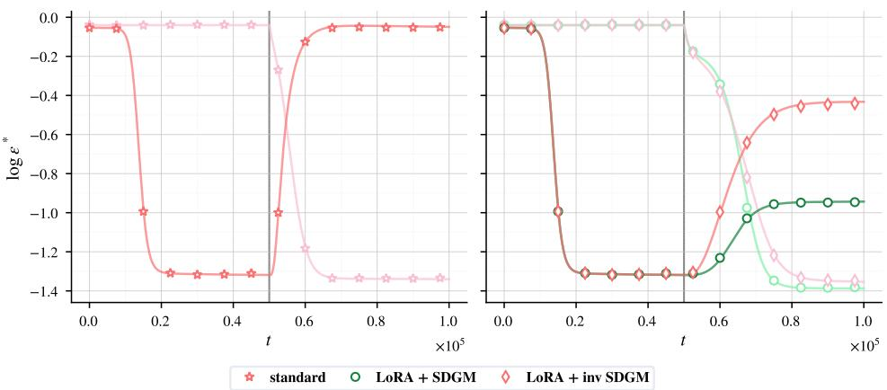  
Figure 4: Ablation of the selection protocol via Inverse SDGM. Generalization error trajectories on Task 1 and Task 2 under the inverse selection protocol, where student hidden units corresponding to the smallest Task 1 readout magnitudes are frozen during Task 2 training. Comparing this control to standard SDGM disentangles the efect of purely architectural capacity constraints from targeted feature protection. Parameters: N = 103 K = 10, M = 5, L = 5, c = 0.5, α = 50, κ = 5.

## D.2 Applying the inverse SDGM

To verify that feature selection drives SDGM performance rather than subspace restriction alone, we perform an ablation experiment using an Inverse SDGM protocol. In this setting, $\boldsymbol { S } _ { \mathrm { f r o z e n } }$ isolates the κ smallest magnitude entries of $\pmb { h } ^ { \dagger }$ , freezing the least informative directions relative to Task 1. Figure 4 demonstrates that Inverse SDGM yields higher Task 1 generalization error than standard SDGM, establishing that efective feature protection requires explicitly identifying and freezing key task-relevant representations.

## D.3 Validation under an unbounded activation function

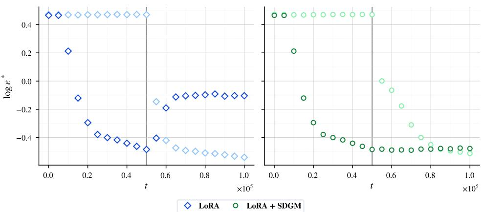  
Figure 5: Validation of SDGM under unbounded ReLU activations. Generalization error dynamics on Task 1 and Task 2 when both teacher and student networks employ ReLU as the activation function. The lower error on Task 1 confirms that the proposed selection rule mitigates catastrophic forgetting independently of activation saturation. Parameters: $N = 1 0 ^ { 3 } , K = 1 0 , M = 5 , L = 5$ $c = 0 . 5 , \alpha = 5 0$ . Results shown here are experiment-only.

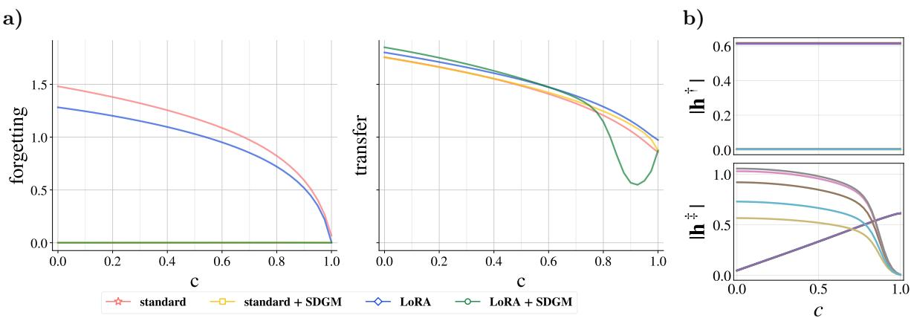  
Figure 6: Typical forgetting on the first task and transfer on the second task with the new initialization. In this setting, the SDGM procedure allows for no forgetting on the full range of task similarity, while allowing for the same transfer. The smaller transfer at big task similarity for LoRA + SDGM is due to long symmetric plateau, which size increases non-monotonically with c. Parameters : N=103, K=10, M=5, L=5, α = 50.

To verify that the eficacy of SDGM comes from structural information routing rather than artifacts of activation saturation, we evaluate the protocol under an unbounded activation function. Smooth, bounded activations such as erf(z) naturally constrain preactivation magnitudes. In contrast, the Rectified Linear Unit (ReLU), defined as $g ( z ) = \operatorname* { m a x } ( 0 , z )$ , exhibits unbounded values after the first layer. As illustrated in Fig. 5, applying the proposed selection protocol under ReLU dynamics successfully preserves Task 1 performance throughout Task 2 adaptation, with similar transfer on Task 2. This demonstrates that the protocol does not merely exploit head specialization but actively isolates and protects the sub-network carrying critical task representations.

## E Results in the specialized regime

All the results presented in this paper are shown in the so-called symmetric regime, where the student has not yet been able to specialize towards the specific directions of the teacher. The motivation for this choice of regime is multiple. First, it is more dificult to align with the first task in the overrealizable regime, that is when $K > M$ . Second, the time constant associated with symmetric subspace escape increases linearly with K. A full discussion on this problematic can be found in Saad and Solla [1995a]. Finally, with our choice of readout initialization, the specialization is even more dificult. Multiple works have been done to understand the impact of initialization on forgetting in an equivalent setting, as well as proposing good habits for the initialization scheme [Lee et al., 2022, Jarvis et al., 2025]. However, these good habits can be applied with a priori knowledge on the tasks that must be fitted, a setting very diferent from the practitioners experience.

We present here additional results in the specialized regime. Following the insights on initialization from Jarvis et al. [2025], we set

$$
\begin{array} { r } { h _ { i } ^ { \dagger } = \left\{ \begin{array} { l l } { 1 0 ^ { - 2 } } & { \mathrm { i f ~ } 1 \leq i \leq \lfloor K / 2 \rfloor , } \\ { 0 } & { \mathrm { o t h e r w i s e } , } \end{array} \right. \qquad \mathrm { a n d } \qquad h _ { i } ^ { \ddag } = \left\{ \begin{array} { l l } { - 1 } & { \mathrm { i f ~ } 1 \leq i \leq \lfloor K / 2 \rfloor , } \\ { 0 } & { \mathrm { o t h e r w i s e } . } \end{array} \right. } \end{array}
$$

We first check the impact of this new initialization on the readout weights in the unspecialized case in Fig. 6. By artificially forcing the network to only use a fraction of its directions to learn Task 1, SDGM allows for no forgetting on the full range of task similarity. This can be understood by checking the Task 1 readout weights and uncovering that only a fraction of their value is non-0: the initialization biases the network dynamics towards self-pruning, letting free directions for Task 2. At the same time, when training on Task 2, the magnitude of the readout weights associated to new direction decreases monotonically with task similarity. This efect is a consequence of node re-use [Lee et al., 2022], where the student is able to recycle directions learned on Task 1, already partially aligned with Task 2. Eventually, when the c = 1, the student is not learning any new directions, even after training.

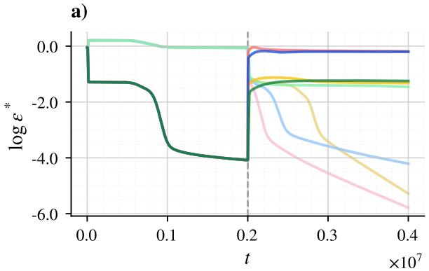

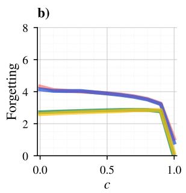

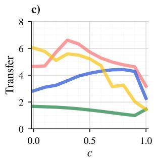

d)  
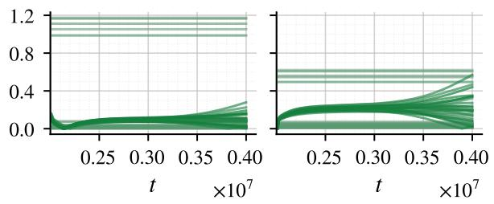

e)  
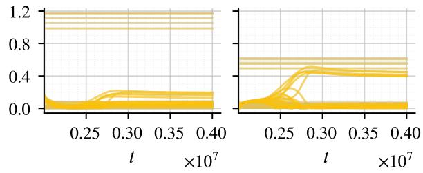  
Figure 7: Additional results in the specialized regimes. a) Typical generalization error for full fine-tuning (red), LoRA (blue), and their SDGM-constrained variants. During Task 1 training, the symmetric plateau, corresponding to the absence of specialization, is located at log $\epsilon ^ { * } \approx - 1 . 5 . \ b )$ Task 1 forgetting and c) Task 2 transfer as a function of teacher similarity c. d–e) Student overlaps with the teachers, as defined in Eqs.(18)–(19), after the task switch for LoRA + SDGM (green) and standard + SDGM (yellow). The overlaps corresponding to frozen student directions remain constant throughout Task 2 training.

We now turn to the specialized regime, presented in Fig. 7. Even with this initialization, we find that α must be increased to 2000 to observe the exponential decrease in generalization error characteristic of specialization. As in the unspecialized regime, LoRA and its SDGM-constrained variant exhibit slower dynamics during Task 2 training, resulting in slower adaptation to the second task. Nevertheless, SDGM enables the student to retain partial alignment with Task 1 while learning Task 2, as shown in Figs. 7b-c. In particular, the prolonged symmetric plateau delays the onset of Task 2 learning, thereby limiting both its acquisition and the subsequent interference with Task 1. In this setting, standard fine-tuning with SDGM adapts more rapidly to Task 2 than its LoRA counterpart, as illustrated in Figs. 7d-e. This faster adaptation leads to greater Task 2 transfer, while the two methods exhibit comparable levels of forgetting.

## F Additional details on LoRA

On the initialization of the LoRA matrices In this controlled continual learning setting, the initialization of the LoRA matrices demands careful consideration. The foundational principle of LoRA is to ensure that the weight perturbation is equal to 0 at initialization, that is we force $\Delta J = 0$ when adding the LoRA adapter in order to prevent an immediate disruption of the parameter configuration at the task switch. While the initialization scheme proposed in the seminal LoRA framework [Hu et al., 2022] is tailored to maximize downstream task performance and training stability by letting A start from a Kaiming initialization and setting $B = 0$ , our objective introduces a distinct trade-of: we want to achieve high plasticity on Task 2 while keeping stability on Task 1.

Thus, another possible initialization scheme, recently proposed in Rüdiger and Raschka [2026] is to inverse this choice and to let $A = 0 , B = \mathcal { O } ( 1 )$ . This option demonstrated comparable or superior performance across a variety of downstream tasks while mitigating forgetting on Task 1. This mitigation can be understood by first looking at the classical initialization mechanism: initial gradient with respect to A vanishes, leaving the early updates to be driven entirely by the evolution of B. In this regime, the random weights of A act as a static random feature projector. This random projection disrupts the alignment between $J _ { s }$ and Task 1. Consequently, the optimization trajectory on Task 2 drives the system into a regime of catastrophic forgetting.

Conversely, the new initialization prevents this destructive mechanism. In this case, the gradient updates of B vanish, forcing A to absorb the initial learning dynamics. The adaptation thus propagates through the low-rank bottleneck L in a more constrained manner, allowing the network to selectively acquire features relevant to Task 2 while maintaining minimal structural overlap with the representation learned for Task 1.

At the same time, randomly selecting the rows of B makes the optimization landscape highly sensitive to initialization, resulting in substantial variability in the trajectory and final configuration of A across random seeds. Within the proposed theoretical framework, this sensitivity is directly visible in the overlaps we recover: since B acts as an order parameter of the system, its initial configuration has a strong impact on the overall training dynamics. To reduce this run-to-run variability, we initialize B deterministically as

$$
B _ { k \ell } = { \bf 1 } \{ \ell = 1 + ( ( k - 1 ) \bmod L ) \} .
$$

This does not alter LoRA’s parameterization, for both B and A are trainable low-rank adapters and yields reproducible initial conditions for the corresponding ODE dynamics.

## G Trying the various procedures on a real dataset

To validate the predictions of our theory, we apply the proposed procedures to a sequence of simple tasks constructed from the MNIST dataset Lecun et al. [1998]. The first task is a binary classification problem in which digits below 5 are assigned to class 0, while digits greater than or equal to 5 are assigned to class 1. The second task uses a diferent partition of the same dataset, with even digits assigned to class 0 and odd digits to class 1.

We train the model in an online learning setting using the full MNIST dataset. For each digit, the available examples are divided between the two tasks, resulting in $\mu = 3 \times 1 0 ^ { 4 }$ training examples per task. The $2 8 \times 2 8$ images are flattened into vectors of dimension $N = 7 8 4$ . The generalization error curves reported in the main text are averaged over 10 independent training runs, with variability arising from both the data split and the initialization of the student network modules.

We observe the same qualitative behavior as in the theoretical setting: forgetting is largest for the standard procedure and smallest when SDGM is applied to LoRA. The slowdown induced by the LoRA parameterization at the beginning of Task 2 training is also observed in the real-data experiments. The hyper-parameters used are equals to the one used for theoretical simulations, present in Appendix H, the only modification being $N = 7 8 4$ in order to match the input size.

## H Hyper-parameters for numerical experiments

In this section, we summarize the hyper-parameters that were used to perform all numerical simulations.

• Input dimension: $N = 1 0 ^ { 3 }$

• Student hidden dimension: $K = 1 0 ,$

• Teacher(s) hidden dimension: $M = 5 ;$

• LoRA rank: L = 5 (unless otherwise stated, e.g. Figure 3),

• teach $\mathrm { {  ~ \ r ^ { \dagger } - t e a c h e r ^ { \dagger } } }$ correlation coeficient: c = 0.5 (unless otherwise stated),

$S _ { \mathrm { f r o z e n } }$ cardinality: κ = K − L (unless otherwise stated),

• LoRA prefactor: γ = 1 (only for LoRA settings),

• Time horizon (for each task): $\alpha = 5 0 ~ ( \alpha = 2 0 0 0$ for the specialized case in Appendix E),

• Learning rates: $\eta _ { J } = \eta _ { B } = \eta _ { A } = \eta _ { h } = 0 . 5$

• Integration step for discretized ODEs using Euler’s method: $h _ { \mathrm { s t e p } } = 0 . 0 5$

The initialization for teachers and student networks are the following:

• Student first-layer weight J: $J _ { i j } \sim \mathcal { N } ( 0 , 1 0 ^ { - 6 } )$

• Student readouts (for both tasks): $h _ { i } ^ { * } \sim \mathcal { N } ( 0 , 1 0 ^ { - 4 } )$ ，

• LoRA up-projection adapter B: see Appendix F for classical LoRA framework or Equation (75) for $\mathrm { L o R A + S D G M }$

• LoRA down-projection adapter A: A = 0,

• teacher† first-layer weight $W ^ { \dagger } \colon W _ { i j } ^ { \dagger } \sim { \mathcal { N } } ( 0 , 1 )$

• teacher‡ first-layer weight $\begin{array} { r } { { \pmb { W } } ^ { \ddag } \colon { \pmb { W } } ^ { \ddag } = c { \pmb { W } } ^ { \dag } + \sqrt { 1 - c ^ { 2 } } { \pmb { \mathrm { Z } } } , \quad { \pmb { \mathrm { Z } } } _ { i j } \sim \mathcal { N } ( 0 , 1 ) } \end{array}$ , with Z independent of $W ^ { \dagger }$ ，

• Teacher 1 readouts: $\pmb { v } _ { i } ^ { \dag } = + 1 + n _ { i } ^ { \dag } , \qquad n _ { i } ^ { \dag } \sim \mathcal { N } ( 0 , 1 0 ^ { - 4 } )$

• Teacher 2 readouts $\pmb { v } _ { i } ^ { \ddag } = - 1 + n _ { i } ^ { \ddag }$ $n _ { i } ^ { \ddag } \sim \mathcal { N } ( 0 , 1 0 ^ { - 4 } )$