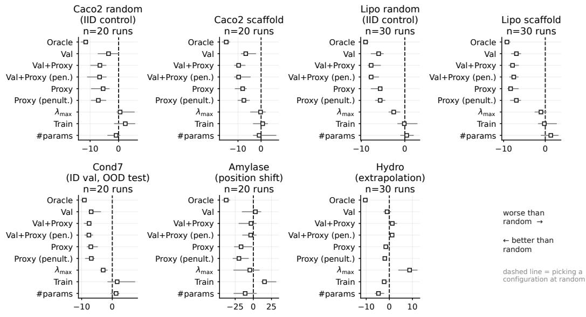
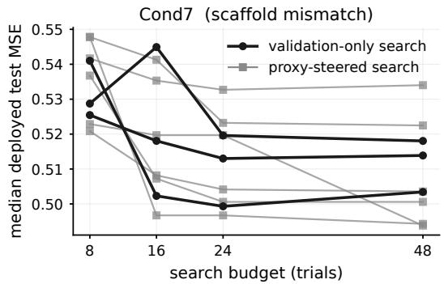
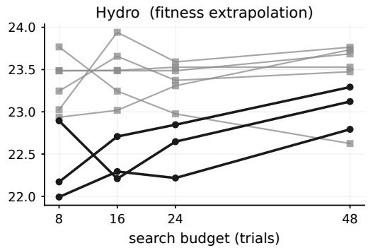
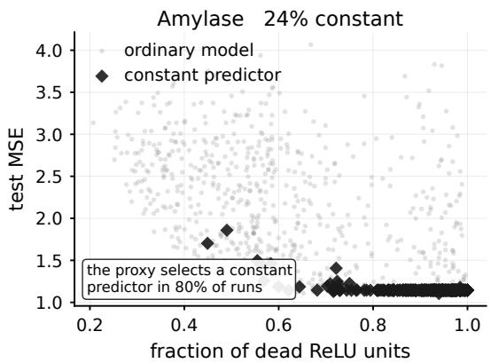
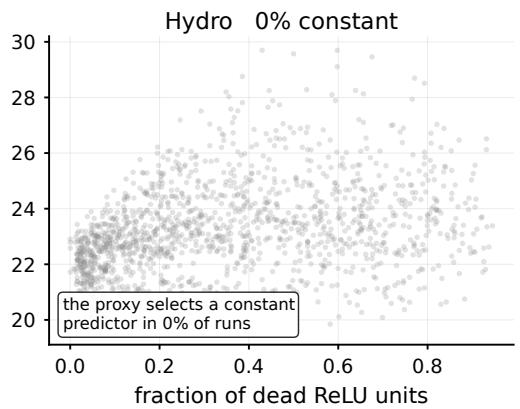
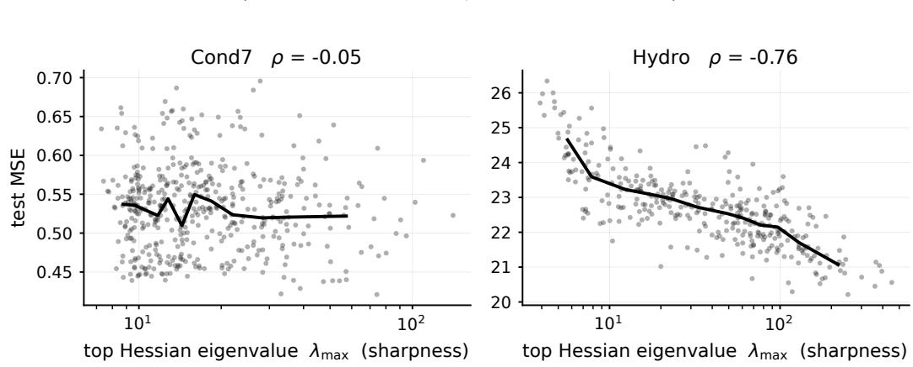

# A Generalisation Signal Need Not Be a Model-Selection Signal

Aditya Nagarsekar1 M P Ashish Bhat1 Aadi Nesarkar1 Vrishti Godhwani1 Rahul Yedida2 Aditya Challa1 Danda Sravan1 Snehanshu Saha1,3

1Department of CS&IS, BITS Pilani, K K Birla Goa Campus {f20230473,f20231146,f20210967,f20220260,

adityac,dandas,snehanshus}@goa.bits-pilani.ac.in

2LexisNexis Legal & Professional 3Center for AI and Supercomputing, Mahindra University rahul@ryedida.me, snehanshu.saha@mahindrauniversity.edu.in

## Abstract

Model selection in computational biology often relies on validation data drawn from the training regime, even when deployment lies outside it. When validation no longer preserves which model is best, a natural alternative is to rank candidates using properties of the trained network itself. We test this idea using a novel, forward-only proxy motivated by the norm of the Hessian, alongside common Hessian measures, across molecular property, protein fitness, and drug-response tasks. Contrary to our hypothesis, geometry does not become more useful as validation Spearman correlation deteriorates: augmenting validation helps some shifts but significantly harms others. More surprisingly, the proxy still correlates with generalisation gap on most tasks even when Hessian trace and top-eigenvalue relationships are weak or reversed, yet this signal does not reliably identify the deployment-best model. A curvature bound need not preserve cross-model rankings, and low geometric scores can even favour collapsed predictors. Thus, a generalisation signal need not be a model-selection signal.

## 1 Introduction and Background

Machine-learning models in biology are often selected on data that differ from deployment: validated on known chemical series before use on new scaffolds, on measured protein variants before searching distant regions of the fitness landscape, or on familiar batches, donors or perturbations before new regimes. If candidates $h = \{ h _ { 1 } , . . . \overset { \vartriangle } { , } h _ { K } \}$ are selected by $h _ { \mathrm { v a l } } = \mathrm { a r g } \mathrm { m i n } _ { h _ { i } \in h } L _ { \mathrm { v a l } } ( h _ { i } )$ , selection stays useful under shift only if validation approximately preserves their ordering under the unobserved deployment loss $L _ { \mathrm { d e p } } .$ . Deployment can be much harder without breaking this, but a shift that changes which model is best breaks it, however accurately validation is estimated.

Biological data routinely violate the assumptions behind random held-out evaluation, through dependence, confounding, preprocessing leakage, and distributional structure [Whalen et al., 2022]. Protein-fitness benchmarks increasingly evaluate position-, wild-type-, and fitness-based shifts that can reverse conclusions drawn from simpler evaluations [Didi et al., 2026]; drug-response models deteriorate sharply on unseen compounds, with careful reevaluation shrinking apparent gains over simple baselines [Bernett et al., 2025]; and metric choice alone can change rankings under unseen chemistry [Agarwal and Bisht, 2026], motivating the partitioning framework of Fernández-Díaz et al. [2025]. This is distinct from a separate failure: validation is itself estimated, and repeatedly optimising against a finite set can overfit at the level of model selection [Cawley and Talbot, 2010, Schneider et al., 2025].

One method to overcome this is to select by properties of the trained network itself. Flatness has long been tied to generalisation [Hochreiter and Schmidhuber, 1997, Jiang et al., 2019], and efficient SAM variants have reached molecular graph transformers [Wang et al., 2024]. Yet the evidence that such training-only signals track out-of-distribution behaviour is mixed: no generalisation bound is uniformly tight across distributions or algorithms [Gastpar et al., 2023], sharper minima can generalise better OOD [Andriushchenko et al., 2023], sharpness-aware training helps OOD generalisation without a full account of why [Schapiro and Zhao, 2024], and geometric measures respond to incidental training choices [Kaur et al., 2023]. Curvature has nevertheless been used to guide hyperparameter optimisation directly [Yedida and Saha, 2024a,b], alongside zero-cost proxies that rank architectures without full training [Lukasik et al., 2023]. Concurrent work finds that the predictive value of generalisation measures changes under generic distribution shift [Nakai et al., 2026], but evaluates correlation; we ask whether such a signal selects better models once validation becomes unreliable, including when it guides HPO under biological shift.

We separate two questions: whether a training-only signal correlates with generalisation, and whether it is usablefor selecting among models that are already trained. Our central finding is that the first does not imply the second. We introduce a cheap forward-only activation proxy, motivated by a bound on the Hessian Frobenius norm, and test whether it outperforms exact curvature summaries under biological distribution shift, where held-out validation is most likely to fail.

## 2 Problem and Methodology

We study model selection under biological distribution shift. For a fixed candidate pool, we measure rank transfer as the Spearman correlation between validation and deployment losses. We ask whether a training-only signal can replace or augment validation specifically when this ranking deteriorates. Our primary generalisation signal is a novel, cheap activation-based proxy, motivated by a bound on the norm of the loss Hessian; §4 tests that motivation and finds that it correlates well with generalisation gap, while common curvature measures do not. It is computed, with dropout off and on a fixed subset of training examples, from the post-activation matrix $A _ { \ell , B } { : }$

$$
P ( h ) = \operatorname* { m a x } _ { \boldsymbol { \mathcal { B } } } \frac { 1 } { L } \sum _ { \ell = 1 } ^ { L } \frac { | | A _ { \ell , B } | | _ { F } ^ { 2 } } { | \boldsymbol { B } | w _ { \ell } }\tag{1}
$$

The layer-averaged variant is the pre-registered primary proxy and is what Proxy denotes throughout; penultimate-layer results are in the appendix. A formal derivation of $P ( h )$ relating it to bounds on the loss Hessian norm is given in Appendix D. As a mechanistic control, we compute $\lambda _ { \operatorname* { m a x } } ( \nabla _ { \theta } ^ { 2 } L _ { \mathrm { t r a i n } } )$ over all weights and biases, without the $L _ { 2 }$ term, using exact Hessian-vector products [Pearlmutter, 1994], following PyHessian [Yao et al., 2020]. We hypothesise that as validation rank transfer deteriorates, model selection should benefit increasingly from curvature if flatter minima generalise better under shift, and our proxy if its generalisation-gap signal transfers to model ranking. Primary comparisons use the original candidate pools. Additional diagnostics are reported in the appendix.

We evaluate Caco2 and Lipophilicity from TDC [Huang et al., 2021] under random, scaffold, and constructed mismatch splits; FLIP2 Amylase and Hydrophobic Core [Dallago et al., 2021, Didi et al., 2026]; and GDSC2 leave-drug-out [Yang et al., 2013, Iorio et al., 2016]. Molecular tasks use Morgan fingerprints [Rogers and Hahn, 2010]; protein tasks use one-hot sequence features; GDSC2 combines molecular fingerprints with gene-expression features. Deployment MSE is the primary endpoint for statistical inference; benchmark-native and rank-based metrics are reported as robustness checks. A replication each derives a deterministic six-seed tuple from its index, redrawing the split, the candidate pool, initialisation and batch ordering (full counts and scheme in Appendix B). Within each replication we train the same $K = 4 8$ configurations sampled by scrambled Latin hypercube over learning rate, weight decay, dropout, width, and depth, with no validation-based early stopping. All selectors therefore rank the same models within a replication, which is what makes every comparison paired. Each candidate is a ReLU MLP without normalisation layers, trained with Adam and coupled $L _ { 2 }$ for 100 epochs. Augmented selectors (Val+X) deploy the candidate with the lowest sum of within-pool ranks on validation loss and X; remaining ties go to the lowest candidate index. We additionally run 48-trial TPE and HEBO searches [Bergstra et al., 2011, Cowen-Rivers et al., 2022], comparing validation-only with validation+geometry objectives. Paired tests use Wilcoxon signedrank statistics with Holm correction [Holm, 1979]; full search ranges and implementation details are in the appendix.

## 3 Results

OOD deployment does not necessarily break model selection. Rank transfer remains moderate-tostrong across the molecular tasks $( \rho = 0 . 4 4 \ – 0 . 7 7 )$ , including the constructed Lipophilicity mismatch (0.73), but nearly vanishes on Hydrophobic Core (−0.10) and is weak for GDSC2 leave-drug-out (0.19). Thus the relevant failure is not OOD shift itself, but a shift that changes the candidate ordering. Table 1 shows that training-set geometry does not reliably rescue this ranking failure.

Table 1: Shared-pool deployment performance using each benchmark’s native metric, after the post-hoc degeneracy audit. Proxy is the layer-averaged proxy. Mean±SD over outer replications is reported. Random is expected uniform selection. NDCG uses the full test set with no cutoff. Per-condition results under all metrics are in Appendix E.
<table><tr><td>Dataset</td><td>Metric</td><td>Val loss</td><td>Proxy</td><td> $\lambda _ { \mathrm { m a x } }$ </td><td>Random</td></tr><tr><td>Caco2-Wang (random)</td><td>MAE↓</td><td>0.351±0.013</td><td>0.343±0.015</td><td>0.363±0.022</td><td>0.358±0.016</td></tr><tr><td>Caco2-Wang (scaffold)</td><td>MAE↓</td><td>0.432±0.047</td><td>0.421±0.040</td><td>0.442±0.038</td><td>0.443±0.039</td></tr><tr><td>Lipophilicity (random)</td><td>MAE↓</td><td>0.568±0.013</td><td>0.571±0.017</td><td>0.585±0.021</td><td>0.590±0.012</td></tr><tr><td>Lipophilicity (scaffold)</td><td>MAE↓</td><td>0.656±0.025</td><td>0.654±0.028</td><td>0.676±0.027</td><td>0.681±0.023</td></tr><tr><td>Lipophilicity (mismatch)</td><td>MAE↓</td><td>0.650±0.022</td><td>0.649±0.030</td><td>0.663±0.028</td><td>0.673±0.025</td></tr><tr><td>FLIP2 Amylase</td><td>Spearman  $\rho \uparrow$ </td><td> $0 . 0 1 1 { \scriptstyle \pm 0 . 1 0 3 }$ </td><td> $- 0 . 0 1 0 { \pm } 0 . 1 1 5$ </td><td>-0.062±0.104</td><td>-0.015±0.028</td></tr><tr><td>FLIP2 Hydrophobic Core</td><td>NDCG↑</td><td>0.860±0.015</td><td>0.858±0.012</td><td>0.851±0.015</td><td>0.856±0.004</td></tr><tr><td></td><td>Spearman  $\rho \uparrow$ </td><td> $0 . 3 2 0 { \scriptstyle \pm 0 . 0 4 2 }$ </td><td> $0 . 3 0 3 { \scriptstyle \pm 0 . 0 5 4 }$ </td><td>0.229±0.151</td><td>0.312±0.021</td></tr><tr><td></td><td>NDCG↑</td><td> $0 . 9 0 8 { \pm } 0 . 0 1 4$ </td><td> $0 . 9 0 4 { \scriptstyle \pm 0 . 0 1 2 }$ </td><td>0.896±0.026</td><td>0.909±0.004</td></tr><tr><td>GDSC2 (leave-drug-out)</td><td>Pearson r ↑</td><td> $0 . 4 8 5 { \scriptstyle \pm 0 . 1 0 1 }$ </td><td> $0 . 4 8 0 { \pm } 0 . 0 9 9$ </td><td>0.477±0.100</td><td> $0 . 4 8 0 { \scriptstyle \pm 0 . 0 9 6 }$ </td></tr></table>

The proxy roughly matches validation on the molecular tasks, where rank transfer is already moderate to-strong, but does not improve as validation becomes less reliable. On Hydrophobic Core it underperforms validation (0.303 vs. 0.320 Spearman), while $\lambda _ { \mathrm { m a x } }$ falls to 0.229. Under NDCG, FLIP2’s own ranking metric, both geometric selectors are nominally worse than blind selection on Hydrophobic Core (0.904 and 0.896 against 0.909; unadjusted paired Wilcoxon $p = 0 . 0 1 6$ and $p = 0 . 0 2 2 )$ . This is genuine selection failure rather than lack of headroom: under MSE, validation reaches 22.92 while the within-pool oracle reaches 20.58. Exploratory GDSC2 shows the same pattern: all tested selectors remain close to random despite an oracle $8 . 4 \%$ better than blind selection under MSE. A simple baseline using the number of model parameters unexpectedly beats validation on Hydrophobic Core under MSE, MAE, and Spearman, while Amylase’s apparent geometry-based MSE gain is caused by collapsed predictors (Section 4). Steering HPO with geometry does not repair the mismatch either, as can be seen in Table 2, which tests the stronger setting in which geometry actively steers the search rather than only re-ranking a fixed pool. Proxy-guided search is largely neutral on the molecular tasks, with its clearest gain on Lipophilicity scaffold (TPE: 0.705 vs. 0.688; HEBO: 0.701 vs. 0.685). The benefit does not appear where validation ranking is weakest: on Hydrophobic Core TPE is unchanged and HEBO worsens (0.273 vs. 0.311), while GDSC2 also deteriorates. The same signal can help, do nothing, or hurt depending on the shift.

Under the MSE endpoint, on the original unfiltered pools, the primary comparison (proxy versus validation, Holm-corrected across the four confirmatory conditions) is significant on exactly one: Amylase, where the proxy improves deployment MSE by 1.39 and wins all 20 outer replications $( p _ { \mathrm { H o l m } } < 0 . 0 0 1 )$ . Section 4 shows this is a degeneracy artifact; the other three are non-significant $( p _ { \mathrm { H o l m } } = 0 . 3 2 8 – 0 . 4 0 7 )$ . Augmenting validation with the proxy is significant in opposite directions: it improves three confirmatory conditions $( p _ { \mathrm { H o l m } } = 0 . 0 2 7 \mathrm { - } 0 . 0 4 7 )$ but is significantly worse on Hydrophobic Core $( \Delta = + 0 . 7 3 , p _ { \mathrm { H o l m } } < 0 . 0 0 1 )$ , the condition with the weakest rank transfer, and therefore the one most in need of rescue. Repeating the analysis after the post-hoc degeneracy audit removes the Amylase win $( p _ { \mathrm { H o l m } } = 0 . 1 0 8 )$ and leaves the Hydrophobic Core harm intact $( p _ { \mathrm { H o l m } } ~ = ~ 0 . 0 0 2 )$ . After the audit, augmentation still helps significantly only on Lipophilicity mismatch $( p _ { \mathrm { H o l m } } = 0 . 0 3 8 )$ , while Caco2 scaffold and Amylase move to 0.094. No proxy-guided method significantly beats validation-driven TPE in the pre-registered sequential family, while one curvature-guided arm is significantly worse. These search results concern multi-objective search combined with a rank-sum deploy rule. Full paired results, filtered and unfiltered, are in Appendix E.

Thus, correlation with generalisation gap is not sufficient for model selection: a generalisation signal need not be a model-selection signal.

Table 2: Sequential HPO deployment Spearman. Validation+Proxy denotes matched multi-objective search on the pre-registered layer-averaged proxy. Spearman is used throughout for a common scale-free comparison. Mean±SD over outer replications; random search is the reference. Full per-arm results are in Appendix F.
<table><tr><td rowspan="2">Dataset</td><td rowspan="2">Random search</td><td colspan="2">TPE</td><td colspan="2">HEBO</td></tr><tr><td>Val</td><td>Val+Proxy</td><td>Val</td><td>Val+ Proxy</td></tr><tr><td>Caco2-Wang (random)</td><td>0.774±0.024</td><td>0.774±0.024</td><td>0.779±0.026</td><td>0.775±0.025</td><td>0.777±0.025</td></tr><tr><td>Caco2-Wang (scaffold)</td><td>0.688±0.085</td><td>0.684±0.099</td><td>0.684±0.102</td><td>0.678±0.089</td><td>0.698±0.080</td></tr><tr><td>Lipophilicity (random)</td><td>0.750±0.013</td><td>0.749±0.016</td><td>0.754±0.016</td><td>0.746±0.024</td><td>0.752±0.013</td></tr><tr><td>Lipophilicity (scaffold)</td><td>0.692±0.031</td><td>0.688±0.036</td><td>0.705±0.027</td><td>0.685±0.021</td><td>0.701±0.025</td></tr><tr><td>Lipophilicity (mismatch)</td><td>0.704±0.027</td><td>0.711±0.028</td><td>0.713±0.031</td><td>0.707±0.028</td><td>0.711±0.031</td></tr><tr><td>FLIP2 Amylase</td><td>-0.007±0.081</td><td>-0.053±0.092</td><td>-0.054±0.096</td><td>-0.028±0.102</td><td>-0.043±0.079</td></tr><tr><td>FLIP2 Hydrophobic Core</td><td>0.336±0.063</td><td>0.300±0.046</td><td>0.302±0.042</td><td>0.311±0.035</td><td>0.273±0.036</td></tr><tr><td>GDSC2 (leave-drug-out)</td><td>0.432±0.084</td><td>0.426±0.097</td><td>0.414±0.074</td><td>0.429±0.087</td><td>0.412±0.072</td></tr></table>

## 4 Failure analysis

The proxy carries generalisation signal, but not standard curvature. After controlling for architecture and learning rate, the proxy retains a modest association with generalisation gap on molecular tasks $( \rho \approx 0 . 1 6  – 0 . 3 5 )$ , but not on Hydrophobic Core (−0.30) or GDSC2 (0.01), while $\lambda _ { \mathrm { m a x } }$ and tr(H) are weak or negative. Its marginal anti-correlation with the full-network $\lambda _ { \mathrm { m a x } }$ (−0.40 on Lipo mismatch, −0.55 on Hydrophobic Core) shrinks to −0.12 and −0.14 under the same controls. On Lipo mismatch it anti-correlates with Hessian trace (−0.61) but correlates with relative flatness (+0.72) [Kaur et al., 2023, Cohen et al., 2021, Petzka et al., 2021], so it captures information these scalar Hessian summaries miss.

The preferred model changes under extrapolation. On Hydrophobic Core, the deployment oracle uses a 2.05× larger learning rate, 4× greater width and less regularisation than the validation-selected model. The shift changes which optimisation/capacity regime is preferable, not merely how hard the examples are, consistent with training on below-median variants that truncate the observed target range while deployment requires extrapolation to higher-fitness variants.

Curvature can become null or inverted. Curvature shows little relationship with generalisation on the molecular tasks, and Hydrophobic Core reverses the expected trend: $\rho ( \mathrm { t r } ( H ) , \bar { L _ { \mathrm { d e p } } } - L _ { \mathrm { t r a i n } } )$ ≈ −0.52, so greater curvature accompanies better extrapolation, and $\lambda _ { \mathrm { m a x } }$ is the weakest shared-pool selector. As deployment loss is training loss + generalisation gap, even accurate gap signals can misrank candidates whose training losses differ, so correlation with the gap is insufficient for selection.

Geometry can reward collapse. On Amylase, the proxy improves median deployment MSE by 1.39 and wins all 20 replications, yet its median pick has a dead-unit fraction of 0.998 and near-zero prediction variance. It matches the training-mean MSE (1.145), with Spearman undefined in 14 of 20 replications: lower error without useful variant ranking. Collapse drives the proxy toward zero and $\lambda _ { \mathrm { m a x } }$ to the output-bias floor, so low geometric scores can signal a network that has learned little. The audit removes this win through its dead-unit criterion; removing only constant predictors does not (Appendix G). All models were trained sufficiently for comparison, as can be seen from Appendix K.

## 5 Conclusion

Training-set measures can carry generalisation signal without reliably selecting the best deployment model. Hessian summaries correlate weakly or negatively with generalisation gap, while our proxy correlates positively on most tasks; yet across biological shifts the proxy can help, fail, harm selection, or favour degenerate predictors. This shows no consistent selection gain, not that such measures carry no information. Until a measure beats validation at choosing the deployed model, it is best treated as an auxiliary diagnostic: studies should report rank transfer, compare against validation and simple baselines, and audit selections for collapse. Our conclusions are limited to the models, representations, selection rules, and geometric criteria studied here.

## Use of large language models

Large language models were used to assist with code development, literature search, and language editing. All experimental results, statistical analyses, and reported numerical values were generated and verified by the authors. The authors reviewed and take responsibility for all content in the manuscript.

## Reproducibility statement

Each outer run derives six seeds deterministically from its index, governing the data split, the 48- candidate Latin hypercube, initialisation, batch ordering, the stochastic proxy estimators, and the HPO sampler. Every trained candidate is written atomically as a single row, and test predictions are retained for all candidates, so every post-hoc diagnostic reuses the original trained models rather than retraining after observing an outcome. Full protocol, search ranges, and per-condition results are in the appendix. Code is available at https://github.com/AdityaNagarsekar/ A-Generalisation-Signal-Need-Not-Be-a-Model-Selection-Signal.

## References

Dhruv Agarwal and Riya Bisht. The metric picks the winner: Evaluation choice flips model rankings for drug-response prediction in unseen chemistry, 2026. URL https://arxiv.org/abs/2606. 12639.

Maksym Andriushchenko, Francesco Croce, Maximilian Müller, Matthias Hein, and Nicolas Flammarion. A modern look at the relationship between sharpness and generalization. In Andreas Krause, Emma Brunskill, Kyunghyun Cho, Barbara Engelhardt, Sivan Sabato, and Jonathan Scarlett, editors, Proceedings ofthe 40th International Conference on Machine Learning, volume 202 of Proceedings ofMachine Learning Research, pages 840–902. PMLR, 23–29 Jul 2023. URL https://proceedings.mlr.press/v202/andriushchenko23a.html.

James Bergstra, Rémi Bardenet, Yoshua Bengio, and Balázs Kégl. Algorithms for hyper-parameter optimization. In J. Shawe-Taylor, R. Zemel, P. Bartlett, F. Pereira, and K. Weinberger, editors, Advances in Neural Information Processing Systems, volume 24. Curran Associates, Inc., 2011. URL https://proceedings.neurips.cc/paper\_files/paper/2011/file/ 86e8f7ab32cfd12577bc2619bc635690-Paper.pdf.

Judith Bernett, Pascal Iversen, Mario Picciani, Mathias Wilhelm, Katharina Baum, and Markus List. From hype to health check: Critical evaluation of drug response prediction models with DrEval. bioRxiv, 2025. doi: 10.1101/2025.05.26.655288. URL https://www.biorxiv.org/content/ early/2025/05/29/2025.05.26.655288.

Gavin C. Cawley and Nicola L. C. Talbot. On over-fitting in model selection and subsequent selection bias in performance evaluation. Journal of Machine Learning Research, 11(70):2079–2107, 2010. URL http://jmlr.org/papers/v11/cawley10a.html.

Jeremy Cohen, Simran Kaur, Yuanzhi Li, J. Zico Kolter, and Ameet Talwalkar. Gradient descent on neural networks typically occurs at the edge of stability. CoRR, abs/2103.00065, 2021. URL https://arxiv.org/abs/2103.00065.

Alexander I. Cowen-Rivers, Wenlong Lyu, Rasul Tutunov, Zhi Wang, Antoine Grosnit, Ryan Rhys Griffiths, Alexandre Max Maraval, Hao Jianye, Jun Wang, Jan Peters, and Haitham Bou Ammar. HEBO: An empirical study of assumptions in Bayesian optimisation. Journal of Artificial Intelligence Research, 74:1269–1349, 2022. doi: 10.1613/jair.1.13643.

Christian Dallago, Jody Mou, Kadina E Johnston, Bruce J Wittmann, Nicholas Bhattacharya, Samuel Goldman, Ali Madani, and Kevin K Yang. FLIP: Benchmark tasks in fitness landscape inference for proteins. Thirty-fifth Conference on Neural Information Processing Systems Datasets and Benchmarks Track, 2021.

Kieran Didi, Sarah Alamdari, Alex X. Lu, Bruce Wittmann, Kadina E. Johnston, Ava P. Amini, Ali Madani, Maya Czeneszew, Christian Dallago, and Kevin K. Yang. FLIP2: Expanding protein fitness landscape benchmarks for real-world machine learning applications. Forty-third International Conference on Machine Learning, 2026.

Raúl Fernández-Díaz, Denis C. Shields, Thanh Lam Hoang, and Vanessa Lopez. A new framework for evaluating model out-of-distribution generalisation for the biochemical domain. bioRxiv, 2025. doi: 10.1101/2024.03.14.584508. URL https://www.biorxiv.org/content/early/2025/ 05/06/2024.03.14.584508.

Michael Gastpar, Ido Nachum, Jonathan Shafer, and Thomas Weinberger. Fantastic generalization measures are nowhere to be found, 2023. URL https://arxiv.org/abs/2309.13658.

Sepp Hochreiter and Jürgen Schmidhuber. Flat minima. Neural Computation, 9(1):1–42, 01 1997. ISSN 0899-7667. doi: 10.1162/neco.1997.9.1.1. URL https://doi.org/10.1162/neco.1997. 9.1.1.

Sture Holm. A simple sequentially rejective multiple test procedure. Scandinavian Journal of Statistics, 6(2):65–70, 1979. ISSN 03036898, 14679469. URL http://www.jstor.org/stable/ 4615733.

Kexin Huang, Tianfan Fu, Wenhao Gao, Yue Zhao, Yusuf Roohani, Jure Leskovec, Connor Coley, Cao Xiao, Jimeng Sun, and Marinka Zitnik. Therapeutics Data Commons: Machine learning datasets and tasks for drug discovery and development. In J. Vanschoren and S. Yeung, editors, Proceedings of the Neural Information Processing Systems Track on Datasets and Benchmarks, volume 1, 2021. URL https://datasets-benchmarks-proceedings.neurips.cc/paper\_ files/paper/2021/file/4c56ff4ce4aaf9573aa5dff913df997a-Paper-round1.pdf.

Francesco Iorio, Theo A. Knijnenburg, Daniel J. Vis, Graham R. Bignell, Michael P. Menden, Lodewyk F. A. Wessels, Julio Saez-Rodriguez, Ultan McDermott, Mathew J. Garnett, et al. A landscape of pharmacogenomic interactions in cancer. Cell, 166(3):740–754, 2016. doi: 10.1016/j.cell.2016.06.017.

Yiding Jiang, Behnam Neyshabur, Hossein Mobahi, Dilip Krishnan, and Samy Bengio. Fantastic generalization measures and where to find them. CoRR, abs/1912.02178, 2019. URL http: //arxiv.org/abs/1912.02178.

Simran Kaur, Jeremy Cohen, and Zachary C. Lipton. On the maximum Hessian eigenvalue and generalization. In Proceedings on “I Can’t Believe It’s Not Better! – Understanding Deep Learning Through Empirical Falsification” at NeurIPS 2022 Workshops, volume 187 of Proceedings of Machine Learning Research, pages 51–65. PMLR, 2023. URL https://proceedings.mlr. press/v187/kaur23a.html.

Jovita Lukasik, Michael Moeller, and Margret Keuper. An evaluation of zero-cost proxies – from neural architecture performance to model robustness, 2023. URL https://arxiv.org/abs/ 2307.09365.

Sora Nakai, Youssef Fadhloun, Kacem Mathlouthi, Kotaro Yoshida, Ganesh Talluri, Ioannis Mitliagkas, and Hiroki Naganuma. Generalization measures under controlled covariate shift: A regime-aware benchmark, 2026. URL https://arxiv.org/abs/2602.01718.

Barak A. Pearlmutter. Fast exact multiplication by the Hessian. Neural Computation, 6(1):147–160, 01 1994. ISSN 0899-7667. doi: 10.1162/neco.1994.6.1.147. URL https://doi.org/10.1162/ neco.1994.6.1.147.

Henning Petzka, Michael Kamp, Linara Adilova, Cristian Sminchisescu, and Mario Boley. Relative flatness and generalization. In Advances in Neural Information Processing Systems (NeurIPS), volume 34, pages 18420–18432, 2021.

David Rogers and Mathew Hahn. Extended-connectivity fingerprints. Journal ofChemical Information and Modeling, 50(5):742–754, 04 2010. ISSN 1549-9596. doi: 10.1021/ci100050t. URL https://doi.org/10.1021/ci100050t.

Samuel Schapiro and Han Zhao. Towards understanding the role of sharpness-aware minimization algorithms for out-of-distribution generalization, 2024. URL https://arxiv.org/abs/2412. 05169.

Lennart Schneider, Bernd Bischl, and Matthias Feurer. Overtuning in hyperparameter optimization. In Leman Akoglu, Carola Doerr, Jan N. van Rijn, Roman Garnett, and Jacob R. Gardner, editors, Proceedings ofthe Fourth International Conference on Automated Machine Learning, volume 293 of Proceedings ofMachine Learning Research, pages 17/1–43. PMLR, 08–11 Sep 2025. URL https://proceedings.mlr.press/v293/schneider25a.html.

Yili Wang, Kaixiong Zhou, Ninghao Liu, Ying Wang, and Xin Wang. Efficient sharpness-aware minimization for molecular graph transformer models. In The Twelfth International Conference on Learning Representations, 2024. URL https://openreview.net/forum?id=Od39h4XQ3Y.

Sean Whalen, Jacob Schreiber, William S. Noble, and Katherine S. Pollard. Navigating the pitfalls of applying machine learning in genomics. Nature Reviews Genetics, 23(3):169–181, 2022. doi: 10.1038/s41576-021-00434-9.

Wanjuan Yang, Jorge Soares, Patricia Greninger, Elena J. Edelman, Howard Lightfoot, Simon Forbes, Nidhi Bindal, Dave Beare, James A. Smith, I. Richard Thompson, Sridhar Ramaswamy, P. Andrew Futreal, Daniel A. Haber, Michael R. Stratton, Cyril Benes, Ultan McDermott, and Mathew J. Garnett. Genomics of drug sensitivity in cancer (GDSC): a resource for therapeutic biomarker discovery in cancer cells. Nucleic Acids Research, 41(D1):D955–D961, 01 2013. ISSN 0305-1048. doi: 10.1093/nar/gks1111. URL https://doi.org/10.1093/nar/gks1111.

Zhewei Yao, Amir Gholami, Kurt Keutzer, and Michael W. Mahoney. PyHessian: Neural networks through the lens of the Hessian. In 2020 IEEE International Conference on Big Data (Big Data), pages 581–590, 2020. doi: 10.1109/BigData50022.2020.9378171.

Rahul Yedida and Snehanshu Saha. Flatness-guided hyper-parameter optimization. Submitted to Transactions on Machine Learning Research, 2024a. URL https://openreview.net/forum? id=IhGliADVth.

Rahul Yedida and Snehanshu Saha. Strong convexity-guided hyper-parameter optimization for flatter losses, 2024b. URL https://arxiv.org/abs/2402.05025.

## A Limitations and scope

Our conclusions concern the tested MLP architectures, fixed molecular and sequence representations, and the geometric criteria evaluated here. They do not establish that all curvature- or representationbased selectors fail under biological distribution shift, nor that the same behaviour will hold for pretrained biological foundation models or learned representations.

The negative results also concern the selection rules we tested: deploying the lowest score, deploying the lowest rank sum of validation loss and a signal, and multi-objective search followed by that rank-sum rule. Deployment loss is training loss plus generalisation gap, so a signal that tracks the gap does not by itself estimate deployment loss, and it can misrank candidates whose training losses differ even when its estimate of the gap is accurate. We did not test rules that combine a geometric signal with training loss, or that let the direction of the signal vary by condition. Where the proxy’s association with the gap is negative, as on Hydrophobic Core (Table 19), a rule that deploys the lowest score is misdirected by construction. Our results show no consistent improvement in selection; they do not show that these measures carry no information about deployment (Appendix J).

The experiments also focus on supervised regression settings in which candidate models are selected from controlled hyperparameter sweeps. Other deployment settings, including uncertainty-aware selection, ensembling, active learning, or adaptation after shift, may behave differently.

A natural next question is whether shift-aware or representation-aware signals can identify the new deployment ordering when validation rank transfer collapses, rather than relying on generic training-set geometry.

## B Protocol, reproducibility, and deviations from the pre-registered plan

Architecture. A plain feed-forward MLP: depth hidden blocks of width units, each Linear → ReLU → Dropout, then a linear head to a scalar target. No normalisation layers are used. This matters for interpretation: without BatchNorm to re-centre pre-activations, permanently inactive ReLU units are considerably more common, which is the direct cause of the degeneracy audited in §G. It also means our setting is not the one in which Kaur et al. [2023] observe BatchNorm improving generalisation without reducing $\lambda _ { \mathrm { m a x } }$

Optimisation. Adam with coupled $L _ { 2 }$ weight decay (the weight\_decay argument, not AdamW’s decoupled form), batch size 64, MSE on standardised targets, 100 fixed epochs. No early stopping and no learning-rate schedule. Early stopping is deliberately excluded: it is itself a validation-based decision and would give validation a second selection opportunity the training-only signals do not get.

Search space. Each outer replication draws $K = 4 8$ configurations from a scrambled Latin hypercube over learning rate $\eta \in [ 1 0 ^ { \dot { - } 4 } , 3 \times 1 0 ^ { - 3 } ]$ (log-uniform), weight decay (exactly 20% of candidates zero, remainder log-uniform on $[ 1 0 ^ { - 6 } , 1 0 ^ { - 2 } ] )$ , dropout $\in [ 0 , 0 . 5 ]$ , width ∈ {64, 128, 256, 512} and depth $\in \{ 1 , 2 , 3 , 4 \}$ . Width and depth are drawn stratified, so each level appears a fixed number of times per pool.

Signals and curvature. All signals are computed after training, with dropout disabled, on a fixed subset of the training set: min $\cdot 1 0 2 4 , n _ { \mathrm { t r a i n } } )$ examples rounded down to a multiple of 64, drawn once per replication with the proxy seed and split without shuffling into consecutive batches of 64. The proxy takes the maximum over these batches (Eq. (6)). The dead-unit fraction used in the audit is the share of hidden units, averaged over layers, that output zero on every example of this subset. $\lambda _ { \mathrm { m a x } }$ and the Hessian trace are computed on the same subset for the training MSE alone, without the $L _ { 2 }$ term, with respect to every trainable parameter: the weights and biases of all layers, including the output bias. $\lambda _ { \mathrm { m a x } }$ uses power iteration with exact Hessian-vector products (up to 30 iterations, tolerance $1 0 ^ { - 3 } )$ ; the trace uses Hutchinson’s estimator with 30 Rademacher probes. Because the output bias enters every prediction additively, its diagonal Hessian entry under mean squared error is exactly 2, so $\lambda _ { \operatorname* { m a x } } \ge 2$ for every network; collapsed networks sit at this floor rather than at zero (Appendix G).

Selection rules and ties. Every single-signal selector deploys the candidate with the lowest score. Val+X ranks the pool on validation MSE and on signal X, using average ranks for ties, and deploys the candidate with the lowest rank sum; the multi-objective search arms apply the same rule to all observed trials (Appendix F). Any remaining tie goes to the lowest candidate index, which is the Latin-hypercube draw order and carries no information about the hyperparameters. Ties matter mainly for #params: the smallest architecture in a pool appears between one and five times, so #params deploys the first-drawn of these networks, whose learning rate, dropout and weight decay are effectively random.

Names. Table 3 maps the selector names used throughout the paper to the identifiers in the code release. Figures label Lipophilicity (mismatch) as Cond7 and Hydrophobic Core as Hydro.

Table 3: Selector names, the model each deploys, and the identifier in the code release.
<table><tr><td>name</td><td>deploys the candidate with the lowest</td><td>code</td></tr><tr><td>Val</td><td>validation MSE</td><td>val</td></tr><tr><td>Proxy</td><td>layer-averaged activation proxy, Eq. (6)</td><td>fg_legacy</td></tr><tr><td>Proxy (pen.)</td><td>penultimate-layer proxy, Eq. (5)</td><td>fg-penult</td></tr><tr><td>λmax</td><td>top Hessian eigenvalue of the training MSE</td><td>hess_top</td></tr><tr><td>Val+X</td><td>rank sum of validation MSE and signal X</td><td>val+legacy, val+penult, val+hess</td></tr><tr><td>Train</td><td>training MSE</td><td>train_mse</td></tr><tr><td>#params</td><td>parameter count</td><td>n_params</td></tr><tr><td>Random</td><td>none; expected deployment loss of a uniform pick</td><td>random(E)</td></tr><tr><td>Oracle</td><td>deployment MSE; a bound, not a selector</td><td>oracle</td></tr></table>

What an outer replication is. Not a re-initialisation. Replication r deterministically fixes six seeds as 10000r+1, . . . , 10000r+6, governing respectively the train/validation/test split, the 48-candidate hypercube itself, weight initialisation (offset by candidate index), batch composition and ordering, the stochastic proxy estimators, and the HPO sampler. Two consequences matter for reading the reported spreads. The candidate pool is redrawn every replication, so “every selector ranks the same 48 models” holds within a replication, which is what makes each comparison paired, but not across them, and no result is a property of one hypercube draw. The test set is redrawn as well on every condition except the two FLIP2 splits, whose partitions are deterministic; FLIP2 spreads therefore reflect only training stochasticity and the pool redraw.

Replication counts. 20 for both Caco2 conditions, Lipophilicity mismatch, Amylase and GDSC2; 30 for Lipophilicity random and scaffold and Hydrophobic Core; 10 per arm for the sequential searches.

Protocol lock. The conditions, replication counts, search space, training settings, proxy subset and signals were frozen in a protocol file before the first confirmatory run. It names the layer-averaged proxy as the primary signal and the penultimate-layer proxy and $\lambda _ { \mathrm { m a x } }$ as secondary signals, and it pre-registers the sequential comparison of proxy-guided TPE against validation-only TPE on Lipophilicity mismatch and Hydrophobic Core. Its SHA-256 hash is recorded on every result row in the code release.

Statistical tests. Every comparison is paired within replication. We use the two-sided Wilcoxon signed-rank test (SciPy 1.15.3). Zero paired differences, common when a rank-sum selector deploys the same model as validation, are discarded, following Wilcoxon’s original method. SciPy then chooses the null distribution from the data: exact when no zero or tied absolute difference is present; otherwise a deterministic permutation test for at most 13 pairs, as in the sequential searches, and the normal approximation without continuity correction for the 20 or 30 pairs of the shared-pool analyses. Recomputing with zeros removed beforehand and the exact null distribution changes no significance decision in Table 12. p-values below 0.001 are reported as < 0.001. Holm correction i applied within four separate families:

1. Confirmatory (Table 12): Proxy against Val across the four confirmatory conditions, and separately Val+Proxy against Val across the same four. The unfiltered (primary) and audited analyses are corrected separately.

2. Per-condition (Tables 4–11): the ten contrasts against Val within each condition, including Oracle and Random. These are descriptive.

3. Metric robustness (Table 13): the eight selector contrasts against Val within each condition and metric, excluding Oracle and Random.

4. Sequential search (Table 14): the eight arms against validation-only TPE within each condition.

The NDCG p-values quoted in §3 are unadjusted and use the audited pools.

Deviations from the pre-registered plan. Stated explicitly because they affect how the results should be read.

1. The degeneracy audit is post-hoc. The plan pre-specified recording dead-unit and prediction-spread diagnostics and excluding trials that fail training outright, but no exclusion rule. After diagnosing the Amylase result we excluded a candidate if (i) the standard deviation of its test-set predictions is below $1 0 ^ { - 6 }$ , making it a constant predictor, or (ii) more than half of its hidden ReLU units output zero on every example of the training proxy subset. A replication would be dropped if fewer than five candidates remained; none was. The threshold of one half marks networks that have lost most of their capacity; it was set once, after seeing the Amylase result, and not tuned. Criterion (ii) is the one that matters: it also removes partially inactive networks, and on its own it reproduces the audited Amylase result, whereas criterion (i) on its own leaves the proxy’s advantage intact (Table 17). Criterion (i) reads deployment predictions, so the audit is a diagnostic, not a rule a practitioner could apply before deployment. Evaluating (i) on training-set predictions instead changes the outcome for 4 of the 59,712 stored candidates, all on Amylase, and leaves Table 12 unchanged. Primary inference in §3 therefore uses the unfiltered pools; the audited analysis is reported alongside as a diagnostic, and each appendix table and figure states which pools it uses.

2. The confirmatory family is four conditions. The pre-registered Holm family is {Lipophilicity mismatch, Caco2 scaffold, Amylase, Hydrophobic Core}; Lipophilicity scaffold was designated descriptive on the grounds that its validation split is itself scaffold-OOD. Caco2 scaffold is built by the same TDC scaffold split and shares that property, so the family’s composition is a design choice rather than a property of the splits. Adding Lipophilicity scaffold as a fifth member leaves every Proxy decision unchanged but weakens Val+Proxy: on the unfiltered pools it remains significant only on Amylase $( p _ { \mathrm { H o l m } } = 0 . 0 3 6 )$ and, as a harm, on Hydrophobic Core $( < 0 . 0 0 1 )$ , with Lipophilicity mismatch at 0.069 and Caco2 scaffold at 0.094; on the audited pools only the Hydrophobic Core harm remains (0.002). The designation also bears on our one positive search result, which sits on Lipophilicity scaffold and is additionally post-hoc within the sequential family.

3. Analyses added after unblinding. GDSC2, the shift-severity sweep, the penultimate-layer search arms, sequential search on the six conditions beyond Lipophilicity mismatch and Hydrophobic Core, and the Hessian-trace diagnostics. The analyses added in response to review (Tables 16 and 17, the intervals in Table 12, and the sensitivity analysis in item 2) reuse the stored models and are reproduced by scripts\_icbinb/review\_diagnostics.py. All are labelled exploratory and never pooled with confirmatory tests.

## C Datasets and split construction

Molecular. Caco2-Wang permeability and Lipophilicity from TDC [Huang et al., 2021], as 2048-bit radius-2 Morgan fingerprints [Rogers and Hahn, 2010]. Random and Bemis–Murcko scaffold splits at 70/10/20 give matched interpolation and structural-shift conditions on identical data and featurisation.

The mismatch condition. A standard scaffold split does not create the failure mode of interest, because validation and test both contain unseen scaffolds - validation is already OOD and can still rank OOD candidates. We therefore keep the scaffold-disjoint test set unchanged and randomly repartition only the original train–validation pool. Validation becomes in-distribution with respect to training while deployment remains scaffold-disjoint. This is the condition the study was designed around and the one where validation ought to fail.

Protein fitness. FLIP2 Amylase (close-to-far, a position split) and Hydrophobic Core (low-to-high, a fitness split), benchmark-provided and unmodified [Dallago et al., 2021, Didi et al., 2026], one-hot encoded and padded to fixed length. Our Hydrophobic Core split reproduces the published one exactly (24,935 variants; median boundary −3.206 against the stated −3.21) and Amylase at 3,706 variants. The target ranges do not overlap: the highest training fitness is below the lowest test fitness, so every deployment variant is more functional than anything seen in training.

Drug response. GDSC2 with whole compounds held out [Yang et al., 2013, Iorio et al., 2016]: validation measurements involve compounds also present in training, while test compounds are chemically novel. Features concatenate a drug fingerprint with cell-line expression, with variance filtering and standardisation fitted on training data only.

## D Derivation and bound

## D.1 Setup and notation

Let $f _ { \theta }$ be an L-layer feedforward network with a linear output layer, trained with mean squared error. The hidden nonlinearity plays no role in what follows, only that the output layer is affine. Let m denote the number of training examples, $a _ { i } : = a ^ { [ L - 1 ] } ( x _ { i } ) \in \bar { \mathbb { R } } ^ { d }$ the penultimate activation for training example i, and $W ^ { [ L ] } \in \bar { \mathbb { R } } ^ { k \times d }$ the final affine layer. The loss is

$$
E ( W ^ { [ L ] } ) = \frac { 1 } { 2 m } \sum _ { i = 1 } ^ { m } \left\| W ^ { [ L ] } a _ { i } - y _ { i } \right\| _ { 2 } ^ { 2 } .
$$

For a mini-batch $B ,$ let $A _ { B } \in \mathbb { R } ^ { | B | \times d }$ denote the matrix whose rows are the corresponding penultimate activations.

## D.2 Statement

Proposition 1. The Hessian with respect to the final-layer weights is

$$
\nabla _ { W ^ { [ L ] } } ^ { 2 } E = \frac { 1 } { m } \sum _ { i = 1 } ^ { m } I _ { k } \otimes ( a _ { i } a _ { i } ^ { \top } ) ,
$$

and its Frobenius norm satisfies

$$
\frac { 1 } { m } \operatorname* { m a x } _ { 1 \leq i \leq m } \| a _ { i } \| _ { 2 } ^ { 2 } \leq \big \| \nabla _ { W ^ { [ L ] } } ^ { 2 } E \big \| _ { F } \leq \frac { \sqrt { k } } { m } \sum _ { i = 1 } ^ { m } \| a _ { i } \| _ { 2 } ^ { 2 } .\tag{2}
$$

If the training set is partitioned into mini-batches $\boldsymbol { B } _ { 1 } , \ldots , \boldsymbol { B } _ { T }$ , define

$$
\mu _ { t } ^ { 2 } : = \frac { 1 } { | \boldsymbol { \mathcal { B } } _ { t } | } \sum _ { i \in \boldsymbol { \mathcal { B } } _ { t } } \| \boldsymbol { a } _ { i } \| _ { 2 } ^ { 2 } = \frac { \| \boldsymbol { A } _ { \boldsymbol { \mathcal { B } } _ { t } } \| _ { F } ^ { 2 } } { | \boldsymbol { \mathcal { B } } _ { t } | } .
$$

Then

$$
\frac { 1 } { m } \operatorname* { m a x } _ { 1 \leq t \leq T } \mu _ { t } ^ { 2 } \leq \left. \nabla _ { W ^ { [ L ] } } ^ { 2 } E \right. _ { F } \leq \sqrt { k } \operatorname* { m a x } _ { 1 \leq t \leq T } \mu _ { t } ^ { 2 } .\tag{3}
$$

Because $a _ { i }$ does not involve $W ^ { [ L ] }$ , the loss is an exact quadratic in $W ^ { [ L ] }$ and the Hessian above is constant in $W ^ { [ L ] }$ ], depending on the network only through its activations.

## D.3 Proof

Proof. The Hessian with respect to the final-layer weights is

$$
\nabla _ { W ^ { [ L ] } } ^ { 2 } E = \frac { 1 } { m } \sum _ { i = 1 } ^ { m } I _ { k } \otimes ( a _ { i } a _ { i } ^ { \top } ) .
$$

Using

$$
\| I _ { k } \otimes M \| _ { F } = \sqrt { k } \| M \| _ { F } , \qquad \| a _ { i } a _ { i } ^ { \top } \| _ { F } = \| a _ { i } \| _ { 2 } ^ { 2 } ,
$$

and the triangle inequality,

$$
\left\| \nabla _ { W ^ { [ L ] } } ^ { 2 } E \right\| _ { F } \leq \frac { \sqrt { k } } { m } \sum _ { i = 1 } ^ { m } \| a _ { i } \| _ { 2 } ^ { 2 } .
$$

Since $\lVert M \rVert _ { F } \ge \lVert M \rVert _ { 2 }$ for any matrix,

$$
\| \nabla _ { W ^ { [ L ] } } ^ { 2 } E \| _ { F } \geq \| \nabla _ { W ^ { [ L ] } } ^ { 2 } E \| _ { 2 } .
$$

Each summand $I _ { k } \otimes ( a _ { i } a _ { i } ^ { \top } )$ is positive semidefinite, so $\begin{array} { r } { \nabla _ { W ^ { [ L ] } } ^ { 2 } E \succeq \frac { 1 } { m } I _ { k } \otimes ( a _ { j } a _ { j } ^ { \top } ) } \end{array}$ for every $j ,$ hence

$$
\| \nabla _ { W ^ { [ L ] } } ^ { 2 } E \| _ { 2 } = \lambda _ { \operatorname* { m a x } } \bigl ( \nabla _ { W ^ { [ L ] } } ^ { 2 } E \bigr ) \geq \frac { 1 } { m } \operatorname* { m a x } _ { i } \| a _ { i } \| _ { 2 } ^ { 2 } .
$$

From the spectral-norm bound,

$$
\left\| \nabla _ { W ^ { [ L ] } } ^ { 2 } E \right\| _ { 2 } \geq \frac { 1 } { m } \operatorname* { m a x } _ { 1 \leq i \leq m } \| a _ { i } \| _ { 2 } ^ { 2 } .
$$

Thus,

$$
\frac { 1 } { m } \operatorname* { m a x } _ { 1 \leq i \leq m } \| a _ { i } \| _ { 2 } ^ { 2 } \leq \big \| \nabla _ { W ^ { [ L ] } } ^ { 2 } E \big \| _ { F } \leq \frac { \sqrt { k } } { m } \sum _ { i = 1 } ^ { m } \| a _ { i } \| _ { 2 } ^ { 2 } ,
$$

which proves Eq. (2).

Now partition the training set into mini-batches $\boldsymbol { B } _ { 1 } , \ldots , \boldsymbol { B } _ { T }$ such that

$$
\bigcup _ { t = 1 } ^ { T } \mathcal { B } _ { t } = \{ 1 , \ldots , m \} , \qquad \mathcal { B } _ { s } \cap \mathcal { B } _ { t } = \emptyset \quad ( s \neq t ) .
$$

For each batch,

$$
\mu _ { t } ^ { 2 } = \frac { 1 } { | \mathcal { B } _ { t } | } \sum _ { i \in \mathcal { B } _ { t } } \| a _ { i } \| _ { 2 } ^ { 2 } = \frac { \| A _ { \mathcal { B } _ { t } } \| _ { F } ^ { 2 } } { | \mathcal { B } _ { t } | } .
$$

For every $t ,$

$$
\operatorname* { m a x } _ { i \in \mathcal { B } _ { t } } \| a _ { i } \| _ { 2 } ^ { 2 } \geq \frac { 1 } { | \mathcal { B } _ { t } | } \sum _ { i \in \mathcal { B } _ { t } } \| a _ { i } \| _ { 2 } ^ { 2 } = \mu _ { t } ^ { 2 } .
$$

Because the batches form a partition,

$$
\operatorname* { m a x } _ { 1 \leq i \leq m } \| a _ { i } \| _ { 2 } ^ { 2 } = \operatorname* { m a x } _ { 1 \leq t \leq T } \operatorname* { m a x } _ { i \in \mathcal { B } _ { t } } \| a _ { i } \| _ { 2 } ^ { 2 } .
$$

Therefore,

$$
\operatorname* { m a x } _ { 1 \leq i \leq m } \| a _ { i } \| _ { 2 } ^ { 2 } \geq \operatorname* { m a x } _ { 1 \leq t \leq T } \mu _ { t } ^ { 2 } .
$$

Substituting into the lower bound in Eq. (2) gives

$$
\left\| \nabla _ { W ^ { [ L ] } } ^ { 2 } E \right\| _ { F } \geq \frac { 1 } { m } \operatorname* { m a x } _ { 1 \leq t \leq T } \mu _ { t } ^ { 2 } .
$$

For the upper bound, decompose the sum over the same partition:

$$
\frac { 1 } { m } \sum _ { i = 1 } ^ { m } \| a _ { i } \| _ { 2 } ^ { 2 } = \frac { 1 } { m } \sum _ { t = 1 } ^ { T } | B _ { t } | \mu _ { t } ^ { 2 } .
$$

Define

$$
w _ { t } : = \frac { | \mathcal { B } _ { t } | } { m } , \qquad w _ { t } \geq 0 , \qquad \sum _ { t = 1 } ^ { T } w _ { t } = 1 .
$$

Then

$$
\frac { 1 } { m } \sum _ { i = 1 } ^ { m } \| a _ { i } \| _ { 2 } ^ { 2 } = \sum _ { t = 1 } ^ { T } w _ { t } \mu _ { t } ^ { 2 } \leq \operatorname* { m a x } _ { 1 \leq t \leq T } \mu _ { t } ^ { 2 } .
$$

Substituting into the upper bound in Eq. (2) gives

$$
\left. \nabla _ { W ^ { [ L ] } } ^ { 2 } E \right. _ { F } \leq \sqrt { k } \underset { 1 \leq t \leq T } { \operatorname* { m a x } } \mu _ { t } ^ { 2 } .
$$

Combining the two inequalities proves Eq. (3).

Finally, define

$$
R ( \mathrm { a r c h i t e c t u r e } , B ) : = \operatorname* { m a x } _ { B } { \frac { \| A _ { B } \| _ { F } ^ { 2 } } { | B | } } .
$$

Since

$$
R ( \mathrm { a r c h i t e c t u r e } , B ) = \operatorname* { m a x } _ { 1 \leq t \leq T } \mu _ { t } ^ { 2 } ,
$$

Eq. (3) gives

$$
\frac { 1 } { m } R ( \mathrm { a r c h i t e c t u r e } , B ) \leq \left\| \nabla _ { W ^ { [ L ] } } ^ { 2 } E \right\| _ { F } \leq \sqrt { k } R ( \mathrm { a r c h i t e c t u r e } , B ) .\tag{4}
$$

## D.4 Why a valid bound need not give a usable ranking

Proposition 1 bounds the Frobenius norm of the Hessian pointwise using statistics of the penultimate activations. The bound is valid for each model individually, but it does not imply that the induced quantity preserves the ordering of different models. Hyperparameter search compares models with different learning rates, depths, and widths, all of which can change the activations. Consequently, a correct pointwise bound need not produce a correct ranking across models.

Section 4 is consistent with this caveat but does not test it directly, because the quantities it compares are not those of Proposition 1. The proposition concerns the Hessian with respect to the finallayer weights and the unnormalised penultimate activation energy. Section 4 compares the widthnormalised, layer-averaged proxy with $\lambda _ { \mathrm { m a x } }$ and $\operatorname { t r } ( H )$ of the full network, taken over all weights and biases (Appendix B). The anti-correlation reported there therefore does not test whether the statistic in Proposition 1 preserves the ordering of final-layer curvature across models; we did not measure the final-layer Hessian separately.

## D.5 From the bound to the proxy used in experiments

Proposition 1 motivates the proxy but does not cover it. Two steps go beyond the bound. First, to compare architectures of different hidden width w, we divide R(architecture, B) by the width:

$$
P ( h ) = \operatorname* { m a x } _ { B } \frac { \| A _ { B } \| _ { F } ^ { 2 } } { | B | w }\tag{5}
$$

This width normalisation is not part of the proposition, and it can change the ordering of models of different width. Second, we average the normalised quantity over all hidden layers:

$$
P ( h ) = \operatorname* { m a x } _ { \boldsymbol { \mathcal { B } } } \frac { 1 } { L } \sum _ { \ell = 1 } ^ { L } \frac { | | A _ { \ell , B } | | _ { F } ^ { 2 } } { | \boldsymbol { B } | w _ { \ell } }\tag{6}
$$

Layer averaging is likewise outside the proposition, which concerns only the penultimate layer. Across candidates, the penultimate-layer form (5) and the layer-averaged form (6) are strongly correlated $( \rho = + 0 . 9 5 $ , Appendix E); this addresses the averaging step but not width normalisation. Form (6) was fixed as the primary signal, and form (5) as a secondary signal, in the frozen protocol before any confirmatory run (Appendix B); neither choice was made by examining confirmatory results.

## E Complete shared-pool results

Section 3 reports a compressed summary; this section gives every selector on every condition so a reader can verify that the summary hides nothing inconvenient.

The pre-registered analysis. Table 12 is the confirmatory result, reported twice: on the original unfiltered pools, which is the pre-registered primary analysis, and again after the post-hoc degeneracy audit. The two differ materially only where degeneracy is present. Unfiltered, replacing validation with the proxy is Holm-significant on exactly one condition, Amylase, at 20/20 replications, and Appendix G shows that the gain is lower error from near-constant predictions rather than useful variant ranking. On the unfiltered pools, augmenting validation is significant in both directions, improving three conditions and harming Hydrophobic Core. After the audit, only the improvement on Lipophilicity mismatch $( p _ { \mathrm { H o l m } } = 0 . 0 3 8 )$ and the harm on Hydrophobic Core (0.002) remain, while Caco2 scaffold and Amylase move to 0.094.

Ties and uncertainty. Table 12 reports, for each contrast, the median paired difference, a 95% percentile bootstrap interval for it (4000 resamples of replications), and wins, losses and ties. Ranksum selectors often deploy the same model as validation, so many differences are exactly zero; the median can then be zero while the signed-rank test, which discards ties, is significant, as for Val+Proxy on Caco2 scaffold with 7 wins, 3 losses and 10 ties. A change in the adjusted p-value need not reflect a change in the estimated effect. The audit removes no Caco2 scaffold candidates, so that condition’s paired differences, ties and interval are identical in both analyses; only its Holm adjustment moves, because the other conditions’ $p \mathrm { - }$ values change.

Per-condition detail. The tables that follow give, for every selector, the median and interquartile range over replications, the paired median difference against validation, win/loss counts, and raw and Holm-adjusted p-values within each condition’s family. These tables use the audited pools; the unfiltered confirmatory contrasts are in Table 12. Penultimate-layer proxy results appear here rather than in the main text; they track the layer-averaged variant closely $( \rho = + 0 . 9 5 $ between the two signals), which is why only one is reported in the body.

Metric robustness. Table 13 repeats the comparison on the audited pools under MSE, MAE and Spearman. This is where the fragility of the one shared-pool geometric win can be checked, and where the robustness of the #params baseline on Hydrophobic Core, which survives all three metrics, is visible. NDCG, reported in Table 1, is not repeated there.

Metric definitions. Spearman and NDCG compare the deployed model’s test predictions with the measured targets. NDCG uses the whole deployment set with no cutoff, linear gains equal to each variant’s fitness minus the lowest fitness in the deployment set, and a $\log _ { 2 }$ position discount, with the predictions as ranking scores (scikit-learn ndcg\_score). Without a cutoff NDCG has a high floor: uniform selection already scores 0.86 on Amylase and 0.91 on Hydrophobic Core, so differences between selectors are small in absolute terms. Spearman is undefined when the prediction vector is exactly constant; such pairs are dropped from the paired tests. No undefined values occur in the audited pools, so all replications contribute to Table 1. On the unfiltered Amylase pools, the deployed model’s Spearman is undefined in 14 of 20 replications for Proxy and 16 of 20 for $\lambda _ { \mathrm { m a x } }$ (Table 16).

  
deployed test MSE relative to random selection (%) · median with bootstrap 95% C

Figure 1: Every selector against blind selection, per condition. Bars below the line indicate a selector that deploys a better model than picking uniformly at random from the same pool. A selector that cannot clear this line carries no usable model-selection information, whatever its correlation with the generalisation gap. Audited pools; Cond7 is Lipophilicity (mismatch) and Hydro is Hydrophobic Core.

## F Sequential hyperparameter optimisation

Arms. Nine per condition: random, TPE and HEBO on validation alone, and matched multiobjective TPE and HEBO on each of the three training-side signals. The TPE arms use Optuna’s MOTPE with non-dominated sorting and a hypervolume tie-break; the HEBO arms use its general optimiser configured for two objectives. Neither scalarises, so no relative weight between validation loss and the signal had to be chosen, which matters because choosing one would itself have required validation. The penultimate-layer arms, and all conditions other than Lipophilicity mismatch and Hydrophobic Core, were added after unblinding (Appendix B).

Table 4: Shared pool, Caco2 (random), audited pools (20 outer runs, median 48/48 candidates kept).
<table><tr><td>selector</td><td>median [IQR]</td><td>∆ vs Val</td><td>w/l</td><td>p</td><td>PHolm</td></tr><tr><td>Oracle</td><td>0.3354 [0.2945, 0.3642]</td><td>-0.0292</td><td>20/0</td><td>&lt;0.001</td><td>&lt;0.001</td></tr><tr><td>Val</td><td>0.3575 [0.3283, 0.3936]</td><td></td><td></td><td></td><td></td></tr><tr><td>Val+Proxy</td><td>0.3446 [0.3144, 0.3749]</td><td>-0.0085</td><td>14/2</td><td>0.013</td><td>0.105</td></tr><tr><td>Val+Proxy (pen.)</td><td>0.3446 [0.3144, 0.3767]</td><td>-0.0105</td><td>13/2</td><td>0.009</td><td>0.081</td></tr><tr><td> $\mathrm { V a l } { + } \lambda _ { \mathrm { m a x } }$ </td><td>0.3673 [0.3203, 0.3882]</td><td>-0.0113</td><td>12/5</td><td>0.177</td><td>0.355</td></tr><tr><td>Proxy</td><td>0.3490 [0.3178, 0.3723]</td><td>-0.0103</td><td>15/5</td><td>0.033</td><td>0.164</td></tr><tr><td> $\mathrm { P r o x y } \left( \mathrm { p e n . } \right)$ </td><td>0.3449 [0.3158, 0.3723]</td><td>-0.0098</td><td>14/5</td><td>0.016</td><td>0.110</td></tr><tr><td> $\lambda _ { \mathrm { m a x } }$ </td><td>0.3694 [0.3351, 0.4156]</td><td>+0.0114</td><td>7/13</td><td>0.076</td><td>0.233</td></tr><tr><td>Train</td><td>0.3851 [0.3536, 0.4047]</td><td>+0.0291</td><td>5/15</td><td>0.017</td><td>0.110</td></tr><tr><td>#params</td><td>0.3597 [0.3363, 0.3991]</td><td>+0.0110</td><td>8/12</td><td>0.189</td><td>0.355</td></tr><tr><td>Random</td><td>0.3849 [0.3339, 0.4129]</td><td>+0.0128</td><td>6/14</td><td>0.058</td><td>0.233</td></tr></table>

Table 5: Shared pool, Caco2 (scaffold), audited pools (20 outer runs, median 48/48 candidates kept).
<table><tr><td>selector</td><td>median [IQR]</td><td>∆ vs Val</td><td>w/l</td><td>p</td><td>PHolm</td></tr><tr><td>Oracle</td><td>0.4448 [0.4168, 0.4744]</td><td>-0.0376</td><td>18/0</td><td>&lt;0.001</td><td>0.002</td></tr><tr><td>Val</td><td>0.4750 [0.4462, 0.5269]</td><td></td><td></td><td></td><td></td></tr><tr><td>Val+Proxy</td><td>0.4766 [0.4347, 0.5090]</td><td>+0.0000</td><td>7/3</td><td>0.047</td><td>0.375</td></tr><tr><td>Val+Proxy (pen.)</td><td>0.4766 [0.4347, 0.5179]</td><td>+0.0000</td><td>7/5</td><td>0.117</td><td>0.632</td></tr><tr><td> $\mathrm { V a l } { + } \lambda _ { \mathrm { m a x } }$ </td><td>0.4782 [0.4549, 0.5277]</td><td>+0.0000</td><td>7/8</td><td>0.496</td><td>0.709</td></tr><tr><td>Proxy</td><td>0.4774 [0.4484, 0.5161]</td><td>-0.0189</td><td>11/7</td><td>0.157</td><td>0.632</td></tr><tr><td>Proxy (pen.)</td><td>0.4774 [0.4484, 0.5226]</td><td>+0.0026</td><td>9/10</td><td>0.355</td><td>0.709</td></tr><tr><td> $\lambda _ { \mathrm { m a x } }$ </td><td>0.5017 [0.4627, 0.5310]</td><td>+0.0281</td><td>6/13</td><td>0.126</td><td>0.632</td></tr><tr><td>Train</td><td>0.5302 [0.4653, 0.5775]</td><td>+0.0323</td><td>6/14</td><td>0.105</td><td>0.632</td></tr><tr><td>#params</td><td>0.5221 [0.4869, 0.5702]</td><td>+0.0283</td><td>4/16</td><td>0.076</td><td>0.531</td></tr><tr><td>Random</td><td>0.5188 [0.4938, 0.5691]</td><td>+0.0319</td><td>5/15</td><td>0.024</td><td>0.216</td></tr></table>

Table 6: Shared pool, Lipo (random), audited pools (30 outer runs, median 47/48 candidates kept).
<table><tr><td>selector</td><td>median [IQR]</td><td>∆ vs Val</td><td>w/l</td><td>p</td><td>PHolm</td></tr><tr><td>Oracle</td><td>0.3964 [0.3847, 0.4142]</td><td>-0.0110</td><td>23/0</td><td>&lt;0.001</td><td>&lt;0.001</td></tr><tr><td>Val</td><td>0.4089 [0.3963, 0.4259]</td><td></td><td></td><td></td><td></td></tr><tr><td>Val+Proxy</td><td>0.4029 [0.3867, 0.4239]</td><td>+0.0000</td><td>11/2</td><td>0.019</td><td>0.074</td></tr><tr><td>Val+Proxy (pen.)</td><td>0.4044 [0.3867, 0.4241]</td><td>+0.0000</td><td>11/3</td><td>0.019</td><td>0.074</td></tr><tr><td>Val+λmax</td><td>0.4188 [0.4009, 0.4381]</td><td>+0.0084</td><td>6/20</td><td>0.001</td><td>0.005</td></tr><tr><td>Proxy</td><td>0.4113 [0.3927, 0.4313]</td><td>-0.0004</td><td>15/9</td><td>0.775</td><td>0.775</td></tr><tr><td>Proxy (pen.)</td><td>0.4143 [0.3985, 0.4341]</td><td>+0.0001</td><td>12/15</td><td>0.230</td><td>0.459</td></tr><tr><td>λmax</td><td>0.4245 [0.4063, 0.4471]</td><td>+0.0164</td><td>4/26</td><td>&lt;0.001</td><td>&lt;0.001</td></tr><tr><td>Train</td><td>0.4417 [0.4270, 0.4598]</td><td>+0.0268</td><td>3/27</td><td>&lt;0.001</td><td>&lt;0.001</td></tr><tr><td>#params</td><td>0.4405 [0.4247, 0.4634]</td><td>+0.0311</td><td>2/28</td><td>&lt;0.001</td><td>&lt;0.001</td></tr><tr><td>Random</td><td>0.4345 [0.4201, 0.4621]</td><td>+0.0271</td><td>1/29</td><td>&lt;0.001</td><td>&lt;0.001</td></tr></table>

Table 7: Shared pool, Lipo (scaffold), audited pools (30 outer runs, median 47/48 candidates kept).
<table><tr><td>selector</td><td>median [IQR]</td><td> $\Delta { \ v s \ } \mathrm { V a l }$ </td><td>w/l</td><td>p</td><td>PHolm</td></tr><tr><td>Oracle</td><td>0.4942 [0.4573, 0.5307]</td><td>-0.0114</td><td>20/0</td><td>&lt;0.001</td><td>0.001</td></tr><tr><td>Val</td><td>0.5129 [0.4716, 0.5505]</td><td></td><td></td><td></td><td></td></tr><tr><td>Val+Proxy</td><td>0.5001 [0.4743, 0.5491]</td><td>+0.0000</td><td>12/5</td><td>0.093</td><td>0.371</td></tr><tr><td>Val+Proxy (pen.)</td><td>0.5001 [0.4759, 0.5505]</td><td>+0.0000</td><td>12/6</td><td>0.102</td><td>0.371</td></tr><tr><td>Val+λmax</td><td>0.5255 [0.4825, 0.5535]</td><td>+0.0123</td><td>5/20</td><td>0.003</td><td>0.013</td></tr><tr><td>Proxy</td><td>0.5113 [0.4654, 0.5373]</td><td>+0.0000</td><td>14/10</td><td>0.331</td><td>0.663</td></tr><tr><td>Proxy (pen.)</td><td>0.5109 [0.4629, 0.5560]</td><td>+0.0005</td><td>12/15</td><td>0.564</td><td>0.663</td></tr><tr><td>λmax</td><td>0.5405 [0.5026, 0.5832]</td><td>+0.0357</td><td>2/28</td><td>&lt;0.001</td><td>&lt;0.001</td></tr><tr><td>Train</td><td>0.5462 [0.5165, 0.6021]</td><td>+0.0479</td><td>1/29</td><td>&lt;0.001</td><td>&lt;0.001</td></tr><tr><td>#params</td><td>0.5464 [0.5123, 0.5907]</td><td>+0.0440</td><td>3/26</td><td>&lt;0.001</td><td>&lt;0.001</td></tr><tr><td>Random</td><td>0.5460 [0.5130, 0.5866]</td><td>+0.0387</td><td>1/29</td><td>&lt;0.001</td><td>&lt;0.001</td></tr></table>

Table 8: Shared pool, Lipo (mismatch), audited pools (20 outer runs, median 47/48 candidates kept).
<table><tr><td>selector</td><td>median [IQR]</td><td>∆ vs Val</td><td>w/l</td><td>p</td><td> $p _ { \mathrm { H o l m } }$ </td></tr><tr><td>Oracle</td><td>0.4768 [0.4621, 0.5161]</td><td>-0.0089</td><td>19/0</td><td>&lt;0.001</td><td>0.001</td></tr><tr><td>Val</td><td>0.4947 [0.4770, 0.5319]</td><td></td><td></td><td></td><td></td></tr><tr><td>Val+Proxy</td><td>0.4775 [0.4721, 0.5304]</td><td>-0.0004</td><td>10/1</td><td>0.013</td><td>0.043</td></tr><tr><td>Val+Proxy (pen.)</td><td>0.4786 [0.4721, 0.5304]</td><td>-0.0014</td><td>11/2</td><td>0.011</td><td>0.043</td></tr><tr><td>Val+λmax</td><td>0.5159 [0.4853, 0.5509]</td><td>+0.0169</td><td>4/15</td><td>0.003</td><td>0.015</td></tr><tr><td>Proxy</td><td>0.5058 [0.4733, 0.5314]</td><td>-0.0016</td><td>13/4</td><td>0.309</td><td>0.618</td></tr><tr><td>Proxy (pen.)</td><td>0.5004 [0.4759, 0.5341]</td><td>-0.0021</td><td>13/7</td><td>0.409</td><td>0.618</td></tr><tr><td>λmax</td><td>0.5211 [0.4927, 0.5536]</td><td>+0.0189</td><td>3/17</td><td>0.001</td><td>0.005</td></tr><tr><td>Train</td><td>0.5450 [0.5274, 0.6028]</td><td>+0.0463</td><td>1/19</td><td>&lt;0.001</td><td>&lt;0.001</td></tr><tr><td>#params</td><td>0.5388 [0.5058, 0.5827]</td><td>+0.0409</td><td>0/20</td><td>&lt;0.001</td><td>&lt;0.001</td></tr><tr><td>Random</td><td>0.5347 [0.5110, 0.5744]</td><td>+0.0380</td><td>0/20</td><td>&lt;0.001</td><td>&lt;0.001</td></tr></table>

Table 9: Shared pool, Amylase, audited pools (20 outer runs, median 11/48 candidates kept).
<table><tr><td>selector</td><td>median [IQR]</td><td>∆ vs Val</td><td>w/l</td><td>p</td><td>PHolm</td></tr><tr><td>Oracle</td><td>1.4681 [1.3505, 1.6811]</td><td>-0.8348</td><td>19/0</td><td>&lt;0.001</td><td>0.001</td></tr><tr><td>Val</td><td>2.5773 [2.1102, 2.6980]</td><td></td><td></td><td></td><td></td></tr><tr><td>Val+Proxy</td><td>2.3381 [1.8289, 2.5956]</td><td>+0.0000</td><td>8/2</td><td>0.093</td><td>0.556</td></tr><tr><td> $\mathrm { V a l + P r o x y ~ ( p e n . ) }$ </td><td>2.3149 [2.0077, 2.5956]</td><td>+0.0000</td><td>8/3</td><td>0.131</td><td>0.653</td></tr><tr><td> $\mathrm { V a l } { + } \lambda _ { \mathrm { m a x } }$ </td><td>2.6598 [2.5062, 2.8849]</td><td>+0.0000</td><td>3/6</td><td>0.214</td><td>0.737</td></tr><tr><td>Proxy</td><td>2.1202 [1.7053, 2.4845]</td><td>-0.3628</td><td>14/5</td><td>0.027</td><td>0.188</td></tr><tr><td>Proxy (pen.)</td><td>1.9605 [1.6724, 2.2805]</td><td>-0.4187</td><td>14/5</td><td>0.020</td><td>0.157</td></tr><tr><td> $\lambda _ { \mathrm { m a x } }$ </td><td>2.3807 [1.6241, 2.7906]</td><td>+0.0000</td><td>9/9</td><td>0.420</td><td>0.841</td></tr><tr><td>Train</td><td>2.8910 [2.7190, 3.2768]</td><td>+0.3046</td><td>1/14</td><td>0.001</td><td>0.007</td></tr><tr><td>#params</td><td>2.2475 [1.6394, 2.5168]</td><td>-0.1447</td><td>11/8</td><td>0.184</td><td>0.737</td></tr><tr><td>Random</td><td>2.5144 [2.3494, 2.5485]</td><td>-0.0735</td><td>12/8</td><td>0.784</td><td>0.841</td></tr></table>

Table 10: Shared pool, Hydrophobic Core, audited pools (30 outer runs, median 34/48 candidates kept).
<table><tr><td>selector</td><td>median [IQR]</td><td> $\Delta { \ v s \ V a l }$ </td><td>w/l</td><td>p</td><td>PHolm</td></tr><tr><td>Oracle</td><td>20.5821 [20.2789, 20.9410]</td><td>-2.2398</td><td>30/0</td><td>&lt;0.001</td><td>&lt;0.001</td></tr><tr><td>Val</td><td>22.9161 [22.3655, 23.3435]</td><td></td><td></td><td></td><td></td></tr><tr><td>Val+Proxy</td><td>23.4878 [23.0254, 23.8202]</td><td>+0.5885</td><td>5/20</td><td>&lt;0.001</td><td>0.004</td></tr><tr><td>Val+Proxy (pen.)</td><td>23.2913 [23.0405, 23.7761]</td><td>+0.6543</td><td>6/20</td><td>0.003</td><td>0.020</td></tr><tr><td>Val+λmax</td><td>23.4338 [22.4991, 24.2371]</td><td>+0.2414</td><td>11/19</td><td>0.114</td><td>0.343</td></tr><tr><td>Proxy</td><td>22.8071 [22.4965, 23.0753]</td><td>-0.0748</td><td>16/14</td><td>0.792</td><td>0.792</td></tr><tr><td>Proxy (pen.)</td><td>22.6362 [22.4050, 22.8820]</td><td>-0.1671</td><td>21/8</td><td>0.071</td><td>0.284</td></tr><tr><td>λmax</td><td>25.3299 [23.5878, 26.1371]</td><td>+2.4095</td><td>3/27</td><td>&lt;0.001</td><td>&lt;0.001</td></tr><tr><td>Train</td><td>22.4987 [22.3354, 22.9085]</td><td>-0.3221</td><td>20/10</td><td>0.047</td><td>0.236</td></tr><tr><td>#params</td><td>22.0816 [21.6544, 22.5313]</td><td>-0.2283</td><td>18/2</td><td>0.001</td><td>0.008</td></tr><tr><td>Random</td><td>23.0458 [22.9525, 23.1819]</td><td>+0.2272</td><td>11/19</td><td>0.152</td><td>0.343</td></tr></table>

Table 11: Shared pool, GDSC2, audited pools (20 outer runs, median 48/48 candidates kept).
<table><tr><td>selector</td><td>median [IQR]</td><td>∆ vs Val</td><td>w/l</td><td>p</td><td>PHolm</td></tr><tr><td>Oracle</td><td>0.6666 [0.4961, 0.7516]</td><td>-0.0529</td><td>19/0</td><td>&lt;0.001</td><td>0.001</td></tr><tr><td>Val</td><td>0.7086 [0.5330, 0.8320]</td><td></td><td></td><td></td><td></td></tr><tr><td>Val+Proxy</td><td>0.7116 [0.5428, 0.8201]</td><td>-0.0018</td><td>10/8</td><td>0.983</td><td>1.000</td></tr><tr><td>Val+Proxy (pen.)</td><td>0.7181 [0.5428, 0.8201]</td><td>+0.0000</td><td>9/9</td><td>0.647</td><td>1.000</td></tr><tr><td> $\mathrm { V a l } { + } \lambda _ { \mathrm { m a x } }$ </td><td>0.6925 [0.5297, 0.8018]</td><td>+0.0000</td><td>9/7</td><td>0.255</td><td>1.000</td></tr><tr><td>Proxy</td><td>0.7256 [0.5899, 0.8203]</td><td>+0.0286</td><td>8/12</td><td>0.177</td><td>1.000</td></tr><tr><td>Proxy (pen.)</td><td>0.7347 [0.5507, 0.8448]</td><td>+0.0242</td><td>7/13</td><td>0.090</td><td>0.807</td></tr><tr><td>λmax</td><td>0.7047 [0.5481, 0.8092]</td><td>+0.0003</td><td>10/10</td><td>0.622</td><td>1.000</td></tr><tr><td>Train</td><td>0.7335 [0.5683, 0.8009]</td><td>+0.0131</td><td>7/12</td><td>0.334</td><td>1.000</td></tr><tr><td>#params</td><td>0.6868 [0.5423, 0.8294]</td><td>+0.0134</td><td>9/11</td><td>0.388</td><td>1.000</td></tr><tr><td>Random</td><td>0.7295 [0.5631, 0.8023]</td><td>+0.0059</td><td>9/11</td><td>0.452</td><td>1.000</td></tr></table>

Table 12: The pre-registered confirmatory analysis, deployment MSE, Holm-corrected across the four condition family within each selector. Reported on the original unfiltered pools (the pre-registered primary analysis) and again on the audited pools (post-hoc). ∆ is the paired median difference against Val, negative favouring the selector; the interval is a 95% percentile bootstrap over replications; w/l/t counts wins, losses and ties. The signed-rank test discards ties (Appendix B).
<table><tr><td></td><td colspan="4">unfiltered (primary)</td><td colspan="4">audited</td></tr><tr><td>condition</td><td>∆</td><td>95% CI</td><td>w/l/t</td><td>PHolm</td><td>∆</td><td>95% CI</td><td>w/l/t</td><td>PHolm</td></tr><tr><td>Proxy against Val</td><td></td><td></td><td></td><td></td><td></td><td></td><td></td><td></td></tr><tr><td>Lipo (mismatch)</td><td>-0.0009</td><td>[-0.0068, 0.0000]</td><td>12/5/3</td><td>0.407</td><td>-0.0016</td><td>[-0.0073, 0.0000]</td><td>13/4/3</td><td>0.618</td></tr><tr><td>Caco2 (scaffold)</td><td>-0.0189</td><td>[-0.0301, +0.0093]</td><td>11/7/2</td><td>0.328</td><td>-0.0189</td><td>[-0.0301, +0.0093]</td><td>11/7/2</td><td>0.471</td></tr><tr><td>Amylase</td><td>-1.3934</td><td>[-1.5327, -1.1955]</td><td>20/0/0</td><td>&lt;0.001</td><td>-0.3628</td><td>[-0.6133, -0.0268]</td><td>14/5/1</td><td>0.108</td></tr><tr><td>Hydrophobic Core</td><td>+0.1634</td><td>[-0.1005, +0.5858]</td><td>12/18/0</td><td>0.328</td><td>-0.0748</td><td>[-0.4902, +0.3885]</td><td>16/14/0</td><td>0.792</td></tr><tr><td colspan="2">Val+Proxy against Val</td><td></td><td></td><td></td><td></td><td></td><td></td><td></td></tr><tr><td>Lipo (mismatch)</td><td>-0.0005</td><td>[-0.0070, 0.0000]</td><td>11/2/7</td><td>0.046</td><td>-0.0004</td><td>[-0.0044, 0.0000]</td><td>10/1/9</td><td>0.038</td></tr><tr><td>Caco2 (scaffold)</td><td>+0.0000</td><td>[-0.0218, 0.0000]</td><td>7/3/10</td><td>0.047</td><td>+0.0000</td><td>[-0.0218, 0.0000]</td><td>7/3/10</td><td>0.094</td></tr><tr><td>Amylase</td><td>-0.3863</td><td>[-0.5346, 0.0000]</td><td>13/2/5</td><td>0.027</td><td>+0.0000</td><td>[-0.1342, 0.0000]</td><td>8/2/10</td><td>0.094</td></tr><tr><td>Hydrophobic Core</td><td>+0.7251</td><td>[+0.3022, +1.1516]</td><td>5/22/3</td><td>&lt;0.001</td><td>+0.5885</td><td>[+0.0532, +0.8273]</td><td>5/20/5</td><td>0.002</td></tr></table>

Table 13: Metric robustness on the audited pools: selectors that beat Val at Holm-adjusted α = 0.05 under each metric, with the selection rule unchanged. MSE is train-σ standardised; MAE is what the TDC leaderboards report; ρ is Spearman, what FLIP2 reports.
<table><tr><td>condition</td><td>under MSE</td><td>under MAE</td><td>under ρ</td></tr><tr><td>Caco2 (random)</td><td></td><td></td><td></td></tr><tr><td>Caco2 (scaffold)</td><td></td><td></td><td></td></tr><tr><td>Lipo (random)</td><td></td><td></td><td></td></tr><tr><td>Lipo (scaffold)</td><td></td><td></td><td></td></tr><tr><td>Lipo (mismatch)</td><td>Val+Proxy, Val+Proxy (pen.)</td><td></td><td></td></tr><tr><td>Amylase Hydrophobic Core #params</td><td></td><td></td><td></td></tr><tr><td>GDSC2</td><td></td><td>Train, #params #params</td><td></td></tr></table>

Deploy rule. A multi-objective optimiser returns a Pareto front rather than a single recommendation, so a rule to collapse it is unavoidable. Single-objective arms deploy the trial minimising validation MSE, which is the optimiser’s own answer. Multi-objective arms deploy the trial minimising the rank sum of validation MSE and the signal over all observed trials - the same rule used in the shared pool, which is what makes the two phases comparable. The rank sum runs over every observed trial, not only the Pareto-optimal subset, so these arms measure multi-objective search combined with our deploy rule rather than what the optimiser would itself recommend.

Results. Table 14 gives all nine arms on all eight conditions; it and Figure 2 use unfiltered search trajectories. Figure 2 shows the budget dependence: expanding the trajectory from 8 to 48 trials improves deployment where validation rankings already transfer, and does not on Hydrophobic Core. Optimising a misaligned objective more thoroughly does not reveal the extrapolative optimum. These conclusions concern multi-objective search combined with our deploy rule; other ways of using geometry inside a search were not tested.

The positive case. The Lipophilicity-scaffold improvement is documented here in full, together with the two conditions that fail to reproduce it - the matched random split and Caco2 scaffold - and the held-out-compound condition where the same signal family is harmful. Lipophilicity scaffold was pre-registered as descriptive rather than confirmatory (Appendix B), so this is a boundary case and not evidence of a general advantage.

A caveat on pooling. Statements pooled across arms are descriptive only. The underlying observations are method × replication pairs and are not independent: the nine arms within one replication share a split, an initialisation seed and a data ordering. All inference is therefore per condition, paired within replication, with Holm correction inside that condition.

Six times the search budget buys nothing under extrapolation prefixes of the same runs; lower is better

  
Figure 2: Deployment loss against search budget. More search helps where validation ranking transfers and does not where it fails. Unfiltered search trajectories; Cond7 is Lipophilicity (mismatch) and Hydro is Hydrophobic Core.

Table 14: Sequential search, all nine arms, deployment MSE (median over replications, unfiltered trajectories). The reference is validation-only TPE; bold marks arms that Holm-beat it within that condition, underline marks arms that are Holm-worse. Holm is applied over the eight contrasts within each condition. Multi-objective arms deploy by the rank-sum rule of Appendix B.
<table><tr><td></td><td colspan="3">Val</td><td colspan="2">Val+Proxy</td><td colspan="2">Val+Proxy (pen.)</td><td colspan="2"> $\mathrm { V a l } { + } \lambda _ { \mathrm { m a x } }$ </td></tr><tr><td>condition</td><td>Random</td><td>TPE</td><td>HEBO</td><td>TPE</td><td>HEBO</td><td>TPE</td><td>HEBO</td><td>TPE</td><td>HEBO</td></tr><tr><td>Lipo (mismatch)</td><td>0.518</td><td>0.503</td><td>0.514</td><td>0.501</td><td>0.494</td><td>0.494</td><td>0.504</td><td>0.522</td><td>0.534</td></tr><tr><td>Hydrophobic Core</td><td>22.79</td><td>23.29</td><td>23.12</td><td>23.76</td><td>23.69</td><td>23.47</td><td>23.53</td><td>23.74</td><td>22.62</td></tr><tr><td>Caco2 (random)</td><td>0.351</td><td>0.355</td><td>0.351</td><td>0.340</td><td>0.341</td><td>0.332</td><td>0.335</td><td>0.344</td><td>0.342</td></tr><tr><td>Caco2 (scaffold)</td><td>0.464</td><td>0.481</td><td>0.460</td><td>0.443</td><td>0.457</td><td>0.424</td><td>0.445</td><td>0.464</td><td>0.442</td></tr><tr><td>Lipo (random)</td><td>0.412</td><td>0.409</td><td>0.424</td><td>0.411</td><td>0.411</td><td>0.415</td><td>0.408</td><td>0.407</td><td>0.416</td></tr><tr><td>Lipo (scaffold)</td><td>0.522</td><td>0.521</td><td>0.536</td><td>0.501</td><td>0.514</td><td>0.501</td><td>0.516</td><td>0.542</td><td>0.525</td></tr><tr><td>Amylase</td><td>2.374</td><td>2.465</td><td>2.674</td><td>1.845</td><td>2.065</td><td>1.757</td><td>1.954</td><td>2.135</td><td>2.025</td></tr><tr><td>GDSC2</td><td>0.739</td><td>0.727</td><td>0.722</td><td>0.767</td><td>0.756</td><td>0.765</td><td>0.750</td><td>0.724</td><td>0.745</td></tr></table>

## G Degeneracy audit

Low activity drives every tracked signal towards its minimum. A collapsed network has a near-zero proxy, and its $\lambda _ { \mathrm { m a x } }$ sits at the floor of 2 set by the output bias (Appendix B). Across all conditions, constant predictors have a median $\lambda _ { \mathrm { m a x } }$ of 2.14 against 16.3 for other networks, and a median proxy of $1 . 9 \times \mathrm { 1 0 ^ { - 5 } }$ against 0.015. Whether this matters is a property of the condition, not of the signal, and must be checked per condition rather than assumed.

On Amylase it matters completely. Before filtering, the proxy improves deployment MSE by about 1.39 and wins all 20 replications. The lower error is real, but it is not useful variant ranking. The model the proxy selects has a median dead-unit fraction of 0.998 and effectively zero prediction variance. Its median deployment MSE, 1.145, equals that of a predictor that outputs the training mean, and its Spearman correlation is undefined in 14 of 20 replications because its predictions are exactly constant. Under this position shift, predicting close to the training mean is nearly optimal in MSE: the within-pool oracle reaches 1.13, while the validation-selected model reaches 2.54. Collapse therefore presents as successful out-of-distribution selection. FLIP2 independently reports poor supervised performance on this split while zero-shot protein-language-model likelihoods do substantially better [Didi et al., 2026], consistent with the split rewarding a degenerate solution rather than with our optimiser failing to train. Table 16 shows the same behaviour for every criterion that deploys the lowest geometric score, and for none that combines a geometric score with validation.

What the audit removes. The audit’s effect on Amylase comes from its dead-unit criterion, not from removing constant predictors (Table 17). Removing only the candidates flagged as constant leaves the proxy’s advantage intact: the proxy then deploys a nearly inactive network, with a median of 96% dead units and a test-prediction spread near $1 0 ^ { - 5 }$ , which is constant in all but name. Excluding networks with more than half their units dead, with or without the constant criterion, shrinks the difference to a non-significant $- 0 . 3 6 \left( p _ { \mathrm { H o l m } } = 0 . 1 0 8 \right)$

Hydrophobic Core is the instructive intermediate case: many partially dead networks but no constant predictors, which is why it is reported rather than excluded. No selector deploys a constant predictor there, and a training-mean predictor reaches an MSE of 29.8, worse than every selector in Table 10, so collapse is not rewarded. Table 15 gives the unfiltered quantities per condition, and Figure 3 shows the mechanism directly.

The general lesson is methodological, and it is the part of this study we would most want another group to adopt: any selection criterion rewarding low activity, low complexity or low curvature needs an explicit collapse audit before its apparent gains are interpreted. Without one, “my signal works” and “my signal found a dead network” are indistinguishable.

## Collapse is rewarded on Amylase but not on Hydrophobic Core

  
Figure 3: Dead-unit fraction against deployment loss on the unfiltered pools, with constant predictors marked. The two panels are a contrast, not a pattern. On Amylase (left) 24% of candidates collapse to a constant predictor, and because predicting near the training mean is competitive in MSE on that split, they sit among the lowest-loss models, so the proxy selects one in 80% of replications. On Hydrophobic Core (right) many networks are partially dead but none is constant, and the proxy never selects one. Rates for every selector are in Table 16. Whether minimising a geometric signal rewards collapse is therefore a property of the condition, not of the signal, which is why it has to be audited per condition rather than assumed.

## H Hyperparameter mechanism

Table 18 compares, within each identical audited pool, the hyperparameters of the selected model against those of the deployment oracle. On Hydrophobic Core the oracle prefers a learning rate $1 \mathsf { \bar { 0 } } ^ { 0 . 3 1 2 } \simeq 2 . 0 5 \times$ larger and a width $2 ^ { 2 } = 4 \times$ larger, with less dropout and less weight decay; both differences are consistent across replications. No comparable systematic mismatch appears on the molecular conditions.

The same table explains the #params result, which is otherwise easy to misread. Selecting the smallest model beats validation on Hydrophobic Core under all three metrics, but not because small models extrapolate better: #params and validation choose the same width, and both are wrong about it in the same direction, since the oracle prefers wider models. The heuristic wins because the models it lands on are closer to the oracle on learning rate, dropout and weight decay, and those values are effectively random: #params deploys the first-drawn of the one to five smallest networks in the pool (Appendix B). The lesson is not “prefer small models” but that a heuristic containing no geometry can outperform validation simply by being less misaligned with deployment on the axes that matter.

Table 15: Degeneracy by condition, computed before filtering. “const.” is the fraction of candidates whose test-set predictions have std(ˆy) $\dot { < } 1 0 ^ { - 6 } \dot { : }$ “dead>0.5” the fraction with more than half their ReLU units inactive on every example of the training proxy subset; “dead@Proxy” the median dead-unit fraction of the model Proxy selects.
<table><tr><td>condition</td><td>const.</td><td>dead&gt;0.5</td><td>median dead</td><td>dead@Proxy</td></tr><tr><td>Caco2 (random)</td><td>0.0%</td><td>0.0%</td><td>0.003</td><td>0.026</td></tr><tr><td>Caco2 (scaffold)</td><td>0.0%</td><td>0.0%</td><td>0.002</td><td>0.028</td></tr><tr><td>Lipo (random)</td><td>0.0%</td><td>2.8%</td><td>0.008</td><td>0.098</td></tr><tr><td>Lipo (scaffold)</td><td>0.0%</td><td>2.5%</td><td>0.008</td><td>0.095</td></tr><tr><td>Lipo (mismatch)</td><td>0.0%</td><td>2.1%</td><td>0.008</td><td>0.069</td></tr><tr><td>Amylase</td><td>24.3%</td><td>76.5%</td><td>0.675</td><td>0.998</td></tr><tr><td>Hydrophobic Core</td><td>0.0%</td><td>30.1%</td><td>0.298</td><td>0.525</td></tr><tr><td>GDSC2</td><td>0.0%</td><td>0.4%</td><td>0.004</td><td>0.051</td></tr></table>

Table 16: How often each selector deploys a constant predictor on the unfiltered Amylase pools (20 replications). A model counts as constant when the standard deviation of its predictions is below $1 0 ^ { ^ { \bullet - 6 } }$ , on the test set (as in the audit) or on the training set. Spearman is undefined when the test predictions are exactly constant. No selector deploys a constant predictor on Hydrophobic Core.
<table><tr><td>selector</td><td>constant (test)</td><td>constant (train)</td><td>undefined Spearman</td><td>median dead fraction</td></tr><tr><td>Val</td><td>0%</td><td>0%</td><td>0/20</td><td>0.482</td></tr><tr><td>Proxy</td><td>80%</td><td>100%</td><td>14/20</td><td>0.998</td></tr><tr><td>Proxy (pen.)</td><td>85%</td><td>100%</td><td>14/20</td><td>0.973</td></tr><tr><td>λmax</td><td>100%</td><td>100%</td><td>16/20</td><td>0.984</td></tr><tr><td>Val+Proxy</td><td>0%</td><td>0%</td><td>0/20</td><td>0.502</td></tr><tr><td>Val+Proxy (pen.)</td><td>0%</td><td>0%</td><td>0/20</td><td>0.532</td></tr><tr><td>Val+λmax</td><td>0%</td><td>0%</td><td>0/20</td><td>0.931</td></tr><tr><td>Train</td><td>0%</td><td>0%</td><td>0/20</td><td>0.370</td></tr><tr><td>#params</td><td>10%</td><td>10%</td><td>1/20</td><td>0.758</td></tr></table>

## I Geometry and curvature diagnostics

Table 19 gives the marginal and partial correlations behind Section 4. The proxy and $\lambda _ { \mathrm { m a x } }$ appear strongly anti-correlated marginally, but the association is largely induced by the learning rate, which raises the proxy while lowering $\lambda _ { \operatorname* { m a x } } ;$ controlling for it collapses the relationship. Correlations computed within narrow learning-rate bins agree with the residualised estimates, so this is not an artifact of linear residualisation. Throughout, $\bar { \lambda } _ { \operatorname* { m a x } }$ and tr(H) are full-network quantities (Appendix B), not the final-layer Hessian bounded in Proposition 1. The proxy’s partial correlation with the gap is positive on the molecular conditions and Amylase, negative on Hydrophobic Core and near zero on GDSC2; where it is negative, a rule that deploys the lowest score is misdirected.

Table 20 addresses the natural rescue - that $\lambda _ { \mathrm { m a x } }$ fails because it summarises a single direction. The top eigenvalue is indeed a median 0.12–0.14 of the trace, so it does miss most of the curvature; measuring the rest does not help. The Hutchinson estimator uses 30 Rademacher probes with a relative standard error of 3.2–4.9%, small enough for the trace columns to carry the comparison. The approximate relative-flatness quantity $\| w \| ^ { 2 } \mathrm { t r } ( H )$ is the one curvature-derived measure behaving as flatness theory predicts on the molecular conditions, but decomposing it shows the weight norm carries that behaviour and the trace contributes almost nothing once the norm is controlled; on Hydrophobic Core the decomposition inverts. This is why we describe the proxy as behaving like a capacity or norm quantity rather than a curvature one. Our relative-flatness measure is a network-level surrogate, not the exact layer-wise quadratic form of Petzka et al. [2021], and we do not claim otherwise.

Table 17: Proxy against Val on Amylase under each candidate filter, deployment MSE, Holmcorrected across the four confirmatory conditions. Only the dead-unit criterion makes the difference non-significant.
<table><tr><td>filter</td><td>∆</td><td>w/l</td><td>PHolm</td></tr><tr><td>none (primary analysis)</td><td>-1.3934</td><td>20/0</td><td>&lt;0.001</td></tr><tr><td>constant predictors, test-set flag</td><td>-1.3938</td><td>20/0</td><td>&lt;0.001</td></tr><tr><td>constant predictors, training-set flag</td><td>-0.8218</td><td>19/1</td><td>&lt;0.001</td></tr><tr><td>more than half the units dead</td><td>-0.3628</td><td>14/5</td><td>0.108</td></tr><tr><td>full audit (both criteria)</td><td>-0.3628</td><td>14/5</td><td>0.108</td></tr></table>

Table 18: Median paired hyperparameter difference between the selected model and the deployment oracle in the same pool. Positive $\Delta \log _ { 1 0 }$ η means the oracle prefers a larger learning rate. Audited pools.
<table><tr><td>condition</td><td>selector</td><td> $\Delta \log _ { 1 0 } \eta$ </td><td> $\Delta \log _ { 2 } w$ </td><td>∆dropout</td><td>∆wd</td></tr><tr><td>Caco2 (random)</td><td>Val</td><td>+0.110</td><td>+0.00</td><td>-0.029</td><td>+5.8e-04</td></tr><tr><td>Caco2 (random)</td><td>#params</td><td>+0.170</td><td>+1.50</td><td>-0.056</td><td>+7.6e-04</td></tr><tr><td>Caco2 (scaffold)</td><td>Val</td><td>+0.222</td><td>+0.50</td><td>+0.014</td><td>-1.3e-06</td></tr><tr><td>Caco2 (scaffold)</td><td>#params</td><td>+0.171</td><td>+2.00</td><td>+0.112</td><td>+2.0e-03</td></tr><tr><td>Lipo (random)</td><td>Val</td><td>+0.000</td><td>+0.00</td><td>+0.013</td><td>+0.0e+00</td></tr><tr><td>Lipo (random)</td><td>#params</td><td>-0.227</td><td>+3.00</td><td>+0.044</td><td>+9.7e-04</td></tr><tr><td>Lipo (scaffold)</td><td>Val</td><td>+0.000</td><td>+0.00</td><td>+0.000</td><td>+2.5e-04</td></tr><tr><td>Lipo (scaffold)</td><td>#params</td><td>-0.111</td><td>+3.00</td><td>+0.048</td><td>+2.9e-03</td></tr><tr><td>Lipo (mismatch)</td><td>Val</td><td>+0.119</td><td>+0.00</td><td>+0.013</td><td>+3.1e-04</td></tr><tr><td>Lipo (mismatch)</td><td>#params</td><td>-0.051</td><td>+2.50</td><td>-0.026</td><td>+1.1e-03</td></tr><tr><td>Amylase</td><td>Val</td><td>-0.117</td><td>-1.00</td><td>+0.114</td><td>-3.9e-06</td></tr><tr><td>Amylase</td><td>#params</td><td>-0.126</td><td>+1.00</td><td>+0.189</td><td>+7.9e-07</td></tr><tr><td>Hydrophobic Core</td><td>Val</td><td>+0.312</td><td>+2.00</td><td>-0.218</td><td>-4.7e-05</td></tr><tr><td>Hydrophobic Core</td><td>#params</td><td>+0.187</td><td>+2.00</td><td>-0.158</td><td>-1.5e-06</td></tr><tr><td>GDSC2</td><td>Val</td><td>+0.089</td><td>-1.00</td><td>-0.061</td><td>+1.1e-05</td></tr><tr><td>GDSC2</td><td>#params</td><td>+0.066</td><td>+1.00</td><td>-0.111</td><td>-2.6e-05</td></tr></table>

Flat minima under biological extrapolation: the intuition inverts (fixed architecture 256×2; line = binned medians)  
  
Figure 4: Top Hessian eigenvalue against deployment ${ \mathrm { { \bf { M S E } } } } ,$ on the fixed-architecture subset (two hidden layers of width 256; line = binned medians). On the constructed mismatch there is essentially no relationship $( \rho = - 0 . 0 5 ) ;$ under fitness extrapolation the trend inverts strongly $( \rho = - 0 . 7 6 )$ , so sharper minima deploy better. This is a different quantity from the trace–gap correlation reported in §4 $( \rho \approx - 0 . 5 2 )$ , which is measured on the full pool; the corresponding $\lambda _ { \mathrm { m a x } } { - } \mathrm { g a p }$ correlation here is −0.78. Audited fixed-architecture pools; Cond7 is Lipophilicity (mismatch) and Hydro is Hydrophobic Core.

## J Ablations and additional experiments

Table 21 reports two ablations that rule out simpler explanations for the failure.

Table 19: The proxy against exact curvature and against the generalisation gap. “marg.” is the marginal Spearman correlation across the sweep; “partial” additionally residualises on learning rate, width and depth. The learning rate is the confounder: it raises the proxy while lowering $\lambda _ { \operatorname* { m a x } } ,$ manufacturing the marginal association. Audited pools.
<table><tr><td></td><td colspan="2"> $\mathrm { P r o x y } \sim \lambda _ { \mathrm { m a x } }$ </td><td colspan="2"> $\operatorname* { P r o x y } \sim \mathrm { g a p }$ </td><td colspan="2"> $\lambda _ { \operatorname* { m a x } } \sim \mathrm { g a p }$ </td></tr><tr><td>condition</td><td>marg.</td><td>partial</td><td>marg.</td><td>partial</td><td>marg.</td><td>partial</td></tr><tr><td>Caco2 (random)</td><td>-0.13</td><td>+0.20</td><td>+0.13</td><td>+0.16</td><td>+0.08</td><td>+0.07</td></tr><tr><td>Caco2 (scaffold)</td><td>-0.14</td><td>+0.18</td><td>+0.13</td><td>+0.16</td><td>+0.02</td><td>-0.01</td></tr><tr><td>Lipo (random)</td><td>-0.39</td><td>-0.09</td><td>+0.21</td><td>+0.35</td><td>+0.07</td><td>-0.01</td></tr><tr><td>Lipo (scaffold)</td><td>-0.39</td><td>-0.09</td><td>+0.15</td><td>+0.23</td><td>+0.04</td><td>-0.01</td></tr><tr><td>Lipo (mismatch)</td><td>-0.40</td><td>-0.12</td><td>+0.15</td><td>+0.23</td><td>+0.04</td><td>-0.02</td></tr><tr><td>Amylase</td><td>-0.58</td><td>-0.73</td><td>+0.27</td><td>+0.56</td><td>-0.31</td><td>-0.36</td></tr><tr><td>Hydrophobic Core</td><td>-0.55</td><td>-0.14</td><td>-0.23</td><td>-0.30</td><td>-0.19</td><td>-0.48</td></tr><tr><td>GDSC2</td><td>+0.47</td><td>+0.50</td><td>-0.05</td><td>+0.01</td><td>-0.01</td><td>-0.02</td></tr></table>

Table 20: Hessian trace and approximate relative flatness, $\| w \| ^ { 2 } \operatorname { t r } ( H )$ , on the three conditions where the trace was measured (720 networks trained, 642 after the audit; Hutchinson with 30 Rademacher probes). All entries are partial Spearman correlations with the generalisation gap given learning rate, width and depth. The final row shows that the trace adds almost nothing once the weight norm is controlled.
<table><tr><td>quantity</td><td>Caco2 (scaffold)</td><td>Lipo (mismatch)</td><td>Hydrophobic Core</td></tr><tr><td> $\lambda _ { \mathrm { m a x } }$ </td><td>+0.01</td><td>-0.05</td><td>-0.48</td></tr><tr><td> $\operatorname { t r } ( H )$ </td><td>-0.02</td><td>-0.17</td><td>-0.52</td></tr><tr><td> $\| \dot { w } \| ^ { 2 } \operatorname { t r } ( H )$ </td><td>+0.24</td><td>+0.33</td><td>-0.41</td></tr><tr><td> $\| w \| ^ { 2 } \ \mathrm { a l o n e }$ </td><td>+0.18</td><td>+0.31</td><td>-0.21</td></tr><tr><td>Proxy (ours)</td><td>+0.17</td><td>+0.29</td><td>-0.31</td></tr><tr><td> $\mathrm { t r } ( { \dot { H } } ) \ \mathrm { g i v e n } \ \| w \| ^ { 2 }$ </td><td>+0.08</td><td>+0.07</td><td>-0.49</td></tr><tr><td>median  $\lambda _ { \operatorname* { m a x } } / \operatorname { t r } ( H )$ </td><td>+0.139</td><td>+0.117</td><td>+0.136</td></tr><tr><td>Hutchinson rel. SE</td><td>+0.044</td><td>+0.032</td><td>+0.049</td></tr><tr><td>Proxy∼ tr(H) (partial)</td><td>-0.444</td><td>-0.613</td><td>-0.206</td></tr><tr><td> $\operatorname { P r o x y } \sim \left\| w \right\| ^ { 2 } \operatorname { t r } ( H ) \left( { \mathrm { p a r t i a l } } \right)$ </td><td>+0.438</td><td>+0.719</td><td>+0.040</td></tr></table>

Fixed architecture. Pinning the network to two hidden layers of width 256 removes crossarchitecture comparability as an explanation. It does not produce a general rescue. On Hydrophobic Core under this restriction validation becomes worse than uniform random selection, in part because it selects models with substantially more dead units than the oracle. The proximate mechanism therefore changes with which degrees of freedom the search may vary, while the common failure does not: the development regime rewards models that deployment does not.

Validation-free selection. Folding the validation split back into training removes validation from the problem entirely, isolating what the signal contributes on its own rather than as a tie-break on top of a working validation set. In the shared pool this costs nothing measurable on any non-degenerate condition. Descriptively, adding the proxy to training-loss selection (Train+Proxy) gives a lower median deployment MSE than training-loss selection alone in all four validation-free conditions, and lower than random selection in three, all but Amylase (Table 21). We did not test these differences; they indicate that the proxy carries some selection information, even though it does not consistently improve on validation. In sequential search the regime dependence is at its starkest: on Lipophilicity mismatch all six signal-augmented arms beat training-MSE-only search after correction, while on Hydrophobic Core none do and one is significantly worse. The sign flip therefore survives the removal of validation and cannot be explained as an interaction between the signal and the validation set.

Shift severity. Table 22 increases feature extrapolation continuously with a severity parameter α while holding validation in-distribution, over ten synthetic conditions on two molecular datasets. Validation rank transfer degrades with α as intended, but no crossover appears at which the proxy reliably overtakes it. The real biological shifts also extend past the severity the synthetic sweep reaches: Hydrophobic Core has essentially zero rank transfer and the proxy still fails there. The useful negative statement is that severity of validation failure does not predict when geometry helps.

Hard-example negative control. To separate “deployment is harder” from “deployment prefers a different model”, we built an adversarial split from the held-out-compound condition using stored per-example predictions: examples all trained models found difficult were moved toward deployment and easier ones toward validation, with the explicit intent of manufacturing validation failure. It did the opposite. Rank transfer rose to +0.83 and +0.71 on two replications, higher than the unmodified condition’s +0.19. All candidates find broadly the same examples hard, so relocating them lowers every model’s score by a similar amount and leaves the ordering intact - it even stabilises it, because the easy validation subset is less noisy. This construction is deliberately circular and cannot support any positive claim about performance; it is usable only for the negative conclusion it was built to test, namely that prediction difficulty and model-ranking shift are separate phenomena and only the second breaks selection.

Table 21: Ablations, deployment MSE (median over replications, audited pools). Fixed architecture pins the network to two hidden layers of width 256; its Proxy and $\lambda _ { \mathrm { m a x } }$ columns select on the signal alone. Validation-free folds the validation split back into training, so only train-side selectors are defined, Train replaces Val as the reference, and the Proxy and $\lambda _ { \mathrm { m a x } }$ columns are rank sums with training MSE (Train+Proxy and $\mathrm { T r a i n } { + } \lambda _ { \mathrm { m a x } } )$
<table><tr><td>ablation</td><td>condition</td><td>reference</td><td>ref.</td><td>Proxy</td><td> $\lambda _ { \mathrm { m a x } }$ </td><td>Random</td></tr><tr><td>fixed arch.</td><td>Lipo (mismatch)</td><td>Val</td><td>0.510</td><td>0.512</td><td>0.543</td><td>0.533</td></tr><tr><td>fixed arch.</td><td>Hydrophobic Core</td><td>Val</td><td>23.245</td><td>22.565</td><td>25.532</td><td>22.654</td></tr><tr><td>validation-free</td><td>Caco2 (scaffold)</td><td>Train</td><td>0.476</td><td>0.459</td><td>0.482</td><td>0.496</td></tr><tr><td>validation-free</td><td>Lipo (scaffold)</td><td>Train</td><td>0.543</td><td>0.507</td><td>0.528</td><td>0.540</td></tr><tr><td>validation-free</td><td>Amylase</td><td>Train</td><td>3.182</td><td>3.015</td><td>3.117</td><td>2.847</td></tr><tr><td>validation-free</td><td>Hydrophobic Core</td><td>Train</td><td>22.871</td><td>22.837</td><td>23.121</td><td>23.272</td></tr></table>

Table 22: Synthetic shift-severity sweep. $\alpha = 0$ is an IID split and $\alpha = 1$ is pure feature extrapolation; validation is held in-distribution throughout. $\rho _ { \mathrm { v a l } }$ degrades with severity, but no threshold appears at which the proxy reliably overtakes validation. Audited pools.
<table><tr><td>condition</td><td> $\rho _ { \mathrm { v a l } }$ </td><td>Val</td><td>Proxy</td><td>Random</td></tr><tr><td>Caco2  $\alpha = 0 . 0 0$ </td><td>+0.52</td><td>0.354</td><td>0.342</td><td>0.367</td></tr><tr><td> $\mathbf { C a c o 2 } \alpha = 0 . 2 5$ </td><td>+0.60</td><td>0.339</td><td>0.347</td><td>0.380</td></tr><tr><td> $\mathrm { C a c o } 2 \ : \alpha = 0 . 5 0$ </td><td>+0.51</td><td>0.451</td><td>0.401</td><td>0.448</td></tr><tr><td> $\mathbf { C a c o 2 } \alpha = 0 . 7 5$ </td><td>+0.43</td><td>0.710</td><td>0.668</td><td>0.792</td></tr><tr><td> $\mathbf { C a c o } 2 \alpha = 1 . 0 0$ </td><td>+0.40</td><td>0.834</td><td>0.755</td><td>0.913</td></tr><tr><td>Lipo  $\alpha = 0 . 0 0$ </td><td>+0.74</td><td>0.400</td><td>0.407</td><td>0.435</td></tr><tr><td>Lipo  $\alpha = 0 . 2 5$ </td><td>+0.77</td><td>0.384</td><td>0.381</td><td>0.421</td></tr><tr><td>Lipo  $\alpha = 0 . 5 0$ </td><td>+0.79</td><td>0.436</td><td>0.406</td><td>0.439</td></tr><tr><td>Lipo  $\alpha = 0 . 7 5$ </td><td>+0.66</td><td>0.463</td><td>0.473</td><td>0.503</td></tr><tr><td> $\operatorname { L i p o } \alpha = 1 . 0 0$ </td><td>+0.64</td><td>0.593</td><td>0.564</td><td>0.593</td></tr></table>

## K Benchmark sanity checks

A negative result about model selection is only interesting if the models being selected among are competent, and if the comparison to published work is like-for-like.

TDC molecular tasks. Our validation-deployed models are below the TDC leaderboards on the matched scaffold splits: Caco2-Wang MAE 0.416 against a leaderboard best near 0.256, and Lipophilicity 0.663 against 0.456. These are medians over replications; Table 1 reports means of the same validation-selected models (0.432 and 0.656). We state the gap plainly, and note that it follows from decisions made to reduce confounding: 2048-bit Morgan fingerprints rather than pretrained or message-passing representations, a single MLP rather than boosted-tree ensembles, 100 fixed epochs with no early stopping, a fixed 48-point hypercube shared across selectors rather than a task-tuned search, and no per-task feature engineering - all of which follow from requiring every selector to rank an identical pool. It does not invalidate a controlled selection study, because the question is which candidate a criterion picks from a fixed pool, and the pools demonstrably contain models of meaningfully different deployment quality.

Training budget. Every candidate trains for a fixed 100 epochs without early stopping, so that all selectors rank the same models. We do not claim convergence: training MSE fell by a median of 13% between epochs 50 and 100 (interquartile range 2–30%), and by more than 10% for 56% of candidates. The comparisons in this appendix show that the pools contain competitive models, not that every candidate converged.

FLIP2. On Hydrophobic Core our one-hot MLP exceeds the published benchmark baselines, so the extrapolation result cannot be dismissed as an artifact of a uniformly weak predictor. On Amylase our supervised performance is poor, which matches what the benchmark itself reports for supervised models on that split; Appendix G analyses its consequences for selection.

GDSC2. Our RMSE of 1.535 in l $\mathrm { _ { 1 } ( I C _ { 5 0 } ) }$ units falls inside the published leave-drug-out range.