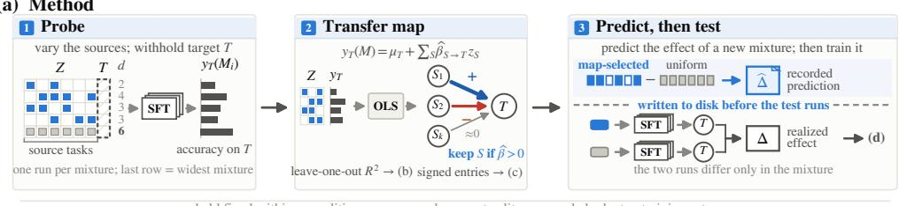
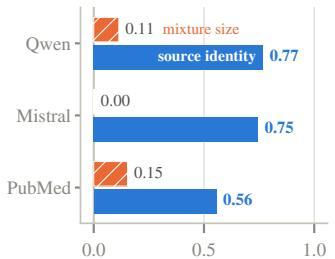
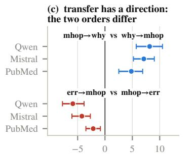
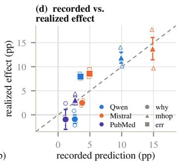
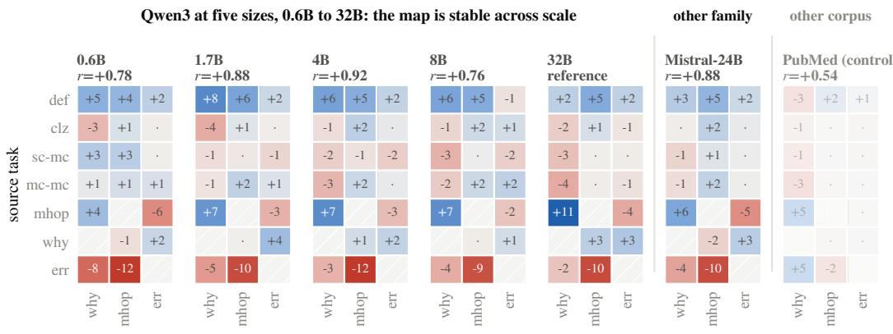
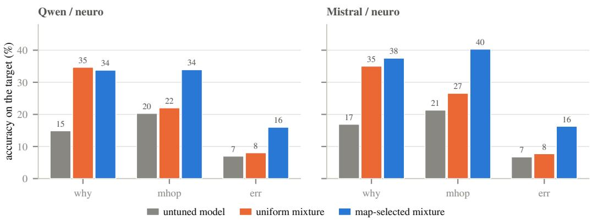
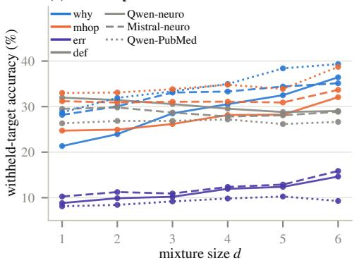
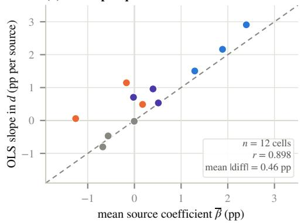
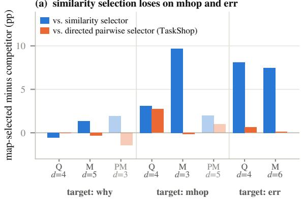
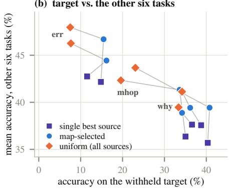

# A HELPS B WHILE B HURTS A: DIRECTED TRANSFER IN INSTRUCTION-TUNING MIXTURES

Nima H. Siboni1,2 Vahid Rostami2,∗

1Juna.ai, Kastanienallee 32, 10435 Berlin, Germany

2Computational Systems Neuroscience, Institute of Zoology, University of Cologne, Germany

∗Corresponding author: vrostami [at] uni-koeln [dot] de

## ABSTRACT

Adapting a language model to a specialized corpus means choosing which instruction-tuning tasks to train on under a fixed budget, and testing one choice costs a fine-tuning run. Common heuristics add more source tasks or pick sources similar to the target. The first assumes transfer is never negative; the second, that it is symmetric. We show that both assumptions fail: task A can help task B while B hurts A, so helpfulness is a signed property of ordered source–target pairs. We introduce the transfer map, a signed estimate of how much each source helps or hurts each held-out target. We fit the map in hundreds of fine-tuning runs on Qwen3 and Mistral models from 0.6B to 32B parameters, with all sources drawn from one corpus and no training examples from the target. The map predicts a held-out target’s accuracy on unseen mixtures: recorded before those runs, its predictions have less than half the error of a mixture-agnostic baseline. The map is specific to its target and corpus but transfers across model scale: a mixture selected in advance at one size beats training on all source tasks at every other size we tested. Transfer is thus a property of the data. The map selects the tasks that help and drops the one that interferes: accuracy on the reasoning targets (causal explanation, multi-hop questions and methodological critique) rises by up to 14 percentage points over training on all source tasks.

## 1 INTRODUCTION

Domain adaptation of language models increasingly relies on synthetic supervision (Nayak et al., 2024; Yang et al., 2025; Li et al., 2025a). A generation pipeline converts each passage of a domain corpus into instruction–response pairs of several task types, such as definitions or multi-hop questions, and the model trains on all of them together (Cheng et al., 2024a;b). Under a fixed example budget, every task type added displaces examples of the others. The practitioner must therefore choose which task types to train on (the sources) to serve the task whose accuracy matters (the target). Testing a candidate mixture takes a fine-tuning run, and seven source types already give 127 mixtures.

Practitioners make this choice with one of two heuristics, each resting on an assumption about transfer. The count heuristic trains on every task type the pipeline produces, following evidence that more tasks improve held-out performance (Wei et al., 2022; Wang et al., 2022; Chung et al., 2024). It assumes that no task type hurts the target, yet negative transfer between fine-tuning tasks is common (Aribandi et al., 2022; Jang et al., 2023; Dong et al., 2024), and supervised fine-tuning on math reasoning often erodes general capabilities (Huan et al., 2026). Multi-domain reinforcement learning of reasoning models shows a similar interference (Yang et al., 2026; Yu et al., 2026; Lin et al., 2026). The similarity heuristic trains on the sources (or examples) most similar to the target, with similarity measured on instructions (Lee et al., 2024) or sparse-autoencoder features (Ma et al., 2025). A similarity score is the same in both directions, so this heuristic assumes that transfer is symmetric.

Both assumptions fail between task types generated from one corpus. Replacing an average source with methodological critiques (ERR) lowers multi-hop (MHOP) accuracy by 9 to 12 percentage points (pp) at every Qwen3 size and on Mistral-24B (Section 7). Transfer also has a direction: on Qwen3- 32B, replacing an average source with definitions (DEF) raises MHOP accuracy by 5.3 pp, while

(b) source identity predicts an unseen mixture

(a) Method  
  
held fixed within a condition: corpus · document split · example budget · training setup

  
Figure 1: Probe, map, predict. (a) Balanced mixtures over one corpus, each withholding a target, give a signed, directed map whose predictions for unseen mixtures are recorded before the runs that test them. (b) Source identity predicts an unseen mixture and mixture size predicts little (within-target R2, Table 6). (c) The two directions of a task pair differ. (d) Recorded predictions against realized effects in the eight cells of Section 5: filled markers are three-seed means (±1 standard error), open markers single seeds.

adding MHOP to a mixture lowers DEF accuracy by 1.9 pp in absolute terms (Section 4.1). Transfer can be negative, and where its directions differ, no symmetric score can represent it.

We ask five questions, and the contributions below answer them in order.

1. Does transfer between task types keep a sign and a direction when the corpus is held fixed? Sign reversals appear between separate datasets (Kim et al., 2023; Krishna et al., 2025), where task type and content vary together and the dataset matters more than the task category (Qi et al., 2026); we measure inside fixed-budget mixtures (Section 4.1).

2. When accuracy rises with the number of tasks, is it the number that helps, or the average added task? The evidence behind the count heuristic varies both together.

3. How much of a target’s accuracy is at stake in the choice of sources? Selected subsets can beat the full set (Kim et al., 2023; Lee et al., 2024; Renduchintala et al., 2024); we ask whether one source can cancel the benefit of the rest.

4. Can a few runs measure transfer well enough to predict, before training, an unseen mixture’s accuracy on a target that has no training examples? Regressions over sampled mixtures already predict unseen ones for pretraining domains (Liu et al., 2025; Ye et al., 2025) or for a target trained alongside its sources (Li et al., 2023; Li et al., 2025b).

5. Does the measurement belong to the data or to the model? Data choices made with one model carry to other models in some studies (Xie et al., 2023; Liu et al., 2025; Dymkiewicz et al., 2025) but only partly in others (Jiang et al., 2025; Chang et al., 2026).

To answer them, we measure transfer instead of assuming it. The transfer map gives the signed effect of each source on each target (Figure 1a). We estimate it from a probe, a set of mixtures that each split a fixed budget equally among their sources and withhold the target, as the held-out-task evaluations behind the count heuristic do (Wei et al., 2022; Wang et al., 2022), so the target’s accuracy measures transfer from the sources. The estimator is deliberately simple, a linear datamodel over task types (Ilyas et al., 2022; Li et al., 2023); what is new is the controlled setting in which we fit it and what it reveals. We generate all eight task types from one neuroscience corpus. Three of them, causal explanations (WHY), multi-hop questions (MHOP) and methodological critiques (ERR), are our reasoning targets. Without fine-tuning, our two largest models score below 22% on them, against about 79% on single-answer multiple choice, so they are the tasks adaptation is for. A corpus of cancerimmunotherapy abstracts serves as a corpus-shift control. The study spans 751 fine-tuning runs on five Qwen3 models from 0.6B to 32B parameters and on Mistral-24B, a model from a second family.

## Contributions.

• Transfer is signed and directed. Task A can help task B while B hurts A, on both model families, between task types from one corpus and inside fixed-budget mixtures: the two directions differ in 14 and 13 of 28 pairs on the two families and have opposite signs, each direction’s interval excluding zero, in 3 and 4 (Section 4.1).

• Which sources matter, not how many. When every source may have its own effect, no fit can separate mixture size from the average source effect (Lemma 1). Measured slopes on mixture size track the mean source effect (r = 0.90 over 12 cells, Table 7) and are negative or flat for definitions. Evidence that more tasks help therefore cannot justify adding every task (Section 4.2).

• One interfering task type can cancel the benefit of all the others. On Qwen3-32B, training on all other task types in equal parts (the uniform mixture) barely beats the untuned model on multi-hop questions (20% to 22%) and critiques (7% to 8%). The map’s mixture drops the interfering type and two others, doubles critique accuracy (to 16%) and raises multi-hop accuracy to 34% (Section 5, Figure 3).

• The map predicts and selects mixtures before training. In two tests, of 8 and 12 cells, its recorded predictions have less than half the error of a mixture-agnostic baseline. As a selector, it beats the similarity selector at every mixture size we tried (single-run comparisons), by 3 to 16 pp on the neuroscience multi-hop and critique targets, because similarity does not measure a source’s effect. A map refit on 24 randomly drawn probe runs recovers 96% of the full probe’s out-of-fold gain on Qwen3-32B (Sections 5 to 7).

• Transfer is a property of the data, shared across models. Maps fitted on two model families agree (r = 0.88), and so do maps fitted at five sizes over a 53-fold range (r = 0.76 to 0.92). A mixture selected from the 32B map wins in 11 of 12 cells at the smaller sizes. The map differs on a second corpus with much smaller training pools (r < 0.55; Section 7).

## 2 RELATED WORK

Transfer between tasks. Transfer has been measured between vision tasks (Zamir et al., 2018; Standley et al., 2020; Fifty et al., 2021) and between language or multimodal datasets (Vu et al., 2020; Pruksachatkun et al., 2020; Poth et al., 2021; Kim et al., 2023; Krishna et al., 2025; Qi et al., 2026). Transfer is often asymmetric (Qi et al., 2026; Dymkiewicz et al., 2025), and the two directions of a task pair can even differ in sign (Kim et al., 2023; Krishna et al., 2025). Surface similarity predicts transfer poorly (Krishna et al., 2025). These studies train one source at a time or several tasks jointly; none splits a fixed budget among sources. In the language and multimodal studies, each source is a separate dataset, so task type is confounded with data source. We generate all task types from one corpus and measure directed transfer in fixed-budget mixtures that withhold the target (Section 4.1).

Number of tasks. Training on more tasks often helps (Wei et al., 2022; Wang et al., 2022; Chung et al., 2024; Aribandi et al., 2022), but a selected subset can outperform the full set (Renduchintala et al., 2024; Kim et al., 2023; Lee et al., 2024). A mixture’s size is the sum of its inclusion indicators, so a gain from more tasks shows only that the average added task helps (Lemma 1). Jung & Jung (2026) are closest to our design: they train on every subset of five instruction tasks at four budgets, evaluate on the same five tasks, and find that the best number of tasks grows with the budget. This trend is equally consistent with an average source effect that changes with the budget.

Target-directed selection. Similarity selectors compare each candidate with the target, using instruction embeddings (Lee et al., 2024) or sparse-autoencoder features (Ma et al., 2025). Such a score is symmetric and measures resemblance, not benefit, so it cannot flag a similar source as harmful (Section 6). LESS (Xia et al., 2024) estimates benefit rather than resemblance: it scores each example by a signed, first-order gradient approximation of its influence on the target loss. Datamodel predict a model’s output from which training examples it saw (Ilyas et al., 2022) and can select pretraining data for target tasks (Engstrom et al., 2024). The transfer map is a datamodel over task types, fitted directly to fine-tuning runs that withhold the target.

Mixture optimization. Mixture methods tune continuous domain proportions for pretraining (Xie et al., 2023; Ye et al., 2025; Liu et al., 2025) or fine-tuning (Li et al., 2025b); some fit validation loss as a function of the proportions to predict unseen mixtures. SMART (Renduchintala et al., 2024) and TaskPGM (Chanda et al., 2025) build one instruction-tuning mixture over a pool of training tasks from symmetric task similarities. ADAPT (Kadasi et al., 2025) learns task proportions under a token budget from meta-gradients of the training tasks’ own validation losses. We instead choose which sources to include for one withheld target. Skill-It (Chen et al., 2023) comes closest to a transfer map: it builds a directed skill graph from single-skill or pairwise runs, including edges to held-out skills, and uses it to reweight the mixture during training. Data chosen with a smaller model can train a larger one (Xie et al., 2023; Liu et al., 2025; Chen et al., 2023; Xia et al., 2024; Shihab et al., 2026), and data effects correlate across model scale (Khaddaj et al., 2025); we show that at the level of task types the map’s decisive entries are shared across model families and sizes (Section 7).

Generated domain supervision. Domain-adaptation pipelines generate several task types and train on all of them (Cheng et al., 2024a;b; Li et al., 2025a). This default is the count heuristic and the uniform mixture that we measure against. Bonito (Nayak et al., 2024) instead generates data of the target’s own task type, which it assumes is known; we ask which other types to add. Fine-tuning can erode capabilities that its data do not cover (Luo et al., 2023), so dropping types may cost ability outside the target; Section 7 reports this trade-off.

## 3 METHOD

Corpora and conditions. The primary corpus is 110 papers on motor control and its disorders from one publicly funded research consortium1, split by publication date into the 88 oldest papers for train ing and the 22 newest for evaluation (14,618 evaluation items). Its narrowness is deliberate: it keeps the content behind the eight task types similar, so the types differ mainly in what they ask. A condition pairs a model with a corpus, and we use three. The first is Qwen3-32B (the post-trained release, run with thinking off) on this corpus. The second, Mistral-Small-3.2-24B-Instruct-2506 (Mistral-24B) on the same corpus, controls for model identity: it shares corpus, tasks, budget, split and scoring rule. The third, Qwen3-32B on 951 PubMed cancer-immunotherapy abstracts (761 for training, 190 for evaluation, 1,464 items), controls for corpus shift. Its corpus, document granularity, training-pool size (generated training examples per task type) and evaluation size change together, so we treat its effects as less well resolved throughout. Section 7 adds four smaller Qwen3 sizes, 0.6B to 8B, each with a reduced probe. A run is one fine-tuning of one mixture at one seed, scored on the full evaluation split; a cell pairs a condition with a withheld target, written condition/target (e.g., Mistral/MHOP).

Tasks. A structured generator using GPT-5-mini renders corpus passages into eight task types: cloze (CLZ), single- and multi-answer multiple choice (SC-MC, MC-MC), term matching (MATCH), causal explanation (WHY), definitions (DEF), multi-hop questions (MHOP) and methodological critiques (ERR); Table 12 (Appendix F) gives the inventory. We focus on the three reasoning targets, WHY, MHOP and ERR, which lie outside an untuned model’s reach (Section 1; Figure 3, Appendix A).

Probe design. Four balanced designs each withhold a disjoint pair of targets and vary the remaining six sources over mixture sizes $d = 1 , \ldots , 6$ (Appendix F). Across the four designs, each condition trains 94 distinct mixtures (282 over the three conditions). Pooling across designs, 53 of these mixtures withhold a given reasoning target, and among them all seven other tasks appear as sources, the candidates when we later select a mixture for that target. Training on all seven in equal parts is the uniform mixture, the choice of the count heuristic and the default this paper measures against. Each run holds exactly 6,000 examples divided equally (up to rounding) among its sources, uses one split manifest per corpus, and excludes the target task from training. The passages behind different task types overlap only partially (Section 8).

Training and scoring. All runs train one epoch of response-masked supervised fine-tuning with rank-16 rank-stabilized LoRA (rsLoRA; Kalajdzievski, 2023) under a shared optimizer and decoding configuration (Appendix F); only the constant-learning-rate runs of Appendix E change the schedule. Closed tasks score by exact or option-set match. Open tasks (DEF, WHY, MHOP, ERR) use an embedding rule. We split gold and generated answers into sentences, let s be the cosine similarity of $\mathtt { a l l - m p n e t - b a s e - v 2 }$ sentence embeddings (Reimers & Gurevych, 2019), and count an item as correct when

$$
s _ { \mathrm { f u l l } } > \tau \quad \mathbf { o r } \quad s _ { \mathrm { a v g } } > \tau , \qquad \tau = 0 . 8 5 .\tag{1}
$$

Here $s _ { \mathrm { f u l l } }$ is the similarity of the whole answers, and $\begin{array} { r c l } { s _ { \mathrm { a v g } } } & { = } & { \frac { 1 } { 2 } \big [ \frac { 1 } { m } \sum _ { i } \mathrm { m a x } _ { j } s ( p _ { i } , g _ { j } ) \ + } \end{array}$ $\begin{array} { r } { \frac { 1 } { n } \sum _ { j } \operatorname* { m a x } _ { i } s ( p _ { i } , g _ { j } ) \big ] } \end{array}$ averages each sentence’s best match on the other side, over the m predicted sentences $p _ { i }$ and the n gold sentences $g _ { j }$

Estimating the transfer map. Let V be the set of eight task types. Write the accuracy of a withheld target $T$ after training on a source set $M \subseteq V \setminus \{ T \}$ as a set function $y _ { T } : 2 ^ { V \setminus \{ \dot { T } \} } \to \mathbb { R }$ . Any regression model of $y _ { T }$ keeps some orders of interaction among sources and drops the rest. We fit the additive (degree-one) case

$$
y _ { T } ( M ) = \mu _ { T } + \sum _ { S \in V \backslash \{ T \} } \beta _ { S  T } z _ { S } + \varepsilon , z _ { S } = k ^ { \varepsilon } [ S \in M ] ,\tag{2}
$$

once per cell, weighting each distinct mixture once (retrainings are not double counted). We report every coefficient as a centered substitution effect: within a target’s fit we subtract the mean source coefficient, the normalization we adopt because the design identifies only contrasts between sources (Section 4.2). An entry then reads as the change in the target’s accuracy when that source replaces an average source, and only after centering do two targets’ columns mean the same thing. The transfer map holds these entries for every source–target pair. A source helps a target when its entry is positive and hurts it when the entry is negative.

From map to mixture. One rule turns a cell’s fit into a mixture: keep every source whose uncentered coefficient $\beta _ { S  T }$ is positive and drop the rest, with a predicted effect over the uniform mixture equal to minus the sum of the dropped coefficients. The rule uses uncentered coefficients because each i the fit’s predicted change from adding that source to a mixture at a fixed budget. The rule keeps three to seven of the seven candidate sources. The recorded predictions of Section 5 apply it to fits over every run trained before the test runs, retrainings included (Appendix A).

Prediction baselines. Two baselines test the predictions. The mixture-agnostic baseline predicts that no change of mixture moves the target, and the count baseline predicts from mixture size alone, with a linear or a quadratic fit to the probe.

Competing selectors. Five selectors compete with the map’s mixture at the same budget and one fixed training seed. The uniform mixture trains all seven sources, and the single best source scores highest on the target when trained alone in the probe. A TaskShop-style ranker (Kim et al., 2023) keeps the sources with the highest such scores; a Skill-It-style ranker (Chen et al., 2023) first weights each score by how well the source learns its own task. A third ranker, embedding similarity (the similarity heuristic run as a selector), keeps the sources whose mean embedding of sampled question–answer pairs, under the scoring rule’s encoder, lies closest to the target’s. The three rankers keep as many sources as the map’s mixture, and we also run TaskShop and embedding similarity with three and five sources (Appendix D).

## 4 THE TRANSFER MAP

## 4.1 TRANSFER IS DIRECTED AND SIGNED

The map is asymmetric as a whole (Table 8). The off-diagonal map correlates with its transpose at $r = 0 . 3 0 4 , 0 . 2 9 0$ and 0.262 in the three conditions; a symmetric map would give 1. Estimation noise alone can lower r, so we test each of the 28 task pairs directly. In 14, 13 and 9 of them, the bootstrap interval on the difference between the two directions excludes zero. In 3, 4 and 0 pairs, the two directions have opposite signs and each direction’s own interval excludes zero. The pair from the introduction is one of them: on Qwen3-32B, DEF→MHOP is $+ 5 . 2 7 \mathrm { p p \ } [ + 3 . 5 5 , + 6 . 8 4 ]$ and MHOP→DEF is −1.24 pp [−1.68, −0.75]. Uncentered, the second coefficient is −1.92 pp [−2.38, −1.41]: adding MHOP to a mixture at a fixed budget lowers DEF accuracy in absolute terms. In all three conditions, the most asymmetric pair is MHOP and WHY (Figure 1c; Appendix C).

  
Figure 2: The transfer map is signed, directed, and stable across model size. Effect of each source (rows) on each withheld reasoning target (columns), in pp relative to an average source. Left five panels: Qwen3 at five sizes; r is the mean per-target correlation with the 32B map (Section 7). Mistral-24B on the same corpus keeps the map; Qwen3-32B on PubMed (faded), with about a tenth of the evaluation items, agrees less, but ERR remains MHOP’s most negative source. For these two panels, r pools the 18 entries from sources other than MATCH, which scores near ceiling (Appendix F).

The map also has large negative entries (Figure 2). On Qwen3-32B and Mistral-24B the most negative entry is ERR→MHOP, at −9.72 and −9.55 pp; we call a target’s most negative source its interferer. These entries do not track supervised token volume (Appendix F).

## 4.2 SOURCE IDENTITY, NOT MIXTURE SIZE, PREDICTS ACCURACY

Table 6 (Appendix B) compares how well source identity and mixture size predict a target’s accuracy on unseen mixtures (Figure 1b). Source identity explains 0.768, 0.746 and 0.557 of the within-target variance in the three conditions. A linear term in mixture size explains 0.114, 0.003 and 0.153, and a quadratic term and an indicator for each size both do worse. Adding all 21 pairwise interactions between sources raises the first two to 0.840 and 0.849 but lowers the third to 0.522. Sources also interact, but one entry per source already carries most of the predictable variance.

The count heuristic rests on evidence that accuracy rises with the number of tasks. Lemma 1 bounds what such evidence can reveal whenever each source may have its own effect, as in the experiments behind it, and rests on one fact: a mixture’s size counts the sources it contains, $\begin{array} { r } { d = | M | \overset { \cdot } { = } \sum _ { S } z _ { S } } \end{array}$ Add a size term γd to Equation 2:

Lemma 1 (Size alias). (a) For any c, replacing every $\beta _ { S }$ by $\beta _ { S } + c$ and γ by $\gamma - c$ leaves every fitted value ofy unchanged, because $\textstyle \sum _ { S } z _ { S } = d .$ . The data can therefore identify only the contrasts $\beta _ { S } - \beta _ { S ^ { \prime } }$ and the sums $\beta _ { S } + \gamma ,$ , never γ or any β alone. The same holds at every interaction order: adding γk to every order-k interaction coefficient absorbs a size term $\gamma _ { k } \binom { d } { k }$ , because $\binom { d } { k }$ is the sum $o f z _ { S _ { 1 } } \cdots z _ { S _ { k } }$ over all sets ofk sources.

(b) Regressing yT on d alone by ordinary least squares (OLS) gives the slope $\Sigma _ { S } w _ { S } \hat { \beta } _ { S } ,$ , where $\hat { \beta } _ { S }$ are the OLS coefficients ofEquation 2 on the same runs and the weights $\dot { w _ { S } } = \mathrm { \tilde { C } o v } ( z _ { S } , d ) / \mathrm { V a r } ( d )$ sum to one. When every source appears equally often at every size, the weights are equal and the slope is the mean $\hat { \beta } _ { S }$ .

Appendix B proves both parts. By (a), “more sources help” and “the average source helps” are the same claim, $\bar { \beta } + \gamma > 0$ for the mean $\bar { \beta }$ of the $\beta _ { S }$ . By (b), a positive size slope shows only that the average task helps and cannot justify adding every task.

Accuracy on the withheld target rises with mixture size for the three reasoning targets, except on Mistral/MHOP where it is flat, and falls for DEF in both neuroscience conditions (Table 7, Figure 4). No single size bonus exists. Even where the average source helps, some sources have $\hat { \beta } _ { S } < 0$ , and Section 5 shows that dropping them at a fixed budget raises the target.

## 5 PREDICTING UNSEEN MIXTURES

We test whether the map predicts the effect of moving from the uniform mixture, which no probe run trains, to the mixture that the rule of Section 3 selects. We compare the two at the same 6,000-example budget, paired by data-order seed.

We recorded each predicted effect before training the 54 test runs: both mixtures at three data-order seeds in each of nine cells (the three reasoning targets in each condition). In three cells the probe already contains the selected mixture; refitting the map without those runs moves their predictions by at most 0.22 pp. One cell, PubMed/ERR, is vacuous: the rule keeps all seven sources, so it predicts no change. That leaves $n = 8$ cells (Table 5, Appendix A).

The recorded predictions outperform both baselines. We lead with mean absolute error (MAE), because at $n = 8$ two large-effect cells dominate Pearson r. The recorded predictions have an MAE of 2.31 pp, with $r = 0 . 8 6 5$ and a slope of realized on predicted effect, fitted with no intercept, of 1.054 (1 is ideal; Table 2, Figure 1d). The mixture-agnostic baseline, which predicts zero effect, has an MAE of 6.20 pp. The count baseline does worse still, at 9.31 pp (linear fit) and 9.20 pp (quadratic fit). Every selected mixture has fewer sources than the uniform mixture, and accuracy on these targets rises with mixture size on average (Section 4.2), so the linear fit predicts a loss in every cell and the quadratic fit in seven of the eight. Even the best constant prediction, chosen after seeing the outcomes, has an MAE of 4.80 pp (Table 2). The map thus tracks how the effect varies across cells, beyond its typical size. With each target’s mean removed from the predicted and realized effects, its MAE is 0.79 pp against 2.26 pp for a per-target constant (Appendix A).

Most of the gain comes from dropping one task type. Six of the eight realized effects are gains, of up to 13.76 pp over three seeds. On critiques, the uniform mixture gains only about 1 pp over the untuned model in both neuroscience conditions, and the selected mixture doubles its accuracy (Figure 3, Appendix A). In each non-vacuous MHOP and ERR cell, the target’s interferer carries 75 to 100% of the predicted gain.

The misses. In two cells the map predicted a small gain and the realized effect was slightly negative: Qwen/WHY (+2.64 predicted, −0.90 realized) and PubMed/WHY (+1.18, −0.95). Neither loss has a 95% confidence interval that excludes zero, whereas all six gains do (Table 5). These two cells therefore neither confirm nor contradict the predicted sign.

## 6 THE MAP AGAINST OTHER SELECTORS

Table 1 compares the mixture the map selects against the five selectors of Section 3 at one training seed, each at its own mixture size d, the count of sources it keeps (the map’s d for the three rankers). The similarity selector loses 7.47 to 9.68 pp on three of the four MHOP and ERR cells of Qwen3-32B and Mistral-24B and 3.11 pp on the fourth (Figure 5a, Appendix D). Like the map, our TaskShopstyle ranker ranks sources by their measured effect on the target. It stays within $2 . 7 3 \mathrm { p p }$ of the map on the six neuroscience cells, so the similarity selector loses because it does not measure each source’s effect. The Skill-It-style ranker edges the map on three cells, by at most 1.45 pp, and trails it on the other three, by 2.43 to 7.91 pp (its Qwen/MHOP run tripped the degeneration check). Each comparison uses one run per mixture, so the TaskShop margins and Skill-It’s edges are not resolved.

Similarity cannot separate a helpful source from a harmful one. A single matched d leaves open whether that d favoured the map, so we re-run the similarity selector at $d = 3 ,$ at its matched d and at d = 5. The map stays ahead at every d on all four MHOP and ERR cells of Qwen3-32B and Mistral-24B, by 3.11 to 15.91 pp, and within 1.45 pp of zero on their WHY cells (Appendix D). Both large jumps in that sweep occur on the MHOP cells, when widening the mixture to d = 5 admits the target’s interferer, ERR. A similarity score does not encode the sign of transfer, so a source that helps a target and a source that hurts it enter such a selector alike: at its matched d the similarity mixture holds the target’s interferer in four of the eight non-vacuous cells. Nor is the gap a matter of examples per source, which rise as a mixture narrows: at d = 3 the similarity selector trains at least as many examples per source as the map on the same four MHOP and ERR cells, and still trails it by 3.41 to 9.68 pp (Appendix D).

Table 1: Map-selected mixture minus competitor on the withheld target, at each competitor’s mixture size d and at one training seed; positive favours the map. “Interferer” is the target’s most negative measured source. † marks a run whose generations tripped a degeneration check (Appendix F). ‡ marks the vacuous cell: every uncentered coefficient there is positive, so the rule keeps all seven sources and we print no interferer; its two runs train the same mixture at the same seed, so their +1.69 pp gap is one replicate difference. Full sweep in Appendix D.
<table><tr><td>Condition</td><td>Target</td><td>Interferer</td><td>Uniform</td><td>Single-best</td><td>Skill-It</td><td>TaskShop</td><td>Embed-sim</td></tr><tr><td>Qwen3-32B</td><td>WHY</td><td>MC-MC</td><td>+1.21</td><td>-2.37</td><td>-1.45</td><td>+0.00</td><td>-0.53</td></tr><tr><td>Qwen3-32B</td><td>MHOP</td><td>ERR</td><td>+13.19</td><td>-1.41†</td><td>+2.43†</td><td>+2.73</td><td>+3.11</td></tr><tr><td>Qwen3-32B</td><td>ERR</td><td>MHOP</td><td>+8.64</td><td>+2.11†</td><td>-0.20</td><td>+0.64</td><td>+8.10</td></tr><tr><td>Mistral-24B</td><td>WHY</td><td>ERR</td><td>+2.18</td><td>-2.13</td><td>-1.31</td><td>-0.34</td><td>+1.36</td></tr><tr><td>Mistral-24B</td><td>MHOP</td><td>ERR</td><td>+17.23</td><td>+0.44†</td><td>+7.59</td><td>-0.15</td><td>+9.68</td></tr><tr><td>Mistral-24B</td><td>ERR</td><td>MHOP</td><td>+7.76</td><td>+1.42</td><td>+7.91</td><td>+0.10</td><td>+7.47</td></tr><tr><td>PubMed</td><td>WHY</td><td>MC-MC</td><td>+0.00</td><td>+4.27</td><td>+17.54</td><td>-1.42</td><td>+1.90</td></tr><tr><td>PubMed</td><td>MHOP</td><td>ERR</td><td>+2.45</td><td>+4.90</td><td>+1.47</td><td>+0.98</td><td>+1.96</td></tr><tr><td>PubMed</td><td>ERR</td><td></td><td>+1.69</td><td>+0.00</td><td></td><td></td><td></td></tr></table>

## 7 WHERE THE MAP TRANSFERS: TARGET, CORPUS, FAMILY, AND SCALE

A selection is specific to its target. The selection rule (Section 3) keeps a different set of sources for each target in the same condition (Table 5), and raising accuracy on the target costs accuracy on the other tasks. Across the eight non-vacuous cells, the map’s mixture scores on average 2.40 pp below the uniform mixture on the non-target macro (the mean accuracy over the six scored tasks other than the target and MATCH) and 2.70 pp above the single best source (Figure 5b, Appendix D).

The map agrees across model families but did not carry over to our second corpus. Over the 18 map entries from a non-MATCH source to a reasoning target, the Qwen3-32B and Mistral-24B maps agree at r = 0.880, while the PubMed map agrees with them at only r = 0.279 to 0.545. The PubMed condition also changes document granularity, pool size and evaluation size (Section 3), so this comparison does not isolate the corpus. When we refit the map without one design’s mixtures and let it pick among that design’s trained mixtures (out-of-fold), its pick beats the design’s widest mixture by +5.03 pp on Qwen3-32B and +5.82 pp on Mistral-24B but trails it by 0.51 pp on PubMed. These are retrospective gains on folds that share no mixture.

The map is stable across model scale. We fit the map independently at four other Qwen3 sizes, 0.6B to 8B, each from the same fixed 24-run probe, a reduced design with mixture sizes 1 to 4 (Appendix F). Every map agrees with the 32B map, at r = 0.757 to 0.918 (Figure 2). Of the 21 entries from a source to a reasoning target, 11 keep their sign at all five sizes and on Mistral-24B. DEF helps MHOP by 4.4 to 5.8 pp, and ERR hurts it by 9.3 to 11.6 pp. Agreement does not track size: the 8B map agrees least. The degeneration check flags 18 of the 24 probe runs at 0.6B, mostly for cloze answers that hit the token cap. Across the probes at the four smaller sizes, only one flag, on WHY at 1.7B, falls on a column that a reasoning-target fit reads (Appendix F).

A selection made at one size beats the uniform mixture at every other size. Before training at any other size, we recorded the mixture that the 32B map selected for each target, then trained it against the uniform mixture at each of the four other sizes over three seeds (Table 4, Appendix A).

These 12 size–target cells form a second test of recorded predictions, disjoint from the eight cells of Section 5. The selected mixture wins in 11 of the 12 cells (seven intervals exclude zero, none below it), by a mean of +4.44 pp, and the 32B map predicts these effects with an MAE of 2.28 pp, against 4.64 pp for the mixture-agnostic baseline. The mean gain is positive at every size, from +3.21 to +5.26 pp; WHY is the weakest target at every size and accounts for the one loss. A map refit at each size from its 24-run probe gains +6.53 pp over the same 12 cells, and every interval excludes zero; the transferred selection keeps about two thirds of that gain.

A 24-run probe selects nearly as well as the full probe. When each out-of-fold refit sees only 24 randomly drawn probe runs, the gain on Qwen3-32B is +4.83 pp, or 96% of the full probe’s +5.03 pp; on Mistral-24B, 24 runs recover the full gain (+5.88 against +5.82 pp, Table 3). The gain varies little across subsets (standard deviation 0.33 pp on Qwen3-32B, Appendix F). A 24-run probe costs about 22 GPU-hours at 32B and 11 to 16 at the other sizes, a one-time cost per condition.

## 8 LIMITATIONS

Every score comes from an automated rule. No human judges answer quality, so every effect here is an effect on our automated scoring rules. The gold answers are themselves generated by GPT 5-mini, so accuracy measures agreement with generated references under the rule. Without the rule’s threshold, every realized effect of Section 5 is positive (Appendix G). Restricted to single-sentence answers, which holds the answer’s format fixed, the two largest effects survive and two others vanish or reverse; in those two cells one run rarely answers in one sentence. A human evaluation of the predicted cells would settle whether the effects hold beyond the rule.

The design isolates neither the passages nor the dose of a source. The passages behind different task types overlap only in part, so this design cannot isolate supervision format. At a fixed budget, a narrower mixture also trains more examples per source, so the identity of a source and its dose move together. Supervised token volume does not rank the effects (Appendix F), but no run holds passages or examples per source fixed; passage-matched and dose-matched controls would settle both.

The prediction tests cover few cells. Each test, of eight and of twelve cells, reuses targets and conditions across its cells, so its intervals are descriptive, and we transferred selections across scale within one model family. The PubMed condition has about a tenth of the evaluation items, so we report its cells as unresolved and not as null.

The mixture is a set, but training it is a sequence. Equation 2 treats a mixture as a set of sources. In a separate experiment, the order of an identical set of examples alone moves the target’s accuracy where an interferer is among the sources (Appendix E, which also reports a recorded prediction that failed). We read this as the boundary of the set abstraction.

## 9 CONCLUSION

In this paper we asked which task types to train on when adapting a language model to a specialized corpus under a fixed budget. The count heuristic and the similarity heuristic rest on assumptions that fail. Transfer can be negative: in both neuroscience conditions, one interfering task type cancels most of what the other types add on two of the three reasoning targets. It is not symmetric: on both model families, some task pairs help in one direction and hurt in the other. Which sources one adds predicts accuracy; how many does not, because no fit can separate mixture size from the average source effect.

The transfer map replaces both assumptions with a measurement that a practitioner makes once per corpus. It predicts a target’s accuracy on unseen mixtures before training, with less than half the error of a mixture-agnostic baseline in both prediction tests. The choice matters: on Qwen3-32B, the map’s mixture raises multi-hop accuracy from 22% to 34% and doubles critique accuracy, where the uniform mixture barely beats the untuned model. As a selector, it beats the similarity selector at every mixture size we tried on the neuroscience multi-hop and critique targets, because a similarity score carries no sign. At each smaller model size, a map fitted from only 24 runs selects a mixture that beats training on all source tasks, and so does the mixture the 32B map selected.

Transfer is thus a property of the data: the map held when we changed the model, across two families and a 53-fold range of size, and moved when we changed the corpus. A selection serves one target at some cost to the other tasks, and a new corpus needs its own probe. Our second corpus also had much smaller training pools and held-out split, and we could not resolve the probe’s gain there. Which corpus factors move the map is therefore open, as is what makes a task type an interferer. The same choice arises in multi-domain reinforcement learning, where training on one domain often degrades others (Yang et al., 2026; Yu et al., 2026; Lin et al., 2026). Wherever task types share a budget, a practitioner has a third option beyond adding every task or picking the similar ones: measuring which task types help a target and which one interferes, which here took two dozen fine-tuning runs.

## AI USE STATEMENT

GPT-5-mini generated the instruction–response pairs of all eight task types, for training and evaluation, from the corpus passages (Section 3). We also used AI assistants, including Claude, to help write code and to draft and edit the text. We take responsibility for the final content of this work, including text, claims and artifacts produced with the aid of generative AI.

## REPRODUCIBILITY STATEMENT

The repository https://github.com/Vahidrostami/directed-transfer contains the analysis code and the frozen evidence bundle behind every table and figure. Section 3 and Appendix F give the corpus split, task inventory, probe designs, training configuration, decoding and scoring rule, and the commands that recompute and verify every table and figure.

## ACKNOWLEDGMENTS

This work was funded by the Deutsche Forschungsgemeinschaft (DFG, German Research Foundation) through the Collaborative Research Center “Motor Control in Health and Disease” (DFG-SFB 1451, Project INF, ID 431549029). We also thank the IT Center University of Cologne (ITCC) for providing compute resources and support on the DFG-funded HPC system RAMSES (Research Accelerator for Modeling and Simulation with Enhanced Security) (DFG funding number: INST 216/512-1 FUGG).

## REFERENCES

Vamsi Aribandi, Yi Tay, Tal Schuster, Jinfeng Rao, Huaixiu Steven Zheng, Sanket Vaibhav Mehta, Honglei Zhuang, Vinh Q. Tran, Dara Bahri, Jianmo Ni, Jai Gupta, Kai Hui, Sebastian Ruder, and Donald Metzler. ExT5: Towards extreme multi-task scaling for transfer learning. In International Conference on Learning Representations, 2022. URL https://arxiv.org/abs/2111. 10952.

Prateek Chanda, Saral Sureka, Parth Pratim Chatterjee, Krishnateja Killamsetty, Nikhil Shivakumar Nayak, and Ganesh Ramakrishnan. Learning task mixtures from task affinities: A probabilistic graphical model for supervised fine-tuning. arXiv preprint arXiv:2507.12612, 2025. URL https: //arxiv.org/abs/2507.12612.

Powei Chang, Jinpeng Zhang, Bowen Chen, Chenyu Wang, Chenlu Guo, Yixing Zhang, Yukang Gao, JianXiang Xiang, Yue Gao, Chaoqun Sun, Yiyi Chen, and Dongying Kong. SPICE: Submodular penalized information–conflict selection for efficient large language model training. In International Conference on Learning Representations, 2026. URL https://openreview.net/ forum?id=9rCRy58TPF.

Mayee F. Chen, Nicholas Roberts, Kush Bhatia, Jue Wang, Ce Zhang, Frederic Sala, and Christopher Ré. Skill-It! a data-driven skills framework for understanding and training language models. In Advances in Neural Information Processing Systems, volume 36, 2023. URL https://proceedings.neurips.cc/paper\_files/paper/2023/ hash/70b8505ac79e3e131756f793cd80eb8d-Abstract-Conference.html.

Daixuan Cheng, Yuxian Gu, Shaohan Huang, Junyu Bi, Minlie Huang, and Furu Wei. Instruction pre-training: Language models are supervised multitask learners. In Proceedings of the 2024 Conference on Empirical Methods in Natural Language Processing, pp. 2529–2550. Association for Computational Linguistics, 2024a. doi: 10.18653/v1/2024.emnlp-main.148. URL https: //aclanthology.org/2024.emnlp-main.148/.

Daixuan Cheng, Shaohan Huang, and Furu Wei. Adapting large language models via reading comprehension. In International Conference on Learning Representations, 2024b. URL https: //openreview.net/forum?id=y886UXPEZ0.

Hyung Won Chung, Le Hou, Shayne Longpre, Barret Zoph, Yi Tay, William Fedus, Yunxuan Li, Xuezhi Wang, Mostafa Dehghani, Siddhartha Brahma, et al. Scaling instruction-finetuned language models. Journal of Machine Learning Research, 25(70):1–53, 2024. URL https: //jmlr.org/papers/v25/23-0870.html

Guanting Dong, Hongyi Yuan, Keming Lu, Chengpeng Li, Mingfeng Xue, Dayiheng Liu, Wei Wang, Zheng Yuan, Chang Zhou, and Jingren Zhou. How abilities in large language models are affected by supervised fine-tuning data composition. In Proceedings of the 62nd Annual Meeting of the Association for Computational Linguistics (Volume 1: Long Papers), pp. 177–198. Association for Computational Linguistics, 2024. doi: 10.18653/v1/2024.acl-long.12. URL https://aclanthology.org/2024.acl-long.12/.

Kajetan Dymkiewicz, Ivan Vulic, Helen Yannakoudakis, Eilam Shapira, Roi Reichart, and Anna´ Korhonen. Donors and recipients: On asymmetric transfer across tasks and languages with parameter-efficient fine-tuning. arXiv preprint arXiv:2511.13368, 2025.

Logan Engstrom, Axel Feldmann, and Aleksander Madry. DsDm: Model-aware dataset selection with datamodels. In Proceedings of the 41st International Conference on Machine Learning, volume 235 of Proceedings of Machine Learning Research, pp. 12491–12526, 2024. URL https://proceedings.mlr.press/v235/engstrom24a.html.

Chris Fifty, Ehsan Amid, Zhe Zhao, Tianhe Yu, Rohan Anil, and Chelsea Finn. Efficiently identifying task groupings for multi-task learning. In Advances in Neural Information Processing Systems, volume 34, 2021. URL https://proceedings.neurips.cc/paper/2021/hash/ e77910ebb93b511588557806310f78f1-Abstract.html.

Maggie Ziyu Huan, Yuetai Li, Tianyu Zheng, Xiaoyu Xu, Seungone Kim, Minxin Du, Radha Poovendran, Graham Neubig, and Xiang Yue. Does math reasoning improve general LLM capabilities? Understanding transferability of LLM reasoning. In Proceedings ofthe 43rd International Conference on Machine Learning, 2026. URL https://openreview.net/forum?id= GbOD25IA88.

Andrew Ilyas, Sung Min Park, Logan Engstrom, Guillaume Leclerc, and Aleksander Madry. Datamodels: Understanding predictions with data and data with predictions. In Proceedings ofthe 39th International Conference on Machine Learning, volume 162 of Proceedings of Machine Learning Research, pp. 9525–9587, 2022. URL https://proceedings.mlr.press/v162/ ilyas22a.html.

Joel Jang, Seungone Kim, Seonghyeon Ye, Doyoung Kim, Lajanugen Logeswaran, Moontae Lee, Kyungjae Lee, and Minjoon Seo. Exploring the benefits of training expert language models over instruction tuning. In Proceedings of the 40th International Conference on Machine Learning, volume 202 of Proceedings of Machine Learning Research, pp. 14702–14729, 2023. URL https://proceedings.mlr.press/v202/jang23a.html.

Yiding Jiang, Allan Zhou, Zhili Feng, Sadhika Malladi, and J. Zico Kolter. Adaptive data optimization: Dynamic sample selection with scaling laws. In International Conference on Learning Representations, 2025. URL https://openreview.net/forum?id=aqok1UX7Z1.

Jeesu Jung and Sangkeun Jung. Empirical analysis of task mixture effects in small-scale instruction tuning: A statistical approach. In Findings of the Association for Computational Linguistics: ACL 2026, pp. 13168–13186, 2026. doi: 10.18653/v1/2026.findings-acl.643. URL https: //aclanthology.org/2026.findings-acl.643/.

Pritam Kadasi, Abhishek Upperwal, and Mayank Singh. ADAPT: Learning task mixtures for budget-constrained instruction tuning. arXiv preprint arXiv:2512.04555, 2025.

Damjan Kalajdzievski. A rank stabilization scaling factor for fine-tuning with LoRA. arXiv preprint arXiv:2312.03732, 2023. URL https://arxiv.org/abs/2312.03732.

Alaa Khaddaj, Logan Engstrom, and Aleksander Madry. Small-to-large generalization: Training data influences models consistently across scale. In International Conference on Learning Representations, 2025. URL https://proceedings.iclr.cc/paper\_files/paper/2025/ hash/5356603f9c47399adfd372f77a677057-Abstract-Conference.html.

Joongwon Kim, Akari Asai, Gabriel Ilharco, and Hannaneh Hajishirzi. TaskWeb: Selecting better source tasks for multi-task NLP. In Proceedings ofthe 2023 Conference on Empirical Methods in Natural Language Processing, pp. 11032–11052, 2023. doi: 10.18653/v1/2023.emnlp-main.680. URL https://aclanthology.org/2023.emnlp-main.680/.

Shambhavi Krishna, Atharva Naik, Chaitali Agarwal, Sudharshan Govindan, Haw-Shiuan Chang, and Taesung Lee. Latent traits and cross-task transfer: Deconstructing dataset interactions in LLM fine-tuning. In Proceedings of the 14th Joint Conference on Lexical and Computational Semantics (\*SEM 2025), pp. 225–241, 2025. doi: 10.18653/v1/2025.starsem-1.18. URL https: //aclanthology.org/2025.starsem-1.18/.

Changho Lee, Janghoon Han, Seonghyeon Ye, Stanley Jungkyu Choi, Honglak Lee, and Kyunghoon Bae. Instruction matters: A simple yet effective task selection for optimized instruction tuning of specific tasks. In Proceedings of the 2024 Conference on Empirical Methods in Natural Language Processing, pp. 18620–18642. Association for Computational Linguistics, 2024. doi: 10.18653/v1/2024.emnlp-main.1036. URL https://aclanthology.org/2024. emnlp-main.1036/.

Dongyue Li, Huy L. Nguyen, and Hongyang R. Zhang. Identification of negative transfers in multitask learning using surrogate models. Transactions on Machine Learning Research, 2023. URL https://openreview.net/forum?id=KgfFAI9f3E.

Sihang Li, Jin Huang, Jiaxi Zhuang, Yaorui Shi, Xiaochen Cai, Mingjun Xu, Xiang Wang, Linfeng Zhang, Guolin Ke, and Hengxing Cai. SciLitLLM: How to adapt LLMs for scientific literature understanding. In International Conference on Learning Representations, 2025a. URL https: //openreview.net/forum?id=8dzKkeWUUb.

Yuan Li, Zhengzhong Liu, and Eric Xing. Data mixing optimization for supervised fine-tuning of large language models. In Proceedings of the 42nd International Conference on Machine Learning, volume 267 of Proceedings ofMachine Learning Research, pp. 35419–35437, 2025b. URL https://proceedings.mlr.press/v267/li25bh.html.

Zihan Lin, Xiaohan Wang, Jie Cao, Jiajun Chai, Guojun Yin, Wei Lin, and Ran He. One step, one lead: Mitigating higher-order interference in multi-domain reinforcement learning via cross-step control. arXiv preprint arXiv:2609.06469, 2026.

Qian Liu, Xiaosen Zheng, Niklas Muennighoff, Guangtao Zeng, Longxu Dou, Tianyu Pang, Jing Jiang, and Min Lin. RegMix: Data mixture as regression for language model pre-training. In International Conference on Learning Representations, 2025. URL https://proceedings.iclr.cc/paper\_files/paper/2025/hash/ 5f67d864aae6115374fed7beddd119e0-Abstract-Conference.html.

Yun Luo, Zhen Yang, Fandong Meng, Yafu Li, Jie Zhou, and Yue Zhang. An empirical study of catastrophic forgetting in large language models during continual fine-tuning. arXiv preprint arXiv:2308.08747, 2023. URL https://arxiv.org/abs/2308.08747.

Da Ma, Gonghu Shang, Zhi Chen, Libo Qin, Yijie Luo, Hongshen Xu, Lei Pan, Shuai Fan, Kai Yu, and Lu Chen. Task-specific data selection for instruction tuning via monosemantic neuronal activations. In Advances in Neural Information Processing Systems, 2025. URL https://papers.nips.cc/paper\_files/paper/2025/hash/ c971ffd786876d5927caf482b06bcba5-Abstract-Conference.html.

Nihal V. Nayak, Yiyang Nan, Avi Trost, and Stephen H. Bach. Learning to generate instruction tuning datasets for zero-shot task adaptation. In Findings of the Association for Computational Linguistics: ACL 2024, pp. 12585–12611, 2024. doi: 10.18653/v1/2024.findings-acl.748. URL https://aclanthology.org/2024.findings-acl.748/.

Clifton Poth, Jonas Pfeiffer, Andreas Rücklé, and Iryna Gurevych. What to pre-train on? Efficient intermediate task selection. In Proceedings of the 2021 Conference on Empirical Methods in Natural Language Processing, pp. 10585–10605, 2021. doi: 10.18653/v1/2021.emnlp-main.827. URL https://aclanthology.org/2021.emnlp-main.827/.

Yada Pruksachatkun, Jason Phang, Haokun Liu, Phu Mon Htut, Xiaoyi Zhang, Richard Yuanzhe Pang, Clara Vania, Katharina Kann, and Samuel R. Bowman. Intermediate-task transfer learning with pretrained language models: When and why does it work? In Proceedings of the 58th Annual Meeting ofthe Associationfor Computational Linguistics, pp. 5231–5247, 2020. doi: 10.18653/ v1/2020.acl-main.467. URL https://aclanthology.org/2020.acl-main.467/.

Xuan Qi, Luxi He, Dan Roth, and Xingyu Fu. Demystifying supervision data generalization in multimodal LMs. In International Conference on Learning Representations, 2026. URL https://openreview.net/forum?id=iYMZKz5BGz.

Nils Reimers and Iryna Gurevych. Sentence-BERT: Sentence embeddings using Siamese BERTnetworks. In Proceedings of the 2019 Conference on Empirical Methods in Natural Language Processing and the 9th International Joint Conference on Natural Language Processing (EMNLP-IJCNLP), pp. 3982–3992, 2019. URL https://aclanthology.org/D19-1410.

H. S. V. N. S. Kowndinya Renduchintala, Sumit Bhatia, and Ganesh Ramakrishnan. SMART: Submodular data mixture strategy for instruction tuning. In Findings of the Association for Computational Linguistics: ACL 2024, pp. 12916–12934, 2024. doi: 10.18653/v1/2024.findings-acl.766. URL https://aclanthology.org/2024.findings-acl.766/.

Ibne Farabi Shihab, Fariya Afrin, and Anuj Sharma. Dynamic proxy-mixing: Transferring replay controllers from small to large models for continual instruction tuning. arXiv preprint arXiv:2606.00400, 2026.

Trevor Standley, Amir Zamir, Dawn Chen, Leonidas Guibas, Jitendra Malik, and Silvio Savarese. Which tasks should be learned together in multi-task learning? In Proceedings of the 37th International Conference on Machine Learning, volume 119 of Proceedings ofMachine Learning Research, pp. 9120–9132, 2020. URL https://proceedings.mlr.press/v119/ standley20a.html.

Tu Vu, Tong Wang, Tsendsuren Munkhdalai, Alessandro Sordoni, Adam Trischler, Andrew Mattarella-Micke, Subhransu Maji, and Mohit Iyyer. Exploring and predicting transferability across NLP tasks. In Proceedings of the 2020 Conference on Empirical Methods in Natural Language Processing, pp. 7882–7926, 2020. doi: 10.18653/v1/2020.emnlp-main.635. URL https: //aclanthology.org/2020.emnlp-main.635/.

Yizhong Wang, Swaroop Mishra, Pegah Alipoormolabashi, Yeganeh Kordi, Amirreza Mirzaei, et al. Super-NaturalInstructions: Generalization via declarative instructions on 1600+ NLP tasks. In Proceedings of the 2022 Conference on Empirical Methods in Natural Language Processing, pp. 5085–5109. Association for Computational Linguistics, 2022. doi: 10.18653/v1/2022.emnlp-main. 340. URL https://aclanthology.org/2022.emnlp-main.340/.

Jason Wei, Maarten Bosma, Vincent Y. Zhao, Kelvin Guu, Adams Wei Yu, Brian Lester, Nan Du, Andrew M. Dai, and Quoc V. Le. Finetuned language models are zero-shot learners. In International Conference on Learning Representations, 2022. URL https://arxiv.org/ abs/2109.01652.

Mengzhou Xia, Sadhika Malladi, Suchin Gururangan, Sanjeev Arora, and Danqi Chen. LESS: Selecting influential data for targeted instruction tuning. In Proceedings ofthe 41st International Conference on Machine Learning, volume 235 of Proceedings of Machine Learning Research, pp. 54104–54132, 2024. URL https://proceedings.mlr.press/v235/xia24c.html.

Sang Michael Xie, Hieu Pham, Xuanyi Dong, Nan Du, Hanxiao Liu, Yifeng Lu, Percy Liang, Quoc V. Le, Tengyu Ma, and Adams Wei Yu. Doremi: Optimizing data mixtures speeds up language model pretraining. In Advances in Neural Information Processing Systems, volume 36, 2023. URL https://proceedings.neurips.cc/paper\_files/paper/2023/ hash/dcba6be91359358c2355cd920da3fcbd-Abstract-Conference.html.

Lei Yang, Siyu Ding, and Deyi Xiong. A local perturbation theory for cross-domain interference and recovery in multi-domain RL. arXiv preprint arXiv:2606.02398, 2026.

Zitong Yang, Neil Band, Shuangping Li, Emmanuel Candès, and Tatsunori Hashimoto. Synthetic continued pretraining. In International Conference on Learning Representations, 2025. URL https://proceedings.iclr.cc/paper\_files/paper/2025/hash/ 6dcf277ea32ce3288914faf369fe6de0-Abstract-Conference.html.

Jiasheng Ye, Peiju Liu, Tianxiang Sun, Jun Zhan, Yunhua Zhou, and Xipeng Qiu. Data mixing laws: Optimizing data mixtures by predicting language modeling performance. In International Conference on Learning Representations, 2025. URL https://proceedings.iclr.cc/paper\_files/paper/2025/hash/ cc84bfabe6389d8883fc2071c848f62a-Abstract-Conference.html.

Zongji Yu, Wenshui Luo, Yiliu Sun, Hao Fang, Runmin Cong, Chaochao Lu, and Chen Gong. Harmony in diversity: Multi-domain contrastive policy optimization for large reasoning models. arXiv preprint arXiv:2605.25443, 2026.

Amir R. Zamir, Alexander Sax, William Shen, Leonidas J. Guibas, Jitendra Malik, and Silvio Savarese. Taskonomy: Disentangling task transfer learning. In Proceedings of the IEEE Conference on Computer Vision and Pattern Recognition, pp. 3712– 3722, 2018. URL https://openaccess.thecvf.com/content\_cvpr\_2018/html/ Zamir\_Taskonomy\_Disentangling\_Task\_CVPR\_2018\_paper.html.

## A RECORDED PREDICTIONS AND WHERE THE MAP HOLDS

Table 2: Calibration on the same eight cells. The constant oracle is fitted on the values it is scored against, so it lower-bounds any constant predictor.
<table><tr><td>Predictor</td><td>MAE (pp)</td><td>Pearson r</td><td>Origin slope</td></tr><tr><td>Recorded map prediction</td><td>2.31</td><td>0.865</td><td>1.054</td></tr><tr><td>Zero effect</td><td>6.20</td><td></td><td></td></tr><tr><td>Best constant, fitted post hoc</td><td>4.80</td><td></td><td>1.037</td></tr><tr><td>Count, linear</td><td>9.31</td><td>0.731</td><td>-0.371</td></tr><tr><td>Count, quadratic</td><td>9.20</td><td>0.362</td><td>-0.730</td></tr></table>

Table 3: Where the map holds. Scale agreement is the mean per-target centered correlation with the Qwen3-32B map; transport agreement is the centered correlation between conditions over the 18 non-MATCH source-to-reasoning entries. An out-of-fold gain refits the map without one design’s mixtures, lets it pick among that design’s trained mixtures, and compares the pick with that design’s widest mixture; the 24-run rows refit on 24 runs drawn at random from the same fitting runs, averaged over 60 draws. The last block trains the recorded 32B selection against the uniform mixture at each size, averaged over the three targets (Table 4 gives every cell).
<table><tr><td>Scale: agreement with 32B map</td><td></td><td>Transport: between conditions</td></tr><tr><td>Qwen3-0.6B 0.780</td><td>Qwen ↔ Mistral</td><td>0.880</td></tr><tr><td>Qwen3-1.7B 0.876 0.918</td><td>Qwen ↔ PubMed</td><td>0.545</td></tr><tr><td>Qwen3-4B</td><td>Mistral ↔ PubMed</td><td>0.279</td></tr><tr><td>Qwen3-8B 0.757</td><td></td><td></td></tr><tr><td colspan="3">Out-of-fold gain over the widest mixture of the left-out design (pp)</td></tr><tr><td>Qwen3-32B, full probe</td><td>Qwen3-32B, 24 runs</td><td>+4.83</td></tr><tr><td>Mistral-24B, full probe</td><td>+5.03 +5.82</td><td>Mistral-24B, 24 runs +5.88</td></tr><tr><td>PubMed, full probe</td><td>-0.51</td><td>PubMed, 24 runs -0.27</td></tr><tr><td colspan="3">Recorded 32B selection, trained at each size (pp over uniform)</td></tr><tr><td>Qwen3-0.6B</td><td>+4.34</td><td>Qwen3-4B +5.26</td></tr><tr><td>Qwen3-1.7B</td><td>+4.96</td><td>Qwen3-8B +3.21</td></tr></table>

A predictor that knows only which targets respond strongly is a per-target constant, and removing each target’s mean from both columns sends it to zero. What remains is the variation across conditions within a target, and there the recorded predictions still track the realized effects at r = 0.951 with MAE 0.79 pp, against 2.26 pp for a per-target constant. Three targets over eight cells leave five effective degrees of freedom, and centering makes the two-cell ERR group anticorrelate by construction. The check therefore rules target identity out as the carrier without being an independent test. Table 6 is the within-target test, over 53 mixtures per cell.

The recorded selections came from fits with one row per run, retrainings included. Refitting each cell with one row per distinct mixture keeps the same sources in six of the nine cells. Each of the three differences turns on coefficients within 0.5 pp of zero: Mistral/WHY would drop SC-MC, PubMed/WHY would add MATCH and SC-MC, and PubMed/MHOP would swap MC-MC for WHY.

Figure 3 puts the same cells on an absolute scale.

Table 4: The second test of recorded predictions, cell by cell. Transported: the mixture the Qwen3- 32B map selected for each target, recorded before any other size ran, minus the uniform mixture; it keeps the Qwen3-32B sources of Table 5 (WHY: CLZ, DEF, ERR, MHOP; MHOP: CLZ, DEF, MATCH, WHY; ERR: DEF, MATCH, SC-MC, WHY), and Recorded is the 32B map’s prediction. Refit: the mixture that the map refitted at that size selects, with d sources, minus the uniform mixture. Effects are paired over three data-order seeds, with t intervals over the seed-paired differences. No run in these cells trips the degeneration check on the withheld target except in the refit 1.7B/MHOP cell.
<table><tr><td colspan="2"></td><td colspan="3">Transported 32B selection</td><td rowspan="2">Refit at this size</td><td colspan="2"></td></tr><tr><td>Size</td><td>Target</td><td>Recorded</td><td>Realized</td><td>95% CI</td><td>d</td><td>Realized 95% CI</td></tr><tr><td>0.6B</td><td>WHY</td><td>+2.64</td><td>+1.39</td><td>[−2.41, +5.19]</td><td>4</td><td>+7.15</td><td>[+5.20, +9.11]</td></tr><tr><td>0.6B</td><td>MHOP</td><td>+9.92</td><td>+5.04</td><td>[+4.38, +5.71]</td><td>3</td><td>+6.60</td><td>[+5.41, +7.79]</td></tr><tr><td>0.6B</td><td>ERR</td><td>+3.53</td><td>+6.60</td><td>[+4.77, +8.43]</td><td>3</td><td>+6.88</td><td>[+4.97, +8.78]</td></tr><tr><td>1.7B</td><td>WHY</td><td>+2.64</td><td>+1.49</td><td>[−0.07, +3.04]</td><td>4</td><td>+6.10</td><td>[+5.50, +6.71]</td></tr><tr><td>1.7B</td><td>MHOP</td><td>+9.92</td><td>+7.69</td><td>[+5.02, +10.36]</td><td>4</td><td>+8.42</td><td>[+7.19, +9.65]</td></tr><tr><td>1.7B</td><td>ERR</td><td>+3.53</td><td>+5.71</td><td>[+5.25, +6.18]</td><td>3</td><td>+5.14</td><td>[+3.89, +6.39]</td></tr><tr><td>4B</td><td>WHY</td><td>+2.64</td><td>+0.34</td><td>[−1.84, +2.52]</td><td>3</td><td>+3.92</td><td>[+1.95, +5.89]</td></tr><tr><td>4B</td><td>MHOP</td><td>+9.92</td><td>+10.61</td><td>[+7.38, +13.83]</td><td>5</td><td>+10.14</td><td>[+8.01, +12.27]</td></tr><tr><td>4B</td><td>ERR</td><td>+3.53</td><td>+4.83</td><td>[+2.92, +6.74]</td><td>4</td><td>+5.04</td><td>[+3.89, +6.20]</td></tr><tr><td>8B</td><td>WHY</td><td>+2.64</td><td>-1.16</td><td>[−2.43, +0.11]</td><td>3</td><td>+3.15</td><td>[+1.30, +5.00]</td></tr><tr><td>8B</td><td>MHOP</td><td>+9.92</td><td>+6.34</td><td>[+2.16, +10.52]</td><td>4</td><td>+11.37</td><td>[+7.32, +15.42]</td></tr><tr><td>8B</td><td>ERR</td><td>+3.53</td><td>+4.45</td><td>[-0.28, +9.19]</td><td>3</td><td>+4.39</td><td>[+3.03, +5.75]</td></tr></table>

Table 5: Every predicted cell, recorded prediction against realized effect: selected mixture minus uniform default, paired over three data-order seeds, with t intervals over the seed-paired differences. d is the number of sources the rule keeps, against seven in the uniform default, so a smaller d also means more examples per source. The PubMed ERR cell is excluded from the primary n = 8: every uncentered coefficient there is positive, the rule drops nothing, and the predicted effect is exactly zero. The probe already trains the selected mixture of Mistral/MHOP, Mistral/ERR and PubMed/MHOP; refitting without those runs moves their predictions by at most 0.22 pp.
<table><tr><td>Condition</td><td>Target</td><td>Sources kept</td><td>d</td><td>Recorded</td><td>Realized</td><td>95% CI</td></tr><tr><td>Qwen3-32B</td><td>WHY</td><td>CLZ, DEF, ERR, MHOP</td><td>4</td><td>+2.64</td><td>-0.90</td><td>[−4.73, +2.92]</td></tr><tr><td>Qwen3-32B</td><td>MHOP</td><td>CLZ, DEF, MATCH, WHY</td><td>4</td><td>+9.92</td><td>+11.89</td><td>[+6.99, +16.79]</td></tr><tr><td>Qwen3-32B</td><td>ERR</td><td>DEF, MATCH, SC-MC, WHY</td><td>4</td><td>+3.53</td><td>+7.96</td><td>[+6.76, +9.16]</td></tr><tr><td>Mistral-24B</td><td>WHY</td><td>CLZ, DEF, MC-MC, MHOP, SC-MC</td><td>5</td><td>+3.79</td><td>+2.49</td><td>[+1.16, +3.81]</td></tr><tr><td>Mistral-24B</td><td>MHOP</td><td>CLZ, DEF, MC-MC</td><td>3</td><td>+14.86</td><td>+13.76</td><td>[+3.78, +23.73]</td></tr><tr><td>Mistral-24B</td><td>ERR</td><td>all but MHOP</td><td>6</td><td>+4.95</td><td>+8.56</td><td>[+6.65, +10.48]</td></tr><tr><td>PubMed</td><td>WHY</td><td>CLZ, ERR, MHOP</td><td>3</td><td>+1.18</td><td>-0.95</td><td>[-9.84, +7.94]</td></tr><tr><td>PubMed</td><td>MHOP</td><td>CLZ, DEF, MATCH, MC-MC, SC-MC</td><td>5</td><td>+2.68</td><td>+3.10</td><td>[+0.29, +5.92]</td></tr><tr><td>PubMed</td><td>ERR</td><td>all seven</td><td>7</td><td>+0.00</td><td>excluded: vacuous</td><td></td></tr></table>

  
Figure 3: The effects on an absolute scale. Untuned base, the uniform mixture and the map-selected mixture on each withheld target, for Qwen3-32B and Mistral-24B, without the PubMed control. Where uniform already captures most of the available gain (WHY) the map adds little; where uniform barely improves on the untuned model (MHOP, ERR) it adds the most.

## B IDENTIFICATION

Proof of Lemma 1. For (a), for every source set M with $d = | M |$

$$
\begin{array} { c } { { \displaystyle \sum _ { s } ( \beta _ { S } + c ) z _ { S } + ( \gamma - c ) d = \displaystyle \sum _ { s } \beta _ { S } z _ { S } + c \displaystyle \sum _ { s } z _ { S } + \gamma d - c d } } \\ { { = \displaystyle \sum _ { s } \beta _ { S } z _ { S } + \gamma d , } } \end{array}
$$

because $\textstyle \sum _ { S } z _ { S } = d .$ Fitted values and likelihood are therefore identical for every $c ,$ so γ is not separately estimable. Centering subtracts the same $c$ from the coefficient mean, which is why the centered substitution effects reported throughout are invariant to the choice.

For (b), the ordinary least squares (OLS) residuals of Equation 2 are orthogonal to every $z _ { S }$ and hence to $d ,$ so $\begin{array} { r } { \mathrm { C o v } ( y _ { T } , d ) = \sum _ { S } \hat { \beta } _ { S } \mathrm { C o v } ( z _ { S } , d ) } \end{array}$ . Dividing by $\begin{array} { r } { \operatorname { V a r } ( d ) = \sum _ { S } \operatorname { C o v } ( z _ { S } , d ) } \end{array}$ gives the slope and shows that the weights sum to one. □

Figure 4 plots the measured slope against the mean source effect. The alias recurs at every order. Since $\textstyle \sum _ { S < S ^ { \prime } } z _ { S } z _ { S ^ { \prime } } = d ( d - 1 ) / 2$ , a quadratic polynomial in d absorbs a common shift of every pairwise coefficient; more generally the order-k elementary symmetric sum of binary presence indicators equals $\binom { d } { k }$ , so no fit separates a generic degree-k size component from the mean order-k interaction without an external restriction, and the data identify only heterogeneous nonadditivity.

This leaves Table 6 untouched, because it fits count-only and presence-only representations separately and compares their leave-one-out predictions without interpreting a count slope beside presence indicators. The data identify source-specific pairwise interactions, and these improve leave-one-out prediction on both neuroscience conditions (Table 6). Selecting from the pairwise fit changes the out-of-fold gain of Section 7 from +5.03 to +5.37 pp on Qwen3-32B, from +5.82 to +4.93 pp on Mistral-24B and from −0.51 to −0.28 pp on PubMed, so the interactions do not make a consistently better selector.

Table 6: Leave-one-mixture-out prediction of the withheld target, between-target variance removed (Section 4.2). MAE is against a per-target constant scoring 5.16/4.05/2.81 pp. Mixture size gets every advantage: linear, quadratic, and a free indicator per size. Share adds each source’s share of the training examples, $z _ { S } { \bar { / } } d .$ Pairwise adds all 21 products $z _ { S } z _ { S ^ { \prime } } .$ 29 parameters against 52 training mixtures per fold.
<table><tr><td rowspan="2">Model of the mixture</td><td colspan="2">Qwen3-32B</td><td colspan="2">Mistral-24B</td><td colspan="2">PubMed</td></tr><tr><td> $R ^ { 2 }$ </td><td>MAE</td><td> $R ^ { 2 }$ </td><td>MAE</td><td> $R ^ { 2 }$ </td><td>MAE</td></tr><tr><td>Size, linear</td><td>0.114</td><td>4.66</td><td>0.003</td><td>3.92</td><td>0.153</td><td>2.52</td></tr><tr><td>Size, quadratic</td><td>0.085</td><td>4.75</td><td>-0.027</td><td>3.96</td><td>0.121</td><td>2.57</td></tr><tr><td>Size, categorical</td><td>-0.019</td><td>5.04</td><td>-0.130</td><td>4.19</td><td>0.037</td><td>2.67</td></tr><tr><td>Source presence</td><td>0.768</td><td>2.44</td><td>0.746</td><td>1.82</td><td>0.557</td><td>1.95</td></tr><tr><td>Presence + share</td><td>0.744</td><td>2.29</td><td>0.702</td><td>1.80</td><td>0.523</td><td>1.98</td></tr><tr><td>Presence + pairwise</td><td>0.840</td><td>1.73</td><td>0.849</td><td>1.34</td><td>0.522</td><td>1.95</td></tr></table>

The $d = 6$ column is the design’s own six-source pool, which omits the target and its design partner. For MHOP and ERR on Qwen3-32B and Mistral-24B that partner is the target’s interferer, so the $d = 6$ accuracy sits above the seven-source uniform mixture: Qwen/MHOP reads 32.1% at $d = 6$ against 22.0% for the uniform run. The dose curve is therefore not a ceiling for the uniform mixture, and the comparison that matters for selection is the one of Section $5 ,$ at matched budget with the same seven candidates.

The correlation runs across cells spanning −0.80 (DEF) to +2.91 pp (Qwen/WHY), and the two MHOP cells differ in sign while agreeing in magnitude to within 1.32 pp. The slope exceeds $\overline { { \beta } }$ in 10 of the 12 cells. The dose curve is an unweighted marginal over mixtures that are not balanced across $d ,$ so the two need not agree exactly.

Table 7: The dose response is the mean source effect. The slope in d is OLS over the unique mixtures that withhold the target; $\overline { { \beta } }$ averages the presence-model coefficients from the same fit. Across all 12 cells they agree at $r = 0 . 8 9 8$ , mean absolute difference 0.46 pp, maximum 1.32 pp. DEF is included to show the slope is target-specific and can be negative.
<table><tr><td>Condition</td><td>Target</td><td> $\operatorname { A c c u r a c y a t } d = 1 / \dots / 6$ </td><td>Slope in d</td><td>β</td><td>Diff.</td></tr><tr><td>Qwen3-32B</td><td>WHY</td><td> $2 1 . 3 / 2 4 . 0 / 2 8 . 5 / 3 0 . 5 / 3 2 . 5 / 3 6 . 4$ </td><td>+2.91</td><td>+2.40</td><td>+0.51</td></tr><tr><td>Qwen3-32B</td><td>MHOP</td><td> $2 4 . 7 / 2 4 . 9 / 2 6 . 2 / 2 8 . 2 / 2 8 . 2 / 3 2 . 1$ </td><td>+1.15</td><td>-0.17</td><td>+1.32</td></tr><tr><td>Qwen3-32B</td><td>ERR</td><td> $8 . 8 / 9 . 9 / 1 0 . 2 / 1 1 . 9 / 1 2 . 4 / 1 4 . 6$ </td><td>+0.96</td><td>+0.40</td><td>+0.56</td></tr><tr><td>Qwen3-32B</td><td>DEF</td><td>32.0/31.4/30.6/29.5/28.8/29.0</td><td>-0.80</td><td>-0.68</td><td>-0.13</td></tr><tr><td>Mistral-24B</td><td>WHY</td><td>28.2/30.1/33.1/33.3/34.4/35.1</td><td>+1.50</td><td>+1.29</td><td>+0.21</td></tr><tr><td>Mistral-24B</td><td>MHOP</td><td>31.2/30.9/31.1/31.1/30.9/33.7</td><td>+0.06</td><td>-1.26</td><td>+1.32</td></tr><tr><td>Mistral-24B</td><td>ERR</td><td>10.3/11.2/10.9/12.4/12.9/15.9</td><td>+0.70</td><td>-0.02</td><td>+0.72</td></tr><tr><td>Mistral-24B</td><td>DEF</td><td>29.5/29.8/28.7/27.8/28.1/28.9</td><td>-0.47</td><td>-0.56</td><td>+0.09</td></tr><tr><td>PubMed</td><td>WHY</td><td>28.7/31.9/33.4/35.0/38.4/39.3</td><td>+2.16</td><td>+1.89</td><td>+0.27</td></tr><tr><td>PubMed</td><td>MHOP</td><td>33.0/33.1/33.8/34.8/33.9/38.7</td><td>+0.49</td><td>+0.17</td><td>+0.31</td></tr><tr><td>PubMed</td><td>ERR</td><td>8.1/8.4/9.2/9.8/10.3/9.3</td><td>+0.53</td><td>+0.51</td><td>+0.02</td></tr><tr><td>PubMed</td><td>DEF</td><td>26.3/26.9/26.9/27.2/26.2/26.6</td><td>-0.02</td><td>-0.00</td><td>-0.02</td></tr></table>

(a) accuracy does rise with mixture size  

(b) the slope equals the mean source effect  
  
Figure 4: Lemma 1 as a measurement. (a) Withheld-target accuracy against mixture size. It rises for the reasoning targets except Mistral/MHOP, which is flat, and falls for DEF in both neuroscience conditions. (b) Each cell’s OLS slope in d against the mean source coefficient of the presence fit for the same cell. The points lie near the identity line: the quantity one would report as a breadth bonu is the average source effect.

## C DIRECTEDNESS OF THE MAP

Recomputed by scripts/run\_asymmetry.py from the same distinct-mixture fits reported in Section 4, so the coefficients here and there are one fit. The null tested is symmetry itself $( \beta _ { S  T } = \beta _ { T  S } ) ;$ intervals are the percentile bootstrap over distinct mixtures with a fixed seed. A permutation null over off-diagonal entries is the wrong reference for this question. Shuffling makes the two directions independent $( r \approx 0 )$ , so it tests whether the map is more symmetric than noise. Our question is whether the map departs from symmetry. The pairwise intervals carry the claim.

Table 8: Asymmetry of the transfer map. $r ( B , B ^ { \top } )$ is 1 for symmetric transfer and is computed over the 56 off-diagonal entries, that is, 28 pairs in both orientations. The skew fraction, $\bar { \| ( B - }$ $B ^ { \mathsf { T } } ) / 2 \| _ { F } / \| B \| _ { F }$ over the off-diagonal entries, equals $\sqrt { ( 1 - r ) / 2 }$ here, so it restates r; independent noise sits near 0.707. Directional counts pairs whose difference interval excludes zero. The last three columns count pairs whose two directions have opposite signs: as point estimates, with the difference interval also excluding zero, and with each direction’s own interval excluding zero (the count Section 4.1 reports).
<table><tr><td colspan="6"></td><td colspan="3">Opposite signs</td></tr><tr><td>Condition</td><td></td><td> $r ( B , B ^ { \mathsf { T } } )$ </td><td>Skew</td><td>Directional</td><td>Estimates</td><td>Diff. CI</td><td></td><td>Both CIs</td></tr><tr><td>Qwen3-32B</td><td>+0.304</td><td> $\left[ + 0 . 1 7 7 , + 0 . 4 0 9 \right]$ </td><td>0.590</td><td>14/28</td><td></td><td>10/28</td><td>7/28</td><td>3/28</td></tr><tr><td>Mistral-24B</td><td>+0.290</td><td> $[ + 0 . 1 6 7 , + 0 . 3 8 1 ]$ </td><td>0.596</td><td></td><td>13/28</td><td>15/28</td><td>10/28</td><td>4/28</td></tr><tr><td>PubMed</td><td>+0.262</td><td> $\left[ + 0 . 0 5 2 , + 0 . 3 9 3 \right]$ </td><td>0.607</td><td></td><td>9/28</td><td>10/28</td><td>3/28</td><td>0/28</td></tr></table>

On Qwen3-32B, three pairs meet the strictest count: DEF/MHOP, ERR/WHY and WHY/DEF (Table 9). On Mistral-24B, four do: WHY/MHOP, ERR/WHY, WHY/DEF and MATCH/SC-MC; the last has entries of only −0.32 and $+ 0 . 2 0 \mathrm { p p }$ and involves the near-ceiling MATCH. PubMed has none. Every oppositesign pair that meets the difference-interval count but not the strictest one has an entry inside ±0.5 pp or involves MATCH. Table 9 lists every pair for the Qwen3-32B condition, ordered by the size of the difference between directions; the other two conditions are in results/asymmetry.md. The largest asymmetry is the same pair in all three conditions: WHY→MHOP minus MHOP→WHY is $- \bar { 8 . 1 6 } \mathrm { p p } \bar { [ - 1 0 . 5 1 , - 5 . 7 1 ] }$ on Qwen3-32B, −7.09 pp [−9.01, −5.20] on Mistral-24B and −4.81 pp [−6.89, −2.52] on PubMed.

Table 9: Qwen3-32B: every task pair $( A , B )$ , both directions. First is $\beta _ { A  B }$ and second is $\beta _ { B  A }$ as centered substitution effects in pp; the difference is first minus second. All intervals are 95% percentile bootstrap intervals over distinct mixtures. ∗ marks the pairs whose two directions have opposite signs with each direction’s interval excluding zero.
<table><tr><td rowspan=1 colspan=9>Pair (A, B)       First95% CI          Second95% CI          Difference95% CI</td></tr><tr><td rowspan=1 colspan=2>WHY, MHOP    +2.55</td><td rowspan=1 colspan=1>[+1.20, +4.02]</td><td rowspan=1 colspan=1>+10.71</td><td rowspan=1 colspan=3>[+8.65, +12.52]     -8.16</td><td rowspan=1 colspan=2>[−10.51, -5.71]</td></tr><tr><td rowspan=1 colspan=2> $\mathbf { M H O P } , \mathbf { D E F } ^ { * }$     -1.24</td><td rowspan=1 colspan=1>[−1.68, -0.75]</td><td rowspan=1 colspan=1>+5.27</td><td rowspan=1 colspan=1>[+3.55, +6.84]</td><td rowspan=1 colspan=2>-6.51</td><td rowspan=1 colspan=1>[−8.17, -4.74]</td><td rowspan=1 colspan=1></td></tr><tr><td rowspan=1 colspan=2>ERR, MHOP     -9.72</td><td rowspan=1 colspan=1>[−11.29, −7.93</td><td rowspan=1 colspan=1>]  -3.85</td><td rowspan=1 colspan=1>[−4.81, −2.89]</td><td rowspan=1 colspan=2>-5.88</td><td rowspan=1 colspan=1>[−7.77, -3.82]</td><td rowspan=1 colspan=1></td></tr><tr><td rowspan=1 colspan=2> ${ \mathrm { E R R } } , { \mathrm { W H Y } } ^ { * }$      -2.37</td><td rowspan=1 colspan=1>−4.18, −0.61]</td><td rowspan=1 colspan=1>+3.11</td><td rowspan=1 colspan=1>[+2.35, +3.90]</td><td rowspan=1 colspan=2>-5.48</td><td rowspan=1 colspan=1>[−7.59, -3.58]</td><td rowspan=1 colspan=1></td></tr><tr><td rowspan=1 colspan=2> $\boldsymbol { \mathrm { W H Y } } , \boldsymbol { \mathrm { D E F } } ^ { * }$      -2.25</td><td rowspan=1 colspan=1>[−2.69, −1.79]</td><td rowspan=1 colspan=1>+2.49</td><td rowspan=1 colspan=1>+0.32, +4.48</td><td rowspan=1 colspan=2>-4.73</td><td rowspan=1 colspan=1>[−6.77, −2.61]</td><td rowspan=1 colspan=1></td></tr><tr><td rowspan=1 colspan=2>WHY, MC-MC   -0.29</td><td rowspan=1 colspan=1>[−0.54, −0.06]</td><td rowspan=1 colspan=1>-3.72</td><td rowspan=1 colspan=1>[−5.56, -1.86]</td><td rowspan=1 colspan=2>+3.43</td><td rowspan=1 colspan=1>[+1.50, +5.29]</td><td rowspan=1 colspan=1></td></tr><tr><td rowspan=1 colspan=2>WHY, MATCH   +0.05</td><td rowspan=1 colspan=1>[−0.06, +0.16]</td><td rowspan=1 colspan=1>-2.72</td><td rowspan=1 colspan=1>[−4.62, −0.77]</td><td rowspan=1 colspan=2>+2.76</td><td rowspan=1 colspan=1>[+0.81, +4.72]</td><td rowspan=1 colspan=1></td></tr><tr><td rowspan=1 colspan=2>WHY, SC-MC   -0.05</td><td rowspan=1 colspan=1>[−0.17, +0.07]</td><td rowspan=1 colspan=1>-2.53</td><td rowspan=1 colspan=1>[−4.44, −0.69]</td><td rowspan=1 colspan=2>+2.48</td><td rowspan=1 colspan=1>[+0.63, +4.39]</td><td rowspan=1 colspan=1></td></tr><tr><td rowspan=1 colspan=2>WHY, CLZ      -0.13</td><td rowspan=1 colspan=1>[−0.31, +0.03]</td><td rowspan=1 colspan=1>-1.86</td><td rowspan=1 colspan=1>[−3.86, +0.42]</td><td rowspan=1 colspan=2>+1.74</td><td rowspan=1 colspan=1>[−0.53, +3.76]</td><td rowspan=1 colspan=1></td></tr><tr><td rowspan=1 colspan=2>ERR, DEF       +0.69</td><td rowspan=1 colspan=1>[+0.25, +1.12]</td><td rowspan=1 colspan=1>+2.33</td><td rowspan=1 colspan=1>[+1.32, +3.25]</td><td rowspan=1 colspan=2>-1.64</td><td rowspan=1 colspan=1>[−2.66, −0.55]</td><td rowspan=1 colspan=1></td></tr><tr><td rowspan=1 colspan=2>MC-MC, DEF    +1.16</td><td rowspan=1 colspan=1>[+0.76, +1.60]</td><td rowspan=1 colspan=1>+0.29</td><td rowspan=1 colspan=1>[−0.00, +0.60]</td><td rowspan=1 colspan=2>+0.87</td><td rowspan=1 colspan=1>[+0.35, +1.40]</td><td rowspan=1 colspan=1></td></tr><tr><td rowspan=1 colspan=1>MHOP, MC-MC</td><td rowspan=1 colspan=1>+0.69</td><td rowspan=1 colspan=1>[+0.41, +0.97]</td><td rowspan=1 colspan=1>-0.09</td><td rowspan=1 colspan=1>[−1.55, +1.37]</td><td rowspan=1 colspan=2>+0.78</td><td rowspan=1 colspan=1>[−0.72, +2.25]</td><td rowspan=1 colspan=1></td></tr><tr><td rowspan=1 colspan=1>MHOP, CLZ</td><td rowspan=1 colspan=1>+0.50</td><td rowspan=1 colspan=1>[+0.32, +0.65]</td><td rowspan=1 colspan=1>+1.27</td><td rowspan=1 colspan=1>[+0.00, +2.88]</td><td rowspan=1 colspan=2>-0.78</td><td rowspan=1 colspan=1>[−2.41, +0.52]</td><td rowspan=1 colspan=1></td></tr><tr><td rowspan=1 colspan=1>MHOP, MATCH</td><td rowspan=1 colspan=1>+0.07</td><td rowspan=1 colspan=1>[−0.07, +0.19]</td><td rowspan=1 colspan=1>+0.75</td><td rowspan=1 colspan=1>[−0.83, +2.36]</td><td rowspan=1 colspan=2>-0.69</td><td rowspan=1 colspan=1>[−2.29, +0.92]</td><td rowspan=1 colspan=1></td></tr><tr><td rowspan=1 colspan=1>SC-MC, DEF</td><td rowspan=1 colspan=1>+0.66</td><td rowspan=1 colspan=1>[+0.26, +1.03]</td><td rowspan=1 colspan=1>+0.10</td><td rowspan=1 colspan=1>[−0.03, +0.22]</td><td rowspan=1 colspan=2>+0.56</td><td rowspan=1 colspan=1>[+0.15, +0.95]</td><td rowspan=1 colspan=1></td></tr><tr><td rowspan=1 colspan=1>MATCH, DEF</td><td rowspan=1 colspan=1>+0.35</td><td rowspan=1 colspan=1>[−0.06, +0.72]</td><td rowspan=1 colspan=1>-0.04</td><td rowspan=1 colspan=1>[−0.17, +0.11]</td><td rowspan=1 colspan=2>+0.39</td><td rowspan=1 colspan=1>[−0.03, +0.78]</td><td rowspan=1 colspan=1></td></tr><tr><td rowspan=1 colspan=1>MHOP, SC-MC</td><td rowspan=1 colspan=1>+0.29</td><td rowspan=1 colspan=1>[+0.15, +0.43]</td><td rowspan=1 colspan=1>-0.03</td><td rowspan=1 colspan=1>[−1.50, +1.51]</td><td rowspan=1 colspan=1></td><td rowspan=1 colspan=1>+0.32</td><td rowspan=1 colspan=1>[−1.25, +1.78]</td><td rowspan=1 colspan=1></td></tr><tr><td rowspan=1 colspan=1>ERR, CLZ</td><td rowspan=1 colspan=1>-0.27</td><td rowspan=1 colspan=1>[−0.43, −0.11]</td><td rowspan=1 colspan=1>-0.58</td><td rowspan=1 colspan=1>[−1.44, +0.36]</td><td rowspan=1 colspan=1></td><td rowspan=1 colspan=1>+0.30</td><td rowspan=1 colspan=1>[−0.64, +1.16]</td><td rowspan=1 colspan=1></td></tr><tr><td rowspan=1 colspan=1>MATCH, SC-MC</td><td rowspan=1 colspan=1>-0.26</td><td rowspan=1 colspan=1>[−0.41, −0.13]</td><td rowspan=1 colspan=1>+0.02</td><td rowspan=1 colspan=1>[−0.10, +0.14]</td><td rowspan=1 colspan=1></td><td rowspan=1 colspan=1>-0.28</td><td rowspan=1 colspan=1>[−0.48, −0.10]</td><td rowspan=2 colspan=1></td></tr><tr><td rowspan=1 colspan=1>MATCH, CLZ</td><td rowspan=1 colspan=1>-0.18</td><td rowspan=1 colspan=1>[−0.32, −0.03]</td><td rowspan=1 colspan=1>+0.07</td><td rowspan=1 colspan=1>[−0.07, +0.20]</td><td rowspan=1 colspan=1></td><td rowspan=1 colspan=1>-0.25</td><td rowspan=1 colspan=1>[−0.44, −0.05]</td></tr><tr><td rowspan=1 colspan=1>SC-MC, CLZ</td><td rowspan=1 colspan=1>-0.20</td><td rowspan=1 colspan=1>[−0.34, −0.08]</td><td rowspan=1 colspan=1>+0.03</td><td rowspan=1 colspan=1>[−0.12, +0.20]</td><td rowspan=1 colspan=1></td><td rowspan=1 colspan=1>-0.23</td><td rowspan=1 colspan=1>[−0.46, −0.03]</td><td rowspan=3 colspan=1></td></tr><tr><td rowspan=1 colspan=1>MATCH, MC-MC</td><td rowspan=1 colspan=1>+0.28</td><td rowspan=1 colspan=1>[−0.01, +0.59]</td><td rowspan=1 colspan=1>+0.12</td><td rowspan=1 colspan=1>[+0.01, +0.24]</td><td rowspan=1 colspan=2>+0.16</td><td rowspan=1 colspan=1>[−0.16, +0.50]</td></tr><tr><td rowspan=1 colspan=1>ERR, MATCH</td><td rowspan=1 colspan=1>-0.29</td><td rowspan=1 colspan=1>[−0.40, −0.17]</td><td rowspan=1 colspan=1>-0.14</td><td rowspan=1 colspan=1>[−0.94, +0.72]</td><td rowspan=1 colspan=2>-0.15</td><td rowspan=1 colspan=1>[−1.01, +0.65]</td></tr><tr><td rowspan=1 colspan=1>ERR, SC-MC</td><td rowspan=1 colspan=1>-0.07</td><td rowspan=1 colspan=1>[−0.20, +0.06]</td><td rowspan=1 colspan=1>-0.18</td><td rowspan=1 colspan=1>−0.99, +0.72]</td><td rowspan=1 colspan=2>+0.11</td><td rowspan=1 colspan=1>[−0.81, +0.90]</td><td rowspan=2 colspan=1></td></tr><tr><td rowspan=1 colspan=1>MC-MC, CLZ</td><td rowspan=1 colspan=1>-0.26</td><td rowspan=1 colspan=1>[−0.41, −0.11]</td><td rowspan=1 colspan=1>-0.34</td><td rowspan=1 colspan=1>[−0.68, +0.02]</td><td rowspan=1 colspan=2>+0.08</td><td rowspan=1 colspan=1>[−0.33, +0.46]</td></tr><tr><td rowspan=1 colspan=1>CLZ, DEF</td><td rowspan=1 colspan=1>+0.62</td><td rowspan=1 colspan=1>[+0.07, +1.13]</td><td rowspan=1 colspan=1>+0.54</td><td rowspan=1 colspan=1>[+0.36, +0.74]</td><td rowspan=1 colspan=2>+0.08</td><td rowspan=1 colspan=1>[−0.49, +0.62]</td><td rowspan=3 colspan=1></td></tr><tr><td rowspan=1 colspan=1>ERR, MC-MC</td><td rowspan=1 colspan=1>-0.62</td><td rowspan=1 colspan=1>[−0.92, −0.29]</td><td rowspan=1 colspan=1>-0.69</td><td rowspan=1 colspan=1>[−1.44, +0.10]</td><td rowspan=1 colspan=2>+0.08</td><td rowspan=1 colspan=1>[−0.79, +0.91]</td></tr><tr><td rowspan=1 colspan=2>MC-MC, SC-MC -0.03</td><td rowspan=1 colspan=1>[−0.16, +0.10]</td><td rowspan=1 colspan=1>-0.02</td><td rowspan=1 colspan=1>[−0.41, +0.30]</td><td rowspan=1 colspan=2>-0.01</td><td rowspan=1 colspan=1>[−0.36, +0.40]</td></tr></table>

(b) target vs. the other six tasks

## D SELECTOR COMPARISON, FULL SWEEP

Table 10 lists every competitor at every trained mixture size d, under one fixed training seed. Positive favours the map-selected mixture. other-6 is the macro over the six non-target, non-MATCH tasks and reads as a retention cost. † marks a run whose generations tripped the degeneration check of Appendix F. PubMed/ERR is the vacuous cell, so its interferer column reads n/a (Table 1).

Admitting an interferer is not the only way a selector loses. At its matched size the Mistral/MHOP similarity mixture excludes ERR and still trails the map by 9.68 pp, because it omits DEF, the source with the largest positive entry for that target. On the same cell, TaskShop at d = 5 keeps all three of the map’s sources and still trails by 8.42 pp after adding two that the map drops, SC-MC and WHY. Skill-It edges the map on Qwen/WHY, Qwen/ERR and Mistral/WHY, by at most 1.45 pp, and loses 17.54 pp on PubMed/WHY, where its mixture holds that target’s interferer.

Selected mixtures are narrower than the uniform default. Over the out-of-fold selections of Section 7 the map keeps 3.2, 3.0 and 4.1 sources on average in the three conditions, against seven; over the nine predicted cells it keeps three to seven (Table 5). At the fixed 6,000-example budget that is 1.2 to 2.3× as many examples per source in the eight cells where the selection is narrower.

  
Q = Qwen3-32B · M = Mistral-24B · PM = Qwen3-32B on PubMed (faded: corpus-shift control) · d = competitor's mixture size  
Figure 5: The similarity selector loses where selection matters. (a) Map-selected minus competitor accuracy on the withheld target, each competitor at its own mixture size d. (b) Accuracy on the target against the non-target macro (the mean over the six scored tasks other than the target and MATCH): the map-selected mixture sits between the uniform mixture and the single best source.

Table 10: Map minus competitor, on the withheld target and on the non-target macro.
<table><tr><td>Cond.</td><td>Target</td><td>Competitor</td><td>d</td><td>Interferer in mix</td><td>target</td><td>other-6</td></tr><tr><td>Qwen</td><td>WHY</td><td>uniform</td><td>7</td><td>yes (MC-MC)</td><td>+1.21</td><td>-0.75</td></tr><tr><td>Qwen</td><td>WHY</td><td>single_best</td><td>1</td><td>no</td><td>-2.37</td><td>+1.25</td></tr><tr><td>Qwen</td><td>WHY</td><td>skillit</td><td>4</td><td>no</td><td>-1.45</td><td>+1.41</td></tr><tr><td>Qwen</td><td>WHY</td><td>taskshop_k3</td><td>3</td><td>no</td><td>-1.36</td><td>+0.04</td></tr><tr><td>Qwen</td><td>WHY</td><td>taskshop</td><td>4</td><td>no</td><td>+0.00</td><td>+0.00</td></tr><tr><td>Qwen</td><td>WHY</td><td>taskshop_k5</td><td>5</td><td>no</td><td>-2.13</td><td>-0.53</td></tr><tr><td>Qwen</td><td>WHY</td><td>embed_sim_k3</td><td>3</td><td>no</td><td>-1.45</td><td>-0.46</td></tr><tr><td>Qwen</td><td>WHY</td><td>embed_sim</td><td>4</td><td>no</td><td>-0.53</td><td>-0.01</td></tr><tr><td>Qwen</td><td>WHY</td><td>embed_sim_k5</td><td>5</td><td>yes (MC-MC)</td><td>-0.63</td><td>-0.33</td></tr><tr><td>Qwen</td><td>MHOP</td><td>uniform</td><td>7</td><td>yes (ERR)</td><td>+13.19</td><td>-1.28</td></tr><tr><td>Qwen</td><td>MHOP</td><td>single_best</td><td>1</td><td>no</td><td>-1.41†</td><td>+4.97</td></tr><tr><td>Qwen</td><td>MHOP</td><td>skillit</td><td>4</td><td>no</td><td>+2.43†</td><td>+0.78</td></tr><tr><td>Qwen</td><td>MHOP</td><td>taskshop_k3</td><td>3</td><td>no</td><td>-1.07</td><td>-0.01</td></tr><tr><td>Qwen</td><td>MHOP</td><td>taskshop</td><td>4</td><td>no</td><td>+2.73</td><td>-0.22</td></tr><tr><td>Qwen</td><td>MHOP</td><td>taskshop_k5</td><td>5 no</td><td></td><td>+1.85</td><td>-0.21</td></tr><tr><td>Qwen</td><td>MHOP</td><td>embed_sim_k3</td><td>3 no</td><td></td><td>+3.41</td><td>-0.04</td></tr><tr><td>Qwen</td><td>MHOP</td><td>embed_sim</td><td>4 no</td><td></td><td>+3.11</td><td>-0.04</td></tr><tr><td>Qwen</td><td>MHOP</td><td>embed_sim_k5</td><td>5</td><td>yes (ERR)</td><td>+12.90</td><td>-0.45</td></tr><tr><td>Qwen</td><td>ERR</td><td>uniform</td><td>7</td><td>yes (MHO)</td><td>+8.64</td><td>-1.50</td></tr><tr><td>Qwen</td><td>ERR</td><td>single_best</td><td>1 no</td><td></td><td>+2.11†</td><td>+4.58</td></tr><tr><td>Qwen</td><td>ERR</td><td>skillit</td><td>4 no</td><td></td><td>-0.20</td><td>+0.25</td></tr><tr><td>Qwen</td><td>ERR</td><td>taskshop_k3</td><td>3 no</td><td></td><td>+0.88</td><td>-0.14</td></tr><tr><td>Qwen</td><td>ERR</td><td>taskshop</td><td>4 no</td><td></td><td>+0.64</td><td>+0.33</td></tr><tr><td>Qwen</td><td>ERR</td><td>taskshop_k5</td><td>5 no</td><td></td><td>+0.98</td><td>+0.12</td></tr><tr><td>Qwen</td><td>ERR</td><td>embed_sim_k3</td><td>3</td><td>yes (M)</td><td>+8.35</td><td>-1.31</td></tr><tr><td>Qwen</td><td>ERR</td><td>embed_sim</td><td>4</td><td>yes (MHOP)</td><td>+8.10</td><td>-1.77</td></tr><tr><td>Qwen</td><td>ERR</td><td>embed_sim_k5</td><td>5</td><td>yes (MO)</td><td>+8.99</td><td>-0.82</td></tr><tr><td>Mistral</td><td>WHY</td><td>uniform</td><td>7</td><td>yes (ERR)</td><td>+2.18</td><td>-1.50</td></tr><tr><td>Mistral</td><td>WHY</td><td>single_best</td><td>1 no</td><td></td><td>-2.13</td><td>+1.64</td></tr><tr><td>Mistral</td><td>WHY</td><td>skiilit</td><td>5 no</td><td></td><td>-1.31</td><td>+0.59</td></tr><tr><td>Mistral</td><td>WHY</td><td>taskshop_k3</td><td>3 no</td><td></td><td>-0.63</td><td>+1.14</td></tr><tr><td>Mistral</td><td>WHY</td><td>taskshop</td><td>5 no</td><td></td><td>-0.34</td><td>-0.25</td></tr><tr><td>Mistral</td><td>WHY WHY</td><td>embed_sim_k3</td><td>3</td><td>yes (ERR)</td><td>+1.45</td><td>-0.82</td></tr><tr><td>Mistral</td><td></td><td>embed_sim</td><td>5</td><td>yes (ERR)</td><td>+1.36</td><td>-1.63</td></tr><tr><td>Mistral</td><td>MHOP</td><td>uniform</td><td>7</td><td>yes (ERR)</td><td>+17.23</td><td>-4.25</td></tr><tr><td>Mistral</td><td>MHOP</td><td>single_best</td><td>1 no</td><td></td><td>+0.44†</td><td>+3.62</td></tr><tr><td>Mistral</td><td>MHOP MHOP</td><td>skillit</td><td>3 no</td><td></td><td>+7.59</td><td>+2.33</td></tr><tr><td>Mistral</td><td>MHOP</td><td>taskshop</td><td>3 no</td><td></td><td>-0.15</td><td>+0.11</td></tr><tr><td>Mistral</td><td>MHOP</td><td>taskshop_k5</td><td>5 no</td><td></td><td>+8.42</td><td>-4.06</td></tr><tr><td>Mistral Mistral</td><td>MHOP</td><td>embed_sim embed_sim_k5</td><td>3 no 5</td><td>yes (ERR)</td><td>+9.68</td><td>-1.84</td></tr><tr><td></td><td></td><td></td><td></td><td></td><td>+15.91</td><td>-4.13</td></tr><tr><td>Mistral</td><td>ERR ERR</td><td>uniform</td><td>7</td><td>yes (MO)</td><td>+7.76</td><td>-1.29</td></tr><tr><td>Mistral</td><td>ERR</td><td>single_best</td><td>1 no</td><td></td><td>+1.42</td><td>+4.98</td></tr><tr><td>Mistral</td><td>ERR</td><td>skillit</td><td>6</td><td>yes (MHO)</td><td>+7.91</td><td>-0.66</td></tr><tr><td>Mistral</td><td></td><td>taskshop_k3</td><td>3 no</td><td></td><td>-0.34</td><td>+0.99</td></tr><tr><td>Mistral</td><td>ERR</td><td>taskshop</td><td>6 no</td><td></td><td>+0.10</td><td>+0.14</td></tr><tr><td>Mistral</td><td>ERR</td><td>taskshop_k5</td><td>5 no</td><td></td><td>-1.23</td><td>+0.61</td></tr><tr><td>Mistral</td><td>ERR</td><td>embed_sim_k3</td><td>3</td><td>yes (M)</td><td>+8.25</td><td>+0.48</td></tr><tr><td>Mistral</td><td>ERR ERR</td><td>embed_sim</td><td>6</td><td>yes (MHO)</td><td>+7.47</td><td>-1.38</td></tr><tr><td>Mistral</td><td></td><td>embed_sim_k5</td><td>5</td><td>yes (MHO)</td><td>+7.86</td><td>-0.44</td></tr><tr><td>PubMed</td><td>WHY WHY</td><td>uniform</td><td>7</td><td>yes (MC-MC)</td><td>+0.00</td><td>-3.02</td></tr><tr><td>PubMed PubMed</td><td>WHY</td><td>single_best skiilit</td><td>1 no 3</td><td>yes (MC-MC)</td><td>+4.27</td><td>+0.46 +3.00</td></tr><tr><td>PubMed</td><td>WHY</td><td>taskshop</td><td>3 no</td><td></td><td>+17.54 -1.42</td><td>-2.79</td></tr><tr><td>PubMed</td><td>WHY</td><td>taskshop_k5</td><td>5</td><td>yes (MC-MC)</td><td>+2.84</td><td>-2.83</td></tr><tr><td>PubMed</td><td>WHY</td><td>embed_sim</td><td>3</td><td>yes (MC-MC)</td><td>+1.90</td><td>-0.27</td></tr><tr><td>PubMed</td><td>WHY</td><td>embed_sim_k5</td><td>5</td><td>yes (-)</td><td>+4.74</td><td>-1.24</td></tr><tr><td></td><td></td><td></td><td></td><td></td><td></td><td></td></tr><tr><td>PubMed PubMed</td><td>MHOP MHOP</td><td>uniform</td><td>7 1</td><td>yes (ERR)</td><td>+2.45</td><td>-5.58 +0.13</td></tr><tr><td>PubMed</td><td>MHOP</td><td>single_best skillit</td><td>no 5 no</td><td></td><td>+4.90 +1.47</td><td>-4.06</td></tr><tr><td>PubMed</td><td>MHOP</td><td>taskshop_k3</td><td>3 no</td><td></td><td>-0.49</td><td>-1.00</td></tr><tr><td>PubMed</td><td>MHOP</td><td>taskshop</td><td>5 no</td><td></td><td>+0.98</td><td>+0.14</td></tr><tr><td>PubMed</td><td>MHOP</td><td>embed_sim_k3</td><td>3 no</td><td></td><td>+5.39</td><td>-1.55</td></tr><tr><td>PubMed</td><td>MHOP</td><td>embed_sim</td><td>5 no</td><td></td><td>+1.96</td><td>-3.98</td></tr><tr><td></td><td></td><td></td><td></td><td></td><td></td><td></td></tr><tr><td>PubMed</td><td>ERR</td><td>uniform</td><td>7 n/a</td><td></td><td>+1.69</td><td>+0.24</td></tr><tr><td>PubMed</td><td>ERR</td><td>single_best</td><td>1 n/a</td><td></td><td>+0.00</td><td>+6.96</td></tr><tr><td>PubMed PubMed</td><td>ERR ERR</td><td>taskshop_k3 taskshop_k5</td><td>3 n/a 5</td><td></td><td>+1.69</td><td>-0.49</td></tr><tr><td></td><td></td><td></td><td>n/a</td><td></td><td>+1.27 +2.11</td><td>+1.43 +2.15</td></tr><tr><td>PubMed PubMed</td><td>ERR ERR</td><td>embed_sim_k3 embed_sim_k5</td><td>3 n/a 5 n/a</td><td></td></tr></table>

## E TRAINING-ORDER EXPERIMENT

We test whether the map also predicts the effect of training order. Each pair trains two sources in two consecutive blocks, once in each order, and we score it on one target. The recorded prediction is that target accuracy is higher when the source with the larger map effect on the target (the better source) comes last, by half the transfer differential, the difference between the two sources’ map effects on the target. Table 11 compares every pair’s realized effect with this prediction. We trained 99 runs: 30 in each block order, 30 with the two sources shuffled together (the default), and 9 runs of P1 under a constant learning rate. Pairs P1 to P8 train Qwen3-4B, and $\mathbb { P } 1 \mathtt { r } 1 7$ and $\mathtt { P 1 r 8 }$ repeat P1 at Qwen3-1.7B and Qwen3-8B, each scored against the map estimated at its own size. Within a pair the two blocked runs train on a bit-identical multiset of examples (same rows, same per-task budget, same steps, same seed), so training order is the only difference between them. The realized effect is the seed-paired target accuracy of the run that trains the better source last minus that of the run that trains it first, so the predicted sign is positive. Three seeds per order put the minimum detectable effect at about 1.97 pp, and we call an interval that covers zero unresolved and never read it as evidence of no effect. We recorded three pairs, P3, P6 and P8, as placebos before we measured their transfer differentials; their predicted values apply the recorded rule to differentials measured afterwards.

Table 11: Order effect on the target for every pair, in percentage points. Realized is the seed-paired accuracy of the run that trains the better source last minus that of the run that trains it first. Predicted is half the transfer differential, the difference between the two sources’ map effects on the target; for the placebos it was computed after the predictions were recorded. Confirmed means the interval excludes zero in the predicted direction, and reversed that it excludes zero against it. Last vs shuffled is the run that trains the better source last minus the run that trains the same examples shuffled together, over the same three seeds. The verdict in the text counts the seven rows of the first two blocks.
<table><tr><td>Pair</td><td></td><td>Size Sources</td><td></td><td></td><td>Target Predicted Realized [95% CI]</td><td></td><td>Last vs shuffled [95% CI]</td><td></td><td>Status</td></tr><tr><td colspan="10">P1 at three model sizes</td></tr><tr><td>P1</td><td>4B</td><td> $\mathrm { D E F + E R R }$ </td><td>MHOP</td><td></td><td></td><td>+8.32+9.55 [+6.89, +12.21]</td><td></td><td> $+ 7 . 7 5 \ [ + 4 . 4 8 , + 1 1 . 0 2 ]$ </td><td>confirmed</td></tr><tr><td> $\mathbb { P } \bot \mathbf { r } \bot 7$ </td><td>1.7B</td><td> $\mathrm { D E F + E R R }$ </td><td>MHOP</td><td></td><td></td><td> $+ 7 . 7 1 + 8 . 2 1 \ [ + 7 . 1 1 , + 9 . 3 0 ]$ </td><td></td><td> $+ 4 . 7 2 \left[ + 2 . 9 1 , + 6 . 5 3 \right] ^ { . }$ </td><td>confirmed</td></tr><tr><td> $\mathbb { P 1 r 8 }$ </td><td>8B</td><td> $\mathrm { D E F + E R R }$ </td><td>MHOP</td><td></td><td></td><td>+7.24+9.62 [+2.17, +17.07]</td><td></td><td> $+ 7 . 0 4 \ [ + 3 . 3 6 , + 1 0 . 7 \dot { 2 } ]$ </td><td>confirmed</td></tr><tr><td colspan="10">Other recorded pairs</td></tr><tr><td>P2</td><td>4B</td><td> $\mathbf { M H O P } + \mathbf { S C } - \mathbf { M C }$ </td><td>WHY</td><td></td><td></td><td>+4.57 -0.66 [−1.74, +0.42]</td><td></td><td> $+ 0 . 9 7 \ [ - 1 . 7 2 , + 3 . 6 6 ]$ </td><td>covers 0</td></tr><tr><td>P4</td><td>4B</td><td> $\mathrm { D E F + M C - M C }$ </td><td>WHY</td><td></td><td></td><td>+4.55 -5.51 [−8.24, -2.77]</td><td></td><td> $- 3 . 8 4 \left[ - 7 . 6 0 , - 0 . 0 9 \right]$ </td><td>reversed</td></tr><tr><td>P5</td><td>4B</td><td> $\mathbf { M H O P + M C - M C }$ </td><td>WHY</td><td></td><td></td><td>+5.28 -0.27 [-3.01, +2.46</td><td></td><td>+1.28 [+0.93, +1.62]</td><td>covers 0</td></tr><tr><td>P7</td><td>4B</td><td> $\mathbf { S } \mathbf { C } \mathbf { - } \mathbf { M } \mathbf { C } \mathbf { \Phi } + \mathbf { W } \mathbf { H } \mathbf { Y }$ </td><td>DEF</td><td></td><td></td><td>+3.47 +2.08 [−0.87, +5.03]</td><td></td><td>-0.69 [-3.29, +1.90]</td><td>covers 0</td></tr><tr><td colspan="10">Recorded as placebos</td></tr><tr><td>P3</td><td>4B</td><td> $\mathrm { C L Z + M C - M C }$ </td><td>ERR</td><td></td><td></td><td> $+ 0 . 0 1 \ + \bf 0 . 1 8 \ [ - 0 . 3 8 , + 0 . 7 4 ]$ </td><td></td><td> $- 0 . 4 9 \left[ - 1 . 0 2 , + 0 . 0 4 \right]$ </td><td>covers 0</td></tr><tr><td>P6</td><td>4B</td><td> $\mathrm { M H O P + C L Z }$ </td><td>WHY</td><td></td><td></td><td> $+ 4 . 2 0 \_ 0 . 0 5 \ \tilde { [ - 1 . 8 2 , + 1 . 7 2 ] }$ </td><td></td><td> $+ 1 . 1 6 \ [ + 0 . 0 1 , + 2 . 3 1 ]$ </td><td>covers 0</td></tr><tr><td>P8</td><td>4B</td><td> $\mathrm { D E F + C L Z }$ </td><td>WHY</td><td></td><td></td><td> $+ 3 . 4 7 - 4 . 1 0 \ [ - 7 . 8 4 , - 0 . 3 7 ]$ </td><td></td><td> $- 3 . 6 8 \left[ - 7 . 0 2 , - 0 . 3 4 \right]$ </td><td>reversed</td></tr><tr><td colspan="10">Constant learning rate</td></tr><tr><td>P1</td><td>4B</td><td> $\mathrm { D E F + E R R }$ </td><td>MHOP</td><td></td><td></td><td> $+ 8 . 3 2 ~ + 1 5 . 1 2 \ [ + 1 0 . 6 8 , + 1 9 . 5 5 ] { } ~ + 1 2 . 1 5 \ [ + 5 . 5 4 , + 1 8 . 7 6 ]$ </td><td></td><td></td><td>confirmed</td></tr></table>

Over the 7 rows of the first two blocks the verdict is 3 confirmed, 3 covering zero and 1 reversed. The three confirmed rows are one source pair at three sizes, so the prediction holds for one of five source pairs. For P1, training DEF last gains +7.75 pp on MHOP over the shuffled default at the same training cost; the last column of Table 11 gives this contrast for every pair. Only P3 has a differential near zero, so it alone is a placebo in substance, and its narrow interval covers zero. P6 and P8 have differentials of +8.40 and $+ 6 . 9 5 \mathrm { p p }$ , so they are placebos in name only; read as tests, P6 covers zero and P8 reverses. The data refute the recorded magnitude law, under which the effect is half the differential: the intervals of P2, P4, P5, P6 and P8 exclude their predicted values. The map therefore does not, in general, predict the effect of training order. Under a constant learning rate the P1 effect grows from $+ 9 . 5 5 \mathrm { t o } + 1 5 . 1 2 \mathrm { p p }$ . A decaying learning rate gives the last block smaller updates and damps recency, so the effect is not an artifact of the cosine schedule. The experiment uses one corpus, two-source blocks and three seeds, and only P1 was run at more than one model size or learning-rate schedule. Two blocks are the strongest form of the manipulation, and we expect finer interleaving to show smaller effects. Of the 36 DEF+ERR runs, 25 trip the CLZ generation guardrail because, after two verbose sources, the model overruns the 1.4-word answers of the cloze task. CLZ is not the target of these runs and the analysis reads only target accuracy, so we keep these runs and report them here.

## F EXPERIMENTAL DETAILS

Evaluation inventory. Open tasks use the rule of Equation 1; closed tasks use exact structured matching.

Table 12: Neuroscience evaluation inventory (14,618 items). The PubMed condition uses the same task set over 1,464 items.
<table><tr><td>Task</td><td>Capability</td><td>Items</td><td>Ref. words</td><td>Scoring</td></tr><tr><td>DEF</td><td>definition with ontology fields</td><td>2,166</td><td>32.2</td><td>Eq. 1</td></tr><tr><td>CLZ</td><td>fill-in-the-blank span</td><td>1,265</td><td>1.4</td><td>normalized exact match</td></tr><tr><td>SC-MC</td><td>one correct option</td><td>2,148</td><td>7.8</td><td>option match</td></tr><tr><td>MC-MC</td><td>multiple correct options</td><td>2,032</td><td>25.2</td><td>option-set match</td></tr><tr><td>MATCH</td><td>term-definition pairing</td><td>852</td><td>7.9</td><td>pair-set match</td></tr><tr><td>MHOP</td><td>two-evidence reasoning</td><td>2,055</td><td>34.9</td><td>Eq.1</td></tr><tr><td>WHY</td><td>causal/mechanistic explanation</td><td>2,064</td><td>18.3</td><td>Eq.1</td></tr><tr><td>ERR</td><td>methodological-validity critique</td><td>2,036</td><td>36.8</td><td>Eq. 1</td></tr></table>

The map does not track supervised token volume. Mean reference-answer length runs from 1.4 words for CLZ to 36.8 for ERR (Table 12). Every run splits 6,000 examples equally and training masks the prompt, so a source’s share of the supervised tokens is proportional to that length, and a volume artifact would rank the sources by it. The Spearman correlation between length and the centered effects is +0.010, −0.105 and +0.257 by condition, largest on the underpowered PubMed condition, and +0.047 over all 168 entries. The two sources with the largest mean effects, DEF and MHOP, sit at 32.2 and 34.9 words, and the most negative, ERR, sits at 36.8: length orders none of them. This bounds supervised volume as an explanation; passages remain unmatched (Section 8).

Probe designs. The four designs withhold {MC-MC, WHY}, {MHOP, ERR}, {DEF, CLZ} and {SC-MC, MATCH}. Within a design, six cyclic windows over the exposed sources balance source presence at each mixture size $d = 1 , \ldots , 5$ , and the d = 6 pool trains once. Each condition trains 124 run directories covering 94 distinct mixtures. The other 30 directories repeat, at the same seed, a mixture that another design also trains; on Mistral-24B they reproduce every accuracy exactly, and on Qwen3-32B they reproduce 111 of the 168 duplicated mixture–task accuracies (127 on PubMed), the rest differing by at most 0.79 pp (3.27 pp on PubMed). Each reasoning target is absent in 76 of those directories, spanning 53 distinct mixtures per condition. At the four smaller sizes, one fixed 24-run probe replaces the designs: two blocks withhold {MC-MC, WHY} and {MHOP, ERR}, and each trains three cyclic windows over its six sources at each size $d = 1 , \ldots , 4 .$ . The same 20 distinct mixtures train at every size, and each reasoning target’s fit there reads 18 or 20 runs. Because the generator samples task tags per passage, the passages behind different task types overlap only partially: residual passage-set Jaccard runs 0.51–0.53.

Training. Every Qwen3 model is the post-trained release (Qwen3-0.6B to Qwen3-32B), and every run trains and decodes with thinking disabled; Mistral-24B is Mistral-Small-3.2-24B-Instruct-2506. All runs use response-masked causal language modeling with rsLoRA rank 16, α = 16, dropout 0.05, and adapters on attention and multi-layer perceptron (MLP) projections; bf16, maximum sequence length 4,096, one epoch, per-device batch size 8, gradient accumulation 2, AdamW at $1 0 ^ { - 5 }$ , cosine decay, 3% warm-up with a 50-step floor, weight decay 0.01, gradient clipping at 1.0. Each source in a d-source run contributes 6000/d examples. Confirmation replicates vary sampling and data order with the adapter initialization pinned; a separate experiment also varies the adapter initialization and leaves every contrast within noise.

Decoding and guardrails. Greedy decoding with task-specific token caps. A generation guardrail, the degeneration check of the main text, flags a run when more than 5% of answers hit the cap, more than 10% repeat fragments, or more than 20% contain fewer than three characters. It flags 11 of the 124 Qwen3-32B probe runs on the neuroscience corpus, three of them on the MHOP column that the MHOP fit reads; the Mistral-24B and PubMed probes have none. At the smaller sizes it flags 18, 8, 9 and 0 of the 24 probe runs at 0.6B, 1.7B, 4B and 8B, mostly for cloze answers that hit the token cap; only one of these flags, a WHY flag at 1.7B, falls on a column that a reasoning-target fit reads. It also flags 41 runs in the order campaign. The reported fits retain all runs. Among the selector-comparison runs of Section 6, four trip guardrails: the single-best runs on Qwen/MHOP, Qwen/ERR and Mistral/MHOP, and the Skill-It run on Qwen/MHOP; so do the Qwen3-32B singlesource confirmation runs for MHOP and ERR, both on CLZ. Those specific runs serve as diagnostics and not as clean comparisons.

Runs and cost. Counting each probe mixture of the three conditions once, the paper rests on 751 fine-tuning runs: 282 probe mixtures in the three conditions, 96 probe runs at the four smaller sizes, 60 confirmation runs at 32B and 24B (the 54 of Section 5 and the six single-source runs of Figure 5b), 108 confirmation runs at the smaller sizes, 70 in the selector comparison, 99 in the order experiment and 36 adapter-initialization replicates. One run is one fine-tune of 6,000 examples plus evaluation over the full held-out split. The scheduler’s accounting (data/runtimes/arm\_runtimes.json) records 683 completed runs and 540 GPU-hours, including campaigns this paper does not report; it does not cover the three probes or the order experiment. Its per-campaign mean wall clock runs 0.47–1.22 GPU-hours on a single H100 or H200; we exclude failed tasks, because their wall clock measures a crash and not a run. At the Qwen3-32B rate of 0.91 GPU-hours per run, a probe of 94 distinct mixtures costs roughly 85 GPU-hours and a 24-run probe roughly 22; at the smaller sizes a 24-run probe costs 11 to 16. Across 60 random draws of 24 probe runs, the out-of-fold gain of Section 7 on Qwen3-32B has a standard deviation of 0.33 pp, against 1.76 pp at 8 runs.

Corpus hygiene. MATCH is one template repeated across its 852 evaluation items and behaves as a ceiling artifact, which is why Section 7 measures transport over the 18 non-MATCH entries. Of the unique validation DEF questions, 11.4% appear verbatim in training. No run we score for DEF trains on DEF, so that overlap cannot reach a withheld target; it does bound what the DEF column means as a source diagnostic. On the neuroscience corpus the CLZ and MATCH training pools hold fewer than 6,000 examples, so their single-source runs repeat examples; the other six pools are larger. The PubMed pools are much smaller, so every PubMed run repeats examples of at least one source. The generator also repeats some questions within a paper, in both the training and the evaluation split; evaluation scores each repeat as a separate item, and the item counts above include them.

Reproduction. make analysis and make figures recompute every table and figure in this paper from a frozen evidence bundle; make verify and make verify-figures confirm that a rerun reproduces the committed artifacts exactly.

## G THE SCORING RULE, AUDITED

Recomputing every effect from retained per-item outputs reproduces all 54 reported accuracies to within $ { \dot { 7 } } \times 1  { \mathrm { { 0 } ^ { - 1 5 } } }  { \mathrm { { p p } } }$ , so the reported effects are the scoring rule applied to the stored generations and not a re-run.

The threshold-free variant is the mean of $\operatorname* { m a x } ( s _ { \mathrm { f u l l } } , s _ { \mathrm { a v g } } )$ with no threshold; under it all 8 of 8 realized effects are positive, against 6 of 8 under Equation 1. Both cells that change sign are WHY cells whose underlying similarity moved as the map predicted without enough items crossing τ. The recorded predictions are accuracies, so magnitudes compare only after a through-origin rescaling. We fit that rescaling post hoc on the same eight effects; after it, the predictions still beat the mixtureagnostic baseline, 2.88 against 6.03 pp. Rescoring the same generations at $\tau = 0 . 8 0 \mathrm { o r } \tau = 0 . 9 0$ with the recorded predictions unchanged, gives MAE 2.81 and 2.12 pp against 6.82 and 3.82 pp for the mixture-agnostic baseline (2.31 against 6.20 pp at τ = 0.85), so the calibration is not an artifact of the chosen threshold.

The rule also interacts with output format. When the answer and the gold are both one sentence, $s _ { \mathrm { f u l l } } = s _ { \mathrm { a v g } }$ and the item gets one test against $\tau ;$ otherwise the two scores differ and it gets two. The paired runs shift in sentence count, most sharply on Mistral/ERR, where 0.2% of map-selected answers run to more than one sentence against 94.4% under the uniform mixture. A format artifact would make the effect track that shift. Over the eight cells, the correlation between the signed multi-sentence gap and the realized effect is −0.33, too weak at $n = 8$ to show or rule out an artifact. The largest effect, Mistral/MHOP at +13.76 pp, occurs where the map-selected run is the more multi-sentence of the pair. Restricted to the items a run answered in one sentence, which holds the answer’s format fixed, six of the eight effects keep their sign, and the two largest survive nearly intact: +11.44 and $+ 1 3 . 2 2 \mathrm { p p }$ against +11.89 and +13.76 pp. Mistral/ERR falls from +8.56 to $- 0 . 1 0 \mathrm { p p }$ and PubMed/MHOP from $+ 3 . 1 0 \mathrm { t o - 2 . 9 6 \mathrm { p p } ; }$ ; in both cells one run answers fewer than 6% of items in one sentence. The subsample conditions on a variable the treatment itself moves, so it corroborates the effects without controlling for the shift.

Under the $s _ { \mathrm { a v g } }$ branch alone, seven of the eight effects keep their sign: the two ERR effects grow, the Mistral/MHOP effect shrinks from +13.76 to +4.79 pp, and PubMed/MHOP reverses. We do not treat that cell as established.