# A TILTED BOWL IS NOT A SLIPPERY SLOPE: COMPRESSING LOOPED MODELS

Steven Kolawole1,2 Pearse Jim2 Opegbemi M. Busoye2 Glory Bagai2 Virginia Smith1

1Carnegie Mellon University 2ML Collective

Correspondence: skolawol@cs.cmu.edu

## ABSTRACT

Looped models reason by applying the same block of weights many times, so compressing that block saves memory traffic on every loop. Compressed looped models, however, often collapse, and the collapse is usually blamed on rounding error that accumulates from loop to loop. In this work we test that account on more than 30 models from five families and find, to our surprise, that it holds only for loops that never settle. When a loop settles, a fixed rounding error does not accumulate. It moves the point where the loop settles, much as tilting a bowl moves where a ball comes to rest, and the answer is lost only when the shift is larger than the readout tolerates. This picture lets us predict which models fail from a single label-free measurement, and it tells us why failed models recover: their loops still settle, so a few final loops with 8-bit weights bring the answer back. Motivated by these findings, we build a controller that stops when the model’s halting head fires and then finishes with 8-bit loops. On Sudoku-Extreme and Maze-Hard it beats fixed-depth inference by up to 15 points under a third of the weight traffic.

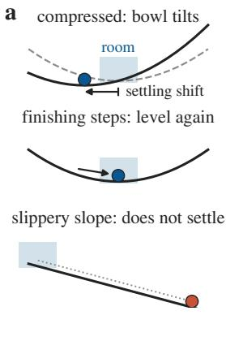

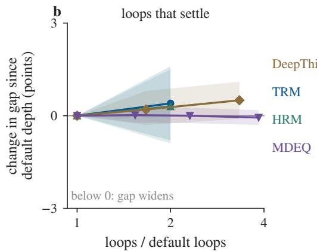

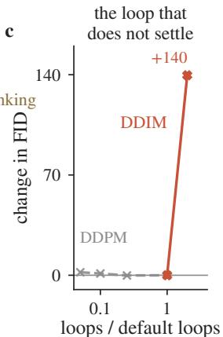  
Figure 1: Thinking longer does not hurt a compressed model whose loop settles; a loop that does not settle piles up error. (a) Compression tilts the bowl, so the loop settles slightly off target. The answer survives while the settling shift stays within the room, and finishing steps level the bowl again. On a slippery slope, every loop carries the ball further. (b) Change in the gap between a 4-bit model and its own full precision as the loops go on past the default depth, one model per family; a value below zero means the gap widens. No interval lies below zero. (c) DDIM, the one loop that does not settle, adds 140 FID over the same range. Paired 95% intervals; the looped language models are in Table 2; protocol in App. C.

## 1 INTRODUCTION

Looped models get their depth from repetition. Instead of stacking new layers, they apply one block of weights again and again, from Universal Transformers (Dehghani et al., 2019) and looped transformers (Saunshi et al., 2025) to recurrent-depth language models (Geiping et al., 2025; Zhu et al., 2025) and small recursive reasoners (Wang et al., 2025; Jolicoeur-Martineau, 2025). Repetition keeps them small, and TRM solves hard Sudoku and maze puzzles with about 7 million parameters.

It moves their cost into memory traffic instead, because every loop reads the same weights again. Compressing the weights therefore saves on every loop, which makes quantization the natural lever for running a looped model cheaply (Nagel et al., 2021; Frantar et al., 2023; Lin et al., 2024).

Quantized looped models, however, fail abruptly. The MLP-mixer TRMs we train solve about 81% of Sudoku-Extreme puzzles with 4-bit weights and one scale per output channel, yet under 8% when the same weights share one scale per tensor (§3.4). The usual explanation is that the rounding error enters the block on every loop and accumulates as the model thinks. LoopQ builds a loop-aware quantizer on this account (Fang et al., 2026), and concurrent work traces the collapse of TRM-style reasoners to a bias that accumulates with reuse (Ingolfsson et al., 2026). If error accumulated, every extra loop would add risk, and a deployer would have to trade precision against thinking time. Does the error really accumulate as a compressed model thinks?

To find out, we run compressed models far past their default depth and track their gap to full precision loop by loop, on more than 30 models from five families (Table 1). The answer surprised us. A compressed model that works at its default depth keeps working as it thinks longer (Figure 1b), and the result reaches public looped language models, where Huginn with 3-bit weights answers 3% of GSM8K problems against 42% at full precision and sixteen precise final loops bring it back to 40% (§3.5). Error accumulates only in deterministic DDIM sampling, whose loop never settles (Figure 1c). The usual explanation holds only for loops that never settle.

Think of a looped model as a ball rolling into a bowl. Each loop rolls the ball further down, and the spot where it comes to rest is the answer. Rounding the weights tilts the bowl, so the ball comes to rest at a slightly different spot, a move we call the settling shift. Rounding is afixed error, the same on every loop, so the tilt is fixed and further loops carry the ball no further, the classical fact that a fixed perturbation moves the fixed point of a contraction only a bounded distance (Banach, 1922). Afresh error, drawn anew on every loop, nudges the ball in a new direction each time, and further loops let it settle back; only on a slippery slope, where nothing pulls the ball back, does every loop carry it further.

The same picture lets us predict which models fail. Around the old resting spot lies a region of states that read out the same answer, which we call the model’s room, and the push is the error that one compressed loop makes at the settled state. An answer is lost when the push exceeds the room, much as a classifier keeps its prediction while a perturbation stays within its margin over its sensitivity (Tsuzuku et al., 2018). With one room shared by all models and a label-free measurement of each model’s sensitivity, we predict which models collapse before deploying them (§3.4).

It also explains why a failed model can be recovered. A collapsed model has settled in the wrong place, but it still settles. A few final loops with more precise weights, which we callfinishing steps, pull its state back, as mixed-precision iterative refinement solves cheaply and then refines precisely (Carson & Higham, 2018; Higham & Mary, 2022). Eight-bit weights are enough for these steps, and a law we stated before the runs predicts how much they recover (§3.3).

## In one sentence

## Compressed looped models do not drift as they think; they settle slightly off target, and a few precise loops bring them back.

From these findings we build a controller that stops a puzzle when the model’s halting head fires and then takes a few 8-bit finishing steps. On Sudoku-Extreme and Maze-Hard it beats fixed-depth inference by up to 15 points under a third of the weight traffic, without a full-precision copy of the compressed weights (§4). We summarize our contributions below.

1. Compressed loops settle. On 33 models from five families, a compressed model that works at its default depth keeps working as it thinks longer, and the size of the error decides whether it collapses (§3.1, §3.2).

2. Failure is predictable. A model fails when its push exceeds its room, and one room shared by the puzzle, convnet and implicit families turns a label-free sensitivity into each model’s tolerance (§3.4).

3. Failure is recoverable. A collapsed model still settles, and a few 8-bit finishing steps bring it back, in looped language models as well (§3.3, §3.5).

4. A controller. Stopping at the halting head and finishing with 8-bit loops beats fixed depth on Sudoku-Extreme and Maze-Hard (§4).

Table 1: Five families, 33 models, one repeated map each. The family is the unit of the claims; the boundary case, diffusion, is the one loop that need not settle. Every model, its default depth and its metric are in Appendix A.
<table><tr><td>Family (models)</td><td>Models</td><td>Task</td><td>What loops</td></tr><tr><td>Puzzle reasoners (24)</td><td>TRM with an MLP or an attention mixer, HRM (Jolicoeur- Sudoku-Extreme, Martineau, 2025; Wang et al., 2025); 19 TRMs we train at several widths and seeds</td><td>Maze-Hard</td><td>one block,  $H \times L$  cycles per supervision step</td></tr><tr><td>Recurrent convnets (1)</td><td>DeepThinking (Bansal et al., 2022)</td><td>33</td><td>mazes of size 13 and a recall block, input re-injected</td></tr><tr><td>Implicit models (3)</td><td>MDEQ-Small, MDEQ-XL (Bai et al., 2020); DEQ- Transformer (Bai et al., 2019)</td><td>103</td><td>ImageNet, WikiText- a solver, run to a fixed point</td></tr><tr><td>Looped language mod- els (4)</td><td>Huginn-3.5B (Geiping et al., 2025); Ouro-1.4B, Ouro- 2.6B (Zhu et al., 2025); Recurrent-OLMo-2 (McLeish</td><td>GSM8K</td><td>a core block, 4–32 recurrences; full precision is bf16</td></tr><tr><td>Diffusion, the boundary (1)</td><td>et al., 2025) DDPM UNet, sampled by DDPM (Ho et al., 2020) and CIFAR-10 DDIM (Song et al., 2021)</td><td></td><td>the denoiser; DDPM draws fresh noise each step, DDIM is deterministic</td></tr></table>

## 2 SETUP

## 2.1 LOOPED MODELS AND SETTLING

A looped model applies one weight-tied map $f _ { \theta }$ to a latent state again and again. The input x enters at every loop, and a readout $g _ { \theta }$ turns the last state into the answer:

$$
z _ { t + 1 } = f _ { \theta } ( z _ { t } , x ) , \qquad \hat { y } = g _ { \theta } ( z _ { T } ) .\tag{1}
$$

The loop settles when its late steps shrink, $\| z _ { t + 1 } - z _ { t } \| < \| z _ { t } - z _ { t - 1 } \|$ , and the state it approaches is the settled state $z ^ { \star } ( \theta , x )$ . A contraction always settles, and a fixed perturbation moves its settled state by a bounded amount (Banach, 1922). Learned loops need not contract, however. Some of our Sudoku TRMs expand certain directions even at full precision and still settle (Appendix E). We measure settling on every compressed model instead of assuming it.

## 2.2 PUSH, SENSITIVITY AND ROOM

Compression replaces the weights θ by ${ \tilde { \theta } } ,$ and the settling shift is the resulting move of the settled state. Its source is the push, the error that one compressed loop makes at the settled state:

$$
\delta \ = \ \frac { \| f _ { \widetilde { \theta } } ( z ^ { \star } , x ) - f _ { \theta } ( z ^ { \star } , x ) \| } { \| z ^ { \star } \| } \approx S \sigma .\tag{2}
$$

Here σ is the weight error relative to the scale of each tensor, and S is the model’s sensitivity. We measure S without labels, by adding relative weight noise at a small level to the loop, running one loop from the settled state on 256 unlabelled inputs, and taking the median push per unit of noise over three draws; $S \sigma$ tracks the push measured on the compressed models (Spearman 0.91, Appendix F). For a contraction with rate $L < 1$ the settling shift is at most $\delta / ( 1 - L )$ . The room $\delta ^ { \star }$ is the largest push that leaves the answer unchanged, so a model tolerates weight error up to $\sigma _ { 1 / 2 } = \delta ^ { \star } / S$ , the level at which its accuracy halves. We estimate a single room shared by all models (§3.4).

## 2.3 COMPRESSION, FIXED ERROR AND FRESH ERROR

We quantize weights after training by round-to-nearest, with one scale per tensor (t), per output channel (c) or per group of 32 input weights (g32); w4t is 4-bit per-tensor, w3g32 3-bit in groups of 32 (Appendix B.1). Quantization is the compression these models survive, since pruning a quarter of TRM’s structure, or distilling it into a smaller student, leaves it unable to solve a single puzzle (Appendix B.3). Rounding is a fixed error, since the same rounded weights serve every loop. To separate the size of an error from its fixedness, we replace rounding by Gaussian noise of relative size σ in two ways: added to the weights once and kept, a fixed error, or added to the input of every linear layer and drawn anew at every call, afresh error. A third variant gives the noise a consistent sign, the bias that concurrent work holds responsible for the collapse (Ingolfsson et al., 2026).

## 2.4 MODELS AND MEASUREMENTS

Table 1 lists the five families. Each has its own depth dial, and we call all of them loops.

If error accumulated, the gap between a compressed model and full precision would widen as the loops go on. We compare every compressed model with full precision on the same examples at the same number of loops, and call a gap widening only if the paired bootstrap interval of its change lies below zero (Efron & Tibshirani, 1993). A compressed model survives if it keeps at least half of full-precision accuracy at the default depth, and collapses otherwise. Fidelity φ, the cosine between the compressed and full-precision final states, gives a label-free view of the same comparison. We ran on two GPU platforms with different software stacks; each exhibit comes from one platform, and no number pools them (Appendix B.2).

## 3 THE SETTLING SHIFT

In the picture of the introduction, compression tilts the bowl once, and the loop still settles, slightly off target. We test the picture in five steps: whether error accumulates with the loops (§3.1), what decides collapse (§3.2), whether a collapsed model comes back (§3.3), which models collapse (§3.4), and whether looped language models behave alike (§3.5). One compressed model runs through the section: HRM on Sudoku-Extreme with 2-bit weights in groups of 32. It solves 14% of the puzzles, where its full-precision version solves 48%.

## 3.1 A COMPRESSED MODEL THAT SETTLES KEEPS ITS ACCURACY AS IT THINKS LONGER

Thinking longer does not widen the gap. A puzzle reasoner has three depth dials, the inner cycles L, the outer cycles H and the supervision steps that repeat them (Table 1). We run each compressed puzzle reasoner far past its default depth on each dial and track its gap to full precision. In Figure 1b the gap of one model per family holds past the default depth. Across every series, none of 22 widens along the outer cycles, 21 of 22 hold or narrow along the supervision steps, and a second platform with new evaluation rows agrees, with none of 23 widening (Appendix C.1). The exceptions are the surviving format closest to collapse, per-tensor 4-bit weights, which loses a few points along supervision steps in some runs, and the fast inner cycles, where some series widen and we make no claim.

A collapsed implicit model passes the standard health check. A deep equilibrium solver declares success when its residual is small. The collapsed DEQ-Transformer reaches a residual 481 times smaller than its full-precision version, so the check passes a model that has failed. Its solver has converged, only to the wrong state. Compressed DeepThinking solvers, MDEQ and the surviving DEQ-Transformer lose nothing to extra iterations (Figure 1b; Appendix C.2).

Error does accumulate where the loop never settles. At 4-bit grouped weights, the FID of deterministic DDIM samples to full-precision samples rises from 40 at 10 steps to 304 at 100, whereas ancestral DDPM sampling, which draws fresh noise at every step, stays flat (Figure 1c; Appendix C.3). The usual account of accumulating error is right for a loop that never settles, and only there. Ouro is the looped language model of this kind, since it loses accuracy with extra loops even at full precision (§3.5).

The concurrent Maze result is a clipping choice. Concurrent work reports that 4-bit per-tensor weights and activations collapse Sudoku but not Maze, and that Maze improves with depth (Ingolfsson et al., 2026). The clipping rule for activations decides Maze. A scale set by the largest calibration value gives 0.0% accuracy, and a 99.99th-percentile scale gives 82.2%. The concurrent work does not state its statistic, and under the percentile rule the Maze gap narrows over the first loops and then holds, the shape of a settling shift (Appendix C.4).

For a deployer, a compressed model that works at its default depth can think as long as its budget allows.

## 3.2 ERROR SIZE SETS THE CLIFF; FIXEDNESS DECIDES REPAIR

Noise with nothing to accumulate still makes the cliff. Zero-mean noise drawn anew at every call has no bias to build up. Injected into TRM Sudoku-MLP, it still takes the model from 62.9% to 2.3% as its size grows from 0.2 to 0.5 of each tensor’s scale (Figure 2a), and it does the same on every puzzle reasoner. A fixed draw or a consistent sign moves the cliff to smaller noise but does not create it (Appendix D.2). Collapse needs no accumulating bias; an error of sufficient size is enough.

More loops repair a fresh error and leave a fixed one. Size decides collapse, but not whether more loops help. We match fixed and fresh error on fidelity and run each model far past its default depth. Fresh error closes part of its gap in all 30 draws at the smaller noise levels; fixed error closes it in none of 15 draws on the MLP mixer and none of 15 on HRM (Figure 2b). Rounding behaves like fixed error, since no quantized MLP or HRM model closes its gap with more loops (Appendix D.1).

a  
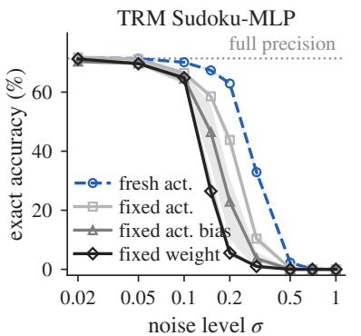

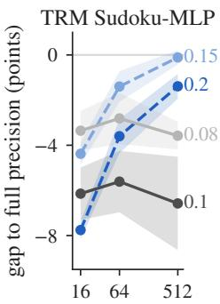

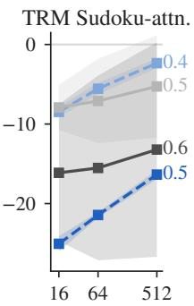

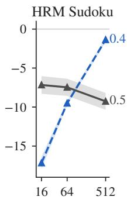  
Figure 2: The size of the error sets the cliff; whether the error stays fixed decides whether more loops repair it. (a) Accuracy against noise level for TRM Sudoku-MLP. Zero-mean fresh noise, which has nothing to accumulate, produces the same cliff as fixed noise, only later. (b) Gap to full precision as the supervision steps grow, for fresh error, drawn anew at every call, and fixed error, added to the weights once, matched on fidelity; the number at each line end is the noise level. Fresh error heals with more loops in every draw; fixed error stays, except in some attention draws. Means and 95% intervals over noise draws; protocol in App. D.

The attention mixer repairs some fixed errors. On the attention mixer, 5 of 15 fixed-error draws close part of their gap, and the surviving 3-bit formats close it fully. Attention maps that sharpen to one position at the settled state would explain this; in a probe we specified in advance, they stay far from one-hot and the attention error does not shrink (Appendix D.3).

A deployer cannot loop a rounding error away; its size must stay small.

## 3.3 A COLLAPSED MODEL STILL SETTLES, AND A FEW PRECISE LOOPS BRING IT BACK

A collapsed model still settles. If compression broke the loop, a collapsed model’s late steps would stop shrinking. In 88% of collapsed models they still shrink, at nearly the rate of surviving ones; our running example’s late steps are each 0.93 times the one before (Appendix E.1). The late ratio is the contraction rate L of §2.1, measured along the trajectory. Compression moves the settled state and leaves the loop settling. Concurrent work infers settling from drift (Ingolfsson et al., 2026); we measure it, on the models that fail.

The failed state is still within reach. A collapsed model might have settled so far away that the full-precision loop cannot bring it back. We start the full-precision loop from the compressed settled state and from points several settling shifts beyond it. In 29 of 64 collapsed models the full-precision loop recovers the answer even from the farthest point we try (Appendix E.2). Collapse happens with the state still in reach.

A few 8-bit loops bring the answer back. We hand the settled state of each collapsed model to a precise loop for a few finishing steps. The median collapsed model keeps 5% of its full-precision accuracy on its own and 96% after 16 finishing steps, on both platforms (Figure 3a). Finishing with 8-bit weights recovers as much, 95%. The running example climbs from 14% to 45% with 16 steps at 8 bits, against 48% at full precision. We had predicted that four steps would do; the median collapsed model needs eight to sixteen, as a loop whose late steps shrink by 0.93 removes only a fraction of the shift per step (Appendix E.3).

We predicted the gain before the runs. An example gains from finishing exactly when compression lost it and its state returns under the full-precision loop, so the expected gain is the share of such examples. We wrote this law down before the finishing runs, with the other predictions of this section; Appendix E.2 lists each with its outcome, the three that failed included. All 20 models on which the law can be scored fall within the tolerance we set, and predicted and observed gains correlate at 0.997 (Figure 3b; Appendix E.4).

A failed compressed model needs no retraining; a few 8-bit loops at the end recover it.

finishing steps k

a  
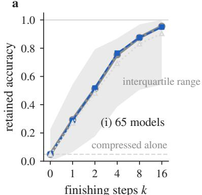

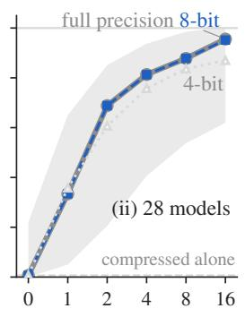

b  
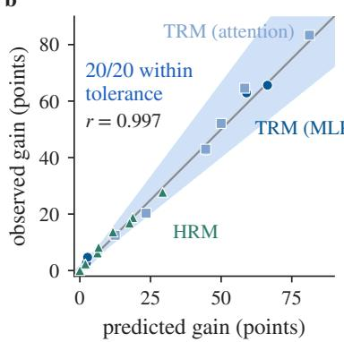  
Figure 3: A collapsed model comes back, 8-bit finishing is enough, and the gain is predicted in advance. (a) Share of full-precision accuracy that collapsed models retain after k finishing steps with full-precision, 8-bit or 4-bit weights; k=0 is the compressed model alone. The 8-bit curve lies on the full-precision curve. Medians over models with the interquartile band; (i) and (ii) are the two platforms. (b) Gain predicted by the finishing law against the observed gain, one point per model; all 20 fall inside the tolerance set before the run (band). Protocol in App. E.

## 3.4 A MODEL FAILS WHEN ITS PUSH EXCEEDS ITS ROOM

One number predicts which models fail. If a model fails when its push exceeds its room, it tolerates weight error up to δ⋆/S (§2.2). We measure each model’s sensitivity S without labels and fit one room shared by all models. That single number predicts the tolerance of 18 models from three families, with $R ^ { 2 } = \mathrm { { 0 } } . 7 2$ on a log scale and a leave-one-out error of a factor of 1.5 at the median, and a free fit recovers the predicted slope (Figure 4a). Six mixer seeds that played no part in the fit land inside the law’s stated error band (Appendix F.3). The room is fitted, not measured; the obvious measured candidate, the distance at which answers change along the compression direction, does not predict tolerance, because the settling shift grows faster than linearly with the error (Appendix F.6).

The mixer sets the room. Attention-mixer TRMs tolerate four times the weight error of MLP-mixer TRMs, on both platforms (Figure 4b). For an MLP-mixer model the quantizer alone decides the outcome. Our MLP-mixer TRMs solve about 81% of puzzles with one scale per output channel at 4 bits and under 8% with one scale per tensor. The mixer gap is also the law’s weak point, since a single room overestimates the tolerance of MLP-mixer models and underestimates that of attention (Appendix F.4).

Training lowers the push. Quantization-aware training with learned step sizes (Esser et al., 2020) widens the tolerance of the full-precision model itself, and it does so as the law allows, by cutting the sensitivity by about 1.7 times and leaving the room unchanged (Appendix F.5).

A cheap check flags failures. Fidelity orders compressed models by collapse within every model, and a cut set on 50 labelled examples places a new model’s boundary (Appendix F.7). For each input, the halting head is a safe signal, since an answer on which it fires in a surviving model is almost always correct.

A deployer can rank candidate models and formats before running any labelled evaluation.

## 3.5 LOOPED LANGUAGE MODELS

Huginn and Recurrent-OLMo-2 settle and come back. We quantize the looped block of four public looped language models (Table 2). Huginn with 3-bit weights answers 3% of GSM8K problems, against 42% at full precision; with the second half of its loops at full precision, it answers 40%. Recurrent-OLMo-2 goes from 2% to 45%, against 41% at full precision. In both models the states of surviving compressed models return to the full-precision answer, and accuracy does not fall with more loops (Appendix G.1).

Ouro does not settle. Ouro is trained for four loops, and even at full precision its accuracy falls when it loops longer. Precise final loops repair some compressed Ouro models, but the picture gives no guarantee there, and 8-bit final loops on a surviving compressed Ouro gain nothing over the compressed model alone at the same weight traffic (Appendix G.2).

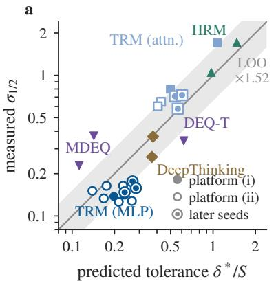

b  
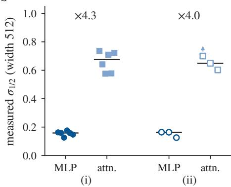  
Figure 4: Who fails is predictable before deployment: a model tolerates weight error up to its room divided by its sensitivity. (a) Tolerance predicted from label-free sensitivity and one room shared by all models, against the measured weight error at which accuracy halves; one point per model and task (18 models on 19 pairs, $R ^ { 2 } { = } 0 . 7 2$ in log scale). Filled and open markers are the two platforms, ringed markers the seeds held out of the fit; the band is the leave-one-out median error. (b) Measured tolerance of width-512 TRMs, one point per seed. The attention mixer tolerates four times the error of the MLP mixer on both platforms. Fits in App. F.

Table 2: Looped language models that settle come back when their last loops run at full precision; Ouro, which does not settle, marks the boundary. GSM8K accuracy (%) at full precision (bf16), for the compressed model alone, and with the second half of its loops at full precision (+precise). One platform, n=100 per entry (Wilson half-width about 10 points); settling tests, fidelity and prompts in App. G.
<table><tr><td></td><td></td><td></td><td colspan="2">w4c</td><td colspan="2">w3a</td></tr><tr><td>Model (loops)</td><td>Settles bf16</td><td></td><td>alone</td><td>e +precise </td><td></td><td>alone +precise</td></tr><tr><td>Huginn-3.5B (32)</td><td>√</td><td>42</td><td>33</td><td>37</td><td>3</td><td>40</td></tr><tr><td>Recurrent-OLMo-2 (32)</td><td>√</td><td>41</td><td>35</td><td>46</td><td>2</td><td>45</td></tr><tr><td>Ouro-1.4B (4)</td><td>x</td><td>73</td><td>7</td><td>66</td><td>0</td><td>0</td></tr><tr><td>Ouro-2.6B (4)</td><td>x</td><td>81</td><td>78</td><td>74</td><td>0</td><td>50</td></tr></table>

The fidelity check needs a cut per model. Fidelity orders collapse within each language model, but the cut differs between models, and no label-free quantity we tried predicts it. The divergence of next-token distributions from full precision separates collapse in every model (Appendix G.3). Teacher-forced loss alone is not enough, since a small rise in loss coexists with collapsed generation (Appendix G.3).

In summary. A compressed looped model that settles fails in one way, by settling off target. Thinking longer costs it nothing, the size of the error decides whether it collapses, a few 8-bit loops bring a collapsed model back, and its push against its room predicts in advance whether it collapses at all.

## 4 A CONTROLLER BUILT FROM THE SETTLING SHIFT

The picture suggests two levers. Past the room a trajectory can reach the right answer and then settle off target, so stopping at the right moment keeps the answer; and a model that has settled off target can be brought back by finishing steps. A controller built from these two levers is also a test of the picture.

## 4.1 STOP, THEN FINISH

The halting head says when to stop. TRM and HRM carry a halting head, a small readout of the latent state trained to predict whether the current answer is already correct (Jolicoeur-Martineau, 2025; Wang et al., 2025). The controller stops a puzzle at the first loop at which the head fires. The firing rule is set once per model on full-precision development rows and kept for every compressed model, so the controller never sees compressed labels, and the head is compressed with the other weights (Appendix H.2). Stopping early also avoids overthinking, the loss of an answer the trajectory has already passed (Bansal et al., 2022).

Algorithm 1 The controller: stop when the halting head fires, then finish with an 8-bit copy of the   
weights.   
Require: compressed weights ˜θ, an 8-bit copy θ8, depth cap D, finishing steps j, input x   
1: z ← z0   
2: for $t = 1 , \ldots , D$ do   
3: $z \gets f _ { \tilde { \theta } } ( z , x )$ ▷ one compressed loop; cost 1   
4: if the halting head fires on z then break   
5: end if   
6: end for   
7: for j steps do $z \gets f _ { \theta _ { 8 } } ( z , x )$ ▷ finishing steps; cost $8 / b _ { \mathrm { e f f } }$ each   
8: end for   
9: return $g _ { \theta _ { 8 } } ( z )$ ▷ readout from the 8-bit copy; no full-precision weights  
Table 3: Stopping at the halting head and finishing with 8-bit loops beats fixed depth at under a third of the weight traffic. Held-out exact accuracy on Sudoku-Extreme, averaged over 20 compressed models; cost in compressed loops per puzzle; finishing steps per puzzle. The first block adds one lever at a time. The second block holds the alternatives: uniform refinement finishes every puzzle and confidence-gated refinement finishes the puzzles whose halting logit is low, both at full precision. The last block tests the head’s choice of puzzles to finish against a random set of the same size. Right, the same rows on the cost–accuracy plane; the path is the first block, the dotted step the add-on, the open grey points the alternatives. Paired 95% intervals; protocol in App. H.

<table><tr><td>Method</td><td>Accuracy (%) Cost Finishing steps</td></tr><tr><td>Fixed depth</td><td>61.1 55.0</td></tr><tr><td>+ stop at the halting head</td><td>63.023.4</td></tr><tr><td>+ 8-bit finishing = controller</td><td>0 1.13</td></tr><tr><td>controller — fixed depth</td><td>75.8 16.1 +14.7[+14.3, +15.2] 1.45</td></tr><tr><td>+ latent sampling (add-on)</td><td>78.7 28.4</td></tr><tr><td>Controller with full-precision finishing</td><td>75.7 25.8</td></tr><tr><td>Uniform refinement, full precision</td><td>72.4 48.3</td></tr><tr><td>Confidence-gated refinement, full precision</td><td>71.5 27.6 2.09</td></tr><tr><td>Finish where the head has not stopped</td><td>73.2 10.6</td></tr><tr><td>Finish a random set of the same size</td><td>71.3 [71.2, 71.4] same cost</td></tr></table>

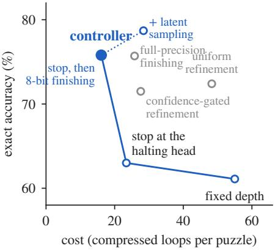

Finishing steps bring the state back, at 8 bits. After it stops, or at a depth cap, the controller takes a few finishing steps with an 8-bit copy of the weights, since 8-bit finishing recovers as much as full precision (§3.3). The cap and the number of finishing steps are chosen per budget on development rows and scored on held-out rows (Appendix H.3). The controller costs less than stopping alone because the development rows pick a lower cap once finishing is available; finishing recovers what extra compressed loops would.

Cost is weight traffic. At batch size one a looped model reads its whole weight set on every loop, and that read sets the time of the loop. We charge each loop by the bytes of weights it reads. A compressed loop costs one unit, and an 8-bit finishing step costs two to four (Appendix B.4).

Sampling is an optional add-on. A third lever runs several perturbed trajectories and keeps the one the head trusts most. Here it perturbs the latent state, as in PTRM (Sghaier et al., 2026); perturbing the rounding itself is studied in Appendix H.6.

## 4.2 RESULTS

Stopping and finishing lift accuracy by 15 points at under a third of the traffic. On the 20 compressed Sudoku-Extreme models, fixed-depth inference scores 61.1 at a cost of 55 compressed loops per puzzle. Stopping at the halting head alone scores 63.0 at a cost of 23.4, so the head already rescues answers that fixed depth loops past. Finishing with 8-bit weights then lifts accuracy to 75.8 at a cost of 16.1, a gain of 14.7 points [14.3, 15.2] over fixed depth (Table 3, and its right panel). On the four Maze-Hard models the same controller lifts fixed depth from 70.9 to 78.5 at the same cost (Appendix H.4). The gain sits on the collapsed models, as their return predicts (§3.3). Models that survive at the default depth keep their accuracy at a fraction of the cost, so for a model that never failed the controller is an efficiency gain. Per model, the controller is above fixed depth with an interval above zero in 10 of the 20 and below it in 4, by 0.4 to 2.4 points, all of them surviving models where stopping alone was chosen (Appendix H.4). The sampling add-on buys three more points at nearly twice the cost, and with it every model ends above fixed depth.

The alternatives fall short on both axes. Uniform refinement, which finishes every puzzle at full precision, reaches 72.4 at three times the controller’s cost, and gating that refinement on the head’s confidence reaches 71.5 at 27.6 (Table 3, second block). The gain also survives a tighter budget. At 24 cost units the controller with full-precision finishing scores 72.2 against 60.5 for fixed depth (Appendix H.4).

No full-precision copy is needed. Finishing with 8-bit weights reaches the accuracy of finishing with full-precision weights, 75.8 against 75.7, at a cost of 16.1 against 25.8, since an 8-bit step reads a quarter of the bytes (§4.1). A deployed model stores its compressed weights and an 8-bit copy of them.

The halting head knows which puzzles to finish. Finishing could help regardless of which puzzles are finished. To check, we hold the number of finished puzzles and the cost fixed and finish a random set instead of the puzzles the head has not stopped. The head’s choice scores 73.2 against 71.3 for random sets, and it is ahead in every model where the two differ (Appendix H.5). The head’s firing carries information about which puzzles still need finishing.

The halting head is the better stopping rule. A threshold on the size of the latent update, frozen on full precision, stops earlier than the head and matches fixed depth, but it falls below the head in 22 of 46 models, among them several whose trajectories pass the answer before they settle (Appendix H.1). Where no halting head exists, as in implicit models and looped language models, it is the available rule.

For a deployer, the recipe is to stop when the model says it is done and to finish the rest with an 8-bit copy; the compressed model never needs full-precision weights at test time.

## 5 RELATED WORK

Looped and recurrent-depth models. Weight-tied depth runs from Universal Transformers (Dehghani et al., 2019) through looped transformers (Giannou et al., 2023; Yang et al., 2024; Saunshi et al., 2025), looped language models (Bae et al., 2025a;b; Geiping et al., 2025; Zhu et al., 2025; McLeish et al., 2025; Hao et al., 2025), equilibrium models (Bai et al., 2019; 2020) and recurrent puzzle solvers (Schwarzschild et al., 2021; Bansal et al., 2022; Wang et al., 2025; Jolicoeur-Martineau, 2025). A loop that settles turns extra iterations into accuracy (Anil et al., 2022); we find that settling also decides what compression costs.

Compressing looped models. LoopQ treats recursive error accumulation as the obstacle and proposes a loop-aware quantizer (Fang et al., 2026); edge-deployment work on TRM states the same account (Jim et al., 2026); concurrent work on TRM-style reasoners attributes their collapse to an accumulating bias (Ingolfsson et al., 2026). We show that collapse needs no bias, that the collapsed loop still settles, and that the lost answers can be recovered. For monotone equilibrium networks, quantization provably preserves convergence and bounds the shift (Li et al., 2026; Winston & Kolter, 2020); our reasoners carry no such certificate, and we measure the same behaviour in them. Quantized reasoning language models, whose loop runs through generated tokens, gain less from longer reasoning (Liu et al., 2025; Lotfi et al., 2026); our loops run in the latent state.

Perturbation, refinement and halting. The picture transfers classical results to learned loops: the fixed-point perturbation bound (Banach, 1922), the margin-over-sensitivity radius (Tsuzuku et al., 2018), mixed-precision iterative refinement (Carson & Higham, 2018; Higham & Mary, 2022), whose accuracy analogue is our finishing law, and stochastic rounding, whose unbiased errors average out (Gupta et al., 2015; Connolly et al., 2021) as our fresh error does inside a loop. Jacobian regularization of equilibrium models (Bai et al., 2021) is a training-time route to lower sensitivity. Adaptive computation (Graves, 2016; Banino et al., 2021) and confidence-based early exit (Schuster et al., 2022) learn when to stop, and overthinking names the answers that later loops lose (Kaya et al., 2019; Bansal et al., 2022); the halting heads of TRM and HRM already separate right from wrong answers in full precision (Sghaier et al., 2026; Corbett et al., 2026). Our controller uses the same head under compression and adds finishing steps, which early exit alone lacks.

## 6 DISCUSSION AND CONCLUSION

Compression and depth stop being rivals. Once a loop is known to settle, the error that compression adds is paid once, and a deployer can compress the block and let the model think as long as the budget allows. The push against the room, measured without labels, says which formats survive (§3.4), and a few 8-bit finishing steps buy back what a coarse format loses, at the end of the computation, where the halting head says the model is done (§4). A loop that does not settle is outside the picture; in deterministic samplers the error grows with depth as the usual account says.

Training decides the room and the push. Both move. Attention mixers have several times the room of MLP mixers, and quantization-aware training lowers the sensitivity while leaving the room where it was (§3.4), so a designer who wants a compressible looped model trains the loop to settle, chooses the mixer with the wider room, and keeps a halting head, which stays a reliable signal under compression. Penalties on the loop’s sensitivity from the equilibrium-model literature (Bai et al., 2021) are the natural next step.

Limitations. The largest looped model we compress has a few billion parameters, and we cannot say whether much larger ones settle. Our costs are modelled from weight traffic and not timed on hardware. The depth claim covers supervision steps and outer cycles, since some series widen along the fast inner cycles, and our comparison of fixed and fresh error at depth places the fixed error in the weights and the fresh error in the activations. Under a fixed error the attention mixer sometimes repairs its gap, for reasons we have not found, and the one room shared across models over-predicts MLP mixers and under-predicts attention. Ouro does not settle, so the picture says little about it.

Conclusion. Compression and depth have been treated as rivals in looped models, and we set out expecting to measure how fast the rounding error piles up. It does not pile up. For a loop that settles, a fixed rounding error tilts the bowl once, thinking longer moves the answer no further, the tilt can be measured before deployment, and a few precise loops undo it afterwards, with tools that numerical analysis has used for decades. We built the controller to test that reading at deployment scale, and it turns collapsed low-bit reasoners into models that beat their own fixed-depth inference at a third of the weight traffic. A looped model reasons in a latent state that no one reads, which makes its reasoning harder to monitor than a written chain of thought (Korbak et al., 2025); fidelity to the full-precision state is the cheap, label-free check that a compressed model still settles where the original does. The test for a new looped model costs one run. Loop it longer and watch whether the gap grows.

## AI USE DISCLOSURE

We used AI coding and writing assistants in this work. Under the authors’ direction, they helped implement code, run and monitor experiments, and edit the prose of this paper. The research ideas, the hypotheses, the choice of experiments and the direction of the work are the authors’. Every number in the paper was checked against the written result records, and the authors take full responsibility for the paper’s content.

## REPRODUCIBILITY STATEMENT

We will release the code, the compressed and trained checkpoints, and every result file that the tables and figures are built from. Models, tasks and training are described in App. A; the compression formats, the evaluation protocol, the statistics, the platforms and the cost model in App. B. Every comparison pairs a compressed model with its own full-precision reference on the same examples and the same platform. The code, the checkpoints and the result files will be released with the camera-ready version.

## REFERENCES

Cem Anil, Ashwini Pokle, Kaiqu Liang, Johannes Treutlein, Yuhuai Wu, Shaojie Bai, J. Zico Kolter, and Roger B. Grosse. Path independent equilibrium models can better exploit test-time computation. In Advances in Neural Information Processing Systems, volume 35, pp. 7796–7809, 2022. doi: 10.52202/068431-0566.

Sangmin Bae, Adam Fisch, Hrayr Harutyunyan, Ziwei Ji, Seungyeon Kim, and Tal Schuster. Relaxed recursive transformers: Effective parameter sharing with layer-wise LoRA. In International Conference on Learning Representations, 2025a.

Sangmin Bae, Yujin Kim, Reza Bayat, Sungnyun Kim, Jiyoun Ha, Tal Schuster, Adam Fisch, Hrayr Harutyunyan, Ziwei Ji, Aaron Courville, and Se-Young Yun. Mixture-of-recursions: Learning dynamic recursive depths for adaptive token-level computation. In Advances in Neural Information Processing Systems, 2025b.

Shaojie Bai, J. Zico Kolter, and Vladlen Koltun. Deep equilibrium models. In Advances in Neural Information Processing Systems, volume 32, 2019.

Shaojie Bai, Vladlen Koltun, and J. Zico Kolter. Multiscale deep equilibrium models. In Advances in Neural Information Processing Systems, 2020.

Shaojie Bai, Vladlen Koltun, and J. Zico Kolter. Stabilizing equilibrium models by Jacobian regularization. In Proceedings of the 38th International Conference on Machine Learning, volume 139 of Proceedings of Machine Learning Research, 2021.

Stefan Banach. Sur les opérations dans les ensembles abstraits et leur application aux équations intégrales. Fundamenta Mathematicae, 3:133–181, 1922.

Andrea Banino, Jan Balaguer, and Charles Blundell. PonderNet: Learning to ponder. arXiv preprint arXiv:2107.05407, 2021. 8th ICML Workshop on Automated Machine Learning (2021).

Arpit Bansal, Avi Schwarzschild, Eitan Borgnia, Zeyad Emam, Furong Huang, Micah Goldblum, and Tom Goldstein. End-to-end algorithm synthesis with recurrent networks: Extrapolation without overthinking. In Advances in Neural Information Processing Systems, volume 35, pp. 20232–20242, 2022.

Erin Carson and Nicholas J. Higham. Accelerating the solution of linear systems by iterative refinement in three precisions. SIAM Journal on Scientific Computing, 40(2):A817–A847, 2018. doi: 10.1137/17M1140819.

Karl Cobbe, Vineet Kosaraju, Mohammad Bavarian, Mark Chen, Heewoo Jun, Lukasz Kaiser, Matthias Plappert, Jerry Tworek, Jacob Hilton, Reiichiro Nakano, Christopher Hesse, and John Schulman. Training verifiers to solve math word problems. arXiv preprint arXiv:2110.14168, 2021.

Michael P. Connolly, Nicholas J. Higham, and Theo Mary. Stochastic rounding and its probabilistic backward error analysis. SIAM Journal on Scientific Computing, 43(1):A566–A585, 2021.

Andrew Corbett, Archit Sood, Anna Tzatzopoulou, Sai-Aakash Ramesh, and Tim Dodwell. Boosting inference with guided reasoning: Stochastic exploration for recursive models. In ICML 2026 Workshop on Structured Probabilistic Inference & Generative Modeling, 2026. arXiv:2605.25230.

Mostafa Dehghani, Stephan Gouws, Oriol Vinyals, Jakob Uszkoreit, and Lukasz Kaiser. Universal transformers. In International Conference on Learning Representations, 2019.

Bradley Efron and Robert J. Tibshirani. An Introduction to the Bootstrap. Chapman & Hall, 1993.

Steven K. Esser, Jeffrey L. McKinstry, Deepika Bablani, Rathinakumar Appuswamy, and Dharmendra S. Modha. Learned step size quantization. In International Conference on Learning Representations, 2020.

Rui Fang, Hsi-Wen Chen, and Ming-Syan Chen. LoopQ: Quantization for recursive transformers. arXiv preprint arXiv:2605.16343, 2026.

Elias Frantar, Saleh Ashkboos, Torsten Hoefler, and Dan Alistarh. GPTQ: Accurate post-training quantization for generative pre-trained transformers. In International Conference on Learning Representations, 2023.

Yarin Gal and Zoubin Ghahramani. Dropout as a Bayesian approximation: Representing model uncertainty in deep learning. In Proceedings of the 33rd International Conference on Machine Learning, volume 48 of Proceedings ofMachine Learning Research, pp. 1050–1059, 2016.

Jonas Geiping, Sean McLeish, Neel Jain, John Kirchenbauer, Siddharth Singh, Brian Bartoldson, Bhavya Kailkhura, Abhinav Bhatele, and Tom Goldstein. Scaling up test-time compute with latent reasoning: A recurrent depth approach. In Advances in Neural Information Processing Systems, volume 38, pp. 41340–41391, 2025.

Angeliki Giannou, Shashank Rajput, Jy-Yong Sohn, Kangwook Lee, Jason D. Lee, and Dimitris Papailiopoulos. Looped transformers as programmable computers. In Proceedings of the 40th International Conference on Machine Learning, volume 202 of Proceedings of Machine Learning Research, pp. 11398–11442, 2023.

Alex Graves. Adaptive computation time for recurrent neural networks. arXiv preprint arXiv:1603.08983, 2016.

Suyog Gupta, Ankur Agrawal, Kailash Gopalakrishnan, and Pritish Narayanan. Deep learning with limited numerical precision. In Proceedings of the 32nd International Conference on Machine Learning, volume 37 of Proceedings of Machine Learning Research, pp. 1737–1746, 2015.

Shibo Hao, Sainbayar Sukhbaatar, DiJia Su, Xian Li, Zhiting Hu, Jason E Weston, and Yuandong Tian. Training large language models to reason in a continuous latent space. In Second Conference on Language Modeling, 2025.

Nicholas J. Higham and Theo Mary. Mixed precision algorithms in numerical linear algebra. Acta Numerica, 31:347–414, 2022.

Jonathan Ho, Ajay Jain, and Pieter Abbeel. Denoising diffusion probabilistic models. In Advances in Neural Information Processing Systems, 2020.

Thorir Mar Ingolfsson, Wajeeha Tahir, Anna Tegon, Lionnus Kesting, Gamze ˙Islamoglu, and Luca ˘ Benini. Quantizing recursive reasoning models. arXiv preprint arXiv:2607.16237, 2026.

Pearse Jim, Steven Kolawole, Opegbemi M. Busoye, Glory Bagai, and Virginia Smith. What survives when you compress a recursive reasoner for the edge? arXiv preprint arXiv:2606.26488, 2026.

Alexia Jolicoeur-Martineau. Less is more: Recursive reasoning with tiny networks. arXiv preprint arXiv:2510.04871, 2025.

Yigitcan Kaya, Sanghyun Hong, and Tudor Dumitras. Shallow-deep networks: Understanding and mitigating network overthinking. In Proceedings of the 36th International Conference on Machine Learning, volume 97 of Proceedings of Machine Learning Research, pp. 3301–3310, 2019.

Tomek Korbak, Mikita Balesni, Elizabeth Barnes, Yoshua Bengio, Joe Benton, et al. Chain of thought monitorability: A new and fragile opportunity for AI safety. arXiv preprint arXiv:2507.11473, 2025.

Balaji Lakshminarayanan, Alexander Pritzel, and Charles Blundell. Simple and scalable predictive uncertainty estimation using deep ensembles. In Advances in Neural Information Processing Systems, volume 30, 2017.

James Li, Philip H. W. Leong, and Thomas Chaffey. Quantization robustness of monotone operator equilibrium networks. IEEE Control Systems Letters, 10:1651–1656, 2026. doi: 10.1109/LCSYS. 2026.3703783.

Ji Lin, Jiaming Tang, Haotian Tang, Shang Yang, Wei-Ming Chen, Wei-Chen Wang, Guangxuan Xiao, Xingyu Dang, Chuang Gan, and Song Han. AWQ: Activation-aware weight quantization for on-device LLM compression and acceleration. In Proceedings of Machine Learning and Systems, volume 6, 2024.

Ruikang Liu, Yuxuan Sun, Manyi Zhang, Haoli Bai, Xianzhi Yu, Tiezheng Yu, Chun Yuan, and Lu Hou. Quantization hurts reasoning? an empirical study on quantized reasoning models. In Second Conference on Language Modeling, 2025. arXiv:2504.04823.

Sanae Lotfi, Polina Kirichenko, Steven Li, and Zechun Liu. Quantized reasoning models think they need to think longer, but they do not. arXiv preprint arXiv:2606.00206, 2026.

Wesley J. Maddox, Pavel Izmailov, Timur Garipov, Dmitry P. Vetrov, and Andrew Gordon Wilson. A simple baseline for Bayesian uncertainty in deep learning. In Advances in Neural Information Processing Systems, volume 32, 2019.

Sean McLeish, Ang Li, John Kirchenbauer, Dayal Singh Kalra, Brian R. Bartoldson, Bhavya Kailkhura, Avi Schwarzschild, Jonas Geiping, Tom Goldstein, and Micah Goldblum. Teaching pretrained language models to think deeper with retrofitted recurrence. arXiv preprint arXiv:2511.07384, 2025.

Markus Nagel, Marios Fournarakis, Rana Ali Amjad, Yelysei Bondarenko, Mart van Baalen, and Tij men Blankevoort. A white paper on neural network quantization. arXiv preprint arXiv:2106.08295, 2021.

Bita Darvish Rouhani, Ritchie Zhao, Ankit More, Mathew Hall, Alireza Khodamoradi, Summer Deng, Dhruv Choudhary, Marius Cornea, Eric Dellinger, Kristof Denolf, et al. Microscaling data formats for deep learning. arXiv preprint arXiv:2310.10537, 2023.

Nikunj Saunshi, Nishanth Dikkala, Zhiyuan Li, Sanjiv Kumar, and Sashank J. Reddi. Reasoning with latent thoughts: On the power of looped transformers. In International Conference on Learning Representations, 2025.

Tal Schuster, Adam Fisch, Jai Gupta, Mostafa Dehghani, Dara Bahri, Vinh Q. Tran, Yi Tay, and Donald Metzler. Confident adaptive language modeling. In Advances in Neural Information Processing Systems, 2022.

Avi Schwarzschild, Eitan Borgnia, Arjun Gupta, Furong Huang, Uzi Vishkin, Micah Goldblum, and Tom Goldstein. Can you learn an algorithm? generalizing from easy to hard problems with recurrent networks. In Advances in Neural Information Processing Systems, volume 34, pp. 6695–6706, 2021.

Amin Sghaier, Ali Parviz, and Alexia Jolicoeur-Martineau. Probabilistic tiny recursive model. arXiv preprint arXiv:2605.19943, 2026.

Jiaming Song, Chenlin Meng, and Stefano Ermon. Denoising diffusion implicit models. In International Conference on Learning Representations, 2021.

Yusuke Tsuzuku, Issei Sato, and Masashi Sugiyama. Lipschitz-margin training: Scalable certification of perturbation invariance for deep neural networks. In Advances in Neural Information Processing Systems, 2018.

Guan Wang, Jin Li, Yuhao Sun, Xing Chen, Changling Liu, Yue Wu, Meng Lu, Sen Song, and Yasin Abbasi Yadkori. Hierarchical reasoning model. arXiv preprint arXiv:2506.21734, 2025.

Ezra Winston and J. Zico Kolter. Monotone operator equilibrium networks. In Advances in Neural Information Processing Systems, volume 33, pp. 10718–10728, 2020.

Liu Yang, Kangwook Lee, Robert Nowak, and Dimitris Papailiopoulos. Looped transformers are better at learning learning algorithms. In International Conference on Learning Representations, 2024.

Rui-Jie Zhu, Zixuan Wang, Kai Hua, Tianyu Zhang, Ziniu Li, Haoran Que, Boyi Wei, Zixin Wen, Fan Yin, He Xing, Lu Li, Jiajun Shi, Kaijing Ma, Shanda Li, Taylor Kergan, Andrew Smith, Xingwei Qu, Mude Hui, Bohong Wu, Qiyang Min, Hongzhi Huang, Xun Zhou, Wei Ye, Jiaheng Liu, Jian Yang, Yunfeng Shi, Chenghua Lin, Enduo Zhao, Tianle Cai, Ge Zhang, Wenhao Huang, Yoshua Bengio, and Jason Eshraghian. Scaling latent reasoning via looped language models. arXiv preprint arXiv:2510.25741, 2025.

## Appendix contents

A Models 15   
B Compression, statistics and cost 15   
B.1 Formats and injected error 15   
B.2 Pairing and verdicts 16   
B.3 Pruning and distillation erase the puzzle reasoner 16   
B.4 Weight-traffic cost model 16   
C Thinking longer 17   
C.1 No surviving puzzle reasoner loses accuracy along outer cycles . 17   
C.2 Implicit models and recurrent convnets lose nothing to extra loops while they survive 17   
C.3 The deterministic sampler compounds error with steps; the ancestral sampler does not 18   
C.4 Clipping decides the per-tensor 4-bit result on Maze 19   
D Fixed versus fresh error 19   
D.1 More loops repair a fresh error and leave a fixed one, except on some attention draws 19   
D.2 Fresh zero-mean noise alone produces the cliff; a bias or a fixed draw only moves it 20   
D.3 Attention does not become one-hot, so one-hot maps do not explain the exception . 20   
E Settling and return 21   
E.1 A collapsed model still settles 21   
E.2 Predictions written before their records 21   
E.3 Recovery climbs with the finishing steps, and 8-bit finishing recovers as much as full   
precision . . 22   
E.4 The finishing law predicts the gain on every model it can scor 23   
F The tolerance law 23   
F.1 The implied room spans 0.17 to 0.89 across the 19 model–task pairs 23   
F.2 One shared room predicts tolerance to a median factor of 1.5 24   
F.3 Parameter-free predictions for new mixer seeds land inside the error band 24   
F.4 The token mixer’s sensitivity shrinks the mixer bias but keeps its sign (post hoc) 25   
F.5 LSQ training lowers the sensitivity and leaves the room unchanged 25   
F.6 Distances measured at one noise level do not predict tolerance 25   
F.7 Fidelity flags collapse with a per-model cut, and the halting head is safe on surviving   
models . . 26   
G Looped language models 26   
G.1 The return test does not separate collapse on looped language models 26   
G.2 Huginn and Recurrent-OLMo-2 settle; Ouro does not 27   
G.3 Fidelity orders collapse within each looped language model, with a cut per model 27   
H Controller details 28   
H.1 The protocol of Table 3, and the rows it leaves out 28   
H.2 The halting head stops early and keeps answers that later loops lose 28   
H.3 Finishing schedules and the cost of a finishing step 29   
H.4 The controller’s gain comes from collapsed models 29   
H.5 The halting head picks the puzzles to finish better than chance 30   
H.6 Redrawing the rounding beats latent sampling, and the rounding grid itself does not   
matter 31

## A MODELS

The paper compresses 33 models from five families (Table 4): five released puzzle reasoners, 19 TRMs we train at several widths and seeds, one DeepThinking maze solver evaluated on two maze sizes, three implicit models, four looped language models and one diffusion model, plus quantizationaware-trained variants (Appendix F). Every exhibit compares a compressed model with its own full-precision version on the same examples, so a checkpoint’s absolute accuracy enters no claim. That matters for the released TRM Sudoku-MLP checkpoint, a community reproduction that scores below the original paper.

Table 4: Every model, the map it repeats, its default depth and its metric; 33 models in all. “What loops” is the weight-tied map; “default depth” is the released depth; n is the number of evaluation examples per compressed model in the main experiments of §3.
<table><tr><td>Model</td><td>#</td><td>What loops</td><td>Default depth</td><td>Task, metric</td><td>n</td></tr><tr><td>TRM, MLP mixer (re- leased)</td><td>1</td><td>one 2-layer block, reused for the zL and zH updates; token- mixing SwiGLU</td><td>H=3, L=6, 16 super- vision steps</td><td>Sudoku-Extreme (97 positions), exact</td><td>1000; 1800 (depth to 512)</td></tr><tr><td>TRM, attention mixer (released)</td><td>2</td><td>as above, self-attention with RoPE; one checkpoint per task</td><td>as above</td><td>Sudoku-Extreme; Maze-Hard 30 ×30 (916 positions),</td><td>1000 / 500</td></tr><tr><td>HRM (released)</td><td>2</td><td>separate high- and low-level modules (4 layers each); one</td><td>H=2, L=2, 16 super- vision steps</td><td>exact and valid path Sudoku-Extreme, Maze-Hard</td><td>1000 / 500</td></tr><tr><td>Our TRMs, MLP mixer</td><td>10</td><td>checkpoint per task as TRM; width 256 (seeds 0–2), 512 (seeds 0–5), 768 (seed 0)</td><td>as TRM</td><td>Sudoku-Extreme, exact</td><td>1000</td></tr><tr><td>Our TRMs, attention mixer</td><td></td><td>as TRM; width 256 (seeds 0–2), 512 (seeds 0–5)</td><td>as TRM</td><td>Sudoku-Extreme, exact</td><td>1000</td></tr><tr><td>DeepThinking</td><td></td><td>recall block, input concatenated at every iteration (width 128)</td><td>300 iterations; swept to 1000</td><td>mazes of size 13 and 33, exact</td><td>per size</td></tr><tr><td>MDEQ-Small, -XL</td><td></td><td>multiscale equilibrium block, Broyden solver</td><td>26 solver iterations</td><td>ImageNet, top-1</td><td>5000 / 2000</td></tr><tr><td>DEQ-Transformer</td><td></td><td>equilibrium transformer layer, Anderson solver</td><td>swept to 60</td><td>WikiText-103, per- plexity</td><td>full test set</td></tr><tr><td>Huginn-3.5B, Recurrent- OLMo-2</td><td>2</td><td>core block between a fixed pre- lude and coda</td><td>set per call</td><td>GSM8K, greedy ac-</td><td>Appendix G</td></tr><tr><td>Ouro-1.4B, -2.6B</td><td>2</td><td>the whole layer stack, with a trained exit gate</td><td>4 loops</td><td>curacy GSM8K</td><td>Appendix G</td></tr><tr><td>DDPM UNet</td><td>1</td><td>the denoiser, one call per sam- pler step</td><td>DDPM 50–1000, DDIM 10–100 steps</td><td>CIFAR-10, FID-5k to full-precision samples</td><td>5000 samples</td></tr></table>

Loops in each family. TRM keeps two latent states and applies one two-layer block L times to update $z _ { L } ,$ then once to update zH; H such cycles make one supervision step (Jolicoeur-Martineau, 2025). HRM has the same structure with two separate modules (Wang et al., 2025). A linear head reads the answer from $z _ { H }$ , and the halting head reads the first position $\mathrm { o f } \ z _ { H }$ . DeepThinking applies a convolutional recall block to the current state and the input at every iteration (Bansal et al., 2022). The DEQs run Broyden (MDEQ) or Anderson (DEQ-Transformer) solvers, which we re-implement with per-example tracking of the lowest-residual iterate (Bai et al., 2019; 2020). The looped language models loop a core block between a fixed prelude and coda (Huginn, Recurrent-OLMo-2) or loop the whole stack with a trained exit gate (Ouro). For diffusion, every compressed model starts from the same noise as its full-precision twin and, under DDPM, draws the same step noise.

Training our TRMs. We train with the upstream recipe: global batch 768, learning rate $1 0 ^ { - 4 }$ with 2000 warm-up steps, weight decay 1.0, EMA 0.999, H=3, L=6, two layers, 16 supervision steps and 65,104 steps on the 1000-puzzle augmented Sudoku-Extreme training set. The upstream trainer’s resume bug is fixed in ours, and no run resumed.

## B COMPRESSION, STATISTICS AND COST

## B.1 FORMATS AND INJECTED ERROR

Symmetric round-to-nearest computes $\tilde { W } = s \cdot \mathrm { c l i p } ( \mathrm { r o u n d } ( W / s ) , - q , q ) , q = 2 ^ { b - 1 } - 1$ , with $s { \dot { = } } \operatorname* { m a x } { | W | / q }$ over one tensor (t), one output row (c), or 32 or 128 consecutive input weights $( \mathbf { g } 3 2 , \mathbf { g } 1 2 8 )$ ; the asymmetric per-channel format (a) uses the row’s min–max range and a zero point.

Quantization is simulated in floating point. Every linear layer of TRM and HRM is quantized, heads included, and embeddings stay at full precision; the other families quantize every convolution and linear layer of the looped block. The suffix +a8 adds static per-tensor INT8 activations. For the comparison with concurrent work we add its W4A4 formats, with per-tensor activation scales clipped either at the maximum over all calibration calls or at the mean per-call 99.99th percentile, and MXInt4 (Rouhani et al., 2023). Calibration rows never overlap evaluation rows.

A fixed error adds σ std(W) ϵ to each weight tensor once, with $\epsilon \sim \mathcal { N } ( 0 , I )$ . A fresh error adds $\sigma \operatorname { s t d } ( a ) \epsilon$ to the input a of every linear layer at every call, with a new draw. Appendix D.2 also uses three variants of the concurrent work (Ingolfsson et al., 2026): activation noise drawn once and reused at every call, a sign-consistent activation bias (80% of its norm in its mean), and a sign-consistent weight bias, all at matched per-call Frobenius norm. The per-call output error $\rho = \| y - \bar { W } _ { 0 } x \| / \| W _ { 0 } x \|$ is measured along each model’s own trajectory.

## B.2 PAIRING AND VERDICTS

Every compressed model runs with its own full-precision reference on the same examples, at the same depth, on the same platform. The two platforms are nodes with L40S cards, platform (i) in the figures, and nodes with A100 (40 GB) cards, platform (ii); their software stacks differ, and no number from one is compared with or pooled with a number from the other, except where Appendix G.3 says so. A series is a model, a format and one loop dial. We compute a 95% paired bootstrap interval over examples (2000 resamples) for the change of the gap from the shallowest to the deepest point: the series widens if the interval lies below zero, narrows if above, and is flat otherwise (Efron & Tibshirani, 1993). A second verdict, on the slope of the gap against $\log _ { 2 }$ of the loops, catches widening between the endpoints. For the runs to 512 supervision steps (Appendix D), with $D = \mathrm { g a p } ( 5 1 2 ) - \mathrm { g a p } ( 1 6 )$ : catch-up if $D > 0 ,$ full if the interval of gap(512) includes zero; widening if $D < 0 ;$ tracks if D and gap(512) both include zero; constant gap if D includes zero and gap(512) does not.

## B.3 PRUNING AND DISTILLATION ERASE THE PUZZLE REASONERS

Quantization is the compression these models survive. Structured magnitude pruning at 25% sparsity already leaves every puzzle reasoner unable to solve a single puzzle, and so does distillation into a one-layer, one-cycle student of width 256 trained with a KL objective (Table 5). Both keep much of the per-cell accuracy on Maze and Sudoku and lose every whole puzzle.

Table 5: Pruning and distillation leave the puzzle reasoners unable to solve a single puzzle. Exact puzzle accuracy and cell accuracy (%) of the dense model, after structured pruning, and of a distilled student (Maze teacher 6.82M, student 855K parameters; Sudoku teacher 5.03M, student 745K). Released checkpoints at H=3 with 10 supervision steps (ARC: 16 steps with test-time augmentation), full test sets, one run.
<table><tr><td></td><td colspan="2">Dense</td><td colspan="2">25% pruned</td><td colspan="2">50% pruned</td><td colspan="2">Distilled</td></tr><tr><td>Task</td><td>exact</td><td>cell</td><td>exact</td><td>cell</td><td>exact</td><td>cell</td><td>exact</td><td>cell</td></tr><tr><td>ARC</td><td>36.0</td><td>87.6</td><td>0.0</td><td>0.3</td><td>0.0</td><td>0.6</td><td></td><td></td></tr><tr><td>Maze</td><td>86.8</td><td>99.5</td><td>0.0</td><td>86.4</td><td>0.0</td><td>0.0</td><td>0.0</td><td>87.3</td></tr><tr><td>Sudoku</td><td>69.1</td><td>87.5</td><td>0.0</td><td>50.0</td><td>0.0</td><td>37.8</td><td>0.0</td><td>54.8</td></tr></table>

## B.4 WEIGHT-TRAFFIC COST MODEL

At batch size one, a loop of a small looped model is bound by reading its weights, so the controller’s cost counts the bits of weights read. One compressed loop reads $b _ { \mathrm { e f f } }$ bits per weight, scales included; a full-precision loop reads 32 and costs $r = 3 2 / b _ { \mathrm { e f f } }$ compressed loops (Table 6), and an 8-bit finishing step costs $8 / b _ { \mathrm { e f f } }$ . Activations and compute are not counted, and no cost is a measured time.

Table 6: One full-precision loop costs 4 to 16 compressed loops. $r = 3 2 / b _ { \mathrm { e f f } }$ , with $b _ { \mathrm { e f f } }$ the bits read per weight including group scales. Weight traffic only.
<table><tr><td>Compressed format</td><td>w4</td><td>w3</td><td>w3g32</td><td>w2</td><td> $\mathrm { w } 2 \mathrm { g } 3 2$ </td><td>w8</td></tr><tr><td> $b \mathrm { e f f }$ </td><td>4</td><td>3</td><td>3.5</td><td>2</td><td>2.5</td><td>8</td></tr><tr><td>r (full-precision loop)</td><td>8</td><td>10.7</td><td>9.1</td><td>16</td><td>12.8</td><td>4</td></tr></table>

## C THINKING LONGER

Figure 1b normalises each family’s loop axis by its default depth (Table 4) and plots the change in the gap from the default depth on, with a paired bootstrap interval of that change over evaluation examples (2000 resamples), so that a model that is still settling at shallow depth is not read as an effect of looping longer; Figure 1c plots FID on the same axis. Each series comes from one platform.

## C.1 NO SURVIVING PUZZLE REASONER LOSES ACCURACY ALONG OUTER CYCLES

Across four puzzle reasoners and six formats, no surviving series widens along outer cycles in any of three runs, and along supervision steps only per-tensor 4-bit weights ever widen (Tables 7 and 8). The runs are the A100 platform, the L40S platform with the same rows (a hardware and library replicate), and the L40S platform with new rows and a new calibration draw (an independent replicate). Along the fast inner cycles three A100 series widen, so we make no claim for that axis, which is the one the concurrent work varies (Ingolfsson et al., 2026). Series that collapse do widen, but only because full precision improves while the collapsed model stays near zero: Sudoku-MLP w4t goes from 2.1% to 5.7% between 1 and 32 supervision steps while full precision goes from 28.4% to 74.2%.

Table 7: Along supervision steps and outer cycles the gap of a surviving model almost never widens. Number of surviving series that widen / stay flat / narrow, by endpoints and by trend (95% paired bootstrap, 2000 resamples). Sudoku n=1000, Maze n=500. Each row comes from one platform. The L40S replicate did not sweep L; its Maze H series cover H 1–3 in the audited records, and records to deeper H leave every verdict unchanged.
<table><tr><td></td><td colspan="3">Endpoints</td><td colspan="3">Trend</td></tr><tr><td>Run (series)</td><td> $n _ { \mathrm { s u p } }$ </td><td>H</td><td>L</td><td> $n _ { \mathrm { s u p } }$ </td><td>H</td><td>L</td></tr><tr><td>A100 (22)</td><td>1 / 16 / 5</td><td>0 /18 / 4</td><td>3 / 14 / 5</td><td>0/ 15 / 7</td><td>0 / 19 / 3</td><td>5 / 12 / 5</td></tr><tr><td>L40S replicate (23)</td><td>0 / 15 / 8</td><td>0 /20 / 3</td><td></td><td>0 / 18 / 5</td><td>0 /20 / 3</td><td></td></tr><tr><td>L40S independent (23)</td><td>2 / 18 / 3</td><td>0/21/2</td><td>一</td><td>1 / 18 / 4</td><td>0/21/2</td><td>一</td></tr></table>

Table 8: A100 platform: no surviving series widens along outer cycles, and one widens along supervision steps. Change of the gap from the shallowest to the deepest point, in points of exact accuracy [95% paired bootstrap interval]; ↑ widens, = flat, ↓ narrows (endpoints). nsup 1→32; H 1→6 (HRM 1→4); L 1→8 (HRM 1→4); default H, L and 16 supervision steps on the other axes. Sudoku n=1000, Maze n=500.
<table><tr><td>Model</td><td>Format</td><td> $n _ { \mathrm { s u p } }$ </td><td>H</td><td>L</td></tr><tr><td>TRM Sudoku, MLP</td><td>w4c</td><td>+1.1 [−1.9, +4.1] =</td><td>−1.2 [−3.3, +1.1] =</td><td>+1.4 [−1.9, +4.8] =</td></tr><tr><td></td><td>w4g32</td><td>−0.2 [−2.4, +2.1] =</td><td>−1.2 [−3.3, +0.9] =</td><td>-1.3 [−4.4, +1.8] =</td></tr><tr><td></td><td>W4A4 g32</td><td>+5.0 [+2.2, +7.9] ↓</td><td>-0.3 [−2.5, +1.9] =</td><td>−7.5 [−10.7, −4.5] ↑</td></tr><tr><td></td><td>W4A4 MXInt4</td><td>+7.5 [+4.1, +10.9] ↓</td><td>+0.1 [−2.3, +2.3] =</td><td>-11.3 [−14.4, -7.9] ↑</td></tr><tr><td></td><td>W8A8 per-tensor</td><td>+13.8 [+10.8, +16.9] ↓</td><td>+2.5 [+0.2, +5.0] ↓</td><td>+7.3 [+3.8, +10.8] ↓</td></tr><tr><td>TRM Sudoku, attn.</td><td>w4c</td><td>+0.7 [−1.0, +2.4] =</td><td>+0.3 [−2.0, +2.6] =</td><td>+4.7 [+2.3, +7.1] ↓</td></tr><tr><td></td><td>w4g32</td><td>+1.0 [−0.7, +2.6] =</td><td>+0.4 [−2.0, +2.7] =</td><td>+3.1 [+0.8, +5.4] ↓</td></tr><tr><td></td><td> $\mathrm { W } 4 \mathrm { A } 4 \mathrm { g } 3 2$ </td><td>+1.9 [+0.0, +3.6] =</td><td>+0.5 [−2.0, +3.0] =</td><td>+5.3 [+2.9, +7.8] ↓</td></tr><tr><td></td><td>W4A4 MXInt4</td><td>+1.4 [−0.6, +3.3] =</td><td>+3.5 [+1.0, +6.1] ↓</td><td>+0.7 [−1.9, +3.5] =</td></tr><tr><td></td><td>w4t</td><td>−2.8 [−5.0, −0.5] ↑</td><td>+1.7 [−1.1, +4.3] =</td><td>-5.5 [-8.8, −2.3] ↑</td></tr><tr><td></td><td>W8A8 per-tensor</td><td>+0.7 [−1.2, +2.5] =</td><td>+0.4 [−2.0, +2.8] =</td><td>-2.5 [−5.1, +0.3] =</td></tr><tr><td>TRM Maze, attn.</td><td>w4c</td><td>−0.8 [−2.0, +0.4] =</td><td>+0.0 [+0.0, +0.0] =</td><td>+0.0 [−1.4, +1.4] =</td></tr><tr><td></td><td>w4g32</td><td>+0.0 [−1.2, +1.2] =</td><td>-0.2 [−0.6, +0.0] =</td><td>-1.0 [−2.4, +0.2] =</td></tr><tr><td></td><td>W4A4g32</td><td>+0.0 [−1.8, +2.0] =</td><td>+0.0 [+0.0, +0.0] =</td><td>+1.0 [−0.6, +2.8] =</td></tr><tr><td></td><td>W4A4 MXInt4</td><td>+2.2 [−0.2, +4.6] =</td><td>−0.2 [−0.6, +0.0] =</td><td>+1.4 [−0.8, +3.4] =</td></tr><tr><td></td><td>w4t</td><td>+1.4 [−1.0, +4.0] =</td><td>+0.0 [−0.6, +0.6] =</td><td>+0.2 [−2.0, +2.4] =</td></tr><tr><td>HRM Sudoku</td><td>w4c</td><td>+0.6 [−1.1, +2.2] =</td><td>+0.7 [−1.1, +2.5] =</td><td>+1.0 [−1.7, +3.6] =</td></tr><tr><td></td><td>w4g32</td><td>+0.7 [−0.9, +2.3] =</td><td>+0.3 [−1.4, +1.8] =</td><td>+1.2 [−1.0, +3.4] =</td></tr><tr><td></td><td>W4A4g32</td><td>+2.5 [+0.7, +4.3] ↓</td><td>+2.5 [+0.6, +4.4] ↓</td><td>+1.6 [−1.0, +4.2] =</td></tr><tr><td></td><td>W4A4 MXInt4</td><td>+0.9 [−1.1, +2.7] =</td><td>+1.5 [−0.5, +3.5] =</td><td>+2.6 [−0.1, +5.5] =</td></tr><tr><td></td><td>w4t</td><td>−0.6 [−2.5, +1.3] =</td><td>+1.7 [−0.3, +3.7] =</td><td>+2.8 [+0.1, +5.5] ↓</td></tr><tr><td></td><td>W8A8 per-tensor</td><td>+2.5 [+0.7, +4.2] ↓</td><td>+2.0 [+0.1, +3.8] ↓</td><td>+1.2 [−1.2, +3.7] =</td></tr></table>

## C.2 IMPLICIT MODELS AND RECURRENT CONVNETS LOSE NOTHING TO EXTRA LOOPS WHILETHEY SURVIVE

Once its solver converges, MDEQ-Small changes by at most 0.1 points from 26 to 100 Broyden iterations, for every noise level and format (Table 9). The DEQ-Transformer improves with extra Anderson iterations for as long as its perplexity stays within twice full precision’s, and worsens only

after it has collapsed (Table 10). Its collapsed w4t model converges to a residual 481 times smaller than full precision’s, so a residual check would pass it. DeepThinking maze solvers change by at most 1.1 points when their iterations double from 500 to 1000.

Table 9: MDEQ-Small on ImageNet: accuracy stops changing once the solver converges, at every noise level, and the solver converges on collapsed models too. Top-1 % by Broyden budget k (26 = default); cosine to the full-precision equilibrium; fraction of images with residual below $1 0 ^ { \overline { { - 2 } } }$ at k=100; median steps to $1 0 ^ { - 2 }$ Noise rows: mean [min, max] over 3 noise directions at k=26; quantizer rows give the mean relative weight error. n=5000 validation images; L40S platform.
<table><tr><td>Noise / format</td><td>k=8</td><td>k=16</td><td>k=26</td><td>k=100</td><td>Cosine to full precision</td><td>Converged / median steps</td></tr><tr><td>fp32</td><td>72.2</td><td>73.9</td><td>73.8</td><td>73.8</td><td>1</td><td>99.7% / 24</td></tr><tr><td>σ 0.05</td><td>71.4</td><td>72.9</td><td>73.1 [72.7, 73.7]</td><td>73.0</td><td>0.978</td><td>99.7% / 24</td></tr><tr><td>σ 0.1</td><td>67.3</td><td>69.0</td><td>68.9 [67.1, 70.7]</td><td>68.9</td><td>0.923</td><td>99.8% / 24</td></tr><tr><td>σ 0.2</td><td>46.0</td><td>49.1</td><td>49.1 [47.1, 52.9]</td><td>49.1</td><td>0.779</td><td>99.8% / 25</td></tr><tr><td>σ 0.3</td><td>12.6</td><td>14.6</td><td>14.8 [10.5, 18.4]</td><td>14.8</td><td>0.614</td><td>99.8% / 25</td></tr><tr><td>σ 0.5</td><td>0.3</td><td>0.2</td><td>0.3</td><td>0.3</td><td>0.334</td><td>99.5% / 26</td></tr><tr><td>w8c (0.009)</td><td>72.2</td><td>74.0</td><td>73.8</td><td>73.8</td><td>0.999</td><td>99.7% / 24</td></tr><tr><td>w4g32 (0.107)</td><td>64.8</td><td>66.6</td><td>66.6</td><td>66.5</td><td>0.882</td><td>99.6% / 26</td></tr><tr><td>w4c (0.171)</td><td>56.2</td><td>58.0</td><td>57.8</td><td>57.9</td><td>0.850</td><td>99.5% / 25</td></tr><tr><td>w4t (0.408)</td><td>0.2</td><td>0.2</td><td>0.2</td><td>0.2</td><td>0.540</td><td>99.9% / 19</td></tr></table>

Table 10: DEQ-Transformer on WikiText-103: extra iterations help as long as the model survives and hurt only after it has collapsed; the collapsed quantizer has the smallest residual. Test perplexity by Anderson iteration cap k (lower is better), median relative residual and cosine to full precision at k=60. Noise rows: mean [min, max] over 3 noise directions at k=60; quantizer rows give the relative weight error. Full test set (245,569 tokens); L40S platform.
<table><tr><td>Noise / format</td><td>k=10</td><td>k=30</td><td>k=60</td><td>Residual, k=60</td><td>Cosine, k=60</td></tr><tr><td>fp32</td><td>91.2</td><td>24.48</td><td>23.14</td><td>2.5e-2</td><td>1</td></tr><tr><td>σ 0.1</td><td>92.3</td><td>25.23</td><td>23.84 [23.82, 23.86]</td><td>2.4e-2</td><td>0.981</td></tr><tr><td>σ 0.3</td><td>98.5</td><td>34.59</td><td>32.65 [32.63, 32.70]</td><td>2.3e-2</td><td>0.846</td></tr><tr><td>σ 0.5</td><td>219</td><td>124.7</td><td>127.1 [124.2, 132.0]</td><td>2.9e-2</td><td>0.55</td></tr><tr><td>σ 0.7</td><td>923</td><td>1071</td><td>1182 [1142, 1204]</td><td>6.1e-2</td><td>0.29</td></tr><tr><td>w8c (0.008)</td><td>90.2</td><td>24.48</td><td>23.14</td><td>2.5e-2</td><td>1.000</td></tr><tr><td>w4g32 (0.09)</td><td>96.8</td><td>25.11</td><td>23.74</td><td>2.5e-2</td><td>0.984</td></tr><tr><td>w4c (0.15)</td><td>67.1</td><td>25.61</td><td>24.35</td><td>2.0e-2</td><td>0.956</td></tr><tr><td>w4t (0.61)</td><td>2556</td><td>2401</td><td>2395</td><td>5.2e-5</td><td>0.27</td></tr></table>

## C.3 THE DETERMINISTIC SAMPLER COMPOUNDS ERROR WITH STEPS; THE ANCESTRAL SAMPLER DOES NOT

DDPM and DDIM share one denoiser; DDPM draws fresh noise at every step and DDIM is deterministic. At 4-bit grouped weights, DDPM’s distance to the full-precision samples is the same from 50 to 1000 steps, whereas DDIM’s grows from 39.5 at 10 steps to 304 at 100 (Table 11). Outside DDPM’s tolerance, its cost also grows with steps.

Table 11: The deterministic DDIM sampler compounds with steps; ancestral DDPM keeps a step-flat cost inside its tolerance. FID-5k against the full-precision samples of the same sampler, drawn from the same starting and step noise (lower is closer). Noise rows: mean over 3 noise directions; quantizer rows give the relative weight error. DDPM CIFAR-10 UNet; L40S platform. The quantizer rows of the DDPM-1000 column need no noise draw.
<table><tr><td></td><td colspan="4">DDIM steps</td><td colspan="4">DDPM steps</td></tr><tr><td>σ / format</td><td>10</td><td>25</td><td>50</td><td>100</td><td>50</td><td>100</td><td>250</td><td>1000</td></tr><tr><td>σ 0.01</td><td>7.4</td><td>6.6</td><td>6.1</td><td>6.7</td><td>1.5</td><td>2.1</td><td>2.6</td><td>1</td></tr><tr><td>σ 0.03</td><td>26.5</td><td>17.0</td><td>17.2</td><td>49.8</td><td>6.2</td><td>7.1</td><td>7.9</td><td>一</td></tr><tr><td>σ 0.05</td><td>45.7</td><td>21.2</td><td>61.4</td><td>189.5</td><td>12.7</td><td>13.3</td><td>13.8</td><td></td></tr><tr><td>σ 0.1</td><td>95.6</td><td>136.5</td><td>345.8</td><td>397.6</td><td>43.2</td><td>42.8</td><td>42.1</td><td>46.1</td></tr><tr><td>σ 0.3</td><td>386</td><td>358</td><td>356</td><td>312</td><td>213</td><td>255</td><td>290</td><td></td></tr><tr><td>w8c (0.010)</td><td>6.4</td><td>5.4</td><td>5.0</td><td>6.0</td><td>2.0</td><td>2.6</td><td>3.2</td><td></td></tr><tr><td>w4g32 (0.105)</td><td>39.5</td><td>49.5</td><td>164</td><td>304</td><td>24.3</td><td>23.5</td><td>22.1</td><td>22.3</td></tr><tr><td>w4c (0.179)</td><td>205</td><td>367</td><td>396</td><td>375</td><td>116</td><td>139</td><td>159</td><td>189</td></tr><tr><td>w4t (0.369)</td><td>405</td><td>407</td><td>382</td><td>318</td><td>205</td><td>235</td><td>268</td><td></td></tr></table>

## C.4 CLIPPING DECIDES THE PER-TENSOR 4-BIT RESULT ON MAZE

Concurrent work reports that per-tensor W4A4 collapses Sudoku but not Maze (Ingolfsson et al., 2026). With activation scales clipped at the maximum over calibration calls, our Maze model scores 0.0%; with a 99.99th-percentile scale it scores 82.2%, and which layers are quantized moves accuracy by at most 0.1 points (Table 12). Under percentile clipping, the Maze gap to full precision closes from −40.6 to −6.6 points over the first supervision steps and then holds at −6.2 and −6.4: the improvement with depth that the concurrent work reports is this early closing of a constant gap.

Table 12: The clipping rule alone decides whether per-tensor W4A4 survives on Maze. Exact % at 16 supervision steps, mean [min–max] over 3 calibration draws, each with its own full-precision reference; ρ = per-call output error. Maze-attention n=500 (full precision 88.4), Sudoku-MLP n=1000 (full precision 71.4); A100 platform.
<table><tr><td>Clipping</td><td>Quantized layers</td><td>Maze exact</td><td>Maze valid path</td><td>Sudoku-MLP exact</td><td>ρMaze /MLP</td></tr><tr><td>max over calls (ours)</td><td>all linears</td><td>0.0 [0.0–0.0]</td><td>0.0</td><td>0.0 [0.0–0.0]</td><td>0.293 / 0.466</td></tr><tr><td>max over calls</td><td>block only</td><td>0.0 [0.0–0.0]</td><td>0.0</td><td>0.0 [0.0–0.0]</td><td>0.293 / 0.465</td></tr><tr><td>99.99th percentile</td><td>all linears</td><td>82.2 [82.2–82.2]</td><td>98.4</td><td>0.8 [0.4–1.0]</td><td>0.145 / 0.270</td></tr><tr><td>99.99th percentile</td><td>block only</td><td>82.3 [82.2–82.4]</td><td>98.4</td><td>0.8 [0.5–1.0]</td><td>0.144 / 0.269</td></tr></table>

## D FIXED VERSUS FRESH ERROR

Figure 2a plots the Sudoku-MLP rows of Table 14, and Figure 2b the fidelity-matched rows of Table 13.

## D.1 MORE LOOPS REPAIR A FRESH ERROR AND LEAVE A FIXED ONE, EXCEPT ON SOME ATTENTION DRAWS

We give three Sudoku models a fixed error (weight noise) and a fresh error (activation noise) at levels whose fidelity at 512 supervision steps overlaps, and follow the gap to 512 steps (Table 13). At the two smaller fresh-noise levels of each model, all 30 draws close part of their gap, to within two points at the smallest level of the MLP and HRM models; fresh noise stops catching up once fidelity falls to about 0.5–0.7. Fixed noise at matched fidelity closes no gap on the MLP mixer (0 of 15 draws) or on HRM (0 of 15) and closes part of it on 5 of 15 attention draws. Rounding behaves like a fixed error. Among the 43 quantized models of the A100 deep set, 7 track full precision, 16 keep a constant gap, 14 widen, and the only 6 that catch up are the three surviving 3-bit attention formats (fully) and three partial cases; no quantized MLP or HRM model catches up.

Table 13: Fresh noise catches up with more loops; fixed noise does not, except on some attention draws. Gap to full precision (points) at 16 / 64 / 512 supervision steps and D = gap(512) − gap(16), mean over 5 noise draws [95% t-interval across draws]; fidelity φ at 512 steps in parentheses; per-draw regimes by the rule of Appendix B.2. 1800 stratified Sudoku-Extreme puzzles; L40S platform; each model with its own full-precision reference.
<table><tr><td>Model</td><td>Error</td><td>σ(φH)</td><td>Gap 16 / 64 / 512</td><td>D</td><td>Per-draw regimes</td></tr><tr><td>TRM MLP</td><td>fresh</td><td>0.15 (0.89)</td><td>-4.4/-1.4/-0.1</td><td>+4.3 [+3.8, +4.7]</td><td>full catch-up 5</td></tr><tr><td></td><td>fresh</td><td>0.2 (0.87)</td><td>-7.8 /-3.6 /-1.4</td><td>+6.4 [+5.6, +7.2]</td><td>full 1, partial 4</td></tr><tr><td></td><td>fresh</td><td>0.25 (0.70)</td><td>-17.1/-17.1/-18.4</td><td>-1.3[-1.9, -0.8]</td><td>constant 5</td></tr><tr><td></td><td>fixed</td><td>0.08 (0.88)</td><td>-3.4 / -2.8 / -3.6</td><td>-0.2[−0.8, +0.3]</td><td>constant 5</td></tr><tr><td></td><td>fixed</td><td>0.1 (0.85)</td><td>-6.1 / -5.6 / -6.6</td><td>-0.4[−1.4, +0.5]</td><td>constant 5</td></tr><tr><td></td><td>fixed</td><td>0.12 (0.72)</td><td>-17.8 /-19.1 /-22.0</td><td>-4.2[−6.5, -1.9]</td><td>widening 5</td></tr><tr><td>TRM attention</td><td>fresh</td><td>0.4 (0.89)</td><td>-8.5 / -5.6 / -2.3</td><td>+6.1 [+5.3, +7.0]</td><td>partial catch-up 5</td></tr><tr><td></td><td>fresh</td><td>0.5 (0.81)</td><td>-25.1/-21.4/-16.4</td><td>+8.7[+8.1, +9.3]</td><td>partial catch-up 5</td></tr><tr><td></td><td>fresh</td><td>0.6 (0.51)</td><td>-72.2 / -78.8 / -84.1</td><td>-11.9[-12.4, -11.4]</td><td>widening 5</td></tr><tr><td></td><td>fixed</td><td>0.5 (0.86)</td><td>-7.9 /-7.1 /-5.3</td><td>+2.6 [−1.8, +7.1]</td><td>partial 2, constant 3</td></tr><tr><td></td><td>fixed</td><td>0.6 (0.80)</td><td>-16.1 /-15.5 /-13.2</td><td>+2.9[-2.5, +8.3]</td><td>full 1, partial 1, constant 3</td></tr><tr><td></td><td>fixed</td><td>0.7 (0.71)</td><td>-31.3 /-31.5 /-29.8</td><td>+1.5[−11.0, +14.0]</td><td>partial 1, constant 3, widening 1</td></tr><tr><td>HRM</td><td>fresh</td><td>0.4 (0.90)</td><td>-17.2 /-9.5 /-1.4</td><td>+15.8[+15.1,+16.5]</td><td>full catch-up 5</td></tr><tr><td></td><td>fresh</td><td>0.5 (0.76)</td><td>-43.9 / -40.9 / -40.8</td><td>+3.2[+2.6, +3.7]</td><td>partial catch-up 5</td></tr><tr><td></td><td>fresh</td><td>0.6 (0.59)</td><td>-53.4 /-59.2 / -64.8</td><td>−11.4[−11.6, −11.2]</td><td>widening 5</td></tr><tr><td></td><td>fixed</td><td>0.5 (0.91)</td><td>-7.2 /-7.5 /-9.3</td><td>-2.1[-3.5, -0.7]</td><td>widening 3, constant 2</td></tr><tr><td></td><td>fixed</td><td>0.7 (0.86)</td><td>-15.1 /-16.9 /-19.2</td><td>-4.1 [−5.9, −2.2]</td><td>widening 4, constant 1</td></tr><tr><td></td><td>fixed</td><td>0.85 (0.81)</td><td>-23.7 /-26.1 /-28.9</td><td>−5.2[-6.8, −3.6]</td><td>widening 5</td></tr></table>

## D.2 FRESH ZERO-MEAN NOISE ALONE PRODUCES THE CLIFF; A BIAS OR A FIXED DRAW ONLYMOVES IT

Concurrent work attributes the 4-bit collapse to a bias that accumulates with reuse (Ingolfsson et al., 2026). Fresh zero-mean noise has no bias, yet it takes Sudoku-MLP from 62.9% to 2.3% between σ 0.2 and 0.5 with a draw spread of at most 2 points, and Maze from 85.5% at 0.7 to 23.3% at 1.0 (Tables 14 and 15). Keeping the activation noise fixed across calls moves Sudoku-MLP’s halfaccuracy point from 0.29 to 0.22, and a sign-consistent bias of equal norm moves it to 0.15–0.19. Measured by the per-call output error $\rho ,$ the Sudoku-MLP variants collapse within a band three times wide (0.038–0.124), against eight times wide in $\sigma ;$ per unit $\rho$ the bias is no more harmful than fresh noise. Fresh zero-mean noise also collapses Sudoku-attention (44.0% at 0.5 to 1.1% at 0.7) and HRM (12.0% to 0%), and on HRM a fixed zero-mean draw and a bias of equal norm are indistinguishable $( \sigma _ { 1 / 2 } 0 . 2 4 \mathrm { - } 0 . 3 5$ and 0.25–0.36). The extra damage of the fixed variants comes from their being fixed across loops, not from a nonzero mean.

Table 14: TRM Sudoku-MLP: zero-mean fresh noise alone produces the cliff; bias and fixedness move it. Exact % at each σ, mean [min–max] over 3 noise draws; $\sigma _ { 1 / 2 }$ and $\rho _ { 1 / 2 }$ are where exact accuracy falls below half of full precision (71.4), per draw. Weight bias (wb, own grid): σ 0.02 → 66.3 [64–69], 0.05 → 3.1 [2–4]; $\sigma _ { 1 / 2 } 0 . 0 3 4 \mathrm { - } 0 . 0 3 5 , \rho _ { 1 / 2 } 0 . 0 4 \bar { 7 } \mathrm { - } 0 . 0 4 9 . n \mathrm { = } 1 0 0 0 ,$ , H=3, L=6, 16 supervision steps; A100 platform.
<table><tr><td>Variant</td><td>σ 0.1</td><td>0.15</td><td>0.2</td><td>0.3</td><td>0.5</td><td> $\sigma _ { 1 / 2 }$ </td><td> $\rho _ { 1 / 2 }$ </td></tr><tr><td>an fresh, zero-mean</td><td>70.1 [70–70]</td><td>67.4 [67–68]</td><td>62.9 [63–63]</td><td>32.9 [32–34]</td><td>2.3 [2–2]</td><td>0.287–0.293</td><td>0.080–0.082</td></tr><tr><td>af fixed, zero-mean</td><td>66.5 [66–67]</td><td>58.6 [57–60]</td><td>43.8 [41–46]</td><td>10.4 [8–13]</td><td>0.3</td><td>0.216-0.231</td><td>0.061-0.064</td></tr><tr><td>ab fixed, sign-consistent</td><td>64.6 [62–67]</td><td>46.5 [35–56]</td><td>22.9 [10–31]</td><td>3.7 [0–6]</td><td>0.0</td><td>0.149–0.190</td><td>0.094–0.124</td></tr><tr><td>wn weight, zero-mean</td><td>64.9 [63–66]</td><td>26.5 [24–31]</td><td>5.5 [4–7]</td><td>1.0</td><td>0.0</td><td>0.135-0.144</td><td>0.038–0.042</td></tr></table>

Table 15: TRM Maze-attention: the same variants, a wider tolerance. Exact % mean [min–max] over 3 noise draws; $\sigma _ { 1 / 2 }$ on exact match and on valid path; full precision 88.4. n=500, H=3, L=4; A100 platform.
<table><tr><td>Variant</td><td> $\sigma 0 . 5$ </td><td>0.7</td><td>1.0</td><td>1.5</td><td>σ1/2 exact</td><td> $\sigma _ { 1 / 2 }$  valid path</td><td> $\rho _ { 1 / 2 }$ </td></tr><tr><td>an fresh, zero-mean</td><td>87.5 [87–88]</td><td>85.5 [85–87]</td><td>23.3 [23–24]</td><td>0.0</td><td>0.897–0.902</td><td>1.20-1.21</td><td>0.198–0.199</td></tr><tr><td>af fixed, zero-mean</td><td>77.7 [70–82]</td><td>34.9 [20–48]</td><td>0.0</td><td>0.0</td><td>0.60–0.73</td><td>0.78-0.83</td><td>0.13-0.16</td></tr><tr><td>ab fixed, sign-consistent</td><td>86.1 [84–88]</td><td>79.5 [72–84]</td><td>9.3 [0–25]</td><td>0.0</td><td>0.82–0.90</td><td>0.83-0.91</td><td>0.18–0.20</td></tr><tr><td>wn weight, zero-mean</td><td>87.7 [87–88]</td><td></td><td>86.1 [85–87]</td><td>27.1 [0–81]</td><td>1.24-1.73</td><td>1.73-1.75</td><td>0.30-0.44</td></tr></table>

## D.3 ATTENTION DOES NOT BECOME ONE-HOT, SO ONE-HOT MAPS DO NOT EXPLAIN THE EXCEPTION

Attention maps that sharpen to one position at the settled state would make their rounding error vanish as the model settles, which would explain why some fixed errors on the attention mixer close their gap. We wrote the prediction and its pass criterion before any record existed. The criterion was that in each catch-up model the error of the attention path at step 512 falls below half its step-1 value and the attention entropy falls, and that in constant-gap and MLP models it stays at least 0.8 times its step-1 value. Neither holds (Table 16). From step 4 to 512 the normalised entropy stays between 0.62 and 0.68 and the mean maximum probability near 0.26, at full precision and in every compressed model; the attention-path error rises from step 1 to 4 and is then flat, with the same shape in catch-up and constant-gap models; the whole-step error roughly halves in every model alike.

Table 16: Attention never becomes one-hot, and its error does not shrink in the models that catch up. Values at supervision steps 1 → 512 (mixer-path error also at 4 / 16 / 64). n=128 Sudoku-Extreme puzzles, 512 supervision steps; L40S platform; hypothesis and pass criterion written before any record they score existed.
<table><tr><td>Model / format (regime)</td><td>Mixer-path error, steps 1 / 4 / 16 / 64 / 512</td><td>Whole-step error</td><td>Entropy</td><td>Top probability</td></tr><tr><td>attention, full precision</td><td>0</td><td>0</td><td>0.694 → 0.643</td><td>0.21 → 0.26</td></tr><tr><td>attention w3c (catch-up)</td><td>0.210 / 0.281 / 0.287 / 0.290 / 0.291</td><td>0.636 → 0.289</td><td>0.719 → 0.646</td><td>0.19 → 0.26</td></tr><tr><td>attention w3a (catch-up)</td><td>0.170 / 0.232 / 0.237 / 0.239 / 0.240</td><td>0.444 → 0.229</td><td>0.703 → 0.643</td><td>0.20 → 0.26</td></tr><tr><td>attention w3g32 (catch-up)</td><td>0.136 / 0.181 / 0.187 / 0.189 / 0.190</td><td>0.310 → 0.168</td><td>0.696 → 0.638</td><td>0.21 → 0.26</td></tr><tr><td>attention w4t (constant)</td><td>0.169 → 0.240</td><td>0.503 → 0.229</td><td></td><td>0.711 → 0.651 0.20 → 0.25</td></tr><tr><td>MLP w4c (constant)</td><td>0.086, flat</td><td>0.520 → 0.220</td><td></td><td></td></tr><tr><td>MLP w4a (constant)</td><td>0.076, flat</td><td>0.437 → 0.181</td><td></td><td></td></tr><tr><td>MLP w4g32 (constant)</td><td>0.046, flat</td><td>0.382 → 0.128</td><td></td><td></td></tr></table>

## E SETTLING AND RETURN

Throughout, $f _ { \theta }$ is the full-precision loop (fp32; bf16 for the language models), $f _ { \tilde { \theta } }$ the compressed one, and $z ^ { \star }$ and $\tilde { z } ^ { \star }$ their settled states after the same loops on the same input. Retained accuracy is compressed accuracy over full-precision accuracy on the same examples; a compressed model collapses when it retains less than 0.5. Models whose full-precision accuracy is below 10% are excluded. The L40S and A100 platforms are run and scored separately, and no number in this appendix pools them.

## E.1 A COLLAPSED MODEL STILL SETTLES

Two explanations of why a model collapses while its state stays within reach were written, with their bars, before any record they score existed: (A) contraction loss, the compressed loop stops settling; (B) room, the loop still settles and its shift carries the state past a model-specific room. We measure the late contraction ratio $r ,$ the median over the last three loops of $\| z _ { t + 1 } - z _ { t } \| / \| z _ { t } - z _ { t - 1 } \|$ on the compressed trajectory, on every example full precision solves. Only 12% of collapsed models have $r \geq 1$ , against the 80% that (A) needs, and 88% keep settling, nearly the rate of surviving ones (91%), so $( \mathrm { A } )$ fails and (B)’s first clause holds (Table 17). (B)’s zero-parameter width, a room read off at $\sigma _ { 0 } { = } 0 . 0 5$ , misses the new seeds’ tolerance by a factor of 8.9, because the settling shift grows faster than linearly with the noise level. The implicit models settle as well: Broyden reaches its residual tolerance on nearly every image at every noise level, collapsed models included. Several full-precision models are not fully settled at 16 loops (late ratio of the full-precision trajectory 0.93–1.00 for TRM Sudoku MLP/attention, DeepThinking and one LSQ model), so $r \approx 1$ alone does not show that the loop stopped settling there.

Table 17: Collapsed models keep settling: the contraction-loss explanation fails its defining clause. Each row is a clause with its bar, the outcome and the verdict. Width errors are on the six new mixer seeds (§F.3; median | log | ratio, as a factor); bias = predicted/measured tolerance, MLP / attention. L40S platform, 32 record files, 201 unique compressed models (60 collapsed).
<table><tr><td>Clause</td><td>Bar</td><td>Outcome</td><td>Verdict</td></tr><tr><td>(A1) collapsed models with  $r \geq 1$ </td><td>≥80%</td><td>12%</td><td>fails</td></tr><tr><td>(A2) surviving models with  $r < 1$ </td><td>≥80%</td><td>91%</td><td>holds</td></tr><tr><td>(B1) collapsed models with  $r < 1$ </td><td>≥80%</td><td>88%</td><td>holds</td></tr><tr><td>(B2) zero-parameter width, new seeds</td><td>bias in [0.9, 1.1]</td><td>×8.9 (bias 8.25 / 9.60)</td><td>fails</td></tr><tr><td>one fitted scale</td><td>(reported)</td><td>× 1.57 (bias 1.45 / 1.68)</td><td>一</td></tr><tr><td>reference:  $\delta ^ { \star } / S , \delta ^ { \star } / S _ { \mathrm { m i x } }$ </td><td></td><td>×1.39, ×1.16</td><td>一</td></tr></table>

## E.2 PREDICTIONS WRITTEN BEFORE THEIR RECORDS

The return test starts the full-precision loop from $z ( t ) = z ^ { \star } + t \left( \tilde { z } ^ { \star } - z ^ { \star } \right)$ for t on a grid up to 16 and runs k=16 full-precision loops (DeepThinking: its own depth; MDEQ: a Broyden budget). An example returns at t if the decoded answer equals the full-precision answer from $z ^ { \star }$ after the same loops; $t _ { c }$ is the largest grid t up to which every grid point returns, $\rho = 1 / t _ { c } ,$ and a compressed model’s $\rho$ is the median over the examples full precision solves. Table 18 lists every prediction with its scoring rule and outcome, the falsified ones included. P1 fails because collapsed states return. On the L40S platform 29 of 64 collapsed models return even from the grid cap, as a cross-seeding record disclosed before P1 was scored (the full-precision loop run from the perturbed end state recovered 95–99% of the Sudoku puzzles full precision solves). The per-example link is one-sided, with P(correct | no return) 0.00–0.14 and P(correct | return) 0.62–0.84. For P3, the halting logits saturate in 78% (L40S) and 80% (A100) of MLP examples and 23% and 28% of HRM examples, so the $t _ { c }$ comparison rests on few examples there; the correct-draw result is unaffected.

Table 18: Every prediction and its outcome, the falsified ones included. Order is the order in which the predictions and their scoring rules were written, each before any record it scores existed. P1–P4 are scored on the L40S return records (255 compressed models; 191 scored, 64 collapsed); the A100 replicate covers the released models (148; 91 scored, 28 collapsed) and scores P1 and the head-pick part of P3 only. The two platforms are scored separately. The looped-LM return test (§G.1) has its own predictions, also written before any record they score existed.
<table><tr><td>ID</td><td>Order</td><td>Prediction and bar</td><td>Outcome</td></tr><tr><td>P1</td><td>1</td><td>A compressed model collapses iff its settled state does not return under the full-precision loop: rule “collapse iff median  $\rho > 1 ^ { \mathfrak { s } }$  balanced accuracy  $\geq$  0.80;  $\operatorname { A U R O C } ( \rho ) > \operatorname { A U R O C } ( - \varphi ) ;$  leave-one-family-out  $\rho \geq \varphi ;$  Spear-</td><td>Falsified on both platforms. L40S: balanced accuracy 0.63; AUROC ρ 0.70 vs —φ 0.98; LOFO 0.72 vs 0.94; 29/64 collapsed models return from the grid cap. A100: 0.61; AUROC 0.60 vs 0.97; LOFO 0.78 vs 0.91; 17/28 at the cap.</td></tr><tr><td>P2</td><td>1</td><td>man(retained, return)  $\geq 0 . 7 .$  Finishing law: gain of full- precision finishing 二 return rate  $\times$  gap; supported if  $| \mathrm { p r e d - o b s } | \leq \mathrm { m a x } ( 2 \mathrm { p t s } , 2 5 \% )$  on</td><td>Confirmed: 20/20 matched models, mean |pred—obs| 1.52 points,  $r = 0 . 9 9 7$  (L40S).</td></tr><tr><td>P3</td><td>1</td><td>≥80% of matched models. Sampling: the halting head picks draws with larger  $t _ { c }$  (sign test  $p <$  0.05 in each model), and the best-of- 16 gain peaks at intermediate return rates.</td><td>Falsified. The head picks larger  $\mathbf { \nabla } \cdot t _ { c }$  draws in HRM w3c (57/18) and MLP w4c (15/1), not attention w3c (64/67); the gain is largest at the lowest return rate. The head does pick correct draws (picked-correct vs median draw: atten- tion 68/0, HRM 89/0, MLP 62/0 on the L40S platform; 72/0, 83/1, 68/1 on the A100 plat-</td></tr><tr><td>P4</td><td>1</td><td>Radius law:  $\sigma _ { 1 / 2 }$  ≈  $0 . 1 \times$  median  $t _ { c }$  at noise  $0 . 1$  removes the tolerance</td><td>form). Falsified:  $R ^ { 2 } ( \log ) = - 0 . 8 4$  , worse than the laws with S and  $S _ { \mathrm { m i x } }$ </td></tr><tr><td>K1</td><td>2</td><td>law&#x27;s mixer bias.  $k \leq 4$  full-precision finishing steps recover  $2 8 0 \%$  of the examples full precision solves, on collapsed mod-</td><td>Falsified on the L40S platform, partly on the A100 platform; 8–16 steps needed (Table 19).</td></tr><tr><td>K2</td><td>2</td><td>els. w8c finishing within 2 points of full- precision finishing on ≥90% of com- pressed models (at  $k = 4$  and 16).</td><td>Partly on the L40S platform (0.84 of models), confirmed on the A100 platform (0.93); me- dian |w8c—fp32| 0.003 (L40S), 0.000 (A100).</td></tr></table>

## E.3 RECOVERY CLIMBS WITH THE FINISHING STEPS, AND 8-BIT FINISHING RECOVERS AS MUCH AS FULL PRECISION

From $\tilde { z } ^ { \star }$ we run the full-precision, w8c or w4c loop for $k \in \{ 1 , 2 , 4 , 8 , 1 6 \}$ finishing steps. Recovery needs 8–16 steps against the 1–4 of prediction K1, and the two platforms agree (Table 19). The families differ (L40S recovery at $k { = } 2 \bar { / } 4 / 1 6 ) ;$ : TRM-attention 0.92/0.93/0.93, where two steps suffice; TRM-MLP 0.58/0.77/0.90; trained seeds 0.58/0.73/0.94; HRM 0.31/0.54/0.82; quantization-awaretrained models 0.31/0.52/0.73; MDEQ 0.32/0.76/1.00; DeepThinking 0/0/0.04, since it runs 100 loops at test time and its return test at k=100 returns. After 16 steps, w8c finishing retains 0.95 against 0.96 for full precision on both platforms, and w4c retains 0.90 (L40S) and 0.87 (A100) (Figure 3a). The K2 bar, within 2 points of full-precision finishing on 90% of models, is met on the A100 platform (0.93) and narrowly missed on the L40S platform (0.84), where the misses are 2–4 points. The controller repeats the comparison at deployment scale (Appendix H.1).

Table 19: Recovery on collapsed models climbs with the number of finishing steps, on both platforms alike. Medians over collapsed models, full-precision finishing; recovery = share of the examples full precision solves whose decoded answer equals full precision’s after the same k loops; retained = accuracy after finishing over full-precision accuracy. The compressed model alone retains 0.05 (L40S) and 0.01 (A100); surviving models retain 0.97 and 1.00 already at $k { = } 1$ . L40S platform: 36 record files, 201 compressed models with full-precision accuracy $2 1 0 \%$ , 65 collapsed (TRM released checkpoints, trained width and seed variants, quantization-aware-trained and fine-tuned models, HRM, on Sudoku-Extreme and Maze-Hard; DeepThinking mazes; MDEQ-Small/XL). A100 platform: 12 files, 100 compressed models, 28 collapsed (released models). The two platforms are never pooled.
<table><tr><td>Platform</td><td>k (full-precision finishing steps)</td><td>1</td><td>2</td><td>4</td><td>8</td><td>16</td></tr><tr><td>L40S</td><td>recovery (median model) retained accuracy</td><td>0.28 0.29</td><td>0.50 0.51</td><td>0.71 0.75</td><td>0.83 0.88</td><td>0.89 0.96</td></tr><tr><td rowspan="2">A100</td><td>recovery (median model)</td><td>0.32</td><td>0.67</td><td>0.80</td><td>0.87</td><td></td></tr><tr><td>retained accuracy</td><td>0.33</td><td>0.69</td><td>0.81</td><td>0.88</td><td>0.88 0.96</td></tr></table>

## E.4 THE FINISHING LAW PREDICTS THE GAIN ON EVERY MODEL IT CAN SCORE

Finishing repairs an example when the compressed model gets it wrong, full precision gets it right, and the compressed settled state returns, so the expected gain of a compressed model is

$$
\widehat { \Delta } \ = \ \frac 1 n \sum _ { i = 1 } ^ { n } \mathrm { r e t } _ { i } ( c _ { i } ^ { f } - c _ { i } ^ { q } ) ,
$$

with ret the return indicator at t=1 and $c _ { i } ^ { f } , c _ { i } ^ { q }$ full-precision and compressed correctness. The observed gain comes from an independent run, 16 compressed loops followed by 8 full-precision finishing steps against 16 compressed loops, on the first 256 puzzles; a model is matched when that run’s compressed per-example correctness equals the return run’s on at least 98% of examples, and the rule fixed in advance the difference between the return test’s 16 loops and the finishing run’s 8. All 20 matched TRM and HRM models fall within the tolerance of max(2 points, 25%), with mean absolute error 1.52 points and $r { = } 0 . 9 9 7$ (L40S platform; Figure 3b). Where the state does not return, the gain vanishes: HRM Sudoku w3t has return 0.00 and gain 0.000, and TRM-attention w3t return 0.25 and gain 0.20 of a 0.73 gap. For MDEQ-XL w4g32, whose settling shift is tiny, the law predicts 0.008 and the run gives 0.006 (unmatched at 64% agreement; reported, not scored).

## F THE TOLERANCE LAW

Relative weight noise at level σ adds Gaussian noise with standard deviation σ times each tensor’s own standard deviation, drawn once and kept across loops. The tolerance $\sigma _ { 1 / 2 }$ is the level at which accuracy falls to half of full precision (three draws, median per level; for the DEQ-Transformer, the level at which perplexity doubles). The push δ is the relative error of one noisy loop at the full-precision settled state (Eq. 2), and the sensitivity is S = median $\delta / \sigma _ { 0 }$ at $\sigma _ { 0 } { = } 0 . 0 5$ (median over three draws of the median over inputs; $n { = } 2 5 6 )$ . The law is $\sigma _ { 1 / 2 } = \delta ^ { \star } / S$ with one shared room $\delta ^ { \star }$ Each model’s $\sigma _ { 1 / 2 }$ and S come from one platform; S measured on both platforms agrees within 2.7% for 18 models, and the push of each compressed model within 0.05% (median) and 3.3% (max) over 279 compressed models.

## F.1 THE IMPLIED ROOM SPANS 0.17 TO 0.89 ACROSS THE 19 MODEL–TASK PAIRS

Tables 20 and 21 list every model–task pair in the fit, one table per platform, with its implied room $S \cdot \sigma _ { 1 / 2 }$ , the push at which its accuracy halves. Among the TRMs, the MLP-mixer models sit at the low end (0.17–0.37) and the attention models higher (0.51–0.55), the mixer effect that §F.3 tests on new seeds.

Table 20: L40S models: the implied room spans 0.19 to 0.89. full precision = full-precision accuracy (DEQ-Transformer: perplexity, lower is better); $\sigma _ { 1 / 2 } =$ measured tolerance; S(0.05) = sensitivity at $\sigma _ { 0 } = 0 . 0 5 ;$ implied room $= { \cal S } \cdot \sigma _ { 1 / 2 } .$ L40S platform.
<table><tr><td>Model</td><td>Family</td><td>Full precision</td><td> $\sigma _ { 1 / 2 }$ </td><td>S(0.05)</td><td> $S \cdot \sigma _ { 1 / 2 }$ </td></tr><tr><td>TRM Sudoku MLP</td><td>TRM</td><td>0.715</td><td>0.14</td><td>1.74</td><td>0.24</td></tr><tr><td>TRM Sudoku attention</td><td>TRM</td><td>0.727</td><td>0.80</td><td>0.69</td><td>0.55</td></tr><tr><td>TRM Maze attention</td><td>TRM</td><td>0.875</td><td>1.71</td><td>0.32</td><td>0.55</td></tr><tr><td>HRM Sudoku</td><td>HRM</td><td>0.477</td><td>1.05</td><td>0.35</td><td>0.37</td></tr><tr><td>HRM Maze</td><td>HRM</td><td>0.748</td><td>1.71</td><td>0.23</td><td>0.40</td></tr><tr><td>DeepThinking maze 13</td><td>DeepThinking</td><td>1.000</td><td>0.37</td><td>0.92</td><td>0.34</td></tr><tr><td>DeepThinking maze 33</td><td>DeepThinking</td><td>1.000</td><td>0.26</td><td>0.93</td><td>0.25</td></tr><tr><td>MDEQ-Smali</td><td>DEQ</td><td>0.738</td><td>0.23</td><td>3.06</td><td>0.70</td></tr><tr><td>MDEQ-XL</td><td>DEQ</td><td>0.755</td><td>0.37</td><td>2.41</td><td>0.89</td></tr><tr><td>DEQ-Transformer</td><td>DEQ</td><td>23.1 (perplexity)</td><td>0.34</td><td>0.55</td><td>0.19</td></tr></table>

Table 21: A100 models: the nine scored Sudoku variants, with implied room 0.17 to 0.52. Columns as in Table 20. Excluded from the fit: attention w256 seeds 0–2 (full-precision accuracy 10–28%, undertrained) and attention w512 s0 $( \sigma _ { 1 / 2 } > 0 . 7 ,$ not located). A100 platform, $\sigma _ { 1 / 2 }$ from n = 1000.
<table><tr><td>Variant</td><td>Full precision</td><td> $\sigma _ { 1 / 2 }$ </td><td>S(0.05)</td><td> $S \cdot \sigma _ { 1 / 2 }$ </td></tr><tr><td>attention w512 s1</td><td>0.629</td><td>0.65</td><td>0.80</td><td>0.52</td></tr><tr><td>attention w512 s2</td><td>0.534</td><td>0.60</td><td>0.85</td><td>0.51</td></tr><tr><td>MLP w256 s0</td><td>0.599</td><td>0.14</td><td>1.46</td><td>0.21</td></tr><tr><td>MLP w256 s1</td><td>0.623</td><td>0.13</td><td>2.05</td><td>0.27</td></tr><tr><td>MLP w256 s2</td><td>0.640</td><td>0.13</td><td>1.30</td><td>0.17</td></tr><tr><td>MLP w512 s0</td><td>0.836</td><td>0.16</td><td>1.50</td><td>0.25</td></tr><tr><td>MLP w512 s1</td><td>0.825</td><td>0.16</td><td>1.96</td><td>0.32</td></tr><tr><td>MLP w512 s2</td><td>0.842</td><td>0.13</td><td>1.60</td><td>0.20</td></tr><tr><td>MLP w768 s0</td><td>0.753</td><td>0.15</td><td>2.47</td><td>0.37</td></tr></table>

## F.2 ONE SHARED ROOM PREDICTS TOLERANCE TO A MEDIAN FACTOR OF 1.5

Over the 19 model–task pairs, $\delta ^ { \star } = 0 . 3 4 4 , R ^ { 2 } ( \log , \mathrm { s l o p e - 1 } ) = 0 . 7 2$ , and a free fit gives log $\sigma _ { 1 / 2 } =$ −1.07 − 1.03 log S; the leave-one-model-out error is $\times 1 . 5 2$ at the median and $\times 2 . 7 4$ at worst (MDEQ-XL). On one platform only, the L40S fit (10 pairs) gives $\delta ^ { \star } = 0 . 4 0 , R ^ { 2 } = 0 . 6 7$ , free slope −0.83, leave-one-out $\times 1 . 5 7 / \times 2 . 4 5$ , and the A100 fit (9 models) $\delta ^ { \star } = 0 . 2 9 , R ^ { 2 } = 0 . 6 2$ , free slope $- 1 . 4 2 , \times 1 . 4 6 / \times 1 . 9 3$ . Held out by family and fit on the rest, the median error is HRM ×1.13 (worst ×1.18), DeepThinking $\times 1 . 2 2 ( \times 1 . 4 3 )$ , TRM ×1.42 (×2.37) and DEQ ×2.18 (×2.78); a fit on TRM and HRM alone predicts DeepThinking and DEQ to ×1.72 (×2.74). Within a family the law therefore predicts tolerance to within about $\times 1 . 1 \mathrm { - } 1 . 4 ;$ across families the room differs, with the implicit models tolerating more than their sensitivity predicts (MDEQ by about ×2–3) and the DEQ-Transformer less. As a collapse test on quantized models, a model is predicted to collapse when its measured push exceeds the room fitted on noise tolerances. On the A100 platform TRM (91 compressed models) scores accuracy 0.89 and AUROC 0.98 and HRM (26) 0.92 and 1.00; on the L40S platform DeepThinking (8) scores 1.00 and DEQ (18) 0.72 with AUROC 0.82.

## F.3 PARAMETER-FREE PREDICTIONS FOR NEW MIXER SEEDS LAND INSIDE THE ERROR BAND

Six TRM Sudoku seeds at width 512, three per mixer, were trained after the prediction rule $\sigma _ { 1 / 2 } =$ 0.4033/S(0.05) was fixed, with $\delta ^ { \star }$ from the five L40S TRM/HRM models and an error band from their leave-one-out errors (×1.46 median, ×1.92 worst); the pipeline wrote each prediction from the seed’s own S before our noise sweep of that seed. The rule has no free parameter, and the predictions are parameter-free and not blind, since five of the six seed evaluation files already existed, unread, when they were written. All six land inside the ×1.92 band and three inside ×1.46, with the order right and the error signed by mixer, MLP predicted too wide and attention too narrow, as in the fit set (Table 22). Attention tolerates about 4.1× the weight noise of the MLP mixer on the L40S platform; on the A100 platform the w512 seeds 0–2 show the same order $( \sigma _ { 1 / 2 }$ attention > 0.7/0.65/0.60, MLP 0.16/0.16/0.13), per-tensor INT4 collapses every MLP seed on both platforms (A100 w4t 3.0/2.6/1.2), and the sensitivity differs by mixer $( \bar { S } ( 0 . 1 )$ attention 0.68–0.76, MLP 1.59–1.83).

Table 22: New mixer seeds: attention tolerates about 4× the weight noise of the MLP mixer, and every parameter-free prediction lands inside the band. Full-precision and w4t (per-tensor INT4) accuracy from the seed evaluation, φ in parentheses; measured $\sigma _ { 1 / 2 }$ from our noise sweep; error = measured/predicted as a factor. L40S platform, $n = 1 0 0 0 .$ , three noise draws.
<table><tr><td>Seed</td><td>Full precision</td><td>w4t (φ)</td><td>predicted  $\sigma _ { 1 / 2 }$ </td><td>measured  $\sigma _ { 1 / 2 }$ </td><td>error</td></tr><tr><td>attention s3</td><td>68.6</td><td>27.9 (0.741)</td><td>0.537</td><td>0.709</td><td>×1.32</td></tr><tr><td>attention s4</td><td>71.1</td><td>60.1 (0.840)</td><td>0.563</td><td>0.578</td><td>×1.03</td></tr><tr><td>attention s5</td><td>64.3</td><td>57.7 (0.901)</td><td>0.603</td><td>0.723</td><td>×1.20</td></tr><tr><td>MLP s3</td><td>82.1</td><td>3.9 (0.559)</td><td>0.268</td><td>0.176</td><td>×1.52</td></tr><tr><td>MLP s4</td><td>81.3</td><td>6.1 (0.534)</td><td>0.284</td><td>0.158</td><td>×1.80</td></tr><tr><td>MLP s5</td><td>82.4</td><td>7.8 (0.498)</td><td>0.236</td><td>0.147</td><td>×1.60</td></tr></table>

## F.4 THE TOKEN MIXER’S SENSITIVITY SHRINKS THE MIXER BIAS BUT KEEPS ITS SIGN (POST HOC)

The TRM MLP model’s fragility sits in its token mixer, since noise on the token-mixing MLP alone collapses it. A sensitivity measured with noise on the token mixer only, $S _ { \mathrm { m i x } }$ , raises $R ^ { 2 }$ from 0.84 to 0.91 on the 15 L40S fit models and shrinks the mixer bias by about 40% in log terms (45% for MLP, 39% for attention) while keeping its sign (Table 23). We chose this law after the bias was known, so its gains are post hoc; no parameter used the new seeds. $S _ { \mathrm { m i x } } / S$ itself depends on the mixer (MLP 0.71–0.98, attention 0.48–0.72, HRM 0.67–0.72), so the mixer’s share of the sensitivity differs by architecture.

Table 23: The token mixer’s sensitivity shrinks the mixer bias but keeps its sign (post hoc). LOO = leave one model out; errors are factors; bias = predicted/measured tolerance on the fit set, where above 1 over-predicts. L40S platform only; 15 fit models (5 released TRM/HRM and 10 variants with full-precision accuracy ≥30%); the six new seeds held out.
<table><tr><td>Law</td><td> $R ^ { 2 }$ </td><td>LOO median / worst</td><td>new seeds median / worst</td><td>bias MLP / attn / HRM</td></tr><tr><td> $\sigma _ { 1 / 2 } = \delta ^ { \star } / S$ </td><td>0.84</td><td> $\times 1 . 4 7 / \times 2 . 0 7$ </td><td> $\times 1 . 3 9 / \times 1 . 6 1$ </td><td>1.37 / 0.64 / 0.89</td></tr><tr><td> $\bar { \sigma } _ { 1 / 2 } = \delta ^ { \star } / S _ { \mathrm { m i x } }$ </td><td>0.91</td><td> $\times 1 . 3 5 / \times 1 . 9 6$ </td><td> $\times 1 . 1 6 / \times 1 . 2 9$ </td><td>1.19 / 0.76 / 0.98</td></tr></table>

## F.5 LSQ TRAINING LOWERS THE SENSITIVITY AND LEAVES THE ROOM UNCHANGED

Quantization-aware training with learned step sizes (Esser et al., 2020) raises the full-precision model’s tolerance from 0.135 to about 0.23. The law allows two routes, a lower sensitivity or more room, and the measurement picks one: S falls by 1.71×, 1.30× and 1.65× on the three seeds and the implied room does not move (Table 24). The law over-predicts the LSQ models, and it over-predicts their full-precision siblings and a fine-tune of the same length just as much, because the MLP family’s room (0.17–0.28) sits below the pooled 0.33. Naive quantization-aware training (seed 0) collapses its own full-precision weights and is not scored. On the A100 platform the LSQ models’ full-precision tolerance is 0.233 / 0.238 / 0.214, against 0.137–0.142 for models trained in full precision.

Table 24: LSQ widens tolerance by lowering the sensitivity; the room stays put. Sensitivity S and $S _ { \mathrm { m i x } } ;$ implied room $\sigma _ { 1 / 2 } \cdot S ;$ pred/meas = the law $( \delta ^ { \star } = 0 . 3 3 2$ , refit on the 15-model set) over measured tolerance. Comparators, both trained in full precision: a fine-tune of the same length (s0) and the MLP w256 siblings. L40S platform.
<table><tr><td>Model</td><td>S</td><td> $S _ { \mathrm { m i x } }$ </td><td>implied room</td><td>pred/meas (S)</td></tr><tr><td>LSQ-QAT s0 / s1 / s2</td><td>0.92 / 1.21 / 0.95</td><td>0.55 / 0.95 / 0.69</td><td>0.21 / 0.28 / 0.22</td><td>1.58 / 1.17 / 1.55</td></tr><tr><td>fine-tune s0</td><td>1.57</td><td>1.09</td><td>0.21</td><td>1.57</td></tr><tr><td>MLP w256 s0  $/ \mathrm { s } 1 / \mathrm { s } 2$ </td><td>1.29–2.05</td><td>1.05-1.86</td><td>0.19 / 0.27 / 0.17</td><td>1.73 / 1.22 / 1.97</td></tr></table>

## F.6 DISTANCES MEASURED AT ONE NOISE LEVEL DO NOT PREDICT TOLERANCE

Two alternatives to the sensitivity law, both stated before their records, predict tolerance from a distance measured along the compression direction at a single noise level, and both fail for the same reason. The radius law (P4 in Table 18) gives $R ^ { 2 } ( \log ) = - \mathbf { \bar { 0 } } . 8 4 \mathbf { : }$ at noise 0.1 the MLP models return from the grid cap, yet their $\sigma _ { 1 / 2 }$ is among the smallest. The zero-parameter width of explanation (B) is off by ×8.9 on the new seeds (Table 17). The settling shift grows faster than linearly with the noise level, so a distance measured at one level does not transfer to the tolerance.

## F.7 FIDELITY FLAGS COLLAPSE WITH A PER-MODEL CUT, AND THE HALTING HEAD IS SAFE ON SURVIVING MODELS

Latent fidelity φ separates collapsed from surviving models, pooled over the six puzzle models and MDEQ, with AUROC 0.98 on the L40S platform (0.97 on the A100 platform; 0.96–1.00 per family), and a cut fitted on the other families flags collapse in the held-out one with accuracy 0.94 (0.91). The collapse midpoint is model-specific, 0.579 (TRM Sudoku MLP), 0.716 (TRM Sudoku attention), 0.752 (HRM Sudoku), 0.820 (TRM Maze) and 0.897 (HRM Maze), one shared midpoint is rejected even after dispersion scaling, and within a task the sensitivity does not predict the midpoint (13 Sudoku variants, $R ^ { 2 } \ : 0 . 0 2 )$ . A cut fitted on 50 labelled examples, on one random half of each model’s compressed models and scored on the other half (200 repeats, A100 platform), reaches mean accuracy 1.000 (HRM Sudoku), 0.990 (TRM Sudoku attention), 0.988 (TRM Maze), 0.972 (HRM Maze), 0.958 (TRM Sudoku MLP) and 0.85–1.00 on the Sudoku variants; it transfers to a held-out quantizer family when the calibration set reaches near the boundary, and a calibration on noise levels does not substitute for in-family models. The split is not seeded, so reruns of it differ by up to 0.02.

The halting head as a defer rule. The head’s own rule (sigmoid of the halting logit above 0.5, never recalibrated) answers wrongly in at most 0.7% of the cases where it fires and keeps at least 99% of correct answers, on all 43 surviving Sudoku models of the three released checkpoints; near the collapse point the risk stays at or below 7.2% for attention and HRM. On collapsed models it is not a guard, and a threshold recalibrated at full precision to 1% risk is fragile on surviving models (TRM-attention w3c 11%).

The push at the settled state (post hoc). After P1 failed we asked what does separate collapsed from surviving models. The push at the full-precision settled state, $\delta = \| f _ { \tilde { \theta } } ( z ^ { \star } ) \stackrel { \cdot } { - } f _ { \theta } ( z ^ { \star } ) \| / \| z ^ { \star } \|$ separates them with AUROC 0.97 (L40S) and 0.98 (A100), and 0.97–1.00 within each family; its cut is model-specific (0.29–0.80), and sensitivity times noise level tracks it (Spearman 0.91). The linear-response shift $\delta / ( 1 - g )$ , with g the full-precision loop’s gain along the error, does worse (AUROC 0.89), and g alone carries nothing (0.51). Collapse is thus decided at the settled state by the push against a model-specific cut, which is the room.

## G LOOPED LANGUAGE MODELS

We quantize the looped block only: Huginn-3.5B (Geiping et al., 2025) at 32 recurrences, Ouro-1.4B and Ouro-2.6B (Zhu et al., 2025) at their trained 4 loops, and Recurrent-OLMo-2 (McLeish et al., 2025) at 32, on GSM8K (Cobbe et al., 2021) with a zero-shot chat prompt (Huginn, Ouro) or 2-shot (Recurrent-OLMo-2), greedy, 512 new tokens. Formats are w8c, w4g32, w4g128, w4c, w4a, w3a and w4t (Appendix B.1). Every accuracy is paired with a bf16 reference from the same platform, batch and examples. Table 2 uses GSM8K test[:100], batch 16, on the L40S platform; “+precise” hands off at loop 16 of 32 (Huginn, Recurrent-OLMo-2) or 2 of 4 (Ouro), and a model settles when the states of its surviving compressed models return under full-precision loops and its full-precision accuracy does not fall with extra loops. Fidelity orders collapse within every model except Ouro-2.6B, whose w4a model collapses at a higher fidelity (0.866) than its surviving w4c model (0.852).

## G.1 THE RETURN TEST DOES NOT SEPARATE COLLAPSE ON LOOPED LANGUAGE MODELS

Two predictions were written before any return number existed: P1, that one pooled cut on ρ separates collapsed from surviving models (AUROC and leave-one-model-out $\geq 0 . 9 5 .$ , and better than φ), and P2, that per-example return predicts per-example correctness (pooled $\mathrm { A U R O C } \geq 0 . 8 )$ . Both fail (Table 25): $\rho$ scores 0.700 pooled and 0.708 leave-one-model-out against 0.971 and 0.833 for $\varphi _ { : }$ and answer-level return predicts correctness with AUROC 0.616 (tc: 0.573) over the 1062 problems of the 18 models with mixed outcomes. The reason is the one the puzzle models gave. In Huginn and Recurrent-OLMo-2 the full-precision loops recover the compressed hand-off state of every model, collapsed ones included (teacher-forced return 85–100% and 100%; +precise accuracy 37–46 against bf16 41–42), so a return test cannot tell collapsed from surviving models, since the state stays recoverable and the compressed loop, run to the end, settles in the wrong place. Ouro does not settle in this sense. Two full-precision loops return only part of its surviving states (w4g32 73% and 95%; w8c 100%), and $\rho$ orders compressed models within Ouro-1.4B only. At the answer level, full-precision final loops still repair much of Ouro-1.4B w4c (7 to 66) and Ouro-2.6B w3a (0 to 50).

Table 25: Return test on all 24 compressed looped language models: in Huginn and Recurrent-OLMo-2, collapsed states return nearly as often as surviving ones. Accuracy %; collapse = retained below 50% (†); +precise = second half of the loops in bf16; return (teacher-forced) and return (answer) = teacher-forced and answer-level return. L40S platform, transformers 4.55.4, GSM8K test[:100], batch 16.
<table><tr><td>Model</td><td>Format</td><td>bf16</td><td>compressed</td><td>+precise</td><td>4</td><td>ρ</td><td>return (teacher-forced)</td><td>return (answer)</td></tr><tr><td>Huginn</td><td>w8c</td><td>42</td><td>36</td><td>41</td><td>1.000</td><td>0.25</td><td>100%</td><td>80%</td></tr><tr><td>Huginn</td><td>w4g32</td><td>42</td><td>35</td><td>39</td><td>0.978</td><td>0.25</td><td>97%</td><td>67%</td></tr><tr><td>Huginn</td><td>w4c</td><td>42</td><td>33</td><td>37</td><td>0.929</td><td>0.25</td><td>91%</td><td>55%</td></tr><tr><td>Huginn</td><td>w3a†</td><td>42</td><td>3</td><td>40</td><td>0.782</td><td>0.25</td><td>85%</td><td>47%</td></tr><tr><td>Huginn</td><td>w4t†</td><td>42</td><td>2</td><td>38</td><td>0.696</td><td>0.25</td><td>89%</td><td>54%</td></tr><tr><td>Recurrent-OLMo-2</td><td>w8c</td><td>41</td><td>43</td><td>43</td><td>1.000</td><td>0.25</td><td>100%</td><td>86%</td></tr><tr><td>Recurrent-OLMo-2</td><td>w4g32</td><td>41</td><td>42</td><td>42</td><td>0.984</td><td>0.25</td><td>100%</td><td>87%</td></tr><tr><td>Recurrent-OLMo-2</td><td>w4a</td><td>41</td><td>34</td><td>44</td><td>0.961</td><td>0.25</td><td>100%</td><td>89%</td></tr><tr><td>Recurrent-OLMo-2</td><td>w4c</td><td>41</td><td>35</td><td>46</td><td>0.946</td><td>0.25</td><td>100%</td><td>83%</td></tr><tr><td>Recurrent-OLMo-2</td><td>w3a†</td><td>41</td><td>2</td><td>45</td><td>0.790</td><td>0.25</td><td>100%</td><td>85%</td></tr><tr><td>Recurrent-OLMo-2</td><td> $\mathrm { w } 4 \mathrm { t } ^ { \dag }$ </td><td>41</td><td>0</td><td>43</td><td>0.114</td><td>0.25</td><td>100%</td><td>85%</td></tr><tr><td>Ouro-1.4B</td><td>w8c</td><td>73</td><td>77</td><td>79</td><td>0.997</td><td>0.25</td><td>100%</td><td>86%</td></tr><tr><td>Ouro-1.4B</td><td>w4g32</td><td>73</td><td>75</td><td>74</td><td>0.886</td><td>0.72</td><td>73%</td><td>73%</td></tr><tr><td>Ouro-1.4B</td><td>w4g128</td><td>73</td><td>69</td><td>75</td><td>0.854</td><td>0.97</td><td>52%</td><td>68%</td></tr><tr><td>Ouro-1.4B</td><td>w4a</td><td>73</td><td>55</td><td>72</td><td>0.786</td><td>1.02</td><td>45%</td><td>62%</td></tr><tr><td>Ouro-1.4B</td><td>w4c†</td><td>73</td><td>7</td><td>66</td><td>0.735</td><td>1.52</td><td>22%</td><td>57%</td></tr><tr><td>Ouro-1.4B</td><td>w3a†</td><td>73</td><td>0</td><td>0</td><td>0.181</td><td>2.29</td><td>0%</td><td>0%</td></tr><tr><td>Ouro-1.4B</td><td>w4t†</td><td>73</td><td>0</td><td>0</td><td>0.005</td><td>4.26</td><td>0%</td><td>0%</td></tr><tr><td>Ouro-2.6B</td><td>w8c</td><td>81</td><td>81</td><td>80</td><td>0.999</td><td>0.25</td><td>100%</td><td>87%</td></tr><tr><td>Ouro-2.6B</td><td>w4g32</td><td>81</td><td>66</td><td>73</td><td>0.923</td><td>0.46</td><td>95%</td><td>74%</td></tr><tr><td>Ouro-2.6B</td><td>w4a†</td><td>81</td><td>34</td><td>39</td><td>0.866</td><td>0.64</td><td>72%</td><td>36%</td></tr><tr><td>Ouro-2.6B</td><td>w4c</td><td>81</td><td>78</td><td>74</td><td>0.852</td><td>0.79</td><td>67%</td><td>73%</td></tr><tr><td>Ouro-2.6B</td><td>w3a†</td><td>81</td><td>0</td><td>50</td><td>0.348</td><td>1.87</td><td>2%</td><td>43%</td></tr><tr><td>Ouro-2.6B</td><td>w4t†</td><td>81</td><td>0</td><td>0</td><td>0.011</td><td>2.71</td><td>0%</td><td>0%</td></tr></table>

## G.2 HUGINN AND RECURRENT-OLMO-2 SETTLE; OURO DOES NOT

Ouro is trained at 4 loops and loses accuracy past them even in bf16: Ouro-1.4B peaks early (44.0/79.5/75.5/77.0 at 1/2/3/4 loops, A100 platform, n=200), Ouro-2.6B at 4/5/6 loops scores 69.0/66.8/64.0 on development rows and 65.4/65.2/62.0 held out, and a sixth loop costs Ouro-1.4B 12.6 (development) and 14.2 (held out) against 4 loops (L40S platform, n=500 per split). Running a surviving compressed Ouro with its last loops at INT8 gives no held-out gain over the compressed model alone at the same weight traffic: Ouro-1.4B w4g128 with INT8 loops 2–3, +0.2 (p=1.0); Ouro-2.6B w4c +2.0 (p=0.41), w4g128 −0.4. On a loop that does not settle nothing guarantees that precise final loops pull the state back, and surviving models have little gap to recover. Recurrent-OLMo-2, by contrast, keeps its accuracy and fidelity across loop counts in bf16 and compressed (Table 26), and Huginn’s authors report path independence of its recurrence in full precision (Geiping et al., 2025). The fidelity column of Table 26 is measured on n=200 rows and accuracy on n=100 rows.

Table 26: Recurrent-OLMo-2 keeps its accuracy and fidelity across loop counts. Accuracy % with φ in parentheses; teacher-forced KL(bf16∥q): w4g32 0.02, w4c 0.09, w4t 9.6. A100 platform, GSM8K test[:100], 2-shot greedy; Wilson half-width ≈ ±10 points.
<table><tr><td>Loops</td><td>bf16</td><td>w8c</td><td>w4g32</td><td>w4c</td><td>w4t</td></tr><tr><td>4</td><td>44.0</td><td>43.0 (1.00)</td><td>41.0 (0.98)</td><td>31.0 (0.942)</td><td>0.0 (0.12)</td></tr><tr><td>8</td><td>44.0</td><td>51.0 (1.00)</td><td>40.0 (0.98)</td><td>37.0 (0.947)</td><td>0.0 (0.11)</td></tr><tr><td>16</td><td>45.0</td><td>47.0 (1.00)</td><td>41.0 (0.98)</td><td>36.0 (0.947)</td><td>0.0 (0.12)</td></tr><tr><td>32</td><td>42.0</td><td>44.0 (1.00)</td><td>42.0 (0.98)</td><td>38.0 (0.946)</td><td>0.0 (0.11)</td></tr></table>

## G.3 FIDELITY ORDERS COLLAPSE WITHIN EACH LOOPED LANGUAGE MODEL, WITH A CUT PER MODEL

Within each model, fidelity orders compressed models without error on the deduplicated multi-grid pool (112 compressed models, 77 surviving, 35 collapsed; AUROC 1.000 per model), but each model’s boundary is only bracketed, Ouro-1.4B [0.737, 0.885], Ouro-2.6B [0.427, 0.808], Recurrent-OLMo-2 [0.791, 0.942] and Huginn [0.784, 0.897]; the brackets intersect near 0.8 because they are wide, and neither answer length, sensitivity nor answer-logit margin predicts a model’s midpoint. With 50 labelled examples on disjoint compressed models, a per-model cut reaches mean accuracy

0.999 (Ouro-1.4B), 0.996 (Ouro-2.6B), 0.982 (Huginn) and 0.889 (Recurrent-OLMo-2, with one collapsed model near the boundary). This pool mixes three platforms within a model (the two of Appendix B.2 and an earlier one with H100 and A100-80GB cards); restricted to one platform per model it keeps AUROC 1.000 per model, with the brackets not re-checked, and its calibration split is unseeded like that of Appendix F.7.

KL from bf16. On the saved teacher-forced records of one platform (A100; 39 compressed models of the four looped language models, 14 collapsed, each paired with a bf16 reference at the same batch), ${ \mathrm { K L } } ( { \mathrm { b f i } } 6 \parallel q )$ separates collapsed from surviving models with pooled AUROC 1.000 and a gap (collapsed $\geq 0 . 2 1 4$ , surviving ≤ 0.174), leave-one-model-out accuracy 0.949; 1 − φ gives 0.966 / 0.846 and relative ∆NLL 1.000 / 1.000 on the same models.

Loss and collapse. A small loss increase coexists with collapsed generation. For Recurrent-OLMo-2 w3a at 32 loops (A100 platform, n=200, batch 8 for both), the teacher-forced gold NLL rises by 0.805 nats, top-1 agreement with bf16 stays at 0.709 and likelihood-scored answer accuracy is 83.0, yet greedy accuracy is 2.0 against 42.5 for bf16. On a separate Huginn/Ouro grid, collapsed models start at a relative NLL increase of +16% (Huginn w3a, keeping 15%) and surviving models reach +20% (Ouro-1.4B w8t at 1 loop, keeping 59%), so no absolute loss threshold separates them. That grid ran on a different transformers version; n=50–200 per model.

## H CONTROLLER DETAILS

Throughout, a step is one supervision step of TRM or HRM, the controller’s loop.

## H.1 THE PROTOCOL OF TABLE 3, AND THE ROWS IT LEAVES OUT

The models are TRM Sudoku-MLP, TRM Sudoku-attention and HRM Sudoku, as released checkpoints and as six trained seeds (attn512 and mlp512, s0–s2), which gives the 20 quantized Sudoku-Extreme models, at a budget of 64 cost units. Every configuration is chosen on rows 0–999 and scored on rows 1000–1999 (n=1000 per model, paired), on the A100 platform; brackets are paired puzzle-bootstrap 95% intervals, except the random-gate range (2.5–97.5 percentile of 1000 random sets). Two rows are left out of Table 3: stopping and sampling without finishing reaches 67.3 at cost 40.3, and the sampling add-on with full-precision finishing reaches 78.7 at cost 39.6, against 78.7 at cost 28.4 with 8-bit finishing (8-bit minus full precision −0.00 [−0.22, +0.22]). Among stopping rules, only the halting head improves on the 16-step protocol depth (Table 27); the frozen step-size threshold stops earlier at a small loss, and waiting for the step size to stop shrinking loses eleven points.

Table 27: Only the halting head stops early and gains accuracy over the protocol depth. Change in held-out exact accuracy (points) against running every puzzle to the 16-step protocol depth, and mean steps per puzzle; means over the 46 models of the grid (compressed, full-precision and weight-noise models). Every rule is capped at 16 steps and frozen on full-precision development rows unless marked. Held-out rows 1000–1999 for Sudoku (n=1000) and 500–999 for Maze-Hard (n=500); one platform (A100 platform).
<table><tr><td>Stopping rule</td><td>∆ accuracy</td><td>Mean steps</td></tr><tr><td>Halting head, rule frozen per model</td><td>+1.23</td><td>8.15</td></tr><tr><td>Step-size threshold, frozen on full precision</td><td>-0.36</td><td>6.04</td></tr><tr><td>Step-size threshold, tuned per model</td><td>-0.43</td><td></td></tr><tr><td>Stop when the step size stops shrinking</td><td>-11.2</td><td>7.2</td></tr></table>

## H.2 THE HALTING HEAD STOPS EARLY AND KEEPS ANSWERS THAT LATER LOOPS LOSE

TRM’s halting head is one linear layer on the first position of the high-level state, $q = W z _ { H } [ 0 ] + b ,$ with a halting and a continue logit (Jolicoeur-Martineau, 2025); HRM’s is the same readout trained by its ACT objective (Wang et al., 2025). The quantizers compress it with every other linear layer. One firing rule per model is chosen on the full-precision model’s development rows, as the rule with the fewest mean steps within 0.5 points of the 16-step protocol, from three families (native: halting logit $> 0 ,$ , or halting > continue for HRM; patience $p \mathrm { : }$ the native condition at $p$ consecutive steps; a minimum-step guard), and then frozen for every compressed version: patience 2 for TRM Sudoku-MLP, native for TRM Sudoku-attention, HRM’s own ACT rule, and a minimum of 2 steps for the mazes. On surviving models stopping saves steps at almost no cost: TRM Sudoku stops 1.75–2.2× earlier at a loss of at most 0.9 points, HRM Sudoku’s rule is lossless at $1 . 5 \times$ , and the mazes stop $4 . 9 – 7 . 9 \times$ earlier, which no fixed shorter depth matches (a fixed depth equal to the head’s mean steps loses 4–5 points on TRM and 2.4 on HRM). Past the room, stopping raises accuracy, because trajectories reach the answer and then settle off target: TRM Sudoku-MLP with weight noise 0.15 goes from 29.8 to 52.9, MLP w3g32 from 51.2 to 58.4, and HRM Maze with activation noise 1.0 from 40.1 to 55.4 (L40S platform, first 1000 test rows). On held-out rows of the A100 grid the frozen rule is non-inferior to the 16-step protocol in 40 of 46 models, better in 12 $( \mathrm { u p t o + 1 7 . 1 }$ , on models that overthink) and worse in $4 \left( - 0 . 4 \mathrm { t o } - 1 . 4 \right)$ . A head silenced by its own low-bit weights (HRM Maze w3t, w2a, w2g32) is repaired by keeping its 1,026 parameters at full precision, a fix Table 3 does not use. A threshold on the raw halting logit lifts the released MLP further past the room than the patience rule (+12.9 [+10.8, +15.0] and +12.3 on weight noise 0.15, s0/s2) at a cost of 1.0 point at full precision on surviving models. Without a head, the step-size rule stops at the first step with $\| z _ { H } ^ { ( k ) } - z _ { H } ^ { ( k - 1 ) } \| / \| z _ { H } ^ { ( k ) } \| < \epsilon .$ , capped at 16. With ϵ frozen on full-precision development rows it scores −0.36 at 6.04 mean steps against +1.23 at 8.15 for the head; it is worse than the head by interval in 22 of 46 models and non-inferior in 17, tuning ϵ per model does not help, and it gives up most of the head’s past-room gains (attn512 s2: +1.2/−2.0 against +7.1/+6.7), and matches or beats the head on MLP with weight noise 0.15 (+8.3/+8.8 against +6.2/+8.2).

## H.3 FINISHING SCHEDULES AND THE COST OF A FINISHING STEP

Finishing records store correctness after $j \le 4$ finishing steps started from the compressed state after every compressed step $t \leq 1 6$ . After a stop the controller may finish with $j _ { E } \in \{ 0 , 1 , 2 , 4 \}$ steps; at the cap it finishes with $j _ { F } \in \{ 0 , 1 , 2 , 4 \}$ steps, or $j _ { F } \in \{ 0 , 1 , 2 \}$ with the sampling add-on, whose rollout end states have records for $j \le 2$ and for full precision only, which can only lower the 8-bit add-on row. Finishing every puzzle is t compressed steps followed by j finishing steps. On TRM Sudoku-attention the frozen development pick, 224 w3c steps followed by 32 w8c steps, scores 91.9 on held-out rows against 87.2 for w3c alone at matched weight traffic (299 steps as counted in that experiment; the cost model below would charge 309), a gain of +4.7 (50/3 discordant puzzles, exact McNemar $\scriptstyle { p = 5 . 5 \times 1 0 ^ { - 1 2 } ) }$ , and beats full precision at its best depth up to 512 by +3.8 $\mathsf { \bar { ( } } p { = } 2 . 5 \times 1 0 ^ { - 5 } )$ (L40S platform). Spending weight traffic on 8-bit finishing steps thus beats spending it on more compressed steps. A b-bit format with group size g stores $b _ { \mathrm { e f f } } = b + 1 6 / g$ bits per weight, and a finishing step at $b _ { f }$ bits costs $r = b _ { f } / b _ { \mathrm { e f f } }$ compressed steps (Table 28). A w3c puzzle whose head fires at step 9 and then takes two finishing steps costs $9 + 2 \times 2 . 6 7 = 1 4 . 3$ units with 8-bit finishing and $9 + 2 \times 1 0 . 7 = 3 0 . 3$ with full precision. Weight-noise and full-precision models carry full-size weights (r=1) and are left out of the cost headline; activation traffic, kernel launches and switching weight sets are not charged.

Table 28: An 8-bit finishing step costs two to four compressed steps; a full-precision one costs eight to sixteen. Cost r of one finishing step in compressed steps, $r = b _ { f } / b _ { \mathrm { e f f } } ,$ , by compressed format; beff counts the bits read per weight including group scales. Weight traffic only.
<table><tr><td>Compressed format</td><td>w4</td><td>w3</td><td> $\mathrm { w } 3 \mathrm { g } 3 2$ </td><td> $\mathrm { w } 2 \mathrm { g } 3 2$ </td><td>w2</td></tr><tr><td> $b _ { \mathrm { e f f } }$ </td><td>4</td><td>3</td><td>3.5</td><td>2.5</td><td>2</td></tr><tr><td>Full-precision finishing,  $r = 3 2 / b _ { \mathrm { e f f } }$ </td><td>8</td><td>10.7</td><td>9.1</td><td>12.8</td><td>16</td></tr><tr><td>8-bit finishing,  $r = 8 / b _ { \mathrm { e f f } }$ </td><td>2</td><td>2.67</td><td>2.29</td><td>3.2</td><td>4</td></tr></table>

## H.4 THE CONTROLLER’S GAIN COMES FROM COLLAPSED MODELS

Table 29 lists every quantized model of the A100 grid at a budget of 64 with full-precision finishing. Over its 24 models the means are fixed depth 62.7 at cost 47.3; stopping 64.4 at 20.3; finishing every puzzle 73.4 at 43.9 (3.58 finishing steps per puzzle); the controller 76.1 at 24.9 (1.23); the low-confidence selector 72.6 at 26.2; stopping and sampling 68.0 at 36.3; the controller with the sampling add-on 78.7 at 36.4 (at a budget of 24: fixed depth 60.5, controller 72.2 at 16.7, add-on 72.8 at 17.6). Table 3 uses the 20 Sudoku models, the ones with 8-bit finishing records. Per model, the controller with 8-bit finishing is above fixed depth with an interval above zero in 10 of the 20, from +0.8 (attn512 s1 w3c) to +63.7 (mlp512 s2 w3c); its interval includes zero in 6 and lies below zero in 4 (TRM Sudoku-attention w $/ 3 \mathrm { c } - 2 . 4$ , mlp512 s1 w4c −0.6, attn512 s0 w4c and mlp512 s2 w4c −0.4). The large gains sit on the collapsed models, where the development rows pick finishing, and on attn512 s2, where stopping alone carries them; surviving models stay within 2.4 points of fixed depth at a fraction of its cost. With the sampling add-on every one of the 27 Sudoku models (weight-noise models included) ends above fixed depth with an interval above zero, from +1.8 to +63.7; under unit costing over all 46 models the add-on reaches 77.4 against 64.7 for fixed depth and is at or above it in every model at budgets 16, 64 and 256. The four Maze models also have 8-bit finishing records. Over them, at a budget of 32 and with the same selection rule, fixed depth scores 70.9 at a cost of 9.0, and the controller with 8-bit finishing scores 78.5 at a cost of 9.1, a gain of 7.6 points [6.2, 9.0]; full-precision finishing reaches 78.3 at a cost of 20.0, so the 8-bit copy matches it at under half the cost.

Table 29: The controller’s gain sits on the collapsed models; surviving models keep their accuracy at a fraction of the cost. Each entry is held-out accuracy (%) / mean cost in compressed steps, at a budget of 64, with full-precision finishing throughout; r is the cost of one full-precision finishing step. Stop: stop at the halting head. Finish all: finish every puzzle. Controller: stop, then finish. Low confidence: finish when the head’s confidence is low. Stop, sample: stop and sample, no finishing. +Sampling: the controller with the sampling add-on. Configurations are chosen on development rows (Sudoku 0–999, mazes 0–499) and scored on held-out rows (Sudoku 1000–1999, mazes 500–999). One platform (A100 platform, A100-40GB cards).
<table><tr><td>Model</td><td>Format</td><td>r</td><td>Fixed</td><td>Stop</td><td>Finish all</td><td>Controller</td><td>Low confidence</td><td>Stop, sample</td><td>+Sampling</td></tr><tr><td>TRM-MLP</td><td>w3g32</td><td>9.1</td><td>59.1/32</td><td>61.5/22</td><td>74.2/51</td><td>74.2/51</td><td>74.1/32</td><td>71.2/52</td><td>76.4/56</td></tr><tr><td>TRM-MLP</td><td>w4c</td><td>8.0</td><td>77.5/64</td><td>77.5/19</td><td>76.5/48</td><td>77.5/19</td><td>76.5/18</td><td>82.6/36</td><td>82.6/36</td></tr><tr><td>TRM-MLP</td><td>w4t</td><td>8.0</td><td>7.0/64</td><td>7.0/64</td><td>67.3/42</td><td>67.3/42</td><td>66.8/40</td><td>7.7/64</td><td>67.3/42</td></tr><tr><td>TRM-attn</td><td>w3c</td><td>10.7</td><td>82.9/64</td><td>80.5/17</td><td>80.6/58</td><td>80.5/17</td><td>79.7/40</td><td>86.3/32</td><td>86.9/34</td></tr><tr><td>TRM-attn</td><td>w4c</td><td>8.0</td><td>83.8/64</td><td>83.7/15</td><td>79.4/47</td><td>83.7/15</td><td>79.8/15</td><td>86.8/32</td><td>86.8/32</td></tr><tr><td>HRM</td><td>w2g32</td><td>12.8</td><td>20.8/64</td><td>20.5/62</td><td>37.0/52</td><td>37.0/52</td><td>34.6/55</td><td>26.0/64</td><td>37.0/52</td></tr><tr><td>HRM</td><td>w4c</td><td>8.0</td><td>64.9/64</td><td>64.9/27</td><td>60.2/47</td><td>64.9/27</td><td>60.5/26</td><td>67.0/49</td><td>67.0/49</td></tr><tr><td>HRM</td><td>w4t</td><td>8.0</td><td>64.0/64</td><td>64.0/28</td><td>60.5/48</td><td>64.0/28</td><td>60.5/26</td><td>66.5/50</td><td>66.5/50</td></tr><tr><td>attn512 s0</td><td>w4c</td><td>8.0</td><td>84.0/64</td><td>83.6/16</td><td>78.3/47</td><td>83.6/16</td><td>78.2/16</td><td>87.4/33</td><td>87.3/33</td></tr><tr><td>attn512 s0</td><td>w3c</td><td>10.7</td><td>82.0/64</td><td>81.9/18</td><td>77.5/59</td><td>81.9/18</td><td>77.5/22</td><td>88.5/45</td><td>88.5/45</td></tr><tr><td>attn512 s1</td><td>w4c</td><td>8.0</td><td>79.7/64</td><td>81.2/17</td><td>74.5/46</td><td>81.2/17</td><td>76.7/17</td><td>85.4/37</td><td>85.4/37</td></tr><tr><td>attn512 s1</td><td>w3c</td><td>10.7</td><td>74.1/64</td><td>74.9/20</td><td>73.3/57</td><td>74.9/20</td><td>75.0/26</td><td>79.7/44</td><td>79.7/44</td></tr><tr><td>attn512 s2</td><td>w4c</td><td>8.0</td><td>64.7/32</td><td>77.7/19</td><td>66.4/45</td><td>77.7/19</td><td>73.5/16</td><td>83.1/40</td><td>83.1/40</td></tr><tr><td>attn512 s2</td><td>w3c</td><td>10.7</td><td>50.2/12</td><td>75.7/22</td><td>65.8/50</td><td>75.7/22</td><td>72.5/27</td><td>80.8/44</td><td>80.8/46</td></tr><tr><td>mlp512 s0</td><td>w4c</td><td>8.0</td><td>96.7/64</td><td>96.7/7</td><td>92.5/48</td><td>96.717</td><td>92.5/9</td><td>99.0/11</td><td>99.0/11</td></tr><tr><td>mlp512 s0</td><td>w3c</td><td>10.7</td><td>14.2/48</td><td>14.2/48</td><td>67.1/44</td><td>67.1/44</td><td>57.0/55</td><td>21.3/64</td><td>67.1/44</td></tr><tr><td>mlp512 s1</td><td>w4c</td><td>8.0</td><td>93.8/64</td><td>93.2/9</td><td>88.6/44</td><td>93.2/9</td><td>89.6/9</td><td>97.3/15</td><td>98.1/42</td></tr><tr><td>mlp512 s1</td><td>w3c</td><td>10.7</td><td>20.6/64</td><td>21.1/16</td><td>69.2/44</td><td>69.2/44</td><td>64.0/46</td><td>25.9/17</td><td>69.2/44</td></tr><tr><td>mlp512 s2</td><td>w4c</td><td>8.0</td><td>96.6/64</td><td>96.2/8</td><td>91.5/48</td><td>96.2/8</td><td>91.5/9</td><td>98.4/12</td><td>98.4/12</td></tr><tr><td>mlp512 s2</td><td>w3c</td><td>10.7</td><td>4.9/16</td><td>4.9/16</td><td>67.7/44</td><td>67.7/44</td><td>50.3/47</td><td>5.6/64</td><td>67.7/44</td></tr><tr><td>TRM Maze</td><td>w2a</td><td>16.0</td><td>68.2/12</td><td>68.4/5</td><td>83.2/17</td><td>83.2/17</td><td>83.0/36</td><td>68.8/31</td><td>83.2/17</td></tr><tr><td>TRM Maze</td><td>w4t</td><td>8.0</td><td>85.0/12</td><td>85.0/2</td><td>85.2/9</td><td>85.2/9</td><td>85.0/2</td><td>85.0/2</td><td>85.2/9</td></tr><tr><td>HRM Maze</td><td>w2a</td><td>16.0</td><td>69.4/8</td><td>69.4/7</td><td>72.8/34</td><td>72.8/31</td><td>71.8/8</td><td>68.8/8</td><td>72.8/31</td></tr><tr><td>HRM Maze</td><td>w2g32</td><td>12.8</td><td>61.0/4</td><td>61.0/3</td><td>72.2/28</td><td>72.2/23</td><td>72.4/30</td><td>62.0/25</td><td>72.2/23</td></tr></table>

## H.5 THE HALTING HEAD PICKS THE PUZZLES TO FINISH BETTER THAN CHANCE

A threshold on the head’s confidence at the stop step (finish the puzzle with j full-precision steps when the halting logit, or halting minus continue for HRM, is below θ, with $D _ { 0 } , \theta$ and j chosen per budget on development rows) beats fixed depth by +9.9 [+9.5, +10.4] over the 24 models but trails the controller by 3.5 points at similar cost and the add-on by 6.1 [5.6, 6.5]. The controller wins because its selection falls back to finishing everything where a model has collapsed and to stopping alone where it survives. A configuration that finishes some puzzles and not others is picked in only 2 of 24 models. The head’s choice of puzzles within a model therefore needs its own control, which holds the number of finished puzzles and the cost fixed and changes only which puzzles are finished. The gated family finishes exactly the puzzles on which the head has not fired by a cap $D _ { 0 } \leq 1 6 ,$ with $j \in \{ 1 , 2 , 4 \}$ finishing steps chosen per model on development rows and scored on held-out rows; the random arm keeps each puzzle’s stop step and permutes the per-puzzle finishing-step counts across puzzles, 1000 permutations per model. With full-precision finishing over the 24 models the head gate scores 73.9 against 72.0 [71.9, 72.1] at cost 23.5 (head minus random +1.88 [+1.75, +2.00]); the gate is active in 17 models, and the head is ahead of the random mean in all 17 and above its 97.5th percentile in 16 (HRM Maze w2a sits on the boundary, p ≈ 0.03). With 8-bit finishing over the 20 Sudoku models the head scores 73.2 against 71.3 [71.2, 71.4] at cost 10.6, above the random range in all 15 active models (+0.7 to +5.4); at a budget of 24 the results agree (+1.48 and +1.90). The same finishing steps placed at random buy about two points less, so the head’s firing carries information about which puzzles still need finishing (Table 30).

Table 30: The head chooses which puzzles to finish better than chance in every model where the gate is active. Gated finishing (finish the puzzles on which the head has not fired by D ) against random sets of the same size at identical cost; held-out accuracy (%), budget 64. Random: mean [2.5, 97.5 percentile] over 1000 permutations; “Finished” is the fraction of puzzles finished. Rows at 1.00 finish every puzzle, where the two arms coincide. One platform (A100 platform, A100-40GB cards).
<table><tr><td colspan="2"></td><td colspan="3">Full-precision finishing</td><td colspan="3">8-bit finishing</td></tr><tr><td>Model</td><td>Format</td><td>Head</td><td>Random</td><td>Finished</td><td>Head</td><td>Random</td><td>Finished</td></tr><tr><td>TRM-MLP</td><td>w3g32</td><td>74.1</td><td>69.2 [68.2, 70.1]</td><td>0.64</td><td>74.8</td><td>69.4 [68.3, 70.4]</td><td>0.64</td></tr><tr><td>TRM-MLP</td><td>w4c</td><td>76.5</td><td>74.1 [73.6, 74.6]</td><td>0.27</td><td>76.8</td><td>74.2 [73.6, 74.7]</td><td>0.27</td></tr><tr><td>TRM-MLP</td><td>w4t</td><td>66.8</td><td>66.8 [66.8, 66.8]</td><td>1.00</td><td>67.6</td><td>67.6 [67.6, 67.6]</td><td>1.00</td></tr><tr><td>TRM-attn</td><td>w3c</td><td>76.9</td><td>72.4 [71.6, 73.3]</td><td>0.27</td><td>76.9</td><td>72.5 [71.6, 73.3]</td><td>0.27</td></tr><tr><td>TRM-attn</td><td>w4c</td><td>79.4</td><td>78.7 [78.4, 79.0]</td><td>0.21</td><td>79.6</td><td>78.7 [78.5, 79.1]</td><td>0.21</td></tr><tr><td>HRM</td><td>w2g32</td><td>37.0</td><td>37.0 [37.0, 37.0]</td><td>1.00</td><td>36.8</td><td>36.8 [36.8, 36.8]</td><td>1.00</td></tr><tr><td>HRM</td><td>w4c</td><td>60.5</td><td>59.8 [59.5, 60.1]</td><td>0.41</td><td>60.5</td><td>59.8 [59.5, 60.1]</td><td>0.41</td></tr><tr><td>HRM</td><td>w4t</td><td>60.5</td><td>59.3 [58.8, 59.7]</td><td>0.42</td><td>60.5</td><td>59.3 [58.8, 59.7]</td><td>0.42</td></tr><tr><td>attn512 s0</td><td>w4c</td><td>77.9</td><td>76.8 [76.5, 77.2]</td><td>0.23</td><td>77.8</td><td>76.8 [76.5, 77.1]</td><td>0.23</td></tr><tr><td>attn512 s0</td><td>w3c</td><td>77.4</td><td>74.3 [73.8, 74.8]</td><td>0.27</td><td>77.7</td><td>74.4 [73.8, 75.0]</td><td>0.27</td></tr><tr><td>attn512 s1</td><td>w4c</td><td>76.7</td><td>75.0 [74.6, 75.4]</td><td>0.25</td><td>76.5</td><td>74.9 [74.5, 75.3]</td><td>0.25</td></tr><tr><td>attn512 s1</td><td>w3c</td><td>74.8</td><td>71.6 [70.9, 72.2]</td><td>0.29</td><td>75.1</td><td>71.7 [71.0, 72.3]</td><td>0.29</td></tr><tr><td>attn512 s2</td><td>w4c</td><td>73.5</td><td>69.9 [69.0, 70.7]</td><td>0.28</td><td>73.7</td><td>69.8 [68.9, 70.8]</td><td>0.28</td></tr><tr><td>attn512 s2</td><td>w3c</td><td>72.4</td><td>67.7 [66.9, 68.6]</td><td>0.33</td><td>72.3</td><td>67.7 [66.9, 68.6]</td><td>0.33</td></tr><tr><td>mlp512 s0</td><td>w4c</td><td>92.5</td><td>90.2 [89.9, 90.5]</td><td>0.10</td><td>91.7</td><td>90.1 [89.9, 90.4]</td><td>0.10</td></tr><tr><td>mlp512 s0</td><td>w3c</td><td>67.1</td><td>67.1 [67.1, 67.1]</td><td>1.00</td><td>68.7</td><td>68.7 [68.7, 68.7]</td><td>1.00</td></tr><tr><td>mlp512 s1</td><td>w4c</td><td>88.2</td><td>85.0 [84.6, 85.5]</td><td>0.15</td><td>89.0</td><td>87.4 [87.1, 87.7]</td><td>0.12</td></tr><tr><td>mlp512 s1</td><td>w3c</td><td>69.2</td><td>69.2 [69.2, 69.2]</td><td>1.00</td><td>68.4</td><td>68.4 [68.4, 68.4]</td><td>1.00</td></tr><tr><td>mlp512 s2</td><td>w4c</td><td>91.1</td><td>89.3 [89.0, 89.6]</td><td>0.11</td><td>91.0</td><td>89.3 [89.0, 89.6]</td><td>0.11</td></tr><tr><td>mlp512 s2</td><td>w3c</td><td>67.7</td><td>67.7 [67.7, 67.7]</td><td>1.00</td><td>68.6</td><td>68.6 [68.6, 68.6]</td><td>1.00</td></tr><tr><td>TRM Maze</td><td>w2a</td><td>83.2</td><td>83.2 [83.2, 83.2]</td><td>1.00</td><td></td><td></td><td>一</td></tr><tr><td>TRM Maze</td><td>w4t</td><td>85.2</td><td>85.2 [85.2, 85.2]</td><td>1.00</td><td></td><td></td><td>一</td></tr><tr><td>HRM Maze</td><td>w2a</td><td>72.8</td><td>71.8 [70.8, 72.6]</td><td>0.90</td><td></td><td>一</td><td>1</td></tr><tr><td>HRM Maze</td><td>w2g32</td><td>72.2</td><td>67.3 [65.8, 68.8]</td><td>0.83</td><td></td><td></td><td></td></tr><tr><td>Mean</td><td></td><td>73.9</td><td>72.0 [71.9, 72.1]</td><td></td><td>73.2</td><td>71.3 [71.2, 71.4]</td><td></td></tr></table>

## H.6 REDRAWING THE ROUNDING BEATS LATENT SAMPLING, AND THE ROUNDING GRIDITSELF DOES NOT MATTER

The add-on row of Table 3 uses PTRM-style latent perturbations (Sghaier et al., 2026): z += ${ \mathcal { N } } ( 0 , \sigma ^ { 2 } I )$ before every step with σ=0.3, in rollouts of 16 steps each stopped by the same head, at most 16 rollouts, tried in order until one fires; if none fires the controller keeps the candidate with the highest final halting logit. A second way to sample redraws the rounding itself. Stochastic-rounding best-of-16, with the draw the head trusts most kept, beats the full-precision model sampled with latent noise tuned per model on rows 0–999 by 5.7 to 7.1 points on held-out rows, and Gaussian weight noise of the rounding draws’ variance does as well as the draws (Table 31). Sampling is an ensemble over weight perturbations with the head as its verifier (Gal & Ghahramani, 2016; Maddox et al., 2019; Lakshminarayanan et al., 2017; Cobbe et al., 2021). Where its draws are weak it loses (MLP w3g32 −0.9 to −1.3; w3a −7 to −8; HRM w2g32 −3 to −5), and a label-free rule flags those models. The head’s acceptance rate of rounding draws over that of latent draws is at most 0.469 in every losing model and at least 0.871 in every winning one, and a 0.8 threshold fixed on rows 0–999 classifies all 11 held-out models. The head is a stronger selector than agreement across draws (AUROC 0.99–1.00 against 0.94–0.98), a majority vote loses 3–8 points to it, and an 8-bit master copy gives the same accuracy as a full-precision one on development rows, so the draws can come from the 8-bit copy that finishing already needs.

Table 31: Redrawing the rounding and keeping the draw the head trusts most beats full precision sampled with tuned latent noise, and matched Gaussian weight noise does as well as the rounding draws. Exact accuracy (%). Top: held-out rows 1000–1999, K=16 draws, σ tuned on rows 0–999, with paired bootstrap 95% intervals for the difference. Bottom: development rows 0–999 only. One platform (L40S platform), n=1000.
<table><tr><td></td><td>TRM-MLP w4c</td><td>TRM-attn w3c</td><td>HRM w3c</td></tr><tr><td>Stochastic rounding, best of 16 (held out)</td><td>93.7</td><td>94.2</td><td>79.2</td></tr><tr><td>Full precision + latent noise, best-of-16</td><td>88.0</td><td>87.1</td><td>73.3</td></tr><tr><td>Difference [95% CI]</td><td></td><td>+5.7[+4.1, +7.4] +7.1[+5.3, +9.0] +5.9 [+3.8, +8.0]</td><td></td></tr><tr><td>Stochastic-rounding draws (rows 0–999)</td><td>86.9</td><td>86.4</td><td>71.9</td></tr><tr><td>Gaussian noise at the draws&#x27; variance (rows 0–999)</td><td>87.0</td><td>85.7</td><td>71.7</td></tr></table>