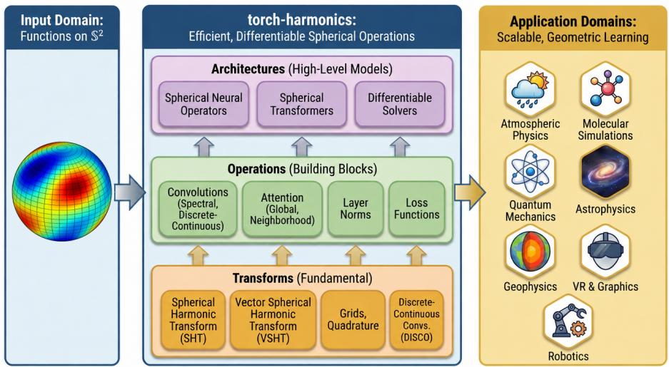

# A library for diferentiable signal processing and machine learning on the sphere

Thorsten Kurth<sup>1,†</sup>, Max Rietmann<sup>1</sup>, Mauro Bisson<sup>1</sup>,

Andrea Paris<sup>1</sup>, Alberto Carpentieri<sup>1</sup>, Jean Kossaifi<sup>1</sup>,

Anima Anandkumar<sup>1,2</sup>, Christian Hundt<sup>1</sup>, Boris Bonev<sup>1,†</sup>

<sup>1</sup>NVIDIA Corporation <sup>2</sup>California Institute of Technology <sup>†</sup>Equal contribution

## Abstract

The two-dimensional sphere embedded in three-dimensional Euclidean space $S ^ { 2 }$ , plays a central role in a variety of scientific and engineering domains, including geophysics, planetary science, geodesy, atmospheric physics, quantum chemistry, cosmology, and virtual reality, among many others. As machine learning increasingly permeates these fields, the demand grows for robust tools that process and model functions on the sphere, while respecting the inherent topological and symmetry properties of the domain. We present torch-harmonics, a comprehensive library that ofers eficient, diferentiable implementations of advanced signal processing and machine learning (ML) methods for spherical data. These include the spherical harmonic transform (SHT), the spherical analogue of the Fourier transform, vector spherical harmonics, discrete-continuous and spectral convolutions, as well as both global and neighborhood spherical attention mechanisms. Beyond traditional representations, torch-harmonics provides the building blocks for state-of-theart spherical ML architectures such as spherical transformers in order to enable scalable, rotationally-aware learning and inference in modern scientific and engineering applications. Keywords: spherical signal-processing, geometric machine learning, spherical harmonics, scientific machine learning, diferentiable computing

## 1 Introduction

The two-dimensional sphere $S ^ { 2 }$ plays a central role in many scientific domains, including geophysics, atmospheric physics, cosmology, and computer graphics. As machine learning becomes increasingly prevalent in these fields, there is growing demand for tools that process spherical signals while respecting the sphere’s topological and symmetry properties.

Standard deep learning operations designed for Euclidean domains do not naturally extend to the sphere without introducing distortions or singularities. Geometric deep learning approaches such as graph neural networks on spherical meshes and equivariant networks based on spherical harmonics have been proposed, but their practical adoption has been hindered by the lack of eficient, diferentiable, and scalable implementations (Bronstein et al., 2021; Cohen and Welling, 2016; Cohen et al., 2018; Esteves et al., 2017, 2020, 2023; Ocampo et al., 2022; Cobb et al., 2020; Deferrard et al., 2020; Brehmer et al., 2025).

We present torch-harmonics, a PyTorch (Paszke et al., 2019) library for diferentiable signal processing on the sphere. The library provides eficient implementations of spherical harmonic transforms (SHT), vector spherical harmonic transforms (Schaefer, 2013), discrete-continuous (DISCO) convolutions, spherical attention mechanisms and other important operations on the spherical domain. Through custom CUDA (Nickolls et al., 2008) kernels and distributed computing strategies, torch-harmonics enables training of highresolution models that were previously computationally prohibitive. The library serves as the foundation for architectures such as the Spherical Fourier Neural Operator (SFNO) (Bonev et al., 2023) and FourCastNet3 (FCN3) (Bonev et al., 2025a).

  
Figure 1: Overview of torch-harmonics: Spherical signal processing fundamentals enable high-level models such as spherical neural operators and diferentiable PDE solvers. Applications include weather prediction, molecular simulations and more.

## 2 Library Design and Functionality

torch-harmonics provides eficient diferentiable signal processing and machine learning operations for spherical data that integrate seamlessly into PyTorch models and training pipelines. The main design goals are: Diferentiability—all operations support backpropagation via PyTorch’s autograd; Eficiency—custom CUDA kernels for intensive operations; Compatibility—fallback implementations in pure PyTorch, and Scalability— distributed memory computing support to process high-resolution spherical data.

## 2.1 Core Signal Processing Operations

Three commonly used grid types are currently supported: equiangular/equirectangular (e.g. classical latitude-longitude grid used in geosciences), Legendre-Gauss grids and Gauss-Lobatto grids. Support for other popular grid types is planned.

Spherical Harmonic Transforms The Spherical Harmonic Transform (SHT) generalizes the Fourier transform on the sphere, decomposing values defined on the equiangular grid into a series of spherical harmonic basis functions $Y _ { \ell } ^ { m }$ , capturing the signal’s energy at diferent spatial scales. torchharmonics provides forward and inverse transforms (RealSHT and InverseRealSHT). This computation can be decomposed into a Fourier transform and a Legendre transform, using eficient implementations of the fast Fourier transform (FFT) and batched matrix multiplications (Schaefer, 2013).

Vector Spherical Harmonic Transforms RealVectorSHT, InverseRealVectorSHT decompose vector fields into divergencefree and curl-free components by applying the forward SHT to the potentials of the vector field. This enables eficient computation of diferential operators such as divergence and curl directly in the spectral domain (see Section A), which is particularly useful for solving partial diferential equations (PDEs) on the sphere.

Resampling and Interpolation The library supports resampling between diferent spherical grids using spectral interpolation, which enables aliasfree resolution changes. Bilinear interpolation in spherical coordinates based on Haversine distance is also supported.

Quadrature on the Sphere Quadrature rules for all supported grid types are essential for computing inner products, norms, and integrals while respecting the spherical geometry.

Spectral/Discrete-Continuous Convolutions Convolution on the sphere is defined via the action of the rotation group SO(3). Two complementary approaches are supported: Spectral Convolutions, and Discrete-Continuous (DISCO) Convolutions, which support local, anisotropic filters through direct quadrature of the rotated filter kernel. torchharmonics ofers a wide variety of filter basis functions for the DISCO convolution, such as piecewise linear hat functions, Zernike polynomials and wavelet-like functions.

Spherical Attention The library provides implementations of global and local (neighborhood) attention on the sphere. Quadrature weights ensure proper integration over spherica domains, respecting the non-uniform sampling density of spherical grids.

Angular Power Spectrum The angular power spectrum quantifies the distribution of energy across scales and provides an important diagnostic for verifying spectral signatures.

Distributed Memory Parallelism All these components also support parallel distributed memory computing via torch.distributed. This enhances computational performance and reduces memory footprint by distributing the spherical signal across ranks. The distributed SHT, VSHT and DISCO modules use a pencil decomposition strategy, while attention mechanisms use halo exchanges to provide distributed implementations.

## 3 Machine Learning Architectures

Spherical Fourier Neural Operators Spherical Fourier Neural Operators (Bonev et al., 2023) generalize the Fourier neural operator (Li et al., 2020) to the sphere, implementing SO(3) group convolutions via the spherical convolution theorem (Driscoll and Healy, 1994). SFNO blocks operate in frequency domain: inputs are transformed via SHT, multiplied with learnable filters in the spectral domain, and transformed back via inverse SHT, followed by pointwise nonlinearity. This provides global receptive fields while respecting spherical topology. SFNO architectures power several weather and climate models (Bonev et al., 2023; Watt-Meyer et al., 2023, 2025; Mahesh et al., 2025a,b; Guan et al., 2025).

Local Spherical Neural Operators Local Spherical Neural Operators (Liu-Schiafini et al., 2024) employ DISCO convolutions with compact support to learn anisotropic (Ocampo et al., 2022), spatially localized features while maintaining approximate rotation equivariance. These are well-suited for processes with preferential directions such as boundary layers or topographic efects. FourCastNet 3 (FCN3) (Bonev et al., 2025a) combines SFNO and LSNO layers to capture both global wave dynamics and local atmospheric features.

Spherical Transformers Spherical Transformers (Bonev et al., 2025b) generalize vision transformers to spherical geometry through continuous attention formulations. torchharmonics provides accelerated implementations of global and neighborhood attention mechanisms, using geodesic distances and proper quadrature weights for spherical grids. These are particularly useful for data assimilation and processing irregularly sampled observations (Bonev et al., 2025b; Lang et al., 2024; Gupta et al., 2026).

Hybrid Physics-ML Architectures The diferentiable spectral transforms enable hybrid methods incorporating machine learning into traditional numerical solvers. The repository includes a diferentiable spectral solver for the shallow water equations demonstrating this capability. Such solvers form the backbone of global circulation models and enable training of neural GCMs (Kochkov et al., 2023).

## 4 Applications and Examples

torch-harmonics has been deployed in production weather forecasting systems and scientific computing applications (Bonev et al., 2023; Watt-Meyer et al., 2023, 2025; Mahesh et al., 2025a,b; Guan et al., 2025; Bonev et al., 2025a; Mansouri et al., 2025; Leonardi et al., 2026). Complete example implementations in the repository include: Diferentiable shallow water solver—a spectral solver for the shallow water equations on the sphere using VSHT for divergence and curl computation, enabling gradient-based parameter estimation and diferentiable GCM training (see Section B.6); Spherical neural operators on PDE data—training SFNO and LSNO models on shallow water equation data generated by the diferentiable solver; Spherical image processing—depth estimation and segmentation on 360° images using Spherical Transformers, compared against Euclidean baselines; and Code examples—complete implementations of spherical layers, models and solvers, demonstrating usage and integration into standard training pipelines (Section B).

## 5 Conclusion

We presented torch-harmonics, an open-source library for diferentiable signal processing and machine learning on the sphere. The library provides eficient, GPU-accelerated implementations of spherical harmonic transforms, discrete-continuous convolutions, and spherical attention mechanisms, all fully integrated into the PyTorch ecosystem. Custom CUDA kernels and distributed memory parallelism enable scaling to high resolutions that were previously computationally prohibitive. Beyond weather and climate applications (Bonev et al., 2023; Watt-Meyer et al., 2025), torch-harmonics has enabled applications in solar wind modeling (Mansouri et al., 2025), omnidirectional 3D vision (Bonev et al., 2025b; Wang et al., 2026), and molecular force fields (Leonardi et al., 2026), underscoring its role as a general-purpose tool for learning and signal processing on the sphere.

## References

Boris Bonev, Thorsten Kurth, Christian Hundt, Jaideep Pathak, Maximilian Baust, Karthik Kashinath, and Anima Anandkumar. Spherical fourier neural operators: Learning stable dynamics on the sphere. Proceedings of the 40th International Conference on Machine Learning, 202:2806–2823, 6 2023. URL http://arxiv.org/abs/2306.03838.

Boris Bonev, Thorsten Kurth, Ankur Mahesh, Mauro Bisson, Jean Kossaifi, Karthik Kashinath, Anima Anandkumar, William D. Collins, Michael S. Pritchard, and Alexander Keller. Fourcastnet 3: A geometric approach to probabilistic machine-learning weather forecasting at scale. 7 2025a. URL http://arxiv.org/abs/2507.12144.

Boris Bonev, Max Rietmann, Andrea Paris, Alberto Carpentieri, and Thorsten Kurth. Attention on the sphere. In Advances in Neural Information Processing Systems (NeurIPS), 2025b. URL http://arxiv.org/abs/2505.11157.

Max Born and Emil Wolf. Principles of optics: electromagnetic theory of propagation, interference and difraction of light. Elsevier, 2013.

Johann Brehmer, S¨onke Behrends, Pim de Haan, and Taco Cohen. Does equivariance matter at scale? Transactions on Machine Learning Research (TMLR), 2025. URL https://arxiv.org/abs/2410.23179.

Michael M. Bronstein, Joan Bruna, Taco Cohen, and Petar Veliˇckovi´c. Geometric deep learning: Grids, groups, graphs, geodesics, and gauges. 4 2021. URL http://arxiv. org/abs/2104.13478.

Oliver J. Cobb, Christopher G. R. Wallis, Augustine N. Mavor-Parker, Augustin Marignier, Matthew A. Price, Mayeul d’Avezac, and Jason D. McEwen. Eficient generalized spherical cnns. 10 2020. URL http://arxiv.org/abs/2010.11661.

Taco S. Cohen and Max Welling. Group equivariant convolutional networks. 2 2016. URL http://arxiv.org/abs/1602.07576.

Taco S. Cohen, Mario Geiger, Jonas Koehler, and Max Welling. Spherical cnns. International Conference on Learning Representations, 1 2018. URL http://arxiv.org/abs/ 1801.10130.

Micha¨el Deferrard, Martino Milani, Fr´ed´erick Gusset, and Nathana¨el Perraudin. Deepsphere: a graph-based spherical cnn. 12 2020. URL http://arxiv.org/abs/2012.15000.

J.R. Driscoll and D.M. Healy. Computing fourier transforms and convolutions on the 2-sphere. Advances in Applied Mathematics, 15:202–250, 6 1994. ISSN 01968858. doi: 10.1006/aama.1994.1008. URL https://linkinghub.elsevier.com/retrieve/ pii/S0196885884710086.

Carlos Esteves, Christine Allen-Blanchette, Ameesh Makadia, and Kostas Daniilidis. Learning so(3) equivariant representations with spherical cnns. 11 2017. URL http://arxiv. org/abs/1711.06721.

Carlos Esteves, Ameesh Makadia, and Kostas Daniilidis. Spin-weighted spherical cnns. Advances in Neural Information Processing Systems, pages 8614–8625, 2020. URL http: //arxiv.org/abs/2006.10731.

Carlos Esteves, Jean-Jacques Slotine, and Ameesh Makadia. Scaling spherical cnns. Proceedings of the 40th International Conference on Machine Learning, pages 9396–9411, 6 2023. URL http://arxiv.org/abs/2306.05420.

Haiwen Guan, Troy Arcomano, Ashesh Chattopadhyay, and Romit Maulik. Lucie: A lightweight uncoupled climate emulator with long-term stability and physical consistency for o(1000)-member ensembles. 4 2025. URL http://arxiv.org/abs/2405.16297.

Aayush Gupta, Akshay Subramaniam, Michael S. Pritchard, Karthik Kashinath, Sergey Frolov, Kelsey Lieberman, Christopher Miller, Nicholas Silverman, and Noah D. Brenowitz. HealDA: Highlighting the importance of initial errors in end-to-end AI weather forecasts, 2026. URL https://arxiv.org/abs/2601.17636.

Dmitrii Kochkov, Janni Yuval, Ian Langmore, Peter Norgaard, Jamie Smith, Grifin Mooers, Milan Kl¨ower, James Lottes, Stephan Rasp, Peter D¨uben, Sam Hatfield, Peter Battaglia, Alvaro Sanchez-Gonzalez, Matthew Willson, Michael P. Brenner, and Stephan Hoyer. Neural general circulation models for weather and climate. 11 2023. doi: 10.1038/s41586-024-07744-y. URL http://arxiv.org/abs/2311.07222http:// dx.doi.org/10.1038/s41586-024-07744-y.

Simon Lang, Mihai Alexe, Mariana C. A. Clare, Christopher Roberts, Rilwan Adewoyin, Zied Ben Bouall\`egue, Matthew Chantry, Jesper Dramsch, Peter D. Dueben, Sara Hahner, Pedro Maciel, Ana Prieto-Nemesio, Cathal O’Brien, Florian Pinault, Jan Polster, Baudouin Raoult, Stefen Tietsche, and Martin Leutbecher. Aifs-crps: Ensemble forecasting using a model trained with a loss function based on the continuous ranked probability score. 12 2024. URL http://arxiv.org/abs/2412.15832.

Francesco Leonardi, Boris Bonev, and Kaspar Riesen. MARA: Continuous SE(3)- equivariant attention for molecular force fields, 2026. URL https://arxiv.org/abs/ 2602.02671.

Zongyi Li, Nikola Kovachki, Kamyar Azizzadenesheli, Burigede Liu, Kaushik Bhattacharya, Andrew Stuart, and Anima Anandkumar. Fourier neural operator for parametric partial diferential equations. 10 2020. URL http://arxiv.org/abs/2010.08895.

Miguel Liu-Schiafini, Julius Berner, Boris Bonev, Thorsten Kurth, Kamyar Azizzadenesheli, and Anima Anandkumar. Neural operators with localized integral and diferential kernels. 2 2024. URL http://arxiv.org/abs/2402.16845.

Ankur Mahesh, William D. Collins, Boris Bonev, Noah Brenowitz, Yair Cohen, Joshua Elms, Peter Harrington, Karthik Kashinath, Thorsten Kurth, Joshua North, Travis O’Brien, Michael Pritchard, David Pruitt, Mark Risser, Shashank Subramanian, and Jared Willard. Huge ensembles – Part 1: Design of ensemble weather forecasts using spherical Fourier neural operators. Geoscientific Model Development, 18(17):

5575–5603, 2025a. doi: 10.5194/gmd-18-5575-2025. URL https://doi.org/10.5194/ gmd-18-5575-2025.

Ankur Mahesh, William D. Collins, Boris Bonev, Noah Brenowitz, Yair Cohen, Peter Harrington, Karthik Kashinath, Thorsten Kurth, Joshua North, Travis A. O’Brien, Michael Pritchard, David Pruitt, Mark Risser, Shashank Subramanian, and Jared Willard. Huge ensembles – Part 2: Properties of a huge ensemble of hindcasts generated with spherical Fourier neural operators. Geoscientific Model Development, 18(17):5605–5633, 2025b. doi: 10.5194/gmd-18-5605-2025. URL https://doi.org/10.5194/gmd-18-5605-2025.

Reza Mansouri, Dustin Kempton, Pete Riley, and Rafal Angryk. Toward data-driven surrogates of the solar wind with spherical Fourier neural operator, 2025. URL https: //arxiv.org/abs/2511.22112.

John Nickolls, Ian Buck, Michael Garland, and Kevin Skadron. Scalable parallel programming with CUDA. ACM Queue, 6(2):40–53, March 2008. doi: 10.1145/1365490.1365500. URL https://doi.org/10.1145/1365490.1365500.

Jeremy Ocampo, Matthew A. Price, and Jason D. McEwen. Scalable and equivariant spherical cnns by discrete-continuous (disco) convolutions. 9 2022. URL http://arxiv. org/abs/2209.13603.

Adam Paszke, Sam Gross, Francisco Massa, Adam Lerer, James Bradbury, Gregory Chanan, Trevor Killeen, Zeming Lin, Natalia Gimelshein, Luca Antiga, Alban Desmaison, Andreas K¨opf, Edward Yang, Zach DeVito, Martin Raison, Alykhan Tejani, Sasank Chilamkurthy, Benoit Steiner, Lu Fang, Junjie Bai, and Soumith Chintala. Pytorch: An imperative style, high-performance deep learning library. 12 2019. URL http://arxiv.org/abs/1912. 01703.

Nathana¨el Schaefer. Eficient spherical harmonic transforms aimed at pseudospectral numerical simulations. Geochemistry, Geophysics, Geosystems, 14:751–758, 3 2013. ISSN 15252027. doi: 10.1002/ggge.20071.

Jiayun Wang, Yousuf Aborahama, Arya Khokhar, Yang Zhang, Chuwei Wang, Karteekeya Sastry, Julius Berner, Yilin Luo, Boris Bonev, Zongyi Li, Kamyar Azizzadenesheli, Lihong V. Wang, and Anima Anandkumar. Physics-aware neural operators for direct inversion in 3D photoacoustic tomography, 2026. URL https://arxiv.org/abs/2509.09894.

Oliver Watt-Meyer, Gideon Dresdner, Jeremy McGibbon, Spencer K. Clark, Brian Henn, James Duncan, Noah D. Brenowitz, Karthik Kashinath, Michael S. Pritchard, Boris Bonev, Matthew E. Peters, and Christopher S. Bretherton. Ace: A fast, skillful learned global atmospheric model for climate prediction. 10 2023. URL http://arxiv.org/abs/ 2310.02074.

Oliver Watt-Meyer, Brian Henn, Jeremy McGibbon, Spencer K. Clark, Anna Kwa, W. Andre Perkins, Elynn Wu, Lucas Harris, and Christopher S. Bretherton. ACE2: Accurately learning subseasonal to decadal atmospheric variability and forced responses. npj Climate and Atmospheric Science, 8(1):205, 2025. doi: 10.1038/s41612-025-01090-0. URL https://www.nature.com/articles/s41612-025-01090-0.

## Appendix A. Signal processing on the sphere

In this appendix, we provide the mathematical background for the signal processing operations implemented in torch-harmonics. We begin with the definition of the spherical domain and coordinate systems, followed by a discussion of functions on the sphere and the rotation group $S O ( 3 )$ . We then introduce the Spherical Harmonic Transform (SHT), spherical convolutions, and attention mechanisms.

## A.1 Coordinate systems and functions on the sphere

The unit sphere $S ^ { 2 }$ is the set of points $\boldsymbol { x } \in \mathbb { R } ^ { 3 }$ with unit norm $\| { \boldsymbol { x } } \| _ { 2 } = 1$ . We parameterize $S ^ { 2 }$ using spherical coordinates $( \vartheta , \varphi )$ , where $\vartheta \in [ 0 , \pi ]$ denotes the colatitude (with $\vartheta = 0$ at the North Pole) and $\varphi \in [ 0 , 2 \pi )$ denotes the longitude:

$$
x ( \vartheta , \varphi ) = \left[ { \sin \vartheta \cos \varphi } \right] .\tag{1}
$$

We consider real-valued square-integrable functions $u : S ^ { 2 } \to \mathbb { R }$ in the Hilbert space $L ^ { 2 } ( S ^ { 2 } )$ , equipped with the inner product

$$
\langle { \boldsymbol u } , { \boldsymbol v } \rangle _ { L ^ { 2 } ( S ^ { 2 } ) } = \int _ { S ^ { 2 } } { \boldsymbol u } ( { \boldsymbol x } ) { \boldsymbol v } ( { \boldsymbol x } ) \mathrm { d } \mu ( { \boldsymbol x } ) = \int _ { 0 } ^ { 2 \pi } \int _ { 0 } ^ { \pi } { \boldsymbol u } ( \vartheta , \varphi ) { \boldsymbol v } ( \vartheta , \varphi ) \sin \vartheta \mathrm { d } \vartheta \mathrm { d } \varphi ,\tag{2}
$$

where $\mathrm { d } \mu ( x ) = \sin \vartheta \mathrm { d } \vartheta \mathrm { d } \varphi$ is the standard rotation-invariant Lebesgue measure on the sphere.

## A.2 The rotation group SO(3)

The Special Orthogonal group $S O ( 3 )$ consists of all $3 \times 3$ orthogonal matrices with determinant +1. Elements $R \in S O ( 3 )$ represent rotations in three-dimensional space. $S O ( 3 )$ acts transitively on $S ^ { 2 }$ via matrix-vector multiplication $x \mapsto R x$ . A function $u \in L ^ { 2 } ( S ^ { 2 } )$ can be rotated by an operator $\mathcal { R }$ associated with $R \in S O ( 3 )$ as:

$$
[ \mathcal { R } u ] ( x ) = u ( R ^ { - 1 } x ) .\tag{3}
$$

This action preserves the inner product, $\mathrm { i . e . , } \left. \mathcal { R } u , \mathcal { R } v \right. = \left. u , v \right.$

## A.3 Grids and Quadrature

Spherical signals $u : S ^ { 2 } \to \mathbb { R } ^ { n }$ are discretized on grids characterized by grid points $\{ x _ { i } \}$ and quadrature weights $\left\{ \omega _ { i } \right\}$ for numerical integration:

$$
\int _ { S ^ { 2 } } u ( \boldsymbol { x } ) \mathrm { d } \mu ( \boldsymbol { x } ) \approx \sum _ { i } u ( \boldsymbol { x } _ { i } ) \omega _ { i } ,\tag{4}
$$

where $\mathrm { d } \mu ( x )$ = sin $\vartheta \mathrm { d } \vartheta \mathrm { d } \varphi$ is the invariant measure on $S ^ { 2 }$

Equiangular Grids Equiangular (lat-lon) grids use equally spaced points in spherical coordinates:

$$
\vartheta _ { i } = \pi i / n _ { \mathrm { l a t } } , \quad \varphi _ { j } = 2 \pi j / n _ { \mathrm { l o n } } ,\tag{5}
$$

with trapezoidal quadrature weights $\omega _ { i j } = ( 2 \pi ^ { 2 } / n _ { \mathrm { l a t } } n _ { \mathrm { l o n } } )$ sin $\vartheta _ { i }$ .

Gaussian Grids Gaussian grids replace the latitude grid with Gauss-Legendre nodes $\{ \vartheta _ { i } \}$ such that cos $\vartheta _ { i }$ are roots of the Legendre polynomial $P _ { n _ { \mathrm { l a t } } }$ . This choice enables the exact integration of spherical harmonics to degree $2 n _ { \mathrm { l a t } } - 1$ , making Gaussian grids particularly eficient for spectral methods.

## A.4 Spherical Harmonics

The spherical harmonics $Y _ { \ell } ^ { m } : S ^ { 2 } \to \mathbb { C }$ form a complete orthonormal basis for $L ^ { 2 } ( S ^ { 2 } )$ . They are the eigenfunctions of the spherical Laplacian operator $\Delta _ { S ^ { 2 } }$ and are defined as:

$$
Y _ { \ell } ^ { m } ( \vartheta , \varphi ) = c _ { \ell } ^ { m } P _ { \ell } ^ { m } ( \cos \vartheta ) e ^ { i m \varphi } ,\tag{6}
$$

where $\ell \geq 0$ is the degree, $| m | \leq \ell$ is the order, $P _ { \ell } ^ { m }$ are the associated Legendre polynomials, and $c _ { \ell } ^ { m }$ is a normalization constant given by:

$$
c _ { \ell } ^ { m } = \sqrt { \frac { 2 \ell + 1 } { 4 \pi } \frac { ( \ell - m ) ! } { ( \ell + m ) ! } } .\tag{7}
$$

Any function $u \in L ^ { 2 } ( S ^ { 2 } )$ can be expanded in terms of spherical harmonics via the Spherical Harmonic Transform (SHT):

$$
u ( \vartheta , \varphi ) = \sum _ { \ell = 0 } ^ { \infty } \sum _ { m = - \ell } ^ { \ell } \hat { u } _ { \ell } ^ { m } Y _ { \ell } ^ { m } ( \vartheta , \varphi ) , \quad \mathrm { w h e r e } \quad \hat { u } _ { \ell } ^ { m } = \int _ { S ^ { 2 } } u ( x ) \overline { { Y _ { \ell } ^ { m } ( x ) } } \mathrm { d } \mu ( x ) .\tag{8}
$$

The coeficients $\hat { u } _ { \ell } ^ { m }$ form the spectral representation of the signal.

Implementation Details The Spherical Harmonics Transform can be implemented in a factorized fashion which exploits the tensor product structure of $Y _ { \ell } ^ { m }$ (Schaefer, 2013):

First, we perform a Fourier transform in longitude. For each latitude $\vartheta _ { k }$ , compute

$$
\tilde { u } ^ { m } ( \vartheta _ { k } ) = 2 \pi \sum _ { j = 0 } ^ { n _ { \mathrm { l o n } } - 1 } u ( \vartheta _ { k } , \varphi _ { j } ) e ^ { - i m \varphi _ { j } } , \qquad m = 0 , \ldots , M - 1\tag{9}
$$

via a real-valued FFT truncated to the first M modes. Then, we perform the Legendre transform in latitude. For each order $m .$ , contract over the quadrature nodes:

$$
\hat { u } _ { \ell } ^ { m } = \sum _ { k = 0 } ^ { n _ { \mathrm { l a t } } - 1 } \omega _ { k } P _ { \ell } ^ { m } ( \cos \vartheta _ { k } ) \widetilde { u } ^ { m } ( \vartheta _ { k } ) , \qquad \ell = 0 , \ldots , L - 1\tag{10}
$$

The Legendre coeficients $P _ { \ell } ^ { m } ( \cos \vartheta _ { k } )$ are pre-computed for a given grid and stored in a tensor of size $L \times M \times n _ { \mathrm { l a t } }$ . In order to reduce the number of operations, we further fuse the quadrature weights $\omega _ { j }$ into this tensor.

The inverse Spherical Harmonics Transform reverses the order of operations above: first a Legendre synthesis followed by an inverse FFT. Note that no quadrature weights are involved in the inverse Legendre transformation.

Angular Power Spectrum The angular power spectrum (APS) or power spectral density (PSD) quantifies the distribution of energy across spatial scales. For a signal u with spherical harmonic coeficients $\hat { u } _ { \ell } ^ { m }$ , the power at degree ℓ is:

$$
\mathrm { P S D } ( \ell ) = \sum _ { m = - \ell } ^ { \ell } | \hat { u } _ { \ell } ^ { m } | ^ { 2 } .\tag{11}
$$

This measures the contribution of scale ℓ to the total energy of the signal. The APS is rotation-invariant and provides a compact summary of the signal’s spectral content.

## A.5 Vector Spherical Harmonics

For vector fields $\mathbf { v } : S ^ { 2 } \to \mathbb { R } ^ { 3 }$ tangent to the sphere, we employ Vector Spherical Harmonics (VSH). Any tangent vector field can be uniquely decomposed into toroidal (divergence-free) and poloidal (curl-free) components:

$$
\begin{array} { r } { { \bf v } = { \bf v } _ { \mathrm { t o r } } + { \bf v } _ { \mathrm { p o l } } , } \end{array}\tag{12}
$$

where $\mathbf { v } _ { \mathrm { t o r } } = \nabla \times \left( \Psi \hat { \mathbf { r } } \right)$ and $\mathbf { v } _ { \mathrm { p o l } } = \nabla \Phi$ for scalar potentials $\Psi , \Phi : S ^ { 2 } \to \mathbb { R }$

The VSH transform decomposes v into spectral coeficients $( \hat { \Psi } _ { \ell } ^ { m } , \hat { \Phi } _ { \ell } ^ { m } )$ , enabling efficient computation of diferential operators. Specifically, the Divergence is given by $\nabla \cdot \mathbf { v } = \Delta _ { S ^ { 2 } } \Phi$ , computed via $\widehat { \nabla \cdot \mathbf { v } } _ { \ell } ^ { m } = - \ell ( \ell + 1 ) \hat { \Phi } _ { \ell } ^ { m }$ , and the Curl is $\nabla \times \mathbf { v } = \Delta _ { S ^ { 2 } } \Psi \hat { \mathbf { r } }$ computed via $\widehat { \nabla \times \mathbf { v } _ { \ell } } ^ { m } = - \ell ( \ell + 1 ) \hat { \Psi } _ { \ell } ^ { m }$ . This spectral representation enables eficient computation of gradients, divergences, and curls in diferential equation solvers and fluid dynamics simulations on the sphere.

## A.6 Group Convolutions

To define a convolution operation on the sphere that generalizes the standard translationequivariant convolution in Euclidean space, we look to group convolution. For a signal $u \in L ^ { 2 } ( S ^ { 2 } )$ and a filter $k \in L ^ { 2 } ( S ^ { 2 } )$ , the group convolution is defined as the inner product of the signal with the rotated filter, resulting in a function defined on the rotation group $S O ( 3 )$

$$
( u \star k ) ( R ) = \int _ { S ^ { 2 } } u ( x ) k ( R ^ { - 1 } x ) \mathrm d \mu ( x ) , \quad R \in S O ( 3 ) .\tag{13}
$$

To obtain an output on the sphere $S ^ { 2 }$ rather than $S O ( 3 )$ , we restrict the rotation R to the quotient space $S O ( 3 ) / S O ( 2 ) \simeq S ^ { 2 }$ . This corresponds to fixing the rotation around the local vertical axis (usually $\gamma = 0$ in Euler angles), yielding the spherical convolution:

$$
( u * k ) ( x ) = \int _ { S ^ { 2 } } u ( x ^ { \prime } ) k ( R _ { x } ^ { - 1 } x ^ { \prime } ) \mathrm { d } \mu ( x ^ { \prime } ) ,\tag{14}
$$

where $R _ { x }$ is a rotation that maps the North Pole to x.

## A.7 The Convolution Theorem

For zonal (isotropic) filters k, which depend only on the colatitude ϑ and are invariant under rotation around the z-axis, the spherical convolution simplifies significantly in the spectral

domain. The Spherical Convolution Theorem states that the SHT of the convolution of a signal u with a zonal filter k is the pointwise product of their spherical harmonic coeficients:

$$
\widehat { \left( u * k \right) _ { \ell } ^ { m } } = \sqrt { \frac { 4 \pi } { 2 \ell + 1 } } \widehat { u } _ { \ell } ^ { m } \widehat { k } _ { \ell } ^ { 0 } .\tag{15}
$$

This allows for eficient computation of global, isotropic convolutions by performing the operation in the spectral domain, which is the foundation of the Spherical Fourier Neural Operator (SFNO) (Bonev et al., 2023).

## A.8 Discrete-Continuous (DISCO) Convolutions

While spectral convolutions are eficient for global isotropic filters, many applications require local, anisotropic filters. The Discrete-Continuous (DISCO) convolution (Ocampo et al., 2022) addresses this by discretizing the continuous convolution integral directly. For a grid of points $\{ x _ { j } \}$ with quadrature weights $\{ \omega _ { j } \}$ , the convolution is approximated as:

$$
( u * k ) ( x _ { i } ) \approx \sum _ { j } u ( x _ { j } ) k ( R _ { x _ { i } } ^ { - 1 } x _ { j } ) \omega _ { j } .\tag{16}
$$

Here, the filter k is typically parameterized as a linear combination of local basis functions (e.g., compactly supported wavelets) on a tangent plane or disk centered at the North Pole. The term $k ( R _ { x _ { i } } ^ { - 1 } x _ { j } )$ represents the filter rotated to be centered at $x _ { i }$ and evaluated at the source point $x _ { j }$ . This formulation allows for spatially localized and anisotropic processing while maintaining approximate rotation equivariance.

To obtain a learnable filter, k is parametrized as a linear combination of basis functions $\tilde { k } \ell m ^ { ( x ) }$ :

$$
k ( x ) = \sum _ { \ell , m } w _ { \ell m } \ \tilde { k } _ { \ell m } ( x ) .\tag{17}
$$

We implement multiple filter-basis functions:

Morlet-like wavelets A filter-basis inspired by Morlet-like wavelets defined on a compact disk $\vartheta ^ { \prime } = \vartheta / \vartheta _ { \mathrm { c u t o f f } } \in [ 0 , 1 ] , \varphi \in [ 0 , 2 \pi )$ :

$$
\tilde { k } _ { \ell m } ( \vartheta ^ { \prime } , \varphi ) = h ( \vartheta ^ { \prime } ) e ^ { \left( i \pi \ell \vartheta ^ { \prime } \sin \varphi \right) } e ^ { \left( i \pi m \vartheta ^ { \prime } \cos \varphi \right) } ,\tag{18}
$$

where $\begin{array} { r } { h ( \vartheta ^ { \prime } ) = \cos ^ { 2 } \left( \frac { \pi } { 2 } \vartheta ^ { \prime } \right) } \end{array}$ is the Hann windowing function. This ensures that smooth, compactly supported filters are learned while keeping the convolution tensor sparse.

Zernike polynomials A filter-basis inspired by Zernike polynomials defined on a compact disk $\vartheta ^ { \prime } = \vartheta / \vartheta _ { \mathrm { c u t o f f } } \in [ 0 , 1 ] , \varphi \in [ 0 , 2 \pi )$

$$
\tilde { k } _ { \ell m } ( \vartheta ^ { \prime } , \varphi ) = Z _ { \ell } ^ { m } ( \vartheta ^ { \prime } , \varphi ) ,\tag{19}
$$

where $Z _ { \ell } ^ { m } ( \vartheta ^ { \prime } , \varphi )$ are the Zernike polynomials (Born and Wolf, 2013). This parameterizes a filter basis that is orthogonal on the disk.

Piecewise linear filters The filter is parameterized using a tensor product of linear Bsplines (hat functions) on a polar grid over the disk. Specifically, the basis functions $\tilde { k } _ { \ell m }$ are products of the radial hat functions $h _ { \ell } ( \vartheta ^ { \prime } )$ and the angular hat functions $g _ { m } ( \varphi )$ , centered on the nodes $( \vartheta _ { \ell } ^ { \prime } , \varphi _ { m } )$ . This provides a flexible, local basis that naturally handles the polar geometry of the filter kernel.

## A.8.1 Implementation Details

Analogous to Ocampo et al. (2022), we define the convolution tensor

$$
\Psi _ { i , ( s , t ) } ^ { r } = \omega _ { j } \widetilde { k } _ { r } \big ( R _ { x _ { i } } ^ { - 1 } x ( \vartheta _ { s } , \varphi _ { t } ) \big ) ,\tag{20}
$$

where we have flattened the kernel basis indices $\ell , m$ from (17) into a single super index r with total number of basis functions K. Note that Ψ only depends on the geometry (i.e. the spherical grid and resolution). Therefore, it can be pre-computed and stored in memory as sparse tensor. Because the input grid is equispaced in longitude and the kernel is zonal, shifting the input field by one longitudinal grid spacing $\Delta \varphi = 2 \pi / \mathrm { n l o n } .$ in is equivalent to evaluating the convolution at a longitudinally shifted output point. Using Ψ can rewrite equation (16) as follows:

$$
( u * k ) ( \vartheta _ { i } , \varphi _ { j } ) = \sum _ { r = 0 } ^ { K - 1 } w _ { r } \sum _ { s = 0 } ^ { \mathrm { n l a t . i n - 1 } \mathrm { n l o n . i n - 1 } } \Psi _ { i , ( s , t ) } ^ { r } u \big ( \vartheta _ { s } , \varphi _ { \mathrm { m o d } ( t + j , \mathrm { n l o n . i n } ) } \big )\tag{21}
$$

For multiple input and output features, we can augment the basis function weights $w _ { r }$ accordingly similar to euclidian convolutions. If the output grid has a coarser resolution than the input grid (i.e. if the kernel is downsampling), the shift in $\varphi$ can be performed with stride s = nlon in/nlon out.

In all cases, the DISCO convolution kernel can be viewed as a sparse times dense matrix multiplication with an additional shift term. Because of the complicated memory access patterns, we decided to implement a custom CUDA kernel for this operation, cf. Section B.9.

The transpose convolution (which is also the backward of the above) can be implemented in similar manner, with summation over output indices instead of input indices in (21).

## A.9 Spherical Attention

Attention mechanisms can be viewed as data-dependent, non-stationary kernel smoothing. On the sphere, the continuous self-attention mechanism for a query $q ,$ key k, and value v is given by (Bonev et al., 2025b):

$$
\mathrm { A t t n } ( q , k , v ) ( x ) = \int _ { S ^ { 2 } } \frac { \exp ( q ( x ) ^ { T } k ( x ^ { \prime } ) ) } { \int _ { S ^ { 2 } } \exp ( q ( x ) ^ { T } k ( x ^ { \prime \prime } ) ) \mathrm { d } \mu ( x ^ { \prime \prime } ) } v ( x ^ { \prime } ) \mathrm { d } \mu ( x ^ { \prime } ) .\tag{22}
$$

In torch-harmonics, this integral is discretized using the appropriate quadrature weights ω<sub>j</sub> :

$$
\mathrm { A t t n } ( x _ { i } ) \approx \sum _ { j } \frac { \exp ( q ( x _ { i } ) ^ { T } k ( x _ { j } ) ) } { \sum _ { l } \exp ( q ( x _ { i } ) ^ { T } k ( x _ { l } ) ) \omega _ { l } } v ( x _ { j } ) \omega _ { j } .\tag{23}
$$

Including the quadrature weights ω is crucial for accounting for the non-uniform sampling density of spherical grids (e.g., points clustering near the poles in equiangular grids), thereby ensuring that the attention mechanism approximately respects the spherical geometry and SO(3) equivariance.

Neighborhood Attention To reduce computational complexity and introduce a locality inductive bias, we also implement neighborhood attention (Bonev et al., 2025b). This mechanism restricts the attention computation to a local geodesic neighborhood around each query point. It is implemented by applying a mask $M ( x , x ^ { \prime } )$ to the attention scores, where M acts as an indicator function: $M ( x , x ^ { \prime } ) = 0$ if the geodesic distance dist $( x , x ^ { \prime } ) < r$ and $M ( x , x ^ { \prime } ) = - \infty$ otherwise. This efectively sparsifies the attention matrix while preserving local spherical symmetries.

## Appendix B. Implementation Examples

This appendix provides detailed code examples demonstrating how to build spherical neural architectures using torch-harmonics.

## B.1 Spherical Fourier Neural Operator

A spectral convolution layer can be implemented in a few lines:

```python
1 import torch
2 from torch_harmonics import RealSHT , InverseRealSHT
3
4 class SpectralConv ( torch .nn. Module ):
5 def __init__ (self , nlat , nlon , num_channels ):
6 super (). __init__ ()
7 self . sht = RealSHT (nlat , nlon , grid =" equiangular ")
8 self . isht = InverseRealSHT (nlat , nlon , grid =" equiangular "
)
9
10 # Learnable spectral weights
11 self . weights = torch .nn. Parameter (
12 torch . randn ( size =( num_channels , num_channels , self .
sht . lmax ) , dtype = torch . complex64 )
13 )
14
15 def forward (self , x):
16 # x: [batch , channels , nlat , nlon]
17 coeffs = self .sht (x) # -> spectral domain
18 coeffs = torch . einsum (’bclm ,dcl -> bdlm ’, coeffs , self .
weights )
19 return self . isht ( coeffs ) # -> spatial domain
```  
Listing 1: SFNO Spectral Layer

The forward and inverse SHT handle all coordinate transformations, while the spectral multiplication implements a global convolution.

The library already implements a Driscoll-Healy type spectral convolutions. Those are isotropic, spherically equivariant convolutions. The weights are real-valued and only depend on m. For adding anisotropy, torch-harmonics supports a generalized spectral bias term.

```python
1 import torch
2 from torch_harmonics import SpectralConvS2
3
4 spectral_conv_layer = SpectralConvS2 (
5 in_shape =(181 ,360) ,
6 out_shape =(180 ,360) ,
7 in_channels =16 ,
8 out_channels =32 ,
9 grid_in =" equiangular ",
10 grid_out =" legendre - gauss ",
11 bias = False
12 )
13 # Example input
14 input_signal = torch . randn (1 ,16 ,181 ,360)
15 output = spectral_conv_layer ( input_signal ) # - >(1 ,32 ,180 ,360)
```

Listing 2: SFNO Spectral Layer

## B.2 DISCO Convolutions for Local Processing

DISCO convolutions enable local, anisotropic filters:

```python
1 import torch
2 from torch_harmonics import DiscreteContinuousConvS2
3
4 conv_layer = DiscreteContinuousConvS2 (
5 in_channels =16 ,
6 out_channels =32 ,
7 in_shape =(181 ,360) ,
8 out_shape =(180 ,360) ,
9 kernel_shape =(3 ,3) ,
10 basis_type =" piecewise linear ",
11 grid_in =" equiangular ",
12 grid_out =" legendre - gauss ",
13 bias =True ,
14 theta_cutoff =0.2 # determines support -radius
15 )
16 input_signal = torch . randn (1 ,16 ,181 ,360)
17 output = conv_layer ( input_signal ) # - >(1 ,32,180,360)
```

Listing 3: DISCO Layer

The layer internally manages filter rotation and quadrature, providing approximate rotation equivariance with localized receptive fields.

## B.3 Spherical Attention

Attention on the sphere uses quadrature weights for proper integration:

1 import torch   
2 from torch\_harmonics import AttentionS2 , NeighborhoodAttentionS2   
3   
4 neighborhood\_attention = NeighborhoodAttentionS2 (   
5 in\_channels =256 ,   
6 out\_channels =256 ,   
7 num\_heads =8,   
8 in\_shape =(181 ,360) ,   
9 out\_shape =(180 ,360) ,   
10 grid\_in =" equiangular ",   
11 grid\_out =" legendre - gauss ",   
12 theta\_cutoff =0.2 ,   
13 bias =True ,   
14 )   
15   
16 attention = AttentionS2 (   
17 in\_channels =256 ,   
18 out\_channels =256 ,   
19 num\_heads =8,   
20 in\_shape =(181 ,360) ,   
21 out\_shape =(180 ,360) ,   
22 grid\_in =" equiangular ",   
23 grid\_out =" legendre - gauss ",   
24 bias = False   
25 )   
26   
27 k = torch . randn (1 ,256 ,181 ,360) #->(B, in\_channels ,\* in\_shape )   
28 v = torch . randn (1 ,256 ,181 ,360) #->(B, out\_channels ,\* in\_shape )   
29 q = torch . randn (1 ,256 ,180 ,360) # - >(B, in\_channels ,\* out\_shape )   
30 n\_out = neighborhood\_attention (q,k,v) # - >(1 ,256,180,360)   
31 out = attention (q,k,v) # - >(1 ,256,180,360)  
Listing 4: Spherical Attention

The attention integral employs quadrature weights to ensure the attention mechanism respects spherical geometry, accounting for varying grid cell areas.

## B.4 Hybrid Model: Combining SFNO and DISCO

FourCastNet 3 demonstrates how to combine global and local processing:

```python
1 import torch
2 from torch_harmonics import SpectralConvS2 ,
DiscreteContinuousConvS2
3
4 class HybridBlock ( torch .nn. Module ):
5 def __init__ (self , channels , nlat , nlon ):
6 super (). __init__ ()
```

7 self . spectral = SpectralConvS2 (   
8 in\_shape =( nlat , nlon ) ,   
9 out\_shape =( nlat , nlon ),   
10 in\_channels = channels ,   
11 out\_channels = channels ,   
12 grid\_in =" equiangular ",   
13 grid\_out =" equiangular ",   
14 bias =True ,   
15 )   
16 self . disco = DiscreteContinuousConvS2 (   
17 in\_channels = channels ,   
18 out\_channels = channels ,   
19 in\_shape =( nlat , nlon ) ,   
20 out\_shape =( nlat , nlon ) ,   
21 kernel\_shape =(3 ,) ,   
22 basis\_type =" piecewise linear ",   
23 grid\_in =" equiangular ",   
24 grid\_out =" equiangular ",   
25 bias = True ,   
26 )   
27 self . activation = torch .nn. GELU ()   
28   
29 def forward (self , x):   
30 # Global path   
31 x = x + self . activation ( self . spectral (x))   
32 # Local path   
33 x = x + self . activation ( self . disco (x))   
34 return x   
35   
36 input\_signal = torch . randn (1 ,16 ,180 ,360)   
37 hybrid\_block = HybridBlock (16 ,180 ,360)   
38 hybrid\_block . forward ( input\_signal ) # - >(1 ,16 ,180 ,360)  
Listing 5: Hybrid Operator Block

This hybrid approach captures both large-scale wave dynamics (via SFNO) and smallscale local features (via DISCO), making it suitable for complex physical systems like atmospheric flows.

## B.5 Distributed Spectral Convolution

The library allows for 2D domain decomposition along latitude and longitude dimensions. For this, two orthogonal processor groups need to be created. A third one is required if batch/data parallelism should also be employed. All layer-relevant data gradient collective operations are captured in the layer definitions via custom autograd mechanics. However, since weight gradients are handled separately by PyTorch, additional reductions have to be registered. The example below shows how this can be achieved with torch.distributed and torch-harmonics layers such as SpectralConvS2. The following example is implemented for GPUs, and we assume that the environment variables RANK,

LOCAL RANK, WORLD SIZE, MASTER ADDR and PORT have been set according to the PyTorch distributed computing documentation.

```python
1 import os
2
3 import torch
4 import torch . distributed as dist
5 from torch . distributed . device_mesh import init_device_mesh
6 from torch .nn. parallel import DistributedDataParallel as DDP
7
8 import torch_harmonics . distributed as thd
9 from torch_harmonics . distributed import DistributedSpectralConvS2
10
11 # initialize the world process group
12 world_rank = int (os. environ .get (" RANK "))
13 world_size = int (os. environ .get (" WORLD_SIZE "))
14 dist . init_process_group (
15 backend =" nccl ",
16 init_method =None ,
17 rank = world_rank ,
18 world_size = world_size )
19 local_rank = int (os. environ .get (" LOCAL_RANK "))
20
21 # better set a device :
22 device = torch . device (f" cuda :{ local_rank }")
23 torch . cuda . set_device ( device . index )
24
25 # initialize device mesh
26 data_dim_size = 8 # number of GPUs in data direction
27 polar_dim_size = 2 # number of GPUs in polar / latitude direction
28 azimuth_dim_size = 4 # number of GPUs in azimuth / longitude
direction
29 # sanity checks
30 assert world_size == data_dim_size * polar_dim_size *
azimuth_dim_size
31 mesh = init_device_mesh (" cuda ", [ data_dim_size , polar_dim_size ,
azimuth_dim_size ], mesh_dim_names =[" data ", "lat", "lon"])
32
33 # now we can initialize the azimuth and polar comm groups for
torch harmonics : this will add the respective comm groups
created by the mesh into a hash lookup table which is used by
TH to find the corresponding ones :
34 thd. init ( mesh . get_group ("lat "), mesh . get_group ("lon "))
35
36 # Now we can define a distributed SpectralConvS2 layer:
37 # note that the in and out shapes should be the global shapes ,
not the decomposed ones !
38 distributed_spectral_conv = DistributedSpectralConvS2 (
39 in_shape =(360 , 720) ,
40 out_shape =(360 , 720) ,
41 in_channels =256 ,
```

42 out\_channels =256 ,   
43 grid\_in =" equiangular ",   
44 grid\_out =" equiangular ",   
45 bias =True ,   
46 ).to( device )   
47   
48 # now initialize DDP for the batch reduction   
49 # make sure to only use the data group here , not the world group   
50 model\_ddp = DDP (   
51 distributed\_spectral\_conv ,   
52 device\_ids =[ device ],   
53 output\_device =device ,   
54 process\_group = mesh . get\_group (" data "),   
55 )   
56   
57 # now we need to ensure that the weight gradients are reduced   
properly: to do so , we need to understand how they are shared   
between ranks : for the spectral convolution , the bias is fully   
decomposed along lon and lat and so the gradients for the   
bias should not be reduced along those dimensions (DDP takes   
care of the data group reductions ). Therefore , we do not need   
to do anything for the bias . However , the weight is only   
decomposed in lat -direction and thus shared in lon direction.   
Therefore , we need to reduce the gradient of this along that   
direction. The easiest way to do this is to register a post   
accumulation gradient hook like this :   
58 def \_longitude\_reduction\_hook ( param : torch . Tensor ):   
59 if param . grad is not None :   
60 dist . all\_reduce (   
61 param . grad ,   
62 group = mesh . get\_group ("lat "),   
63 op= dist . ReduceOp .SUM   
64 )   
65 return   
66   
67 # register the hook to fire automatically after a gradient is   
computed and accumulated   
68 model\_ddp . distributed\_spectral\_conv . weight .   
register\_post\_accumulate\_grad\_hook ( \_longitude\_reduction\_hook )   
69   
70 # now we assume we already have a global input tensor (for   
example loaded from a corresponding dataset ). We need to split   
it across ranks . This can be done by using   
split\_tensor\_along\_dim   
71 inp = torch . randn (1 ,256 ,360 ,720 ,   
72 dtype = torch . float32 , device = device )   
73   
74 # assume inp has shape B, C, NLAT, NLON:   
75 # split in lat direction

```python
76 inp_split_list = thd . split_tensor_along_dim ( inp , dim = -2 ,
num_chunks =thd. polar_group_size ()) # one can also use mesh.
get_group ("lat "). size () here
77 # take only the data belonging to the corresponding polar rank:
78 inp_split = inp_split_list [thd . polar_group_rank ()]
79 # split in lon direction
80 inp_split_list = thd . split_tensor_along_dim ( inp_split , dim =-1,
num_chunks =thd. azimuth_group_size ())
81 inp_split = inp_split_list [thd . azimuth_group_rank ()]
82
83 # now we can feed this tensor into our distributed layer
84 out_split = model_ddp ( inp_split )
85
86 # we can use this output compute losses , backward passes and
optimizer updates and each rank will receive correct gradients
```  
Listing 6: Distributed spectral convolution

## B.6 Shallow Water Equations Solver

The shallow water equations govern the evolution of a thin fluid layer on a rotating sphere and serve as a simplified model for atmospheric dynamics:

$$
\begin{array} { l } { \displaystyle \frac { \partial \mathbf { v } } { \partial t } = - ( \zeta + f ) \mathbf { k } \times \mathbf { v } - \nabla \left( g h + \frac { | \mathbf { v } | ^ { 2 } } { 2 } \right) , } \\ { \displaystyle \frac { \partial h } { \partial t } = - \nabla \cdot ( h \mathbf { v } ) , } \end{array}\tag{24}
$$

(25)

where v is the velocity field, h is the fluid height, $\zeta = \nabla \times { \bf v }$ is the relative vorticity, f = 2Ω sin ϑ is the Coriolis parameter, and g is gravitational acceleration.

A complete implementation of a diferentiable shallow water equations solver:

```python
1 import torch
2 from torch_harmonics . quadrature import clenshaw_curtiss_weights
3 from torch_harmonics .sht import RealSHT , InverseRealSHT ,
RealVectorSHT , InverseRealVectorSHT
4
5 class ShallowWaterSolver ( torch .nn. Module ):
6 def __init__ (self , nlat , nlon , dt , lmax =None , mmax =None ,
7 radius =6.37122 e6 , omega =7.292 e -5 ,
8 gravity =9.80616 , havg =1 e4 , hamp =120.0) :
9 super () . __init__ ()
10
11 self .dt = dt
12 self . radius , self . gravity = radius , gravity
13 self . havg , self . hamp = havg , hamp
14
15 self . sht = RealSHT (nlat , nlon ,
16 lmax = lmax , mmax = mmax , grid =" equiangular ")
```

self . isht = InverseRealSHT (nlat , nlon ,   
lmax =lmax , mmax =mmax , grid =" equiangular ")   
self . vsht = RealVectorSHT (nlat , nlon ,   
lmax =lmax , mmax =mmax , grid =" equiangular ")   
self . ivsht = InverseRealVectorSHT ( nlat , nlon ,   
lmax =lmax , mmax =mmax , grid =" equiangular ")   
lmax , mmax = self .sht .lmax , self .sht . mmax   
cost , \_ = clenshaw\_curtiss\_weights ( nlat , -1 , 1)   
lats = -torch . arcsin ( cost )   
l = torch . arange (0, lmax , dtype = torch . float64 )   
l = l . reshape ( lmax ,1) . expand ( lmax , mmax )   
self . lap = -l \* ( l + 1) / radius \*\*2   
self . invlap = torch . where ( l > 0 , - radius \*\*2 /   
(l \* (l + 1)), torch . zeros\_like (l))   
self . f = 2 \* omega \* torch . sin ( lats ) . reshape ( nlat , 1)   
self . hyperdiff = torch .exp ((- dt / 2 / 3600.) \* ( self .lap   
/ self . lap [ -1 , 0]) \*\*4)   
def vrtdivspec ( self , uv\_grid ) :   
return self .lap \* self . radius \* self . vsht ( uv\_grid )   
def getuv ( self , vrtdiv\_spec ) :   
return self . ivsht ( self . invlap \* vrtdiv\_spec / self . radius   
)   
def rhs(self , uspec ):   
dudt = torch . zeros\_like ( uspec )   
phi = self . isht ( uspec [0])   
uv = self . getuv ( uspec [1:])   
abs\_vrt = self . isht ( uspec [1]) + self .f   
fs = self . vrtdivspec (uv \* abs\_vrt )   
dudt [1] = -fs [1]   
dudt [2] = fs [0]   
dudt [0] = - self . vrtdivspec ( uv \* phi ) [1]   
dudt [2] -= self . lap \* \   
self . sht ( phi + 0.5 \* ( uv [0]\*\*2 + uv [1]\*\*2) )   
return dudt   
def timestep ( self , uspec , nsteps ) :   
history = torch . zeros (3, \* uspec .shape , dtype = uspec . dtype )   
new , now , old = 0 , 1 , 2   
for i in range ( nsteps ):   
history [ new ] = self . rhs ( uspec )   
if i == 0:   
history [now ] = history [old ] = history [new ]   
elif i == 1:

66 history [old ] = history [new ]   
67   
68 uspec = uspec + self .dt \* \   
69 ((23./12.) \* history [new ] - (16./12.) \* \   
70 history [now ] + (5./12.) \* history [old ])   
71 uspec [1:] = self . hyperdiff \* uspec [1:]   
72   
73 new = ( new - 1) % 3   
74 now = ( now - 1) % 3   
75 old = ( old - 1) % 3   
76   
77 return uspec   
78   
79 def initial\_condition ( self , mach =0.1) :   
80 uspec = torch . randn (3 , self . sht . lmax , self . sht . mmax ,   
81 dtype = torch . complex128 )   
82 uspec [0] \*= self . gravity \* self . hamp / self . sht . lmax   
83 uspec [0 , 0 , 0] = (4 \* torch . pi ) \*\*0.5 \* self . havg \* \   
84 self . gravity   
85 uspec [1:] \*= ( mach \*   
86 ( self . gravity \* self . havg ) \*\*0.5 /   
87 self . radius / self .sht . lmax )   
88 return torch . tril ( uspec )   
89   
90   
91 nlat , nlon = 64, 128   
92 solver = ShallowWaterSolver (nlat , nlon , dt =400.)   
93 uspec = solver . initial\_condition ()   
94 uspec = solver . timestep (uspec , nsteps =1296)   
95 uv = solver . getuv ( uspec [1:])   
96 speed = torch . sqrt (uv [0]\*\*2 + uv [1]\*\*2)  
Listing 7: Shallow Water Solver using torch-harmonics

This solver leverages the VSHT to compute divergence and curl eficiently in spectral space, avoiding numerical instabilities common in finite-diference schemes.

## B.7 Performance Optimizations for Operators in PyTorch

In this section we briefly describe what performance optimizations we have applied to some of the torch-harmonics kernels implemented in pure PyTorch.

## B.7.1 Memory Layout Optimizations for SHT

The computational bottleneck of the SHT is the Legendre transform, which reduces to a batched matrix-matrix multiplication. For the forward transform, the contraction is over the latitudinal index k; for the inverse, it is over the degree index ℓ. To maximize arithmetic intensity and memory throughput on GPU architectures, the implementation applies two key layout choices:

Stride-1 contraction index. Before each Legendre contraction, the two trailing tensor dimensions are transposed so that the summation index $( n _ { \mathrm { l a t } }$ in the forward transform, L in the inverse) resides in the fastest-varying (stride-1) memory position. Concretely, in the forward case the intermediate Fourier coeficients are stored as $( \ldots , m , k )$ with k stride-1, and in the inverse case the spectral coeficients are stored as $( \ldots , m , \ell )$ with ℓ stride-1.

The precomputed Legendre weight tensors are stored in a compatible layout so that the contraction index is stride-1 in both operands. In the forward transform, the quadratureweighted associated Legendre polynomials $W _ { m , \ell , k } = \omega _ { k } P _ { \ell } ^ { m } ( \cos \vartheta _ { k } )$ are stored with k as the fastest index. In the inverse transform, the synthesis tensor $P _ { \ell } ^ { m } ( \cos \vartheta _ { k } )$ is stored as $( m , k , \ell )$ with ℓ being the fastest index. This ensures that the inner loop of the batched contraction reads both input and kernel from contiguous memory.

Together, these layout choices allow the Legendre step to be cast as a high-performance batched GEMM, fully exploiting the memory hierarchy and tensor core capabilities of modern GPUs.

## B.8 Implementation Details for Distributed Operations

## B.8.1 Distributed SHT

The distributed implementation partitions the computation across a two-dimensional process grid of size $p _ { \mathrm { l a t } } \times p _ { \mathrm { l o n } }$ , where $p _ { \mathrm { l a t } }$ processes decompose the latitudinal (polar or ϑ) dimension and $p _ { \mathrm { l o n } }$ processes decompose the longitudinal (azimuthal or φ) dimension. Communication within each group is performed via NCCL all-to-all collectives. This is analogous to pencil decompositions in multi-dimensional Fourier transformations.

In the initial data layout, each process owns a local tile of the spatial grid of size $n _ { \mathrm { l a t } } / p _ { \mathrm { l a t } } \times n _ { \mathrm { l o n } } / p _ { \mathrm { l o n } }$ , together with all C channels. We denote a distributed dimension by underlining it: the initial layout is $( C , \underline { { n _ { \mathrm { l a t } } } } , \underline { { n _ { \mathrm { l o n } } } } )$

Forward Transform The forward distributed SHT proceeds through the following sequence of transpositions and local computations:

Step 1 — Azimuthal all-to-all (making lat local): Starting from the layout $( C , \underline { { n _ { \mathrm { l a t } } } } , \underline { { n _ { \mathrm { l o n } } } } )$ an all-to-all transposition over the azimuthal process group redistributes the longitudinal dimension into each rank while distributing the channel dimension across ranks:

$$
( C , \underline { { n _ { \mathrm { l a t } } } } , \underline { { n _ { \mathrm { l o n } } } } ) \xrightarrow { \mathrm { a l l - t o - a l l - } \varphi } ( \underline { { C } } , \underline { { n _ { \mathrm { l a t } } } } , n _ { \mathrm { l o n } } )\tag{26}
$$

Each process now holds the full longitudinal extent for its local latitude slab and a subset of the channels.

Step 2 — Local FFT. Each process independently applies a real-to-complex FFT along the longitudinal axis and truncates to M modes:

$$
( \underline { { C } } , \underline { { n _ { \mathrm { l a t } } } } , n _ { \mathrm { l o n } } ) \xrightarrow { \mathcal { F } - \varphi } ( \underline { { C } } , \underline { { n _ { \mathrm { l a t } } } } , M )\tag{27}
$$

Step 3 — Azimuthal all-to-all (distribute $m _ { : }$ , restore C): a second all-to-all over the azimuthal group distributes the spectral order m and restores the channel dimension:

$$
( \underline { { C } } , \underline { { n _ { \mathrm { l a t } } } } , M ) \xrightarrow { \mathrm { a l l - t o - a l l - } \varphi } ( C , \underline { { n _ { \mathrm { l a t } } } } , \underline { { M } } )\tag{28}
$$

Step 4 — Polar all-to-all (make $n _ { \mathrm { l a t } }$ local): an all-to-all over the polar process group gathers the full latitudinal extent at the cost of distributing the channel dimension:

$$
( C , \underline { { n _ { \mathrm { l a t } } } } , \underline { { M } } ) \xrightarrow { \mathrm { a l l - t o - a l l } - \theta } ( \underline { { C } } , n _ { \mathrm { l a t } } , \underline { { M } } )\tag{29}
$$

Step 5 — Local Legendre transform: with the full latitudinal range available, each process performs the weighted Legendre projection locally, using the stride-1 memory layout optimizations described above. The precomputed weight tensor $W _ { m , \ell , k } = \omega _ { k } P _ { \ell } ^ { m } ( \cos \vartheta _ { k } )$ is stored only for the local shard of m:

$$
\hat { u } _ { \ell } ^ { m } = \sum _ { k = 0 } ^ { n _ { \mathrm { l a t } } - 1 } W _ { m , \ell , k } \ : \tilde { u } ^ { m } ( \vartheta _ { k } ) , \qquad ( \underline { { C } } , n _ { \mathrm { l a t } } , \underline { { M } } ) \stackrel { \mathcal { L } _ { \theta } } { \longrightarrow } ( \underline { { C } } , L , \underline { { M } } )\tag{30}
$$

Step 6 — Polar all-to-all (distribute $\ell ,$ restore $C )$ : a final all-to-all over the polar group distributes the degree ℓ and restores the full channel dimension:

$$
\left( \underline { { C } } , L , \underline { { M } } \right) \xrightarrow { \mathrm { a l l - t o - a l l } - \theta } \left( C , \underline { { L } } , \underline { { M } } \right)\tag{31}
$$

The output tensor of shape $( C , \underline { { L } } , \underline { { M } } )$ contains the spectral coeficients with both ℓ and m distributed.

Note that the Legendre transformation can in principle be performed with a distributed matrix multiplication. However, in this case, the results will deviate from the corresponding serial operation for the same input tensors because of order of operation diferences. The all-to-all approach mitigates this problem and outputs are bit-wise identical to the corresponding Serial Harmonics Transform.

Inverse Transform In order to compute the inverse transform we simply reverse the above sequence. Note that for the inverse transform, no quadrature weights are needed in the Legendre transformation.

Forward and Inverse Vector SHT The vector SHT can be decomposed into scalar SHT and linear combinations of vector as well as real and imaginary components the transformed fields. Therefore, the same strategy described above applies to this case as well.

## B.8.2 Distributed DISCO Convolution

The input data is distributed on the same $p _ { \mathrm { l a t } } \times p _ { \mathrm { l o n } }$ process grid used for the SHT, starting in the layout (we ignore batch sizes and potential other indices before the channel dim since the procedure vectorizes over those). $( C , n _ { \mathrm { l a t } } , n _ { \mathrm { l o n } } )$

Splitting the convolution tensor. The shift in the longitudinal index in equation (21) couples all longitudes, so the full longitudinal extent must be locally available on each process. The latitudinal dimension, however, can be decomposed: the precomputed sparse tensor Ψ (cf. (20)) can be split along the input latitude index so that each polar rank holds only the non-zero entries whose input latitude falls into its local slab $s ( p ) \in [ s _ { \mathrm { s t a r t } } ( p ) , s _ { \mathrm { e n d } } ( p ) [$ The column indices are rewritten to refer to the local input tile, yielding a per-rank sparse tensor $\Psi _ { i , ( s ( p ) , t ) } ^ { r }$ Note that it still addresses all output latitudes $\theta _ { i } ,$ since the kernel support can extend across slab boundaries.

Forward convolution. The distributed forward pass proceeds as follows:

Step 1 — Azimuthal all-to-all (make $\varphi$ local): perform all-to-all over the azimuthal process group in order to gather the full longitudinal extent on each rank, distributing the channel dimension in return:

$$
( C , \underline { { \mathrm { n l a t . i n } } } , \underline { { \mathrm { n l o n . i n } } } ) \xrightarrow { \mathrm { a l l . t o - a l l - } \varphi } ( \underline { { C } } , \underline { { \mathrm { n l a t . i n } } } , \mathrm { n l o n . i n } ) .\tag{32}
$$

Step 2 — Apply local DISCO kernel: each polar rank $p$ applies its local sparse tensor $\Psi _ { i , ( s ( p ) , t ) } ^ { r }$ to its input slab using the custom CUDA kernel described in Section B.9. Because the tensor addresses all output latitudes, this produces a partial output of full latitudina extent nlat out., containing only the contributions from the local input rows:

$$
u _ { r , i , j } ^ { ( p ) } = \sum _ { s = s _ { \mathrm { s t a r t } } ^ { ( p ) } } ^ { s _ { \mathrm { e n d } } ^ { ( p ) } - 1 } \sum _ { t = 0 } ^ { \mathrm { n l o n . i n - 1 } } \Psi _ { i , ( s ( p ) , t ) } ^ { r } u \big ( \vartheta _ { s } , \varphi _ { \mathrm { m o d } ( t + j , \mathrm { n l o n . i n } ) } \big ) .\tag{33}
$$

Step 3 — All-reduce and scatter over the polar group. The partial outputs from all polar ranks are summed via an all-reduce over the polar process group, recovering the complete contraction The result is then scattered along the output latitude dimension so that each rank holds only its local output slab:

$$
\left( \underline { { C } } , K , \mathrm { n l a t \_ o u t , n l o n \_ o u t } \right) \xrightarrow { \mathrm { a l l \_ r e d u c e - } \vartheta + \mathrm { s c a t t e r } - \vartheta } \left( \underline { { C } } , K , \underline { { \mathrm { n l a t \_ o u t , n l o n \_ o u t } } } \right) ,\tag{34}
$$

where K denotes the number of kernel basis functions.

Step 4 — Azimuthal all-to-all: a second all-to-all over the azimuthal group restores the channel dimension and re-distributes the longitudinal dimension:

$$
\left( \underline { { C } } , R , \underline { { \mathrm { n l a t } } } _ { \mathrm { - o u t } } , \mathrm { n l o n } _ { \mathrm { - } } \mathrm { o u t } \right) \xrightarrow { \mathrm { a l l } \mathrm { - t o - a l l } - \varphi } ( C , R , \underline { { \mathrm { n l a t } } } _ { \mathrm { - o u t } } , \underline { { \mathrm { n l o n } _ { \mathrm { - } } \mathrm { o u t } } } ) .\tag{35}
$$

Step 5 — Channel mixing: the basis dimension r is contracted with the learned weights w<sub>r,cin,cout</sub> (augmented for multiple input/output features) to produce the final output in the original distributed layout. This step is entirely local and requires no communication.

Transpose convolution. For the transpose convolution, the order is reversed. The channel mixing (with transposed weights) is applied first. After an azimuthal all-to-all to make $\varphi$ local, the full input latitude extent is obtained via an all-gather over the polar group. Each rank then applies the transposed tensor $\Psi _ { i , ( s ( p ) , t ) } ^ { r T }$ — and sums over output indices rather than input indices as in equation (21) — to produce its local output latitude slab directly, without requiring a subsequent reduction. A final azimuthal all-to-all restores the original distributed layout.

## B.9 Custom CUDA Operators

One of the development goals is to keep torch-harmonics as high-level as possible, enabling users to implement and test their own ideas quickly. Therefore, many kernels in the library are implemented in PyTorch, which directly translate into eficient CUDA or CPU kernels. For some kernels however, most notably DISCO and spherical neighborhood attention,

PyTorch does not provide the required tools to implement those eficiently at high-level. For those cases, PyTorch provides a way to map custom kernels written in CUDA or C++ into the PyTorch namespace, including the registration of corresponding backward kernels.

We implemented custom CUDA kernels for the forward and backward passes of the DISCO and spherical neighborhood attention transformations. Fundamentally, both transformations can be modeled as sparse graph aggregations with appropriate quadrature weighting.

We define the input data as a set of N four-dimensional $\mathrm { \ t e n s o r s ^ { 1 } }$ and we denote their dimensions as $B \times C \times H \times W$ (Batch, Channel, Height, Width). Let the set of input tensors be:

$$
X ^ { ( n ) } \in \mathbb { R } ^ { B \times C \times H _ { i n } \times W _ { i n } } \mid n = 0 \dots N - 1
$$

For each output spatial site $( h _ { o } , w _ { o } )$ , the operation gathers C-dimensional feature vectors from a set of source sites across the inputs tensors and reduces them to form the output vector. The connectivity between output sites and source sites is represented as a sparse adjacency matrix stored in compressed sparse row (CSR) format. Conceptually, it encodes the edges of a sparse graph that links each output site to the set of input sites $( h _ { i } , w _ { i } )$ from which it aggregates features.

The computation of the output tensor $Y \in \mathbb { R } ^ { B \times C \times H _ { o u t } \times W _ { o u t } }$ can be formalized as:

$$
Y _ { b , : , h _ { o } , w _ { o } } = \mathrm { R e d u c e } \left( \{ X _ { b , : , h _ { i } , w _ { i } } ^ { ( n ) } \mid ( h _ { i } , w _ { i } ) \in \mathbf { C S R } ( h _ { o } , w _ { o } ) , n = 0 \ldots N - 1 \} \right)
$$

The number of input tensors and the specific aggregation rules difer between DISCO and Attention, and they also vary between forward and backward passes. While the underlying computational structure is suficiently similar to motivate and explain the same family of kernel level optimizations, we follow a slightly diferent approach for DISCO and Attention layers.

## B.9.1 Spherical Neighborhood Attention

The performance is dominated by irregular memory gathers of feature vectors. Consequently, performance is bound by global memory bandwidth. To maximize throughput, we enforce memory coalescence by ensuring that the dense dimension (channels) is stored contiguously. This requires to process the tensors in a channel-last (BHWC) layout.

However, since the surrounding code infrastructure relies on the standard channel-first (BCHW) layout, we permute tensors immediately before and after kernel execution:

1. Permute inputs from from BCHW to BHWC.

2. Launch the Attention kernel.

3. Permute the output from BHWC to BCHW.

As these permutations occur at every invocation, their eficiency is critical for the overall transformations performance. We compared with the standard PyTorch permute() operator. However, we found it to be a significant bottleneck, achieving only 0.5 TB/s on a

GB200 GPU for ∼2.0 GB of data. This is not surprising, as the operator is a generalpurpose implementation, designed for maximum flexibility across a wide variety of cases. By implementing custom CUDA kernels specialized for the specific BCHW ↔ BHWC transpose, we achieved ∼6.2 TB/s on the same hardware, an order-of-magnitude improvement that renders the permutation cost negligible relative to the aggregation kernels.

Kernel Architecture Our aggregation kernels parallelize over spatial sites. Each output site is independently processed by a group of threads that reads the appropriate vectors $( x _ { b , h _ { i } , w _ { i } , : } ^ { n } )$ from the input tensors, performs the reduction operation and then writes the resulting vector $\left( { y } _ { b , h _ { o } , w _ { o } , : } \right)$ to the output tensor. Threads within the group are mapped consecutively along the channel index to ensure fully coalesced loads and stores.

To minimize redundant global-memory accesses and improve instruction-level parallelism, we maintain the output vector (reduction accumulator) and frequently accessed vectors in thread-local registers. However, given the hard constraint on register file size, there is an upper bound on the channel dimension that permits full register residency. To handle arbitrary channel widths (C), we implemented two kernel variants:

1. Specialized variant (register-resident): optimized for cases where the feature vectors fit entirely within the registers of a thread group. This variant utilizes variable thread group sizes (from 4 up to a full block of 1024 threads) to match the channel dimension.

2. General variant (shared memory): A fallback for large C, where vectors are staged in shared memory. This variant uses a fixed warp size to maximize occupancy.

Moreover, where data alignment constraints are met, the kernels leverage vectorized 128- bit load and store instructions (e.g., float4) to improve memory access eficiency. Both variants are implemented as templated functions and are instantiated for both 32- and 128-bit accesses and for dimensions up to C=16384, covering the vast majority of practical workloads with the highly optimized path. At runtime, the most suitable instance is selected and dispatched based on the actual properties of the input data.

Load Balancing The CSR structure often represents spatial neighborhoods with a highly irregular distribution of neighbor counts. We observed variations spanning up to three orders of magnitude, which leads to substantial load imbalance: thread groups assigned to dense neighborhoods may be scheduled late and create a tail efect that keeps the GPU underutilized during the final phase of execution.

To mitigate this, we presort the CSR rows in descending order of length before running the kernels. Thread groups then process spatial sites according to this ordering, ensuring that the most computationally expensive sites are processed first. This provides more opportunity for overlapping their longer computations with groups processing smaller neighborhoods, resulting in improved GPU utilization. In our experiments, this strategy yielded up to 20% runtime improvement on a GB200. Since the reordering depends only on the CSR row length $( H _ { o u t }$ elements), its cost is negligible.

## B.9.2 DISCO convolution

As in the Attention case, the performance is dominated by the gathering and reduction of feature vectors. However, there is an important diference between the two transformations.

In Attention, the reductions require combining some feature vectors with the dot products of others. To compute these dot products eficiently, the tensors are stored in a channel last layout and CUDA threads are mapped along the channel dimension.

In contrast, DISCO performs reductions across vectors independently for each channel and does not require operations that combine all elements of a feature vector, such as dot products. Instead, the reduction is applied element wise across the input vectors. This structure allows the computation to be parallelized directly across the elements of the feature vectors.

For this reason, in DISCO the input and output tensors are processed in their native BCHW layout, without performing permutations around the kernel. In this case, we adopt a thread to data mapping that is orthogonal to that used for Attention, mapping threads along the rows of the tensors rather than along the channel dimension. As described below, this organization allows to limit redundant reads of feature vectors when scanning the list of vectors that must be reduced and, in the backward pass, to significantly reduce the number of atomic operations required to scatter gradient contributions.

In the forward pass, channels from diferent vectors of the input tensor are gathered and reduced into the corresponding channel of a single vector of the output tensor. The set of input vectors depends only on the latitude of the output vector. Moreover, many consecutive vectors may lie within the same input latitude row. Therefore, each CTA is mapped to an output row, which is accumulated in registers while scanning the input rows and written to the output tensor once processing is complete. The input latitude rows are stored in shared memory and reused as long as the index of the current input vector refers to that row. In this way, each input feature vector is read from global memory only once for each latitude of the output tensor that requires it.

The backward transformation is structurally dual. In this case, one CTA owns a single input gradient row and scatters contributions to the output gradient. The input row is read once and kept in registers. As long as the scatter operations involve the same output row, the accumulation is performed in shared memory. To avoid costly atomic operations within the CTA, the shared bufer is allocated larger than the size of the output row in order to convert potential intra-CTA scatter collisions into non-overlapping writes inside separate chunks of the bufer. Analogously to the forward case, when a new output row must be processed, the row currently stored in shared memory is flushed to the output gradient. When flushing, the oversized bufer is folded back to recover the correct output row. Since diferent CTAs corresponding to distinct input rows may update the same output row, atomic operations are required for these global writes.