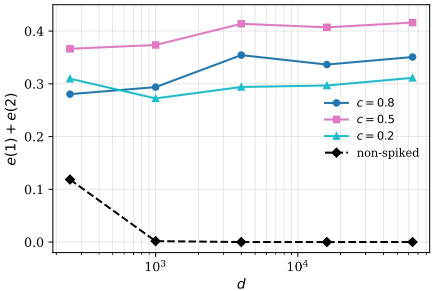
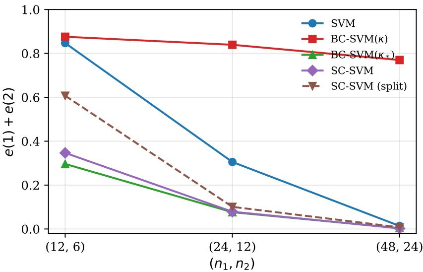

# ASYMPTOTIC PROPERTIES OF SUPPORT VECTOR MACHINESIN HIGH-DIMENSION, LOW-SAMPLE-SIZE SETTINGS UNDER A SPIKEDMODEL

YUGO NAKAYAMA Independent researcher

Abstract. In this paper, we consider asymptotic properties of the support vector machine (SVM) in high-dimension, low-sample-size (HDLSS) settings under a spiked model. The existing theory of the SVM in the HDLSS context relies on the geometric representation of HDLSS data, which requires that the eigenvalues of the covariance matrices are not dominant. We first show that the geometric representation does not hold under the spiked model. We show that the Gram matrix of HDLSS data converges in distribution to a random matrix, namely, the HDLSS data converge to a random configuration in a finite-dimensional space whose dimension is given by the number of the spikes. We show that the misclassification rates of the SVM do not tend to zero, that is, the SVM does not hold the consistency property. We also show that the bias-corrected SVM (BC-SVM) does not give preferable performance in this setting because the bias term itself should be modified. In order to overcome such dificulties, we propose a spike-corrected SVM (SC-SVM). We show that the SC-SVM holds the consistency property when the sample size goes to infinity, and that the growth of the sample size is essential in the sense that any projection-based procedure fails when the sample size is fixed. Finally, we check the performance of the classifiers by numerical simulations.

## Contents

1. Introduction 2   
1.1. The geometric representation and its limitation 2   
1.2. Contributions of this paper 3   
2. Notation and assumptions 4   
2.1. Notation 4   
2.2. Assumptions 4   
3. Asymptotic behaviour of inner products 5   
4. The limiting configuration theorem 6   
4.1. The Gram matrix 6   
4.2. The main theorem 7   
4.3. Existence of the limiting configuration 7   
4.4. Discussion on the construction 9   
5. Convergence of the hard-margin SVM 9   
5.1. The reduced primal problem 9   
5.2. Continuity of the solution map 10   
5.3. Convergence of the solution 11   
6. The limit of the discriminant function and the inconsistency 11   
6.1. The limit of the discriminant function 11   
6.2. The inconsistency 13   
7. An example with an explicit limit 14   
7.1. Interpretation 15   
8. Modification of the bias term 15   
9. The spike-corrected SVM 15   
9.1. The procedure 16   
10. The case that the sample size is fixed 17   
11. Numerical simulations 17   
11.1. Verification of Theorem 7.1 18   
11.2. Convergence of the Gram matrix 18   
11.3. The inconsistency 19   
11.4. The bias term 20   
11.5. Comparison of the classifiers 20   
12. Concluding remarks 22   
Appendix A. Mathematical tools 23   
A.1. The maximum theorem of Berge 23   
A.2. Fatou’s lemma 24   
Acknowledgments 25   
References 25

## 1. Introduction

High-dimension, low-sample-size (HDLSS) data situations occur in many areas of modern science such as genetic microarrays, medical imaging, text recognition, finance and chemometrics. In such data situations, the dimension d is much larger than the sample size N, so that the conventional multivariate procedures based on the large sample asymptotic theory do not work.

Suppose we have independent and d-variate two populations, $\pi _ { i } , i = 1 , 2$ , having an unknown mean vector $\mu _ { i }$ and unknown covariance matrix $\Sigma _ { i } \succeq O$ . We have independent and identically distributed (i.i.d.) observations, $x _ { i j } , j = 1 , \dotsc , n _ { i } ,$ from each $\pi _ { i }$ . We assume $n _ { i } \ge 1 ~ ( i = 1 , 2 )$ the case $n _ { 1 } = n _ { 2 } = 1$ is treated explicitly in Section 7. Let $x _ { 0 }$ be an observation vector of an individual belonging to one of the two populations. We assume $x _ { 0 }$ and $x _ { i j }$ ’s are independent. Let $N = n _ { 1 } + n _ { 2 }$ and $\Delta = \| \mu _ { 1 } - \mu _ { 2 } \| ^ { 2 }$ , where $\| \cdot \|$ denotes the Euclidean norm. Let $e ( i )$ denote the error rate of misclassifying an individual from $\pi _ { i }$ into the other class. We say that a classifier holds the consistency property if

$$
e ( 1 ) + e ( 2 ) \longrightarrow 0 \quad \mathrm { a s ~ } d \longrightarrow \infty .\tag{1.1}
$$

In the HDLSS context, Hall et al. (2005) and Marron et al. (2007) considered distance weighted classifiers. Chan and Hall (2009) and Aoshima and Yata (2011) considered distance-based classifiers. In particular, Aoshima and Yata (2011) gave the misclassification rate adjusted classifier for multiclass, high-dimensional data in which misclassification rates are no more than specified thresholds. On the other hand, Aoshima and Yata (2014, 2019) considered geometric classifiers based on a geometric representation of HDLSS data, and discussed asymptotic properties and optimality of the classifiers under high-dimension, non-sparse settings.

In the field of machine learning, a typical method of classification is the support vector machine (SVM). Since HDLSS data are mostly separable by a hyperplane, one usually considers the hard-margin SVM in the HDLSS context. For the linear SVM, Hall et al. (2005), Chan and Hall (2009) and Qiao and Zhang (2015) showed that the misclassification rates tend to zero as $d \to \infty$ under certain severe conditions. Nakayama et al. (2017) investigated asymptotic properties of the linear SVM for HDLSS data. They showed that the linear SVM is heavily biased when $n _ { 1 } \neq n _ { 2 }$ , and that the bias causes the strong inconsistency in which the misclassification rate tends to one. In order to overcome such dificulties, they proposed a bias-corrected linear SVM (BC-SVM) and showed that it holds the consistency property even for imbalanced data. Nakayama et al. (2020) investigated asymptotic properties of the SVM with the Gaussian kernel and gave a choice of the scale parameter involved in the kernel. Nakayama (2021, 2022) considered the SVM for high-dimensional imbalanced data in more general frameworks.

1.1. The geometric representation and its limitation. The above studies on the SVM rely on the geometric representation of HDLSS data. Let $\theta _ { i } = \operatorname { t r } ( \Sigma _ { i } )$ and $\theta = ( \theta _ { 1 } + \theta _ { 2 } ) / 2$

Under the condition

$$
\frac { \mathrm { t r } ( \Sigma _ { i } ^ { 2 } ) } { \theta _ { i } ^ { 2 } }  0 \quad \mathrm { a s ~ } d  \infty ,\tag{1.2}
$$

together with mild moment conditions, Hall et al. (2005) and Ahn et al. (2007) showed that

$$
\frac { \| x _ { i j } - x _ { i k } \| ^ { 2 } } { \theta _ { i } } = 2 + o _ { P } ( 1 ) \quad ( j \neq k ) , \qquad \frac { \| x _ { 1 j } - x _ { 2 k } \| ^ { 2 } } { \theta } = \frac { \theta _ { 1 } + \theta _ { 2 } } { \theta } + \frac { \Delta } { \theta } + o _ { P } ( 1 ) .
$$

That is, after rescaling by ${ \sqrt { \theta } } ,$ all the observations are located at the vertices of a regular simplex whose edge lengths are determined only by $\theta _ { i }$ and $\Delta .$ The randomness of the data vanishes in the limit. This deterministic structure is the reason why the solution of the hard-margin SVM can be written in a closed form in the HDLSS context, and why the discriminant function is described only by $\Delta$ and

$$
\kappa = { \frac { \mathrm { t r } ( \Sigma _ { 1 } ) } { n _ { 1 } } } - { \frac { \mathrm { t r } ( \Sigma _ { 2 } ) } { n _ { 2 } } } .\tag{1.3}
$$

The quantity κ is the bias term that the BC-SVM subtracts.

However, the condition (1.2) requires that the largest eigenvalue $\lambda _ { i 1 }$ of $\Sigma _ { i }$ is negligible compared with $\theta _ { i } ,$ since $\lambda _ { i 1 } ^ { 2 } \le \mathrm { t r } ( \Sigma _ { i } ^ { 2 } )$ . In actual high-dimensional data such as gene expression data, on the other hand, the eigenvalue structure is often spiked in the sense that a few eigenvalues are much larger than the others and carry a substantial proportion of the total variance. Yata and Aoshima (2012, 2013) investigated HDLSS asymptotic properties of the principal component analysis (PCA) under such spiked models and proposed the noise-reduction (NR) methodology, which gives consistent estimation of the spiked eigenvalues and eigenvectors when the sample size grows. Jung and Marron (2009) showed that the sample principal component directions are inconsistent when the spiked eigenvalue is of the same order as the trace and the sample size is fixed.

Thus a natural question arises: what happens to the SVM in HDLSS settings when the covariance matrices have dominant eigenvalues? To the best of our knowledge, this question has not been studied. Since the geometric representation is the foundation of the existing theory, we cannot expect that the known results carry over.

1.2. Contributions of this paper. In this paper, we consider asymptotic properties of the SVM in HDLSS settings under a spiked model in which

$$
\frac { \lambda _ { i s } } { \theta } \longrightarrow c _ { i s } \in ( 0 , 1 ) , \quad s = 1 , \ldots , m _ { i } ,\tag{1.4}
$$

where $m _ { i }$ is a fixed integer. Our contributions are summarized as follows.

(i) We show that the geometric representation does not hold under (1.4). We show that the Gram matrix of the rescaled data converges in distribution to a random matrix, and we give its explicit form (Theorem 4.1). Moreover, we show that the limiting Gram matrix is realized as the Gram matrix of an explicit family of vectors in $\mathbb { R } ^ { 1 }$ +m1+m2 (Lemma 4.2), namely, the HDLSS data converge to a random configuration in a finitedimensional space together with N mutually orthogonal noise axes. We call this result the limiting configuration theorem.

(ii) We show that the solution of the hard-margin SVM converges in distribution to the solution of the limiting problem (Theorem 5.3), and that the discriminant function converges in distribution to a non-degenerate random variable (Theorem 6.1). Consequently, we show that the misclassification rates do not tend to zero, that is, the SVM does not hold the consistency property (Corollary 6.2). We emphasize that this inconsistency is diferent from the strong inconsistency of Nakayama et al. (2017), in which the misclassification rate tends to one. Here the misclassification rate tends neither to zero nor to one.

(iii) We give an example in which the limiting misclassification rate is obtained in a closed form (Theorem 7.1). We show that a spike degrades the performance of the SVM even when it is orthogonal to the mean diference. This phenomenon cannot be observed in the existing theory.

(iv) We show that the bias term should be modified from (1.3) to $\kappa _ { \ast } ~ = ~ \mathrm { t r } ( \Sigma _ { 1 \ast } ) / n _ { 1 } ~ -$ $\operatorname { t r } ( \Sigma _ { 2 * } ) / n _ { 2 }$ , where $\Sigma _ { i * }$ denotes the non-spiked part of $\Sigma _ { i }$ (Proposition 8.1). We show that the $\mathrm { B C - S V M }$ overcorrects the bias under the spiked model.

(v) In order to overcome such dificulties, we propose a spike-corrected SVM (SC-SVM), which removes the uninformative spiked directions by the NR methodology and applies the BC-SVM with the modified bias term. We show that the SC-SVM holds the consistency property when $n _ { i }  \infty$ (Theorem 9.4). On the other hand, we show that any projection-based procedure does not hold the consistency property when N is fixed (Proposition 10.1), so that the growth of the sample size is essential.

(vi) Finally, we check the performance of the classifiers by numerical simulations.

The rest of the paper is organized as follows. In Section 2, we give the notation and the assumptions. In Section 3, we investigate asymptotic behaviour of the inner products of HDLSS data under the spiked model. In Section 4, we give the limiting configuration theorem. In Section 5, we show the convergence of the SVM. In Section 6, we give the limit of the discriminant function and the inconsistency. In Section $^ { 7 , }$ we give the explicit example. In Section 8, we give the modified bias term. In Section 9, we propose the SC-SVM. In Section 10, we discuss the case that N is fixed. In Section 11, we give numerical simulations. In Section 12, we give concluding remarks. The mathematical tools used in Sections 5 and 6 are summarized in Appendix A.

## 2. Notation and assumptions

## 2.1. Notation. We consider the spectral decomposition

$$
\Sigma _ { i } = H _ { i } \Lambda _ { i } H _ { i } ^ { T } , \quad \Lambda _ { i } = \mathrm { d i a g } ( \lambda _ { i 1 } , \ldots , \lambda _ { i d } ) , \quad \lambda _ { i 1 } \geq \cdots \geq \lambda _ { i d } \geq 0 ,
$$

where $H _ { i } = [ h _ { i 1 } , \dots , h _ { i d } ]$ is an orthogonal matrix. We write

$$
x _ { i j } = \mu _ { i } + \sum _ { s = 1 } ^ { d } \sqrt { \lambda _ { i s } } z _ { i j s } h _ { i s } , \quad j = 1 , \ldots , n _ { i } ,\tag{2.1}
$$

where $z _ { i j s } \mathrm { ' s }$ are random variables such that $E ( z _ { i j s } ) = 0$ and $\mathrm { V a r } ( z _ { i j s } ) = 1$ . We use the same expression for $x _ { 0 }$ and write its coeficients as $z _ { 0 s }$ . Let $\mu = \mu _ { 1 } - \mu _ { 2 }$ . We write $y _ { 1 j } = + 1$ and $y _ { 2 j } = - 1$ for the labels, and put $\varepsilon _ { 1 } = + 1$ and $\varepsilon _ { 2 } = - 1$ . Throughout this paper we consider the HDLSS asymptotic framework $d \to \infty$ . In Sections 3 to 8 and Section 10, $n _ { 1 }$ and $n _ { 2 }$ are fixed.

We regard the double index $( i , j )$ as a single index and put

$$
{ \mathcal { T } } = \{ ( 1 , 1 ) , \ldots , ( 1 , n _ { 1 } ) , ( 2 , 1 ) , \ldots , ( 2 , n _ { 2 } ) \} , \quad | { \mathcal { Z } } | = N .\tag{2.2}
$$

Vectors indexed by $\mathcal { T } ,$ such as the dual variable $\alpha = \left( \alpha _ { i j } \right)$ and the label vector $y = \left( y _ { i j } \right)$ , are arranged in this order, and matrices indexed by $\mathcal { T } \times \mathcal { T }$ are $N \times N$ . We write $p , q \in \mathcal { T }$ when a single index sufices.

## 2.2. Assumptions. We assume the following conditions.

(A1) For each i and $j ,$ it holds that $E ( z _ { i j s } ^ { 4 } ) \leq M < \infty$ for a constant M not depending on $d ,$ and that $E ( z _ { i j s } ^ { 2 } z _ { i j t } ^ { 2 } ) = 1$ for $s \neq t$ and $E ( z _ { i j s } z _ { i j t } z _ { i j u } z _ { i j v } ) = 0$ for distinct $s , t , u , v$

(A2) Let $\theta _ { i } = \mathrm { t r } ( \Sigma _ { i } )$ and $\theta = ( \theta _ { 1 } + \theta _ { 2 } ) / 2$ . It holds that $\theta _ { i } \to \infty$ and $\theta _ { i } / \theta \to \gamma _ { i } \in ( 0 , \infty )$ , where $\gamma _ { 1 } + \gamma _ { 2 } = 2$

(S) There exist fixed integers $m _ { i } \geq 1$ such that (1.4) holds. Let $\begin{array} { r } { \Sigma _ { i * } = \sum _ { s > m _ { i } } \lambda _ { i s } h _ { i s } h _ { i s } ^ { T } } \end{array}$ be the non-spiked part. It holds that $\mathrm { t r } ( \Sigma _ { i * } ^ { 2 } ) / \theta ^ { 2 } \to 0$ and $\mathrm { t r } ( \Sigma _ { i * } ) / \theta \to c _ { i 0 } > 0$

(A3) It holds that $\Delta / \theta \to \delta \in [ 0 , \infty )$ . When $\Delta > 0$ , it holds that

$$
b _ { i s } = \frac { h _ { i s } ^ { T } \mu } { \sqrt { \Delta } }  \beta _ { i s } \quad ( s \leq m _ { i } ) , \qquad \rho _ { s t } = h _ { 1 s } ^ { T } h _ { 2 t }  r _ { s t } \quad ( s \leq m _ { 1 } , t \leq m _ { 2 } ) .
$$

(A4) Let $Z ^ { ( d ) } = ( \{ z _ { i j s } \} _ { ( i , j ) \in \mathbb { Z } , s \leq m _ { i } } , \{ z _ { 0 s } \} _ { s \leq m _ { 1 } } ) \in \mathbb { R } ^ { L }$ , where $L = n _ { 1 } m _ { 1 } + n _ { 2 } m _ { 2 } + m _ { 1 }$ . The distribution of $Z ^ { ( d ) }$ converges in distribution to a distribution $\mathcal { L } _ { Z }$ as $d \to \infty$ . We denote by $Z$ a random vector distributed as $\mathcal { L } _ { Z }$

The condition (A1) is standard in this context and is met by Gaussian populations. The condition (A2) is a normalization. The condition (S) is the spiked model. Note that $\textstyle \sum _ { s \leq m _ { i } } c _ { i s } +$ $c _ { i 0 } = \gamma _ { i } ,$ and that $\lambda _ { i , m _ { i } + 1 } / \theta  0$ because $\lambda _ { i , m _ { i } + 1 } ^ { 2 } \leq \mathrm { t r } ( \Sigma _ { i * } ^ { 2 } )$ . We use this fact repeatedly.

The condition (A3) is not restrictive because $| b _ { i s } | \leq 1$ and $| \rho _ { s t } | \leq 1$ hold from the Cauchy– Schwarz inequality, so that convergent subsequences always exist. We assume $\delta < \infty$ throughout. When $\delta = \infty$ , the signal is much stronger than the spikes and the dificulties discussed in this paper disappear.

The condition (A4) is required so that the limiting objects in the subsequent sections are well defined. Since $n _ { i }$ is fixed, (A4) is met automatically when the distribution of $z _ { i j s }$ does not depend on $d .$ Hereafter, $z _ { i j s }$ and $z _ { 0 s }$ appearing in the limiting quantities denote the components of $Z .$

## 3. Asymptotic behaviour of inner products

In this section, we investigate asymptotic behaviour of the inner products of HDLSS data under the spiked model. In the existing theory, the inner products have deterministic limits. On the other hand, under the spiked model, they have random limits. This is the source of all the results in this paper.

We write $\begin{array} { r } { v _ { i j } = \sum _ { s < m _ { i } } \sqrt { \lambda _ { i s } } z _ { i j s } h _ { i s } } \end{array}$ for the spiked part and $\begin{array} { r } { \xi _ { i j } = \sum _ { s > m _ { i } } \sqrt { \lambda _ { i s } } z _ { i j s } h _ { i s } } \end{array}$ for the non-spiked part, so that $x _ { i j } - \mu _ { i } = v _ { i j } + \xi _ { i j }$

Lemma 3.1. Assume (A1), (A2) and (S). Then, for $j \neq k _ { i }$ , it holds that

(3.1)

$$
\frac { ( x _ { i j } - \mu _ { i } ) ^ { T } ( x _ { i k } - \mu _ { i } ) } { \theta } = \sum _ { s = 1 } ^ { m _ { i } } \frac { \lambda _ { i s } } { \theta } z _ { i j s } z _ { i k s } + o { \cal P } ( 1 ) .\tag{3.2}
$$

$$
\frac { \| x _ { i j } - \mu _ { i } \| ^ { 2 } } { \theta } = \sum _ { s = 1 } ^ { m _ { i } } \frac { \lambda _ { i s } } { \theta } z _ { i j s } ^ { 2 } + \frac { \operatorname { t r } ( \sum _ { i * } ) } { \theta } + o _ { P } ( 1 ) .
$$

Proof. From (2.1) and $h _ { i s } ^ { T } h _ { i t } = \delta _ { s t }$ , we have

$$
( x _ { i j } - \mu _ { i } ) ^ { T } ( x _ { i k } - \mu _ { i } ) = \sum _ { s = 1 } ^ { d } \lambda _ { i s } z _ { i j s } z _ { i k s } .
$$

We divide the sum into $s \leq m _ { i }$ and $s > m _ { i } ,$ and write $\begin{array} { r } { R = \sum _ { s > m _ { i } } \lambda _ { i s } z _ { i j s } z _ { i k s } } \end{array}$ . Since $z _ { i j \varepsilon }$ s and $z _ { i k s }$ are independent for $j \neq k$ , we have $E ( R ) = 0$ , so that $\mathrm { V a r } ( R ) = E ( R ^ { 2 } )$ . From (A1) it holds that

$$
\operatorname { V a r } ( R ) = \operatorname { t r } ( \Sigma _ { i * } ^ { 2 } ) .
$$

Then, from Chebyshev’s inequality, for any $\varepsilon > 0$ it holds that

$$
P \big ( | R | / \theta > \varepsilon \big ) \leq \frac { \mathrm { t r } ( \Sigma _ { i * } ^ { 2 } ) } { \varepsilon ^ { 2 } \theta ^ { 2 } }  0
$$

from (S). Thus we obtain (3.1).

Next, we have $\begin{array} { r } { \| x _ { i j } - \mu _ { i } \| ^ { 2 } = \sum _ { s = 1 } ^ { d } \lambda _ { i s } z _ { i j s } ^ { 2 } } \end{array}$ . Let $\begin{array} { r } { Q = \sum _ { s > m _ { i } } \lambda _ { i s } z _ { i j s } ^ { 2 } } \end{array}$ . Then $E ( Q ) = \operatorname { t r } ( \Sigma _ { i * } )$ From (A1) we have $E ( z _ { i j s } ^ { 4 } ) \leq M$ for $s > m _ { i }$ and $E ( z _ { i j s } ^ { 2 } z _ { i j t } ^ { 2 } ) = \mathrm { i }$ for $s \neq t .$ , so that

$$
\operatorname { V a r } ( Q ) \leq ( M - 1 ) \operatorname { t r } ( \Sigma _ { i * } ^ { 2 } ) = o ( \theta ^ { 2 } ) .
$$

Thus we obtain (3.2) from Chebyshev’s inequality.

Lemma 3.2. Assume (A1), (A2) and (S). Then, for any j and k, it holds that

$$
\frac { ( x _ { 1 j } - \mu _ { 1 } ) ^ { T } ( x _ { 2 k } - \mu _ { 2 } ) } { \theta } = \sum _ { s = 1 } ^ { m _ { 1 } } \sum _ { t = 1 } ^ { m _ { 2 } } \frac { \sqrt { \lambda _ { 1 s } \lambda _ { 2 t } } } { \theta } \rho _ { s t } z _ { 1 j s } z _ { 2 k t } + o _ { P } ( 1 ) .
$$

Proof. We have

$$
( x _ { 1 j } - \mu _ { 1 } ) ^ { T } ( x _ { 2 k } - \mu _ { 2 } ) = v _ { 1 j } ^ { T } v _ { 2 k } + v _ { 1 j } ^ { T } \xi _ { 2 k } + \xi _ { 1 j } ^ { T } v _ { 2 k } + \xi _ { 1 j } ^ { T } \xi _ { 2 k } .
$$

The first term is the finite sum in the statement. We evaluate the other terms.

As for $v _ { 1 j } ^ { T } \xi _ { 2 k }$ , by conditioning on $v _ { 1 j }$ we have $E ( v _ { 1 j } ^ { T } \xi _ { 2 k } \mid v _ { 1 j } ) = 0$ and

$$
\operatorname { V a r } ( v _ { 1 j } ^ { T } \xi _ { 2 k } \mid v _ { 1 j } ) = v _ { 1 j } ^ { T } \Sigma _ { 2 * } v _ { 1 j } .
$$

Here $v _ { 1 j } ^ { T } \Sigma _ { 2 * } v _ { 1 j } = O _ { P } ( \theta \cdot \mathrm { t r } ( \Sigma _ { 2 * } ) / d \cdot \theta )$ is controlled because $m _ { 1 }$ is fixed and $\mathrm { t r } ( \Sigma _ { 2 * } ^ { 2 } ) / \theta ^ { 2 } \to 0$ Since $\| v _ { 1 j } \| ^ { 2 } = O _ { P } ( \theta )$ , the conditional variance is $o _ { P } ( \theta ^ { 2 } )$ , so that $v _ { 1 j } ^ { T } \xi _ { 2 k } = o _ { P } ( \theta )$ . The term $\xi _ { 1 j } ^ { T } v _ { 2 k }$ is handled in the same way.

As for $\xi _ { 1 j } ^ { T } \xi _ { 2 k }$ , from the independence we have $E ( \xi _ { 1 j } ^ { T } \xi _ { 2 k } ) = 0$ and

$$
\begin{array} { r } { E [ ( \xi _ { 1 j } ^ { T } \xi _ { 2 k } ) ^ { 2 } ] = \mathrm { t r } ( \Sigma _ { 1 * } \Sigma _ { 2 * } ) \leq \sqrt { \mathrm { t r } ( \Sigma _ { 1 * } ^ { 2 } ) \mathrm { t r } ( \Sigma _ { 2 * } ^ { 2 } ) } = o ( \theta ^ { 2 } ) , } \end{array}\tag{3.3}
$$

where we used the Cauchy–Schwarz inequality for the trace of the product of non-negative definite matrices. Thus we obtain the result. □

Lemma 3.3. Assume (A1), (A2), (S) and (A3) with $\Delta > 0$ . Then it holds that

$$
\frac { \mu ^ { T } ( x _ { i j } - \mu _ { i } ) } { \theta } = \frac { \sqrt { \Delta } } { \theta } \sum _ { s = 1 } ^ { m _ { i } } \sqrt { \lambda _ { i s } } b _ { i s } z _ { i j s } + o { \cal P } ( 1 ) \longrightarrow \sqrt { \delta } \sum _ { s = 1 } ^ { m _ { i } } \sqrt { c _ { i s } } \beta _ { i s } z _ { i j s } .
$$

Proof. From the definition of $b _ { i s }$ we have $\begin{array} { r } { \mu ^ { T } ( x _ { i j } - \mu _ { i } ) \ = \ \sqrt { \Delta } \sum _ { s = 1 } ^ { d } \sqrt { \lambda _ { i s } } b _ { i s } z _ { i j s } } \end{array}$ . Let $R =$ $\begin{array} { r } { \sqrt { \Delta } \sum _ { s > m _ { i } } \sqrt { \lambda _ { i s } } b _ { i s } z _ { i j s } } \end{array}$ . Then $E ( R ) = 0$ and

$$
\operatorname { V a r } ( R ) = \Delta \sum _ { s > m _ { i } } \lambda _ { i s } b _ { i s } ^ { 2 } \leq \Delta \cdot \frac { \operatorname { t r } ( \Sigma _ { i * } ^ { 2 } ) ^ { 1 / 2 } } { \theta } \cdot \theta \cdot o ( 1 ) ,
$$

where we used $\begin{array} { r } { \sum _ { s > m _ { i } } b _ { i s } ^ { 2 } \lambda _ { i s } \le \| \boldsymbol { \mu } \| ^ { 2 } \cdot \boldsymbol { o } ( 1 ) } \end{array}$ from (A3) together with $\lambda _ { i , m _ { i } + 1 } / \theta \ \to \ 0$ Thus $R / \theta = o _ { P } ( 1 )$ . The convergence of the leading term follows from $\Delta / \theta \to \delta , \lambda _ { i s } / \theta \to c _ { i s }$ and $b _ { i s }  \beta _ { i s }$ □

Remark 3.4. Lemma 3.1 shows the essential diference from the existing theory. Under (1.2), one has $m _ { i } = 0$ in efect and the right-hand side of (3.1) vanishes, so that the inner product of two distinct observations converges to a constant. Under (S), however, the limit $\begin{array} { r } { \sum _ { s \leq m _ { i } } c _ { i s } z _ { i j s } z _ { i k s } } \end{array}$ is a non-degenerate random variable. We emphasize that the term $\mathrm { t r } ( \Sigma _ { i * } ) / \theta$ in (3.2) appears only for the squared norm, namely, only when the two observations coincide. This asymmetry between (3.1) and (3.2) plays a crucial role in Section 6.

## 4. The limiting configuration theorem

4.1. The Gram matrix. We consider the rescaled observations

$$
u _ { i j } = \frac { x _ { i j } - ( \mu _ { 1 } + \mu _ { 2 } ) / 2 } { \sqrt { \theta } } = \varepsilon _ { i } \frac { \mu } { 2 \sqrt { \theta } } + \frac { v _ { i j } + \xi _ { i j } } { \sqrt { \theta } } .\tag{4.1}
$$

Note that the translation does not change the weight vector of the SVM and the scaling changes ∥w∥ and b simultaneously, so that the classification result is not afected. We define the Gram matrix by

$$
\begin{array} { r } { G = \left( u _ { i j } ^ { T } u _ { k l } \right) _ { ( i , j ) , ( k , l ) \in \mathcal { T } } \in \mathbb { R } ^ { N \times N } , } \end{array}\tag{4.2}
$$

where $( i , j )$ gives the row and $( k , l )$ gives the column according to the order (2.2). We also define

$$
D = \operatorname { d i a g } ( \underbrace { c _ { 1 0 } , \dots , c _ { 1 0 } } _ { n _ { 1 } } , \underbrace { c _ { 2 0 } , \dots , c _ { 2 0 } } _ { n _ { 2 } } ) ,
$$

whose components are arranged in the same order.

## 4.2. The main theorem.

Theorem 4.1. Assume (A1) to (A4) and (S). Then, as $d \to \infty$ , it holds that

$$
G \stackrel { d } { \to } G ^ { * } = G _ { 0 } ^ { * } + D ,
$$

where the $( ( i , j ) , ( k , l ) )$ component of $G _ { 0 } ^ { * }$ is given by

$$
\begin{array} { l } { { g _ { ( i , j ) , ( k , l ) } ^ { \ast } = \displaystyle \frac { \varepsilon _ { i } \varepsilon _ { k } \delta } { 4 } + \frac { \varepsilon _ { i } \sqrt { \delta } } { 2 } \sum _ { t \leq m _ { k } } \sqrt { c _ { k t } } \beta _ { k t } z _ { k l t } + \frac { \varepsilon _ { k } \sqrt { \delta } } { 2 } \sum _ { s \leq m _ { i } } \sqrt { c _ { i s } } \beta _ { i s } z _ { i j s } } } \\ { { + \sum _ { s \leq m _ { i } } \displaystyle \sum _ { t \leq m _ { k } } \sqrt { c _ { i s } c _ { k t } } r _ { s t } ^ { ( i k ) } z _ { i j s } z _ { k l t } , } } \end{array}\tag{4.3}
$$

with $r _ { s t } ^ { ( 1 1 ) } = r _ { s t } ^ { ( 2 2 ) } = \delta _ { s t } , r _ { s t } ^ { ( 1 2 ) } = r _ { s t }$ and $r _ { s t } ^ { ( 2 1 ) } = r _ { t s }$ . Moreover, when $c _ { 1 0 } > 0$ and $c _ { 2 0 } > 0$ , it holds that $G ^ { * } \succ O f o r$ every realization of Z.

Proof. (i) Convergence of the components. From (4.1) we have

$$
u _ { i j } ^ { T } u _ { k l } = \underbrace { \frac { \varepsilon _ { i } \varepsilon _ { k } \Delta } { 4 \theta } } _ { \mathrm { ( I ) } } + \underbrace { \frac { \varepsilon _ { i } } { 2 } \frac { \mu ^ { T } ( x _ { k l } - \mu _ { k } ) } { \theta } } _ { \mathrm { ( I I ) } } + \underbrace { \frac { \varepsilon _ { k } } { 2 } \frac { \mu ^ { T } ( x _ { i j } - \mu _ { i } ) } { \theta } } _ { \mathrm { ( I I I ) } } + \underbrace { \frac { ( x _ { i j } - \mu _ { i } ) ^ { T } ( x _ { k l } - \mu _ { k } ) } { \theta } } _ { \mathrm { ( I I I ) } } .
$$

The term (I) converges to $\varepsilon _ { i } \varepsilon _ { k } \delta / 4$ from (A3). The terms (II) and (III) converge to the second and the third terms of (4.3) from Lemma 3.3. As for (IV), when $( i , j ) \neq ( k , l )$ , it converges to the fourth term of (4.3) from (3.1) for $i = k$ and from Lemma 3.2 for $i \neq k .$ . When $( i , j ) = ( k , l )$ it converges to the fourth term plus $c _ { i 0 }$ from (3.2). This gives the diagonal matrix $D$

Since the number of the components is $N ^ { 2 }$ , which does not depend on $d ,$ and all of them are written as a common continuous function of $Z ^ { ( d ) }$ plus $o _ { P } ( 1 )$ , the convergence of the matrix follows from (A4) together with the continuous mapping theorem and Slutsky’s theorem.

(ii) Positive definiteness. From Lemma 4.2 in Section 4.3, $G _ { 0 } ^ { * }$ is the Gram matrix of a family of vectors $\tilde { u } _ { i j }$ in $\mathbb { R } ^ { K }$ , where $K = 1 + m _ { 1 } + m _ { 2 }$ . Hence, for any $\mathbf { \bar { \Psi } } _ { a } = ( a _ { i j } ) \in \mathbb { R } ^ { N }$ , it holds that

$$
a ^ { T } G _ { 0 } ^ { * } a = \Big \| \sum _ { ( i , j ) \in \mathbb { Z } } a _ { i j } \tilde { u } _ { i j } \Big \| ^ { 2 } \geq 0 .
$$

Note that this holds for every realization of $Z ,$ because $( \tilde { u } _ { i j } )$ is a fixed family of vectors in $\mathbb { R } ^ { K }$ once the realization is given. On the other hand, we have

$$
a ^ { T } D a \geq \operatorname* { m i n } ( c _ { 1 0 } , c _ { 2 0 } ) \Vert a \Vert ^ { 2 } .
$$

Hence, when $c _ { 1 0 } > 0$ and $c _ { 2 0 } > 0$ , for any $a \neq 0$ it holds that $a ^ { T } G ^ { * } a > 0$

4.3. Existence of the limiting configuration. In the proof of Theorem 4.1, we used the fact that $G _ { 0 } ^ { * }$ is the Gram matrix of a family of vectors. This fact is not trivial. If one specifies the values of the inner products of N vectors arbitrarily, there does not necessarily exist a family of vectors which realizes them. For example, one cannot find three unit vectors whose mutual inner products are all equal to −1. Hence we need to prove the existence.

Lemma 4.2. Assume (A3) with $\Delta > 0$ and let $K = 1 + m _ { 1 } + m _ { 2 }$ . Then there exists a family of non-random vectors $e _ { \mu }$ and $\tilde { h } _ { i s } ~ ( i = 1 , 2 , \ s \leq m _ { i } )$ in $\mathbb { R } ^ { K }$ such that

$$
\| e _ { \mu } \| ^ { 2 } = 1 , \quad e _ { \mu } ^ { T } \tilde { h } _ { i s } = \beta _ { i s } , \quad \tilde { h } _ { i s } ^ { T } \tilde { h } _ { i t } = \delta _ { s t } , \quad \tilde { h } _ { 1 s } ^ { T } \tilde { h } _ { 2 t } = r _ { s t } .\tag{4.4}
$$

Moreover, putting

$$
\tilde { u } _ { i j } = \varepsilon _ { i } \frac { \sqrt { \delta } } { 2 } e _ { \mu } + \sum _ { s \leq m _ { i } } \sqrt { c _ { i s } } z _ { i j s } \tilde { h } _ { i s } , \quad ( i , j ) \in \mathbb { Z } ,\tag{4.5}
$$

it holds that $\tilde { u } _ { i j } ^ { T } \tilde { u } _ { k l } = g _ { ( i j ) , ( k l ) } ^ { * }$

Proof. We proceed in four steps.

Step 1. We write the target inner products as a matrix. Let

$$
\mathcal { I } = \{ \mu \} \cup \{ ( i , s ) : i = 1 , 2 , s \leq m _ { i } \} , \quad | \mathcal { I } | = K ,
$$

and define a $K \times K$ symmetric matrix Γ whose components are the right-hand sides of (4.4), that is, $\Gamma _ { \mu \mu } = 1 , \Gamma _ { \mu , ( i , s ) } = \beta _ { i s } , \Gamma _ { ( i , s ) , ( i , t ) } = \delta _ { s t } , \Gamma _ { ( 1 , s ) , ( 2 , t ) } = r _ { s t }$ . What we have to show is that there exists a family of vectors in $\mathbb { R } ^ { K }$ whose Gram matrix is Γ.

Step 2. We show that $\Gamma \succeq O$ . We do not evaluate any inequality. Instead, we carry the positive semi-definiteness which holds for finite d to the limit. For each $d ,$ we take the vectors

$$
e _ { \mu } ^ { ( d ) } = \mu / \sqrt { \Delta } , \qquad h _ { i s } \quad ( i = 1 , 2 , s \leq m _ { i } ) ,
$$

which actually exist in $\mathbb { R } ^ { d }$ . Let $\Gamma ^ { ( d ) }$ be the Gram matrix of these K vectors. Then $\Gamma ^ { ( d ) } \succeq O$ by definition, because for any $a \in \mathbb { R } ^ { K }$ it holds that

$$
a ^ { T } \Gamma ^ { ( d ) } a = \left\| a _ { \mu } e _ { \mu } ^ { ( d ) } + \sum _ { i , s } a _ { ( i , s ) } h _ { i s } \right\| ^ { 2 } \geq 0 .\tag{4.6}
$$

The components of $\Gamma ^ { ( d ) }$ are given by

$$
( e _ { \mu } ^ { ( d ) } ) ^ { T } e _ { \mu } ^ { ( d ) } = 1 , \quad ( e _ { \mu } ^ { ( d ) } ) ^ { T } h _ { i s } = b _ { i s } , \quad h _ { i s } ^ { T } h _ { i t } = \delta _ { s t } , \quad h _ { 1 s } ^ { T } h _ { 2 t } = \rho _ { s t } .
$$

Note that the first and the third equalities hold exactly for every $d ,$ because $\| e _ { \mu } ^ { ( d ) } \| = 1$ and $H _ { i }$ is an orthogonal matrix. As for the second and the fourth, we have $b _ { i s }  \beta _ { i s }$ and $\rho _ { s t } \to r _ { s t }$ from (A3). Since $K$ does not depend on $d ,$ the componentwise convergence gives $\Gamma ^ { ( d ) }  \Gamma$ Finally, fixing $a \in \mathbb { R } ^ { K }$ and letting $d \to \infty$ in (4.6), we obtain $a ^ { T } \Gamma a \geq 0$ because the limit of a sequence of non-negative numbers is non-negative. Since $a$ is arbitrary, we have $\Gamma \succeq O$ . This is nothing but a direct verification that the cone of positive semi-definite matrices is closed.

Step 3. We construct the vectors from $\Gamma \succeq O$ . Let $\Gamma = Q \Lambda Q ^ { T }$ be the spectral decomposition, where $Q$ is an orthogonal matrix and Λ = diag $( \ell _ { 1 } , \dots , \ell _ { K } )$ with $\ell _ { r } \geq 0$ . Let $B = \Lambda ^ { 1 / 2 } Q ^ { \dot { T } }$ , which is well defined because $\ell _ { r } \geq 0$ , and put $B ^ { T } B = \Gamma$ . Then we define $e _ { \mu }$ and $\tilde { h } _ { i s }$ as the columns of B corresponding to the indices of $\mathcal { I }$ . Since $B ^ { T } B$ is the inner product of the columns of $B ,$ the equality $B ^ { T } B = \Gamma$ is exactly the four equalities in (4.4). We note that Γ is determined only by the non-random quantities $\beta _ { i s }$ and $r _ { s t } ,$ so that $e _ { \mu }$ and $\tilde { h } _ { i s }$ are non-random.

Step $\not \angle \cdot$ We check the Gram matrix of (4.5). From the bilinearity we have

$$
\begin{array} { l } { { \displaystyle \tilde { u } _ { i j } ^ { T } \tilde { u } _ { k l } = \frac { \varepsilon _ { i } \varepsilon _ { k } \delta } { 4 } \| e _ { \mu } \| ^ { 2 } + \frac { \varepsilon _ { i } \sqrt { \delta } } { 2 } \sum _ { t \le m _ { k } } \sqrt { c _ { k t } } z _ { k l t } e _ { \mu } ^ { T } \tilde { h } _ { k t } } } \\ { { \displaystyle ~ + \frac { \varepsilon _ { k } \sqrt { \delta } } { 2 } \sum _ { s \le m _ { i } } \sqrt { c _ { i s } } z _ { i j s } e _ { \mu } ^ { T } \tilde { h } _ { i s } } } \\ { { \displaystyle ~ + \sum _ { s < m _ { i } } \sum _ { t < m _ { k } } \sqrt { c _ { i s } c _ { k t } } z _ { i j s } z _ { k l t } \tilde { h } _ { i s } ^ { T } \tilde { h } _ { k t } } . } \end{array}
$$

Substituting (4.4), we obtain (4.3) term by term.

Remark 4.3. Lemma 4.2 gives $G _ { 0 } ^ { * } \succeq O$ , but it does not give the positive definiteness. In fact, in the setting of Section 7 we have $r _ { 1 1 } = 1$ , that is, $\tilde { h } _ { 1 1 } = \tilde { h } _ { 2 1 }$ , so that Γ is singular. In such a case, $G _ { 0 } ^ { * }$ degenerates into a proper subspace of $\mathbb { R } ^ { K }$ and $G _ { 0 } ^ { * }$ is singular when $N > K$ . Hence the positive definiteness of $G ^ { * }$ comes only from the diagonal matrix D, that is, from the nonspiked noise. The condition $c _ { i 0 } > 0$ in (S) is essential in this sense. When $c _ { i 0 } = 0$ , the afine independence of the data is lost and the arguments in Lemmas 5.1 and 5.2 break down.

Remark 4.4. When $\Delta = 0 .$ , the quantity $e _ { \mu }$ is not defined. On the other hand, the coeficient $\sqrt { \delta } / 2$ of $e _ { \mu }$ in (4.5) also vanishes because $\delta = 0$ . Hence it sufices to remove the index $\mu$ from $\mathcal { I }$ , put $K = m _ { 1 } + m _ { 2 }$ and repeat the same argument. The first three terms of (4.3) also vanish.

4.4. Discussion on the construction. The construction in Lemma 4.2 may look artificial.   
We give the idea behind it, which is in fact simple.

First, we note that the SVM sees the data only through the inner products. As we show in Section 5, the dual problem involves only the Gram matrix G, and the discriminant function involves only $u _ { p } ^ { T } u _ { 0 }$ . Hence the SVM is invariant under congruent transformations, and we do not have to ask whether the points themselves converge. We only have to ask whether the table of the inner products converges. Lemmas 3.1 to 3.3 do exactly this, and the problem of the diverging dimension is reduced to the convergence of an $N \times N$ matrix.

Second, however, we also want a geometric picture corresponding to the statement that HDLSS data are located at the vertices of a regular simplex. This leads to the inverse problem: does there exist a configuration of points which realizes the limiting table of the inner products, and if so, in how many dimensions? This is the problem of the classical multidimensional scaling.

Third, the tool for the inverse problem is the standard fact that, for a real symmetric matrix Γ, the conditions $\Gamma \succeq O , \mathrm { r a n k } ( \Gamma ) = r$ for some $r ,$ and Γ is a Gram matrix of some family of vectors, are equivalent. Hence the proof of the positive semi-definiteness is itself the proof of the existence of the configuration, and what we have to show is reduced to one inequality.

Fourth, the positive semi-definiteness is obtained for free from the existence in finite dimensions. For finite $d ,$ the vectors $e _ { \mu } ^ { ( d ) }$ and $h _ { i s }$ actually exist in $\mathbb { R } ^ { d }$ , and the Gram matrix of vectors which actually exist is of course positive semi-definite. We only have to carry this property to the limit, and the condition (A3) is assumed exactly for this purpose.

Finally, the dimension $K = 1 + m _ { 1 } + m _ { 2 }$ is the number of the directions which survive in the limiting table of the inner products, namely, the mean diference direction and the spiked directions. The non-spiked directions are killed by Lemmas 3.1 to 3.3 except for the diagonal term $c _ { i 0 }$

We note that the choice of $B$ is not unique. One may use the Cholesky decomposition or the reproducing kernel Hilbert space construction. We use the spectral decomposition because it works without any modification even when Γ is singular, as we remarked in Remark 4.3.

Remark 4.5 (Collapse of the geometric representation). In the existing theory, which corresponds to $m _ { i } = 0$ , the second to the fourth terms of (4.3) vanish and $G ^ { * }$ is a deterministic matrix. This is the geometric representation, and it is the reason why the SVM solution can be written in a closed form. Under the spiked model, $G ^ { * }$ is a random matrix depending on $Z$ That is, HDLSS data converge to a random configuration in a $( 1 + m _ { 1 } + m _ { 2 } )$ )-dimensional space together with N mutually orthogonal noise axes whose lengths are $\sqrt { c _ { i 0 } }$ . All the arguments in the subsequent sections are reduced to this finite-dimensional random limiting problem.

## 5. Convergence of the hard-margin SVM

5.1. The reduced primal problem. We consider the hard-margin linear SVM for the rescaled data $\{ u _ { p } \} _ { p \in \mathbb { Z } } \colon$

$$
\operatorname* { m i n } _ { w , b } \ { \frac { 1 } { 2 } } \| w \| ^ { 2 } \quad { \mathrm { s u b j e c t ~ t o } } \quad y _ { p } ( w ^ { T } u _ { p } + b ) \geq 1 \quad { \mathrm { f o r ~ a l l ~ } } p \in { \mathbb { Z } } .\tag{5.1}
$$

The dual problem is given by

$$
\operatorname* { m a x } _ { \alpha > 0 } ~ F ( \alpha , G ) = \mathbf { 1 } ^ { T } \alpha - \frac { 1 } { 2 } \alpha ^ { T } Y G Y \alpha ~ \mathrm { s u b j e c t } ~ \mathrm { t o } ~ y ^ { T } \alpha = 0 ,\tag{5.2}
$$

where $Y = \mathrm { d i a g } ( y )$ and $\begin{array} { r } { w = \sum _ { p } \alpha _ { p } y _ { p } u _ { p } } \end{array}$

In this section, we also use the following reduced form of (5.1), in which the d-dimensional variable w is eliminated. The optimal w belongs to the span of $\{ u _ { p } \}$ , because writing $w =$ $w _ { \parallel } + w _ { \perp }$ we have $\| w \| ^ { 2 } = \| w _ { \| } \| ^ { 2 } + \| w _ { \perp } \| ^ { 2 }$ while $w ^ { T } u _ { p } = w _ { | | } ^ { T } u _ { p }$ . Hence we may write $\begin{array} { r } { w = \sum _ { p } \beta _ { p } u _ { p } } \end{array}$ so that $\| w \| ^ { 2 } = \beta ^ { T } G \beta$ and $w ^ { T } u _ { p } = ( G \beta ) _ { p }$ . Then (5.1) is equivalent to

$$
\begin{array} { r } { \frac { 1 } { 2 } \beta ^ { T } G \beta \quad \mathrm { s u b j e c t ~ t o } \quad y _ { p } \big ( ( G \beta ) _ { p } + b \big ) \geq 1 \quad \mathrm { f o r ~ a l l } \ p \in \mathbb { Z } , } \end{array}\tag{5.3}
$$

which is a problem in $( \beta , b ) \in \mathbb { R } ^ { N } \times \mathbb { R }$ and refers to the data only through G. The discriminant function for a new observation $u _ { 0 }$ is given by

$$
f ( u _ { 0 } ) = w ^ { T } u _ { 0 } + b = \sum _ { p \in \mathbb { Z } } \beta _ { p } u _ { p } ^ { T } u _ { 0 } + b , \qquad \beta _ { p } = \alpha _ { p } y _ { p } .\tag{5.4}
$$

We note that $\beta = Y \alpha$

Lemma 5.1. Assume $G \succ O$ . Then $\{ u _ { p } \}$ is afinely independent. Moreover, for any labelling, (5.1) and (5.3) are feasible and their solutions are unique, and the solution of (5.2) is unique.

Proof. The condition $G \succ O$ is equivalent to the linear independence of $\{ u _ { p } \}$ , because $a ^ { T } G a =$ $\| \sum a _ { p } u _ { p } \| ^ { 2 }$ implies $\sum { a _ { p } u _ { p } } = 0$ and hence $a = 0$ . The linear independence implies the afine independence. For afinely independent N points, there exists $( w , b )$ such that $y _ { p } ( w ^ { T } u _ { p } + b ) = 1$ for all $p ,$ so that the problem is feasible. The objective function $\overset { \mathrm { 1 } } { \underset { \mathrm { 2 } } { \mathrm { 1 } } } \beta ^ { T } G \beta$ is strictly convex in $\beta$ from $G \succ O$ and the constraints are convex, and b is determined uniquely from the active constraints once $\beta$ is given. Hence the solution of (5.3) is unique. The dual objective function is strictly concave from $Y G Y \succ O$ , so that the solution of (5.2) is unique. □

5.2. Continuity of the solution map. In Lemma 5.2 below, we investigate how the solution of the optimization problem moves when the parameter G moves. We cannot write the solution explicitly, because the set of the active constraints changes with G. On the other hand, what we need is not the diferentiability but only the continuity. For this purpose we use the maximum theorem of Berge (1963), which we summarize in Appendix A.1 together with its intuitive meaning. Roughly speaking, the theorem states that the optimal value moves continuously while the optimal solution may jump, but the point to which it jumps always belongs to the solution set of the limiting problem. When the solution is unique, this gives the continuity of the solution map.

Lemma 5.2. Let $\mathcal { G } _ { + } ~ = ~ \{ G ~ \in ~ \mathbb { R } ^ { N \times N } ~ : ~ G ~ = ~ G ^ { T } , ~ G ~ \succ ~ O \}$ Then the maps $G \mapsto \alpha ( G )$ and $G \mapsto ( \beta ( G ) , b ( G ) )$ are continuous on $\mathcal { G } _ { + }$ , where $\alpha ( G )$ denotes the solution of (5.2) and $( \beta ( G ) , b ( G ) )$ denotes the solution of (5.3).

Proof. Step 1. Let $G _ { 0 } \in \mathcal { G } _ { + }$ and $\eta = \lambda _ { \mathrm { m i n } } ( G _ { 0 } ) / 2$ . Since the eigenvalues are continuous functions of the matrix, there exists an open neighbourhood $U$ of $G _ { 0 }$ such that $\lambda _ { \operatorname* { m i n } } ( G ) \geq \eta$ for all $G \in U$

Step 2. We give an a priori bound of the dual variable. Since Y is an orthogonal matrix, we have $\bar { \alpha } ^ { T } Y G Y \bar { \alpha } = \| G ^ { 1 / 2 } \bar { Y } \alpha \| ^ { 2 }$ , so that

$$
\alpha ^ { T } Y G Y \alpha \geq \eta \Vert \alpha \Vert ^ { 2 } \quad { \mathrm { f o r ~ a l l ~ } } G \in U .
$$

Together with $\mathbf { 1 } ^ { T } \alpha \leq \sqrt { N } \left\| \alpha \right\|$ , we have

$$
F ( \alpha , G ) \leq \sqrt { N } \| \alpha \| - \frac { \eta } { 2 } \| \alpha \| ^ { 2 } .\tag{5.5}
$$

Since $\alpha = 0$ is feasible and $F ( 0 , G ) = 0$ , the optimal solution satisfies $F ( \alpha , G ) \ge 0$ . From (5.5) we obtain $\lVert \alpha \rVert \leq 2 \sqrt { N } / \eta$ , that is,

$$
\left\| \alpha \right\| \leq { \frac { 2 { \sqrt { N } } } { \eta } } = : K _ { 0 } \quad { \mathrm { f o r ~ a l l ~ } } G \in U .\tag{5.6}
$$

We emphasize that $K _ { 0 }$ does not depend on $G \in U$

Step 3. From (5.6), we may restrict the feasible set of (5.2) to

$$
\mathcal { A } = \{ \alpha \geq 0 : \ \boldsymbol { y } ^ { T } \boldsymbol { \alpha } = \boldsymbol { 0 } , \ \| \boldsymbol { \alpha } \| \leq K _ { 0 } \}
$$

without changing the optimal solution on $U .$ The set A is compact and does not depend on $G ,$ that is, the feasible correspondence is a constant correspondence, which is trivially continuous. On the other hand, $F ( \alpha , G )$ is a polynomial in $( \alpha , G )$ and hence continuous. Thus all the conditions of the maximum theorem are met, and the solution correspondence is upper hemicontinuous on $U .$ . Since the solution is a singleton from Lemma 5.1, the solution map is continuous on $U$ from Corollary A.2. Since $G _ { 0 }$ is arbitrary, the map is continuous on $\mathcal { G } _ { + }$

Step $\it 4 .$ We consider (5.3). The optimal value is bounded above by the value at the feasible point given in the proof of Lemma 5.1, which is a continuous function of $G$ and hence bounded on $U _ { : }$ , say by $M _ { U }$ . Then

$$
{ \frac { 1 } { 2 } } \beta ^ { T } G \beta \leq M _ { U } \quad \Rightarrow \quad \| \beta \| ^ { 2 } \leq { \frac { 2 M _ { U } } { \eta } } .
$$

Moreover, at the optimal solution, at least one constraint is active, since otherwise one could shrink $( \beta , b )$ and decrease the objective function. For such $p$ we have $| ( G \beta ) _ { p } + b | = 1$ , so that $| b | \leq 1 + \| G \| \| \beta \|$ . Hence we may restrict the feasible set to a compact set which does not depend on $G \in U$ , and the same argument as in Step 3 gives the continuity. □

## 5.3. Convergence of the solution.

Theorem 5.3. Assume (A1) to (A4) and (S). Then, as $d \to \infty .$ , it holds that

$$
\alpha ^ { ( d ) } \stackrel { d } { \to } \alpha ^ { * } = \alpha ( G ^ { * } ) , \qquad ( \beta ^ { ( d ) } , b ^ { ( d ) } ) \stackrel { d } { \to } ( \beta ^ { * } , b ^ { * } ) = ( \beta ( G ^ { * } ) , b ( G ^ { * } ) ) ,
$$

where $G ^ { * }$ is the limiting Gram matrix given in Theorem $4 . 1 .$

Proof. From Theorem 4.1 we have $G \stackrel { d } { \to } G ^ { * }$ and $P ( G ^ { * } \succ O ) = 1$ . From Lemma 5.2, the maps are continuous on $\mathcal { G } _ { + }$ , so that the set of the discontinuity points has measure zero under the limiting distribution. Thus we obtain the result from the continuous mapping theorem. □

## 6. The limit of the discriminant function and the inconsistency

6.1. The limit of the discriminant function. Let $x _ { 0 } \in \pi _ { 1 }$ and consider the rescaled new observation

$$
u _ { 0 } = \frac { x _ { 0 } - ( \mu _ { 1 } + \mu _ { 2 } ) / 2 } { \sqrt { \theta } } = \varepsilon _ { 0 } \frac { \mu } { 2 \sqrt { \theta } } + \frac { v _ { 0 } + \xi _ { 0 } } { \sqrt { \theta } } , \quad \varepsilon _ { 0 } = + 1 ,\tag{6.1}
$$

where $\begin{array} { r } { v _ { 0 } = \sum _ { s \leq m _ { 1 } } \sqrt { \lambda _ { 1 s } } z _ { 0 s } h _ { 1 s } } \end{array}$ and $\begin{array} { r } { \xi _ { 0 } = \sum _ { s > m _ { 1 } } \sqrt { \lambda _ { 1 s } } z _ { 0 s } h _ { 1 s } } \end{array}$ . From (5.4) we have

$$
f ( u _ { 0 } ) = \sum _ { p \in \mathbb { Z } } \beta _ { p } \gamma _ { p } + b , \quad \gamma _ { p } = u _ { p } ^ { T } u _ { 0 } .\tag{6.2}
$$

Theorem 6.1. Assume (A1) to (A4) and (S). Then, as $d \to \infty$ , it holds that

$$
f ( u _ { 0 } ) \stackrel { d } {  } f ^ { * } ( z _ { 0 } ) = \sum _ { ( i , j ) \in \mathbb { Z } } \beta _ { i j } ^ { * } g _ { ( i j ) , ( 0 ) } ^ { * } + b ^ { * } ,\tag{6.3}
$$

where $z _ { 0 } = ( z _ { 0 1 } , \ldots , z _ { 0 m _ { 1 } } ) ^ { T } , ( \beta ^ { * } , b ^ { * } )$ is given in Theorem 5.3, and

$$
\begin{array} { l } { { g _ { ( i j ) , ( 0 ) } ^ { * } = \displaystyle \frac { \varepsilon _ { i } \delta } { 4 } + \frac { \varepsilon _ { i } \sqrt { \delta } } { 2 } \sum _ { t \leq m _ { 1 } } \sqrt { c _ { 1 t } } \beta _ { 1 t } z _ { 0 t } + \frac { \sqrt { \delta } } { 2 } \sum _ { s \leq m _ { i } } \sqrt { c _ { i s } } \beta _ { i s } z _ { i j s } } } \\ { { + \sum _ { s \leq m _ { i } } \displaystyle \sum _ { t \leq m _ { 1 } } \sqrt { c _ { i s } c _ { 1 t } } r _ { s t } ^ { ( i 1 ) } z _ { i j s } z _ { 0 t } . } } \end{array}\tag{6.4}
$$

We emphasize that the term $c _ { 1 0 }$ does not appear in (6.4), that is, the non-spiked part of $x _ { 0 }$ does not contribute to the limit.

Proof. We follow the same steps as in the proof of Theorem 4.1, replacing $u _ { k l }$ by $u _ { 0 }$ . The only diference is that $x _ { 0 }$ is independent of all the training observations, and this single diference changes the conclusion.

Step 1. From (4.1) and (6.1), the bilinearity gives

$$
\gamma _ { p } = u _ { i j } ^ { T } u _ { 0 } = \underbrace { \frac { \varepsilon _ { i } \varepsilon _ { 0 } \Delta } { 4 \theta } } _ { \mathrm { ( I ) } } + \underbrace { \frac { \varepsilon _ { i } } { 2 } \frac { \mu ^ { T } ( x _ { 0 } - \mu _ { 1 } ) } { \theta } } _ { \mathrm { ( I I ) } } + \underbrace { \frac { \varepsilon _ { 0 } } { 2 } \frac { \mu ^ { T } ( x _ { i j } - \mu _ { i } ) } { \theta } } _ { \mathrm { ( I I I ) } } + \underbrace { \frac { ( x _ { i j } - \mu _ { i } ) ^ { T } ( x _ { 0 } - \mu _ { 1 } ) } { \theta } } _ { \mathrm { ( I V ) } } ,\tag{6.5}
$$

where $\boldsymbol { p } = ( i , j )$ and we used $\varepsilon _ { 0 } = + 1$ in (I).

Step 2. The term (I) does not involve any random variable, and from (A3) we have $\varepsilon _ { i } \delta / 4$ which is the first term of (6.4).

Step 3. Since $x _ { 0 } \in \pi _ { 1 }$ , we may apply Lemma 3.3 with $i = 1$ to $x _ { 0 }$ . Note that Lemma 3.3 is a statement about a single observation and does not use any relation to the other observations. Hence

$$
\frac { \mu ^ { T } ( x _ { 0 } - \mu _ { 1 } ) } { \theta } \longrightarrow \sqrt { \delta } \sum _ { t \le m _ { 1 } } \sqrt { c _ { 1 t } } \beta _ { 1 t } z _ { 0 t } .
$$

Multiplying by $\varepsilon _ { i } / 2$ , we obtain the second term of $\left( 6 . 4 \right)$

Step $\it 4 .$ Applying Lemma 3.3 to $x _ { i j }$ and using $\varepsilon _ { 0 } = + 1$ , we obtain the third term of (6.4).

Step 5. We consider the term (IV), which is the essential diference from Theorem 4.1. Since $x _ { 0 }$ is independent of all the training observations $\{ x _ { i j } \}$ , the term (IV) is always the inner product of two distinct independent observations, wherever $( i , j )$ is taken in I. The case of the inner product of an observation with itself, which appeared in the diagonal components in Theorem 4.1, never occurs here. We divide into two cases.

(IV-a) The case $i = 1$ . Although $x _ { 1 j }$ and $x _ { 0 }$ are observations from the same population $\pi _ { 1 }$ they are independent, so that we may apply (3.1) of Lemma 3.1. We note that the condition $j \neq k$ in Lemma 3.1 was used only to guarantee the independence. Hence

$$
\frac { ( x _ { 1 j } - \mu _ { 1 } ) ^ { T } ( x _ { 0 } - \mu _ { 1 } ) } { \theta } = \sum _ { s = 1 } ^ { m _ { 1 } } \frac { \lambda _ { 1 s } } { \theta } z _ { 1 j s } z _ { 0 s } + o { \cal P } ( 1 ) .
$$

This agrees with the fourth term of (6.4) with $i = 1$ , because $r _ { s t } ^ { ( 1 1 ) } = \delta _ { s t }$

(IV-b) The case $i = 2$ . Since $x _ { 2 j }$ and x0 are independent observations from diferent populations, we may apply Lemma 3.2. Exchanging the roles of the two factors, we obtain

$$
\frac { ( x _ { 2 j } - \mu _ { 2 } ) ^ { T } ( x _ { 0 } - \mu _ { 1 } ) } { \theta } = \sum _ { s = 1 } ^ { m _ { 2 } } \sum _ { t = 1 } ^ { m _ { 1 } } \frac { \sqrt { \lambda _ { 2 s } \lambda _ { 1 t } } } { \theta } \rho _ { t s } z _ { 2 j s } z _ { 0 t } + o _ { P } ( 1 ) ,
$$

where $\rho _ { t s } = h _ { 2 s } ^ { T } h _ { 1 t }$ . This agrees with the fourth term of (6.4) with $i = 2$ under the convention $r _ { s t } ^ { ( 2 1 ) } = r _ { t s }$

Step 6. We explain why $c _ { 1 0 }$ does not appear. In Theorem 4.1, the term $c _ { i 0 }$ came from (3.2), which was used when $( i , j ) = ( k , l )$ . The corresponding term here is $\xi _ { i j } ^ { T } \xi _ { 0 } / \theta$ . Since $\xi _ { i j }$ and $\xi _ { 0 }$ are independent, we have $E ( \xi _ { i j } ^ { T } \xi _ { 0 } ) = 0$ and, by the same computation as in (3.3),

$$
E [ ( \xi _ { i j } ^ { T } \xi _ { 0 } ) ^ { 2 } ] = \mathrm { t r } ( \Sigma _ { i * } \Sigma _ { 1 * } ) = o ( \theta ^ { 2 } ) ,
$$

so that $\xi _ { i j } ^ { T } \xi _ { 0 } / \theta = o _ { P } ( 1 )$ from Chebyshev’s inequality.

Geometrically, the noise direction $\xi _ { 0 }$ of the new observation is asymptotically orthogonal to the noise directions $\xi _ { i j }$ of the training data, because two independent random directions are nearly orthogonal in high dimensions. On the other hand, $\xi _ { i j }$ is of course not orthogonal to itself, so that $c _ { i 0 }$ remains only in the diagonal components in Theorem 4.1. Since the discriminant function uses only the cross terms $u _ { p } ^ { T } u _ { 0 }$ , the noise of $x _ { 0 }$ does not afect the classification.

Step 7. From Steps 2 to 5, for each $p \in { \mathcal { Z } } ,$ , the quantity $\gamma _ { p }$ is written as a continuous function of $Z ^ { ( d ) }$ plus $o _ { P } ( 1 )$ . Since the number of the components is N, which does not depend on $d ,$ we obtain

$$
\gamma = ( \gamma _ { p } ) _ { p \in \mathbb { Z } } \stackrel { d } { \to } \gamma ^ { * } = ( g _ { ( i j ) , ( 0 ) } ^ { * } ) _ { ( i , j ) \in \mathbb { Z } }\tag{6.6}
$$

from (A4) together with the continuous mapping theorem and Slutsky’s theorem.

Step 8. We show the joint convergence of $( G , \gamma )$ The $N ^ { 2 }$ components of $G$ given in Theorem 4.1 and the N components of $\gamma$ given in Step 7 are all written as continuous functions of the common random vector $Z ^ { ( d ) }$ plus $o _ { P } ( 1 )$ . That is, there exists a continuous map $\Psi$ , which depends on the coeficients $c _ { i s } , \ \beta _ { i s }$ and $r _ { s t }$ converging deterministically, such that $( G , \gamma ) = \Psi ( Z ^ { ( d ) } ) + o { \cal P } ( 1 )$ uniformly on compact sets. From (A4) we have $Z ^ { ( d ) } { \overset { d } { \to } } Z .$ , so that

$$
( G , \gamma ) \stackrel { d } { \to } ( G ^ { * } , \gamma ^ { * } ) = \Psi ( Z )\tag{6.7}
$$

jointly. We note that this step is necessary, because the marginal convergences shown separately do not imply the joint convergence.

Step 9. We consider the map

$$
\Xi ( G , \gamma ) = \sum _ { p } \beta _ { p } ( G ) \gamma _ { p } + b ( G ) .
$$

From Lemma 5.2, the map $G \mapsto ( \beta ( G ) , b ( G ) )$ is continuous on $\mathcal { G } _ { + }$ , and the inner product is continuous, so that Ξ is continuous on $\dot { \mathcal { G } } _ { + } \times \mathbb { R } ^ { N }$ . From (6.2) we have $f ( u _ { 0 } ) = \Xi ( G , \gamma )$ From Theorem 4.1 we have $P ( G ^ { * } \succ O ) = 1$ , so that the set of the discontinuity points of Ξ has measure zero under the limiting distribution. Thus we obtain (6.3) from (6.7) and the continuous mapping theorem. □

Table 1. Correspondence between the proofs of Theorems 4.1 and 6.1.
<table><tr><td>Term</td><td>Theorem 4.1 (training vs training)</td><td>Theorem 6.1 (training vs new)</td></tr><tr><td>(I) deterministic</td><td> $\varepsilon _ { i } \varepsilon _ { k } \delta / 4$ </td><td> $\varepsilon _ { i } \delta / 4 \ ( \mathrm { s i n c e } \ \varepsilon _ { 0 } = 1 )$ </td></tr><tr><td>(II), (III) linear</td><td>Lemma 3.3 on both sides</td><td>Lemma 3.3 on both sides, one being  $z _ { \mathrm { 0 } }$ </td></tr><tr><td>(IV), distinct</td><td>(3.1) or Lemma 3.2</td><td>always this case</td></tr><tr><td>(IV), identical</td><td>(3.2), giving +ci0</td><td>never occurs, no  $c _ { i 0 }$ </td></tr></table>

6.2. The inconsistency. We now derive the inconsistency of the SVM. Here we need to derive a lower bound of the expectation from the convergence in distribution. For this purpose we use Fatou’s lemma, which we summarize in Appendix A.2 together with its intuitive meaning. Roughly speaking, the lemma states that a non-negative mass may escape in the limiting procedure but never emerges, and this is exactly the direction of the inequality which we need.

Corollary 6.2. Assume (A1) to (A4) and (S). Assume that $z _ { 0 }$ has a continuous distribution whose support is the whole space. Let $e ( 1 ) = P \{ f ( u _ { 0 } ) < 0 \mid$ training data}. Then it holds that

$$
e ( 1 ) \stackrel { d } { \to } e ^ { * } ( 1 ) = P _ { z _ { 0 } } \{ f ^ { * } ( z _ { 0 } ) < 0 \} .
$$

Moreover, $i f f ^ { * }$ is a non-constant function $o f z _ { 0 }$ with positive probability, then

$$
\operatorname* { l i m } _ { d  \infty } \operatorname* { i n f } E \{ e ( 1 ) + e ( 2 ) \} > 0 ,
$$

that is, the hard-margin SVM and the BC-SVM do not hold the consistency property.

Proof. Step 1. From Theorem 6.1 we have $f ( u _ { 0 } ) \ { \stackrel { d } { \to } } \ f ^ { * } ( z _ { 0 } )$ . Since $z _ { \mathrm { 0 } }$ is independent of the training data and the distribution of $f ^ { * } ( z _ { 0 } )$ is continuous, the boundary $\{ f ^ { * } = 0 \}$ has measure zero under the limiting distribution. Hence $e ( 1 ) \stackrel { d } { \to } e ^ { * } ( 1 )$ from the Portmanteau theorem.

Step 2. From (6.3) and $( 6 . 4 ) , f ^ { * } ( z _ { 0 } )$ is a polynomial in $z _ { \mathrm { 0 } }$ consisting of an afine part and a quadratic part. If it is non-constant, then it takes negative values on a set of positive Lebesgue measure, and hence $E \{ e ^ { * } ( 1 ) \} > 0$ because the support of $z _ { 0 }$ is the whole space.

Step 3. Since $e ( 1 ) \geq 0$ , we may apply Lemma A.4 in Appendix A.2 and obtain

$$
E \{ e ^ { * } ( 1 ) \} \leq \operatorname* { l i m } _ { d  \infty } { E \{ e ( 1 ) \} } .
$$

Adding e(2) does not change the inequality.

Remark 6.3. We emphasize that the inconsistency in Corollary 6.2 is diferent from the strong inconsistency of Nakayama et al. (2017). They showed that the misclassification rate tends to one when the sample sizes are imbalanced, which is caused by the deterministic bias κ in (1.3). Here the misclassification rate tends neither to zero nor to one, and it is caused by the randomness which survives in the limit. Hence the bias correction alone cannot remove this dificulty. We discuss this point in Sections 8 and 9.

## 7. An example with an explicit limit

In this section, we give an example in which the limiting misclassification rate is obtained in a closed form. We consider the following setting.

(E) Let $n _ { 1 } = n _ { 2 } = 1 , \theta _ { 1 } = \theta _ { 2 } = \theta$ and $m _ { 1 } = m _ { 2 } = 1$ . The two populations have a common spiked direction h with $\lambda _ { 1 1 } = \lambda _ { 2 1 } = \lambda = c \theta$ , so that $r _ { 1 1 } = 1$ . The spike is orthogonal to the mean diference, that is, $h \perp \mu$ or equivalently $\beta _ { 1 1 } = \beta _ { 2 1 } = 0$ . We have $c _ { 1 0 } = c _ { 2 0 } = 1 - c$ and $z ^ { \prime } \mathrm { s }$ are standard normal.

Theorem 7.1. Assume (E). Then, for $x _ { 0 } \in \pi _ { 1 }$ , it holds that

$$
\frac { y ( x _ { 0 } ) } { \theta } \stackrel { d } {  } \frac { \delta } { 2 } + c ( z _ { 1 } - z _ { 2 } ) \Big ( z _ { 0 } - \frac { z _ { 1 } + z _ { 2 } } { 2 } \Big ) ,\tag{7.1}
$$

and, putting $A = c ( z _ { 1 } - z _ { 2 } )$ , the limiting conditional misclassification rate is given by

$$
e ^ { * } ( 1 ) = \Phi \Bigl ( \mathrm { s g n } ( A ) \frac { z _ { 1 } + z _ { 2 } } { 2 } - \frac { \delta } { 2 | A | } \Bigr ) ,\tag{7.2}
$$

where Φ denotes the standard normal distribution function and $z _ { 1 } , z _ { 2 }$ are i.i.d. standard normal.

Proof. (i) When each class has one observation, the hard-margin SVM is the perpendicular bisector of the two points. Indeed, putting $w = x _ { 1 1 } - x _ { 2 1 }$ and $b = - w ^ { T } ( x _ { 1 1 } + x _ { 2 1 } ) / 2$ , we have $y _ { p } ( w ^ { T } x _ { p } + b ) = 1$ for $p \in { \mathcal { Z } } .$ , and the maximality of the margin is easily checked. Hence

$$
y ( x _ { 0 } ) = ( x _ { 1 1 } - x _ { 2 1 } ) ^ { T } x _ { 0 } - \frac { \| x _ { 1 1 } \| ^ { 2 } - \| x _ { 2 1 } \| ^ { 2 } } { 2 } ,\tag{7.3}
$$

where we used $w ^ { T } x _ { 0 } + b = ( x _ { 1 1 } - x _ { 2 1 } ) ^ { T } x _ { 0 } - \| x _ { 1 1 } \| ^ { 2 } / 2 + \| x _ { 2 1 } \| ^ { 2 } / 2 .$

(ii) We take the origin at $( \mu _ { 1 } + \mu _ { 2 } ) / 2$ , so that $\mu _ { 1 } = \mu / 2$ and $\mu _ { 2 } = - \mu / 2$ . Under (E) we have

$$
\begin{array} { r } { x _ { 1 1 } = \frac { \mu } { 2 } + \sqrt { \lambda } z _ { 1 } h + \xi _ { 1 } , \quad x _ { 2 1 } = - \frac { \mu } { 2 } + \sqrt { \lambda } z _ { 2 } h + \xi _ { 2 } , \quad x _ { 0 } = \frac { \mu } { 2 } + \sqrt { \lambda } z _ { 0 } h + \xi _ { 0 } , } \end{array}
$$

so that $( x _ { 1 1 } - x _ { 2 1 } ) ^ { T } x _ { 0 } = \Delta / 2 + \lambda ( z _ { 1 } - z _ { 2 } ) z _ { 0 } + o _ { P } ( \theta )$ . Using $h \perp \mu$ and $h \perp \xi _ { i }$ , and noting that all the cross terms are $o _ { P } ( \theta )$ from Lemmas 3.2 and 3.3 and Step 6 of the proof of Theorem 6.1, we obtain

$$
( x _ { 1 1 } - x _ { 2 1 } ) ^ { T } x _ { 0 } = \frac { \Delta } { 2 } + \lambda ( z _ { 1 } - z _ { 2 } ) z _ { 0 } + o _ { P } ( \theta ) .
$$

On the other hand, from (3.2) we have

$$
\| x _ { 1 1 } \| ^ { 2 } = \frac { \Delta } { 4 } + \lambda z _ { 1 } ^ { 2 } + \mathrm { t r } ( \Sigma _ { 1 * } ) + o _ { P } ( \theta ) , \quad \| x _ { 2 1 } \| ^ { 2 } = \frac { \Delta } { 4 } + \lambda z _ { 2 } ^ { 2 } + \mathrm { t r } ( \Sigma _ { 2 * } ) + o _ { P } ( \theta ) .
$$

Here $\operatorname { t r } ( \Sigma _ { 1 * } )$ and $\operatorname { t r } ( \Sigma _ { 2 * } )$ cancel out because $n _ { 1 } = n _ { 2 }$ and $\theta _ { 1 } = \theta _ { 2 }$ . We note that, in general, the bias term of the existing theory appears at this place. Hence

$$
\frac { \| x _ { 1 1 } \| ^ { 2 } - \| x _ { 2 1 } \| ^ { 2 } } { 2 } = \frac { \lambda ( z _ { 1 } ^ { 2 } - z _ { 2 } ^ { 2 } ) } { 2 } + o _ { P } ( \theta ) .
$$

Substituting these into (7.3) and dividing by $\theta ,$ we obtain

$$
\frac { y ( x _ { 0 } ) } { \theta } = \frac { \delta } { 2 } + c ( z _ { 1 } - z _ { 2 } ) z _ { 0 } - \frac { c ( z _ { 1 } ^ { 2 } - z _ { 2 } ^ { 2 } ) } { 2 } + o _ { P } ( 1 ) ,
$$

and the factorization $z _ { 1 } ^ { 2 } - z _ { 2 } ^ { 2 } = ( z _ { 1 } - z _ { 2 } ) ( z _ { 1 } + z _ { 2 } )$ gives (7.1).

(iii) Conditioning on $z _ { 1 }$ and $z _ { 2 } ,$ , we have $z _ { 0 } \sim N ( 0 , 1 )$ . Let $A = c ( z _ { 1 } - z _ { 2 } )$ . When $A > 0$ , we have $f ^ { * } < 0$ if and only if $z _ { 0 } < \mathrm { s g n } ( A ) ( z _ { 1 } + z _ { 2 } ) / 2 - \delta / ( 2 | A | )$ , so that $e ^ { * } ( 1 ) = \Phi ( \operatorname { s g n } ( A ) ( z _ { 1 } +$ $z _ { 2 } ) / 2 - \delta / ( 2 | A | ) )$ . When $A < 0$ , the inequality is reversed and

$$
e ^ { * } ( 1 ) = \Phi \Bigl ( \mathrm { s g n } ( A ) \frac { z _ { 1 } + z _ { 2 } } 2 - \frac { \delta } { 2 | A | } \Bigr )
$$

still holds. Combining the two cases with $\Phi ( - \cdot ) = 1 - \Phi ( \cdot )$ , we obtain (7.2).

7.1. Interpretation. The right-hand side of (7.1) is the sum of the signal $\delta / 2$ coming from the mean diference and the nearest centroid rule $c ( z _ { 1 } - z _ { 2 } ) ( z _ { 0 } - ( z _ { 1 } + z _ { 2 } ) / 2 )$ in the one-dimensional spiked coordinate. That is, the high dimensionality vanishes except for the spiked direction, and what remains is a classical small-sample problem in one dimension with $N = 2$ observations. We give the following observations.

(i) When $c \to 0$ , which corresponds to the non-spiked case, we have $A  0$ and hence $e ^ { * } ( 1 )  0$ when $\delta > 0$ , so that $E \{ e ^ { * } ( 1 ) \}  0$ . That is, the consistency property of the existing theory is recovered.

(ii) When $\delta = 0$ , we have $e ^ { * } ( 1 ) = \Phi ( \operatorname { s g n } ( A ) ( z _ { 1 } + z _ { 2 } ) / 2 )$ , whose expectation is $1 / 2$ . That is, the classification is completely random.

(iii) The misclassification rate increases as c increases. We emphasize that the spike degrades the performance even though it is orthogonal to the mean diference, so that it carries no information about the classification. This phenomenon cannot be observed in the existing theory.

## 8. Modification of the bias term

The BC-SVM of Nakayama et al. (2017) subtracts the bias term κ in (1.3), which comes from the geometric representation. On the other hand, Theorem 4.1 shows that the deterministic part of the limiting Gram matrix is the diagonal matrix D whose components are $c _ { i 0 } = \operatorname* { l i m } \mathrm { t r } ( \Sigma _ { i * } ) / \theta$ that is, only the trace of the non-spiked part. The spiked part $\sum { _ { s \leq m _ { i } } \lambda _ { i s } }$ does not have a deterministic limit.

Proposition 8.1. Assume (A1) to (A4) and (S). Then the deterministic ofset term of the discriminant function is given by

$$
\kappa _ { * } = \frac { \mathrm { t r } ( \Sigma _ { 1 * } ) } { n _ { 1 } } - \frac { \mathrm { t r } ( \Sigma _ { 2 * } ) } { n _ { 2 } } = \kappa - \left( \frac { 1 } { n _ { 1 } } \sum _ { s \leq m _ { 1 } } \lambda _ { 1 s } - \frac { 1 } { n _ { 2 } } \sum _ { s \leq m _ { 2 } } \lambda _ { 2 s } \right) .
$$

Hence the BC-SVM, which uses an estimator $o f \operatorname { t r } ( \Sigma _ { i } )$ including the spikes, overcorrects the bias by $\begin{array} { r } { \sum _ { s \leq m _ { 1 } } \lambda _ { 1 s } / n _ { 1 } - \sum _ { s \leq m _ { 2 } } \lambda _ { 2 s } / n _ { 2 } } \end{array}$ , which is of order θ and is not negligible compared with the signal $\bar { \Delta } = O ( \theta )$

Outline of proof. We expand the discriminant function for general $n _ { 1 }$ and $n _ { 2 }$ in the same way as (7.3). Since $\begin{array} { r } { w = \sum _ { p } \alpha _ { p } y _ { p } u _ { p } } \end{array}$ , the deterministic term of the discriminant function comes from the diagonal part D of Theorem 4.1 through the Karush–Kuhn–Tucker conditions, and it has the form $\sum _ { p } \alpha _ { p } ^ { * } y _ { p }$ · (diagonal of D). In the existing theory, $\theta _ { i } { ' } _ { \mathrm { i } }$ s are equalized within each class and this gives the form κ in (1.3). Under the spiked model, the diagonal term is $\operatorname { t r } ( \Sigma _ { i * } ) / \theta$ from (3.2) and not $\operatorname { t r } ( \Sigma _ { i } ) / \theta$ , so that the replacement occurs. The diference is $\begin{array} { r } { \mathrm { t r } ( \Sigma _ { i } ) - \mathrm { t r } ( \Sigma _ { i * } ) = \sum _ { s \leq m _ { i } } \lambda _ { i s } } \end{array}$ by definition. □

Remark 8.2. Spiked eigenvalue structures are commonly observed in actual high-dimensional data such as gene expression data. Proposition 8.1 suggests that, when the BC-SVM is applied to such data, the bias correction works too strongly and the separating hyperplane is shifted excessively towards the minority class. We can expect an improvement by replacing the estimator of $\operatorname { t r } ( \Sigma _ { i } )$ with $\begin{array} { r } { \operatorname { t r } ( \Sigma _ { i } ) - \sum _ { s \leq \hat { m } _ { i } } \tilde { \lambda } _ { i s } } \end{array}$ , where $\tilde { \lambda } _ { i s }$ denotes the estimator of the spiked eigenvalue given by the NR methodology.

## 9. The spike-corrected SVM

Corollary 6.2 shows that the SVM does not hold the consistency property under the spiked model. The interpretation in Section 7 gives a remedy: a spiked direction is a source of noise which cannot be learned when the sample size is fixed, so that we should remove it if it carries no information about the classification.

Definition 9.1. For a direction $h _ { i s }$ , we define the signal-to-spike ratio by

$$
\eta _ { i s } = \frac { ( h _ { i s } ^ { T } \mu ) ^ { 2 } } { \lambda _ { i s } } = \frac { \Delta b _ { i s } ^ { 2 } } { \lambda _ { i s } } \longrightarrow \frac { \delta \beta _ { i s } ^ { 2 } } { c _ { i s } } .
$$

Under (A3) and (S), it holds that $\eta _ { i s }  \delta \beta _ { i s } ^ { 2 } / c _ { i s }$

Proposition 9.2. Consider the subproblem obtained by projecting the data onto a one-dimensional direction h. When $n _ { i }$ is fixed, the limiting misclassification rate obtained by using this direction is not smaller than $\Phi ( - \sqrt { \eta } / 2 )$ . Hence, when $\eta _ { i s }  \infty$ , the direction should be kept, and when $\eta _ { i s } = O ( 1 )$ , the direction should be removed.

Outline of proof. Projecting onto $h ,$ the population $\pi _ { i }$ becomes a one-dimensional distribution with mean $h ^ { T } \mu _ { i }$ and variance $\lambda .$ The mean diference is $| h ^ { T } \mu |$ and the standard deviation is $\sqrt { \lambda }$ , so that the error rate of the Bayes rule with known parameters is $\Phi \{ - | h ^ { T } \mu | / ( 2 \sqrt { \lambda } ) \} =$ $\Phi ( - \sqrt { \eta } / 2 )$ in the normal case. When $\eta = O ( 1 )$ , this is bounded below by a positive constant, and the estimation error makes it larger. On the other hand, when $\eta  \infty ,$ , it tends to zero. As for the loss caused by the removal, we note that $\eta _ { i s } = O ( 1 )$ implies $( h _ { i s } ^ { T } \mu ) ^ { 2 } = O ( \lambda _ { i s } ) = O ( \theta )$ , so that the loss is negligible when the residual signal diverges faster than θ. □

## 9.1. The procedure.

Definition 9.3 (SC-SVM). We propose the spike-corrected SVM as follows.

(1) Split the observations from each $\pi _ { i }$ into $D _ { i } ^ { ( 1 ) }$ for estimation and ${ D } _ { i } ^ { ( 2 ) }$ for training. The split is essential in the theory because it makes the estimated projection independent of the training data.

(2) Apply the NR methodology of Yata and Aoshima (2012) to $D _ { i } ^ { ( 1 ) }$ and obtain the number of the spikes $\hat { m } _ { i }$ , the eigenvalues $\tilde { \lambda } _ { i s }$ and the eigenvectors $\hat { h } _ { i s }$

(3) Compute $\hat { \eta } _ { i s } = ( \hat { h } _ { i s } ^ { T } \hat { \mu } ) ^ { 2 } / \tilde { \lambda } _ { i s }$ with $\hat { \mu } = \bar { x } _ { 1 } ^ { ( 1 ) } - \bar { x } _ { 2 } ^ { ( 1 ) }$ , and collect the directions with $\hat { \eta } _ { i s } \leq \tau _ { d }$ into the set $\hat { S } _ { : }$ , where $\tau _ { d } $ ∞ is a threshold such as $\tau _ { d } = \log d .$

(4) Let $\hat { U }$ be an orthonormal basis of $\hat { S }$ and put $\hat { P } = I _ { d } - \hat { U } \hat { U } ^ { T }$ . Project the training data and the new observation onto $\hat { P }$

(5) Apply the BC-SVM with the modified bias term $\hat { \kappa } ,$ ∗ given in Proposition 8.1 to the projected data. When some spiked directions are kept, construct a plug-in rule on the low-dimensional part and add it to the discriminant function.

We assume the following conditions.

(C1) It holds that $n _ { i } \to \infty$ and $n _ { i } / d \to 0$

(C2) For $s \leq m _ { i }$ , it holds that $\tilde { \lambda } _ { i s } / \lambda _ { i s }  1$ and $\hat { h } _ { i s } ^ { T } h _ { i s }  1$ in probability.

(C3) Let $P _ { * }$ be the projection onto the orthogonal complement of the removed spikes and $\Delta _ { * } = \| P _ { * } \mu \| ^ { 2 }$ . It holds that

$$
\Delta _ { * } / \{ \mathrm { t r } ( \Sigma _ { 1 * } ^ { 2 } ) + \mathrm { t r } ( \Sigma _ { 2 * } ^ { 2 } ) \} ^ { 1 / 2 }  \infty .
$$

The condition (C2) holds under the conditions given by Yata and Aoshima (2012), such as $n _ { i } \operatorname { t r } ( \Sigma _ { i * } ^ { 2 } ) / \lambda _ { i m _ { i } } ^ { 2 }  \stackrel { . } { 0 }$ . We assume it explicitly in this paper.

Theorem 9.4. Assume (A1) to (A4), (S) and (C1) to (C3). Then the SC-SVM holds the consistency property, that is,

$$
e _ { S C } ( 1 ) + e _ { S C } ( 2 ) \longrightarrow 0 \quad i n p r o b a b i l i t y ~ a s ~ d \to \infty .
$$

On the other hand, from Corollary 6.2, the SVM and the BC-SVM do not hold the consistency property under the same conditions.

Proof. (i) We first consider the ideal procedure in which $\hat { P }$ is replaced by the true projection $P _ { * }$ . The eigenvalues of $\Sigma _ { i } ^ { P } = P _ { * } \Sigma _ { i } P _ { * }$ consist of $\{ \lambda _ { i s } : s \notin$ removed} and the kept spikes. For the part from which the noise spikes are removed, we have

$$
{ \frac { \mathrm { t r } \{ ( \Sigma _ { i } ^ { P } ) ^ { 2 } \} } { \{ \mathrm { t r } ( \Sigma _ { i } ^ { P } ) \} ^ { 2 } } } \to 0
$$

from (S). That is, the projected data meet the condition (1.2) of the non-spiked model.

(ii) Under the non-spiked model, the geometric representation is recovered, so that the consistency of the BC-SVM given by Nakayama et al. (2017) is applicable under (C3). We use the modified bias term $\kappa _ { * }$ given in Proposition 8.1.

(iii) We replace $P _ { * }$ by $\hat { P }$ . From (C2) we have $\| \hat { P } - P _ { * } \| = o _ { P } ( 1 )$ . Since $\hat { P }$ is independent of the training data and $x _ { 0 }$ from the sample splitting, we may argue conditionally. Noting that the spiked coordinates of x are of order $O _ { P } ( { \sqrt { \theta } } )$ , we have

$$
\| ( \hat { P } - P _ { * } ) x \| = o _ { P } ( \sqrt { \theta } ) ,
$$

so that the contribution to the inner products is $o _ { P } ( \theta )$ . Hence it is absorbed into the remainder terms of Lemmas 3.1 to 3.3 and the conclusions of (i) and (ii) are preserved.

(iv) From (C2) and $n _ { i } \to \infty$ , the quantity $\hat { \eta } _ { i s }$ is relatively consistent for $\eta _ { i s }$ . Choosing $\tau _ { d } \to \infty$ such that $\tau _ { d } ~ = ~ o ( \eta _ { i s } )$ for the directions to be kept, the selection is correct with probability tending to one. □

## 10. The case that the sample size is fixed

Theorem 9.4 requires $n _ { i } \to \infty$ . We show that this is not a technical restriction but is essential.

Proposition 10.1. Assume (E) with $c \in ( 0 , 1 )$ fixed and let N be fixed. Consider any procedure which uses a projection Pˆ of fixed rank estimated from the training data. Then the angle between $\hat { h }$ and the true spiked direction h does not tend to zero, that $i s , | \hat { h } ^ { T } h |  \varrho < 1$ in probability. Hence the residual spiked component of the new observation after the projection satisfies

$$
\begin{array} { r } { \left\| ( I - \hat { h } \hat { h } ^ { T } ) \sqrt { \lambda } z _ { 0 } h \right\| ^ { 2 } = \lambda z _ { 0 } ^ { 2 } ( 1 - \varrho ^ { 2 } ) + o _ { P } ( \theta ) = O _ { P } ( \theta ) , } \end{array}
$$

so that the spike cannot be removed by the projection and the projection-based SC-SVM does not hold the consistency property.

Outline of proof. The region $\lambda / \operatorname { t r } ( \Sigma _ { * } ) \to c / ( 1 - c ) \in ( 0 , \infty )$ corresponds to the subspace inconsistency region in the HDLSS PCA theory of Jung and Marron (2009), in which the sample principal component direction is not consistent and the angle has a non-degenerate limit. Intuitively, the information about the spiked direction contained in the sample consists of the N coeficients $\{ z _ { i j s } \}$ only, on which the isotropic noise of order $\sqrt { \mathrm { t r } ( \Sigma _ { * } ) }$ is superposed, so that the signal-to-noise ratio remains a constant when N is fixed. Since the estimation error of $\hat { h }$ remains at a constant proportion, the spiked component $\sqrt { \lambda } z _ { 0 } h$ of $x _ { 0 }$ , whose magnitude is of order ${ \sqrt { \theta } } .$ , also remains at a constant proportion after the projection. Then the argument of Theorem 6.1 is applicable and the misclassification rate does not tend to zero. □

Remark 10.2. Proposition 10.1 is a statement about the class of projection-based procedures. We have not proved a minimax type lower bound which states that any classification rule based on the training data does not hold the consistency property when N is fixed and $\delta < \infty$ . We expect that it is reduced to the positivity of the Bayes risk in the limiting experiment given in Theorem 4.1, but it remains open. On the other hand, when $\delta \to \infty$ , we can see from (7.2) that the consistency property is recovered even for fixed N.

## 11. Numerical simulations

In this section, we check the performance of the classifiers and the validity of the theoretical results by numerical simulations. We give five experiments. In Section 11.1, we verify Theorem 7.1 in the setting (E). In Section 11.2, we verify the convergence of the Gram matrix given in Theorem 4.1. In Section 11.3, we check the inconsistency given in Corollary 6.2. In Section 11.4, we check the bias term given in Proposition 8.1. In Section 11.5, we compare the classifiers including the SC-SVM.

Throughout this section, the populations are Gaussian and we take the coordinates so that the first coordinate is the direction of $\mu$ , the next $m _ { i }$ coordinates are the spiked directions, which are orthogonal to $\mu ,$ and the remaining coordinates give the isotropic non-spiked part. That is,

$$
\Sigma _ { i } = \mathrm { d i a g } ( \sigma _ { i } ^ { 2 } , \lambda _ { i 1 } , \ldots , \lambda _ { i m _ { i } } , \sigma _ { i } ^ { 2 } , \ldots , \sigma _ { i } ^ { 2 } ) , \quad \lambda _ { i s } = c _ { i s } \theta , \quad \theta = d ,\tag{11.1}
$$

where $\sigma _ { i } ^ { 2 }$ is determined by $\operatorname { t r } ( \Sigma _ { i * } ) = \theta c _ { i 0 }$ . Since $\Sigma _ { i }$ is diagonal, we can compute the conditional misclassification rates exactly for each realization of the training data, so that we do not need a test sample. We give the standard errors of the averages over the replications. The code for each experiment is distributed with this manuscript as a separate Python script (spiked svm sim.py, spiked svm gram.py, spiked svm inconsistency.py, spiked svm bias.py, spiked svm classifiers.py), together with the shared utilities in spiked svm common.py.

11.1. Verification of Theorem 7.1. We first consider the setting (E) with $d = 2 0 0 0 0$ , in which the limiting misclassification rate is given by (7.2) in a closed form. We considered $c \in \{ 0 . 1 , 0 . 3 , 0 . 5 , 0 . 8 \}$ and $\delta \in \{ 0 , 1 , 4 \}$ , and took the average over 600 replications. We computed the limiting value (7.2) by the Monte Carlo integration with $2 \times 1 0 ^ { 5 }$ points. The implementation is given in spiked svm sim.py. We give the results in Table 2.

Table 2. The limiting misclassification rate (7.2) and the simulated $E \{ e ( 1 ) \}$ for $d = 2 0 0 0 0$ in the setting (E).
<table><tr><td>C δ</td><td>limit (7.2) simulation</td><td></td><td>difference</td></tr><tr><td>0.1 0.0</td><td>0.5009</td><td>0.4993</td><td>0.0016</td></tr><tr><td>0.1 1.0</td><td>0.0112</td><td>0.0122</td><td>0.0010</td></tr><tr><td>0.1 4.0</td><td>0.0000</td><td>0.0000</td><td>0.0000</td></tr><tr><td>0.3 0.0</td><td>0.5009</td><td>0.4998</td><td>0.0011</td></tr><tr><td>0.3 1.0</td><td>0.1093</td><td>0.1091</td><td>0.0002</td></tr><tr><td>0.3 4.0</td><td>0.0039</td><td>0.0047</td><td>0.0008</td></tr><tr><td>0.5 0.0</td><td>0.5009</td><td>0.4997</td><td>0.0012</td></tr><tr><td>0.5 1.0</td><td>0.1833</td><td>0.1832</td><td>0.0001</td></tr><tr><td>0.5 4.0</td><td>0.0215</td><td>0.0225</td><td>0.0010</td></tr><tr><td>0.8 0.0</td><td>0.5009</td><td>0.4997</td><td>0.0012</td></tr><tr><td>0.8 1.0</td><td>0.2517</td><td>0.2519</td><td>0.0002</td></tr><tr><td>0.8 4.0</td><td>0.0598</td><td>0.0602</td><td>0.0004</td></tr></table>

We observe that the diferences are smaller than 0.002 for all the cases, which are within the Monte Carlo error whose standard error is about 0.006 for 600 replications. Hence Theorem 7.1 is confirmed numerically. When $\delta = 0 .$ , the misclassification rate is about 0.5 for all $^ { c , }$ so that the classification is completely random. When δ is fixed, the misclassification rate increases monotonically as c increases. We emphasize that the spike is orthogonal to $\mu$ in this setting, so that it carries no information about the classification. Nevertheless it degrades the performance of the SVM severely.

11.2. Convergence of the Gram matrix. Next, we check Theorem 4.1 directly. We considered $n _ { 1 } = n _ { 2 } = 2 , m _ { i } = 1 , c = 0 . 5 { \mathrm { ~ a n d ~ } } \delta = 1$ , and took d from $1 0 ^ { 2 }$ to $1 0 ^ { 6 }$ . In each replication, we first generated the spiked coordinates $\{ z _ { i j 1 } \}$ and fixed them, and then generated the non-spiked part for the given d. We computed the limiting Gram matrix $G ^ { * }$ from (4.3) using the same $\{ z _ { i j 1 } \}$ . Since the spike is orthogonal to $\mu ,$ we have $\beta _ { i s } = 0$ and $r _ { 1 1 } = 1$ , so that

$$
g _ { ( i j ) , ( k l ) } ^ { * } = \frac { \varepsilon _ { i } \varepsilon _ { k } \delta } { 4 } + c z _ { i j 1 } z _ { k l 1 } , \qquad G ^ { * } = G _ { 0 } ^ { * } + ( 1 - c ) I _ { N } .
$$

We measured $\| G - G ^ { * } \| _ { F }$ and took the average over 100 replications. The implementation is given in spiked svm gram.py. We give the results in Table 3.

We observe that $\| G - G ^ { * } \| _ { F }$ tends to zero. Since the dimension is multiplied by 10 in each row, the ratio should be ${ \sqrt { 1 0 } } \approx 3 . 1 6 2$ if the error is of order d− $^ { - 1 / 2 }$ . The observed ratios are 3.292, 2.900, 3.021 and 3.471, which are close to $\sqrt { 1 0 }$ . Hence Theorem 4.1 is confirmed, and moreover the convergence rate is of order $d ^ { - 1 / 2 }$ in this setting. We note that the rate itself is not claimed in Theorem 4.1, which gives the convergence only.

Table 3. The Frobenius norm $\| G - G ^ { * } \| _ { F }$ and the ratio of the successive values.
<table><tr><td> $d$   $\| G - G ^ { * } \| _ { F }$ </td><td></td><td>s.e. ratio to previous</td></tr><tr><td>100</td><td>0.29956 0.00783</td><td></td></tr><tr><td>1,000</td><td>0.09099</td><td>0.00245 3.292</td></tr><tr><td>10,000</td><td>0.03138 0.00077</td><td>2.900</td></tr><tr><td>100,000</td><td>0.01039 0.00027</td><td>3.021</td></tr><tr><td>1,000,000</td><td>0.00299</td><td>0.00007 3.471</td></tr></table>

11.3. The inconsistency. We check Corollary 6.2. We considered $n _ { 1 } = n _ { 2 } = 2 , m _ { i } = 1$ and $\delta = 0 . 2 5$ , and took $c \in \{ 0 . 8 , 0 . 5 , 0 . 2 \}$ together with the non-spiked case in which $c = 1 0 ^ { - 4 }$ . We took the average of $e ( 1 ) + e ( 2 )$ over 200 replications for $d \in \{ 2 5 0 , 1 0 0 0 , 4 0 0 0 , 1 6 0 0 0 , 6 4 0 0 0 \}$ . The implementation is given in spiked svm inconsistency.py. We give the results in Figure 1.

  
Figure 1. Average of $e ( 1 ) + e ( 2 )$ for the hard-margin SVM vs. d $( n _ { 1 } = n _ { 2 } = 2$ $\delta = 0 . 2 5 )$

In the non-spiked case, the misclassification rate tends to zero rapidly as d increases, which is the consistency property of the existing theory. On the other hand, under the spiked model, the misclassification rate does not decrease at all even though d is multiplied by 256. Hence Corollary 6.2 is confirmed.

We also observe that the misclassification rate is not monotone in $^ { c , }$ since the value for $c = 0 . 5$ is larger than the one for $c = 0 . 8$ . We note that the monotonicity was observed in Table 2, in which $n _ { 1 } = n _ { 2 } = 1$ . Hence the monotonicity does not hold in general when $n _ { i } \geq 2 .$

We give a supplementary result in order to clarify the practical meaning of Corollary 6.2. We took $d = 4 0 0 0$ and $\delta = 0 . 2 5$ , and varied $n _ { 1 } = n _ { 2 } = n$ . We give the results in Table 4.

Table 4. The average of $e ( 1 ) + e ( 2 )$ for $d = 4 { , } 0 0 0$ and $\delta = 0 . 2 5$
<table><tr><td>n  $c = 0 . 8$ </td><td> $c = 0 . 5$ </td><td>non-spiked</td></tr><tr><td>2</td><td>0.2684 0.3467</td><td>0.0000</td></tr><tr><td>3</td><td>0.0771</td><td>0.1589 0.0000</td></tr><tr><td>5</td><td>0.0154 0.0424</td><td>0.0000</td></tr><tr><td>10</td><td>0.0000</td><td>0.0003 0.0000</td></tr></table>

Although Corollary 6.2 states that the limit is positive for any fixed $n ,$ the value decreases rapidly as n increases and it is already smaller than $1 0 ^ { - 3 }$ for $n = 1 0$ in this setting. Hence the practical efect of the inconsistency is restricted to the case that the sample size is very small. We note that the setting of Table 4 is favourable in the sense that δ is not small. We give a harder setting in Section 11.5.

11.4. The bias term. We check Proposition 8.1. In the u-scale, the midpoint of $\mu _ { 1 }$ and $\mu _ { 2 }$ is the origin, so that the intercept b is exactly the value of the discriminant function at the midpoint, that is, the deterministic ofset. We measured b and compared it with the predictions given by κ and by $\kappa _ { * }$

From the outline of the proof of Proposition 8.1, the ofset is of the form $- A \kappa _ { * } / ( 2 \theta )$ . Writing $\begin{array} { r } { A = \sum _ { j } \alpha _ { 1 j } = \sum _ { j } \alpha _ { 2 j } } \end{array}$ , which holds from the constraint $y ^ { T } \alpha = 0$ , and noting that the dual weights are equalized within each class, the prediction is

$$
b \approx - { \frac { A } { 2 } } \cdot { \frac { \kappa _ { * } } { \theta } } \quad { \mathrm { i n s t e a d ~ o f } } \quad b \approx - { \frac { A } { 2 } } \cdot { \frac { \kappa } { \theta } } .\tag{11.2}
$$

We note that A is observable, so that (11.2) gives a quantitative prediction without any unknown constant. In order to distinguish the two predictions, we chose the configurations in which κ and $\kappa _ { \ast }$ disagree qualitatively. Since $\theta _ { 1 } = \theta _ { 2 } = \theta$ in our setting, we have

$$
{ \frac { \kappa } { \theta } } = { \frac { 1 } { n _ { 1 } } } - { \frac { 1 } { n _ { 2 } } } , \quad \quad { \frac { \kappa _ { * } } { \theta } } = { \frac { 1 - c _ { 1 } } { n _ { 1 } } } - { \frac { 1 - c _ { 2 } } { n _ { 2 } } } ,
$$

so that we can make $\kappa = 0$ while $\kappa _ { * } \neq 0$ by taking $n _ { 1 } = n _ { 2 }$ and $c _ { 1 } \neq c _ { 2 } ,$ , and we can make $\kappa _ { * } = 0$ while $\kappa \neq 0$ by a suitable choice. We took $d = 8 0 0 0 , \delta = 1$ and 300 replications. The implementation is given in spiked svm bias.py. We give the results in Table 5.

Table 5. The measured intercept b and the two predictions in (11.2).
<table><tr><td>n1</td><td>n2</td><td>C1</td><td> $c _ { 2 }$ </td><td> $\kappa / \theta$ </td><td> $\kappa _ { * } / \theta$ </td><td></td><td> $b \ ( \mathrm { s . e . } )$ </td><td>A pred.</td><td> $\kappa$ </td><td>pred.  $\kappa _ { * }$ </td></tr><tr><td>5</td><td>5</td><td>0.2</td><td>0.8</td><td></td><td>0.0000</td><td>0.1200</td><td>-0.0899 (0.0017)</td><td>1.644</td><td>0.0000</td><td>-0.0987</td></tr><tr><td>4</td><td>4</td><td>0.1</td><td>0.7</td><td>0.0000</td><td>0.1500</td><td>-0.0921</td><td>(0.0029)</td><td>1.492</td><td>0.0000</td><td>-0.1119</td></tr><tr><td>10</td><td>5</td><td>0.4</td><td>0.7</td><td>-0.1000</td><td>0.0000</td><td>0.0071</td><td>(0.0011)</td><td>1.766</td><td>0.0883</td><td>0.0000</td></tr><tr><td>8</td><td></td><td>40.3</td><td>0.65</td><td>-0.1250</td><td>0.0000</td><td>0.0103</td><td>(0.0015)</td><td>1.669</td><td>0.1043</td><td>0.0000</td></tr><tr><td>8</td><td></td><td>40.5</td><td>0.5</td><td>-0.1250</td><td>-0.0625</td><td></td><td>0.0557 (0.0012)</td><td>1.657</td><td>0.1035</td><td>0.0518</td></tr></table>

We observe the following. In the first two rows, we have $\kappa = 0$ , so that the prediction by κ is zero. The measured values are −0.0899 and −0.0921, which are far from zero compared with the standard errors, while the predictions by $\kappa _ { * } ~ \mathrm { a r e \mathrm { ~ - } 0 . 0 9 8 7 }$ and −0.1119. In the third and the fourth rows, we have $\kappa _ { * } = 0$ , and the measured values are 0.0071 and 0.0103, which are much smaller than the predictions by $\kappa ,$ that is, 0.0883 and 0.1043. In the last row, in which both are non-zero, the measured value 0.0557 is close to the prediction by $\kappa _ { * } ,$ that is, 0.0518, while the prediction by κ is 0.1035, which is about twice as large.

Hence Proposition 8.1 is confirmed. The remaining discrepancy, which is at most about 0.02 in the first two rows and which is not zero in the third and the fourth rows, is considered to come from the finite-dimensional efect and from the fact that the dual weights are not exactly equalized within each class. We note that the qualitative conclusion is not afected by this discrepancy, because the two predictions difer in sign or in magnitude by a factor of two.

11.5. Comparison of the classifiers. Finally, we compare the classifiers. We consider the following procedures. For the bias correction, we use the form suggested by the outline of the proof of Proposition 8.1, that is, we shift the intercept by

$$
b \longmapsto b + { \frac { 1 } { 2 } } \left( { \bar { \alpha } } _ { 1 } { \hat { c } } _ { 1 0 } - { \bar { \alpha } } _ { 2 } { \hat { c } } _ { 2 0 } \right) ,\tag{11.3}
$$

where $\bar { \alpha } _ { i }$ is the average of the dual weights of class i and $\hat { c } _ { i 0 }$ is an estimator of the noise floor.

• SVM: the hard-margin SVM without any correction.

$\mathrm { B C - S V M } ( \kappa )$ : the correction (11.3) with $\hat { c } _ { i 0 } = \mathrm { t r } ( S _ { i } ) / \hat { \theta } _ { ; }$ where $S _ { i }$ is the sample covariance matrix. This uses the full trace and corresponds to the existing BC-SVM.

$\mathrm { B C - S V M } ( \kappa _ { * } )$ : the correction (11.3) with $\begin{array} { r } { \hat { c } _ { i 0 } = \{ \mathrm { t r } ( S _ { i } ) - \sum _ { s < m _ { i } } \tilde { \lambda } _ { i s } \} / \hat { \theta } _ { 1 } } \end{array}$ , where $\tilde { \lambda } _ { i s }$ is the NR estimator of the spiked eigenvalue. This corresponds to Proposition 8.1.

• SC-SVM: the procedure given in Definition 9.3. We give two versions. In the version with the sample splitting, which is the one assumed in Theorem 9.4, we use one half of the observations for the NR estimation and the other half for the training. In the practical version, we use all the observations for both steps.

We assumed that the number of the spikes is known and equal to one. We took $d \digamma =$ 20000, $n _ { 1 } ~ = ~ 1 2 , ~ n _ { 2 } ~ = ~ 6 , ~ \delta ~ = ~ 0 . 0 5$ and 100 replications. We note that the sample sizes are imbalanced, so that the bias correction is meaningful. The implementation is given in spiked svm classifiers.py. We give the results in Table 6.

Table 6. The average of $e ( 1 ) + e ( 2 )$ for $d = 2 0 { , } 0 0 0$ $n _ { 1 } = 1 2$ $n _ { 2 } ~ = ~ 6$ and $\delta = 0 . 0 5$ . Standard errors in parentheses.
<table><tr><td></td><td>SVM</td><td></td><td>BC-SVM(κ)</td><td> $\mathrm { B C - S V M } ( \kappa _ { * } )$ </td><td>SC-SVM</td><td>SC-SVM (split)</td></tr><tr><td>non-spiked 1.0000</td><td>(0.0000)</td><td>0.0000</td><td>(0.0000)</td><td>0.0000 (0.0000)</td><td>0.0015 (0.0001)</td><td>0.0000 (0.0000)</td></tr><tr><td> $c = 0 . 2$ </td><td>0.7887 (0.0135)</td><td>0.2504</td><td>(0.0255)</td><td>0.1600 (0.0200)</td><td>0.1973 (0.0206)</td><td>0.3684 (0.0279)</td></tr><tr><td> $c = 0 . 5$ </td><td>0.3137 (0.0191)</td><td></td><td>0.4071 (0.0383)</td><td>0.1062 (0.0175)</td><td>0.1185 (0.0171)</td><td>0.2858 (0.0273)</td></tr><tr><td> $c = 0 . 8$ </td><td>0.0347 (0.0099)</td><td></td><td>0.4946 (0.0454)</td><td>0.0220 (0.0082)</td><td>0.0170 (0.0055)</td><td>0.0710 (0.0131)</td></tr></table>

We observe the following. In the non-spiked case, the SVM gives $e ( 1 ) + e ( 2 ) = 1 . 0 0 0 0$ , which is the strong inconsistency caused by the imbalance of the sample sizes, and the bias correction removes it completely. This reproduces the result of Nakayama et al. (2017). Under the spiked model, on the other hand, BC-SVM(κ) becomes worse as c increases, and for $c = 0 . 8$ it is much worse than the SVM without any correction. This is the overcorrection given in Proposition 8.1. In contrast, $\mathrm { B C - S V M } ( \kappa _ { * } )$ gives a good performance for all c.

In order to see the dependence on the sample size, we took d = 20000, $c = 0 . 8$ and $\delta = 0 . 0 1$ which is a harder setting, and varied $( n _ { 1 } , n _ { 2 } )$ . We give the results in Figure 2.

  
Figure 2. Average of $e ( 1 ) + e ( 2 )$ for d = 20,000, c = 0.8, δ = 0.01, as $( n _ { 1 } , n _ { 2 } )$ grows.

We emphasize the behaviour of $\mathrm { B C } { \mathrm { - } } \mathrm { S V M } ( \kappa )$ . Its misclassification rate is 0.8759, 0.8393 and 0.7699 at $( n _ { 1 } , n _ { 2 } ) \ : = \ : ( 1 2 , 6 ) , \ : ( 2 4 , 1 2 )$ and (48, 24), respectively, that is, it does not improve even though the sample size is multiplied by four. This is because the overcorrection given in

Proposition 8.1 is a systematic bias which does not vanish as the sample size increases. On the other hand, $\mathrm { B C - S V M } ( \kappa _ { * } )$ and the SC-SVM improve rapidly. Hence Proposition 8.1 is essential in practice.

We give the following remarks, which we consider to be informative for the users.

(i) The SC-SVM and $\mathrm { B C - S V M } ( \kappa _ { * } )$ give similar performances in Table 6 and in Figure 2, and the SC-SVM is better only for $c = 0 . 8$ in Table 6 and for the largest sample size in Figure 2. This is because the spike is orthogonal to $\mu$ in our setting, so that the main damage caused by the spike comes through the bias term, which $\mathrm { B C - S V M } ( \kappa _ { * } )$ already removes. We expect that the advantage of the SC-SVM is larger when the spike is not orthogonal to $\mu$ and the projection removes a genuine source of noise in the discriminant direction.

(ii) The version with the sample splitting is worse than the practical version in all the cases. This is because the splitting halves the number of the observations used for the training, which is expensive when the sample size is small. We use the splitting in Theorem 9.4 in order to make the projected data independent of the training data. We recommend the practical version in applications.

(iii) The gap between the two versions of the SC-SVM decreases as the sample size increases, that is, it is 0.2603, 0.0222 and 0.0048 at $( n _ { 1 } , n _ { 2 } ) = ( 1 2 , 6 )$ , (24, 12) and (48, 24), respectively. The gap is consistent with Proposition 10.1 in the sense that the estimation of the spiked direction is poor when the sample size is small, so that the projection does not work well.

## 12. Concluding remarks

In this paper, we considered asymptotic properties of the SVM in HDLSS settings under a spiked model. We showed that the geometric representation of HDLSS data does not hold under the spiked model, and that the HDLSS data converge to a random configuration in a finite-dimensional space. We showed that the SVM does not hold the consistency property, and that the bias term of the BC-SVM should be modified. In order to overcome such dificulties, we proposed the SC-SVM and showed that it holds the consistency property when the sample size goes to infinity. We also showed that the growth of the sample size is essential for the projectionbased procedures. Finally, we verified Theorems 4.1 and 7.1, Corollary 6.2 and Proposition 8.1 numerically, and we compared the classifiers.

We give the following comparison between the existing theory and the results in this paper.   
We close the paper with some remaining problems.

(i) The theory of the SVM with the Gaussian kernel given by Nakayama et al. (2020) relies on the fact that the argument of the kernel function becomes deterministic in the limit. From Theorem 4.1, the argument is random under the spiked model, so that the kernel matrix itself has a random limit. It is a natural problem to investigate how the choice of the scale parameter should be modified.

(ii) As we remarked in Remark 10.2, a minimax type lower bound for fixed N remains open.

(iii) The SC-SVM uses the NR methodology as a preprocessing. It is an interesting problem to construct a framework in which the projection and the separating hyperplane are estimated simultaneously. We also note from Section 11.5 that the sample splitting assumed in Theorem 9.4 is expensive in practice, so that a theory without the splitting is desirable.

(iv) We assumed (S), in which the spiked eigenvalues are of the same order as θ. On the other hand, there is an intermediate region in which $\lambda _ { i 1 } / \theta \to 0$ while $\lambda _ { i 1 } ^ { 2 } / \mathrm { t r } ( \Sigma _ { i } ^ { 2 } )$ does not tend to zero. In this region, the geometric representation is preserved but the second order asymptotics is diferent, so that we expect that the consistency property is preserved while the convergence rate is changed.

(v) We considered the hard-margin SVM. When a regularization parameter C is introduced, the feasible set of the dual problem becomes $\lbrace \alpha : 0 \leq \alpha _ { p } \leq C \rbrace$ and the a priori bound in Lemma 5.2 becomes easier, so that the arguments in Section 5 carry over. On the other hand, we expect that the limit depends on the relative scale of C and θ, and the classification of the cases is not yet organized.

Table 7. Comparison between the non-spiked model and the spiked model.
<table><tr><td>Feature</td><td>non-spiked model</td><td>spiked model</td></tr><tr><td>eigenvalue condi- tion</td><td> $\mathrm { t r } ( \Sigma _ { i } ^ { 2 } ) / \theta _ { i } ^ { 2 } \to 0$ </td><td> $\lambda _ { i s } / \theta \to c _ { i s } \in ( 0 , 1 )$ </td></tr><tr><td></td><td>data configuration deterministic regular simplexrandomconfigurationin</td><td> $\mathbb { R } ^ { 1 + m _ { 1 } + m _ { 2 } }$ </td></tr><tr><td>Gram matrix</td><td>deterministic limit</td><td>random  $G ^ { * }$ </td></tr><tr><td>ness</td><td>positive definite- from the geometric representa- only from the diagonal D tion</td><td></td></tr><tr><td>SVM solution</td><td>deterministic, closed form</td><td>random limit</td></tr><tr><td>noise of  $x _ { 0 }$ </td><td>contributes as a diagonal term does not contribute</td><td></td></tr><tr><td>misclassification rate</td><td>tends to zero by the BC-SVM does not tend to zero</td><td></td></tr><tr><td>bias term</td><td>κ in (1.3)</td><td> $\kappa _ { * }$  in Proposition 8.1</td></tr><tr><td>remedy</td><td>bias correction</td><td>spike removal and bias correc-</td></tr><tr><td>size</td><td>requiredsample N may be fixed</td><td>tion  $n _ { i } \to \infty$  is essential</td></tr></table>

(vi) In the simulations we took the spiked direction orthogonal to $\mu .$ As we noted in Section 11.5, the advantage of the SC-SVM over the bias correction alone is expected to be larger when the spike is not orthogonal to $\mu .$ A systematic study of this case, together with an application to actual data, is left for future work.

## Appendix A. Mathematical tools

In this appendix, we summarize the two tools used in Sections 5 and 6. Both of them are standard, but we give their intuitive meanings and explain why they are necessary in this paper.

## A.1. The maximum theorem of Berge.

Theorem A.1 (Berge, 1963). Let Θ and X be metric spaces, let $C : \Theta \overset { \vartriangle } { \Rightarrow } X$ be a continuous correspondence with non-empty compact values, and let $F : X \times \Theta $ R be a continuous function. Put

$$
v ( \vartheta ) = \operatorname* { s u p } _ { x \in C ( \vartheta ) } F ( x , \vartheta ) , \qquad M ( \vartheta ) = \arg \operatorname* { m a x } _ { x \in C ( \vartheta ) } F ( x , \vartheta ) .
$$

Then v is continuous and M is upper hemicontinuous with non-empty compact values. The upper hemicontinuity is written as

$$
\vartheta _ { n }  \vartheta , \quad x _ { n } \in M ( \vartheta _ { n } ) , \quad x _ { n }  x \implies x \in M ( \vartheta ) .\tag{A.1}
$$

The content of the theorem is stated in one sentence as follows: the optimal value moves continuously, while the optimal solution may jump, but the point to which it jumps always belongs to the solution set of the limiting problem.

We give a minimal example. Let $X = \mathbb { R } , \Theta = \mathbb { R } , C ( \vartheta ) = [ - 1 , 1 ]$ and $F ( x , \vartheta ) = \vartheta x$ . Then $v ( \vartheta ) = | \vartheta |$ is continuous, while

$$
M ( \vartheta ) = { \left\{ \begin{array} { l l } { \{ 1 \} } & { { \mathrm { i f ~ } } \vartheta > 0 , } \\ { \left[ - 1 , 1 \right] } & { { \mathrm { i f ~ } } \vartheta = 0 , } \\ { \{ - 1 \} } & { { \mathrm { i f ~ } } \vartheta < 0 , } \end{array} \right. }
$$

so that the optimal solution jumps from {1} to $\{ - 1 \}$ at $\vartheta = 0$ . Nevertheless (A.1) holds, because for $\vartheta _ { n }  0$ we have $x _ { n } \in M ( \vartheta _ { n } )$ and indeed $x \in M ( 0 ) = [ - 1 , 1 ]$ . That is, the upper hemicontinuity states that the solution never appears at an irrelevant place, while it allows the solution set to expand suddenly.

Corollary A.2. In the situation of Theorem A.1, assume in addition that $M ( \vartheta )$ is a singleton for each ϑ. Then the map $\vartheta \mapsto M ( \vartheta )$ is continuous.

Proof. Let $\vartheta _ { n }  \vartheta$ and $x _ { n } = M ( \vartheta _ { n } )$ . Take any subsequence of $\{ x _ { n } \}$ . From the compactness, it has a further subsequence converging to some x. From (A.1) we have $x \in M ( \vartheta )$ , and from the uniqueness we have $x = M ( \vartheta )$ . That is, every subsequence has a further subsequence converging to the same limit $M ( \vartheta )$ , so that the whole sequence converges to M(ϑ). □

We explain why this theorem is necessary. The solution of the SVM cannot be written as an explicit function of G, because the set of the active constraints changes with G. As long as the active set is fixed, the Karush–Kuhn–Tucker conditions form a system of linear equations and one can obtain the diferentiability by the implicit function theorem. On the boundary at which the active set switches, however, the diferentiability is lost in general. What we need in this paper is not the diferentiability but only the continuity, and Theorem A.1 gives it from the continuity of the objective function and the feasible correspondence alone.

In order to apply the theorem, we have to supply the two conditions. As for the continuity of the correspondence, we derive the a priori bound $\| \alpha \| \le K _ { 0 }$ from the strict concavity and restrict the feasible set to a compact set which does not depend on G. A constant correspondence is trivially continuous, so that the most delicate condition of the theorem is met without any efort. As for the uniqueness, we use Lemma 5.1.

## A.2. Fatou’s lemma.

Theorem A.3 (Fatou’s lemma). Let $\{ f _ { n } \}$ be a sequence of non-negative measurable functions on a measure space $( X , { \mathcal { F } } , \nu )$ . Then

$$
\int \operatorname* { l i m } _ { n \to \infty } \operatorname* { i n f } _ { 2 } f _ { n } d \nu \leq \operatorname* { l i m } _ { n \to \infty } \int f _ { n } d \nu .\tag{A.2}
$$

In the language of probability, for non-negative random variables $\{ X _ { n } \}$ it holds that E{lim inf $X _ { n } \} \leq$ lim inf $E \{ X _ { n } \}$

The content of the lemma is stated as follows: a non-negative mass may escape in the limiting procedure, but it never emerges.

We give the standard example in order not to mistake the direction of the inequality. Let $X = [ 0 , 1 ]$ with the Lebesgue measure and $f _ { n } = n \cdot I _ { [ 0 , 1 / n ] }$ . For each $x > 0$ we have $f _ { n } ( x ) = 0$ for suficiently large n, so that lim inf $f _ { n } = 0$ almost everywhere. On the other hand, $\textstyle \int f _ { n } = 1$ for every n. Hence (A.2) is a strict inequality. The mass of one escaped through the pointwise convergence as a thin spike of height n and width $1 / n$ . We note that the non-negativity is necessary, because for $g _ { n } = - f _ { n }$ we have R lim inf $g _ { n } = 0$ and lim inf $\textstyle \int g _ { n } = - 1$ , so that (A.2) does not hold.

We explain why this lemma is necessary. In Corollary 6.2, what we have is the convergence in distribution $e ( 1 ) \stackrel { d } { \to } e ^ { * } ( 1 )$ only, which does not imply the convergence of the expectation in general. On the other hand, what we need is the lower bound $E \{ e ^ { * } ( 1 ) \} \le$ lim inf $E \{ e ( 1 ) \}$ , which is exactly the direction of the inequality in (A.2). That is, in order to show the inconsistency, the lower bound sufices and Fatou’s lemma is enough.

Since (A.2) is a statement about the almost sure convergence, we use the following bridge.

Lemma A.4. If $X _ { d } \geq 0$ and $X _ { d } { \overset { d } { \to } } X$ , then E{X} ≤ lim in $\mathrm { f } _ { d } E \{ X _ { d } \}$

Proof. From the Skorokhod representation theorem (Billingsley, 1999), there exist random variables $Y _ { d }$ and $Y$ on a common probability space such that $Y _ { d }$ and $X _ { d }$ have the same distribution, Y and X have the same distribution, and $Y _ { d }  Y$ almost surely. Applying Theorem A.3 to $\{ Y _ { d } \}$ (Durrett, 2019), we obtain $E \{ Y \} \leq$ lim inf $E \{ Y _ { d } \}$ . Since the expectation depends only on the distribution, we obtain the result. □

Remark A.5. In our case, we actually have the equality. Since $e ( 1 )$ is a probability, it holds that $0 \leq e ( 1 ) \leq 1$ , that is, the sequence is uniformly bounded. Applying the Portmanteau theorem to the identity function on [0, 1], we obtain $E \{ e ( 1 ) \}  E \{ e ^ { * } ( 1 ) \}$ . We use Fatou’s lemma because the lower bound is what we need and because it does not require the uniform boundedness. When one measures the error rate in another scale which is not bounded, the lower bound given by Fatou’s lemma becomes essential.

## Acknowledgments

The author thanks anonymous readers for helpful comments. Parts of the drafting and technical editing of this manuscript were assisted by large language models, including Anthropic’s Claude Opus 5. The author takes full responsibility for the correctness of all mathematical statements, proofs, and numerical results.

## References

Ahn, J., Marron, J. S., Muller, K. M. and Chi, Y.-Y. (2007). The high-dimension, low-samplesize geometric representation holds under mild conditions. Biometrika, 94, 760–766.

Aoshima, M. and Yata, K. (2011). Two-stage procedures for high-dimensional data. Sequential Analysis, 30, 356–399.

Aoshima, M. and Yata, K. (2014). A distance-based, misclassification rate adjusted classifier for multiclass, high-dimensional data. Annals of the Institute of Statistical Mathematics, 66, 983–1010.

Aoshima, M. and Yata, K. (2019). Distance-based classifier by data transformation for highdimension, strongly spiked eigenvalue models. Annals of the Institute of Statistical Mathematics, 71, 473–503.

Berge, C. (1963). Topological Spaces. Oliver and Boyd, Edinburgh.

Billingsley, P. (1999). Convergence of Probability Measures, 2nd ed. Wiley, New York.

Chan, Y.-B. and Hall, P. (2009). Scale adjustments for classifiers in high-dimensional, low sample size settings. Biometrika, 96, 469–478.

Durrett, R. (2019). Probability: Theory and Examples, 5th ed. Cambridge University Press, Cambridge.

Hall, P., Marron, J. S. and Neeman, A. (2005). Geometric representation of high dimension, low sample size data. Journal of the Royal Statistical Society, Series B, 67, 427–444.

Jung, S. and Marron, J. S. (2009). PCA consistency in high dimension, low sample size context. The Annals of Statistics, 37, 4104–4130.

Marron, J. S., Todd, M. J. and Ahn, J. (2007). Distance-weighted discrimination. Journal of the American Statistical Association, 102, 1267–1271.

Nakayama, Y. (2021). Robust support vector machine for high-dimensional imbalanced data. Communications in Statistics - Simulation and Computation, 50, 1524–1540.

Nakayama, Y. (2022). Support vector machine and optimal parameter selection for highdimensional imbalanced data. Communications in Statistics - Simulation and Computation, 51, 6739–6754.

Nakayama, Y., Yata, K. and Aoshima, M. (2017). Support vector machine and its bias correction in high-dimension, low-sample-size settings. Journal of Statistical Planning and Inference, 191, 88–100.

Nakayama, Y., Yata, K. and Aoshima, M. (2020). Bias-corrected support vector machine with Gaussian kernel in high-dimension, low-sample-size settings. Annals of the Institute of Statistical Mathematics, 72, 1257–1286.

Nakayama, Y., Yata, K. and Aoshima, M. (2021). Clustering by principal component analysis with Gaussian kernel in high-dimension, low-sample-size settings. Journal of Multivariate Analysis, 185, 104779.

Qiao, X. and Zhang, L. (2015). Distance-weighted support vector machine. Statistics and Its Interface, 8, 331–345.

Yata, K. and Aoshima, M. (2012). Efective PCA for high-dimension, low-sample-size data with noise reduction via geometric representations. Journal of Multivariate Analysis, 105, 193–215.

Yata, K. and Aoshima, M. (2013). PCA consistency for the power spiked model in highdimensional settings. Journal of Multivariate Analysis, 122, 334–354.