# AWAKENING OF THE BUDDHA: SUBSPACE LEARNING DURING POPULATION-LOSS PLATEAUS

Akash Kumar

Department of Computer Science & Engineering University of California-San Diego

## ABSTRACT

Population loss can remain nearly constant while a neural network learns a substantially more predictive representation. We establish this separation for twolayer ReLU and leaky-ReLU networks trained on Gaussian inputs by simultaneous fixed-step population gradient descent on all parameters. For structured additive teachers whose links are positive mixtures of Gaussian-damped cubics in $H ^ { 1 } ( \gamma )$ , we give explicit conditions under which small IID Gaussian initialization yields a high-probability guarantee: at a checkpoint during a high-loss plateau, minimum alignment between the rank-r teacher subspace and the leading r-dimensional eigenspace of the predictor’s average gradient outer product (AGOP) increases by at least 1/2, and the minimum refit MSE under unchanged coefficient budgets decreases by more than 0.399, both relative to initialization. The same trajectory subsequently attains a trained loss below every value in the plateau window. A complementary result treats unequal-weight cubic teachers and small additive Sobolev perturbations using projected-feature refits. For SwiGLU networks with an exactly fitted intercept, we prove leading-AGOP alignment during a loss plateau at fixed width and dimension as Gaussian initialization vanishes, for square-integrable teachers with nonzero Hermite content of degree one, two, or three. A rank-one cubic specialization also gives simultaneous unrestricted-refit gains at a prescribed width. An approximation lower bound further shows that certain interaction targets retain nonzero error when ridge neurons are restricted to shared orthogonal axes within the teacher subspace. Population-moment experiments with ReLU students across 21 teachers and 50 initializations per teacher complement the analysis.

“There are no covenants between lions and men...” — Akhilleus to H´ ekt´ or, H¯ om´ eros,¯ Ilias´ 22.262

## 1 INTRODUCTION

A nearly constant prediction loss can conceal substantial changes in a network’s representation. Early ReLU alignment (Maennel et al., 2018), silent alignment of tangent-kernel eigenstructure (Atanasov et al., 2022), and hidden feature amplification in parity learning (Barak et al., 2022) provide precedents. We ask: can an ordinary nonlinear training trajectory recover every direction of a target subspace while its population loss remains high, and can the learned features already support a substantially better predictor?

We study simultaneous population gradient descent on all parameters of two-layer ReLU and leaky-ReLU networks. Gaussian inputs and a target depending on an unknown r-dimensional subspace connect our setting to Gaussian multi-index representation learning (Damian et al., 2022; Bietti et al., 2025); small initialization connects it to early alignment and feature acquisition (Boursier & Flammarion, 2025; Kunin et al., 2025). We track the weakest recovered direction using the leading rdimensional eigenspace of the current predictor’s average gradient outer product (AGOP), including all cross-neuron terms. To measure predictive information separately, we refit the actual feature bank under identical normalization and coefficient budgets before and after learning.

For scalar teacher links, let $\gamma = N ( 0 , 1 )$ and $h _ { k } \ = \ \mathrm { H e } _ { k } / \sqrt { k ! }$ be the orthonormal probabilists’ Hermite polynomials. Our Gaussian Sobolev regularity class is

$$
\mathcal { G } = H ^ { 1 } ( \gamma ) = \left\{ g = \sum _ { k = 0 } ^ { \infty } \widehat { g } _ { k } h _ { k } : \sum _ { k = 0 } ^ { \infty } ( 1 + k ) | \widehat { g } _ { k } | ^ { 2 } < \infty \right\} .\tag{1}
$$

Here $\widehat { g } _ { k } \ = \ \mathbb { E } [ g ( Z ) h _ { k } ( Z ) ] , Z \ \sim \ \gamma ,$ , and the series converges in $L ^ { 2 } ( \gamma )$ . Equivalently, g and its weak derivative belong to $\overset { \cdot } { L } { } ^ { 2 } ( \gamma )$ . The class contains all globally Lipschitz links and polynomials; multivariate links use $H ^ { 1 } ( \gamma _ { r } )$ with $\gamma _ { r } ~ = ~ N ( 0 , I _ { r } )$ . Positive learning results require additional teacher structure; the SwiGLU alignment result below allows $L ^ { 2 }$ teachers.

Small initialization separates output amplitude from feature geometry while all parameters train; refitting never enters the updates. For positive mixtures of Gaussian-damped cubic links, including $h _ { 3 }$ and nonpolynomial links (7), our first result combines all-direction recovery and improved refitting during a high-loss window with a later decrease in the trained loss.

Informal Theorem 4.1 (ReLU and leaky ReLU). For our positive-mixture teachers, fixed-step population GD from small Gaussian initialization learns the teacher subspace while loss stays near one. With high probability, minimum AGOP alignment improves by at least 1/2 and same-budget refitting reduces MSE by more than 0.399 during the plateau. The same trajectory later lowers its own loss.

To test whether feature learning during a plateau extends beyond piecewise-linear students, we turn to SwiGLU. Its smooth gate and trainable value response can change direction while their product stays small, yielding leading-direction AGOP alignment for a broader teacher class.

Informal Theorem 5.1 (SwiGLU). For square-integrable teachers with a nonzero Hermite component ofdegree one, two, or three, SwiGLU exhibits a related separation. Atfixed width, dimension and GD step, with the interceptfitted exactly, its leading AGOP direction can approach the teacher subspace arbitrarily closely as Gaussian initialization shrinks, while loss remains near its initial value.

For ReLU and leaky ReLU, Theorems E.1 and F.1 give the full conditions and extensions. For restricted rank-one teachers at a specified width, Corollary 5.2 adds simultaneous unrestricted-refit improvement; its pure-h3 example gives alignment and refit gains of at least 0.5 and 0.7 with high asymptotic probability.

Figure 1 illustrates fifty initializations per teacher. For the normalized $\mathrm { S i L U } ( X _ { 1 } ) X _ { 2 }$ teacher, mean minimum-AGOP alignment rises from 0.028 to 0.986 and mean refit MSE falls from 0.829 to 0.455 by update 200, while loss remains near one. Neuron-angle and axis-snapping diagnostics reveal mixed teacher coordinates: subspace recovery need not entail specialization to teacher axes. These interaction teachers lie outside the ReLU plateau theorems. Figure 3 reports SwiGLU students over twenty seeds per teacher.

ReLU student | 50 initializations per teacher  
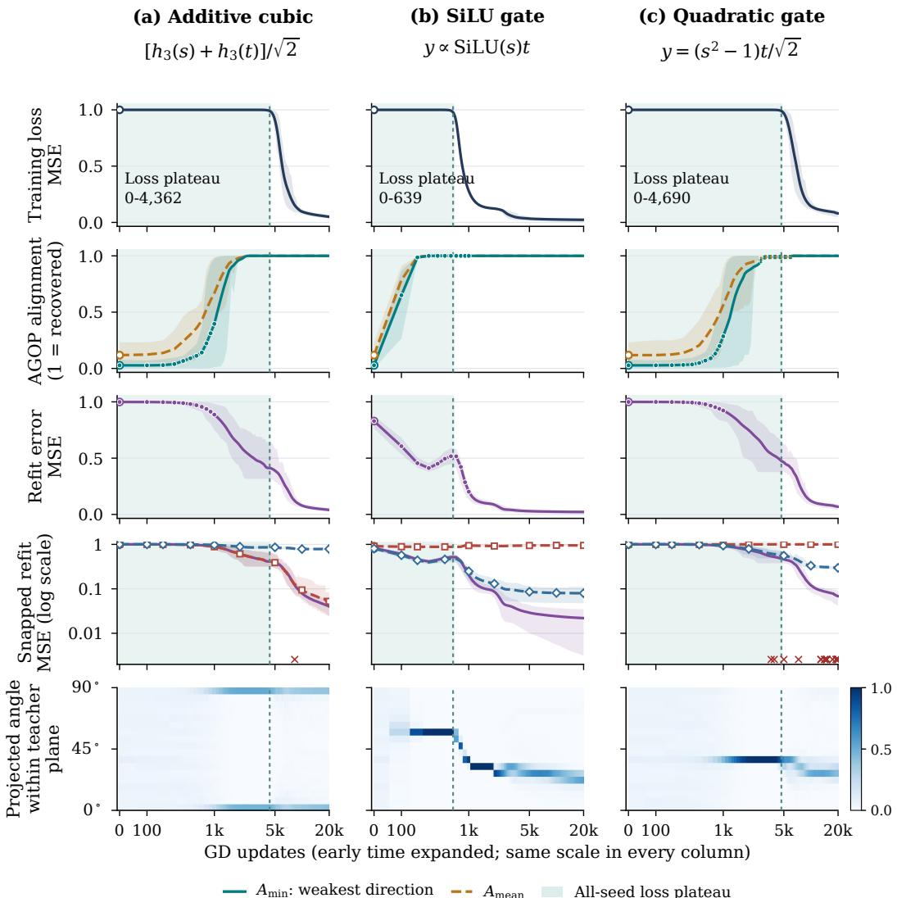  
Learned features Snapped to teacher axes Snapped to 45∘ axes  
Neuron angles: 0 ∘ /90 ∘ = teacher axes; interior = mixed coordinates.  
Darker color = greater mean importance share.

Figure 1: Features improve before loss falls; gated teachers retain mixed neurons. Fifty initializations of one ReLU-student configuration per normalized teacher $( s = X _ { 1 } , t = X _ { 2 } )$ . Read down each column: training loss stays near one, AGOP subspace alignment rises, and a samebudget readout refit improves before loss release. Shading marks the loss-only plateau shared by all fifty seeds; the labeled boundaries are the earliest individual plateau endpoints. Horizontal position is $\log ( 1 + n / 1 0 0 )$ : early time is expanded, ticks show actual updates, and initialization and all 20,000 updates remain visible. For SiLU, mean $A _ { \mathrm { m i n } }$ rises $0 . 0 2 8 \to 0 . 9 8 6$ and refit MSE falls $0 . 8 2 9  0 . \bar { 4 } 5 5$ by update 200 while loss remains near one; refit improvement is not monotone. Row four projects each weight’s teacher-plane component onto its nearest axis in the indicated frame, retaining outside-plane components and biases, then refits. Bottom-row color shows mean importance share of projected neuron directions within the teacher plane: $0 ^ { \circ } / 9 0 ^ { \circ }$ are its two axes; interior angles mix their coordinates. This is not the angle to the plane and does not measure the outside-plane component. Curves use all fifty seeds; light bands are pointwise 10th–90th percentiles, not confidence intervals. Dotted alignment bounds retain unresolved spectra; red crosses mark snapped-refit solver tolerance misses. Diagnostics are recorded every 100 updates (early dots); connecting lines add no observations. Appendix A gives numerical brackets, the plateau rule and eighteen further teachers.

$$
\begin{array} { r l r } & { \mathrm { Q u a d r a t i c ~ t e a c h e r : ~ } y = r ^ { - 1 / 2 } \sum _ { i } h _ { 2 } ( u _ { i } ^ { \top } x ) ; d = 6 4 , m = 2 5 6 } & \\ { \mathrm { ~ } ( \mathbf { a } ) \ r = 2 } & { \mathrm { ~ } ( \mathbf { b } ) \ r = 4 } & { \mathrm { ~ } ( \mathbf { c } ) \ r = 8 } & { \mathrm { ~ } ( \mathbf { d } ) \ r = 1 6 } \end{array}
$$

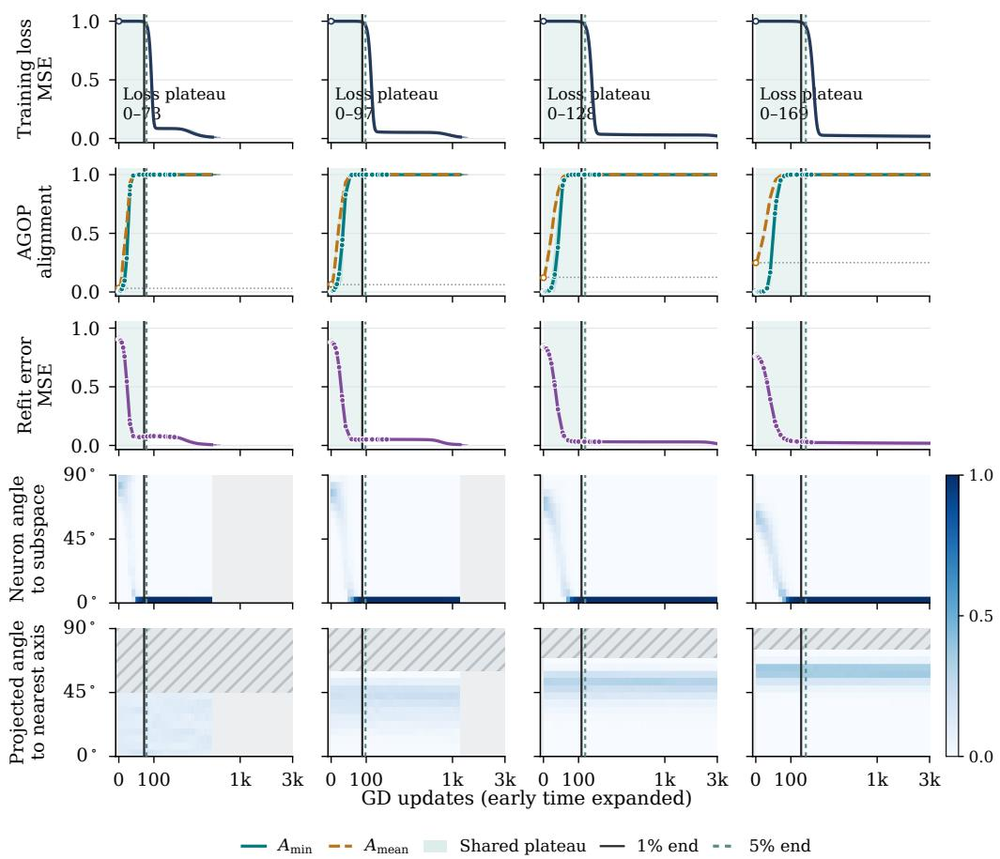  
Heatmaps: mean importance share per 5° bin; grey = no shared states.  
Nearest-axis angles use projected weights; hatching = impossible angles.  
The $h _ { 2 }$ teacher has no identifiable axes: its mixing is a symmetry control.

Figure 2: Subspace recovery before loss release at increasing teacher rank. ReLU students $( d = 6 4 , m = 2 5 6 )$ , ten initializations per column, learn $y = r ^ { - 1 / 2 } \textstyle \sum _ { i } h _ { 2 } ( u _ { i } ^ { T } X )$ at $r = 2 , 4 , 8 , 1 6$ Rows show training MSE, AGOP alignment, bounded-head refit MSE, neuron angle to the teacher subspace, and projected neuron angle to its nearest axis. The last two rows distinguish subspace entry from individual-axis alignment. Unlike the bottom row of Figure 1, the bottom row here uses a projected nearest-axis angle at arbitrary rank. Means and 10th–90th percentile bands retain all ten seeds; heatmaps average separately normalized importance-weighted histograms. The dotted $r / d$ line is an isotropic reference for $A _ { \mathrm { m e a n } } .$ Shading marks the common 5% loss-ratio prefix, with a 1% comparison boundary; the loss also remains in [0.95, 1.05]. Grey heatmap regions have no shared saved state; hatching marks geometrically impossible angles. The quadratic teacher is invariant to rotations inside its subspace, so its axes are not identifiable: this is a symmetry control for coordinate mixing. Appendix B defines the angles, protocol, numerical checks and additional teacher comparisons.

## 2 RELATED WORK

Feature changes before loss reduction. Small-initialization ReLU networks can align before appreciable loss reduction (Maennel et al., 2018). Silent alignment describes a related separation through the evolving tangent kernel, analytically in linear networks and experimentally in nonlinear networks (Atanasov et al., 2022). Nonlinear early-alignment guarantees cover classification under label-correlation conditions (Min et al., 2024), empirical gradient flow (Boursier & Flammarion, 2025), and orthogonal-input regression under balanced initialization (Boursier et al., 2022). Hidden progress in parity learning instead amplifies Fourier features (Barak et al., 2022). Our result connects this early progress to every-direction AGOP recovery, a bounded-readout gain, and later loss decrease on one simultaneous-GD trajectory.

Plateaus, scale, and escape. Delayed transitions occur in exact deep-linear dynamics (Saxe et al., 2014). Alternating directional acquisition and feature growth have a proved small-initialization limit in diagonal linear networks (Kunin et al., 2025); optimal first-escape directions in deep ReLU networks have a low-rank bias in deeper layers (Bantzis et al., 2026). Univariate ReLU plateaus also reflect activation-pattern dynamics (Ainsworth & Shin, 2021). Scaling determines whether training is lazy (Chizat et al., 2019), so our initialization and GD step are substantive hypotheses.

Gaussian multi-index learning. Staged representation learning for polynomial targets (Damian et al., 2022) assumes an expected Hessian of rank r, which excludes our central odd links. Gaussian multi-index population flow with infinitely faster nonparametric link fitting exhibits Hermitedependent phases (Bietti et al., 2025). For suitable orthogonal additive targets and initialization, correlation-loss flow gives all-index recovery with order-r log r neurons (S¸ ims¸ek et al., 2025). Unlike those decoupled neurons, ours remain coupled through square loss, with trained biases and heads; recovery concerns the current predictor’s AGOP. The emphasis here is the joint dynamical and spectral guarantee under simultaneous training; our width prescriptions are sufficient existence bounds and do not improve that coverage rate. Large first-layer steps followed by readout fitting provide another regime (Dandi et al., 2024).

Hermite structure. Information exponents govern high-dimensional online search times (Ben Arous et al., 2021). Here the mixture and Sobolev-neighborhood hypotheses control both directional signal and approximation by learned profiles; regularity alone is insufficient.

Gradient-based subspaces and AGOP. Gradient outer products support active-subspace approximation and dimension reduction (Constantine et al., 2014; Yuan et al., 2025). The neural feature ansatz relates weight geometry and AGOP (Radhakrishnan et al., 2024), with exact identities under balanced deep-linear flow and nonlinear counterexamples (Tansley et al., 2026). We study the evolution of the AGOP eigenspace during the transient regime in which the population loss remains nearly constant. AGOP progress during flat loss is observed in recursive feature machines for modular arithmetic (Mallinar et al., 2025); that alignment uses the final learned matrix, whereas ours uses the known target subspace. We control the full current-head AGOP and cutoff eigengap without assuming proportionality to a weight Gram matrix; bounded refitting separately measures predictive information.

## 3 POPULATION TRAINING AND REPRESENTATION DIAGNOSTICS

Let $X \sim \gamma _ { d } = N ( 0 , I _ { d } )$ , and let $U = ( u _ { 1 } , \ldots , u _ { r } ) \in \mathbb { R } ^ { d \times r }$ have orthonormal columns, with $1 \leq r < d .$ The teacher depends only on $\dot { U } ^ { T } \dot { X } ; P _ { U } = U U ^ { T }$ and $P _ { U ^ { \perp } } = I _ { d } - P _ { U }$ project onto its subspace and complement. For functions, $\| g \| _ { 2 } ^ { 2 } = \mathbb { E } [ g ( X ) ^ { 2 } ]$ and $\| g \| _ { H ^ { 1 } } ^ { 2 } = \| g \| _ { 2 } ^ { 2 } + \mathbb { E } [ \| \nabla g ( X ) \| ^ { 2 } ]$ with weak derivatives when needed. Unless stated otherwise, $\| y \| _ { 2 } = 1$ . Vector norms $\| \cdot \| _ { p }$ are $\ell ^ { p \ }$ norms; unadorned norms are Euclidean for vectors and operator norms for matrices. For symmetric $M , \lambda _ { k } ( M )$ are decreasing eigenvalues, $\lambda _ { \operatorname* { m i n } } ( M )$ is the least, and $M \ \succeq \ H$ means $M \textrm { -- } H$ is positive semidefinite. Write $\begin{array} { l l l l } { { \varphi ( t ) } } & { { = } } & { { e ^ { - t ^ { 2 } / 2 } / \sqrt { 2 \pi } , \Phi ( t ) } } & { { = } } & { { \int _ { - \infty } ^ { t } \varphi ( z ) d z } } \end{array}$ , and $h _ { k } ( t ) \ = \ ( - 1 ) ^ { k } \varphi ^ { ( k ) } ( t ) / ( \sqrt { k ! } \varphi ( t ) )$ for the orthonormal probabilists’ Hermite polynomials; thus $h _ { 3 } ( t ) = ( t ^ { 3 } - 3 t ) / \sqrt { 6 } .$

Network and optimization. For a fixed $0 ~ \leq ~ \alpha ~ < ~ 1$ , put $J _ { \alpha } ~ = ~ 1 - \alpha$ and $\sigma _ { \alpha } ( t ) ~ = ~ \alpha t +$ $J _ { \alpha }$ max $\{ t , 0 \} ; \alpha = 0$ gives ReLU. With width m, scalar heads $A _ { j , n }$ , weights $W _ { j , n } \in \mathbb { R } ^ { d }$ , and biases $B _ { j , n }$ at update n, the network and loss are

$$
f _ { n } ( x ) = \frac { 1 } { m } \sum _ { j = 1 } ^ { m } A _ { j , n } \sigma _ { \alpha } ( W _ { j , n } ^ { T } x + B _ { j , n } ) , \qquad L _ { n } = \mathbb { E } [ ( y ( X ) - f _ { n } ( X ) ) ^ { 2 } ] .\tag{2}
$$

Every scalar entry of $A _ { j , 0 } , W _ { j , 0 } , B _ { j , 0 }$ is independently $N ( 0 , s ^ { 2 } / d )$ for the same public $s > 0$ . Thus the output heads are random and signed. All parameters undergo simultaneous Euclidean gradient descent with fixed force step $h > 0$ and raw step $\eta = m h / 2$

$$
\begin{array} { r l r l } & { \Theta _ { n + 1 } = \Theta _ { n } - \eta \nabla \Theta L _ { n } , } & & { \Theta _ { n } = ( ( A _ { j , n } , W _ { j , n } , B _ { j , n } ) ) _ { j = 1 } ^ { m } . } \end{array}\tag{3}
$$

For example, $A _ { j , n + 1 } = A _ { j , n } + h \mathbb { E } [ ( y - f _ { n } ) \sigma _ { \alpha } ( W _ { i , n } ^ { T } X + B _ { j , n } ) ]$ . Expectations are over X unless initialization is specified; training uses exact population gradients. The appendix gives the remaining coordinate updates and kink convention.

Full predictor AGOP. Define

$$
\mathsf { G } _ { n } = \mathbb { E } [ \nabla _ { x } f _ { n } ( X ) \nabla _ { x } f _ { n } ( X ) ^ { T } ] , \qquad \nabla _ { x } f _ { n } ( X ) = \frac { 1 } { m } \sum _ { j } A _ { j , n } \sigma _ { \alpha } ^ { \prime } ( W _ { j , n } ^ { T } X + B _ { j , n } ) W _ { j , n } .\tag{4}
$$

This includes all pairs of neurons, with their current heads. Whenever $\lambda _ { r } ( \mathsf { G } _ { n } ) > \lambda _ { r + 1 } ( \mathsf { G } _ { n } )$ , let $P _ { n }$ be its unique leading rank-r orthogonal projector and set

$$
A _ { \mathrm { m i n } , n } = \lambda _ { \mathrm { m i n } } ( U ^ { T } P _ { n } U ) , \qquad A _ { \mathrm { m e a n } , n } = \frac { 1 } { r } \mathrm { t r } ( U ^ { T } P _ { n } U ) .\tag{5}
$$

These are the minimum and mean squared cosines of the principal angles. The minimum score requires recovery of every teacher direction. The theorems establish the required spectral gaps at both compared checkpoints. A null eigenspace is never completed with an arbitrary basis to define a favorable alignment. Multiplying $f _ { n }$ by a nonzero constant rescales its $\mathbf { A G O P }$ but preserves its eigenspaces. These scores therefore measure directional geometry separately from output amplitude.

Normalized-feature refit. The main diagnostic uses the full unprojected feature bank:

$$
\phi _ { j , n } ( x ) = \frac { \sigma _ { \alpha } ( W _ { j , n } ^ { T } x + B _ { j , n } ) } { \sqrt { \| W _ { j , n } \| ^ { 2 } + B _ { j , n } ^ { 2 } } } , \qquad \mathcal { R } ( n ) = \operatorname* { i n f } _ { \stackrel { \| v \| _ { 2 } \leq 3 2 / J _ { \alpha } } { \| v \| _ { 1 } \leq 6 4 \sqrt { r } / J _ { \alpha } } } \left\| y - \sum _ { j } v _ { j } \phi _ { j , n } \right\| _ { 2 } ^ { 2 } .\tag{6}
$$

A zero augmented row gives the zero feature. Both coefficient caps are identical at every checkpoint and independent of $s ;$ there is no additional intercept. The readout is fitted only to measure information available in the features. It does not replace the trained heads in (2). By positive homogeneity, scaling a weight and its bias by the same positive factor leaves the normalized feature unchanged. The diagnostic thus compares feature shapes at a fixed readout budget.

Teacher family for the main theorem. For any probability measure $\mu$ on $[ 1 / 3 , 1 ]$ , define

$$
g _ { \mu } ( t ) = \int _ { 1 / 3 } ^ { 1 } v ^ { - 7 / 2 } ( t ^ { 3 } - 3 v t ) e ^ { - ( v ^ { - 1 } - 1 ) t ^ { 2 } / 2 } d \mu ( v ) ,\tag{7}
$$

$$
N _ { \mu } = \| g _ { \mu } \| _ { L ^ { 2 } ( \gamma _ { 1 } ) } , \qquad q _ { \mu } = g _ { \mu } / N _ { \mu } , \qquad y ( x ) = \frac { 1 } { \sqrt { r } } \sum _ { i = 1 } ^ { r } q _ { \mu } ( u _ { i } ^ { T } x ) .
$$

These links belong to $H ^ { 1 } ( \gamma _ { 1 } )$ : their mean and first Hermite coefficient vanish, $\sqrt { 6 } \leq N _ { \mu } < 9 .$ , and $\| y \| _ { 2 } = 1$ . Writing $\delta _ { v }$ for a unit point mass at $v , \mu = \delta _ { 1 }$ gives $q _ { \mu } = h _ { 3 }$ . Whenever $\mu ( [ 1 / 3 , 1 ) ) >$ 0, the link has an infinite Hermite expansion, starting at degree three. For atomic measures we abbreviate $g _ { \delta _ { \imath } }$ as $g _ { v }$ . The entire link is used in the objective and gradients. The positive optimized signal and the later-loss scale are

$$
K _ { * } = \frac { J _ { \alpha } } { 2 \sqrt { r } N _ { \mu } } \operatorname* { m a x } _ { B \geq 0 } \left\{ \sqrt { \frac { B } { 1 + B } } \int v ^ { - 3 / 2 } \varphi ( \sqrt { B / v } ) d \mu ( v ) \right\} , \qquad G _ { c } = \frac { K _ { * } ^ { 2 } } { 3 2 7 6 8 } > 0 .\tag{8}
$$

SwiGLU convention. Section 5.1 instead uses $\mathrm { S i L U } ( t ) = t / ( 1 + e ^ { - t } )$ and

$$
f _ { \theta } ( x ) = b _ { 0 } + \frac { \kappa } { m } \sum _ { j = 1 } ^ { m } a _ { j } \mathrm { S i L U } ( w _ { j } ^ { T } x + b _ { j } ) ( z _ { j } ^ { T } x + c _ { j } ) , \qquad \kappa > 0 .\tag{9}
$$

Here θ collects scalar heads $a _ { j }$ , gate/value weights $w _ { j } , z _ { j } \in \mathbb { R } ^ { d }$ and biases $b _ { j } , c _ { j } ; \kappa$ is a fixed output scale. Only the intercept is fitted exactly: $b _ { 0 } = \mathbb { E } [ y - \widetilde { f } _ { \theta } ]$ , where $\tilde { f } _ { \theta } ~ = ~ f _ { \theta } - b _ { 0 }$ . The profiled loss is $L ( \theta ) = \mathrm { V a r } ( y - \widetilde { f } _ { \theta } )$ . This removes the error in fitting the target mean; the plateau concerns learning its input-dependent variation. All other parameters train jointly by $\dot { \theta } = - m \nabla L$ or $\theta ^ { n + 1 } = \theta ^ { n } - m h \dot { \nabla } L ( \theta ^ { n } ) ^ { \mathbf { \theta } }$ : the SwiGLU raw GD step is mh, fixed independently of ε. For $\theta _ { j } = ( a _ { j } , ( w _ { j } , b _ { j } ) , ( z _ { j } , c _ { j } ) )$ , initialize $\theta _ { j } ( 0 ) = \varepsilon \vartheta _ { j }$ with independent $\vartheta _ { j } \sim N ( \bar { 0 } , \mathrm { d i a g } ( \tilde { \beta _ { 0 } ^ { 2 } } , s _ { 0 } ^ { 2 } I _ { 2 d + 2 } ) )$ and fixed $\beta _ { 0 } , s _ { 0 } > 0$ . The illustrations use $\beta _ { 0 } = 1 , s _ { 0 } = 1 / \sqrt { d + 1 }$ , and $\kappa = 1$ . The SwiGLU theorem normalizes $\mathrm { V a r } ( y ) = 1 ;$ its illustrations retain $\mathbb { E } [ y ^ { 2 } ] = 1$ and plot $\ell = L / \operatorname { V a r } ( y )$ . For its full $\mathrm { A G O P } \mathsf { G } , A _ { \mathrm { t o p } } = \operatorname* { m i n } \{ \| P _ { U } e \| ^ { 2 } : \| e \| = 1 , \mathsf { G } e = \lambda _ { 1 } ( \bar { \mathsf { G } } ) \bar { e } \}$

## 4 SUBSPACE ACQUISITION DURING A LOSS PLATEAU

We state the equal-coefficient, common-link case; Appendix E.1 gives the broader statement. The theorem assumes Gaussian inputs, exact population gradients, the specified teacher, and the appendix’s explicit size, initialization and step conditions.

The acquisition checkpoint N lies inside the loss-controlled window $0 ~ \leq ~ n ~ \leq ~ N _ { c }$ . At N, the features already support a better bounded refit; at a later $N _ { 2 }$ , the original predictor beats every loss value in that window. Thus improved representation and improved trained prediction are quantified separately along the same trajectory.

Parameter scope. The appendix prescription is part of the theorem’s hypotheses. It supplies explicit occupancy, dimension, mesh, force, and initialization inequalities in an acyclic order before the random draw. In particular m $\geq r$ and $d \geq 1 6 r / \delta$ , but these two inequalities alone are insufficient. Compatible widths may exceed $d ;$ arbitrary triples $( r , d , m )$ are not covered. Width must populate rare Gaussian categories, and the raw scale and mesh can be exponentially small in an already large acquisition horizon. The result gives no practical complexity or sample-size bound.

Theorem 4.1 (Population subspace learning on a loss plateau). Fix $r \geq 1 , \mu ,$ and $0 \leq \alpha < 1$ as above, and tolerances $0 < \delta < 1 / 2 , 0 < \epsilon _ { L } \leq 1 , 0 < \epsilon _ { G } \leq 1 / 4 .$ Choose $m , d , s , h$ and the public checkpoints $N \mathrm { ~ < ~ } N _ { c }$ according to the complete parameter prescription in Appendix $C . l ,$ specialized to $\mu _ { i } = \mu , \lambda _ { i } = r ^ { - 1 / 2 }$ and residual $e = 0 .$ . Train (2) by (3)from the stated IID Gaussian initialization. With probability at least $1 - 7 \delta / 8 ,$ , thefollowing hold simultaneously:

1. Loss plateau. Throughout $0 \leq n \leq N _ { c } ,$ , the original loss obeys

$$
1 - \epsilon _ { L } / 1 6 \leq L _ { n } \leq 1 + \epsilon _ { L } / 1 6 , \quad L _ { n } \geq 1 - G _ { c } , \quad \frac { \operatorname* { m a x } _ { n \leq N _ { c } } L _ { n } } { \operatorname* { m i n } _ { n \leq N _ { c } } L _ { n } } \leq 1 + \epsilon _ { L } / 4 .\tag{10}
$$

2. Subspace recovery. The full AGOP has a positive rank-r cutoff gap at 0 and N, and its principal-angle scores satisfy

$$
\begin{array} { r } { A _ { \mathrm { m i n } , 0 } \leq A _ { \mathrm { m e a n } , 0 } \leq \frac { 1 } { 4 } , \qquad A _ { \mathrm { m i n } , N } \geq 1 - \epsilon _ { G } , \qquad A _ { \mathrm { m e a n } , N } \geq 1 - \epsilon _ { G } / r , } \end{array}
$$

$$
\begin{array} { r } { A _ { \operatorname* { m i n } , N } - A _ { \operatorname* { m i n } , 0 } \geq \frac { 3 } { 4 } - \epsilon _ { G } \geq \frac { 1 } { 2 } . } \end{array}\tag{11}
$$

3. Refit improvement. For the identical bounded diagnostic (6),

$$
\mathcal { R } ( 0 ) - \mathcal { R } ( N ) > 0 . 3 9 9 .\tag{12}
$$

4. Later loss decrease. At a finite subsequent checkpoint $N _ { 2 } > N _ { c } ,$ the same unchanged GD trajectory satisfies

$$
\begin{array} { r } { L _ { N _ { 2 } } \leq 1 - 2 G _ { c } , \qquad L _ { n } - L _ { N _ { 2 } } \geq G _ { c } \quad ( 0 \leq n \leq N _ { c } ) . } \end{array}\tag{13}
$$

The teacher subspace span(U) is minimal. The times $N , N _ { c }$ are fixed before initialization; $N _ { 2 }$ may depend on the realized trajectory.

Proof outline. The complete discrete-time proof appears in Appendix E. We summarize the four interfaces that connect acquisition to the stated observable.

1. Directional acquisition. Gaussian occupancy supplies initial neurons in suitable axis and bias regions. A coupled induction on the actual GD updates shows that these neurons acquire every teacher direction by a public time. The induction retains the forces generated by all neurons. A subsequent interval makes their signal dominate the total signed defect, including adverse heads and components outside U. The small raw scale keeps the full loss within (10) while these relative changes occur.

2. From gradients to the AGOP. The proof controls a matrix of second-Hermite coefficients of the complete input gradient. Write $Z = \bar { U } ^ { T } X , e _ { r } = r ^ { - 1 / 2 } ( 1 , . . . , 1 ) ^ { T }$ , and $\xi = ( e _ { r } ^ { T } Z ) Z - e _ { r }$ , so $\mathbb { E } [ \xi \dot { \xi } ^ { T } ] = \dot { I } + \mathbf { \bar { e } } _ { r } e _ { r } ^ { T } \preceq 2 I$ . For the symmetric frame $\dot { D } \stackrel { } { = } \mathbb { E } [ ( \dot { U } ^ { T } \nabla f _ { N } ) \dot { \xi } ^ { T } ]$ , the signed-defect estimate gives a positive lower bound on $\lambda _ { \operatorname* { m i n } } ( D )$ , as well as a small complete outside-gradient energy. Bessel’s inequality yields

$$
U ^ { T } { \sf G } _ { N } U \succeq \frac { 1 } { 2 } D D ^ { T } .\tag{14}
$$

Minmax and the positive-semidefinite comparison $P _ { N } \preceq { \sf G } _ { N } / \lambda _ { r } ( { \sf G } _ { N } )$ turn these two estimates into the spectral gap and both angle bounds. This step retains the AGOP cross terms. Initially, rotational invariance and almost-sure simplicity of the positive spectrum imply $\mathbb { E } [ A _ { \mathrm { m e a n , 0 } } ] = r / \dot { d } .$ averaging over initialization.

3. Prediction from the learned features. The teacher’s absence of Hermite degrees below three bounds its correlation with an initial normalized feature by the cube of that feature direction’s overlap with U. A simultaneous Gaussian bound and the fixed $\ell ^ { 1 }$ cap imply $\mathcal { R } ( 0 ) \geq 1 - 1 0 ^ { - 4 } / 8$ . The acquired biased profiles admit a readout satisfying both caps with $\mathcal { R } ( N ) < ( \sqrt { 3 / 5 } + 1 0 ^ { - 4 } / 6 4 ) ^ { 2 }$ Their difference exceeds 0.399.

4. Loss release on the same trajectory. A full-energy continuation estimate turns the acquired signal into later loss decrease under the original step size. The acquisition, initial-refit, and initial-projector events have failure probabilities at most $3 \delta / \bar { 8 } , \delta / 4$ , and $\delta / \bar { 4 }$ , respectively. A union bound proves the simultaneous claim without assuming these events are independent.

Broader mixture teachers. The full theorem in Appendix E.1 permits different measures $\mu _ { i } ,$ positive coefficients $\lambda _ { i }$ with $\textstyle \sum _ { i } \lambda _ { i } ^ { 2 } = 1$ , and a normalized target $\begin{array} { r } { y \dot { = } \sum _ { i } \lambda _ { i } q _ { \mu _ { i } } ( u _ { i } ^ { T } x ) + e ( U ^ { T } \dot { \boldsymbol { x } } ) } \end{array}$ . The residual obeys every explicit $H ^ { 1 }$ bound in the parameter prescription and may contain interactions within $U$ . Each directional signal $K _ { i } ^ { * }$ is defined by (8) with $( r ^ { - 1 / 2 } , \mu )$ replaced by $( \lambda _ { i } , \mu _ { i } )$ ; the assumption is min $K _ { i } ^ { * } \ge ( 5 / \bar { 6 } )$ max $K _ { i } ^ { * }$ . For a common link this allows a coefficient ratio at most $6 / 5$ . Neither arbitrary signed mixtures nor arbitrary $H ^ { 1 }$ teachers satisfy this hypothesis.

Unequal coefficients near an additive cubic. A complementary theorem, proved in Appendix $\mathrm { F , }$ starts from

$$
y _ { c } ( x ) = \sum _ { i = 1 } ^ { r } a _ { i } h _ { 3 } ( u _ { i } ^ { T } x ) , \qquad a _ { i } > 0 , \quad \sum _ { i } a _ { i } ^ { 2 } = 1 , \qquad \| y - y _ { c } \| _ { H ^ { 1 } } \leq \nu / 2 ,\tag{15}
$$

where $\nu > 0$ is the prescribed perturbation tolerance and the unit-norm teacher y must remain additive on $U$ . No ratio bound is imposed on the positive ${ { a } _ { i } } ;$ the smallest coefficient enters the public costs. Under the complete prescription in Appendix C.2, with probability at least $1 - \delta .$ , its public acquisition checkpoint $N _ { A }$ has minimum-AGOP gain at least $1 \bar { / 2 }$ during a high-loss plateau. At that checkpoint, the projected diagnostic

$$
\mathcal { R } _ { B } ^ { P } ( n ) = \operatorname* { i n f } _ { \| v \| _ { 2 } \leq B } \left\| y - \sum _ { j } v _ { j } \sigma _ { \alpha } ( ( P _ { n } W _ { j , n } ) ^ { T } X + B _ { j , n } ) \right\| _ { 2 } ^ { 2 }\tag{16}
$$

improves by more than $1 / 2 .$ , both for $B = C _ { \alpha } / ( 7 s )$ and for $B = \infty$ . The explicit profile constant $C _ { \alpha }$ and the much stricter admissible angle tolerance are given in that appendix. Projection is before activation, biases are retained, and rows are not renormalized. The same unchanged GD later reduces loss below every plateau value by at least $G _ { A } \ = \ 1 / ( 8 1 9 2 \overline { { T } } _ { A } ^ { 2 } ) \ > \ 0$ . Here $N _ { A } , { \overline { { T } } } _ { A }$ denote the quantities $N , { \overline { { T } } }$ in that parameter prescription. Thus this extension uses a different feature class and budget from (6).

## 5 POPULATION ILLUSTRATIONS ACROSS TEACHER LINKS

Twenty-one normalized teachers share a ReLU-student configuration: $r = 2 , d = 1 6 , m = 3 2$ $s = \mathrm { i } 0 ^ { - 4 }$ . All parameters train from IID $N ( 0 , s ^ { 2 } / d )$ entries, with fifty predetermined seeds per teacher and a 20,000-update population-GD budget. These are illustrative parameters, outside the theorem’s sufficient prescriptions. Labeled followups use $d = 6 4 , s = 0 . 0 1$ (Appendix A.2).

Full teachers and population evaluation. For each of the thirteen scalar raw links $q ,$ we retain its actual mean and set

$$
y ( X ) = { \frac { \sum _ { i = 1 } ^ { r } q ( X _ { i } ) } { { \sqrt { r } } { \sqrt { \mathbb { E } [ q ( Z ) ^ { 2 } ] + ( r - 1 ) ( \mathbb { E } [ q ( Z ) ] ) ^ { 2 } } } } } , \qquad Z \sim N ( 0 , 1 ) .\tag{17}
$$

Six product targets and two additive SiLU controls complete the family (Appendix $\mathrm { A } ) ;$ the interactions are exploratory $H ^ { 1 } ( \gamma _ { 2 } )$ examples outside the plateau theorems. Gradients use analytic student moments and validated deterministic teacher quadrature, without a finite training set. Here population refers to expectation over the input distribution. Gaussian weights specify initialization only; no Gaussian law is assumed for the parameters after training begins. The reported ReLU loss is the full MSE $\mathbb { E } [ ( f ( X ) - y ( X ) ) ^ { 2 } ]$ . Its unit baseline comes from teacher normalization, not from dividing each trajectory by its own initial loss.

What the averaged curves measure. Figure 1 shows three teachers; the appendix gives the others. Means and 10th–90th percentiles retain all fifty seeds, including bounds for unresolved AGOP scores. The shared display expands early time without seed-specific alignment or smoothing.

Each seed’s loss-only plateau is the maximal initial prefix with MSE in [0.95, 1.05] and running maximum/minimum at most 1.05, checked at every update. Shading marks the common prefix; training runs to the fixed horizon.

Prediction and geometry are separate diagnostics. Refitting uses the unprojected, normalized bank in (6), with fixed caps $\| v \| _ { 2 } \leq 3 2 , \| v \| _ { 1 } \leq 6 4 { \sqrt { 2 } }$ and no intercept; it never enters training. Separate ensemble means do not establish simultaneous alignment and prediction improvement for every initialization. Table 1 reports continuous endpoint gains and later original loss. These numerical illustrations do not test the theorem’s sufficient parameter assumptions.

Neuron angles and axis-snapped refits probe basis-dependent specialization: monosemantic means concentration near teacher axes; polysemantic means mixing their coordinates. Snapping projects each teacher-plane component onto its nearest frame axis, preserving bias, outside-plane component and normalization (Appendix A.1). A small snapping penalty alone does not prove specialization. The quadratic-gate target remains at squared $L ^ { 2 }$ distance at least $1 / 4$ from every orthonormal twoaxis additive class (Proposition A.1).

Optimization. Runs start at $h = 0 . 0 5$ (raw step $\eta = m h / 2 = 0 . 8 )$ . Armijo backtracking halves rejected steps and carries the accepted step forward (Appendix A); the theorems use fixed steps.

## 5.1 SWIGLU: FEATURE LEARNING THROUGH A SMOOTH GATE

SwiGLU’s smooth gate in (9) permits directional learning while its nonconstant output remains small.

Theorem 5.1 (SwiGLU plateau and leading AGOP alignment). Fix finite m $\geq 1 , 1 \leq r < d ,$ , and $\kappa , \beta _ { 0 } , s _ { 0 } , h > 0$ . Let $y \overset { \cdot } { = } F ( U ^ { T } X )$ with $\begin{array} { r } { \boldsymbol { F } ^ { } \in L ^ { 2 } ( \gamma _ { r } ) , \boldsymbol { \breve { U } } ^ { T } \boldsymbol { U } = I _ { r } , } \end{array}$ , and $\mathrm { V a r } ( y ) = 1$ . Assume that $F$ has a nonzero Hermite component oftotal degree one, two, or three. Put $k = 3 i f$ degree one or two is nonzero, and $k = 4$ otherwise; higher degrees are unrestricted. Use the SwiGLU model, profiled intercept, Gaussian initialization and updates ofSection 3, with the same Gaussian draw ϑ coupled across ε.

There is an initialization event $\mathcal { E }$ with $\mathbb { P } ( \mathcal { E } ) \ge 1 - 2 ^ { - m }$ such that, almost surely on $\mathcal { E } , f o r$ every $\delta \in ( 0 , 1 )$ there are $\tau _ { 1 } , C > 0$ and $\varepsilon _ { 0 } = \varepsilon _ { 0 } ( \vartheta , \delta , h ) > 0$ for which every $0 < \varepsilon < \varepsilon _ { 0 }$ satisfies, at $n _ { 1 } = \lfloor \tau _ { 1 } \ ' ( h \varepsilon ^ { k - 2 } ) \rfloor$

$$
\operatorname* { m a x } _ { 0 \leq n \leq n _ { 1 } } \vert L _ { n } - L _ { 0 } \vert \leq C \varepsilon ^ { k } , \quad L _ { 0 } = 1 + O _ { \vartheta } ( \varepsilon ^ { k } ) , \quad A _ { \mathrm { t o p } , n _ { 1 } } \geq 1 - \delta .\tag{18}
$$

For gradientflow the same conclusions hold at $t _ { 1 } = \tau _ { 1 } \varepsilon ^ { - ( k - 2 ) }$ , with the maximum replaced by the supremum over $0 \leq t \leq t _ { 1 }$ . The constants $\tau _ { 1 } , C$ depend on $( \vartheta , \delta )$ ; the initialization-dependent cutoffgives no explicitfinite-scale confidence bound.

Theorem 5.1 controls geometry. To also quantify prediction, we restrict to rank-one teachers with cubic signal and no linear or quadratic Hermite component. At a specified width, the next result gives alignment and unrestricted-refit gains at the same checkpoint during the plateau.

Corollary 5.2 (Joint SwiGLU alignment and refit gains). In Theorem 5.1, take $r \ = \ 1 , \ d \ \geq \ 2$ and $m \overset { \cdot } { = } D = ( d + 1 ) ( d + 2 ) \overline { { / } } 2$ . Let $y ~ = ~ F ( \Breve { u ^ { T } } X )$ have unit variance, vanishing first and second Hermite coefficients, and $\overset { \cdot \cdot } { a } _ { 3 } = \mathbb { E } [ F ( Z ) h _ { 3 } ( \dot { Z } ) ] \neq \mathrm { 0 , ~ } Z \sim N ( 0 , 1 )$ . Write $\mathcal { R } _ { \mathrm { f r e e } } f o r$ minimum population MSE after unrestricted refitting of the frozen SwiGLU features and an intercept as defined in (89). Fix $q _ { \mathrm { A } } , q _ { \mathrm { R } } \in ( 0 , 1 )$ and $\delta _ { \mathrm { A } } , \delta _ { \mathrm { R } } > 0$ with $q _ { \mathrm { A } } + \delta _ { \mathrm { A } } < 1$ . Forflow or any fixed-step GD, at a common endpoint ∗ the joint event

$$
A _ { \mathrm { t o p , * } } - A _ { \mathrm { t o p , 0 } } \geq 1 - \delta _ { \mathrm { A } } - q _ { \mathrm { A } } , \qquad \mathcal { R } _ { \mathrm { f r e e } } ( 0 ) - \mathcal { R } _ { \mathrm { f r e e } } ( * ) \geq a _ { 3 } ^ { 2 } ( 1 - q _ { \mathrm { R } } ) - \delta _ { \mathrm { R } }
$$

along with the entire-prefix loss bound max $| L - L _ { 0 } | = O ( \varepsilon ^ { 4 } )$ has limiting inferior probability, as $\varepsilon \downarrow 0 ,$ at least

$$
\operatorname* { m a x } \left\{ 0 , \operatorname* { P r } ( B _ { d } \leq q _ { \mathrm { A } } ) - 2 ^ { - D } - \frac { 3 } { q _ { \mathrm { R } } d ( d + 2 ) } \right\} , \qquad B _ { d } \sim \mathrm { B e t a } ( 1 / 2 , ( d - 1 ) / 2 ) .
$$

The endpoint time scales as $\varepsilon ^ { - 2 } ,$ ; its rescaled time, constants and initialization cutoff depend on the Gaussian draw. The rescaled time isfixed before ε shrinks.

A zero bound is vacuous; high probability requires suitable dimensions and thresholds. For pure $h _ { 3 } , d = 1 6 { \mathrm { ~ a n d ~ } } m = 1 5 3$ , the gains can be at least 0.5 and 0.7, with asymptotic probability lower bound approximately 0.9519 (Corollary U.14). No practical initialization cutoff is supplied; refit coefficients may diverge as $\varepsilon \to 0$ . Later decrease of the trained loss remains open.

The two guarantees in Theorem 5.1 have different time quantifiers: the loss bound holds throughout the prefix, whereas the alignment bound is asserted at its endpoint. Thus the selected checkpoint lies inside an interval of uniformly small loss movement. The exponent k records the degree of the leading student–teacher interaction. A nonzero linear or quadratic Hermite component gives $k = 3$ an endpoint time proportional to $) \varepsilon ^ { - 1 }$ , and $O ( \varepsilon ^ { 3 } )$ loss variation. When degrees one and two vanish and cubic signal remains, $k = 4$ gives the scales $\varepsilon ^ { - 2 }$ and $O ( \varepsilon ^ { 4 } )$ . These are guaranteed observation windows, rather than formulas for the eventual plateau exit.

For $r > 1$ , a large $A _ { \mathrm { t o p } }$ places the leading $\mathbf { A G O P }$ eigenspace close to the teacher subspace; it does not establish recovery of every teacher direction. The joint corollary adds the rank-one cubic-signal and width assumptions under which a simultaneous refit improvement is proved. The numerical comparison in Figure 3 uses $d = 1 6 , m = 6 4 { \mathrm { ~ a n d } } \varepsilon = . 0 5$ , whereas the stated quantitative corollary example uses $m = 1 5 3$ . The plotted finite-initialization trajectories therefore illustrate the separation of alignment, refit and trained loss at another width, without inheriting the example’s asymptotic probability bound.

Proof overview. Appendix U.2 expands the smooth gate near initialization. After rescaling parameters and time, the leading dynamics become independent homogeneous gradient flows for the neurons; the network’s feedback enters at higher order. On the escape event, the earliest comparator escape is almost surely unique. The growing neuron’s spatial components orthogonal to the teacher subspace remain fixed, while its contribution within that subspace dominates the leading AGOP. A fixed rescaled time before escape therefore gives the required alignment. Uniform tracking transfers this conclusion to population gradient flow and fixed-step GD, and the loss expansion controls the whole preceding interval.

For Corollary 5.2, Appendix U.3 uses the quadratic and cubic terms of the feature expansion. Near comparator escape, at the stated width, the nonwinning neurons’ leading quadratic polynomials and the intercept almost surely span all polynomials of degree at most two. Cancellation using the actual rescaled parameters removes the quadratic contribution; normalization and a linear correction then give a feature combination approximating $h _ { 3 }$ along the teacher direction. This controls the attained refit error. Corollary U.14 compares it with initialization, chooses a common endpoint for prediction and alignment before shrinking ε, and combines the escape and initial-headroom probability bounds without assuming independence. These steps yield the simultaneous gains stated above.

SwiGLU student | 20 initializations per teacher  
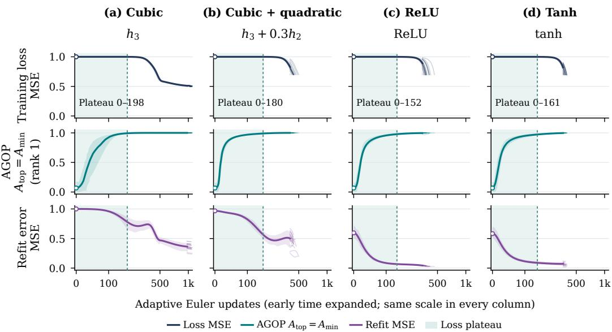  
Solid: 20-seed mean | Band: 10-90% seeds | Thin: individual tails  
Loss and refit are divided by teacher variance. Bands describe seed variation, not confidence intervals.

Figure 3: SwiGLU students: twenty initializations per teacher. All seeds $0 - 1 9 ; d = 1 6 , m = 6 4$ $\varepsilon = . 0 5$ . Loss and numerical unrestricted-refit MSE are divided by teacher variance; rank-one AGOP alignment is $A _ { \mathrm { t o p } } = A _ { \mathrm { m i n } }$ . Navy, teal and purple consistently denote loss, AGOP alignment and refit MSE. Solid means and light 10th–90th percentile bands use all twenty seeds on their shared support; later individual tails remain visible. Shading marks the shared loss-only prefix $| \ell - \ell ( 0 ) | \leq \mathrm { \hat { 1 0 } ^ { - 3 } }$ The axis counts adaptive Euler updates, with early updates expanded. Diagnostic interpolation is for display only; bands show seed variation, not confidence intervals or integration-error bounds. Crosses, if present, mark the last finite point of censored or failed trajectories.

SwiGLU student | 10 initializations per setting  
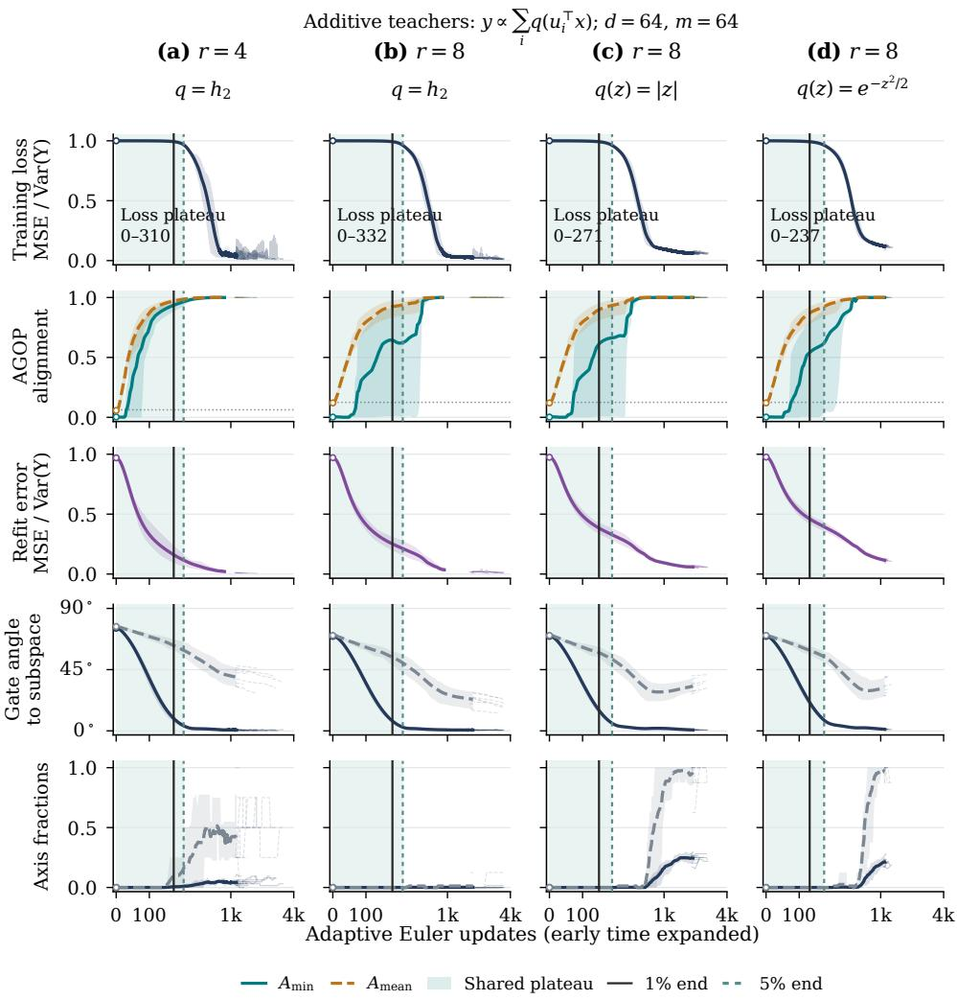  
Angles: solid = weighted-score angle; dashed = median-score angle.  
Axis fraction: solid = gates within 25.8°; dashed = teacher axes covered.  
Saved summaries, not angle distributions; $h _ { 2 }$ axes are not identifiable.

Figure 4: SwiGLU subspace learning and gate geometry across ranks and links. Ten initializations per setting, $d = 6 4 , m = 6 4 ;$ additive quadratic, absolute-value and Gaussian-bump teachers vary rank and link. Loss and numerical refit risk are divided by teacher variance. The first three rows retain the loss, AGOP and refit conventions; the dotted $r / d$ line references isotropic $A _ { \mathrm { m e a n } } .$ The fourth row shows effective gate angles obtained from weighted and median squared-cosine scores; these are saved scalar summaries, not per-neuron angle distributions. The last row reports the fraction of gates within $2 5 . 8 ^ { \circ }$ of a teacher axis and the fraction of axes covered by such gates. Quadratic-teacher axes remain unidentifiable. Shading uses a common 5% loss-ratio prefix, with a 1% comparison boundary; this is broader than the $| \ell _ { n } - \ell _ { 0 } | \leq 1 0 ^ { - 3 }$ prefix retained in Figure 3. All ten seeds contribute to means and 10th–90th percentile bands; individual tails and diagnostic gaps remain visible. Gate entry and axis specialization are distinct observations; neither alone establishes a prediction gain. Appendix B gives definitions, numerical diagnostics, threshold sensitivity and rank-16 limitations.

## 6 DISCUSSION

What a plateau can conceal. Theorem 4.1 links recovery of every teacher direction by the leading AGOP subspace, an improved bounded readout, and a later decrease of the original predictor’s loss on one trajectory. The first two conclusions hold while loss remains close to the zero predictor’s unit loss. A plateau controls variation over a finite interval; it need not be exactly flat or converge to a positive error floor.

Small initialization permits feature geometry to change while the output remains small. Scaling all ReLU or leaky-ReLU heads, weights and biases by one positive factor scales the output quadratically. Geometry and output amplitude therefore need not evolve on the same scale. This is a dynamical mechanism, not a normalization that hides loss decrease. GD uses a fixed step throughout, subject to the theorem’s restrictive initialization and step prescriptions.

Geometry and predictive information. The minimum principal-angle score tests the weakest teacher direction; a high leading-direction score alone may represent only one direction of a higherrank teacher. The full AGOP also depends on the current readout, so its motion cannot by itself demonstrate that the hidden feature bank has improved. The same-budget refit addresses this separate question: both checkpoints use the same feature normalization, coefficient constraints and target. Its improvement measures additional predictive information accessible under that budget. Refitting never changes the heads used by GD. The complementary unequal-coefficient theorem instead uses projected features and a different budget, and the SwiGLU corollary uses an unrestricted refit; these conclusions should not be read as interchangeable.

Relation to early alignment and lazy training. Early directional learning and silent alignment already show that representations can change before loss falls appreciably (Maennel et al., 2018; Atanasov et al., 2022). Our contribution is the joint all-direction, bounded-refit and later-loss guarantee for the specified nonlinear population-GD system. Lazy training concerns the accuracy of linearization around initialization and the behavior of the tangent kernel, rather than the speed of loss reduction (Chizat et al., 2019). Neither a flat loss nor a moving AGOP determines whether a trajectory is lazy. Comparing the learned hidden bank with its initial version is informative, but does not establish a separation from the full initial tangent-feature model. Such a comparison would require additional analysis or a separate diagnostic.

Teacher regularity and neuron mixing. Gaussian Sobolev regularity provides a common language for the links, while the positive results use additional structure. The main ReLU family contains $h _ { 3 }$ and positive mixtures of Gaussian-damped cubics with infinite Hermite expansions. Its extension allows carefully controlled changes in directional signals and a small Sobolev residual; the complementary theorem permits unequal positive cubic coefficients and a small additive perturbation. These are explicit families within $\dot { H } ^ { 1 }$ , rather than a guarantee for every Sobolev link. Extra Hermite components can alter directional forces, and target energy in components not yet acquired still matters for prediction.

The interaction teachers $g ( S ) T / \| g \| _ { 2 }$ , where $S = u _ { 1 } ^ { T } X , T = u _ { 2 } ^ { T } X$ , and g is SiLU, ReLU, GELU, tanh, or $h _ { 2 } .$ , supply further Gaussian-Sobolev examples in the experiments. They lie outside the ReLU plateau theorems. Their neuron-angle and axis-snapping diagnostics illustrate why recovering a subspace need not require specialization to its coordinate axes. For $g = h _ { 2 }$ , Proposition A.1 gives MSE at least $1 / 4$ when all teacher-plane neuron components lie on one shared orthonormal pair of axes. This approximation obstruction does not itself prove which neuron configurations training selects.

Why study a gate? SwiGLU exposes a complementary route because each feature multiplies a smooth gate by a trainable value response. Both factors can change direction while their product and the resulting network output remain small. Theorem 5.1 formalizes leading-direction learning for a broader low-degree Hermite signal class, at fixed finite width and dimension as initialization vanishes. Its profiled intercept, initialization-dependent cutoff and leading-direction conclusion differ from the ReLU result. All-direction recovery and later trained-loss release remain open in this setting. The restricted rank-one corollary adds refit improvement, but its unconstrained readout can grow without bound as initialization shrinks.

Limits and next questions. The quantitative ReLU prescriptions are sufficient existence conditions, not practical width or dimension bounds. Population gradients average over the input distribution; finite-sample guarantees require further work. Experiments at accessible scales illustrate mechanisms rather than verify all theorem hypotheses. Higher-rank evaluation must retain the weakest-direction score and check alignment and prediction on the same runs and time windows. For smooth ungated students such as SiLU and GELU, trainable biases can expose cubic correlations and collective responses can carry directional information at small output scale. Transferring that intuition into the same all-direction and bounded-refit guarantee requires control of the coupled dynamics. This is a route for further work, not a theorem asserted here. Controlling broader Hermite mixtures, sharpening parameter costs, and establishing persistence after acquisition are substantive remaining problems.

## 7 CONCLUSION

Loss alone can miss substantial progress in a representation. Tracking loss, all-direction AGOP geometry and a controlled refit separately makes that progress measurable and distinguishes an acquired subspace from a predictor that already uses it effectively. Our results establish this separation in explicit population regimes and identify the additional conditions needed to connect feature acquisition to prediction.

## AI USE

Generative AI tools assisted with problem formulation and hypothesis development, mathematical modeling and theorem formulation, proof development and writing, experimental design, implementation and debugging, numerical diagnostics, interpretation of results, literature discovery, and manuscript and figure preparation. The authors are responsible for the correctness, originality, and final content of this work. AI-assisted reviews and numerical checks do not constitute formal verification.

## REFERENCES

Mark Ainsworth and Yeonjong Shin. Plateau phenomenon in gradient descent training of ReLU networks: Explanation, quantification, and avoidance. SIAM Journal on Scientific Computing, 43 (5):A3438–A3468, 2021. doi: 10.1137/20M1353010. URL https://epubs.siam.org/d oi/10.1137/20M1353010.

Alexander Atanasov, Blake Bordelon, and Cengiz Pehlevan. Neural networks as kernel learners: The silent alignment effect. In International Conference on Learning Representations, 2022. URL https://openreview.net/forum?id=1NvflqAdoom.

Ioannis Bantzis, James B. Simon, and Arthur Jacot. Saddle-to-saddle dynamics in deep ReLU networks: Low-rank bias in the first saddle escape. In International Conference on Learning Representations, 2026. URL https://openreview.net/forum?id=B4zcoLvjw0.

Boaz Barak, Benjamin L. Edelman, Surbhi Goel, Sham Kakade, Eran Malach, and Cyril Zhang. Hidden progress in deep learning: SGD learns parities near the computational limit. In Advances in Neural Information Processing Systems, volume 35, pp. 21750–21764, 2022. doi: 10.52202/0 68431-1581. URL https://proceedings.neurips.cc/paper\_files/paper/2 022/hash/884baf65392170763b27c914087bde01-Abstract-Conference.ht ml.

Gerard Ben Arous, Reza Gheissari, and Aukosh Jagannath. Online stochastic gradient descent on´ non-convex losses from high-dimensional inference. Journal ofMachine Learning Research, 22 (106):1–51, 2021. URL https://jmlr.org/papers/v22/20-1288.html.

Alberto Bietti, Joan Bruna, and Loucas Pillaud-Vivien. On learning Gaussian multi-index models with gradient flow part I: General properties and two-timescale learning. Communications on Pure and Applied Mathematics, 78(12):2354–2435, 2025. doi: 10.1002/cpa.70006. URL https: //doi.org/10.1002/cpa.70006.

Etienne Boursier and Nicolas Flammarion. Early alignment in two-layer networks training is a two-edged sword. Journal of Machine Learning Research, 26(183):1–75, 2025. URL https: //jmlr.org/papers/v26/24-1523.html.

Etienne Boursier, Loucas Pillaud-Vivien, and Nicolas Flammarion. Gradient flow dynamics of shallow ReLU networks for square loss and orthogonal inputs. In Advances in Neural Information Processing Systems, volume 35, pp. 20105–20118, 2022. doi: 10.52202/068431-1462. URL https://proceedings.neurips.cc/paper\_files/paper/2022/hash/7eeb9 af3eb1f48e29c05e8dd3342b286-Abstract-Conference.html.

Lena ´ ¨ıc Chizat, Edouard Oyallon, and Francis Bach. On lazy training in differentiable programming. In Advances in Neural Information Processing Systems, volume 32, 2019. URL https://pr oceedings.neurips.cc/paper\_files/paper/2019/hash/ae614c557843b1d f326cb29c57225459-Abstract.html.

Paul G. Constantine, Eric Dow, and Qiqi Wang. Active subspace methods in theory and practice: Applications to kriging surfaces. SIAM Journal on Scientific Computing, 36(4):A1500–A1524, 2014. doi: 10.1137/130916138. URL https://doi.org/10.1137/130916138.

Alexandru Damian, Jason Lee, and Mahdi Soltanolkotabi. Neural networks can learn representations with gradient descent. In Proceedings of Thirty Fifth Conference on Learning Theory, volume 178 of Proceedings of Machine Learning Research, pp. 5413–5452. PMLR, 2022. URL https: //proceedings.mlr.press/v178/damian22a.html.

Yatin Dandi, Florent Krzakala, Bruno Loureiro, Luca Pesce, and Ludovic Stephan. How two-layer neural networks learn, one (giant) step at a time. Journal of Machine Learning Research, 25(349): 1–65, 2024. URL https://www.jmlr.org/papers/v25/23-1543.html.

Daniel Kunin, Giovanni Luca Marchetti, Feng Chen, Dhruva Karkada, James B. Simon, Michael R. DeWeese, Surya Ganguli, and Nina Miolane. Alternating gradient flows: A theory of feature learning in two-layer neural networks. In Advances in Neural Information Processing Systems, volume 38, 2025. doi: 10.52202/085713-0156. URL https://papers.nips.cc/paper \_files/paper/2025/hash/06cbd2e81dfbd3bb4cb0abce95b32584-Abstrac t-Conference.html.

Hartmut Maennel, Olivier Bousquet, and Sylvain Gelly. Gradient descent quantizes ReLU network features, 2018. URL https://arxiv.org/abs/1803.08367.

Neil Rohit Mallinar, Daniel Beaglehole, Libin Zhu, Adityanarayanan Radhakrishnan, Parthe Pandit, and Mikhail Belkin. Emergence in non-neural models: grokking modular arithmetic via average gradient outer product. In Proceedings of the 42nd International Conference on Machine Learning, volume 267 of Proceedings of Machine Learning Research, pp. 42834–42856. PMLR, 2025. URL https://proceedings.mlr.press/v267/mallinar25a.html.

Hancheng Min, Enrique Mallada, and Rene Vidal. Early neuron alignment in two-layer ReLU networks with small initialization. In International Conference on Learning Representations, 2024. URL https://proceedings.iclr.cc/paper\_files/paper/2024/hash/ 0f07eb4d39094358667640e4bd9f2c9d-Abstract-Conference.html.

Adityanarayanan Radhakrishnan, Daniel Beaglehole, Parthe Pandit, and Mikhail Belkin. Mechanism for feature learning in neural networks and backpropagation-free machine learning models. Science, 383(6690):1461–1467, 2024. doi: 10.1126/science.adi5639. URL https: //doi.org/10.1126/science.adi5639.

Andrew M. Saxe, James L. McClelland, and Surya Ganguli. Exact solutions to the nonlinear dynamics of learning in deep linear neural networks. In International Conference on Learning Representations, 2014. URL https://arxiv.org/abs/1312.6120.

Berfin S¸ims¸ek, Amire Bendjeddou, and Daniel Hsu. Learning Gaussian multi-index models with gradient flow: Time complexity and directional convergence. In Proceedings ofThe 28th International Conference on Artificial Intelligence and Statistics, volume 258 of Proceedings ofMachine Learning Research, pp. 4204–4212. PMLR, 2025. URL https://proceedings.mlr.pr ess/v258/simsek25a.html.

Edward Tansley, Estelle Massart, and Coralia Cartis. On the Neural Feature Ansatz for deep neural networks. In Proceedings of the 29th International Conference on Artificial Intelligence and Statistics, volume 300 of Proceedings of Machine Learning Research, pp. 5077–5085. PMLR, 2026. URL https://proceedings.mlr.press/v300/tansley26a.html.

Gan Yuan, Mingyue Xu, Samory Kpotufe, and Daniel Hsu. Efficient estimation of the central mean subspace via smoothed gradient outer products. SIAM Journal on Mathematics of Data Science, 7(3):1241–1264, 2025. doi: 10.1137/23M1626700. URL https://doi.org/10.1137/23 M1626700.

## TABLE OF CONTENTS

1 Introduction 2   
2 Related work 5   
3 Population training and representation diagnostics . 5   
4 Subspace acquisition during a loss plateau 7   
5 Population illustrations across teacher links 9   
6 Discussion 13   
7 Conclusion 14   
A Numerical protocol and complete teacher comparison 18   
B Higher-rank comparisons and neuron geometry 31   
C Teacher families and complete parameter prescriptions 40   
D Exact update and minimal teacher rank 42   
E Full mixture theorem and proof 43   
F The additive cubic-neighborhood extension 45   
G Gaussian kernels and compatible simultaneous updates 48   
H Original Gaussian initialization and prediction baselines 51   
I Mixture profile acquisition 54   
J Control of every signed row for mixture teachers 59   
K The complete symmetric derivative frame 64   
L A bounded readout for the full mixture links 65   
M Acquisition of full-bank signal before loss release 69   
N Same-step release of the original population risk 72   
O Cubic row growth and selected-cone invariance 75   
P Cubic normalized correlation and complete-row geometry 77   
Q Simultaneous maturation of the cubic categories 84   
R Complete head-weighted outside control for cubic teachers 86   
S Original-coordinate anchors and the cubic signed frame 89   
T The identical projected-bank diagnostic 94   
U SwiGLU students: leading-direction learning during a plateau 98

## A NUMERICAL PROTOCOL AND COMPLETE TEACHER COMPARISON

Run matrix and reproducible initialization. The original baseline comparison has twenty-one teacher functions, one ReLU student configuration, and the fixed initialization seeds 1–50 for each teacher: 1,050 trajectories. The sizes are $r = 2 , d = 1 6 , m = 3 2$ , with all raw heads, spatial weights and biases drawn independently from $N ( 0 , 1 0 ^ { - 8 } / d )$ . The same seed produces the same initial parameter arrays across teachers; seed outcomes across different teachers are therefore paired, not independent additional trials. The configuration is inherited from the earlier illustrations. Seeds 1–3 were previously inspected; the remaining forty-seven extend that comparison. No seed is selected or removed because of its trajectory.

The endpoint-gain table below retains this original baseline. Four replacement teacher panels use the separate followup protocol in Section A.2.

All parameters train throughout. Every trajectory has a fixed budget of 20,000 updates; neither the loss plateau nor feature learning stops training. The earlier 114-run ReLU/leaky-ReLU/Adam study and the separate fifteen-run gated extension remain archived under their original protocols. They are not pooled as extra seeds in these averages.

Computational environment. Seeds 1–20 use Python 3.11.4 on macOS and fresh seeds 21–50 use Python 3.11.10 on Linux, with identical frozen numerical source and NumPy 1.24.3, SciPy 1.10.1, and Clarabel 0.11.1. Disjoint scheduling uses six local and twenty-four remote CPU workers, with one numerical thread per worker. Three fixed 1,000-update portability checks (additive cubic, SiLU product, and quadratic product at seed 1) agree with the corresponding local trajectory prefixes to within $2 \times 1 0 ^ { - 1 5 }$ in the compared loss, step, path, and parameter arrays. This check does not assert bitwise equality of all subsequent trajectories across platforms. Completed transfers retain source hashes; no partial trajectory is resumed in a different runtime.

Population gradient descent. For full MSE L and parameter vector $\theta ,$ , write $F = - ( m / 2 ) \nabla L ( \theta )$ The nominal force step is $h = 0 . 0 5$ , or raw learning rate $\eta = m h / 2 = 0 . 8 .$ . A trial is accepted if

$$
L ( \theta + h F ) \leq L ( \theta ) - 1 0 ^ { - 4 } \frac { 2 h } { m } \| F \| ^ { 2 } + 1 0 ^ { - 1 3 } \operatorname* { m a x } \{ 1 , | L ( \theta ) | \} .\tag{19}
$$

Otherwise $h$ is halved; the accepted step persists and cannot increase. At most forty halvings are allowed per update. This safeguard is used uniformly from initialization, rather than switched on at an observed plateau endpoint. A divergent or nonfinite run is a recorded failure, not an excluded seed. The update axis does not represent a common physical-time horizon when accepted steps differ. Cumulative raw GD time, accepted steps and backtracking counts are saved separately. These variable-step experiments are distinct from the fixed-step learning theorem.

Complete teacher definitions. For $Z \sim N ( 0 , 1 )$ let $h _ { k } = \mathrm { H e } _ { k } / \sqrt { k ! }$ and use the positive-mixture building block $g _ { v }$ defined in the main theorem. The thirteen scalar raw links are

$$
\begin{array} { r l } { h _ { 3 } , \quad g _ { 2 / 3 } , \quad g _ { 1 / 3 } , \quad ( g _ { 1 } + g _ { 1 / 3 } ) / 2 , \quad g _ { 1 / 2 } , \quad 0 . 2 g _ { 0 . 4 } + 0 . 3 g _ { 0 . 7 } + 0 . 5 g _ { 1 } , } & { } \\ & { h _ { 3 } + 0 . 1 h _ { 5 } , \quad h _ { 3 } + 0 . 1 \sin , \quad h _ { 2 } , \quad h _ { 4 } , \quad z _ { + } , \quad | z | , \quad \sin z . } \end{array}
$$

Each gives the full additive target in (17), including its mean and every Hermite component. The positive-mixture links are in the central teacher family; the displayed perturbation magnitude 0.1 is not certified by the small-neighborhood theorem. For independent $S , T \sim N ( 0 , 1 )$ , the six product targets are

$$
Y _ { g } = \frac { g ( S ) T } { \sqrt { \mathbb { E } [ g ( S ) ^ { 2 } ] } } , \qquad g \in \{ \mathrm { S i L U } , ~ z _ { + } , ~ z \Phi ( z ) , \operatorname { t a n h } , ~ h _ { 2 } , ~ z \} .\tag{20}
$$

Here $z \Phi ( z )$ is exact GELU and $\mathrm { S i L U } ( z ) = z / ( 1 + e ^ { - z } )$ . The two further controls are

$$
Y _ { \mathrm { r a w } } = { \frac { \operatorname { S i L U } ( S ) + \operatorname { S i L U } ( T ) } { \sqrt { 2 \mathbb { E } [ \operatorname { S i L U } ( S ) ^ { 2 } ] + 2 ( \mathbb { E } [ \operatorname { S i L U } ( S ) ] ) ^ { 2 } } } } ,\tag{21}
$$

All targets have unit second moment. Products have zero mean but can retain a linear component in T. For nonzero $g \in H ^ { 1 } ( \gamma ) , \| Y _ { g } \| _ { H ^ { 1 } ( \gamma _ { 2 } ) } ^ { 2 } = 2 + \| g ^ { \prime } \| _ { 2 } ^ { 2 } / \| g \| _ { 2 } ^ { 2 }$ . This ambient regularity is not a plateau guarantee for these standalone interaction targets. Expectations use analytic student moments and analytic or deterministic one-dimensional teacher quadrature, without finite training or test samples.

Per-seed plateaus and common observation times. For each seed separately, the plateau ends immediately before the first update at which MSE leaves [0.95, 1.05] or its running maximum/minimum ratio exceeds 1.05. Loss is checked at every update. If no exit occurs by update 20,000, the plateau is right-censored at that horizon. AGOP and refit do not select the interval. The numerical tables use the exact endpoint state, while ensemble curves use the common grid $n = 0 , 1 0 0 , \ldots , 2 0 0 0 0$ . Initialization, the endpoint and its successor are retained separately. A first qualifying saved checkpoint is not an exact hitting time between saved states.

Averaging and uncertainty. Every seed has weight $1 / 5 0$ . Identified values are summarized by arithmetic means and pointwise empirical 10th–90th percentiles across seeds. Where a score is only known within a numerical interval, the figure instead propagates lower and upper bounds on its mean and percentile band. These are variability bands, not confidence intervals for a population mean. Loss uses its full every-update record; the other curves join observed common-grid diagnostics without smoothing or imputing an unmeasured diagnostic. Neuron-angle heatmaps average the separately normalized importance distributions of all seeds. They do not pool unnormalized neuron mass in a way that gives high-norm runs more weight.

Let $E _ { s }$ be the endpoint update of initialization seed s. Pale background marks $[ 0 , \operatorname* { m i n } _ { s } E _ { s } ]$ , the intersection of the individual loss-selected plateaus; endpoint quantiles additionally summarize their variation. The panel abbreviation “cens.” counts prefixes that have not ended by the fixed horizon. A plateau of the average loss would not establish the same property on every run and is not used. Likewise, separately high mean alignment and mean refit improvement do not imply that they occur together within each run. Table 1 reports continuous endpoint changes and later original loss, retaining all fifty seeds.

Full AGOP and unresolved spectra. We use current trained heads, activation gates and all signed cross-neuron terms in the population AGOP. Positive scalar rescaling for eigendecomposition leaves its eigenspaces unchanged. A rank-r score is numerically resolved only if both $\lambda _ { r } / \lambda _ { 1 } > 1 0 ^ { - 9 }$ and $( \lambda _ { r } - \bar { \lambda } _ { r + 1 } ) / \lambda _ { 1 } > 1 0 ^ { - 9 }$ This threshold is a reporting convention, not a uniform error theorem. For averaging, an unresolved score contributes its possible interval [0, 1]: its mean and percentile uncertainty are propagated, and the resolved fraction is reported. It is never set to zero, treated as a proved alignment, or silently removed from a fifty-seed denominator. The hidden-weight energy fraction $\begin{array} { r } { A _ { \mathrm { s u b } } = \sum _ { j } \| U U ^ { T } \bar { W _ { j } } \| ^ { 2 } / \sum _ { j } \| W _ { j } \| ^ { 2 } } \end{array}$ (undefined for a zero denominator) is saved but does not replace the full-predictor AGOP statistic.

Constrained refitting and its numerical error. At every checkpoint, use all unprojected features divided by their original augmented row norms $\sqrt { \| W _ { j } \| ^ { 2 } + B _ { j } ^ { 2 } }$ , with caps $\| v \| _ { 2 } \leq 3 2$ and $\Vert \boldsymbol { v } \Vert _ { 1 } \leq$ $6 4 { \sqrt { 2 } }$ and no extra intercept. For normalized features ${ \boldsymbol { \phi } } = ( \phi _ { 1 } , \dots , \phi _ { m } ) ^ { T }$ , let $H = \mathbb { E } [ \phi ( X ) \phi ( X ) ^ { T } ]$ and $c = \mathbb { E } [ y ( X ) \phi ( X ) ]$ ]. Minimize $R ( v ) = 1 - 2 c ^ { T } v + v ^ { T } H v$ on that fixed feasible set. Warm starts do not change this set. No ridge is added and no Gram eigenmode is discarded in the objective. Each feasible candidate gives an upper risk $\overline { { R } } ;$ a first-order support-function bound, with negativeeigenvalue and arithmetic allowances, supplies a numerical lower estimate $\underline { { R } } .$ Original and snapped refit brackets remain separate from the between-seed bands. Solver-tolerance misses remain flagged; these are numerical optimization brackets for the computed moments, not rigorous interval bound on integration error.

Per-run outcomes. Define the conservative numerical refit improvement $\widehat { \Delta } _ { n } = \underline { { R } } _ { 0 } - \overline { { R } } _ { n } - 1 0 ^ { - 5 }$ The joint reference event requires resolved initial/current spectra, $A _ { \mathrm { m i n } , n } - A _ { \mathrm { m i n , 0 } } \geq 0 . 5$ and $\widehat { \Delta } _ { n } \geq$ 0.399 at one checkpoint in the same plateau. We distinguish the exact endpoint event from an event at any saved in-prefix checkpoint, and record later original-model loss separately. Failure of the absolute 0.399 test is not absence of useful learning when the initial refit risk is already small. Mean and linear target components remain in the optimization objective. Their contributions and nonlinear residual errors are retained in the machine-readable results; large initial means are not removed to create a high-loss claim.

Table 1: Baseline results for all 21 teachers and all 50 declared seeds per teacher. Endpoint gains use each seed’s exact loss-prefix endpoint. Brackets are mean lower and upper bounds, not confidence intervals; unresolved AGOPs contribute [0, 1] before taking gain differences. Refits retain numerical lower and feasible upper risks. Final MSE is mean ± seed standard deviation.
<table><tr><td>Teacher</td><td>Mean  $\Delta A _ { \mathrm { m i n } }$ </td><td>Mean refit decrease</td><td>Final MSE</td></tr><tr><td>|z|</td><td>[-0.013,0.727]</td><td>-0.021</td><td> $0 . 1 4 7 \pm 0 . 1 0 6$ </td></tr><tr><td> $^ { s t }$ </td><td>0.972</td><td>0.769</td><td> $0 . 0 0 3 \pm 0 . 0 0 1$ </td></tr><tr><td> $g _ { 1 / 2 }$ </td><td>[0.952, 0.972]</td><td>0.697</td><td> $0 . 0 9 9 \pm 0 . 0 5 3$ </td></tr><tr><td> $g _ { 1 / 3 }$ </td><td>[0.912, 0.972]</td><td>0.473</td><td> $0 . 1 7 3 \pm 0 . 0 5 8$ </td></tr><tr><td> $g _ { 2 / 3 }$ </td><td>0.972</td><td>0.783</td><td> $0 . 0 3 2 \pm 0 . 0 0 3$ </td></tr><tr><td> ${ \mathrm { G E L U } } ( s ) t$ </td><td>0.972</td><td>0.240</td><td> $0 . 0 1 7 \pm 0 . 0 0 5$ </td></tr><tr><td> $h _ { 2 }$ </td><td>0.972</td><td>0.468</td><td> $0 . 0 0 5 \pm 0 . 0 0 1$ </td></tr><tr><td> $h _ { 3 }$ </td><td>0.972</td><td>0.601</td><td> $0 . 0 5 0 \pm 0 . 0 1 4$ </td></tr><tr><td> $h _ { 3 } + 0 . 1 h _ { 5 }$ </td><td>0.972</td><td>0.545</td><td> $0 . 0 6 6 \pm 0 . 0 1 8$ </td></tr><tr><td> $h _ { 3 } + 0 . 1 \mathrm { s i n }$ </td><td>0.972</td><td>0.259</td><td> $0 . 1 9 0 \pm 0 . 0 8 0$ </td></tr><tr><td> $h _ { 4 }$ </td><td>0.972</td><td>0.133</td><td> $0 . 1 9 8 \pm 0 . 0 6 9$ </td></tr><tr><td> $g _ { 1 } + g _ { 1 / 3 }$ </td><td>[0.952, 0.972]</td><td>0.656</td><td> $0 . 0 8 9 \pm 0 . 0 5 8$ </td></tr><tr><td> $h _ { 2 } ( s ) t$ </td><td>[0.952, 0.972]</td><td>0.553</td><td> $0 . 0 8 0 \pm 0 . 0 3 7$ </td></tr><tr><td> $\mathrm { R e L U }$ </td><td>[-0.028, 0.972]</td><td>0.110</td><td> $0 . 0 0 0 \pm 0 . 0 0 0$ </td></tr><tr><td> $\mathrm { R e L U } ( s ) t$ </td><td>0.972</td><td>0.224</td><td> $0 . 0 0 4 \pm 0 . 0 0 0$ </td></tr><tr><td>Raw additive SiLU</td><td>[−0.028, 0.972]</td><td>0.141</td><td> $0 . 0 0 1 \pm 0 . 0 0 8$ </td></tr><tr><td>Centered additive SiLU</td><td>[-0.028, 0.972]</td><td>0.193</td><td> $0 . 0 0 1 \pm 0 . 0 0 1$ </td></tr><tr><td> ${ \mathrm { S i L U } } ( s ) t$ </td><td>0.972</td><td>0.307</td><td> $0 . 0 2 3 \pm 0 . 0 1 9$ </td></tr><tr><td>sin z</td><td>[−0.028,0.972]</td><td>0.209</td><td> $0 . 0 6 1 \pm 0 . 0 0 6$ </td></tr><tr><td>tanh  $. ( s ) t$ </td><td>0.972</td><td>0.819</td><td> $0 . 0 0 2 \pm 0 . 0 0 1$ </td></tr><tr><td>Three-scale mixture</td><td>0.972</td><td>0.808</td><td> $0 . 0 1 2 \pm 0 . 0 0 2$ </td></tr></table>

## A.1 NEURON AXES AND FRAME INTERVENTIONS

Here $u _ { 1 } , u _ { 2 }$ are the orthonormal teacher directions, and $A _ { j } , W _ { j } , B _ { j }$ denote a neuron’s trained head, spatial vector and bias at the displayed checkpoint. The two extra rows in the additive/gated panels distinguish subspace recovery from axis concentration. For a nonzero in-plane row set

$$
\vartheta _ { j } = \mathrm { a t a n 2 } ( | W _ { j } ^ { T } u _ { 2 } | , | W _ { j } ^ { T } u _ { 1 } | ) \in [ 0 , 9 0 ^ { \circ } ] , \qquad \omega _ { j } = \frac { | A _ { j } | \| W _ { j } \| } { \sum _ { k } | A _ { k } | \| W _ { k } \| } .\tag{22}
$$

Five-degree bins contain the sum of these weights; zero in-plane rows are omitted and the omitted mass is recorded. The heatmap averages these histograms across seeds. Concentration near zero or ninety degrees describes teacher-axis alignment; interior angles mix teacher coordinates. This unsigned projection is not itself a prediction metric. The labels monosemantic and polysemantic refer to this chosen basis and observed time, not a permanent or semantic classification of every neuron.

For an orthonormal frame rotated within the teacher plane, project each row’s in-plane component onto its closest unoriented frame axis. Preserve its bias, outside-plane component and original augmented denominator. Refit with exactly the same coefficient caps as for the original bank. Figure 1 compares original features with teacher-axis and $4 5 ^ { \circ }$ snapping in its fourth row. The appendix’s five-row sheets additionally show the best of eighteen frames at $0 , 5 , \dots , 8 5 ^ { \circ }$ . The two fixed frames are evaluated on the common hundred-update grid; the eighteen-frame comparison is evaluated at 0, 1000, . . . , 20000. For the best-grid numerical interval we minimize lower and feasible risks separately at each seed and checkpoint before averaging. The selected frame can therefore differ between seeds and times; it is not a single shared rotation. In all cases, markers denote evaluated states and connecting lines only guide the eye. For original and snapped brackets the gap interval is

$$
[ \underline { { { R } } } _ { F } - \overline { { { R } } } , ~ \overline { { { R } } } _ { F } - \underline { { { R } } } ] .\tag{23}
$$

A small gap means that the intervention preserves refit quality; it does not prove that the original neurons already specialized. Negative gaps can occur because original and snapped spans are not nested. A tested rotation grid is not an optimization over all rotations.

An exact obstruction for a fixed orthonormal frame. The following elementary population statement separates axis geometry from subspace recovery. It is an approximation bound, not a learning dynamics theorem.

Proposition A.1 (Orthogonal-frame floor). Let $X \sim N ( 0 , I _ { d } ) , P = U U ^ { T }$ , and let $( a _ { 1 } , a _ { 2 } )$ be an orthonormal basis ofspan(U). Write $Z _ { k } = a _ { k } ^ { T } X$ and let Y be a square-integrablefunction of $U ^ { T } X$ Suppose every row of a finite ridge network satisfies $P W _ { j } \in \mathrm { s p a n } ( a _ { 1 } )$ or $P W _ { j } \in \operatorname { s p a n } ( a _ { 2 } )$ , with arbitrary biases and outside-plane components, and square-integrablefeatures. Then its population MSE is at least

$$
\displaystyle \mathcal { E } _ { F } ( Y ) = \big \| Y - \mathbb { E } [ Y \mid Z _ { 1 } ] - \mathbb { E } [ Y \mid Z _ { 2 } ] + \mathbb { E } [ Y ] \big \| _ { 2 } ^ { 2 } .\tag{24}
$$

For independent $S = u _ { 1 } ^ { T } X , T = u _ { 2 } ^ { T } X \sim N ( 0 , 1 )$ and $Y = g ( S ) T / \| g \| _ { 2 } ,$ the teacher-frame floor is $\cdot \operatorname { V a r } ( \bar { g ( S ) } ) / \mathbb { E } [ g ( S ) ^ { 2 } ]$ . The minimum floor over all orthonormal frames is $1 / 4$ when $g = h _ { 2 } ,$ and zero when $g ( z ) = z$

Proof. Gaussian independence of $P X$ and $( I - P ) X$ makes the conditional expectation of each ridge feature given $U ^ { \star } X$ a univariate function of its selected $Z _ { k }$ . Thus $\mathbb { E } [ f ( X ) \mid { \dot { U } } ^ { T } X ]$ is additive in $\bar { Z } _ { 1 } , Z _ { 2 } .$ . Conditional Jensen bounds the network’s MSE below by the squared distance of Y from this additive space. Since $Z _ { 1 } , Z _ { 2 }$ are independent, their centered univariate spaces are orthogonal and the residual is exactly $( 2 4 )$ . In the teacher frame, the additive projection of $g ( S ) T / \| g \| _ { 2 }$ 2 is $( \mathbb { E } [ g ( S ) ] ) T / \| g \| _ { 2 }$ , giving the stated variance ratio. For a frame rotated by θ, put $c = \cos \theta , s =$ sin θ. Hermite orthogonality gives captured additive energy $3 c ^ { 2 } s ^ { 2 }$ for $h _ { 2 } \bar { ( S ) } \bar { T }$ and $4 c ^ { 2 } s ^ { 2 }$ for $S T$ Since $c ^ { 2 } s ^ { 2 } \leq 1 / 4$ , their minimum residual energies are $1 / \hat { 4 }$ and zero, respectively, both attained at $4 5 ^ { \circ }$ □

This obstruction concerns every orthonormal frame, whereas a finite rotation-grid diagnostic is only a comparison over the tested frames. Neither statement excludes all nonorthogonal frames. For smooth gates, a computed $4 5 ^ { \circ }$ floor does not establish that this rotation is the best possible one. The proposition is an approximation bound; it adds no learning-dynamics theorem for interaction targets.

## A.2 DENSER FOLLOWUPS FOR FOUR SHORT-PREFIX TEACHERS

Why a separate followup is needed. The raw and centered additive SiLU, additive ReLU and additive sine teachers have short loss-selected prefixes under the original $d = 1 6 , s = 1 0 ^ { - 4 }$ protocol. Their early behavior is difficult to see on a 20,000-update axis. A display change alone also leaves a numerical problem: the original endpoint rank-two spectra are unresolved for these four cohorts. We therefore retain the original outcomes in the baseline tables and report a separate experiment with better resolved spectra and denser observations. These familiar links remain empirical cases outside the positive-family theorem.

Pilot and disclosed configuration choice. The pilot varied $s \in \{ 1 0 ^ { - 4 } , 0 . 0 1 , 0 . 1 \}$ at $d = 6 4$ $m = 3 2 , r = 2$ , with force step $h = 0 . 0 5$ , seeds 51–53 and 3,000 updates: 36 trajectories over the four teachers. The pilot did not identify a reliable regime of full-subspace learning during the plateau. For a common, interpretable comparison we subsequently chose $s ~ = ~ 0 . 0 1$ for all four teachers; all twelve pilot endpoints at this scale had resolved rank-two spectra. This choice was made after inspecting the pilot. All pilot outcomes are retained.

Fifty-seed followup and unchanged definitions. Each selected teacher uses seeds 1–50, 20,000 updates, $d = 6 4 , m = 3 2 , r = 2 .$ , and IID $N ( 0 , 0 . 0 1 ^ { 2 } / d )$ entries for every raw head, weight and bias. These seeds are disjoint from the pilot but reuse the baseline seed identifiers; the followup is not an independent replication of the original protocol. All parameters train. The targets, persistent Armijo rule, plateau test, full-predictor AGOP, resolution convention and constrained refit are unchanged. No teacher mean is removed except in the explicitly centered SiLU control. Computation uses Linux

CPUs, one numerical thread per worker, with the same numerical libraries and frozen population kernels as the baseline. No finite sample or stochastic gradient is used.

The loss is saved at every update. AGOP and refit diagnostics are saved every ten updates through 1,000, every fifty through 3,000, and every hundred thereafter, together with each exact plateau endpoint and its successor. For each teacher the figure pairs a linear 0–500-update view with a linear 0–20,000-update view. Both use all fifty seeds with equal weights and empirical 10th–90th percentile envelopes. Shading ends at $\mathrm { m i n } _ { s } E _ { s }$ , the earliest individual loss-selected endpoint; neither alignment nor refit selects the shaded interval. An expanded early view is not a claim of a longer physical-time plateau.

Interpretation. Both $A _ { \mathrm { m i n } }$ and $A _ { \mathrm { m e a n } }$ are shown. An increase in the mean with little increase in the minimum describes partial geometric learning, not recovery of every teacher direction. Refit gains are measured separately and may include improved prediction of low-degree components. A successful refit therefore does not by itself establish full-subspace recovery. The table below reports continuous alignment and refit gains, and later original-model loss separately.

All 200 initial states, endpoint states and saved in-prefix spectra are resolved under the stated numerical convention. Median mean-alignment and refit gains are substantial across all four teachers, while weakest-direction gains are smaller. Thus these followups display partial feature and prediction improvement on the plateau without claiming uniform recovery of both teacher directions. The 281 unresolved checkpoints later in training remain visible as numerical uncertainty in the plots; no refit solver-tolerance misses occurred. Better visibility does not imply better final optimization: raw SiLU has median final MSE 0.0542 here, versus 0.000279 in the original baseline. The reduction in mean-plus-linear squared prediction error accounts for a median 90–98% of the original-loss decrease during these plateaus. Accordingly, the displayed refit gains should not be interpreted as isolated learning of higher Hermite components.

Table 2: Separate four-teacher followup, fifty seeds each. Endpoint columns report medians of individual-run endpoint changes, not changes at an averaged endpoint. E is the plateau endpoint update (median and range); $\bar { \Delta A } = A ( E ) \bar { - A ( 0 ) }$ for each alignment score; $\Delta R = \underline { { \mathbf { \hat { R } } } } _ { 0 } - \overline { { R } } _ { E } - \mathbf { \hat { l } } 0 ^ { - 5 }$ is the conservative numerical refit gain. Later loss is the original model at update 20,000.  
Alignment and plateau endpoint
<table><tr><td>Teacher</td><td>E [range]</td><td> $\Delta A _ { \mathrm { m i n } }$ </td><td> $\Delta A _ { \mathrm { m e a n } }$ </td></tr><tr><td>Raw additive SiLU</td><td>128 [122,137]</td><td>0.222</td><td>0.576</td></tr><tr><td>Centered additive SiLU</td><td>203 [190,227]</td><td>0.000411</td><td>0.476</td></tr><tr><td>Additive ReLU</td><td>113 [108,120]</td><td>0.115</td><td>0.534</td></tr><tr><td>Additive sine</td><td>203.5 [191,219]</td><td>0.0231</td><td>0.487</td></tr></table>

Table 2 (continued).  
Refit and later loss
<table><tr><td>Teacher</td><td>∆R</td><td> $L _ { 2 0 0 0 0 }$ </td></tr><tr><td>Raw additive SiLU</td><td>0.43</td><td>0.054</td></tr><tr><td>Centered additive SiLU</td><td>0.589</td><td>0.00056</td></tr><tr><td>Additive ReLU</td><td>0.313</td><td>1.2e-06</td></tr><tr><td>Additive sine</td><td>0.607</td><td>0.062</td></tr></table>

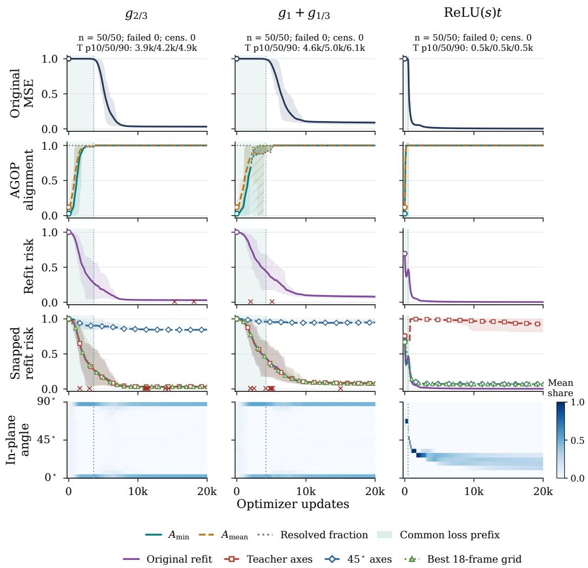  
Mean curves / bounds. Light bands: seed p10–p90 envelopes (not confidence intervals). Dotted AGOP bounds / hatching: unresolved mean / percentile ranges; red ×: solver miss. T: per-seed loss-prefix endpoint. Diagnostic lines connect recorded common states.

Figure 5: Additive damped and mixture links, and the ReLU gate. The two additive-family targets and the ReLU product use five diagnostic rows. Each teacher uses fifty fixed initialization seeds with identical optimization parameters. Means, numerical bounds, percentile bands and lossprefix shading follow Figure 1.

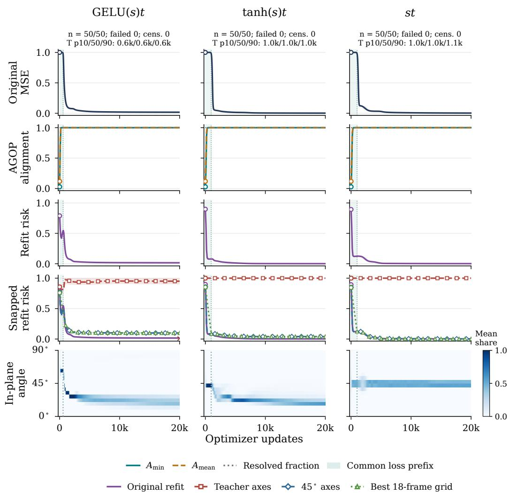  
Mean curves / bounds. Light bands: seed p10–p90 envelopes (not confidence intervals). Dotted AGOP bounds / hatching: unresolved mean / percentile ranges; red ×: solver miss. T: per-seed loss-prefix endpoint. Diagnostic lines connect recorded common states.

Figure 6: Other gated teachers. Exact GELU and tanh products, together with the bilinear rotation control, use the same five rows. Each teacher uses fifty fixed initialization seeds with identical optimization parameters. Means, numerical bounds, percentile bands and loss-prefix shading follow Figure 1.

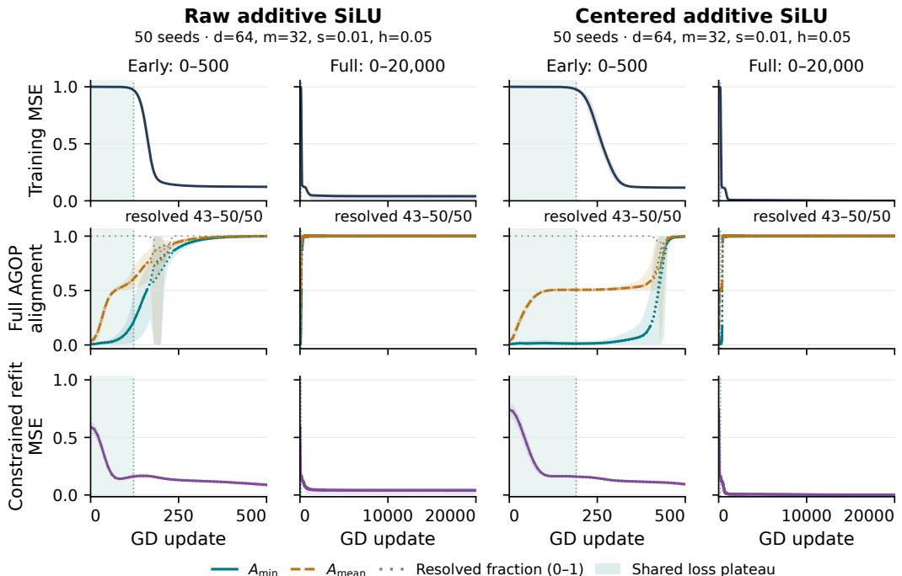  
Linear update axes · equal seed weights · 10th–90th percentile envelopes

Figure 7: Raw and centered additive SiLU: denser followups. Each teacher has paired linear early (0–500 updates) and full (0–20,000 updates) views, with fifty seeds at $d = 6 4 , m = 3 2$ $s = 0 . 0 1$ . Rows show original loss, minimum and mean full-AGOP alignment, and constrained refit MSE. Bands are empirical 10th–90th percentiles; the gray trace reports the resolved fraction. Refit lower/upper numerical bounds remain separate. Shading marks the loss-prefix intersection across all fifty seeds. The common configuration was chosen after the pilot did not establish reliable fullsubspace learning, as disclosed in Section A.2. The enlarged early view exposes partial alignment and refit changes; the averages do not establish full-subspace recovery for every seed.

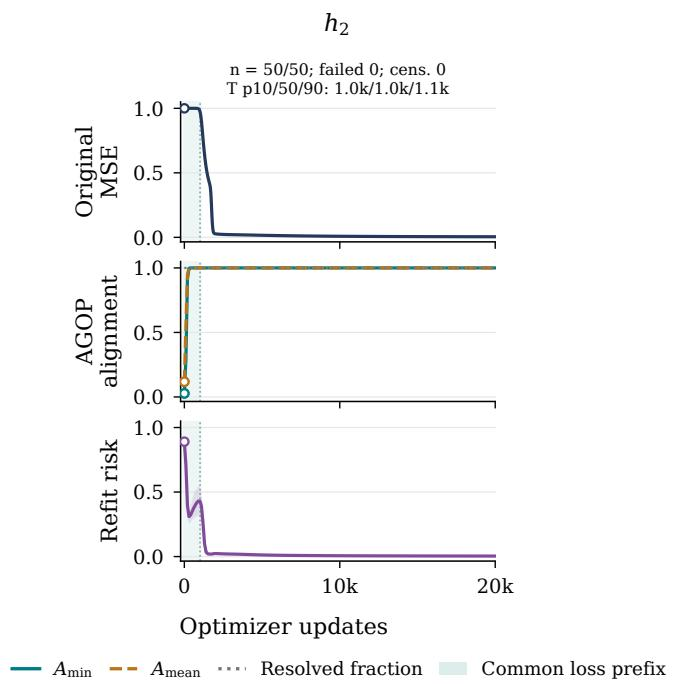  
Mean curves / bounds. Light bands: seed p10–p90 envelopes (not confidence intervals). Dotted AGOP bounds / hatching: unresolved mean / percentile ranges; red ×: solver miss. T: per-seed loss-prefix endpoint. Diagnostic lines connect recorded common states.

Figure 8: Quadratic additive teacher. The three rows display original loss, full-current-head AGOP alignment and same-budget refit MSE. Each teacher uses fifty fixed initialization seeds with identical optimization parameters. Means, numerical bounds, percentile bands and loss-prefix shading follow Figure 1.

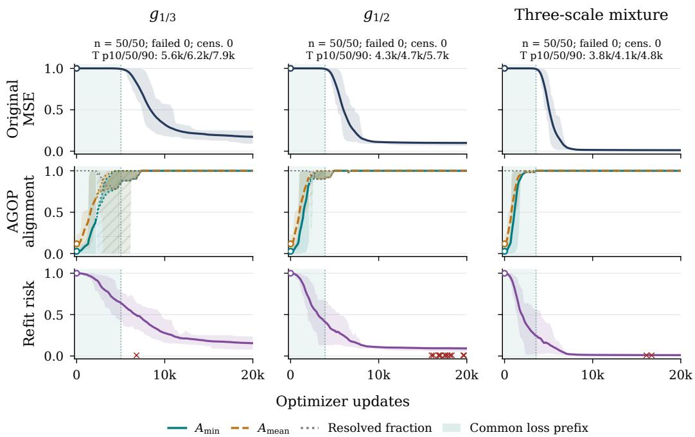  
Mean curves / bounds. Light bands: seed p10–p90 envelopes (not confidence intervals). Dotted AGOP bounds / hatching: unresolved mean / percentile ranges; red ×: solver miss. T: per-seed loss-prefix endpoint. Diagnostic lines connect recorded common states.

Figure 9: Additional positive-mixture links. Damped links and the three-scale mixture use the same three-row format. Each teacher uses fifty fixed initialization seeds with identical optimization parameters. Means, numerical bounds, percentile bands and loss-prefix shading follow Figure 1.

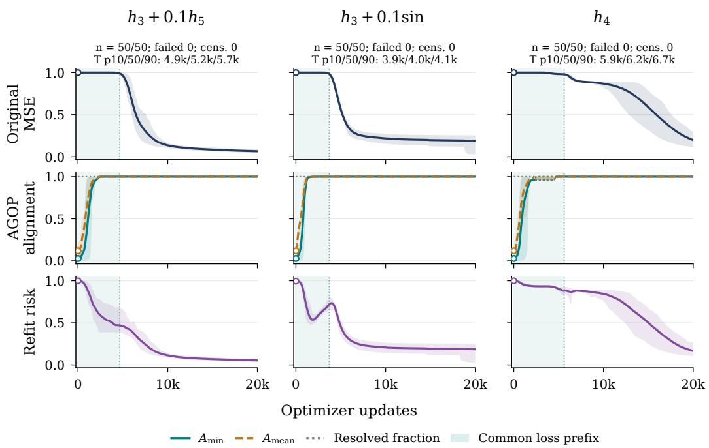  
Mean curves / bounds. Light bands: seed p10–p90 envelopes (not confidence intervals). Dotted AGOP bounds / hatching: unresolved mean / percentile ranges; red ×: solver miss. T: per-seed loss-prefix endpoint. Diagnostic lines connect recorded common states.

Figure 10: Perturbed cubic and fourth-Hermite teachers. These standalone perturbation magnitudes and the fourth Hermite are empirical cases, not claims of the small-neighborhood theorem. Each teacher uses fifty fixed initialization seeds with identical optimization parameters. Means, numerical bounds, percentile bands and loss-prefix shading follow Figure 1.

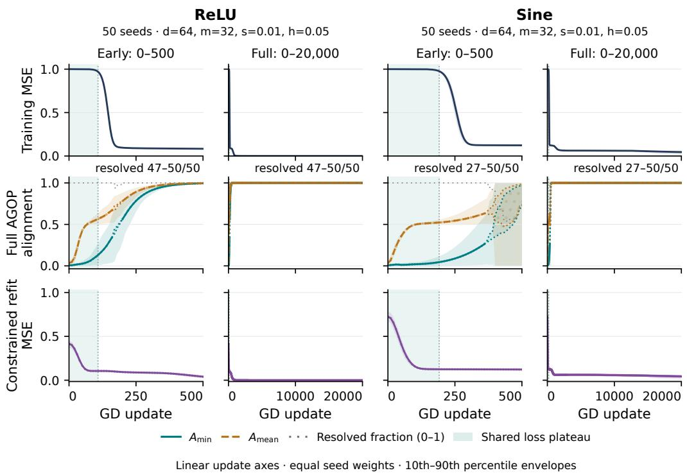  
Figure 11: Additive ReLU and sine: denser followups. The paired early and full views use the same fifty-seed configuration, three rows, linear update axes, numerical uncertainty conventions and loss-prefix shading as Figure 7. Both teacher means and all Hermite components are retained. Partia geometric learning and refit gains are distinct from recovery of every teacher direction; Table 2 reports continuous endpoint changes.

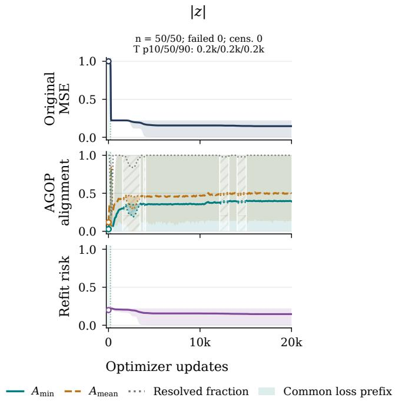  
Mean curves / bounds. Light bands: seed p10–p90 envelopes (not confidence intervals). Dotted AGOP bounds / hatching: unresolved mean / percentile ranges; red ×: solver miss. T: per-seed loss-prefix endpoint. Diagnostic lines connect recorded common states.

Figure 12: Absolute-value teacher: original baseline. This panel retains the original fifty seeds at $r \overset { ^ { \cdot } } { = } 2 , d = 1 6 , m = 3 2 , s = 1 0 ^ { - 4 }$ and initial force step $h = 0 . 0 5 ;$ it was not rerun. The three rows show original loss, full AGOP alignment and constrained refit MSE over 20,000 updates. Means, percentiles, unresolved spectral intervals and shared loss-prefix shading follow the original baseline protocol. It is separated here so the four new followups do not displace the absolute-value control.

## B HIGHER-RANK COMPARISONS AND NEURON GEOMETRY

This separate cohort tests ranks and teacher links beyond the rank-two ReLU and rank-one SwiGLU illustrations. Its 140 trajectories comprise 60 ReLU and 80 SwiGLU runs, with ten prescribed seeds 9351–9360 per configuration. The same seed is reused across settings; such outcomes are paired comparisons, not additional independent repetitions. Every declared seed is retained. Four rank-16 ReLU runs are earlier confirmation runs with matching numerical code; the other six extend that setting. These are empirical illustrations, not additional higher-rank learning theorems.

Teachers, sizes and optimization. Let $X \sim N ( 0 , I _ { d } )$ , let $U = ( u _ { 1 } , \ldots , u _ { r } )$ have orthonormal columns, and write $\boldsymbol { P _ { U } } = U U ^ { T }$ . All runs use $d = 6 4$ and additive teachers

$$
Y = { \frac { \sum _ { i = 1 } ^ { r } q ( u _ { i } ^ { T } X ) } { { \sqrt { r \mathbb { E } [ q ( Z ) ^ { 2 } ] + r ( r - 1 ) ( \mathbb { E } [ q ( Z ) ] ) ^ { 2 } } } } } , \qquad Z \sim N ( 0 , 1 ) , \quad q \in \{ h _ { 2 } , | \cdot | , e ^ { - { ( \cdot ) } ^ { 2 } / 2 } \} .\tag{25}
$$

Thus $\mathbb { E } [ Y ^ { 2 } ] = 1 ; h _ { 2 } ( z ) = ( z ^ { 2 } - 1 ) / \sqrt { 2 }$ has zero mean and unit variance. The other teacher means are retained, with an intercept fitted analytically at every training and refit evaluation. Write $V _ { Y } = \operatorname { V a r } ( Y )$ and $\ell _ { n } = L _ { n } / V _ { Y }$ for the variance-normalized MSE. For the nonzero-mean teachers, the unit initial baseline is the intercept-only residual error, not the full raw second moment. At rank eight, $V _ { Y }$ is approximately 0.06660 for |z| and 0.01897 for the Gaussian bump.

ReLU uses $m = 2 5 6$ , IID $N ( 0 , s ^ { 2 } / d )$ raw heads, weights and biases with $s = 0 . 0 1$ , all trained. Its force step is $h = 0 . 5$ , corresponding to raw-MSE gradient step $m h / 2 = 6 4 ;$ its Armijo safeguard never activates. Runs stop at force time 1500 (3000 updates) or raw MSE at most 0.01 for $h _ { 2 }$ , and at most 0.001 for the absolute-value and Gaussian-bump links. The bounded refit uses the normalized, unprojected feature bank, an intercept, and caps $\| \dot { v } \| _ { 2 } \leq 3 2 , \| v \| _ { 1 } \leq 6 4 \sqrt { r }$ . This is a separate protocol from the no-intercept rank-two baseline.

SwiGLU uses $m = 6 4$ , initialization scale $s = 0 . 1$ , and block-adaptive explicit-Euler population flow, with maximum relative block change 0.01, maximum time step 50 and flow-time ceiling 3000. The head learning-rate multiplier is 0.01, or 0.001 in the labeled comparison. Runs can terminate at normalized loss $\ell \leq \mathsf { \bar { \rho } } _ { 0 . 0 1 }$ , the flow-time ceiling, a 20,000-update ceiling, or a wall-time budget of approximately thirty minutes. The horizontal axis counts updates, not a shared physicaltime clock. Refit is unrestricted numerically: the displayed risk is the largest actual risk among four pseudoinverse-cutoff solves. This sensitivity envelope is neither the same comparison class as bounded ReLU refit nor a certificate of the exact unrestricted oracle.

Loss-selected windows and sensitivity. For $q _ { 0 } \in \{ 0 . 0 1 , 0 . 0 5 \}$ , let $T _ { q _ { 0 } }$ be the last update before the first failure of

$$
\frac { \operatorname* { m a x } _ { 0 \leq k \leq n } \ell _ { k } } { \operatorname* { m i n } _ { 0 \leq k \leq n } \ell _ { k } } \leq 1 + q _ { 0 } .\tag{26}
$$

Losses must be positive and finite. ReLU additionally requires $\ell _ { k } \in \left[ 0 . 9 5 , 1 . 0 5 \right]$ at every update in the prefix for both thresholds. This agrees with the raw-MSE convention for the zero-mean quadratic teacher. Every-update loss histories determine the window independently of alignment, refit and neuron geometry. Shading marks [0, mins $T _ { 0 . 0 5 } ^ { ( s ) } ]$ across all ten seeds; the tighter comparison boundary is mins $T _ { 0 . 0 1 } ^ { ( s ) }$ . A 5% maximum/minimum ratio is not an absolute 0.05 loss tolerance and does not assert zero slope. Figure 3 retains the stricter absolute condition $| \ell _ { n } - \ell _ { 0 } | \leq 1 0 ^ { - 3 }$ from its separate rank-one protocol.

In the four high-rank SwiGLU main-text columns, the common 5% windows end at 310, 332, 271 and 237 updates; their mean losses are approximately 0.967, 0.963, 0.962, 0.963 there. Their 1% comparison windows end at 233, 248, 182 and 149 updates. Applying the stricter absolute $1 0 ^ { - 3 }$ rule to the same data instead gives endpoints 119, 128, 64 and 41. These changes are changes of the reporting threshold, not changes of trajectories or optimization.

Diagnostic support and interpretation. The initial and current numerical screens are applied before interpreting alignment and refit gains. These checks concern computed moments, not rigorous integration-error certificates. Separate mean curves do not establish a same-checkpoint event for every initialization, and the broader loss window does not establish the same conclusion under the stricter absolute rule.

Curves use arithmetic means and pointwise 10th–90th percentiles, with all ten seeds required at each aggregate point. Thin individual tails remain visible beyond shared support. ReLU scalar curves join common saved checkpoints. SwiGLU interpolates only between adjacent valid saved diagnostics for display; missing or rejected diagnostics are not bridged. Exact window endpoints need not have saved geometry or refit diagnostics. Interpolated endpoint values create no observed joint event. Some later SwiGLU trajectories oscillate, and wall stops truncate others. Saved-data consistency checks do not certify trajectory convergence or eliminate quadrature and time-discretization error. The dotted $r / d$ line is the isotropic reference for $A _ { \mathrm { m e a n } } .$ , not the expected minimum alignment. The ordered principal-cosine heatmap sorts the eigenvalues of $U ^ { T } { \cal P } _ { r } \dot { U }$ at each saved state, where $P _ { r }$ is the top-r AGOP projector. It describes subspace principal angles, not alignment with fixed individual teacher axes or the directions of individual neurons.

ReLU angles and importance weighting. For spatial weight $W _ { j }$ and raw head $A _ { j }$ , define

$$
\theta _ { U , j } = \operatorname { a r c c o s } { \frac { \| P _ { U } W _ { j } \| } { \| W _ { j } \| } } , \quad \theta _ { \operatorname { a x i s } , j } = \operatorname { a r c c o s } { \frac { \operatorname* { m a x } _ { 1 \leq i \leq r } | u _ { i } ^ { T } W _ { j } | } { \| P _ { U } W _ { j } \| } } , \quad \omega _ { j } = { \frac { | A _ { j } | \| W _ { j } \| } { \sum _ { k } | A _ { k } | \| W _ { k } \| } } .\tag{27}
$$

The first angle measures entry into $U ;$ the second measures individual-axis alignment of the projected weight. Directions are considered up to sign. The nearest-axis angle lies in [0, arccos $( 1 / \sqrt { r } ) ]$ at rank two it folds the original Figure 1 in-plane angle at $4 5 ^ { \circ }$ . It is not an AGOP principal angle. Histograms use five-degree bins and weights normalized separately in each seed and state, before averaging the ten histograms. All compared saved states have positive weight denominators and nonzero projections. Grey regions denote absence of a state shared by all seeds; hatching marks impossible angles.

For equal-coefficient quadratic teachers,

$$
\frac { 1 } { \sqrt { r } } \sum _ { i } h _ { 2 } ( u _ { i } ^ { T } X ) = \frac { \| P _ { U } X \| ^ { 2 } - r } { \sqrt { 2 r } } .\tag{28}
$$

Rotating the axes inside U leaves the teacher unchanged. Their nearest-axis statistics are therefore symmetry controls, not evidence for an intrinsic preference for or against polysemanticity. The nonquadratic links give a more informative teacher-coordinate comparison: subspace entry can precede concentration near individual axes. This does not prove that mixing is necessary, optimal or permanent.

SwiGLU gate and value summaries. Write $a _ { j } , w _ { j } , z _ { j }$ for the head, spatial gate weight and spatial value weight in the model of Section 3; biases are excluded from the following angular diagnostics. For $c _ { j } = \| P _ { U } w _ { j } \| ^ { 2 } / \| w _ { j } \| ^ { 2 }$ , the plotted effective angles are

$$
\Theta _ { \mathrm { w e i g h t e d } } = \operatorname { a r c c o s } \sqrt { \frac { \sum _ { j } \rho _ { j } c _ { j } } { \sum _ { j } \rho _ { j } } } , \qquad \rho _ { j } = | a _ { j } | \| w _ { j } \| ^ { 2 } \| z _ { j } \| , \qquad \Theta _ { \mathrm { m e d i a n } } = \operatorname { a r c c o s } \sqrt { \operatorname { m e d i a n } _ { j } c _ { j } } .\tag{29}
$$

The weights $\rho _ { j }$ are a degree-three contribution proxy. $\Theta _ { \mathrm { w e i g h t e d } }$ is not a weighted mean angle; for even $m = 6 4$ , transforming the median squared cosine need not equal the usual median of individual angles. Transformations are applied to each seed’s saved scores before aggregation; variability band concern seeds, not neurons. The neuron-summary appendix panels also show a dotted purple valueweight curve,

$$
\Theta _ { \mathrm { v a l u e } } = \operatorname { a r c c o s } \sqrt { \operatorname * { m e d i a n } _ { j } \frac { \| P _ { U } z _ { j } \| ^ { 2 } } { \| z _ { j } \| ^ { 2 } } } ,\tag{30}
$$

computed from each seed’s saved median squared-cosine score before averaging. The same evenwidth median qualification applies. The main-text geometry rows show gates only. Only these scalar summaries and threshold counts were retained, so per-neuron angle histograms cannot be recovered for SwiGLU.

A gate is counted near an axis if max $| u _ { i } ^ { T } w _ { j } | / \lVert w _ { j } \rVert > 0 . 9$ , equivalently its angle to that axis is less than arccos $( 0 . 9 ) \simeq 2 5 . 8 ^ { \circ }$ . This uses the full gate norm, unlike the projected ReLU nearest-axis angle. We plot both the unweighted fraction of such gates and the fraction of teacher axes with at least one such gate. These are gate-only diagnostics, not whole-neuron semantic classifications. Few near-axis gates alone do not demonstrate mixing: the gates could still lie outside $U .$ . Read them jointly with subspace entry at the same time and retain the quadratic-axis caveat.

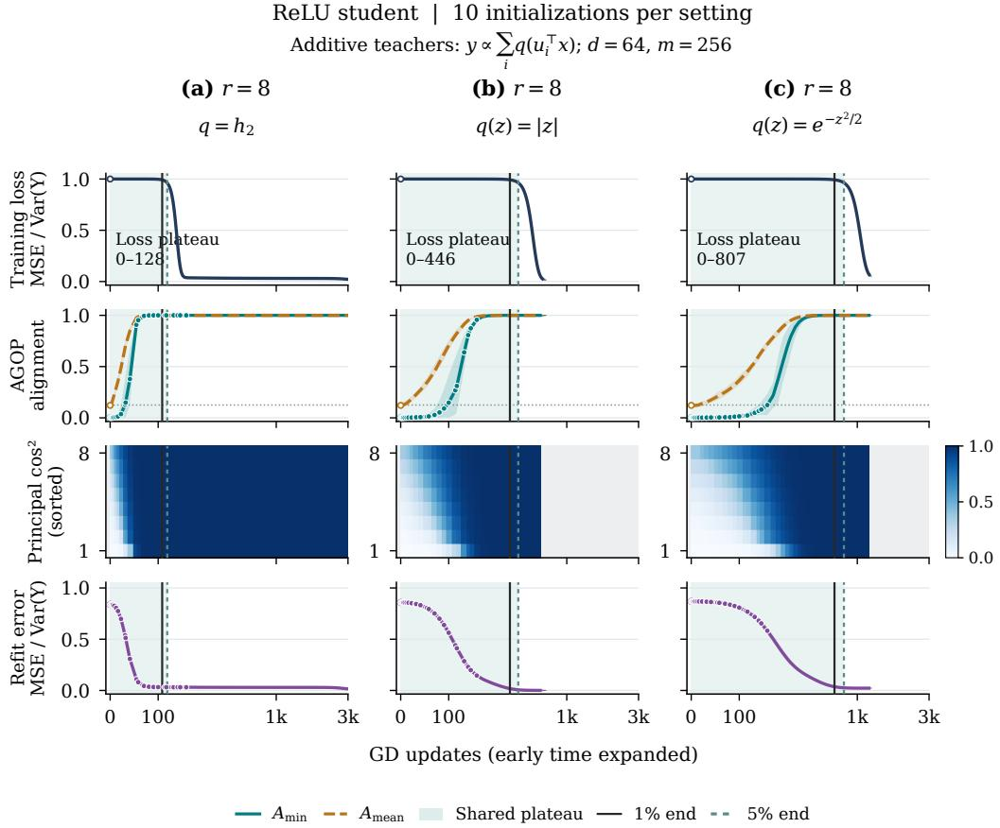  
Figure 13: ReLU teacher-link comparison at rank eight. Ten seeds each for quadratic, absolutevalue and Gaussian-bump teachers, $d = 6 4 , m = 2 5 6$ . Loss and bounded refit are in units of V ; target means are retained and fitted by the intercept. The 5% shared plateaus and 1% boundaries use (26). Means, bands and support conventions are those defined above.

ReLU student | 10 initializations per setting Additive teachers: y ∝ ∑q(u⊤x); d = 64, m = 256  
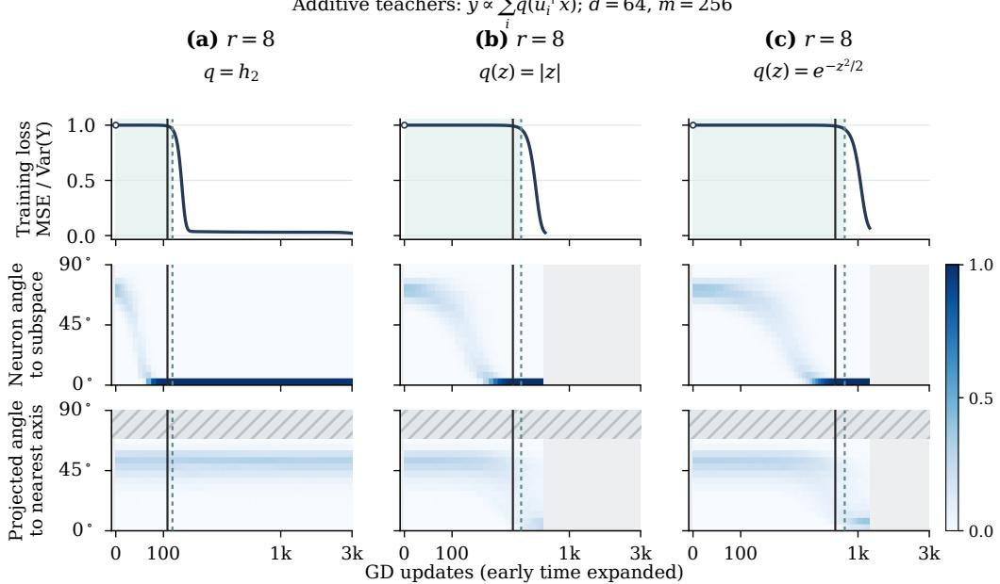  
Mean importance share per $5 ^ { \circ }$ bin; grey = no shared states; hatching = impossible.  
$h _ { 2 }$ axes are not identifiable; projected nearest-axis angles are controls.  
Solid black / dashed teal: 1% / 5% ends (same loss-band restriction).

Figure 14: ReLU subspace entry and teacher-axis specialization. The same rank-eight runs as Figure 13. Importance-weighted angle histograms distinguish entry into the teacher subspace from alignment with a single projected teacher axis. For the nonquadratic links, axis concentration develops later than subspace entry; the quadratic column is a rotation-invariant control. Five-degree histograms average the ten separately normalized seed distributions. Grey means no shared saved state, and hatching marks angles above the nearest-axis geometric limit.

SwiGLU student | 10 initializations per setting Quadratic teacher: $y = r ^ { - 1 / 2 } \sum _ { i } h _ { 2 } ( u _ { i } ^ { \top } x ) ; d = 6 4 , m = 6 4$ (a) r= 2 (b) r= 4 (c) r= 8 (d) r= 16  
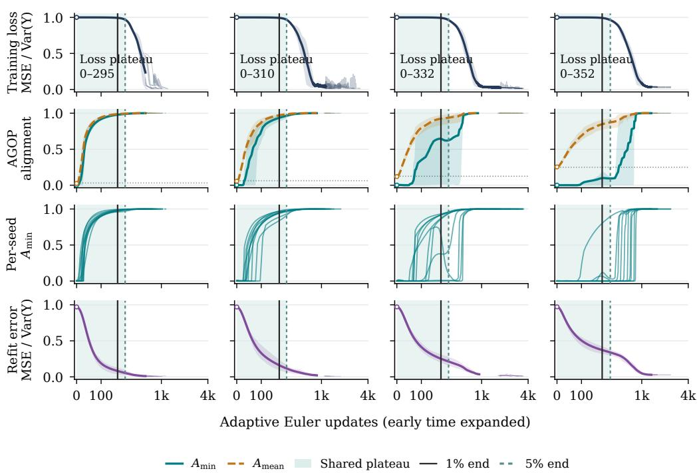  
Figure 15: SwiGLU rank sweep, including the weak rank-sixteen case. Quadratic teachers at ranks 2, 4, 8, 16, with $d = 6 4 , m = 6 4$ , head-rate multiplier 0.01 and ten seeds each. The ranksixteen column does not establish robust all-direction recovery during the plateau. All seeds and later diagnostic gaps remain visible; large mean alignment does not replace the weakest-direction and same-checkpoint requirements.

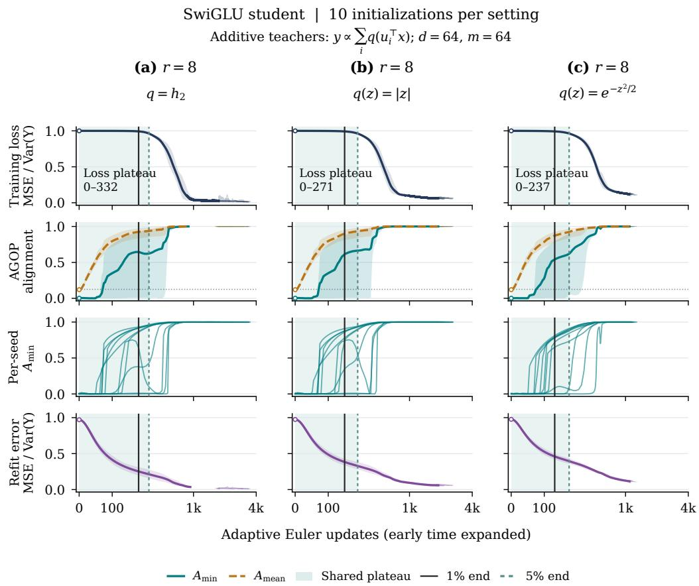  
Figure 16: SwiGLU teacher-link comparison at rank eight. Quadratic, absolute-value and Gaussian-bump links use the same ten-seed protocol with head-rate multiplier 0.01. Loss and numerical unrestricted-refit risks are divided by $V _ { Y }$ . These are empirical trajectories under declared loss tolerances, not guarantees for every link or initialization.

SwiGLU student | 10 initializations per setting Quadratic teacher: rank and head-rate comparison; d = 64, m = 64  
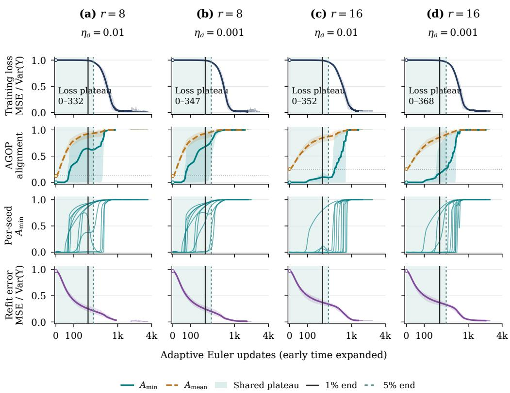  
Figure 17: Slower SwiGLU heads help some runs without resolving the rank limit. Quadratic teachers at ranks eight and sixteen compare head-rate multipliers 0.01 and 0.001, with ten paired seeds per setting. The curves compare how head-update speed affects loss and alignment; the ranksixteen setting remains a limitation. The settings remain distinct cohorts; outcomes are not pooled or selected by performance.

SwiGLU student | 10 initializations per setting Quadratic teacher: $y = r ^ { - 1 / 2 } { \sum } h _ { 2 } ( u _ { i } ^ { \top } x ) ; d = 6 4 , m = 6 4$ i (a) r = 2 (b) r = 4 (c) r = 8 (d) r = 16  
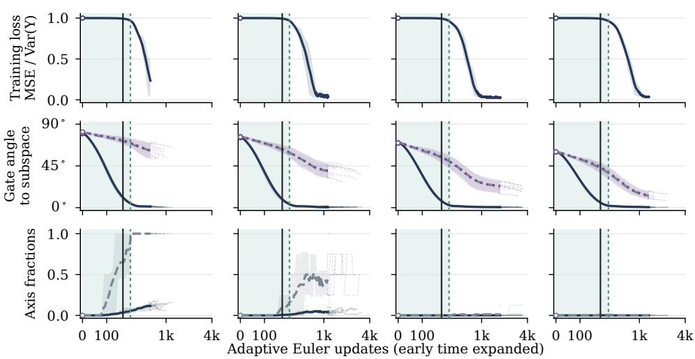  
Angle: solid = weighted gate; dashed = median gate; dotted = median value.  
Axis fraction: solid = gates within 25.8°; dashed = teacher axes covered.  
h2 axes are not identifiable. Solid black / dashed teal: 1% / 5% ends.

Figure 18: SwiGLU gate geometry across ranks. The same standard-head rank sweep as Figure 15. Gate-summary angles from (29), together with the dotted value-weight angle in (30), can improve even where the weakest AGOP direction is not recovered during the plateau. They describe different quantities, and weighted gate alignment alone is not an all-direction recovery result. The quadratic teacher has no identifiable internal axes.

SwiGLU student | 10 initializations per setting Additive teachers: y ∝ ∑q(u⊤i x); d = 64, m = 64  
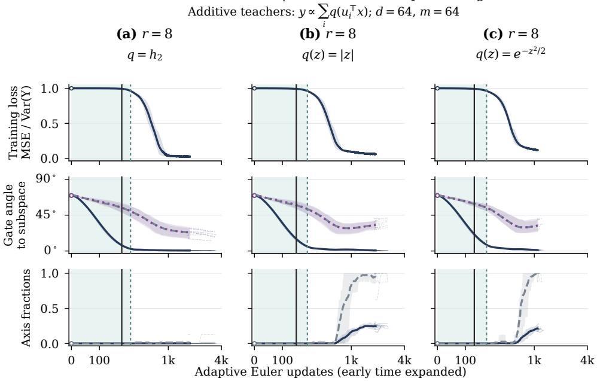  
Angle: solid = weighted gate; dashed = median gate; dotted = median value.  
Axis fraction: solid = gates within 25.8°; dashed = teacher axes covered.  
h2 axes are not identifiable. Solid black / dashed teal: 1% / 5% ends.

Figure 19: SwiGLU gate entry and axis specialization for different links. The same rank-eight teacher comparison as Figure 16. Effective gate and value angles and thresholded gate-axis counts use saved scalar summaries; no per-neuron angle distributions are inferred. For the nonquadratic teachers, the fraction of near-axis gates rises later than the decline in the effective subspace angle. The weighted angle and unweighted gate counts must be interpreted together and relative to the stated loss window; they do not classify every neuron or establish that coordinate mixing is necessary.

## C TEACHER FAMILIES AND COMPLETE PARAMETER PRESCRIPTIONS

## C.1 POSITIVE MIXTURES OF GAUSSIAN THIRD DERIVATIVES

Here X $\sim \gamma _ { d } = N ( 0 , I _ { d } ) , U = ( u _ { 1 } , \ldots , u _ { r } ) , P _ { U } = U U ^ { T }$ and $P _ { U ^ { \perp } } = I _ { d } - P _ { U }$ . Function norms are Gaussian: $\| g \| _ { 2 } ^ { 2 } = \mathbb { E } [ g ^ { 2 } ]$ and $\| g \| _ { H ^ { 1 } } ^ { 2 } = \mathbb { E } [ g ^ { 2 } + \| \nabla g \| ^ { 2 } ]$ . Write $h _ { k } = \mathrm { H e } _ { k } / \sqrt { k ! }$ for the normalized probabilists’ Hermite polynomial, and Φ for the standard normal CDF. Expectations without an indicated law are over the displayed Gaussian input; expectations of initialization statistics are over the original parameter draw. Let $\overline { { J } } = 1 - \alpha > \overset { \cdot } { 0 , } \overline { { U ^ { T } } } \overset { \cdot } { U } = I _ { r }$ , and let $\mu _ { i }$ be probability measures on $[ 1 / 3 , 1 ]$ . Throughout this appendix $\varphi _ { v }$ denotes the density of $N ( 0 , v )$ and $\varphi = \varphi _ { 1 }$ . Define

$$
\begin{array} { l l } { { g _ { v } ( t ) = v ^ { - 7 / 2 } ( t ^ { 3 } - 3 v t ) e ^ { - ( v ^ { - 1 } - 1 ) t ^ { 2 } / 2 } , \qquad } } & { { g _ { i } = \displaystyle \int g _ { v } d \mu _ { i } ( v ) , \qquad N _ { i } = \| g _ { i } \| _ { 2 } , } } \\ { { \displaystyle y _ { c } ( X ) = \sum _ { i = 1 } ^ { r } \lambda _ { i } g _ { i } ( u _ { i } ^ { T } X ) / N _ { i } , \qquad } } & { { \lambda _ { i } > 0 , \qquad ~ \sum _ { i } \lambda _ { i } ^ { 2 } = 1 . } } \end{array}\tag{31}
$$

The target is $y = y _ { c } + e = y ( U ^ { T } X )$ with $\| y \| _ { 2 } = 1$ and $\| e \| _ { H ^ { 1 } } \leq \zeta .$ . The residual may contain interactions on $U .$ . The central common-link theorem takes $\mu _ { i } = \mu , \lambda _ { i } = r ^ { - 1 / 2 }$ and $e = 0$ . For the more general theorem require

$$
K _ { i } ^ { * } = \operatorname* { m a x } _ { B \geq 0 } \frac { J \lambda _ { i } } { 2 N _ { i } } \sqrt { \frac { B } { 1 + B } } \int v ^ { - 3 / 2 } \varphi ( \sqrt { B / v } ) d \mu _ { i } ( v ) , \qquad K _ { * } : = \operatorname* { m a x } _ { i } K _ { i } ^ { * } , \qquad \operatorname* { m i n } _ { i } K _ { i } ^ { * } \geq \frac { 5 } { 6 } K _ { * } .\tag{32}
$$

Here and below, all quantities are public choices made before the independent Gaussian draw. The following list prints the entire prescription, including the conditions needed for later loss release. There is no further implicit width or dimension condition.

Structural constants and sizes. Fix $0 < \delta < 1 / 2 , 0 < \epsilon _ { L } \leq 1$ and $0 < \epsilon _ { G } \leq 1 / 4$ . Set

$$
\begin{array} { r l } & { \lambda _ { * } : = \operatorname* { m i n } _ { i } \lambda _ { i } , \quad \chi _ { 0 } = 1 0 ^ { - 4 } , \quad e _ { * } = \cfrac { J \chi _ { 0 } } { 4 0 9 6 \sqrt { r } } , \quad \varepsilon _ { \mathrm { B M } } = e _ { * } / 8 , \quad \kappa _ { \mathrm { B M } } = J \lambda _ { * } / 1 0 2 4 , } \\ & { \vartheta = \operatorname* { m i n } \left\{ \lambda _ { * } / 1 0 0 0 , e _ { * } / 1 6 , \sqrt { \kappa _ { \mathrm { B M } } \varepsilon _ { \mathrm { B M } } / 6 4 0 0 } \right\} , \quad R = \operatorname* { m a x } \left\{ 8 , 1 6 / e _ { * } , \sqrt { 2 5 6 0 0 / ( \kappa _ { \mathrm { B M } } \varepsilon _ { \mathrm { B M } } ) } \right\} . } \end{array}\tag{33}
$$

With $p _ { I } = \Phi ( 1 ) - \Phi ( 1 / 2 )$ and $p _ { G } = \Phi ( 2 ) - \Phi ( 1 )$ , put

$$
p _ { \mathrm { r e c t } } = p _ { G } p _ { I } ^ { 2 } \left\{ 1 , \begin{array} { l l } { ~ r = 1 , } \\ { [ 2 \Phi ( \vartheta / ( 4 \sqrt { r - 1 } ) ) - 1 ] ^ { r - 1 } , } & { r > 1 , } \end{array} \right. \quad m \ge \operatorname* { m a x } \{ r , p _ { \mathrm { r e c t } } ^ { - 1 } \log ( 1 6 r / \delta ) \} .\tag{34}
$$

Choose integer d $> r$ satisfying all of

$$
\begin{array} { r l } & { \ell = \log ( 6 4 m / \delta ) , \quad B _ { 1 } = 6 4 \sqrt { r } / J , \quad \ell _ { I } = \log ( 8 m / \delta ) , \quad Q _ { I } = r + 2 \sqrt { r \ell _ { I } } + 2 \ell _ { I } , } \\ & { \qquad d \geq \operatorname* { m a x } \{ r , 6 4 , 1 2 8 \ell , 1 6 r / \delta , 1 6 \ell _ { I } , 2 Q _ { I } ( 3 2 B _ { 1 } / \chi _ { 0 } ) ^ { 2 / 3 } \} . } \end{array}\tag{35}
$$

These conditions allow compatible $m \geq d .$ Once d is fixed set $x _ { 0 } = d ^ { - 1 / 2 } , k = J \lambda _ { * } / ( 4 0 9 6 d ^ { 2 } )$ and $Q _ { * } = k / ( 1 0 \sqrt { d } )$

Acquisition and spectral clocks. Define

$$
\begin{array} { r l r } { \quad T _ { 1 } = \kappa _ { \mathrm { B M } } ^ { - 1 } \log ( 4 / { \varepsilon _ { \mathrm { B M } } } ) , \quad T _ { 0 } = 4 R / k + T _ { 1 } + 1 , \quad S _ { 0 } = 5 m e ^ { 4 T _ { 0 } } , \quad v _ { * } = 4 R ^ { 2 } , } & \\ { \quad c _ { G } = \frac { J \varphi ( 1 ) \sqrt { \epsilon _ { G } } } { 1 2 8 \sqrt { r } } , \quad \Gamma = \frac { 3 S _ { 0 } / 4 + 4 0 0 m } { v _ { * } } , \quad T _ { G } = \frac { 1 0 0 } { K _ { * } } \log \frac { 2 \Gamma } { c _ { G } } , } & \\ { \quad T = T _ { 0 } + T _ { G } + 1 , \quad S = S _ { 0 } e ^ { 4 ( T _ { G } + 1 ) } , \quad M = 2 \sqrt { S } . } & \end{array}\tag{36}
$$

Choose one positive mesh h and one positive force allowance ν obeying every cutoff in

$$
h \leq \operatorname* { m i n } \left\{ 2 ^ { - 1 2 } , \frac { k } { 5 1 2 M } , \frac { 1 } { 4 M ^ { 2 } T } , \frac { \kappa _ { \mathrm { B M } } \varepsilon _ { \mathrm { B M } } } { 3 2 0 0 } , \frac { K _ { * } } { 1 0 0 0 0 } , \frac { 1 } { 1 0 0 0 r } , 1 0 ^ { - 4 } , \frac { c _ { G } v _ { * } } { 2 0 0 0 0 T S } \right\} ,\tag{37}
$$

$$
\nu \leq \operatorname* { m i n } \left\{ \begin{array} { l l } { \displaystyle \frac { Q _ { * } } { 4 } , \frac { 1 } { 4 0 0 T } , \frac { x _ { 0 } } { 4 M T } , \frac { \vartheta \lambda _ { * } k x _ { 0 } ^ { 2 } } { 2 0 4 8 M ^ { 3 } } , \frac { k } { 5 1 2 M } , \frac { 2 k } { 3 M ^ { 2 } } , } \\ { \displaystyle \frac { 1 } { 8 0 M ^ { 2 } T } , \frac { \kappa _ { \mathrm { B M } } \varepsilon _ { \mathrm { B M } } } { 3 2 0 } , \frac { K _ { * } } { 1 0 0 0 0 } , \sqrt { \frac { K _ { * } } { 1 0 0 0 T } } , \frac { c _ { G } v _ { * } } { 8 0 T S } } \end{array} \right\} .\tag{38}
$$

Set

$$
\begin{array} { r } { N _ { * } = \lceil 4 R / ( h k ) \rceil + \lceil T _ { 1 } / h \rceil , \qquad N = N _ { * } + \lceil T _ { G } / h \rceil , } \\ { t _ { G } = ( N - N _ { * } ) h , \qquad v _ { G } = v _ { * } e ^ { 3 . 3 2 K _ { * } t _ { G } } . \qquad } \end{array}\tag{39}
$$

In particular $N _ { * } h \leq T _ { 0 } , T _ { G } \leq t _ { G } \leq T _ { G } + h$ and $N h \leq T$

Continuation, residual and original Gaussian scale. After choosing the same $h ,$ define

$$
\gamma = K _ { * } / 2 , \quad k _ { c } = \left\lceil \frac { 2 } { h \gamma } \log \frac { 3 2 S } { \gamma v _ { * } } \right\rceil , \quad T _ { c } = h + \frac { 2 } { \gamma } \log \frac { 3 2 S } { \gamma v _ { * } } ,
$$

$$
S _ { c } = S e ^ { 4 T _ { c } } , \quad N _ { c } = N + k _ { c } , \quad R _ { c } ^ { 2 } = \gamma m / 6 4 , \quad G _ { c } = \gamma ^ { 2 } / 8 1 9 2 = K _ { * } ^ { 2 } / 3 2 7 6 8 ,
$$

$$
0 < \nu _ { c } \leq \operatorname* { m i n } \{ \gamma / 1 6 , \sqrt { \gamma / ( 8 T _ { c } ) } \} .\tag{40}
$$

The allowable residual and raw scale satisfy

$$
0 \le \zeta \le \operatorname* { m i n } \left\{ \nu / 2 , \chi _ { 0 } / 1 2 8 , \lambda _ { * } / 1 0 0 , \chi _ { 0 } / ( 3 2 B _ { 1 } ) , \nu _ { c } / 2 \right\} ,\tag{41}
$$

$$
0 < s ^ { 2 } \leq \operatorname * { m i n } \left\{ \frac { m \nu } { S } , \frac { m \epsilon _ { L } } { 2 0 M ^ { 2 } } , \frac { m \nu _ { c } } { S _ { c } } , \frac { R _ { c } ^ { 2 } } { 4 S _ { c } } , \frac { m G _ { c } } { S _ { c } } , \frac { m \epsilon _ { L } } { 2 0 S _ { c } } \right\} .\tag{42}
$$

All raw coordinates are independently $N ( 0 , s ^ { 2 } / d )$ and the single Euclidean step on full MSE is $\eta = m h / 2$ . Smaller positive $h , \nu , .$ s are allowed, with the downstream quantities recomputed in the printed order. No parameter is chosen from an observed favorable trajectory. The very small scale and mesh are part of the theorem.

## C.2 ADDITIVE CUBIC NEIGHBORHOOD: COMPLETE PARAMETER PACKAGE

Let $X \sim N ( 0 , I _ { d } )$ , let $U = ( u _ { 1 } , \ldots , u _ { r } )$ have orthonormal columns, and let

$$
y _ { c } = \sum _ { i = 1 } ^ { r } a _ { i } h _ { 3 } ( u _ { i } ^ { T } X ) , \qquad a _ { i } > 0 , \quad \sum _ { i } a _ { i } ^ { 2 } = 1 , \quad a _ { 0 } = \operatorname* { m i n } _ { i } a _ { i } , \quad a _ { \operatorname* { m a x } } = \operatorname* { m a x } _ { i } a _ { i } .\tag{AJ1}
$$

In this subsection the local $N , { \overline { { T } } } , G _ { \mathrm { r e l } }$ are the main-text $N _ { A } , { \overline { { T } } } _ { A } , G _ { A }$ , respectively. Here $h _ { 3 } ( t ) =$ $( t ^ { 3 } - 3 t ) / \sqrt { 6 } , \gamma _ { d } = N ( 0 , I _ { d } ) , \| g \| _ { 2 } ^ { 2 } = \mathbb { E } [ g ( X ) ^ { 2 } ]$ , and $\| g \| _ { H ^ { 1 } } ^ { 2 } = \mathbb { E } [ g ( X ) ^ { 2 } + \| \nabla g ( X ) \| ^ { 2 } ]$ . Nonzero coefficient signs can be absorbed into the $u _ { i }$ . For $0 \leq \alpha < \bar { 1 }$ , train

$$
f _ { n } ( X ) = \frac { 1 } { m } \sum _ { j = 1 } ^ { m } A _ { j , n } \sigma _ { \alpha } ( W _ { j , n } ^ { T } X + B _ { j , n } ) , \qquad \sigma _ { \alpha } ( t ) = \alpha t + ( 1 - \alpha ) t _ { + } , \qquad L _ { n } = \mathbb { E } [ ( y - f _ { n } ) ^ { 2 } ]\tag{AJ2}
$$

by simultaneous Euclidean GD in every raw coordinate at one fixed step $\eta = m h / 2$ . All initial raw coordinates, including heads and biases, are independent $N ( 0 , s ^ { 2 } / \dot { d } )$ There is no screening, resetting, freezing, sign selection by the algorithm, or refitting during training.

Fix $0 < \delta < 1 / 2$ and $0 < \delta _ { L } \leq 1$ , and put $\delta _ { 0 } = \delta / 2$ and $\zeta = \delta / 2$ . The following scalar constants depend only on the indicated public parameters, not on a realized initialization:

$$
b _ { * } ^ { 2 } = ( \sqrt { 5 } - 1 ) / 2 , \quad p = 2 \Phi ( b _ { * } ) - 1 , \quad v _ { g } = p - 2 b _ { * } \varphi ( b _ { * } ) + b _ { * } ^ { 2 } ( 1 - p ) - p ^ { 2 } ,
$$

$$
t _ { g } = - 2 b _ { * } \varphi ( b _ { * } ) / \sqrt { 6 } , \quad K _ { * } = t _ { g } ^ { 2 } / v _ { g } > 2 / 3 , \quad D _ { \alpha } = \sqrt { ( 1 - \alpha ) ^ { - 2 } + p ^ { 2 } / ( 1 + \alpha ) ^ { 2 } } ,
$$

$$
C _ { \alpha } = | t _ { g } | D _ { \alpha } / v _ { g } , \qquad D _ { g } = | t _ { g } | \operatorname* { m a x } \{ p , 1 - p \} / v _ { g } ,
$$

$$
\xi = \operatorname * { m i n } \{ ( 1 6 \sqrt { r } ) ^ { - 1 } , ( 1 2 8 C _ { \alpha } \sqrt { r } ) ^ { - 1 } \} , \quad \vartheta = \operatorname * { m i n } \{ a _ { 0 } / 8 , \xi / 3 2 \} , \quad R _ { D } = 6 4 / \xi .\tag{AJ3}
$$

Here $\varphi , \Phi$ are the standard normal density and distribution function. Set

$$
p _ { C } = [ \Phi ( 2 ) - \Phi ( 1 ) ] [ \Phi ( 2 ) - \Phi ( 1 / 2 ) ] ^ { 2 } [ 2 \Phi ( \vartheta / ( 4 \sqrt { r - 1 } ) ) - 1 ] ^ { r - 1 } ,\tag{AJ4}
$$

omitting the final factor when $r = 1$ . Choose integer sizes satisfying

$$
\begin{array} { c } { m \geq \operatorname* { m a x } \{ 4 r , \log ( 1 6 r / \delta _ { 0 } ) / p _ { C } \} , \quad \ell = \log ( 9 6 m / \delta _ { 0 } ) , \quad H = r + 2 \sqrt { r \ell } + 2 \ell , } \\ { d \geq \operatorname* { m a x } \{ 2 5 6 , 1 2 8 \ell , 1 6 H , ( r + 4 ) ( 1 2 8 / \delta _ { 0 } ) ^ { 1 / 3 } , 1 6 r / \delta \} . } \end{array}\tag{AJ5}
$$

In particular $r < d$ and $m \geq r$ . There is no m $<$ d requirement. The restriction on width is stronger than $m \geq r !$ it pays for all four axis/bias categories under the original Gaussian draw.

Define the original-coordinate constants

$$
g _ { 0 } = \frac { \zeta a _ { 0 } } { 4 m r ^ { 2 } \sqrt { d } } , \quad b _ { 0 } = a _ { \operatorname* { m a x } } \sqrt { H / d } , \quad D _ { a } = \sum _ { i } a _ { i } ^ { - 2 } , \quad L _ { a } = ( a _ { \operatorname* { m a x } } ^ { 2 } D _ { a } ) ^ { 1 / 3 } ,
$$

$$
Z _ { * } = 4 0 + 6 4 0 \sqrt { D _ { a } } \{ b _ { 0 } ^ { 2 } / g _ { 0 } + ( 1 + L _ { a } ) b _ { 0 } \} , \quad \Gamma = 3 Z _ { * } + 1 8 2 .\tag{AJ6}
$$

Choose any $0 < \varepsilon \leq$ min $\{ 1 / 4 , ( 7 6 8 D _ { g } ^ { 2 } ) ^ { - 1 } \}$ and then a public radius R with

$$
R \geq \operatorname* { m a x } \left\{ R _ { D } , 1 6 \sqrt { m } , \sqrt { m \Gamma / 1 8 } , \sqrt { \frac { m \sqrt { 1 5 2 2 / \varepsilon } } { 1 8 ( 1 - \alpha ) \varphi ( 1 ) } } \right\} .\tag{AJ7}
$$

Only after this choice set

$$
\begin{array} { r l } & { c = ( 1 - \alpha ) / \sqrt { 6 } , \quad k = c \varphi ( 1 ) a _ { 0 } / ( 6 4 d ^ { 2 } ) , \quad T = 1 + 8 R / k , \quad \overline { { T } } = T + 1 , } \\ & { M ^ { 2 } = 2 0 m e ^ { 4 \overline { { T } } } , \quad \overline { { S } } = 4 \log ( 8 M ) , \quad 0 < h \leq \operatorname* { m i n } \{ 1 / 5 1 2 , \xi / 1 0 2 4 , ( 1 6 \overline { { T } } ) ^ { - 1 } \} , \quad N = \lceil T / h \rceil . } \end{array}\tag{AJ8}
$$

Choose $\nu > 0$ at most the minimum of

$$
\frac { 1 } { 6 4 } , \quad \frac { k } { 1 0 ^ { 4 } M ^ { 2 } } , \quad \frac { 1 } { 1 0 2 4 \overline { { { T } } } ^ { 2 } } , \quad \frac { k } { 6 4 M ^ { 2 } \overline { { { S } } } \sqrt { d } } , \quad \frac { k \vartheta a _ { 0 } } { 1 0 2 4 M ^ { 3 } d } , \quad \frac { k \xi } { 1 2 8 0 0 M } , \quad \frac { m } { 1 0 2 4 \overline { { { T } } } M ^ { 2 } } , \quad \frac { g _ { 0 } e ^ { - 4 \overline { { { T } } } } } { 1 0 ^ { 5 } \overline { { { T } } } M } .\tag{AJ9}
$$

The full target is any additive function on $U ^ { T } X$ with

$$
\| y \| _ { 2 } = 1 , \qquad y \in H ^ { 1 } ( \gamma _ { d } ) , \qquad \| y - y _ { c } \| _ { H ^ { 1 } } \leq \nu / 2 .\tag{AJ10}
$$

Its actual mean, linear component and higher tails remain in all gradients, losses and comparisons. Since $\nu / 2 < a _ { 0 }$ , its minimal index subspace is $U$ , by the cubic tensor argument in Appendix D. Thus r here is a true teacher rank, not only a representation. Finally put

$$
\begin{array} { c } { \displaystyle { a _ { \mathrm { r e l } } = 1 / ( 6 4 m \overline { { T } } ) , \quad R _ { \mathrm { r e l } } ^ { 2 } = a _ { \mathrm { r e l } } m ^ { 2 } , \quad G _ { \mathrm { r e l } } = 1 / ( 8 1 9 2 \overline { { T } } ^ { 2 } ) , } } \\ { \displaystyle { 0 < s ^ { 2 } \leq \operatorname* { m i n } \left\{ \frac { m \nu } { M ^ { 2 } } , \frac { m \delta _ { L } } { 5 0 M ^ { 2 } } , \frac { R _ { \mathrm { r e l } } ^ { 2 } } { 4 M ^ { 2 } } , \frac { m G _ { \mathrm { r e l } } } { M ^ { 2 } } \right\} . } } \end{array}\tag{AJ11}
$$

This order of choices is acyclic: $Z _ { * }$ is determined before $R ,$ and neither $Z _ { * }$ nor R depends on the ensuing clock or raw scale. All quantities are finite and positive at every allowed finite rank and coefficient vector. No practical scale is asserted.

## D EXACT UPDATE AND MINIMAL TEACHER RANK

Here $\begin{array} { r } { X \sim N ( 0 , I _ { d } ) , f = m ^ { - 1 } \sum _ { j } A _ { j } \sigma _ { \alpha } ( W _ { j } ^ { T } X + B _ { j } ) , \sigma _ { \alpha } ( t ) = \alpha t + ( 1 - \alpha ) t _ { + } } \end{array}$ , and a superscript + denotes the next simultaneous iterate. The teacher axes are the columns of $U$ , and $h _ { 3 } ( t ) \ =$ $( t ^ { 3 } - 3 t ) / \sqrt { 6 }$ . The coefficient families $a _ { i }$ and $\lambda _ { i } / N _ { i }$ are those in AJ1 and (31), respectively. For $z _ { j } = W _ { j } ^ { T } X + B _ { j }$ , the simultaneous full-MSE step $\eta = m h / 2$ is

$$
\begin{array} { r l } & { ~ A _ { j } ^ { + } = A _ { j } + h \mathbb { E } [ ( y - f ) \sigma _ { \alpha } ( z _ { j } ) ] , } \\ & { W _ { j } ^ { + } = W _ { j } + h A _ { j } \mathbb { E } [ ( y - f ) \sigma _ { \alpha } ^ { \prime } ( z _ { j } ) X ] , } \\ & { ~ B _ { j } ^ { + } = B _ { j } + h A _ { j } \mathbb { E } [ ( y - f ) \sigma _ { \alpha } ^ { \prime } ( z _ { j } ) ] . } \end{array}\tag{43}
$$

Every right-hand side uses the same current state. At a nonzero spatial row the kink has Gaussian probability zero. At a pure-bias row with nonzero bias the derivative is the corresponding affine derivative. The identically zero joint row is absorbing and may use any fixed subgradient convention. Initial nonzero balanced hidden states remain nonzero throughout the controlled update windows, by the compatible balance identity and step bounds proved below.

For a unit vector u, the normalized cubic $h _ { 3 } ( u ^ { T } X )$ corresponds isometrically to the symmetric thirdchaos tensor $u ^ { \otimes 3 }$ . The central cubic tensor is $\textstyle \sum _ { i } c _ { i } u _ { i } ^ { \otimes 3 }$ , with $c _ { i } = a _ { i }$ in AJ and $c _ { i } = \sqrt { 6 } \lambda _ { i } / N _ { i }$ in the mixture theorem. Its mode-one matricization has singular values $c _ { i } ,$ , because both $u _ { i }$ and $u _ { i } \otimes u _ { i }$ are orthonormal families. Orthogonal chaos projection and matricization give an operator perturbation at most $\lVert y - y _ { c } \rVert _ { 2 }$ . In AJ this is less than $a _ { 0 } ;$ in SW it is at most $\lambda _ { * } / 1 0 0 < \sqrt { 6 } \lambda _ { * } / 9$ . Thus the cubic matricization of the actual target has rank at least $^ r \cdot$ If the target were measurable on a smaller linear subspace, all modes of every chaos tensor would lie in that subspace, a contradiction. Since the target depends on $U ^ { T } X$ by hypothesis, its minimal index subspace is exactly $U$

For $Z \sim N ( 0 , 1 )$ , the mixture identity $g _ { v } \varphi = - \varphi _ { v } ^ { \prime \prime \prime }$ implies

$$
\begin{array} { r } { \mathbb { E } [ g _ { v } ( Z ) e ^ { t Z - t ^ { 2 } / 2 } ] = t ^ { 3 } e ^ { - ( 1 - v ) t ^ { 2 } / 2 } . } \end{array}
$$

The resulting coefficients are printed in MP2. Their squared sums and Hermite-degree-weighted squared sums converge uniformly for $v \in [ 1 / 3 , 1 ]$ . Indeed their generating function is $K ( t ) =$ $3 ( 2 + 3 t ) ( 1 - t ) ^ { - 7 / 2 } { \mathrm { ~ a t ~ } } t = ( 1 - v ) ^ { 2 } \leq 4 / 9$ ; the weighted sum is $2 t K ^ { \prime } ( t ) + 3 K ( t )$ . Minkowski’s inequality therefore justifies integration against arbitrary probability measures, including non-atomic ones, in both $L ^ { 2 }$ and $H ^ { 1 }$ . It gives $\sqrt { 6 } \leq N _ { i } < 9$ and $\| g _ { i } / N _ { i } \| _ { H ^ { 1 } } < 1 3$ . The coefficient at every odd degree $2 j + 3$ is nonzero whenever $\mu _ { i } ( [ 1 / 3 , 1 ) ) > 0$ . No truncation enters the updates or the proofs.

## D.1 COMMON ORIGINAL-LAW EVENT ASSEMBLY

Write $[ x ] _ { + } = \operatorname* { m a x } \{ 0 , x \}$ . All events in the following rule use one probability space; in our applications this is the original Gaussian draw.

Lemma D.1 (Common-event and headroom rule). Let $E _ { 1 } , \ldots , E _ { k }$ be measurable events with $\Pr ( E _ { i } ^ { c } ) \leq p _ { i }$ , and put $E = \cap _ { i } E _ { i }$ . If the desired conclusions hold simultaneously on $E ,$ , their probability is at least $\begin{array} { r } { [ 1 - \sum _ { i } p _ { i } ] _ { + } } \end{array}$ . For a coupled scale $\varepsilon > 0 _ { i }$ , suppose instead that $c > 0 \ i s$ a measurable random cutoffon $E ,$ , and that all desired conclusions hold on $E \cap \{ \varepsilon < c \} \cap H _ { \varepsilon }$ , where $\Pr ( H _ { \varepsilon } ^ { c } ) \leq q$ at each scale. Then their probability is at least

$$
\begin{array} { r } { [ 1 - \sum _ { i } p _ { i } - q - r _ { \varepsilon } ] _ { + } , \qquad r _ { \varepsilon } = \operatorname* { P r } ( E \cap \{ \varepsilon \geq c \} ) \longrightarrow 0 . } \end{array}
$$

Consequently its limit inferior is at least $\begin{array} { r } { [ 1 - \sum _ { i } p _ { i } - q ] _ { + } } \end{array}$ . When conclusions are claimed at a common endpoint, the premise must supply that common endpoint on the same trajectory.

Proof. The complement of the displayed intersection is contained in the union of the listed failure events. The union bound proves both inequalities, without independence. On $E , c > 0 .$ , so ${ \bf 1 } _ { E } { \bf 1 } _ { \{ \varepsilon \geq c \} }  0$ ; bounded convergence proves the limit. Probability is nonnegative, giving the positive parts. □

The events $H _ { \varepsilon }$ need not stabilize along a coupled draw. A random cutoff supplies no public numerical finite-scale confidence bound.

## E FULL MIXTURE THEOREM AND PROOF

Use the teacher and parameter choices of Appendix C.1, with $J = 1 - \alpha$ and $U = ( u _ { 1 } , \ldots , u _ { r } )$ The full raw student is $\begin{array} { r } { f _ { n } ~ = ~ m ^ { - 1 } \sum _ { i } \dot { A _ { j , n } } \sigma _ { \alpha } ( W _ { j , n } ^ { T } X + B _ { j , n } ) } \end{array}$ , with $\sigma _ { \alpha } ( t ) ~ = ~ \alpha t + J t _ { + }$ and $X ~ \sim ~ N ( 0 , I _ { d } )$ For clarity, $L _ { n } ~ = ~ \mathbb { E } [ ( y ~ - ~ f _ { n } ) ^ { 2 } ] , ~ \mathsf { G } _ { n } ~ = ~ \mathbb { E } [ \nabla _ { x } f _ { n } \nabla _ { x } f _ { n } ^ { T } ]$ , and $P _ { n }$ denotes its leading rank-r spectral projector at the theorem’s checkpoints. The alignment scores are $A _ { \operatorname* { m i n } , n } \ = \ \lambda _ { \operatorname* { m i n } } ( U ^ { T } { \dot { P } } _ { n } U )$ and $\mathsf { \Pi } _ { A _ { \mathrm { m e a n } , \mathrm { n } } } ^ { \mathsf { ^ { * } } } = r ^ { - 1 } \operatorname { t r } ( U ^ { T } P _ { n } U )$ . The diagnostic below uses $\phi _ { j , n } =$ $\sigma _ { \alpha } ( W _ { j , n } ^ { T } X + B _ { j , n } ) / \sqrt { \| W _ { j , n } \| ^ { 2 } + B _ { j , n } ^ { 2 } } $ , with a zero augmented row assigned zero feature: $\mathcal { R } ( n )$ is the infimum of $\begin{array} { r } { \| y - \dot { \sum } _ { j } v _ { j } \phi _ { j , n } \| _ { 2 } ^ { 2 } } \end{array}$ under the two stated coefficient budgets.

Theorem E.1 (Comparable mixture signals). Under all conditions in Appendix C.1, let $\mathcal { R } ( n )$ be the normalized, unprojected, full-bank diagnostic with $\ell ^ { 2 }$ budget 32/J and $\ell ^ { 1 }$ budget $6 4 { \sqrt { r } } / { \dot { J } }$ . With probability at least $1 - 7 \delta / 8$ over the original Gaussian draw, thefollowing conclusions hold simultaneously. Both leading rank-r AGOP projectors $P _ { 0 } , P _ { N }$ have positive cutoffgaps, and

$$
A _ { \operatorname* { m i n } , 0 } \le A _ { \operatorname* { m e a n } , 0 } \le 1 / 4 , \qquad A _ { \operatorname* { m i n } , N } \ge 1 - \epsilon _ { G } , \qquad A _ { \operatorname* { m e a n } , N } \ge 1 - \epsilon _ { G } / r ,\tag{44}
$$

$$
\begin{array} { r } { \lambda _ { r } ( \mathsf { G } _ { N } ) \geq a _ { G } : = \frac { 1 } { 2 } [ J \varphi ( 1 ) s ^ { 2 } v _ { G } / ( 6 4 m \sqrt { r } ) ] ^ { 2 } > 0 , \qquad \lambda _ { r + 1 } ( \mathsf { G } _ { N } ) \leq \epsilon _ { G } a _ { G } , } \end{array}\tag{45}
$$

$$
\mathcal { R } ( 0 ) \geq 1 - \chi _ { 0 } / 8 , \qquad \mathcal { R } ( N ) < ( \sqrt { 3 / 5 } + \chi _ { 0 } / 6 4 ) ^ { 2 } , \qquad \mathcal { R } ( 0 ) - \mathcal { R } ( N ) > 0 . 3 9 9 .\tag{46}
$$

For the entire prefix $0 \leq n \leq N _ { c } ,$

$$
1 - \epsilon _ { L } / 1 6 \leq L _ { n } \leq 1 + \epsilon _ { L } / 1 6 , \qquad L _ { n } \geq 1 - G _ { c } , \qquad { \frac { \operatorname* { m a x } _ { n \leq N _ { c } } L _ { n } } { \operatorname* { m i n } _ { n \leq N _ { c } } L _ { n } } } \leq 1 + \epsilon _ { L } / 4 .\tag{47}
$$

There is afinite later $N _ { 2 } > N _ { c }$ with $L _ { N _ { 2 } } \leq 1 - 2 G _ { c } ,$ , and hence $L _ { n } - L _ { N _ { 2 } } \geq G _ { c } f o i$ r every $n \leq N _ { c } ,$ under the same original GD update. The physical clocks obey

$$
\frac { m } 2 ( 4 R / k + T _ { 1 } + T _ { G } ) \leq \eta N \leq m T / 2 , \qquad \eta ( N - N _ { * } ) \geq m T _ { G } / 2 , \qquad \eta N _ { c } \leq ( m / 2 ) ( T + T _ { c } ) .\tag{48}
$$

One may take $N _ { 2 }$ to be thefirst subsequent hit ofjoint raw radius $\begin{array} { r } { R _ { c } . \ I f \Re _ { N _ { c } } ^ { 2 } = \sum _ { j } ( A _ { j } ^ { 2 } + \| W _ { j } \| ^ { 2 } + } \end{array}$ $B _ { j } ^ { 2 } )$ at $N _ { c }$ and $a _ { \mathrm { s i g } } = \gamma / ( 6 4 m )$ , then

$$
\frac { m } { 4 } \log \frac { R _ { c } } { \mathfrak { R } _ { N _ { c } } } \le \eta ( N _ { 2 } - N _ { c } ) \le \eta + a _ { \mathrm { s i g } } ^ { - 1 } \log \frac { R _ { c } } { \mathfrak { R } _ { N _ { c } } } .\tag{49}
$$

No angle or diagnostic persistence after N is required or asserted.

Proof. The complete proof is organized into the lemmas of Appendices G–N. We give the join here, including the numerical constants that determine the spectral conclusion.

Original event and actual profile acquisition. Appendix I proves that the Gaussian category occupancy and simultaneous row-norm event fails with probability at most $3 \delta / 8$ . On that event its compatible-force induction controls all original rows through N, with $\textstyle \sum _ { i } V _ { j } ^ { \prime } \leq S$ and $\| E _ { j } \| \leq \nu$ Four distinct original rows per teacher axis retain calibrated profiles throughout $\left\lceil N _ { * } , N \right\rceil$ . The notation is $( A , W , \tilde { B } ) = s ( q , w , b ) , \rho = \| w \| , V = q ^ { 2 } + \rho ^ { 2 } \stackrel { \cdot } { + } b ^ { 2 } , C = \mathbb { E } \tilde { \boldsymbol { [ } } y _ { c } \sigma _ { \alpha } \mathrm { ( } w ^ { T } X \stackrel { \cdot } { + } b ) \boldsymbol { ] }$ ], and $Q = q C / { V }$ . The selected rows satisfy

$$
\rho > 2 R , \quad | q | / \rho > 1 9 / 2 0 , \quad 1 / 1 6 \leq b ^ { 2 } / \rho ^ { 2 } \leq 3 / 4 , \quad | | ( w / \rho , b / \rho ) - ( \epsilon u _ { i } , \tau \sqrt { B _ { i } ^ { * } } ) | | \leq e _ { * } .\tag{50}
$$

Their sign is sig $\boldsymbol { \mathrm { \Pi } } _ { 1 } ( q ) = - \boldsymbol { \epsilon } \tau$ . Appendix J proves, using the optimized signal condition, that each selected $V _ { j } \geq v _ { G }$ at N. It simultaneously controls every unselected or adversely signed row by

$$
\Xi _ { N } : = \sum _ { j } | q _ { j } | \left( \| P _ { U ^ { \perp } } w _ { j } \| ^ { 2 } + \sum _ { i } \operatorname* { m i n } \{ - \mathrm { s i g n } ( q _ { j } b _ { j } ) u _ { i } ^ { T } w _ { j } , 0 \} ^ { 2 } \right) ^ { 1 / 2 } \leq c _ { G } v _ { G } .\tag{51}
$$

At $q _ { j } b _ { j } = 0$ either orientation is allowed. This is an all-row estimate for the actual coupled simultaneous candidates, including all entry and exit steps.

Full current-head AGOP. Use $e _ { r } = r ^ { - 1 / 2 } ( 1 , \ldots , 1 ) ^ { T }$ and the tests $\xi ,$ oriented rows $x _ { j }$ , and weights $\omega _ { j }$ of BF21–24 at N. They give $C _ { \xi } = \mathbb { E } [ \xi \xi ^ { T } ] \preceq 2 I$ and

$$
D = \mathbb { E } [ ( U ^ { T } \nabla f _ { N } ) \xi ^ { T } ] = \sum _ { j } \omega _ { j } ( e _ { r } ^ { T } x _ { j } ) x _ { j } x _ { j } ^ { T } ,\tag{52}
$$

including every current head, with the zero-row conventions of BF22. Its complete negative part is bounded by $( \dot { J } \varphi ( 1 ) s ^ { 2 } / m ) \Xi _ { N }$ . Choose one category per axis. By (50), $\| x _ { j } - e _ { i } \| \leq e _ { * } , | q _ { j } | \rho _ { j } \geq$ $V _ { j } / 4$ , and $| z _ { j } | \varphi ( z _ { j } ) \geq \varphi ( 1 ) / 4$ . Consequently $\omega _ { j } \geq J \varphi ( 1 ) s ^ { 2 } v _ { G } / ( 1 6 m )$ and

$$
\lambda _ { \operatorname* { m i n } } ( D ) \geq \frac { J \varphi ( 1 ) s ^ { 2 } } { m } \left( \frac { v _ { G } } { 3 2 \sqrt { r } } - \Xi _ { N } \right) \geq \frac { J \varphi ( 1 ) s ^ { 2 } v _ { G } } { 6 4 m \sqrt { r } } .\tag{53}
$$

Here $( r ^ { - 1 / 2 } - e _ { * } ) ( 1 - \sqrt { r } e _ { * } ) ^ { 2 } \geq 1 / ( 2 \sqrt { r } )$ and $c _ { G } ~ \leq ~ 1 / ( 6 4 \sqrt { r } )$ . Every other positive frame summand is positive semidefinite and is retained. The complete outside-trace estimate BF27 gives

$$
\mathrm { t r } ( P _ { U ^ { \perp } } \mathsf { G } _ { N } P _ { U ^ { \perp } } ) \le \beta _ { G } : = ( s ^ { 4 } / m ^ { 2 } ) \Xi _ { N } ^ { 2 } , \qquad \beta _ { G } / a _ { G } \le \epsilon _ { G } / 2 .\tag{54}
$$

Lemma K.1, with $H = \nabla f _ { N } , c = 2$ and $\gamma = J \varphi ( 1 ) s ^ { 2 } v _ { G } / ( 6 4 m \sqrt { r } )$ , now proves (45) and the endpoint bounds in (44), with a genuine positive cutoff gap.

Initial scores and the same diagnostic. Appendix H proves almost-sure simplicity and rotational invariance, so $\mathbb { E } [ A _ { \mathrm { m e a n } , 0 } ] = r / d$ and $\operatorname* { P r } ( \bar { A } _ { \mathrm { m e a n } , 0 } > \bar { 1 } / 4 ) \le 4 r / d \le \delta / 4$ . The central mixture has Hermite rank at least three. Apply Lemma H.4 with $k _ { 0 } = 3 , \delta _ { I } = \delta / 4$ and the unchanged $B _ { 1 } = 6 4 { \sqrt { r } } / J .$ Equations $( 3 5 ) – ( 4 1 )$ give $( 2 Q _ { I } / d ) ^ { 3 / 2 } + \zeta \leq \chi _ { 0 } / ( 1 6 B _ { 1 } )$ , so $\mathcal { R } ( 0 ) \geq 1 - \chi _ { 0 } / 8$ outside failure probability $\delta / 4$ . Appendix L supplies a legal terminal witness under both original caps, retaining the full infinite Hermite tail. Its $L ^ { 2 }$ error is below $\sqrt { 3 / 5 } + C _ { 1 } e _ { * } + \zeta$ , where $C _ { 1 } <$ $1 2 \sqrt { r } / J , C _ { 1 } e _ { * } < \chi _ { 0 } / 1 2 8$ and $\zeta \leq \chi _ { 0 } / 1 2 8$ . Lemma H.3 therefore proves (46).

Loss band and continuation. At N a selected actual row has $Q > K _ { * } / 2$ and $V > v _ { * }$ , and all rows are balanced with complete prefix energy at most S. Apply Appendix M with

$$
( \gamma , U , v , \nu , \overline { { U } } , M ) = ( K _ { * } / 2 , S , v _ { * } , \nu _ { c } , S _ { c } , N _ { c } ) .
$$

Here the local M in that appendix is its suffix endpoint; $0 < \gamma \le 1 / 2$ follows from the unit centralkernel bound (MR8). Equation (40) is exactly (MR12)’s suffix clock and force allowance, while (41)–(42) supply its residual and scale cutoffs. Moreover $h \leq 2 ^ { - 1 2 } < 1 / 1 0 2 4 .$ Thus (MR19)– (MR22) verify the common full-teacher entry rule N.3, with $R _ { \mathrm { s i g } } = R _ { c }$ c and $G _ { \mathrm { s i g } } = G _ { c }$ . Equations (MR23)–(MR24) give the later loss decrease and (49) at the unchanged full-MSE rate. Throughout the prefix through $\bar { N } _ { c }$

$$
\| f _ { n } \| _ { 2 } \leq \frac { s ^ { 2 } S _ { c } } { 2 m } \leq \operatorname* { m i n } \{ G _ { c } / 2 , \epsilon _ { L } / 4 0 \} .
$$

Loss expansion proves the band and baseline (47); its ratio follows from $( 1 + \epsilon _ { L } / 1 6 ) / ( 1 - \epsilon _ { L } / 1 6 ) \le$ $1 + \epsilon _ { L } / 4$ . The integer ceiling definitions give (48). The acquisition, initial-projector and initial-refit events have failure bounds $\mathbf { \bar { 3 } } \delta / 8 , \delta / 4 , \delta \bar { / } 4$ , respectively. Every conclusion above holds on their intersection for the same run, with geometry and refit evaluated at the same public N. Lemma D.1 gives probability at least $1 - 7 \delta / 8$ □

## F THE ADDITIVE CUBIC-NEIGHBORHOOD EXTENSION

All parameters, the full teacher y and the raw student $f _ { n }$ are those of AJ1–11 in Appendix C.2. Here $( A _ { j } , W _ { j } , B _ { j } ) = s ( q _ { j } , w _ { j } , b _ { j } ) , \theta _ { j } = ( w _ { j } , b _ { j } ) , \rho _ { j } = \| w _ { j } \|$ , and $\begin{array} { r } { V _ { n } = \sum _ { j } ( q _ { j , n } ^ { 2 } + \| \theta _ { j , n } \| ^ { 2 } ) } \end{array}$ is complete normalized joint energy. Write $P _ { U } = U U ^ { T } , P _ { U ^ { \perp } } = I _ { d } - P _ { U }$ and $\| g \| _ { 2 } ^ { 2 } = \mathbb { E } [ g ( X ) ^ { 2 } ]$ for $X \stackrel { - } { \sim } N ( 0 , I _ { d } )$ . Define the complete spatial-energy statistic and full student AGOP by

$$
A _ { \mathrm { s u b } , n } = \frac { \sum _ { j } \| U U ^ { T } W _ { j , n } \| ^ { 2 } } { \sum _ { j } \| W _ { j , n } \| ^ { 2 } } , \qquad \mathsf { G } _ { n } = \mathbb { E } [ \nabla _ { x } f _ { n } \nabla _ { x } f _ { n } ^ { T } ] .\tag{AJ12}
$$

At $n = 0 , N$ let $P _ { n }$ be its genuine leading rank-r projector, and set

$$
A _ { \mathrm { m i n } , n } = \lambda _ { \mathrm { m i n } } ( U ^ { T } P _ { n } U ) , \qquad A _ { \mathrm { m e a n , n } } = r ^ { - 1 } \operatorname { t r } ( U ^ { T } P _ { n } U ) .\tag{AJ13}
$$

The theorem proves that these projectors are well defined; it does not complete a deficient eigenspace arbitrarily.

Theorem F.1 (Simultaneous actual AGOP acquisition during a high-loss window). Under AJ1–11, one event ofthe original initialization, ofprobability at least 1−δ, has all ofthefollowing properties.

Throughout $0 \leq n \leq N ,$ , the full original loss satisfies

$$
1 - \delta _ { L } / 2 0 \leq L _ { n } \leq 1 + \delta _ { L } / 2 0 , \qquad L _ { n } \geq 1 - G _ { \mathrm { r e l } } , \qquad { \frac { \operatorname* { m a x } _ { n \leq N } L _ { n } } { \operatorname* { m i n } _ { n \leq N } L _ { n } } } \leq 1 + \delta _ { L } / 4 .\tag{AJ14}
$$

At initialization $A _ { \mathrm { s u b , 0 } } \leq 1 / 4$ and $A _ { \mathrm { m i n } , 0 } \leq A _ { \mathrm { m e a n } , 0 } \leq 1 / 4 .$ . At the common public endpoint,

$$
A _ { \mathrm { s u b } , N } > . 9 , \qquad A _ { \mathrm { m i n } , N } \geq 1 - \varepsilon , \qquad A _ { \mathrm { m e a n } , N } \geq 1 - \varepsilon / r .\tag{AJ15}
$$

In particular the complete spatial-energy improvement exceeds .65, and the minimum principalangle improvement is at least $3 / 4 - \varepsilon \geq 1 / 2$ . With

$$
a _ { * } = 3 2 4 ( 1 - \alpha ) ^ { 2 } \varphi ( 1 ) ^ { 2 } s ^ { 4 } R ^ { 4 } / m ^ { 2 } ,\tag{AJ16}
$$

the full endpoint spectrum obeys

$$
\lambda _ { r } ( \mathsf { G } _ { N } ) \geq a _ { * } , \quad \lambda _ { r + 1 } ( \mathsf { G } _ { N } ) < 1 5 2 2 s ^ { 4 } \leq \varepsilon a _ { * } , \quad \lambda _ { r } - \lambda _ { r + 1 } \geq ( 1 - \varepsilon ) a _ { * } > 0 .\tag{AJ17}
$$

Fix any public feature multiplier $\kappa > 0 .$ . At both times compare the identical population diagnostic class

$$
\begin{array} { r l } & { \psi _ { j , n } ^ { P } ( X ) = \kappa \sigma _ { \alpha } ( ( P _ { n } W _ { j , n } ) ^ { T } X + B _ { j , n } ) , \qquad B _ { \kappa } = C _ { \alpha } / ( 7 \kappa s ) , } \\ & { \qquad \mathcal { R } _ { B _ { \kappa } } ^ { P } ( n ) = \underset { \| v \| _ { 2 } \le B _ { \kappa } } { \operatorname* { i n f } } \left\| y - \underset { j } { \sum } v _ { j } \psi _ { j , n } ^ { P } \right\| _ { 2 } ^ { 2 } . } \end{array}\tag{AJ18}
$$

Projection precedes the activation, and no projected weight is renormalized. The same definition with no coefficient constraint is $\mathcal { R } _ { \infty } ^ { P }$ . Then

$$
\begin{array} { r l } & { \mathcal { R } _ { B _ { \kappa } } ^ { P } ( 0 ) , \ \mathcal { R } _ { \infty } ^ { P } ( 0 ) \geq 1 - 9 / 2 5 6 , } \\ & { \mathcal { R } _ { B _ { \kappa } } ^ { P } ( N ) , \ \mathcal { R } _ { \infty } ^ { P } ( N ) \leq ( 1 / \sqrt { 3 } + 1 1 / 1 2 8 ) ^ { 2 } , } \\ & { \mathcal { R } _ { B _ { \kappa } } ^ { P } ( 0 ) - \mathcal { R } _ { B _ { \kappa } } ^ { P } ( N ) , \quad \mathcal { R } _ { \infty } ^ { P } ( 0 ) - \mathcal { R } _ { \infty } ^ { P } ( N ) \geq 1 - 9 / 2 5 6 - ( 1 / \sqrt { 3 } + 1 1 / 1 2 8 ) ^ { 2 } > 1 / 2 . } \end{array}\tag{AJ19}
$$

These are squared population prediction-risk comparisons, not classification-accuracy or finitesample guarantees. Refit is a diagnostic and is not an update of the trained heads. Its budget scales as 1/s and is identical at the two checkpoints.

The actual optimization clock satisfies

$$
m T / 2 \leq \eta N \leq m \overline { { T } } / 2 .\tag{AJ20}
$$

There is an acquired dictionary time $J \leq N$ with $\eta J \ge \left( m / 8 \right) \log ( 1 0 2 4 / 5 ) ,$ ; complete $A _ { \mathrm { s u b } } > . 9$ persists on $J ~ \leq ~ n ~ \leq ~ N$ The minimum-AGOP claim is at the public endpoint $N ;$ no earlier hitting-time or whole-suffix minimum-angle assertion is made. The unchanged GD run later reaches $L \leq 1 - 2 G _ { \mathrm { r e l } }$ , a decrease at least $G _ { \mathrm { r e l } }$ from every loss in the plateau. This later original-loss bound may be very small and is distinctfrom the constant diagnostic gain in AJ19.

Proof. Use the category and all-row Gaussian event of Appendix Q with confidence parameter $\delta _ { 0 }$ . Its coupon failure is at most $\delta _ { 0 } / 4$ and its simultaneous row-tail failure at most $7 \delta _ { 0 } \bar { / } 9 6$ . The initial projected-risk bound PJ21 with $\delta _ { I } = \delta _ { 0 } / 4$ costs at most another $\delta _ { 0 } / 4 . ~ \mathrm { A J } 5$ gives $q _ { r , d } \leq$ $( ( r + 4 ) / d ) ^ { 3 } \le \delta _ { 0 } / 1 2 8$ . Call their intersection $E _ { \mathrm { b a s e } } ;$ its failure is at most $\delta _ { 0 } / 4 + 7 \delta _ { 0 } / 9 6 + \delta _ { 0 } / 4 =$ $5 5 \delta _ { 0 } / 9 6 .$ . The Gaussian coupon and all-row estimates, actual coupled force induction, profile maturation and complete spatial-energy bounds use no $m < d$ assumption. Only the initial raw-span comparator is replaced, by PJ21. The unchanged induction $\mathrm { \bf A C l 7 - } \mathrm { \bf 2 7 }$ uses the public R, T, M and AJ8–11, so AJ7–11 give all its actual trajectory conclusions on $E _ { \mathrm { b a s e } }$ . In particular all 4r original category representatives mature at $N$ , and the complete outside bound CW19 holds with trace and operator norm below $1 5 2 2 s ^ { 4 }$

Intersect with the original weighted-coordinate gap event FA6–8. Its additional failure is below $\zeta / 2$ with no conditioning or independence substitution. FA4 is exactly the last cutoff in AJ9 and the last step cutoff in AJ8. Thus the full forced-anchor proof gives FA24–28 for every original row through $N$

Write the full signed second-Hermite gradient frame at $N$ as

$$
\begin{array} { r l r } & { } & { \mathsf { D } _ { k i } = \mathbb { E } [ ( u _ { k } ^ { T } \nabla f _ { N } ) h _ { 2 } ( u _ { i } ^ { T } X ) ] = \displaystyle \sum _ { j } t _ { j } v _ { j k } v _ { j i } ^ { 2 } , } \\ & { } & \\ & { } & { v _ { j } = U ^ { T } w _ { j } / \rho _ { j } , \quad t _ { j } = - \frac { ( 1 - \alpha ) s ^ { 2 } } { \sqrt { 2 } m } q _ { j } \rho _ { j } z _ { j } \varphi ( z _ { j } ) . } \end{array}\tag{AJ21}
$$

To verify this identity directly, put $Z = w _ { j } ^ { T } X / \rho _ { j } , z _ { j } = b _ { j } / \rho _ { j }$ , and $h _ { 2 } ( t ) = ( t ^ { 2 } - 1 ) / \sqrt { 2 }$ . Gaussian regression gives

$$
\begin{array} { c } { { \mathbb { E } [ h _ { 2 } ( u _ { i } ^ { T } X ) \mid Z ] = v _ { j i } ^ { 2 } h _ { 2 } ( Z ) , } } \\ { { { \mathbb { E } } [ \sigma _ { \alpha } ^ { \prime } ( \rho _ { j } Z + b _ { j } ) h _ { 2 } ( Z ) ] = \displaystyle \frac { 1 - \alpha } { \sqrt { 2 } } \int _ { - z _ { j } } ^ { \infty } ( t ^ { 2 } - 1 ) \varphi ( t ) d t = - \displaystyle \frac { 1 - \alpha } { \sqrt { 2 } } z _ { j } \varphi ( z _ { j } ) . } } \end{array}
$$

The first equality follows by writing $u _ { i } ^ { T } X = v _ { j i } Z + G _ { \perp }$ with independent centered Gaussian $G _ { \perp }$ of variance $\bar { 1 - v _ { j i } ^ { 2 } }$ ; the last follows from $( t \varphi ( t ) ) ^ { \prime } = ( 1 - t ^ { 2 } ) \varphi ( t )$ . Multiplying by the actual gradient row $( s ^ { 2 } / m ) q _ { j } \dot { w } _ { j }$ and summing proves AJ21, equivalently the full frame (FA25). All current trained heads and all self/cross effects remain present. FA28 decomposes this matrix as a nonnegative diagonal matrix plus an error whose operator norm is at most $( 1 - \dot { \alpha } ) \varphi ( 1 ) s ^ { 2 } \Gamma$ . A favorable row’s diagonal axis is its original oriented weighted extremum. For each category row this is its assigned axis: its original selected coordinate has weighted magnitude at least $a _ { i } / \sqrt { d } \geq a _ { 0 } / \sqrt { d } .$ , whereas each competitor has magnitude at most $\vartheta / ( 4 \sqrt { r - 1 } \sqrt { d } ) < a _ { 0 } / \sqrt { d }$ . The rank-one case has no competitors. Coordinate order is retained by FA12, and the category’s favorable phase and orientation persist by AC. Consequently none of the chosen diagonal mass is lost in the complete FA decomposition.

At N, each of the four chosen rows per axis satisfies $| q _ { j } | > 6 R , | q _ { j } | \leq \sqrt { 2 } \rho _ { j }$ , and $1 / 2 < | z _ { j } | < 1$ These are the acquired AC conclusions used in the calibrated category profiles. Each contributes at least $9 ( 1 - \alpha ) \varphi ( \mathrm { \bar { 1 } } ) s ^ { 2 } R ^ { 2 } / m$ to its assigned diagonal. Therefore

$$
\begin{array} { c } { \lambda _ { \operatorname* { m i n } } ( \mathsf { D } _ { + } ) \geq 3 6 ( 1 - \alpha ) \varphi ( 1 ) s ^ { 2 } R ^ { 2 } / m , } \\ { \sigma _ { \operatorname* { m i n } } ( \mathsf { D } ) \geq ( 1 - \alpha ) \varphi ( 1 ) s ^ { 2 } ( 3 6 R ^ { 2 } / m - \Gamma ) \geq 1 8 ( 1 - \alpha ) \varphi ( 1 ) s ^ { 2 } R ^ { 2 } / m . } \end{array}\tag{AJ22}
$$

The last inequality is the third radius condition in AJ7. Extra favorable rows only add nonnegative diagonal mass; their errors and every nonfavorable row have already been charged by FA28. Thus this is a bound for the complete student, not its chosen part.

Apply Lemma K.1 with $H = \nabla f _ { N } , \xi _ { i } = h _ { 2 } ( u _ { i } ^ { T } X ) , C = I _ { r } , c = 1 , \mathrm { a n d } \gamma = 1 8 ( 1 - \alpha ) \varphi ( 1 ) s ^ { 2 } R ^ { 2 } / m$ AJ22 gives the complete frame floor ${ \mathsf { D } } { \mathsf { D } } ^ { T } \succeq \gamma ^ { 2 } I _ { r }$ , with $\gamma ^ { 2 } = a _ { * } .$ CW19 bounds the complete outside trace strictly below $1 5 2 2 s ^ { 4 }$ , and the last radius condition in AJ7 gives $1 5 2 2 s ^ { 4 } \leq \varepsilon a _ { * }$ . The lemma therefore proves AJ17 and

$$
\begin{array} { r } { 1 - A _ { \operatorname* { m i n } , N } = \| P _ { U ^ { \perp } } P _ { N } P _ { U ^ { \perp } } \| \leq \varepsilon , \qquad 1 - A _ { \operatorname* { m e a n } , \mathrm { N } } = r ^ { - 1 } \operatorname { t r } ( P _ { U ^ { \perp } } P _ { N } ) \leq \varepsilon / r . } \end{array}\tag{AJ23}
$$

The displayed equalities are the equal-rank principal-angle identities.

At initialization IA gives an almost surely unique positive top-r projector with Haar orientation, hence $\mathbb { E } [ A _ { \mathrm { m e a n } , 0 } ] = { \bar { r } } / d .$ . Markov and AJ5 give

$$
\mathbb { P } ( A _ { \mathrm { m e a n } , 0 } > 1 / 4 ) \le 4 r / d \le \delta / 4 .\tag{AJ24}
$$

Intersect $E _ { \mathrm { b a s e } }$ , the FA gap event, and this initial-headroom event. Lemma D.1, with $\delta _ { 0 } = \zeta = \delta / 2$ bounds the failure by $5 \bar { 5 } \bar { \delta _ { 0 } } / 9 6 + \zeta / 2 + \delta / 4 = 1 5 1 \delta / 1 9 2 < \delta$ . All subsequent claims use this same intersection and the same public endpoint N. AC supplies the initial and final complete $A _ { \mathrm { s u b } }$ claims, the full loss band and the clocks.

For prediction, AJ15 and the choice of ε imply PJ22 with $\mu \ = \ 1 - \varepsilon$ PJ9 constructs a legal readout in exactly AJ18 using coefficients proportional to $( s \rho _ { j } ) ^ { - 1 } ;$ ; these cancel the learned radii when spatial projection precedes activation. PJ14–17 bound the projection distortion by $D _ { g } \sqrt { \varepsilon ( 1 + ( 1 - \varepsilon ) ^ { - 1 } ) } \le 1 / 1 6$ . The normalized-profile and full-teacher costs are $1 / 6 4$ and 1/128. PJ21 and AJ5 supply the initial projected oracle lower bound on the same event. This proves AJ19, with no changed comparator or actual head reset. Finally, verify the common entry conditions for original-loss release. The complete energy satisfies $V _ { 0 } < 5 m$ , whereas one acquired row already gives $V _ { N } > 3 6 R ^ { 2 } \geq 9 2 1 6 m > ^ { 2 } V _ { 0 }$ . The endpoint force bound is included in $\mathrm { A C } ^ { \bar { \gamma } } \mathfrak { s }$ s actual induction, so NC20–23 apply to the full target and give

$$
Q _ { \mathrm { r a w } } ( N ) : = \frac { \mathbb { E } [ y f _ { N } ] } { s ^ { 2 } V _ { N } } \geq \frac { 1 } { 1 6 m \overline { { T } } } = 4 a _ { \mathrm { r e l } } .
$$

All original rows remain balanced, $0 < V _ { N } \le M ^ { 2 }$ , and $\mathcal { H } = \| y \| _ { H ^ { 1 } } \leq 2 + \nu / 2 < 3$ . Use Corollary N.3 with checkpoint $N$ , complete-prefix ceiling $U = M ^ { 2 }$ , and $( a , R _ { c } , G _ { c } ) \stackrel { } { = } ( a _ { \mathrm { r e l } } , R _ { \mathrm { r e l } } , G _ { \mathrm { r e l } } )$

Its scalar conditions follow directly from AJ8 and AJ11:

$$
\begin{array} { r l r } & { } & { a _ { \mathrm { r e l } } \leq \displaystyle \frac { 1 } { 4 m } , \quad h \leq \frac { 1 } { 5 1 2 } < \frac { 1 } { 3 2 ( 1 + ( 1 - \alpha ) \mathcal { H } ) } , \quad } \\ & { } & { R _ { \mathrm { r e l } } ^ { 2 } = a _ { \mathrm { r e l } } m ^ { 2 } , \quad G _ { \mathrm { r e l } } = \frac { a _ { \mathrm { r e l } } R _ { \mathrm { r e l } } ^ { 2 } } { 2 } , \quad s ^ { 2 } M ^ { 2 } \leq \operatorname* { m i n } \{ R _ { \mathrm { r e l } } ^ { 2 } / 4 , m G _ { \mathrm { r e l } } \} . } \end{array}
$$

Thus the unchanged full-MSE update at rate $\eta = m h / 2$ reaches a later checkpoint with $L \leq 1 -$ $2 G _ { \mathrm { r e l } } .$ , a decrease of at least $G _ { \mathrm { r e l } }$ from every prefix checkpoint. This uses the complete trained bank and the full teacher, with no additional random event. For the remaining loss-band bounds, AJ11 gives $\| f _ { n } \| _ { 2 } \leq s ^ { 2 } M ^ { 2 } / ( 2 m ) \leq \delta _ { L } /$ 100 throughout the prefix. Expanding $\bar { L } _ { n } = 1 - 2 \langle y , f _ { n } \rangle + \| f _ { n } \| _ { 2 } ^ { \prime }$ 2 gives the band and ratio in AJ14; the corollary supplies its baseline $L _ { n } \geq 1 - G _ { \mathrm { r e l } }$

## G GAUSSIAN KERNELS AND COMPATIBLE SIMULTANEOUS UPDATES

## G.1 CONVENTIONS AND THE NORMALIZED ADDITIVE TEACHER

Let $X \sim \gamma _ { d } = N ( 0 , I _ { d } ) , 0 \le \alpha < 1 , \sigma ( t ) = \alpha t + ( 1 - \alpha ) t _ { + }$ , and $\widetilde { X } = \left( X , 1 \right)$ . Here $\| g \| _ { 2 }$ is its Gaussian $L ^ { 2 }$ norm; φ and Φ are the standard normal density and CDF. Derivatives of the teacher are with respect to $X$ , while $\nabla C _ { y }$ and $D ^ { 2 } C _ { y }$ differentiate the augmented parameter θ. Write $\theta = ( w , b )$ and

$$
C _ { y } ( \theta ) = \mathbb { E } [ y ( X ) \sigma ( w ^ { T } X + b ) ] , \quad A = \| y \| _ { 2 } , \quad S = \mathbb { E } [ \| \nabla y \| ^ { 2 } ] , \quad H _ { y } = ( A ^ { 2 } + S ) ^ { 1 / 2 } .\tag{HK1}
$$

The weak Gaussian Sobolev space here is the closure of polynomials in the norm $H _ { y }$ (equivalently, the usual weak-derivative space). All norms of parameter derivatives below are Euclidean operator norms.

For orthonormal $u _ { 1 } , \ldots , u _ { r }$ and real $c _ { i } .$ let $\begin{array} { r } { y ~ = ~ \sum _ { i } c _ { i } g _ { i } ( u _ { i } ^ { T } X ) } \end{array}$ with $g _ { i } \in H ^ { 1 } ( \gamma _ { 1 } )$ . Use $h _ { k } \ =$ $\mathrm { H e } _ { k } / { \sqrt { k ! } }$ and $\begin{array} { r } { g _ { i } = \sum _ { k > 0 } \gamma _ { i k } h _ { k } } \end{array}$ . Exactly,

$$
\begin{array} { l } { { \displaystyle \mu = \mathbb { E } [ y ] = \sum _ { i } c _ { i } \gamma _ { i 0 } , \qquad \ell = \mathbb { E } [ y X ] = \sum _ { i } c _ { i } \gamma _ { i 1 } u _ { i } , } } \\ { { \displaystyle A ^ { 2 } = \mu ^ { 2 } + \sum _ { i } c _ { i } ^ { 2 } \sum _ { k \geq 1 } \gamma _ { i k } ^ { 2 } , \qquad \quad \qquad S = \sum _ { i } c _ { i } ^ { 2 } \sum _ { k \geq 1 } k \gamma _ { i k } ^ { 2 } . } } \end{array}\tag{HK2}
$$

Full population normalization means $A = 1$ in these formulas. In particular, a common link with $c _ { i } = \bar { r } ^ { - 1 / 2 }$ has unnormalized energy $\begin{array} { r } { r \gamma _ { 0 } ^ { 2 } + \sum _ { k \geq 1 } \gamma _ { k } ^ { 2 } } \end{array}$ , not $\| g \| _ { 2 } ^ { 2 }$

An optional sharper directional size is

$$
\begin{array} { r } { \Lambda _ { \boldsymbol { y } } ^ { 2 } = \| \mathbb { E } [ \nabla \boldsymbol { y } \nabla \boldsymbol { y } ^ { T } ] \| _ { \mathrm { o p } } \leq S . } \end{array}\tag{HK3}
$$

For the additive teacher its matrix on $U \ = \ \operatorname { s p a n } ( u _ { i } )$ is diag $\{ c _ { i } ^ { 2 } \mathrm { V a r } ( g _ { i } ^ { \prime } ) \} + \ell \ell ^ { T }$ ; thus $\Lambda _ { y } ^ { 2 } ~ \le$ maxi $c _ { i } ^ { 2 } \operatorname { V a r } ( g _ { i } ^ { \prime } ) + \| \ell \| ^ { 2 }$ . These expressions contain no extraneous factor of r or d.

## G.2 A GAUSSIAN HILBERT-SPACE TRACE BOUND

Lemma G.1 (One-dimensional weighted trace). Let $f \in H ^ { 1 } ( \gamma _ { 1 } ; \mathcal { H } )$ for a real Hilbert space H, with $a = \| f \| _ { L ^ { 2 } ( \gamma ; \mathcal { H } ) }$ and $b = \| f ^ { \prime } \| _ { L ^ { 2 } ( \gamma ; \mathcal { H } ) }$ . Its continuous local representative satisfies, at every real t,

$$
\varphi ( t ) \| f ( t ) \| _ { \mathcal { H } } ^ { 2 } \leq a \sqrt { b ^ { 2 } + a ^ { 2 } / 2 } \leq ( a ^ { 2 } + b ^ { 2 } ) / \sqrt { 2 } .\tag{HK4}
$$

Consequently, for a unit $v \in \mathbb { R } ^ { d } ;$ , the canonical $L ^ { 2 }$ trace of any $y \in H ^ { 1 } ( \gamma _ { d } )$ obeys

$$
\begin{array} { r } { \| y | _ { v ^ { T } X = t } \| _ { L ^ { 2 } ( \gamma _ { v \perp } ) } \leq \varphi ( t ) ^ { - 1 / 2 } A ^ { 1 / 2 } ( \| \partial _ { v } y \| _ { 2 } ^ { 2 } + A ^ { 2 } / 2 ) ^ { 1 / 4 } \leq 2 ^ { - 1 / 4 } \varphi ( t ) ^ { - 1 / 2 } H _ { y } . } \end{array}\tag{HK5}
$$

Proof. First take smooth f with sufficient decay and set $h ( t ) = \sqrt { \varphi ( t ) } f ( t )$ . Gaussian integration by parts gives

$$
\| h \| _ { L ^ { 2 } ( d t ) } = a , \qquad \| h ^ { \prime } \| _ { L ^ { 2 } ( d t ) } ^ { 2 } = b ^ { 2 } + a ^ { 2 } / 2 - \| t f \| _ { L ^ { 2 } ( \gamma ) } ^ { 2 } / 4 \leq b ^ { 2 } + a ^ { 2 } / 2 .
$$

There is no unproved multiplication hypothesis: integration by parts also gives $\| t f \| _ { 2 } ^ { 2 } = a ^ { 2 } +$ $2 \langle t f , f ^ { \prime } \rangle$ , hence $\| t f \| _ { 2 } \le b + \sqrt { b ^ { 2 } + a ^ { 2 } }$ . Density extends this multiplier estimate and the displayed identity to $H ^ { 1 } ( \gamma ; { \ddot { \varkappa } } )$ . For an $H ^ { 1 } ( \mathbb { R } ; \mathcal { H } )$ function, integrate the derivative of $\| h \| ^ { 2 }$ on the two sides of t and average the results. This gives $\begin{array} { r } { \| h ( t ) \| ^ { 2 } \leq \breve { \int } \| h ( s ) \| \| h ^ { \prime } ( s ) \| d s \leq \| h \| _ { 2 } \| h ^ { \prime } \| _ { 2 } } \end{array}$ . The final inequality in (HK4) follows from $a ^ { 2 } ( b ^ { 2 } + a ^ { 2 } / 2 ) \leq ( a ^ { 2 } + b ^ { 2 } ) ^ { 2 } / 2$ . Rotate Gaussian space so its first coordinate is $\setminus ^ { T } X$ and take $\mathcal { H } = L ^ { 2 } ( \gamma _ { v ^ { \perp } } )$ to obtain (HK5). □

## G.3 UNIFORM FULL-PARAMETER CURVATURE, INCLUDING PURE-BIAS ROWS

Lemma G.2 (Dimension-free $H ^ { 1 }$ kink regularity). For every $y \in H ^ { 1 } ( \gamma _ { d } ) , C _ { y }$ is positively homogeneous ofdegree one and belongs to $C ^ { 2 } ( \mathbb { R } ^ { d + 1 } \setminus \{ 0 \} )$ . For all $\theta \neq 0 ,$

$$
| C _ { y } ( \theta ) | \leq A \| \theta \| , \qquad \| \nabla C _ { y } ( \theta ) \| \leq A , \qquad \theta ^ { T } \nabla C _ { y } ( \theta ) = C _ { y } ( \theta ) , \qquad D ^ { 2 } C _ { y } ( \theta ) \theta = 0 ,\tag{HK6}
$$

$$
\| \theta \| \| D ^ { 2 } C _ { y } ( \theta ) \| \le B _ { y } : = 4 ( 1 - \alpha ) H _ { y } .\tag{HK7}
$$

One may instead use the sharper constant

$$
B _ { y } ^ { \mathrm { s h a r p } } = K _ { 0 } ( 1 - \alpha ) A ^ { 1 / 2 } ( \Lambda _ { y } ^ { 2 } + A ^ { 2 } / 2 ) ^ { 1 / 4 } , \qquad K _ { 0 } = \sqrt { 3 } ( 2 \pi ) ^ { - 1 / 4 } 6 ^ { 3 / 2 } e ^ { - 5 / 4 } < 4 . 6 1 .\tag{HK8}
$$

When $\rho = \| w \| > 0 , v = w / \rho ,$ and $z = b / \rho ,$ the exact Hessian is

$$
D ^ { 2 } C _ { y } ( \theta ) = ( 1 - \alpha ) \frac { \varphi ( z ) } { \rho } \mathbb { E } [ y ( X ) \widetilde { X } \widetilde { X } ^ { T } \mid v ^ { T } X = - z ] ,\tag{HK9}
$$

where the conditional expectation is the canonical trace in (HK5). At $w = 0 , b \neq 0$ its values are exactly

$$
C _ { y } ( 0 , b ) = \mu \sigma ( b ) , \qquad \nabla C _ { y } ( 0 , b ) = \sigma ^ { \prime } ( b ) ( \ell , \mu ) , \qquad D ^ { 2 } C _ { y } ( 0 , b ) = 0 .\tag{HK10}
$$

In particular, no uniform lower bound on spatial radii, no bound on $| b | / \| w \|$ , and no exclusion of aligned teacher directions is needed.

Proof. For polynomial y, differentiate the Gaussian half-space integral to obtain (HK9). For any unit augmented parameter vector $^ { a , }$ conditional on $v ^ { T } X = - z$ , the scalar $a ^ { T } \widetilde { X }$ is Gaussian with mean m and variance $s ^ { 2 }$ satisfying $m ^ { 2 } + s ^ { 2 } \leq 1 + z ^ { 2 }$ . Consequently

$$
\mathbb { E } [ ( a ^ { T } \widetilde { X } ) ^ { 4 } \mid v ^ { T } X = - z ] = m ^ { 4 } + 6 m ^ { 2 } s ^ { 2 } + 3 s ^ { 4 } \leq 3 ( 1 + z ^ { 2 } ) ^ { 2 } .
$$

Testing the symmetric matrix (HK9) on $^ { a , }$ using (HK5), and noting $\| \theta \| / \rho = \sqrt { 1 + z ^ { 2 } }$ , gives

$$
\begin{array} { r } { \| \theta \| \| D ^ { 2 } C _ { y } ( \theta ) \| \leq ( 1 - \alpha ) \sqrt { 3 } ( 1 + z ^ { 2 } ) ^ { 3 / 2 } \sqrt { \varphi ( z ) } A ^ { 1 / 2 } ( \| \partial _ { v } y \| _ { 2 } ^ { 2 } + A ^ { 2 } / 2 ) ^ { 1 / 4 } . } \end{array}\tag{HK11}
$$

The maximum of $( 1 + z ^ { 2 } ) ^ { 3 / 2 } e ^ { - z ^ { 2 } / 4 }$ occurs at $z ^ { 2 } = 5$ . This proves (HK8); (HK4) gives the simpler constant $2 ^ { - 1 / 4 } K _ { 0 } < 3 . 8 8 < 4 \mathrm { i n } ( \mathrm { H K } 7 )$ .

For polynomial $y ,$ the same formula and its derivatives have a polynomial factor in z times $\varphi ( z ) / \rho$ Thus they extend at $w = 0 , b \neq 0$ with zero Hessian and the affine values in (HK10). Now approximate arbitrary $y$ by its multivariate Hermite polynomials $y _ { N } \ \to \ y$ in $H ^ { 1 }$ . Cauchy–Schwarz and $| \sigma ( t ) | \leq | t | , | \dot { \sigma } ^ { \prime } | \leq \dot { 1 }$ give, for any such difference $e ,$

$$
| C _ { e } ( { \boldsymbol { \theta } } ) | \leq \| e \| _ { 2 } \| { \boldsymbol { \theta } } \| , \qquad \| \nabla C _ { e } ( { \boldsymbol { \theta } } ) \| \leq \| e \| _ { 2 } .\tag{HK12}
$$

Indeed $\mathbb { E } [ ( a ^ { T } \widetilde { X } ) ^ { 2 } ] = 1$ for unit a. Together with (HK7), applied to polynomial differences, these estimates make $C _ { y _ { N } }$ , their gradients, and their Hessians uniformly Cauchy on each compact subset of $\theta \neq 0 .$ . Their limit is $C _ { y }$ and is $C ^ { 2 }$ there, with all the asserted bounds and values. This also proves continuity through changes of hyperplane direction and through the pure-bias rows; pointwise weak derivatives of the original link never need to be evaluated. At each fixed hyperplane, (HK5) makes the traces converge in $L ^ { 2 }$ , proving (HK9) for $y .$ Homogeneity gives the two Euler identities in (HK6). □

The linear dependence on a general unnormalized $H _ { y }$ is natural by scaling. With $A = 1$ , (HK8) improves the large-derivative dependence to $O ( \Lambda _ { y } ^ { 1 / 2 } )$ . This power cannot be decreased uniformly: take a nonnegative smooth bump $g _ { \epsilon } ( t )$ supported on $[ - \epsilon , \epsilon ]$ , of value ≍ $\epsilon ^ { - 1 / 2 }$ at zero, and normalize its Gaussian $\overline { { L ^ { 2 } } }$ norm to one. Then $\left\| g _ { \epsilon } ^ { \prime } \right\| _ { 2 } \asymp \epsilon ^ { - 1 }$ , whereas at $\theta = ( u , 0 )$ the bias-bias Hessian is $( 1 - \alpha ) \varphi ( 0 ) g _ { \epsilon } ( 0 ) \asymp \epsilon ^ { - 1 / 2 }$ . In particular no bound depending only on $\| y \| _ { 2 } = 1$ is possible.

## G.4 FULL UNCENTERED HERMITE KERNEL AND MEANING OF DIFFERENTIATION

For $Z \sim \gamma _ { 1 }$ define $\eta _ { k } ( z ) = \mathbb { E } [ h _ { k } ( Z ) \sigma ( Z + z ) ]$ . Gaussian integration by parts, in the distributional sense for the kink, gives

$$
\begin{array} { r l } & { \eta _ { 0 } ( z ) = \alpha z + ( 1 - \alpha ) \{ \varphi ( z ) + z \Phi ( z ) \} , } \\ & { \eta _ { 1 } ( z ) = \alpha + ( 1 - \alpha ) \Phi ( z ) , } \\ & { \eta _ { k } ( z ) = ( 1 - \alpha ) \varphi ( z ) \frac { h _ { k - 2 } ( - z ) } { \sqrt { k ( k - 1 ) } } \quad ( k \ge 2 ) , } \\ & { \qquad \eta _ { 0 } ^ { \prime } = \eta _ { 1 } , \qquad \eta _ { k } ^ { \prime } = ( 1 - \alpha ) \varphi ( z ) h _ { k - 1 } ( - z ) / \sqrt { k } \quad ( k \ge 1 ) , } \\ & { \eta _ { k } ^ { \prime \prime } = ( 1 - \alpha ) \varphi ( z ) h _ { k } ( - z ) \quad ( k \ge 0 ) . } \end{array}\tag{HK13}
$$

For $a _ { i } = u _ { i } ^ { T } .$ v the exact full correlation is

$$
C _ { y } ( w , b ) = \rho F ( v , z ) , \quad F ( v , z ) = \mu \eta _ { 0 } ( z ) + \eta _ { 1 } ( z ) \ell ^ { T } v + \sum _ { i } \sum _ { k \geq 2 } c _ { i } \gamma _ { i k } a _ { i } ^ { k } \eta _ { k } ( z ) .\tag{HK14}
$$

The series is absolutely convergent at every $( v , z )$ , including $a _ { i } = \pm 1$ , by Cauchy–Schwarz and Parseval for $\sigma ( Z + z )$ . It is the original correlation, not a truncated or centered replacement. Finite Hermite truncations of (HK14), composed with the actual θ coordinates, converge together with all parameter derivatives through order two uniformly on compact subsets of $\theta \neq \bar { 0 }$ , by Theorem G.2. This is a rigorous termwise-differentiation meaning even at aligned directions.

For first derivatives one may also use the ambient expression

$$
J ( v , z ) = \mathbb { E } [ \nabla y ( X ) \sigma ^ { \prime } ( v ^ { T } X + z ) ] = \sum _ { i } c _ { i } u _ { i } \sum _ { k \geq 1 } k \gamma _ { i k } a _ { i } ^ { k - 1 } \eta _ { k } ( z ) , \qquad D ( v , z ) = v ^ { T } J ( v , z ) .\tag{HK15}
$$

Here $\| J \| \leq { \sqrt { S } }$ and $| D | \leq \| \partial _ { v } y \| _ { 2 }$ . The ith scalar sum is the covariance derivative of $\mathbb { E } [ g _ { i } ( T ) \sigma ( Z +$ $z ) ]$ , where Corr $( T , Z ) \dot { = } a _ { i }$ . In the open interval this derivative is $\mathbb { E } [ g _ { i } ^ { \prime } ( T ) \sigma ^ { \prime } ( Z + z ) ]$ by Gaussian integration by parts; its magnitude is at most $\| g _ { i } ^ { \prime } \| _ { 2 }$ . Approximation in $\dot { H } ^ { 1 }$ extends this formula and uniform convergence to $a _ { i } = \pm 1$

Weak Gaussian integration by parts also gives the exact formulas

$$
H ( v , z ) = ( 1 - \alpha ) \varphi ( z ) \mathbb { E } [ y \mid v ^ { T } X = - z ] , \quad \nabla _ { w } C _ { y } = J + H v , \quad \partial _ { b } C _ { y } = F _ { z } = \mathbb { E } [ y \sigma ^ { \prime } ( v ^ { T } X + z ) ] .\tag{HK16}
$$

They can alternatively be proved first for polynomials and then by (HK5), (HK12), and $H ^ { 1 }$ convergence. In spherical coordinates,

$$
\nabla _ { \boldsymbol { w } } C _ { y } = \boldsymbol { v } ( \boldsymbol { F } - z \boldsymbol { F } _ { z } ) + ( \boldsymbol { I } - \boldsymbol { v } \boldsymbol { v } ^ { T } ) \boldsymbol { J } , \qquad \boldsymbol { F } - z \boldsymbol { F } _ { z } = \boldsymbol { D } + \boldsymbol { H } .\tag{HK17}
$$

No claim is made that the artificial off-sphere partial derivatives $\partial _ { a _ { i } } ^ { 2 } { \cal F }$ or $\partial _ { a _ { i } } \partial _ { z } F$ exist at $| a _ { i } | = 1$ under $H ^ { 1 }$ alone. Their apparent singularities can cancel in the actual θ derivatives. For example, for a compactly supported link agreeing near zero with $| t | ^ { \beta } , 1 / 2 < \beta < 1$ , the link is $H ^ { 1 }$ but $g ^ { \prime }$ has no finite trace at zero; the aligned mixed covariance/shift derivative asks for that nonexistent trace. The uniform actual-parameter conclusion above does not make that extra assertion.

For completeness an individual additive summand has an explicit trace without second derivatives of $g _ { i } . \mathrm { P u t } t = - z , a = u _ { i } ^ { T } v , s = \sqrt { 1 - a ^ { 2 } } , e = ( u _ { i } - a v ) / s$ when $s > 0$ , and $\xi = ( t v , 1 ) , \bar { e } = ( e , 0 )$ $\bar { P } = \mathrm { d i a g } ( I - v v ^ { T } , 0 )$ . With an independent standard normal $G ,$ , define

$$
M _ { 0 } = \mathbb { E } [ g _ { i } ( a t + s G ) ] , \quad M _ { 1 } = \mathbb { E } [ G g _ { i } ( a t + s G ) ] , \quad M _ { 2 } = \mathbb { E } [ ( G ^ { 2 } - 1 ) g _ { i } ( a t + s G ) ] .
$$

Then its conditional matrix in (HK9) equals

$$
M _ { 0 } ( \bar { P } + \xi \xi ^ { T } ) + M _ { 1 } ( \bar { e } \xi ^ { T } + \xi \bar { e } ^ { T } ) + M _ { 2 } \bar { e } \bar { e } ^ { T } .\tag{HK18}
$$

For $s > 0$ , weak integration by parts also gives $M _ { 1 } = s \mathbb { E } [ g _ { i } ^ { \prime } ( a t + s G ) ]$ and $M _ { 2 } = s \mathbb { E } [ G g _ { i } ^ { \prime } ( a t + s G ) ]$ $\mathrm { \bf A t } \ s = 0$ the matrix is $g _ { i } ( a t ) ( \bar { P } + \xi \xi ^ { T } )$ using the continuous one-dimensional $H ^ { 1 }$ representative. Summing (HK18) with coefficients $c _ { i }$ gives the full additive trace, including means and all chaos orders.

## G.5 INTERFACES FOR COUPLED EUCLIDEAN POPULATION GD

Use actual raw coordinates $x = ( q _ { j } , \theta _ { j } ) _ { j = 1 } ^ { m }$ and the fixed normalization

$$
f _ { x } = \kappa \sum _ { j = 1 } ^ { m } q _ { j } \sigma ( \theta _ { j } ^ { T } \widetilde { X } ) , \quad \ell ( x ) = \frac { 1 } { 2 } \mathbb { E } [ ( y - f _ { x } ) ^ { 2 } ] , \quad x ^ { + } = x - \eta \nabla \ell ( x ) .\tag{HK19}
$$

The full MSE is $L = 2 \ell$ and its corresponding raw rate is $\eta / 2$ . No coordinates or row interactions are removed. Let $R = \| x \| , F _ { x } = \mathbb { E } [ y \hat { f } _ { x } ] , V _ { x } \stackrel { \sim } { = } \| f _ { x } \| _ { 2 } ^ { 2 } , Q \stackrel { \sim } { = } F _ { x } / R ^ { 2 }$

Lemma G.3 (Raw coupled-bank regularity interface). Suppose $A = 1$ and $R > 0$ . Delete any joint rows $( q _ { j } , \theta _ { j } ) = ( 0 , 0 )$ and differentiate in the remaining raw coordinates, where every $\theta _ { j } \neq 0$ . Then

$$
| F _ { x } | \le \kappa R ^ { 2 } / 2 , \quad \| \nabla F _ { x } \| \le \kappa R , \quad \| f _ { x } \| _ { 2 } \le \kappa R ^ { 2 } / 2 , \quad V _ { x } \le \kappa ^ { 2 } R ^ { 4 } / 4 , \quad \| \nabla V _ { x } \| \le \kappa ^ { 2 } R ^ { 3 } ,
$$

$$
\begin{array} { r } { \| \nabla Q \| \leq \kappa / R . } \end{array}\tag{HK20}
$$

At points with $| q _ { j } | \leq \beta \| \theta _ { j } \|$ for every retained row, where $\beta \geq 0 ,$

$$
\| D ^ { 2 } F _ { x } \| \le \kappa ( 1 + \beta B _ { y } ) , \qquad \| D ^ { 2 } Q \| \le \kappa ( 8 + \beta B _ { y } ) / R ^ { 2 } .\tag{HK21}
$$

These Hessians act on thefull retained raw coordinates, including head, spatial and bias variables.

Proof. Theorem $\begin{array} { r } { \mathrm { G } . 2 , \sum _ { i } | q _ { j } | \| \theta _ { j } \| \leq R ^ { 2 } / 2 } \end{array}$ , and $\| D f _ { x } \| _ { \mathrm { o p } } \leq \kappa R$ give the first five bounds. Euler’s identity $x ^ { T } \nabla F _ { x } = 2 F _ { x }$ gives $R ^ { 4 } \| \nabla Q \| ^ { 2 } = \| \nabla F _ { x } \| ^ { 2 } - 4 F _ { x } ^ { 2 } / R ^ { 2 }$ . Each Hessian block of $F _ { x }$ is $\kappa \left( \begin{array} { c c } { 0 } & { \nabla C _ { y } ^ { T } } \\ { \nabla C _ { y } } & { q _ { j } D ^ { 2 } C _ { y } } \end{array} \right)$ , of norm at most $\kappa ( 1 + \beta B _ { y } )$ . In differentiating $F _ { x } R ^ { - 2 }$ , the mixed product term costs at most $4 \kappa / R ^ { 2 }$ and $F _ { x } D ^ { 2 } ( R ^ { - 2 } )$ at most $3 \kappa / R ^ { 2 }$ . This proves (HK21). □

In particular, the $\beta = 2$ interpolation segments have quotient constant $8 + 2 B _ { y }$ . Lemma N.2 applies this interface; its entry conditions and same-step continuation proof appear in Appendix N.

The whole student Gram also has sufficient regularity. If $\mathbf { \widetilde { \Gamma } } G ( \theta , \psi ) = \mathbb { E } [ \sigma ( \theta ^ { T } \widetilde { X } ) \sigma ( \psi ^ { T } \widetilde { X } ) ]$ ], then away from zero rows

$$
\begin{array} { r } { \| D _ { \theta } ^ { 2 } G \| \le 4 \sqrt { 2 } ( 1 - \alpha ) \| \psi \| / \| \theta \| , \qquad \| D _ { \theta } D _ { \psi } G \| \le 1 . } \end{array}\tag{HK22}
$$

The first bound uses (HK7) with the Sobolev teacher $\sigma ( \psi ^ { T } \widetilde { X } )$ , whose $H ^ { 1 }$ norm is at most ${ \sqrt { 2 } } \| \psi \|$ The second uses the exact mixed matrix $\mathbb { E } [ \sigma ^ { \prime } ( \theta ^ { T } \widetilde { X } ) \sigma ^ { \prime } ( \psi ^ { T } \widetilde { X } ) \widetilde { X } \widetilde { X } ^ { T } ]$ and Cauchy–Schwarz on unit directions. These derivatives are jointly continuous, including coincident nonzero hyperplanes: for the pure second derivative use (HK7) and continuity of the feature in $H ^ { 1 }$ ; for the mixed derivative use almost-everywhere convergence and Gaussian domination.

For example, on the same balanced region,

$$
\| D ^ { 2 } V _ { x } \| \le \{ 3 + 4 \sqrt { 2 } \beta ( 1 - \alpha ) \} \kappa ^ { 2 } R ^ { 2 } .\tag{HK23}
$$

To verify this, write the second variation as $2 \| D f _ { x } [ h ] \| _ { 2 } ^ { 2 } + 2 \langle f _ { x } , D ^ { 2 } f _ { x } [ h , h ] \rangle$ using the Gram derivatives. The first term is at most $2 \kappa ^ { 2 } R ^ { 2 } \| h \| ^ { 2 }$ . The head/hidden cross term is at most $2 \kappa \| f _ { x } \| _ { 2 } \| h \| ^ { 2 } \leq$ $\kappa ^ { 2 } R ^ { 2 } \| h \| ^ { 2 }$ . The remaining hidden Hessians are at most $2 \kappa \beta \{ 4 ( 1 - \alpha ) \| f _ { x } \| _ { H ^ { 1 } } \} \| h \| ^ { 2 } ;$ ; here $\| f _ { x } \| _ { H ^ { 1 } } \leq$ $\kappa R ^ { 2 } / \sqrt { 2 } .$ . This proves (HK23) without declaring the feature itself twice differentiable as an $L ^ { 2 } .$ valued map.

Rows with $( q _ { j } , \theta _ { j } ) = ( 0 , 0 )$ stay zero under the conventional actual update and may be omitted. No $C ^ { 2 }$ claim at $\theta = 0$ with nonzero head is made. The usual discrete row balance $\dot { \lVert { \boldsymbol { \theta } } _ { j } \rVert } ^ { 2 } - q _ { j } ^ { 2 } \ge 0$ when transported by the actual algorithm, excludes that singular case; Gaussian initialization gives nonzero hidden rows almost surely. Neither regularity nor a positive reached $Q$ implies acquisition of all teacher directions.

## H ORIGINAL GAUSSIAN INITIALIZATION AND PREDICTION BASELINES

## H.1 POPULATION MODEL AND GENUINE INITIAL EIGENDIRECTIONS

Function norms and gate expectations use the displayed Gaussian input; expectations of initial alignment statistics use the parameter draw. Write $\overset { \vartriangle } { \boldsymbol { P _ { U } } } = \boldsymbol { \mathsf { \bar { U } } } \boldsymbol { U ^ { T } }$ for the teacher-space projector when $\bar { U }$ is

an orthonormal axis matrix, and $h _ { k } = \mathrm { H e } _ { k } / \sqrt { k ! }$ for normalized probabilists’ Hermite polynomials. Let $d \geq 2 , m \geq 1 , 0 \leq \alpha < 1 , J = 1 - \alpha .$ , and

$$
f ( X ) = \frac { 1 } { m } \sum _ { j = 1 } ^ { m } a _ { j } \sigma _ { \alpha } ( w _ { j } ^ { T } X + b _ { j } ) , \qquad \sigma _ { \alpha } ( t ) = \alpha t + J t _ { + } , \qquad X \sim N ( 0 , I _ { d } ) .\tag{IA1}
$$

Use spatial rows $W \in \mathbb { R } ^ { m \times d }$ and define

$$
\begin{array} { c } { d _ { j } ( X ) = \sigma _ { \alpha } ^ { \prime } ( w _ { j } ^ { T } X + b _ { j } ) , \quad K _ { j l } = \mathbb { E } [ d _ { j } d _ { l } ] , \quad D _ { a } = \mathrm { d i a g } ( a _ { j } ) , } \\ { G _ { s } = \mathbb { E } [ \nabla _ { X } f \nabla _ { X } f ^ { T } ] = \displaystyle \frac { 1 } { m ^ { 2 } } W ^ { T } D _ { a } K D _ { a } W . } \end{array}\tag{IA2}
$$

The initialization has IID spatial rows $w _ { j } \sim N ( 0 , s _ { w } ^ { 2 } I _ { d } )$ with one common $s _ { w } \ > \ 0$ , independent Gaussian biases, and independent nondegenerate Gaussian heads. The positive spatial, bias and head block scales may differ; the spatial scale is common to all rows. All heads, biases and rows are those of the original draw; no teacher-based screening or initialization rejection is used.

Lemma H.1 (Initial population spectral rank and simplicity). With probability one, $G _ { s } ( 0 )$ has rank $p = \operatorname* { m i n } ( m , d )$ and its p positive eigenvalues are pairwise distinct. Consequently, for any $1 \leq q \leq p$ with $q < d ,$ its leading rank-q projector $\widehat { P } _ { q , 0 }$ is uniquely defined and has a positive boundary gap. This is qualitative almost-sure nondegeneracy, not a lower bound on the size ofthat gap.

Proof. Almost surely $W$ has rank $p ,$ each head is nonzero, each spatial row is nonzero, and its affine kink hyperplanes are pairwise distinct. For such a hidden bank the gate Gram K is positive definite. Indeed, if ${ \bf \bar { \boldsymbol { v } } } ^ { T } K { \boldsymbol { v } } = 0$ , the piecewise constant function $\textstyle \sum _ { j } v _ { j } d _ { j } ( X )$ is zero almost everywhere. For each hyperplane choose a point not on any other hyperplane. On a sufficiently small ball about that point, the two open sides differ in just the corresponding gate. Both have positive Gaussian measure, so their constants must both be zero. Their difference is $J v _ { j }$ , hence $v _ { j } = 0$ for every j. Equation IA2 then gives rank $G _ { s } = p .$

Condition on this entire hidden/bias bank, and choose an orthonormal basis of its p-dimensional spatial span. The restriction of $G _ { s }$ to that span is a symmetric $p \times p$ matrix polynomial in the head coordinates. The discriminant of its characteristic polynomial is therefore a polynomial in those coordinates. It is not identically zero, as the following explicit existence argument shows.

Choose $p$ linearly independent spatial rows, indexed by I, and temporarily set the other heads to zero only to evaluate that polynomial. In the chosen span basis let S be the invertible $p \times p$ selected spatial matrix. The restricted AGOP is $m ^ { - 2 } S ^ { T } D K _ { I I } { \dot { D } } S$ . There are fixed $0 < c _ { - } \le c _ { + } <$ ∞ such that its ordered eigenvalues satisfy

$$
c _ { - } a _ { ( i ) } ^ { 2 } \leq \lambda _ { i } ( m ^ { - 2 } S ^ { T } D K _ { I I } D S ) \leq c _ { + } a _ { ( i ) } ^ { 2 } \quad ( 1 \leq i \leq p ) ,\tag{IA3}
$$

where the selected head magnitudes are sorted decreasingly. For example, use

$$
\begin{array} { l } { c _ { - } = m ^ { - 2 } \lambda _ { \operatorname* { m i n } } ( K _ { I I } ) s _ { \operatorname* { m i n } } ( S ) ^ { 2 } , } \\ { c _ { + } = m ^ { - 2 } \lambda _ { \operatorname* { m a x } } ( K _ { I I } ) s _ { \operatorname* { m a x } } ( S ) ^ { 2 } . } \end{array}
$$

These inequalities follow from matrix order and the singular-value bounds for multiplication by the fixed invertible S. Choose successive squared head magnitudes with ratio greater than $2 c _ { + } / c _ { - }$ . The intervals in IA3 are disjoint, so all eigenvalues are positive and distinct at that polynomial evaluation.

A nonzero real polynomial vanishes on a Lebesgue-null set. The conditional Gaussian head law has a density, so repeated positive eigenvalues have probability zero. The temporary zero-head choice was a polynomial witness, not an initialization used by the theorem. Integrating the conditional statement proves the result. For $q \ < \ p$ the boundary eigenvalues are distinct and positive; for $q = p <$ d the boundary is the positive last eigenvalue versus zero. □

## H.2 HAAR LAW, MEAN/MIN STATISTICS AND INITIAL HEADROOM

For an orthogonal R, the transformation $W \mapsto W R ^ { T }$ leaves the original spatial Gaussian law unchanged. The gate Gram is unchanged, and IA2 transforms as $G _ { s } \mapsto R G _ { s } { \dot { R } } ^ { T }$ . Thus the initial

AGOP law is rotationally invariant. Its ordered eigenvalues are unchanged by this transformation, while its unique leading projector transforms equivariantly.

It follows that $\widehat { P } _ { q , 0 }$ is a Haar rank-q projector, including conditionally on its eigenvalues. To justify uniqueness of this invariant law directly, average any bounded function of a rank-q projector over an independent uniform orthogonal rotation. That average is the same for every starting rank-q projector. Rotational invariance makes the original expectation equal to this average. The identical argument with an arbitrary bounded function of the eigenvalues proves the conditional statement.

Fix the teacher’s orthonormal basis $U \in \mathbb { R } ^ { d \times r }$ , with $1 \leq r \leq m$ and $r < d ,$ and use $q = r$ for the direction metric. Set

$$
\begin{array} { r } { B _ { 0 } = U ^ { T } \widehat { P } _ { r , 0 } U , \qquad A _ { \mathrm { m i n } , 0 } = \lambda _ { \mathrm { m i n } } ( B _ { 0 } ) , \qquad A _ { \mathrm { m e a n } , 0 } = \mathrm { t r } ( B _ { 0 } ) / r . } \end{array}\tag{IA4}
$$

Then the exact initial mean and variance are

$$
\mathbb { E } [ A _ { \mathrm { m e a n } , 0 } ] = r / d , \qquad \mathrm { V a r } ( A _ { \mathrm { m e a n } , 0 } ) = \frac { 2 ( d - r ) ^ { 2 } } { d ^ { 2 } ( d - 1 ) ( d + 2 ) } , \qquad 0 \le A _ { \mathrm { m i n } , 0 } \le A _ { \mathrm { m e a n } , 0 } .\tag{IA5}
$$

For completeness, in coordinates adapted to $U ,$ , each diagonal entry of the Haar projector has beta law with parameters $r / 2 , ( d - r ) / 2$ , hence variance $2 r ( \bar { d } - r ) / [ d ^ { 2 } \bar { ( d + 2 ) } ]$ ]. Since its diagonal sum is exactly r, exchangeability makes the covariance of two different diagonal entries equal to minus that variance divided by $d - 1$ . Summing over the first r coordinates and dividing by $r ^ { 2 }$ proves IA5.

For any $0 < \delta _ { 0 } < 1$ and $a > r / d ,$ , Chebyshev therefore gives

$$
\operatorname* { P r } \{ A _ { \mathrm { m e a n } , 0 } > a \} \leq \frac { 2 ( d - r ) ^ { 2 } } { d ^ { 2 } ( d - 1 ) ( d + 2 ) ( a - r / d ) ^ { 2 } } .\tag{IA6}
$$

In particular, the explicit size regime

$$
m \ge r , \qquad d \ge \operatorname* { m a x } \{ 8 r , \sqrt { 1 2 8 / \delta _ { 0 } } \}\tag{IA7}
$$

ensures both $A _ { \mathrm { m e a n } , 0 } \leq 1 / 4$ and $A _ { \mathrm { m i n , 0 } } \leq 1 / 4$ with probability at least $1 - \delta _ { 0 }$ . This gives initial geometric headroom for a half-unit improvement; it does not prove that such an improvement is attained. No upper restriction on width occurs in IA5–7.

The complete weight-energy statistic remains distinct:

$$
A _ { \mathrm { s u b } } ( W _ { 0 } ) = \frac { \| W _ { 0 } P _ { U } \| _ { F } ^ { 2 } } { \| W _ { 0 } \| _ { F } ^ { 2 } } \sim \mathrm { B e t a } ( m r / 2 , m ( d - r ) / 2 ) .\tag{IA8}
$$

This follows by adding the independent squared spatial Gaussian coordinates inside and outside $U .$ . Its mean is also $r / d ,$ , but its distribution and later dynamics are not those of IA4. Any desired simultaneous initial score event must be intersected explicitly; no independence between IA4 and IA8 is asserted.

## H.3 HERMITE CORRELATION AND BOUNDED READOUTS

Let $X \sim N ( 0 , I _ { d } ) , U ^ { T } U = I _ { r } ,$ , and $1 \leq r < d .$ Suppose $F = F ( U ^ { T } X )$ has unit $L ^ { 2 }$ norm and is orthogonal to all Gaussian polynomials of total degree below an integer $k _ { 0 } \geq 1$ . Write $y = F + e$ $\| y \| _ { 2 } = 1 , \| e \| _ { 2 } \leq \zeta$ . Only $\dot { L } ^ { 2 }$ regularity is required.

Lemma H.2 (Hermite correlation). For any unit n, put $t ~ = ~ \| U ^ { T } { \boldsymbol { n } } \|$ . Every square-integrable function $\psi = \psi ( n ^ { T } X )$ satisfies $| \langle y , \psi \rangle | \leq \| \psi \| _ { 2 } ( t ^ { k _ { 0 } } + \zeta )$ . In particular, for $0 \leq \alpha < 1$ and w $\neq 0 ;$ set $n = w / \| w \|$ and

$$
\begin{array} { c } { \displaystyle \phi _ { w , b } = \frac { \sigma _ { \alpha } ( w ^ { T } \boldsymbol { X } + b ) } { \sqrt { \| w \| ^ { 2 } + b ^ { 2 } } } , } \\ { \| \phi _ { w , b } \| _ { 2 } \leq 1 , \qquad | \langle \boldsymbol { y } , \phi _ { w , b } \rangle | \leq t ^ { k _ { 0 } } + \zeta . } \end{array}\tag{BW1}
$$

A pure-biasfeature satisfies BW1 with $t = 0 ;$ a zero augmented row is assigned the zerofeature.

Proof. For $t > 0 ,$ , put $Z = ( U U ^ { T } n / t ) ^ { T } X$ and $\begin{array} { r } { H ( Z ) = \mathbb { E } [ F \mid Z ] = \sum _ { \ell > k _ { 0 } } a _ { \ell } h _ { \ell } ( Z ) } \end{array}$ . The degree assumption removes lower coefficients and conditional contraction gives $\textstyle \sum a _ { \ell } ^ { 2 } \leq 1$ . Since

$n ^ { T } X = t Z + \sqrt { 1 - t ^ { 2 } } G$ with G independent of $U ^ { T } X$ , Gaussian regression of the Hermite generating function gives

$$
\| \mathbb { E } [ F \mid n ^ { T } X ] \| _ { 2 } ^ { 2 } = \sum _ { \ell \geq k _ { 0 } } a _ { \ell } ^ { 2 } t ^ { 2 \ell } \leq t ^ { 2 k _ { 0 } } .\tag{BW2}
$$

Indeed $\mathbb { E } [ h _ { \ell } ( Z ) \mid n ^ { T } X ] = t ^ { \ell } h _ { \ell } ( n ^ { T } X )$ ; finite sums extend by $L ^ { 2 }$ contraction. $\mathbf { A } \mathbf { t } \ t = 0$ , independence and $\mathbb { E } [ F ] = 0$ give zero instead. Cauchy–Schwarz proves the claim, including the residual. Finally $| \sigma _ { \alpha } ( \bar { z } ) | \ \overset { \cdot } { \leq } | z | \ \overset { \cdot } { \mathrm { g i v e s } } \| \phi _ { w , b } \| _ { 2 } \leq 1$ ; constant and zero features obey the stated conventions.

Lemma H.3 (Same-budget comparison). Let $\| y \| _ { 2 } = 1$ and let $\{ \phi _ { j , t } \} _ { i = 1 } ^ { m } , \ t = 0 , 1$ , be squareintegrable feature banks with the same nonempty coefficient set $\mathcal { V } \subseteq \tilde { \{ v \ : \ \| v \| _ { 1 } }  \leq B _ { 1 } \}$ . Write $\begin{array} { r } { \mathcal { R } ( \bar { t } ) = \operatorname* { i n f } _ { v \in \mathcal { V } } { \| y - \sum _ { j } v _ { j } \phi _ { j , t } \| _ { 2 } ^ { 2 } } . \ I f \operatorname* { m a x } _ { j } { | \langle y , \phi _ { j , 0 } \rangle | } \leq \epsilon , } \end{array}$ then

$$
\begin{array} { r } { \mathcal { R } ( 0 ) \geq 1 - 2 B _ { 1 } \epsilon . } \end{array}\tag{BW7}
$$

If a legal $v _ { 1 } \in \mathcal { V }$ also has endpoint error at most ρ in $L ^ { 2 }$ , then $\mathcal { R } ( 0 ) - \mathcal { R } ( 1 ) \geq 1 - 2 B _ { 1 } \epsilon - \rho ^ { 2 }$ . Any additional coefficient cap must be checkedfor that witness.

Proof. For every $v \in \mathcal V$ , expansion of the square gives $\begin{array} { r } { \| y - \sum _ { j } v _ { j } \phi _ { j , 0 } \| _ { 2 } ^ { 2 } \geq 1 - 2 \sum _ { j } v _ { j } \langle y , \phi _ { j , 0 } \rangle \geq } \end{array}$ $1 - 2 B _ { 1 } \epsilon$ . Take the infimum and use $v _ { 1 }$ for the endpoint upper bound. No feature independence or Gram conditioning is required. □

## H.4 THE ORIGINAL GAUSSIAN BANK

Let $m \geq 1$ and let the original spatial rows be independent $w _ { j } \sim N ( 0 , s _ { w } ^ { 2 } I _ { d } )$ with common public $s _ { w } \ > 0$ . Keep the declared bias and training-head laws, and fix a public ${ B _ { 1 } } > 0$ and the common nonempty feasible set $\mathcal { V } \subseteq \{ v : \| v \| _ { 1 } \leq B _ { 1 } \}$ . Define

$$
\mathcal { R } ( 0 ) = \operatorname* { i n f } _ { v \in \mathcal { V } } \left\| y - \sum _ { j } v _ { j } \phi _ { w _ { j } , b _ { j } } \right\| _ { 2 } ^ { 2 } .\tag{BW3}
$$

All existing $\ell ^ { 2 }$ caps are retained; no intercept or projection is added. For $0 < \delta _ { I } < 1$ , set

$$
\ell _ { I } = \log ( 2 m / \delta _ { I } ) , \quad Q _ { I } = r + 2 \sqrt { r \ell _ { I } } + 2 \ell _ { I } , \qquad d \geq 1 6 \ell _ { I } .\tag{BW4}
$$

Lemma H.4 (Initial normalized-bank obstruction). With probability at least $1 - \delta _ { I }$ under the original draw,

$$
\operatorname* { m a x } _ { j } \| U ^ { T } ( w _ { j } / \| w _ { j } \| ) \| ^ { 2 } \leq 2 Q _ { I } / d , \qquad \mathcal { R } ( 0 ) \geq 1 - 2 B _ { 1 } \{ ( 2 Q _ { I } / d ) ^ { k _ { 0 } / 2 } + \zeta \} .\tag{BW5}
$$

There is no width ceiling; the bound includes adaptivefeasible readouts.

Proof. For $Z _ { k } \sim \chi _ { k } ^ { 2 }$ , exponential Markov gives

$$
\operatorname* { P r } \{ Z _ { k } > k + 2 { \sqrt { k x } } + 2 x \} \leq e ^ { - x } , \quad \operatorname* { P r } \{ Z _ { k } < k - 2 { \sqrt { k x } } \} \leq e ^ { - x } .\tag{BW6}
$$

Indeed the centered log MGFs are bounded by $k u ^ { 2 } / ( 1 - 2 u )$ for the upper tail and $k u ^ { 2 }$ for the lower tail; take, respectively, $u = \sqrt { x } / ( \sqrt { k } + 2 \sqrt { x } )$ and $u = { \sqrt { x / k } }$ . For a standardized row $^ { g , }$ apply BW6 to $\| U ^ { T } g \| ^ { 2 }$ and $\| g \| ^ { 2 } . { \mathrm { A t } } x = \ell _ { I }$ their bounds are $Q _ { I }$ and $d / 2$ . Union over both tails and all rows costs $2 m e ^ { - \ell _ { I } } = \delta _ { I }$ , without assuming numerator/denominator independence. On this event Lemmas H.2 and H.3 give BW5 simultaneously. □

## I MIXTURE PROFILE ACQUISITION

All public quantities are those of Appendix C.1. Here $X \sim N ( 0 , I _ { d } ) , P _ { U } = U U ^ { T } , P _ { U ^ { \perp } } = I _ { d } - P _ { U }$ $\varphi _ { v }$ is the $N ( 0 , v )$ density, $\varphi = \varphi _ { 1 }$ , and Φ is the standard normal CDF. The $h _ { k }$ below are normalized probabilists’ Hermite polynomials. The equation families BM, BA and BAJ all refer to calculations printed in this section. Write $\begin{array} { r } { \mathcal { V } _ { n } = \sum _ { i = 1 } ^ { m } \mathbf { \bar { V } } _ { j , n } } \end{array}$ for the complete normalized row energy. Within the base acquisition calculation write $\varepsilon = \varepsilon _ { \mathrm { B M } }$ and $\kappa = \kappa _ { \mathrm { B M } }$ . The acquisition endpoint is $n _ { 0 } + n _ { 1 } = N _ { * }$ All candidate and cumulative estimates below use the final public envelope and horizon $( M , T )$ from the outset, with one mesh and one force allowance throughout. A single induction then gives acquisition at $N _ { * }$ and persistence through $N ;$ no second continuation argument is needed.

## I.1 FULL LINKS AND UNCHANGED ACTUAL DYNAMICS

Let $J = 1 - \alpha > 0 , 0 \leq \alpha < 1$ , and $\sigma _ { \alpha } ( t ) = \alpha t + J t _ { + }$ . For probability measures $\mu _ { i }$ on $[ 1 / 3 , 1 ]$ define

$$
\begin{array} { l } { { g _ { i } ( t ) \varphi ( t ) = - \displaystyle \int \varphi _ { v } ^ { \prime \prime \prime } ( t ) d \mu _ { i } ( v ) , \quad N _ { i } = \| g _ { i } \| _ { 2 } , \quad \bar { g } _ { i } = g _ { i } / N _ { i } , } } \\ { { \displaystyle y _ { c } = \sum _ { i = 1 } ^ { r } \lambda _ { i } \bar { g } _ { i } ( u _ { i } ^ { T } X ) , \quad U ^ { T } U = I _ { r } , \quad \lambda _ { i } > 0 , \quad \sum _ { i } \lambda _ { i } ^ { 2 } = 1 . } } \end{array}\tag{BM1}
$$

Signs can be absorbed into the axes because these full links are odd. The exact H1-convergent series is

$$
\begin{array} { c } { { g _ { i } = \displaystyle \sum _ { j \geq 0 } \displaystyle \frac { ( - 1 ) ^ { j } \sqrt { ( 2 j + 3 ) ! } } { 2 ^ { j } j ! } \left[ \displaystyle \int ( 1 - v ) ^ { j } d \mu _ { i } ( v ) \right] h _ { 2 j + 3 } , } } \\ { { \sqrt { 6 } \leq N _ { i } < 9 , \quad \| y _ { c } \| _ { 2 } = 1 , \quad \| y _ { c } \| _ { H ^ { 1 } } < 1 3 . } } \end{array}\tag{BM2}
$$

Indeed integration by parts gives the generating function $t ^ { 3 } \int e ^ { - ( 1 - v ) t ^ { 2 } / 2 } d \mu _ { i } ( v )$ ; the squared coefficients and their degree weights are dominated by the summable sequence at $v = 1 / 3 .$ . For $a = 1 - v _ { : }$ the squared L2 and derivative norms before normalization are $3 ( 2 + 3 a ^ { 2 } ) / ( 1 - a ^ { 2 } ) ^ { 7 / 2 } < 8 ($ and $( 1 8 + 6 9 a ^ { 2 } + 1 8 a ^ { 4 } ) / ( 1 - a ^ { 2 } ) ^ { 9 / 2 } < 8 0 0$ . The coefficient of $h _ { 3 }$ is $\sqrt { 6 }$ , proving BM2. If $\mu _ { i } ( v < 1 ) > 0$ every displayed coefficient is nonzero. At $\mu _ { i } = \delta _ { 1 / 3 }$ the normalized link is at L2 distance greater than one from $h _ { 3 }$ . Thus this is not a tiny cubic neighborhood.

The full teacher may be any function of $U ^ { T } X$ satisfying

$$
y = y _ { c } + e , \qquad \| y \| _ { 2 } = 1 , \qquad \| e \| _ { H ^ { 1 } } \leq \zeta .\tag{BM3}
$$

This optional small residual retains its actual mean, linear part and every tail coefficient. The central links intrinsically have zero mean and first moment; no centering operation is performed. This partial branch does not cover arbitrary order-one mean or linear components. Train the original averaged network and full MSE by simultaneous raw GD:

$$
f = m ^ { - 1 } \sum _ { j } a _ { j } \sigma _ { \alpha } ( w _ { j } ^ { T } X + b _ { j } ) , \qquad L = \mathbb { E } [ ( y - f ) ^ { 2 } ] , \qquad \eta = m h / 2 .\tag{BM4}
$$

Every initial raw entry is independent $N ( 0 , s ^ { 2 } / d )$ . For analysis only, write $( a , w , b ) \ : = \ : s ( q , \theta )$ $\theta = \mathsf { \bar { ( } } w , b \in \mathsf { ) }$ , suppressing decorations; put $\rho = \| \dot { \boldsymbol { w } } \| , \dot { \boldsymbol { V } } = q ^ { 2 } + \| \dot { \boldsymbol { \theta } } \| ^ { 2 }$ . The exact recurrence is

$$
\begin{array} { r } { \boldsymbol { q } ^ { + } = \boldsymbol { q } + h ( \boldsymbol { C } + \theta ^ { T } \boldsymbol { E } ) , \quad \boldsymbol { \theta } ^ { + } = \boldsymbol { \theta } + h \boldsymbol { q } ( \nabla \boldsymbol { C } + \boldsymbol { E } ) , \quad \boldsymbol { C } = \mathbb { E } [ y _ { c } \sigma _ { \alpha } ( w ^ { T } \boldsymbol { X } + \boldsymbol { b } ) ] , } \end{array}\tag{BM5}
$$

$$
E _ { j } = \mathbb { E } [ ( e - s ^ { 2 } \widehat { f } ) \sigma _ { j } ^ { \prime } ( X , 1 ) ] , \quad \widehat { f } = m ^ { - 1 } \sum _ { l } q _ { l } \sigma _ { \alpha } ( \theta _ { l } ^ { T } ( X , 1 ) ) , \quad \| E _ { j } \| \le \zeta + \frac { s ^ { 2 } } { 2 m } \sum _ { l } V _ { l } .\tag{BM6}
$$

Here $\sigma _ { j } ^ { \prime } = \sigma _ { \alpha } ^ { \prime } ( \theta _ { j } ^ { T } ( X , 1 ) )$ ) is a scalar gate; its following factor $( X , 1 )$ is the augmented input vector. The same adaptive vector generates both errors. Gaussian Cauchy–Schwarz gives the last bound. The full uncentered H1 kernel and BM2 give

$$
| C | \leq \| \theta \| , \quad \| \nabla C \| \leq 1 , \quad \| \theta \| \| D ^ { 2 } C \| \leq 5 2 , \quad \theta ^ { T } \nabla C = C .\tag{BM7}
$$

This holds away from the augmented origin, including pure-bias states. The regularity and compatible-update bounds are proved in Appendix G.

Let $B _ { i } ^ { * }$ be the unique solution

$$
B _ { i } ^ { * } ( 1 + B _ { i } ^ { * } ) m _ { i } ( B _ { i } ^ { * } ) = 1 , \quad m _ { i } ( B ) = \frac { \int v ^ { - 5 / 2 } e ^ { - B / ( 2 v ) } d \mu _ { i } ( v ) } { \int v ^ { - 3 / 2 } e ^ { - B / ( 2 v ) } d \mu _ { i } ( v ) } , \quad \frac { \sqrt { 7 / 3 } - 1 } { 2 } \leq B _ { i } ^ { * } \leq \frac { \sqrt { 5 } - 1 } { 2 } .\tag{BM16}
$$

Put $b _ { i } ^ { * } = \sqrt { B _ { i } ^ { * } }$ and take the actual integer checkpoint

$$
n _ { 0 } = \lceil 4 R / ( h k ) \rceil , \quad n _ { 1 } = \lceil T _ { 1 } / h \rceil , \quad N _ { * } = n _ { 0 } + n _ { 1 } , \qquad N _ { * } h \leq T _ { 0 } .\tag{BM17}
$$

## I.2 EXACT SELECTED-CONE DYNAMICS, INCLUDING CANDIDATE EXITS

For $x _ { i } = u _ { i } ^ { T } w , \rho > 0 , \mathrm { p u t } D _ { i v } = \rho ^ { 2 } - ( 1 - v ) x _ { i } ^ { 2 } , B = b ^ { 2 } / \rho ^ { 2 } , B _ { i v } = b ^ { 2 } / D _ { i v }$ . Three integrations by parts give the full uncentered correlation

$$
C = \sum _ { i } \int C _ { i v } d \mu _ { i } ( v ) , \qquad C _ { i v } = - \frac { J \lambda _ { i } } { N _ { i } } b x _ { i } ^ { 3 } D _ { i v } ^ { - 3 / 2 } \varphi ( b / \sqrt { D _ { i v } } ) .\tag{BM23}
$$

Write $H _ { i v } = q C _ { i v } , H = q C$ . On $B \leq 3 / 4$ one has $\rho ^ { 2 } / 3 \le D _ { i v } \le \rho ^ { 2 }$ and $B _ { i v } \ \leq \ 9 / 4$ . For a selected axis i fix $\epsilon = - \mathrm { s i g n } ( q b )$ and set

$$
x = \epsilon x _ { i } > 0 , \quad u ^ { 2 } = \sum _ { l \neq i } x _ { l } ^ { 2 } , \quad O = \| P _ { U ^ { \perp } } w \| , \quad u \leq \vartheta x ,
$$

$$
H _ { i } = \int H _ { i v } d \mu _ { i } > 0 , \quad H _ { \mathrm { o t h e r } } = \sum _ { l \neq i } \int | H _ { l v } | d \mu _ { l } .\tag{BM24}
$$

Persistence of the head and bias signs is proved below. Uniformly,

$$
\sum _ { l } \int | C _ { l v } | d \mu _ { l } \le J | b | , \quad | C _ { i } | \ge \frac { J \lambda _ { i } | b | x ^ { 3 } } { 7 2 \rho ^ { 3 } } , \quad H _ { \mathrm { o t h e r } } \le \eta _ { i } H _ { i } , \qquad \eta _ { i } = \frac { 7 2 \vartheta ^ { 3 } } { \lambda _ { i } } < 1 / 1 0 0 .\tag{BM25}
$$

For the upper bound use $N _ { l } \ge \sqrt { 6 } , D _ { l v } \ge \rho ^ { 2 } / 3 , 3 \sqrt { 3 } \varphi ( 0 ) / \sqrt { 6 } < 1$ , and $\begin{array} { r } { \sum _ { l } \lambda _ { l } | x _ { l } | ^ { 3 } \leq \dot { \rho } ^ { 3 } } \end{array}$ . For the lower bound use $N _ { i } < 9 , \varphi ( 3 / 2 ) > 1 / 8 .$ . The same upper estimate on the other coordinates has numerator $u ^ { 3 }$

The pure teacher spatial candidate has a common radial multiplier and nonnegative quadratic boosts in $y _ { l } = \epsilon x _ { l } \colon$

$$
y _ { l } ^ { t } = A y _ { l } + d _ { l } y _ { l } ^ { 2 } , \quad P _ { U ^ { \perp } } w ^ { t } = A P _ { U ^ { \perp } } w , \quad A = 1 + \sum _ { l } \int \frac { h ( B _ { l v } - 3 ) H _ { l v } } { D _ { l v } } d \mu _ { l } ,\tag{BM26}
$$

$$
d _ { l } = \frac { h p J | b | \lambda _ { l } } { N _ { l } } \int D _ { l v } ^ { - 3 / 2 } \varphi ( b / \sqrt { D _ { l v } } ) \left[ 3 + \frac { ( 1 - v ) x _ { l } ^ { 2 } ( 3 - B _ { l v } ) } { D _ { l v } } \right] d \mu _ { l } , \qquad p = | q | .
$$

The bracket is between 3 and 9. $\operatorname { A s } p \leq \| \theta \| \leq { \sqrt { 7 / 4 } } \rho$ , BM25 gives

$$
| A - 1 | \leq 1 1 h , \qquad d _ { i } \geq \frac { h p J | b | \lambda _ { i } } { 2 4 \rho ^ { 3 } } , \qquad | | ( d _ { l } y _ { l } ^ { 2 } ) _ { l \neq i } | | \leq \frac { 9 h p J | b | u ^ { 2 } } { \rho ^ { 3 } } .\tag{BM27}
$$

Thus $A > 0$ , and $u \leq \vartheta x$ implies the candidate inequality

$$
u ^ { t } - \vartheta x ^ { t } \leq - \frac { \vartheta h p J | b | \lambda _ { i } x ^ { 2 } } { 4 8 \rho ^ { 3 } } .\tag{BM28}
$$

The force displacement changes its left side by at most $2 h p \nu$ . Since $| C | \geq k$ implies $J | b | \geq k$ (38) pays that displacement whenever $x \ge x _ { 0 } / 2 , \rho \le M$ . This proves the actual candidate cone constraint, not just an inward derivative at its boundary.

The own-component contribution to the oriented x increment is

$$
\int h H _ { i v } \left[ \frac { 3 } { x } - \frac { v x ( 3 - B _ { i v } ) } { D _ { i v } } \right] d \mu _ { i } = \int h H _ { i v } \frac { 3 ( u ^ { 2 } + O ^ { 2 } ) + B _ { i v } v x ^ { 2 } } { x D _ { i v } } d \mu _ { i } \geq \frac { 3 h H _ { i } u ^ { 2 } } { x \rho ^ { 2 } } .\tag{BM29}
$$

The adverse radial contribution of the other axes has magnitude at most $9 h H _ { \mathrm { o t h e r } } x / \rho ^ { 2 }$ . Relative to the displayed lower bound, it is at most $2 1 6 \vartheta / \lambda _ { i } < 1$ when $u > 0 ;$ when $u = 0 \mathrm { i } \mathrm { } 1$ t vanishes. Hence $\boldsymbol { x } ^ { t } \ge x$ . The cumulative actual decrease is at most $\nu M T \leq x _ { 0 } / 4$ . Starting with $x \geq x _ { 0 }$ therefore closes $c \geq x _ { 0 } / 2$ at every candidate state.

For the upper bias barrier let $F = b ^ { 2 } - ( 3 / 4 ) \rho ^ { 2 }$ . Its derivative is

$$
D F [ q \nabla C ] = 2 \sum _ { l } \int [ 1 - ( 7 / 4 ) B _ { l v } ] H _ { l v } d \mu _ { l } .\tag{BM30}
$$

If $2 / 3 \le B \le 3 / 4$ , this is at most $2 [ - 1 / 6 + 3 \eta _ { i } ] H _ { i } \le - H _ { i } / 4 \le - p k / 8$ . The pure quadratic remainder and full force displacement together are at most $h p M ( 4 h + 2 \nu ) < h p k / 8$ by (37)–(38). If $B < 2 / 3$ , the initial gap is $F \le - \rho ^ { 2 } / \bar { 1 } 2$ , whereas the absolute actual one-step change is at most $8 h \rho ^ { 2 }$ . Thus both cases, and every transition between them, give $B ^ { + } \leq 3 / 4$

The radial multiplier further satisfies

$$
A \leq 1 - \frac { h H } { 3 \rho ^ { 2 } } , \qquad O ^ { + } \leq ( 1 - t / 3 ) O + t M ^ { 2 } \nu / k , \qquad t = h H / \rho ^ { 2 } \geq 0 .\tag{BM31}
$$

Indeed its own term is at most $- ( 3 / 4 ) h H _ { i } / \rho ^ { 2 }$ and its adverse terms sum to at most $9 h \eta _ { i } H _ { i } / \rho ^ { 2 }$ . Use $H \leq ( 1 + \eta _ { i } ) H _ { i } , A > 0 .$ and $| C | \geq k .$ . Then $\nu \leq 2 k / ( 3 M ^ { 2 } )$ preserves $O \le 2$ . No analogous cone or favorable sign has been assumed for other rows.

## I.3 FAVORABLE GROWTH AND A LOWER BIAS BARRIER

We record the generic full-H1 quotient estimate explicitly:

$$
Q = \frac { q C } { V } , \qquad Q ^ { + } \geq Q - h \nu ^ { 2 } , \qquad | q | \leq \| \theta \| , \quad \| E \| \leq \nu \leq 1 , \quad h \leq 2 ^ { - 1 2 } .\tag{BM32}
$$

To verify it, put $\begin{array} { r } { z = ( q , \theta ) , F _ { H } = \nabla ( q C ) , p _ { E } = ( \theta ^ { T } E , q E ) , a = z ^ { T } p _ { E } / V , p _ { \perp } = p _ { E } - a z , G = } \end{array}$ $F _ { H } - 2 Q z$ . Homogeneity makes the new quotient $Q ( z + \tau ( G + p _ { \perp } ) )$ , where $\tau = h / [ 1 + h ( 2 Q + a ) ]$ This is a tangent retraction. The joining segment has norm at least $\sqrt { V }$ and head/hidden ratio at most two. Differentiation with BM7 gives $\| D ^ { 2 } Q \| \le 1 2 8 / V$ there: the Hessian-of-H term contributes at most $1 0 5 / V$ and the remaining quotient terms at most $9 / V$ . Also $\| p _ { \perp } \| \le \nu \sqrt { V }$ and $\gamma = \| G \| / { \sqrt { V } } \leq 1$ . Taylor’s theorem yields

$$
Q ^ { + } - Q \ge \tau ( \gamma ^ { 2 } - \nu \gamma ) - 6 4 \tau ^ { 2 } ( \gamma + \nu ) ^ { 2 } \ge \tau ( \gamma ^ { 2 } / 4 - 3 \nu ^ { 2 } / 4 ) \ge - h \nu ^ { 2 } .
$$

Balance persists exactly, since homogeneity also gives

$$
\| \theta ^ { + } \| ^ { 2 } - ( q ^ { + } ) ^ { 2 } \geq ( 1 - h ^ { 2 } \| \nabla C + E \| ^ { 2 } ) ( \| \theta \| ^ { 2 } - q ^ { 2 } ) , \qquad V ^ { + } \leq ( 1 + 2 h ) ^ { 2 } V .
$$

These estimates apply to every original row, independent of signs.

For a selected seed with $p _ { 0 } \ge 1 / ( 2 \sqrt { d } ) , | C _ { 0 } | \ge k , H _ { 0 } > 0 , V _ { 0 } \le 5$ , BM32 gives $Q _ { n } \geq Q _ { * } -$ $T \nu ^ { 2 } ~ \geq ~ 1 5 9 9 Q _ { * } / 1 6 0 0$ Orient C by the initial head sign and call it K. Euler’s identity gives $K / \| \theta \| \geq 2 Q _ { n } \geq Q _ { * }$ . Thus $\nu \leq Q _ { * } / 4$ is at most one quarter of both $K / \lVert \theta \rVert$ and $\| \nabla K \|$ . The head sign persists and $p ^ { + } \geq p + 3 h K / 4$ . Taylor’s theorem with BM7 gives for every $0 \leq u \leq 1$

$$
K ( \theta + u h p ( \nabla K + \widetilde { E } ) ) \geq K ( \theta ) + ( u / 2 ) h p \| \nabla K \| ^ { 2 } , \qquad p ^ { + } \geq p + 3 h k / 4 .\tag{BM33}
$$

Here $\widetilde { E }$ includes the fixed head orientation. The first-order inner product is at least $( 3 / 4 ) u h p \| \nabla K \| ^ { 2 }$ while the curvature remainder is at most $8 2 u ^ { 2 } h ^ { 2 } p \| \nabla K \| ^ { 2 }$ . Both $\| \theta \| ^ { 2 }$ and V increase. Since BM23 vanishes at $b = 0 \ \mathrm { o r } \ w \ = \ 0$ , BM33 preserves the original bias sign along each entire hidden step. $\mathbf { B M } 2 8 { - } 2 9$ preserve the chosen spatial orientation. This supplies the signs used above without assuming a future phase. The argument is a simultaneous induction on signs, $K \geq k ,$ , the cone and the two barriers: every inequality uses only its pre-state conditions and has just been established for its complete candidate.

Set $W = ( \rho ^ { 2 } - 8 b ^ { 2 } ) _ { + }$ . When $B \ \leq \ 1 / 6 ,$ , the first-order change of the untruncated quadratic is 2h $\begin{array} { r } { \sum _ { l } \int ( 9 \ddot { B } _ { l v } - 8 ) \dot { H _ { l v } } d \mu _ { l } \le 0 , } \end{array}$ : the own coefficient is at most $- 7 / 2$ , the other absolute coefficients at most 8. When $B > 1 / 6 ,$ , its initial negative gap is at least $\rho ^ { 2 } / 3 ;$ the possible positive first-order change is at most $3 0 h \rho ^ { 2 }$ . Indeed $\begin{array} { r } { \sum _ { l } \int | \bar { H } _ { l v } | \le \searrow \overleftarrow { p J } | b | \le ( 6 / 5 ) \rho ^ { 2 } } \end{array}$ and $| 9 \bar { B } _ { l v } - 8 | \ \leq 4 9 / 4$ . The pure quadratic remainder is at most $h ^ { 2 } M ^ { 2 }$ , and the force cost is at most $2 0 h \nu M ^ { 2 }$ (the quadratic matrix has norm eight). The positive part therefore obeys, including all branch crossings,

$$
W _ { n } \leq W _ { 0 } + T M ^ { 2 } ( h + 2 0 \nu ) < 5 .\tag{BM34}
$$

Also $\mathcal { D } = \| \theta \| ^ { 2 } - p ^ { 2 }$ satisfies $\mathcal { D } ^ { + } - \mathcal { D } \leq 4 h ^ { 2 } M ^ { 2 }$ , so $\mathcal { D } _ { n } \leq 6$ . Consequently, at every state with $\rho \ge 8$

$$
1 / 1 6 \leq B \leq 3 / 4 , \qquad p / \rho \geq \sqrt { 1 - 6 / \rho ^ { 2 } } > 0 . 9 5 .\tag{BM35}
$$

No monotone spatial radius has been assumed. $\mathbf { A t } n _ { 0 }$ BM33 gives $p > 3 R ;$ at all later states balance and the upper bias barrier give $\rho \ge p / \sqrt { 7 / 4 } > 2 R$ . This is a persistent late-radius bound.

## I.4 ACTUAL CONVERGENCE TO THE LINK-DEPENDENT BIAS

In BM16, $m _ { i } ( B ) = \mathbb { E } _ { B } [ 1 / v ]$ under probability weights proportional to $v ^ { - 3 / 2 } e ^ { - B / ( 2 v ) } d \mu _ { i }$ . Thus $1 \leq m _ { i } \leq 3$ and $m _ { i } ^ { \prime } = \dot { - } \mathrm { { V a r } } _ { B } ( 1 / \bar { v ) } / 2 \in [ - 1 / 2 , 0 ]$ . On $0 \leq B \leq 3 / 4$ , the derivative of $B ( 1 +$ $B ) m _ { i } ( B )$ is between one and nine. At the endpoints stated in BM16 the function is, respectively, at most and at least one. This proves existence, uniqueness and the stated bounds for $B _ { i } ^ { * }$

At a late selected row write $e _ { a } = 1 - x ^ { 2 } / \rho ^ { 2 } \le \vartheta ^ { 2 } + 4 / R ^ { 2 }$ . The own dimensionless variance in BM23 is $d _ { v } = v + ( 1 - v ) e _ { a }$ rather than v. Let $m _ { i , e _ { a } } ( B )$ be the resulting weighted mean of $1 / d _ { v }$ Differentiation with respect to $e _ { a }$ gives a direct term of magnitude at most nine, and a covariance term at most 48: use $1 / d _ { v } \ \leq \ 3$ and $| \partial _ { e _ { a } } \log ( d _ { v } ^ { - 3 / 2 } e ^ { - B / ( 2 d _ { v } ) } ) | \ \leq \ 8$ . Hence, uniformly on the corridor,

$$
| m _ { i , e _ { a } } ( B ) - m _ { i } ( B ) | \leq 6 0 e _ { a } .\tag{BM36}
$$

With $t _ { i } = h H _ { i } / \rho ^ { 2 }$ , BM25 and BM35 give

$$
\kappa h \leq t _ { i } \leq ( 6 / 5 ) h .\tag{BM37}
$$

For the lower bound use $p / \rho > 0 . 9 5 , | b | / \rho \geq 1 / 4$ and $x / \rho \geq 0 . 9$ in BM25; the coefficient is greater than $J \lambda _ { i } / 1 0 2 4$ . For the upper bound use $\begin{array} { r } { H _ { i } \le \sum _ { l } \int | \dot { H _ { l v } | } \le p J | b | } \end{array}$ |.

Expand the actual quotient $B ^ { + } = ( b ^ { + } ) ^ { 2 } / \| w ^ { + } \| ^ { 2 }$

$$
B ^ { + } - B = \frac { 2 h } { \rho ^ { 2 } } \sum _ { l } \int [ 1 - ( 1 + B ) B _ { l v } ] H _ { l v } d \mu _ { l } + \mathcal { E } , \qquad | \mathcal { E } | \leq 2 0 0 h ^ { 2 } + 2 0 h \nu .\tag{BM38}
$$

Here is an explicit remainder check. Both $\| \Delta w \| / \rho$ and $| \Delta b | / \rho$ are at most 3h. The denominator divided by $\rho ^ { 2 }$ differs from one by at most 9h. In the numerator for $B ^ { + } - B$ , the first-order teacher term has absolute value at most $\dot { 8 h }$ , the force term at most $5 h \nu$ , and the quadratic term at most $1 3 h ^ { 2 }$ Division by $1 - 9 h$ proves the conservative remainder in BM38. For this comparison, refine the uniform BM25 bound using the actual transverse coordinates. Since $u / x \le \vartheta$ and $u ^ { 2 } / \rho ^ { 2 } \le e _ { a }$ , the same numerator estimate gives

$$
\frac { H _ { \mathrm { o t h e r } } } { H _ { i } } \leq \frac { 7 2 } { \lambda _ { i } } \left( \frac { u } { x } \right) ^ { 3 } \leq \frac { 7 2 \vartheta } { \lambda _ { i } } \frac { e _ { a } } { 1 - e _ { a } } \leq 0 . 0 9 e _ { a } .
$$

The last inequality uses $x / \rho \geq 0 . 9$ and $\begin{array} { l l l } { \vartheta } & { \leq } & { \lambda _ { i } / 1 0 0 0 ; } \end{array}$ it also holds when $u \ = \ 0 .$ Together with BM36, this changes the teacher term from $2 t _ { i } [ 1 - ( 1 + B ) B m _ { i } ( B ) ]$ by at most $\bar { 2 } t _ { i } ( 8 0 e _ { a } + 3 H _ { \mathrm { o t h e r } } / H _ { i } ) \leq 4 \bar { 0 0 } h e _ { a }$ , using BM37. The ideal bracket equals $- a ( B ) ( \bar { B } - B _ { i } ^ { * } )$ with $1 \leq a ( B ) \leq 9$ . Its candidate coefficient has no sign reversal, since $2 t _ { i } a ( B ) < 1$ . Therefore

$$
\lvert B ^ { + } - B _ { i } ^ { * } \rvert \leq ( 1 - \kappa h ) \lvert B - B _ { i } ^ { * } \rvert + h \lvert 4 0 0 ( \vartheta ^ { 2 } + 4 / R ^ { 2 } ) + 2 0 0 h + 2 0 \nu \rvert .\tag{BM39}
$$

By (33)–(38) the last bracket is at most $\kappa \varepsilon / 4$ . After $n _ { 1 } h \ge T _ { 1 }$ , the initial error, at most one, is at most $\varepsilon / 4$ , and the accumulated error at most $\varepsilon / 4$ . Thus $| B _ { N _ { * } } - B _ { i } ^ { * } | \le \varepsilon .$ . The original bias sign persists, and $| \sqrt { B } - \sqrt { B _ { i } ^ { * } } | \leq 2 | B - B _ { i } ^ { * } |$ . Also $\| w / \rho - \epsilon u _ { i } \| \le \sqrt { 2 } \vartheta + 3 / R$ . These inequalities and (33) prove the calibrated profile assertion with room to spare. This proof includes the actual integer endpoint, all intermediate bias transitions, and a radius bound acquired before the late phase.

## I.5 ORIGINAL GAUSSIAN EVENT AND FULL COUPLED-FORCE CLOSURE

Write the normalized initial row as $( q , w , b ) = ( Z , G , B _ { 0 } ) / \sqrt { d } .$ For each $( i , \epsilon , \tau )$ use the event

$$
\epsilon G _ { i } \in [ 1 , 2 ] , \quad | G _ { l } | \leq \vartheta / ( 4 \sqrt { r - 1 } ) ( l \neq i , l \leq r ) , \quad \tau B _ { 0 } \in [ 1 / 2 , 1 ] , \quad - \epsilon \tau Z \in [ 1 / 2 , 1 ] ,\tag{BM40}
$$

omitting the other-axis restriction for $r = 1$ . It has probability exactly $p _ { \mathrm { r e c t } }$ and places no restriction on the remaining $d - r$ coordinates. The union bound over 4r categories shows that every category occurs among the original m rows except with probability $\delta / 4$ . Distinct categories need distinct rows. This is a property of the unscreened draw; no row is filtered from the actual training network. Separately, Gaussian and chi-square tails give, for all original rows,

$$
1 / 2 \le \rho _ { j , 0 } \le 2 , \qquad | Z _ { j } | , | B _ { 0 , j } | \le \sqrt { 2 \ell } ,\tag{BM41}
$$

except with probability at most $m ( 4 e ^ { - \ell } + 2 e ^ { - d / 8 } ) \leq 6 m e ^ { - \ell } < \delta / 8 .$ . On BM41, $V _ { j , 0 } < 5 , q _ { j , 0 } ^ { 2 } \leq$ $\| \theta _ { j , 0 } \| ^ { 2 }$ and $O _ { j , 0 } \leq 2 .$ Each designated row additionally has $x \ge x _ { 0 } , u \le \vartheta x _ { 0 } / 4 , B \le 4 / d \le 1 / 1 6$ $p _ { 0 } \geq 1 / ( 2 \sqrt { d } )$ , and $| C _ { 0 } | \geq J \lambda _ { i } / ( 2 0 4 8 d ^ { 2 } ) \geq k$ by BM25. Its signs in BM40 give $H _ { 0 } > 0$

## I.6 ONE FULL-HORIZON INDUCTION AND ITS PERSISTENT PROFILES

On the original event BM40–41, of failure at most $3 \delta / 8 ,$ , all rows start balanced with $V _ { j , 0 } < 5$ . At a pre-state with force at most $\nu ,$ BM32 gives $V _ { j } ^ { + } \leq ( 1 + 2 h ) ^ { 2 } V _ { j }$ , while BM6 gives

$$
\| E _ { j } \| \leq \zeta + \frac { s ^ { 2 } } { 2 m } \mathcal { V } _ { n } .\tag{BA18}
$$

Induction therefore supplies, including each endpoint candidate,

$$
\mathcal V _ { n } \leq 5 m e ^ { 4 n h } , \qquad \mathcal V _ { N _ { * } } \leq S _ { 0 } , \qquad \mathcal V _ { n } \leq S _ { 0 } e ^ { 4 ( n - N _ { * } ) h } \leq S \quad ( N _ { * } \leq n \leq N ) .\tag{BA19}
$$

Indeed $N _ { * } h \leq T _ { 0 }$ and $( N - N _ { * } ) h \leq T _ { G } + 1$ . The residual and scale cuts recompute BA18 at the candidate as $\| E _ { j } \| \le \nu / 2 + s ^ { 2 } S / ( 2 m ) \le \nu ,$ closing the induction. Consequently the complete interacting bank obeys

$$
V _ { j } ^ { + } \leq ( 1 + 2 h ) ^ { 2 } V _ { j } , \qquad \| E _ { j , n } \| \leq \nu , \qquad \sum _ { j } V _ { j , n } \leq S = M ^ { 2 } / 4 \quad ( n \leq N ) .\tag{BAJ17}
$$

These are public envelopes, not conditions imposed on the realized trajectory. No signed row has been discarded.

The selected-row induction BM28–35 now applies on this entire horizon. Its invariant is the conjunction of the original head/bias signs, $K \geq k , \bar { Q } \geq 1 5 9 9 Q _ { * } / 1 6 0 0 , x \geq x _ { 0 } / 2 , u \leq \vartheta x , B \leq 3 / 4$ and $O \le 2$ . Every update was proved for the full candidate, including repeated bias transitions. Its payments are, respectively, the quotient debit $T \nu ^ { 2 } \leq Q _ { * } / 1 6 0 0$ , the cone cut $\nu \leq \vartheta \lambda _ { * } k x _ { 0 } ^ { 2 } / ( 2 0 4 8 \bar { M } ^ { 3 } )$ coordinate debit $\nu M \bar { T } \leq x _ { 0 } \bar { / 4 }$ , upper-bias cuts $h , \nu \leq k / ( 5 1 2 M )$ , and outside cut $\nu \leq 2 k / ( 3 M ^ { 2 } )$ The two cumulative quadratics, already proved in BM34–35, give

$$
\begin{array} { c } { { W _ { n } \leq W _ { 0 } + T M ^ { 2 } ( h + 2 0 \nu ) < 5 , \qquad T M ^ { 2 } h \leq 1 / 4 , \quad 2 0 \nu T M ^ { 2 } \leq 1 / 4 , } } \\ { { \qquad 0 \leq \| \theta _ { n } \| ^ { 2 } - q _ { n } ^ { 2 } \leq \| \theta _ { 0 } \| ^ { 2 } - q _ { 0 } ^ { 2 } + 4 h T M ^ { 2 } \leq 6 . } } \end{array}\tag{BA20}
$$

The second estimate uses only compatibility, with upper debit $4 h ^ { 2 } V _ { j }$ per step, and thus holds for every original row:

$$
0 \le D _ { j } : = \| \theta _ { j } \| ^ { 2 } - q _ { j } ^ { 2 } \le 6 \quad ( n \le N ) .\tag{BAJ19}
$$

Since $p ^ { + } \geq p + 3 h k / 4$ , at $n _ { 0 }$ one has $p > 3 R$ and thereafter $\rho > 2 R$ . BA20 then gives $p / \rho > 1 9 / 2 0$ and $B \geq 1 / 1 6 .$ , without assuming monotonicity of $\rho .$

For every late candidate BM36–39, including its actual angular-error-dependent contamination bound, give

$$
\begin{array} { r } { | B ^ { + } - B _ { i } ^ { * } | \leq ( 1 - \kappa _ { \mathrm { B M } } h ) | B - B _ { i } ^ { * } | + h \{ 4 0 0 ( \vartheta ^ { 2 } + 4 / R ^ { 2 } ) + 2 0 0 h + 2 0 \nu \} . } \end{array}\tag{BA21}
$$

The braces are at most $\kappa _ { \mathrm { B M } } \varepsilon / 4$ . The discrete geometric sum yields, for every $n \geq N _ { * } , | B _ { n } - B _ { i } ^ { * } | \leq$ $e ^ { - \kappa _ { \mathrm { B M } } ( n - n _ { 0 } ) h } + \varepsilon / 4 \leq \varepsilon / 2 \leq \varepsilon$ . Together with ${ \bf B M } 3 9 ^ { \circ } { \bf s }$ bounds on the angular and square-root errors, $\sqrt { 2 } \vartheta + 3 / R + 2 \varepsilon < e ,$ ∗ proves, for the same four original categories of every axis and every $N _ { * } \leq n \leq N$

$$
\begin{array} { r l r } & { } & { \rho _ { j } > 2 R , \quad \vert q _ { j } \vert / \rho _ { j } > 1 9 / 2 0 , \quad 1 / 1 6 \leq b _ { j } ^ { 2 } / \rho _ { j } ^ { 2 } \leq 3 / 4 , } \\ & { } & { \| ( w _ { j } / \rho _ { j } , b _ { j } / \rho _ { j } ) - ( \epsilon u _ { i } , \tau \sqrt { B _ { i } ^ { * } } ) \| \leq e _ { * } , \quad \quad \mathrm { s i g n } ( q _ { j } ) = - \epsilon \tau . } \end{array}\tag{BAJ18}
$$

No comparability of the optimized directional signals was used here. Finally $\begin{array} { r l } { \left\| f _ { n } \right\| _ { 2 } } & { { } \leq } \end{array}$ $s ^ { 2 } M ^ { 2 } / ( \dot { 8 } m ) \ \leq \ \dot { \epsilon } _ { L } / 1 6 0$ gives the original-loss bound, and $\textstyle \sum _ { j } q _ { j } ^ { 2 } \ \leq \ M ^ { 2 } / 4$ gives the raw head bound. Each of the 4r distinct rows starts with spatial norm at most $2 s$ and has late norm above $2 s R ;$ reverse triangle inequality gives the same stated spatial-motion bound.

## J CONTROL OF EVERY SIGNED ROW FOR MIXTURE TEACHERS

## J.1 FULL MODEL AND THE SHARP STATIC CEILING

Use $X \sim N ( 0 , I _ { d } ) , \sigma _ { \alpha } ( t ) = \alpha t + ( 1 - \alpha ) t _ { + } , ( A _ { j } , W _ { j } , B _ { j } ) = s ( q _ { j } , w _ { j } , b _ { j } )$ and $\theta _ { j } = ( w _ { j } , b _ { j } )$ . For a normalized row, $C ( \theta ) = \mathbb { E } [ y _ { c } \sigma _ { \alpha } ( w ^ { T } X + b ) ] ; P _ { U } = U U ^ { T }$ and $P _ { U ^ { \perp } } = I _ { d } - P _ { U }$ . The densities $\varphi _ { v }$ and $\varphi$ are those of $N ( 0 , v )$ and $N ( 0 , 1 )$ , respectively.

Use precisely the full teacher, network, original Gaussian law and simultaneous update (31) and BM4:

$$
\begin{array} { c c c } { { g _ { v } ( t ) \varphi ( t ) = - \varphi _ { v } ^ { \prime \prime \prime } ( t ) , } } & { { g _ { i } = \displaystyle \int _ { [ 1 / 3 , 1 ] } g _ { v } d \mu _ { i } ( v ) , } } & { { N _ { i } = \| g _ { i } \| _ { 2 } , } } \\ { { g _ { c } = \displaystyle \sum _ { i } \frac { \lambda _ { i } } { N _ { i } } g _ { i } ( u _ { i } ^ { T } X ) , } } & { { y = y _ { c } + e , } } & { { \| y \| _ { 2 } = 1 . } } \end{array}\tag{SB1}
$$

Here each $\mu _ { i }$ is an arbitrary probability measure, $\begin{array} { r } { \lambda _ { i } > 0 , \sum _ { i } \lambda _ { i } ^ { 2 } = 1 } \end{array}$ , and $U ^ { T } U = I _ { r }$ . No Hermite coefficient is removed. In particular $\sqrt { 6 } \leq N _ { i } < 9$ and $\| y _ { c } \| _ { H ^ { 1 } } < 1 3$ . The full $H ^ { 1 }$ residual retains its mean, linear and interaction terms. For $J = 1 - \alpha > 0 ,$ , let

$$
K _ { i } ( B ) = \frac { J \lambda _ { i } } { 2 N _ { i } } \sqrt { \frac { B } { 1 + B } } \int v ^ { - 3 / 2 } \varphi ( \sqrt { B / v } ) d \mu _ { i } ( v ) , \qquad K _ { i } ^ { * } = \operatorname* { m a x } _ { B \geq 0 } K _ { i } ( B ) , \qquad K _ { * } = \operatorname* { m a x } _ { i } K _ { i } ^ { * } .\tag{SB2}
$$

For each fixed axis $i , \ \mathbb { E } _ { B } [ \cdot ]$ denotes expectation under the probability measure proportional to $v ^ { - 3 / 2 } e ^ { - B / ( 2 v ) } d \mu _ { i } ( v )$ ; the axis index is suppressed. The maxima occur at the unique mixture roots $B _ { i } ^ { * } ( 1 + B _ { i } ^ { * } ) \mathbb { E } _ { B _ { i } ^ { * } } [ 1 / v ] = 1$ ; thus $B _ { i } ^ { * } \in [ ( \sqrt { 7 / 3 } - 1 ) / 2 , ( \sqrt { 5 } - 1 ) / 2 ]$ . The proof following (BM35) in Appendix I establishes uniqueness in this interval. There is no other global maximum: the logarithmic derivative of the axis objective is $1 / [ 2 B ( 1 + B ) ] - \mathbb { E } _ { B } [ 1 / v ] / 2 < \mathrm { \bar { 0 } }$ for $B > \beta ;$ the objective vanishes at zero and infinity. In particular $\bar { J / ( 1 0 0 0 \sqrt { r } ) } \le K _ { * } \overset { \cdot } { \le } 1 \bar { / 2 }$

Write $p = | q | , \rho = \| w \| , V = p ^ { 2 } + \rho ^ { 2 } + b ^ { 2 } , H = q C , Q = H / V , \mathrm { a n d } B = b ^ { 2 } / \rho ^ { 2 }$ . At zero spatial radius $C = 0$ , including pure-bias rows. Put

$$
\beta = \frac { \sqrt { 5 } - 1 } { 2 } , \qquad \Theta ( a ) = \left\{ \frac { a / ( 1 + a ) } { \beta / ( 1 + \beta ) } e ^ { - ( a - \beta ) } \right\} ^ { 1 / 2 } .\tag{SB3}
$$

For every $a \geq \beta ,$ , every row, every head ratio and every collection of measures and coefficients,

$$
B \geq a \implies | Q | \leq \Theta ( a ) K _ { * } .\tag{SB4}
$$

This ceiling is sharp uniformly over the family: equality holds for a single cubic axis $\mu = \delta _ { 1 } , B = a ,$ and $p ^ { 2 } = \breve { ( 1 } + a ) \rho ^ { 2 }$

Here is a full proof that includes signed spatial coordinates. Let $s _ { i } = ( u _ { i } ^ { T } w / \rho ) ^ { 2 } , d = 1 - ( 1 - v ) s _ { i }$ The head factor is at most $1 / 2$ . The squared ratio of the absolute i, v contribution to $s _ { i }$ times its axis contribution at $\beta$ is

$$
\frac { B / ( 1 + B ) } { \beta / ( 1 + \beta ) } s _ { i } ( v / d ) ^ { 3 } \exp ( - B / d + \beta / v ) .\tag{SB5}
$$

Since $v \leq d ,$ the function 3 log $v + \beta / v$ is increasing on $[ 1 / 3 , 1 ]$ . Consequently the last two factors are at most $\exp [ - ( B - \beta ) / d ] \leq \exp [ - ( B - \beta ) ]$ . Sum the resulting unsquared positive bounds, using $\textstyle \sum _ { i } s _ { i } \leq \bar { 1 }$ and $K _ { i } ( \beta ) \ \leq \ K _ { i } ^ { * }$ . Finally Θ is decreasing for $\bar { B } \geq \bar { \beta } ,$ because $( \log \Theta ^ { 2 } ) ^ { \prime } =$ $1 / [ \bar { B ( 1 + B ) } ] - 1$ . This proves SB4 without a parity cancellation or a favorable row assumption.

In particular

$$
\begin{array} { c } { { \Theta ( 3 / 4 ) = 0 . 9 9 1 6 1 5 \ldots , \qquad \Theta ( 2 9 / 2 0 ) = 0 . 8 2 1 1 6 3 \ldots < 4 1 1 / 5 0 0 , } } \\ { { \Theta ( 3 / 2 ) = 0 . 8 0 6 3 9 3 \ldots . . . } } \end{array}\tag{SB6}
$$

Only the strict rational bound in the middle is used below. It can be certified without numerical optimization: first write $\beta / ( 1 + \beta ) = 1 - \beta$ , enclose $\beta$ between $6 1 8 0 3 3 / 1 0 ^ { 6 }$ and $6 1 8 0 3 5 / 1 0 ^ { 6 }$ substitute the upper endpoint in both increasing factors of SB3, and lower bound $e ^ { 8 3 1 9 6 5 / 1 0 ^ { 6 } }$ by its Taylor polynomial of degree eight. All remaining comparisons are rational.

## J.2 A BOUNDED BIAS WEIGHT FOR EVERY SIGNED COMPONENT

For $B \geq 0$ , define the continuous function

$$
c ( B ) = \left\{ \begin{array} { l l } { 1 / 5 , } & { 0 \leq B \leq 1 , } \\ { \frac { ( 1 + B ) ^ { - 1 } - 9 / 2 + 6 B } { 2 \{ 3 B ( 1 + B ) - 1 \} } , } & { 1 \leq B \leq 3 / 2 , } \\ { c ( 3 / 2 ) , } & { B \geq 3 / 2 , } \end{array} \right. \quad F ( B ) = \exp \left( \int _ { 0 } ^ { B } c ( u ) d u \right) .\tag{SB7}
$$

On $[ 0 , 3 / 2 ] , 1 / 5 \leq c \leq 1 / 4$ , c is Lipschitz with constant two, and

$$
1 \leq F ( B ) \leq e ^ { 3 / 8 } < 3 / 2 .\tag{SB8}
$$

For example, the numerator of $c - 1 / 5$ , after multiplication by the positive denominator and $1 0 ( 1 +$ B), is $( \dot { B } - 1 ) ( - 1 2 B ^ { 2 } + 2 4 B + \dot { 3 1 } )$ . For $c \leq 1 / 4$ , the relevant numerator is $( 1 + B ) ^ { - 1 } - \stackrel { \cdot } { 4 } +$ $( 9 / 2 ) B - ( 3 / 2 ) B ^ { 2 } \leq 1 / 2 - 5 / 8 < 0$ . Differentiating the displayed quotient bounds $| c ^ { \prime } |$ by two; its numerator is at most 49/10, its derivative at most six, its denominator at least ten, and the latter’s derivative at most 24. The constant continuation preserves this Lipschitz bound.

For $q b \neq 0$ and $\rho > 0$ , let

$$
\tau = - \mathrm { s i g n } ( q b ) , \quad E = \| P _ { U ^ { \perp } } w \| ^ { 2 } + \sum _ { i } \operatorname* { m i n } \{ \tau u _ { i } ^ { T } w , 0 \} ^ { 2 } , \quad X = p \sqrt { E } , \qquad Z = F ( B ) X .\tag{SB9}
$$

Orientation is analytical; no parameter is reflected. The unweighted X alone is used for pure-bias or unmarked rows; Z is needed only on marked states, where $Q > 0$ already ensures $\rho > 0$ . Fix $1 1 / 1 0 \leq a < 3 / 2$ , put $\Delta = 3 / 2 - a ,$ and assume

$$
B \leq a , \qquad { \frac { 1 } { 1 + B } } \leq k : = { \frac { \rho ^ { 2 } } { p ^ { 2 } } } \leq { \frac { 1 + \varepsilon } { 1 + B } } , \qquad 0 < \varepsilon \leq \operatorname* { m i n } \{ 1 / 1 5 , \Delta \} .\tag{SB10}
$$

For each full kernel component put $t = 1 / d \in [ 1 , 3 ]$ . The two decisive coefficients are

$$
\begin{array} { r l } & { L = 3 t - B t ^ { 2 } - k - 2 c ( B ) + 2 c ( B ) B ( 1 + B ) t , } \\ & { R = k + B t + 2 c ( B ) - 2 c ( B ) B ( 1 + B ) t . } \end{array}\tag{SB11}
$$

They satisfy, uniformly over all mixtures,

$$
L \ge \Delta , \qquad R \ge \Delta , \qquad L + R = ( 3 + B ) t - B t ^ { 2 } .\tag{SB12}
$$

For $0 \leq B \leq 1 , L$ is concave in t and its two endpoint values exceed one; $R \geq k + 2 / 5 \geq 9 / 1 0$ Explicitly those endpoint values of L are $1 3 / 5 - 3 \dot { B } / 5 + 2 B ^ { 2 } / 5 - k$ and $4 3 / 5 - 3 9 B / 5 + ^ { \cdot } 6 B ^ { 2 } / 5 - k$ The first exceeds one by $k \leq 1 6 / 1 5 ;$ the second decreases to a value at least $2 - 8 / 1 \dot { 5 }$ . For $1 \le B \le$ a, put $k _ { 0 } = ( 1 + B ) ^ { - 1 }$ . The choice SB7 gives at $t = 3$

$$
L = ( 9 - 6 B ) / 2 - ( k - k _ { 0 } ) \ge ( 5 / 2 ) \Delta , \qquad R = ( 9 - 6 B ) / 2 + ( k - k _ { 0 } ) \ge 3 \Delta .\tag{SB13}
$$

$\mathrm { A t } \ i = 1 , L > 1$ and $R \geq 2 / 5 + 2 / 5 - 3 / 8 = 1 7 / 4 0 > \Delta$ . Concavity of L and affinity of $R$ finish SB12. This uses $\Delta \leq 2 / 5$ , the reason for the harmless lower restriction $a \geq 1 1 / 1 0$

To explain the new weight, use the exact components of BM5

$$
H _ { i v } = - \frac { J \lambda _ { i } q } { N _ { i } } c _ { i } ^ { 3 } b D _ { i v } ^ { - 3 / 2 } \varphi ( b / \sqrt { D _ { i v } } ) , \quad D _ { i v } = \rho ^ { 2 } - ( 1 - v ) c _ { i } ^ { 2 } , \quad c _ { i } = u _ { i } ^ { T } w .\tag{SB14}
$$

Their signs equal $\mathrm { s i g n } ( \tau c _ { i } )$ . The common radial spatial coefficient is $\begin{array} { r l } { \mathrm { ~ } } & { { } - \sum \int H _ { i v } ( 3 t - B t ^ { 2 } ) / \rho ^ { 2 } } \end{array}$ The coordinate boost magnitude is

$$
k _ { i v } ^ { \mathrm { b o o s t } } = \frac { | H _ { i v } | } { | c _ { i } | } \{ ( 3 + B ) t - B t ^ { 2 } \} , \qquad \dot { B } = \frac { 2 } { \rho ^ { 2 } } \sum _ { i } \int H _ { i v } \{ 1 - B ( 1 + B ) t \} d \mu _ { i } .\tag{SB15}
$$

Dots denote the vector field of the exact simultaneous teacher Euler candidate, not a replacement flow. Form a vector z of $F ( B ) p w _ { \perp }$ and the negative coordinates $F ( B ) p \tau c _ { i }$ . It has norm $Z .$ . For a positive component the first-order vector field $\mathbf { \bar { i } s } - H _ { i v } L z / \rho ^ { 2 }$ . For a negative component, writing $A _ { i v } = | H _ { i v } |$ , its field is

$$
\begin{array} { r } { A _ { i v } L z / \rho ^ { 2 } + F ( B ) p k _ { i v } ^ { \mathrm { b o o s t } } e _ { i } , \qquad - \langle z , \dot { z } _ { i v } \rangle = A _ { i v } F ( B ) ^ { 2 } p ^ { 2 } \{ R + L ( 1 - E / \rho ^ { 2 } ) \} \ge \Delta A _ { i v } Z ^ { 2 } / \rho ^ { 2 } . } \end{array}\tag{SB16}
$$

The negative coordinate itself pays its potentially expanding radial contribution. Summing all signed components proves

$$
- \langle z , \dot { z } \rangle \ge \Delta H Z ^ { 2 } / \rho ^ { 2 } \quad \mathrm { w h e n ~ } H > 0 .\tag{SB17}
$$

## J.3 THE ACTUAL CANDIDATE, INCLUDING EVERY ERROR AND CROSSING

Here $E _ { \mathrm { f o r c e } }$ is the augmented compatible vector $E _ { j }$ of (BM6); it is distinct from the scalar signedspatial energy E in (SB9).

Assume SB10, $Q ~ \ge ~ \kappa ~ > ~ 0 , ~ \| E _ { \mathrm { f o r c e } } \| ~ \le ~ \nu ~ \le ~ \operatorname* { m i n } \{ 1 , \kappa \}$ , and $0 ~ < ~ h ~ \leq ~ 1 0 ^ { - 4 }$ . In the actual compatible simultaneous update BM4, the candidate keeps the nonzero signs of $q , b$ , and

$$
Z ^ { + } \le ( 1 - h \Delta H / \rho ^ { 2 } ) Z + ( 5 0 0 0 h ^ { 2 } + 2 0 h \nu ) V .\tag{SB18}
$$

Only the pre-state must be in $\operatorname { S B 1 0 ; }$ the candidate can cross its bias or energy boundary. The function in SB7 is defined beyond the corridor precisely for this assertion.

Here are explicit finite-step remainder bounds. At $B \leq 3 / 2$ , upper balance gives $\begin{array} { r } { \sum _ { i } \int | H _ { i v } | \le 2 \rho ^ { 2 } } \end{array}$ $| 3 t - B t ^ { 2 } | \le 9$ , and $0 \leq ( 3 + B ) t - B t ^ { 2 } \leq 9$ . Also $| H _ { i v } | / c _ { i } ^ { 2 } \ \leq \ 2$ . Thus the common radial coefficient has magnitude at most 18, each coordinate boost divided by its absolute coordinate is at most 18, and all pure coordinate multipliers are at least $1 - 3 6 h > 0 .$ . Zero coordinates stay zero. The pure head grows, since $H > 0$ . The pure bias multiplier is at least $1 - 6 h$ , by its exact form $1 + \bar { h } H / b ^ { 2 } - \bar { h } \sum \int H _ { i v } / D _ { i v }$ . The full kernel bounds $| \dot { C } | \le | b | , | C | \le \| \theta | | \mathrm { \ g i v \bar { e } } | b | \ge \kappa p$ . The actual bias error is at most hνp; the head error is at most $h \nu \| \theta \|$ . Consequently neither sign changes, including at the candidate.

Parameterize the straight pure hidden segment by $u \in [ 0 , h ]$ . Because $p / \rho < 2$ and $\| \nabla C \| \leq 1$ its spatial radius is at least $( 1 - 2 h ) \rho$ and its squared bias ratio is below two. Direct quotient differentiation yields

$$
| B ^ { \prime } ( u ) | \leq 1 6 , \qquad | B ^ { \prime \prime } ( u ) | \leq 2 0 0 .\tag{SB19}
$$

For detail, put $N = ( b + u \dot { b } ) ^ { 2 }$ and $D = \| w + u \dot { w } \| ^ { 2 }$ . The bounds

$$
N ^ { \prime \prime } / D , D ^ { \prime \prime } / D \le 9 , \quad | D ^ { \prime } / D | \le 5 , \quad N / D \le 2 , \quad | N ^ { \prime } / D | \le 6
$$

give $\left| B ^ { \prime } \right| \leq 1 6$ and $\left| B ^ { \prime \prime } \right| \leq 9 + 6 0 + 1 8 + 1 0 0 < 2 0 0$ . Since $| c ^ { \prime } | \leq 2 .$ , the scalar

$$
s ( u ) = ( 1 + u C _ { \mathrm { o r i e n t e d } } / p ) F ( B ( u ) ) / F ( B ( 0 ) )\tag{SB20}
$$

has $| s ^ { \prime } | \leq 1 0$ and $| s ^ { \prime \prime } | \leq 1 3 0 0$ on this segment. Indeed

$$
C _ { \mathrm { o r i e n t e d } } / p \le \sqrt { 1 + \varepsilon } < 2 , \qquad F ( B ( u ) ) / F ( B ( 0 ) ) \le e ^ { 4 h } < 1 . 0 0 1 ;
$$

the differentiated bounds give $| s ^ { \prime } | < 7$ and $\vert s ^ { \prime \prime } \vert < 1 3 0 0$ . Here the deliberately looser 10 is used. The bounds also hold across $B = 1 , 3 / 2$ in the Lipschitz derivative sense.

Because pure coordinate signs persist, the exact weighted defect vector equals

$$
s ( h ) \{ z + h F ( B ) p \dot { w } _ { \mathrm { d e f e c t } } \} .
$$

Its difference from $z + h \dot { z }$ is at most $1 0 0 0 h ^ { 2 } V$ . Moreover $\| \dot { z } \| \leq 4 2 Z \colon$ the head, bias-weight, radial and negative-coordinate terms are bounded respectively by $2 Z , 4 Z , 1 8 Z , 1 8 Z$ . Using SB17 and $\sqrt { 1 + x } \subseteq 1 + x / 2$ therefore gives the pure part of SB18 with an error below $2 0 0 0 h ^ { \Sigma } V$ . At $Z = 0$ , the pure defect stays zero, so no division by zero is involved in that argument.

Finally connect the pure and actual candidates by a straight segment. Throughout it $\rho > \rho _ { \mathrm { o l d } } / 2$ $B < \dot { 2 }$ , and $p \leq 2 p _ { \mathrm { o l d } }$ . The map $F ( B ) p$ dist $\left( w , \mathrm { c o n e } _ { \tau } \right)$ is locally Lipschitz. Its head derivative is at most $2 \rho ;$ its hidden derivative norm is at most

$$
p \{ F + \rho | F ^ { \prime } | \| \nabla B \| \} \leq 5 p , \qquad \| \nabla B \| = 2 \sqrt { B + B ^ { 2 } } / \rho .\tag{SB21}
$$

The compatible displacements $h \nu \| \theta _ { \mathrm { o l d } } \|$ and $h \nu p _ { \mathrm { o l d } }$ thus cost less than $2 0 h \nu V$ . This proves SB18 for all coordinate sign crossings caused by the actual force. The teacher and full student/residual terms have not been separated into different dynamics.

## J.4 A DISCRETE ENTRY ENVELOPE FOR THE COMPLETE BANK

We now prove the acquisition and switching bounds used by the full-bank estimate. The actual candidate induction in Appendix I, with the public M, T, gives all four original categories per

axis throughout $N _ { * } \leq n \leq N$ , with their same calibrated errors and $\rho > 2 R$ . Every row obeys $\textstyle \sum _ { j } V _ { j , n } \leq S$ , the complete compatible force cap $\| E _ { j , n } \| \leq \nu ,$ , and

$$
0 \leq D _ { j } : = \| \theta _ { j } \| ^ { 2 } - q _ { j } ^ { 2 } \leq 6 .\tag{SB27}
$$

These estimates are (BAJ17)–(BAJ19) in that appendix; their proofs do not use the comparablesignal condition (32). They include each candidate and recomputed endpoint force.

At a selected profile, balance and BAJ19 give $t ^ { 2 } : = q ^ { 2 } / \| \theta \| ^ { 2 } \geq 1 - 6 / ( 4 R ^ { 2 } ) \geq 1 2 5 / 1 2 8$ , hence $2 t / ( 1 + t ^ { 2 } ) \geq 1 - 1 0 ^ { - 4 }$ . Normalizing the actual and ideal augmented hidden profiles costs at most $2 e _ { * } ;$ the central correlation on the unit augmented sphere is 1-Lipschitz by HK6. The balanced ideal profile has normalized signal exactly $K _ { i } ^ { * }$ . It follows that

$$
Q _ { j , N _ { * } } \geq ( 1 - 1 0 ^ { - 4 } ) K _ { i } ^ { * } - e _ { * } \geq \{ . 9 9 9 9 ( 5 / 6 ) - 1 / 4 0 9 6 0 \} K _ { * } > . 8 3 3 K _ { * } .\tag{SB28}
$$

This follows from $q ^ { 2 } / \lVert \theta \rVert ^ { 2 } \geq 1 2 5 / 1 2 8$ and $2 t / ( 1 + t ^ { 2 } ) \geq 1 - 1 0 ^ { - 4 }$ , not an assumed balanced head. The exact quotient debit $\mathbf { \dot { Q } } ^ { + } \geq \dot { Q } - h \nu ^ { 2 }$ and $( 3 7 ) - ( 3 8 )$ keep every selected $Q _ { j } > . 8 3 2 K _ { * }$ . The exact energy lower multiplier $V ^ { + } \geq [ 1 + h ( 4 Q - 2 \nu ) ] V$ then gives

$$
V _ { j } ( N _ { * } + l ) \ge v _ { * } e ^ { 3 . 3 2 K _ { * } l h } .\tag{SB29}
$$

Indeed its multiplier is at least $1 + 3 . 3 2 7 8 h K ,$ ∗, and $h K _ { * } \le 1 / 4 0 0 0 0$ pays the logarithmic quadratic debit.

Mark each original row at its first suffix checkpoint $Q _ { j } \geq . 8 2 6 K ,$ ∗. Labels do not affect training. Thereafter $Q _ { j } \ \ge \ . 8 2 5 K _ { * }$ , so SB4–6 imply $B _ { j } < 2 9 \bar { / } 2 0$ . Its head and bias signs persist: upper balance alone, the component bounds used in SB18, and $\nu \leq \kappa = . 8 2 5 K ,$ ∗ give the same sign margins. Before marking the exact energy upper bound gives, including the first marking candidate,

$$
\begin{array} { r } { \log ( V _ { j } ^ { + } / V _ { j } ) \leq 4 h Q _ { j } + 2 h \nu + 4 h ^ { 2 } < 3 . 3 1 h K _ { * } . } \end{array}\tag{SB30}
$$

Every marked row has increasing $V _ { j }$ . Once $V _ { j } \geq 4 8 0$ , SB27 implies

$$
\frac { q _ { j } ^ { 2 } } { \lVert { \theta _ { j } } \rVert ^ { 2 } } = \frac { V _ { j } - D _ { j } } { V _ { j } + D _ { j } } \geq \frac { 4 7 4 } { 4 8 6 } > \frac { 2 0 } { 2 1 } .\tag{SB31}
$$

Hence SB10 holds with $a = 2 9 / 2 0$ and $\varepsilon = \Delta = 1 / 2 0$ . SB18 applies at every ensuing pre-state, including candidate exits, and its optional contraction can be dropped. Write $\omega \overset { \cdot } { = } 5 0 0 0 \overset { \cdot } { h } ^ { 2 } + 2 0 h \nu$ and $b _ { 0 } = 3 . 3 1 K _ { * }$ . For suffix indices $l \geq 0$ (thus $V _ { j , l } = V _ { j , N _ { * } + l } )$ , define

$$
A _ { j , l } : = ( 3 V _ { j , 0 } / 4 + 4 0 0 ) e ^ { b _ { 0 } l h } + \omega \sum _ { q = 0 } ^ { l - 1 } V _ { j , q } .
$$

We claim $X _ { j , l } ~ \le ~ A _ { j , l }$ for every row; after marking and reaching 480, the stronger invariant is $Z _ { j , l } \leq A _ { j , l }$ . By $\mathrm { S B } \mathrm { 8 } , \mathrm { \ddot { \it X } \leq \it Z \leq \dot { 3 } { \it X } / 2 }$ on marked states. This is an entry-aware discrete estimate:

• Until marking, including its first candidate, SB30 gives $V _ { j , l } \leq V _ { j , 0 } e ^ { b _ { 0 } l h }$ and $X _ { j , l } \le V _ { j , l } / 2$ A row marked directly at energy at least 480 therefore enters with $Z \le 3 V / 4 \le A _ { j , l } \dot { ; }$ this also covers marking at $l = 0 .$

• A marked row below 480 has $Z \leq 3 V / 4 < 3 6 0$ . Its first candidate at or above 480 has $V ^ { + } \leq 4 8 0 ( 1 + 2 h ) ^ { 2 } <$ 481 and $Z ^ { + } < \dot { 4 } 0 0 \leq A _ { j , l + 1 }$

• Once active, increasing energy and persistent marking keep SB18 applicable, so $Z _ { j , l + 1 } \leq$ $Z _ { j , l } + \omega V _ { j , l }$ . But $A _ { j , l + 1 } \geq A _ { j , l } + \omega V _ { j , l }$ , closing the invariant.

Never-marked and zero rows are covered by the first case; a row that remains marked below 480 is covered by the second. Thus no marking-time or threshold-crossing contribution is omitted. Summing $X \leq A$ , using $\textstyle \sum _ { j } V _ { j , 0 } \leq S _ { 0 }$ and the full-bank bound $\textstyle \sum _ { j } V _ { j , q } = S$ , gives

$$
\begin{array} { c } { \Xi ( N _ { * } + l ) : = \displaystyle \sum _ { j } X _ { j } ( N _ { * } + l ) } \\ { \le ( 3 S _ { 0 } / 4 + 4 0 0 m ) e ^ { 3 . 3 1 K _ { * } l h } + ( 5 0 0 0 h + 2 0 \nu ) T S , } \\ { \Xi _ { N } / v _ { G } \le \Gamma e ^ { - . 0 1 K _ { * } t _ { G } } + ( 5 0 0 0 h + 2 0 \nu ) T S / v _ { * } \le c _ { G } . } \end{array}\tag{SB32}
$$

Before marking $X _ { j }$ uses its instantaneous orientation; always $X _ { j } \le V _ { j } / 2$ . Thus no initial or later sign event has been assumed for an adverse row.

## K THE COMPLETE SYMMETRIC DERIVATIVE FRAME

Here $X \sim N ( 0 , I _ { d } ) , U = ( u _ { 1 } , \dots , u _ { r } ) , P _ { U } = U U ^ { T } , P _ { U ^ { \perp } } = I _ { d } - P _ { U } , J = 1 - \alpha$ , and $\sigma _ { \alpha } ( t ) =$ αt+Jt+. Use normalized rows $( A _ { j } , W _ { j } , B _ { j } ) = s ( q _ { j } , w _ { j } , b _ { j } ) , \rho _ { j } = \| w _ { j } \|$ , and the complete student $\begin{array} { r } { f = ( s ^ { 2 } / m ) \sum _ { i } q _ { j } \sigma _ { \alpha } ( w _ { j } ^ { T } X + b _ { j } ) } \end{array}$ . The density $\varphi$ and scalar G below are standard normal; $\nabla _ { x } f$ differentiates the input.

For any orientation $\tau \in \ \{ - 1 , 1 \}$ define $\begin{array} { r } { \mathcal { E } _ { \tau } ( w ) ~ = ~ \| P _ { U ^ { \bot } } w \| ^ { 2 } + \sum _ { i } \operatorname* { m i n } \{ \tau u _ { i } ^ { T } w , 0 \} ^ { 2 } } \end{array}$ and $\Xi =$ $\begin{array} { r } { \sum _ { j } | q _ { j } | \sqrt { \mathcal { E } _ { \tau _ { j } } ( w _ { j } ) } } \end{array}$ , where $\tau _ { j } = - \mathrm { s i g n } ( q _ { j } b _ { j } )$ when $q _ { j } b _ { j } \neq 0$ and either orientation otherwise. This is the same defect as SB9.

## K.1 A SYMMETRIC SIGNED FRAME FROM FIXED QUADRATIC TESTS

This subsection is deterministic at any one actual bank, with no corridor hypothesis. Put $Z = U ^ { T } X$ $e = r ^ { - 1 / 2 } ( 1 , \ldots , 1 ) ^ { T }$ , and use the $r$ centered Gaussian quadratic tests

$$
\xi _ { i } ( X ) = ( e ^ { T } Z ) Z _ { i } - ( e ) _ { i } , \qquad T : = \mathbb { E } [ \xi \xi ^ { T } ] = I _ { r } + e e ^ { T } , \qquad I _ { r } \preceq T \preceq 2 I _ { r } .\tag{BF21}
$$

In the profile comparisons below $e _ { i }$ denotes the ith coordinate basis vector, whereas $( e ) _ { i }$ is the scalar component in (BF21). For each row with $\rho _ { j } > 0$ define

$$
x _ { j } = { \tau } _ { j } U ^ { T } w _ { j } / { \rho } _ { j } , \quad z _ { j } = b _ { j } / { \rho } _ { j } , \qquad \omega _ { j } = \frac { J s ^ { 2 } } { m } | q _ { j } { \rho } _ { j } z _ { j } | \varphi ( z _ { j } ) \geq 0 .\tag{BF22}
$$

If $q _ { j } b _ { j } = 0$ , set $\omega _ { j } = 0$ and choose either orientation. If $\rho _ { j } = 0$ , the spatial gradient contribution is zero and all formulas below assign the row zero contribution. The complete current-head frame is exactly symmetric:

$$
D : = \mathbb { E } [ ( U ^ { T } \nabla _ { x } f ) \xi ^ { T } ] = \sum _ { j = 1 } ^ { m } \omega _ { j } ( e ^ { T } x _ { j } ) x _ { j } x _ { j } ^ { T } .\tag{BF23}
$$

Indeed Gaussian regression onto $w _ { j } ^ { T } X / \rho _ { j }$ and $\mathbb { E } [ { \mathbf { 1 } } _ { G > - z } ( G ^ { 2 } - 1 ) ] = - z \varphi ( z )$ give

$$
\begin{array} { r } { { \mathbb E } [ \sigma _ { \alpha } ^ { \prime } ( \boldsymbol { w } _ { j } ^ { T } \boldsymbol { X } + b _ { j } ) \xi _ { i } ] = - J z _ { j } \varphi ( z _ { j } ) ( \boldsymbol { U } ^ { T } \boldsymbol { w } _ { j } / \rho _ { j } ) _ { i } e ^ { T } ( \boldsymbol { U } ^ { T } \boldsymbol { w } _ { j } / \rho _ { j } ) . } \end{array}
$$

Multiplication by the actual gradient row $( s ^ { 2 } / m ) q _ { j } w _ { j }$ proves BF23; the constant derivative α has zero correlation with each centered quadratic test. It remains present in the full AGOP and in its outside estimate below.

Split BF23 by the sign of $e ^ { T } x _ { j }$ as $D = D _ { + } - D _ { - }$ , where both $D _ { + } , D _ { - }$ are positive semidefinite. Every signed original row is in exactly one sum, with zero summands harmless. Then

$$
\| D _ { - } \| _ { \mathrm { o p } } \leq \frac { J \varphi ( 1 ) s ^ { 2 } } { m } \Xi , \qquad \Xi = \sum _ { j } | q _ { j } | \sqrt { { \mathcal E } _ { \tau _ { j } } ( w _ { j } ) } .\tag{BF24}
$$

To see this, $( - e ^ { T } x ) _ { + } \leq \| x _ { - } \| , \| x \| \leq 1$ , and $| z | \varphi ( z ) \leq \varphi ( 1 )$ . Thus each negative summand has operator norm at most $( J \varphi ( 1 ) s ^ { 2 } / m ) | q _ { j } | \rho _ { j } \| ( x _ { j } ) _ { - } \| ,$ , which is bounded by its BF24 debit. No angular separation, common head sign or axis assignment of the other rows is needed.

For an explicit chosen-profile interface, suppose there are $g$ disjoint groups of r actual rows, one row for every i in each group, obeying

$$
\| x _ { \ell i } - e _ { i } \| \le \epsilon , \quad 0 \le \epsilon < r ^ { - 1 / 2 } , \qquad \omega _ { \ell i } \ge \omega _ { 0 } > 0 , \quad 1 \le \ell \le g .\tag{BF25}
$$

If the scalar on the right is positive, then

$$
\lambda _ { \operatorname* { m i n } } ( D ) \geq \Lambda : = g \omega _ { 0 } ( r ^ { - 1 / 2 } - \epsilon ) ( 1 - \sqrt { r } \epsilon ) ^ { 2 } - \frac { J \varphi ( 1 ) s ^ { 2 } } { m } \Xi > 0 .\tag{BF26}
$$

For each group the column matrix of its $x _ { \ell i }$ differs from $I _ { r }$ in operator norm by at most $\sqrt { r } \epsilon$ . All its $e ^ { T } x _ { \ell i }$ are at least $r ^ { - 1 / 2 } - \epsilon$ . Consequently its positive semidefinite contribution has least eigenvalue at least $\omega _ { 0 } ( r ^ { - 1 / 2 } - \epsilon ) ( 1 - \sqrt { r } \epsilon ) ^ { 2 }$ . All other positive summands only increase $D _ { + }$ , and BF24 pays all negative ones. This proves BF26 for the full bank.

## K.2 FULL AGOP, OUTSIDE GRADIENT, AND A CONDITIONAL SPECTRAL JOIN

Lemma K.1 (Frame-to-full-AGOP comparison). Let $U \in \mathbb { R } ^ { d \times r }$ have orthonormal columns, $1 \leq$ $r \leq d ,$ and let H be a square-integrable $\mathbb { R } ^ { d }$ -valued random vector. A centered test vector $\xi$ on the same probability space hasfinite dimension and satisfies $0 \prec C : = \mathbb { E } [ \xi \xi ^ { T } ] \preceq c I .$ . Put $\mathsf { G } = \mathbb { E } [ H H ^ { T } ]$ $D = \dot { \mathbb { E } } [ ( U ^ { T } H ) \dot { \xi } ^ { T } ]$ and $\dot { P _ { U ^ { \perp } } } = I - U U ^ { T }$ . Suppose, $f o r \gamma > 0 ;$

$$
{ \cal D } D ^ { T } \succeq \gamma ^ { 2 } I _ { r } , \qquad \mathrm { t r } ( P _ { U ^ { \perp } } { \sf G } ) \leq \beta , \qquad a : = \gamma ^ { 2 } / c .
$$

Then $U ^ { T } { \sf G } U \succeq D C ^ { - 1 } D ^ { T } \succeq a I _ { r }$ and $\lambda _ { r } ( \mathsf { G } ) \geq a ; f o r r < d , \lambda _ { r + 1 } ( \mathsf { G } ) \leq \beta . \ I f \beta < a ,$ the top-r projector P is unique and

$$
\begin{array} { r } { P \preceq { \sf G } / a , \qquad 1 - \lambda _ { \operatorname* { m i n } } ( U ^ { T } P U ) \leq \beta / a , \qquad 1 - r ^ { - 1 } \operatorname { t r } ( U ^ { T } P U ) \leq \beta / ( r a ) . } \end{array}
$$

$I f r < d$ and $\beta < a ,$ the cutoff gap is at least $a - \beta > 0 .$ . For $\textstyle r = d , P = I _ { d }$ and both angle deficits vanish without the condition $\beta < a$

Proof. Expanding $\begin{array} { r } { \mathbb { E } [ ( U ^ { T } H - D C ^ { - 1 } \xi ) ( U ^ { T } H - D C ^ { - 1 } \xi ) ^ { T } ] \succeq 0 } \end{array}$ and using $C ^ { - 1 } \succeq c ^ { - 1 } I$ gives the inside bound. Minmax gives $\lambda _ { r } \geq a$ and, when $r < d , \bar { \lambda } _ { r + 1 } \leq \| P _ { U ^ { \perp } } \mathsf { G } \bar { P _ { U ^ { \perp } } } \| \leq \operatorname { t r } ( P _ { U ^ { \perp } } \mathsf { \bar { G } } ) \leq \beta$ The gap (or $r = d )$ makes $P$ unique; spectral decomposition gives $P \preceq \mathsf { G } / a$ . Finally $0 \preceq I _ { r } -$ $U ^ { T } { \bar { P } } U$ and

$$
\mathrm { t r } ( I _ { r } - U ^ { T } P U ) = \mathrm { t r } ( P _ { U ^ { \perp } } P ) \le \beta / a .
$$

Its largest eigenvalue is at most its trace, proving both angle bounds. All comparisons use the full ${ \sf G } ,$ including its cross blocks. □

Let $\mathsf { G } = \mathbb { E } [ \nabla f \nabla f ^ { T } ]$ for the actual current heads. The exact outside derivative is

$$
P _ { U ^ { \perp } } \nabla f = \frac { s ^ { 2 } } { m } \sum _ { j } q _ { j } P _ { U ^ { \perp } } w _ { j } \sigma _ { \alpha } ^ { \prime } ( w _ { j } ^ { T } X + b _ { j } ) .
$$

The $L ^ { 2 }$ triangle inequality, retaining all cross terms, gives

$$
\mathrm { t r } ( P _ { U ^ { \perp } } { \sf G } P _ { U ^ { \perp } } ) \leq \beta : = \frac { s ^ { 4 } } { m ^ { 2 } } \Xi ^ { 2 } .\tag{BF27}
$$

This is the complete outside trace, retaining every trained row. Apply Lemma K.1 with $H = \nabla f$ $C = T$ from BF21, $c = 2$ and $\gamma = \Lambda$ from BF26. Its inside comparison is

$$
U ^ { T } { \mathsf { G } } U \succeq D T ^ { - 1 } D ^ { T } \succeq { \frac { 1 } { 2 } } D D ^ { T } .\tag{BF28}
$$

Thus $\lambda _ { r } ( \mathsf { G } ) \geq a : = \Lambda ^ { 2 } / 2 . \operatorname { I f } r < d$ and $\beta < a .$ , the same lemma gives $\lambda _ { r + 1 } ( \mathsf { G } ) \leq \beta$ and

$$
\begin{array} { r } { \lambda _ { r } - \lambda _ { r + 1 } \geq a - \beta > 0 , \qquad \lambda _ { \operatorname* { m i n } } ( U ^ { T } P U ) \geq 1 - \beta / a , \qquad r ^ { - 1 } \mathrm { t r } ( U ^ { T } P U ) \geq 1 - \beta / ( r a ) . } \end{array}\tag{BF29}
$$

For $r = d , P = I _ { d }$ and the angle assertions are automatic.

## L A BOUNDED READOUT FOR THE FULL MIXTURE LINKS

## L.1 THE FULL MIXTURE AND ITS EXACT SCALAR PROJECTION

Let $\varphi _ { v }$ be the $N ( 0 , v )$ density and $\varphi = \varphi _ { 1 }$ . Here $Z \sim N ( 0 , 1 )$ , Φ is its CDF, $h _ { k } = \mathrm { H e } _ { k } / \sqrt { k ! }$ , and scalar inner products and norms are in $\dot { L } ^ { 2 } ( N ( 0 , 1 ) ,$ ). The activation is $\sigma _ { \alpha } ( t ) = \alpha t + ( 1 - \alpha ) t _ { + }$ $0 \leq \alpha < 1$ , and $J = 1 - \alpha > 0$ . For any probability measure $\mu$ on $[ 1 / 3 , 1 ]$ , define

$$
\begin{array} { c c c } { { g _ { v } \varphi = - \varphi _ { v } ^ { \prime \prime \prime } , \displaystyle } } & { { g _ { \mu } = \displaystyle \int g _ { v } d \mu ( v ) , } } & { { N _ { \mu } = \| g _ { \mu } \| _ { 2 } , } } & { { y _ { \mu } = g _ { \mu } / N _ { \mu } , \nonumber } } \\ { { } } & { { } } & { { g _ { v } ( t ) = v ^ { - 7 / 2 } ( t ^ { 3 } - 3 v t ) e ^ { - ( v ^ { - 1 } - 1 ) t ^ { 2 } / 2 } . } } \end{array}\tag{MP1}
$$

These are the full links in (31). They are odd, have zero first Gaussian moment, and belong to Gaussian $H ^ { 1 }$ . For completeness their coefficients and exact norm kernel are

$$
\begin{array} { c } { { \langle g _ { \mu } , h _ { 2 j + 3 } \rangle = \displaystyle \frac { ( - 1 ) ^ { j } \sqrt { ( 2 j + 3 ) ! } } { 2 ^ { j } j ! } \displaystyle \int ( 1 - v ) ^ { j } d \mu ( v ) , } } \\ { { { \cal K } ( t ) = \displaystyle \frac { 3 ( 2 + 3 t ) } { ( 1 - t ) ^ { 7 / 2 } } , \qquad N _ { \mu } ^ { 2 } = \displaystyle \int \int K ( ( 1 - v ) ( 1 - w ) ) d \mu ( v ) d \mu ( w ) , } } \\ { { \displaystyle N _ { v } ^ { 2 } = \displaystyle \frac { 3 \{ 2 + 3 ( 1 - v ) ^ { 2 } \} } { [ v ( 2 - v ) ] ^ { 7 / 2 } } . } } \end{array}\tag{MP2}
$$

The generating function $\mathbb { E } [ g _ { v } ( Z ) e ^ { t Z - t ^ { 2 } / 2 } ] = t ^ { 3 } e ^ { - ( 1 - v ) t ^ { 2 } / 2 }$ gives the coefficients. Squaring and summing the absolutely convergent coefficient series gives MP2. The same series weighted by Hermite degree is summable uniformly on this interval, so the full $H ^ { 1 }$ claim and integration in $\mu$ are justified. No truncation is used.

For $B = b ^ { 2 } > 0$ 0, set

$$
\begin{array} { c } { { p _ { b } = 2 \Phi ( b ) - 1 , \qquad q _ { b } ( z ) = \mathrm { c l i p } ( z , - b , b ) - p _ { b } z , } } \\ { { V _ { b } = | | q _ { b } | | _ { 2 } ^ { 2 } = p _ { b } - 2 b \varphi ( b ) + B ( 1 - p _ { b } ) - p _ { b } ^ { 2 } , } } \\ { { L _ { \mu } ( b ) = 2 b \displaystyle \int v ^ { - 3 / 2 } \varphi ( b / \sqrt { v } ) d \mu ( v ) > 0 . } } \end{array}\tag{MP3}
$$

The function $q _ { b }$ is odd and orthogonal to $Z .$ Integrating MP1 by parts against the clipped linear function gives the exact full-link identity

$$
\langle g _ { \mu } , q _ { b } \rangle = - L _ { \mu } ( b ) , \qquad E _ { b } ( y _ { \mu } ) = \frac { L _ { \mu } ( b ) ^ { 2 } } { N _ { \mu } ^ { 2 } V _ { b } } .\tag{MP4}
$$

Here $E _ { b }$ is the full nonconstant projection energy in the four-profile span span $\{ \sigma _ { \alpha } ( \epsilon z + \tau b ) : \epsilon , \tau \in$ $\{ - 1 , 1 \} \}$ . Directly, that span is generated by $1 , Z , q _ { b }$ and the centered even function $\operatorname* { m a x } ( | Z | , b ) -$ $\mathbf { \dot { E } } \big [ \operatorname* { m a x } ( | Z | , b ) \big ]$ ]. Oddness and zero first moment leave only $q _ { b }$ for MP1. In particular the unexplained infinite tail has exactly squared norm $1 - E _ { b } ( y _ { \mu } )$ ; it is not dropped.

Uniform full-link prediction lemma. For every such $\mu$ and every

$$
B \in [ B _ { - } , B _ { + } ] , \qquad B _ { - } = ( \sqrt { 7 / 3 } - 1 ) / 2 , \quad B _ { + } = ( \sqrt { 5 } - 1 ) / 2 ,\tag{MP5}
$$

one has $E _ { b } ( y _ { \mu } ) > 2 / 5$ . This includes every link-dependent stationary bias supplied by the mixture acquisition interface, without using its stationarity equation.

Proof. Write $L _ { v } = 2 b v ^ { - 3 / 2 } \varphi ( b / \sqrt { v } )$ . Minkowski’s inequality and positivity imply

$$
{ \frac { \int L _ { v } d \mu } { N _ { \mu } } } \geq { \frac { \int L _ { v } d \mu } { \int N _ { v } d \mu } } \geq \operatorname* { i n f } _ { v \in [ 1 / 3 , 1 ] } { \frac { L _ { v } } { N _ { v } } } .\tag{MP6}
$$

For fixed $B ,$ the logarithm of $L _ { v } ^ { 2 } / N _ { v } ^ { 2 }$ , up to a constant, is

$$
\begin{array} { r } { f _ { B } ( v ) = \frac 1 2 \log v + \frac { 7 } { 2 } \log ( 2 - v ) - B / v - \log \lbrace 2 + 3 ( 1 - v ) ^ { 2 } \rbrace . } \end{array}
$$

Its second derivative is

$$
f _ { B } ^ { \prime \prime } ( v ) = - \frac { 1 } { 2 v ^ { 2 } } - \frac { 7 } { 2 ( 2 - v ) ^ { 2 } } - \frac { 2 B } { v ^ { 3 } } + \frac { - 1 2 + 1 8 ( 1 - v ) ^ { 2 } } { \{ 2 + 3 ( 1 - v ) ^ { 2 } \} ^ { 2 } } < 0 .\tag{MP7}
$$

Thus its minimum over the interval is at one of the two endpoints. The explicit rational scalar certificate proved below gives

$$
B e ^ { - B } > 1 / 5 , \qquad B e ^ { - 3 B } > 9 6 7 / 1 0 0 0 , \qquad N _ { 1 / 3 } ^ { 2 } < 7 9 , \qquad \pi < 2 2 / 7 .\tag{MP8}
$$

Since $N _ { 1 } ^ { 2 } = 6$ , the two endpoint ratios obey

$$
\frac { L _ { 1 } ^ { 2 } } { N _ { 1 } ^ { 2 } V _ { b } } = \frac { B e ^ { - B } } { 3 \pi V _ { b } } > \frac { 1 7 5 } { 4 2 9 } > \frac { 2 } { 5 } ,
$$

$$
\frac { L _ { 1 / 3 } ^ { 2 } } { N _ { 1 / 3 } ^ { 2 } V _ { b } } = \frac { 5 4 B e ^ { - 3 B } } { \pi N _ { 1 / 3 } ^ { 2 } V _ { b } } > \frac { 1 8 2 7 6 3 } { 4 5 1 8 8 0 } > \frac { 2 } { 5 } .\tag{MP9}
$$

Equations MP6–9 prove the claim for every positive measure, including non-atomic measures. They use the full norm MP2 and full correlation MP4.

## L.2 A FINITE EXACT-RATIONAL CERTIFICATE FOR MP8

The following gives a finite rational certificate. For $n \geq 0$ define

$$
T _ { n } ( x ) = \sum _ { j = 0 } ^ { n } { \frac { ( - x ) ^ { j } } { j ! } } , \qquad I _ { n } ( b ) = \sum _ { j = 0 } ^ { n } { \frac { ( - 1 ) ^ { j } b ^ { 2 j + 1 } } { 2 ^ { j } j ! ( 2 j + 1 ) } } .
$$

Taylor’s theorem, followed by integration, gives $T _ { 2 k + 1 } ( x ) ~ \le ~ e ^ { - x } ~ \le ~ T _ { 2 k } ( x )$ for $x \ge ~ 0$ and $\begin{array} { r } { I _ { 2 k + 1 } ( b ) \leq \int _ { 0 } ^ { b } e ^ { - t ^ { 2 } / 2 } d t \leq I _ { 2 k } ( b ) } \end{array}$ . Put

$$
c _ { - } = 3 9 8 9 4 2 2 8 0 4 / 1 0 ^ { 1 0 } , \qquad c _ { + } = 3 9 8 9 4 2 2 8 0 5 / 1 0 ^ { 1 0 } .
$$

The alternating series for $\pi = 1 6 \arctan ( 1 / 5 ) - 4 \arctan ( 1 / 2 3 9 )$ , through the first sixteen terms and with the next term as remainder bound, verifies $c _ { - } < ( 2 \pi ) ^ { - 1 / 2 } < c _ { + }$ by squaring positive rational endpoints. Define rational enclosures

$$
P _ { - } ( b ) = 2 c _ { - } I _ { 9 } ( b ) , \quad P _ { + } ( b ) = 2 c _ { + } I _ { 1 0 } ( b ) , \quad F _ { - } ( b ) = c _ { - } T _ { 9 } ( b ^ { 2 } / 2 ) , \quad F _ { + } ( b ) = c _ { + } T _ { 1 0 } ( b ^ { 2 } / 2 ) .
$$

They bound $p _ { b }$ and $\varphi ( b )$ on $[ . 5 1 , . 7 9 ]$ . Since $p _ { b }$ increases and both $p _ { b } / b$ and $\varphi ( b )$ decrease,

$$
\frac { d V _ { b } } { d B } = 1 - p _ { b } - 2 ( p _ { b } / b ) \varphi ( b ) \ge 1 - P _ { + } ( ( k + 1 ) / 1 0 0 ) - \frac { 2 0 0 } { k } P _ { + } ( k / 1 0 0 ) F _ { + } ( k / 1 0 0 ) > 3 / 1 0 0 0\tag{MP10}
$$

whenever $b \in [ k / 1 0 0 , ( k + 1 ) / 1 0 0 ]$ , for each of the twenty-eight integers $k = 5 1 , \ldots , 7 8 .$ . The last inequality is checked by substitution of the displayed rational polynomials. Therefore $V _ { b }$ increasing on [.51, .79]. At a rational $b < 1$ use

$$
\begin{array} { r l } & { b ^ { 2 } + ( 1 - b ^ { 2 } ) P _ { - } ( b ) - P _ { + } ( b ) ^ { 2 } - 2 b F _ { + } ( b ) \leq V _ { b } , } \\ & { V _ { b } \leq b ^ { 2 } + ( 1 - b ^ { 2 } ) P _ { + } ( b ) - P _ { - } ( b ) ^ { 2 } - 2 b F _ { - } ( b ) . } \end{array}\tag{MP11}
$$

$\mathrm { ~ A t ~ } b = . 5 1$ the lower expression exceeds $3 9 / 1 0 0 0$ , and at $b = . 7 8 7$ the upper expression is less than $1 3 / 2 5 0 ;$ ; also $P _ { + } ( . 7 8 7 ) \stackrel { - } { < } 5 7 / 1 0 0$ . These are three further rational checks.

The exact MP5 interval is contained in $[ B _ { l } , B _ { u } ] = [ 2 6 3 7 / 1 0 0 0 0 , 6 1 8 1 / 1 0 0 0 0 ]$ , itself contained in $( . 5 1 ^ { 2 } , . 7 8 7 ^ { 2 } )$ . This follows by substituting the endpoints into the increasing polynomial $B + B ^ { 2 }$ On this interval $B e ^ { - B }$ is increasing and $\boldsymbol { \breve { B } e } ^ { - 3 B }$ has only one critical point, a maximum. The three rational checks

$$
B _ { l } T _ { 1 3 } ( B _ { l } ) > 1 / 5 , \qquad B _ { l } T _ { 1 3 } ( 3 B _ { l } ) > 9 6 7 / 1 0 0 0 0 , \qquad B _ { u } T _ { 1 3 } ( 3 B _ { u } ) > 9 6 7 / 1 0 0 0 0
$$

prove the exponential parts of MP8. Finally $N _ { 1 / 3 } ^ { 2 } = 1 0 ( 9 / 5 ) ^ { 7 / 2 } < 7 9$ follows from $1 0 0 ( 9 / 5 ) ^ { 7 } <$ $7 9 ^ { 2 }$ . This proves every scalar inequality used above by a finite, reproducible exact calculation.

## L.3 ONE EXACT FOUR-PROFILE IDENTITY

Lemma L.1 (Four biased profiles). Let $0 \leq \alpha < 1 , J = 1 - \alpha , b > 0 a n d 0 \leq p \leq 1$ . Set

$$
c _ { \epsilon , \tau } ( p ) = \frac { \epsilon } { 2 } \left( \frac { \tau } { J } - \frac { p } { 1 + \alpha } \right) , \qquad ( \epsilon , \tau ) \in \{ - 1 , 1 \} ^ { 2 } .
$$

Then, for every $z \in \mathbb { R } ,$

$$
\sum _ { \epsilon , \tau } c _ { \epsilon , \tau } ( p ) \sigma _ { \alpha } ( \epsilon z + \tau b ) = \mathrm { c l i p } ( z , - b , b ) - p z ,
$$

$$
\| c ( p ) \| _ { 2 } ^ { 2 } = J ^ { - 2 } + p ^ { 2 } / ( 1 + \alpha ) ^ { 2 } , \qquad \| c ( p ) \| _ { 1 } = 2 / J .
$$

Proof. Write $\sigma _ { \alpha } ( t ) = ( ( 1 + \alpha ) t + J | t | ) / 2$ . Since $| z + b | - | z - b | = 2 \exp ( z , - b , b )$

$$
D _ { \tau } ( z ) : = \sigma _ { \alpha } ( z + \tau b ) - \sigma _ { \alpha } ( - z + \tau b ) = ( 1 + \alpha ) z + \tau J \exp ( z , - b , b ) .
$$

Multiplying by $( \tau / J - p / ( 1 + \alpha ) ) / 2$ and summing over τ proves the representation. Squaring the four coefficients cancels the mixed terms and gives the $\ell ^ { 2 }$ identity. Finally $0 \leq p / ( 1 + \alpha ) { \overset { \cdot } { \leq } } J ^ { - { \bar { 1 } } }$ , so summing their absolute values gives $\| c ( p ) \| _ { 1 } \stackrel { \smile } { = } ( J ^ { - 1 } - p / ( 1 + \overset { \cdot } { \alpha } ) ) + ( J ^ { - 1 } + p / ( 1 + \alpha ) ) = 2 / J .$ □

## L.4 NORMALIZED, UNPROJECTED MIXTURE APPLICATION

Let $X \sim N ( 0 , I _ { d } )$ and $U = ( u _ { 1 } , \ldots , u _ { r } )$ have orthonormal columns, choose arbitrary probability measures $\mu _ { i }$ on $[ 1 / 3 , 1 ]$ , and define the full central teacher

$$
y _ { 0 } ( X ) = \sum _ { i = 1 } ^ { r } a _ { i } y _ { \mu _ { i } } ( u _ { i } ^ { T } X ) , \qquad \sum _ { i } a _ { i } ^ { 2 } = 1 .\tag{MP12}
$$

Signs are unrestricted. This teacher is unit norm, centered, and has Hermite rank at least three. If every $a _ { i } \neq 0 ,$ , its true minimal linear index space is span $( U )$ : the nonzero degree-three tensor has contraction range equal to that space. Zero coefficients may instead be omitted from the definition of rank. Allow a full actual unit target

$$
y = y _ { 0 } + e _ { y } , \qquad \| y \| _ { 2 } = 1 , \quad \| e _ { y } \| _ { H ^ { 1 } ( \gamma _ { d } ) } \leq \zeta .\tag{MP13}
$$

Every mean, lower Hermite term and interaction in $e _ { y }$ is retained and paid below. No stronger index identification for the perturbed target is inferred without an additional same-index assumption.

Choose any $b _ { i } ^ { 2 }$ in MP5 and put

$$
\begin{array} { c } { { t _ { i } = \displaystyle - \frac { L _ { \mu _ { i } } ( b _ { i } ) } { N _ { \mu _ { i } } V _ { b _ { i } } } , \qquad F _ { 0 } ( X ) = \sum _ { i } a _ { i } t _ { i } q _ { b _ { i } } ( u _ { i } ^ { T } X ) , } } \\ { { E = | | F _ { 0 } | | _ { 2 } ^ { 2 } = \displaystyle \sum _ { i } a _ { i } ^ { 2 } E _ { b _ { i } } ( y _ { \mu _ { i } } ) > 2 / 5 , \qquad | | y _ { 0 } - F _ { 0 } | | _ { 2 } ^ { 2 } = 1 - E < 3 / 5 . } } \end{array}\tag{MP14}
$$

Independence of the Gaussian coordinates makes the scalar projection energies add exactly. Applying Lemma L.1 with $p = p _ { b } .$ gives the exact representation of $F _ { 0 }$ with

$$
d _ { i , \epsilon , \tau } = a _ { i } t _ { i } c _ { \epsilon , \tau } ( p _ { b _ { i } } ) , \qquad F _ { 0 } ( X ) = \sum _ { i , \epsilon , \tau } d _ { i , \epsilon , \tau } \sigma _ { \alpha } ( \epsilon u _ { i } ^ { T } X + \tau b _ { i } ) .\tag{MP15}
$$

Set $C _ { 2 } = \| d \| _ { 2 } , C _ { 1 } = \| d \|$ 1. Cauchy–Schwarz gives $| t _ { i } | \le V _ { b _ { i } } ^ { - 1 / 2 }$ , so MP8 proves

$$
\begin{array} { c } { { C _ { 2 } ^ { 2 } = \displaystyle \sum _ { i } a _ { i } ^ { 2 } t _ { i } ^ { 2 } \left( J ^ { - 2 } + \frac { p _ { b _ { i } } ^ { 2 } } { ( 1 + \alpha ) ^ { 2 } } \right) \le \frac { 1 0 0 0 } { 3 9 J ^ { 2 } } \left( 1 + \frac { 5 7 ^ { 2 } } { 1 0 0 ^ { 2 } } \right) < \frac { 3 6 } { J ^ { 2 } } , } } \\ { { C _ { 1 } = \displaystyle \frac { 2 } { J } \sum _ { i } \left| a _ { i } t _ { i } \right| \le 2 \sqrt { r } C _ { 2 } < 1 2 \sqrt { r } / J . } } \end{array}\tag{MP16}
$$

Thus rank and leak are explicitly charged; there is no uniform bound as $\alpha \uparrow 1$

Suppose at one actual common checkpoint N there are 4r distinct original rows with $\rho _ { j } =$ $\lvert | \dot { W _ { j , N } } \rvert | > 0$ and

$$
\left\| \left( \frac { W _ { j , N } } { \rho _ { j } } , \frac { B _ { j , N } } { \rho _ { j } } \right) - \left( \epsilon u _ { i } , \tau b _ { i } \right) \right\| \leq \varepsilon , \qquad 0 \leq \varepsilon \leq 1 / 1 0 0 .\tag{MP17}
$$

The assertion MP17 must come from the full actual coupled trajectory; it is not implied by initial category counts or by aggregate alignment. Define, at both endpoints and using every original row,

$$
\begin{array} { r l } { \displaystyle H _ { j , n } ^ { \mathrm { a u g } } = \sqrt { \| W _ { j , n } \| ^ { 2 } + B _ { j , n } ^ { 2 } } , \quad } & { \phi _ { j , n } ( X ) = \frac { \sigma _ { \alpha } ( W _ { j , n } ^ { T } X + B _ { j , n } ) } { H _ { j , n } ^ { \mathrm { a u g } } } , } \\ { \displaystyle \mathcal { R } ( n ) = \left. \operatorname* { i n f } _ { \| v \| _ { 2 } \leq 3 2 / J } \right\| y - \sum _ { j = 1 } ^ { m } v _ { j } \phi _ { j , n } \bigg \| _ { 2 } ^ { 2 } . } \end{array}\tag{MP18}
$$

A zero augmented row is assigned the zero feature. The normalization, identity spatial projection, row set, and both budgets agree exactly at $n = 0 , N$ . Actual training heads remain untouched.

On the selected rows take $v _ { j } \ : = \ : d _ { i , \epsilon , \tau } \sqrt { 1 + ( B _ { j , N } / \rho _ { j } ) ^ { 2 } }$ , and put zero diagnostic coefficients on other rows. Since $| B _ { j , N } / \rho _ { j } | \le . 7 8 7 + . 0 1$ and $\sqrt { 1 + ( . 7 8 7 + . 0 1 ) ^ { 2 } } < 1 . 3$ , MP16 shows that both MP18 budgets hold. Positive homogeneity gives the exact radius-canceling identity

$$
v _ { j } \phi _ { j , N } = d _ { i , \epsilon , \tau } \sigma _ { \alpha } ( ( W _ { j , N } / \rho _ { j } ) ^ { T } X + B _ { j , N } / \rho _ { j } ) .
$$

The activation is one-Lipschitz. Gaussian affine second moments therefore show that its sum $F _ { N }$ obeys

$$
\| F _ { N } - F _ { 0 } \| _ { 2 } \le C _ { 1 } \varepsilon \le \frac { 1 2 \sqrt { r } } { J } \varepsilon = : \Delta , \qquad \mathcal { R } ( N ) \le ( \sqrt { 1 - E } + \zeta + \Delta ) ^ { 2 } .\tag{MP19}
$$

This is an original-loss diagnostic retaining the full target MP13. The entire MP18 class has $L ^ { 2 }$ norm, Lipschitz norm and affine variation cost at most $6 4 { \sqrt { r } } / J$ . The witness has $\| F _ { N } \| _ { 2 } \le \sqrt { E } + \Delta$ and Lipschitz norm at most $C _ { 1 }$ . None of these budgets depend on initialization scale or learned radii. No feature-Gram conditioning claim is required or implied.

## M ACQUISITION OF FULL-BANK SIGNAL BEFORE LOSS RELEASE

Use the teacher in (31), writing $a _ { i } = \lambda _ { i }$ . Its full central kernel C is defined in (BM5) and evaluated in (BM23) of Appendix I, and its normalized $H ^ { 1 }$ norm is less than 13. The residual is the full $e = y - y _ { c }$ This section proves a deterministic implication from one actual signal row. In Theorem E.1 that premise is supplied by the preceding acquisition proof, with $( \gamma , U , \bar { v } ) = ( K _ { * } / 2 , S , v _ { * } )$

## M.1 ACTUAL SIMULTANEOUS UPDATE AND TWO COMPLETE-ROW INEQUALITIES

Here $X \sim N ( 0 , I _ { d } ) , 0 \leq \alpha < 1 , \theta _ { j } = ( w _ { j } , b _ { j } ) , \sigma _ { \alpha } ( t ) = \alpha t + ( 1 - \alpha ) t _ { + }$ , and $\sigma _ { \alpha , j } ^ { \prime } = \sigma _ { \alpha } ^ { \prime } ( \theta _ { j } ^ { T } ( X , 1 ) )$ is the scalar gate. The scalar $U$ used in the energy premise (MR11) is a public energy ceiling; teacher axes remain $u _ { i }$

Train the averaged network with the one unchanged full-MSE step

$$
\begin{array} { c } { f _ { n } = m ^ { - 1 } \displaystyle \sum _ { j } A _ { j , n } \sigma _ { \alpha } ( W _ { j , n } ^ { T } X + B _ { j , n } ) , } \\ { ( A _ { j } , W _ { j } , B _ { j } ) = s ( q _ { j } , w _ { j } , b _ { j } ) , \quad L _ { n } = \| y - f _ { n } \| _ { 2 } ^ { 2 } , \quad \eta = m h / 2 , \quad 0 < h \leq 1 / 1 0 2 4 . } \end{array}\tag{MR6}
$$

These are analytic normalized coordinates only. The exact row update is

$$
\begin{array} { r } { q ^ { + } = q + h ( C + \theta ^ { T } E ) , \quad \theta ^ { + } = \theta + h q ( T + E ) , \quad T = \nabla C , \quad E _ { j } = \mathbb { E } [ ( e - f _ { n } ) \sigma _ { \alpha , j } ^ { \prime } ( X , 1 ) ] . } \end{array}\tag{MR7}
$$

The gate in the last expression multiplies the augmented vector. Write $z = ( q , \theta ) , H = q C , V =$ $\| z \| ^ { 2 } , Q = H / V , F \stackrel { \bullet } { = } \nabla H = ( C , \dot { q } T )$ and $p \stackrel { \smile } { = } ( \theta ^ { T } E , q E ) , \ s \circ z ^ { + } = z + \hat { h ( F + p ) }$ . The full-H1 kernel bounds give

$$
\begin{array} { r } { | C | \leq \| \theta \| , \quad \| T \| \leq 1 , \quad \| D ^ { 2 } C \| \leq 5 2 / \| \theta \| , \quad | Q | \leq \frac { 1 } { 2 } , \quad \| F \| \leq \sqrt { V } . } \end{array}\tag{MR8}
$$

The mean/linear-free central target has $C = T = 0 { \mathrm { ~ a t ~ } } w = 0 , b \neq 0$ ; regularity there is included in Appendix G. Identically zero joint rows stay zero and can have $Q$ defined as zero. They are still present in the network and all sums.

Lemma M.1 (Compatible-force row estimates). Under the kernel bounds (MR8), at any balanced nonzero row $| q | \leq \left. \theta \right.$ , with $\| E \| \leq \nu \leq 1$ , the exact update preserves the balance and nonzero hidden state. Infact,for $D = \ddot { \| \theta \| ^ { 2 } } - q ^ { 2 }$

$$
D ^ { + } \geq ( 1 - h ^ { 2 } \| T + E \| ^ { 2 } ) D , \quad \| \theta ^ { + } - \theta \| \leq 2 h \| \theta \| , \quad V ^ { + } \leq ( 1 + 2 h ) ^ { 2 } V .\tag{MR9}
$$

The two useful inequalities, valid with every possible row sign, are

$$
Q ^ { + } \geq Q - h \nu ^ { 2 } , \qquad \Delta ( V - 4 h H ) \leq 4 h H + 3 h \nu V .\tag{MR10}
$$

Proof. One has $\| p \| \leq \nu { \sqrt { V } }$ and $| z ^ { T } p | \leq \nu V$ . Along the actual joining segment the head/hidden ratio is less than two, so $\| D ^ { 2 } H \| \leq 1 0 5$ . Taylor’s formula and $F ^ { T } { \overset { \vartriangle } { p } } \geq - { \big \| } F { \big \| } ^ { 2 } / 4 - \nu ^ { 2 } V$ yield

$$
\Delta H \ge h ( 3 \| F \| ^ { 2 } / 4 - \nu ^ { 2 } V ) - 1 0 5 h ^ { 2 } ( \| F \| ^ { 2 } + \nu ^ { 2 } V ) \ge h \| F \| ^ { 2 } / 2 - 2 h \nu ^ { 2 } V .
$$

The exact energy expansion has upper bound $\Delta V \le 4 h H + 2 h \nu V + 2 h ^ { 2 } \| F \| ^ { 2 } + 2 h ^ { 2 } \nu ^ { 2 } V$ . Subtracting $4 h \Delta H$ leaves at most 4h $H + \overset { \cdot } { 2 } h \nu V + 1 0 h ^ { 2 } \nu ^ { 2 } V \leq 4 h H + 3 h \nu V$

For the normalized inequality put $a = z ^ { T } p / V , F _ { \perp } = F - 2 Q z , p _ { \perp } = p - a z , \tau = h / [ 1 + h ( 2 Q + a ) ]$ Homogeneity gives $Q ( z ^ { + } ) = Q ( z + \tau ( F _ { \perp } + p _ { \perp } ) )$ and $\tau \leq h / ( 1 - 2 h ) \leq 4 h / 3$ . The latter segment is tangent $\mathbf { t o } ~ z ,$ has norm at least $\sqrt { V }$ , and its head/hidden ratio is less than two: each block moves by at most $4 \tau \lVert \theta \rVert$ . The quotient-Hessian bound from the full-H1 calculation is $\| D ^ { 2 } Q \| \le 1 1 2 / V$ along this segment. With $\beta = \| F _ { \bot } \| / \sqrt { V } \le 1$

$$
\Delta Q \ge \tau ( \beta ^ { 2 } - \nu \beta ) - 5 6 \tau ^ { 2 } ( \beta + \nu ) ^ { 2 } \ge \tau ( 7 \beta ^ { 2 } / 8 - \nu \beta - \nu ^ { 2 } / 8 ) \ge - 5 \tau \nu ^ { 2 } / 8 \ge - h \nu ^ { 2 } .
$$

Here $1 1 2 \tau \leq 1 1 2 / 1 0 2 2 < 1 / 8$ and $\nu \beta \le ( \beta ^ { 2 } + \nu ^ { 2 } ) / 2$ suffice. No lower correlation detector or spatial radius appears in MR10. □

## M.2 A PUBLIC SUFFIX THAT PAYS ALL UNMARKED ENERGY

The precise acquisition obligation is this: on an explicitly specified event of the original draw, an actual integer N obeys

$$
\begin{array} { r l r } { \displaystyle \operatorname* { m a x } _ { 0 \leq n \leq N } \sum _ { j } V _ { j , n } \leq U , } & { | q _ { j , N } | \leq \| \theta _ { j , N } \| \quad ( j \leq m ) , } & \\ { V _ { j _ { * } , N } \geq v > 0 , } & { Q _ { j _ { * } , N } \geq \gamma , } & { 0 < \gamma \leq \frac { 1 } { 2 } , } \end{array}\tag{MR11}
$$

where $U \geq v$ and γ are public constants chosen before the draw. Nonzero hidden states are also part of entry, or follow from preceding balanced actual dynamics. The original independent Gaussian law is $\dot { ( } A _ { j , 0 } , W _ { j , 0 } , B _ { j , 0 } ) \stackrel { . } { \sim } N ( 0 , \stackrel { . } { s ^ { 2 } } / d )$ entrywise; no row is screened, replaced or sign-flipped. The deterministic implication here assumes (MR11); Appendix I supplies the original-law acquisition event used in Theorem E.1.

Choose all following parameters before that original draw:

$$
\begin{array} { c } { { k = \left\lceil \displaystyle \frac 2 { h \gamma } \log \displaystyle \frac { 3 2 U } { \gamma v } \right\rceil , ~ T = h + \displaystyle \frac 2 \gamma \log \displaystyle \frac { 3 2 U } { \gamma v } , ~ \overline { { { U } } } = U e ^ { 4 T } , } } \\ { { 0 < \nu \leq \operatorname* { m i n } \left\{ \displaystyle \frac \gamma { 1 6 } , \sqrt { \displaystyle \frac \gamma { 8 T } } \right\} , ~ \zeta \leq \nu / 2 , ~ s ^ { 2 } \leq \displaystyle \frac { m \nu } { \overline { { { U } } } } . } } \end{array}\tag{MR12}
$$

This adds k actual steps; $k h \leq T$ . The full force cap $\| E _ { j } \| \leq \nu$ holds at every suffix checkpoint, including its endpoint, by induction. Indeed

$$
\| E _ { j } \| \leq \zeta + \| f \| _ { 2 } \leq \zeta + \frac { s ^ { 2 } } { 2 m } \sum _ { l } V _ { l } , \qquad \sum _ { j } V _ { j , N + l } \leq U ( 1 + 2 h ) ^ { 2 l } \leq U e ^ { 4 l h } \leq \overline { { U } } .\tag{MR13}
$$

The initial force follows from $U$ and MR12; MR9 then proves each candidate energy bound, and recomputing the force closes the induction. Every head and hidden row remains trained and balanced.

Mark a row at its first suffix checkpoint with $Q \geq \gamma / 4$ , including the entry checkpoint. This is only an analytic label. By MR10 and $\begin{array} { r } { \dot { \nu ^ { 2 } } k h \le \gamma / 8 , } \end{array}$ every marked endpoint has $Q \geq \tilde { \gamma } / 8$ . The original signal row obeys throughout the suffix $Q _ { j _ { * } } \geq 7 \gamma / 8 \geq 3 \gamma / 4$ . Its exact energy increment gives

$$
V _ { j _ { * } } ^ { + } \geq [ 1 + h ( 4 Q _ { j _ { * } } - 2 \nu ) ] V _ { j _ { * } } \geq ( 1 + 2 3 h \gamma / 8 ) V _ { j _ { * } } , \qquad V _ { j _ { * } , N + l } \geq v e ^ { 2 \gamma l h } .\tag{MR14}
$$

For the last inequality, if $x = h \gamma \leq 1 / 2 0 4 8$ , then log $( 1 + 2 3 x / 8 ) \geq ( 2 3 x / 8 ) / ( 1 + 2 3 x / 8 ) \geq 2 x$

A row still unmarked at the final checkpoint has $Q < \gamma / 4$ at every preceding suffix checkpoint, regardless of its sign. Let $Z = V - 4 h \dot { H } = ( 1 - 4 \dot { h } Q ) V$ . MR10 gives

$$
Z ^ { + } \le \left( 1 + h \frac { \gamma + 3 \nu } { 1 - h \gamma } \right) Z , \qquad V _ { j , N + l } \le \frac { 1 + 2 h } { 1 - h \gamma } \exp \left( \frac { \gamma + 3 \nu } { 1 - h \gamma } l h \right) V _ { j , N } \le 2 e ^ { 3 \gamma l h / 2 } V _ { j , N } .\tag{MR15}
$$

Both scalar constants use $h \leq 1 / 1 0 2 4 , \gamma \leq 1 / 2 , \nu \leq \gamma / 1 6$ . Summing every still-unmarked row and comparing with the genuinely growing signal row proves, at $M = N + k$

$$
p _ { \mathrm { u n } } : = \frac { \sum _ { j \mathrm { ~ u n m a r k e d } } V _ { j , M } } { \sum _ { j } V _ { j , M } } \leq \frac { 2 U } { v } e ^ { - \gamma k h / 2 } \leq \frac { \gamma } { 1 6 } .\tag{MR16}
$$

Rows crossing the threshold join the positive marked set; MR15 is needed only for those that never cross. No assertion that the selected row dominates other marked rows is made or needed.

All signs now have an explicit payment. Since every unmarked row has $Q \ge - 1 / 2$ , while every marked row has $Q \geq \gamma / 8$

$$
\frac { \sum _ { j } H _ { j , M } } { \sum _ { j } V _ { j , M } } \geq \frac { \gamma } { 8 } ( 1 - p _ { \mathrm { u n } } ) - \frac { 1 } { 2 } p _ { \mathrm { u n } } \geq \frac { \gamma } { 1 6 } .\tag{MR17}
$$

The last inequality follows from $\gamma \le 1 / 2$ and MR16; indeed the preceding lower bound is at least $2 3 \gamma / 2 5 6$ . This is the complete original bank’s energy-weighted central signal.

## M.3 FULL ORIGINAL LOSS, UNCHANGED RATE, AND EXPLICIT GAIN

Write $\begin{array} { r } { \widehat { f } = m ^ { - 1 } \sum _ { j } q _ { j } \sigma _ { \alpha } ( \theta _ { j } ^ { T } ( X , 1 ) ) } \end{array}$ , so $f = s ^ { 2 } { \widehat { f } } .$ The compatibility in MR7 implies exactly

$$
\mathbb { E } [ e \widehat { f } ] = m ^ { - 1 } \sum _ { j } q _ { j } \theta _ { j } ^ { T } E _ { j } + s ^ { 2 } \| \widehat { f } \| _ { 2 } ^ { 2 } .\tag{MR18}
$$

Thus no retained teacher mean, linear term or other tail is dropped. At M, MR17 and the complete force cap give, for the raw joint radiu $\mathfrak { R } _ { M } = s \sqrt { \sum _ { j } V _ { j , M } }$

$$
Q _ { \mathrm { r a w } } ( M ) : = \frac { \mathbb { E } [ y f _ { M } ] } { \mathfrak { R } _ { M } ^ { 2 } } \ge \frac { 1 } { m } \left( \frac { \gamma } { 1 6 } - \frac { \nu } { 2 } \right) \ge \frac { \gamma } { 3 2 m } .\tag{MR19}
$$

Choose publicly

$$
\begin{array} { c c l } { \displaystyle { a _ { \mathrm { s i g } } = \frac { \gamma } { 6 4 m } , } } & { \displaystyle { R _ { \mathrm { s i g } } ^ { 2 } = a _ { \mathrm { s i g } } m ^ { 2 } = \frac { \gamma m } { 6 4 } , } } & { \displaystyle { G _ { \mathrm { s i g } } = \frac { a _ { \mathrm { s i g } } R _ { \mathrm { s i g } } ^ { 2 } } { 2 } = \frac { \gamma ^ { 2 } } { 8 1 9 2 } , } } \\ { \displaystyle { } } & { \displaystyle { s ^ { 2 } \leq \mathrm { m i n } \left\{ \frac { R _ { \mathrm { s i g } } ^ { 2 } } { 4 \overline { { U } } } , \frac { m G _ { \mathrm { s i g } } } { \overline { { U } } } \right\} . } } \end{array}\tag{MR20}
$$

These are further original scale restrictions; no modification occurs at N or M. They give $\Re _ { M } \leq$ $R _ { \mathrm { s i g } } / 2$ and

$$
\| f _ { n } \| _ { 2 } \leq G _ { \mathrm { s i g } } / 2 , \qquad L _ { n } \geq 1 - G _ { \mathrm { s i g } } \qquad ( 0 \leq n \leq M ) .\tag{MR21}
$$

Apply Corollary N.3 with complete-prefix ceiling U and $( a , R _ { c } , G _ { c } ) = ( a _ { \mathrm { s i g } } , R _ { \mathrm { s i g } } , G _ { \mathrm { s i g } } )$ . The acquisition envelope (MR11), suffix envelope (MR13), and scale conditions (MR20) verify its energy and radius premises, including $\Re _ { M } > 0$ . All rows remain balanced by (MR9). The full teacher has $\mathcal { H } < 1 4 .$ and the remaining conditions are

$$
Q _ { \mathrm { r a w } } ( M ) \geq 2 a _ { \mathrm { s i g } } , \quad a _ { \mathrm { s i g } } \leq 1 / ( 4 m ) , \quad R _ { \mathrm { s i g } } ^ { 2 } = a _ { \mathrm { s i g } } m ^ { 2 } , \quad h \leq 1 / 1 0 2 4 < [ 3 2 ( 1 + J \mathcal { H } ) ] ^ { - 1 } .\tag{MR22}
$$

The corollary uses the original full-MSE rate $\eta = m h / 2$ . At the finite first later radius hit $K > M$ it yields

$$
L _ { K } \leq 1 - 2 G _ { \mathrm { s i g } } , \qquad L _ { n } - L _ { K } \geq G _ { \mathrm { s i g } } \quad ( 0 \leq n \leq M ) .\tag{MR23}
$$

Its additional full-MSE physical clock, after the explicitly paid suffix $\eta k = m k h / 2 ,$ is

$$
\frac { m } { 4 } \log \frac { R _ { \mathrm { s i g } } } { \mathfrak { R } _ { M } } \le \eta ( K - M ) \le \eta + a _ { \mathrm { s i g } } ^ { - 1 } \log \frac { R _ { \mathrm { s i g } } } { \mathfrak { R } _ { M } } .\tag{MR24}
$$

Also $R _ { \mathrm { s i g } } \leq \Re _ { K } < \sqrt { 2 } R _ { \mathrm { s i g } }$ , the joint displacement from M is at least $R _ { \mathrm { s i g } } / 2$ , and

$$
\frac { \gamma } { 6 4 } R _ { \mathrm { s i g } } \leq \| ( A _ { j , K } ) _ { j } \| _ { 2 } < R _ { \mathrm { s i g } } .\tag{MR25}
$$

No retention of a spectral subspace, alignment or refit accuracy is asserted during either continuation.

## N SAME-STEP RELEASE OF THE ORIGINAL POPULATION RISK

Throughout this section $X \sim \gamma _ { d } = N ( 0 , I _ { d } ) , y \in H ^ { 1 } ( \gamma _ { d } ) , \| y \| _ { 2 } = 1 , \mathcal { H } = \| y \| _ { H ^ { 1 } } , 0 \leq \alpha < 1 ,$ $J = \bar { 1 } - \alpha > 0$ , and $\sigma ( t ) = \alpha t + J t _ { + }$ . Function norms are Gaussian, with $\| g \| _ { H ^ { 1 } } ^ { 2 } = \mathbb { E } [ g ( X ) ^ { 2 } +$ $\| \nabla g ( X ) \| ^ { 2 } \} ; \varphi$ is the standard normal density. Parameter derivatives below act on the explicitly displayed raw coordinates. The full teacher is retained in every expectation.

## N.1 RAW COORDINATES, FULL TEACHER, AND EXACT ROW BALANCE

For any finite m and fixed network factor $\kappa > 0$ use

$$
f _ { x } ( \boldsymbol { X } ) = \kappa \sum _ { j = 1 } ^ { m } q _ { j } \sigma ( \theta _ { j } ^ { T } \boldsymbol { \widetilde { X } } ) , \quad \theta _ { j } = ( w _ { j } , b _ { j } ) , \quad \boldsymbol { \widetilde { X } } = ( \boldsymbol { X } , 1 ) , \quad \boldsymbol { x } = ( q _ { j } , \theta _ { j } ) _ { j = 1 } ^ { m } .\tag{55}
$$

Every displayed coordinate takes the same raw Euclidean step

$$
\begin{array} { r } { x ^ { + } = x - \eta \nabla \ell ( x ) , \qquad \ell ( x ) = \frac { 1 } { 2 } \mathbb { E } [ ( y - f _ { x } ) ^ { 2 } ] , \qquad L = 2 \ell . } \end{array}\tag{56}
$$

The averaged model has $\kappa = 1 / m ;$ this factor is not a change of coordinates. The identical update has full-MSE raw rate $\eta / 2 ,$ , and its full-MSE physical clock is $\eta n / 2$

Set $K ( \theta ) = \mathbb { E } [ y \sigma ( \theta ^ { T } \widetilde { X } ) ]$ and

$$
R = \| x \| , \quad F = \mathbb { E } [ y f _ { x } ] , \quad V = \| f _ { x } \| _ { 2 } ^ { 2 } , \quad Q = F / R ^ { 2 } ( R > 0 ) , \quad L = 1 - 2 F + V .\tag{57}
$$

$F$ and V have homogeneous degrees two and four respectively; V is the energy of the whole interacting bank. With

$$
g _ { j } = \kappa \mathbb { E } [ ( f _ { x } - y ) \sigma ^ { \prime } ( \theta _ { j } ^ { T } \widetilde { X } ) \widetilde { X } ] , \qquad D _ { j } = \| \theta _ { j } \| ^ { 2 } - q _ { j } ^ { 2 } ,
$$

the exact coupled update and balance identity are

$$
\begin{array} { r l r l } & { q _ { j } ^ { + } = q _ { j } - \eta \theta _ { j } ^ { T } g _ { j } , \quad } & & { \theta _ { j } ^ { + } = \theta _ { j } - \eta q _ { j } g _ { j } , } \\ & { D _ { j } ^ { + } = D _ { j } + \eta ^ { 2 } \{ q _ { j } ^ { 2 } \| g _ { j } \| ^ { 2 } - ( \theta _ { j } ^ { T } g _ { j } ) ^ { 2 } \} \geq ( 1 - \eta ^ { 2 } \| g _ { j } \| ^ { 2 } ) D _ { j } , \quad } & & { \| g _ { j } \| \leq \kappa \sqrt { L } . } \end{array}\tag{58}
$$

These follow by Euler homogeneity and Cauchy–Schwarz, since $\mathbb { E } [ ( h ^ { T } \widetilde { X } ) ^ { 2 } ] = 1$ for a unit augmented vector ${ \bf { \bar { \rho } } } _ { h . }$ . Thus $\bar { D _ { j } } ^ { \bar { } } \geq \mathrm { ~ 0 ~ }$ is transported through any preceding actual loss band with $\eta \kappa \sqrt { L _ { n } } \leq 1$

For ordinary independent blocks $\theta _ { j , 0 } ~ \sim ~ N ( 0 , s ^ { 2 } I _ { d + 1 } ) , ~ q _ { j , 0 } ~ \sim ~ N ( 0 , s _ { q } ^ { 2 } ) , ~ s _ { q } ~ \leq ~ s ,$ all initial balances hold with probability at least $1 - 3 m e ^ { - ( d + 1 ) / 8 }$ . Indeed each failure is contained in $\{ | q _ { j } | > s \sqrt { d + 1 } / 2 \} \cup \{ \| \theta _ { j } \| < s \sqrt { d + 1 } / 2 \}$ ; the two costs are at most $2 e ^ { - ( d + 1 ) / 8 }$ and $\exp [ - ( d + 1 ) ( \log 4 - 3 / 4 ) / 2 ]$ . This is a sufficient event of the original law, not a rejection or conditioning instruction. More general public scales may use a direct balance check on their proved Gaussian event.

## N.2 THE SHARED REGULARITY INTERFACE

Lemma N.1 (Full-teacher kink regularity). Thefunction K is $C ^ { 2 }$ on $\theta \neq 0$ and satisfies

$$
| K ( \theta ) | \leq \| \theta \| , \qquad \| \nabla K ( \theta ) \| \leq 1 , \qquad \| \theta \| \| D ^ { 2 } K ( \theta ) \| \leq B , \quad B : = 4 J \mathcal H .\tag{59}
$$

Consequently, globally where derivatives are evaluated,

$$
| F | \le \kappa R ^ { 2 } / 2 , \quad \| \nabla F \| \le \kappa R , \quad \| f _ { x } \| _ { 2 } \le \kappa R ^ { 2 } / 2 , \quad V \le \kappa ^ { 2 } R ^ { 4 } / 4 , \quad \| \nabla V \| \le \kappa ^ { 2 } R ^ { 3 } ,\tag{60}
$$

$$
\| \nabla Q \| \le \kappa / R , \qquad \| D ^ { 2 } Q \| \le M \kappa / R ^ { 2 } , \quad M : = 8 + 2 B ,\tag{61}
$$

where the Hessian assertion applies on any region with $| q _ { j } | \leq 2 \| \theta _ { j } \|$ for every nonzero joint row. An identically zero joint row is omitted and stays zero in GD

Proof. Apply Theorem G.2 with $A = 1 \colon K = C _ { y }$ and $B = B _ { u } = 4 J \mathcal { H }$ . Lemma G.3 gives (60)– (61) with $\beta = 2$ . Its domain convention omits fixed zero joint rows. In particular, the common kernel theorem includes every pure-bias row: with $\mu = \mathbb { E } [ \bar { y } ]$ and $v _ { 1 } = \mathbb { E } [ \mathcal { \bar { y } } X ] , K ( 0 , b ) = \mu \sigma ( b )$ ， $\nabla K ( 0 , b ) = \sigma ^ { \prime } ( b ) ( v _ { 1 } , \mu )$ , and $\dot { D } ^ { 2 } K ( 0 , b ) = 0$ for $b \neq 0 .$ 口

Lemma N.2 (Positive balanced H1 entry releases original risk). At an actual integer checkpoint suppose

$$
R _ { 0 } > 0 , \qquad | q _ { j , 0 } | \leq \| \theta _ { j , 0 } \| ( j \leq m ) , \qquad Q ( x _ { 0 } ) \geq 2 a > 0 .
$$

Choose public constants, before reducing the original hidden scale, such that

$$
0 < a \leq \kappa / 4 , \qquad 0 < \eta \kappa \leq \frac { 1 } { 4 M } = \frac { 1 } { 3 2 ( 1 + J \mathcal { H } ) } , \qquad 0 < R _ { * } ^ { 2 } \leq \frac { a } { \kappa ^ { 2 } } , \qquad R _ { 0 } < R _ { * } .\tag{62}
$$

Continue the identical simultaneous raw GD. At its finite first crossing N of R∗,

$$
\begin{array} { r } { R _ { * } \leq R _ { N } < \sqrt { 2 } R _ { * } , \qquad Q ( x _ { n } ) \geq 2 9 a / 1 6 \quad ( 0 \leq n \leq N ) , \qquad | q _ { j , n } | \leq \| \theta _ { j , n } \| , } \end{array}\tag{63}
$$

$$
L _ { N } \leq 1 - a R _ { * } ^ { 2 } , \qquad 1 - 2 \kappa R _ { * } ^ { 2 } \leq L _ { n } \leq 1 \quad ( 0 \leq n \leq N ) , \qquad { \frac { \mathrm { m a x } _ { n \leq N } L _ { n } } { \mathrm { m i n } _ { n \leq N } L _ { n } } } \leq { \frac { 1 } { 1 - 2 \kappa R _ { * } ^ { 2 } } } ,\tag{64}
$$

$$
\frac { 1 } { 2 \kappa } \log \frac { R _ { * } } { R _ { 0 } } \leq \eta N \leq \eta + \frac { 2 } { a } \log \frac { R _ { * } } { R _ { 0 } } .\tag{65}
$$

If a preceding checkpoint t of this same run has $L _ { t } \geq 1 - \epsilon w i t h \epsilon \leq a R _ { * } ^ { 2 } / 2 ,$ then

$$
L _ { t } - L _ { N } \geq a R _ { * } ^ { 2 } / 2 .\tag{66}
$$

At the maximal permitted radius this gain is $\boldsymbol { a } ^ { 2 } / ( 2 \kappa ^ { 2 } )$ . There is no head refit, reset, selected subbank, or new random event.

Proof. Stop at the first radius hit or failure of $Q \geq a$ or row balance. At every pre-exit state, (60) and $\bar { \kappa } R ^ { 2 } \leq a / \kappa \leq 1 / 4$ give $\| g _ { j } \| <$ 2κ and $R ^ { + } \leq ( 1 + 2 \eta \kappa ) R$ . Equation (58) propagates balance; moreover $\lVert { \boldsymbol { \theta } } _ { j } ^ { + } - { \boldsymbol { \theta } } _ { j } \rVert < 2 \eta \kappa \lVert { \boldsymbol { \theta } } _ { j } \rVert$ , so an active hidden row cannot vanish. Euler homogeneity gives the exact radial identity

$$
\begin{array} { r } { ( R ^ { + } ) ^ { 2 } - R ^ { 2 } = 4 \eta ( F - V ) + \eta ^ { 2 } \| \nabla F - \frac { 1 } { 2 } \nabla V \| ^ { 2 } \geq 2 \eta a R ^ { 2 } , } \end{array}\tag{67}
$$

since $V / R ^ { 2 } \leq \kappa ^ { 2 } R ^ { 2 } / 4 \leq a / 4$

To control correlation, separate the step into radial and tangent parts. With $P = I - x x ^ { T } / R ^ { 2 }$ , set

$$
\begin{array} { r } { v = \frac { 1 } { 2 } P \nabla V , \quad \lambda = 1 + 2 \eta ( Q - V / R ^ { 2 } ) \geq 1 , \quad t = \eta / \lambda , \quad e = t ( R ^ { 2 } \nabla Q - v ) . } \end{array}
$$

Then $x ^ { + } = \lambda ( x + e ) , e \perp x .$ , and $\| v \| \le \kappa ^ { 2 } R ^ { 3 } / 2$ . Thus $Q ( x ^ { + } ) = Q ( x + e )$ and the tangent segment has norm at least R. Each of its head and hidden blocks moves by at most

$$
\begin{array} { r } { \eta ( 2 \kappa + \kappa ^ { 2 } R ^ { 2 } ) \lVert { \boldsymbol { \theta } } _ { j } \rVert \leq \frac 9 4 \eta \kappa \lVert { \boldsymbol { \theta } } _ { j } \rVert \leq \frac { 9 } { 1 2 8 } \lVert { \boldsymbol { \theta } } _ { j } \rVert . } \end{array}
$$

Indeed the teacher, student and removed radial parts cost respectively $\kappa , \kappa ^ { 2 } R ^ { 2 } / 2$ and $\kappa + \kappa ^ { 2 } R ^ { 2 } / 2 .$ times $\| \theta _ { j } \|$ . Consequently every active hidden row remains nonzero, and the head/hidden ratio is at most $( 1 + 9 / 1 2 8 ) / ( 1 - 9 / 1 2 8 ) < 2$ . The Hessian bound (61) therefore applies on the whole segment. Writing $G = | | \nabla Q | |$ , Taylor and $M \kappa t \leq 1 / 4$ give

$$
\begin{array} { r l } & { Q ( x ^ { + } ) - Q ( x ) \geq t ( R ^ { 2 } G ^ { 2 } - G \| v \| ) - \displaystyle \frac { M \kappa t ^ { 2 } } { 2 R ^ { 2 } } ( R ^ { 2 } G + \| v \| ) ^ { 2 } } \\ & { \qquad \geq \frac { 3 } { 4 } t R ^ { 2 } G ^ { 2 } - t G \| v \| - \frac { 1 } { 4 } t \| v \| ^ { 2 } / R ^ { 2 } } \\ & { \qquad \geq \frac { 1 } { 4 } t R ^ { 2 } G ^ { 2 } - \frac { 3 } { 4 } t \| v \| ^ { 2 } / R ^ { 2 } \geq - \frac { 3 } { 1 6 } \eta \kappa ^ { 4 } R ^ { 4 } . } \end{array}
$$

The two scalar inequalities used here are $( u + v ) ^ { 2 } \leq 2 u ^ { 2 } + 2 v ^ { 2 }$ and $G \| v \| \leq R ^ { 2 } G ^ { 2 } / 2 + \| v \| ^ { 2 } / ( 2 R ^ { 2 } )$ The radial increment implies $R _ { k + 1 } ^ { 4 } - R _ { k } ^ { 4 } \geq 4 \eta a R _ { k } ^ { 4 }$ . Also $\eta \kappa \leq 1 / 3 2$ , so every stopped checkpoint, including an exit candidate, has $R _ { n } ^ { 2 } < 2 R _ { * } ^ { 2 }$ . Hence

$$
\sum _ { k < n } \eta R _ { k } ^ { 4 } \le \frac { R _ { n } ^ { 4 } - R _ { 0 } ^ { 4 } } { 4 a } < \frac { R _ { * } ^ { 4 } } { a } , \qquad Q ( x _ { n } ) \ge 2 a - \frac { 3 \kappa ^ { 4 } R _ { * } ^ { 4 } } { 1 6 a } \ge \frac { 2 9 a } { 1 6 } > a .
$$

This excludes angular exit and closes the balance induction. Radial growth forces a finite radius hit and gives the stated overshoot. Using $R _ { N - 1 } < R ,$ ∗, the radial bounds yield (65) from $\log ( 1 + 2 \eta a ) \geq$ ηa and $\log ( 1 + 2 \eta \kappa ) \leq 2 \eta \kappa$ . The fourth-power debit is thus summable independently of the length of the logarithmic release clock.

Through the hit, $V / R ^ { 2 } \leq a / 2$ and $Q \ge a , \ : \mathrm { s o } \ : 1 - L = 2 F - V \ge a R ^ { 2 }$ ; at the hit this is at least $a R _ { * } ^ { 2 }$ . Conversely $\dot { L } \geq 1 - \dot { \kappa } R ^ { 2 } \geq 1 - 2 \kappa R _ { * } ^ { 2 }$ . These prove (64), and subtraction of the preceding checkpoint bound proves (66). □

Joint motion, head cost, and the nonzero-mean distinction. The release certifies $\lVert x _ { N } - x _ { 0 } \rVert \geq$ $R _ { * } - R _ { 0 }$ . Writing $q = ( q _ { j } )$ , Cauchy–Schwarz gives $F \leq \kappa \| q \| \| \Theta \| _ { F } ,$ , hence

$$
\| q _ { N } \| \geq \frac { a R _ { * } } { \kappa } , \qquad \| q _ { N } \| \leq R _ { N } / \sqrt { 2 } < R _ { * } .
$$

Thus the actual head cost is explicit; it is not an oracle budget. There is no general lower bound on spatial motion in this release. For example a nonzero constant target can produce positive $Q$ with $W = 0$ and improve solely through head/bias growth. Such a teacher is an illustration of the release interface, not an alignment theorem.

If additionally $\mu \ : = \ : \mathbb { E } [ y ] \ : = \ : 0$ , the exact Lipschitz bound $| K ( w , b ) - K ( 0 , b ) | \ \leq \ \| w \|$ gives $| K ( w , b ) | \leq \| w \|$ , and then

$$
\| W _ { N } \| _ { F } \ge \frac { a R _ { * } } { \kappa } , \qquad \| W _ { N } - W _ { 0 } \| _ { F } \ge \frac { a R _ { * } } { \kappa } - \| W _ { 0 } \| _ { F } .
$$

For $\mu \neq 0$ , the retained inequality is only $| K ( w , b ) | \leq \| w \| + | \mu | | b | ;$ it cannot be simplified by centering the target or discarding the bias contribution. Neither form proves a half-unit completescore gain or all-direction coverage. The earlier entry window must supply those separately.

## N.4 ONE ENTRY RULE FOR THE AVERAGED NETWORK

Corollary N.3 (Complete-prefix entry to same-step release). Train $\begin{array} { r } { f _ { n } = m ^ { - 1 } \sum _ { j } A _ { j , n } \sigma ( W _ { j , n } ^ { T } X + } \end{array}$ $B _ { j , n } )$ on full MSE at the unchanged raw rate $\eta = m h / 2 ,$ , and write $( A _ { j } , W _ { j } , \bar { B _ { j } } ) = s ( q _ { j } , w _ { j } , b _ { j } )$ with $s > 0$ , onlyfor analysis. Set

$$
\mathcal { E } _ { n } = \sum _ { j } ( q _ { j , n } ^ { 2 } + \| w _ { j , n } \| ^ { 2 } + b _ { j , n } ^ { 2 } ) , \qquad \mathfrak { R } _ { n } = s \sqrt { \mathcal { E } _ { n } } .
$$

At an actual integer $M ,$ suppose all rows are balanced, $\mathcal { E } _ { M } ~ > ~ 0 ,$ , m $\operatorname { a x } _ { 0 \leq n \leq M } \mathcal { E } _ { n } ~ \leq ~ U$ , and $\mathbb { E } [ y f _ { M } ] / \mathfrak { R } _ { M } ^ { 2 } \geq \bar { 2 a }$ . The public constants are to satisfy

$$
0 < a \leq \frac { 1 } { 4 m } , \quad 0 < h \leq \frac { 1 } { 3 2 ( 1 + J \mathcal { H } ) } , \quad 0 < R _ { c } ^ { 2 } \leq a m ^ { 2 } ,\tag{68}
$$

$$
G _ { c } = \frac { a R _ { c } ^ { 2 } } { 2 } , \qquad s ^ { 2 } U \le \mathrm { m i n } \{ R _ { c } ^ { 2 } / 4 , m G _ { c } \} .
$$

Then $\Re _ { M } \leq R _ { c } / 2$ and $\| f _ { n } \| _ { 2 } \leq G _ { c } / 2 , L _ { n } \geq 1 - G _ { c }$ throughout $0 \leq n \leq M$ . At the finite first subsequent hit $\dot { K } > M \ o f \bar { K _ { c } } ,$

$$
L _ { K } \leq 1 - 2 G _ { c } , \qquad L _ { n } - L _ { K } \geq G _ { c } \quad ( 0 \leq n \leq M ) ,\tag{69}
$$

$$
\frac { m } { 4 } \log \frac { R _ { c } } { \mathfrak { R } _ { M } } \le \eta ( K - M ) \le \eta + \frac { 1 } { a } \log \frac { R _ { c } } { \mathfrak { R } _ { M } } .\tag{70}
$$

The raw radius at K lies in $\lceil R _ { c } , \sqrt { 2 } R _ { c } ) _ { \mathrm { ~ } }$ ; raw joint motionfrom M is at least $R _ { c } / 2$ , and the trained heads obey am $R _ { c } \le \| ( A _ { j , \dot { K } } ) _ { j } \| _ { 2 } < \dot { R _ { c } }$ . No geometric or refit persistence during the continuation is implied.

Proof. The complete-bank norm bound gives $\| f _ { n } \| _ { 2 } \leq s ^ { 2 } \mathcal { E } _ { n } / ( 2 m ) \leq G _ { c } / 2$ , whence $L _ { n } \ge 1 -$ $2 \| f _ { n } \| _ { 2 } \geq 1 - \dot { G } _ { c }$ . Apply Lemma N.2 to the raw coordinates at M with $\kappa = 1 / m , R _ { * } = R _ { c }$ and half-MSE rate $\eta _ { 1 / 2 } = 2 \eta = m h$ . Then $\eta _ { 1 / 2 } \kappa = h ,$ , so (68) verifies all of $( 6 2 ) ;$ the update is exactly the same one. Equations (64)–(66) give the conclusions, with the clock divided by two. The radius, motion and head bounds are the preceding deterministic bounds with $\kappa = 1 / m$ □

## O CUBIC ROW GROWTH AND SELECTED-CONE INVARIANCE

Use the teacher and public constants of Appendix C.2: $\begin{array} { r } { X \sim N ( 0 , I _ { d } ) , y _ { c } = \sum _ { i } a _ { i } h _ { 3 } ( u _ { i } ^ { T } X ) } \end{array}$ $h _ { 3 } ( t ) = ( t ^ { 3 } - 3 t ) / \sqrt { 6 }$ , and $\sigma _ { \alpha } ( t ) = \alpha t + ( 1 - \alpha ) t _ { + }$ . In normalized coordinates $( A , W , B ) =$ $s ( q , w , b )$ , put $\theta = ( w , b ) , \rho = \| w \| , n = w / \rho , z = b / \rho$ when $\begin{array} { r } { \rho > 0 , P ( n ) = \sum _ { i } a _ { i } ( u _ { i } ^ { T } n ) ^ { 3 } } \end{array}$ , and $C ( \theta ) = \mathbb { E } [ y _ { c } \sigma _ { \alpha } ( w ^ { T } X + b ) ]$ . Write $P _ { U } = U U ^ { T } , P _ { U ^ { \perp } } = I _ { d } - P _ { U }$ and let $\varphi$ denote the standard normal density.

This is a deterministic argument for one category representative from AC13–16. Put $Z _ { X } = ( X , 1 )$ $v = y - y _ { c } , \varsigma = \mathrm { s i g n } C _ { 0 } , p = \varsigma q , K = \varsigma C , B = b ^ { 2 } / \rho ^ { 2 }$ and $c = ( 1 - \alpha ) / \sqrt { 6 }$ . Its initial conditions are $| \overline { { C _ { 0 } } } | \geq k , q _ { 0 } C _ { 0 } > 0 , \rho _ { 0 } \in [ 1 / 2 , 2 ] , | q _ { 0 } | \leq \| \theta _ { 0 } ^ { ' } \| , B _ { 0 } \leq 1 / 1 6$ and initial joint norm below 3. The temporary radius cap denoted R in the following prefix estimates is the public envelope M of $\operatorname { A J } 8 ;$ the prescribed force in AJ9 pays every displayed inequality. The category milestone remains the radius R in AJ7. In the selected-cone calculation write $R _ { B } \stackrel { . } { = } M , k _ { E } \stackrel { - } { = } \dot { k _ { \mathrm { * } } } a _ { E } = a _ { 0 } , b _ { 2 } = b _ { \ast } ^ { 2 }$ and $\overline { { S } } = 4 \log ( 8 M )$ . Let $\begin{array} { r } { x = s _ { i } u _ { i } ^ { T } w , u = ( \sum _ { l \neq i } ( u _ { l } ^ { T } w ) ^ { 2 } ) ^ { 1 / 2 } } \end{array}$ and $s _ { i }$ be the category’s original axis sign.

## O.1 DETERMINISTIC ACTUAL COMPATIBLE-FORCE THEOREM

Let $T _ { c } = \nabla C$ . The cubic correlation bounds are

$$
| C ( \theta ) | \leq \| \theta \| , \qquad \| T _ { c } ( \theta ) \| \leq 1 , \qquad \| D ^ { 2 } C ( \theta ) \| \leq 8 / \| \theta \| .\tag{DC11}
$$

The exact normalized original coupled recurrence is

$$
\begin{array} { c } { { q _ { j } ^ { + } = q _ { j } + h ( C _ { j } + \theta _ { j } ^ { T } E _ { j } ) , \qquad \theta _ { j } ^ { + } = \theta _ { j } + h q _ { j } ( T _ { c , j } + E _ { j } ) , } } \\ { { E _ { j } = \mathbb { E } [ ( v - s ^ { 2 } \widehat { f } ) \sigma _ { \alpha } ^ { \prime } ( \theta _ { j } ^ { T } Z _ { X } ) Z _ { X } ] , \qquad \widehat { f } = m ^ { - 1 } \displaystyle \sum _ { l } q _ { l } \sigma _ { \alpha } ( \theta _ { l } ^ { T } Z _ { X } ) . } } \end{array}\tag{DC12}
$$

The head force is exactly $\theta _ { j } ^ { T } E _ { j }$ . Below $E _ { j }$ may be any adaptive compatible force of norm at most $\nu ;$ no derivative of that force or independence of its rows is assumed.

## O.2 DIRECT PHASE, BIAS, AND OUTSIDE-ENERGY PROOF

Use $g = \varsigma T _ { c } , e = \varsigma E .$ , so $p ^ { + } = p + h ( K + \theta ^ { T } e )$ and $\theta ^ { + } = \theta + h p ( g + e )$ . Initial balance and exact compatibility imply

$$
D ^ { + } \geq ( 1 - h ^ { 2 } \| g + e \| ^ { 2 } ) D \geq 0 , \qquad D = \| \theta \| ^ { 2 } - p ^ { 2 } .\tag{DC17}
$$

Stop provisionally at the first failure of $p ~ > ~ 0 , K ~ \ge ~ k , B ~ = ~ z ^ { 2 } ~ \le ~ 1$ or $\rho > 0$ , and at the radius/common stop. At each pre-step point $\rho \ < \ R ,$ and including its candidate step one has $\rho \leq ( 1 + 2 h ) R < 2 \bar { R }$ , since $\lVert { \boldsymbol { \theta } } ^ { + } - { \boldsymbol { \theta } } \rVert \leq 2 \dot { h } \lVert { \boldsymbol { \theta } } \rVert$ and, for $B \leq 1$ , the sharper bound $\lVert \boldsymbol { w } ^ { + } - \dot { \boldsymbol { w } } \rVert \leq 2 h \rho$ follows from $p \leq \sqrt { 2 } \rho , \| T _ { c } \| \leq 1$ , and $\nu \ll 1$ . In this enlarged 2R tube,

$$
\nu \leq \| g \| / 4 , \qquad | \theta ^ { T } e | \leq K / 4 ,\tag{DC18}
$$

by Euler’s identity $\| \theta \| \| g \| \geq K \geq k$ and AJ9. The hidden segment stays above $\| \theta \| / 2$ . Taylor’s formula and DC11 give

$$
\begin{array} { r } { K ^ { + } - K \ge h p \| g \| ^ { 2 } ( 3 / 4 - 2 5 h / 2 ) \ge \frac { 1 } { 2 } h p \| g \| ^ { 2 } , \qquad p ^ { + } - p \ge 3 h K / 4 . } \end{array}\tag{DC19}
$$

Thus $p , K$ remain positive with their original common sign. Also $\| \theta ^ { + } \| ^ { 2 } - \| \theta \| ^ { 2 } \geq 3 h p K / 2 \geq 0$ For the exact teacher intermediate spatial step put $t = h p K / \rho ^ { 2 } , v _ { P } = \nabla P ( n ) / P ( n )$ and $a =$ $1 - ( 3 - B ) t$ . Nonzero K ensures $z { \dot { P } } \neq 0$ . Then

$$
\begin{array} { r } { \overline { { w } } / \rho = a n + t v _ { P } , \quad \overline { { b } } / \rho = z + t ( 1 - B ) / z , \quad 0 < t \leq h \sqrt { B } \leq h , \quad 1 - 3 h \leq a \leq 1 , } \\ { D _ { w } : = \| \overline { { w } } \| ^ { 2 } / \rho ^ { 2 } = ( 1 + B t ) ^ { 2 } + ( \| v _ { P } \| ^ { 2 } - 9 ) t ^ { 2 } \geq 1 , ~ } \\ { N _ { b } : = \overline { { b } } ^ { 2 } / \rho ^ { 2 } = B + 2 ( 1 - B ) t + ( 1 - B ) ^ { 2 } t ^ { 2 } / B . ~ ( \mathrm { I } } \end{array}\tag{DC20}
$$

This is an identity inside the simultaneous step, not a splitting of the algorithm. The actual added hidden displacement is $h p e$

If $B \leq . 7 5$ , then $N _ { b } \leq . 7 5 + 2 h + h ^ { 2 } < . 7 5 5$ and $D _ { w } \geq 1$ . The added displacement has norm at most $2 h \rho \nu ,$ , so the actual bias-to-radius ratio remains below one. If . $7 5 \leq B \leq 1$

$$
D _ { w } - N _ { b } = 1 - B + ( 4 B - 2 ) t + ( B ^ { 2 } - B + 2 - B ^ { - 1 } + \| v _ { P } \| ^ { 2 } - 9 ) t ^ { 2 } \geq 1 - B + t . ~ ( \mathrm { D C 2 1 } )
$$

The quadratic coefficient is nonnegative in this interval. Since $\lVert \overline { { { \theta } } } \rVert \leq 2 \rho { \mathrm { : } }$ , the force changes $\lVert \overline { { \boldsymbol { w } } } \rVert ^ { 2 } - \bar { \boldsymbol { b } } ^ { 2 }$ by at most $4 \rho h p \nu + ( h p \nu ) ^ { 2 }$ in the unfavorable direction. Divided by $\rho ^ { 2 } t$ , this is at most $1 6 R \nu / k +$ $8 \dot { h } R \nu ^ { 2 } / k < . \dot { 0 1 }$ . This proves the candidate upper-bias barrier. The new spatial radius is positive since $\rho ^ { + } \geq \rho - h p \nu \bar { \geq } ( 1 - 2 h \nu ) \rho > 0$ . The nondecreasing augmented norm then gives $\rho \geq$ $\lVert \theta _ { 0 } \rVert / \sqrt { 2 } \geq 1 / ( 2 \sqrt { 2 } ) > 1 / 3$ . All provisional failures have been strictly excluded.

Writing $O = \| P _ { U ^ { \perp } } w \|$ , the exact teacher outside update gives

$$
O ^ { + } \le a O + h p \nu \le ( 1 - 2 t ) O + \frac { 4 R ^ { 2 } \nu } { k } t .\tag{DC22}
$$

The coefficients are nonnegative, and its scalar equilibrium is $2 R ^ { 2 } \nu / k \leq 1 / 5 0 0 0$ . Since $O _ { 0 } \le 2$ this proves $O _ { n } \leq 2$ . It controls the reliable row only; other original rows have not been discarded from any asserted complete-bank score.

## O.3 INTRINSIC FORCE SUMS

For this actual row put $\textstyle S _ { n } = \sum _ { l < n } t _ { l }$ . The augmented-energy increase above, together with $B \leq 1$ gives

$$
\| \theta ^ { + } \| ^ { 2 } \geq \| \theta \| ^ { 2 } ( 1 + 3 t / 4 ) , \qquad S _ { n } \leq \frac { 2 0 } { 7 } \log ( 4 R ) < \overline { { S } } , \quad \sum _ { l < n } h p _ { l } \leq \frac { 4 R ^ { 2 } } { k } \overline { { S } } , \quad \sum _ { l < n } h p _ { l } K _ { l } \leq \frac { 4 } { 3 } \rho _ { n } ^ { 2 } .\tag{DC23}
$$

Here $\left\| \theta _ { 0 } \right\| \ge . 5$ and $\lVert \theta _ { n } \rVert \leq \sqrt { 2 } ( 1 + 2 h ) R < 2 R ;$ $\log ( 1 + 3 t / 4 ) \geq 7 t / 1 0$ proves the clock bound. Every sum includes the candidate exit step. The pure bias step retains its sign because $b C _ { b } = C ( 1 \stackrel { . } { - } B )$ and $B \leq 1$ . Also $\begin{array} { r } { | b | \geq | C | \geq k } \end{array}$ , whereas the actual bias perturbation is at most $h p \nu \leq h M \nu < k$ . Thus the original bias sign persists, so the cone orientation below is the category’s original orientation.

## O.4 DIRECT INVARIANT PROJECTED CONE

Orient all teacher coordinates by the selected sign $s _ { i } .$ Inside the same step the selected coordinate and the other-coordinate norm satisfy exactly or respectively

$$
\overline { { x } } = a x + d _ { c } a _ { i } x ^ { 2 } , \qquad \overline { { u } } \leq a u + d _ { c } u ^ { 2 } , \qquad d _ { c } = \frac { 3 h p c | z | \varphi ( z ) } { \rho ^ { 2 } } = \frac { 3 t } { \rho | P ( n ) | } > 0 .\tag{DX27}
$$

The norm inequality uses $\begin{array} { r } { ( \sum _ { l \neq i } a _ { l } ^ { 2 } ( u _ { l } ^ { T } w ) ^ { 4 } ) ^ { 1 / 2 } \leq u ^ { 2 } } \end{array}$ . The compatible force changes x in absolute value by at most hpν and increases u by at most $h p \nu$

Stop provisionally before failure of $x \geq 1 / ( 2 \sqrt { d } ) \ \mathrm { o r } \ u \leq \vartheta x$ . In that cone the selected cubic term dominates the others because $a _ { i } x ^ { 3 } > u ^ { 3 }$ , and $a _ { i } x$ is the largest positive weighted coordinate, so $| P ( n ) | \leq ( a _ { i } x / \rho ) \| P _ { U } n \| ^ { 2 } \leq a _ { i } x / \rho .$ Thus $\overline { { x } } \geq x ( 1 + B t ) \geq x$ . Initial $x _ { 0 } \geq 1 / \sqrt { d }$ and DC23 give at every candidate state

$$
x _ { n } \geq x _ { 0 } - \nu \sum _ { l < n } h p _ { l } \geq \frac { 1 } { \sqrt { d } } - \frac { 4 R _ { B } ^ { 2 } \nu \overline { { S } } } { k _ { E } } \geq \frac { 1 5 } { 1 6 \sqrt { d } } > \frac { 1 } { 2 \sqrt { d } } .\tag{DX28}
$$

For the cone boundary, monotonicity of $a u + d _ { c } u ^ { 2 }$ for $u \geq 0$ gives on the entire closed cone

$$
u ^ { + } - \vartheta x ^ { + } \leq - d _ { c } \vartheta ( a _ { i } - \vartheta ) x ^ { 2 } + ( 1 + \vartheta ) h p \nu .\tag{DX29}
$$

Here $a _ { i } - \vartheta \ge 7 a _ { E } / 8 , x ^ { 2 } \ge 1 / ( 4 d )$ and $c | z | \varphi ( z ) = K / ( \rho | P | ) \geq k _ { E } / \rho .$ . At the candidate step the pre-step spatial radius is below $R _ { B } ;$ using the weaker $2 R _ { B }$ bound gives

$$
d _ { c } \vartheta ( a _ { i } - \vartheta ) x ^ { 2 } \geq \frac { 2 1 } { 2 5 6 } \frac { h p k _ { E } \vartheta a _ { E } } { R _ { B } ^ { 3 } d } > ( 1 + \vartheta ) h p \nu .\tag{DX30}
$$

The strict final inequality follows from AJ9. Both candidate failures are excluded. This proves the direct cone retention the selected-cone assertion for every original cone representative through the declared horizon N. It is not an assumed favorable sign or a relabeled reference basin.

## O.5 DIRECT BIAS CALIBRATION AND RETENTION AFTER A MILESTONE

Let

$$
W = b ^ { 2 } - b _ { 2 } \rho ^ { 2 } , \qquad b _ { 2 } + b _ { 2 } ^ { 2 } = 1 .
$$

The exact teacher intermediate gives

$$
\overline { { { W } } } = ( 1 - 2 ( 1 + b _ { 2 } ) t ) W + h ^ { 2 } p ^ { 2 } \{ T _ { b } ^ { 2 } - b _ { 2 } \| T _ { w } \| ^ { 2 } \} , \qquad T = \nabla C .\tag{DX31}
$$

Indeed $b T _ { b } = C ( 1 - B )$ and $w ^ { T } T _ { w } = B C$ for a cubic target. The coefficient in front of W is in $[ 0 , 1 ]$ since $t \leq h$ . For the full actual force displacement hpe, the quadratic W changes by at most $4 \rho h p \nu + h ^ { 2 } p ^ { 2 } \nu ^ { 2 }$ , using $\| { \overline { { \theta } } } \| \leq 2 \rho .$ Correlation ascent, monotonicity of $p , K$ and balance give

$$
\sum _ { l < n } h ^ { 2 } p _ { l } ^ { 2 } \| T _ { l } \| ^ { 2 } \leq 2 h \sum _ { l < n } p _ { l } ( K _ { l + 1 } - K _ { l } ) \leq 2 h p _ { n } K _ { n } \leq 4 h \rho _ { n } ^ { 2 } .\tag{DX32}
$$

For the force sum use $\rho _ { l } / K _ { l } \le 2 R _ { B } / k _ { E }$ and DC23:

$$
\sum _ { l < n } 4 \rho _ { l } h p _ { l } \nu \leq \frac { 3 2 R _ { B } \nu } { 3 k _ { E } } \rho _ { n } ^ { 2 } .
$$

The sum of $h ^ { 2 } p _ { l } ^ { 2 } \nu ^ { 2 }$ is at most 8h $R _ { B } \nu ^ { 2 } \rho _ { n } ^ { 2 } / ( 3 k _ { E } )$ , absorbed by the stated weaker bound. Since $| W _ { 0 } | < 5 ,$ iterating the absolute-value inequality in DX31 proves the bias bound, with slack in both constants.

$\mathrm { A t } \rho \geq R _ { D }$ , the oriented direction error obeys

$$
\| w / \rho - s _ { i } u _ { i } \| \leq \sqrt { 2 } \sqrt { \vartheta ^ { 2 } + 4 / R _ { D } ^ { 2 } } < \xi / 4 .\tag{DX33}
$$

Also AJ3, AJ9 and $b _ { * } > 1 / 2$ give

$$
| | b | / \rho - b _ { * } | \leq 2 \{ 5 / R _ { D } ^ { 2 } + 8 h + 1 0 0 R _ { B } \nu / k _ { E } \} < \xi / 4 .\tag{DX34}
$$

The sign of b is the original $s _ { b } .$ , so the actual full affine profile error is below $\xi / 2 .$ , hence below $\xi . \mathrm { B y }$ DC20 each pure teacher spatial step has nondecreasing radius; force can decrease it by at most hpν. On any subinterval of the prefix the total decrease is at most the whole DC23 budget, which is at most $1 / ( 1 6 \sqrt { d } )$ . Thus a row reaching $2 R _ { D }$ retains radius at least $2 R _ { D } - 1 / ( 1 6 \sqrt { d } ) > R _ { D }$ through N, and its cone and bias bounds continue to apply. This is actual post-milestone retention, not a rule freezing that row.

## P CUBIC NORMALIZED CORRELATION AND COMPLETE-ROW GEOMETRY

## P.1 ACTUAL MODEL AND COMPATIBLE FORCE

All calculations use teacher coefficients and axes $( \lambda _ { i } , u _ { i } )$ , corresponding to $( a _ { i } , u _ { i } )$ in AJ1. Coefficient signs and magnitudes are unrestricted subject to normalization. Function norms are Gaussian, and $\theta _ { j } = ( w _ { j } , b _ { j } )$ denotes a normalized augmented hidden row. The proof uses three discrete invariants: compatible balance, compensated normalized correlation, and a maximum of spatial/bias quadratics. They apply to every original row, regardless of its initial head sign. Let $X \sim N ( 0 , I _ { d } )$ $\dot { Z } = ( X , 1 )$ , and fix a normalized additive cubic

$$
y _ { c } = \sum _ { i = 1 } ^ { r } \lambda _ { i } h _ { 3 } ( u _ { i } ^ { T } X ) , \qquad \sum _ { i } \lambda _ { i } ^ { 2 } = 1 , \quad u _ { i } ^ { T } u _ { l } = { \bf 1 } _ { i = l } , \qquad h _ { 3 } ( t ) = ( t ^ { 3 } - 3 t ) / \sqrt { 6 } .\tag{NC1}
$$

The coefficient magnitudes need not be equal. For $0 \leq \alpha < 1$ let $\sigma ( t ) = \alpha t + ( 1 - \alpha ) t _ { + }$ . Retain the full target $y = y _ { c } + v$ , including all its lower terms and tails, and the original averaged network

$$
f = m ^ { - 1 } \sum _ { j } a _ { j } \sigma ( w _ { j } ^ { T } X + b _ { j } ) , \qquad L = \mathbb { E } [ ( y - f ) ^ { 2 } ] , \qquad ( a _ { j } , w _ { j } , b _ { j } ) = s ( q _ { j } , \theta _ { j } ) .\tag{NC2}
$$

All raw coordinates train simultaneously at the same full-MSE step $\eta \ : = \ : m h / 2$ . The one-step estimates NC6–12 hold for $0 < h \leq 1 / 1 2 8 ;$ the public-horizon conclusions below explicitly require $h \leq 1 / 5 1 2$ , as does the final AJ theorem. Define

$$
C ( \theta ) = \mathbb { E } [ y _ { c } \sigma ( \theta ^ { T } Z ) ] , \qquad H ( x ) = q C ( \theta ) , \quad x = ( q , \theta ) , \quad F = \nabla H ,
$$

$$
V = \| x \| ^ { 2 } , \qquad Q = H / V , \qquad { \widehat { f } } = m ^ { - 1 } \sum _ { l } q _ { l } \sigma ( \theta _ { l } ^ { T } Z ) .\tag{NC3}
$$

The letter V here denotes a single row’s joint energy; complete-bank energy below is denoted V. The exact actual update is

$$
\begin{array} { c } { { x _ { j } ^ { + } = x _ { j } + h \{ F ( x _ { j } ) + p _ { j } \} , \qquad p _ { j } = ( \theta _ { j } ^ { T } E _ { j } , q _ { j } E _ { j } ) , } } \\ { { { } } } \\ { { E _ { j } = \mathbb { E } [ ( v - s ^ { 2 } \widehat { f } ) \sigma _ { j } ^ { \prime } Z ] . } } \end{array}\tag{NC4}
$$

Here $\sigma _ { j } ^ { \prime } = \sigma ^ { \prime } ( \theta _ { j } ^ { T } Z )$ is the scalar gate. Every original row, bias and student cross term is present.   
The analysis scaling by s changes no optimizer or metric.

The previously Gaussian-H1 bounds for the unit cubic give

$$
\begin{array} { r l } & { | C | \leq \| \theta \| , \quad \| \nabla C \| \leq 1 , \quad \| D ^ { 2 } C \| \leq 8 / \| \theta \| , \quad F = ( C , q \nabla C ) , \quad \| F ( x ) \| \leq \| x \| , } \\ & { H ( t x ) = t ^ { 2 } H ( x ) , \quad F ( t x ) = t F ( x ) \quad ( t > 0 ) , \qquad \| D F ( q , \theta ) \| \leq 1 + 8 | q | / \| \theta \| . } \end{array}\tag{NC5}
$$

These bounds use the augmented hidden norm, so zero spatial weight with nonzero bias is allowed. In particular $| Q | \le 1 / 2$

Assume each original initial row has $0 \ < \ \lVert \theta _ { j , 0 } \rVert$ and $| q _ { j , 0 } | \leq \| \theta _ { j , 0 } \|$ . No head sign or teacher detector lower bound is assumed. If the compatible force at an update obeys $\| E _ { j } \| \leq \nu \leq 1$ , then balance and nonzero augmented hidden state persist through that update. Indeed, with $G = \nabla C + E$ and $D = \| \theta \| ^ { 2 } - q ^ { 2 }$

$$
\begin{array} { r l } & { D ^ { + } = D + h ^ { 2 } \{ q ^ { 2 } \| G \| ^ { 2 } - ( \theta ^ { T } G ) ^ { 2 } \} \geq ( 1 - h ^ { 2 } \| G \| ^ { 2 } ) D \geq 0 , } \\ & { \quad \quad \| \theta ^ { + } \| \geq ( 1 - 2 h ) \| \theta \| > 0 , \qquad \| x ^ { + } \| \leq ( 1 + 2 h ) \| x \| . } \end{array}\tag{NC6}
$$

This exact compatible balance is the only row-ratio hypothesis used.

## P.2 CORRELATION INVARIANT AND COMPATIBLE-FORCE DEBIT

Put $u = x / \sqrt { V }$ and define its teacher tangent field

$$
g ( u ) = F ( u ) - 2 Q u , \qquad \langle u , g \rangle = 0 , \qquad \| g \| \leq 1 , \qquad F ( u ) = 2 Q u + g .\tag{NC7}
$$

Euler’s identity for degree two gives the factor 2Q. For every actual update satisfying the preceding force and balance conditions,

$$
Q ^ { + } \geq Q + \frac { h } { 2 } \| g ( u ) \| ^ { 2 } - 2 h \nu .\tag{NC8}
$$

Consequently $Q _ { n } + 2 \nu h r$ is nondecreasing on every prefix having that force bound. With zero force, Q itself is nondecreasing at the original fixed discrete step.

Here is a full one-step proof. First take a pure teacher step from the current actual row, solely as an algebraic intermediate. Its unnormalized unit-row update is

$$
u + h F ( u ) = ( 1 + 2 h Q ) ( u + t g ) , \qquad t = \frac { h } { 1 + 2 h Q } , \qquad \frac { h } { 1 + h } \leq t \leq \frac { h } { 1 - h } \leq \frac { 1 } { 1 2 7 } .
$$

Since the starting unit row is balanced, its hidden norm is at least $1 / \sqrt { 2 }$ and its head magnitude at most $1 / \sqrt { 2 }$ . On the segment $u + s t g , 0 \leq s \leq 1$ , the hidden norm is at least $1 / \sqrt { 2 } - 1 / 1 2 7 > . 6 9$ , and the head/hidden ratio is at most $( 1 / \sqrt { 2 } + 1 / 1 2 7 ) / ( 1 / \sqrt { 2 } - 1 / 1 2 7 ) < 2$ . Thus $\| D ^ { 2 } H \| = \| D F \| \leq 1 7$ on the entire Taylor segment. Exact homogeneity and orthogonality give

$$
Q _ { \mathrm { t e a c h } } ^ { + } = \frac { H ( u + t g ) } { 1 + t ^ { 2 } \| g \| ^ { 2 } } , \qquad H ( u + t g ) \geq Q + t \| g \| ^ { 2 } - \frac { 1 7 } { 2 } t ^ { 2 } \| g \| ^ { 2 } .
$$

It follows that

$$
Q _ { \mathrm { t e a c h } } ^ { + } - Q \geq \frac { t - 9 t ^ { 2 } } { 1 + t ^ { 2 } \| g \| ^ { 2 } } \| g \| ^ { 2 } \geq \frac { h } { 2 } \| g \| ^ { 2 } .\tag{NC9}
$$

For the last coarse inequality, use $t \geq 3 h / 4 , 1 - 9 t \geq 3 / 4 \mathrm { ~ a n d ~ } 1 + t ^ { 2 } \| g \| ^ { 2 } \leq 9 / 8 ,$ all implied by $h \leq 1 / 1 2 8$

The normalized compatible perturbation is $r = p / \sqrt { V }$ , with $\| r \| \leq \nu$ . For nonzero $a , b$ the exact identity

$$
\| a - b \| ^ { 2 } = ( \| a \| - \| b \| ) ^ { 2 } + \| a \| \| b \| \| a / \| a \| - b / \| b \| \| ^ { 2 }
$$

applied to $a = u + h F ( u )$ and $b = a + h r$ bounds the difference of their normalized directions by 2hν: their norms are at least $1 - h$ and $1 - 2 h$ . Both normalized endpoints are balanced by NC6. Their chord has norm at most one and hidden norm at least $1 / \sqrt { 2 } - 2 h \nu > 0 ;$ there $\| \nabla H \| = \| F \| \leq 1$ The resulting change in $Q = H ( u )$ is at most 2hν, proving NC8. No comparison trajectory or Euler remainder is being charged.

## P.3 A COMPENSATED ENERGY INEQUALITY VALID AT NEGATIVE CORRELATION

The same actual update satisfies the stronger potential bound

$$
\Delta \{ \log V - 4 h Q \} \leq 4 h Q + 5 h \nu .\tag{NC10}
$$

Unlike a bound that replaces $Q$ by its positive part, NC10 retains the energy decrease of adversely correlated rows. To prove it, the exact pure-teacher radial/tangent decomposition is

$$
\log ( V _ { \mathrm { t e a c h } } ^ { + } / V ) = 2 \log ( 1 + 2 h Q ) + \log ( 1 + t ^ { 2 } \| g \| ^ { 2 } ) \leq 4 h Q + 2 h ^ { 2 } \| g \| ^ { 2 } .
$$

This uses $1 + 2 h Q > 0 , \log ( 1 + a ) \leq a$ for $a > - 1$ , and $t ^ { 2 } \le 2 h ^ { 2 }$ . Along the additional force segment the joint norm is at least $1 - 2 h$ , so the change in log joint norm is at most $2 h \nu .$ , and the change in log energy is at most 4hν. By NC8,

$$
2 h ^ { 2 } \| g \| ^ { 2 } \leq 4 h ( Q ^ { + } - Q ) + 8 h ^ { 2 } \nu .
$$

Combining the inequalities and using $4 + 8 h \le 5$ proves NC10.

On any interval $a \leq n$ of such updates, put $t = ( n - a ) h$ . Telescoping NC10 gives

$$
\log ( V _ { n } / V _ { a } ) \leq 4 h \sum _ { l = a } ^ { n - 1 } Q _ { l } + 5 \nu t + 4 h ( Q _ { n } - Q _ { a } ) .\tag{NC11}
$$

If $Q _ { l } \leq K$ for every pre-update index $a \leq l < n$ , with $K \geq 0$ , this yields

$$
V _ { n } \leq V _ { a } \exp \{ ( 4 K + 5 \nu ) t + 4 h ( Q _ { n } - Q _ { a } ) \} \leq V _ { a } \exp \{ ( 4 K + 5 \nu ) t + 4 h \} .\tag{NC12}
$$

There is no requirement on the terminal $Q _ { n }$ . In particular NC12 includes the candidate step which first crosses the threshold.

## P.4 PUBLIC-HORIZON IRREVERSIBLE CLASSIFICATION, INCLUDING ALL CROSSINGS

Fix a public $\overline { { T } } \geq 1$ and an integer $N _ { \mathrm { m a x } } \geq 0$ with $N _ { \operatorname* { m a x } } h \leq \overline { { T } }$ . For AJ take $\overline { { T } } = T + 1$ and $N _ { \mathrm { m a x } } \mathbf { \bar { \alpha } } = \lceil T / h \rceil$ . Use the explicit mesh and polynomial force budget

$$
0 < h \leq 1 / 5 1 2 , \qquad \kappa = \frac { 1 } { 1 0 0 \overline { { T } } } , \qquad 0 \leq \nu \leq \frac { 1 } { 4 0 0 \overline { { T } } ^ { 2 } } = \frac { \kappa } { 4 \overline { { T } } } .\tag{NC13}
$$

All following assertions hold on any force-controlled prefix through an integer $N \leq N _ { \operatorname* { m a x } }$ . A first candidate energy exit may be that terminal integer, as formalized below. For each original row define its permanent marking time

$$
\tau _ { j } = \operatorname* { i n f } \{ 0 \leq n \leq N : Q _ { j , n } \geq 2 \kappa \} , \qquad \operatorname* { i n f } \varnothing = + \infty .\tag{NC14}
$$

Then:

1. Every low-phase and threshold-crossing state has

$$
V _ { j , n } < \frac { 8 } { 7 } V _ { j , 0 } \quad ( 0 \leq n \leq \operatorname * { m i n } \{ \tau _ { j } , N \} ) .\tag{NC15}
$$

For an initially marked row this statement concerns just $n = 0 .$ . For an unmarked row it covers the entire available horizon.

2. Once marked, the row cannot return to $Q \le \kappa$ on that horizon; more precisely,

$$
Q _ { j , n } \geq { \frac { 3 } { 2 } } \kappa \quad ( \tau _ { j } \leq n \leq N ) .\tag{NC16}
$$

The actual values can cross 2κ again. The permanent label, not exact monotonicity of the forced $Q ,$ is the irreversible object.

3. At every marked state the actual teacher head and correlation have the same nonzero sign, and

$$
{ \frac { | C _ { j } | } { \| \theta _ { j } \| } } \geq 2 Q _ { j , n } \geq 3 \kappa , \qquad { \frac { | q _ { j } | } { \| \theta _ { j } \| } } \geq Q _ { j , n } \geq { \frac { 3 } { 2 } } \kappa .\tag{NC17}
$$

Their common sign persists and $| q _ { j }$ | increases on subsequent controlled updates. The relative head-force and hidden-gradient force are bounded by

$$
\frac { | \theta _ { j } ^ { T } E _ { j } | } { | C _ { j } | } , \quad \frac { \| E _ { j } \| } { \| \nabla C _ { j } \| } \leq \frac { \nu } { 3 \kappa } \leq \frac { 1 } { 1 2 \overline { { T } } } .\tag{NC18}
$$

To prove NC15 for a positive marking time, all pre-crossing $Q _ { j , l } < 2 \kappa$ . Apply NC12 with $K = 2 \kappa$ including the crossing candidate. The exponent is at most

$$
( 8 \kappa + 5 \nu ) \overline { { { T } } } + 4 h \leq \frac { 8 } { 1 0 0 } + \frac { 5 } { 4 0 0 } + \frac { 4 } { 5 1 2 } < \frac { 1 } { 8 } .
$$

Since $e ^ { 1 / 8 } < 8 / 7$ , NC15 follows. NC8 gives at every later state, including a proposed first exit below $\kappa ,$

$$
Q _ { j , n } \geq Q _ { j , \tau _ { j } } - 2 \nu ( n - \tau _ { j } ) h \geq 2 \kappa - 2 \nu \overline { { T } } \geq \frac { 3 } { 2 } \kappa .
$$

This excludes the candidate exit and proves NC16 without an iteration over repeated threshold crossings.

For NC17 put $z = | q | / | | \theta | | \in ( 0 , 1 ]$ at a marked state. The identity $Q = q C / ( q ^ { 2 } + \| \theta \| ^ { 2 } )$ gives $| C | / \| \theta \| = Q ( z + z ^ { - 1 } ) \geq 2 Q$ and, since $| C | \leq \| \theta \|$ , gives $Q \leq z / ( 1 + z ^ { 2 } ) \leq z$ . Euler’s identity $\Ddot { \theta } ^ { T } \nabla \Ddot { C } = C$ then gives $\lVert \nabla C \rVert \geq | C | / \lVert \theta \rVert$ , proving NC18. Finally the head update has increment with its current sign because $| C | - | \theta ^ { T } E | \ge ( 3 \kappa - \nu ) \| \theta \| > 0$ . Together with NC16 at the next state, this preserves also the correlation sign. There was no initial detector quantile for any of these classified rows.

All original rows stay in the bank. For example, at any common time the entire energy of the still-unmarked rows is at most $( 8 / 7 ) \textstyle \sum _ { j } V _ { j , 0 }$ . Marked rows are not presumed aligned: NC16–18 only provide the positive-correlation and relative-force interface needed for a separate direct spatial argument.

## P.5 CONDITIONAL FULL-BANK CORRELATION FROM ACTUAL ENERGY GROWTH

There is also a useful endpoint consequence that avoids classifying which rows supplied the energy. For any interval of $n \geq 1$ actual steps starting at zero, set $t = n h$ and retain the force bound. NC8 implies $Q _ { l } \le Q _ { n } + 2 \nu ( n - l ) k$ . Substitution in NC11 yields the rowwise inequality

$$
Q _ { n } \geq \frac { \log ( V _ { n } / V _ { 0 } ) + 4 h Q _ { 0 } - \nu \{ 4 t ( t + h ) + 5 t \} } { 4 ( t + h ) } .\tag{NC19}
$$

The sum $\begin{array} { r } { h \sum _ { l = 0 } ^ { n - 1 } 2 \nu ( n - l ) h = \nu t ( t + h ) } \end{array}$ is exact, so no unreported time-step error occurs.

Define the complete actual quantities

$$
\mathcal { V } _ { n } = \sum _ { j } V _ { j , n } , \qquad \mathcal { H } _ { n } = \sum _ { j } H _ { j , n } , \qquad \overline { { Q } } _ { n } = \mathcal { H } _ { n } / \mathcal { V } _ { n } .
$$

Multiplying NC19 by $V _ { j , n } / \nu _ { n }$ , summing every original row, and using $Q _ { j , 0 } \geq - 1 / 2$ gives

$$
\overline { { Q } } _ { n } \geq \frac { \log ( \mathcal { V } _ { n } / \mathcal { V } _ { 0 } ) - 2 h - \nu \{ 4 t ( t + h ) + 5 t \} } { 4 ( t + h ) } .\tag{NC20}
$$

For completeness, the log-sum step is

$$
\sum _ { j } \frac { V _ { j , n } } { \mathcal { V } _ { n } } \log \frac { V _ { j , n } } { V _ { j , 0 } } = \log \frac { \mathcal { V } _ { n } } { \mathcal { V } _ { 0 } } + \sum _ { j } p _ { j } \log ( p _ { j } / p _ { j , 0 } ) \ge \log \frac { \mathcal { V } _ { n } } { \mathcal { V } _ { 0 } } ,
$$

where $p _ { j } ~ = ~ V _ { j , n } / \nu _ { n }$ and $p _ { j , 0 } ~ = ~ V _ { j , 0 } / \mathcal { V } _ { 0 }$ . All these weights are positive by NC6. This is an energy-weighted identity for the complete bank, not a selected-row estimate.

Under NC13, if an actual integer $1 \le N \le N _ { \mathrm { m a x } }$ has $\mathcal { V } _ { N } \geq 2 \mathcal { V } _ { 0 }$ , then

$$
\overline { { Q } } _ { N } \geq \frac { 1 } { 8 \overline { { T } } } .\tag{NC21}
$$

Indeed $t \leq \overline { { T } }$ and $h \leq 1 / 5 1 2$ bound the debit $2 h + \nu \{ 4 t ( t + h ) + 5 t \} ~ \mathsf { b y } ~ 1 / 3 2$ . The numerator of NC20 is then greater than $5 / 8 ,$ , since log $2 \geq 2 / 3$ , and its denominator is at most $5 \overline { { T } }$ . This proves NC21. The energy-doubling hypothesis is an actual checkpoint requirement still to be acquired, not a proved exit time or a replacement definition of subspace learning.

For the full target rather than its central cubic, exact compatibility gives at the endpoint

$$
\mathbb { E } [ v \widehat { f } ] = m ^ { - 1 } \sum _ { j } q _ { j } \theta _ { j } ^ { T } E _ { j } + s ^ { 2 } \| \widehat { f } \| _ { 2 } ^ { 2 } .\tag{NC22}
$$

If the endpoint force itself also obeys $\| E _ { j , N } \| \leq \nu ,$ then with complete raw joint norm $\Re _ { N } ^ { 2 } = s ^ { 2 } \mathcal { V } _ { N }$

$$
\frac { \mathbb { E } [ y f _ { N } ] } { \mathfrak { R } _ { N } ^ { 2 } } \ge \frac { \overline { { Q } } _ { N } - \nu / 2 } { m } \ge \frac { 1 } { 1 6 m \overline { { T } } } .\tag{NC23}
$$

Here the nonnegative student term in NC22 is retained, and $\begin{array} { r } { \sum _ { j } | q _ { j } | \| \theta _ { j } \| \le \mathcal { V } _ { N } / 2 } \end{array}$ bounds the debit. The last inequality uses NC13 and NC21. The endpoint-force condition is explicitly included because a first energy-crossing state need not lie inside an unpadded pre-update tube.

## P.6 SPATIAL/BIAS INVARIANT FROM THE SAME ACTUAL RECURRENCE

Continue with NC1–6 and write $T = \nabla C , U = \operatorname { s p a n } \{ u _ { i } \}$ , with orthogonal projector $P _ { U }$ . In particular the same compatible vector E produces both the head and hidden errors in NC4. It may depend on every row and the whole history; no independence or derivative of E is assumed. For $\rho = \| w \| > 0$ , put $n = w / \rho , z = b / \rho , \mathbf { \dot { B } } = z ^ { 2 }$ , and $\begin{array} { r } { P ( n ) = \sum _ { i } \lambda _ { i } ( u _ { i } ^ { T } n ) ^ { 3 } } \end{array}$ . The exact cubic correlation is

$$
C ( \theta ) = - c b \varphi ( z ) P ( n ) , \qquad c = ( 1 - \alpha ) / \sqrt { 6 } , \qquad \varphi ( z ) = ( 2 \pi ) ^ { - 1 / 2 } e ^ { - z ^ { 2 } / 2 } .\tag{OE4}
$$

It extends to a $C ^ { 2 }$ function on the punctured augmented space; $C = T = 0 { \mathrm { ~ a t ~ } } w = 0 , b \neq 0$ . The augmented bounds in NC5 apply, and Euler’s identity gives $\theta ^ { T } { \cal T } = C$ , including the pure-bias case. No spatial-radius lower bound is imposed. In addition to $V , H , Q$ from NC3, define

$$
\begin{array} { r } { B = C ^ { 2 } + q ^ { 2 } \| T \| ^ { 2 } , \qquad I ^ { 2 } = \| P _ { U } w \| ^ { 2 } , \quad O ^ { 2 } = \| ( I - P _ { U } ) w \| ^ { 2 } , } \end{array}
$$

$$
A = I ^ { 2 } / \rho ^ { 2 } \quad ( \rho > 0 ) , \qquad \mathcal { M } ( \theta ) = \operatorname* { m a x } \{ O ^ { 2 } , b ^ { 2 } - I ^ { 2 } \} = O ^ { 2 } + ( b ^ { 2 } - \rho ^ { 2 } ) _ { + } .\tag{OE6}
$$

Thus $O ^ { 2 } \le { \mathcal { M } }$ and $b ^ { 2 } \le \rho ^ { 2 } + { \mathcal { M } }$

## P.7 SIGN-FREE ENERGY AND NORMALIZED CORRELATION

Suppose $\| E \| \leq \nu \leq 1 , 0 < h \leq 1 / 1 2 8 , \theta \neq 0$ , and $| q | \leq \| \theta \|$ . NC6 preserves balance and nonzero augmented hidden state; the joining hidden segment stays away from zero because $\lVert \theta ^ { + } - \theta \rVert \leq$ $2 h \mathbf { \bar { | | } } \theta \mathbf { \| }$ . The following two sign-free estimates hold:

$$
H ^ { + } - H \geq \frac { h } { 2 } B - 3 h \nu ^ { 2 } \| \theta \| ^ { 2 } ,\tag{OE8}
$$

$$
( V - 4 h H ) ^ { + } - ( V - 4 h H ) \leq 4 h H + 3 h \nu V .\tag{OE9}
$$

For completeness their short derivation follows. Put $a = C + { \theta } ^ { T } E$ and $G = T + E$ . Taylor’s theorem and NC5 give

$$
C ^ { + } = C + h q T ^ { T } G + \mathcal { E } , \qquad | \mathcal { E } | \leq 8 h ^ { 2 } q ^ { 2 } \| G \| ^ { 2 } / \| \theta \| .
$$

The first-order terms of $H ^ { + } - H = h C a + h q ^ { 2 } T ^ { T } G + h ^ { 2 } q a T ^ { T } G + ( q + h a ) \mathcal { E }$ are at least $h ( 3 B / 4 -$ $2 \nu ^ { 2 } \| \theta \| ^ { 2 } )$ by Young’s inequality. The absolute values of the last two terms sum to at most $1 \dot { 8 } h ^ { 2 } ( B +$ $\nu ^ { 2 } \| \ddot { \theta } \| ^ { \ddot { 2 } } ) \dot { : }$ respectively use $| q a \dot { T } ^ { T } G | \le 3 ( \mathcal { B } + \nu ^ { 2 } \| \theta \| ^ { 2 } ) / 2$ and $| ( q + h a ) \mathcal { E } | \leq 1 6 ( 1 + 2 h ) h ^ { 2 } ( \mathcal { B } +$ $\nu ^ { 2 } \lVert \theta \rVert ^ { 2 } )$ . This proves OE8. The exact expansion

$$
V ^ { + } - V = 4 h H + 4 h q \theta ^ { T } E + h ^ { 2 } ( a ^ { 2 } + q ^ { 2 } \| G \| ^ { 2 } ) \le 4 h H + 2 h \nu V + 2 h ^ { 2 } \mathcal { B } + 2 h ^ { 2 } \nu ^ { 2 } V
$$

minus 4h times OE8 proves OE9, since 14hν $\leq 1$

The detector-free debit is already a consequence of NC8:

$$
Q ^ { + } \geq Q - 2 h \nu .\tag{OE10}
$$

Its $h \leq 1 / 1 2 8$ scope is justified by the explicit $t \leq 1 / 1 2 7$ segment check in $\operatorname { N C } 9 ;$ no wider step range is inferred merely from the final theorem’s $h \leq 1 / 5 1 2$ assumption. Zero correlation and zero head are included.

For completeness, record the quotient bounds. Writing $x = ( q , \theta ) , F = \nabla H$ and $g _ { \boldsymbol { Q } } \ = \ \nabla \boldsymbol { Q }$ homogeneity gives

$$
g _ { Q } = ( F - 2 Q x ) / V , x ^ { T } g _ { Q } = 0 , \qquad \| g _ { Q } \| \le V ^ { - 1 / 2 } .\tag{OE11}
$$

Indeed $\| F - 2 Q x \| ^ { 2 } = \| F \| ^ { 2 } - 4 Q ^ { 2 } V \leq V . \operatorname { I f } | q | \leq 2 \| \theta \|$ , the four terms in the quotient Hessian $D ^ { 2 } ( H / \ddot { V } )$ have bounds $1 7 / \dot { V } , 4 / \dot { V } , 1 / V$ and $4 / \dot { V }$ , so

$$
\| D ^ { 2 } Q \| \leq 3 2 / V .\tag{OE12}
$$

These are calculus identities, not a second trajectory comparison.

## P.8 A MAXIMUM OF QUADRATICS HANDLES EVERY BIAS TRANSITION

For every balanced row, the specific cubic formula improves the generic bound $| H | \le V / 2$ to

$$
| H | \leq \rho ^ { 2 } / 4 .\tag{OE13}
$$

For $\begin{array} { r } { \rho > 0 , | P | \leq ( \sum _ { i } | u _ { i } ^ { T } n | ^ { 6 } ) ^ { 1 / 2 } \leq 1 } \end{array}$ and balance give

$$
\frac { | H | } { \rho ^ { 2 } } \leq c \varphi ( \sqrt { B } ) \sqrt { B ( 1 + B ) } \leq c ( 1 + B ) \varphi ( \sqrt { B } ) \leq 2 c \varphi ( 1 ) < \frac { 1 } { 4 } .
$$

The last strict inequality follows from $2 c \varphi ( 1 ) \leq 1 / \sqrt { 3 \pi e } < 1 / 4$ . The maximum of $( 1 + B ) e ^ { - B / 2 }$ occurs at $B = 1 . { \overset { \cdot } { \operatorname { A t } } } \rho = 0 , C = 0$ , so OE13 holds there as well.

Favorable one-step theorem. If $H \geq 0$ , then every actual candidate step satisfies

$$
\begin{array} { r } { \mathcal { M } ^ { + } - \mathcal { M } \le h ^ { 2 } \mathcal { B } + 2 h \nu V , } \end{array}\tag{OE14}
$$

$$
( \mathcal { M } - 2 h H ) ^ { + } - ( \mathcal { M } - 2 h H ) \leq 3 h \nu V .\tag{OE15}
$$

There is no condition on B and no condition on the next sign of H.

To prove OE14 first take the pure hidden candidate $\theta ^ { \mathrm { t } } = \theta + h q T$ . Let $F _ { 1 } = O ^ { 2 }$ and $F _ { 2 } = b ^ { 2 } - I ^ { 2 } $ each is a quadratic form with matrix operator norm at most one. Differentiating OE4, with no division by $P \ { \mathrm { o r } } C ,$ gives

$$
\begin{array} { c } { { D F _ { 1 } ( \theta ) [ q T ] = - 2 ( 3 - B ) H ( 1 - A ) , } } \\ { { D F _ { 2 } ( \theta ) [ q T ] = 2 H \{ ( 3 - B ) A - 2 - B \} . } } \end{array}\tag{OE16}
$$

For example, $w ^ { T } T _ { w } = B C , b T _ { b } = ( 1 - B ) C$ , and $w _ { \mid } ^ { T } T _ { w , \perp } = - ( 3 - B ) C ( 1 - A )$ imply both identities. $\mathrm { { 4 } } \mathsf { t } \rho > 0 { \mathrm { p u t } } t = h H / \rho ^ { 2 } . { \mathrm { B y } } { \mathrm { O E } } 1 3 , 0 \leq t \leq h / 4 \leq h .$ We claim

$$
F _ { i } ( \theta ) + h D F _ { i } ( \theta ) [ q T ] \leq \mathcal { M } ( \theta ) \quad ( i = 1 , 2 ) .\tag{OE17}
$$

For $F _ { 1 }$ , the derivative is nonpositive if $B \leq 3 . { \mathrm { I f } } B > 3 , $ the other branch exceeds it by $( B - 1 ) \rho ^ { 2 }$ while its positive first-order change is at most $2 t ( B - 3 ) \rho ^ { 2 }$ ; the gap absorbs this for $\dot { h } \le 1 / 2 .$ . For $F _ { 2 }$ , the bracket in OE16 is nonpositive when $B \geq 1 { : }$ : its maximum over $A \in [ 0 , 1 ] { \mathrm { ~ i s ~ } } 1 - 2 B$ for $B \leq 3 \mathrm { a n d } - 2 - B$ for $B \geq 3 . { \overset { \cdot } { \operatorname { I f } } } B < 1$ , the gap from $F _ { 1 }$ is $( 1 - B ) \rho ^ { 2 }$ and the bracket is at most $1 - 2 B$ . It is nonpositive for $B \geq 1 / 2 ;$ for $B ^ { ' } < 1 / 2 , 2 t ( 1 - \dot { 2 } B ) \leq 1 - B$ when $h \leq 1 / 2$ . This proves OE17. The exact quadratic second-order term of each branch is at most $h ^ { 2 } q ^ { 2 } \| T \| ^ { 2 } \leq h ^ { 2 } B$ Taking their maximum yields

$$
\mathcal { M } ( { \boldsymbol { \theta } } ^ { \mathrm { t } } ) \leq \mathcal { M } ( { \boldsymbol { \theta } } ) + h ^ { 2 } \mathcal { B } .\tag{OE18}
$$

All possible branch crossings are already included. $\operatorname { A t } \rho = 0 , C = T = 0$ and OE18 is immediate, so no limiting ratio is needed.

For the force displacement $\delta = h q E$ , either quadratic obeys

$$
\begin{array} { r } { F _ { \mathrm { i } } ( \theta ^ { \mathrm { t } } + \delta ) - F _ { \mathrm { i } } ( \theta ^ { \mathrm { t } } ) \le 2 \| \theta ^ { \mathrm { t } } \| \| \delta \| + \| \delta \| ^ { 2 } \le 2 h \nu | q | \| \theta \| + ( 2 h ^ { 2 } \nu + h ^ { 2 } \nu ^ { 2 } ) q ^ { 2 } \le ( 1 + 3 h ) h \nu V \le 2 h \nu V . } \end{array}
$$

Taking maxima proves OE14. Subtracting 2h times OE8 gives

$$
( \boldsymbol { M } - 2 h \boldsymbol { H } ) ^ { + } - ( \boldsymbol { M } - 2 h \boldsymbol { H } ) \le ( 2 h \nu + 6 h ^ { 2 } \nu ^ { 2 } ) V \le 3 h \nu V ,
$$

which is OE15. Consequently, on any favorable prefix starting at an actual state $^ { J , }$ including its last candidate step,

$$
\mathcal { M } _ { n } \leq \mathcal { M } _ { J } + 2 h ( H _ { n } - H _ { J } ) + 3 \nu \sum _ { l = J } ^ { n - 1 } h V _ { l } \leq \mathcal { M } _ { J } + \frac { h } { 2 } \rho _ { n } ^ { 2 } + 3 \nu \sum _ { l = J } ^ { n - 1 } h V _ { l } .\tag{OE19}
$$

This is a bias-energy barrier valid even when the normalized bias crosses one or three repeatedly, or when a spatial row vanishes.

## P.9 A PUBLIC POLYNOMIAL BUDGET JOINS ALL ORIGINAL ROWS

Fix a public horizon $T _ { 0 } \geq 1$ and parameters

$$
0 < h \leq 1 / 5 1 2 , \qquad \kappa = \frac { 1 } { 1 0 0 T _ { 0 } } , \qquad 0 \leq \nu \leq \frac { 1 } { 4 0 0 T _ { 0 } ^ { 2 } } .\tag{OE20}
$$

Suppose every pre-step force up to a considered integer state n obeys NC4 with $\| E \| \le \nu$ , and $n h \leq T _ { 0 }$ . Start at any nonzero augmented row with $| q _ { 0 } | \leq \| \theta _ { 0 } \|$ . Let $J$ be the first integer state with $Q _ { J } \geq 2 \kappa ,$ , or +∞ if none. Then

$$
{ \cal V } _ { l } < \frac { 8 } { 7 } { \cal V } _ { 0 } ~ ( 0 \leq l \leq \operatorname * { m i n } \{ J , n \} ) , ~ Q _ { l } \geq \frac { 3 } { 2 } \kappa > 0 ~ ( J \leq l \leq n ) .\tag{OE21}
$$

The second statement is vacuous for $J = + \infty$

This is NC15–16 with $\overline { { T } } = T _ { 0 }$ and $N _ { \mathrm { m a x } } = n$ . In particular NC12 applies to every low or firstcrossing candidate, because only its pre-update correlations must be below $2 \kappa \colon$

$$
V _ { l } \leq V _ { 0 } \exp \{ ( 8 \kappa + 5 \nu ) l h + 4 h ( Q _ { l } - Q _ { 0 } ) \} < \frac { 8 } { 7 } V _ { 0 } \quad ( l \leq \operatorname* { m i n } \{ J , n \} ) .\tag{OE22}
$$

The exponent is at most $8 / 1 0 0 + 5 / 4 0 0 + 4 / 5 1 2 < 1 / 8$ . After marking, NC8 pays the entire remaining force debit, $Q _ { l } \ge 2 \kappa - 2 \nu T _ { 0 } \ge 3 \kappa / 2$ , including a proposed exit. Thus repeated crossings of 2κ never create a new adverse phase.

Apply OE19 to the marked phase and use $\mathcal { M } _ { J } \ \le \ V _ { J } \ < \ 8 V _ { 0 } / 7$ . Before marking, simply use $\bar { \mathcal { M } } _ { l } \overset { . } { \leq } V _ { l } < 8 V _ { 0 } / 7$ . Every original row therefore obeys

$$
\mathcal { M } _ { n } \leq \frac { 8 } { 7 } V _ { 0 } + \frac { h } { 2 } \rho _ { n } ^ { 2 } + 3 \nu \sum _ { l = 0 } ^ { n - 1 } h V _ { l } .\tag{OE23}
$$

In particular

$$
O _ { n } ^ { 2 } \le \frac { 8 } { 7 } V _ { 0 } + \frac { h } { 2 } \rho _ { n } ^ { 2 } + 3 \nu \sum _ { l < n } h V _ { l } , \qquad b _ { n } ^ { 2 } \le ( 1 + h / 2 ) \rho _ { n } ^ { 2 } + \frac { 8 } { 7 } V _ { 0 } + 3 \nu \sum _ { l < n } h V _ { l } ,\tag{OE24}
$$

$$
V _ { n } \leq ( 4 + h ) \rho _ { n } ^ { 2 } + \frac { 1 6 } { 7 } V _ { 0 } + 6 \nu \sum _ { l < n } h V _ { l } .\tag{OE25}
$$

The last inequality uses balance and $V \le 2 ( \rho ^ { 2 } + b ^ { 2 } )$ . These conclusions require no row ${ \bf \ddot { s } }$ initial detector to be nonzero; they retain every initial row, including either initial head sign. An identically zero initial joint row contributes zero throughout and can be included by continuity or directly.

## Q SIMULTANEOUS MATURATION OF THE CUBIC CATEGORIES

Use Appendix C.2. Here $( A _ { j } , W _ { j } , B _ { j } ) \ : = \ : s ( q _ { j } , w _ { j } , b _ { j } ) , \theta _ { j } \ : = \ : ( w _ { j } , b _ { j } ) , \rho _ { j } \ : = \ : \| w _ { j } \|$ , and $V _ { n } ~ =$ $\begin{array} { r l } {  { \sum _ { j } ( q _ { j , n } ^ { 2 } + \| \theta _ { j , n } \| ^ { 2 } ) } } \end{array}$ is the complete normalized joint energy. Write $P _ { U } = U U ^ { T } , P _ { U \perp } = I _ { d } - P _ { U }$ and $\begin{array} { r } { \dot { A _ { \mathrm { s u b } , n } } = \sum _ { j } \| P _ { U } w _ { j , n } \| ^ { 2 } / \sum _ { j } \| w _ { j , n } \| ^ { 2 } } \end{array}$ . The activation is $\sigma _ { \alpha } ( t ) = \alpha t + ( 1 - \alpha ) t _ { + }$ , the cubic constant is $c = ( 1 - \alpha ) / \sqrt { 6 }$ , and $\varphi$ is the standard normal density. In the category and Gaussiantail calculation here, δ denotes its $\dot { \delta } _ { 0 } = \delta _ { \mathrm { t h e o r e m } } / 2$ . Write $R _ { M } = R$ and define J to be the last first crossing of $2 R _ { M }$ among the 4r category representatives. The symbol J in this section is a checkpoint, while the leak factor is written $1 - \alpha$

Original Gaussian event without a conditional-law substitution. Write each initial normalized spatial, bias and head row as $( G , B , Z ) / \sqrt { d } .$ , where $G \sim N ( 0 , I _ { d } )$ and $B , Z \sim N ( 0 , 1 )$ are independent; different rows are independent as well. For every i and $( s _ { i } , s _ { b } ) \in \{ - 1 , 1 \} ^ { 2 }$ require a row with

$$
s _ { i } u _ { i } ^ { T } G \in [ 1 , 2 ] , \quad | u _ { l } ^ { T } G | \leq \vartheta / ( 4 \sqrt { r - 1 } ) ( l \neq i ) , \quad s _ { b } B \in [ 1 / 2 , 2 ] , \quad - s _ { i } s _ { b } Z \in [ 1 / 2 , 2 ] .\tag{AC13}
$$

The other-coordinate restrictions are empty at rank one. Each specified rectangle has probability exactly $p _ { C }$ under the original independent Gaussian law. Its failure of occupancy is at most $e ^ { - m p c }$ so all 4r categories occur except with probability $\delta / 4$ . Distinct categories have disjoint rectangles, hence there are at least 4r distinct rows.

The elementary Gaussian tails give, except with probability $7 \delta / 9 6 .$ , simultaneously for every row

$$
\rho _ { j , 0 } \in [ 1 / 2 , 2 ] , \quad \| P _ { U } G _ { j } \| ^ { 2 } \le H , \quad | B _ { j } | , | Z _ { j } | \le \sqrt { 2 \ell } , \quad | q _ { j , 0 } | \le \| \theta _ { j , 0 } \| , \quad V _ { 0 } < 5 m .\tag{AC14}
$$

Here is the tail accounting explicitly. For $Z _ { k } \sim \chi _ { k } ^ { 2 }$ , the Gaussian moment-generating function yields

$$
\log \mathbb { E } [ e ^ { u ( Z _ { k } - k ) } ] \le \frac { k u ^ { 2 } } { 1 - 2 u } \quad ( 0 < u < 1 / 2 ) , \qquad \log \mathbb { E } [ e ^ { - u ( Z _ { k } - k ) } ] \le k u ^ { 2 } \quad ( u > 0 ) .
$$

Exponential Markov with $u = \sqrt { \ell } / ( \sqrt { k } + 2 \sqrt { \ell } )$ and $u = \sqrt { \ell / k }$ , respectively, therefore gives

$$
\operatorname* { P r } \{ Z _ { k } > k + 2 { \sqrt { k \ell } } + 2 \ell \} \leq e ^ { - \ell } , \qquad \operatorname* { P r } \{ Z _ { k } < k - 2 { \sqrt { k \ell } } \} \leq e ^ { - \ell } .
$$

These are also the bounds BW6 in Appendix H. For a standard normal scalar, its moment-generating function $\mathbb { E } [ e ^ { u G } ] = e ^ { u ^ { 2 } / 2 }$ similarly gives $\operatorname* { P r } \{ | G | > { \sqrt { 2 \ell } } \} \leq 2 e ^ { - \ell }$ . Apply the two chi-square tails to $\| G _ { j } \| ^ { 2 }$ , the upper tail to $\| P _ { U } \bar { G _ { j } } \| ^ { 2 }$ , and the scalar bound to each of $B _ { j } , Z _ { j }$ . Their per-row costs sum to $( 2 + 1 + 2 + 2 ) e ^ { - \ell } ,$ , so the union over all rows costs $7 m e ^ { - \ell } = 7 \delta / 9 6$ . Since $d \geq 1 2 8 \ell$ these events give $1 / 4 \stackrel { . } { < } \| G _ { j } \| ^ { 2 } / d <$ 4 and $q _ { j , 0 } ^ { 2 } , b _ { j , 0 } ^ { 2 } \leq 2 \ell / d \leq 1 / 6 4$ . Thus balance holds and each joint row energy is below $4 + 1 / 3 2 < 5$ , proving every assertion in AC14. They also give $A _ { \mathrm { s u b } , 0 } \leq 4 H / d \leq \bar { 1 / 4 }$

For each AC13 row the exact cubic correlation is

$$
C ( \theta ) = - c b \varphi ( b / \rho ) P ( w / \rho ) , \qquad P ( n ) = \sum _ { i } a _ { i } ( u _ { i } ^ { T } n ) ^ { 3 } , \quad \rho = \| w \| .\tag{AC16}
$$

The selected signed cubic contribution in Gaussian coordinates is at least $a _ { 0 }$ , whereas the magnitude of the remainder is at most $( \vartheta / 4 ) ^ { 3 } < a _ { 0 } / 2$ . Using AC14 gives $| C _ { 0 } | \geq k , q _ { 0 } C _ { 0 } > 0 , | q _ { 0 } | , | b _ { 0 } | \in$ $[ 1 / ( 2 \sqrt { d } ) , 2 / \sqrt { d } ] , ( b _ { 0 } / \rho _ { 0 } ) ^ { 2 } \leq 1 / 1 6$ , selected coordinate at least $1 / { \sqrt { d } } .$ , and initial other-coordinate cone ratio at most $\vartheta / 4 .$ . All signs and seeds are acquired properties of these original rectangles.

A complete actual force induction through the public time. Put $ { \boldsymbol { v } } \ = \  { \boldsymbol { y } } \ - \  { \boldsymbol { y } } _ { c }$ and ${ \widehat { f } } \ =$ $m ^ { - 1 } \sum _ { l } q _ { l } \sigma _ { \alpha } ( \theta _ { l } ^ { T } ( X , 1 ) )$ . The exact actual recurrence is

$$
\begin{array} { r l r l r l r l } & { \boldsymbol { q } _ { j } ^ { + } = \boldsymbol { q } _ { j } + h ( C _ { j } + \theta _ { j } ^ { T } E _ { j } ) , } & & { \boldsymbol { \theta } _ { j } ^ { + } = \boldsymbol { \theta } _ { j } + h \boldsymbol { q } _ { j } ( \nabla C _ { j } + E _ { j } ) , } & & { E _ { j } = \mathbb { E } [ ( \boldsymbol { v } - \boldsymbol { s } ^ { 2 } \widehat { \boldsymbol { f } } ) \sigma _ { j } ^ { \prime } ( \boldsymbol { X } , 1 ) ] . } \end{array}\tag{AC17}
$$

Here $\sigma _ { j } ^ { \prime } = \sigma _ { \alpha } ^ { \prime } ( \theta _ { j } ^ { T } ( X , 1 ) )$ is a scalar; the following $( X , 1 )$ in AC17 multiplies it as an augmented vector. Thus the last expression is a vector. Every self/cross interaction and every retained teacher term occurs in it. Duality and homogeneity give

$$
\| \nabla C _ { j } \| \leq 1 , \quad \| { \widehat { f } } \| _ { 2 } \leq V / ( 2 m ) , \quad \| E _ { j } \| \leq \| v \| _ { 2 } + s ^ { 2 } V / ( 2 m ) .\tag{AC18}
$$

Assume inductively the force is controlled up to a candidate step. Exact compatibility gives

$$
\| \theta ^ { + } \| ^ { 2 } - ( q ^ { + } ) ^ { 2 } \geq ( 1 - h ^ { 2 } \| \nabla C + E \| ^ { 2 } ) ( \| \theta \| ^ { 2 } - q ^ { 2 } ) \geq 0 , \qquad V ^ { + } \leq ( 1 + 2 h ) ^ { 2 } V .\tag{AC19}
$$

Nonzero augmented hidden states persist since $\lVert \theta ^ { + } \rVert \geq ( 1 - 2 h ) \lVert \theta \rVert$ . Starting from AC14, every candidate $n \leq N$ consequently has

$$
V _ { n } \leq ( 1 + 2 h ) ^ { 2 n } V _ { 0 } < 5 m e ^ { 4 n h } \leq 5 m e ^ { 4 \overline { { T } } } = M ^ { 2 } / 4 .\tag{AC20}
$$

At every such candidate AC18 and AJ10–11 give $\| E _ { j } \| \le \nu / 2 + \nu / 8 < \nu$ . The initial step satisfies the same inequality, so induction closes the full force and radius tube through N, including its endpoint. This is not a stopped proof ending at the old 512m energy hit.

Selected-row invariants on the same controlled prefix. The deterministic proof DC17–23 and DX27–34 applies directly to each original category row, with its temporary cap M, $R _ { B } \ = \ M$ $k _ { E } = k , a _ { E } = a _ { 0 }$ , and $b _ { 2 } ^ { \phantom { } } = b _ { * } ^ { 2 } . \ \mathrm { A C } 1 3 ^ { \overline { { - } } 1 6 }$ supply every starting hypothesis, and AC20 keeps every actual candidate inside the cap through N. The required force cutoffs are exactly AJ9: $k / ( \dot { 1 } 0 ^ { 4 } M ^ { 2 } )$ for phase and bias, $k / ( 6 4 M ^ { 2 } \overline { { S } } \sqrt { d } )$ for the accumulated spatial debit, $k \vartheta a _ { 0 } / ( 1 0 2 4 M ^ { 3 } d )$ for the strict cone boundary, and kξ/(12800M) for bias calibration. The mesh conditions $h \leq 1 / 5 1 2$ and $h \leq \xi / 1 0 2 4$ are in AJ8. Thus those discrete proofs, including their candidate-step arguments, give the following simultaneous invariants.

Orient the head by $\varsigma = \mathrm { s i g n } C _ { 0 }$ and put $p = \varsigma q , D = \varsigma C , B = b ^ { 2 } / \rho ^ { 2 }$ . The phase and balance invariant is

$$
\begin{array} { r } { \begin{array} { r l } { p > 0 , \quad D \ge k , \quad p \le \| \theta \| , } & { 0 < B \le 1 , \quad \rho > 1 / 3 , } \\ { D ^ { + } - D \ge \frac { 1 } { 2 } h p \| \nabla C \| ^ { 2 } , \quad } & { p ^ { + } - p \ge 3 h k / 4 . } \end{array} } \end{array}\tag{AC21}
$$

The outside and accumulated-force invariant is

$$
O \leq 2 , \qquad \sum _ { l < n } h p _ { l } \leq \frac { 4 M ^ { 2 } } { k } \overline { { S } } , \qquad \sum _ { l < n } h p _ { l } D _ { l } \leq \frac { 4 } { 3 } \rho _ { n } ^ { 2 } , \quad O = \| P _ { U ^ { \perp } } w \| .\tag{AC22}
$$

For $x = s _ { i } u _ { i } ^ { T }$ w and $u = \| P _ { U \cap u _ { i } ^ { \perp } } w \|$ , the cone invariant and the exact teacher candidate that proves it are

$$
\begin{array} { c c } { { x _ { n } \geq 1 5 / ( 1 6 \sqrt { d } ) , } } & { { u _ { n } \leq \vartheta x _ { n } , } } \\ { { \overline { { x } } = \bar { a } x + d _ { c } a _ { i } x ^ { 2 } , } } & { { \overline { { u } } \leq \bar { a } u + d _ { c } u ^ { 2 } , } } \\ { { d _ { c } = 3 h p c | b / \rho | \varphi ( b / \rho ) / \rho ^ { 2 } , } } & { { | \Delta _ { \mathrm { f o r c e } } x | , \Delta _ { \mathrm { f o r c e } } u \leq h p \nu . } } \end{array}\tag{AC23}
$$

DX29–30 treats the entire closed cone and strictly pays both force terms. DC23 preserves the original bias sign. The calibrated quadratic DX31, with its discrete debit DX32 and the force sum AC22, gives

$$
| B - b _ { * } ^ { 2 } | \leq 5 / \rho ^ { 2 } + 8 h + 1 0 0 M \nu / k .\tag{AC24}
$$

Consequently, whenever $\rho \ge R _ { M } \ge R _ { D }$ , the same actual row has

$$
\| w / \rho - s _ { \ast } u _ { \ast } \| \leq \sqrt { 2 } \sqrt { \vartheta ^ { 2 } + 4 / R _ { D } ^ { 2 } } < \xi / 4 , \qquad \left| | b | / \rho - b _ { \ast } \right| \leq 2 ( 5 / R _ { D } ^ { 2 } + 8 h + 1 0 0 M \nu / k ) < \xi / 4 .\tag{AC25}
$$

These are simultaneous invariants through N, not properties of independently evolved or frozen category rows.

A common acquired time and post-hit retention. Summing AC21 over the entire controlled prefix gives, for every category, $p _ { N } \ge p _ { 0 } + 3 N h k / 4 > 6 R _ { M }$ . Since $p _ { N } \le \sqrt { 2 } \rho _ { N }$ , its endpoint radius exceeds $3 \sqrt { 2 } R _ { M } > 2 R _ { M }$ . Hence its first actual crossing τ of $2 R _ { M }$ exists by N. Every pure teacher spatial candidate has nondecreasing radius by DC20; the actual radius debit on any subinterval is at most

$$
\nu \sum h p \leq 4 M ^ { 2 } \nu \overline { { S } } / k \leq 1 / ( 1 6 \sqrt { d } ) .
$$

Thus after its first crossing each row retains radius $2 R _ { M } - 1 / ( 1 6 \sqrt { d } ) > R _ { M }$ and retains AC25 through N. The last first-crossing time J = max τ therefore satisfies $J \leq N$ , and all 4r distinct category rows are mature simultaneously for $J \leq n \leq N .$ The stronger endpoint head bound $p _ { N } > 6 R _ { M }$ will also supply the signed diagonal mass in AJ22.

Every original row in the endpoint score. Apply the every-row invariant OE23–25 with $T _ { 0 } = \overline { { T } }$ AJ8–9 supply $h \leq 1 / 5 1 2$ and $\nu \leq 1 / ( 1 0 2 4 \overline { { T } } ^ { 2 } ) < 1 / ( 4 0 0 \overline { { T } } ^ { 2 } )$ . The NC marking invariant controls every low and marking candidate; OE’s maximum of quadratics controls the subsequent positive phase. Their sum therefore gives, at every integer on this prefix,

$$
\begin{array} { r l r } { \displaystyle { O _ { n } ^ { \mathrm { b a n k } } \le \frac { 8 } { 7 } V _ { 0 } + \frac { h } { 2 } S _ { n } + 3 I _ { n } , } } & { \displaystyle { V _ { n } \le ( 4 + h ) S _ { n } + \frac { 1 6 } { 7 } V _ { 0 } + 6 I _ { n } , } } & \\ { \displaystyle { S _ { n } = \sum _ { j } \| w _ { j , n } \| ^ { 2 } , } } & { \displaystyle { O _ { n } ^ { \mathrm { b a n k } } = \sum _ { j } \| P _ { U ^ { \perp } } w _ { j , n } \| ^ { 2 } , } } & { \displaystyle { I _ { n } = \nu \sum _ { l < n } h V _ { l } \le \nu \overline { { T } } M ^ { 2 } \le m / 1 0 2 4 . } } \end{array}\tag{AC26}
$$

These are the sum of OE24–25 with the complete force integral retained; they do not require n to be the first energy crossing. For $n \geq J .$ , the 4r distinct retained category representatives give $V _ { n } \geq S _ { n } \geq 4 r R _ { M } ^ { 2 } \geq 1 0 2 4 m$ . Using $V _ { 0 } <$ 5m in AC26 gives $S _ { n } > . 2 4 V _ { n }$ and

$$
1 - A _ { \mathrm { s u b } , n } \leq h / 2 + \frac { ( 4 0 / 7 + 3 / 1 0 2 4 ) m } { . 2 4 V _ { n } } < . 0 2 5 < . 1 .\tag{AC27}
$$

This proves the complete spatial-energy conclusion for the full original denominator. It also gives $\| W _ { n } - W _ { 0 } \| _ { F } > 8 s \sqrt { m }$ and $\| W _ { n } - \bar { W _ { 0 } } \| _ { F } / \| W _ { 0 } \| _ { F } > 4$ at those integers. Finally $V _ { J } \geq 1 0 2 $ 4m and AC19 give 1024m $\dot { \leq } V _ { J } \leq e ^ { \dot { 4 } J h } V _ { 0 } < 5 \ddot { m } e ^ { 4 \dot { J } h }$ , hence $\eta J = ( m / 2 ) \bar { J h } > ( m / 8 ) \bar { \log } ( 1 0 2 4 / 5 )$ . This includes the first candidate hit defining each category’s crossing; the plateau bounds use the same entire prefix AC20.

## R COMPLETE HEAD-WEIGHTED OUTSIDE CONTROL FOR CUBIC TEACHERS

## R.1 ACTUAL RUN AND THE STRONGER FORCE INTEGRAL ALREADY PAID BY AC

Use AC’s unchanged model, raw step and original draw. Here $X \sim N ( 0 , I _ { d } ) , U = ( u _ { 1 } , \dots , u _ { r } )$ $P _ { U } = U U ^ { T } , P _ { U ^ { \perp } } = I _ { d } - P _ { U }$ , and $( A _ { j } , W _ { j } , B _ { j } ) = s ( q _ { j } , w _ { j } , b _ { j } )$ . The public $R _ { M } = R , M ,$ k, T and ν are those of $\mathrm { A J 7 - 9 } ; a _ { 0 } = \mathrm { m i n } _ { i } a _ { i }$ . In its normalized coordinates the predictor and exact simultaneous recurrence are

$$
\begin{array} { r l r } {  { f _ { n } ( \boldsymbol { X } ) = \frac { s ^ { 2 } } { m } \sum _ { j } q _ { j , n } \sigma _ { \alpha } ( w _ { j , n } ^ { T } \boldsymbol { X } + b _ { j , n } ) , \quad \sigma _ { \alpha } ( t ) = \alpha t + ( 1 - \alpha ) t _ { + } , } } & { 0 \le \alpha < 1 , \quad \eta = m h / 2 , } & \\ & { } & { q _ { j } ^ { + } = q _ { j } + h ( C _ { j } + \theta _ { j } ^ { T } E _ { j } ) , \qquad \theta _ { j } ^ { + } = \theta _ { j } + h q _ { j } ( T _ { j } + E _ { j } ) , \quad \theta _ { j } = ( w _ { j } , b _ { j } ) , \quad T _ { j } = \nabla C _ { j } , } & \\ & { } & { C _ { j } = \mathbb { E } [ y _ { \alpha } \sigma _ { \alpha } ( \theta _ { j } ^ { T } ( \boldsymbol { X } , 1 ) ) ] , \qquad E _ { j } = \mathbb { E } [ ( y - y _ { c } - f _ { n } ) \sigma _ { \alpha } ^ { \prime } ( \theta _ { j } ^ { T } ( \boldsymbol { X } , 1 ) ) ( \boldsymbol { X } , 1 ) ] . } & { ( \mathrm { C W 1 } } \end{array}
$$

The central teacher is the complete additive cubic in AJ1. All retained original means, linear terms and tails, and every student interaction, are in $E _ { j }$ . Nothing is centered or reset. Let

$$
V _ { j , n } = q _ { j , n } ^ { 2 } + \| \theta _ { j , n } \| ^ { 2 } , \quad \mathcal { V } _ { n } = \sum _ { j } V _ { j , n } , \quad \rho _ { j , n } = \| w _ { j , n } \| , \quad O _ { j , n } = \| P _ { U ^ { \perp } } w _ { j , n } \| ,
$$

$$
H _ { j , n } = q _ { j , n } C _ { j , n } , \quad Q _ { j , n } = H _ { j , n } / V _ { j , n } , \quad I _ { j , n } = \nu \sum _ { l < n } h V _ { j , l } , \qquad I _ { n } = \sum _ { j } I _ { j , n } .\tag{CW2}
$$

The notation $O _ { j , n }$ is a norm, not a squared energy.

On AC’s event of original probability at least $1 - \delta .$ , at all integers $0 \leq n \leq N$ one already has

$$
\begin{array} { r l } & { V _ { j , 0 } < 5 , \quad \lvert q _ { j , n } \rvert \leq \lvert \lvert \theta _ { j , n } \rvert \rvert , \quad \lvert \lvert T _ { j , n } \rvert \rvert \leq 1 , \quad \lvert \lvert E _ { j , n } \rvert \rvert \leq \nu , } \\ & { \quad \mathcal { V } _ { n } < M ^ { 2 } / 4 , \quad N h \leq \overline { { T } } , \quad h \leq 1 / 5 1 2 , \quad \nu \leq 1 / 6 4 . } \end{array}\tag{CW3}
$$

The individual initial bound follows from AC14: $\rho _ { j , 0 } \leq 2$ and $q _ { j , 0 } ^ { 2 } , b _ { j , 0 } ^ { 2 } ~ \leq ~ 2 \ell / d ~ \leq ~ 1 / 6 4$ . In particular $V _ { j , 0 } \leq 4 + 1 / 3 2 < 5 ;$ no bound on a typical row is substituted for a simultaneous bound.

AC’s existing cone-force cutoff is much stronger than the coarse $I _ { n } \le m / 1 0 2 4$ previously used. Its constants satisfy

$$
\begin{array} { r l r } { \overline { { T } } = 2 + 8 R _ { M } / k , } & { M > 4 R _ { M } , } & { k \le R _ { M } , \quad \vartheta \le a _ { 0 } / 8 , \quad a _ { 0 } \le 1 , \quad d \ge 2 5 6 , } \\ & { \nu \le \displaystyle \frac { k \vartheta a _ { 0 } } { 1 0 2 4 M ^ { 3 } d } . } \end{array}\tag{CW4}
$$

Here $k \leq R _ { M }$ follows directly from $\mathbf { A C } \mathbf { \ ' } _ { \mathbf { S } }$ displayed $k < 1$ and $R _ { M } \geq 1 6 \sqrt { m }$ . Hence, without a new restriction,

$$
I _ { n } \leq \nu \overline { { T } } M ^ { 2 } \leq \frac { ( 2 k + 8 R _ { M } ) \vartheta a _ { 0 } } { 1 0 2 4 M d } < \frac { 5 \vartheta a _ { 0 } } { 2 0 4 8 d } \leq \frac { 5 } { 1 6 3 8 4 d } \leq \frac { 5 } { 2 ^ { 2 2 } } < 2 ^ { - 1 9 } = : \epsilon _ { I } .\tag{CW5}
$$

The actual radius bound in CW3 would improve this by a further factor four, which is not needed. Each $I _ { j , n }$ is nonnegative and at most $I _ { n }$

## R.2 PERMANENT MARKING AND A NEW BALANCE-DEFECT UPPER BOUND

Put $\kappa _ { 0 } ~ = ~ 1 / ( 1 0 0 \overline { { T } } )$ and permanently mark a row at its first actual state with $Q _ { j } ~ \ge ~ 2 \kappa _ { 0 }$ . The NC13–18/OE20–23 estimates apply because AC includes $\nu \leq 1 / ( 1 0 2 4 \overline { { T } } ^ { 2 } ) < 1 / ( 4 0 0 \overline { { T } } ^ { 2 } )$ . Every unmarked and marking state has

$$
V _ { j , n } < \frac 8 7 V _ { j , 0 } < \frac { 4 0 } { 7 } . \quad \mathrm { A f t e r ~ m a r k i n g , } \quad Q _ { j , n } \geq \frac 3 2 \kappa _ { 0 } > 0 .\tag{CW6}
$$

The latter assertion holds at all later actual states, not just while the row stays above the original marking threshold. In particular its head and cubic correlation have the same nonzero sign. NC obtains this from the exact debit $Q ^ { + } \geq Q - 2 h \nu$ and a compensated low-phase energy estimate that includes the crossing step. No post-marking Gaussianity or minimum initial detector is used.

We also use the sign-free OE8 inequality and exact cubic bound OE13, with $\begin{array} { r } { B _ { j } = C _ { j } ^ { 2 } + q _ { j } ^ { 2 } \| T _ { j } \| ^ { 2 } \mathrm { ~ ; ~ } } \end{array}$

$$
H _ { j } ^ { + } - H _ { j } \geq \frac { h } { 2 } \mathcal { B } _ { j } - 3 h \nu ^ { 2 } \| \theta _ { j } \| ^ { 2 } , \qquad | H _ { j } | \leq \rho _ { j } ^ { 2 } / 4 .\tag{CW7}
$$

The latter remains valid at zero spatial weight. It follows from $C = - c b \varphi ( b / \rho ) P ( w / \rho ) , | P | \le 1$ and balance, since $c \varphi ( \sqrt { B } ) \sqrt { B ( 1 + B ) } < 1 / 4$ for $B \geq 0$ . The upper bound on the balance defect $D _ { j } = \| \theta _ { j } \| ^ { 2 } - q _ { j } ^ { 2 } \ge 0$ is new here. Exact compatibility, followed by CW7, gives

$$
\begin{array} { r l } & { { D } _ { j } ^ { + } - { D } _ { j } = h ^ { 2 } \{ q _ { j } ^ { 2 } \| T _ { j } + E _ { j } \| ^ { 2 } - ( C _ { j } + \theta _ { j } ^ { T } E _ { j } ) ^ { 2 } \} } \\ & { \qquad \leq 2 h ^ { 2 } { B } _ { j } + 2 h ^ { 2 } \nu ^ { 2 } V _ { j } \leq 4 h ( H _ { j } ^ { + } - H _ { j } ) + 1 4 h ^ { 2 } \nu ^ { 2 } V _ { j } . } \end{array}\tag{CW8}
$$

Let $\tau _ { j }$ be its finite marking time. Sum CW8 from $\tau _ { j }$ through the current state, use $H _ { j , \tau _ { i } } > 0$ and $\mathrm { C W } { \bar { 6 } } { \mathrm { - } } 7 .$ , and enlarge the nonnegative force integral to start at zero. Every marked state therefore satisfies

$$
D _ { j , n } \leq \frac { 8 } { 7 } V _ { j , 0 } + h \rho _ { j , n } ^ { 2 } + 1 4 h \nu I _ { j , n } .\tag{CW9}
$$

It includes the marking state itself. This upper bound is separate from the preserved nonnegative balance lower bound in CW3.

OE’s all-bias maximum-of-quadratics estimate supplies, for every row at every state, including unmarked rows and every branch crossing,

$$
\begin{array} { l } { { b _ { j , n } ^ { 2 } \leq ( 1 + h / 2 ) \rho _ { j , n } ^ { 2 } + \displaystyle \frac { 8 } { 7 } V _ { j , 0 } + 3 I _ { j , n } , } } \\ { { V _ { j , n } \leq ( 4 + h ) \rho _ { j , n } ^ { 2 } + \displaystyle \frac { 1 6 } { 7 } V _ { j , 0 } + 6 I _ { j , n } . } } \end{array}\tag{CW10}
$$

These are precisely OE24–25 with the full actual row force integral. They require no axis cone or initial head sign.

Every state with $\rho _ { j , n } \geq 4$ is already permanently marked, because its energy is at least $1 6 > 4 0 / 7$ At such a state, CW9–10 and CW5 imply

$$
\frac { q _ { j } ^ { 2 } } { \rho _ { j } ^ { 2 } } \geq 1 - h - \frac { 4 0 / 7 + 1 4 h \nu \epsilon _ { I } } { 1 6 } > \frac { 1 6 } { 2 5 } ,
$$

$$
B _ { j } : = \frac { b _ { j } ^ { 2 } } { \rho _ { j } ^ { 2 } } \leq 1 + h / 2 + \frac { 4 0 / 7 + 3 \epsilon _ { I } } { 1 6 } < \frac { 3 4 } { 2 5 } .\tag{CW11}
$$

For explicit conservative arithmetic, $1 4 h \nu \epsilon _ { I } < 1 / 1 0 2 4$ makes the first lower bound exceed $1 -$ $1 / 5 1 2 - 5 / 1 4 - 1 / 1 6 3 8 4 > 1 6 / 2 5$ . The second upper bound is below $1 + 1 / 1 0 2 4 + 5 / 1 4 +$ $3 \dot { / } ( 1 6 2 ^ { 1 9 } ) \dot { ~ } < 3 4 / 2 \dot { 5 }$ . These are acquired all-row bounds at a fixed absolute entry radius; they are not assumptions about the unselected rows.

## R.3 THE EXACT HEAD–OUTSIDE PRODUCT CONTRACTS ABOVE THAT RADIUS

At an actual state with $\rho \geq 4 ,$ , omit the row subscript and put $p = | q | , O = \| P _ { U ^ { \bot } } w \|$ , and $t = h H / \rho ^ { 2 }$ $\mathsf { B y } \mathrm { C W } 6 { - } 7 , 0 < t \leq h / 4$ . Use one pure-teacher step only as an algebraic intermediate from the current actual state. The exact cubic identities give

$$
p ^ { \mathrm { t } } = p + h | C | = p \left( 1 + t \frac { \rho ^ { 2 } } { q ^ { 2 } } \right) , \qquad w _ { \perp } ^ { \mathrm { t } } = [ 1 - ( 3 - B ) t ] w _ { \perp } .\tag{CW12}
$$

The outside multiplier is in $[ 0 , 1 ]$ , because $B < 3 4 / 2 5$ and $t \leq h / 4$ . Set $a = \rho ^ { 2 } / q ^ { 2 }$ and $b = 3 - B$ CW11 implies $a \leq 2 5 / 1 6 , \overset { \cdot } { b } \geq 4 1 / 2 5$ , hence $b - a \geq 3 1 / 4 0 0$ . Their product, with its favorable quadratic term retained, satisfies

$$
p ^ { \mathrm { t } } O ^ { \mathrm { t } } = ( 1 + a t ) ( 1 - b t ) p O \leq \left( 1 - { \frac { 3 1 } { 4 0 0 } } t \right) p O .\tag{CW13}
$$

No selected-axis geometry appears in this exact outside- teacher-subspace calculation.

The full actual step still includes both compatible errors: $| q ^ { + } - q ^ { \mathrm { t } } | \leq h \nu \| \theta \|$ and $\| \boldsymbol { w } ^ { + } - \boldsymbol { w } ^ { \mathrm { t } } \| \le h p \nu$ Since $O ^ { \mathrm { t } } \leq O \leq \operatorname { \bar { \| } } \theta \|$ and $p ^ { \mathrm { t } } \leq p + h \vert \vert \theta \vert \vert$ , expanding their product gives

$$
\begin{array} { r l r } {  { \vert q ^ { + } \vert O ^ { + } \le p ^ { \mathbf { t } } O ^ { \mathbf { t } } + h \nu \{ \vert \vert \theta \vert \vert O ^ { \mathbf { t } } + p p ^ { \mathbf { t } } \} + h ^ { 2 } \nu ^ { 2 } p \vert \vert \theta \vert \vert } } \\ & { } & { \le ( 1 - \frac { 3 1 } { 4 0 0 } t ) p O + h \nu ( 1 + h / 2 + h \nu / 2 ) V } \\ & { } & { \le ( 1 - \frac { 3 1 } { 4 0 0 } t ) p O + 2 h \nu V . } \end{array}\tag{CW14}
$$

This estimate is valid for an arbitrary adaptive coupled $E _ { j }$ of the actual run. It charges both the hidden force and the head force; dropping the latter would not justify the weighted estimate.

## R.4 ALL LOW STATES, CANDIDATE CROSSINGS, AND EVERY ORIGINAL ROW

At a pre-step state with $\rho _ { j } < 4$ , CW10 gives

$$
V _ { j } < ( 4 + 1 / 5 1 2 ) 1 6 + 8 0 / 7 + 6 \epsilon _ { I } < 7 6 .\tag{CW15}
$$

The exact compatible update has $V _ { j } ^ { + } \le ( 1 + 2 h ) ^ { 2 } V _ { j }$ , by balance and $\| T _ { j } + E _ { j } \| \leq 2$ . Thus its next candidate state, whether or not it crosses radius four or the marking threshold, has $V _ { j } ^ { + } <$ $( 2 5 7 / 2 5 6 ) ^ { 2 } 7 6 < 7 7 .$ . In particular $| q _ { j } ^ { + } | O _ { j } ^ { + } \leq V _ { j } ^ { + } / 2 < 3 9$ . An unmarked or marking state already has $V _ { j } < 4 0 / 7$ by CW6, so it cannot be an omitted high-radius adverse state.

Starting from $| q _ { j , 0 } | O _ { j , 0 } \le V _ { j , 0 } / 2 < 5 / 2$ , combine CW14 at high-radius pre-step states with CW15 at every other pre-step state. Induction proves, for every original row and every integer $0 \leq n \leq N$

$$
| q _ { j , n } | O _ { j , n } \leq 3 9 + 2 I _ { j , n } < 4 0 .\tag{CW16}
$$

There is no need to assume a single radius crossing. Every return below radius four is handled by CW15, and every new exit candidate has the same bound. Permanent marking only supplies the positive phase at high states; no unmarked row is discarded. The rowwise integrals sum exactly, giving the stronger full-bank statements

$$
\begin{array} { c } { { \displaystyle \sum _ { j } | q _ { j , n } | O _ { j , n } \leq 3 9 m + 2 I _ { n } , } } \\ { { \displaystyle \sum _ { j } q _ { j , n } ^ { 2 } O _ { j , n } ^ { 2 } \leq 1 5 2 1 m + 1 5 6 I _ { n } + 4 I _ { n } ^ { 2 } < 1 5 2 2 m . } } \end{array}\tag{CW17}
$$

The last inequality uses $I _ { n } < 2 ^ { - 1 9 }$ and $m \geq 1$ . This is a complete-bank head-weighted outside energy estimate, not an estimate on the 4r category representatives alone.

## R.5 EXACT FULL OUTSIDE AGOP AND THE REMAINING INSIDE OBLIGATION

Let $\mathsf { G } _ { n } = \mathbb { E } [ \nabla _ { x } f _ { n } \nabla _ { x } f _ { n } ^ { T } ]$ be the actual raw student AGOP. Positive homogeneity with $s > 0$ gives the exact derivative

$$
P _ { U ^ { \perp } } \nabla _ { x } f _ { n } = \frac { s ^ { 2 } } { m } \sum _ { j } q _ { j , n } P _ { U ^ { \perp } } w _ { j , n } \sigma _ { \alpha } ^ { \prime } ( \theta _ { j , n } ^ { T } ( X , 1 ) ) .\tag{CW18}
$$

The $L ^ { 2 }$ triangle inequality and $| \sigma _ { \alpha } ^ { \prime } | \le 1$ retain all cross-row terms and yield

$$
\mathrm { t r } ( P _ { U ^ { \perp } } \mathsf { G } _ { n } P _ { U ^ { \perp } } ) \le \frac { s ^ { 4 } } { m ^ { 2 } } ( 3 9 m + 2 I _ { n } ) ^ { 2 } < 1 5 2 2 s ^ { 4 } , \qquad \| P _ { U ^ { \perp } } \mathsf { G } _ { n } P _ { U ^ { \perp } } \| _ { \mathrm { o p } } < 1 5 2 2 s ^ { 4 } .\tag{CW19}
$$

The operator bound follows because this is positive semidefinite. It is uniform through $\mathbf { A C } \mathbf { \ ' } _ { \mathbf { S } }$ entire actual horizon, independent of M and later row-radius growth. No cancellation was assumed in obtaining it, and the linear part of leaky ReLU was not removed.

## S ORIGINAL-COORDINATE ANCHORS AND THE CUBIC SIGNED FRAME

## S.1 THE EXACT MAP AND ORDERING WITHOUT A HEAD-SIGN ASSUMPTION

Here $X \sim N ( 0 , I _ { d } ) , h _ { 3 } ( t ) = ( t ^ { 3 } - 3 t ) / \sqrt { 6 } , \sigma _ { \alpha } ( t ) = \alpha t + ( 1 - \alpha ) t _ { + }$ , and φ is the standard normal density. With $U = ( u _ { 1 } , \ldots , u _ { r } )$ , write $P _ { U } = { \bar { U } } U ^ { T }$ and $P _ { U ^ { \perp } } = I _ { d } - P _ { U } ; $ later uses of U as a span refer to the same teacher subspace. The normalized student is $\begin{array} { r } { \widehat { f } = m ^ { - 1 } \sum _ { j } q _ { j } \sigma _ { \alpha } ( w _ { j } ^ { T } X + b _ { j } ) } \end{array}$ $\sigma _ { j } ^ { \prime } = \sigma _ { \alpha , j } ^ { \prime } = \sigma _ { \alpha } ^ { \prime } ( \theta _ { j } ^ { T } ( X , 1 ) )$ ) denotes a scalar gate, and $E _ { w }$ is the spatial component of E. Absorb coefficient signs into the orthonormal teacher axes and write

$$
y _ { c } = \sum _ { i = 1 } ^ { r } a _ { i } h _ { 3 } ( u _ { i } ^ { T } X ) , \quad a _ { i } > 0 , \quad \sum _ { i } a _ { i } ^ { 2 } = 1 , \quad c = ( 1 - \alpha ) / \sqrt { 6 } , \quad a _ { \operatorname* { m a x } } = \operatorname* { m a x } a _ { i } .\tag{WG1}
$$

Use the unchanged compatible recurrence for an original row,

$$
\begin{array} { r l } & { q ^ { + } = q + h ( C + { \theta } ^ { T } E ) , \quad { \theta } ^ { + } = { \theta } + h q ( \nabla C + E ) , } \\ & { { \theta } = ( w , b ) , \quad | q | \leq \| { \theta } \| , \quad \| E \| \leq \nu \leq 1 , \quad 0 < h \leq 1 / 5 1 2 . } \end{array}\tag{WG2}
$$

In the original raw model $( A , W , B ) = s ( q , w , b )$ and full-MSE step $\eta = m h / 2$ , the actual force is $E _ { j } = \mathbb { E } [ ( y - y _ { c } - s ^ { 2 } \widehat { f } ) \sigma _ { i } ^ { \prime } ( X , 1 ) ]$ ]. All full-teacher and student terms remain in it. The proofs allow adaptive forces but do not assert that every allowed force is generated by one fixed teacher. Let $\rho = \| w \| > 0 , z = b / \rho ,$ , and define

$$
\begin{array} { c c } { F ( z ) = - c z \varphi ( z ) , \quad S ( w ) = \displaystyle \sum _ { i } a _ { i } ( u _ { i } ^ { T } w ) ^ { 3 } , \quad C = F ( z ) S ( w ) / \rho ^ { 2 } , \quad } \\ { V = q ^ { 2 } + \rho ^ { 2 } + b ^ { 2 } , \quad H = q C , \quad Q = H / V . } \end{array}\tag{WG3}
$$

The weighted spatial coordinates $x _ { i } = a _ { i } u _ { i } ^ { T }$ w obey exactly

$$
\begin{array} { r l } & { x _ { i } ^ { + } = A x _ { i } + D x _ { i } ^ { 2 } + \eta _ { i } , \qquad \eta _ { i } = h q a _ { i } u _ { i } ^ { T } E _ { w } , } \\ & { A = 1 + ( z ^ { 2 } - 3 ) h H / \rho ^ { 2 } , \qquad D = 3 h q F ( z ) / \rho ^ { 2 } , \qquad P _ { U ^ { \perp } } w ^ { + } = A P _ { U ^ { \perp } } w + h q P _ { U ^ { \perp } } E _ { w } . } \end{array} \qquad \mathrm { ( W G 4 ) }
$$

Indeed differentiation of $F ( z ) S ( w ) / \rho ^ { 2 }$ , using $z F ^ { \prime } ( z ) / F ( z ) = 1 - z ^ { 2 }$ away from zero and continuity at zero, gives the displayed radial and coordinate terms.

The following bounds hold with either sign of H:

$$
| A - 1 | \leq h , \qquad | D | \operatorname* { m a x } _ { i } | x _ { i } | \leq h , \qquad A + D x _ { i } \geq 1 - 2 h , \qquad A + D ( x _ { i } + x _ { l } ) \geq 1 - 3 h .\tag{WG5}
$$

For details, $| S | / \rho ^ { 3 } \leq 1 , | q | / \rho \leq \sqrt { 1 + z ^ { 2 } }$ , and $| x _ { i } | / \rho \leq a _ { \mathrm { m a x } } \leq 1$ . With $B = z ^ { 2 }$

$$
{ \frac { | A - 1 | } { h } } \leq c ( B + 3 ) \sqrt { B ( 1 + B ) } \varphi ( \sqrt { B } ) \leq { \frac { ( 8 + 4 \sqrt { 5 } ) e ^ { - \sqrt { 5 } / 2 } } { \sqrt { 1 2 \pi } } } < 1 ,
$$

$$
{ \frac { | D | \operatorname* { m a x } _ { i } | x _ { i } | } { h } } \leq 3 c { \sqrt { B ( 1 + B ) } } \varphi ( { \sqrt { B } } ) \leq 6 c \varphi ( 1 ) < 1 .\tag{WG6}
$$

The first maximum follows by differentiating $( B + 1 ) ( B + 3 ) e ^ { - B / 2 }$ ; its maximum is at $B = { \sqrt { 5 } }$ The second uses the maximum of $( B + 1 ) \varphi ( { \sqrt { B } } )$ at $B = 1$

Consequently the pure map $( E = 0 )$ preserves every coordinate sign and every strict weightedcoordinate order, even in an adverse head phase. It preserves both original extrema, the weighted maximum and minimum. For a forced trajectory there is the exact identity

$$
\Delta _ { i l , n } = G _ { i l , n } \left\{ \Delta _ { i l , 0 } + \sum _ { v = 0 } ^ { n - 1 } \frac { \eta _ { i , v } - \eta _ { l , v } } { G _ { i l , v + 1 } } \right\} , \quad G _ { i l , n } = \prod _ { v < n } \left[ A _ { v } + D _ { v } ( x _ { i , v } + x _ { l , v } ) \right] > 0 ,\tag{WG7}
$$

where $\Delta _ { i l } = x _ { i } - x _ { l }$ . Thus the absolute sum of the displayed force debits being less than $| \Delta _ { i l , 0 } |$ preserves its sign. The same formula for a single coordinate uses factors $A _ { v } + D _ { v } x _ { i , v }$ and forces $\eta _ { i , v }$ . These are actual-history identities, including the final candidate step, not reference-trajectory approximations. At a zero spatial row the pure cubic spatial gradient is zero; the ratio statements below begin only after $\rho > 0$

## S.2 ORIGINAL-COORDINATE ANCHORS AND THE COMPLETE SIGNED FRAME

Inherited actual run and explicit additional costs. Use the complete normalized cubic teacher, full retained target, initial law and simultaneous raw GD of Appendix C.2:

$$
\begin{array} { r l } & { \displaystyle y _ { c } = \sum _ { i = 1 } ^ { r } a _ { i } h _ { 3 } ( { u _ { i } ^ { T } X } ) , \quad a _ { i } > 0 , \quad \sum _ { i } a _ { i } ^ { 2 } = 1 , } \\ & { \displaystyle a _ { 0 } = \operatorname* { m i n } a _ { i } , \quad a _ { \operatorname* { m a x } } = \operatorname* { m a x } a _ { i } , \quad U = \mathrm { s p a n } \{ u _ { i } \} . } \end{array}\tag{FA1}
$$

All original raw coordinates, including heads and biases, remain independent $N ( 0 , s ^ { 2 } / d )$ , and $( A _ { j } , \bar { W _ { j } } , B _ { j } ) \ : = \ : s ( q _ { j } , w _ { j } , b _ { j } )$ . The step is one fixed common raw step $\eta \ : = \ : m h / 2$ throughout. For each original row the exact actual recurrence is

$$
\begin{array} { r l } & { q ^ { + } = q + h ( C + \theta ^ { T } E ) , \qquad \theta ^ { + } = \theta + h q ( \nabla C + E ) , \qquad \theta = ( w , b ) , } \\ & { \qquad C = \mathbb { E } [ y _ { c } \sigma _ { \alpha } ( \theta ^ { T } ( X , 1 ) ) ] , \qquad E _ { j } = \mathbb { E } [ ( y - y _ { c } - f ) \sigma _ { \alpha , j } ^ { \prime } ( X , 1 ) ] . } \end{array}\tag{FA2}
$$

Here $\begin{array} { r } { f = s ^ { 2 } m ^ { - 1 } \sum _ { j } q _ { j } \sigma _ { \alpha } ( w _ { j } ^ { T } X + b _ { j } ) } \end{array}$ is the complete current student. The force includes every student self/cross interaction and all retained teacher terms. It is not a frozen-Gram, teacher-only or reference update.

Fix AC’s original confidence parameter $\delta _ { \mathrm { A C } }$ and an additional $0 < \zeta < 1$ . Its existing Gaussian quantities $H , { \bar { d } } ,$ m and coefficients define

$$
\tau = \frac { \zeta a _ { 0 } } { 4 m r ^ { 2 } } , \qquad g _ { 0 } = \frac { \tau } { \sqrt { d } } , \qquad b _ { 0 } = a _ { \mathrm { m a x } } \sqrt { H / d } , \qquad D _ { a } = \sum _ { \scriptscriptstyle i } a _ { i } ^ { - 2 } , \qquad L _ { a } = ( a _ { \mathrm { m a x } } ^ { 2 } D _ { a } ) ^ { 1 / 3 } ,
$$

$$
Z _ { * } = 4 0 + 6 4 0 \sqrt { D _ { a } } \left\{ \frac { b _ { 0 } ^ { 2 } } { g _ { 0 } } + ( 1 + L _ { a } ) b _ { 0 } \right\} .\tag{FA3}
$$

These are public deterministic constants. In particular $g _ { 0 } \leq 1 / 4$ , since $d , m , r \geq 1$ and $a _ { 0 } , \zeta \leq 1$ One may first enlarge the public milestone $R _ { M }$ to any value at least max $\mathbf { \delta } _ { : } ( R _ { D } , 1 6 \sqrt { m } )$ , then define $\mathsf { A C } \mathrm { s } T , \overline { { T } } , M$ and all its subsequent budgets from that chosen value. The AC and CW proofs use only this lower bound on $R _ { M } ,$ , and their displayed definitions of $T , { \overline { { T } } } , M ;$ ; their conclusions therefore continue to hold with this consistent replacement. In addition to all the AC cutoffs require

$$
0 < h \leq \frac { 1 } { 1 6 \overline { { T } } } , \qquad 0 < \nu \leq \frac { g _ { 0 } e ^ { - 4 \overline { { T } } } } { 1 0 ^ { 5 } \overline { { T } } M } .\tag{FA4}
$$

Here $\nu$ is decreased before specifying the retained neighborhood $\| y - y _ { c } \| _ { H ^ { 1 } } \leq \nu / 2$ and the original scale s in AJ10–11. The actual AC force closure still gives $\| E _ { j } \| \leq \nu$ on $0 \leq n \leq N = \lceil T / h \rceil$ ; no force is removed from FA2. The complete run satisfies

$$
N h \leq \overline { { T } } , \quad h \leq 1 / 5 1 2 , \quad \nu \leq 1 , \quad | q _ { j } | \leq \| \theta _ { j } \| , \quad \mathcal { V } _ { n } : = \sum _ { j } ( q _ { j } ^ { 2 } + \| \theta _ { j } \| ^ { 2 } ) < M ^ { 2 } / 4 ,\tag{FA5}
$$

$$
\begin{array} { r } { | q _ { j , n } | O _ { j , n } < 4 0 , \qquad O _ { j , n } : = \| P _ { U ^ { \perp } } w _ { j , n } \| . } \end{array}
$$

The last inequality is the complete-row conclusion CW16. Decreasing h and ν preserves all its hypotheses.

The simultaneous original-coordinate event. Write the original projected Gaussian coordinates as $u _ { i } ^ { T } w _ { j , 0 } = G _ { j i } / \sqrt { d }$ and set $x _ { j i } = a _ { i } u _ { i } ^ { T } w _ { j }$ . For any one coordinate and distinct pair, Gaussian density bounds give

$$
\begin{array} { r } { { \mathbb P } ( | x _ { j i , 0 } | \le g _ { 0 } ) \le \tau / a _ { 0 } , \qquad { \mathbb P } ( | x _ { j i , 0 } - x _ { j l , 0 } | \le g _ { 0 } ) \le \tau / ( a _ { 0 } \sqrt { \pi } ) . } \end{array}\tag{FA6}
$$

Indeed the second Gaussian has standard deviation $\sqrt { a _ { i } ^ { 2 } + a _ { l } ^ { 2 } } / \sqrt { d } \geq \sqrt { 2 } a _ { 0 } / \sqrt { d }$ . Union bounding the mr coordinates and the $m r ( r - 1 ) / 2$ unordered gaps shows that their total failure probability is at most

$$
\frac { \zeta } { 4 r } + \frac { \zeta ( r - 1 ) } { 8 r \sqrt { \pi } } < \frac { \zeta } { 2 } .\tag{FA7}
$$

Intersect this event with the unchanged AC event. On that intersection, simultaneously for all rows,

$$
| x _ { j i , 0 } | > g _ { 0 } , \quad | x _ { j i , 0 } - x _ { j l , 0 } | > g _ { 0 } ( i \neq l ) , \quad | x _ { j i , 0 } | \leq b _ { 0 } , \quad O _ { j , 0 } ^ { 2 } \geq \frac { 1 } { 4 } - \frac { H } { d } \geq \frac { 3 } { 1 6 } .\tag{FA8}
$$

The upper bound and outside lower bound use AC’s existing $\| P _ { U } w _ { j , 0 } \| ^ { 2 } \leq H / d , \rho _ { j , 0 } \geq 1 / 2$ and $d \geq$ 16H. No later conditional Gaussian distribution is used. The intersection has original probability at least $1 - \delta _ { \mathrm { A C } } - \zeta / 2 ;$ ; for total confidence $1 - \delta .$ , one can take $\delta _ { \mathrm { A C } } = \delta / 2$ and $\zeta = \delta$ . These are events in the original law, not sampling filters.

Exact scalar dynamics through every adverse phase. Fix one original row and omit its row subscript. Put $\rho = \| w \| , z = b / \rho , F ( z ) = - ( 1 - \alpha ) z \varphi ( z ) / \sqrt { 6 }$ , and $\mathsf { H } = q C$ . As long as $\rho > 0$ WG4–5 give the exact simultaneous coordinate and outside recurrences

$$
\begin{array} { r l r } & { x _ { i } ^ { + } = A x _ { i } + D x _ { i } ^ { 2 } + \eta _ { i } , \quad \quad \eta _ { i } = h q a _ { i } u _ { i } ^ { T } E _ { w } , \quad \quad | \eta _ { i } | \leq h M \nu , } & \\ & { A = 1 + ( z ^ { 2 } - 3 ) h \mathsf { H } / \rho ^ { 2 } , \quad D = 3 h q F ( z ) / \rho ^ { 2 } , \quad \quad w _ { \perp } ^ { + } = A w _ { \perp } + h q E _ { \perp } , } & \\ & { | A - 1 | \leq h , \quad | D | \operatorname* { m a x } | x _ { i } | \leq h , \quad A + D x _ { i } \geq 1 - 2 h , \quad A + D ( x _ { i } + x _ { l } ) \geq 1 - 3 h . } & \end{array}\tag{FA9}
$$

These bounds are sign-free. In particular they hold before any favorable phase or permanent marking. All scalar multipliers in FA9 are positive. Define the actual-history linear anchor

$$
\Lambda _ { 0 } = 1 , \qquad \Lambda _ { n } = \prod _ { v < n } A _ { v } . \quad \mathrm { T h e n } \quad \Lambda _ { n } \geq e ^ { - 2 n h } \geq e ^ { - 2 \overline { { T } } } .\tag{FA10}
$$

The bound follows from $\log ( 1 - h ) \geq - h / ( 1 - h ) \geq - 2 h$ . Similarly every product of coordinate or pair-gap factors in FA9 is at least $e ^ { - 4 n h }$ , since log $; ( 1 - 3 h ) \ge - 3 \dot { h _ { \ L } } / ( 1 - \dot { 3 h _ { \ L } } ) \ge - 4 h$

For a coordinate or difference, write the exact variation formula along the actual history, as in WG7:

$$
\begin{array} { r l r } {  { x _ { i , n } = P _ { i , n } ( x _ { i , 0 } + \sum _ { v < n } \frac { \eta _ { i , v } } { P _ { i , v + 1 } } ) , } } \\ & { } & { P _ { i , n } = \prod _ { v < n } ( A _ { v } + D _ { v } x _ { i , v } ) , \ } \\ & { } & \\ & { } & { x _ { i , n } - x _ { l , n } = P _ { i l , n } ( x _ { i , 0 } - x _ { l , 0 } + \sum _ { v < n } \frac { \eta _ { i , v } - \eta _ { l , v } } { P _ { i l , v + 1 } } ) , } \\ & { } & \\ & { } & { P _ { i l , n } = \prod _ { v < n } [ A _ { v } + D _ { v } ( x _ { i , v } + x _ { l , v } ) ] . } \end{array}\tag{FA11}
$$

Each total absolute debit inside parentheses is at most $2 \overline { { T } } M \nu e ^ { 4 \overline { { T } } } \leq 2 g _ { 0 } / 1 0 ^ { 5 } < g _ { 0 } / 2$ . Consequently every original sign and strict order is preserved through every candidate endpoint, with the uniform bounds

$$
| x _ { i , n } | \geq \frac { g _ { 0 } } { 2 } e ^ { - 4 \overline { { T } } } , \qquad | x _ { i , n } - x _ { l , n } | \geq \frac { g _ { 0 } } { 2 } e ^ { - 4 \overline { { T } } } .\tag{FA12}
$$

No transported favorable-entry gap is assumed.

For completeness these statements are not circular at $\rho = 0$ . Let $e _ { 0 } = w _ { \bot , 0 } / O _ { 0 }$ , which exists by FA8. Up to any first candidate exit one has the exact projection identity

$$
\left. w _ { \perp , n } , e _ { 0 } \right. = \Lambda _ { n } \left\{ O _ { 0 } + \sum _ { v < n } \frac { h q _ { v } \langle E _ { \perp , v } , e _ { 0 } \rangle } { \Lambda _ { v + 1 } } \right\} .\tag{FA13}
$$

The absolute sum is at most $\overline { { T } } M \nu e ^ { 2 \overline { { T } } } \ : \le \ : g _ { 0 } e ^ { - 2 \overline { { T } } } / 1 0 ^ { 5 } \ : < \ : 1 / 8 \ : < \ : O _ { 0 } / 2$ . Thus induction closes $\rho _ { n } \geq O _ { n } > 0$ and proves

$$
O _ { n } \geq \frac { O _ { 0 } } { 2 } \Lambda _ { n } , \qquad | q _ { n } | \Lambda _ { n } < \frac { 8 0 } { O _ { 0 } } < 3 2 0 .\tag{FA14}
$$

The second bound uses the full actual weighted outside estimate in FA5, including its compatible head-force payment.

A discrete pair anchor with only a second-order pure debit. For any distinct coordinates define the positive quantity

$$
K _ { i l , n } = \frac { \left| x _ { i , n } x _ { l , n } \right| } { \left| x _ { i , n } - x _ { l , n } \right| \Lambda _ { n } } .\tag{FA15}
$$

Its denominators never vanish by FA10–12. From the current actual pre-state form just the algebraic teacher intermediate $x _ { i } ^ { \mathrm { t } } = x _ { i } ( \overset { \cdot } { A } + D x _ { i } )$ and $\Lambda ^ { + } = A \Lambda ;$ this does not define another trajectory. Factoring the difference gives exactly

$$
{ \frac { K _ { i l } ^ { \mathrm { t } } } { K _ { i l } } } = { \frac { ( A + D x _ { i } ) ( A + D x _ { l } ) } { A [ A + D ( x _ { i } + x _ { l } ) ] } } = 1 + { \frac { D ^ { 2 } x _ { i } x _ { l } } { A [ A + D ( x _ { i } + x _ { l } ) ] } } .\tag{FA16}
$$

All factors are positive. If the pair has opposite signs, this ratio is at most one. If it has the same sign, it is at most $1 \bar { + } 3 h ^ { 2 }$ : the numerator of the last fraction is at most $h ^ { 2 }$ and its denominator is at least $( 1 - h ) ( 1 - 3 h ) > 1 / 3$ . Both statements allow either sign of $D _ { \mathbf { \delta } }$ , so include all adverse head/bias phases and their reversals.

The additive force debit has no hidden second trajectory or uncontrolled Hessian term. At both endpoints of the segment from $\left( \boldsymbol { x } _ { i } ^ { \mathrm { t } } , \boldsymbol { x } _ { l } ^ { \mathrm { t } } \right) \mathrm { t o } \left( \boldsymbol { x } _ { i } ^ { + } , \boldsymbol { x } _ { l } ^ { + } \right)$ , every coordinate and their difference has the same sign as originally. By FA9 and FA12 their absolute values throughout this straight segment are at least $( g _ { 0 } / 3 ) e ^ { - 4 \overline { { T } } }$ . Along the segment,

$$
d \log { \frac { | x _ { i } x _ { l } | } { | x _ { i } - x _ { l } | } } = { \frac { d x _ { i } } { x _ { i } } } + { \frac { d x _ { l } } { x _ { l } } } - { \frac { d x _ { i } - d x _ { l } } { x _ { i } - x _ { l } } } .\tag{FA17}
$$

Integrating this exact derivative, and using $| \eta _ { i } | , | \eta _ { l } | \le h M \nu$ , yields

$$
| \log K _ { i l } ^ { + } - \log K _ { i l } ^ { \mathrm { t } } | \leq \frac { 1 2 h M \nu e ^ { 4 \overline { { T } } } } { g _ { 0 } } .\tag{FA18}
$$

The anchor is the same AΛ for the intermediate and actual endpoint, so it creates no extra term here. Iteration of FA16–18 proves

$$
\begin{array} { l l } { { } } & { { K _ { i l , n } \leq K _ { i l , 0 } \exp \left( 3 n h ^ { 2 } + \displaystyle \frac { 1 2 \overline { { T } } M \nu e ^ { 4 \overline { { T } } } } { g _ { 0 } } \right) < 2 K _ { i l , 0 } , } } \\ { { } } & { { K _ { i l , n } \leq K _ { i l , 0 } \exp \left( \displaystyle \frac { 1 2 \overline { { T } } M \nu e ^ { 4 \overline { { T } } } } { g _ { 0 } } \right) < 2 K _ { i l , 0 } ( x _ { i , 0 } x _ { l , 0 } < 0 ) . } } \end{array}\tag{FA19}
$$

Indeed $3 n h ^ { 2 } \leq 3 / 1 6$ and the remaining exponent is at most $1 2 / 1 0 ^ { 5 }$ ; their sum is below log 2. For an initial same-sign pair $K _ { i l , 0 } \leq b _ { 0 } ^ { 2 } / g _ { 0 }$ . For an initial opposite-sign pair, $K _ { i l , 0 } = | x _ { i , 0 } x _ { l , 0 } | / ( | x _ { i , 0 } | +$ $| x _ { l , 0 } | ) \le b _ { 0 }$ . The force-free result is exact up to the favorable $O ( h ^ { 2 } )$ discrete defect; the exponential cost appears solely in paying the actual force against original absolute coordinate/gap floors.

Any favorable actual row has an original extremal axis. Consider any one time $n \leq N$ at which $\mathsf { H } _ { n } = q _ { n } C _ { n } > 0$ . There is no assumption on the row’s past sign history. Define $\epsilon = \mathrm { s i g n } ( q _ { n } F ( z _ { n } ) )$ and $y _ { i } = \epsilon x _ { i , n }$ . Because $\begin{array} { r } { C = F \sum _ { i } \dot { x } _ { i } ^ { 3 } / ( a _ { i } ^ { 2 } \rho ^ { 2 } ) } \end{array}$

$$
\sum _ { i } { \frac { y _ { i } ^ { 3 } } { a _ { i } ^ { 2 } } } > 0 .\tag{FA20}
$$

In particular the oriented maximum $p \ = \ y _ { * } \ > \ 0$ exists and is unique. Its label is the original maximum of $\epsilon x _ { i , 0 }$ by FA12. The orientation ϵ is only an analysis choice at this actual endpoint; all pair bounds already hold for both orientations and every time, so it need not have been fixed earlier.

$\mathrm { I f } \ 0 < y _ { i } < p$ is a positive competitor, then

$$
y _ { i } \leq \frac { p y _ { i } } { p - y _ { i } } = \Lambda _ { n } K _ { * i , n } \leq \frac { 2 b _ { 0 } ^ { 2 } } { g _ { 0 } } \Lambda _ { n } .\tag{FA21}
$$

If there are negative coordinates, let $- \ell < 0$ be the most negative one, with axis label l. Positivity in FA20 implies

$$
\frac { \ell ^ { 3 } } { a _ { l } ^ { 2 } } < \sum _ { y _ { i } > 0 } \frac { y _ { i } ^ { 3 } } { a _ { i } ^ { 2 } } \leq p ^ { 3 } D _ { a } , \qquad \ell \leq L _ { a } p .\tag{FA22}
$$

The opposite-sign anchor consequently gives

$$
\ell = \left( 1 + \frac { \ell } { p } \right) \frac { p \ell } { p + \ell } \leq ( 1 + L _ { a } ) \Lambda _ { n } K _ { * l , n } \leq 2 ( 1 + L _ { a } ) b _ { 0 } \Lambda _ { n } .\tag{FA23}
$$

Every negative competitor has magnitude at most ℓ. This argument covers an arbitrary mixed-sign history. If all oriented coordinates are positive only FA21 is needed; an all-negative orientation is excluded by FA20. If $r = 1$ there are no competitors and the inside transverse norm is zero.

Combining FA21–23, summing squared spatial components and using FA14 proves the uniform complete-row conclusion

$$
\begin{array} { r l } & { | q _ { n } | \| P _ { U \cap u _ { * } ^ { \perp } } w _ { n } \| \le 6 4 0 \sqrt { D _ { a } } \left\{ \frac { b _ { 0 } ^ { 2 } } { g _ { 0 } } + ( 1 + L _ { a } ) b _ { 0 } \right\} , } \\ & { ~ | q _ { n } | \| P _ { u _ { * } ^ { \perp } } w _ { n } \| \le Z _ { * } ~ ( q _ { n } C _ { n } > 0 , 0 \le n \le N ) . } \end{array}\tag{FA24}
$$

The outside term is at most 40 by FA5 and is combined by the triangle inequality. The result is uniform over all original rows, without selecting a favorable subbank. Its deterministic constant is independent of the radius envelope M and of the clock T. In particular $b _ { 0 } ^ { 2 } / g _ { 0 } = a _ { \mathrm { m a x } } ^ { 2 } H / ( \tau \sqrt { d } )$ is polynomial in the original Gaussian parameters; no later relative gap occurs.

Every signed frame contribution is retained. Let $v _ { j } = U ^ { T } w _ { j } / \rho _ { j }$ and put

$$
t _ { j } = - \frac { ( 1 - \alpha ) s ^ { 2 } } { \sqrt { 2 } m } q _ { j } \rho _ { j } z _ { j } \varphi ( z _ { j } ) , \qquad \mathsf { D } _ { n } = \sum _ { j } t _ { j } v _ { j } \bigl ( v _ { j } ^ { \odot 2 } \bigr ) ^ { T } .\tag{FA25}
$$

This is the complete signed inside gradient-Hermite frame in the cubic derivative frame, not a Gram matrix made from selected rows. For each favorable row, choose its endpoint winner from FA20 and note $t _ { j } \epsilon _ { j } = | t _ { j } |$ and $\epsilon _ { j } u _ { * } ^ { T } w _ { j } > 0$ . The hemisphere normalization inequality and a rank-one telescoping expansion give

$$
\begin{array} { r } { \| w _ { j } / \rho _ { j } - \epsilon _ { j } u _ { * } \| \le \sqrt { 2 } \| P _ { u _ { * } ^ { \perp } } w _ { j } \| / \rho _ { j } , } \\ { \| t _ { j } v _ { j } ( v _ { j } ^ { \odot 2 } ) ^ { T } - | t _ { j } | e _ { * } e _ { * } ^ { T } \| _ { \mathrm { o p } } \le 3 | t _ { j } | \| w _ { j } / \rho _ { j } - \epsilon _ { j } u _ { * } \| } \\ { \le \frac { 3 ( 1 - \alpha ) \varphi ( 1 ) s ^ { 2 } } { m } Z _ { * } . } \end{array}\tag{FA26}
$$

Here $\| v _ { j } \| \leq 1$ and the squared-coordinate map is 2-Lipschitz on the unit ball; the last line uses $\begin{array} { r } { \operatorname* { s u p } _ { z } | z | \bar { \varphi } ( z ) = \varphi ( 1 ) } \end{array}$ . Thus every favorable row contributes a nonnegative diagonal mass plus an explicitly bounded error. No sign of a head has been chosen or changed by the algorithm.

For any row with $\mathsf { H } _ { j } \leq 0$ , CW6 implies that it is unmarked, so $V _ { j } < 4 0 / 7$ . The coarser uniform bound $\dot { V } _ { j } < 5 1 2$ therefore suffices. For each such row,

$$
\| t _ { j } v _ { j } ( v _ { j } ^ { \odot 2 } ) ^ { T } \| _ { \mathrm { o p } } \leq | t _ { j } | \leq \frac { ( 1 - \alpha ) \varphi ( 1 ) s ^ { 2 } } { \sqrt { 2 } m } | q _ { j } | \rho _ { j } < \frac { 2 5 6 ( 1 - \alpha ) \varphi ( 1 ) s ^ { 2 } } { \sqrt { 2 } m } .\tag{FA27}
$$

This also covers $\mathsf { H } _ { j } = 0 \mathsf { \Omega }$ : such a row may have a nonzero frame, and it has not been silently discarded. Summing all m row bounds gives the exact full-bank decomposition

$$
\begin{array} { l } { { \mathsf { D } _ { n } } = { \mathsf { D } _ { + , n } } + { \mathsf { E } _ { n } } , \qquad { \mathsf { D } _ { + , n } } = \displaystyle \sum _ { { \mathsf { H } _ { j , n } } > 0 } | t _ { j , n } | e _ { * , j } e _ { * , j } ^ { T } \succeq 0 , } \\ { \quad } \\ { \| { \mathsf { E } _ { n } } \| _ { \mathrm { o p } } \leq ( 1 - \alpha ) \varphi ( 1 ) s ^ { 2 } ( 3 Z _ { * } + 1 8 2 ) , \qquad 0 \leq n \leq N . } \end{array}\tag{FA28}
$$

The diagonal may have repeated winner axes; coverage of every axis must come from the separately acquired AC categories. Together with their positive diagonal lower bounds and CW’s complete outside AGOP estimate, FA28 is a paid interface for a full spectral theorem. Such a theorem must still state its public radius choice, actual eigenvalue floor, gap and angle comparison; none is inferred merely from a count of winners here.

## T THE IDENTICAL PROJECTED-BANK DIAGNOSTIC

## T.1 EXACT INPUTS AND THE DIAGNOSTIC BEING COMPARED

Use the normalized additive cubic and full target of AC. Here $X \sim { \cal N } ( 0 , I _ { d } ) , h _ { 3 } ( t ) = ( t ^ { 3 } - 3 t ) / \sqrt { 6 }$ $\sigma _ { \alpha } ( t ) = \alpha t + ( 1 - \alpha ) t _ { + }$ with $0 \leq \alpha < 1$ , and $\varphi ,$ Φ are the standard normal density and CDF. The imported $R _ { M } = R , \xi , b _ { * }$ and ν are the public constants in AJ3 and $\operatorname { A J 7 - 9 ; } \| g \| _ { 2 }$ denotes its Gaussian $L ^ { 2 }$ norm. Thus

$$
y _ { c } = \sum _ { i = 1 } ^ { r } a _ { i } h _ { 3 } ( u _ { i } ^ { T } X ) , \quad a _ { i } > 0 , \quad \sum _ { i } a _ { i } ^ { 2 } = 1 , \quad U ^ { T } U = I _ { r } , \quad \| y \| _ { 2 } = 1 , \quad \| y - y _ { c } \| _ { H ^ { 1 } } \leq \nu / 2 .\tag{PJ1}
$$

Here U denotes the matrix of teacher axes and $P _ { U } = U U ^ { T }$ . All nonzero coefficient signs may be absorbed into those axes. The target includes its actual mean, linear part and all higher tails, as in $\operatorname { A C } ;$ the current result does not extend $\mathbf { A C } \mathbf { \ ' } _ { \mathbf { S } }$ acquired dictionary to an unrestricted ${ \bf { \bar { H } } } ^ { 1 }$ teacher. At the same fixed public integer N in AJ8, choose for analysis one of the acquired representatives for each $( i , \epsilon , \tau ) \in \overset { \vartriangle } { \left\{ 1 , \dots , r \right\} } \times \{ - 1 , 1 \} ^ { 2 }$ . There are 4r distinct original rows. For each selected row,

$$
\begin{array} { r } { ( A _ { j } , W _ { j } , B _ { j } ) = s ( q _ { j } , w _ { j } , b _ { j } ) , \quad \rho _ { j } = \| w _ { j } \| \geq R _ { M } > 7 , \quad n _ { j } = w _ { j } / \rho _ { j } , \quad z _ { j } = b _ { j } / \rho _ { j } , } \\ { \| ( n _ { j } , z _ { j } ) - ( \epsilon u _ { i } , \tau b _ { * } ) \| \leq \xi . \qquad } \end{array}\tag{PJ2}
$$

These are acquired conclusions of AC21–25; all unchosen rows remain in training, in the diagnostic bank and in the AGOP.

Let $G _ { t } = \mathbb { E } [ \nabla f _ { t } \nabla f _ { t } ^ { T } ]$ be the AGOP of the actual full original student at $t = 0 , N$ . Assume $r < d$ and

$$
\begin{array} { r } { \lambda _ { r } ( G _ { N } ) > \lambda _ { r + 1 } ( G _ { N } ) \geq 0 , \qquad \lambda _ { \operatorname* { m i n } } ( U ^ { T } P _ { N } U ) \geq \mu > 0 , } \\ { P _ { N } = \mathrm { t h e ~ l e a d i n g ~ r a n k } { - r } \mathrm { ~ p r o j e c t o r ~ o f ~ } G _ { N } . \qquad } \end{array}\tag{PJ3}
$$

Thus the r modes are nonzero and the boundary is genuine. At initialization the same projector $P _ { 0 }$ exists and is unique almost surely by IA, for every $m \geq r ,$ including $m \geq d$

Fix one public common multiplier $\kappa > 0$ and define at both times

$$
\psi _ { j , t } ^ { P } ( X ) = \kappa \sigma _ { \alpha } ( ( P _ { t } W _ { j , t } ) ^ { T } X + B _ { j , t } ) , \qquad B _ { \kappa } = \frac { C _ { \alpha } } { 7 \kappa s } ,
$$

$$
\mathcal { R } _ { B _ { \kappa } } ^ { P } ( t ) = \operatorname* { i n f } _ { \| v \| _ { 2 } \leq B _ { \kappa } } \left\| y - \sum _ { j = 1 } ^ { m } v _ { j } \psi _ { j , t } ^ { P } \right\| _ { 2 } ^ { 2 } , \qquad \mathcal { R } _ { \infty } ^ { P } ( t ) = \operatorname* { i n f } _ { v \in \mathbb { R } ^ { m } } \left\| y - \sum _ { j } v _ { j } \psi _ { j , t } ^ { P } \right\| _ { 2 } ^ { 2 } .\tag{PJ4}
$$

There is no re-normalization of $P _ { t } W _ { j , t }$ after projection. The choice $\kappa = 1$ is $\mathbf { A C } \mathbf { \ ' } _ { \mathbf { S } }$ raw-feature convention. No diagnostic coefficient changes the trained heads.

## T.2 RAW, PROJECTED CUBIC APPLICATION

Recall the exact AJ3 constants

$$
\begin{array} { c } { b _ { * } ^ { 2 } = ( \sqrt { 5 } - 1 ) / 2 , \quad p = 2 \Phi ( b _ { * } ) - 1 , \quad g ( z ) = \mathrm { c l i p } ( z , - b _ { * } , b _ { * } ) - p z , } \\ { v _ { g } = p - 2 b _ { * } \varphi ( b _ { * } ) + b _ { * } ^ { 2 } ( 1 - p ) - p ^ { 2 } , \quad t _ { g } = - 2 b _ { * } \varphi ( b _ { * } ) / \sqrt { 6 } , \quad K _ { * } = t _ { g } ^ { 2 } / v _ { g } > 2 / 3 , } \\ { D _ { \alpha } = \sqrt { ( 1 - \alpha ) ^ { - 2 } + p ^ { 2 } / ( 1 + \alpha ) ^ { 2 } } , \qquad C _ { \alpha } = | t _ { g } | D _ { \alpha } / v _ { g } . } \end{array}\tag{PJ5}
$$

Apply Lemma L.1 with $b = b _ { * }$ and $p = 2 \Phi ( b _ { * } ) - 1$ , so its clipped odd function is exactly $g .$ Set

$$
d _ { i , \epsilon , \tau } = ( t _ { g } / v _ { g } ) a _ { i } c _ { \epsilon , \tau } ( p ) .\tag{PJ6}
$$

The lemma’s exact coefficient norms and $\textstyle \sum _ { i } a _ { i } ^ { 2 } = 1$ give

$$
\| d \| _ { 2 } = C _ { \alpha } , \qquad \| d \| _ { 1 } = { \frac { 2 | t _ { g } | } { v _ { g } ( 1 - \alpha ) } } \sum _ { i } a _ { i } \leq 2 C _ { \alpha } \sqrt { r } .\tag{PJ7}
$$

The ideal readout is therefore

$$
{ \boldsymbol { F } } ( { \boldsymbol { X } } ) = \sum _ { i , \epsilon , \tau } d _ { i , \epsilon , \tau } \sigma _ { \alpha } ( \epsilon u _ { i } ^ { T } { \boldsymbol { X } } + \tau b _ { * } ) = { \frac { t _ { g } } { v _ { g } } } \sum _ { i } a _ { i } g ( u _ { i } ^ { T } { \boldsymbol { X } } ) , \qquad \| y _ { c } - F \| _ { 2 } ^ { 2 } = 1 - K _ { * } .\tag{PJ8}
$$

The last equality uses that $g$ is odd, its variance is $v _ { g }$ , and $\langle h _ { 3 } , g \rangle = t _ { g }$ . Independence across teacher axes and $\textstyle \sum a _ { i } ^ { 2 } = 1$ then prove it for the full cubic.

On each selected row use the coefficient

$$
v _ { j } = \frac { d _ { i , \epsilon , \tau } } { \kappa s \rho _ { j } } , \quad v _ { j } = 0 \mathrm { o n a l l \ o t h e r \ r o w s } , \qquad \| v \| _ { 2 } \le \frac { C _ { \alpha } } { \kappa s R _ { M } } < B _ { \kappa } .\tag{PJ9}
$$

Positive homogeneity gives the exact equality

$$
\begin{array} { r } { v _ { j } \psi _ { j , N } ^ { P } ( X ) = d _ { i , \epsilon , \tau } \sigma _ { \alpha } ( ( P _ { N } n _ { j } ) ^ { T } X + z _ { j } ) . } \end{array}\tag{PJ10}
$$

Thus neither the largest raw radius nor an M-sized full-bank norm enters the error or the budget. The denominator is the original radius $\rho _ { j }$ , not the radius after projection. Since the activation is 1-Lipschitz and $P _ { N }$ is an orthogonal projector, PJ2, PJ7 and the Gaussian identity $\mathbb { E } [ ( v ^ { T } X + b ) ^ { 2 } ] =$ $\| \boldsymbol { v } \| ^ { \frac { \cdot } { 2 } } + b ^ { 2 }$ imply

$$
\left\| \sum _ { j } v _ { j } \psi _ { j , N } ^ { P } - F ( P _ { N } X ) \right\| _ { 2 } \leq \| d \| _ { 1 } \xi \leq 2 C _ { \alpha } \sqrt { r } \xi \leq 1 / 6 4 .\tag{PJ11}
$$

Biases are unchanged throughout this calculation. Zeros on unchosen diagnostic coefficients are a legal witness in the original full bank, not a training subbank or a different before-time comparator.

An elementary projection estimate, useful without the structure of $^ { g , }$ is

$$
\| F ( P _ { N } X ) - F ( X ) \| _ { 2 } \leq 2 C _ { \alpha } \sqrt { r } \sqrt { 1 - \mu } .\tag{PJ12}
$$

Indeed $\| ( I - P _ { N } ) u _ { i } \| ^ { 2 } \leq 1 - \mu$ in every teacher direction, and one can sum the individual activation errors using PJ7. It already suffices to impose $1 - \mu \leq ( \mathrm { i } 0 2 4 C _ { \alpha } ^ { 2 } r ) ^ { - 1 }$ to make PJ12 at most $1 / 1 6$

## T.3 A DIMENSION-FREE DISTORTION BOUND FOR THE STRUCTURED WITNESS

The following refinement avoids the rank cost in PJ12. Put

$$
L _ { g } = \mathrm { m a x } \{ p , 1 - p \} , \qquad D _ { g } = | t _ { g } | L _ { g } / v _ { g } , \qquad Q = U ^ { T } P _ { N } U , \quad \mu I \preceq Q \preceq I .\tag{PJ13}
$$

Here $L _ { g }$ is a global Lipschitz constant of $^ { g , }$ and $D _ { g }$ is independent of r and α. Define independent Gaussian vectors $Z = U ^ { T } P _ { N } X , W = U ^ { T } ( I - P _ { N } ) X$ , with covariances $Q$ and $I - Q$ . For $\begin{array} { r } { H ( z ) = \sum _ { i } a _ { i } g ( z _ { i } ) } \end{array}$ , conditional Gaussian Poincare yields

$$
\mathbb { E } [ \mathrm { V a r } ( H ( Z + W ) \mid Z ) ] \leq \mathbb { E } [ \nabla H ( Z + W ) ^ { T } ( I - Q ) \nabla H ( Z + W ) ] \leq ( 1 - \mu ) L _ { g } ^ { 2 } ,\tag{PJ14}
$$

because $\begin{array} { r } { \| \nabla H \| ^ { 2 } \leq L _ { q } ^ { 2 } \sum _ { i } { a _ { i } ^ { 2 } } = L _ { q } ^ { 2 } } \end{array}$ . This includes singular $I - Q$ by restriction to its Gaussian support. The Gaussian Poincare inequality itself follows by expanding a function of standard Gaussian coordinates into Hermites: its variance sums the nonconstant squared coefficients, whereas its derivative energy weights each such coefficient by its degree.

To bound the conditional mean error, let $q _ { i } = Q _ { i i } \ge \mu$ and

$$
h _ { i } ( z ) = \mathbb { E } _ { T } [ g ( z + \sqrt { 1 - q _ { i } } T ) ] - g ( z ) , \quad T \sim N ( 0 , 1 ) , \quad \| h _ { i } ( Z _ { i } ) \| _ { 2 } ^ { 2 } \le L _ { g } ^ { 2 } ( 1 - q _ { i } ) .\tag{PJ15}
$$

The last bound is Jensen followed by the Lipschitz inequality. Each $h _ { i }$ is odd, so $\mathbb { E } [ h _ { i } ( Z _ { i } ) ] =$ 0. For $V _ { i } ~ = ~ Z _ { i } / \sqrt { q _ { i } }$ , the correlation matrix of the standardized coordinates of $Z$ is $R \ =$ $\mathrm { d i a g } ( q _ { i } ) ^ { - 1 / 2 } Q \mathrm { d i a g } ( \dot { q } _ { i } ) ^ { - 1 / 2 }$ , with $\| { \cal R } \| \le 1 / \mu$ . For any centered square-integrable functions of these coordinates, their Hermite expansions give

$$
\mathbb { E } \left[ \left( \sum _ { i } a _ { i } h _ { i } ( Z _ { i } ) \right) ^ { 2 } \right] \leq \| R \| \sum _ { i } a _ { i } ^ { 2 } \| h _ { i } ( Z _ { i } ) \| _ { 2 } ^ { 2 } \leq \frac { 1 - \mu } { \mu } L _ { g } ^ { 2 } .\tag{PJ16}
$$

Here is the matrix detail. At degree $k \geq 1$ , the covariance is the quadratic form of the coefficient vector against $R ^ { \odot k }$ , the entrywise kth power of R. The identity for two coordinates follows by comparing coefficients in $\mathbb { E } [ \bar { e } ^ { t V _ { i } - t ^ { 2 } / 2 } e ^ { z \bar { V } _ { j } - z ^ { 2 } / 2 } ] = e ^ { R _ { i j } t z }$ . For a correlation matrix $R ,$ Schur multiplication preserves order and sends the identity to itself. Thus $\| R ^ { \odot k } \| \leq \| R \|$ by induction from $R ^ { \odot ( k - 1 ) } \preceq \| R \| I$ . Sum the degree-wise bound using Parseval. Centering is valid here because these analytical errorfunctions are odd; no target or data-centering operation is imposed.

The noise about the conditional mean is orthogonal to its conditional mean error, and $\mathbb { E } [ H ( Z + W )$ | $\begin{array} { r } { Z ] - H ( Z ) = \sum _ { i } a _ { i } h _ { i } ( Z _ { i } ) } \end{array}$ ). Combining PJ14–16 therefore gives the exact sufficient bound

$$
\| F ( X ) - F ( P _ { N } X ) \| _ { 2 } \leq D _ { g } { \sqrt { ( 1 - \mu ) ( 1 + 1 / \mu ) } } .\tag{PJ17}
$$

The argument holds for the observed $P _ { N }$ , however it depends on the full trained bank and teacher.   
No later Haar law or independence between $P _ { N }$ and the learned rows is used.

Let

$$
\Delta ( \mu ) = \operatorname * { m i n } \{ 2 C _ { \alpha } \sqrt { r ( 1 - \mu ) } , D _ { g } \sqrt { ( 1 - \mu ) ( 1 + 1 / \mu ) } \} .\tag{PJ18}
$$

The full endpoint risks then satisfy

$$
\mathcal { R } _ { B _ { \kappa } } ^ { P } ( N ) , \mathcal { R } _ { \infty } ^ { P } ( N ) \leq \left( \sqrt { 1 - K _ { * } } + 3 / 1 2 8 + \Delta ( \mu ) \right) ^ { 2 } .\tag{PJ19}
$$

The costs are the ideal cubic error, PJ11, the full original perturbation $\| y - y _ { c } \| _ { 2 } \leq \nu / 2 \leq 1 / 1 2 8$ and PJ17 or PJ12. No selected-head replacement of the actual network is used to define $P _ { N }$

## T.4 INITIAL TOP-R BASELINE WITHOUT A WIDTH CEILING

For ordinary unscreened IID Gaussian raw spatial rows, independent nondegenerate Gaussian heads and biases, IA proves that $P _ { 0 }$ is a Haar rank-r projector whenever $m \geq r$ and $r < d$ . Its genuine nonzero boundary is almost surely simple, also when $m \geq d .$ For the fixed normalized cubic in PJ1,

$$
\mathbb { E } _ { \mathrm { i n i t } } \left[ \| \mathbb { E } _ { X } [ y _ { c } \mid P _ { 0 } X ] \| _ { 2 } ^ { 2 } \right] = q _ { r , d } : = \frac { r ( r + 2 ) ( r + 4 ) } { d ( d + 2 ) ( d + 4 ) } .\tag{PJ20}
$$

For a fixed projector the projected Hermite inner product is $( u _ { i } ^ { T } P _ { 0 } u _ { j } ) ^ { 3 } ;$ ; off-diagonal Haar averages vanish by a coordinate reflection, and diagonal averages are the third beta moment. This proves PJ20 without independence of the initialized projector and the initial feature bank. Fix $0 < \delta _ { I } < 1$ and write $e = y { \stackrel { - } { - } } y _ { c } , m _ { y } = \mathbb { E } [ y ]$ , and $e ^ { \circ } \stackrel { \cdot } { = } \stackrel { \cdot } { e } - \mathbb { E } [ e ]$ . By Markov, full conditional-expectation contraction, and the identity $\| e \| _ { 2 } ^ { 2 } = ( \mathbb { E } [ e ] ) ^ { 2 } + \| e - \mathbb { E } [ e ] \| _ { 2 } ^ { 2 }$ , with probability at least $1 - \delta _ { I }$ under the original draw,

$$
\begin{array} { r l } & { \| \mathbb { E } [ y | P _ { 0 } X ] \| _ { 2 } ^ { 2 } \leq m _ { y } ^ { 2 } + \left( \sqrt { q _ { r , d } / \delta _ { I } } + \| e ^ { \circ } \| _ { 2 } \right) ^ { 2 } \leq \left( \sqrt { q _ { r , d } / \delta _ { I } } + \nu / 2 \right) ^ { 2 } , } \\ & { \qquad \mathcal { R } _ { B _ { \kappa } } ^ { P } ( 0 ) , \ \mathcal { R } _ { \infty } ^ { P } ( 0 ) \geq 1 - \left( \sqrt { q _ { r , d } / \delta _ { I } } + \nu / 2 \right) ^ { 2 } . } \end{array}\tag{PJ21}
$$

Every initial projected feature, with its retained bias, is measurable in $P _ { 0 } X$ ; the lower bound applies even to the larger class of all measurable functions of that input. The same full target and the same complete projected bank occur at both times. The full teacher mean was charged, not deleted. The rank in PJ20 is r, not the width m.

Consequently if $q _ { r , d } \leq \delta _ { I } / 3 2$ and $\nu / 2 \leq 1 / 1 2 8$ , the initial risk is at least $1 - 9 / 2 5 6$ . Either explicit condition

$$
\mu \geq 1 - \frac { 1 } { 1 0 2 4 C _ { \alpha } ^ { 2 } r } , \qquad \mathrm { o r } \qquad \mu \geq \mu _ { * } : = \operatorname* { m a x } \left\{ \frac { 1 } { 2 } , 1 - \frac { 1 } { 7 6 8 D _ { g } ^ { 2 } } \right\}\tag{PJ22}
$$

makes $\Delta ( \mu ) \leq 1 / 1 6$ . The second sufficient minimum is independent of rank, width, dimension and leak parameter. The two same-budget before/after gains, including the unrestricted one, therefore obey

$$
\begin{array} { r l } & { \mathcal { R } _ { B _ { \kappa } } ^ { P } ( 0 ) - \mathcal { R } _ { B _ { \kappa } } ^ { P } ( N ) \geq G _ { \mathrm { p r o j } } > 1 / 2 , \qquad \mathcal { R } _ { \infty } ^ { P } ( 0 ) - \mathcal { R } _ { \infty } ^ { P } ( N ) \geq G _ { \mathrm { p r o j } } > 1 / 2 , } \\ & { \qquad G _ { \mathrm { p r o j } } : = 1 - 9 / 2 5 6 - ( 1 / \sqrt { 3 } + 1 1 / 1 2 8 ) ^ { 2 } . } \end{array}\tag{PJ23}
$$

For an entirely rational check of positivity, replace $1 / \sqrt { 3 }$ by $7 / 1 2$ in this lower bound; the result still exceeds $1 / 2$ . Approximate scalar values are $D _ { q } = 2 . 0 6 6 8 2 4 , \mu _ { * } = 0 . 9 9 9 6 9 5 1 9$ , and $G _ { \mathrm { p r o j } } = 0 . 5 2 4 8 9 3 \dot { 0 } 8$ These evaluations are of the displayed constants, not training experiments. The certified conditions are PJ5 and PJ22–23. A simple numerical sufficient condition is $\mu \geq 0 . 9 9 9 7$ For a finite check without relying on rounded evaluations, use $0 . 7 8 6 1 5 < b _ { * } < 0 . 7 8 6 1 6$ and 0.39894 $< \varphi ( 0 ) < 0 . 3 9 8 9 5$ . The alternating Taylor sums of orders seven and eight for $e ^ { - x }$ and for $\textstyle \int _ { 0 } ^ { b } e ^ { - t ^ { 2 } / 2 }$ dt then give $0 . 5 6 8 2 1 < p < 0 . 5 6 8 2 4$ and 0.29288 $< \varphi ( b _ { * } ) < 0 . 2 9 2 9 1$ . Substitute these rational intervals in PJ5 and use $\sqrt { 6 } > 2$ 2.44948: they give $v _ { g } > 0 . 0 5 1 6 0 6 4 7$ and $D _ { g } < 2 . 0 8$ Finally $3 ( 2 . 0 8 ) ^ { 2 } ( 0 . 0 0 0 3 ) = 0 . 0 0 3 8 9 3 7 6 < 1 / 2 5 6$ , which verifies PJ22’s second sufficient bound at 0.9997.

The same rational intervals certify the strict inequality $K _ { * } > 2 / 3$ used in AJ3 and PJ5. Indeed, writing their decimal endpoints as exact rationals gives

$$
\begin{array} { r l } & { 0 < v _ { g } < 0 . 5 6 8 2 4 - 2 ( 0 . 7 8 6 1 5 ) ( 0 . 2 9 2 8 8 ) } \\ & { \qquad + ( 0 . 7 8 6 1 6 ) ^ { 2 } ( 1 - 0 . 5 6 8 2 1 ) - ( 0 . 5 6 8 2 1 ) ^ { 2 } < \frac { 5 1 7 7 } { 1 0 0 0 0 0 } , } \\ & { t _ { g } ^ { 2 } = \displaystyle \frac { 2 } { 3 } b _ { * } ^ { 2 } \varphi ( b _ { * } ) ^ { 2 } > \frac { 2 } { 3 } ( 0 . 7 8 6 1 5 ) ^ { 2 } ( 0 . 2 9 2 8 8 ) ^ { 2 } > \frac { 3 5 3 2 } { 1 0 0 0 0 0 } . } \end{array}
$$

Positivity of $v _ { g }$ also follows directly because it is the variance of the nonconstant function $g .$ . Since $3 \cdot 3 5 3 2 = 1 0 5 9 6 > 1 0 3 5 4 = 2 \cdot 5 1 7 7$ , these bounds imply $3 t _ { g } ^ { 2 } > 2 v _ { g }$ and hence $K _ { * } > 2 / 3$ . This argument uses only the displayed rational bounds.

## U SWIGLU STUDENTS: LEADING-DIRECTION LEARNING DURING A PLATEAU

This appendix gives a complementary result for a gated student with trainable inner weights and trainable output heads. Its geometric conclusion concerns the leading population- $\mathbf { A G O P }$ direction. For a teacher subspace of dimension larger than one, this is weaker than the minimum top-r alignment used in the main theorems. The results below do not extend those theorems to all Gaussian Sobolev teachers or replace their initialization restrictions.

The useful distinction is between three statements: leading-direction alignment on a long, nearly constant-loss interval; approximation by an unrestricted refitted readout; and a later decrease of the original trained loss. The first two are treated separately below. The numerical examples also exhibit later loss decreases, but a general theorem joining that release to the small-initialization trajectory remains open.

## U.1 WHICH TEACHER LINKS ARE COVERED?

The alignment theorem requires a nonzero Hermite component of degree one, two, or three. The examples below make this condition concrete. Each displayed link is centered and divided by its standard deviation when used as a teacher; this preserves the listed nonzero coefficients and the value of k. Here $Z , S , T$ are independent standard Gaussians, $h _ { 1 } ( z ) = z , h _ { 2 } ( z ) = ( z ^ { 2 } - 1 ) / \sqrt { 2 } .$ , and $h _ { 3 } ( z ) = ( z ^ { 3 } { - } 3 z ) / \sqrt { 6 }$ . Coefficient values in the table are for the displayed link before normalization. In general $h _ { j } = \mathrm { \ddot { H } e } _ { j } / \sqrt { j ! }$ is the normalized probabilists’ Hermite polynomial, and $H _ { \geq 4 }$ denotes a Gaussian $L ^ { 2 }$ function supported in Hermite degrees at least four. Expectations in this table are over the displayed Gaussian arguments. The index k is the degree of the leading homogeneous student– teacher interaction: $k = \bar { 3 }$ if degree one or two is present, and $k = 4$ if degree three is the first nonzero degree, as formalized in (75).

<table><tr><td>Teacher link F</td><td>A nonzero Hermite coefficient</td><td>k</td></tr><tr><td> $\overline { { h _ { 1 } ( z ) \mathrm { o r } h _ { 2 } ( z ) } }$ </td><td> $\overline { { \mathbb { E } [ F ( Z ) h _ { i } ( Z ) ] } } = 1 \mathrm { f o r } F = h _ { i }$ </td><td>3</td></tr><tr><td> $h _ { 3 } ( z )$ </td><td> $\mathbb { E } [ F ( Z ) h _ { 3 } ( Z ) ] = 1 ; \mathrm { l o w e r d e g r e e s ~ v a n i s h }$ </td><td>4</td></tr><tr><td>ReLU or leaky ReLU,  $F ( z ) =$   $\operatorname* { m a x } ( z , \lambda z ) , 0 \leq \lambda \leq 1$ </td><td> $\mathbb { E } [ F ( Z ) h _ { 1 } ( Z ) ] = ( 1 + \lambda ) / 2$ </td><td>3</td></tr><tr><td>|z|</td><td> $\mathbb { E } [ F ( Z ) h _ { 2 } ( Z ) ] = 1 / \sqrt { \pi }$ </td><td>3</td></tr><tr><td> $\mathrm { S o f t p l u s , S i L U , o r G E L U }$ </td><td> $\mathbb { E } [ F ( Z ) h _ { 1 } ( Z ) ] = 1 / 2$ </td><td>3</td></tr><tr><td> $\sinh z \ \mathrm { o r } \operatorname { t a n h } z$ </td><td> $\mathbb { E } [ Z \sin Z ] = e ^ { - 1 / 2 } ; \mathbb { E } [ Z \operatorname { t a n h } Z ] > 0$ </td><td>3</td></tr><tr><td> $a h _ { 3 } ( z ) + H _ { \geq 4 } ( z ) , a \not = 0 , H _ { \geq 4 } \in$   $L ^ { 2 }$ </td><td>Cubic coefficient a; lower degrees vanish</td><td>4</td></tr><tr><td>Pure  $h _ { j } ( z ) , j \geq 4$ </td><td>No coefficient in degrees one through three</td><td>Excluded</td></tr><tr><td> $\overline { { \mathrm { S i L U } ( s ) t ~ \mathrm { o r } \mathrm { R e L U } ( s ) t } }$ </td><td> $\overline { { \mathbb { E } [ F ( S , T ) S T ] } } = 1 / 2$ </td><td>3</td></tr><tr><td> $s t \ \mathrm { o r } \ \mathrm { t a n h } ( s ) t$ </td><td> $\mathbb { E } [ F ( S , T ) S T ] = 1 \mathrm { o r } \mathbb { E } [ S \operatorname { t a n h } S ] > 0$ </td><td>3</td></tr><tr><td> $h _ { 2 } ( s ) t$ </td><td> $\mathbb { E } [ F ( S , T ) h _ { 2 } ( S ) T ] = 1 ;$  lower degrees vanish</td><td>4</td></tr></table>

These checks use Hermite orthogonality, independence, parity, and the Gaussian characteristic function. Softplus $\log ( 1 + e ^ { z } ) , \mathrm { S i L U \ } \bar { z } / ( 1 + \bar { e } ^ { - z } )$ , and $\mathrm { G E L U } \overset { \cdot } { \boldsymbol { z } } \mathbb { P } ( \overset { \cdot } { \boldsymbol { Z } } \leq \boldsymbol { z } )$ ) all have odd part $z / 2 .$ . Arbitrary square-integrable additions supported in degrees at least four leave the classification unchanged. $\mathbf { A }$ surviving degree-one or degree-two component always sets $k = 3 .$ , even when a cubic component is also present.

The rank-one refit theorem is narrower: it requires a scalar link with zero degree-one and degree-two coefficients and a nonzero cubic coefficient. Thus it applies to $a h _ { 3 } + H _ { \geq 4 }$ , but does not by itself apply to the bivariate $h _ { 2 } ( s ) t$ example. For mixtures and interaction teachers alike, the alignment theorem concerns the leading AGOP direction in the teacher subspace; it does not assert recovery of every teacher direction.

## U.2 SETUP AND LEADING-DIRECTION THEOREM

This result concerns a SwiGLU student whose head, gates, values, and inner biases all follow the same population gradient update. Only the output intercept is minimized exactly. At every fixed width, a small initialization produces a long interval with vanishing loss variation, on which the leading AGOP direction enters the teacher subspace. The conclusion concerns every vector in the leading eigenspace; it does not assert recovery of all teacher directions when their number exceeds one.

Setting and clocks. Let $x \sim N ( 0 , I _ { d } ) , y = F ( U ^ { \top } x ) , U ^ { \top } U = I _ { r } , 1 \le r < d , F \in L ^ { 2 } ( \gamma _ { r } )$ , and $\mathrm { V a r } ( y ) = 1$ . Put $\widetilde { \boldsymbol { x } } = \left( \boldsymbol { x } , 1 \right)$ and

$$
\widetilde { f } _ { \theta } ( x ) = \frac { \kappa } { m } \sum _ { j = 1 } ^ { m } a _ { j } S ( p _ { j } ^ { \top } \widetilde { x } ) ( v _ { j } ^ { \top } \widetilde { x } ) , \qquad S ( s ) = \frac { s } { 1 + e ^ { - s } } , \qquad \kappa > 0 .\tag{71}
$$

Write $\theta _ { j } = ( a _ { j } , p _ { j } , v _ { j } ) , p _ { j } = ( w _ { j } , b _ { j } ) , v _ { j } = ( z _ { j } , c _ { j } )$ , and $g _ { j } ( x ) = S ( p _ { j } ^ { \top } \widetilde { x } ) ( v _ { j } ^ { \top } \widetilde { x } )$ . Here d is the input dimension, m the student width, r the teacher rank, and $U \in \mathbb { R } ^ { d \times r }$ an orthonormal basis of the teacher subspace. The measure $\gamma _ { s } = N ( 0 , I _ { s } )$ is standard Gaussian measure in dimension s. The scalar $a _ { j }$ is the output head, $w _ { j } , z _ { j } \in \mathbb { R } ^ { d }$ are the gate and value weights, and $b _ { j } , c _ { j }$ their biases. The fixed positive $\kappa$ is the SwiGLU output scale, distinct from the leaky-ReLU slope in the main text. Expectations, covariances, and variances in this subsection are over x unless specified; probabilities are over the Gaussian initialization. Vector norms are Euclidean, matrix norms are operator norms unless marked F for Frobenius norm, and function norms $\| \cdot \| _ { 2 }$ use Gaussian $L ^ { 2 }$ . The fitted intercept is $b _ { 0 } ( \theta ) = \mathbb { E } [ y - \widetilde { f } _ { \theta } ]$ , so that

$$
\begin{array} { r } { L ( \theta ) = \mathrm { V a r } ( y - \widetilde { f } _ { \theta } ) , \qquad \mathcal { F } _ { j } ( \theta ) = - m \nabla _ { \theta _ { j } } L = 2 \kappa \mathrm { C o v } \left( y - \widetilde { f } _ { \theta } , \nabla _ { \theta _ { j } } ( a _ { j } g _ { j } ) \right) . } \end{array}\tag{72}
$$

We consider either $\dot { \theta } _ { j } = \mathcal { F } _ { j } ( \theta )$ or $\theta _ { j } ^ { n + 1 } = \theta _ { j } ^ { n } + h \mathcal { F } _ { j } ( \theta ^ { n } )$ , with a fixed $h > 0$ . Thus a raw GD learning rate $\eta$ corresponds to $h = \eta / m$ in this mean-field clock. No step size is changed as the initialization scale shrinks. Initialize $\dot { \theta _ { j } } ( 0 ) = \varepsilon \vartheta _ { j }$ , where independently

$$
\vartheta _ { j } \sim N ( 0 , \beta _ { 0 } ^ { 2 } ) \otimes N ( 0 , s _ { 0 } ^ { 2 } I _ { d + 1 } ) \otimes N ( 0 , s _ { 0 } ^ { 2 } I _ { d + 1 } ) , \qquad \beta _ { 0 } , s _ { 0 } > 0 .\tag{73}
$$

All dimensions, scales, and the teacher are fixed before $\varepsilon \downarrow 0 .$ . The Gaussian draw $\boldsymbol { \vartheta } = ( \vartheta _ { 1 } , \ldots , \vartheta _ { m } )$ is coupled across initialization scales. Set $P = U U ^ { \top }$ and

$$
M ( \theta ) = \mathbb { E } [ \nabla _ { x } \widetilde { f } _ { \theta } \nabla _ { x } \widetilde { f } _ { \theta } ^ { \top } ] , \qquad A _ { \mathrm { t o p } } ( \theta ) = \operatorname* { m i n } _ { \substack { | | e | | = 1 } \atop { M ( \theta ) e = \lambda _ { \mathrm { m a x } } ( M ( \theta ) ) e } } | | P e | | ^ { 2 } .\tag{74}
$$

The minimum resolves any multiplicity of the largest eigenvalue.

The required teacher signal. Define

$$
\begin{array} { r } { g _ { 1 } = \mathbb { E } [ y x ] , \quad H _ { 2 } = \mathbb { E } [ y ( \boldsymbol { x } \boldsymbol { x } ^ { \top } - I _ { d } ) ] , \quad T _ { 3 } = \mathbb { E } [ y \operatorname { H e } _ { 3 } ( \boldsymbol { x } ) ] , } \end{array}
$$

where $( \mathrm { H e _ { 3 } } ( x ) ) _ { i j k } = x _ { i } x _ { j } x _ { k } - x _ { i } \delta _ { j k } - x _ { j } \delta _ { i k } - x _ { k } \delta _ { i j }$ . Here $\delta _ { i j }$ is the Kronecker delta, and tensor contractions mean $\begin{array} { r } { T _ { 3 } [ a , \dot { b , c } ] = \sum _ { i , j , \ell } ( T _ { 3 } ) _ { i j \ell } a _ { i } b _ { j } c _ { \ell } } \end{array}$ . We use the Frobenius norm for tensors when bounding these contractions. These expectations exist by Cauchy–Schwarz. Gaussian independence in $U \oplus U ^ { \perp }$ shows that $g _ { 1 } , H _ { 2 } , T _ { 3 }$ are supported on U. Assume that at least one of these three tensors is nonzero, and define

$$
\begin{array} { r } { \frac { \mathrm { s i g n a l } } { \left( g _ { 1 } , H _ { 2 } \right) \neq \left( 0 , 0 \right) } \left| \begin{array} { c } { k } \\ { 3 } \\ { 4 } \end{array} \right| \frac { k } { 2 } \big \{ w ^ { \top } H _ { 2 } z + g _ { 1 } ^ { \top } \left( c w + b z \right) \big \} } \\ { g _ { 1 } = H _ { 2 } = 0 , T _ { 3 } \neq 0 \left| \begin{array} { c } { 1 } \\ { 4 } \end{array} \right. } \end{array}\tag{75}
$$

There is no smallness condition on higher Hermite components of $F .$ . In particular, the theorem is not restricted to a cubic polynomial teacher, but it does not cover a teacher having no signal in degrees one through three.

A decoupled comparator. For one neuron put $\Psi ( a , p , v ) = 2 \kappa a T _ { \mathrm { l e a d } } ( p , v )$ . This is a nonzero homogeneous polynomial of degree $k ,$ odd in a. Let $X _ { j } ( \tau )$ solve

$$
X _ { j } ^ { \prime } = \nabla \Psi ( X _ { j } ) , \qquad X _ { j } ( 0 ) = \vartheta _ { j } .\tag{76}
$$

Let $\tau _ { j }$ be its maximal forward existence time and $\tau _ { * } = \operatorname* { m i n } _ { j } \tau _ { j }$ . A finite $\tau _ { j }$ means that the comparator norm diverges there. Define the escape event $\mathcal { E } = \{ \tau _ { * } < \tilde { \infty } \}$

Theorem 5.1 (comparatorformulation). Fix the setting above and a GD mean-field step $h > 0$ . Then $\mathbb { P } ( \mathcal { E } ) \ge 1 - 2 ^ { - m }$ , and almost surely on E the earliest escaping neuron W is unique. On this same probability-one subset, for every $\delta \in ( 0 , 1 )$ there are random constants

$$
0 < \tau _ { 1 } = \tau _ { 1 } ( \vartheta , \delta ) < \tau _ { * } , \qquad C = C ( \vartheta , \delta ) < \infty , \qquad \varepsilon _ { 0 } = \varepsilon _ { 0 } ( \vartheta , \delta , h ) > 0
$$

such that, for every $0 < \varepsilon < \varepsilon _ { 0 }$ , the following hold for both gradient flow and this fixed-step GD. For flow take $t _ { 1 } = \tau _ { 1 } \varepsilon ^ { - ( k - 2 ) }$ ; for GD take $n _ { 1 } = \lfloor \tau _ { 1 } / ( h \varepsilon ^ { k - 2 } ) \rfloor$

## 1. The loss stays on a plateau:

$$
\operatorname* { s u p } _ { 0 \leq t \leq t _ { 1 } } | L ( \theta ( t ) ) - L ( \theta ( 0 ) ) | \leq C \varepsilon ^ { k } , \qquad \operatorname* { m a x } _ { 0 \leq n \leq n _ { 1 } } | L ( \theta ^ { n } ) - L ( \theta ^ { 0 } ) | \leq C \varepsilon ^ { k } .
$$

Its initial value has the signed expansion

$$
L ( \theta ( 0 ) ) = 1 - \frac { \varepsilon ^ { k } } { m } \sum _ { j } \Psi ( \vartheta _ { j } ) + O _ { \vartheta } ( \varepsilon ^ { k + 1 } ) = 1 + O _ { \vartheta } ( \varepsilon ^ { k } ) .\tag{77}
$$

2. At the respective endpoints, $A _ { \mathrm { t o p } } ( \theta ( t _ { 1 } ) ) \geq 1 - \delta$ and $A _ { \mathrm { t o p } } ( \theta ^ { n _ { 1 } } ) \geq 1 - \delta$

3. At either endpoint the winner obeys

$$
\begin{array} { r } { \big ( \| ( I - P ) w _ { W } \| ^ { 2 } + \| ( I - P ) z _ { W } \| ^ { 2 } \big ) ^ { 1 / 2 } \leq \delta \big ( \| P w _ { W } \| ^ { 2 } + \| P z _ { W } \| ^ { 2 } \big ) ^ { 1 / 2 } . } \end{array}
$$

When $k = 4$ , the stronger separate inequalities $\| ( I - P ) w _ { W } \| \le \delta \| P w _ { W } \|$ and $\parallel ( I -$ $P ) z _ { W } \| \leq \delta \| P z _ { W } \|$ hold.

The time $\tau _ { 1 }$ can be chosen arbitrarily close to $\tau _ { * } ,$ but is fixed before taking $\varepsilon \downarrow 0$ . The cutoff $\varepsilon _ { 0 }$ is initialization dependent; no explicit finite-scale confidence bound is asserted.

For $k = 4$ the plateau has duration proportional to $\varepsilon ^ { - 2 }$ and loss variation $O ( \varepsilon ^ { 4 } )$ . For $k = 3$ these orders are $\varepsilon ^ { - 1 }$ and $O ( \varepsilon ^ { 3 } )$ . The statement gives an interval inside the initial plateau, not its actual exit time or a later fixed-size loss decrease. It also makes no claim about stability of a fixed GD step after the small-parameter phase.

Lemma U.1 (Escape and the unique first winner). For a homogeneous gradientflow $X ^ { \prime } = \nabla \Psi ( X )$ of degree $k > 2 ,$ let $\tau _ { b }$ denote its maximalforward existence time. $I f \Psi ( \bar { X } ( 0 ) ) > 0 ;$ , then

$$
\tau _ { b } \leq \frac { \| X ( 0 ) \| ^ { 2 } } { k ( k - 2 ) \Psi ( X ( 0 ) ) } , \qquad \Psi ( X ( \tau ) ) \geq \Psi ( X ( 0 ) ) \left( \frac { \| X ( \tau ) \| } { \| X ( 0 ) \| } \right) ^ { k } .\tag{78}
$$

In the present initialization, $\mathbb { P } ( \Psi ( \vartheta _ { i } ) > 0 ) = 1 / 2$ . The law $o f \tau _ { j }$ has no finite atoms; it may have an atom at ∞. Consequently $\mathbb { P } ( \mathcal { E } ) \overset { \cdot } { \geq } \dot { 1 } - 2 ^ { - m }$ and itsfinite minimum is almost surely unique. Moreover, whenever the set on the right is nonempty,

$$
\tau _ { * } \leq \operatorname* { m i n } _ { j : \Psi ( \vartheta _ { j } ) > 0 } \frac { \| \vartheta _ { j } \| ^ { 2 } } { k ( k - 2 ) \Psi ( \vartheta _ { j } ) } .
$$

Proof. Writing $\begin{array} { r c l } { N } & { = } & { \| X \| ^ { 2 } } \end{array}$ , Euler’s identity and Cauchy–Schwarz give $\begin{array} { r l r } { N ^ { \prime } } & { { } = } & { 2 k \Psi } \end{array}$ and $\Psi ^ { \prime } \ = \ \| \nabla \Psi \| ^ { 2 } \ \ge \ k ^ { 2 } \Psi ^ { 2 } / N$ . While $\Psi ~ > ~ 0 , ~ ( \log \Psi - { \textstyle { \frac { k } { 2 } } } \log N ) ^ { \prime } ~ \geq ~ 0 .$ Integrating $N ^ { \prime } \geq$ $2 k \Psi ( X ( 0 ) ) N ^ { k / 2 } / N ( 0 ) ^ { k / 2 }$ proves (78) and forces finite escape by the polynomial ODE’s continuation criterion. The zero set of the nonzero polynomial Ψ is Lebesgue null; changing the sign of a proves its equal sign probabilities.

Homogeneity gives $\tau _ { b } ( s \vartheta ) = s ^ { - ( k - 2 ) } \tau _ { b } ( \vartheta )$ for $s \ > \ 0 .$ . For a fixed $t \in \mathsf { \Gamma } ( 0 , \infty )$ , the level set $\{ \tau _ { b } = \bar { t } \}$ therefore meets each radial ray in at most one point. Polar coordinates, Fubini, and absolute continuity of the Gaussian law show that this set has probability zero. Escape times are measurable, for example by expressing the maximal existence time as the increasing limit of exit times from balls. Independence then rules out equality between any pair of finite escape times. A finite minimum exists whenever one neuron starts with positive potential, giving the stated probability. □

Lemma U.2 (Uniform field, loss, and AGOP expansions). On every fixed ball of radius R in the rescaled parameters $Z = ( Z _ { 1 } , \ldots , Z _ { m } )$ , uniformly $f o r 0 < \varepsilon \leq 1$

$$
\varepsilon ^ { 1 - k } \mathcal { F } _ { j } ( \varepsilon Z ) = \nabla \Psi ( Z _ { j } ) + O _ { R } ( \varepsilon ) ,\tag{79}
$$

$$
L ( \varepsilon Z ) = 1 - \frac { \varepsilon ^ { k } } { m } \sum _ { j } \Psi ( Z _ { j } ) + O _ { R } ( \varepsilon ^ { k + 1 } ) ,\tag{80}
$$

$$
M ( \varepsilon Z ) = \varepsilon ^ { 6 } \left( \frac { \kappa } { 2 m } \right) ^ { 2 } \{ B ( Z ) ^ { 2 } + \ell ( Z ) \ell ( Z ) ^ { \top } \} + O _ { R } ( \varepsilon ^ { 7 } ) ,\tag{81}
$$

where the last error is in operator norm and, writing the coordinates of $Z _ { j } \ a s \ ( a _ { j } , w _ { j } , b _ { j } , z _ { j } , c _ { j } )$

$$
B ( Z ) = \sum _ { j } a _ { j } ( w _ { j } z _ { j } ^ { \top } + z _ { j } w _ { j } ^ { \top } ) , \qquad \ell ( Z ) = \sum _ { j } a _ { j } ( c _ { j } w _ { j } + b _ { j } z _ { j } ) .
$$

For $k = 4 ,$ , the error in (79) is in fact $O _ { R } ( \varepsilon ^ { 2 } )$ . The subscript on $O _ { R }$ allows its constant to depend on this fixed radius (and the fixed model parameters); $O _ { \vartheta }$ and $O _ { \tau }$ similarly allow dependence on the realized initialization andfixed comparator time, respectively. The vector $\ell ( Z )$ here is an AGOP expansion coefficient, not the normalized experimental loss.

Proof. The identity $S ( s ) = s / 2 + ( s / 2 )$ tanh $\iota ( s / 2 )$ gives

$$
S ( s ) = s / 2 + s ^ { 2 } / 4 + R ( s ) , \qquad | R ( s ) | \leq | s | ^ { 4 } / 4 8 , \qquad | R ^ { \prime } ( s ) | \leq | s | ^ { 3 } / 1 2 .\tag{82}
$$

Indeed | tanh $u - u | \leq | u | ^ { 3 } / 3$ follows by integrating $| \operatorname { t a n h } ^ { \prime } ( u ) - 1 | = \operatorname { t a n h } ^ { 2 } u \leq u ^ { 2 } ;$ ; differentiation gives the second bound. We also have $| S ( s ) | \le | s | , | S ^ { \prime } ( s ) | \le 2 , | S ( s ) - s / 2 | \le s ^ { 2 } / 4$ , and $\bar { | } S ^ { \prime } ( s ) - 1 / 2 | \le | s | / 2$ . These are analytic bounds, not numerical estimates.

For affine Gaussian forms, every fixed-order moment satisfies $\| p ^ { \top } \widetilde { x } \| _ { L ^ { q } } \leq C _ { q } \| p \|$ ; the same bound with additional fixed powers of ∥xe∥ follows from Holder’s inequality. Thus¨ $F \in L ^ { 2 }$ suffices for all ensuing covariance bounds and parameter derivatives, by Cauchy–Schwarz. Derivatives up to order two of the features have polynomial envelopes on bounded parameter sets, so L is twice continuously differentiable and its vector field is locally Lipschitz.

Put $P _ { 0 } = w ^ { \top } x + b$ and $V _ { 0 } = z ^ { \top } x + c .$ . Hermite decomposition yields

$$
\begin{array} { r l } & { \mathrm { C o v } ( y , P _ { 0 } V _ { 0 } ) = w ^ { \top } H _ { 2 } z + g _ { 1 } ^ { \top } ( c w + b z ) , } \\ & { \mathrm { C o v } ( y , P _ { 0 } ^ { 2 } V _ { 0 } ) = T _ { 3 } [ w , w , z ] + \| w \| ^ { 2 } g _ { 1 } ^ { \top } z + 2 ( w ^ { \top } z ) g _ { 1 } ^ { \top } w } \\ & { \qquad + 2 b w ^ { \top } H _ { 2 } z + c w ^ { \top } H _ { 2 } w + b ^ { 2 } g _ { 1 } ^ { \top } z + 2 b c g _ { 1 } ^ { \top } w . } \end{array}
$$

Consequently $T ( p , v ) = \mathrm { C o v } ( y , S ( P _ { 0 } ) V _ { 0 } )$ has the leading term in (75). Its next contribution to $a T$ is degree four when $k = 3 ,$ and is of order six when $k = \bar { 4 }$ . The differentiated remainder obeys the corresponding bounds by (82). The student feedback in (72) is $O _ { R } ( \varepsilon ^ { 5 } )$ , since $\| \widetilde { f } _ { \varepsilon Z } \| _ { 2 } = O _ { R } ( \varepsilon ^ { 3 } )$ and $\| \dot { \nabla } _ { \theta _ { j } } ( a _ { j } \overline { { { g } } } _ { j } ) \| _ { 2 } = \dot { O _ { R } } ( \varepsilon ^ { 2 } )$ . This proves the field expansion, including its sharper cubic-signal version. Expanding $L = 1 - 2 \operatorname { C o v } ( y , \widetilde { f } ) + \operatorname { V a r } ( \widetilde { f } )$ , with the last term $O _ { R } ( \varepsilon ^ { 6 } )$ , proves the loss formula.

Finally, $\nabla _ { x } g _ { j } = S ^ { \prime } ( P _ { 0 } ) V _ { 0 } w _ { j } + S ( P _ { 0 } ) z _ { j }$ . The elementary bounds above give, in $L ^ { 2 } ( \gamma _ { d } ; \mathbb { R } ^ { d } )$

$$
\nabla _ { x } \widetilde { f } _ { \varepsilon Z } = \frac { \kappa \varepsilon ^ { 3 } } { 2 m } \{ B ( Z ) x + \ell ( Z ) \} + O _ { R } ( \varepsilon ^ { 4 } ) .
$$

Taking its outer product and expectation proves (81), because $B$ is symmetric and $\mathbb { E } [ x x ^ { \top } ] = I _ { d } ,$ $\mathbb { E } [ x ] \bar { = } 0$ □

Lemma U.3 (Tracking up to a fixed comparator time). Fix a realization with $0 < T < \tau _ { * }$ , and let $X ~ = ~ ( X _ { j } ) _ { j }$ be its comparator. For flow define $Z _ { \varepsilon } ( \tau ) = \varepsilon ^ { - 1 } \theta ( \tau \varepsilon ^ { - ( k - 2 ) } )$ . For GD define $Z _ { \varepsilon } ^ { n } = \varepsilon ^ { - 1 } \theta ^ { n }$ and $\Delta = h \varepsilon ^ { k - 2 }$ . Then, for sufficiently small ε,

$$
\begin{array} { r l } & { \quad \displaystyle \operatorname* { s u p } _ { 0 \leq \tau \leq T } \| Z _ { \varepsilon } ( \tau ) - X ( \tau ) \| \leq C _ { T } \varepsilon , } \\ & { \quad \displaystyle \operatorname* { m a x } _ { 0 \leq n \Delta \leq T } \| Z _ { \varepsilon } ^ { n } - X ( n \Delta ) \| \leq C _ { T } ( \varepsilon + \Delta ) . } \end{array}
$$

All these rescaled states lie in one fixed ball. For $k = 4 ,$ the ε terms can be replaced by $\varepsilon ^ { 2 } .$

Proof. Choose a ball with radius $R > \mathrm { s u p } _ { \tau < T } \| X ( \tau ) \| + 1$ . On this ball $G ( Z ) = ( \nabla \Psi ( Z _ { j } ) ) _ { j }$ is Lipschitz, say with constant $L _ { 0 }$ , and the rescaled actual field is $G ( Z ) + r _ { \varepsilon } ( Z )$ with $\| r _ { \varepsilon } \| \leq C _ { 0 } \varepsilon$ Stopping at the ball’s first exit, Gronwall bounds the flow error by¨ $C _ { 0 } \varepsilon T e ^ { L _ { 0 } T }$ . Taking it smaller than half the margin closes the stopping argument and proves existence through T.

For GD, ${ \cal Z } ^ { n + 1 } = { \cal Z } ^ { n } + \Delta \{ G ( { \cal Z } ^ { n } ) + r _ { \varepsilon } ( { \cal Z } ^ { n } ) \}$ . Along the bounded comparator, the one-step Taylor defect is at most $C _ { 1 } \Delta ^ { 2 }$ : this follows directly by integrating $G ( X ( s ) ) \mathrm { ~ - ~ } \mathbf { \bar { G } } ( X ( n \Delta ) )$ , using a bound for $\| X ^ { \prime } \|$ . Writing $e _ { n } = \| Z ^ { n } - X ( n \Delta ) |$ , we therefore obtain

$$
e _ { n + 1 } \leq ( 1 + L _ { 0 } \Delta ) e _ { n } + C _ { 0 } \varepsilon \Delta + C _ { 1 } \Delta ^ { 2 } , \qquad e _ { 0 } = 0 .
$$

Summing this recursion gives $e _ { n } \leq T e ^ { L _ { 0 } T } ( C _ { 0 } \varepsilon + C _ { 1 } \Delta )$ . Induction closes the same radius bootstrap. Since $| T ^ { \smile } - | T / \Delta | \Delta | < \Delta$ and $X ^ { \prime }$ is bounded, the rounded GD endpoint also converges to $X ( T )$ The sharper bound follows by replacing $C _ { 0 } \varepsilon$ by $C _ { 0 } \varepsilon ^ { 2 }$ 口

ProofofTheorem 5.1. Lemma U.1 gives the escape probability and uniqueness. Fix a realization in this event with unique winner. Every nonwinner extends across τ and stays bounded there. Write $K ( \tau ) = \| X _ { W } ( \tau ) \|$ . Since $( K ^ { 2 } ) ^ { \prime } = \mathsf { \bar { 2 } } k \Psi ( X _ { W } )$ and $\Psi ^ { \prime } = \| \nabla \Psi \| ^ { 2 } \geq 0$ , finite escape forces $\Psi ( X _ { W } )$ to become positive: otherwise the norm is bounded. In fact it becomes unbounded, since a bounded potential would keep $K ^ { 2 }$ bounded on a finite time interval. Applying (78) from a positive-potential time gives, for all sufficiently late $\tau < \tau _ { * }$

$$
\Psi ( X _ { W } ( \tau ) ) \geq c K ( \tau ) ^ { k } , \qquad K ( \tau ) \longrightarrow \infty \quad ( \tau \uparrow \tau _ { * } ) , \quad c > 0 .\tag{83}
$$

This argument permits a winner whose initial potential was negative.

The comparator depends on the spatial weights only through $P w _ { j } , P z _ { j }$ . Thus $( I - P ) w _ { j }$ and $( I -$ $P ) z _ { j }$ are constant along it; for $k = 4 , b _ { j } , c _ { j }$ are also constant. For the winner, set

$$
\begin{array} { r l } & { B _ { W } = a _ { W } ( w _ { W } z _ { W } ^ { \top } + z _ { W } w _ { W } ^ { \top } ) , \quad D = P B _ { W } P , } \\ & { \ell _ { W } = a _ { W } ( c _ { W } w _ { W } + b _ { W } z _ { W } ) , \quad \tau = P \ell _ { W } . } \end{array}
$$

Every term removed by these projections contains a frozen transverse factor. Since all other factors are bounded by $K ,$

$$
\| B _ { W } - D \| + \| \ell _ { W } - v \| = O ( K ^ { 2 } ) .\tag{84}
$$

Here and below constants may depend on the fixed initialization.

For $k = 4$ , combine (83) with

$$
| \Psi | \leq ( \kappa / 2 ) \| T _ { 3 } \| | a _ { W } | \| P w _ { W } \| ^ { 2 } \| P z _ { W } \| .
$$

Each of $| a _ { W } | , \| P w _ { W } \| , \| P z _ { W } \|$ is then at least a positive constant times K. Using $\| u v ^ { \top } + v u ^ { \top } \| =$ $\lVert u \rVert \lVert v \rVert + \lvert u ^ { \top } v \rvert$ , we obtain $\| \vec { D } \| \geq c _ { 1 } K ^ { 3 }$ . For $k = 3$ , instead use the exact identity

$$
\begin{array} { r } { \Psi ( X _ { W } ) = \kappa \{ \frac { 1 } { 2 } \operatorname { t r } ( H _ { 2 } D ) + g _ { 1 } ^ { \top } v \} . } \end{array}
$$

It implies $\| D \| _ { \mathrm { F } } + \| v \| \ge c _ { 2 } K ^ { 3 }$ . In both cases the positive semidefinite matrix $Q = D ^ { 2 } + v v ^ { \top }$ has range contained in U and satisfies

$$
\begin{array} { r } { \lambda _ { \operatorname* { m a x } } ( Q ) \geq c _ { 3 } K ^ { 6 } , } \end{array}\tag{85}
$$

using $\| D \| ^ { 2 } \geq \| D \| _ { \mathrm { F } } ^ { 2 } / r$ in the second case. The bounded nonwinners and (84) give

$$
M _ { c } ( \tau ) : = B ( X ( \tau ) ) ^ { 2 } + \ell ( X ( \tau ) ) \ell ( X ( \tau ) ) ^ { \top } = Q + E , \qquad \| E \| = O ( K ^ { 5 } ) .\tag{86}
$$

For any unit top eigenvector e of $Q + E ,$

$$
\lambda _ { \operatorname* { m a x } } ( Q ) - \| E \| \leq e ^ { \top } ( Q + E ) e \leq \lambda _ { \operatorname* { m a x } } ( Q ) \| P e \| ^ { 2 } + \| E \| .
$$

Hence $\| P e \| ^ { 2 } \geq 1 - 2 \| E \| / \lambda _ { \operatorname* { m a x } } ( Q ) = 1 - O ( K ^ { - 1 } )$ . This controls the entire top eigenspace without assuming an eigengap.

The hidden-weight claims follow as well. For $k = 4$ the individual projected norms are of order $K$ whereas the transverse norms are fixed. For $k = 3$ , writing $s = ( \| P w _ { W } \| ^ { 2 } + \| P z _ { W } \| ^ { 2 } ) ^ { 1 / 2 } \leq K$ the potential formula yields $| \Psi ( X _ { W } ) | \le C _ { 2 } K ^ { 2 } s$ . Together with (83) this gives $s \geq c _ { 4 } K$ . Thus the combined spatial norm dominates the fixed transverse norm; no separate lower bound on the two projected norms is needed in this case.

Choose $\tau _ { 1 } < \tau _ { * }$ sufficiently late that all comparator alignment bounds hold with strict margin relative to δ. By Lemmas U.2 and U.3, for both the flow and the rounded GD endpoint,

$$
\varepsilon ^ { - 6 } \left( \frac { 2 m } { \kappa } \right) ^ { 2 } M \longrightarrow M _ { c } ( \tau _ { 1 } ) = Q ( \tau _ { 1 } ) + E ( \tau _ { 1 } ) .
$$

The same quadratic-form inequality remains valid after adding the operator-norm error $o ( 1 )$ to $E .$ . It proves the claimed uniform top-eigenspace alignment, even at multiple top eigenvalues. Parameter convergence transfers the hidden-weight inequalities, since their projected denominators are nonzero at this fixed time. Uniform boundedness on $[ 0 , \tau _ { 1 } ]$ and (80) prove the entire-prefix loss bounds and $( 7 7 )$ . Shrinking $\varepsilon _ { \mathrm { 0 } }$ makes the flow and GD conclusions simultaneous. Since all the comparator estimates improve as $K  \infty , \tau _ { 1 }$ can be chosen arbitrarily close to $\tau _ { * } .$ . Rational choices of these times and countable choices of cutoffs can be used throughout, so the random endpoints and thresholds may be chosen measurably. □

Corollary U.4 (Unconditional initial headroom and a same-run gain). For every $\varepsilon > 0 , A _ { \mathrm { t o p } } ( \theta ( 0 ) )$ is stochastically dominated by $B \sim \mathrm { B e t a } ( r / 2 , ( d - r ) / 2 )$ ; in particular its expectation is at most $r / d .$ Fix $\delta \in ( 0 , 1 )$ and $q \in ( 0 , 1 - \delta )$ . Using the random endpoints of Theorem $5 . I ,$

$$
\operatorname* { l i m i n f } _ { \varepsilon \downarrow 0 } \mathbb { P } \left( \begin{array} { c } { t h e \ t h e o r e m ^ { \prime } s p l a t e a u \ c o n c l u s i o n s \ h o l d , a n d } \\ { A _ { \mathrm { t o p } } ( e n d p o i n t ) - A _ { \mathrm { t o p } } ( 0 ) \geq 1 - \delta - q } \end{array} \right) \geq [ \mathbb { P } ( B \leq q ) - 2 ^ { - m } ] _ { + } .\tag{87}
$$

The endpoint event is understood to fail outside E. The same bound applies to the event that both the flow and the fixed-step GD conclusions hold. Equivalently, for any $\zeta > 0$ there is a deterministic sufficiently small cutofffor which the right side minus ζ holds at each initialization scale below it.

Proof. At initialization the joint spatial-weight law is rotationally invariant, and rotating these weights by $O \in O ( d )$ conjugates M to $O M O ^ { \top }$ Conditionally on its top eigenspace choose a uniform unit vector e in that space using auxiliary randomness. Its unconditional distribution is uniform on $S ^ { d - 1 }$ , and $A _ { \mathrm { t o p } } ( 0 ) \leq \| P e \| ^ { 2 }$ pointwise. The Gaussian representation of a uniform sphere vector shows that $\| \ b { P e } \| ^ { 2 }$ has the displayed Beta distribution.

Apply Lemma D.1 with $E = \mathcal { E } , c = \varepsilon _ { 0 }$ the theorem’s measurable common cutoff, and $H _ { \varepsilon } \ =$ $\{ A _ { \mathrm { t o p } } ( \theta ( 0 ) ) ~ \leq ~ q \}$ The unconditional bound just proved gives $\mathbb { P } ( H _ { \varepsilon } ^ { c } ) ~ \leq ~ \mathbb { P } ( B ~ > ~ q )$ at every scale. On the resulting intersection both endpoint alignments are at least $1 - \delta$ , proving the gain and the probability bound for flow and GD simultaneously. No rotation law conditional on escape is used. □

Scope for several teacher directions. For any choice $P _ { r }$ of a projector onto r top AGOP eigenvectors, the endpoint satisfies tr $( P P _ { r } ) / r \ge ( 1 - \delta ) \dot { / } r$ , because its range contains a top eigenvector. This is an average-alignment lower bound, not a bound on the smallest principal-angle cosine between the two r-dimensional spaces. A single winner can contribute rank two, so one cannot attribute all remaining eigenvalues to nonwinners. More generally, range $( M ) \subseteq \operatorname { s p a n } \{ w _ { j } , z _ { j } : 1 \leq j \leq m \}$ and rank $\bar { M ) } \leq 2 m$ . Full-subspace recovery and the later loss-release regime require additional arguments.

## U.3 UNRESTRICTED POPULATION REFITTING OF SMALL SWIGLU FEATURES

This section proves an attained refit-risk bound on the initial plateau. It first proves the rank-one bound without asserting a comparison with initialization. A separate proposition establishes such a comparison at the boundary width only. All readout coefficients and the intercept are unrestricted; the constructed coefficients may diverge as initialization vanishes. These conclusions concern population least squares, not a bounded readout, ridge regression, or a finite-sample estimator.

Setting and initialization scope. Use the student, profiled loss, and population dynamics in (71)– (72): $\bar { p _ { j } } = ( w _ { j } , b _ { j } ) , v _ { j } = ( z _ { j } , \bar { c _ { j } } ) , g _ { j } = S ( p _ { j } ^ { \top } \widetilde { x } ) ( \widetilde { v _ { i } ^ { \top } } \widetilde { x } ) , x \sim N ( 0 , I _ { d } )$ , and $\widetilde { x } = \left( x , 1 \right)$ ). The output scale is $\kappa > 0 .$ , and a fixed mean-field GD step h has raw learning rate mh. Function norms and inner products are Gaussian $L ^ { 2 } ;$ vector, matrix, and tensor norms follow the preceding subsection’s conventions. Here the initialization assumption is broader than (73): $\theta _ { j } ( 0 ) = \varepsilon \vartheta _ { j }$ , where the $\vartheta _ { j }$ are independent copies of a nondegenerate centered Gaussian law invariant under $a \mapsto - a$ . The head and inner-block variances may differ and are fixed independently of ε. Spatial isotropy is not assumed unless stated explicitly. The draw is coupled across ε, and here we allow $1 \leq r \leq d .$

The teacher is $y = F ( U ^ { \top } x )$ with $U ^ { \top } U = I _ { r }$ and $F \in L ^ { 2 } ( \gamma _ { r } ) , \operatorname { V a r } ( y ) = 1$ . In this section it is of type three:

$$
\begin{array} { r } { \mathbb { E } [ ( y - \mathbb { E } [ y ] ) x ] = 0 , \qquad \mathbb { E } [ ( y - \mathbb { E } [ y ] ) ( x x ^ { \top } - I _ { d } ) ] = 0 , \qquad T _ { 3 } : = \mathbb { E } [ y \operatorname { H e s } ( x ) ] \neq 0 . } \end{array}
$$

Here $U \in \mathbb { R } ^ { d \times r }$ spans the rank-r teacher subspace, $( \mathrm { H e } _ { 3 } ( x ) ) _ { i j k } = x _ { i } x _ { j } x _ { k } - x _ { i } \delta _ { j k } - x _ { j } \delta _ { i k } - x _ { k } \delta _ { i j } ,$ and $\delta _ { i j }$ is the Kronecker delta. The notation $T _ { 3 } [ a , b , c ]$ denotes contraction with three vectors; the tensor norm used to bound this contraction is the Frobenius norm. Let $\mathcal { Q }$ be the real polynomials of degree at most two, as a subspace of $L ^ { 2 } ( \gamma _ { d } )$ , with orthogonal projector $\Pi _ { \mathfrak { Q } }$ and dimension

$$
D = \dim Q = 1 + d + { \frac { d ( d + 1 ) } { 2 } } = { \frac { ( d + 1 ) ( d + 2 ) } { 2 } } .\tag{88}
$$

Then $y - \mathbb { E } [ y ] \perp \mathcal { Q }$ . The refit risk at a frozen parameter state is

$$
\mathcal { R } ( \theta ) = \operatorname* { i n f } _ { \eta _ { 0 } \in \mathbb { R } , \eta \in \mathbb { R } ^ { m } } \mathbb { E } \left[ \left( y - \eta _ { 0 } - \sum _ { j = 1 } ^ { m } \eta _ { j } g _ { j } \right) ^ { 2 } \right] .\tag{89}
$$

This infimum is attained because the feature span is finite dimensional; its coefficients need not be unique. The trained $a _ { j }$ are not constraints on the refitted coefficients.

Comparator and evaluation times. Let $X _ { j } ( \tau )$ solve the independent polynomial flows

$$
X _ { j } ^ { \prime } = \nabla \Psi ( X _ { j } ) , \qquad X _ { j } ( 0 ) = \vartheta _ { j } , \qquad \Psi ( a , p , v ) = \frac { \kappa } { 2 } a T _ { 3 } [ w , w , z ] .\tag{90}
$$

Let $T _ { j } \in ( 0 , \infty ]$ be their maximal forward existence times and $\tau _ { * } = \operatorname* { m i n } _ { j } T _ { j }$ . The event $E _ { \mathrm { e s c } } =$ $\{ \tau _ { * } < \infty \}$ has a unique winner W almost surely. At fixed comparator time τ write

$$
t _ { \varepsilon } ( \tau ) = \tau \varepsilon ^ { - 2 } \quad \mathrm { f o r ~ f l o w } , \qquad t _ { \varepsilon } ( \tau ) = h \left\lfloor \frac { \tau } { h \varepsilon ^ { 2 } } \right\rfloor \quad \mathrm { f o r ~ G D } .
$$

All limits below first keep $\tau < \tau _ { * }$ fixed and then send $\varepsilon \downarrow 0 .$ . The selected τ may depend on the initialization, but never on ε. For $\mathrm { G D } , \theta ( t _ { \varepsilon } ( \tau ) )$ means the iterate with index $\lfloor \bar { \tau / } ( h \bar { \varepsilon ^ { 2 } } ) \rfloor$ . Below $w _ { \perp } = ( I - U U ^ { \top } ) w$ and $z _ { \bot } ~ = ~ ( I - U U ^ { \top } ) \dot { z }$ denote transverse spatial weights. Subscripts on $O _ { \tau }$ allow constants to depend on the fixed comparator time; $O _ { L ^ { 2 } }$ specifies the norm in which the remainder is bounded.

Lemma U.5 (Expansion, tracking, and escape facts). Write $Z = ( Z _ { 1 } , \ldots , Z _ { m } )$ for the rescaled parameter tuple and $P = p ^ { \top } \widetilde { x } , \overline { { { V } } } = v ^ { \top } \widetilde { x }$ for one neuron’s affine Gaussian forms. For tuples, $\nabla \Psi ( Z )$ denotes $( \nabla \Psi ( Z _ { j } ) ) _ { j = 1 } ^ { m }$ . On every compact set of rescaled parameters, uniformly on that set,

$$
\begin{array} { r } { { \cal { S } } ( \varepsilon { \cal { P } } ) \varepsilon { \cal { V } } = \varepsilon ^ { 2 } q + \varepsilon ^ { 3 } \chi + { \cal { O } } _ { L ^ { 2 } } ( \varepsilon ^ { 5 } ) , \qquad q = \frac { 1 } { 2 } { \cal { P } } { \cal { V } } , \quad \chi = \frac { 1 } { 4 } { \cal { P } } ^ { 2 } { \cal { V } } , } \end{array}\tag{91}
$$

$$
\varepsilon ^ { - 3 } [ - m \nabla L ] ( \varepsilon Z ) = \nabla \Psi ( Z ) + O ( \varepsilon ^ { 2 } ) ,\tag{92}
$$

$$
L ( \varepsilon Z ) = 1 - \frac { \varepsilon ^ { 4 } } { m } \sum _ { j } \Psi ( Z _ { j } ) + O ( \varepsilon ^ { 6 } ) .\tag{93}
$$

Here $q _ { j }$ and $\chi _ { j }$ denote the quadratic and cubic terms of neuron $j ; \chi _ { j }$ is distinct from its value bias $c _ { j }$ . Consequently, for every realization and fixed $\tau < \tau _ { * }$ , the rescaled flow, and fixed-step GD at its rounded times, satisfy

$$
\operatorname* { s u p } _ { 0 \leq s \leq \tau } \operatorname* { m a x } _ { j } \left\| \varepsilon ^ { - 1 } \theta _ { j } ( t _ { \varepsilon } ( s ) ) - X _ { j } ( s ) \right\| = O _ { \tau } ( ( 1 + h ) \varepsilon ^ { 2 } ) ,\tag{94}
$$

where $h = 0$ denotes flow. Moreover $\operatorname* { P r } ( E _ { \mathrm { e s c } } ) \geq 1 - 2 ^ { - m }$ , there are no finite atoms in the law of $T _ { j }$ , and, almost surely on $E _ { \mathrm { e s c } } .$ , the following hold as $\tau \uparrow \tau _ { * }$

1. all nonwinners extend smoothly to $\tau _ { * }$

$$
2 . \ K ( \tau ) : = \| X _ { W } ( \tau ) \| \to \infty \ \mathrm { a n d } \ \Psi ( X _ { W } ( \tau ) ) \geq c K ( \tau ) ^ { 4 } \ \mathrm { f o r ~ s o m e ~ r a n d o m } \ c > 0 ;
$$

3. the winner’s $a , U ^ { \top } w$ , and $U ^ { \top } z$ each have norm at least $c ^ { \prime } K$ , for some $c ^ { \prime } > 0$ , while $w _ { \perp } , z _ { \perp } , b ,$ c remain constant.

Proof. We use the earlier comparator lemmas through the following interface: the expansion and tracking arguments are deterministic; the escape probability uses a density, head-sign symmetry, and independence across neurons. None of these ingredients requires spatial isotropy or $r < d .$ In particular this is not an invocation of the isotropic initialization hypothesis in the alignment theorem.

For type three, $k = 4$ and $2 \kappa a T _ { \mathrm { l e a d } }$ from (75) equals Ψ in (90). The global SiLU remainder (82), with Gaussian affine moments, gives (91). The $k = 4$ calculation in Lemma U.2 gives $( 9 2 ) ;$ ; its loss calculation gives (93), since the next teacher term and the student variance are both $O ( \varepsilon ^ { 6 } )$ . Those calculations use only $y \in L ^ { 2 }$ . Lemma U.3, with mesh $\Delta = h \varepsilon ^ { 2 }$ , gives (94), including rounding, for every fixed compact comparator segment.

For the probability assertions, the proof of Lemma U.1 applies to the present law: the nonzero polynomial’s zero set is null, head reflection gives probability $1 / 2$ of positive potential, radial homogeneity removes finite escape-time atoms under any density, and neuron independence gives the escape bound and uniqueness. Hence every nonwinner extends past $\tau _ { * }$ . The pathwise argument for (83), with $k = 4 ,$ , gives $K  \infty$ and $\Psi \dot { \geq } c K ^ { 4 }$ even if the winner started with negative potential. Finally,

$$
| \Psi | \leq ( \kappa / 2 ) \| T _ { 3 } \| _ { \mathrm { F } } | a | \| \boldsymbol { U } ^ { \top } \boldsymbol { w } \| ^ { 2 } \| \boldsymbol { U } ^ { \top } \boldsymbol { z } \| .
$$

Each factor is at most $K ,$ so the three active block norms are bounded below by a positive constant times K. All remaining coordinates are frozen because the potential does not depend on them.

Lemma U.6 (A nonwinner quadratic bank at the random escape endpoint). Suppose m $\geq D$ . Almost surely on $E _ { \mathrm { e s c } }$ , the map

$$
B ( \tau ) : \mathbb { R } \times \mathbb { R } ^ { m - 1 } \longrightarrow \mathcal { Q } , \qquad B ( \tau ) ( \beta _ { 0 } , \beta ) = \beta _ { 0 } + \sum _ { j \neq W } \beta _ { j } q _ { j } ( \tau )\tag{95}
$$

is surjective at $\tau = \tau _ { * }$ . Here $q _ { j }$ is built from the comparator parameters as in (91). There is a random $\tau _ { a } < \tau _ { * }$ such that its smallest positive singular value is bounded below on $[ \tau _ { a } , \tau _ { * } ]$ . In particular, the right inverse $B ^ { * } ( B B ^ { * } ) ^ { - 1 }$ has uniformly bounded norm there, using the $L ^ { 2 } ( \gamma _ { d } )$ norm on $\mathcal { Q } .$ Here $\bar { B ^ { * } }$ denotes the Hilbert-space adjoint of $B .$

Proof. Choose an orthonormal coordinate basis of Q. For any $D - 1$ neurons, the determinant with columns $1 , q _ { 1 } , . . . , q _ { D - 1 }$ is a polynomial in their affine parameters and is not identically zero. To see this, realize the nonconstant monomials $x _ { i } , x _ { i } ^ { 2 } , x _ { i } x _ { j }$ as products $P V / 2 ,$ , one per neuron. Together with 1 they form a basis. The rank-deficient set is therefore Lebesgue null in the full neuron parameter space, including the unused heads.

The time $\tau _ { * }$ is random, so fixed-time nonsingularity alone is insufficient. Fix a candidate winner i and condition on its entire initial value $\vartheta _ { i } = \xi$ , with finite $t = T ( \xi )$ . Conditional on i being the unique winner, the other initial values are independent copies of their Gaussian law restricted to

$$
\mathcal { D } _ { t } = \{ \vartheta : T ( \vartheta ) > t \} .
$$

This conditional law is absolutely continuous whenever its normalizing probability is positive; zeroprobability cases contribute no winning realizations. The survival domain $\mathcal { D } _ { t }$ is open. For a smooth autonomous vector field, its time-t flow map is a smooth diffeomorphism onto its open image, with inverse supplied by the backward flow along each surviving segment. In particular its Jacobian is nonsingular and it preserves absolute continuity. Thus the joint nonwinner endpoint law at this now fixed t is absolutely continuous. The determinant polynomial vanishes with conditional probability zero. Integrate over $\xi$ and sum over the finitely many possible winners. This proves surjectivity at the selected random endpoint. Continuity of the surviving trajectories and of ${ \bar { B } } B ^ { * }$ proves the final assertion. □

Lemma U.7 (Exact quadratic cancellation in the actual feature bank). On the event of Lemma U.6, fix $\tau \in [ \tau _ { a } , \tau _ { * } )$ ). Form $\bar { q } _ { j } ^ { \varepsilon } , \chi _ { j } ^ { \varepsilon }$ from the actual rescaled parameters $\varepsilon ^ { - 1 } \theta _ { j } ( t _ { \varepsilon } ( \tau ) ) ,$ ). There are coefficients $\beta ^ { \varepsilon }  \beta ,$ , with $\beta _ { W } ^ { \varepsilon } = \doteq \overset { \smile } { \beta } _ { W } ^ { \qquad } = 1$ , such that

$$
\beta _ { 0 } ^ { \varepsilon } + \sum _ { j } \beta _ { j } ^ { \varepsilon } q _ { j } ^ { \varepsilon } = 0 , \quad \quad C _ { \varepsilon } : = \varepsilon ^ { - 3 } \left[ \varepsilon ^ { 2 } \beta _ { 0 } ^ { \varepsilon } + \sum _ { j } \beta _ { j } ^ { \varepsilon } g _ { j } \right] \longrightarrow C : = \sum _ { j } \beta _ { j } \chi _ { j } \quad \mathrm { i n ~ } L ^ { 2 } .\tag{96}
$$

The limiting nonwinner/intercept coefficients obey $\| ( \beta _ { 0 } , ( \beta _ { j } ) _ { j \neq W } ) \| = O ( K ( \tau ) ^ { 2 } )$ , uniformly as $\tau \uparrow \tau _ { * }$ . For every $q \in \mathcal { Q }$ there is also $Q _ { \varepsilon } ( q )$ in the actual intercept-feature span such that $Q _ { \varepsilon } ( q ) \to q$ in $L ^ { 2 }$ . Its nonwinner quadratic-bank coefficients, before the $\varepsilon ^ { - 2 }$ readout scaling, are bounded by a constant times $\| q \| _ { 2 }$ once ε is sufficiently small for the chosen fixed $\tau ;$ the bounding constant is uniform in these late comparator times, but the ε cutoff need not be.

Proof. Replace $q _ { j }$ by $q _ { j } ^ { \varepsilon }$ in $B$ to obtain $B _ { \varepsilon }$ . Tracking gives $B _ { \varepsilon } \ \to \ B$ for this fixed $\tau ,$ so it is surjective for all small ε and its continuous right inverse $R _ { \varepsilon } = B _ { \varepsilon } ^ { \ast } ( B _ { \varepsilon } B _ { \varepsilon } ^ { \ast } ) ^ { - 1 }$ converges to $R .$ Set the nonwinner/intercept vector ${ \mathrm { t o } } - R _ { \varepsilon } q _ { W } ^ { \varepsilon }$ and the winner coefficient to one. This solves (96) exactly at every ε. Since $\| q _ { W } \| _ { 2 } = O ( K ^ { 2 } )$ and R is uniformly bounded, the coefficient estimate follows. Expanding the actual features now gives

$$
C _ { \varepsilon } = \sum _ { j } \beta _ { j } ^ { \varepsilon } \chi _ { j } ^ { \varepsilon } + { \cal O } _ { \tau } ( \varepsilon ^ { 2 } ) \longrightarrow C .
$$

The constant hidden in this error may depend on the fixed time τ and is not asserted uniform up to $\tau _ { * }$

Similarly put $( \eta _ { 0 } ^ { \varepsilon } , \eta ^ { \varepsilon } ) = R _ { \varepsilon } q$ and define

$$
Q _ { \varepsilon } ( q ) = \varepsilon ^ { - 2 } \left[ \varepsilon ^ { 2 } \eta _ { 0 } ^ { \varepsilon } + \sum _ { j \neq W } \eta _ { j } ^ { \varepsilon } g _ { j } \right] .
$$

It equals $q + O _ { \tau } ( \varepsilon )$ in $L ^ { 2 }$ . The factor $\varepsilon ^ { 2 } \beta _ { 0 } ^ { \varepsilon }$ in the first witness is essential: omitting it leaves an uncanceled constant after division by $\varepsilon ^ { 3 }$ . Cancellation of comparator quadratics alone would also be insufficient under mere $o ( 1 )$ tracking; the present construction requires no such division of a tracking error. □

Theorem U.8 (Rank-one attained refit risk on the plateau). Suppose $r = 1 , U = u$ is unit, and $m \geq D$ . Write the orthogonal Hermite decomposition

$$
y = \mathbb { E } [ y ] + A h _ { 3 } ( u ^ { \top } x ) + F _ { \geq 4 } ( u ^ { \top } x ) , \qquad h _ { 3 } ( s ) = \frac { s ^ { 3 } - 3 s } { \sqrt { 6 } } , \qquad A \neq 0 , \qquad A ^ { 2 } + \| F _ { \geq 4 } \| _ { 2 } ^ { 2 } = 1 .
$$

Here $A = \mathbb { E } [ y h _ { 3 } ( u ^ { \top } x ) ]$ and $F _ { \geq 4 }$ contains only Hermite degrees at least four. Almost surely on $E _ { \mathrm { e s c } } ,$ for every $\delta > 0$ there is a fixed $\tau _ { 1 } < \tau _ { * }$ ∗, arbitrarily close to $\tau _ { * }$ if desired, such that, for flow or any fixed MF GD step $h > 0$ , all sufficiently small ε satisfy

$$
\mathcal { R } \big ( \theta ( t _ { \varepsilon } ( \tau _ { 1 } ) ) \big ) \leq \| F _ { \geq 4 } \| _ { 2 } ^ { 2 } + \delta , \qquad \operatorname* { s u p } _ { 0 \leq t \leq t _ { \varepsilon } ( \tau _ { 1 } ) } | L ( t ) - L ( 0 ) | \leq C \varepsilon ^ { 4 } .\tag{97}
$$

For GD the supremum is over its iterates. The constants and the smallness threshold may depend on the realized initialization, δ, and h. For pure $h _ { 3 }$ the attained refit risk is at most $\delta .$ The escape event has probability at least $1 - 2 ^ { - m }$ ; this is not a specified finite-ε confidence bound.

Proof. Put $s = u ^ { \top } x , \pi = u ^ { \top } w _ { W }$ , and $\nu = u ^ { \top }$ z in the comparator. Its winner has $P _ { W } = \pi s + P _ { \perp }$ $V _ { W } = \nu s + V _ { \perp }$ , where the two affine remainders are fixed. Lemma U.5 gives $| \pi | , | \nu | \geq c ^ { \prime } K$ , so

$$
\chi _ { W } = \gamma s ^ { 3 } + O _ { L ^ { 2 } } ( K ^ { 2 } ) , \qquad \gamma = { \textstyle \frac { 1 } { 4 } } \pi ^ { 2 } \nu , \qquad | \gamma | \ge c ^ { \prime \prime } K ^ { 3 } .
$$

The nonwinner $\chi _ { j }$ stay bounded to $\tau _ { * }$ and their cancellation coefficients are $O ( K ^ { 2 } )$ . Hence the limit $C$ in Lemma U.7 satisfies $\lVert C / \gamma - s ^ { 3 } \rVert _ { 2 } = O ( K ^ { - 1 } )$ . At this fixed comparator time use the actual feature-span witness

$$
H _ { \varepsilon } = \frac { 1 } { \sqrt { 6 } } \left( C _ { \varepsilon } / \gamma - 3 Q _ { \varepsilon } ( s ) \right) .
$$

At this fixed $\tau ,$ it converges in $L ^ { 2 }$ to

$$
H _ { \tau } = \frac { 1 } { \sqrt { 6 } } ( C / \gamma - 3 s ) , \qquad \| H _ { \tau } - h _ { 3 } ( s ) \| _ { 2 } = O ( K ^ { - 1 } ) .
$$

Every $\chi _ { j }$ is a polynomial of degree at most three, so $H _ { \tau }$ is too. Conditioning such a polynomial on s leaves a polynomial of degree at most three. Hence $F _ { \geq 4 } ( s ) \ \bot \ h _ { 3 } ( s ) - H _ { \ }$ in $L ^ { 2 } ( \gamma _ { d } )$ , including transverse terms in $H _ { \tau }$ . For the allowed refit $\mathbb { E } [ y ] + A H _ { \varepsilon } ^ { - }$ , norm continuity therefore gives

$$
\begin{array} { l } { \displaystyle \operatorname* { l i m } _ { \varepsilon \downarrow 0 } \| y - \mathbb { E } [ y ] - A H _ { \varepsilon } \| _ { 2 } ^ { 2 } = \| F _ { \ge 4 } \| _ { 2 } ^ { 2 } + A ^ { 2 } \| h _ { 3 } ( s ) - H _ { \tau } \| _ { 2 } ^ { 2 } } \\ { \displaystyle \qquad = \| F _ { \ge 4 } \| _ { 2 } ^ { 2 } + O ( K ^ { - 2 } ) . } \end{array}\tag{98}
$$

This orthogonality concerns the limiting polynomial $H _ { \tau } .$ . At positive $\varepsilon ,$ the SwiGLU witness need not be a polynomial. Choose $\tau _ { 1 }$ sufficiently late that the limiting error is strictly below $\| F _ { \geq 4 } \| _ { 2 } ^ { 2 } + \delta$ then take $\varepsilon$ small at this fixed $\tau _ { 1 }$ . This order of choices proves the refit assertion. Tracking keeps the full comparator segment compact up to that time; (93) proves the plateau bound and $L ( 0 ) =$ $1 + O ( \varepsilon ^ { 4 } )$ ). When the initialization assumptions of Theorem 5.1 also hold, the same sufficiently late endpoint can certify its leading-AGOP-direction conclusion. □

Proposition U.9 (The lower-width, fixed-time obstruction). Suppose $m \leq D - 1$ and the teacher is of type three (any rank). For every deterministic $\tau \geq 0$ , almost surely on $\{ \tau < \tau _ { * } \}$ ,

$$
\operatorname* { l i m } _ { \varepsilon \downarrow 0 } \mathcal { R } \big ( \theta ( t _ { \varepsilon } ( \tau ) ) \big ) = 1 .\tag{99}
$$

In fact $0 \leq 1 - \mathcal { R } = O _ { \tau } ( \varepsilon ^ { 2 } )$ . This includes initialization, but asserts neither a bound at all adaptive times nor a bound for $\tau = \tau ( \varepsilon ) \uparrow \tau _ { * }$

Proof. At the fixed $\tau ,$ conditioning each initialization to survive past $\tau$ and applying its smooth flow diffeomorphism gives an absolutely continuous joint law. The $m + 1 \ \leq \ D$ functions $1 , q _ { 1 } ( \tau ) , \dots , q _ { m } ( \tau )$ are linearly independent almost surely: their Gram determinant is a nonzero polynomial, as witnessed by distinct members of the monomial construction in Lemma $_ { \mathrm { U } . 6 }$ . Define $A _ { 0 } : \mathbb { R } ^ { m + 1 }  L ^ { 2 }$ to have these columns and $A _ { \varepsilon }$ to have columns $1 , \varepsilon ^ { - 2 } g _ { 1 } , \ldots , \varepsilon ^ { - 2 } g _ { m }$ at the actual time. Expansion and tracking give $\lVert A _ { \varepsilon } - A _ { 0 } \rVert = O _ { \tau } ( \varepsilon )$ and $\sigma = \sigma _ { \operatorname* { m i n } } ( A _ { 0 } ) > 0$ . For $y _ { 0 } = y - \mathbb { E } [ y ] \perp \mathcal { Q }$ and every coefficient vector $v ,$

$$
\begin{array} { r } { | \langle y _ { 0 } , A _ { \varepsilon } v \rangle | \leq \| y _ { 0 } \| _ { 2 } \| A _ { \varepsilon } - A _ { 0 } \| \| v \| , \qquad \| A _ { \varepsilon } v \| _ { 2 } \geq ( \sigma - \| A _ { \varepsilon } - A _ { 0 } \| ) \| v \| . } \end{array}
$$

The norm of the orthogonal projection of $y _ { 0 }$ onto the actual feature span is therefore $O _ { \tau } ( \varepsilon )$ , and its square is ${ 1 - \mathcal { R } }$ . Countably many preselected times may be intersected, but this argument does not intersect an uncountable family of times. □

Proposition U.10 (An initial-risk statement at the boundary width). Assume $d \ge 2 , r = 1$ , and $m = D$ . At initialization put $q _ { j } = { \textstyle { \frac { 1 } { 2 } } } P _ { j } V _ { j }$ and $\chi _ { j } = { \textstyle { \frac { 1 } { 4 } } } P _ { j } ^ { 2 } V _ { j }$ using the unscaled Gaussian parameters. Almost surely $1 , q _ { 1 } , . . . , q _ { D - 1 }$ is a basis of $\mathcal { Q } .$ . Let the unique coefficients satisfy

$$
\beta _ { D } = 1 , \qquad \beta _ { 0 } + \sum _ { j = 1 } ^ { D } \beta _ { j } q _ { j } = 0 , \qquad H _ { 0 } = ( I - \Pi _ { Q } ) \sum _ { j = 1 } ^ { D } \beta _ { j } \chi _ { j } .
$$

Almost surely $H _ { 0 } \neq 0$ and $H _ { 0 }$ is not a scalar multiple of $h _ { 3 } ( u ^ { \top } x )$ . For the rank-one teacher in Theorem U.8,

$$
R _ { 0 } : = \operatorname* { l i m } _ { \varepsilon \downarrow 0 } \mathcal { R } ( \theta ( 0 ) ) = 1 - A ^ { 2 } \frac { \langle h _ { 3 } ( u ^ { \top } x ) , H _ { 0 } \rangle ^ { 2 } } { \| H _ { 0 } \| _ { 2 } ^ { 2 } } > \| F _ { \geq 4 } \| _ { 2 } ^ { 2 } .\tag{100}
$$

Thus, on $E _ { \mathrm { e s c } }$ and at this width, the endpoint theorem does imply a strictly positive, initializationdependent asymptotic initial-to-endpoint improvement. No deterministic positive lower bound on that improvement is asserted.

Proof. The basis assertion follows from the same determinant polynomial. On its nonzero set, the $\beta _ { j }$ and the Hermite coefficients of $H _ { 0 }$ are rational functions of the initial affine parameters. Both exceptional conditions $H _ { 0 } = 0$ and $H _ { 0 } \in \operatorname { s p a n } \{ h _ { 3 } ( u ^ { \top } x ) \}$ are algebraic after multiplying by the basis determinant. They are proper conditions: rotate coordinates so that $u = e _ { 1 }$ and realize $q _ { 1 } , \ldots , q _ { D - 1 }$ as all nonconstant monomials, with $q = x _ { 2 } ^ { 2 }$ realized by $P = x _ { 2 } , V = 2 x _ { 2 }$ . Realize the last feature by $P _ { D } = 2 x _ { 2 } , V _ { D } = x _ { 2 } , \mathrm { { s o } } q _ { D } = x _ { 2 } ^ { 2 }$ also. Their cubic difference is $x _ { 2 } ^ { 3 } / 2 ,$ , hence $H _ { 0 } = \mathrm { H e _ { 3 } ( x _ { 2 } ) / 2 }$ which is nonzero and orthogonal to $h _ { 3 } ( x _ { 1 } )$ . A nonzero polynomial’s zero set is Lebesgue null, and the Gaussian initialization has a density.

The $D$ actual functions $1 , \varepsilon ^ { - 2 } g _ { 1 } , \ldots , \varepsilon ^ { - 2 } g _ { D - 1 }$ converge to a basis of $\mathcal { Q } .$ The extra function

$$
\varepsilon ^ { - 3 } \left[ \varepsilon ^ { 2 } \beta _ { 0 } + \sum _ { j = 1 } ^ { D } \beta _ { j } g _ { j } \right] \longrightarrow C _ { 0 } : = \sum _ { j = 1 } ^ { D } \beta _ { j } \chi _ { j }
$$

converges in $L ^ { 2 }$ . These functions span the entire actual refit space, since $\beta _ { D } = 1$ . Their limiting Gram matrix is positive definite because $( I - \Pi _ { \mathcal { Q } } ) C _ { 0 } = H _ { 0 } \bar { \neq } 0$ . Inverting their Gram matrices shows convergence of the orthogonal projectors to the projector onto $\mathcal { Q } \oplus \operatorname { s p a n } \{ H _ { 0 } \}$ . Here $H _ { 0 }$ lies in the third Hermite chaos. The teacher’s higher Hermite remainder and its centered lower-degree part are therefore orthogonal to that space except for the displayed cubic projection. This proves the equality in (100); strict Cauchy–Schwarz and $A \neq 0$ prove the inequality.

For clarity, let $g = R _ { 0 } - \| F _ { \geq 4 } \| _ { 2 } ^ { 2 } > 0$ on a realized escape sample. Choose the endpoint theorem with $\delta = \dot { g } / 4$ . Its endpoint risk is at most the tail plus $g / 4$ for all small $\varepsilon ,$ while convergence of the initial risk makes it at least $R _ { 0 } - g / 4$ . Their difference is at least $g / 2$ □

Corollary U.11 (A probability bound for the boundary-width improvement). In Proposition U.10, assume additionally that the initialization law is invariant under simultaneous spatial rotations of all $w _ { j } , z _ { j }$ . This holds for independent isotropic Gaussian inner blocks, with any fixed positive head and inner variances. For every $q \in ( 0 , 1 )$ and $\delta > 0$ , there is an event of probability at least

$$
\left[ 1 - 2 ^ { - D } - \frac { 3 } { q d ( d + 2 ) } \right] _ { + }\tag{101}
$$

on which a fixed random $\tau _ { 1 } ~ < ~ \tau _ { * }$ can be chosen so that, for flow or any fixed-step GD and all sufficiently small $\varepsilon ,$

$$
\mathcal { R } ( \theta ( 0 ) ) - \mathcal { R } \big ( \theta ( t _ { \varepsilon } ( \tau _ { 1 } ) ) \big ) \geq A ^ { 2 } ( 1 - q ) - \delta , \qquad \operatorname* { s u p } _ { t \leq t _ { \varepsilon } ( \tau _ { 1 } ) } | L ( t ) - L ( 0 ) | = O ( \varepsilon ^ { 4 } ) .\tag{102}
$$

The time and initialization cutoff are sample dependent, and the probability bound is informative only when its right-hand side is positive. It is an asymptotic statement at $m = D$ , not a guarantee at a prescribed finite initialization scale.

Proof. The random unoriented line spanned by $H _ { 0 }$ is rotation invariant: rotations act on the polynomial bank, its cancellation identity, and its Hermite projection equivariantly. Normalize it as $H _ { 0 } / \lVert H _ { 0 } \rVert _ { 2 } ~ = ~ \operatorname { H e } _ { 3 } [ T ] / \sqrt { 6 }$ for a symmetric tensor $T$ with Frobenius norm one; its sign will not matter. Here $\begin{array} { r } { \ \tilde { \mathrm { H e _ { 3 } } } [ T ] \ = \ \sum _ { i j k } { T _ { i j k } \mathrm { H e _ { 3 } } ( x ) _ { i j k } } } \end{array}$ , and the Hermite isometry gives $\langle h _ { 3 } ( u ^ { \top } x ) , H _ { 0 } / \| H _ { 0 } \| _ { 2 } \rangle ^ { 2 } = T [ u , u , u ] ^ { 2 }$ . Write this squared correlation as $Z .$ . For every deterministic symmetric $T$ with $\| T \| _ { F } = 1$ , the sixth sphere moment, or Gaussian Wick pairing followed by a radial integration, gives, with $S ^ { d - 1 }$ the Euclidean unit sphere,

$$
\mathbb { E } _ { \omega \sim \mathrm { U n i f } ( S ^ { d - 1 } ) } \left[ T [ \omega , \omega , \omega ] ^ { 2 } \right] = \frac { 6 + 9 \| \operatorname { t r } T \| ^ { 2 } } { d ( d + 2 ) ( d + 4 ) } .
$$

There are six pairings connecting all three indices of one tensor to the other, giving $6 \| T \| _ { F } ^ { 2 }$ , and nine pairings with an internal contraction in each tensor, giving $9 \| \operatorname { t r } T \| ^ { 2 }$ . The trace map $L : T \mapsto$ $( \sum _ { j } { T _ { i j j } } )$ i has adjoint

$$
( L ^ { * } v ) _ { i j k } = ( v _ { i } \delta _ { j k } + v _ { j } \delta _ { i k } + v _ { k } \delta _ { i j } ) / 3 , \qquad L L ^ { * } = \frac { d + 2 } { 3 } I _ { d } .
$$

Therefore $\| \operatorname { t r } T \| ^ { 2 } \leq ( d + 2 ) / 3$ and the displayed moment is at most $3 / [ d ( d + 2 ) ]$ ]. Averaging an independent uniform rotation and using invariance of the unoriented line gives $\mathbb { E } _ { \vartheta } [ \tilde { Z } ] \leq 3 / [ d \bar { ( d + 2 ) } ]$ Markov’s inequality yields $\operatorname* { P r } ( Z > q { \bar { ) } } \leq 3 / [ q d ( d + 2 ) ]$ . Lemma D.1 gives the lower bound (101) for $\{ Z \leq q \} \bigcap E _ { \mathrm { e s c } }$ . No rotation law conditional on escape is used. On this intersection the limiting initial risk exceeds the Hermite tail by at least $A ^ { 2 } ( 1 - q )$ . Apply the endpoint theorem with tolerance $\delta / 2$ and the initial convergence with tolerance $\delta / 2$ to obtain (102). □

Proposition U.12 (A one-winner projection bound at general rank). Let $1 \leq r \leq d ,$ the teacher be of type three, and $m \geq D$ . Almost surely on $E _ { \mathrm { e s c } } ,$ for every sufficiently late fixed $\tau < \tau _ { * }$ ∗ define unit vectors in the teacher subspace by

$$
\mu = \frac { U U ^ { \top } w _ { W } } { \left\| U ^ { \top } w _ { W } \right\| } , \qquad \nu = \frac { U U ^ { \top } z _ { W } } { \left\| U ^ { \top } z _ { W } \right\| } , \qquad \rho = \mu ^ { \top } \nu .
$$

There is a finite random constant $C ,$ independent of these late times, such that

$$
\operatorname* { l i m } _ { \varepsilon \downarrow 0 } \mathcal { R } \big ( \theta ( t _ { \varepsilon } ( \tau ) ) \big ) \leq 1 - \frac { T _ { 3 } [ \mu , \mu , \nu ] ^ { 2 } } { 2 + 4 \rho ^ { 2 } } + \frac { C } { K ( \tau ) } .\tag{103}
$$

In particular the quotient in this formula is captured teacher energy, while the whole right-hand side is residual risk. For some random $c > 0 , | \bar { T } _ { 3 } [ \mu , \mu , \nu ] | \geq 2 c / \kappa$ at all sufficiently late times. This result asserts neither axis entry nor recovery of a full teacher subspace.

Proof. Replace the rank-one leading product in the cancellation proof by

$$
\begin{array} { r } { \chi _ { W } = \gamma ( \mu ^ { \top } x ) ^ { 2 } ( \nu ^ { \top } x ) + O _ { L ^ { 2 } } ( K ^ { 2 } ) , \qquad \gamma = \frac 1 4 \| U ^ { \top } w _ { W } \| ^ { 2 } \| U ^ { \top } z _ { W } \| \ge c ^ { \prime } K ^ { 3 } . } \end{array}
$$

The same bounded nonwinner inverse and $O ( K ^ { 2 } )$ coefficients give a feature-span limit within $O ( K ^ { - 1 } )$ of this cubic monomial. Use $Q _ { \varepsilon }$ to subtract its linear Hermite part and obtain a limit within ${ \dot { O } } ( K ^ { - 1 } )$ of

$$
H _ { \mu , \nu } ( x ) = ( \mu ^ { \top } x ) ^ { 2 } ( \nu ^ { \top } x ) - \nu ^ { \top } x - 2 \rho \mu ^ { \top } x .
$$

This function is in the third Hermite chaos. To compute its norm without numerical approximation, take independent $Z , W \sim N ( 0 , 1 )$ and write $\mu ^ { \top } x = Z , \nu ^ { \top } x = \rho Z + \sqrt { 1 - \rho ^ { 2 } } W$ . Then

$$
H _ { \mu , \nu } = \rho \operatorname { H e } _ { 3 } ( Z ) + \sqrt { 1 - \rho ^ { 2 } } ( Z ^ { 2 } - 1 ) W , \qquad \| H _ { \mu , \nu } \| _ { 2 } ^ { 2 } = 6 \rho ^ { 2 } + 2 ( 1 - \rho ^ { 2 } ) = 2 + 4 \rho ^ { 2 } .
$$

Its correlation with $y - \mathbb { E } [ y ]$ is exactly $T _ { 3 } [ \mu , \mu , \nu ]$ . Projecting onto its approximating single featurespan direction proves (103); the denominator is at least two, so the $O ( K ^ { \bar { - } 1 } )$ perturbation is uniform over unit $\mu , \nu .$ . Finally

$$
c K ^ { 4 } \leq \Psi ( X _ { W } ) = \frac { \kappa } { 2 } a _ { W } \| U ^ { \top } w _ { W } \| ^ { 2 } \| U ^ { \top } z _ { W } \| T _ { 3 } [ \mu , \mu , \nu ] ,
$$

and the absolute product of the four parameter factors is at most $K ^ { 4 }$ , giving the asserted lower bound. □

Remark U.13 (Scope and order of limits). The threshold $m \ : = \ : D$ counts the intercept: $m + 1$ leading quadratic columns first admit a cancellation when $m = D ,$ , and there are $m - D + 1$ such coefficient directions when the quadratic bank has full rank. They are combinations of neurons, not independently available residual neurons. At larger widths further cancellation layers can improve the initial refit, so Proposition U.10 is not a lower bound for arbitrary $m \geq D$ . The witness readout coefficients can be ${ \cal O } _ { \tau } \bar { ( \varepsilon ^ { - 3 } ) }$ and its intercept can be $O _ { \tau } ( \varepsilon ^ { - 1 } )$ ). The limit first fixes a late pre-escape comparator time and then shrinks initialization; neither the lower-width proposition nor compacttime tracking controls an ε-dependent approach to escape. The high-Hermite remainder is retained in the rank-one bound and need not be small. No assertion about a subsequent fixed-size decrease of the trained loss is proved here; release remains an open transition, with only conditional routes available. One winner’s AGOP contribution can have rank two, so this one-direction refit argument does not assign all remaining teacher directions to nonwinners.

## U.4 A JOINT RANK-ONE CONSEQUENCE

The initial-risk calculation gives a concrete simultaneous consequence of the alignment and refit results. This consequence is restricted to the boundary width and retains the qualitative initialization cutoff. Here d is the input dimension, m the student width, $D = ( d + 1 ) ( \bar { d ^ { + } } + 2 ) / 2$ the dimension of the degree-at-most-two polynomial space, and ε the initialization scale. The scalar teacher has the form $\bar { y } = F ( u ^ { \top } x ) , \| u \| = 1$ , with unit variance, vanishing degree-one and degree-two Hermite coefficients, and nonzero cubic coefficient $a _ { 3 } = \mathbb { E } [ F ( Z ) h _ { 3 } ( \bar { Z } ) ] , \bar { Z } \sim N ( 0 , 1 )$ . The statistic $A _ { \mathrm { t o p } }$ is the minimum squared overlap with u among unit top AGOP eigenvectors, and R is the unrestricted population refit MSE from (89). Probabilities below refer to the coupled Gaussian initialization; $q _ { \mathrm { A } } , q _ { \mathrm { R } }$ are headroom thresholds and $\delta _ { \mathrm { A } } , \delta _ { \mathrm { R } }$ the endpoint tolerances.

Corollary U.14 (Simultaneous alignment and refit gains). Assume the rank-one, type-three setting, $d \geq 2 , \dot { m } = D = ( d + 1 ) ( d + 2 ) \tilde { / } 2 ,$ , and the independent isotropic Gaussian initialization of (73). Put $a _ { 3 } = \langle F , h _ { 3 } \rangle$ and let $\dot { B } _ { d } \sim \dot { \mathrm { B e t a } } ( 1 / 2 , ( d - 1 \dot { ) } / 2 )$ . Fix $q _ { \mathrm { A } } , q _ { \mathrm { R } } \in ( 0 , 1 )$ and positive tolerances $\delta _ { \mathrm { A } } , \delta _ { \mathrm { R } } ,$ , with $q _ { \mathrm { A } } + \delta _ { \mathrm { A } } < 1$ . Forflow or anyfixed-step GD, choose a common plateau endpoint as in the preceding theorems. The limit inferior, $a s \varepsilon \downarrow 0 ,$ of the probability that the plateau conclusions and both inequalities

$$
\begin{array} { r l } & { A _ { \mathrm { t o p } } ( \mathrm { e n d p o i n t } ) - A _ { \mathrm { t o p } } ( 0 ) \geq 1 - \delta _ { \mathrm { A } } - q _ { \mathrm { A } } , } \\ & { \qquad \mathcal { R } ( 0 ) - \mathcal { R } ( \mathrm { e n d p o i n t } ) \geq a _ { 3 } ^ { 2 } ( 1 - q _ { \mathrm { R } } ) - \delta _ { \mathrm { R } } } \end{array}
$$

hold is at least

$$
\left[ \operatorname* { P r } ( B _ { d } \leq q _ { \mathrm { A } } ) - 2 ^ { - D } - \frac { 3 } { q _ { \mathrm { R } } d ( d + 2 ) } \right] _ { + } .\tag{104}
$$

The time is proportional to $\varepsilon ^ { - 2 }$ and the entire-prefix loss variation is $O ( \varepsilon ^ { 4 } )$ , with sample-dependent constants.

Proof. Use $E _ { 1 } = E _ { \mathrm { e s c } }$ and $E _ { 2 } = \{ Z \le q _ { \mathrm { R } } \}$ , where Z is the scale-independent squared cubic correlation in Corollary U.11. Their failure bounds are $2 ^ { - D }$ and $3 / [ q _ { \mathrm { R } } d ( d \bar { + } 2 ) ]$ . On their intersection, discard the null exceptional sets for unique escape and the nonwinner bank. Choose one sufficiently late rational $\tau _ { 1 } < \tau _ { * }$ so that the alignment and attained-refit proofs have strict margins for $\delta _ { \mathrm { { A } } }$ and $\delta _ { \mathrm { R } } / 2$ . These estimates hold throughout a sufficiently late comparator interval, so the same time works for both. It is fixed before ε shrinks.

Initial-risk convergence, with error at most $\delta _ { \mathrm { R } } / 2$ , and the two endpoint transfers give a common positive measurable cutoff $c ( \vartheta , \delta _ { \mathrm { A } } , \delta _ { \mathrm { R } } , h )$ . Measurability follows by countable rational time choices and the compact tracking/error bounds and nonsingular Gram-matrix margins in those proofs. Below this cutoff, refit improves by at least $a _ { 3 } ^ { 2 } ( 1 - q _ { \mathrm { R } } ) - \bar { \delta } _ { \mathrm { R } }$ , endpoint alignment is at least $1 - \delta _ { \mathrm { { A } } }$ , and the full-prefix plateau bound holds, for flow and the rounded GD endpoint.

At each scale let $H _ { \varepsilon } = \{ A _ { \mathrm { t o p } } ( 0 ) \leq q _ { \mathrm { A } } \}$ . Corollary U.4 gives its unconditional failure bound $\mathrm { P r } ( B _ { d } > q _ { \mathrm { A } } )$ . Lemma D.1 now proves (104). No stabilization of $H _ { \varepsilon }$ along a coupled draw, independence, or conditional rotation law is needed. □

For example, with a pure $h _ { 3 }$ teacher, $d = 1 6 , m = 1 5 3 , q _ { \mathrm { A } } = 0 . 4 , \delta _ { \mathrm { A } } = 0 . 1 , q _ { \mathrm { R } } = 0 . 2 5$ , and $\delta _ { \mathrm { R } } = 0 . 0 \bar { 5 }$ , the two gains are at least 0.5 and 0.7, respectively. The exact probability expression in (104) is approximately 0.9519. This is an asymptotic probability lower bound: it supplies neither a practical numerical initialization scale nor a finite-sample guarantee. The refit is unrestricted, and the original trained loss still remains near one throughout the certified window. Its subsequent decrease is a separate question.

## U.5 WHAT IS NOT ESTABLISHED BY THE PLATEAU THEOREM

For a normalized pure cubic teacher $y ~ = ~ h _ { 3 } ( u ^ { T } x )$ , where $x \ \sim \ { \cal N } ( 0 , I _ { d } ) , \ \| u \| \ = \ 1$ , and $h _ { 3 } ( s ) = ( s ^ { 3 } - 3 s ) / \sqrt { 6 } ,$ the small-initialization comparison suggests that one neuron dominates the first departure from the plateau. A natural candidate description then follows the population gradient flow of one aligned SwiGLU neuron,

$$
f ( x ) = b _ { 0 } + { \frac { \kappa } { m } } a \ \mathrm { S i L U } ( \rho u ^ { T } x + b ) ( q u ^ { T } x + c ) ,
$$

where $m$ is the original student width, $\kappa > 0$ its output scale, a the surviving head, $\rho , q$ the scalar gate and value weights along $u ,$ and $b , c$ their biases. The intercept $b _ { 0 }$ is minimized out. This is a candidate mechanism for loss release, not a consequence of the preceding compact-time comparison.

A rigorous transfer requires control from a fixed pre-escape comparison time to an actual parameter norm independent of the initialization scale, as well as a characterization of the trajectory leaving the degenerate origin. The compact-time argument stops before that transition. Thus the long plateau interval proved above should not be interpreted as a theorem identifying its endpoint with the first substantial loss decrease.

The candidate one-neuron release mechanism described here is restricted to pure $h _ { 3 } .$ . Higher Hermite components of the teacher can affect the finite-amplitude vector field; there is no claim that the same curve applies to every teacher covered by the alignment theorem. Similarly, fixed-step GD at finite amplitude has a discretization error that does not vanish merely because initialization tends to zero. A continuous-flow release curve therefore does not establish the corresponding fixed-step GD limit without an additional argument. The numerical evidence is reported with these distinctions in place.

## U.6 POPULATION-QUADRATURE EXPERIMENTS WITH A SWIGLU STUDENT

These experiments examine finite-initialization trajectories; they do not establish a finite-ϵ probability bound or a release theorem. We use the student and profiled intercept above, $x \sim \mathcal { N } ( 0 , I _ { d } )$ $\kappa = 1$ , and the teacher basis $U = ( e _ { 1 } , \ldots , e _ { r } )$ , where $e _ { i }$ are coordinate unit vectors. Here d is the input dimension, m the student width, r the teacher rank, κ the output scale, and $\epsilon = \varepsilon$ the initialization scale. The independent Gaussian initializations have coordinate standard deviation $\epsilon / \sqrt { d + 1 }$ in each inner block and standard deviation ϵ in the output head. The intercept is minimized analytically at each state; the other three blocks share one learning rate. All expectations and variances in this protocol are population quantities over $x ;$ n counts optimizer updates and θ collects the trained neuron parameters.

Reference implementation. Here reference denotes the archived earlier population-quadrature implementation and its saved diagnostics, included with the reproduction code. It is an implementation of the same student model, not an external published benchmark. Reference reproductions repeat its specified configurations; new teacher, seed and rank settings are identified separately. Section U.7 reports the diagnostic comparisons, including the width-256 checkpoint replay and the retained validation failures.

Teacher normalization and clock. The experimental implementation uses $\begin{array} { r } { y = \gamma \sum _ { i = 1 } ^ { r } c _ { i } \phi ( x _ { i } ) } \end{array}$ with $\mathbb { E } [ y ^ { 2 } ] = 1$ , where $\phi$ is the listed teacher link, $c = ( c _ { 1 } , \ldots , c _ { r } )$ its coefficient vector, and $\gamma > 0$ the normalizing scalar. We report $\ell = L / V _ { y }$ , where $L = \operatorname { V a r } ( y - { \widetilde { f } } )$ is the profiled training MSE and $V _ { y } = \mathrm { V a r } ( { \bar { y } } )$ , so the intercept-only baseline is one. This differs from rescaling the teacher itself to have unit variance: for rank-one ReLU, $V _ { y } = 1 - 1 / \pi$ , whereas all centered teachers here have $V _ { y } = 1$ . The force is the gradient of the unnormalized L. Recorded time is the mean-field clock $t = \sum _ { n } \Delta t _ { n }$ for $\theta _ { n + 1 } = \theta _ { n } - m \Delta t _ { n } \nabla _ { \theta } L$ . An ordinary parameter-space learning rate is therefore $\eta = m \Delta t$ . Adaptive trajectories use explicit Euler steps with a maximum relative parameter change rule and are labeled as flow approximations. Separate fixed-∆t runs test ordinary gradient descent; adaptive trajectories are not evidence for a fixed-step guarantee.

Loss-selected plateau and seed policy. For $\delta = 1 0 ^ { - 3 }$ , define the measured plateau as the maximal initial prefix of recorded optimizer states on which $| \ell ( t ) - \ell ( 0 ) | \leq \delta$ . The entire update loss history is used, before examining alignment or refit. We also report the stricter $\delta = 1 \bar { 0 } ^ { - 4 }$ prefix for comparison with the earlier reference diagnostics. Alignment and refit at a prefix endpoint are evaluated at the last saved diagnostic checkpoint inside it; the audit retains the exact update-grid endpoint, diagnostic time and lag. Subsequent crossing times are first observed update times, without interpolation. Seed 0 is the fixed representative; all declared seeds and unsuccessful runs are retained in the tables and supplementary panels.

Population diagnostics. The AGOP $M = \mathbb { E } [ \nabla _ { x } f \nabla _ { x } f ^ { \top } ]$ includes all neuron cross terms; $f =$ $b _ { 0 } + \widetilde { f }$ is the trained predictor with profiled intercept. We distinguish $A _ { \mathrm { t o p } } = \| U ^ { \top } e _ { 1 } ( M ) \| ^ { 2 }$ from

$A _ { \operatorname* { m i n } } = \sigma _ { \operatorname* { m i n } } ^ { 2 } ( U ^ { \top } Q _ { r } ( M ) )$ . Here $e _ { 1 } ( M )$ is a unit leading eigenvector, $Q _ { r } ( M )$ has orthonormal columns spanning the selected top-r eigenspace, and $\sigma _ { \mathrm { m i n } }$ is the smallest singular value. The first measures whether one leading direction lies in the teacher subspace; the second measures its weakest recovered direction. At rank one they agree. At higher rank we display both, and do not infer fullsubspace recovery from $A _ { \mathrm { t o p } }$

Integration and numerical refit. The population integrals are evaluated by deterministic quadrature, with no finite training sample. Two-projection feature pairs use tensor Gauss–Hermite rules, diagonal terms use a one-dimensional rule, and teacher terms condition on the relevant teacher coordinate. That coordinate is integrated on $[ - 1 0 , 1 0 ]$ using piecewise Gauss–Legendre rules weighted by the Gaussian density, split at $- 6 , - 4 , { \overline { { - 2 } } } , 0 , 2 { \overline { { , } } } 4$ , 6 and link kinks. These are numerical approximations, not certified exact integrals. The force uses Gaussian Stein identities before quadrature; at finite order it need not be the exact derivative of the quadrature-discretized loss scalar. Higher-order checks and Gram-matrix diagnostics are retained with the raw records.

For the frozen centered feature vector g¯, with $\bar { g } _ { j } = g _ { j } - \mathbb { E } [ g _ { j } ]$ , write its Gram matrix as $G = \mathbb { E } [ \bar { g } \bar { g } ^ { \top } ]$ its teacher covariance as $b = \mathbb { E } [ ( y - \bar { \mathbb { E } } [ y ] ) \bar { g } ]$ , and a candidate head as $w \in \mathbb { R } ^ { m }$ . This w is a readout vector, distinct from the spatial gate weights $w _ { j }$ . Its normalized prediction risk is

$$
R ( w ) = \frac { V _ { y } - 2 b ^ { \top } w + w ^ { \top } G w } { V _ { y } } .
$$

The unrestricted population refit is $\operatorname { i n f } _ { w } R ( w )$ , without a coefficient budget. Numerical ridge or eigencutoff solves approximate this infimum; their attained risks and cutoff sensitivity are reported explicitly. In particular, the reference diagnostic $[ V _ { y } - b ^ { \top } ( G + \lambda I ) ^ { - 1 } b ] / V _ { y }$ , where λ is the ridge parameter and $I = I _ { m }$ , includes the ridge penalty and is not the prediction risk. We retain it for comparison with the reference, but do not label it an exact unrestricted refit. This distinction is most relevant for the $d = 1 6 , m = 2 5 6$ cancellation experiment.

Loss stopping thresholds and observation ceilings. The loss prefix above selects a diagnostic window; it does not stop training. Training stops at the first evaluated update for which $\ell _ { n } \leq \ell _ { \mathrm { s t o p } } ,$ $t _ { n } \ge t _ { \operatorname* { m a x } } , \mathrm { o r } n \ge N _ { \operatorname* { m a x } }$ , or earlier on a numerical failure. The configuration-specific thresholds are

$$
\ell _ { \mathrm { s t o p } } = \left\{ \begin{array} { l l } { 0 . 5 , } & { \mathrm { r a n k - o n e ~ } h _ { 3 } , m = 6 4 , \mathrm { i n c l u d i n g ~ f i x e d - s t e p ~ c o n t r o l s } , } \\ { 0 . 7 , } & { \mathrm { r a n k - o n e ~ } h _ { 3 } + 0 . 3 h _ { 2 } , \mathrm { R e L U , ~ a n d ~ t a n h } , } \\ { 0 . 6 , } & { \mathrm { r a n k - t w o ~ } h _ { 3 } , d = 1 6 , m = 6 4 , \mathrm { e i t h e r ~ c o e f f i c i e n t ~ v e c t o r } , } \\ { 0 . 9 , } & { \mathrm { t h e ~ t w o ~ } d = 4 , m = 6 \mathrm { ~ s m o k e s ~ a n d ~ t h e ~ } m = 2 5 6 \mathrm { ~ r u n } . } \end{array} \right.
$$

The adaptive rank-one, smoke and width-256 runs use $( t _ { \mathrm { { m a x } } } , N _ { \mathrm { { m a x } } } ) = ( 1 0 ^ { 6 } , 2 0 , 0 0 0 )$ ; the fixedstep controls use (250, 20,000); the six rank-two scientific runs use the common analysis ceilings (500, 3000). Adaptive steps cap the relative parameter change at 0.01 and the mean-field step at 50. Thresholds are checked on the update grid, so the last loss can undershoot $\ell _ { \mathrm { s t o p } } . \ \mathrm { A }$ “loss stop” records threshold attainment, not a converged or fixed-horizon final loss. Time and update ceilings censor runs that have not attained their loss target. The timing of the ceiling amendments and the retained out-of-budget tail are specified below.

Runtime amendments and censoring. The seed/configuration matrix was fixed before production, but the execution horizons were amended for runtime and are not presented as wholly preregistered. Before any fixed-step control launched, its nominal mean-field horizon was capped at 250; the original steps and seed were retained. The stopping rule is checked on the accumulated update clock, allowing at most one step of overshoot (the $\Delta t = . 1$ run stops at $t = 2 5 0 . 1 )$ , and actual endpoint times are retained. After a rank-two trajectory stalled with very small adaptive steps, a common rank-two budget of time 500 and 3000 updates was adopted. The balanced seed 2 run completed naturally at update3060; its raw tail is retained but the endpoint analysis stops at update3000. Only unbalanced seed 0 was interrupted and replayed with the same initialization and force, with the interrupted attempt and its log preserved. Other previously completed trajectories finished inside the amended bounds. The results distinguish final outcome slots from interrupted execution attempts and mark all budget-censored outcomes. These finite observation windows do not establish long-time convergence.

## U.7 FINITE-INITIALIZATION OUTCOMES

We retain the notation of Section $\mathrm { U . 6 } \colon d , m , r$ are the input dimension, student width, and teacher rank; ϵ is the initialization scale; c is the teacher coefficient vector; and t is mean-field time. The reported $\ell = L / \operatorname { V a r } ( y )$ is normalized trained loss, $A _ { \mathrm { t o p } }$ and $A _ { \mathrm { m i n } }$ are leading and weakest-direction AGOP alignments, and R is normalized attained numerical refit MSE. The polynomials are $h _ { 2 } ( s ) =$ $( s ^ { 2 } - 1 ) / \sqrt { 2 }$ and $h _ { 3 } ( s ) = ( s ^ { 3 } - 3 s ) / \sqrt { 6 }$ . Subscripts or superscripts $0 , P , D , f$ mark initialization, the last diagnostic inside a loss prefix, the last in-budget diagnostic, and the final in-budget update, respectively.

The predeclared matrix contains 24 trajectories: two reference smoke checks, three rank-one cubic reproductions, nine rank-one illustrations with degree-one or degree-two teacher signal, six balanced/unbalanced rank-two illustrations, one width-256 reference reproduction, and three fixed-step controls. Figures 20–26 retain all groups. Tables 3 and 4 report every seed, including the stricter loss-prefix comparison; Table 5 records final observations.

For rank-one $h _ { 3 } ,$ initial leading-direction alignments are 0.128, 0.022, 0.000 (seeds 0, 1, 2). At the primary loss-selected endpoints they are 0.998, 0.994, 0.994, and at the stricter endpoints 0.986, 0.974, 0.977. The primary update-grid prefix durations are 226.4, 266.7, 312.1. All three runs reach the stopping threshold $\ell _ { \mathrm { s t o p } } = 0 . 5 ;$ their last evaluated losses are 0.4999, 0.4997, 0.5000 (rounded). These values record threshold crossings beyond the plateau, not unconstrained final-loss outcomes or consequences of the alignment theorem.

For $h _ { 3 } + . 3 h _ { 2 }$ , all three primary-prefix leading-direction alignments lie in [0.992,0.996]; all three runs subsequently reach $\bar { \ell } _ { \mathrm { s t o p } } = \bar { 0 . 7 }$ , with last evaluated losses in [0.6972,0.7000].

For ReLU, all three primary-prefix leading-direction alignments lie in [0.979,0.997]; all three runs subsequently reach $\ell _ { \mathrm { s t o p } } = 0 . 7$ , with last evaluated losses in [0.6932,0.6972].

For tanh, all three primary-prefix leading-direction alignments lie in [0.956,0.983]; all three runs subsequently reach $\ell _ { \mathrm { s t o p } } = 0 . 7$ , with last evaluated losses in [0.6926,0.6998].

For $c = ( 1 , 1 )$ , the primary-prefix weakest-direction alignments are 0.976, 0.151, 0.178 (seeds 0, 1, 2), while the corresponding leading-direction alignments are 0.997, 0.997, 0.995.

For $c = ( 1 , . 6 )$ , the primary-prefix weakest-direction alignments are 0.008, 0.067, 0.004 (seeds 0, 1, 2), while the corresponding leading-direction alignments are 0.997, 0.994, 0.994.

Full-subspace alignment need not be monotone within the low-loss-movement regime: balanced rank-two seed 2 has $A _ { \operatorname* { m i n } } = . 8 7 1$ at the stricter prefix checkpoint, .178 at the primary-prefix checkpoint and approximately .999 at its last in-budget diagnostic. These endpoints illustrate variability rather than persistent failure or monotone recovery.

For the width-256 reproduction, the numerical refit risk changes from 0.8183 to 0.0435 on the primary loss prefix, with normalized loss 1.000000 to 0.999037. At the reference-comparison tolerance $1 . 2 \times 1 0 ^ { - 5 }$ , the legacy penalized diagnostic changes from 0.8183 to 0.3306, whereas the corrected eigencutoff prediction risk changes from 0.8183 to 0.3306. This additional threshold was fixed from the reference statement before the new width-256 output arrived.

The reference schedule additionally saved update $^ { 6 6 , }$ which lies between new diagnostics 52 and 69. An exact 14-update replay from saved state 52 recovers its $t = 4 8 . 8 3 4 2 7 3 , \ell = 0 . 9 9 9 9 8 8 2 5 0$ and legacy diagnostic 0.232107532. The attained eigencutoff prediction risk is 0.232107528 (all four cutoffs agree), changing by only $1 . 1 1 \times 1 0 ^ { - 1 4 }$ at doubled quadrature. Thus the reference decrease from approximately .82 to .23 is reproduced at its original loss movement $1 . 1 7 9 9 3 \times 1 0 ^ { - 5 }$ . This reference-defined replay is a checkpoint validation, not an additional seed, a new primary endpoint or a selected minimum.

All 3830 valid saved-state refit diagnostics have finite normalized risks in [0, 1] and positive equilibrated Gram eigenvalues (smallest eigenvalue ratio $2 . 8 8 \times 1 0 ^ { - 4 } )$ The four prescribed spectral cutoffs retain full rank and give the same risk to recorded precision. However, 955 saved states have Gram relative asymmetry above $1 0 ^ { - 8 }$ , with maximum 1 ${ \bar { 0 } } 7 \times 1 0 ^ { - 4 } ;$ ; the solver uses the symmetric part. Positivity and cutoff stability therefore do not certify the underlying Gaussian integrals or the exact unrestricted infimum. Five post-failure diagnostics are explicitly omitted.

Doubling quadrature at the selected rank-one cubic seed-0 states changes refit risk by at most $1 . 0 8 \times$ $1 0 ^ { - 6 }$ ; at the width-256 primary-prefix checkpoint the change is $3 . 3 6 \times 1 0 ^ { - 8 }$ , increasing to $4 . 3 6 \times$ $1 0 ^ { - 4 }$ at its final state. Across the six rank-two runs the largest checked change is $4 . 5 2 \times 1 0 ^ { - 4 }$ in refit risk and $7 . 2 8 \times 1 0 ^ { - 4 }$ in leading alignment; this includes the separately retained out-of-budget tail. These saved-state comparisons are neither integral-error bounds nor higher-order retraining.

The fixed $\Delta t = . 1$ endpoint has a material quadrature sensitivity: doubled orders change its normalized loss from .650360 to .653321 and numerical refit risk from .412908 to .401575 (difference .011333). Its fine numerical endpoint values should not be interpreted as resolved to the displayed digits. The $\Delta t = . 0 5$ endpoint is unchanged at recorded precision, but its trajectory is nonmonotone and returns to loss 1.000056 by the horizon.

The unchanged reference validation script exits with code zero but prints four failed checks: two finite-difference gradient discrepancies $( \bar { 1 } . 3 5 \times 1 0 ^ { - 4 }$ and $1 . 7 9 \times 1 0 ^ { \dot { - } 4 } )$ and two Monte Carlo comparisons with largest standardized discrepancies 4.61 and 4.66. We retain these failures. The separate higher-order finite-difference diagnostic reduces its four gradient discrepancies to $2 . 1 2 \times 1 0 ^ { - 9 }$ $3 . 8 6 \times 1 0 ^ { - 7 } , 4 . 8 8 \times 1 0 ^ { - 8 }$ and $7 . 0 1 \times \mathrm { \bar { 1 0 } } ^ { - 7 }$ , respectively; this convergence evidence does not replace the failed checks. The successful record-integrity audit is a distinct claim.

The fixed $\Delta t = 0 . 3$ control is a retained numerical failure: after exact fixed steps through update 762, the reference relative-gradient safeguard activates and the numerical clock freezes near $t =$ 228.9005. The recorded loss reaches approximately $6 . 1 1 \times 1 0 ^ { 2 3 7 }$ . Post-safeguard alignment/refit is omitted from the figure and no stability or release conclusion is drawn from that tail.

The fixed $\Delta t = 0 . 1$ control ends at its actual $t = 2 5 0 . 1 0 0 0$ with normalized loss 0.6504 at the nominal observation horizon (censored).

The fixed $\Delta t = 0 . 0 5$ control ends at its actual $t = 2 5 0 . 0 0 0 0$ with normalized loss 1.0001 at the nominal observation horizon (censored).

The rank-two panels show why leading-direction alignment and recovery of the whole teacher subspace must be separated: the dashed $A _ { \mathrm { m i n } }$ curves can lag far behind the solid $A _ { \mathrm { t o p } }$ curves. All three seeds are displayed for each coefficient vector. The width-256 and fixed-step experiments are interpreted separately, with the numerical limitations just described.

Throughout these figures, navy denotes loss, teal denotes AGOP alignment, and purple denotes numerical refit risk, matching the main figures. Sparse downward-triangle, diamond and filled-plus markers distinguish overlaid seeds or controls; the first-row legend gives their assignment. The divergent fixed-step control uses stars. These markers are placed on existing saved samples and carry the same identity across rows. Markers on dotted vertical boundaries identify each run’s lossprefix end.

In all panels, circular markers identify the last diagnostic within the primary loss-selected prefix; a cross at a loss-curve endpoint marks a numerical failure or the common time/step analysis horizon reached before the loss stopping target. Any retained raw states beyond the common budget appear as faint dotted tails and are excluded from the endpoint tables. A single-run panel shades that prefix; a multi-run panel uses a separate vertical dotted boundary for each run. Refit curves use the predetermined $\mathrm { i 0 ^ { - 1 2 } }$ relative eigencutoff after diagonal equilibration. Shading around those curves spans the four cutoffs $1 0 ^ { - 8 } , 1 0 ^ { - 1 0 } , 1 0 ^ { - 1 2 } , 1 0 ^ { - 1 4 }$ ; it is a numerical sensitivity range, not a statistical confidence interval or a rigorous risk bound. Dotted purple refit curves, when visibly different, give the actual prediction risk of the reference ridge coefficients. Hollow squares show doubled-quadrature evaluations of the same saved states, without retraining; the width-256 triangle marks the separately reproduced reference checkpoint 66.

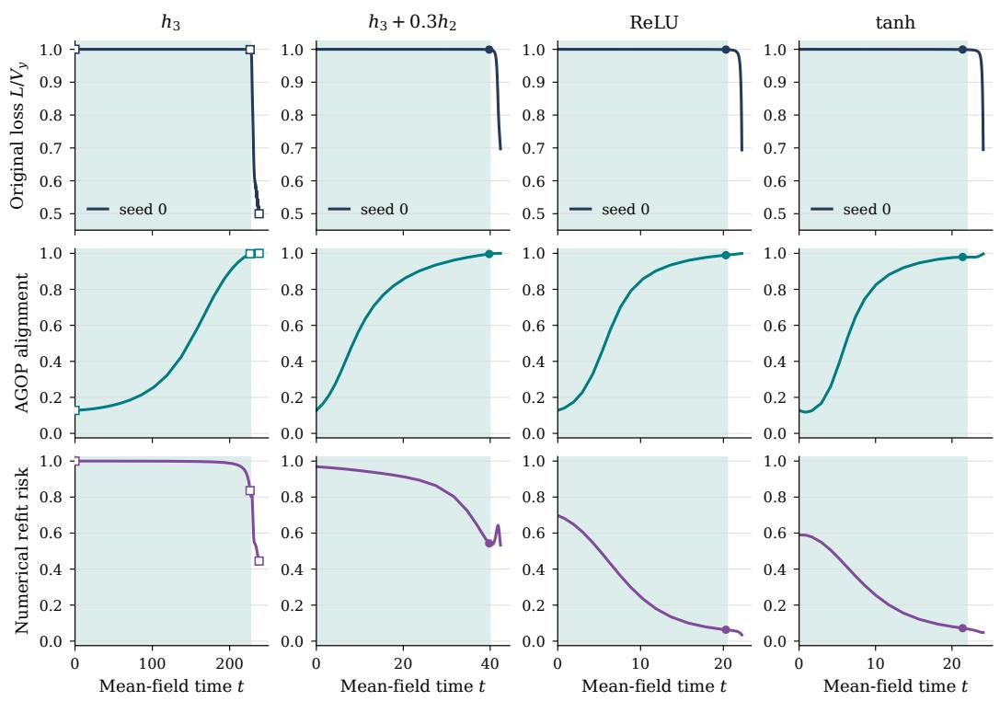  
Figure 20: Fixed representative seed 0 for the four rank-one teacher links. Rows show original normalized loss, leading AGOP alignment and numerical frozen-feature refit risk. These are adaptive Euler flow approximations, with $d = 1 6 , m = 6 4 , \epsilon = . 0 5$ . The display includes the subsequent measured loss decrease.

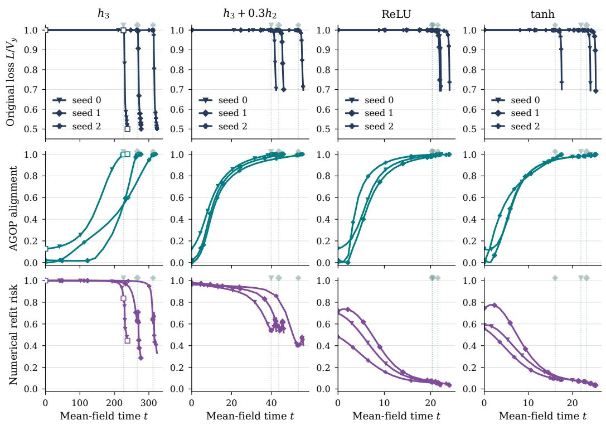

Figure 21: All three predeclared seeds for every rank-one link, using the same scales and diagnostics as Figure 20. Each curve is an individual run; no seed is selected by its outcome.  
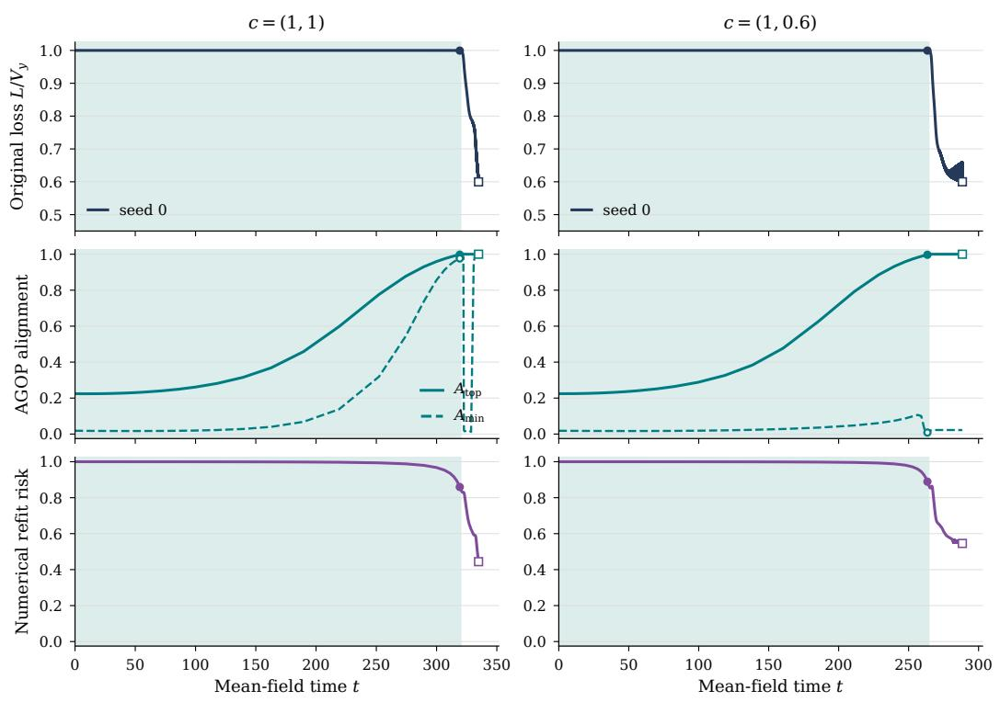  
Figure 22: Fixed seed 0 for balanced and unbalanced rank-two cubic teachers. In the alignment row, solid curves are $A _ { \mathrm { t o p } }$ and dashed curves are $A _ { \mathrm { m i n } }$ . Strong leading-direction alignment can coexist with weak recovery of the least aligned teacher direction.

Table 3: Every declared SwiGLU trajectory at the loss-selected prefix with $\delta = 1 0 ^ { - 3 }$ . P is the last diagnostic inside the prefix, so $t _ { P }$ may precede the exact last admissible update (both clocks are retained in the audit). R is the attained prediction risk of the equilibrated $1 0 ^ { - 1 2 }$ eigencutoff solve, not a certified unrestricted infimum. -- means the weakest-direction statistic duplicates $A _ { \mathrm { t o p } }$ at rank one. The reference smokes use $d = 4 , m = 6 ;$ the scientific runs use $d = 1 6 , m = 6 4 , \epsilon = \bar { . } 0 5$ except $m = 2 5 6 , \epsilon = . 1$ . The three GD controls share seed $0 ;$ † marks the stated time/step analysis horizon reached before the loss stopping target, rather than convergence; ‡ denotes the retained numerical divergence of the $\Delta t = . 3$ control. Loss values are divided by the teacher variance.  
Loss and time
<table><tr><td>Case (seed)</td><td> $t _ { P }$ </td><td> $\ell _ { 0 } \to \ell _ { P }$ </td><td> $\ell _ { f }$ </td></tr><tr><td>Smoke  $r = 2 \left( 0 \right)$ </td><td>445.6</td><td>1.000000 → 0.999418</td><td>0.8994</td></tr><tr><td>Smoke r = 1 (0)</td><td>235.4</td><td>1.000000 → 0.999461</td><td>0.8977</td></tr><tr><td> $h _ { 3 } \left( 0 \right)$ </td><td>226.4</td><td>1.000000 → 0.999039</td><td>0.4999</td></tr><tr><td> $h _ { 3 } \left( 1 \right)$ </td><td>266.2</td><td>1.000000 → 0.999403</td><td>0.4997</td></tr><tr><td> $h _ { 3 } \left( 2 \right)$ </td><td>311.6</td><td>1.000000 → 0.999401</td><td>0.5000</td></tr><tr><td> $h _ { 3 } , m = 2 5 6 \left( 0 \right)$ </td><td>55.5</td><td>1.000000 → 0.999037</td><td>0.8994</td></tr><tr><td> $h _ { 3 } + . 3 h _ { 2 } \left( 0 \right)$ </td><td>39.8</td><td>0.999999 → 0.999128</td><td>0.6972</td></tr><tr><td> $h _ { 3 } + . 3 h _ { 2 } \left( 1 \right)$ </td><td>43.1</td><td>1.000000 → 0.999493</td><td>0.7000</td></tr><tr><td> $h _ { 3 } + . 3 h _ { 2 } \left( 2 \right)$ </td><td>53.2</td><td>1.000000 → 0.999280</td><td>0.6972</td></tr><tr><td> $\mathrm { R e L U } \left( 0 \right)$ </td><td>20.3</td><td>0.999999 → 0.999130</td><td>0.6939</td></tr><tr><td>ReLU (1)</td><td>20.1</td><td>1.000001 → 0.999240</td><td>0.6932</td></tr><tr><td>ReLU (2)</td><td>21.3</td><td>0.999998 → 0.999129</td><td>0.6972</td></tr><tr><td>tanh (0)</td><td>21.4</td><td>1.000001 → 0.999313</td><td>0.6948</td></tr><tr><td>tanh (1)</td><td>22.7</td><td>1.000001 → 0.999306</td><td>0.6926</td></tr><tr><td>tanh (2)</td><td>15.7</td><td>0.999998 → 0.999397</td><td>0.6998</td></tr><tr><td> $r = 2 , \left( 1 , 1 \right) \left( 0 \right)$ </td><td>319.2</td><td>1.000000 → 0.999374</td><td>0.5997</td></tr><tr><td> $r = 2 , \left( 1 , 1 \right) \left( 1 \right)$ </td><td>377.0</td><td>1.000000 → 0.999060</td><td>0.5998</td></tr><tr><td> $r = 2 , \left( 1 , 1 \right) \left( 2 \right)$ </td><td>438.0</td><td>1.000000 → 0.999354</td><td>0.6119†</td></tr><tr><td> $r = 2 , \left( 1 , . 6 \right) \left( 0 \right)$ </td><td>263.4</td><td>1.000000 → 0.999486</td><td>0.6000</td></tr><tr><td> $r = 2 , \left( 1 , . 6 \right) \left( 1 \right)$ </td><td>310.3</td><td>1.000000 → 0.999465</td><td>0.5994</td></tr><tr><td> $r = 2 , \left( 1 , . 6 \right) \left( 2 \right)$ </td><td>363.3</td><td>1.000000 → 0.999434</td><td>0.6000</td></tr><tr><td> $\mathrm { G D } \Delta t = 0 . 3 ( 0 )$ </td><td>221.4</td><td>1.000000 → 0.999424</td><td>failed‡</td></tr><tr><td> $\mathrm { G D } \Delta t = 0 . 1 ( 0 )$ </td><td>220.9</td><td>1.000000 → 0.999282</td><td>0.6504†</td></tr><tr><td>GD  $\Delta t = 0 . 0 5 \left( 0 \right)$ </td><td>220.3</td><td>1.000000 → 0.999507</td><td>1.0001†</td></tr></table>

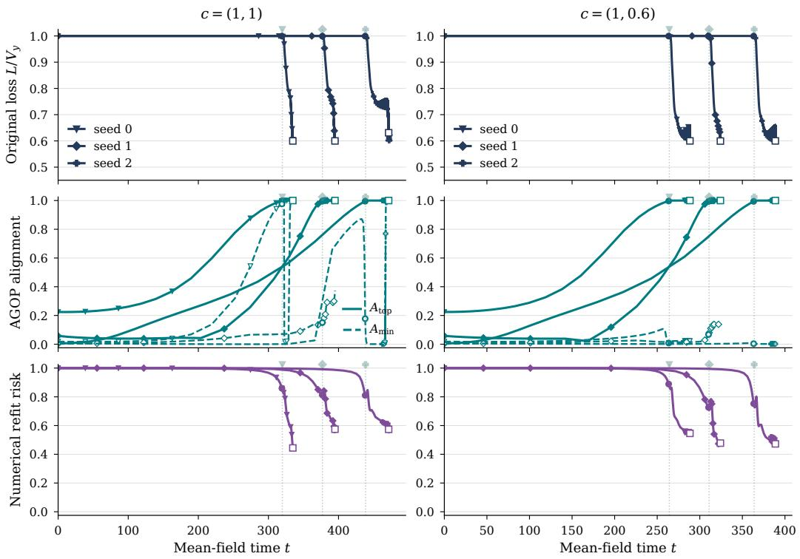  
Figure 23: All three seeds for each rank-two coefficient vector. The weakest-direction statistic is retained for every seed, including cases with poor simultaneous recovery.

Table 3 (continued).
<table><tr><td rowspan=1 colspan=6>Alignment and refit</td></tr><tr><td rowspan=1 colspan=6>Case (seed)                    $A _ { \mathrm { t o p } } ^ { 0 }  A _ { \mathrm { t o p } } ^ { P }$      $A _ { \operatorname* { m i n } } ^ { 0 } \to A _ { \operatorname* { m i n } } ^ { P }$          $R _ { 0 }  R _ { P }$ </td></tr><tr><td rowspan=1 colspan=6>Smoke r = 2 (0)           0.193 → 0.995   $0 . 1 2 1  0 . 2 5 6$   1.000 → 0.961</td></tr><tr><td rowspan=1 colspan=6>Smoke r = 1 (0)           0.113 → 0.987                      1.000 → 0.960</td></tr><tr><td rowspan=1 colspan=6> $h _ { 3 } \left( 0 \right)$                        0.128 → 0.998                       1.000 → 0.836</td></tr><tr><td rowspan=1 colspan=6> $h _ { 3 } \left( 1 \right)$                        0.022 → 0.994                      1.000 → 0.629</td></tr><tr><td rowspan=1 colspan=6> $h _ { 3 } \left( 2 \right)$                        0.000 → 0.994                      1.000 → 0.642</td></tr><tr><td rowspan=1 colspan=6> $h _ { 3 } , m = 2 5 6 \left( 0 \right)$             0.150 → 0.995                      0.818 → 0.043</td></tr><tr><td rowspan=1 colspan=6> $h _ { 3 } + . 3 h _ { 2 } \left( 0 \right)$                0.128 → 0.996                      0.969 → 0.543</td></tr><tr><td rowspan=1 colspan=6> $h _ { 3 } + . 3 h _ { 2 } ( 1 )$                0.022 → 0.992                      0.979 → 0.582</td></tr><tr><td rowspan=1 colspan=6> $h _ { 3 } + . 3 h _ { 2 } \left( 2 \right)$                0.000 → 0.993                       0.963 → 0.405</td></tr><tr><td rowspan=1 colspan=3>ReLU (0)                   0.128 → 0.990</td><td rowspan=1 colspan=3>0.698 → 0.063</td></tr><tr><td rowspan=1 colspan=2>ReLU (1)                   0.022 → 0</td><td rowspan=1 colspan=1>.979</td><td rowspan=1 colspan=2>0.721 → 0</td><td rowspan=1 colspan=1>.074</td></tr><tr><td rowspan=1 colspan=1>ReLU (2)</td><td rowspan=1 colspan=1>0.000 → 0</td><td rowspan=1 colspan=1>.997</td><td rowspan=1 colspan=1></td><td rowspan=1 colspan=1>0.483 → 0</td><td rowspan=1 colspan=1>.055</td></tr><tr><td rowspan=1 colspan=1>tanh (0)</td><td rowspan=1 colspan=1>0.128 → 0</td><td rowspan=1 colspan=1>.980</td><td rowspan=1 colspan=1></td><td rowspan=1 colspan=1>0.590 → 0</td><td rowspan=1 colspan=1>.072</td></tr><tr><td rowspan=1 colspan=1>tanh (1)</td><td rowspan=1 colspan=1>0.022 → 0</td><td rowspan=1 colspan=1>.983</td><td rowspan=1 colspan=1></td><td rowspan=1 colspan=1>0.745 → 0</td><td rowspan=1 colspan=1>.069</td></tr><tr><td rowspan=1 colspan=1>tanh (2)</td><td rowspan=1 colspan=1>0.000 → 0</td><td rowspan=1 colspan=1>.956</td><td rowspan=1 colspan=1></td><td rowspan=1 colspan=1>0.558 → 0</td><td rowspan=1 colspan=1>.098</td></tr><tr><td rowspan=1 colspan=1>r = 2, (1, 1) (0)</td><td rowspan=1 colspan=1>0.224 → 0</td><td rowspan=1 colspan=1>.997</td><td rowspan=1 colspan=1>0.018 → 0.976</td><td rowspan=1 colspan=1>1.000 → 0</td><td rowspan=1 colspan=1>.859</td></tr><tr><td rowspan=1 colspan=1>r = 2, (1, 1) (1)</td><td rowspan=1 colspan=1>0.058 → 0</td><td rowspan=1 colspan=1>.997</td><td rowspan=1 colspan=1>0.003 → 0.151</td><td rowspan=1 colspan=1>1.000 → 0</td><td rowspan=1 colspan=1>.812</td></tr><tr><td rowspan=1 colspan=1>r = 2, (1, 1) (2)</td><td rowspan=1 colspan=1>0.006 → 0</td><td rowspan=1 colspan=1>.995</td><td rowspan=1 colspan=1>0.006 → 0.178</td><td rowspan=1 colspan=1>1.000 → 0</td><td rowspan=1 colspan=1>.810</td></tr><tr><td rowspan=1 colspan=1>r = 2, (1, .6) (0)</td><td rowspan=1 colspan=1>0.224 → 0</td><td rowspan=1 colspan=1>.997</td><td rowspan=1 colspan=1>0.018 → 0.008</td><td rowspan=1 colspan=2>1.000 → 0.889</td></tr><tr><td rowspan=1 colspan=1>r = 2, (1, .6) (1)</td><td rowspan=1 colspan=1>0.058 → 0</td><td rowspan=1 colspan=1>.994</td><td rowspan=1 colspan=1>0.003 → 0.067</td><td rowspan=1 colspan=2>1.000 → 0.726</td></tr><tr><td rowspan=1 colspan=2>r = 2, (1, .6) (2)           0.006 → 0</td><td rowspan=1 colspan=1>.994</td><td rowspan=1 colspan=1>0.006 → 0.004</td><td rowspan=1 colspan=2>1.000 → 0.752</td></tr><tr><td rowspan=1 colspan=3>GD ∆t = 0.3 (0)           0.128 → 0.997</td><td rowspan=1 colspan=1></td><td rowspan=1 colspan=2>1.000 → 0.853</td></tr><tr><td rowspan=1 colspan=3>GD ∆t = 0.1 (0)           0.128 → 0.997</td><td rowspan=1 colspan=1></td><td rowspan=1 colspan=2>1.000 → 0.846</td></tr><tr><td rowspan=1 colspan=6>GD ∆t = 0.05 (0)          0.128 → 0.996                      1.000 → 0.859</td></tr></table>

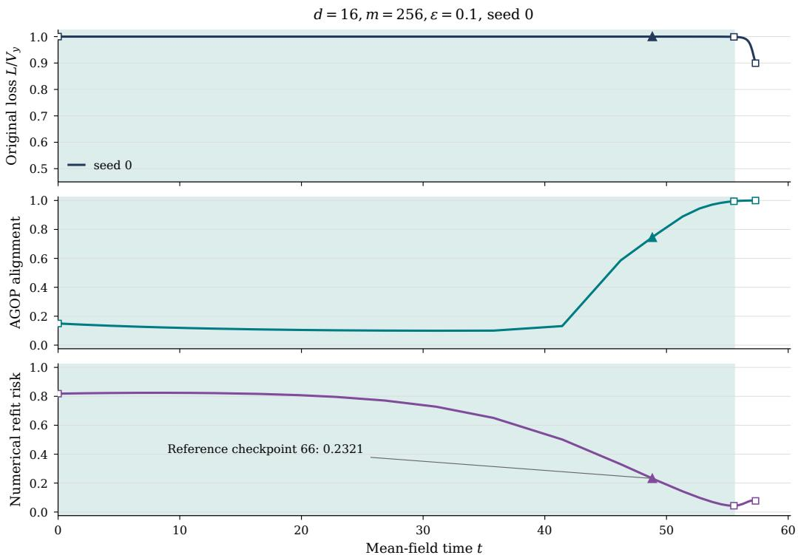  
Figure 24: Width-256 rank-one reference reproduction $( d = 1 6 , \epsilon = . 1 ,$ , seed 0). The refit panel reports attained prediction risk from the unregularized numerical head solve. The triangle is the separately validated reference checkpoint 66, whose corrected risk is .232108; it does not change the primary prefix. The width exceeds $( d + 1 ) ( d + 2 ) / 2 = 1 5 3 $ . Quadrature and spectral-cutoff checks accompany these finite-initialization values; the display does not assert an exact zero-risk fit.

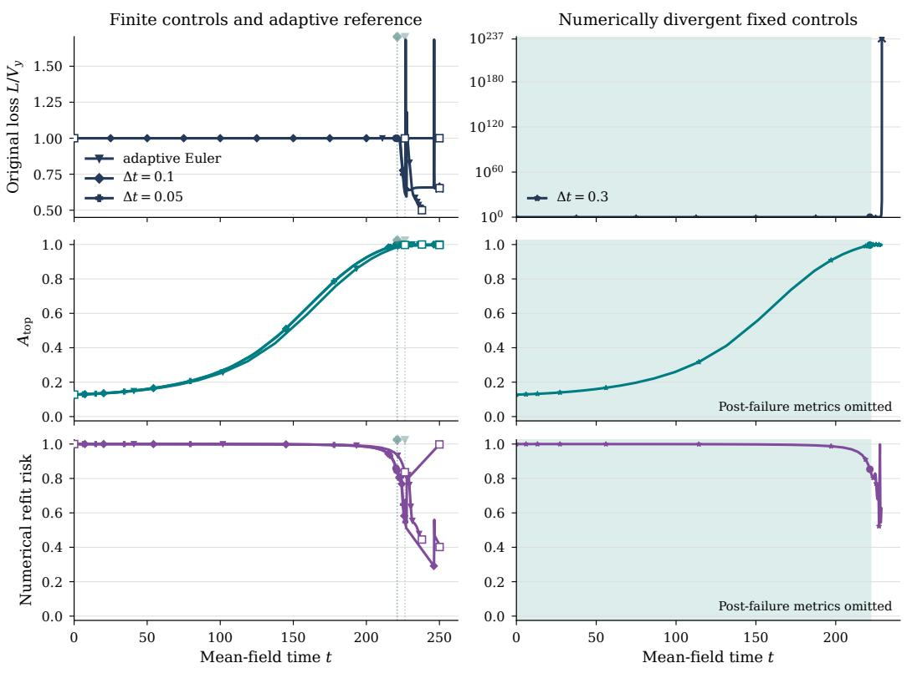  
Figure 25: Fixed mean-field steps $\Delta t = . 3 , . 1 ,$ .05 versus the adaptive flow approximation, all with the same rank-one cubic seed 0 initialization. Parameter-space learning rates are $m \Delta t .$ The xaxis is accumulated mean-field time, not optimizer step count. The right column retains numerically divergent controls on their full loss scale, while omitting alignment/refit after the reference safeguard activates; the left column displays finite controls and the adaptive reference. The nominal time horizon is 250, checked on the accumulated update clock with at most one-step overshoot (actual endpoint times are retained); any trajectory reaching that horizon is censored, and no long-time convergence is claimed. These controls do not convert measured release into a fixed-step release theorem.

Table 4: Every declared SwiGLU trajectory at the loss-selected prefix with $\delta = 1 0 ^ { - 4 }$ . P is the last diagnostic inside the prefix, so $t _ { P }$ may precede the exact last admissible update (both clocks are retained in the audit). R is the attained prediction risk of the equilibrated $1 0 ^ { - 1 2 }$ eigencutoff solve, not a certified unrestricted infimum. -- means the weakest-direction statistic duplicates $A _ { \mathrm { t o p } }$ at rank one. The reference smokes use $d = 4 , m = 6 ;$ the scientific runs use $d = 1 6 , m = 6 4 , \epsilon = \bar { . } 0 5$ except $m = 2 5 6 , \epsilon = . 1$ . The three GD controls share seed $0 ;$ † marks the stated time/step analysis horizon reached before the loss stopping target, rather than convergence; ‡ denotes the retained numerical divergence of the $\Delta t = . 3$ control. Loss values are divided by the teacher variance.  
Loss and time
<table><tr><td>Case (seed)</td><td> $t _ { P }$ </td><td> $\ell _ { 0 } \to \ell _ { P }$ </td><td> $\ell _ { f }$ </td></tr><tr><td>Smoke  $r = 2 \left( 0 \right)$ </td><td>432.5</td><td>1.000000 → 0.999930</td><td>0.8994</td></tr><tr><td>Smoke r = 1 (0)</td><td>224.9</td><td>1.000000 → 0.999938</td><td>0.8977</td></tr><tr><td> $h _ { 3 } \left( 0 \right)$ </td><td>221.5</td><td>1.000000 → 0.999945</td><td>0.4999</td></tr><tr><td> $h _ { 3 } \left( 1 \right)$ </td><td>262.4</td><td>1.000000 → 0.999927</td><td>0.4997</td></tr><tr><td> $h _ { 3 } \left( 2 \right)$ </td><td>307.6</td><td>1.000000 → 0.999930</td><td>0.5000</td></tr><tr><td> $h _ { 3 } , m = 2 5 6 \left( 0 \right)$ </td><td>52.7</td><td>1.000000 → 0.999945</td><td>0.8994</td></tr><tr><td> $h _ { 3 } + . 3 h _ { 2 } \left( 0 \right)$ </td><td>34.8</td><td>0.999999 → 0.999949</td><td>0.6972</td></tr><tr><td> $h _ { 3 } + . 3 h _ { 2 } \left( 1 \right)$ </td><td>39.3</td><td>1.000000 → 0.999941</td><td>0.7000</td></tr><tr><td> $h _ { 3 } + . 3 h _ { 2 } \left( 2 \right)$ </td><td>49.7</td><td>1.000000 → 0.999914</td><td>0.6972</td></tr><tr><td> $\mathrm { R e L U } \left( 0 \right)$ </td><td>13.7</td><td>0.999999 → 0.999941</td><td>0.6939</td></tr><tr><td>ReLU (1)</td><td>16.1</td><td>1.000001 → 0.999909</td><td>0.6932</td></tr><tr><td>ReLU (2)</td><td>13.7</td><td>0.999998 → 0.999939</td><td>0.6972</td></tr><tr><td>tanh (0)</td><td>15.7</td><td>1.000001 → 0.999917</td><td>0.6948</td></tr><tr><td>tanh (1)</td><td>16.8</td><td>1.000001 → 0.999918</td><td>0.6926</td></tr><tr><td>tanh (2)</td><td>12.2</td><td>0.999998 → 0.999927</td><td>0.6998</td></tr><tr><td> $r = 2 , \left( 1 , 1 \right) \left( 0 \right)$ </td><td>314.3</td><td>1.000000 → 0.999926</td><td>0.5997</td></tr><tr><td> $r = 2 , \left( 1 , 1 \right) \left( 1 \right)$ </td><td>370.9</td><td>1.000000 → 0.999944</td><td>0.5998</td></tr><tr><td> $r = 2 , \left( 1 , 1 \right) \left( 2 \right)$ </td><td>433.2</td><td>1.000000 → 0.999925</td><td>0.6119†</td></tr><tr><td> $r = 2 , \left( 1 , . 6 \right) \left( 0 \right)$ </td><td>259.1</td><td>1.000000 → 0.999940</td><td>0.6000</td></tr><tr><td> $r = 2 , \left( 1 , . 6 \right) \left( 1 \right)$ </td><td>305.9</td><td>1.000000 → 0.999935</td><td>0.5994</td></tr><tr><td> $r = 2 , \left( 1 , . 6 \right) \left( 2 \right)$ </td><td>358.7</td><td>1.000000 → 0.999934</td><td>0.6000</td></tr><tr><td> $\mathrm { G D } \Delta t = 0 . 3 ( 0 )$ </td><td>216.6</td><td>1.000000 → 0.999949</td><td>failed‡</td></tr><tr><td> $\mathrm { G D } \Delta t = 0 . 1 ( 0 )$ </td><td>217.2</td><td>1.000000 → 0.999923</td><td>0.6504†</td></tr><tr><td>GD  $\Delta t = 0 . 0 5 \left( 0 \right)$ </td><td>216.4</td><td>1.000000 → 0.999940</td><td>1.0001†</td></tr></table>

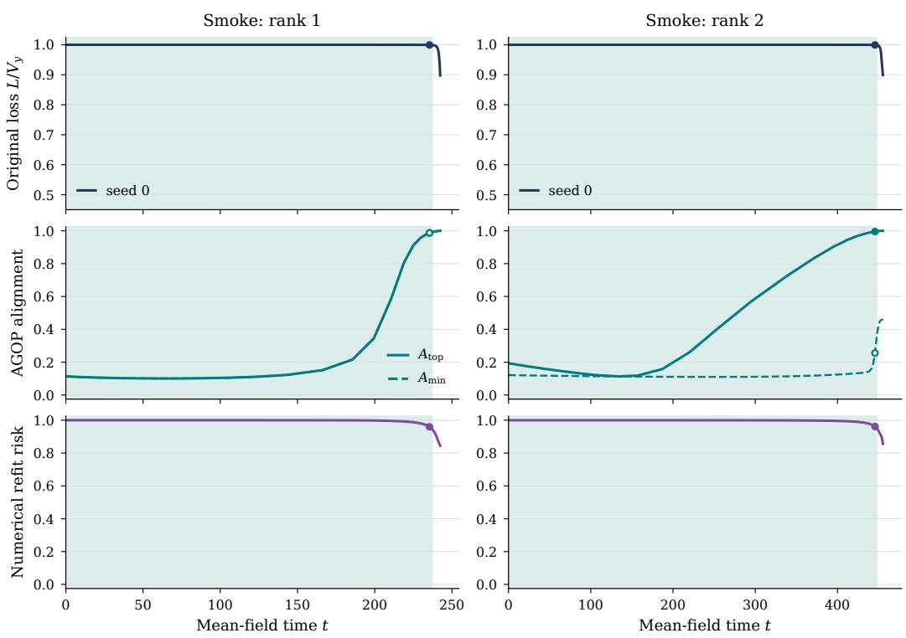  
Figure 26: The two predeclared reference smoke checks $( d = 4 , m = 6 ,$ seed 0), retained for completeness. The rank-one smoke uses $\epsilon = . 1$ and the rank-two smoke $\epsilon = . 0 5 $

Table 4 (continued).
<table><tr><td rowspan=1 colspan=6>Alignment and refit</td></tr><tr><td rowspan=1 colspan=6>Case (seed)                    $A _ { \mathrm { t o p } } ^ { 0 }  A _ { \mathrm { t o p } } ^ { P }$      $A _ { \operatorname* { m i n } } ^ { 0 } \to A _ { \operatorname* { m i n } } ^ { P }$          $R _ { 0 }  R _ { P }$ </td></tr><tr><td rowspan=1 colspan=6>Smoke r = 2 (0)           0.193 → 0.981   $0 . 1 2 1  0 . 1 3 7$   1.000 → 0.985</td></tr><tr><td rowspan=1 colspan=6>Smoke r = 1 (0)           0.113 → 0.910                       1.000 → 0.988</td></tr><tr><td rowspan=1 colspan=6> $h _ { 3 } \left( 0 \right)$                        0.128 → 0.986                       1.000 → 0.933</td></tr><tr><td rowspan=1 colspan=6> $h _ { 3 } \left( 1 \right)$                        0.022 → 0.974                       1.000 → 0.706</td></tr><tr><td rowspan=1 colspan=6> $h _ { 3 } \left( 2 \right)$                        0.000 → 0.977                       1.000 → 0.859</td></tr><tr><td rowspan=1 colspan=6> $h _ { 3 } , m = 2 5 6 \left( 0 \right)$             0.150 → 0.945                       0.818 → 0.098</td></tr><tr><td rowspan=1 colspan=6> $h _ { 3 } + . 3 h _ { 2 } \left( 0 \right)$                0.128 → 0.977                       0.969 → 0.723</td></tr><tr><td rowspan=1 colspan=6> $h _ { 3 } + . 3 h _ { 2 } ( 1 )$                0.022 → 0.975                      0.979 → 0.759</td></tr><tr><td rowspan=1 colspan=6> $h _ { 3 } + . 3 h _ { 2 } \left( 2 \right)$                0.000 → 0.980                       0.963 → 0.561</td></tr><tr><td rowspan=1 colspan=3>ReLU (0)                   0.128 → 0.936</td><td rowspan=1 colspan=3>0.698 → 0.135</td></tr><tr><td rowspan=1 colspan=2>ReLU (1)                   0.022 → 0</td><td rowspan=1 colspan=1>.944</td><td rowspan=1 colspan=3>0.721 → 0.112</td></tr><tr><td rowspan=1 colspan=1>ReLU (2)</td><td rowspan=1 colspan=1>0.000 → 0</td><td rowspan=1 colspan=1>.968</td><td rowspan=1 colspan=1></td><td rowspan=1 colspan=1>0.483 → 0</td><td rowspan=1 colspan=1>.097</td></tr><tr><td rowspan=1 colspan=1>tanh (0)</td><td rowspan=1 colspan=1>0.128 → 0</td><td rowspan=1 colspan=1>.947</td><td rowspan=1 colspan=1></td><td rowspan=1 colspan=1>0.590 → 0</td><td rowspan=1 colspan=1>.121</td></tr><tr><td rowspan=1 colspan=1>tanh (1)</td><td rowspan=1 colspan=1>0.022 → 0</td><td rowspan=1 colspan=1>.956</td><td rowspan=1 colspan=1></td><td rowspan=1 colspan=1>0.745 → 0</td><td rowspan=1 colspan=1>.112</td></tr><tr><td rowspan=1 colspan=1>tanh (2)</td><td rowspan=1 colspan=1>0.000 → 0</td><td rowspan=1 colspan=1>.864</td><td rowspan=1 colspan=1></td><td rowspan=1 colspan=1>0.558 → 0</td><td rowspan=1 colspan=1>.140</td></tr><tr><td rowspan=1 colspan=1>r = 2, (1, 1) (0)</td><td rowspan=1 colspan=1>0.224 → 0</td><td rowspan=1 colspan=1>.990</td><td rowspan=1 colspan=1>0.018 → 0.958</td><td rowspan=1 colspan=1>1.000 → 0</td><td rowspan=1 colspan=1>.916</td></tr><tr><td rowspan=1 colspan=1>r = 2, (1, 1) (1)</td><td rowspan=1 colspan=1>0.058 → 0</td><td rowspan=1 colspan=1>.976</td><td rowspan=1 colspan=1>0.003 → 0.135</td><td rowspan=1 colspan=1>1.000 → 0</td><td rowspan=1 colspan=1>.850</td></tr><tr><td rowspan=1 colspan=1>r = 2, (1, 1) (2)</td><td rowspan=1 colspan=1>0.006 → 0</td><td rowspan=1 colspan=1>.982</td><td rowspan=1 colspan=1>0.006 → 0.871</td><td rowspan=1 colspan=1>1.000 → 0</td><td rowspan=1 colspan=1>.908</td></tr><tr><td rowspan=1 colspan=1>r = 2, (1, .6) (0)</td><td rowspan=1 colspan=1>0.224 → 0</td><td rowspan=1 colspan=1>.988</td><td rowspan=1 colspan=1>0.018 → 0.100</td><td rowspan=1 colspan=2>1.000 → 0.945</td></tr><tr><td rowspan=1 colspan=1>r = 2, (1, .6) (1)</td><td rowspan=1 colspan=1>0.058 → 0</td><td rowspan=1 colspan=1>.975</td><td rowspan=1 colspan=1>0.003 → 0.029</td><td rowspan=1 colspan=1>1.000 → 0</td><td rowspan=1 colspan=1>.782</td></tr><tr><td rowspan=1 colspan=2>r = 2, (1, .6) (2)           0.006 → 0</td><td rowspan=1 colspan=1>.979</td><td rowspan=1 colspan=1>0.006 → 0.008</td><td rowspan=1 colspan=1>1.000 → 0</td><td rowspan=1 colspan=1>.904</td></tr><tr><td rowspan=1 colspan=2>GD ∆t = 0.3 (0)           0.128 → 0</td><td rowspan=1 colspan=1>.985</td><td rowspan=1 colspan=1></td><td rowspan=1 colspan=1>1.000 → 0</td><td rowspan=1 colspan=1>.936</td></tr><tr><td rowspan=1 colspan=3>GD ∆t = 0.1 (0)           0.128 → 0.988</td><td rowspan=1 colspan=1></td><td rowspan=1 colspan=2>1.000 → 0.923</td></tr><tr><td rowspan=1 colspan=6>GD ∆t = 0.05 (0)          0.128 → 0.987                      1.000 → 0.931</td></tr></table>

Table 5: Terminal observations under the stopping rules in Section U.6, for all 24 conditions. “Loss $\mathrm { s t o p } ^ { \mathrm { , , } }$ means the prescribed $\ell _ { \mathrm { s t o p } }$ was reached; differences below the target reflect update-grid undershoot, not comparable unconstrained final losses. $t _ { f } , \ell _ { f }$ use the complete update history inside the stated analysis budget; D is the latest saved diagnostic within that budget. For balanced rank-two seed $2 , t _ { f } \overset { \cdot } { = } 4 7 1 . 9$ is update 3000, whereas the last diagnostic is update 2928 at $t _ { D } = 4 7 1 . 5 ;$ the raw 60-update tail remains archived and dotted in the plot. Failed-control post-safeguard metrics are omitted. Refit risks are numerical attained risks, subject to the quadrature limitations in the text; in particular the fixed .1 endpoint risk changes by .01133 on doubling quadrature.  
Loss, time, and status
<table><tr><td>Case (seed)</td><td> $t _ { f }$ </td><td> $\ell _ { f }$ </td><td>Status</td></tr><tr><td> $\mathbf { S m o k e } \ r = 2 \left( 0 \right)$ </td><td>455.2</td><td>0.8994</td><td>loss stop</td></tr><tr><td> $\mathbf { S m o k e } \ r = 1 \left( 0 \right)$ </td><td>242.4</td><td>0.8977</td><td>loss stop</td></tr><tr><td> $h _ { 3 } \left( 0 \right)$ </td><td>238.0</td><td>0.4999</td><td>loss stop</td></tr><tr><td> $h _ { 3 } \left( 1 \right)$ </td><td>277.7</td><td>0.4997</td><td>loss stop</td></tr><tr><td> $h _ { 3 } \left( 2 \right)$ </td><td>323.8</td><td>0.5000</td><td>loss stop</td></tr><tr><td> $h _ { 3 } , m = 2 5 6 \left( 0 \right)$ </td><td>57.3</td><td>0.8994</td><td>loss stop</td></tr><tr><td> $h _ { 3 } + . 3 h _ { 2 } \left( 0 \right)$ </td><td>42.4</td><td>0.6972</td><td>loss stop</td></tr><tr><td> $h _ { 3 } + . 3 h _ { 2 } \left( 1 \right)$ </td><td>46.2</td><td>0.7000</td><td>loss stop</td></tr><tr><td> $h _ { 3 } + . 3 h _ { 2 } \left( 2 \right)$ </td><td>56.0</td><td>0.6972</td><td>loss stop</td></tr><tr><td> $\mathrm { R e L U \thinspace ( 0 ) }$ </td><td>22.2</td><td>0.6939</td><td>loss stop</td></tr><tr><td>ReLU (1)</td><td>22.0</td><td>0.6932</td><td>loss stop</td></tr><tr><td>ReLU (2)</td><td>24.1</td><td>0.6972</td><td>loss stop</td></tr><tr><td>tanh (0)</td><td>24.1</td><td>0.6948</td><td>loss stop</td></tr><tr><td>tanh (1)</td><td>25.3</td><td>0.6926</td><td>loss stop</td></tr><tr><td>tanh (2)</td><td>17.6</td><td>0.6998</td><td>loss stop</td></tr><tr><td> $r = 2 , \left( 1 , 1 \right) \left( 0 \right)$ </td><td>334.8</td><td>0.5997</td><td>loss stop</td></tr><tr><td> $r = 2 , \left( 1 , 1 \right) \left( 1 \right)$ </td><td>394.9</td><td>0.5998</td><td>loss stop</td></tr><tr><td> $r = 2 , \left( 1 , 1 \right) \left( 2 \right)$ </td><td>471.9</td><td>0.6119</td><td>censored</td></tr><tr><td> $r = 2 , \left( 1 , . 6 \right) \left( 0 \right)$ </td><td>288.4</td><td>0.6000</td><td>loss stop</td></tr><tr><td> $r = 2 , \left( 1 , . 6 \right) \left( 1 \right)$ </td><td>324.2</td><td>0.5994</td><td>loss stop</td></tr><tr><td> $r = 2 , \left( 1 , . 6 \right) \left( 2 \right)$ </td><td>388.7</td><td>0.6000</td><td>loss stop</td></tr><tr><td> $\mathrm { G D } \Delta t = 0 . 3 ( 0 )$ </td><td>228.9</td><td> $6 . 1 1 \times 1 0 ^ { 2 3 7 }$ </td><td>failure</td></tr><tr><td> $\mathrm { G D } \Delta t = 0 . 1 ( 0 )$ </td><td>250.1</td><td>0.6504</td><td>censored</td></tr><tr><td> $\mathrm { G D } \Delta t = 0 . 0 5 ( 0 )$ </td><td>250.0</td><td>1.0001</td><td>censored</td></tr></table>

Table 5 (continued).  
Final feature diagnostics
<table><tr><td>Case (seed)</td><td> $t _ { D }$ </td><td> $A _ { \mathrm { t o p } } ^ { D }$ </td><td> $A _ { \operatorname* { m i n } } ^ { D }$ </td><td> $R _ { D }$ </td></tr><tr><td>Smoke  $r = 2 \left( 0 \right)$ </td><td>455.2</td><td>1.000</td><td> $0 . 4 6 3$ </td><td>0.856</td></tr><tr><td>Smoke r = 1 (0)</td><td>242.4</td><td>1.000</td><td></td><td>0.845</td></tr><tr><td> $h _ { 3 } \left( 0 \right)$ </td><td>238.0</td><td>1.000</td><td></td><td>0.445</td></tr><tr><td> $h _ { 3 } \left( 1 \right)$ </td><td>277.7</td><td>1.000</td><td></td><td>0.291</td></tr><tr><td> $h _ { 3 } \left( 2 \right)$ </td><td>323.8</td><td>1.000</td><td></td><td>0.332</td></tr><tr><td> $h _ { 3 } , m = 2 5 6 \left( 0 \right)$ </td><td>57.3</td><td>1.000</td><td></td><td>0.077</td></tr><tr><td> $h _ { 3 } + . 3 h _ { 2 } \left( 0 \right)$ </td><td>42.4</td><td>1.000</td><td></td><td>0.533</td></tr><tr><td> $h _ { 3 } + . 3 h _ { 2 } \left( 1 \right)$ </td><td>46.2</td><td>1.000</td><td></td><td>0.521</td></tr><tr><td> $h _ { 3 } + . 3 h _ { 2 } \left( 2 \right)$ </td><td>56.0</td><td>1.000</td><td></td><td>0.404</td></tr><tr><td>ReLU (0)</td><td>22.2</td><td>0.999</td><td></td><td>0.035</td></tr><tr><td>ReLU (1)</td><td>22.0</td><td>0.999</td><td></td><td>0.043</td></tr><tr><td>ReLU (2)</td><td>24.1</td><td>0.999</td><td></td><td>0.033</td></tr><tr><td>tanh (0)</td><td>24.1</td><td>0.997</td><td>一</td><td>0.048</td></tr><tr><td>tanh (1)</td><td>25.3</td><td>0.999</td><td></td><td>0.036</td></tr><tr><td>tanh (2)</td><td>17.6</td><td>0.998</td><td></td><td>0.083</td></tr><tr><td> $r = 2 , \left( 1 , 1 \right) \left( 0 \right)$ </td><td>334.8</td><td>1.000</td><td>1.000</td><td>0.444</td></tr><tr><td> $r = 2 , \left( 1 , 1 \right) \left( 1 \right)$ </td><td>394.9</td><td>1.000</td><td>0.373</td><td>0.574</td></tr><tr><td> $r = 2 , \left( 1 , 1 \right) \left( 2 \right)$ </td><td>471.5</td><td>1.000</td><td>0.999</td><td>0.574</td></tr><tr><td> $r = 2 , \left( 1 , . 6 \right) \left( 0 \right)$ </td><td>288.4</td><td>1.000</td><td>0.022</td><td>0.546</td></tr><tr><td> $r = 2 , \left( 1 , . 6 \right) \left( 1 \right)$ </td><td>324.2</td><td>1.000</td><td>0.138</td><td>0.478</td></tr><tr><td> $r = 2 , \left( 1 , . 6 \right) \left( 2 \right)$ </td><td>388.7</td><td>1.000</td><td>0.002</td><td>0.473</td></tr><tr><td> $\mathrm { G D } \Delta t = 0 . { \dot { 3 } } ( 0 )$ </td><td></td><td></td><td></td><td></td></tr><tr><td>GD  $\Delta t = 0 . 1 \left( 0 \right)$ </td><td>250.1</td><td>1.000</td><td>一</td><td>0.413</td></tr><tr><td>GD  $\Delta t = 0 . 0 5 \left( 0 \right)$ </td><td>250.0</td><td>0.997</td><td>一</td><td>0.998</td></tr></table>

## U.8 TWENTY-SEED RANK-ONE EXTENSION

We use d for input dimension, m for student width, κ for the output scale, ε for initialization scale, n for the optimizer update index, and t for accumulated mean-field time. The diagnostics are normalized trained loss $\dot { \ell } _ { n } = L ( \theta _ { n } ) / \operatorname { V a r } ( y )$ , leading alignment $A _ { \mathrm { t o p } } = \| U ^ { \top } e _ { 1 } ( M ) \| ^ { 2 }$ , and normalized numerical refit MSE R as defined in Section U.6. Here M is the population AGOP, U is the rank-one teacher basis, and $e _ { 1 } ( M )$ is its computed unit leading eigenvector. In the tables, $\Delta A = \Delta A _ { \mathrm { t o p } } = A _ { \mathrm { t o p } } ( P ) - A _ { \mathrm { t o p } } ( 0 )$ and $\Delta R = { \bf \bar { \Psi } } R ( 0 ) - R ( P )$ , where $P$ is the last saved diagnostic inside the primary loss prefix. The teacher polynomials are $h _ { 2 } ( s ) = ( s ^ { 2 } - 1 ) / \sqrt { 2 }$ and $h _ { 3 } ( s ) = ( s ^ { 3 } - 3 s ) / \sqrt { 6 }$

The four rank-one teacher configurations are extended from seeds 0–2 to seeds 0–19, giving eighty outcomes. The original twelve runs are retained exactly, and sixty-eight new runs use the same initial distribution, population force, adaptive step rule, quadrature and stopping criteria as Section U.6. The other twelve smoke, rank-two, wide-student and fixed-step control conditions are unchanged. Thus the combined study has ninety-two distinct conditions. The new rank-one initializations are a declared consecutive extension, with no selection based on alignment, loss or plot appearance. Fiftynine trajectories were completed locally and twenty-one on a CPU server, with NumPy 1.24.3 and SciPy 1.10.1 in both environments and unchanged numerical kernels. The final termination counts are 80 loss-threshold stops.

For each run, $d = 1 6 , m = 6 4 , \kappa = 1$ and $\varepsilon = . 0 5$ . The relative-change step cap is .01 and the maximum mean-field step is 50. The cubic stops at normalized loss .5, the other links at .7, subject to ceilings of 20,000 updates and mean-field time $1 0 ^ { 6 }$ . These are adaptive Euler flow approximations, with the output intercept profiled exactly. They do not instantiate the fixed-step theorem at a quantified practical initialization scale.

Uniform displays and distinct meanings. The colors, row order, typography and seed-summary convention match Figure 1. Loss and refit divide by teacher variance, the refit coefficients are unrestricted, and rank one makes the leading and weakest-direction alignments identical. The teacherplane snapping and two-axis angle diagnostics in the ReLU figure do not apply to this rank-one comparison.

Each loss curve includes every recorded update. AGOP and corrected refit diagnostics use their original saved states; linear interpolation onto integer update indices is used only for drawing seed means and pointwise empirical 10th–90th percentiles. Such interpolation adds no observations. Means and bands stop at the earliest terminal update among all twenty seeds for that teacher. Individual recorded tails remain visible beyond that common support. There is no endpoint holding, extrapolation, survivor-only averaging or time alignment of individual trajectories. The display coordinate is log( $1 + n / 1 0 0 )$ with actual update ticks; adaptive update index is a numerical-work clock, not elapsed flow time.

Numerical checks and endpoint accounting. The corrected prediction risk uses the same equilibrated Gram solve at relative cutoff $1 0 ^ { - 1 2 }$ , with sensitivity checks at $1 0 ^ { - 8 } , 1 0 ^ { - 1 0 }$ and $1 0 ^ { - 1 4 }$ . Every new seed also doubles all quadrature orders at initialization, its primary-prefix diagnostic and its final state. These are checks of stored states, not retraining or certified integration-error bounds. Across the 207 resolved comparisons, the largest absolute changes in normalized loss, leading alignment and normalized refit risk are $1 . 0 9 \times \mathrm { { 1 0 ^ { - 6 } } , 3 . 8 5 \times 1 0 ^ { - 8 } }$ and $2 . 8 8 \times 1 0 ^ { - 3 }$ , respectively; 0 comparisons remain unresolved. Nonfinite or negative prediction risks, nonpositive Gram spectra, and numerically unresolved AGOP leading directions are flagged. The AGOP flag uses relative leading gap $> \dot { 1 } 0 ^ { - 8 }$ and smallest-eigenvalue ratio $\geq - 1 0 ^ { - 8 }$ ; it is a numerical screening rule, not an error certificate. An unresolved seed suppresses the corresponding ensemble statistic instead of being dropped. The recorded unresolved-diagnostic count is 0.

For each seed, the primary plateau is the full-update initial prefix $| \ell _ { n } - \ell _ { 0 } | \leq 1 0 ^ { - 3 }$ . Endpoint gains use the last saved diagnostic inside that prefix; they are never evaluated at an interpolated threshold crossing. Table 6 summarizes these gains. Table 7 reports every seed’s endpoint gains. Later loss changes are measured outcomes, not conclusions of a trained-loss release theorem. This unrestricted numerical readout is distinct from the bounded-refit comparison in the ReLU theorem.

Table 6: Twenty-seed rank-one outcomes. Alignment and refit gains are median [minimum, maximum] at the final saved in-prefix diagnostic, using all twenty values unless a parenthesized resolved count n is shown.
<table><tr><td>Teacher</td><td> $\Delta A _ { \mathrm { t o p } }$ </td><td> $\Delta R$ </td></tr><tr><td> $h _ { 3 }$ </td><td>0.962 [0.745, 0.996]</td><td>0.222 [0.146, 0.491]</td></tr><tr><td> $h _ { 3 } + . 3 h _ { 2 }$ </td><td>0.956 [0.742, 0.996]</td><td>0.475 [0.320, 0.672]</td></tr><tr><td> $\mathrm { R e L U }$ </td><td>0.927 [0.719, 0.997]</td><td>0.519 [0.414, 0.683]</td></tr><tr><td>tanh</td><td>0.942 [0.709, 0.983]</td><td>0.476 [0.299, 0.676]</td></tr></table>

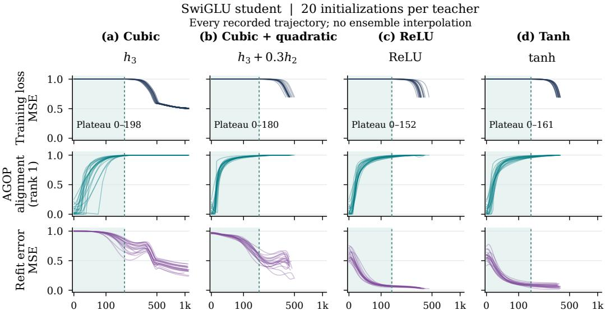  
Individual seeds All-seed loss plateau Censored / failed endpoint  
Refit shading spans numerical cutoffs; it is not a confidence interval.

Figure 27: All twenty recorded trajectories per rank-one teacher. Individual curves retain their own saved grids and terminal times. The three rows and numerical meanings are those of Figure 3; all outcomes remain visible.

Table 7: Every seed’s endpoint changes in leading AGOP alignment and normalized numerical refit MSE. Positive $\Delta R$ means lower error. Values are rounded numerical diagnostics, not error certificates; -- indicates an unresolved value.
<table><tr><td rowspan="2">Seed</td><td colspan="2"> $h _ { 3 }$ </td><td rowspan="2"> $h _ { 3 }$  ∆A</td><td rowspan="2">+ .3h2 ΔR</td><td colspan="2">ReLU</td><td colspan="2">tanh</td></tr><tr><td> $\Delta A$ </td><td>∆R</td><td>∆A</td><td>∆R</td><td>∆A</td><td>∆R</td></tr><tr><td>0</td><td>0.870</td><td>0.164</td><td>0.869</td><td>0.426</td><td>0.862</td><td>0.635</td><td>0.852</td><td>0.518</td></tr><tr><td>1</td><td>0.972</td><td>0.371</td><td>0.969</td><td>0.397</td><td>0.957</td><td>0.647</td><td>0.961</td><td>0.676</td></tr><tr><td>2</td><td>0.994</td><td>0.358</td><td>0.993</td><td>0.558</td><td>0.997</td><td>0.428</td><td>0.956</td><td>0.460</td></tr><tr><td>3</td><td>0.981</td><td>0.235</td><td>0.979</td><td>0.483</td><td>0.969</td><td>0.551</td><td>0.955</td><td>0.459</td></tr><tr><td>4</td><td>0.745</td><td>0.239</td><td>0.742</td><td>0.360</td><td>0.719</td><td>0.486</td><td>0.709</td><td>0.438</td></tr><tr><td>5</td><td>0.899</td><td>0.146</td><td>0.894</td><td>0.459</td><td>0.882</td><td>0.619</td><td>0.869</td><td>0.539</td></tr><tr><td>6</td><td>0.786</td><td>0.208</td><td>0.783</td><td>0.506</td><td>0.766</td><td>0.514</td><td>0.770</td><td>0.457</td></tr><tr><td>7</td><td>0.988</td><td>0.150</td><td>0.979</td><td>0.575</td><td>0.973</td><td>0.447</td><td>0.978</td><td>0.428</td></tr><tr><td>8</td><td>0.996</td><td>0.349</td><td>0.996</td><td>0.557</td><td>0.984</td><td>0.442</td><td>0.983</td><td>0.510</td></tr><tr><td>9</td><td>0.963</td><td>0.312</td><td>0.956</td><td>0.466</td><td>0.927</td><td>0.534</td><td>0.926</td><td>0.470</td></tr><tr><td>10</td><td>0.979</td><td>0.181</td><td>0.977</td><td>0.501</td><td>0.973</td><td>0.588</td><td>0.969</td><td>0.564</td></tr><tr><td>11</td><td>0.978</td><td>0.288</td><td>0.980</td><td>0.505</td><td>0.975</td><td>0.637</td><td>0.972</td><td>0.623</td></tr><tr><td>12</td><td>0.995</td><td>0.203</td><td>0.992</td><td>0.499</td><td>0.977</td><td>0.525</td><td>0.972</td><td>0.498</td></tr><tr><td>13</td><td>0.993</td><td>0.186</td><td>0.992</td><td>0.320</td><td>0.983</td><td>0.572</td><td>0.967</td><td>0.504</td></tr><tr><td>14</td><td>0.873</td><td>0.491</td><td>0.873</td><td>0.468</td><td>0.871</td><td>0.683</td><td>0.836</td><td>0.633</td></tr><tr><td>15</td><td>0.962</td><td>0.156</td><td>0.956</td><td>0.449</td><td>0.926</td><td>0.470</td><td>0.951</td><td>0.483</td></tr><tr><td>16</td><td>0.924</td><td>0.264</td><td>0.922</td><td>0.438</td><td>0.907</td><td>0.464</td><td>0.892</td><td>0.457</td></tr><tr><td>17</td><td>0.941</td><td>0.367</td><td>0.935</td><td>0.539</td><td>0.913</td><td>0.472</td><td>0.933</td><td>0.420</td></tr><tr><td>18</td><td>0.826</td><td>0.175</td><td>0.830</td><td>0.672</td><td>0.823</td><td>0.414</td><td>0.793</td><td>0.299</td></tr><tr><td>19</td><td>0.896</td><td>0.174</td><td>0.895</td><td>0.325</td><td>0.882</td><td>0.466</td><td>0.878</td><td>0.451</td></tr></table>