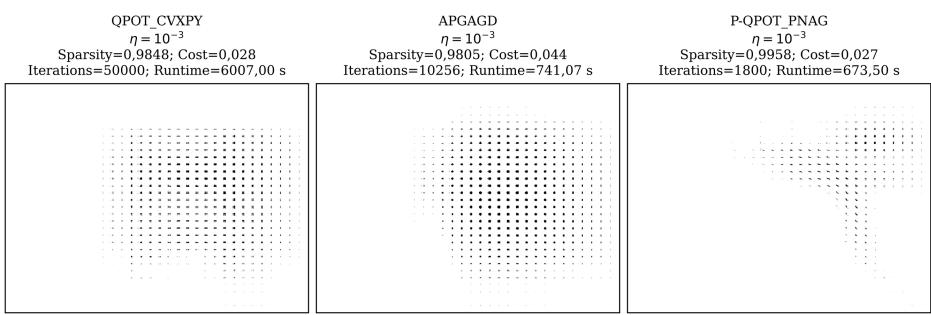
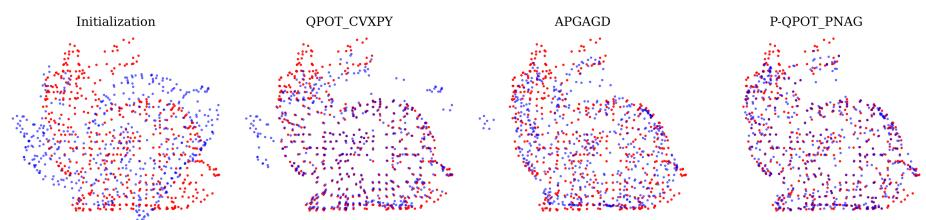
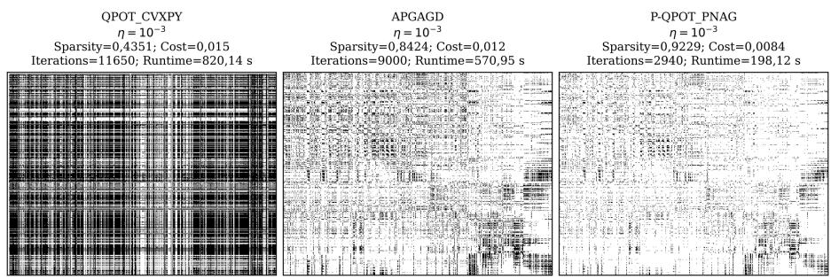
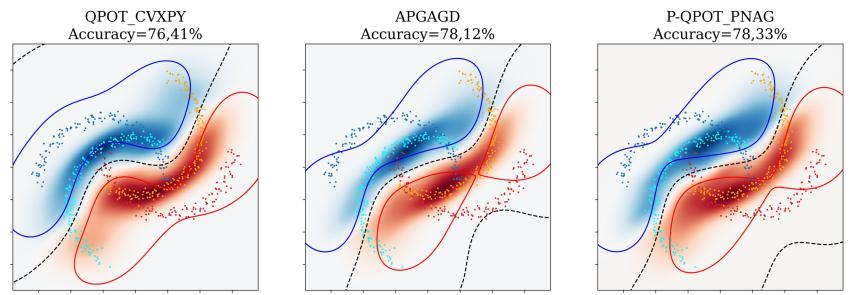
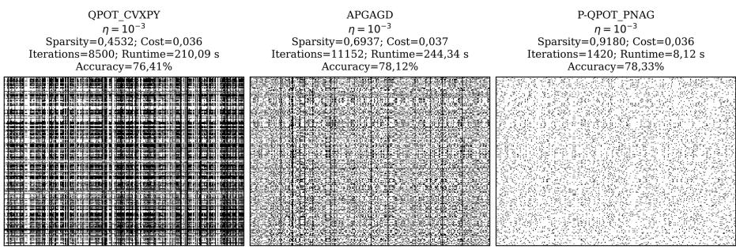
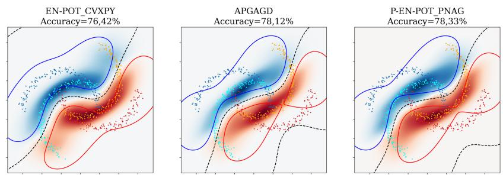
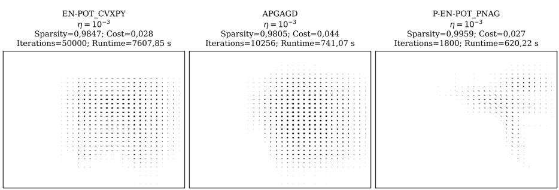
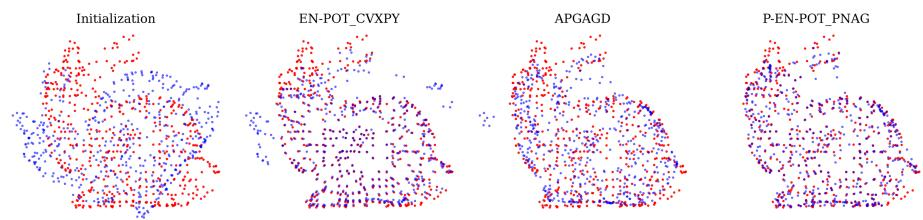
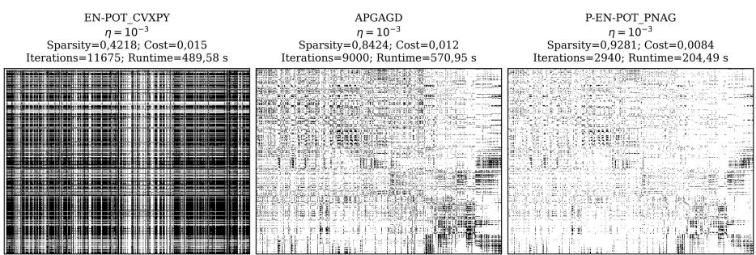
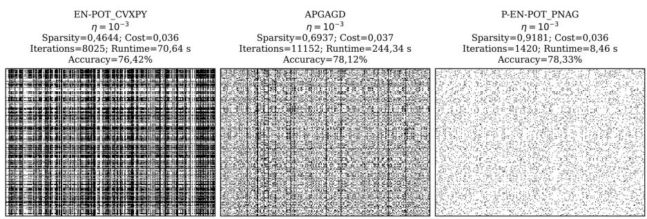

# Accelerated Algorithm for Sparse Regularized Partial Optimal Transport

Khoa Nguyen · Dung T. Nguyen · Thong Huynh · Hoang-Hiep Nguyen-Mau · Anh Nguyen · Minh Ngoc Dinh · Juho Kannala

Received: date / Accepted: date

Abstract Partial Optimal Transport (POT) extends the classical optimal transport problem by relaxing the strict mass conservation constraint, enabling its use in a wide range of real-world applications. In many of these settings, sparse transport plans are preferred for their interpretability and computational benefits. While smooth and strongly convex regularizers—such as quadratic or elastic net—have been vastly used in various machine learning applications to induce sparsity and accelerate computation, they have received less algorithmic attention compared to entropic approaches for computational POT. In this paper, we propose a new optimization framework that leverages these regularizers through a penalty-based reformulation, enabling eficient gradient-based updates while preserving the structure of the original problem. Our method accommodates a broad class of regularizers that promote structured and sparse transport plans. Building on this formulation, we design an accelerated first-order algorithm that alternates between smooth updates and simple projection steps. Through empirical benchmarks on color transfer, do-

main adaptation, and point cloud registration, our approach consistently outperforms established baselines—achieving lower transport cost, higher sparsity, and faster convergence—making it a practical and scalable solution for modern transport problems.

Keywords Partial Optimal Transport · Exterior Penalty Methods · Accelerated Gradient Methods

Mathematics Subject Classification (2020) 49Q22 · 90C25 · 65K05

## 1 Introduction

Optimal Transport (OT) [16,47] computes a minimum-cost coupling between two mass distributions. Moreover, it quantifies similarity between distributions. These properties have made OT widely applicable in modern machine learning [1,38]. However, its high computational complexity remains a major barrier to broader adoption. In addition, the classical OT formulation enforces a strict mass-balance constraint [33,47], requiring the source and target distributions to have equal total mass. Since this assumption is rarely satisfied in practice, it limits the applicability of OT in many real-world scenarios.

Partial Optimal Transport (POT) [7] addresses this limitation by allowing only a prescribed amount of mass to be transported between two possibly unbalanced distributions. This added flexibility makes POT well-suited to applications involving outliers, missing content, or mismatched sample sizes [7]. As a result, POT has been used in various machine learning tasks, including color transfer [35,37], domain adaptation [39], and dictionary learning [40].

Despite its modeling advantages, POT remains computationally challenging. Compared to standard OT, the feasible set in POT involves more complex structural constraints, which makes the design of scalable solvers more dificult [24]. To address this, several works [9, 24, 4] introduce entropic regularization along with acceleration methods. While these techniques improve runtime, they typically yield dense transport plans [5,44,12] due to entropic regularization, which are undesirable in applications that favor sparsity, such as color transfer [35], domain adaptation [8], and ecological inference [22]. Another line of work reformulates POT as a standard OT problem by augmenting the marginals. For instance, [7] converts inequality constraints into equalities using dummy variables, embedding POT into a higher-dimensional OT problem. This increases both the problem size and the maximum value in the cost matrix, leading to greater memory consumption and computational cost. In particular, since entropic OT solvers depend explicitly on cost magnitudes [11,20,14], such reformulations from POT to OT pose scalability issues. To address eficiency issues, [24] adapted the APDAGD algorithm with better complexity and practical performance. However, since the framework strictly relies on entropic regularization, it produces dense transport plans, which limit its applicability in scenarios that require sparsity.

These limitations motivate the use of smooth and strongly convex regularizers that preserve tractability while promoting sparse transport structures. Quadratic regularization is particularly relevant in this context. For balanced OT, [51] quantitatively characterized the sparsity-inducing properties of quadratic regularization. Extending this idea to the partial transport setting, Tran et al. [44] studied Quadratic-regularized Partial Optimal Transport (QPOT) and empirically benchmarked its sparsity against entropically regularized POT across synthetic datasets and applications such as color transfer and domain adaptation. However, their work focuses on establishing and evaluating the QPOT formulation using general-purpose convex optimization solvers, rather than developing a dedicated scalable optimization algorithm. More broadly, to the best of our knowledge, eficient first-order methods for this class of regularized POT problems remain largely unexplored.

To bridge this computational gap, we propose a penalty-based optimization framework for Partial Optimal Transport with smooth and strongly convex regularization. Rather than introducing another regularized POT formulation alone, we focus on enabling its eficient optimization. The proposed framework includes QPOT as a special case while supporting a broader class of smooth and strongly convex regularizers, including quadratic and elastic-net-type regularization. Building on this formulation, we develop a dedicated accelerated first-order solver that combines gradient-based optimization of the penalized objective with simple projections onto the remaining constraints. This provides a scalable approach for computing sparse regularized POT solutions without relying on general-purpose convex optimization solvers.

Contributions: We summarize our main contributions as follows:

– We reformulate Regularized Partial Optimal Transport (RPOT) with smooth and strongly convex regularizers—including quadratic and elastic net regularization—into a penalized optimization problem by introducing an exterior quadratic penalty on the marginal constraints. This removes the need for strict feasibility during intermediate optimization while preserving the structure of the original problem.

– We prove that the solution to the penalized RPOT formulation is equivalent to that of the original problem. Specifically, with properly chosen penalty parameters, the solution to the penalized problem approximates the RPOT solution up to an arbitrarily small error. We also provide explicit bounds on the objective gap and constraint violations, which help facilitate algorithmic development for the POT problem.

– By leveraging the smoothness and strong convexity of the penalized objective, we design an accelerated first-order algorithm based on Proximal Nesterov’s method, combined with the rounding strategy from [24] to restore exact feasibility. We show that the algorithm achieves an ε-approximate solution to the original POT problem within $\begin{array} { r } { \mathcal { O } \Big ( \frac { n ^ { 7 / 8 } } { \varepsilon } \ln \big ( \frac { n } { \varepsilon } \big ) \Big ) } \end{array}$ iterations with $\mathcal { O } ( n ^ { 2 } \log ( n ) )$ per-iteration cost, while maintaining sparsity and scalability.   
– We validate our framework on various applications: color transfer, domain adaptation, and partial point cloud registration against the Splitting Conic

Solver (SCS), and APDAGD solver from [24]. Experimental results demonstrate competitive transport cost, high sparsity, and strong feasibility, with favorable performance compared to existing scalable POT solvers.

## 2 Preliminaries

## 2.1 Optimal Transport and Partial Optimal Transport

Before introducing Optimal Transport and its variants, we first present some notation.

Let $\mathbb { R } _ { + } ^ { n } : = \left\{ \mathbf { x } \in \mathbb { R } ^ { n } : x _ { i } \geq 0 \ \forall i \right\}$ denote the set of nonnegative vectors, and $\mathbb { R } _ { + } ^ { n \times n ^ { * } } \colon = \{ \dot { \mathbf { X } } \in \mathbb { R } ^ { n \times n } : X _ { i j } \geq 0 \ \forall i , j \}$ be the set of nonnegative matrices. Furthermore, for a matrix $\mathbf { X } \in \mathbb { R } ^ { n \times n }$ , we denote its following matrix operation and norm as:

ℓ2 norm of matrix X: $\begin{array} { r } { \| { \bf X } \| _ { 2 } = \left( \sum _ { i = 1 } ^ { n } \sum _ { j = 1 } ^ { n } X _ { i j } ^ { 2 } \right) ^ { 1 / 2 } } \end{array}$

– infinity norm of matrix X: $\begin{array} { r } { \| \mathbf { X } \| _ { \infty } = \operatorname* { m a x } _ { 1 \leq i , j \leq n } \left| X _ { i j } \right| } \end{array}$

– inner product of two matrices, given $\mathbf { A } , \mathbf { B } \in \mathbb { R } ^ { n \times n } \colon$

$$
\langle \mathbf { A } , \mathbf { B } \rangle = \sum _ { i = 1 } ^ { n } \sum _ { j = 1 } ^ { n } A _ { i j } B _ { i j } = \operatorname { t r } ( \mathbf { A } ^ { \top } \mathbf { B } )
$$

This notation will be used throughout the remainder of this section.

Optimal Transport (OT): For two probability distributions with nonnegative and equal total mass $\mathbf { r } \in \mathbb { R } _ { + } ^ { n }$ and $\mathbf { c } \in \mathbb { R } _ { + } ^ { n }$ , we consider the problem of transporting mass between them at minimum cost. Let C be a given cost matrix, and let X denote a transportation plan. Following [16], the OT problem can be formulated as a linear program:

$$
\begin{array} { r l } & { \mathbf { O } \mathbf { T } ( \mathbf { r } , \mathbf { c } ) = \underset { \mathbf { X } \in \mathcal { M } ( \mathbf { r } , \mathbf { c } ) } { \operatorname* { m i n } } ~ \langle \mathbf { C } , \mathbf { X } \rangle , } \\ & { \mathcal { M } ( \mathbf { r } , \mathbf { c } ) : = \{ \mathbf { X } \in \mathbb { R } _ { + } ^ { n \times n } : \mathbf { X } \mathbf { 1 } _ { n } = \mathbf { r } , ~ \mathbf { X } ^ { \top } \mathbf { 1 } _ { n } = \mathbf { c } \} , } \end{array}\tag{1}
$$

where $\mathcal { M } ( { \bf r } , { \bf c } )$ denotes the set of feasible transportation plans with prescribed marginals r and c.

Partial Optimal Transport (POT): The strict requirement of equal total mass in OT can be relaxed by introducing a parameter s representing the total amount of mass to be transported. Consider two discrete distributions $\mathbf { r } , \mathbf { c } \in \mathbb { R } _ { + } ^ { n }$ with possibly diferent total masses. The transported mass s satisfies $0 \leq s \leq$ min $\{ \| \mathbf { r } \| _ { 1 } , \| \mathbf { c } \| _ { 1 } \} \ [ 7 , 1 9 ]$ . The POT problem is then formulated as

$$
\begin{array} { r l } & { \mathbf { P O T } ( \mathbf { r } , \mathbf { c } , s ) = \displaystyle \operatorname* { m i n } _ { \mathbf { X } \in \mathcal { U } ( \mathbf { r } , \mathbf { c } , s ) } \big \langle \mathbf { C } , \mathbf { X } \big \rangle , } \\ & { \mathcal { U } ( \mathbf { r } , \mathbf { c } , s ) = \big \{ \mathbf { X } \in \mathbb { R } _ { + } ^ { n \times n } : \mathbf { X 1 } _ { n } \leq \mathbf { r } , \ \mathbf { X } ^ { \top } \mathbf { 1 } _ { n } \leq \mathbf { c } , \ \mathbf { 1 } _ { n } ^ { \top } \mathbf { X } \mathbf { 1 } _ { n } = s \big \} , } \end{array}\tag{2}
$$

where $\mathbf { C } \in \mathbb { R } _ { + } ^ { n \times n }$ is a cost matrix and $\mathcal { U } ( { \bf r } , { \bf c } , s )$ is the feasible set of admissible transport plans. We denote by $\mathbf { X } ^ { * } \in \arg \operatorname* { m i n } _ { \mathbf { X } \in \mathcal { U } ( \mathbf { r } , \mathbf { c } , s ) } \langle \mathbf { C } , \mathbf { X } \rangle$ an optimal transportation plan of the $\mathrm { P O T }$ problem.

Building on this notation, we further introduce the definition of Slater’s condition for the POT problem.

Definition 2.1 (Slater’s condition for the POT problem) Given two mass vectors $\mathbf { r } , \mathbf { c } \in \mathbb { R } _ { + } ^ { n }$ and a transported mass $0 < s < \operatorname* { m i n } \{ \| \mathbf { r } \| _ { 1 } , \| \mathbf { c } \| _ { 1 } \}$ , there exists a slack constant $\zeta > 0$ and a strictly feasible transport plan $\mathbf { X } ^ { \zeta } \in \mathbb { R } _ { + } ^ { n \times n }$ such that:

$$
\mathbf { X } ^ { \zeta } \mathbf { 1 } _ { n } \leq \mathbf { r } - \zeta \mathbf { 1 } _ { n } , \qquad ( \mathbf { X } ^ { \zeta } ) ^ { \top } \mathbf { 1 } _ { n } \leq \mathbf { c } - \zeta \mathbf { 1 } _ { n } , \qquad \mathbf { 1 } _ { n } ^ { \top } \mathbf { X } ^ { \zeta } \mathbf { 1 } _ { n } = s .\tag{3}
$$

Similar to prior constrained optimization settings, we assume that Slater’s condition holds with slack value $\zeta$ for our upcoming formulation.

Definition 2.2 (ε-convergence) For $\varepsilon \ > \ 0 , \textbf { X } \in \ \mathbb { R } _ { + } ^ { n \times n }$ is called an $\varepsilon -$ convergent transportation plan of $\mathbf { P O T } ( \mathbf { r } , \mathbf { c } , s )$ if

$$
\mathbf { X } \mathbf { 1 } _ { n } - \varepsilon \mathbf { 1 } _ { n } \leq \mathbf { r } , \qquad \mathbf { X } ^ { \top } \mathbf { 1 } _ { n } - \varepsilon \mathbf { 1 } _ { n } \leq \mathbf { c } , \qquad \mathbf { 1 } _ { n } ^ { \top } \mathbf { X } \mathbf { 1 } _ { n } = s .
$$

## 2.2 Regularizers in Partial Optimal Transport

Regularizers have recently been introduced in OT and POT problems to accelerate the framework (entropic regularizer [9]) or encourage structured properties such as sparsity in the optimal transport plan (quadratic regularizer [44]). Building on these prior works, we define the general Regularized Partial Optimal Transport $( \mathrm { R P O T } )$ problem as

$$
\begin{array} { r l } & { { \bf R P O T } _ { \eta } ( { \bf r } , { \bf c } , s ) = \displaystyle \operatorname* { m i n } _ { { \bf X } \in \mathcal { U } ( { \bf r } , { \bf c } , s ) } ~ \Big \{ f _ { \eta } ( { \bf X } ) \triangleq \langle { \bf C } , { \bf X } \rangle + \eta R ( { \bf X } ) \Big \} , } \\ & { ~ \mathcal { U } ( { \bf r } , { \bf c } , s ) = \big \{ { \bf X } \in \mathbb { R } _ { + } ^ { n \times n } : { \bf X 1 } _ { n } \leq { \bf r } , ~ { \bf X } ^ { \top } { \bf 1 } _ { n } \leq { \bf c } , ~ { \bf 1 } _ { n } ^ { \top } { \bf X 1 } _ { n } = s \} , } \end{array}\tag{4}
$$

where $\eta > 0$ is a regularization parameter and $R ( \mathbf { X } )$ is a general µ−strongly convex and L−smooth regularizer and $R ( \mathbf { X } ) \geq 0 \ \forall \mathbf { X } \in \mathbb { R } _ { + } ^ { n \times n }$ . Furthermore, we assign

$\mathbf { X } ^ { \eta } \in \arg \operatorname* { m i n } _ { \mathbf { X } \in \mathcal { U } ( \mathbf { r } , \mathbf { c } , s ) } f _ { \eta } ( \mathbf { X } )$ as the optimal transportation plan of the RPOT problem.

Lemma 2.1 (Existence of a uniform upper bound) There exists a finite constant $U _ { R } > 0$ such that

$$
R ( { \mathbf { X } } ) \leq U _ { R } , \quad \forall { \mathbf { X } } \in \mathcal { U } ( { \mathbf { r } } , { \mathbf { c } } , s ) .
$$

Proof We first show that the feasible set $\mathcal { U } ( { \bf r } , { \bf c } , s )$ is compact. All constraints defining $\mathcal { U } ( { \bf r } , { \bf c } , s )$ , namely non-negativity, linear inequalities, and a linear equality, are linear and hence continuous. Therefore, $\mathcal { U } ( { \bf r } , { \bf c } , s )$ is a closed subset of $\mathbb { R } _ { + } ^ { n \times n }$

Moreover, for any $\mathbf { X } \in \mathcal { U } ( \mathbf { r } , \mathbf { c } , s )$ , since $\mathbf { X } \geq 0$ and $\mathbf { 1 } ^ { \top } \mathbf { X 1 } = s ,$ it follows that $0 \leq X _ { i j } \leq s$ for all $i , j$ . Hence, $\mathcal { U } ( { \bf r } , { \bf c } , s )$ is bounded. Being closed and bounded in a finite-dimensional Euclidean space, $\mathcal { U } ( { \bf r } , { \bf c } , s )$ is compact.

Since R is L−smooth, and $\mathcal { U } ( { \bf r } , { \bf c } , s )$ is compact, the Weierstrass Extreme Value Theorem [41] guarantees the existence of ${ \bf X } _ { R } \in \mathcal { U } ( { \bf r } , { \bf c } , s )$ such that

$$
R ( \mathbf { X } _ { R } ) = \operatorname* { m a x } _ { \mathbf { X } \in \mathcal { U } ( \mathbf { r } , \mathbf { c } , s ) } R ( \mathbf { X } )
$$

Choosing $U _ { R } \geq R ( \mathbf { X } _ { R } )$ , we obtain a finite upper bound $U _ { R }$ for $R ( \mathbf { X } _ { R } )$ ⊓⊔

We list a few regularizers satisfying the boundedness condition in the previous lemma, together with their smoothness parameter $L ,$ parameter for strong convexity $\mu ,$ and their upper bound $U _ { R }$

1. Squared $\ell _ { 2 }$ norm regularizer: For $\begin{array} { r } { R ( \mathbf { X } ) = \frac { 1 } { 2 } \| \mathbf { X } \| _ { 2 } ^ { 2 } } \end{array}$ and $\mathbf { X } \in \mathcal { U } ( \mathbf { r } , \mathbf { c } , s )$ , we have:

$$
{ \nabla } R ( { \mathbf { X } } ) = { \mathbf { X } } , ~ { \nabla } ^ { 2 } R ( { \mathbf { X } } ) = { \mathbf { I } }
$$

Then, the smoothness and strong convexity parameters are $L = \mu = 1$ Furthermore, for any $\mathbf { X } \in { \mathcal { S } } : = \left\{ \mathbf { X } \in \mathbb { R } _ { + } ^ { n \times n } , \mathbf { 1 } ^ { \top } X \mathbf { 1 } = s \right\}$

$$
\| \mathbf { X } \| _ { 2 } ^ { 2 } = \sum _ { i , j } X _ { i j } ^ { 2 } \leq \left( \sum _ { i , j } X _ { i j } \right) ^ { 2 } = s ^ { 2 } = U _ { R }
$$

2. Element-wise Elastic Net regularizer: For $R ( X ) ~ = ~ \frac { \eta _ { 2 } } { 2 } \| \mathbf { X } \| _ { 2 } ^ { 2 } ~ + ~ \eta _ { 1 } \| \mathbf { X } \| _ { 1 }$ let $\eta _ { 1 } \geq 0 , \eta _ { 2 } > 0$ and $\mathbf { X } \in \mathcal { U } ( \mathbf { r } , \mathbf { c } , s )$ , we have:

$$
R ( X ) = \frac { \eta _ { 2 } } { 2 } \| \mathbf { X } \| _ { 2 } ^ { 2 } + \eta _ { 1 } \| \mathbf { X } \| _ { 1 } = \sum _ { i , j } \left( \frac { \eta _ { 2 } } { 2 } X _ { i j } ^ { 2 } + \eta _ { 1 } X _ { i j } \right)
$$

since $| X _ { i j } | = X _ { i j }$ for $\mathbf { X } \in \mathcal { U } ( \mathbf { r } , \mathbf { c } , s )$ . Therefore, for all $i , j$ , we obtain

$$
\nabla R ( X ) _ { i j } = \eta _ { 2 } X _ { i j } + \eta _ { 1 } , \qquad \nabla ^ { 2 } R ( X ) _ { i j } = \eta _ { 2 } I _ { m n }
$$

where $I _ { m n }$ denotes the identity operator on $\mathbb { R } ^ { m \times n }$ under vectorization. Considering the gradient and Hessian of $R ,$ we obtain: $L = \eta _ { 2 } , \mu = \eta _ { 2 }$ Finally, for any $X \in \mathcal { U }$

$$
R ( X ) = \frac { \eta _ { 2 } } { 2 } \sum _ { i , j } X _ { i j } ^ { 2 } + \eta _ { 1 } \sum _ { i , j } X _ { i j } \ \leq \ \frac { \eta _ { 2 } } { 2 } s ^ { 2 } + \eta _ { 1 } s = U _ { R }
$$

With the uniform upper bound in Lemma 2.1 introduced, our generalized RPOT has the following upper bound.

Lemma 2.2 For any $\mathbf { X } \in \mathcal { U } ( \mathbf { r } , \mathbf { c } , s )$ , we have the bound on problem size for (4):

$$
f _ { \eta } ( \mathbf { X } ) \leq s \| \mathbf { C } \| _ { \infty } + \eta U _ { R }\tag{5}
$$

where $U _ { R }$ is a generic upper bound of $R ( \mathbf { X } )$

Proof Given that: $f _ { \eta } ( \mathbf { X } ) \triangleq \langle \mathbf { C } , \mathbf { X } \rangle + \eta R ( \mathbf { X } )$ where:

$$
- \mathbf { \delta C } \in \mathbb { R } _ { + } ^ { n \times n } , \mathbf { r } , \mathbf { c } \in \dot { \mathbb { R } } _ { + } ^ { n } , s \in \mathbb { R } _ { + }
$$

$$
\mathbf { X } \in \mathcal { U } ( \mathbf { r } , \mathbf { c } , s ) = \{ \mathbf { X } \in \mathbb { R } _ { + } ^ { n \times n } : \mathbf { X 1 } _ { n } \leq \mathbf { r } , \mathbf { X } ^ { \top } \mathbf { 1 } _ { n } \leq \mathbf { c } , \mathbf { 1 } _ { n } ^ { \top } \mathbf { X 1 } _ { n } = s \}
$$

We denote the upper bound of our smooth and strongly convex regularizer $R ( \mathbf { X } )$ as $U _ { R }$

Now, consider that: $\| \mathbf { C } \| _ { \infty } = \operatorname* { m a x } _ { 1 \leq i , j \leq n } C _ { i j }$ and $\mathbf { C } \in \mathbb { R } _ { + } ^ { n \times n }$ . As every element in C is nonnegative, this inequality holds: $C _ { i j } \leq \| \mathbf { C } \| _ { \infty }$ . Hence, the inner product $\langle \mathbf { C } , \mathbf { X } \rangle$ can be bounded by:

$$
\langle \mathbf { C } , \mathbf { X } \rangle = \sum _ { i = 1 } ^ { n } \sum _ { j = 1 } ^ { n } C _ { i j } X _ { i j } \leq \sum _ { i = 1 } ^ { n } \sum _ { j = 1 } ^ { n } \| \mathbf { C } \| _ { \infty } X _ { i j } = \| \mathbf { C } \| _ { \infty } \sum _ { i = 1 } ^ { n } \sum _ { j = 1 } ^ { n } X _ { i j } = s \| \mathbf { C } \| _ { \infty }
$$

$f _ { \eta } ( \mathbf { X } )$ hence is bounded by:

$$
f _ { \eta } ( \mathbf { X } ) \triangleq \langle \mathbf { C } , \mathbf { X } \rangle + \eta R ( \mathbf { X } ) \leq s \| \mathbf { C } \| _ { \infty } + \eta U _ { R }
$$

⊓⊔

## 3 Penalty Method for RPOT

Despite the introduction of the regularizer term that promotes sparsity and improves numerical stability, solving RPOT still fundamentally relies on explicit feasibility constraints to define valid transport plans. Enforcing these constraints can be computationally demanding during optimization. To address this limitation, we turn to the framework of exterior penalty functions in [45], which provides an approach to transforming constrained optimization problems into unconstrained ones.

The key idea of the exterior penalty function is to replace hard feasibility constraints with soft penalties that impose an additional cost whenever a constraint is violated. This not only eases the optimization process but also ensures ε-approximation to the solution of the original constrained problem under suitable penalty parameters. Formally, consider the generic problem

$$
\operatorname* { m i n } { f ( \mathbf { x } ) } , \quad { \mathrm { s . t . ~ } } g _ { i } ( \mathbf { x } ) \geq 0 , \ i = 1 , \ldots , m ,
$$

where $f ( \mathbf { x } )$ is the objective function and $g _ { i } ( \mathbf { x } ) , i \in [ 1 , \ldots , m ]$ are the constraint functions. Under the exterior penalty method, the constrained optimization problem can be reformulated as

$$
F ( \mathbf { x } , \alpha ) \ \triangleq \ f ( \mathbf { x } ) + P ( \mathbf { x } , \alpha ) = f ( \mathbf { x } ) + \alpha \sum _ { i = 1 } ^ { m } \left[ \operatorname* { m i n } \{ 0 , g _ { i } ( \mathbf { x } ) \} \right] ^ { 2 } , \qquad \alpha > 0 ,
$$

where α is a penalty parameter that controls the severity of constraint violations. Then, let $\mathcal T : = \{ \mathbf x : g _ { i } ( \mathbf x ) \geq 0 , i = 1 , \ldots , m \}$ denote the feasible set of the original problem. The penalty function $P ( \mathbf { x } , \alpha )$ satisfies:

$$
\begin{array} { r } { P ( \mathbf { x } , \alpha ) = 0 , \forall \mathbf { x } \in \mathcal { T } , } \\ { P ( \mathbf { x } , \alpha ) > 0 , \forall \mathbf { x } \notin \mathcal { T } , } \\ { \underset { \alpha  \infty } { \operatorname* { l i m } } P ( \mathbf { x } , \alpha ) = \infty , \forall \mathbf { x } \notin \mathcal { T } . } \end{array}
$$

## 3.1 Penalty Function

In the context of $\mathrm { R P O T } .$ , not all feasibility constraints pose the same level of dificulty. The nonnegativity constraint $\textbf { X } \geq 0$ and the mass constraint $\mathbf { 1 } _ { n } ^ { \top } \mathbf { X } \mathbf { 1 } _ { n } = \dot { s }$ are relatively straightforward to enforce. By contrast, the marginal inequality constraints ${ \bf X } { \bf 1 } _ { n } \le { \bf r }$ and ${ \bf X } ^ { \top } { \bf 1 } _ { n } \leq { \bf c }$ are more challenging to handle directly. To alleviate this, with $\alpha \geq 0$ , we introduce a quadratic exterior penalty function of the form:

$$
P ( \mathbf { X } , \alpha ) = \alpha \sum _ { i = 1 } ^ { n } \left( \operatorname* { m i n } \{ 0 , r _ { i } - ( \mathbf { X 1 } _ { n } ) _ { i } \} ^ { 2 } + \operatorname* { m i n } \{ 0 , c _ { i } - ( \mathbf { X } ^ { \top } \mathbf { 1 } _ { n } ) _ { i } \} ^ { 2 } \right)\tag{6}
$$

Denote $\mathcal { T } = \left\{ \mathbf { X } \in \mathbb { R } ^ { n \times n } : \mathbf { X 1 } _ { n } \leq \mathbf { r } , \mathbf { X } ^ { \top } \mathbf { 1 } _ { n } \leq \mathbf { c } \right\}$ as the feasible set associated with the marginal inequality constraints. For the remaining simple constraints, let $\mathcal { S } = \{ \mathbf { X } \in \mathbb { R } _ { + } ^ { n \times n } : \mathbf { 1 } _ { n } ^ { \top } \mathbf { X } \mathbf { 1 } _ { n } = s \}$ be their feasible domain. Hence, for any $\alpha > 0 .$ , the penalized regularized partial optimal transport problem (P-RPOT) is formally defined as

$$
\mathbf { P \cdot R P O T } _ { \eta , \alpha } ( \mathbf { r } , \mathbf { c } , s ) = \operatorname* { m i n } _ { \mathbf { X } \in \mathcal { S } } \Big \{ F _ { \eta } ( \mathbf { X } , \boldsymbol { \alpha } ) \triangleq f _ { \eta } ( \mathbf { X } ) + P ( \mathbf { X } , \boldsymbol { \alpha } ) \Big \} ,\tag{7}
$$

$$
= \operatorname* { m i n } _ { \mathbf { X } \in \mathcal { S } } \left\{ f _ { \eta } ( \mathbf { X } ) + \alpha \sum _ { i = 1 } ^ { n } \left( \operatorname* { m i n } \{ 0 , r _ { i } - ( \mathbf { X 1 } _ { n } ) _ { i } \} ^ { 2 } + \operatorname* { m i n } \{ 0 , c _ { i } - ( \mathbf { X } ^ { \top } \mathbf { 1 } _ { n } ) _ { i } \} ^ { 2 } \right) \right\}\tag{8}
$$

According to Lemma 3.1, the function $P ( \mathbf { X } , \alpha )$ satisfies the requirements of an exterior penalty method as in [45]. That is, (6) is monotonically increasing in α and strictly penalizes any solution X that is not in T and hence encourages the solution to converge to $\mathbf { X } \in \mathcal { T }$ . Therefore, (6) provides a valid relaxation of the original RPOT.

Lemma 3.1 For $0 < \alpha _ { 1 } < \alpha _ { 2 }$ , we have the following:

$$
P ( \mathbf { X } , \alpha _ { 1 } ) \leq P ( \mathbf { X } , \alpha _ { 2 } ) .\tag{9}
$$

Moreover, $f o r$ any $\alpha > 0$ , we have:

$$
P ( \mathbf { X } , \alpha ) = 0 , \forall \mathbf { X } \in \mathcal { T }\tag{10}
$$

$$
P ( \mathbf { X } , \alpha ) > 0 , \forall \mathbf { X } \notin \mathcal { T } ,
$$

$$
\operatorname* { l i m } _ { \alpha \to \infty } P ( \mathbf { X } , \alpha ) = \infty , \forall \mathbf { X } \notin \mathcal { T } .\tag{11}
$$

(12)

Proof Given ${ \bf X } \in \mathcal { T } = \{ { \bf X } \in \mathbb { R } ^ { n \times n } : { \bf X 1 } _ { n } \leq { \bf r } , { \bf X } ^ { \top } { \bf 1 } _ { n } \leq { \bf c } \}$ , we can rewrite the first two constraints as:

$$
\mathbf { X 1 } _ { n } \leq \mathbf { r } \Leftrightarrow \mathbf { r } _ { i } - ( \mathbf { X 1 } _ { n } ) _ { i } \geq 0 \Leftrightarrow \operatorname* { m i n } ( \mathbf { r } _ { i } - ( \mathbf { X 1 } _ { n } ) _ { i } , 0 ) = 0 \forall i \quad ( \star )
$$

$$
\mathbf { X } ^ { \top } \mathbf { 1 } _ { n } \leq \mathbf { c } \Leftrightarrow \mathbf { c } _ { i } - ( \mathbf { X } ^ { \top } \mathbf { 1 } _ { n } ) _ { i } \geq 0 \Leftrightarrow \operatorname* { m i n } ( \mathbf { c } _ { i } - ( \mathbf { X } ^ { \top } \mathbf { 1 } _ { n } ) _ { i } , 0 ) = 0 \quad \forall i \quad ( \star \star )
$$

From $( \star ) , ( \star \star )$

$$
P ( \mathbf { X } , { \boldsymbol { \alpha } } ) = { \boldsymbol { \alpha } } \sum _ { i = 1 } ^ { n } \left( \operatorname* { m i n } \{ 0 , \mathbf { r } _ { i } - ( \mathbf { X } \mathbf { 1 } _ { n } ) _ { i } \} ^ { 2 } + \operatorname* { m i n } \{ 0 , \mathbf { c } _ { i } - ( \mathbf { X } ^ { \top } \mathbf { 1 } _ { n } ) _ { i } \} ^ { 2 } \right) = 0
$$

On the other hand, if $\mathbf { X } \notin \mathcal { T }$ , then there exists $i \in \{ 1 , \cdots , n \}$ such that either

$$
\mathbf { r } _ { i } - ( \mathbf { X 1 } _ { n } ) _ { i } < 0 \quad \mathrm { o r } \quad \mathbf { c } _ { i } - ( \mathbf { X } ^ { \top } \mathbf { 1 } _ { n } ) _ { i } < 0
$$

Hence

$$
\sum _ { i = 1 } ^ { n } \left( \operatorname* { m i n } \{ 0 , \mathbf { r } _ { i } - ( \mathbf { X 1 } _ { n } ) _ { i } \} ^ { 2 } + \operatorname* { m i n } \{ 0 , \mathbf { c } _ { i } - ( \mathbf { X } ^ { \top } \mathbf { 1 } _ { n } ) _ { i } \} ^ { 2 } \right) = k > 0
$$

Hence, $P ( \mathbf { X } , \alpha ) = \alpha k > 0$

Then:

$$
\begin{array} { r } { P ( \mathbf { X } , \alpha _ { 1 } ) \leq P ( \mathbf { X } , \alpha _ { 2 } ) \quad \mathrm { f o r } \ k > 0 , \ \alpha _ { 2 } > \alpha _ { 1 } > 0 } \end{array}
$$

As $P ( \mathbf { X } , \alpha )$ monotonically increases with α when $\mathbf { X } \notin \mathcal { T }$ , the following holds

$$
\operatorname* { l i m } _ { \alpha \to \infty } P ( \mathbf { X } , \alpha ) = \operatorname* { l i m } _ { \alpha \to \infty } \alpha k = \infty
$$

Given that $P ( \mathbf { X } , \alpha )$ grows with α for all $\mathbf { X } \not \in { \mathcal { T } }$ , Theorem 3.1 establishes that, for suficiently large $\alpha  \infty ,$ , minimizing the penalized problem is equivalent to minimizing $\mathbf { R P O T } _ { \eta } ( \mathbf { r } , \mathbf { c } , s )$

Theorem 3.1 We have:

$$
R P O T _ { \eta } ( \mathbf { r } , \mathbf { c } , s ) = \operatorname* { l i m } _ { \alpha \to \infty } P \mathbf { \cdot } R P O T _ { \eta , \alpha } ( \mathbf { r } , \mathbf { c } , s )\tag{13}
$$

Proof As proven that:

$$
\begin{array} { l } { P ( \mathbf { X } , \alpha ) = 0 , \forall \mathbf { X } \in \mathcal { T } \Rightarrow \displaystyle \operatorname* { l i m } _ { \alpha  \infty } P ( \mathbf { X } , \alpha ) = 0 , \forall \mathbf { X } \in \mathcal { T } } \\ { \mathrm { a n d } \colon \ \displaystyle \operatorname* { l i m } _ { \alpha  \infty } P ( \mathbf { X } , \alpha ) = \infty , \forall \mathbf { X } \not \in \mathcal { T } . } \end{array}
$$

Let $\mathbf { X } \in { \mathcal { U } }$ be the solution of $\mathbf { R P O T } _ { \eta } ( \mathbf { r } , \mathbf { c } , s )$ , X then must satisfy the constraints of $\tau$ . Hence, $\begin{array} { r } { \operatorname* { l i m } _ { \alpha \to \infty } \mathbf { P - R P O T } _ { \eta , \alpha } ( \mathbf { r } , \mathbf { c } , s ) } \end{array}$ can be re-written as:

$$
\begin{array} { l } { { \displaystyle \operatorname* { l i m } _ { \alpha \to \infty } { \bf P } { \bf - R P O T } _ { \eta , \alpha } ( { \bf r } , { \bf c } , s ) } = \operatorname* { l i m } _ { \alpha \to \infty } \left( { \bf R P O T } _ { \eta } ( { \bf r } , { \bf c } , s ) + P ( { \bf X } , \alpha ) \right) } \\ { ~ = { \bf R P O T } _ { \eta } ( { \bf r } , { \bf c } , s ) + \operatorname* { l i m } _ { \alpha \to \infty } P ( { \bf X } , \alpha ) } \\ { ~ = { \bf R P O T } _ { \eta } ( { \bf r } , { \bf c } , s ) + 0 = { \bf R P O T } _ { \eta } ( { \bf r } , { \bf c } , s ) } \end{array}
$$

Here, let $\mathbf { X } ^ { \eta , \alpha }$ denote the optimal solution to P- $\mathbf { R P O T } _ { \eta , \alpha } ( \mathbf { r } , \mathbf { c } , s )$ . As we have already established such equivalence between the two problems, we show in the next subsection that, for suficiently large but finite $\alpha _ { \mathrm { { ; } } }$ the solution $\mathbf { X } ^ { \eta , \alpha }$ can also be made to approximate the true RPOT solution $\mathbf { X } ^ { \eta }$ with an error of $\varepsilon ^ { \prime }$

## 3.2 Convergence to the true solution of RPOT

As discussed above, Theorem 3.1 shows that, for suficiently large $\alpha ,$ the solution of P-RPOT converges to that of RPOT. Building on this result, Theorem 3.2 derives a lower bound on α that guarantees a small objective gap between $\mathbf { X } ^ { \eta , \alpha }$ and X<sup>η</sup>. Furthermore, assuming that RPOT satisfies Slater’s condition, we show that $\mathbf { X } ^ { \eta , \alpha }$ also attains a controlled constraint violation, with both up to a suficiently small error.

Theorem 3.2 Under Slater’s condition (Definition 2.1) for RPOT, for any $\varepsilon ^ { \prime } > 0$ and

$$
\alpha > \frac { ( \sqrt { 2 n } + 1 ) ( s \| { \bf C } \| _ { \infty } + \eta U _ { R } ) ^ { 2 } } { 2 \zeta ^ { 2 } \varepsilon ^ { \prime } } = \mathcal { O } \bigl ( \frac { \sqrt { n } } { \varepsilon ^ { \prime } } \bigr )
$$

, let $\mathbf { X } ^ { \eta , \alpha } = \arg \operatorname* { m i n } _ { \mathbf { X } \in S } F _ { \eta } ( \mathbf { X } , \alpha )$ be the solution to $P \mathrm { - } R P O T _ { \eta , \alpha } ( \mathbf { r } , \mathbf { c } , s )$ , we have:

$$
R P O T _ { \eta } ( \mathbf { r } , \mathbf { c } , s ) = P \mathbf { \cdot } R P O T _ { \eta , \alpha } ( \mathbf { r } , \mathbf { c } , s ) \pm \varepsilon ^ { \prime } .\tag{14}
$$

Furthermore, the constraint violation is bounded as

$$
{ \bf X } ^ { \eta , \alpha } \pmb { \mathrm { 1 } } _ { n } - \tau _ { \alpha } \pmb { \mathrm { 1 } } _ { n } \le \mathbf { r }\tag{15}
$$

$$
\mathbf X ^ { \eta , \alpha ^ { \top } } \pmb { \mathit { 1 } } _ { n } - \tau _ { \alpha } \pmb { \mathit { 1 } } _ { n } \leq \mathbf c\tag{16}
$$

where $\begin{array} { r } { \tau _ { \alpha } < \frac { \zeta \varepsilon ^ { \prime } } { s \| \mathbf { C } \| _ { \infty } + \eta U _ { R } } = \mathcal { O } ( \varepsilon ^ { \prime } ) } \end{array}$

Proof Under Slater’s condition and by Theorem 1 in [45] (restated in Appendix $\mathrm { A } )$ , the quadratic exterior penalty method admits the following guarantee: for any tolerance $\tau > 0$ , setting the penalty parameter as

$$
\alpha = \frac { \alpha _ { 0 } h } { \tau } ,\tag{17}
$$

with $\textstyle h = { \frac { { \sqrt { 2 n } } + 1 } { 2 } }$ , ensures that the solution $\mathbf { X } ^ { \eta , \alpha }$ is a τ-convergent transportation plan in the sense of Definition 2.2. Here, h comes from the fact that $P ( \mathbf { X } , \alpha )$ acts on $m = 2 n$ inequality constraints, namely the marginal inequalities ${ \bf X 1 } _ { n } \leq { \bf r }$ and ${ \bf X } ^ { \top } { \bf 1 } _ { n } \leq { \bf c }$

It remains to specify the penalty threshold $\alpha _ { 0 }$ . Let $\mathbf { X } ^ { 0 }$ denote an optimal solution of the original constrained problem, and let X<sup>¯</sup> be any strictly feasible point $( \mathrm { i . e . , ~ } g _ { i } ( \bar { \mathbf { X } } ) > 0 \forall i )$ . Translating inequality (8) of [45] from its maximization setting to our minimization setting (equivalently, applying it to max $\{ - f _ { \eta } \} )$ , if z is a lower bound on $f _ { \eta } ( \mathbf { X } ^ { 0 } )$ , then $\alpha _ { 0 }$ may be chosen to satisfy

$$
\alpha _ { 0 } \geq \frac { f _ { \eta } ( \bar { \mathbf { X } } ) - z } { \operatorname* { m i n } _ { i } g _ { i } ( \bar { \mathbf { X } } ) } .\tag{18}
$$

Since $f _ { \eta } ( { \mathbf { X } } ) \geq 0$ for all feasible $\mathbf { X } ,$ in particular $f _ { \eta } ( \mathbf { X } ^ { 0 } ) \geq 0$ , we may take $z = 0$ , which reduces the bound to

$$
\alpha _ { 0 } \geq \frac { f _ { \eta } ( \bar { \mathbf { X } } ) } { \operatorname* { m i n } _ { i } g _ { i } ( \bar { \mathbf { X } } ) } .\tag{19}
$$

To obtain an explicit threshold independent of the particular choice of $\bar { \bf X } .$ , we upper-bound the right-hand side of (19). By Lemma 2.2, the numerator is bounded above at every feasible point, and in particular at $\bar { \mathbf { X } } \mathbf { : }$

$$
f _ { \eta } ( \bar { \mathbf { X } } ) \leq s \| \mathbf { C } \| _ { \infty } + \eta U _ { R } .\tag{20}
$$

For the denominator, Slater’s condition guarantees a constant $\zeta > 0$ such that

$$
\operatorname* { m i n } _ { i } g _ { i } ( \bar { \mathbf { X } } ) \geq \zeta \Leftrightarrow \frac { 1 } { \operatorname* { m i n } _ { i } g _ { i } ( \bar { \mathbf { X } } ) } \leq \frac { 1 } { \zeta } ,\tag{21}
$$

Combining (20) and (21) with (19), it sufices to take

$$
\alpha _ { 0 } = \frac { s \| \mathbf { C } \| _ { \infty } + \eta U _ { R } } { \zeta } .\tag{22}
$$

With $\alpha _ { 0 }$ pinned down by (22), Theorem 1 in [45] applies with the threshold $\alpha _ { 0 } + \delta$ for any $\delta > 0$ . Since $\mathbf { X } ^ { \eta , \alpha }$ does not depend on $\delta ,$ letting $\delta  0$ in (17) gives the feasibility tolerance induced by a given α:

$$
\tau _ { \alpha } : = \frac { \alpha _ { 0 } h } { \alpha } = \frac { ( \sqrt { 2 n } + 1 ) ( s \| \mathbf { C } \| _ { \infty } + \eta U _ { R } ) } { 2 \zeta \alpha } ,\tag{23}
$$

under which $\mathbf { X } ^ { \eta , \alpha }$ is $\tau _ { \alpha }$ -convergent in the sense of Definition 2.2, which is exactly (15) and (16). The simplified form of $\tau _ { \alpha }$ stated in the theorem follows once we derive the required lower bound on $\alpha$ from the objective-gap analysis below; we defer this simplification until then.

It remains to derive the objective gap (14) from the $\tau _ { \alpha } .$ -level constraint violation above. We show the two directions of (14) separately.

The first direction is immediate. Since $\mathbf { X } ^ { \eta }$ is feasible for RPOT, we have $P ( \mathbf { X } ^ { \eta } , \alpha ) = 0$ , hence

$$
\mathbf { P } \mathbf { \mathrm { - } } \mathbf { R } \mathbf { P } \mathbf { O } \mathbf { T } _ { \eta , \alpha } = F _ { \eta } ( \mathbf { X } ^ { \eta , \alpha } , \alpha ) \leq F _ { \eta } ( \mathbf { X } ^ { \eta } , \alpha ) = f _ { \eta } ( \mathbf { X } ^ { \eta } ) = \mathbf { R } \mathbf { P } \mathbf { O } \mathbf { T } _ { \eta } .\tag{24}
$$

For the second direction, we adapt the sensitivity argument outlined in [45, p. 605] to our convex setting. For any $t \geq 0$ , define the t-relaxed feasible set and value function

$$
\mathcal { U } _ { t } : = \{ \mathbf { X } \in \mathbb { R } _ { + } ^ { n \times n } : \mathbf { X 1 } _ { n } \leq \mathbf { r } + t \mathbf { 1 } _ { n } , \ \mathbf { X } ^ { \top } \mathbf { 1 } _ { n } \leq \mathbf { c } + t \mathbf { 1 } _ { n } , \ \mathbf { 1 } _ { n } ^ { \top } \mathbf { X } \mathbf { 1 } _ { n } = s \} ,
$$

$$
v ( t ) : = \operatorname* { m i n } _ { \mathbf { X } \in \mathcal { U } _ { t } } f _ { \eta } ( \mathbf { X } ) ,
$$

so that $v ( 0 ) = \mathbf { R P O T } _ { \eta }$ . The $\tau _ { \alpha }$ -convergence established above implies $\mathbf { X } ^ { \eta , \alpha } \in$ $\mathcal { U } _ { \tau _ { \alpha } }$ , hence

$$
v ( \tau _ { \alpha } ) \leq f _ { \eta } ( \mathbf { X } ^ { \eta , \alpha } ) \leq F _ { \eta } ( \mathbf { X } ^ { \eta , \alpha } , \alpha ) = \mathbf { P } \mathbf { - R P O T } _ { \eta , \alpha } .\tag{25}
$$

What remains is to control the drop $v ( 0 ) - v ( \tau _ { \alpha } )$ . Under Slater’s condition, strong duality holds for RPOT, so there exist optimal Lagrange multipliers $\mathbf { u } ^ { 0 } \in \mathbb { R } _ { + } ^ { 2 n }$ associated with the 2n marginal inequalities. By the multiplier bound following inequality (9) of [45], these multipliers satisfy $\| \mathbf { u } ^ { 0 } \| _ { 1 } \leq \alpha _ { 0 }$ . Since $v ( \cdot )$ is convex and non-increasing, in light of [6, §5.6.2]), the sensitivity bound for convex programs under Slater’s condition gives

$$
v ( 0 ) - v ( \tau _ { \alpha } ) \leq \| \mathbf { u } ^ { 0 } \| _ { 1 } \cdot \tau _ { \alpha } \leq \alpha _ { 0 } \cdot \tau _ { \alpha } = \frac { \alpha _ { 0 } ^ { 2 } h } { \alpha } = \frac { ( \sqrt { 2 n } + 1 ) ( s \| \mathbf { C } \| _ { \infty } + \eta U _ { R } ) ^ { 2 } } { 2 \zeta ^ { 2 } \alpha } .\tag{26}
$$

To bound the objective gap by $\varepsilon ^ { \prime } .$ , we require the right-hand side of (26) to be at most $\varepsilon ^ { \prime } ,$ i.e.

$$
\begin{array} { r l } & { \frac { ( \sqrt { 2 n } + 1 ) ( s \| \mathbf { C } \| _ { \infty } + \eta U _ { R } ) ^ { 2 } } { 2 \zeta ^ { 2 } \alpha } \leq \varepsilon ^ { \prime } } \\ { \Leftrightarrow } & { \alpha \geq \frac { ( \sqrt { 2 n } + 1 ) ( s \| \mathbf { C } \| _ { \infty } + \eta U _ { R } ) ^ { 2 } } { 2 \zeta ^ { 2 } \varepsilon ^ { \prime } } = \mathcal { O } \Big ( \frac { \sqrt { n } } { \varepsilon ^ { \prime } } \Big ) , } \end{array}
$$

which is exactly the lower bound on α stated in the theorem. Substituting this α back into (23) also yields the simplified form of $\tau _ { \alpha }$ deferred earlier:

$$
\tau _ { \alpha } < \frac { \zeta \varepsilon ^ { \prime } } { s \| \mathbf { C } \| _ { \infty } + \eta U _ { R } } = \mathcal { O } ( \varepsilon ^ { \prime } ) .\tag{27}
$$

Combining (25) with (26) bounded by $\varepsilon ^ { \prime }$ gives $\mathbf { R P O T } _ { \eta } = v ( 0 ) \le v ( \tau _ { \alpha } ) + \varepsilon ^ { \prime } \le$ $\mathbf { P - R P O T } _ { \eta , \alpha } + \varepsilon ^ { \prime }$ , which together with (24) proves (14). ⊓⊔

## 4 Complexity Analysis of Approximating RPOT

In this section, we will formally introduce our main algorithm for approximating P-RPOT, together with its supporting auxiliary algorithms. Before doing so, we first recall and define the necessary quantities.

Table 1 summarizes the notation for the solutions of the original POT, the RPOT, and the P-RPOT problems, as well as the solutions produced by our proposed Nesterov’s P-RPOT solver (Algorithm 3) and its rounded version obtained through the ROUND-POT algorithm (Algorithm 2). Table 2 then introduces the corresponding error terms that describe the relationships among these solutions, quantifying how solving P-RPOT approximates the original POT and RPOT objectives.

With these quantities established, Section 4.1 discusses the smoothness and convexity properties of P-RPOT, which form the theoretical foundation for our proposed approach in Section 4.2. Finally, Section 4.3 provides a complexity analysis of obtaining the P-RPOT solution that is ε-approximation to RPOT.

Table 1 Notation and Definitions of Main Variables
<table><tr><td>Notation</td><td>Description</td></tr><tr><td> $\overline { { \mathbf { X } ^ { * } } }$ </td><td>Solution of original POT: X* ∈ arg min (C, X) x∈u</td></tr><tr><td> $\mathbf { X } ^ { \eta }$ </td><td>Solution of RPOT:  $\mathbf { X } ^ { \eta } \in$  arg min  $f _ { \eta } ( \mathbf { X } )$  x∈u</td></tr><tr><td> $\mathbf { X } ^ { \eta , \alpha }$ </td><td>Solution of P-RPOT:  $\mathbf { X } ^ { \eta , \alpha }$  ∈ arg min  $F _ { \eta } ( \mathbf { X } , \alpha )$  x∈s</td></tr><tr><td> $\bar { \bf X }$ </td><td>Final output of  $\mathrm { R O U N D - P O T }$  algorithm</td></tr><tr><td> $\mathbf { X } ^ { k }$ </td><td>Output at iteration k of PNAG-POT solver</td></tr></table>

Table 2 Notation and Definitions of Error Terms
<table><tr><td>Notation</td><td>Description</td></tr><tr><td>ε</td><td>Objective gap between the rounded and original POT solution:</td></tr><tr><td> $\varepsilon ^ { \prime }$ </td><td> $\langle \mathbf { C } , \bar { \mathbf { X } } \rangle - \langle \mathbf { C } , \mathbf { X } ^ { * } \rangle \leq \varepsilon$  Difference between P-RPOT and RPOT objectives:</td></tr><tr><td></td><td> $0 \leq f _ { \eta } ( \mathbf { X } ^ { \eta } ) - F _ { \eta } ( \mathbf { X } ^ { \eta , \alpha } , \alpha ) \leq \varepsilon ^ { \prime }$ </td></tr><tr><td> $\varepsilon _ { 1 }$ </td><td>Nesterov solver error:</td></tr><tr><td></td><td> $0 \leq F _ { \eta } ( \mathbf { X } ^ { k } , \alpha ) - F _ { \eta } ( \mathbf { X } ^ { \eta , \alpha } , \alpha ) \leq \varepsilon _ { 1 }$ </td></tr><tr><td></td><td></td></tr></table>

## 4.1 Smoothness and Convexity of P-RPOT

Recall that Theorems 3.1 and 3.2 establish the equivalence between

$\mathbf { R P O T } _ { \eta } ( \mathbf { r } , \mathbf { c } , s )$ and $\mathbf { P - R P O T } _ { \eta , \alpha } ( \mathbf { r } , \mathbf { c } , s )$ up to a controlled error when α is suficiently large. Hence, the RPOT problem can be solved through the strongly convex and smooth P-RPOT formulation of (7):

$$
\displaystyle \mathbf { P } \mathbf { - R P O T } _ { \eta , \alpha } ( \mathbf { r } , \mathbf { c } , s ) = \operatorname* { m i n } _ { \mathbf { X } \in S } \left\{ F _ { \eta } ( \mathbf { X } , \alpha ) \right\}
$$

where:

$$
\begin{array} { l } { { \displaystyle F _ { \eta } ( { \bf X } , \alpha ) \triangleq f _ { \eta } ( { \bf X } ) + \alpha \sum _ { i = 1 } ^ { n } \left( \operatorname* { m i n } \{ 0 , r _ { i } - ( { \bf X 1 } _ { n } ) _ { i } \} ^ { 2 } + \operatorname* { m i n } \{ 0 , c _ { i } - ( { \bf X } ^ { \top } { \bf 1 } _ { n } ) _ { i } \} ^ { 2 } \right) } } \\ { ~ } \\ { { \displaystyle = \langle { \bf C } , { \bf X } \rangle + \eta R ( { \bf X } ) + \alpha \sum _ { i = 1 } ^ { n } \left( \operatorname* { m i n } \{ 0 , { \bf r } _ { i } - ( { \bf X 1 } _ { n } ) _ { i } \} ^ { 2 } + \operatorname* { m i n } \{ 0 , { \bf c } _ { i } - ( { \bf X } ^ { \top } { \bf 1 } _ { n } ) _ { i } \} ^ { 2 } \right) } } \end{array}\tag{28}
$$

where the marginal inequality constraints are penalized, and the remaining constraints reduce to the scaled simplex

$$
\mathcal { S } = \{ \mathbf { X } \in \mathbb { R } _ { + } ^ { n \times n } : \mathbf { 1 } _ { n } ^ { \top } \mathbf { X } \mathbf { 1 } _ { n } = s \}
$$

In Lemma 4.1, we further establish the strong convexity and smoothness parameters of (28), which are crucial to the convergence properties of our proposed gradient-based algorithm.

Lemma 4.1 The function (28) is an ηµ-strongly convex and $\beta .$ smooth function where $\beta = \eta L + 4 \alpha n = O ( n \alpha )$

Proof The term $\langle \mathbf { C } , \mathbf { X } \rangle$ is linear and convex. Moreover, the function u 7→ min $( 0 , u ) ^ { 2 }$ is convex, and $( \mathbf { X 1 } _ { n } ) _ { i }$ and $( \mathbf { X } ^ { \top } \mathbf { 1 } _ { n } ) _ { \mathcal { I } }$ are linear in X. Hence, the penalty term $P ( \mathbf { X } , \alpha )$ is convex.

Finally, since $R ( \mathbf { X } )$ is µ-strongly convex, $\eta R ( \mathbf { X } )$ is $( \eta \mu )$ -strongly convex. $\mathrm { A s }$ the sum of a convex function and an $( \eta \mu )$ -strongly convex function is $( \eta \mu )$ strongly convex, we conclude that $F _ { \eta } ( \mathbf { X } , \alpha )$ is $( \eta \mu )$ -strongly convex on $\boldsymbol { s }$

To prove the smoothness of $F _ { \eta } ( { \mathbf { X } } , \alpha )$ , we consider its gradient. For each $( i , j )$ , we have

$$
\frac { \partial F _ { \eta } ( \mathbf { X } , \alpha ) } { \partial X _ { i j } } = C _ { i j } + \eta \frac { \partial R ( \mathbf { X } ) } { \partial X _ { i j } } + \frac { \partial P ( \mathbf { X } , \alpha ) } { \partial X _ { i j } } ,\tag{29}
$$

where, diferentiating the two squared violations in $P ( \mathbf { X } , \alpha )$ ,

$$
\begin{array} { r c l } { \displaystyle \frac { \partial P ( \mathbf { X } , \alpha ) } { \partial X _ { i j } } = - 2 \alpha \Big ( r _ { i } - \sum _ { k = 1 } ^ { n } X _ { i k } \Big ) \mathbb { I } \Big ( r _ { i } - \sum _ { k = 1 } ^ { n } X _ { i k } < 0 \Big ) } \\ { \displaystyle - 2 \alpha \Big ( c _ { j } - \sum _ { k = 1 } ^ { n } X _ { k j } \Big ) \mathbb { I } \Big ( c _ { j } - \sum _ { k = 1 } ^ { n } X _ { k j } < 0 \Big ) . } \end{array}\tag{30}
$$

Let $\mathbf { X } , \mathbf { Y } \in { \mathcal { S } }$ . Taking the diference of (30) at X and at $\mathbf { Y }$

$$
\begin{array} { r l } & { \frac { \displaystyle \partial P ( { \mathbf X } , \alpha _ { \alpha } ) } { \displaystyle \partial X _ { i j } } - \frac { \partial P ( { \mathbf Y } , \alpha ) } { \displaystyle \partial X _ { i j } } } \\ & { = \left[ - 2 \alpha \Big ( r _ { i } - \sum _ { k = 1 } ^ { n } X _ { k k } \Big ) \mathbb { I } \Big ( r _ { i } - \sum _ { k = 1 } ^ { n } X _ { i k } < 0 \Big ) \right. } \\ & { \qquad \left. + 2 \alpha \Big ( r _ { i } - \sum _ { k = 1 } ^ { n } Y _ { i k } \Big ) \mathbb { I } \Big ( r _ { i } - \sum _ { k = 1 } ^ { n } Y _ { i k } < 0 \Big ) \right] } \\ & { \quad + \left[ - 2 \alpha \Big ( e _ { j } - \sum _ { k = 1 } ^ { n } X _ { k j } \Big ) \mathbb { I } \Big ( e _ { j } - \sum _ { k = 1 } ^ { n } X _ { k j } < 0 \Big ) \right. } \\ & { \qquad \left. + 2 \alpha \Big ( e _ { j } - \sum _ { k = 1 } ^ { n } Y _ { k j } \Big ) \mathbb { I } \Big ( e _ { j } - \sum _ { k = 1 } ^ { n } Y _ { k j } < 0 \Big ) \right] . } \end{array}\tag{31}
$$

Consider the first bracket in (31):

$$
\begin{array} { r l } & { 2 \alpha \Big [ - \Big ( r _ { i } - \displaystyle \sum _ { k = 1 } ^ { n } X _ { i k } \Big ) \mathbb { I } \Big ( r _ { i } - \displaystyle \sum _ { k = 1 } ^ { n } X _ { i k } < 0 \Big ) + \Big ( r _ { i } - \displaystyle \sum _ { k = 1 } ^ { n } Y _ { i k } \Big ) \Big ] \mathbb { I } \Big ( r _ { i } - \displaystyle \sum _ { k = 1 } ^ { n } Y _ { i k } < 0 \Big ) \Big ] } \\ & { \mathrm { i f ~ } \displaystyle \sum _ { k = 1 } ^ { n } X _ { i k } \leq r _ { i } , \ \sum _ { k = 1 } ^ { n } Y _ { i k } \leq r _ { i } , } \\ & { = \left\{ \begin{array} { l l } { 0 , } & { \mathrm { i f ~ } \displaystyle \sum _ { k = 1 } ^ { n } X _ { i k } > r _ { i } , \ \sum _ { k = 1 } ^ { n } Y _ { i k } > r _ { i } , } \\ { 2 \alpha \Big ( \sum _ { k = 1 } ^ { n } X _ { i k } - \sum _ { k = 1 } ^ { n } Y _ { i k } \Big ) , } & { \mathrm { i f ~ } \displaystyle \sum _ { k = 1 } ^ { n } X _ { i k } \leq r _ { i } , \ \sum _ { k = 1 } ^ { n } Y _ { i k } > r _ { i } , } \\ { 2 \alpha \Big ( \sum _ { k = 1 } ^ { n } X _ { i k } - r _ { i } \Big ) , } & { \mathrm { i f ~ } \displaystyle \sum _ { k = 1 } ^ { n } Y _ { i k } \leq r _ { i } < \sum _ { k = 1 } ^ { n } X _ { i k } , } \\ { 2 \alpha \Big ( r _ { i } - \sum _ { k = 1 } ^ { n } Y _ { i k } \Big ) , } & { \mathrm { i f ~ } \displaystyle \sum _ { k = 1 } ^ { n } X _ { i k } \leq r _ { i } < \sum _ { k = 1 } ^ { n } Y _ { i k } . } \end{array} \right. } \end{array}
$$

The last two cases give

$$
\begin{array} { l } { 0 < 2 \alpha \Big ( \displaystyle \sum _ { k = 1 } ^ { n } X _ { i k } - r _ { i } \Big ) \le 2 \alpha \Big ( \displaystyle \sum _ { k = 1 } ^ { n } X _ { i k } - \displaystyle \sum _ { k = 1 } ^ { n } Y _ { i k } \Big ) , } \\ { 0 > 2 \alpha \Big ( r _ { i } - \displaystyle \sum _ { k = 1 } ^ { n } Y _ { i k } \Big ) \ge 2 \alpha \Big ( \displaystyle \sum _ { k = 1 } ^ { n } X _ { i k } - \displaystyle \sum _ { k = 1 } ^ { n } Y _ { i k } \Big ) . } \end{array}
$$

Hence, in all cases, the absolute value of the first bracket is bounded by

$$
\begin{array} { l l } { \Big | - 2 \alpha \Big ( r _ { i } - \displaystyle \sum _ { k = 1 } ^ { n } X _ { i k } \Big ) \mathbb { I } \Big ( r _ { i } - \displaystyle \sum _ { k = 1 } ^ { n } X _ { i k } < 0 \Big ) + 2 \alpha \Big ( r _ { i } - \displaystyle \sum _ { k = 1 } ^ { n } Y _ { i k } \Big ) \mathbb { I } \Big ( r _ { i } - \displaystyle \sum _ { k = 1 } ^ { n } Y _ { i k } < 0 \Big ) \Big | } \\ { \le } & { \displaystyle 2 \alpha \Big | \displaystyle \sum _ { k = 1 } ^ { n } X _ { i k } - \displaystyle \sum _ { k = 1 } ^ { n } Y _ { i k } \Big | \le 2 \alpha \displaystyle \sum _ { k = 1 } ^ { n } \big | X _ { i k } - Y _ { i k } \big | , } \end{array}
$$

where the first inequality is the bound for the four cases above and the second from the triangle inequality.

The same logic applied for the second bracket. Hence, we can bound (31)

$$
\begin{array} { r l } & { \quad \| { \nabla F ( X , \alpha ) } - { \nabla F ( Y , \alpha ) } \| } \\ & { = \sqrt { \displaystyle { \sum _ { i = 1 } ^ { m } [ \frac { \partial { F ( \mathbf { X } , \alpha ) } } { \partial \alpha } - \frac { \partial { F ( \mathbf { Y } , \alpha ) } } { \partial \lambda _ { i } } ] ^ { 2 } } } } \\ & { \leq \sqrt { \displaystyle { \sum _ { i = 1 } ^ { m } \sum _ { i = 1 } ^ { m } [ \frac { \partial { F ( \mathbf { X } , \alpha ) } } { \partial \alpha } - \frac { \partial { F ( \mathbf { Y } , \alpha ) } } { \partial \lambda _ { i } } ] ^ { 2 } } } } \\ & { \leq \sqrt { \displaystyle { \sum _ { i = 1 } ^ { m } \sum _ { i = 1 } ^ { m } [ 2 \alpha \sum _ { i = 1 } ^ { m } [ 1 - e ^ { - \sum _ { i = 1 } ^ { m } [ \lambda _ { i } \tilde { F } _ { i } - { Y } _ { i \in i } ] } ] ^ { 2 } } } } \\ & { \leq \sqrt { \displaystyle { \sum _ { i = 1 } ^ { m } [ 2 \alpha \sum _ { i = 1 } ^ { m } [ { X } _ { i , i } - { Y } _ { i \in i } ] } ] ^ { 2 } + 2 m \sum _ { i = 1 } ^ { m } ( 2 \alpha \sum _ { i } ^ { m } [ { X } _ { i , i } - { Y } _ { i \in i } ] ) ^ { 2 } } } \\ & { \leq \sqrt { \displaystyle { \sum _ { i = 1 } ^ { m } \sum _ { i = 1 } ^ { m } [ \frac { \partial { F } ( \mathbf { Y } , \alpha ) } { \partial \alpha } - \sum _ { i = 1 } ^ { m } [ { X } _ { i } - { Y } _ { i \in i } ] ^ { 2 } } + 2 m \sum _ { i = 1 } ^ { m } \sum _ { i = 2 } ^ { m } \sum _ { i = 1 } ^ { m } [ { X } _ { i } - { Y } _ { i \in i } ] ^ { 2 } } } \\ &  = \sqrt  \displaystyle  \sum _  \end{array}
$$

where the second inequality follows from $( p + q ) ^ { 2 } \leq 2 p ^ { 2 } + 2 q ^ { 2 }$ applied to each squared term, the first bracket being independent of $j$ and the second of $i ,$ so that the summation over the remaining index repeats each value n times.

Applying (32) to (29), together with the L-smoothness of R and the triangle inequality, we obtain

$$
\begin{array} { r } { \left\| \nabla F _ { \eta } ( { \mathbf { X } } , \alpha ) - \nabla F _ { \eta } ( { \mathbf { Y } } , \alpha ) \right\| \leq \eta L \| { \mathbf { X } } - { \mathbf { Y } } \| + 4 \alpha n \| { \mathbf { X } } - { \mathbf { Y } } \| = ( \eta L + 4 \alpha n ) \| { \mathbf { X } } - { \mathbf { Y } } \| . } \end{array}
$$

Hence, $F _ { \eta } ( \mathbf { X } , \alpha )$ is (ηµ)-strongly convex and $( \eta L + 4 \alpha n )$ -smooth on S. ⊓⊔

## 4.2 Gradient Method for P-RPOT

As aforementioned, solving $\mathbf { R P O T } _ { \eta } ( \mathbf { r } , \mathbf { c } , s )$ boils down to minimizing the smooth and strongly convex function (28). Hence, we base our approach on the Proximal Nesterov’s Accelerated Gradient Descent introduced in [23].

On the other hand, since gradient-based algorithms do not take into account the remaining nonnegativity constraint and mass constraint, we use the projection algorithm of [50] (Algorithm 4 in Appendix B) with ${ \mathcal { O } } ( n ^ { 2 } \log ( n ) )$ complexity to project our solution to the feasible region $s$ . The projection is performed after each step of the gradient iteration.

Finally, to ensure feasibility of the solution, we apply the ROUND-POT rounding procedure (Algorithm 2), which has $\mathcal { O } ( n ^ { 2 } )$ complexity, together with its auxiliary Algorithm 1 from [24].

The variables defined in Algorithm 2, p and $\mathbf { q } \in \mathbb { R } _ { + } ^ { n }$ , are the slack variables of the two inequality constraints of the original RPOT problem, such that they account for the violation of these constraints. Thus, we further introduce the following lemma, which shows that when the constraint violation is small, the ROUND-POT algorithm return a feasible solution close to the input X .

Lemma 4.2 Ifthe marginal constraint violation ofthe solution found by PNAG-POT algorithm $\mathbf { X } ^ { k } \in S$ is by a small quantity δ:

$$
\sum _ { i = 1 } ^ { n } \left[ \operatorname* { m a x } \{ 0 , ( { \bf X } ^ { k } { \bf { \em I } } _ { n } ) _ { i } - { \bf r } _ { i } \} + \operatorname* { m a x } \{ 0 , ( ( { \bf X } ^ { k } ) ^ { \top } { \bf { \em I } } _ { n } ) _ { i } - { \bf c } _ { i } \} \right] \leq \delta
$$

Then, the feasible solution $\bar { \bf X }$ output by ROUND-POT is guaranteed to be close to the input solution $\mathbf { X } ^ { k }$ such that:

$$
\| \bar { \mathbf { X } } - \mathbf { X } ^ { k } \| _ { 1 } \leq 2 3 \delta
$$

$$
p _ { i } ^ { k } = \operatorname* { m a x } \{ 0 , \mathbf { r } _ { i } - \mathbf { X } _ { i } ^ { k } \mathbf { 1 } _ { n } \} \geq 0 \quad \mathrm { a n d } \quad q _ { i } ^ { k } = \operatorname* { m a x } \{ 0 , \mathbf { c } _ { i } - ( ( \mathbf { X } ^ { k } ) ^ { \top } ) _ { i } \mathbf { 1 } _ { n } \} \geq 0
$$

Proof Similar to the work of [24] and as mentioned in Algorithm $2 ,$ we define the two slack variables $\mathbf { p } ^ { k }$ and $\mathbf { q } ^ { k }$ as follows:

With the introduction of $\mathbf { p } ^ { k }$ and $\mathbf { q } ^ { k }$ , we further reformulate our constraints by introducing A and b using vectorization with $\mathbf { x } ^ { k } = ( \mathrm { v e c } ( \mathbf { X } ^ { k } ) ^ { \top } , ( \mathbf { p } ^ { k } ) ^ { \top } , ( \mathbf { q } ^ { k } ) ^ { \top } ) ^ { \top }$ 2 such that the constraint of our optimization problem now has the form:

$$
\begin{array} { r } { \mathbf { A } \mathbf { x } = \mathbf { b } \quad \mathrm { w h e r e ~ } \mathbf { A } \in \mathbb { R } ^ { ( 2 n + 1 ) \times ( n ^ { 2 } + 2 n ) } , \ \mathbf { b } \in \mathbb { R } ^ { 2 n + 1 } . } \\ { \mathrm { s u c h ~ t h a t ~ } \mathbf { A } \mathbf { x } ^ { k } = \left( ( \mathbf { X } ^ { k } \mathbf { 1 } _ { n } + \mathbf { p } ^ { k } ) ^ { \top } , ( \mathbf { X } ^ { k \top } \mathbf { 1 } _ { n } + \mathbf { q } ^ { k } ) ^ { \top } , \mathbf { 1 } ^ { \top } \mathbf { X } ^ { k } \mathbf { 1 } \right) ^ { \top } , } \\ { \mathbf { b } = \left( \mathbf { r } ^ { \top } , \mathbf { c } ^ { \top } , s \right) ^ { \top } \qquad } \end{array}
$$

Recall the definition of A and b and use the fact that $\mathbf { 1 } _ { n } ^ { \top } \mathbf { X } ^ { k } \mathbf { 1 } _ { n } = s$

$$
\begin{array} { r l } & { \left\| \mathbf { A } \mathbf { x } ^ { k } - \mathbf { b } \right\| _ { 1 } = \left\| \left[ \left( ( \mathbf { X } ^ { k } \mathbf { 1 } _ { n } + \mathbf { p } ^ { k } ) ^ { \top } - \mathbf { r } ^ { \top } \right) , \left( ( ( \mathbf { X } ^ { k } ) ^ { \top } \mathbf { 1 } _ { n } + \mathbf { q } ^ { k } ) ^ { \top } - \mathbf { c } ^ { \top } \right) , \left( \mathbf { 1 } _ { n } ^ { \top } \mathbf { X } ^ { k } \mathbf { 1 } _ { n } - s \right) \right] \right\| _ { 1 } } \\ & { = \displaystyle \sum _ { i = 1 } ^ { n } | \mathbf { X } _ { i } ^ { k } \mathbf { 1 } _ { n } + p _ { i } ^ { k } - \mathbf { r } _ { i } | + \displaystyle \sum _ { i = 1 } ^ { n } | ( ( \mathbf { X } ^ { k } ) ^ { \top } ) _ { i } \mathbf { 1 } _ { n } + q _ { i } ^ { k } - \mathbf { c } _ { i } | + | \mathbf { 1 } _ { n } ^ { \top } \mathbf { X } ^ { k } \mathbf { 1 } _ { n } - s | } \\ & { = \displaystyle \sum _ { i = 1 } ^ { n } \left[ | \mathbf { X } _ { i } ^ { k } \mathbf { 1 } _ { n } + p _ { i } ^ { k } - \mathbf { r } _ { i } | + | ( ( \mathbf { X } ^ { k } ) ^ { \top } ) _ { i } \mathbf { 1 } _ { n } + q _ { i } ^ { k } - \mathbf { c } _ { i } | \right] } \end{array}
$$

Consider the quantity ${ \bf X } _ { i } ^ { k } { \bf 1 } _ { n } - { \bf r } _ { i }$ , if:

$$
\begin{array} { r l } & { \mathrm { { \bf ~ C a s e ~ 1 } } \colon { \bf X } _ { i } ^ { k } { \bf 1 } _ { n } - { \bf r } _ { i } \le 0 \Rightarrow p _ { i } ^ { k } = \operatorname* { m a x } ( 0 , { \bf r } _ { i } - { \bf X } _ { i } ^ { k } { \bf 1 } _ { n } ) = { \bf r } _ { i } - { \bf X } _ { i } ^ { k } { \bf 1 } _ { n } \colon } \\ & { \mid { \bf X } _ { i } ^ { k } { \bf 1 } _ { n } + p _ { i } ^ { k } - { \bf r } _ { i } \mid = \mid { \bf X } _ { i } ^ { k } { \bf 1 } _ { n } + { \bf r } _ { i } - { \bf X } _ { i } ^ { k } { \bf 1 } _ { n } - { \bf r } _ { i } \mid = 0 = - \operatorname* { m i n } \{ 0 , { \bf r } _ { i } - \left( { \bf X } ^ { k } { \bf 1 } _ { n } \right) _ { i } \} } \end{array}
$$

$$
\begin{array} { r l } & { - \mathrm { \bf ~ C a s e ~ } 2 \colon \mathrm { \bf ~ X } _ { i } ^ { k } \mathbf { 1 } _ { n } - \mathbf { r } _ { i } > 0 \Rightarrow p _ { i } ^ { k } = \operatorname* { m a x } ( 0 , \mathbf { r } _ { i } - \mathrm { \bf ~ X } _ { i } ^ { k } \mathbf { 1 } _ { n } ) = 0 ; } \\ & { \quad | \mathrm { \bf ~ X } _ { i } ^ { k } \mathbf { 1 } _ { n } + p _ { i } ^ { k } - \mathbf { r } _ { i } | = \mathrm { \bf ~ X } _ { i } ^ { k } \mathbf { 1 } _ { n } - \mathbf { r } _ { i } = - ( \mathbf { r } _ { i } - \mathrm { \bf ~ X } _ { i } ^ { k } \mathbf { 1 } _ { n } ) = - \operatorname* { m i n } \{ 0 , \mathbf { r } _ { i } - ( \mathrm { \bf ~ X } ^ { k } \mathbf { 1 } _ { n } ) _ { i } \} } \end{array}
$$

Similarly for the quantity $| \mathbf { \Psi } ( ( \mathbf { X } ^ { k } ) ^ { \top } ) _ { i } \mathbf { 1 } _ { n } + q _ { i } ^ { k } - \mathbf { c } _ { i } \mathbf { \Psi } |$ , we can conclude: given A and $\mathbf { b } ,$ and let $\mathbf { X } ^ { k }$ be the solution returned at the end of the PNAG-POT algorithm (Algorithm 3), we can formally derive the equivalence

$$
\begin{array} { l } { \displaystyle \| \mathbf { A } \mathbf { x } ^ { k } - \mathbf { b } \| _ { 1 } = \sum _ { i = 1 } ^ { n } \left[ - \operatorname* { m i n } \{ 0 , \mathbf { r } _ { i } - ( \mathbf { X } ^ { k } \mathbf { 1 } _ { n } ) _ { i } \} - \operatorname* { m i n } \{ 0 , \mathbf { c } _ { i } - ( ( \mathbf { X } ^ { k } ) ^ { \top } \mathbf { 1 } _ { n } ) _ { i } \} \right] } \\ { \displaystyle = \sum _ { i = 1 } ^ { n } \left[ \operatorname* { m a x } \{ 0 , ( \mathbf { X } ^ { k } \mathbf { 1 } _ { n } ) _ { i } - \mathbf { r } _ { i } \} + \operatorname* { m a x } \{ 0 , ( ( \mathbf { X } ^ { k } ) ^ { \top } \mathbf { 1 } _ { n } ) _ { i } - \mathbf { c } _ { i } \} \right] \leq \delta } \end{array}\tag{33}
$$

Since $\mathbf { X } ^ { k } \geq 0$ and $\mathbf { p } ^ { k } , \mathbf { q } ^ { k } \geq 0$ , we have $\mathbf { x } ^ { k } \geq 0$ . In view of Theorem 6 from [24] (details in Appendix C) and the equivalence we achieved, we reach the final bound:

$$
\| \bar { \mathbf { X } } - \mathbf { X } ^ { k } \| _ { 1 } \leq \| \bar { \mathbf { x } } - \mathbf { x } ^ { k } \| _ { 1 } = \| \bar { \mathbf { X } } - \mathbf { X } ^ { k } \| _ { 1 } + \| \bar { \mathbf { p } } - \mathbf { p } ^ { k } \| _ { 1 } + \| \bar { \mathbf { q } } - \mathbf { q } ^ { k } \| _ { 1 } \leq 2 3 \delta
$$

⊓⊔

Algorithm 1 Enforcing Procedure EP Algorithm 2 ROUND-POT   
Input: marginal $\mathbf { r } ;$ mass $s ;$ slack variable p. Input: X, marginals $\mathbf { r } , \mathbf { c } ;$ mass s.   
1. $\mathbf { p } ^ { \prime } = \operatorname* { m i n } \{ \mathbf { p } , \mathbf { r } \} ,$ 1. Define $\mathbf { p } = \operatorname* { m a x } \{ 0 , \mathbf { r } - \mathbf { X } \mathbf { 1 } _ { n } \}$   
$\overset { \bullet } { \boldsymbol { \psi } } = \operatorname* { m i n } _ { t } \{ 1 , \ ( \| \mathbf { r } \| _ { 1 } - s ) / \| \mathbf { p } ^ { \prime } \| _ { 1 } \}$ q = max $\{ 0 , \mathbf { c } - \bar { \mathbf { X } } ^ { \top } \mathbf { 1 } _ { n } \}$   
2. $\mathbf { p } ^ { \prime \prime } = \psi \mathbf { p } ^ { \prime }$ 2. $\bar { \bar { \bf p } } = \mathrm { E P } ( \bar { \bf r } , s , \mathbf { p } )$   
3. $\mathbf { \dot { i } } \mathbf { f } \ 1 > ( \mathbf { \dot { \| } r \| } _ { 1 } - s ) / \| \mathbf { p } ^ { \prime } \| .$ then 3. $\bar { \bf q } = \mathrm { E P } ( { \bf c } , s , { \bf q } )$   
4. $\bar { \mathbf { p } } = \mathbf { p } ^ { \prime \prime }$ 4. $\bar { \bf g } = \operatorname * { m i n } \{ { \bf 1 } , \ \widetilde { ( { \bf r } - \bar { \bf p } ) } \oslash ( { \bf X 1 } ) \}$   
5. else 5. $\bar { \mathbf { h } } = \operatorname* { m i n } \{ \mathbf { 1 } , \ ( \mathbf { c } - \bar { \mathbf { q } } ) \oslash ( \mathbf { X } ^ { \top } \bar { \mathbf { 1 } } ) \}$   
6. $i = 0$ 6. X<sup>′</sup> = diag(g) X diag(h)   
7. while $\| \mathbf { p } ^ { \prime \prime } \| _ { 1 } \leq \| \mathbf { r } \| _ { 1 }$ <sub>1</sub> − s do 7. $\mathbf { e } _ { 1 } = ( \mathbf { r } - \bar { \mathbf { p } } ) - \mathbf { X } ^ { \prime } \mathbf { 1 } _ {  }$   
8. $i = i + 1$ 8. ${ \bf e } _ { 2 } = ( { \bf c } - \bar { \bf q } ) - \underline { { ( { \bf X ^ { \prime } } ^ { \top } { \bf 1 } ) } }$   
10. 9. end while $p _ { i } ^ { \prime \prime } = r _ { i }$ 9. $\bar { \mathbf { X } } = \mathbf { X } ^ { \prime } + \frac { \mathbf { e } _ { 1 } \mathbf { e } _ { 2 } ^ { \mathsf { I } } } { \| \mathbf { e } _ { 1 } \| _ { 1 } }$   
11. $p _ { i } ^ { \prime \prime } = p _ { , i } ^ { \prime \prime } - ( \| \mathbf { p } ^ { \prime \prime } \| _ { 1 } - \| \mathbf { r } \| _ { 1 } + s )$   
12. $\bar { \mathbf { p } } = \mathbf { p } ^ { \prime \prime }$ Output: $\bar { \bf x } = ( \bar { \bf x } , \bar { \bf p } , \bar { \bf q } )$   
13. end if   
Output: p¯

With the ROUND-POT algorithm established, we formally introduce our solver, Algorithm 3, Proximal Nesterov’s Accelerated Gradient algorithm (PNAG-POT).

## 4.3 Iteration Complexity of Approximating RPOT

In the following Theorem, we establish the number of iterations for our PNAG-POT algorithm to converge to a low-error solution that is:

$$
K _ { 0 } = { \sqrt { \frac { \beta } { \eta \mu } } } \left[ \ln \left( { \frac { 6 4 \cdot 4 7 ^ { 2 } n ^ { 2 } s ^ { 2 } \| C \| _ { \infty } ^ { 2 } } { \varepsilon ^ { 2 } } } \right) + \ln \left( { \frac { 2 3 } { 3 } } \right) \right] = { \mathcal { O } } \left( { \frac { n ^ { 7 / 8 } } { \varepsilon } } \ln \left( { \frac { n } { \varepsilon } } \right) \right)\tag{34}
$$

Theorem 4.1 For $\begin{array} { r } { \eta = \frac { \varepsilon } { 8 U _ { R } } , \alpha = \frac { ( s \| \mathbf { C } \| _ { \infty } + \eta s ^ { 2 } ) ^ { 2 } ( \sqrt { 2 n } + 1 ) } { 2 \zeta ^ { 2 } \varepsilon ^ { \prime } } = \mathcal { O } \big ( \frac { n ^ { 0 . 5 } } { \varepsilon ^ { \prime } } \big ) } \end{array}$ , and $k \geq$ $K _ { 0 }$ , the output X<sup>¯</sup> of Algorithm 3 is an ε− approximate solution to the solution of the original POT problem $\mathbf { X } ^ { * }$ such that:

$$
\langle \mathbf { C } , \bar { \mathbf { X } } \rangle \leq \langle \mathbf { C } , \mathbf { X } ^ { * } \rangle + \varepsilon , \quad \bar { \mathbf { X } } , \mathbf { X } ^ { * } \in \mathcal { U } ( \mathbf { r } , \mathbf { c } , s )
$$

Proof Recall from Lemma 4.1, $F _ { \eta } ( \mathbf { X } , \alpha )$ is ηµ-strongly convex and β- smooth with $\beta = \eta L +$ 4nα. Now, from the convergence guarantees in [23, Section 2.2] and given any $\varepsilon _ { 1 } > 0$ , for

$$
k \geq \sqrt { \kappa } \bigg [ \ln \Big ( \frac { \eta \mu \| \mathbf { X } ^ { 0 } - \mathbf { X } ^ { \eta , \alpha } \| _ { 2 } ^ { 2 } } { 2 \varepsilon _ { 1 } } \Big ) + \ln \big ( \frac { 2 3 } { 3 } \big ) \bigg ] ,\tag{35}
$$

Algorithm 3 Proximal Nesterov’s Accelerated Gradient for RPOT (PNAG-  
POT)   
Require: Initial value $\mathbf { X } _ { 0 } \in \mathbb { R } ^ { n \times n } ,$ set momentum term $\mathbf { V } _ { 0 } = \mathbf { X } _ { 0 } ,$ parameter $\theta \in ( 0 , 1 ]$   
Set:   
$\mathbf { \Sigma } - \mathbf { \Sigma } i = \{ 0 , 1 , \dots , k \}$ be the iteration number   
– Step size $t _ { i }$ either fixed as $t _ { i } = 1 / \beta , \beta = \eta L +$ 4αn or computed via line search.   
– prox being the projection algorithm 4   
Repeat until convergence:   
1. Compute $\gamma _ { i } = \frac { \theta _ { i - 1 } ^ { 2 } } { t _ { i - 1 } }$   
2. Compute $\theta _ { i }$ as the positive solution to the equation:   
$\frac { \theta _ { i } ^ { 2 } } { t _ { i } } = ( 1 - \theta _ { i } ) \gamma _ { i } + \eta \mu \theta _ { i }$   
3. Set intermediate point Y as:   
$\mathbf { Y } = \left\{ \mathbf { X } ^ { 0 } , \atop \mathbf { X } ^ { i } + \frac { \theta _ { i } \gamma _ { i } } { \gamma _ { i } + \eta \mu \theta _ { i } } ( \mathbf { V } ^ { i } - \mathbf { X } ^ { i } ) , \right.$ if i = 0   
if i > 0   
4. Update:   
$\mathbf { X } _ { i + 1 } = \mathrm { p r o x } _ { t _ { i } } ( \mathbf { Y } - t _ { i } \nabla f ( \mathbf { Y } ) )$   
5. Update momentum term:   
$\mathbf { V } _ { i + 1 } = \mathbf { X } _ { i } + { \frac { \mathbf { X } _ { i + 1 } - \mathbf { X } _ { i } } { \theta _ { i } } }$   
End where $\mathbf { X } ^ { k }$ be the converged solution   
$\bar { \mathbf { X } } = \mathrm { R O U N D - P O T } ( \mathbf { X } _ { k } )$   
Return: X<sup>¯</sup>

where $\begin{array} { r } { \kappa = \frac { \beta } { \eta \mu } } \end{array}$ and $\beta = \eta L + 4 n \alpha .$ , the $k ^ { t h }$ iterate $\mathbf { X } ^ { k }$ returned by the PNAG algorithm achieves the objective gap of $\varepsilon _ { 1 }$ from the optimal objective, i.e.

$$
0 \leq F _ { \eta } ( \mathbf { X } ^ { k } , \alpha ) - F _ { \eta } ( \mathbf { X } ^ { \eta , \alpha } , \alpha ) \leq \varepsilon _ { 1 } .\tag{36}
$$

Furthermore, by the first-order optimality condition and the strong convexity properties proven in Lemma 4.1, we derive the bound for $\lVert \mathbf { X } ^ { k } - \mathbf { X } ^ { \eta , \alpha } \rVert _ { 2 } .$ , which helps us derive the bound for $\| \mathbf { X } ^ { k } - \mathbf { X } ^ { \eta , \alpha } \| .$ <sub>1</sub>.

## Lemma 4.3 We have the following bound for any $\mathbf { X } \in S$

$$
\begin{array} { r } { \| \mathbf { X } - \mathbf { X } ^ { \eta , \alpha } \| _ { 2 } \leq \sqrt { 2 } ( \eta \mu ) ^ { - \frac { 1 } { 2 } } | F _ { \eta } ( \mathbf { X } , \alpha ) - F _ { \eta } ( \mathbf { X } ^ { \eta , \alpha } , \alpha ) | ^ { \frac { 1 } { 2 } } } \end{array}\tag{37}
$$

Proof Since $\mathbf { X } ^ { \eta , \alpha }$ is the optimal solution to min $\mathbf { \Delta } \mathbf { x } { } \in { } s F _ { \eta } ( \mathbf { X } , \alpha )$ , by the firstorder optimality condition, we first have:

$$
\langle \nabla F _ { \eta } ( \mathbf { X } ^ { \eta , \alpha } , \alpha ) , \mathbf { X } - \mathbf { X } ^ { \eta , \alpha } \rangle \geq 0 .\tag{38}
$$

By Lemma 4.1, $F _ { \eta } ( \mathbf { X } , \alpha )$ is (ηµ)-strongly convex in ${ \mathcal { S } } .$ . Thus, we have:

$$
\begin{array} { l } { { \displaystyle F _ { \eta } ( { \bf X } , \alpha ) \geq F _ { \eta } ( { \bf X } ^ { \eta , \alpha } , \alpha ) + \langle \nabla F _ { \eta } ( { \bf X } ^ { \eta , \alpha } , \alpha ) , { \bf X } - { \bf X } ^ { \eta , \alpha } \rangle + \frac { \eta \mu } { 2 } \| { \bf X } - { \bf X } ^ { \eta , \alpha } \| _ { 2 } ^ { 2 } } \ ~ } \\ { { \displaystyle ~ \stackrel { ( 3 8 ) } { \geq } F _ { \eta } ( { \bf X } ^ { \eta , \alpha } , \alpha ) + \frac { \eta \mu } { 2 } \| { \bf X } - { \bf X } ^ { \eta , \alpha } \| _ { 2 } ^ { 2 } } , \ ~ } \end{array}
$$

which thus implies the required statement

$$
\begin{array} { r } { \| \mathbf { X } - \mathbf { X } ^ { \eta , \alpha } \| _ { 2 } \leq \sqrt { 2 } ( \eta \mu ) ^ { - \frac { 1 } { 2 } } | F _ { \eta } ( \mathbf { X } , \alpha ) - F _ { \eta } ( \mathbf { X } ^ { \eta , \alpha } , \alpha ) | ^ { \frac { 1 } { 2 } } } \end{array}
$$

⊓⊔

Using Lemma 4.3, we arrive at the bound for $\| \mathbf { X } ^ { k } - \mathbf { X } ^ { \eta , \alpha } \| _ { 1 }$

$$
\begin{array} { r l r } {  { \| { \mathbf { X } } ^ { k } - { \mathbf { X } } ^ { \eta , \alpha } \| _ { 1 } \leq n \| { \mathbf { X } } ^ { k } - { \mathbf { X } } ^ { \eta , \alpha } \| _ { 2 } \leq \sqrt { 2 } n ( \eta \mu ) ^ { - \frac { 1 } { 2 } } | F _ { \eta } ( { \mathbf { X } } ^ { k } , \alpha ) - F _ { \eta } ( { \mathbf { X } } ^ { \eta , \alpha } , \alpha ) | ^ { \frac { 1 } { 2 } } } } \\ & { } & { \overset { ( 3 6 ) } { \leq } \sqrt { 2 } n ( \eta \mu ) ^ { - \frac { 1 } { 2 } } \varepsilon _ { 1 } ^ { \frac { 1 } { 2 } } . \qquad ( 3 9 } \end{array}
$$

In the following steps, we prove that applying ROUND-POT is non-trivial and helps achieve an ε-approximate solution $\mathbf { X } ^ { * }$ of the original POT problem. With that in mind, we derive the error between the output X<sup>¯</sup> of Algorithm 3 and the original solution $\mathbf { X } ^ { * }$ :

$$
\begin{array} { r l } & { \langle \mathbf { C } , \bar { \mathbf { X } } \rangle - \langle \mathbf { C } , \mathbf { X } ^ { * } \rangle } \\ & { = \langle \mathbf { C } , \mathbf { X } ^ { \eta , \alpha } - \mathbf { X } ^ { \eta } \rangle + \langle \mathbf { C } , \mathbf { X } ^ { \eta } - \mathbf { X } ^ { * } \rangle + \langle \mathbf { C } , \bar { \mathbf { X } } - \mathbf { X } ^ { k } \rangle + \langle \mathbf { C } , \mathbf { X } ^ { k } - \mathbf { X } ^ { \eta , \alpha } \rangle } \end{array}\tag{40}
$$

To bound the first term in the RHS of Equation (40), we use Theorem 3.2 with the choice of α as in the Theorem statement and for the error term $\varepsilon ^ { \prime } { : }$

$$
\begin{array} { r l } & { f _ { \eta } ( \mathbf { X } ^ { \eta , \alpha } ) } \\ & { \overset { \mathrm { ( 2 8 ) } } { = } F _ { \eta } ( \mathbf { X } ^ { \eta , \alpha } , \alpha ) - P ( \mathbf { X } ^ { \eta , \alpha } , \alpha ) \leq f _ { \eta } ( \mathbf { X } ^ { \eta } ) - P ( \mathbf { X } ^ { \eta , \alpha } , \alpha ) + \varepsilon ^ { \prime } \leq f _ { \eta } ( \mathbf { X } ^ { \eta } ) + \varepsilon ^ { \prime } } \\ & { \cdot \langle \mathbf { C } , \mathbf { X } ^ { \eta , \alpha } - \mathbf { X } ^ { \eta } \rangle \leq \eta \big ( R ( \mathbf { X } ^ { \eta } ) - R ( \mathbf { X } ^ { \eta , \alpha } ) \big ) + \varepsilon ^ { \prime } \leq \eta R ( \mathbf { X } ^ { \eta } ) + \varepsilon ^ { \prime } \leq \eta U _ { R } + \varepsilon ^ { \prime } } \end{array}\tag{41}
$$

Furthermore, by the formulations of the RPOT and the POT problem and Lemma 2.1, we have the following bound:

$$
\begin{array} { r l r } {  { \langle \mathbf { C } , \mathbf { X } ^ { \eta } - \mathbf { X } ^ { * } \rangle = f _ { \eta } ( \mathbf { X } ^ { \eta } ) - f _ { \eta } ( \mathbf { X } ^ { * } ) + \eta \big ( R ( \mathbf { X } ^ { * } ) - R ( \mathbf { X } ^ { \eta } ) \big ) } } \\ & { } & { \leq \eta R ( \mathbf { X } ^ { * } ) \leq \eta U _ { R } , } \end{array}\tag{42}
$$

Applying Equations (41), (42), (39), and H¨older’s inequality, (40) becomes:

$$
\begin{array} { r l } & { \langle \mathbf { C } , \bar { \mathbf { X } } \rangle - \langle \mathbf { C } , \mathbf { X } ^ { * } \rangle } \\ & { = \langle \mathbf { C } , \mathbf { X } ^ { \eta , \alpha } - \mathbf { X } ^ { \eta } \rangle + \langle \mathbf { C } , \mathbf { X } ^ { \eta } - \mathbf { X } ^ { * } \rangle + \langle \mathbf { C } , \bar { \mathbf { X } } - \mathbf { X } ^ { k } \rangle + \langle \mathbf { C } , \mathbf { X } ^ { k } - \mathbf { X } ^ { \eta , \alpha } \rangle } \\ & { \leq 2 \eta U _ { R } + \varepsilon ^ { \prime } + \| \mathbf { C } \| _ { \infty } \| \bar { \mathbf { X } } - \mathbf { X } ^ { k } \| _ { 1 } + \| \mathbf { C } \| _ { \infty } \| \mathbf { X } ^ { k } - \mathbf { X } ^ { \eta , \alpha } \| _ { 1 } } \\ & { \leq 2 \eta U _ { R } + \varepsilon ^ { \prime } + \sqrt { 2 } n ( \eta \mu ) ^ { - \frac { 1 } { 2 } } \varepsilon _ { 1 } ^ { \frac { 1 } { 2 } } \| \mathbf { C } \| _ { \infty } + \| \mathbf { C } \| _ { \infty } \| \bar { \mathbf { X } } - \mathbf { X } ^ { k } \| _ { 1 } } \end{array}\tag{43}
$$

Then, it remains to bound the final term $\| \bar { \mathbf { X } } - \mathbf { X } ^ { k } \| _ { 1 }$ . From Lemma 4.2, we already obtained a bound for $\| \bar { \mathbf { X } } - \mathbf { X } ^ { k } \| _ { 1 }$ as 23δ. In the following Lemma, we bound δ.

Lemma 4.4 <sup>1</sup> We can establish the following bound on $\delta ,$ the constraint violation of $\mathbf { X } ^ { k }$ :

$$
\begin{array} { r l } & { \displaystyle \sum _ { i = 1 } ^ { n } \operatorname* { m a x } \{ 0 , ( { \mathbf { X } ^ { k } } { \pmb { \mathit { 1 } } } _ { n } ) _ { i } - { \mathbf { r } } _ { i } \} + \operatorname* { m a x } \{ 0 , ( ( { \mathbf { X } ^ { k } } ) ^ { \top } { \pmb { \mathit { 1 } } } _ { n } ) _ { i } - { \mathbf { c } } _ { i } \} } \\ & { \leq \sqrt { \displaystyle \frac { 2 n } { \alpha } P ( { \mathbf { X } ^ { \eta , \alpha } } , \alpha ) } + 2 \| { \mathbf { X } ^ { k } } - { \mathbf { X } ^ { \eta , \alpha } } \| _ { 1 } } \end{array}
$$

Hence, from the result of Lemma 4.2, Lemma 4.4, and Equation (39), we obtain the following bound for the final term:

$$
\begin{array} { r l r } {  { \| \bar { \mathbf { X } } - \mathbf { X } ^ { k } \| _ { 1 } \leq 2 3 \sqrt { \frac { 2 n } { \alpha } { { P } ( { \mathbf { X } } ^ { \eta , \alpha } , \alpha ) } } + 4 6 \| { \mathbf { X } } ^ { k } - { \mathbf { X } } ^ { \eta , \alpha } \| _ { 1 } } } \\ & { } & { \leq 2 3 \sqrt { \frac { 2 n } { \alpha } { { P } ( { \mathbf { X } } ^ { \eta , \alpha } , \alpha ) } } + 4 6 \sqrt { 2 } n ( \eta \mu ) ^ { - \frac { 1 } { 2 } } \varepsilon _ { 1 } ^ { \frac { 1 } { 2 } } } \end{array}\tag{44}
$$

Recall the result of Theorem 3.2 and the value of $\begin{array} { r } { \alpha = \frac { ( \sqrt { 2 n } + 1 ) ( s \| \mathbf { C } \| _ { \infty } + \eta U _ { R } ) ^ { 2 } } { 2 \zeta ^ { 2 } \varepsilon ^ { \prime } } } \end{array}$

$$
\begin{array} { r l } & { \cfrac { n } { \alpha } = \cfrac { 2 n \zeta ^ { 2 } \varepsilon ^ { \prime } } { ( s \| \mathbf { C } \| _ { \infty } + \eta U _ { R } ) ^ { 2 } ( \sqrt { 2 n } + 1 ) } } \\ & { \quad \leq \cfrac { 2 n \zeta ^ { 2 } \varepsilon ^ { \prime } } { ( s \| \mathbf { C } \| _ { \infty } + \eta U _ { R } ) ^ { 2 } \sqrt { 2 n } } = \cfrac { \sqrt { 2 n } \zeta ^ { 2 } \varepsilon ^ { \prime } } { ( s \| \mathbf { C } \| _ { \infty } + \eta U _ { R } ) ^ { 2 } } } \end{array}\tag{45}
$$

Moreover, by Theorem 3.2, we can derive a bound on $P ( \mathbf { X } ^ { \eta , \alpha } , \alpha )$ where:

$$
F _ { \eta } ( \mathbf { X } ^ { \eta , \alpha } , \alpha ) \leq f _ { \eta } ( \mathbf { X } ^ { \eta } ) = \mathbf { R P O T } _ { \eta } \mathrm { ~ ( t h e ~ f i r s t ~ d i r e c t i o n ~ o f ~ ( 1 4 ) ) }
$$

and

$$
f _ { \eta } ( \mathbf { X } ^ { \eta , \alpha } ) \geq v ( \tau _ { \alpha } ) \geq v ( 0 ) - \varepsilon ^ { \prime } = \mathbf { R P O T } _ { \eta } - \varepsilon ^ { \prime } \mathrm { ~ ( f r o m ~ ( 2 5 ) ~ a n d ~ ( 2 6 ) ) }
$$

, we obtain:

$$
\begin{array} { r l } & { P ( \mathbf { X } ^ { \eta , \alpha } , \alpha ) \overset { ( 2 8 ) } { = } F _ { \eta } ( \mathbf { X } ^ { \eta , \alpha } , \alpha ) - f _ { \eta } ( \mathbf { X } ^ { \eta , \alpha } ) } \\ & { \qquad \leq \mathbf { R P O T } _ { \eta } - ( \mathbf { R P O T } _ { \eta } - \varepsilon ^ { \prime } ) = \varepsilon ^ { \prime } . } \end{array}\tag{46}
$$

Hence, applying (45) and (46) back to (44), we reach:

$$
\begin{array} { l } { \| \bar { \mathbf { X } } - \mathbf { X } ^ { k } \| _ { 1 } \leq 2 3 \sqrt { \displaystyle \frac { 2 n } { \alpha } { \cal P } ( { \mathbf { X } } ^ { \eta , \alpha } , \alpha ) } + 4 6 \sqrt { 2 } n ( \eta \mu ) ^ { - \frac { 1 } { 2 } } \varepsilon _ { 1 } ^ { \frac { 1 } { 2 } } } \\ { \leq 2 3 \sqrt { \displaystyle \frac { 2 \sqrt { 2 n } \zeta ^ { 2 } \varepsilon ^ { \prime } } { ( s \| { \mathbf { C } } \| _ { \infty } + \eta U _ { R } ) ^ { 2 } } \cdot \varepsilon ^ { \prime } } + 4 6 \sqrt { 2 } n ( \eta \mu ) ^ { - \frac { 1 } { 2 } } \varepsilon _ { 1 } ^ { \frac { 1 } { 2 } } } \\ { = 2 3 \cdot 2 ^ { 3 / 4 } \displaystyle \frac { n ^ { 1 / 4 } \zeta \varepsilon ^ { \prime } } { s \| { \mathbf { C } } \| _ { \infty } + \eta U _ { R } } + 4 6 \sqrt { 2 } n ( \eta \mu ) ^ { - \frac { 1 } { 2 } } \varepsilon _ { 1 } ^ { \frac { 1 } { 2 } } } \\ { = W _ { 1 } + 4 6 \sqrt { 2 } n ( \eta \mu ) ^ { - \frac { 1 } { 2 } } \varepsilon _ { 1 } ^ { \frac { 1 } { 2 } } } \end{array}\tag{47}
$$

where

$$
W _ { 1 } : = 2 3 \cdot 2 ^ { 3 / 4 } \frac { n ^ { 1 / 4 } \zeta \varepsilon ^ { \prime } } { s \| { \bf C } \| _ { \infty } + \eta U _ { R } } .
$$

Applying (47) back to (43), we arrive at the final bound

$$
\begin{array} { r } { \langle \mathbf { C } , \bar { \mathbf { X } } \rangle - \langle \mathbf { C } , \mathbf { X } ^ { * } \rangle \leq 2 \eta U _ { R } + \varepsilon ^ { \prime } + 4 7 \sqrt { 2 } n ( \eta \mu ) ^ { - \frac { 1 } { 2 } } \varepsilon _ { 1 } ^ { \frac { 1 } { 2 } } \| \mathbf { C } \| _ { \infty } + \| \mathbf { C } \| _ { \infty } W _ { 1 } } \end{array}\tag{48}
$$

To obtain the objective gap in Theorem 4.1 from (48), we proceed to derive the values of $\varepsilon ^ { \prime }$ and $\varepsilon _ { 1 }$ with respect to ε by bounding each of the four terms on right-hand side by $\frac { \varepsilon } { 4 }$

Balancing $\| \mathbf { C } \| _ { \infty } W _ { 1 } \leq { \frac { \varepsilon } { 4 } }$ gives

$$
\| \mathbf { C } \| _ { \infty } \cdot 2 3 \cdot 2 ^ { 3 / 4 } \frac { n ^ { 1 / 4 } \zeta \varepsilon ^ { \prime } } { s \| \mathbf { C } \| _ { \infty } + \eta U _ { R } } \le \frac { \varepsilon } { 4 } \quad \Longleftrightarrow \quad \varepsilon ^ { \prime } \le \frac { ( s \| \mathbf { C } \| _ { \infty } + \eta U _ { R } ) \varepsilon } { 2 3 \cdot 2 ^ { 1 1 / 4 } n ^ { 1 / 4 } \zeta \| \mathbf { C } \| _ { \infty } } .
$$

Combined with the constraint $\varepsilon ^ { \prime } \leq \varepsilon / 4$ from the second term of (48), we hence derive the value of each quantity:

$$
\begin{array} { r l } & { \eta = \frac { \varepsilon } { 8 U _ { R } } \Rightarrow s \| \mathbf { C } \| _ { \infty } + \eta U _ { R } = s \| \mathbf { C } \| _ { \infty } + \frac { \varepsilon } { 8 } , \varepsilon _ { 1 } = \frac { \varepsilon ^ { 2 } \left( \eta \mu \right) } { 3 2 \cdot 4 7 ^ { 2 } n ^ { 2 } \| \mathbf { C } \| _ { \infty } ^ { 2 } } } \\ & { \varepsilon ^ { \prime } = \operatorname* { m i n } \left\{ \frac { \varepsilon } { 4 } , \frac { \left( s \| \mathbf { C } \| _ { \infty } + \eta U _ { R } \right) \varepsilon } { 2 3 \cdot 2 ^ { 1 1 / 4 } n ^ { 1 / 4 } \zeta \| \mathbf { C } \| _ { \infty } } \right\} = \theta \left( \frac { \varepsilon } { n ^ { 1 / 4 } } \right) . } \end{array}
$$

Moreover, we can derive the upper bound for $\| \mathbf { X } ^ { 0 } - \mathbf { X } ^ { \eta , \alpha } \| _ { 2 } ^ { 2 }$ using the constraint $\mathbf { 1 } ^ { \top } \mathbf { X 1 } = s \colon$

$$
\| \mathbf { X } ^ { 0 } - \mathbf { X } ^ { \eta , \alpha } \| _ { 2 } ^ { 2 } \leq ( \| \mathbf { X } ^ { 0 } \| _ { 2 } + \| \mathbf { X } ^ { \eta , \alpha } \| _ { 2 } ) ^ { 2 } \leq ( \| \mathbf { X } ^ { 0 } \| _ { 1 } + \| \mathbf { X } ^ { \eta , \alpha } \| _ { 1 } ) ^ { 2 } \leq 4 s ^ { 2 }\tag{49}
$$

Recall that $\begin{array} { r } { \kappa = \frac { \beta } { \eta \mu } } \end{array}$ and applying the newly derived values and (49), we arrive at the final complexity of k for which Algorithm 3 achieves ε-approximate solution:

$$
\begin{array} { r l } & { k \geq \sqrt { \kappa } \left[ \ln \left( \frac { \left( \eta \mu \right) \| \mathbf { X } ^ { 0 } - \mathbf { X } ^ { \eta , \alpha } \| _ { 2 } ^ { 2 } } { 2 \varepsilon _ { 1 } } \right) + \ln \left( \frac { 2 3 } { 3 } \right) \right] } \\ & { ~ = \sqrt { \frac { \eta L + 4 n \alpha } { \eta \mu } } \left[ \ln \left( \frac { 6 4 \cdot 4 7 ^ { 2 } n ^ { 2 } s ^ { 2 } \| \mathbf { C } \| _ { \infty } ^ { 2 } } { \varepsilon ^ { 2 } } \right) + \ln \left( \frac { 2 3 } { 3 } \right) \right] } \\ & { ~ = \mathcal { O } \left( \sqrt { \frac { n \alpha } { \eta } } \ln \left( \frac { n } { \varepsilon } \right) \right) = \mathcal { O } \left( \frac { n ^ { 7 / 8 } } { \varepsilon } \ln \left( \frac { n } { \varepsilon } \right) \right) } \end{array}\tag{50}
$$

⊓⊔

## 5 Experiments

We empirically benchmark PNAG-POT against RPOT baselines on three realworld tasks: color transfer [37], point cloud registration [42,2], and domain adaptation [39]. We consider both quadratic and Elastic-Net regularization. Our PNAG-POT is self-implemented and uses line search initialized with $t _ { 0 } =$ $\frac { 1 } { \beta }$ , while the Quadratic-regularized POT (QPOT) baseline and Elastic-Netregularized POT (ENPOT) are solved using CVXPY with the first-order SCS solver [31], ensuring methodological consistency. We also include APDAGD from [24] as an additional baseline.

PNAG-POT is compared to CVXPY in terms of final cost, sparsity, iteration count, and wall-clock time. Since APDAGD targets entropic regularization, we only compare its final cost and sparsity. Across all experiments, we fix the transport mass $s = 0 . 9 \operatorname* { m i n } \{ \| \mathbf { r } , \mathbf { c } \| _ { 1 } \}$ , transferring 90% of the source mass. The regularization weight η is fine-tuned empirically, while α is calibrated to the scale of the final objective for efective penalization and numerical stability, with Theorem 3.2 providing a conservative suficient theoretical guarantee for ε-approximation. Sparsity is measured by thresholding entries below $1 0 ^ { - 8 }$ In our experiments, we initialized X as random.

The task formulations, cost matrices, transported mass, and parameterselection strategy are shared between the quadratic and Elastic-Net experiments. We therefore describe each task once below and subsequently report the results under the two regularizers.

## 5.1 Experimental Tasks

## 5.1.1 Color Transfer

In the color transfer task, we transport the color distribution of a source image to emulate that of a reference image, harmonizing visual tone while preserving spatial structure. We formulate the RPOT problem over smoothed and normalized $n = 1 0 2 4$ -bin histograms of RGB values from each image. The cost matrix is defined by the squared Euclidean distance between the centers of the source and target histogram bins.

## 5.1.2 Point Cloud Registration

Point clouds are sets of 3D points captured by sensors such as LiDAR [36] or multi-view stereo [52], often used to represent real-world scenes in applications like autonomous driving [13] and robotics [36]. Partial point cloud registration seeks a transformation that aligns two point clouds of unequal size. Partial Optimal Transport (POT) ofers a suitable framework for this task.

In our experiments, we represent the point clouds as uniform discrete distributions, each containing $n = 5 0 0$ points, with the cost matrix defined by squared Euclidean distances. The goal is to transport mass from the source (blue) to the target (red).

## 5.1.3 Domain Adaptation

Domain adaptation addresses the problem of adapting data distributions between a labeled source domain and an unlabeled target domain, enabling transfer learning across diferent domains. In this experiment, we use the moons dataset from scikit-learn [32], with both the source and target represented as uniform discrete distributions of $n = 3 0 0$ samples. The cost matrix is defined by the normalized pairwise Euclidean distances between these distributions.

We evaluate the performance of the algorithms based on transport sparsity, final cost, and adaptation accuracy by training a Support Vector Machine (SVM) on the transported domain and evaluate on the target domain.

## 5.2 Quadratic Regularization

Table 3 summarizes the quantitative results under quadratic regularization. For APDAGD, we report only the final transport cost and sparsity, since it optimizes an entropically regularized formulation and its iteration count and runtime are therefore not directly comparable with those of CVXPY and PNAG-POT.

Table 3 Comparison of the methods under quadratic regularization.
<table><tr><td>Task</td><td>Method</td><td>Final Cost</td><td>Sparsity</td><td>Iterations</td><td>Time (s)</td></tr><tr><td rowspan="3">Color Transfer</td><td>CVXPY</td><td>0.028</td><td>0.9848</td><td>50,000</td><td>6007.00</td></tr><tr><td>APDAGD</td><td>0.044</td><td>0.9805</td><td></td><td></td></tr><tr><td>PNAG-POT</td><td>0.027</td><td>0.9958</td><td>1,800</td><td>673.50</td></tr><tr><td rowspan="3">Point Cloud Registration</td><td>CVXPY</td><td>0.015</td><td>0.4351</td><td>11,650</td><td>820.14</td></tr><tr><td>APDAGD</td><td>0.012</td><td>0.8424</td><td></td><td></td></tr><tr><td>PNAG-POT</td><td>0.0084</td><td>0.9229</td><td>2,940</td><td>198.12</td></tr><tr><td rowspan="3">Domain Adaptation</td><td>CVXPY</td><td>0.036</td><td>0.4532</td><td>8,500</td><td>210.09</td></tr><tr><td>APDAGD</td><td>0.037</td><td>0.6937</td><td></td><td></td></tr><tr><td>PNAG-POT</td><td>0.036</td><td>0.9180</td><td>1,420</td><td>8.12</td></tr></table>

## 5.2.1 Color Transfer

We set the regularization parameter to $\eta = 1 0 ^ { - 3 }$ . For PNAG-POT, we use a penalty parameter of $\alpha = 5 5 0 0$ . Figure 1 shows the original source and target images together with the transferred results.

Figure 2 shows the transport plans produced by CVXPY, APDAGD, and PNAG-POT. As summarized in Table 3, PNAG-POT obtains the lowest final cost of 0.027 and the highest sparsity of 0.9958, while requiring only 1,800 iterations compared with 50,000 for CVXPY. Compared with APDAGD, PNAG-POT also achieves a substantially lower final cost while producing a slightly sparser transport plan.

  
Fig. 1 Original source and target images and the source image with colors transferred using the compared POT methods.

  
Fig. 2 Heatmaps of transport plans for color transfer obtained by (a) CVXPY, (b) APDAGD, and (c) PNAG-POT.

## 5.2.2 Point Cloud Registration

We set $\eta = 1 0 ^ { - 3 }$ and also use a penalty parameter of α = 5500 for PNAG-POT. Figure 3 illustrates the original point clouds and the resulting registration. Compared with CVXPY, PNAG-POT produces a more compact and coherent alignment on the rabbit dataset, particularly in the left half of the shape.

Figure 4 compares the corresponding transport plans. PNAG-POT achieves the lowest final cost of 0.0084 and the highest sparsity of 0.9229. It requires 2,940 iterations compared with 11,650 for CVXPY, while reducing the runtime from 820.14 to 198.12 seconds. Compared with APDAGD, PNAG-POT also yields a lower-cost and sparser transport plan.

  
Fig. 3 (a) Original point clouds, (b) transported point clouds using CVXPY, and (c) transported point clouds using PNAG-POT. The point clouds are visualized in 2D instead of 3D.

  
Fig. 4 Heatmaps of transport plans for point cloud registration obtained by (a) CVXPY, (b) APDAGD, and (c) PNAG-POT.

## 5.2.3 Domain Adaptation

For domain adaptation, we set $\eta \ : = \ : 1 0 ^ { - 3 }$ and use penalty parameter $\alpha =$ 55000. Figure 5 illustrates the domain adaptation results on the moons dataset, including the SVM decision boundaries derived from the adapted data.

  
Fig. 5 Decision boundaries of the SVM on the transported data obtained by (a) CVXPY, (b) APDAGD, and (c) PNAG-POT.

Figure 6 shows the corresponding transport plans. PNAG-POT reaches the same final cost of 0.036 as CVXPY while increasing sparsity from 0.4532 to 0.9180 and reducing the iteration count from 8,500 to 1,420. The runtime is reduced from 210.09 to 8.12 seconds. PNAG-POT also achieves an adaptation accuracy of 78.33%, compared with 76.41% for CVXPY and 78.12% for APDAGD, indicating that the substantially sparser transport plan does not come at the expense of adaptation performance.

  
Fig. 6 Heatmaps of transport plans for domain adaptation obtained by (a) CVXPY, (b) APDAGD, and (c) PNAG-POT.

## 5.3 Elastic-Net Regularization

We further evaluate PNAG-POT with Elastic-Net regularization to verify that the proposed optimization framework is not restricted to quadratic regularization. We follow the same task formulations, transport mass, cost matrices, evaluation metrics, and parameter-selection strategy described above. Therefore, we do not repeat the experimental setup for each task. For all Elastic-Net experiments, we set $\eta = \eta _ { 1 } = \eta _ { 2 } = 1 0 ^ { - 3 }$ and retain the same penalty parameter α used in the corresponding quadratic-regularization experiments.

Table 4 summarizes the results obtained by CVXPY and PNAG-POT under Elastic-Net regularization. Across the three tasks, PNAG-POT obtains solutions with comparable or lower final cost while requiring fewer iterations and producing sparser transport plans. The corresponding behavior is consistent with that observed under quadratic regularization.

Table 4 Comparison between CVXPY and PNAG-POT under Elastic-Net regularization.
<table><tr><td>Task</td><td>Method</td><td>Final Cost</td><td>Sparsity</td><td>Iterations</td><td>Time (s)</td></tr><tr><td rowspan="2">Color Transfer</td><td>CVXPY</td><td>0.028</td><td>0.9847</td><td>50,000</td><td>7607.85</td></tr><tr><td>PNAG-POT</td><td>0.027</td><td>0.9959</td><td>1,800</td><td>620.22</td></tr><tr><td rowspan="2">Point Cloud Registration</td><td>CVXPY</td><td>0.015</td><td>0.4218</td><td>11,675</td><td>489.58</td></tr><tr><td>PNAG-POT</td><td>0.0084</td><td>0.9281</td><td>2,940</td><td>204.49</td></tr><tr><td rowspan="2">Domain Adaptation</td><td>CVXPY</td><td>0.036</td><td>0.4644</td><td>8,025</td><td>70.64</td></tr><tr><td>PNAG-POT</td><td>0.036</td><td>0.9181</td><td>1,420</td><td>8.46</td></tr></table>

For domain adaptation, PNAG-POT also achieves an accuracy of 78.33%, compared with 76.42% for CVXPY and 78.12% for APDAGD. Figure 7 shows the corresponding adaptation results under Elastic-Net regularization. In addition to maintaining the adaptation accuracy, PNAG-POT obtains the same final cost as CVXPY while producing a substantially sparser transport plan and requiring considerably fewer iterations.

  
Fig. 7 Domain adaptation results under Elastic-Net regularization obtained by (a) CVXPY, (b) APDAGD, and (c) PNAG-POT.

The corresponding Elastic-Net results for color transfer and point cloud registration, together with the transport-plan visualizations for all three tasks, are reported in the Appendix E.

## 6 Conclusions

We develop a dedicated first-order solver for Regularized Partial Optimal Transport (RPOT) with smooth and strongly convex regularizers that promotes sparse transport plan, including quadratic and elastic-net regularization. By reformulating RPOT using an exterior quadratic penalty framework on the marginal constraints, we relax the strict constraints while preserving smoothness and strong convexity, allowing our accelerated gradient method, PNAG-POT, to eficiently obtain an approximate solution that can then be rounded to a feasible plan whose cost is within ε of the original optimum. We further benchmarked our methodology on three machine learning applications: color transfer, domain adaptation, and point cloud registration and over two choices of regularizers. Our P-RPOT formulation, along with our proposed PNAG-POT algorithm, consistently converges to a lower-cost and sparser transport plan with higher eficiency. We believe that our method could be further extended to other settings or used to improve computational methods for other variants of Optimal Transport, such as Unbalanced Optimal Transport [29,34,18] or Constrained Optimization problems [17,49,25, 43] in general. Improving the computational methods for these problems could potentially improve the performance in many Machine Learning applications, such as Few-shot Learning [48,21], Generative Modeling [46,3], or Time Series

Modeling [15,30], as well as scalable adoption in large-scale systems [28,10,27, 26].

## A Guarantees for the quadratic exterior penalty [45]

We restate the results of [45] used in the proof of Theorem 3.2. Truemper states them for the maximization of $f$ over $x \in E ^ { n }$ with penalty $\begin{array} { r } { - r \sum _ { i } [ \operatorname* { m i n } ( 0 , g _ { i } ( x ) ) ] ^ { \hat { 2 } } } \end{array}$ . We give them in the minimization form of this paper, with S kept as a set constraint. His proofs use only the saddle-point inequality below and a strictly feasible point, so they apply verbatim when $E ^ { n }$ is replaced by S. The proofs are in [45].

We write the $m = 2 n$ marginal constraints as $g _ { i } ( \mathbf { X } ) \geq 0$ , where for $i = 1 , \ldots , n$

$$
g _ { i } ( \mathbf { X } ) = r _ { i } - ( \mathbf { X 1 } _ { n } ) _ { i } , \qquad g _ { n + i } ( \mathbf { X } ) = c _ { i } - ( \mathbf { X } ^ { \top } \mathbf { 1 } _ { n } ) _ { i } .
$$

With this notation, the penalty (6) reads $\begin{array} { l } { { \cal P } ( { \bf X } , \alpha ) = \alpha \sum _ { i = 1 } ^ { m } \operatorname* { m i n } \{ 0 , g _ { i } ( { \bf X } ) \} ^ { 2 } , } \end{array}$ . The $\mathrm { L a } -$ grangian is

$$
L ( \mathbf { X } , \mathbf { u } ) = f _ { \eta } ( \mathbf { X } ) - \sum _ { i = 1 } ^ { m } u _ { i } g _ { i } ( \mathbf { X } ) , \qquad \mathbf { X } \in \mathcal { S } , \ \mathbf { u } \in \mathbb { R } _ { + } ^ { m } ,
$$

and $( \mathbf { X } ^ { 0 } , \mathbf { u } ^ { 0 } )$ is a saddle point of L if

$$
L ( \mathbf { X } ^ { 0 } , \mathbf { u } ) \leq L ( \mathbf { X } ^ { 0 } , \mathbf { u } ^ { 0 } ) \leq L ( \mathbf { X } , \mathbf { u } ^ { 0 } ) \qquad \forall \mathbf { X } \in \mathcal { S } , \ \mathbf { u } \in \mathbb { R } _ { + } ^ { m } .
$$

Under Slater’s condition (Definition 2.1), such a saddle point exists with $\mathbf { X } ^ { 0 } = \mathbf { X } ^ { \eta } \left[ 6 , \ S 5 . 4 . 2 \right]$ The penalty threshold $\alpha _ { 0 }$ is required to satisfy [45, Eq. (7)]

$$
\alpha _ { 0 } > \operatorname* { m a x } _ { i } u _ { i } ^ { 0 } .\tag{51}
$$

Proposition $\mathbf { A . 1 } \ \left( [ 4 5 , \ \mathbf { E q s . } \ ( 8 ) - ( 9 ) ] \right)$ Let $\bar { \mathbf { X } } \in { \mathcal { S } }$ satisfy $g _ { i } ( \bar { \bf X } ) > 0$ for all $i ,$ and let z be a lower bound on $\bar { f } _ { \eta } ( \mathbf { X } ^ { 0 } ) . ~ I f$

$$
\alpha _ { 0 } > \frac { f _ { \eta } ( \bar { \mathbf { X } } ) - z } { \operatorname* { m i n } _ { i } g _ { i } ( \bar { \mathbf { X } } ) } ,
$$

then $\alpha _ { 0 } > \Vert \mathbf { u } ^ { 0 } \Vert _ { 1 } \geq \operatorname* { m a x } _ { i } u _ { i } ^ { 0 }$ . In particular, α<sub>0</sub> satisfies (51).

Theorem A.1 ([45, Theorem 1]) Assume that L has a saddle point $( \mathbf { X } ^ { 0 } , \mathbf { u } ^ { 0 } )$ and that α<sub>0</sub> satisfies (51). For any $\tau > 0$ , set

$$
h = \frac { \sqrt { m } + 1 } { 2 } , \qquad \alpha = \frac { \alpha _ { 0 } h } { \tau } .
$$

Then every minimizer $\mathbf { X } ^ { \star }$ of $F _ { \eta } ( \cdot , \alpha )$ over $s$ satisfies $g _ { i } ( \mathbf { X } ^ { \star } ) \geq - \tau$ for all $i = 1 , \ldots , m _ { \mathrm { { \scriptsize ~  ~ } } }$ that $i s ,$

$$
{ \bf X } ^ { \star } { \pmb I } _ { n } - \tau { \pmb I } _ { n } \leq { \bf r } , \qquad \left( { \bf X } ^ { \star } \right) ^ { \top } { \pmb I } _ { n } - \tau { \pmb I } _ { n } \leq { \bf c } .
$$

In particular, $\mathbf { X } ^ { \star }$ is τ-convergent in the sense of Definition 2.2.

Although Theorem A.1 concerns the quadratic penalty, its threshold (51) and Proposition A.1 are derived from Truemper’s analysis of linear penalties and depend only on the saddle point and the strictly feasible point, rather than on the specific form of the penalty.

## B Algorithm: Projection of a matrix on to $s$

```latex
Algorithm 4 Euclidean projection of a matrix onto $s$ via the probability
simplex
Require: $\mathbf { Y } \in \mathbb { R } ^ { n \times n }$ , scalar $s > 0$
1. Flatten Y to a 1D vector $\mathbf { y } \in \mathbb { R } ^ { n ^ { 2 } }$
2. Normalize: $\tilde { \mathbf { y } }  \mathbf { y } / s$
3. Sort y˜ into u such that u<sub>1</sub> ≥ u<sub>2</sub> $\geq \cdots \geq u _ { n ^ { 2 } }$
4. Find $\rho = .$ max $\begin{array} { r } { \left\{ 1 \leq j \leq n ^ { 2 } : u _ { j } + \frac { 1 } { j } \left( 1 - \sum _ { i = 1 } ^ { j } u _ { i } \right) > 0 \right\} } \end{array}$
5. Define $\begin{array} { r } { \lambda = \frac { 1 } { \rho } \left( \dot { 1 } - \sum _ { i = 1 } ^ { \rho } u _ { i } \right) } \end{array}$
6. Compute $\mathbf { x } ^ { \prime }$ such that $x _ { i } ^ { \prime } = \operatorname* { m a x } \{ \tilde { y } _ { i } + \lambda , 0 \} , \quad i = 1 , \ldots , n ^ { 2 }$
7. Rescale: $\mathbf { x }  s \cdot \mathbf { x } ^ { \prime }$
8. Reshape x back to matrix form with shape $( n , n )$
Return: Matrix X satisfying $X _ { i j } \geq 0$ and $\textstyle \sum _ { i , j } X _ { i j } = s$
```

## C Guarantees for ROUND-POT [24, Theorem 6]

We restate the guarantee of ROUND-POT (Algorithm 2) used in the proof of Lemma $4 . 2 ,$ with $\mathbf { A } ,$ b and $\mathbf { x } = ( \mathrm { v e c } ( \mathbf { X } ) ^ { \top } , \mathbf { p } ^ { \top } , \mathbf { q } ^ { \top } ) ^ { \top } \in \mathbb { R } ^ { n ^ { 2 } + 2 n }$ as defined there. The proof is in [24].

Theorem C.1 ([24, Theorem 6]) $I f \textbf { x } \geq 0$ and $\| \mathbf { A x } - \mathbf { b } \| _ { 1 } \leq \delta$ for some $\delta \geq 0$ , then Algorithm 2 returns in $\mathcal { O } ( n ^ { 2 } )$ time a vector $\bar { \mathbf { x } } = ( \mathrm { v e c } ( \bar { \mathbf { X } } ) ^ { \top } , \bar { \mathbf { p } } ^ { \top } , \bar { \mathbf { q } } ^ { \top } ) ^ { \top } \ge 0$ with

$$
\mathbf { A } \bar { \mathbf { x } } = \mathbf { b } \qquad a n d \qquad \| \mathbf { x } - \bar { \mathbf { x } } \| _ { 1 } \leq 2 3 \delta .
$$

In particular $\bar { \mathbf { X } } \in \mathcal { U } ( \mathbf { r } , \mathbf { c } , s )$ and $\| \mathbf { X } - { \bar { \mathbf { X } } } \| _ { 1 } \leq 2 3 \delta .$

## D Proof of Lemma 4.4

Proof We can derive the bound for the constraint violations as follows

$$
\begin{array} { r l } & { \frac { \gamma } { \varepsilon } [ \Gamma ( - \nu ) ( 0 , \mathcal { F } ( \mathbf { x } ^ { \varepsilon } , \mathbf { x } ^ { \varepsilon } ) , \mathbf { x } - \varepsilon _ { \varepsilon } ^ { \varepsilon } ) + \Gamma \kappa \pi s ] ( 0 , ( \mathbf { x } ^ { \varepsilon } , \mathbf { x } ^ { \varepsilon } ) \Gamma _ { \mathbf { x } , \mu _ { 0 } } , \varepsilon _ { \varepsilon } ) } \\ & { = 1 } \\ & { - \sum _ { s = 1 } ^ { s } [ - \mathrm { r i s h } ( 0 , \mathbf { x } , - ( \mathbf { x } ^ { \varepsilon } \mathbf { x } ^ { \varepsilon } ) , \mathbf { x } ) - \mathrm { n i n h } ( 0 , \mathbf { x } , - ( \mathbf { x } ^ { \varepsilon } \mathbf { x } ^ { \varepsilon } ) ^ { \top } \mathbf { x } , \varepsilon _ { \varepsilon } ) ] } \\ & { \quad - \sum _ { s = 1 } ^ { s } [ - \mathrm { r i s n h } ( 0 , \mathbf { x } , - ( \mathbf { x } ^ { \varepsilon } \mathbf { x } ^ { \varepsilon } ) ^ { \top } , \mathbf { x } ) - \mathrm { n i n h } ( 0 , \mathbf { x } - ( \mathbf { x } ^ { \varepsilon } \mathbf { x } ^ { \varepsilon } ) ^ { \top } \mathbf { x } , \varepsilon _ { \varepsilon } ) ] } \\ & { \quad - \sum _ { s = 1 } ^ { s } [ - \mathrm { r i s n h } ( 0 , \mathbf { x } - ( \mathbf { x } ^ { \varepsilon } \mathbf { x } ^ { \varepsilon } ) ^ { \top } , \mathbf { x } ) - \mathrm { n i n h } ( 0 , \mathbf { x } , - ( \mathbf { x } ^ { \varepsilon } \mathbf { x } ^ { \varepsilon } ) ^ { \top } \mathbf { x } , \varepsilon _ { \varepsilon } ) ] } \\ &  \quad \times \sum _ { s = 1 } ^ { s } [ - \mathrm { r i s n h } ( 0 , \mathbf { x } _ { s } , - ( \mathbf { x } ^ { \varepsilon } \mathbf { x } ^ { \varepsilon } ) , \mathbf { x } ) ] \ \mathrm { n i n h } ( 0 , \mathbf  \end{array}
$$

Moreover, we know that

$$
| \operatorname* { m i n } \{ 0 , u \} - \operatorname* { m i n } \{ 0 , v \} | = \left\{ { \begin{array} { l l } { | u - v | } & { { \mathrm { i f ~ } } u \leq 0 , \ v \leq 0 } \\ { 0 } & { { \mathrm { i f ~ } } u \geq 0 , \ v \geq 0 } \\ { | v | } & { { \mathrm { i f ~ } } u > 0 \geq v } \\ { | u | } & { { \mathrm { i f ~ } } v > 0 \geq u } \end{array} } \right. \leq | u - v | \qquad { \mathrm { f o r ~ a l l ~ } } u , v \in \mathbb { R } .\tag{52}
$$

Now using the just proven result from (52), we have:

$$
\begin{array} { r l } & { \displaystyle \sum _ { i = 1 } ^ { n } \operatorname* { m a x } \{ 0 , ( { \mathbf { X } } ^ { k } \mathbf { 1 } _ { n } ) _ { i } - \mathbf { r } _ { i } \} + \operatorname* { m a x } \{ 0 , ( ( { \mathbf { X } } ^ { k } ) ^ { \top } \mathbf { 1 } _ { n } ) _ { i } - \mathbf { c } _ { i } \} } \\ & { \leq \displaystyle \sum _ { i = 1 } ^ { n } \Big [ - \operatorname* { m i n } ( 0 , \mathbf { r } _ { i } - ( { \mathbf { X } } ^ { \eta , \alpha } \mathbf { 1 } _ { n } ) _ { i } ) - \operatorname* { m i n } ( 0 , \mathbf { c } _ { i } - ( ( { \mathbf { X } } ^ { \eta , \alpha } ) ^ { \top } \mathbf { 1 } _ { n } ) _ { i } ) \Big ] } \\ & { \quad + \displaystyle \sum _ { i = 1 } ^ { n } \Big [ | ( { \mathbf { X } } ^ { k } \mathbf { 1 } _ { n } ) _ { i } - ( { \mathbf { X } } ^ { \eta , \alpha } \mathbf { 1 } _ { n } ) _ { i } | + | ( ( { \mathbf { X } } ^ { k } ) ^ { \top } \mathbf { 1 } _ { n } ) _ { i } - ( ( { \mathbf { X } } ^ { \eta , \alpha } ) ^ { \top } \mathbf { 1 } _ { n } ) _ { i } | \Big ] } \\ & { \leq \displaystyle \sum _ { i = 1 } ^ { n } \Big [ - \operatorname* { m i n } ( 0 , \mathbf { r } _ { i } - ( { \mathbf { X } } ^ { \eta , \alpha } \mathbf { 1 } _ { n } ) _ { i } ) - \operatorname* { m i n } ( 0 , \mathbf { c } _ { i } - ( ( { \mathbf { X } } ^ { \eta , \alpha } ) ^ { \top } \mathbf { 1 } _ { n } ) _ { i } \Big ] + 2 \| { \mathbf { X } } ^ { k } - { \mathbf { X } } ^ { \eta , \alpha } \| _ { 1 } . } \end{array}\tag{53}
$$

(54)

Now applying Cauchy-Schwarz, we get for any X<sup>η,α</sup>:

$$
\begin{array} { r l } & { \displaystyle \left[ \sum _ { i = 1 } ^ { n } \left( - \operatorname* { m i n } ( 0 , \mathbf { r } _ { i } - ( \mathbf { X } ^ { \eta , \alpha } \mathbf { 1 } _ { n } ) _ { i } ) - \operatorname* { m i n } ( 0 , \mathbf { c } _ { i } - ( ( \mathbf { X } ^ { \eta , \alpha } ) ^ { \top } \mathbf { 1 } _ { n } ) _ { i } ) \right) \right] ^ { 2 } } \\ & { \displaystyle \leq 2 n \sum _ { i = 1 } ^ { n } \left( \operatorname* { m i n } \left( 0 , \mathbf { r } _ { i } - ( \mathbf { X } ^ { \eta , \alpha } \mathbf { 1 } _ { n } ) \right) ^ { 2 } + \operatorname* { m i n } \left( 0 , \mathbf { c } _ { i } - ( ( \mathbf { X } ^ { \eta , \alpha } ) ^ { \top } \mathbf { 1 } _ { n } ) _ { i } \right) ^ { 2 } \right) } \\ & { \displaystyle \leq \frac { 2 n } { \alpha } \alpha \sum _ { i = 1 } ^ { n } \left( \operatorname* { m i n } \left( 0 , \mathbf { r } _ { i } - ( \mathbf { X } ^ { \eta , \alpha } \mathbf { 1 } _ { n } ) _ { i } \right) ^ { 2 } + \operatorname* { m i n } \left( 0 , \mathbf { c } _ { i } - ( ( \mathbf { X } ^ { \eta , \alpha } ) ^ { \top } \mathbf { 1 } _ { n } ) _ { i } \right) ^ { 2 } \right) } \\ & { \displaystyle \leq 2 n \cdot \frac { P ( \mathbf { X } ^ { \eta , \alpha } , \alpha ) } { \alpha } } \end{array}\tag{55}
$$

Combining inequalities (54) and (55), we obtain:

$$
\begin{array} { r l } { } & { \displaystyle \sum _ { i = 1 } ^ { n } \operatorname* { m a x } \{ 0 , ( { \mathbf { X } } ^ { k } \mathbf { 1 } _ { n } ) _ { i } - \mathbf { r } _ { i } \} + \operatorname* { m a x } \{ 0 , ( ( { \mathbf { X } } ^ { k } ) ^ { \top } \mathbf { 1 } _ { n } ) _ { i } - \mathbf { c } _ { i } \} } \\ { } & { \leq \displaystyle \sum _ { i = 1 } ^ { n } \left[ - \operatorname* { m i n } \left( 0 , r _ { i } - ( { \mathbf { X } } ^ { \eta , \alpha } \mathbf { 1 } _ { n } ) _ { i } \right) - \operatorname* { m i n } \left( 0 , c _ { i } - ( ( { \mathbf { X } } ^ { \eta , \alpha } ) ^ { \top } \mathbf { 1 } _ { n } ) _ { i } \right) \right] + 2 \left\| { \mathbf { X } } ^ { k } - { \mathbf { X } } ^ { \eta , \alpha } \right\| _ { 1 } } \\ { } & { \leq \sqrt { \frac { 2 n } { \alpha } P ( { \mathbf { X } } ^ { \eta , \alpha } , \alpha ) } + 2 \left\| { \mathbf { X } } ^ { k } - { \mathbf { X } } ^ { \eta , \alpha } \right\| _ { 1 } } \end{array}\tag{56}
$$

57)

which concludes the proof of the Lemma.

## E Additional Results for Elastic-Net Regularization

This section provides additional qualitative results for the Elastic-Net experiments reported in the main manuscript. We include the task-specific results for color transfer and point cloud registration, together with the corresponding transport-plan visualizations for all three tasks.

## E.1 Color Transfer

Figure 8 shows the color-transfer results obtained under Elastic-Net regularization. PNAG-POT produces a transferred image comparable to the CVXPY solution while requiring substantially fewer iterations. Figure 9 further shows the corresponding transport plans, where PNAG-POT yields a visibly sparser solution.

  
Fig. 8 Color-transfer results under Elastic-Net regularization. The figure shows the source and target images together with the transferred results obtained by the compared POT methods.

  
Fig. 9 Transport-plan heatmaps for color transfer under Elastic-Net regularization.

## E.2 Point Cloud Registration

Figure 10 shows the point-cloud registration results under Elastic-Net regularization. PNAG-POT produces a compact alignment of the transported point cloud while preserving the overall geometric structure. The corresponding transport plans are shown in Figure 11, where PNAG-POT produces a substantially sparser transport plan than CVXPY.

  
Fig. 10 Point-cloud registration results under Elastic-Net regularization.

  
Fig. 11 Transport-plan heatmaps for point cloud registration under Elastic-Net regularization.

## E.3 Domain Adaptation

Figure 12 shows the domain-adaptation results under Elastic-Net regularization. PNAG-POT maintains the adaptation performance while producing a solution comparable to the other methods. Figure 13 shows the corresponding transport plans, where PNAG-POT yields a considerably sparser solution.

  
Fig. 12 Domain-adaptation results under Elastic-Net regularization.

  
Fig. 13 Transport-plan heatmaps for domain adaptation under Elastic-Net regularization.

## References

1. Arjovsky, M., Chintala, S., Bottou, L.: Wasserstein generative adversarial networks. In: International conference on machine learning, pp. 214–223 (2017) 2

2. Bai, Y., Tran, H., Damelin, S.B., Kolouri, S.: Partial transport for point-cloud registration (2023). URL https://arxiv.org/abs/2309.15787 23

3. Balaji, Y., Chellappa, R., Feizi, S.: Robust optimal transport with applications in generative modeling and domain adaptation. Advances in Neural Information Processing Systems 33, 12,934–12,944 (2020) 28

4. Benamou, J.D., Carlier, G., Cuturi, M., Nenna, L., Peyr´e, G.: Iterative bregman projections for regularized transportation problems. SIAM Journal on Scientific Computing 37(2), A1111–A1138 (2015). DOI 10.1137/141000439. URL https://doi.org/10.1137/ 141000439 2

5. Blondel, M., Seguy, V., Rolet, A.: Smooth and sparse optimal transport (2018). URL https://arxiv.org/abs/1710.06276 2

6. Boyd, S., Vandenberghe, L.: Convex optimization. Cambridge University Press (2004) 12, 30

7. Chapel, L., Alaya, M.Z., Gasso, G.: Partial optimal transport with applications on positive-unlabeled learning (2020). URL https://arxiv.org/abs/2002.08276 2, 4

8. Courty, N., Flamary, R., Tuia, D., Rakotomamonjy, A.: Optimal transport for domain adaptation. IEEE Transactions on Pattern Analysis and Machine Intelligence 39(9), 1853–1865 (2017) 2

9. Cuturi, M.: Sinkhorn distances: Lightspeed computation of optimal transportation distances (2013) 2, 5

10. Dinh, M.N., Nguyen, Q.M.: Measurements of errors in large-scale computational simulations at runtime. In: 2020 RIVF International Conference on Computing and Communication Technologies (RIVF), pp. 1–7 (2020). DOI 10.1109/RIVF48685.2020.9140785 29

11. Dvurechensky, P., Gasnikov, A., Kroshnin, A.: Computational optimal transport: Complexity by accelerated gradient descent is better than by Sinkhorn’s algorithm. In: International conference on machine learning, pp. 1367–1376 (2018) 2

12. Essid, M., Solomon, J.: Quadratically regularized optimal transport on graphs. SIAM Journal on Scientific Computing 40(4), A1961–A1986 (2018). DOI 10.1137/ 17M1132665. URL https://doi.org/10.1137/17M1132665 2

13. Geiger, A., Lenz, P., Urtasun, R.: Are we ready for autonomous driving? the kitti vision benchmark suite. In: 2012 IEEE Conference on Computer Vision and Pattern Recognition, pp. 3354–3361 (2012). DOI 10.1109/CVPR.2012.6248074 23

14. Guminov, S., Dvurechensky, P., Tupitsa, N., Gasnikov, A.: On a combination of alternating minimization and nesterov’s momentum (2021). URL https://proceedings. mlr.press/v139/guminov21a.html 2

15. Janati, H., Cuturi, M., Gramfort, A.: Spatio-temporal alignments: Optimal transport through space and time. In: S. Chiappa, R. Calandra (eds.) Proceedings of the Twenty Third International Conference on Artificial Intelligence and Statistics, Proceedings of Machine Learning Research, vol. 108, pp. 1695–1704. PMLR (2020). URL https:// proceedings.mlr.press/v108/janati20a.html 29

16. Kantorovich, L.V.: On the translocation of masses. In: Dokl. Akad. Nauk. USSR (NS), vol. 37, pp. 199–201 (1942) 2, 4

17. Lan, G., Zhou, Y.: Conditional gradient sliding for convex optimization. SIAM J. Optim. 26, 1379–1409 (2016) 28

18. Le, K., Nguyen, H., Nguyen, Q.M., Pham, T., Bui, H., Ho, N.: On robust optimal transport: Computational complexity and barycenter computation. In: A. Beygelzimer, Y. Dauphin, P. Liang, J.W. Vaughan (eds.) Advances in Neural Information Processing Systems (2021). URL https://openreview.net/forum?id=xRLT28nnlFV 28

19. Le, K., Nguyen, H., Pham, T., Ho, N.: On multimarginal partial optimal transport: Equivalent forms and computational complexity (2021). DOI 10.48550/ARXIV.2108. 07992. URL https://arxiv.org/abs/2108.07992 4

20. Lin, T., Ho, N., Jordan, M.: On eficient optimal transport: An analysis of greedy and accelerated mirror descent algorithms. In: International Conference on Machine Learning, pp. 3982–3991 (2019) 2

21. Liu, Y., Giunchiglia, F., Li, X., Huang, L., Feng, X., Guan, R.: Enhancing unsupervised graph few-shot learning via set functions and optimal transport. In: Proceedings of the 31st ACM SIGKDD Conference on Knowledge Discovery and Data Mining V.1, KDD ’25, p. 871–882. ACM (2025). DOI 10.1145/3690624.3709208. URL http://dx.doi. org/10.1145/3690624.3709208 28

22. Muzellec, B., Nock, R., Patrini, G., Nielsen, F.: Tsallis regularized optimal transport and ecological inference. CoRR abs/1609.04495 (2016). URL http://arxiv.org/ abs/1609.04495 2

23. Nesterov, Y.: Lectures on Convex Optimization, 2nd edn. Springer Publishing Company, Incorporated (2018) 16, 18

24. Nguyen, A.D., Nguyen, T.D., Nguyen, Q.M., Nguyen, H.H., Nguyen, L.M., Toh, K.C.: On partial optimal transport: Revising the infeasibility of sinkhorn and eficient gradient methods (2023). URL https://arxiv.org/abs/2312.13970 2, 3, 4, 16, 17, 23, 31

25. Nguyen, H.H., Li, Y., Zhao, T.: Stochastic constrained decentralized optimization for machine learning with fewer data oracles: a gradient sliding approach (2024). URL https://arxiv.org/abs/2404.02511 28

26. Nguyen, M.Q., Loghin, D., Dinh, T.T.A.: Understanding the scalability of hyperledger fabric (2021). URL https://arxiv.org/abs/2107.09886 29

27. Nguyen, Q.M., Jeong, H., Grover, P.: Coded qr decomposition. In: 2020 IEEE International Symposium on Information Theory (ISIT), pp. 191–196 (2020). DOI 10.1109/ISIT44484.2020.9173985 29

28. Nguyen, Q.M., Khanh Le, N., Nguyen, L.M.: Scalable and secure federated xgboost. In: ICASSP 2023 - 2023 IEEE International Conference on Acoustics, Speech and Signal Processing (ICASSP), pp. 1–5 (2023). DOI 10.1109/ICASSP49357.2023.10097233 29

29. Nguyen, Q.M., Nguyen, H.H., Zhou, Y., Nguyen, L.M.: On unbalanced optimal transport: Gradient methods, sparsity and approximation error. Journal of Machine Learning Research 24(384), 1–41 (2023). URL http://jmlr.org/papers/v24/22-1158.html 28

30. Nguyen, Q.M., Nguyen, L.M., Das, S.: Correlated attention in transformers for multivariate time series. In: ICASSP 2025 - 2025 IEEE International Conference on Acoustics, Speech and Signal Processing (ICASSP), pp. 1–5 (2025). DOI 10.1109/ICASSP49660. 2025.10889540 29

31. O’donoghue, B., Chu, E., Parikh, N., Boyd, S.: Conic optimization via operator splitting and homogeneous self-dual embedding. Journal of Optimization Theory and Applications 169(3), 1042–1068 (2016) 23

32. Pedregosa, F., Varoquaux, G., Gramfort, A., Michel, V., Thirion, B., Grisel, O., Blondel, M., Prettenhofer, P., Weiss, R., Dubourg, V., et al.: Scikit-learn: Machine learning in python. the Journal of machine Learning research 12, 2825–2830 (2011) 24

33. Peyr´e, G., Cuturi, M.: Computational optimal transport. Foundations and Trends® in Machine Learning 11(5-6), 355–607 (2019) 2

34. Pham, K., Le, K., Ho, N., Pham, T., Bui, H.: On unbalanced optimal transport: An analysis of Sinkhorn algorithm. In: H.D. III, A. Singh (eds.) Proceedings of the 37th International Conference on Machine Learning, Proceedings of Machine Learning Research, vol. 119, pp. 7673–7682. PMLR (2020). URL https://proceedings.mlr.press/ v119/pham20a.html 28

35. Piti´e, F., Kokaram, A.C., Dahyot, R.: Automated colour grading using colour distribution transfer. Comput. Vis. Image Underst. 107, 123–137 (2007). URL https: //api.semanticscholar.org/CorpusID:207059208 2

36. Pomerleau, F., Colas, F., Siegwart, R.: A review of point cloud registration algorithms for mobile robotics. Foundations and Trends in Robotics 4(1), 1–104 (2015). DOI 10.1561/2300000035. URL https://doi.org/10.1561/2300000035 23

37. Pouli, T., Reinhard, E.: Extended papers from npar 2010: Progressive color transfer for images of arbitrary dynamic range. Computers and Graphics 35, 67–80 (2011). DOI 10.1016/j.cag.2010.11.003 2, 23

38. Rabin, J., Papadakis, N.: Convex color image segmentation with optimal transport distances. CoRR abs/1503.01986 (2015). URL http://arxiv.org/abs/1503.01986 2

39. Redko, I., Courty, N., Flamary, R., Tuia, D.: Optimal Transport for Multi-source Domain Adaptation under Target Shift. In: 22nd International Conference on Artificial Intelligence and Statistics (AISTATS) 2019, vol. 89. Naha, Japan (2019). URL https://hal.science/hal-02082874 2, 23

40. Rolet, A., Cuturi, M., Peyr´e, G.: Fast dictionary learning with a smoothed wasserstein loss. In: A. Gretton, C.C. Robert (eds.) Proceedings of the 19th International Conference on Artificial Intelligence and Statistics, Proceedings of Machine Learning Research, vol. 51, pp. 630–638. PMLR, Cadiz, Spain (2016). URL https://proceedings.mlr. press/v51/rolet16.html 2

41. Rudin, W.: Principles of Mathematical Analysis, 3rd edn. International Series in Pure and Applied Mathematics. McGraw-Hill (1976) 6

42. Shen, Z., Feydy, J., Liu, P., Curiale, A.H., Estepar, R.S.J., Estepar, R.S.J., Niethammer, M.: Accurate point cloud registration with robust optimal transport (2021). URL https: //arxiv.org/abs/2111.00648 23

43. Tang, X., Rahmanian, H., Shavlovsky, M., Thekumparampil, K.K., Xiao, T., Ying, L.: A sinkhorn-type algorithm for constrained optimal transport (2025). URL https: //openreview.net/forum?id=V5kCKFav9j 28

44. Tran, K., Nguyen, K., Nguyen, A., Huynh, T., Pham, S., Nguyen-Dang, S.H., Pham, M., Pham, M., Vo, B., Tran, M.N., Tran, M.N., Luong, D.: Sparse partial optimal transport via quadratic regularization. Journal of Computer Science 21(7), 1677–1687 (2025). DOI 10.3844/jcssp.2025.1677.1687. URL http://dx.doi.org/10.3844/jcssp. 2025.1677.1687 2, 3, 5

45. Truemper, K.: Note on finite convergence of exterior penalty functions. Management Science 21(5), 600–606 (1975). URL http://www.jstor.org/stable/2630043 7, 8, 10, 11, 12, 30

46. Vayer, T., Flamary, R., Tavenard, R., Chapel, L., Courty, N.: Sliced gromov-wasserstein. Advances in Neural Information Processing Systems (2019) 28

47. Villani, C.: Optimal transport: Old and New. Springer (2008) 2

48. Vu, B., Nguyen, H., Nguyen, Q.M., Le, D., Pham, H., Le Nguyen, P., Nguyen, L.M.: Foundation model and temporal priors-guided transductive few-shot action recognition. In: ICASSP 2025 - 2025 IEEE International Conference on Acoustics, Speech and Signal Processing (ICASSP), pp. 1–5 (2025). DOI 10.1109/ICASSP49660.2025.10888090 28

49. Wai, H.T., Lafond, J., Scaglione, A., Moulines, E.: Decentralized frank–wolfe algorithm for convex and nonconvex problems. IEEE Transactions on Automatic Control 62(11), 5522–5537 (2017). DOI 10.1109/TAC.2017.2685559 28

50. Wang, W., Carreira-Perpi˜n´an, M.A.: Projection onto the probability simplex: An efi-<sup>´</sup> cient algorithm with a simple proof, and an application. CoRR abs/1309.1541 (2013). URL http://arxiv.org/abs/1309.1541 16

51. Wiesel, J., Xu, X.: Sparsity of quadratically regularized optimal transport: Bounds on concentration and bias (2024). URL https://arxiv.org/abs/2410.03425 3

52. Ylim¨aki, M., Kannala, J., Holappa, J., Brandt, S.S., Heikkil¨a, J.: Fast and accurate multi-view reconstruction by multi-stage prioritised matching. IET Computer Vision 9(4), 576–587 (2015). DOI https://doi.org/10.1049/iet-cvi.2014.0281. URL https: //ietresearch.onlinelibrary.wiley.com/doi/abs/10.1049/iet-cvi.2014.0281 23