# Algorithmic Recourse Under Competition

Shahin Jabbari∗

## Abstract

Algorithmic recourse provides individuals who have received undesirable outcomes from machine learning models with suggestions for minimum-cost improvements to achieve the desired outcome. A central assumption when computing recourse is that the decision rule remains fixed throughout the recourse implementation phase. We challenge this assumption in settings where individuals compete for limited resources. In such settings, widespread recourse implementation can change the acceptance threshold even when the scoring model that is used to evaluate individuals remains the same. This change in acceptance threshold can, in turn, invalidate the original recourse recommendations (i.e., following the recourse may not lead to the desired outcome). To address this problem, we introduce a framework called recourse under competition that jointly optimizes for recommendation recipients and the recommended score target they need to satisfy to balance the recourse cost and post-shift validity among initially rejected individuals. We develop an algorithm based on the Implicit Function Theorem and empirically analyze its performance. Experiments on synthetic and real datasets show that personalized score targets can achieve higher validity, albeit at a higher cost. In contrast, common score targets generally ofer favorable cost-validity trade-ofs for lower to medium validity values.

## 1 Introduction

With the rapid deployment of machine learning models in critical domains and the major impact of their decisions on people’s livelihoods, a surge of recent work in responsible machine learning aims to make these models fair [3, 5, 23, 64], transparent [38, 52], and explainable [42, 51, 55]. A recent line of work within the explainability literature, termed algorithmic recourse [59, 62], involves the decision-maker providing individuals who received an undesirable label (e.g., one whose loan request was denied) with minimum-cost improvement suggestions to achieve the desired label.

A central assumption when computing recourse is that the decision rule remains fixed during the time needed for individuals to implement their modifications. However, this assumption can fail in settings where individuals compete for limited resources, and only a limited number or fraction of individuals can be accepted (e.g., a fixed number of approved loans or university admissions). As individuals implement recourse, they alter the population’s distribution. To maintain the acceptance rate dictated by limited resources, the decision-maker recomputes the acceptance threshold for the updated population, even when its scoring mode remains unchanged. The updated threshold can invalidate the initially prescribed recourse, i.e., following the suggestions may no longer lead to the desired outcome. Prior work has shown reaching the original acceptance threshold is insuficient to ensure acceptance under competition [16]. This motivates designing recourse recommendation strategies that explicitly anticipate the competition induced by their implementation.

In this work, we propose recourse under competition, a framework that explicitly anticipates future updates in acceptance threshold in competitive environments. In this formulation, the individuals are restricted by a budget for their feature modification, and the decision-maker simultaneously should decide which individuals should be instructed to implement recourse and what score target each such individual should aim for. Our main goal is to understand the trade-of between the expected recourse cost across the population of rejected individuals against the validity of recourse, after accounting for distribution changes and acceptance threshold updates caused by recourse implementation.

Our Results and Contributions. We formalize recourse under competition, a framework for balancing recourse cost and post-shift validity through population-level recommendation policies. We develop an optimization algorithm based on the Implicit Function Theorem that anticipates future updates in the selection threshold when recommending recourse.

We evaluate our algorithm on four real datasets and two synthetic datasets to study the trade-of between the cost of recourse implementation and its validity after competitive threshold updates. We observe empirical convergence of the smooth training objective across diferent datasets and model classes. Our main findings indicate that anticipating recourse-induced threshold changes can significantly improve the validity of recourse compared to the original-threshold baseline that do not consider competition when providing recourse. We also find that personalized score targets can achieve higher validity at greater cost, while common score targets often ofer better tradeofs at lower to medium validity values. Sensitivity experiments show that larger budgets and admission rates generally increase validity. We also study the efect of these selected policies on the distribution of recourse cost and targets across populations and their disparities across subpopulations.

## 2 Related Work

Algorithmic Recourse. Recourse is a post-hoc counterfactual explanation that aims to provide the lowest-cost modification that changes the prediction for a given input with an undesirable predicted label under the current model [59, 62]. Since its introduction, diferent formulations have been used to model the optimization problem in recourse [6, 10, 18, 28, 29, 30, 41, 46, 50, 54, 61] or study additional aspects such as fairness [7, 17, 19, 21, 24, 49], repeated dynamics [4, 14, 16], improvement [2, 35, 36], efects of temporal data [8] and potential harms [15]. See [31, 60] for surveys.

Wachter et al. [62] and Pawelczyk et al. [46] focus on score-based classifiers, generating feature modifications that help individuals attain a target score. In contrast, Ustun et al. [59] addresses binary classifiers and requires that recourse actions lead to a change in the predicted label. Conceptually, the score-based formulation can be viewed as a relaxation of the label-based setting. We also adopt a score-based formulation in our work subject to a recourse budget. Our main point of departure from all these works is that we optimize recourse at the population level by simultaneously considering the efect of recourse on all individuals.

Robust Recourse. Although most prior work assumes a static setting, several recent works have focused on robustness under uncertainty about the data or the classifier. Upadhyay et al. [58] and Nguyen et al. [45] propose recourse mechanisms that remain efective under model shift induced by distributional shift. Guo et al. [20] introduces a robust training procedure that jointly trains the classifier and a recourse model under data shifts. Similar to algorithmic recourse, many diferent variations and formulations of robust recourse have also been proposed (see, e.g., [11, 13, 32, 37, 39, 44, 57, 63] and [27] for a survey). Our setting considers a diferent source of recourse invalidation: recommendations change the applicant population and thereby the capacity-constrained acceptance threshold, even though the scoring function remains fixed.

Recourse Over Time with Limited Resources. Several works studied the temporal dynamics of recourse by analyzing how recourse recommendations change over time in settings where individuals repeatedly interact with a decision-making system under resource constraints [1, 16, 40, 56]. Segal et al. [53] modeled limited resources using a 0/1 knapsack formulation. Ceccon et al. [9] formulated the long-term efects of recourse and resource limitations as a partially observable MDP. Conceptually, the closest related work models collective recourse through penalties for population congestion [14] or through capacitated matching between applicants and providers [33]. Direct comparison to these works is dificult due to diferent modeling choices.

Performative Prediction. Perdomo et al. [47] introduced performative prediction, where predictions afect behavior; the data distribution can shift in response, making it hard to train a model that performs well after a distribution shift. They show that standard empirical risk minimization may fail when the model deployment changes the data generation process. They distinguish between two key notions: performative optimality, where a model minimizes empirical loss on the distribution it induces, and performative stability, where the selected model matches the model induced by the deployment. They provided algorithms to compute performatively stable points and suficient conditions for their existence. They also show that performatively optimal points are in a close neighborhood of performatively stable points. These algorithms were later extended to compute performatively optimal solutions under specific assumptions on the input distributions [25, 26]. Building on this, Mendler-Dünner et al. [43] propose methods to anticipate performative shifts by learning to predict from predictions, ofering stability-aware model selection strategies [34, 48]. Through a causality lens, König et al. [36] study suficient conditions under which recourse remains valid after performativity. See [22] for a survey. Our objective shares the performative perspective of evaluating a policy under the distribution it induces, though our models do not satisfy the strong convexity and smoothness assumptions that are commonly used in the performative prediction literature.

## 3 Problem Formulation

Let $\mathcal { X } \subseteq \mathbb { R } ^ { d }$ be the instance space representing individuals. Let D be an unknown population distribution. An unknown ground-truth function $f ^ { * } : \mathcal { X } \to [ 0 , 1 ]$ determines the qualification of individuals. The decision-maker can learn a proxy for $f ^ { * }$ by performing empirical risk minimization using a parameterized hypothesis class $\mathcal { F } = \{ f _ { w } : \mathcal { X }  [ 0 , 1 ] ~ | ~ w \in \mathcal { W } \subseteq \mathbb { R } ^ { n } \}$ }:

$$
w _ { 0 } \in \underset { w \in \mathcal { W } } { \arg \operatorname* { m i n } } \mathbb { E } _ { { x \sim D } } \big [ \ell _ { \mathrm { e r m } } \big ( f _ { w } ( x ) , f ^ { * } ( x ) \big ) \big ] ,\tag{1}
$$

where $\ell _ { \mathrm { e r m } }$ is a convex loss function. Throughout, we refer to $f _ { w _ { 0 } }$ as the scoring function.

Individuals compete for a resource that can be allocated to an $\alpha \in ( 0 , 1 )$ fraction of the population. Assume the initial score distribution is continuous. The decision-maker determines the initial allocation by selecting the highest-scoring α fraction, with threshold

$$
t _ { 0 } = \operatorname* { i n f } \left\{ t \in [ 0 , 1 ] : \mathbb { P } _ { x \sim D } [ f _ { w _ { 0 } } ( x ) \geq t ] \leq \alpha \right\}\tag{2}
$$

and the decision rule

$$
\hat { y } _ { 0 } ( x ) = \mathbb { I } [ f _ { w _ { 0 } } ( x ) \geq t _ { 0 } ] .\tag{3}
$$

Let $X ^ { - } = \{ x : \hat { y } _ { 0 } ( x ) = 0 \}$ and $X ^ { + } = \{ x : \hat { y } _ { 0 } ( x ) = 1 \}$ denote the initially rejected and accepted individuals, respectively. Algorithmic recourse recommends feature modifications intended to improve an individual’s outcome [59, 62]. Let $c : \mathcal { X } \times \mathcal { X } \to \mathbb { R } _ { + }$ denote a cost function for feature modification that satisfy $c ( x , x ) = 0$ and let $B \geq 0$ be a common recourse budget.1

Unlike most prior work that provides recourse at an individual level, we focus on recourse at the population level. In a population-level recourse policy, the decision-maker not only provides a target score for each individual to achieve but also recommends whether this recommendation should be implemented or not. More formally, the population-level recourse policy consists of two measurable functions:

$$
q : \mathcal { X } \to [ t _ { 0 } , 1 ] , \qquad \rho : \mathcal { X } \to \{ 0 , 1 \} .\tag{4}
$$

The target $q ( x )$ specifies which score an individual should attain; $\rho ( x ) = 1$ means that recourse is recommended (to be implemented), and $\rho ( x ) = 0$ means the recourse is not recommended.2

For $x \in X ^ { - }$ whose target is feasible within budget, define the best response as

$$
\begin{array} { r l } & { \mathrm { b r } ( x ; q ) \in \arg \operatorname* { m i n } _ { \mathbf { \phi } ^ { c } } ( x , x ^ { \prime } ) } \\ & { \qquad \quad \mathrm { s } . \mathrm { t } . \quad f _ { w _ { 0 } } ( x ^ { \prime } ) \geq q ( x ) , c ( x , x ^ { \prime } ) \leq B . } \end{array}\tag{5}
$$

We assume a minimizer exists whenever the constraints are feasible. For infeasible targets and initially accepted applicants, we set br $( x ; q ) = x$ and require $\rho ( x ) = 0$ . In particular, initially rejected applicants who cannot reach the initial target of $t _ { 0 }$ within budget always receive no recommendation. Among the remaining rejected applicants, the decision-maker chooses $\rho ( x )$ , subject to recommending only feasible targets.

The pair $( q , \rho )$ induces the recourse map r

$$
r ( x ) = { \left\{ \begin{array} { l l l } { { \mathrm { b r } } ( x ; q ) , } & { { \mathrm { i f } } } & { \rho ( x ) = 1 , } \\ { x , } & { { \mathrm { i f } } } & { \rho ( x ) = 0 . } \end{array} \right. }\tag{6}
$$

Thus br $( x ; q )$ is the candidate response to the target, whereas $r ( x )$ is the individual’s resulting feature vector post-recourse.

The recourse policy can impose the following situations:

1. A common target: $q ( x ) = q _ { c }$ for all $x \in X ^ { - }$ , with $\rho ( x ) = 1$ exactly for rejected applicants who can reach the target $q _ { c }$ . Only the scalar $q _ { c } \in [ t _ { 0 } , 1 ]$ is optimized.

2. Personalized targets without selection: q is optimized and $\rho ( x ) = 1$ for any rejected applicant who can reach their corresponding target $q ( x )$

3. Personalized targets with selection: both q and $\rho$ are optimized as functions of applicant features.

In particular, setting $q ( x ) = t _ { 0 }$ and recommending recourse to every feasible rejected applicant recovers minimum-cost recourse to the original threshold as studied in prior work [16].

Implementing recourse will change the distribution of individuals. Let $D _ { r }$ denote the distribution of $r ( x )$ for $x \sim D$ . We assume the (post-recourse) qualification can still be assessed through the ground truth function $f ^ { * }$ as formally stated below.

Assumption 1 The qualification function $f ^ { * }$ is invariant to population composition. Recourse may change $f ^ { * } ( x ) \ t o \ f ^ { * } ( r ( x ) )$ , but does not change the relationship between resulting features and qualification.

Given that the distribution of individuals can change after recourse, the decision-maker should update its threshold to satisfy the capacity constraint:

$$
t _ { 1 } ( r ) = \operatorname* { i n f } \left\{ t \in [ 0 , 1 ] : \mathbb { P } _ { x ^ { \prime } \sim D _ { r } } [ f _ { w _ { 0 } } ( x ^ { \prime } ) \leq t ] \geq 1 - \alpha \right\} .\tag{7}
$$

Note that since we assumed $f ^ { * }$ is unchanged, the decision-maker still utilizes $f _ { w _ { 0 } }$ to set the acceptance threshold.

Recourse can create positive probability mass at a target score. When the cutof threshold $t _ { 1 } ( r )$ has positive mass, define

$$
\beta _ { r } = \frac { \alpha - \mathbb { P } _ { x ^ { \prime } \sim D _ { r } } [ f _ { w _ { 0 } } ( x ^ { \prime } ) > t _ { 1 } ( r ) ] } { \mathbb { P } _ { x ^ { \prime } \sim D _ { r } } [ f _ { w _ { 0 } } ( x ^ { \prime } ) = t _ { 1 } ( r ) ] } ,\tag{8}
$$

as the fraction of individuals with score $t _ { 1 } ( r )$ that can be selected without violating the capacity constraint. Otherwise set $\beta _ { r } = 0$ . For a uniform random variable $U \sim \mathrm { U n i f } [ 0 , 1 ]$ , independent of the applicant and drawn after recourse, the future allocation rule is

$$
\begin{array} { r } { \hat { y } _ { 1 } ^ { r } ( x ^ { \prime } ; U ) = \mathbb { I } [ f _ { w _ { 0 } } ( x ^ { \prime } ) > t _ { 1 } ( r ) ] + \mathbb { I } [ f _ { w _ { 0 } } ( x ^ { \prime } ) = t _ { 1 } ( r ) ] \mathbb { I } [ U \leq \beta _ { r } ] . } \end{array}\tag{9}
$$

This rule gives the population acceptance probability α, after randomization at the threshold $t _ { 1 } ( r )$

For the recourse map r induced by $( q , \rho )$ , define post-shift validity $V$ and expected cost $C$ over all initially rejected individuals as

$$
V ( q , \rho ) = \mathbb { P } _ { x \sim D , U } \big [ \hat { y } _ { 1 } ^ { r } ( r ( x ) ; U ) = 1 \big | x \in X ^ { - } \big ] ,\tag{10}
$$

$$
C ( q , \rho ) = \mathbb { E } _ { x \sim D } \big [ c ( x , r ( x ) ) \big | x \in X ^ { - } \big ] .\tag{11}
$$

These definitions include individuals receiving no recommendation and costs incurred by those whose recourse does not lead to acceptance. Let $\mathcal { P }$ be the chosen family of measurable pairs $( q , \rho )$ . For a fixed $\lambda > 0$ , the decision-maker aims to optimize the following objective:

$$
\left( q ^ { * } , \rho ^ { * } \right) \in \underset { \left( q , \rho \right) \in \mathcal { P } } { \arg \operatorname* { m i n } } \left\{ C ( q , \rho ) - \lambda V ( q , \rho ) \right\} .\tag{12}
$$

The parameter λ weights validity relative to cost; it does not impose a prescribed minimum validity. We can study the trade-of between validity and cost by varying λ and solving the optimization problem in Equation (12) for each λ.

## 4 Our Algorithm

Optimizing Equation (12) is dificult because recommendations change the competitive threshold, and both acceptance and the binary recommendation decision $\rho$ are discontinuous. Our main algorithmic idea is to use smooth surrogates for $q$ and $\rho ,$ smooth the acceptance threshold, and apply the Implicit Function Theorem (IFT) to diferentiate through the resulting competitive threshold.

As is common, we assume a sample $S = \{ x _ { 1 } , \ldots , x _ { N } \}$ of size $N$ drawn independently from D and optimize empirical averages instead of expectations. Throughout this section, we assume the scoring model $f _ { w _ { 0 } }$ is learned beforehand using the empirical counterpart of Equation (1) on a labeled sample. That supervised formulation assumes qualification labels $f ^ { * } ( x )$ are available for score training. We discuss how we learn this function from data in more detail in Section 5. The recourse sample S requires only features. The model $f _ { w _ { 0 } }$ and initial threshold $t _ { 0 }$ remain fixed during recourse optimization.

Let $k = \lfloor \alpha N \rfloor$ and use this threshold to select the acceptance threshold of $f _ { w _ { 0 } }$ such that only k individuals are selected by $f _ { w _ { 0 } }$ . Let $S ^ { - }$ denote the rejected individuals. We assume $| S ^ { - } | > 0$ and $1 \leq k < N$ . For each rejected applicant, we precompute

$$
\bar { q } ( x ) = \operatorname* { m a x } _ { x ^ { \prime } \in \mathcal { X } : c ( x , x ^ { \prime } ) \leq B } f _ { w _ { 0 } } ( x ^ { \prime } ) ,\tag{13}
$$

assuming the maximum is attained. In words, q¯(x) is the highest score achievable by individual x under $f _ { w _ { 0 } }$ within budget $B .$ . We refer to an individual x as eligible if $x \in X ^ { - }$ and $\bar { q } ( x ) \ge t _ { 0 }$ , i.e., a rejected individual who can at least reach the initial threshold.

Let $\sigma ( z ) = ( 1 + e ^ { - z } ) ^ { - 1 }$ denote the sigmoid function. We estimate q and $\rho$ using smooth surrogates of the form

$$
\widehat { q } \theta _ { 1 } ( x ) = t _ { 0 } + ( \bar { q } ( x ) - t _ { 0 } ) \sigma \big ( g _ { \theta _ { 1 } } ( x ) \big ) ,\tag{14}
$$

and

$$
\widehat { \rho } _ { \theta _ { 2 } } ( x ) = \sigma \big ( h _ { \theta _ { 2 } } ( x ) \big )\tag{15}
$$

for eligible applicants. The functions $g _ { \boldsymbol { \theta } _ { 1 } }$ and $h _ { \theta _ { 2 } }$ are twice continuously diferentiable in their respective parameters on neighborhoods of $\Theta _ { 1 } \subseteq \mathbb { R } ^ { m _ { 1 } }$ and $\Theta _ { 2 } \subseteq \mathbb { R } ^ { m _ { 2 } }$ . We assume each parameter set is nonempty, compact, and convex.

The estimate $\widehat { q } _ { \theta _ { 1 } }$ is feasible by construction and can be used to compute the best response $\ker ( x ; { \widehat { q } } _ { \theta _ { 1 } } )$ using Equation (5). For ineligible applicants, including initially accepted individuals, we set $\widehat { q } _ { \theta _ { 1 } } ( x ) = t _ { 0 } , \widehat { \rho } _ { \theta _ { 2 } } ( x ) = 0$ and br $( x ; \widehat { q } _ { \theta _ { 1 } } ) = x$

We use $\widehat { \rho }$ to form a diferentiable relaxation of recommendation decisions. Let $\tau > 0$ be a temperature parameter. During training, we mix the smoothed acceptance outcomes of no action and the complete best response, with respective weights $1 - \widehat { \rho } _ { \theta _ { 2 } } ( x )$ and ${ \widehat \rho } _ { \theta _ { 2 } } ( x )$ , defined formally as:

$$
a ( t , \theta _ { 1 } , \theta _ { 2 } ) = ( 1 - \widehat { \rho } _ { \theta _ { 2 } } ( x ) ) \sigma \bigg ( \frac { f _ { w _ { 0 } } ( x ) - t } { \tau } \bigg ) + \widehat { \rho } _ { \theta _ { 2 } } ( x ) \sigma \bigg ( \frac { f _ { w _ { 0 } } ( \mathrm { b r } ( x ; \widehat { q } _ { \theta _ { 1 } } ) ) - t } { \tau } \bigg ) .\tag{17}
$$

Thus, a averages outcomes rather than feature changes. It should be treated as an approximation that our algorithm uses in training, not the acceptance probability of the final binary policy we are aiming to compute.

ALGORITHM 1: Recourse under Competition   
Input: Sample S of individuals; fixed model $f _ { w _ { 0 } } ;$ budget $B ;$ selection rate $\alpha ;$ initial threshold $t _ { 0 } ;$ parametric   
functions g and h; weight $\lambda > 0 ;$ temperature $\tau > 0 ;$ learning rate $\eta > 0 ;$ iterations T.   
Output: Selected target function q and binary recommendation function $\rho .$   
1: Randomly initialize $\theta _ { \ell } ^ { ( 1 ) } \in \Theta _ { \ell }$ for $\ell \in \{ 1 , 2 \}$   
2: Let $k = \lfloor \alpha N \rfloor$ and compute $S ^ { - }$   
3: Precompute $\bar { q }$ using Equation (13) and determine eligibility.   
4: for $j = 1 , \dots , T$ do   
5: For each eligible $x _ { i } \in S ,$ evaluate $\widehat { q } _ { \theta _ { 1 } ^ { ( j ) } } ( x _ { i } )$ and $\widehat { \rho } _ { \theta _ { 2 } ^ { ( j ) } } ( x _ { i } )$ using Equations (14) and (15).   
6: For each eligible $x _ { i } \in S ,$ compute the best response using Equation (5).   
7: Form $a _ { i } ( t , \theta _ { 1 } ^ { ( j ) } , \theta _ { 2 } ^ { ( j ) } )$ for all $i = 1 , \ldots , N$ using Equation (17).   
8: Solve Equation (18) by bisection to obtain $\hat { t } .$   
9: Compute the full gradients of Equation (19) at the current iterate, diferentiating through the best responses   
and using the IFT-based threshold derivative in Equation (20).   
10: Update both parameter vectors by a gradient step with learning rate λ:   
$\begin{array} { r } { \theta _ { \ell } ^ { ( j + 1 ) } = \Pi _ { \Theta _ { \ell } } \left( \theta _ { \ell } ^ { ( j ) } - \eta \nabla _ { \theta _ { \ell } } \widehat { J } ( \theta _ { 1 } ^ { ( j ) } , \theta _ { 2 } ^ { ( j ) } ) \right) , \ell \in \{ 1 , 2 \} , } \end{array}$ (16)   
where $\Pi _ { \Theta _ { \ell } }$ denotes Euclidean projection.   
11: end for   
12: Set $q ( x ) = \widehat { q } _ { \theta _ { 1 } ^ { ( T ) } } ( x )$ and $\rho ( x ) = \mathbb { I } [ \widehat { \rho } _ { \theta _ { \gamma } ^ { ( T ) } } ( x ) \geq 1 / 2 ]$   
13: return q and $\rho .$

The temperature parameter τ controls how sharply training approximates the acceptance threshold. For small τ , acceptance changes sharply near the threshold t. This resembles the actual decision rule, but gradients become concentrated around the threshold. For large τ, acceptance changes gradually over a wider score range. This provides broader gradient signals but is a less accurate approximation of hard acceptance.

Define $\hat { t } = \hat { t } ( \theta _ { 1 } , \theta _ { 2 } )$ as the unique real solution of

$$
\sum _ { i = 1 } ^ { N } a _ { i } ( \hat { t } , \theta _ { 1 } , \theta _ { 2 } ) = k .\tag{18}
$$

Note that the sum includes all applicants because initially accepted individuals continue to compete for the resource.

Using the quantities we defined so far, we obtain the following smooth empirical approximation of Equation (12):

$$
\widehat { J } ( \theta _ { 1 } , \theta _ { 2 } ) = \frac { 1 } { | S ^ { - } | } \sum _ { i \in S ^ { - } } \Big [ \widehat { \rho } _ { \theta _ { 2 } } ( x _ { i } ) c \big ( x _ { i } , \mathrm { b r } ( x _ { i } ; \widehat { q } _ { \theta _ { 1 } } ) \big ) - \lambda a _ { i } ( \widehat { t } , \theta _ { 1 } , \theta _ { 2 } ) \Big ] ,\tag{19}
$$

where $\lambda > 0$ is fixed as in the formulation.

Before stating our algorithm, we make the following response regularity assumption.

Assumption 2 For every $x _ { i } \in S _ { i }$ , the maps $\theta _ { 1 } \mapsto f _ { w _ { 0 } } ( \mathrm { b r } ( x _ { i } ; \widehat { q } _ { \theta _ { 1 } } ) )$ and $\theta _ { 1 } \mapsto c ( x _ { i } , \mathrm { b r } ( x _ { i } ;  { \widehat { q } } _ { \theta _ { 1 } } ) )$ are twice continuously diferentiable on a neighborhood of $\Theta _ { 1 }$ .

Algorithm 1 alternates between computing targets and best responses, recalibrating the competitive threshold, and updating both parameter vectors. Updating $\theta _ { 1 }$ changes targets and best responses; updating $\theta _ { 2 }$ changes recommendation weights through Equations (14) and (15). Neither output is updated independently for each applicant. Under Assumption 2, the left-hand side of Equation (18) is continuously diferentiable and has a strictly negative derivative with respect to t. Therefore, the IFT ensures that tˆ is diferentiable in

the policy parameters and gives

$$
\nabla _ { \theta _ { \ell } } \hat { t } = - \frac { \sum _ { i = 1 } ^ { N } \partial _ { \theta _ { \ell } } a _ { i } ( \hat { t } , \theta _ { 1 } , \theta _ { 2 } ) } { \sum _ { i = 1 } ^ { N } \partial _ { t } a _ { i } ( \hat { t } , \theta _ { 1 } , \theta _ { 2 } ) } , \qquad \ell \in \{ 1 , 2 \} .\tag{20}
$$

Here $\partial _ { \theta _ { \ell } }$ holds the threshold fixed. The denominator is strictly negative. Full gradients of Equation (19) include diferentiation through the best responses and this threshold dependence. After $T$ rounds, the algorithm uses the learned weights $\theta _ { 1 } ^ { ( T ) }$ to form the estimate for ${ \widehat { q } } .$ The learned weight $\theta _ { 2 } ^ { ( T ) }$ form estimates for $\widehat { \rho }$ which will get converted to binary decisions by thresholding.

## 5 Experiments

In this section, we empirically evaluate our algorithm on synthetic and real datasets. We describe our datasets in Section 5.1, our implementation details in Section 5.2, and our findings in Section 5.3. Our code is available here.

## 5.1 Datasets

The experiments use four real datasets (Adult, German Credit, ACSIncome, and Give Me Some Credit) and two synthetic populations. All real datasets are publicly available, and our code provides details on where the dataset is downloaded from. Adult and ACSIncome predict whether income exceeds \$50,000; ACSIncome uses the 2018 California sample [12]. German Credit classifies credit risk, and Give Me Some Credit predicts serious delinquency within two years. Favorable labels correspond to high income, good credit, and no serious delinquency, respectively. We generate two synthetic populations. Each synthetic population contains 6,000 three-dimensional Gaussian observations with pairwise correlation 0.5 and a known nonlinear qualification function. Synthetic Nonlinear uses a sinusoidal interaction in the logit, while Synthetic Curved uses a concave quadratic logit.

Preprocessing replaces missing numerical values with the corresponding feature median and missing categorical values with their most frequent category. Numerical features are standardized to zero mean and unit variance, and categorical features are one-hot encoded. Synthetic features retain their generated scale. For each dataset, we divide the features into two sets: mutable features and immutable features. Immutable features remain inputs to the scoring function and recourse policy, but their encoded coordinates cannot change during recourse generation. For the synthetic dataset, we designated the first coordinate to be immutable in both populations. Table 1 provides a summary of datasets and the number of features before and after preprocessing.

<table><tr><td>Dataset</td><td>Size</td><td>Raw features</td><td>Processed features</td></tr><tr><td>Adult</td><td>48,842</td><td>14</td><td>104</td></tr><tr><td>German Credit</td><td>1,000</td><td>20</td><td>61</td></tr><tr><td>Give Me Some Credit</td><td>150,000</td><td>10</td><td>10</td></tr><tr><td>ACSIncome</td><td>195,665</td><td>10</td><td>666</td></tr><tr><td>Synthetic Nonlinear</td><td>6,000</td><td>3</td><td>3</td></tr><tr><td>Synthetic Curved</td><td>6,000</td><td>3</td><td>3</td></tr></table>

Table 1: Summary of dataset statistics.

## 5.2 Implementation Details

The data is split into 30% for model fitting, 30% for policy training, 20% for validation, and 20% for testing. Model fitting learns $f _ { w _ { 0 } } .$ , policy training runs Algorithm 1, validation selects policy checkpoints and baseline candidates (as we will describe shortly), and testing evaluates the generalizability of selected policies on unseen samples. These are held-out splits, not cross-validation; the experimental parameter grids are specified separately below. We repeat this process 5 times using seeds {42, 43, 44, 45, 46} with matched data and policy We report average values and error bars (when applicable) in all experiments.

For the synthetic datasets, the ground-truth qualification scores are generated by our simulator and hence are known. For real datasets, we learn the qualification scores from the binary-labeled dataset and treat these learned scores as ground-truth. The learned proxy is trained on the observed binary outcomes using binary cross-entropy: a tanh network with two hidden layers (of size (32, 16)) and a sigmoid activation function for the output. We train the proxy using the Adam optimizer, early stopping on an internal 10% holdout of the model-fitting partition, and at most 1,500 epochs.

We learn two scoring rules $f _ { w _ { 0 } }$ from the generated ground-truth labels: one is an afine logit and the other one is a quadratic logit. Both scoring functions use soft-label binary cross-entropy and $\ell _ { 2 }$ regularization with a regularizer $\lambda = 1 0 ^ { - 2 }$ , excluding the intercept. They are fitted by L-BFGS-B. Afine coeficients and intercept are restricted to be in [−5, 5] and quadratic coeficients (for the quadratic logic) are restricted to be in $[ 1 0 ^ { - 4 } , 3 ]$ . For real datasets, the mean AUC is approximately 0.87 for ACSIncome, 0.91-0.92 for Adult, 0.69-0.70 for Give Me Some Credit, and 0.60 for German Credit, with modest diferences between scoring families.

We use Euclidean distance $\left( L ^ { 2 } \mathrm { - n o r m } \right)$ as the cost function c when computing recourse. Immutable features cannot change during recourse generation. The policy uses separate afine sigmoid surrogates $\theta _ { 1 }$ and $\theta _ { 2 }$ for targets $q _ { \theta _ { 1 } }$ and recommendations $\rho _ { \theta _ { 2 } } ,$ where $\theta _ { 1 } , \theta _ { 2 } \in \mathbb { R } ^ { d + 1 }$ and include an intercept. The non-intercept parameters are initialized independently from $\mathcal { N } ( 0 , 0 . 0 2 ^ { 2 } )$ . The target and recommendation intercepts are initialized to −1 and 0, respectively. Both parameter vectors are projected onto Euclidean balls of radius 3.

Under the implementation’s continuous relaxation of mutable coordinates, computing the highest achievable score q¯ in Equation (13) and the minimum-cost response br in Equation (5) is equivalent to a convex program when written using the score function’s logit. We use closed-form solutions for the afine logit and scalar multiplier bisection for the quadratic logit. Derivatives of these responses with respect to the target are obtained analytically or by implicit diferentiation of the KKT equations, allowing policy gradients to pass through the best response.

When running Algorithm 1, we set the number projected full-gradient updates to $T = 5 0 0$ . The competitive threshold t¯ in Equation (18) is recomputed using 80 bisection steps at every update, and its implicit derivative is included. The smooth recommendation weight mixes the outcomes of no action and the complete response, rather than interpolating features. A single τ smooths acceptance in both the objective and capacity equation.

Unless varied in an experiment, the default parameter settings are as follows:

<table><tr><td>Parameter</td><td>Default</td><td>Range of values tested</td></tr><tr><td>λ</td><td>30</td><td>14 values in [0.3, 30]</td></tr><tr><td>B</td><td>0.75</td><td>{0.25, 0.75, 1.5}</td></tr><tr><td>α</td><td>0.4</td><td>{0.2, 0.4, 0.6}</td></tr><tr><td>T</td><td>0.01</td><td>{0.005, 0.01, 0.02, 0.05}</td></tr><tr><td>η</td><td>0.2</td><td>{0.05, 0.2}</td></tr><tr><td>T</td><td>500</td><td></td></tr></table>

Table 2: Default parameter setting.

In addition to Algorithm 1, we use the following baselines:

1. No recourse: where no individual changes features.

2. Original threshold: where every eligible individual is provided with recourse to achieve the initial target of $t _ { 0 } .$ This tests the reliability of initial-target recommendations under renewed competition, as motivated by prior recourse-over-time studies [16].

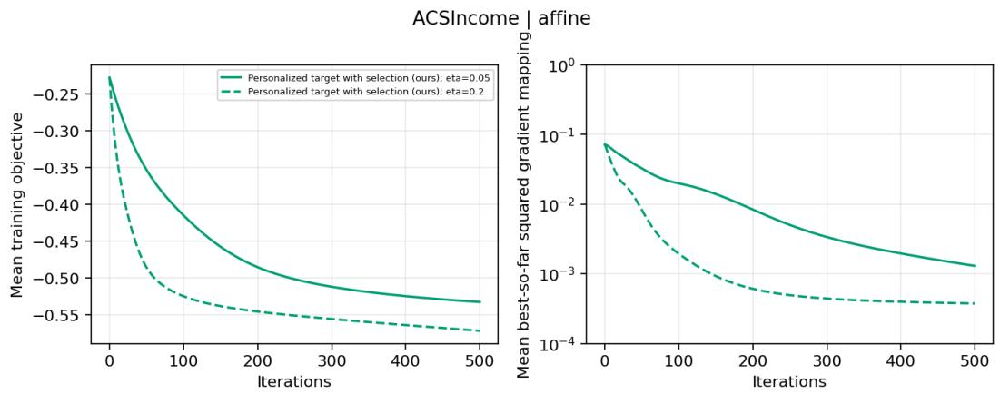

3. Common target: where we perform a grid search to find a common target in $[ t _ { 0 } , 1 ]$ , for all individuals that achieves the lowest validation objective. The recourse would be recommended to every rejected individual who can attain that common target within the feasible budget of B.

4. Personalized targets without selection: where we run Algorithm 1 to learn $\theta _ { 1 }$ , while fixing $\rho = 1$ for every eligible rejected individual.

Cost and validity are averaged over all N− initially rejected individuals in $S ^ { - }$ , as in Equations (11) and (10). Validity is their mean acceptance probability, using expected acceptance under uniform cutof tie-breaking. Therefore, the upper bound on validity is min $\left\{ 1 , k / N _ { - } \right\}$ . However, this bound need not be attainable under the recourse budget and policy restrictions. At the population level, when the initially rejected fraction is $1 - \alpha$ , the corresponding bound becomes min $\{ 1 , \alpha / ( 1 - \alpha ) \}$

(a) ASCIncome dataset, afine model, $\lambda = 3 .$  
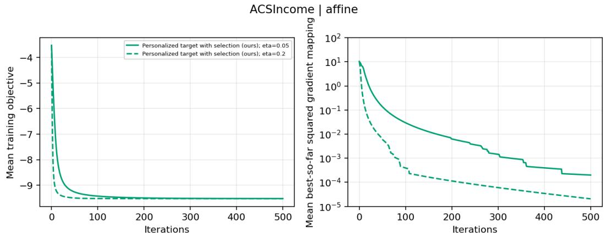  
(b) ASCIncome dataset, afine model, $\lambda = 3 0$  
Figure 1: Convergence results for the ASCIncome dataset with an afine scoring model. Each subfigure corresponds to a diferent λ value as stated in the caption. Each curve corresponds to a diferent learning rate as indicated in the legend.

## 5.3 Findings

Convergence. In our first experiment, we study the convergence of Algorithm 1. Using the default parameter settings, two values $\lambda \in \{ 3 , 3 0 \}$ , and two step sizes $\eta \in \{ 0 . 0 5 , 0 . 2 \}$ , we run the algorithm for $T = 5 0 0$ iterations.

We track the smooth empirical training objective and the best-so-far squared projected-gradient mapping, averaged across five seeds.

The results are presented in Figure 1 for the ACSIncome dataset with an afine scoring model as $f _ { w _ { 0 } }$ . Each subfigure corresponds to a diferent λ value. The left panel shows the training objective, evaluated on the policy-training cohort, and the right panel shows the best-so-far squared projected-gradient mapping, both as functions of the number of iterations for both of the learning rates. Both quantities decrease substantially, with $\eta = 0 . 2$ producing faster progress than $\eta = 0 . 0 5$ in these plots. The objective stabilizes earlier for $\lambda = 3 0$ although the stationarity measure continues to improve. Because changing λ changes the objective itself, this observation does not establish a general improvement in convergence rate. Moreover, the best-so-far measure is non-increasing by construction, but its reduction indicates that training finds iterates closer to stationarity. The speed of improvement varies across datasets and scoring functions. Additional results for other dataset and model pairs are provided in Appendix A.1.

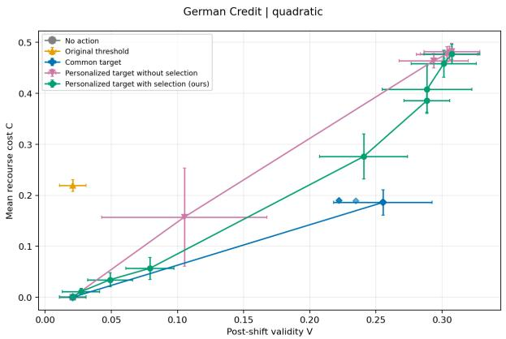  
(a) German Credit dataset, quadratic model.

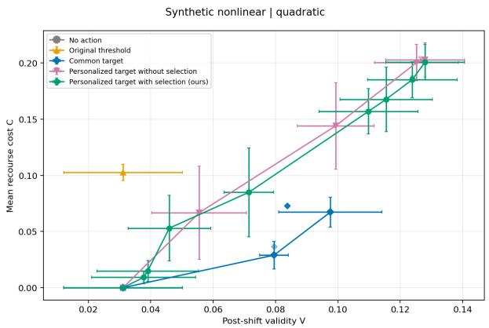  
(b) Synthetic Non-linear dataset, quadratic model.  
Figure 2: The trade-of between recourse cost and post-shift validity. Each subfigure corresponds to a diferent dataset and scoring model as indicated by the caption. In each subfigure, each curve corresponds to the Pareto frontier of the trade-of between cost and validity for Algorithm 1 and the baselines. Dominated points remain visible as faint markers.

The Trade-Of Between Cost and Validity. We next study the trade-of between recourse cost and post-shift validity for our algorithm and baselines. Across all datasets, we vary λ over 14 values between 0.3 and 30, while keeping the other parameters at their default values.

The results are summarized in Figure 2. Each subfigure corresponds to a dataset and scoring model. Cost and validity are computed over all initially rejected applicants in each test cohort and then averaged across five seeds. For each method, the connected points show the nondominated cost-validity combinations for each of the evaluated policies.

We observe that no action incurs zero cost but can have nonzero measured validity. This is because the initial threshold $t _ { 0 }$ is estimated from a reference population, whereas allocation is recomputed for each test cohort. But as expected, the validity achieved by no action is close to 0. Providing recourse with the original threshold incurs positive cost without significantly improving aggregate validity over the no-action baseline. This illustrates the limitation of recommending recourse to the original threshold in competitive settings, an observation that has also been pointed out by prior work [16].

Common targets ofer favorable trade-ofs at low to moderate validity levels, and some observed personalizedpolicy points are dominated by common-target points. Personalized targets, with or without selection, nevertheless achieve the highest observed validity, albeit at higher cost. This is despite the observation that personalized targets achieve the lowest objective values in training (and often in testing), indicating greater validity does not necessarily imply a lower objective value, perhaps due to overfitting.

Follow-up target diagnostics help explain these diferences. At λ = 3, personalized policies with selection assign higher targets than the common-target policy to approximately 80%-100% of applicants receiving recommendations under both methods, depending on the dataset and scoring function. Their mean recourse cost ranges from 0.695 to 0.745, close to the budget $B = 0 . 7 5$ , compared with 0.507-0.576 for common targets. Selection reduces expenditure on unsuccessful actions relative to implementing the same learned targets for every eligible applicant, indicating that the learned target levels and recipient selection both contribute to the observed trade-ofs.

Analogous to the results in the robust recourse literature [37, 45, 46, 58], our results show that achieving high validity under competition also imposes a significant increase in the cost of implementing the recourse. Additional results for other dataset and model pairs are provided in Appendix A.2, where many of our observations continue to hold.

Efect of Parameters. To better understand the efect of each of the parameters in our setting, we conducted sensitivity analysis on the choice of parameters through three diferent experiments: (1) In budget sensitivity experiments, we varied budget from 0.25 to 1.75 for 3 choices of $\lambda \in \{ 3 , 1 0 , 3 0 \}$ while keeping the other parameters at their default values. (2) In admission rate sensitivity experiments, we varied α from 0.2 to 0.6 for the same three values of λ and other default parameters. (3) In temperature sensitivity experiments, we selected τ values ranging from 0.005 to 0.005 for the same three values of λ and other default parameters.

## ACSIncome |quadratic

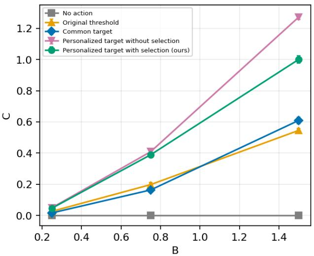

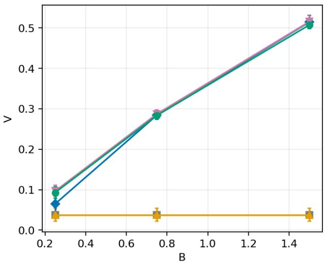  
Figure 3: The efect of budget B on cost and validity of recourse in the ACSIncome dataset for quadratic cost at $\lambda = 1 0$ . Curves correspond to diferent approaches.

Increasing the budget generally improves post-shift validity, but also increases the cost. For example, on ACSIncome with a quadratic scoring function and λ = 10, as depicted in Figure 3, increasing the budget B from 0.25 to 1.5 raises Algorithm 1’s mean validity from 9.6% to 51.4% and its mean cost from 0.05 to 1.11. However, additional expenditure does not necessarily provide much advantage: at the budget $B = 1 . 5 $ , the common-target baseline achieves approximately the same validity at a mean cost of 0.61. Larger budgets, therefore, expand the opportunities for successful recourse, but, by themselves, do not ensure eficient use of those opportunities.

Increasing the admission rate consistently raises Algorithm 1’s mean validity across all tested datasets, models, and λ combinations. For Synthetic Curved with a quadratic scoring function and $\lambda = 3 0$ , as depicted in Figure 4, increasing α from 0.2 to 0.6 raises validity from 7.1% to 26.3%, while increasing the mean cost from 0.10 to 0.32. In general, greater capacity increases the average recourse expenditure as the eligible population, and selected recommendations will also change with the budget increase.

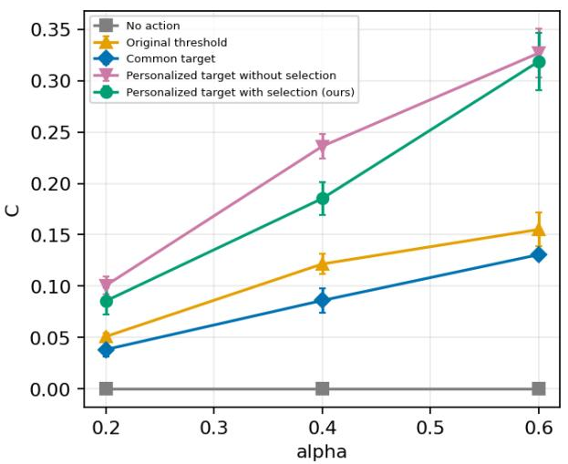

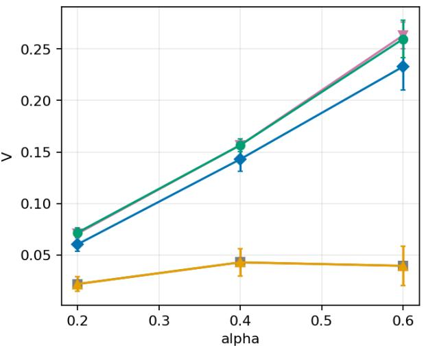  
Figure 4: The efect of admission rate α on cost and validity of recourse in the Synthetic Curved dataset for quadratic cost at λ = 30. Curves correspond to diferent approaches.

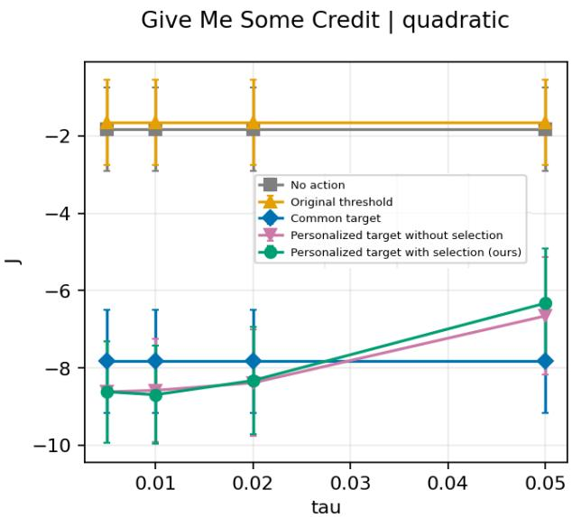  
Figure 5: The efect of temperature τ on the recourse objective in the Synthetic Curved dataset for quadratic cost at λ = 30. Curves correspond to diferent approaches.

Performance is relatively stable across the tested temperatures for many dataset and model pairs, but excessive smoothing sometimes can substantially worsen the achieved recourse objective in Equation (12). On Give Me Some Credit with a quadratic scoring function, as depicted in Figure 5, increasing the temperature τ from 0.01 to 0.05 worsens Algorithm 1’s objective value from −8.62 to −6.28 by reducing both mean validity and cost. However, the results are nearly identical for smaller τ values. These findings support our approach of selecting the temperature through validation, as the efect depends on the dataset and scoring function.

Predeclared seed 42; lambda=3; repeated-cohort applicant occurrences

Target Distributions. We next examine how common and personalized targets afect the score improvements and costs required of recourse recipients. We use $\lambda \in \{ 1 , 3 , 1 0 \}$ and default values for all the other parameters.

Figure 6 shows results for the ACSIncome dataset with an afine scoring model and $\lambda = 3 .$ . The left panel shows recommended scores $q ( x )$ , the middle panel shows required score increases $q ( x ) - f _ { w _ { 0 } } ( x )$ , and the right panel shows the minimum cost of attaining the recommended target. The curves give the cumulative fraction of recipient observations whose value is at most the horizontal-axis value. The middle and right panels distinguish improvement in score from efort measured by the recourse cost to achieve the improved score.

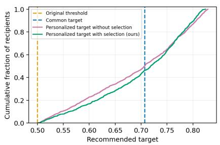

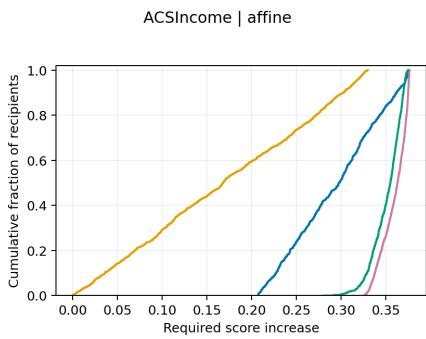

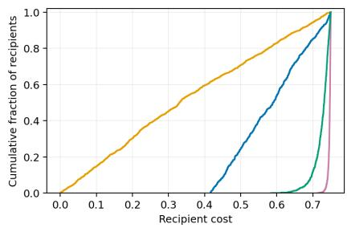  
Figure 6: Target distributions for the ACSIncome dataset with an afine scoring model and $\lambda = 3 .$ The panels show the cumulative density function of the recommended targets (left), required score increases (middle), and recourse costs (right) among recipients for seed 42. Vertical dashed lines in the left panel indicate the original threshold and common target.

The left panel of Figure 6 shows that both personalized policies assign very similar targets, and the fraction of individuals receiving each target score is almost uniform. The middle panel shows that even a common target requires diferent score increases because recipients have diferent initial scores. Furthermore, personalized policies generally require larger score increases than the common targets. The right pane shows that personalization does not necessarily reduce efort. The median recipient cost is approximately 0.589 for the common target, 0.747 for personalized targets without selection, and 0.731 for personalized targets with selection. Thus, many personalized recommendations require expenditure close to the maximum allowable budget of $B = 0 . 7 5$ . Further analysis, comparing the personalized policy with common-target policy, indicates that the personalized policy with selection assigns higher targets than the common-target policy to approximately 94% of their shared recipient, with a mean additional cost of 0.147.

The Role of Selection. To isolate the efect of recipient selection, we take a learned personalized policy, retain its target function q, and replace its recommendation rule with $\rho ( x ) = 1$ for every eligible rejected applicant. Previously selected applicants retain their recommended actions, while previously unselected eligible applicants now implement their minimum-cost responses to the learned targets. We recompute the competitive threshold and measure cost, validity, and the objective value. In this experiment, we use $\lambda \in \{ 1 , 3 , 1 0 \}$ and default values for all the other parameters.

Figure 7 illustrates this comparison for the Synthetic Curved dataset with a quadratic scoring function. The three panels plot outcomes against λ. The left panel reports mean recourse cost (including expenditure on unsuccessful recourse). The middle panel reports post-shift validity. The right panel reports the objective value as in Equation (12). At λ = 3, disabling selection increases mean cost from approximately 0.148 to 0.223 (left panel), while validity increases only from 0.139 to 0.144 (middle panel). Consequently, the objective worsens from approximately −0.268 to −0.210 (right panel). Further analysis shows that expenditure on unsuccessful recourse increases from 0.050 to 0.121 per initially rejected applicant. Thus, selection can avoid substantial expenditure for a small reduction in aggregate validity.

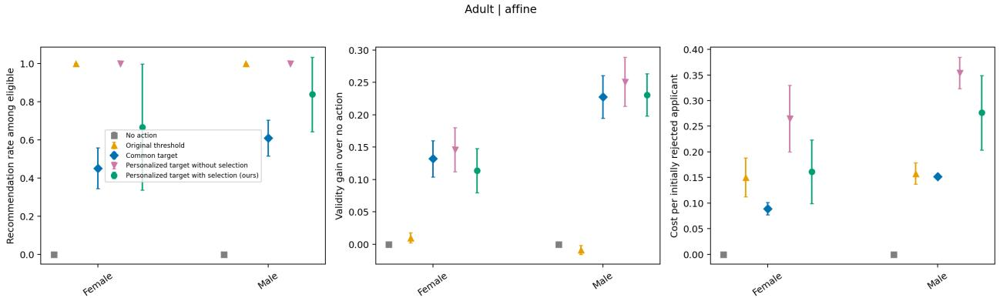

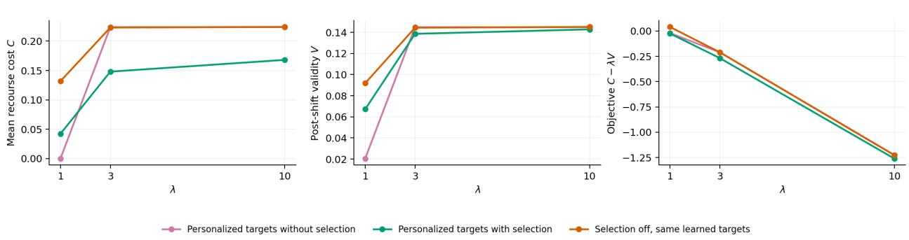  
Figure 7: Efect of modifying the recipient selection for the Synthetic Curved dataset with a quadratic scoring model. The panels report mean cost (left), post-shift validity (middle), and recourse objective (right) for $\lambda \in \{ 1 , 3 , 1 0 \}$  
Figure 8: Group outcomes partitioned by gender for the Adult dataset with an afine scoring model and $\lambda = 3 .$ . The panels report recommendation rates among eligible rejected applicants (left), post-shift validity gains relative to no action (middle), and mean cost per initially rejected applicant (right). Points show means across the seeds with 95% confidence intervals.

Group Outcomes. We also examine how recourse benefits and costs are distributed across subpopulations. In this experiment, we use $\lambda \in \{ 1 , 3 , 1 0 \}$ and default values for all the other parameters. To form the subpopulations, we used gender or race for real datasets. For synthetic datasets, we use diagnostic groups defined by the sign of the immutable first coordinate.

Figure 8 shows outcomes by gender for the Adult dataset with an afine scoring model and $\lambda = 3$ . The left panel reports recommendation rates among eligible rejected applicants. The middle panel reports validity gains relative to no action. The right panel reports mean cost over initially rejected members of each group. For personalized targets with selection, the mean recommendation rate is approximately 83.9% among eligible male applicants and 66.7% among eligible female applicants. Validity gains are approximately 23.1% and 11.4%, respectively, while mean costs are 0.276 and 0.161.

These results reveal diferences in both access to recommendations and realized benefits. The lower mean cost for female applicants does not imply that their recommended actions are individually cheaper: cost per initially rejected applicant also reflects how many applicants receive recommendations. The comparisons show that optimizing aggregate cost and validity does not ensure equal group outcomes. This is not surprising as equity is not included in the optimization objective [59].

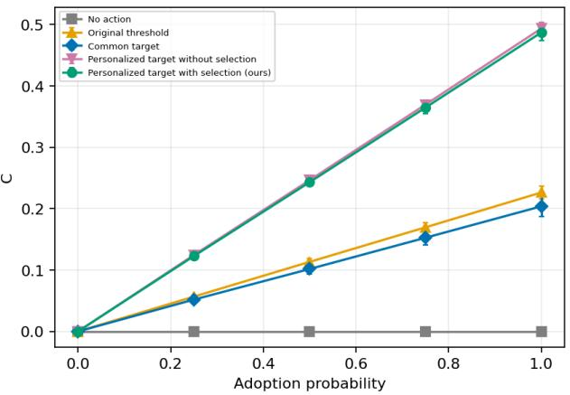

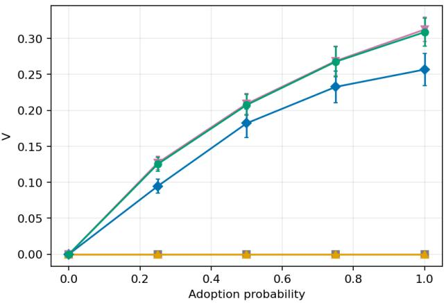  
Figure 9: Partial adoption for the German Credit dataset with an afine scoring model and λ = 30. The policy selected under full adoption is held fixed while the adoption probability varies, and the competitive allocation is recomputed after each realization.

Partial Adoption. We examine how incomplete adoption afects policies designed under the assumption that every recommendation is implemented. We keep the policy selected under full adoption fixed and let each recommended applicant independently implement their response with probability p where p belongs to the set {0, 0.25, 0.5, 0.75, 1}. Non-adopters retain their original features, and we recompute the competitive allocation after each realization. We measure cost and validity over all initially rejected applicants.

Figure 9 presents results for the German Credit dataset with an afine scoring model, λ = 30, and the remaining parameters at their default values. At 50% adoption, mean cost is approximately 0.246 and validity is 20.9%, compared with 0.493 and 31.2% under full adoption. Thus, half adoption retains approximately two-thirds of full-adoption validity at half the cost. Although expected expenditure scales proportionally with adoption when recommendations remain fixed, validity need not. This is because fewer implemented actions also change the competition faced by adopters.

Further analysis across all 12 datasets and scoring function combinations shows that, at λ = 30, average validity increases as more applicants implement their recommendations. Full adoption achieves the lowest average objective value: although more applicants incur recourse costs, the increase in validity outweighs this additional expenditure at the chosen value of λ. Therefore, partial adoption can preserve some of the benefits of recourse, while reducing both expenditure and overall validity.

## 6 Discussion and Limitations

In this work, we introduced a framework for algorithmic recourse under competition that explicitly anticipates the efects of population-wide feature modifications. We studied population-wide recourse computation policies and how these policies can afect the validity and cost of recourse.

We discuss some of the limitations of our setting and flesh out new directions for future work. First, our analysis assumes that achieved scores and recourse costs depend smoothly on the policy parameters. Even in such settings, our approach does not guarantee optimality. Understanding under what conditions optimal strategies can be designed for the smooth setting is a natural next step. Handling nonsmooth response changes and analyzing the performance in such settings likely requires diferent optimization techniques and analysis. Second, our formulation models a single round of recourse in which (in almost all our experiments) individuals fully implement the recourse. Extending the framework to a repeated setting where individuals repeatedly go through the decision-making process, adoption of recourse is selective and asynchronous remains an important direction. Finally, improvements in aggregate cost and validity do not mean these benefits are distributed equitably across all individuals and subpopulations. Understanding what it means for a recourse policy to be equitable in a competitive setting and providing equitable recourse policies for such settings is left for future work (see the Ethical Consideration section).

Ethical Consideration. Our framework assumes that the decision-maker’s goal is to help initially rejected individuals by balancing their aggregate recourse cost and post-shift validity. Although we model individual costs and competitive outcomes, we do not assess the broader consequences of these decisions for individuals and subpopulations. Selecting recipients may distribute acceptance opportunities unequally across subpopulations, unsuccessful recourse may impose unrewarded efort, and initially accepted individuals may lose access to the resource due to future competition. Since our objective does not incorporate equity into considerations, improvements in aggregate cost and validity should not be interpreted as guarantees of individual/subpopulation benefit or societal welfare. Future work should carefully analyze these aspects.

Acknowledgments. We thank Kshitij Kayastha for discussions during the early stages of this work.

Usage of LLMs. Gemini 3.1 Pro was used to write the initial version of the experiments from the problem formulation and algorithm. GPT-6 Astra was used to verify the correctness of implementation. We then checked the edited code by Astra. GPT-6 Astra was used to proofread the paper and provide edits, especially in the implementation details of the experiments. LLMs were not used for problem formulation, formation of research questions, algorithmic solutions, and the description of related work.

## References

[1] Patrick Altmeyer, Giovan Angela, Aleksander Buszydlik, Karol Dobiczek, Arie van Deursen, and Cynthia Liem. Endogenous macrodynamics in algorithmic recourse. In 1st Conference on Secure and Trustworthy Machine Learning, pages 418–431, 2023.

[2] Srikanth Avasarala, Varun Gupta, Shahin Jabbari, Saber Salehkaleybar, and Juba Ziani. The role of causality in algorithmic recourse. CoRR, abs/2607.28497, 2026.

[3] Solon Barocas, Moritz Hardt, and Arvind Narayanan. Fairness and Machine Learning: Limitations and Opportunities. fairmlbook.org, 2019.

[4] Andrew Bell, João Fonseca, Carlo Abrate, Francesco Bonchi, and Julia Stoyanovich. Fairness in algorithmic recourse through the lens of substantive equality of opportunity. CoRR, abs/2401.16088, 2024.

[5] Richard Berk, Hoda Heidari, Shahin Jabbari, Michael Kearns, and Aaron Roth. Fairness in criminal justice risk assessments: The state of the art. Sociological Methods & Research, 50(1):3–44, 2021.

[6] Tom Bewley, Salim Amoukou, Saumitra Mishra, Daniele Magazzeni, and Manuela Veloso. Counterfactual metarules for local and global recourse. In 41st International Conference on Machine Learning, 2024.

[7] Kate Boxer and Daniel Neill. Realizing the promises of algorithmic recourse through reliability, accessibility, and fairness principles. In 5th ACM Conference on Equity and Access in Algorithms, Mechanisms, and Optimization, pages 218–240, 2025.

[8] Andrei Buliga, Chiara Di Francescomarino, Chiara Ghidini, Marco Montali, and Massimiliano Ronzani. Generating counterfactual explanations under temporal constraints. In 39th Annual AAAI Conference on Artificial Intelligence, pages 15622–15631, 2025.

[9] Marina Ceccon, Alessandro Fabris, Goran Radanovic, Asia J. Biega, and Gian Antonio Susto. Reinforcement learning for durable algorithmic recourse. CoRR, abs/2509.22102, 2025.

[10] Yatong Chen, Andrew Estornell, Yevgeniy Vorobeychik, and Yang Liu. To give or not to give? the impacts of strategically withheld recourse. In 28th International Conference on Artificial Intelligence and Statistics, volume 258, pages 739–747, 2025.

[11] Seung Hyun Cheon, Anneke Wernerfelt, Sorelle Friedler, and Berk Ustun. Feature responsiveness scores: Model-agnostic explanations for recourse. In 13th International Conference on Learning Representations, 2025.

[12] Frances Ding, Moritz Hardt, John Miller, and Ludwig Schmidt. Retiring adult: New datasets for fair machine learning. In Advances in Neural Information Processing Systems 34, pages 6478–6490, 2021.

[13] Sanghamitra Dutta, Jason Long, Saumitra Mishra, Cecilia Tilli, and Daniele Magazzeni. Robust counterfactual explanations for tree-based ensembles. In 39th International Conference on Machine Learning, volume 162, pages 5742–5756, 2022.

[14] Ahmad-Reza Ehyaei, Ali Shirali, and Samira Samadi. Collective counterfactual explanations: Balancing individual goals and collective dynamics. In Advances in Neural Information Processing Systems 38, 2025.

[15] Hidde Fokkema, Damien Garreau, and Tim van Erven. The risks of recourse in binary classification. In 27th International Conference on Artificial Intelligence and Statistics, pages 550–558, 2024.

[16] João Fonseca, Andrew Bell, Carlo Abrate, Francesco Bonchi, and Julia Stoyanovich. Setting the right expectations: Algorithmic recourse over time. In 3rd ACM Conference on Equity and Access in Algorithms, Mechanisms, and Optimization, pages 29:1–29:11, 2023.

[17] Ruijiang Gao and Himabindu Lakkaraju. On the impact of algorithmic recourse on social segregation. In 40th International Conference on Machine Learning, pages 10727–10743, 2023.

[18] Prateek Garg, Lokesh Nagalapatti, and Sunita Sarawagi. From search to sampling: Generative models for robust algorithmic recourse. In 13th International Conference on Learning Representations, 2025.

[19] Ozgur Guldogan, Yuchen Zeng, Jy-yong Sohn, Ramtin Pedarsani, and Kangwook Lee. Equal improvability: A new fairness notion considering the long-term impact. In 11th International Conference on Learning Representations, 2023.

[20] Hangzhi Guo, Feiran Jia, Jinghui Chen, Anna Squicciarini, and Amulya Yadav. RoCourseNet: Robust training of a prediction aware recourse model. In 32nd ACM International Conference on Information and Knowledge Management, pages 619–628, 2023.

[21] Vivek Gupta, Pegah Nokhiz, Chitradeep Roy, and Suresh Venkatasubramanian. Equalizing recourse across groups. CoRR, abs/1909.03166, 2019.

[22] Moritz Hardt and Celestine Mendler-Dünner. Performative prediction: Past and future. CoRR, abs/2310.16608, 2023.

[23] Moritz Hardt, Eric Price, and Nathan Srebro. Equality of opportunity in supervised learning. In 30th Annual Conference on Neural Information Processing Systems, pages 3315–3323, 2016.

[24] Hoda Heidari, Vedant Nanda, and Krishna Gummadi. On the long-term impact of algorithmic decision policies: Efort unfairness and feature segregation through social learning. In 36th International Conference on Machine Learning, pages 2692–2701, 2019.

[25] Zachary Izzo, Lexing Ying, and James Zou. How to learn when data reacts to your model: Performative gradient descent. In 38th International Conference on Machine Learning, pages 4641–4650, 2021.

[26] Zachary Izzo, James Zou, and Lexing Ying. How to learn when data gradually reacts to your model. In 25th International Conference on Artificial Intelligence and Statistics, pages 3998–4035, 2022.

[27] Junqi Jiang, Francesco Leofante, Antonio Rago, and Francesca Toni. Robust counterfactual explanations in machine learning: A survey. In 33rd International Joint Conference on Artificial Intelligence, pages 8086–8094, 2024.

[28] Kentaro Kanamori, Takuya Takagi, Ken Kobayashi, and Yuichi Ike. Learning decision trees and forests with algorithmic recourse. In 41st International Conference on Machine Learning, 2024.

[29] Amir-Hossein Karimi, Gilles Barthe, Borja Balle, and Isabel Valera. Model-agnostic counterfactual explanations for consequential decisions. In 23rd International Conference on Artificial Intelligence and Statistics, pages 895–905, 2020.

[30] Amir-Hossein Karimi, Bodo Julius von Kügelgen, Bernhard Schölkopf, and Isabel Valera. Algorithmic recourse under imperfect causal knowledge: a probabilistic approach. In Advances in Neural Information Processing Systems 33, 2020.

[31] Amir-Hossein Karimi, Gilles Barthe, Bernhard Schölkopf, and Isabel Valera. A survey of algorithmic recourse: Contrastive explanations and consequential recommendations. ACM Comput. Surv., 55(5): 95:1–95:29, 2023.

[32] Kshitij Kayastha, Vasilis Gkatzelis, and Shahin Jabbari. Learning-augmented robust algorithmic recourse. Transactions on Machine Learning Research, 2026.

[33] Zahra Khotanlou, Kate Larson, and Amir-Hossein Karimi. Your recourse, my loss? algorithmic recourse under shared constraints. In 9th ACM Conference on Fairness, Accountability, and Transparency, pages 3717–3737, 2026.

[34] Michael Kim and Juan Perdomo. Making decisions under outcome performativity. In 14th Innovations in Theoretical Computer Science Conference, pages 79:1–79:15, 2023.

[35] Gunnar König, Timo Freiesleben, and Moritz Grosse-Wentrup. Improvement-focused causal recourse (ICR). In 37th AAAI Conference on Artificial Intelligence, pages 11847–11855, 2023.

[36] Gunnar König, Hidde Fokkema, Timo Freiesleben, Celestine Mendler-Dünner, and Ulrike von Luxburg. Performative validity of recourse explanations. CoRR, abs/2506.15366, 2025.

[37] Phone Kyaw, Kshitij Kayastha, and Shahin Jabbari. Optimal robust recourse with lp-bounded model change. In 4th IEEE Conference on Secure and Trustworthy Machine Learning, pages 303–325, 2026.

[38] Himabindu Lakkaraju, Stephen Bach, and Jure Leskovec. Interpretable decision sets: A joint framework for description and prediction. In 22nd ACM SIGKDD International Conference on Knowledge Discovery and Data Mining, pages 1675–1684, 2016.

[39] Francesco Leofante and Nico Potyka. Promoting counterfactual robustness through diversity. In 38th AAAI Conference on Artificial Intelligence, pages 21322–21330, 2024.

[40] Bo-Yi Liu, Zhi-Xuan Liu, Kuan Lun Chen, Shih-Yu Tsai, Jie Gao, and Hao-Tsung Yang. Understanding endogenous data drift in adaptive models with recourse-seeking users. In 8th AAAI/ACM Conference on AI, Ethics, and Society, 2025.

[41] Arnaud Van Looveren and Janis Klaise. Interpretable counterfactual explanations guided by prototypes. In Machine Learning and Knowledge Discovery in Databases, pages 650–665, 2021.

[42] Scott Lundberg and Su-In Lee. A unified approach to interpreting model predictions. In Advances in Neural Information Processing Systems 30, pages 4765–4774, 2017.

[43] Celestine Mendler-Dünner, Frances Ding, and Yixin Wang. Anticipating performativity by predicting from predictions. In Advances in Neural Information Processing Systems 35, 2022.

[44] Duy Nguyen, Ngoc Bui, and Viet Anh Nguyen. Distributionally robust recourse action. In 11th International Conference on Learning Representations, 2023.

[45] Tuan-Duy Nguyen, Ngoc Bui, Duy Nguyen, Man-Chung Sue, and Viet Anh Nguyen. Robust bayesian recourse. In 38th Conference on Uncertainty in Artificial Intelligence, pages 1498–1508, 2022.

[46] Martin Pawelczyk, Teresa Datta, Johannes van den Heuvel, Gjergji Kasneci, and Himabindu Lakkaraju. Probabilistically robust recourse: Navigating the trade-ofs between costs and robustness in algorithmic recourse. In 11th International Conference on Learning Representations, 2023.

[47] Juan Perdomo, Tijana Zrnic, Celestine Mendler-Dünner, and Moritz Hardt. Performative prediction. In 37th International Conference on Machine Learning, pages 7599–7609, 2020.

[48] Juan Perdomo, Tolani Britton, Moritz Hardt, and Rediet Abebe. Dificult lessons on social prediction from wisconsin public schools. In 8th ACM Conference on Fairness, Accountability, and Transparency, 2025.

[49] Nicholas Perello, Cyrus Cousins, Yair Zick, and Przemyslaw A. Grabowicz. Discrimination induced by algorithmic recourse objectives. In 8th ACM Conference on Fairness, Accountability, and Transparency, pages 1653–1663, 2025.

[50] Kaivalya Rawal and Himabindu Lakkaraju. Beyond individualized recourse: Interpretable and interactive summaries of actionable recourses. In Advances in Neural Information Processing Systems 33, 2020.

[51] Marco Túlio Ribeiro, Sameer Singh, and Carlos Guestrin. “Why should I trust you?": Explaining the predictions of any classifier. In 22nd ACM SIGKDD International Conference on Knowledge Discovery and Data Mining, pages 1135–1144, 2016.

[52] Cynthia Rudin. Stop explaining black box machine learning models for high stakes decisions and use interpretable models instead. Nat. Mach. Intell., 1(5):206–215, 2019.

[53] Meirav Segal, Anne-Marie George, Ingrid Chieh Yu, and Christos Dimitrakakis. Better luck next time: About robust recourse in binary allocation problems. In 2nd World Conference on Explainable Artificial Intelligence, pages 374–394, 2024.

[54] Dylan Slack, Anna Hilgard, Himabindu Lakkaraju, and Sameer Singh. Counterfactual explanations can be manipulated. In Advances in Neural Information Processing Systems 34, pages 62–75, 2021.

[55] Daniel Smilkov, Nikhil Thorat, Been Kim, Fernanda Viégas, and Martin Wattenberg. Smoothgrad: removing noise by adding noise. CoRR, abs/1706.03825, 2017.

[56] Giovanni De Toni, Stefano Teso, Bruno Lepri, and Andrea Passerini. Time can invalidate algorithmic recourse. CoRR, abs/2410.08007, 2024.

[57] Bohdan Turbal, Iryna Voitsitska, and Lesia Semenova. ElliCE: Eficient and provably robust algorithmic recourse via the Rashomon sets. In Advances in Neural Information Processing Systems 38, 2025.

[58] Sohini Upadhyay, Shalmali Joshi, and Himabindu Lakkaraju. Towards robust and reliable algorithmic recourse. In Advances in Neural Information Processing Systems 34, pages 16926–16937, 2021.

[59] Berk Ustun, Alexander Spangher, and Yang Liu. Actionable recourse in linear classification. In 3rd AMC Conference on Fairness, Accountability, and Transparency, pages 10–19, 2019.

[60] Sahil Verma, John Dickerson, and Keegan Hines. Counterfactual explanations for machine learning: A review. CoRR, abs/2010.10596, 2020.

[61] Sahil Verma, Keegan Hines, and John Dickerson. Amortized generation of sequential algorithmic recourses for black-box models. In 36th AAAI Conference on Artificial Intelligence, pages 8512–8519, 2022.

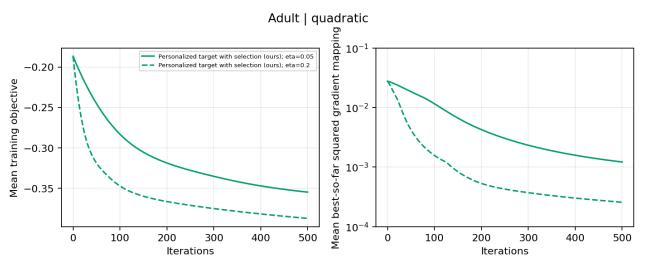

[62] Sandra Wachter, Brent Mittelstadt, and Chris Russell. Counterfactual explanations without opening the black box: automated decisions and the GDPR. Harvard Journal of Law and Technology, 31(2):841–887, 2018.

[63] Jayanth Yetukuri, Ian Hardy, Yevgeniy Vorobeychik, Berk Ustun, and Yang Liu. Providing fair recourse over plausible groups. In 38th AAAI Conference on Artificial Intelligence, pages 21753–21760, 2024.

[64] Muhammad Zafar, Isabel Valera, Manuel Gomez-Rodriguez, and Krishna P. Gummadi. Fairness constraints: Mechanisms for fair classification. In 20th International Conference on Artificial Intelligence and Statistics, pages 962–970, 2017.

## A Additional Experimental Results

## A.1 Convergence

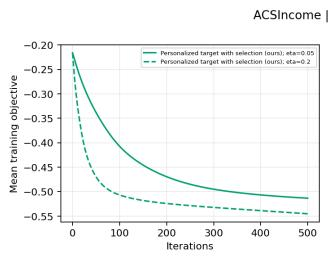

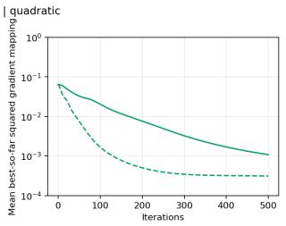  
(a) ASCIncome dataset, quadratic model, $\lambda = 3 .$

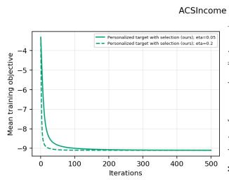  
(b) ASCIncome dataset, quadratic model, $\lambda = 3 0$

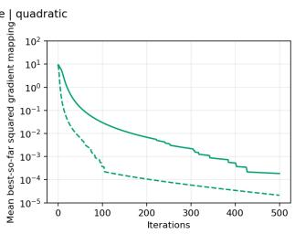

Figure 10: Convergence results for the ASCIncome dataset with a quadratic scoring model. Each subfigure corresponds to a diferent λ value as stated in the caption. Each curve corresponds to a diferent learning rate as indicated in the legend.

(a) ASCIncome dataset, quadratic model, $\lambda = 3 .$  
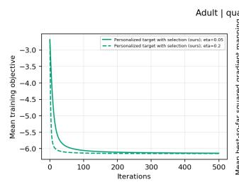

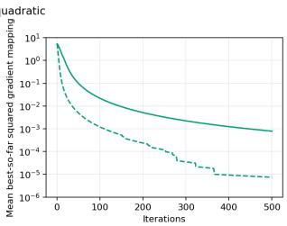  
(b) ASCIncome dataset, quadratic model, $\lambda = 3 0 .$

Figure 11: Convergence results for the Adult dataset with a quadratic scoring model. Each subfigure corresponds to a diferent λ value as stated in the caption. Each curve corresponds to a diferent learning rate as indicated in the legend.

## A.2 The Trade-Of Between Cost and Validity

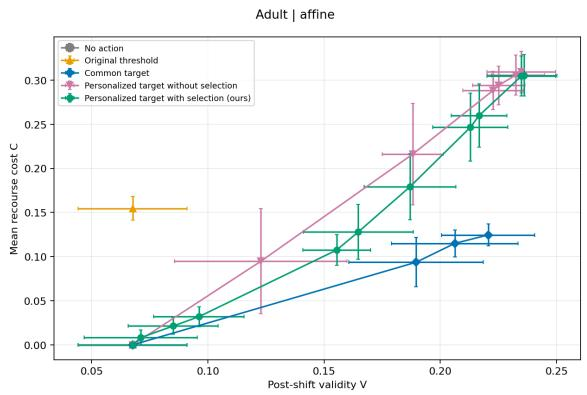  
(a) Adult dataset, afine model.

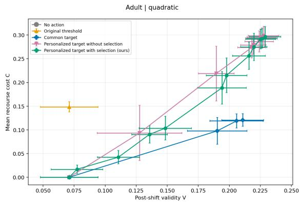  
(b) Adult dataset, quadratic model.

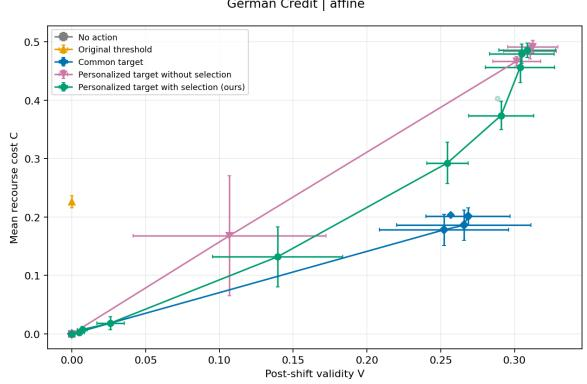  
(c) German Credit dataset, afine model.

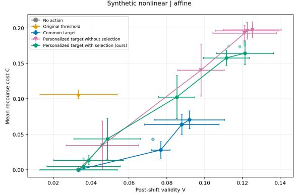  
(d) Synthetic non-linear dataset, afine model.  
Figure 12: The trade-of between validity of recourse and its cost. Each subfigure corresponds to a diferent dataset and scoring model as indicated by the caption. In each subfigure, each curve corresponds to the Pareto frontier of the trade-of between cost and validity for Algorithm 1 and the baselines.