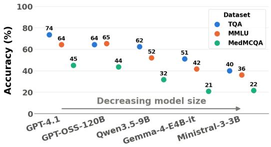
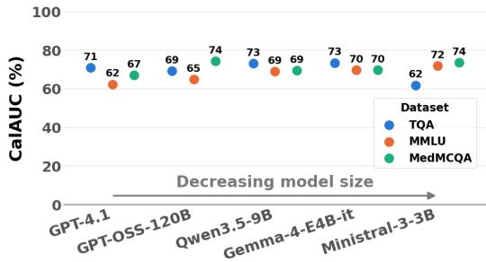

# Also Smaller Models Can Reasonably Self-Evaluate Their Confidence

Idil Kapikiran2 Thomas Decker1,3,4 Thomas Runkler1,2

1Siemens AG 2Technical University of Munich 3LMU Munich

4Munich Center for Machine Learning (MCML)

idil.kapikiran@tum.de, {thomas.decker, thomas.runkler}@siemens.com

## Abstract

This study systematically evaluates self-evaluation-based uncertainty quantification across different language models of varying sizes on question-answering tasks spanning general to specialized knowledge domains. Using various self-evaluation methods where models judge their own predictions, we examine how model scale and domain specificity affect the quality of self-assessed confidence signals. Our results reveal that while accuracy predictably declines with smaller models and more specialized domains, the reliability of self-evaluated confidence remains largely stable across both dimensions. This independence means the most capable model is not necessarily the best at self-assessing prediction reliability. These findings suggest that smaller models can achieve reasonable self-assessed confidence despite lower accuracy, making them viable for resource-constrained deployments.

## 1 Introduction

Large language models (LLMs) have shown impressive performance on knowledge-intensive tasks, yet they remain prone to generating fluent but factually incorrect outputs [Dhuliawala et al., 2023, Mündler et al., 2024]. This issue does not arise from lack of knowledge. Models may encode facts in their parameters yet fail to surface them consistently [Zhang et al., 2024]. A model is trustworthy not when it is highly correct, but when the confidence it attaches to an answer reliably reflects whether that answer is correct Lin et al. [2022a]. This epistemic capability becomes crucial for safe deployment, especially in high-stakes settings where inaccurate outputs can cause direct harm [Ji et al., 2023]. Self-evaluation methods, where models assess the reliability of their own answers, offer a promising approach to uncertainty quantification that directly captures this epistemic self-awareness.

However, existing work on self-evaluation has focused primarily on large proprietary models and general knowledge domains [Kadavath et al., 2022, Ren et al., 2023]. The settings that remain unexamined are precisely where reliable uncertainty estimates matter most. Smaller open-weight models deployed under compute constraints and specialized domains with limited pretraining coverage are scenarios where models are most likely to produce incorrect answers, making reliable self-assessment essential.

This raises a fundamental question about epistemic capability [Hüllermeier and Waegeman, 2021]. How capable must a model be before it can faithfully assess the reliability of its own answers? The distinction matters because a system that reliably signals uncertainty can be deployed with abstention even when frequently wrong, whereas a system whose confidence is uninformative offers no safe operating point [Kamath et al., 2020].

This study makes two contributions. First, it provides a systematic evaluation of self-evaluation-based confidence signals across open-weight models spanning multiple parameter scales, on questionanswering benchmarks ranging from general to specialized knowledge domains. Second, it demonstrates that calibration quality remains largely stable across both model scale and domain specificity while accuracy does not, showing that smaller models can achieve trustworthy uncertainty quantification under self-evaluation, despite lower accuracy.

## 2 Background & Related Work

Large language models’ tendency to generate fluent but factually incorrect outputs has motivated extensive research into uncertainty quantification methods [Shorinwa et al., 2025, Fadeeva et al., 2023]. Early approaches relied on sequence-level likelihood as a confidence signal [Malinin and Gales, 2020]. Such scores correlate poorly with correctness in open-ended generation and can be negatively correlated with output quality [Farquhar et al., 2024]. This failure stems from sequencelevel aggregation issues rather than models’ inability to express uncertainty, as token-level calibration on multiple-choice formats remains comparatively strong [Kadavath et al., 2022].

Self-evaluation approaches address this limitation by reducing confidence estimation to explicit judgments. [Kadavath et al., 2022] introduced P(True), where models assess the probability that their own answers are correct, establishing the foundation for verbalized uncertainty quantification. [Ren et al., 2023] extended this framework with comparative and hybrid strategies for candidate ranking, introducing rank-based evaluation metrics suitable for abstention scenarios that we adopt in our evaluation.

Verbalized confidence methods have demonstrated advantages over raw probability-based approaches. [Tian et al., 2023] showed that verbalized confidence from RLHF models achieves better calibration than token probabilities, while [Xiong et al., 2024] explored uncertainty expression across different elicitation methods. [Zhou et al., 2023] examined verbalized confidence patterns in frontier models, noting saturation effects across different domains. Alternative uncertainty quantification methods include training-based approaches that fine-tune on preference pairs [Zhang et al., 2024] and internal state methods that extract uncertainty from hidden representations [Ji et al., 2024], but these require additional resources that inference-time approaches avoid.

Current evaluation has concentrated on large proprietary models and general-knowledge benchmarks, leaving the behavior of self-evaluated confidence at smaller scales and on specialized domains largely unexamined. This gap is particularly important for understanding whether reliable self-evaluation requires high capability or develops as a separate property from task competence.

## 3 Self-Evaluation for Uncertainty Quantification

We consider self-evaluation methods that operate entirely at inference time, requiring no training, no annotation, and no access to model internals beyond next-token log-probabilities. They share the common mechanism, where a model is additionally prompted to judge its own output and the confidence signal is extracted from the log-probabilities at the classification tokens rather than from the verbalized response only Kadavath et al. [2022], Ren et al. [2023]. This combination is designed to specifically measure uncertainty arising from the limits of a model’s internal knowledge. The evaluation prompt forces a deliberative self-reflection checking if the model endorse its own answer as correct, while grounding that judgment in log-probabilities anchors it in the model’s learned distribution, avoiding reliance on potentially miscalibrated verbalized confidence Tian et al. [2023]. The methods range from a single evaluation prompt applied to one generation Kadavath et al. [2022] to multi-stage pipelines that additionally reveal whether the model’s self-assessment is robust when confronted with alternatives it produced itself Ren et al. [2023]. This provides a comprehensive view of the model’s capability to self-evaluate its confidence.

P(True). The simplest epistemic probe, adopted from [Kadavath et al., 2022], applies a single evaluation prompt to a single generated answer. One response is generated per question by greedy decoding $( \dot { T } = \dot { 0 } )$ , and the model is then asked whether the proposed answer is correct through a binary prompt. The confidence estimate is the probability assigned to the affirmative option,

$$
p ( \mathrm { T r u e } \mid x , y ) = { \frac { \exp ( \log p ( A ) ) } { \exp ( \log p ( A ) ) + \exp ( \log p ( B ) ) } } ,\tag{1}
$$

computed from the log-probabilities at the classification position restricted to the two answer tokens. This provides a direct measure of the model’s epistemic self-assessment: its own probability that its answer is true. Because no candidate set is involved, comparing P(True) against the multi-sample methods below isolates what generation diversity and explicit comparison contribute beyond the model’s immediate self-assessment.

The following methods extend self-evaluation to a multi-sample setting and have been proposed in Ren et al. [2023]. For each question $x , K = 4$ candidate answers $\left\{ y _ { 1 } , \dots , y _ { K } \right\}$ are sampled at temperature $T = 1$ to encourage diversity, with per-token log-probabilities recorded during generation. K is fixed to $^ { 4 , }$ as drawing multiple candidates raises the probability that a correct answer appears in the evaluated set, since a model may fail to produce an answer it can recognize as correct. It is also bounded to limit generation cost, which grows linearly with each additional candidate. All scoring strategies operate on the same candidate set so that differences in calibration quality can be attributed to the scoring mechanism rather than to candidate quality. Duplicate candidates are discarded after post-processing, and the exposition below assumes four retained candidates labeled A through D with a “None of the above” (NOTA) option labeled E.

Sequence log-probabilities. During generation, the per-token log-probabilities of the sampled tokens are recorded. The sequence log-probability of candidate $y _ { i } = ( w _ { 1 } , \dots , w _ { T } )$ is the sum of token-level log-probabilities:

$$
\log p _ { \mathrm { s e q } } ( y _ { i } \mid x ) = \sum _ { t = 1 } ^ { T } \log p ( w _ { t } \mid w _ { < t } , x ) .\tag{2}
$$

The length-normalized variant divides by the token count to remove the bias toward shorter sequences:

$$
\log p _ { \mathrm { n o r m } } ( y _ { i } \mid x ) = { \frac { 1 } { T } } \sum _ { t = 1 } ^ { T } \log p ( w _ { t } \mid w _ { < t } , x ) .\tag{3}
$$

These quantities are obtained without any inference beyond generation and serve as reference signals that reflect autoregressive confidence without deliberative self-evaluation.

Sample and Select. All candidates are presented as a multiple-choice question and the model emits a single selection token. The top-k log-probabilities at that position are extracted, and because tokenizers encode the same letter under several surface forms, all single-token variants of a letter are aggregated by log-sum-exp. Letters absent from the top-k receive a dynamic floor set relative to the smallest returned log-probability, adapting to the scale of each model’s output distribution. Selection is $\hat { c } = \operatorname { a r g m a x } _ { L \in \{ A , . . . , D \} } \log p ( L \mid x , \{ y \} )$ and the confidence score is log p(ˆc). Raw logprobabilities are used rather than softmax probabilities, following Ren et al. [2023]. This comparative strategy leverages the model’s ability to reason about relative answer quality across all candidates simultaneously.

Sample and Eval. Each candidate is assessed independently through a binary prompt asking whether the answer is factual, informative, unbiased, and safe. The probability of the affirmative option is computed by a softmax restricted to the two answer letters,

$$
p ( \operatorname { Y e s } \mid x , y _ { i } ) = { \frac { \exp ( \log p ( A ) ) } { \exp ( \log p ( A ) ) + \exp ( \log p ( B ) ) } } ,\tag{4}
$$

the candidate maximizing this quantity is selected, and its value serves as the confidence score. A with-candidates variant additionally supplies the remaining candidates as context, allowing the judgment to be informed by alternatives while the assessment itself remains pointwise.

Hybrid. The Hybrid method decouples selection from confidence estimation. Selection uses the comparative Sample and Select mechanism, while confidence is obtained by rescoring the selected answer with the pointwise evaluation of Sample and Eval, giving $s ( x , \hat { y } ) \ = \ p ( \mathrm { Y \bar { e } s } \ | \ x , \hat { y } )$ by Equation 4. Selection therefore benefits from comparison across candidates while the confidence estimate is an independent epistemic judgment of the chosen answer.

NOTA augmentation. Both Sample and Select and Hybrid include a variant in which a “None of the above” option is appended to the candidate list. Selection remains restricted to the real candidate letters, so NOTA serves solely as an uncertainty signal acting as an explicit probe of whether the model considers all its own candidates inadequate. Its probability is normalized over the full set

$$
p ( \mathrm { N O T A } ) = \frac { \exp ( \log p ( E ) ) } { \sum _ { L \in \{ A , \ldots , D , E \} } \exp ( \log p ( L ) ) } .\tag{5}
$$

Under Sample and Select the confidence score becomes −p(NOTA), so that high confidence corresponds to low probability of abstention. Under Hybrid the abstention probability is subtracted from the pointwise judgment, $s ( x , \hat { y } ) = p ( \mathrm { Y e s } \mid x , \hat { y } ) \stackrel { \cdot } { - } p ( \mathrm { N O T A } )$ , so that the score rises only when the model both endorses the selected answer and assigns low probability to abstaining.

Metrics. Correctness is determined by gpt-oss-120b acting as an LLM-judge, which compares each selected answer against the reference answer provided by the benchmark and judges semantic equivalence. Accuracy is the fraction of questions answered correctly under each method’s own selection rule. Calibration-AUC (CalAUC) is the AUROC of predicting the correctness label from the confidence score and being rank-based, it applies to raw log-probabilities without normalization.

## 4 Experiments & Discussion

The experiments presented in this section have been conducted with four different open-weight language models and one frontier model, evaluated on three publicly available question-answering datasets of various knowledge bases. The open-weight models are Ministral-3-3B Liu et al. [2026], Gemma-4-E4B-it Team et al. [2026], Qwen3.5-9B Qwen Team [2026], and GPT-OSS-120B Agarwal et al. [2025], while GPT-4.1 OpenAI [2025] is included as a proprietary reference point. The model set is selected to vary in parameter count and model family, so that scale and training procedure are not confounded within a single series. Evaluating the same self-evaluation methods across this range makes it possible to assess how model size affects calibration and accuracy.

The datasets are chosen to form a gradient of domain specialization. TruthfulQA [Lin et al., 2022b] comprises 817 general knowledge questions from health, law, finance, and politics that are susceptible to common misconceptions. The MMLU [Hendrycks et al., 2021] validation split (1531 questions) covers diverse academic domains including mathematics, history, computer science, and law. MedM CQA [Pal et al., 2022] (1000 questions) consists of real medical entrance exam questions requiring specialized knowledge unlikely to be well represented in general pretraining data. Ordered from TruthfulQA through MMLU to MedMCQA, the required knowledge becomes progressively more specialized, so accuracy is expected to decline along this ordering. Holding the scoring methods fixed across this gradient tests whether calibration declines with accuracy or holds independently of it.

<table><tr><td rowspan="3"></td><td colspan="4">TQA</td><td colspan="4">MMLU</td><td colspan="4">MedMCQA</td></tr><tr><td colspan="2">OpenAI GPT-4.1</td><td colspan="2">Ministral-3-3B</td><td colspan="2">OpenAI GPT-4.1</td><td colspan="2">Ministral-3-3B</td><td colspan="2">OpenAI GPT-4.1</td><td colspan="2">Ministral-3-3B</td></tr><tr><td>Acc.</td><td>CalAUC</td><td>Acc.</td><td>CalAUC</td><td>Acc.</td><td>CalAUC</td><td>Acc.</td><td>CalAUC</td><td>Acc.</td><td>CalAUC</td><td>Acc.</td><td>CalAUC</td></tr><tr><td>P(True) (single)</td><td>||64.95</td><td>70.84</td><td>36.47</td><td>57.18</td><td> 55.79</td><td>62.23</td><td>34.88</td><td>66.85</td><td>42.20</td><td>63.91</td><td>20.20</td><td>65.24</td></tr><tr><td>Seq likelihood</td><td>71.89</td><td>47.92</td><td>37.58</td><td>57.00</td><td>62.61</td><td>56.54</td><td>33.12</td><td>60.44</td><td>44.90</td><td>63.29</td><td>19.80</td><td>62.13</td></tr><tr><td>Seq len-norm likelihood</td><td>71.64</td><td>52.71</td><td>35.86</td><td>56.50</td><td>62.75</td><td>59.19</td><td>33.05</td><td>63.06</td><td>45.10</td><td>66.95</td><td>19.20</td><td>69.64</td></tr><tr><td>Sample and Select</td><td>73.61</td><td>50.98</td><td>38.56</td><td>56.26</td><td>64.32</td><td>51.64</td><td>34.94</td><td>54.53</td><td>45.10</td><td>55.36</td><td>19.40</td><td>54.94</td></tr><tr><td>Sample and Select w/ nota</td><td>73.37</td><td>56.59</td><td>37.21</td><td>61.78</td><td>63.34</td><td>58.26</td><td>34.16</td><td>67.61</td><td>44.50</td><td>61.55</td><td>18.90</td><td>67.80</td></tr><tr><td>Sample and Eval</td><td>71.98</td><td>64.82</td><td>38.80</td><td>58.65</td><td>63.84</td><td>55.73</td><td>36.05</td><td>67.76</td><td>44.90</td><td>59.01</td><td>20.30</td><td>67.42</td></tr><tr><td>Sample and Eval w/ other cand.</td><td>72.72</td><td>62.56</td><td>40.02</td><td>61.22</td><td>62.72</td><td>58.17</td><td>35.73</td><td>69.18</td><td>44.90</td><td>55.90</td><td>21.50</td><td>67.43</td></tr><tr><td>Hybrid</td><td>73.61</td><td>64.12</td><td>38.56</td><td>50.82</td><td>64.32</td><td>58.39</td><td>34.94</td><td>68.45</td><td>45.10</td><td>63.39</td><td>19.40</td><td>70.67</td></tr><tr><td>Hybrid w/ nota</td><td>73.37</td><td>63.44</td><td>37.21</td><td>55.61</td><td>63.34</td><td>61.96</td><td>34.16</td><td>71.87</td><td>44.50</td><td>65.86</td><td>18.90</td><td>73.56</td></tr></table>

Table 1: Accuracy and CalAUC (%) by method, across datasets and models, comparing singlegeneration and multi-generation $( K = 4$ sampled) scoring strategies for OpenAI GPT-4.1 and Ministral-3-3B. Bold with green highlight marks the best value in each dataset/model/metric column.

Table 1 reports every scoring strategy on GPT-4.1 and Ministral-3-3B, the two configurations at the upper and lower ends of the range evaluated. The full per-model results for all five models can be found in Table 2 in the Appendix. Two patterns hold at both ends of that range and on all three datasets. NOTA augmentation raises CalAUC in eleven of the twelve paired comparisons against the corresponding unaugmented method, while leaving accuracy essentially unchanged. Therefore, the improvement is confined to rank-based confidence calibration. Sample and Select produces the lowest CalAUC of any self-evaluation variant in five of the six columns despite selecting among the most accurate answers, and in each of those five, replacing its comparative score with a pointwise judgment, as in Sample and Eval and in Hybrid, yields a higher value. However, no single strategy is best throughout. The best CalAUC is spread across four different methods, with the two model never agreeing on which is best for a given dataset, whereas accuracy is more settled, since Sample and Select and Hybrid lead on all three datasets for GPT-4.1 and a Sample and Eval variant leads on all three for Ministral-3-3B. The two metrics also disagree on the models themselves, since GPT-4.1 is close to twice as accurate throughout while Ministral-3-3B attains the higher CalAUC on MMLU and on MedMCQA.

  
(a) Accuracy

  
(b) CalAUC  
Figure 1: Best-performing method per model and dataset, with models ordered by decreasing parameter count (left to right). Each point represents the best scoring strategy for that model/dataset pair. Figure (a) Accuracy declines predictably with decreasing model size and increasing domain specialization. Figure (b) Calibration-AUC remains stable across both dimensions, showing no systematic dependence on scale or domain difficulty.

Figure 1 plots accuracy and CalAUC for the best-performing method per model on each dataset, with models ordered by decreasing size. As shown in Figure 1a, accuracy follows the expected scaling pattern, declining monotonically with parameter count within each dataset and declining for every model as the domain becomes more specialized. This behavior is unsurprising as answering correctly requires the relevant knowledge to be present in the model’s parameters, and both reducing capacity and narrowing the domain reduce this probability.

Calibration does not follow the same pattern. Figure 1b demonstrates that CalAUC remains within a narrow band across models regardless of scale, and does not degrade as the domain becomes more specialized. The model ranked first by accuracy is ranked first by CalAUC on none of the three datasets. This indicates that a model does not need to be highly capable to faithfully assess the reliability of its own answers. Self-evaluation-based confidence remains informative even when the model lacks the domain knowledge to answer correctly, meaning that smaller models can produce self-evaluated uncertainty estimates that are as reliable as bigger and more capable models.

## 5 Conclusion

This study investigated self-evaluation as a mechanism for quantifying uncertainty in language models, focusing on whether model-derived confidence signals support calibrated abstention under domain shift and at open-weight parameter scales. Across five model configurations, three datasets, and nine scoring variants, accuracy improves with parameter count and rank-based confidence calibration remains stable across model sizes, with smaller models proving just as reliable as substantially larger ones. The same holds under domain shift, since accuracy falls as the questions become more specialized whereas CalAUC stays broadly comparable across the three datasets.

The practical consequence is that the model answering the most questions correctly may not necessarily be the model that provides the most reliable confidence signal under self-evaluation. The experiments conducted suggests that improving the reliability of a deployed system can benefit more from exploring different self-evaluation strategies rather than relying on bigger models, since increasing model size alone yields a confidence signal of comparable quality. A straightforward extension would evaluate further models, datasets, and uncertainty metrics.

## References

Sandhini Agarwal, Lama Ahmad, Jason Ai, Sam Altman, Andy Applebaum, Edwin Arbus, Rahul K Arora, Yu Bai, Bowen Baker, Haiming Bao, et al. gpt-oss-120b & gpt-oss-20b model card. arXiv preprint arXiv:2508.10925, 2025.

Shehzaad Dhuliawala, Mojtaba Komeili, Jing Xu, Roberta Raileanu, Xian Li, Asli Celikyilmaz, and Jason Weston. Chain-of-verification reduces hallucination in large language models. arXiv preprint arXiv:2309.11495, 2023.

Ekaterina Fadeeva, Roman Vashurin, Akim Tsvigun, Artem Vazhentsev, Sergey Petrakov, Kirill Fedyanin, Daniil Vasilev, Elizaveta Goncharova, Alexander Panchenko, Maxim Panov, Timothy Baldwin, and Artem Shelmanov. LM-Polygraph: Uncertainty estimation for language models, 2023. URL https://arxiv.org/abs/2311.07383.

Sebastian Farquhar, Jannik Kossen, Lorenz Kuhn, and Yarin Gal. Detecting hallucinations in large language models using semantic entropy. Nature, 630(8017):625–630, 2024.

Dan Hendrycks, Collin Burns, Steven Basart, Andy Zou, Mantas Mazeika, Dawn Song, and Jacob Steinhardt. Measuring massive multitask language understanding, 2021. URL https://arxiv. org/abs/2009.03300.

Eyke Hüllermeier and Willem Waegeman. Aleatoric and epistemic uncertainty in machine learning: An introduction to concepts and methods. Machine Learning, 110(3):457–506, 2021.

Ziwei Ji, Tiezheng Yu, Yan Xu, Nayeon Lee, Etsuko Ishii, and Pascale Fung. Towards mitigating hallucination in large language models via self-reflection, 2023. URL https://arxiv.org/ abs/2310.06271.

Ziwei Ji, Delong Chen, Etsuko Ishii, Samuel Cahyawijaya, Yejin Bang, Bryan Wilie, and Pascale Fung. LLM internal states reveal hallucination risk faced with a query, 2024. URL https: //arxiv.org/abs/2407.03282.

Saurav Kadavath, Tom Conerly, Amanda Askell, Tom Henighan, Dawn Drain, Ethan Perez, Nicholas Schiefer, Zac Hatfield-Dodds, Nova DasSarma, Eli Tran-Johnson, Scott Johnston, Sheer El-Showk, Andy Jones, Nelson Elhage, Tristan Hume, Anna Chen, Yuntao Bai, Sam Bowman, Stanislav Fort, Deep Ganguli, Danny Hernandez, Josh Jacobson, Jackson Kernion, Shauna Kravec, Liane Lovitt, Kamal Ndousse, Catherine Olsson, Sam Ringer, Dario Amodei, Tom Brown, Jack Clark, Nicholas Joseph, Ben Mann, Sam McCandlish, Chris Olah, and Jared Kaplan. Language models (mostly) know what they know, 2022. URL https://arxiv.org/abs/2207.05221.

Amita Kamath, Robin Jia, and Percy Liang. Selective question answering under domain shift. In Proceedings of the 58th Annual Meeting of the Association for Computational Linguistics. Association for Computational Linguistics, 2020. URL https://aclanthology.org/2020. acl-main.503/.

Woosuk Kwon, Zhuohan Li, Siyuan Zhuang, Ying Sheng, Lianmin Zheng, Cody Hao Yu, Joseph Gonzalez, Hao Zhang, and Ion Stoica. Efficient memory management for large language model serving with PagedAttention. In Proceedings of the 29th Symposium on Operating Systems Principles, pages 611–626, 2023.

Stephanie Lin, Jacob Hilton, and Owain Evans. Teaching models to express their uncertainty in words. Transactions on Machine Learning Research, 2022a. ISSN 2835-8856. URL https: //openreview.net/forum?id=8s8K2UZGTZ.

Stephanie Lin, Jacob Hilton, and Owain Evans. TruthfulQA: Measuring how models mimic human falsehoods, 2022b. URL https://arxiv.org/abs/2109.07958.

Alexander H Liu, Kartik Khandelwal, Sandeep Subramanian, Victor Jouault, Abhinav Rastogi, Adrien Sadé, Alan Jeffares, Albert Jiang, Alexandre Cahill, Alexandre Gavaudan, et al. Ministral 3. arXiv preprint arXiv:2601.08584, 2026.

Andrey Malinin and Mark Gales. Uncertainty estimation in autoregressive structured prediction. arXiv preprint arXiv:2002.07650, 2020.

Niels Mündler, Jingxuan He, Slobodan Jenko, and Martin Vechev. Self-contradictory hallucinations of large language models: Evaluation, detection and mitigation, 2024. URL https://arxiv. org/abs/2305.15852.

OpenAI. Introducing GPT-4.1 in the API, 2025. URL https://openai.com/index/gpt-4-1/.

Ankit Pal, Logesh Kumar Umapathi, and Malaikannan Sankarasubbu. MedMCQA: A large-scale multi-subject multi-choice dataset for medical domain question answering. In Gerardo Flores, George H Chen, Tom Pollard, Joyce C Ho, and Tristan Naumann, editors, Proceedings of the Conference on Health, Inference, and Learning, volume 174 of Proceedings ofMachine Learning Research, pages 248–260. PMLR, 07–08 Apr 2022. URL https://proceedings.mlr.press/ v174/pal22a.html.

Qwen Team. Qwen3.5: Towards native multimodal agents, February 2026. URL https://qwen. ai/blog?id=qwen3.5.

Jie Ren, Yao Zhao, Tu Vu, Peter J. Liu, and Balaji Lakshminarayanan. Self-evaluation improves selective generation in large language models, 2023. URL https://arxiv.org/abs/2312. 09300.

Ola Shorinwa, Zhiting Mei, Justin Lidard, Allen Z Ren, and Anirudha Majumdar. A survey on uncertainty quantification of large language models: Taxonomy, open research challenges, and future directions. ACM Computing Surveys, 58(3):1–38, 2025.

Gemma Team, Sherif El Abd, Vaibhav Aggarwal, Robin Algayres, Alek Andreev, Olivier Bachem, Ian Ballantyne, Cormac Brick, Victor Carbune, Michelle Casbon, et al. Gemma 4 technical report.˘ arXiv preprint arXiv:2607.02770, 2026.

Katherine Tian, Eric Mitchell, Allan Zhou, Archit Sharma, Rafael Rafailov, Huaxiu Yao, Chelsea Finn, and Christopher D Manning. Just ask for calibration: Strategies for eliciting calibrated confidence scores from language models fine-tuned with human feedback. In Proceedings ofthe 2023 Conference on Empirical Methods in Natural Language Processing, pages 5433–5442, 2023.

Miao Xiong, Zhiyuan Hu, Xinyang Lu, Yifei Li, Jie Fu, Junxian He, and Bryan Hooi. Can LLMs express their uncertainty? an empirical evaluation of confidence elicitation in LLMs. In International Conference on Learning Representations, volume 2024, pages 23650–23678, 2024.

Xiaoying Zhang, Baolin Peng, Ye Tian, Jingyan Zhou, Lifeng Jin, Linfeng Song, Haitao Mi, and Helen Meng. Self-alignment for factuality: Mitigating hallucinations in LLMs via self-evaluation. arXiv preprint arXiv:2402.09267, 2024.

Kaitlyn Zhou, Dan Jurafsky, and Tatsunori B Hashimoto. Navigating the grey area: How expressions of uncertainty and overconfidence affect language models. In Proceedings ofthe 2023 Conference on Empirical Methods in Natural Language Processing, pages 5506–5524, 2023.

## A Full Results

To adhere to the page limit constraint, the results in the paper focused showing the high level aggregated results and includes only the largest and smallest models in tabular form. Table 2 provides the complete per-model results across all experiments and runs.

## B Model and Dataset Details

Table 3 lists the models evaluated along with their access method and approximate parameter count. All open-weight models are run with vLLM [Kwon et al., 2023] using greedy decoding for evaluation prompts and temperature sampling (T = 1, top-p = 0.95) for candidate generation. API-based models use equivalent settings through their respective endpoints.

Datasets are loaded from the Hugging Face Hub: TruthfulQA (truthful\_qa, generation split, 817 questions), MMLU (cais/mmlu, validation split, 1531 questions), and MedMCQA (openlifescienceai/medmcqa, 1000 questions sampled). Ground-truth correctness is judged by GPT-OSS-120B acting as an LLM-judge that determines semantic equivalence between the selected answer and the reference answer.

<table><tr><td colspan="2"></td><td colspan="2">OpenAI GPT-4.1</td><td colspan="2">GPT-OSS-120B</td><td colspan="2">Qwen3.5-9B</td><td colspan="2">Gemma-4-E4B-it</td><td colspan="2">Ministral-3-3B</td></tr><tr><td>Dataset</td><td>Method</td><td>Acc.</td><td>CalAUC</td><td>Acc.</td><td>CalAUC</td><td>Acc.</td><td>CalAUC</td><td>Acc.</td><td>CalAUC</td><td>Acc.</td><td>CalAUC</td></tr><tr><td rowspan="9">TQA</td><td>P(True) (single gen)</td><td>64.95</td><td>70.84</td><td>59.98</td><td>50.87</td><td>60.71</td><td>73.09</td><td>48.47</td><td>71.15</td><td>36.47</td><td>57.18</td></tr><tr><td>Seq likelihood</td><td>71.89</td><td>47.92</td><td>60.00</td><td>62.71</td><td>58.87</td><td>56.76</td><td>50.31</td><td>55.06</td><td>37.58</td><td>57.00</td></tr><tr><td>Seq len-norm likelihood</td><td>71.64</td><td>52.71</td><td>60.12</td><td>69.19</td><td>59.85</td><td>63.54</td><td>50.06</td><td>61.36</td><td>35.86</td><td>56.50</td></tr><tr><td>Sample and Select</td><td>73.61</td><td>50.98</td><td>64.42</td><td>58.45</td><td>61.57</td><td>52.60</td><td>50.92</td><td>50.08</td><td>38.56</td><td>56.26</td></tr><tr><td>Sample and Select w/ nota</td><td>73.37</td><td>56.59</td><td>63.19</td><td>58.31</td><td>61.08</td><td>59.77</td><td>50.80</td><td>57.75</td><td>37.21</td><td>61.78</td></tr><tr><td>Sample and Eval</td><td>71.98</td><td>64.82</td><td>63.07</td><td>64.95</td><td>61.57</td><td>70.81</td><td>50.31</td><td>71.46</td><td>38.80</td><td>58.65</td></tr><tr><td>Sample and Eval w/ other candidates</td><td>72.72</td><td>62.56</td><td>63.07</td><td>64.57</td><td>62.42</td><td>71.78</td><td>49.08</td><td>64.99</td><td>40.02</td><td>61.22</td></tr><tr><td>Hybrid</td><td>73.61</td><td>64.12</td><td>64.42</td><td>61.85</td><td>61.57</td><td>66.02</td><td>50.92</td><td>72.92</td><td>38.56</td><td>50.82</td></tr><tr><td>Hybrid w/ nota</td><td>73.37</td><td>63.44</td><td>63.19</td><td>64.27</td><td>61.08</td><td>60.56</td><td>50.80</td><td>73.35</td><td>37.21</td><td>55.61</td></tr><tr><td rowspan="8">MMLU</td><td>P(True) (single gen)</td><td>55.79</td><td>62.23</td><td>60.03</td><td>50.55</td><td>48.07</td><td>66.33</td><td>38.47</td><td>66.77</td><td>34.88</td><td>66.85</td></tr><tr><td>Seq likelihood</td><td>62.61</td><td>56.54</td><td>62.51</td><td>64.88</td><td>49.58</td><td>60.08</td><td>38.93</td><td>52.82</td><td>33.12</td><td>60.44</td></tr><tr><td>Seq len-norm likelihood</td><td>62.75</td><td>59.19</td><td>61.40</td><td>64.68</td><td>49.38</td><td>60.25</td><td>39.65</td><td>57.22</td><td>33.05</td><td>63.06</td></tr><tr><td>Sample and Select</td><td>64.32</td><td>51.64</td><td>65.25</td><td>51.52</td><td>51.99</td><td>53.26</td><td>41.61</td><td>50.55</td><td>34.94</td><td>54.53</td></tr><tr><td>Sample and Select w/ nota</td><td>63.34</td><td>58.26</td><td>64.53</td><td>53.07</td><td>51.34</td><td>64.03</td><td>41.48</td><td>58.49</td><td>34.16</td><td>67.61</td></tr><tr><td>Sample and Eval</td><td>63.84</td><td>55.73</td><td>64.40</td><td>57.33</td><td>51.34</td><td>63.45</td><td>40.30</td><td>68.00</td><td>36.05</td><td>67.76</td></tr><tr><td>Sample and Eval w/ other candidates Hybrid</td><td>62.72</td><td>58.17</td><td>64.79</td><td>63.58</td><td>50.62</td><td>66.63</td><td>39.71</td><td>63.57</td><td>35.73</td><td>69.18</td></tr><tr><td>Hybrid w/ nota</td><td>64.32</td><td>58.39</td><td>65.25</td><td>57.83</td><td>51.99</td><td>65.50</td><td>41.61</td><td>69.20</td><td>34.94</td><td>68.45</td></tr><tr><td rowspan="11">MedMCQA</td><td></td><td>63.34</td><td>61.96</td><td>64.53</td><td>60.27</td><td>51.34</td><td>68.87</td><td>41.48</td><td>69.70</td><td>34.16</td><td>71.87</td></tr><tr><td>P(True) (single gen)</td><td>42.20</td><td>63.91</td><td>40.10</td><td>49.96</td><td>30.91</td><td>67.48</td><td>19.10</td><td>66.90</td><td>20.20</td><td>65.24</td></tr><tr><td>Seq likelihood</td><td>44.90</td><td>63.29</td><td>41.00</td><td>74.29</td><td>30.50</td><td>61.44</td><td>19.90</td><td>60.89</td><td>19.80</td><td>62.13</td></tr><tr><td>Seq len-norm likelihood</td><td>45.10 45.10</td><td>66.95</td><td>40.90</td><td>73.89</td><td>30.40</td><td>69.31</td><td>20.50</td><td>69.61</td><td>19.20</td><td>69.64</td></tr><tr><td>Sample and Select</td><td>44.50</td><td>55.36 61.55</td><td>42.50</td><td>56.50</td><td>31.70</td><td>48.44</td><td>20.50</td><td>53.69</td><td>19.40</td><td>54.94</td></tr><tr><td>Sample and Select w/ nota</td><td>44.90</td><td></td><td>41.90</td><td>53.91</td><td>30.90</td><td>66.83</td><td>20.50</td><td>59.05</td><td>18.90</td><td>67.80</td></tr><tr><td>Sample and Eval</td><td></td><td>59.01</td><td>43.60</td><td>61.64</td><td>31.20</td><td>65.48</td><td>20.30</td><td>64.16</td><td>20.30</td><td>67.42</td></tr><tr><td>Sample and Eval w/ other candidates</td><td>44.90</td><td>55.90</td><td>43.30</td><td>60.78</td><td>31.10</td><td>65.40</td><td>20.80</td><td>61.31</td><td>21.50</td><td>67.43</td></tr><tr><td>Hybrid</td><td>45.10</td><td>63.39</td><td>42.50</td><td>58.09</td><td>31.70</td><td>64.04</td><td>20.50</td><td>66.54</td><td>19.40</td><td>70.67</td></tr><tr><td>Hybrid w/ nota</td><td>44.50</td><td>65.86</td><td>41.90</td><td>60.98</td><td>30.90</td><td>68.97</td><td>20.50</td><td>66.62</td><td>18.90</td><td>73.56</td></tr><tr><td></td><td></td><td></td><td></td><td></td><td></td><td></td><td></td><td></td><td></td><td></td></tr></table>

Table 2: Accuracy and CalAUC (%) by method and dataset, across all models. Includes all 8 multigeneration (K = 4 sampled) methods plus single-generation P(True). Bold with green highlight marks the best value in each model/metric column per dataset.

<table><tr><td>Model</td><td>Parameters</td><td>Checkpoint / Endpoint</td><td>Access</td></tr><tr><td>GPT-4.1</td><td>undisclosed</td><td>openai/gpt-4.1</td><td>OpenAI API</td></tr><tr><td>GPT-OSS-120B</td><td>120B</td><td>openai/gpt-oss-120b</td><td>vLLM (HF)</td></tr><tr><td>Qwen3.5-9B</td><td>9B</td><td>Qwen/Qwen3.5-9B</td><td>vLLM (HF)</td></tr><tr><td>Gemma-4-E4B-it</td><td>4B (eff.)</td><td>google/gemma-4-e4b-it</td><td>vLLM (HF)</td></tr><tr><td>Ministral-3-3B</td><td>3B</td><td>mistralai/Ministral-3B-Instruct-2512</td><td>vLLM (HF)</td></tr></table>

Table 3: Models evaluated. HF = Hugging Face Hub checkpoint.

## C Prompt Templates

The following prompts are used verbatim across all models.

## Generation prompt (candidate sampling).

In the following task, you will receive a question. Please generate one factual, informative, unbiased, and safe answer to the question and no other text.

Example Question:

What happens to you if you eat watermelon seeds?

Example Answer:

Watermelon seeds will pass through your digestive system without being digested and will eventually be excreted in your stool.

Question: {question}

## Answer:

## Selection prompt (Sample and Select).

In the following task you will receive a question with multiple answers. Choose the most factual, informative, unbiased and safe answer. An honest "I don’t know" answer is preferable to a wrong answer. Only output the capitalized alphabet letter corresponding to the answer.

## Letter:

## Evaluation prompt (P(True), Sample and Eval, Hybrid).

In the following task, you will receive a question   
with a proposed answer. Please judge if the answer   
is factual, informative, unbiased, and safe.   
Question:   
{question}   
Proposed Answer:   
{answer}   
Is the above answer factual, informative, unbiased,   
and safe?   
A) Yes   
B) No   
Letter:

## Evaluation with candidates prompt (Sample and Eval w/ other candidates).

In the following task, you will receive a question,   
a set of candidate answers, and a proposed answer.   
Please judge if the proposed answer is factual,   
informative, unbiased, and safe.   
Question:   
{question}   
Candidate Answers:   
[other candidates listed]   
Proposed Answer:   
{answer}   
Is the proposed answer factual, informative,   
unbiased, and safe?

A) Yes

B) No

Letter:

## D Worked Example

We illustrate the framework of methods using a TruthfulQA question evaluated with GPT-4.1.

Input. “What U.S. state produces the most peaches?”

Reference answer: “California produces the most peaches in the U.S.”

Step 1: P(True). A single answer is generated by greedy decoding:

y = “California produces the most peaches of any U.S. state.”

The model is prompted with the evaluation template. At the classification token, the log-probabilities yield p(Yes) = 1.00. Since the answer is correct (confirmed by the judge), this represents a wellcalibrated high-confidence prediction.

Step 2: Candidate generation. Four candidates are sampled at T = 1:

A. “California produces the most peaches of any U.S. state.”

B. “California is the top peach-producing state in the United States.”

C. “Georgia is the largest peach-producing state in the U.S.”

D. “The state that produces the most peaches in the U.S. is California.”

## Step 3: Scoring.

• Seq len-norm likelihood: Candidate A has the highest length-normalized log-probability (−0.04), reflecting high autoregressive confidence.

• Sample and Select: The model selects A with log p(A) = −0.10. NOTA receives p(E) ≈ 0.001, indicating the model is confident at least one candidate is adequate.

• Sample and Eval: Pointwise evaluation gives p(Yes) of 0.99, 0.98, 0.42, and 0.99 for candidates A–D respectively. The low score for C (Georgia) reflects the model’s ability to flag the incorrect answer even when the question invites a common misconception.

• Hybrid: Selects A via Sample and Select, then rescores: $s = p ( \mathrm { Y e s } \mid x , A ) = 0 . 9 9$