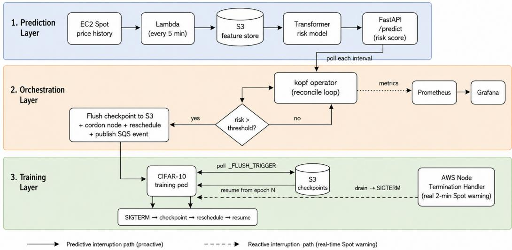
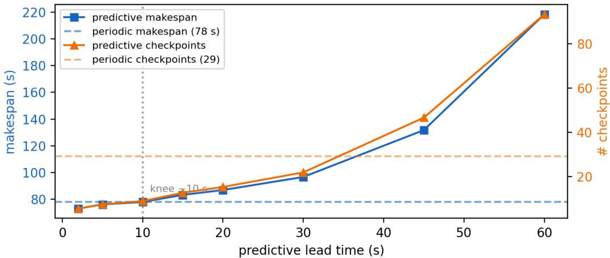
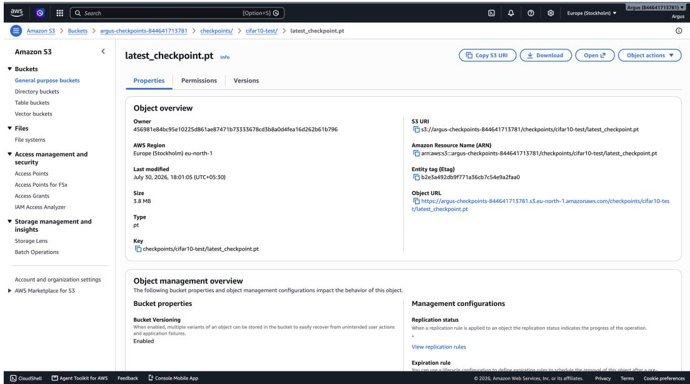
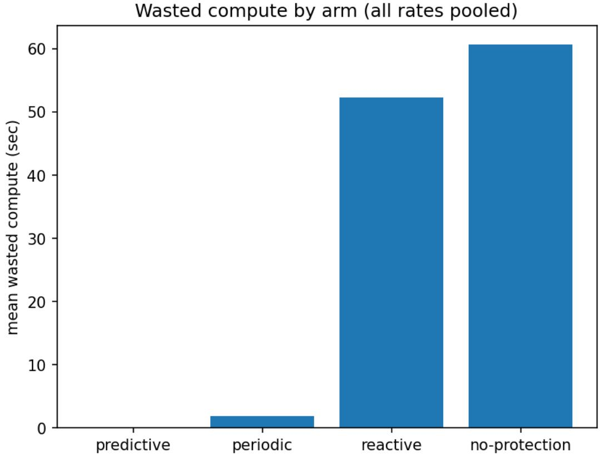
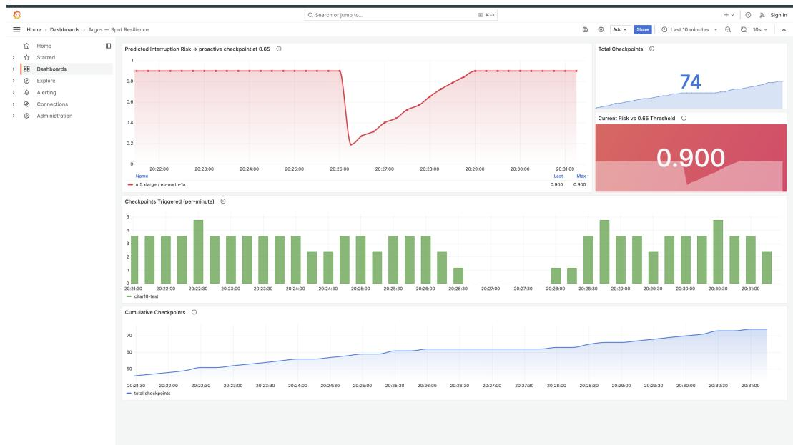

# Argus: A Real-EKS Study of When Predicting Spot Interruptions Beats Simple Checkpointing

Angshuman Chakravertty SVKM’s NMIMS (Deemed to be University) angshumanchakravertty2@gmail.com

MD Rayyan SVKM’s NMIMS (Deemed to be University) rayyan1652@gmail.com

## Abstract

Elastic Compute Cloud (EC2) Spot is 60% to 90% cheaper than On-Demand but can be reclaimed on just a 2-minute notice; for expensive multi-node training this loss can be severe, with one reclaim costing hours of synchronous progress. We build Argus, a Kubernetes operator, and ask empirically, on a CIFAR-10 testbed, when predicting interruptions beats simple checkpointing. Argus on real EKS survives a real Spot drain with a graceful SIGTERM checkpoint, resuming from epoch 8 and losing only the in-progress epoch. Alongside, we further find that in an 80-trial benchmark, the reactive-on-notice degrades toward no protection once interruption outpaces the fixed 2-minute notice, and predictive wasted compute is driven to zero, but with an oversized fixed lead it over-migrates so severely that at the fastest rate only one of five runs completes, while periodic is a strong ML-free baseline. A lead-time sweep turns the lead prediction into a guideline where a small lead suffices for zero waste, but excess lead is wasteful. The predictor built is advisory (a proxy label); real interruption labels and large-model-scale validation are future work.

## 1 Introduction

AWS Elastic Compute Cloud (EC2) Spot is 60% to 90% cheaper than On-Demand but only has a 2-minute warning window and can be reclaimed [Amazon Web Services, 2026c]. A simple reclaim’s loss is trivial for a cheap job, but when it comes to expensive multi-node training [Shoeybi et al., 2019], the loss is severe, where several hours of synchronous multi-GPU progress get discarded. At illustrative On-Demand list prices [Amazon Web Services, 2026c], a 16-node A100 job (128 GPUs) at roughly \$12/node-hr Spot, checkpointing hourly, loses on the order of \$190 of synchronous compute to a single node’s reclaim, against a checkpoint cost of cents, three orders of magnitude. During this work CIFAR-10 was used as a cheap, controlled testbed, with the mechanism being workload-agnostic; no large-model experiments are claimed, and multi-node validation is future work.

The usefulness of the notice depends on the interruption frequency, and exposure compounds with scale. For an N-node job in which each node has per-interval reclaim probability p, P(≥ $1 ) = 1 - ( 1 - p ) ^ { N }$ is the chance that at least one node is reclaimed and rises steeply with N (at $p = 0 . 0 5 , N = 1 6$ , about 56% per interval). GPU Spot pools have the highest interruption-frequency tiers [Amazon Web Services, 2026d], thus a large multi-node job faces interruptions far more often than any single node, pushing it into a regime where there is no useful lead found from a fixed 2-minute reactive notice. Prior systems make training on transient resources preemptible [Athlur et al., 2022, Thorpe et al., 2023]; therefore, instead, we ask when the free reactive notice is beaten by a predictive checkpoint policy and validate it on real Elastic Kubernetes Service (EKS). We build Argus, a Kubernetes operator, to answer the question empirically on the controlled testbed.

In this work we make three contributions: (1) a real-EKS-validated interruption-survival result (Section 3.1), (2) a controlled benchmark isolating when predictive checkpointing beats periodic and reactive-on-notice (Section 3.2), (3) a lead-time sensitivity result showcasing how much lead prediction needs to turn into a concrete guideline (Section 3.3).

## 2 System Design

Argus is composed of three primary layers (Figure 1): a prediction layer, in which Lambda pulls Spot price history every 5 minutes into an S3 feature store and then a Transformer risk model is served via FastAPI (/predict); an orchestration layer, consisting of a kopf Kubernetes operator [Dobies and Wood, 2020] with a SpotResilientJob (Custom Resource Definition) CRD alongside a reconcile loop, which polls /predict each interval; and a training layer, where the job resumes after persisting checkpoints to S3. During a high-risk decision, the operator only writes a \_FLUSH\_TRIGGER marker to S3 and cordons the node and reschedules the job; thus, the checkpoint mechanism is intentionally left decoupled. The training pod owns the actual flush of model.pt by polling the marker because the operator never touches the training internals and keeps it workload-agnostic.

  
Figure 1: Argus architecture. Two triggers (predictive, when the risk score crosses the threshold; reactive, the real 2-minute Spot warning via NTH) drive one SIGTERM, checkpoint, reschedule, resume flow.

A pivotal decision involved having two triggers drive the same SIGTERM, checkpoint, reschedule, and resume path: a predictive trigger, where the operator pre-migrates ahead of any notice when the risk score crosses the threshold, and a reactive trigger, where AWS’s real 2-minute Spot warning via the node termination handler (NTH) [Amazon Web Services, 2026b] drains the node, which then delivers a SIGTERM, and the pod’s handler checkpoints. EKS alongside IAM Roles for Service Accounts (IRSA) utilizes OpenID Connect (OIDC) to give pods AWS credentials with zero static keys.

## 3 Evaluation

## 3.1 Surviving a real Spot drain on real EKS

The deployment was run on real EKS, real Spot nodes (c5.xlarge/m5.xlarge) [Amazon Web Services, 2026c], IRSA with zero static credentials, and AWS Node Termination Handler [Amazon Web Services, 2026b] in queue mode. When the training was live and at epoch 7, the interruption was fired, and NTH received the EC2 Spot Instances Interruption Warning, drain then evicted the pod with graceful SIGTERM, and then the SIGTERM handler wrote the checkpoint (epoch 8) to S3, as seen in Figure 3. The node was cordoned and drained in 10 seconds, and the replacement pod on the healthy node showed "Resuming from epoch $8 "$ and only the in-progress epoch’s work was lost. The entire timeline of the process can be observed in Table 2.

Table 1: Results at the fastest tested rate (MTBF = 120 s, 5 repetitions).
<table><tr><td>Arm</td><td>Compl.</td><td>Wasted (s)</td><td>Makespan (s)</td><td>Ckpts</td></tr><tr><td>No-protection</td><td>1.0</td><td> $2 0 2 . 3 \pm 1 4 1 . 1$ </td><td>361.8</td><td>0.0</td></tr><tr><td>Reactive-on-notice</td><td>1.0</td><td> $1 6 9 . 4 \pm 1 0 5 . 8$ </td><td>328.0</td><td>4.8</td></tr><tr><td>Periodic</td><td>1.0</td><td> $4 . 3 \pm 3 . 4$ </td><td>158.8</td><td>24.0</td></tr><tr><td>Predictive (Argus)</td><td>0.2</td><td> ${ \bf 0 . 0 \pm 0 . 0 }$ </td><td>353.2</td><td>221.6</td></tr></table>

The interruption that was injected was schema-conformant (EC2 Spot Instance Interruption Warning) and not an AWS-issued Fault Injection Service (FIS) reclaim [Amazon Web Services, 2026a]. Nevertheless, NTH cannot distinguish injected from real, and thus the flow of drain, SIGTERM, checkpoint, and resume path is genuinely exercised, and we hope to include FIS-forced reclaim as part of the future development, because it was prevented on an account-subscription problem rather than the design.

## 3.2 When does prediction pay?

We compare four checkpoint policies on a shared synthetic training job: no-protection, periodic (fixed-interval, signal-unaware), reactive-on-notice (a 2-minute notice, the honest baseline to beat), and predictive, which checkpoints on the model’s risk signal ahead of the notice. A harness kills the job on a Poisson process at four mean time between failures (MTBF) rates (120, 300, 600, 1800 s), five repetitions each, 80 trials total, injected locally, which isolates policy behavior from Spot-market variability and is cheap enough for the full sweep. An early harness race let a respawned process be killed before its checkpoint confirmed (24:1 respawn-to-checkpoint before the fix, 1:1 after); we verified before trusting Table 1.

Table 1’s fastest-rate row makes the case directly: wasted compute is 202.3 s for no-protection, 169.4 s for reactive, 4.3 s for periodic, and 0.0 s for predictive, and Figure 4 shows this pattern pooled across all four rates. Reactive’s waste collapses toward no-protection’s because its 120 s notice roughly equals this rate’s mean interval, so each notice fires with the next interruption already close behind, leaving too little lead to checkpoint; more generally, a free 2-minute notice stops helping once interruptions arrive faster than about once every two minutes, a regime not exotic for the large, multi-node fleets in Section 1. Predictive’s 0.0 s here assumes a benchmark-parameter lead time, not a measured model property (Section 3.3), while periodic, with no learned signal at all, nearly matches it on wasted compute and wins decisively on both makespan (158.8 s vs. 353.2 s) and checkpoint count (24 vs. 221.6), because at this rate predictive’s 600 s lead badly exceeds the interval and only one of five runs completes cleanly (Table 1), a failure Section 3.3 diagnoses. Predictive’s only genuinely clean win here is zero wasted compute; we credit periodic’s strength openly rather than round that up into a larger claim.

## 3.3 How much lead time does prediction need? (sensitivity)

We swept the predictive arm’s lead time across {2, 5, 10, 15, 20, 30, 45, 60} s at a fixed 20 s mean interruption interval, five repetitions each, against the ML-free periodic arm as reference (Figure 2). Wasted compute is 0.0 s at every lead, even 2 s, since the operator checkpoints synchronously before migrating, so a few seconds suffices and the practical lower bound is the checkpoint write time. Excess lead is not free, though: predictive’s makespan stays at or below periodic’s (roughly 78 s) only up to a knee near the interval, crossing around 10–15 s (78.0 s at 10 s, 83.3 s at 15 s) (full data in Table 3) before rising steeply; at 60 s, three times the interval, it migrates about 93 times and makespan nearly triples (218 s vs. 73 s at 2 s). Below the knee it stays strictly better than periodic: zero waste against 4.3 s, lower-or-equal makespan, and far fewer checkpoints (5-9 vs. 29).

Lead time should be set just above the checkpoint write time and well below the interval; beyond that, extra lead buys no further waste reduction while linearly inflating overhead and makespan, exactly what happened to predictive’s 600 s lead in Section 3.2. The synthetic checkpoint here is near-instant (in production, the real write time), and the model’s 600 s lead errs long, so the fix is capping the operator’s effective lead, not a bigger model.

  
Figure 2: Lead-time sensitivity. Wasted compute stays at zero across all leads, while makespan and checkpoint count climb once the lead exceeds the interruption interval.

## 3.4 The risk model (brief)

A Transformer risk model [Vaswani et al., 2017], trained with focal loss [Lin et al., 2017] on a proxy label (Spot price spikes greater than 1%, not real reclaims), required fixing a chain of concrete bugs to become real: a train/serve scaler skew (the old flat 0.0419 output), train/validation leakage, a focal-loss alpha no-op, and uncalibrated outputs. It shows a 14.68× base-rate lift (5-seed mean, 95% CI ≈ [9.9×, 19.5×]) on that proxy label, while calibrated scores are tiny (best-F1 threshold ≈ 0.0015). The model is advisory only; its ceiling is label quality, and two features that should have helped did not (a cross-AZ feature and a real interruption-rate feature). We never claim it predicts real interruptions.

## 3.5 Observability

The operator emits three Prometheus metrics; predicted risk crossing the threshold triggers the checkpoint, and the proactive checkpoint firing at the same instant is shown by the provisioned Grafana dashboard (Figure 5). This was captured on the real operator against the real S3/SQS.

## 4 Limitations

Argus consists of four main limitations: (a) the interruption in Section 3.1 was an injected schemaconformant warning, not an AWS-issued FIS reclaim (blocked on an account subscription, not the design), though NTH cannot distinguish the two, so the drain-to-resume path is genuinely exercised; (b) predictive’s zero wasted compute in Section 3.2 assumes a configured lead, and Section 3.3 shows a small lead suffices, so this is a tuning parameter, not an oracle; (c) periodic, an ML-free baseline, matches predictive on wasted compute and wins on makespan and checkpoint cost at the fastest rate (Table 1), and predictive’s clean advantage there is zero wasted compute; recovery time is not a reliable comparison at this rate, since only one of five runs completes; and (d) the risk model is advisory and trained on a proxy label, so its ceiling is label quality (Section 3.4). Scope: the benchmark uses a synthetic job with locally injected interruptions, and there is no large-model-scale validation; both are future work, stated as scope, not a claim.

## 5 Related Work and Conclusion

Spot-resilient training systems use elastic rescaling, pipeline templates, or redundant computation [Athlur et al., 2022, Thorpe et al., 2023, Jang et al., 2023] to make training itself survive preemption. Argus does not propose any new resilient-training mechanism but instead asks the orthogonal policy question of when the free reactive notice is beaten by a predictive checkpoint.

Checkpoint-restart systems on top of the OS-level primitive [CRIU Project, 2026] cut the cost or latency of the checkpoint itself [Mohan et al., 2021, Wang et al., 2023]. Node or job failure is learned by ML-for-systems failure and interruption prediction [Lin et al., 2018]. For Argus, the risk model is trained on a proxy label (Section 3.4) and is advisory, thus instead of reporting a strong-predictor claim, we report a benchmark-and-guideline result. Argus builds on Kubernetes operators, which are the standard way to automate stateful workloads [Dobies and Wood, 2020].

Argus survives a real Spot drain on real EKS, and an 80-trial benchmark maps when prediction pays: periodic is a strong ML-free baseline, and predictive’s advantage is zero wasted compute, clean only when its lead matches the interruption rate. A lead-time sweep turns this into a guideline: a small lead suffices for zero waste, while excess lead over-migrates. Future work includes FIS-forced reclaims, forward interruption-label capture to replace the proxy label, and multi-node large-model validation.

## References

Amazon Web Services. AWS fault injection service. https://aws.amazon.com/fis/, 2026a. Accessed Aug. 2026.

Amazon Web Services. AWS node termination handler. https://github.com/aws/ aws-node-termination-handler, 2026b. Accessed Aug. 2026.

Amazon Web Services. Amazon EC2 Spot Instances. https://aws.amazon.com/ec2/spot/, 2026c. Accessed Aug. 2026.

Amazon Web Services. Amazon EC2 Spot Instance Advisor. https://aws.amazon.com/ec2/ spot/instance-advisor/, 2026d. Accessed Aug. 2026.

Sanjith Athlur, Nitika Saran, Muthian Sivathanu, Ramachandran Ramjee, and Nipun Kwatra. Varuna: Scalable, low-cost training of massive deep learning models. In Proceedings of the European Conference on Computer Systems (EuroSys), 2022.

CRIU Project. CRIU: Checkpoint/restore in userspace. https://criu.org, 2026. Accessed Aug. 2026.

Jason Dobies and Joshua Wood. Kubernetes Operators: Automating the Container Orchestration Platform. O’Reilly Media, 2020.

Insu Jang, Zhenning Yang, Zhen Zhang, Xin Jin, and Mosharaf Chowdhury. Oobleck: Resilient distributed training of large models using pipeline templates. In Proceedings of the 29th ACM Symposium on Operating Systems Principles, SOSP ’23, pages 364–380. ACM, 2023.

Qingwei Lin, Ken Hsieh, Yingnong Dang, Hongyu Zhang, Kaixin Sui, Yong Xu, Jian-Guang Lou, Chenggang Li, Youjiang Wu, Randolph Yao, Murali Chintalapati, and Dongmei Zhang. Predicting node failure in Cloud service systems. In Proceedings of the 2018 26th ACM Joint Meeting on European Software Engineering Conference and Symposium on the Foundations ofSoftware Engineering, ESEC/FSE ’18, pages 480–490. ACM, 2018.

Tsung-Yi Lin, Priya Goyal, Ross Girshick, Kaiming He, and Piotr Dollár. Focal loss for dense object detection. In Proc. IEEE International Conference on Computer Vision (ICCV), pages 2980–2988, 2017.

Jayashree Mohan, Amar Phanishayee, and Vijay Chidambaram. CheckFreq: Frequent, fine-grained DNN checkpointing. In Proceedings ofthe 19th USENIX Conference on File and Storage Technologies, FAST ’21, pages 203–216. USENIX Association, 2021.

Mohammad Shoeybi, Mostofa Patwary, Raul Puri, Patrick LeGresley, Jared Casper, and Bryan Catanzaro. Megatron-LM: Training multi-billion parameter language models using model parallelism. arXiv preprint arXiv:1909.08053, 2019.

John Thorpe, Pengzhan Zhao, Jonathan Eyolfson, Yifan Qiao, Zhihao Jia, Minjia Zhang, Ravi Netravali, and Guoqing Harry Xu. Bamboo: Making preemptible instances resilient for affordable training of large DNNs. In Proceedings of the USENIX Symposium on Networked Systems Design and Implementation (NSDI), 2023.

Ashish Vaswani, Noam Shazeer, Niki Parmar, Jakob Uszkoreit, Llion Jones, Aidan N. Gomez, Łukasz Kaiser, and Illia Polosukhin. Attention is all you need. In Advances in Neural Information Processing Systems (NeurIPS), 2017.

Zhuang Wang, Zhen Jia, Shuai Zheng, Zhen Zhang, Xinwei Fu, T. S. Eugene Ng, and Yida Wang. GEMINI: Fast failure recovery in distributed training with in-memory checkpoints. In Proceedings of the 29th ACM Symposium on Operating Systems Principles, SOSP ’23, pages 253–269. ACM, 2023.

## A Technical appendices and supplementary material

This appendix holds the supporting artifacts and full benchmark data referenced in the body.

## A.1 Real-EKS interruption survival

Table 2: Real-EKS Spot interruption timeline.
<table><tr><td>Time (UTC)</td><td>Event</td></tr><tr><td>12:26:18</td><td>NTH receives EC2 Spot Instance Interruption Warning</td></tr><tr><td>12:26:19</td><td>Drain evicts pod cifar10-test (graceful SIGTERM)</td></tr><tr><td>12:26:19</td><td>SIGTERM handler writes checkpoint (epoch 8) to S3</td></tr><tr><td>12:26:25</td><td>Node cordoned and drained in 10 s</td></tr><tr><td>~75 s later</td><td>Replacement pod on healthy node: “Resuming from epoch 8&quot;</td></tr></table>

  
Figure 3: The 3.8 MB latest\_checkpoint.pt written to the real S3 bucket during the Spot drain (Table 2), direct evidence the checkpoint survived the interruption, not a simulation.

Table 2 is the full drain-to-resume timeline; Figure 3 shows the checkpoint object persisted to the real S3 bucket during the drain.

## A.2 Full benchmark results

Figure 4 shows wasted compute by arm pooled across all four rates; Table 3 gives the complete per-lead data behind Figure 2.

Table 3: Lead-time sensitivity (predictive arm, 20 s mean interruption interval, 5 repetitions). Periodic baseline: 4.3 s wasted, 78.1 s makespan, 29.0 checkpoints.
<table><tr><td>Lead (s)</td><td>Wasted (s) Makespan (s)</td><td>Checkpoints</td></tr><tr><td>2</td><td>0.0</td><td>73.1 5.4</td></tr><tr><td>5</td><td>0.0</td><td>76.2 7.4</td></tr><tr><td>10</td><td>0.0</td><td>78.0 8.8</td></tr><tr><td>15</td><td>0.0</td><td>83.3 12.6</td></tr><tr><td>20</td><td>0.0</td><td>87.0 15.2</td></tr><tr><td>30</td><td>0.0</td><td>96.7 21.8</td></tr><tr><td>45</td><td>0.0</td><td>131.7 46.6</td></tr><tr><td>60</td><td>0.0</td><td>218.3 93.4</td></tr></table>

  
Figure 4: Wasted compute by arm across all four tested interruption rates.

## A.3 Observability

Figure 5 is the live Grafana dashboard.

  
Figure 5: Argus observability: predicted risk crosses the trigger threshold and a proactive checkpoint fires at that instant (real operator, real S3/SQS).