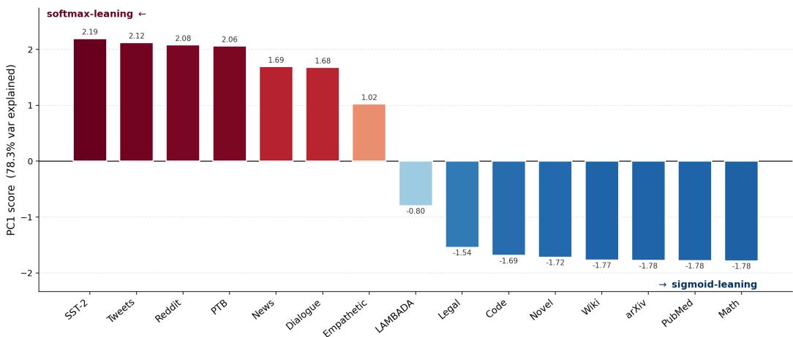
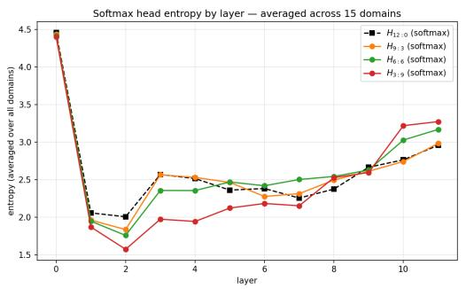
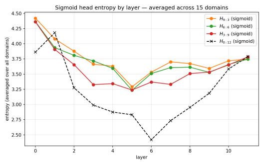

# Attention Function as an Intrinsic Inductive Bias: How Models’ Behavior Diverges in Novel Contexts

Dong Gyun Kang1,2 Megha Thukral1 Kwangsoo Kim2

1College of Computing, Georgia Institute of Technology

2Department of Transdisciplinary Medicine, Seoul National University Hospital

dkang335@gatech.edu mthukral3@gatech.edu kwangsookim@snu.ac.kr

## Abstract

Developmental psychology holds that certain priors are given to infants prior to experience rather than induced from data, and that the influence of such priors is suppressed under strong, well-constrained conditions but reasserts itself under weak ones. We ask whether an analogous principle holds for the Transformer: can the activation function given to attention heads serve as an intrinsic inductive bias? We propose Mixture of Function Attention (MoFA), a parameter-free modification to multi-head attention that fixes a ratio of softmax and sigmoid heads before training. Across five ratios, a 124M-parameter GPT-2 model, and five seeds, we find that this given ratio has little effect in-distribution—differences between ratios are statistically negligible for moderate mixtures and remain small even at the extremes—but its influence re-emerges sharply under zero-shot distribution shift across 15 out-of-distribution domains. Perplexity gaps between ratios widen by more than an order of magnitude on several domains, and the best-performing ratio tracks a single axis of domain structure, separating short, informal text (softmaxfavoring) from technical, long-form text (sigmoid-favoring), that explains 78.3% of the variance in domain response. This reorganization is visible at the head level: sigmoid heads show an accelerating drop in attention entropy as their ratio increases, while softmax heads respond more modestly, yielding a consistent division of labor between the two head types. Our results suggest that activation choice functions as a given prior whose influence is masked in-distribution and re-emerges out-of-distribution.

## 1 Introduction

Developmental psychology posits that infants are not blank slates: certain domains—objects, number, space, agency—are structured by core knowledge systems that are present prior to experience Spelke and Kinzler [2007]. These systems function as given priors, shaping how new information is interpreted from the earliest stages of learning. We take inspiration from this view and ask an analogous question for the Transformer Vaswani et al. [2017]: can the attention function given to a network serve as an intrinsic inductive bias, shaping how it organizes its representations—and how it generalizes to novel contexts? Akin to how infants generalize learned associations to new environments despite limited experience Kangas et al. [2011].

We hypothesize that in-distribution training constitutes a well-constrained regime, and can constrain model behavior, potentially masking differences in the inductive biases imposed by different attention ratios. In zero-shot out-of-distribution (OOD) settings, these constraints are weaker because the model receives no task-specific adaptation to the new distribution, allowing differences induced by the attention ratio to become more apparent. This pattern offers a parallel to a core finding in Bayesian cognitive science: a given prior is largely masked by strong, well-constrained sensory evidence, but reasserts its influence on inference once that evidence becomes weak or ambiguous Knill and Pouget [2004].

The Transformer has applied the same activation function across all attention heads since its inception; even attempts to replace softmax altogether have kept the substitute uniform across the entire model [Wortsman et al., 2023, Saratchandran et al., 2025]—the given prior has always been uniform. We ask whether this prior can instead be given as a mixture, and propose Mixture of Function Attention (MoFA), which assigns different activation functions to different heads as a head-level decision. We instantiate MoFA with softmax and sigmoid: sigmoid is an appealing partner since Ramapuram et al. [2025] established a principled normalization method for it, and its output scale is already comparable to softmax’s, requiring little extra normalization to combine the two within the same layer. Beyond this practical fit, the two are functionally distinct: softmax competes keys against each other via a sum-to-one constraint, while sigmoid gates each independently, allowing dense, distributed attention. We evaluate MoFA across a range of sigmoid-to-softmax ratios, testing zero-shot generalization across a broad suite of out-of-distribution domains.

Our contributions are as follows:

• We propose MoFA, a parameter-free modification to Multi-Head Attention that mixes activation functions across heads at a fixed ratio, requiring no architectural changes beyond the choice of activation.

• We demonstrate empirically across 15 OOD domains that no single activation function is universally optimal, and that the best-performing ratio depends on the alignment between its inductive bias and the structure of the OOD domain.

• We show that mixed attention head models exhibit a division of labor at the head level, with sigmoid and softmax heads operating at consistently different attention entropy and adopting complementary roles.

• We frame the given ratio of attention functions as an intrinsic prior inspired by developmental and cognitive science, and show that its influence is suppressed in-distribution but re-emerges under distribution shifts.

## 2 Related Work

Developmentally Inspired Architectures. Atzeni et al. [2023] infuse lattice symmetry priors into attention mechanisms to improve sample efficiency on abstract geometric reasoning, directly building architectural constraints from a Core Knowledge domain (space and geometry) into the attention operation. Similarly, Chakravarthy et al. [2023] incorporate a spatial-locality prior into object-centric vision models, motivated by the observation that human visual attention is far more spatially constrained than the diffuse competition used in standard slot-based architectures. Both share our premise that such biases are best given, not induced, though each ties it to a hard architectural constraint on a specific domain.

Modifying Softmax Attention. The dominance of softmax in attention mechanisms has prompted several attempts to replace or modulate it: Katharopoulos et al. [2020] approximate softmax via a kernel decomposition for linear-time attention, Ramapuram et al. [2025] establish sigmoid selfattention as a theoretically grounded and hardware-efficient substitute, and Qiu et al. [2025] apply a head-specific sigmoid gate after the scaled dot-product output to improve stability and long-context extrapolation. In each case, the activation or gating choice is applied uniformly across all heads, rather than as a per-head decision, as MoFA proposes.

Head-Level Heterogeneity. The idea that individual heads within the same layer may benefit from different computational structures has recently gained traction. Tan et al. [2025] propose HydraHead, which hybridizes full attention and linear attention at the head level, motivated by computational efficiency for long-context processing, with head selection determined by interpretability-based importance scoring. Zhang et al. [2024] treat attention heads as experts in a Mixture-of-Experts framework, routing tokens to a dynamic subset of heads at inference time. Both approaches vary the mechanism across heads; neither addresses the question of activation function diversity within the same dot-product attention structure, which we introduce here.

Attention Head as Kernel. A growing body of work reinterprets individual attention heads as kernel machines, providing theoretical grounding for treating activation choice as a kernel choice. Tsai et al. [2019] first cast dot-product attention as a kernel smoother, where softmax’s normalization corresponds to one particular non-negative kernel among a much larger space of valid choices; Wright and Gonzalez [2021] sharpen this view, proving that dot-product attention is exactly the reproducing kernel of a pair of Banach spaces with an infinite-dimensional feature map. Cheng et al. [2024] extend the correspondence to the learning algorithm a head implements in-context, showing that when an attention head’s non-linearity matches a kernel, the head performs functional gradient descent in the space that kernel induces during the forward pass itself. This view directly motivates MoFA: if activation choice fixes the function space a head can search, then mixing activations across heads within a layer amounts to searching multiple function spaces in parallel, rather than committing the entire model to one.

## 3 Method

## 3.1 Preliminaries

Standard scaled dot-product attention computes, for a sequence of length T with queries $Q ,$ , keys $K ,$ and values $V \in \mathbb { R } ^ { T \times d _ { k } }$ :

$$
\mathrm { A t t n } ( Q , K , V ) = f \left( { \frac { Q K ^ { \top } } { \sqrt { d _ { k } } } } \right) V ,\tag{1}
$$

where $f = \operatorname { s o f t m a x }$ is applied row-wise, producing a probability distribution over positions. In multi-head attention (MHA), this operation is repeated across H heads operating on independent low-dimensional projections, with outputs concatenated and projected back.

## 3.2 Mixture of Function Attention

In contrast to previous attempts at replacing softmax outright, MoFA gives the activation choice as a fixed prior: the ratio of activation functions across heads is fixed before training and never learned. Concretely, MoFA partitions the H heads into two groups of sizes $H _ { s f x } = i$ and $H _ { s i g } = j$ $( i + j = H )$ , assigning a distinct scoring activation to each:

$$
a _ { \mathrm { s f x } } ^ { ( p ) } = \mathrm { s o f t m a x } \left( \frac { Q ^ { ( p ) } { K ^ { ( p ) } } ^ { \top } } { \sqrt { d _ { k } } } + M _ { \mathrm { c a u s a l } } \right) , \quad p = 1 , \ldots , i ,\tag{2}
$$

$$
a _ { \mathrm { s i g } } ^ { ( q ) } = \sigma \left( \frac { Q ^ { ( q ) } K ^ { ( q ) } } { \sqrt { d _ { k } } } - \log t + M _ { \mathrm { c a u s a l } } \right) , \quad q = 1 , \dots , j ,\tag{3}
$$

where $M _ { \mathrm { c a u s a l } }$ is the causal mask (setting future positions $\mathrm { t o } - \infty )$ , σ denotes the sigmoid function, and t is the causal window size at each query position (the number of tokens the query can attend to). The − log t shift normalises the expected magnitude of sigmoid outputs to be comparable across sequence positions, analogous to the row-sum normalisation implicit in softmax; this stabilisation technique follows Ramapuram et al. [2025]. All heads share a single QKV projection matrix; no additional parameters are introduced. The two groups produce attention maps with fundamentally different properties: softmax heads enforce a competitive, zero-sum allocation (rows sum to 1), while sigmoid heads gate each key position independently, permitting dense and distributed attention patterns. The final output is:

$$
\begin{array} { r } { \mathbf { M o F A } ( X ) = W _ { O } \operatorname { c o n c a t } \left( a _ { \mathrm { s f x } } ^ { ( 1 ) } V ^ { ( 1 ) } , \ \dots , \ a _ { \mathrm { s f x } } ^ { ( i ) } V ^ { ( i ) } , \ a _ { \mathrm { s i g } } ^ { ( 1 ) } V ^ { ( 1 ) } , \ \dots , \ a _ { \mathrm { s i g } } ^ { ( j ) } V ^ { ( j ) } \right) . } \end{array}\tag{4}
$$

Head assignment follows a fixed, contiguous partition by index: within each layer, the first $H _ { \mathrm { s f x } }$ heads are assigned softmax and the remaining $H _ { \mathrm { s i g } }$ heads are assigned sigmoid, identically across all layers and fixed prior to training. This partition determines, before any exposure to data, which combination of function spaces the model can draw on—a structural constraint fixed in advance, much like a given prior, rather than one learned or adapted during training.

## 4 Experiments

## 4.1 Setup

Model. We train GPT-2-style decoder-only language models Radford et al. [2019] with 124M parameters (12 layers, 12 heads, embedding dimension 768, context length 1024). A custom BPE tokenizer with a vocabulary of 50,000 tokens is trained on OpenWebText, so that all model components—including the tokenizer—are learned from scratch under identical conditions. All models use pre-LayerNorm blocks and weight tying between the token embedding and the language model head.

Training. All models are trained for 50,000 steps with a cosine learning rate schedule, peak learning rate $3 \times 1 0 ^ { - 4 }$ , linear warmup, AdamW optimizer $( \beta _ { 1 } = 0 . 9 , \beta _ { 2 } = 0 . { \bar { 9 } } 5 )$ , and gradient clipping at 1.0. Validation perplexity is evaluated every 500 steps; the checkpoint with the lowest validation loss is retained. Each model is trained on a single NVIDIA H200 GPU.

Datasets. Our models are pretrained on OpenWebText [Gokaslan et al., 2019]. To evaluate outof-distribution generalization, we construct a suite of 15 domains spanning code, narrative, news, scientific, encyclopedic, social media, legal, dialogue, and structured-reasoning text, drawn from established benchmarks including Husain et al. [2019], Zhu et al. [2015], See et al. [2017], Cohan et al. [2018], Merity et al. [2016], Kim et al. [2019], Kornilova and Eidelman [2019], Li et al. [2017], Rashkin et al. [2019], Barbieri et al. [2020], Socher et al. [2013], Paperno et al. [2016], Cobbe et al. [2021], and Marcus et al. [1993]. For each domain we use the corresponding Hugging Face dataset and split. We provide the full dataset identifiers, splitsin Table 4 in Appendix A.

Controlled comparison. All five ratio configurations $( H _ { s i g } \in \{ 0 , 3 , 6 , 9 , 1 2 \} )$ share identical data order, weight initialization, and training hyperparameters across five independent runs (seeds 42, 1005, 1111, 2026, 9999), differing only in the sigmoid head ratio. The softmax-only model $( H _ { s i g } = 0 )$ serves as the baseline.

## 4.2 In-Domain Validation.

Table 1: Internal validation perplexity on OpenWebText by sigmoid head ratio, averaged over 5 seeds (± std). Paired t-test against the softmax-only baseline; $^ { * } p < 0 . 0 1$
<table><tr><td>Softmax</td><td>Sigmoid</td><td>Val Loss</td><td>Val PPL</td><td>p</td></tr><tr><td>12</td><td>0</td><td> $3 . 0 5 6 8 \pm 0 . 0 0 0 7$ </td><td> $2 1 . 2 6 \pm 0 . 0 1$ </td><td></td></tr><tr><td>9</td><td>3</td><td> $3 . 0 5 7 1 \pm 0 . 0 0 1 5$ </td><td> $2 1 . 2 6 \pm 0 . 0 3$ </td><td>0.693</td></tr><tr><td>6</td><td>6</td><td> $3 . 0 6 2 1 \pm 0 . 0 0 1 7$ </td><td> $2 1 . 3 7 \pm 0 . 0 4$ </td><td> $0 . 0 0 1 ^ { * }$ </td></tr><tr><td>3</td><td>9</td><td> $3 . 0 6 7 3 \pm 0 . 0 0 1 1$ </td><td> $2 1 . 4 9 \pm 0 . 0 2$ </td><td> $< 0 . 0 0 1 ^ { \ast }$ </td></tr><tr><td>0</td><td>12</td><td> $3 . 0 8 1 4 \pm 0 . 0 0 2 7$ </td><td> $2 1 . 7 9 \pm 0 . 0 6$ </td><td> $< 0 . 0 0 1 ^ { \ast }$ </td></tr></table>

Table 1 reports validation perplexity on a held-out OpenWebText split. We assess statistical significance via paired t-tests against the baseline across the five seeds. The configuration with $\bar { H _ { s i g } } = 3$ achieves validation perplexity identical to the baseline $( 2 1 . 2 6 , p = 0 . 6 9 3 )$ , indicating that introducing sigmoid heads does not degrade in-domain performance when the ratio is moderate. Beyond $H _ { s i g } = 3 _ { \mathrm { : } }$ , perplexity increases consistently and monotonically with the number of sigmoid heads, reaching a maximum absolute degradation of 0.53 PPL at $H _ { s i q } = 1 2 ( 2 1 . 2 6 \to 2 1 . 7 9 ) - \bf { a }$ modest effect size, though statistically significant for $H _ { s i g } \geq 6 ( p < 0 . { \bar { 0 } } 1 )$ , consistent with the intuition that OpenWebText—a general web corpus—favors the competitive, selective attention patterns of softmax.

## 4.3 Out-of-Distribution Evaluation.

To test how the given ratio’s influence generalizes to novel environments, we evaluate all five ratio configurations zero-shot on 15 domains under out-of-distribution shift, spanning code, biomedical text, scientific literature, news, social media, dialogue, and standard language modeling benchmarks (Table 2). No fine-tuning or domain adaptation is performed.

## 4.3.1 Performance by Domain.

Table 2 reports zero-shot perplexity for all five ratios across the 15 domains. At a high level, no single ratio dominates across domains: each of the five configurations is the best choice on at least one domain, and the two pure endpoints trade off—one excelling where the other falters. This domain-dependence tracks the axis identified in Figure 1: softmax tends to suit short, informal text, sigmoid tends to suit technical and long-form text, and conversational domains fall in between. We unpack these patterns, and their exceptions, below.

Table 2: Zero-shot perplexity (mean ± std over 5 seeds) across OOD domains by sigmoid head count. Columns denote $H _ { \mathrm { s f x } } { : } H _ { \mathrm { s i g } } ,$ , the number of softmax vs. sigmoid heads out of 12 total. All models trained on OpenWebText with identical data order and initialization. ∗ marks the best ratio per domain; † marks the worst. Domains are ordered from most softmax-leaning to most sigmoid-leaning. No single configuration dominates across all domains.
<table><tr><td>Domain</td><td> $H _ { 1 2 : 0 }$ </td><td> $H _ { 9 : 3 }$ </td><td> $H _ { 6 : 6 }$ </td><td> $H _ { 3 : 9 }$ </td><td> $H _ { 0 : 1 2 }$ </td></tr><tr><td>SST-2</td><td> $8 2 . 8 2 _ { \pm 1 . 5 5 } ^ { \ast }$ </td><td> $8 2 . 9 9 { \scriptstyle \pm 1 . 2 8 }$ </td><td> $8 3 . 7 2 _ { \pm 0 . 8 5 }$ </td><td> $8 5 . 4 8 { \scriptstyle \pm 1 . 0 8 }$ </td><td> $8 8 . 9 3 _ { . \pm 3 . 9 7 } ^ { \dagger }$ </td></tr><tr><td>Tweets</td><td> $1 3 3 . 6 5 _ { \pm 2 . 1 8 } ^ { \ast }$ </td><td> $1 3 8 . 6 0 { \scriptstyle \pm 3 . 8 5 }$ </td><td> $1 4 0 . 1 0 { \scriptstyle \pm 4 . 0 8 }$ </td><td> $1 4 6 . 7 0 { \scriptstyle \pm 3 . 8 2 }$ </td><td> $1 5 2 . 9 2 _ { \pm 1 2 . 0 0 } ^ { \dagger }$ </td></tr><tr><td>Reddit</td><td> $3 8 . 2 7 _ { \pm 0 . 0 6 }$ </td><td> $3 8 . 1 7 _ { \pm 0 . 1 7 }$ </td><td> $3 8 . 1 4 _ { \pm 0 . 2 4 } ^ { \ast }$ </td><td> $3 8 . 3 8 _ { \pm 0 . 2 4 }$ </td><td> $3 9 . 3 9 _ { \pm 0 . 4 8 } ^ { \dagger }$ </td></tr><tr><td>PTB</td><td> $1 0 3 . 1 3 { \scriptstyle \pm 3 . 7 0 }$ </td><td> $1 0 0 . 9 5 { \scriptstyle \pm 2 . 7 1 }$ </td><td> $9 9 . 0 5 _ { \pm 4 . 6 1 } ^ { * }$ </td><td> $1 0 9 . 3 5 { \scriptstyle \pm 1 0 . 1 3 }$ </td><td> $1 1 3 . 0 9 _ { \pm 6 . 6 4 } ^ { \dagger }$ </td></tr><tr><td>News</td><td> $2 4 . 4 7 _ { \pm 0 . 0 8 } ^ { \ast }$ </td><td> $2 4 . 5 7 { \scriptstyle \pm 0 . 0 8 }$ </td><td> $2 4 . 7 5 { \scriptstyle \pm 0 . 0 6 }$ </td><td> $2 4 . 7 9 _ { \pm 0 . 2 7 }$ </td><td> $2 4 . 8 1 _ { \pm 0 . 2 1 } ^ { \dagger }$ </td></tr><tr><td>Dialogue</td><td> $3 0 . 5 7 _ { \pm 0 . 2 5 }$ </td><td> $3 0 . 1 7 _ { \pm 0 . 3 0 } ^ { \ast }$ </td><td> $3 0 . 3 4 { \scriptstyle \pm 0 . 4 6 }$ </td><td> $3 0 . 3 6 _ { \pm 0 . 2 5 }$ </td><td> $3 0 . 8 7 _ { \pm 0 . 3 5 } ^ { \dagger }$ </td></tr><tr><td>Empathetic</td><td> $3 3 . 7 3 _ { \pm 0 . 9 1 } ^ { \dagger }$ </td><td> $3 3 . 1 6 _ { \pm 0 . 3 2 }$ </td><td> $3 2 . 7 2 _ { \pm 0 . 8 2 } ^ { \ast }$ </td><td> $3 3 . 4 8 _ { \pm 0 . 4 4 }$ </td><td> $3 3 . 6 3 _ { \pm 0 . 4 7 }$ </td></tr><tr><td>LAMBADA</td><td> $5 2 . 7 8 { \scriptstyle \pm 0 . 5 1 }$ </td><td> $5 3 . 2 4 { \scriptstyle \pm 0 . 6 7 }$ </td><td> $5 3 . 1 8 _ { \pm 1 . 0 8 }$ </td><td> $5 3 . 3 6 _ { \pm 1 . 8 6 } ^ { \dagger }$ </td><td> $5 2 . 5 3 _ { \pm 1 . 2 5 } ^ { \ast }$ </td></tr><tr><td>Legal</td><td> $1 3 . 4 9 { \scriptstyle \pm 1 . 3 6 }$ </td><td> $1 2 . 6 7 { \scriptstyle \pm 1 . 3 4 }$ </td><td> $1 3 . 5 5 _ { \pm 2 . 4 7 } ^ { \dagger }$ </td><td> $1 2 . 0 4 { \scriptstyle \pm 1 . 7 0 }$ </td><td> $1 1 . 6 9 _ { \pm 2 . 0 0 } ^ { \ast }$ </td></tr><tr><td>Code</td><td> $1 4 . 4 0 _ { \pm 0 . 7 9 } ^ { \dagger }$ </td><td> $1 3 . 5 8 _ { \pm 0 . 6 4 }$ </td><td> $1 3 . 7 7 _ { \pm 1 . 0 3 }$ </td><td> $1 2 . 2 3 { \scriptstyle \pm 1 . 7 6 }$ </td><td> $1 1 . 6 7 _ { \pm 1 . 0 6 } ^ { \ast }$ </td></tr><tr><td>Novel</td><td> $3 7 . 5 2 _ { \pm 0 . 5 7 } ^ { \dagger }$ </td><td> $3 7 . 4 4 { \scriptstyle \pm 0 . 6 5 }$ </td><td> $3 7 . 3 3 { \scriptstyle \pm 0 . 6 3 }$ </td><td> $3 7 . 2 7 { \scriptstyle \pm 0 . 3 3 }$ </td><td> $3 6 . 9 8 _ { \pm 0 . 9 2 } ^ { \ast }$ </td></tr><tr><td>Wiki</td><td> $4 4 . 6 8 _ { \pm 0 . 9 0 } ^ { \dagger }$ </td><td> $4 4 . 3 1 { \scriptstyle \pm 0 . 7 6 }$ </td><td> $4 3 . 9 5 _ { \pm 1 . 1 5 }$ </td><td> $4 2 . 4 7 _ { \pm 2 . 4 4 }$ </td><td> $4 1 . 2 5 _ { \pm 1 . 8 9 } ^ { \ast }$ </td></tr><tr><td>arXiv</td><td> $1 0 4 . 9 8 _ { \pm 2 . 7 8 } ^ { \dagger }$ </td><td> $1 0 0 . 8 4 _ { \pm 3 . 7 3 }$ </td><td> $9 9 . 5 0 _ { \pm 7 . 1 2 }$ </td><td> $9 2 . 4 4 _ { \pm 1 0 . 5 7 }$ </td><td> $7 6 . 8 6 _ { \pm 2 . 0 3 } ^ { \ast }$ </td></tr><tr><td>PubMed</td><td> $6 4 . 2 9 _ { \pm 1 . 9 7 } ^ { \dagger }$ </td><td> $6 1 . 6 0 _ { \pm 1 . 6 0 }$ </td><td> $6 0 . 5 1 _ { \pm 3 . 7 5 }$ </td><td> $5 5 . 6 8 _ { \pm 5 . 6 5 }$ </td><td> $4 7 . 2 4 _ { \pm 1 . 9 8 } ^ { \ast }$ </td></tr><tr><td>Math</td><td> $2 8 . 1 8 _ { \pm 0 . 6 6 } ^ { \dagger }$ </td><td> $2 7 . 3 7 { \scriptstyle \pm 0 . 2 5 }$ </td><td> $2 7 . 5 7 { \scriptstyle \pm 1 . 3 6 }$ </td><td> $2 5 . 4 9 { \scriptstyle \pm 3 . 4 4 }$ </td><td> $2 3 . 4 2 _ { \pm 1 . 6 9 } ^ { \ast }$ </td></tr><tr><td># Best (*)</td><td>3</td><td>1</td><td>3</td><td>0</td><td>8</td></tr><tr><td># Worst (†)</td><td>7</td><td>0</td><td>1</td><td>1</td><td>6</td></tr></table>

This domain-dependence is far larger than Section 4.2 would predict. In-distribution, only $H _ { 9 : 3 }$ was statistically indistinguishable from the softmax-only baseline, and the largest degradation across all ratios was a modest 0.53 PPL. Under distribution shift, the gap between ratios widens by more than an order ofmagnitude on several domains—e.g. 76.86 vs. 104.98 PPL on arXiv, a 28-point spread between $H _ { 0 : 1 2 }$ and $H _ { \mathrm { 1 2 : 0 } } { \mathrm { - a n d } }$ the identity of the better-performing ratio flips depending on the domain. Ranking the five configurations within each domain, a pure configuration $( \bar { H } _ { 1 2 : 0 }$ or $H _ { 0 : 1 2 } )$ is the worst-performing ratio in 13 of 15 domains, while a mixed ratio is worst in only 2, and in neither case is the gap from the best configuration statistically significant (paired t-test, $p > 0 . 0 5 ) $ ; by contrast, when a pure endpoint finishes worst, the gap is significant in 11 of 13 cases. This pattern is consistent with the given ratio’s influence being suppressed in-distribution but re-emerging, unevenly across domains, once that constraint is removed.

Figure 1 makes this separation visible directly: domains separate cleanly along a single axis of softmax-versus-sigmoid preference, with the two pure endpoints sitting at opposite ends and 78.3% of the variance in domain response explained by this one dimension. Because the identity of the better endpoint flips depending on where a domain falls on this axis, no fixed ratio is safe to assume in advance.

This axis tracks a structural property of how relevance is distributed within each domain’s documents. SST-2, Tweets, Reddit, and PTB are short, self-contained units where a handful of tokens carry most of the relevant signal [Marion et al., 2025]; arXiv, PubMed, Math, Wiki, and Code are long, structurally regular documents where relevance is distributed across many positions—a proof step depends on earlier lemmas, a function body on earlier bindings [Assogba and Ren, 2025]. Softmax’s sum-to-one allocation suits the former, where suppressing most positions loses little; sigmoid’s independent gating suits the latter, where a sum-to-one constraint would discard information dense weighting retains. Dialogue and Empathetic sit closest to the boundary in Figure 1, consistent with short turns whose relevance still accumulates across a conversation. This also accords with the functional-space view of attention heads as kernel machines [Cheng et al., 2024], where the activation function determines the class of functions a head can represent.

OOD Domains Ranked by Sigmoid / Softmax Preference (z-scored PPL)  
  
Figure 1: OOD domains ranked by their first principal component (PC1) of row-normalized zero-shot perplexity across the five ratios (78.3% variance explained). Domains separate into a softmax-leaning group (short, informal text) and a sigmoid-leaning group (technical, long-form text); conversational domains (Dialogue, Empathetic) sit closest to the boundary. Table 2 follows this ordering.

Two domains depart from this axis-based account. LAMBADA Paperno et al. [2016] sits on the sigmoid-leaning side of Figure 1 (−0.80), yet its worst-performing ratio is $H _ { 3 : 9 }$ rather than the pure-sigmoid endpoint $H _ { 0 : 1 2 } { - } 0 \mathrm { n } \epsilon$ of only two domains where a mixed ratio, not a pure one, finishes last. Empathetic Rashkin et al. [2019] is more striking: despite sitting on the softmax-leaning side (1.02), its best ratio is the balanced $H _ { 6 : 6 }$ and its worst is pure softmax $( H _ { 1 2 : 0 } )$ , the opposite of what the axis would predict. Both cases involve dialogue-adjacent or long-range-dependency domains (LAMBADA is explicitly a long-range coreference benchmark), suggesting the single-axis account captures the dominant structure in domain response but not domains where short surface form and long-range dependency pull in different directions simultaneously.

## 4.4 Attention Entropy Analysis

To characterize the internal behavior of MoFA models, we measure mean attention entropy per head type, averaged across all 15 OOD domains. Entropy is computed after row-normalizing attention weights, making sigmoid and softmax heads directly comparable.

## 4.4.1 Consecutive-Ratio Comparisons

To test whether the reorganization between softmax and sigmoid heads is gradual or threshold-like, we compare domain-averaged entropy between each pair of adjacent ratios via paired t-tests across the five seeds (Table 3). Sigmoid head entropy decreases significantly at every step $( p < 0 . 0 5$ for all three transitions), but the magnitude of the decrease grows sharply toward the pure-sigmoid endpoint: $- 0 . 0 5 ( H _ { 9 : 3 } \to H _ { 6 : 6 } ) , - 0 . 1 1 ( H _ { 6 : 6 } \to H _ { 3 : 9 } )$ , and $- 0 . 3 6 ( \bar { H _ { 3 : 9 } } \to H _ { 0 : 1 2 } , p ^ { \mathbf { \bar { < } } } 1 0 ^ { - \bar { 4 } } )$ an accelerating decline. Softmax head entropy shows the opposite profile: the first two transitions are not statistically significant $( p = 0 . 5 2 , p = 0 . 4 4 )$ , and only the $H _ { 6 : 6 } \to H _ { 3 : 9 }$ step reaches significance $( p = 0 . 0 3 5 )$ , consistent with softmax heads retaining a stable role across most configurations and reorganizing only once sigmoid heads constitute the majority.

Table 3: Paired t-tests (across 5 seeds) comparing domain-averaged head entropy between consecutive ratios. $\Delta$ is the change from the first to the second ratio; ∗ marks $p < 0 . 0 5$
<table><tr><td>Transition</td><td colspan="2">Softmax heads ∆</td><td colspan="2">Sigmoid heads  $\Delta$  p</td></tr><tr><td> $H _ { 1 2 : 0 }  H _ { 9 : 3 }$ </td><td>-0.013</td><td> $p$  0.522</td><td></td><td></td></tr><tr><td> $H _ { 9 : 3 }  H _ { 6 : 6 }$ </td><td>+0.031</td><td>0.439</td><td>-0.051</td><td> $0 . 0 4 7 ^ { * }$ </td></tr><tr><td> $H _ { 6 : 6 } \to H _ { 3 : 9 }$ </td><td>-0.146</td><td>0.035*</td><td>-0.109</td><td> $0 . 0 0 3 ^ { * }$ </td></tr><tr><td> $H _ { 3 : 9 } \to H _ { 0 : 1 2 }$ </td><td></td><td></td><td>-0.361</td><td> $< 0 . 0 0 1 ^ { \ast }$ </td></tr></table>

## 4.4.2 Where This Occurs in the Network

Figure 2 localizes the asymmetry from Section 4.4.1 within the network. We report these layer-level patterns as descriptive observations.

  
Figure 2: Per-layer attention entropy, averaged across 15 OOD domains, for softmax heads (left) and sigmoid heads (right) under each ratio. Dashed black lines with square markers denote the pure endpoints $( H _ { 1 2 : 0 }$ left, $H _ { 0 : 1 2 }$ right); solid colored lines denote the mixed ratios.

Softmax head entropy tracks a mostly stable curve regardless of how many sigmoid heads are present, with a mild divergence at layers 2–4 (Fig. 2, left). Sigmoid head entropy remains within a narrow, elevated band across the three mixed ratios and drops sharply only in $H _ { 0 : 1 2 } \ ( \mathrm { F i g . } 2 , \mathrm { r i g h t } )$ , localizing the accelerating decline from Section 4.4.1 to a mid-network trough that deepens specifically once no softmax heads remain.

## 5 Discussion

Two aspects of our results go beyond the suppression-and-reemergence pattern itself and are worth drawing out.

Theform of reemergence is itself informative: it is not uniform variance but a single, interpretable axis (Figure 1). If activation choice functioned merely as unstructured noise unmasked by the removal of training pressure, we would expect the ranking of ratios to vary idiosyncratically across domains. Instead, 78.3% of domain response collapses onto one dimension tracking document-level relevance structure—local vs. distributed. This suggests the given prior does not simply “reawaken” under weak constraints; it reasserts a specific, architecturally-determined preference (softmax’s competitive allocation vs. sigmoid’s independent gating) that was already latent in the mechanism, and which the OOD domain’s structure either rewards or penalizes. The two domains that depart from this axis (LAMBADA, Empathetic; Section 4.3.1) indicate that this dimension is dominant but not exhaustive— a more granular account of domain structure is a natural next step. The role of distribution shift, on this reading, is not to inject variance but to remove the one corpus statistic (Section 4.2) that had been overriding this latent preference.

A related asymmetry links our head-level and domain-level results. At the head level, sigmoid heads reorganize continuously as their share of the network grows, while softmax heads hold a stable role until they stop being the majority (Table 3). At the domain level, we see the same pattern: pure endpoints are disproportionately likely to be the worst-performing configuration (13/15 domains), while mixed ratios finish worst in only two. Both point to the same underlying effect—heads interact with their neighbors’ activation type, so that removing one type entirely changes how the other behaves, even though no head’s own mechanism has changed. We do not have a mechanistic explanation for why a minority presence stabilizes the majority’s role, and we leave this as a direction for follow-up work.

Limitations. Our experiments are limited to a single model scale (124M parameters), a single pretraining corpus (OpenWebText), and a single pair of activation functions (softmax and sigmoid); it remains open whether the same suppression-and-reemergence pattern holds at larger scales, other pretraining distributions, or other activation combinations. Our layer-level analysis is descriptive without statistical rigor.

## 6 Conclusion

We asked whether the attention function given to a network can serve as an intrinsic inductive bias, and how its influence changes as the network generalizes to novel environments. In-distribution, this influence is largely suppressed; under distribution shift, it reasserts itself sharply and unevenly, tracking a single axis of domain structure and reorganizing attention at the head level. Treating activation choice as such an intrinsic prior offers a productive lens on how transformers generalize.

## 7 Broader Impact

This work studies a specific architectural design choice—the mix of activation functions across attention heads—and its effect on language modeling perplexity under distribution shift. We treat activation choice as a given prior, drawing on core-knowledge accounts of inductive bias to motivate both MoFA’s design and its evaluation under generalization from limited experience.

## 8 Reproducibility

All experiments use publicly available code and data. The 124M-parameter GPT-2 architecture, training procedure, and optimizer settings are fully specified in Section 4.1; all five ratio configurations share identical data order, weight initialization, and hyperparameters across five fixed seeds, differing only in the sigmoid head count $H _ { \mathrm { s i g } }$ . The custom BPE tokenizer is trained from scratch on OpenWebText [Gokaslan et al., 2019] with a fixed vocabulary of 50,000 tokens. All out-of-distribution evaluation datasets are publicly available and used only for zero-shot perplexity measurement (Appendix A). Statistical tests (paired t-tests) are computed across the five seeds using standard implementations, with exact p-values reported in Tables 1–3. Code, trained checkpoints, and evaluation scripts will be released publicly upon acceptance.

## References

Elizabeth S. Spelke and Katherine D. Kinzler. Core knowledge. Developmental Science, 10(1):89–96, Jan 2007. doi: 10.1111/j.1467-7687.2007.00569.x.

Ashish Vaswani, Noam Shazeer, Niki Parmar, Jakob Uszkoreit, Llion Jones, Aidan N. Gomez, Łukasz Kaiser, and Illia Polosukhin. Attention is all you need. In Advances in Neural Information Processing Systems 30 (NIPS 2017), 2017.

Ashley Kangas, Nicole Zieber, Angela Hayden, Paul C. Quinn, and Ramesh S. Bhatt. Transfer of associative grouping to novel perceptual contexts in infancy. Attention, Perception, & Psychophysics, 73(8):2657–2667, Nov 2011. doi: 10.3758/s13414-011-0192-9.

David C Knill and Alexandre Pouget. The bayesian brain: the role of uncertainty in neural coding and computation. Trends in Neurosciences, 27(12):712–719, 2004. doi: 10.1016/j.tins.2004.10.007.

Mitchell Wortsman, Jaehoon Lee, Justin Gilmer, and Simon Kornblith. Replacing softmax with relu in vision transformers. ArXiv, abs/2309.08586, 2023. URL https://api.semanticscholar. org/CorpusID:262012713.

Hemanth Saratchandran, Jianqiao Zheng, Yiping Ji, Wenbo Zhang, and Simon Lucey. Polynomial alternatives to softmax in transformers, 2025. URL https://openreview.net/forum?id= Cs8D5hSGDx.

Jason Ramapuram, Federico Danieli, Eeshan Dhekane, Floris Weers, Dan Busbridge, Pierre Ablin, Tatiana Likhomanenko, Jagrit Digani, Zijin Gu, Amitis Shidani, and Russ Webb. Theory, analysis, and best practices for sigmoid self-attention. In International Conference on Learning Representations, 2025.

Mattia Atzeni, Mrinmaya Sachan, and Andreas Loukas. Infusing lattice symmetry priors in attention mechanisms for sample-efficient abstract geometric reasoning. In Proceedings of the 40th International Conference on Machine Learning, ICML’23. JMLR.org, 2023.

Ayush Chakravarthy, Trang Nguyen, Anirudh Goyal, Yoshua Bengio, and Michael C. Mozer. Spotlight attention: Robust object-centric learning with a spatial locality prior. arXiv preprint arXiv:2305.19550, 2023.

Angelos Katharopoulos, Apoorv Vyas, Nikolaos Pappas, and François Fleuret. Transformers are RNNs: Fast autoregressive transformers with linear attention. In Proceedings ofthe 37th International Conference on Machine Learning, 2020.

Zihan Qiu, Zekun Wang, Bo Zheng, Zeyu Huang, Kaiyue Wen, Songlin Yang, Rui Men, Le Yu, Fei Huang, Suozhi Huang, Dayiheng Liu, Jingren Zhou, and Junyang Lin. Gated attention for large language models: Non-linearity, sparsity, and attention-sink-free. In Advances in Neural Information Processing Systems, 2025. Best Paper Award.

Zhentao Tan, Wei Chen, Jingyi Shen, Yao Liu, Xu Shen, Yue Wu, and Jieping Ye. HydraHead: From head-level functional heterogeneity to specialized attention hybridization. arXiv preprint arXiv:2606.20097, 2025.

Peng Zhang et al. MoH: Multi-head attention as mixture-of-head attention. arXiv preprint arXiv:2410.11842, 2024.

Yao-Hung Hubert Tsai, Shaojie Bai, Makoto Yamada, Louis-Philippe Morency, and Ruslan Salakhutdinov. Transformer dissection: A unified understanding of transformer’s attention via the lens of kernel. In Proceedings ofthe 2019 Conference on Empirical Methods in Natural Language Processing and the 9th International Joint Conference on Natural Language Processing (EMNLP-IJCNLP), 2019.

Matthew A. Wright and Joseph E. Gonzalez. ftransformers are deep infinite-dimensional non-mercer binary kernel machines. arXiv preprint arXiv:2106.01506, 2021.

Xiang Cheng, Yuxin Chen, and Suvrit Sra. Transformers implement functional gradient descent to learn non-linear functions in context. arXiv preprint arXiv:2312.06528, 2024.

Alec Radford, Jeff Wu, Rewon Child, David Luan, Dario Amodei, and Ilya Sutskever. Language models are unsupervised multitask learners. OpenAI blog, 1(8):9, 2019.

Aaron Gokaslan, Vanya Cohen, Ellie Pavlick, and Stefanie Tellex. OpenWebText corpus. http: //Skylion007.github.io/OpenWebTextCorpus, 2019.

Hamel Husain, Ho-Hsiang Wu, Tiferet Gazit, Miltiadis Allamanis, and Marc Brockschmidt. Codesearchnet challenge: Evaluating the state of semantic code search. arXiv preprint arXiv:1909.09436, 2019.

Yukun Zhu, Ryan Kiros, Rich Zemel, Ruslan Salakhutdinov, Raquel Urtasun, Antonio Torralba, and Sanja Fidler. Aligning books and movies: Towards story-like visual explanations by watching movies and reading books. In Proceedings of the IEEE International Conference on Computer Vision (ICCV), pages 19–27, 2015.

Abigail See, Peter J. Liu, and Christopher D. Manning. Get to the point: Summarization with pointer-generator networks. In Proceedings of the 55th Annual Meeting of the Association for Computational Linguistics, pages 1073–1083, 2017.

Arman Cohan, Franck Dernoncourt, Doo Soon Kim, Trung Bui, Seokhwan Kim, Walter Chang, and Nazli Goharian. A discourse-aware attention model for abstractive summarization of long documents. In Proceedings ofthe 2018 Conference ofthe North American Chapter ofthe Association for Computational Linguistics, pages 615–621, 2018.

Stephen Merity, Caiming Xiong, James Bradbury, and Richard Socher. Pointer sentinel mixture models. arXiv preprint arXiv:1609.07843, 2016.

Byeongchang Kim, Hyunwoo Kim, and Gunhee Kim. Abstractive summarization of reddit posts with multi-level memory networks. In Proceedings ofthe 2019 Conference ofthe North American Chapter ofthe Associationfor Computational Linguistics, pages 2519–2531, 2019.

Anastassia Kornilova and Vladimir Eidelman. Billsum: A corpus for automatic summarization of us legislation. In Proceedings of the 2nd Workshop on New Frontiers in Summarization, pages 48–56, 2019.

Yanran Li, Hui Su, Xiaoyu Shen, Wenjie Li, Ziqiang Cao, and Shuzi Niu. Dailydialog: A manually labelled multi-turn dialogue dataset. In Proceedings ofthe Eighth International Joint Conference on Natural Language Processing, pages 986–995, 2017.

Hannah Rashkin, Eric Michael Smith, Margaret Li, and Y-Lan Boureau. Towards empathetic opendomain conversation models: A new benchmark and dataset. In Proceedings ofthe 57th Annual Meeting ofthe Associationfor Computational Linguistics, pages 5370–5381, 2019.

Francesco Barbieri, Jose Camacho-Collados, Luis Espinosa Anke, and Leonardo Neves. Tweeteval: Unified benchmark and comparative evaluation for tweet classification. In Findings of the Associationfor Computational Linguistics: EMNLP 2020, pages 1644–1650, 2020.

Richard Socher, Alex Perelygin, Jean Wu, Jason Chuang, Christopher D. Manning, Andrew Y. Ng, and Christopher Potts. Recursive deep models for semantic compositionality over a sentiment treebank. In Proceedings of the 2013 Conference on Empirical Methods in Natural Language Processing, pages 1631–1642, 2013.

Denis Paperno, Germán Kruszewski, Angeliki Lazaridou, Ngoc Quan Pham, Raffaella Bernardi, Sandro Pezzelle, Marco Baroni, Gemma Boleda, and Raquel Fernández. The lambada dataset: Word prediction requiring a broad discourse context. In Proceedings of the 54th Annual Meeting of the Association for Computational Linguistics, pages 1525–1534, 2016.

Karl Cobbe, Vineet Kosaraju, Mohammad Bavarian, Mark Chen, Heewoo Jun, Lukasz Kaiser, Matthias Plappert, Jerry Tworek, Jacob Hilton, Reiichiro Nakano, Christopher Hesse, and John Schulman. Training verifiers to solve math word problems. arXiv preprint arXiv:2110.14168, 2021.

Mitchell P. Marcus, Beatrice Santorini, and Mary Ann Marcinkiewicz. Building a large annotated corpus of english: The penn treebank. Computational Linguistics, 19(2):313–330, 1993.

Pierre Marion, Raphaël Berthier, Gérard Biau, and Claire Boyer. Attention layers provably solve single-location regression. In International Conference on Learning Representations (ICLR), 2025. URL https://openreview.net/forum?id=DVlPp7Jd7P.

Yannick Assogba and Donghao Ren. Evaluating long range dependency handling in code generation llms. In Transactions on Machine Learning Research (TMLR), 2025. URL https://arxiv.org/ abs/2407.21049.

## Appendix

## A Dataset Details

Table 4 lists the HuggingFace dataset identifier, split, and original source publication for each of the 15 out-of-distribution domains evaluated in Section 4.3. All datasets are evaluated zero-shot with no fine-tuning; text is tokenized with the custom 50k-vocabulary BPE tokenizer trained on OpenWebText (Section 4.1) and chunked into blocks following the grouping strategy described in the released evaluation code.

Table 4: Dataset sources for the 15 OOD evaluation domains.
<table><tr><td>Domain</td><td>HF Identifier</td><td>Split</td><td>Source</td></tr><tr><td>Code</td><td>code_search_net (python)</td><td>test</td><td>Husain et al. [2019]</td></tr><tr><td>Novel</td><td>bookcorpus</td><td>train[:5%]</td><td>Zhu et al. [2015]</td></tr><tr><td>News</td><td>cnn_dailymail (3.0.0)</td><td>test</td><td>See et al. [2017]</td></tr><tr><td>PubMed</td><td>ccdv/pubmed-summarization</td><td>test</td><td>Cohan et al. [2018]</td></tr><tr><td>arXiv</td><td>ccdv/arxiv-summarization</td><td>test</td><td>Cohan et al. [2018]</td></tr><tr><td>Wiki</td><td>wikitext (103-v1)</td><td>test</td><td>Merity et al. [2016]</td></tr><tr><td>Reddit</td><td>reddit_tifu (long)</td><td>train[:5%]</td><td>Kim et al. [2019]</td></tr><tr><td>Legal</td><td>billsum</td><td>test</td><td>Kornilova and Eidelman [2019]</td></tr><tr><td>Dialogue</td><td>roskoN/dailydialog</td><td>test</td><td>Li et al. [2017]</td></tr><tr><td>Empathetic</td><td>facebook/empathetic_dialogues</td><td>test</td><td>Rashkin et al. [2019]</td></tr><tr><td>Tweets</td><td>cardiffnlp/tweet_eval (emotion)</td><td>test</td><td>Barbieri et al. [2020]</td></tr><tr><td>SST-2</td><td>stanfordnlp/sst2</td><td>validation</td><td>Socher et al. [2013]</td></tr><tr><td>LAMBADA</td><td>EleutherAI/lambada_openai</td><td>test</td><td>Paperno et al. [2016]</td></tr><tr><td>Math</td><td>gsm8k (main)</td><td>test</td><td>Cobbe et al. [2021]</td></tr><tr><td>PTB</td><td>ptb_text_only</td><td>test</td><td>Marcus et al. [1993]</td></tr></table>

Novel and Reddit use train[:5%] splits because their source datasets do not provide a dedicated test split; all other domains use the canonical test (or validation, for SST-2) split. arXiv and PubMed share the same underlying summarization dataset construction [Cohan et al., 2018] but are drawn from disjoint document collections (arXiv preprints vs. PubMed abstracts).