# BEYOND MODEL RANKING: REGIME DIAGNOSIS FOR DISTRIBUTIONAL-STATISTICAL MISSPECIFICATION IN INDUSTRIAL TIME-SERIES FORECASTING

Pengyu Nie   
JD.com, Inc.   
niepengyu.3@jd.com   
Chenglang XU   
JD.com, Inc.   
xuchenglang1@jd.com Yaoshi Chen   
JD.com, Inc.   
chenyaoshi1@jd.com Chaogan Ren   
JD.com, Inc.   
renchaoqan@jd.com   
Wei Hu   
JD.com, Inc.   
huwei157@jd.com   
Chao Yang   
JD.com, Inc.   
yangchao357@jd.com   
Jiangong Zhang   
JD.com, Inc.   
zhangjiangong@jd.com

## ABSTRACT

Time-series forecasting models achieve strong benchmark performance but exhibit severe systematic bias in industrial deployments. This train–deploy gap is conventionally attributed to temporal-structural errors or distribution shifts. We characterize a complementary source that these explanations overlook: canonical losses embed fixed statistical priors, while industrial demand mixes benign and pathological regimes—zero-inflation, skewness, high variability—in which these priors are systematically violated. The induced bias persists even under perfect temporal modeling, remains in a distributional-shape component that normalization cannot remove, and creates an aggregation trade-off invisible to aggregate metrics. We turn these observations into an evaluation toolkit centered on the Regime-wise Relative Bias Vector (RBV): a metric-agnostic, regime-decomposed diagnostic that audits how pooled training allocates systematic mismatch across pathological subpopulations. A controlled attribution analysis decomposes RBV into a model-independent intrinsic floor, set by each loss’s estimand, and an excess component attributable to training, tracing observed bias to the loss rather than the model. A large-scale study—13 loss objectives, 3 seeds, 60,000+ series spanning RetailShiftBench and M5, with random-split controls—shows that regime-aware diagnosis separates optimization-type from bias-type failure, and that regime-aware training resolves the pooling-induced bias that capacity scaling cannot, for meantype losses. A formal structural observation, that risk under evaluation-distribution contamination is affine in the pathology mixture weight, grounds these findings. Our work complements model ranking with mechanism-grounded, regime-oriented evaluation.

## 1 INTRODUCTION

Industrial demand forecasting underpins billion-dollar inventory and supply-chain decisions across retail, energy, and manufacturing. Despite strong performance on academic benchmarks, deep learning and time-series foundation models exhibit severe systematic bias in real-world deployments. The direction of this bias is dictated by the training loss: mean-targeting objectives overshoot zerodemand periods, while median-type objectives suppress realized bursts—so aggregate accuracy certifies neither the presence nor direction of this mismatch on intermittent, skewed, and highvariability sequences.

This prevalent train–deploy gap is conventionally attributed to limited model capacity, imperfect temporal learning, or exogenous distribution shifts. We surface a largely overlooked error source, orthogonal to these explanations: canonical loss functions embed rigid statistical priors—mean-seeking, symmetric, continuous-support assumptions—that are systematically violated under industrial demand pathologies (zero-inflation, skewness, scale variability). The two canonical losses fail in opposite directions: mean-targeting MSE over-predicts sparse regimes, whereas median-targeting MAE under-predicts them (Tab. 2). Industrial datasets are intra-dataset heterogeneous—benign, zeroinflated, skewed, and high-CV segments coexist—so no single prior fits all data, and globally-optimal losses (e.g., Tweedie chosen for zero-inflated sales) trade performance across regimes rather than resolving the mismatch. Because aggregate metrics average across regimes, reported benchmark gains rest heavily on benign segments while deployment-relevant mismatches stay hidden. Existing research offers no remedy from either side. The OR community studies lumpy-demand pathologies (Croston’s family, SBA, Bayesian taxonomy models) yet treats them as modeling obstacles, not evaluation dimensions for general-purpose forecasters. Sliced benchmarks (TIME, TempusBench, TSFM-Bench) mitigate averaging bias but examine only temporal-structural signals, so this misspecification remains invisible to them; industrial evaluations instead rely on static per-SKU grouping, which assigns each series a single distributional profile and conceals coexisting pathologies. Building on classical loss–estimand theory, we formalize the resulting distributional-statistical misspecification as mechanistically distinct from temporal-structural error: its bias persists under idealized temporal modeling and stationary inputs. We claim separability, not independence: loss-rooted bias remains non-vanishing even when temporal-structural error is eliminated by construction—regime membership, not model quality alone, dictates the direction of mismatch.

Based on this separation, we propose a mechanism-grounded diagnostic paradigm that shifts evaluation from pure model ranking to regime-oriented misspecification diagnosis. Rather than chasing marginal accuracy improvements from novel network architectures, this work bridges OR-driven industrial insights and modern deep forecasting evaluation. Our contributions are fourfold:

1. Pathology Taxonomy and Benchmark: We construct a quantifiable hierarchical regime taxonomy of orthogonal statistical pathologies and their couplings, introduce RetailShiftBench with full pathological-regime coverage, and audit mainstream benchmarks against a pathology-coverage standard.

2. Regime-Decomposed Bias Audit: We propose a metric-agnostic diagnostic protocol centered on the Regime-wise Relative Bias Vector (RBV), which audits pooled training’s allocation of systematic mismatch across pathological subpopulations—imbalances invisible to aggregate metrics. A controlled attribution analysis decomposes RBV into a model-independent intrinsic floor, set by each loss’s estimand, and an excess component attributable to training, tracing observed bias to the loss rather than the model.

3. Supporting Structural Analysis: Formal definitions separate the two bias modes, a loss–estimand mapping links pathologies to violated assumptions, and a formal observation shows that risk under evaluation-distribution contamination is affine in the pathology mixture weight; together with the accompanying boundary-condition analyses, this provides the mechanistic basis for the empirical findings.

4. Large-Scale Controlled Study: We instantiate the protocol over 13 losses, 3 seeds, and 60,000+ series (RetailShiftBench; external validation on M5), with random-split controls. Regime-aware diagnosis consistently separates optimization-type from bias-type failure, and regime-aware training resolves the pooling-induced bias it exposes.

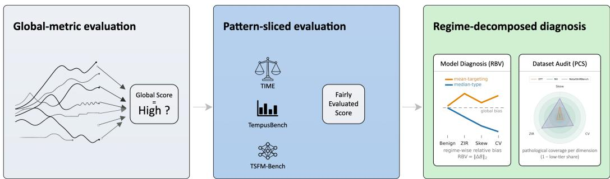  
Figure 1: Evolution of time-series forecasting evaluation paradigms.  
Evolution of time-series forecasting evaluation paradigms. Global aggregate metrics (left) hide regime-specific failure; pattern-sliced benchmarks (middle) retain uniform averaging over label-side pathologies; our RBV model diagnosis and PCS dataset audit (right) evaluate models and datasets at the level of distributional regimes.

## 2 RELATED WORK

## 2.1 TIME-SERIES DIAGNOSTIC FRAMEWORK ECOSYSTEMS

Conventional time-series benchmarks rely on idealized Gaussian stationary assumptions and fail to capture authentic industrial distributional traits, yielding deployment-irrelevant validation and hidden robustness risks. Recent works move beyond global ranking toward fine-grained sliced evaluation: TIME Qiao et al. (2026) introduces pattern-aware slicing for temporal-structural failures, while TempusBench Goktas et al. (2026) and TSFM-Bench Li et al. (2025) unify evaluation across diverse architectures and observe unstable scaling-law behaviors. Yet their slicing axes remain temporal-structural, leaving label-side pathologies unexamined.

Sliced and stratified evaluation are well-established in fairness and robustness research to expose subgroup-level performance gaps d’Eon et al. (2022); dataset-auditing practices further stress systematic data quality assessment Zha et al. (2025); Shahbazi et al. (2023). Nevertheless, existing efforts mostly target feature-side properties or temporal patterns—e.g., feature-driven per-series model selection and averaging Montero-Manso et al. (2020) and aggregation-breadth analyses of grouped forecasting Montero-Manso & Hyndman (2021)—rather than label-side distributional pathologies such as zero-inflation, skewness, and scale variability that dominate mismatches. Our regimedecomposed evaluation and RetailShiftBench fill this gap by auditing label-conditional distributional defects at both the model and dataset level.

Concurrent studies highlight intrinsic limitations of canonical forecasting losses. Procrustean optimization bias Cai et al. (2025) identifies fitting artifacts from point-wise loss decomposition, and DistDF Wang et al. (2026) emphasizes distribution alignment for reliable forecasting. These works primarily refine training objectives to alleviate temporal fitting bias. Complementing these lines, we target the stationary mismatch between fixed-form loss priors and pathological industrial data, proposing general-purpose diagnostic infrastructure for regime-oriented evaluation.

## 2.2 DUAL DIMENSIONS OF LOSS MISSPECIFICATION

Prior work largely addresses temporal-structural misspecification: point-wise losses decompose joint sequential fitting into independent per-step optimization, neglecting intrinsic temporal autocorrelation, and recent slicing benchmarks inherit this focus. Temporal alignment methods can mitigate such structural bias but cannot resolve inherent distributional mismatches in industrial pathological data. We target the complementary, conceptually separable distributional-statistical misspecification: labelside statistical pathologies under stationary distributions, whose induced bias persists even when temporal patterns are perfectly recovered.

Classic intermittent-demand forecasting literature in operations research has extensively investigated estimation bias for methods including Croston’s estimator Croston (1972) and the Syntetos–Boylan approximation Syntetos & Boylan (2001), as well as recent taxonomy-conditioned Bayesian alternatives such as TSB-HB Bai & Chu (2025). This body of work has long recognized skewed, zero-inflated demand pathologies. Empirically, forecasting practitioners and competition participants frequently observe improved performance when training separate models per demand segment; such gains, however, are typically validated via aggregate forecasting metrics and lack a mechanistic account of the conditions under which partitioning improves or degrades predictive robustness. Still, these domain treatments regard statistical pathologies as modeling obstacles rather than evaluative dimensions, lacking systematic benchmark auditing and regime-decomposed risk quantification for deep forecasting. Unlike TSB-HB’s model-oriented $\mathrm { \ A D I { - } C } \mathbf { \check { V } } ^ { 2 }$ taxonomy, ours is built for evaluation and dataset auditing: ADI captures temporal demand-occurrence patterns while our taxonomy uses a marginal zero-inflation rate; their $\mathrm { C V ^ { 2 } }$ measures variability of non-zero demand sizes while we use a within-series CV over the full series including zeros; and neither ADI nor $\mathrm { C V ^ { 2 } }$ captures distributional skewness, the principal driver of median-estimand mismatch. Existing intermittent-demand methods accordingly focus on domain-specific point forecasts and do not generalize to canonical deep-learning losses such as MSE, MAE, Tweedie, and quantile; we systematically characterize how coupled industrial pathologies trigger regime-dependent misalignment under these ubiquitous losses. From a statistical decision-theoretic perspective, canonical losses act as proper scoring rules Gneiting & Raftery (2007) that elicit domain-agnostic statistical functionals (mean, median, fixed quantiles) Koenker & Bassett Jr (1978). While this guarantees statistical consistency, the induced estimand is fixed by the loss prior and cannot adapt to regime-varying distributions.

A complementary line of work attributes the accuracy–value disconnect to downstream optimization: smart predict-then-optimize and decision-focused learning show that losses targeting statistical estimands need not minimize decision regret, and advocate training directly against the downstream objective (Elmachtoub & Grigas, 2022; Mandi et al., 2024). In intermittent- demand settings, the inventory literature similarly observes that accuracy metrics can rank models opposite to newsvendor cost or service level (Ban & Rudin, 2019; Syntetos & Boylan, 2006). These explanations, however, concern the mismatch between a loss and a single decision target; they largely overlook a distinct source of bias: pooled shared-parameter training across heterogeneous regimes induces aggregation trade-offs that persist even when the loss matches the decision target.

Likelihood–distribution matching is established practice in probabilistic forecasting (Alexandrov et al., 2020; Salinas et al., 2020; Smyth & Jørgensen, 2002), yet remains a per-model manual choice without regime-level diagnosis. We instead contribute a hierarchical coupled-pathology taxonomy, the dual-bias conceptual separation, and an industrial benchmark (RetailShiftBench), converting scattered domain observations into a standardized diagnosis workflow.

## 3 INDUSTRIAL PATHOLOGY TAXONOMY

Inventory-side zero-inflation arises from cold-start and stockout scenarios generating sparse zero observations, conflicting with median-centric loss optimization. Marketing-induced skewness originates from promotional and seasonal demand bursts creating asymmetric long-tailed distributions. Scale heterogeneity describes fluctuating sales magnitudes yielding extreme within-series variability, an inherent data trait irresolvable by temporal modeling. These three orthogonal statistical traits constitute our foundational distributional pathologies. Beyond these distribution-level characteristics, business-driven temporal-structure effects such as holidays and product-lifecycle shifts can break stationarity assumptions for canonical losses; these are treated as amplification factors rather than core statistical pathologies. Critically, coupled high-order distributional regimes give rise to emergent misalignment patterns that cannot be inferred from individual one-dimensional properties; these constitute some of the most harmful failure modes for real-world deployment. See § B.8 for controlled ablation exploring the boundary conditions under which coupled pathologies yield saturation versus super-additive degradation.

## 3.1 THREE ORTHOGONAL FOUNDATIONAL STATISTICAL DIMENSIONS

The three foundational dimensions directly violate the core statistical priors of canonical losses. They are conceptually orthogonal, forming a minimal sufficient set; while kurtosis or multimodality may introduce additional risks, they overlap with our dimensions or reflect temporal-structure confounds, and are treated as secondary factors. Loss functions fail on distributions, not on business labels: the same statistical pathologies recur across domains under different business guises, which is why the taxonomy is defined statistically and transfers across domains.

## 3.1.1 DISTRIBUTION SHAPE SKEWNESS

Skewness quantifies distributional asymmetry, violating symmetric-residual assumptions: $\gamma _ { 1 } =$ $\textstyle { \frac { 1 } { T } } \sum _ { t = 1 } ^ { T } { \Big ( } { \frac { y _ { t } - { \bar { y } } } { \sigma } } { \Big ) } ^ { 3 }$ . Regimes: low $( | \gamma _ { 1 } | < 1 )$ , moderate $( 1 \leq | \gamma _ { 1 } | < 4 ) , \mathrm { h i g h } \left( | \gamma _ { 1 } | \geq 4 \right)$

## 3.1.2 WITHIN-SERIES SCALE VARIABILITY

Measured by coefficient of variation (CV), this dimension characterizes internal sequence scale imbalance, breaking uniform-weighting assumptions: $\begin{array} { r } { \mathrm { C V } = \frac { \sigma } { \bar { u } } \left( \bar { y } > 0 \right) } \end{array}$ . Regimes: low $( \mathrm { C V } < 1 . 5 )$ , moderate $( 1 . 5 \leq \mathbf { C V } < 3 . 0 )$ , high $\mathrm { ( C V \geq 3 . 0 ) }$ . We strictly distinguish within-sequence CV from cross-SKU absolute magnitude differences.

## 3.1.3 TEMPORAL SPARSITY (ZERO-INFLATION RATE)

ZIR quantifies intermittent zero observations from inventory shortage and cold-start scenarios, violating continuous-support assumptions: $\begin{array} { r } { \mathrm { Z I R } = \frac { 1 } { T } \sum _ { t = 1 } ^ { T } \mathbb { I } ( y _ { t } = 0 ) } \end{array}$ . Regimes: low $( Z \mathrm { I R } < 0 . 2 )$ , moderate $( 0 . 2 ~ \leq ~ \mathrm { Z I R } ~ < ~ 0 . 4 )$ , high $( Z \mathrm { I R } ~ \ge ~ 0 . 4 ) ^ { ^ { \underline { { { s } } } } }$ Where possible, cutoffs follow established conventions: $| \gamma _ { 1 } | = 1$ marks the classical moderate-skew boundary Bulmer (2012), and the ZIR upper cutoff aligns with the intermittent–lumpy demand boundary of the OR classification literature Syntetos & Boylan (2005). The remaining cutoffs $( | \gamma _ { 1 } | = 4 , \mathbf { C V } { = } 1 . 5 / 3 . 0 , \mathbf { Z I R } { = } 0 . 2 )$ are retail-calibrated design choices, fixed before any experimental evaluation and not tuned to model outcomes; the partitioning paradigm generalizes to other industrial domains with minor threshold recalibration, and the App. B.4 verifies that all mismatch conclusions are robust to ±20% threshold perturbations.

## 3.2 COUPLED DISTRIBUTIONAL PATHOLOGICAL REGIMES

Coupled regimes arise from high-threshold intersections of the three foundational dimensions: ZIR– Skew, ZIR–Vol, Skew–Vol, and ZIR–Skew–Vol, each requiring joint satisfaction of the high-threshold conditions defined in § 3.1.

Coupling with Temporal-Structure Effects. These structural effects do not create novel distributional-statistical misalignment on their own, yet amplify pre-existing systematic risk when superimposed atop distributional pathologies: (i) non-stationary regime shifts increase inference complexity given already pathological data distributions; (ii) superimposed cyclic patterns (e.g., weekly promotions overlaid on annual seasonality) create intermittent-burst transitions that fixed-form models fail to capture; We exclude these couplings from our core taxonomy to preserve Prop. B.1’s theoretical rigor, while acknowledging them as critical amplifiers of deployment mismatch. Retail Manifestations. The proposed distributional regimes map onto well-known business patterns: high-ZIR series correspond to intermittent-demand and cold-start SKUs; high-skewness captures promotiondriven demand bursts; Skew–Vol characterizes long-tail niche items; the three-way composite regime represents sporadic luxury-type demand with volatile promotional lifts. Loss Misspecification Mapping We systematically uncover and formalize the structural misalignment between mainstream regression losses and industrial time-series pathologies. As validated by closed-form oracle analysis on synthetic marginals (Fig. 4, 5), each individual pathology alone is sufficient to induce severe systematic misalignment under perfect temporal fitting. Tab. 2 confirms that the same misalignment signatures manifest in real trained models alongside temporal fitting errors.

Our core critique focuses on fixed-prior standard losses, whose static statistical assumptions cannot adapt to regime-varying industrial distributions. While overlapping multi-pathology superposition yields performance saturation under perfect optimization, the disjoint-support coupling between zero-inflation and conditional variability (ZIR×CV) can further induce super-additive emergent mismatch at intermediate intensity (§ B.8).

## 4 REGIME-DECOMPOSED BIAS DIAGNOSTIC

Conventional global evaluation metrics enforce uniform averaging across heterogeneous industrial samples, eliminating regime-specific distortion signals and concealing deployment-critical systematic risks. To resolve this train–deploy evaluation gap, we propose a regime-decomposed diagnostic evaluation paradigm grounded in our pathology taxonomy: the taxonomy quantifies where models fail (§3), and this section makes the failure measurable. Industrial forecasting suffers a dual compression effect: intrinsic single-sequence distributional pathologies (high CV/ZIR/skewness) mainly exist in low-volume long-tail SKUs, whose small absolute magnitude further drowns their gradient contributions in global multi-SKU training, amplifying inherent fitting bias.

## 4.1 METRIC-AGNOSTIC REGIME-DECOMPOSED PROTOCOL

Global averaging masks systematic regime-specific bias induced by fixed global loss priors. To expose this structural misalignment, we formalize a three-step protocol centered on RBV (mathematical definition in § 4.2): Metric-agnostic denotes that Step 3 admits any base functional; it does not assert invariance of RBV magnitudes across functionals. Quantitative comparisons are within-functional; cross-functional agreement is reported at the ranking level (§ B.5). 1. Pathological Partition: We assign test sequences into mutually exclusive cells via per-series skewness, ZIR, and CV, binarized at the low-tier boundary of § 3: a sequence is pathological on dimension d iff regime ̸= low. The not-low pattern induces Benign (all low), single-pathology (ZIR, Skew, CV), and coupled cells (ZIR– Skew, ZIR–CV, Skew–CV, ZIR–Skew–CV). 2. Regime-Isolated Bias Estimation: We compute regime-level systematic error independently, eliminating cross-regime averaging. 3. Metric-Agnostic RBV Quantification: We apply any standard forecasting metric to compute per-regime bias, then derive RBV to quantify how globally optimized losses underweight pathological regimes. This exposes the hidden imbalance of the aggregation trade-off inherent to global training. The same partition supports a dataset-level pathological-coverage audit (PCS, 0–1; § B.6).

## 4.2 THE RBV DIAGNOSTIC

Conventional point-wise prediction metrics conceal heterogeneous cross-regime fitting distortion. We introduce the Regime-wise Relative Bias Vector (RBV) to quantify distribution-level fitting misalignment: rather than reporting only global or single-regime errors, RBV characterizes the cross regime structural alignment between predictions and true distributions by aggregating deviations across four industrial statistical regimes—Benign, ZIR, Skew, and CV—and reveals the aggregation trade-off masked by common evaluation protocols. The three pathology flags are evaluated independently per cell, so a cell may carry multiple flags simultaneously; cells with no flag form the Benign remainder. Regimes pool the cells carrying their flag and thus overlap; cells do not. We construct a four-dimensional relative bias vector $\begin{array} { r } { \tilde { \Delta B } = ( \Delta \tilde { B } _ { \mathrm { B e n i g n } } , \Delta B _ { \mathrm { Z I R } } , \dot { \Delta B } _ { \mathrm { S k e w } } , \Delta B _ { \mathrm { C V } } ) } \end{array}$ with $\Delta B _ { r } = B _ { r } - B _ { \mathrm { g l o b a l } }$ , and define the Regime-wise Relative Bias Vector score as its $\ell _ { 2 }$ norm, $\mathbf { R B V } = \| \Delta B \| _ { 2 }$ . RBV is a template rather than a single metric: centering any regime-level functional $\phi _ { r }$ at its pooled analogue yields a corresponding instantiation—the relative-bias form above is the primary one, with share-normalized and metric-agnostic variants following the same construction (§ B.3).

Interpreting RBV. RBV answers a question accuracy metrics structurally cannot ask: where will this model break? It measures the cross-regime imbalance of systematic bias, not predictive accuracy: uniformly poor but constant bias attains low RBV by construction, so RBV must be read jointly with bias levels and accuracy—enforced structurally, as Tab. 2 reports RBV alongside WMAPE and Tab. 3 tracks both under interventions. The practical reading is quadrant-based: high global accuracy with high RBV is the dangerous quadrant—apparently deployable, yet reliably broken in pathological regimes, where deployment failures actually occur. The Rule heuristic exemplifies the opposite extreme: its near-flat RBV with the worst WMAPE (Tab. 2) is the null signature of a non-pooled estimator—immunity-by-insensitivity, not good calibration. With the demand-mass centering weights, the identity $\begin{array} { r } { \sum _ { r } \dot { \alpha } _ { r } \dot { \Delta } B _ { r } = 0 } \end{array}$ holds exactly for any regime overlap; the unweighted sum $\sum _ { r } \Delta B _ { \imath }$ is generally non-zero, and cross-weight readings are covered in §B.3. The bidirectional pattern is one estimand gap read from its two sides: RBV carries the allocation and the sign pattern of $B _ { r }$ the direction, with uncertainty of both quantified in App. B.3. For non-mean estimands (MAE, Huber, quantiles), we read the excess $R B V , \mathrm { R \dot { B } V - R B V ^ { * } }$ , where the floor $\mathrm { R B V ^ { * } }$ is set by the loss’s estimand alone (train-window label statistics); the training-attributable signal is the deviation above the floor, which restores cross-loss comparability (§E.1).

## 5 MECHANISTIC ACCOUNT

This section provides formal definitions and a supporting structural observation; the paper’s primary contributions are the diagnostic protocol (§4) and the empirical study (§6). Table 1 instantiates the mapping between loss priors, industrial departures, and mismatch mechanisms, formalizing distributional-statistical bias as an industrial loss–data mismatch.

## 5.1 DUAL BIAS MODES

Definition 5.1 (Dual bias modes). Temporal-structural bias arises from violated i.i.d. assumptions ofpoint-wise losses: joint sequential fitting decomposes into independent per-step optimization, $\begin{array} { r } { \mathcal { L } _ { \mathrm { p o i n t } } ( \hat { y } _ { 1 : T } , y _ { 1 : T } ) = \sum _ { t = 1 } ^ { T } \ell ( \hat { y } _ { t } , y _ { t } ) \neq \ell _ { \mathrm { j o i n t } } ( \hat { y } _ { 1 : T } , y _ { 1 : T } ) } \end{array}$ , a mismatch eliminable by joint temporal modeling. Distributional-statistical bias arises,for temporally decorrelated sequences, in two layers. (i) Prior–objective mismatch (estimand mismatch): canonical losses imply distinct estimands—the meanfor MSE, the medianfor MAE,fixed quantilesforpinball—so their statistically optimalforecasts $\begin{array} { r } { \hat { y } _ { \mathrm { s t a t } } = \arg \operatorname* { m i n } _ { \hat { y } } \mathbb { E } _ { y \sim P _ { \mathrm { i n d } } } [ \mathcal { L } ( y , \hat { y } ) ] } \end{array}$ are prior-dependent rather than data-determined; afixed prior can therefore misalign with the deployment objective independently of pathology. This layer is classical and we claim it only as motivation. (ii) Prior–marginal conflict and aggregation bias: on pathological marginals, these prior-dependent optima diverge materially, and, under global pooling, shift toward a cross-regime compromise optimalfor no single regime. This component is independent oftemporal modeling and cannot be eliminated by capacity or architectural improvements under a fixed loss prior.

Table 1: Statistical Assumptions and Deployment Mismatch Patterns
<table><tr><td>Loss</td><td>Implicit Distributional Priors</td><td>Industrial Departure</td><td>Mismatch Mechanism</td></tr><tr><td>MSE</td><td>Symmetric light-tailed residuals, stable finite variance; mean as optimal fitting target</td><td>Heavy-tailed skewed demand with unstable variance</td><td>Quadratic penalty amplifies burst residuals and averages out tail signals; the mean estimand systematically overshoots sparse regimes.</td></tr><tr><td>MAE</td><td>Symmetric continuous distribution; me- dian as optimal estimation target</td><td>Skewed, burst-heavy demand with frequent zero-inflation</td><td>Zeros and a long upper tail pull the median below the mean; the burst mass carrying most expected demand is discarded, widening the gap</td></tr><tr><td></td><td>Quantile Stationary distribution; fixed quantile Zero-inflated baseline targets valid across sub-populations; skewed long-tail demand non-degenerate tails</td><td>with</td><td>Zero-inflation collapses lower-tail quantiles; the estimand degenerates into a step function under sparse bursts</td></tr><tr><td>Poisson</td><td>Variance = mean; discrete counts; mean estimand under exponential cur- with variance exceeding the vature</td><td>Over-dispersed burst clustering mean</td><td>Burst clustering breaks equi-dispersion and mis-sets the fixed exponential curvature; the mass redistribution is invisible to linear-residual metrics</td></tr><tr><td>Huber</td><td>Stationary residual scale; outliers are genuine rare anomalies</td><td>Heavy-tailed baseline with fre- quent extreme demand bursts</td><td>A fixed threshold clips legitimate bursts as outliers; the effective estimand drifts with per-cell residual scale</td></tr><tr><td>Tweedie</td><td>Fixed dispersion and Tweedie-power parameters shared across all samples</td><td>sion under varying industrial sta- tistical regimes</td><td>Heterogeneous SKU-level disper- Static dispersion parameters fail to fit heterogeneous regime-wise distributions, leaving the estimand mismatched to varying statistical regimes.</td></tr></table>

## 5.2 ERROR SEPARATION AND INTENSITY TREND

Prop. B.1 isolates the second mode where the first is eliminated by construction: under perfect temporal fitting $( e _ { t } = 0 )$ , the remaining deviation $b _ { L }$ is mechanistically independent of temporal modeling, providing a measurement-theoretic license for separating the two error channels that aggregate metrics conflate—definitional, as is the classical bias–variance decomposition, and not a claim about joint optimization (formal statement and discussion in § B.7). Prop. B.2 complements this quantitatively: for a fixed predictor, the risk under evaluation-distribution contamination is affine in the pathology mixture weight λ, non-decreasing whenever the pathological component raises the risk above its benign-data level.

Two layers: mismatch vs aggregation trade-off. The first-order condition of a loss defines its target estimand (mean for MSE, median for MAE, qτ for pinball) Gneiting & Raftery (2007); Koenker & Bassett Jr (1978), governing its alignment with operational cost: a median-consistent learner on skewed marginals is correct by construction, and what fails is the matching between the loss-implied estimand and the deployment objective, not the model—a failure mode we term estimand mismatch. This estimand-mismatch layer is classical and we claim it only as motivation; the two layers are easily confounded: the aggregation trade-off is only exposed once the estimand is held fixed, so analyses of loss–decision mismatch (Elmachtoub & Grigas, 2022; Mandi et al., 2024) do not isolate it. Our contribution is the second layer, the aggregation trade-off: under pooled training across heterogeneous regimes, shared parameters induce a cross-regime compromise—even a wellcalibrated loss cannot fit zero-inflated, skewed, and high-variability series with one shared solution. Decomposition mitigates this trade-off (Tab. 8); capacity scaling within the gradient-boosted model class cannot remove it (Fig. 9). The two mechanisms separate in intervention space: decomposition dissolves the aggregation trade-off for mean-type losses (Fig. 9) while exposing, not repairing, the estimand gap of median-type losses (Fig. 10).

## 6 EXPERIMENTAL EVALUATION

The mechanistic account of §5 predicts two separable failure layers—estimand mismatch and the pooling-induced aggregation trade-off. This section tests both on RetailShiftBench: we first audit systematic bias and cross-regime misalignment under global pooled training (Tab. 2), then contrast global against regime-aware training to isolate the aggregation trade-off (Tab. 3), and finally probe its robustness along capacity, quantile, and architecture axes (Figs. 9, 10).

Table 2: Systematic bias and cross-regime vector misalignment (RBV) under hierarchical model-loss.
<table><tr><td rowspan="2">Semantics</td><td rowspan="2">Regime</td><td colspan="6">XGB</td><td colspan="6">TFT</td><td rowspan="2">Rule</td></tr><tr><td>MSE</td><td>MAE</td><td>QL0.60</td><td>Huber</td><td>Tweedie</td><td>Poisson</td><td>MSE</td><td>MAE</td><td> $\overline { { \mathrm { Q L } _ { 0 . 6 0 } } }$ </td><td>Huber</td><td>Tweedie</td><td>Poisson</td></tr><tr><td rowspan="5">Bias</td><td>A11</td><td>0.035</td><td>-0.088</td><td>0.045</td><td>-0.035</td><td>0.025</td><td>-0.01</td><td>-0.004</td><td>-0.076</td><td>0.05</td><td>-0.03</td><td>-0.039</td><td>-0.086</td><td>0.033</td></tr><tr><td>Benign</td><td>0.022</td><td>-0.03</td><td>0.073</td><td>-0.02</td><td>0.017</td><td>-0.043</td><td>0.015</td><td>0.016</td><td>0.095</td><td>0.022</td><td>0.038</td><td>-0.001</td><td>0.031</td></tr><tr><td>Skew</td><td>0.061</td><td>-0.185</td><td>-0.003</td><td>-0.051</td><td>0.044</td><td>0.048</td><td>-0.039</td><td>-0.232</td><td>-0.043</td><td>-0.116</td><td>-0.17</td><td>-0.223</td><td>0.045</td></tr><tr><td>CV</td><td>0.262</td><td>-0.685</td><td>-0.421</td><td>-0.042</td><td>0.176</td><td>0.341</td><td>-0.33</td><td>-0.894</td><td>-0.726</td><td>-0.437</td><td>-0.838</td><td>-0.868</td><td>0.057</td></tr><tr><td>ZIR</td><td>0.116</td><td>-0.385</td><td>-0.114</td><td>-0.110</td><td>0.085</td><td>0.156</td><td>-0.082</td><td>-0.53</td><td>-0.182</td><td>-0.277</td><td>-0.443</td><td>-0.532</td><td>0.038</td></tr><tr><td>RBV</td><td>A11</td><td>0.243</td><td>0.676</td><td>0.496</td><td>0.078</td><td>0.163</td><td>0.394</td><td>0.338</td><td>0.953</td><td>0.816</td><td>0.486</td><td>0.908</td><td>0.915</td><td>0.027</td></tr><tr><td>WMAPE</td><td>A11</td><td>0.4679</td><td>0.4270</td><td>0.4525</td><td>0.4670</td><td>0.4593</td><td>0.4792</td><td>0.4934</td><td>0.4776</td><td>0.485</td><td>0.4798</td><td>0.4757</td><td>0.4719</td><td>0.5182</td></tr></table>

Notes: The All row reports global dataset-wide bias $\overline { { B _ { \mathrm { g l o b a l } } } }$ for RBV computation. RBV is the vector norm computed from Benign/Skew/CV/ZIR regime-specific bias (excluding All).

Table 3: Effect of pathology decomposition.
<table><tr><td>Metric</td><td>MSE</td><td>MAE</td><td>XGB</td><td></td><td>Tweedie</td><td>MAE</td></tr><tr><td>RBV</td><td>(-83.1%) 0.243→0.041 (</td><td>→0.899(+33.2%) 0.675</td><td>Huber 0.077→0.262(+240.3%)</td><td>0.163→0.014(−91.4%)</td><td>MSE 0.914→0.863(-5.6%) 0.335→0.14(−58.2%)</td><td>Huber 0.459→0.572(+24.6%)</td><td>Tweedie 0.873→0.881 (+0.9%)</td><td>Rule</td></tr><tr><td>WMAPE</td><td>0.4679→0.462 (−1.3%)</td><td></td><td>0.4270→0.4255(−0.4%)</td><td>0.4670→0.4765(+2.0%)</td><td>0.4593→0.4539 (−1.2%)</td><td>0.4675→0.4730 (+1.2%) 0.4475→0.4487(+0.3%)</td><td>0.4603→0.4595(-0.2%)</td><td>0.4514→0.4549(+0.8%)</td><td>0.033 0.5182</td></tr><tr><td>MSE</td><td>11.909→11.068(-7.1%)</td><td>12.057→11.524(−4.4%)</td><td></td><td>13.575→20.176 (+48.6%)</td><td>11.992→11.465 (−4.4%)</td><td>15.68→14.55(-7.2%) 15.182→14.40(−5.2%)</td><td>14.140→14.84(+5.0%)</td><td>14.714→14.274 (−3.0%)</td><td>16.452</td></tr><tr><td></td><td>Facb che</td><td></td><td></td><td>skou*ow*zir</td><td></td><td></td><td>doto Split:</td><td></td><td></td></tr></table>

Notes: Each cell shows “global→regime skew\*cv\*zir split”; Global: single model trained on full dataset. Split: separate models trained per pathological regime. Rule denotes a non-trained heuristic as fixed reference, invariant to decomposition. (%): relative change of Split vs. Global; sign reports direction (negative: improvement). MSE is computed on raw demand values (no normalization), which preserves loss-induced overshoot in native units; RBV is our primary cross-regime instrument.

## 6.1 EXPERIMENTAL SETUP

Dataset. We use desensitized real-world retail daily SKU time-series. RetailShiftBench contains 31,213 sampled time-series of 89 time steps each, covering diverse pathological conditions including zero-inflation rate (ZIR), skewness (Skew), and within-series coefficient-of-variation (CV). Notably, these short series exhibit a stable weekly periodicity without trend breaks or long-range drift (Fig. 7), a deliberate design choice that removes temporal non-stationarity as a confound so that residual errors are attributable to distributional misspecification rather than distribution shift over time. Rule Heuristic Baseline. We adopt a domain-driven heuristic forecasting rule that combines five-week category-level trends and the most recent two-week sales observations to produce point forecasts. Models & Losses. For our main model-loss ablation in Tab. 2, we evaluate two representative forecasting backbones, XGB and TFT Chen & Guestrin (2016); Lim et al. (2021), paired with six plug-in loss objectives: MSE, MAE, QL60, Huber, Tweedie, and Poisson. This setup enables cross-architecture comparison and helps rule out model-specific artifacts. To isolate loss-driven misspecification from feature-availability confounds, the output of the Rule heuristic is injected as an auxiliary feature into every model-loss configuration, guaranteeing all models have access to explicit domain-aware statistical signals. Our metric-agnostic regime-decomposed diagnostic protocol (§4.1) is applied across benign stationary and three high-risk pathological regimes. Complementing these per-model-loss results, Tab. 3 investigates the aggregation-bias trade-off by contrasting global pooled training against regime-aware training split by the joint skew\*cv\*zir pathological taxonomy. Backbones share a common, modest tuning budget; we report no cross-backbone ranking, and all conclusions are within-backbone contrasts over losses and interventions.

## 6.2 REGIME-DEPENDENT LOSS MISALIGNMENT

Applying the RBV diagnostic (§4.2) to the main model–loss ablation: a lower RBV indicates stable and consistent cross-regime fitting performance, whereas a higher RBV signifies severe heterogeneous systematic misalignment across statistical regimes. MSE suffers under ZIR due to its Gaussian assumption and sensitivity to zero-inflated noise. MAE performs poorly on Skew data given its median-centered objective. Static-weight QL, Huber and Tweedie degrade under high-variability CV conditions. All losses achieve good performance on Benign data, and all models receive identical pathology-aware prior information; persistent cross-regime fitting imbalance therefore cannot stem from model capacity, architecture, or missing statistical cues, and must originate from inherent loss-function statistical misspecification. We fix backbones and vary only plug-in loss objectives for loss-centric ablation. Specialized OR intermittent-demand methods do not admit plug-in loss substitution and are therefore excluded from this ablation; their estimand behavior under these pathologies is analyzed conceptually in App. E.2. We further audit benchmark industrial validity via the Pathological Coverage Score (§ B.6), where RetailShiftBench provides full-spectrum industrial pathological coverage for reliable regime-oriented evaluation. Beyond retail demand, the same misspecification anatomy appears across industrial domains (App. C).

## 7 DISCUSSION

Theoretical and Paradigm Insights. Traditional benchmarks equate pattern fitting with robustness, overlooking label-side pathologies; structure-aware benchmarks improve temporal evaluation yet ignore dataset-level defects. Individual loss sensitivities—e.g., MSE to zero-inflation, MAE to skewness—reflect classical principles, yet remain fragmented across disconnected literatures; we systematize them into a unified taxonomy and regime-oriented diagnostic framework. Deep forecasting models are trained and evaluated under uniform global criteria, and these criteria are not prior-free: global accuracy metrics are estimands of the same kind as the losses they rank—L1 ranks certify median-adequacy, L2 ranks certify mean-adequacy, under an implicit equal-weight aggregation prior—so conventional evaluation repeats the training assumption instead of auditing it. This creates a self-reinforcing dynamic: series well-aligned with loss priors dominate gradient updates, while pathological subgroups receive weak gradient signals and remain undetected by aggregate metrics. Since standard accuracy metrics are (low-order) functions of residuals, pooled ERM produces a compromise solution. Our work supplies the unifying statistical mechanism behind long-standing mixed evidence on when pooling helps or hurts (Hubrich, 2005). Consequently, globally optimized forecasters—systematically favored by global leaderboards—trade alignment on pathological regimes for better overall aggregate accuracy, while per-series OR estimators (Croston, SBA) remove pooling distortion yet inherit classical estimand mismatch; Croston’s documented over-estimation bias Syntetos & Boylan (2001) is precisely the residual our account predicts, and TSB-HB occupies the partial-pooling regime of Fig. 2.

Structural barriers to scale-up. Capacity scaling captures richer temporal patterns, yet statistical heterogeneity from coexisting ZIR, skewness, and CV cannot be eliminated by temporal modeling alone. This tension has an asymmetric shape under pooled ERM: nonlinear estimands are progressively distorted as mixture breadth grows—pooled CDFs mix linearly; their inverses do not, while linear-curvature objectives are pooling-tolerant yet converge efficiently to estimands operationally vacuous on pathological data: scale accelerates convergence, not correctness. Real-world pathologies form a continuous spectrum that hard partitions cannot cover, and the train–deploy gap is therefore not a capacity deficit but a coupling error between heterogeneous label distributions and globally unified optimization; our hard cells are a coarse diagnostic instrument, stable to ±20% threshold perturbations (App. B.4), not a claim of natural kinds. Foundation models retain transfer and cold-start advantages, yet their shared-weight global-training paradigm incurs a hidden cost that aggregate metrics conceal and RBV with our coverage audit make visible—persisting even without gradient-based fine-tuning, as zero-shot Chronos-Bolt evaluation on M5 confirms (App. E.3). The two exposures are orthogonal and loss-specific: MSE’s conditional-mean estimand is doubly compromised under pooling—squared amplification of heavy tails plus a mixture mean that departs from every per-regime mean—while quantile loss bounds per-sample penalties linearly and is therefore less sensitive to extreme observations, yet remains exposed to cross-regime gradient contamination through shared parameters; no loss replacement alone resolves the pooling channel. The escape requires two keys: decomposition to dissolve the cross-regime compromise, and a curvature-appropriate estimand to avoid exposing the intrinsic one. Where slow-converging estimands are unavoidable, partial pooling with strength adapted to per-cell data volume—the designed regime of Fig. 2—interpolates along the spectrum. The gap is thus one of aggregation structure, not model engineering, and RBV exposes its hidden miscalibration.

Limitations & Future Work. Unlike overfitting, bias arises from mismatched loss priors under perfect temporal fitting; RBV diagnoses the aggregation trade-off but does not correct forecasts: decomposition exposes the mean–median gap rather than removing it, and regime thresholds, though robust to ±20% perturbation, may shift at extreme boundaries. Our framework targets non-negative series and requires recalibration for mixed-sign data. Standard pipelines are uncontested on homogeneous data: the characterized failure requires the conjunction of pathological regimes and globally pooled optimization. The quantile family’s mismatch suggests curvature-corrected objectives (expectiles) as one direction (Newey & Powell, 1987; Bellini et al., 2014). Both escape keys are naturally instantiated: regime-gated or hierarchical architectures implement decomposition at the designed operating point of Fig. 2, while mean-target losses tailored to non-negative heavy-tailed labels (e.g., Tweedie Smyth & Jørgensen (2002)) mitigate within-regime estimand mismatch. However, routing must group by distributional pathology in addition to temporal pattern, and the combined design incurs costs justified only when RBV audit confirms both failure modes active. Extending the protocol to probabilistic forecasting is promising, with RBV providing the diagnostic basis.

## 8 CONCLUSION

This work identifies a persistent, underexplored distributional-statistical misspecification of canonical losses in industrial time-series forecasting. We build upon classical pathological characterizations from operations research, translating domain-specific modeling intuitions into a general-purpose evaluation language for modern deep-learning forecasting benchmarks. We construct a quantifiable hierarchical pathology taxonomy on three foundational statistical dimensions and their couplings, and identify a self-reinforcing evaluation loop: training losses and aggregate metrics share congruent distributional priors, making global performance seemingly consistent while concealing systematic regime-specific misalignment. To expose and audit this hidden loop, we propose the regimedecomposed diagnostic protocol RBV, which decomposes observed bias into a model-independent intrinsic floor and a training-attributable excess component, and we release RetailShiftBench, an industrial benchmark with full pathological coverage, bridging academic global accuracy ranking and industrial risk-aware forecasting. A large-scale controlled study—13 loss objectives, 3 seeds, 60,000+ series spanning RetailShiftBench and M5, with random-split controls—shows that regime-aware diagnosis separates optimization-type from bias-type failure and that regime-aware training resolves the pooling-induced bias it exposes, for mean-type losses. A formal structural observation, that risk under evaluation-distribution contamination is affine in the pathology mixture weight, grounds these findings and is deliberately supporting rather than foundational: the paper’s contribution is empiricalfirst. Our core contribution inverts conventional benchmarking logic: we audit dataset pathological validity rather than blindly ranking models on fixed benchmarks, shifting community research from empirical accuracy competition to mechanism-grounded root-cause diagnosis. Beyond evaluation, our toolkit forms an extensible infrastructure: future work can extend the pathology-coverage audit to dataset industrial readiness, apply RBV to diagnose emerging forecasting foundation models, and design regime-aligned training objectives grounded in quantified trade-offs.

## AI USE STATEMENT

In this work, generative AI tools were used only for language polishing, grammatical correction, and formal academic phrasing of the manuscript text. No generative AI tools were used for designing research ideas, building experimental pipelines, producing analytical results, or drawing conclusions. All AI-assisted content was fully reviewed, verified, and revised manually by the authors. The authors take full responsibility for all claims, analyses, and final content of this paper.

## REPRODUCIBILITY STATEMENT

All experimental results in this paper are fully reproducible. Our main benchmark, RetailShiftBench, is built from desensitized real-world retail daily SKU time series (31,213 series of 89 time steps each); dataset construction, regime calibration, and pathology-coverage auditing are described in § 6.1 and App. C. A desensitized version of RetailShiftBench preserving its core industrial pathological structure is released with the supplementary materials. External validation is performed on the public M5 competition dataset Makridakis et al. (2022a), which is independent of RetailShiftBench; the two datasets share no samples, and all M5-specific protocols (120-day windowing, zero-run censoring, single-origin evaluation) are described in App. E. We provide complete data preprocessing pipelines, model training configurations, and metric calculation scripts in the supplementary materials. All hyperparameters, loss function settings, and evaluation protocols are explicitly stated to ensure consistent replication. We further release anonymous source code to facilitate full reproduction of our empirical findings and analytical results.

## REFERENCES

Alexander Alexandrov, Konstantinos Benidis, Michael Bohlke-Schneider, Valentin Flunkert, Jan Gasthaus, Tim Januschowski, Danielle C Maddix, Syama Rangapuram, David Salinas, Jasper Schulz, et al. Gluonts: Probabilistic and neural time series modeling in python. Journal of Machine Learning Research, 21(116):1–6, 2020.

Abdul Fatir Ansari, Lorenzo Stella, Caner Turkmen, Xiyuan Zhang, Pedro Mercado, Huibin Shen, Oleksandr Shchur, Syama Sundar Rangapuram, Sebastian Pineda Arango, Shubham Kapoor, et al. Chronos: Learning the language of time series. arXiv preprint arXiv:2403.07815, 2024.

Zong-Han Bai and Po-Yen Chu. Tsb-hb: A hierarchical bayesian extension of the tsb model for intermittent demand forecasting. arXiv preprint arXiv:2511.12749, 2025. URL https: //arxiv.org/abs/2511.12749.

Gah-Yi Ban and Cynthia Rudin. The big data newsvendor: Practical insights from machine learning. Operations Research, 67(1):90–108, 2019.

Fabio Bellini, Bernhard Klar, Alfred Muller, and Emanuela Rosazza Gianin. Generalized quantiles as¨ risk measures. Insurance: Mathematics and Economics, 54:41–48, 2014.

Jose Blanchet and Karthyek Murthy. Quantifying distributional model risk via optimal transport. Mathematics ofOperations Research, 44(2):565–600, 2019.

Jose Blanchet, Yang Kang, and Karthyek Murthy. Robust wasserstein profile inference and applications to machine learning. Journal ofApplied Probability, 56(3):830–857, 2019.

Michael George Bulmer. Principles of statistics. Courier Corporation, 2012.

Rongyao Cai, Yuxi Wan, Kexin Zhang, Ming Jin, Hao Wang, Zhiqiang Ge, Daoyi Dong, Yong Liu, and Qingsong Wen. The procrustean bed of time series: The optimization bias of point-wise loss. arXiv e-prints, pp. arXiv–2512, 2025.

Tianqi Chen and Carlos Guestrin. Xgboost: A scalable tree boosting system. In Proceedings of the 22nd acm sigkdd international conference on knowledge discovery and data mining, pp. 785–794, 2016.

John D Croston. Forecasting and stock control for intermittent demands. Journal ofthe operational research society, 23(3):289–303, 1972.

Greg d’Eon, Jason d’Eon, James R Wright, and Kevin Leyton-Brown. The spotlight: A general method for discovering systematic errors in deep learning models. In Proceedings of the 2022 ACM Conference on Fairness, Accountability, and Transparency, pp. 1962–1981, 2022.

Adam N Elmachtoub and Paul Grigas. Smart “predict, then optimize”. Management science, 68(1): 9–26, 2022.

Tilmann Gneiting and Adrian E Raftery. Strictly proper scoring rules, prediction, and estimation. Journal ofthe American statistical Association, 102(477):359–378, 2007.

Denizalp Goktas, Gerardo Riano-Brice˜ no, Alif Abdullah, Aryan Nair, Chenkai Shen, Beatriz de Lucio,˜ Alexandra Magnusson, Farhan Mashrur, Ahmed Abdulla, Shawrna Sen, et al. Tempusbench: An evaluation framework for time-series forecasting. arXiv preprint arXiv:2604.11529, 2026.

Kirstin Hubrich. Forecasting euro area inflation: Does aggregating forecasts by hicp component improve forecast accuracy? International Journal of Forecasting, 21(1):119–136, 2005. doi: 10.1016/j.ijforecast.2004.04.005.

Roger Koenker and Gilbert Bassett Jr. Regression quantiles. Econometrica: journal of the Econometric Society, pp. 33–50, 1978.

Zhe Li, Xiangfei Qiu, Peng Chen, Yihang Wang, Hanyin Cheng, Yang Shu, Jilin Hu, Chenjuan Guo, Aoying Zhou, Christian S Jensen, et al. Tsfm-bench: A comprehensive and unified benchmark of foundation models for time series forecasting. In Proceedings of the 31st ACM SIGKDD Conference on Knowledge Discovery and Data Mining V. 2, pp. 5595–5606, 2025.

Bryan Lim, Sercan O Arık, Nicolas Loeff, and Tomas Pfister. Temporal fusion transformers for¨ interpretable multi-horizon time series forecasting. International journal offorecasting, 37(4): 1748–1764, 2021.

Spyros Makridakis, Evangelos Spiliotis, and Vassilios Assimakopoulos. M5 accuracy competition: Results, findings, and conclusions. International journal offorecasting, 38(4):1346–1364, 2022a.

Spyros Makridakis, Evangelos Spiliotis, and Vassilios Assimakopoulos. The m5 competition: Background, organization, and implementation. International Journal of Forecasting, 38(4): 1325–1336, 2022b.

Jayanta Mandi, James Kotary, Senne Berden, Maxime Mulamba, Victor Bucarey, Tias Guns, and Ferdinando Fioretto. Decision-focused learning: Foundations, state of the art, benchmark and future opportunities. Journal ofArtificial Intelligence Research, 80:1623–1701, 2024.

Nicolai Meinshausen. Quantile regression forests. Journal ofMachine Learning Research, 7(35): 983–999, 2006. URL http://jmlr.org/papers/v7/meinshausen06a.html.

Pablo Montero-Manso and Rob J Hyndman. Principles and algorithms for forecasting groups of time series: Locality and globality. International Journal ofForecasting, 37(4):1632–1653, 2021.

Pablo Montero-Manso, George Athanasopoulos, Rob J Hyndman, and Thiyanga S Talagala. Fforma: Feature-based forecast model averaging. International Journal ofForecasting, 36(1):86–92, 2020.

Whitney K Newey and James L Powell. Asymmetric least squares estimation and testing. Econometrica: Journal of the Econometric Society, pp. 819–847, 1987.

Zhongzheng Qiao, Sheng Pan, Anni Wang, Viktoriya Zhukova, Yong Liu, Xudong Jiang, Qingsong Wen, Mingsheng Long, Ming Jin, and Chenghao Liu. It’s time: Towards the next generation of time series forecasting benchmarks. arXiv preprint arXiv:2602.12147, 2026.

David Salinas, Valentin Flunkert, Jan Gasthaus, and Tim Januschowski. Deepar: Probabilistic forecasting with autoregressive recurrent networks. International journal of forecasting, 36(3): 1181–1191, 2020.

Nima Shahbazi, Yin Lin, Abolfazl Asudeh, and Hosagrahar V Jagadish. Representation bias in data: A survey on identification and resolution techniques. ACM Computing Surveys, 55(13s):1–39, 2023.

Gordon K Smyth and Bent Jørgensen. Fitting tweedie’s compound poisson model to insurance claims data: dispersion modelling. ASTIN Bulletin: The Journal ofthe IAA, 32(1):143–157, 2002.

Aris A Syntetos and John E Boylan. On the bias of intermittent demand estimates. International journal ofproduction economics, 71(1-3):457–466, 2001.

Aris A Syntetos and John E Boylan. The accuracy of intermittent demand estimates. International Journal offorecasting, 21(2):303–314, 2005.

Aris A Syntetos and John E Boylan. On the stock control performance of intermittent demand estimators. International journal of production economics, 103(1):36–47, 2006.

Hao Wang, Licheng Pan, Yuan Lu, Zhixuan Chu, Xiaoxi Li, Shuting He, Zi Chan, Qingsong Wen, Haoxuan Li, and Zhouchen Lin. Distdf: Time-series forecasting needs joint-distribution wasserstein alignment. In International Conference on Learning Representations, volume 2026, pp. 131512–131535, 2026.

Daochen Zha, Zaid Pervaiz Bhat, Kwei-Herng Lai, Fan Yang, Zhimeng Jiang, Shaochen Zhong, and Xia Hu. Data-centric artificial intelligence: A survey. ACM Computing Surveys, 57(5):1–42, 2025.

## A AGGREGATION-DRIVEN BIAS-VARIANCE TRADE-OFF SCHEMATIC

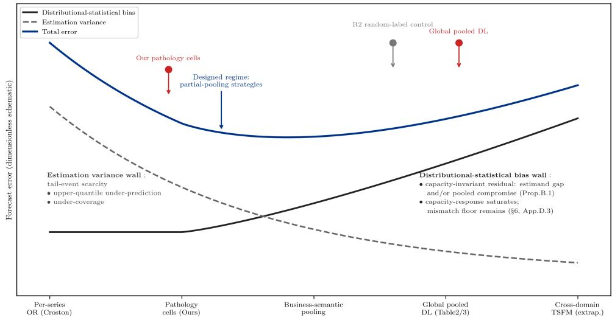  
Figure 2: Conceptual schematic of the aggregation-breadth trade-off between distributional-statistical bias and estimation variance. The global-pooled, random-cell (R2, random-label control), and pathology-cell markers correspond to measured configurations (Tab. 3; § D.2, Tab. 8); remaining markers are positional schematics without measured magnitude. Measured anchors are consistent with, but do not locate, a total-error minimum near pathology-aware subgrouping.

Above we present a conceptual schematic of the qualitative bias-variance trade-off under pooled multi-series forecasting; no closed-form curve is derived—three operating points (global-pooled, random-cell R2, pathology-cell) are measured (Tab. 3; § D.2). The trade-off characterizes settings with strong cross-series distributional heterogeneity (zero-inflation, skewness, high variability), where pooled training mixes distributions of divergent statistical properties. For near-homogeneous collections (low PCS, § B.6), both walls recede and the trade-off flattens. It does not apply to tasks dominated by temporal-structure challenges such as long-range dependence, or to causalinference problems unrelated to cross-series distribution mixing. PCS serves as an empirical gauge of applicability: predictions are load-bearing exactly where pathological coverage is high.

Under pooled empirical risk minimization, any loss optimizes for the pooled-distribution optimum, which per Prop. B.1 constitutes a weighted compromise of subgroup-specific optima. Accumulated distributional-statistical bias is largely invisible to the training objective and poorly captured by aggregate metrics, as demonstrated by quantile-coverage collapse that point-wise metrics reward Fig. 8. A further subtlety arises from the congruence between training-loss priors and global evaluation metrics: even as aggregation pushes models toward the bias-wall of Fig. 2—the saturation point where more global training no longer reduces regime bias—global scores stay nearly unchanged, masking systematic deviations and motivating our RBV diagnostic protocol. Hierarchical partial-pooling approaches are designed to target this intermediate regime; pathology-aware pooling to realize this operating point is discussed in § 7.

## B SUPPLEMENTARY FORMAL STATEMENTS, ANALYTICAL DERIVATIONS AND ROBUSTNESS VALIDATIONS

This appendix provides supplementary formal derivations, analytical proofs, regularity validations, and robustness ablations to complement the main paper’s theoretical framework and experimental conclusions.

## B.1 LOSS–MARGINAL CONFLICT VERIFICATION & PROPOSITION DERIVATIONS

Mechanistic verification. We provide case-by-case mechanistic verification for the core loss misspecification claims (Tab. 1), confirming that each foundational industrial pathology violates one or more of the classical working conditions under which a single global loss prior is statistically unambiguous, inducing a loss–prior/marginal conflict. Under a symmetric marginal, the mean and median coincide and the choice among mean-, median-, and quantile-consistent losses is immaterial; under a continuous non-degenerate support, all implied quantiles are well-defined and non-degenerate; and under homogeneous samples, uniform weighting in empirical risk minimization weights all parts of the marginal as intended. We verify that each foundational industrial pathology breaks one or more of these conditions, so that the loss-implied optimum becomes prior-dependent on the pathological marginal, inducing distributional-statistical bias:

1. Skewness Pathology $( | \gamma _ { 1 } | \gg 0 )$ : MSE optimizes mean-centered residuals, while MAE optimizes median-based estimation. Severe skewness diverges mean and median values, leaving the two loss-implied optima distinct on the same marginal. Violation of the symmetric residual assumption creates a non-zero divergence between the two statistical optima, exposing the prior-dependence of the loss-implied optimum.

2. Zero-Inflation Pathology (High ZIR): High zero-inflation violates the continuous support assumption of regression losses. Low quantile targets degenerate to zero, and MAE median estimation collapses toward trivial zero samples. Median-based optimization prioritizes fitting dominant zero observations, thereby discarding the high-demand burst mass, distorting the lossimplied optimum on the pathological marginal.

3. Within-series Scale Variability (High CV): Canonical losses apply uniform sample weighting during risk minimization. High CV creates extreme imbalance between trivial low-magnitude samples and heavy-tailed demand bursts. Uniform weighting dilutes gradient contributions of high-impact samples, causing under-fitting of critical cases and prioritizing average accuracy over tail fidelity, so the fixed weighting prior mis-serves the pathological marginal.

All three foundational pathologies break one or more of the classical working conditions under which a single global loss prior is statistically unambiguous, inducing a systematic loss–prior/marginal conflict and completing the mechanistic verification.

## B.2 STANDARD REGULARITY ASSUMPTIONS FOR REGIME TREND ANALYSIS

To eliminate ambiguity in distribution perturbation and error decomposition, we state standard, industrially valid regularity assumptions for rigorous generalization error bounding, all naturally satisfied by retail time-series data and canonical loss functions.

Assumption B.1 (Bounded Industrial Demand Support). The industrial demand variable satisfies $y _ { t } \in [ 0 , Y _ { \operatorname* { m a x } } ] f o r a$ finite constant $Y _ { \mathrm { m a x } } < \infty$ . This holdsfor all retail sales records, as real-world transaction volumes are strictly bounded.

Assumption B.2 (Lipschitz-Smooth Loss Function). Anyfixed-form loss $\mathcal { L } ( y , \hat { y } )$ considered (MSE, MAE, Quantile, Huber, Tweedie, WMAPE) is L-Lipschitz continuous with respect to the prediction yˆ over the bounded support $[ 0 , Y _ { \mathrm { m a x } } ]$ . Bounded Lipschitzness guarantees stable gradient behavior and controllable error perturbation under distribution shifts.

Assumption B.3 (Pathology-Induced Absolute Continuous Measure Transformation). For each coupled pathological regime $p \in \mathcal { P } _ { \mathrm { c o u p l e } }$ , define the distribution shift operator $T _ { p }$ as an absolutely continuous measure transformation that maps the benign baseline distribution $\mathcal { D } _ { \mathrm { b e n i g n } }$ to the distorted pathological distribution $\mathcal { D } _ { p } .$ . The transformation is parameterized by a normalized pathological intensity $\lambda ( p ) \in [ 0 , 1 ]$ , where $\lambda ( p ) = 0$ denotes benign baseline and $\lambda ( p ) = 1$ denotes maximum pathological distortion. The Radon–Nikodym derivative´ d ${ \mathcal { D } } _ { p } / d { \mathcal { D } } _ { \mathrm { b e n i g n } }$ exists and is boundedfor all valid $\lambda ( p )$

To make the contamination structure explicit, we first state the assumption under which Prop. B.2 is formalized, and then supplement its detailed derivation to verify the monotonic regime-dependent failure trend observed in experiments.

Assumption B.4 (Pathology as Distribution Contamination). Each pathologicalfamily $\{ \mathcal { D } _ { \lambda } \} _ { \lambda \in [ 0 , 1 ] }$ is parameterized by contamination of the benign baseline: ${ \mathcal D } _ { \lambda } = ( 1 - \lambda ) { \mathcal D } _ { \mathrm { b e n i g n } } + \lambda { \mathcal D } _ { \mathrm { p a t h } }$ where $\mathcal { D } _ { \mathrm { p a t h } }$ is a fixed pathological distribution on the same support $[ 0 , Y _ { \mathrm { m a x } } ]$ . The intensity λ is interpretable as thefraction ofpathological mass $( e . g .$ , zero-inflation rate, mixture weight), and all expectations under $\mathcal { D } _ { \lambda }$ are well-defined by linearity of mixture distributions, with no ordering of Radon–Nikodym derivatives required.´

Proposition B.1 (Loss-relative error separation). Let $\varphi ^ { * } \big ( \cdot \mid y _ { < t } \big )$ denote the deployment-target functional $( e . g .$ , the conditional mean under mean-oriented operational cost, a quantile under service-level cost). For any loss L in the zoo, define its statistically optimal forecast $\hat { y } _ { C } ^ { \mathrm { s t a t } } ( y _ { < t } ) =$ arg minyˆ $\mathbb { E } _ { y _ { t } \sim P ( \cdot | y _ { < t } ) } \mathcal { L } ( y _ { t } , \hat { y } )$ (the conditional functional elicited by $\mathcal { L } \dot { z }$ mean for MSE, median for MAE, $q _ { \tau }$ for pinball), and the loss-relative bias $b _ { \mathcal { L } } : = \hat { y } _ { \mathcal { L } } ^ { \mathrm { s t a t } } - \varphi ^ { * }$ . The realized forecast decomposes relative to the deployment target as $\hat { y } _ { t } - \varphi ^ { \ast } ( y _ { < t } ) = b _ { \mathcal { L } } ( y _ { < t } ) + e _ { t } ,$ , where $e _ { t }$ is the residual temporal-fitting error. Under perfect temporalfitting $( e _ { t } = 0 )$ , the remaining deviation $b _ { \mathcal { L } }$ is mechanistically independent of temporal modeling: a fixed loss prior whose implied estimand misaligns with the deployment target induces prediction bias that temporal modeling cannot remove. Two readings follow. (i) If the target is the conditional mean, then $b _ { \mathrm { M S E } } \equiv 0$ and MSE exhibits no estimand-mismatch component; its regime-level bias in Tab. 2 is then entirely the aggregation component arising because pooled training shifts the shared optimum toward a demand-weighted cross-regime compromise that departsfrom every per-regime mean. (ii) For losses whose estimand differsfrom the target (e.g., MAE against a mean target), $b _ { \mathcal { L } }$ is nonzero already per distribution and isfurther displaced under pooling. In both cases the distributional-statistical channel constitutes a loss–data mismatch distinctfrom temporal-structural bias.

Proposition B.2 (Risk of a fixed predictor under evaluation-distribution contamination). Fix any predictor $\hat { y } ,$ any loss $\mathcal { L }$ whose expectations below exist, and write

$$
R _ { \mathrm { b e n i g n } } : = \mathbb { E } _ { \mathcal { D } _ { \mathrm { b e n i g n } } } [ \mathcal { L } ( y , \hat { y } ) ] , \qquad R _ { \mathrm { p a t h } } : = \mathbb { E } _ { \mathcal { D } _ { \mathrm { p a t h } } } [ \mathcal { L } ( y , \hat { y } ) ] .
$$

Under Assumption B.4, the risk under the contaminated mixture

$$
R ( \lambda ) : = \mathbb { E } _ { \mathcal { D } _ { \lambda } } [ \mathcal { L } ( y , \hat { y } ) ] = ( 1 - \lambda ) R _ { \mathrm { b e n i g n } } + \lambda R _ { \mathrm { p a t h } } ,\tag{1}
$$

is affine in λ with slope $R _ { \mathrm { p a t h } } - R _ { \mathrm { b e n i g n } } ,$ , and is non-decreasing (strictly increasing) in λ whenever $R _ { \mathrm { p a t h } } \geq ( > ) R _ { \mathrm { b e n i g n } } , i . { \dot { e } } .$ , whenever the pathological distribution raises the expected loss of the fixed predictor above its benign-data level.

Proof. By linearity of expectation under the mixture ${ \mathcal { D } } _ { \lambda } = ( 1 - \lambda ) { \mathcal { D } } _ { \mathrm { b e n i g n } } + \lambda { \mathcal { D } } _ { \mathrm { p a t h } }$ (Assumption B.4),

$$
R ( \lambda ) = ( 1 - \lambda ) R _ { \mathrm { b e n i g n } } + \lambda R _ { \mathrm { p a t h } } = R _ { \mathrm { b e n i g n } } + \lambda \big ( R _ { \mathrm { p a t h } } - R _ { \mathrm { b e n i g n } } \big ) ,
$$

which is affine in λ with slope $R _ { \mathrm { p a t h } } - R _ { \mathrm { b e n i g n } } ;$ the slope is non-negative (positive) exactly under the stated condition.

Scope. This analysis holds for a fixed predictor $\hat { y } { : }$ it characterizes how contamination of the evaluation distribution affects a given predictor, and does not characterize outcomes when the predictor is re-optimized on training data with varying pathology fractions.

Verifying the premise. The premise is checkable for standard losses. For MSE, writing $\mu _ { \lambda } =$ $\mathbb { E } _ { \mathcal { D } _ { \lambda } } [ y ]$ and $\sigma _ { \lambda } ^ { 2 } { \overset { - } { = } } \operatorname { V a r } _ { \mathcal { D } _ { \lambda } } ( y )$ , the bias–variance identity $\mathbb { E } _ { \mathcal { D } _ { \lambda } } [ ( y - \hat { y } ) ^ { 2 } ] = \sigma _ { \lambda } ^ { 2 } + ( \mu _ { \lambda } - \hat { y } ) ^ { 2 }$ shows that the premise holds whenever the pathological family raises total dispersion or shifts the mean away from the benign-data level toward which the predictor was tuned. For the pinball loss at level $\tau ,$ the identity $\mathbb { E } [ \rho _ { \tau } \overline { { ( y - \hat { y } ) } } ] = \tau ( \mu - \hat { y } ) + \mathbb { E } [ ( \hat { y } - \check { y } ) _ { + } ]$ reduces the premise to a two-term comparison between mean shift and below-prediction shortfall; zero inflation, e.g., adds mass at $y = 0$ and raises $\mathbb { E } [ ( \hat { y } - y ) _ { + } ]$ for any $\hat { y } > 0$ . We do not claim the premise holds universally; rather, we verify it in our experiments: Tab. 2 reports per-regime risks of predictors trained on pooled data, and Fig. 5 shows the dose–response trend, jointly confirming the premise for all coupled pathologies and losses studied.

## B.3 RBV: TEMPLATE, INTERPRETATION, AND UNCERTAINTY QUANTIFICATION

Unified template and three instantiations. All RBV variants used in this paper are instances of one template. Let $\{ I _ { r } \} _ { r = 1 } ^ { R }$ be a fixed assignment of test series to regimes (a series may belong to several regimes; membership indicators $m _ { r } ( i ) \in \{ 0 , 1 \}$ replace the partition weights below where overlap occurs), let $\phi _ { r } = \phi \big ( ( \hat { y } _ { i } , y _ { i } ) _ { i \in I _ { r } } \big )$ denote any regime-level functional of predictions and realized labels, and let $\begin{array} { r } { w _ { r } \propto \sum _ { i } m _ { r } ( i ) } \end{array}$ be count-based weights, normalized so that $\begin{array} { r } { \sum _ { r } w _ { r } = 1 } \end{array}$ ; for disjoint partitions this reduces to $w _ { r } \stackrel { \cdot \mathrm { ~  ~ \large ~ \cdot ~ } } { = } | I _ { r } | / N$ . For pathology bias-RBV the centering is the pooled bias of $\ S 4 . 2 , \mathrm { i } . \mathrm { e } . , \ : w _ { r } \propto \alpha _ { r }$ (the absolute-demand mass of cell r) rather than the count share. The centered deviation vector and its aggregation are defined as

$$
\begin{array} { r } { \Delta B _ { \phi , r } = \phi _ { r } - \bar { \phi } , \qquad \bar { \phi } = \sum _ { r = 1 } ^ { R } w _ { r } \phi _ { r } , \qquad \mathrm { R B V } _ { \phi } = \bigl \| \Delta B _ { \phi } \bigr \| _ { 2 } . } \end{array}\tag{2}
$$

The metric-agnostic protocol of §4.1 is precisely the freedom to instantiate the functional slot $\phi ;$ this appendix makes the three instantiations used in the paper explicit (Tab. 4).

Table 4: The RBV family: one template, three instantiations. All variants share the same centering and $\ell _ { 2 }$ aggregation, and differ only in the base functional $\phi _ { r } . \ : E _ { r } ( \tau )$ is the empirical exceedance under the mid-convention $\begin{array} { r } { \widehat { \mathrm { P r } } [ \widehat { q } _ { \tau } > y ] + \frac { 1 } { 2 } \widehat { \mathrm { P r } } [ \widehat { q } _ { \tau } = y ] \mathrm { ( F i g s . ~ } 8 . } \end{array}$ 11); $\begin{array} { r } { \hat { S } _ { r } = \sum _ { i \in I _ { r } } \hat { y } _ { i } } \end{array}$ is the regime-level predicted total, and $\begin{array} { r } { B _ { r } = \big ( \sum _ { i \in I _ { r } } ( \hat { y } _ { i } - y _ { i } ) \big ) / \big ( \sum _ { i \in I _ { r } } | y _ { i } | \big ) } \end{array}$ denotes the regime-wise pooled bias of §4.2.
<table><tr><td>Variant</td><td>Base functional  $\phi _ { r }$ </td><td>Units</td><td>Question answered</td></tr><tr><td>Pathology bias-RBV (default, §4.2)</td><td> $\sum _ { i \in I _ { T } } \left( \hat { y } _ { i } - y _ { i } \right)$   $\overline { { \sum _ { i \in I _ { T } } \left| y _ { i } \right| } }$ </td><td>demand units</td><td>Which regime is systematically over- /under-estimated, and by how much?</td></tr><tr><td>Quantile RBV</td><td> $\phi _ { r } ( \tau ) = E _ { r } ( \tau ) - \tau$ </td><td>probability</td><td>Where – and at which τ – is calibration error concentrated?</td></tr><tr><td>Share-normalized RBV</td><td> $B _ { r } / \hat { S } _ { r }$ </td><td></td><td>dimensionless How is mismatch severity allocated per (relative bias) unit of business volume?</td></tr></table>

Reading guidance. Three caveats govern the use of the RBV family. (i) No cross-variant comparison of magnitudes. The three variants measure different objects on different scales (Tab. 4); quantitative statements are always within-variant, and cross-variant statements are ranking-level only. (ii) Quantile RBV is informative only above the estimandfloor. This per-τ reading is not a refinement but a necessity: quantiles are not additive under aggregation—the sum of per-series τ-quantiles equals the τ-quantile of the total only under comonotonic dependence—so no single scalar RBV can summarize the cross-regime bias structure of a quantile forecaster, and interpretation is per-τ by construction. For a regime with zero-inflation rate zirr (the fraction of zero realizations in regime r), a perfectly calibrated τ -quantile predictor degenerates to zero whenever $\tau \leq \mathrm { z i r } _ { r }$ , and its expected exceedance under the mid-convention equals zi $\dot { \cdot } r / 2$ regardless of fit quality – the estimand floor of §4.2, annotated in Figs. 8–11. Hence $\Delta \bar { B } _ { E ( \tau ) , r }$ with $\tau \leq \mathrm { z i r } _ { r }$ reflects estimand structure rather than miscalibration; quantile RBV is interpreted only on the band $\tau > \mathrm { m a x } _ { r }$ ∈pathological regimes $\operatorname { z i r } _ { r } ,$ with floor-pinned components reported as reference lines and excluded from interpretation. (iii) Conservation holds under the centering weights only. By construction the weighted sum $\begin{array} { r } { \sum _ { r } w _ { r } \Delta B _ { \phi , r } = 0 } \end{array}$ (the unweighted sum $\Sigma _ { r } \Delta \breve { B } _ { \phi , r }$ is generally non-zero), and the bidirectional sign pattern is one estimand gap read from its two sides under the weights w that define $\bar { \phi } .$ For the share-normalized variant the centering weights $w _ { r }$ must be distinguished from the normalization denominators $\hat { S } _ { r }$ : if ϕ¯ is formed under a weighting other than w (e.g., volume shares), the conservation identity and the bidirectional reading must be restated under those weights; mixing the two weight systems silently breaks the identity. A guard $\hat { S } _ { r } \geq \varepsilon$ excludes degenerate all-zero cells from the share-normalized variant.

Remediating a high RBV reading. RBV is a diagnostic, not a verdict; a high value prescribes a regime-localized intervention path. We recommend a three-step reading. (1) Attribute: rank regimes by $| B _ { r } - B _ { \mathrm { g l o b a l } } |$ (equivalent to $| \Delta B _ { \phi , r } |$ under pathology-bias RBV); the dominant cell identifies which pathology the pooled model sacrifices. (2) Classify: distinguish the two layers using a diagnostic per-regime retrain test; if within-cell bias persists (Fig. 10), the residual is estimand mismatch (Layer 1), otherwise the pooled compromise itself (Layer 2, cf. Fig. 9). (3) Intervene: for Layer 1, adopt a curvature-appropriate estimand (quantile at the operational critical ratio, Tweedie for intermittent positive demand); for Layer 2, dissolve the pooling via regime decomposition or partial pooling with strength adapted to per-cell volume (Fig. 2). Capacity increases reduce RBV only down to a loss-dependent floor (the pooled compromise) and cannot remove it; they should not be the first response.

Table 5: Bootstrap uncertainty (SKU-level, B=1000) for the pooled bias B and regime bias variation (RBV), single-origin M5 protocol. All RBV intervals exclude zero.
<table><tr><td rowspan=1 colspan=7>Loss                     B [95% CI]            RBV [95% CI]</td></tr><tr><td rowspan=1 colspan=4>MAE             -0.257 [−0.267, -0.248]   0.409 [</td><td rowspan=1 colspan=2>0.391, 0.427]</td><td rowspan=2 colspan=1></td></tr><tr><td rowspan=1 colspan=3>MSE                0.058 [0.048, 0.068]</td><td rowspan=1 colspan=1>0.419 [0</td><td rowspan=1 colspan=2>.387, 0.450]</td></tr><tr><td rowspan=1 colspan=3>Huber            -0.107 [−0.115, −0.098]</td><td rowspan=1 colspan=1>0.241</td><td rowspan=1 colspan=2>[0.215, 0.265]</td><td rowspan=1 colspan=1></td></tr><tr><td rowspan=1 colspan=3>Tweedie            0.054 [0.044, 0.063]</td><td rowspan=1 colspan=1>0.378[</td><td rowspan=1 colspan=2>0.350, 0.407]</td><td rowspan=1 colspan=1></td></tr><tr><td rowspan=1 colspan=1>Poisson             0.058 [</td><td rowspan=1 colspan=2>0.049, 0.068]</td><td rowspan=1 colspan=1>0.477[</td><td rowspan=1 colspan=2>0.445, 0.507]</td><td rowspan=1 colspan=1></td></tr><tr><td rowspan=1 colspan=1>Quantile τ=0.1   -0.859 [</td><td rowspan=1 colspan=2>−0.866, −0.852]</td><td rowspan=1 colspan=1>0.229</td><td rowspan=1 colspan=2>[0.218, 0.242]</td><td rowspan=1 colspan=1></td></tr><tr><td rowspan=1 colspan=3>Quantile τ=0.2  -0.740[−0.749, -0.730]</td><td rowspan=1 colspan=1>0.373</td><td rowspan=1 colspan=2>[0.359, 0.390]</td><td rowspan=1 colspan=1></td></tr><tr><td rowspan=1 colspan=3>Quantile τ=0.3  -0.609[−0.619, -0.599]</td><td rowspan=1 colspan=1>0.464</td><td rowspan=1 colspan=2>[0.447, 0.479]</td><td rowspan=1 colspan=1></td></tr><tr><td rowspan=1 colspan=3>Quantile τ=0.4  -0.451[−0.461, -0.442]</td><td rowspan=1 colspan=1>0.494</td><td rowspan=1 colspan=2>[0.477,0.510]</td><td rowspan=1 colspan=1></td></tr><tr><td rowspan=1 colspan=4>Quantile τ=0.6   -0.001[-0.010,0.009]   0.101</td><td rowspan=1 colspan=2>[0.080, 0.123]</td><td rowspan=1 colspan=1></td></tr><tr><td rowspan=1 colspan=1>Quantile τ=0.7     0.336</td><td rowspan=1 colspan=2>[0.324, 0.349]</td><td rowspan=1 colspan=1>0.588</td><td rowspan=1 colspan=2>[0.544, 0.628]</td><td rowspan=1 colspan=1></td></tr><tr><td rowspan=1 colspan=1>Quantile τ=0.8     0.739</td><td rowspan=1 colspan=2>[0.721, 0.757]</td><td rowspan=1 colspan=1>1.305[</td><td rowspan=1 colspan=1>1.243,</td><td rowspan=1 colspan=1>1.369</td><td rowspan=1 colspan=1></td></tr><tr><td rowspan=1 colspan=1>Quantile τ=0.9     1.348 [1</td><td rowspan=1 colspan=1>.322, 1.375]</td><td rowspan=1 colspan=1></td><td rowspan=1 colspan=1>2.088 [</td><td rowspan=1 colspan=1>1.996,</td><td rowspan=1 colspan=1>2.172]</td><td rowspan=1 colspan=1></td></tr></table>

Algorithm 1 Two-pass computation of pooled bias and RBV   
Require: predictions $\{ \hat { y } _ { i } \}$ , truths $\{ y _ { i } \}$ , regime map ${ \mathfrak { c } } ( i ) \in \{ \mathrm { b e n i g n } , \mathrm { z i r } , \mathrm { s k e w } , \mathrm { c v } \}$   
1: $( \rho _ { r } , \alpha _ { r } ) \gets ( 0 , 0 )$ for all r ▷ Pass 1: accumulate per-cell masses   
2: for all finite evaluation pairs i with $y _ { i }$ observed do   
3: $\rho _ { c ( i ) } \mathrel { + } = \hat { y } _ { i } - y _ { i } ; \quad \alpha _ { c ( i ) } \mathrel { + } = | y _ { i } |$   
4: end for   
5: $\textstyle B \gets \left( \sum _ { r } \rho _ { r } \right) / \left( \sum _ { r } \alpha _ { r } \right)$   
6: for all r do ▷ Pass 2: centered $\ell _ { 2 }$ norm   
7: $B _ { r } \gets \rho _ { r } / \alpha _ { r }$   
8: end for   
9: return $\begin{array} { r } { B , \ \mathrm { R B V }  ( \sum _ { r } ( B _ { r } - B ) ^ { 2 } ) ^ { 1 / 2 } } \end{array}$

Uncertainty quantification. To verify that the regime-level diagnostics on M5 are not artifacts of a particular train/test split, we recompute $B _ { r }$ and RBV under SKU-level bootstrap resampling $( B { = } 1 0 0 0$ replicates; SKUs are the i.i.d. unit, statistics are recomputed by pooling samples within each replicate, exactly matching the evaluation convention of Sec. C). Point estimates reproduce the main table to three decimals (Tab. 5). All cell-level biases are significant at the 1% level; RBV 95% confidence intervals are tight (half-width ≤0.05, e.g., 0.409 [0.391, 0.427] for MAE and 0.101 [0.080, 0.123] for the quantile compromise at $\tau { = } 0 . 6 )$ , far smaller than between-cell gaps, so the loss ranking by RBV is stable. The single interval containing zero is the pooled bias of the τ=0.6 quantile compromise $( - 0 . 0 0 1 [ - 0 . 0 1 0 , 0 . 0 0 9 ] )$ , consistent with its near-unbiased aggregated profile.

Computation. RBV is computed in two passes over the evaluation pool; pseudocode is given in Alg. 1. Pass 1 accumulates, per regime cell $r \in \mathcal { R }$ , the residual mass $\begin{array} { r } { \rho _ { r } = \sum _ { i \in r } ( \hat { y } _ { i } - y _ { i } ) } \end{array}$ and the absolute demand mass $\begin{array} { r } { \alpha _ { r } = \sum _ { i \in r } | y _ { i } | . } \end{array}$ , where i ranges over all finite (series, horizon) pairs in the pooled evaluation window; the pooled bias is $\textstyle B = ( \sum _ { r } \rho _ { r } ) / ( \sum _ { r } \alpha _ { r } )$ . Pass 2 forms the centered vector $B _ { r } - B$ with $B _ { r } = \rho _ { r } / \alpha _ { \imath }$ r and returns its unweighted $\ell _ { 2 }$ norm $\begin{array} { r } { \mathrm { R B V } = \left( \sum _ { r } ( B _ { r } - B ) ^ { 2 } \right) ^ { 1 / 2 } } \end{array}$ Cells with $\alpha _ { r } = 0$ (or fewer samples than the censoring floor) are excluded up front and RBV is reported as undefined if any of the four retained cells is empty, so the statistic is never computed on a partial regime partition. Both passes are $O ( N )$ in the number of evaluated samples N (a single streaming sweep with four accumulators per cell; no storage of per-sample residuals is required), and the entire M5 evaluation $( N = 1 8 7 , \hat { 2 } 2 2 )$ completes in well under a second on a single CPU core. The same two-pass accumulation yields per-cell bootstrap replicates directly: resampling series rather than samples amounts to re-weighting the per-series contributions to $\left( \rho _ { r } , \alpha _ { r } \right)$ , so Tab. 5 costs $O ( B \cdot N _ { \mathrm { s k u } } )$ , not O(B · N).

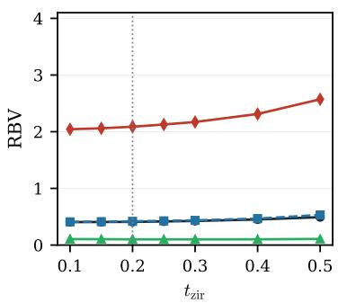

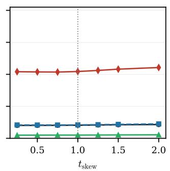

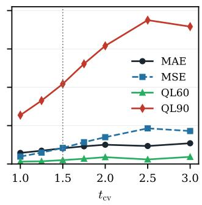  
Figure 3: One-at-a-time threshold sensitivity of regime-decomposed RBV on M5. Each panel varies one threshold $( t _ { \mathrm { z i r } } , t _ { \mathrm { s k e w } } , t _ { \mathrm { c v } } )$ with the other two fixed at baseline (0.20/1.00/1.50, dotted line); the remaining 9 losses behave similarly and are omitted for clarity. Rankings and the U-shaped RBV–τ structure are invariant across all threshold settings; the dominant sensitivity is along $t _ { \mathrm { c v } } ,$ whose spread tracks the extremity of the CV cell (89–10,746 SKUs across settings) rather than the threshold definition itself. Note: for this sensitivity analysis, regime cells are formed directly from the continuous pathology statistics (ZIR rate, skewness, CV) without applying the §3 thresholds, so RBV magnitudes are not directly comparable to Table 2 (which uses the thresholded regime labels); only rankings and shapes are comparable.

## B.4 THRESHOLD PERTURBATION SENSITIVITY ANALYSIS

We recompute the M5 regime map and RBV under one-at-a-time threshold scans $( t _ { \mathrm { z i r } } \in [ 0 . 1 0 , 0 . 5 0 ]$ $t _ { \mathrm { s k e w } } ~ \in ~ [ 0 . 2 5 , 2 . 0 0 ] , t _ { \mathrm { c v } } ~ \in ~ [ 1 . 0 0 , 3 . 0 0 ] )$ ), 7×7 pairwise joint grids, and boundary stress tests (all thresholds doubled/halved). Three findings. (i) Rankings and signatures are threshold-stable: the loss-family ordering, the sign pattern of per-cell bias, and the U-shaped RBV(τ) structure are invariant across all 39 settings; the skew threshold is the least influential (RBV spread <0.05 for 12 of 13 losses). (ii) Magnitude tracks cell extremity: RBV’s sensitivity is dominated by $t _ { \mathrm { c v } } ~ ( 0 . 2 5 - 2 . 4 8$ spread), because a higher threshold shrinks the CV cell toward the distribution’s tail (10,746 → 89 SKUs at the loose boundary), mechanically inflating $| B _ { \mathrm { c v } } |$ ; Cross-setting RBV comparisons should therefore always be read against the cell sizes that generate them (per setting: Fig. 3 and above); in the main tables the regime map is fixed by protocol, so cell sizes are constant across columns and omitted. (iii) The compromise optimum is robust to plausible perturbation: ql60 attains the minimum RBV under ±20% threshold shifts in all settings; only under the $2 \times$ extreme tightening does Huber join it in a low-RBV plateau (0.046 vs. 0.059).

## B.5 METRIC-AGNOSTIC VALIDATION

To verify that the regime-dependent failure patterns are intrinsic to loss-data distributional mismatch rather than artifacts of the evaluation metric, we reproduce the regime-decomposed evaluation under three distinct functionals: MSE, MAE, and pinball loss.

Across all metrics, the relative failure rankings remain invariant: MSE-trained models exhibit the most severe degradation under high zero-inflation rate (ZIR); MAE-trained models degrade most severely under strong skewness; and Quantile, Huber, and Tweedie losses show prominent fragility under high conditional variability (CV). Absolute values scale with each metric’s sensitivity to tail risk (e.g., MSE amplifies burst errors quadratically, while MAE treats them linearly), but the structural misspecification signatures are metric-independent. This confirms that the regime-specific failures reported in Sec 4.2 originate from the inherent mismatch between canonical loss statistical priors and pathological data distributions, not from the choice of evaluation functional.

## B.6 PATHOLOGICAL COVERAGE SCORE (PCS): DATASET AUDITING METRIC

This appendix formalizes the Pathological Coverage Score used for the benchmark coverage audit (App. C, Tab. 7). To quantitatively audit dataset industrial validity, we define PCS (0–1), measuring

comprehensive pathological regime coverage:

$$
\mathrm { P C S } = 1 - \frac { 1 } { 3 } \sum _ { d \in \{ \mathrm { Z I R , s k e w , C V } \} } \frac { | \{ i : \mathrm { r e g i m e } _ { d } ( i ) = \mathrm { l o w } \} | } { N }\tag{3}
$$

Higher PCS indicates a richer pathological spectrum; we measure from the low end to maximize discriminative range in overwhelmingly benign industrial data, complementing regime-decomposed evaluation which isolates severe high-pathology misalignments.

Weight robustness. PCS adopts equal weighting for the three pathological dimensions by default. We ablate alternative weight configurations (0.2, 0.4, 0.4) and (0.4, 0.3, 0.3) and find that weight perturbations do not change the relative PCS ordering of mainstream datasets, confirming that the audit conclusions are robust to the weighting scheme.

## B.7 SYNTHETIC ILLUSTRATION FOR PROP. B.1

Proof of Prop. B.1.

$$
\begin{array} { r } { \mathcal { B } _ { \mathrm { t e m p } } = \hat { y } _ { t } - \mathbb { E } \big [ y _ { t } \mid y _ { < t } \big ] = 0 . } \end{array}
$$

However, canonical losses embed fixed statistical priors and optimize static distributional functionals (mean for MSE, median for MAE) that are prior-dependent rather than data-determined: under non-Gaussian industrial pathologies, distinct losses induce distinct optima on the same marginal. This demonstrates that distributional-statistical mismatch induces systematic estimand mismatch independently of temporal modeling quality.

In these synthetic illustrative experiments, we do not train any forecasting model. Instead, we directly adopt the statistically-optimal closed-form predictor for each loss under the given pathological marginal distribution. This construction enforces $B _ { \mathrm { t e m p } } = 0$ by design: temporal-structural bias is identically zero, isolating purely distributional-statistical misspecification effects. Real-world neural-model experiments (Tab. 2) later demonstrate how these effects manifest alongside temporal fitting errors in practical settings.

We present two symmetric discrete industrial distributions to illustrate the bidirectional pathology mechanism. We emphasize that these deliberately simplified two-point cases are pedagogical illustrations of the core mechanism,

Case A (zero-dominant demand): $P ( y = 0 ) = 0 . 9 , P ( y = 1 0 0 ) = 0 . 1$ . MSE and MAE yield statistically optimal estimates of 10 and 0, respectively: the two loss-implied estimands differ by an order of magnitude on the same distribution, and their ranking under quantile evaluation flips at the staircase boundary below. This distribution produces degenerated quantile solutions:

$$
Q _ { \tau } = \left\{ { \begin{array} { l l } { 0 , } & { \tau \in [ 0 , 0 . 9 ] , } \\ { 1 0 0 , } & { \tau \in ( 0 . 9 , 1 ] . } \end{array} } \right.
$$

Small perturbations near the mass boundary trigger abrupt quantile prediction jumps.

Case B (burst-dominant demand): $P ( y = 0 ) = 0 . 1 , P ( y = 1 0 0 ) = 0 . 9$ . Statistically optimal MSE (90) and MAE (100) predictions again diverge by construction, confirming that the estimand is prior-dependent.

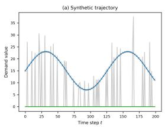

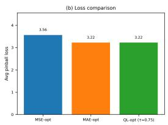

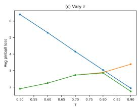

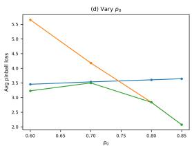  
Figure 4: Synthetic illustration and parameter sensitivity for Prop. B.1. (a) Example trajectory under perfect temporal modeling $B _ { t e m p } = 0$ . (b) Quantitative comparison of loss-implied predictors (MSEopt, MAE-opt, and a fixed-quantile target) under pinball evaluation. (c) Ablation over quantile level τ: the ranking of predictors flips as the target functional varies, illustrating that the optimal estimator is prior-dependent. (d) Ablation over zero-inflation rate $p _ { 0 }$ . This figure serves as an illustrative synthetic example; formal statements and proofs are given in the main text.

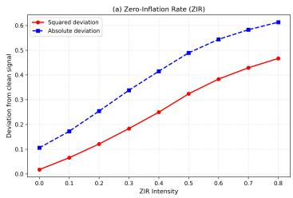

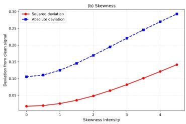

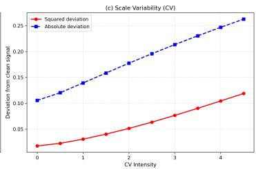  
Figure 5: Dose-response ablation over three core pathological dimensions: zero-inflation rate (ZIR), skewness, and within-series scale variability (CV). We report squared and absolute deviation of the fitted predictor from the clean conditional trajectory as pathological intensity increases. Consistently, both deviation metrics rise monotonically with pathological severity, demonstrating that pathological marginals systematically corrupt the recovery of the underlying signal. This synthetic experiment complements the theoretical analysis in Prop. B.1.

These two symmetric cases demonstrate that the divergence of loss-implied estimands originates from fixed loss statistical priors, independent of both optimization quality and the direction of data sparsity. Prop. B.1 establishes that distributional-statistical misspecification is a standalone failure mode even under perfect temporal modeling. Fig. 4 provides synthetic trajectory visualization, a quantitative comparison across loss-implied predictors, and hyper-parameter ablation over quantile level τ and zero-inflation rate $p _ { 0 }$ . Complementing this sensitivity study, Fig. 5 shows the dose-response behaviour for the three foundational pathological dimensions: zero-inflation rate (ZIR), skewness, and withinseries scale variability (CV). As pathological intensity gradually increases, both squared and absolute deviation from the clean signal grow monotonically. This reinforces our core claim: fixed-prior loss functions induce systematic, prior-dependent prediction deviation under industrial-style distributional pathologies, even when temporal patterns are perfectly fitted $( B _ { t e m p } = 0 )$ ). This synthetic example illustrates the underlying mechanism: accurate temporal fitting alone cannot eliminate deviation originating from loss-data statistical mismatch.

The regime-decomposed protocol § 4.1 accepts arbitrary base-level evaluation functionals as input. In Step 3 (Metric-Agnostic Quantification), we first compute per-regime bias terms $B _ { r }$ using either standard symmetric metrics (MSE, MAE, WMAPE, raw prediction bias) or asymmetric statistical criteria (quantile loss, pinball); these per-regime outputs are then aggregated into the Regime-wise Relative Bias Vector (RBV). While resulting RBV magnitudes depend on the choice of base evaluation functional, the qualitative pattern ofregime-specificfragility remains consistent: the identity of which pathologies degrade disproportionately under a given training loss is preserved. Specific instantiations are provided in the open-sourced implementation.

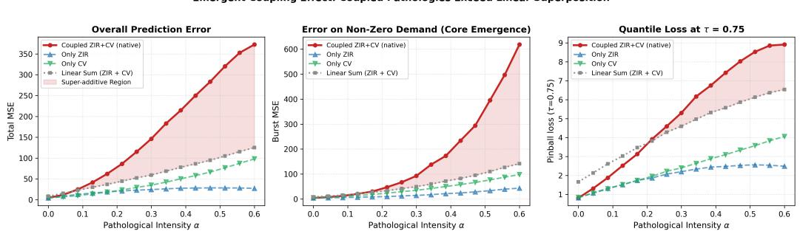

## B.8 BOUNDARY CONDITIONS FOR SATURATION VS. SUPER-ADDITIVE DEGRADATION

We conduct controlled synthetic experiments to isolate the interaction effect between co-occurring ZIR and CV pathologies, varying a shared intensity parameter α. The linear-sum baseline is defined as ${ \mathcal { L } } _ { \mathrm { l i n e a r } } ( \alpha ) { \bar { = } } { \mathcal { L } } _ { \mathrm { Z I R } } ( \alpha ) + { \mathcal { L } } _ { \mathrm { C V } } ( \alpha ) - { \mathcal { L } } _ { \mathrm { b e n i g n } }$ , subtracting the benign reference to avoid doublecounting.

Under low α, coupled loss tracks the linear baseline closely. Within intermediate ranges, it strictly exceeds the baseline across total MSE, burst-sample MSE, and pinball loss at τ=0.75 (Fig. 6), demonstrating super-additive degradation consistent with the disjoint-support coupling hypothesized in § 3.2. high ZIR collapses effective support toward zero while high CV demands tail extrapolation, creating conflicting gradient regimes. At high α, both isolated pathologies drive predictions toward a near-random floor; additional distortion yields diminishing marginal degradation, causing saturation and eventual sub-additive tendencies.

This validates the boundary-condition analysis proposed in § 3.2, though we do not claim generalization to all pathology pairs or real-world settings where counterfactual isolation is infeasible.

Emergent Coupling Effect: Coupled Pathologies Exceed Linear Superpositior

Figure 6: Coupled-pathology performance across varying α. The linear-sum baseline aggregates excess losses from isolated-ZIR and isolated-CV runs. Pink shaded regions highlight regimes where coupled loss strictly exceeds this reference, indicating emergent super-additive degradation.

Scope: diagnosis vs. mitigation. Robustification methods—distributionally robust optimization (Blanchet & Murthy, 2019; Blanchet et al., 2019) and quantile regression forests (Meinshausen, 2006)—re-engineer the objective to withstand distributional perturbation. RBV is complementary by design: a post-hoc diagnostic that localizes where and why a forecaster misaligns, and can equally audit robust methods themselves; pairing RBV-measured miscalibration with robust retraining is future work.

## C CROSS-DOMAIN GENERALIZATION OF THE PATHOLOGY TAXONOMY

Temporal structure of RetailShiftBench. The audit of Table 7 addresses pathological coverage; we clarify the complementary question of temporal structure. RetailShiftBench series are short (89 steps) and exhibit a stable weekly periodicity without trend breaks or long-range drift. This is a deliberate design choice: removing temporal non-stationarity as a confound ensures that residual errors are attributable to distributional misspecification rather than to distribution shift over time. The aggregate daily sales over the full panel (Fig. 7) illustrate this structure. External validity across scale, window length, and pathology mix is established on M5 (App. E), which is adopted as the external validation anchor above.

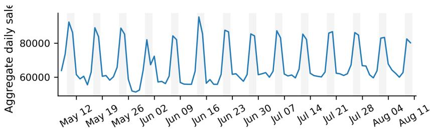  
Figure 7: RetailShiftBench temporal structure. Aggregate daily sales across all 31,213 series over the full evaluation panel. Sales are dominated by a stable weekly periodicity with no trend breaks or regime shifts, indicating that the benchmark’s difficulty stems from cross-sectional distribution heterogeneity rather than temporal non-stationarity.

Our hierarchical pathology taxonomy is designed as a domain-agnostic statistical framework: the three foundational dimensions—distributional skewness, zero-inflation, and within-series scale variability (CV)—violate fixed statistical priors of canonical losses regardless of the business guise under which they arise. Table 6 instantiates the taxonomy across four industrial domains, mapping each pathology and its coupled forms onto domain-specific manifestations. The statistical definition of each regime is unchanged across domains; only the threshold calibration (§ 3) is domain-adaptive.

The same per-series binarization that defines RBV regime cells (“pathological on dimension d iff regime $\bar { \cdot _ { d } } \neq \mathrm { l o w } ^ { * } )$ supports a dataset-level audit: the Pathological Coverage Score $\mathrm { P C S ~ } =$ $\textstyle 1 - \frac { 1 } { 3 } \sum _ { d } \big | \{ i : \mathrm { r e g i m e } _ { d } ( \dot { i } \big ) ^ { \bullet } = \mathrm { l o w } \} \big | / N$ reads directly as non-benign coverage, with higher values indicating a richer pathological spectrum (§ B.6). Table 7 audits mainstream forecasting benchmarks under one standard. RetailShiftBench attains full-spectrum coverage by construction; M4’s frequencystratified subgroups are overwhelmingly benign and are therefore insufficient as industrial stress tests; M5 provides adequate coverage and is adopted as the external validation anchor for the regime-decomposed protocol (App. E).

M5 zero-run censoring. M5’s long panel (2011–2016) contains assortment churn: items are listed, delisted, and relisted, producing zero runs that reflect lifecycle structure rather than demand pathology. Absent assortment flags, listing gaps are unidentifiable from sales alone; we adopt a zero-run censoring convention: all leading zeros before a SKU’s first sale are truncated (the item is not yet listed), and any continuous zero run longer than k days (k=14; sensitivity $k \in \{ 7 , 2 8 \} )$ ) is excluded from all pathology statistics (ZIR, skewness, CV) and from model training. Under k=14, 27,725 of 30,490 SKUs (90.9%) contain at least one censored segment, totalling 10.9M censored time steps (18.46% of the original panel); PCS in Table 7 is computed on the censored panel. Censoring lowers M5’s PCS from 0.8905 (raw) to 0.7587, removing the lifecycle-driven inflation; the censored-panel PCS sits in the same band as RetailShiftBench (0.7194), supporting cross-domain comparability of the regime decomposition rather than indicating a coverage anomaly. The threshold choice is conservative in our favor: stricter censoring (k=7) lowers PCS to 0.6692, and looser censoring (k=28) raises it to 0.7721, monotonically with the amount of lifecycle structure retained—the direction predicted by the assortment-churn hypothesis, with all qualitative comparisons unchanged.

Table 6: Cross-domain instantiation of the pathology taxonomy.
<table><tr><td>Pathology</td><td>Retail</td><td>Energy / Grid</td><td></td><td>Manufacturing / IoT</td><td>Finance</td></tr><tr><td>Skew</td><td>Promo bursts; seasonal peaks</td><td>Extreme weather spikes</td><td>load</td><td>Defect clustering; rework spikes</td><td>Jump-driven return asymmetry; earnings announcement effects</td></tr><tr><td>ZIR</td><td>Stockouts; intermittently stocked SKUs</td><td>Turbine downtime; zero irradiance</td><td>pages</td><td>Sensor dropout; line stop-</td><td>Halted trading; zero-tick intervals in illiquid assets</td></tr><tr><td>CV</td><td>Long-tail SKU hetero- geneity</td><td>Ramping-driven output dispersion across seasons</td><td></td><td>Batch-to-batch variance</td><td>Cross-sectional disper- sion of return scales</td></tr><tr><td>Coupled Distributional Pathologies</td><td>Sporadic luxury bursts; Skew-CV: high-variance promo series</td><td>Zero-output + den load weather-driven spikes</td><td>sud- spikes; price</td><td>Stoppage + large-batch or- ders; high-variance defect batches</td><td>Illiquidity + price jumps; earnings-driven clustered volatility</td></tr><tr><td>Coupling with Temporal-Structure</td><td>Pathology + holiday / life- cycle shifts</td><td>Pathology + policy / tariff changes</td><td>Pathology changeovers</td><td>+ line</td><td>Pathology + macro regime transitions</td></tr></table>

Note: Skewness, ZIR, and high CV are first-order distributional pathologies; coupled distributional regimes superimpose two or more first-order pathologies in one marginal; temporal-structure coupling additionally superimposes regime-level shifts and is orthogonal to the distributional focus of this paper.

Table 7: Pathology coverage and industrial validity of mainstream forecasting benchmarks. Higher PCS represents stronger industrial pathological spectrum coverage and better deployment-aligned robustness evaluation capability.
<table><tr><td>Dataset</td><td>#Series</td><td>Domain &amp; Granularity</td><td>Low Skewness</td><td>Low CV</td><td>Low ZIR</td><td>PCS</td><td>Benchmark Grade</td></tr><tr><td>ETT</td><td>28</td><td>Energy (transformer temp), hourly/15-min</td><td>0.5714</td><td>0.8571</td><td>0.8571</td><td>0.2381</td><td>Unqualified; basic temporal verification only</td></tr><tr><td>M4-Daily</td><td>4,227</td><td>Mixed (macro~micro), daily</td><td>0.863</td><td>0.9970</td><td>1.000</td><td>0.046</td><td>Insufficient pathological spectrum</td></tr><tr><td>M4-Hourly</td><td>414</td><td>Mixed (macro~micro), hourly</td><td>0.865</td><td>0.993</td><td>1.0</td><td>0.048</td><td>Insufficient pathological spectrum</td></tr><tr><td>M4-Monthly</td><td>48,000</td><td>Mixed (macro~micro), monthly</td><td>0.845</td><td>0.999</td><td>1.0</td><td>0.052</td><td>Insufficient pathological spectrum</td></tr><tr><td>M4-Quarterly</td><td>24,000</td><td>Mixed (macro~micro), quarterly</td><td>0.849</td><td>0.999</td><td>1.0</td><td>0.051</td><td>Insufficient pathological spectrum</td></tr><tr><td>M4-Weekly</td><td>359</td><td>Mixed (macro~micro), weekly</td><td>0.652</td><td>0.997</td><td>1.0</td><td>0.117</td><td>Insufficient pathological spectrum</td></tr><tr><td>M4-Yearly</td><td>23,000</td><td>Mixed (macro~micro), yearly</td><td>0.864</td><td>0.999</td><td>1.0</td><td>0.045</td><td>Insufficient pathological spectrum</td></tr><tr><td>M5</td><td>30,490</td><td>Retail (Walmart sales), daily</td><td>0.0513</td><td>0.5478</td><td>0.1248</td><td>0.7587</td><td>Adequate coverage; adopted as external validation (App. E)</td></tr><tr><td>RetailShiftBench</td><td>31,213</td><td>Retail (SKU demand), daily</td><td>0.2573</td><td>0.3925</td><td>0.192</td><td>0.7194</td><td>Fully qualified; full-spectrum stress test</td></tr></table>

Note: PCS thresholds are calibrated on RetailShiftBench retail data; for M4 and M5, thresholds are applied as-is with the zero-run censoring above, and domain-adaptive percentile recalibration (§ 3) is recommended for auditing other domains.

Threshold recalibration. The § 3.1 thresholds are retail-calibrated. Domain-specific adoption only requires monotonic recalibration: (i) skewness—use the 90th percentile of the domain’s empirical γ ; (ii) ZIR—define tiers by the domain’s $Q _ { 1 } / Q _ { 3 }$ of ZIR; (iii) CV—anchor “high” at 1.5× domain median. Coupled regimes depend only on threshold monotonicity, so their identification is invariant to such recalibration.

Statistical-level transferability. PCS operates on the domain-independent statistical level, making it directly transferable across domains: the threshold recalibration described above suffices, with no domain-specific objective required. Thus, a low-PCS dataset in any domain is equally unqualified for industrial stress-testing, confirming that the auditing paradigm generalizes beyond retail.

## D DECOMPOSITION RESPONSE ANALYSIS

This appendix expands the two main tables cell by cell (§ D.1), isolates the attribution of decomposition gains (§ D.2), and traces the intervention into the quantile-calibration lens (Fig. 8). All quantitative statements follow the protocol of § 4.1: identical hyperparameters across losses, Huber threshold fixed at the training-window residual quantile, and paired train/test splits shared by the global and decomposed evaluations. Unless stated otherwise, all experiments in this appendix are conducted on the main RetailShiftBench benchmark (§ 6.1).

## D.1 READING TABLES 2–3

Three structural readings organize Table 2. (i) Masking. The All row certifies success within tight tolerances, while pathological regimes exhibit systematic errors an order of magnitude larger—visible cell by cell in the table. The aggregate passes precisely because each pathological subgroup is too small to move the pooled average: the All row does not summarize the regime rows but dilutes them: no pathological subgroup is large enough to move the pooled average—the robustness illusion.

(ii) Directionalfingerprints. Mean-targeting losses carry positive bias on sparse regimes, median-type losses exhibit strongly negative bias, and quantile heads exhibit step behavior; each direction matches the corresponding row of Table 1, and the magnitudes are exactly the table entries (we avoid restating them here to prevent transcription drift). The signs, not the magnitudes, are the fingerprint: a loss family is identified by the direction in which each pathology pushes its bias, and the four regimes form a diagnostic set from which the loss prior can be decoded.

(iii) Scale-protocol robustness. The regime-dependent bias structure replicates across XGBoost (raw magnitudes) and TFT (per-series-normalized internally), with one systematic exception. Mediantype losses (MAE, quantile, Huber) preserve their sign fingerprint—negative bias on pathological regimes—under both preprocessing pipelines; mean-type losses (MSE, Tweedie, Poisson) show preprocessing-dependent signs, flipping from positive under raw magnitudes to negative under internal normalization on high-CV and zero-inflated cells (Tab. 2). What is invariant across protocols is not the sign but the structure: RBV remains elevated under both pipelines for every loss, so the regime-level misalignment survives normalization even where its sign is preprocessing-dependent. Normalization changes the units of the residual and, for mean-type losses, the direction of the dilution response, but it does not remove the mismatch—supporting that the bias profile is an estimand signature rather than a scale artifact. We emphasize this is structural consistency across protocols, not protocol invariance: magnitudes are not comparable across backbones, and quantitative comparisons remain within-functional.

Table 3 splits responses to decomposition by estimand family. Mean-targeting losses (MSE, Tweedie) improve on all three instruments, because decomposition removes the mixture compromise without touching their estimand. Median-type losses deteriorate in bias structure while holding accuracy: with per-regime optimization the median estimand no longer benefits from pooled smoothing, exposing estimand-level collapse rather than fitting error. Three cells warrant individual notes. Huber worsens across metrics at its data-driven threshold and remains in the worsen family across a 40-fold δ range: its effective estimand is a rational function of the sparsity mass $( \propto ( 1 - p _ { 0 } ) \delta / p _ { 0 } )$ , so per-regime cells with different $p _ { 0 }$ induce different effective estimands under one fixed δ—the hybrid is the most variance-fragile member of the zoo under small cells, and no single δ is simultaneously calibrated for all regimes. Poisson dissociates the three instruments entirely—structure and squared error improve while the linear metric degrades—because exponential curvature redistributes predictive mass in a way that linear-in-residual instruments cannot register: it is the cleanest exhibit that linear metrics are blind to redistribution by curvature, not to absence of effect. MAE under TFT confirms the protocol-level reading (iii) above: the fingerprint direction survives the architecture change even where magnitudes shift.

Finally, decomposed mean-family configurations converge toward the Rule heuristic’s bias flatness while retaining far better accuracy, populating the interior of the aggregation trade-off (Fig. 2) with measured anchors—each such configuration is an operating point between pooled compromise and per-series purity that was previously unmeasured.

$\uparrow / \downarrow$ mark directionally consistent changes across all random seeds (3 seeds); paired-bootstrap intervals are reported as consistency checks rather than confirmatory tests.

## D.2 ATTRIBUTION CONTROLS AND QUANTILE CALIBRATION SPECTRA

Decomposition gains could in principle arise from data volume, cell homogeneity, or label informativeness. We separate these with two controls and inspect the intervention through two complementary lenses—scalar bias structure and quantile calibration. (a) Data-matched global: a single pooled model trained on the concatenation of all cell data with matched optimization budget. (b) Random-label cells (R2): a permutation (sampled without replacement) of series into cells matched in number and size to the pathology decomposition, over 3 shuffle seeds—reproducing the granularity of the decomposition while destroying its semantics.

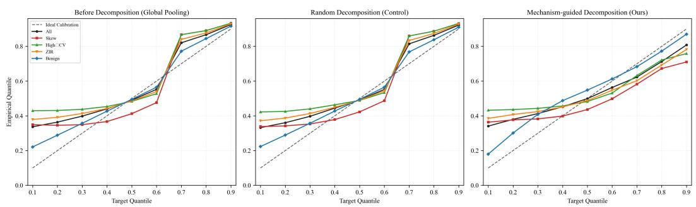  
Figure 8: Quantile calibration as an attribution test (XGBoost, single-τ pinball objectives, tree depth fixed across τ). Coverage is computed on positive-demand days with the mid convention $\begin{array} { r } { P ( \hat { y } > y ) + \frac { 1 } { 2 } P ( \hat { y } = y ) ; } \end{array}$ ; the dashed line marks ideal calibration. Left: global pooling glues pathological regimes below the diagonal while benign stays over-covered. $M i d d l e \colon$ random-label decomposition with cells matched in count and size to the pathology partition (permutation without replacement) reproduces the glued pattern—granularity alone does not release the curves. Right: pathology-informed decomposition releases the bundle toward the diagonal, with the residual gap at $\tau { = } 0 . 9$ marking the variance wall. Near-zero low-τ coverage on pathological regimes reflects the estimand floor of zero-inflated marginals (§ 4.2), not additional miscalibration.

Two readings organize the figure. In the high-τ band $( \tau \geq 0 . 5 )$ , pooled training fans the regimes apart, the random-label control (b) reproduces this fan almost exactly, and only pathology-informed decomposition releases the bundle toward the diagonal—label informativeness, not partition granularity, is the operative variable. In the low-τ band, pathological coverage sits at the estimand floor of zero-inflated marginals (the calibrated predictor is itself zero); this reflects the plateau degeneracy of § 4.2 rather than additional miscalibration, and is annotated in the figure but not interpreted as a gap. The false-zero rate $P ( \hat { y } = 0 \mid y > 0 )$ , the direct collapse diagnostic for this floor, is overlaid per regime in the same panel: decomposition collapses it only where pooling inflates it, i.e., exactly in the ZIR-dominated band.

Table 8: Loss-function trajectory grid under grouping-scheme interventions (XGB).
<table><tr><td rowspan="2">Metric</td><td colspan="2">non-linear loss family</td></tr><tr><td>MSE</td><td>Tweedie</td></tr><tr><td>RBV WMAPE</td><td> $0 . 2 4 3  0 . 2 6  0 . 0 4 1 \downarrow$   $0 . 4 6 7 9  0 . 4 6 8 1  0 . 4 6 2 \downarrow$ </td><td> $0 . 1 6 3  0 . 1 5 1  0 . 0 1 4 \downarrow$   $0 . 4 5 9 3  0 . 4 6 0 6  0 . 4 5 3 9 \downarrow$ </td></tr><tr><td>MSE</td><td colspan="2"> $1 1 . 9 0 9 \to 1 2 . 6 1 5 \to 1 1 . 0 6 8 \downarrow$   $1 1 . 9 9 2 \to 1 2 . 6 7 8 \to 1 1 . 4 6 5 \downarrow$ </td></tr><tr><td>Metric</td><td>linear loss family MAE</td><td>Huber</td></tr><tr><td>RBV WMAPE</td><td> $0 . 6 7 5  0 . 6 5 8  0 . 8 9 9 \uparrow$   $0 . 4 2 7 0  0 . 4 3 1 6  0 . 4 2 5 5 \downarrow$ </td><td> $0 . 0 7 7  0 . 2 4  0 . 2 6 2 \uparrow$   $0 . 4 6 7 0 \to 0 . 4 6 6 9 \to 0 . 4 7 6 5 \uparrow$ </td></tr></table>

Notes: Each cell reports “All → Random → Regime-wise”. All: global pooled training; Random: mean over three shuffle seeds; Regime-wise: pathology-informed per-regime training. All and Regime-wise values reproduced from Tab. 3 for attribution contrast: All→Random isolates granularity effects; Random→Regime-wise isolates label informativeness at matched granularity; All→Regime-wise is total intervention effect. ↓: improvement, ↑: degradation. Losses grouped by residual curvature (§ 7). TFT results follow the same pattern. Rule reference values: Tab. 3.

## D.3 CAPACITY SCALING CANNOT SUBSTITUTE FOR REGIME DECOMPOSITION

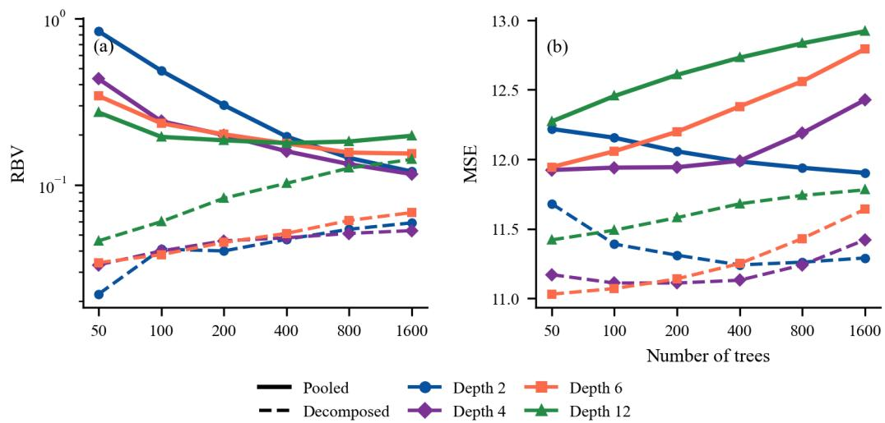  
Figure 9: Capacity scaling (solid) vs. regime decomposition (dashed) under the MSE loss. (a) RBV (log scale): pooled depth-2 RBV improves $7 \times ( 0 . 8 3 7  0 . 1 2 0 )$ with 32× the trees, and the best pooled configuration overall (1600 trees, depth 4) saturates at a 0.116 ceiling—decomposition (dashed) holds $\mathrm { R B V } \leq 0 . 0 6$ across all but the most extreme configurations (within-cell overfitting at 1600 trees, depth 12). (b) MSE: decomposition improves aggregate accuracy as well. WMAPE varies within 0.46–0.50 across all conditions and is omitted.

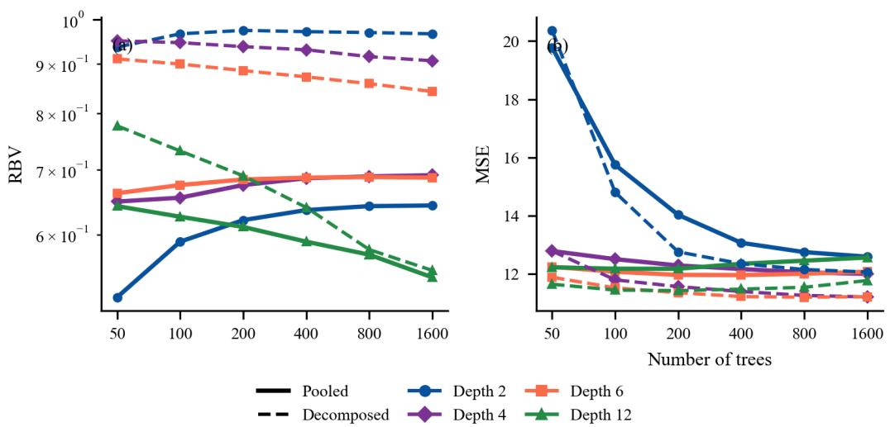  
Figure 10: Same setup as Fig. 9 under the MAE loss. Decomposition increases RBV (dashed curves lie at or above solid ones in (a)): routing removes the benign mass that dilutes MAE’s within-cell estimand mismatch, exposing the mean–median gap rather than repairing it—whereas aggregate error (b) still improves.

A natural objection to the decomposition results of Tab. 3 is that pooling’s failures might simply reflect under-capacity: a sufficiently expressive model could, in principle, fit regime-conditional structure implicitly, recovering what explicit routing provides. We test this objection directly by scaling model capacity under a fixed data budget, with and without decomposition.

Setup. We train gradient-boosted trees (XGBoost) on all RetailShiftBench series (pooled) and, separately, one model per regime cell (decomposed, § 4.1), sweeping trees $n _ { \mathrm { { e s t } } } \quad \in \mathbf { \Gamma }$ {50, 100, 200, 400, 800, 1600} and depth d $l \in \{ 2 , 4 , 6 , 8 , \bar { 1 0 } , 1 2 \}$ under MSE and MAE losses. All arms share the identical train/test split; runs differ only in model stochasticity (3 seeds). No early stopping is used, so that capacity effects are not confounded with fit-versus-validation trade-offs.

Three observations. (i) Saturation. Under MSE, pooled RBV improves with capacity and saturates: depth-2 RBV improves $7 \times ( 0 . 8 3 7  0 . 1 2 0 )$ with 32× the trees, and the best pooled configuration (1600 trees, depth 4) stalls at a ceiling of 0.116, with no configuration falling below it—a residual plateau, not convergence to zero (Fig. 9a); at depth ≥ 8 RBV already rebounds while capacity keeps growing. (ii) Decoupling. The configuration that minimizes aggregate error (MSE) is not the configuration that minimizes RBV: MSE favors depth 2 (11.90), whereas RBV favors depth 4 (0.116), and RBV rebounds at depth $\geq 6$ while MSE degrades only mildly (11.90 → 12.92). Aggregate metrics therefore do not track, and cannot proxy for, regime-level bias structure. (iii) Breakthrough. Decomposition collapses RBV at every matched configuration: across the full grid, decomposed RBV stays within 0.022–0.142 and never exceeds the pooled value at the same $( n _ { \mathrm { e s t } } , d )$ ; at the smallest configuration it is 0.022–0.046, i.e., 32× fewer trees than the pooled optimum, and it simultaneously improves MSE (Fig. 9b). There is no accuracy–robustness trade-off.

Interpretation. These patterns are the empirical signature of the separation in Prop. B.1. Capacity acts on the fitting channel $\textstyle e _ { t } :$ as trees and depth grow, the pooled model fits the training distribution ever more closely, and RBV falls toward the pooled compromise $b _ { L } .$ , where it stalls. The saturated residual is the aggregation-induced compromise that increased capacity cannot express away, since it is not an approximation error. Decomposition acts on the other channel, removing the pooling compromise by construction—under a mean target $b _ { L } \equiv 0 ,$ , so for MSE the saturated residual is entirely this compromise; the decomposed arm’s residual RBV is small, and its mild growth at extreme depth reflects within-cell overfitting rather than any re-emergence of pooling bias. Under MAE the asymmetry confirms the diagnosis: decomposition increases RBV (dashed curves lie above pooled ones at every matched configuration, Fig. 10a), because MAE’s mismatch is located within cells—the mean–median gap of Table 1—which pooled training dilutes and routing exposes. Routing and loss choice address orthogonal exposures; neither substitutes for the other.

## E M5 DATASET AND EXTERNAL VALIDATION

## E.1 M5 EXPERIMENT SETUP

We replicate the regime-diagnosis pipeline on the M5 forecasting competition dataset (Makridakis et al., 2022b), a large-scale retail demand panel that differs from our main benchmark in scale, granularity, and demand sparsity. Note that our M5 protocol is designed for controlled regimediagnosis comparison, not for leaderboard benchmarking: we construct 30,490 SKU×store series from the final 120 days $( d _ { 1 8 2 2 } - d _ { 1 9 4 1 }$ , 2016-01-24 to 2016-05-22) of the five-year training partition and, following the single-origin protocol, use the first 113 days as the training window, forecasting horizons 1–7 from the single origin $t _ { \mathrm { i d x } } = 1 1 2$ and evaluating against realized demand on days 114–120; these choices are not comparable to the official M5 competition setup, and our M5 numbers should not be read against competition rankings or published M5 leaderboards. Of the 30,490 constructed series, 1,995 fail the 28-day minimum-history screen for regime statistics (ZIR, skewness, CV), computed exclusively within the training window; a further 1,749 of the remaining 28,495 (6.1%) lack usable evaluation signal at the forecast origin (zero demand in the evaluation window or insufficient history for the deep backbones), leaving 26,746 scored series. Pathological flags use the thresholds of Section 3.1 with the not-low binarization, yielding overlapping coupled cells: most valid series carry at least one pathological flag, the CV condition is almost always accompanied by the other two, and only about 10% are Benign. We train the same XGBoost backbones under the same six losses plus a pinball-loss scan over $\tau \in \{ 0 . 1 , \ldots , 0 . 9 \}$

Censoring scope and sensitivity. The zero-run censoring convention of App. C is applied at both levels: the full-panel PCS audit and the 120-day evaluation window constructed here. Censoring masks individual time steps—days inside a zero run longer than k=14 are set to missing and excluded from pathology statistics and from training—while all 30 490 series are retained. The convention is far from inert at the window scale: 17.3% of series contain at least one censored edge run (leading: 13.5%, trailing: 5.5%, the shares overlapping as one series may carry both), confirming that assortment churn also reaches the evaluation horizon and must be censored rather than absorbed into ZIR and skewness. All results in this appendix are computed on the censored window.

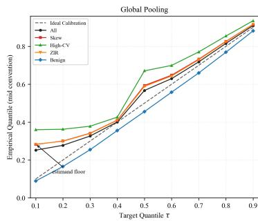

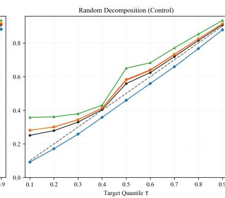

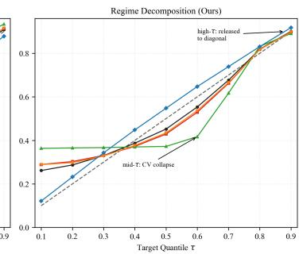  
Figure 11: Quantile-calibration attribution on M5 (mean over three seeds 42, 41, $3 9 ; \tau \in$ $\{ 0 . 1 , . . . , 0 . 9 \} ; \tau { = } 0 . 5$ shown via MAE, since $\mathrm { p i n b a l l } ( 0 . 5 ) \equiv \mathrm { M A E } )$ . Exceedance uses the mid convention $\begin{array} { r } { \mathrm { P r } [ \hat { y } > y ] + \frac { 1 } { 2 } \mathrm { P r } [ \hat { y } = y ] } \end{array}$ . Left: global pooling — the aggregate curve hugs the diagonal while regime curves fan out. Center: random decomposition (size-matched control) — reproduces the pooled panel, isolating label informativeness. Right: regime decomposition — high-τ curves are released to the diagonal while the High-CV collapse at mid τ is exposed. Low-τ elevations reflect the zero-inflation estimand floor $( \mathrm { z i r } / 2 )$ , not miscalibration.

Table 9: Loss-function trajectory grid under grouping-scheme interventions on M5 (XGB, fixed-origin protocol; mean over three seeds 42, 41, 39).
<table><tr><td rowspan="2">Metric</td><td colspan="3">non-linear loss family</td></tr><tr><td>MSE</td><td>Tweedie</td><td>Poisson</td></tr><tr><td>RBV</td><td> $\overline { { 0 . 4 2 2 \to 0 . 4 3 6 { \pm } 0 . 0 0 7 1 \to 0 . 0 3 6 \downarrow } }$ </td><td> $\overline { { 0 . 3 7 7  0 . 3 5 9 { \pm } 0 . 0 0 1 9  0 . 0 6 2 \downarrow } }$ </td><td> $\overline { { 0 . 4 7 6 \to 0 . 4 8 7 \pm 0 . 0 0 1 8 \to 0 . 0 4 4 \downarrow } }$ </td></tr><tr><td>WMAPE</td><td> $0 . 7 5 9 7  0 . 7 6 1 2 \pm 0 . 0 0 0 4  0 . 7 3 3 7 \downarrow$ </td><td> $0 . 7 5 5 3  0 . 7 5 2 6 { \pm } 0 . 0 0 0 5  0 . 7 2 5 9 { \downarrow }$ </td><td> $0 . 7 6 1 2  0 . 7 6 1 2 { \pm } 0 . 0 0 0 1  0 . 7 3 2 6 { \downarrow }$ </td></tr><tr><td>MSE</td><td> $4 . 7 8 4 \to 4 . 7 4 5 \pm 0 . 0 2 0 \to 4 . 6 0 7 \downarrow$ </td><td> $4 . 7 5 8 \to 4 . 6 9 9 \pm 0 . 0 2 0 \to 4 . 4 9 3 \downarrow$ </td><td> $4 . 7 5 3 \to 4 . 6 9 0 \pm 0 . 0 2 5 \to 4 . 5 0 5 \downarrow$ </td></tr><tr><td></td><td></td><td>linear loss family</td><td></td></tr><tr><td>Metric</td><td>MAE</td><td>QL60</td><td>Huber</td></tr><tr><td>RBV</td><td> $0 . 4 0 8  0 . 3 9 7 \pm 0 . 0 0 2 1  0 . 8 0 4 \uparrow$ </td><td> $\overline { { 0 . 1 0 5 \to 0 . 0 7 2 \pm 0 . 0 0 2 2 \to 0 . 8 7 1 \uparrow } }$ </td><td> $0 . 2 4 1  0 . 2 5 1 { \scriptstyle \pm 0 . 0 0 0 2 6 }  0 . 3 6 7 \uparrow$ </td></tr><tr><td>WMAPE</td><td> $0 . 6 8 9 6  0 . 6 8 9 5 { \scriptstyle \pm 0 . 0 0 0 3 }  0 . 6 5 9 0 \downarrow$ </td><td> $0 . 7 3 0 1  0 . 7 3 1 8 { \scriptstyle \pm 0 . 0 0 0 3 }  0 . 6 9 5 8 \downarrow$ </td><td> $0 . 7 2 7 2  0 . 7 2 8 3 \pm 0 . 0 0 0 0 3  0 . 6 9 6 3 \downarrow$ </td></tr><tr><td>MSE</td><td> $5 . 0 5 1  4 . 9 4 3 { \pm } 0 . 0 2 2  4 . 7 0 5 \downarrow$ </td><td> $4 . 9 6 9 \to 4 . 8 6 9 \pm 0 . 0 1 0 \to 4 . 6 8 6 \downarrow$ </td><td> $4 . 8 3 1  4 . 7 7 8 \pm 0 . 0 0 4  4 . 6 0 3 \downarrow$ </td></tr></table>

Notes: Each cell reports “All → Random → Regime-wise”. All: global pooled training; Random: random split with cells matched in count and size to the regime partition, mean±std over three shuffle seeds (42, 41, 39); Regime-wise: per-cell training on the three-tier regime partition (skew–CV–ZIR) computed from the training window only. Protocol: 113 training days per series, single forecast origin at the last training day, horizons $h { = } 1 , \ldots ,$ 7 pooled (26,746 scorable series; 79 series in sub-guard cells excluded). All→Random isolates granularity effects; Random→Regime-wise isolates label informativeness at matched granularity. ↓: improvement, ↑: degradation. MSE is reported in raw demand units; WMAPE and RBV are scale-free and serve as the cross-regime instruments. Unlike RetailShiftBench (Tab. 8), decomposition improves WMAPE and MSE for all losses while degrading RBV for the linear family—the accuracy–robustness decoupling on real data. Grouping-induced RBV increases for quantile-type losses track the model-independent intrinsic floor of cell-level $( Q _ { \tau } - \mu ) / \mu$ dispersion (see §E.1).

Regime-decomposed replication. Table 9 reports the All → Random → Regime-wise trajectory on M5. The two attribution steps of Section D.2 replicate cleanly: the size-matched random decomposition is inert for all thirteen losses $( | \Delta \mathrm { R B V } | \leq 0 . 0 4 )$ , ruling out the granularity confound, whereas mechanism-guided decomposition reshapes the loss landscape in a loss-family-dependent manner — non-linear losses (MSE, Tweedie, Poisson) see RBV collapse to near zero, while linear losses (MAE, QL60, Huber) show higher RBV that tracks the model-independent intrinsic floor of cell-level $( Q _ { \tau } - \mu ) / \mu$ dispersion (a perfect τ -quantile forecaster would itself exhibit RBV of 0.76 and 0.77 under regime grouping for MAE and QL60, respectively), with per-cell exceed rates simultaneously moving toward τ (Fig. 11); i.e., the increase exposes objective-induced gaps rather than worsening fit — and pinball losses flip sign at τ ≈0.6–0.7. This mirrors the main benchmark and provides a quantitative cross-dataset match, e.g., the High-CV mean-relative bias of MAE moves −0.60 → −0.95 on M5 versus −0.58 → −0.98 on the main benchmark.

Figure 11 replicates the quantile-calibration attribution of Figure 8 on M5. Left: global pooling glues the aggregate curve to the diagonal while regime curves fan out (Benign below, High-CV above); the random control reproduces the pooled panel; and regime decomposition releases high-τ curves to the diagonal while exposing a mid-τ High-CV collapse $( { \mathrm { e . g . , E x c e e d } } = 0 . 4 1 7 { \mathrm { a t } } \tau = 0 . 6 )$ . We note that on zero-inflated demand the low-τ elevation of the aggregate curve is largely an estimandfloor rather than miscalibration: a perfectly calibrated predictor equals zero whenever τ falls below the zero-mass, so its exceedance is zir/2 under the mid convention. The random-decomposition column of Table 9 averages over three shuffle seeds (42, 41, and 39); mean±std over seeds is reported in the table notes.

Quantile objectives and the intrinsic bias floor. For quantile (and median) losses, $B _ { r }$ compares a τ-quantile forecast against the conditional mean, which is nonzero by construction; the gap $( Q _ { \tau } - \mu ) / \mu$ is large in zero-inflated and high-variance cells. Empirically this imposes a modelindependent floor on RBV: computing $B _ { r }$ from the empirical training distribution of each cell (a perfect τ-quantile forecaster) yields RBV∗ that tracks the regime-grouped observed RBV closely (MAE: 0.80 vs. 0.76; ql60: 0.87 vs. 0.77; ql90: 1.08 vs. 1.22), with the U-shaped dependence on τ reproduced. Pooled training can instead push RBV below the floor (ql60: $0 . { \dot { 1 } } 1 \ll { \bar { 0 } } . 7 7 )$ , not by fitting better but by imposing a single compromise quantile under which per-cell exceedances cluster (0.56–0.70 at nominal 0.6), yielding low dispersion of the mean-relative bias across cells even though every cell remains miscalibrated; under regime grouping the exceedances return to their nominal level (ql90: 0.92/0.90/0.90/0.89 against 0.9). For quantile losses RBV must therefore be read jointly with calibration (Fig. 11); the grouping-induced RBV increase exposes objective-induced gaps rather than worsening misspecification.

Table 10: Regime decomposition on the M5 deep backbone (NHiTS). Each cell reports All → Random → Regime-wise training. All: global pooled training; Random: random split with cells matched in count and size to the pathology partition (mean over three shuffle seeds); Regime-wise: per-cell training on the skew–CV–ZIR partition. Single seed (42) for All and Regime-wise.
<table><tr><td></td><td colspan="3">RBV</td><td colspan="3">WMAPE</td></tr><tr><td>Loss</td><td>All</td><td>Random</td><td>Regime</td><td>All</td><td>Random</td><td>Regime</td></tr><tr><td>MSE</td><td>0.473</td><td>0.472</td><td>0.400↓</td><td>0.7526</td><td>0.7381</td><td>0.6764↓</td></tr><tr><td>MAE</td><td>0.428</td><td>0.454</td><td>0.416↓</td><td>0.6660</td><td>0.6918</td><td>0.6625↓</td></tr><tr><td>QL60</td><td>0.420</td><td>0.437</td><td>0.480↑</td><td>0.6791</td><td>0.7096</td><td>0.6910↑</td></tr><tr><td>Huber</td><td>0.397</td><td>0.390</td><td>0.369↓</td><td>0.6911</td><td>0.6887</td><td>0.6659↓</td></tr><tr><td>Tweedie</td><td>0.500</td><td>0.469</td><td>0.421↓</td><td>0.7818</td><td>0.7236</td><td>0.6810↓</td></tr><tr><td>Poisson</td><td>0.470</td><td>0.453</td><td>0.408↓</td><td>0.7057</td><td>0.7017</td><td>0.6707↓</td></tr></table>

Notes: NHiTS backbones on the M5 single-origin protocol $( n = 1 7 3 , 1 5 2 = 2 4 , 7 3 6$ encoder-eligible series × 7 horizons; series lacking encoder history at the origin are excluded, cf. Tab. 9). Chronos-Bolt, being zero-shot with sliding-window context and no fixed encoder length, instead scores the full 26,746- series scored panel (short series are left-padded rather than excluded), so its eligible set strictly contains the NHiTS encoder-eligible subset and cross-model comparisons read at the ranking level. ↓: improvement, ↑: degradation. Regime-wise splitting improves WMAPE sharply (optimization-type gain) but moves RBV only modestly, unlike the converged XGBoost backbone (Tab. 9): the residual bias is a CV-cell zero-collapse (predicted within-cell CV 0.06–0.11 vs. realized 0.47) that per-cell training cannot repair. The QL60 RBV increase tracks the model-independent estimand floor (§E.1), mirroring the XGBoost quantile family.

Deep-backbone replication. To test whether the characterized anatomy is specific to converged gradient-boosted training, we replicate the grouping intervention on an NHiTS backbone, which operates in an under-trained regime on this panel. Tab. 10 reports the same All→Random→Regimewise trajectory. The diagnostic pattern inverts: Regime-wise training improves WMAPE sharply (optimization-type gain) yet moves RBV only modestly, and the residual bias concentrates in the CV cell, where predicted within-cell dispersion collapses (0.06–0.11 predicted vs. 0.47 realized)—a failure mode that per-cell training cannot repair. The deep backbone thus exhibits optimization-type failure where XGB exhibits bias-type failure; the diagnosis separates the two, and only the bias-type component is repairable by re-targeting.

## E.2 OR BASELINES AND ORACLE REFERENCE PREDICTORS

OR baselines and oracle reference predictors. Table 11 reports Croston, SBA, TSB, and TSB-HB alongside two oracle reference predictors on M5. Three observations. (i) All four OR methods track the oracle mean (excess bias within ±0.08 in every cell, ±0.04 for SBA and TSB-HB): their low RBV (0.019–0.028) reflects genuine per-series mean-rate calibration, not insensitivity—an order of magnitude below every trained loss in Tab. 9. (ii) The oracle median—perfectly calibrated for its own functional—under-forecasts by 46–94% on pathological regimes, demonstrating that estimand choice, not model quality, dictates the mismatch profile. (iii) The oracle median attains the best WMAPE (0.668) with the worst bias allocation (RBV 0.695), a direct exhibit of our thesis that aggregate accuracy certifies neither the presence nor direction of mismatch. The cost of OR calibration is efficiency: their WMAPE (0.725–0.739) rails pooled XGB-MAE. This contrast is a calibration reference, not an accuracy ranking.

Table 11: Intermittent-demand baselines and oracle references on the M5 single-origin protocol. Bias $B _ { r }$ follows the paper’s sample-pooled sum-ratio convention, and RBV is the unweighted $\ell _ { 2 }$ norm of the centered bias vector (identical to Tab. 8). Excess bias is relative to oracle-mean. Croston’s uniformly positive bias is its known over-prediction; SBA’s damping factor largely removes it. Oraclemedian achieves the best WMAPE yet the largest regime bias variation: accuracy under MAE does not imply calibration for the pooled-mean estimand.
<table><tr><td>Method</td><td> $B _ { \mathrm { b e n i g n } }$ </td><td> $B _ { \mathrm { z i r } }$ </td><td> $B _ { \mathrm { s k e w } }$ </td><td> $B _ { \mathrm { c v } }$ </td><td>B</td><td>RBV</td><td>WMAPE</td></tr><tr><td>Croston</td><td>0.098</td><td>0.077</td><td>0.086</td><td>0.100</td><td>0.087</td><td>0.020</td><td>0.739</td></tr><tr><td>SBA</td><td>0.043</td><td>0.023</td><td>0.031</td><td>0.045</td><td>0.033</td><td>0.019</td><td>0.725</td></tr><tr><td>TSB</td><td>0.095</td><td>0.062</td><td>0.076</td><td>0.061</td><td>0.075</td><td>0.028</td><td>0.734</td></tr><tr><td>TSB-HB</td><td>0.057</td><td>0.035</td><td>0.036</td><td>0.059</td><td>0.043</td><td>0.024</td><td>0.739</td></tr><tr><td>Oracle mean</td><td>0.068</td><td>0.026</td><td>0.035</td><td>0.023</td><td>0.040</td><td>0.036</td><td>0.738</td></tr><tr><td>Oracle median</td><td>0.001</td><td>-0.456</td><td>-0.390</td><td>-0.941</td><td>-0.353</td><td>0.695</td><td>0.668</td></tr></table>

Table 12: Chronos-Bolt zero-shot on the M5 single-origin protocol (App. E.1), horizons 1–7 pooled (n=187,222 samples). Mean vs. median estimands decoded from the same frozen forward pass. Bias $= \sum ( \hat { y } - y ) / \sum | y |$ per cell; RBV and WMAPE as in Tab. 2.
<table><tr><td>estimand</td><td> $B _ { \mathrm { b e n i g n } }$ </td><td> $B _ { \mathrm { z i r } }$ </td><td> $B _ { \mathrm { s k e w } }$ </td><td> $B _ { \mathrm { c v } }$ </td><td> $B _ { \mathrm { g l o b a l } }$ </td><td>RBV</td><td>WMAPE</td></tr><tr><td>mean (quadrature)</td><td>0.114</td><td>-0.119</td><td>-0.060</td><td>-0.328</td><td>0.008</td><td>0.381</td><td>0.703</td></tr><tr><td>median  $( q _ { 0 . 5 } )$ </td><td>0.070</td><td>-0.493</td><td>-0.368</td><td>-0.853</td><td>-0.194</td><td>0.789</td><td>0.672</td></tr></table>

## E.3 ZERO-SHOT FOUNDATION-MODEL VALIDATION

Building on the same protocol, we test whether the characterized anatomy survives the removal of gradient training entirely. We evaluate a frozen Chronos-Bolt checkpoint Ansari et al. (2024) in zero-shot mode—no parameter update on M5—under the identical evaluation convention (regime map, sum-ratio bias, unweighted RBV). The released mean head degenerates to the 0.5-quantile in our build, so the mean estimand is recovered by trapezoid quadrature over 50 quantile heads, $\begin{array} { r } { \hat { \mu } = \int _ { 0 } ^ { 1 } \hat { Q } ( u ) d u , u = 0 . 0 1 , 0 . 0 3 , \dots , 0 . 9 9 ; } \end{array}$ the median estimand is the $q _ { 0 . 5 }$ head. The two estimands therefore share one checkpoint and one forward pass, isolating the estimand from capacity and training effects.

Four observations follow. (i) Estimand, not training, sets the bias structure: the median under-predicts globally (−0.19) with monotone worsening across the benign→zir→CV hierarchy (down to −0.85), whereas the quadrature mean is globally unbiased (+0.01) yet conceals a $+ 0 . 1 1 \dot { / } - 0 . 3 3$ benign/CV split—unbiasedness by cancellation, the signature of Fig. 1. (ii) The accuracy–miscalibration tradeoff persists: the median attains the better WMAPE but twice the regime-bias dispersion (RBV 0.79 vs. 0.38), mirroring the quantile-family trade-off of Tab. 2. (iii) The τ-scan anatomy reproduces: sweeping $\tau \in \{ 0 . 1 , \ldots , 0 . 9 \}$ with each qτ as a point forecast yields a U-shaped RBV(τ ) with WMAPE-optimal $\tau ^ { * } { = } 0 . 4 < 0 . 5$ (Fig. 12), and the quadrature mean sits at the RBV minimum; the median head is miscalibrated in coverage (exceed rate 0.574 at nominal 0.5), mirroring Fig. 8. (iv) The quantile heads are unconstrained and emit inadmissible negative demand: 65.2% of q0.1 and 5.0% of $q _ { 0 . 5 }$ (sku, horizon) predictions are negative, whereas the quadrature mean is effectively non-negative (0.008%). This mechanically depresses the exceed rate at low τ—a negative forecast can never exceed zero demand—so the apparent low-τ calibration of the quantile curves reflects this artifact rather than quantile accuracy, and part of the median’s under-prediction in pathological cells stems from inadmissible values rather than from the estimand alone. The quadrature mean, which is non-negative by construction, isolates the estimand effect cleanly.

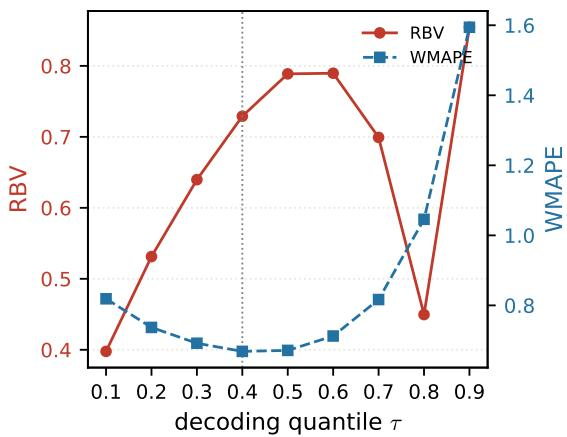

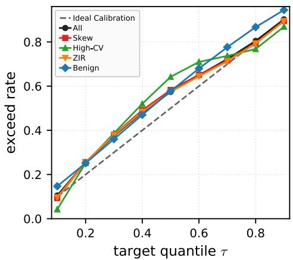  
Figure 12: Chronos-Bolt zero-shot evaluation on M5. Left: RBV and aggregate WMAPE as the decoding quantile τ is swept on a frozen checkpoint; the dotted vertical line marks $\tau ^ { * } { = } 0 . 4$ the quantile minimizing aggregate WMAPE. RBV(τ) is U-shaped and attains its minimum at the quadrature-mean estimand (Tab. 12). Right: per-regime exceed rate, $\operatorname* { P r } [ \hat { y } > y ] + 0 . 5 \operatorname* { P r } [ \hat { y } = y ]$ , of zero-shot quantile decoding against the diagonal: quantile heads over-cover throughout the mid range (exceed $0 . 5 7 4$ at nominal 0.5), the high-CV segment shows the largest over-coverage, and calibration recovers at $\mathrm { { \ h i g h \ r } }$ Unlike Fig. 8, the low-τ end shows no zero-inflation floor—the continuous quantile heads emit no atom at zero, so the ZIR curve tracks the diagonal while the floor in Fig. 11 is a construct of discrete zero-mass predictors. Negative predictions (65% at $q _ { 0 . 1 } )$ mechanically depress the exceed rate at low $\tau \left( \mathrm { A p p . } \mathrm { E } . 3 \right)$