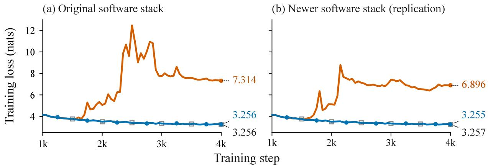
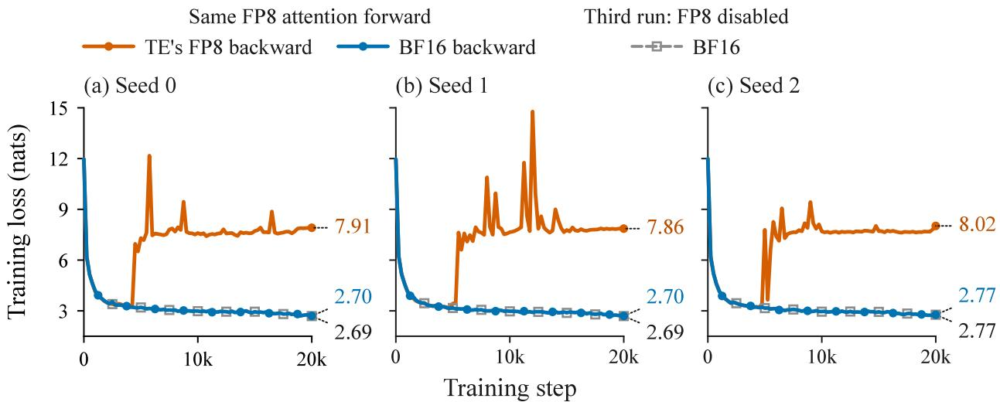
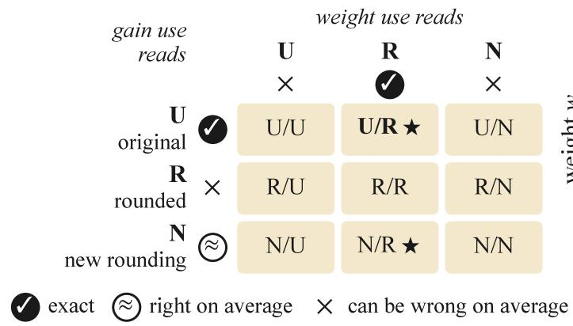
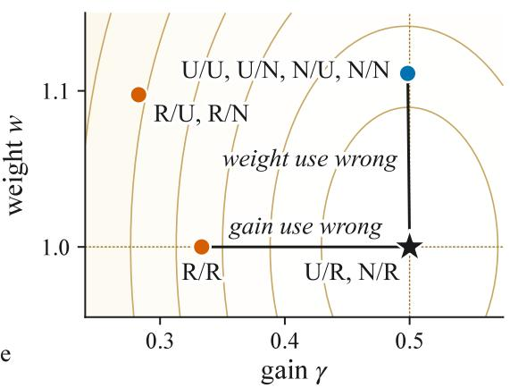
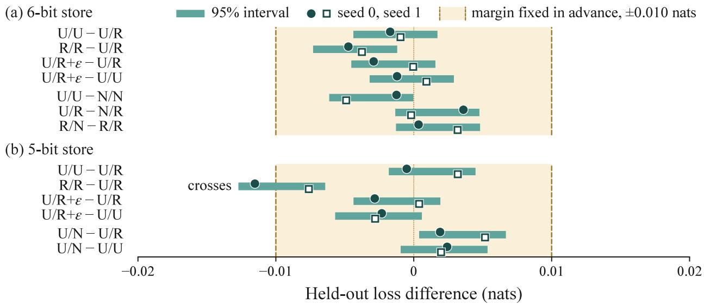
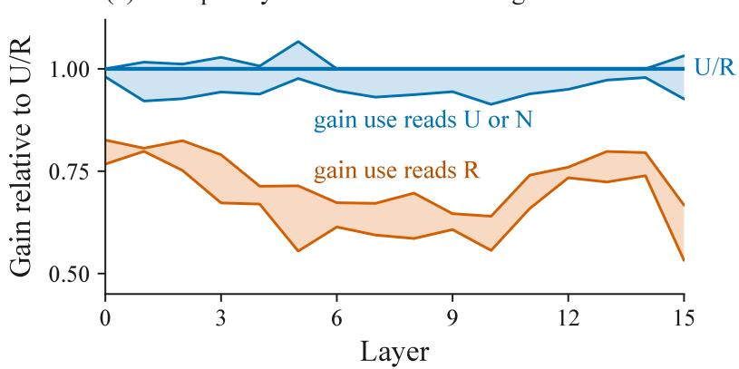
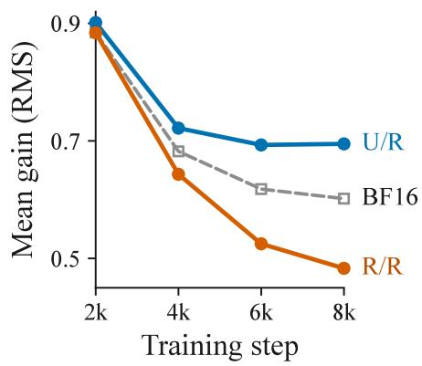
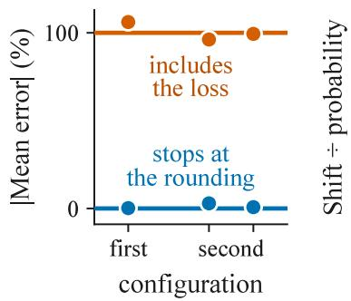
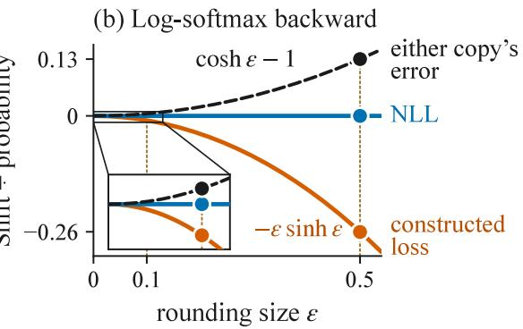
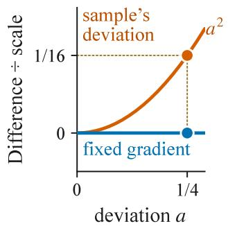

# Backward-State Policy Is Part of the Learning Algorithm

Preprint

Shuxiao Xie1,2∗ Shuyang Xie3∗

Dezhi Ran1† Wei Yang2 Tao Xie1,2,4,5†

1Beijing Tongming Lake Information Technology Application Innovation Center (TLAIC), China 2Fudan University Institute of Systems for Advanced Computing, China 3Harbin Institute of Technology, China 4Key Lab of HCST (PKU), MOE; SCS, Peking University, Beijing, China 5Shanghai Institute of Systems for Open Computing, China

## Abstract

Low-precision training rounds tensors that the backward pass reads again, often for several gradients; each use can read the forward’s rounded value, the original, or a new random rounding. This backward-state policy looks like a memory and precision detail, settled by copy accuracy and final loss. We argue that it is part of the learning algorithm, and that neither check shows whether it is right. Copy accuracy does not decide the outcome: in three pairs of 390M runs with an emulated FP8 backward, training fails when attention’s backward reuses the forward’s rounded output and succeeds with a new rounding from the same distribution. Even the most accurate copy, the original itself, can be wrong by our reference: the gradient of the forward pass as it actually ran, with gradients passed through rounding unchanged. For example, a normalization output stored in low precision feeds two gradients: the gain’s gradient needs the original, but the next layer’s weight gradient needs the rounded value that layer multiplied. Final loss, the other check, does not rule out the error of reading the original for both: it persists in models trained with such a store, while planned loss comparisons stay within a margin fixed in advance. We therefore derive from this reference which value each use must read, or which substitute gives the same gradient on average with the forward held fixed, and check these per-use requirements on single operators, without training. In three tests using PyTorch and Transformer Engine, the requirements predicted beforehand whether reuse changes what the backward computes on average relative to an independent copy, and every prediction held. Backward-state policy is thus part of the learning algorithm: it should be specified and checked use by use, not settled by copy accuracy and final loss.

## 1 Introduction

Large language models are now trained in low precision, with FP8 (8-bit floating point) at scale [12, 27, 33] and 4-bit formats following [6, 9]. The forward pass rounds tensors before operations consume them, and the backward pass reads many of these tensors again, often for several gradients. Keeping them at full precision costs memory, so implementations decide what the backward receives: FlashAttention saves the attention output [11], activation-compressed training keeps few-bit copies of activations for the backward [8, 24], and checkpointing recomputes parts of the forward [34].3 Once a tensor has been rounded, these choices decide which value each gradient reads: the rounded value the forward used, the original, or a new random rounding of the original. We call each gradient computation that reads a rounded tensor a use, and the choice made for every use the backward-state policy.

  
Figure 1: Same rounding distribution, opposite outcomes. Training loss of 390M runs with an emulated FP8 attention backward, forked from one checkpoint; all consume a stochastic rounding of the attention output �, and within each panel they difer only in how the correction term � is computed. (a) The first of three pairs: reusing the forward’s rounding fails (final loss 7.314); a new rounding from the same distribution trains (3.256), like a control whose � reads no copy of �. (b) The runs of (a), repeated on newer versions of PyTorch and Transformer Engine.

Viewed as ways of keeping a tensor, these choices look like a memory and precision detail, settled by two checks: whether the copy is close to the original, and whether the final loss looks normal. A use, however, reads its value to compute one particular gradient, so the value it reads can change the gradient that training follows. We argue that the backward-state policy is part of the learning algorithm, and that neither check shows whether it is right.

Low-precision attention shows what is at stake. FOG, a study of fully FP8 training, reports that FP8 attention training diverges on standard architectures and avoids the failure with new architectures [17]. In our runs, changing only the backward can prevent such a failure. In FOG’s 390M setting, the FP8 attention of NVIDIA’s Transformer Engine fails on all 3 seeds we ran, and replacing only its backward with a BF16 (bfloat16) one removes the failure while keeping the FP8 forward (Section 2). In a separate study of BF16 FlashAttention, Qiu and Yao [36] locate a failure in a correction term of the attention backward, � = rowsum(�� ◦ �), which reads the saved output � and its incoming gradient ��. They trace the term’s error to biased rounding in computing �, which their change to the forward’s softmax normalization prevents. Attn-QAT, a 4-bit attention method, instead gives � a separate high-precision attention output [55]. Qiu and Yao’s fix and Attn-QAT’s separate output both make the value that � reads more accurate.

If copy accuracy settled the choice, � could read either of two equally accurate copies of � without changing whether training succeeds. We test this directly, letting the forward round � at random [15] so that a new rounding from the same distribution is as accurate as the forward’s own. The two difer in one respect: only the forward’s rounding went into the loss, so �� can depend on it but not on the new one. In our 390M runs with an emulated FP8 attention backward, training fails when � reuses the forward’s rounding and trains when � reads a new rounding from the same distribution (Figure 1).

These results show that what the backward reads can decide the outcome. A successful run still leaves open which gradient it followed and which choice is right. To check whether a policy preserves the gradient of the computation that produced the loss, we declare a reference: the gradient of the forward pass as it actually ran, with gradients passed through each rounding unchanged as in the straight-through convention [4, 51]. Under this reference, each use needs the value its forward operation used, rounded or original, or a substitute that gives the same gradient on average conditional on the realized forward and the incoming gradient the use actually receives.

Judged this way, even the most accurate copy can be wrong, because one tensor can feed gradients that need diferent values. A normalization output rounded to low precision in the forward feeds two: the gain’s gradient needs the original, because the gain scaled unrounded values, and the next layer’s weight gradient needs the rounded value, because that layer multiplied it. No single value read by both is always right for both. For the probabilities that FP8 attention rounds before multiplying them by �, we prove, under stated assumptions, that no single substitute is always right on average at both of their uses.

Final loss, the other check, does not reveal such an error either. In our 390M models trained with the rounded output feeding the next layer and the original read by both gradients, the error persists, yet the final loss stay within a margin, fixed in advance, of the policy that follows the reference. Loss can show that a policy fails to train; it cannot show that it keeps the reference.

We therefore check the policy at each use. From the reference we derive per-use requirements, which state the value each use must read or the substitutes it may read. Each can be checked on its operator without training, using the random dependencies of the incoming gradient it actually receives. An executable checker tests stated policies against the requirements on small finite cases. The requirements also predict when reuse matters, the contrast of Figure 1. Averaged over both roundings, handing a use the forward’s rounding instead of a new one can change what the backward computes only if the use’s incoming gradient depends on that rounding. We registered such predictions before testing three operators of PyTorch and Transformer Engine, and every one held, including predictions that reuse changes nothing.

## 2 What a use reads can decide the outcome

## 2.1 Same rounding distribution, opposite outcomes

Attention’s correction term shows why two copies from one rounding distribution need not be interchangeable. The forward turns scores � into probabilities $P = s \mathrm { o f t m a x } ( S )$ and outputs $O = P V$ . Given the output’s gradient $d O ,$ the backward forms $d V = P ^ { \top } d O$ and $\begin{array} { r } { d P = d O V ^ { \top } } \end{array}$ , and the softmax’s backward gives $d S = P \circ ( d P - D )$ with $D = \operatorname { r o w s u m } ( P \circ d P )$ . FlashAttention computes � from the saved output as rowsum $( d O \circ O )$ , the same value because $O = P V _ { \mathrm { { i } } }$ , and reads the saved output nowhere else [11]. When the forward rounds � before the next layer consumes it, our reference passes �� through the rounding unchanged, so � is still rowsum $( P \circ d P )$ , the value that rowsum $( d O \circ O )$ takes at the original output. Reading a copy $O + E$ instead adds an error term,

$$
\mathrm { r o w s u m } \big ( d O \circ ( O + E ) \big ) = D + \mathrm { r o w s u m } ( d O \circ E ) ,\tag{1}
$$

which the control in Figure 1 avoids: it computes � from � and reads no copy of $O .$

Whether the added term averages to zero depends on where the copy came from. Stochastic rounding sends a value bracketed by two representable numbers up or down at random to one of them, so that its error averages to zero over the random draw [15]. For such values, a new random rounding uses its own random numbers, so with the forward and �� held fixed its error still averages to zero, and so does the added term: � is right on average. Reusing the forward’s own rounding leaves nothing to average with the forward held fixed, and averaging over that rounding need not remove the term either, because the loss saw the rounding and �� can depend on its error. Qiu and Yao [36] observe such a dependence in BF16 FlashAttention, where � also reads the forward’s own output.

We first ask whether this diference alone can decide the outcome of training when both copies come from the same distribution. We take FOG’s 390M model [17], trained with the FP8 attention of NVIDIA’s Transformer Engine (TE), at step 999 of two runs (seeds 0 and 1), and fork each checkpoint into three runs that difer only in what � reads: the forward’s rounding, a new rounding, or no copy of �. TE rounds its attention output to the nearest representable value, which gives no second, independently drawn copy, so in these forks the next layer instead consumes a stochastic rounding of a recomputed � onto TE’s FP8 values; a new rounding draws separate random numbers the same way, so the two copies have the same distribution by construction. We emulate TE’s FP8 attention backward in PyTorch so that � can read either copy or be computed from � (Appendix D), and each run continues for 3000 steps. Forking seed 0’s checkpoint again with a diferent rounding seed gives a third pair comparing reuse with a new rounding. Each run was judged by a rule fixed before its results were examined (Appendix D): it fails if its training loss becomes non-finite or rises more than 1.5 nats above its lowest value so far, and it trains usefully if it does not fail, its attention logits stay below $1 0 ^ { 3 }$ late in the run, and its validation loss and late training loss end at most 0.05 nats above the control’s.

  
Figure 2: Changing only the attention backward removes the failure. Training loss of 390M models trained from scratch over the 20k-step schedule, one panel per seed, shown every 250th step. With TE’s FP8 attention the loss jumps and stays high on every seed, ending 5.097, 5.120 and 5.225 nats above BF16 (the same model trained with FP8 disabled) in validation loss. Keeping its FP8 forward and replacing only the attention backward with a BF16 one tracks BF16, ending 0.0029, 0.0059 and 0.0052 nats above it. Seed 2’s BF16 run used PyTorch 2.13 and TE 2.13 instead of 2.11 and 2.10 (Appendix E).

In all three pairs, reuse fails and the new rounding trains usefully (Figure 1a: final training losses 7.314 and 3.256 in the first pair, with the control at 3.256). Because FP8 numerics can change between software releases, we repeated the first pair on PyTorch 2.13 and TE 2.13 (the runs above used 2.11 and 2.10): reuse again fails and the new rounding trains usefully (Figure 1b). So under this controlled stochastic rounding, specifying the distribution of the rounded output does not specify the learning algorithm.

## 2.2 Changing only the backward removes a failure of shipped FP8 attention

We next turn to shipped code: TE’s own FP8 attention, with its own backward and its rounding to nearest, trained from scratch in the setting where FOG reported FP8 attention to fail [17]. We use FOG’s 390M model on PyTorch 2.11 and TE 2.10, with a 20k-step version of FOG’s learning rate schedule. The rules are those of the forks, except that a loss rise on the 100-step grid counts as a failure only if it does not recover by the end of the run, and both losses must end at most 0.02 nats above those of the same seed trained with FP8 disabled (BF16); Appendix D gives both rules in full. By these rules TE’s FP8 attention fails on all 3 seeds we ran: the loss jumps by several nats and stays high (Figure 2).

FOG avoided the failure by changing the architecture. Before asking what TE’s backward reads, we ask whether changing the backward alone is enough: we keep the architecture and TE’s FP8 forward and replace only the attention backward with a BF16 one. Our backward calls FlashAttention-2 to recompute attention in BF16 from the forward’s FP8 inputs and to compute the gradients from that recomputation [10], so at �� it uses the recomputed probabilities, where our reference uses the probabilities TE’s forward rounded to FP8 and multiplied by �. All three seeds then train usefully (Figure 2). Because scale and software release could each change the outcome, we repeated the comparison at 1.5B on one seed, each run continued from its own checkpoint at step 2999 to step 4999, and at 390M on PyTorch 2.13 and TE 2.13 on both seeds we ran, against BF16 on the same software: in each, TE’s FP8 attention fails and the BF16 backward trains usefully, judged by the rule fixed for that setting (Appendix E).

## 2.3 Replacing only the saved output also removes the failure

A BF16 backward changes both the precision of the backward and the values it reads. To see whether changing only what the backward receives is enough, we keep TE’s FP8 backward in the original 390M runs from scratch and, through a wrapper around its call, replace only the saved output it receives, the forward’s own output rounded to nearest, with a stochastic rounding of a BF16 recomputation of � onto the same FP8 values. All three seeds again train usefully, ending 0.0054, 0.0076 and 0.0067 nats above the BF16 runs of Figure 2 in validation loss, while the unchanged runs fail (Appendix E). Unlike the forks, this replacement changes both the source output and its rounding. It shows that what TE’s backward receives can decide the outcome, and that avoiding the failure does not require a more precise output format.

A further fork shows that a copy with larger error at the fork than the forward’s own can train where the forward’s own output fails, in TE’s backward and in our emulated one (Appendix E).

Together, the forks and the runs of TE’s own attention show what is at stake: what the backward reads can decide whether training fails. Which value each use should read is a separate question, and Section 3 answers it with the reference: one tensor can need diferent values at diferent uses.

## 3 One tensor, two uses

## 3.1 The original matches the reference at only one use

The most accurate value a use could read is the original, yet a normalization output rounded in the forward shows that even the original cannot serve every use. In each block of our model, the root-mean-square normalization before the multilayer perceptron (MLP) scales its normalized input � by a trainable gain �, giving $u = \gamma \circ z [ 5 2 ]$ Suppose the forward rounds � to a few bits by stochastic rounding, $\boldsymbol { u _ { q } } = \boldsymbol { u } + \boldsymbol { r }$ , the MLP’s first layer multiplies the rounded value, $y = u _ { q } W$ , and $u _ { q }$ is saved for the backward; we call this saved value a store. The layer’s weight gradient needs the value the layer multiplied, and the gain’s gradient needs the unrounded � that the gain scaled, since the reference passes the incoming gradient $d u \overset { \vartriangle } { = } d y W ^ { \top }$ through the rounding unchanged:

$$
\begin{array} { r } { d W = u _ { q } ^ { \top } d y , \qquad d y = \sum _ { \mathrm { t o k e n s } } z \circ d u . } \end{array}\tag{2}
$$

Reading the original at the weight use therefore adds $- r ^ { \top }$ �� to ��, and reading the rounded value at the gain use, as $u _ { q } / \gamma$ in place of � (for nonzero �), adds $\begin{array} { r } { \sum _ { \mathrm { t o k e n s } } ( r / \gamma ) } \end{array}$ ◦ �� to $d \gamma$

Since the original is the average of $u _ { q }$ given $u ,$ reading it might still seem right on average. It would be, had the forward multiplied � itself, as in activation-compressed training. Here the loss saw �, so �� can depend on it. Even averaged over the forward’s rounding, a looser test than holding the forward fixed, the original’s error is then $- \mathbb { E } [ \check { r } ^ { \top } d y ]$ , which need not vanish. The same holds for the rounded value and �� at the gain use. A new rounding, averaged over its own draw with the forward held fixed, is right at the gain use but carries the original’s error at the weight use. None of the three values is therefore guaranteed to be right at both uses, while an assignment by use can be: the reference’s, the original at the gain use and the rounded value at the weight use, or a new rounding at the gain use instead, which is right on average (Figure 3a).

Whether the original’s error at the weight use is detectable in trained models is an empirical question. We take two 390M models trained in BF16 without any store, from two seeds, so that their weights have not adapted to one, and at probe time insert a 6-bit store at this normalization in all 16 layers; nothing is trained. In all 16 layers of the first model and all 16 of the second, a detection statistic for the original’s average error at the weight use exceeds the largest value that a control with zero mean reaches in any layer (Appendix D), while at the gain use its error is exactly zero.

## 3.2 No single substitute serves both uses

A value shared by both uses might still leave the optimum of training in place. It does not in a two-parameter model of the store whose average updates can be computed exactly. A gain $\gamma \in ( 0 , 1 ]$ scales an input of one, and the forward consumes a rounding $q \in \{ 0 , 1 \}$ of $\gamma$ with $P ( q = 1 ) = \bar { \gamma }$ , which is right on average; a weight � multiplies � under a regularized quadratic loss whose expectation has a unique minimum, at $\gamma = 1 / 2$ and � = 1 (Appendix B). Because $q ^ { \prime } s$ distribution depends on �, the gradient of the expected loss has one more term, which every policy receives alike. Reading $\gamma$ at the gain use and � at the weight use is then right on average everywhere, as is a new draw at the gain use, so both leave the minimum stationary. None of the three values read by both uses does (Figure 3b): reading � at both, for instance, is stationary at $\gamma = 1 / 3$ and $w = 1$ , where the expected loss exceeds its minimum by 1/18.

For attention, the operation of Section 2.2, a theorem rules out every shared substitute for its rounded probabilities. FP8 attention rounds the probabilities � before multiplying them by $V ,$ so the rounded probabilities $p _ { q } = p + r$ of a row have two uses: the gradient of � needs the rounded values that multiplied $V ,$ while the softmax’s backward needs its Jacobian at the probabilities the softmax produced, $J ( p ) = \mathrm { d i a g } ( p ) - p p ^ { \intercal }$ . Suppose one row’s rounding is right on average but not exact, independent across entries, and confined for each entry to a fixed pair of neighbouring representable values, and the loss is quadratic in the row’s output. A shared substitute � is used as $( Z , J ( Z ) )$ at the gradient of � and the softmax’s backward, respectively. No such substitute matches both reference gradients on average with the forward held fixed, for every incoming gradient at each use. Being right at the gradient of � forces � to vary across the forward’s roundings at least as much as $\begin{array} { r } { p _ { q } , } \end{array}$ and the Jacobian, quadratic in the probabilities, turns that variation into an error. Appendix B gives the proof, and an exact enumeration in two cases that confirms the predicted errors of four assignments.

(a) Which value each use reads  

(b) Where the average update is zero  
  
Figure 3: Each use has its own reference value. (a) Policies, written gain use/weight use; the marks rate each use’s gradient (≈: on average over the new rounding, the forward fixed; N/N hands both uses one new rounding). U/R is the reference; ⋆: matches it at both uses, at least on average. (b) Where each policy’s average update is zero in the two-parameter model of Section 3.2: ⋆ marks the minimum of the expected loss (shading); vermillion dots: the gain use reads R.

An assignment by use remains possible: the reference reads $p _ { q }$ at the gradient of � and � in the softmax’s backward.

## 3.3 Comparable final loss does not show that a policy follows the reference

The remaining check, final loss, needs models trained with the normalization store. We trained the 390M model in BF16 with the store at the normalization before each MLP as its only low-precision rounding, for 8000 steps on two seeds: seven policies at 6 bits, which share the forward and difer only in what the backward reads, and five at 5 bits (Appendix D). Besides the policies of Figure 3a, both widths ran $\mathrm { U } / \mathrm { R } + \varepsilon ,$ a control for noise whose weight use reads the rounded value plus a new rounding’s residual. Before reading each store’s final losses we named the comparisons to read, and before reading any we fixed a margin of ±0.010 nats: two policies count as equivalent when the model-based 95% interval of their diference in held-out loss, evaluated without the store, lies inside it.

At 6 bits every named interval lies inside the margin, including that of the original at both uses (U/U) against the reference assignment (U/R) (Figure 4a). The rounded value at both uses (R/R) ends -0.00425 nats from U/R: lower, with an interval that excludes zero, yet inside the margin. At 5 bits R/R ends -0.00957 nats from U/R, and its interval, which excludes zero, crosses the margin’s lower edge; every other named interval stays inside (Figure 4b).

Nor do comparable losses mean the same trained model. The gain’s gradient is the store’s other use, and in the 6-bit runs the two policies whose gain use reads the rounded value end with a lower root-mean-square gain than the five others in every layer, on both seeds (Figure 5).

The error itself could also change as the model adapts to the store. To see how, we continued two runs trained without the store, one per seed, for 750 steps with the 6-bit store under U/R, U/U or R/R, or with a forward that does not consume the store, as a control, and probed every continuation with the same store (Appendix D). Under U/R and $\mathrm { U } / \mathrm { U } ,$ the squared norm of the average error that reading the original would introduce at the last layer’s weight use shrank relative to the control, yet the error stayed detectably nonzero on both seeds; under R/R, the root-mean-square gain fell below U/R’s in every layer by the first probe after the switch.

(b) During training  
  
Figure 4: Every named interval but one lies inside the margin fixed in advance. Held-out loss of the 390M runs trained with a 6-bit (a) or 5-bit (b) store, evaluated without it, first policy minus second: model-based 95% intervals (bars) and the two seeds (markers). Only the $\mathrm { R } / \mathrm { R } - \mathrm { U } / \mathrm { R }$ interval at 5 bits crosses the margin.

(a) Gain per layer at the end of training  

  
Figure 5: Comparable final loss, diferent trained weights. (a) Root-mean-square gain of the normalization before each MLP at the end of the 6-bit runs, divided by U/R’s at the same layer and seed; each band spans its group’s runs on both seeds (U/R’s at 1). (b) The mean gain over layers during training for U/R, R/R and BF16 without the store (seed 0).

A policy that departs from the reference thus runs a diferent learning algorithm, which its final loss, comparable to or lower than the reference’s, does not reveal. Whether a policy follows the reference has to be checked at each use, as Section 4 does at the operator.

## 4 Checking each use against the reference

## 4.1 Each use has a checkable requirement

Final loss judges a whole run, whereas the reference makes a statement about each use, so a policy can be checked one use at a time. Because the reference passes gradients through each rounding unchanged, it takes each use’s gradient at the actual inputs and outputs of its forward operation. The weight use of Section 3.1

predicted before the test measured

(a) Checkpointing  

(c) FP8 attention  
  
Figure 6: Registered predictions about reuse held. Lines: predictions written before each test; dots: measurements. (a) The use’s mean error, as a percentage of its size without checkpointing (random state not restored). (b) Mean change per gradient entry, divided by its probability: shared minus independent copy under each loss, and either copy’s error under the likelihood; the inset enlarges $\varepsilon = 0 . 1$ . (c) Query gradient, independent minus shared sample, divided by the softmax scale; mean of four sample pairs.

and the gradient of � therefore need the rounded value. The gain use, the correction term � and the softmax’s backward need the original. A use may instead read a substitute, such as a new rounding, if averaging over the substitute’s own draw gives the reference gradient conditional on the forward, including its rounding, and the incoming gradient it actually receives. This conditioning accounts for any random dependence between the substitute and that gradient. Two uses can share one value only if it meets both requirements, and at the normalization output of Section 3 no value is guaranteed to.

Each requirement concerns one use of one operator, so checking it needs no training run. Our checker takes a policy written down use by use, together with the random draws on which each incoming gradient and each rule’s gap from the reference depend. It reports whether each condition of each requirement holds, fails, or cannot be decided. We test its verdicts by exact computation on small finite cases and on deliberately broken policies (Appendix C). At the store of Section 3, it certifies a weight use that reads the rounded value its layer multiplied. For a gain use that reads that rounding too, it reports the requirement as undecided: the incoming gradient depends on the same random draw, so the error need not average away.

## 4.2 The requirements predict when reuse matters

The dependence that left the gain use undecided also yields predictions about existing code, which need not declare any policy. Consider the contrast of Figure 1: a use that needs the original reads either the forward’s own rounding, as under reuse, or a new rounding from the same distribution. The two copies are equally accurate and difer in one way: the incoming gradient can depend on the forward’s rounding but not on the new one (Section 2.1). Averaged over the forward’s rounding as well as the new one, reuse can therefore change what the backward computes only if the incoming gradient depends on the forward’s rounding. Whether it does is decided by the computation around the use, such as what is recomputed and the loss.

We tested such predictions on three pieces of code that we did not write: PyTorch’s checkpointing and log-softmax backward, and TE’s FP8 attention backward. Before measuring, we wrote down each prediction and how its result would be read. Each test isolates one backward operator: our code sets the rounding or sampling, and nothing is trained. Figure 6 summarizes these predictions and their measurements.

## 4.3 Predictions about reuse held on three operators

Checkpointing varies what is recomputed. By default it restores the random state before recomputing, so the recomputation reproduces the forward’s random numbers [34]. A dropout mask needs this, since the forward multiplied it; a PyTorch issue reports training that collapsed when a compiler’s recomputation drew new masks [28]. Our two-layer test model, run eagerly on CPU in PyTorch 2.14, has both a dropout mask and, with our own stochastic rounding, a use that needs the original but reads the recomputed rounding. We predicted that restoring the random state reproduces that use’s recorded error bit for bit. Without restoration the mask changes. Whether the efect of reuse also vanishes depends on the incoming gradient. If recomputation stops at the rounding, the incoming gradient still comes from the original draw and the efect should vanish; if recomputation includes the loss, the incoming gradient is recomputed from the new draw and the efect should stay. Both configurations we registered agreed. In the first, without restoration, the use’s mean error shrank to 0.19 % of its size without checkpointing when recomputation stopped at the rounding, and stayed at 106.12 % when it included the loss (Figure 6a). One switch restores the random state for the whole recomputed part, so in our model, when that part ends at the rounding, neither setting serves both the mask and the use.

The log-softmax test varies the loss instead. PyTorch’s CPU backward for log-softmax exponentiates its saved output, into which our code injects a rounding error of ±�. Under negative log-likelihood with a fixed target, the incoming gradient does not depend on that output, and we predicted that reuse leaves the average gradient unchanged. Under a second loss, constructed by our code so that the incoming gradient equals the rounding error, we predicted that reuse shifts each gradient entry by −� sinh � times its probability on average. Both predictions held at both values of �, 0.1 and 0.5 (Figure 6b). Yet the two copies agreeing does not make either right: under the likelihood, the gradient from either copy is of on average by cosh � − 1 times each entry’s probability, as predicted, so here not even a new rounding is right.

After two tests on CPU, the last takes the contrast of Figure 1 to a shipped fused kernel: TE’s FP8 attention backward, whose saved output Section 2.3 replaced. We tested it in TE 2.13 with cuDNN 9.20, on one attention row in which every value that decides the result is exactly representable in FP8. Our code moves one entry of the saved output up or down by � from its mean. The backward then reads either an independent sample or, as under reuse, the sample that the incoming gradient depends on. For a backward that computes � from the saved output, as FlashAttention’s does [11], we predicted, for each of the four sample pairs, the change in the query gradient at that entry from the shared sample to the independent one. On average, the change should be �2 times the softmax scale when the incoming gradient is the sample’s deviation from its mean, and zero when the incoming gradient is fixed. All eight predicted values were reproduced exactly (Figure 6c shows their means).

Every prediction about reuse held, including the predictions that reuse changes nothing; Appendix C reports every registered statement with its outcome. The requirements thus give a rule that is stated for each use and checked on its operator before any training run. That appendix’s two-stage example shows why the conditioning matters. Both stages match the reference on average at a fixed input, but sharing a random draw biases their composition. Conditioning on the received input detects this error.

## 5 Conclusion

Low-precision training leaves the backward a choice wherever it reads a rounded tensor again: the rounded value the forward used, the original, or a new rounding. We have argued that this choice is part of the learning algorithm, not a detail of memory and precision. For attention’s correction term, two copies from the same rounding distribution led training to opposite outcomes, and changing only the backward removed a failure of shipped FP8 attention. Under the declared reference, one stored tensor can need diferent values at diferent uses, so even the exact original departs from it at one of them. Trained models carry that discrepancy while their final loss stays comparable. Copy accuracy and final loss therefore cannot settle the choice; a requirement at each use can, and it is checked on its operator without training. In three tests on PyTorch and Transformer Engine operators, every prediction the requirements made about reuse held.

The choice arises wherever a backward reads forward state that was saved, compressed or recomputed. An implementation should make it explicitly, stating which value each use reads and testing whether the use’s incoming gradient depends on the rounding it reads. What the backward reads decides which gradient training follows, and so belongs to the learning algorithm.

## References

[1] Joshua Ainslie, James Lee-Thorp, Michiel de Jong, Yury Zemlyanskiy, Federico Lebrón, and Sumit Sanghai. GQA: Training generalized multi-query transformer models from multi-head checkpoints, 2023. URL https://arxiv.org/abs/2305.13245.

[2] Dejan Azinović, Tzu-Mao Li, Anton Kaplanyan, and Matthias Nießner. Inverse path tracing for joint material and lighting estimation, 2019. URL https://arxiv.org/abs/1903.07145.

[3] David Balduzzi, Sébastien Racanière, James Martens, Jakob Foerster, Karl Tuyls, and Thore Graepel. The mechanics of n-player diferentiable games, 2018. URL https://arxiv.org/abs/1802.05642.

[4] Yoshua Bengio, Nicholas Léonard, and Aaron Courville. Estimating or propagating gradients through stochastic neurons for conditional computation, 2013. URL https://arxiv.org/abs/1308.3432.

[5] Charlie Blake, Douglas Orr, and Carlo Luschi. Unit scaling: Out-of-the-box low-precision training, 2023. URL https://arxiv.org/abs/2303.11257.

[6] Roberto L. Castro, Andrei Panferov, Soroush Tabesh, Oliver Sieberling, Jiale Chen, Mahdi Nikdan, Saleh Ashkboos, and Dan Alistarh. Quartet: Native FP4 training can be optimal for large language models, 2025. URL https://arxiv.org/abs/2505.14669.

[7] Genlang Chen and Junyi Zhu. Explicit state and resource contracts for low-precision pipeline parallel training under captured graphs, 2026. URL https://arxiv.org/abs/2609.23536.

[8] Jianfei Chen, Lianmin Zheng, Zhewei Yao, Dequan Wang, Ion Stoica, Michael W. Mahoney, and Joseph E. Gonzalez. ActNN: Reducing training memory footprint via 2-bit activation compressed training. In Proceedings of the 38th International Conference on Machine Learning, volume 139 of Proceedings of Machine Learning Research, pages 1803–1813. PMLR, 2021. URL https://proceedings.mlr.press/v139 chen21z.html.

[9] Brian Chmiel, Maxim Fishman, Ron Banner, and Daniel Soudry. FP4 all the way: Fully quantized training of LLMs, 2025. URL https://arxiv.org/abs/2505.19115.

[10] Tri Dao. FlashAttention-2: Faster attention with better parallelism and work partitioning. In International Conference on Learning Representations, 2024. URL https://arxiv.org/abs/2307.08691.

[11] Tri Dao, Daniel Y. Fu, Stefano Ermon, Atri Rudra, and Christopher Ré. FlashAttention: Fast and memoryeficient exact attention with IO-awareness, 2022. URL https://arxiv.org/abs/2205.14135.

[12] Maxim Fishman, Brian Chmiel, Ron Banner, and Daniel Soudry. Scaling FP8 training to trillion-token LLMs, 2024. URL https://arxiv.org/abs/2409.12517.

[13] Alicia Golden, Samuel Hsia, Fei Sun, Bilge Acun, Basil Hosmer, Yejin Lee, Zachary DeVito, Jef Johnson, Gu-Yeon Wei, David Brooks, and Carole-Jean Wu. Is Flash Attention stable? arXiv.org, 2024. doi:10.48550/arXiv.2405.02803.

[14] Aaron Grattafiori et al. The Llama 3 herd of models, 2024. URL https://arxiv.org/abs/2407.21783.

[15] Suyog Gupta, Ankur Agrawal, Kailash Gopalakrishnan, and Pritish Narayanan. Deep learning with limited numerical precision. In Proceedings of the 32nd International Conference on Machine Learning, volume 37 of Proceedings of Machine Learning Research, pages 1737–1746. PMLR, 2015. URL https://proceedings. mlr.press/v37/gupta15.html.

[16] Alexander Hägele, Elie Bakouch, Atli Kosson, Loubna Ben Allal, Leandro Von Werra, and Martin Jaggi. Scaling laws and compute-optimal training beyond fixed training durations, 2024. URL https://arxiv. org/abs/2405.18392.

[17] Alejandro Hernández-Cano, Dhia Garbaya, Imanol Schlag, and Martin Jaggi. Towards fully FP8 GEMM LLM training at scale, 2025. URL https://arxiv.org/abs/2505.20524.

[18] Robert Hu. Hardware-aware FP4 FlashAttention-4, 2026. URL https://arxiv.org/abs/2609.04105.

[19] Shengding Hu, Yuge Tu, Xu Han, Chaoqun He, Ganqu Cui, Xiang Long, Zhi Zheng, Yewei Fang, Yuxiang Huang, Weilin Zhao, Xinrong Zhang, Zheng Leng Thai, Kaihuo Zhang, Chongyi Wang, Yuan Yao, Chenyang Zhao, Jie Zhou, Jie Cai, Zhongwu Zhai, Ning Ding, Chao Jia, Guoyang Zeng, Dahai Li, Zhiyuan Liu, and Maosong Sun. MiniCPM: Unveiling the potential of small language models with scalable training strategies, 2024. URL https://arxiv.org/abs/2404.06395.

[20] Eric Jang, Shixiang Gu, and Ben Poole. Categorical reparameterization with Gumbel-Softmax. In International Conference on Learning Representations, 2017. URL https://openreview.net/forum?id= rkE3y85ee.

[21] Tanishq Kumar, Zachary Ankner, Benjamin F. Spector, Blake Bordelon, Niklas Muennighof, Mansheej Paul, Cengiz Pehlevan, Christopher Ré, and Aditi Raghunathan. Scaling laws for precision. In International Conference on Learning Representations, 2025. doi:10.48550/arXiv.2411.04330.

[22] Hanyang Li, Jianhao Ma, and Ying Cui. Understanding quantization-aware training: Gradients at quantized weights bias to the low-loss basin. arXiv.org, 2026. doi:10.48550/arXiv.2606.09012.

[23] Yanyi Li, Yimu Zhang, and Cong Fang. PRAC: Principal-random subspace for LLM activation compression and memory-eficient training, 2026. URL https://arxiv.org/abs/2602.23111.

[24] Xiaoxuan Liu, Lianmin Zheng, Dequan Wang, Yukuo Cen, Weize Chen, Xu Han, Jianfei Chen, Zhiyuan Liu, Jie Tang, Joey Gonzalez, Michael Mahoney, and Alvin Cheung. GACT: Activation compressed training for generic network architectures. In Proceedings of the 39th International Conference on Machine Learning, volume 162 of Proceedings of Machine Learning Research, pages 14139–14152. PMLR, 2022. URL https: //proceedings.mlr.press/v162/liu22v.html.

[25] Ilya Loshchilov and Frank Hutter. Decoupled weight decay regularization, 2017. URL https://arxiv. org/abs/1711.05101.

[26] Paulius Micikevicius, Dusan Stosic, Neil Burgess, Marius Cornea, Pradeep Dubey, Richard Grisenthwaite, Sangwon Ha, Alexander Heinecke, Patrick Judd, John Kamalu, Naveen Mellempudi, Stuart Oberman, Mohammad Shoeybi, Michael Siu, and Hao Wu. FP8 formats for deep learning, 2022. URL https: //arxiv.org/abs/2209.05433.

[27] Asit Mishra, Dusan Stosic, Simon Layton, and Paulius Micikevicius. Recipes for pre-training LLMs with MXFP8. arXiv.org, 2025. doi:10.48550/arXiv.2506.08027.

[28] Hussain Nizamani. Memory-budget partitioner recomputes RNG ops with fresh randomness in backward, silently corrupting gradients at any activation\_memory\_budget < 1.0. GitHub issue pytorch/pytorch #190758, 2026. URL https://github.com/pytorch/pytorch/issues/190758. Opened 2026- 07-22; accessed 2026-09-24.

[29] NVIDIA. FP8 blockwise scaling. Transformer Engine 2.19.0 documentation, 2026. URL https://docs.nvidia.com/deeplearning/transformer-engine/features/low\_ precision\_training/fp8\_blockwise\_scaling/fp8\_blockwise\_scaling.html. Accessed 2026-09-24.

[30] Andrei Panferov, Erik Schultheis, Soroush Tabesh, and Dan Alistarh. Quartet II: Accurate LLM pre-training in NVFP4 by improved unbiased gradient estimation, 2026. URL https://arxiv.org/abs/2601.22813.

[31] Adam Paszke, Sam Gross, Francisco Massa, Adam Lerer, James Bradbury, Gregory Chanan, Trevor Killeen, Zeming Lin, Natalia Gimelshein, Luca Antiga, Alban Desmaison, Andreas Köpf, Edward Yang, Zach DeVito, Martin Raison, Alykhan Tejani, Sasank Chilamkurthy, Benoit Steiner, Lu Fang, Junjie Bai, and Soumith Chintala. PyTorch: An imperative style, high-performance deep learning library, 2019. URL https: //arxiv.org/abs/1912.01703.

[32] Guilherme Penedo, Hynek Kydlíček, Loubna Ben Allal, Anton Lozhkov, Margaret Mitchell, Colin Rafel, Leandro von Werra, and Thomas Wolf. The FineWeb datasets: Decanting the web for the finest text data at scale. In Advances in Neural Information Processing Systems (Datasets and Benchmarks Track), 2024.

[33] Houwen Peng, Kan Wu, Yixuan Wei, Guoshuai Zhao, Yuxiang Yang, Ze Liu, Yifan Xiong, Ziyue Yang, Bolin Ni, Jingcheng Hu, Ruihang Li, Miaosen Zhang, Chen Li, Jia Ning, Ruizhe Wang, Zheng Zhang, Shuguang Liu, Joe Chau, Han Hu, and Peng Cheng. FP8-LM: Training FP8 large language models. arXiv.org, 2023. doi:10.48550/arXiv.2310.18313.

[34] PyTorch. torch.utils.checkpoint. PyTorch 2.14 documentation, 2026. URL https://docs.pytorch. org/docs/2.14/checkpoint.html. Accessed 2026-09-24.

[35] PyTorch. torch.nn.functional.gumbel\_softmax. PyTorch 2.14 documentation, 2026. URL https://docs. pytorch.org/docs/2.14/generated/torch.nn.functional.gumbel\_softmax.html. Accessed 2026-09-24.

[36] Haiquan Qiu and Quanming Yao. Why low-precision Transformer training fails: An analysis on Flash Attention, 2025. URL https://arxiv.org/abs/2510.04212.

[37] Haiquan Qiu, You Wu, Yingjie Tan, Yaqing Wang, and Quanming Yao. Spectral alignment as predictor of loss explosion in neural network training, 2025. URL https://arxiv.org/abs/2510.04202.

[38] Mehdi Rahimifar, Amin Darabi, Mehran Taghian Jazi, Xing Huang, Yao Wang, Zhijun Tu, Yufei Cui, Yunke Peng, and Hongliang Li. Stable FP4 training via transposition-invariant block quantization, 2026. URL https://arxiv.org/abs/2607.24953.

[39] Noam Shazeer. GLU variants improve transformer, 2020. URL https://arxiv.org/abs/2002.05202.

[40] Jianlin Su, Yu Lu, Shengfeng Pan, Ahmed Murtadha, Bo Wen, and Yunfeng Liu. RoFormer: Enhanced transformer with rotary position embedding, 2021. URL https://arxiv.org/abs/2104.09864.

[41] Ilya Sutskever and Tijmen Tieleman. On the convergence properties of contrastive divergence. In Proceedings of the Thirteenth International Conference on Artificial Intelligence and Statistics, volume 9 of Proceedings of

Machine Learning Research, pages 789–795. PMLR, 2010. URL https://proceedings.mlr.press/ v9/sutskever10a.html.

[42] Albert Tseng, Tao Yu, and Youngsuk Park. Training LLMs with MXFP4, 2025. URL https://arxiv.org/ abs/2502.20586.

[43] Delio Vicini, Sébastien Speierer, and Wenzel Jakob. Path replay backpropagation: Diferentiating light paths using constant memory and linear time. ACM Transactions on Graphics, 40(4):108:1–108:14, 2021. doi:10.1145/3450626.3459804.

[44] Rui Wang. Massively reduce LayerNorm/RMSNorm GPU memory usage in modern networks by tricking torch autograd. GitHub pull request NVIDIA/apex #1715, 2023. URL https://github.com/NVIDIA/ apex/pull/1715. Merged 2023-09-28; accessed 2026-09-26.

[45] Théophane Weber, Nicolas Heess, Lars Buesing, and David Silver. Credit assignment techniques in stochastic computation graphs, 2019. URL https://arxiv.org/abs/1901.01761.

[46] Yeming Wen, Paul Vicol, Jimmy Ba, Dustin Tran, and Roger Grosse. Flipout: Eficient pseudo-independent weight perturbations on mini-batches, 2018. URL https://arxiv.org/abs/1803.04386.

[47] Mitchell Wortsman, Tim Dettmers, Luke Zettlemoyer, Ari Morcos, Ali Farhadi, and Ludwig Schmidt. Stable and low-precision training for large-scale vision-language models. In Advances in Neural Information Processing Systems, volume 36, pages 10271–10298. Curran Associates, Inc., 2023. doi:10.52202/075280-0451. URL https://proceedings.neurips.cc/paper\_files/paper/ 2023/file/20bd42d82998bc61732c00452228e814-Paper-Conference.pdf.

[48] Mitchell Wortsman, Peter J. Liu, Lechao Xiao, Katie Everett, Alex Alemi, Ben Adlam, John D. Co-Reyes, Izzeddin Gur, Abhishek Kumar, Roman Novak, Jefrey Pennington, Jascha Sohl-Dickstein, Kelvin Xu, Jaehoon Lee, Justin Gilmer, and Simon Kornblith. Small-scale proxies for large-scale Transformer training instabilities. In International Conference on Learning Representations, 2024. doi:10.48550/arXiv.2309.14322.

[49] Haocheng Xi, Han Cai, Ligeng Zhu, Yao Lu, Kurt Keutzer, Jianfei Chen, and Song Han. COAT: Compressing optimizer states and activation for memory-eficient FP8 training, 2024. URL https://arxiv.org/ abs/2410.19313.

[50] Shuxiao Xie, Shuyang Xie, Yuan Cao, Dezhi Ran, Wei Yang, and Tao Xie. One QK channel, many sources: Guarding low-precision attention collapse, 2026. URL https://arxiv.org/abs/2608.02091.

[51] Penghang Yin, Jiancheng Lyu, Shuai Zhang, Stanley Osher, Yingyong Qi, and Jack Xin. Understanding straight-through estimator in training activation quantized neural nets, 2019. URL https://arxiv. org/abs/1903.05662.

[52] Biao Zhang and Rico Sennrich. Root mean square layer normalization, 2019. URL https://arxiv.org abs/1910.07467.

[53] Jintao Zhang, Jia Wei, Pengle Zhang, Xiaoming Xu, Haofeng Huang, Haoxu Wang, Kai Jiang, Jianfei Chen, and Jun Zhu. SageAttention3: Microscaling FP4 attention for inference and an exploration of 8-bit training, 2025. URL https://arxiv.org/abs/2505.11594.

[54] Jintao Zhang, Marco Chen, Haoxu Wang, Kai Jiang, Ion Stoica, Joseph E. Gonzalez, Jianfei Chen, and Jun Zhu. SageBwd: A trainable low-bit attention. arXiv.org, 2026. doi:10.48550/arXiv.2603.02170.

[55] Peiyuan Zhang, Matthew Noto, Wenxuan Tan, Chengquan Jiang, Will Lin, Wei Zhou, and Hao Zhang. Attn-QAT: 4-bit attention with quantization-aware training, 2026. URL https://arxiv.org/abs/ 2603.00040.

## A Related work

Low-precision training and attention. Recipes for FP8 and 4-bit training choose formats and scalings [5, 12, 27, 33, 49], and some also choose rounding rules [6, 30, 42]. Chmiel et al. [9] choose rounding separately at each of six quantization points and keep an FP4 forward with a BF16 backward during a short fine-tuning phase. SwitchBack computes weight gradients at higher precision than input gradients, and its SwitchBackM variant saves 8-bit copies for the backward [47]. Kumar et al. [21] study precision scaling laws with only the forward quantized. For attention, FOG changes the architecture to avoid divergence [17], while low-bit kernels choose both the products run in low precision and the forward values saved or recomputed for the backward [18, 53, 54]. Qiu and Yao [36] trace a BF16 FlashAttention failure to the correction term and attribute its error to biased rounding in the attention output. Other studies predict loss explosions from spectral measurements [37], reproduce them in small models [48], or measure numerical deviation [13]. Xie et al. [50] connect lowprecision errors from several sources to runaway query and key projections. These works motivate the controlled comparison in Section 2.1: keeping the rounding distribution fixed while changing which copy the backward reads.

Separate copies and activation compression. Attn-QAT keeps a high-precision attention output for the backward [55]. With one-dimensional block scaling, including MXFP8 $[ 2 7 ]$ , Transformer Engine quantizes rowwise and columnwise copies separately from the unrounded tensor and notes that their diferences may afect gradients [29]. Rahimifar et al. [38] preserve FP4 block scales under transposition by using square blocks for weights and gradients. Our requirements concern which value each use needs under a declared gradient reference. PyTorch’s hard Gumbel-softmax uses a one-hot sample in the forward and the soft relaxation of the same draw for its gradient [20, 35]. Activation-compressed training instead leaves the forward exact and compresses what the backward reads. ActNN shows that two independently quantized copies of a normalization input give an unbiased gradient [8]; GACT shows that an unbiased compressor can still bias gradients [24]. PRAC gives an unbiased weight gradient for one linear layer from an unbiased reconstruction [23], where the reconstruction has one use and the incoming gradient is independent of its draw. Section 3.1 addresses a diferent setting: the forward consumes the rounded value, and one tensor feeds two gradients that require diferent values, even when the original is available.

Gradient estimators. Our reference uses a straight-through rule [4, 51]; the backward-state policy chooses which values each use reads within that rule. Weber et al. [45] state when a factor inside backpropagation may be replaced by its conditional expectation. Once the loss has seen the rounding, that condition need not hold. Related sampling choices occur in inverse rendering, where estimates of the primal image and its derivative are sampled separately to avoid bias [2, 43], and in Flipout, which decorrelates gradients across examples [46]. Li et al. [22] argue for deliberate bias in straight-through quantization-aware training, whose gradients are evaluated at the deployed quantized weights. Our question is whether a policy follows its declared reference; a lower final loss does not establish this (Section 3.3).

Recomputation and saved state. Checkpointing restores random state to replay values such as dropout masks that the forward multiplied [34]. A PyTorch issue reports the efect of recomputing dropout with new seeds and proposes saving the forward random outputs [28]. This replay requirement difers from the requirement for a use that needs the original but reads a rounding, as the checkpointing test in Section 4.3 shows. QEfect specifies runtime contracts for FP8 pipeline training, covering updates to scaling factors, ownership of backward work, versions of cached weights and GPU stream completion [7]. Our requirements take the derivative formulas as given and specify which value each use reads (Section 4.1).

## B Theory

Policies are named as in Figure 3a. The first letter is the value read at the use that needs the original, and the second the value read at the use that needs the rounded value. U is the original, R the rounded value the forward used, and N a new rounding from the same distribution.

## B.1 No shared value keeps the minimum of the two-parameter model

The model reduces the normalization store to one token and one channel. A gain $\gamma \in ( 0 , 1 ]$ scales an input of one, so � is also the value that the forward rounds. The forward consumes a rounding $q \in \{ 0 , 1 \}$ of $\gamma$ with $P ( q = 1 ) = \gamma$ , which is right on average, and a weight $w \in \mathbb R$ multiplies $q .$ One draw’s loss has two regularizing terms, which place the minimum of the expected loss inside the domain:

$$
\begin{array} { r l r l r } { \ell = \frac { 1 } { 2 } ( w q - 1 ) ^ { 2 } + 2 \big ( \gamma - \frac { 3 } { 8 } \big ) ^ { 2 } + ( w - 1 ) ^ { 2 } , } & { } & { \bar { \ell } ( \gamma , w ) = \mathbb { E } _ { q } [ \ell ] = \frac { 9 } { 3 2 } + 2 \big ( \gamma - \frac { 1 } { 2 } \big ) ^ { 2 } + \big ( 1 + \frac { \gamma } { 2 } \big ) ( w - 1 ) ^ { 2 } . } \end{array}\tag{3}
$$

So $\bar { \ell }$ has a unique minimum, at $\gamma = 1 / 2$ and $w = 1$ , where $\bar { \ell } = 9 / 3 2$

The backward passes the incoming gradient $\zeta = \partial \ell / \partial q = w ( w q - 1 )$ through the rounding unchanged. A policy that reads $x _ { \gamma }$ at the gain use and $x _ { w }$ at the weight use updates

$$
\begin{array} { r } { d \gamma = \zeta x _ { \gamma } / \gamma + 4 \big ( \gamma - \frac { 3 } { 8 } \big ) + c , \qquad d w = ( w q - 1 ) x _ { w } + 2 ( w - 1 ) , \qquad c = w ^ { 2 } \big ( \frac 1 2 - \gamma \big ) . } \end{array}\tag{4}
$$

The gain use divides by � because it needs the input that the gain scaled. The reference reads $x _ { \gamma } = \gamma$ and $x _ { w } = q$ so on average it collects $\mathbb { E } [ \zeta ] = w ( w \gamma - 1 )$ through �. The gradient of $\bar { \ell }$ collects $\ell ( 1 ) - \ell ( 0 ) = { \overset { \cdot } { \frac { 1 } { 2 } } } w ^ { 2 } - w$ instead, because $q ^ { \prime } s$ distribution depends on �. Their diference is �, the term that Section 3.2 says every policy receives alike. Adding it to every update makes the reference’s average update exactly $\nabla \hat { \ell } ,$ , so that policies difer only in the values they read. It reads no stored value and is zero at the minimum, so stationarity at the minimum does not depend on $\mathrm { i t } ;$ the other rest points below are those of the updates with �.

Averaging equation 4 over � and over any new rounding � gives each policy’s average update as $\nabla \hat { \ell }$ plus one error per use. Since � is independent of � with mean $\gamma ,$ reading U or N at the gain use adds nothing. Reading R there adds $\mathbb { E } [ \zeta ( q - \dot { \gamma } ) ] / \gamma = \dot { w } ^ { 2 } ( 1 - \gamma )$ , because � depends on �. Reading R at the weight use adds nothing, while reading U or N there adds $- \mathbb { E } [ ( w q - 1 ) ( q - \gamma ) ] = - w \gamma ( 1 - \hat { \gamma } )$ . At the minimum, for instance, R/R’s average update is $( 1 / 2 , 0 )$ and $\mathrm { U } / \mathrm { U } ^ { \prime } s$ is $( 0 , - 1 / 4 )$

With three values at each of two uses, the nine policies fall into four classes with equal average updates, and Figure 3b marks where each class’s average update is zero. For $\mathrm { U } / \mathrm { R }$ and N/R both errors vanish, so their average update is $\nabla \hat { \ell }$ everywhere and is zero only at the minimum. For R/R, the weight component $( 2 + \gamma ) ( w - 1 )$ vanishes only at $w = 1$ , and the gain component is then $\begin{array} { r } { 4 ( \gamma - \frac { 1 } { 2 } ) + ( 1 - \gamma ) = 3 \gamma - 1 } \end{array}$ . R/R is therefore stationary at $\gamma = 1 / 3$ and $w = 1$ , where $\bar { \ell }$ exceeds its minimum by $2 ( \gamma - \textstyle { \frac { 1 } { 2 } } ) ^ { 2 } = 1 / 1 8$ . For $\mathrm { U } / \mathrm { U } , \mathrm { U } / \mathrm { N } , \mathrm { N } / \mathrm { U }$ and $\mathrm { N } / \mathrm { N } ,$ the weight component vanishes at $w = ( 2 + \gamma ) / ( 2 + \gamma ^ { 2 } )$ , and the gain component then vanishes where

$$
\textstyle 8 { \bigl ( } \gamma - { \frac { 1 } { 2 } } { \bigr ) } ( \gamma ^ { 2 } + 2 ) ^ { 2 } + \gamma ^ { 2 } ( 1 - \gamma ) ^ { 2 } = 0 .\tag{5}
$$

R/U and R/N share that value of � and add $2 ( \gamma + 2 ) ^ { 2 } ( 1 - \gamma )$ to the left side of equation 5. Each of the two quintics has a positive derivative on $[ 0 , 1 ]$ and changes sign there, so it has exactly one root in $( 0 , 1 )$ , which gives its class’s point in Figure 3b.

No value read at both uses keeps the minimum stationary, whether U, R, N or any other. At the minimum, $\zeta = q - 1$ and $c = 0 ,$ , so a value � read at both uses gives $\begin{array} { r } { d \gamma = 2 ( q - 1 ) x + \frac { 1 } { 2 } } \end{array}$ and $d w = ( q - 1 ) x$ . Here � may depend on $q ,$ on a new rounding and on $\gamma ,$ as long as $\kappa = \mathbb { E } [ ( q - 1 ) x ]$ is defined. The average update is then $( 2 \kappa + { \textstyle { \frac { 1 } { 2 } } } , \kappa )$ : its weight component vanishes only if $\kappa = 0$ , and its gain component is then $\textstyle { \frac { 1 } { 2 } }$ . An assignment by use escapes this because it reads diferent values at the two uses.

## B.2 No shared substitute serves both uses of attention probabilities

The theorem of Section 3.2 concerns one row of attention. The row has scores � $\in \mathbb { R } ^ { n }$ , probabilities $p = \operatorname { s o f t m a x } ( s )$ and values $V \in \mathbb { R } ^ { n \times d }$ with rows $\boldsymbol { \nu } _ { j } ^ { \top }$ . The forward rounds � to $p _ { q } = p + r$ and outputs $o = V ^ { \top } p _ { q }$ . We write � for the forward’s inputs � and $V ,$ so that an average given � is also taken over the forward’s rounding, while an average given $F$ and � holds the forward fixed. The theorem makes the assumptions of Section 3.2. Each entry’s rounding moves $p _ { j }$ to one of a fixed pair of neighbouring representable values. The rounding is right on average, $\mathbb { E } [ r \mid F ] = 0 _ { \mathrm { { ; } } }$ , and independent across entries. It is not exact: its covariance $\Sigma _ { r } = \mathrm { d i a g } ( \sigma ^ { 2 } )$ is not zero. The loss � is quadratic in �. The independence and the quadratic loss also give the closed forms of Section B.3, and the pairs of values make its enumeration finite.

With $h = \partial L /$ �� the row’s incoming gradient and $d p = V h$ the gradient that reaches the probabilities, the reference computes

$$
d V = p _ { q } h ^ { \top } , \qquad d s = J ( p ) d p , \qquad J ( x ) = \mathrm { d i a g } ( x ) - x x ^ { \top } .\tag{6}
$$

For the program $o = V ^ { \top } ( \operatorname { s o f t m a x } ( s ) + r )$ with � held fixed, these are the ordinary derivatives. A policy reads a vector $\hat { p }$ at the gradient of � and a matrix $\hat { J }$ at the softmax’s backward, so its errors are

$$
\Delta _ { V } = ( \hat { p } - p _ { q } ) h ^ { \top } , \qquad \Delta _ { s } = ( \hat { J } - J ( p ) ) d p .\tag{7}
$$

We call a policy right on average at a use, with the forward held fixed, for every incoming gradient, if its error there has zero average given � and � whatever the incoming gradient. The incoming gradient may be any bounded function of � and �: ℎ at the gradient of �, and $d p$ at the softmax’s backward. A shared substitute is one random vector � with finite second moments, read at both uses: ${ \hat { p } } = Z$ and ${ \hat { J } } = J ( Z )$ . � may use random numbers of its own.

Theorem. In this setting, no shared substitute is right on average, with the forward held fixed, at both uses for every incoming gradient.

Proof. Suppose $Z$ is. Taking ℎ and $d p$ to be the standard basis vectors gives $\mathbb { E } [ Z \mid F , r ] = p _ { q }$ and $\mathbb { E } [ J ( Z ) ~ \vert ~ F , r ] =$ $J ( p )$ . Averaging the first identity over the forward’s rounding gives $\mathbb { E } [ Z | F ] { \stackrel { \cdot } { = } } p$ , and the law of total covariance

Table 1: Average errors of the reference and four policies at the two uses of an attention row’s rounded probabilities. Policy codes name the softmax’s backward first; averages are over the forward’s rounding and any new rounding, the forward’s inputs fixed; � is given in equation 9. Zeros marked \* hold in every draw.
<table><tr><td>Policy</td><td>Softmax&#x27;s backward reads</td><td>Gradient of V reads</td><td> $\mathbb { E } [ \Delta _ { s } \ | \ F ]$ </td><td>Row j of  $\mathbb { E } [ \Delta _ { V } \mid F ]$ </td></tr><tr><td>U/R (reference)</td><td> $J ( p )$ </td><td> $p _ { q }$ </td><td>0*</td><td>0*</td></tr><tr><td>R/R</td><td> $J ( p _ { q } )$ </td><td> $p _ { q }$ </td><td>8</td><td> $0 ^ { * }$ </td></tr><tr><td>U/U</td><td> $J ( p )$ </td><td> $p$ </td><td> $0 ^ { * }$ </td><td> $- \sigma _ { i } ^ { 2 } \upsilon _ { i } ^ { \top }$ </td></tr><tr><td>N/N</td><td> $J ( p _ { f } )$ </td><td> $p _ { f }$ </td><td> $- \Sigma _ { r } G p$ </td><td> $- \sigma _ { i } ^ { 2 } \upsilon _ { i } ^ { \top }$ </td></tr><tr><td>R/U</td><td> $J ( p _ { q } )$ </td><td> $p$ </td><td>δ</td><td> $- \sigma _ { j } ^ { 2 } \nu _ { j } ^ { \top }$ </td></tr></table>

gives

$$
\operatorname { C o v } ( Z \mid F ) = \operatorname { C o v } ( p _ { q } \mid F ) + \operatorname { \mathbb { E } } \left[ \operatorname { C o v } ( Z \mid F , r ) \mid F \right] \succeq \Sigma _ { r } ,\tag{8}
$$

where ⪰ is the positive semidefinite order. Because � is quadratic, $\operatorname { \mathbb { E } } [ J ( Z ) \mid F ] = \operatorname { d i a g } ( \operatorname { \mathbb { E } } [ Z \mid F ] ) - \operatorname { \mathbb { E } } [ Z Z ^ { \top } \mid F ] =$ $J ( p ) - \mathsf { C o v } ( Z \bar { | ^ { \prime }  F ) }$ . Averaging the second identity over the forward’s rounding gives $\ \bar { \mathbb { E } } [ \bar { J } ( Z ) \mid \bar { F } ] = \bar { J } ( p )$ . Hence $\operatorname { C o v } ( Z \mid F ) = 0$ , which contradicts equation 8 because $\Sigma _ { r }$ is positive semidefinite and not zero. □

The proof also sizes the conflict. Take any $Z$ that is right at the gradient of �. The average of the matrix that it hands the softmax’s backward falls short of $J ( p )$ by $\mathsf { \bar { C } 0 v } ( Z \mid F ) \mathsf { \bar { \xi } } \ge \Sigma _ { r }$ . By equation $^ { 8 , }$ the shortfall is exactly $\Sigma _ { r }$ only when $Z = p _ { q }$ , as under R/R, and any randomness of �’s own adds to it.

## B.3 The errors of four policies, predicted and enumerated exactly

The theorem covers every shared substitute at once; for particular policies the errors can be computed in closed form. Take $\begin{array} { r } { L = \frac { 1 } { 2 } \| o \| ^ { 2 } } \end{array}$ , so that $h = o = V ^ { \top } p _ { q }$ and $d p = G p _ { q }$ with $G = W ^ { \top }$ . Write $g _ { j } = \| \nu _ { j } \| ^ { 2 }$ for �’s diagonal, $\begin{array} { r } { \tau = \sum _ { k } g _ { k } \sigma _ { k } ^ { 2 } , } \end{array}$ and $\mu _ { 3 }$ for the vector of the rounding’s third moments. A new rounding $p _ { f } = p + r _ { f }$ has the same distribution as $p _ { q }$ and is independent of it given �. Table 1 lists the average errors given � of the reference and four other policies. A nonzero average given � rules out a zero average given $F$ and $r ,$ so each nonzero entry shows that its policy fails the theorem’s condition at that use.

Each entry keeps the terms that survive zero mean and independence across entries. At the gradient of $V ,$ $\mathbb { E } [ r _ { j } h ^ { \top } \mid \bar { F } ] = \bar { \mathbb { E } } [ r _ { j } r ^ { \top } V \mid F ] = \sigma _ { j } ^ { 2 } \upsilon _ { j } ^ { \top }$ gives the three nonzero entries, and a new rounding contributes nothing because ℎ does not depend on it. At the softmax’s backward, R/R’s error is $\left( J ( p + r ) - J ( p ) \right) G ( p + r )$ , with $J ( p + r ) - J ( p ) = \mathrm { d i a g } \dot { ( } r ) - p r ^ { \top } - r p ^ { \top } - r r ^ { \top }$ . Of the eight products, the three that are linear in � average to zero, and the other five give

$$
\delta = \underbrace { g \circ \sigma ^ { 2 } } _ { \mathrm { d i a g } ( r ) G r } \underbrace { - \tau p } _ { - p r ^ { \top } G r } \underbrace { - 2 \Sigma _ { r } G p } _ { - r p ^ { \top } G r - r r ^ { \top } G p } \underbrace { - g \circ \mu _ { 3 } } _ { - r r ^ { \top } G r } .\tag{9}
$$

N/N’s new rounding is independent of $d p _ { ; }$ , and $\mathbb { E } [ J ( p _ { f } ) ~ | ~ F ] = J ( p ) - \Sigma _ { r }$ , so its error averages $\mathrm { t o } - \Sigma _ { r } G p$

We computed these averages exactly, with rational arithmetic, over every rounding outcome, and formed each backward from its operands rather than from the closed forms. Cell A has $\begin{array} { r } { n = 4 , d = 3 , p = ( \frac { 2 } { 5 } , \frac { 1 } { 4 } , \frac { 1 } { 5 } , \frac { 3 } { 2 0 } ) } \end{array}$ and value rows $( 1 , 0 , 2 ) , ( 0 , 1 , - 1 ) , ( 2 , - 1 , 1 )$ and $( 3 , 1 , 0 )$ ; cell B has $\begin{array} { r } { n = 3 , d = 2 , p = ( \frac { 1 } { 2 } , \frac { 3 } { 1 0 } , \frac { 1 } { 5 } ) } \end{array}$ and value rows $( 1 , 1 ) , ( 2 , - 1 )$ and $( 0 , 3 )$ . Each cell used two rounding laws. The first is stochastic rounding to a grid of spacing $\frac { 1 } { 8 }$ in cell A and $\frac { 1 } { 6 }$ in cell B, whose third moments are not all zero. Under it, one entry of each cell lies on the grid and is never rounded. The second is the symmetric law $r _ { j } = \pm \frac { 1 } { 8 }$ , each sign with probability $\frac { 1 } { 2 }$ , whose third moments are zero.

All eleven statements fixed before the enumeration code was written resolved as predicted: the ten true statements held, and the deliberately false statement that N/N has no error at either use was refuted. The controls checked zero rounding and the third-moment term $g \circ \mu _ { 3 }$ . Zeros were checked both per draw and on average. Six deliberate errors planted in the code changed their intended outcomes.

N/N can look like a repair to a test that looks only at the softmax’s backward. In $L _ { 1 }$ norm its error there is 0.4808 of R/R’s in cell A under stochastic rounding and 0.5598 under the symmetric law, and 0.4222 and 0.4254 in cell B. The new rounding removes the terms that pair the rounding with $d p ,$ , but it turns R/R’s exact zero at the gradient of � into $- \sigma _ { j } ^ { 2 } \nu _ { j } ^ { \dag }$

## B.4 One new rounding sufices at the softmax’s backward

The theorem excludes one value read at both uses, not a second rounding. What fails is plugging one new rounding into �: for a new rounding $a , \mathbb { E } [ J ( a ) \mid F ] = J ( p ) - \Sigma _ { r } $ , because the diagonal of $a a ^ { \top }$ holds the squares $a _ { i } ^ { 2 }$ . With 1 the vector of ones, the operator

$$
K ( a ) = \mathrm { d i a g } \big ( a ( { \mathbf { 1 } } ^ { \top } a ) \big ) - a a ^ { \top }\tag{10}
$$

avoids those squares: its diagonal entries are $a _ { i } \sum _ { k \neq i } a _ { k }$ and its of-diagonal entries $- a _ { i } a _ { j } ,$ products of diferent entries. Assume that �’s entries are independent given $F ,$ that $\mathbb { E } [ a \mid { \bar { F } } ] = p$ , and that � is independent of the forward’s rounding given �. Then the of-diagonal entries average $\mathrm { t o } - p _ { i } p _ { j }$ and the diagonal entries to $p _ { i } ( 1 - p _ { i } )$ because $\mathbf { 1 } ^ { \top } p = 1 . \operatorname { S o } \mathbb { E } [ K ( a ) \mid F , r ] = J ( p )$ , and every row of $K ( a )$ sums to zero in every draw, as the rows of $J ( p )$ do. Reading $p _ { q }$ at the gradient of � and $K ( a )$ at the softmax’s backward is therefore right on average at both uses. It needs a rounding that the forward did not consume.

The eleven statements covered three operators built from new roundings. For two independent new roundings � and $\begin{array} { r } { b , J _ { 2 } ( a , b ) = \mathrm { d i a g } \big ( \frac { a + b } { \mathstrut _ { \gamma } } \big ) - \frac { 1 } { \mathstrut _ { \gamma } } \big ( a b ^ { \intercal } + b a ^ { \intercal } \big ) } \end{array}$ averages to $J ( p )$ , so its error is zero on average. Plugging one new rounding into � leaves $- { \sum _ { r } } { \bf { \breve { G } } } p$ . Using the forward’s own rounding as one of $J _ { 2 } { ' } s$ two roundings leaves $\scriptstyle { \frac { 1 } { 2 } } ( g \circ \sigma ^ { 2 } - \tau p - \Sigma _ { r } G p )$ , because that rounding is paired with $d p$ . We subsequently checked � by the same enumeration in cell A.

## B.5 What R/R adds to the reference’s update is not a gradient

Since R/R departs from the reference, one may ask whether it follows the gradient of some other objective. In the two cells of Section $\mathrm { { B } } . 3 ,$ under two symmetric laws, it does not. Write $\theta = ( s , V )$ , take $L = { \textstyle { \frac { 1 } { 2 } } } \| o \| ^ { 2 }$ as in Section B.3, and let $m _ { \mathrm { P } } ( \theta )$ be policy P’s average update given �. For the reference, $m _ { \mathrm { U / R } } = \bigl ( J ( p ) G p , ( p p ^ { \intercal } + \Sigma _ { r } ) V \bigr )$ . The average loss $\begin{array} { r } { \bar { L } ( \theta ) = \mathbb { E } [ L \mid F ] = \frac { 1 } { 2 } p ^ { \top } G p + \frac { 1 } { 2 } \sum _ { j } \sigma _ { j } ^ { 2 } g _ { j } } \end{array}$ has the gradient $m _ { \mathrm { U / R } } + c ,$ with $\begin{array} { r } { c = \big ( \frac { 1 } { 2 } J ( p ) ( ( \sigma ^ { 2 } ) ^ { \prime } \circ g ) , 0 \big ) } \end{array}$ and $( \sigma ^ { 2 } ) _ { j } ^ { \prime } = d \sigma _ { j } ^ { 2 } / d p _ { j }$ . As in Section B.1, � comes from the rounding’s law depending on $p ,$ and it is zero when the law does not. Derivatives are taken on an open set where each $\sigma _ { j } ^ { 2 }$ is a diferentiable function of $p _ { j } ,$ , as under the symmetric laws below. Under stochastic rounding this holds only inside a grid cell, and cells A and B each put one entry on a grid point.

R/R reads the same value as U/R at the gradient of $V ,$ so their average updates difer only in the scores, by R/R’s error $\delta$ at the softmax’s backward. The diference is the one-form

$$
\begin{array} { r } { \beta = ( m _ { \mathrm { R / R } } - m _ { \mathrm { U / R } } ) \cdot d \theta = \sum _ { i } \delta _ { i } d s _ { i } . } \end{array}\tag{11}
$$

With � added to both, R/R’s average update is $\nabla \bar { L } + ( \delta , 0 )$ . This update is the gradient of $\mathbf { a }$ function near a state only if $\beta$ is the diferential of a function there, which requires $\dot { d \boldsymbol { \hat { \beta } } } = 0$ , that is, a symmetric Jacobian of $( \delta , 0 )$ On a simply connected domain where $d \beta = 0$ throughout, the converse also holds (the Poincaré lemma). A nonzero $\bar { d } \bar { \beta }$ at a state therefore rules out every function whose gradient is R/R’s average update plus � on a neighbourhood of that state. Because $\beta$ has only score components, $d \beta$ has two blocks: one pairs the scores with � and holds the derivatives $\partial \delta _ { i } / \partial V _ { j k }$ themselves, and one lies within the scores.

Under the symmetric law $r _ { j } = \pm \varepsilon$ with $\textstyle \varepsilon = { \frac { 1 } { 8 } }$ , the variance does not depend on �, so $c = 0$ and $\delta = \varepsilon ^ { 2 } \big [ g -$ $\left( 1 ^ { \top } g \right) p - 2 G p \big ]$ . The largest entry of $\vert \partial \delta / \partial V \vert$ is $2 7 / 6 4 0$ in cell A and 17/320 in cell B. It is exactly 0 in a null cell with $\begin{array} { r } { n = 2 , d = 1 , p = ( \frac { 1 } { 2 } , \frac { 1 } { 2 } ) } \end{array}$ and $\nu _ { 2 } = - \nu _ { 1 }$ , where � also vanishes, because $G p = 0$ and $g = \left( \mathbf { 1 } ^ { \top } g \right) p .$ A direct check that skips the reduction to � compares the mixed partial derivatives of R/R’s whole average update in cell B: they difer by up to 17/320, while U/R’s agree exactly (largest diference 0). Under the symmetric law $r _ { j } = \pm p _ { j } / 4 _ { \ell }$ , the variance depends on $p$ and � is not identically zero. Exact enumeration of both blocks of $d \beta$ then gives the same pattern: nonzero in both cells, zero in the null cell. The null cell’s zero belongs to the symmetric laws: under stochastic rounding to a grid of spacing $\frac { 2 } { 5 }$ , with $\upsilon _ { 1 } = 1$ , exact enumeration finds $d \beta$ nonzero there. In the null cell, R/R’s average errors over the forward’s rounding vanish at both uses under the symmetric laws. The theorem still holds there, because it holds the forward fixed and asks for every incoming gradient.

We use the classical criterion that a gradient field has a symmetric Jacobian, also used to analyze game $\mathrm { d y }$ namics [3]. Non-gradient updates also arise in contrastive divergence [41]. Here $\beta$ is the diference between two backward-state policies of one computation, with the same correction � for the rounding law.

Being a gradient does not decide whether a policy follows the reference. U/U’s average update is exactly the gradient of the loss without rounding, ${ \scriptstyle { \frac { 1 } { 2 } } } p ^ { \top } G p .$ , yet U/U errs at the gradient of �. U/R follows the reference at both uses, yet its average update is $\nabla \bar { L } - c .$ Under the law $r _ { j } = \pm p _ { j } / 4 ,$ , �’s score part depends on � while its � part is zero, so in the two cells U/R’s average update is not a gradient until � is added. Whether a policy is right is decided use by use, against the reference.

## C The checker and the operator tests

## C.1 What the checker reads and reports

For each use, the checker reads the value the policy supplies and the random draws on which its gap from the reference and its incoming gradient depend. The policy declares whether it uses a substitute and, for a new rounding, whether the original is kept and which rounding distributions must be supported. It also lists the possible outcomes, on which the checker evaluates the policy and reference rules.

The verdicts rest on one split of the use’s error. Write the use’s backward rule as �ℎ and the reference’s as $B ^ { * } h ,$ where ℎ is the incoming gradient, and let $\Delta = B - B ^ { * }$ . The requirement of Section 4.1 fixes the forward, including its rounding, and averages only over the substitute’s own draw. For the split below, we average over the forward’s rounding as well, with the forward’s inputs and weights fixed. At that level the use’s average error splits into two parts:

$$
\mathbb { E } \left[ \Delta h \right] ~ = ~ \mathbb { E } \left[ \Delta \right] \mathbb { E } \left[ h \right] ~ + ~ \mathbb { E } \left[ \left( \Delta - \mathbb { E } \Delta \right) \left( h - \mathbb { E } h \right) \right] .
$$

The first part is a mean error: the substitute is of on average. The second is a coupling: the gap moves with the incoming gradient because both depend on one draw. A zero average at this level is weaker than the requirement itself.

The checker compares rules over the declared outcomes; it does not compute averages. Replay certifies a zero gap. A substitute whose efect is zero in every outcome also certifies the whole error, even when a mean error and a coupling cancel. Separate draws, independent given the forward’s inputs, certify zero coupling while leaving the mean error undecided. A shared draw receives an undecided verdict. A requirement fails when the requested procedure cannot produce it. For example, a procedure given only a rounded value, the grid and new random bits cannot independently redraw from the original distribution for two possible original values between the same adjacent grid points: the only procedure that preserves both distributions returns the saved value.

## C.2 How the checker’s verdicts were tested

The verdict tests use rational arithmetic and enumerate every rounding outcome, with equality comparisons and no tolerance. Ten policy variants cover replay, independent reconstruction, restored random state, detachment from the computational graph used for automatic diferentiation, and a new rounding requested without its original. Their expected verdicts distinguish zero total error, zero coupling with a possible mean error, an undecided shared draw, and an impossible redraw. Every variant received its expected verdict, and exact enumeration confirmed each certificate or counterexample.

Seven families of exact checks derive their reference values from a declared forward computation. They include recomputation under restored random state, softmax Jacobians formed from one or two independent copies, and the impossibility of a redraw from the saved value alone. Mutation tests change the objects being checked and compare the outcome with the expectation declared before the run. They also include an edit that preserves the average, which the check of that average correctly accepts. Every edit landed as declared.

The contrast between shared and independent copies in Section 4.2 reads the coupling when the reference value is uncorrelated with the incoming gradient. In attention, the reference output �� is fixed given the forward inputs, so this condition holds. For a composed backward, each stage must be conditioned on the input it actually receives. An exact example with two stages gives the reference on average with separate draws but doubles the mean gradient with one shared draw, although each stage passes when tested at a fixed input. Conditioning on the received input, or checking the whole backward against the reference, detects the error.

## C.3 How the three tests were registered

Each test registered its operator, setup, predictions and reading rules before measurement: before probe code existed for the CPU tests, and before substituted backward calls for the attention test. The checkpoint and log-softmax tests were repeated in a second, separately registered configuration. Our code controls the rounding or sampling; the operators are those of PyTorch or TE, and nothing is trained. A statement held when every part of its rule was met and missed otherwise. Tables 2–4 report every registered statement, including LS5b, which was predicted to miss, and the two other misses, S6 and LS4.

## C.4 Checkpointing

The first test of Section 4.3 asks whether checkpointing’s switch for the random state removes the efect of reuse. The model computes $y = W _ { 2 }$ Dropout $\left( \operatorname { g e l u } ( W _ { 1 } x ) \right)$ , with dropout rate 0.5. It rounds � stochastically to a grid of step 0.05, passing gradients through the rounding unchanged, and ends in a linear layer and a squared loss. An operation placed after the rounding records, for each row, the added term in equation 1 for a use that reads the rounded value �˜ instead of the original: $\begin{array} { r } { \Delta D = \sum _ { j } \mathrm { d } \tilde { y } _ { j } \left( \tilde { y } _ { j } - y _ { j } \right) } \end{array}$ , where $\mathrm { d } \tilde { y }$ is the incoming gradient. It passes the gradient on unchanged. The use’s mean error � is the mean of Δ� over 32 rows and $n = 5 1 2$ trials; its standard error (se) is taken over trials, and $z = | m | / \mathsf { s e } .$ A gate, computed on a separate check of the rounding, required the rounding’s relative root-mean-square error to lie between 1 % and 10 %; the values the runs used also lie inside that range. There are five conditions: no checkpointing (the baseline), and a checkpointed part that either ends at the rounding or continues through the last layer and the loss, each with the random state restored or not. The width is 256. The code runs PyTorch 2.14’s non-reentrant checkpointing (use\_reentrant set to false), eagerly on CPU, with its default determinism check. The second configuration has width 512, $n = 1 0 2 4$ trials and a registered seed, in two layouts: one with the dropout, and one without it, so that only the rounding is drawn anew.

Table 2: Checkpointing: every registered statement and its outcome. “Removed” and “kept” refer to the use’s mean error when the random state is not restored. Percentages and ratios are relative to the baseline without checkpointing, in magnitude.
<table><tr><td>Statement</td><td>Registered rule</td><td>Measured</td><td>Outcome</td></tr><tr><td>First configuration: width 256, n = 512 S1. Restoring the random state makes checkpointing change</td><td>record bit-identical to the baseline&#x27;s, wherever the</td><td>bit-identical; masks agree</td><td>held</td></tr><tr><td>S2. Without restoration, the effect is removed when recomputation</td><td>agree exactly  $z < 2$  and under 10 %; baseline  $z > 5$ </td><td> $z = 0 . 0 6 , 0 . 1 9 \% ;$  baseline  $z = 3 0 . 5 9$ </td><td>held</td></tr><tr><td>stops at the rounding S3. It is kept when recomputation includes the loss</td><td> $z > 5 ,$  the baseline&#x27;s sign, over</td><td> $z = 3 3 . 3 0 ,$  same sign, 106.12%</td><td>held</td></tr><tr><td>S4. Without restoration, the dropout mask changes</td><td>30% agreement between 0.30 and</td><td>0.4998; all entries with</td><td>held</td></tr><tr><td>S5. PyTorch&#x27;s own check stays</td><td>0.85; exactly 1 with restoration no error or warning in any</td><td>restoration none</td><td>held</td></tr><tr><td>silent S6. With round-to-nearest, turning restoration off changes</td><td>condition record bit-identical to the baseline&#x27;s; baseline  $z > 5$ </td><td>not bit-identical</td><td>missed: our dropout made y</td></tr><tr><td>nothing Second configuration: width 512, n = 1024</td><td></td><td></td><td>random</td></tr><tr><td>W1. As S1, with dropout</td><td>as S1</td><td>bit-identical; masks agree</td><td>held</td></tr><tr><td>W2. As S2, with and without dropout</td><td>mean ±1.96 se inside 10 %; baseline  $z > 5$ </td><td>2.90 % with, 0.75 % without; baseline  $z = 6 5 . 4 , 9 0 . 4$ </td><td>held</td></tr><tr><td>W3. As S3, with and without dropout</td><td> $z > 5 ,$  the baseline&#x27;s sign, ratio within 0.15 of 1</td><td>ratio 0.962 with, 0.994 without</td><td>held</td></tr><tr><td>W4. As S4, with dropout</td><td>as S4</td><td>0.500; all entries with restoration</td><td>held</td></tr><tr><td>W5. As S5, both layouts</td><td>as S5</td><td>none</td><td>held</td></tr><tr><td>W6. As S6, without dropout</td><td>as S6</td><td>bit-identical; baseline  $z = 6 3 . 6$ </td><td>held</td></tr></table>

Recomputing the loss couples the new draw to its own incoming gradient, giving the same expected error as the baseline. The registered rules in Table 2 distinguish removal from retention; the second configuration uses an

equivalence test for removal and a point prediction for the retained ratio. The determinism check in PyTorch compares shapes, data types and devices, so it does not detect changed tensor values.

S6 specified a deterministic input to the rounding, but the test included dropout, which changed the record when the random state was not restored. The second configuration tested this control without dropout, and W6 held.

## C.5 Log-softmax

The second test varies the loss instead of what is recomputed. PyTorch’s CPU backward for log-softmax takes the incoming gradient ℎ and the saved output � and returns $\boldsymbol { h } - \mathrm { e x p } ( \boldsymbol { S } ) \left( \mathbf { 1 } ^ { \top } \boldsymbol { h } \right)$ , where 1 is the all-ones vector; in double precision it matches this formula exactly. Our code saves $S = \ell + r ,$ , where ℓ is the exact output and the entries $r _ { j }$ are independent, each ±� with equal probability. Under reuse the backward reads this $S ;$ under an independent copy it reads ${ \ell } + r ^ { \prime }$ , with $r ^ { \prime }$ drawn anew. Write $p = \exp ( \ell )$ , � for the returned gradient, and $g ^ { * }$ for what the same operator returns from ℓ with the same ℎ. The statistic averages $( g _ { j } - g _ { i } ^ { * } ) / { p _ { j } }$ over rows and classes. The first configuration uses $\varepsilon = 0 . 1$ , 128 classes, 64 rows and 4096 trials, in double precision on CPU.

The predictions about reuse in Table 3 follow from the formula. Under negative log-likelihood with a fixed target, $h = - e _ { y }$ , the negated one-hot vector of the target, so $1 ^ { \top } h = - 1$ . Each entry’s error divided by $p _ { j }$ is then $e ^ { r _ { j } } - 1$ whose average is cosh $\varepsilon - 1$ for either copy: reuse changes nothing on average, yet neither copy is right. Under the constructed loss $\scriptstyle { \frac { 1 } { 2 } } \| S - \ell \| ^ { 2 }$ , with ℓ held constant, the incoming gradient is $h = r$ . Each entry’s error divided by $p _ { j }$ is then $- ( e ^ { r _ { j } } - \mathbf { \bar { 1 } } ) \sum _ { k } r _ { k }$ . Under reuse its average is $- \mathbb { E } [ r _ { i } e ^ { r _ { j } } ] = - \varepsilon$ sinh $\varepsilon ;$ under an independent copy it is zero. Our code built this loss so that the incoming gradient equals the rounding error. A likelihood with a fixed target, label smoothing and distillation from a fixed teacher all give an incoming gradient that does not depend on �; entropy penalties and focal losses give one that does.

For LS4, the magnitude was within its registered bound, but the z-score exceeded 2. The second configuration registered equivalence tests for its nulls, and LS4′ held. LS5b was predicted to miss: dividing the reconstruction by cosh � corrects its mean but leaves the coupling scaled by 1/cosh �. LS6 uses a real bfloat16 store. Its calibration was revised after the first result was read so that it could fail; the verdict was unchanged. The second configuration also distinguishes the exact constants from their leading terms (LS2′d, LS3′d).

Table 3: Log-softmax: every registered statement and its outcome. “Likelihood” is the negative log-likelihood with a fixed target, “constructed” the loss whose incoming gradient equals the rounding error. Errors are per entry, divided by the entry’s probability; relative errors are against the registered constant.
<table><tr><td>Statement</td><td>Registered rule</td><td>Measured</td><td>Outcome</td></tr><tr><td>First configuration: ε = 0.1 LS1. Under the likelihood, reuse</td><td>z &lt; 2 and under 5 % of the</td><td>z = 0.68, 0.17%</td><td>held</td></tr><tr><td>changes nothing on average LS2. Under the likelihood, the</td><td>constructed loss&#x27;s effect |relative error| &lt; 0.02; z &gt; 5</td><td>relative error 0.004385; z</td><td>held</td></tr><tr><td>mean error is cosh ε – 1 LS3. Under the constructed loss,</td><td>|relative error| &lt; 0.05; z &gt; 5</td><td>above 5 relative error -0.002878; z</td><td>held</td></tr><tr><td>reuse shifts the error by -ε sinh ε LS4. Under the constructed loss,</td><td>z &lt; 2 and under 5 % of LS2&#x27;s</td><td>above 5 z = 2.033, 0.91 %</td><td>missed: z &gt; 2</td></tr><tr><td>the independent copy&#x27;s mean error is zero LS5a. Dividing the reconstruction</td><td>error</td><td></td><td></td></tr><tr><td>by cosh ε removes the likelihood&#x27;s error LS5b. After that division, the</td><td>z &lt; 2 and under 5 % of it</td><td>z = 0.29, 0.10 %</td><td>held</td></tr><tr><td>constructed loss&#x27;s effect of reuse is zero</td><td>z &lt; 2 and under 5 % of the undivided effect; predicted to miss</td><td>ratio to the undivided effect 0.9950207489532267 ≈ 1/cosh ε</td><td>missed, as predicted</td></tr><tr><td>LS6. A real bfloat16 store obeys the same formula</td><td>statistic equals the mean of erj – 1, |relative error| &lt; 0.01; nonzero</td><td>relative error 6.08e-14; z = 29.94</td><td>held</td></tr><tr><td>Second configuration: ε = 0.5 LS1&#x27;. As LS1</td><td>mean ±1.96 se inside ±5 % of</td><td>mean -5.63e-05; bound</td><td>held</td></tr><tr><td>LS2&#x27;. As LS2</td><td>the constructed effect</td><td>±0.0130</td><td></td></tr><tr><td>LS2&#x27;d. The measurement rejects</td><td>|relative error| &lt; 0.01; z &gt; 5 |relative error| from ε²/2 at</td><td>0.00067; z = 1418 0.0217</td><td>held</td></tr><tr><td>the leading term ε²/2</td><td>least 0.01</td><td></td><td>held</td></tr><tr><td>LS3&#x27;. As LS3 LS3&#x27;d. The measurement rejects</td><td>|relative error| &lt; 0.02; z &gt; 5</td><td>0.00169; z = 298</td><td>held</td></tr><tr><td>the leading term -ε2</td><td>|relative error| from -ε² at least 0.02</td><td>0.0440</td><td>held</td></tr><tr><td>LS4&#x27;. As LS4</td><td>mean ±1.96 se inside ±10 % of LS2&#x27;&#x27;s error</td><td>mean -1.20e-03; bound ±0.0128</td><td>held</td></tr><tr><td>LS5a&#x27;. As LS5a</td><td>mean ±1.96 se inside ±5 % of LS2&quot;s error</td><td>mean 1.26e-04</td><td>held</td></tr><tr><td>LS6&#x27;. As LS6</td><td>as LS6</td><td>relative error 5.0e-14</td><td>held</td></tr></table>

## C.6 FP8 attention

The third test takes the contrast of Figure 1 to TE’s FP8 attention backward. It compares the gradients this backward returns with a model in which � is formed from the saved output, as in FlashAttention. The test used TE 2.13 with cuDNN 9.20 and PyTorch 2.13 on one NVIDIA H20 GPU. TE’s attention module has the attention shape of our 390M model (8 query heads, 4 key-value heads, head dimension 128, causal). It runs under the FP8 recipe of our training runs, with FP8 attention in both passes: E4M3 in the forward and E5M2 in the backward. One pass through the module captured the arguments of its fused attention backward. Every test call passes the same arguments to that captured function, except three: the saved output, the incoming gradient, and the quantizers, whose scales are set to one. The test thus calls the backward operator directly.

Our code sets the inputs so that every value that decides the result is exact. Each key’s first coordinate is 1, and each query is orthogonal to every key, so every score is zero and attention is uniform. The active row, row 63, attends to 64 keys whose values alternate between 1 and 1.5 in the first coordinate, so its output entry there is $s = 5 / 4$ . Our code sets that entry of the saved output to � + �� in the shared sample and � + �� in the independent one, with � = 1/4 and signs $\sigma , \tau = \pm 1$ . It sets the incoming gradient d� to zero except at that entry, where it is ℎ. The model computes � = rowsum(d� ◦ �) from the saved output �, then d� = � ◦ (d� − �) and $\mathrm { d } Q = c \mathrm { d } S K ,$ , with the softmax scale set by our code to $c = 1 / 8$ (the model’s own is $1 / \sqrt { 1 2 8 } )$ . On this case it returns $c h \left( s - x \right)$ at the active entry of the query gradient, for a saved entry �. The contrast �, the query gradient from the independent sample minus that from the shared one, divided by �, is then ℎ $( \sigma - \tau )$ � (Table 4). With $h = \sigma a$ , the shared sample’s deviation, its mean over the four sign pairs is ${ \dot { a } } ^ { 2 } ;$ with a fixed $h = a ,$ , it is zero. In the same model, a � that ignored the saved output would give $T = 0$ in every cell.

Table 4: FP8 attention: the eight predicted cells and the measurement. � is the query gradient from the independent sample minus that from the shared one, divided by the softmax scale.
<table><tr><td>Signs  $( \sigma , \tau )$  of the two samples  $h = \sigma a$ </td><td>(shared sample&#x27;s deviation)</td><td> $h = a \ ( \mathrm { f i x e d } )$ </td></tr><tr><td> $( + , + )$ </td><td>0</td><td>0</td></tr><tr><td> $( + , - )$ </td><td> $2 a ^ { 2 }$ </td><td> $2 a ^ { 2 }$ </td></tr><tr><td> $( - , + )$ </td><td> $2 a ^ { 2 }$ </td><td> $- 2 a ^ { 2 }$ </td></tr><tr><td> $( - , - )$ </td><td>0</td><td>0</td></tr><tr><td>Predicted mean</td><td> $a ^ { 2 } = 0 . 0 6 2 5$ </td><td>0</td></tr><tr><td>Measured mean</td><td> $0 . 0 6 2 5$ </td><td>0</td></tr><tr><td>Registered rule</td><td>every cell within  $a ^ { 2 } / 1 0 = 0 . 0 0 6 2 5$ </td><td>of its prediction</td></tr></table>

Before computing the contrast, checks confirmed the software and Hopper $\mathrm { G P U } ,$ the FP8 fused backend and inputs, and unit scales on all tensors and quantizers. The decoded saved output and incoming gradient had to match the intended values, and the value gradient had to show uniform probabilities and be byte-identical within each pair. Repeated calls also had to return byte-identical gradients. All checks passed. The same test rejected an emulated backward whose � ignores the saved output. Exact representation of the active forward and backward values made zero deviation possible. The test observes returned gradients; � and the path through the saved output belong to the model that predicts them.

## D Setup

This appendix specifies the training runs and probes in Sections 2 and 3. Appendix C gives the operator tests, and Appendix E the additional runs.

## D.1 Model, data and software

We use the FOG setting of Llama 3 [14, 17], at 390M parameters except for one 1.5B comparison (Table 5). The pre-norm decoder uses root-mean-square normalization [52], rotary position embeddings [40], groupedquery attention [1] and a SwiGLU MLP [39], without biases. We initialize weights from $\tilde { N ( 0 , 0 . 0 2 ^ { 2 } ) }$ , using $\bar { N } ( 0 , \dot { 0 } . 0 2 ^ { 2 } / 2 L )$ for the two output projections of each of the � blocks, and set normalization gains to one. Head dimension is 128 and softmax scale is 1/ 128 at 390M.

We use the 10B-token FineWeb-Edu sample [32] with the FOG Mistral-NeMo tokenizer (131,072 tokens), one beginning-of-sequence token per document and no end-of-document token. We hold out the first 5000 documents of the last shard. Training reads non-overlapping 4096-token windows in an order fixed by the seed; the seed also sets initialization. Validation (held-out) loss averages the same 128 held-out windows every 250 steps and at the last step.

AdamW [25] uses $\beta _ { 1 } = 0 . 9 , \beta _ { 2 } = 0 . 9 5 , { \epsilon } = 1 0 ^ { - 8 }$ , weight decay 0.1 on weight matrices, gradient clipping at norm 1.0, BF16 autocast and FP32 master weights. The learning rate warms up linearly, holds its peak, then decays toward $1 0 ^ { - 8 }$ as $1 - { \sqrt { x } } ,$ , where � is the elapsed fraction of the decay [16, 19]. Our 20k schedule retains the 5000-step warmup of the FOG 100k schedule and shortens its total length and decay by a factor of five.

FP8 runs use TE delayed scaling: HYBRID format (E4M3 forward, E5M2 gradients [26]), margin 0, and the maximum of 1024 past absolute maxima. All block linear layers run in FP8. FP8 attention uses the fused forward $( \mathtt { f p 8 } .$ dpa on, fp8\_mha of) and backward (NVTE\_FP8\_DPA\_BWD=1), except where the backward is replaced. Embeddings and the output head stay in BF16 and FP32. BF16 runs disable FP8 in the same model. All training is data-parallel on 8 GPUs of one node; the recorded GPU model is NVIDIA H20.

Table 6 records the software builds. Comparisons on newer software are reported separately, with their references identified in Appendix E.1. The CPU operator tests used PyTorch 2.14 [31].

Table 5: Training recipes. “Decay” is the length of the final decay; “none” holds the peak rate to the end. The forks of Sections 2.1 and 2.3 use the first column’s model and batch on their own schedules (Appendices D.2 and E).
<table><tr><td></td><td>390M, 20k schedule</td><td>390M, store runs</td><td>1.5B</td></tr><tr><td>Used in</td><td>Sections 2.2–2.3</td><td>Section 3</td><td>Section 2.2</td></tr><tr><td>Layers; width; MLP width</td><td>16; 1024; 4096</td><td>16; 1024; 4096</td><td>16; 2048; 8192</td></tr><tr><td>Query heads; key-value heads</td><td> $8 ; 4$ </td><td> $8 ; 4$ </td><td>16;8</td></tr><tr><td>Input and output embeddings</td><td>tied</td><td>tied</td><td>untied</td></tr><tr><td>Sequences × tokens per step</td><td>128 × 4096</td><td> $1 2 8 \times 4 0 9 6$ </td><td>256 × 4096</td></tr><tr><td>GPUs × micro-batch × accumulation</td><td> $8 \times 4 \times 4$ </td><td> $8 \times 4 \times 4$ </td><td> $8 \times 4 \times 8$ </td></tr><tr><td>Peak learning rate</td><td> $1 0 ^ { - 3 }$ </td><td> $1 0 ^ { - 3 }$ </td><td> $2 . 5 \times 1 0 ^ { - 4 }$ </td></tr><tr><td>Warmup; decay; total steps</td><td>5000; 4000; 20000</td><td>2000; 1600; 8000</td><td>2500; none; 5000</td></tr><tr><td>Rounding below BF16</td><td>FP8 or none, per run</td><td>6- or 5-bit store</td><td>FP8 or none, per run</td></tr><tr><td>Seeds</td><td>0,1,2</td><td> $0 , 1$ </td><td>0</td></tr></table>

Table 6: Software builds. PyTorch and TE build strings, with cuDNN versions where recorded.
<table><tr><td>Build</td><td>PyTorch</td><td>TE</td><td>cuDNN</td><td>Runs</td></tr><tr><td>Earlier</td><td>2.11.0+cu128</td><td>2.10.0+769ed778</td><td>9.16</td><td>the forks of Figure 1a; every FP8 run of Figure 2 and its seed-0 and seed-1 BF16 runs; the runs of Section 2.3; the 1.5B runs</td></tr><tr><td>Newer (cu129)</td><td>2.13.0+cu129</td><td>2.13.0+28777046</td><td>not named</td><td>the seed-2 BF16 run of Figure 2; a seed-0 BF16 repeat; the 6-bit store runs</td></tr><tr><td>Newer (cu130)</td><td>2.13.0+cu130</td><td>2.13.0+28777046</td><td>9.20</td><td>Figure 1b; the 20k runs on newer software (Section 2.2) and their own BF16 runs; the 5-bit store runs; the continuations of Section 3.3; the TE test of Section 4, on one</td></tr></table>

## D.2 The forks of Section 2.1

Each fork resumes weights, optimizer and random-number states at step 999 of a 390M run with TE FP8 attention, on seed 0 or 1. The parents use the first recipe in Table 5, with a 5000-step warmup and no decay. Forks run updates 1000 to 3999, within the warmup.

The next layer consumes a stochastic rounding of �, recomputed as �� in FP32 from the dequantized FP8 �, � and � with � unrounded. Each entry is rounded between neighbouring E4M3 values at the TE output scale, using their BF16 values to set probabilities so that the consumed rounding averages to �. Unbracketed entries at the top of the range round to nearest and are counted; any other unbracketed entry invalidates the run. A counter-based generator is keyed on rounding seed, stream, rank, step, micro-batch and layer. The new rounding uses a separate stream of the same law. Evaluation reads the original TE output.

The forks use a dense FP32 emulation of the TE 2.10 FP8 attention backward, whose inspected code computes � from the saved output. The emulation casts �� to E5M2, recomputes �, and forms $\bar { d } V = P _ { q } ^ { \top } d O ,$ where $P _ { q }$ is rounded at the forward scale. It computes $d P = d O V ^ { \top }$ , takes � from the assigned output copy or from rowsum $( P \circ d P )$ , and forms $d S = P \circ ( \bar { d P } - D )$ . Scaled �� and the gradients of �, � and � are cast to E5M2 before the gradients return in BF16. Three delayed scales, initialized from TE backward history, serve ��, �� and the three gradients. Among the cast placements compared, this one is closest to the TE gradients: over 16 layers on one held-out window at seed-0 steps 999 and 1999, relative distances were 2.4–5.9% for � and 2.8–7.6% for �.

Runs that reuse the rounding and those that read a new one difer only in the tensor read by �, at fixed inputs, incoming gradient and scales. The three pairs combine parent seed 0 with rounding seeds 1 and 2, and parent seed 1 with rounding seed 1. The two pairs with rounding seed 1 share a stream; the pair with rounding seed 2 uses the control with rounding seed 1. Figure 1b repeats the first pair on newer software.

The evaluation rule was fixed before launch. Any non-finite loss or excursion more than 1.5 nats above the running minimum fails a fork. A useful run must also meet three endpoint conditions: attention logits below $1 0 ^ { 3 }$ at every observed probe in steps 3400 to 3999, with at least 8 of 12 probes complete and finite in all layers; mean training loss over steps 3800 to 3999 at most 0.05 nats above the control; and the same bound on validation loss at step 3999. Logits are probed every 50 steps on the first 1024 tokens of one sequence. All loss bounds are one-sided.

Table 7: Store policies. The value each use reads, and the store widths at which each policy was trained. The code names the gain use first. BF16 is the model trained without the store.
<table><tr><td>Policy</td><td>Gain use reads  $( z _ { g } )$ </td><td>Weight use reads  $( u _ { W } )$ </td><td>6 bits</td><td>5 bits</td></tr><tr><td>U/R (reference)</td><td>Z</td><td> $u _ { q }$ </td><td>√</td><td>√</td></tr><tr><td>U/U</td><td>Z</td><td>u</td><td>√</td><td>√</td></tr><tr><td>U/N</td><td>Z</td><td> $\boldsymbol { u } _ { f }$ </td><td></td><td>√</td></tr><tr><td>R/R</td><td> $u _ { q } / \gamma$ </td><td> $u _ { q }$ </td><td>√</td><td>√</td></tr><tr><td>R/N</td><td> $u _ { q } / \gamma$ </td><td> $\boldsymbol { u } _ { f }$ </td><td>√</td><td></td></tr><tr><td>N/R</td><td> $u _ { f } / \gamma$ </td><td> $u _ { q }$ </td><td>√</td><td></td></tr><tr><td>N/N</td><td> $u _ { f } / \gamma$ </td><td> $u _ { f }$ </td><td>√</td><td></td></tr><tr><td> $\mathrm { U } / \mathrm { R } + \varepsilon$ </td><td>Z</td><td> $u _ { q } + \dot { ( u _ { f } - u ) }$ </td><td>√</td><td>√</td></tr><tr><td>BF16</td><td>一</td><td></td><td>√</td><td></td></tr></table>

## D.3 TE attention trained from scratch

The 390M runs of Figure 2 and Section 2.3 train from scratch on the 20k schedule, with seeds 0, 1 and 2. The BF16 backward captures dequantized FP8 �, � and � through a separate quantizer using the current TE scale. It recomputes the output and softmax normalizer with FlashAttention-2 in BF16, then runs its BF16 backward [10]. The 1.5B comparison uses the same construction.

Replacing the saved output keeps the TE FP8 backward. A Python wrapper substitutes stochastic E4M3 rounding of a BF16 FlashAttention-2 recomputation from the dequantized FP8 inputs, at the scale of the saved output. All other arguments pass unchanged. The wrapper accepts only FP8 calls with E4M3 saved output and draws from a generator private to each run and rank.

The 20k evaluation rule reads loss every 100 steps, with the same excursion threshold. An excursion fails only if it remains open at the end; it closes at a later reading below $0 . 7 5$ nats above its running minimum. Any logged non-finite loss fails the run. Useful runs require logits below $1 0 ^ { 3 }$ on all observed probes in steps 19000 to 19999, with at least 18 of 20 probes complete and finite in all layers, and gaps at most 0.02 nats to the BF16 reference with the same seed in both mean training loss over steps 19800 to 19999 and validation loss at step 19999.

The 1.5B runs continue their own 3000-step jobs from step 2999 to 4999, restoring optimizer and randomnumber states. Data order depends on the step. At restart, an extra evaluation enters FP8 scaling history, rank 0 random-number state is restored on every rank, and runtime caches restart. Continuity requires the first ten losses to be finite and their mean within 0.05 nats of the preceding ten. The rule uses the combined 100-step grid, omits the logit condition, and allows gaps of 0.05 nats to BF16 in validation and mean training loss over steps 4800 to 4999.

Reference runs must complete without failure and, where the rule requires it, keep logits below $1 0 ^ { 3 }$ . A stop at the time limit before completion leaves success undecided but preserves a failure already observed.

## D.4 The normalization store

Section 3 stores the input of the first MLP projection after normalization in every layer. It computes $z , u = \gamma \circ z ,$ $u _ { q }$ and $y = u _ { q } W$ in FP32. For each token, the �-bit grid has step $s = \mathrm { m a x } _ { j } | u _ { j } | / ( 2 ^ { b - 1 } - 1 )$ , and $u _ { q } = s \lfloor u / s + \xi \rfloor$ with independent uniform $\xi$ on [0, 1) per entry. Thus $u _ { q }$ averages to � without clipping. The new rounding $\boldsymbol { u } _ { f } = \boldsymbol { u } + \boldsymbol { r } _ { f }$ uses a separate generator stream. All policies at one seed share store random numbers.

The backward passes �� $= d y W ^ { \top }$ through the rounding and returns $d W = u _ { w } ^ { \top } d y$ and $\begin{array} { r } { d \gamma = \sum _ { \mathrm { t o k e n s } } z _ { g } } \end{array}$ ◦ ��, with $z _ { g }$ and $u _ { W }$ from Table 7. The normalization input gradient uses unrounded values.

The probe of Section 3.1 inserts a 6-bit store in all layers of the seed-0 and seed-2 BF16 models at step 19999. All policies share one forward and backward; automatic diferentiation checks each use. For each layer, 768 batches of one window each estimate the mean U/U error at the weight use, $- r ^ { \top } d y$ . The statistic $\begin{array} { r } { R { \bf \dot { \theta } } = \| \bar { m } \| ^ { 2 } / \sum _ { j } s { \bf e } _ { j } ^ { 2 } . } \end{array}$ where �¯ is the mean error and $\mathsf { s e } _ { j }$ the standard error of entry $j .$ It is near one at zero mean and increases with a resolved mean error.

The preregistered rule requires U/U to exceed, in at least 13 of 16 layers, the largest layerwise � of a zero-mean control. That control saves the store but multiplies unrounded � in the forward, making the incoming gradient independent of rounding. A second comparison, added after reading the results, uses the zero-mean error $- r _ { f } ^ { \top } d y$ from the same forward: on both models, the smallest U/U statistic exceeds the largest control statistic. U/U ha exactly zero error at the gain use.

Store runs train in BF16 for 8000 steps on seeds 0 and 1, with the store as the only rounding below BF16. The 6-bit experiment also trains without the store. Primary endpoints are validation losses at step 7999 on the same 128 windows, with the store disabled. For each width, we fit $Y _ { s , a } = \mu + \alpha _ { a } + \beta _ { s } + e _ { s , a }$ with independent normal errors of one variance. A policy contrast averages $Y _ { s , a } - Y _ { s , b }$ over the $S = 2$ seeds. Its standard error is $\hat { \sigma } \sqrt { 2 / S } ,$ , and its 95% � interval has $( A - 1 ) ( S - 1 )$ degrees of freedom for � policies: 6 at 6 bits and 4 at 5 bits. Intervals within a width share the variance estimate. Equivalence requires the whole interval inside ±0.010 nats; a diference requires exclusion of zero. Both may hold. At 5 bits, an interval wholly beyond the margin is also labelled material.

The margin was fixed before the 6-bit endpoints were read and retained before the 5-bit runs. It was chosen from a fifth of an earlier measurement of the 6-bit store loss cost at one model state and a small multiple of the gap between repeated runs. The named 6-bit comparisons are U/U, U/R+� and R/R against $\mathrm { U } / \mathrm { R } ; \mathrm { U } / \mathrm { R } + \varepsilon$ against U/U; U/U against N/N; U/R against N/R; and R/N against R/R. The 5-bit comparisons are $\mathrm { U } / \mathrm { U } , \mathrm { U } / \mathrm { R } + \varepsilon ,$ U/N and R/R against U/R, and U/R+� and U/N against U/U. Each comparison was named before its endpoints were read.

As a sensitivity analysis, we also report 95% paired � intervals with standard error $\lvert D _ { 0 } - D _ { 1 } \rvert / 2$ and one degree of freedom, where $D _ { s } = Y _ { s , a } - Y _ { s , b } .$ The final result data include pooled and paired intervals for every named comparison, evaluated with and without the store; the pooled model above remains the primary analysis. For 6-bit U/U − U/R, the paired interval lies inside the fixed margin under either evaluation mode.

The continuations of Section 3.3 resume the two runs without the store at step 5999 for 750 updates under $\mathrm { U / R , U / U , R / R } ,$ , or a control that computes but does not consume the 6-bit store. They share the store random numbers, retain the schedule (decay from step 6400), and use a later revision of the training code. We probe the starting state and steps 6249, 6499 and 6749 with the same store.

At the last layer, two forwards share earlier layers and draw stores with errors $r _ { a }$ and $r _ { b }$ and incoming gradients $d y _ { a }$ and $d y _ { b }$ . Conditional on the earlier layers, $X = - { \textstyle \frac { 1 } { 2 } } ( r _ { a } - r _ { b } ) ^ { \top } ( d y _ { a } - d y _ { b } )$ averages to the error at the weight use $- r ^ { \top } d y$ . Products of � across $4 7 2$ distinct held-out windows estimate its squared mean norm. For independent identically distributed windows this estimator is unbiased; on the fixed windows its downward bias is approximately the variance of the average error across windows divided by the number of windows. State diferences use 95% paired jackknife intervals over the same 8 blocks of windows (7 degrees of freedom).

The rules were fixed before reading the probes and apply to both seeds. At step 6749, attenuation requires the U/R and U/U squared norms each to be below the control with intervals excluding zero. The primary U/R rule also tests whether its squared norm falls below half the control after checking for a resolved increase; the comparison of U/U with half the control is descriptive. Persistence requires $- \langle X , W \rangle { \big / } \| W \|$ to have a positive mean with $t \geq 2$ under U/R and U/U. Gain drift requires the mean layerwise log ratio of R/R to U/R root-mean-square gains to be negative at step 6249 and at most log 0.95 at step 6749, with R/R below U/R in at least 12 layers at the latter step. A fall by the first probe also requires R/R below its own starting gain in at least 12 layers at both steps. At step 6249 it is below U/R in 16 layers on seed 0 and 16 on seed 1. A probe state is void if either zero-mean control using a new rounding reaches $\left. t \right. > 3 . 5$ . The rule requires complete continuations and a control that does not consume the store; a missing or void state leaves it undecided.

## D.5 Compute

The 112 training runs underlying these comparisons took 5856 GPU-hours, counting each run once and including the prefixes of 3 additional parents up to their latest fork. GPU-hours are logged time between training steps times 8 GPUs, including intervening evaluation and checkpointing. A 390M 20k run took a median of 79 GPU-hours (66–95), depending on the attention path. This accounting excludes start-up work and work after each segment, test launches, voided or unused runs, and probes and operator tests that do not train the model.

## E Further evidence

We report the additional comparisons cited in Section 2 and a normalization probe of the same rounding dependence. Appendix D specifies the training recipes and evaluation rules.

## E.1 Runs from scratch and on newer software

Table 8 gives the results for each seed behind Sections 2.2 and 2.3, including the fork on newer software in Figure 1b. The runs from scratch use the rule of Appendix D.3; the 1.5B rule permits a 0.05-nat endpoint gap and has no logit condition. The fork on newer software uses the rule of Appendix D.2.

Table 8: Further runs of Section 2. For runs that train usefully, the gaps in nats to the block’s reference: late training loss (the mean over the last 200 steps) and final validation loss. For failing runs, the step, counted from the start of training, at which the excursion that fails the run opens.
<table><tr><td>Run</td><td>Seed</td><td>Outcome</td><td>Late training</td><td>Validation</td></tr><tr><td colspan="5">390M, 20k schedule, earlier software; reference: BF16 run of the same seed (seed 2&#x27;s: cu129 build)</td></tr><tr><td>TE&#x27;s FP8 attention</td><td></td><td>0, 1, 2 fails at 4500, 5500, 5000</td><td></td><td>0.0029</td></tr><tr><td>BF16 backward</td><td>0 1</td><td>useful useful</td><td>0.0037 0.0071</td><td>0.0059</td></tr><tr><td rowspan="4">Replacement of saved output</td><td>2</td><td></td><td>0.0061</td><td></td></tr><tr><td></td><td>useful</td><td></td><td>0.0052</td></tr><tr><td>0</td><td>useful</td><td>0.006281395</td><td>0.0054</td></tr><tr><td>1 2</td><td>useful useful</td><td>0.00866544 0.00817628</td><td>0.0076 0.0067</td></tr><tr><td colspan="5">1.5B, continued from step 2999 to 4999; reference: BF16 run</td></tr><tr><td>TE&#x27;s FP8 attention 0</td><td>0</td><td>fails at 4900</td><td></td><td></td></tr><tr><td colspan="5">BF16 backward</td></tr><tr><td colspan="5">390M, 20k schedule, cu130 build; reference: BF16 run of the same seed and build</td></tr><tr><td>TE&#x27;s FP8 attention</td><td>0,2</td><td>fails at 3600, 5400</td><td></td><td></td></tr><tr><td>BF16 backward</td><td>0 2</td><td>useful useful</td><td>+0.0053 +0.0046</td><td>+0.0075 +0.0050</td></tr><tr><td colspan="5">390M fork at step 999, cu130 build (Figure 1b); reference: the control, whose D reads no copy of O</td></tr><tr><td colspan="5"></td></tr><tr><td>Reuse New rounding</td><td>0 0</td><td>fails at 1787 useful</td><td>+0.00002</td><td>+0.0020</td></tr></table>

For the 1.5B FP8 run, the failing excursion opens on the 100-step grid at step 4900 and remains open at the last grid reading. Its loss is 7.40 there, against a running minimum of 2.96, and 3.47 at the final step 4999, before the next grid reading.

Seed 2 in Figure 2 uses a cu129 BF16 reference; the other runs in that figure use the earlier build. Repeating seed 0 BF16 on cu129 changes late training loss by −0.0010 nats and validation loss by −0.0014. Shifting the seed-2 gaps by these amounts in the widening direction keeps both within 0.02 nats. The cu130 comparisons use BF16 references with the same seed and build.

## E.2 The fork at step 1999

The further fork of Section 2.3 resumes the seed-0 parent at step 1999 for 1000 updates. The forward consumes the original TE output rounded to nearest. Table 9 separates two constructions, each with its own reference and rule, and a control with a reflected output.

In construction (a), the TE FP8 backward receives either the original output through the wrapper, a stochastic E4M3 rounding of a BF16 recomputation �′ (rounding seeds 1 and 2), or the nearest rounding of �′, all at the scale of the saved output. The reference uses an emulated backward with � from � and casts at higher precision. Its rule uses the fork windows in Table 9, without the logit condition: any loss excursion fails; useful runs have both loss gaps at most 0.05 nats. Both stochastic copies train usefully; the original copy and the copy rounded to nearest fail.

Construction (b) keeps the TE FP8 forward and uses the emulated backward of Appendix D.2. Only the value read by � changes: the TE output or a stochastic E4M3 rounding of FP32 ��, with rounding seeds 1 and 2.

Table 9: Runs forked at step 1999, grouped by construction. Labels by each block’s rule; a failing run’s training loss had an excursion. Late max logit: the largest attention logit over all layers in steps 2400 to 2999. Gaps in nats to the block’s reference: mean training loss over steps 2800 to 2999, and validation loss at step 2999.
<table><tr><td colspan="4">What the backward reads Label Late max logit Late training Validation</td></tr><tr><td colspan="4">(a) TE&#x27;s FP8 backward, through the wrapper; reference: the emulated backward with D from P</td></tr><tr><td colspan="4">TE&#x27;s output, passed through fails 26368.0</td></tr><tr><td>New rounding of  $O ^ { \prime } ,$  rounding seed 1</td><td>useful 166.0 useful 218.0</td><td>+0.0876 +0.0009 +0.0010 +0.0282</td><td>+0.0454 -0.0010 -0.0010 +0.0217</td></tr><tr><td colspan="4">New rounding of 4  $O ^ { \prime } ,$  rounding seed 2 Nearest rounding of  $O ^ { \prime }$  fails 11520.0</td></tr><tr><td colspan="4">Reference 197.0</td></tr><tr><td colspan="4">(b) Emulated backward, what D reads; reference: D from P TE&#x27;s output fails 40448 +2.4273 +3.7973 +0.0008</td></tr><tr><td colspan="4">New rounding of  $P V ,$  rounding seed 1 useful</td></tr><tr><td>New rounding of  $P V ,$  rounding seed 2 useful</td><td colspan="3">208.0 +0.0017 290.0 +0.0024</td></tr><tr><td>D from  $P$  on saturated rows only useful fails</td><td colspan="3">188 +0.0020</td></tr><tr><td>D from  $P$  on the other rows only PV stored in BF16 useful</td><td colspan="3">30208 +1.2702 194 +0.0015</td></tr><tr><td>Reference</td><td colspan="3">198</td></tr><tr><td colspan="4">(c) Emulated backward, forward unreflected or reflected; reference: D from  $P ,$  unreflected</td></tr><tr><td colspan="4">TE&#x27;s output, unreflected fails 40448  $+ 2 . 4 2 7 3$  +3.7973 +0.0366</td></tr><tr><td colspan="4">The reflected output ignited 29696 +0.0482</td></tr><tr><td colspan="4">D from  $P ,$  reflected</td></tr><tr><td colspan="4">useful 202</td></tr><tr><td colspan="4">+0.0006 +0.0029 198</td></tr></table>

The reference computes � from �. This rule also requires late maximum logits below $1 0 ^ { 3 } ;$ ; a run exceeding that threshold without an excursion is labelled ignited. Both stochastic copies and �� stored in BF16 train usefully.

The error measurements use the first stochastic copy at the fork, in layer 10. In construction (a), its root-meansquare error against $O ^ { \prime }$ at the first backward call is 1.35 times the original TE error, with correlation 0.0009; nearest rounding has ratio 0.96 and correlation 0.7536. In (b), on rows with maximum attention probability at least 0.9, the stochastic error against the FP32 output has ratio 1.39 and correlation 0.0005. The two constructions are measured separately.

For control (c), write the TE output as $O + r ,$ with � recomputed in FP32. The forward consumes either $O + r$ or the reflected $O - r ,$ , cast to $\mathrm { B F 1 6 ; } D$ reads the consumed value or is computed from �. The reference uses � from � with the unreflected forward, and the rule is that of (b). The two unreflected runs repeat the corresponding (b) configurations with identical losses and logits. Reading the reflected output raises late logits above $1 0 ^ { 3 }$ without a loss excursion over these 1000 steps; computing � from � trains usefully under either forward.

## E.3 Repairing selected attention rows

The two runs that repair selected rows in Table 9b recompute the selection at each backward call. A row is saturated when its largest attention probability is at least 0.9. Computing � from � only on saturated rows, while reading the TE output elsewhere, trains usefully; replacing it only on the other rows fails. The first repair also meets the preregistered condition of no excursion and a late maximum logit at most a tenth of that in the run that reads the TE output on every row. At the fork, saturated rows occupy at most 25.2% of any layer in a separate probe. This comparison identifies a suficient subset for repair in this fork.

## E.4 The same dependence in a normalization backward

A normalization backward can reconstruct its normalized input from the saved output, as ofered by the memoryeficient LayerNorm and RMSNorm option in NVIDIA Apex [44]. If the forward consumes $u + r ,$ , where $u = \gamma \circ z ,$ and passes �� through the rounding, this reconstruction adds $\scriptstyle \sum _ { \mathrm { t o k e n s } } ( r / \gamma )$ ◦ �� to the gain gradient. Its inner product with � is ⟨��, �⟩, whose mean can depend on pairing the rounding with the gradient.

We probe the final normalization of the seed-0 BF16 model at step 19999, using 32 held-out 4096-token windows, with no training and an exact gradient with respect to the normalization input. The output is stochastically rounded to BF16 or to E4M3 at one scale for the whole tensor, then dequantized and cast to BF16. For independent draws � and $r ^ { \prime } ,$ let $g ( \nu )$ be the incoming gradient when the forward consumes $\nu .$ The paired statistic $T =$ $\begin{array} { r l } { \frac { 1 } { 2 } \langle r - r ^ { \prime } , g ( u + r ) - g ( u + r ^ { \prime } ) \rangle } \end{array}$ averages to the diference between errors from reading the consumed copy and an independent copy. The control for the independent copy is $\langle g ( u + r ) , r ^ { \prime } \rangle$ .

At the BF16 store the control mean is 0.73 standard errors from zero, within the registered band of three standard errors. Moving to E4M3 multiplies median � by 256.71; the squared ratio of mean windowwise root-mean-square rounding errors predicts 256.50, agreeing within a factor of 1.0009. BF16 dependence is detected by the paired statistic; its unpaired statistic for the consumed copy remains within three standard errors of zero. The registered test for a positive sign in each window is unresolved: 0 of 32 BF16 windows and 24 E4M3 windows exceed its tolerance. These probes use stochastic rounding; round-to-nearest gives identical forwards and � is exactly zero.