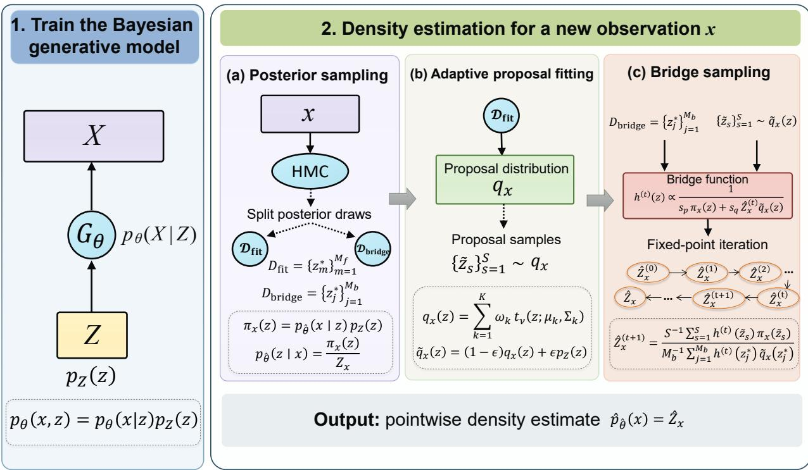
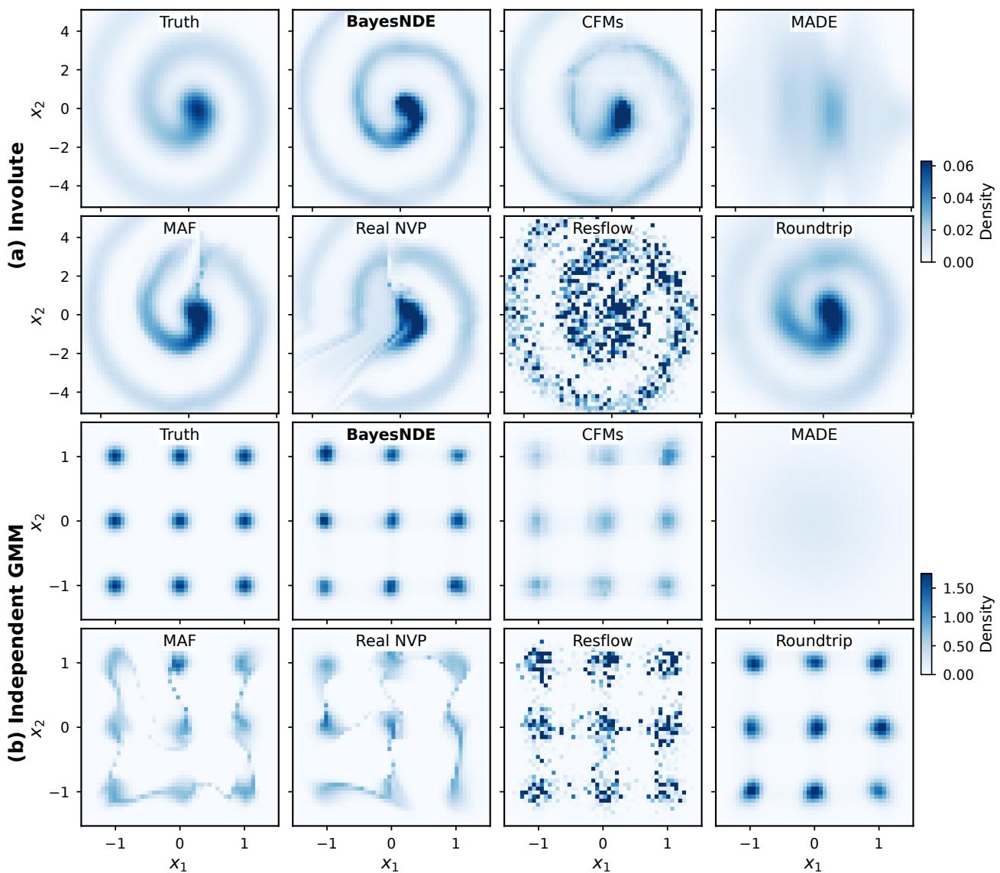
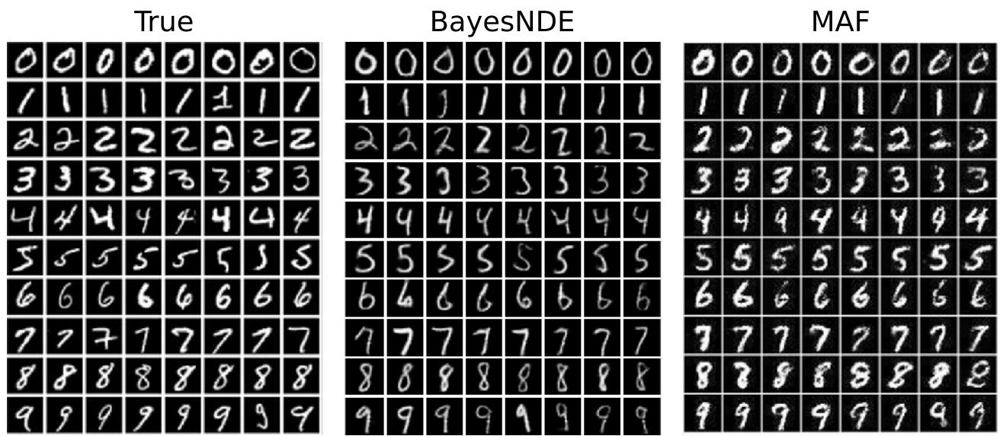
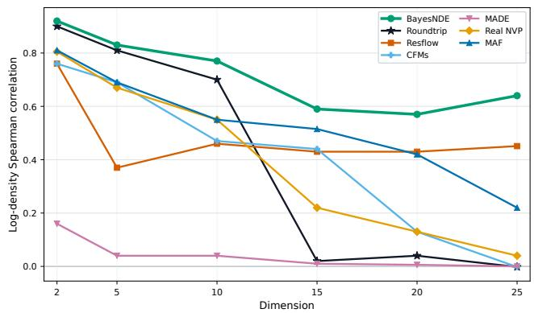
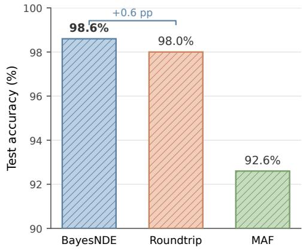
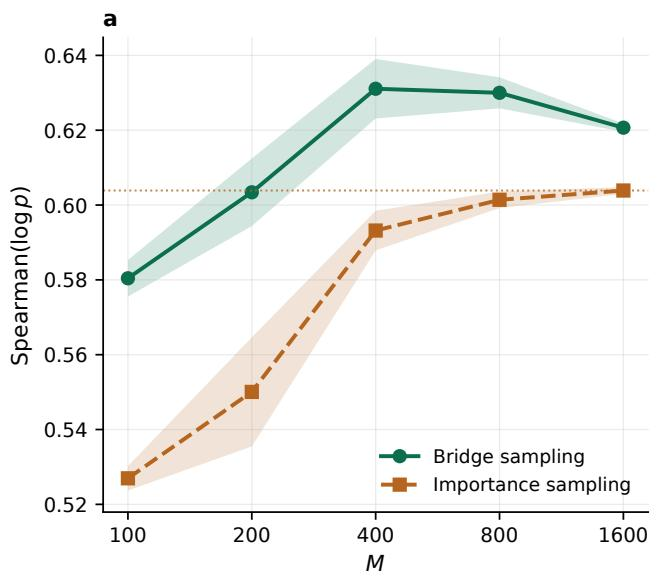
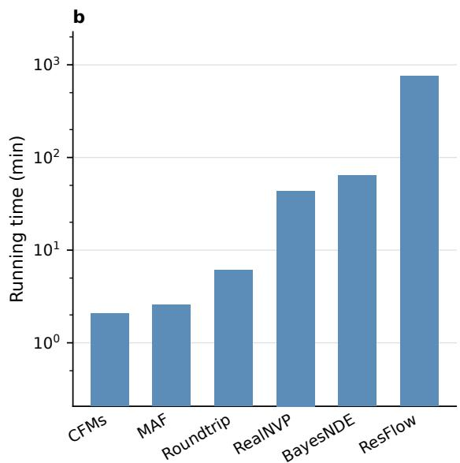

# BayesNDE: Bayesian Generative Modeling for Neural Density Estimation

Chenglin Li Qiao Liu∗

Department of Biostatistics, Yale University New Haven, Connecticut, USA

October 1, 2026

## Abstract

Density estimation is a fundamental problem in statistics and machine learning. In this work, we introduce BayesNDE, a neural density estimator based on Bayesian generative modeling. BayesNDE learns a Bayesian generative model and evaluates its density without requiring invertible networks or Jacobian-determinant computation. For each observation, it infers a sample-specific latent posterior to construct an adaptive proposal that focuses computation on regions contributing most to its density. Bridge sampling then combines samples from this proposal with separate posterior samples to estimate the density. Experiments on nonlinear and multimodal synthetic datasets show improved estimation of density values and better recovery of the density structure compared to the state-of-the-art neural density estimators. Applications to real-world datasets further demonstrate improved anomaly detection. Together, these results highlight BayesNDE as a flexible and efective neural density estimator, demonstrating how posterior inference can turn generative models into tools for density estimation. The code and tutorials are available at https://github.com/liuq-lab/BayesNDE.

## 1 Introduction

Density estimation is a fundamental problem in statistics and machine learning. Given observations $\{ x _ { i } \} _ { i = 1 } ^ { N }$ drawn from an unknown distribution, the goal is to learn the underlying distribution $p ( x )$ and evaluate the density value at a new observation. Traditional density estimators such as kernel-based methods [Parzen, 1962] typically perform well only in lowdimensional settings. Density estimation has become increasingly challenging as modern data exhibit complex patterns, such as nonlinearity and high-dimensionality.

Deep neural networks provide powerful tools for modeling complex distributions, ofering new advances to density estimation. There are two major types of neural density estimators: autoregressive models and normalizing flows. Autoregressive models obtain tractable likelihoods through a sequential factorization of the joint density [Germain et al., 2015, Papamakarios et al., 2017], while normalizing flows construct invertible transformations whose Jacobian determinants can be eficiently evaluated [Dinh et al., 2017, Chen et al., 2018, 2019].

Despite their diferent formulations, both autoregressive density estimators and normalizing flows can be viewed within a general change-of-variables framework [Kingma et al., 2016]. Specifically, let $z \sim p _ { Z } ( z )$ and $x = G ( z )$ , where $G : \mathbb { R } ^ { p }  \mathbb { R } ^ { p }$ is diferentiable and invertible. The density of x follows,

$$
p _ { X } ( x ) = p _ { Z } ( z ) \left. \operatorname* { d e t } \frac { \partial G ( z ) } { \partial z ^ { \top } } \right. ^ { - 1 } .\tag{1}
$$

Within this change-of-variables formulation, exact density evaluation requires both invertible transformation and tractable Jacobian computation. It requires the latent and observed spaces to have the same dimension and constrains the neural architecture, which may potentially limit the expressiveness of the neural architecture.

Latent-variable generative models provide an alternative route to flexible distribution modeling. Given a latent variable z with prior $p _ { Z } ( z )$ and the model $p _ { \pmb { \theta } } ( \pmb { x } \mid z )$ , the marginal density is

$$
p _ { \pmb \theta } ( \pmb x ) = \int p _ { \pmb \theta } ( \pmb x \mid \pmb z ) p _ { Z } ( \pmb z ) d \pmb z .\tag{2}
$$

The challenge is therefore shifted from Jacobian computation to integration over the latent space, which is generally intractable. Following this direction, Liu et al. [2021] proposed Roundtrip, which models observations around a learned low-dimensional manifold and evaluates pointwise densities using importance sampling or Laplacian approximation.

Although Roundtrip substantially relaxes the architectural constraints of flow-based density estimators, its importance proposal is centered at the encoder output, which provides a deterministic latent representation rather than a distributional characterization of the observation-specific posterior. The resulting proposal may therefore not fully capture posterior uncertainty, dependence, or multimodality, potentially reducing importance-sampling eficiency when proposal-posterior mismatch is substantial.

To overcome these limitations, we introduce BayesNDE, a neural density estimator based on Bayesian generative modeling. To our knowledge, BayesNDE is the first neural densityestimation framework to use sample-specific posterior-adaptive bridge sampling for pointwise density evaluation. We summarize our contributions as follows:

• We introduce a new perspective for explicit neural density evaluation by estimating the marginal or conditional density of each observation through posterior-adaptive bridge sampling. This removes the need for dimension-preserving, invertible transformations and tractable Jacobian determinants.

• BayesNDE uses observation-specific posterior samples to construct adaptive proposals and bridge sampling to estimate the resulting normalizing constants. We establish consistency of the estimator and characterize how posterior-proposal overlap determines its asymptotic eficiency.

• BayesNDE achieves superior performance in a diverse of density estimation benchmarks, including nonlinear and multimodal simulation datasets, and real-world datasets. The downstream applications, such as outlier detection and Bayesian classification, further support the significance of our method.

## 2 Related Work

Neural density estimation. Modern neural density estimators are largely built around model classes that admit tractable likelihood evaluation. Autoregressive models, such as MADE [Germain et al., 2015], represent a joint density through sequential conditional factorizations, while normalizing flows construct invertible transformations with tractable changeof-variables computation, including MAF [Papamakarios et al., 2017], Real NVP [Dinh et al., 2017], and Residual Flow (Resflow) [Chen et al., 2019]. Continuous normalizing flows extend this framework to continuous-time transformations [Chen et al., 2018], while Flow Matching provides an eficient approach for learning the associated vector fields [Lipman et al., 2023]. Relatedly, Wu et al. [2017] used annealed importance sampling to evaluate test log-likelihoods of pretrained decoder-based generative models. Their focus is quantitative evaluation of fitted generative models rather than the development and benchmarking of a general-purpose neural density estimator.

Normalizing-constant estimation. Estimating normalizing constants is a classical problem in Bayesian computation. Importance sampling estimates an unknown normalizing constant using weighted samples from a proposal distribution, with eficiency depending critically on proposal-target overlap. Bridge sampling estimates the normalizing constant by combining samples from both a proposal distribution and the normalized target distribution [Meng and Wong, 1996, Gronau et al., 2020]. Related adaptive importance-sampling methods further use information from posterior regions to construct more efective proposal distributions [Hoogerheide et al., 2012]. [Jia and Seljak, 2020] adopt bridge sampling with a normalizing-flow-based proposal for normalizing-constant estimation of Bayesian evidence. These methods, however, are designed for generic normalizing-constant estimation rather than neural density estimation of the observed-data distribution.

Positioning of BayesNDE. BayesNDE bridges the gap between neural density estimation and Bayesian normalizing-constant estimation through observation-specific posterior inference. Its generative model is inspired by recent advances in Bayesian generative modeling [Liu and Wong, 2026b,a, Luo and Liu, 2026, Liu, 2026], while our focus is on explicit density estimation through posterior-adaptive bridge sampling. BayesNDE exploits this posterior to guide latent-space integration, providing a new perspective on neural density estimation.

## 3 Method

## 3.1 Method overview

BayesNDE proceeds in two stages (Figure 1). First, we train a Bayesian generative model to capture the underlying data distribution. Second, with the fitted model, we estimate the density of a new observation as the normalizing constant of its latent posterior. Posterior samples guide the construction of an observation-adaptive proposal that concentrates computation in latent regions contributing most to the marginal-density integral. Bridge sampling then combines proposal draws with held-out posterior samples to estimate this normalizing constant and obtain the pointwise density.

  
Figure 1: Overview of BayesNDE.

Specifically, for a fitted parameter $\hat { \pmb { \theta } }$ and an observation x, define the unnormalized latent posterior as $\pi _ { \pmb { x } } ( \pmb { z } ) = p _ { \hat { \pmb { \theta } } } ( \pmb { x } \mid \pmb { z } ) p _ { Z } ( \pmb { z } )$ . Its normalizing constant is exactly the desired marginal density,

$$
Z _ { x } : = \int \pi _ { x } ( z ) d z = p _ { \hat { \theta } } ( x ) , \qquad p _ { \hat { \theta } } ( z \mid x ) = { \frac { \pi _ { x } ( z ) } { Z _ { x } } } .\tag{3}
$$

Thus, pointwise density evaluation reduces to estimating $Z _ { x }$ . Posterior inference requires only the unnormalized posterior $\pi _ { \pmb { x } } ( z )$ , allowing posterior samples to identify the latent regions that contribute most to the marginal-density integral. BayesNDE uses these samples to construct an observation-specific proposal and estimates $Z _ { x }$ by bridge sampling.

## 3.2 Bayesian Generative Model

Let $\mathbf { x } \in \mathbb { R } ^ { p }$ denote the observed random vector and $\mathbf { z } \in \mathbb { R } ^ { d }$ a low-dimensional latent random vector, where typically $d < p$ . We assume a standard Gaussian prior $p _ { Z } ( z ) = \mathcal { N } ( z ; \mathbf { 0 } , \pmb { I } _ { d } )$ for the latent variable. For continuous data, the conditional distribution of x given z is modeled as

$$
p _ { \theta } ( \pmb { x } \mid z ) = \mathcal { N } \left( \pmb { x } ; \pmb { \mu _ { \theta } } ( z ) , \pmb { \Sigma _ { \theta } } ( z ) \right) ,\tag{4}
$$

where $\pmb \theta$ denotes the parameters of the generative model. Both the conditional mean $\mu _ { \boldsymbol { \theta } } ( z )$ and covariance matrix $\Sigma _ { \theta } ( z )$ are represented by a neural network with two output heads. For simplicity, we use the diagonal structure $\Sigma _ { \pmb { \theta } } ( z ) = \mathrm { d i a g } \left( \sigma _ { 1 } ^ { 2 } ( z ; \pmb { \theta } ) , \dots , \sigma _ { p } ^ { 2 } ( z ; \pmb { \theta } ) \right)$ . Importantly, the Gaussian assumption is imposed conditionally on $\mathbf { z } ;$ a nonlinear marginal distribution of x is induced after integrating over the latent variable.

During model fitting, we first use an EGM warm start [Liu et al., 2024, Liu and Wong, 2026b] to initialize the generative parameters and sample-specific latent representations (see details in Appendix $\mathrm { A . 4 } )$ . Then training proceeds by iteratively updating the sample-specific latent variables $\{ z _ { i } \} _ { i = 1 } ^ { N }$ and the shared generative parameters $\pmb \theta .$ . Given the current $\pmb \theta _ { : }$ the latent variable associated with observation $\mathbf { \Delta } _ { \mathbf { \mathcal { X } } _ { i } }$ is updated according to its log-posterior log $p _ { \theta } ( z _ { i } \mid \pmb { x _ { i } } ) = \log p _ { Z } ( z _ { i } ) + \log p _ { \theta } ( \pmb { x _ { i } } \mid z _ { i } ) + C _ { i }$ , where $C _ { i }$ does not depend on $z _ { i }$ . Since the right-hand side is diferentiable with respect to $z _ { i } ,$ , each latent variable is updated by stochastic gradient ascent. These updates are fully decoupled across observations and can therefore be performed in parallel to improve eficiency.

Conditional on the current latent variables, the generative parameters are updated using the mini-batch conditional log-likelihood $\begin{array} { r } { l _ { \mathcal { B } } ( \pmb { \theta } ) = \frac { 1 } { | \mathcal { B } | } \sum _ { i \in \mathcal { B } } \log p _ { \pmb { \theta } } ( \pmb { x } _ { i } \mid \pmb { z } _ { i } ) } \end{array}$ , together with the regularization terms specified in Appendix A.4. The two updates are alternated until convergence. The fitted generative parameters $\hat { \pmb { \theta } }$ are then fixed for subsequent pointwise density evaluation.

## 3.3 Posterior Sampling and Proposal Construction

For a new observation x, the fitted model defines the latent posterior

$$
p _ { \hat { \theta } } ( z \mid x ) = \frac { \pi _ { x } ( z ) } { Z _ { x } } = \frac { p _ { \hat { \theta } } ( \pmb { x } \mid z ) p _ { Z } ( z ) } { p _ { \hat { \theta } } ( \pmb { x } ) } .\tag{5}
$$

Although the normalizing constant $Z _ { x }$ is unknown, posterior sampling only requires evaluation of $\pi _ { \pmb { x } } ( z )$ . We therefore use Hamiltonian Monte Carlo (HMC) [Duane et al., 1987, Neal, 2011] to obtain posterior draws $\{ z _ { m } ^ { \star } \} _ { m = 1 } ^ { M }$ from $p _ { \hat { \pmb \theta } } ( { \pmb z } \mid { \pmb x } )$ . To construct a proposal, the posterior draws are randomly split into two disjoint sets, ${ \mathcal { D } } _ { \mathrm { f i t } }$ and $\mathcal { D } _ { \mathrm { b r i d g e } }$ , following the sample-splitting principle studied for bridge sampling [Wong et al., 2020]. The former is used exclusively for proposal construction, while the latter is retained for subsequent bridge sampling.

To capture the observation-specific posterior geometry, we first fit a K-component fullcovariance Gaussian mixture model (GMM) to $\mathcal { D } _ { \mathrm { f i } }$ and use the fitted mixture weights, means, and regularized covariance matrices to construct a mixture-of-Student-t proposal $\begin{array} { r } { q _ { \pmb { x } } ( \pmb { z } ) = \sum _ { k = 1 } ^ { K } \omega _ { k } t _ { \nu } \left( \pmb { z } ; \pmb { \mu } _ { k } , \pmb { \Sigma } _ { k } \right) } \end{array}$ , where ν denotes the degrees of freedom. The mixture structure accommodates multimodal posterior geometry, while the heavy-tailed components improve coverage of the posterior tails.

To improve robustness to proposal misspecification and provide additional tail coverage, we further introduce a defensive component based on the latent prior [Hesterberg, 1995, Owen and Zhou, 2000], $\widetilde { q } _ { \pmb { x } } ( \pmb { z } ) = ( 1 - \epsilon ) q _ { \pmb { x } } ( \pmb { z } ) + \epsilon p _ { Z } ( \pmb { z } )$ , where $\epsilon \in ( 0 , 1 )$ controls the defensive weight. We then draw S independent proposal samples $\{ \widetilde { z } _ { s } \} _ { s = 1 } ^ { S }$ from $\widetilde { q } _ { x }$ . Together with the held-out posterior draws in $\mathcal { D } _ { \mathrm { b r i d g e } }$ , these samples are used for pointwise density estimation in the following section.

## 3.4 Bridge-Sampling Density Estimation

We estimate the normalizing constant $Z _ { \pmb { x } } = p _ { \hat { \pmb { \theta } } } ( \pmb { x } )$ using bridge sampling. Using the defensive proposal $\widetilde { q } _ { x }$ , we first obtain an importance-sampling estimate

$$
\widehat { Z } _ { \mathrm { I S } } = \frac { 1 } { S } \sum _ { s = 1 } ^ { S } \frac { \pi _ { x } ( \widetilde { z } _ { s } ) } { \widetilde { q } _ { x } ( \widetilde { z } _ { s } ) } , \qquad \widetilde { z } _ { s } \sim \widetilde { q } _ { x } .\tag{6}
$$

This estimate is used to initialize the bridge-sampling iteration. For any positive bridge function $h .$ , the bridge identity and its Monte Carlo approximation are

$$
Z _ { x } = \frac { \mathbb { E } _ { \widetilde { q } _ { x } } \left[ h ( z ) \pi _ { x } ( z ) \right] } { \mathbb { E } _ { p _ { \hat { \theta } } ( z \vert x ) } \left[ h ( z ) \widetilde { q } _ { x } ( z ) \right] } , \qquad \widehat { Z } _ { x } ~ = \frac { S ^ { - 1 } \sum _ { s = 1 } ^ { S } h ( \widetilde { z } _ { s } ) \pi _ { x } ( \widetilde { z } _ { s } ) } { M _ { \mathrm { b } } ^ { - 1 } \sum _ { j = 1 } ^ { M _ { \mathrm { b } } } h ( z _ { j } ^ { \star } ) \widetilde { q } _ { x } ( z _ { j } ^ { \star } ) } .\tag{7}
$$

BayesNDE uses the asymptotically optimal bridge function [Meng and Wong, 1996]

$$
h ( z ) \propto \frac { 1 } { s _ { p } \pi _ { x } ( z ) + s _ { q } Z _ { x } \widetilde { q } _ { x } ( z ) } , \qquad s _ { p } = \frac { M _ { \mathrm { e f f } } } { M _ { \mathrm { e f f } } + S } , \quad s _ { q } = \frac { S } { M _ { \mathrm { e f f } } + S } ,\tag{8}
$$

where $M _ { \mathrm { e f f } }$ denotes an efective posterior sample count computed from the held-out bridge draws, as detailed in Appendix $\mathrm { A . 4 } .$ . Because $h ^ { \star } ( z )$ itself depends on the unknown normalizing constant, $Z _ { x }$ is obtained through the fixed-point update

$$
\widehat { Z } _ { x } ^ { ( t + 1 ) } = \frac { \displaystyle \frac { 1 } { S } \sum _ { s = 1 } ^ { S } \frac { \pi _ { x } ( \widetilde { z } _ { s } ) } { s _ { p } \pi _ { x } ( \widetilde { z } _ { s } ) + s _ { q } \widehat { Z } _ { x } ^ { ( t ) } \widetilde { q } _ { x } ( \widetilde { z } _ { s } ) } } { \displaystyle \frac { 1 } { M _ { \mathrm { b } } } \sum _ { j = 1 } ^ { M _ { \mathrm { b } } } \frac { \widetilde { q } _ { x } ( z _ { j } ^ { \star } ) } { s _ { p } \pi _ { x } ( z _ { j } ^ { \star } ) + s _ { q } \widehat { Z } _ { x } ^ { ( t ) } \widetilde { q } _ { x } ( z _ { j } ^ { \star } ) } } .\tag{9}
$$

The iteration is initialized at $\widehat { Z } _ { \mathbf { x } } ^ { ( 0 ) } = \widehat { Z } _ { \mathrm { I S } }$ , and continued until convergence. The resulting log $\widehat { p } _ { \hat { \pmb { \theta } } } ( \pmb { x } ) = \log \widehat { Z } _ { \pmb { x } }$ is reported as the estimated pointwise log-density.

For conditional density estimation with an observed conditioning variable y, we extend the Bayesian generative model to a conditional generative architecture and the same procedure applies after replacing $p _ { \hat { \pmb \theta } } ( \pmb { x } \mid z )$ by $p _ { \hat { \pmb \theta } } ( \pmb { x } \mid \pmb { z } , \pmb { y } )$ throughout, yielding an estimate of $p _ { \hat { \pmb \theta } } ( \pmb { x } \mid \pmb { y } )$ . See details in Appendix A.3.

## 3.5 Training Objectives and Model Architecture

We briefly summarize the training objectives and network architectures used to instantiate the Bayesian generative model. For EGM initialization, the generator G and encoder E are trained using a weighted combination of adversarial matching, bidirectional reconstruction, distribution matching through MMD [Gretton et al., 2012] and sliced-Wasserstein discrepancy [Kolouri et al., 2019], correlation matching, and conditional-variance regularization:

$$
\begin{array} { r l } & { { \mathcal { L } } _ { \mathrm { E G M } } = \lambda _ { \mathrm { a d v } } { \mathcal { L } } _ { \mathrm { a d v } } + \lambda _ { \mathrm { r e c } } { \mathcal { L } } _ { \mathrm { r e c } } + \lambda _ { \mathrm { c o r r } } { \mathcal { L } } _ { \mathrm { c o r r } } } \\ & { ~ + \lambda _ { \mathrm { M M D } } { \mathcal { L } } _ { \mathrm { M M D } } + \lambda _ { \mathrm { S W } } { \mathcal { L } } _ { \mathrm { S W } } + \lambda _ { \mathrm { v a r } } { \mathcal { L } } _ { \mathrm { l o g v a r } } , } \end{array}\tag{10}
$$

where the adversarial and reconstruction terms encourage agreement between the data and latent representations, while the remaining terms regularize distributional, dependence, and conditional-variance properties. The detailed experimental settings are reported in Appendix A.4.

During the subsequent stochastic iterative updating, the generative parameters are optimized using the conditional negative log-likelihood together with the regularization terms:

$$
\begin{array} { r } { \mathcal { I } _ { \mathrm { i t e r } } ( \pmb \theta ) = - l _ { \mathbb { B } } ( \pmb \theta ) + \lambda _ { \mathrm { P P } } \mathcal { L } _ { \mathrm { M M D , P P } } + \lambda _ { \mathrm { c o r r } } ^ { \mathrm { i t e r } } \mathcal { L } _ { \mathrm { c o r r } } + \lambda _ { \mathrm { v a r } } ^ { \mathrm { i t e r } } \mathcal { L } _ { \mathrm { l o g v a r } } , } \end{array}\tag{11}
$$

where $\mathcal { L } _ { \mathrm { M M D , P P } }$ matches the prior-predictive distribution to the observed data.

For vector-valued data, the generative model $G _ { \theta }$ adopts five width-256 hidden layers for $p \leq 1 0$ and five width-256 residual blocks for $p > 1 0$ with separate conditional-mean and diagonal-variance heads, with a Softplus transformation to ensure positive variances. Detailed loss definitions, architecture settings, optimization hyperparameters, and regimespecific weights are provided in Appendix A.4.

## 4 Theory

## 4.1 Consistency of Adaptive Bridge Estimation

BayesNDE constructs a bridge proposal from posterior samples, so the proposal itself is data-adaptive. We show that this adaptation does not alter the asymptotic target of the density estimator, provided that the proposal-fitting samples are separated from those used in bridge estimation.

Theorem 1 (Consistency of posterior-adaptive bridge estimation). Fix an observation x and a fitted generative model θˆ. Let $\pi _ { x } ( z ) = p _ { \hat { \pmb { \theta } } } ( x \mid z ) p _ { Z } ( z )$ and $\begin{array} { r } { Z _ { x } = \int \pi _ { x } ( z ) d z = p _ { \hat { \theta } } ( x ) } \end{array}$ Suppose that the adaptive proposal is constructed from a separate posterior sample, has support wherever $\pi _ { x }$ is positive, and that the proposal and held-out posterior samples satisfy the corresponding laws of large numbers. Then the bridge estimate $\widehat { Z } _ { x }$ produced by BayesNDE satisfies

$$
{ \widehat { Z } } _ { x } { \xrightarrow { p } } Z _ { x } = p _ { \hat { \theta } } ( x )
$$

as the numbers of proposal and posterior samples tend to infinity.

Theorem 1 shows that posterior adaptation afects the eficiency of bridge estimation, but not its asymptotic target. The result is conditional on the fitted generative model and therefore concerns the consistency of the Monte Carlo density evaluation step, rather than consistency with respect to the unknown data-generating density. The full assumptions and proof under the regularity conditions are given in Appendix A.1.

## 4.2 Posterior–proposal overlap and estimation eficiency

Classical bridge-sampling theory shows that the bridge function and the overlap between the two sampling distributions determine the eficiency of normalizing-constant estimation [Meng and Wong, 1996, Gronau et al., 2020]. We specialize this analysis to the latent posterior $p _ { x } = \pi _ { x } / Z _ { x }$ and the defensive proposal $\tilde { q } _ { x } ,$ , treated as fixed given ${ \mathcal { D } } _ { \mathrm { f i t } }$ . Let $N = M _ { b } + S$ with $M _ { b } / N \to s _ { p } \in ( 0 , 1 )$ and $s _ { q } = 1 - s _ { p }$ , and define, for any nonnegative function q,

$$
\mathcal { O } _ { \pmb { x } } ( q ) = \int \frac { p _ { \pmb { x } } ( z ) q ( \pmb { z } ) } { s _ { p } p _ { \pmb { x } } ( z ) + s _ { q } q ( \pmb { z } ) } \mathrm { d } z .\tag{12}
$$

Theorem 2 (Eficiency under posterior–proposal overlap). Suppose the $M _ { b }$ held-out draws are i.i.d. from $p _ { x }$ and the S proposal draws are i.i.d. from $\tilde { q } _ { x }$ , independently of each other. For the optimal bridge estimator of Meng and Wong [1996],

$$
\begin{array} { r } { \sqrt { N } \big ( \widehat { Z } _ { x } / Z _ { x } - 1 \big ) \stackrel { d } {  } \mathcal { N } \Big ( 0 , \frac { 1 } { s _ { p } s _ { q } } \big \{ \mathcal { O } _ { x } ( \tilde { q } _ { x } ) ^ { - 1 } - 1 \big \} \Big ) . } \end{array}
$$

Moreover, $0 < \mathcal { O } _ { { \pmb x } } ( \epsilon p _ { Z } ) \leq \mathcal { O } _ { { \pmb x } } ( { \tilde { q } } _ { \pmb x } ) \leq 1$ , where the lower bound does not depend on the fitted mixture $q _ { x }$ and the upper bound is attained if and only if $\tilde { q } _ { x } = p _ { x }$ almost everywhere.

No overlap or moment conditions are required, since the bridge integrands are bounded by $1 / s _ { p }$ and $1 / s _ { q }$ . Stronger overlap between $\tilde { q } _ { x }$ and $p _ { x }$ yields smaller Monte Carlo variance, which motivates observation-specific proposals, while the defensive component bounds the variance however poorly $q _ { x }$ fits the posterior. For correlated HMC draws, replacing $M _ { b }$ by $M _ { \mathrm { e f f } }$ in $( s _ { p } , s _ { q } )$ is a heuristic. The proof is given in Appendix A.1.

## 5 Results

## 5.1 Experimental setup

Datasets and evaluation. We evaluate BayesNDE on both synthetic benchmarks with known densities and real-world benchmarks. The synthetic experiments are designed to reflect two complementary challenges in density estimation. The independent Gaussian mixture (Independent GMM) represents a strongly multimodal distribution: each coordinate independently follows an equally weighted three-component Gaussian mixture with means −1, 0, and 1, yielding $3 ^ { p }$ modes in $p$ dimensions. The involute distribution instead represents a highly nonlinear density concentrated around a curved manifold. Detailed data generative processes are provided in Appendix A.2. For each distribution, we generate 20,000 i.i.d. observations and use $8 1 \% / 9 \% / 1 0 \%$ for training, validation, and testing.

In two dimensions, estimated densities are compared directly with the ground truth on a common grid; for the independent Gaussian mixture, we further evaluate dimensions from 2 to 25 using the Spearman rank correlation between true and estimated test densities. For real data, we use five tabular benchmarks from the UCI Machine Learning Repository [Dua and Graf, 2017]. BANK and ParkTele are used for unconditional density estimation, while Pendigits10, Vehicle, and EEGEye are used for conditional density estimation with one-hot encoded class labels. Performance is measured by average test log-likelihood.

Baseline methods. We compare BayesNDE with six leading neural density estimators spanning autoregressive models, normalizing flows, continuous flows, and generative latentvariable models: MADE [Germain et al., 2015], MAF [Papamakarios et al., 2017], Real NVP [Dinh et al., 2017], Residual Flow (Resflow) [Chen et al., 2019], Conditional Flow Matching (CFMs) [Lipman et al., 2023], and Roundtrip [Liu et al., 2021]. These baselines cover widely used approaches based on autoregressive factorization, invertible transformations, continuous-time flows, and flexible deep generative mappings. Implementation details of the baselines are provided in Appendix A.5.

## 5.2 Simulation studies

We first evaluate whether the estimated densities recover the underlying structure of the two synthetic distributions. Figure 2 shows density maps of the true and estimated densities in two dimensions. BayesNDE closely recovers both the nonlinear geometry of the involute distribution and the nine separated modes of the Gaussian mixture, while competing methods exhibit varying degrees of smoothing, distortion, or spurious connections between modes. For example, on the involute benchmark, BayesNDE achieves a Spearman correlation of 0.959, compared with 0.898 for the strongest baseline, Roundtrip.

We next examine how density estimation accuracy changes as the dimension increases. Using the Gaussian mixture benchmark, each coordinate independently follows a threecomponent mixture, the number of modes grows exponentially as 3p, making the problem increasingly challenging with dimension. As shown in Figure 4a, BayesNDE achieves the highest Spearman correlation at every evaluated dimension. For example, when $p = 2 0$ BayesNDE attains a correlation of 0.57, compared with 0.43 for the strongest competing method.

  
Figure 2: True and estimated densities for the two-dimensional involute distribution and independent Gaussian mixture.

## 5.3 Real datasets

Table 1 reports average test log-likelihoods on the five real-world datasets, covering both unconditional and conditional density estimation. BayesNDE achieves the highest value on every dataset. The improvements are substantial across tasks. For instance, BayesNDE obtains the highest average test log-likelihood of 41.43 on BANK, compared with 35.74 for the best baseline Roundtrip.

On the three conditional datasets, BayesNDE improves over the strongest competing method by 3.68-19.01 nats. These consistent gains across datasets and task types demonstrate the efectiveness of BayesNDE for real-world density estimation.

## 5.4 Density-Based Downstream Tasks

We first evaluate the practical utility of BayesNDE for outlier detection on three ODDS benchmark datasets [Rayana, 2016]: Shuttle, Cardio, and Pendigits. All density estimators were trained only on the training split, and test observations were ranked by estimated logdensity, with lower-density observations more likely to be outliers. We compared BayesNDE with five generative density estimators as well as two dedicated anomaly-detection methods, one-class SVM [OC-SVM; Sch¨olkopf et al., 2001] and Isolation Forest [I-Forest; Liu et al., 2008], using precision@k, which is the proportion of true anomalies among the k highestranked candidates.

Table 1: Average test log-likelihood (nats) on real-world datasets. Uncertainties are two standard errors of the mean test log-likelihood across test points. The best result for each dataset is shown in bold.
<table><tr><td rowspan="2">Method</td><td colspan="2">Unconditional</td><td colspan="3">Conditional</td></tr><tr><td>BANK</td><td>ParkTele</td><td>Pendigits10</td><td>Vehicle</td><td>EEGEye</td></tr><tr><td>MADE</td><td>14.38±0.27</td><td>34.34±0.67</td><td>-54.56±0.96</td><td>-51.84±1.41</td><td>-50.25±0.18</td></tr><tr><td>MAF</td><td>-53.15±0.20</td><td>36.99±0.66</td><td>-52.29±0.78</td><td>-52.30±2.25</td><td>-49.47±0.21</td></tr><tr><td>Real NVP</td><td>27.21±0.38</td><td>36.45±0.68</td><td>-54.59±1.16</td><td>-63.03±3.61</td><td>-49.87±0.22</td></tr><tr><td>Resflow</td><td>23.68±0.18</td><td>36.25±0.63</td><td>-47.77±0.64</td><td>-45.97±1.13</td><td>-48.33±0.29</td></tr><tr><td>CFMs</td><td>10.23±0.07</td><td>16.32±0.19</td><td>-54.40±0.36</td><td>-49.65±0.87</td><td>-51.45±0.14</td></tr><tr><td>Roundtrip</td><td>35.74±0.13</td><td>49.64±0.33</td><td>-48.59±0.08</td><td>-40.10±0.70</td><td>-44.83±0.08</td></tr><tr><td>BayesNDE</td><td>41.43±0.17</td><td> $\mathbf { 5 9 . 5 4 } \pm \mathbf { 0 . 5 3 }$ </td><td> $\mathbf { - 2 8 . 7 6 { \scriptstyle \pm 0 . 4 4 } }$ </td><td>-33.54±0.88</td><td>-41.15±0.19</td></tr></table>

Table 2: Precision@k on the ODDS anomaly-detection benchmarks, where k equals the number of outliers in the test split. Results are means over the same three random seeds for every method; OC-SVM is deterministic. Higher values are better.
<table><tr><td colspan="7">OC-SVM I-Forest Real NVP MAF CFMs Resflow Roundtrip BayesNDE</td></tr><tr><td></td><td></td><td></td><td></td><td></td><td></td><td></td><td></td><td></td></tr><tr><td>Shuttle</td><td>0.953</td><td>0.958</td><td>0.735</td><td>0.861</td><td>0.932</td><td>0.477</td><td>0.958</td><td>0.965</td></tr><tr><td>Cardio</td><td>0.533</td><td>0.556</td><td>0.178</td><td>0.200</td><td>0.511</td><td>0.244</td><td>0.311</td><td>0.556</td></tr><tr><td>Pendigits</td><td>0.154</td><td>0.128</td><td>0.000</td><td>0.000</td><td>0.000</td><td>0.000</td><td>0.000</td><td>0.180</td></tr></table>

As shown in Table 2, BayesNDE achieves the highest precision@k on all three datasets, including 0.556 on Cardio and 0.180 on the challenging Pendigits dataset. These results show that the density estimates produced by BayesNDE are informative for downstream outlier detection and remain competitive with methods designed specifically for this task.

  
Figure 3: Conditional image generation on MNIST. The first column shows real MNIST examples; the remaining columns show samples generated by BayesNDE and MAF. For each digit class, representative generated images are shown in decreasing order of conditional density $p _ { \pmb { \theta } } ( \pmb { x } \mid \pmb { y } )$

Next, we evaluate BayesNDE on the MNIST image dataset for conditional generation and classification. As shown in Figure 3, BayesNDE generates diverse and recognizable digits, with higher-density samples exhibiting more representative class-specific structure. With the uniform class prior $p ( y ) = 1 / 1 0$ , we classify each test image using ${ \hat { y } } = \arg \operatorname* { m a x } _ { y } p ( y \mid \pmb { x } ) =$ arg $\begin{array} { r } { \operatorname* { m a x } _ { y } \{ \log \widehat { p } _ { \theta } ( x \mid y ) + \log p ( y ) \} = \arg \operatorname* { m a x } _ { y } } \end{array}$ log $\widehat { p } _ { \pmb { \theta } } ( \pmb { x } \mid \pmb { y } )$ . BayesNDE achieves 98.6% test accuracy, compared with 98.0% for Roundtrip and 92.6% for MAF.

  
(a) Spearman rank correlation on independent GMM.

  
(b) Test accuracy on MNIST.  
Figure 4: Empirical evaluation across benchmarks. (a) Density estimation accuracy across varying dimensions; (b) Classification performance on MNIST.

## 5.5 Ablation Analysis

We ablate the main components of BayesNDE on the synthetic mixture setting, using the same 500 held-out observations for all comparisons. Table 3 reports the density estimation accuracy. Bridge sampling attains higher ranking accuracy than importance sampling at every posterior budget, reaching the best accuracy importance sampling attains at any budget with four times fewer posterior samples (see details in Appendix A.4 S6). In the 2D ablation setting, removing the EGM warm start severely degrades density recovery. In 15 dimensions, removing correlation matching or the MMD terms also reduces density accuracy.

Table 3: Ablation results on synthetic data.
<table><tr><td>Method</td><td>Spearman ↑</td></tr><tr><td>BayesNDE (2D)</td><td>0.9214</td></tr><tr><td>w.o. EGM init.</td><td>0.0129</td></tr><tr><td>w.o. var. reg.</td><td>0.8929</td></tr><tr><td>BayesNDE (15D)</td><td>0.6311</td></tr><tr><td>w.o. BS</td><td>0.5932</td></tr><tr><td>w.o. EGM reg. (MMD)</td><td>0.5848</td></tr><tr><td>w.o. EGM reg. (Corr)</td><td>0.6169</td></tr></table>

## 6 Discussion

We introduced BayesNDE, which casts pointwise density evaluation as posterior normalizingconstant estimation. Observation-specific posterior proposals and bridge sampling enable density evaluation without invertible architectures or Jacobian determinants, while improving density estimation and downstream performance.

Its main limitation is running time: BayesNDE is slower than CFMs, MAF and Roundtrip (Appendix A.4). However, test-time posterior sampling and bridge estimation are independent across observations and can be further accelerated by parallel computing. Accuracy also depends on posterior exploration and proposal overlap in complex latent spaces. Future work will focus on faster training, posterior sampling and reusable proposals to reduce the cost of repeated density evaluation.

## Acknowledgments

Q.L. was supported in part by the National Human Genome Research Institute (NHGRI) under Award Number R00HG013661, the Operations Core of the Claude D. Pepper Older Americans Independence Center at Yale School of Medicine (P30AG021342), and the YSPH Transformation Pilot Grant.

## References

Ricky T. Q. Chen, Yulia Rubanova, Jesse Bettencourt, and David Duvenaud. Neural ordinary diferential equations. In Advances in Neural Information Processing Systems, volume 31, 2018.

Ricky T. Q. Chen, Jens Behrmann, David Duvenaud, and J¨orn-Henrik Jacobsen. Residual flows for invertible generative modeling. In Advances in Neural Information Processing Systems, volume 32, 2019.

Laurent Dinh, Jascha Sohl-Dickstein, and Samy Bengio. Density estimation using Real NVP. In International Conference on Learning Representations, 2017.

Dheeru Dua and Casey Graf. UCI machine learning repository. University of California, Irvine, School of Information and Computer Sciences, 2017. URL https://archive.ics. uci.edu/ml.

Simon Duane, A. D. Kennedy, Brian J. Pendleton, and Duncan Roweth. Hybrid monte carlo. Physics Letters B, 195(2):216–222, 1987. doi: 10.1016/0370-2693(87)91197-X.

Mathieu Germain, Karol Gregor, Iain Murray, and Hugo Larochelle. MADE: Masked autoencoder for distribution estimation. In Proceedings of the 32nd International Conference on Machine Learning, volume 37 of Proceedings of Machine Learning Research, pages 881– 889. PMLR, 2015.

Arthur Gretton, Karsten M. Borgwardt, Malte J. Rasch, Bernhard Sch¨olkopf, and Alexander Smola. A kernel two-sample test. Journal ofMachine Learning Research, 13:723–773, 2012.

Quentin F. Gronau, Henrik Singmann, and Eric-Jan Wagenmakers. bridgesampling: An R package for estimating normalizing constants. Journal of Statistical Software, 92(10):1–29, 2020. doi: 10.18637/jss.v092.i10.

Tim Hesterberg. Weighted average importance sampling and defensive mixture distributions. Technometrics, 37(2):185–194, 1995. doi: 10.1080/00401706.1995.10484303.

Lennart Hoogerheide, Anne Opschoor, and Herman K. van Dijk. A class of adaptive importance sampling weighted EM algorithms for eficient and robust posterior and predictive simulation. Journal of Econometrics, 171(2):101–120, 2012. doi: 10.1016/j.jeconom.2012. 06.011.

He Jia and Uros Seljak. Normalizing constant estimation with gaussianized bridge sampling. In Symposium on Advances in Approximate Bayesian Inference, pages 1–14. PMLR, 2020.

Diederik P. Kingma, Tim Salimans, Rafal Jozefowicz, Xi Chen, Ilya Sutskever, and Max Welling. Improved variational inference with inverse autoregressive flow. In Advances in Neural Information Processing Systems, volume 29, pages 4743–4751, 2016.

Soheil Kolouri, Phillip E. Pope, Charles E. Martin, and Gustavo K. Rohde. Sliced-wasserstein auto-encoders. In International Conference on Learning Representations, 2019.

Ilya Korsunsky, Nghia Millard, Jean Fan, Kamil Slowikowski, Fan Zhang, Kevin Wei, Yuriy Baglaenko, Michael Brenner, Po-Ru Loh, and Soumya Raychaudhuri. Fast, sensitive and accurate integration of single-cell data with harmony. Nature Methods, 16(12):1289–1296, 2019. doi: 10.1038/s41592-019-0619-0.

Yaron Lipman, Ricky T. Q. Chen, Heli Ben-Hamu, Maximilian Nickel, and Matt Le. Flow matching for generative modeling. In International Conference on Learning Representations, 2023.

Fei Tony Liu, Kai Ming Ting, and Zhi-Hua Zhou. Isolation forest. In 2008 Eighth IEEE International Conference on Data Mining, pages 413–422. IEEE, 2008. doi: 10.1109/ ICDM.2008.17.

Qiao Liu. Missingness-aware data imputation via ai-powered bayesian generative modeling. arXiv preprint arXiv:2605.01676, 2026.

Qiao Liu and Wing Hung Wong. An AI-powered bayesian generative modeling approach for causal inference in observational studies. Journal of the American Statistical Association, 121(554):976–987, 2026a. doi: 10.1080/01621459.2026.2654227.

Qiao Liu and Wing Hung Wong. An AI-powered bayesian generative modeling approach for arbitrary conditional inference, 2026b. URL https://arxiv.org/abs/2601.05355.

Qiao Liu, Jiaze Xu, Rui Jiang, and Wing Hung Wong. Density estimation using deep generative neural networks. Proceedings of the National Academy of Sciences, 118(15): e2101344118, 2021. doi: 10.1073/pnas.2101344118.

Qiao Liu, Zhongren Chen, and Wing Hung Wong. An encoding generative modeling approach to dimension reduction and covariate adjustment in causal inference with observational studies. Proceedings of the National Academy of Sciences, 121(23):e2322376121, 2024.

Guyue Luo and Qiao Liu. Bgm-iv: an ai-powered bayesian generative modeling approach for instrumental variable analysis. arXiv preprint arXiv:2605.07029, 2026.

Xiao-Li Meng and Wing Hung Wong. Simulating ratios of normalizing constants via a simple identity: A theoretical exploration. Statistica Sinica, 6(4):831–860, 1996.

Radford M. Neal. Mcmc using hamiltonian dynamics. In Handbook of Markov Chain Monte Carlo, pages 113–162. Chapman and Hall/CRC, 2011. doi: 10.1201/b10905-6.

Art Owen and Yi Zhou. Safe and efective importance sampling. Journal of the American Statistical Association, 95(449):135–143, 2000. doi: 10.1080/01621459.2000.10473909.

George Papamakarios, Theo Pavlakou, and Iain Murray. Masked autoregressive flow for density estimation. In Advances in Neural Information Processing Systems, volume 30, pages 2338–2347, 2017.

Emanuel Parzen. On estimation of a probability density function and mode. The Annals of Mathematical Statistics, 33(3):1065–1076, 1962. doi: 10.1214/aoms/1177704472.

Shebuti Rayana. ODDS library. Stony Brook University, Department of Computer Science, 2016. URL https://shebuti.com/outlier-detection-datasets-odds/.

Bernhard Sch¨olkopf, John C. Platt, John Shawe-Taylor, Alex J. Smola, and Robert C. Williamson. Estimating the support of a high-dimensional distribution. Neural Computation, 13(7):1443–1471, 2001. doi: 10.1162/089976601750264965.

Alexander Tong, Kilian Fatras, Nikolay Malkin, Guillaume Huguet, Yanlei Zhang, Jarrid Rector-Brooks, Guy Wolf, and Yoshua Bengio. Improving and generalizing flow-based generative models with minibatch optimal transport. Transactions on Machine Learning Research, 2024. ISSN 2835-8856. URL https://openreview.net/forum?id=CD9Snc73AW.

Aki Vehtari, Andrew Gelman, Daniel Simpson, Bob Carpenter, and Paul-Christian B¨urkner. Rank-normalization, folding, and localization: An improved $\widehat { R }$ for assessing convergence of mcmc (with discussion). Bayesian Analysis, 16(2):667–718, 2021. doi: 10.1214/ 20-BA1221.

Jackie S. T. Wong, Jonathan J. Forster, and Peter W. F. Smith. Properties of the bridge sampler with a focus on splitting the mcmc sample. Statistics and Computing, 30(4): 799–816, 2020. doi: 10.1007/s11222-019-09918-5.

Yuhuai Wu, Yuri Burda, Ruslan Salakhutdinov, and Roger Grosse. On the quantitative analysis of decoder-based generative models. In International Conference on Learning Representations, 2017. URL https://openreview.net/forum?id=B1M8JF9xx.

## A Appendix

## A.1 Proofs of theory

Proof of Theorem 1 We provide the technical conditions and proof for Theorem 1. Throughout, the observation x and the fitted generative parameter $\hat { \pmb { \theta } }$ are fixed. Define

$$
\pi _ { x } ( z ) = p _ { \hat { \theta } } ( x \mid z ) p _ { Z } ( z ) , \qquad Z _ { x } = \int \pi _ { x } ( z ) d z , \qquad p _ { x } ( z ) = { \frac { \pi _ { x } ( z ) } { Z _ { x } } } .
$$

By construction, $Z _ { x } = p _ { \hat { \theta } } ( x )$

Let ${ \mathcal { D } } _ { \mathrm { f i t } }$ denote the posterior sample used to construct the observation-specific proposal. Conditional on ${ \mathcal { D } } _ { \mathrm { f i t } }$ , the fitted proposal $q _ { x }$ and the defensive proposal

$$
\widetilde { q } _ { x } ( z ) = ( 1 - \epsilon ) q _ { x } ( z ) + \epsilon p _ { Z } ( z )
$$

are treated as fixed. For notational simplicity, write $q ( z ) = \widetilde { q } _ { x } ( z )$

Conditional on ${ \mathcal { D } } _ { \mathrm { f i t } }$ , assume:

(A1) $q ( z ) > 0$ whenever $\pi _ { x } ( z ) > 0$

(A2) The proposal draws $\widetilde { z } _ { 1 } , \dots , \widetilde { z } _ { S }$ are i.i.d. from $q ,$ and the held-out posterior draws $z _ { 1 } ^ { \star } , \ldots , z _ { M } ^ { \star }$ satisfy the law of large numbers under $p _ { x }$ for every bounded measurable function appearing below.

(A3) The bridge weights $s _ { p }$ and $s _ { q } = 1 - s _ { p }$ remain bounded away from zero: for some constant $\eta \in ( 0 , 1 / 2 )$

$$
\eta \leq s _ { p } , s _ { q } \leq 1 - \eta .
$$

(A4) The fixed-point iteration is initialized by the importance-sampling estimator

$$
\widehat { Z } _ { \mathrm { I S } } = \frac { 1 } { S } \sum _ { s = 1 } ^ { S } \frac { \pi _ { x } ( \widetilde { z } _ { s } ) } { q ( \widetilde { z } _ { s } ) } ,
$$

and the iteration is run to a converged fixed point $\widehat { Z } _ { x }$ .

Condition (A2) allows the held-out posterior sample to be generated by an ergodic Markov chain; independence of the posterior draws is not required. When the proposal-fitting and bridge samples are obtained from a common Markov chain, (A2) is understood conditionally on ${ \mathcal { D } } _ { \mathrm { f i t } }$

For $c > 0$ , define

$$
A _ { S } ( c ) = { \frac { 1 } { S } } \sum _ { s = 1 } ^ { S } { \frac { \pi _ { x } ( { \widetilde { z } } _ { s } ) } { s _ { p } \pi _ { x } ( { \widetilde { z } } _ { s } ) + s _ { q } c q ( { \widetilde { z } } _ { s } ) } } , B _ { M } ( c ) = { \frac { 1 } { M } } \sum _ { j = 1 } ^ { M } { \frac { q ( z _ { j } ^ { \star } ) } { s _ { p } \pi _ { x } ( z _ { j } ^ { \star } ) + s _ { q } c q ( z _ { j } ^ { \star } ) } } .
$$

The empirical bridge map is

$$
\widehat { T } _ { M , S } ( c ) = \frac { A _ { S } ( c ) } { B _ { M } ( c ) } .
$$

Its population counterparts are

$$
A ( c ) = \mathbb { E } _ { q } \left[ \frac { \pi _ { x } ( Z ) } { s _ { p } \pi _ { x } ( Z ) + s _ { q } c q ( Z ) } \right] , B ( c ) = \mathbb { E } _ { p _ { x } } \left[ \frac { q ( Z ) } { s _ { p } \pi _ { x } ( Z ) + s _ { q } c q ( Z ) } \right] .
$$

We first establish the key population identity. Since $p _ { x } ( z ) = \pi _ { x } ( z ) / Z _ { x }$

$$
\begin{array} { l } { \displaystyle { B ( c ) = \int \frac { q ( z ) } { s _ { p } \pi _ { x } ( z ) + s _ { q } c q ( z ) } \frac { \pi _ { x } ( z ) } { Z _ { x } } d z } } \\ { \displaystyle { \quad = \frac { 1 } { Z _ { x } } \int \frac { \pi _ { x } ( z ) q ( z ) } { s _ { p } \pi _ { x } ( z ) + s _ { q } c q ( z ) } d z } } \\ { \displaystyle { \quad = \frac { A ( c ) } { Z _ { x } } . } } \end{array}\tag{13}
$$

Consequently,

$$
T ( c ) : = \frac { A ( c ) } { B ( c ) } = Z _ { x } \qquad \mathrm { f o r ~ e v e r y ~ } c > 0 .\tag{14}
$$

Thus the population bridge map is constant: the choice of bridge iterate $c$ and the fitted proposal afect Monte Carlo eficiency but not the population target.

We next show that the empirical bridge map converges uniformly to this population map on compact subsets of $( 0 , \infty )$ . Let $K = [ a , b ] \subset ( 0 , \infty )$ and define

$$
f _ { c } ( z ) = \frac { \pi _ { x } ( z ) } { s _ { p } \pi _ { x } ( z ) + s _ { q } c q ( z ) } , \qquad g _ { c } ( z ) = \frac { q ( z ) } { s _ { p } \pi _ { x } ( z ) + s _ { q } c q ( z ) } .
$$

For all $c \in K$ ，

$$
0 \leq f _ { c } ( z ) \leq \frac { 1 } { s _ { p } } \leq \frac { 1 } { \eta } , 0 \leq g _ { c } ( z ) \leq \frac { 1 } { s _ { q } c } \leq \frac { 1 } { \eta a } .
$$

Hence both families are uniformly bounded.

Moreover, they are uniformly Lipschitz in c. Indeed,

$$
\left| \frac { \partial f _ { c } ( z ) } { \partial c } \right| = \frac { s _ { q } \pi _ { x } ( z ) q ( z ) } { \left[ s _ { p } \pi _ { x } ( z ) + s _ { q } c q ( z ) \right] ^ { 2 } } .
$$

Using 4u $v \leq ( u + v ) ^ { 2 }$ with $u = s _ { p } \pi _ { x } ( z )$ and $v = s _ { q } c q ( z )$ gives

$$
\left| \frac { \partial f _ { c } ( z ) } { \partial c } \right| \leq \frac { 1 } { 4 s _ { p } a } \leq \frac { 1 } { 4 \eta a } .
$$

Similarly,

$$
\left| \frac { \partial g _ { c } ( z ) } { \partial c } \right| = \frac { s _ { q } q ( z ) ^ { 2 } } { \left[ s _ { p } \pi _ { x } ( z ) + s _ { q } c q ( z ) \right] ^ { 2 } } \leq \frac { 1 } { s _ { q } a ^ { 2 } } \leq \frac { 1 } { \eta a ^ { 2 } } .
$$

Therefore the classes $\{ f _ { c } : c \in K \}$ and $\{ g _ { c } : c \in K \}$ are uniformly bounded and equicontinuous in their one-dimensional parameter c.

By the law of large numbers in (A2), convergence holds for every fixed c. A finite-grid argument together with the preceding uniform Lipschitz bounds then yields

$$
\operatorname* { s u p } _ { c \in K } | A _ { S } ( c ) - A ( c ) | \xrightarrow { p } 0\tag{15}
$$

and

$$
\operatorname* { s u p } _ { c \in K } | B _ { M } ( c ) - B ( c ) | \overset { p } {  } 0 .\tag{16}
$$

It remains to control the denominator. By (A1), the integrand defining $A ( c )$ is strictly positive on the support of $\pi _ { x }$ . Hence $A ( c ) > 0$ for every $c > 0$ . Since $A ( c )$ is continuous in c, compactness of K gives in $\mathrm { f } _ { c \in K } A ( c ) > 0$ . From equation 13,

$$
\operatorname* { i n f } _ { c \in K } B ( c ) = { \frac { 1 } { Z _ { x } } } \operatorname* { i n f } _ { c \in K } A ( c ) > 0 .
$$

Combining this fact with equation 15–equation 16 and the continuous mapping theorem gives

$$
\operatorname* { s u p } _ { c \in K } | \widehat { T } _ { M , S } ( c ) - Z _ { x } | \overset { p } {  } 0 .\tag{17}
$$

We now connect the uniform convergence result to the actual BayesNDE iteration. First, the importance-sampling initializer is consistent. Indeed, by (A1),

$$
\mathbb { E } _ { q } \left[ { \frac { \pi _ { x } ( Z ) } { q ( Z ) } } \right] = \int \pi _ { x } ( z ) d z = Z _ { x } ,
$$

and the random variable $\pi _ { x } ( Z ) / q ( Z )$ is integrable because its expectation equals the finite constant $Z _ { x }$ . Therefore, by the law of large numbers,

$$
{ \widehat { Z } } _ { \mathrm { I S } } \ { \xrightarrow { p } } \ Z _ { x } .\tag{18}
$$

Choose, for example,

$$
K = \left[ { \frac { Z _ { x } } { 2 } } , { \frac { 3 Z _ { x } } { 2 } } \right] .
$$

By equation 18, $\widehat { Z } _ { \mathrm { I S } } \in K$ with probability tending to one. Furthermore, by equation 17,

$$
\operatorname* { s u p } _ { c \in K } \Big | \widehat { T } _ { M , S } ( c ) - Z _ { x } \Big | < \frac { Z _ { x } } { 4 }
$$

with probability tending to one. On this event,

$$
{ \widehat { T } } _ { M , S } ( K ) \subset \left[ { \frac { 3 Z _ { x } } { 4 } } , { \frac { 5 Z _ { x } } { 4 } } \right] \subset K .
$$

Thus, once initialized in $K$ , every subsequent bridge iterate remains in K. If the iteration converges to the reported fixed point ${ \widehat { Z } } _ { x } ,$ then

$$
\widehat { Z } _ { x } = \widehat { T } _ { M , S } ( \widehat { Z } _ { x } ) , \qquad \widehat { Z } _ { x } \in K ,
$$

and hence

$$
| \widehat { Z } _ { x } - Z _ { x } | \leq \operatorname* { s u p } _ { c \in K } | \widehat { T } _ { M , S } ( c ) - Z _ { x } | \overset { p } {  } 0 .
$$

Therefore,

$$
{ \widehat { Z } } _ { x } \ { \overset { p } {  } } \ Z _ { x } = p _ { \hat { \theta } } ( x ) .
$$

□

Proof of Theorem 2

Fix x and abbreviate

$$
p ( z ) = p _ { \hat { \theta } } ( z \mid x ) , \qquad q ( z ) = { \widetilde q } _ { x } ( z ) , \qquad Z = Z _ { x } ,
$$

so that $\pi _ { x } ( z ) = Z p ( z )$ . Here

$$
\widetilde { q } _ { x } ( z ) = ( 1 - \epsilon ) q _ { x } ( z ) + \epsilon p _ { Z } ( z )
$$

is the defensive proposal used by BayesNDE. Let $N = M _ { b } + S$ , with $M _ { b } / N \to s _ { p } \in ( 0 , 1 )$ and $S / N \to s _ { q } = 1 - s _ { p }$

For independent posterior and proposal samples, the asymptotically optimal bridge function of Meng and Wong [1996] is proportional to

$$
h ^ { \star } ( z ) = \frac { 1 } { s _ { p } \pi _ { x } ( z ) + s _ { q } Z q ( z ) } \propto \frac { 1 } { s _ { p } p ( z ) + s _ { q } q ( z ) } .
$$

Define

$$
d ( z ) = s _ { p } p ( z ) + s _ { q } q ( z ) , \qquad \mathcal { O } = \int \frac { p ( z ) q ( z ) } { d ( z ) } d z .
$$

Under $h ^ { \star } ( z )$ , the relative bridge estimator can be written as

$$
\frac { \widehat { Z } } { Z } = \frac { \frac { 1 } { S } \sum _ { s = 1 } ^ { S } U ( \widetilde { z } _ { s } ) } { \frac { 1 } { M _ { b } } \sum _ { j = 1 } ^ { M _ { b } } V ( z _ { j } ^ { \star } ) } , \qquad U ( z ) = \frac { p ( z ) } { d ( z ) } , \quad V ( z ) = \frac { q ( z ) } { d ( z ) } .\tag{19}
$$

Since $\mathbb { E } _ { q } [ U ] = \mathbb { E } _ { p } [ V ] = \mathcal { O }$ , the joint central limit theorem gives

$$
\sqrt { N } \left( \frac { \overline { { U } } _ { S } - \mathcal { O } } { \overline { { V } } _ { M _ { b } } - \mathcal { O } } \right) \overset { d } { \to } \mathcal { N } \left( 0 , \left( \begin{array} { c c } { \operatorname { V a r } _ { q } ( U ) / s _ { q } } & { 0 } \\ { 0 } & { \operatorname { V a r } _ { p } ( V ) / s _ { p } } \end{array} \right) \right) .
$$

Applying the delta method to $g ( a , b ) = a / b$ at $( \mathcal { O } , \mathcal { O } )$ yields

$$
\sqrt { N } ( \frac { \widehat Z } { Z } - 1 ) \stackrel { d } {  } \mathcal { N } ( 0 , \sigma ^ { 2 } ) , \qquad \sigma ^ { 2 } = \frac { 1 } { \mathcal { O } ^ { 2 } } [ \frac { \mathrm { V a r } _ { q } ( U ) } { s _ { q } } + \frac { \mathrm { V a r } _ { p } ( V ) } { s _ { p } } ] .\tag{20}
$$

The variance simplifies using

$$
\begin{array} { l } { { s _ { p } \mathbb { E } _ { q } [ U ^ { 2 } ] + s _ { q } \mathbb { E } _ { p } [ V ^ { 2 } ] = \displaystyle \int \frac { s _ { p } p ( z ) ^ { 2 } q ( z ) + s _ { q } p ( z ) q ( z ) ^ { 2 } } { d ( z ) ^ { 2 } } d z } } \\ { { \displaystyle \qquad = \int \frac { p ( z ) q ( z ) } { d ( z ) } d z = \mathcal { O } . } } \end{array}\tag{21}
$$

Together with $\mathbb { E } _ { q } [ U ] = \mathbb { E } _ { p } [ V ] = \mathcal { O }$ and $s _ { p } + s _ { q } = 1$ , this gives

$$
\frac { \operatorname { V a r } _ { q } ( U ) } { s _ { q } } + \frac { \operatorname { V a r } _ { p } ( V ) } { s _ { p } } = \frac { \mathcal { O } - \mathcal { O } ^ { 2 } } { s _ { p } s _ { q } } .
$$

Substitution into equation 20 therefore yields

$$
\sqrt { M _ { b } + S } ( \frac { \widehat { Z } _ { x } } { Z _ { x } } - 1 ) \stackrel { d } {  } \mathcal { N } \Bigg ( 0 , \frac { 1 } { s _ { p } s _ { q } } [ \mathcal { O } _ { x } ( \widetilde { q } _ { x } ) ^ { - 1 } - 1 ] \Bigg ) .
$$

It remains to characterize the overlap. First, for fixed $p ( z ) \geq 0$ , define

$$
f _ { z } ( q ) = { \frac { p ( z ) q } { s _ { p } p ( z ) + s _ { q } q } } , \qquad q \geq 0 .
$$

For $p ( z ) > 0$

$$
\frac { \partial f _ { z } ( q ) } { \partial q } = \frac { s _ { p } p ( z ) ^ { 2 } } { \left[ s _ { p } p ( z ) + s _ { q } q \right] ^ { 2 } } \geq 0 ,
$$

so the overlap integrand is nondecreasing in its second argument. Because the defensive proposal satisfies

$$
\widetilde { q } _ { x } ( z ) = ( 1 - \epsilon ) q _ { x } ( z ) + \epsilon p _ { Z } ( z ) \geq \epsilon p _ { Z } ( z )
$$

pointwise, it follows that

$$
\mathcal { O } _ { x } ( \widetilde { q } _ { x } ) \geq \mathcal { O } _ { x } ( \epsilon p _ { Z } ) .
$$

Moreover, under the Gaussian latent prior used by BayesNDE, $p _ { Z } ( z ) > 0$ for all $z ,$ and hence $\mathcal { O } _ { x } ( \epsilon p _ { Z } ) > 0$

For the upper bound, by the weighted harmonic–arithmetic mean inequality,

$$
{ \frac { p ( z ) q ( z ) } { s _ { p } p ( z ) + s _ { q } q ( z ) } } = \left( { \frac { s _ { p } } { q ( z ) } } + { \frac { s _ { q } } { p ( z ) } } \right) ^ { - 1 } \leq s _ { p } q ( z ) + s _ { q } p ( z ) ,
$$

with the left-hand side defined as zero whenever $p ( z ) q ( z ) = 0$ . Integrating gives

$$
\begin{array} { r } { \mathcal { O } _ { x } ( q ) \leq s _ { p } + s _ { q } = 1 . } \end{array}
$$

Equality holds if and only if $p ( z ) = q ( z )$ almost everywhere. Taking $q = \widetilde { q } _ { x }$ therefore gives

$$
0 < \mathcal { O } _ { x } ( \epsilon p _ { Z } ) \leq \mathcal { O } _ { x } ( \widetilde { q } _ { x } ) \leq 1 ,
$$

with the upper bound attained if and only if $\widetilde { q } _ { x } = p _ { x }$ almost everywhere.

## A.2 Datasets in experiments

## S1. Data Generating Processes for Synthetic Distributions

Independent Gaussian mixture. Following [Liu et al., 2021], we consider an independent Gaussian mixture (Independent GMM) distribution and extend the original twodimensional construction to p dimensions. Specifically, we generate $\mathbf { X } = ( X _ { 1 } , \ldots , X _ { p } ) ^ { \top }$ with mutually independent coordinates, where each coordinate follows the same three-component Gaussian mixture, $X _ { j } \sim \frac { 1 } { 3 }  { N ( - 1 , 0 . 1 ^ { 2 } ) + \frac { 1 } { 3 }  { N ( 0 , 0 . 1 ^ { 2 } ) + \frac { 1 } { 3 }  { N ( 1 , 0 . 1 ^ { 2 } ) } } } $ , for $j = 1 , \dots , p .$ . Equivalently, the joint density is

$$
p ( \mathbf { x } ) = \prod _ { j = 1 } ^ { p } \left[ \frac { 1 } { 3 } \sum _ { \mu \in \{ - 1 , 0 , 1 \} } \phi ( x _ { j } ; \mu , 0 . 1 ^ { 2 } ) \right]
$$

, where $\phi ( \cdot ; \mu , \sigma ^ { 2 } )$ denotes the Gaussian density with mean $\mu$ and variance $\sigma ^ { 2 }$ . This construction yields $3 ^ { p }$ equally weighted modes located at the Cartesian product $\{ - 1 , 0 , 1 \} ^ { p }$ . As $p$ increases, the number of modes therefore grows exponentially, providing an increasingly challenging benchmark for evaluating the ability of density estimators to recover highly multimodal distributions in higher dimensions.

Involute distribution. The involute distribution is constructed by first sampling a latent variable $R \ \sim \ \mathrm { U n i f o r m } ( 0 , 2 \pi )$ and then independently generating $X _ { 1 } ~ \vert ~ R ~ = ~ r ~ \sim$ $\mathcal { N } ( r \sin ( 2 r ) , 0 . 4 ^ { 2 } )$ and $X _ { 2 } \mid R = r \sim \mathcal { N } ( r \cos ( 2 r ) , 0 . 4 ^ { 2 } )$ . Thus, conditional on $R = r$ , the observation is centered along the nonlinear curve $( r \sin ( 2 r ) , r \cos ( 2 r ) )$ with isotropic Gaussian perturbation. The corresponding marginal density is

$$
p ( \mathbf { x } ) = \frac { 1 } { 2 \pi } \int _ { 0 } ^ { 2 \pi } \phi ( x _ { 1 } ; r \sin ( 2 r ) , 0 . 4 ^ { 2 } ) \phi ( x _ { 2 } ; r \cos ( 2 r ) , 0 . 4 ^ { 2 } ) d r
$$

, which can be evaluated numerically when the ground-truth density is required. In contrast to the isolated modes of Independent GMM, this distribution concentrates probability mass around a highly nonlinear curved structure and is therefore used to assess the ability of density estimators to capture complex nonlinear geometries.

S2. Details of data preprocessing for the outlier-detection datasets used in our study.

Shuttle. The Shuttle dataset (http://odds.cs.stonybrook.edu/shuttle-dataset/) is derived from the Statlog Shuttle classification dataset and contains nine numerical features. The original training and test sets were combined before constructing the outlier-detection benchmark. Samples from the five smallest classes, namely classes 2, 3, 5, 6, and 7, were grouped together as outliers, while samples from class 1 were treated as inliers. Samples from class 4 were discarded. The resulting dataset contains 49,097 observations, including 3,511 outliers (7.15%).

Cardio. The Cardio dataset (http://odds.cs.stonybrook.edu/cardio-dataset/) is derived from the UCI Cardiotocography dataset and consists of 21 numerical features extracted from fetal-heart-rate and uterine-contraction measurements. The original observations were classified by expert obstetricians into normal, suspect, and pathologic fetal states. For the ODDS outlier-detection benchmark, the suspect class was discarded, the 1,655 normal observations were treated as inliers, and the 176 pathologic observations were treated as outliers. The resulting dataset contains 1,831 observations with an outlier proportion of 9.61%.

Pendigits. The Pendigits dataset (http://odds.cs.stonybrook.edu/pendigits-dataset/) is derived from the UCI Pen-Based Recognition of Handwritten Digits dataset. Each observation is represented by 16 numerical features corresponding to eight sampled two-dimensional coordinates along a handwritten pen trajectory. The original dataset contains ten digit classes, from 0 to 9. In the ODDS benchmark, digit 0 was designated as the outlier class and downsampled to 156 observations, whereas the 6,714 observations corresponding to digits 1–9 were treated as inliers. The resulting dataset contains 6,870 observations with an outlier proportion of 2.27%.

Common preprocessing and data splitting. For each dataset, every feature was transformed to the interval [0, 1] using feature-wise minimum and maximum values. The observations and their labels were then jointly permuted using NumPy random seed 0. After permutation, the final 10% of the observations were retained as the test set. Of the remaining observations, the final 10% were used for validation and the rest were used for training. This produces an approximately 81/9/10 training/validation/test split. The resulting split sizes are reported in Table 4. Class labels were not provided as inputs to any of the density-estimation models.

S3. Details of data preprocessing for the Real word datasets used in our study.

BANK. The BANK dataset relates to a marketing campaign of a Portuguese banking institution, where the goal is to predict whether the client will subscribe a deposit. Label encoding was used for discrete features in the raw data with values between 0 and n classes. Then a uniform noise of (−0.2, 0.2) was added to each feature. At last, the raw data was applied a feature scaling through a min–max normalization and randomly split into 90% training set and 10% test. Note that for neural density estimators, 10% of the training set is kept for validation. BANK is used for unconditional density estimation.

Table 4: Basic descriptions of the three datasets used for outlier detection in our study.
<table><tr><td colspan="6"></td><td colspan="3"> $\#$  examples</td></tr><tr><td>Dataset</td><td>Dim(z)</td><td>Dim(x)</td><td>Outliers (%)</td><td>Test outliers (k)</td><td>Train</td><td>Validation</td><td></td><td>Test</td></tr><tr><td>Shuttle</td><td>3</td><td>9</td><td>7.15</td><td>365</td><td>39770</td><td></td><td>4418</td><td>4909</td></tr><tr><td>Cardio</td><td>5</td><td>21</td><td>9.61</td><td></td><td>15</td><td>1484</td><td>164</td><td>183</td></tr><tr><td>Pendigits</td><td>5</td><td>16</td><td>2.27</td><td></td><td>13</td><td>5565</td><td>618</td><td>687</td></tr></table>

Outliers (%) is the outlier rate of the full dataset; Test outliers (k) is the number of outliers in the test split,  
which sets k in precision@k. Dim(z) denotes the latent dimension used by Roundtrip. For BayesNDE, we  
set Dim(z) = Dim(x), corresponding to 9, 21, and 16 for Shuttle, Cardio, and Pendigits, respectively.

ParkTele. The Parkinsons Telemonitoring dataset (UCI archive 189) contains biomedical voice measurements from 42 patients with early-stage Parkinson’s disease, recruited for a six-month trial of a telemonitoring device. Each example comprises 16 dysphonia measures derived from a sustained phonation: five jitter variants, six shimmer variants, the noiseto-harmonics and harmonics-to-noise ratios, and the nonlinear measures RPDE, DFA and PPE. Two of the 16 were removed because they are definitional multiples of other columns: Jitter:DDP equals 3×Jitter:RAP and Shimmer:DDA equals 3×Shimmer:APQ3 (the observed ratios lie in [2.9697, 3.0294] and [2.9942, 3.0062], departing from exactly three only through the five-decimal rounding of the published file). Retaining them makes the design matrix numerically singular, so that a continuous density on $\mathbb { R } ^ { 1 6 }$ is not well defined. The remaining 14 features were scaled by a per-feature min–max normalization, and the same split as the BANK dataset was used. The subject identifier, age, sex, test time and the two UPDRS scores were discarded. ParkTele is used for unconditional density estimation. We note that the 5,875 recordings come from 42 subjects, so the random split places recordings of the same subject in both the training and the test set; all methods share the identical split.

Pendigits10. The Pen-Based Recognition of Handwritten Digits dataset (UCI archive 81) contains pen trajectories collected from 44 writers on a pressure-sensitive tablet. Each digit is resampled to eight equally spaced points along the trajectory, giving 16 integer coordinates in [0, 100], and is labelled with one of the ten digit classes. Because a continuous density is not defined on an integer lattice, a uniform noise of (0, 1) was added to each coordinate with a fixed random seed, so that all methods see identical inputs; with unit lattice spacing, the expected log-density under uniform dequantization provides a lower bound on the discrete log-probability mass by Jensen’s inequality.

Vehicle. The Statlog Vehicle Silhouettes dataset (UCI archive 149) describes four vehicle types (bus, Opel, Saab, van) by 18 integer-valued shape descriptors extracted from silhouette images, including compactness, circularity, radius ratio, the axis-aligned and principal-axis moments, scatter ratio, elongatedness, hollows ratio and the skewness and kurtosis about the major and minor axes. A uniform noise of (0, 1) was added to each feature for the same reason as in Pendigits10.

EEGEye. The EEG Eye State dataset (UCI archive 264) records one continuous 117-second measurement from an Emotiv EEG headset, giving 14 electrode channels per time point, with the eye state (open or closed) determined from a simultaneous video recording. Four of the 14,980 examples are documented measurement artifacts in which individual channels reach values above $7 \times 1 0 ^ { 5 }$ against a median near $4 . 3 \times 1 0 ^ { 3 }$ ; these were removed using the criterion that the robust z-score |x − median|/MAD exceeds 100 in any channel, leaving 14,976 examples.

MNIST. MNIST (http://yann.lecun.com/exdb/mnist/) contains $2 8 \times 2 8$ grayscale images of handwritten digits. The images were flattened into 784-dimensional vectors and scaled to [0, 1].

The descriptions of the five tabular datasets and the image dataset (MNIST), including feature dimension and sample size, are summarized in Table 5.

Table 5: Basic descriptions of the 6 datasets for density estimation used in our study. BANK and ParkTele are used for unconditional density estimation; Pendigits10, Vehicle and EEG-Eye for conditional density estimation, where dim(x) counts only the continuous features and the class label is the conditioning variable.
<table><tr><td rowspan="2">Dataset</td><td rowspan="2">Domain</td><td rowspan="2">Dim(z)</td><td rowspan="2"> $\operatorname { D i m } ( { \pmb x } )$ </td><td colspan="3"> $\#$  of examples</td></tr><tr><td>Train</td><td>Validation</td><td>Test</td></tr><tr><td>Vehicle</td><td>Transportation</td><td>6</td><td>18</td><td>684</td><td>77</td><td>85</td></tr><tr><td>ParkTele</td><td>Medicine</td><td>8</td><td>14</td><td>4,760</td><td>528</td><td>587</td></tr><tr><td>Pendigits10</td><td>Handwriting</td><td>8</td><td>16</td><td>8,902</td><td>990</td><td>1,100</td></tr><tr><td>EEGEye</td><td>Neuroscience</td><td>5</td><td>14</td><td>12,130</td><td>1,348</td><td>1,498</td></tr><tr><td>BANK</td><td>Finance</td><td>8</td><td>17</td><td>36,621</td><td>4,069</td><td>4,521</td></tr><tr><td>MNIST</td><td>Image</td><td>10</td><td>784</td><td>50,000</td><td>10,000</td><td>10,000</td></tr></table>

## A.3 Conditional Density Estimation

BayesNDE extends directly to conditional density estimation when an observed conditioning variable y is available. We use a conditional generative model

$$
p _ { \pmb { \theta } } ( x \mid z , y ) , \qquad z \sim p _ { Z } ( z ) ,
$$

where $y$ is provided as an additional input to the generative network. For a fitted model $\hat { \pmb { \theta } } .$ the conditional density of interest is

$$
p _ { \hat { \theta } } ( x \mid y ) = \int p _ { \hat { \theta } } ( x \mid z , y ) p _ { Z } ( z ) d z .
$$

Thus, defining

$$
\pi _ { x , y } ( z ) = p _ { \hat { \pmb { \theta } } } ( x \mid z , y ) p _ { Z } ( z ) ,
$$

its normalizing constant is

$$
Z _ { x \mid y } = \int \pi _ { x , y } ( z ) d z = p _ { \hat { \theta } } ( x \mid y ) ,
$$

and the corresponding latent posterior is

$$
p _ { \hat { \pmb \theta } } ( z \mid x , y ) = \frac { \pi _ { x , y } ( z ) } { Z _ { x | y } } .
$$

Conditional density evaluation therefore follows exactly the same procedure as in the unconditional case. HMC targets the unnormalized log posterior log $p _ { \hat { \pmb { \theta } } } ( x \mid z , y ) + \log p _ { Z } ( z )$ posterior samples are split into proposal-fitting and bridge subsets; an observation-specific proposal $q _ { x , y } ( z )$ is fitted from the former; and bridge sampling estimates $Z _ { x \vert y }$ . No modifi cation of the bridge-sampling estimator is required beyond replacing $\pi _ { x }$ by $\pi _ { x , y }$ throughout. For categorical conditioning variables used in our experiments, y is one-hot encoded and supplied to the conditional generative network.

## A.4 implementation

S1. Details of network regimes for the independent gussian datasets used in our simulation study.

We used two network regimes determined by the observed dimension $p .$ For low-dimensional data $( p \leq 1 0 )$ , the generator G and encoder E were fully connected multilayer perceptrons with five hidden layers of width 256. For higher-dimensional data $( p > 1 0 )$ , G and E were residual networks with five width-256 hidden blocks. The data-space and latent-space discriminators used hidden widths 256–256–128–64 in both regimes. Hidden layers used LeakyReLU activations.

## S2. EGM initialization

We initialize the generator G, encoder E, and discriminators $D _ { x }$ and $D _ { z }$ using encoding generative modeling (EGM). The EGM objective is

$$
\begin{array} { r l } & { \mathcal { L } _ { \mathrm { E G M } } = \lambda _ { \mathrm { a d v } , x } \mathcal { L } _ { \mathrm { a d v } , x } + \lambda _ { \mathrm { a d v } , z } \mathcal { L } _ { \mathrm { a d v } , z } + \lambda _ { \mathrm { r e c } , x } \mathcal { L } _ { \mathrm { r e c } , x } + \lambda _ { \mathrm { r e c } , z } \mathcal { L } _ { \mathrm { r e c } , z } } \\ & { \phantom { \mathcal { L } _ { \mathrm { E G M } } = } + \lambda _ { \mathrm { c o r r } } \mathcal { L } _ { \mathrm { c o r r } } + \lambda _ { \mathrm { v a r } } \mathcal { L } _ { \mathrm { l o g v a r } } + \lambda _ { \mathrm { M M D } , \mathrm { m a r g } } \mathcal { L } _ { \mathrm { M M D } , \mathrm { m a r g } } } \\ & { \phantom { \mathcal { L } _ { \mathrm { E G M } } = } + \lambda _ { \mathrm { M M D } , \mathrm { j o i n t } } \mathcal { L } _ { \mathrm { M M D } , \mathrm { j o i n t } } + \lambda _ { \mathrm { S W } } \mathcal { L } _ { \mathrm { S W } } , } \end{array}\tag{22}
$$

Adversarial losses. The discriminators minimize the least-squares objective

$$
\begin{array} { r l } & { \mathcal { L } _ { D } = \frac { 1 } { 2 } \Big \{ \mathbb { E } _ { { \boldsymbol x } \sim { \boldsymbol P } ^ { * } } \big [ ( 0 . 9 - D _ { x } ( { \boldsymbol x } ) ) ^ { 2 } \big ] + \mathbb { E } _ { { \boldsymbol z } \sim { \boldsymbol P } _ { \boldsymbol z } } \big [ ( 0 . 1 - D _ { x } ( G ( { \boldsymbol z } ) ) ) ^ { 2 } \big ] \Big \} } \\ & { \qquad + \frac { 1 } { 2 } \Big \{ \mathbb { E } _ { { \boldsymbol z } \sim { \boldsymbol P } _ { \boldsymbol z } } \big [ ( 0 . 9 - D _ { z } ( { \boldsymbol z } ) ) ^ { 2 } \big ] + \mathbb { E } _ { { \boldsymbol x } \sim { \boldsymbol P } ^ { * } } \big [ ( 0 . 1 - D _ { z } ( E ( { \boldsymbol x } ) ) ) ^ { 2 } \big ] \Big \} , } \end{array}\tag{23}
$$

while $G$ and $E$ minimize

$$
\begin{array} { r } { \mathcal { L } _ { \mathrm { a d v } , x } = \mathbb E _ { z \sim P z } \left[ ( 0 . 9 - D _ { x } ( G ( z ) ) ) ^ { 2 } \right] , \qquad \mathcal { L } _ { \mathrm { a d v } , z } = \mathbb E _ { x \sim P ^ { * } } \left[ ( 0 . 9 - D _ { z } ( E ( x ) ) ) ^ { 2 } \right] . } \end{array}\tag{24}
$$

Discriminator and generator/encoder updates alternate one-to-one.

Reconstruction losses.

$$
\begin{array} { r l } & { \mathcal { L } _ { \mathrm { r e c } , x } = \mathbb { E } _ { x \sim P ^ { * } } \Big [ \frac { 1 } { p } \big \| \mathbf { x } - G ( E ( \mathbf { x } ) ) \big \| _ { 2 } ^ { 2 } \Big ] , \qquad \mathcal { L } _ { \mathrm { r e c } , z } = \mathbb { E } _ { z \sim P _ { Z } } \Big [ \frac { 1 } { p } \big \| z - E ( G ( z ) ) \big \| _ { 2 } ^ { 2 } \Big ] . } \end{array}\tag{25}
$$

Correlation matching. The correlation matching is

$$
{ \mathcal { L } } _ { \mathrm { c o r r } } = { \frac { 1 } { p ^ { 2 } } } \sum _ { i = 1 } ^ { p } \sum _ { j = 1 } ^ { p } \left[ \operatorname { C o r r } ( \pmb { x } _ { i } ^ { \prime } , \pmb { x } _ { j } ^ { \prime } ) - \operatorname { C o r r } ( \pmb { x } _ { i } , \pmb { x } _ { j } ) \right] ^ { 2 } , \qquad \pmb { x } ^ { \prime } = G ( E ( \pmb { x } ) ) .\tag{26}
$$

Marginal MMD. With the one-dimensional Gaussian kernel $k _ { h } ( u , v ) = \exp \{ - ( u - v ) ^ { 2 } / ( 2 h ^ { 2 } ) \}$ and bandwidths $\mathcal { H } = \{ 0 . 0 5 , 0 . 1 , 0 . 2 , 0 . 5 , 1 . 0 \}$ ,

$$
\mathcal { L } _ { \mathrm { M M D , m a r g } } = \frac { 1 } { | \mathcal { H } | } \sum _ { h \in \mathcal { H } } \frac { 1 } { p } \sum _ { j = 1 } ^ { p } \frac { 1 } { n ^ { 2 } } \sum _ { a , b = 1 } ^ { n } \Big [ k _ { h } ( x _ { a j } , x _ { b j } ) + k _ { h } ( \tilde { x } _ { a j } , \tilde { x } _ { b j } ) - 2 k _ { h } ( x _ { a j } , \tilde { x } _ { b j } ) \Big ] .\tag{27}
$$

Joint MMD. Both samples are first standardized coordinatewise by the pooled minibatch mean m and variance v (treated as constants), $\pmb { \bar { x } } = ( \pmb { x } - \pmb { m } ) / \sqrt { \pmb { v } + 1 0 ^ { - 6 } }$ , and likewise $\bar { \tilde { \mathbf { x } } } .$ With $\kappa _ { s } ( { \pmb u } , { \pmb v } ) = \exp \{ - \| { \pmb u } - { \pmb v } \| _ { 2 } ^ { 2 } / ( 2 s p ) \}$ and $s \in \mathcal { S } = \{ 0 . 5 , 1 , 2 \}$

$$
\mathcal { L } _ { \mathrm { M M D , j o i n t } } = \operatorname* { m a x } \Big \{ 0 , \ \frac { 1 } { | \mathcal { S } | } \sum _ { s \in \mathcal { S } } \frac { 1 } { n ^ { 2 } } \sum _ { a , b = 1 } ^ { n } \big [ \kappa _ { s } ( \bar { x } _ { a } , \bar { x } _ { b } ) + \kappa _ { s } ( \bar { \bar { x } } _ { a } , \bar { \bar { x } } _ { b } ) - 2 \kappa _ { s } ( \bar { x } _ { a } , \bar { \bar { x } } _ { b } ) \big ] \Big \} .\tag{28}
$$

Sliced Wasserstein. Using the same standardization, let $\Theta = [ e _ { 1 } , \ldots , e _ { p } , \pmb { \theta } _ { 1 } , \ldots , \pmb { \theta } _ { L - p } ]$ with $L = 6 4$ , where the $e _ { j }$ are coordinate axes and the $\pmb { \theta } _ { l }$ are fixed random unit vectors. For each direction $\omega _ { l }$ , let $u _ { ( 1 ) } ^ { ( l ) } \le \cdots \le u _ { ( n ) } ^ { ( l ) }$ and $v _ { ( 1 ) } ^ { ( l ) } \le \cdots \le v _ { ( n ) } ^ { ( l ) }$ be the sorted projections $\omega _ { l } ^ { \top } \bar { \pmb x } _ { a }$ and $\omega _ { l } ^ { \top } \bar { \tilde { \mathbf { x } } } _ { a }$ . Then

$$
\mathcal { L } _ { \mathrm { S W } } = \frac { 1 } { n L } \sum _ { l = 1 } ^ { L } \sum _ { i = 1 } ^ { n } \big ( u _ { ( i ) } ^ { ( l ) } - v _ { ( i ) } ^ { ( l ) } \big ) ^ { 2 } .\tag{29}
$$

The conditional-variance stabilization term is

$$
\mathcal { L } _ { \mathrm { l o g v a r } } = \mathbb { E } _ { z \sim P _ { Z } } \left[ \frac { 1 } { p } \sum _ { j = 1 } ^ { p } \left\{ \log \left( \sigma _ { j } ^ { 2 } ( z ) + 1 0 ^ { - 8 } \right) - \log ( 0 . 0 1 ) \right\} ^ { 2 } \right] .\tag{30}
$$

Throughout, the generator is stochastic, $G ( z ) = \pmb { \mu } ( z ) + \pmb { \sigma } ( z ) \odot \epsilon , \epsilon \sim N ( \mathbf { 0 } , I _ { p } )$ , with $\sigma _ { j } ^ { 2 } ( z ) = \mathrm { s o f t p l u s } ( \cdot ) + 1 0 ^ { - 6 }$ , and $P _ { Z } = N ( \mathbf { 0 } , I _ { p } )$ . All expectations are estimated on minibatches of size $n = 2 5 6 ;$ ; we write $\{ { \pmb x } _ { a } \} _ { a = 1 } ^ { n } \sim P ^ { * }$ and $\{ \tilde { \pmb { x } } _ { a } = G ( z _ { a } ) \} _ { a = 1 } ^ { n } , \ z _ { a } \sim P _ { Z }$ . For the highdimensional independent-GMM experiments, $\lambda _ { \mathrm { a d v } , x } = \lambda _ { \mathrm { a d v } , z } = 1 , \lambda _ { \mathrm { r e c } , x } = 3 , \lambda _ { \mathrm { r e c } , z } = 1$ $\lambda _ { \mathrm { c o r r } } = 0 . 3 , \lambda _ { \mathrm { M M D , m a r g } } = 1 0 0 0 , \lambda _ { \mathrm { M M D , j o i n t } } = 1 0 0 , \lambda _ { \mathrm { S W } } = 3 0 0$ , and $\lambda _ { \mathrm { v a r } } = 0$ . For the lowdimensional independent-GMM experiments, G and E are five-layer width-256 multilayer perceptrons and the EGM learning rate is $1 0 ^ { - 3 }$ . The final configurations use $\lambda _ { \mathrm { a d v } , x } = \lambda _ { \mathrm { a d v } , z } =$ $\lambda _ { \mathrm { r e c } , z } = 1 , \lambda _ { \mathrm { c o r r } } = 0 . 3$ , and $\lambda _ { \mathrm { v a r } } = 0 . 0 1$ . The data-space reconstruction weight is $\lambda _ { \mathrm { r e c } , x } = 1$ for the 2D settings and $\lambda _ { \mathrm { { r e c } } , x } = 3$ for the 5D and 10D settings. The marginal-MMD penalty is disabled except in the 5D configuration, where $\lambda _ { \mathrm { M M D , m a r g } } = 1 0 0$

For the five real datasets, training uses Adam at learning rate $1 0 ^ { - 3 }$ with batch size 256, and the shared weights are $\lambda _ { \mathrm { a d v } , x } = \lambda _ { \mathrm { a d v } , z } = 1 , \lambda _ { \mathrm { r e c } , x } = 3 , \lambda _ { \mathrm { r e c } , z } = 1$ , an overall cycle weight of 5, a KL weight of $5 \times 1 0 ^ { - 5 }$ , and one discriminator update per generator update. The variance target is 0.01 with numerical stabilization $1 0 ^ { - 8 }$ , and the joint-MMD and sliced-Wasserstein penalties are disabled. The remaining regularization weights are fixed per dataset to the values in Table 7. The EGM step is chosen by the pooled generation rank mentioned in S4, on validation samples only.

## S3. Alternating latent and generator updates

After EGM initialization, the sample-specific latent variables and generative parameters are refined by alternating stochastic updates. For a mini-batch B, the latent representations are updated by minimizing the negative log posterior

$$
\mathcal { T } _ { z } = \frac { 1 } { | \mathcal { B } | } \sum _ { i \in \mathcal { B } } \left[ - \log p _ { \theta } ( \boldsymbol { x } _ { i } \mid \boldsymbol { z } _ { i } ) + \frac { 1 } { 2 } \| \boldsymbol { z } _ { i } \| _ { 2 } ^ { 2 } \right] .\tag{31}
$$

The latent variables are optimized using Adam with learning rate 0.005.

Conditional on the updated latent variables, the generator is optimized using

$$
\mathcal { I } _ { i t e r } = - \frac { 1 } { | \mathcal { B } | } \sum _ { i \in \mathcal { B } } \log p _ { \theta } ( \boldsymbol { x } _ { i } \mid \boldsymbol { z } _ { i } ) + \lambda _ { \mathrm { P P } } \mathcal { L } _ { \mathrm { M M D , P P } } + \lambda _ { \mathrm { c o r r } } ^ { \mathrm { i t e r } } \mathcal { L } _ { \mathrm { c o r r } } + \lambda _ { \mathrm { v a r } } ^ { \mathrm { i t e r } } \mathcal { L } _ { \mathrm { l o g v a r } } .\tag{32}
$$

Here, $\mathcal { L } _ { \mathrm { M M D , P P } }$ is a prior-predictive multi-scale MMD penalty comparing the observed minibatch with samples generated from fresh $z \sim \mathcal { N } ( 0 , I )$ Terms not enabled in a given configuration have zero weight. For the involute distribution, the generator is optimized using AdamW with a constant learning rate of $1 0 ^ { - 6 }$ . For the independent Gaussian mixture, it is optimized using Adam with learning rate 0.005, kept constant for $p \geq 1 5$ and decayed as 0.005 $( 1 + t / 1 0 ) ^ { - 0 . 6 }$ at epoch t for $p \leq 1 0$

For the real datasets, the iterative regularization weights are likewise fixed per dataset (Table 7). Every run starts from the EGM checkpoint frozen in the preceding stage, uses Adam at learning rate 0.005 with batch size 256, and is trained for 2,000 epochs with a checkpoint every 50. The reported epoch is the one maximizing the validation decoder log-likelihood, frozen before any test point is scored.

## S4. Step/Epoch selections

All architecture, regularization, EGM-step, and iterative-epoch decisions were made without access to the test observations. Selection used fixed validation observations and fixed random seeds.

For simulation experiments, both the EGM checkpoint and the iterative-updating checkpoint were selected with the same criterion, computed from held-out observations and generated samples. For a checkpoint grid E and the diagnostic set $\mathcal { M } .$ we minimized the equal-weight average percentile rank

$$
\widehat { e } = \arg \operatorname* { m i n } _ { e \in \mathcal { E } } \frac { 1 } { | \mathcal { M } | } \sum _ { m \in \mathcal { M } } r _ { m } ( e ) , \quad \quad r _ { m } ( e ) = \frac { \big | \{ e ^ { \prime } \in \mathcal { E } : d _ { m } ( e ^ { \prime } ) < d _ { m } ( e ) \} \big | } { | \mathcal { E } | - 1 } ,\tag{33}
$$

where $d _ { m } ( e )$ is diagnostic m at checkpoint e, oriented so that smaller is better. The diagnostics are RBF MMD, mean symmetric KL, sliced Wasserstein distance, mean marginal

Wasserstein distance, mean KS statistic, dimension-normalized correlation error, one minus the local inverse Simpson’s index [LISI; Korsunsky et al., 2019], computed on the union of held-out and generated samples labeled by their source and rescaled to [0, 1] so that 1 indicates perfect mixing, and one minus the fraction of adequately reproduced marginal standard deviations. This criterion requires neither ground-truth density nor known mixture centres. For the conditional datasets every diagnostic was computed per class and averaged with weights proportional to the observed class frequencies. The test split was evaluated only after all choices had been frozen. For Real UCI datasets, The EGM configuration and step are chosen by the validation generation-diagnostic rank sum; the iterative configuration and epoch by the validation decoder log-likelihood.

## S5. Posterior simulation and bridge estimation

For each evaluation point, HMC was initialized near $E ( { \pmb x } )$ using four chains, step size 0.003, and 10 leapfrog steps. The independent-GMM configuration retained 1600 posterior draws after 800 burn-in transitions. Half of the retained posterior draws were used to fit the proposal and the other half were reserved for bridge estimation. The involute and UCI evaluations used four HMC chains, an initial step size of 0.003, 10 leapfrog steps, 800 burn-in transitions per chain, and 1600 retained draws in total, divided equally between proposal fitting and bridge estimation. For MNIST, we used four chains with the same initial step size and number of leapfrog steps, 400 burn-in transitions per chain, 800 retained draws in total (400 for proposal fitting and 400 for bridge estimation), and 5000 proposal draws. In all experiments, chains were initialized from the encoder with independent Gaussian perturbations of standard deviation 0.01, and the step size was adapted during the first 80% of burn-in toward a target acceptance probability of 0.75.

The observation-specific proposal was constructed by fitting a five-component, full-covariance Gaussian mixture to the proposal-fitting HMC draws. Its fitted weights and means were retained, and its Gaussian kernels were replaced by Student-t kernels with three degrees of freedom. Let $\widehat { \Sigma } _ { k } ^ { \mathrm { G M M } }$ denote the covariance returned by the GMM fit. The GMM was fitted with diagonal covariance regularizer $\delta = 1 0 ^ { - 3 }$ . Before Cholesky factorization, the implementation further formed $\begin{array} { r } { \pmb { L } _ { k } \pmb { L } _ { k } ^ { \top } = \widehat { \pmb { \Sigma } } _ { k } ^ { \mathrm { G M M } } + \eta _ { k } \pmb { I } , \eta _ { k } \geq \delta , } \end{array}$ , starting with $\eta _ { k } = \delta$ and increasing it by factors of ten only if the factorization failed. Thus the scale used by the proposal includes both the GMM covariance regularization and the additional numerical jitter; it is not the unregularized within-component sample covariance.

The proposal was augmented by a standard-normal defensive component of weight 0.05, and 20,000 proposal samples were drawn. The bridge fixed point was initialized by the importance-sampling estimate and iterated on the log scale until numerical convergence, with tolerance $1 0 ^ { - 5 }$ and at most 1000 iterations.

The bridge fractions were formed using a quantity [Vehtari et al., 2021] denoted by $M _ { \mathrm { e f f } }$ In the implementation, draws from all HMC chains are pooled, randomly permuted, and divided into proposal-fitting and bridge subsets. The bridge subset is treated as a single sequence, an efective sample size is computed separately for each latent coordinate, and the minimum over coordinates is used as $M _ { \mathrm { e f f } }$ , truncated to the interval $[ 1 , M _ { b } ]$ . The resulting fractions are $\begin{array} { r } { s _ { p } = \frac { M _ { \mathrm { e f f } } } { M _ { \mathrm { e f f } } + S } , s _ { q } = \frac { S } { M _ { \mathrm { e f f } } + S } . } \end{array}$

Because the permutation does not preserve within-chain temporal order, this quantity should be understood as a heuristic weighting parameter computed from the pooled and shufled bridge subset, rather than a conventional multi-chain Markov-chain ESS. All posterior kernels, proposal densities, importance weights, and bridge updates were evaluated on the log scale.

## S6. Bridge Sampling Ablation and Running Time

In table 3, Both estimators are evaluated on the same 500 held-out test points with M $= ~ 4 0 0$ and the same defensive mixture proposal, so the training recipe is held fixed and the only diference is how the normalising constant $Z = p _ { \pm } ( x _ { \mathrm { o b s } } )$ is estimated from the posterior draws. For picture 5 (a), only the HMC budget M varies; the number of proposal draws is held at the production value $S = 2 0 0 0 0$ throughout. Each point is the mean over three independent Monte Carlo replicates of the estimator, with the model, data, test points and budgets held identical across replicates. Beyond $M = 4 0 0$ the rank correlation of bridge sampling saturates, and the remaining diferences are within about one standard error across replicates, as the estimate converges to the fitted model’s density $p _ { \hat { \theta } }$ rather than to the true density.

  
Figure 5: (a) Sampling-budget curve on the 15-dimensional independent GMM benchmark: rank correlation between log ˆp and the ground-truth log-density against the posterior budget M. Shaded bands are ±1 standard error over three estimator replicates, and the dotted horizontal line marks the highest accuracy importance sampling attains at any budget, which bridge sampling already exceeds at $M = 4 0 0$ . (b) Running time on BANK: the time to fit each estimator plus the time the fitted estimator takes to score 500 test points, drawn uniformly at random without replacement from the 4521-row test split. All six methods use all 17 columns and were timed on one node of the same type (Intel Xeon 6442Y, four cores, a single NVIDIA A40). The vertical axis is logarithmic.

Panel (b) of Figure 5 turns to cost, reporting for each method the time to fit the model plus the time to score the 500 test points. The axis is logarithmic because the totals span two and a half orders of magnitude, from 2.1 minutes for CFMs to 756 minutes for Resflow. Testing is timed with the whole $5 0 0 \times 1 7$ test array handed to each method at once, on one card. The flows score it in a single forward pass and CFMs in a single solve of its density ODE. Roundtrip draws its $5 0 0 \times S$ importance samples as one array, and BayesNDE advances the $5 0 0 \times 4 ~ \mathrm { H M C }$ chains in lockstep, returning a $5 0 0 \times M \times 8$ array of posterior draws, then carries its proposal draws and bridge iterations as $5 0 0 \times S$ arrays.

The two Monte Carlo estimators each have a sampling budget to choose, and one rule picks it for both: the cheapest budget whose per-point estimates still rank the test set in agreement with that method’s own converged estimate at Spearman $\ge ~ 0 . 8 5$ . Roundtrip’s rank agreement with its own converged estimate is 0.700 at 2 500 samples and 0.758 at 10 000, so it is timed at 40 000; BayesNDE reaches 0.850 at $M = 1 0 0$ and is timed there. At either budget testing is a small part of the total — 8.6 seconds for Roundtrip and 20.0 seconds for BayesNDE, against 6.0 and 63.8 minutes of training. The training part covers model fitting only. BayesNDE runs in 64.2 minutes in total. That is longer than CFMs, MAF and Roundtrip (2.1, 2.6 and 6.1 minutes) and about one and a half times RealNVP’s 43.6 minutes, and twelve times shorter than Resflow’s 756 minutes. On the same data, BayesNDE’s mean test log-likelihood exceeds Roundtrip’s by 5.7 nats.

## A.5 Baseline methods

We compare BayesNDE against six density-estimation baselines spanning autoregressive flows, coupling flows, free-form residual flows, continuous-time flow matching, and the GANbased estimator that is closest to our own setting. Every method is trained on exactly the same train/validation split, is evaluated on a byte-identical set of held-out points (we assert equality of the SHA-256 digests of the evaluation matrices across all methods). All baselines run their original authors’ code, taken unmodified from the public releases; only the data interface and the input width are adapted.

Conditioning. BayesNDE fits a single model $p _ { \pmb { \theta } } ( \boldsymbol { x } \mid z , y )$ in which the one-hot label is concatenated to the input of every residual block of the generator, of the encoder, and of both discriminators; one set of parameters is shared across all labels and is fitted on the full training split. The baselines are unconditional density estimators whose public implementations have no label pathway, so for each of them we fit one independent unconditional expert per observed label, seeded at $4 2 + y$ , and report the expert’s density as $p ( x \mid y )$ . Neither construction assigns a density to the discrete label itself, and both are evaluated on the same points.

MADE. Masked Autoencoder for Distribution Estimation provides the autoregressive, single-pass reference point. We call the oficial maf-master entry point experiments.train made([100,10 'relu', 'sequential'), which builds ml.models.mades.GaussianMade: two hidden layers of 100 ReLU units, sequential input ordering, no batch normalization, and one Gaussian conditional per coordinate. Training uses the authors’ ml.trainers.SGD with Adam at step size 10−3, weight decay 10−6, minibatch 100, validation monitored every epoch, and early stopping with patience 30.

MAF. Masked Autoregressive Flow stacks MADE blocks to obtain a deeper autoregressive density. We call experiments.train maf([100,100], 'relu', 10, 'sequential'), giving ml.models.mafs.MaskedAutoregressiveFlow with 10 MADE blocks, each with two hidden layers of 100 ReLU units and sequential ordering, and batch normalization between consecutive blocks. The trainer is the same as for MADE with the authors’ flow step size $1 0 ^ { - 4 }$

Real NVP. Real NVP is the afine-coupling counterpart, whose Jacobian is triangular by construction rather than by masking order. We call experiments.train Real NVP([100,100], 'tanh', 'relu', 10), giving ml.models.nvps.Real NVP with 10 coupling layers, scale and translation networks of two hidden layers of 100 units with tanh and ReLU activations respectively, and batch normalization. Optimisation settings match MAF.

CFMs. Conditional Flow Matching (CFMs) learns a continuous-time velocity field by regression against a conditional probability path, avoiding ODE simulation during training [Lipman et al., 2023, Tong et al., 2024]. We use the TorchCFM implementation from the oficial conditional-flow-matching repository of Tong et al. [2024], including its CFMLitModule, conditional flow-matching objective, and VelocityNet implementation.

Resflow. Residual Flows give an invertible free-form architecture with an unbiased logdeterminant estimator, and are the strongest baseline we find in high dimension. We use the oficial residual-flows layers with 100 iResBlocks. Each block is a residual network of Swish activations and spectrally normalised linear layers with Lipschitz coeficient 0.9, 5 power iterations, and domain/codomain exponents 2.0; following the authors’ train toy.py condition literally, the final layer is zero-initialised only when its output width is 2. The log-determinant uses the unbiased geometric Russian-roulette series (n dist='geometric', one sample, no exact trace). We train with Adam at learning rate $1 0 ^ { - 3 }$ and weight decay $1 0 ^ { - 5 }$ , batch size 500, for 50,000 iterations, refreshing the Lipschitz constants every 5 training iterations and with 200 iterations before each evaluation, validating every 100 iterations and retaining the best-validation checkpoint.

Roundtrip. Roundtrip is the closest comparator to our setting: it places a latent variable under a generative network and estimates pointwise density by one-sided importance sampling. We use the authors’ original TensorFlow density-estimation implementation and architecture: a generator with 10 hidden layers of 512 units, an encoder with 10 hidden layers of 256 units, a latent discriminator with two hidden layers of 128 units, and a data discriminator with four hidden layers of 256 units. Training uses Adam with learning rate $2 \times 1 0 ^ { - 4 }$ , batch size 64, cycle weights $\alpha = \beta = 1 0$ , and an image pool of size 50. Models are trained for at most 100 epochs, with validation-based model selection beginning at epoch 30 and early-stopping patience 5. Pointwise densities are estimated using the authors’ onesided importance sampler with a degree-one Student-t proposal, 40,000 importance samples. Selections of standard deviation and proposal scale follows the original paper.

Execution environments. MADE, MAF and Real NVP are the original Theano 1.0.5 implementations and are executed in a dedicated Python 3.10 environment through a subprocess worker; CFMs and Resflow run under PyTorch 1.12 on a single GPU; Roundtrip and BayesNDE run under the project TensorFlow environment. Because the three environments cannot share a process, we verified that the evaluation matrices they read are byte-identical by comparing SHA-256 digests computed by independent, separately audited implementations of the same hashing routine.

Table 6: Network architecture used by BayesNDE for conditional MNIST image generation and density estimation. Images are scaled to $[ 0 , 1 ] ^ { 7 8 4 }$ , the class label $y \in \{ 0 , 1 \} ^ { 1 0 }$ is one-hot encoded, and the latent variable is $z \in \mathbb { R } ^ { 1 0 }$ . For convolutional layers, $k , \ s ,$ and c denote kernel size, stride, and number of output channels, respectively. All convolutions use same padding. BN denotes batch normalization and LReLU has negative slope 0.2. The decoder has two output heads that parameterize a Gaussian distribution in logit space.  
Conditional decoder $G _ { \theta }$ Image discriminator $D _ { x }$   
Inputs: $z \in \mathbb { R } ^ { 1 0 }$ and $y \in \{ 0 , 1 \} ^ { 1 0 }$ Inputs: $x \in [ 0 , 1 ] ^ { 7 8 4 }$ and $y \in \{ 0 , 1 \} ^ { 1 0 }$   
Concat $( z , y ) \in \mathbb { R } ^ { 2 0 }$ Reshape x to $2 8 \times 2 8 \times 1 ;$ tile y to $2 8 \times 2 8 \times 1 0$   
FC 6272, LReLU Concat $\cdot ( x , \mathrm { t i l e } ( y ) ) \colon 2 8 \times 2 8 \times 1 1$   
Reshape to $7 \times 7 \times 1 2 8$ Conv $( k = 5 , s = 2 , c = 3 2 )$ , LReLU:   
$1 4 \times 1 4 \times 3 2$   
Tile y to $7 \times 7 \times 1 0$ and concatenate: $7 \times 7 \times 1 3 8$ Conv $( k = 5 , s = 2 , c = 6 4 )$ , LReLU: $7 \times 7 \times 6 4$   
Transposed conv $( k = 3 , s = 2 , c = 6 4 )$ , BN, Conv $( k = 3 , s = 2 , c = 1 2 8 )$ , LReLU:   
LReLU: $1 4 \times 1 4 \times 6 4$ $4 \times 4 \times 1 2 8$   
Transposed conv $( k = 3 , s = 2 , c = 3 2 ) , \mathrm { B N } ,$ Flatten to 2048; concatenate y: 2058   
LReLU: $2 8 \times 2 8 \times 3 2$   
Conv $( k = 3 , s = 1 , c = 3 2 )$ , BN, LReLU FC 128, LReLU   
Two parallel Conv heads $( k = 1 , s = 1 , c = 1 )$ FC 1 (linear score)   
Flatten heads to $m _ { \pmb { \theta } } ( z , y ) , r _ { \pmb { \theta } } ( z , y ) \in \mathbb { R } ^ { 7 8 4 }$   
$v _ { \theta } = v _ { \mathrm { m i n } } + \left( v _ { \mathrm { m a x } } - v _ { \mathrm { m i n } } \right) \left[ 1 - \exp \left\{ - \mathrm { s o f t p l u s } \left( r _ { \theta } \right) \right\} \right]$   
$v _ { \mathrm { m i n } } = 1 0 ^ { - 4 }$ and $v _ { \mathrm { m a x } } = 4$   
Conditional encoder $E _ { \phi }$ Latent discriminator $D _ { z }$   
Inputs: $x \in [ 0 , 1 ] ^ { 7 8 4 }$ and $y \in \{ 0 , 1 \} ^ { 1 0 }$ Input: $z \in \mathbb { R } ^ { 1 0 }$   
Reshape x to $2 8 \times 2 8 \times 1 ;$ tile y to $2 8 \times 2 8 \times 1 0$ FC 256, BN, Tanh   
Concat(x, tile(y)): 28 × 28 × 11 FC 256, BN, Tanh   
Conv $( k = 3 , s = 2 , c = 3 2 )$ , BN, LReLU: FC 128, BN, Tanh   
$1 4 \times 1 4 \times 3 2$   
Conv (k = 3, s = 2, c = 64), BN, LReLU: FC 64, BN, Tanh   
$7 \times 7 \times 6 4$   
Conv $( k = 3 , s = 1 , c = 1 2 8 )$ , BN, LReLU: FC 1 (linear score)   
$7 \times 7 \times$ 128   
Flatten to 6272; concatenate y: 6282   
FC 256, LReLU   
FC 10 (linear latent code)   
For image generation, a logit $L \sim \mathcal { N } ( m _ { \theta } , \mathrm { d i a g } ( v _ { \theta } ) )$ is drawn and the displayed image is   
sigmoid(L).

Table 7: Regularization weights for the real datasets, fixed on validation data before any test point is scored.
<table><tr><td rowspan="2">Dataset</td><td colspan="3">EGM</td><td colspan="3">Iterative</td></tr><tr><td>z</td><td>α  $\lambda _ { \mathrm { v a r } }$ </td><td> $\lambda _ { \mathrm { c o r r } }$ </td><td> $\lambda _ { \mathrm { v a r } } ^ { \mathrm { i t e r } }$ </td><td> $\lambda _ { \mathrm { c o r r } } ^ { \mathrm { i t e r } }$ </td><td> $\lambda _ { \mathrm { P P } }$ </td></tr><tr><td>BANK</td><td>8</td><td>0.1 0.01</td><td>0.3</td><td>0</td><td>0.3</td><td>1000</td></tr><tr><td>ParkTele</td><td>8</td><td>0 0</td><td>0.3</td><td>0</td><td>0.3</td><td>1000</td></tr><tr><td>Pendigits10</td><td>8</td><td>0 0</td><td>0.3</td><td>0.01</td><td>0.3</td><td>0</td></tr><tr><td>Vehicle</td><td>6</td><td>0 0</td><td>0</td><td>0</td><td>0</td><td>0</td></tr><tr><td>EEGEye</td><td>5 0.1</td><td>0.01</td><td>0</td><td>0.01</td><td>0</td><td>0</td></tr></table>

Table 8: Sampling-budget sweep at $p = 1 5$ , mean ± standard error over three estimator replicates on 500 test points. $\Delta$ is bridge minus importance sampling.
<table><tr><td rowspan="2"> $M$ </td><td colspan="2">Spearman(log p)</td><td rowspan="2"> $\Delta$ </td></tr><tr><td>Bridge</td><td>IS</td></tr><tr><td>100 200 400</td><td> $\mathbf { 0 . 5 8 0 4 } \pm 0 . 0 0 4 9$   $\mathbf { 0 . 6 0 3 4 } \pm 0 . 0 0 9 0$ </td><td> $0 . 5 2 7 0 \pm 0 . 0 0 3 3$   $0 . 5 5 0 1 \pm 0 . 0 1 4 6$ </td><td>+0.0535 +0.0534</td></tr></table>