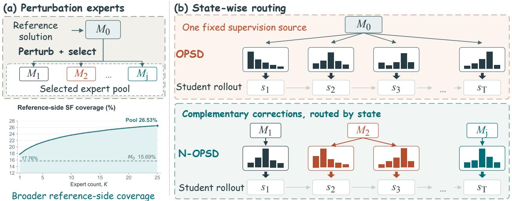
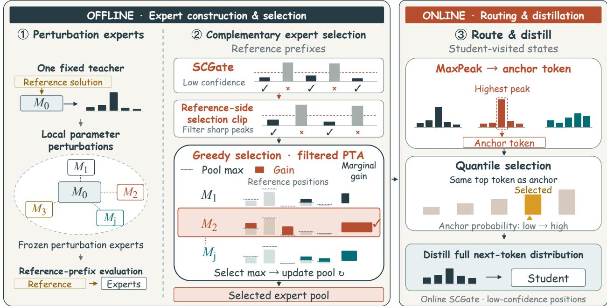
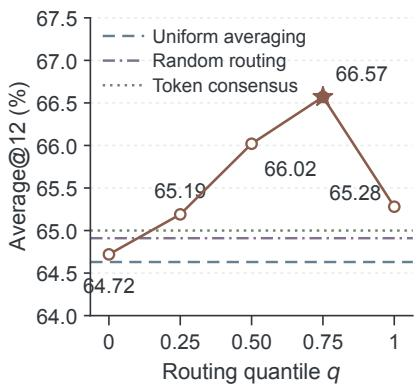
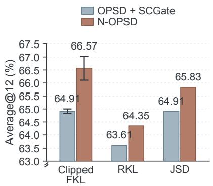
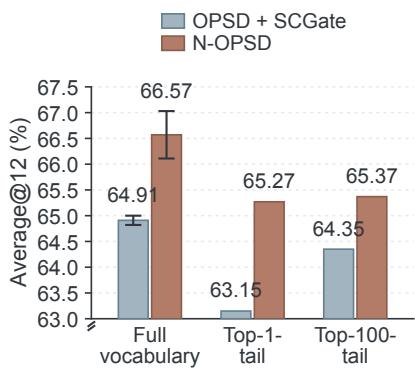

# Better Supervision Is Nearby: Neighborhood On-Policy Self-Distillation

Xincheng Wei1,\* Yifan Ding2,\* Yoshua Li2,\*,† Yuquan Lu2 Ziheng Li2 Yi Lu2,4 Dongsheng Ma2,3 Rongxiang Weng2 Xunliang Cai2

1The Chinese University of Hong Kong, Shenzhen 2Meituan, LongCat Team 3Peking University 4University of Toronto

\*Equal contribution. †Corresponding author. yoshua\_li@meituan.com

## ABSTRACT

On-policy self-distillation (OPSD) trains mathematical reasoning models using a privileged teacher that sees a reference solution and supervises student-sampled prefixes. Standard OPSD uses one fixed parameter setting at every state, but nearby settings may ofer additional supervision. We find that local parameter perturbations reveal complementary referencealigned corrections under the same reference context. Diferent experts supply these corrections at diferent reference positions. Their pool covers more such positions than the unperturbed privileged teacher. We introduce NEIGHBORHOOD OPSD (N-OPSD) to turn these corrections into supervision at student-visited states. Ofline, greedy selection builds a compact pool of frozen experts by rewarding filtered reference-token gains beyond the pool’s current best at each position. The highest-peak expert need not provide the best training target. Online routing therefore separates the anchor direction from its level of support. MaxPeak selects the anchor token, and quantile selection chooses among experts whose top token matches it. The student learns from the chosen expert’s full next-token distribution through the clipped forward-KL objective inherited from OPSD. We evaluate on AIME 2024, AIME 2025, and HMMT February 2025. Across three independent runs per method, NEIGH-BORHOOD OPSD improves the three-benchmark Average@12 over OPSD by 2.75, 1.67, and 1.94 points on Qwen3-1.7B, 4B, and 8B, respectively. Student-prefix continuations support using the pool beyond the reference trajectories used for selection. Matched ablations support filtered reference-token gains as a selection criterion. Accounting for overlap within the pool and routing by state further improve student accuracy. Inference uses only the distilled student.

## 1 Introduction

On-policy self-distillation (OPSD) trains mathematical reasoning models using two copies of the same model (Zhao et al., 2026). The student generates a response from the problem alone. The privileged teacher also sees a reference solution, available only during training (Lopez-Paz et al., 2016), and provides next-token distributions along the student’s response. Standard OPSD uses the same unperturbed teacher M at every student-visited state. Its predictions depend on the student prefix, but all supervision comes from one fixed parameter setting. A fixed teacher need not exhaust the useful supervision available from the same base model. We study its local parameter neighborhood as a source of complementary corrections for on-policy distillation.

TrustMOPD weights specialist supervision at each student prefix (Sun et al., 2026). RandOpt selects local perturbation experts by task performance (Gan & Isola, 2026). For distillation, an expert’s task accuracy need not reflect the value of its supervision (Cho & Hariharan, 2019). Task accuracy also does not reveal which corrections the selected experts already supply. This motivates selecting local experts by the tokenlevel corrections they add to a pool.

  
Figure 1: Overview of NEIGHBORHOOD OPSD. (a) Selected local perturbation experts expand reference-side selection-feasible (SF) coverage beyond $M _ { 0 }$ (Qwen3-8B, σ = .002; 500-question analysis set). (b) OPSD uses $M _ { 0 }$ at every student-visited state, while NEIGHBORHOOD OPSD routes one expert’s full next-token distribution at each state. Colors distinguish selected experts; distributions are schematic.

Experts sharing the same base checkpoint and reference context provide complementary corrections in our reference-side analysis. We measure each correction as an increase in reference-token probability over the frozen problem-only model on the same reference prefix. Diferent experts provide these increases at diferent positions. Their pool covers more reference positions than the unperturbed privileged teacher $M _ { 0 }$ under the same selection filters. Thus, useful supervision can depend on which nearby parameter setting interprets the same privileged information.

We introduce NEIGHBORHOOD OPSD (N-OPSD) to turn complementary corrections in the teacher’s neighborhood into supervision at student-visited states (Figure 1). Ofline selection builds a compact pool by rewarding experts for reference-aligned corrections beyond what the current pool provides. During training, student prefixes can difer from the reference solution (Agarwal et al., 2024), so the reference token cannot directly guide routing. The selected experts therefore evaluate the student’s current prefix.

Online routing separates the anchor direction from its level of support. MaxPeak takes the token with the highest probability assigned by any expert as the anchor, allowing an individual expert to supply the direction without pool agreement. A large positive gap between teacher and student probabilities can cause the anchor’s loss term to be clipped (Zhao et al., 2026). Quantile selection chooses the level of support among experts whose top token matches the anchor. The student learns from the chosen expert’s full next-token distribution. All experts remain fixed, and inference uses only the distilled student.

We evaluate on AIME 2024, AIME 2025, and HMMT February 2025. Across three independent runs per method, NEIGHBORHOOD OPSD improves the three-benchmark Average@12 over OPSD by 2.75, 1.67, and 1.94 points on Qwen3-1.7B, 4B, and 8B. Student-prefix continuations also show that MaxPeak can improve continuation accuracy over $M _ { 0 } .$ . This supports using the selected pool beyond the reference trajectories used for expert selection. Selection ablations show gains from scoring reference-aligned corrections, with further gains from accounting for overlap within the pool. Routing ablations then show gains from choosing the supervision source based on expert predictions at each state.

The contributions are:

• We show that a privileged teacher’s reference-aligned supervision extends beyond its unperturbed parameter setting. Selected local experts provide complementary corrections at reference positions beyond those covered by $M _ { 0 }$

  
Figure 2: Overview of NEIGHBORHOOD OPSD. Ofline, greedy selection builds a complementary pool of local perturbation experts by marginal filtered PTA on reference prefixes. Online, MaxPeak selects an anchor token, and quantile selection chooses among experts whose top token matches it. The selected expert supplies the full next-token distribution for student distillation.

• We introduce NEIGHBORHOOD OPSD, a framework that turns a privileged teacher’s neighborhood into state-wise supervision for on-policy distillation. It selects complementary local experts and distills their supervision into a single student used alone at inference.

• Across three independent runs per method, NEIGHBORHOOD OPSD improves the three-benchmark Average@12 over OPSD by 1.67 to 2.75 points on Qwen3-1.7B, 4B, and 8B. Matched ablations connect these gains to complementary expert selection and state-wise routing.

## 2 Method

NEIGHBORHOOD OPSD separates the choice of an expert pool from the choice of a supervision source at each state (Figure 2). Ofline selection identifies experts that add complementary corrections on reference prefixes. Online routing then selects from this pool at the student’s current prefix, where the useful supervision source can change as the rollout develops.

## 2.1 Setup and Perturbation Experts

Let x be a problem, z a privileged reference solution available only during training, and $\pi _ { \theta }$ the student. The student samples a response $\mathbf { y } = ( y _ { 1 } , \dots , y _ { T } )$ from the problem-only prompt:

$$
\mathbf { y } \sim \pi _ { \boldsymbol \theta } ( \cdot \mid x ) , \qquad s _ { t } = ( x , y _ { < t } ) .\tag{1}
$$

At each student-visited state $s _ { t } ,$ the unperturbed privileged teacher $M _ { 0 }$ has parameters $\bar { \theta }$ and observes both z and the same student prefix:

$$
\begin{array} { r } { p _ { t } ( v ) = \pi _ { \theta } ( v \mid s _ { t } ) , \qquad q _ { t } ^ { 0 } ( v ) = \pi _ { \bar { \theta } } ( v \mid x , z , y _ { < t } ) . } \end{array}\tag{2}
$$

The teacher returns a next-token distribution along the student rollout. OPSD uses $q _ { t } ^ { 0 }$ at every state and applies a pointwise forward-KL clip with threshold κ (Zhao et al., 2026). NEIGHBORHOOD OPSD retains this clip and selects the supervision source from an expert pool.

For seed $r _ { j }$ and radius $\sigma ,$ perturbation expert $j \geq 1$ has parameters

$$
\begin{array} { r } { \bar { \theta } _ { j } = \bar { \theta } + \epsilon _ { j } , \qquad \epsilon _ { j } \sim \mathcal { N } ( 0 , \sigma ^ { 2 } I ) . } \end{array}\tag{3}
$$

The noise is deterministic for each $( r _ { j } , \sigma )$ . The candidate pool includes these perturbation experts and $M _ { 0 }$ with $\bar { \theta } _ { 0 } = \bar { \theta }$ . All experts receive the same privileged information and student prefix, so their diversity comes from the local parameter neighborhood. The teacher snapshot and all experts remain fixed throughout training. We select a compact expert pool ofline and route one expert at each student-visited state. The radius is calibrated with student-prefix continuations before downstream evaluation.

## 2.2 Complementary Expert Selection

We select experts for the corrections they add to the pool. At each reference position, we credit a candidate only for its filtered correction beyond the pool’s current best.

Candidate selection uses teacher forcing on reference solutions. Let $y _ { t } ^ { * }$ be the reference token. At position $t ,$ the fixed problem-only model and every candidate expert evaluate the same reference prefix:

$$
p _ { t } ^ { S } ( v ) = \pi _ { \bar { \theta } } ( v \mid x , y _ { < t } ^ { * } ) , \qquad q _ { t } ^ { j } ( v ) = \pi _ { \bar { \theta } _ { j } } ( v \mid x , z , y _ { < t } ^ { * } ) .\tag{4}
$$

The shared prefixes make candidate corrections comparable at the same state and reference token. The fixed problem-only model provides the same baseline for every candidate, including $M _ { 0 }$

To focus selection on lower-confidence reference positions, we apply a student-confidence gate (SCGate):

$$
g _ { t } ^ { \mathrm { r e f } } = \mathbb { I } [ p _ { t } ^ { S } ( y _ { t } ^ { * } ) \leq \tau _ { \mathrm { s e l } } ] .\tag{5}
$$

For each retained position, we compute the reference-token forward-KL contribution

$$
c _ { j , t } = q _ { t } ^ { j } ( y _ { t } ^ { * } ) \log \frac { q _ { t } ^ { j } ( y _ { t } ^ { * } ) } { p _ { t } ^ { S } ( y _ { t } ^ { * } ) } .\tag{6}
$$

We set $\kappa _ { \mathrm { s e l } } = \kappa$ and give no selection credit to pairs with $c _ { j , t } > \kappa _ { \mathrm { s e l } }$ . This reference-side selection clip filters sharp reference-token peaks that the clipped online objective may suppress. It examines the reference token on a fixed reference prefix, while the online clip acts on every vocabulary entry at student-visited states.

Positive teacher advantage (PTA) measures how much an expert raises the reference-token probability. $\mathsf { A p - }$ plying both filters gives filtered PTA:

$$
\begin{array} { l } { { A _ { j , t } = \left[ q _ { t } ^ { j } ( y _ { t } ^ { * } ) - p _ { t } ^ { S } ( y _ { t } ^ { * } ) \right] _ { + } , } } \\ { { \widetilde { A } _ { j , t } = g _ { t } ^ { \mathrm { r e f } } \mathbb { I } [ c _ { j , t } \leq \kappa _ { \mathrm { s e l } } ] A _ { j , t } . } } \end{array}\tag{7}
$$

A positive $\widetilde { A } _ { j , t }$ denotes a reference-aligned, selection-feasible correction. For a subset $S$ of candidate experts, ewe maximize

$$
\operatorname { S c o r e } ( S ) = \sum _ { ( x , z ) } \sum _ { t } \operatorname* { m a x } _ { j \in S } \widetilde { A } _ { j , t } .\tag{8}
$$

The score rewards both newly covered positions and stronger corrections at positions already covered. It therefore accounts for correction magnitudes, whereas selection-feasible coverage counts positions with positive filtered PTA. If two experts supply similar corrections at the same positions, selecting one reduces the other’s marginal gain. An expert that improves diferent positions can then become more useful to the pool. Starting from $S = \emptyset$ , with the empty-set maximum defined as zero, we add the remaining expert that increases Score(S) the most. Selection continues until K experts are chosen. In our experiments, the PTA selector does not choose $M _ { 0 }$ within the first 50 greedy steps.

## 2.3 MaxPeak-Anchored Quantile Routing

Ofline selection can reward an expert for a correction that no other expert supplies. Choosing the anchor by pool consensus could suppress such an individual signal. We therefore use maximum expert support to choose the online anchor direction. At each student-visited state, expert $j \in S$ produces $q _ { t } ^ { j } = \pi _ { \bar { \theta } _ { i } } ( \cdot \mid x , z , y _ { < t } )$ Since a student prefix need not have an aligned reference token, we use MaxPeak to select the highest-peak expert and take its top token as the anchor:

$$
j _ { t } ^ { * } = \arg \operatorname* { m a x } _ { j } \operatorname* { m a x } _ { v \in \mathcal { V } } q _ { t } ^ { j } ( v ) , \qquad a _ { t } ^ { * } = \arg \operatorname* { m a x } _ { v } q _ { t } ^ { j _ { t } ^ { * } } ( v ) .\tag{9}
$$

This selects the token with the largest probability assigned by any expert.

We then collect experts whose top token matches the anchor:

$$
\mathcal { E } _ { t } = \left\{ j \in S : \arg \operatorname* { m a x } _ { v } q _ { t } ^ { j } ( v ) = a _ { t } ^ { * } \right\} .\tag{10}
$$

The MaxPeak expert $j _ { t } ^ { * }$ belongs to this set. For each $j \in \mathcal { E } _ { t } .$ , the anchor probability gap is $A _ { j , t } ^ { \mathrm { o n } } = q _ { t } ^ { j } ( a _ { t } ^ { * } ) - p _ { t } ( a _ { t } ^ { * } )$ At a fixed state, ranking these gaps is equivalent to ranking the experts’ anchor probabilities. The eligible experts share a top token, but their full next-token distributions can still difer.

A large positive gap can cause the anchor’s forward-KL contribution to be clipped, removing that term’s gradient. A lower anchor probability may ofer little or no increase over the student’s probability. To choose the level of anchor support, we sort the gaps in ascending order and select the expert at the lower discrete quantile:

$$
k _ { t } = \lfloor q \left( \lvert \mathcal { E } _ { t } \rvert - 1 \right) \rfloor , \qquad \widehat { j } _ { t } = \mathrm { o r d e r } _ { \mathcal { E } _ { t } } ( k _ { t } ) .\tag{11}
$$

Here, orde $\cdot _ { \mathcal { E } _ { t } }$ bindexes the sorted experts from zero. The endpoints $q \ : = \ : 0$ and $q \ : = \ : 1$ select the smallest and largest anchor probability gaps, respectively. Thus, $q = 1$ selects a highest-peak expert. The selected expert supplies the full-vocabulary target $\widehat { q } _ { t } = q _ { t } ^ { j _ { t } }$ ; the anchor token is used only for routing. The anchor and matching set are recomputed at each state, so routing can select diferent experts as the student visits new prefixes.

## 2.4 Training Objective

The online SCGate retains positions where the student assigns probability at most τ to its sampled token: $g _ { t } = \mathbb { I } [ p _ { t } ( y _ { t } ) \leq \tau ]$ . For each retained position, we apply the inherited OPSD pointwise clip to every vocabularylevel forward-KL contribution:

$$
\ell _ { t , v } = \widehat { q } _ { t } ( v ) \log \frac { \widehat { q } _ { t } ( v ) } { p _ { t } ( v ) } , \qquad \bar { \ell } _ { t , v } = \operatorname* { m i n } ( \ell _ { t , v } , \kappa ) .\tag{12}
$$

The training loss is

$$
\mathcal { L } _ { \mathrm { N \mathrm { - } O P S D } } = \frac { 1 } { \sum _ { t } g _ { t } } \sum _ { t } g _ { t } \sum _ { v \in \mathcal { V } } \bar { \ell } _ { t , v } .\tag{13}
$$

The denominator counts SCGate-retained positions. The pointwise clip is applied before summing over the full vocabulary. Contributions below κ remain unchanged. Only the student parameters θ receive gradients. Training repeats this process on rollouts sampled from the current student. The pool remains fixed, but its predictions and the routed targets are recomputed on each rollout. Appendix A details the selection clip, greedy marginal gain, and equivalent token-support form of MaxPeak.

## 3 Experiments

## 3.1 Experimental Setup

Models and training. We train Qwen3-1.7B, 4B, and 8B (Yang et al., 2025) on 10,000 OpenThoughts problems (Guha et al., 2025) for 100 optimizer steps. At each scale, the student and frozen experts start from the same base checkpoint. Unless varied, NEIGHBORHOOD OPSD uses $K \ : = \ : 2 5$ experts and routing quantile $q = . 7 5$

Baselines. We use the Base, supervised fine-tuning (SFT), and GRPO scores from Zhao et al. (2026) and rerun OPSD, EOPD, and PW-OPSD (Zhao et al., 2026; Jin et al., 2026; Liu et al., 2026a) under the same initialization, data, training budget, and evaluation as NEIGHBORHOOD OPSD. OPSD+SCGate isolates the online gate’s efect with the fixed teacher $M _ { 0 }$ . All rerun baselines, including OPSD+SCGate, use full-parameter student optimization, as does NEIGHBORHOOD OPSD.

Benchmarks and metrics. We evaluate AIME 2024, AIME 2025, and HMMT February 2025 (Mathematical Association of America, 2024; 2025; Harvard-MIT Mathematics Tournament, 2025) using the OPSD sampling settings (Zhao et al., 2026), reporting Average@12 from 12 sampled responses per problem. Avg. is the unweighted three-benchmark mean. Following PW-OPSD (Liu et al., 2026a), we report the step-100 checkpoint for NEIGHBORHOOD OPSD and all rerun baselines. NEIGHBORHOOD OPSD, OPSD, EOPD, and PW-OPSD use three independent runs per scale; the 8B OPSD+SCGate control also uses three runs. We report means and sample standard deviations for these methods. Other results are point estimates unless noted. Appendix B gives all configurations and implementation details.

Table 1: Main results across three Qwen3 scales with Average@12 accuracy (%; higher is better).
<table><tr><td>Model</td><td>Metric</td><td> $\mathbf { B a s e } ^ { \dagger }$ </td><td> $\mathbf { \mathbf { s } } \mathbf { \mathbf { F } } \mathbf { T } ^ { \dagger }$ </td><td>GRPO†</td><td>OPSD</td><td>EOPD</td><td>PW-OPSD</td><td>N-OPSD</td></tr><tr><td rowspan="4">Qwen3 1.7B</td><td>AIME24</td><td>51.50</td><td>48.40</td><td>51.10</td><td> $5 5 . 4 6 \pm 0 . 4 2$ </td><td> $5 2 . 4 1 \pm 0 . 6 4$ </td><td> $\underline { { 5 7 . 3 2 } } \pm 0 . 7 0$ </td><td> ${ \pm } 7 . 9 6 \pm 0 . 4 2$ </td></tr><tr><td>AIME25</td><td>36.70</td><td>36.30</td><td>38.30</td><td> $4 0 . 9 3 \pm 0 . 7 0$ </td><td> $3 9 . 3 5 \pm 0 . 4 2$ </td><td> $\underline { { 4 1 . 7 6 } } \pm 0 . 7 0$ </td><td> $4 5 . 0 9 \pm 0 . 9 7$ </td></tr><tr><td>HMMT25</td><td>23.10</td><td>22.70</td><td>23.70</td><td> $2 9 . 2 6 \pm 0 . 4 2$ </td><td> $2 5 . 9 3 \pm 0 . 7 0$ </td><td> $3 0 . 4 6 \pm 0 . 5 8$ </td><td> ${ \bf 3 0 . 8 3 \pm 1 . 1 1 }$ </td></tr><tr><td>Avg.</td><td>37.10</td><td>35.80</td><td>37.70</td><td> $4 1 . 8 8 \pm 0 . 1 9$ </td><td> $3 9 . 2 3 \pm 0 . 2 3$ </td><td> $4 3 . 1 8 \pm 0 . 1 4$ </td><td> $4 4 . 6 3 \pm 0 . 5 6$ </td></tr><tr><td rowspan="4">Qwen3 4B</td><td>AIME24</td><td>74.90</td><td>70.20</td><td>75.60</td><td> $7 6 . 2 0 \pm 0 . 1 6$ </td><td> $7 3 . 4 3 \pm 0 . 5 8$ </td><td> $7 6 . 4 8 \pm 0 . 4 2$ </td><td> $7 6 . 9 5 \pm 0 . 7 4$ </td></tr><tr><td>AIME25</td><td>66.40</td><td>62.30</td><td>68.10</td><td> $6 7 . 8 7 \pm 0 . 7 0$ </td><td> $6 6 . 1 1 \pm 1 . 0 0$ </td><td> $\underline { { 6 8 . 7 0 } } \pm 0 . 8 5$ </td><td> $7 0 . 8 3 \pm 0 . 5 6$ </td></tr><tr><td>HMMT25</td><td>42.20</td><td>43.40</td><td>44.40</td><td> $4 5 . 5 5 \pm 0 . 7 4$ </td><td> $4 2 . 3 2 \pm 0 . 8 5$ </td><td> $4 2 . 6 8 \pm 0 . 8 5$ </td><td> $4 6 . 8 5 \pm 0 . 7 0$ </td></tr><tr><td>Avg.</td><td>61.17</td><td>58.63</td><td>62.70</td><td> $6 3 . 2 1 \pm 0 . 1 1$ </td><td> $6 0 . 6 2 \pm 0 . 4 6$ </td><td> $6 2 . 6 2 \pm 0 . 1 4$ </td><td> $6 4 . 8 8 \pm 0 . 3 9$ </td></tr><tr><td rowspan="4">Qwen3 8B</td><td>AIME24</td><td>75.80</td><td>72.30</td><td>76.40</td><td> $7 7 . 4 1 \pm 0 . 3 2$ </td><td> $7 7 . 5 0 \pm 0 . 5 6$ </td><td> ${ underline { { 7 7 . 5 9 } } } \pm 0 . 6 4$ </td><td> $7 8 . 7 0 \pm 0 . 6 9$ </td></tr><tr><td>AIME25</td><td>65.60</td><td>64.20</td><td>68.90</td><td> $7 1 . 0 2 \pm 0 . 3 2$ </td><td> $7 0 . 9 2 \pm 0 . 9 7$ </td><td> $7 0 . 9 3 \pm 0 . 7 0$ </td><td> $7 2 . 7 8 \pm 0 . 2 8$ </td></tr><tr><td>HMMT25</td><td>43.90</td><td>42.90</td><td>46.70</td><td> $4 5 . 4 6 \pm 0 . 4 2$ </td><td> $4 5 . 4 6 \pm 0 . 6 4$ </td><td> $4 6 . 8 5 \pm 0 . 8 0$ </td><td> $4 8 . 2 4 \pm 0 . 8 9$ </td></tr><tr><td>Avg.</td><td>61.77</td><td>59.80</td><td>64.00</td><td> $6 4 . 6 3 \pm 0 . 1 6$ </td><td> $6 4 . 6 3 \pm 0 . 0 9$ </td><td> $6 5 . 1 2 \pm 0 . 3 3$ </td><td> $6 6 . 5 7 \pm 0 . 4 6$ </td></tr></table>

†: results from Zhao et al. (2026); other entries are our means  sample standard deviations over three independent training runs. Bold/underlined/italic: first/second/third in each row, with gold shading from darkest to lightest; tie share a rank. Avg.: unweighted mean across the three benchmarks.

## 3.2 Main Results Across Model Scales

NEIGHBORHOOD OPSD ranks first across all nine model-benchmark settings (Table 1). Its three-benchmark average exceeds OPSD by 2.75, 1.67, and 1.94 points on 1.7B, 4B, and 8B, respectively. Downstream ablations use Qwen3-8B and report single-run three-benchmark Average@12 unless noted. Appendix C gives perbenchmark ablation results, matched single-run comparisons, and details of target compression.

## 3.3 Complementary Expert Selection

Selection criteria. We first compare expert-selection criteria with the online router and gate held fixed (Table 2). All selectors share 1,000 selection questions, 501 candidates, $\sigma = . 0 0 2 ,$ and $K = 2 5$ . Quality Top-K ranks experts by answer accuracy, following RandOpt (Gan & Isola, 2026). Greedy sample coverage adds the expert that correctly answers the most additional questions.

Independent PTA Top-K ranks experts by their total filtered PTA. Like Quality Top-K, it ranks experts independently, but uses filtered reference-token corrections as the selection criterion. It reaches 65.65, exceeding Quality Top-K by .65 points. Our PTA selector uses greedy marginal gain and reaches 66.57, a further .92-point gain. Both PTA selectors use the same per-token filtered PTA values. They difer in whether selection accounts for corrections already supplied by the current pool. Both comparisons show gains on all three benchmarks (Table 4). Greedy sample coverage also rewards nonredundant contributions, but measures them as newly solved questions. Our selector exceeds its 65.37 average by 1.20 points. With routing held fixed, these results support filtered PTA as a selection criterion and the added value of selecting complementary corrections.

Table 2: Expert selection and filtering on Qwen3-8B (three-benchmark Average@12, %).
<table><tr><td colspan="4">Expert selection</td><td colspan="2">Filtering</td><td colspan="2">Fixed-teacher controls</td><td>Full method</td></tr><tr><td>Random Top-K</td><td>Quality Top-K</td><td>Greedy sample coverage</td><td>Independent PTA Top-K</td><td> ${ \bf w } / { \ o } 0$  SCGate</td><td>w/o selection clip</td><td>OPSD</td><td>OPSD +SCGate</td><td>Ours</td></tr><tr><td> $6 4 . 2 9 ^ { \pm . 5 3 }$  -2.28</td><td>65.00 -1.57</td><td>65.37 -1.20</td><td>65.65 -0.92</td><td>65.28 -1.29</td><td>64.26 -2.31</td><td>64.63±.16 -1.94</td><td>64.91±.09 -1.66</td><td> $6 6 . 5 7 ^ { \pm . 4 6 }$ </td></tr></table>

Small lower-right values show diferences from the full method in percentage points. Its three-run mean and matched single-run score both equal 66.57. Superscripts give sample standard deviations over three training runs (Random Top K: three random pools); other entries are single runs. SCGate removal applies to both stages. The online OPSD clip is retained in both component ablations.

Reference-side coverage. On 500 training questions held out from selection, the pool covers 26.53% of reference-side SCGate-retained positions at $\sigma ~ = ~ . 0 0 2$ , compared with 15.69% for $M _ { 0 }$ . Coverage requires positive filtered PTA from at least one expert. The pool has higher coverage at every tested radius (Table 3). Coverage also increases as experts are added (Appendix D.3), supporting complementarity within the selected pool. With reference context shared, this additional coverage comes from variation in teacher parameters. Newly covered reference tokens at $\sigma = . 0 0 2$ include common words, mathematical symbols, numbers, and verbs such as find and need. Appendix E reports the full reference-side audit and student-prefix continuation probe.

SCGate and the selection clip. We also test which positions and reference-token gains to retain. In the reference-prefix audit, the problem-only model’s top-1 confidence is at least .99 at 65.63% of positions. Its top-1 accuracy on these positions is 97.67%, motivating supervision of lower-confidence positions. With the fixed $M _ { 0 }$ teacher, SCGate raises the three-run average from 64.63 to 64.91. NEIGHBORHOOD OPSD reaches 66.57, a further 1.66-point gain (Table 2). The online gate thus accounts for only part of the improvement over OPSD.

Removing both ofline and online SCGate and reselecting the pool gives 65.28. Reselecting without the reference-side selection clip gives 64.26, with both SCGate stages and the online OPSD clip retained. This drop supports filtering expert credit during ofline selection even when the training objective already clips the loss. Matched single-run comparisons in Appendix C give the same ordering. The default $\tau = . 9 9$ gives the highest Average@12 among the four tested thresholds; Appendix D.2 reports the complete confidence audit and threshold sensitivity results.

## 3.4 Routing on Student Prefixes

Ofline selection uses reference prefixes, while training visits prefixes sampled by the student. We first test the pool on student-prefix continuations, then examine how to choose its training targets.

Student-prefix continuations. MaxPeak reaches 95.58% reference-side anchor accuracy at $\sigma = . 0 0 2 ,$ , versus 91.33% for $M _ { 0 }$ on the same SCGate-retained positions. We test transfer using prefixes from the frozen base student on 300 distinct questions. These come from 150 completed wrong responses and 150 unfinished responses. Raw MaxPeak selects the highest-peak expert at each decoding step without quantile selection. Both Raw MaxPeak and $M _ { 0 }$ use the same prefixes and privileged references, with a budget of 4096 new tokens. Raw MaxPeak raises continuation accuracy from 83.33% to 86.67% and completion from 90.00% to 94.67%.

Table 3 connects these continuation results to downstream accuracy across radii. Both continuation accuracy and downstream Average@12 peak at $\sigma = . 0 0 2$ , although reference-side coverage and anchor accuracy continue to rise at larger radii. Higher reference-side coverage therefore need not yield better student supervision. This supports calibrating the radius on student prefixes.

Table 3: Reference-side corrections, student-prefix continuations, and downstream accuracy across perturbation radii on Qwen3-8B (%).
<table><tr><td rowspan="2">Setting</td><td colspan="2">Reference prefixes</td><td colspan="2">Student-prefix continuations</td><td>Distilled student</td></tr><tr><td>SF coverage</td><td>Top-1 acc.</td><td>Accuracy</td><td>Completion</td><td> $\operatorname { A v g } .$ </td></tr><tr><td> $M _ { 0 }$ </td><td>15.69</td><td>91.33</td><td>83.33</td><td>90.00</td><td>n/a</td></tr><tr><td> $\sigma = . 0 0 1$ </td><td>21.86</td><td>94.20</td><td>81.33</td><td>88.67</td><td>65.83</td></tr><tr><td> $\sigma = . 0 0 2$ </td><td>26.53</td><td>95.58</td><td>86.67</td><td>94.67</td><td>66.57</td></tr><tr><td> $\sigma = . 0 0 4$ </td><td>29.02</td><td>96.53</td><td>62.33</td><td>79.00</td><td>64.54</td></tr><tr><td> $\sigma = . 0 0 6$ </td><td>31.39</td><td>97.31</td><td>27.33</td><td>39.33</td><td>63.24</td></tr></table>

Reference metrics use SCGate-retained positions on 500 held-out questions. For each radius, selection-feasible (SF) coverage uses the pool and top-1 accuracy uses the MaxPeak anchor. Continuations use the same 300 student prefixes, privileged references, and 4096-token budget; all prefixes remain in the denominator. Continuation results for each radius use Raw MaxPeak without quantile selection. Avg. uses NEIGHBORHOOD OPSD with $K = 2 5 , q = . 7 5 ,$ and matched single training runs.

Training-time routing. At $\sigma = . 0 0 2 ,$ , Figure 3(a) compares routing rules on the same PTA-selected pool. Uniform averaging takes the mean of all expert distributions. Token consensus equally averages the distributions of experts voting for the most common top token. Random routing samples one expert uniformly at each state and uses its full distribution. All rules share the same SCGate loss normalization. $\mathrm { A t } \ q = . 7 5 ,$ MaxPeak-anchored quantile routing gains 1.94 points over Uniform averaging and 1.57 over Token consensus. Our router raises Average@12 from 64.91 with Random routing to 66.57. Both routers use the same pool and supply one expert’s full distribution at each state. This gain supports choosing that expert using the current expert predictions.

The quantile comparison fixes the pool and MaxPeak anchor rule while varying which anchor-consistent expert supplies the full distribution. Accuracy rises from $q = 0 \mathrm { t o }$ .75 but drops 1.29 points at $q = 1$ . Thus, the highest-peak expert need not provide the best training target, supporting separate choices of anchor direction and support level.

  
(a) Quantile routing

  
(b) Online divergence

  
(c) Target distribution  
Figure 3: Routing and distillation ablations on Qwen3-8B. (a) Routing rules on the same PTA-selected pool. $( \mathtt { b } , \mathtt { c } )$ Comparisons with OPSD+SCGate under diferent divergences and target distributions, with the pool and router fixed for NEIGHBORHOOD OPSD. Values are three-benchmark Average@12 (%). Results with error bars are means ± sample standard deviations over three training runs; other results are single runs.

## 3.5 Pool Size and Training Cost

At $\sigma ~ = ~ . 0 0 2$ and $q \ = \ . 7 5 ,$ , increasing the pool from $K = 1$ to 25 raises Average@12 from 64.54 to 66.57 (Appendix D.3). On the 500-question analysis set, $K = 2 5$ retains 94.81% of the selection-feasible coverage at $K = 5 0$

Expanding to $K = 5 0$ adds reference-side coverage, but Average@12 falls to 64.35 at $q = . 7 5$ . Lowering q to .50 raises it to $6 5 . 8 3 \AA$ , still below the $K = 2 5$ result. This shift in the best tested quantile supports choosing pool size together with the level of routed support. Among the tested settings, $\bar { K } = 2 5$ gives the highest three-benchmark average.

Using $K = 2 5$ instead of $K = 5 0$ reduces estimated step time by 25.63%, to 1.423× that of OPSD+SCGate. This estimate combines measured teacher time with shared rollout and student computation times (Appendix D.4). Inference uses only the distilled student.

## 3.6 Robustness to Distillation Choices

Finally, we test whether the benefit of the selected supervision persists when the distillation objective or target distribution changes.

Online divergence. With the pool and router fixed, NEIGHBORHOOD OPSD outperforms OPSD+SCGate under both Jensen-Shannon divergence (JSD) and reverse KL (RKL) (Figure 3(b)), with gains on all three benchmarks. The source of supervision therefore matters beyond the default forward-KL objective. The clipped forward-KL reference has the highest average for NEIGHBORHOOD OPSD, with a three-run mean of 66.57.

Target distribution. Top-N-tail retains the teacher’s N most probable tokens and combines the rest into one tail category. The student uses the same categories. For Top-1-tail, supervision is a binary soft target over the top token and the remaining mass. We compress the distributions after routing and then apply forward-KL clipping. NEIGHBORHOOD OPSD retains an average advantage for both Top-1-tail and Top-100- tail (Figure 3(c)), with a 2.12-point gain over OPSD+SCGate even for the binary target. Its full-vocabulary target scores 1.30 and 1.20 points higher than these two compressed variants, respectively.

## 4 Related Work

## 4.1 On-Policy and Privileged Self-Distillation

On-policy distillation supervises student-generated prefixes to reduce the state mismatch of of-policy imitation (Ross et al., 2011; Agarwal et al., 2024; Gu et al., 2024; Ko et al., 2024). Self-distillation can condition the teacher on demonstrations, feedback, or guiding context while training on student rollouts (Shenfeld et al., 2026; Hübotter et al., 2026; Ye et al., 2026). OPSD conditions the teacher on a reference solution unavailable to the student (Zhao et al., 2026). Tian et al. (2026) study the choice of privileged context, including context selection per trajectory. NEIGHBORHOOD OPSD keeps the reference context shared across experts and varies the teacher parameters.

## 4.2 Adapting Supervision from a Fixed Teacher

Fixed-teacher methods adapt the target, divergence, or loss weights. TAID gradually interpolates student and teacher logits (Shing et al., 2025), and DistiLLM-2 uses diferent divergences for teacher- and studentgenerated responses (Ko et al., 2025). EOPD adapts divergence to teacher entropy (Jin et al., 2026), while PW-OPSD and IW-OPD reweight token losses (Liu et al., 2026a; Xie et al., 2026). Other methods use lookahead feedback, trajectory weighting, hidden-state transitions, or purified targets (Liu et al., 2026b; Lin et al., 2026; Li et al., 2026; Shen et al., 2026). Cal-OPD calibrates token-level discrepancies using contrasting teacher contexts (He et al., 2026). NEIGHBORHOOD OPSD expands the supervision source through complementary local experts. Its routed targets can be used with divergence adaptation or loss weighting.

## 4.3 Multiple Supervision Sources and Perturbation Experts

Multi-teacher distillation includes instance-dependent teacher selection (Yuan et al., 2021) and learning a distribution to sample one teacher per update (Ding et al., 2024). For on-policy distillation, MOPD and PROMPTSD assign examples to domain- or task-specific teachers (Ma et al., 2026a;b). H-OPD mixes visionlanguage and text-only teacher distributions (Yin et al., 2026), while TrustMOPD weights specialist supervision at each student prefix (Sun et al., 2026). Neural Thickets constructs local perturbation experts. RandOpt selects them by task performance and uses majority voting (Gan & Isola, 2026). Its distillation variant uses SFT on generated reasoning traces and answers. NEIGHBORHOOD OPSD selects experts by marginal filtered PTA on reference prefixes and routes one expert’s full next-token distribution at each student-visited state.

## 5 Conclusion

We showed that a privileged teacher’s reference-aligned supervision extends beyond its unperturbed parameter setting. NEIGHBORHOOD OPSD turns complementary corrections in this neighborhood into state-wise supervision for a single student. The selected pool achieves higher reference-side selection-feasible coverage than $M _ { 0 }$ . Student-prefix continuations support using the pool beyond reference trajectories. Matched ablations support the roles of complementary expert selection and state-wise routing in the downstream gains. The highest-peak expert need not provide the best training target, supporting separate choices of anchor direction and support level. Across Qwen3-1.7B, 4B, and 8B, NEIGHBORHOOD OPSD improves the three-benchmark Average@12 over the original OPSD by 2.75, 1.67, and 1.94 points. Inference uses only the distilled student. Appendix F discusses limitations and future work.

## References

Rishabh Agarwal, Nino Vieillard, Yongchao Zhou, Piotr Stanczyk, Sabela Ramos Garea, Matthieu Geist, and Olivier Bachem. On-policy distillation of language models: Learning from self-generated mistakes. In International Conference on Learning Representations, 2024.

Jang Hyun Cho and Bharath Hariharan. On the eficacy of knowledge distillation. In Proceedings of the IEEE/CVF International Conference on Computer Vision (ICCV), October 2019.

Zixiang Ding, Guoqing Jiang, Shuai Zhang, Lin Guo, and Wei Lin. How to trade of the quantity and capacity of teacher ensemble: Learning categorical distribution to stochastically employ a teacher for distillation. Proceedings of the AAAI Conference on Artificial Intelligence, 38(16):17915–17923, 2024. doi: 10.1609/ aaai.v38i16.29746. URL https://doi.org/10.1609/aaai.v38i16.29746.

Yulu Gan and Phillip Isola. Neural thickets: Diverse task experts are dense around pretrained weights. arXiv preprint arXiv:2603.12228, 2026.

Yuxian Gu, Li Dong, Furu Wei, and Minlie Huang. MiniLLM: Knowledge distillation of large language models. In International Conference on Learning Representations, 2024.

Etash Guha, Ryan Marten, Sedrick Keh, Negin Raoof, Georgios Smyrnis, Hritik Bansal, Marianna Nezhurina, Jean Mercat, Trung Vu, Zayne Sprague, et al. OpenThoughts: Data recipes for reasoning models. arXiv preprint arXiv:2506.04178, 2025.

Harvard-MIT Mathematics Tournament. HMMT February 2025: Problems and Solutions. https://www. hmmt.org/www/archive/282, 2025.

Qiangqiang He, Jin Li, and MingCai Chen. Calibrating teacher–student discrepancy for on-policy distillation. arXiv preprint arXiv:2609.21619, 2026. URL https://arxiv.org/abs/2609.21619.

Jonas Hübotter, Frederike Lübeck, Lejs Behric, Anton Baumann, Marco Bagatella, Daniel Marta, Ido Hakimi, Idan Shenfeld, Thomas Kleine Buening, Carlos Guestrin, and Andreas Krause. Reinforcement learning via self-distillation. arXiv preprint arXiv:2601.20802, 2026. URL https://arxiv.org/abs/2601.20802.

Woogyeol Jin, Taywon Min, Yongjin Yang, Dennis Wei, Yi Zhou, Swanand Ravindra Kadhe, Nathalie Baracaldo, and Kimin Lee. Entropy-aware on-policy distillation of language models. arXiv preprint arXiv:2603.07079, 2026.

Jongwoo Ko, Sungnyun Kim, Tianyi Chen, and Se-Young Yun. DistiLLM: Towards streamlined distillation for large language models. In International Conference on Machine Learning, 2024.

Jongwoo Ko, Tianyi Chen, Sungnyun Kim, Tianyu Ding, Luming Liang, Ilya Zharkov, and Se-Young Yun. DistiLLM-2: A contrastive approach boosts the distillation of LLMs. In Proceedings of the 42nd International Conference on Machine Learning, volume 267, pp. 31044–31062, 2025. URL https://proceedings.mlr. press/v267/ko25a.html.

Yuhan Li, Mingxu Zhang, Dazhong Shen, and Ying Sun. PHF: Privileged hidden flow for on-policy self distillation. arXiv preprint arXiv:2606.29340, 2026.

Chen Lin, Kedi Chen, and Wei Zhang. ReNIO: Reweighting negative trajectory importance for LLM on-policy distillation. arXiv preprint arXiv:2606.23104, 2026.

Xiaogeng Liu, Xinyan Wang, Yingzi Ma, Yechao Zhang, and Chaowei Xiao. When are teacher tokens reliable? position-weighted on-policy self-distillation for reasoning. arXiv preprint arXiv:2605.21606, 2026a.

Yanjiang Liu, Jie Lou, Xinyan Guan, Yuqiu Ji, Hongyu Lin, Ben He, Xianpei Han, Le Sun, Xing Yu, and Yaojie Lu. Your teacher can’t help you here: Combating supervision fidelity decay in on-policy distillation. arXiv preprint arXiv:2605.30833, 2026b.

David Lopez-Paz, Léon Bottou, Bernhard Schölkopf, and Vladimir Vapnik. Unifying distillation and privileged information. In International Conference on Learning Representations, 2016.

Wenhan Ma, Jianyu Wei, Liang Zhao, Hailin Zhang, Bangjun Xiao, Lei Li, Qibin Yang, Bofei Gao, Yudong Wang, Rang Li, Jinhao Dong, Zhifang Sui, and Fuli Luo. MOPD: Multi-teacher on-policy distillation for capability integration in LLM post-training. arXiv preprint arXiv:2606.30406, 2026a.

Yingzi Ma, Zichen Zhu, Ming Jiang, and Chaowei Xiao. One student, many teachers: Multi-task on-policy distillation via soft-prompt privileged context. arXiv preprint arXiv:2607.18293, 2026b.

Mathematical Association of America. 2024 American Invitational Mathematics Examination. https://maa. org/maa-invitational-competitions/, 2024.

Mathematical Association of America. 2025 American Invitational Mathematics Examination. https://maa. org/maa-invitational-competitions/, 2025.

Stéphane Ross, Geofrey J. Gordon, and J. Andrew Bagnell. A reduction of imitation learning and structured prediction to no-regret online learning. In Proceedings of the International Conference on Artificial Intelligence and Statistics, 2011.

Zhanming Shen, Jintao Tong, Shaotian Yan, Chen Shen, Hao Chen, Wentao Ye, Xiaomeng Hu, Rui Miao, Haobo Wang, Junbo Zhao, Gang Chen, and Jieping Ye. Purified OPSD: On-policy self-distillation without losing how to think. arXiv preprint arXiv:2607.02234, 2026.

Idan Shenfeld, Mehul Damani, Jonas Hübotter, and Pulkit Agrawal. Self-distillation enables continual learning. arXiv preprint arXiv:2601.19897, 2026. URL https://arxiv.org/abs/2601.19897.

Makoto Shing, Kou Misaki, Han Bao, Sho Yokoi, and Takuya Akiba. TAID: Temporally adaptive interpolated distillation for eficient knowledge transfer in language models. In International Conference on Learning Representations, 2025.

Jie Sun, Mao Zheng, Mingyang Song, Zeyuan Liu, Gengsheng Li, Houcheng Jiang, Yilin Cheng, Bichuan Feng, Yuchen Cai, Junfeng Fang, and Xiang Wang. Distill what you trust: Reliability-aware multi-teacher on-policy distillation. arXiv preprint arXiv:2609.23697, 2026. URL https://arxiv.org/abs/2609.23697.

Kanghui Tian, Siyuan Liu, Tianxiang Jiang, Shuai Dong, Yizhuo Li, Tian Ding, Yuan Guo, Songze Li, Haowen Hou, Congcong Wang, and Yi Wang. What should a self-teacher see? privileged context design for on-policy self-distillation. arXiv preprint arXiv:2609.25623, 2026. URL https://arxiv.org/abs/2609.25623.

Yan Xie, Sijie Zhu, Tiansheng Wen, Bo Chen, and Yifei Wang. On the position bias of on-policy distillation. arXiv preprint arXiv:2606.22600, 2026.

An Yang, Anfeng Li, Baosong Yang, Beichen Zhang, Binyuan Hui, Bo Zheng, Bowen Yu, Chang Gao, Chengen Huang, Chenxu Lv, et al. Qwen3 technical report. arXiv preprint arXiv:2505.09388, 2025.

Tianzhu Ye, Li Dong, Xun Wu, Shaohan Huang, and Furu Wei. On-policy context distillation for language models. arXiv preprint arXiv:2602.12275, 2026. URL https://arxiv.org/abs/2602.12275.

Qixiang Yin, Huanjin Yao, Yuchen Cai, Jianghao Chen, Ziyi Wang, Min Yang, Fei Su, and Zhicheng Zhao. H-OPD: Confidence aware heterogeneous multi-teacher multimodal on-policy distillation. arXiv preprint arXiv:2607.02592, 2026.

Fei Yuan, Linjun Shou, Jian Pei, Wutao Lin, Ming Gong, Yan Fu, and Daxin Jiang. Reinforced multi-teacher selection for knowledge distillation. Proceedings of the AAAI Conference on Artificial Intelligence, 35(16): 14284–14291, 2021. doi: 10.1609/aaai.v35i16.17680. URL https://doi.org/10.1609/aaai.v35i16. 17680.

Siyan Zhao, Zhihui Xie, Mengchen Liu, Jing Huang, Guan Pang, Feiyu Chen, and Aditya Grover. Self-distilled reasoner: On-policy self-distillation for large language models. arXiv preprint arXiv:2601.18734, 2026.

## A Method Details

## A.1 Reference-Side Selection Clip

The OPSD pointwise clip in Eq. 12 acts on each vocabulary-level forward-KL contribution before summation. When $\ell _ { t , v } > \kappa ,$ , the clipped value is constant and contributes no gradient. Contributions below the threshold remain unchanged.

The reference-side selection clip gives no credit to candidate-position pairs with $c _ { j , t } > \kappa _ { \mathrm { s e l } }$ . It prevents experts from gaining selection credit through sharp reference-token peaks that the clipped online objective may suppress. This is a selection proxy motivated by the OPSD objective. It examines one reference-token contribution under a fixed reference prefix. The online clip instead examines every vocabulary-level contribution from the routed expert at student-visited states. Passing the selection clip does not determine whether an online contribution will be clipped.

## A.2 Greedy Marginal Gain

For the selection objective in Eq. 8, the gain from adding expert j to the current pool S is

$$
\Delta ( j \mid S ) = \sum _ { ( x , z ) } \sum _ { t } \left[ \widetilde { A } _ { j , t } - \operatorname* { m a x } _ { i \in S } \widetilde { A } _ { i , t } \right] _ { + } .\tag{14}
$$

Each step adds the remaining expert with the largest $\Delta ( j \mid S )$ . We rank all 501 candidates in greedy insertion order and retain the first K. The coverage gains on the analysis set in Appendix D.3 motivate $K = 2 5$

## A.3 MaxPeak Equivalence

At a student-visited state, each token’s maximum expert support is

$$
u _ { t } ( v ) = \operatorname* { m a x } _ { j \in S } q _ { t } ^ { j } ( v ) , \qquad a _ { t } ^ { * } \in \arg \operatorname* { m a x } _ { v \in \mathcal { V } } u _ { t } ( v ) .\tag{15}
$$

The two maxima can be exchanged:

$$
\operatorname* { m a x } _ { v \in \mathcal { V } } u _ { t } ( v ) = \operatorname* { m a x } _ { v \in \mathcal { V } } \operatorname* { m a x } _ { j \in S } q _ { t } ^ { j } ( v ) = \operatorname* { m a x } _ { j \in S } \operatorname* { m a x } _ { v \in \mathcal { V } } q _ { t } ^ { j } ( v ) .\tag{16}
$$

Selecting the highest-peak expert and then its top token therefore gives a maximizer of $u _ { t } ,$ , as used by MaxPeak in Eq. 9. This online score uses expert probabilities on the current student prefix. Ofline selection uses filtered reference-token PTA.

## B Complete Experimental Protocol

## B.1 Expert Construction and Selection

Selection and audit data. For Qwen3-8B, we randomly sample two disjoint question sets from the OPSD training data. The selection set contains 1,000 questions and the analysis set contains 500. This matches expert selection and analysis to the student training distribution. Their identifiers are openthoughts\_train\_selection\_1000 $( \dot { \mathcal { D } } _ { \mathrm { s e l } } )$ and openthoughts\_test\_indep\_500, respectively. The analysis set and all three downstream benchmarks are excluded from expert selection.

Candidates and thresholds. For each model scale, we sample 500 perturbation seeds from the scale’s own frozen base checkpoint. Together with $M _ { 0 }$ , the resulting experts form a pool of 501 candidates. Expert selection uses a split disjoint from AIME and HMMT. The 8B radius grid uses $\sigma \in \{ . 0 0 1 , . 0 0 2 , . 0 0 4 , . 0 0 6 \}$ $\tau _ { \mathrm { s e l } } = . 9 9$ , and $\kappa _ { \mathrm { s e l } } = . 0 6$ . The first 25 experts in greedy insertion order are retained. The reference-side selection clip excludes candidate-position pairs whose reference-token FKL contribution exceeds the threshold on fixed reference prefixes. The OPSD pointwise clip acts separately on each vocabulary-level forward-KL contribution from the routed expert distribution at student-visited states. The calibrated perturbation radii are $\sigma = . 0 0 0 6 , . 0 0 1 2 ,$ , and .002 for Qwen3-1.7B, 4B, and 8B.

## B.2 Selector Definitions

Quality Top-K and Greedy sample coverage evaluate one generated response per expert and question. Let $N = | \dot { \mathcal { D } } _ { \mathrm { s e l } } |$ . For candidate expert j and question $i ,$ define

$$
\begin{array} { l l } { { b _ { j , i } = \mathbb { I } [ \mathrm { e x p e r t } ~ j ~ \mathrm { a n s w e r s ~ q u e s t i o n } ~ i ~ \mathrm { c o r r e c t l y } ] , } } \\ { { Q _ { j } = \displaystyle \frac { 1 } { N } \sum _ { i = 1 } ^ { N } b _ { j , i } . } } \end{array}\tag{17}
$$

Both selection scores use final-answer correctness without reference-side SCGate or the selection clip.

Quality Top-K. We select the K experts with the highest $Q _ { j }$ . Ties follow the fixed candidate order.

Greedy sample coverage. Let $C _ { j } = \{ i : b _ { j , i } = 1 \}$ be the questions answered correctly by expert $j .$ . The selection objective counts questions answered correctly by at least one selected expert:

$$
F ( S ) = \left. \bigcup _ { j \in S } C _ { j } \right. .\tag{18}
$$

Starting from $S = \emptyset$ , each step adds the expert with the largest increase in coverage:

$$
j ^ { \star } = \arg \operatorname* { m a x } _ { j \notin S } \left. C _ { j } \setminus \bigcup _ { k \in S } C _ { k } \right. , \qquad S \gets S \cup \{ j ^ { \star } \} .\tag{19}
$$

We recompute the gains after each addition. Ties favor higher $Q _ { j } ,$ , then the fixed candidate order. Selection continues until K experts are chosen. Once coverage saturates, this tie rule fills the pool by $Q _ { j }$

Independent PTA Top-K. We score each expert by its total filtered PTA on the selection set:

$$
R _ { j } = \sum _ { ( x , z ) \in \mathcal { D } _ { \mathrm { s e l } } } \sum _ { t } \widetilde { A } _ { j , t } .\tag{20}
$$

We rank experts once by $R _ { j }$ and select the top K. This rule uses the same reference-side SCGate and selection clip as the PTA selector. Scores remain fixed as experts are added to the pool.

## B.3 Token Consensus Routing

Token consensus constructs the training target from the pool S of 25 experts selected by the PTA selector. At each student prefix, every expert casts one vote for its top-1 token:

$$
a _ { t } ^ { j } = \arg \operatorname* { m a x } _ { v \in \mathcal { V } } q _ { t } ^ { j } ( v ) , \qquad n _ { t } ( v ) = \sum _ { j \in S } \mathbb { I } [ a _ { t } ^ { j } = v ] .\tag{21}
$$

The consensus token is

$$
a _ { t } ^ { \mathrm { c o n s } } \in \arg \operatorname* { m a x } _ { v \in \mathcal { V } } n _ { t } ( v ) .\tag{22}
$$

A token can be selected without receiving more than half of the votes. Ties favor the largest $\textstyle \sum _ { j \in S : a _ { t } ^ { j } = v } q _ { t } ^ { j } ( v )$ then the fixed expert order. We collect all experts that support the consensus token:

$$
\mathcal { E } _ { t } ^ { \mathrm { c o n s } } = \left\{ j \in S : a _ { t } ^ { j } = a _ { t } ^ { \mathrm { c o n s } } \right\} .\tag{23}
$$

We average their full vocabulary distributions with equal weights:

$$
\widehat { q } _ { t } ^ { \mathrm { c o n s } } ( v ) = \frac { 1 } { | \mathcal { E } _ { t } ^ { \mathrm { c o n s } } | } \sum _ { j \in \mathcal { E } _ { t } ^ { \mathrm { c o n s } } } q _ { t } ^ { j } ( v ) .\tag{24}
$$

As in MaxPeak-anchored quantile routing, the loss denominator is $\textstyle \sum _ { t } g _ { t }$ (Eq. 13).

## B.4 Training Configuration

We use full-parameter student optimization for NEIGHBORHOOD OPSD and all rerun baselines. All three model scales use learning rate $1 \dot { 0 } ^ { - 6 }$ and efective batch size 64. Training lasts 100 optimizer steps with checkpoints saved every 20 steps. The 8B experiments use eight GPUs, per-device batch size 4, and a gradient accumulation factor of 2. For NEIGHBORHOOD OPSD, we use forward KL $( \beta = 0$ in the generalized divergence implementation) and a full-vocabulary loss. Unless varied, the defaults are $K = 2 5 , \bar { q } = . 7 5$ , online SCGate threshold $\tau = . 9 9$ , and $\kappa _ { \mathrm { s e l } } = \kappa = . 0 6$ . All expert parameters remain fixed, and only the student is updated. Token-level post-sum clipping is disabled. Gradient checkpointing and bfloat16 are enabled.

Memory and computation. For each expert forward pass, we add its deterministic perturbation, compute the distribution, and restore the base weights. Materializing all K expert distributions would require $\mathbf { \hat { \phi } } _ { \mathbf { \theta } } ( K B S | \mathcal { V } | )$ memory. We instead store $O ( K { \bar { B } } S )$ routing metadata on CPU in a first streaming pass and materialize one expert distribution at a time in a second pass. Table 10 reports estimated step time relative to OPSD+SCGate. Appendix D.4 gives the timing measurements and calculation. Inference uses only the distilled student.

Rollouts and filtering. Student rollouts use at most 1024 tokens, temperature 1.1, $\mathsf { t o p } \cdot p = . 9 5$ , and top-$k = 2 0$ . Thinking is disabled in the student prompt and enabled in the privileged prompt. The student sees the problem alone, and the teacher receives the same completion with the privileged reference context. In NEIGHBORHOOD OPSD, SCGate filters a position when the student probability of its sampled token exceeds the threshold. The OPSD+SCGate control applies the same online gate to the fixed $M _ { 0 }$ target and has no ofline expert-selection stage. In the SCGate ablation, we remove both the reference-side and online gates and reselect the expert pool. In the selection-clip ablation, we reselect the pool without the reference-side selection clip while retaining the online OPSD pointwise clip.

## B.5 Baseline Implementations

OPSD, EOPD, and PW-OPSD use the frozen reference-conditioned teacher $M _ { 0 } .$ . The student generates a rollout from the problem alone, and the teacher evaluates that rollout with access to the reference solution and final answer. OPSD applies the clipped forward-KL contribution in Eq. 12 to $q _ { t } ^ { 0 }$ at every rollout position, with uniform position weights.

For EOPD, we apply the entropy-aware distillation objective of Jin et al. (2026) using this privileged teacher. This comparison tests the objective in the self-distillation setting, with the reference-conditioned $\breve { M _ { 0 } }$ supplying the teacher distributions. PW-OPSD uses the position-dependent loss weighting proposed by Liu et al. (2026a), using the same rollout protocol and reference-conditioned teacher.

## B.6 Evaluation and Statistics

Our runs use thinking mode, temperature 1.0, top-p = .95, top-k = −1, maximum 38,912 new tokens, and val.n=12. Following PW-OPSD (Liu et al., 2026a), we report the step-100 checkpoint for NEIGHBORHOOD OPSD, all rerun baselines, and all ablation variants. Base, SFT, and GRPO results are taken from Zhao et al. (2026) under the source paper’s evaluation and checkpoint-selection protocols. The other baseline result are our reruns. We conduct three independent training runs for NEIGHBORHOOD OPSD, OPSD, EOPD, and PW-OPSD at each scale. The Qwen3-8B OPSD+SCGate control also uses three independent training runs. We report the mean and sample standard deviation across runs. For Avg., we use each run’s three-benchmark mean. The remaining baselines and analysis variants are point estimates unless noted otherwise.

## C Complete Ablation Results

The following tables give the results for each benchmark corresponding to the averages in Section 3. All experiments use Qwen3-8B and Average@12. Results are matched single runs unless noted otherwise.

## C.1 Expert Selection

All selectors use the same 1,000 selection questions, 501 candidates, $\sigma = . 0 0 2$ , and $K = 2 5$ . Training uses MaxPeak-anchored quantile routing with $q = . 7 5$ and online SCGate with $\tau = . 9 9$

Table 4: Expert-selection accuracy (%) on Qwen3-8B with Average@12.
<table><tr><td>Selector</td><td>AIME24</td><td>AIME25</td><td>HMMT25</td><td>Avg.</td></tr><tr><td>Random Top-K</td><td>77.04 ±.85</td><td> $7 0 . 2 8 \pm . 4 8$ </td><td> $4 5 . 5 6 \pm . 7 3$ </td><td> $6 4 . 2 9 \pm . 5 3$ </td></tr><tr><td>Quality Top-K</td><td>77.50</td><td>70.83</td><td>46.67</td><td>65.00</td></tr><tr><td>Greedy sample coverage</td><td>77.78</td><td>71.67</td><td>46.67</td><td>65.37</td></tr><tr><td>Independent PTA Top-K</td><td>77.78</td><td>71.39</td><td>47.78</td><td>65.65</td></tr><tr><td>PTA selector (Ours)</td><td>78.33</td><td>72.78</td><td>48.61</td><td>66.57</td></tr></table>

Random Top-K: mean sample standard deviation over three pools. Other rows are single runs. Both PTA selectors use the same reference-side SCGate and selection clip.

## C.2 Online Routing

We compare Uniform averaging, Random routing, Token consensus, and MaxPeak-anchored quantile routing on the same PTA-selected pool at $K = 2 5$ and $\sigma ~ = ~ . 0 0 2$ . Random routing draws $\widehat { j } _ { t }$ uniformly from S at each student-visited state and uses the full distribution ${ \widehat { q } } _ { t } = q _ { t } ^ { { \widehat { j } } _ { t } }$ b. It retains the online SCGate and clipped forward-KL objective. The quantile comparison keeps the MaxPeak anchor rule fixed.

## C.3 Divergence and Target Distribution

These ablations use the same 100-step training budget. We report the step-100 checkpoint for each run. Both supervision sources use online SCGate with $\tau = . 9 9$ . All NEIGHBORHOOD OPSD variants retain the selected

Table 5: Routing accuracy (%) at $\sigma = . 0 0 2$ and $K = 2 5$ on Qwen3-8B.
<table><tr><td>Routing rule</td><td>q</td><td>AIME24</td><td>AIME25</td><td>HMMT25</td><td> $\operatorname { A v } { \mathbf { g } } .$ </td></tr><tr><td>Uniform averaging</td><td>n/a</td><td>77.78</td><td>69.17</td><td>46.94</td><td>64.63</td></tr><tr><td>Random routing</td><td>n/a</td><td>78.33</td><td>70.28</td><td>46.11</td><td>64.91</td></tr><tr><td>Token consensus</td><td>n/a</td><td>77.22</td><td>71.39</td><td>46.39</td><td>65.00</td></tr><tr><td></td><td>0</td><td>77.22</td><td>70.83</td><td>46.11</td><td>64.72</td></tr><tr><td>MaxPeak-anchored</td><td>.25</td><td>77.50</td><td>71.11</td><td>46.94</td><td>65.19</td></tr><tr><td></td><td>.50</td><td>78.06</td><td>72.22</td><td>47.78</td><td>66.02</td></tr><tr><td>quantile</td><td>.75</td><td>78.33</td><td>72.78</td><td>48.61</td><td>66.57</td></tr><tr><td></td><td>1</td><td>77.22</td><td>71.67</td><td>46.94</td><td>65.28</td></tr></table>

All scores use Average@12. MaxPeak selects the anchor token; q selects the rank of its probability gap among anchorconsistent experts.

pool and router at $\sigma = . 0 0 2$ $K = 2 5 ,$ , and $q = . 7 5$ . Table 6 reports the complete results from single training runs. The full-vocabulary forward-KL reference is the single run reported in Table 7.

Table 6: Divergence and target-distribution accuracy (%) on Qwen3-8B.
<table><tr><td>Source</td><td>Setting</td><td>AIME24</td><td>AIME25</td><td>HMMT25</td><td> $\operatorname { A v } { \mathbf { g } } .$ </td></tr><tr><td>OPSD + SCGate</td><td>JSD</td><td>77.50</td><td>70.28</td><td>46.94</td><td>64.91</td></tr><tr><td>N-OPSD</td><td>JSD</td><td>78.33</td><td>71.67</td><td>47.50</td><td>65.83</td></tr><tr><td>OPSD + SCGate</td><td>RKL</td><td>76.94</td><td>69.17</td><td>44.72</td><td>63.61</td></tr><tr><td>N-OPSD</td><td>RKL</td><td>77.22</td><td>70.00</td><td>45.83</td><td>64.35</td></tr><tr><td>OPSD + SCGate</td><td>Top-1-tail</td><td>74.44</td><td>68.06</td><td>46.94</td><td>63.15</td></tr><tr><td>N-OPSD</td><td>Top-1-tail</td><td>76.94</td><td>71.94</td><td>46.94</td><td>65.27</td></tr><tr><td>OPSD + SCGate</td><td>Top-100-tail</td><td>76.39</td><td>72.50</td><td>44.17</td><td>64.35</td></tr><tr><td>N-OPSD</td><td>Top-100-tail</td><td>77.22</td><td>70.83</td><td>48.06</td><td>65.37</td></tr><tr><td>N-OPSD</td><td>Full-vocabulary FKL</td><td>78.33</td><td>72.78</td><td>48.61</td><td>66.57</td></tr></table>

Average@12; all entries are single runs. JSD and RKL use the full vocabulary; Top-N-tail uses clipped forward KL. The last row repeats the full-vocabulary FKL reference. Avg. is the unweighted mean across benchmarks.

Top-N-tail construction. Let $q _ { t }$ denote the teacher target, either $q _ { t } ^ { 0 }$ for OPSD+SCGate or $\widehat { q _ { t } }$ for NEIGHBOR-HOOD OPSD. At each state, we select its $N$ most probable tokens, $H _ { N , t } = \{ v _ { 1 } , \ldots , v _ { N } \}$ . We use this same set to compress the teacher and student distributions into N + 1 categories:

$$
\begin{array} { c } { { q _ { t , i } ^ { ( N ) } = q _ { t } ( v _ { i } ) , \quad p _ { t , i } ^ { ( N ) } = p _ { t } ( v _ { i } ) , \qquad i = 1 , \ldots , N , } } \\ { { q _ { t , N + 1 } ^ { ( N ) } = \displaystyle \sum _ { v \notin H _ { N , t } } q _ { t } ( v ) , \quad p _ { t , N + 1 } ^ { ( N ) } = \displaystyle \sum _ { v \notin H _ { N , t } } p _ { t } ( v ) . } } \end{array}\tag{25}
$$

The final category preserves the total tail probability but does not match the probabilities of individual tokens within the tail. Top-1-tail therefore provides a binary soft target, while Top-100-tail has 101 categories.

Clipping after compression. We compute one forward-KL contribution per category and clip it before summing:

$$
\ell _ { t , i } ^ { ( N ) } = q _ { t , i } ^ { ( N ) } \log \frac { q _ { t , i } ^ { ( N ) } } { p _ { t , i } ^ { ( N ) } } , \qquad L _ { t } ^ { ( N ) } = \sum _ { i = 1 } ^ { N + 1 } \operatorname* { m i n } ( \ell _ { t , i } ^ { ( N ) } , \kappa ) , \quad \kappa = . 0 6 .\tag{26}
$$

The training loss averages $L _ { t } ^ { ( N ) }$ over SCGate-retained positions, using the denominator in Eq. 13. The aggregated tail receives one clip, whereas the full-vocabulary objective clips each token separately.

## C.4 SCGate and the Reference-Side Selection Clip

OPSD+SCGate applies the online gate to the fixed $M _ { 0 }$ teacher. For the component ablations, we reselect the expert pool after removing both SCGate stages or the reference-side selection clip. The online OPSD pointwise clip is retained in both ablations.

Table 7: SCGate control and selection-filter ablations on Qwen3-8B (Average@12, %).
<table><tr><td>Variant</td><td>AIME24</td><td>AIME25</td><td>HMMT25</td><td> $\operatorname { A v } { \mathbf { g } } .$ </td></tr><tr><td colspan="5">Three independent runs</td></tr><tr><td>OPSD</td><td> $7 7 . 4 1 \pm . 3 2$ </td><td> $7 1 . 0 2 \pm . 3 2$ </td><td> $4 5 . 4 6 \pm . 4 2$ </td><td> $6 4 . 6 3 \pm . 1 6$ </td></tr><tr><td> $\mathrm { O P S D } + \mathrm { S C G a t e }$ </td><td> $7 7 . 8 7 \pm . 7 0$ </td><td> $7 1 . 1 1 \pm . 4 8$ </td><td> $4 5 . 7 4 \pm . 4 2$ </td><td> $6 4 . 9 1 \pm . 0 9$ </td></tr><tr><td>N-OPSD</td><td> ${ 7 8 . 7 0 \pm . 6 9 }$ </td><td> $7 2 . 7 8 \pm . 2 8$ </td><td> $4 8 . 2 4 \pm . 8 9$ </td><td> $6 6 . 5 7 \pm . 4 6$ </td></tr><tr><td colspan="5">Matched single-run component ablations</td></tr><tr><td>Full N-OPSD</td><td>78.33</td><td>72.78</td><td>48.61</td><td>66.57</td></tr><tr><td>w/o SCGate (both stages)</td><td>77.78</td><td>71.94</td><td>46.11</td><td>65.28</td></tr><tr><td>w/o selection clip</td><td>76.94</td><td>70.83</td><td>45.00</td><td>64.26</td></tr></table>

First block: mean sample standard deviation over three independent runs. Second block: matched single runs at $\sigma = . 0 0 2 , K = 2 5 , q = . 7 5$ . Removing SCGate disables both selection and training gates; removing the reference-side selection clip retains the online OPSD clip.

SCGate improves the fixed-teacher average by 0.28 points. In the matched single-run comparison, removing both SCGate stages reduces the average by approximately 1.3 points. Removing the reference-side selection clip reduces it by 2.31 points.

## D Parameter Sensitivity and Training Cost

Downstream accuracy results in this section use Qwen3-8B, Average@12, and matched single runs.

## D.1 Perturbation Radius

The perturbation radius controls how much expert behavior changes. Small σ keeps experts close to $M _ { 0 }$ and may reveal little complementarity. Larger σ can expose more reference-aligned corrections, but can also increase peak probabilities and expert-student mismatch. We train the full method at each radius while fixing $K = 2 5$ and $q = . 7 5$ . Table 8 tests whether the radius chosen by the student-prefix probe also gives the best downstream result.

Table 8: Perturbation-radius accuracy (%) with $K = 2 5$ and $q = . 7 5$ (Qwen3-8B, Average@12).
<table><tr><td>σ</td><td>AIME24</td><td>AIME25</td><td>HMMT25</td><td>Avg.</td></tr><tr><td>.001</td><td>77.78</td><td>72.22</td><td>47.50</td><td>65.83</td></tr><tr><td>.002</td><td>78.33</td><td>72.78</td><td>48.61</td><td>66.57</td></tr><tr><td>.004</td><td>77.78</td><td>70.56</td><td>45.28</td><td>64.54</td></tr><tr><td>.006</td><td>76.39</td><td>69.72</td><td>43.61</td><td>63.24</td></tr></table>

The three-benchmark average reaches 66.57 at $\sigma = . 0 0 2 ,$ , compared with 65.83, 64.54, and 63.24 at .001, .004, and .006. The .002 setting is also best on each benchmark. Both the continuation probe and downstream evaluation favor $\sigma = . 0 0 2$ among the tested radii.

## D.2 SCGate Calibration and Sensitivity

The confidence audit uses the same 331,246 Qwen3-8B reference positions as Appendix E.1. For each threshold, we select positions where the student’s top prediction reaches that confidence and measure top-1 accuracy on those positions. The downstream columns use the same threshold for online SCGate.

At τ = .99, 217,400 reference positions (65.63%) are in the high-confidence group. The problem-only model reaches 97.67% top-1 accuracy in this group. This motivates focusing supervision on lower-confidence positions.

Table 9: SCGate confidence audit and downstream accuracy at $\sigma = . 0 0 2 ,$ $K = 2 5 ,$ $q = . 7 5$
<table><tr><td rowspan="2">T</td><td colspan="3">High-confidence reference positions</td><td colspan="4">Downstream Average@12 (%)</td></tr><tr><td>Count</td><td>Share (%)</td><td>Acc. (%)</td><td>AIME24</td><td>AIME25</td><td>HMMT25</td><td>Avg.</td></tr><tr><td>.95</td><td>242,255</td><td>73.13</td><td>96.02</td><td>77.78</td><td>71.39</td><td>46.67</td><td>65.28</td></tr><tr><td>.98</td><td>227,137</td><td>68.57</td><td>97.09</td><td>77.50</td><td>72.22</td><td>47.50</td><td>65.74</td></tr><tr><td>.99</td><td>217,400</td><td>65.63</td><td>97.67</td><td>78.33</td><td>72.78</td><td>48.61</td><td>66.57</td></tr><tr><td>.995</td><td>207,988</td><td>62.79</td><td>98.10</td><td>77.78</td><td>71.11</td><td>47.22</td><td>65.37</td></tr></table>

## D.3 Expert Count

Table 10 reports selection-feasible coverage, downstream accuracy, and estimated step time as the expert pool grows. We measure coverage on the 500-question analysis set using the first K experts in the greedy order determined on the selection set. Coverage is normalized by $K = 5 0$ and estimated step time by OPSD+SCGate.

Table 10: Expert-count ablation at $\sigma = . 0 0 2$ on Qwen3-8B (Average@12, %).
<table><tr><td></td><td></td><td>Rel. SF cov. (%)</td><td>Est. rel. step time</td><td></td><td>AIME25</td><td>HMMT25</td><td></td></tr><tr><td>K</td><td>q</td><td></td><td></td><td>AIME24</td><td></td><td></td><td>Avg.</td></tr><tr><td>1</td><td>.75</td><td>63.47 76.63</td><td>1.010× 1.082×</td><td>76.94</td><td>70.28</td><td>46.39</td><td>64.54 65.28</td></tr><tr><td>5 10</td><td>.75</td><td>84.48</td><td>1.193×</td><td>77.78</td><td>70.83</td><td>47.22 47.78</td><td>65.65</td></tr><tr><td>25</td><td>.75 .75</td><td>94.81</td><td>1.423×</td><td>77.50 78.33</td><td>71.67 72.78</td><td>48.61</td><td>66.57</td></tr><tr><td></td><td>.75</td><td></td><td></td><td>77.78</td><td>70.83</td><td>44.44</td><td>64.35</td></tr><tr><td rowspan="3">50</td><td>.50</td><td>100.00</td><td>1.914×</td><td>78.89</td><td>69.44</td><td>49.17</td><td>65.83</td></tr><tr><td></td><td></td><td></td><td>77.50</td><td>71.94</td><td>45.83</td><td>65.09</td></tr><tr><td>.25</td><td></td><td></td><td></td><td></td><td></td><td></td></tr></table>

Coverage is normalized by $K = 5 0$ and step time by OPSD+SCGate. Timing uses the same student trajectories (Appendix D.4). Lower q values at $K = 5 0$ probe the relation between quantile and pool size (Section 3.4).

At K = 25, the pool retains 94.81% of the $K = 5 0$ selection-feasible coverage. It reaches the highest tested Average@12 of 66.57, compared with 65.83 for the best tested K = 50 setting. Its estimated step time is 1.423× that of OPSD+SCGate and 25.63% lower than at $K = 5 0$ . The best tested quantile changes from $q = . 7 5$ at $K = 2 5$ to $q = . 5 0$ at $K = 5 0$ . At $K = 5 0$ $q = . 5 0$ improves Average@12 by 1.48 points over q = .75.

Table 11: Coverage gains on the 500-question analysis set at $\sigma = . 0 0 2$
<table><tr><td>Expert rank K</td><td>1</td><td>5</td><td>10</td><td>25</td><td>50</td></tr><tr><td>Marginal share (%)</td><td>63.47</td><td>2.18</td><td>1.21</td><td>.39</td><td>.15</td></tr><tr><td>Cumulative share (%)</td><td>63.47</td><td>76.63</td><td>84.48</td><td>94.81</td><td>100.00</td></tr></table>

Marginal share measures the coverage added by the expert at that rank. Both shares are normalized by cumulative selection-feasible coverage at $K = 5 0 ,$

The marginal share falls from 63.47% for the first expert to .39% at rank 25 and .15% at rank 50. The curve shows that most available selection-feasible coverage is already present at $K = 2 5$

## D.4 Training-Step Timing

We measure teacher time on the same cached student trajectories. The unperturbed teacher $M _ { 0 }$ used by OPSD+SCGate takes 2.0184 seconds in one forward pass. For NEIGHBORHOOD OPSD, Pass 1 computes routing metadata, and Pass 2 reruns experts to build the target distribution. Their sum is the teacher time in Table 12.

We estimate step time using the same rollout time (78.215 seconds) and student computation time (82.443 seconds) for all settings. Student computation includes the forward pass, loss computation, backward pass, and other training operations. Adding the measured $M _ { 0 }$ teacher time gives an OPSD+SCGate baseline of 162.6764 seconds. For NEIGHBORHOOD OPSD, we add 0.012 seconds for routing, so estimated step time equals teacher time plus 160.670 seconds. Both teacher time and estimated step time are normalized by their OPSD+SCGate values.

Table 12: Measured teacher time and estimated training-step time on Qwen3-8B.
<table><tr><td>Setting</td><td>Pass 1 (s)</td><td>Pass 2 (s)</td><td>Teacher time (s)</td><td>Relative teacher time</td><td>Est. step time (s)</td><td>Est. relative step time</td></tr><tr><td> $M _ { 0 }$ </td><td>n/a</td><td>n/a</td><td>2.0184</td><td>1.0000×</td><td>162.6764</td><td>1.000×</td></tr><tr><td> $K = 1$ </td><td>1.754</td><td>1.850</td><td>3.604</td><td>1.7856×</td><td>164.274</td><td>1.010×</td></tr><tr><td> $K = 5$ </td><td>7.840</td><td>7.526</td><td>15.366</td><td>7.6130×</td><td>176.036</td><td>1.082×</td></tr><tr><td> $K = 1 0$ </td><td>16.732</td><td>16.688</td><td>33.420</td><td>16.5577×</td><td>194.090</td><td>1.193×</td></tr><tr><td> $K = 2 5$ </td><td>35.221</td><td>35.637</td><td>70.858</td><td>35.1060×</td><td>231.528</td><td>1.423×</td></tr><tr><td> $K = 5 0$ </td><td>76.385</td><td>74.277</td><td>150.662</td><td>74.6443×</td><td>311.332</td><td>1.914×</td></tr></table>

$M _ { 0 }$ is the OPSD+SCGate baseline; each K row uses NEIGHBORHOOD OPSD. Teacher time is Pass 1 plus Pass 2. Both time ratios are normalized by OPSD+SCGate.  
Table 13 gives the estimated step time breakdown at $K = 5 0$

Table 13: Estimated training-step breakdown on Qwen3-8B at $K = 5 0$
<table><tr><td>Component</td><td>Time (s)</td><td>Share (%)</td></tr><tr><td>Rollout</td><td>78.215</td><td>25.1227</td></tr><tr><td>Teacher time (Pass 1 + Pass 2)</td><td>150.662</td><td>48.3927</td></tr><tr><td>Routing</td><td>0.012</td><td>0.0039</td></tr><tr><td>Student computation</td><td>82.443</td><td>26.4807</td></tr><tr><td>Total</td><td>311.332</td><td>100.0000</td></tr></table>

## E Additional Expert Analyses

## E.1 Full Reference-Side Audit

We audit the selected expert pools on the 500-question analysis set described in Appendix B. Its complete reference solutions contain 331,246 token positions before filtering.

At every tested radius, the selected pool has higher selection-feasible coverage than $M _ { 0 } ,$ , and MaxPeak has higher anchor accuracy. Larger radii also increase JS divergence and MaxPeak peak probability.

## E.2 Complete Raw MaxPeak Radius Probe

Prefix construction. We generate trajectories on the NEIGHBORHOOD OPSD training data using the frozen Qwen3-8B base student. All trajectories use the same generation protocol. After filtering and deduplication, we randomly sample 150 trajectories from each of the following groups. The 300 trajectories come from 300 distinct questions.

• complete\_wrong: The trajectory contains <|im\_end|>, and its last boxed answer difers from the reference answer. We retain the first 75% of its tokens as the continuation prefix.

Table 14: Reference-side audit of the unperturbed teacher and selected expert pools.
<table><tr><td rowspan="2">σ</td><td colspan="2">SF coverage (%)</td><td colspan="2">Token accuracy (%)</td><td rowspan="2"> $\mathrm { J } { \mathsf { S } } ( M _ { j } , M _ { 0 } )$ </td><td rowspan="2">MaxPeak peak</td></tr><tr><td> $M _ { 0 }$ </td><td>Pool</td><td>M0 top-1</td><td>MaxPeak anchor</td></tr><tr><td>.001</td><td>15.69</td><td>21.86</td><td>91.33</td><td>94.20</td><td>.00111</td><td>.9762</td></tr><tr><td>.002</td><td>15.69</td><td>26.53</td><td>91.33</td><td>95.58</td><td>.00393</td><td>.9871</td></tr><tr><td>.004</td><td>15.69</td><td>29.02</td><td>91.33</td><td>96.53</td><td>.01198</td><td>.9962</td></tr><tr><td>.006</td><td>15.69</td><td>31.39</td><td>91.33</td><td>97.31</td><td>.03474</td><td>.9993</td></tr></table>

Selection-feasible (SF) coverage requires reference-side SCGate retention, positive $\mathrm { P T A } ,$ and the selection clip. Accuracy, JS divergence, and peak probability use all SCGate-retained positions. $\dot { M _ { 0 } }$ is the unperturbed privileged teacher; Pool uses the selected perturbation experts.

• truncated\_unknown: The trajectory has no <|im\_end|>, usually because it reaches the 1,024-token generation limit. Its final correctness is unknown. We retain its complete token sequence as the continuation prefix.

Continuation evaluation. We evaluate each radius on the same 300 prefixes. Raw MaxPeak routes the highest-peak expert at each decoding step and does not use the full router’s quantile selection. Both $M _ { 0 }$ and Raw MaxPeak receive the same privileged reference solution and may generate up to 4096 new tokens. This budget includes reasoning tokens and excludes the student prefix and other input prompts. A continuation is correct when its first closed boxed answer matches the reference answer. Unfinished generations remain in the denominator. Completion means producing a closed boxed answer within this budget. The FKL proxy uses the union of retained top probabilities and one residual-mass bucket.

Table 15: Raw MaxPeak radius probe on 300 student-prefix continuations.
<table><tr><td rowspan="2">σ</td><td colspan="3">FKL proxy</td><td colspan="2">Accuracy (%)</td><td colspan="2">Completion (%)</td></tr><tr><td> $M _ { 0 }$ </td><td>Raw MP</td><td>Ratio</td><td>M0</td><td>Raw MP</td><td> $M _ { 0 }$ </td><td>Raw MP</td></tr><tr><td>.001</td><td>.18138</td><td>.18528</td><td>1.02×</td><td>83.33</td><td>81.33</td><td>90.00</td><td>88.67</td></tr><tr><td>.002</td><td>.18138</td><td>.20918</td><td>1.15×</td><td>83.33</td><td>86.67</td><td>90.00</td><td>94.67</td></tr><tr><td>.004</td><td>.18138</td><td>.29848</td><td>1.65×</td><td>83.33</td><td>62.33</td><td>90.00</td><td>79.00</td></tr><tr><td>.006</td><td>.18138</td><td>.66341</td><td>3.66×</td><td>83.33</td><td>27.33</td><td>90.00</td><td>39.33</td></tr></table>

Raw MP denotes Raw MaxPeak; the proxy ratio is Raw MP/M0. All continuations are included.

Raw MaxPeak gives the best continuation results at $\sigma = . 0 0 2$ . Compared with $M _ { 0 } ,$ accuracy is 3.33 point higher and completion is 4.67 points higher. At larger radii, the FKL proxy rises and continuation quality falls, even though reference-side anchor accuracy continues to improve.

## E.3 Frequent Newly Covered Reference Tokens

Table 16 lists frequent reference tokens at positions newly covered by the perturbation pool at $\sigma = . 0 0 2 .$ . They include function words such as the and we, LaTeX delimiters, numerals, punctuation, and reasoning verbs such as find and need. These are standard lexical and symbolic components of mathematical solutions. The new coverage is therefore not limited to self-reflective style markers such as hmm and wait (Zhao et al., 2026).

Table 16: Frequent newly covered reference tokens at $\sigma = . 0 0 2$
<table><tr><td>Token</td><td>Approx. count</td><td>Share (%)</td><td>Token</td><td>Approx. count</td><td>Share (%)</td></tr><tr><td>the</td><td>406</td><td>4.70</td><td>)</td><td>107</td><td>1.24</td></tr><tr><td>1</td><td>346</td><td>4.01</td><td>2</td><td>92</td><td>1.06</td></tr><tr><td>we</td><td>339</td><td>3.93</td><td>and</td><td>76</td><td>.88</td></tr><tr><td>,</td><td>158</td><td>1.83</td><td>1</td><td>69</td><td>.80</td></tr><tr><td>\(</td><td>134</td><td>1.55</td><td>find</td><td>54</td><td>.62</td></tr><tr><td>The</td><td>131</td><td>1.52</td><td>need</td><td>49</td><td>.57</td></tr><tr><td>We</td><td>116</td><td>1.34</td><td></td><td></td><td></td></tr></table>

Shares use an 8,638-token subset; approximate counts are derived from the shares and rounded to the nearest integer. Displayed tokens omit whitespace.

## F Limitations and Future Work

Our experiments cover mathematical reasoning tasks and the Qwen3 model family. Evaluating NEIGHBOR-HOOD OPSD on other model families and tasks, including code generation, multi-hop question answering, and tool use, would test its broader applicability.

Ofline expert selection computes filtered PTA relative to the fixed problem-only distribution $p _ { t } ^ { S }$ on reference prefixes. Online routing evaluates experts at states visited by the current student, but the selected expert pool remains fixed throughout training. As the student changes, the experts most useful to it may difer from those selected ofline. Periodically recomputing PTA and reselecting experts could reduce this mismatch. However, repeated evaluation of all candidates would increase computational cost. Future work can study eficient pool updates that balance this cost with gains in student performance.