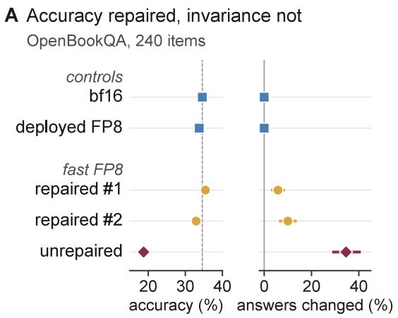
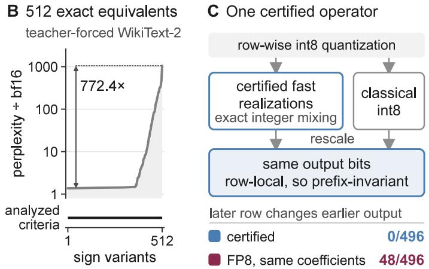
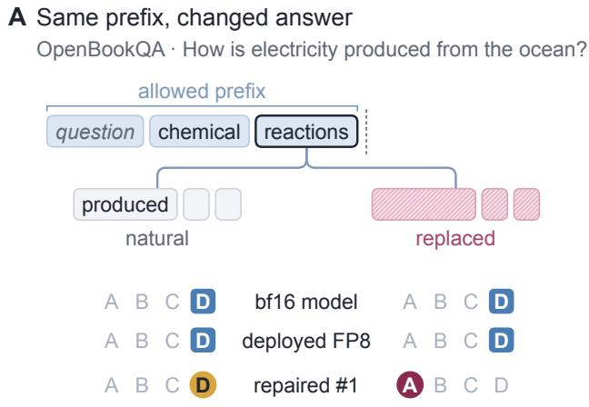
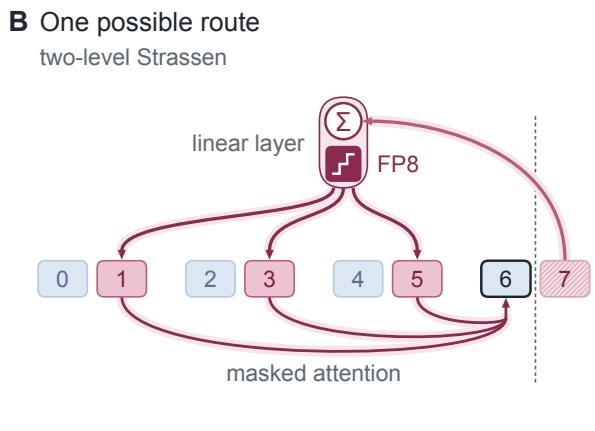
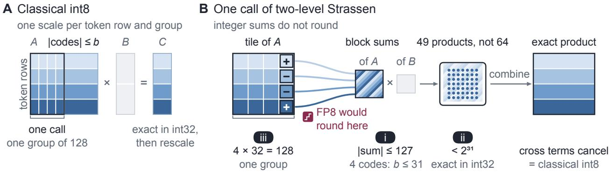
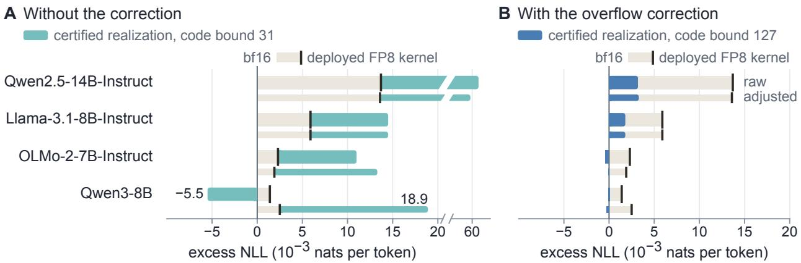

# Beyond Accuracy: Prefix-Invariant Realizations of Low-Precision Fast Matrix Multiplication

Preprint

Shuxiao Xie1,2∗ Shuyang Xie3∗ Yuan Cao1,4

Dezhi Ran1† Wei Yang2 Tao Xie1,2,4,5†

1Beijing Tongming Lake Information Technology Application Innovation Center (TLAIC), China 2Fudan University Institute of Systems for Advanced Computing, China 3Harbin Institute of Technology, China 4Key Lab of HCST (PKU), MOE; SCS, Peking University, Beijing, China 5Shanghai Institute of Systems for Open Computing, China

## Abstract

Fast matrix multiplication saves multiplications through exact cancellation, but rounding sums that mix token rows can leave contributions from later tokens in earlier language model outputs. This threatens prefix invariance, which multiple-choice likelihood scoring relies on: a scored likelihood must depend only on its allowed prefix. On Qwen2.5-14B-Instruct, two fast FP8 realizations repaired to ordinary-looking accuracy still change the answers chosen by likelihood on 5.83% and 10.00% of 240 OpenBookQA items when only the text after the allowed prefix is replaced with the bf16 model’s own greedy continuation. Both row-local controls, the bf16 model and a deployed FP8 matrix multiplication kernel, change none. Accuracy thus does not certify prefix invariance, and the stability criteria we analyze cannot tell realizations apart: across all 512 sign variants of two-level Strassen they stay constant while teacher-forced perplexities span a 772.4× range on the same model. We therefore construct certified realizations of two-level Strassen on bounded integer codes that quantize token rows independently, then mix and cancel exactly before rescaling, using 49 block multiplications instead of 64. Our certificate guarantees bitwise equality to a prescribed row-local classical int8 operator at the same quantization specification, so every certified realization inherits its prefix invariance. Certification thus turns realization choice into a pure cost decision: which certified realization runs can no longer change a single scored likelihood.

## 1 Introduction

Fast matrix multiplication saves multiplications: it multiplies sums of matrix blocks and lets the unwanted cross terms cancel exactly [30]. Low-precision kernels for large language model (LLM) inference now run such algorithms [15, 41], and in a linear layer the rows of the activation matrix are token positions, so these block sums add rows of diferent tokens. In exact arithmetic the cross terms cancel and each output row depends only on its own input row; after rounding they can fail to cancel [20], and a later token can then contribute to an earlier token’s output. Such a contribution arises inside a linear layer, where the causal attention mask has no efect. It violates prefix invariance [17]: what a model computes at a position must depend only on its allowed prefix, the text of its own sequence up to that position. Likelihood-based evaluation relies on this property: it can score all tokens of a candidate answer in one forward pass, and the likelihood of each must depend only on the text before it.

  
Figure 1: A Accuracy on the original input, and answers changed (95% intervals) when the text after the allowed prefix is replaced by the bf16 model’s greedy continuation; #1, #2: two fast algorithms, each with both repairs. B Perplexity of the 512 sign variants of two-level Strassen under one FP8 schedule, sorted, and the criteria we analyze. C A certified realization and classical int8; strip: synthetic row pairs in which a later row changes an earlier output (FP8: our schedule, same coeficients). A, B: Qwen2.5-14B-Instruct.

The natural first check on a fast low-precision realization, an algorithm’s coeficients together with how it is quantized and executed, is the model’s accuracy. In 8-bit floating point (FP8), fast algorithms can lose much of that accuracy (Figure 1A), and two repairs adapted from prior work aim to restore it by changing how the algorithm is quantized [3, 9, 25]. With both repairs, FP8 realizations of two diferent fast algorithms bring Qwen2.5-14B-Instruct [36] to 35.42% and 32.92% accuracy on OpenBookQA [22], against 34.58% for the model in bfloat16 (bf16). Yet when only the text after the allowed prefix is replaced by the bf16 model’s own greedy continuation of that prefix, with the original answer still the one scored, they change the answer chosen by likelihood on 5.83% and 10.00% of 240 items, respectively (Figure 1A). Two row-local controls, the bf16 model and a deployed FP8 matrix multiplication kernel, change none. The allowed prefix, input shapes and execution plan are unchanged, so the changed answers expose a dependence on text the answer must not see. The same kind of dependence crosses requests packed into one forward pass, so prefix invariance matters for LLM serving as well as for evaluation.

Since accuracy did not reveal these violations and rounding can produce them, the natural next check is the numerical analysis used to choose among fast algorithms. It compares them by stability criteria computed from their coeficients, such as the parameters of a bound on rounding error [3] or a measure of expected error [35]. The criteria we analyze read only coeficient magnitudes. Changing an algorithm’s coeficient signs in ways that cancel out leaves the exact product unchanged [20]; two-level Strassen, Strassen’s algorithm applied to its own blocks, has 512 such sign variants, and each criterion gives all of them one value [8, 20]. Under the same FP8 schedule with block scaling, however, their teacher-forced perplexity on the same model spans a 772.4× range (Figure 1B).

Accuracy did not flag the violations above, and the criteria we analyze did not even separate realizations whose quantized behavior difers widely. A test like ours can expose a violation but not prove its absence, so a guarantee that a realization keeps prefix invariance has to come from how it is built. The most direct construction forbids every intermediate product that feeds an output row from depending on a later row, but we prove that this forces the classical number of multiplications (Section 4.1), which gives up the saving. A realization that keeps the saving must therefore contain products that mix later rows into earlier ones, and prefix invariance can then hold only for its final output: the mixing must be undone exactly by the time that output is formed.

We therefore construct realizations of two-level Strassen that undo the mixing exactly, by carrying it out on bounded integer codes, whose sums do not round. Where EmuGEMM uses this exactness to save multiplications through cancellation without rounding error [19, 27], we use it to make a fast realization compute exactly what classical int8 matrix multiplication computes. Each token row is quantized to integer codes on its own, the algorithm mixes and cancels these codes, and the scales are applied only afterwards. Our certificate checks that the integer computation stays exact and that the scales can still be applied as in classical int8. Every realization that passes computes, bit for bit, the classical int8 operator with the same codes and scales, rescaled and accumulated in the same order (Figure 1C); since that operator is row-local, every certified realization inherits its prefix invariance. All 512 sign variants of two-level Strassen pass the certificate and compute the same output bits.

The certified realizations match classical int8 bit for bit while using 49 block multiplications instead of 64. Making them run faster than classical int8 is a separate task: Section 5 reports our first timings and leaves faster kernels to future work. Certification makes the choice between them a decision about cost alone: taking the saving no longer risks prefix invariance.

## 2 Realizations and prefix invariance

## 2.1 Fast algorithms and their sign variants

A fast matrix multiplication algorithm for $C = A B$ splits � into an $m \times k$ grid of blocks $A _ { i l }$ and � into a $k \times n$ grid of blocks $B _ { l j }$ , multiplies � pairs of block sums and combines the results:

$$
M _ { r } = \Bigl ( \sum _ { i , l } u _ { r , i l } A _ { i l } \Bigr ) \Bigl ( \sum _ { l , j } \upsilon _ { r , l j } B _ { l j } \Bigr ) \quad ( r = 1 , \ldots , R ) , \qquad C _ { i j } = \sum _ { r = 1 } ^ { R } w _ { r , i j } M _ { r } .\tag{1}
$$

The coeficients $( U , V , W )$ make every unwanted cross term cancel; the classical algorithm uses $R = m$ �� block multiplications, and two-level Strassen, with $m = k = n = 4 .$ , uses 49 instead of $6 4$ . Diferent coeficients can compute the same product. Let $D ,$ � and � be diagonal sign matrices whose entries $d _ { i } , e _ { l }$ and $f _ { j }$ flip whole block rows or columns. Since $A B = D \left( D A E \right) \left( E B F \right) F _ { \ l }$ , running the algorithm on ��� and ��� and flipping the result back computes �� exactly [20]. Absorbing the signs gives the coeficients $d _ { i } e _ { l } u _ { r , i l } , e _ { l } f _ { j } \nu _ { r , l j }$ and $d _ { i } f _ { j } w _ { r , i j }$ , with the same number of block multiplications; these coeficient sets are the algorithm’s sign variants. Negating all of �, � or � leaves every weighted product $w _ { r , i j } M _ { I }$ unchanged, so we fix $d _ { 1 } = e _ { 1 } = f _ { 1 } = 1$ ; two-level Strassen then has 512 sign variants.

Quantized and executed the same way, the sign variants are exactly equivalent realizations, yet in low precision they can still difer in accuracy. Choosing among such realizations is an old problem, from the fixed-point digital filters of Mullis and Roberts [24] to fast matrix multiplication, where the sign variants are a small part of a larger set of equivalences [6] that Dumas et al. [8] search for a smaller bound on the rounding error. Malik and Becker [20] randomize exactly these sign changes and find that random signs can lower the error on synthetic matrices.

## 2.2 Quantization and the reference operator

Sign changes can alter the error because they change the values a low-precision realization rounds, and how it rounds them is set by how it is quantized and executed; for integer codes, as in classical int8 and our construction, a quantization specification � spells these rules out. On the way in, � fixes how the operands become integer codes: the code bounds $b _ { A }$ and $b _ { B }$ (the largest code magnitudes); the length � of the groups along the inner dimension that share a scale (block scaling); the rows or columns each scale belongs to; the rule that sets it; and the rounding to codes. On the way out, it fixes how the group results become the output: the precision and exact order of operations in which they are rescaled and summed, and the output format. We treat � as part of the operator a realization computes: changing any of these, even the order of the final additions, can change the output bits.

Our reference, which a certified realization must reproduce, is the classical int8 operator at �: it multiplies the codes of each group exactly and rescales and sums the group results as � prescribes. Because � gives each row of � and each column of � its own scale per group, set from that group’s entries, row � of the output reads only row � of $A ,$ its codes and its scales: the operator is row-local.

## 2.3 Prefix invariance

Row locality matters for a property that accuracy does not certify: prefix invariance. It requires that for any two inputs that agree on a position’s allowed prefix, the text of its own sequence up to that position, the outputs at that position be the same. The causal mask keeps attention from breaking $\mathbf { i t } ,$ but Kim et al. [17] show that the mask alone does not guarantee it: other operators that combine positions can break it too. A linear layer keeps it when its matrix multiplication is row-local, like the reference operator. The fast FP8 schedules of Section 1 are not: they round the block sums of �, and because the rows of � are token positions, a block sum over diferent � mixes tokens, and in a packed batch it can mix requests.

Prefix invariance difers from deterministic inference, which batch-invariant kernels now provide for LLM serving [14, 31]: deterministic inference asks that a request’s output not change with how it is executed, for example with its batch size, while prefix invariance asks which text an output may depend on at a fixed execution plan and input shape. Batch-invariant kernels fix the order of each sum, and order-independent summation [1] makes the result independent of it; both act on how a fixed set of numbers is added, while a fast algorithm changes what is added, so neither, by itself, keeps later text or another request’s text out of an output.

## 3 Exactly equivalent realizations are not interchangeable

Two checks are natural for a fast low-precision realization, the accuracy of the quantized model and the stability criteria computed from an algorithm’s coeficients, and neither certifies prefix invariance. Realizations repaired to accuracy close to the bf16 model’s still change answers when only text they must not see is replaced (Sections 3.1 and 3.2), and the criteria we analyze do not even separate sign variants whose errors difer widely once quantized (Section 3.3).

## 3.1 Accuracy repair does not restore prefix invariance

We run two-level Strassen in every linear layer of Qwen2.5-14B-Instruct [36] except the output layer, rounding its block sums to FP8 with the scales that the deployed FP8 matrix multiplication kernel of DeepGEMM uses for its own operands [40]. The model then answers only 18.75% of the first 240 OpenBookQA test items [22] correctly, against 34.58% in bf16 (Table 1). We build two fast realizations whose accuracy comes back close to the bf16 model’s, each by changing both the algorithm and how its block sums are rounded. Repaired #1 runs one level of Strassen, and repaired #2 runs two levels of the seven-multiplication algorithm that the measure of expected error Φ of Xie et al. [35] ranks most accurate. Both rescale each token row by a power of two before rows are summed, the outside scaling of Dumitrescu [9] as Ballard et al. [3] describe it, and round the weight block sums jointly to reduce the output error, adapting Nagel et al. [25] (rules in Appendix C.1). The three fast realizations, unrepaired and repaired, are our compositions of DeepGEMM’s FP8 routines. We compare them with two row-local controls: the bf16 model and the deployed FP8 kernel, which scales each token row on its own and forms no block sums.

Ordinary-looking accuracy does not show that the repaired realizations keep prefix invariance, so we test the property directly, following the audit design of Kim et al. [17]. Likelihood scoring reads each token of a candidate answer at the position before it, in one forward pass, so an answer’s later tokens are in the input when an earlier one is scored. For each answer token we build a second input that keeps the token’s allowed prefix and replaces the token itself and all later text. The original token is still scored, from the position before it, in both inputs (Figure 2A), and an answer’s score under replacement sums these token scores. The two inputs have the same shape and run under one execution plan (Appendix C), so a computation that keeps prefix invariance scores them identically. The replacement is either filler, unrelated text shared by all answers of an item, or the bf16 model’s greedy continuation of the allowed prefix, an ordinary future rather than an adverse one. On all but 7.2% of the answers, the continuation already difers from the real text at the answer’s first token. A changed answer is not run-to-run variation: on an identical input the unrepaired realization and repaired #2 repeat their logits exactly, and an independent second run reproduces every chosen answer of repaired #1 and of both controls.

The repaired realizations reach 35.42% and 32.92% accuracy on OpenBookQA, against 34.58% in bf16, yet change the answer chosen by likelihood on 5.83% [2.92, 8.75] and 10.00% [6.25, 13.75] of the items when the text after the allowed prefix is replaced by the greedy continuation (Table 1). The row-local controls change none, under either replacement. Under the same continuation, target-token log probabilities change at 80.14% and 89.00% of scored positions for repaired #1 and #2, respectively (Table 4). The deployed FP8 kernel rounds to the same format, so the contrast lies within one FP8 format: unlike the controls, the repaired realizations round sums that mix token rows. Table 1 shows the changes persisting under the filler, both on OpenBookQA and on ARC-Easy [4].

For repaired #1 on OpenBookQA, the changes under the greedy continuation barely move accuracy: of its 14 changed answers, 9 are wrong before and after the change, 3 go from correct to wrong and 2 from wrong to correct. Figure 2A shows one of them, a switch from one wrong answer to another, while both controls keep theirs. Accuracy is therefore blind to most of these changes, and so is a count of changes in correctness, such as the flips that Dutta et al. [10] use to compare a compressed model with its original.

  
Figure 2: A One OpenBookQA item on Qwen2.5-14B-Instruct: the answer chosen with the natural text and with the bf16 model’s greedy continuation after an illustrative cut; “produced” is scored at the outlined token. B In two-level Strassen, block sums rounded to FP8 carry row 7 into rows 1, 3 and 5 (repaired #1 only into 3), and masked attention carries those rows on to position 6.

Table 1: Accuracy (%) on the original input, and answers changed (%) when the text after the allowed prefix is replaced by the bf16 model’s greedy continuation or by filler, with 95% bootstrap intervals over items for the answers changed; Qwen2.5-14B-Instruct, the first 240 test items of each task.
<table><tr><td></td><td colspan="3">OpenBookQA</td><td colspan="2">ARC-Easy</td></tr><tr><td></td><td></td><td colspan="2">answers changed</td><td></td><td>changed</td></tr><tr><td></td><td>accuracy</td><td>continuation</td><td>filler</td><td>accuracy</td><td>filler</td></tr><tr><td>bf16 model</td><td>34.58</td><td>0.00</td><td>0.00</td><td>84.17</td><td>0.00</td></tr><tr><td>deployed FP8 kernel</td><td>33.75</td><td>0.00</td><td>0.00</td><td>83.33</td><td>0.00</td></tr><tr><td>repaired #1</td><td>35.42</td><td>5.83 [2.92,8.75]</td><td>7.08 [4.17,10.42]</td><td>82.50</td><td>6.67 [3.75, 10.00]</td></tr><tr><td>repaired #2</td><td>32.92</td><td>10.00 [6.25, 13.75]</td><td>7.92 [4.58,11.67]</td><td>80.83</td><td>12.08 [8.33, 16.25]</td></tr><tr><td>unrepaired</td><td>18.75</td><td>34.58 [28.75, 40.83]</td><td>37.92 [31.67,44.17]</td><td>39.58</td><td>60.00 [53.75, 66.25]</td></tr></table>

## 3.2 How the violation can arise and how far it extends

Later text can reach a scored position through the linear layers, where the causal mask has no efect. Two-level Strassen splits the rows of a linear layer’s input, which are token positions, into four contiguous blocks after padding with zeros, and its block sums add rows at the same ofset in diferent blocks (Figure 2B). In exact arithmetic the other rows cancel from every output row; after FP8 rounding they need not [20], so an output row can depend on the later rows at its ofset, as a test of a single multiplication confirms (Appendix C.3). Repaired #2 adds the same rows and repaired #1, with one level, adds pairs of them; rescaling and joint rounding change the scale and rounding of these sums, not which rows they add. Later text can thus reach a scored token directly, when a later row shares its ofset, or indirectly: it can change earlier rows, and correctly masked attention can carry those rows forward to the scored token.

The dependence is not confined to multiple-choice scoring or to one model: on five models of four families [12, 26, 36, 37], replacing all but the first quarter of each 1,024-token window changes 18.2–40.9% of the next-token predictions within that quarter under the unrepaired realization, 7.8–15.2% under the repaired ones, and none under the controls (Appendix C).

The same dependence crosses requests: we pack two requests into one forward pass of fixed shape, with attention separated between them and no key–value cache, and replace the second request’s text with other text of the same length. Over 768 such pairs on three models, the first request’s next-token distribution changes in every pair under the unrepaired realization and under repaired #2, and never under the controls. Under repaired #2 its greedy next token changes in 11.9–13.0% of the pairs, and on Qwen2.5-3B the first request’s key and value projections already difer at the first layer, before any attention, but not under the controls (Appendix C).

## 3.3 What the stability criteria cannot see

The second check comes from the numerical analysis of fast algorithms, which studies their rounding error, where violations of prefix invariance can arise, and compares algorithms by stability criteria computed from their coeficients. The coeficients alone, however, do not decide prefix invariance: with the same coeficients, two-level Strassen keeps it in exact arithmetic and on bounded integer codes, whose sums do not round (Section 4), and breaks it under the FP8 schedule of Section 3.1.

The criteria we analyze are Φ, the number of nonzero coeficients, the largest coeficient magnitude, and the parameters � and � of the bound on rounding error of Ballard et al. [3] (defined in Appendix B.1), and they do not even separate the sign variants of one algorithm by their error. They read the coeficients only through their absolute values or their nonzero pattern, which a sign change leaves unchanged, so all 512 sign variants of two-level Strassen get one value; Malik and Becker [20, Proposition 10] and Dumas et al. [8, Lemma 26] prove this for the criteria in their own error bounds: the bounds stay valid, but equal bounds do not promise equal realized error.

Measuring the realized error on random matrices, as the checks that accompany fast kernels and their error analyses do [5, 15, 19], would not separate the sign variants either when the entries are independent. These checks draw entries symmetric about zero, and for independent entries a sign variant computes, up to exact sign flips of the output, what the original algorithm computes on ��� and ���, which are distributed exactly as � and � (Section 2.1), so all variants’ error norms have the same distribution. With entries uniform on [0, 1] the symmetry breaks and the variants’ errors difer (Appendix B.1): how they compare depends on the operands, so we run every variant inside a model, on its own activations.

Under the FP8 schedule of Section 3.1, in every linear layer of Qwen2.5-14B-Instruct except the output layer, we score each of the 512 sign variants by its teacher-forced perplexity on WikiText-2 [21], divided by the perplexity of the model in bf16. This ratio runs from 1.367 to 1056.0, a 772.4× spread (Figure 1B), and the variant with Strassen’s original signs, the unrepaired realization of Section 3.1, sits at 63.11×. A single sign, which none of the criteria reads, can make nearly all of this diference: two variants that difer only in one of the signs $d _ { i } , e _ { l } , f _ { j }$ of Section 2.1 have ratios 761.0 times apart. Appendix B reports the spread on seven models, with three controls.

Teacher forcing reads every position in one forward pass, with the text after a position, including the token it predicts, in the input; under a realization that is not row-local, a position’s score can therefore depend on that text. Replacing that text with filler chosen independently of the predicted token, for four variants across the range (the smallest, the median, Strassen’s original signs and the largest), leaves their spread at 0.985 times its teacher-forced value on the same scored positions (95% confidence interval [0.863, 1.141], bootstrap over text windows; Appendix B.3): the spread survives the replacement.

Exactly equivalent realizations can thus difer once quantized, in what their outputs depend on and in how large their error is; accuracy misses the first and the criteria we analyze miss both.

## 4 Certified realizations on bounded integer codes

Prefix invariance constrains a realization’s outputs, not each product it forms on the way.

## 4.1 Prefix-safe products force the classical count

Whether a product keeps later rows out of the outputs it feeds can be read of the coeficients of (1), because the rows of � are token positions, split into � contiguous blocks (Section 3.2). A product � reads block row � of � if $u _ { r , i l } \neq 0$ for some �, and feeds block row � of � if $w _ { r , i j } \neq 0$ for some �. We call an algorithm prefix-safe product by product if no product reads a block row that comes after a block row it feeds. Such an algorithm keeps later rows out of earlier outputs even when each row of its block sums is rounded with its own scale, but it cannot keep the saving.

Theorem 1 An algorithm of the form (1) that is prefix-safe product by product uses $R \geq m k n$ block multiplications, and the classical algorithm attains the bound (proof in Appendix A).

Two-level Strassen, with 49 products instead of 64, therefore has products that carry a later block row into an earlier output, and the contributions of those rows must vanish from every earlier output by the time it is formed, as they do in exact arithmetic.

  
Figure 3: A Classical int8 on one group of 128. B One call of two-level Strassen on the same codes; (i)–(iii) mark where the conditions of Proposition 1 bind.

## 4.2 Computing classical int8 with a fast algorithm

Our construction builds on classical int8 matrix multiplication, which already multiplies integer codes without rounding. At a quantization specification � (Section 2.2), it gives each row of � and each column of � its own scale for every group of � consecutive indices of the inner dimension. It multiplies the codes of each group exactly, and only then applies the scales and adds the group results in the order � fixes (Figure 3). Our realizations keep all of this except the exact product of the codes, which they compute with the fast algorithm on one submatrix, or tile, of � and one of � at a time; we call each such computation a call. Their output bits are those of classical int8 if every call returns its integer product exactly and if the scales can still be applied after it. Rows can keep their own scales, since an exact product builds each output row from its own row’s codes alone. The inner dimension is another matter: every fast algorithm mixes its indices too, since one whose products each read a single block column of � needs ��� of them (Theorem 2), and independent scales along it cannot in general be applied after products that do not depend on them (Appendix A).

Our certificate consists of three conditions that secure both requirements, and we call a realization that meets them certified. They involve the largest coeficient 1-norms of the block sums, $\begin{array} { r } { L _ { A } = \operatorname* { m a x } _ { r } \sum _ { i , l } | u _ { r , i l } | } \end{array}$ and $L _ { B } =$ max� $\textstyle \sum _ { l , j } | \upsilon _ { r , l j } |$ , the largest total weight $\begin{array} { r } { L _ { W } = \operatorname* { m a x } _ { i , j } \sum _ { r } | w _ { r , i j } | } \end{array}$ with which an output block combines products, and the inner length ℎ of a block.

Proposition 1 Let a realization quantize, rescale and accumulate as the classical int8 operator at a quantization specification � does, and compute the integer product of the codes tile by tile, each call with an algorithm of theform (1) with integer coeficients. Suppose that $( i ) \bar { L } _ { A } \dot { b } _ { A } \leq 1 2 \dot { 7 }$ and $L _ { B } b _ { B } \leq 1 \dot { 2 } 7 ;$ ; (ii) max $\{ L _ { W } h ( L _ { A } b _ { A } ) \tilde { ( } L _ { B } b _ { B } ) , \ \bar { g } b _ { A } \bar { b _ { B } } \} < 2 ^ { 3 1 }$ for int32 accumulation, $o r < 2 ^ { 2 4 }$ for exact integers in fp32; and (iii) each call lies within one group along the inner dimension. Then on every input the realization computes the output of the classical int8 operator at �, bit for bit.

Conditions (i) and (ii) secure the first requirement: every block sum of codes stays within int8, so the products run on the same int8 multipliers as classical int8, and every product and partial sum, the running sum over a group’s calls included, stays within the accumulator. Condition (iii) secures the second, since a call that stays within one group contributes only to that group’s integer product, which is then rescaled as in classical int8. The conditions involve only the coeficients, the tiling and $c ,$ so they are checked once, before any input is seen. Every certified realization is therefore row-local, like classical int8, and keeps prefix invariance on every input (Section 2.3). Two-level Strassen has $L _ { A } = 4$ and $L _ { B } = 4 ,$ , so condition (i) admits codes up $\mathrm { t o } \ b _ { A } = 3 1$ and $b _ { B } = 3 1$ With $L _ { W } = 1 6$ , int32 accumulation is exact for blocks of inner length up to 8729, and with our groups of $g = 1 2 8$ we use blocks of inner length 32, so the four block columns of a call span one group. Two-level Strassen is thus certified at code bound 31, with 49 block multiplications, 0.7656 of the classical count.

Our integer product equals the classical one bit for bit on 200 random tiles of codes; on a separately drawn tile the 512 sign variants give 1 distinct integer product, where rounding the block sums to FP8 leaves 0 of them exact and a 3.17-fold spread in the largest error, and with the scales applied as well, under the full quantization specification on inputs of 32 token rows in four blocks, a subset of 64 variants again gives 1 distinct output.

We then test prefix invariance directly, on separately drawn Gaussian inputs of that shape: changing one token row at a time and comparing every earlier output row moves 0 of the 496 pairs of an earlier and a later row. The same coeficients move 48 pairs under an FP8 schedule that rounds the block sums before multiplying, exactly those whose rows share an ofset in their blocks (Figure 2B). A control that breaks condition (iii), with scales on groups of 32 indices while a call spans 128, rounds each mixed block sum again with one scale, set by its largest magnitude, which any of its rows can change, and all 496 pairs move.

  
Figure 4: Excess NLL per token over bf16 on eight 2048-token chunks of WikiText $^ { - 2 , }$ at code bound 31 (A) and at 127 with the overflow correction (B); thick bars raw, thin bars with temperatures fitted on the other seven chunks, bands ending at the deployed FP8 kernel’s value. Certified values are measured on the classical int8 operators the realizations compute (Table 7).

Inside a model, we run two-level Strassen at code bound 31 in every linear layer except the output layer of four models, Qwen2.5-14B-Instruct, Llama-3.1-8B-Instruct, OLMo-2-7B-Instruct and Qwen3-8B, emulating its int8 arithmetic exactly in fp32, where every intermediate stays below $2 ^ { 2 4 }$ . Each time a replaced layer runs, its output matches classical int8’s bit for bit (Appendix D), so the remaining model measurements run that classical int8 operator, which gives the same outputs. On the test that exposed the repaired FP8 realizations, replacing the text after the allowed prefix with the greedy continuation (Section 3.1), the operator changes none of the 240 OpenBookQA answers on any of the four models, like the row-local controls.

## 4.3 Full-range codes with an overflow correction

Certification on int8 multipliers has a price, and condition (i) sets it: a realization certified by condition (i) can use codes only up to $\lfloor 1 2 \ 7 / L _ { A } \rfloor$ in � and $\lfloor 1 2 7 / L _ { B } \rfloor$ in �, 31 for two-level Strassen (Appendix D).

The overflow behind this price can be corrected instead of avoided. Each block sum of codes $\hat { A }$ splits exactly into $\hat { A } = A _ { 0 } + 2 5 6 R _ { A }$ , with $A _ { 0 }$ the remainder in the int8 range and $R _ { A }$ nonzero only where $\hat { A }$ overflows, and likewise $\hat { B } = B _ { 0 } + 2 5 6 R _ { B }$ , so that

$$
\hat { A } \hat { B } = A _ { 0 } B _ { 0 } + 2 5 6 \left( R _ { A } B _ { 0 } + A _ { 0 } R _ { B } \right) + 2 5 6 ^ { 2 } R _ { A } R _ { B } .\tag{2}
$$

Two-level Strassen then forms its products on $A _ { 0 }$ and $B _ { 0 }$ and adds the correction terms of (2), which take further products, counted in Section 5. With this correction it computes classical int8 at code bound 127 bit for bit at the same groups of 128, under a certificate of its own (Appendix D).

## 4.4 Model quality and the choice of realization

Bitwise identity fixes which operator a certified realization computes, not how close that operator comes to the bf16 model. We measure that closeness for the operators the realizations compute, classical int8 at code bound 31 and, with the correction, at 127, by their excess negative log-likelihood (NLL) per token over the bf16 model on eight chunks of WikiText-2, against the deployed FP8 kernel (Figure 4). Since a change of temperature alone can move such a comparison [13], we report the excess both raw, at temperature 1, and adjusted, with every operator and the bf16 model at a temperature fitted without the scored chunk. The raw excess, which scores the models as they are run, is the primary reading. At code bound 31 the excess is larger than the kernel’s on three of the four models raw, all but Qwen3-8B, and on all four adjusted. With the overflow correction, at code bound 127, the excess is at or below the kernel’s on all four models, raw and adjusted. Table 8 also reports ordinary OpenBookQA accuracy for these operators.

## 5 Cost and future work

A certified realization and classical int8 difer in two costs, the multiplications they perform and the time they take. In multiplications, two-level Strassen at code bound 31 performs 0.7656 of classical int8’s multiplications. Raising the code bound to 127 brings the excess NLL to or below the deployed FP8 kernel’s on all four models (Section 4.4), but the correction of Section 4.3 then adds products wherever a block sum overflows. If the correction multiplies only the entries that overflow, the corrected computation performs 0.79–0.82 of classical int8’s multiplications on sampled layer slices from three models (Appendix E); if it multiplies every row of $R _ { A }$ and column of $R _ { B }$ that holds an overflow, it performs 1.43–1.71 times as many. Whether the full code range keeps the saving thus depends on how the correction is implemented.

In time, the kernels we have built for the certified realizations without the correction are slower than classical int8 at the shape we timed, two 4096 × 4096 matrices on an NVIDIA H20 graphics processing unit (GPU). With our Triton kernels [32], one level of Strassen takes 2.04–3.17 times as long as classical int8 across three group sizes, and two levels take 27.9 times as long; part of this time goes to splitting a call into short block products, which slows even the classical algorithm (Appendix E). It remains open whether, and how far, the saving in multiplications can be turned into speed. Any optimization that preserves the quantization specification and remains certified yields the same output bits. We leave faster kernels, including one for the correction, and their timing across shapes and GPUs to future work.

## 6 Conclusion

A fast matrix multiplication inside a language model has to do more than stay accurate: it has to keep prefix invariance, which likelihood-based evaluation and LLM serving rely on. The two can come apart. A low-precision fast realization repaired to accuracy close to the bf16 model’s can still let its outputs depend on text they must not see, so prefix invariance has to be certified directly. Such a certificate need not cost the saving in multiplications. Although a fast algorithm cannot save multiplications without products that mix the rows of diferent tokens, prefix invariance constrains only the output those products produce. A realization whose output is exactly that of a row-local operator keeps prefix invariance, whatever its products mix. Two-level Strassen, which uses 49 block multiplications instead of 64, admits realizations of this kind: the ones we certify on bounded integer codes compute the row-local classical int8 operator bit for bit at the same quantization specification. Without certification, exactly equivalent realizations can compute diferent operators once quantized, so choosing one can change what the model computes. With it, which operator to run is a question of the quality it gives the model, and which certified realization computes it is a pure cost decision.

## References

[1] Willow Ahrens, James Demmel, and Hong Diep Nguyen. Algorithms for eficient reproducible floating point summation. ACM Transactions on Mathematical Software, 46(3):1–49, 2020. doi:10.1145/3389360.

[2] Saleh Ashkboos, Amirkeivan Mohtashami, Maximilian L. Croci, Bo Li, Pashmina Cameron, Martin Jaggi, Dan Alistarh, Torsten Hoefler, and James Hensman. Quarot: Outlier-free 4-bit inference in rotated llms. In Amir Globerson, Lester Mackey, Danielle Belgrave, Angela Fan, Ulrich Paquet, Jakub M. Tomczak, and Cheng Zhang, editors, Advances in Neural Information Processing Systems 37: Annual Conference on Neural Information Processing Systems 2024, NeurIPS 2024, Vancouver, BC, Canada, December 10–15, 2024, 2024. URL http://papers.nips.cc/paper\_files/paper/2024/hash b5b939436789f76f08b9d0da5e81af7c-Abstract-Conference.html.

[3] Grey Ballard, Austin R. Benson, Alex Druinsky, Benjamin Lipshitz, and Oded Schwartz. Improving the numerical stability of fast matrix multiplication. SIAM Journal on Matrix Analysis and Applications, 37(4): 1382–1418, 2016. doi:10.1137/15M1032168.

[4] Peter Clark, Isaac Cowhey, Oren Etzioni, Tushar Khot, Ashish Sabharwal, Carissa Schoenick, and Oyvind Tafjord. Think you have solved question answering? try arc, the ai2 reasoning challenge, 2018.

[5] Zhen Dai and Lek-Heng Lim. Numerical stability and tensor nuclear norm. Numerische Mathematik, 155: 345–376, 2023. doi:10.1007/s00211-023-01377-5.

[6] Hans F. de Groote. On varieties of optimal algorithms for the computation of bilinear mappings. II. optimal algorithms for 2 × 2-matrix multiplication. Theoretical Computer Science, 7(2):127–148, 1978. doi:10.1016/0304-3975(78)90045-2.

[7] Jean-Guillaume Dumas, Pascal Giorgi, and Clément Pernet. Dense linear algebra over word-size prime fields: the FFLAS and FFPACK packages, 2009. Version v3, 14 January 2009. Journal version: ACM Trans. Math. Softw. 35(3), 2008, pp. 1–42, doi:10.1145/1391989.1391992.

[8] Jean-Guillaume Dumas, Clément Pernet, and Alexandre Sedoglavic. Towards automated generation of fast and accurate algorithms for recursive matrix multiplication. J. Symb. Comput., 134:102524, 2026. doi:10.1016/J.JSC.2025.102524. URL https://doi.org/10.1016/j.jsc.2025.102524. Preprint: arXiv:2506.19405.

[9] Bogdan Dumitrescu. Improving and estimating the accuracy of strassen’s algorithm. Numerische Mathematik, 79(4):485–499, June 1998. ISSN 0945-3245. doi:10.1007/s002110050348. URL http://dx.doi.org 10.1007/s002110050348.

[10] Abhinav Dutta, Sanjeev Krishnan, Nipun Kwatra, and Ramachandran Ramjee. Accuracy is not all you need, 2024. URL https://arxiv.org/abs/2407.09141.

[11] Alhussein Fawzi, Matej Balog, Aja Huang, Thomas Hubert, Bernardino Romera-Paredes, Mohammadamin Barekatain, Alexander Novikov, Francisco J. R. Ruiz, Julian Schrittwieser, Grzegorz Swirszcz, David Silver, Demis Hassabis, and Pushmeet Kohli. Discovering faster matrix multiplication algorithms with reinforcement learning. Nature, 610(7930):47–53, October 2022. ISSN 1476-4687. doi:10.1038/s41586-022-05172-4. URL http://dx.doi.org/10.1038/s41586-022-05172-4.

[12] Aaron Grattafiori et al. The Llama 3 herd of models, 2024. URL https://arxiv.org/abs/2407.21783.

[13] Chuan Guo, Geof Pleiss, Yu Sun, and Kilian Q. Weinberger. On calibration of modern neural networks, 2017. URL https://arxiv.org/abs/1706.04599.

[14] Horace He and Thinking Machines Lab. Defeating nondeterminism in LLM inference. Thinking Machines Lab: Connectionism, September 2025. URL https://thinkingmachines.ai/blog/defeatingnondeterminism-in-llm-inference/.

[15] Abhinav Jangda. Compiling strassen-like matrix multiplication algorithms to fast cuda kernels. Proceedings of the ACM on Programming Languages, 10(PLDI):505–530, June 2026. ISSN 2475-1421. doi:10.1145/3808267. URL http://dx.doi.org/10.1145/3808267.

[16] Albert Q. Jiang, Alexandre Sablayrolles, Arthur Mensch, Chris Bamford, Devendra Singh Chaplot, Diego de las Casas, Florian Bressand, Gianna Lengyel, Guillaume Lample, Lucile Saulnier, Lélio Renard Lavaud, Marie-Anne Lachaux, Pierre Stock, Teven Le Scao, Thibaut Lavril, Thomas Wang, Timothée Lacroix, and William El Sayed. Mistral 7b, 2023. URL https://arxiv.org/abs/2310.06825.

[17] Taebong Kim, Youngsik Hong, Minsik Kim, Sunyoung Choi, Jaewon Jang, and Minseo Kim. The mask is not the model: Auditing prefix invariance in attention, state-space, and hybrid sequence models, 2026. URL https://arxiv.org/abs/2608.22876.

[18] Zechun Liu, Changsheng Zhao, Igor Fedorov, Bilge Soran, Dhruv Choudhary, Raghuraman Krishnamoorthi, Vikas Chandra, Yuandong Tian, and Tijmen Blankevoort. Spinquant: LLM quantization with learned rotations. In The Thirteenth International Conference on Learning Representations, ICLR 2025, Singapore, April 24-28, 2025. OpenReview.net, 2025. URL https://openreview.net/forum?id=ogO6DGE6FZ.

[19] Denghui Lu, Alexander Maeder, Mathieu Luisier, and Alexandros Nikolaos Ziogas. Emugemm: Fused tensor core kernels for precision emulation in matrix multiplication, 2026. URL https://arxiv.org/abs/ 2606.25453.

[20] Osman Asif Malik and Stephen Becker. Randomization of approximate bilinear computation for matrix multiplication, 2019. URL https://arxiv.org/abs/1905.07439.

[21] Stephen Merity, Caiming Xiong, James Bradbury, and Richard Socher. Pointer sentinel mixture models. In 5th International Conference on Learning Representations, ICLR 2017, Toulon, France, April 24-26, 2017, Conference Track Proceedings. OpenReview.net, 2017. URL https://openreview.net/forum?id= Byj72udxe.

[22] Todor Mihaylov, Peter Clark, Tushar Khot, and Ashish Sabharwal. Can a suit of armor conduct electricity? a new dataset for open book question answering, 2018. URL https://arxiv.org/abs/1809.02789.

[23] Pierpaolo Mori, Lukas Frickenstein, Shambhavi Balamuthu Sampath, Moritz Thoma, Nael Fasfous, Manoj Rohit Vemparala, Alexander Frickenstein, Christian Unger, Walter Stechele, Daniel Mueller-Gritschneder, and Claudio Passerone. Wino vidi vici: Conquering numerical instability of 8-bit winograd convolution for accurate inference acceleration on edge. In Proceedings of the IEEE/CVF Winter

Conference on Applications of Computer Vision (WACV), pages 53–62, January 2024. URL https: //openaccess.thecvf.com/content/WACV2024/html/Mori\_Wino\_Vidi\_Vici\_Conquering\_ Numerical\_Instability\_of\_8-Bit\_Winograd\_Convolution\_WACV\_2024\_paper.html.

[24] C. Mullis and R. Roberts. Synthesis of minimum roundof noise fixed point digital filters. IEEE Transactions on Circuits and Systems, 23(9):551–562, September 1976. ISSN 0098-4094. doi:10.1109/tcs.1976.1084254. URL http://dx.doi.org/10.1109/TCS.1976.1084254.

[25] Markus Nagel, Rana Ali Amjad, Mart van Baalen, Christos Louizos, and Tijmen Blankevoort. Up or down? adaptive rounding for post-training quantization, 2020. URL https://arxiv.org/abs/2004.10568.

[26] Team OLMo, Pete Walsh, Luca Soldaini, Dirk Groeneveld, Kyle Lo, Shane Arora, Akshita Bhagia, Yuling Gu, Shengyi Huang, Matt Jordan, Nathan Lambert, Dustin Schwenk, Oyvind Tafjord, Taira Anderson, David Atkinson, Faeze Brahman, Christopher Clark, Pradeep Dasigi, Nouha Dziri, Allyson Ettinger, Michal Guerquin, David Heineman, Hamish Ivison, Pang Wei Koh, Jiacheng Liu, Saumya Malik, William Merrill, Lester James V. Miranda, Jacob Morrison, Tyler Murray, Crystal Nam, Jake Poznanski, Valentina Pyatkin, Aman Rangapur, Michael Schmitz, Sam Skjonsberg, David Wadden, Christopher Wilhelm, Michael Wilson, Luke Zettlemoyer, Ali Farhadi, Noah A. Smith, and Hannaneh Hajishirzi. 2 olmo 2 furious. arXiv.org, 2024. doi:10.48550/arXiv.2501.00656.

[27] Katsuhisa Ozaki, Yuki Uchino, and Toshiyuki Imamura. Ozaki scheme ii: A gemm-oriented emulation of floating-point matrix multiplication using an integer modular technique. The International Journal of High Performance Computing Applications, 2026. doi:10.1177/10943420261467787.

[28] Adam Paszke, Sam Gross, Francisco Massa, Adam Lerer, James Bradbury, Gregory Chanan, Trevor Killeen, Zeming Lin, Natalia Gimelshein, Luca Antiga, Alban Desmaison, Andreas Köpf, Edward Yang, Zach DeVito, Martin Raison, Alykhan Tejani, Sasank Chilamkurthy, Benoit Steiner, Lu Fang, Junjie Bai, and Soumith Chintala. PyTorch: An imperative style, high-performance deep learning library, 2019. URL https: //arxiv.org/abs/1912.01703.

[29] Colin Rafel, Noam Shazeer, Adam Roberts, Katherine Lee, Sharan Narang, Michael Matena, Yanqi Zhou, Wei Li, and Peter J. Liu. Exploring the limits of transfer learning with a unified text-to-text transformer, 2019. URL https://arxiv.org/abs/1910.10683.

[30] Volker Strassen. Gaussian elimination is not optimal. Numerische Mathematik, 13(4):354–356, 1969. doi:10.1007/BF02165411.

[31] The SGLang Team. Towards deterministic inference in SGLang and reproducible RL training. LM-SYS Org blog, September 2025. URL https://www.lmsys.org/blog/2025-09-22-sglangdeterministic/.

[32] Philippe Tillet, H. T. Kung, and David Cox. Triton: an intermediate language and compiler for tiled neural network computations. In Proceedings of the 3rd ACM SIGPLAN International Workshop on Machine Learning and Programming Languages (MAPL), pages 10–19. ACM, 2019. doi:10.1145/3315508.3329973. URL https://doi.org/10.1145/3315508.3329973.

[33] Hugo Touvron, Louis Martin, Kevin Stone, Peter Albert, Amjad Almahairi, Yasmine Babaei, Nikolay Bashlykov, Soumya Batra, Prajjwal Bhargava, Shruti Bhosale, Dan Bikel, Lukas Blecher, Cristian Canton Ferrer, Moya Chen, Guillem Cucurull, David Esiobu, Jude Fernandes, Jeremy Fu, Wenyin Fu, Brian Fuller, Cynthia Gao, Vedanuj Goswami, Naman Goyal, Anthony Hartshorn, Saghar Hosseini, Rui Hou, Hakan Inan, Marcin Kardas, Viktor Kerkez, Madian Khabsa, Isabel Kloumann, Artem Korenev, Punit Singh Koura, Marie-Anne Lachaux, Thibaut Lavril, Jenya Lee, Diana Liskovich, Yinghai Lu, Yuning Mao, Xavier Martinet, Todor Mihaylov, Pushkar Mishra, Igor Molybog, Yixin Nie, Andrew Poulton, Jeremy Reizenstein, Rashi Rungta, Kalyan Saladi, Alan Schelten, Ruan Silva, Eric Michael Smith, Ranjan Subramanian, Xiaoqing Ellen Tan, Binh Tang, Ross Taylor, Adina Williams, Jian Xiang Kuan, Puxin Xu, Zheng Yan, Iliyan Zarov, Yuchen Zhang, Angela Fan, Melanie Kambadur, Sharan Narang, Aurelien Rodriguez, Robert Stojnic, Sergey Edunov, and Thomas Scialom. Llama 2: Open foundation and fine-tuned chat models, 2023. URL https://arxiv.org/abs/2307.09288.

[34] Thomas Wolf, Lysandre Debut, Victor Sanh, Julien Chaumond, Clement Delangue, Anthony Moi, Pierric Cistac, Tim Rault, Rémi Louf, Morgan Funtowicz, Joe Davison, Sam Shleifer, Patrick von Platen, Clara Ma, Yacine Jernite, Julien Plu, Canwen Xu, Teven Le Scao, Sylvain Gugger, Mariama Drame, Quentin Lhoest, and Alexander M. Rush. Huggingface’s transformers: State-of-the-art natural language processing. arXiv.org, 2019.

[35] Shuxiao Xie, Shuyang Xie, Yuan Cao, Dezhi Ran, Wei Yang, and Tao Xie. Fast matrix multiplication in fp8: Certified coeficient optimization and measured error, 2026. URL https://arxiv.org/abs/2609. 26077.

[36] An Yang et al. Qwen2.5 technical report, 2024.

[37] An Yang et al. Qwen3 technical report, 2025.

[39] Alex Young et al. Yi: Open foundation models by 01.ai, 2024.

[38] Ziteng Yang, Nicholas J. Riasanovsky, Warren Deng, and Vivek Sarkar. Taming bitwise behavior in gpu kernels with tensor core: Black-box reconstruction, compiler enforcement, and static verification, 2026. URL https://arxiv.org/abs/2609.11356.

[40] Chenggang Zhao, Zhean Xu, Liang Zhao, Jiashi Li, Chenhao Xu, Anyi Xu, Shengyu Liu, Kexing Zhou, and Kuai Yu. DeepGEMM: clean and eficient BLAS kernel library on GPU. https://github.com/deepseekai/DeepGEMM, 2025.

[41] Honglin Zhu, Jiaping Cao, Jiang Shao, Siyuan Feng, Qian Qiu, Peng Chen, Xu Zhang, Yixian Zhou, Man Lung Yiu, Guang Ji, Minwen Deng, Jintao Meng, and Wenxi Zhu. Falcongemm: Surpassing hardware peaks with lower-complexity matrix multiplication, 2026. URL https://arxiv.org/abs/2605.06057.

## A Proofs for Section 4

## A.1 Prefix-safe products force the classical count

Within one sequence, the most direct way to guarantee prefix invariance is to require every product to keep later rows out of the outputs it feeds, and Theorem 1 states what that costs: an algorithm of the form (1) that is prefix-safe product by product, so that no product reads a block row of � that comes after a block row of $C$ it feeds, uses $R \geq$ ��� block multiplications, as many as the classical algorithm. The proof counts, for each block row, the products that both read it and feed it, and shows that prefix safety forbids two block rows to share such a product.

The count depends only on the coeficients, which also give an algorithm for single-entry blocks. Setting every block $A _ { i l } = x _ { i l } X$ and $B _ { l j } = y _ { l j } Y$ , for fixed matrices � and $\bar { Y }$ with $X Y \neq 0$ , makes every term of (1) a multiple of ��, and comparing the multiples shows that the coeficients multiply the � × � matrix $\left( x _ { i l } \right)$ by the $k \times n$ matrix $( y _ { l j } )$ with � multiplications of numbers. We may therefore take $A \in \mathbb { R } ^ { m \times k }$ and $B \in \mathbb { R } ^ { k \times n }$ , so that block rows and block columns become rows and columns, and product � is the number $M _ { r } = f _ { r } ( A ) \ : g _ { r } ( B )$ with $\begin{array} { r } { f _ { r } ( A ) = \sum _ { i , l } u _ { r , i l } A _ { i l } } \end{array}$ and $\begin{array} { r } { g _ { r } ( B ) = \sum _ { l , j } \nu _ { r , l j } B _ { l j } } \end{array}$ . We write $E _ { i l }$ for the matrix, of the size the context requires, whose only nonzero entry is a 1 in position $( i , l )$ , and � for the identity matrix.

Proof of Theorem 1. For each row �, let $\mathcal { R } _ { i }$ be the set of products that read row � and feed row �. Every algorithm of the form (1), prefix-safe or not, has at least �� products in each $\mathcal { R } _ { i }$ . To see this, take $A = E _ { i l } \mathrm { : }$ : then $f _ { r } ( A ) = u _ { r , i l }$ and row � of �� is row � of $B ,$ so that

$$
B _ { l j } = ( A B ) _ { i j } = \sum _ { r = 1 } ^ { R } u _ { r , i l } w _ { r , i j } g _ { r } ( B ) \qquad { \mathrm { f o r ~ e v e r y ~ } } B .
$$

A term of this sum can be nonzero only if product � reads row � and feeds it, that is, only if $r \in \mathcal { R } _ { i }$ . Letting � and � vary, each of the �� coordinate functions $B \mapsto B _ { l j }$ is therefore a linear combination of the functions $g _ { r }$ with $r \in \mathcal { R } _ { i }$ ; since the coordinate functions are linearly independent, R has at least �� members. Prefix safety makes the sets disjoint: a product in both $\mathcal { R } _ { i }$ and $\mathcal { R } _ { i ^ { \prime } }$ , with $i ^ { ^ { - } } < i ^ { \prime }$ , feeds row � and reads the later row $i ^ { \prime }$ . Hence $R \geq | \mathcal { R } _ { 1 } | + \cdot \cdot \cdot + | \mathcal { \dot { R } } _ { m } | \geq$ ���. The classical algorithm attains the bound, since its product $A _ { i l } B _ { l j }$ reads row � and feeds only row �. □

Strassen’s algorithm, with $m = k = n = 2$ , shows the sharing that the bound rules out. Its seven products, with $C _ { 1 1 } = M _ { 1 } + M _ { 4 } - M _ { 5 } + M _ { 7 } , C _ { 1 2 } = M _ { 3 } + M _ { 5 } , C _ { 2 1 } = M _ { 2 } + M _ { 4 }$ and $C _ { 2 2 } = M _ { 1 } - M _ { 2 } + M _ { 3 } + M _ { 6 }$ , read and feed these rows:

<table><tr><td></td><td>product</td><td>reads rows of A</td><td>feeds rows of C</td></tr><tr><td> $M _ { 1 }$ </td><td> $( A _ { 1 1 } + A _ { 2 2 } ) ( B _ { 1 1 } + B _ { 2 2 } )$ </td><td>1,2</td><td>1,2</td></tr><tr><td> $M _ { 2 }$ </td><td> $\left( A _ { 2 1 } + A _ { 2 2 } \right) B _ { 1 1 }$ </td><td>2</td><td>2</td></tr><tr><td> $M _ { 3 }$ </td><td> $A _ { 1 1 } \left( B _ { 1 2 } - B _ { 2 2 } \right)$ </td><td>1</td><td>1,2</td></tr><tr><td> $M _ { 4 }$ </td><td> $A _ { 2 2 } \left( B _ { 2 1 } - B _ { 1 1 } \right)$ </td><td>2</td><td>1,2</td></tr><tr><td> $M _ { 5 }$ </td><td> $\left( A _ { 1 1 } + A _ { 1 2 } \right) B _ { 2 2 }$ </td><td>1</td><td>1</td></tr><tr><td> $M _ { 6 }$ </td><td> $( A _ { 2 1 } - A _ { 1 1 } ) \big ( B _ { 1 1 } + B _ { 1 2 } \big )$ </td><td>1,2</td><td>2</td></tr><tr><td> $M _ { 7 }$ </td><td> $( A _ { 1 2 } - A _ { 2 2 } ) \big ( B _ { 2 1 } + B _ { 2 2 } \big )$ </td><td>1,2</td><td>1</td></tr></table>

Four products read and feed row $1 , M _ { 1 } , M _ { 3 } , M _ { 5 }$ and $M _ { 7 } ,$ , and four read and feed row $2 , M _ { 1 } , M _ { 2 } , M _ { 4 }$ and $M _ { 6 } ,$ , as the proof requires. The two sets share one product, $M _ { 1 } ,$ which is how seven products meet a count of eight. A product shared by two rows always breaks prefix safety, since it feeds the earlier row and reads the later one: $M _ { 1 }$ feeds row 1 and reads row 2.

## A.2 The inner dimension and its scales

Theorem 1 forces a fast algorithm’s products to mix rows. They must also mix indices of the inner dimension, where classical int8 applies the scales of its groups. A product reads block column � of � if $u _ { r , i l } \neq 0$ for some $i ,$ and block row � of � if $\upsilon _ { r , l j } \neq 0$ for some �.

Theorem 2 An algorithm of theform (1) in which no product reads two block columns of � uses $R \geq$ ��� block multiplications, and so does one in which no product reads two block rows of �.

This time the count runs over the output: on inputs that use only one index of the inner dimension, only the products that read it contribute, and they must produce each of the �� entries of ��.

Proof. With the single-entry blocks of Appendix A.1, write $W _ { r }$ for the $m \times n$ matrix of the weights $w _ { r , i j } ,$ so that (1) reads $\begin{array} { r } { A B = \sum _ { r } f _ { r } ( \bar { A } ) g _ { r } ( B ) W _ { r } } \end{array}$ . Let $Q _ { l }$ be the set of products that read column � of $A ;$ under the first hypothesis the sets $Q _ { 1 } , \ldots , Q _ { k }$ are disjoint. For $A = E _ { i l }$ and $B = E _ { l j } , A B = E _ { i j }$ , while $f _ { r } ( A ) g _ { r } ( B ) = u _ { r , i l } \nu _ { r , l j }$ is zero unless $r \in \mathcal { Q } _ { l }$ . Each of the �� matrices $E _ { i j }$ is therefore a linear combination of the $W _ { r }$ with $r \in { \mathcal { Q } } _ { l } ,$ , and since the $E _ { i j }$ are linearly independent, $Q _ { l }$ has at least �� members. Summing over the � disjoint sets gives $R \geq m k n$ . The sets of products that read row � of � give the second statement in the same way. □

An algorithm with fewer than ��� block multiplications therefore has a product that reads two block columns of $A ,$ and one that reads two block rows of �: some of its block sums add entries from diferent indices of the inner dimension. Under $c ,$ those indices carry scales: an output entry’s scale is its row’s scale times its column’s scale, shared by the $g$ indices of each group, and classical int8 applies it after multiplying the group’s codes. Suppose that each block column of a call lay in a group of its own, as in the control of Section $^ { 4 . 2 , }$ whose groups of 32 indices give each block column of a call spanning 128 indices its own scale. The call forms its products from the codes, the scales of its block columns vary independently of one another, and to reproduce classical int8 it would have to apply these scales after its products. In the lemma below the products are fixed, while the coeficients that combine them may depend on the scales in any way; applied with single-entry blocks, it shows that for arbitrary codes and scales this takes the classical count.

Lemma 1 Let $M _ { 1 } , \dots , M _ { R }$ be bilinear forms in $( A , B ) \in \mathbb { R } ^ { m \times k } \times \mathbb { R } ^ { k \times n }$ , such as the products of an algorithm of the form (1). Suppose that for every diagonal matrix Λ with positive diagonal entries there are real numbers $\gamma _ { i j , r } ( \Lambda )$ such that $\begin{array} { r } { ( A \Lambda B ) _ { i j } = \sum _ { r = 1 } ^ { R } \gamma _ { i j , r } ( \Lambda ) M _ { r } ( A , B ) } \end{array}$ for all �, �, � and �. Then $R \geq m k n$

Proof. Both $\Lambda = I$ and $\Lambda = I + E _ { l l }$ have positive diagonals, and $( A ( I + E _ { l l } ) B ) _ { i j } - ( A B ) _ { i j } = A _ { i l } B _ { l j } ,$ so each of the ��� forms $A _ { i l } B _ { l j }$ is a linear combination of $M _ { 1 } , \dots , M _ { R }$ . These forms are distinct monomials and hence linearly independent, so $R \geq m k n$ □

Condition (iii) of Proposition 1 keeps each call within one group, where each output entry’s scale is constant along the call’s inner dimension: the call’s exact integer product can then join the group’s integer product before the group is rescaled, as in classical int8.

## A.3 Proof of Proposition 1

Theorems 1 and 2 leave a fast realization no choice but to mix rows and, within a call, indices of the inner dimension. Proposition 1 shows that on bounded integer codes it can still compute the output bits of classical int8, under three conditions: (i) $L _ { A } b _ { A } \leq 1 2 7$ and $L _ { B } b _ { B } \leq 1 2 7 ;$ (ii) max $\{ L _ { W } h ( L _ { A } b _ { A } ) ( L _ { B } b _ { B } ) , g b _ { A } b _ { B } \} < 2 ^ { 3 1 }$ for int32 accumulation, $\mathrm { o r } < 2 ^ { 2 4 }$ for exact integers in $\mathrm { f p } 3 2 ;$ ; and (iii) each call lies within one group along the inner dimension.

Proof. The realization quantizes, rescales and accumulates as the classical int8 operator at � does: it converts each group’s integer product into the precision that � fixes, as classical int8 converts the same integer, and rescales and sums the results in the order that � fixes. Computing the integer product tile by tile means that the tiles partition the inner dimension, and by condition (iii) each call lies within one group, so the calls of a group add up to that group’s integer product, the exact product of the codes over its $g$ indices of the inner dimension. The realization therefore difers from classical int8 only in how it computes these integers, and it sufices to show that they come out exact.

Consider first one call, on tiles of codes of magnitude at most $b _ { A }$ in $A$ and $b _ { B }$ in $B ,$ split into blocks of inner length $h ,$ and write $\alpha = L _ { A } b _ { A }$ and $\beta = L _ { B } b _ { B }$ . Entry by entry, for every product $r ,$ every output block (�, �) and every set � of products,

$$
\left| \sum _ { i , l } u _ { r , i l } A _ { i l } \right| \leq \alpha \leq 1 2 7 , \qquad \left| \sum _ { l , j } \upsilon _ { r , l j } B _ { l j } \right| \leq \beta \leq 1 2 7 ,
$$

$$
\left| M _ { r } \right| \leq h \alpha \beta , \qquad \left| \sum _ { r \in S } w _ { r , i j } M _ { r } \right| \leq L _ { W } h \alpha \beta ,
$$

by condition (i) and the definitions of $L _ { A } , L _ { B }$ and $L _ { W }$ . Each bound holds for the sum of the absolute values of the terms it covers (the codes in a block sum, the ℎ products of two block-sum entries in an entry of $M _ { r }$ , the weighted products in an output block), so it also holds for every partial sum formed on the way, in any order. The block sums are therefore exact int8 values, and since integer weights give $L _ { W } \ge 1$ , every product and every partial sum formed in the call’s multiplications and combinations has magnitude at most ��ℎ��. Condition (ii) keeps this below $2 ^ { 3 1 }$ , so that int32 accumulation is exact, or, for $\mathrm { f p } 3 2 ,$ , below $2 ^ { 2 4 }$ , where fp32 represents every integer and computes exactly any sum or product whose exact value is such an integer. The call therefore returns its integer product exactly, since its coeficients satisfy (1).

Consider next the calls of one group. Each returns its exact integer product before that is added to the group’s running sum, and for a given output entry the calls cover disjoint sets of the group’s � inner indices, so every value of the running sum is a sum of at most $g$ terms $A _ { t p } B _ { p j }$ , with � a row of � and $p$ an index of the inner dimension, of magnitude at most $g b _ { A } b _ { B }$ . Condition (ii) keeps this within the same exact range, and every group’s integer product therefore comes out exact.

In fp32 the integers are held as floating-point numbers, and a product such as (−1) · 0 gives −0 where the integer is $0 ;$ converted as classical int8 converts the integer, it enters the rescaling as +0. For the operator we run, any diference between the two representations of a zero group result disappears in any case in the sum over groups, which starts from +0, rounds each addition separately and, under IEEE round-to-nearest, never holds −0. The realization’s output is therefore that of the classical int8 operator at $c ,$ bit for bit. □

## B Criteria, models and controls for the sign variants

## B.1 What the criteria read, and what the operands decide

Each stability criterion analyzed in Section 3.3 is constant across all sign variants of two-level Strassen. The criteria are computed from the coeficients of (1); write $u _ { r } , \upsilon _ { r }$ and $w _ { r }$ for the coeficients $u _ { r , i l } , \upsilon _ { r , l j }$ and $w _ { r , i j }$ of product $r .$ The measure of expected error of Xie et al. [35] is $\begin{array} { r } { \Phi = \sum _ { r } \| u _ { r } \| _ { 2 } ^ { 2 } \| v _ { r } \| _ { 2 } ^ { 2 } \| w _ { r } \| _ { 2 } ^ { 2 } ; } \end{array}$ ; the nonzero coeficients are counted over $U , V$ and $W ^ { \bar { } }$ together, and the largest coeficient magnitude is taken over all three. With $\alpha _ { r }$ and $\beta _ { r }$ the numbers of nonzero entries of $u _ { r }$ and $\nu _ { r } , \bar { a } _ { r } = \| u _ { r } \| _ { 1 } , b _ { r } = \| \bar { \nu } _ { r } \| _ { 1 }$ , and $\gamma _ { i j }$ the number of products with $w _ { r , i j } \neq 0$ , the prefactor and the stability factor of Ballard et al. $[ 3 ,$ Definitions 4.1 and 4.2] are

$$
Q = \operatorname* { m a x } _ { i , j } \Bigl ( \gamma _ { i j } + \operatorname* { m a x } _ { r : w _ { r , i j } \neq 0 } ( \alpha _ { r } + \beta _ { r } ) \Bigr ) , \qquad E = \operatorname* { m a x } _ { i , j } \sum _ { r } a _ { r } b _ { r } | w _ { r , i j } | .
$$

Table 2 lists four of the 512 sign variants, chosen across the range of their perplexity ratios on Qwen2.5-14B-Instruct. Each criterion takes one value on all four, as on all 512, while the ratio runs from 1.367 to 1056.0. The parameters $Q$ and � of Ballard et al. [3] read the same coeficient magnitudes and nonzero pattern, so they too take one value on all 512.

Table 2: The stability criteria take one value on every sign variant of two-level Strassen; the measured perplexity ratio does not. Four of the 512 sign variants on Qwen2.5-14B-Instruct under the FP8 schedule of Section 3.1; the ratio is the WikiText-2 perplexity over that of the bf16 model, and the median row is the upper of the two middle ratios. Φ is the measure of expected error that Xie et al. [35] compute from the coeficients; the nonzero coeficients are counted over $U , V$ and �.
<table><tr><td>sign variant</td><td>Φ</td><td>nonzero coefficients</td><td>largest |coefficient|</td><td>perplexity ratio</td></tr><tr><td>smallest ratio</td><td>1,024</td><td>432</td><td>1</td><td>1.367</td></tr><tr><td>median ratio</td><td>1,024</td><td>432</td><td>1</td><td>1.425</td></tr><tr><td>Strassen&#x27;s original signs</td><td>1,024</td><td>432</td><td>1</td><td>63.11</td></tr><tr><td>largest ratio</td><td>1,024</td><td>432</td><td>1</td><td>1056.0</td></tr></table>

Error diferences among sign variants depend on the operand distribution. In the models, the schedule of Section 3.1 rounds the block sums of a layer’s input to FP8 (e4m3) with one scale for every 128 consecutive entries of a row, and those of its weight, first stored in bf16, with one scale for every 128 × 128 block; DeepGEMM multiplies them, returns each product in bf $^ { 6 , }$ and the products are combined in fp32. On synthetic 128 × 128 matrices we use a simplified form, one scale per row of each block sum of � and per column of each block sum of $B ,$ with the products computed in fp32 on a CPU. For every one of the 512 sign variants we draw 200 pairs of operands with independent entries from each of two distributions and average the variant’s relative error in the Frobenius norm separately over the even-numbered and the odd-numbered pairs. With entries uniform on [−1, 1] the variants’ average errors span a factor of about 1.005, and the two halves’ averages correlate across the variants at only 0.121, consistent with the symmetry argument of Section 3.3. With entries uniform on [0, 1] they span a factor of 2.59, and the halves correlate at 0.9997: the variants difer, and difer reproducibly. On such matrices Malik and Becker [20] also see random signs lower the error, while on Gaussian ones their variants perform about the same. Ballard et al. $[ 3 ,$ Section 5.1] report the same contrast between whole algorithms: among three algorithms of one shape that each minimize one of their criteria, the errors difer clearly on operands uniform on [0, 1] and are practically indistinguishable on operands uniform on [−1, 1].

## B.2 Seven models, and an outlier test

Inside a model the operands are its own activations and weights, so the spread of the sign variants depends on the model. Table 3 repeats the measurement of Section 3.3 on seven models [12, 26, 36, 37, 39]. The spread runs from 1.07× on Qwen2.5-7B-Instruct to 772.4× on Qwen2.5-14B-Instruct, while the deployed FP8 kernel’s ratio ranges only from 1.0009 to 1.0138.

Table 3: The spread of the sign variants of two-level Strassen difers by model, while the deployed FP8 kernel stays close to bf16 on all seven. Perplexity ratios under the FP8 schedule of Section 3.1, each the perplexity of eight 2048-token chunks of WikiText-2 over the bf16 model’s on the same chunks. Runs whose producer checksum changed during execution are omitted on Qwen2.5-7B-Instruct and Qwen3-8B. “Variants” counts the sign variants with a valid measurement; the median is the middle value, the upper of the two middle values when the count is even; the spread is the largest ratio over the smallest; “> 2” counts the variants whose ratio exceeds 2; the last column is the deployed FP8 kernel’s ratio.
<table><tr><td>model</td><td>variants</td><td>smallest</td><td>median</td><td>largest</td><td>spread</td><td>&gt; 2</td><td>FP8 kernel</td></tr><tr><td>Qwen2.5-3B</td><td>512</td><td>1.124</td><td>1.191</td><td>68.10</td><td>60.59</td><td>41</td><td>1.0068</td></tr><tr><td>Qwen2.5-7B-Instruct</td><td>508</td><td>1.099</td><td>1.128</td><td>1.18</td><td>1.07</td><td>0</td><td>1.0054</td></tr><tr><td>Qwen2.5-14B-Instruct</td><td>512</td><td>1.367</td><td>1.425</td><td>1056.0</td><td>772.4</td><td>137</td><td>1.0138</td></tr><tr><td>Qwen3-8B</td><td>509</td><td>1.040</td><td>1.105</td><td>6.15</td><td>5.91</td><td>14</td><td>1.0014</td></tr><tr><td>Llama-3.1-8B-Instruct</td><td>512</td><td>1.262</td><td>1.377</td><td>2.89</td><td>2.29</td><td>5</td><td>1.0060</td></tr><tr><td>OLMo-2-7B-Instruct</td><td>512</td><td>1.559</td><td>1.629</td><td>1.73</td><td>1.11</td><td>0</td><td>1.0023</td></tr><tr><td>Yi-6B</td><td>512</td><td>1.120</td><td>1.164</td><td>1.25</td><td>1.12</td><td>0</td><td>1.0009</td></tr></table>

Since the spread varies this much, one may ask whether a simple property of a model’s activations predicts it. A separate test, under the same schedule and on three further models, checked one such rule: that a model with strong enough activation outliers has a catastrophic sign variant, one whose perplexity exceeds ten times that of its own bf16 model. Its outlier ratio is the largest ratio of the Euclidean norm of a token row to that of the median row, over the inputs of every linear layer in the body of the bf16 model (all but the output layer) and over four 2048-token chunks of WikiText-2. Mistral-7B-v0.1 [16] and Llama-2-7b-hf [33] were chosen before their variants were run, as models whose strong activation outliers should give each a catastrophic variant if the rule held. Their outlier ratios, 1553.4 and 1760.5, exceed the 1057.4 of Qwen2.5-32B-Instruct, yet neither has a catastrophic variant (0 of 512 and 0 of 512), while Qwen2.5-32B-Instruct has 8 of 512. So no threshold on the outlier ratio separates these three models into those above it, with a catastrophic variant, and those below it, without one.

## B.3 A rotation, other summation orders and repeated runs

Changing the operands without changing their product moves the spread, and not in one direction. Methods for removing outliers, such as QuaRot and SpinQuant [2, 18], rotate the operands, $A \mapsto A H$ and $B \mapsto H ^ { \top } B$ with � orthogonal, which leaves �� unchanged. With the simplified rounding of Appendix B.1, on $1 2 8 \times 1 2 8$ products with one level of Strassen and 80 draws of the operands, a randomized Hadamard rotation narrows the spread of the average errors (the largest over the smallest) over its 32 stored sign patterns, which repeat some sign variants of Section 2.1, from 2.137 to 1.300, when every column of � carries the same ofset, and widens it, from 1.240 to 1.317, when the columns’ ofsets have random signs and three percent of them are forty times larger than the rest.

With the coeficients and the input fixed, the order in which the 49 products are added is one more choice that leaves the product exact. We ran sixteen realizations of two-level Strassen on Qwen2.5-14B-Instruct, eight sign variants and eight that also permute blocks, each under its original order and seven sampled reorderings of its products; the sign variants of Section 3.3 all keep the original order, so their spread does not come from reordering. A reordering permutes the products throughout, in how they are prepared and launched as well as in how every output block adds them. On one of them the order alone moves the perplexity ratio from 4.6080 to 68.6687, a 14.90× span. On the classical path, reordering the deployed FP8 kernel’s scaling groups along the inner dimension, together with their scales, moves its perplexity ratio across eight orders by a factor of only 1.00459.

Within the tested container instance, none of these diferences is run-to-run variation. Eight fresh processes on eight GPUs of one container instance return, for each of the two orders at that realization’s extremes, exactly the same perplexity ratio (relative diference 0.0). On Qwen2.5-14B-Instruct, running one of four 1,024-token inputs twice, or again after a diferent input, leaves every logit unchanged under the unrepaired realization, repaired #2 and both row-local controls; for repaired #1, Appendix C.1 reports how its chosen answers reproduce.

The rescore of Section 3.3 that replaces the later text with filler uses 280 windows of 1,024 tokens, alternating WikiText-2 test and C4 validation text, with four scored positions per window and two filler texts per position; its interval resamples the windows.

## C Details of the tests for prefix invariance

## C.1 What the two inputs of a comparison share

The comparisons of Section 3.1 hold everything but the replaced text fixed. Both inputs run in one process with batch size one, through one realization with the same weights and the same order of its products, and they have the same length, so in the fast realizations their token rows are padded with zeros (to a multiple of 16) and split into blocks identically. An answer is scored by summing the log probabilities of its tokens, each read at the position before it; on the original input a single forward pass over the question and the answer gives all of them, and each candidate answer is scored on its own. For the answer token at position $p ,$ the second input keeps positions 1 to $p - 1$ , the token’s allowed prefix, and replaces position � and every later position with as many new tokens, so the original token is still the one scored, from position $p - 1 ;$ ; an answer’s score under replacement therefore adds up scores from separate forward passes, one for each of its tokens. A realization that keeps prefix invariance gives every answer token the same score from both inputs, and so every item the same choice.

The two replacements difer only in where the new tokens come from. The filler is text from the validation split of C4 [29]: each item gets one window of it, shared by all its answers and positions, and each replacement takes that window’s first tokens. The greedy continuation is generated by the bf16 model from the allowed prefix, one most likely token at a time, for exactly the replaced length; each is generated once for its prefix and length and reused for every realization. OpenBookQA and ARC-Easy each contribute the same first 240 test items in every condition; this subset size follows the compute budget for the separate forward pass required at every scored answer-token position. On the 960 answers of OpenBookQA the continuation built at an answer’s first token begins with that token 69 times. The answers changed in Table 1 count the items whose chosen answer difers between the two inputs, including a change from one wrong answer to another, with 95% intervals from resampling the items.

Repeating the comparison reproduces its outcome. For the unrepaired realization, repaired #2 and both row-local controls, repeating an input within one process gives identical logits (Appendix B.3). Across two runs of the whole OpenBookQA comparison in diferent container instances, every chosen answer of repaired #1 and of both row-local controls was reproduced, although some log probabilities difered.

Table 4 resolves the same comparisons at every scored answer-token position, including positions from items whose chosen answer does not change.

Table 4: Token-level changes on Qwen2.5-14B-Instruct under the replacements of Table 1. At each scored candi date position, Δ is the original target token’s log probability on the original input minus its log probability after replacement; all 3308 OpenBookQA or 4315 ARC-Easy positions are included per realization and replacement. The last three columns summarize $| \Delta |$ in nats; the 90th percentile is the empirical inverse cumulative distribution function. Both row-local controls have 0 changed target scores and identical full logit rows under all three comparisons.
<table><tr><td>condition</td><td>realization</td><td>changed (%)</td><td>mean</td><td>median</td><td>90th pct.</td></tr><tr><td>OpenBookQA, continuation</td><td>repaired #1</td><td>80.14</td><td>0.186</td><td>0.097</td><td>0.491</td></tr><tr><td></td><td>repaired #2</td><td>89.00</td><td>0.297</td><td>0.179</td><td>0.727</td></tr><tr><td>OpenBookQA, filler</td><td>repaired #1</td><td>90.15</td><td>0.190</td><td>0.101</td><td>0.491</td></tr><tr><td></td><td>repaired #2</td><td>99.88</td><td>0.310</td><td>0.187</td><td>0.762</td></tr><tr><td>ARC-Easy, filler</td><td>repaired #1</td><td>99.72</td><td>0.459</td><td>0.204</td><td>1.245</td></tr><tr><td></td><td>repaired #2</td><td>99.72</td><td>0.695</td><td>0.320</td><td>1.884</td></tr></table>

The repair rules. For the repairs, a token row $x _ { t }$ uses

$$
d _ { t } = 2 ^ { \left\lceil \log _ { 2 } \left( \operatorname* { m a x } \{ \mathrm { R M S } ( x _ { t } ) , 1 0 ^ { - 3 } \} \right) \right\rceil } ,
$$

with the root mean square (RMS) taken over the full row: we divide the original row by $d _ { t }$ before the fast mixing and multiply its decoded output row by $d _ { t }$ afterward. For each weight-block-sum entry, we take its bf16 prequantization value and its original DeepGEMM block scale, consider the two e4m3 values at that scale whose decoded values bracket $\mathrm { i t } ,$ and initialize at the nearer one. For the � product terms at the same position, let $e _ { r }$ be the decoded candidate minus the bf16 prequantization block sum and set

$$
H _ { r s } = \langle w _ { r } , w _ { s } \rangle \langle u _ { r } , u _ { s } \rangle ,
$$

where $u _ { r }$ and $w _ { r }$ are the coeficient vectors of product � in (1). We sweep $r = 1 , \ldots , R$ in order; a candidate change $\delta$ is accepted when its fp32-computed change in $e ^ { \top } H e , 2 \delta ( H e ) _ { r } \dot { + } \delta ^ { 2 } H _ { r r }$ , is negative. We stop after a sweep with no change and make at most 12 sweeps. This weight-only search uses no activation or text calibration examples. Repaired #1 uses one Strassen level and one classical level; repaired #2 uses two levels of the Φ-best seven-product algorithm of Section 3.1, with the coeficient arrays distributed with the implementation.

## C.2 The 14 changed answers

Table 5 lists every OpenBookQA item whose chosen answer repaired #1 changes when the text after the allowed prefix is replaced by the greedy continuation, and on all 14 of them both row-local controls keep their answer.

## C.3 How a later row reaches an earlier output

Section 3.2 traces the dependence to the block sums of the linear layers, and a single multiplication shows it without a model. We multiply a Gaussian input of 40 rows by a Gaussian $5 1 2 \times 5 1 2$ weight matrix, padding the input with zero rows to 48 so that two-level Strassen splits its rows into four blocks of 12. The block sums are rounded to FP8 as the models’ schedule of Appendix B.1 rounds them, without repairs, and the products are computed in fp32 on the rounded values; a row counts as changed when any of its entries difers at all. We then replace row 40, the last row before the padding, by a fresh Gaussian row and record which output rows change. Under two-level Strassen with Strassen’s original signs, and under the algorithm of repaired #2 without its repairs, output rows 4, 16 and 28 change besides row 40 itself, and no other: the rows at the same ofset in the other three blocks, all earlier than row 40. With the classical product computed in fp32, from the unrounded operands or from operands rounded to FP8 in the same way, only row 40 changes.

Table 5: The 14 OpenBookQA items on which repaired #1 changes its chosen answer when the text after the allowed prefix is replaced by the bf16 model’s greedy continuation, on Qwen2.5-14B-Instruct, grouped by how the change afects correctness. Each entry gives the item’s number in the test split (counted from 0) and its question, then the answer chosen on the original input → the answer chosen under replacement; ✓ marks a chosen answer that is correct, and the correct answer is given on the right when neither is.
<table><tr><td colspan="2">Wrong before and after the change (9)</td></tr><tr><td colspan="2">37 What is used for sensing visual things?</td></tr><tr><td></td><td>tibia → nerves</td></tr><tr><td>Mother → Fertilization</td><td>41 What is different about birth in humans and chickens? the hard shell</td></tr><tr><td colspan="2">50 Some berries may be eaten by</td></tr><tr><td>a bear or wolf → a bear or lion</td><td>a bear or person</td></tr><tr><td>53 To improve health, what is a good strategy?</td><td></td></tr><tr><td colspan="2">restaurant food → business trip</td></tr><tr><td>54 A girl and her mom have the same date of birth → shirt</td><td>a spa trip number of toenails</td></tr><tr><td>84 Ocean water contains</td><td></td></tr><tr><td></td><td>copious amounts of seltzer → scant amounts of sodium chloride copious amounts of the combination of Na and Cl</td></tr><tr><td colspan="2">93 When looking for good soil for plants, typically what is optimal? compact and hard → dry and sandy</td></tr><tr><td>have their own sunlight → have their own dirt</td><td>103 A farmer harvests seeds from some plants, such as tomatoes, in order to plant them later on. These seeds, once planted contain their necessary nutrition</td></tr><tr><td>227 How is electricity produced from the ocean? from sealife</td><td>chemical reactions produced from the salt in the water → decaying organic material energy is accessed underwater from tides</td></tr><tr><td colspan="2">From correct to wrong (3) 119 Endangered pandas are sometimes</td></tr><tr><td>132 A desert environment is</td><td>confined to enclosures to be viewed by the public √ → accidentally dropped into volcanoes</td></tr><tr><td></td><td>arid, parched, and sun-baked √ → lush, green, and tropical 205 There are various creatures that live in forests, such as</td></tr><tr><td>whitetails √ → giant fish From wrong to correct (2)</td><td></td></tr><tr><td colspan="2">136 What is the formula of the substance which best helps plants grow</td></tr><tr><td>CO2 → H2O √ 204 Through DNA, a rabbit will have long ears if</td><td></td></tr><tr><td></td><td>parents were also rabbits → genetic contributors had long ears √</td></tr></table>

## C.4 Other models

The dependence is not particular to multiple-choice scoring: it changes the next-token predictions of Qwen2.5- 14B-Instruct, Qwen2.5-3B, Llama-3.1-8B-Instruct, OLMo-2-7B-Instruct and Qwen3-8B. For each model we take 256 windows of 1,024 tokens, alternating between WikiText-2 and C4, keep each window’s first 256 tokens and replace the rest by the corresponding tokens of two other windows, one from each corpus. Each window and replacement form a pair, and we compare the top-1 predictions at positions 1 to 255, whose predicted tokens lie in the kept quarter. Table 6 gives the percentage of these predictions that change for each model and realization; under the two row-local controls together, none of the 1,305,600 predictions compared on the five models changes (0 flips).

Table 6: The dependence on replaced text, per model. Window test: the percentage of next-token predictions in the kept first quarter of a 1,024-token window that change when the rest of the window is replaced. Packed test: two requests in one forward pass, the number of pairs and the percentage of pairs in which the first request’s most likely next token changes when the second request is replaced. The packed test ran on three models, under the unrepaired realization and repaired $\# 2 ;$ both row-local controls change no prediction in either test.
<table><tr><td></td><td colspan="3">window test (%)</td><td colspan="3">packed test</td></tr><tr><td>model</td><td>unrepaired</td><td>repaired #1</td><td>repaired #2</td><td>pairs</td><td>unrepaired (%)</td><td>repaired #2 (%)</td></tr><tr><td>Qwen2.5-14B-Instruct</td><td>22.1</td><td>8.2</td><td>12.7</td><td>208</td><td>18.3</td><td>13.0</td></tr><tr><td>Qwen2.5-3B</td><td>21.3</td><td>9.9</td><td>14.6</td><td>320</td><td>20.9</td><td>11.9</td></tr><tr><td>Llama-3.1-8B-Instruct</td><td>24.8</td><td>9.4</td><td>15.2</td><td></td><td></td><td></td></tr><tr><td>OLMo-2-7B-Instruct</td><td>40.9</td><td>10.0</td><td>15.0</td><td>240</td><td>29.6</td><td>12.9</td></tr><tr><td>Qwen3-8B</td><td>18.2</td><td>7.8</td><td>12.7</td><td></td><td></td><td></td></tr></table>

## C.5 Other requests

Requests that share a forward pass are exposed in the same way. We split a 1,024-token window into a request A, its first quarter, and a request B, the rest, pack both into one input and build no key–value cache. The position indices restart at B, which the model’s implementation reads as two packed sequences, each with a causal attention mask of its own; in a control run with the bf16 model, replacing A leaves every logit of B unchanged, which confirms that the attention is separated. We then replace B by the corresponding tokens of two other windows and compare A’s next-token distribution at its last position, the token A would emit next. Over the 768 pairs on Qwen2.5-14B-Instruct, OLMo-2-7B-Instruct and Qwen2.5-3B, that distribution changes on every pair (768 of 768, with a total variation above zero) under the unrepaired realization and under repaired #2, and on none under the controls; Table 6 gives, per model, how often its most likely token changes.

On Qwen2.5-3B we also record, over 64 such pairs, the key and value projections of A’s rows at ten of the model’s 36 layers (layers 0 to 5, 8, 16, 24 and 35). Under the unrepaired realization and repaired #2 every recorded projection difers, in every row of A and on every pair, and the diferences already appear at the first layer, before any attention has combined positions; under both controls none difers.

## D Construction details

Bitwise checks in the models. In the verification runs of Section 4.2, the output of two-level Strassen at code bound 31 equals classical int8’s bit for bit in all 15,456 invocations of a replaced linear layer on Qwen2.5-14B-Instruct, 36,288 on Llama-3.1-8B-Instruct, 36,288 on OLMo-2-7B-Instruct and 40,824 on Qwen3-8B.

Quantization specification for the model runs. The quantizer takes fp32 inputs and computes scales in fp32, grouping 128 consecutive entries along the inner dimension, with a separate activation scale for each token row and weight scale for each output column within a group. For a group �, its scale is $d = \operatorname* { m a x } | x | / b$ , with � = 1 for an all-zero group, and its codes are $x / d$ rounded to nearest with ties to even, with no additional clipping. The inner dimension is zero-padded to a multiple of 128. For each group in ascending inner-dimension order, each entry $P _ { t j }$ of the exact integer group product is rescaled as $( P _ { t j } \bar { d _ { A , t } } ) \bar { d _ { B , j } }$ using two separate fp32 multiplications and added to a zero-initialized fp32 output. After the last group the output is cast to the model input dtype, bf16 here, and the bias is then added. The model runs at $b = 3 1$ and $b = 1 2 7$ difer only in the code bound.

The code bound in context. Quantized fast convolution meets the same growth in its transformed tiles and handles it by clipping them and retraining [23]; condition (i) of Proposition 1 instead keeps the codes small enough that no block sum overflows.

The code bounds of condition (i). The code bounds $\lfloor 1 2 7 / L _ { A } \rfloor$ and $\lfloor 1 2 7 / L _ { B } \rfloor$ that condition (i) admits are sharp, since codes whose signs follow the coeficients reach them; Dumas et al. [7, Theorem 3.1] prove a sharp bound of this kind for the integer intermediates of Winograd’s variant of Strassen’s algorithm before reduction modulo a prime. For two-level Strassen the bound 31 makes the quantization step 4.0968 times as coarse as that of full-range int8.

Other algorithms with 49 multiplications. Other algorithms with the same number of multiplications pay more than two-level Strassen: each of the 14,236 algorithms with 49 multiplications for $4 \times 4$ blocks released with AlphaTensor [11] has $L _ { A } \ge 7 ,$ , so none admits a code bound above 18.

Dense uniform codebooks on FP8. The code bound is set by the need for every block sum to stay exact, and an 8-bit floating-point format meets that need with far fewer evenly spaced codes than int8. In a binary floating-point format with $p$ significant bits, the implicit bit included, a dense uniform codebook $\{ 0 , \pm \delta , \dots , \pm J \bar { \delta } \}$ whose every sum of � codes is representable in the same format has $J \le \lfloor 2 ^ { p } / L \rfloor$ . Such sums include every multiple �� with $| q | \leq L J ,$ , so it sufices that one multiple beyond $2 ^ { p }$ is not representable: writing $\delta = a \cdot 2 ^ { s }$ with � odd, $( 2 ^ { \widehat { p } } + 1 ) \delta$ has the odd part $( 2 ^ { p } + 1 ) a \geq 2 ^ { p } + { \bar { 1 } }$ , which needs more than � significant bits. Hence $L J \leq 2 ^ { p }$ , and a finite exponent range can only lower the bound. For e4m3, with four exponent bits and three stored significand bits $( p = 4 )$ , and the $L _ { A } = 4$ codes that a block sum of two-level Strassen adds, at most nine evenly spaced codes remain (for example −4, . . . , 4), against the $2 \cdot 3 1 + 1 = 6 3$ codes that condition (i) admits in int8 at the same eight bits.

The corrected computation’s certificate. At code bound 127, with groups of 128 and blocks of inner length $h = 3 2 ,$ , so that a call spans one group as condition (iii) requires, two-level Strassen with the overflow correction of Section 4.3 computes classical int8 bit for bit, provided its integer arithmetic runs in int32 and the quantization, the rescaling and the order of the fp32 additions across groups are those of classical int8. A block sum of codes, formed exactly in a wider integer type, satisfies $| \hat { A } | , | \hat { B } | \leq 4 \cdot 1 2 7 = 5 0 8$ , which int8 cannot hold, so the unsplit computation violates condition (i) of Proposition 1; the following split instead keeps every multiplicand in int8. With $R _ { A } = \lfloor ( \hat { A } + 1 2 8 ) / 2 5 6 \rfloor$ and $A _ { 0 } = \hat { A } - 2 5 6 R _ { A } ,$ and likewise for ${ \hat { B } } ,$ the parts satisfy $A _ { 0 } , B _ { 0 } \in \left[ - 1 2 8 , 1 2 7 \right]$ and $\displaystyle { | R _ { A } | , | R _ { B } | \leq 2 } ,$ so each of the four products in (2) multiplies int8 values. For one entry of a reconstructed block product over a block of inner length ℎ, the absolute values of all the weighted scalar terms of (2) add up to at most ℎ $( 1 2 8 + 2 5 6 \cdot 2 ) ^ { 2 } = 1 3 , 1 0 \top , 2 0 0$ . The combination $\begin{array} { r } { C _ { i j } = \sum _ { r } w _ { r , i j } \bar { M } _ { r } } \end{array}$ of (1) adds at most $L _ { W } = 1 6$ reconstructed products for an output block, so every partial sum stays below $1 6 \cdot 1 3 , 1 0 7 , 2 0 0 < 2 ^ { 3 1 }$ and int32 computes each block of the output exactly, in any order of its integer additions. By (2) and the algorithm’s exact identity, each group’s integer result is then the classical group product at code bound 127. That product is bounded by 128 · $1 \bar { 2 } 7 ^ { 2 } \overset { ^ { \cdot } } { = } 2 , 0 6 4 , 5 1 2 < 2 ^ { 2 4 }$ , so its conversion to fp32 is exact, and the unchanged rescaling and fp32 order give classical int8’s output bits. The three layer slices of Appendix E confirm this identity on each of them.

Model quality. Table 7 lists the excess values that Figure 4 plots, with the bf16 model’s own negative loglikelihood beside them. Table 8 gives ordinary task accuracy on the same first 240 OpenBookQA test items, using the natural inputs and likelihood scoring of Section 3.1.

Table 7: Increase in negative log-likelihood per token over the bf16 model on eight 2048-token chunks of WikiText-$2 ~ ( 1 0 ^ { - 3 }$ nats; lower is better), raw and with every operator and the bf16 model at its own best temperature on the tested grid, chosen for each chunk on the other seven (adjusted). The bf16 NLL is raw. Each certified column is measured on the classical int8 operator its realization computes bit for bit, the one at � = 127 with the overflow correction; all three operators use groups of 128 along the inner dimension.
<table><tr><td rowspan="2"></td><td rowspan="2">bf16 NLL (nats)</td><td colspan="2">deployed FP8 kernel</td><td colspan="2">certified, b = 31</td><td colspan="2">certified, b = 127</td></tr><tr><td>raw</td><td>adjusted</td><td>raw</td><td>adjusted</td><td>raw</td><td>adjusted</td></tr><tr><td>Qwen2.5-14B-Instruct</td><td>1.311</td><td>13.7</td><td>13.6</td><td>60.7</td><td>59.8</td><td>3.2</td><td>3.3</td></tr><tr><td>Llama-3.1-8B-Instruct</td><td>1.871</td><td>5.9</td><td>5.9</td><td>14.5</td><td>14.5</td><td>1.8</td><td>1.8</td></tr><tr><td>OLMo-2-7B-Instruct</td><td>2.078</td><td>2.3</td><td>1.9</td><td>11.0</td><td>13.3</td><td>-0.4</td><td>-0.1</td></tr><tr><td>Qwen3-8B</td><td>2.129</td><td>1.4</td><td>2.5</td><td>-5.5</td><td>18.9</td><td>0.0</td><td>-0.3</td></tr></table>

Qwen3-8B at code bound 31. On Qwen3-8B the raw excess at code bound 31 is negative; its bf16 model fits this text best at temperature 1.30 on the tested grid.

## E Cost details

The correction’s multiplications. Section 5 counts the multiplications of two-level Strassen with the overflow correction of Section 4.3 at code bound 127 on one slice from each of three linear layers: the down projection of layer 4 of Qwen2.5-14B-Instruct, the gate projection of layer 2 of Qwen3-8B and the down projection of layer 2 of Qwen2.5-3B, each with 512 token rows and 1024 output channels, at groups of 128 and blocks of inner length 32. On each slice the corrected computation reproduces classical int8 at code bound 127 bit for bit. Every reconstructed product and group output also matches an exact integer-valued float64 reference, with the integer bounds below $\cdot 2 ^ { 5 3 }$ . The entrywise bound $\textstyle \sum _ { r } | w _ { r , i j } M _ { r } | < 2 ^ { 2 4 }$ keeps every decoded partial sum exact in fp32 on these slices, and the final rescaled outputs have identical bit patterns. Its correction terms, the products with $R _ { A }$ or $R _ { B }$ in (2), are counted in two ways. Counting only the nonzero entries of $R _ { A }$ and $R _ { B }$ gives 0.79–0.82 of classical int8’s multiplications in total; counting every row of $R _ { A }$ and column of $R _ { B }$ that holds a nonzero entry, as a dense product over those rows and columns would, gives 1.43–1.71 times as many.

Table 8: OpenBookQA accuracy (%) on the first 240 test items. The int8 columns are measured on the classical reference operators that the certified realizations compute, with groups of 128 and the quantization specification above. Each answer is chosen by its summed token log probabilities, with the first candidate selected in an exact tie.
<table><tr><td></td><td></td><td></td><td colspan="2">classical int8 reference</td></tr><tr><td>model</td><td>bf16</td><td>deployed FP8</td><td> $b = 3 1$ </td><td> $b = 1 2 7$ </td></tr><tr><td>Qwen2.5-14B-Instruct</td><td>34.58</td><td>33.75</td><td>35.00</td><td>34.17</td></tr><tr><td>Llama-3.1-8B-Instruct</td><td>35.42</td><td>35.00</td><td>35.00</td><td>35.00</td></tr><tr><td>OLMo-2-7B-Instruct</td><td>37.92</td><td>39.17</td><td>37.92</td><td>38.75</td></tr><tr><td>Qwen3-8B</td><td>31.67</td><td>33.75</td><td>32.08</td><td>31.67</td></tr></table>

The timings. Every timing of Section 5 multiplies two 4096×4096 matrices on one H20 GPU from prequantized codes and scales. The slowdowns relative to classical int8 at the same code bound and group size compare the fastest configurations found for the two kernels in the respective tile sweeps of one run. Only configurations whose fast and classical outputs have identical bit patterns are timed; the same check must reject a deliberate sign flip in one decoding coeficient. The classical kernel is separately checked against a grouped fp32 reference at relative maximum error below $1 0 ^ { - 5 }$ . Each configuration receives eight warmup runs followed by 30 CUDA-event measurements, each preceded by zeroing a 96 MB bufer to evict the cache; we report their upper median. In that sweep, one level of Strassen at code bound 63 takes 2.04, 3.17 and 2.09 times as long as classical int8 at groups of 128, 256 and $5 1 2 ,$ and two levels at code bound 31 take 27.9 times as long at groups of 256; in every configuration a call spans one group, within the conditions of Proposition 1. Part of this cost comes from splitting a call into short block products: when the executor of our fast kernels runs the 64 block products of the classical algorithm, with nothing of the fast algorithm in it, it already takes 2.25 times as long as our classical int8 kernel at groups of 256. Our classical int8 kernel, which applies the group scales as well, takes 563–774 �s at this shape across the three group sizes, while one call of the cuBLASLt int8 matrix multiplication that PyTorch exposes, which applies none, takes 815 �s in the same run.

The order of the products. The spreads reported here are over the orders we timed at one fixed kernel configuration for each algorithm, for two 4096 × 4096 matrices at groups of 256 and code bound 31: the slowest order takes 1.46 times as long as the fastest for two-level Strassen, and 1.97 times for a hybrid of one Strassen level and one classical level. In two further pools, the fastest order could be found without timing. For each algorithm we drew 200 orders absent from the timings behind those spreads, and compiled and timed each, recording the local memory per thread that the compiler allocated to it. The rule, fixed before the orders were drawn, picks the order with the least local memory, which needs only the compilation. In both pools it picked the fastest of the 200: the picked order’s time over the pool’s best is 1.000 for two-level Strassen and 1.000 for the hybrid. Since every order computes the same bits, such a search cannot change what the model computes; Yang et al. [38] likewise confine GPU autotuning to configurations that compute the same bits.

## F Reproducibility details

From stored outputs to printed numbers. Every result the paper prints as a numeral is generated from the stored output of the program that produced it, by a rule that reads the value from that output or computes it; the 772.4-fold range of Section 3.3, for example, is read from the stored summary of the runs of the sign variants and rounded to one decimal. Table 9 gives, for each family of results, the arithmetic that produced it and the hardware it ran on.

Table 9: The arithmetic and hardware behind each family of results, with the sections and appendices where the results appear. Outside the layers a row names, the models run in bf16, and likelihoods are computed from their logits in fp32.
<table><tr><td>results</td><td>where</td><td>arithmetic</td><td>hardware</td></tr><tr><td>Tests of prefix invariance on OpenBookQA and ARC-Easy, windows C.4, C.5 and packed requests</td><td>3.1, 3.2; C.1, C.2,</td><td>fast realizations: block sums rounded to FP8 and multiplied by DeepGEMM&#x27;s FP8 kernel, products combined in fp32; controls: the bf16 model and DeepGEMM&#x27;s FP8 kernel on the</td><td>GPU</td></tr><tr><td>How a later row reaches an earlier output</td><td>3.2; C.3</td><td>whole product FP8 rounding simulated by casting to FP8 (e4m3) and back; products in fp32</td><td>CPU</td></tr><tr><td>Sign variants on seven models, four variants rescored with the later text replaced by filler, summation orders</td><td>3.3; B.2, B.3</td><td>block sums rounded to FP8 and multiplied by GPU DeepGEMM&#x27;s FP8 kernel, products combined in fp32</td><td></td></tr><tr><td>and repeated runs The outlier ratio of the counterexample</td><td>B.2</td><td>the bf16 model&#x27;s activations, row norms in fp32</td><td>GPU</td></tr><tr><td>Stability criteria, code bounds and headroom, and the code bounds of the AlphaTensor algorithms</td><td>3.3, 4.2, 4.3; B.1</td><td>exact arithmetic on the coefficients</td><td>CPU</td></tr><tr><td>Synthetic ensembles and the rotation</td><td>B.1, B.3</td><td>FP8 rounding simulated by casting to FP8 (e4m3) and back, products in fp32, against a float64 reference</td><td>CPU</td></tr><tr><td>Certified construction on tiles: exact trials, sign variants, pairs of an earlier and a later row, and the control that</td><td>4.2</td><td>integer products in int64, rescaled in float64 and accumulated in fp32; the FP8 comparison and the control round their block sums in</td><td>CPU</td></tr><tr><td>breaks condition (iii) Checks of replaced layers inside four models: every invocation compared bit</td><td>4.2; D</td><td>simulated floating point int8 arithmetic emulated exactly in fp32, with GPU TF32, the GPU&#x27;s reduced-precision fp32 mode disabled</td><td></td></tr><tr><td>The OpenBookQA test on four models 4.2, 4.4; D and model quality at code bounds 31 and 127</td><td></td><td>the classical int8 operator the certified realization computes, emulated exactly in fp32; references: the bf16 model and</td><td>GPU</td></tr><tr><td>The overflow correction on three layer 4.3, 5; D, E slices: its bitwise check and its multiplication counts</td><td></td><td>DeepGEMM&#x27;s FP8 kernel the corrected and the classical computation in CPU fp32, compared bit for bit; multiplications counted over the entries, or the rows and columns, that overflow</td><td></td></tr><tr><td>Timings, configuration sweeps and product orders</td><td>5; E</td><td>int8 Triton kernels with int32 accumulation, timed against our classical int8 kernel, with PyTorch&#x27;s int8 matrix product as a timing</td><td>GPU</td></tr><tr><td>Multiplication counts without the correction</td><td>4.2, 5</td><td>counted from the algorithms</td><td></td></tr></table>

What holds on any hardware. Three kinds of result are exact and so hold on any hardware: the coeficient quantities, the multiplication counts, and the certified operator identities (the bitwise equality of the certified construction and classical int8 on the tiles and in every checked invocation inside the models). Proposition 1 guar antees that identity for any implementation whose integer arithmetic is exact and whose quantization, rescaling and accumulation follow the same specification �, and the models’ fp32 emulation is such an implementation because every integer intermediate stays below 224.

Software. The available environment records list the following software: the runs of the sign variants used PyTorch 2.11.0 [28] with CUDA 12.8, the repeated runs PyTorch 2.13.0 with CUDA 12.9 and DeepGEMM 0.1.5.post3, the quality measurements PyTorch 2.13.0 with CUDA 13.0, the packed requests transformers 5.3.0 [34], and the timings PyTorch 2.13.0 with CUDA 12.9 and Triton 3.7.1. The timings and the quality measurements record NVIDIA H20 GPUs.

Models and data. The experiments on one model use Qwen2.5-14B-Instruct, except the record of key and value projections in Appendix C.5, which uses Qwen2.5-3B. The window test adds Qwen2.5-3B, Llama-3.1-8B-Instruct, OLMo-2-7B-Instruct (the 1124 release) and Qwen3-8B, and the packed requests use Qwen2.5-14B-Instruct, Qwen2.5-3B and OLMo-2-7B-Instruct; the sign variants on seven models add Qwen2.5-7B-Instruct and Yi-6B to the window test’s five; Section 4’s runs use Qwen2.5-14B-Instruct, Llama-3.1-8B-Instruct, OLMo-2-7B-Instruct and Qwen3-8B; the overflow correction’s slices come from Qwen2.5-14B-Instruct, Qwen3-8B and Qwen2.5-3B; and the counterexample involving the outlier ratio uses Qwen2.5-32B-Instruct, Mistral-7B-v0.1 and Llama-2-7b hf. The multiple-choice tests use the first 240 test items of OpenBookQA and ARC-Easy, with C4 validation text as the filler (Appendix C.1); the window test (Appendix C.4) and the rescore of four variants in Section 3.3 alternate WikiText-2 test and C4 validation text; and the perplexity and quality measurements over whole sequences use 2048-token chunks of the WikiText-2 test set (Appendices B.2 and D).