# Beyond Prediction: Steering VLM Agents with Retrospective World Modeling

Yongjiang Liu1, Jie Zhang1∗, Haoyue Zhang1, Jingcai Guo2, Deze Zeng3, Song Guo1 1The Hong Kong University of Science and Technology 2The Hong Kong Polytechnic University 3China University of Geoscience

## Abstract

Equipping VLM agents with world modeling capabilities has shown strong potential for complex reasoning and long-horizon planning, while reducing the dependence of policy learning on costly real-world interactions. Existing methods mainly rely on prospective simulation to predict the consequences of candidate actions. However, this forward-only paradigm focuses on “what will happen next” and provides limited constraints for verifying whether an action is causally consistent with the observed state transition, which can lead to plausible-looking but physically incoherent behaviors. In this paper, we challenge the view of world modeling as only prospective prediction and introduce Retrospective World Modeling, a new agent learning paradigm that enables agents to reason backward by estimating the retrospective attribution distribution $\mathbf { \bar { \cal P } } ( \hat { a } _ { t } | s _ { t } , s _ { t + 1 } )$ for the action that most likely caused a given transition. Based on this capability, we formulate the Self-Consistency Reward (SCR), an intrinsic signal that measures the probabilistic consistency between the policy action and the retrospective explanation. Integrating SCR into reinforcement learning provides dense transition-level feedback and steers agents toward behaviors that are both task-effective and physically grounded. Extensive experiments across diverse agentic tasks show that our method substantially improves policy robustness and generalization over prospective-only world modeling baselines.

## 1 Introduction

Reinforcement Learning (RL) has recently emerged as a pivotal paradigm for advancing Vision–Language Model (VLM) agents, allowing them to transcend static reasoning and engage in complex, multi-turn interactions within dynamic environments [1–3], ranging from embodied exploration [4, 5] to open-ended digital tasks [6, 7]. Unlike single-turn tasks, success in these scenarios demands not just abstract planning but precise long-horizon decision-making, where every action cascades into future states. To navigate such dynamics, world modeling [8–11] has been introduced as a critical cognitive scaffold for autonomous agents. As illustrated in Fig. 1(b), unlike the reactive “Reason-Act” loop [12] (Fig. 1(a)), contemporary methods [13, 14] adopt a prospective “Observe-Predict-Act” regime. By internalizing world knowledge to simulate “what will happen next”, these agents can mentally rehearse actions and anticipate consequences before real-world execution, significantly enhancing policy robustness and effectiveness.

While existing methods have made remarkable progress by internalizing world modeling capabilities directly into the policy to predict future states, we identify two critical limitations in this prospectiveonly paradigm. First, the reasoning process remains essentially open-loop [15, 16]. The agent inherently assumes its predictive foresight is accurate, lacking a mechanism to verify whether its planned actions causally align with the actual environmental dynamics. For instance, in a partially observable environment like Sokoban, an agent might hallucinate that an <Up> action will move a box upward, ignoring a blocking wall. Without real-time verification, the agent continues planning based on this flawed premise, leading to inevitable plan collapse in a dead end [17]. Second, this lack of verification represents a missed opportunity for intrinsic feedback. By overlooking the causal consistency between action and the resulting state transition, current methods discard a rich source of dense supervision. This forces the agent to rely solely on sparse, delayed extrinsic rewards upon task completion, making credit assignment extremely difficult in long-horizon tasks. This compels us to rethink: Is a forward-only world modeling sufficient to equip an agent with a robust internal belief that is both causally consistent and self-correcting?

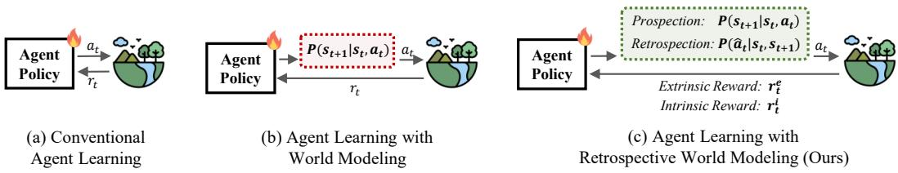  
Figure 1: Comparison between our retrospective world modeling framework and conventional agent learning frameworks.

In this paper, we posit that endowing agents with a bidirectional understanding of environmental dynamics can achieve more robust reasoning and decision-making. Beyond merely functioning as a forward simulator $\textstyle P ( s _ { t + 1 } | s _ { t } , a _ { t } ) ^ { 2 }$ that predicts future outcomes, an internal world model should also serve as a retrospective analyst, capable of deducing the underlying causality $P ( \hat { a } _ { t } | s _ { t } , s _ { t + 1 } )$ behind the observed transitions. This retrospective capability is pivotal: it complements the agent to verify the logical soundness of its actions against actual environmental dynamics, rather than relying solely on plausible-looking predictions. To this end, we propose Retrospective World Modeling (RWM), a novel agent learning paradigm that augments agents with the ability to “Reason backward” (i.e., inferring the action responsible for the observed state change) and further used for policy optimization. Building upon RWM, we introduce the Self-Consistency Reward (SCR), a self-supervised signal that regularizes policy optimization towards actions whose effect can be consistently explained by the observed changes. Integrating SCR into RL establishes a closed-loop learning process that complements prospective planning with retrospective verification, shifting intrinsic supervision from curiosity-driven exploration toward exploitation-oriented consistency regularization.

We empirically evaluate our method across diverse agentic tasks, lifting the average success rate from 8% to 81% with strong generalization. Leveraging the granularity of retrospective feedback, our method exhibits higher action effectiveness and rapid convergence compared to baselines. Subsequent analyses validate the necessity of internalizing this intrinsic signal and assess various reward formulations and context regulation strategies to mitigate reward hacking.

## 2 Related Work

RL for LLM and VLM Agents. Recent studies have explored reinforcement learning (RL) to train long-horizon multi-turn LLM and VLM agents. Diverse capabilities have been boosted, such as planning [18–20], tool use [21–23], memory [24, 25], self-improvement [26–28], reasoning [29, 30], perception [31, 32]. RL algorithms, such as PPO [33], GRPO [34] and DAPO [35], etc., form a spectrum from general policy gradients to specialized preference learning.

World Modeling. As a cornerstone of model-based RL [36, 37, 8], world models enable predictive planning and foresight [38, 39], achieving remarkable decision-making success via latent dynamics in systems like MuZero [40] and the Dreamer family [41, 42]. Recently adapted for LLM/VLM agents, this paradigm explicitly models state transitions (e.g., VAGEN [14]) or simulates complex domains ranging from web browsing [43, 44, 7, 45], mathematical reasoning [46], embodied control [47, 9], and games [48] to high-fidelity video prediction [49–51]. Beyond explicit modeling, some methods internalize strategies [52, 53], leveraging early exploration to align internal planning with environmental feedback.

Inverse Dynamics for Curiosity and Action Grounding. Inverse dynamics models infer actions from state transitions, and have been used in two closely related lines of work. In classical RL, curiosity-driven methods use inverse dynamics to learn action-relevant representations and compute forward prediction errors as intrinsic rewards for exploration [54–56]. In embodied and robotic learn ing, recent world-action models and video-based policy learning frameworks use inverse dynamics or action-conditioned world modeling to recover executable actions from visual transitions or generated future rollouts, such as PIDM [57], Motus [58], DreamZero [59], GigaWorld-0/Policy [60, 61]. These methods mainly employ inverse dynamics as an auxiliary representation-learning objective, an exploration signal, or an action decoding module. In contrast, RWM repurposes inverse action inference as a retrospective consistency validator for VLM-agent policy learning. Rather than relying on an external inverse model or rewarding prediction error to encourage exploration, RWM performs cross-turn retrospective attribution within the VLM reasoning process and converts discriminative action-transition consistency into an exploration-oriented dense intrinsic reward for directly regularizing RL policy optimization.

Summary. Despite these variations, internal world modeling in agents remains overwhelmingly prospective, tasked exclusively with answering “what will happen next?”. We argue that this unidirectional perspective is fundamentally incomplete. Instead, we propose RWM, endowing agents with a bidirectional understanding of dynamics that unifies forward planning with retrospective causal verification for robust decision-making.

## 3 Preliminary

## 3.1 Problem formulation

We formulate the multi-turn interaction of VLM agents as a Partially Observable Markov Decision Process (POMDP), defined by the tuple $( S , \mathcal { O } , \mathcal { A } , \bar { T } , \mathcal { R } , \gamma )$ . Here, S denotes the latent state space of the environment, which is typically complex and not fully observable. O represents the observation space (e.g., visual inputs and textual feedback), and A is the action space (e.g., API calls or high-level commands). The transition function $\mathcal { T } : \mathcal { S } \times \mathcal { A }  \mathcal { S }$ governs the environment’s dynamics, while the reward function $\mathcal { R }$ evaluates task progress given a specific goal $g .$

At each turn t, the agent cannot access the true state $s _ { t } \in S .$ . Instead, it receives a partial observation $o _ { t } \sim \mathcal { O } ( s _ { t } )$ and selects an action $a _ { t }$ based on the interaction history $h _ { t } = ( o _ { 1 } , a _ { 1 } , \ldots , o _ { t - 1 } , a _ { t - 1 } , o _ { t } )$ This decision process is governed by a policy $\pi _ { \theta }$ parameterized by a VLM, i.e., $a _ { t } \sim \pi _ { \theta } ( \cdot | h _ { t } )$ . Upon executing $a _ { t } ,$ the environment transitions to a new state $s _ { t + 1 }$ and emits a scalar reward $r _ { t } .$ The agent’s objective is to learn an optimal policy $\pi _ { \theta }$ that maximizes the expected cumulative return:

$$
\operatorname* { m a x } _ { \theta } \mathbb { E } _ { \pi _ { \theta } } \left[ \sum _ { t = 1 } ^ { T } \gamma ^ { t - 1 } r _ { t } \right] ,\tag{1}
$$

where $\gamma$ denotes the discount factor. The interaction continues until a terminal condition is met or a maximum horizon is reached, yielding a sequential decision-making loop.

## 3.2 Prospective Internal World Modeling in VLM Agents

While the POMDP formulation defines the learning objective for multi-turn interaction, a purely reactive policy $\pi _ { \theta } { \left( { { a _ { t } } | h _ { t } } \right) }$ directly maps the interaction history to an executable action and may overlook explicit reasoning about latent states and environment dynamics. Recent VLM agent frameworks therefore incorporate prospective world modeling into the reasoning process, allowing the policy model to internally simulate the consequence of a candidate action before interacting with the environment [14, 13]. Specifically, at turn t, the agent first summarizes the partial observation $o _ { t }$ and history $h _ { t }$ into a textual belief state $\hat { s } _ { t } ,$ , which serves as an internal approximation of the underlying latent state. Conditioned on $\hat { s } _ { t }$ and the task goal $^ { g , }$ the agent proposes a candidate action $a _ { t } ^ { \prime }$ for mental rehearsal and predicts the corresponding future belief state, i.e., $, s _ { t + 1 } ^ { \prime } \sim \pi _ { \theta } ( . | \hat { s } _ { t } , a _ { t } ^ { \prime } )$

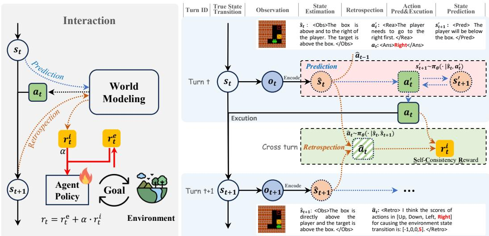  
Figure 2: Overview of the RWM framework. At turn $t ,$ the agent first infers the current belief state $\hat { s } _ { t }$ from the observation and performs retrospection over the previous transition $\left( \hat { s } _ { t - 1 } , \hat { s } _ { t } \right)$ and get attributed action $\hat { a } _ { t - 1 }$ . It then conducts prospective reasoning to propose a candidate action $a _ { t } ^ { \prime }$ and predict an imagined next state $s _ { t + 1 } ^ { \prime }$ before producing the executable action $a _ { t } .$ . After observing the next belief state $\hat { s } _ { t + 1 }$ , RWM performs a cross-turn attribution step, inferring $\hat { a } _ { t }$ from the realized transition $( \hat { s } _ { t } , \hat { s } _ { t + 1 } )$ , and evaluates its consistency with the executed action $a _ { t }$ . The resulting selfconsistency reward is then assigned back to turn t for policy optimization.

Here, $s _ { t + 1 } ^ { \prime } { } ^ { 3 }$ denotes the imagined next state predicted before execution. This prospective simulation forms an internal reasoning trace:

$$
< 0 \mathsf { b } \mathsf { s } > \hat { s } _ { t } < / 0 \mathsf { b } \mathsf { s } > < \mathsf { R e s } > a _ { t } ^ { \prime } < / \mathsf { R e s } > < \mathsf { P r e d } > s _ { t + 1 } ^ { \prime } < / \mathsf { P r e d } > .
$$

The final executable action $a _ { t } \ ( < \mathrm { A n s } > a _ { t } < / \mathrm { A n s } > )$ is then sampled by conditioning the policy on both the interaction history and the above prospective reasoning trace.

## 4 Method

Prospective world modeling enables VLM agents to imagine future states before execution, but it does not directly verify whether an executed action is consistent with the observed state transition. For each transition from turn t to turn $t + 1$ , after the agent executes $a _ { t }$ and receives the next observation, the resulting belief transition $( \hat { s } _ { t } , \hat { s } _ { t + 1 } )$ provides a natural opportunity to evaluate whether $a _ { t }$ is a plausible cause of the observed change. Equivalently, at the beginning of turn $t + 1$ , this verification appears as a retrospective attribution step over the previous transition. Motivated by this observation, we propose Retrospective World Modeling (RWM), a new agent learning framework that uses retrospective action attribution as a consistency verification mechanism for policy learning. As shown in Fig. 2, RWM first performs retrospective attribution over the observed transition, then converts the attribution result into a margin-based intrinsic reward, and finally optimizes the policy with temporally aligned RL.

## 4.1 Retrospective World Modeling

RWM extends the prospective reasoning loop with a retrospective verification step. At the beginning of turn $t ,$ the agent receives a new observation $o _ { t }$ and summarizes the interaction context into a current belief state $\hat { s } _ { t }$ . Since the belief state from the previous turn, $\hat { s } _ { t - 1 }$ , is already available, the agent can reason backward over the observed transition $( \hat { s } _ { t - 1 } , \hat { s } _ { t } )$ and infer which action could have caused this change. Formally, the retrospectively attributed action is sampled as:

$$
\hat { a } _ { t - 1 } \sim \pi _ { \theta } \big ( \cdot \mid \hat { s } _ { t - 1 } , \hat { s } _ { t } \big ) .\tag{2}
$$

Here, $\hat { a } _ { t - 1 }$ is a model-internal explanation of the previous transition rather than a ground-truth label. It is used to verify the consistency between the observed transition and the action actually executed in the previous turn. To avoid trivial copying from the interaction history, retrospective attribution is conditioned only on the two belief states involved in the transition, rather than on the full action history. For the first turn, where no previous transition is available, the retrospective field is filled with a null token and is excluded from reward computation.

After the retrospective step, the agent proceeds to prospective reasoning for the current turn. Conditioned on the current belief state $\hat { s } _ { t } ,$ the task goal $^ { g , }$ and the retrospective context $\hat { a } _ { t - 1 }$ , the policy proposes a candidate action $a _ { t } ^ { \prime }$ for mental rehearsal and predicts the imagined next belief state $s _ { t + 1 } ^ { \prime }$ Together, the insights from both the retrospective grounding and prospective simulation yield a new trajectory before the agent outputs the final action $a _ { t }$ for the environment to execute:

$$
< \mathsf { D b s } > \hat { s } _ { t } < / 0 \mathsf { b s } > < \mathsf { R e t r o } > \hat { a } _ { t - 1 } < / \mathsf { R e t r o } > < \mathsf { R e s } > a _ { t } ^ { \prime } < / \mathsf { R e s } > < \mathsf { P r e d } > s _ { t + 1 } ^ { \prime } < / \mathsf { P r e d } > .\tag{3}
$$

In this trace, the ${ < } \tt { R e t r o } { > }$ field explains the transition that has already occurred, while the <Rea> and <Pred> fields support planning for the current action. This “Observe-Retrospect-Predict-Act” loop makes retrospective verification an explicit part of multi-turn decision-making, while preserving prospective simulation for planning.

## 4.2 Self-Consistency as Intrinsic Reward

The retrospective attribution in Eq. 2 provides a qualitative explanation of the previous transition, but using the sampled action token directly as a reward signal is unreliable. A direct token match between the sampled attribution and the executed action gives a sparse signal, and it is also vulnerable to shortcut learning when the previous action appears in the interaction history. To obtain a denser and more robust learning signal, we formulate retrospective verification as a discriminative scoring problem over the finite action space A.

Discriminative Action Scoring. After the transition from turn t to turn t + 1 is observed, RWM evaluates the realized transition $( \hat { s } _ { t } , \hat { s } _ { t + 1 } )$ with a history-agnostic scoring interface implemented by the same VLM policy. Specifically, the model scores each candidate action according to how plausible it is as the cause of the observed transition:

$$
\mathbf { v } _ { t } = F _ { \theta } \big ( \hat { s } _ { t } , \hat { s } _ { t + 1 } ; \mathcal { A } \big ) \in \mathbb { R } ^ { | \mathcal { A } | } ,\tag{4}
$$

where $F _ { \theta }$ denotes the retrospective scoring form of the policy model, and each entry ${ \bf v } _ { t } ^ { ( a ) }$ measures the plausibility of action $a \in { \mathcal { A } }$ as the cause of the transition from $\hat { s } _ { t } \mathrm { ~ t o ~ } \hat { s } _ { t + 1 }$ . In practice, these scores are derived from the logits assigned to candidate action tokens under a prompt that exposes only the state transition and the candidate action set.

Self-Consistency Reward (SCR). Given the score vector, we define the self-consistency reward as the normalized margin between the score of the executed action $a _ { t }$ and the strongest alternative action:

$$
r _ { t } ^ { i } = \frac { \mathbf { v } _ { t } ^ { ( a _ { t } ) } - \operatorname* { m a x } _ { a \in \mathcal { A } \backslash \{ a _ { t } \} } \mathbf { v } _ { t } ^ { ( a ) } } { S _ { \operatorname* { m a x } } - S _ { \operatorname* { m i n } } } .\tag{5}
$$

Here, $S _ { \mathrm { m a x } }$ and $S _ { \mathrm { m i n } }$ denote the upper and lower bounds of the scoring scale and are used to normalize the reward magnitude. A positive margin indicates that the executed action is scored as the most plausible explanation of the observed transition, while a negative margin indicates that another candidate action better explains the transition. Compared with direct action reconstruction, this margin-based formulation provides a dense signal and explicitly contrasts the executed action with the hardest distractor, encouraging sharper action-transition consistency.

Total Reward. The total reward for policy optimization is defined as a composite sum:

$$
\boldsymbol { r } _ { t } = \boldsymbol { r } _ { t } ^ { e } + \boldsymbol { \alpha } \cdot \boldsymbol { r } _ { t } ^ { i } ,\tag{6}
$$

where $\boldsymbol { r } _ { t } ^ { e }$ denotes the extrinsic reward, including task success, format compliance, and step penalties, and α controls the strength of retrospective consistency regularization. In Eq. 6, the extrinsic reward provides task-level supervision, while SCR provides transition-level feedback that regularizes the policy toward actions whose effects can be consistently explained by the observed state change.

## 4.3 Policy Optimization

We optimize the policy $\pi _ { \theta }$ using Proximal Policy Optimization (PPO [33]). During training, the critic $V _ { \phi }$ is implemented as a scalar value head on the final hidden state of the VLM. Since each trajectory contains both environmental prompts and model-generated tokens, we apply a binary mask $\mathcal { M }$ so that policy gradients are computed only on generated reasoning and action tokens, while environmental prompts are excluded from the policy update.

Temporal Reward Assignment. The self-consistency reward is delayed by one turn because it requires the next belief state $\hat { s } _ { t + 1 }$ to be observed. Therefore, although the score vector in $\operatorname { E q . }$ 4 is computed at the beginning of turn $t + 1$ , the resulting reward $r _ { t } ^ { i }$ is assigned back to the action $a _ { t }$ executed at turn $t \colon r _ { t } ^ { i } \gets \mathrm { S C R } ( \hat { s } _ { t } , \hat { s } _ { t + 1 } , a _ { t } )$ . This temporal assignment aligns the retrospective verification signal with the transition that generated it and preserves the standard turn-level reward structure of the underlying POMDP.

Dense Reward Integration and Configurations. Given the structured reasoning trajectory established earlier, training the agent with standard PPO relies solely on sparse task and format rewards. In this standard setup, credit assignment is handled by the conventional Generalized Advantage Estimation (GAE) [62], which propagates sparse rewards backward across the established trajectory $( \mathrm { E q } . 3 )$ without explicit turn boundaries. We define this sparse-reward configuration as RWM-Base setting.

However, multi-turn VLM agents face a fundamental granularity gap: our composite reward $r _ { t }$ is defined at the macro-level of environmental turns, whereas PPO requires micro-level token advantages. To seamlessly backpropagate turn-wise semantic feedback, we go a step further. Following VAGEN [14], we adopt a Bi-Level GAE protocol (detailed formulations are provided in Appendix. B). This mechanism bridges the gap by first computing turn-level advantages and then injecting them into the micro-scale token generation, allowing for dense reward assignment. By employing this Bi-Level GAE for turn-aware credit assignment, we can effectively inject dense supervision into the reasoning steps. Alongside external LLM-as-a-Judge [14] supervision for visual state evaluation, we critically integrate our intrinsic Self-Consistency Reward $( \hat { r } _ { t } ^ { i } )$ to explicitly penalize causal hallucinations at each turn. This comprehensive, dense-reward configuration establishes our RWM-Full setting.

Optimization Objective. Let τ denote the trajectory and $\mathcal { M }$ be the mask that isolates generated action tokens (excluding environmental prompts). The above process yields the specific token advantage Ai (Eq. 14) used in the PPO clipping objective $\mathcal { L } ( \boldsymbol { \theta } )$

$$
\mathbb { E } _ { ( \tau ) \sim \pi _ { \mathrm { o l d } } } \left[ \frac { \sum _ { i } \mathcal { M } _ { i } \cdot \operatorname* { m i n } \left( \rho _ { i } ( \boldsymbol { \theta } ) A _ { i } , \operatorname { c l i p } ( \rho _ { i } ( \boldsymbol { \theta } ) , 1 - \epsilon , 1 + \epsilon ) A _ { i } \right) } { \sum _ { k } \mathcal { M } _ { k } } \right]\tag{7}
$$

where $\begin{array} { r } { \rho _ { i } ( \theta ) = \frac { \pi _ { \theta } \left( \tau _ { i } | \tau _ { < i } \right) } { \pi _ { \mathrm { o l d } } \left( \tau _ { i } | \tau _ { < i } \right) } } \end{array}$ is the probability ratio and ϵ is the clipping parameter. This optimization ensures the agent’s policy is updated stably, driven by both the intrinsic consistency verification and extrinsic task goals.

## 5 Experiments

## 5.1 Experimental Settings

Environments. To analyze the visual reasoning capabilities of VLM agents, we evaluate on four distinct agentic tasks. These benchmarks cover challenges including diverse visual state representations and action spaces: 2D grid puzzles (Sokoban [63] and FrozenLake [64]), embodied 3D navigation (Navigation [65]) and embodied object manipulation (ManiSkill [66, 67]). Sokoban requires pushing boxes to targets while avoiding deadlocks, and FrozenLake involves navigating to a goal under hazardous conditions (with deterministic dynamics). Navigation is a first-person indoor search task that demands spatial reasoning from partial observations, while ManiSkill focuses on robotic manipulation with a Panda arm using a hybrid action space (e.g., pick $( \mathbf { x } , \mathbf { y } , z ) ,$ ), requiring precise visual grounding from 3D scenes to actionable coordinates. For Navigation, we assess performance on both Base and Common Sense evaluation sets. For Sokoban, we employ the standard $6 \times 6$ grid and further expand to a Hard setting (scaled to large dimensions) to probe generalization under increased complexity. More details are provided in Appendix. C.2.

Table 1: Main results on the 4 general agentic benchmarks. We report average task success rates across Sokoban, Navigation, ManiSkill, and FrozenLake benchmarks. We adopt Qwen2.5-VL-3B as the backbone for the trained models. The best and second-best performance among open-source models/methods are highlighted in bold and underline, respectively.
<table><tr><td rowspan="2">Models</td><td colspan="3">Sokoban</td><td colspan="3">Navigation</td><td colspan="3">ManiSkill</td><td rowspan="2"></td><td rowspan="2"></td><td rowspan="2">Frozen Overall</td></tr><tr><td></td><td>Standard Hard</td><td>Average</td><td>Base Common</td><td>Average</td><td></td><td>Place Stack Drawer Align.</td><td></td><td>Average</td></tr><tr><td colspan="10">Open-Source Models</td><td></td><td></td><td></td></tr><tr><td>Qwen2.5-VL-72B [68]</td><td>0.18</td><td>-</td><td>0.18</td><td>0.72</td><td>0.75</td><td>0.74</td><td>1.00 0.50</td><td>0.00</td><td>1.00</td><td>0.63</td><td>0.44</td><td>0.51</td></tr><tr><td>Qwen2.5-VL-7B [68]</td><td>0.13</td><td>=</td><td>0.13</td><td>0.28</td><td>0.39</td><td>0.34</td><td>0.000.00</td><td>0.00</td><td>0.75</td><td>0.19</td><td>0.14</td><td>0.27</td></tr><tr><td>VLM-R1-3B [69]</td><td>0.13</td><td>=</td><td>0.13</td><td>0.31</td><td>0.34</td><td>0.33</td><td>0.000.00</td><td>0.00 0.00</td><td></td><td>0.00</td><td>0.13</td><td>0.23</td></tr><tr><td colspan="11">Beyond Prediction: Steering VLM Agents with Retrospective World Modeling (Backbone: Qwen2.5-VL-3B)</td></tr><tr><td>Qwen2.5-VL-3B [68]</td><td>0.06</td><td>0.05</td><td>0.06</td><td>0.22</td><td>0.27</td><td>0.25</td><td>0.000.00</td><td>0.00</td><td>0.00</td><td>0.00</td><td>0.09</td><td>0.08</td></tr><tr><td>+ Vanilla-PPO [70]</td><td>0.18</td><td>0.13</td><td>0.16</td><td>0.32</td><td>0.25</td><td>0.29</td><td>0.000.00</td><td>0.00</td><td>0.00</td><td>0.00</td><td>0.21</td><td>0.12</td></tr><tr><td>+ ReAct-RL [12]</td><td>0.27</td><td>0.20</td><td>0.24</td><td>0.39</td><td>0.37</td><td>0.38</td><td>0.000.00</td><td>0.00</td><td>0.00</td><td>0.00</td><td>0.30</td><td>0.17</td></tr><tr><td>+ VAGEN-Base [14]</td><td>0.41</td><td>0.33</td><td>0.37</td><td>0.47</td><td>0.51</td><td>0.49</td><td>0.880.63</td><td>0.63</td><td>0.75</td><td>0.72</td><td>0.43</td><td>0.56</td></tr><tr><td>+ RWM-Base (Ours)</td><td>0.58</td><td>0.46</td><td>0.52</td><td>0.67</td><td>0.64</td><td>0.66</td><td>1.000.88</td><td>0.88</td><td>1.00</td><td>0.94</td><td>0.75</td><td>0.76</td></tr><tr><td colspan="11">World Modeling with Bi-Level GAE and LLM-as-a-Judge (Using GPT-4.1 nano)</td></tr><tr><td>+ VAGEN-Full</td><td>0.52</td><td>0.46</td><td>0.48</td><td>0.54</td><td>0.56</td><td>0.55</td><td>1.00 0.88</td><td>0.88</td><td>1.00</td><td>0.94</td><td>0.54</td><td>0.71</td></tr><tr><td>+ RWM-Full (Ours)</td><td>0.69</td><td>0.63</td><td>0.66</td><td>0.67</td><td>0.69</td><td>0.68</td><td>1.00 1.00</td><td>0.88</td><td>1.00</td><td>0.97</td><td>0.77</td><td>0.81</td></tr><tr><td colspan="11">Proprietary Models</td></tr><tr><td>GPT-4o [71]</td><td>0.43</td><td>0.38</td><td>0.41</td><td>0.75</td><td>0.69</td><td>0.72</td><td>0.500.63</td><td>0.00</td><td>0.88</td><td>0.50</td><td>0.54</td><td>0.53</td></tr><tr><td>GPT-5 [72]</td><td>0.70</td><td>0.62</td><td>0.66</td><td>0.75</td><td>0.81</td><td>0.78</td><td>1.000.63</td><td>0.00</td><td>1.00</td><td>0.66</td><td>0.77</td><td>0.70</td></tr><tr><td>04-mini [73]</td><td>0.44</td><td>0.40</td><td>0.42</td><td>0.75</td><td>0.75</td><td>0.75</td><td>1.000.50</td><td>0.00</td><td>0.75</td><td>0.56</td><td>0.82</td><td>0.60</td></tr><tr><td>Claude 4.5 Sonnet [74]</td><td>0.31</td><td>0.26</td><td>0.29</td><td>0.67</td><td>0.67</td><td>0.67</td><td>0.630.50</td><td>0.00</td><td>1.00</td><td>0.53</td><td>0.80</td><td>0.54</td></tr><tr><td>Claude 3.7 Sonnet [75]</td><td>0.25</td><td>0.18</td><td>0.22</td><td>0.48</td><td>0.47</td><td>0.48</td><td>0.630.13</td><td>0.00</td><td>1.00</td><td>0.44</td><td>0.69</td><td>0.43</td></tr><tr><td>Gemini 2.5 Pro [76]</td><td>0.58</td><td>0.42</td><td>0.50</td><td>0.63</td><td>0.63</td><td>0.63</td><td>0.630.63</td><td>0.00</td><td>0.75</td><td>0.50</td><td>0.78</td><td>0.56</td></tr></table>

Baselines. We adopt Qwen2.5-VL-3B [68] as the VLM backbone. We compare our approach against two categories of baselines. (1) Open-source methods: Vanilla-PPO [70] directly fine-tunes the base model using PPO; ReAct-RL follows the ReAct [12] paradigm of interleaved reasoning traces (“observe-reason-act”) optimized via PPO; VAGEN-Base [14] structures reasoning into explicit prospective world modeling (state estimation and future transition prediction) but relies on standard token-level GAE and sparse task rewards; VAGEN-Full [14] enhances this prospective paradigm by employing Bi-Level GAE for credit assignment and dense reasoning supervision provided by an external LLM-as-a-Judge. (2) Proprietary Models: We also report zero-shot results from stateof-the-art proprietary models, including GPT-5 [72], GPT-4o [71], o4-mini [73], Claude 4.5 Sonnet [74], Claude 3.7 Sonnet [75], and Gemini 2.5 Pro [76]. More details are provided in Appendix. C.1.

Evaluation Metrics. Success rate is the primary metric. To evaluate how effectively our retrospective constraints filter out causally implausible hallucinations, we additionally report action validness (actions within the defined space) and action effectiveness (actions inducing meaningful state changes toward the goal, e.g., avoiding blocking walls), alongside standard rewards.

Implementation Details. We use Qwen2.5-VL-3B [68] as the backbone. Global training batch size is set to 128, with a learning rate of 1 × 10−6 for the actor and 1 × 10−5 for the critic. For evaluation, we set the generation temperature to 1.0. Results are averaged over 3 runs on 128 diverse test cases to ensure statistical significance. All experiments were conducted on 4× NVIDIA H800 (80GB) GPUs.

## 5.2 Main Results

Main Performance. Tab. 1 reports success rates across four diverse environments, revealing a consistent performance hierarchy. RWM achieves substantial overall gains over model-free approaches (0.76 vs. 0.12 for Vanilla-PPO), and significantly outperforms ReAct-RL (0.17), confirming that explicit world modeling provides superior guidance over interleaved reasoning traces alone. Crucially, we compare against the prospective-only VAGEN across two configurations. In the Base setting, RWM-Base demonstrates a remarkable advantage, boosting the overall average success rate from 0.56 (VAGEN-Base) to 0.76. This superiority persists even with dense supervision: RWM-Full lifts the performance from 0.71 (VAGEN-Full) to an impressive 0.81. This sharp contrast suggests that our retrospective constraint effectively filters out causally implausible transitions often hallucinated by purely prospective models. Furthermore, despite utilizing a significantly smaller backbone (Qwen2.5-VL-3B), RWM surpasses several powerful proprietary models like GPT-4o (0.53) and Claude 4.5 Sonnet (0.54), and even outperforms GPT-5 (0.70), highlighting the potential of specialized agents to unlock robust reasoning capabilities through self-supervised grounding.

Generalization on Challenging Tasks. To probe robustness, we evaluate agents trained exclusively on standard maps on the unseen Sokoban-Hard setting. While baselines suffer severe degradation under this distribution shift, RWM exhibits superior generalization with a 0.46 success rate, significantly outperforming VAGEN (0.33). This resilience confirms that retrospective attribution forces the agent to internalize scalable physical rules rather than merely memorizing training layouts.

## 5.3 Ablation Study

In this section, we conduct extensive ablations to dissect our framework, aiming to validate retrospective signal internalization, justify our reward design, and show how to prevent reward hacking.

Is the RL-based “Internalization” Necessary? A core premise of our method is that the retrospective signal should be internalized into policy parameters. We investigate this via RWM-Filter, a trainingfree baseline using our intrinsic reward as a hard constraint for rejection sampling during inference. Fig. 3 reveals two critical insights. First, RWM-Filter consistently outperforms the vanilla VAGEN (e.g., +5% success rate), validating our consistency signal as a reliable indicator of physical grounding. Second, the RL-internalized RWM drastically outperforms RWM-Filter (over 40% gains). This confirms that while post-hoc filtering helps, embedding this causal constraint directly into policy parameters via RL is crucial to improve policy

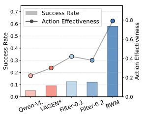  
(a) Sokoban

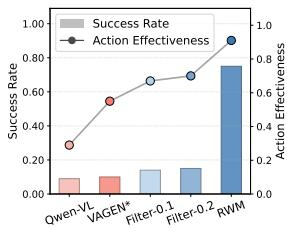  
(b) FrozenLake  
Figure 3: Ablation on signal internalization. RWM-Filter applies the intrinsic reward $r _ { t } ^ { i }$ purely as a trainingfree rejection sampling threshold $( \delta = 0 . 1 , 0 . 2 )$ to filter inconsistent actions. Results show that explicit RL internalization yields substantially higher success rates and action effectiveness. (\*: val before train)

exploitation, transforming “checkingfor errors” into “learning not to make them”.

Mitigating Causal Hallucinations. To validate our core motivation that retrospective verification reduces hallucinations, we compare the training dynamics of action validness and effectiveness on Sokoban (Fig. 4). While the prospective-only baseline (VAGEN) gradually learns valid action formats, it severely struggles with effectiveness, often executing physically meaningless moves like pushing against blocking walls (peaking at only 0.8). In contrast, RWM rapidly achieves near-perfect validness and consistently maintains superior effectiveness (>0.95). This massive margin directly demonstrates that our retrospective constraint provides robust physical grounding, explicitly steering the agent away from causally implausible hallucinations toward purposeful and executable actions.

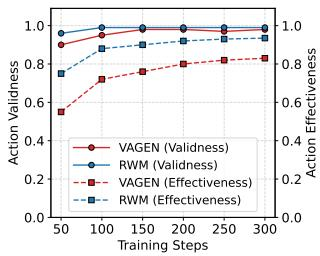  
Figure 4: Ablation on action validness and effectiveness.

Intrinsic Reward Design. To balance reward density with robustness against shortcut learning, we compare against two alternatives in Fig. 6. 1) Direct Token Matching assigns a binary reward if the sampled token $\hat { a } _ { t }$ matches $a _ { t }$ . It yields poor success rates (≈0.30) and the reward saturate quickly (near the 0.05 upper bound), as sparse binary feedback hinders optimization and encourages shortcut learning, simply copying action history. 2) Log-Likelihood Scoring (normalized logprobability of the ground-truth action) improves performance (≈0.53) but suffers from high variance, as massive penalties for low-probability events destabilize training. 3) Margin-based Scoring (Ours)

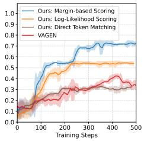  
(a) Success Rate

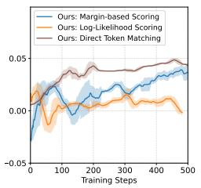  
(b) Self-Consistency Reward

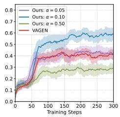  
(a) Success Rate

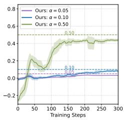  
Figure 6: Ablation on reward design on Frozen-Lake benchmark. We show the training success rate and intrinsic reward curves, comparing RWM with three reward designs and VAGEN.  
(b) Self-Consistency Reward  
Figure 7: Ablation on reward weight α on Sokoban benchmark. We show the training success rate and intrinsic reward curves. A large α tends to overfit, while a small α limits gains.

avoids these pitfalls by penalizing the gap between the ground-truth action and the hardest distractor (Eq. 5). This provides a dense, bounded, and stable signal that effectively curbs shortcut learning and maximizes causal confidence, yielding the fastest convergence and highest success rate. More details are in Appendix. A.

Sensitivity to Retrospection Weight. The parameter α (Eq. 6) balances retrospective grounding with prospective planning. As Fig. 7 shows, a minimal weight $( \alpha = 0 . 0 5 )$ provides insufficient gradients, yielding negligible gains over VAGEN. Conversely, an excessive weight $( \alpha = 0 . 5 0 )$ halves the success rate (from 0.58 to 0.29). In this regime, the intrinsic reward saturates early (Fig. 7(b)), indicating a form of reward hacking where the agent overfits to explaining transitions at the expense of task completion. This confirms the retrospective signal functions best as a regularizer.

Historical Context Leakage. In principle, RWM requires that the agent deduce $\hat { a } _ { t }$ solely from the state transition $( \hat { s } _ { t } , \hat { s } _ { t + 1 } )$ However, in multi-turn RL, full history access risks historical context leakage: the agent trivially retrieves the previous action $a _ { t }$ from memory rather than inferring it via world dynamics, essentially reward hacking. To enforce genuine causal reasoning, we evaluate three regulation strategies in Tab. 2. 1) Regulation-free allows unrestricted history access. It performs comparably to VAGEN, confirming that memory shortcuts render the retrospective signal ineffective. 2) Action Dropout randomly occludes action-related tokens in the history with probability $\beta \ ( \mathbf { e . g . }$ ., replacing them as ...<Rea>[MASKED]</Rea>...<Ans>[MASKED]</Ans>). While mild dropout $( \beta = 0 . 1 , 0 . 2 )$ yields modest gains, aggressive masking $( \beta = 0 . 5 )$ severely disrupts the semantic coherence required for long-horizon planning. 3) History-agnostic Inference (Ours) strictly isolates the retrospective prompt, conditioning deduction solely on the observed state change. Synergizing with our Marginbased Scoring, which resists simple token copying by requiring evaluation over the full action space, this strict information bottleneck completely cuts off memory exploitation, achieving the highest success rate. We adopt this setting for all RWM experiments.

Table 2: Ablation on history leakage under 3 context regulation strategies.
<table><tr><td rowspan=1 colspan=1>Method</td><td rowspan=1 colspan=1>Sokoban</td><td rowspan=1 colspan=1>FrozenLake</td></tr><tr><td rowspan=2 colspan=1> $_ { \mathrm { Q w e n } 2 . 5 - \mathrm { V L } - 3 \mathrm { B } }$ VAGEN</td><td rowspan=1 colspan=1>0.06</td><td rowspan=1 colspan=1>0.09</td></tr><tr><td rowspan=1 colspan=1>0.41</td><td rowspan=1 colspan=1>0.43</td></tr><tr><td rowspan=5 colspan=1>RWM $\cdot w / R e g u l a t i o n \ – f r e e$  $\cdot w / D r o p o u t \left( \beta = 0 . 1 0 \right)$  $- w / D r o p o u t \left( \beta = 0 . 2 0 \right)$  $\cdot w / D r o p o u t \left( \beta = 0 . 5 0 \right)$  $\AA - H i s t o r y - a g n o s t i c$ </td><td rowspan=1 colspan=1>0.39</td><td rowspan=1 colspan=1>0.40</td></tr><tr><td rowspan=1 colspan=1>0.44</td><td rowspan=1 colspan=1>0.52</td></tr><tr><td rowspan=1 colspan=1>0.50</td><td rowspan=1 colspan=1>0.59</td></tr><tr><td rowspan=1 colspan=1>0.33</td><td rowspan=1 colspan=1>0.38</td></tr><tr><td rowspan=1 colspan=1>0.58</td><td rowspan=1 colspan=1>0.75</td></tr></table>

## 6 Conclusion

In this paper, we challenge the conventional prospective-only world modeling, arguing that a robust agent requires not only predicting future outcomes but also serving as a retrospective analyst. To this end, we propose Retrospective World Modeling (RWM), a novel cross-turn framework that equips VLM agents with a bidirectional understanding of environmental dynamics and the capability of deducing underlying causality behind the observed transitions. By formulating the Self-Consistency Reward (SCR), we convert the retrospective causal attribution into a dense intrinsic signal, effectively steering the agent towards physically grounded and logically consistent behaviors. Our extensive experiments and ablation studies demonstrate the effectiveness of our method and the necessity of internalizing this intrinsic signal into policy. Furthermore, we assess various reward formulations and context regulation strategies to prevent history leakage, ensuring the agent learns genuine physical rules rather than exploiting memory shortcuts. Future work will extend this paradigm to address the challenge of causal ambiguity over longer horizons.

## References

[1] Daya Guo, Dejian Yang, Haowei Zhang, Junxiao Song, Peiyi Wang, Qihao Zhu, Runxin Xu, Ruoyu Zhang, Shirong Ma, Xiao Bi, Xiaokang Zhang, Xingkai Yu, Yu Wu, Z. F. Wu, Zhibin Gou, Zhihong Shao, Zhuoshu Li, Ziyi Gao, Aixin Liu, Bing Xue, and Zhen Zhang. Deepseek-r1 incentivizes reasoning in llms through reinforcement learning. Nature, 645(8081):633–638, September 2025.

[2] OpenAI, :, Aaron Jaech, Adam Kalai, Adam Lerer, Adam Richardson, Ahmed El-Kishky, Aiden Low, Alec Helyar, Aleksander Madry, Alex Beutel, and et al. Openai o1 system card, 2024.

[3] Zhiheng Xi, Wenxiang Chen, Xin Guo, Wei He, Yiwen Ding, Boyang Hong, Ming Zhang, Junzhe Wang, Senjie Jin, Enyu Zhou, et al. The rise and potential of large language model based agents: A survey. Science China Information Sciences, 68(2):121101, 2025.

[4] Mohit Shridhar, Xingdi Yuan, Marc-Alexandre Cote, Yonatan Bisk, Adam Trischler, and Matthew Hausknecht. Alfworld: Aligning text and embodied environments for interactive learning. In International Conference on Learning Representations, 2021.

[5] Rui Yang, Hanyang Chen, Junyu Zhang, Mark Zhao, Cheng Qian, Kangrui Wang, Qineng Wang, Teja Venkat Koripella, Marziyeh Movahedi, Manling Li, Heng Ji, Huan Zhang, and Tong Zhang. Embodiedbench: Comprehensive benchmarking multi-modal large language models for vision-driven embodied agents. In Forty-second International Conference on Machine Learning, 2025.

[6] Shuyan Zhou, Frank F. Xu, Hao Zhu, Xuhui Zhou, Robert Lo, Abishek Sridhar, Xianyi Cheng, Tianyue Ou, Yonatan Bisk, Daniel Fried, Uri Alon, and Graham Neubig. Webarena: A realistic web environment for building autonomous agents. In The Twelfth International Conference on Learning Representations, 2024.

[7] Hyungjoo Chae, Namyoung Kim, Kai Tzu iunn Ong, Minju Gwak, Gwanwoo Song, Jihoon Kim, Sunghwan Kim, Dongha Lee, and Jinyoung Yeo. Web agents with world models: Learning and leveraging environment dynamics in web navigation. In The Thirteenth International Conference on Learning Representations, 2025.

[8] Yann LeCun. A path towards autonomous machine intelligence version 0.9. 2, 2022-06-27. Open Review, 62(1):1–62, 2022.

[9] Siyin Wang, Zhaoye Fei, Qinyuan Cheng, Shiduo Zhang, Panpan Cai, Jinlan Fu, and Xipeng Qiu. World modeling makes a better planner: Dual preference optimization for embodied task planning. In Wanxiang Che, Joyce Nabende, Ekaterina Shutova, and Mohammad Taher Pilehvar, editors, Proceedings ofthe 63rd Annual Meeting ofthe Associationfor Computational Linguistics (Volume 1: Long Papers), pages 21518–21537. Association for Computational Linguistics, 2025.

[10] Danijar Hafner, Jurgis Pasukonis, Jimmy Ba, and Timothy Lillicrap. Mastering diverse domains through world models. arXiv preprint arXiv:2301.04104, 2023.

[11] Jonathan Richens, Tom Everitt, and David Abel. General agents need world models. In Forty-second International Conference on Machine Learning, 2025.

[12] Shunyu Yao, Jeffrey Zhao, Dian Yu, Nan Du, Izhak Shafran, Karthik R Narasimhan, and Yuan Cao. React: Synergizing reasoning and acting in language models. In The Eleventh International Conference on Learning Representations, 2023.

[13] Eric Xing, Mingkai Deng, Jinyu Hou, and Zhiting Hu. Critiques of world models, 2025.

[14] Kangrui Wang, Pingyue Zhang, Zihan Wang, Yaning Gao, Linjie Li, Qineng Wang, Hanyang Chen, Yiping Lu, Zhengyuan Yang, Lijuan Wang, Ranjay Krishna, Jiajun Wu, Li Fei-Fei, Yejin Choi, and Manling Li. VAGEN: Reinforcing world model reasoning for multi-turn VLM agents. In The Thirty-ninth Annual Conference on Neural Information Processing Systems, 2025.

[15] Jiahan Zhang, Muqing Jiang, Nanru Dai, Taiming Lu, Arda Uzunoglu, Shunchi Zhang, Yana Wei, Jiahao Wang, Vishal M. Patel, Paul Pu Liang, Daniel Khashabi, Cheng Peng, Rama Chellappa, Tianmin Shu, Alan Yuille, Yilun Du, and Jieneng Chen. World-in-world: World models in a closed-loop world, 2025.

[16] Yang Ye, Tianyu He, Shuo Yang, and Jiang Bian. Reinforcement learning with inverse rewards for world model post-training, 2025.

[17] Jeff Pflueger and Michael Everett. Safety assessment in reinforcement learning via model predictive control, 2025.

[18] Siyu Zhu, Yanbin Jiang, Hejian Sang, Shao Tang, Qingquan Song, Biao He, Rohit Jain, Zhipeng Wang, and Alborz Geramifard. Planner-r1: Reward shaping enables efficient agentic rl with smaller llms, 2025.

[19] Davide Paglieri, Bartłomiej Cupiał, Jonathan Cook, Ulyana Piterbarg, Jens Tuyls, Edward Grefenstette, Jakob Nicolaus Foerster, Jack Parker-Holder, and Tim Rocktäschel. Learning when to plan: Efficiently allocating test-time compute for llm agents, 2025.

[20] Merve Atasever, Matthew Hong, Mihir Nitin Kulkarni, Qingpei Li, and Jyotirmoy V. Deshmukh. Multi-agent path finding via offline rl and llm collaboration, 2025.

[21] Joykirat Singh, Raghav Magazine, Yash Pandya, and Akshay Nambi. Agentic reasoning and tool integration for llms via reinforcement learning, 2025.

[22] Ziwei Zheng, Michael Yang, Jack Hong, Chenxiao Zhao, Guohai Xu, Le Yang, Chao Shen, and Xing Yu. Deepeyes: Incentivizing "thinking with images" via reinforcement learning, 2025.

[23] Mingyuan Wu, Jingcheng Yang, Jize Jiang, Meitang Li, Kaizhuo Yan, Hanchao Yu, Minjia Zhang, Chengxiang Zhai, and Klara Nahrstedt. Vtool-r1: Vlms learn to think with images via reinforcement learning on multimodal tool use, 2025.

[24] Wanjun Zhong, Lianghong Guo, Qiqi Gao, He Ye, and Yanlin Wang. Memorybank: Enhancing large language models with long-term memory. In Proceedings of the AAAI Conference on Artificial Intelligence, volume 38, pages 19724–19731, 2024.

[25] Sikuan Yan, Xiufeng Yang, Zuchao Huang, Ercong Nie, Zifeng Ding, Zonggen Li, Xiaowen Ma, Jinhe Bi, Kristian Kersting, Jeff Z. Pan, Hinrich Schütze, Volker Tresp, and Yunpu Ma. Memory-r1: Enhancing large language model agents to manage and utilize memories via reinforcement learning, 2026.

[26] Yuxin Zuo, Kaiyan Zhang, Li Sheng, Shang Qu, Ganqu Cui, Xuekai Zhu, Haozhan Li, Yuchen Zhang, Xinwei Long, Ermo Hua, Biqing Qi, Youbang Sun, Zhiyuan Ma, Lifan Yuan, Ning Ding, and Bowen Zhou. TTRL: Test-time reinforcement learning. In The Thirty-ninth Annual Conference on Neural Information Processing Systems, 2025.

[27] Chengsong Huang, Wenhao Yu, Xiaoyang Wang, Hongming Zhang, Zongxia Li, Ruosen Li, Jiaxin Huang, Haitao Mi, and Dong Yu. R-zero: Self-evolving reasoning llm from zero data, 2026.

[28] Yifei Zhou, Song Jiang, Yuandong Tian, Jason Weston, Sergey Levine, Sainbayar Sukhbaatar, and Xian Li. Sweet-rl: Training multi-turn llm agents on collaborative reasoning tasks, 2025.

[29] Shenzhi Wang, Le Yu, Chang Gao, Chujie Zheng, Shixuan Liu, Rui Lu, Kai Dang, Xiong-Hui Chen, Jianxin Yang, Zhenru Zhang, Yuqiong Liu, An Yang, Andrew Zhao, Yang Yue, Shiji Song, Bowen Yu, Gao Huang, and Junyang Lin. Beyond the 80/20 rule: High-entropy minority tokens drive effective reinforcement learning for LLM reasoning. In The Thirty-ninth Annual Conference on Neural Information Processing Systems, 2025.

[30] Wenkai Yang, Shuming Ma, Yankai Lin, and Furu Wei. Towards thinking-optimal scaling of test-time compute for LLM reasoning. In The Thirty-ninth Annual Conference on Neural Information Processing Systems, 2025.

[31] Huajie Tan, Yuheng Ji, Xiaoshuai Hao, Xiansheng Chen, Pengwei Wang, Zhongyuan Wang, and Shanghang Zhang. Reason-RFT: Reinforcement fine-tuning for visual reasoning of vision language models. In The Thirty-ninth Annual Conference on Neural Information Processing Systems, 2025.

[32] Linghao Zhu, Yiran Guan, Dingkang Liang, Jianzhong Ju, Zhenbo Luo, Bin Qin, Jian Luan, Yuliang Liu, and Xiang Bai. Shuffle-r1: Efficient rl framework for multimodal large language models via data-centric dynamic shuffle, 2025.

[33] John Schulman, Filip Wolski, Prafulla Dhariwal, Alec Radford, and Oleg Klimov. Proximal policy optimization algorithms, 2017.

[34] Daya Guo, Dejian Yang, Haowei Zhang, Junxiao Song, Peiyi Wang, Qihao Zhu, Runxin Xu, Ruoyu Zhang, Shirong Ma, Xiao Bi, et al. Deepseek-r1 incentivizes reasoning in llms through reinforcement learning. Nature, 645(8081):633–638, 2025.

[35] Qiying Yu, Zheng Zhang, Ruofei Zhu, Yufeng Yuan, Xiaochen Zuo, Yu Yue, Weinan Dai, Tiantian Fan, Gaohong Liu, Lingjun Liu, Xin Liu, Haibin Lin, Zhiqi Lin, Bole Ma, Guangming Sheng, Yuxuan Tong, Chi Zhang, Mofan Zhang, Wang Zhang, Hang Zhu, Jinhua Zhu, Jiaze Chen, Jiangjie Chen, Chengyi Wang, Hongli Yu, Yuxuan Song, Xiangpeng Wei, Hao Zhou, Jingjing Liu, Wei-Ying Ma, Ya-Qin Zhang, Lin Yan, Mu Qiao, Yonghui Wu, and Mingxuan Wang. Dapo: An open-source llm reinforcement learning system at scale, 2025.

[36] Richard S Sutton. Dyna, an integrated architecture for learning, planning, and reacting. ACM Sigart Bulletin, 2(4):160–163, 1991.

[37] David Ha and Jürgen Schmidhuber. Recurrent world models facilitate policy evolution. Advances in neural information processing systems, 31, 2018.

[38] Lin Guan, Karthik Valmeekam, Sarath Sreedharan, and Subbarao Kambhampati. Leveraging pre-trained large language models to construct and utilize world models for model-based task planning. Advances in Neural Information Processing Systems, 36:79081–79094, 2023.

[39] Shuofei Qiao, Runnan Fang, Ningyu Zhang, Yuqi Zhu, Xiang Chen, Shumin Deng, Yong Jiang, Pengjun Xie, Fei Huang, and Huajun Chen. Agent planning with world knowledge model. Advances in Neural Information Processing Systems, 37:114843–114871, 2024.

[40] Julian Schrittwieser, Ioannis Antonoglou, Thomas Hubert, Karen Simonyan, Laurent Sifre, Simon Schmitt, Arthur Guez, Edward Lockhart, Demis Hassabis, Thore Graepel, et al. Mastering atari, go, chess and shogi by planning with a learned model. Nature, 588(7839):604–609, 2020.

[41] Danijar Hafner, Timothy Lillicrap, Jimmy Ba, and Mohammad Norouzi. Dream to control: Learning behaviors by latent imagination. In International Conference on Learning Representations, 2020.

[42] Danijar Hafner, Jurgis Pasukonis, Jimmy Ba, and Timothy Lillicrap. Mastering diverse control tasks through world models. Nature, pages 1–7, 2025.

[43] Yu Gu, Kai Zhang, Yuting Ning, Boyuan Zheng, Boyu Gou, Tianci Xue, Cheng Chang, Sanjari Srivastava, Yanan Xie, Peng Qi, Huan Sun, and Yu Su. Is your LLM secretly a world model of the internet? model-based planning for web agents. Transactions on Machine Learning Research, 2025.

[44] Jichen Feng, Yifan Zhang, Chenggong Zhang, Yifu Lu, Shilong Liu, and Mengdi Wang. Web world models, 2025.

[45] Tianqing Fang, Hongming Zhang, Zhisong Zhang, Kaixin Ma, Wenhao Yu, Haitao Mi, and Dong Yu. WebEvolver: Enhancing web agent self-improvement with co-evolving world model. In Christos Christodoulopoulos, Tanmoy Chakraborty, Carolyn Rose, and Violet Peng, editors, Proceedings of the 2025 Conference on Empirical Methods in Natural Language Processing, pages 8959–8975, Suzhou, China, November 2025. Association for Computational Linguistics.

[46] Shibo Hao, Yi Gu, Haodi Ma, Joshua Jiahua Hong, Zhen Wang, Daisy Zhe Wang, and Zhiting Hu. Reasoning with language model is planning with world model. In The 2023 Conference on Empirical Methods in Natural Language Processing, 2023.

[47] Jiannan Xiang, Tianhua Tao, Yi Gu, Tianmin Shu, Zirui Wang, Zichao Yang, and Zhiting Hu. Language models meet world models: Embodied experiences enhance language models. Advances in neural information processing systems, 36:75392–75412, 2023.

[48] Sai Wang, Yu Wu, and Zhongwen Xu. Cogito, ergo ludo: An agent that learns to play by reasoning and planning, 2025.

[49] Alexi Gladstone, Ganesh Nanduru, Md Mofijul Islam, Peixuan Han, Hyeonjeong Ha, Aman Chadha, Yilun Du, Heng Ji, Jundong Li, and Tariq Iqbal. Energy-based transformers are scalable learners and thinkers, 2025.

[50] Tim Brooks, Bill Peebles, Connor Holmes, Will DePue, Yufei Guo, Li Jing, David Schnurr, Joe Taylor, Troy Luhman, Eric Luhman, et al. Video generation models as world simulators. OpenAI Blog, 1(8):1, 2024.

[51] Xuanhua He, Tianyu Yang, Ke Cao, Ruiqi Wu, Cheng Meng, Yong Zhang, Zhuoliang Kang, Xiaoming Wei, and Qifeng Chen. Active intelligence in video avatars via closed-loop world modeling. arXiv preprint arXiv:2512.20615, 2025.

[52] Kai Zhang, Xiangchao Chen, Bo Liu, Tianci Xue, Zeyi Liao, Zhihan Liu, Xiyao Wang, Yuting Ning, Zhaorun Chen, Xiaohan Fu, et al. Agent learning via early experience. arXiv preprint arXiv:2510.08558, 2025.

[53] Shiqi Chen, Tongyao Zhu, Zian Wang, Jinghan Zhang, Kangrui Wang, Siyang Gao, Teng Xiao, Yee Whye Teh, Junxian He, and Manling Li. Internalizing world models via self-play finetuning for agentic rl. arXiv preprint arXiv:2510.15047, 2025.

[54] Deepak Pathak, Pulkit Agrawal, Alexei A Efros, and Trevor Darrell. Curiosity-driven exploration by self-supervised prediction. In International conference on machine learning, pages 2778– 2787. PMLR, 2017.

[55] Yuri Burda, Harri Edwards, Deepak Pathak, Amos Storkey, Trevor Darrell, and Alexei A. Efros. Large-scale study of curiosity-driven learning. In International Conference on Learning Representations, 2019.

[56] Zhang-Wei Hong, Tsu-Jui Fu, Tzu-Yun Shann, and Chun-Yi Lee. Adversarial active exploration for inverse dynamics model learning. In Conference on Robot Learning, pages 552–565. PMLR, 2020.

[57] Yang Tian, Sizhe Yang, Jia Zeng, Ping Wang, Dahua Lin, Hao Dong, and Jiangmiao Pang. Predictive inverse dynamics models are scalable learners for robotic manipulation. In The Thirteenth International Conference on Learning Representations, 2025.

[58] Hongzhe Bi, Hengkai Tan, Shenghao Xie, Zeyuan Wang, Shuhe Huang, Haitian Liu, Ruowen Zhao, Yao Feng, Chendong Xiang, Yinze Rong, et al. Motus: A unified latent action world model. arXiv preprint arXiv:2512.13030, 2025.

[59] Seonghyeon Ye, Yunhao Ge, Kaiyuan Zheng, Shenyuan Gao, Sihyun Yu, George Kurian, Suneel Indupuru, You Liang Tan, Chuning Zhu, Jiannan Xiang, et al. World action models are zero-shot policies. arXiv preprint arXiv:2602.15922, 2026.

[60] GigaWorld Team, Angen Ye, Boyuan Wang, Chaojun Ni, Guan Huang, Guosheng Zhao, Haoyun Li, Jiagang Zhu, Kerui Li, Mengyuan Xu, et al. Gigaworld-0: World models as data engine to empower embodied ai. arXiv preprint arXiv:2511.19861, 2025.

[61] Angen Ye, Boyuan Wang, Chaojun Ni, Guan Huang, Guosheng Zhao, Hao Li, Hengtao Li, Jie Li, Jindi Lv, Jingyu Liu, et al. Gigaworld-policy: An efficient action-centered world–action model. arXiv preprint arXiv:2603.17240, 2026.

[62] John Schulman, Philipp Moritz, Sergey Levine, Michael Jordan, and Pieter Abbeel. Highdimensional continuous control using generalized advantage estimation. arXiv preprint arXiv:1506.02438, 2015.

[63] Max-Philipp B. Schrader. gym-sokoban. https://github.com/mpSchrader/ gym-sokoban, 2018.

[64] Mark Towers, Ariel Kwiatkowski, Jordan Terry, John U Balis, Gianluca De Cola, Tristan Deleu, Manuel Goulão, Andreas Kallinteris, Markus Krimmel, Arjun KG, et al. Gymnasium: A standard interface for reinforcement learning environments. arXiv preprint arXiv:2407.17032, 2024.

[65] Eric Kolve, Roozbeh Mottaghi, Winson Han, Eli VanderBilt, Luca Weihs, Alvaro Herrasti, Daniel Gordon, Yuke Zhu, Abhinav Gupta, and Ali Farhadi. AI2-THOR: An Interactive 3D Environment for Visual AI. arXiv, 2017.

[66] Stone Tao, Fanbo Xiang, Arth Shukla, Yuzhe Qin, Xander Hinrichsen, Xiaodi Yuan, Chen Bao, Xinsong Lin, Yulin Liu, Tse-Kai Chan, Yuan Gao, Xuanlin Li, Tongzhou Mu, Nan Xiao, Arnav Gurha, Viswesh N, Yong Woo Choi, Yen-Ru Chen, Zhiao Huang, Roberto Calandra, Rui Chen, Shan Luo, and Hao Su. Maniskill3: GPU parallelized robot simulation and rendering for generalizable embodied AI. In 7th Robot Learning Workshop: Towards Robots with Human-Level Abilities, 2025.

[67] Ayano Hiranaka, Minjune Hwang, Sharon Lee, Chen Wang, Li Fei-Fei, Jiajun Wu, and Ruohan Zhang. Primitive skill-based robot learning from human evaluative feedback. In 2023 IEEE/RSJ International Conference on Intelligent Robots and Systems (IROS), pages 7817–7824. IEEE, 2023.

[68] Jinze Bai, Shuai Bai, Shusheng Yang, Shijie Wang, Sinan Tan, Peng Wang, Junyang Lin, Chang Zhou, and Jingren Zhou. Qwen-vl: A versatile vision-language model for understanding, localization, text reading, and beyond, 2023.

[69] Haozhan Shen, Peng Liu, Jingcheng Li, Chunxin Fang, Yibo Ma, Jiajia Liao, Qiaoli Shen, Zilun Zhang, Kangjia Zhao, Qianqian Zhang, et al. Vlm-r1: A stable and generalizable r1-style large vision-language model. arXiv preprint arXiv:2504.07615, 2025.

[70] Zihan Wang, Kangrui Wang, Qineng Wang, Pingyue Zhang, Linjie Li, Zhengyuan Yang, Xing Jin, Kefan Yu, Minh Nhat Nguyen, Licheng Liu, Eli Gottlieb, Yiping Lu, Kyunghyun Cho, Jiajun Wu, Li Fei-Fei, Lijuan Wang, Yejin Choi, and Manling Li. Ragen: Understanding self-evolution in llm agents via multi-turn reinforcement learning, 2025.

[71] OpenAI. Gpt-4o system card. https://arxiv.org/abs/2410.21276, 2024.

[72] OpenAI. Introducing gpt-5, 2025. OpenAI blog.

[73] OpenAI. Introducing openai o3 and o4-mini, 2025. OpenAI blog.

[74] Anthropic. Introducing claude sonnet 4.5, 2025. Anthropic blog.

[75] The claude 3 model family: Opus, sonnet, haiku.

[76] Google. Gemini 2.5: Our most intelligent ai model, 2025. Google blog.

## Appendix

## A Details of Reward Design

In the main text (Section 4.2), we introduced Margin-based Scoring as our primary method for quantifying the self-consistency intrinsic reward. To validate the superiority of this design, our ablation study (Section 5.3) compares it against two alternative formulations: Direct Token Matching and Log-Likelihood Scoring. In this section, we provide the formal definitions and detailed implementations for these alternative designs.

Relationships Among Reward Designs. It should be noted that both Log-Likelihood Scoring and Margin-based Scoring are discriminative action scoring methods, meaning they use the same scoring mechanism. The difference lies in how the resulting score vector is converted into a reward. In contrast, Direct Token Matching does not require any scoring.

## A.1 Direct Token Matching

In this variant, we simplify the retrospective process by enforcing a discrete decision rather than evaluating the full probability distribution. Instead of calculating a margin-based score over the entire action space, the agent is prompted to directly sample a single action token that explicitly identifies the cause of the transition.

Formally, given the observed transition tuple $( \hat { s } _ { t } , \hat { s } _ { t + 1 } )$ , the policy samples a predicted retrospective action $\hat { a } _ { t } \mathrm { : }$

$$
\hat { a } _ { t } \sim \pi _ { \theta } ( \cdot \mid \hat { s } _ { t } , \hat { s } _ { t + 1 } )\tag{8}
$$

The intrinsic reward is then formulated as a sparse binary signal using the indicator function I(·):

$$
r _ { t } ^ { i } = \mathbb { I } ( \hat { a } _ { t } = a _ { t } ) = \left\{ { \begin{array} { l l } { 1 , } & { { \mathrm { i f ~ } } \hat { a } _ { t } = a _ { t } } \\ { 0 , } & { { \mathrm { o t h e r w i s e } } } \end{array} } \right.\tag{9}
$$

where $a _ { t }$ denotes the ground-truth action actually executed by the agent in turn t. Similiar to Eq.6, rit is balanced by weight α.

While straightforward, this approach suffers from two critical limitations during policy optimization:

• Sparsity: The binary nature of the signal provides zero-gradient information when the prediction is incorrect, which severely hinders efficient gradient estimation for policy optimization.

• Shortcut Learning: Since the ground-truth action $a _ { t }$ is inherently present in the agent’s interaction history, the agent tends to exploit this information leakage by simply retrieving the action from memory (reward hacking), rather than explicitly reasoning about the underlying environmental dynamics.

## A.2 Log-Likelihood Scoring

This strategy shares the same discriminative scoring mechanism as the Margin-based one, where the policy evaluates candidate actions and outputs a score vector $\mathbf { v } \in \mathbb { R } ^ { | \mathcal { A } | }$ . For consistent implementation across methods, we instruct the model to assign scores within a discrete integer range of [−5, 5]. Note that this setting also determines the normalization constants in Eq. 5, where $\bar { S _ { \mathrm { m a x } } } = 5$ and $S _ { \mathrm { m i n } } = - 5$

Unlike the margin-based formulation, this approach treats the scores as unnormalized logits. We first apply a Softmax function to convert v into a probability distribution $p \mathrm { : }$

$$
p ( a ) = { \frac { \exp ( \mathbf { v } ^ { ( a ) } ) } { \sum _ { a ^ { \prime } \in A } \exp ( \mathbf { v } ^ { ( a ^ { \prime } ) } ) } }\tag{10}
$$

The intrinsic reward is then calculated as the log-probability of the ground-truth action $a _ { t }$ , centered by the log-probability of a random policy (uniform distribution):

$$
r _ { t } ^ { i } = \log p ( a _ { t } ) - \log \left( \frac { 1 } { | \mathcal { A } | } \right)\tag{11}
$$

Subtracting $\log ( 1 / | A | )$ ensures that the reward is positive when the model’s confidence exceeds random guessing and negative otherwise. Intuitively, this aligns with the expectation that the signal strength should scale with the extent to which the correct inference deviates from random chance.

While statistically sound, we observe that this formulation leads to training instability due to the asymmetric sensitivity of the logarithmic function. The reward magnitude explodes for low-probability events, overshadowing the signal from correct predictions. Consider a standard environment with an action space size of $| { \mathcal { A } } | = 4 .$ . The random baseline is $\log ( 0 . 2 5 ) \approx - 1 . 3 9$

• If the agent is confident and correct $( p ( a _ { t } ) \approx 0 . 9 9 9 )$ , the reward is bounded: $\log ( 0 . 9 9 9 ) -$ $\log ( 0 . 2 \bar { 5 } ) \approx + 1 . 3 8$

• However, if the agent assigns a low probability $( p ( a _ { t } ) \approx 0 . 0 0 1 )$ , the penalty becomes massive: $\log ( 0 . 0 0 1 ) - \log ( 0 . 2 5 ) \approx - 5 . 6 2$

This property induces large fluctuations with a highly asymmetric range $( r _ { t } ^ { i } \in ( - \infty , \log | \mathcal { A } | ] )$ . As demonstrated in our ablation study (Fig. 7), the intrinsic signal functions best as a curiosity regularizer rather than a dominator. However, the log-likelihood formulation creates a fundamental dilemma for calibrating the weighting coefficient α. Consider the previous example where the positive reward is +1.38 but the penalty can easily reach −5.62 or worse.

• To prevent the massive penalty (dominator) from overriding the extrinsic task reward and causing overly conservative behavior, α must be set to a very small value.

• However, heavily scaling down the penalty simultaneously renders the positive signal negligible (e.g., shrinking +1.38 to near zero), thereby stripping the signal of its ability to guide the policy.

Consequently, it is difficult to find a single α that allows the intrinsic reward to consistently serve as a gentle regularizer across both success and failure cases.

## A.3 Case Study: Comparison of Reward Calculations

To intuitively illustrate the behavioral differences among the three reward formulations, we provide a concrete case study in Tab. 3. Consider a scenario where the action space is ${ \mathcal { A } } \ =$ [Up, Down, Left, Right], and the actual executed action (ground truth) is Right. The agent, however, hallucinates and infers the action was Left.

As shown in the calculations, Direct Token Matching yields a binary zero, providing no gradient information regarding how far off the prediction was. Log-Likelihood Scoring results in a massive penalty (−8.61), demonstrating the high-variance and instability issues discussed in Sec. A.2. In contrast, our Margin-based Scoring gracefully bounds the penalty to −1.0, providing a stable and dense learning signal.

Table 3: Case study comparing the three intrinsic reward calculations. The executed ground-truth action is Right, but the agent’s retrospection leans towards Left.
<table><tr><td>Method</td><td>Agent Retrospection Output</td><td>Calculation Detail &amp; Final Reward</td></tr><tr><td>Direct Token Matching</td><td>&lt;retrospection&gt;I think the possible action for causing the environment state transition is: Left. &lt;/retrospection&gt;</td><td> $r ^ { i } = \mathbb { I } ( \tt L e f t = = \tt R i g h t )$  Result: 0.00</td></tr><tr><td>Log-Likelihood Scoring  $( \mathbf { v } = [ - 1 , - 5 , 5 , - 5 ] )$ </td><td>&lt;retrospection&gt;I think the scores of actions in [Up, Down, Left, Right] for causing the environment state transition is:  $[ - 1 , - 5 , 5 , - 5 ]$  &lt;/retrospection&gt;</td><td> $\textstyle p ( { \mathtt { R i g h t } } ) = { \frac { e ^ { - 5 } } { e ^ { - 1 } + e ^ { - 5 } + e ^ { 5 } + e ^ { - 5 } } }$   $p ( \mathtt { R i g h t } ) \approx 4 . 5 3 \times 1 0 ^ { - 5 }$   $r ^ { i } = \mathrm { { l o g } ( \it { p } ( \mathrm { { R i g h t } ) ) - \mathrm { { l o g } ( \it { 0 . 2 5 } ) } } }$   $r ^ { i } = - 1 0 . 0 0 - ( - 1 . 3 9 )$  Result: —8.61 (Massive Penalty)</td></tr><tr><td>Margin-based Scoring (Ours)  $( \mathbf { v } = [ - 1 , - 5 , 5 , - 5 ] )$ </td><td>&lt;retrospection&gt;I think the scores of actions in [Up, Down, Left, Right] for causing the environment state transition is  $[ - 1 , - 5 , 5 , - 5 ]$  &lt;/retrospection&gt;</td><td> $v ( \mathrm { R i g h t } ) = - 5$   $\begin{array} { r } { \operatorname* { m a x } _ { a \neq \mathrm { R i g h t } } v ( a ) = v ( \mathtt { L e f t } ) = 5 } \end{array}$   $S _ { \mathrm { m a x } } = 5 , S _ { \mathrm { m i n } } = { - 5 }$   $\begin{array} { r } { r ^ { i } = \frac { - 5 - 5 } { 5 - ( - 5 ) } = \frac { - 1 0 } { 1 0 } } \end{array}$  Result: —1.00 (Bounded Penalty)</td></tr></table>

## B Details of Advantage Estimation

As discussed in Sec. 4.3, our composite reward $r _ { t }$ (which importantly encompasses the intrinsic Self-Consistency Reward $r _ { t } ^ { i } )$ is evaluated at the macro-level of environmental turns. However, optimizing the VLM policy via PPO requires fine-grained advantage estimates at the micro-level of individual tokens. To bridge this granularity gap, we adopt the Bi-Level General Advantage Estimation (GAE) protocol introduced by VAGEN [14].

For completeness and to clarify our specific implementation within the Retrospective World Modeling (RWM) framework, we formally describe this two-stage credit assignment process below:

Turn-Level Advantage Estimation. We first calculate the advantage for each environmental turn based on the macro-level reward $r _ { t } .$ . Let $\bar { \tau } _ { \leq a _ { t } }$ denote the full token prefix of the trajectory up to and including the generated action at turn t. Using the critic network $V _ { \phi }$ , we compute the turn-level TD-error $\delta _ { t } ^ { \mathrm { t u r n } }$ and subsequently the turn-level advantage $A _ { t } ^ { \mathrm { t u r n } }$ via standard backward propagation across turns:

$$
\delta _ { t } ^ { \mathrm { t u r n } } = r _ { t } + \gamma _ { \mathrm { t u r n } } V _ { \phi } ( \bar { \tau } _ { \le a _ { t + 1 } } ) - V _ { \phi } ( \bar { \tau } _ { \le a _ { t } } )\tag{12}
$$

$$
A _ { t } ^ { \mathrm { t u r n } } = \delta _ { t } ^ { \mathrm { t u r n } } + \gamma _ { \mathrm { t u r n } } \lambda _ { \mathrm { t u r n } } A _ { t + 1 } ^ { \mathrm { t u r n } }\tag{13}
$$

where $\gamma _ { \mathrm { t u r n } }$ and $\lambda _ { \mathrm { t u r n } }$ are the discount factor and the GAE decay parameter at the turn level, respectively.

Token-Level Advantage Estimation. After deriving the turn-level advantages, we perform an inner GAE loop for the generated tokens within each specific action $a _ { t }$ . Let $\delta _ { t , i } ^ { \mathrm { t o k e n } }$ represent the intrinsic token-level TD-error for the i-th token, which is typically derived from the KL divergence penalty against the reference model to prevent policy degradation.

Crucially, to inject the episodic semantic feedback into token generation, the backward pass for the token-level advantages is anchored by the turn-level advantage. Specifically, the aggregated signal $A _ { t } ^ { \mathrm { t u r n } }$ is incorporated into the advantage of the final generated token of action $a _ { t }$ . Standard GAE then propagates this fused signal backward through all preceding tokens within that specific turn:

$$
A _ { t , i } ^ { \mathrm { t o k e n } } = \delta _ { t , i } ^ { \mathrm { t o k e n } } + \gamma _ { \mathrm { t o k e n } } \lambda _ { \mathrm { t o k e n } } A _ { t , i + 1 } ^ { \mathrm { t o k e n } }\tag{14}
$$

Token advantage $A _ { t , i + 1 } ^ { \mathrm { t o k e n } }$ is used in the policy optimization, as illustrated in Eq. 7. By doing so, the dense self-consistency verification signal formulated at the turn level is successfully distributed to optimize the fine-grained token generation process.

## C Experimental Details

We use Qwen2.5-VL-3B [68] as the backbone. During training, the global batch size is set to 128, with a learning rate of $1 \times 1 0 ^ { - 6 }$ for the actor and $1 \times \mathrm { \overline { { 1 } } 0 ^ { - 5 } }$ for the critic. For evaluation, we set the generation temperature to 1.0. Results are averaged over 3 runs on 128 diverse test cases to ensure statistical significance. top-p 1.0, and max new tokens 1024. We repeat 3 evaluations on 128 test cases generated from the environment and calculate the average to mitigate randomness. For agent’s interaction with environment, the maximum turn number is set to 4. To support retrospective reason ing, the interaction trajectory $\tau _ { t }$ is structured as: <think><Obs>sˆt</Obs><Retro> $\mathrm { i } _ { t - 1 } < /$ Retro><Rea> $a _ { t } ^ { \prime } < / \mathrm { R e } { \mathsf { a } } > < \mathrm { P r } { \mathsf { e } } \mathsf { d } > s _ { t + 1 } ^ { \prime } < / \mathrm { P r } { \mathsf { e } } \mathsf { d } > < / \mathrm { t h i n k } > < \mathrm { A n s } > a _ { t } < / \mathrm { A n s } >$ , where <Obs>, <Retro>, <Rea>, <Pred> and <Ans> are abbreviations for observation, retrospection, reasoning, prediction and final answer. All experiments were conducted on 4× NVIDIA H800 (80GB) GPUs.

## C.1 Baselines

To comprehensively evaluate the effectiveness of our Retrospective World Modeling (RWM) paradigm, we compare it against a spectrum of reinforcement learning baselines. These baselines are carefully selected to isolate the contributions of intermediate reasoning, structured world modeling, and advantage estimation techniques.

Vanilla-PPO [70]. This is the most fundamental RL baseline, which directly maps observations to executable actions. The agent is trained purely on sparse environmental rewards at the end of the trajectory using standard Token-Level GAE. It serves to demonstrate the baseline performance of the VLM when it acts purely reactively.

ReAct-RL [12]. Building upon the direct-action approach, this baseline incorporates the ReAct paradigm by prompting the agent to generate free-form, natural language reasoning traces (“observereason-act”) before committing to an action. Like Vanilla-PPO, it is optimized using Token-Level GAE with sparse task rewards. This baseline tests whether unstructured chain-of-thought generation is sufficient for complex agentic tasks without explicit world modeling constraints.

VAGEN-Base [14]. As a more challenging exploration baseline, VAGEN-Base introduces structured prospective world modeling, prompting the agent to explicitly generate state estimations and predict future transitions. However, it strips away any dense semantic feedback, relying entirely on sparse task success and basic formatting rewards. For credit assignment, it falls back to standard Token-Level GAE, where the sparse reward is anchored to the final token of the trajectory and propagated backward across all action tokens without explicit turn boundaries. This setup rigorously tests whether prospective world modeling capabilities can naturally emerge from pure trial-and-error interactions without explicit guidance.

VAGEN-Full [14]. Representing the upper bound of the prospective reasoning paradigm, VAGEN-Full provides dense supervision to the agent’s internal world model. It calculates a comprehensive reasoning reward using an external LLM-as-a-Judge to directly evaluate the factual correctness of the agent’s prospective state estimations and predictions. Crucially, to resolve the temporal credit assignment bottleneck inherent in multi-turn RL, it implements the Bi-Level GAE mechanism. By computing a macro-scale turn-level advantage $( A _ { t } ^ { t u r n } )$ first and injecting it as a terminal target into the micro-scale token-level inner-GAE, this setup ensures that episodic success is explicitly credited to the specific reasoning tokens that justified the action.

Summary of Method Configurations. To provide a clear conceptual boundary between the prospective VAGEN framework and our proposed retrospective RWM framework, we summarize their structural and algorithmic differences. While both frameworks share the concept of explicitly structuring the VLM’s internal thoughts, they fundamentally diverge in their reasoning direction (Prospective vs. Retrospective). These distinctions are detailed in Table 4.

Table 4: Comparison of training configurations across VAGEN and RWM variants.
<table><tr><td>Setting</td><td>Reasoning Direction</td><td>Credit Assignment</td><td>Dense Reward Components</td></tr><tr><td>VAGEN-Base VAGEN-Full</td><td>Prospective Only Prospective Only</td><td>Token-Level GAE Bi-Level GAE</td><td>None (Sparse Task and Format Reward Only) LLM-as-a-Judge Reward</td></tr><tr><td>RWM-Base</td><td>Prospective + Retrospective</td><td>Token-Level GAE</td><td>None (Sparse Task and Format Reward Only)</td></tr><tr><td>RWM-Full</td><td>Prospective + Retrospective</td><td>Bi-Level GAE</td><td>LLM-as-a-Judge + Self-Consistency Reward</td></tr></table>

## C.2 Environments

In this section, we introduce the information and the parameters of the environments that we use in the experiments. The selected tasks span a wide range of challenges, encompassing reasoning over both 2D symbolic layouts and 3D photorealistic scenes, and demonstrate adaptability to diverse embodiment settings, including household agents and game environments.

Sokoban is a classic grid-based puzzle in which the agent is required to push all boxes to target locations. The environment is a 2D grid with a discrete action space consisting of four movements (up, down, left, right). For Sokoban, we use a 6 × 6 grid as the standard setting for all models. Meanwhile, we construct a Hard setting of Sokoban to probe generalization on more demanding tasks, by increasing the map dimensions by 2. Detailed information is listed in Tab.5.

FrozenLake is a 2D grid-based map in which the agent need to reach a goal while avoiding holes. The visual state and discrete action space are similar to Sokoban. The default slippery dynamics are disabled to ensure deterministic transitions. For FrozenLake, we use 4 × 4 grid for all models. Detailed information is listed in Tab.6.

Navigation is a 3D embodied navigation task in which the agent follows instructions to locate a target object. The agent perceives the environment from a first-person perspective and interacts through a discrete action space (e.g., MoveAhead). For Navigation, we evaluate on two eval sets: base and common sense. Detailed information is listed in Tab.7.

Table 5: Information about Sokoban Environment.
<table><tr><td rowspan=1 colspan=1>Name</td><td rowspan=1 colspan=1>Value</td></tr><tr><td rowspan=1 colspan=1>room size</td><td rowspan=1 colspan=1> $6 \times 6 , 8 \times 8$ </td></tr><tr><td rowspan=1 colspan=1>num of boxes</td><td rowspan=1 colspan=1>1</td></tr><tr><td rowspan=1 colspan=1>maximum turn number</td><td rowspan=1 colspan=1>4</td></tr><tr><td rowspan=1 colspan=1>action space</td><td rowspan=1 colspan=1>Up, Down, Left, Right</td></tr><tr><td rowspan=1 colspan=1>format reward</td><td rowspan=1 colspan=1>0.5</td></tr><tr><td rowspan=1 colspan=1>step penalty</td><td rowspan=1 colspan=1>-0.1</td></tr><tr><td rowspan=1 colspan=1>success reward</td><td rowspan=1 colspan=1>10</td></tr><tr><td rowspan=1 colspan=1>intrinsic reward weight α</td><td rowspan=1 colspan=1>0.1example                          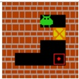</td></tr></table>

Table 6: Information about FrozenLake Environment.
<table><tr><td rowspan=1 colspan=1>Name</td><td rowspan=1 colspan=1>Value</td></tr><tr><td rowspan=1 colspan=1>room size</td><td rowspan=1 colspan=1>4×4</td></tr><tr><td rowspan=1 colspan=1>is slippery</td><td rowspan=1 colspan=1>False</td></tr><tr><td rowspan=1 colspan=1>maximum turn number</td><td rowspan=1 colspan=1>4</td></tr><tr><td rowspan=1 colspan=1>action space</td><td rowspan=1 colspan=1>Up, Down, Left, Right</td></tr><tr><td rowspan=1 colspan=1>format reward</td><td rowspan=1 colspan=1>0.5</td></tr><tr><td rowspan=1 colspan=1>step penalty</td><td rowspan=1 colspan=1>-0.1</td></tr><tr><td rowspan=1 colspan=1>success reward</td><td rowspan=1 colspan=1>10</td></tr><tr><td rowspan=1 colspan=1>intrinsic reward weight α</td><td rowspan=1 colspan=1>0.05</td></tr><tr><td rowspan=1 colspan=2>example                          </td></tr></table>

Table 7: Information about Navigation Environment.
<table><tr><td rowspan=1 colspan=1>Name</td><td rowspan=1 colspan=1>Value</td></tr><tr><td rowspan=1 colspan=1>resolution</td><td rowspan=1 colspan=1>255</td></tr><tr><td rowspan=1 colspan=1>success threshold</td><td rowspan=1 colspan=1>1.5</td></tr><tr><td rowspan=1 colspan=1>step distance</td><td rowspan=1 colspan=1>0.5</td></tr><tr><td rowspan=1 colspan=1>action space</td><td rowspan=1 colspan=1>MoveAhead, MoveBack,MoveRight, MoveLeft,RotateRight, RotateLeft,LookUp, LookDown</td></tr><tr><td rowspan=1 colspan=1>format reward</td><td rowspan=1 colspan=1>0.5</td></tr><tr><td rowspan=1 colspan=1>step penalty</td><td rowspan=1 colspan=1>-0.1</td></tr><tr><td rowspan=1 colspan=1>success reward</td><td rowspan=1 colspan=1>10</td></tr><tr><td rowspan=1 colspan=1>intrinsic reward weight α</td><td rowspan=1 colspan=1>0.05example                          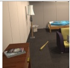</td></tr></table>

ManiSkill is also a 3D embodied manipulation benchmark where an agent controls a Panda robotic arm under stochastic dynamics. It features a hybrid action space that combines discrete action types with continuous parameters (e.g., pick(x, y, z)). Given third-person 3D observations, the agent must perform fine-grained visual grounding to map objects to precise coordinates, enabling accurate and physically executable interactions. Detailed information is listed in Tab.8. Since actions in this environment consist of two components, including a discrete action type and continuous spatial parameters, we adapt SCR to jointly infer both the action type $\hat { u } _ { t }$ (i.e., pick, place, or push) and the continuous parameters $\hat { p } _ { t }$ (i.e., spatial coordinates). The modified SCR enforces a strict type match via an indicator function I, followed by a normalized spatial penalty (with $D _ { \mathrm { m a x } }$ denoting the maximum distance):

$$
r _ { t } ^ { i } = \mathbb { I } ( \hat { u } _ { t } = u _ { t } ) \cdot \left( 1 - \frac { \lVert \hat { p } _ { t } - p _ { t } \rVert _ { 2 } } { D _ { \operatorname* { m a x } } } \right)\tag{15}
$$

Table 8: Information about ManiSkill Environment.
<table><tr><td rowspan=1 colspan=1>Name</td><td rowspan=1 colspan=1>Value</td></tr><tr><td rowspan=1 colspan=1>action space</td><td rowspan=1 colspan=1>pick(x, y, z),place(x, y, z),push(x1, y1, z1, x2, y2, z2)</td></tr><tr><td rowspan=1 colspan=1>format reward</td><td rowspan=1 colspan=1>0.5</td></tr><tr><td rowspan=1 colspan=1>step penalty</td><td rowspan=1 colspan=1>-0.1</td></tr><tr><td rowspan=1 colspan=1>success reward</td><td rowspan=1 colspan=1>10</td></tr><tr><td rowspan=1 colspan=1>intrinsic reward weight α</td><td rowspan=1 colspan=1>0.05</td></tr><tr><td rowspan=1 colspan=1>example</td><td rowspan=1 colspan=1>口</td></tr></table>

## D Discussion and Future Direction

The Horizon of Causality. While RWM demonstrates strong efficacy in standard interactive settings, our analysis reveals a fundamental challenge of causal ambiguity. Our framework assumes that the transition $\left( { { s _ { t } } , { s _ { t + 1 } } } \right)$ contains sufficient information to infer the underlying action. Importantly, we also account for more general settings where the temporal horizon between observations expands, such as multi-action turns in which an agent executes a sequence $\{ a _ { 1 } , \ldots , a _ { k } \}$ before receiving $o _ { t + 1 }$ In these cases, the correspondence between state changes and actions naturally becomes many-to-one. Consider a simple FrozenLake scenario in Fig. 8: the sequences <Up, Left> and <Left, Up> may lead to an identical final state configuration. If the agent executes the former while the retrospective world modeling infers the latter, the resulting intrinsic reward would incorrectly penalize a valid action, yielding a false negative signal, since the executed action is already fixed and unambiguous. This underscores a critical insight for the field of world modeling: dense observation is a prerequisite for accurate causal grounding. When observations are sparse, the ground truth becomes ambiguous. To extend the horizon of causality, future work in world modeling must address this by moving beyond single-trajectory lookback to set-based retrospection, where the reward acknowledges the set of all physically valid causal paths rather than overfitting to a single deterministic history.

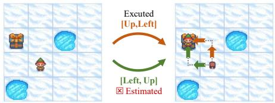  
Figure 8: Case Study: Causal Ambiguity in Multi-Action Turns. Distinct action sequences can induce identical state transitions, posing challenges to the horizon of causality.

Limitation. While RWM significantly improves agent reasoning and decision-making, we acknowledge two primary limitations. First, in environments with extreme stochastic dynamics, the inverse transition mapping can become ambiguous (i.e., multiple distinct actions or random environmental perturbations may yield the exact same next observation). This causal ambiguity could introduce noise into the Self-Consistency Reward, which may require more advanced probabilistic modeling in future work. Second, scaling RWM to extremely long-horizon tasks currently poses practical hardware challenges. Training multi-turn VLM agents via RL is highly memory-intensive; extending the interaction to very long turns naturally encounters Out-Of-Memory (OOM) bottlenecks. Future engineering optimizations in memory-efficient RL (e.g., context compression or KV-cache offloading) should be explored to deploy this paradigm in longer, more complex scenarios.

## E Case Study

We report some cases of the agent trained with our RWM, as shown in Tab.9 and Tab.10.

Table 9: Case study for our agent in a Sokoban environment.
<table><tr><td rowspan=1 colspan=1>Name</td><td rowspan=1 colspan=1>Value</td></tr><tr><td rowspan=1 colspan=1>state_0</td><td rowspan=1 colspan=1>(initial state)</td></tr><tr><td rowspan=1 colspan=1>agent</td><td rowspan=1 colspan=1>&lt;think&gt;&lt;observation&gt;The box is above and to the right of the player. The target is above the box. &lt;/observation&gt;&lt;reasoning&gt;The player needs to go to the right first. &lt;/reasoning&gt;&lt;prediction&gt;The player will be below the box. &lt;/prediction&gt;&lt;/think&gt;&lt;answer&gt;Right &lt;/answer&gt;</td></tr><tr><td rowspan=1 colspan=1>state_1</td><td rowspan=1 colspan=1></td></tr><tr><td rowspan=1 colspan=1>agent</td><td rowspan=1 colspan=1>&lt;think&gt;&lt;observation&gt;The box is directly above the player and the target is above the box. &lt;/observation&gt;&lt;retrospection&gt;I think the scores of actions in [Up, Down, Left, Right] for causing the environmentstate transition is: [-1,0,0,5]. &lt;/retrospection&gt;&lt;reasoning&gt;The player needs to go up to push the box. &lt;/reasoning&gt;&lt;prediction&gt;The player will be below the box, the target will be above the box. &lt;/prediction&gt;&lt;/think&gt;&lt;answer&gt;Up &lt;/answer&gt;</td></tr><tr><td rowspan=1 colspan=1>state_2</td><td rowspan=1 colspan=1>上</td></tr><tr><td rowspan=1 colspan=1>agent</td><td rowspan=1 colspan=1>&lt;think&gt;&lt;observation&gt;The box is above the player and the target is directly above the box. &lt;/observation&gt;&lt;retrospection&gt;I think the scores of actions in [Up, Down, Left, Right] for causing the environmentstate transition is: [5,0,-5,-5]. &lt;/retrospection&gt;&lt;reasoning&gt;The player needs to go up to push the box up to the target. &lt;/reasoning&gt;&lt;prediction&gt;The player will be below the box, the box will be at the same position of the target. &lt;/prediction&gt;&lt;/think&gt;&lt;answer&gt;Up &lt;/answer&gt;</td></tr><tr><td rowspan=1 colspan=1>state_3</td><td rowspan=1 colspan=1>(success)</td></tr></table>

Table 10: Case study for our agent in a FrozenLake environment.
<table><tr><td rowspan=1 colspan=1>Name</td><td rowspan=1 colspan=1>Value</td></tr><tr><td rowspan=1 colspan=1>state_0</td><td rowspan=1 colspan=1>米(initial state)</td></tr><tr><td rowspan=1 colspan=1>agent</td><td rowspan=1 colspan=1>&lt;think&gt;&lt;observation&gt;The player is to the left of and above the goal. There is a hole below and to the left ofthe player. &lt;/observation&gt;&lt;reasoning&gt;I should go right first. &lt;/reasoning&gt;&lt;prediction&gt;The player will be above of the goal. &lt;/prediction&gt;&lt;/think&gt;&lt;answer&gt;Right &lt;/answer&gt;</td></tr><tr><td rowspan=1 colspan=1>state_1</td><td rowspan=1 colspan=1></td></tr><tr><td rowspan=1 colspan=1>agent</td><td rowspan=1 colspan=1>&lt;think&gt;&lt;observation&gt;The player is above the goal. &lt;/observation&gt;&lt;retrospection&gt;I think the scores for actions [Up, Down, Left, Right] are: [0,-5,-5, 5]. &lt;/retrospection&gt;&lt;reasoning&gt;The goal is below me, so I should go down first. &lt;/reasoning&gt;&lt;prediction&gt;The player will be above of the goal. &lt;/prediction&gt;&lt;/think&gt;&lt;answer&gt;Down &lt;/answer&gt;</td></tr><tr><td rowspan=1 colspan=1>state_2</td><td rowspan=1 colspan=1></td></tr><tr><td rowspan=1 colspan=1>agent</td><td rowspan=1 colspan=1>&lt;think&gt;&lt;observation&gt;The player is above the goal. &lt;/observation&gt;&lt;retrospection&gt;I think the scores for actions [Up, Down, Left, Right] are: [-5 ,5,-1, -5]. &lt;/retrospection&gt;&lt;reasoning&gt;The goal is below me, so I should go down. &lt;/reasoning&gt;&lt;prediction&gt;The player will be above of the goal. &lt;/prediction&gt;&lt;/think&gt;&lt;answer&gt;Down &lt;/answer&gt;</td></tr><tr><td rowspan=1 colspan=1>state_3</td><td rowspan=1 colspan=1></td></tr><tr><td rowspan=1 colspan=1>agent</td><td rowspan=1 colspan=1>&lt;think&gt;&lt;observation&gt;The goal is below the player. &lt;/observation&gt;&lt;retrospection&gt;I think the scores for actions [Up, Down, Left, Right] are: [-5,5,-5,-5]. &lt;/retrospection&gt;&lt;reasoning&gt;The goal is below me, so I should go down. &lt;/reasoning&gt;&lt;prediction&gt;The player will be at the same position of the goal. &lt;/prediction&gt;&lt;/think&gt;&lt;answer&gt;Down &lt;/answer&gt;</td></tr><tr><td rowspan=1 colspan=1>state_4</td><td rowspan=1 colspan=1>(success)</td></tr></table>

## F Prompts

We report the prompts used in the training process, as shown in Tab. 11, Tab. 12, and Tab. 13.

Table 11: Prompt for Sokoban.  
Prompt for Sokoban   
(Initial Turn)   
You are a Sokoban solver.   
Your goal is to push all boxes onto targets.   
Rules:   
1. Push boxes (can’t pull).   
2. Avoid walls.   
Actions you can take: Up, Down, Left, Right.   
You should take 1 action at a time.   
Initial Observation:   
<image>   
Decide your next action.   
You should take 1 action at a time.   
You should first give the description of your observation, then your reasoning,   
then predict the next state, and finally your answer.   
For the content you provide within the ‘<observation>‘ and ‘<prediction>‘ tags,   
you must strictly describe the relative position of the ‘target‘ and any visible   
‘box‘ objects \*\*relative to the player\*\*. Your description/prediction must   
include \*\*both\*\* a vertical and a horizontal directional relationship for each   
object. Use ONLY the terms ‘above‘, ‘below‘, ‘left‘, ‘right‘, or ‘same‘ for   
describing these relationships.   
Your response should be in the format of:   
<think><observation>...</observation><reasoning>...</reasoning><prediction>...   
</prediction></think><answer>...</answer>   
e.g. <think><observation>The box is below the player and the target is   
below and to the left of the player.</observation><reasoning>I need to   
go down to push the box down to the target.</reasoning><prediction>The   
player will be above the box, the target will be to the left of the   
box.</prediction></think><answer>Down</answer>   
(N-th Turn, N>0)   
The new observation is:   
<image>   
Decide your next action.   
You should take 1 action at a time.   
First, you should first describe the current observation. Second, using   
this information, infer which action could plausibly have led to the current   
observation. Ignore and do not rely on your previous answer or intended action.   
Your inference must be based only on the observed state and the state transition   
from the previous step. Then provide your reasoning, predict the next state,   
and finally give your answer.

1) For the content you provide within the ‘<observation>‘ and ‘<prediction>‘   
tags, you must strictly describe the relative position of the ‘target‘ and any   
visible ‘box‘ objects \*\*relative to the player\*\*. Your description/prediction   
must include \*\*both\*\* a vertical and a horizontal directional relationship for   
each object. Use ONLY the terms ‘above‘, ‘below‘, ‘left‘, ‘right‘, or ‘same‘   
for describing these relationships.   
2) For the content you provide within the ‘<retrospection>‘, you must strictly   
assign a score to each action in [Up, Down, Left, Right]. Output a vector of   
length 4, with integer scores ranging from -5 to 5. A higher score indicates a   
higher likelihood that the action was taken to reach the current observation.   
Your response should be in the format of:   
<think><observation>...</observation><retrospection>...</retrospection>   
<reasoning>...</reasoning><prediction>...</prediction></think>   
<answer>...</answer>   
e.g. <think><observation>The box is below the player and the target is below   
and to the left of the player.</observation><retrospection>I think the scores of   
actions in [Up, Down, Left, Right] for causing the environment state transition   
is: [0,5,-1,-5].</retrospection><reasoning>I need to go down to push the box   
down to the target.</reasoning><prediction>The player will be above the box, the   
target will be to the left of the box.</prediction></think><answer>Down</answer>

## Table 12: Prompt for FrozenLake.

Prompt for FrozenLake   
(Initial Turn)   
You are a FrozenLake solver.   
Your task is to reach the goal and avoid falling into holes.   
Actions you can take: Left, Down, Right, Up.   
You should take 1 action at a time.   
Initial Observation:   
<image>   
Decide your next action.   
You should take 1 action at a time.   
You should first describe the observation, then your reasoning, then predict the   
next state, and finally your answer.   
For the content you provide within the ‘<observation>‘ and ‘<prediction>‘ tags,   
you must strictly describe the relative position of the ‘target‘ (the gift   
box) and any visible ‘hole‘ (blue circles) objects \*\*relative to the player\*\*.   
Your description/prediction must include \*\*both\*\* a vertical and a horizontal   
directional relationship for each object. Use ONLY the terms ‘above‘, ‘below‘,   
‘left‘, ‘right‘, or ‘same‘ for describing these relationships.   
Your response should be in the format of:   
<think><observation>...</observation><reasoning>...</reasoning><prediction>...   
</prediction></think><answer>...</answer>   
e.g. <think><observation>The player is above and on the right side of target.   
There is a hole below and at the left of the player.</observation><reasoning>I   
should go down first.</reasoning><prediction>The player will be above   
and on the right side of target. There is a hole at the left of the   
player.</prediction></think><answer>Down</answer>

(N-th Turn, N>0)   
The new observation is:   
<image>   
Decide your next action.   
You should take 1 action at a time.   
First, you should first describe the current observation. Second, using   
this information, infer which action could plausibly have led to the current   
observation. Ignore and do not rely on your previous answer or intended action.   
Your inference must be based only on the observed state and the state transition   
from the previous step. Then provide your reasoning, predict the next state,   
and finally give your answer.   
1) For the content you provide within the ‘<observation>‘ and ‘<prediction>‘   
tags, you must strictly describe the relative position of the ‘target‘ and any   
visible ‘box‘ objects \*\*relative to the player\*\*. Your description/prediction   
must include \*\*both\*\* a vertical and a horizontal directional relationship for   
each object. Use ONLY the terms ‘above‘, ‘below‘, ‘left‘, ‘right‘, or ‘same‘   
for describing these relationships.   
2) For the content you provide within the ‘<retrospection>‘, you must strictly   
assign a score to each action in [Left, Down, Right, Up]. Output a vector of   
length 4, with integer scores ranging from -5 to 5. A higher score indicates a   
higher likelihood that the action was taken to reach the current observation.   
Your response should be in the format of:   
<think><observation>...</observation><retrospection>...</retrospection>   
<reasoning>...</reasoning><prediction>...</prediction></think>   
<answer>...</answer>   
e.g. <think><observation>The player is on the right side of the goal.   
There is a hole at the left of the player.</observation><retrospection>I   
think the scores of actions in [Left, Down, Right, Up] for causing the   
environment state transition is: [0,5,-1,-5].</retrospection><reasoning>I   
should go down first.</reasoning><prediction>The player will be on   
the right side of the goal. There is a hole at the left of the   
player.</prediction></think><answer>Down</answer>

## Table 13: Prompt for Navigation.

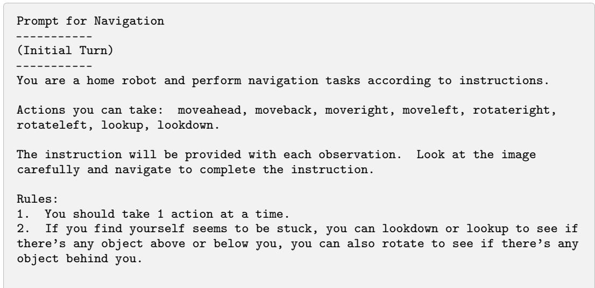

Initial Observation:   
<image>   
Human Instruction:   
I am looking for a garbage can. Can you navigate to that object?   
Decide your next action.   
You can take 1 action at a time.   
You should first give your thought process with the your observation, reasoning,   
and prediction of next state, then your answer. Both the observation and   
prediction should describe what you see or expect to see in the environment.   
Your response should be in the format of:   
<think><observation>...</observation><reasoning>...</reasoning><prediction>   
...</prediction></think><answer>...</answer>   
e.g. <think><observation>There is a garbage can in the upper left corner   
of the image.</observation><reasoning>To move to the garbage can, we can go   
forward-left, but since there’s a kitchen counter directly ahead, we should   
go left first. </reasoning><prediction> I will be in front of the garbage   
can.</prediction></think> <answer>moveleft</answer>   
(N-th Turn, N>0)   
The new observation is:   
<image>   
Decide your next action.   
You should take 1 action at a time.   
First, you should first describe the current observation. Second, using   
this information, infer which action could plausibly have led to the current   
observation. Ignore and do not rely on your previous answer or intended action.   
Your inference must be based only on the observed state and the state transition   
from the previous step. Then provide your reasoning, predict the next state,   
and finally give your answer.   
1) Both the observation and prediction should describe what you see or expect to   
see in the environment.   
2) For the content you provide within the ‘<retrospection>‘, you must strictly   
assign a score to each action in [moveahead, moveback, moveright, moveleft,   
rotateright, rotateleft, lookup, lookdown]. Output a vector of length 8,   
with integer scores ranging from -5 to 5. A higher score indicates a higher   
likelihood that the action was taken to reach the current observation.   
Your response should be in the format of:   
<think><observation>...</observation><retrospection>...</retrospection>   
<reasoning>...</reasoning><prediction>...</prediction></think>   
<answer>...</answer>   
e.g. <think><observation>There is a garbage can in the upper left   
corner of the image. </observation> <retrospection> I think the scores   
of actions in [moveahead, moveback, moveright, moveleft, rotateright,   
rotateleft, lookup, lookdown] for causing the environment state transition is:   
[0,-5,-1,5,-5,-5,-5,-5].</retrospection><reasoning> To move to the garbage can,   
we can go forward-left, but since there’s a kitchen counter directly ahead, we   
should go left first.</reasoning><prediction> I will be in front of the garbage   
can.</prediction></think><answer>moveleft</answer>