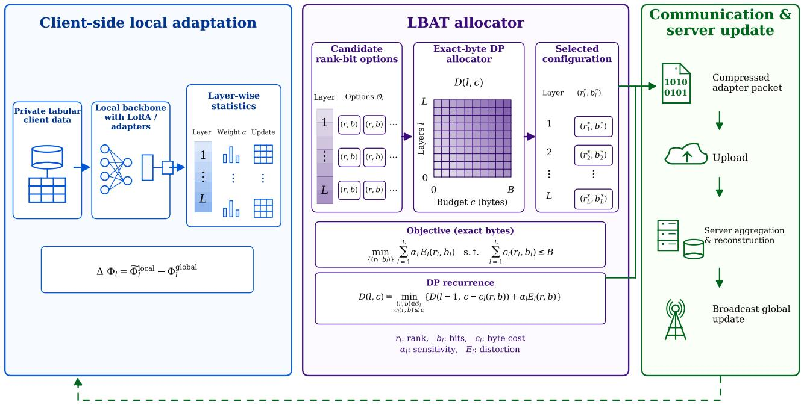
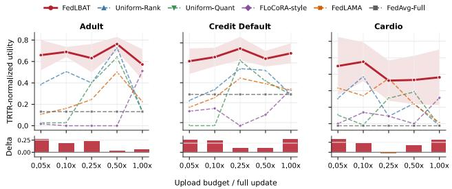
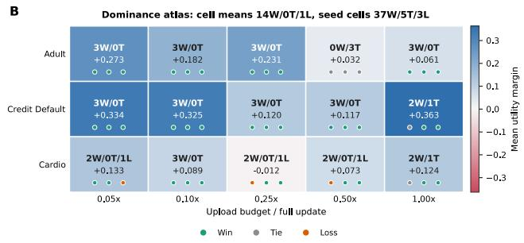
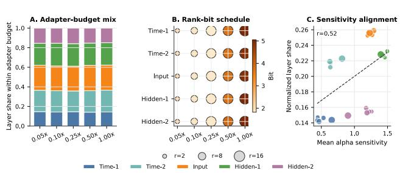
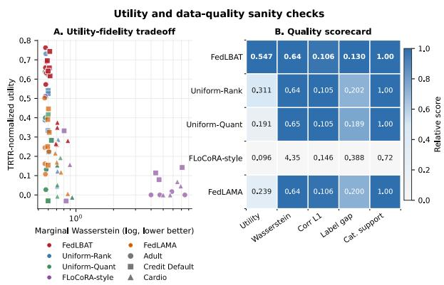

# Beyond Uniform Compression: Budgeted Transmission Allocation for Extreme Federated Learning

Pengfei Li, Mohammad Khalil

Centre for the Science of Learning & Technology (SLATE), University of Bergen, Bergen, Norway

## Abstract

Federated learning faces severe communication bottlenecks when clients upload high-dimensional model updates. Exist- ing methods often compress these updates uniformly across all layers. This uniform approach ignores the heterogeneous value of diferent parameter blocks and wastes limited band- width on insensitive layers. To address this issue, we pro- pose Layer-wise Budgeted Adaptive Transmission (LBAT). LBAT reframes federated communication under extreme up- link budgets as a resource allocation problem. Our framework dynamically estimates the transmission value of diferent lay- ers utilising local training signals. It then employs an exact byte dynamic programming allocator to determine optimal rank and bit configurations under strict budgets. We validate LBAT on highly heterogeneous federated tabular prediction and data generation tasks. Extensive experiments demonstrate that LBAT consistently outperforms uniform rank, uniform quantisation, and fixed compression baselines across various extreme budget regimes. Furthermore, it achieves significantly better communication and utility tradeofs while preserving essential distributional fidelity.

## Introduction

Federated learning enables collaborative model training without centralising raw data, ofering a vital paradigm for domains like healthcare and finance that face strict egress and compliance constraints (McMahan et al. 2017; Kairouz and McMahan 2021; Yang et al. 2019). The classic Federated Averaging (FedAvg) framework enables data-localised model training via multiple-step client local updates and periodic server aggregation, becoming the foundational paradigm for subsequent federated optimisation methods (McMahan et al. 2017; Kairouz and McMahan 2021). However, FedAvg fails to eliminate federated learning system bottlenecks: clients must still upload high-dimensional model updates to servers each communication round. As client numbers increase, model scales expand, or uplinks face constraints, repeated model update uploads rapidly dominate training costs and deployment feasibility (Konečny et al. 2016; Bonawitz et al.\` 2019). Thus, communication-eficient learning has long fo-cused on message compression, synchronisation frequency control, and partial client participation. Representative meth- ods include QSGD, balancing communication volume and convergence error via stochastic quantisation (Alistarh et al. 2017), Deep Gradient Compression, significantly reducing distributed training bandwidth overhead via gradient sparsi- fication (Lin et al. 2017), and FedPAQ, combinin eriodic averaging, partial client participation, and quantised mes- sage passing (Reisizadeh et al. 2020). Recently, parameter-eficient fine-tuning provides another path to reduce feder- ated communication costs: LoRA significantly cuts trainable parameters by freezing backbone models and training only low rank adapters (Hu et al. 2022), while subsequent feder-ated LoRA methods explore uploading and aggregating only lightweight adapters, or incorporating quantisation to com- press client updates (Babakniya et al. 2023; Grativol et al. 2024).

However, most aforementioned communication-eficient methods focus on encoding given model updates more com- pactly, reducing single-round communication overhead via quantisation, sparsification, low-rank approximation, or low- ered synchronisation frequency (Konečny et al. 2016; Al-\` istarh et al. 2017; Lin et al. 2017; Reisizadeh et al. 2020; Albasyoni et al. 2020). When per-round upload budgets are extremely small, merely compressing full updates is insuf- ficient. Clients must also decide which layers, adapter ma- trices, and parameter blocks merit uploading most. Existing uniform quantisation, uniform rank allocation, Top k spar-sification, or fixed LoRA configurations typically assume diferent parameter blocks possess approximately equal com- munication value (Hu et al. 2022; Zhang et al. 2023). But deep model hierarchical structures exhibit significant hetero- geneity: diferent layers vary in parameter scale, compression sensitivity, and task utility contribution. Multiple adaptive optimisation studies show layer-wise or matrix-wise budget allocation is often more efective than uniform configuration (Dong et al. 2020; Zhang et al. 2023; Markov et al. 2024). In federated learning, this issue is further exacerbated by client data heterogeneity and aggregation shift. Non-IID data in- duces client drift, and diferent layers may exhibit varying model diferences across clients (Karimireddy et al. 2020; Li et al. 2020; Lee, Zhang, and Avestimehr 2023). Thus, in heterogeneous client scenarios with extremely constrained uplink budgets, key problems include not only "how to com- press updates" but also "how to locally estimate parameter block values per client and select the most valuable adapter configuration for upload under strict byte budgets".

To this end, we propose LBAT (Layer-wise Budgeted Adaptive Transmission), a layer-wise adaptive transmis-sion framework for extreme uplink communication budgets. LBAT’s core perspective is: when communication is ex- tremely restricted, the key problem lies not only in "how to compress model updates", but also in "which parameter blocks limited upload bytes should be preferentially allocated to". LBAT d namicall estimates the transmission values of diferent layers based on local training signals, and adaptively solves layer-wise upload configurations under strict budgets, thereby transforming federated communication from a "uni- form compression" paradigm into a "budgeted value alloca- tion" problem. The overall pipeline of our proposed LBAT framework is illustrated in Figure 1.

We validate LBAT in two highly challenging federated tab- ular learning scenarios: communication-constrained tabular prediction tasks (FedLBAT-Pred) and tabular data generation tasks (FedLBAT-Syn). These two scenarios cover dual prediction and generation objectives, and encompass realistic challenges like highly non-IID data, mixed features, and extreme sample skew. Extensive experiments show that LBAT stably outperforms baseline methods like uniform rank, uniform quantisation, FLoCoRA-style compression, and sensitivity-free allocation, achieving significantly better communication-utility trade-ofs under extreme communica- tion budgets. Our main contributions are as follows:

• Problem Reframing: We reframe federated communication under extreme uplink budgets as a layer-wise trans- mission allocation problem, driving communication- eficient federated learning to shift from the "how much to compress" perspective to the "what to transmit prefer- entially" perspective.

• Algorithm Design: We propose LBAT, a lightweight framework not relying on public data, extra genera- tors, or server-side distillation, maximising transmission marginal utility under strict budgets through local value estimation and adaptive allocation.

• Empirical Validation & Diagnostics: We demonstrate LBAT’s efectiveness in federated tabular prediction and generation tasks (FedLBAT-Pred & FedLBAT-Syn). Additionally, through deep analysis of layer-wise allocation strategies, gap-to-full-upload, TRTR-normalized utility, and class coverage, we reveal the internal mechanisms and interpretability of LBAT’s performance gains.

## Related Work

## Communication Eficient Federated Learning

Communication overhead remains a federated learning bot- tleneck. FedAvg significantly reduces communication rounds via local multi-step updates and server-side model averaging, but clients must still upload model updates per round, and uplink bandwidth often remains the primary limitation in cross-institution collaboration and privacy-sensitive tabular data scenarios (McMahan et al. 2017). Therefore, extensive work studies compressing client upload content. QSGD establishes trade-ofs between communication bits and opti- misation variance via stochastic gradient quantisation (Alistarh et al. 2017), Deep Gradient Compression reduces communication bandwidth utilisin radient s arsit (Lin et al. 2017), and FedPAQ further lowers federated training commu-nication costs combining periodic averaging and quantised communication (Reisizadeh et al. 2020). These methods pri-marily focus on "how to compress given updates", like re- ducing gradient precision or sparsifying updates. A related but finer-grained work category studies layer-wise compres- sion. L GreCo notes diferent network layers exhibit varying compression error sensitivities, improving compression efi- ciency while satisfying error constraints via layer-wise adap- tive compression parameter selection (Markov et al. 2024). This paper studies budgeted transmission allocation in fed- erated uploads, namely deciding which layers or parame- ter blocks merit transmission under extreme uplink budgets, rather than merely applying uniform or layer-wise compres- sion to existing gradient updates.

## Parameter Eficient Updates in Federated Learning

Parameter-eficient fine-tuning provides another approach for communication-constrained federated learning. LoRA sig- nificantly reduces trainable parameters by freezing main models and injecting low-rank trainable matrices (Hu et al. 2022), a mechanism initially used for large model fine-tuning but naturally suitable as lightweight update carriers in feder- ated communication. FLoCoRA introduces LoRA into fed- erated training and further reduces communication costs by combining quantisation, showing low-rank adapters serve as strong communication compression baselines (Grativol et al. 2024). Recent works also study federated fine-tuning with heterogeneous LoRA rank, for example, HetLoRA al- lows diferent clients to use diferent ranks and designs cor- responding aggregation strategies (Cho et al. 2024). Such methods typically treat adapter structures or rank as part of model design, while this paper treats low-rank adapters as selectable and encodable transmission units, focusing on jointly allocating rank, bit width, and upload decisions across diferent layers given single-round uplink budgets.

## Federated Tabular Learning and Tabular Modeling

Recently, difusion models have been applied to tabular mod- elling: TabDDPM proves that difusion models can handle continuous and discrete mixed-type tabular data, outper- forming several GAN/VAE alternatives on multiple tabular benchmarks (Kotelnikov et al. 2023). In federated scenarios, FedTabDif extends tabular difusion models to multiple client data owners, enabling collaborative mixed-type tabular generative model training without centralising raw data (Sattarov, Schreyer, and Borth 2024), and DP FedTabDif further combines diferential privacy with federated tabular difusion (Sattarov, Schreyer, and Borth 2025). These works focus on tabular generative model construction and training, whereas this paper focuses on communication allocation problems in federated tabular learning and synthesis: how to allocate transmission resources across diferent layers or parameter blocks given byte budgets, thereby improving utility retention capability under communication-constrained conditions.

  
Figure 1: Overview of the Layer-wise Budgeted Adaptive Transmission (LBAT) framework. LBAT evaluates layer-wise sensitivity locally and employs an exact-byte dynamic programming allocator to determine the optimal rank and bit configuration $( r _ { l } ^ { * } , b _ { l } ^ { * } )$ under a strict communication budget B.

## Methodology

This paper asks: when clients can upload extremely few bytes per round, which layers or parameter blocks merit trans- mission the most? LBAT models client uploads as a layer- wise budget allocation problem. Each transmittable param- eter block possesses several candidate transmission configu- rations. Clients select configurations that minimise estimated losses within given byte budgets, based on local parameter sensitivities and communication costs. The server uses no distillation or extra proxy data, executing only sample-size- weighted aggregation on the received parameter updates.

## Budgeted Federated Transmission

Consider federated learning involving N clients. Let the global transmittable parameter blocks be denoted as

$$
\Phi = \{ \Phi _ { 1 } , \Phi _ { 2 } , . . . , \Phi _ { L } \} ,\tag{1}
$$

where L denotes the number of layers or parameter blocks participating in LBAT decisions. In round t, the server broadcasts the current parameters $\Phi ^ { t }$ . Client i trains on its local data $\mathcal { D } _ { i }$ to obtain local parameters $\widetilde { \Phi } _ { i } ^ { t }$ . The corresponding block-level updates are

$$
\Delta _ { i , \ell } ^ { t } = \widetilde { \Phi } _ { i , \ell } ^ { t } - \Phi _ { \ell } ^ { t } , \qquad \ell = 1 , \dots , L .\tag{2}
$$

In parameter-eficient adapter models, $\Delta _ { i , \ell } ^ { t }$ represents the equivalent weight updates generated by the ℓ-th adapter block. If the model also contains a few auxiliary parame- ters that do not participate in LBAT decisions but require synchronisation (e.g., categorical embeddings or decoding heads), we treat them as ordinary federated parameters and deduct their communication volume from the current round’s total budget. Thus, LBAT acts strictly on the remaining ef- fective budget B¯ti .

For each block ℓ, the client constructs a finite candidate set $\mathcal { O } _ { i , \ell } ^ { t } .$ A candidate $o \in \mathcal { O } _ { i , \ell } ^ { t }$ represents a specific transmis- sion configuration, defined by hyperparameters such as the retained rank r and the quantisation bit-width b. We denote the communication cost of this candidate in bytes as $C _ { i , \ell } ( o )$ and the server-decoded approximate update as $\widehat { \Delta } _ { i , \ell } ^ { t } ( o )$ . We measure the candidate transmission distortion using the nor- malised reconstruction error:

$$
E _ { i , \ell } ^ { t } ( o ) = \frac { \left\| \Delta _ { i , \ell } ^ { t } - \widehat { \Delta } _ { i , \ell } ^ { t } ( o ) \right\| _ { \mathrm { F } } ^ { 2 } } { \left\| \Delta _ { i , \ell } ^ { t } \right\| _ { \mathrm { F } } ^ { 2 } + \varepsilon } ,\tag{3}
$$

where $\varepsilon > 0$ is a numerical stability term to prevent division by zero. If a candidate o signifies not uploading this block at all, then $C _ { i , \ell } ( o ) = 0$ and $\widehat { \Delta } _ { i , \ell } ^ { t } ( o ) = 0$

## Sensitivity-Aware Objective

Diferent parameter blocks impact the final utility diferently. Therefore, LBAT maintains a sensitivity score $\alpha _ { i , \ell } ^ { t }$ for each block to measure the relative cost of its compression error. This weighting is motivated by block-level perturbation anal- ysis. Let the compression error be $\delta _ { i , \ell } ^ { t } = \widehat { \Delta } _ { i , \ell } ^ { t } ( o ) - \Delta _ { i , \ell } ^ { t } . \mathrm { A s } -$ suming the objective function $\mathcal { F }$ satisfies block-wise smooth- ness, for a small perturbation $\delta _ { \ell } ,$ we have:

$$
\mathcal { F } ( \Phi + \delta _ { \ell } ) \leq \mathcal { F } ( \Phi ) + \left. \nabla _ { \Phi _ { \ell } } \mathcal { F } ( \Phi ) , \delta _ { \ell } \right. + \frac { L _ { \ell } } { 2 } \left. \delta _ { \ell } \right. _ { \mathrm { F } } ^ { 2 } .\tag{4}
$$

When the model approaches a local minimum, or assuming the compression error direction is approximately orthogo- nal to the gradient, the impact of the first-order term is di- minished. The utility drop caused by compression is then heuristically bounded by the second-order term $\frac { L _ { \ell } } { 2 } \Vert \delta _ { \ell } \Vert _ { \mathrm { F } } ^ { 2 }$

To approximate $L _ { \ell }$ or the block-wise importance without incurring extra backward passes, LBAT reuses the gradient statistics naturally generated during local training. The sen- sitivity is updated online via an exponential moving average:

$$
\alpha _ { i , \ell } ^ { t } \gets \rho \alpha _ { i , \ell } ^ { t - 1 } + ( 1 - \rho ) \left. g _ { i , \ell } ^ { t } \right. _ { \mathrm { F } } ^ { 2 } ,\tag{5}
$$

where $\rho \in [ 0 , 1 )$ , and $g _ { i , \ell } ^ { t }$ is the accumulated gradient statistic of block ℓ during the round t local training.

Given the candidate sets, costs, distortions, and sensitivi- ties, client i’s upload decision is formulated as:

$$
\begin{array} { r l } { \displaystyle \operatorname* { m i n } _ { \boldsymbol { o } _ { i , 1 } , \ldots , \boldsymbol { o } _ { i , L } } } & { \displaystyle \sum _ { \ell = 1 } ^ { L } \alpha _ { i , \ell } ^ { t } E _ { i , \ell } ^ { t } ( o _ { i , \ell } ) } \\ { \mathrm { s . t . } } & { \displaystyle \sum _ { \ell = 1 } ^ { L } C _ { i , \ell } ( o _ { i , \ell } ) \leq \bar { B } _ { i } ^ { t } , } \\ & { o _ { i , \ell } \in \mathcal { O } _ { i , \ell } ^ { t } , \quad \ell = 1 , \ldots , L . } \end{array}\tag{6}
$$

Unlike uniform rank or uniform quantisation baselines that rigidly apply identical configurations to all layers, Equa- tion (6) allows LBAT to adaptively allocate the byte budget based on layer-wise marginal values.

## Solving the Allocation via Dynamic Programming

Since each parameter block must select exactly one config- uration from a discrete candidate set, Equation (6) forms a Multiple-Choice Knapsack Problem (MCKP). Let D[ℓ, c] denote the minimum weighted distortion when processing the first ℓ parameter blocks using no more than c bytes. The exact-byte dynamic programming recurrence is:

$$
\begin{array} { r l } & { D [ \ell , c ] = \underset { o \in \mathcal { O } _ { i , \ell } ^ { t } } { \operatorname* { m i n } } \left\{ D [ \ell - 1 , c - C _ { i , \ell } ( o ) ] + \alpha _ { i , \ell } ^ { t } E _ { i , \ell } ^ { t } ( o ) \right\} . } \\ & { \quad \quad \quad \quad \quad \quad \quad \quad \quad \quad \quad \quad \quad \quad \quad \quad \quad \quad } \\ & { \quad \quad \quad \quad \quad \quad \quad \quad \quad \quad \quad \quad \quad \quad \quad \quad \quad \quad \quad \quad } \end{array}\tag{7}
$$

We initialize $D [ 0 , c ] = 0$ . Finally, we select the optimal state satisfying $c \leq \tilde { B } _ { i } ^ { t }$ from $D [ L , c ]$ , obtaining the optimal layer- wise configurations via backtracking. The overall procedure is summarised in Algorithm 1.

## Task Instances

LBAT is an agnostic transmission-layer algorithm, indepen- dent of the underlying network architecture. We instantiate it across two distinct tabular tasks.

Algorithm 1 FedLBAT: Layer wise Budgeted Adaptive   
Transmission   
Require: Initial parameters $\Phi ^ { 0 } .$ , client set $\{ 1 , \ldots , N \}$   
rounds T, efective byte budget per client ${ \bar { B } } _ { i } ^ { \dot { t } } .$   
1: for $t = 0 , 1 , \ldots , T - 1$ do   
2: Server samples client subset $S _ { t }$ and broadcasts $\Phi ^ { t }$   
3: for each $i \in S _ { t }$ in parallel do   
4: Client i trains locally, obtaining block updates   
$\{ \Delta _ { i , \ell } ^ { t } \} _ { \ell = 1 } ^ { L }$ and sensitivities $\{ \alpha _ { i , \ell } ^ { t } \} _ { \ell = 1 } ^ { L }$   
5: Construct candidate sets $\{ \mathcal { O } _ { i , \ell } ^ { t } \} _ { \ell = 1 } ^ { L }$ , evaluating cost   
$C _ { i , \ell } ( o )$ and distortion $E _ { i , \ell } ^ { t } ( o )$ per candidate.   
6: Solve Eq. (6) via exact byte DP (Eq. (7)) to find   
optimal configurations $\{ o _ { i , \ell } ^ { \bar { t } , * } \} _ { \ell = 1 } ^ { L }$   
7: Upload compressed updates $\{ \widehat { \Delta } _ { i , \ell } ^ { t } ( o _ { i , \ell } ^ { t , * } ) \} _ { \ell = 1 } ^ { L } .$   
8: end for   
9: Server decodes updates and aggregates by sample   
size:   
10: $\mathbf { \overline { { \Phi } } } ^ { t + 1 }  \Phi ^ { t } + \frac { 1 } { \sum _ { j \in { \cal S } _ { t } } n _ { j } } \sum _ { i \in { \cal S } _ { t } } n _ { i } \widehat { \mathbf { \Delta } } _ { i } ^ { t } .$   
11: end for   
12: return $\Phi ^ { T }$

FedLBAT-Syn. This task applies LBAT to communication-constrained federated tabular modelling. Clients locally train a tabular difusion model where continuous and categorical features are encoded into a unified latent space $z _ { \mathrm { 0 } }$ . The local denoising objective is:

$$
\mathcal { L } _ { \mathrm { s y n } } = \mathbb { E } _ { t , \epsilon \sim \mathcal { N } ( 0 , I ) } \left. \epsilon - \epsilon _ { \theta } ( z _ { t } , t ) \right. _ { 2 } ^ { 2 } + \lambda \mathcal { L } _ { \mathrm { c a t } } ,\tag{8}
$$

where $\epsilon _ { \theta }$ is the noise-prediction network and $\mathcal { L } _ { \mathrm { c a t } }$ is the categorical reconstruction loss. LBAT acts exclusively on the model updates during transmission without altering this specific generative loss.

FedLBAT-Pred. To verify that LBAT is not tied strictly to generative evaluators, we also apply it to standard tabu- lar prediction. For binary classification, clients optimise the standard Binary Cross-Entropy (BCE) loss:

$$
\begin{array} { r l r } {  { \mathcal { L } _ { \mathrm { p r e d } } = - \frac { 1 } { | \mathcal { B } | } \sum _ { ( x , y ) \in \mathcal { B } } \Bigl [ y \log \sigma ( h _ { \theta } ( x ) ) } } \\ & { } & { \qquad + ( 1 - y ) \log ( 1 - \sigma ( h _ { \theta } ( x ) ) ) \Bigr ] . } \end{array}\tag{9}
$$

Following local training, LBAT applies the identical bud- geted transmission selection to the predictive model’s pa- rameter updates.

## Experimental Setup

## Datasets and Federated Scenarios

We evaluate LBAT on three binary tabular benchmarks covering demographic, financial, and medical domains: Adult(Becker and Kohavi 1996), Credit Default(Yeh and Lien 2009), and Cardio(Sulianova 2019). We reserve 20% of each dataset for testing and distribute the rest among $N = 2 0$ clients using a Dirichlet label skew partition with $\alpha = 0 . 3$ combined with quantity skew. This creates severe sample size and label heterogeneity. Each communication round samples 4 clients. We deploy LBAT in two distinct settings. The pri- mary setting Syn trains a federated tabular difusion model based on TabDDPM and FedTabDif (Kotelnikov et al. 2023; Sattarov, Schreyer, and Borth 2024) and evaluates generated tables via the Train on Synthetic Test on Real (TSTR) protocol. The auxiliary setting Real applies the same budgeted transmission policy to a tabular MLP predictor. This confirms our framework is broadly applicable to standard predictive models rather than just synthetic data evaluators.

## Baselines and Evaluation Protocol

We define the 1.00× full update budget as transmitting all adapter blocks at maximum rank and highest precision alongside synchronised auxiliary parameters. Our experi- ments test five relative upload budgets ranging from 0.05× to 1.00×. We compare FedLBAT against five baseline meth-ods. Uniform-Rank assigns the same retained rank to all layers. Uniform-Quant applies a uniform bit width across layers. FLoCORA-style implements a fixed parameter ef- ficient compression strategy (Hu et al. 2022; Grativol et al. 2024). FedLAMA adaptively adjusts the temporal aggregation intervals of diferent layers to reduce communication (Lee, Zhang, and Avestimehr 2023). FedAvg-Full transmits the complete adapter update (McMahan et al. 2017). We also include centralised and Train on Real Test on Real (TRTR) oracles as upper bounds. For the synthetic track, our primary metric is TRTR normalised utility computed as $( \bar { \mathrm { A U C } } _ { \mathrm { T S T R } } - 0 . 5 ) / ( \mathrm { A U C } _ { \mathrm { T R T R } } - 0 . 5 )$ . We additionally evaluate marginal Wasserstein distance correlation error la- bel gap and categorical support. The real prediction track reports test AUC and F1. All main results are averaged over three random seeds.

## Results

We organise the results around four questions: (i) whether FedLBAT improves the communication–utility frontier un- der extreme upload budgets; (ii) whether its advantage is consistent across datasets and budget regimes; (iii) what layerwise allocation policy LBAT learns; and (iv) whether the same transmission principle transfers to real tabular predic- tion. Unless otherwise stated, we report TRTR-normalized utility for the synthetic track, so that utility scores are com- parable across datasets with diferent real-data predictability.

## Communication and Utility Tradeofs Under Extreme Budgets

Figure 2 shows the communication–utility frontier under five upload budgets from 0.05× to 1.00× full update. FedL-BAT consistently forms a better frontier than uniform and FLoCORA-style baselines across Adult, Credit Default, and Cardio. The advantage is most pronounced in the extreme- budget interval from 0.05× to 0.25× full update. This sup-ports the central claim of this paper: when only a small frac- tion of the full update can be transmitted, uniformly assigning the same rank or bit width to all layers wastes communication budget, while layer-wise budget allocation preserves more task-relevant information.

A  
  
Figure 2: Communication–utility frontier. The horizontal axis is upload budget normalised by full update, and the vertical axis is TRTR-normalized utility. The margin strip below each panel shows the average utility gain of FedLBAT over the strongest communication-constrained peer. FedL BAT achieves a stronger frontier across all three datasets, particularly in the 0.05×–0.25× extreme-budget range.

## Consistency Across Budgets and Datasets

Table 1 provides a detailed budget dataset view of FedL- BAT dominance. Each margin is computed as FedLBAT mi- nus the strongest non-FedLBAT communication-constrained peer under the same dataset and budget. FedLBAT obtains positive margins in 14 out of 15 dataset budget mean cells. The largest average margins appear at 0.05× and 0.10× where the upload budget is most restrictive. Across seed- level comparisons, FedLBAT achieves 37 wins 5 ties and 3 losses. These results indicate that FedLBAT’s advantage is not caused by a single favourable dataset or budget point but instead appears consistently across the full budget sweep.

Figure 3 visualises the same conclusion as a dominance at- las. Each cell corresponds to one dataset and one budget ratio. The colour indicates the average utility margin of FedLBAT over competing communication-constrained baselines, and the text reports seed-level win/tie/loss counts. The weakest region appears around 0.50× on Adult, where FedLBAT ties the strongest peer across seeds; even there, the mean mar- gin remains positive. Overall, the dominance atlas confirms that LBAT’s advantage is systematic rather than the result of isolated favourable cases.

## Interpretability of Adaptive Budget Allocation

Figure 4 examines what LBAT actually learns. Panel A shows the fraction of the adapter budget assigned to each block. Panel B shows the rank–bit configurations selected under diferent budgets. Panel C compares layer-wise sensi- tivity with the final normalised layer share. The allocation is clearly non-uniform: LBAT does not simply spread the bud- get evenly across layers. As the budget increases from 0.05× to 1.00×, selected ranks and bit widths increase, but the rel-ative budget shares remain layer-dependent. Moreover, the positive correlation between sensitivity and allocated share $( r = 0 . 5 2 )$ indicates that LBAT’s local sensitivity proxy is aligned with its final transmission decisions. This provides evidence that the algorithm learns a meaningful parameter- block value allocation, rather than merely acting as another uniform compression rule.

<table><tr><td>Budget</td><td>Adult  $\Delta$ </td><td>Adult W/T/L</td><td>Credit  $\Delta$ </td><td>Credit W/T/L</td><td>Cardio  $\Delta$ </td><td>Cardio W/T/L</td><td>Mean  $\Delta$ </td></tr><tr><td>0.05×</td><td>+0.273 (+17.1%)</td><td>3/0/0</td><td>+0.334 (+15.8%)</td><td>3/0/0</td><td>+0.133 (+6.9%)</td><td>2/0/1</td><td>+0.247 (+13.3%)</td></tr><tr><td>0.10×</td><td>+0.182 (+10.6%)</td><td>3/0/0</td><td>+0.325 (+15.0%)</td><td>3/0/0</td><td>+0.089 (+4.4%)</td><td>3/0/0</td><td>+0.199 (+10.0%)</td></tr><tr><td>0.25×</td><td>+0.231 (+14.4%)</td><td>3/0/0</td><td>+0.120 (+4.9%)</td><td>3/0/0</td><td>-0.012 (-0.6%)</td><td>2/0/1</td><td>+0.113 (+6.2%)</td></tr><tr><td>0.50×</td><td>+0.032 (+1.6%)</td><td>0/3/0</td><td>+0.117 (+4.9%)</td><td>3/0/0</td><td>+0.073 (+3.8%)</td><td>2/0/1</td><td>+0.074 (+3.5%)</td></tr><tr><td>1.00×</td><td>+0.061 (+3.5%)</td><td>3/0/0</td><td>+0.363 (+16.8%)</td><td>2/1/0</td><td>+0.124 (+6.6%)</td><td>2/1/0</td><td>+0.183 (+9.0%)</td></tr><tr><td>All</td><td></td><td>12/3/0</td><td></td><td>14/1/0</td><td></td><td>11/1/3</td><td>+0.163 (+8.4%)</td></tr></table>

Table 1: Detailed dominance summary across all upload budgets. For each dataset–budget cell, ∆ is FedLBAT minus the strongest non-FedLBAT peer in TRTR-normalized utility; parenthesised values report the relative TSTR-AUC gain, 100(AFedLBAT − ${ \overline { { A } } } _ { \mathrm { p e e r } } ) / { \overline { { A } } } _ { \mathrm { p e e r } } ,$ computed from unrounded three-seed mean AUCs. W/T/L reselects the strongest peer within each matched seed $( | \Delta _ { s } | \leq 1 0 ^ { - 6 }$ is a tie), while Mean percentages macro-average the corresponding cellwise AUC gains.

  
Figure 3: Dominance atlas across datasets and budgets. Cell colors denote FedLBAT’s average utility margin against the strongest non-FedLBAT communication baseline. Cell text reports seed-level win/tie/loss counts. FedLBAT obtains positive mean margins in all 14 dataset–budget cells.

## Data Quality and Distribution Fidelity Diagnostics

High downstream utility is only meaningful if the gener- ated tabular distribution remains faithful. Figure 5 therefore reports utility–fidelity and data-quality diagnostics. FedL- BAT achieves the highest average normalised utility while maintaining competitive marginal Wasserstein distance, cor- relation error, label gap, and full categorical support. In contrast, FLoCORA-style compression shows substantially weaker utility, higher Wasserstein distance, and lower cate- gorical support. This suggests that FedLBAT’s utility gain does not simply come from overfitting the downstream clas- sifier; it also preserves important tabular distributional prop- erties.

## Generalization to Real Tabular Prediction

Although our main evaluation focuses on communication- constrained tabular modelling, LBAT is designed as a generic layer-wise transmission policy. We therefore also validate it on real tabular prediction. Table 2 summarises results across the synthetic TSTR track and the real prediction track. On the synthetic track, FedLBAT consistently improves over the strongest non-FedLBAT peer across low, medium, and full- budget regimes, with AUC gains of +0.0778, +0.0489, and +0.0534, respectively. On the real prediction track, FedL-BAT is essentially tied with the strongest peer baseline. This indicates that LBAT does not degrade standard pre- dictive federated learning, while its largest gains arise in the more dificult tabular modelling setting where layer values are more heterogeneous and uniform compression is more likely to waste budget.

  
Figure 4: LBAT allocation anatomy. A: adapter-budget mix across blocks; B: selected rank–bit schedule; C: correlation between sensitivity and normalised layer share. LBAT allo- cates more communication to sensitive blocks and increases rank/bit adaptively as the budget grows.

Table 3 confirms that both adaptive budget allocation and gradient-based layer sensitivity are crucial for FedLBAT’s performance under extreme compression. Removing either component, or relying on random allocation, causes signifi- cant AUC drops across datasets, validating our value-guided dynamic programming design.

## Discussion

Our results indicate that, under extreme budgets, the key issue is how scarce bytes are allocated rather than how aggressively every update is compressed. Uniform-Rank and Uniform- Quant impose the same configuration across blocks, while FLoCORA-style compression follows a fixed low-rank pol- icy. FedLAMA adapts when layers are aggregated, but not how rank and precision are assigned within a round. FedL-

<table><tr><td></td><td>Track Budget Group</td><td>FedLBAT</td><td>Best Peer</td><td>∆ AUC</td><td>Cells Won</td></tr><tr><td>Syn.</td><td> $0 . 0 5 / 0 . 1 0 \times$ </td><td> ${ \bf 0 . 6 8 6 \pm 0 . 0 8 1 }$ </td><td> $0 . 6 0 8 \pm 0 . 0 7 5$ </td><td>+0.0778</td><td>6/6</td></tr><tr><td>Syn.</td><td> $0 . 2 5 / 0 . 5 0 \times$ </td><td> $\mathbf { 0 . 6 8 5 \pm 0 . 0 9 6 }$ </td><td> $0 . 6 3 6 \pm 0 . 0 9 5$ </td><td>+0.0489</td><td>6/6</td></tr><tr><td>Syn.</td><td>1.00×</td><td> $\mathbf { 0 . 6 7 0 \pm 0 . 0 8 0 }$ </td><td> $0 . 6 1 6 \pm 0 . 1 1 8$ </td><td>+0.0534</td><td>3/3</td></tr><tr><td>Real</td><td> $0 . 0 5 / 0 . 1 0 \times$ </td><td> $0 . 8 1 1 \pm 0 . 0 6 8$ </td><td> $\mathbf { 0 . 8 1 1 \pm 0 . 0 6 9 }$ </td><td>-0.0005</td><td>0/6</td></tr><tr><td>Real</td><td> $0 . 2 5 / 0 . 5 0 \times$ </td><td> $0 . 8 1 0 \pm 0 . 0 7 0$ </td><td> $\mathbf { 0 . 8 1 2 \pm 0 . 0 6 8 }$ </td><td>-0.0021</td><td>2/6</td></tr><tr><td>Real</td><td>1.00×</td><td> $0 . 8 1 0 \pm 0 . 0 7 3$ </td><td> $\mathbf { 0 . 8 1 1 \pm 0 . 0 7 1 }$ </td><td>-0.0010</td><td>1/3</td></tr></table>

Table 2: Cross-track AUC summary. Syn. denotes the synthetic TSTR track; Real denotes the real tabular prediction track. Best Peer is the strongest non-FedLBAT communication-constrained baseline within each budget group. Boldface indicates the higher mean AUC in each row, determined from the unrounded results.
<table><tr><td>Variant</td><td>Ablated Component</td><td>Budget</td><td>Adult</td><td>Credit</td><td>Cardio</td><td>Avg. AUC</td><td>∆ vs. Full</td></tr><tr><td>Full FedLBAT</td><td>None</td><td>0.05×</td><td> $\mathbf { 0 . 7 5 5 \pm 0 . 0 5 6 }$ </td><td> $\mathbf { 0 . 7 0 3 \pm 0 . 0 3 7 }$ </td><td> $\mathbf { 0 . 6 4 2 \pm 0 . 0 5 0 }$ </td><td>0.700</td><td></td></tr><tr><td>w/o layer sensitivity</td><td>Layer sensitivity</td><td>0.05×</td><td> $\mathbf { 0 . 7 5 5 \pm 0 . 0 5 8 }$ </td><td> $0 . 6 5 5 \pm 0 . 0 3 5$ </td><td> $0 . 5 9 8 \pm 0 . 0 4 8$ </td><td>0.669-0.031</td><td></td></tr><tr><td>w/o drop-loss calib.</td><td>Drop-loss calibration</td><td>0.05×</td><td> $\mathbf { 0 . 7 5 5 \pm 0 . 0 5 2 }$ </td><td> $0 . 6 4 6 \pm 0 . 0 4 1$ </td><td> $0 . 6 0 1 \pm 0 . 0 5 5$ </td><td>0.667-0.033</td><td></td></tr><tr><td>w/o adaptive alloc.</td><td>Budgeted allocation</td><td>0.05×</td><td> $0 . 7 5 5 \pm 0 . 0 6 1$ </td><td> $0 . 5 4 0 \pm 0 . 0 3 9$ </td><td> $0 . 5 8 8 \pm 0 . 0 4 7$ </td><td>0.628-0.072</td><td></td></tr><tr><td>Random allocation</td><td>Value-guided allocation</td><td>0.05×</td><td> $0 . 6 8 9 \pm 0 . 0 5 4$ </td><td> $0 . 6 0 9 \pm 0 . 0 3 4$ </td><td> $0 . 5 6 8 \pm 0 . 0 5 2$ </td><td>0.622-0.078</td><td></td></tr></table>

Table 3: Ablation study of FedLBAT under the strict 0.05× communication budget. Removing adaptive allocation, layer sensitivity, or drop-loss calibration consistently degrades performance, validating the value-guided dynamic-programming design. Boldface marks the best mean in each column, with ties retained at the displayed precision.

  
Figure 5: Utility and data-quality diagnostics. Left: utility– fidelity tradeof. Right: relative quality scorecard. FedLBAT achieves the strongest utility while keeping distributional fidelity and categorical support competitive with or better than uniform baselines.

BAT instead compares candidate costs and distortions, then directs capacity toward blocks whose errors matter more. The moderate alignment between sensitivity and allocated share supports this mechanism, although it is not a causal guarantee.

The two evaluation tracks clarify when this allocation mat- ters. Real prediction is close to saturation, so compressed updates retain enough discriminative information; FedLBAT is therefore largely tied with the strongest peers. Synthetic tabular modelling is less forgiving because it must preserve label structure, mixed-type dependencies, fidelity, and down- stream predictability together. Uniform baselines retain fi- delity but lower utility, whereas FLoCORA-style compres- sion shows label and coverage failures. These patterns sug- gest that LBAT is useful when parameter-block values are heterogeneous. More broadly, LBAT complements quantisa- tion, low-rank approximation, and temporal aggregation by treating them as candidate actions in a per-round allocation problem.

We note three limitations. First, expanding LBAT to se- quential vision or foundation models requires exploration be- yond tabular benchmarks. Second, our empirical sensitivity score is an eficient proxy rather than a formal utility guar- antee, leaving room for stronger valuation methods. Third, although LBAT reduces transmitted information, it lacks for- mal privacy guarantees, making integration with diferential privacy and client fairness important future directions.

## Conclusion

We introduced LBAT to address communication bottlenecks in federated learning. Our work demonstrates that the pri- mary challenge under extreme upload budgets is not merely how aggressively to compress an update. Instead, the core bottleneck lies in how to distribute limited communication resources across diferent parameter blocks. LBAT success- fully transforms federated communication from a uniform compression paradigm into a budgeted value allocation prob- lem. By utilising local sensitivity estimates and a dynamic programming allocator, LBAT prioritises bandwidth for lay- ers that dominate downstream utility. Our empirical evalua- tion confirms that this adaptive allocation significantly im- proves utility while maintaining high data quality.

## References

Albasyoni, A.; Safaryan, M.; Condat, L.; and Richtárik, P. 2020. Optimal gradient compression for distributed and fed- erated learning. arXiv preprint arXiv:2010.03246.

Alistarh, D.; Grubic, D.; Li, J.; Tomioka, R.; and Vojnovic, M. 2017. QSGD: Communication-eficient SGD via gradient quantization and encoding. Advances in neural information processing systems, 30.

Babakniya, S.; Elkordy, A. R.; Ezzeldin, Y. H.; Liu, Q.; Song, K.-B.; El-Khamy, M.; and Avestimehr, S. 2023. Slora: Fed- erated parameter eficient fine-tuning of language models. arXiv preprint arXiv:2308.06522.

Becker, B.; and Kohavi, R. 1996. Adult Dataset. UCI Ma- chine Learning Repository. DOI: 10.24432/C5XW20.

Bonawitz, K.; Eichner, H.; Grieskamp, W.; Huba, D.; Inger- man, A.; Ivanov, V.; Kiddon, C.; Konečny, J.; Mazzocchi,\` S.; McMahan, B.; et al. 2019. Towards federated learning at scale: System design. Proceedings of machine learning and systems, 1: 374–388.

Cho, Y. J.; Liu, L.; Xu, Z.; Fahrezi, A.; and Joshi, G. 2024. Heterogeneous lora for federated fine-tuning of on-device foundation models. In Proceedings ofthe 2024 conference on empirical methods in natural language processing, 12903– 12913.

Dong, Z.; Yao, Z.; Arfeen, D.; Gholami, A.; Mahoney, M. W.; and Keutzer, K. 2020. Hawq-v2: Hessian aware trace-weighted quantization of neural networks. Advances in neural information processing systems, 33: 18518–18529.

Grativol, L.; Leonardon, M.; Muller, G.; Fresse, V.; and Arzel, M. 2024. FLoCoRA: Federated learning compression with low-rank adaptation. In 2024 32nd European Signal Processing Conference (EUSIPCO), 1786–1790. IEEE.

Hu, E. J.; Shen, Y.; Wallis, P.; Allen-Zhu, Z.; Li, Y.; Wang, S.; Wang, L.; Chen, W.; et al. 2022. Lora: Low-rank adaptation of large language models. Iclr, 1(2): 3.

Kairouz, P.; and McMahan, H. B. 2021. Advances and open problems in federated learning. Foundations and trends in machine learning, 14(1-2): 1–210.

Karimireddy, S. P.; Kale, S.; Mohri, M.; Reddi, S.; Stich, S.; and Suresh, A. T. 2020. Scafold: Stochastic controlled averaging for federated learning. In International conference on machine learning, 5132–5143. PMLR.

Konečny, J.; McMahan, H. B.; Yu, F. X.; Richtárik, P.;\` Suresh, A. T.; and Bacon, D. 2016. Federated learning: Strategies for improving communication eficiency. arXiv preprint arXiv:1610.05492.

Kotelnikov, A.; Baranchuk, D.; Rubachev, I.; and Babenko, A. 2023. Tabddpm: Modelling tabular data with difusion models. In International conference on machine learning, 17564–17579. PMLR.

Lee, S.; Zhang, T.; and Avestimehr, A. S. 2023. Layer-wise adaptive model aggregation for scalable federated learning. In Proceedings of the AAAI Conference on Artificial Intelligence, volume 37, 8491–8499.

Li, T.; Sahu, A. K.; Zaheer, M.; Sanjabi, M.; Talwalkar, A.; and Smith, V. 2020. Federated optimization in heterogeneous networks. Proceedings of Machine learning and systems, 2: 429–450.

Lin, Y.; Han, S.; Mao, H.; Wang, Y.; and Dally, W. J. 2017. Deep gradient compression: Reducing the commu- nication bandwidth for distributed training. arXiv preprint arXiv:1712.01887.

Markov, I.; Alimohammadi, K.; Frantar, E.; and Alistarh, D. 2024. L-greco: Layerwise-adaptive gradient compression for eficient data-parallel deep learning. Proceedings ofMachine Learning and Systems, 6: 312–324.

McMahan, B.; Moore, E.; Ramage, D.; Hampson, S.; and y Arcas, B. A. 2017. Communication-eficient learning of deep networks from decentralized data. In Artificial intelligence and statistics, 1273–1282. Pmlr.

Reisizadeh, A.; Mokhtari, A.; Hassani, H.; Jadbabaie, A.; and Pedarsani, R. 2020. Fedpaq: A communication-eficient federated learning method with periodic averaging and quan- tization. In International conference on artificial intelligence and statistics, 2021–2031. PMLR.

Sattarov, T.; Schreyer, M.; and Borth, D. 2024. Fedtabd- if: Federated learning of difusion probabilistic models for synthetic mixed-type tabular data generation. arXiv preprint arXiv:2401.06263.

Sattarov, T.; Schreyer, M.; and Borth, D. 2025. Federated Difusion Modeling with Diferential Privacy for Tabular Data Synthesis. In 2025 3rd International Conference on Federated Learning Technologies and Applications (FLTA), 286–293. IEEE.

Sulianova, S. 2019. Cardiovascular Disease dataset. Kaggle. Yang, Q.; Liu, Y.; Chen, T.; and Tong, Y. 2019. Federated machine learning: Concept and applications. ACM Transactions on Intelligent Systems and Technology (TIST), 10(2): 1–19.

Yeh, I.-C.; and Lien, C.-H. 2009. The comparisons of data mining techniques for the predictive accuracy of probabil- ity of default of credit card clients. Expert Systems with Applications, 36(2): 2473–2480.

Zhang, Q.; Chen, M.; Bukharin, A.; Karampatziakis, N.; He, P.; Cheng, Y.; Chen, W.; and Zhao, T. 2023. Adalora: Adap- tive budget allocation for parameter-eficient fine-tuning. arXiv preprint arXiv:2303.10512.