# CAST: CAUSAL ADVANTAGE-STRUCTURED TRAIN-ING WITH SPATIALLY GROUNDED COMPOSITIONAL REWARDS FOR DIFFUSION MODELS

Shu Yu1,2,3 Chaochao Lu1∗

1Shanghai Artificial Intelligence Laboratory, Shanghai, China

2Shanghai Innovation Institute, Shanghai, China

3Fudan University, Shanghai, China

{yushu, luchaochao}@pjlab.org.cn

## ABSTRACT

Online reinforcement learning has been successfully extended to flow matching for diffusion model (DM) image generation. However, this paradigm faces three limitations: (1) Window selection. Existing methods typically manually set the stochastic differential equation (SDE) sampling window, i.e., the denoising steps where exploration noise is injected. We instead determine it from each model’s denoising trajectory. (2) Reward saturation. Current methods rely heavily on scoring models trained on human annotations; we find that such scores are extremely high and nearly indistinguishable on the latest SOTA open-source DMs, making advantage estimation largely ineffective. (3) Sample inefficiency. A single scalar reward collapses different failure modes into almost identical scores, leaving minimal gradient guidance for targeted improvement. To address these issues, we propose CAST (Causal Advantage-Structured Training), an RL fine-tuning method for pretrained DMs, which (1) identifies the denoising step at which each model fixes the objects and their spatial arrangement in the image and uses that timing to set the SDE window, (2) decomposes each prompt via Causal Scene Graphs (CSG) into verifiable-atoms, i.e., minimal semantic units such as an object, count, attribute, or spatial relation that can each be checked independently, and rewards each atom separately, and (3) projects the signed atom-level advantages into pixel space through teacher-forced attention and uses them to spatially weight the SDE policy objective. We fine-tune two of the strongest open-source DMs, FLUX.2- dev and Qwen-Image-2512, with CAST, and evaluate them on GenEval 2, a compositional benchmark on which these models still fail frequently, and on Qwen-Image-Bench for overall quality. Within almost the same training budget, CAST’s improvement over the base model on the most challenging GenEval 2 prompts is up to 3.07× that of Flow-GRPO, while overall generation quality also improves. Our project page is at https://opencausalab.github.io/CAST.

## 1 INTRODUCTION

Online reinforcement learning (RL) has proven highly effective at enhancing flow matching for diffusion model (DM) image generation. Flow-GRPO (Liu et al., 2025) converts the deterministic ordinary differential equation (ODE) denoising process into a stochastic differential equation (SDE) with matched marginal distributions and applies online policy gradient optimization, substantially improving image aesthetic quality. Recent extensions (Savani et al., 2026; Deng et al., 2026; Tong et al., 2026) further introduce per-step rewards, enabling credit assignment along the temporal axis. These advances show that online RL can substantially improve quality when the optimization signal (Kirstain et al., 2023; Wu et al., 2023) is reliable.

First, these methods do not know when to optimize. During denoising, objects and their spatial layout are largely established in the early stages, while the later steps mainly refine low-level visual details (Choi et al., 2022; Hertz et al., 2023). Existing methods adapt optimization across denoising steps using predefined schedules (Li et al., 2025), timestep-dependent rewards (Savani et al., 2026; Deng et al., 2026; Tong et al., 2026), or attention-entropy signals (Li et al., 2026b), but none of them locates the step at which a given model has fixed its layout, although this step differs across models (Section 3.1). We therefore measure, for each model, this transition from layout formation to detai refinement, and use it to set the SDE window where RL exploration takes place.

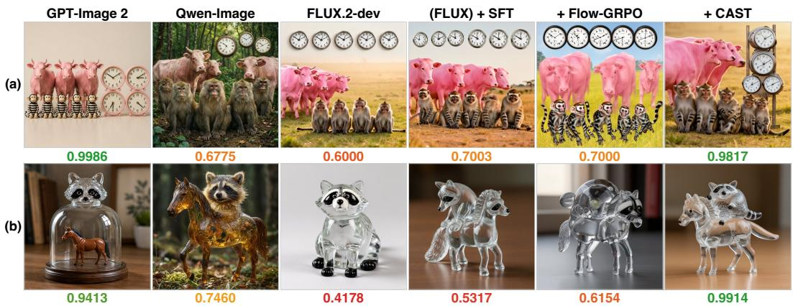  
Figure 1: Compositional failures in baselines and CAST’s improvement. GenEval 2 prompts: (a) “five striped monkeys in front of three pink cows to the left of four clocks.” (b) “a plastic horse under a glass raccoon.” GenEval 2 score reported below each image. Only CAST satisfies all verifiable-atoms in both prompts. More comparisons are provided in Appendix A.

Second, current methods rely predominantly on preference models such as PickScore (Kirstain et al., 2023) for reward estimation. On the latest SOTA open-source DMs (Wu et al., 2025; Labs, 2025), we find that preference scores are extremely high and nearly indistinguishable, providing negligible advantage for RL. This calls for structured, verifiable, and discriminative rewards.

Third, a scalar reward collapses different failure modes into almost identical scores, providing little gradient signal for targeted improvement. On GenEval 2 (Kamath et al., 2025), each prompt decomposes into 3–10 verifiable-atoms (median 6.5), i.e., minimal, independently verifiable semantic units of a prompt covering object presence, count, attribute, action, and spatial relation. Following the benchmark, we use the term verifiable-atom throughout this paper. A scalar reward, from a preference model or a sum of per-atom rewards, barely reveals which verifiable-atom failed.

These three observations call for two measurements, which our diagnostic experiments (Section 3) provide. To address the first limitation, we use a Tweedie estimate (Efron, 2011) of the clean image at every step to track when objects and their spatial layout become established in each model. To address the second and third, we score each verifiable-atom separately and localize it to specific image pixels via a teacher-forced attention heatmap (Chefer et al., 2021) within a frozen visionlanguage model (VLM), Qwen3-VL (Team, 2025), yielding a pixel-level granularity reward.

Based on this analysis, we propose CAST (Causal Advantage-Structured Training), an RL finetuning method for pretrained DMs consisting of three stages (Figure 3). (1) CSG probe construction: training prompts are synthesized from Causal Scene Graphs (CSG) (Yu & Lu, 2025), where every node and edge is paired with a verifiable-atom probe (Section 4.1). (2) Atom-level scoring and grounding: for each group of images sampled within the measured SDE window, the frozen VLM scores each atom independently and locates its evidence through teacher-forced attention (Section 4.2). (3) Spatially weighted optimization: CAST normalizes each atom’s score within the group into an advantage, projects these advantages into a per-pixel advantage map, and uses the map to weight the SDE policy objective (Section 4.3). As illustrated in Figure 1, CAST produces images that satisfy all verifiable-atoms where existing methods fail.

We apply CAST to FLUX.2-dev and Qwen-Image-2512, two of the strongest open-source DMs, whose preference scores are already near saturation (Section 3.2); improving them is therefore much harder than improving the weaker models used in earlier diffusion RL work. We evaluate on GenEval 2, which checks every verifiable-atom of compositionally complex prompts, and on Qwen-Image-Bench (Li et al., 2026a), which measures overall generation quality and thus reveals whether compositional gains come at the cost of image quality. The base models already score $\geq 0 . 9 5$ on 11.6%–18.8% of GenEval 2 prompts, leaving no room for improvement there and diluting the full-set average; we therefore focus on a Hard Case subset of prompts on which the base models still fail. On this subset, with the same budget and reward signal, CAST improves over the base model by 1.93×–3.07× as much as Flow-GRPO with a scalar reward, while achieving the best overall quality on Qwen-Image-Bench.

## Our contributions are:

• We show that preference rewards saturate on strong DMs and that a scalar reward conflates distinct failures; modeling prompts with CSG as separately scored verifiable-atoms restores a discriminative signal that tells the model which part failed.

• We propose CAST, which applies independently normalized verifiable-atom advantages within a per-model SDE window, so that optimization targets the steps where layout is decided.

• We introduce the per-pixel advantage map, which projects atom-level advantages into pixel space via VLM attention heatmaps, so that gradients reach the image regions responsible for each success or failure instead of the whole image.

## 2 PRELIMINARIES

## 2.1 FLOW MATCHING AND MARGINAL-PRESERVING SDE SAMPLING

Following the rectified-flow convention (Liu et al., 2023; Esser et al., 2024), we sample $( { \pmb x } _ { 0 } , { \pmb c } ) \sim$ $p _ { \mathrm { d a t a } } , \mathbf { \boldsymbol { x } } _ { 1 } \sim \mathcal { N } ( \mathbf { 0 } , I )$ , and $t \sim \mathcal { U } [ 0 , 1 ]$ , with ${ \pmb x } _ { t } = ( 1 - t ) { \pmb x } _ { 0 } + t { \pmb x } _ { 1 }$ . The velocity network defines the reference flow through

$$
\mathcal { L } _ { \mathrm { F M } } ( \theta ) = \mathbb { E } \Big [ \| v _ { \theta } ( x _ { t } , t , c ) - ( x _ { 1 } - x _ { 0 } ) \| _ { 2 } ^ { 2 } \Big ] , \qquad \frac { \mathrm { d } x _ { t } } { \mathrm { d } t } = v _ { \theta } ( x _ { t } , t , c ) .\tag{1}
$$

The ODE is integrated from $t { = } 1$ to t=0. For online RL, Flow-GRPO replaces this deterministic rollout with a reverse-time SDE that preserves its continuous-time marginals (Liu et al., 2025):

$$
\mathrm { d } \pmb { x } _ { t } = \left[ \pmb { v } _ { t } ( \pmb { x } _ { t } , \pmb { c } ) - \frac { \sigma _ { t } ^ { 2 } } { 2 } \nabla _ { \pmb { x } } \log p _ { t } ( \pmb { x } _ { t } \mid \pmb { c } ) \right] \mathrm { d } t + \sigma _ { t } \mathrm { d } \pmb { w } _ { t } .\tag{2}
$$

Here $\sigma _ { t }$ controls the noise level. For the rectified-flow path, $\nabla _ { x }$ log $\begin{array} { r } { p _ { t } ( \pmb { x } _ { t } \mid \pmb { c } ) = - [ \pmb { x } _ { t } + ( 1 - } \end{array}$ $t ) { \pmb v } _ { t } ( { \pmb x } _ { t } , { \pmb c } ) ] / t$ , so no separate score model is needed. Euler–Maruyama gives the Gaussian reverse transition

$$
\begin{array} { r } { \pi _ { \theta } ( \pmb { x } _ { t - \Delta t } \mid \pmb { x } _ { t } , \pmb { c } ) = \mathcal { N } \big ( \pmb { x } _ { t - \Delta t } ; \mu _ { \theta } ( \pmb { x } _ { t } , t , \pmb { c } ) , \sigma _ { t } ^ { 2 } \Delta t \pmb { I } \big ) , } \end{array}\tag{3}
$$

where $\mu _ { \theta }$ is the Euler mean. This density enables transition ratios and KL regularization; CAST uses it inside its calibrated window and follows the ODE outside.

## 2.2 GROUP RELATIVE POLICY OPTIMIZATION (GRPO)

GRPO (Shao et al., 2024; Liu et al., 2025) avoids a value model by normalizing rewards within a group. For G outputs under the same c, let $\begin{array} { r } { R _ { i } \ = \ R ( { \bf x } _ { 0 } ^ { ( i ) } , c ) , \mu _ { G } \ = \ G ^ { - 1 } \sum _ { i = 1 } ^ { G } R _ { i } , \sigma _ { G } \ = \ } \end{array}$ $[ G ^ { - 1 } \sum _ { i = 1 } ^ { G } ( R _ { i } - \mu _ { G } ) ^ { 2 } ] ^ { 1 / 2 }$ , and $\hat { A } ^ { ( i ) } = ( R _ { i } - \mu _ { G } ) / ( \sigma _ { G } + \epsilon )$ . These advantages enter a clipped policy-gradient surrogate through the Gaussian transition ratios above; CAST replaces the imagelevel advantage with a per-atom, spatially weighted one.

## 3 DIAGNOSTIC OF THREE LIMITATIONS IN CURRENT DM RL

We identify three limitations of the current diffusion RL paradigm that collectively motivate CAST’s design. Each is supported by empirical evidence on state-of-the-art open-source DMs.

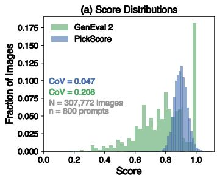

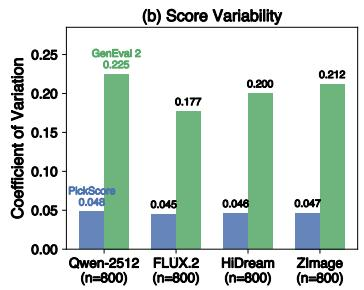

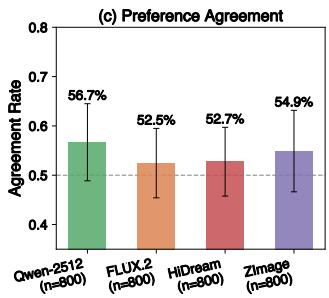  
Figure 2: PickScore saturates and weakly tracks structured correctness. (a) Score distributions pooled across the four DMs: PickScore concentrates near its ceiling, whereas GenEval 2 retains a broad dynamic range. (b) The contrast persists within every model’s generations. (c) Preference agreement between PickScore and GenEval 2 is only slightly above the 50% random baseline (dashed line); error bars show prompt-level standard deviations.

## 3.1 IMAGE STRUCTURE IS ESTABLISHED EARLY DURING DENOISING

To locate when the semantic structure of the output image is determined, we compute Tweedie estimates $( \mathrm { E f r o n } , 2 0 1 1 ) \hat { \pmb x } _ { 0 } ^ { ( t ) }$ (one-step predictions of the clean image) at every denoising step and evaluate $\mathrm { C L I P  – V i T – L } / 1 4$ (Radford et al., 2021) similarity between the estimate and the prompt, with $\tau \in [ 0 , 1 ]$ denoting progress from the initial noise to the final image.

CLIP similarity rises steeply during the first 10–20% of denoising and then plateaus. The point of maximum curvature (visualizations and detection details in Appendix B, Figure 7) occurs at $\tau \approx 0 . 1 1$ for SD3.5-Large, $\tau \approx 0 . 2 1$ for FLUX.2-dev, and $\tau \approx 0 . 1 4$ for Qwen-Image-2512, where the decoded estimates already show the main layout and spatial composition. Late SDE perturbations therefore risk disrupting established content, while the measured transition provides a model-specific signal for setting the SDE window rather than treating all timesteps uniformly.

## 3.2 PREFERENCE MODELS SATURATE ON STRONG DMS

Current diffusion RL methods rely predominantly on preference models such as PickScore (Kirstain et al., 2023) and HPSv2 (Wu et al., 2023). We compare PickScore against GenEval 2 (Kamath et al., 2025), which verifies compositional correctness atom by atom, on a shared corpus of 307,772 images generated by four strong DMs: Qwen-Image-2512 (Wu et al., 2025), FLUX.2- dev (Labs, 2025), HiDream (Cai et al., 2026), and ZImage (Team et al., 2025).

As shown in Figure 2(a–b), PickScore is narrowly concentrated: its per-model mean ranges from 0.887 to 0.907 (high saturation), with a coefficient of variation (CoV) of only 0.045–0.048 (low discriminability). In contrast, GenEval 2 produces per-model means of 0.734–0.829 (low saturation) and CoVs of 0.177–0.225 (high discriminability), preserving substantially greater score variation for advantage estimation. Preference models are thus ineffective for advantage estimation on strong DMs, calling for structured evaluation of atom failures.

## 3.3 SCALAR REWARD IS BLIND TO STRUCTURAL CORRECTNESS

Even when scoring systems produce non-saturated scores, a holistic score does not separately check each verifiable-atom specified by the prompt. On the same corpus, we pair the images generated under the same prompt and measure whether PickScore and GenEval 2 rank the two images of each pair in the same order (Figure 2(c)). Across the four models, agreement stays between 52.5% and 56.7%, only slightly above the 50% random baseline. This weak correspondence indicates that holistic preference and structured compositional correctness rank generated images differently.

This result shows that a scalar reward conflates distinct failure modes into nearly identical values. An image with correct objects but incorrect spatial relations and another with correct relations but missing objects may receive the same reward, obscuring which error should be corrected. This limitation is not unique to preference models: although GenEval 2 exposes separate scores for different verifiable-atoms, collapsing them into a single aggregate reward would recreate the same creditassignment ambiguity. The key issue is therefore not only which evaluator is used, but whether its structured outputs are preserved throughout optimization. Together, these findings motivate three design choices: (1) use the measured transition to set the SDE window, (2) retain independently verifiable atom-level reward factors, and (3) spatially ground each factor in the image regions containing its evidence. We implement all three in CAST.

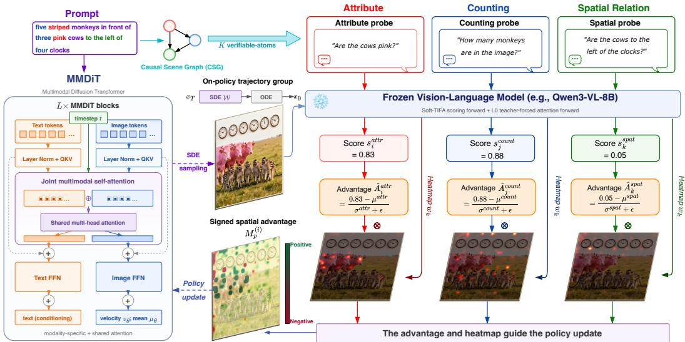  
Figure 3: Overview of CAST. A Causal Scene Graph (CSG) decomposes the prompt into K verifiable-atoms. Three representative types of facts are shown: attributes (red), counts (blue), and spatial relations (green). A frozen VLM uses separate passes to score each atom and extract its teacher-forced attention map. The resulting atom advantages and maps are combined into a signed spatial map that weights the SDE policy objective.

## 4 METHOD

In CAST, different verifiable-atoms independently direct training gradients to the image regions where their evidence resides, through three stages (Figure 3): CSG probe construction (Section 4.1), per-atom scoring and grounding (Section 4.2), and spatially weighted optimization (Section 4.3).

## 4.1 VQA PROBE CONSTRUCTION VIA CAUSAL SCENE GRAPHS

The Causal Scene Graph (CSG) (Yu & Lu, 2025) decomposes a text prompt into a directed graph G = (V, E), where V represents semantic entities and E encodes relations among entity pairs. Each node, node attribute, and edge maps to one VQA probe question: (1) node existence → object questions; (2) node attributes → property questions; (3) edges → relational questions. For example, the prompt “four white bicycles in front of three plastic cows” yields nodes {bicycle, cow} with attributes [white, count=4] and [plastic, count=3], and a spatial edge (bicycle in front of cow).

In CAST, the CSG serves as our data construction method rather than an analysis tool: we sample a graph first and render it into a prompt. By controlling the variables in the graph, such as swapping entities, attributes, counts, and spatial relations, we can scale the dataset while keeping a clean causal structure among its verifiable-atoms. Each of the K atoms is paired with a VQA probe and the words in the prompt that states the corresponding fact before any image is generated.

## 4.2 PER-ATOM SCORING AND SPATIAL GROUNDING

Soft scoring. Each verifiable-atom is scored using the GenEval 2 Soft-TIFA protocol (Kamath et al., 2025), with Qwen3-VL-8B (Team, 2025) as the frozen scorer. The VLM receives the image and question, and the score sums the softmax probabilities of all answer variants:

$$
s _ { k } = \sum _ { v \in \mathcal { V } _ { k } } P ( v \mid x , q _ { k } ) ,\tag{4}
$$

where $\nu _ { k }$ contains the accepted token variants of the correct answer $( \mathrm { e . g . }$ , capitalization and tokenization variants of “yes” for binary questions, and word and digit forms for count questions).

Spatial grounding via teacher-forced attention. While $s _ { k }$ tells whether atom $k$ is correct, it provides no information about where in the image the evidence resides. To obtain spatial grounding, we run a separate teacher-forced decoding pass. The VLM receives the image, while the original prompt is supplied as the target response. The CSG maps each atom to the words in the prompt that states the corresponding fact. At the first decoder layer (L0), we average the attention heads and the selected prompt-token query rows, retain their attention to visual tokens, and normalize it to unit spatial mean at pixel space. This yields a heatmap $w _ { k }$ for every atom in one forward pass.

## 4.3 SPATIALLY WEIGHTED SDE POLICY OPTIMIZATION

Windowed SDE sampling. Given a prompt c, we sample a group of $N$ reverse-time trajectories from the current policy. The measured structure-formation point defines a model-specific early candidate range, from which each trajectory uniformly samples a contiguous two-transition SDE window; the exact discretization is provided in Appendix B. Let $\Delta t > 0$ denote the magnitude of one reverse-time step. Within it, we use the Flow-GRPO Gaussian transition:

$$
\pi _ { \boldsymbol { \theta } } ( \mathbf { x } _ { t - \Delta t } \mid x _ { t } , \boldsymbol { c } ) = \mathcal { N } \big ( \mathbf { x } _ { t - \Delta t } ; \mu _ { \boldsymbol { \theta } } ( \mathbf { x } _ { t } , t , \boldsymbol { c } ) , \sigma _ { t } ^ { 2 } \Delta t I \big ) , \qquad t \in \mathcal { W } .\tag{5}
$$

Outside W, sampling follows the original deterministic ODE. We retain the transition probabilities inside W for policy optimization and evaluate the resulting final images with the per-atom scorer.

Z-score advantage. For N images of one prompt, each atom k has advantage:

$$
\hat { A } _ { k } ^ { ( i ) } = \mathrm { c l i p } \left( \frac { s _ { k } ^ { ( i ) } - \mu ^ { ( k ) } } { \sigma ^ { ( k ) } + \epsilon } , - 5 , 5 \right) ,\tag{6}
$$

where $\mu ^ { ( k ) }$ and $\sigma ^ { ( k ) }$ are the mean and standard deviation of $s _ { k }$ across the group. If the score variation is below the scorer’s numerical resolution, we set the corresponding advantages to zero.

Per-pixel advantage map. Each atom’s scalar advantage $\hat { A } _ { k }$ and spatial heatmap $w _ { k }$ combine to project the advantage into pixel space. Each VLM heatmap is first resized to the generated image. For policy optimization, we average the heatmap over the pixels corresponding to each denoiser patch p, yielding $w _ { k , p }$ . The combined advantage map is

$$
M _ { p } ^ { ( i ) } = \mathrm { c l i p } \left( \sum _ { k = 1 } ^ { K } \hat { A } _ { k } ^ { ( i ) } w _ { k , p } ^ { ( i ) } , - 5 , 5 \right) .\tag{7}
$$

The signed contributions are summed before clipping, allowing positive and negative atom advantages to offset each other at the same spatial location.

Spatial transition ratios. The diagonal Gaussian log-density separates over latent dimensions. We therefore retain the patch dimension and average only over the D channels within each patch:

$$
\begin{array} { r l } & { \ell _ { \theta , t , p } ^ { ( i ) } = \displaystyle \frac { 1 } { D } \sum _ { d = 1 } ^ { D } \log \mathcal { N } \Big ( x _ { t - \Delta t , p , d } ^ { ( i ) } ; \mu _ { \theta , t , p , d } ^ { ( i ) } , \sigma _ { t } ^ { 2 } \Delta t \Big ) , } \\ & { r _ { t , p } ^ { ( i ) } ( \theta ) = \displaystyle \exp \Big ( \ell _ { \theta , t , p } ^ { ( i ) } - \ell _ { \mathrm { o l d } , t , p } ^ { ( i ) } \Big ) . } \end{array}\tag{8}
$$

CAST uses the resulting normalized patch ratios in the following clipped spatial policy objective:

$$
\begin{array} { r l } & { \mathcal { L } _ { \mathrm { C A S T } } = \ - \ \mathbb { E } _ { i , t \in \mathcal { W } , p } \Big [ \operatorname* { m i n } \big ( r _ { t , p } ^ { ( i ) } M _ { p } ^ { ( i ) } , \mathrm { c l i p } ( r _ { t , p } ^ { ( i ) } , 1 - \varepsilon _ { \mathrm { c l i p } } , 1 + \varepsilon _ { \mathrm { c l i p } } ) M _ { p } ^ { ( i ) } \big ) \Big ] } \\ & { \quad \quad \ + \ \beta \mathbb { E } _ { i , t \in \mathcal { W } } \left[ D _ { \mathrm { K L } } ( \pi _ { \theta } \parallel \pi _ { \mathrm { r e f } } ) \right] . } \end{array}\tag{9}
$$

The reference policy disables the LoRA adapters; because both Gaussian transitions share the same covariance, the KL term has the closed-form expression of Flow-GRPO (Liu et al., 2025).

Positive values of $M _ { p }$ increase the likelihood of the sampled local transition, while negative values decrease it. The factorization applies to the conditional Gaussian density, not to the denoiser itself: every local mean remains a function of the complete state $\mathbf { \Delta } _ { \mathbf { \mathcal { X } } _ { t } }$ through the globally coupled MMDiT.

## 5 EXPERIMENTS

## 5.1 EXPERIMENTAL SETUP

All trainable methods share a single pool of 1,024 training prompts synthesized by sampling Causal Scene Graphs (Section 4.1): entities endowed with counts and attributes are composed through spatial relations, and the sampled graph is rendered into fluent text. Every node, attribute, and edge is emitted together with its verifiable-atom probe and the words in the prompt, so all K atoms are fixed by construction before any image is generated. The pool is disjoint from both evaluation benchmarks in exact and normalized form, and all checkpoint and hyperparameter selection uses a held-out 256-prompt development split; the benchmarks are never used for selection.

Baselines. We evaluate CAST on FLUX.2-dev (Labs, 2025) and Qwen-Image-2512 (Wu et al., 2025) against Base, two SFT variants, and two Flow-GRPO variants. Base is the unmodified pretrained model. SFT (4/8) and SFT (3/64) are self-distillation baselines: for each pool prompt, the backbone generates 8 (resp. 64) candidates, the frozen verifier scores them under the GenEval 2 protocol, and the four (resp. three) highest-scoring candidates are retained and fine-tuned with uniform weights for three epochs. SFT (3/64) serves as a high-selectivity distillation upper bound. Flow-GRPO (Liu et al., 2025) is evaluated with its original aesthetic reward and an atom-aggregated reward under the GenEval 2 (G2) protocol; both train on-policy on the same pool.

Experimental setting. Within each backbone, all trainable methods share the LoRA (Hu et al., 2022) configuration and initialization. The two Flow-GRPO variants and CAST further share the same 128-prompt manifest, prompt order, training seed, SDE window, and learning-rate schedule; each performs 128 single-prompt collections with group size 16, matching the 2,048 generated images and 128 optimizer updates of Table 1(b). Implementation and inference details are provided in Appendix D.

## 5.2 EVALUATION

We use GenEval 2 (Kamath et al., 2025) to measure compositional prompt adherence and Qwen-Image-Bench (Li et al., 2026a) to measure overall generation quality. We evaluate on all 800 GenEval 2 prompts and all 1,000 Qwen-Image-Bench prompts, sharing with the training pipeline only the scoring protocol and the frozen verifier (Section 5.1).

Hard Case subset. Although GenEval 2 is far more discriminative than preference rewards in aggregate (Section 3.2), a nontrivial fraction of its prompts is already saturated even for the untrained base models: averaged over the four evaluation seeds, the per-prompt Overall score is ≥ 0.95 on 150 of 800 prompts (18.8%) for FLUX.2-dev and 93 of 800 (11.6%) for Qwen-Image-2512. Near-ceiling prompts contribute almost identical scores to every method, so the full-set average understates the remaining differences. We therefore report a 50-prompt Hard Case subset alongside the full-set average: the frozen FLUX.2-dev base model generates 64 images per evaluation prompt, the frozen verifier scores them for subset selection only, and we retain the 100 highest-variance prompts before keeping the 50 with the lowest mean score (Section G).

Table 1: Main performance and training cost. (a) Final held-out performance on GenEval 2 and Qwen-Image-Bench. G2 Hard-50 is the GenEval 2 Overall score on the 50-prompt Hard Case subset of unsaturated evaluation prompts (Section 5.2). Values are mean ± sample standard deviation over four matched generation-seed replicates. (b) Raw training cost within each backbone. All generated and scored candidates, including filtered or discarded candidates, are counted.  
(a) Final performance
<table><tr><td>Backbone Method</td><td></td><td>G2 ↑ Hard-50</td><td>G2 ↑ Overall</td><td>G2 Count</td><td>↑ G2 Position</td><td>↑ QIB ↑ Overall</td></tr><tr><td rowspan="5">FLUX.2- dev</td><td>Base</td><td> $6 5 . 7 2 \pm 1 . 8 3$ </td><td> $8 3 . 1 6 \pm 0 . 2 0$ </td><td> $6 6 . 1 5 \pm 0 . 6 0$ </td><td> $7 3 . 2 9 \pm 0 . 4 2$ </td><td> $5 2 . 8 4 \pm 0 . 2 7$ </td></tr><tr><td>SFT (4/8)</td><td> $6 7 . 2 8 \pm 2 . 0 6$ </td><td> $8 3 . 3 1 \pm 0 . 2 4$ </td><td> $6 6 . 3 7 \pm 0 . 6 0$ </td><td> $7 3 . 4 6 \pm 0 . 5 1$ </td><td> $5 2 . 7 6 \pm 0 . 2 5$ </td></tr><tr><td>SFT (3/64)</td><td> $6 9 . 7 6 \pm 2 . 4 8$ </td><td> $8 3 . 9 3 \pm 0 . 4 0$ </td><td> $6 7 . 2 7 \pm 0 . 6 0$ </td><td> $7 4 . 1 5 \pm 0 . 8 8$ </td><td> $5 2 . 4 2 \pm 0 . 1 6$ </td></tr><tr><td>Flow-GRPO (Orig.)</td><td> $6 4 . 2 6 \pm 1 . 7 6$ </td><td> $8 1 . 8 5 \pm 0 . 2 2$ </td><td> $6 4 . 1 8 \pm 0 . 4 4$ </td><td> $7 2 . 7 1 \pm 1 . 1 3$ </td><td> $5 3 . 3 4 \pm 0 . 2 8$ </td></tr><tr><td>Flow-GRPO (G2)</td><td> $7 1 . 3 7 \pm 1 . 9 0$ </td><td> $8 4 . 5 4 \pm 0 . 1 1$ </td><td> $6 8 . 3 9 \pm 0 . 3 2$ </td><td> $7 4 . 9 8 \pm 0 . 6 2$ </td><td> $5 2 . 7 3 \pm 0 . 0 6$ </td></tr><tr><td rowspan="6">Qwen- Image- 2512</td><td>CAST</td><td> ${ \bf 7 6 . 6 4 \pm 2 . 3 9 }$ </td><td>85.95 ± 0.10</td><td> ${ \bf 7 0 . 8 5 \pm 0 . 2 9 }$ </td><td> ${ \bf 7 6 . 9 0 \pm 0 . 5 3 }$ </td><td> ${ \bf 5 3 . 4 4 \pm 0 . 2 9 }$ </td></tr><tr><td>Base</td><td> $6 7 . 7 9 \pm 1 . 8 1$ </td><td> $7 8 . 0 2 \pm 0 . 5 6$ </td><td> $6 7 . 1 4 \pm 1 . 5 9$ </td><td> $5 9 . 6 0 \pm 0 . 8 4$ </td><td> $5 0 . 6 8 \pm 0 . 2 3$ </td></tr><tr><td>SFT (4/8)</td><td> $6 8 . 5 5 \pm 1 . 7 9$ </td><td> $7 8 . 2 7 \pm 0 . 5 4$ </td><td> $6 7 . 6 4 \pm 1 . 5 5$ </td><td> $5 9 . 6 2 \pm 0 . 7 8$ </td><td> $5 0 . 4 5 \pm 0 . 2 4$ </td></tr><tr><td>SFT (3/64)</td><td> $7 0 . 1 2 \pm 1 . 8 4$ </td><td> $7 9 . 2 9 \pm 0 . 4 5$ </td><td> $6 9 . 6 4 \pm 1 . 3 7$ </td><td> $5 9 . 7 2 \pm 0 . 5 3$ </td><td> $4 9 . 5 5 \pm 0 . 2 9$ </td></tr><tr><td>Flow-GRPO (Orig.)</td><td> $6 8 . 6 0 \pm 1 . 7 5$ </td><td> $7 7 . 9 0 \pm 0 . 4 4$ </td><td> $6 7 . 1 5 \pm 1 . 0 7$ </td><td> $5 9 . 9 2 \pm 0 . 9 1$ </td><td> $5 0 . 1 1 \pm 0 . 2 6$ </td></tr><tr><td>Flow-GRPO (G2) CAST</td><td> $6 9 . 1 1 \pm 1 . 5 6$   ${ \bf 7 1 . 8 4 \pm 1 . 8 5 }$ </td><td> $7 9 . 5 9 \pm 0 . 2 2$   ${ \bf 8 0 . 8 1 \pm 0 . 2 3 }$ </td><td> $7 0 . 4 8 \pm 0 . 6 2$   ${ \bf 7 2 . 3 5 \pm 0 . 5 5 }$ </td><td> $5 8 . 5 9 \pm 0 . 2 5$   ${ \bf 6 0 . 4 5 \pm 0 . 4 3 }$ </td><td> $5 0 . 7 0 \pm 0 . 1 5$   ${ \bf 5 1 . 3 2 \pm 0 . 1 5 }$ </td></tr></table>

<table><tr><td>Method</td><td></td><td></td><td>Images ↓ Updates ↓ FLUX H200-h ↓ Qwen H200-h ↓</td><td></td></tr><tr><td>SFT (4/8)</td><td>8,192</td><td>384</td><td>95.00</td><td>90.24</td></tr><tr><td>SFT (3/64)</td><td>65,536</td><td>288</td><td>749.51</td><td>723.70</td></tr><tr><td>Flow-GRPO (Orig.)</td><td>2,048</td><td>128</td><td>28.91</td><td>28.75</td></tr><tr><td>Flow-GRPO (G2)</td><td>2,048</td><td>128</td><td>32.43</td><td>32.21</td></tr><tr><td>CAST</td><td>2,048</td><td>128</td><td>32.90</td><td>32.51</td></tr></table>

All methods use the same inference settings and matched prompt-specific seeds. Each frozen checkpoint is evaluated with four matched generation-seed replicates, and we report the mean and sample standard deviation across replicates. The complete protocol is provided in Appendix G.

## 5.3 MAIN RESULTS

Main comparison. Flow-GRPO with its original preference reward provides no consistent improvement over the base models, while selective-distillation SFT yields only modest gains despite using up to 32× more generated images. Replacing the aesthetic reward with the aggregated GenEval 2 reward makes Flow-GRPO improve on both backbones and provides the matched-reward reference for CAST. These full-set averages, however, compress the differences on the 11.6%– 18.8% of evaluation prompts that are already saturated for the base models (Section 5.2); we therefore focus on the Hard Case subset, with full-set scores reported in Table 1. Within the same 2,048- image and 128-update budget and under the same reward signal, the Hard Case gain of CAST over the base model is 1.93× that of scalar-reward Flow-GRPO on FLUX.2-dev and 3.07× on Qwen-Image-2512. CAST also surpasses the high-selectivity distillation upper bound SFT (3/64) on both backbones, whose Hard Case gain amounts to only 37% and 58% of CAST’s despite its 32× larger image budget, while attaining the highest Qwen-Image-Bench Overall on both backbones.

Ablations. Table 2 isolates atom-level credit and spatial routing under the same on-policy training setting as CAST. All variants use the same SDE window, training budget, and optimization settings. Figure 4 additionally shows the training dynamics of the SFT and RL runs on FLUX.2-dev.

## 6 RELATED WORK

RL for Diffusion and Flow Matching. DDPO (Black et al., 2024) formulated diffusion denoising as a multi-step MDP with terminal rewards. Flow-GRPO (Liu et al., 2025) then extended

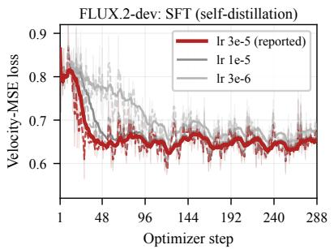

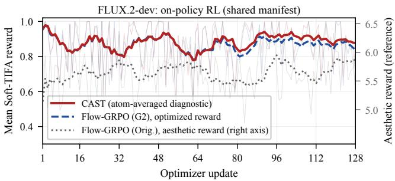  
Figure 4: Training dynamics on FLUX.2-dev. Left: SFT self-distillation loss under three learning rates; the reported setting is emphasized, and all runs plateau within the budget. Right: mean Soft-TIFA reward on the shared RL manifest; the CAST curve is an atom-averaged diagnostic rather than its optimized objective, and the aesthetic reward (right axis) is on a separate scale.

Table 2: Ablation of atom-level credit assignment and spatial weighting on FLUX.2-dev. All variants use the same training prompts, SDE window, generated-image budget, and optimization settings. Values are mean ± sample standard deviation over four matched generation-seed replicates.
<table><tr><td>Variant</td><td>Advantage</td><td>Spatial map</td><td>G2 Overall ↑</td><td>QIB Overall ↑</td></tr><tr><td>Sum-reward baseline</td><td>per-image</td><td>none</td><td> $8 4 . 5 4 \pm 0 . 1 1$ </td><td> $5 2 . 7 3 \pm 0 . 0 6$ </td></tr><tr><td>Per-atom advantage</td><td>per-atom</td><td>none</td><td> $8 5 . 1 2 \pm 0 . 1 4$ </td><td> $5 2 . 9 8 \pm 0 . 1 8$ </td></tr><tr><td>Spatial weighting</td><td>per-image</td><td>aggregated attention</td><td> $8 4 . 9 1 \pm 0 . 1 6$ </td><td> $5 3 . 0 6 \pm 0 . 2 0$ </td></tr><tr><td>Shuffled correspondence</td><td>per-atom</td><td>shuffled atom maps</td><td> $8 5 . 0 0 \pm 0 . 1 5$ </td><td> $5 2 . 8 9 \pm 0 . 2 2$ </td></tr><tr><td>CAST</td><td>per-atom</td><td>matched atom maps</td><td> ${ \bf 8 5 . 9 5 \pm 0 . 1 0 }$ </td><td> ${ \bf 5 3 . 4 4 \pm 0 . 2 9 }$ </td></tr></table>

GRPO (Shao et al., 2024) to flow matching by converting the deterministic ODE into an equivalent SDE for stochastic exploration. Later methods improved temporal credit assignment through perstep reward gains (Savani et al., 2026) or adaptive timestep-wise stochasticity (Deng et al., 2026). Neighbor GRPO (He et al., 2025) instead retained deterministic ODE sampling and perturbed only the initial noise. CAST complements temporal credit assignment with spatial credit assignment: each atom advantage weights the corresponding evidence region within a calibrated early SDE window.

Compositional Generation and Evaluation. TIFA (Hu et al., 2023) evaluates prompt alignment using VQA questions generated from the prompt, while VQAScore (Lin et al., 2024) uses a single global question. GenEval 2 (Kamath et al., 2025) provides a finer decomposition by evaluating prompt atoms across object, count, attribute, spatial relation, and verb skills. It also introduces Soft-TIFA, which uses VLM token probabilities for continuous scoring. LINA (Yu & Lu, 2025) represents prompt content with causal scene graphs to diagnose physical alignment failures. CAST uses it for training, projecting each atom’s advantage onto its evidence.

Dense Reward for Generation. Preference models such as PickScore (Kirstain et al., 2023), ImageReward (Xu et al., 2023), and HPSv2 (Wu et al., 2023) provide scalar rewards for diffusionmodel training. MPS (Zhang et al., 2024) decomposes preference into several dimensions, but each remains a global score without spatial localization. VisionReward (Xu et al., 2026) uses fine-grained VQA questions, but likewise produces only a scalar score for each question. Focus-N-Fix (Xing et al., 2025) localizes problematic regions for region-aware fine-tuning, but uses a single global heatmap, whereas CAST pairs every atom advantage with its own map.

## 7 CONCLUSION

We introduce CAST, which trains diffusion models with spatially grounded atom-level rewards. Our diagnostics show that strong DMs fix their layout early, that preference rewards saturate on them, and that a scalar reward conflates distinct failures. CAST therefore sets a model-specific early SDE window, computes a separate advantage for each verifiable-atom, and projects it via teacherforced attention onto its image region to weight the policy objective. On two strong DMs, CAST improves adherence on the hardest GenEval 2 prompts well beyond Flow-GRPO at equal budget while preserving overall quality, enabling finer-grained credit assignment than a scalar reward.

## REFERENCES

Kevin Black, Michael Janner, Yilun Du, Ilya Kostrikov, and Sergey Levine. Training diffusion models with reinforcement learning. In The Twelfth International Conference on Learning Representations, ICLR 2024, Vienna, Austria, May 7-11, 2024. OpenReview.net, 2024. URL https://openreview.net/forum?id=YCWjhGrJFD.

Qi Cai, Jingwen Chen, Chengmin Gao, Zijian Gong, Yehao Li, Yingwei Pan, Yi Peng, Zhaofan Qiu, Kai Yu, Yiheng Zhang, Hao Ai, Siying Bai, Yang Chen, Zhihui Chen, Fengbin Gao, Ying Guo, Dong Li, Zhen Shen, Leilei Shi, Jing Wang, Siyu Wang, Yimeng Wang, Rui Zheng, Ting Yao, and Tao Mei. Hidream-o1-image: A natively unified image generative foundation model with pixellevel unified transformer. CoRR, abs/2605.11061, 2026. doi: 10.48550/ARXIV.2605.11061. URL https://doi.org/10.48550/arXiv.2605.11061.

Hila Chefer, Shir Gur, and Lior Wolf. Generic attention-model explainability for interpreting bimodal and encoder-decoder transformers. In 2021 IEEE/CVF International Conference on Computer Vision, ICCV 2021, Montreal, QC, Canada, October 10-17, 2021, pp. 387–396. IEEE, 2021. doi: 10.1109/ICCV48922.2021.00045. URL https://doi.org/10.1109/ICCV48922. 2021.00045.

Jooyoung Choi, Jungbeom Lee, Chaehun Shin, Sungwon Kim, Hyunwoo Kim, and Sungroh Yoon. Perception prioritized training of diffusion models. In IEEE/CVF Conference on Computer Vision and Pattern Recognition, CVPR 2022, New Orleans, LA, USA, June 18-24, 2022, pp. 11462– 11471. IEEE, 2022. doi: 10.1109/CVPR52688.2022.01118. URL https://doi.org/10. 1109/CVPR52688.2022.01118.

Haoyou Deng, Keyu Yan, Chaojie Mao, Xiang Wang, Yu Liu, Changxin Gao, and Nong Sang. Densegrpo: From sparse to dense reward for flow matching model alignment. CoRR, abs/2601.20218, 2026. doi: 10.48550/ARXIV.2601.20218. URL https://doi.org/10. 48550/arXiv.2601.20218.

Bradley Efron. Tweedie’s formula and selection bias. Journal of the American Statistical Association, 106(496):1602–1614, 2011.

Patrick Esser, Sumith Kulal, Andreas Blattmann, Rahim Entezari, Jonas Muller, Harry Saini, Yam¨ Levi, Dominik Lorenz, Axel Sauer, Frederic Boesel, Dustin Podell, Tim Dockhorn, Zion English, and Robin Rombach. Scaling rectified flow transformers for high-resolution image synthesis. In Ruslan Salakhutdinov, Zico Kolter, Katherine A. Heller, Adrian Weller, Nuria Oliver, Jonathan Scarlett, and Felix Berkenkamp (eds.), Forty-first International Conference on Machine Learning, ICML 2024, Vienna, Austria, July 21-27, 2024, volume 235 of Proceedings ofMachine Learning Research, pp. 12606–12633. PMLR / OpenReview.net, 2024. URL https://proceedings. mlr.press/v235/esser24a.html.

Dailan He, Guanlin Feng, Xingtong Ge, Yazhe Niu, Yi Zhang, Bingqi Ma, Guanglu Song, Yu Liu, and Hongsheng Li. Neighbor GRPO: contrastive ODE policy optimization aligns flow models. CoRR, abs/2511.16955, 2025. doi: 10.48550/ARXIV.2511.16955. URL https://doi.org/ 10.48550/arXiv.2511.16955.

Amir Hertz, Ron Mokady, Jay Tenenbaum, Kfir Aberman, Yael Pritch, and Daniel Cohen-Or. Prompt-to-prompt image editing with cross-attention control. In The Eleventh International Conference on Learning Representations, ICLR 2023, Kigali, Rwanda, May 1-5, 2023. Open-Review.net, 2023. URL https://openreview.net/forum?id=\_CDixzkzeyb.

Edward J. Hu, Yelong Shen, Phillip Wallis, Zeyuan Allen-Zhu, Yuanzhi Li, Shean Wang, Lu Wang, and Weizhu Chen. Lora: Low-rank adaptation of large language models. In The Tenth International Conference on Learning Representations, ICLR 2022, Virtual Event, April 25-29, 2022. OpenReview.net, 2022. URL https://openreview.net/forum?id=nZeVKeeFYf9.

Yushi Hu, Benlin Liu, Jungo Kasai, Yizhong Wang, Mari Ostendorf, Ranjay Krishna, and Noah A. Smith. TIFA: accurate and interpretable text-to-image faithfulness evaluation with question answering. In IEEE/CVF International Conference on Computer Vision, ICCV 2023, Paris, France, October 1-6, 2023, pp. 20349–20360. IEEE, 2023. doi: 10.1109/ICCV51070.2023.01866. URL https://doi.org/10.1109/ICCV51070.2023.01866.

Amita Kamath, Kai-Wei Chang, Ranjay Krishna, Luke Zettlemoyer, Yushi Hu, and Marjan Ghazvininejad. Geneval 2: Addressing benchmark drift in text-to-image evaluation. CoRR, abs/2512.16853, 2025. doi: 10.48550/ARXIV.2512.16853. URL https://doi.org/10. 48550/arXiv.2512.16853.

Yuval Kirstain, Adam Polyak, Uriel Singer, Shahbuland Matiana, Joe Penna, and Omer Levy. Pick-a-pic: An open dataset of user preferences for text-to-image generation. In Alice Oh, Tristan Naumann, Amir Globerson, Kate Saenko, Moritz Hardt, and Sergey Levine (eds.), Advances in Neural Information Processing Systems 36: Annual Conference on Neural Information Processing Systems 2023, NeurIPS 2023, New Orleans, LA, USA, December 10 - 16, 2023, 2023. URL http://papers.nips.cc/paper\_files/paper/2023/hash/ 73aacd8b3b05b4b503d58310b523553c-Abstract-Conference.html.

Black Forest Labs. FLUX.2: Frontier Visual Intelligence. https://bfl.ai/blog/flux-2, 2025.

Junzhe Li, Yutao Cui, Tao Huang, Yinping Ma, Chun Fan, Miles Yang, and Zhao Zhong. Mixgrpo: Unlocking flow-based GRPO efficiency with mixed ODE-SDE. CoRR, abs/2507.21802, 2025. doi: 10.48550/ARXIV.2507.21802. URL https://doi.org/10.48550/arXiv.2507. 21802.

Niantong Li, Guangzheng Hu, Weixu Qiao, Ying Ba, Qichen Hong, Shijun Shen, Jinlin Wang, Fan Zhou, Jianye Kang, Xin Shang, Ziyi He, Wei Wang, Dalin Li, Jiahao Li, Jie Zhang, Kaiyuan Gao, Kun Yan, Lihan Jiang, Ningyuan Tang, Shengming Yin, Tianhe Wu, Xiao Xu, Xiaoyue Chen, Yuxiang Chen, Yan Shu, Yanran Zhang, Yilei Chen, Yixian Xu, Zekai Zhang, Zhendong Wang, Zihao Liu, Zikai Zhou, Hongzhu Shi, Yi Wang, Bing Zhao, Hu Wei, Lin Qu, and Chenfei Wu. Qwen-image-bench: From generation to creation in text-to-image evaluation. CoRR, abs/2605.28091, 2026a. doi: 10.48550/ARXIV.2605.28091. URL https: //doi.org/10.48550/arXiv.2605.28091.

Yuming Li, Qingyu Li, Chengyu Bai, Xiangyang Luo, Zeyue Xue, Wenyu Qin, Meng Wang, Yikai Wang, and Shanghang Zhang. AEGPO: adaptive entropy-guided policy optimization for diffusion models. CoRR, abs/2602.06825, 2026b. doi: 10.48550/ARXIV.2602.06825. URL https: //doi.org/10.48550/arXiv.2602.06825.

Zhiqiu Lin, Deepak Pathak, Baiqi Li, Jiayao Li, Xide Xia, Graham Neubig, Pengchuan Zhang, and Deva Ramanan. Evaluating text-to-visual generation with image-to-text generation. In Ales Leonardis, Elisa Ricci, Stefan Roth, Olga Russakovsky, Torsten Sattler, and Gul Varol (eds.),¨ Computer Vision - ECCV 2024 - 18th European Conference, Milan, Italy, September 29-October 4, 2024, Proceedings, Part IX, volume 15067 of Lecture Notes in Computer Science, pp. 366– 384. Springer, 2024. doi: 10.1007/978-3-031-72673-6\ 20. URL https://doi.org/10. 1007/978-3-031-72673-6\_20.

Jie Liu, Gongye Liu, Jiajun Liang, Yangguang Li, Jiaheng Liu, Xintao Wang, Pengfei Wan, Di Zhang, and Wanli Ouyang. Flow-grpo: Training flow matching models via online RL. In Danielle Belgrave, Cheng Zhang, Laura N. Montoya, Hsuan-Tien Lin, Razvan Pascanu, Piotr Koniusz, Marzyeh Ghassemi, Nancy Chen, Ivan Vladimir Meza Ru´ ´ız, and Arturo Loaiza-Bonilla (eds.), Advances in Neural Information Processing Systems 38: Annual Conference on Neural Information Processing Systems 2025, NeurIPS 2025, San Diego, CA, USA, December 2-7, 2025 / Mexico City, Mexico, November 30 - December 5, 2025, 2025. URL http://papers.nips.cc/paper\_files/paper/2025/hash/ 3a10c46572628d58cb44fb705f25cbbf-Abstract-Conference.html.

Xingchao Liu, Chengyue Gong, and Qiang Liu. Flow straight and fast: Learning to generate and transfer data with rectified flow. In The Eleventh International Conference on Learning Representations, ICLR 2023, Kigali, Rwanda, May 1-5, 2023. OpenReview.net, 2023. URL https://openreview.net/forum?id=XVjTT1nw5z.

Alec Radford, Jong Wook Kim, Chris Hallacy, Aditya Ramesh, Gabriel Goh, Sandhini Agarwal, Girish Sastry, Amanda Askell, Pamela Mishkin, Jack Clark, Gretchen Krueger, and Ilya

Sutskever. Learning transferable visual models from natural language supervision. In Marina Meila and Tong Zhang (eds.), Proceedings of the 38th International Conference on Machine Learning, ICML 2021, 18-24 July 2021, Virtual Event, volume 139 of Proceedings ofMachine Learning Research, pp. 8748–8763. PMLR, 2021. URL http://proceedings.mlr. press/v139/radford21a.html.

Yash Savani, Branislav Kveton, Yuchen Liu, Yilin Wang, Jing Shi, Subhojyoti Mukherjee, Nikos Vlassis, and Krishna Kumar Singh. Stepwise credit assignment for GRPO on flow-matching models. In IEEE/CVF Conference on Computer Vision and Pattern Recognition, CVPR 2026, Denver, CO, USA, June 3-7, 2026, pp. 42007–42017. Computer Vision Foundation, 2026. URL https://openaccess.thecvf.com/content/CVPR2026/html/Savani\_ Stepwise\_Credit\_Assignment\_for\_GRPO\_on\_Flow-Matching\_Models\_ CVPR\_2026\_paper.html.

Zhihong Shao, Peiyi Wang, Qihao Zhu, Runxin Xu, Junxiao Song, Mingchuan Zhang, Y. K. Li, Y. Wu, and Daya Guo. Deepseekmath: Pushing the limits of mathematical reasoning in open language models. CoRR, abs/2402.03300, 2024. doi: 10.48550/ARXIV.2402.03300. URL https://doi.org/10.48550/arXiv.2402.03300.

Qwen Team. Qwen3-vl technical report. CoRR, abs/2511.21631, 2025. doi: 10.48550/ARXIV. 2511.21631. URL https://doi.org/10.48550/arXiv.2511.21631.

Z-Image Team, Huanqia Cai, Sihan Cao, Ruoyi Du, Peng Gao, Steven C. H. Hoi, Zhaohui Hou, Shijie Huang, Dengyang Jiang, Xin Jin, Liangchen Li, Zhen Li, Zhong-Yu Li, David Liu, Dongyang Liu, Junhan Shi, Qilong Wu, Feng Yu, Chi Zhang, Shifeng Zhang, and Shilin Zhou. Z-image: An efficient image generation foundation model with single-stream diffusion transformer. CoRR, abs/2511.22699, 2025. doi: 10.48550/ARXIV.2511.22699. URL https://doi.org/10.48550/arXiv.2511.22699.

Yunze Tong, Mushui Liu, Canyu Zhao, Wanggui He, Shiyi Zhang, Hongwei Zhang, Peng Zhang, Jinlong Liu, Ju Huang, Jiamang Wang, Hao Jiang, and Pipei Huang. Alleviating sparse rewards by modeling step-wise and long-term sampling effects in flow-based GRPO. CoRR, abs/2602.06422, 2026. doi: 10.48550/ARXIV.2602.06422. URL https://doi.org/10.48550/arXiv. 2602.06422.

Chenfei Wu, Jiahao Li, Jingren Zhou, Junyang Lin, Kaiyuan Gao, Kun Yan, Shengming Yin, Shuai Bai, Xiao Xu, Yilei Chen, Yuxiang Chen, Zecheng Tang, Zekai Zhang, Zhengyi Wang, An Yang, Bowen Yu, Chen Cheng, Dayiheng Liu, Deqing Li, Hang Zhang, Hao Meng, Hu Wei, Jingyuan Ni, Kai Chen, Kuan Cao, Liang Peng, Lin Qu, Minggang Wu, Peng Wang, Shuting Yu, Tingkun Wen, Wensen Feng, Xiaoxiao Xu, Yi Wang, Yichang Zhang, Yongqiang Zhu, Yujia Wu, Yuxuan Cai, and Zenan Liu. Qwen-image technical report. CoRR, abs/2508.02324, 2025. doi: 10.48550/ ARXIV.2508.02324. URL https://doi.org/10.48550/arXiv.2508.02324.

Xiaoshi Wu, Yiming Hao, Keqiang Sun, Yixiong Chen, Feng Zhu, Rui Zhao, and Hongsheng Li. Human preference score v2: A solid benchmark for evaluating human preferences of textto-image synthesis. CoRR, abs/2306.09341, 2023. doi: 10.48550/ARXIV.2306.09341. URL https://doi.org/10.48550/arXiv.2306.09341.

Xiaoying Xing, Avinab Saha, Junfeng He, Susan Hao, Paul Vicol, Moonkyung Ryu, Gang Li, Sahil Singla, Sarah Young, Yinxiao Li, Feng Yang, and Deepak Ramachandran. Focus-n-fix: Region-aware fine-tuning for text-to-image generation. In IEEE/CVF Conference on Computer Vision and Pattern Recognition, CVPR 2025, Nashville, TN, USA, June 11-15, 2025, pp. 18486–18496. Computer Vision Foundation / IEEE, 2025. doi: 10.1109/CVPR52734.2025.01723. URL https://openaccess.thecvf.com/ content/CVPR2025/html/Xing\_Focus-N-Fix\_Region-Aware\_Fine-Tuning\_ for\_Text-to-Image\_Generation\_CVPR\_2025\_paper.html.

Jiazheng Xu, Xiao Liu, Yuchen Wu, Yuxuan Tong, Qinkai Li, Ming Ding, Jie Tang, and Yuxiao Dong. Imagereward: Learning and evaluating human preferences for text-to-image generation. In Alice Oh, Tristan Naumann, Amir Globerson, Kate Saenko, Moritz Hardt, and Sergey Levine (eds.), Advances in Neural Information Processing Systems 36: Annual Conference on Neural Information Processing Systems 2023, NeurIPS 2023, New Orleans, LA, USA, December 10 -

16, 2023, 2023. URL http://papers.nips.cc/paper\_files/paper/2023/hash/ 33646ef0ed554145eab65f6250fab0c9-Abstract-Conference.html.

Jiazheng Xu, Yu Huang, Jiale Cheng, Yuanming Yang, Jiajun Xu, Yuan Wang, Wenbo Duan, Shen Yang, Qunlin Jin, Shurun Li, Jiayan Teng, Zhuoyi Yang, Wendi Zheng, Xiao Liu, Dan Zhang, Ming Ding, Xiaohan Zhang, Shiyu Huang, Xiaotao Gu, Minlie Huang, Jie Tang, and Yuxiao Dong. Visionreward: Fine-grained multi-dimensional human preference learning for image and video generation. In Sven Koenig, Chad Jenkins, and Matthew E. Taylor (eds.), Fortieth AAAI Conference on Artificial Intelligence, Thirty-Eighth Conference on Innovative Applications of Artificial Intelligence, Sixteenth Symposium on Educational Advances in Artificial Intelligence, AAAI 2026, Singapore, January 20-27, 2026, pp. 11269–11277. AAAI Press, 2026. doi: 10. 1609/AAAI.V40I13.38107. URL https://doi.org/10.1609/aaai.v40i13.38107.

Shu Yu and Chaochao Lu. LINA: learning interventions adaptively for physical alignment and generalization in diffusion models. CoRR, abs/2512.13290, 2025. doi: 10.48550/ARXIV.2512. 13290. URL https://doi.org/10.48550/arXiv.2512.13290.

Sixian Zhang, Bohan Wang, Junqiang Wu, Yan Li, Tingting Gao, Di Zhang, and Zhongyuan Wang. Learning multi-dimensional human preference for text-to-image generation. In IEEE/CVF Conference on Computer Vision and Pattern Recognition, CVPR 2024, Seattle, WA, USA, June 16- 22, 2024, pp. 8018–8027. IEEE, 2024. doi: 10.1109/CVPR52733.2024.00766. URL https: //doi.org/10.1109/CVPR52733.2024.00766.

FLUX.2-dev

SFT

Flow-GRPO (Orig.)

Flow-GRPO(G2)

CAST

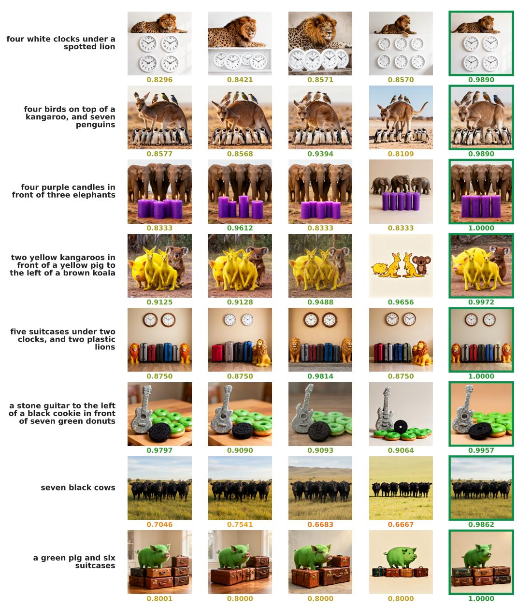  
Figure 5: Additional qualitative comparisons on FLUX.2-dev (part I). GenEval 2 prompts with multi-object counts, attributes, and chained spatial relations. GenEval 2 score reported below each image.

## A ADDITIONAL QUALITATIVE COMPARISONS

Figures 5–6 provide additional qualitative comparisons on FLUX.2-dev, complementing the teaser examples in Figure 1. Each row shows the images generated by the base model, the strongest SFT variant, both Flow-GRPO variants, and CAST for one GenEval 2 evaluation prompt, together with the per-prompt GenEval 2 score.

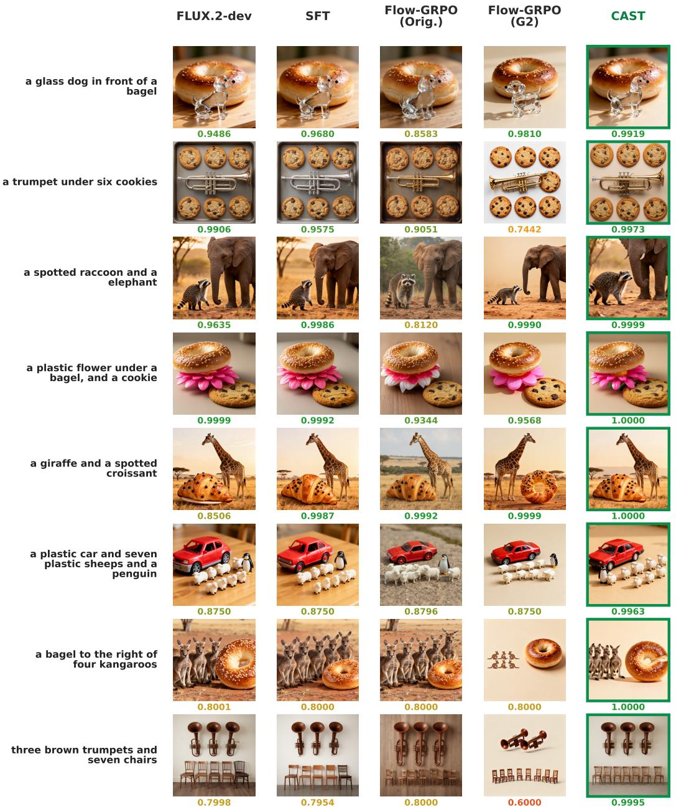  
Figure 6: Additional qualitative comparisons on FLUX.2-dev (part II). GenEval 2 score reported below each image.

## B STRUCTURE FORMATION POINT DETECTION

The CLIP similarity trajectory $s ( \tau )$ exhibits a characteristic rise-then-plateau shape, where $\tau \in [ 0 , 1 ]$ denotes normalized denoising progress. We define the structure formation point $\tau ^ { * }$ as the point of maximum curvature:

$$
\tau ^ { * } = \arg \operatorname* { m a x } _ { \tau } \kappa ( \tau ) , \qquad \kappa ( \tau ) = \frac { | s ^ { \prime \prime } ( \tau ) | } { \left( 1 + s ^ { \prime } ( \tau ) ^ { 2 } \right) ^ { 3 / 2 } } .\tag{10}
$$

This is the knee of the curve: the point where the steep rise in semantic alignment bends into the flat refinement plateau. In practice, we fit a degree-4 smoothing spline to the mean CLIP scores and evaluate $\kappa ( \tau )$ on the resulting curve. The three models yield $\tau ^ { * } \approx 0 . 1 1 ( \mathrm { S D 3 . 5 - L a r g e } ) , \tau ^ { * } \approx 0 . 2 1$ (FLUX.2-dev), and $\tau ^ { * } \approx 0 . 1 \bar { 4 }$ (Qwen-Image-2512), all before $\tau = 0 . 2 5$

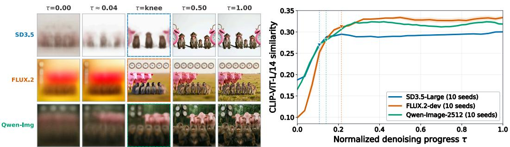

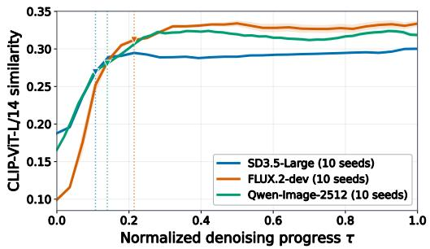  
Figure 7: Image structure forms in early denoising steps. Left: intermediate decoded images at five timesteps for three diffusion models. Dashed borders mark the knee point where CLIP similarity plateaus. Right: CLIP-ViT-L/14 similarity between Tweedie estimates and the text prompt. The knee point (triangle) occurs before $\tau { = } 0 . 2 5$ across all models, indicating that the main layout and composition are established early.

Discretization into the SDE window. For an N-step sampler, we set $b _ { m } = \lceil \tau _ { m } ^ { * } ( N - 1 ) \rceil$ and define the candidate transition range as $\mathcal { R } _ { m } = [ a _ { m } , b _ { m } )$ . We use $a _ { m } = 0$ for FLUX.2-dev and $a _ { m } = 1$ for Qwen-Image-2512, excluding Qwen’s initial $\sigma = 1$ transition to preserve numerical parity under differentiable FSDP recomputation. With the fixed window length $L = 2 .$ , we sample

$$
s \sim \mathrm { U n i f o r m } \{ a _ { m } , \ldots , b _ { m } - L \} , \qquad \mathcal { W } _ { s } = [ s , s + L ) .\tag{11}
$$

For $N = 5 0$ , this gives $\mathcal { R } _ { m } = [ 0 , 1 1 )$ for FLUX.2-dev and $\mathcal { R } _ { m } = [ 1 , 7 )$ for Qwen-Image-2512. Only the two transitions in $\mathcal { W } _ { s }$ are stochastic; all remaining transitions follow the deterministic ODE.

## C ADDITIONAL ABLATION DETAILS

The main ablation in Table 2 uses the same on-policy setting as CAST. The sum-reward baseline broadcasts one normalized per-image advantage uniformly, while the per-atom advantage variant normalizes each atom separately before broadcasting their sum. Spatial weighting combines the per-image advantage with an aggregate attention map, and shuffled correspondence permutes the atom-to-map pairing.

## D IMPLEMENTATION DETAILS

Prompt pool construction. Each of the 1,024 training prompts is synthesized by sampling a Causal Scene Graph (Section 4.1): entities endowed with counts and attributes are composed through spatial relations, and the sampled graph is rendered into fluent text. Every node, attribute, and edge is emitted together with its verifiable-atom probe and the words in the prompt, so all K atoms are fixed by construction before any image is generated. The pool mirrors the compositional structure that GenEval 2-style prompts instantiate, yet is generated from scratch: it is disjoint from the 800 GenEval 2 and 1,000 Qwen-Image-Bench evaluation prompts in both exact and normalized form. All checkpoint and hyperparameter selection uses a held-out set of 256 development prompts from the same construction; the benchmarks are never used for selection. Each RL method runs 128 single-prompt collections with group size 16, matching its 2,048 generated images and 128 optimizer updates (Table 1(b)).

Shared configuration. For each backbone, all trainable methods share the constructed prompt pool (Section 5.1), the LoRA target modules, rank, scaling factor, and initialization; the two Flow-GRPO variants and CAST further share the same 128-prompt training manifest, prompt order, training seed, SDE window, and learning-rate schedule. Generated-image and optimizer-update budgets are reported separately for each method.

Flow-GRPO rewards. The Aesthetic variant uses the frozen LAION Improved Aesthetic Predictor, which applies the released MLP to CLIP ViT-L/14 image features. For the G2 variant, the per-atom Soft-TIFA scores are averaged into one image-level reward before within-prompt group normalization and clipping. It therefore uses neither per-atom advantages nor spatial maps.

Table 3: Settings shared by all compared methods.
<table><tr><td>Setting</td><td>Value</td></tr><tr><td>Image resolution</td><td>1024 × 1024</td></tr><tr><td>Sampling steps</td><td>50</td></tr><tr><td>Guidance</td><td>Backbone default</td></tr><tr><td>LoRA rank</td><td>64</td></tr><tr><td>LoRA scaling factor</td><td>α = 64</td></tr><tr><td>Target modules</td><td>Matched within each backbone</td></tr><tr><td>Initialization</td><td>Matched within each backbone</td></tr></table>

## E TRAINING COST ACCOUNTING

Generated/scored images count every candidate evaluated during training, including candidates later filtered or discarded. Training updates count optimizer steps applied to the trainable denoiser. H200- hours include image generation, reward scoring, attention extraction when required, and optimization. Costs are compared only between methods using the same backbone.

## F ATTENTION-HEAD DIAGNOSTIC

We analyze the pre-projection attention-head activations of FLUX.2-dev on 10 hard GenEval 2 prompts with 64 generated images per prompt. This diagnostic is not used by CAST during training. We record activations from all 56 transformer blocks at denoising steps 3, 7, 14, and 21. For each verifiable atom, we measure the normalized difference between the mean activations of correct and incorrect images, then aggregate the results by count, attribute, and spatial relation. We estimate significance with 200 label permutations, combine evidence across prompts with Fisher’s method, and apply Benjamini–Hochberg FDR correction.

Figure 8 shows different temporal patterns across the three skills. Spatial relation is most sensitive at the early step and then declines; attribute becomes broadly sensitive from step 7 onward; and count is most clearly separated at step 7. The most sensitive heads also overlap substantially across skills, indicating temporal differences rather than a one-to-one assignment between skills and attention heads.

## G EVALUATION PROTOCOL

Aggregation. For GenEval 2, each replicate first averages the Overall score and each skill score over all 800 prompts. For Qwen-Image-Bench, each replicate first averages the Overall score over all 1,000 prompts. The Hard Case subset is aggregated the same way: each replicate first averages the GenEval 2 Overall score over the 50 subset prompts. We then report the mean and sample standard deviation across the four replicates, using ddof = 1.

Hard Case subset construction. Averaged over the four evaluation seeds, the per-prompt GenEval 2 Overall score of the untrained base models is ≥ 0.95 on 150 of 800 prompts (18.8%) for FLUX.2-dev and 93 of 800 (11.6%) for Qwen-Image-2512. To construct the subset, the frozen FLUX.2-dev base model generates 64 images for each of the 800 evaluation prompts, and the frozen verifier scores them under the GenEval 2 protocol; these scores serve for subset selection only. We first retain the 100 prompts with the highest within-prompt score variance, which discards both saturated prompts (consistently correct) and uninformative ones (consistently incorrect), and then keep the 50 with the lowest mean score among them. The subset is fixed before training, involves no trained method, and is shared by all methods on both backbones.

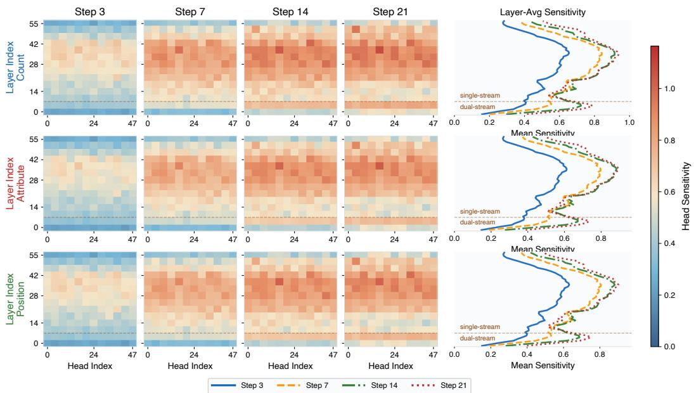  
Figure 8: Attention-head sensitivity across denoising steps. Each heatmap cell averages a 4×4 group of transformer layers and attention heads. The side panels show the layer-wise mean sensitivity at each step, and the dashed line separates the dual-stream layers (0–7) from the single-stream layers (8–55).