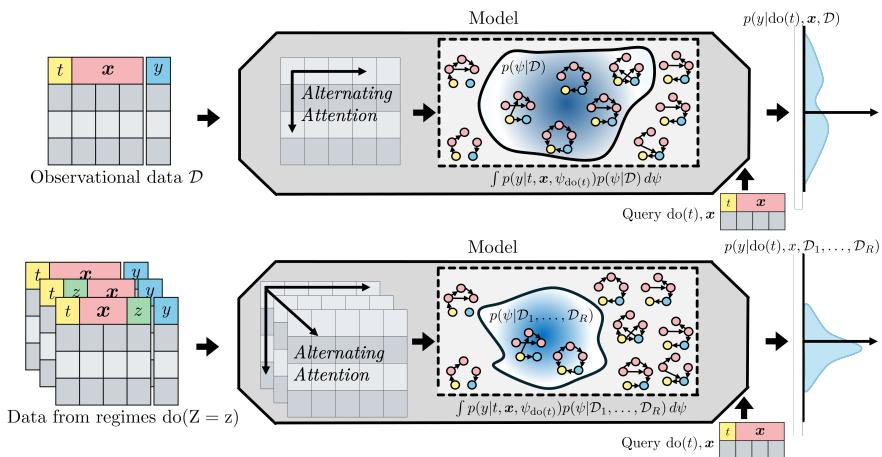
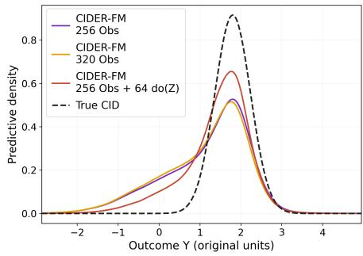
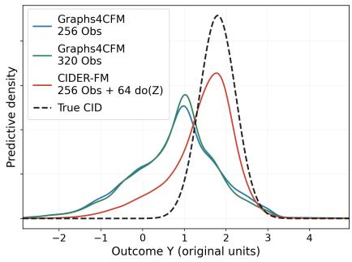
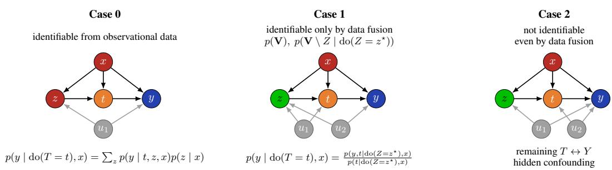
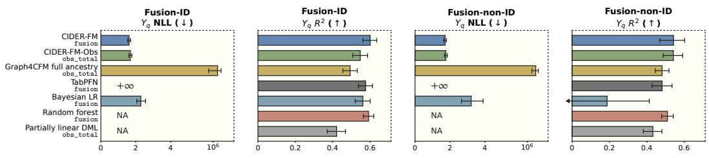
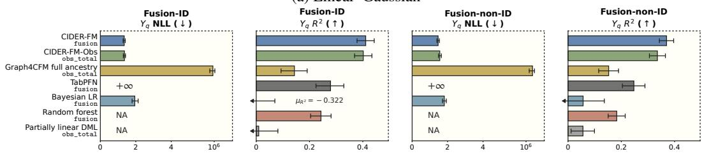
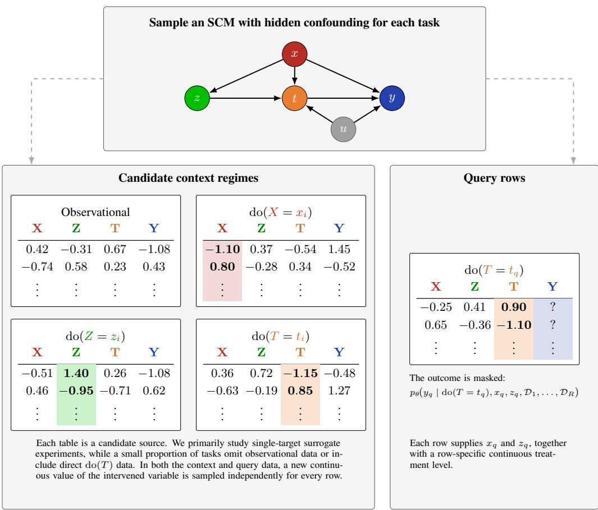
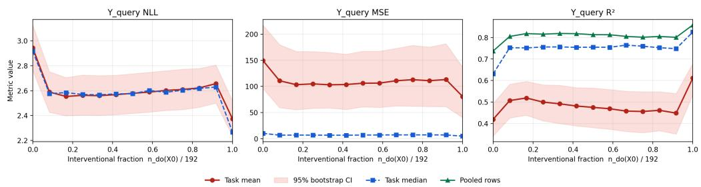

# CIDER-FM: FOUNDATION MODELS FOR CAUSAL IN-FERENCE FROM DIVERSE EXPERIMENTAL REGIMES

Yuche Gao<sup>1</sup> Arik Reuter<sup>1,2</sup> Siyuan Guo<sup>3</sup> Anish Dhir<sup>4</sup> Bernhard Schölkopf<sup>5,2</sup> Adrian Weller<sup>6,1</sup>

<sup>1</sup>University of Cambridge, Cambridge, United Kingdom

<sup>2</sup>Max Planck Institute for Intelligent Systems, Tübingen, Germany <sup>3</sup>Prior Labs

<sup>4</sup>Gatsby Computational Neuroscience Unit, University College London, London, United Kingdom <sup>5</sup>ELLIS Institute, Tübingen, Germany

<sup>6</sup>The Alan Turing Institute, London, United Kingdom

## ABSTRACT

Causal foundation models (CFMs) amortise causal inference over priors of synthetic structural causal models (SCMs), predicting the effect of an experiment on a specific variable. However, observational data alone may leave multiple causal models compatible with available evidence, while experimental data with interventions on exactly the variable of interest might be unavailable. This work studies CFMs as a method to combine finite observational and surrogate-interventional datasets in order to predict a target conditional interventional distribution (CID) more accurately than with observational data alone. We first formalise the conceptual benefits of surrogate experiments. Building on this analysis, we introduce FOUN-DATION MODELS FOR CAUSAL INFERENCE FROM DIVERSE EXPERIMENTAL REGIMES (CIDER-FM), a causal foundation model that uses an intervention-aware representation and hierarchical three-axis attention to exchange information across variables, samples, and experimental regimes. We evaluate CIDER-FM against a wide range of baselines across diverse synthetic graph and mechanism families, as well as on both simulated and real-world data from Causal Chambers. Our results demonstrate strong CID prediction performance and show that incorporating experimental context can improve predictions over observational data alone.

## 1 INTRODUCTION

Causal questions are central to scientific inquiry and decision making. When a variable $T$ can be experimentally manipulated and an outcome Y measured, the causal effect of T on Y can be estimated directly. When such a targeted experiment is infeasible and, for instance, only observational data can be collected, multiple causal models may explain the same observational distribution yet lead to different causal effects (Pearl, 2009; Peters et al., 2017). Therefore, traditional causal inference pairs explicit structural assumptions with bespoke estimators tailored to a particular identification strategy. However, explicit structural assumptions, such as knowledge of the entire set of causal relationships between all variables in a system, might not be justified, especially in complex scientific setups. Even worse, having to make an assumption without the necessary grounds can lead to wrong yet confident predictions.

Recently proposed Causal foundation models (CFMs) offer a complementary approach: pretrained on a distribution of synthetic SCMs, a single model takes as input observational data and amortises causal discovery followed by causal inference using a prior over causal structures (Robertson et al., 2026; Dhir et al., 2026). A CFM approximates the posterior predictive conditional interventional distribution (CID)

$$
p ( y \mid \mathrm { d o } ( T = t ) , \mathbf { x } , \mathcal { D } ) = \int p \big ( y \mid \mathbf { x } , \psi _ { \mathrm { d o } ( T = t ) } \big ) p ( \psi \mid \mathcal { D } , \mathbf { x } ) \ \mathrm { d } \psi ,\tag{1}
$$

  
Figure 1: Conceptual comparison: observational data (top) and multi-regime experimental data (bottom) in Causal Foundation Models (CFMs). With observational data alone, multiple compatible SCMs may imply different CIDs, producing a broad or multimodal posterior predictive distribution. Adding data from different experimental regimes can exclude or downweight incompatible SCMs and thereby refine the predictive distribution. Compared to existing TFMs, the stacked tables in the lower panel make explicit a third structural axis, namely the different experimental regime, alongside variables and samples along which CIDER-FM performs the attention operation.



  
Figure 2: Case study: surrogate experiments sharpen conditional interventional predictions. Model predictive densities are visualised using Gaussian KDEs. Left: the same CIDER-FM checkpoint receives 256 observational samples, 320 observational samples, or 256 observational samples plus 64 randomized do(Z) samples. Right: comparison with observational-only Graphs4CFM (Reuter et al., 2026) without graph input. Details of the task construction and quantitative results are in Section H.

where $\psi$ denotes an SCM and D the available data. This posterior-predictive view allows uncertainty about both the graph and its mechanisms (from the implicit causal-discovery step) to be propagated into the causal prediction, rather than replaced immediately by a single fixed causal model (Dhir et al., 2024; 2026; Robertson et al., 2026). However, the cost of this approach is that, since existing CFMs only use observational data, a broad SCM prior leaves several causal explanations unresolved (Robert son et al., 2026; Dhir et al., 2026). Mathematically, this corresponds to an uncertain $p ( \psi | \mathcal { D } _ { o b s } , \pmb { x } )$ Since the final CID integrates over the posterior belief over SCMs, using only an observational dataset in $p ( \psi | \mathcal { D } _ { o b s } , \pmb { x } )$ may lead the CID failing to concentrate and instead remaining diffuse or multimodal (the first panel in Fig. 1).

This work studies interventional data as a complementary source ofcausal information in CFMs to overcome this issue by reducing or even fully collapsing the posterior over SCMs compatible with a scenario, over which we need to amortise. More specifically, we replace $\mathcal { D } _ { o b s }$ by multiple datasets $\mathcal { D } _ { 1 } , \ldots , \mathcal { D } _ { R }$ that can be observational or interventional data from different experiments. In many scientific settings, observational data coexist with datasets collected under controlled interventions.

Direct experimentation on the treatment variable of interest $T$ may be unavailable, while surrogate experiments do $( Z = z )$ on other variables are feasible. This motivates exploiting multi-environment data from diverse experimental regimes, including observational data, data from surrogate experiments, and, when available, interventional data on the treatment variable T, to constrain the set of SCMs compatible with the available evidence (Hauser & Bühlmann, 2012; Kivva et al., 2023), as illustrated in the second panel of Fig. 1 and the case study in Fig. 2. Following the prior-data fitted network (PFN) paradigm of synthetic pretraining and in-context learning (Hollmann et al., 2025), we introduce FOUNDATION MODELS FOR CAUSAL INFERENCE FROM DIVERSE EXPERIMENTAL REGIMES (CIDER-FM).

## Our contributions.

1. Theoretical analysis. We formalise how surrogate experiments can enable point identification or narrow identified sets, and provide complementary finite-sample and asymptotic analyses of how they can improve prediction accuracy.

2. Model architecture. CIDER-FM uses intervention-aware representations of continuous, row-specific randomised treatment assignments $\mathrm { d o } ( X = x _ { i } )$ and applies hierarchical three-axis attention across variables, samples within regimes, and experimental regimes to enable in-context causal prediction from multi-environment data.

3. Synthetic and real-world validation. We demonstrate CIDER-FM’s strong predictive performance across diverse synthetic graph and mechanism families compared with observation-only baselines under matched context budgets. On Causal Chambers, the same model supports simulator-guided experimental design and achieves strong causal prediction performance on the resulting real-world experiments.

## 2 BACKGROUND AND RELATED WORK

Structural causal models and interventions A structural causal model (SCM) $\psi = ( G , { \mathcal { M } } )$ consists of a causal graph G and mechanisms M specifying how each variable is generated from its parents and exogenous noise, together with the joint noise distribution (Pearl, 2009; Peters et al., 2017). A hard intervention $\mathrm { d o } ( T = t )$ replaces the structural assignment for T by $T : = t ,$ removing incoming edges to T in G while leaving the other mechanisms unchanged. Within a specified model class, the available population distributions may be compatible with multiple SCMs. The graph is identifiable if the set of compatible graphs is a singleton. A causal query is identifiable if all these compatible SCMs agree on the target quantity, such as $p _ { \psi } ( y \mid \mathrm { d o } ( T = t ) , x )$

Traditional causal methods. Established causal methods span several families. Graphical methods use adjustment criteria and do-calculus to derive causal estimands under an assumed graph (Pearl, 1995; 2009; Shpitser & Pearl, 2006); outcome-regression and propensity-score methods estimate effects through models of the outcome or treatment assignment (Robins, 1986; Rosenbaum & Rubin, 1983). Although these approaches can provide guarantees under their respective conditions, their application requires problem-specific assumptions and typically manual choices of adjustment sets and estimation models.

Tabular Foundation Models. An alternative to fitting a problem-specific estimator is to amortise inference across a distribution of tasks. Tabular foundation models, such as TabPFN (Hollmann et al., 2023; 2025) , are amortised inference methods in the form of neural processes (Garnelo et al., 2018a;b) that have revolutionised the domain of tabular machine learning, setting new benchmark records (Erickson et al., 2026). They work by pretraining on synthetic datasets and adapting to new tasks through in-context learning (ICL), without task-specific parameter updates (Müller et al., 2022; Hollmann et al., 2023; 2025). CIDER-FM, the model we propose, operates in the same synthetic-data training and in-context-learning paradigm as TFMs.

Causal Foundation Models. Causal foundation models (CFMs) extend the ideas behind synthetically trained TFMs to causal queries such as conditional interventional distributions. Existing CFMs broadly follow two strategies. Identifiable-prior CFMs restrict their pretraining priors to structural assumptions in which the target query is identifiable from observational data under specific causal assumptions. For instance, Balazadeh et al. (2026) propose CausalPFN, a CFM that achieves excellent predictive performance on causal effect estimation with binary treatments under unconfoundedness, while Ma et al. (2025) propose priors to train a CFM for varying causal scenarios, such as backdoor-adjustment or front-door adjustment. In contrast, posterior-averaging CFMs learn the posterior predictive distribution induced by a broader prior over SCMs, retaining uncertainty when observationally compatible SCMs imply different interventional distributions (Robertson et al., 2026; Dhir et al., 2026). Both strategies primarily use observational datasets as context, leaving open how to incorporate data from diverse experimental regimes.

  
Figure 3: Case studies: Three roles of surrogate experiments for $p ( y \mid \operatorname { d o } ( T = t ) , x )$ . In Case 0, the CID is identifiable from observational data alone. In Case 1, it becomes identifiable after incorporating experiments on Z. In Case 2, it remains non-identifiable but with a potentially smaller identified set.

Recently, conditioning CFMs on partial graph information has been proposed as a way to bridge the gap between identifiable-prior and posterior-averaging CFMs (Reuter et al., 2026). Reliable causal graphs, however, are often unavailable in complex scientific setups. Accurately estimating them from data is challenging and treating them as trusted inputs can propagate graph-discovery errors into the final prediction. In this paper, we instead leverage data from multiple environments, not requiring any graphical assumptions.

## 3 BENEFITS OF SURROGATE EXPERIMENTS

Causal inference from observational data is arguably a well-known and well-studied topic (Pearl, 2009; Rubin, 1974), and having access to experimental data, where the experiment has been performed on precisely the variable T whose effect is to be examined, remains mostly an estimation challenge, not a causal identification problem. In this section, we discuss the case of data from multiple surrogate experiments on different variables, which CIDER-FM takes as input.

Point identification. We first consider the infinite-data limit, in which all available distributions are known exactly. A target CID is point-identifiable if it is the same across all SCMs compatible with the available population distributions. Conditional generalised identification (c-gID) characterises whether such a conditional causal query can be uniquely recovered from an arbitrary collection of observational and interventional distributions under an assumed causal graph (Bareinboim & Pearl, 2012; Lee et al., 2020; Kivva et al., 2023). Fig. 3 illustrates three possible cases.

Partial identification. Failure of point identification does not imply that a surrogate experiment is uninformative. Different SCMs can imply the same observational distribution but different interventional distributions. Requiring agreement with the experimental distribution can therefore exclude some of these observationally compatible SCMs. A graphical illustration arises in DAG models without latent confounding: known perfect interventions can distinguish graphs within an observational Markov equivalence class (MEC), refining it to a potentially smaller interventional MEC. This is because removing incoming edges to the intervention targets can expose differences between otherwise observationally equivalent causal structures (Hauser & Bühlmann, 2012).

To formalise this principle, consider a specified class of SCMs, where ψ encodes both the graph and its mechanisms. Let $[ \psi ^ { \star } ] _ { O }$ denote the SCMs compatible with the population observational distribution, and let $[ \psi ^ { \star } ] _ { O + I }$ additionally require compatibility with the available surrogate interventional distribution. For $q _ { y } ( \psi ) = p _ { \psi } ( y \mid \mathrm { d o } ( T = t ) , \bar { x }$ ), define the corresponding identified sets as $\mathcal { Q } _ { S } = \{ q _ { y } ( \psi ) : \psi \in [ \psi ^ { \star } ] _ { S } \}$ . The additional compatibility requirement implies

$$
[ \psi ^ { \star } ] _ { O + I } \subseteq [ \psi ^ { \star } ] _ { O } \quad \Longrightarrow \quad \mathcal { Q } _ { O + I } \subseteq \mathcal { Q } _ { O } .\tag{2}
$$

Thus, at the population level, surrogate experiments can shrink the target’s identified set or leave it unchanged. The inclusion may be strict even when $\mathcal { Q } _ { O + I }$ is not a singleton.

Finite data. For fixed query values $t , x , y .$ , let $q _ { y } ( \psi ) = p _ { \psi } ( y \mid \mathrm { d o } ( T = t ) , x )$ , where ψ encodes both the graph and its mechanisms. The posterior predictive density (PPD) targeted by a CFM is

$$
\widehat { q } _ { y } ( \mathcal { D } ) = \int p _ { \psi } ( y \mid \mathrm { d o } ( T = t ) , x ) p ( \psi \mid \mathcal { D } ) d \psi .
$$

Suppose that $\psi \sim p ( \psi )$ and both datasets are generated from this same SCM under their respective regimes. For $S \in \{ \dot { O } , \dot { O } + I \}$ , define the prior-averaged mean squared error

$$
R _ { S } : = \mathbb { E } _ { \psi , \mathcal { D } _ { S } } \left[ \left( q _ { y } ( \psi ) - \widehat { q } _ { y } ( \mathcal { D } _ { S } ) \right) ^ { 2 } \right] ,
$$

where $\mathcal { D } _ { O } = \mathcal { D } _ { \mathrm { o b s } }$ and $\mathcal { D } _ { O + I } = ( \mathcal { D } _ { \mathrm { o b s } } , \mathcal { D } _ { \mathrm { i n t } } ) . \mathrm { I f } \ \mathbb { E } _ { \psi } [ q _ { y } ( \psi ) ^ { 2 } ] < \infty$ , then

$$
R _ { O } - R _ { O + I } = \mathbb { E } _ { \mathcal { D } _ { \mathrm { o b s } } , \mathcal { D } _ { \mathrm { i n t } } } \left[ \left( \widehat { q } _ { y } ( \mathcal { D } _ { \mathrm { o b s } } , \mathcal { D } _ { \mathrm { i n t } } ) - \widehat { q } _ { y } ( \mathcal { D } _ { \mathrm { o b s } } ) \right) ^ { 2 } \right] \geq 0 .\tag{3}
$$

Thus, incorporating surrogate-interventional data cannot increase the prior-averaged MSE between the exact PPD and the underlying SCM’s target density. The reduction is strict whenever the additional data change the PPD at $y$ with positive probability. See Appendix A for the proof. Please note the CFM is trained to approximate ${ \hat { q } } ,$ which might introduces additional approximation error.

## 4 INPUT REPRESENTATION AND MODEL ARCHITECTURE

CIDER-FM receives context datasets generated by the same unknown causal system under different experimental regimes. For each query row, it predicts a conditional interventional distribution for the masked outcome. Its architecture represents both how each row was generated and how evidence is exchanged within and across regimes. Appendix C provides details of the input representation, attention layers, and predictive distribution.

Intervention-aware input representation. A task contains R context datasets $\mathcal { D } _ { 1 } , \ldots , \mathcal { D } _ { R }$ , where regime r provides data $\mathbf { \bar { \mathcal { D } } } _ { r } = \mathbf { \bar { \{ v } }  _ { r , i } \} _ { i = 1 } ^ { n _ { r } }$ over the same p variables. Each regime has an interventiontarget mask $\mathbf { a } _ { r } \in \{ 0 , 1 \} ^ { p }$ , where $a _ { r , j } = 1$ indicates that variable $j$ is intervened upon. Each row also has a vector of assigned intervention values $\mathbf { c } _ { r , i } \in \mathbb { R } ^ { p }$ , whose entries are relevant only for intervened variables. Together, $\left( \mathbf { a } _ { r } , \mathbf { c } _ { r , i } \right)$ specifies which structural assignments were externally replaced and the values assigned in row i. Defining $\mathcal { T } _ { r } = \{ j : a _ { r , j } = 1 \}$ , the row is generated according to

$$
\mathbf { v } _ { r , i } \sim p _ { \psi } ( \mathbf { V } \mid \mathrm { d o } ( \mathbf { V } _ { \mathcal { T } _ { r } } = \mathbf { c } _ { r , i , \mathcal { T } _ { r } } ) ) ,\tag{4}
$$

where $\psi$ denotes the underlying causal system. The observational regime is represented by ${ \bf a } _ { r } =$ $\mathbf { 0 , }$ allowing observational and interventional data to share the same input format. CIDER-FM accommodates varying numbers of regimes and samples per regime.

CIDER-FM represents every table cell as a d-dimensional token. Each token combines information about the entire row, the individual cell value, the variable’s identity and task role, the availability of its value, and its intervention metadata. Writing tildes for preprocessed data values and intervention assignments, the initial token for variable j in context row i of regime r is

$$
\mathbf h _ { r , i , j } ^ { C , 0 } = \alpha \phi _ { \mathrm { r o w } } ( \widetilde { \mathbf v } _ { r , i } ) + \beta \phi _ { \mathrm { v a l } } ( \widetilde { v } _ { r , i , j } ) + \mathbf e _ { j } ^ { \mathrm { i d } } + \mathbf e _ { \rho _ { j } } ^ { \mathrm { r o l e } } + \mathbf e _ { \mathrm { o b s } } ^ { \mathrm { s t a t u s } } + \mathbf e ^ { \mathrm { i n t } } ( a _ { r , j } , \widetilde { c } _ { r , i , j } ) .\tag{5}
$$

The function $\phi _ { \mathrm { r o w } } : \mathbb { R } ^ { p }  \mathbb { R } ^ { d }$ encodes the entire row, and its output is shared across all cell tokens in that row. The function $\phi _ { \mathrm { v a l } } : \mathbb { R } \to \mathbb { R } ^ { d }$ encodes the individual cell value. The scalar coefficients α and $\beta$ weight these two contributions.

The indexed e terms are learned embedding vectors selected by discrete labels. The vector ${ \bf e } _ { j } ^ { \mathrm { i d } }$ identifies the variable slot, while ${ \bf e } _ { \rho _ { j } } ^ { \mathrm { r o l e } }$ identifies its task role, with $\rho _ { j }$ denoting treatment, outcome, or conditioning variable. The vector $\mathbf { e } _ { \mathrm { o b s } } ^ { \mathrm { s t a t u s } }$ indicates that the cell value is available to the model.

The intervention encoding $\mathbf { e } ^ { \mathrm { i n t } } ( a , c )$ is a vector-valued function that combines an embedding of the intervention status a with an encoding of the assigned value c: ${ \bf e } ^ { \mathrm { i n t } } ( a , c ) = { \bf e } _ { a } ^ { \mathrm { i n t - s t a t u s } } + a \bar { \phi } _ { \mathrm { i n t } } ( c )$ Here, $\mathbf { e } _ { 0 } ^ { \mathrm { i n t - s t a t u s } }$ and $\mathbf { e } _ { 1 } ^ { \mathrm { i n t - s t a t u s } }$ are learned embedding vectors indicating whether the variable is intervened upon, and $\phi _ { \mathrm { i n t } }$ encodes the assigned intervention value. For $a = 0$ , the encoding contains only the non-intervened status vector. For $a = 1$ , it also includes the encoded assignment $\phi _ { \mathrm { i n t } } ( c )$ This distinguishes an intervention assigning the value zero from the absence of an intervention.

Query tokens use the same construction, with the unknown outcome replaced by a masked-target embedding and the requested intervention supplied as metadata. To keep intervention information available throughout the network, the intervention encoding is also injected into every attention layer through a learned gated residual connection.

Hierarchical three-axis attention. Existing table-aware architectures typically exchange information across the variable and sample axes. CIDER-FM introduces the experimental regime as a third axis. Each of its L layers first applies variable-axis attention to the $p$ cell tokens within every context and query row, allowing each token to incorporate information from the other variables in that row. It then applies sample-axis attention independently for each regime and variable, allowing samples within a regime to exchange information while preserving the separation between regimes.

After sample-axis attention, each (regime, variable) pair contains a set of sample tokens. Learned attention pooling compresses this set into $K$ memory tokens, producing a fixed-size summary for each variable in each regime. For each variable, regime-axis self-attention then fuses the corresponding memories from all R regimes. These variable-aligned memories aggregate evidence about the same variable across observational and interventional settings. Finally, separate cross-attention blocks use the fused memories to update the context and query tokens before the next layer.

After the final layer, a linear readout maps the token corresponding to the masked query outcome to the parameters of a full-support bar distribution (Robertson et al., 2026; Hollmann et al., 2025). The model is trained end-to-end by minimising the negative log-likelihood of sampled query outcomes.

## 5 EXPERIMENTS

We evaluate CIDER-FM’s ability to predict CIDs from data collected across multiple experimental regimes. We begin with general random graphs, considering both linear–Gaussian mechanisms and heterogeneous nonlinear mechanisms with heavy-tailed noise, then use restricted graph families to examine performance stratified by three identification settings in Fig. 3. We then evaluate on real-world data from Causal Chambers (Gamella et al., 2025b). Finally, we conduct architectural ablations to assess the computational efficiency of three-axis attention.

Baselines We compare CIDER-FM with predictive and causal inference methods (Table 5), and CIDER-FM-Obs, a counterpart trained for the same task using only observational context. The general-random-graph and real-world benchmarks include Bayesian linear regression (Bayesian LR), TabPFN ${ \bf v } 2$ (Hollmann et al., 2025), and Graph4CFM (Reuter et al., 2026), with varying levels of ancestral information. The restricted-family benchmark additionally includes linear regression (LR), random forests (RF), partially linear double machine learning (DML) (Chernozhukov et al., 2018), Do-PFN (Robertson et al., 2026), and ArCO-GP (Toth et al., 2025). For the restricted families, we additionally report $c { \cdot } g \mathrm { I D } $ -based estimators supplied with the ground-truth ADMG as graph-informed references, excluding them from the main rankings. Given the misspecification affecting external CFMs in our setting (Appendix D), we use CIDER-FM-Obs as our primary matched control.

Metrics For each query, the model predicts $p ( y \mid \mathrm { d o } ( T = t ) , \mathbf { x } , \mathcal { D } )$ . We distinguish two evaluation targets: the sampled query outcome $\bar { Y } _ { q }$ and the generating SCM’s conditional interventional mean, $Y _ { \mathrm { m e a n } } = \mathbb { E } _ { \psi } [ Y \mid \mathrm { d o } ( T = t ) , \mathbf { x } ]$ . Model predictions are evaluated using negative log-likelihood (NLL), and its predictive mean using MSE and $R ^ { 2 }$ . Where available, comparison with $Y _ { \mathrm { m e a n } }$ allows us to ignore the effect of noise added to the mean. We distinguish three context configurations:

• fusion: observational and experimental samples from all available regimes.

• obs\_total: observational samples matching the total number of samples in the fusion context, giving a fair comparison of the contribution of experimental context.

• obs\_fixed: observational samples matching only the observational portion of the fusion context.

Table 1: Performance on general random graphs: 560 linear–Gaussian and 512 ComplexMech test SCMs. Entries report the indicated statistic with its SCM-level standard error conditional on fixed checkpoints. Best point estimates are in bold. Infinite NLL arises when the predicted density is numerically zero for a query outcome. ComplexMech $Y _ { \mathrm { m e a n } }$ is omitted because reliable ground-truth conditional means are unavailable.
<table><tr><td colspan="2">Method Data &amp; Info</td><td> $\mathtt { f u s i o n }$ </td><td>CIDER-FM CIDER-FM-Obs Bayesian LR  $\mathsf { o b s \_ t o t a l }$ </td><td>obs_total</td><td>TabPFN v2  $\mathsf { o b s \_ t o t a l }$ </td><td>Graph4CFM obs_total</td></tr><tr><td rowspan="5">Linear-Gaussian Ymean</td><td>MSE↓</td><td> ${ \pm } 5 . 0 3 \pm 3 5 . 1 0$ </td><td> $4 7 1 . 7 2 \pm 1 6 7 . 5 6$ </td><td> $7 9 5 . 2 5 \pm 2 4 7 . 8 0$ </td><td> $3 8 6 . 3 7 \pm 2 1 3 . 8 1$ </td><td>all ancestry  $1 6 0 . 1 0 \pm 6 0 . 1 1$ </td></tr><tr><td> $R _ { \mathrm { m e a n } } ^ { 2 } \uparrow$ </td><td> $\mathbf { 0 . 6 7 5 \bot } 0 . 0 4 5$ </td><td> $- 0 . 0 1 6 \pm 0 . 0 3 0$ </td><td> $- 2 1 . 7 1 9 \pm 7 . 8 7 3$ </td><td> $- 3 . 6 0 8 \pm 1 . 7 3 6$ </td><td> $0 . 4 7 4 \pm 0 . 0 8 2$ </td></tr><tr><td> $R _ { \mathrm { m e d } } ^ { 2 } \uparrow$ </td><td> $\mathbf { 0 . 9 4 7 \mathop { \pm } 0 . 0 0 6 }$ </td><td> $- 0 . 0 1 6 \pm 0 . 0 0 6$ </td><td> $0 . 8 4 3 \pm 0 . 0 3 2$ </td><td> $0 . 8 9 7 \pm 0 . 0 1 6$ </td><td> $0 . 8 1 1 \pm 0 . 0 1 9$ </td></tr><tr><td> $R _ { \mathrm { p o o l } } ^ { 2 } \uparrow$ </td><td> $\mathbf { 0 . 8 9 5 \bot } 0 . 0 6 7$ </td><td> $0 . 4 7 9 \pm 0 . 1 4 4$ </td><td> $0 . 1 2 2 \pm 0 . 6 3 3$ </td><td> $0 . 5 7 3 \pm 0 . 3 4 7$ </td><td> $0 . 8 2 3 \pm 0 . 1 0 1$ </td></tr><tr><td> ${ \mathrm { N L L } } \downarrow$ </td><td> $\mathbf { 2 . 0 5 9 } \pm \mathrm { 0 . 0 6 1 }$ </td><td> $2 . 4 4 5 \pm 0 . 0 5 7$ </td><td> $1 3 . 9 9 0 \pm 1 . 9 6 1 $ </td><td>+∞</td><td> $3 . 2 5 \mathrm { e } 7 \pm 2 . 4 0 \mathrm { e } 7$ </td></tr><tr><td rowspan="5">Linear-Gaussian  $Y _ { q }$ </td><td>MSE↓</td><td> $\mathbf { 1 3 8 . 9 7 \pm 3 7 . 7 0 }$ </td><td> $5 1 0 . 7 2 \pm 1 6 8 . 7 2$ </td><td> $8 3 5 . 5 5 \pm 2 4 7 . 7 3$ </td><td> $4 2 5 . 3 0 \pm 2 1 3 . 1 4$ </td><td> $2 0 6 . 7 3 \pm 6 3 . 3 9$ </td></tr><tr><td> $R _ { \mathrm { m e a n } } ^ { 2 } \uparrow$ </td><td> $\mathbf { 0 . 5 8 7 \pm 0 . 0 1 9 }$ </td><td> $0 . 0 6 5 \pm 0 . 0 1 5$ </td><td> $- 7 . 9 6 3 \pm 2 . 7 6 3$ </td><td> $- 0 . 1 6 7 \pm 0 . 1 1 4$ </td><td> $0 . 4 9 8 \pm 0 . 0 2 0$ </td></tr><tr><td> $R _ { \mathrm { m e d } } ^ { 2 } \uparrow$ </td><td> $\mathbf { 0 . 7 4 1 \pm 0 . 0 2 4 }$ </td><td> $- 0 . 0 0 9 \pm 0 . 0 0 3$ </td><td> $0 . 5 5 9 \pm 0 . 0 6 0$ </td><td> $0 . 6 8 1 \pm 0 . 0 4 7$ </td><td> $0 . 5 9 9 \pm 0 . 0 3 7$ </td></tr><tr><td> $R _ { \mathrm { p o o l } } ^ { 2 } \uparrow$ </td><td> $\pm 0 . 8 5 3 \pm 0 . 0 8 0$ </td><td> $0 . 4 6 1 \pm 0 . 1 4 1$ </td><td> $0 . 1 1 8 \pm 0 . 5 8 3$ </td><td> $0 . 5 5 1 \pm 0 . 3 2 7$ </td><td> $0 . 7 8 2 \pm 0 . 1 1 0$ </td></tr><tr><td></td><td></td><td></td><td> $2 . 0 8 1 \pm 0 . 4 3 7$ </td><td></td><td></td></tr><tr><td rowspan="5">ComplexMech  $Y _ { q }$ </td><td> ${ \mathrm { N L L } } \downarrow$  MSE↓</td><td> $- 0 . 3 9 5 \pm 0 . 0 7 8$   $2 8 9 . 2 6 \pm 9 4 . 0 6$ </td><td> $\mathbf { - 0 . 4 1 6 \pm 0 . 0 7 9 }$   $2 9 9 . 2 6 \pm 9 5 . 4 0$ </td><td> $2 5 8 8 . 1 0 \pm 1 3 1 4 . 8 0$ </td><td> $+ \infty$   $7 7 1 . 9 8 \pm 4 0 5 . 3 6$ </td><td> $2 . 1 2 \mathrm { e } 8 \pm 1 . 2 8 \mathrm { e } 8$   $4 0 4 . 8 9 \pm 1 2 4 . 9 1$ </td></tr><tr><td></td><td> $\mathbf { 0 . 2 4 5 \bot } 0 . 0 2 2$ </td><td> $0 . 2 2 4 \pm 0 . 0 2 7$ </td><td> $- 4 . 1 4 \mathrm { e } 4 \pm 4 . 0 9 \mathrm { e } 4$ </td><td> $- 0 . 0 5 4 \pm 0 . 1 1 9$ </td><td> $0 . 1 3 3 \pm 0 . 0 3 2$ </td></tr><tr><td> $R _ { \mathrm { m e a n } } ^ { 2 } \uparrow$ </td><td>0.110 ± 0.026</td><td> ${ \bf 0 . 1 1 2 \bot 0 . 0 2 2 }$ </td><td> $- 0 . 0 6 1 \pm 0 . 0 1 1$ </td><td> $0 . 0 5 7 \pm 0 . 0 2 0$ </td><td> $0 . 0 4 3 \pm 0 . 0 1 9$ </td></tr><tr><td> $R _ { \mathrm { m e d } } ^ { 2 } \uparrow$ </td><td> $\mathbf { 0 . 9 3 5 \bot 0 . 0 5 2 }$ </td><td> $0 . 9 3 3 \pm 0 . 0 5 7$ </td><td> $0 . 4 2 0 \pm 0 . 5 6 2$ </td><td> $0 . 8 2 7 \pm 0 . 1 5 3$ </td><td></td></tr><tr><td> $R _ { \mathrm { p o o l } } ^ { 2 } \uparrow$ </td><td></td><td></td><td></td><td></td><td> $0 . 9 0 9 \pm 0 . 0 7 3$ </td></tr></table>

## 5.1 SYNTHETIC DATA

## 5.1.1 GENERAL RANDOM GRAPHS

We first sample random acyclic directed mixed graphs with 4–10 observed variables, allowing hidden confounding through bidirected edges. We consider linear–Gaussian mechanisms and ComplexMech, which combines randomly sampled MLP mechanisms, additive or non-additive noise, different noise scales, as well as heavy-tailed noise. Appendix F provides the data construction. Some tasks have very little within-task target variation and therefore exhibit extreme negative $R ^ { 2 }$ . We therefore report the mean and median task-level $R ^ { 2 } .$ , together with $R ^ { 2 }$ computed by pooling query rows across SCMs.

Table 1 shows that CIDER-FM achieves the best point estimates across all reported metrics for both $Y _ { \mathrm { m e a n } }$ and $Y _ { q }$ under linear–Gaussian mechanisms. Its advantage over CIDER-FM-Obs and Graph4CFM highlights the benefit of experimental context, while its comparison with TabPFN illustrates the difference between $p ( \boldsymbol { y } \mid \mathrm { d o } ( T = t ) , \mathbf { x } )$ and $p ( y \mid T = t , \mathbf { x } )$

Under ComplexMech, CIDER-FM continues to outperform both predictive baselines across the reported metrics. Compared with TabPFN, query MSE decreases from 771.98 to 289.26, while mean task-level $R ^ { 2 }$ increases from −0.054 to 0.245. The gains over CIDER-FM-Obs are smaller than under linear–Gaussian mechanisms, with particularly similar NLL, median $R ^ { 2 }$ , and pooled $R ^ { 2 }$

An advantage over the observation-only counterpart is not guaranteed when experimental regimes are selected randomly under a fixed total context budget. For example, intervening on an isolated surrogate Z leaves the joint distribution of $( T , Y )$ unchanged and does not resolve any existing confounding between treatment and outcome. To better understand when experimental context is beneficial, we next stratify tasks by the identifiability of the target causal query.

## 5.1.2 STRATIFICATION BY IDENTIFIABILITY

To examine how predictive performance varies with identifiability, we next consider restricted graph families in which Y is a descendant of both the treatment T and surrogate Z, with hidden confounding represented by bidirected edges. The query conditions on X, comprising all observed variables other than $T$ and $\dot { Y } .$ , including $\breve { Z } .$ Contexts contain observational data and interventional data on $Z ,$ optionally supplemented by an intervention on another observed covariate $X _ { j } \in \mathbf { X } \backslash \{ Z \}$ }. Using c-gID under the generating graph, we distinguish $\mathrm { \ o b s \_ i d , \ f u s i o n \_ i d }$ , and fusion\_non\_id settings as defined in Fig. 3. Appendix E describes the detailed construction.



(a) Linear–Gaussian  
  
(b) Nonlinear–Gaussian  
Figure 4: Selected baseline comparisons on restricted graph families in fusion\_id and fusion\_non\_id. Error bars indicate 95% confidence intervals.

The rank comparison contains 19 method configurations for point-prediction metrics and 11 with reported density scores. It includes both observational and pooled-data baselines, together with Graph4CFM variants with and without ancestral information. Graph-informed $c { \cdot } g \mathrm { I D }$ estimators are shown as additional references in the full tables (Tables 8 and 9).

The three identification settings and five evaluation metrics (NLL, MSE, and $\breve { R ^ { 2 } }$ for $Y _ { q } ;$ MSE and $R ^ { 2 }$ for $Y _ { \mathrm { m e a n } } )$ yield 15 setting–metric combinations per mechanism family. CIDER-FM ranks among the top three configurations in all 15 linear– Gaussian combinations and 13 of 15 nonlinear– Gaussian combinations (Table 2). Detailed rankings appear in Tables 6 and 7.

Table 2: Rank-1 and top-3 frequencies of CIDER-FM over five metrics in each of three settings, giving 15 setting–metric combinations per mechanism family.
<table><tr><td>Mechanism</td><td>Rank 1</td><td>Top 3</td></tr><tr><td>Linear-Gaussian</td><td>9/15 (60%)</td><td>15/15 (100%)</td></tr><tr><td>Nonlinear-Gaussian</td><td>7/15 (46.7%)</td><td>13/15 (86.7%)</td></tr></table>

Fig. 4a shows that, under linear–Gaussian mechanisms, CIDER-FM achieves the lowest NLL and highest $Y _ { q } R ^ { 2 }$ point estimates in both fusion settings. In fusion\_id, where the available experiments enable identification under the generating graph, CIDER-FM improves over CIDER-FM-Obs on both metrics, highlighting the benefit of experimental context. In fusion\_non\_id, CIDER-FM continues to perform best, despite the query remaining non-identifiable. However, its advantage over CIDER-FM-Obs is smaller in this setting, with nearly identical $Y _ { q } R ^ { 2 }$

## 5.2 REAL-WORLD EVALUATION

We then evaluate CIDER-FM on the light-tunnel task from Causal Chambers (Gamella et al., 2025b). The task concerns how intervening on the red-channel light-source setting T = red affects the downstream light-intensity measurement $Y = \mathrm { v i s _ { 3 } }$ , conditional on the green- and blue-channel settings X = (green, blue). We withhold both polarizer variables, leaving the models with incomplete information about the optical system. The goal is to predict the conditional outcome distribution under interventions on the red channel using observational measurements and experiments on other observed variables controlling the light-tunnel experiment.

We select the experimental data sources through simulation-based experimental design. Using data generated by the official simulator corresponding to the light-tunnel experiment (Gamella et al., 2025a), we set up different combinations of observational and interventional regimes under a fixed total context budget. We evaluate these candidate designs with the frozen ComplexMech CIDER-FM in Section 5.1.1 and select based on NLL on the simulated data. This procedure selects observational data combined with interventions on green. We then freeze the design and evaluate it using real measurements (without reselecting regimes based on real-data performance). No model retraining is performed, and simulated samples are excluded from the real-data context. (See Appendix G).

Table 3: Real-world performance on Causal Chambers. Values are estimates ± standard errors. Bold indicates the best point estimate in each column. For Graph4CFM, arrows denote supplied ancestral relations; R, G, and B denote the red, green, and blue channels, respectively.
<table><tr><td>Method</td><td>Data &amp; Info</td><td> $Y _ { q } \mathbf { N L L } \downarrow$ </td><td> $Y _ { q } \ \mathbf { M S E } \downarrow \ Y _ { q } \ R _ { \mathrm { m e a n } } ^ { 2 }$ </td><td>↑  $Y _ { q } R _ { \mathrm { m e d } } ^ { 2 }$  个</td><td> $Y _ { q } R _ { \mathrm { p o o l } } ^ { 2 } \uparrow$ </td></tr><tr><td>CIDER-FM</td><td> $\mathtt { f u s i o n }$ </td><td> $5 . 7 7 2 \pm 0 . 0 3 1$ </td><td> $\mathbf { 6 8 1 0 \pm 3 9 9 0 . 3 6 7 \pm } 0 . 0 2 6$ </td><td> ${ \bf 0 . 3 8 0 \pm 0 . 0 3 8 }$ </td><td> $\pm 0 . 3 7 4 \pm 0 . 0 2 6$ </td></tr><tr><td>CIDER-FM-Obs</td><td> $\mathsf { o b s \_ t o t a l }$ </td><td> ${ \pm } , 7 7 0 \mathrm { \pm } \mathrm { 0 . 0 3 6 }$ </td><td> $6 8 6 1 \pm 3 4 0 0 . 3 6 0 \pm 0 . 0 2 6$ </td><td> $0 . 3 5 1 \pm 0 . 0 2 9$ </td><td> $0 . 3 7 0 \pm 0 . 0 2 6$ </td></tr><tr><td>CIDER-FM-Obs</td><td> $\scriptstyle \bigcirc \mathrm { b } \mathbf { s } \_ \mathrm { f i x } \in \mathrm { d }$ </td><td> $5 . 8 1 6 \pm 0 . 0 4 2$ </td><td> $7 0 5 7 \pm 3 9 2 0 . 3 4 3 \pm 0 . 0 2 8$ </td><td> $0 . 3 1 8 \pm 0 . 0 3 8$ </td><td> $0 . 3 5 2 \pm 0 . 0 2 8$ </td></tr><tr><td>CIDER-FM</td><td> $\mathsf { o b s \_ t o t a l }$ </td><td> $5 . 7 9 2 \pm 0 . 0 2 9$ </td><td> $6 9 5 6 \pm 3 7 5 0 . 3 5 2 \pm 0 . 0 2 5$ </td><td> $0 . 3 5 0 \pm 0 . 0 2 6$ </td><td> $0 . 3 6 1 \pm 0 . 0 2 6$ </td></tr><tr><td>Bayesian LR</td><td> $\mathsf { o b s \_ t o t a l }$ </td><td> $5 . 8 5 0 \pm 0 . 0 2 7$ </td><td> $7 0 9 9 \pm 4 0 0 0 . 3 3 8 \pm 0 . 0 2 9$ </td><td> $0 . 3 5 2 \pm 0 . 0 5 1$ </td><td> $0 . 3 4 8 \pm 0 . 0 2 9$ </td></tr><tr><td>TabPFN v2</td><td> $\mathsf { o b s \_ t o t a l }$ </td><td> $5 . 9 3 0 \pm 0 . 0 6 2$ </td><td> $9 0 4 2 \pm 6 7 0 0 . 1 5 6 \pm 0 . 0 6 2 0 . 1 7 2 \pm 0 . 0 7 8 0 . 1 6 9 \pm 0 . 0 5 2$ </td><td></td><td></td></tr><tr><td>Graph4CFM</td><td> $\mathsf { o b s \_ t o t a l }$ </td><td> $5 . 8 7 0 \pm 0 . 0 4 4$ </td><td> $7 1 5 6 \pm 3 6 6 0 . 3 3 4 \pm 0 . 0 2 5$ </td><td> $0 . 3 1 6 \pm 0 . 0 3 4$ </td><td> $0 . 3 4 2 \pm 0 . 0 2 5$ </td></tr><tr><td>Graph4CFM</td><td> $\scriptstyle \mathtt { o b s \_ t o t a l } ; \mathrm { R } \to Y$ </td><td> $5 . 9 7 0 \pm 0 . 0 4 3$ </td><td> $7 9 4 6 \pm 4 4 5 0 . 2 5 9 \pm 0 . 0 3 5$ </td><td> $0 . 2 5 6 \pm 0 . 0 4 4$ </td><td> $0 . 2 7 0 \pm 0 . 0 3 5$ </td></tr><tr><td>Graph4CFM</td><td> $\circ \mathrm { b } s \_ \mathrm { t o t a l } ; \mathrm { R , G , B } \to Y$ </td><td> $6 . 0 3 9 \pm 0 . 0 4 5$ </td><td> $8 5 8 2 \pm 4 8 1 0 . 1 9 9 \pm 0 . 0 4 1$ </td><td> $0 . 2 1 9 \pm 0 . 0 5 4$ </td><td> $0 . 2 1 1 \pm 0 . 0 3 8$ </td></tr></table>

Table 3 shows that the selected design reduces MSE by approximately 24.7% relative to the equalbudget TabPFN baseline. Relative to CIDER-FM-Obs, point-prediction scores are slightly better, while NLL is comparable but slightly worse. These results suggest that CIDER-FM could support future experiments by selecting query-specific experimental designs using only simulator-generated data. The selected interventions could then be carried out in the real world, enabling targeted data collection aimed at reducing uncertainty about a causal query, alongside causal prediction from the resulting real world context again with CIDER-FM.

## 5.3 ABLATION STUDIES

Although two-axis architectures can learn from multiple experimental regimes when scaled up and supplied with intervention-aware inputs, our three-axis design aims to improve computational efficiency as multiregime contexts grow.

Table 4 shows that three-axis attention can be slower for short contexts, but its relative throughput improves as context length increases. At 1024 and 2048 rows per regime, it achieves higher inference and training through-

Table 4: Throughput ratios (three-axis / two-axis) from short-run profiling on an NVIDIA A100, with 10 variables, $R = 3 ,$ , and eight memory tokens per regime and variable. Same width: $d _ { \mathrm { 3 D } } = \bar { d } _ { \mathrm { 2 D } } = 1 \bar { 2 } 8 .$ . Parameter matched: $d _ { \mathrm { 3 D } } = 1 2 8 , d _ { \mathrm { 2 D } } = 1 6 0 .$
<table><tr><td rowspan="2">Rows per regime</td><td colspan="2">Same width</td><td colspan="2">Parameter matched</td></tr><tr><td>Inference</td><td>Training</td><td>Inference</td><td>Training</td></tr><tr><td>256</td><td>0.814</td><td>0.865</td><td>0.940</td><td>1.002</td></tr><tr><td>512</td><td>0.941</td><td>1.001</td><td>1.112</td><td>1.167</td></tr><tr><td>1024</td><td>1.108</td><td>1.199</td><td>1.297</td><td>1.383</td></tr><tr><td>2048</td><td>1.357</td><td>1.484</td><td>1.561</td><td>1.684</td></tr></table>

put under both same-width and parameter-matched comparisons. These results support its computational advantage when scaling to more samples per regime in the tested configuration.

## 6 DISCUSSION, LIMITATIONS AND OUTLOOK

CIDER-FM demonstrates that CFMs are a promising method for utilising multiple experimental regimes for causal inference. Due to limited available computational resources, our current evaluation is limited to graphs with at most ten variables and does not yet establish how the approach scales to larger systems. More compute would also enable longer pretraining and exploration of more diverse and complex SCM priors. Although the proposed input representation supports simultaneous interventions on multiple variables, our experiments use only one intervention target per regime and assume that all regimes share the same population and non-intervened mechanisms. While in causality experiments on synthetic data are typically considered best practice to establish the fundamental efficacy of any causal inference approach (Poinsot et al., 2025; Reuter et al., 2026), and we validate CIDER-FM on real-world data using Causal Chambers, the next step is to apply CIDER-FM to challenging real-world scientific applications such as single-cell perturbation studies (Gao et al., 2026). We especially believe that the general setup of using simulators together with CIDER-FM for deciding which experiments to carry out is a very promising avenue.

## REFERENCES

Vahid Balazadeh, Hamidreza Kamkari, Valentin Thomas, Junwei Ma, Bingru Li, Jesse Cresswell, and Rahul Krishnan. Causalpfn: Amortized causal effect estimation via in-context learning. Advances in Neural Information Processing Systems, 38:154945–154984, 2026.

Elias Bareinboim and Judea Pearl. Causal inference by surrogate experiments: z-identifiability. arXiv preprint arXiv:1210.4842, 2012.

Victor Chernozhukov, Denis Chetverikov, Mert Demirer, Esther Duflo, Christian Hansen, Whitney Newey, and James Robins. Double/debiased machine learning for treatment and structural parameters, 2018.

Anish Dhir, Samuel Power, and Mark Van Der Wilk. Bivariate causal discovery using bayesian model selection. In Proceedings ofthe 41st International Conference on Machine Learning, ICML’24. JMLR.org, 2024.

Anish Dhir, Cristiana Diaconu, Valentinian Lungu, James Requeima, Richard Turner, and Mark van der Wilk. Estimating interventional distributions with uncertain causal graphs through metalearning. Advances in Neural Information Processing Systems, 38:140060–140096, 2026.

Nick Erickson, Lennart Purucker, Andrej Tschalzev, David Holzmüller, Prateek Desai, David Salinas, and Frank Hutter. Tabarena: A living benchmark for machine learning on tabular data. Advances in Neural Information Processing Systems, 38, 2026.

Juan L Gamella, Simon Bing, and Jakob Runge. Sanity checking causal representation learning on a simple real-world system. arXiv preprint arXiv:2502.20099, 2025a.

Juan L Gamella, Jonas Peters, and Peter Bühlmann. Causal chambers as a real-world physical testbed for ai methodology. Nature Machine Intelligence, 7(1):107–118, 2025b.

Yuche Gao, José Miguel Hernández-Lobato, and Siyuan Guo. Perturbpfn: Probing the limits of synthetic priors in drug perturbation modelling. arXiv preprint arXiv:2607.23447, 2026.

Marta Garnelo, Dan Rosenbaum, Christopher Maddison, Tiago Ramalho, David Saxton, Murray Shanahan, Yee Whye Teh, Danilo Rezende, and SM Ali Eslami. Conditional neural processes. In International conference on machine learning, pp. 1704–1713. PMLR, 2018a.

Marta Garnelo, Jonathan Schwarz, Dan Rosenbaum, Fabio Viola, Danilo J Rezende, SM Eslami, and Yee Whye Teh. Neural processes. arXiv preprint arXiv:1807.01622, 2018b.

Alain Hauser and Peter Bühlmann. Characterization and greedy learning of interventional markov equivalence classes of directed acyclic graphs. The Journal ofMachine Learning Research, 13(1): 2409–2464, 2012.

Noah Hollmann, Samuel Müller, Katharina Eggensperger, and Frank Hutter. TabPFN: A transformer that solves small tabular classification problems in a second. In The Eleventh International Conference on Learning Representations, 2023.

Noah Hollmann, Samuel Müller, Lennart Purucker, Arjun Krishnakumar, Max Körfer, Shi Bin Hoo, Robin Tibor Schirrmeister, and Frank Hutter. Accurate predictions on small data with a tabular foundation model. Nature, 637(8045):319–326, 2025.

Yaroslav Kivva, Jalal Etesami, and Negar Kiyavash. On identifiability of conditional causal effects. In Uncertainty in Artificial Intelligence, pp. 1078–1086. PMLR, 2023.

Sanghack Lee, Juan D Correa, and Elias Bareinboim. General identifiability with arbitrary surrogate experiments. In Uncertainty in artificial intelligence, pp. 389–398. PMLR, 2020.

Yuchen Ma, Dennis Frauen, Emil Javurek, and Stefan Feuerriegel. Foundation models for causal inference via prior-data fitted networks. arXiv preprint arXiv:2506.10914, 2025.

Samuel Müller, Noah Hollmann, Sebastian Pineda Arango, Josif Grabocka, and Frank Hutter. Transformers can do bayesian inference. In International Conference on Learning Representations, 2022. URL https://openreview.net/forum?id=KSugKcbNf9.

Judea Pearl. Causal diagrams for empirical research. Biometrika, pp. 669–688, 1995.

Judea Pearl. Causality. Cambridge university press, 2009.

Jonas Peters, Dominik Janzing, and Bernhard Scholkopf. Elements ofcausal inference: foundations and learning algorithms. MIT press, 2017.

Audrey Poinsot, Panayiotis Panayiotou, Alessandro Leite, Nicolas CHESNEAU, Özgür ¸Sim¸sek, and Marc Schoenauer. Position: Causal machine learning requires rigorous synthetic experiments for broader adoption. In Forty-second International Conference on Machine Learning Position Paper Track, 2025.

Arik Reuter, Anish Dhir, Cristiana Diaconu, Jake Robertson, Ole Ossen, Frank Hutter, Adrian Weller, Mark van der Wilk, and Bernhard Schölkopf. Use what you know: Causal foundation models with partial graphs. arXiv preprint arXiv:2602.14972, 2026.

Jake Robertson, Arik Reuter, Siyuan Guo, Noah Hollmann, Frank Hutter, and Bernhard Schölkopf. Do-pfn: In-context learning for causal effect estimation. Advances in Neural Information Processing Systems, 38:174811–174848, 2026.

James Robins. A new approach to causal inference in mortality studies with a sustained exposure period—application to control of the healthy worker survivor effect. Mathematical modelling, 7 (9-12):1393–1512, 1986.

Paul R Rosenbaum and Donald B Rubin. The central role of the propensity score in observational studies for causal effects. Biometrika, 70(1):41–55, 1983.

Donald B Rubin. Estimating causal effects of treatments in randomized and nonrandomized studies. Journal ofeducational Psychology, 66(5):688, 1974.

Noam Shazeer. Glu variants improve transformer. arXiv preprint arXiv:2002.05202, 2020.

Ilya Shpitser and Judea Pearl. Identification of joint interventional distributions in recursive semimarkovian causal models. In AAAI, pp. 1219–1226, 2006.

Christian Toth, Christian Knoll, Franz Pernkopf, and Robert Peharz. Effective bayesian causal inference via structural marginalisation and autoregressive orders. In Yingzhen Li, Stephan Mandt, Shipra Agrawal, and Emtiyaz Khan (eds.), Proceedings ofThe 28th International Conference on Artificial Intelligence and Statistics, volume 258 of Proceedings of Machine Learning Research, pp. 4240–4248. PMLR, 03–05 May 2025. URL https://proceedings.mlr.press/v258/ toth25a.html.

Aad W Van der Vaart. Asymptotic statistics, volume 3. Cambridge university press, 2000.

Xun Zheng, Bryon Aragam, Pradeep K Ravikumar, and Eric P Xing. Dags with no tears: Continuous optimization for structure learning. Advances in neural information processing systems, 31, 2018.

## A FINITE-DATA MSE REDUCTION OF THE PPD

Fix the query values $t , x , y .$ . All expectations below are taken under the joint distribution of SCM and data sampled from

$$
p ( \psi , \mathcal { D } _ { \mathrm { o b s } } , \mathcal { D } _ { \mathrm { i n t } } ) = p ( \psi ) p ( \mathcal { D } _ { \mathrm { o b s } } , \mathcal { D } _ { \mathrm { i n t } } \mid \psi ) ,
$$

Recall that the interventional posterior predictive density (PPD) is

$$
\widehat { q } _ { y } ( \mathcal { D } ) = \int p _ { \psi } ( y \mid \mathrm { d o } ( T = t ) , x ) p ( \psi \mid \mathcal { D } ) d \psi .
$$

Integration over $\psi$ includes summation over graphs and integration over their mechanism parameters. We need to assume

$$
\begin{array} { r } { \mathbb { E } _ { \psi } \left[ p _ { \psi } ( y \mid \mathrm { d o } ( T = t ) , x ) ^ { 2 } \right] < \infty . } \end{array}
$$

Note that by Jensen’s inequality, this implies that the PPDs also have finite second moments, so all expectations below are finite and well-defined.

Proof of Eq. (3). By the definition of the PPD, for almost every pair of datasets, we have:

$$
\int \Bigl [ p _ { \psi } ( y | \mathrm { d o } ( T = t ) , x ) - \widehat { q } _ { y } ( \mathcal { D } _ { \mathrm { o b s } } , \mathcal { D } _ { \mathrm { i n t } } ) \Bigr ] p ( \psi | \mathcal { D } _ { \mathrm { o b s } } , \mathcal { D } _ { \mathrm { i n t } } ) d \psi = 0 .\tag{6}
$$

Here, the first term integrates to $\widehat { q } _ { y } ( \mathcal { D } _ { \mathrm { o b s } } , \mathcal { D } _ { \mathrm { i n t } } )$ by definition, while the second is constant with respect to ψ and the posterior $p ( \psi \mid { \mathcal { D } } _ { \mathrm { o b s } } , { \mathcal { D } } _ { \mathrm { i n t } } )$ integrates to one.

Now let’s decompose the difference using observational data alone:

$$
\begin{array} { r l } & { p _ { \psi } ( y \mid \mathrm { d o } ( T = t ) , x ) - \widehat { q } _ { y } ( \mathcal { D } _ { \mathrm { o b s } } ) } \\ & { \ = \Big [ p _ { \psi } ( y \mid \mathrm { d o } ( T = t ) , x ) - \widehat { q } _ { y } ( \mathcal { D } _ { \mathrm { o b s } } , \mathcal { D } _ { \mathrm { i n t } } ) \Big ] + \Big [ \widehat { q } _ { y } ( \mathcal { D } _ { \mathrm { o b s } } , \mathcal { D } _ { \mathrm { i n t } } ) - \widehat { q } _ { y } ( \mathcal { D } _ { \mathrm { o b s } } ) \Big ] . } \end{array}
$$

Squaring and taking expectations gives

$$
\begin{array} { r l } & { R _ { O } = R _ { O + I } + \mathbb { E } _ { \mathcal { D } _ { \mathrm { o b s } } , \mathcal { D } _ { \mathrm { i n t } } } \left[ \left( \widehat { q } _ { y } ( \mathcal { D } _ { \mathrm { o b s } } , \mathcal { D } _ { \mathrm { i n t } } ) - \widehat { q } _ { y } ( \mathcal { D } _ { \mathrm { o b s } } ) \right) ^ { 2 } \right] } \\ & { \qquad + 2 \mathbb { E } _ { \mathcal { D } _ { \mathrm { o b s } } , \mathcal { D } _ { \mathrm { i n t } } } \Bigg [ \left( \widehat { q } _ { y } ( \mathcal { D } _ { \mathrm { o b s } } , \mathcal { D } _ { \mathrm { i n t } } ) - \widehat { q } _ { y } ( \mathcal { D } _ { \mathrm { o b s } } ) \right) } \\ & { \qquad \cdot \int \Big [ p _ { \psi } ( y \mid \mathrm { d o } ( T = t ) , x ) - \widehat { q } _ { y } ( \mathcal { D } _ { \mathrm { o b s } } , \mathcal { D } _ { \mathrm { i n t } } ) \Big ] p ( \psi \mid \mathcal { D } _ { \mathrm { o b s } } , \mathcal { D } _ { \mathrm { i n t } } ) d \psi \Bigg ] . } \end{array}
$$

Here, the cross term is written by first averaging over the SCM conditional on both datasets, and then averaging over the datasets. The change between the two PPDs depends only on the datasets, so it can be taken outside the inner integral.

The inner integral is zero by Eq. (6). Consequently,

$$
R _ { O } - R _ { O + I } = \mathbb { E } _ { \mathcal { D } _ { \mathrm { o b s } } , \mathcal { D } _ { \mathrm { i n t } } } \left[ \left( \widehat { q } _ { y } ( \mathcal { D } _ { \mathrm { o b s } } , \mathcal { D } _ { \mathrm { i n t } } ) - \widehat { q } _ { y } ( \mathcal { D } _ { \mathrm { o b s } } ) \right) ^ { 2 } \right] \geq 0 .
$$

Since the integrand is a square, the inequality is strict exactly when the two PPDs differ at $y$ with positive probability under the marginal distribution of $\left( \mathcal { D } _ { \mathrm { o b s } } , \mathcal { D } _ { \mathrm { i n t } } \right)$ □.

## B FINITE-SAMPLE ASYMPTOTIC ESTIMATION ERROR REDUCTION

We also provide theoretical results under the assumptions of a fully-parametric, continuously parametrised SCM. While continuous relaxions exist (Zheng et al., 2018), SCMs, as normally defined, are semi-discrete objects with their DAGs being inherently discrete objects. In this case, the theory in this section only applies conditional on a known causal DAG.

Taking those caveats into account, we ask how additional interventional samples affect the estimation error of a posterior predictive CID,

$$
\widehat { q } _ { y } ( \mathcal { D } ) = p ( y \mid \mathrm { d o } ( T = t ) , x , \mathcal { D } ) = \int p _ { \psi } ( y \mid \mathrm { d o } ( T = t ) , x ) p ( \psi \mid \mathcal { D } ) d \psi .\tag{7}
$$

Assumption 1 (Parametric SCM and sampling scheme). The data-generating process belongs to a correctly specified parametric SCM family

$$
\{ M _ { \psi } : \psi \in \Psi \subseteq \mathbb { R } ^ { d } \} ,\tag{8}
$$

with true parameter $\psi ^ { \star } \in \Psi$ . Observational and interventional samples are conditionally independent given $\psi ^ { \star }$ , and the source label of each sample is known.

Assumption 2 (Bernstein–von Mises regularity). The joint observational–interventional likelihood satisfies the standard regularity conditions for a finite-dimensional parametric Bernstein–von Mises approximation (Van der Vaart, 2000).

Assumption 3 (Smooth target CID). For each fixed outcome value y, the target CID functional

$$
q _ { y } ( \psi ) = p _ { \psi } ( y \mid \mathrm { d o } ( T = t ) , x )\tag{9}
$$

is twice continuously differentiable in a neighbourhood of $\psi ^ { \star }$

Assumption 4 (Local point-identifiability of the target CID). The target CID is locally pointidentifiable from the combined observational and interventional distributions.

Let $\mathcal { D } _ { \mathrm { o b s } } = \{ V _ { i } ^ { \mathrm { o b s } } \} _ { i = 1 } ^ { n _ { O } }$ be observational samples from

$$
p _ { \psi ^ { \star } } ^ { O } ( \mathbf { v } ) = p _ { \psi ^ { \star } } ( \mathbf { V } = \mathbf { v } ) ,\tag{10}
$$

and let $\mathcal { D } _ { \mathrm { i n t } } = \{ V _ { j } ^ { \mathrm { i n t } } \} _ { j = 1 } ^ { n _ { I } }$ be additional samples from an interventional source, for example

$$
p _ { \psi ^ { \star } } ^ { I } ( \mathbf { v } ) = p _ { \psi ^ { \star } } ( \mathbf { V } \setminus Z = \mathbf { v } \mid \mathrm { d o } ( Z = z ^ { \star } ) ) .\tag{11}
$$

The joint log-likelihood is then

$$
\ell _ { O + I } ( \psi ) = \sum _ { i = 1 } ^ { n _ { O } } \log p _ { \psi } ^ { O } ( V _ { i } ^ { \mathrm { o b s } } ) + \sum _ { j = 1 } ^ { n _ { I } } \log p _ { \psi } ^ { I } ( V _ { j } ^ { \mathrm { i n t } } ) .\tag{12}
$$

Let

$$
I _ { O } ( \psi ^ { \star } ) = \mathbb { E } _ { \psi ^ { \star } } \left[ \nabla _ { \psi } \log p _ { \psi } ^ { O } ( V ) \nabla _ { \psi } \log p _ { \psi } ^ { O } ( V ) ^ { \top } \right] _ { \psi = \psi ^ { \star } }\tag{13}
$$

and

$$
\begin{array} { r } { I _ { I } ( \psi ^ { \star } ) = \mathbb { E } _ { \psi ^ { \star } } \left[ \nabla _ { \psi } \log p _ { \psi } ^ { I } ( V ) \nabla _ { \psi } \log p _ { \psi } ^ { I } ( V ) ^ { \top } \right] _ { \psi = \psi ^ { \star } } } \end{array}\tag{14}
$$

denote the per-sample Fisher information matrices from the observational and interventional sources, respectively. Under the source independence in Assumption 1, the total Fisher information based on $\mathcal { D } _ { \mathrm { o b s } }$ and $\mathcal { D } _ { \mathrm { i n t } }$ is

$$
I _ { O + I } ^ { ( n ) } = n _ { O } I _ { O } ( \psi ^ { \star } ) + n _ { I } I _ { I } ( \psi ^ { \star } ) \succeq n _ { O } I _ { O } ( \psi ^ { \star } ) s\tag{15}
$$

where $\succeq$ denotes the Loewner order. The inequality follows from $I _ { I } ( \psi ^ { \star } ) \succeq 0$ . For compactness, define

$$
\Sigma _ { O + I } = \left( n _ { O } I _ { O } ( \psi ^ { \star } ) + n _ { I } I _ { I } ( \psi ^ { \star } ) \right) ^ { - 1 } .\tag{16}
$$

By the Bernstein–von Mises theorem (Van der Vaart, 2000), the posterior over the SCM parameter is asymptotically locally Gaussian around an efficient centre $\psi _ { O + I }$ , which may be taken to be the maximum likelihood estimator or posterior mode:

$$
\psi \mid \mathcal { D } _ { \mathrm { o b s } } , \mathcal { D } _ { \mathrm { i n t } } \stackrel { . } { \sim } \mathcal { N } \left( \widehat { \psi } _ { O + I } , \Sigma _ { O + I } \right) .\tag{17}
$$

Since the target CID is a smooth functional of $\psi ,$ the posterior mean of $q _ { y } ( \psi )$ is first-order equivalent to the plug-in value at $\widehat { \psi } _ { O + I } ;$

$$
\widehat { q } _ { y } ( \mathcal { D } _ { \mathrm { o b s } } , \mathcal { D } _ { \mathrm { i n t } } ) = \int q _ { y } ( \psi ) p ( \psi \mid \mathcal { D } _ { \mathrm { o b s } } , \mathcal { D } _ { \mathrm { i n t } } ) d \psi = q _ { y } ( \widehat { \psi } _ { O + I } ) + o _ { p } ( n ^ { - 1 / 2 } ) ,\tag{18}
$$

where $n = n _ { O } + n _ { I }$ . This follows from the local Gaussian posterior approximation and a Taylor expansion of $q _ { y } ( \psi )$ around $\widehat { \psi } _ { O + I }$ . The efficient centre itself satisfies the usual regular parametric asymptotic normality (Van der Vaart, 2000):

$$
\widehat { \psi } _ { O + I } - \psi ^ { \star } \stackrel { \star } { \sim } \mathcal { N } \left( 0 , \Sigma _ { O + I } \right) .\tag{19}
$$

Thus a first-order Taylor expansion of the CID functional around $\psi ^ { \star }$ gives

$$
\begin{array} { r } { q _ { y } ( \widehat { \psi } _ { O + I } ) - q _ { y } ( \psi ^ { \star } ) = \nabla _ { \psi } q _ { y } ( \psi ^ { \star } ) ^ { \top } ( \widehat { \psi } _ { O + I } - \psi ^ { \star } ) + o _ { p } ( \| \widehat { \psi } _ { O + I } - \psi ^ { \star } \| ) . } \end{array}\tag{20}
$$

Combining Eq. (18) with the Taylor expansion in Eq. (20) yields

$$
\widehat { q } _ { y } ( \mathcal { D } _ { \mathrm { o b s } } , \mathcal { D } _ { \mathrm { i n t } } ) - q _ { y } ( \psi ^ { \star } ) = \nabla _ { \psi } q _ { y } ( \psi ^ { \star } ) ^ { \top } ( \widehat { \psi } _ { O + I } - \psi ^ { \star } ) + o _ { p } ( n ^ { - 1 / 2 } ) .\tag{21}
$$

Using the asymptotic normality of $\widehat { \psi } _ { O + I }$ , we obtain the local Gaussian approximation

$$
\widehat { q } _ { y } ( \mathcal { D } _ { \mathrm { o b s } } , \mathcal { D } _ { \mathrm { i n t } } ) - q _ { y } ( \psi ^ { \star } ) \stackrel { \star } { \sim } \mathcal { N } \left( 0 , \nabla _ { \psi } q _ { y } ( \psi ^ { \star } ) ^ { \top } \Sigma _ { O + I } \nabla _ { \psi } q _ { y } ( \psi ^ { \star } ) \right) .\tag{22}
$$

The leading asymptotic variance of the posterior predictive CID is therefore

$$
\boxed { \nabla _ { \psi } q _ { y } ( \psi ^ { \star } ) ^ { \top } \left( n _ { O } I _ { O } ( \psi ^ { \star } ) + n _ { I } I _ { I } ( \psi ^ { \star } ) \right) ^ { - 1 } \nabla _ { \psi } q _ { y } ( \psi ^ { \star } ) . }\tag{23}
$$

If the target CID is already locally identifiable from observational data alone, then the corresponding observational-only approximation is

$$
\widehat { q } _ { y } ( \mathcal { D } _ { \mathrm { o b s } } ) - q _ { y } ( \psi ^ { \star } ) = O _ { p } \left( \sqrt { g _ { y } ^ { \top } \left( n _ { O } I _ { O } ( \psi ^ { \star } ) \right) ^ { - 1 } g _ { y } } \right) .\tag{24}
$$

Because, whenever the inverses are well defined,

$$
g _ { y } ^ { \top } \left( n _ { O } I _ { O } ( \psi ^ { \star } ) + n _ { I } I _ { I } ( \psi ^ { \star } ) \right) ^ { - 1 } g _ { y } \leq g _ { y } ^ { \top } \left( n _ { O } I _ { O } ( \psi ^ { \star } ) \right) ^ { - 1 } g _ { y } .\tag{25}
$$

Thus, in a regular parametric setting, adding interventional samples cannot increase the leading asymptotic variance of the posterior predictive CID when the target is point-identifiable from the observational source. It may strictly reduce the asymptotic error constant whenever the interventional source provides information in a direction relevant to the CID functional. One sufficient condition is

$$
I _ { I } ( \psi ^ { \star } ) ^ { 1 / 2 } \left( n _ { O } I _ { O } ( \psi ^ { \star } ) \right) ^ { - 1 } g _ { y } \neq 0 ,\tag{26}
$$

which states that the interventional likelihood contains information along a direction that affects $q _ { y } ( \psi )$

Geometry of query-relevant information. Eq. (23) shows that finite-sample CID error is controlled not by the full Fisher information matrix alone, but by its inverse projected onto the gradient direction of the target functional, $\nabla _ { \psi } q _ { y } ( \psi ^ { \star } )$ ). This projection gives a local geometric view of why interventional data can help.

Consider a small perturbation of the true SCM parameter in a tangent direction $v ,$

$$
\psi _ { \epsilon } = \psi ^ { \star } + \epsilon v .\tag{27}
$$

By the likelihood differentiability conditions underlying Assumption 2, the observational KL divergence between the distributions induced by $\psi ^ { \star }$ and $\psi _ { \epsilon }$ admits a second-order expansion. To see this, write $\ell _ { O } ( \psi ; V ) = \log p _ { \psi } ^ { O } ( V )$ . Then

$$
\ell _ { O } ( \psi ^ { \star } + \epsilon v ; V ) = \ell _ { O } ( \psi ^ { \star } ; V ) + \epsilon v ^ { \top } \nabla _ { \psi } \ell _ { O } ( \psi ^ { \star } ; V ) + \frac { 1 } { 2 } \epsilon ^ { 2 } v ^ { \top } \nabla _ { \psi } ^ { 2 } \ell _ { O } ( \psi ^ { \star } ; V ) v + o ( \epsilon ^ { 2 } ) .\tag{28}
$$

Taking expectation under $p _ { \psi ^ { \star } } ^ { O }$ , the first-order term vanishes because the score has mean zero, and the negative expected Hessian equals the Fisher information. Hence

$$
\mathrm { K L } \bigl ( p _ { \psi ^ { \star } } ^ { O } \parallel p _ { \psi ^ { \star } + \epsilon v } ^ { O } \bigr ) = \frac { 1 } { 2 } \epsilon ^ { 2 } v ^ { \top } I _ { O } ( \psi ^ { \star } ) v + o ( \epsilon ^ { 2 } ) .\tag{29}
$$

Thus, $v ^ { \top } I _ { O } ( \psi ^ { \star } )$ v measures how distinguishable the local perturbation $\psi ^ { \star } + \epsilon v$ is from $\psi ^ { \star }$ using observational data. If

$$
v ^ { \top } I _ { O } ( \psi ^ { \star } ) v = 0 ,\tag{30}
$$

then observational data contain no local second-order information in this direction: perturbations of the SCM along v are locally invisible to the observational likelihood.

The same perturbation may nevertheless change the target CID. By Eq. (20),

$$
q _ { y } ( \psi ^ { \star } + \epsilon v ) - q _ { y } ( \psi ^ { \star } ) = \epsilon \nabla _ { \psi } q _ { y } ( \psi ^ { \star } ) ^ { \top } v + o ( \epsilon ) .\tag{31}
$$

Therefore, if

$$
\nabla _ { \psi } q _ { y } ( \psi ^ { \star } ) ^ { \top } v \neq 0 ,\tag{32}
$$

then moving along v changes the target CID even though observational data cannot locally distinguish that movement. If the interventional source supplies information along the same direction, for example in case

$$
v ^ { \top } I _ { I } ( \psi ^ { \star } ) v > 0 ,\tag{33}
$$

the interventional likelihood can locally distinguish perturbations along v. Then the combined information matrix

$$
n _ { O } I _ { O } ( \psi ^ { \star } ) + n _ { I } I _ { I } ( \psi ^ { \star } )\tag{34}
$$

can become nonsingular on the query-relevant subspace. In this sense, interventional data can change the problem from one in which the CID cannot be regularly estimated from observational data alone to one in which the CID admits a regular asymptotic approximation.

In conclusion, additional interventional samples can improve finite-sample CID estimation by increasing the Fisher information available in query-relevant directions.

## C DETAILS ON REPRESENTATION AND ARCHITECTURE

## C.1 DATA FUSION: SETTING AND SCOPE

We consider a task generated by a single causal system over a vector of $p$ observed continuous variables $\mathbf { V _ { \lambda } } \in \mathbb { R } ^ { p }$ These include a treatment T, an outcome Y, and conditioning or surrogate intervention variables $\mathbf { X }$ , with $Z \in \mathbf { X }$ used where necessary to denote a surrogate intervention target. The model receives a non-empty collection of finite datasets, denoted $\mathcal { D } _ { 1 } , \ldots , \mathcal { D } _ { R }$ , collected from this system under different experimental regimes.

Given this context, the model predicts the conditional interventional distribution (CID)

$$
p _ { \theta } ( y _ { i } \mid \operatorname { d o } ( T = t _ { i } ) , x _ { i } , z _ { i } , \mathcal { D } _ { 1 } , . . . , \mathcal { D } _ { R } )\tag{35}
$$

for query covariate values $x _ { i }$ and $z _ { i } ,$ , and a continuous treatment assignment $t _ { i }$ . The schematic task in Fig. 5 illustrates the available source types and the distinction between context data and prediction queries.

Context regimes and query. Let R denote the set of regimes available in a particular task. Regime $r \in \mathcal { R }$ contributes

$$
\mathcal { D } _ { r } = \left\{ \mathbf { v } _ { r , i } \right\} _ { i = 1 } ^ { n _ { r } } , \qquad \mathbf { v } _ { r , i } \in \mathbb { R } ^ { p } .\tag{36}
$$

It is accompanied by an intervention-target mask $\mathbf { a } _ { r } \in \{ 0 , 1 \} ^ { p }$ and row-specific intervention values $\mathbf { c } _ { r , i } \in \mathbb { R } ^ { p }$ . Defining the active target set as $\mathcal { T } _ { r } = \{ j : a _ { r , j } = \mathrm { \bar { 1 } } \}$ , row i is generated according to

$$
\mathbf { v } _ { r , i } \sim p _ { \psi } ( \mathbf { V } \mid \mathrm { d o } ( \mathbf { V } _ { \mathcal { T } _ { r } } = \mathbf { c } _ { r , i , \mathcal { T } _ { r } } ) ) .\tag{37}
$$

The observational regime has $\mathcal { T } _ { r } = \emptyset$ , equivalently $\mathbf { a } _ { r } = \mathbf { 0 }$ , so observational and interventional datasets share a common representation.

Crucially, an interventional regime is defined by its target rather than by one fixed intervention value. The assigned value is sampled separately for every row. A direct-treatment query table therefore contains rows generated under do $( T = \dot { t } _ { r , 1 } ) , \dots , \mathrm { \bar { d o } } ( T = t _ { r , n _ { r } } )$ , with generally different continuous values. The same construction is used for surrogate experiments do $( X = \dot { x _ { r , i } } )$ . Each such table consequently covers a range of intervention levels rather than repeated observations at a single fixed dose.

For each query row $i ,$ the model receives the observed conditioning values $\mathbf { x } _ { i } ,$ the continuous assignment $t _ { i } ,$ , and query intervention metadata, while $y _ { i }$ is marked as the prediction target.

Availability of regimes. We focus primarily on settings in which causal information is provided by surrogate experiments. We also sample less common cases in which observational data are unavailable, as well as cases in which data from a direct intervention on $T$ are available. The model therefore does not assume a fixed number of regimes or a fixed set of intervention targets.

  
Figure 5: Data fusion example: diverse experimental regimes with continuous, row-wise interventions. The upper panel shows one possible latent-confounded data-generating SCM. An actual task contains an observational table and/or single-target interventional tables, while the right table contains CID queries. During pre-training, many SCMs are sampled and used to generate finite context and query data. At inference, only these data are provided; the underlying SCM remains unknown, and CIDER-FM predicts the CID in a single forward pass.

Set-structured input. The context is treated as a set of regimes, each of which is itself a set of rows. Neither the order of regimes nor the order of rows within a regime carries information. Since the numbers of regimes and rows vary across tasks, inputs are padded for batching and padding entries are excluded using validity masks.

## C.2 TOKEN REPRESENTATION

CIDER-FM represents each cell in the table as a token rather than assigning one token to an entire row. This retains the identity and role of each variable while allowing the model to alternate between variable-wise and sample-wise attention. A token combines information about the full row, the scalar cell value, the variable identity, its semantic role (treatment, outcome, conditioning), its cell status (such as target-masked), and the intervention associated with the regime.

## C.2.1 TASK-WISE FEATURE NORMALISATION

Before tokenisation, every variable is standardised using all valid context entries for the current task. For context row i in regime $r ,$ let $v _ { r , i , j }$ denote the value of variable j, and let $m _ { r , i , j } \in \{ 0 , 1 \}$ indicate

whether this entry is valid rather than padding. The normalisation statistics are

$$
\mu _ { j } = \frac { \sum _ { r = 1 } ^ { R } \sum _ { i = 1 } ^ { n _ { r } } m _ { r , i , j } v _ { r , i , j } } { \sum _ { r = 1 } ^ { R } \sum _ { i = 1 } ^ { n _ { r } } m _ { r , i , j } } , \qquad \sigma _ { j } ^ { 2 } = \frac { \sum _ { r = 1 } ^ { R } \sum _ { i = 1 } ^ { n _ { r } } m _ { r , i , j } ( v _ { r , i , j } - \mu _ { j } ) ^ { 2 } } { \sum _ { r = 1 } ^ { R } \sum _ { i = 1 } ^ { n _ { r } } m _ { r , i , j } } ,\tag{38}
$$

The same $( \mu _ { j } , \sigma _ { j } )$ are applied to context intervention values and query values. Thus all regimes use a common task-local coordinate system. The outcome statistics are retained so that the predictive density can later be mapped back to the original outcome scale.

## C.2.2 CONTEXT AND QUERY CELL TOKENS

Let d denote the hidden dimension. The tokenisation combines complementary signals so that the model can distinguish cells by their values, variable identities and roles, intervention status, and surrounding row context. Three independent SwiGLU multilayer perceptrons (Shazeer, 2020) define the continuous-input encoders $\dot { \phi } _ { \mathrm { r o w } } : \mathbb { R } ^ { p _ { \mathrm { m a x } } } \to \mathbb { R } ^ { d } , \phi _ { \mathrm { v a l } } : \mathbf { \bar { \mu } } \overset { \cdot } {  } \mathbb { R } ^ { \hat { d } }$ , and $\phi _ { \mathrm { i n t } } : \mathbb { R } \to \mathbb { R } ^ { d }$ for a complete standardised row, an individual cell value, and an intervention value, respectively. We use e instead for learned lookup embeddings of discrete metadata, such as a variable’s semantic role, identity, and cell status. For context row i, regime r, and variable $j ,$ the initial token is

$$
\mathbf { h } _ { r , i , j } ^ { C , 0 } = \alpha \phi _ { \mathrm { r o w } } ( \widetilde { \mathbf { v } } _ { r , i } ) + \beta \phi _ { \mathrm { v a l } } ( \widetilde { v } _ { r , i , j } ) + \mathbf { e } _ { \rho _ { j } } ^ { \mathrm { r o l e } } + \mathbf { e } _ { j } ^ { \mathrm { i d } } + \mathbf { e } _ { \mathrm { o b s } } ^ { \mathrm { s t a t u s } } + \mathbf { e } ^ { \mathrm { i n t } } ( a _ { r , j } , \widetilde { c } _ { r , i , j } ) ,\tag{39}
$$

Here, $C$ denotes a context token and the superscript 0 denotes initial representation; $Q$ will analogously denote a query token. The index $\rho _ { j }$ identifies a variable as treatment, outcome, conditioning. The embedding $\mathbf { e } _ { \mathrm { { o b s } } } ^ { \mathrm { { s t a t } \bar { u } s } }$ marks the context cell value as observed by the model rather than missing or masked; it does not denote an observational regime. The learnable scalar coefficients α and $\beta$ balance the row-level and cell-level encodings. The variable embedding ${ \bf e } _ { j } ^ { \mathrm { i d } }$ distinguishes variable slots.

The intervention embedding combines a discrete intervention-target indicator with its continuous assignment:

$$
\mathbf { e } ^ { \mathrm { i n t } } ( a , c ) = \mathbf { e } _ { a } ^ { \mathrm { i n t - s t a t u s } } + a \phi _ { \mathrm { i n t } } ( c ) .\tag{40}
$$

Here, $\mathbf { e } _ { a } ^ { \mathrm { i n t - s t a t u s } }$ is the vector selected from a learned two-entry lookup table for $a \in \{ 0 , 1 \}$ . It distinguishes a non-target cell from an intervention-target cell, while $a \phi _ { \mathrm { i n t } } ( c )$ records the intervention value only when the variable is actively intervened upon. The resulting vector $\mathbf { e } ^ { \mathrm { i n t } } ( a , c )$ therefore keeps the intervention target and its row-specific assignment within a common d-dimensional representation.

Query tokens follow the same construction. For each query cell, $s _ { i , j }$ indicates whether its value is observed or masked as the prediction target. The masked outcome is replaced by zero before standardisation, yielding the model-visible row $\widetilde { \mathbf { v } } _ { i } ^ { \mathrm { m a s k e d } } ;$ its status embedding marks that entry as a prediction target. For query row i, the initial token is

$$
\mathbf { h } _ { i , j } ^ { Q , 0 } = \alpha \phi _ { \mathrm { r o w } } ( \widetilde { \mathbf { v } } _ { i } ^ { \mathrm { m a s k e d } } ) + \beta \phi _ { \mathrm { v a l } } ( \widetilde { v } _ { i , j } ^ { \mathrm { m a s k e d } } ) + \mathbf { e } _ { \rho _ { j } } ^ { \mathrm { r o l e } } + \mathbf { e } _ { j } ^ { \mathrm { i d } } + \mathbf { e } _ { s _ { i , j } } ^ { \mathrm { s t a t u s } } + \mathbf { e } ^ { \mathrm { i n t } } ( a _ { j } ^ { Q } , \widetilde { c } _ { i , j } ^ { Q } ) .\tag{41}
$$

Equations equation 39 and equation 41 produce context tokens $\mathbf { H } ^ { C , 0 } \in \mathbb { R } ^ { R _ { \operatorname* { m a x } } \times n _ { \operatorname* { m a x } } \times p _ { \operatorname* { m a x } } \times d }$ and query tokens $\mathbf { H } ^ { Q , 0 } \in \mathbb { R } ^ { n _ { q } \times p _ { \operatorname* { m a x } } ^ { \texttt { a } } \times d }$

## C.2.3 INTERVENTION METADATA RESIDUAL CONNECTION

CIDER-FM gives every attention layer direct access to the intervention target and value through a gated residual connection. Let $\mathbf { E } ^ { C , \mathrm { i n i } }$ and $\mathbf { E } ^ { Q , \mathrm { i n t } }$ denote the tensors obtained by stacking the per-cell vectors $\mathbf { e } ^ { \mathrm { i n t } } ( a , c )$ across the context and query, respectively. Let $L$ denote the number of attention layers. At layer $\bar { \ell } \in \{ 0 , \ldots , L - 1 \}$ }, the context and query representations are

$$
\mathbf { H } _ { \mathrm { m e t a } } ^ { C , \ell } = \mathbf { H } ^ { C , \ell } + \mathrm { s i g m o i d } ( g _ { C } ^ { \ell } ) W _ { C } ^ { \ell } \operatorname { L N } \left( \mathbf { E } ^ { C , \mathrm { i n t } } \right) .\tag{42}
$$

$$
{ \bf H } _ { \mathrm { m e t a } } ^ { Q , \ell } = { \bf H } ^ { Q , \ell } + \mathrm { s i g m o i d } ( g _ { Q } ^ { \ell } ) W _ { Q } ^ { \ell } \mathrm { L N } \left( { \bf E } ^ { Q , \mathrm { i n t } } \right) .\tag{43}
$$

Here, sigmoid is the logistic sigmoid and LN denotes layer normalisation. $g _ { C } ^ { \ell }$ and $g _ { Q } ^ { \ell }$ are learned scalar gate logits, and $W _ { C } ^ { \ell }$ and $W _ { Q } ^ { \ell }$ are learned linear projections. Equations equation 42 and equation 43 are written for valid cells; padded positions are reset to zero after each residual update.

Repeatedly injecting this metadata prevents intervention semantics from being diluted across layers and allows otherwise similar values to be interpreted differently across causal regimes.

Algorithm 1 Hierarchical Three-Axis Attention Stack   
Require: Initial tokens $\mathbf { H } ^ { C , 0 } , \mathbf { H } ^ { Q , 0 }$   
intervention metadata $\mathbf { \bar { E } } ^ { C , \mathrm { i n t } } , \mathbf { E } ^ { Q , }$ int   
Layer count L   
Ensure: Updated tokens $\mathbf { H } ^ { C , L } , \mathbf { H } ^ { Q , L }$   
1: for $\ell = 0 , \ldots , \overleftarrow { } L - 1$ do   
2: $\mathbf { H } _ { \mathrm { m e t a } } ^ { C , \ell }  \mathbf { H } ^ { C , \ell } + \mathrm { s i g m o i d } ( g _ { C } ^ { \ell } ) W _ { C } ^ { \ell } \ L \mathbf { N } ( \mathbf { E } ^ { C , \mathrm { i n t } } )$ ▷ interventional metadata residual connection   
3: $\mathbf { H } _ { \mathrm { m e t a } } ^ { Q , \ell }  \mathbf { H } ^ { Q , \ell } + \mathrm { s i g m o i d } ( g _ { Q } ^ { \ell } ) W _ { Q } ^ { \ell } \ L \mathrm { N } ( \mathbf { E } ^ { Q , \mathrm { i n t } } )$   
4: $\mathbf { H } _ { \mathrm { v a r } } ^ { C , \ell }  \mathcal { A } _ { V } ^ { \ell } ( \mathbf { H } _ { \mathrm { m e t a } } ^ { C , \ell } )$ ▷ variable axis; row-wise   
5: $\mathbf { H } _ { \mathrm { v a r } } ^ { Q , \ell }  \mathcal { A } _ { V } ^ { \ell } ( \mathbf { H } _ { \mathrm { m e t a } } ^ { Q , \ell } )$ ▷ shared block; row-wise   
6: for each valid regime–variable pair $( r , j )$ do   
7: $( \mathbf { H } _ { \mathrm { s a m p } } ^ { C , \ell } ) _ { r , : , j , : }  \mathcal { A } _ { S } ^ { \ell } \Big ( ( \mathbf { H } _ { \mathrm { v a r } } ^ { C , \ell } ) _ { r , : , j , : } \Big )$ ▷ sample axis   
8: $( \mathbf { M } _ { \mathrm { l o c a l } } ^ { \ell } ) _ { r , : , j , : }  \mathrm { P M A } ^ { \ell } ( \mathbf { Q } _ { \mathrm { m e m } } ^ { \ell } , ( \mathbf { H } _ { \mathrm { s a m p } } ^ { C , \ell } ) _ { r , : , j , : } )$   
9: end for   
10: for each valid variable $j$ do   
11: $\big ( \mathbf { M } _ { \mathrm { f u s e d } } ^ { \ell } \big ) _ { : , : , j , : }  \mathcal { A } _ { R } ^ { \ell } \Big ( \big ( \mathbf { M } _ { \mathrm { l o c a l } } ^ { \ell } \big ) _ { : , : , j , : } \Big )$ ▷ regime-axis attention over memories   
12: $\big ( \mathbf { H } ^ { C , \ell + 1 } \big ) _ { : , : , j , : }  \mathcal { A } _ { C  M } ^ { \ell } \Big ( \big ( \mathbf { H } _ { \mathrm { s a m p } } ^ { C , \ell } \big ) _ { : , : , j , : } , \big ( \mathbf { M } _ { \mathrm { f u s e d } } ^ { \ell } \big ) _ { : , : , j , : } \Big )$ ▷ context feedback   
13: $\big ( \mathbf { H } ^ { Q , \ell + 1 } \big ) _ { : , j , : }  A _ { Q  M } ^ { \ell } \Big ( \big ( \mathbf { H } _ { \mathrm { v a r } } ^ { Q , \ell } \big ) _ { : , j , : } , \big ( \mathbf { M } _ { \mathrm { f u s e d } } ^ { \ell } \big ) _ { : , : , j , : } \Big )$ ▷ query reads only   
14: end for   
15: end for   
16: return $\mathbf { \bar { H } } ^ { C , L } , \mathbf { H } ^ { Q , L }$

## C.3 HIERARCHICAL THREE-AXIS ATTENTION

A dense attention block over all cells forms a pairwise attention matrix whose computational and memory costs grow quadratically with the number of tokens. Unlike existing tabular foundation models, CIDER-FM explicitly introduces the experimental regime as a third axis. These operations are repeated for L layers, with intervention metadata supplied at every layer and fused memories returned to both context and query tokens. Algorithm 1 summarises the resulting attention stack; the following subsections describe its components.

We use H for cell-token states, $\mathbf { M } _ { \mathrm { l o c a l } }$ and $\mathbf { M } _ { \mathrm { f u s e d } }$ for memory tokens, and $\mathbf { Q } _ { \mathrm { m e m } } ^ { \ell } \in \mathbb { R } ^ { K \times d }$ for the K learned pooling queries. The blocks $A _ { V } ^ { \ell } , A _ { S } ^ { \ell }$ , and $\mathcal { A } _ { R } ^ { \ell }$ operate along the three axes, while $\mathcal { A } _ { C  M } ^ { \ell }$ and $A _ { Q  M } ^ { \ell }$ perform memory feedback. Batch dimensions, validity masks, and reshaping are omitted for clarity.

## C.3.1 VARIABLE-AXIS ATTENTION

The first operation exchanges information across variables independently within each context or query row:

$$
\begin{array} { r l } & { \left( \mathbf { H } _ { \mathrm { v a r } } ^ { C , \ell } \right) _ { r , i , : , : } = \mathcal { A } _ { V } ^ { \ell } \left( \left( \mathbf { H } _ { \mathrm { m e t a } } ^ { C , \ell } \right) _ { r , i , : , : } \right) , } \\ & { \left( \mathbf { H } _ { \mathrm { v a r } } ^ { Q , \ell } \right) _ { i , : , : } = \mathcal { A } _ { V } ^ { \ell } \left( \left( \mathbf { H } _ { \mathrm { m e t a } } ^ { Q , \ell } \right) _ { i , : , : } \right) . } \end{array}\tag{44}
$$

This operation allows every variable token to incorporate information from the other variables in the same row. Context and query use the same variable-axis block, but each row forms a separate attention sequence.

## C.3.2 WITHIN-REGIME SAMPLE ATTENTION

The second operation exchanges information across context samples separately for each regime and variable:

$$
\left( \mathbf { H } _ { \mathrm { s a m p } } ^ { C , \ell } \right) _ { r , : , j , : } = \mathcal { A } _ { S } ^ { \ell } \left( \left( \mathbf { H } _ { \mathrm { v a r } } ^ { C , \ell } \right) _ { r , : , j , : } \right) , \qquad r = 1 , \ldots , R , \quad j = 1 , \ldots , p .\tag{45}
$$

As no sample positional embeddings are used and the same attention projections are applied to every row, sample-axis attention is permutation equivariant within each regime. Regimes are processed independently during this step. Query rows bypass this operation so each prediction depends only on its own query inputs and the shared context.

## C.3.3 PER-VARIABLE MEMORIES AND REGIME-AXIS ATTENTION

CIDER-FM compresses each (regime, variable) sample set into $K$ memory tokens before exchanging information across regimes. Let

$$
\begin{array} { r } { \mathbf { Q } _ { \mathrm { m e m } } ^ { \ell } = \left[ \begin{array} { c } { \left( \mathbf { q } _ { \mathrm { m e m } , 1 } ^ { \ell } \right) ^ { \top } } \\ { \vdots } \\ { \left( \mathbf { q } _ { \mathrm { m e m } , K } ^ { \ell } \right) ^ { \top } } \end{array} \right] \in \mathbb { R } ^ { K \times d } , \qquad \mathbf { q } _ { \mathrm { m e m } , k } ^ { \ell } \in \mathbb { R } ^ { d } } \end{array}
$$

denote the layer-specific learned pooling queries. They are shared across all regimes and variables within layer $\bar { \ell } .$

Pooling by Multihead Attention (PMA) uses these vectors as queries in a residual cross-attention block, followed by a residual feed-forward update. It gives

$$
\left( \mathbf { M } _ { \mathrm { l o c a l } } ^ { \ell } \right) _ { r , : , j , : } = \mathrm { P M A } ^ { \ell } \Big ( \mathbf { Q } _ { \mathrm { m e m } } ^ { \ell } , \left( \mathbf { H } _ { \mathrm { s a m p } } ^ { C , \ell } \right) _ { r , : , j , : } \Big ) \in \mathbb { R } ^ { K \times d } .\tag{46}
$$

Here, the sample tokens $\mathbf { H } _ { \mathrm { s a m p } } ^ { C , \ell }$ provide the keys and values. Collecting the outputs over all regimes and variables yields $\mathbf { M } _ { \mathrm { l o c a l } } ^ { \ell } \doteq \mathbb { R } ^ { R \times K \times p \times d }$ , remaining invariance under permutations of samples within a regime.

For a fixed variable $j ,$ there are K local memories from each of the R regimes, giving $R \times K$ memory tokens in total. Regime-axis self-attention processes these tokens jointly:

$$
\left( \mathbf { M } _ { \mathrm { f u s e d } } ^ { \ell } \right) _ { : , : , j , : } = \mathcal { A } _ { R } ^ { \ell } \Big ( \left( \mathbf { M } _ { \mathrm { l o c a l } } ^ { \ell } \right) _ { : , : , j , : } \Big ) \in \mathbb { R } ^ { R \times K \times d } .\tag{47}
$$

Across all variables, $\mathbf { M } _ { \mathrm { f u s e d } } ^ { \ell } \in \mathbb { R } ^ { R \times K \times p \times d }$ and is equivariant to permutations of the regimes. Regimeaxis attention is applied separately for each variable, while cross-variable interactions are handled by variable-axis attention.

## C.3.4 MEMORY FEEDBACK TO CONTEXT AND QUERY

For each variable $j ,$ the fused memories update the context and query tokens through separate cross-attention blocks:

$$
\begin{array} { r l } & { ( \mathbf { H } ^ { C , \ell + 1 } ) _ { : , : , j , : } = \mathcal { A } _ { C  M } ^ { \ell } ( ( \mathbf { H } _ { \mathrm { s a m p } } ^ { C , \ell } ) _ { : , : , j , : } , ( \mathbf { M } _ { \mathrm { f u s e d } } ^ { \ell } ) _ { : , : , j , : } ) , } \\ & { ( \mathbf { H } ^ { Q , \ell + 1 } ) _ { : , j , : } = \mathcal { A } _ { Q  M } ^ { \ell } ( ( \mathbf { H } _ { \mathrm { v a r } } ^ { Q , \ell } ) _ { : , j , : } , ( \mathbf { M } _ { \mathrm { f u s e d } } ^ { \ell } ) _ { : , : , j , : } ) . } \end{array}\tag{48}
$$

In both blocks, the cell tokens provide the queries and the fused memories provide the keys and values. The updated context tokens enter the next layer, allowing cross-regime information to be refined iteratively. Query tokens read from the memories but do not contribute to their construction.

## C.3.5 COMPUTATIONAL COMPLEXITY

Let $\begin{array} { r } { N = \sum _ { r = 1 } ^ { R } n _ { 1 } } \end{array}$ be the total number of context rows. Ignoring constant factors and the hidden dimension, the principal attention cost per layer is

$$
\mathcal { O } \Bigg ( \underbrace { ( N + n _ { q } ) p ^ { 2 } } _ { \mathrm { v a r i a b l e a r i s } } + \underbrace { p \sum _ { r = 1 } ^ { R } n _ { r } ^ { 2 } } _ { \mathrm { s a m p l e a r i s } } + \underbrace { p K N } _ { \mathrm { m e m o r y p o o l i n g } } + \underbrace { p ( R K ) ^ { 2 } } _ { \mathrm { r e g i m e a r i s } } + \underbrace { p ( N + n _ { q } ) R K } _ { \mathrm { m e m o r y f e e d b a c k } } \Bigg ) .\tag{49}
$$

This factorisation preserves the permutation symmetries induced by the set-structured geometry of the input, while avoiding dense attention over all cells. The computational profiling in Section 5.3 shows that the relative efficiency of three-axis attention improves as multi-regime contexts grow. In the tested configuration, it achieves higher inference and training throughput than conventional alternating attention for 2-D tables at 1024 and 2048 rows per regime, under both same-width and parameter-matched comparisons. These results motivate three-axis attention as a structured and computationally attractive approach for scaling to larger multi-regime contexts.

## C.4 PREDICTIVE DISTRIBUTION AND LEARNING OBJECTIVE

After the final layer, the model selects the query token corresponding to the designated outcome variable. A linear readout maps this token to the parameters of a full-support bar distribution. With J interior bars, the head emits ${ \bar { J } } + 2$ mixture logits—one for each bar and one for each tail—together with two positive tail-scale parameters. The density is piecewise uniform over fixed intervals in standardised outcome space and uses half-Gaussian tails beyond the outer edges. The experiments in this work use J = 32 bars.

Let $z = ( y - \mu _ { Y } ) / \sigma _ { Y }$ denote the standardised outcome and let $p _ { \theta } ^ { \mathrm { b a r } } ( z \mid \cdot )$ be the density represented by the output head. The corresponding density on the original outcome scale is

$$
p _ { \theta } ( y \mid \cdot ) = \frac { 1 } { \sigma _ { Y } } p _ { \theta } ^ { \mathrm { b a r } } \ ( \frac { y - \mu _ { Y } } { \sigma _ { Y } } \Bigm | \cdot \Big ) .\tag{50}
$$

For a minibatch containing B tasks and $n _ { q }$ queries per task, training minimises the original-scale negative log-likelihood

$$
\mathcal { L } ( \boldsymbol { \theta } ) = - \frac { 1 } { B n _ { q } } \sum _ { b = 1 } ^ { B } \sum _ { i = 1 } ^ { n _ { q } } \log p _ { \boldsymbol { \theta } } ( y _ { b , i } \mid \mathcal { C } _ { b } , \mathcal { Q } _ { b , i } ) ,\tag{51}
$$

where $\mathcal { C } _ { b }$ denotes the multi-regime context and $\mathcal { Q } _ { b , i }$ denotes the intervention query. The objective uses only the sampled query outcome: oracle conditional means or graph-derived labels do not enter the loss. Because the network predicts a full density, conditional means, uncertainty intervals, quantiles, and samples can all be obtained from the same output distribution.

## D BASELINES AND METRICS

Comparison with causal foundation models. We include Do-PFN (Robertson et al., 2026) as an external causal foundation model using observational context. Its released checkpoint is trained with binary treatments, whereas our benchmarks use continuous treatment values. We pass these values directly to its prediction interface without discretisation or retraining, and report its predictive mean. Consequently, this comparison evaluates Do-PFN under treatment-domain misspecification. We also evaluate Graph4CFM (Reuter et al., 2026) with varying amounts of ancestral information. Its synthetic training prior assumes causal sufficiency, excluding hidden confounders. Graph4CFM is therefore evaluated under prior misspecification on tasks containing hidden confounding, even when supplied with correct directed ancestry. We do not include CausalPFN (Balazadeh et al., 2026) or CausalFM (Ma et al., 2025), whose released implementations address different estimation targets. CausalPFN estimates conditional expected potential outcomes for binary treatments under strong ignorability. CausalFM’s released models target binary-treatment CATE estimation under specified back-door, front-door, or instrumental-variable assumptions. These implementations do not directly provide the conditional outcome distribution $p ( y \mid \operatorname { d o } ( \mathbf { \dot { \boldsymbol { T } } } = t ) , \mathbf { x } , \mathcal { D } )$ for continuous t across our graph families with hidden confounding. A comparison would therefore require adapting their estimation targets and training setups, beyond applying the published checkpoints.

Given these prior and task mismatches, we train CIDER-FM-Obs using the same SCM prior and prediction task as CIDER-FM but only observational context, providing our primary matched baseline for assessing the benefit of interventional data.

Metrics. In the main text, we evaluate predictions against sampled query outcomes $Y _ { q } ,$ reporting negative log-likelihood (NLL) for the predictive density and MSE and $R ^ { 2 }$ for its predictive mean.

Table 5: Methods and context configurations used across the synthetic and real-world experiments.
<table><tr><td>Full method name</td><td>Context policy</td><td>Data supplied</td><td>Causal information supplied</td></tr><tr><td colspan="4">CIDER-FM and observational controls</td></tr><tr><td>CIDER-FM</td><td> $\mathtt { f u s i o n }$ </td><td>Nr obs rows and  $( R - 1 ) N _ { r }$  int rows</td><td>Intervention targets and values</td></tr><tr><td>CIDER-FM</td><td> $\circ \mathrm { b s \_ t o t a l }$ </td><td>RNr. obs rows</td><td>None</td></tr><tr><td>CIDER-FM-Obs</td><td> $\circ \mathrm { b s \_ t o t a l }$ </td><td>RNr obs rows</td><td>None</td></tr><tr><td>CIDER-FM-Obs</td><td> $\circ { \bf b } \circ \_ { \bf d } { \bf f i x } { \bf e d }$ </td><td>Nr obs rows</td><td>None</td></tr><tr><td colspan="4">Predictive methods</td></tr><tr><td>Linear regression</td><td> $\circ \mathrm { b s \_ t o t a l }$ </td><td> $R N _ { r } ~ { \mathrm { o b s ~ r o w s } }$ </td><td>None</td></tr><tr><td>Linear regression</td><td>fusion</td><td> $N _ { r } \ \mathrm { o b s ~ r o w s ~ a n d } \ ( R - 1 ) N _ { r } \ \mathrm { i n t ~ r o w s } ,$  pooled</td><td>None</td></tr><tr><td>Random forest</td><td> $\circ \mathrm { b s \_ t o t a l }$ </td><td>RNr, obs rows</td><td>None</td></tr><tr><td>Random forest</td><td>fusion</td><td>Nr obs rows and  $( R - 1 ) N _ { r }$  int rows, pooled</td><td>None</td></tr><tr><td>TabPFN v2</td><td>obs_total</td><td> $\mathbf { \dot { \textit { R N } } } _ { r } \mathbf { \sigma } _ { 0 } \mathbf { b } \mathbf { s } \operatorname { r } \mathbf { \sigma } _ { 0 \mathbf { w } \mathbf { s } }$ </td><td>None</td></tr><tr><td>TabPFN v2</td><td> $\mathtt { f u s i o n }$ </td><td>Nr obs rows and  $( R - 1 ) N _ { r }$  int rows,  $\mathrm { \ p o o l e d }$ </td><td>None</td></tr><tr><td>TabPFN v2</td><td> $\circ { \bf b } \circ \_ { \bf d } { \bf f i x } { \bf e d }$ </td><td>Nr obs rows</td><td>None</td></tr><tr><td>Bayesian linear regression</td><td> $\circ \mathrm { b s \_ t o t a l }$ </td><td> $R N _ { \tau }$  . obs rows</td><td>None</td></tr><tr><td>Bayesian linear regression</td><td> $\mathtt { f u s i o n }$ </td><td> $N _ { r }$  obs rows and  $( R - 1 ) N _ { r }$  int rows, pooled</td><td>None</td></tr><tr><td colspan="4">Additional causal methods</td></tr><tr><td>Partially linear DML</td><td> $\circ \mathrm { b s \_ t o t a l }$ </td><td> $R N _ { r }$  obs rows</td><td>None</td></tr><tr><td>Partially linear DML</td><td> $\circ { \bf b } \circ \_ { \bf d } { \bf f i x } { \bf e d }$ </td><td> $N _ { r } \ \mathrm { o b s } \ \mathrm { r o w s }$ </td><td>None</td></tr><tr><td>Do-PFN</td><td> $\circ \mathrm { b s \_ t o t a l }$ </td><td> $R N _ { \tau }$  . obs rows</td><td>None</td></tr><tr><td>Do-PFN ArCO-GP</td><td> $\circ { \bf b } \circ \_ { \bf d } { \bf f i x } { \bf e d }$ </td><td> $N _ { r }$  obs rows</td><td>None</td></tr><tr><td></td><td> $\mathtt { f u s i o n }$ </td><td>Nr obs rows and  $( R - 1 ) N _ { r }$  int rows</td><td>Intervention targets and values</td></tr><tr><td colspan="4">Graph4CFM variants</td></tr><tr><td>Graph4CFM</td><td> $\circ \mathrm { b s \_ t o t a l }$ </td><td> $R N _ { r } ~ { \mathrm { o b s ~ r o w s } }$ </td><td>None</td></tr><tr><td>Graph4CFM Graph4CFM</td><td> $\circ \mathrm { b s \_ t o t a l }$ </td><td>RNr obs rows RNr obs rows</td><td>Oracle ancestry into  $Y$  Oracle all-pairs directed</td></tr><tr><td></td><td> $\circ \mathrm { b s \_ t o t a l }$ </td><td></td><td>ancestry</td></tr><tr><td>Graph4CFM</td><td> $\circ \mathrm { b s \_ t o t a l }$ </td><td> $R N _ { r }$  obs rows</td><td> $\operatorname { r e d }  Y$ </td></tr><tr><td>Graph4CFM</td><td> $\circ \mathrm { b s \_ t o t a l }$ </td><td> $R N _ { r }$  obs rows</td><td>red, green, blue → Y</td></tr><tr><td colspan="4">Graph-informed references (excluded from rankings)</td></tr><tr><td>c-gID + linear regression</td><td> $\circ \mathrm { b s \_ t o t a l }$ </td><td> $R N _ { r }$  obs rows</td><td>Ground-truth ADMG</td></tr><tr><td> $c { \cdot } g _ { } \mathrm { I D } + \mathrm { l i n e a r r e g r e s s i o n }$ </td><td> $\mathtt { f u s i o n }$ </td><td>Nr. obs rows and  $( R - 1 ) N _ { r }$  int rows</td><td>Ground-truth ADMG</td></tr><tr><td>c-gID + Bayesian linear regression</td><td> $\circ \mathrm { b s \_ t o t a l }$ </td><td> $R N _ { \tau }$  obs rows</td><td>Ground-truth ADMG</td></tr><tr><td> $c { \scriptstyle - g \mathrm { I D } } +$  Bayesian linear regression</td><td> $\mathtt { f u s i o n }$ </td><td> $N _ { r }$  obs rows and  $( R - 1 ) N _ { \tau }$  int rows</td><td>Ground-truth ADMG</td></tr></table>

Protocol. R denotes the total number of regimes, and $N _ { r }$ denotes the number of rows per regime under equal allocation. Obs and int denote observational and interventional data. Predictive baselines pool observational and interventional rows without labels indicating their experimental regimes or intervention targets. The CIDER-FM obs\_total control uses the fusion-trained checkpoint. Graph4CFM receives ancestral relations rather than a full adjacency graph; arrows denote ancestry. The c-gID references are evaluated only when the query is identifiable from the supplied sources under the ground-truth ADMG.

In the appendix, we additionally report MSE and $R ^ { 2 }$ against the generating SCM’s conditional interventional mean, $Y _ { \mathrm { m e a n } } = \mathbb { E } _ { \psi } [ Y ] \mathrm { d o } ( T = t ) , \mathbf { x } ]$ , where this quantity can be computed reliably. These additional metrics assess conditional-mean prediction without the outcome sampling noise present in $Y _ { q } .$

## E STRATIFIED RESULTS ON RESTRICTED GRAPHS

## E.1 EXPERIMENTAL PROTOCOL

Algorithm 2 Restricted Graph-Family Sampling   
Require: Node-count range $[ N _ { \mathrm { m i n } } , N _ { \mathrm { m a x } } ] ,$ optional target class $c ^ { \star }$   
Ensure: ADMG G, available data regimes ${ \dot { s } } ,$ class c   
1: repeat   
2: Sample $N \sim$ Uniform $\{ N _ { \mathrm { m i n } } , \dots , N _ { \mathrm { m a x } } \}$ and set $V = \{ Z , T , Y , X _ { 0 } , \ldots , X _ { N - 4 } \} .$   
3: Uniformly sample one of the five directed cores in which Y is a descendant of both Z and T.   
4: for $( A , \dot { B } ) \in \{ \dot { ( } Z , T ) , ( Z , Y ) , ( T , Y ) \}$ do   
5: Add $\dot { A }  \dot { B }$ if an independent Bernoulli(0.5) draw succeeds. ▷ Hidden confounding   
6: end for   
7: Add $X _ { 0 }  Z , X _ { 0 }  T ,$ and $X _ { 0 }  Y .$   
8: for $i = 1 , \ldots , N - 4$ do   
9: for $\dot { W } \in \{ Z , T , Y \}$ do   
10: Add $\dot { X _ { i } }  W$ if an independent Bernoulli(0.5) draw succeeds.   
11: end for   
12: end for   
13: Initialise the available regimes as   
$S \gets \{ P ( V ) , P ( V \setminus \{ Z \} \mid d o ( Z ) ) \}$   
14: if an independent Bernoulli(0.5) draw succeeds then   
15: Uniformly select $X _ { j } \in \{ X _ { 0 } , . . . , X _ { N - 4 } \}$ and set   
${ \mathcal { S } } \gets { \mathcal { S } } \cup \{ P ( V \setminus \{ X _ { j } \} \mid d o ( X _ { j } ) ) \}$   
16: end if   
17: Classify $P ( Y \mid d o ( T ) , V \setminus \{ T , Y \} )$ using $c { \cdot } g \mathrm { I D } .$   
18: until $c ^ { \star }$ is unspecified or the sampled task belongs to $c ^ { \star }$   
19: return $G , S , \bar { c }$

We sample graphs with 4–10 nodes from five directed cores in which $Y$ is a descendant of both $Z$ and T as shown in Algorithm 2. Bidirected edges between $Z , T$ , and $Y$ introduce hidden confounding, while additional variables act as observed covariates. Each task contains one observational regime and $K \in \{ 0 , 1 , 2 \}$ interventional regimes. For $K = 0$ , the context is observational only; for $K = 1$ , it also includes $d o ( \bar { Z } )$ ; for $K = 2$ , it additionally includes an experiment on a randomly chosen covariate $X _ { j }$ . Both context and query interventions use continuous assignments, with $z _ { i }$ in do $( Z = z _ { i } )$ and $t _ { i }$ in $\mathrm { d o } ( T = t _ { i } )$ varying across rows. We instantiate the graphs using either linear–Gaussian or nonlinear–Gaussian mechanisms and assign each task to one of the three cases in Section 3 using $c { \cdot } g \mathrm { I D }$

Each regime contains $N _ { r } = 5 1 2$ rows. We evaluate the predictive distribution of $Y _ { q }$ using NLL and its posterior mean using MSE and $R ^ { 2 }$ ; MSE and $R ^ { 2 }$ are also reported for the ground-truth conditional causal mean $Y _ { \mathrm { m e a n } }$ . Table 5 summarises the comparison methods and the data and causal information supplied to each. The ob $\mathsf { s \_ t o t a l }$ variants match the total row budget of the fusion methods, whereas $\scriptstyle \bigcirc \mathrm { b } s \_ \mathrm { f i x e d }$ variants use only the observational portion. Graph-informed methods receive the ground-truth ADMG, and the SCM oracle is included only as a reference. All model training and evaluation experiments were conducted on NVIDIA A100 GPUs.

## E.2 STRATIFIED RESULTS

Tables 6 and 7 report the full results, including means, standard errors, and CIDER-FM’s rank for each setting and metric. CIDER-FM is competitive across all three settings and is particularly strong

on NLL and $R ^ { 2 }$ . Under nonlinear–Gaussian mechanisms, it achieves the best NLL in every setting and the best $R ^ { 2 }$ for both targets in the two data-fusion settings. Raw MSE is less uniform, with graph-informed estimators or pooled TabPFN performing best in some cases.

Table 6: Restricted-family linear–Gaussian detailed ranking. Values are mean ± standard error. Rank gives the position of CIDER-FM among 19 methods, excluding all c-gID methods.
<table><tr><td>Setting</td><td>Target</td><td>Metric</td><td>CIDER-FM mean ± SE</td><td>Rank</td><td>Best method</td><td>Best mean ± SE</td></tr><tr><td></td><td></td><td>NLL</td><td> $0 . 9 4 5 6 \pm 0 . 0 4 4 0$ </td><td>2/11</td><td> $\mathrm { C I D E R - F M - O b s ~ ( o b s \_ t o t a 1 ) }$ </td><td> $0 . 9 3 3 8 \pm 0 . 0 3 9 4$ </td></tr><tr><td></td><td> $Y _ { q }$ </td><td>MSE</td><td> $0 . 9 0 9 7 \pm 0 . 0 9 2 2$ </td><td>3/19</td><td>CIDER-FM-Obs (obs_total)</td><td> $0 . 8 6 7 9 \pm 0 . 0 7 6 6$ </td></tr><tr><td>obs_id</td><td></td><td> $R ^ { 2 }$ </td><td> $\mathbf { 0 . 7 3 3 0 \pm 0 . 0 1 7 4 }$ </td><td>1/19</td><td>CIDER-FM</td><td> $\mathbf { 0 . 7 3 3 0 \pm 0 . 0 1 7 4 }$ </td></tr><tr><td></td><td> $Y _ { \mathrm { m e a n } }$ </td><td>MSE</td><td> $0 . 4 1 3 1 \pm 0 . 0 7 6 9$ </td><td>3/19</td><td>CIDER-FM-Obs (obs_tota1)</td><td> $0 . 3 7 1 1 \pm 0 . 0 5 9 2$ </td></tr><tr><td></td><td></td><td> $R ^ { 2 }$ </td><td> $\mathbf { 0 . 8 4 9 8 \pm 0 . 0 2 4 1 }$ </td><td>1/19</td><td>CIDER-FM</td><td> $\mathbf { 0 . 8 4 9 8 \pm 0 . 0 2 4 1 }$ </td></tr><tr><td></td><td></td><td>NLL</td><td> $\mathbf { 1 . 6 1 5 0 \pm 0 . 0 4 0 3 }$ </td><td>1/11</td><td>CIDER-FM</td><td> $\mathbf { 1 . 6 1 5 0 \pm 0 . 0 4 0 3 }$ </td></tr><tr><td></td><td> $Y _ { q }$ </td><td> $\mathrm { M S E }$ </td><td> $\mathbf { 1 . 8 3 3 2 \mathop { \pm } 0 . 1 0 1 3 }$ </td><td>1/19</td><td>CIDER-FM</td><td> $\mathbf { 1 . 8 3 3 2 \mathop { \pm } 0 . 1 0 1 3 }$ </td></tr><tr><td> $\mathtt { f u s i o n \_ i d }$ </td><td></td><td> $R ^ { 2 }$ </td><td> $\mathbf { 0 . 6 0 0 6 \pm 0 . 0 1 8 8 }$ </td><td>1/19</td><td>CIDER-FM</td><td> $\mathbf { 0 . 6 0 0 6 \pm 0 . 0 1 8 8 }$ </td></tr><tr><td></td><td> $Y _ { \mathrm { m e a n } }$ </td><td>MSE</td><td> $\mathbf { 0 . 6 7 4 6 \pm 0 . 0 5 8 5 }$ </td><td>1/19</td><td>CIDER-FM</td><td> $\mathbf { 0 . 6 7 4 6 \pm 0 . 0 5 8 5 }$ </td></tr><tr><td></td><td></td><td> $R ^ { 2 }$ </td><td> $0 . 7 0 8 9 \pm 0 . 0 3 9 8$ </td><td>3/19</td><td> $\operatorname { R F } \left( \operatorname { f u s i o n } \right)$ </td><td> $0 . 7 2 1 2 \pm 0 . 0 1 8 6$ </td></tr><tr><td></td><td></td><td>NLL</td><td> $\mathbf { 1 . 7 2 2 9 \pm 0 . 0 3 9 1 }$ </td><td>1/11</td><td>CIDER-FM</td><td> $\mathbf { 1 . 7 2 2 9 \pm 0 . 0 3 9 1 }$ </td></tr><tr><td></td><td> $Y _ { q }$ </td><td> $\mathrm { M S E }$ </td><td> $2 . 8 2 6 7 \pm 0 . 3 3 8 5$ </td><td>2/19</td><td>CIDER-FM-Obs (obs_total)</td><td> $2 . 7 8 9 5 \pm 0 . 2 3 6 7$ </td></tr><tr><td> $\mathtt { f u s i o n \_ n o n \_ i d }$ </td><td></td><td> $R ^ { 2 }$ </td><td> $\mathbf { 0 . 5 4 2 8 \pm 0 . 0 3 4 5 }$ </td><td>1/19</td><td>CIDER-FM</td><td> $\mathbf { 0 . 5 4 2 8 \pm 0 . 0 3 4 5 }$ </td></tr><tr><td></td><td> $Y _ { \mathrm { m e a n } }$ </td><td> $\mathrm { M S E }$ </td><td> $1 . 5 0 1 1 \pm 0 . 3 2 3 2$ </td><td>2/19</td><td> $\mathrm { C I D E R - F M - O b s ~ ( o b s \_ t o t a 1 ) }$ </td><td> $1 . 4 5 8 6 \pm 0 . 2 1 1 1$ </td></tr><tr><td></td><td></td><td> $R ^ { 2 }$ </td><td> $\mathbf { 0 . 6 2 4 3 \pm 0 . 0 5 5 1 }$ </td><td>1/19</td><td>CIDER-FM</td><td> $\mathbf { 0 . 6 2 4 3 \pm 0 . 0 5 5 1 }$ </td></tr></table>

Table 7: Restricted-family nonlinear–Gaussian detailed ranking. Values are mean ± standard error. Rank gives the position of CIDER-FM among 19 methods, excluding all c-gID methods.
<table><tr><td>Setting</td><td>Target</td><td>Metric</td><td>CIDER-FM mean ± SE</td><td>Rank</td><td>Best method</td><td>Best mean ± SE</td></tr><tr><td rowspan="5"> $\mathsf { o b s \_ i d }$ </td><td></td><td>NLL</td><td> $\mathbf { 0 . 9 5 3 7 \pm 0 . 0 3 2 3 }$ </td><td>1/11</td><td>CIDER-FM</td><td> $\mathbf { 0 . 9 5 3 7 \pm 0 . 0 3 2 3 }$ </td></tr><tr><td> $Y _ { q }$ </td><td>MSE</td><td> $1 . 5 0 9 6 \pm 0 . 2 3 4 7$ </td><td>3/19</td><td> $\mathrm { T a b P F N } \mathrm { v } 2 ( \mathrm { o b s \_ t o t a } 1 )$ </td><td> $1 . 3 7 9 3 \pm 0 . 2 7 3 2$ </td></tr><tr><td></td><td> $R ^ { 2 }$ </td><td> $0 . 3 7 3 7 \pm 0 . 0 1 5 4$ </td><td>2/19</td><td> $\mathrm { T a b P F N } \mathrm { v } 2 ( \mathrm { o b s \_ t o t a } 1 )$ </td><td> $0 . 3 9 3 6 \pm 0 . 0 1 5 6$ </td></tr><tr><td> $Y _ { \mathrm { m e a n } }$ </td><td> $\mathrm { M S E }$ </td><td> $1 . 1 3 5 4 \pm 0 . 2 3 3 5$ </td><td>3/19</td><td> $\mathrm { T a b P F N } \mathrm { v } 2 ( \mathrm { o b s \_ t o t a } 1 )$ </td><td> $1 . 0 0 2 1 \pm 0 . 2 7 2 2$ </td></tr><tr><td></td><td> $R ^ { 2 }$ </td><td> $0 . 5 0 5 7 \pm 0 . 0 1 7 6$ </td><td>2/19</td><td>TabPFN  ${ \tt v } 2 \left( \tt { o b s \_ t o t a l } \right)$ </td><td> $0 . 5 2 9 9 \pm 0 . 0 1 8 2$ </td></tr><tr><td rowspan="5"> $\mathtt { f u s i o n \_ i d }$ </td><td></td><td>NLL</td><td> $\mathbf { 1 . 3 4 7 9 \pm 0 . 0 3 0 6 }$ </td><td>1/11</td><td>CIDER-FM</td><td> $\mathbf { 1 . 3 4 7 9 \pm 0 . 0 3 0 6 }$ </td></tr><tr><td> $Y _ { q }$ </td><td> $\mathrm { M S E }$ </td><td> $3 . 5 2 6 5 \pm 0 . 7 7 8 1$ </td><td>3/19</td><td>TabPFN v2 (fusion)</td><td> $3 . 0 7 9 2 \pm 0 . 4 6 0 4$ </td></tr><tr><td></td><td> $R ^ { 2 }$ </td><td> $\mathbf { 0 . 4 1 0 9 \mathop { \pm } 0 . 0 1 6 9 }$ </td><td>1/19</td><td>CIDER-FM</td><td> $\mathbf { 0 . 4 1 0 9 \mathop { \pm } { 0 . 0 1 6 9 } }$ </td></tr><tr><td> $Y _ { \mathrm { m e a n } }$ </td><td>MSE</td><td> $2 . 7 1 7 7 \pm 0 . 7 7 3 2$ </td><td>3/19</td><td>TabPFN v2 (fusion)</td><td> $2 . 2 7 2 2 \pm 0 . 4 5 2 6$ </td></tr><tr><td></td><td> $R ^ { 2 }$ </td><td> $\mathbf { 0 . 5 2 8 0 \pm 0 . 0 1 9 9 }$ </td><td>1/19</td><td>CIDER-FM</td><td> $\mathbf { 0 . 5 2 8 0 \pm 0 . 0 1 9 9 }$ </td></tr><tr><td rowspan="5"> $\mathtt { f u s i o n \_ n o n \_ i d }$ </td><td></td><td>NLL</td><td> $\mathbf { 1 . 4 6 5 3 \pm 0 . 0 3 4 1 }$ </td><td>1/11</td><td>CIDER-FM</td><td> $\mathbf { 1 . 4 6 5 3 \pm 0 . 0 3 4 1 }$ </td></tr><tr><td> $Y _ { q }$ </td><td>MSE</td><td> $3 . 1 3 5 6 \pm 0 . 4 3 5 0$ </td><td>4/19</td><td>TabPFN v2 (fusion)</td><td> $2 . 6 3 9 2 \pm 0 . 2 9 0 5$ </td></tr><tr><td></td><td> $R ^ { 2 }$ </td><td> $\mathbf { 0 . 3 6 9 9 \pm 0 . 0 1 3 5 }$ </td><td>1/19</td><td>CIDER-FM</td><td> $\mathbf { 0 . 3 6 9 9 \pm 0 . 0 1 3 5 }$ </td></tr><tr><td> $Y _ { \mathrm { m e a n } }$ </td><td> $\mathrm { M S E }$ </td><td> $2 . 1 8 0 1 \pm 0 . 4 2 7 0$ </td><td>4/19</td><td>TabPFN v2 (fusion)</td><td> $1 . 6 9 1 9 \pm 0 . 2 7 6 8$ </td></tr><tr><td></td><td> $R ^ { 2 }$ </td><td> $\mathbf { 0 . 5 7 8 7 \pm 0 . 0 1 6 6 }$ </td><td>1/19</td><td>CIDER-FM</td><td> $\mathbf { 0 . 5 7 8 7 \pm 0 . 0 1 6 6 }$ </td></tr></table>

## E.3 EFFECT OF INTERVENTIONAL DATA RATIO

To isolate the effect of context allocation, we fix a four-node fusion\_id graph and vary the fraction of interventional rows while holding the total context budget at 192. All allocations are evaluated on the same held-out SCMs and query rows.

As shown in Figure $^ { 6 , }$ introducing even a small fraction of interventional rows substantially improves performance over the observation-only allocation, followed by relatively stable performance across mixed allocations.

Table 8: Restricted-family linear–Gaussian validation: all comparison methods. Mean ± SE across 520 SCMs per setting (130 each at 4, 6, 8 and 10 nodes). Bold denotes the best applicable mean in each panel, excluding gray c-gID rows. N/A: no density or identification route.
<table><tr><td rowspan="2">Method</td><td colspan="3"> $Y _ { q }$ </td><td colspan="2"> $Y _ { \mathrm { m e a n } }$ </td></tr><tr><td>NLL↓</td><td>MSE↓</td><td>R2 ↑</td><td>MSE↓</td><td>R2 ↑</td></tr><tr><td>obs_id</td><td></td><td></td><td></td><td></td><td></td></tr><tr><td>CIDER-FM</td><td>0.9456 ± 0.0440</td><td>0.9097 ± 0.0922</td><td>0.7330 ± 0.0174</td><td>0.4131 ± 0.0769</td><td>0.8498 ± 0.0241</td></tr><tr><td>CIDER-FM-Obs (obs_total)</td><td>0.9338 ± 0.0394</td><td>0.8679 ± 0.0766</td><td>0.7299 ± 0.0190</td><td>0.3711 ± 0.0592</td><td>0.8345 ± 0.0305</td></tr><tr><td>LR(obs_total)</td><td>N/A</td><td>1.1995 ± 0.2220</td><td>0.6022 ± 0.0768</td><td>0.7032 ± 0.2122</td><td>0.5799 ± 0.1247</td></tr><tr><td>LR(fusion)</td><td>N/A</td><td>1.2662 ± 0.2240</td><td>0.5798 ± 0.0787</td><td>0.7703 ± 0.2143</td><td>0.5556 ± 0.1255</td></tr><tr><td>RF(obs_total)</td><td>N/A</td><td>1.5607 ± 0.1293</td><td>0.6296 ± 0.0123</td><td>1.0665 ± 0.1165</td><td>0.7299 ± 0.0151</td></tr><tr><td>RF(fusion)</td><td>N/A</td><td>1.5814 ± 0.1392</td><td>0.6362 ± 0.0117</td><td>1.0902 ± 0.1273</td><td>0.7381 ± 0.0139</td></tr><tr><td>TabPFN v2 (obs_total)</td><td>+∞</td><td>0.9016 ± 0.1170</td><td>0.7328 ± 0.0229</td><td>0.4054 ± 0.0995</td><td>0.7977 ± 0.0496</td></tr><tr><td>TabPFN v2 (fusion)</td><td>+∞</td><td>0.9386 ± 0.1222</td><td>0.7211 ± 0.0240</td><td>0.4422 ± 0.1056</td><td>0.7816 ± 0.0511</td></tr><tr><td>BLR(obs_total)</td><td>1.4017 ± 0.3783</td><td>1.1984 ± 0.2216</td><td>0.6027 ± 0.0765</td><td>0.7021 ± 0.2118</td><td>0.5805 ± 0.1244</td></tr><tr><td>BLR(fusion)</td><td>1.4831 ± 0.3913</td><td>1.2653 ± 0.2237</td><td>0.5802 ± 0.0785</td><td>0.7694 ± 0.2140</td><td>0.5561 ± 0.1252</td></tr><tr><td>DML(obs_total)</td><td>N/A</td><td>1.6023 ± 0.2267</td><td>0.6214 ± 0.0207</td><td>1.1095 ± 0.2185</td><td>0.6621 ± 0.0378</td></tr><tr><td>Do-PFN (obs_total)</td><td>N/A</td><td>1.7719 ± 0.1718</td><td>0.6358 ± 0.0152</td><td>1.2787 ± 0.1635</td><td>0.7282 ± 0.0239</td></tr><tr><td>TabPFN v2 (obs_fixed)</td><td>+∞</td><td>0.9652 ± 0.1202</td><td>0.7167 ± 0.0223</td><td>0.4700 ± 0.1027</td><td>0.7786 ± 0.0464</td></tr><tr><td>DML (obs_fixed)</td><td>N/A</td><td>1.9409 ± 0.2622</td><td>0.5783 ± 0.0182</td><td>1.4473 ± 0.2555</td><td>0.6135 ± 0.0337</td></tr><tr><td>Do-PFN (obs_fixed)</td><td>N/A</td><td>1.9165 ± 0.1909</td><td>0.6089 ± 0.0169</td><td>1.4234 ± 0.1832</td><td>0.6834 ± 0.0280</td></tr><tr><td>ArCO-GP</td><td>1.5814 ± 0.0574</td><td>3.0684 ± 0.9451</td><td>0.5162 ± 0.0193</td><td>2.5714 ± 0.9443</td><td>0.5553 ± 0.0285</td></tr><tr><td>Graph4CFM (no graph)</td><td> $( 1 . 2 3 \pm 0 . 4 4 ) \times 1 0 ^ { 7 }$ </td><td>3.3129 ± 0.4744</td><td>0.4499 ± 0.0181</td><td>2.8223 ± 0.4707</td><td>0.5159 ± 0.0219</td></tr><tr><td>Graph4CFM (ancestors of Y)</td><td>(9.26 ± 4.03) × 10⁶</td><td>1.6375 ± 0.1809</td><td>0.6337 ± 0.0140</td><td>1.1479 ± 0.1727</td><td>0.7051 ± 0.0202</td></tr><tr><td>Graph4CFM (full ancestry)</td><td>(1.66 ± 0.67) × 107</td><td>1.3903 ± 0.1015</td><td>0.6447 ± 0.0141</td><td>0.8997 ± 0.0862</td><td>0.7137 ± 0.0214</td></tr><tr><td>c-gID + LR (obs_total)</td><td>N/A</td><td>1.2001 ± 0.2225</td><td>0.6026 ± 0.0768</td><td>0.7037 ± 0.2128</td><td>0.5810 ± 0.1248</td></tr><tr><td>c-gID + LR (fusion)</td><td>N/A</td><td>1.4543 ± 0.2541</td><td>0.5216 ± 0.0844</td><td>0.9594 ± 0.2444</td><td>0.4640 ± 0.1329</td></tr><tr><td>c-gID + BLR (obs_total)</td><td>0.6731 ± 0.0420</td><td>0.7925 ± 0.1470</td><td>0.7012 ± 0.0721</td><td>0.2997 ± 0.1436</td><td>0.8091 ± 0.1050</td></tr><tr><td>c-gID + BLR (fusion)</td><td>0.7522 ± 0.0434</td><td>1.0066 ± 0.1682</td><td>0.6267 ± 0.0789</td><td>0.5142 ± 0.1642</td><td>0.6986 ± 0.1140</td></tr></table>

<table><tr><td colspan="7">fusion_non_id</td></tr><tr><td>CIDER-FM</td><td>1.7229 ± 0.0391</td><td>2.8267 ± 0.3385</td><td>0.5428 ± 0.0345</td><td>1.5011 ± 0.3232</td><td></td><td>0.6243 ± 0.0551</td></tr><tr><td>CIDER-FM-Obs (obs_tota1)</td><td>1.7671 ± 0.0395</td><td>2.7895 ± 0.2367</td><td>0.5420 ± 0.0266</td><td>1.4586 ± 0.2111</td><td></td><td>0.6103 ± 0.0477</td></tr><tr><td>LR(obs_total)</td><td>N/A</td><td>6.2806 ± 1.6874</td><td>0.1120 ± 0.1614</td><td>4.9374 ± 1.6745</td><td></td><td>-0.0567 ± 0.2038</td></tr><tr><td>LR(fusion)</td><td>N/A</td><td>5.8364 ± 1.6790</td><td>0.1872 ± 0.1544</td><td>4.4960 ± 1.6662</td><td></td><td>0.0878 ± 0.1904</td></tr><tr><td>RF(obs_total)</td><td>N/A</td><td>3.0442 ± 0.1482</td><td>0.5068 ± 0.0164</td><td>1.7309 ± 0.1156</td><td></td><td>0.5857 ± 0.0251</td></tr><tr><td>RF(fusion)</td><td>N/A</td><td>2.9690 ± 0.1366</td><td>0.5104 ± 0.0159</td><td>1.6524 ± 0.0995</td><td></td><td>0.5952 ± 0.0226</td></tr><tr><td>TabPFN v2 (obs_total)</td><td>+∞</td><td>3.4143 ± 0.2938</td><td>0.4447 ± 0.0319</td><td>2.0785 ± 0.2677</td><td></td><td>0.4183 ± 0.0580</td></tr><tr><td>TabPFN v2 (fusion)</td><td>+∞</td><td>3.1366 ± 0.2622</td><td>0.4817 ± 0.0274</td><td>1.8006 ± 0.2343</td><td></td><td>0.4915 ± 0.0490</td></tr><tr><td>BLR(obs_total)</td><td>4.2846 ± 0.4914</td><td>6.2784 ± 1.6858</td><td>0.1122 ± 0.1613</td><td>4.9353 ± 1.6729</td><td></td><td>-0.0564 ± 0.2036</td></tr><tr><td>BLR(fusion)</td><td>3.2158 ± 0.3140</td><td>5.8342 ± 1.6773</td><td>0.1874 ± 0.1543</td><td>4.4938 ± 1.6646</td><td></td><td>0.0880 ± 0.1902</td></tr><tr><td>DML (obs_total)</td><td>N/A</td><td>3.4549 ± 0.2172</td><td>0.4324 ± 0.0255</td><td>2.1251 ± 0.1843</td><td></td><td>0.3882 ± 0.0495</td></tr><tr><td>Do-PFN (obs_total)</td><td>N/A</td><td>3.3871 ± 0.2355</td><td>0.5069 ± 0.0200</td><td>2.0648 ± 0.2167</td><td></td><td>0.5800 ± 0.0325</td></tr><tr><td>TabPFN v2 (obs_fixed)</td><td>+∞</td><td>3.2801 ± 0.2779</td><td>0.4662 ± 0.0298</td><td>1.9469 ± 0.2512</td><td></td><td>0.4637 ± 0.0524</td></tr><tr><td>DML (obs_fixed)</td><td>N/A</td><td>3.5700 ± 0.2166</td><td>0.4243 ± 0.0232</td><td>2.2489 ± 0.1839</td><td></td><td>0.3932 ± 0.0428</td></tr><tr><td>Do-PFN (obs_fixed)</td><td>N/A</td><td>3.3797 ± 0.2198</td><td>0.4956 ± 0.0207</td><td>2.0565 ± 0.1995</td><td></td><td>0.5630 ± 0.0372</td></tr><tr><td>ArCO-GP</td><td>2.4001 ± 0.0816</td><td>4.4181 ± 0.2995</td><td>0.3444 ± 0.0249</td><td>3.0921 ± 0.2790</td><td></td><td>0.3353 ± 0.0398</td></tr><tr><td>Graph4CFM (no graph)</td><td>(1.76 ± 0.48) × 107</td><td>5.1302 ± 0.4418</td><td>0.3810 ± 0.0169</td><td>3.8112 ± 0.4340</td><td></td><td>0.4570 ± 0.0209</td></tr><tr><td>Graph4CFM (ancestors of Y)</td><td>(8.18 ± 3.01) × 10⁶</td><td>3.3115 ± 0.1773</td><td>0.4789 ± 0.0186</td><td>1.9872 ± 0.1416</td><td></td><td>0.4982 ± 0.0304</td></tr><tr><td>Graph4CFM (full ancestry)</td><td>(1.17 ± 0.57) × 107</td><td>3.1786 ± 0.1636</td><td>0.4817 ± 0.0191</td><td>1.8515 ± 0.1224</td><td></td><td>0.4969 ± 0.0322</td></tr></table>

Table 9: Restricted-family nonlinear–Gaussian validation: all comparison methods. Mean ± SE across 520 SCMs per setting (130 each at 4, 6, 8 and 10 nodes). Bold denotes the best applicable mean in each panel, excluding gray c-gID rows. N/A: no density or identification route.
<table><tr><td rowspan=2 colspan=7>Method                                             $Y _ { q }$                                    $Y _ { \mathrm { m e a n } }$ NLL↓          MSE↓</td></tr><tr><td rowspan=1 colspan=1></td><td rowspan=1 colspan=3></td></tr><tr><td rowspan=2 colspan=3>obs_idCIDER-FM                     0.9537 ± 0.0323   1.5096 ± 0.2347</td><td rowspan=1 colspan=1></td><td rowspan=1 colspan=2></td><td rowspan=2 colspan=1>0.5057 ± 0.0176</td></tr><tr><td rowspan=1 colspan=1>0.3737 ± 0.0154</td><td rowspan=1 colspan=2>1.1354 ± 0.2335</td></tr><tr><td rowspan=1 colspan=3>CIDER-FM-Obs (obs_total)     1.0179 ± 0.0337   1.7253 ± 0.3161</td><td rowspan=1 colspan=1>0.3430 ± 0.0167</td><td rowspan=1 colspan=2>1.3486 ± 0.3153</td><td rowspan=1 colspan=1>0.4258 ± 0.0229</td></tr><tr><td rowspan=1 colspan=3>LR(obs_total)                    N/A        4.4135 ± 0.9504</td><td rowspan=1 colspan=1>0.2465 ± 0.0185</td><td rowspan=1 colspan=2>4.0367 ± 0.9513</td><td rowspan=1 colspan=1>0.3103 ± 0.0285</td></tr><tr><td rowspan=1 colspan=3>LR(fusion)                        N/A       4.4630 ± 0.9372</td><td rowspan=1 colspan=1>0.2212 ± 0.0171</td><td rowspan=1 colspan=2>4.0890 ± 0.9378</td><td rowspan=1 colspan=1>0.2764 ± 0.0240</td></tr><tr><td rowspan=1 colspan=3>RF(obs_total)                    N/A        4.3342 ± 0.8977</td><td rowspan=1 colspan=1>0.3009 ± 0.0147</td><td rowspan=1 colspan=2>3.9576 ± 0.8965</td><td rowspan=1 colspan=1>0.3807 ± 0.0194</td></tr><tr><td rowspan=1 colspan=3>RF(fusion)                        N/A       4.1705 ± 0.8432</td><td rowspan=1 colspan=1>0.2727 ± 0.0138</td><td rowspan=1 colspan=2>3.7958 ± 0.8417</td><td rowspan=1 colspan=1>0.3359 ± 0.0180</td></tr><tr><td rowspan=1 colspan=3>TabPFN v2 (obs total)              +∞       1.3793 ± 0.2732</td><td rowspan=1 colspan=1>0.3936 ± 0.0156</td><td rowspan=1 colspan=2>1.0021 ± 0.2722</td><td rowspan=1 colspan=1>0.5299 ± 0.0182</td></tr><tr><td rowspan=1 colspan=3>TabPFN v2 (fusion)                 +∞       1.4054 ± 0.2700</td><td rowspan=1 colspan=1>0.3591 ± 0.0151</td><td rowspan=1 colspan=2>1.0302 ± 0.2687</td><td rowspan=1 colspan=1>0.4754 ± 0.0176</td></tr><tr><td rowspan=1 colspan=3>BLR(obs_total)              1.0837 ± 0.0390   4.4135 ± 0.9504</td><td rowspan=1 colspan=1>0.2465 ± 0.0185</td><td rowspan=1 colspan=2>4.0367 ± 0.9513</td><td rowspan=1 colspan=1>0.3103 ± 0.0285</td></tr><tr><td rowspan=1 colspan=2>BLR(fusion)                 1.1323 ± 0.0379</td><td rowspan=1 colspan=1>4.4630 ± 0.9372</td><td rowspan=1 colspan=1>0.2212 ± 0.0171</td><td rowspan=1 colspan=2>4.0890 ± 0.9378</td><td rowspan=1 colspan=1>0.2764 ± 0.0240</td></tr><tr><td rowspan=1 colspan=2>DML(obs_total)                  N/A</td><td rowspan=1 colspan=1>4.3299 ± 0.8829</td><td rowspan=1 colspan=1>0.1817 ± 0.0190</td><td rowspan=1 colspan=2>3.9548 ± 0.8832</td><td rowspan=1 colspan=1>0.1295 ± 0.0299</td></tr><tr><td rowspan=1 colspan=2>Do-PFN (obs_total)                N/A</td><td rowspan=1 colspan=1>3.0252 ± 0.5519</td><td rowspan=1 colspan=1>0.1326 ± 0.0717</td><td rowspan=1 colspan=2>2.6511 ± 0.5511</td><td rowspan=1 colspan=1>0.1007 ± 0.1159</td></tr><tr><td rowspan=1 colspan=2>TabPFN v2 (obs_fixed)              +∞</td><td rowspan=1 colspan=1>1.7490 ± 0.3133</td><td rowspan=1 colspan=1>0.3518 ± 0.0159</td><td rowspan=1 colspan=2>1.3727 ± 0.3121</td><td rowspan=1 colspan=1>0.4565 ± 0.0196</td></tr><tr><td rowspan=1 colspan=2>DML (obs_fixed)                  N/A</td><td rowspan=1 colspan=1>5.2764 ± 1.0323</td><td rowspan=1 colspan=1>0.1212 ± 0.0198</td><td rowspan=1 colspan=2>4.9028 ± 1.0320</td><td rowspan=1 colspan=1>0.0448 ± 0.0295</td></tr><tr><td rowspan=1 colspan=2>Do-PFN (obs_fixed)                N/A</td><td rowspan=1 colspan=1>3.4477 ± 0.6594</td><td rowspan=1 colspan=1>0.0918 ± 0.0531</td><td rowspan=1 colspan=2>3.0729 ± 0.6582</td><td rowspan=1 colspan=1>-0.0570 ± 0.1174</td></tr><tr><td rowspan=1 colspan=2>ArCO-GP                      1.1430 ± 0.0378</td><td rowspan=1 colspan=1>3.7139 ± 0.8339</td><td rowspan=1 colspan=1>0.2526 ± 0.0163</td><td rowspan=1 colspan=2>3.3400 ± 0.8300</td><td rowspan=1 colspan=1>0.2804 ± 0.0197</td></tr><tr><td rowspan=1 colspan=2>Graph4CFM (no graph)           $( 5 . 7 8 \pm 1 . 0 8 ) \times 1 0 ^ { 6 }$ </td><td rowspan=1 colspan=1>4.3147 ± 1.1176</td><td rowspan=1 colspan=1>0.2483 ± 0.0162</td><td rowspan=1 colspan=1>3.9361 ±</td><td rowspan=1 colspan=1>1.1178</td><td rowspan=1 colspan=1>0.2755 ± 0.0225</td></tr><tr><td rowspan=1 colspan=2>Graph4CFM (ancestors of Y)     (3.04 ± 0.58) × 10⁶</td><td rowspan=1 colspan=1>2.7311 ± 0.5113</td><td rowspan=1 colspan=1>0.2433 ± 0.0176</td><td rowspan=1 colspan=1>2.3546 ±</td><td rowspan=1 colspan=1>0.5101</td><td rowspan=1 colspan=1>0.2179 ± 0.0260</td></tr><tr><td rowspan=1 colspan=2>Graph4CFM (full ancestry)       (3.65 ± 0.68) × 10⁶</td><td rowspan=1 colspan=1>2.9989 ± 0.5628</td><td rowspan=1 colspan=1>0.2469 ± 0.0173</td><td rowspan=1 colspan=1>2.6199 ±</td><td rowspan=1 colspan=1>0.5608</td><td rowspan=1 colspan=1>0.2316 ± 0.0255</td></tr><tr><td rowspan=1 colspan=2>c-gID + LR (obs_total)             N/A</td><td rowspan=1 colspan=1>4.39755 ± 0.9482</td><td rowspan=1 colspan=1>0.2489 ± 0.0184</td><td rowspan=1 colspan=1>4.0206 ±</td><td rowspan=1 colspan=1>0.9491</td><td rowspan=1 colspan=1>0.3161 ± 0.0283</td></tr><tr><td rowspan=1 colspan=2>c-qID + LR (fusion)                 N/A</td><td rowspan=1 colspan=1>4.5985 ± 0.9735</td><td rowspan=1 colspan=1>0.1966 ± 0.0236</td><td rowspan=1 colspan=1>4.2216 ±</td><td rowspan=1 colspan=1>0.9742</td><td rowspan=1 colspan=1>0.2088 ± 0.0445</td></tr><tr><td rowspan=1 colspan=2>c-gID + BLR (obs_total)       1.0793 ± 0.0389</td><td rowspan=1 colspan=1>4.3914 ± 0.9500</td><td rowspan=1 colspan=1>0.2531± 0.0184</td><td rowspan=1 colspan=1>4.0147 ±</td><td rowspan=1 colspan=1>0.9510</td><td rowspan=1 colspan=1>0.3259 ± 0.0287</td></tr><tr><td rowspan=1 colspan=2>c-gID + BLR (fusion)           1.1201 ± 0.0396</td><td rowspan=1 colspan=1>4.5879 ± 0.9745</td><td rowspan=1 colspan=1>0.1992± 0.0245</td><td rowspan=1 colspan=1>4.2114 ±</td><td rowspan=1 colspan=1>0.9752</td><td rowspan=1 colspan=1>0.2154 ± 0.0473</td></tr><tr><td rowspan=1 colspan=2>fusion_id</td><td rowspan=1 colspan=1></td><td rowspan=1 colspan=1></td><td rowspan=1 colspan=1></td><td rowspan=1 colspan=1></td><td rowspan=1 colspan=1></td></tr><tr><td rowspan=1 colspan=2>CIDER-FM                    1.3479 ± 0.0306</td><td rowspan=1 colspan=1>3.5265 ± 0.7781</td><td rowspan=1 colspan=1>0.4109 ± 0.0169</td><td rowspan=1 colspan=1>2.7177 ±</td><td rowspan=1 colspan=1>0.7732</td><td rowspan=1 colspan=1>0.5280 ± 0.0199</td></tr><tr><td rowspan=1 colspan=2>CIDER-FM-Obs (obs_total)     1.3596 ± 0.0306</td><td rowspan=1 colspan=1>3.5618 ± 0.8391</td><td rowspan=1 colspan=1>0.4018 ± 0.0170</td><td rowspan=1 colspan=1>2.7515 ±</td><td rowspan=1 colspan=1>0.8332</td><td rowspan=1 colspan=1>0.5083 ± 0.0192</td></tr><tr><td rowspan=1 colspan=2>LR(obs_total)                    N/A</td><td rowspan=1 colspan=1>14.6202 ± 2.2011</td><td rowspan=1 colspan=1>-0.6410 ± 0.4039</td><td rowspan=1 colspan=1>13.7846</td><td rowspan=1 colspan=1>± 2.1971</td><td rowspan=1 colspan=1>-1.8777 ± 0.8024</td></tr><tr><td rowspan=1 colspan=2>LR(fusion)                        N/A</td><td rowspan=1 colspan=1>13.7198 ± 1.9163</td><td rowspan=1 colspan=1>-0.3225 ± 0.2689</td><td rowspan=1 colspan=1>12.8941</td><td rowspan=1 colspan=1>± 1.9118</td><td rowspan=1 colspan=1>-1.1239 ± 0.5856</td></tr><tr><td rowspan=1 colspan=2>RF(obs_total)                    N/A</td><td rowspan=1 colspan=1>7.9823 ± 1.0253</td><td rowspan=1 colspan=1>0.2100 ± 0.0209</td><td rowspan=1 colspan=1>7.1586 ±</td><td rowspan=1 colspan=1>1.0167</td><td rowspan=1 colspan=1>0.0497 ± 0.0453</td></tr><tr><td rowspan=1 colspan=2>RF(fusion)                        N/A</td><td rowspan=1 colspan=1>7.7285 ± 1.0228</td><td rowspan=1 colspan=1>0.2431 ± 0.0198</td><td rowspan=1 colspan=1>6.9169 ±</td><td rowspan=1 colspan=1>1.0148</td><td rowspan=1 colspan=1>0.1285 ± 0.0399</td></tr><tr><td rowspan=2 colspan=2>TabPFN v2 (obs_total)              +∞TabPFN v2 (fusion)                 +∞</td><td rowspan=1 colspan=1>3.3423 ± 0.4945</td><td rowspan=1 colspan=1>0.1852 ± 0.0308</td><td rowspan=1 colspan=1>2.5294 ±</td><td rowspan=1 colspan=1>0.4851</td><td rowspan=1 colspan=1>-0.1412 ± 0.0836</td></tr><tr><td rowspan=1 colspan=1>3.0792 ± 0.4604</td><td rowspan=1 colspan=1>0.2789 ± 0.0270</td><td rowspan=1 colspan=1>2.2722</td><td rowspan=1 colspan=1>± 0.4526</td><td rowspan=1 colspan=1>0.1165 ± 0.0710</td></tr><tr><td rowspan=1 colspan=2>BLR(obs_total)              2.1456 ± 0.1137</td><td rowspan=1 colspan=1>14.6190 ± 2.2004</td><td rowspan=1 colspan=1>-0.6406 ± 0.4036</td><td rowspan=1 colspan=1>13.7834</td><td rowspan=1 colspan=1>± 2.1964</td><td rowspan=1 colspan=1>-1.8770 ± 0.8020</td></tr><tr><td rowspan=1 colspan=2>BLR(fusion)                 1.9460 ± 0.0893</td><td rowspan=1 colspan=1>13.7190 ± 1.9160</td><td rowspan=1 colspan=1>-0.3222 ± 0.2687</td><td rowspan=1 colspan=1>12.8933</td><td rowspan=1 colspan=1>± 1.9115</td><td rowspan=1 colspan=1>-1.1234 ± 0.5853</td></tr><tr><td rowspan=1 colspan=2>DML (obs_total)                  N/A</td><td rowspan=1 colspan=1>7.6543 ± 0.9398</td><td rowspan=1 colspan=1>0.0093 ± 0.0391</td><td rowspan=1 colspan=1>6.8368</td><td rowspan=1 colspan=1>± 0.9310</td><td rowspan=1 colspan=1>-0.5047 ± 0.1010</td></tr><tr><td rowspan=1 colspan=1>Do-PFN (obs total)</td><td rowspan=1 colspan=1>N/A</td><td rowspan=1 colspan=1>8.0483 ± 1.7881</td><td rowspan=1 colspan=1>0.1679 ± 0.0440</td><td rowspan=1 colspan=1>7.2132 ±</td><td rowspan=1 colspan=1>1.7739</td><td rowspan=1 colspan=1>0.0605 ± 0.0699</td></tr><tr><td rowspan=1 colspan=1>TabPFN v2 (obs_fixed)</td><td rowspan=1 colspan=1>+∞</td><td rowspan=1 colspan=1>4.8245 ± 0.6867</td><td rowspan=1 colspan=1>0.1790 ± 0.0328</td><td rowspan=1 colspan=1>4.0117 ±</td><td rowspan=1 colspan=1>0.6780</td><td rowspan=1 colspan=1>-0.0517 ± 0.0640</td></tr><tr><td rowspan=1 colspan=1>DML (obs_fixed)</td><td rowspan=1 colspan=1>N/A</td><td rowspan=1 colspan=1>12.8796 ± 1.6096</td><td rowspan=1 colspan=1>-0.0641 ± 0.0434</td><td rowspan=1 colspan=1>12.0626</td><td rowspan=1 colspan=1>± 1.6049</td><td rowspan=1 colspan=1>-0.6073 ± 0.1409</td></tr><tr><td rowspan=2 colspan=1>Do-PFN (obs_fixed)ArCO-GP</td><td rowspan=1 colspan=1>N/A</td><td rowspan=1 colspan=1>8.7356 ± 1.3301</td><td rowspan=1 colspan=1>-0.3076 ± 0.3601</td><td rowspan=1 colspan=1>7.9071 ±</td><td rowspan=1 colspan=1>1.3155</td><td rowspan=1 colspan=1>-0.6048 ± 0.4368</td></tr><tr><td rowspan=1 colspan=1>1.8391 ± 0.0749</td><td rowspan=1 colspan=1>6.5506 ± 0.9071</td><td rowspan=1 colspan=1>0.2190 ± 0.0227</td><td rowspan=1 colspan=1>5.7445</td><td rowspan=1 colspan=1>± 0.8990</td><td rowspan=1 colspan=1>0.0820 ± 0.0477</td></tr><tr><td rowspan=1 colspan=1>Graph4CFM (no graph)</td><td rowspan=1 colspan=1>(1.39 ± 0.46) ×10⁶</td><td rowspan=1 colspan=1>4.9189 ± 0.7050</td><td rowspan=1 colspan=1>0.3303 ± 0.0174</td><td rowspan=1 colspan=1>4.1078</td><td rowspan=1 colspan=1>± 0.6983</td><td rowspan=1 colspan=1>0.3522 ± 0.0221</td></tr><tr><td rowspan=1 colspan=1>Graph4CFM (ancestors of Y)</td><td rowspan=1 colspan=1>(1.12 ± 0.58) × 10⁶</td><td rowspan=1 colspan=1>6.1153 ± 0.8604</td><td rowspan=1 colspan=1>0.1558 ± 0.0234</td><td rowspan=1 colspan=1>5.3115 ±</td><td rowspan=1 colspan=1>0.8547</td><td rowspan=1 colspan=1>-0.1210 ± 0.0485</td></tr><tr><td rowspan=1 colspan=2>Graph4CFM (full ancestry)       (6.78 ± 2.39) × 105</td><td rowspan=1 colspan=1>6.1298 ± 0.7988</td><td rowspan=1 colspan=1>0.1433 ± 0.0255</td><td rowspan=1 colspan=1>5.3170</td><td rowspan=1 colspan=1>± 0.7914</td><td rowspan=1 colspan=1>-0.1372 ± 0.0505</td></tr><tr><td rowspan=1 colspan=2>c-gID + LR (fusion)                 N/A</td><td rowspan=1 colspan=1>12.8379 ± 1.7700</td><td rowspan=1 colspan=1>0.2174 ± 0.0149</td><td rowspan=1 colspan=1>12.0144</td><td rowspan=1 colspan=1>± 1.7642</td><td rowspan=1 colspan=1>0.2480 ± 0.0193</td></tr><tr><td rowspan=1 colspan=2>c-gID + BLR (fusion)           1.6651 ± 0.0457</td><td rowspan=1 colspan=1>12.8258 ± 1.7674</td><td rowspan=1 colspan=1>0.2173 ± 0.0149</td><td rowspan=1 colspan=1>12.0021</td><td rowspan=1 colspan=1>十1.7616</td><td rowspan=1 colspan=1>0.2476 ± 0.0193</td></tr><tr><td rowspan=1 colspan=2>fusion_non_id</td><td rowspan=1 colspan=1></td><td rowspan=1 colspan=1></td><td rowspan=1 colspan=2></td><td rowspan=1 colspan=1></td></tr><tr><td rowspan=1 colspan=2>CIDER-FM                     1.4653 ± 0.0341</td><td rowspan=1 colspan=1>3.1356 ± 0.4350</td><td rowspan=1 colspan=1>0.3699 ± 0.0135</td><td rowspan=1 colspan=2>2.1801 ± 0.4270</td><td rowspan=1 colspan=1>0.5787 ± 0.0166</td></tr><tr><td rowspan=1 colspan=2>CIDER-FM-Obs (obs_total)     1.5593 ± 0.0417</td><td rowspan=1 colspan=1>3.1330 ± 0.4179</td><td rowspan=1 colspan=1>0.3355 ± 0.0153</td><td rowspan=1 colspan=2>2.1793 ± 0.4076</td><td rowspan=1 colspan=1>0.4809 ± 0.0241</td></tr><tr><td rowspan=1 colspan=2>LR (obs_total)                    N/A</td><td rowspan=1 colspan=1>5.6222 ± 0.7918</td><td rowspan=1 colspan=1>0.0712 ± 0.0488</td><td rowspan=1 colspan=2>4.6761 ± 0.7868</td><td rowspan=1 colspan=1>-0.0468 ± 0.0721</td></tr><tr><td rowspan=1 colspan=2>LR(fusion)                        N/A</td><td rowspan=1 colspan=1>5.6966 ± 0.7927</td><td rowspan=1 colspan=1>0.0565 ± 0.0482</td><td rowspan=1 colspan=2>4.7565 ± 0.7883</td><td rowspan=1 colspan=1>-0.0489 ± 0.0682</td></tr><tr><td rowspan=1 colspan=2>RF(obs_total)                    N/A</td><td rowspan=1 colspan=1>5.5545 ± 0.8677</td><td rowspan=1 colspan=1>0.2272 ± 0.0166</td><td rowspan=1 colspan=2>4.6064 ± 0.8600</td><td rowspan=1 colspan=1>0.2147 ± 0.0339</td></tr><tr><td rowspan=1 colspan=2>RF(fusion)                        N/A</td><td rowspan=1 colspan=1>5.8814 ± 0.9057</td><td rowspan=1 colspan=1>0.1829 ± 0.0164</td><td rowspan=1 colspan=2>4.9353 ± 0.8978</td><td rowspan=1 colspan=1>0.1273 ± 0.0353</td></tr><tr><td rowspan=2 colspan=2>TabPFN v2 (obs_total)              +∞TabPFN v2 (fusion)                 +∞</td><td rowspan=1 colspan=1>2.6881 ± 0.2951</td><td rowspan=1 colspan=1>0.2627 ± 0.0228</td><td rowspan=1 colspan=2>1.7397 ± 0.2812</td><td rowspan=1 colspan=1>0.2314 ± 0.0541</td></tr><tr><td rowspan=1 colspan=1>2.6392 ± 0.2905</td><td rowspan=1 colspan=1>0.2473 ± 0.0214</td><td rowspan=1 colspan=2>1.6919 ± 0.2768</td><td rowspan=1 colspan=1>0.2204 ± 0.0470</td></tr><tr><td rowspan=1 colspan=2>BLR(obs_total)              1.9414 ± 0.0727</td><td rowspan=1 colspan=1>5.6221 ± 0.7918</td><td rowspan=1 colspan=1>0.0713 ± 0.0488</td><td rowspan=1 colspan=2>4.6760 ± 0.7868</td><td rowspan=1 colspan=1>-0.0466 ± 0.0720</td></tr><tr><td rowspan=1 colspan=2>BLR (fusion)                  1.8149 ± 0.0557</td><td rowspan=1 colspan=1>5.6965 ± 0.7927</td><td rowspan=1 colspan=1>0.0566 ± 0.0481</td><td rowspan=1 colspan=2>4.7564 ± 0.7883</td><td rowspan=1 colspan=1>-0.0487 ± 0.0682</td></tr><tr><td rowspan=1 colspan=2>DML (obs_total)                   N/A</td><td rowspan=1 colspan=1>6.6966 ± 1.0043</td><td rowspan=1 colspan=1>0.0561 ± 0.0223</td><td rowspan=1 colspan=1>5.7535</td><td rowspan=1 colspan=1>± 1.0000</td><td rowspan=1 colspan=1>-0.1741 ± 0.0538</td></tr><tr><td rowspan=1 colspan=2>Do-PFN (obs_total)                N/A</td><td rowspan=1 colspan=1>6.3113 ± 1.1085</td><td rowspan=1 colspan=1>0.0890 ± 0.0613</td><td rowspan=1 colspan=1>5.3506</td><td rowspan=1 colspan=1>± 1.1013</td><td rowspan=1 colspan=1>0.0199 ± 0.1124</td></tr><tr><td rowspan=1 colspan=2>TabPFN v2 (obs_fixed)              +∞</td><td rowspan=1 colspan=1>3.3522 ± 0.4076</td><td rowspan=1 colspan=1>0.2415 ± 0.0213</td><td rowspan=1 colspan=1>2.4030</td><td rowspan=1 colspan=1>± 0.3977</td><td rowspan=1 colspan=1>0.2131 ± 0.0447</td></tr><tr><td rowspan=1 colspan=2>DML (obs_fixed)                  N/A</td><td rowspan=1 colspan=1>7.3199 ± 1.0678</td><td rowspan=1 colspan=1>0.0349 ± 0.0207</td><td rowspan=1 colspan=2>6.3790 ± 1.0627</td><td rowspan=1 colspan=1>-0.1935 ± 0.0445</td></tr><tr><td rowspan=1 colspan=2>Do-PFN (obs_fixed)                N/A</td><td rowspan=1 colspan=1>6.4828 ± 1.0465</td><td rowspan=1 colspan=1>0.0206 ± 0.1036</td><td rowspan=1 colspan=1>5.5272 ±</td><td rowspan=1 colspan=1>1.0423</td><td rowspan=1 colspan=1>-0.1177 ± 0.1821</td></tr><tr><td rowspan=1 colspan=2>ArCO-GP                      1.8616 ± 0.0494</td><td rowspan=1 colspan=1>5.7433 ± 0.9454</td><td rowspan=1 colspan=1>0.1645 ± 0.0334</td><td rowspan=1 colspan=1>4.7852 ±</td><td rowspan=1 colspan=1>0.9368</td><td rowspan=1 colspan=1>0.0425 ± 0.1217</td></tr><tr><td rowspan=1 colspan=2>Graph4CFM (no graph)         (7.87 ± 2.32) × 106</td><td rowspan=1 colspan=1>7.1976 ± 1.3303</td><td rowspan=1 colspan=1>0.2155 ± 0.0152</td><td rowspan=1 colspan=1>6.2658 ±</td><td rowspan=1 colspan=1>1.3313</td><td rowspan=1 colspan=1>0.2595 ± 0.0232</td></tr><tr><td rowspan=1 colspan=2>Graph4CFM (ancestors of Y)     (4.36 ± 1.66) × 10⁶</td><td rowspan=1 colspan=1>4.1800 ± 0.4962</td><td rowspan=1 colspan=1>0.1516 ± 0.0192</td><td rowspan=1 colspan=1>3.2313 ±</td><td rowspan=1 colspan=1>0.4857</td><td rowspan=1 colspan=1>-0.0012 ± 0.0389</td></tr><tr><td rowspan=1 colspan=2>Graph4CFM (full ancestry)       (6.50 ± 2.35) × 10⁶</td><td rowspan=1 colspan=1>4.2344 ± 0.5250</td><td rowspan=1 colspan=1>0.1525 ± 0.0191</td><td rowspan=1 colspan=2>3.2814 ± 0.5137</td><td rowspan=1 colspan=1>-0.0021 ± 0.0397</td></tr></table>

  
Figure 6: Case studies: Effect of observational–interventional context allocation on linear–Gaussian CIDER-FM for a fixed four-node $\mathtt { f u s i o n \_ i d }$ graph. The total context budget is fixed at 192 rows, while the horizontal axis varies the fraction of randomised interventional samples, $n _ { \mathrm { d o } ( X _ { 0 } ) } / 1 9 2$ , from entirely observational data (0) to entirely interventional data (1).

## F CONSTRUCTION OF GENERAL RANDOM GRAPHS AND COMPLEXMECH

```latex
Algorithm 3 General Random-Graph Sampling
Require: Node-count range $[ 4 , 1 0 ]$
Ensure: ADMG $G = ( \breve { V } , \breve { E } ^ { \to } , \breve { E ^ {  } } )$
1: Initialise $E ^ { \right. } \left. \emptyset$ and $E ^ {  }  \varnothing .$
2: Sample $N \sim$ Uniform $\{ 4 , \ldots , 1 0 \}$ and set $V = \{ T , Y , X _ { 0 } , \dots , X _ { N - 3 } \}$
3: Sample a graph-level directed-edge probability $p _ {  } \sim \mathrm { { B e t a } } ( 2 , 3 ) .$
4: Uniformly sample a permutation $\pi = ( \pi _ { 1 } , \ldots , \pi _ { N } )$ of $V .$
5: for $1 \leq \dot { a } < b \overset { \cdot } { \leq } N$ do
6: Add $\pi _ { a } $ π<sub>b</sub> if an independent Bernoulli $( p _ {  } )$ draw succeeds.
7: end for
8: Independently sample a graph-level bidirected-edge probability $p _ {  } \sim \mathrm { B e t a } ( 2 , 3 )$
9: for each unordered pair $\bar { \{ A , B \} } \subset V$ do
10: Add $A  B$ if an independent Bernou $\operatorname { l i } ( p _ {  } )$ draw succeeds.
11: end for
12: return $G = ( V , E ^ { \right. } , E ^ { \left. } )$
```

General random graphs. For each task, we first sample the number of observed variables as $N \sim \mathrm { U n i f o r m } \{ 4 , \dot { \dots } , \bar { 1 0 } \}$ , with node set $\{ T , Y , X _ { 0 } , \ldots \hat { , } X _ { N - 3 } \}$ as shown in Algorithm 3. We independently draw graph-level edge probabilities $p _ { \right. } , p _ { \left. } \sim \mathrm { B e t a } ( 2 , 3 )$ . After sampling a uniformly random ordering $\pi = ( \pi _ { 1 } , \ldots , \pi _ { N } )$ , each directed edge $\pi _ { a }  \pi _ { b } , a < b ,$ is included independently with probability $p _ {  } .$ . This construction guarantees acyclicity while allowing the directed-edge density to vary across SCMs. Each unordered node pair is independently connected by a bidirected edge with probability $p _ {  }$ , representing an independent latent common cause. Bows and graphs without bidirected edges are both allowed. The number K of experimental regimes is sampled from a truncated geometric prior, $p ( K = k \mid N ) \propto 2 ^ { - ( k - 1 ) }$ for $k = 1 , \ldots , N - 2 ;$ the resulting tasks contain an empirical mean of 1.76 experimental regimes.

ComplexMech. ComplexMech replaces linear structural equations with randomly sampled continuous MLP mechanisms. Each observed node and each latent root associated with a bidirected edge receives its own MLP, whose width, depth, activation, and noise-injection mode are sampled from the mechanism prior and then held fixed across all regimes of the SCM. Exogenous noise is sampled independently across rows as

$$
\begin{array} { r l } & { \epsilon _ { j , i } = s _ { j , i } \xi _ { j , i } , } \\ & { \xi _ { j , i } \sim 0 . 3 3 \mathcal { N } ( 0 , 1 ) + 0 . 3 3 \mathrm { L a p l a c e } \small \bigg ( 0 , \frac { 1 } { \sqrt { 2 } } \bigg ) + 0 . 3 4 \frac { t _ { 3 } } { \sqrt { 3 } } , \qquad s _ { j , i } \sim \mathrm { G a m m a } ( \alpha , \theta ) . } \end{array}\tag{52}
$$

Separate Gamma scale distributions are sampled for root and non-root mechanisms within each SCM. The resulting family combines nonlinear functional relationships, heterogeneous noise scales, heavy-tailed disturbances, and nonlinear hidden confounding.

## G DETAILS ON CAUSAL CHAMBER EVALUATION

Data and task. We use the light-tunnel dataset lt\_crl\_benchmark\_v1 (Gamella et al., 2025b;a), following the official collection protocol. It contains 10,000 measurements per environment, with light-source and polarizer commands generated by a software SCM and randomized assignments to individual commands in the intervention environments. The task is red → vis<sub>3</sub> | green, blue, with both polarizers hidden. Query rows come from the red-intervention environment; context sources are observations and interventions on green or blue. The reported case is drawn from an exploratory light-tunnel study.

Simulator-guided design. We use the released deterministic counterparts of these environments, generated by the official lt.Deterministic sensor simulator (Gamella et al., 2025a). We enumerate the seven subsets of {Obs, do(green) , do(blue)}. Each candidate receives 192 context rows, divided equally among its active regimes (Table 10). Using the frozen ComplexMech CIDER-FM, we evaluate each candidate on ten disjoint simulator-data blocks, each with 128 query rows and three context draws. Query rows are shared across candidates. We average NLL over repeats and blocks and select the context with the lowest mean NLL: 96 observational rows and 96 rows from do(green). This design is then fixed for evaluation on real measurements.

Table 10: Candidate contexts for red → vis<sub>3</sub> | green, blue, each with 192 rows. Bold marks the context selected by simulator NLL.
<table><tr><td>Context</td><td>Obs rows</td><td>do(green) rows</td><td>do(blue) rows</td></tr><tr><td>do(green)</td><td>0</td><td>192</td><td>0</td></tr><tr><td>do(blue)</td><td>0</td><td>0</td><td>192</td></tr><tr><td> $\mathrm { d o ( g r e e n ) + d o ( b l u e ) }$ </td><td>0</td><td>96</td><td>96</td></tr><tr><td> $\mathbf { O b s } + \mathrm { d o ( g r e e n ) }$ </td><td>96</td><td>96</td><td>0</td></tr><tr><td> $\mathrm { O b s } + \mathrm { d o ( b l u e ) }$ </td><td>96</td><td>0</td><td>96</td></tr><tr><td> $\mathrm { O b s } + \mathrm { d o } ( \mathrm { g r e e n } ) + \mathrm { d o } ( \mathrm { b l u e } )$ </td><td>64</td><td>64</td><td>64</td></tr></table>

Comparison methods. We use the pretrained ComplexMech CIDER-FM and CIDER-FM-Obs from Section 5.1.1, keeping their weights fixed. All obs\_total methods receive the same 192 observational rows, including the 96 used by CIDER-FM’s fusion context. The obs\_fixed comparison applies the same CIDER-FM-Obs checkpoint to those 96 rows. We also evaluate the fusion checkpoint with the 192-row observational input. TabPFN uses the local v2 checkpoint and its full predictive distribution for NLL. Graph4CFM receives from no ancestry information, red → Y, to red, green, blue → Y, with all other off-diagonal relations left unknown. Baseline and metric definitions follow Section D.

Evaluation and aggregation. We divide the real-data confirmation partition into nine disjoint blocks. Each block provides 128 query rows and three context draws sampled without replacement within each draw. The query rows are fixed across methods and repeats, giving 27 episodes with 1,152 distinct query outcomes. We evaluate $Y _ { q }$ in the original sensor units and first average scores over context repeats within each block. NLL, MSE, and mean $R ^ { 2 }$ give equal weight to the nine blocks; their standard errors are the sample standard deviation of block scores divided by ${ \sqrt { 9 } } .$ Median $R ^ { 2 }$ is taken across the repeat-averaged block scores, with a block-bootstrap standard error. Pooled $R ^ { 2 }$ uses repeat-averaged squared errors and the variation of all distinct query outcomes around their pooled mean; its standard error is estimated by a delete-one-block jackknife.

## H CASE STUDY: SURROGATE EXPERIMENTS SHARPEN CONDITIONAL INTERVENTIONAL PREDICTIONS.

This section provides the construction and quantitative evaluation behind Fig. 2. We use two observationally equivalent SCMs whose conditional interventional distributions differ, but which can be distinguished using a surrogate intervention on Z. The models receive neither graph information nor interventions on the target treatment T.

## H.1 TASK CONSTRUCTION

Observational equivalence. Consider four observed variables $( Z , T , Y , X )$ and mutually independent standard-normal exogenous noises. With $r = 0 . 6 5$ and $s = 0 . 9$ , define

$$
\begin{array} { l l l } { { \psi _ { \right. } : } } & { { X = \varepsilon _ { X } , \qquad Z = \varepsilon _ { Z } , } } \\ { { } } & { { T = r Z + \sqrt { 1 - r ^ { 2 } } \varepsilon _ { T } , } } & { { Y = s T + \sqrt { 1 - s ^ { 2 } } \varepsilon _ { Y } , } } \\ { { \psi _ { \left. } : } } & { { X = \varepsilon _ { X } , \qquad Y = \varepsilon _ { Y } , } } \\ { { } } & { { T = s Y + \sqrt { 1 - s ^ { 2 } } \varepsilon _ { T } , } } & { { Z = r T + \sqrt { 1 - r ^ { 2 } } \varepsilon _ { Z } . } } \end{array}\tag{53}
$$

The respective graphs are $Z \to T \to Y$ and $Y  T  Z ,$ , with an independent nuisance covariate $X$ and no hidden confounding. Both SCMs induce the same zero-mean Gaussian observational distribution: $X$ is independent of $( Z , T , Y )$ , whose covariance matrix is

$$
\begin{array}{c} \Sigma _ { Z T Y } = \binom { 1 } { r } \quad r \quad r s  \\ { \Sigma _ { Z T Y } = \binom { r } { r s } \quad 1 \quad s } \\ { \Sigma \quad s \quad 1 } \end{array}  ( \begin{array} { c c c } { 1 } & { 0 . 6 5 } & { 0 . 5 8 5 } \\ { 0 . 6 5 } & { 1 } & { 0 . 9 } \\ { 0 . 5 8 5 } & { 0 . 9 } & { 1 } \end{array} ) .\tag{54}
$$

Consequently, no amount of observational data can distinguish these two SCMs by their likelihood. We generate all empirical contexts from $\psi _ { \right. } ; \psi _ { \left. }$ explains the ambiguity rather than serving as a second data-generating condition.

Fixed conditional query. Although our main experiments use row-specific randomised query interventions $\mathrm { d o } ( T \bar { = } t _ { i } )$ , we fix the query here to $p ( y ~ \vert ~ \mathrm { d o } ( T = 2 ) , \bar { Z } = z _ { \star } , X = 0 )$ , so the conditioning vector in the main-text notation is $\mathbf { x } _ { \star } = ( z _ { \star } , 0 )$ . We set $z _ { \star } = 0 . 5 8 3 3 5$ , the root closest to zero of

$$
\varphi ( z _ { \star } ; 0 , 1 ) = \varphi ( z _ { \star } ; 1 . 3 , 0 . 5 7 7 5 ) ,\tag{55}
$$

where $\varphi ( \cdot ; \mu , v )$ denotes a Gaussian density with mean $\mu$ and variance $v .$ These are precisely the two densities of $Z$ under do $( T = 2 )$ . This choice makes the query covariates equally likely under the two intervened SCMs, so conditioning on them does not by itself favour one SCM. Nevertheless, their CIDs differ:

$$
\begin{array} { r l } & { q _ { \star } ( y ) : = p _ { \psi _ { \right. } } ( y \mid \mathsf { d o } ( T = 2 ) , z _ { \star } , 0 ) = \mathcal { N } ( y ; 1 . 8 , 0 . 1 9 ) , } \\ & { \qquad p _ { \psi _ { \left. } } ( y \mid \mathsf { d o } ( T = 2 ) , z _ { \star } , 0 ) = \mathcal { N } ( y ; 0 , 1 ) . } \end{array}\tag{56}
$$

In the reverse SCM, intervening on $T$ removes $Y  T$ , leaving $Y$ independent of $Z$ and X. Under an illustrative equal prior over exactly these two SCMs, observational data and the chosen query covariates therefore leave an equal-weight mixture of these two CIDs.

Why a surrogate experiment helps. Under do $( Z = z )$ , the two SCMs instead imply

$$
\mathbb { E } _ { \psi _ { \right. } } [ Y \mid \mathrm { d o } ( Z = z ) ] = r s z = 0 . 5 8 5 z , \qquad \mathbb { E } _ { \psi _ { \left. } } [ Y \mid \mathrm { d o } ( Z = z ) ] = 0 .\tag{57}
$$

Thus a randomised $Z$ experiment supplies information that further observational samples cannot provide about this pair: The ambiguity here comes from the unknown graph direction.

## H.2 PAIRED CONTEXTS AND FROZEN MODELS

For each replication we generate 256 observational rows from the forward SCM and 64 independent surrogate-interventional rows. Each experimental row sets $Z _ { i } \sim \mathrm { U n i f o r m } [ - 4 , 4 ]$ , independently of the exogenous noises, and then samples the remaining variables according to the SCM. These rows form one $\mathrm { d o } ( Z )$ regime with row-specific assignments. No row intervenes on $T \mathrm { o r } Y$

The primary comparison uses an extra-intervention protocol: the same 256 observational rows are retained and the 64 experimental rows are added. To distinguish source information from sample-count effects, we also generate a nested 320-row observational context whose first 256 rows are identical to the primary context. This yields an equal-total-budget comparison between 320 observational rows and $2 5 6 + 6 4$ observational and experimental rows.

We evaluate the following frozen models without training or fine-tuning:

Table 11: Fixed-query case study (mean $\pm \mathrm { S E }$ over 16 context draws). O denotes observational rows and $I _ { Z }$ randomised $\dot { \mathrm { d o } } ( Z )$ rows. All CIDER-FM rows use the same checkpoint. Nominal coverage is 0.90; the true CID provides an analytic reference.
<table><tr><td>Model</td><td>Context</td><td>NLL↓</td><td>CRPS↓</td><td>90% width</td><td>Coverage</td></tr><tr><td>Graphs4CFM</td><td>2560</td><td> $1 . 5 3 0 1 \pm . 0 6 1 9$ </td><td> $. 5 8 6 4 \pm . 0 2 8 7$ </td><td> $3 . 0 8 2 8 \pm . 0 7 0 2$ </td><td> $. 7 9 0 3 \pm . 0 2 9 8$ </td></tr><tr><td>Graphs4CFM</td><td>3200</td><td> $1 . 3 9 2 6 \pm . 0 5 0 0$ </td><td> $. 5 6 2 2 \pm . 0 2 4 5$ </td><td> $3 . 1 8 6 2 \pm . 0 5 9 6$ </td><td> $. 8 5 3 9 \pm . 0 2 2 3$ </td></tr><tr><td>CIDER-FM</td><td>2560</td><td> $1 . 0 5 4 4 \pm . 0 1 8 6$ </td><td> $. 4 4 0 4 \pm . 0 1 1 3$ </td><td> $3 . 3 2 8 8 \pm . 0 2 3 3$ </td><td> $. 9 2 6 0 \pm . 0 0 5 8$ </td></tr><tr><td>CIDER-FM</td><td>3200</td><td> $1 . 0 3 8 3 \pm . 0 1 4 2$ </td><td> $. 4 3 1 3 \pm . 0 0 8 5$ </td><td> $3 . 3 2 6 8 \pm . 0 2 5 6$ </td><td> $. 9 2 8 7 \pm . 0 0 4 6$ </td></tr><tr><td>CIDER-FM</td><td> $2 5 6 O + 6 4 I z$ </td><td> $\mathbf { 7 8 5 2 } \pm . 0 1 2 4$ </td><td> ${ \bf 2 9 7 7 } \pm . 0 0 5 5$ </td><td> $2 . 5 8 5 4 \pm . 0 4 6 7$ </td><td> $. 9 2 7 7 \pm . 0 0 4 9$ </td></tr><tr><td>True CID</td><td></td><td>.5886</td><td>.2459</td><td>1.4340</td><td>.9000</td></tr></table>

• CIDER-FM: the same Linear–Gaussian checkpoint (training step 95,000, 128-bar output) receives 256 Obs, 320 Obs, or 256 Obs plus 64 $\mathrm { d o } ( Z )$ rows. The observational controls are inference-only uses of the same weights, not separately trained CIDER-FM-Obs.

• Graphs4CFM: the released fully-conditioned checkpoint of Reuter et al. (2026), with a 1,000-bar output, receives either 256 or 320 observational rows. All graph-relation information is marked unknown.

The 256/320-row observational regimes exceed CIDER-FM’s training allocation of 64 rows per regime; its observational-only inputs also constitute source-availability extrapolation. These runs therefore serve as same-checkpoint source-input controls, not as separately trained, in-distribution observational baselines.

We froze the SCM, query, weights and budgets before evaluating 16 new independent context/noise seeds. All replications are retained. The first seed was specified for Fig. 2 before this confirmation; the figure is not an average of densities across seeds or queries.

## H.3 DISTRIBUTIONAL SCORES AND QUANTITATIVE RESULTS

Let $\widehat { q _ { d } }$ and $\widehat { F } _ { d }$ denote the predictive density and CDF for context draw $d ,$ and let $F _ { \star }$ be the CDF of $\bar { q _ { \star } } = \mathcal { N } ( 1 . 8 , \sigma _ { \star } ^ { 2 } )$ , with $\dot { \sigma } _ { \star } ^ { 2 } = 0 . 1 9$ . The expected negative log-likelihood (NLL) and continuous ranked probability score (CRPS) under $q _ { \star }$ are

$$
\begin{array} { r l } & { \mathrm { N L L } _ { d } = - \displaystyle \int _ { \mathbb R } q _ { \star } ( y ) \log \widehat { q } _ { d } ( y ) \mathrm { d } y , } \\ & { \mathrm { C R P S } _ { d } = \displaystyle \int _ { \mathbb R } \left( \widehat { F } _ { d } ( u ) - F _ { \star } ( u ) \right) ^ { 2 } \mathrm { d } u + \frac { \sigma _ { \star } } { \sqrt { \pi } } . } \end{array}\tag{58}
$$

We also report the equal-tailed 90% predictive-interval width and coverage:

$$
\begin{array} { c } { { \ell _ { d } = \widehat { F } _ { d } ^ { - 1 } ( 0 . 0 5 ) , \qquad u _ { d } = \widehat { F } _ { d } ^ { - 1 } ( 0 . 9 5 ) , } } \\ { { W _ { d } = u _ { d } - \ell _ { d } , \qquad C _ { d } = F _ { \star } ( u _ { d } ) - F _ { \star } ( \ell _ { d } ) . } } \end{array}\tag{59}
$$

Here, $W _ { d }$ measures concentration, while $C _ { d }$ assesses coverage against the nominal level of 0.90.

All scores use the unsmoothed bar distributions in original outcome units, including their tails. We compute NLL analytically under the Gaussian truth and CRPS by numerical quadrature. Table 11 reports $\mathrm { m e a n } \pm \mathrm { S E }$ over 16 independent context draws, with $\mathrm { S E } = s _ { \mathrm { d r a w } } / \sqrt { 1 6 }$ and $s _ { \mathrm { d r a w } }$ the sample standard deviation. In this case, surrogate data improve NLL and CRPS and narrow predictive intervals while maintaining near-nominal coverage. The improvement exceeds that obtained from the same number of additional observational samples.

## H.4 VISUALISATION AND SCOPE

For Fig. 2, we smooth each model’s bar distribution using a Gaussian KDE fitted to $n = 1 6 { , } 3 8 4$ stratified inverse-CDF samples, including the tails. All models use Scott’s bandwidth rule, $h =$ $s _ { Y } n ^ { - 1 / 5 }$ , where $s _ { Y }$ is the sample standard deviation of the predictive draws. The black dashed curve shows the analytic true CID. KDE smoothing is used only for visualisation. This case illustrates how surrogate experiments can sharpen conditional interventional predictions for a fixed SCM and query, with the results replicated across independent context draws.