# CNCGEN: A DATASET AND FRAMEWORK FOR MACHINING PROCESS PLANNING AND TOOLPATH GENERATION FROM B-REP MODELS

Xiaolei Zhou

Boyi Lin

Yuchao Feng

Jianwei Zheng

## ABSTRACT

Learning to generate machining process plans and toolpaths from B-rep CAD requires coupling discrete operation decisions with continuous tool motion as the workpiece evolves. Correctly predicting an operation sequence does not by itself ensure correct material removal, because each toolpath acts on the stock left by preceding cuts. We formulate this problem around persistent manufacturing objects: object identity determines the target of an operation, while the evolving stock state conditions the generation of its toolpath. Based on this formulation, we propose CNCGEN, a dataset and learning framework for three-axis machining. CNCGEN-DATASET contains approximately 50k geometrically verified synthetic machining flows and 800 held-out real CNC records. Each flow aligns B-rep geometry with object-referenced operations, parameterized toolpaths, intermediate stock states, and verification outcomes, enabling supervision of the correspondence between planning decisions and their geometric effects. CNCGEN generates operations and toolpaths for selected objects step by step, updating a compact machining state to guide subsequent predictions. During training, a learned surrogate verifier provides material-removal feedback that links local predictions to their geometric consequences. Experiments on synthetic and held-out real CNC records show that CNCGEN improves the resulting workpiece geometry and reduces residual material and overcut compared with adapted CNC generation baselines.

## 1 INTRODUCTION

CNC machining transforms stock material into a target part through a sequence of cutting operations. A boundary representation (B-rep) describes the desired geometry, while a machining process must also specify operation order, target regions, and tool motion. Learning from paired geometry and machining records offers a way to infer these choices for new parts. However, these choices are coupled: each toolpath acts on a selected target and changes the stock encountered by subsequent operations. The challenge is therefore to link discrete operation decisions to continuous tool motion for the same target, while accounting for their cumulative material-removal effects.

Learning-based methods address a partial perspective of this challenge. CNC-Net predicts tool radii and paths with iterative stock updates, but follows a prescribed milling-then-drilling schedule rather than selecting the operation type at each step (Yavartanoo et al., 2024). In contrast, DeepMS learns operation sequences and associated material-removal volumes from voxelized geometry, but does not generate the toolpaths that realize those volumes (Maqueda et al., 2025). Lee (2026) proposes combining LLM-based G-code generation with Separation Logic verification, using collision feedback to guide program correction. However, agreement with an operation sequence does not ensure that the associated toolpaths remove the intended material from the evolving stock. Joint learning must therefore connect each operation and toolpath to the same manufacturing target and use the resulting geometric effects to guide both subsequent predictions and training.

This dependence on machining history is evident when features interact. Consider two pockets whose removal volumes overlap within the same workpiece. Machining one pocket changes the material remaining in the other, although both retain their identities as planning targets. The operation type and target identity alone therefore do not specify the remaining removal task. Subsequent operation and toolpath predictions must account for this changing task while preserving their reference to the same target. We therefore formulate machining-flow generation as an object-state rollout. Persistent object references link each operation to its target and toolpath, while the evolving machining state conditions subsequent decisions on preceding material removal. Based on this formulation, we introduce CNCGEN, a dataset and learning framework for three-axis machining of pockets, holes, chamfers, and slant features, as shown in Fig. 1.

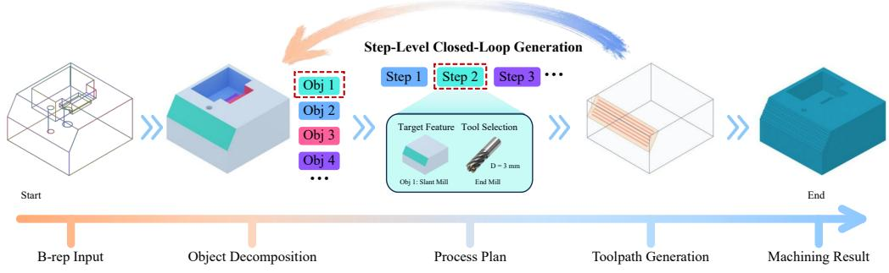  
Fig. 1: Overview of CNCGEN. Given a B-rep model, CNCGEN identifies manufacturing objects and generates a machining plan with corresponding toolpaths. The highlighted objects and steps illustrate how a shared identity links discrete operation decisions to continuous tool motion. The upper loop represents feedback of the updated state to subsequent operations and toolpath predictions.

To supervise this rollout, we construct CNCGEN-DATASET with approximately 50k geometrically verified synthetic machining flows. Within each flow, shared object references align operation sequences and parameterized toolpaths with B-rep targets, intermediate stock states, and verification outcomes, so that each operation and toolpath can be related to the stock change it produces. The dataset also includes 800 independently collected, expert-verified real CNC records reserved for evaluating transfer from synthetic to real machining data.

Building on this supervision, CNCGEN recovers manufacturing objects from B-rep and stores their geometry, semantics, and evolving states in shared memory. The planner and toolpath decoder read the same indexed objects, giving operation selection and tool motion a common target representation. To account for preceding cuts, a prefix refiner revises proposed operations using the executed prefix and updated state, which also conditions toolpath and cutting-parameter prediction. The estimated removal effects of each generated toolpath update the state for subsequent steps. During training, a surrogate verifier learned from recorded verification outcomes provides differentiable geometric feedback, so that learning accounts for material-removal quality as well as operation and toolpath annotations. Experiments on synthetic and held-out real CNC records show that CNCGEN improves material-removal accuracy over CNC-Net with predicted region priors. Ablations further show that removing toolpath state conditioning sharply degrades material-removal accuracy despite nearly unchanged operation-sequence accuracy. Our overall contributions are summarized as follows.

• We formulate joint machining process planning and toolpath generation from B-rep as an object-state rollout, linking discrete operation decisions and continuous tool motion through persistent manufacturing-object identities and evolving machining states.

• We construct CNCGEN-DATASET with approximately 50k geometrically verified synthetic machining flows and 800 held-out real CNC records. Object-referenced annotations connect operation choices and tool motion to stepwise material-removal effects.

• We develop CNCGEN, which uses shared object memory to provide a common target representation for planning and toolpath generation, and state-aware prefix refinement and decoding to adapt predictions to preceding cuts. Verification-guided training supplements operation and toolpath supervision with material-removal feedback.

## 2 RELATED WORK

## 2.1 B-REP LEARNING AND MANUFACTURING FEATURE RECOGNITION

UV-Net (Jayaraman et al., 2021) encodes geometry in the UV domain and aggregates features over an adjacency graph, while BRepNet (Lambourne et al., 2021) defines local convolutions through oriented coedges. B-rep representation learning also uses contrastive pretraining (Lou et al., 2023), masked geometric reconstruction (Yao et al., 2026; Li et al., 2026), and rotation-invariant geometric context (Ballegeer & Benoit, 2026). For manufacturing-feature recognition, Hierarchical CADNet, BRepGAT, and AAGNet identify machining features from B-rep models (Colligan et al., 2022b; Lee et al., 2023; Wu et al., 2024). In CNCGEN, the recovered manufacturing objects also serve as persistent references for operation planning and toolpath generation as the stock evolves.

## 2.2 MACHINING PROCESS PLANNING AND TOOLPATH GENERATION

Feature-based CAPP and STEP-NC systems link geometry, process plans, and machining instructions through manufacturing knowledge and structured process descriptions (Nassehi et al., 2006; Brecher et al., 2006). In commercial CAM, Autodesk Fusion’s rest machining restricts toolpaths to material left by earlier tools or operations (Autodesk, n.d.).

Learning-based methods infer process routes and operation sequences from geometric and manufacturing information (Han et al., 2023; Wang et al., 2024; Zhang et al., 2024). DeepMS predicts operation sequences and associated material-removal volumes from voxelized final-part geometry using learned intermediate-state representations, but does not generate the continuous toolpaths that realize those volumes (Maqueda et al., 2025). For continuous motion, neural B-spline surface reparameterization supports real-time toolpath generation (Feng et al., 2023). CNC-Net (Yavartanoo et al., 2024) learns tool radii and parameterized milling and drilling paths through self-supervised shape reconstruction, updating the stock after each operation. It follows a prescribed milling-then-drilling schedule rather than learning the operation type at each step.

Lee (2026) proposes combining LLM-based G-code generation with STEP-derived geometric constraints and Separation Logic verification. Collision feedback guides iterative program correction, whereas CNCGEN uses geometric feedback during training to optimize material-removal quality. Its object-state rollout jointly predicts object-referenced operations and continuous toolpaths, conditioning subsequent steps on the effects of preceding cuts.

## 2.3 DATASETS FOR CAD-TO-CAM LEARNING

Geometry and design datasets include ABC, which supplies CAD models with explicit geometric information (Koch et al., 2019), and Fusion 360 Gallery, which records human design sequences (Willis et al., 2021). For manufacturing-feature supervision, MFCAD++ provides B-rep annotations (Colligan et al., 2022a), while HybridCAD++ extends feature annotations to hybrid additive and subtractive manufacturing (Chen & Khan, 2024). At the process level, DeepMS associates operation labels with intermediate part geometry and material-removal volumes (Maqueda et al., 2025).

CNCGEN-DATASET explicitly links each object-referenced operation to its parameterized toolpath and the stock change it produces. B-rep targets and recorded verification outcomes connect this stepwise supervision to geometric evaluation, making it possible to assess both the predicted process and its cumulative material-removal effects.

## 3 DATA REPRESENTATION AND VERIFICATION

## 3.1 MACHINING FLOW REPRESENTATION

Each sample i in CNCGEN-DATASET is a geometrically verified machining flow represented by

$$
d _ { i } = ( \mathcal { G } _ { i } , \Omega _ { 0 , i } , \Omega _ { i } ^ { \star } , \mathcal { O } _ { i } ^ { \star } , \mathcal { S } _ { i } ^ { \star } , \mathcal { P } _ { i } ^ { \star } , \mathcal { X } _ { i } ^ { \star } , \mathcal { V } _ { i } ) .\tag{1}
$$

Here, $\mathcal { G } _ { i }$ is the input B-rep graph, $\Omega _ { 0 , i }$ the initial stock, and $\Omega _ { i } ^ { \star }$ the target part geometry. The remaining fields contain manufacturing objects $\mathcal { O } _ { i } ^ { \star }$ , operation sequence $S _ { i } ^ { \star }$ , corresponding toolpaths $\mathcal { P } _ { i } ^ { \star }$ , machining-state trajectory $\mathcal { X } _ { i } ^ { \star }$ , and verification results $\nu _ { i } .$ . Superscript ⋆ is a reference annotation.

Persistent object references link each operation and its toolpath to the same geometric target as the stock changes. The state trajectory records the initial machining state and its evolution after each step, providing the context for successive operations. Appendix A.1 details the record fields, learning targets, and machining primitives.

## 3.2 DATASET CONSTRUCTION AND VERIFICATION

CNCGEN-DATASET contains approximately 50k geometrically verified synthetic machining flowsUnder review as a conference paper at ICLR 2027 and 800 held-out real CNC records. We generate synthetic candidates from standard-part families under constrained three-axis milling rules, covering pockets, holes, chamfers, and slant features. Fig. 2 shows representative B-rep models, feature geometry, and machining outcomes.

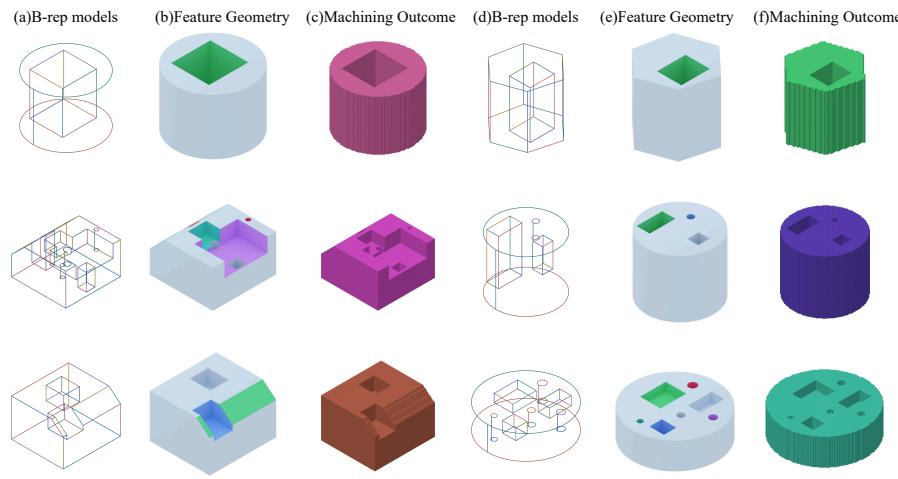  
Fig. 2: CNCGEN-DATASET samples. Wireframe B-rep views are paired with rendered machiningfeature geometry and verified machining outcomes. Fig. S2 provides additional examples.

Candidate flows are retained after checks of B-rep geometry, manufacturing objects, and toolpath legality. Material-removal verification compares the resulting stock with the target geometry and records the geometric outcomes of the machining flow.

The real CNC records are independently collected from actual machining scenarios, screened through expert review, and converted to the same flow representation. All 800 records are reserved for testing and excluded from training, validation, model selection, and fine-tuning. This benchmark measures transfer beyond the generated standard-part distribution. Appendix A provides generation parameters, filtering criteria, collection protocols, and dataset statistics.

## feature geometry and ver4 METHODOLOGY

Recall that operation planning and toolpath generation must share machining targets while adapting and states supervise continuous motion and workpiece evolution. This alignment supports learningto evolving stock. CNCGEN couples them through persistent object memory and state feedback individual tasks and their coupling within a machining flow. In CNCGEN, verification outcomes(Fig. 3). A parallel planner proposes operations, a prefix refiner revises them using previous decisions also supervise the Surrogate Verifier during training.and predicted material removal, and state-conditioned toolpaths drive subsequent updates. A frozen Surrogate Verifier (SV) supplies geometric feedback during training.

## 4.1 OBJECT MEMORY FROM B-REP GEOMETRY

Stock 1: Blank S2: Mill S3: Mill Final outcomeTo give operation planning and toolpath generation a common target reference, we recover persistent manufacturing objects from the B-rep. We represent the input B-rep as $\mathcal { G } = ( \mathcal { F } , \mathcal { E } , \mathbf { X } _ { f } , \mathbf { \bar { X } } _ { e } , \mathbf { g } _ { \mathrm { i n } } )$ The sets $\mathcal { F }$ and E specify faces and their adjacencies, while $\bar { \mathbf { X } } _ { f } , \mathbf { X } _ { e } ,$ , and $\mathbf { g } _ { \mathrm { i n } }$ …contain face, edge, and S2: Mill S3: Millglobal shape attributes, respectively. A B-rep encoder produces face embeddings H and a global token g. Following set prediction and object-centric slot modeling (Lee et al., 2019; Locatello et al., 2020), an object decoder uses learned queries to predict up to K object candidates $o _ { i } = ( \mathbf { f } _ { i } , \rho _ { i } , \mathbf { z } _ { i } , c _ { i } )$

from these features. Here, $\mathbf { f } _ { i }$ contains manufacturing semantics and geometry, $\rho _ { i }$ associates the object with its B-rep face group, $\mathbf { z } _ { i }$ is its embedding, and $c _ { i }$ is its confidence. During training, Hungarian matching aligns candidate slots with the reference objects in $\mathcal { O } ^ { \star }$

The Manufacturing Expertise Repository (MER) retains slots with $c _ { i } > \theta _ { \mathrm { o b j } }$ . For the retained index set $\mathcal { T }$ , its entries at step t are

$$
\mathcal { O } _ { t } = \{ e _ { i , t } \} _ { i \in \mathcal { I } } , \qquad e _ { i , t } = ( \rho _ { i } , \mathbf { f } _ { i } , \mathbf { z } _ { i } , \mathbf { h } _ { i , t } , c _ { i } ) .\tag{2}
$$

Each MER entry combines fixed object fields $\left( \rho _ { i } , \mathbf { f } _ { i } , \mathbf { z } _ { i } , c _ { i } \right)$ with a dynamic token $\mathbf { h } _ { i , t }$ . The fixed fields preserve target identity throughout the rollout, while $\mathbf { h } _ { i , t }$ captures the object’s evolving machining context. The compact state $x _ { t } = \left( \mathbf { m } _ { t } , \mathbf { M } _ { t } , \mathbf { u } _ { t } , \mathbf { U } _ { t } \right)$ contains a global vector and grid $( \mathbf { m } _ { t } , \mathbf { M } _ { t } )$ summarizing material removal, together with object-level progress variables $\left( \mathbf { u } _ { t } , \mathbf { U } _ { t } \right)$ . The token combines the fixed features $\left( \mathbf { f } _ { i } , \mathbf { z } _ { i } \right)$ with the global state and the state components associated with object i:

$$
\begin{array} { r } { \mathbf { h } _ { i , t } = \psi _ { \boldsymbol \theta } ( [ \mathbf { f } _ { i } ; \mathbf { z } _ { i } ; \mathbf { m } _ { t } ; \mathrm { p o o l } ( \mathbf { M } _ { t } ) ; \mathbf { u } _ { i , t } ; \mathrm { p o o l } ( \mathbf { U } _ { i , t } ) ] ) . } \end{array}\tag{3}
$$

Here, semicolons denote concatenation and pool aggregates grid features. Both decoders attend to the same indexed entries. Their target references remain fixed as state updates change the context used to predict each operation and its toolpath. Appendices B.1 and B.1 give the attention equations and object-supervision loss.

## 4.2 OPERATION PLANNING WITH STATE FEEDBACK

Parallel proposals establish an initial sequence, but later decisions must reflect the stock produced by preceding toolpaths. We therefore combine parallel planning with state-dependent prefix refinement. Learned step queries attend to the recovered objects to produce proposals $\tilde { S } = \{ \tilde { s } _ { t } \} _ { t = 1 } ^ { T }$ . Each operation is $s _ { t } ~ = ~ ( a _ { t } , \phi _ { t } , \pi _ { t } , \nu _ { t } , \sigma _ { t } )$ : operation type, feature type, object pointer, validity, and termination. The pointer $\pi _ { t }$ selects a retained MER entry. An auxiliary coarse tool-selection prediction provides conditioning, while the final tool class is predicted with the toolpath attributes.

At step t, the prefix refiner combines the proposal with the current rollout context:

$$
s _ { t } = R _ { \theta } \big ( \tilde { s } _ { t } , \mathbf { c } _ { t - 1 } , x _ { t - 1 } , \mathcal { O } _ { t - 1 } , \mathcal { G } \big ) .\tag{4}
$$

Here, $R _ { \theta }$ denotes refinement and step decoding, and $\mathbf { c } _ { t - 1 }$ summarizes previous decisions, object usage, and path statistics. The refined operation selects the toolpath target, and its predicted materialremoval effects update the context for the next step.

Planner supervision uses the operation labels and matched object pointers in $S ^ { \star }$ , together with coverage, count, and compatibility constraints. Appendix B.2 specifies the pointer distribution and supervised planning objective.

## 4.3 STATE-CONDITIONED TOOLPATHS AND STATE UPDATES

The same operation on the same object can require different tool motion after preceding cuts. The toolpath decoder therefore conditions each valid step on the selected object, operation, B-rep context, and state $x _ { t - 1 }$ . It outputs $\tau _ { t } = ( C _ { t } , W _ { t } , \eta _ { t } , \kappa _ { t } , \xi _ { t } )$ : segmented cubic Bezier control points´ $C _ { t } .$ sampled waypoints $W _ { t } .$ , pointwise motion and pass labels $\eta _ { t } .$ , machining strategy and tool class $\kappa _ { t }$ and cutting parameters $\xi _ { t }$ . The latter include tool diameter, feedrate, plunge rate, and spindle speed. Corresponding records in ${ \mathcal { P } } ^ { \star }$ supervise these outputs.

The state transition first estimates the geometric effect of the generated toolpath and then applies a learned correction:

$$
\begin{array} { r l } & { \bar { x } _ { t } = T ( x _ { t - 1 } , s _ { t } , \tau _ { t } ) , } \\ & { x _ { t } = \mathrm { c l i p } ( \bar { x } _ { t } + U _ { \psi } ( \bar { x } _ { t } , o _ { \pi _ { t } } , \mathbf { e } ( s _ { t } ) , \mathrm { s t a t } ( \tau _ { t } ) ) , 0 , 1 ) . } \end{array}\tag{5}
$$

The deterministic transition $T$ uses compact 2.5D carving to estimate removal depth and coverage on global and object-local grids. This geometric estimate provides $\bar { x } _ { t }$ , while $U _ { \psi }$ learns a correction from the selected object, step embedding $\mathbf { e } ( s _ { t } )$ , and toolpath statistics stat $\mathbf { \nabla } _ { : } ( \tau _ { t } )$ . The corrected state refreshes MER tokens for subsequent predictions. Recorded states in $\mathcal { X } ^ { \star }$ supervise the update where available. Appendices B.3 and B.3 describe Bezier sampling, decoding, and the state transition.´

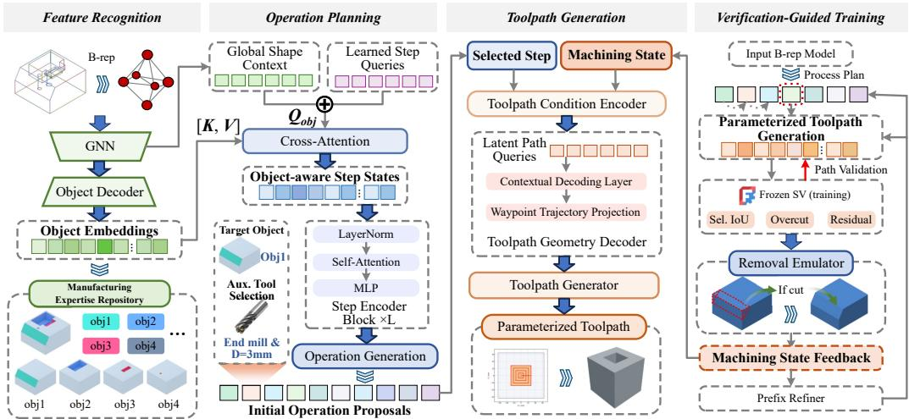  
Fig. 3: Architecture of CNCGEN. The four panels show feature recognition, operation planning, toolpath generation, and verification-guided training. Machining-state feedback links toolpath generation with prefix refinement. The Surrogate Verifier is frozen during generator refinement.

## 4.4 VERIFICATION-GUIDED TRAINING

Matching operation labels and reference paths supervises local predictions but does not directly score their material-removal consequences. We introduce the SV to turn offline verification into differentiable geometric feedback for each candidate step:

$$
\hat { \mathbf { y } } _ { t } ^ { \mathrm { s v } } = V _ { \omega } ( x _ { t - 1 } , e _ { \pi _ { t } , t - 1 } , s _ { t } , \tau _ { t } ) .\tag{6}
$$

The SV combines analytic path-contact features with a learned residual calibration head, pretrained using offline material-removal records V. Its outputs include selected-region IoU, overcut, residual material, aircut, validity, and risk. During refinement, the SV remains frozen while gradients through its differentiable outputs update the generator.

The geometric penalty averages predicted selected-region error over valid candidate steps:

$$
\mathcal { L } _ { \mathrm { s v } } = \frac { 1 } { | \mathcal { T } _ { \mathrm { e v a l } } | } \sum _ { t \in \mathcal { T } _ { \mathrm { e v a l } } } \left( 1 - \widehat { \mathrm { I o U } } _ { \mathrm { s e l } , t } + 0 . 5 \hat { p } _ { \mathrm { o v e r c u t } , t } ^ { \mathrm { s e l } } + 0 . 5 \hat { p } _ { \mathrm { r e s i d u a l } , t } ^ { \mathrm { s e l } } \right) .\tag{7}
$$

Hats denote SV predictions, and the $p$ terms are bounded penalties for overcut and residual material. The set $\mathcal { T } _ { \mathrm { e v a l } }$ contains steps with generated toolpaths that pass both planner and path-validity masks. Samples without such steps contribute no SV penalty. The loss combines selected-region IoU error with overcut and residual penalties, while the SV’s aircut, validity, and risk outputs serve as auxiliary diagnostics.

Staged pretraining is followed by joint refinement on the generator’s own rollouts. The objective combines object, planning, toolpath, state, and verification terms:

$$
\begin{array} { r l r } {  { \mathcal { L } _ { \mathrm { j o i n t } } = \lambda _ { \mathrm { o b j } } \mathcal { L } _ { \mathrm { o b j } } + \lambda _ { \mathrm { p l a n } } \mathcal { L } _ { \mathrm { p l a n } } + \lambda _ { \mathrm { p a t h } } \mathcal { L } _ { \mathrm { p a t h } } } } \\ & { } & { + \lambda _ { \mathrm { s t a t e } } \sum _ { t } \| x _ { t } - x _ { t } ^ { \star } \| _ { 1 } + \lambda _ { \mathrm { s v } } \mathcal { L } _ { \mathrm { s v } } . } \end{array}\tag{8}
$$

Reference annotations supervise the object, planning, and toolpath losses. The state loss compares the predicted $x _ { t }$ with $x _ { t } ^ { \star }$ , recorded after the corresponding reference prefix. Appendices B, C.1, and C.5 provide component losses, the training schedule, and SV reliability checks, respectively.

At inference, object recovery and parallel planning provide the object memory and initial operation sequence. Prefix refinement, toolpath generation, and state updates then proceed step by step to produce the machining flow. The SV supplies training feedback and offline diagnostics; reported geometry metrics are computed by the offline evaluator.

## 5 EXPERIMENTS AND ANALYSIS

We evaluate whether coupling operation decisions with state-conditioned tool motion improves material removal, which components contribute to this behavior, and how well synthetic training transfers to held-out real CNC records.

## 5.1 EXPERIMENTAL SETUP

We split the approximately 50k synthetic machining flows deterministically into 90/5/5 training/validation/test sets. The 800 real CNC records are held out exclusively for testing. All methods share B-rep preprocessing, stock coordinates, millimeter units, target construction, and an offline near-net-stock evaluator with a 4.0 mm occupancy grid and 8192 sampled surface points. Failed executions remain in evaluation: partial rollouts use their last exported occupancy, and missing outputs are scored as uncut stock. Appendices C.2, C.1, and C.2 detail the evaluator, training settings, and real-data targets.

## 5.2 EVALUATION METRICS

Let S denote the initial stock occupancy, T the target occupancy, and $\hat { T }$ the final occupancy produced by a generated machining result. The target and predicted removal volumes are $R = S \setminus T$ and ${ \hat { R } } = S \setminus { \hat { T } }$ . Final-shape IoU measures agreement between $\hat { T }$ and T, while Removal F1 combines removal precision and recall over $\hat { R }$ and $R .$ Chamfer Distance (CD), normalized by the stock bounding-box diagonal, measures surface discrepancy. Overcut $| \hat { R } \cap T | / | T |$ measures removal of material that should remain, and residual $| \hat { T } \cap R | / | R |$ measures material left in the intended removal region. Together, these metrics assess final geometry and the extent and accuracy of material removal.

For CNCGEN ablations, step and sequence exact match compare operation types, feature types, and object references at the corresponding levels. These scores apply to variants with stable object references. Category macro-F1 summarizes categorical prediction quality.

## 5.3 BASELINES AND COMPARISON SETTING

We adapt CNC-Net (Yavartanoo et al., 2024) to the B-rep input setting with a Machining Region Prior (MRP), which supplies a machining-region support mask and a depth field to its carving model. CNC-Net+Pred. MRP serves as the main learned baseline. A region head trained on the training split predicts the prior from the input B-rep, so test-time generation uses the input geometry. CNC-Net+Oracle MRP uses priors derived from ground-truth manufacturing-feature and toolpath annotations as a diagnostic of process generation under accurate region localization.

Both variants are trained from scratch on the same splits as CNCGEN and use the same validation protocol and geometry evaluator. Each variant is trained and evaluated with its corresponding prior type. Under the shared evaluation, the learning formulations differ: CNC-Net consumes rasterized support and depth fields, whereas CNCGEN uses B-rep graph features with object, operation, toolpath, and state supervision. Appendix C.3 details MRP construction, rasterization, and the CNC-Net adaptation.

## 5.4 MAIN COMPARISON

On the synthetic test set, CNCGEN substantially improves material-removal quality over CNC-Net+Pred. MRP (Table 1). Removal F1 increases from 0.2318 to 0.9016, while Residual decreases from 0.6032 to 0.0431, a relative reduction of 92.9%. IoU also increases from 0.7144 to 0.9525, with lower CD and Overcut. Together, these results show more complete removal of the intended material and less unintended removal of the target part.

Oracle region priors improve the adapted CNC-Net baseline but leave substantial residual material. CNC-Net+Oracle MRP achieves an IoU of 0.9271 and an Overcut of 0.0025, yet its Residual remains 0.5973. Compared with this variant, CNCGEN reduces Residual to 0.0431 and increases Removal F1 from 0.5067 to 0.9016, although its Overcut is higher (0.0079 versus 0.0025). Thus, accurate region localization alone does not ensure complete material removal in this baseline. Removal F1 and Residual reveal differences in machining completeness that final-shape IoU alone does not fully capture. Appendix C.6 presents representative failure cases.

Table 1: Synthetic-test geometry quality after execution. CNC-Net+Pred. MRP uses predicted region priors; Oracle MRP uses annotation-derived priors as a diagnostic setting. CD is normalized by the stock bounding-box diagonal. Bold marks the best value in each column.
<table><tr><td>Method</td><td>MRP source</td><td>IoU ↑</td><td>Removal F1 ↑</td><td>CD↓</td><td>Overcut ↓</td><td>Residual ↓</td></tr><tr><td>CNC-Net+Pred. MRP</td><td>Predicted</td><td>0.7144</td><td>0.2318</td><td>0.0595</td><td>0.2327</td><td>0.6032</td></tr><tr><td>CNC-Net+Oracle MRP</td><td>Oracle</td><td>0.9271</td><td>0.5067</td><td>0.0309</td><td>0.0025</td><td>0.5973</td></tr><tr><td>CNCGEN (Ours)</td><td>N/A</td><td>0.9525</td><td>0.9016</td><td>0.0268</td><td>0.0079</td><td>0.0431</td></tr></table>

## 5.5 ABLATION STUDIES

The ablations examine target consistency, cross-step correction, state-conditioned motion, and geometric training feedback by individually removing MER, the prefix refiner, state-aware toolpaths, and the SV loss (Table 2). All variants use the same data split, training protocol, and evaluation interface.

Table 2: Ablation results on CNCGEN-DATASET. Each variant disables one component of CNC-GEN while preserving the same evaluation interface. Bold marks the best value in each column.
<table><tr><td>Variant</td><td>Step EM ↑ Seq. EM ↑ Macro-F1 ↑</td><td></td><td></td><td>IoU ↑</td><td>Removal F1 ↑</td><td>CD↓</td><td></td><td>Overcut ↓ Residual↓</td></tr><tr><td>Full CNCGEN (Ours)</td><td>0.8552</td><td>0.8290</td><td>0.9024</td><td>0.9525</td><td>0.9016</td><td>0.0268</td><td>0.0079</td><td>0.0431</td></tr><tr><td>w/o MER</td><td>N/A†</td><td>N/A†</td><td>0.2182</td><td>0.9315</td><td>0.1484</td><td>0.0317</td><td>0.0086</td><td>0.0673</td></tr><tr><td>w/o prefix refiner</td><td>0.8172</td><td>0.7796</td><td>0.8954</td><td>0.9332</td><td>0.3115</td><td>0.0274</td><td>0.0167</td><td>0.0475</td></tr><tr><td>w/o state-aware toolpaths</td><td>0.8530</td><td>0.8260</td><td>0.9012</td><td>0.9327</td><td>0.3113</td><td>0.0273</td><td>0.0169</td><td>0.0477</td></tr><tr><td>w/o SV loss</td><td>0.8400</td><td>0.8132</td><td>0.8778</td><td>0.9296</td><td>0.3041</td><td>0.0286</td><td>0.0236</td><td>0.0472</td></tr></table>

†Step and sequence exact match are not applicable because removing the MER removes stable operation-target identities; the variant is therefore evaluated with category and executed-geometry metrics.

State conditioning has a much larger effect on material-removal quality than on operation-sequence accuracy. Without state-aware toolpaths, Seq. EM changes from 0.8290 to 0.8260, while Removal F1 falls from 0.9016 to 0.3113 and overcut rises from 0.0079 to 0.0169. Thus, similar sequence accuracy can accompany very different removal outcomes, supporting the use of the evolving machining state to condition tool motion.

Removing MER reduces category Macro-F1 from 0.9024 to 0.2182 and Removal F1 from 0.9016 to 0.1484. Removing the prefix refiner lowers Seq. EM from 0.8290 to 0.7796 and Removal F1 to 0.3115. These results support the contributions of persistent object memory and cross-step refinement to coupling operation decisions with material removal.

Without the SV loss, IoU decreases from 0.9525 to 0.9296 and overcut increases from 0.0079 to 0.0236, the highest among the ablations. Held-out SV diagnostics assess the accuracy of the feedback model (Appendix C.5), whereas these generator results use the offline geometry evaluator. Appendix C.4 provides detailed component analysis.

## 5.6 REAL-WORLD EVALUATION

We evaluate transfer to the 800 independently collected, expert-verified CNC records using the held-out protocol in Section 5.1 and the same near-net-stock evaluator as for synthetic data. Targets are derived from verified manufacturing annotations, with auxiliary voxel records used for consistency checks (Appendix C.2). In the real-part examples shown in Fig. 4, CNCGEN recovers cavities and through-regions more completely, whereas CNC-Net+Pred. MRP leaves residual structures within these regions. This qualitative difference is consistent with CNCGEN’s higher Removal F1 and lower Residual in Table 3.

CNCGEN improves all five geometry metrics over CNC-Net+Pred. MRP on this benchmark without fine-tuning (Table 3). Removal F1 increases from 0.1170 to 0.8126, and residual decreases from

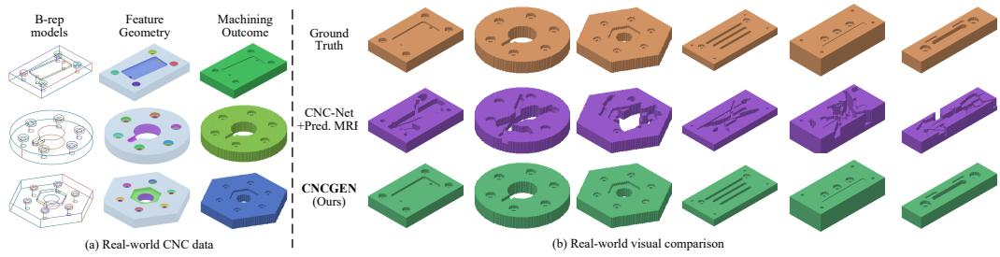  
Fig. 4: Geometric outcomes on held-out real CNC records. Left: representative B-rep models, feature geometry, and machining outcomes from the benchmark. Right: target geometry and final geometries produced by CNCGEN and CNC-Net+Pred. MRP under the offline evaluator.

Table 3: Geometry quality on 800 held-out real CNC records, evaluated with the same near-net-stock protocol as the synthetic test set. Pred. MRP uses predicted region priors, while Oracle MRP uses annotation-derived priors. CD is normalized by the stock bounding-box diagonal. Bold marks the best value in each column.
<table><tr><td>Method</td><td>MRP source</td><td>IoU ↑</td><td>Removal F1 ↑</td><td>CD↓</td><td>Overcut↓</td><td>Residual ↓</td></tr><tr><td>CNC-Net+Pred. MRP</td><td>Predicted</td><td>0.6275</td><td>0.1170</td><td>0.0703</td><td>0.3205</td><td>0.7268</td></tr><tr><td>CNC-Net+Oracle MRP</td><td>Oracle</td><td>0.9203</td><td>0.4290</td><td>0.0332</td><td>0.0112</td><td>0.6617</td></tr><tr><td>CNCGEN (Ours)</td><td>N/A</td><td>0.9274</td><td>0.8126</td><td>0.0148</td><td>0.0134</td><td>0.1845</td></tr></table>

0.7268 to 0.1845. The comparison with Oracle MRP follows the same pattern as on synthetic data: CNCGEN achieves more complete removal, whereas CNC-Net+Oracle MRP has lower overcut (0.0112 versus 0.0134). Oracle MRP leaves a residual of 0.6617 versus 0.1845 for CNCGEN, with a lower Removal F1 of 0.4290 versus 0.8126.

Relative to synthetic-test results, CNCGEN’s Removal F1 decreases from 0.9016 to 0.8126 and residual increases from 0.0431 to 0.1845. Case inspection identifies remaining errors in multi-feature pockets, narrow chamfers, slant features, and overlapping pocket boundaries.

## 6 LIMITATIONS

CNCGEN targets three-axis machining of pockets, holes, chamfers, and slant features. External profile machining is supplied by setup construction, while turning, free-form finishing, and simultaneous multi-axis machining require broader process or motion representations. The compact 2.5D state and 4.0 mm occupancy evaluation describe material removal at a coarse geometric scale. Narrowfeature and boundary errors remain in the real benchmark, and the reported metrics do not establish machining-tolerance or surface-finish accuracy.

Training uses synthetic standard-part flows, while the 800 real records cover a limited range of shop practices, fixtures, and machining intent. Generated plans and parameterized toolpaths require machine-specific post-processing. Geometric verification leaves cutting forces, tool wear, chatter, and the physical suitability of predicted cutting parameters unassessed. Appendix D discusses further process boundaries and extensions.

## 7 CONCLUSION

We introduced CNCGEN-DATASET and CNCGEN for jointly learning object-referenced process plans and continuous toolpaths from B-rep models. Shared target identities and evolving stock states connect operation decisions with tool motion. Experiments on synthetic and held-out real records show improved material-removal quality over CNC-Net with predicted region priors. The ablations show that similar sequence accuracy can mask substantially different removal quality, supporting state-conditioned toolpath generation.

## AI USE DISCLOSURE

Generative AI tools assisted manuscript preparation through language editing, translation, structural revision, and editorial feedback on the presentation of methods and results. They were not used to generate the dataset, implement the proposed method, or conduct the reported experiments. The authors take responsibility for the final manuscript and its scientific claims.

## REFERENCES

Autodesk. Fusion Help: 3D Offset Roughing Reference. Product documentation, Rest Machining section, n.d. URL https://help.autodesk.com/view/fusion360/ENU/?guid= GUID63F97CC8-99FE-40B7-AFF1-061E826955B3. Accessed September 17, 2026.

Matteo Ballegeer and Dries F Benoit. Fov-net: Rotation-invariant cad b-rep learning via field-of-view ray casting. arXiv preprint arXiv:2602.24084, 2026.

Christian Brecher, Mirco Vitr, and Jochen Wolf. Closed-loop capp/cam/cnc process chain based on stepand step-nc inspection tasks. International Journal ofComputer Integrated Manufacturing, 19 (6):570–580, 2006.

Lequn Chen and Muhammad Tayyab Khan. Hybridcad++: Expanded dataset for hybrid additivesubtractive manufacturing feature recognition in b-rep cad models, November 2024. URL https: //doi.org/10.5281/zenodo.14043152.

Andrew R. Colligan, Trevor T. Robinson, Declan C. Nolan, and Yang Hua. MFCAD++ Dataset. Dataset for paper: ”Hierarchical CADNet: Learning from B-Reps for Machining Feature Recognition, Computer-Aided Design”. MFCAD dataset(.zip), 2022a. URL https://doi.org/10. 17034/d1fec5a0-8c10-4630-b02e-b92dc81df823. Dataset, published 12 February 2022.

Andrew R Colligan, Trevor T Robinson, Declan C Nolan, Yang Hua, and Weijuan Cao. Hierarchical cadnet: Learning from b-reps for machining feature recognition. Computer-Aided Design, 147: 103226, 2022b.

Yi-fei Feng, Hong-Yu Ma, Li-Yong Shen, Chun-Ming Yuan, and Xin Jiang. Real-time tool-path planning using deep learning for subtractive manufacturing. IEEE Transactions on Industrial Informatics, 20(4):5979–5988, 2023.

ZeFan Han, Rui Huang, Bo Huang, Junfeng Jiang, and Xiuling Li. Data-driven and knowledge-guided approach for nc machining process planning. Computer-Aided Design, 162:103562, 2023.

Pradeep Kumar Jayaraman, Aditya Sanghi, Joseph G Lambourne, Karl DD Willis, Thomas Davies, Hooman Shayani, and Nigel Morris. Uv-net: Learning from boundary representations. In Proceedings of the IEEE/CVF conference on computer vision and pattern recognition, pp. 11703– 11712, 2021.

Sebastian Koch, Albert Matveev, Zhongshi Jiang, Francis Williams, Alexey Artemov, Evgeny Burnaev, Marc Alexa, Denis Zorin, and Daniele Panozzo. Abc: A big cad model dataset for geometric deep learning. In Proceedings of the IEEE/CVF conference on computer vision and pattern recognition, pp. 9601–9611, 2019.

Joseph G Lambourne, Karl DD Willis, Pradeep Kumar Jayaraman, Aditya Sanghi, Peter Meltzer, and Hooman Shayani. Brepnet: A topological message passing system for solid models. In Proceedings of the IEEE/CVF conference on computer vision and pattern recognition, pp. 12773–12782, 2021.

Jinwon Lee, Changmo Yeo, Sang-Uk Cheon, Jun Hwan Park, and Duhwan Mun. Brepgat: Graph neural network to segment machining feature faces in a b-rep model. Journal ofComputational Design and Engineering, 10(6):2384–2400, 2023.

Juho Lee, Yoonho Lee, Jungtaek Kim, Adam Kosiorek, Seungjin Choi, and Yee Whye Teh. Set transformer: A framework for attention-based permutation-invariant neural networks. In International conference on machine learning, pp. 3744–3753. PMLR, 2019.

Yeonseok Lee. Correct-by-Construction G-Code Generation: A Neuro-Symbolic Approach via Separation Logic, 2026. URL https://arxiv.org/abs/2605.10568.

Yifei Li, Kang Wu, Wenming Wu, and Xiao-Ming Fu. Masked brep autoencoder via hierarchical graph transformer. arXiv preprint arXiv:2603.14927, 2026.

Francesco Locatello, Dirk Weissenborn, Thomas Unterthiner, Aravindh Mahendran, Georg Heigold, Jakob Uszkoreit, Alexey Dosovitskiy, and Thomas Kipf. Object-centric learning with slot attention. Advances in neural information processing systems, 33:11525–11538, 2020.

Yunzhong Lou, Xueyang Li, Haotian Chen, and Xiangdong Zhou. Brep-bert: Pre-training boundary representation bert with sub-graph node contrastive learning. In Proceedings of the 32nd ACM International Conference on Information and Knowledge Management, pp. 1657–1666, 2023.

Jaime Maqueda, David W Rosen, and Shreyes N Melkote. Deepms: A data-driven approach to machining process sequencing using transformers. Journal of Manufacturing Systems, 82:947–963, 2025.

Aydin Nassehi, Stephen T Newman, and RD Allen. The application of multi-agent systems for step-nc computer aided process planning of prismatic components. International Journal ofMachine Tools and Manufacture, 46(5):559–574, 2006.

Zhen Wang, Shusheng Zhang, Hang Zhang, Yajun Zhang, Jiachen Liang, Rui Huang, and Bo Huang. Machining feature process route planning based on a graph convolutional neural network. Advanced Engineering Informatics, 59:102249, 2024.

Karl DD Willis, Yewen Pu, Jieliang Luo, Hang Chu, Tao Du, Joseph G Lambourne, Armando Solar-Lezama, and Wojciech Matusik. Fusion 360 gallery: A dataset and environment for programmatic cad construction from human design sequences. ACM Transactions on Graphics (TOG), 40(4): 1–24, 2021.

Hongjin Wu, Ruoshan Lei, Yibing Peng, and Liang Gao. Aagnet: A graph neural network towards multi-task machining feature recognition. Robotics and Computer-Integrated Manufacturing, 86: 102661, 2024.

Can Yao, Kang Wu, Zuheng Zheng, Siyuan Xing, and Xiao-Ming Fu. Brepmae: Self-supervised masked brep autoencoders for machining feature recognition. arXiv preprint arXiv:2602.22701, 2026.

Mohsen Yavartanoo, Sangmin Hong, Reyhaneh Neshatavar, and Kyoung Mu Lee. Cnc-net: selfsupervised learning for cnc machining operations. In Proceedings of the IEEE/CVF conference on computer vision and pattern recognition, pp. 9816–9825, 2024.

Hang Zhang, Wenhu Wang, Shusheng Zhang, Yajun Zhang, Jingtao Zhou, Zhen Wang, Bo Huang, and Rui Huang. A novel method based on deep reinforcement learning for machining process route planning. Robotics and Computer-Integrated Manufacturing, 86:102688, 2024.

## SUPPLEMENTARY MATERIAL

This supplement describes dataset construction and the held-out real benchmark (Section A), model objectives and verifier training (Section B), experimental protocols and additional analyses (Section C), and limitations (Section D). Notation follows the main text.

## A DATASET DETAILS

## A.1 MACHINING FLOW RECORDS

Each sample in CNCGEN-DATASET stores a machining flow under a unique sample identifier, following the record definition in Equation 1. The record links B-rep geometry $\mathcal { G } _ { i } ,$ initial stock $\Omega _ { 0 , i }$ and target part $\Omega _ { i } ^ { \star }$ with manufacturing objects, ordered operations, toolpaths, intermediate states, and verification outcomes. Exported records use millimeter units and a work coordinate system in which the stock top is at $z = 0$

Object annotations $\mathcal { O } _ { i } ^ { \star }$ associate manufacturing semantics and geometry with B-rep face groups and persistent object references. Operation records $S _ { i } ^ { \star }$ specify the operation order, operation and feature types, object pointers, validity labels, and termination labels. Multiple operations can reference the same object, preserving its identity across machining steps.

Toolpath records $\mathcal { P } _ { i } ^ { \star }$ contain control points and waypoints, pointwise motion and pass labels, machining strategy, tool class, and cutting parameters. Object pointers and toolpath identifiers link each operation to its manufacturing target and corresponding tool motion.

The state trajectory $\mathcal { X } _ { i } ^ { \star } = \{ \boldsymbol { x } _ { i , t } ^ { \star } \} _ { t = 0 } ^ { T _ { i } }$ contains the initial state and the state after each of the T reference machining steps. Thus, each state corresponds to the material remaining after a specific executed operation prefix. Verification records $\nu _ { i }$ describe the geometric outcomes of the associated operations and toolpaths. Together, these records identify what an operation acts on, how the tool moves, and how the stock changes.

Fig. S1 illustrates the geometric representations and operation primitives used in these records. Fig. 2 and S2 show representative dataset examples.

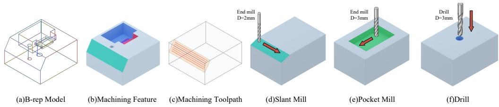  
Fig. S1: CNC machining primitives and execution representations used by CNCGEN-DATASET and CNCGEN: B-rep input, extracted machining feature, recorded toolpath, and operation primitives for slant milling, pocket milling, and drilling.

## A.2 SYNTHETIC DATA GENERATION AND VERIFICATION

Synthetic machining flows are generated from conventional standard-part families under constrained three-axis milling rules, covering pockets, holes, chamfers, and slant features. The generator varies stock geometry, feature positions, depths and combinations, operation order, and canonical toolpath parameters. Box or cylindrical stocks are sampled within fixed dimension ranges, with features placed under clearance constraints. Manufacturing constraints guide part and process construction, as in the procedural generation used by DeepMS (Maqueda et al., 2025). The held-out real records are not used as generation templates or sources of perturbed training examples.

Construction proceeds through B-rep screening and graph extraction, manufacturability filtering, object and process export, toolpath export, and material-removal verification. Screening rejects invalid B-reps, degenerate solids, operation counts outside 1–16, feature depths above 300 mm, in-plane feature sizes above 600 mm, boundary complexities outside 3–5000 points, inaccessible three-axis geometry, and illegal toolpaths.

Executable cases with shallow cuts, narrow features, high depth-to-width ratios, or feature sizes close to the nominal tool diameter retain difficulty annotations. Toolpath checks record weak bounding-box overlap, large z errors, large xy jumps, and unexpected cutting heights. A sample is retained only if it passes the hard toolpath-legality checks and achieves a minimum voxelized verification IoU of 0.95 across validation runs.

Exported toolpaths include the geometric and motion fields described in Appendix A.1, together with tool diameter, feedrate, plunge rate, and spindle speed. Material-removal verification compares the machined stock with the target geometry and records coverage, overcut, residual material, aircut, validity, IoU, Removal F1, Chamfer Distance, and execution status. The resulting reports support construction checks and provide geometric supervision.

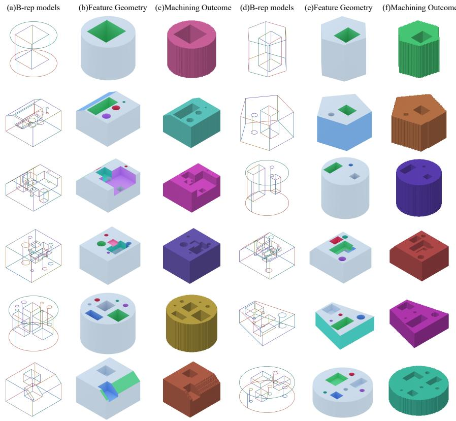  
Fig. S2: Extended gallery of twelve CNCGEN-DATASET examples. Each example pairs a wireframe B-rep model with rendered manufacturing-feature geometry and a verified machining outcome. Fig. 2 shows a subset.

## A.3 REAL-WORLD DATA COLLECTION AND CURATION

The real benchmark draws on actual three-axis CNC machining records collected from laboratory platforms, including Haas Mini Mill, Haas VF-2, and Tormach 770M. More than 2,000 candidate records were gathered for screening and expert review.

Fifty CNC-domain experts, including manufacturing engineers, CNC programming engineers, and experienced machinists, assessed three-axis suitability, geometric validity, feature clarity, feature– operation correspondence, toolpath metadata completeness, machining complexity, and sample diversity. Records with unsupported process routes or missing target-construction metadata were excluded.

Screening and expert review retained 800 records with aligned part geometry, stock information, manufacturing features, operation descriptions, toolpath metadata, and machining outcomes. These records follow the same machining-flow interface as the synthetic data. All 800 records are held out for testing and are excluded from training, validation, model selection, and fine-tuning. Fig. S3 shows representative parts.

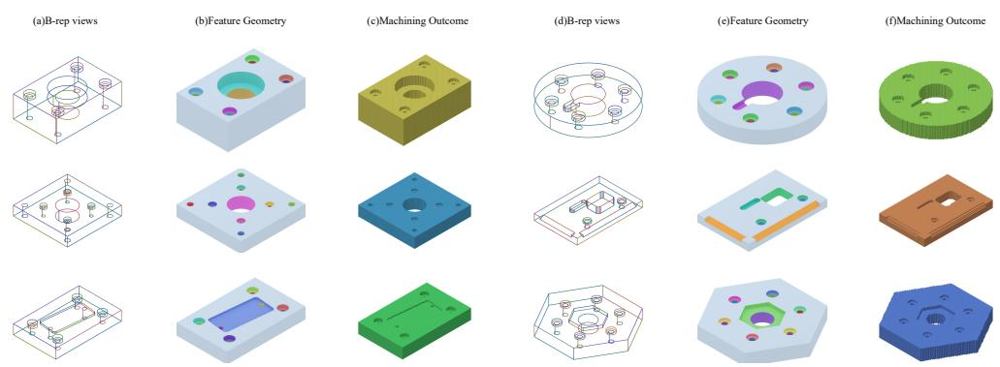  
Fig. S3: Representative B-rep parts from the held-out real CNC benchmark, illustrating machining geometries beyond the synthetic standard-part families.

## A.4 SPLIT PROTOCOL AND DATASET STATISTICS

CNCGEN-DATASET contains approximately 50k geometrically verified synthetic machining flows and 800 held-out real CNC records. The synthetic flows are partitioned into training, validation, and test sets using a deterministic 90/5/5 split. Partition membership is determined by hashing the sample identifier. Applying the same split rule to the same identifier therefore preserves its assignment regardless of record order.

Fig. S4 summarizes the synthetic dataset through the distribution of feature counts per flow and the proportions of command types.

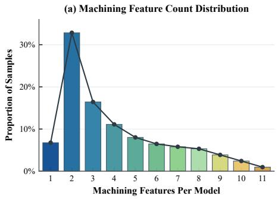  
(b) Command Type Distribution

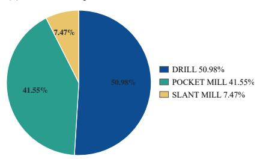  
Fig. S4: Synthetic dataset statistics: distribution of feature counts and proportions of command types in the generated machining flows.

## B METHOD DETAILS

The record $d _ { i }$ in Equation 1 supplies aligned targets for object recovery, planning, toolpath generation, state prediction, and verification. The model uses the recorded state after the corresponding reference prefix for state supervision, and it updates its own predicted state when generating a rollout. Fig. S5 illustrates the aligned training targets and material-removal verification outcomes.

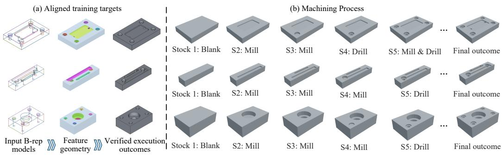  
Fig. S5: Aligned training targets and verification supervision. Representative machining flows align B-rep geometry, machining-feature targets, toolpath/process targets, and verified execution outcomes; the verifier supervision compares generated stock evolution with the target geometry.

## B.1 OBJECT ENCODING AND SHARED MEMORY

The B-rep encoder $E _ { \theta }$ maps the input geometry G to face embeddings H and a global shape token g. Given these features, the object decoder $D _ { \theta }$ uses K learned queries to produce candidate manufacturing objects:

$$
\begin{array} { r } { ( \mathbf { H } , \mathbf { g } ) = E _ { \boldsymbol { \theta } } ( \mathcal { G } ) , \qquad } \\ { o _ { i } = D _ { \boldsymbol { \theta } } ( \mathbf { q } _ { i } , \mathbf { H } , \mathbf { g } ) , \qquad i = 1 , \dots , K . } \end{array}\tag{B.1}
$$

Here, $\mathbf { q } _ { i }$ denotes the learned query for candidate i. Confidence filtering determines the retained object index set I. Each retained MER entry combines fixed object fields with a step-dependent machining-context token $\mathbf { h } _ { i , t } .$ as defined in Equations 2 and 3 of the main text.

Operation planning and toolpath generation access the same retained MER entries through querydependent attention. For a query $\mathbf { r } ,$ the attention keys, weights, and memory readout are computed as follows:

$$
\begin{array} { c } { \displaystyle \mathbf { k } _ { i , t } = \mathbf { W } _ { k } [ \mathrm { e m b } ( \rho _ { i } ) ; \mathbf { f } _ { i } ; \mathbf { z } _ { i } ; \mathbf { h } _ { i , t } ] , } \\ { \displaystyle \alpha _ { i } ( \mathbf { r } , t ) = \mathrm { s o f t m a x } _ { i \in \mathcal { I } } \left( \frac { ( \mathbf { W } _ { q } \mathbf { r } ) ^ { \top } \mathbf { k } _ { i , t } } { \sqrt { d } } \right) , } \\ { \mathrm { r e a d } _ { \mathrm { M E R } } ( \mathbf { r } , t ) = \displaystyle \sum _ { i \in \mathcal { I } } \alpha _ { i } ( \mathbf { r } , t ) [ \mathbf { z } _ { i } ; \mathbf { h } _ { i , t } ] . } \end{array}\tag{B.2}
$$

The function emb embeds the object reference, $\mathbf { W } _ { k }$ and $\mathbf { W } _ { q }$ are learned projections, and d is the key/query dimension. The softmax is normalized over the retained object indices I. The weighted readout combines object embeddings $\mathbf { z } _ { i }$ with their current machining-context tokens $\mathbf { h } _ { i , t }$ , allowing both decoders to access shared object representations with updated state information.

Manufacturing object supervision. To supervise the predicted object slots, Hungarian assignment establishes one-to-one correspondences with the reference objects. Let M denote the matched index pairs $( i , j )$ , where i indexes a predicted slot and j indexes a reference object. The set $\mathcal { T } _ { \mathrm { m a t c h } } = \{ i$ $( i , j ) \in \mathcal { M } \}$ contains the matched predicted slots. The object-supervision loss is

$$
\begin{array} { r l } & { \mathcal { L } _ { \mathrm { o b j } } = \displaystyle \sum _ { ( i , j ) \in \mathcal { M } } \big [ \lambda _ { f } \| \hat { \mathbf { f } } _ { i } - \mathbf { f } _ { j } ^ { \star } \| _ { 1 } + \lambda _ { \rho } \mathcal { L } _ { \mathrm { r e f } } ( \hat { \rho } _ { i } , \rho _ { j } ^ { \star } ) + \lambda _ { c } \mathrm { B C E } ( \hat { c } _ { i } , 1 ) \big ] } \\ & { \quad \quad \quad \quad + \lambda _ { \mathrm { b g } } \displaystyle \sum _ { i \notin \mathcal { T } _ { \mathrm { m a t c h } } } \mathrm { B C E } ( \hat { c } _ { i } , 0 ) . } \end{array}\tag{B.3}
$$

For each matched pair, the $L _ { 1 }$ term supervises the predicted object fields $\hat { \bf f } _ { i \cdot }$ , while $\mathcal { L } _ { \mathrm { r e f } }$ supervises associations with B-rep face groups and persistent object references. The confidence target is one for matched slots and zero for unmatched slots. The coefficients $\lambda _ { f } , \lambda _ { \rho } , \lambda _ { c } ,$ and $\lambda _ { \mathrm { b g } }$ weight the corresponding loss terms. Hats denote predictions, and ⋆ denotes reference annotations.

## B.2 OPERATION PLANNING AND PREFIX REFINEMENT

At step t, the planner predicts an object pointer over the retained MER entries. Given the step query $\mathbf { r } _ { t } .$ , the pointer distribution is

$$
p ( \pi _ { t } = i \mid \mathbf { r } _ { t } , \mathcal { O } _ { t - 1 } , x _ { t - 1 } ) = \mathrm { s o f t m a x } _ { i \in \mathcal { T } } \left( \frac { ( \mathbf { W } _ { q } \mathbf { r } _ { t } ) ^ { \top } \mathbf { W } _ { k } [ \mathbf { z } _ { i } ; \mathbf { h } _ { i , t - 1 } ] } { \sqrt { d } } \right) .\tag{B.4}
$$

Each pointer logit combines the object’s embedding $\mathbf { z } _ { i }$ with its machining-context token $\mathbf { h } _ { i , t - 1 }$ before the current operation. The softmax is normalized over the retained object indices I. Reference object pointers are mapped to predicted slot indices using the Hungarian assignment described in Section B.1.

Planning supervision covers the operation type $a _ { t } .$ , feature type $\phi _ { t }$ , object pointer $\pi _ { t } .$ , validity $\nu _ { t }$ , and termination $\sigma _ { t }$ . Cross-entropy supervises the first three outputs, while binary cross-entropy supervises validity and termination:

$$
\begin{array} { r l } & { \mathcal { L } _ { \mathrm { p l a n } } ^ { \mathrm { s u p } } = \displaystyle \sum _ { t = 1 } ^ { T } \big [ \mathbb { C } \mathbb { E } ( \hat { a } _ { t } , a _ { t } ^ { \star } ) + \mathbb { C } \mathbb { E } ( \hat { \phi } _ { t } , \phi _ { t } ^ { \star } ) + \mathbb { C } \mathbb { E } ( \hat { \pi } _ { t } , \pi _ { t } ^ { \star } ) } \\ & { \qquad + \mathrm { B C E } ( \hat { \nu } _ { t } , \nu _ { t } ^ { \star } ) + \mathrm { B C E } ( \hat { \sigma } _ { t } , \sigma _ { t } ^ { \star } ) \big ] . } \end{array}\tag{B.5}
$$

These terms form the supervised component of $\mathcal { L } _ { \mathrm { p l a n } } ;$ the planner also uses the coverage, count, and compatibility constraints described in the main text. During rollout, the prefix refiner conditions each revised step on previous decisions, object usage, path statistics, and the updated state through Equation 4.

## B.3 TOOLPATH GENERATION AND STATE UPDATES

Each valid machining step is represented by a sequence of cubic Bezier segments. For segment´ $\ell$ at step t, four control points $C _ { t , \ell } = \{ \mathbf { c } _ { t , \ell , j } \} _ { j = 0 } ^ { 3 }$ define the continuous curve:

$$
B _ { t , \ell } ( \alpha ) = \sum _ { j = 0 } ^ { 3 } \binom { 3 } { j } ( 1 - \alpha ) ^ { 3 - j } \alpha ^ { j } \mathbf { c } _ { t , \ell , j } , \qquad \alpha \in [ 0 , 1 ] .\tag{B.6}
$$

Evaluating each valid segment at fixed parameter values $\alpha$ and concatenating the sampled points in segment order produces the waypoint sequence $W _ { t }$ . The toolpath objective supervises both path geometry and execution attributes. For a valid step $t ,$ the loss is

$$
\begin{array} { r l } & { \ell _ { \mathrm { p a t h } , t } = \| C _ { t } - C _ { t } ^ { \star } \| _ { 1 } + \lambda _ { w } \| W _ { t } - W _ { t } ^ { \star } \| _ { 1 } } \\ & { \qquad + \lambda _ { \eta } \mathrm { C E } ( \eta _ { t } , \eta _ { t } ^ { \star } ) + \lambda _ { \kappa } \mathrm { C E } ( \kappa _ { t } , \kappa _ { t } ^ { \star } ) + \lambda _ { \xi } \| \xi _ { t } - \xi _ { t } ^ { \star } \| _ { 1 } . } \end{array}\tag{B.7}
$$

The $L _ { 1 }$ losses on control points $C _ { t }$ and sampled waypoints $W _ { t }$ supervise path geometry. Crossentropy supervises the motion and pass labels $\eta _ { t }$ and the strategy and tool classes $\kappa _ { t }$ , while an additional $L _ { 1 }$ term supervises the scalar cutting parameters $\xi _ { t }$ . Reference targets are denoted by $\star .$ The training objective $\mathcal { L } _ { \mathrm { p a t h } }$ aggregates these losses over valid supervised steps.

Decoding and state updates. At step $t ,$ the Toolpath Condition Encoder in Fig. 3 combines the selected operation $s _ { t } ,$ target-object embedding, B-rep context, and pre-operation machining state $x _ { t - 1 }$ Latent path queries attend to this condition through contextual decoding layers. Waypoint trajectory projection and toolpath geometry decoding produce Bezier control points, sampled waypoints,´ pointwise motion and pass labels, strategy/tool attributes, and cutting parameters.

The deterministic transition $T$ in Equation 5 tracks material removal with a compact 2.5D carving model. It projects valid sampled waypoints onto global and object-local material grids, expands their footprints by the normalized cutter radius, and accumulates removal depth and coverage. This produces the intermediate state $\hat { x } _ { t }$

Starting from the geometric estimate $\bar { x } _ { t }$ , the residual updater $U _ { \psi }$ predicts a correction conditioned on the selected object $o _ { \pi _ { t } }$ , step embedding $\mathbf { e } ( s _ { t } )$ , and toolpath statistics $\mathrm { s t a t } ( \tau _ { t } )$ . These statistics summarize path extent, motion modes, valid samples, and tool attributes. Adding the correction to $\bar { x } _ { t }$ and clipping the result to [0, 1] yields $x _ { t }$ , which refreshes the MER tokens used for subsequent operation and toolpath predictions. Recorded reference states provide supervision where available; final geometric quality is measured by the offline material-removal evaluator.

## B.4 VERIFICATION-GUIDED TRAINING

## B.4.1 OFFLINE MATERIAL-REMOVAL LABELS

Offline material-removal evaluation provides geometric labels for training the surrogate verifier. The offline verifier constructs an occupancy grid over the stock bounding box with a spacing of 4.0 mm. For synthetic construction checks, target occupancy is determined by testing grid points against the target B-rep. Real-data targets are constructed from manufacturing annotations as described in Section C.2.

To obtain machined occupancy, the verifier initializes the grid with stock occupancy and removes the regions swept by the cutter during plunge and cutting motions. For cylindrical stocks, the initial occupancy is additionally restricted by the stock radius in the xy plane.

Geometric targets use the metric definitions in Appendix C.2.

For training and ranking, nonnegative error ratios are converted to bounded penalties $p ( r ) = r / ( 1 + r )$ This preserves their ordering while reducing the influence of large errors on regression. The selectedregion quantities used in the generator loss in Equation 7 are SV predictions; the reported benchmark geometry metrics come from offline evaluation.

## B.4.2 SURROGATE ARCHITECTURE

The SV uses analytic path-contact estimates as inputs to a learned residual calibration head. The analytic branch takes normalized waypoints, feature geometry, valid-point masks, tool diameter, operation identity, and rollout state. A smooth target signed-distance proxy distinguishes path length inside and outside the intended feature. The resulting features provide initial estimates of removal coverage, remaining target removal, overcut mass, aircut mass, IoU, Removal F1, validity, and risk.

The calibration head combines these estimates with encoded material state, object state, action embedding, and normalized step index. It predicts bounded corrections for IoU, Removal F1, overcut penalty, and residual penalty, together with logit corrections for validity and risk. The calibrated outputs are clipped to their valid ranges.

After pretraining, the SV parameters are frozen during generator refinement. Gradients propagate through the verifier outputs to the generator, providing geometric feedback without updating the verifier parameters.

## B.4.3 TRAINING OBJECTIVE AND RISK LABELS

Optimization settings for SV pretraining are provided in Appendix C.1.

SV pretraining optimizes the verifier parameters using the refined-branch and calibrated-branch losses:

$$
\mathcal { L } _ { \mathrm { S V - p r e t r a i n } } = 0 . 5 \mathcal { L } _ { \mathrm { r e f i n e d } } + \mathcal { L } _ { \mathrm { c a l i b r a t e d } } .\tag{B.8}
$$

This objective trains the verifier itself. During generator refinement, the verifier is frozen and the separate objective $\mathcal { L } _ { \mathrm { s v } }$ in Equation 7 supplies geometric feedback to the generator.

The refined branch uses Smooth-L1 losses for IoU, Removal F1, overcut penalty, and residual penalty, with respective weights of 1.0, 1.0, 2.0, and 0.5. An additional penalty for underestimating overcut has weight 1.0. The calibrated branch uses the same weights for these four geometric terms and adds binary cross-entropy losses for validity and risk, with a risk weight of 1.5. Overcut receives greater weight because subsequent operations cannot restore removed target material.

A candidate receives a rejectable-risk label if any of three conditions holds: its overcut penalty exceeds 0.12, its removal recall is below 0.90, or its verification report is invalid. Validity and risk are auxiliary diagnostics during generator refinement. The generator’s geometric penalty instead uses the selected-region IoU, overcut, and residual terms defined in the main text.

## C EXPERIMENTAL DETAILS AND ADDITIONAL RESULTS

## C.1 IMPLEMENTATION AND TRAINING SETTINGS

Reported experimental results are averaged over three runs with different random seeds.

Models are implemented in PyTorch and trained on two NVIDIA RTX A6000 GPUs with bfloat16 automatic mixed precision. Feature recognition and operation planning are pretrained with Adam for 30 epochs, learning rate $1 0 ^ { - 3 }$ , per-GPU batch size 16, and global batch size 32. Toolpath generation uses AdamW for 50 epochs, learning rate $1 0 ^ { - 4 }$ , weight decay $1 0 ^ { - 4 }$ , and a ReduceLROnPlateau scheduler.

SV pretraining uses Adam with learning rate $1 0 ^ { - 3 }$ , batch size 1024, at most 50 epochs, and early stopping with patience 8. Available split annotations define the training and validation partitions; otherwise, a deterministic validation partition is reserved from the verification-training records.

Joint refinement uses Adam with module-specific learning rates of $5 \times 1 0 ^ { - 6 }$ for feature recognition, $5 \times 1 0 ^ { - 5 }$ for planning, $2 \times 1 0 ^ { - 5 }$ for toolpath generation, and $1 \times 1 0 ^ { - 5 }$ for the joint-refinement parameters. This stage uses global batch size 8 and runs for 50 epochs. The generator uses its own rollouts, and the SV remains frozen.

## C.2 EVALUATION PROTOCOL AND METRICS

Compared methods share canonical geometry records, B-rep preprocessing, stock coordinates, millimeter units, and target-construction rules. Each exports predicted occupancy in the common stock frame.

Real-record target construction. Real records are evaluated with the near-net-stock interface used in the main comparison. Verified manufacturing annotations define the target removal occupancy; auxiliary voxel records support consistency checks. The evaluator reconstructs near-net stock occupancy from stock and toolpath metadata, then subtracts the manufacturing-derived removal volume to obtain the target part. Boundary-profile setup machining is treated as a deterministic setup operation and excluded from the removal target when appropriate. Pockets, holes, chamfers, and slant features remain the evaluated machining targets.

Geometric metrics. Occupancy-based metrics use a grid spacing of 4.0 mm. Let $S$ denote the initial stock occupancy, $T$ the target part occupancy, and $\hat { T }$ the predicted machined occupancy. The target and predicted removal volumes are $R = S \setminus T$ and ${ \hat { R } } = S \setminus { \hat { T } }$ , respectively. We measure final-shape agreement with IoU and material-removal quality with removal precision, recall, and F1:

$$
\mathrm { I o U } = \frac { \vert \hat { T } \cap T \vert } { \vert \hat { T } \cup T \vert + \epsilon } ,\tag{C.1}
$$

$$
P _ { \mathrm { r e m } } = \frac { \left| \hat { R } \cap R \right| } { \left| \hat { R } \right| + \epsilon } , \qquad R _ { \mathrm { r e m } } = \frac { \left| \hat { R } \cap R \right| } { \left| R \right| + \epsilon } , \qquad F 1 _ { \mathrm { r e m } } = \frac { 2 P _ { \mathrm { r e m } } R _ { \mathrm { r e m } } } { P _ { \mathrm { r e m } } + R _ { \mathrm { r e m } } + \epsilon } .\tag{C.2}
$$

The overcut and residual ratios distinguish removal of intended part material from incomplete removal of the target region:

$$
r _ { \mathrm { o v e r c u t } } = \frac { | \hat { R } \cap T | } { | T | + \epsilon } , \qquad r _ { \mathrm { r e s i d u a l } } = \frac { | \hat { T } \cap R | } { | R | + \epsilon } .\tag{C.3}
$$

Here, ϵ stabilizes the denominators. Overcut is normalized by the target part volume $| T |$ and measures removal of material that should remain. Residual is normalized by the target removal volume |R and measures the fraction of intended removal that remains uncut. CD uses 8192 uniformly sampled points on predicted and target surfaces extracted at the same occupancy resolution, with distances normalized by the stock bounding-box diagonal.

Failed executions. Failed executions remain in aggregate evaluation. A partial rollout is scored using its last exported occupancy. If a method exports no occupancy, its prediction is the uncut stock. Such cases are also retained for qualitative failure analysis.

## C.3 BASELINE ADAPTATION

The Machining Region Prior (MRP) adapts CNC-Net (Yavartanoo et al., 2024) to the B-rep-to-finalgeometry evaluation interface through a rasterized support mask and depth field. CNC-Net and CNCGEN share the B-rep parser, stock definition, units, top-at-zero coordinate convention, feature scope, and target construction. CNC-Net consumes the rasterized support and depth fields, whereas CNCGEN uses B-rep graph features with object, operation, toolpath, and state supervision. The adapter retains CNC-Net’s carving model without adding MER, prefix refinement, state-conditioned toolpath decoding, or the SV training loss.

Predicted region priors. CNC-Net+Pred. MRP predicts the prior from the input B-rep using a lightweight region head trained on the synthetic training split. At test time, generation uses predicted priors without access to reference manufacturing labels, target occupancy, or target removal volume.

Oracle region priors. CNC-Net+Oracle MRP evaluates process generation with regions and depths supplied by reference manufacturing-feature and toolpath records. The support channel is the union of retained feature footprints, and the depth channel records removal depth. Holes use circular footprints, pockets use polygonal footprints, and chamfers and slant features use edge-band approximations. Overlapping features use the maximum removal depth. Boundary-profile setup operations are excluded when they are excluded from the evaluation target. The annotation-derived prior makes this a privileged diagnostic setting.

Training and evaluation conditions. The two MRP variants share tensor format, rasterization resolution, input channels, evaluator-grid mapping, data splits, and model-selection rules. CNC-Net+Pred. MRP is trained and tested with predicted priors; CNC-Net+Oracle MRP is trained, validated, and tested with oracle priors. Each variant therefore retains its prior source between training and evaluation.

## C.4 ABLATION SETTINGS AND ANALYSIS

The ablations in Table 2 remove one component at a time under the common evaluation protocol. Their joint interpretation concerns target identity, sequential correction, state-conditioned motion, and geometric training feedback.

Without MER. Removing MER eliminates stable operation-target identities, making the objectreferenced Step EM and Seq. EM metrics inapplicable. Category Macro-F1 falls from 0.9024 to 0.2182 and Removal F1 from 0.9016 to 0.1484. CD increases from 0.0268 to 0.0317, while residual material rises from 0.0431 to 0.0673. These differences support a role for object memory in coordinating categorical predictions with material removal.

Without prefix refinement. This variant disables the prefix-refinement module and uses the base planner to produce the operation sequence. Step EM decreases from 0.8552 to 0.8172 and Seq. EM from 0.8290 to 0.7796. Removal F1 falls to 0.3115, while overcut increases from 0.0079 to 0.0167. These results support the contribution of prefix refinement to operation-sequence accuracy and the resulting material-removal quality.

Without state-aware toolpaths. This variant replaces the global material-state and object-state inputs to the toolpath generator, including their grid representations, with zeros, while retaining object features, the static stock description, and the operation category. Step EM is 0.8530 and Seq. EM is 0.8260, close to the full model’s 0.8552 and 0.8290. However, Removal F1 falls from 0.9016 to 0.3113, IoU from 0.9525 to 0.9327, and overcut increases from 0.0079 to 0.0169. These results show that similar operation-sequence accuracy can accompany substantially different material-removal quality, supporting explicit state conditioning in toolpath generation.

Without the SV loss. This variant sets the weight of the surrogate-verifier loss to zero during generator refinement, while retaining object memory, prefix refinement, state-conditioned toolpath generation, and the remaining training losses. Generated outcomes are still evaluated using the offline geometry evaluator. IoU decreases from 0.9525 to 0.9296 and Removal F1 from 0.9016 to 0.3041.

CD rises from 0.0268 to 0.0286, while overcut reaches 0.0236, the highest value among the ablations. These results support the contribution of verification-guided training to material-removal quality, particularly in reducing unintended removal of target material.

## C.5 SURROGATE VERIFIER RELIABILITY

We evaluate SV predictions against offline verification labels on held-out records. For continuous targets, MAE and RMSE measure prediction error, while Spearman correlation measures agreement in candidate ordering. For binary risk and validity labels, we report AUROC, precision, recall, F1, and accuracy. Tables S1 and S2 summarize these results.

Table S1: Held-out SV agreement with continuous geometric targets. MAE and RMSE measure prediction error; Spearman correlation measures ranking agreement.
<table><tr><td>Target</td><td>MAE↓</td><td>RMSE↓ Spearman ρ↑</td></tr><tr><td>IoU</td><td>0.048 0.071</td><td>0.79</td></tr><tr><td>Target preservation</td><td>0.021</td><td>0.035 0.61</td></tr><tr><td>Overcut penalty</td><td>0.006 0.019</td><td>0.76</td></tr><tr><td>Residual penalty</td><td>0.056 0.083</td><td>0.74</td></tr></table>

Table S2: Held-out SV risk and validity screening.
<table><tr><td>Target</td><td>AUROC↑</td><td>Precision ↑</td><td>Recall ↑</td><td>F1↑</td><td>Acc. ↑</td></tr><tr><td>Risk label</td><td>0.958</td><td>0.902</td><td>0.887</td><td>0.894</td><td>0.901</td></tr><tr><td>Validity label</td><td>0.951</td><td>0.889</td><td>0.932</td><td>0.910</td><td>0.904</td></tr></table>

Spearman correlations of 0.61–0.79 indicate positive agreement between SV predictions and offline target rankings. The risk and validity classifiers achieve AUROC values of 0.958 and 0.951, with corresponding F1 scores of 0.894 and 0.910. These diagnostics quantify the surrogate’s prediction agreement and binary screening performance on held-out records. Final machining geometry is evaluated separately using the offline material-removal evaluator.

## C.6 ADDITIONAL QUALITATIVE RESULTS AND FAILURE ANALYSIS

Held-out real parts. Fig. S6 provides an enlarged view of the qualitative comparison summarized in Fig. 4 of the main text.

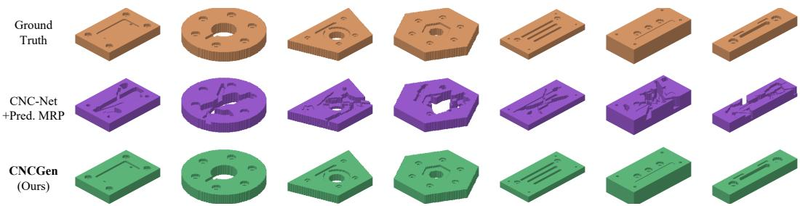  
Fig. S6: Geometric outcomes on held-out real CNC parts. Rows show target geometry, CNC-Net+Pred. MRP, and CNCGEN, from top to bottom, under the common offline evaluator.

In these examples, CNC-Net+Pred. MRP recovers coarse removal regions but leaves fragmented residual structures or incomplete feature interiors. CNCGEN more completely recovers the displayed cavities and through-regions. The quantitative comparison in Table 3 reports the corresponding differences in removal completeness and geometric error.

Failure patterns. Fig. S7 shows rollouts with low executed-geometry scores. Incomplete feature recovery leaves residual material near narrow bands, pocket intersections, and slant-feature boundaries, even when the main pocket or hole region has been removed. Residual material is therefore useful for inspecting local errors that can remain within an otherwise accurate final shape.

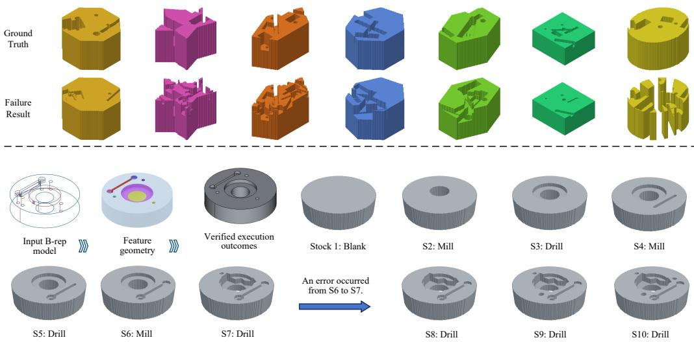  
Fig. S7: Representative failed rollouts. Target geometries in the top row are compared with generated results in the bottom row, showing residual material, overcut, and errors near feature boundaries.

Other failures contain fragmented or noisy geometry outside the intended feature footprint. Case inspection associates these patterns with incorrect object binding or inaccurate local paths after accumulated state errors. They reduce IoU and increase overcut even when the predicted operation category is reasonable. Narrow chamfers, slant features, and overlapping pocket boundaries are particularly sensitive to local path errors. These examples identify cases in which compact state tracking and Bezier parameterization leave small regions insufficiently corrected at later steps.´

## D EXTENDED DISCUSSION

Process and motion coverage. The current representation covers common three-axis pockets, holes, chamfers, and slant features. External profile machining is handled through setup construction rather than learned as an explicit target. Turning, grinding, EDM, thread milling, free-form finishing, and simultaneous multi-axis machining require broader process and motion representations.

Physical execution. Generated plans and parameterized toolpaths are controller-neutral. Machinespecific post-processing must provide the corresponding control program. Geometric verification measures material removal; it does not evaluate cutting force, tool deflection, chatter, thermal effects, tool wear, coolant behavior, or the physical suitability of predicted feeds and speeds. Fixtureaware collision checking and physical process models would extend the conditions assessed during generation and evaluation.

Data coverage and interacting features. Synthetic training provides controlled coverage of standard-part families, while the 800 real test records cover a limited range of shop practices, fixtures, and machining intent. Broader real records would support evaluation of these variations. The observed boundary-sensitive failures also motivate richer local state representations and more precise late-stage path correction for interacting features.