# CONCEPT SUBSPACES COMPUTE BEYOND THE LOGIT LENS:A WEIGHTS-ONLY TEST FOR LOCATING REPRESENTATIONSUPSTREAM OF READOUT

Aojie Yuan<sup>1</sup> Zhiyuan Julian Su<sup>2</sup> Haiyue Zhang<sup>1</sup> Zijian Su<sup>3</sup>

<sup>1</sup>University of Southern California <sup>2</sup>Duke University

<sup>3</sup>University of Michigan

<sup>1</sup>aojieyua@usc.edu <sup>2</sup>zhiyuan.j.su@duke.edu <sup>1</sup>haiyuez@usc.edu <sup>3</sup>simoon@umich.edu

## Abstract

A concept subspace’s efect on model behavior does not establish how it relates to the output readout. We introduce a two-sided geometric diagnostic that measures an extracted subspace’s overlap with the dominant right-singular directions of the unembed ding matrix, evaluated against output-oriented positive controls. Given an extracted basis, the raw diagnostic requires only model weights. Our testbed is the Format-Agnostic Reasoning Subspace (FARS), a ten-dimensional basis extracted from eighteen reasoning concepts expressed in six surface forms. Across nine rank-matched estimators and twenty-six models, four activation-derived concept estimators carry only 0.38–0.80% mean energy in the top-ten readout span. Final-layer PCA carries 3.56%, exceeding FARS in 25 of 26 models. A same-layer next-token control, evaluated using a fitted linear translator for depth matching, carries approximately thirteen times more energy than FARS, with separation in all 25 tested models. Re-extracting FARS on ten disjoint concepts yields 62–100% cross-format retrieval across twenty-four generative models, demonstrating transfer of the extraction procedure rather than a fixed basis. A complementary four-model, three-seed intervention study finds model-dependent sourcedirected efects that remain well below full-vector replacement. Together, the geometry and intervention controls distinguish concept structure from dominant readout directions while limiting claims of causal suficiency.

Code  
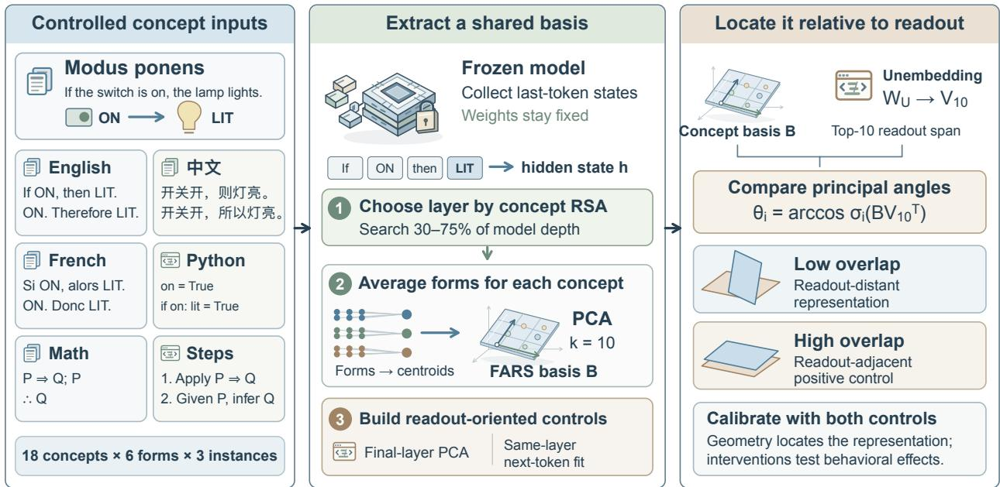  
Figure 1: From controlled concepts to readout geometry. Six schematic forms define a shared concept basis. Principal angles compare it with the dominant readout span, calibrated by two controls. Illustrations are schematic; quantitative results follow.

## 1 Introduction

Language models express reasoning concepts in prose, code, and mathematical notation, but this flexibility need not imply shared internal directions. Concept-direction research (Park et al., 2024; Arditi et al., 2024; Turner et al., 2024) motivates two questions: does concept identity persist across surface forms, and how strongly does its recovered subspace overlap the model’s output readout?

We extract a Format-Agnostic Reasoning Subspace (FARS) using concept-centroid PCA over eighteen reasoning concepts in six surface forms (Fig. 1). Averaging within concept suppresses the form confound without gradient updates or supervision beyond concept labels. We use rank k = 10, an empirical operating point where marginal gains plateau (§7); it is not an intrinsic-dimensionality claim, since eighteen mean-centred centroids span at most seventeen dimensions.

An ablation drop alone cannot tell whether a subspace computes an answer or carries an already-computed identity toward logits. Our main contribution is a readout-orthogonality test: compare a probed basis with the top-k right singular vectors of the model’s unembedding matrix W . Given the probed basis, this geometric comparison requires weights rather than new model runs. Positive and depth-matched controls establish that the test can return both low and high readout loading.

## Contributions.

• A calibrated geometric diagnostic. Given an extracted basis, the raw test uses model weights to quantify its overlap with dominant readout directions. Across 26 models, final-layer PCA exceeds FARS in 25/26 cases; a same-layer next-token control does so in 25/25 depth-matched cases.

• Controlled evidence across estimators and inventories. Four concept estimators among nine rank-matched constructions carry 0.38–0.80% mean readout energy. Re-extraction on ten disjoint concepts yields 62–100% crossformat retrieval on 24 generative models. This tests transfer of the extraction procedure, not transport of a fixed basis.

• An intervention-based boundary on interpretation. A new four-model, three-seed comparison separates FARS efects from random, norm-matched random, full-vector, and no-intervention controls. Source-directed efects are model dependent and substantially weaker than full replacement. Geometric separation and intervention sensitivity therefore do not establish causal suficiency.

## 2 Related Work

Concept directions and readout. The Linear Representation Hypothesis treats concepts as activation-space directions (Park et al., 2024; Elhage et al., 2022). TCAV estimates labelled concept vectors (Kim et al., 2018); linear probes recover truth directions (Marks and Tegmark, 2024); refusal and activation-steering studies intervene on such directions (Arditi et al., 2024; Turner et al., 2024). Distributed Alignment Search learns subspace interventions (Geiger et al., 2024), LEACE erases linearly encoded concepts (Belrose et al., 2023), and sparse autoencoders extract overcomplete feature dictionarie (Bricken et al., 2023; Templeton et al., 2024). We use centroid PCA as a lightweight estimator and evaluate its readout geometry alongside alternative constructions (App. F).

Tuned lenses study intermediate readout (Belrose et al., 2023). Closest to our question, Nadaf (2026) find that function vectors (Todd et al., 2024) can steer where logit-lens decoders cannot read them, while Billa (2026) use logit-lens accessibility to predict steering success. Patchscopes decodes hidden states through later model layers (Ghandeharioun et al., 2024). Our diagnostic adds positive controls and a depth-matched linear reference. Low overlap with the specified span does not exclude decoding through lower singular directions, a learned decoder, or subsequent nonlinear processing.

Cross-model / cross-architecture representation. The Platonic Representation Hypothesis (Huh et al., 2024) conjectures cross-architecture convergence to a shared representational space; Kornblith et al. (2019) and Morcos et al. (2018) give correlation-based measures. Our X-FARS analysis tests this question using aligned concept centroids and their relations on a fixed inventory (App. X).

Cross-lingual and cross-format transfer. Studies of multilingual representations address several distinct questions: language-specific neurons (Tang et al., 2024; Zhao et al., 2024), shared circuits and concept latents (Ferrando and Costajussà, 2024; Dumas et al., 2025; Chen et al., 2025), alignment across languages (Conneau et al., 2020; Liu and Niehues,

2025), latent language (Wendler et al., 2024), and transfer of knowledge-free reasoning (Hu et al., 2025). These findings motivate a controlled comparison across surface forms but do not, collectively, establish invariance across prose, code, and mathematical notation. OctoPack studies code instruction tuning (Muennighof et al., 2024); our benchmarks instead hold concept identity fixed while varying these forms. We use them to test readout geometry and extraction transfer, without claiming an exhaustive priority result over all cross-format datasets.

Causal interpretability. Activation patching (Vig et al., 2020; Meng et al., 2022; Wang et al., 2023) and its follow-ups (Lindsey et al., 2025; Conmy et al., 2023) localise circuits by intervention, and causal-abstraction accounts (Geiger et al., 2021) formalise what such interventions license. We use subspace-level patching (§4) with ablation and amplification as a bidirectional causal test; the interpretability illusions demonstrated by Makelov et al. (2024) caution against equating an intervention efect with recovery of the naturally used mechanism. Our geometric control addresses readout adjacency; it does not by itself resolve that broader causal-identification problem. Relatedly, Yuan et al. (2026) report predictive hidden-state error signals without successful correction under their tested interventions. This motivates distinguishing decodability from intervention eficacy; our experiments address concept subspaces rather than error detectors.

## 3 Experimental Setup

TriForm Benchmark. A controlled stimulus set where reasoning content is held exactly constant while surface form varies along three axes: linguistic (English, Chinese, French prose), symbolic (Python code, mathematical notation), and structural (step-by-step). 18 concepts spanning arithmetic, logic, relational, causal, and spatial domains × 3 instances × 6 forms = 324 stimuli, programmatically generated; full inventory in App. C, example in App. B.

Models. Twenty-six LLMs from four architecture families plus reasoning-tuned variants (0.4B–70B): sixteen dense decoders (GPT-2 XL, Qwen2.5-3B-Inst, Qwen2.5-7B, Qwen3-4B/8B, Phi-3.5-mini-Inst, Phi-4, Mistral-7B base/-Inst, Llama-3.1-8B/70B-Inst, OLMo-2-7B-Inst, Granite-3.3-8B-Inst, Falcon3-7B-Inst, Yi-1.5-9B-Chat, SmolLM3-3B), three MoE (Mixtral-8x7B-Inst, DeepSeek-V2-Lite-Chat, gpt-oss-20B), two state-space (Mamba-2.8B, Falcon-Mamba-7B), four reasoning-tuned (R1-Distill-Llama-8B, R1-Distill-Qwen-7B/14B, QwQ-32B), and one encoder MLM (DeBERTa-v3- large). RoBERTa-large is excluded from the readout analyses because no layer yields a concept-dominant subspace (form-RSA exceeds concept-RSA throughout), so the test’s prerequisite is unmet. The X-FARS canonical frame (App. X) includes twenty-seven extracted models including RoBERTa. Its original alignment analyses use a fifteen-model pool; expanded algebra summaries use twenty-seven models, as identified in each table and caption.

Methods. Last-token hidden states at every layer $( \mathbf { A } \in \mathbb { R } ^ { 3 2 4 \times L \times D } )$ . Permutation RSA (Kriegeskorte et al., 2008; Diedrichsen and Kriegeskorte, 2017) between the empirical cosine RDM and binary ideal RDMs (0 for a same-concept pair, 1 otherwise; likewise for form; 1,000 perms, FDR-corrected). Cross-form probing (ridge α=0.1 on source form, eval on target). FARS extraction: average each concept’s activations over forms and instances to get 18 centroids in $\mathbb { R } ^ { D }$ PCA → top-k FARS basis $\mathbf { B } _ { \ell } \in \mathbb { R } ^ { k \times D }$ . All estimators in §5 are rank-matched at k=10 so that Grassmann distances are comparable. This matters where the natural rank is lower: FormPCA is the 5 directions of the six mean-centred form centroids, completed to rank 10 by the leading directions of the form-projected-out residual, and ProbeW is the top-10 PCA of the 18 one-vs-rest probe weight vectors. Causal interventions: subspace patching $\mathbf { h } _ { \mathrm { p a t c h e d } } = \mathbf { h } _ { \mathrm { t g t } } + \mathbf { B } ^ { \top } \mathbf { B } ( \mathbf { h } _ { \mathrm { s r c } } - \mathbf { h } _ { \mathrm { t g t } } )$ equation 1, ablation $( \mathbf { I } - \mathbf { B } ^ { \top } \mathbf { B } ) \mathbf { h }$ , and amplification h + c B⊤Bh (so c=0 is the identity and $c ^ { \star }$ denotes the gain used), compared against random orthonormal, Full-PCA, and full replacement; concept-block bootstrap (5,000).

$$
\mathbf { h } _ { \mathrm { p a t c h e d } } = \mathbf { h } _ { \mathrm { t g t } } + \mathbf { B } ^ { \top } \mathbf { B } \left( \mathbf { h } _ { \mathrm { s r c } } - \mathbf { h } _ { \mathrm { t g t } } \right)\tag{1}
$$

## 4 Extracting FARS

Given a set of C concepts each rendered in F surface forms with I instances per pair $( N = C F I$ stimuli), FARS is the top-k principal subspace of the mean-centred concept-centroid matrix at the concept-RSA peak within the 30–75% depth band, as in the readout analyses. The reasoning-position analysis instead selects by centroid variance (App. W); this is a distinct extraction setting. A shufled-centroid null trails FARS by 17–29σ in concept-RSA and multi-class LDA matches it within $\Delta { \le } 0 . 0 2$ , so the subspace is concept-carrying rather than a variance artefact (App. E).

Intervening on FARS afects reasoning performance in several models. Argmax preservation alone is less informative: random-subspace patches also preserve it. We therefore test readout overlap with positive controls (§5), then examine transfer across inventories (§6), rank and layer sensitivity (§7), and the boundary of last-input-token analysis in reasoning models (§8). Cross-model alignment provides complementary evidence in App. X.

<table><tr><td rowspan="2">Model L= best FARS layer</td><td colspan="2">Argmax preserved (%)↑</td><td colspan="2">Behavioural (drop pp)↓ GSM8K</td></tr><tr><td>FARS-10</td><td>PCA-10</td><td>Full</td><td>MATH</td></tr><tr><td>GPT-2 XL</td><td>93.7</td><td>87.7</td><td>81.0</td><td></td></tr><tr><td>Qwen-2.5-3B</td><td>89.7</td><td>37.3</td><td>22.0</td><td></td></tr><tr><td>Qwen-2.5-7B-Inst.</td><td>94.7</td><td>59.7</td><td>26.3</td><td>-20.0pp -18.4pp</td></tr><tr><td>HMistral-7B</td><td>97.3</td><td>85.3</td><td>83.3</td><td></td></tr><tr><td>∞ Llama-3.1-8B</td><td>94.0</td><td>56.7</td><td>39.7</td><td> $+ 5 ( \mathrm { n . s . } ) ; - 2 2 \mathrm { a t } c ^ { \star } \mathrm { = } 2$ </td></tr><tr><td>Matched-rank random</td><td> $9 9 . 0 \pm 0 . 2 $ </td><td></td><td></td><td>0.0</td></tr></table>

Table 1: Argmax-preservation under 10-d cross-form patching (paired Wilcoxon $p { < } 1 0 ^ { - 2 2 }$ vs. Full-PCA on every model). Behavioural: FARS ablation at the FARS layer costs −20 (Qwen-7B-Inst), −28 (Phi-3.5), −17 (Qwen-3B-Inst), and −10 pp (Mistral-7B-Inst) on GSM8K relative to matched-rank random (paired Wilcoxon $p \leq 0 . 0 3 ) ;$ Llama-8B needs amplification $c ^ { \star } { = } 2 ~ ( - 2 2 \mathsf { p p } , p { = } 3 { \times } 1 0 ^ { - 3 } ) ;$ Llama-70B is inert at $c \leq 2 \left( \mathrm { A p p . } \mathrm { P . } 3 \right)$ .

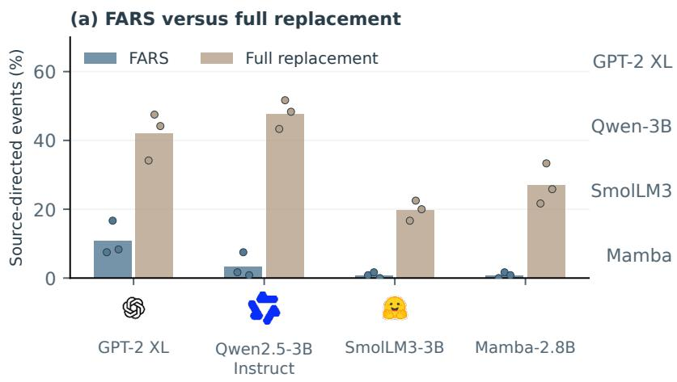

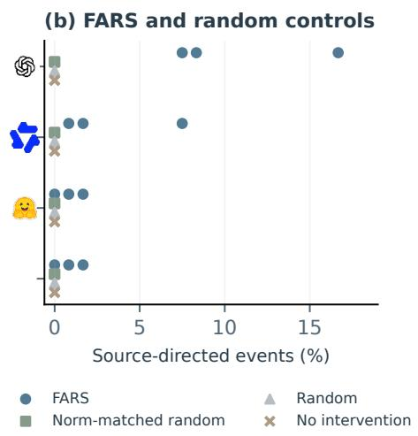  
Figure 2: Concept-subspace interventions have limited source-directed efects. Last-token replacement across four models; each dot is one seed with 120 directed concept pairs. Bars show seed means, with no inferred confidence interval. Both random controls and the no-intervention control produce zero events. Full replacement is a reference intervention, not a guarantee of task success.

## 4.1 What a concept-subspace intervention can change

Readout geometry and behavioural intervention answer diferent questions. We therefore extend cross-concept patching to GPT-2 XL, Qwen2.5-3B-Instruct, SmolLM3-3B, and Mamba-2.8B. Each model is evaluated with three seeds and 120 directed concept pairs per seed, using the first stimulus instance in a shared surface form. We retain the earlier prefixposition protocol for comparison and add a last-token-to-last-token protocol with five conditions: FARS, a Haar-random rank-10 basis, the same random intervention rescaled to the FARS intervention norm, full-vector replacement, and no intervention. Bases and model layers are fixed across seeds.

For source A, target B, and patched output P, the recorded event is $D _ { \mathrm { K L } } ( p _ { A } \| p _ { P } ) < D _ { \mathrm { K L } } ( p _ { B } \| p _ { P } )$ . This is a measure of source-directed output change, not semantic accuracy. In the last-token protocol, the seed-mean FARS rates are 10.8%, 3.3%, 0.8%, and 0.8%, respectively (Fig. 2). Full replacement yields 19.7–47.8% across these models; both random controls and no intervention yield zero events in the sampled trials. The efects support a limited, model-dependent influence of the extracted subspace, not reliable substitution for the full state. Seeds reuse concept pairs; we report seed variation rather than treating every record as independent. Protocol details and both sets of results appear in App. N.

## 5 Readout-Orthogonality Test and Method Validation

Per-model readout orthogonality. For each model we extract FARS at its best concept-RSA layer within the 30–75% depth band, take the top-10 right singular vectors of that model’s own unembedding matrix W<sub>U</sub> (the raw test uses W<sub>U</sub> alone; the final-norm gain γ is folded in, with the layer translator, by the depth-matched test of App. G, which returns the same verdict), and measure the Grassmann geodesic distance between them, the smallest principal angle, and the fraction of FARS energy lying inside the readout span.

<table><tr><td colspan="2">role</td><td colspan="2">VS.  $W _ { U }$ </td><td> $\mathrm { v s . } \ W _ { U } \to \ell$ </td><td></td></tr><tr><td colspan="2">Rank-10 subspace</td><td> $d _ { G }$ </td><td> $\mathrm { e n e r g y \ } \%$ </td><td> $\mathrm { e n e r g y \% }$ </td><td> $\theta _ { \mathrm { m i n } }$ </td></tr><tr><td colspan="2">Final-layer PCA</td><td>positive ctrl</td><td>4.556</td><td>3.56</td><td>0.86 65.5</td></tr><tr><td colspan="2">FormPCA</td><td>control</td><td>4.738</td><td>1.26</td><td>0.90 75.8</td></tr><tr><td colspan="2">FullPCA</td><td>control</td><td>4.751</td><td>1.04</td><td>0.83 77.5</td></tr><tr><td colspan="2">Shuffled-FARS</td><td>control</td><td>4.762</td><td>0.90 0.62</td><td>78.9</td></tr><tr><td colspan="2">Diff-of-means</td><td>published</td><td>4.774</td><td>0.80</td><td>0.46 79.5</td></tr><tr><td colspan="2">FARS (ours)</td><td>published</td><td>4.774</td><td>0.80</td><td>0.46 79.5</td></tr><tr><td colspan="2">LDA</td><td>published</td><td>4.805</td><td>0.41</td><td>0.39 83.5</td></tr><tr><td colspan="2">Probe weights</td><td>published</td><td>4.811</td><td>0.38</td><td>0.33 83.6</td></tr><tr><td colspan="2">Haar random</td><td>control</td><td>4.823</td><td>0.32</td><td>0.30 84.3</td></tr><tr><td colspan="2">Next-token PCA at l</td><td>positive ctrl</td><td>4.665</td><td>2.34</td><td>5.88 69.6</td></tr></table>

Table 2: Readout-orthogonality of nine matched-rank subspace estimators, averaged over 26 models spanning four architecture families plus reasoning-tuned variants (0.4B–70B). d<sub>G</sub> is the Grassmann geodesic distance to the top-10 right singular vectors of $W _ { U }$ (ceiling $\sqrt { 1 0 } \pi / 2 = 4 . 9 7 )$ ; energy $\%$ is the fraction of subspace energy inside the top-10 readout span, measured against $W _ { U }$ directly and against the readout channels pulled back to the FARS layer ℓ by a tuned-lens translator $( W _ { U } \to \ell ; \mathsf { A p p } .$ . G, 25 models); $\theta _ { \mathrm { m i n } }$ is the smallest principal angle. Rows are ordered by readout-adjacency. Published estimators are the constructions used in the conceptdirection literature; control rows probe rank and structure; the positive controls are the top-10 PCA of the final layer, whose residual stream is the immediate input to $W _ { U }$ , and next-token-identity centroid PCA at the FARS layer itself — the same estimator as FARS with the grouping variable changed from concept to emitted token.

Per-model values are tabulated in App. G (Table 12).

Positive controls and four concept estimators give diferent readout loadings. A diagnostic that can only return one answer is not a diagnostic. We therefore run the test on matched-rank subspaces of the same activation space across all 26 models: four estimators from the published literature, four structural controls, and positive controls designed to be readout-adjacent.

The test is two-sided. The final-layer positive control carries 3.56% of its energy in the top-10 readout span against 0.80% for FARS (a 4.5× separation), with the minimum principal angle falling from $7 9 ^ { \circ }$ to $6 5 ^ { \circ } ;$ per-model it is strictly more readout-adjacent than all four published estimators in 25/26 models by energy and 25/26 by minimum angle. The near-orthogonal readings elsewhere are therefore substantive rather than an artefact of the statistic. The single exception is R1-Distill-Qwen-7B, whose last-input-token FARS loads 5.78% against a cross-model mean of 0.80%; it is the model whose concept computation §8 shows moving of the last-input-token position, and the depth-matched test below resolves it.

The verdict survives matching depth. A mid-layer subspace could be far from $W _ { U }$ merely because many layers separate it from the unembedding. We therefore pull the readout back to the FARS layer ℓ with a tuned-lens-style translator $A _ { \ell }$ (ridge from block-ℓ to final-block states, held-out $R ^ { 2 } 0 . 2 3  – 0 . 6 3 )$ and take the top-k right singular vectors of $W _ { U } \mathrm { d i a g } ( \gamma ) A _ { \ell }$ (γ the final-norm gain) as the readout channels at layer ℓ; as a same-layer positive control we build FARS’s own estimator with the grouping variable changed from concept to emitted token (next-token centroid PCA). Against the pulled-back readout the concept estimators stay at the Haar floor (FARS 0.46%, LDA 0.39%, random 0.30%) while the same-layer next-token subspace loads $5 . 8 8 \% - \mathrm { ~ a ~ } 1 3 \times$ separation that exceeds all four published estimators in 25/25 models (App. G). With layer, rank, estimator, and corpus held fixed, grouping by output token yields a readout channel and grouping by concept does not: this comparison separates grouping variables at matched depth under the fitted linear reference. It also resolves the exception above: R1-Distill-Qwen-7B’s FARS loads 5.78% on the raw $W _ { U }$ channels but only 0.69% on the layer-ℓ channels; its relative loading depends on the choice of readout reference.

The verdict is not specific to our estimator. Multi-class LDA, diference-of-means directions, and one-vs-rest probe weights — the constructions the concept-direction literature actually uses — all have low top-10 readout loading, with LDA and probe weights further from the readout than FARS. Sorting by readout-adjacency recovers the form-vs-concept axis: form-dominant subspaces (FormPCA 1.26%, FullPCA 1.04%) sit nearer the readout than concept-dominant ones (FARS 0.80%, LDA 0.41%, probe weights 0.38%). This ordering associates surface-form grouping with greater readout loading in this dataset; it does not by itself identify where concept computation occurs.

Lemma 1 (Diference-of-means directions span FARS). Let $\mu _ { c }$ be the class-conditional mean activation of concept c over a balanced stimulus set and µ¯ the grand mean. Then span $\{ \mu _ { A } - \mu _ { B } \} _ { A , B } = \mathrm { s p a n } \{ \mu _ { c } - \bar { \mu } \} _ { c } ,$ , so the top-k principal subspace ofthe pairwise diference matrix is exactly the concept-centroid PCA subspace (FARS)

Proofsketch. The two spans coincide by writing each generator in terms of the other, and the pairwise-diference scatter equals 2n times the concept-centroid scatter, so the two share eigenvectors and hence their top-k subspaces are identical, not merely co-spanning. Full derivation in App. E.1. □

Lemma 1 is why the Dif-of-means and FARS rows of Table 2 coincide to numerical precision (verified at $d _ { G } < 1 0 ^ { - 7 }$ on every model). The equivalence applies to the same class means, corpus, layer, and balanced pairwise construction. It does not imply that arbitrary steering directions extracted from other concepts or prompts lie in this FARS basis. Moreover, low average loading of a rank-10 subspace need not give the same loading to each individual direction. The published steering methods (Turner et al., 2024; Arditi et al., 2024) motivate this comparison, rather than inheriting its empirical result automatically.

Sensitivity to readout rank. The rank sweep in App. H compares loading against the exact Haar expectation $k / D$ . Finallayer PCA exceeds FARS at the three reported ranks in 24/26 models; the separation generally narrows as rank grows. This is evidence at the tested ranks, not an order-of-magnitude separation at every rank.

Published direction constructions show the same depth sensitivity. Rebuilding the refusal direction of Arditi et al. (2024) and the truth direction of Marks and Tegmark (2024) at the FARS block on 22 models (held-out $\mathrm { A U C } \geq 0 . 9$ in 22 and 20), both have low loading relative to the Haar reference against the pulled-back readout (medians 0.44% and 0.20% vs. $k / D \approx 0 . 2 6 \%$ ; low-loading criterion satisfied in 16/22 and 19/20), whereas the same directions built at the final block load 1.98% and $4 . 0 9 \% - \mathrm { a }$ rise in 35/39 paired comparisons that change nothing but the extraction depth (App. I). The test applies unchanged to the directions safety and steering work manipulates.

The verdict is not unanimous: it tracks where the direction is defined. Building the same 18 concepts from the vocabulary instead — tf-idf-diagnostic tokens per concept, averaged over rows of $W _ { U }$ , PCA’d to rank 10, the construction behind token-anchored steering — yields a subspace that loads 8.43% of its energy in the readout span against 0.80% for FARS (mean per-model ratio 16.9×, same direction in 26/26 models; random-token control 5.20%), while overlapping FARS by only 0.56% (App. I.1). Activation-derived and vocabulary-derived constructions therefore difer in their overlap with the chosen readout span, even when they use the same concept labels.

It also covers the estimator the field reaches for first: concept features of a pretrained residual-stream sparse autoencoder (Bricken et al., 2023) sit at 1.06%, indistinguishable from FARS at the same layer (0.96%), while that SAE’s full dictionary sits at 3.93% (App. I.2; one model).

## 6 Cross-Inventory Transfer: Novelty Benchmark

The preceding comparison fixes the concept inventory. We next ask whether the extraction procedure recovers cross-format structure when that inventory changes.

A natural worry is that FARS geometry is an artefact of the eighteen hand-crafted TriForm concepts rather than a crossformat signal in the models. We test this by extracting FARS on a disjoint inventory — the Novelty benchmark introduced here — and asking whether the method reproduces its defining property, cross-format concept retrieval.

Novelty benchmark. Ten concepts from five domains absent from TriForm (temporal, probabilistic, graph, datastructure, quantifier),

each with three instances rendered in the same six surface forms as TriForm, giving 180 stimuli (inventory in Table 6, App. C). We keep k=10 for comparability, which makes Novelty-FARS full-rank in its own concept space (ten centroids span at most nine dimensions), so it is read against the matched-rank random baseline, not against TriForm.

Per-model numbers are in Table 39 (App. U): Novelty-FARS reaches 62–100% top-1 cross-format retrieval on the 24 generative models (32% on the encoder DeBERTa-v3), 6–57 pp above a matched-rank Haar baseline on every model, with a cross-to-within-format retrieval ratio $X / W \geq 0 . 9 4$ in 17 of 25 (X scores a stimulus against centroids from the other five forms and $W$ against its own, so $X / W  1$ means retrieval ignores surface form). Scope: this analysis covers 25 of the twenty-six models. R1-Distill-Qwen-14B is the one checkpoint for which we did not run a Novelty extraction, so it is absent from this table only; it is present in every analysis that uses the TriForm inventory.

Each point: one model Dashed: equality  
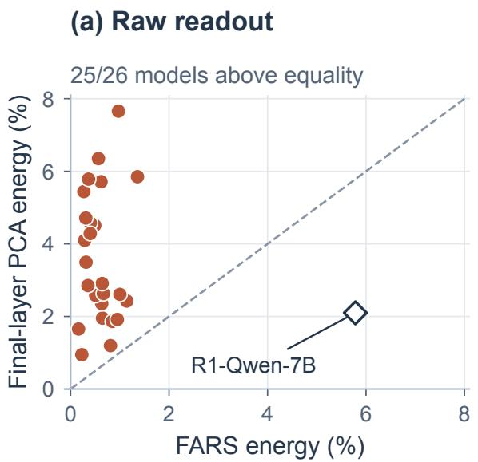

(b) Matched depth  
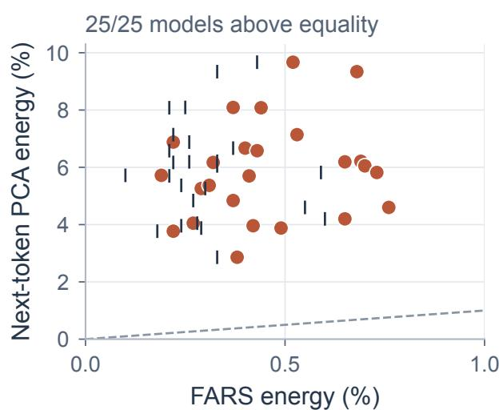  
Black ticks: Haar expectation  
Figure 3: Positive controls distinguish readout loading. Each point is a model. (a) Final-layer PCA exceeds FARS in $2 5 / 2 6$ models; the diamond marks R1-Distill-Qwen-7B. (b) Same-layer next-token PCA exceeds FARS in all 25 depth-matched models. Black ticks mark Haar expectations at the corresponding control energy. Dashed lines indicate equal loading; axis ranges difer. Panel (b) uses table values rounded to 0.01 percentage point.

Fixed basis versus re-extraction. A checkpoint-matched audit freezes the saved TriForm basis and layer, then evaluates Novelty cross-form retrieval against full-space and same-layer random controls (App. U.1). Across GPT-2 XL, Qwen2.5-7B and Mistral-7B-v0.3, frozen-basis accuracy is 22.8–40.0%, above the sampled random means (20.2–35.3%) but below fullspace retrieval (48.3–90.6%). This is partial transfer, not uniformly near-chance performance or evidence for a universal fixed basis.

Reading. Re-extraction reproduces cross-format structure on a second, disjoint inventory. Fixed-basis transfer is substantially weaker in the audited subset. The evidence supports transfer of the extraction procedure across these two inventories, not a claim about every possible concept set.

## 7 Dimension Choice and Layer Localization

Transfer across inventories leaves two choices to check: the rank of the basis and the layer at which it is extracted.

$k = 1 0$ is an empirical operating point. Sweeping $k \in \{ 1 , \ldots , 1 7 \}$ on TriForm, k = 10 captures ∼ 90% of both the full-rank (k = 17) centroid variance and the full-rank cross-format retrieval, with marginal gains ≤ 10 pp beyond it, uniformly across dense, state-space, and encoder-MLM models (App. K, Tables 20–21).

FARS is layer-local and its peak sits above the readout layer. For each of the 26 models we recompute conceptcentroid PCA at every layer and record two quantities: top-1 cross-format concept retrieval Agn% (concept-invariance) and the Grassmann distance $d _ { G }$ from the layer-L FARS to the top-10 readout channels of $W _ { U }$ . Table 19 reports the Agn% peak along depth with its $d _ { G }$ , against the last layer (Fig. 10 and Table 19, App. J).

Reading. Retrieval peaks at diferent depths across models (reported depth fractions 0.29–0.97), so the result is not a universal middle-layer location. Peak-versus-final comparisons show lower retrieval at the final layer and generally smaller distance to the readout span. Peak selection itself favours higher retrieval; it is the accompanying geometry comparison that supplies the additional observation. These measurements constrain a layer-local interpretation but do not establish the complete causal pathway.

<table><tr><td>Probe</td><td>Llama pair</td><td>Qwen pair</td><td>QwQ-32B</td><td>Baseline</td></tr><tr><td>dG(base last, distill last)</td><td>3.06</td><td>3.48</td><td></td><td>4.97 (rank-10 ceiling)</td></tr><tr><td>dG(last, CoT)</td><td>4.53</td><td>4.26</td><td>4.33</td><td>4.97 (rank-10 ceiling)</td></tr><tr><td>CoT-tail FARS % cross-format Agn.</td><td>60.8</td><td>58.0</td><td>59.0</td><td>21.6–24.4 (Haar rand.)</td></tr><tr><td>X-FARS pool +Llama-Distill</td><td>55.6% (+1.7 pp)</td><td></td><td></td><td>53.8% (15 models)</td></tr></table>

Table 3: Reasoning-tuned CoT departure at a glance. Row 1 (Q1): base-to-distilled distances are nonzero and below the rank-10 ceiling; this is a geometric comparison in paired hidden coordinate spaces. Row 2 (Q2): within each reasoning model, the last-token and CoTtail subspaces sit at large aggregate Grassmann distances, including the natively trained QwQ-32B. Row 3: the CoT-tail subspace itself carries cross-format concept identity at 58–61% top-1 retrieval, 34–39 pp above a matched-rank Haar-random baseline. Row 4 (Q3): absorbing R1-Distill-Llama-8B into the shared X-FARS frame improves absolute alignment (53.8 → 55.6%) with the Haar-randomnull gap 27.2–29.6 pp across the three pools. Detailed tables and run distinctions appear in App. W.

Cross-architecture algebra (App. X). The per-model subspaces of all 27 extracted models align into one shared canonical frame (X-FARS, 97.6% of cross-model centroid variance, 36.8σ above a random-projection control at 61.7±1.0%) that supports word2vec-style analogies, preserves pairwise diferences, and enables training-free cross-architecture retrieval.

## 8 Two Concept Subspaces in Reasoning-Tuned Models

A last-input-token pipeline applied to reasoning-tuned models raises a scoping question: models that “think” in a chain of thought (CoT) may deposit concept content at positions a pre-decode pipeline never inspects. We read the CoT-tail: the last position generated under a 512-token budget. The original length audit reports budget-hit rates of 64–88% for three distilled models, a diferent cohort from the geometry comparison (App. W.6) — a claim about the reasoning stream, not its end. We answer it on the two open-weight R1-Distill models (Llama-8B, Qwen-7B) with their base counterparts, and on the native 32B reasoner QwQ.

A format-collapse control tempers this. Regenerating the traces and keeping their text shows that 56–57% of non-English prompts yield an English trace, so grouping by the prompt’s form overstates how cross-format the position is. Regrouping the cross-format score X — not the agnostic top-1 rate above, but the score that pits a stimulus against centroids from other forms — by the form the model actually wrote in lowers it from 30.6–44.4% to 26.9–28.1%, still 3.3–5.1× a matched-rank Haar control measured the same way (2 models, a fresh set of generations; App. W.1).

Reading. Under reasoning fine-tuning the picture multiplies rather than breaks. The paired and pooled comparisons quantify how the recovered geometry changes (Q1, Q3); Q2 identifies a diferent subspace at a generated-token position and separately selected layer. QwQ-32B also shows a large aggregate distance $( d _ { G } { = } 4 . 3 3 )$ and 59.0% retrieval. Position, layer choice, and output format remain potential contributors; these observations do not isolate the computation responsible for reasoning.

## 9 Discussion

FARS captures cross-format concept structure with low overlap with the dominant linear readout span in the tested settings. Final-layer and same-layer next-token controls show that this is a comparative result: output-oriented subspaces carry more readout energy. Together with the intervention results, this is consistent with concept representations contributing before final output readout. It does not identify the complete computation or prove that the subspace alone is suficient to perform it.

The raw diagnostic is inexpensive once a basis is available, but the full pipeline is not compute-free: extraction requires activations, and depth matching requires fitting a translator. The latter explains only part of final-layer variation (held-out $R ^ { 2 } = 0 . 2 3 – 0 . 6 3 )$ , so it is an approximate linear reference. Rank sweeps test sensitivity to a chosen readout span, not an absence of information in all output directions; for a complete orthonormal basis at $k = D$ , every subspace has unit loading.

The scope is also empirical. Labels supervise extraction. Fixed-basis transfer is partial and task dependent: on Novelty, three checkpoint-matched models reach 22.8–40.0% retrieval, below full-space retrieval at 48.3–90.6% (App. U.1); on out-of-distribution MBPP, the earlier retrieval analysis reaches only 1–6% versus 6.5–17% for full activations (App. X). Stronger re-extraction results test the procedure, not a universal fixed basis. The shared frame is fitted to a fixed inventory, rather than establishing universal concept coordinates. CoT-tail analyses sample a token-budget-limited reasoning stream, and an output-facingness prediction did not replicate (App. M). These boundaries make the diagnostic most useful as a control alongside targeted interventions and decoding tests.

## Ethics Statement

We analyse only publicly released open-weight LLMs. No human-subjects data are collected or released, and the TriForm and Novelty stimuli comprise canonical reasoning patterns with no harmful content. One appendix experiment (App. R) does use published AdvBench prompts (Zou et al., 2023) to test whether a prose-vs-code representational asymmetry produces a safety-refusal gap; it does not, and we release only aggregate refusal counts, no model completions and no new attack strings. Had the gap been real we would have deferred to responsible disclosure before release.

## Reproducibility Statement

The paper specifies stimulus inventories, concept-centroid extraction, readout diagnostics, controls, and intervention procedures. Per-experiment cohorts, selected layers, and available summary values appear in the appendix. Reproducing the full study additionally requires the exact stimulus files, activation caches, extraction and alignment implementation, and checkpoint revisions. A public code and research snapshot is available at https://github.com/Justin0504/ LLM-representation-agnostic (commit 4d74d85). It includes the benchmark and core analysis code, but does not yet contain the September 28–29 supplementary runs; it is not a complete archive of every experiment reported here. The raw diagnostic requires only an extracted basis and unembedding weights; the depth-matched control additionally requires fitted activation-based translators. The reported compute description in App. A concerns the original experiments and has not been independently remeasured.

## AI Use Statement

LLM-based assistants (Claude Code and OpenAI Codex) assisted with code development, literature retrieval, experimental planning, prose revision, figure design, and figure-data provenance checks. Codex also prepared editable vector and PowerPoint assets and screened references against primary-source records. Assistant-assisted scripts also executed supplementary model experiments; the reported measurements come from recorded inference runs rather than generated illustrative values. The authors are responsible for the experimental design, verification, interpretation, and final submitted content.

## References

Yuxin Chen, Yiran Zhao, Yang Zhang, An Zhang, Kenji Kawaguchi, Shafiq Joty, Junnan Li, Tat-Seng Chua, Michael Qizhe Shieh, and Wenxuan Zhang. The emergence of abstract thought in large language models beyond any language. In NeurIPS, 2025.

Alexis Conneau, Shijie Wu, Haoran Li, Luke Zettlemoyer, and Veselin Stoyanov. Emerging cross-lingual structure in pretrained language models. In ACL, 2020.

Clement Dumas, Chris Wendler, Veniamin Veselovsky, Giovanni Monea, and Robert West. Separating tongue from thought: Activation patching reveals language-agnostic concept representations in transformers. In ACL, 2025.

Javier Ferrando and Marta R. Costa-jussà. On the similarity of circuits across languages: A case study on the subject-verb agreement task. In Findings ofEMNLP, 2024.

Peng Hu, Sizhe Liu, Changjiang Gao, Xin Huang, Xue Han, Junlan Feng, Chao Deng, and Shujian Huang. Large language models are cross-lingual knowledge-free reasoners. In NAACL, 2025.

Minyoung Huh, Brian Cheung, Tongzhou Wang, and Phillip Isola. Position: The Platonic representation hypothesis. In ICML, 2024.

Jack Lindsey, Wes Gurnee, Emmanuel Ameisen, Brian Chen, Adam Pearce, Nicholas L. Turner, Craig Citro, David Abrahams, Shan Carter, Basil Hosmer, et al. On the biology of a large language model. Transformer Circuits Thread, 2025.

Danni Liu and Jan Niehues. Middle-layer representation alignment for cross-lingual transfer in fine-tuned LLMs. In ACL, 2025.

Kiho Park, Yo Joong Choe, and Victor Veitch. The linear representation hypothesis and the geometry of large language models. In ICML, 2024.

Tianyi Tang, Wenyang Luo, Haoyang Huang, Dongdong Zhang, Xiaolei Wang, Xin Zhao, Furu Wei, and Ji-Rong Wen. Language-specific neurons: The key to multilingual capabilities in large language models. In ACL, 2024.

Yiran Zhao, Wenxuan Zhang, Guizhen Chen, Kenji Kawaguchi, and Lidong Bing. How do large language models handle multilingualism? In NeurIPS, 2024.

Jesse Vig, Sebastian Gehrmann, Yonatan Belinkov, Sharon Qian, Daniel Nevo, Yaron Singer, and Stuart Shieber. Investigating gender bias in language models using causal mediation analysis. In NeurIPS, 2020.

Kevin Meng, David Bau, Alex Andonian, and Yonatan Belinkov. Locating and editing factual associations in GPT. In NeurIPS, 2022.

Kevin Ro Wang, Alexandre Variengien, Arthur Conmy, Buck Shlegeris, and Jacob Steinhardt. Interpretability in the wild: A circuit for indirect object identification in GPT-2 small. In ICLR, 2023.

Been Kim, Martin Wattenberg, Justin Gilmer, Carrie Cai, James Wexler, Fernanda Viegas, and Rory Sayres. Interpretability beyond feature attribution: Quantitative testing with concept activation vectors (TCAV). In ICML, 2018.

Atticus Geiger, Zhengxuan Wu, Christopher Potts, Thomas Icard, and Noah Goodman. Finding alignments between interpretable causal variables and distributed neural representations. In CLeaR, 2024.

Nora Belrose, David Schneider-Joseph, Shauli Ravfogel, Ryan Cotterell, Edward Raf, and Stella Biderman. LEACE: Perfect linear concept erasure in closed form. In NeurIPS, 2023.

Samuel Marks and Max Tegmark. The geometry of truth: Emergent linear structure in large language model representations of true/false datasets. In COLM, 2024.

Chris Wendler, Veniamin Veselovsky, Giovanni Monea, and Robert West. Do Llamas work in English? On the latent language of multilingual transformers. In ACL, 2024.

Nikolaus Kriegeskorte, Marieke Mur, and Peter Bandettini. Representational similarity analysis – connecting the branches of systems neuroscience. Frontiers in Systems Neuroscience, 2:4, 2008.

Jörn Diedrichsen and Nikolaus Kriegeskorte. Representational models: A common framework for understanding encoding, pattern-component, and representational-similarity analysis. PLOS Computational Biology, 13(4):e1005508, 2017.

Trenton Bricken, Adly Templeton, Joshua Batson, Brian Chen, Adam Jermyn, Tom Conerly, Nick Turner, Cem Anil, Carson Denison, Amanda Askell, et al. Towards monosemanticity: Decomposing language models with dictionary learning. Transformer Circuits Thread, 2023.

Arthur Conmy, Augustine N. Mavor-Parker, Aengus Lynch, Stefan Heimersheim, and Adrià Garriga-Alonso. Towards automated circuit discovery for mechanistic interpretability. In NeurIPS, 2023.

Atticus Geiger, Hanson Lu, Thomas Icard, and Christopher Potts. Causal abstractions of neural networks. In NeurIPS, 2021.

Karl Cobbe, Vineet Kosaraju, Mohammad Bavarian, Mark Chen, Heewoo Jun, Lukasz Kaiser, Matthias Plappert, Jerry Tworek, Jacob Hilton, Reiichiro Nakano, et al. Training verifiers to solve math word problems. arXiv:2110.14168, 2021.

Dan Hendrycks, Collin Burns, Saurav Kadavath, Akul Arora, Steven Basart, Eric Tang, Dawn Song, and Jacob Steinhardt. Measuring mathematical problem solving with the MATH dataset. In NeurIPS Datasets and Benchmarks Track, 2021.

Andy Zou, Zifan Wang, J. Zico Kolter, and Matt Fredrikson. Universal and transferable adversarial attacks on aligned language models. arXiv:2307.15043, 2023.

Alexander Wei, Nika Haghtalab, and Jacob Steinhardt. Jailbroken: how does LLM safety training fail? In NeurIPS, 2023.

Mor Geva, Avi Caciularu, Kevin Wang, and Yoav Goldberg. Transformer feed-forward layers build predictions by promoting concepts in the vocabulary space. In EMNLP, 2022.

Ceyhun Efe Kayan and Li Zhang. Prototype-based dynamic steering for large language models. arXiv:2510.05498, 2025.

Collin Burns, Haotian Ye, Dan Klein, and Jacob Steinhardt. Discovering latent knowledge in language models without supervision. In ICLR, 2023.

Andy Arditi, Oscar Obeso, Aaquib Syed, Daniel Paleka, Nina Panickssery, Wes Gurnee, and Neel Nanda. Refusal in language models is mediated by a single direction. In NeurIPS, 2024.

Alexander Matt Turner, Lisa Thiergart, Gavin Leech, David Udell, Juan J. Vazquez, Ulisse Mini, and Monte MacDiarmid. Steering language models with activation engineering. arXiv:2308.10248v5, 2024. First posted in 2023.

Aleksandar Makelov, Georg Lange, Atticus Geiger, and Neel Nanda. Is this the subspace you are looking for? An interpretability illusion for subspace activation patching. In ICLR, 2024.

Nora Belrose, Zach Furman, Logan Smith, Danny Halawi, Igor Ostrovsky, Lev McKinney, Stella Biderman, and Jacob Steinhardt. Eliciting latent predictions from transformers with the tuned lens. arXiv:2303.08112v4, 2023.

Nelson Elhage, Tristan Hume, Catherine Olsson, Nicholas Schiefer, Tom Henighan, Shauna Kravec, et al. Toy models of superposition. Transformer Circuits Thread, 2022.

Adly Templeton, Tom Conerly, Jonathan Marcus, Jack Lindsey, Trenton Bricken, Brian Chen, et al. Scaling monosemanticity: Extracting interpretable features from Claude 3 Sonnet. Transformer Circuits Thread, 2024.

Simon Kornblith, Mohammad Norouzi, Honglak Lee, and Geofrey Hinton. Similarity of neural network representations revisited. In ICML, 2019.

Ari S. Morcos, Maithra Raghu, and Samy Bengio. Insights on representational similarity in neural networks with canonical correlation. In NeurIPS, 2018.

Niklas Muennighof, Qian Liu, Armel Zebaze, Qinkai Zheng, Binyuan Hui, Terry Yue Zhuo, et al. OctoPack: Instruction tuning code large language models. In ICLR, 2024.

Asma Ghandeharioun, Avi Caciularu, Adam Pearce, Lucas Dixon, and Mor Geva. Patchscopes: A unifying framework for inspecting hidden representations of language models. In ICML, 2024.

Eric Todd, Millicent L. Li, Arnab Sen Sharma, Aaron Mueller, Byron C. Wallace, and David Bau. Function vectors in large language models. In ICLR, 2024.

Mohammed Suhail B Nadaf. Steerable but not decodable: Function vectors operate beyond the logit lens. arXiv preprint arXiv:2604.02608, 2026.

Jayadev Billa. Predicting where steering vectors succeed. arXiv preprint arXiv:2604.15557, 2026.

Aojie Yuan, Zhiyuan Julian Su, Haiyue Zhang, Yi Nian, and Yue Zhao. Hidden error awareness in chain-of-thought reasoning: The signal is diagnostic, not causal. arXiv preprint arXiv:2605.09502, 2026.

## Appendix: Evidence and Reproduction

The appendix follows the evidence chain from controlled inputs to calibration, intervention, transfer, and exploratory alignment. Each section opens with its question and an interpretation boundary. Model counts refer to the stated analysis, not a single shared cohort.

<table><tr><td>Reading route</td><td>Evidence and its scope</td></tr><tr><td>Reproduction</td><td>Code, stimuli, inventories and extraction (Apps. A-F). The raw diagnostic assumes an already extracted basis.</td></tr><tr><td>Readout geometry</td><td>Depth, rank and direction controls (Apps. G-M). Low loading refers to specified linear readout spans.</td></tr><tr><td>Interventions</td><td>New multi-seed controls and historical behavioural tests (Apps. N-T). Perturbation ef- fects do not establish sufficiency.</td></tr><tr><td>Generalization</td><td>Disjoint concepts and capability associations (Apps. U-V). Procedure transfer differs from fixed-basis transfer.</td></tr><tr><td>Reasoning positions</td><td>CoT extraction, format and budget controls (App. W). Original and regenerated runs remain separate.</td></tr><tr><td>Exploratory alignment</td><td>Cross-model frames, axes, composition and prediction (Apps. X-AA). Historical fits do not validate the X-FARS objective or unseen-concept generalization.</td></tr></table>

Evidence status. The new intervention extension contains 24 completed runs and saved per-pair records. Older figures and tables retain their reported provenance; where a figure is reconstructed from a plotting-script summary rather than raw trial records, its caption says so. Negative and non-replicating results are retained. No result is promoted to a stronger claim merely because its visual presentation has changed.

## 1. Reproduction and controlled inputs

## A Implementation

Question and scope. How is the raw diagnostic reproduced? The code operates on a supplied basis and readout weights; it does not reproduce extraction or validate an X-FARS optimizer.   
FARS extraction:

```python
def extract_fars(activations, c_labels, k=10):
N, L, D = activations.shape
basis = np.zeros((L, k, D))
for layer in range(L):
X = activations[:, layer, :]
centroids = np.stack([
X[c_labels == c].mean(0)
for c in np.unique(c_labels)])
pca = PCA(n_components=k).fit(centroids)
basis[layer] = pca.components_
return basis
```

Subspace patching (Eq. 1):

```python
def subspace_patch(h_src, h_tgt, B):
# h_*: (..., D) row vectors; B: (k, D) orthonormal rows.
diff = h_src - h_tgt
return h_tgt + (diff @ B.T) @ B # batches over leading dims
```

Compute. ∼80 GPU-hours total on NVIDIA RTX 6000 Ada (48 GB) and NVIDIA A100 (40 GB), including a single multi-GPU sharded forward-pass run on Llama-3.1-70B-Instruct (8× RTX 6000 Ada) for the frontier-scale FARS extraction and compositionality replication.

Code and data availability. A public code and data archive is not specified in this version. The mathematical definitions and pseudocode above describe the extraction and patching operations; they do not replace the complete experimental implementation or cached activation data.

## B Stimulus Examples

Question and scope. What changes across surface forms? The examples illustrate the controlled inventory; they do not establish coverage of natural reasoning tasks.

Table 4: Example: modus ponens in 6 surface forms.
<table><tr><td>Form</td><td>Text</td></tr><tr><td>English</td><td>If it rains then the ground is wet. It rains. Therefore the ground is wet.</td></tr><tr><td>Chinese</td><td>如果下雨，那么地面是湿的。下雨了，所以地面 是湿的。</td></tr><tr><td>French</td><td>S’il pleut alors le sol est mouillé. Il pleut. Donc le sol est mouillé.</td></tr><tr><td>Python</td><td>def mp(p, q): return q if p else None</td></tr><tr><td>Math</td><td>P → Q, P + Q</td></tr><tr><td>Struct.</td><td>P1: P-&gt;Q I P2: P | Rule: MP | Q</td></tr></table>

## C TriForm Benchmark Concept Inventory

Question and scope. Which concepts are included? TriForm and Novelty are separate inventories. Their model-specific evaluation pools must not be combined.

Table 5: 18 concepts across 5 reasoning domains.
<table><tr><td>Domain</td><td>Concept</td><td>Example</td></tr><tr><td>Arithmetic</td><td>Multi-step eval Modular Proportional</td><td>(7+3)×4-8/2 47 mod 7 3 cost $12; 7 cost?</td></tr><tr><td>Logic</td><td>GCD Syllogism Modus ponens Contrapositive</td><td>gcd(48, 18) All A are B; all C are A P→Q; P; therefore Q  $\mathrm { P {  } Q ; {  } Q ; {  } P }$  ¬(A∧ B)</td></tr><tr><td>Relational</td><td>Transitive Set intersection Set difference Composition</td><td>A&gt;B, B&gt;C A∩B A\B f(g(x))</td></tr><tr><td>Causal</td><td>Chain Confounding Interventional</td><td>A→B→C A←C→B P(Y|do(X))</td></tr><tr><td>Spatial</td><td>Direction Containment</td><td>N of B, B E of C A in B, B in C</td></tr></table>

Table 6: The disjoint Novelty inventory: 10 concepts across 5 domains, none of them in TriForm. Rendered in the same six surface forms, 3 instances each, giving 180 stimuli. Examples are the mathematical-notation rendering.
<table><tr><td>Domain</td><td>Concept</td><td>Example (math form)</td></tr><tr><td>Temporal</td><td>Event ordering</td><td> $t _ { A } = 1 5 \colon 0 0 , t _ { B } = t _ { A } + 3 0 \operatorname* { m i n } , t _ { C } \in$   $( t _ { B } , 1 6 { : } 0 0 )$ </td></tr><tr><td></td><td>Duration arithmetic</td><td> $t _ { \mathrm { e n d } } = t _ { \mathrm { s t a r t } } + \Delta t$ </td></tr><tr><td>Probabilistic</td><td>Conditional probability</td><td> $P ( B _ { 2 } { = } \mathrm { r e d } \mid B _ { 1 } { = } \mathrm { r e d } ) = 2 / 4$ </td></tr><tr><td></td><td>Expected value</td><td> $\begin{array} { r } { E [ X ] = \sum _ { i = 1 } ^ { 6 } i \cdot ( 1 / 6 ) = 3 . 5 } \end{array}$ </td></tr><tr><td>Graph</td><td>Shortest path</td><td> $d ( A , C )$  二  $\mathrm { m i n } ( d ( A , C ) , d ( A , B ) { + } d ( B , C ) )$ </td></tr><tr><td></td><td>Connectivity</td><td> $E = \{ ( A , B ) , ( C , D ) \} ; A \sim C$ </td></tr><tr><td>Data structure</td><td>Stack (LIFO)</td><td> $\mathrm { p u s h } ( 1 , 2 , 3 ) \Rightarrow S = ( 1 , 2 , 3 ) ; \mathrm { p o p } $  3</td></tr><tr><td></td><td>Tree lookup</td><td>BST invariant  $L ( v ) < v < R ( v )$ </td></tr><tr><td>Quantifier</td><td>Universal check</td><td> $\forall a \in \mathrm { B a s k e t } , \ \mathrm { r e d } ( a )$ </td></tr><tr><td></td><td>Existential check</td><td> $\exists b \in { \mathrm { S h e l f : s u b j e c t } } ( b ) = { \mathrm { p h y s i c s } }$ </td></tr></table>

## D Subspace Extraction Details

Question and scope. How are bases, ranks, and layers chosen? Layer selection rules difer in the historical CoT analysis;   
this section does not override those protocol-specific choices.

Table 7: Cluster purity at the best FARS layer. k-means accuracy (Hungarian-matched). Chance: 5.6% concept (18-way), 16.7% form (6-way). FARS and the form-control subspace are quantitatively orthogonal information carriers.

<table><tr><td>Model</td><td>Space</td><td>Dim</td><td>Concept-ARI</td><td>Concept% Form%</td><td></td></tr><tr><td rowspan="3">GPT-2 XL</td><td>Full</td><td>1600</td><td>.142</td><td>28.7</td><td>46.0</td></tr><tr><td>FARS</td><td>10</td><td>.300</td><td>42.6</td><td>25.9</td></tr><tr><td>Form ctrl</td><td>5</td><td>.038</td><td>17.6</td><td>92.6</td></tr><tr><td rowspan="3">Qwen-7B</td><td>Full</td><td>3584</td><td>.284</td><td>42.3</td><td>25.9</td></tr><tr><td>FARS</td><td>10</td><td>.619</td><td>66.7</td><td>23.8</td></tr><tr><td>Form ctrl</td><td>5</td><td>.036</td><td>16.7</td><td>95.4</td></tr><tr><td rowspan="3">HMistral-7B</td><td>Full</td><td>4096</td><td>.257</td><td>40.4</td><td>32.4</td></tr><tr><td>FARS</td><td>10</td><td>.647</td><td>69.4</td><td>23.1</td></tr><tr><td>Form ctrl</td><td>5</td><td>.041</td><td>16.7</td><td>96.0</td></tr><tr><td rowspan="3">Qwen-7B§</td><td>Full</td><td>3584</td><td>.292</td><td>41.7</td><td>24.4</td></tr><tr><td>FARS</td><td>10</td><td>.623</td><td>68.8</td><td>24.7</td></tr><tr><td>Form ctrl</td><td>5</td><td>.042</td><td>16.7</td><td>98.1</td></tr><tr><td rowspan="3">∞ Llama-8B§</td><td>Full</td><td>4096</td><td>.311</td><td>42.0</td><td>33.0</td></tr><tr><td>FARS</td><td>10</td><td>.640</td><td>67.6</td><td>17.9</td></tr><tr><td>Form ctrl</td><td>5</td><td>.042</td><td>16.7</td><td>95.7</td></tr></table>

## D.1 Instruction-tuning robustness

Table 8: Instruction tuning preserves and slightly strengthens FARS.
<table><tr><td>Model</td><td></td><td></td><td></td><td>RSA-C Probe% Purity% FARS Patch</td><td>z</td></tr><tr><td>Qwen2.5-7B (base)</td><td>.150</td><td>59.8</td><td>66.7</td><td>.943</td><td>28.8</td></tr><tr><td>+Instruct</td><td>.153</td><td>62.9</td><td>68.8</td><td>.867</td><td>25.5</td></tr><tr><td>∞Llama-3.1-8B (base)</td><td>.165</td><td>53.9</td><td></td><td>.941</td><td></td></tr><tr><td>+Instruct</td><td>.187</td><td>59.8</td><td>67.6</td><td>.890</td><td>12.6</td></tr></table>

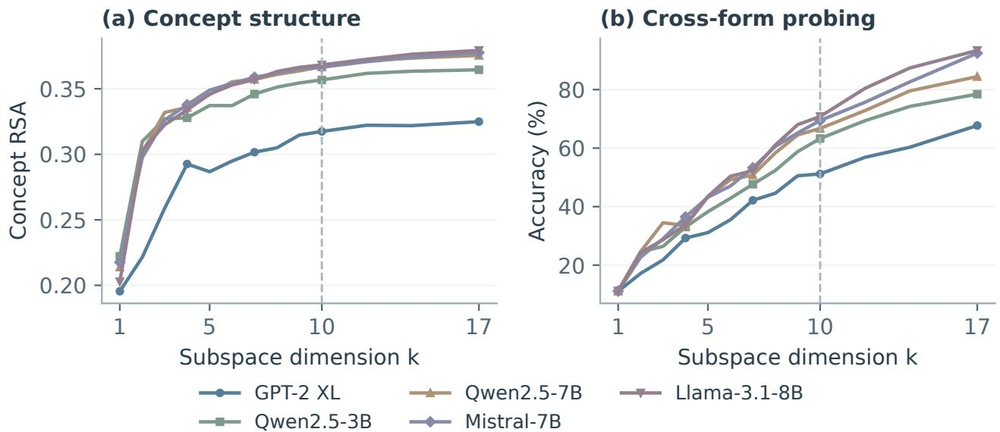  
Figure 4: FARS dimensionality sweep $( k \in \{ 1 , \dots , 1 7 \} )$ . The saved five-model sweeps attain 97.1–97.9% of their k=17 concept RSA at k=10. Each point reports the saved best-layer statistic; selected layers can vary with k.

Table 9: In-distribution vs. out-of-distribution retrieval on Llama-3.1-8B-Instruct. Inside TriForm, 10-d FARS outperforms full 4096-d by +18 to +23 pp; on MBPP-sanitized whose problems lie outside the 18 TriForm concepts, FARS is far below full, the construction is concept-distribution-specific by design
<table><tr><td>Benchmark</td><td>Direction</td><td>Full top-1</td><td>FARS top-1</td><td>∆</td></tr><tr><td>TriForm in-dist. (n=30 pairs, avg.)</td><td>all</td><td>.559</td><td>.738</td><td>+.179</td></tr><tr><td>MBPP-sanitized (n=200)</td><td>prose→code</td><td>.065</td><td>.025</td><td>-.040</td></tr><tr><td>MBPP-sanitized (n=200)</td><td>code→prose</td><td>.150</td><td>.030</td><td>-.120</td></tr></table>

## D.2 Out-of-distribution retrieval (scope limit)

Table 10: FARS (10-dim) vs. Form Control (5-dim).
<table><tr><td></td><td colspan="4">FARS</td><td colspan="2">Control</td></tr><tr><td>Model</td><td>RSA-C</td><td>RSA-F</td><td>Probe</td><td>Boost</td><td></td><td>RSA-F RSA-C</td></tr><tr><td>GPT-2 XL</td><td>.317</td><td>.118</td><td>52.8</td><td>+20.1</td><td>.626</td><td>-.003</td></tr><tr><td>Qwen-3B</td><td>.357</td><td>.056</td><td>64.4</td><td>+11.6</td><td>.634</td><td>-.005</td></tr><tr><td>Qwen-7B</td><td>.367</td><td>.009</td><td>68.0</td><td>+8.2</td><td>.638</td><td>-.010</td></tr><tr><td>Mistral</td><td>.366</td><td>.008</td><td>70.5</td><td>+10.2</td><td>.631</td><td>-.003</td></tr><tr><td>Llama-8B</td><td>.368</td><td>.015</td><td>71.9</td><td>+18.0</td><td>.634</td><td>-.007</td></tr></table>

## E FARS Extraction Baselines

Question and scope. Does the extracted structure exceed construction baselines? Matched readout geometry is evaluated separately; a representation score alone is not evidence of causal suficiency.

## E.1 Proof of Lemma 1

Let $\mu _ { c }$ be the class-conditional mean activation of concept c over a balanced stimulus set, µ¯ the grand mean, $d _ { c } = \mu _ { c } - \bar { \mu } ,$ and n the number of concepts.

Equal spans. $\mu _ { A } - \mu _ { B } = d _ { A } - d _ { B }$ gives span $\{ \mu _ { A } - \mu _ { B } \} \subseteq \mathsf { s p a n } \{ d _ { c } \}$ , and $\begin{array} { r } { d _ { c } = \frac 1 n \sum _ { j } ( \mu _ { c } - \mu _ { j } ) } \end{array}$ gives the reverse inclusion.

Table 11: Concept (C) and form (F) RSA in the 10-dim FARS subspace vs. (i) shufled-centroid PCA, (ii) supervised LDA, (iii) Full PCA. FARS exceeds the shufled null by 17–29σ and matches LDA.
<table><tr><td>Model</td><td>Metric</td><td>FARS</td><td>Shuffled</td><td>LDA</td><td>Full-PCA</td></tr><tr><td rowspan="2">GPT-2 XL</td><td>RSA-C ↑</td><td>.279</td><td>.072 ± .008</td><td>.381</td><td>.091</td></tr><tr><td>RSA-F↓</td><td>.107</td><td>.473</td><td>-.011</td><td>.486</td></tr><tr><td rowspan="2">Qwen-7B</td><td>RSA-C↑</td><td>.357</td><td>.128 ± .008</td><td>.384</td><td>.151</td></tr><tr><td>RSA-F↓</td><td>.020</td><td>.243</td><td>-.012</td><td>.261</td></tr><tr><td rowspan="2">HMistral-7B</td><td>RSA-C↑</td><td>.362</td><td>.149 ± .013</td><td>.380</td><td>.194</td></tr><tr><td>RSA-F↓</td><td>.012</td><td>.259</td><td>-.012</td><td>.275</td></tr></table>

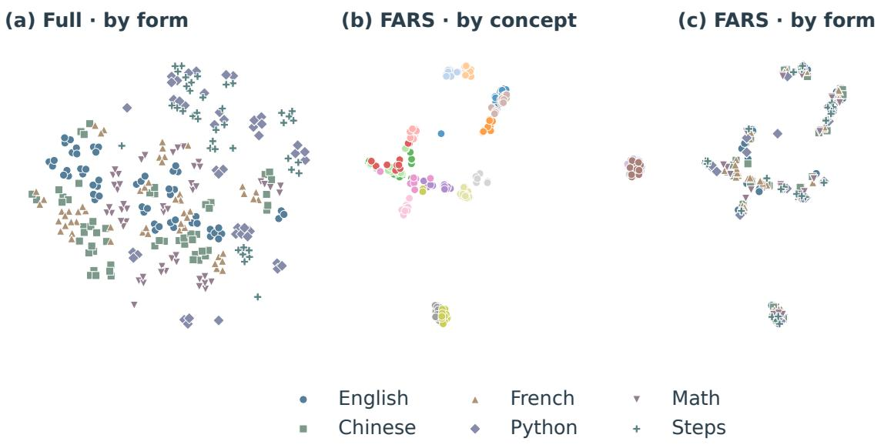  
Figure 5: Full and projected representations of 324 stimuli. Mistral-7B-v0.3, cached layer 11; t-SNE with seed 42, perplexity 30 and 2,000 iterations. (a) Full space, colored and marked by form. (b,c) The same FARS embedding colored by concept (18 colors) or marked by form. Full and FARS spaces are embedded independently; their axes and distances are not directly comparable. This visualization is descriptive, not a test of separability.

Equal top-k subspaces. Equality of spans alone does not fix the principal subspaces, which depend on the second moments. Summing over ordered pairs and using $\textstyle \sum _ { c } d _ { c } = 0$

$$
\sum _ { A \neq B } ( \mu _ { A } - \mu _ { B } ) ( \mu _ { A } - \mu _ { B } ) ^ { \top } = \sum _ { A \neq B } ( d _ { A } - d _ { B } ) ( d _ { A } - d _ { B } ) ^ { \top } = 2 n \sum _ { c } d _ { c } d _ { c } ^ { \top } .
$$

The pairwise-diference scatter is exactly 2n times the concept-centroid scatter. Proportional PSD matrices share eigenvectors, so the two have the same ordered principal subspaces; in particular their top-k subspaces are identical for every k. This is what makes the Dif-of-means and FARS rows of Table 2 agree to numerical precision $( d _ { G } < 1 0 ^ { - 7 }$ on every model), and it is why the verdict transfers to the activation-steering family by construction.

Concept-centroid PCA on per-layer centroids amplifies concept RSA $2 \mathrm { - 3 } \times ( \mathrm { e . g . , 0 . 1 0 0  0 . 3 1 7 }$ for GPT-2 XL) while suppressing form RSA to near zero. Figure 5 provides a two-dimensional illustration of the full and projected spaces; quantitative RSA and controls, rather than the embedding layout, support the representation claim. Two baselines validate the extraction (Table 11): a shufled-centroid null trails FARS by 17–29σ; and multi-class LDA (supervised gold standard) yields concept RSA within 0.02 of FARS, confirming that concept-centroid PCA recovers the same subspace at a fraction of the compute.

## F Methodological Position: FARS vs. CCS, DAS, LEACE, LDA, SAEs

Question and scope. How does this construction relate to other estimators? Methodological comparisons distinguish exact equivalences from empirical similarities.

FARS ≈ LDA on concept centroids. Multi-class LDA with concepts as classes and forms/instances as within-class samples recovers nearly the same subspace as concept-centroid PCA (RSA within 0.02 on every model, Table 11). This empirical agreement does not make centroid PCA mathematically equivalent to LDA, whose solution also depends on within-class covariance; the novelty is the cross-format reasoning setting, the validation pipeline, and the canonicalaxis/compositionality findings the construction enables

vs. CCS / DAS / LEACE / SAE. CCS (Burns et al., 2023) is 1-d unsupervised binary; FARS is 10-d supervised multiclass. DAS (Geiger et al., 2024) learns a rotation against a target causal abstraction; FARS has no target and a closed-form basis. LEACE (Belrose et al., 2023) erases the concept; FARS identifies the subspace containing it (FARS ablation and LEACE use diferent erasure objectives and should not be treated as equivalent). SAEs (Bricken et al., 2023) are large sparse unsupervised dictionaries, complementary: training an 18-atom SAE within FARS on each of the 15 models recovers 10– 13 atoms whose top-activating concept is unique (purity 0.17–0.28 vs. chance 0.056); the pattern replicates across all 4 architecture families.

vs. function vectors, and why we report no number for them. Function vectors (Todd et al., 2024) are the natural object to compare against here: a compact, attention-head-carried representation of which task is being demonstrated, i.e. an execution locus rather than a concept identity, and Nadaf (2026) report that they steer where no logit-lens decoder reads them — which predicts the locus verdict. We built them and ran the test, and we do not report the number, because our construction cannot support the claim. Todd et al. select heads by causal mediation; running per-head interventions across twenty-six models was out of scope, so we substituted a task-selectivity ranking of the same head outputs. That proxy is confounded in exactly the way that matters: the ranking promotes heads that encode the answer token of each task, and a subspace assembled from nothing but the unembedding rows of those answer tokens scores 20.41% readout energy on its own, while the selectivity ranking placed a layer-0 head in its top twenty. A number produced this way would report our ranking heuristic, not function vectors. We therefore leave function vectors to a causal-mediation implementation and confine our claims to the estimators in Table 12.

X-FARS niche. Eq. 2 states a criterion for per-model orthonormal projections and a shared canonical frame across architectures with heterogeneous hidden dimensions $( D _ { m } \in [ 1 6 0 0 , 8 1 9 2 ] )$ , under an orthonormality constraint; the rectangular objective should not be conflated with square orthogonal Procrustes. The canonical frame is a portable artefact via the plug-and-play extension (Table 53).

## 2. Readout geometry and calibration

## G Readout Orthogonality at Matched Depth

Question and scope. Does the readout contrast survive a change of reference depth? A fitted linear translator supplies the depth-matched reference; this is distinct from the weights-only raw test.

Per-model readout orthogonality against $W _ { U }$ . Table 12 gives the body’s per-model values (FARS at its concept-RSA peak layer against the top-10 right singular vectors of $W _ { U } )$

Why a depth-matched control is needed. The body compares a layer-ℓ subspace with the top-k right singular vectors of $W _ { U }$ . Because every layer between ℓ and the unembedding transforms the residual stream, a sceptic can read “far from $W _ { U } { } ^ { , , }$ as “not at the last layer” rather than “not a readout channel”: the structural controls of Table 2 all sit within a few tenths of a percent of the concept estimators, and $d _ { G }$ to $W _ { U }$ falls monotonically with depth (Fig. 10). The control here removes the depth confound in two steps.

Pulling the readout back to layer ℓ. On 29k–59k tokens of generic text per model (WikiText-103, held-out 10%) we fit a ridge translator $\mathbf { h } _ { L } \approx A _ { \ell } \mathbf { h } _ { \ell } + \mathbf { b }$ from the block-ℓ residual stream to the final block’s (held-out $R ^ { 2 } 0 . 2 3  – 0 . 6 3$ , cosine $0 . 5 3 \substack { - 0 . 9 7 }$ ), the linear tuned-lens construction of Belrose et al. (2023). The readout channels at layer ℓ are then the top-k right singular vectors of $W _ { U } \mathrm { d i a g } ( \gamma ) A _ { \ell } \ ( \gamma$ the final-norm gain; mean-removal is included for LayerNorm models). A subspace that later layers rotate into the readout will load on these channels even though it is far from $W _ { U }$ itself.

<table><tr><td>Model</td><td>Family</td><td> $L / L _ { \operatorname* { m a x } }$ </td><td> $d _ { G }$ </td><td> $\theta _ { \mathrm { m i n } }$ </td><td>FARS energy</td></tr><tr><td>Llama-3.1-70B-Inst</td><td>dense</td><td>23/80</td><td>4.86</td><td> $8 5 . 6 ^ { \circ }$ </td><td>0.16%</td></tr><tr><td>OLMo-2-7B-Inst</td><td>dense</td><td>13/32</td><td>4.82</td><td> $8 4 . 2 ^ { \circ }$ </td><td>0.31%</td></tr><tr><td>Falcon3-7B-Inst</td><td>dense</td><td>8/27</td><td>4.82</td><td> $8 4 . 8 ^ { \circ }$ </td><td>0.31%</td></tr><tr><td>Mistral-7B-v0.3</td><td>dense</td><td>11/31</td><td>4.82</td><td> $8 2 . 2 ^ { \circ }$ </td><td>0.36%</td></tr><tr><td>Mistral-7B-Inst</td><td>dense</td><td>10/32</td><td>4.81</td><td> $8 1 . 3 ^ { \circ }$ </td><td>0.40%</td></tr><tr><td>Phi-4</td><td>dense</td><td>12/39</td><td>4.81</td><td> $8 2 . 3 ^ { \circ }$ </td><td>0.40%</td></tr><tr><td>Yi-1.5-9B-Chat</td><td>dense</td><td>14/47</td><td>4.81</td><td> $8 3 . 9 ^ { \circ }$ </td><td>0.35%</td></tr><tr><td>Llama-3.1-8B-Inst</td><td>dense</td><td>8/31</td><td>4.79</td><td> $8 1 . 6 ^ { \circ }$ </td><td>0.49%</td></tr><tr><td>Qwen3-8B</td><td>dense</td><td>10/35</td><td>4.78</td><td> $8 2 . 4 ^ { \circ }$ </td><td>0.51%</td></tr><tr><td>Phi-3.5-mini-Inst</td><td>dense</td><td>18/32</td><td>4.76</td><td> $8 1 . 9 ^ { \circ }$ </td><td>0.57%</td></tr><tr><td>SmolLM3-3B</td><td>dense</td><td>10/35</td><td>4.76</td><td> $8 1 . 5 ^ { \circ }$ </td><td>0.64%</td></tr><tr><td>qwen3-4b</td><td>dense</td><td>10/35</td><td>4.75</td><td> $8 1 . 7 ^ { \circ }$ </td><td>0.63%</td></tr><tr><td>Qwen2.5-7B</td><td>dense</td><td>13/27</td><td>4.74</td><td> $7 6 . 2 ^ { \circ }$ </td><td>0.97%</td></tr><tr><td>Granite-3.3-8B-Inst</td><td>dense</td><td>12/39</td><td>4.73</td><td> $7 5 . 5 ^ { \circ }$ </td><td>1.14%</td></tr><tr><td>Qwen2.5-3B-Inst</td><td>dense</td><td>22/36</td><td>4.72</td><td> $8 0 . 3 ^ { \circ }$ </td><td>0.85%</td></tr><tr><td>GPT-2 XL</td><td>dense</td><td>20/47</td><td>4.67</td><td> $7 6 . 2 ^ { \circ }$ </td><td>1.36%</td></tr><tr><td>gpt-oss-20B</td><td>MoE</td><td>7/23</td><td>4.84</td><td> $8 4 . 3 ^ { \circ }$ </td><td>0.27%</td></tr><tr><td>DeepSeek-V2-Lite</td><td>MoE</td><td>13/27</td><td>4.76</td><td> $8 2 . 0 ^ { \circ }$ </td><td>0.62%</td></tr><tr><td>Mixtral-8x7B-Inst</td><td>MoE</td><td>10/32</td><td>4.76</td><td> $7 4 . 4 ^ { \circ }$ </td><td>1.00%</td></tr><tr><td>Falcon-Mamba-7B</td><td>state-space</td><td>30/64</td><td>4.83</td><td> $8 4 . 2 ^ { \circ }$ </td><td>0.29%</td></tr><tr><td>Mamba-2.8B</td><td>state-space</td><td>35/64</td><td>4.77</td><td> $8 0 . 1 ^ { \circ }$ </td><td>0.65%</td></tr><tr><td>R1-Distill-Qwen-14B</td><td>reasoning</td><td>19/48</td><td>4.84</td><td> $8 5 . 2 ^ { \circ }$ </td><td>0.23%</td></tr><tr><td>QwQ-32B</td><td>reasoning</td><td>19/63</td><td>4.79</td><td> $7 7 . 5 ^ { \circ }$ </td><td>0.67%</td></tr><tr><td> $\mathrm { R 1 - D i s t i l l - L l a m a - } 8 \mathrm { B }$ </td><td>reasoning</td><td>20/32</td><td>4.77</td><td> $7 4 . 4 ^ { \circ }$ </td><td>0.95%</td></tr><tr><td>R1-Distill-Qwen-7B</td><td>reasoning</td><td>13/28</td><td>4.60</td><td> $4 3 . 0 ^ { \circ }$ </td><td>5.78%</td></tr><tr><td>DeBERTa-v3-large</td><td>encoder-MLM</td><td>15/24</td><td>4.74</td><td> $8 0 . 0 ^ { \circ }$ </td><td>0.81%</td></tr></table>

Table 12: FARS versus the top-10 readout channels of $W _ { U }$ , per model, across 26 LLMs (four architecture families plus reasoning-tuned variants). d is the Grassmann geodesic distance (ceiling $\sqrt { 1 0 } \pi / 2 = 4 . 9 7 ) , \theta _ { \mathrm { m i n } }$ the smallest principal angle, and the last column the fraction of FARS energy inside the top-10 readout span. $L / L _ { \operatorname* { m a x } }$ is the FARS layer as a fraction of depth; every model sits in the middle band, which matters because a near-final layer would be readout-adjacent for reasons unrelated to the concept subspace. Distances span 4.60–4.86 and the minimum principal angle exceeds $7 4 ^ { \circ }$ in 25 of 26 models. The single outlier, R1-Distill-Qwen-7B, is the model our chain-of-thought analysis independently flags (§8); its loading falls to the Haar floor once the readout is pulled back to its FARS layer (App. G).

This also answers the final-norm question for the raw test. The primary test of $\ S 5$ uses the right singular vectors of $W _ { U }$ itself, whereas the residual stream is rescaled by the final LayerNorm or RMSNorm before it reaches $W _ { U } .$ , so the raw test’s channels live in the post-norm frame. One could object that the orthogonality we report is an artefact of ignoring that afine step. It is not: the pulled-back test on this page folds in exactly that step — the diagonal gain γ, and mean-removal where the model uses LayerNorm — and returns the same verdict, with the concept subspace at the Haar floor and the same-layer next-token control an order of magnitude above it. Including the normalisation makes the test stricter, not more permissive, and the verdict survives it.

A positive control at the same layer, built the same way. FARS is concept-centroid PCA. We build the identical estimator organised by output identity instead: group the same layer-ℓ token states by the token the model goes on to predict (top-200 predicted tokens, ≥ 20 occurrences each), average within class, and take the top-10 PCA of the class centroids (next-token PCA). It is matched in layer, rank, estimator, and corpus with FARS; only the grouping variable difers. The encoder MLM (DeBERTa-v3) is omitted here because its readout is a masked-token head rather than a next-token unembedding, so the pull-back is not defined in the same way.

Reading. Two things follow. First, the test discriminates function at fixed depth: with layer, rank, estimator, and corpus held constant, grouping by output token yields a readout-adjacent subspace and grouping by concept does not. Second, the pulled-back readout also repairs the one anomaly of the body’s table: R1-Distill-Qwen-7B’s last-input-token FARS loads 5.78% on the raw $W _ { U }$ channels but only 0.69% on the layer-ℓ channels, i.e. its apparent readout-adjacency was a depth

<table><tr><td></td><td></td><td></td><td colspan="3">energy % in top-10 of</td><td colspan="5">energy % in top-10 of  $W _ { U }$  diag(γ)Ae</td></tr><tr><td>Model</td><td> $\ell / L$ </td><td> $R ^ { 2 }$ </td><td>FARS</td><td>NextToke</td><td>Last-PCA</td><td>FARS</td><td>LDA</td><td>FullPCA</td><td>Haar</td><td>NextTok</td></tr><tr><td>Phi-4</td><td>12/39</td><td>0.40</td><td>0.40</td><td>1.19</td><td>4.29</td><td>0.22</td><td>0.25</td><td>0.61</td><td>0.26</td><td>6.88</td></tr><tr><td>Llama-3.1-70B-Inst</td><td>22/79</td><td>0.37</td><td>0.16</td><td>0.72</td><td>1.65</td><td>0.19</td><td>0.19</td><td>0.45</td><td>0.10</td><td>5.72</td></tr><tr><td>Mistral-7B-Inst</td><td>9/31</td><td>0.34</td><td>0.40</td><td>6.57</td><td>4.58</td><td>0.37</td><td>0.29</td><td>1.03</td><td>0.25</td><td>8.09</td></tr><tr><td>Falcon-Mamba-7B</td><td>29/63</td><td>0.50</td><td>0.28</td><td>0.45</td><td>0.31</td><td>0.32</td><td>0.28</td><td>0.61</td><td>0.22</td><td>6.17</td></tr><tr><td>Llama-3.1-8B-Inst</td><td>8/31</td><td>0.44</td><td>0.49</td><td>0.84</td><td>4.51</td><td>0.29</td><td>0.24</td><td>0.52</td><td>0.30</td><td>5.26</td></tr><tr><td>SmolLM3-3B</td><td>10/35</td><td>0.46</td><td>0.64</td><td>1.41</td><td>2.91</td><td>0.52</td><td>0.49</td><td>1.10</td><td>0.43</td><td>9.67</td></tr><tr><td>Mistral-7B</td><td>11/31</td><td>0.37</td><td>0.36</td><td>6.56</td><td>5.78</td><td>0.44</td><td>0.33</td><td>1.05</td><td>0.21</td><td>8.08</td></tr><tr><td>OLMo-2-7B-Inst</td><td>12/31</td><td>0.25</td><td>0.31</td><td>0.91</td><td>4.71</td><td>0.31</td><td>0.29</td><td>0.57</td><td>0.24</td><td>5.37</td></tr><tr><td>R1-Distill-Qwen-14B</td><td>18/47</td><td>0.38</td><td>0.23</td><td>0.60</td><td>0.95</td><td>0.22</td><td>0.24</td><td>0.48</td><td>0.18</td><td>3.77</td></tr><tr><td>Mamba-2.8B</td><td>34/63</td><td>0.58</td><td>0.65</td><td>3.06</td><td>1.95</td><td>0.40</td><td>0.36</td><td>0.62</td><td>0.37</td><td>6.67</td></tr><tr><td>R1-Distill-Llama-8B</td><td>19/31</td><td>0.48</td><td>0.95</td><td>1.74</td><td>1.92</td><td>0.43</td><td>0.23</td><td>0.91</td><td>0.21</td><td>6.58</td></tr><tr><td>Granite-3.3-8B-Inst</td><td>12/39</td><td>0.23</td><td>1.14</td><td>2.79</td><td>2.43</td><td>0.27</td><td>0.26</td><td>0.71</td><td>0.28</td><td>4.05</td></tr><tr><td>QwQ-32B</td><td>19/63</td><td>0.33</td><td>0.67</td><td>2.78</td><td>2.63</td><td>0.41</td><td>0.39</td><td>0.71</td><td>0.21</td><td>5.70</td></tr><tr><td>Qwen2.5-7B</td><td>13/27</td><td>0.46</td><td>0.97</td><td>3.42</td><td>7.66</td><td>0.68</td><td>0.42</td><td>1.49</td><td>0.33</td><td>9.34</td></tr><tr><td>Mixtral-8x7B-Inst</td><td>9/31</td><td>0.37</td><td>1.00</td><td>5.22</td><td>2.61</td><td>0.53</td><td>0.44</td><td>1.01</td><td>0.22</td><td>7.14</td></tr><tr><td>Yi-1.5-9B-Chat</td><td>14/47</td><td>0.43</td><td>0.35</td><td>1.17</td><td>2.85</td><td>0.37</td><td>0.32</td><td>0.58</td><td>0.27</td><td>4.84</td></tr><tr><td>Falcon3-7B-Inst</td><td>8/27</td><td>0.38</td><td>0.31</td><td>0.41</td><td>3.50</td><td>0.65</td><td>0.52</td><td>1.05</td><td>0.26</td><td>6.19</td></tr><tr><td>Qwen3-8B</td><td>10/35</td><td>0.41</td><td>0.51</td><td>0.88</td><td>2.58</td><td>0.42</td><td>0.40</td><td>0.59</td><td>0.24</td><td>3.96</td></tr><tr><td>R1-Distill-Qwen-7B</td><td>12/27</td><td>0.47</td><td>5.78</td><td>6.22</td><td>2.10</td><td>0.69</td><td>0.68</td><td>0.96</td><td>0.33</td><td>6.21</td></tr><tr><td>qwen3-4b</td><td>10/35</td><td>0.41</td><td>0.63</td><td>1.08</td><td>2.36</td><td>0.70</td><td>0.56</td><td>0.94</td><td>0.33</td><td>6.05</td></tr><tr><td>Phi-3.5-mini-Inst</td><td>17/31</td><td>0.61</td><td>0.57</td><td>2.38</td><td>6.35</td><td>0.49</td><td>0.33</td><td>0.87</td><td>0.29</td><td>3.88</td></tr><tr><td>Qwen2.5-3B-Inst</td><td>21/35</td><td>0.43</td><td>0.81</td><td>1.41</td><td>1.74</td><td>0.73</td><td>0.63</td><td>1.31</td><td>0.59</td><td>5.82</td></tr><tr><td>gpt-oss-20B</td><td>7/23</td><td>0.44</td><td>0.27</td><td>0.32</td><td>5.44</td><td>0.38</td><td>0.54</td><td>0.62</td><td>0.33</td><td>2.86</td></tr><tr><td>GPT-2 XL</td><td>20/47</td><td>0.63</td><td>1.36</td><td>5.27</td><td>5.85</td><td>0.65</td><td>0.65</td><td>0.90</td><td>0.60</td><td>4.20</td></tr><tr><td>DeepSeek-V2-Lite</td><td>12/26</td><td>0.43</td><td>0.62</td><td>1.17</td><td>5.71</td><td>0.76</td><td>0.51</td><td>1.13</td><td>0.55</td><td>4.60</td></tr></table>

Table 13: Readout loading at matched depth across 25 models. Left block: the body’s test (readout = top-10 right singular vectors of $W _ { U } )$ . Right block: the same subspaces against the readout channels pulled back to the FARS layer ℓ. Under the pulled-back readout the concept estimators stay at the Haar floor (FARS 0.46% vs. random 0.30%; the Haar expectation is $k / D )$ , whereas the same-layer, same-estimator next-token control loads 5.88% — 12.9× FARS — and exceeds all four published estimators in 25/25 models. $R ^ { \bar { 2 } }$ is the held-out fit of the translator.

artefact of comparing against $W _ { U }$ directly. FARS’s residual enrichment over the Haar floor under the raw test (0.79% vs.   
$k / D )$ likewise shrinks to 0.46% once depth is matched.

## H Readout-Rank Sensitivity

Question and scope. How sensitive is the result to readout rank? The reported comparisons cover the stated sampled ranks, not every possible decoder. At full ambient rank, energy is one for any normalized basis.

Is the concept subspace read out at any rank? Fixing $k = 1 0$ invites the objection that concept identity might be projected through lower-variance singular directions of $W _ { U } - \mathrm { s a y }$ directions 50–200 — which a top-10 comparison would not see. We examine this by computing the full right-singular basis V of $W _ { U }$ and, for every rank k, the fraction of a subspace’s energy inside span $( V _ { : , 1 : k } )$ ,

$$
\begin{array} { r } { E _ { S } ( k ) \ = \ \frac { 1 } { m } \sum _ { i = 1 } ^ { m } \big \| V _ { : , 1 : k } ^ { \top } s _ { i } \big \| ^ { 2 } , \qquad S = \{ s _ { 1 } , \ldots , s _ { m } \} \ \mathrm { o r t h o n o r m a l } . } \end{array}
$$

For a Haar-random rank-m subspace $\mathbb { E } [ E _ { S } ( k ) ] = k / D$ exactly, so $E _ { S } ( k ) / ( k / D )$ is an enrichment over chance with a known null of 1. We report FARS against the final-layer PCA (the actual readout pathway) and a Haar control.

The reported results show separation at the reported ranks, with exceptions. Final-layer PCA is more enriched than FARS in 25/26 models at k = 10 and $k = 3 2$ , and in $2 4 / 2 6$ at k = 100. R1-Distill-Qwen-7B reverses the comparison at all three ranks; Mamba-2.8B also reverses it at k = 100 (1.05 versus 0.90, both near the null). The results do not establish zero readout information at any rank. At $k = D$ , both energy and enrichment equal 1 for every subspace, so a separation cannot hold across the entire spectrum. The reported table measures concentration at three ranks, with the Haar expectation providing the reference scale; the comparison is limited to these reported ranks.

## I Published Concept Directions Under the Test

Question and scope. How do externally motivated directions behave under the diagnostic? Readout comparisons depend on separability and layer matching; excluded and missing-AUC cases must remain visible.

## Readout loading across estimators

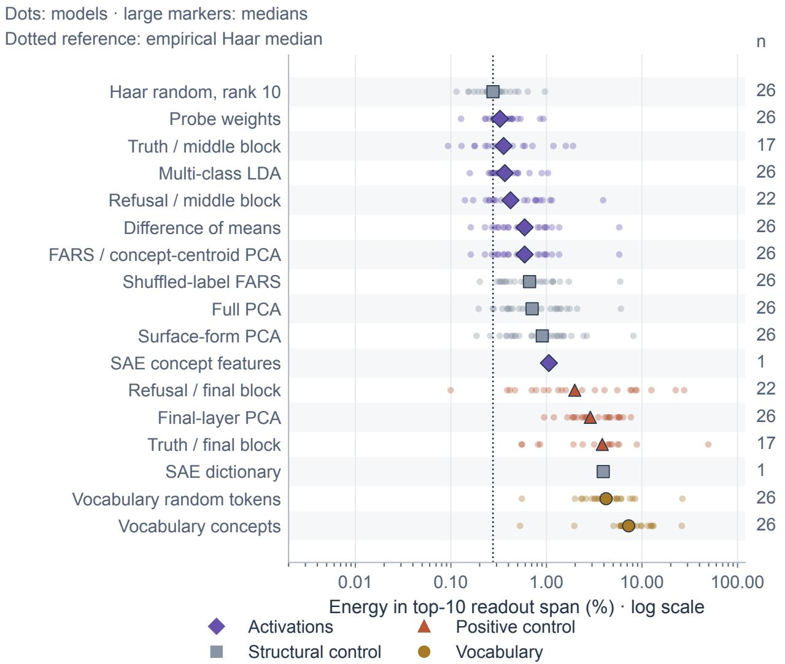  
Figure 6: Readout loading across subspace constructions. Each small dot is one model and the larger role-specific marker is the median. The statistic is energy in the top-10 right singular span of $W _ { U }$ , on a logarithmic axis; the dotted reference is the median empirical Haar control. Sample sizes appear at right. Symbols distinguish activation-derived estimators, structural controls, positive controls, and vocabulary-derived constructions. Pulled-back readout results use a diferent reference and appear separately in App. G. Published directions use the same paired cohorts as Fig. 8: any available AUC below 0.9 excludes a pair; missing final-block AUCs remain flagged there. The pooled Haar median is a visual reference, not a model-specific significance threshold.

Setup. The body’s verdict covers subspaces we extract. To test directions the literature actually publishes, we rebuild two of them on each model, at the same block as FARS and from the last input token: the refusal direction of Arditi et al. (2024) (mean of 200 AdvBench harmful instructions minus mean of as many Alpaca harmless ones, chat-templated) and the truth direction of Marks and Tegmark (2024) (mean of true minus mean of false city–country statements). Each is a unit vector; we report its energy $\| { \cal R } { \bf \bar { v } } \| ^ { 2 }$ in the top-10 span of $W _ { U }$ and in the readout channels pulled back to the block (App. G), whose Haar expectation is $k / D$ . A held-out AUC of the one-dimensional projection checks that the direction does separate its classes; entries with $\mathrm { { A U C } < 0 . 9 }$ are parenthesised and excluded from the summary. The same directions built at thefinal block (last two columns) show what a readout-adjacent version of each looks like.

Reading. Two published, behaviourally validated directions — one safety-relevant, one truthfulness-relevant — receive the same verdict as the reasoning-concept estimators: low linear readout loading, in 16/22 (refusal) and 19/20 (truth)

<table><tr><td rowspan="2">Model</td><td rowspan="2">D</td><td colspan="3">enrichment E(k)/(k/D), FARS / final-layer</td><td rowspan="2">Haar k=10</td></tr><tr><td>k=10</td><td>k=32</td><td>k=100</td></tr><tr><td>DeBERTa-v3-large</td><td>1024</td><td>0.83 / 1.2</td><td>0.92 / 1.1</td><td>0.93 / 1.1</td><td>1.03</td></tr><tr><td>DeepSeek-V2-Lite</td><td>2048</td><td>1.26 / 11.7</td><td>1.12 / 6.3</td><td>1.06 / 3.2</td><td>1.00</td></tr><tr><td>Falcon-Mamba-7B</td><td>4096</td><td>1.17 / 16.8</td><td>1.36 / 6.8</td><td>1.23 / 3.4</td><td>1.01</td></tr><tr><td>Falcon3-7B-Inst</td><td>3072</td><td>0.96 / 10.7</td><td>0.95 / 5.8</td><td>1.00 / 2.9</td><td>0.98</td></tr><tr><td>gpt-oss-20B</td><td>2880</td><td>0.77 / 15.7</td><td>0.88 / 10.3</td><td>0.83 / 5.4</td><td>1.00</td></tr><tr><td>GPT-2 XL</td><td>1600</td><td>2.18 / 9.4</td><td>1.61 / 5.4</td><td>1.26 / 2.8</td><td>1.01</td></tr><tr><td>Granite-3.3-8B-Inst</td><td>4096</td><td>4.68 / 9.9</td><td>2.44 / 7.0</td><td>1.57 / 4.4</td><td>0.98</td></tr><tr><td>Llama-3.1-70B-Inst</td><td>8192</td><td>1.32 / 13.6</td><td>1.18 / 7.9</td><td>1.04 / 3.7</td><td>1.02</td></tr><tr><td>Llama-3.1-8B-Inst</td><td>4096</td><td>2.01 / 18.5</td><td>1.58 / 11.9</td><td>1.34 / 5.0</td><td>1.02</td></tr><tr><td>Mamba-2.8B</td><td>2560</td><td>1.66 / 5.0</td><td>1.34 / 2.3</td><td>1.05 / 0.9</td><td>1.00</td></tr><tr><td>Mistral-7B-Inst</td><td>4096</td><td>1.64 / 18.7</td><td>1.31 / 9.3</td><td>1.13 / 4.8</td><td>1.01</td></tr><tr><td>Mistral-7B</td><td>4096</td><td>1.49 / 23.7</td><td>1.22 / 12.1</td><td>1.11 / 6.1</td><td>1.01</td></tr><tr><td>Mixtral-8x7B-Inst</td><td>4096</td><td>4.10 / 10.7</td><td>2.47 / 7.5</td><td>1.82 / 3.5</td><td>0.99</td></tr><tr><td>OLMo-2-7B-Inst</td><td>4096</td><td>1.26 / 19.3</td><td>1.25 / 9.9</td><td>1.25 / 4.7</td><td>0.98</td></tr><tr><td>Phi-3.5-mini-Inst</td><td>3072</td><td>1.74 / 19.5</td><td>1.90 / 9.8</td><td>1.40 / 4.6</td><td>1.05</td></tr><tr><td>Phi-4</td><td>5120</td><td>2.04 / 21.9</td><td>1.55 / 15.7</td><td>1.15 / 8.2</td><td>1.02</td></tr><tr><td>Qwen2.5-3B-Inst</td><td>2048</td><td>1.67 / 3.6</td><td>1.45 / 2.4</td><td>1.29 / 1.7</td><td>1.03</td></tr><tr><td>Qwen2.5-7B</td><td>3584</td><td>3.48 / 27.4</td><td>2.09 / 10.4</td><td>1.53 / 3.9</td><td>0.99</td></tr><tr><td>Qwen3-4B</td><td>2560</td><td>1.62 / 6.0</td><td>1.33 / 4.1</td><td>1.13 / 2.7</td><td>0.97</td></tr><tr><td>Qwen3-8B</td><td>4096</td><td>2.08 / 10.6</td><td>1.71 / 9.5</td><td>1.35 / 5.1</td><td>1.00</td></tr><tr><td>QwQ-32B</td><td>5120</td><td>3.41 / 13.5</td><td>2.05 / 6.8</td><td>1.41 / 2.9</td><td>1.00</td></tr><tr><td>R1-Distill-Llama-8B</td><td>4096</td><td>3.89 / 7.9</td><td>2.44 / 6.1</td><td>2.00 / 2.8</td><td>1.01</td></tr><tr><td>R1-Distill-Qwen-14B</td><td>5120</td><td>1.16 / 4.8</td><td>1.37 / 3.7</td><td>1.20 / 2.0</td><td>0.98</td></tr><tr><td>R1-Distill-Qwen-7B</td><td>3584</td><td>20.73 / 7.5</td><td>7.46 / 3.5</td><td>3.08 / 1.5</td><td>1.00</td></tr><tr><td>SmolLM3-3B</td><td>2048</td><td>1.31 / 6.0</td><td>1.24 / 4.5</td><td>1.29 / 2.4</td><td>1.02</td></tr><tr><td>Yi-1.5-9B-Chat</td><td>4096</td><td>1.44 / 11.7</td><td></td><td></td><td></td></tr><tr><td></td><td></td><td></td><td>1.12 / 8.3</td><td>1.03 / 4.8</td><td>0.99</td></tr></table>

Table 14: Readout enrichment at three ranks for the concept subspace (FARS) and the readout pathway (top-10 PCA of the final layer), across 26 models. The Haar column is the null check: a random rank-10 subspace has expected enrichment 1.00; the sampled control are close (max deviation 0.046). Enrichment generally approaches the Haar expectation as rank grows; the magnitude and ordering vary across models. The same tabulated comparisons are visualized in Fig. 7.

models under the pulled-back readout (criterion: energy $< 3 k / D )$ . Their final-block counterparts are readout-adjacent in 17/22 and 17/20, so the test is not returning a constant for diference-of-means directions either.

This is the cleanest available demonstration that the test discriminates, because the paired comparison holds everything fixed except depth: same estimator, same concept, same model, same stimuli (Fig. 8). Readout energy rises from the FARS block to the final block in 19/22 models for refusal (median 5.3×, sign test $p = 0 . 0 0 0 9 )$ and 16/17 for truth (median $8 . 2 { \times } , p = 0 . 0 0 0 3 )$ . Final-block AUC is available for $1 9 / 2 2$ models. Refusal AUC remains at least 0.98 throughout that subset. Four truth directions fall below 0.9: DeepSeek-V2-Lite (0.8988), GPT-2 XL (0.6828), Qwen2.5-7B (0.8692), and R1-Distill-Qwen-7B (0.5948). The last also fails at the FARS block, as does Phi-4, whose final-block AUC is unavailable. Filtering on all available AUC values leaves the 22 refusal and 17 truth pairs shown, including respectively three and two pairs without final-block AUC; these missing checks limit the classifier-quality control. A direction is not readout-aligned or not by virtue of which concept it encodes; it is readout-aligned to the extent that it is read of the stream where the stream is about to be decoded. The test therefore transfers, without modification, to the directions steering and safety work actually manipulate.

## I.1 A vocabulary-defined construction, which the test flags as readout

A readout-side construction from the same literature. The estimators of Table 2 are all built from activations, and all land on the locus side. A diagnostic whose verdict never changes across the constructions people use is hard to act on, so we add the other kind of “concept direction” the literature also writes down — one defined in the model’s vocabulary. For concept c we take the tokens diagnostic of its stimuli (tf-idf over c’s six surface forms against the other concepts, top 40), average the corresponding rows of $W _ { U }$ , and take the top-k PCA of the 18 resulting centroids. This is the construction behind token-anchored steering and logit-attribution readings of “the direction of $c ^ { \mathfrak { P } } .$ . It needs no forward pass: it is a function of $W _ { U }$ and the tokenizer alone.

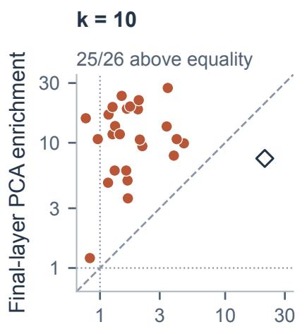

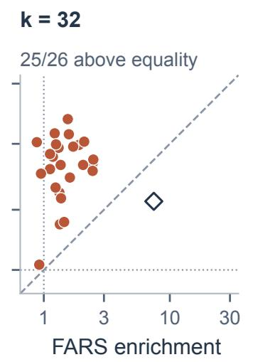

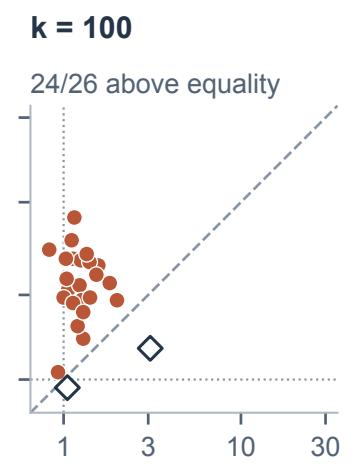  
Both axes: E(k) / (k/D), log scale · dotted: Haar = 1 Table values only · diamonds: reversed comparisons

Figure 7: Paired readout enrichment at three reported ranks. Each point is one of 26 models, plotted from the rounded values in Table 14. Both axes use the same logarithmic scale. The dashed diagonal marks equal enrichment; dotted lines mark the Haar expectation of 1. Diamonds identify models where final-layer PCA is below FARS: R1-Distill-Qwen-7B at all three ranks, and Mamba-2.8B additionally at $k = 1 0 0$ . No error bars or full-spectrum trajectories are inferred from these table values.
<table><tr><td></td><td colspan="3">AUC</td><td>Haar</td><td colspan="2">VS.  $W _ { U }$ </td><td colspan="3">VS.  $W _ { U } \to \ell$ </td><td colspan="2">final block, vs.  $W _ { U }$ </td></tr><tr><td>Model</td><td>l</td><td>ref.</td><td>truth</td><td> $k / D$ </td><td>refusal</td><td>truth</td><td>refusal</td><td>truth</td><td>NextTok1</td><td>refusal</td><td>truth</td></tr><tr><td>DeepSeek-V2-Lite</td><td>13</td><td>1.00</td><td>1.00</td><td>0.49</td><td>0.59</td><td>1.42</td><td>1.04</td><td>1.01</td><td>1.48</td><td>7.55</td><td>8.37</td></tr><tr><td>Falcon-Mamba-7B</td><td>29</td><td>1.00</td><td>1.00</td><td>0.24</td><td>0.40</td><td>0.36</td><td>2.12</td><td>0.11</td><td>2.81</td><td>1.06</td><td>5.77</td></tr><tr><td>Falcon3-7B-Inst</td><td>8</td><td>1.00</td><td>1.00</td><td>0.33</td><td>0.41</td><td>0.59</td><td>1.06</td><td>0.18</td><td>0.02</td><td>1.33</td><td>5.54</td></tr><tr><td>gpt-oss-20B</td><td>7</td><td>1.00</td><td>1.00</td><td>0.35</td><td>0.29</td><td>0.24</td><td>0.51</td><td>0.15</td><td>2.61</td><td>4.05</td><td>3.84</td></tr><tr><td>GPT-2 XL</td><td>20</td><td>1.00</td><td>1.00</td><td>0.62</td><td>3.92</td><td>0.33</td><td>4.28</td><td>0.28</td><td>0.30</td><td>7.86</td><td>1.44</td></tr><tr><td>Granite-3.3-8B-Inst</td><td>12</td><td>1.00</td><td>1.00</td><td>0.24</td><td>0.43</td><td>1.90</td><td>0.19</td><td>0.16</td><td>0.05</td><td>0.41</td><td>0.82</td></tr><tr><td>Llama-3.1-8B-Inst</td><td>8</td><td>1.00</td><td>1.00</td><td>0.24</td><td>0.27</td><td>1.18</td><td>0.30</td><td>0.22</td><td>4.80</td><td>3.22</td><td>4.86</td></tr><tr><td>Mamba-2.8B</td><td>34</td><td>1.00</td><td>1.00</td><td>0.39</td><td>1.10</td><td>0.36</td><td>1.13</td><td>0.20</td><td>6.45</td><td>12.57</td><td>8.82</td></tr><tr><td>Mistral-7B-Inst</td><td>9</td><td>1.00</td><td>1.00</td><td>0.24</td><td>0.77</td><td>0.18</td><td>0.42</td><td>0.14</td><td>0.01</td><td>0.78</td><td>3.16</td></tr><tr><td>Mistral-7B</td><td>11</td><td>1.00</td><td>1.00</td><td>0.24</td><td>0.85</td><td>0.13</td><td>2.73</td><td>0.12</td><td>0.01</td><td>22.54</td><td>2.40</td></tr><tr><td>OLMo-2-7B-Inst</td><td>12</td><td>1.00</td><td>1.00</td><td>0.24</td><td>0.17</td><td>0.09</td><td>0.47</td><td>0.10</td><td>5.05</td><td>0.94</td><td>4.50</td></tr><tr><td>Phi-3.5-mini-Inst</td><td>17</td><td>1.00</td><td>1.00</td><td>0.33</td><td>0.25</td><td>0.30</td><td>0.22</td><td>0.11</td><td>7.28</td><td>27.65</td><td>49.43</td></tr><tr><td>Phi-4</td><td>12</td><td>1.00</td><td>0.50</td><td>0.20</td><td>0.28</td><td>(0.76)†</td><td>0.20</td><td>(0.12)†</td><td>0.04</td><td>1.45</td><td>(1.92)†</td></tr><tr><td>Qwen2.5-3B-Inst</td><td>21</td><td>1.00</td><td>1.00</td><td>0.49</td><td>1.14</td><td>0.71</td><td>0.24</td><td>0.52</td><td>8.22</td><td>1.60</td><td>4.35</td></tr><tr><td>Qwen2.5-7B</td><td>13</td><td>0.99</td><td>1.00</td><td>0.28</td><td>0.34</td><td>0.88</td><td>0.58</td><td>0.29</td><td>0.03</td><td>5.52</td><td>22.47</td></tr><tr><td>Qwen3-4B</td><td></td><td>10 1.00</td><td>0.98</td><td>0.39</td><td>0.91</td><td>0.27</td><td>0.40</td><td>0.40</td><td>6.45</td><td>0.70</td><td>1.92</td></tr><tr><td>Qwen3-8B</td><td>10</td><td>1.00</td><td>0.99</td><td>0.24</td><td>0.23</td><td>0.23</td><td>0.23</td><td>0.20</td><td>3.98</td><td>0.47</td><td>0.86</td></tr><tr><td>R1-Distill-Llama-8B</td><td>19</td><td>1.00</td><td>1.00</td><td>0.24</td><td>0.79</td><td>1.60</td><td>0.16</td><td>0.75</td><td>7.66</td><td>8.53</td><td>3.77</td></tr><tr><td>r1-distill-qwen-14b</td><td>19</td><td>1.00</td><td>1.00</td><td>0.20</td><td>0.25</td><td>0.18</td><td>0.64</td><td>0.19</td><td>1.17</td><td>0.39</td><td>0.56</td></tr><tr><td>R1-Distill-Qwen-7B</td><td>12</td><td>1.00</td><td>0.52</td><td>0.28</td><td>0.76</td><td>(27.52)†</td><td>1.22</td><td>(0.28)†</td><td>0.06</td><td>8.81</td><td>(14.18)†</td></tr><tr><td>SmolLM3-3B</td><td></td><td>10 1.00</td><td>1.00</td><td>0.49</td><td>0.64</td><td>0.57</td><td>0.38</td><td>0.44</td><td>12.13</td><td>0.10</td><td>4.67</td></tr><tr><td>Yi-1.5-9B-Chat</td><td></td><td>14 1.00</td><td>1.00</td><td>0.24</td><td>0.14</td><td>0.44</td><td>0.17</td><td>0.18</td><td>13.36</td><td>2.36</td><td>0.55</td></tr></table>

Table 15: Published concept directions under the readout test (22 models; energies in %). At the FARS block both the refusal and the truth direction sit at the Haar floor against $W _ { U }$ (medians 0.42% and 0.36%, k/D ≈ 0.26%) and against the pulled-back readout (0.44% and 0.20%), while the first next-token direction at the same block loads 2.71%. The same two directions built at the final block load 1.98% and 4.09% (medians): the middle-layer construction has low linear readout loading and becomes readout-adjacent only where the residual stream is about to be decoded. $^ { \dag } \mathrm { A U C } < 0 . 9$

Reading. The split the test reports is not between our estimators and other people’s. It is between where the direction is defined: a concept direction read of the activations has low readout loading, while the vocabulary-derived construction has greater loading. Both are called “the direction of concept $c ^ { \prime }$ in published work, and an ablation of either will disturb the task; only the second is disturbed because it is the channel the unembedding reads, which is the inference the test exists to block.

## Published directions gain readout loading

Dark line: median · band: Haar range Dashed pairs: final-block AUC unavailable

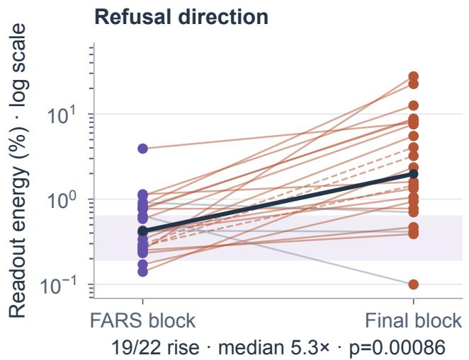

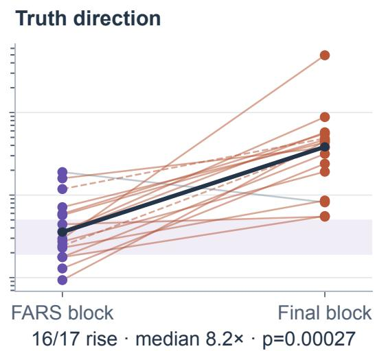  
Figure 8: The same published direction changes verdict with extraction depth. Each line is one model: the energy its refusal (left) or truth (right) direction carries in the top-10 span of $W _ { U }$ , read of the FARS block versus the final block. Estimator, concept, stimuli and model are identical along each line; only the depth changes. Band: the range of per-model Haar expectations $k / D ;$ dark line: population median. Grey lines fall. Directions with available held-out $\mathrm { { A U C } < 0 . 9 }$ at either block are omitted. Dashed pairs lack a final-block AUC (three refusal, two truth) and are retained with this qualification.

Two qualifications keep this honest. First, most of the efect comes from the anchoring rather than from the concept selection: the random-token control, which repeats the construction with arbitrary tokens, reaches 5.20% against $8 . 4 3 \%$ for concept-diagnostic tokens and exceeds it outright in 4 of 26 models. What makes these directions readout-adjacent is that they are assembled from rows of $W _ { U }$ at all, not which rows. Second, the efect size varies widely $( 1 . 7 { \times } \mathrm { - } 7 7 . 3 { \times } )$ . The narrowest ratio is R1-Distill-Qwen-7B, where it is the numerator’s denominator that is unusual — that model’s FARS is the one already flagged in Table 12. More informative is Falcon-Mamba-7B, whose vocabulary-anchored subspace sits at 0.53% against a Haar floor of 0.24%: there the construction is not readout-adjacent and the test says so. The verdict is a per-model measurement, not a law.

## I.2 Sparse-autoencoder feature directions

Setup. Sparse autoencoders (Bricken et al., 2023; Templeton et al., 2024) are the estimator the field now reaches for first, so the test has to say something about them. We build the SAE analogue of FARS on the same stimuli, at the SAE’s own layer: encode the cached layer-19 residual states with the pretrained residual-stream SAE of Goodfire/Llama-3.1-8B-Instruct-SAE-l19 (65,536 features), score every feature by how selectively it fires on each concept (mean activation on c minus mean on the rest, in pooled s.d. units), take each concept’s top-16 features, sum their decoder directions weighted by selectivity, and take the top-10 PCA of the 18 concept directions. The recipe is conceptcentroid PCA with the representation swapped for SAE feature space. Our encoding reproduces the released sparsity (mean $L _ { 0 } = 9 8$ against the model card’s 91; fraction of variance unexplained 0.59 on this out-of-distribution stimulus set), so the comparison is against a correctly instantiated SAE rather than an assumed one.

Reading. The verdict on SAE concept features is the same as on concept-centroid PCA, LDA, diference-of-means and probe weights: low linear readout loading. The two subspaces are related but not identical (mutual energy overlap 26%), so this is a genuine second estimator agreeing, not a restatement of FARS. Scope: one model. Of the 26 models in Table 12 this is the only one with a published residual-stream SAE we could match exactly in both checkpoint and layer, and we do not generalise beyond it.

<table><tr><td rowspan="2">Model</td><td rowspan="2">D</td><td rowspan="2">Haar</td><td colspan="3">energy % in top-10 readout span</td><td rowspan="2">ratio</td></tr><tr><td>k/D</td><td>FARS random-token</td><td>vocabulary-anchored</td></tr><tr><td></td><td>8192</td><td>0.12</td><td>0.16</td><td>2.37</td><td>12.47</td><td>77.3×</td></tr><tr><td>Llama-3.1-70B-Inst SmolLM3-3B</td><td>2048</td><td>0.49</td><td>0.64</td><td>26.49</td><td>26.11</td><td>40.7×</td></tr><tr><td>R1-Distill-Qwen-14B</td><td>5120</td><td>0.20</td><td>0.23</td><td>1.99</td><td>6.12</td><td>27.0×</td></tr><tr><td>Llama-3.1-8B-Inst</td><td>4096</td><td>0.24</td><td>0.49</td><td>4.27</td><td>12.94</td><td>26.4×</td></tr><tr><td>gpt-oss-20B</td><td>2880</td><td>0.35</td><td>0.27</td><td>5.99</td><td>6.95</td><td>25.9×</td></tr><tr><td>ÖLMo-2-7B-Inst</td><td>4096</td><td>0.24</td><td>0.31</td><td>4.60</td><td>6.47</td><td>21.0×</td></tr><tr><td>Phi-4</td><td>5120</td><td>0.20</td><td>0.40</td><td>3.82</td><td>8.17</td><td>20.5×</td></tr><tr><td>Mistral-7B</td><td>4096</td><td>0.24</td><td>0.36</td><td>5.45</td><td>7.04</td><td>19.3×</td></tr><tr><td>Mistral-7B-Inst</td><td>4096</td><td>0.24</td><td>0.40</td><td>5.42</td><td>7.03</td><td>17.6×</td></tr><tr><td>Phi-3.5-mini-Inst</td><td>3072</td><td>0.33</td><td>0.57</td><td>8.01</td><td>9.70</td><td>17.2×</td></tr><tr><td>Yi-1.5-9B-Chat</td><td>4096</td><td>0.24</td><td>0.35</td><td>2.61</td><td>6.03</td><td>17.1×</td></tr><tr><td>Qwen3-8B</td><td>4096</td><td>0.24</td><td>0.51</td><td>2.32</td><td>7.91</td><td>15.6×</td></tr><tr><td>R1-Distill-Llama-8B</td><td>4096</td><td>0.24</td><td>0.95</td><td>4.33</td><td>13.20</td><td>13.9×</td></tr><tr><td>QwQ-32B</td><td>5120</td><td>0.20</td><td>0.67</td><td>3.22</td><td>8.83</td><td>13.3×</td></tr><tr><td>Qwen2.5-7B</td><td>3584</td><td>0.28</td><td>0.97</td><td>6.08</td><td>12.32</td><td>12.7×</td></tr><tr><td>Qwen3-4B</td><td>2560</td><td>0.39</td><td>0.63</td><td>2.98</td><td>6.12</td><td>9.7×</td></tr><tr><td>Mamba-2.8B</td><td>2560</td><td>0.39</td><td>0.65</td><td>5.14</td><td>6.08</td><td>9.4×</td></tr><tr><td>DeBERTa-v3-large</td><td>1024</td><td>0.98</td><td>0.81</td><td>7.50</td><td>7.47</td><td>9.2×</td></tr><tr><td>Qwen2.5-3B-Inst</td><td>2048</td><td>0.49</td><td>0.85</td><td>3.43</td><td>7.57</td><td>8.9×</td></tr><tr><td>GPT-2 XL</td><td>1600</td><td>0.62</td><td>1.36</td><td>8.49</td><td>11.51</td><td>8.5×</td></tr><tr><td>DeepSeek-V2-Lite</td><td>2048</td><td>0.49</td><td>0.62</td><td>4.15</td><td>5.04</td><td>8.2×</td></tr><tr><td>Falcon3-7B-Inst</td><td>3072</td><td>0.33</td><td>0.31</td><td>3.18</td><td>1.96</td><td>6.3×</td></tr><tr><td>Mixtral-8x7B-Inst</td><td>4096</td><td>0.24</td><td>1.00</td><td>3.71</td><td>6.00</td><td>6.0×</td></tr><tr><td>Granite-3.3-8B-Inst</td><td>4096</td><td>0.24</td><td>1.14</td><td>3.51</td><td>5.75</td><td>5.0×</td></tr><tr><td>Falcon-Mamba-7B</td><td>4096</td><td>0.24</td><td>0.29</td><td>0.55</td><td>0.53</td><td>1.9×</td></tr><tr><td>R1-Distill-Qwen-7B</td><td>3584</td><td>0.28</td><td>5.78</td><td>5.56</td><td>9.95</td><td>1.7×</td></tr></table>

Table 16: Vocabulary-anchored concept directions against the readout basis, 26 models. The construction lies in the row space of $W _ { U }$ by design, so some loading is guaranteed; the honest baseline is therefore the random-token column, which repeats the identical construction with random token sets of the same size (20 draws). Concept-diagnostic tokens load 8.43% on average against 5.20% for random tokens and 0.80% for FARS at its own layer — a 16.9× separation from FARS, in the same direction in 26/26 models, with per-model ratios spanning 1.7×–77.3×. The two subspaces are not the same object: their mutual energy overlap is 0.56%.

<table><tr><td>Rank-10 subspace</td><td> $d _ { G }$ </td><td>energy  $\%$ </td><td> $\theta _ { \mathrm { m i n } }$ </td></tr><tr><td>SAE dictionary (top-10 PCA of live decoder directions)</td><td>4.590</td><td>3.93</td><td>56.3</td></tr><tr><td>SAE concept features (selectivity-weighted, rank 10)</td><td>4.748</td><td>1.06</td><td>73.8</td></tr><tr><td>FARS at the same layer</td><td>4.759</td><td>0.96</td><td>75.1</td></tr><tr><td>SAE random features (control)</td><td>4.749</td><td>0.88</td><td>76.5</td></tr><tr><td>Haar expectation  $k / D$ </td><td></td><td>0.24</td><td></td></tr></table>

Table 17: SAE feature directions against the top-10 readout channels of $W _ { U }$ on Llama-3.1-8B-Inst. The SAE’s concept-selective features have low linear readout loading at $1 . 0 6 \% ,$ indistinguishable from FARS at the same layer (0.96%) and from randomly chosen features (0.88%). The dictionary as a whole is diferent: the top-10 PCA of all live decoder directions sits at 3.93%, roughly 4× its own concept features — a dictionary trained to reconstruct the residual stream inherits whatever the readout writes into it, while the features that carry concept identity do not.

## J Layer-wise Localization of Concept Structure

Question and scope. Where is concept structure most recoverable? Peak-layer selection favors peak retrieval by construction; these curves do not independently establish a computation site.

Three independent analyses converge on middle layers as the site of format-agnostic representation before the body-level mechanistic tests are applied (Table 18, Figure 9): concept RSA peaks in middle layers and strengthens with scale $( \rho _ { \mathrm { m a x } } \mathrm { : }$ 0.100 → 0.200; FDR-corrected); a ridge probe trained on English representations identifies the same concept in code or math at 60.3% for Mistral-7B (chance 5.6%), jumping between GPT-2 XL (32.7%) and Qwen2.5-3B (52.8%); and formatagnostic neurons peak at 20–23% in middle layers, with format-specific neurons dominating early (tokenisation) and late (generation) layers.

The prose-code boundary. Full-activation patching across form pairs reveals a sharp asymmetry: EN→Math top-10 overlap (0.65–0.73) is 3–4× higher than EN→Code (0.16–0.22) across five tested models, with every 95% bootstrap CI above 2.4×. Two controls localise the cause: tokeniser Jaccard is near-zero-predictive (r=0.03, n.s.), and a declarative-Python control isolates the procedural-vs-declarative surface as accounting for ∼ 11% of the gap. Full details and permodel numbers in App. Q.2.

Table 18: Localization of format-agnostic computation. RSA-C/F: peak concept/form RSA; Probe-W: within-form probe ceiling; Probe-X: cross-form probe (chance 5.6%); X/W: cross-/within-form ratio. Cross-form probing recovers 34–61% of the ceiling, jumping between 1.6B (0.34) and 3B (0.54).
<table><tr><td>Model</td><td>RSA-C</td><td>RSA-F</td><td>Probe-W%</td><td>Probe-X%</td><td>X/W</td><td> $\mathbf { A g n \% }$ </td></tr><tr><td>GPT-2 XL</td><td>.100</td><td>.430</td><td>96.6</td><td>32.7</td><td>.34</td><td>20.0</td></tr><tr><td>六 Qwen2.5-3B</td><td>.126</td><td>.501</td><td>98.5</td><td>52.8</td><td>.54</td><td>23.3</td></tr><tr><td>Qwen2.5-7B</td><td>.150</td><td>.485</td><td>99.1</td><td>59.8</td><td>.60</td><td>19.5</td></tr><tr><td>Mistral-7B</td><td>.200</td><td>.529</td><td>98.5</td><td>60.3</td><td>.61</td><td>20.8</td></tr><tr><td>∞ Llama-3.1-8B</td><td>.165</td><td>.525</td><td>99.4</td><td>53.9</td><td>.54</td><td>21.1</td></tr></table>

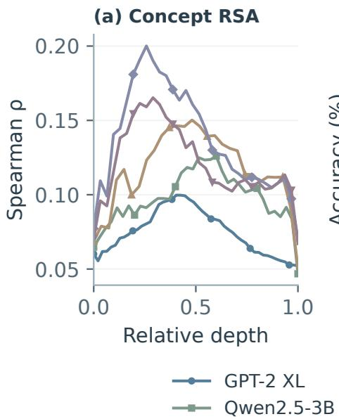

(b) Cross-form probe  
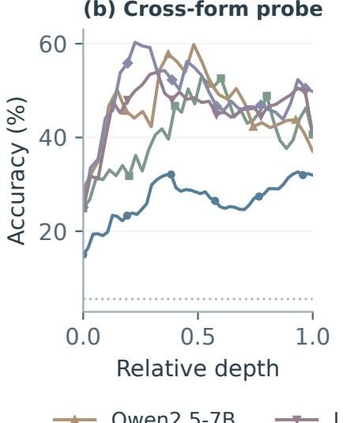

(c) Neuron fraction  
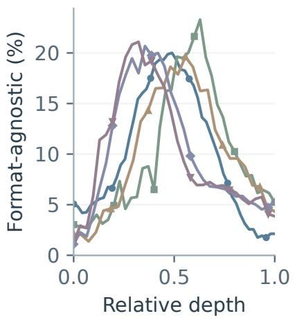  
Figure 9: Layerwise representation metrics in the historical five-model baseline. (a) Concept RSA. (b) Cross-form probe accuracy; the dotted line marks 1/18 chance. (c) Format-agnostic neuron fraction. Depth is normalized within each model. Curves reproduce the saved per-layer results; colors and markers jointly identify models.

Per-layer localization. Fig. 10 compares retrieval and readout distance at the retrieval peak and final layer for each model;   
Table 19 gives the per-model numbers.

## K Empirical Dimensionality: the k = 10 Plateau

Question and scope. Why use ten dimensions? The plateau is an empirical operating point on this inventory, not an intrinsic dimension of reasoning.

The dimension $k = 1 0$ used throughout the paper is the empirical elbow of the concept-centroid PCA spectrum, not a derived constant. We sweep $k \in \{ 1 , \ldots , 1 7 \}$ on the TriForm benchmark (18 concepts, 17 non-trivial dimensions after mean-centering) and record two saturation metrics: the fraction of top-k = 17 centroid variance captured, and the fraction of top-k = 17 cross-format retrieval accuracy captured. Averaged over 9 models spanning three architecture families:

Per-model saturation at k = 10 (fraction of k = 17 maximum):

The plateau replicates across the state-space family (Mamba, Falcon-Mamba) and the encoder-MLM DeBERTa in addition to the six dense-decoder models, indicating that the operating point is a property of the concept-centroid PCA operator on a well-formed cross-format inventory, not a hyperparameter tuned to a specific architecture or benchmark.

## L Inter-Layer FARS Subspace Stability

Question and scope. How stable is the extracted span across depth? Within-model overlap does not imply identical coordinates across diferent models.

Subspace overlap between layer bases: overlap $\begin{array} { r } { { } ^ { \prime } B _ { L } , B _ { L ^ { \prime } } ) = \frac { 1 } { 1 0 } \sum _ { i } \sigma _ { i } ( B _ { L } B _ { L ^ { \prime } } ^ { \top } ) } \end{array}$ . Random baseline computed between two independent random orthonormal 10-d subspaces in the same ambient $D _ { m }$

Layer localization · 26 models (a) Retrieval at two layers  
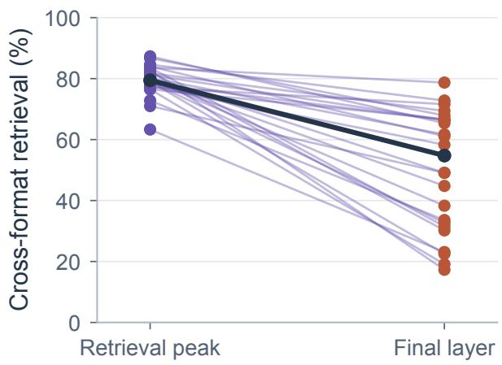

(b) Distance to readout  
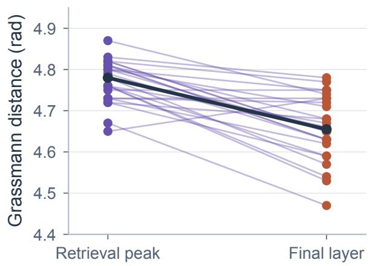  
Paired table values (rounded) · dark line: median · full layer traces unavailable  
Figure 10: Retrieval peak versus final layer. Each thin line joins two measurements from one model; the dark line joins population medians. (a) Cross-format retrieval. (b) Distance to the top-10 readout span. These plots use the reported rounded values in Table 19, not reconstructed layer-by-layer trajectories. Peak selection favours higher retrieval by construction.

In-plateau consecutive overlap 0.89 vs. random $\sim 0 . 0 5 , \sim 1 7 \times$ chance. ±2–3 within plateau 0.78, a slow rotation. Crossing boundary $0 . 8 0 \pm 0 . 1 8$ . RoBERTa excluded (plateau width 1). FARS is a thick canonical frame, recoverable at any plateau layer.

## M A Prediction That Did Not Replicate: Concept-Family Ordering

Question and scope. Does the proposed concept-family ordering replicate? This is a negative-result control, retained rather than treated as support for the main claim.

A prediction that did not replicate. We had expected the readout verdict to track how output-facing a concept is. The reasoning is mechanical: a direction encoding “the next token is a numeral” is a statement about the logits and should sit inside the readout basis, whereas a direction encoding “this inference is valid” is a statement about the input and should not. To test it we built five balanced binary families of minimally contrasting sentences (20 pairs each), fixed their surfaceto-abstract ordering before measuring anything, took the single direction $v = \mu _ { + } - \mu _ { - }$ per family — the object the steering literature uses — and measured its readout enrichment $E _ { v } ( k ) / ( k / D )$ against the full singular basis of $W _ { U }$

The prediction fails. The ordering is fully monotonic in 1 of 6 models, and 41 of 60 pairwise orderings are correct against 30 expected by chance — above chance, but nowhere near the clean gradient the mechanism predicts. In particular the claim we would most have wanted, that an inference-validity direction sits at chance, holds only on $\mathtt { g p t 2 - x l }$ (1.03) and not on the larger models, where it reaches 38×.

The likely cause is visible in the table. On the larger models every family is enriched by an order of magnitude at the final layer: the smallest enrichment in any family averages 5.6× across the five 7–8B models, against $1 . 0 3 \times { \tt o n g p t 2 - x 1 }$ That is expected on reflection — the final residual stream is the readout pathway, so a probe placed there saturates and the contrast between concept families washes out. A mid-network probe avoids the saturation but asks about output-facing representations before the model has built them, which is why our first attempt at this experiment, run at the middle layer, also produced no ordering.

We report this because it bounds what the paper claims. The readout test’s two-sidedness rests on the final-layer positive control and the rank sweep (§5, App. H), both of which replicate across every model we tested. It does not rest on the concept being abstract in some intuitive sense, and we have no evidence that the test orders concepts along that axis. Finding a probe position that separates output-facing from input-facing concept directions without saturating is open.

<table><tr><td>Model</td><td> $L _ { \mathrm { p e a k } } / L$ </td><td> $\operatorname { f r a c . }$ </td><td>Agn% peak</td><td> $d _ { G }$  peak</td><td>Agn% last</td><td> $d _ { G }$  last</td></tr><tr><td>Llama-3.1-8B-Inst</td><td>9/32</td><td>0.29</td><td>81.2%</td><td>4.79</td><td>66.4%</td><td>4.63</td></tr><tr><td>Mistral-7B</td><td>9/32</td><td>0.29</td><td>81.8%</td><td>4.81</td><td>69.4%</td><td>4.63</td></tr><tr><td>Llama-3.1-70B-Inst</td><td>24/ 81</td><td>0.30</td><td>87.3%</td><td>4.87</td><td>65.4%</td><td>4.74</td></tr><tr><td>Mistral-7B-Inst</td><td>11/33</td><td>0.34</td><td>84.0%</td><td>4.81</td><td>61.1%</td><td>4.63</td></tr><tr><td>Falcon3-7B-Inst</td><td>10/ 28</td><td>0.37</td><td>79.0%</td><td>4.82</td><td>32.7%</td><td>4.65</td></tr><tr><td>Mixtral-8x7B-Inst</td><td>12/33</td><td>0.38</td><td>82.4%</td><td>4.73</td><td>30.2%</td><td>4.73</td></tr><tr><td>Yi-1.5-9B-Chat</td><td>20/48</td><td>0.43</td><td>83.6%</td><td>4.82</td><td>31.5%</td><td>4.65</td></tr><tr><td>Granite-3.3-8B-Inst</td><td>17/40</td><td>0.44</td><td>77.2%</td><td>4.72</td><td>71.6%</td><td>4.68</td></tr><tr><td>R1-Distill-Llama-8B</td><td>14/33</td><td>0.44</td><td>83.6%</td><td>4.80</td><td>78.7%</td><td>4.75</td></tr><tr><td>Qwen2.5-7B</td><td>12/ 28</td><td>0.44</td><td>78.4%</td><td>4.76</td><td>54.6%</td><td>4.59</td></tr><tr><td>QwQ-32B</td><td>28/64</td><td>0.44</td><td>80.2%</td><td>4.81</td><td>49.1%</td><td>4.68</td></tr><tr><td>GPT-2 XL</td><td>22/ 48</td><td>0.47</td><td>63.3%</td><td>4.67</td><td>23.1%</td><td>4.47</td></tr><tr><td>DeepSeek-V2-Lite</td><td>13/ 28</td><td>0.48</td><td>79.3%</td><td>4.76</td><td>44.8%</td><td>4.54</td></tr><tr><td>Qwen3-8B</td><td>18/36</td><td>0.51</td><td>77.5%</td><td>4.78</td><td>58.3%</td><td>4.66</td></tr><tr><td>Phi-3.5-mini-Inst</td><td>18/33</td><td>0.56</td><td>78.4%</td><td>4.76</td><td>66.4%</td><td>4.53</td></tr><tr><td>gpt-oss-20B</td><td>13/ 24</td><td>0.57</td><td>86.7%</td><td>4.78</td><td>67.9%</td><td>4.57</td></tr><tr><td>Mamba-2.8B</td><td>39/65</td><td>0.61</td><td>76.5%</td><td>4.75</td><td>19.1%</td><td>4.75</td></tr><tr><td>DeBERTa-v3-large</td><td>16/ 25</td><td>0.67</td><td>79.6%</td><td>4.73</td><td>38.3%</td><td>4.72</td></tr><tr><td>Qwen2.5-3B-Inst</td><td>29/37</td><td>0.81</td><td>72.8%</td><td>4.73</td><td>33.6%</td><td>4.62</td></tr><tr><td>Falcon-Mamba-7B</td><td>56/ 65</td><td>0.88</td><td>82.7%</td><td>4.82</td><td>17.3%</td><td>4.77</td></tr><tr><td>Phi-4</td><td>35/40</td><td>0.90</td><td>71.0%</td><td>4.72</td><td>49.1%</td><td>4.59</td></tr><tr><td>OLMo-2-7B-Inst</td><td>29/33</td><td>0.91</td><td>84.6%</td><td>4.80</td><td>72.8%</td><td>4.65</td></tr><tr><td>R1-Distill-Qwen-14B</td><td>44/49</td><td>0.92</td><td>78.7%</td><td>4.83</td><td>54.9%</td><td>4.78</td></tr><tr><td>R1-Distill-Qwen-7B</td><td>26/ 29</td><td>0.93</td><td>79.0%</td><td>4.65</td><td>22.5%</td><td>4.73</td></tr><tr><td>Qwen3-4B</td><td>34/36</td><td>0.97</td><td>76.5%</td><td>4.76</td><td>66.7%</td><td>4.67</td></tr><tr><td>SmolLM3-3B</td><td>34/ 36</td><td>0.97</td><td>80.2%</td><td>4.80</td><td>61.7%</td><td>4.71</td></tr><tr><td></td><td></td><td></td><td></td><td></td><td></td><td></td></tr></table>

Table 19: Layer-localization of FARS across 26 models. Left half gives the layer $L _ { \mathrm { p e a k } }$ at which cross-format concept retrieval Agn% peaks; right half gives the last-layer values. In every model the peak layer sits at depth fraction in [0.29, 0.97] of the network, with $n _ { \mathrm { m i d } } = 1 7 / 2 6$ peaks falling inside the middle band [0.30, 0.85]. At the peak layer, $d _ { G }$ to the top-10 readout channels is higher than at the last layer in 24/26 models (median $\Delta d _ { G } = + 0 . 1 2 ) .$ , and Agn% drops sharply toward the last layer. Concept-invariance and readout-adjacency move in opposite directions along depth, so the FARS peak is not the layer nearest the readout basis.

<table><tr><td>Rank</td><td>Variance (% of k=17)</td><td>Agn% (% of k=17)</td></tr><tr><td> $k = 3$ </td><td>52.9</td><td>52.7</td></tr><tr><td> $k = 5$ </td><td>71.2</td><td>60.5</td></tr><tr><td> $k = 8$ </td><td>84.3</td><td>73.4</td></tr><tr><td> $k = 1 0$ </td><td>89.9</td><td>83.0</td></tr><tr><td> $k = 1 2$ </td><td>94.2</td><td>89.4</td></tr><tr><td> $k = 1 7$ </td><td>100.0</td><td>100.0</td></tr></table>

Table 20: Concept-centroid PCA saturation on TriForm, mean over 9 models. Beyond $k = 1 0$ the marginal gain in both metrics is $\leq 1 0$ percentage points; k = 10 captures ∼ 90% of both what is attainable and what a full-rank $( k = 1 7 )$ subspace would attain. On the disjoint Novelty benchmark (10 concepts, at most 9 non-trivial dimensions) $k = 1 0$ is by construction full-rank and therefore trivially saturates; the ELBOW test above is only meaningful on TriForm.

<table><tr><td>Model</td><td>Variance (% of k=17)</td><td>Agn% (% of  $k { = } 1 7 )$ </td></tr><tr><td>qwen2.5-7b</td><td>89.1</td><td>82.5</td></tr><tr><td>qwen2.5-3b-instruct</td><td>91.7</td><td>74.9</td></tr><tr><td>phi-3.5-mini-instruct</td><td>91.3</td><td>86.0</td></tr><tr><td>mistral-7b-v0.3</td><td>87.9</td><td>86.1</td></tr><tr><td>gpt2-xl</td><td>91.3</td><td>85.8</td></tr><tr><td>olmo-2-7b-instruct</td><td>87.6</td><td>88.4</td></tr><tr><td>mamba-2.8b</td><td>93.0</td><td>73.0</td></tr><tr><td>falcon-mamba-7b</td><td>89.0</td><td>80.8</td></tr><tr><td>deberta-v3-large</td><td>88.6</td><td>89.5</td></tr></table>

Table 21: TriForm concept-centroid PCA saturation at $k = 1 0$ across 9 models. The plateau is architecture-agnostic: dense decoders, state-space models, and encoder-MLMs all reach $\geq 8 7 \%$ of the $k = 1 7$ variance at $k = 1 0 ,$ and $\ge 7 3 \%$ of the $k = 1 7$ cross-format retrieval accuracy. Choosing k = 10 therefore trades ≤ 13 percentage points of TriForm variance for a substantial rank reduction (10 of 1600–8192 ambient dimensions, a 160–820× compression). The same $k = 1 0$ setting is used uniformly across all experiments in the paper.

Table 22: Inter-layer FARS subspace overlap (mean cos of principal angles). Plateau = layers with $\mathrm { R S A - C } \ge 9 0 \%$ peak. “Consec within” = overlap between consecutive plateau layers; “±2–3 within” = overlap between plateau layers at distance 2 or 3. The chance baseline is $\sqrt { 1 0 / D _ { m } } \approx 0 . 0 3 – 0 . 0 8$ across our models. Observed in-plateau overlap is ∼ 17× chance: the canonical concept frame is a stable manifold across multiple layers, not a layer-specific artifact.
<table><tr><td>Model</td><td>Consec in-plat ±2–3 in-plat</td><td></td><td>Outside</td><td>Random</td></tr><tr><td>GPT-2 XL</td><td>.952</td><td>.902</td><td>.968</td><td>.067</td></tr><tr><td>Qwen-3B-Inst</td><td>.876</td><td>.766</td><td>.798</td><td>.058</td></tr><tr><td>Phi-3.5-mini-Inst</td><td>.854</td><td>.716</td><td>.835</td><td>.047</td></tr><tr><td>Mamba-2.8B</td><td>.947</td><td>.875</td><td>.956</td><td>.052</td></tr><tr><td>Mistral-7B-base</td><td>.868</td><td>.735</td><td>.745</td><td>.041</td></tr><tr><td>Mistral-7B-Inst</td><td>.856</td><td>.727</td><td>.682</td><td>.041</td></tr><tr><td>Qwen-7B</td><td>.869</td><td>.741</td><td>.824</td><td>.044</td></tr><tr><td>OLMo-2-7B-Inst</td><td>.881</td><td>.754</td><td>.851</td><td>.041</td></tr><tr><td>Falcon-Mamba-7B</td><td>.946</td><td>.879</td><td>.928</td><td>.041</td></tr><tr><td>Llama-3.1-8B-Inst</td><td>.841</td><td>.705</td><td>.717</td><td>.041</td></tr><tr><td>DeepSeek-V2-Lite</td><td>.878</td><td>.760</td><td>.799</td><td>.058</td></tr><tr><td>Mixtral-8x7B-Inst</td><td>.890</td><td>.790</td><td>.726</td><td>.041</td></tr><tr><td>Llama-3.1-70B-Inst</td><td>.936</td><td>.862</td><td>.880</td><td>.030</td></tr><tr><td>DeBERTa-v3-large</td><td>.895</td><td>.759</td><td>.870</td><td>.082</td></tr><tr><td>RoBERTa-large</td><td></td><td></td><td>.755</td><td>.082</td></tr><tr><td>Mean (n=14)</td><td> ${ \bf 8 9 2 } \pm { \bf . 0 3 6 }$ </td><td> $\mathbf { . 7 8 4 \pm . 0 6 5 }$ </td><td> $. 8 2 2 \pm . 0 8 5$ </td><td>~.05</td></tr></table>

<table><tr><td>Model</td><td>D</td><td>next token</td><td>language id sentiment factual tru</td><td></td><td></td><td>inference v</td><td>mono.</td></tr><tr><td>gpt2-xl</td><td>1600</td><td>14.4</td><td>8.2</td><td>4.0</td><td>1.4</td><td>1.0</td><td>V</td></tr><tr><td>phi-3.5-mini-instruct</td><td>3072</td><td>13.5</td><td>35.4</td><td>18.0</td><td>9.7</td><td>7.2</td><td></td></tr><tr><td>qwen2.5-7b</td><td>3584</td><td>62.9</td><td>2.1</td><td>4.8</td><td>33.9</td><td>38.0</td><td></td></tr><tr><td>llama-3.1-8b-instruct</td><td>4096</td><td>17.3</td><td>2.1</td><td>4.6</td><td>3.8</td><td>1.5</td><td></td></tr><tr><td>mistral-7b-v0.3</td><td>4096</td><td>19.3</td><td>37.5</td><td>26.1</td><td>55.3</td><td>15.0</td><td></td></tr><tr><td>olmo-2-7b-instruct</td><td>4096</td><td>27.4</td><td>4.0</td><td>2.1</td><td>14.2</td><td>6.3</td><td></td></tr></table>

Table 23: Final-layer readout enrichment E $( 1 0 ) / ( k / D )$ of the diference-of-means direction for five binary concept families, across 6 models. Columns are in the pre-registered surface-to-abstract order, so the prediction is that each row decreases left to right; the last column marks whether it does. Haar null is 0.99.

## 3. Interventions and behavioural boundaries

## N Multi-seed cross-concept intervention audit

Question and scope. Do interventions move outputs toward another concept instance? The event is a KL-proximity comparison, not semantic correctness. Seed ranges describe repeated runs, not confidence intervals.

The extension comprises 4 models × 3 seeds × 2 protocols, or 24 completed runs. Each run uses 120 directed concept pairs. The prefix protocol compares two bases and the last-token protocol uses five conditions, yielding 10,080 saved intervention records. These are repeated measurements, not 10,080 independent samples. Within each seed, the conceptpair order and sampled surface forms are shared across models. Seeds change both pair sampling and the random subspace, so their variation reflects both sources.

The prefix protocol replaces projected residual diferences at aligned prefix indices up to the shorter sequence length. Such indices need not have matching semantics. The last-token protocol instead maps the source’s last token onto the target’s last token at the same layer. For the norm-matched control, the random projected diference is rescaled separately for each pair to the norm of the FARS-projected diference. Full replacement uses the unprojected residual diference; no intervention adds zero. Other target-token states remain untouched in the last-token protocol. Patching full state at one layer does not replace the entire source computation.

Model/layer pairs are GPT-2 XL/20, Qwen2.5-3B-Instruct/22, SmolLM3-3B/10, and Mamba-2.8B/35 (zero-based block indices). Runs use float16, rank 10, seeds 0, 1, 2, and a maximum input length of 512 tokens. They use PyTorch 2.6.0+CUDA 12.4 and Transformers 5.13.1 on an A100 40GB; this software environment need not match historical runs. Each output records per-pair KL distances, concept identities, form, seed, and basis hash; last-token runs additionally record intervention norms. Analytic checks cover projection, norm matching, full replacement, and the no-op control. Historical results are not overwritten.

<table><tr><td>Model</td><td>FARS</td><td>Random</td><td>Norm-matched</td><td>Full vector</td><td>No intervention</td></tr><tr><td>GPT-2 XL</td><td>10.8 [7.5, 16.7]</td><td>0.0</td><td>0.0</td><td>41.9 [34.2, 47.5]</td><td>0.0</td></tr><tr><td>Qwen2.5-3B-Inst.</td><td>3.3 [0.8, 7.5]</td><td>0.0</td><td>0.0</td><td>47.8 [43.3, 51.7]</td><td>0.0</td></tr><tr><td>SmolLM3-3B</td><td>0.8 [0.0, 1.7]</td><td>0.0</td><td>0.0</td><td>19.7 [16.7, 22.5]</td><td>0.0</td></tr><tr><td>Mamba-2.8B</td><td>0.8 [0.0, 1.7]</td><td>0.0</td><td>0.0</td><td>26.9 [21.7, 33.3]</td><td>0.0</td></tr></table>

Table 24: Last-token source-directed event rates (%): seed mean [minimum, maximum], 3 seeds with 120 directed pairs each. Zero entries are identical across seeds. The brackets are observed seed ranges, not confidence intervals. Random seeds vary both pair sampling and the random basis.

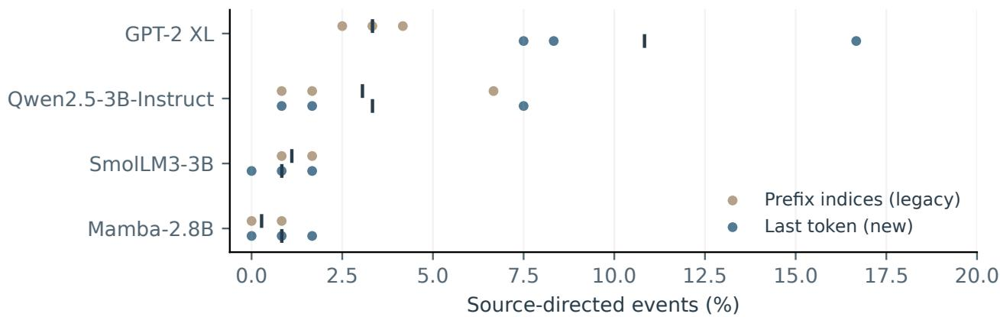  
Figure 11: Token-position protocol changes the measured intervention efect. FARS source-directed event rates for the legacy prefix and last-token protocols. Dots represent seeds; horizontal marks represent seed means. Shared concept pairs make these repeated observations. A position change is not a test of semantic correctness.

## N.1 Logged dose replication on Qwen2.5-3B-Instruct

We reran the cached layer-22, rank-10 intervention $h  h + c B ^ { \top } B h$ on GSM8K with greedy float16 generation, applying the hook to all positions processed at that layer. The chat-template protocol uses 50 test questions (sampling seed 123), a

384-token output limit, and two rank-matched Haar controls. A separate plain-prompt protocol uses 80 questions (seed 42), a 256-token limit, and FARS only. All 650 + 400 condition–question records completed; saved records contain question IDs, full prompts and generations, parsed answers, token-limit indicators and the basis hash. Answers use the #### pattern with a last-number fallback. Reported accuracy includes token-limited generations under that parser.

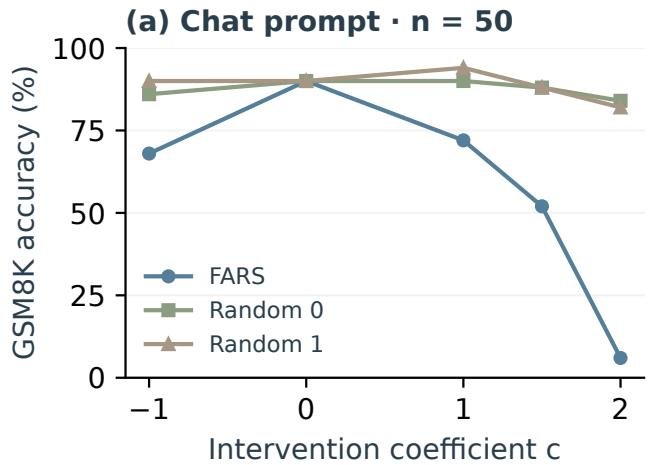

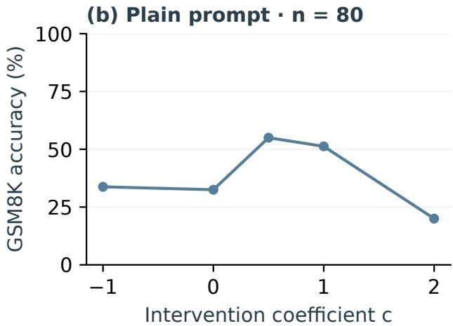  
Figure 12: New logged dose sweeps, separated by protocol. Both panels use Qwen2.5-3B-Instruct at cached layer 22. Chat: baseline 90%; FARS at $c = 2 .$ , 6%; two random controls, 84% and 82%. Plain: baseline 32.5%; FARS at $c = 0 . 5 , 5 5 \%$ , and at $c = 2 .$ , 20%. Lines join tested settings, without interpolated measurements or uncertainty estimates. Random controls match rank, not intervention norm.

The chat run reproduces strong disruption at high positive dose relative to rank-matched random directions. The plainprompt run shows that a moderate positive dose can instead improve parsed accuracy under a diferent protocol. These runs difer in prompts, sampled items and generation limits, so their diference cannot be attributed to any one factor. They are not pooled and do not resolve the provenance of the historical 8% versus 13% entries in Fig. 15. Perturbation magnitude and truncation remain relevant alternative explanations; these results do not establish semantic suficiency.

## N.2 Tokenwise norm-matched task intervention

We add a logged 650-record control experiment on Qwen2.5-3B-Instruct, holding the 50 questions (seed 123), layer 22, chat prompt, greedy decoding and 384-token limit fixed. Each question receives baseline and FARS or three rank-10 Haar interventions at $c \in \{ - 1 , 1 , 2 \}$ . At each afected token, a random projection is scaled to the norm of the FARS projection of that run’s current hidden state. Thus rank and local perturbation norm are matched; diferent autoregressive trajectories need not have equal norms. The maximum recorded relative matching error is $2 . 4 1 \times 1 0 ^ { - 4 }$

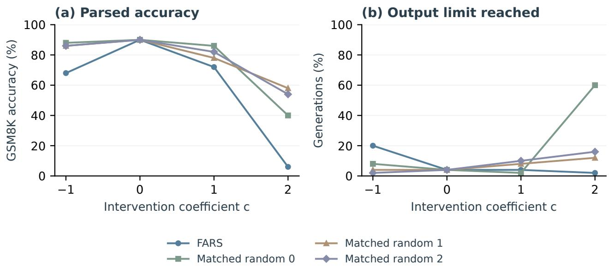  
Figure 13: Norm-matched intervention and generation limits. Each curve uses the same 50 questions; the three random bases are fixed across questions and doses. Baseline is 90% accurate. $\mathrm { A t } c = 2$ , FARS reaches 6% versus 40–58% for random controls, while output-limit rates are 2% versus 12–60%. Truncated generations remain in the accuracy denominator. Lines connect tested doses; random curves are separate basis draws, not confidence bounds.

FARS minus the average of the three random controls is −18.7, −10.0 and −44.7 percentage points at $c = - 1 , 1 , 2$ respectively. Paired percentile bootstrap intervals (10,000 resamples of the 50 questions; all conditions for a question kept together; seed 20260929) are $[ - 3 0 . 0 , - 8 . 0 ] , [ - 2 1 . 3 , 0 . 7 ] \mathrm { a n d } [ - 5 4 . 0 , - 3 5 . 3 ]$ points. These intervals condition on the three sampled bases and one model; they do not quantify cross-model uncertainty. The moderate-amplification interval includes zero. Norm matching also makes high-dose random directions disruptive, so the earlier rank-only control overstates how inert random perturbations are. The residual high-dose gap supports directional sensitivity under this protocol, not causal suficiency or a universally optimal reasoning subspace. Unequal generation-limit rates motivate a separate fixed-budget sensitivity test.

## O Causal Validation: Cross-Form Activation Patching

Question and scope. What survives cross-form activation patching? Preservation can also occur under random patches;   
contrast it with source-directed interventions and task-level tests.

Replacing only the 10 FARS dimensions during cross-form activation patching preserves the model’s argmax in 89.7– 97.3% of cases across five models (Table 25). Full-PCA of the same rank retains 37.3–87.7%; full-activation replacement collapses to 22.0–83.3%. Paired Wilcoxon rejects FARS=Full-PCA at $p { < } 1 0 ^ { - 2 2 }$ on every model (Holm-corrected).

Table 25: Causal validation under three metrics on the same 10 dimensions: top-1 next-token match, top-10 overlap, median KL of patched vs. clean. FARS cross-form patching matches within-form same-instance ceiling (0.85 on Qwen-7B-Inst).
<table><tr><td></td><td colspan="3">Top-1% ↑</td><td colspan="3">Top-10 ov. ↑</td><td colspan="3">KL med. ↓</td></tr><tr><td>Model</td><td>FARS PCA</td><td></td><td>Full</td><td>FARS</td><td>PCA</td><td>Full</td><td>FARS</td><td>PCA</td><td>Full</td></tr><tr><td>GPT-2 XL</td><td>93.7</td><td>87.7</td><td>81.0</td><td>.90</td><td>.65</td><td>.47</td><td>.016</td><td>.154</td><td>.655</td></tr><tr><td>Qwen-3B</td><td>89.7</td><td>37.3</td><td>22.0</td><td>.92</td><td>.60</td><td>.44</td><td>.012</td><td>.612</td><td>2.77</td></tr><tr><td>Qwen-7B</td><td>94.7</td><td>59.7</td><td>26.3</td><td>.94</td><td>.63</td><td>.48</td><td>.006</td><td>.262</td><td>.683</td></tr><tr><td>M Mistral-7B</td><td>97.3</td><td>85.3</td><td>83.3</td><td>.96</td><td>.74</td><td>.56</td><td>.002</td><td>.034</td><td>.142</td></tr><tr><td>∞ Llama-8B</td><td>94.0</td><td>56.7</td><td>39.7</td><td>.94</td><td>.64</td><td>.47</td><td>.004</td><td>.098</td><td>.811</td></tr></table>

## O.1 Cross-concept patching: the suficiency question

Historical pilot and its scope. Cross-form prediction preservation does not establish that a patch installs a concept: both source and target already express the same concept, and random patches can also preserve the prediction. The historical pilot instead patched between distinct concepts in the same surface form. Its one-model result is retained below; the expanded four-model experiment and explicit norm-matched control are reported in App. N.

Protocol. For ordered pairs (A, B), the pilot replaces the target’s FARS-projected residual component with the source’s at prefix-aligned token indices. It records $d _ { A } = \mathrm { K L } ( p _ { A } \| p _ { P } )$ and $d _ { B } = \mathrm { K L } ( p _ { B } \| p _ { P } )$ , where $P$ is the patched output. An event is $d _ { A } < d _ { B } ;$ it is not a semantic accuracy measurement. The historical Haar control matches the subspace rank but does not explicitly match the per-pair intervention norm. That distinction matters when attributing an efect specifically to direction rather than perturbation size.
<table><tr><td></td><td></td><td colspan="2">Source-directed events (%)</td><td colspan="2">Median  $d _ { B }$ </td></tr><tr><td>Model</td><td>Pairs</td><td>FARS</td><td>Haar</td><td>FARS</td><td>Haar</td></tr><tr><td>GPT-2 XL</td><td>40</td><td>5.0</td><td>0.0</td><td>0.02435</td><td>0.00128</td></tr></table>

Table 26: Historical cross-concept pilot, 40 directed pairs on one model. The FARS perturbation changes the output distribution more than this rank-matched Haar control, but the two interventions are not norm-matched. Values reproduce the saved pilot summary.

Interpretation. The pilot records an intervention efect while rarely producing an output distribution nearer the source. It does not by itself isolate a norm-independent directional efect, prove necessity, or show that a source concept has been installed. The new experiment adds a per-pair norm-matched random condition, last-token alignment, full replacement, and no intervention. Those controls refine the empirical boundary without turning KL proximity into task correctness.

## P Probe-, Token-, and Task-Level Interventions

Question and scope. How do ablation and amplification change reported task outcomes? Efects depend on model, layer, strength and protocol; necessity in a tested intervention is not a recovered natural mechanism.

FARS ablation is evaluated at three levels of abstraction and against a matched-rank random control at every one. The subsections below report each in turn.

## P.1 Probe level: cross-form concept identifiability

Ridge probe (α=0.1) trained on source-form activations, tested on target after FARS-ablation vs. random-10-d ablation. FARS ablation collapses cross-form accuracy by 17–50 pp on every one of the 15 models in this pool, spanning 4 architecture families (Tables 27, 28); random ablation moves accuracy by ±0.2 pp. The same 10 dimensions that recover concept identity destroy it when removed; arbitrary 10 dimensions do neither. Llama-70B-Inst is probe-necessary at −43.9 pp despite being task-level inert (App. P.3), a clean geometric-vs-behavioural dissociation.

Table 28: Cross-form concept-probe accuracy with FARS or a random 10-dim subspace ablated from both training and test activations. $^ { 6 6 } \Delta ^ { , 9 }$ is the drop from the no-ablation baseline. FARS ablation drops accuracy 17–44 pp; random ablation does not move accuracy detectably. The same 10 dimensions that constitute FARS are the literal carriers of cross-form concept identifiability.
<table><tr><td>Model</td><td></td><td></td><td>Baseline FARS abl. Random abl. FARS ∆</td><td></td></tr><tr><td>GPT-2 XL</td><td>29.4</td><td>12.0</td><td>29.6</td><td>-17.4</td></tr><tr><td>Qwen2.5-7B</td><td>52.8</td><td>18.3</td><td>52.7</td><td>-34.5</td></tr><tr><td>Mistral-7B</td><td>52.8</td><td>15.6</td><td>52.9</td><td>-37.2</td></tr><tr><td>Llama-3.1-8B-Instruct</td><td>56.5</td><td>17.7</td><td>56.4</td><td>-38.8</td></tr></table>

All accuracies are mean cross-form probe accuracies (%) across all 15 form pairs. Random ablation values are means over 5 orthonormal draws; std across draws $\leq 0 . 2$ pp on every model.

## P.2 Token level: FARS vs. random ablation

FARS ablation vs. matched-rank random orthonormal ablation: top-1 argmax changes in 22 pp more cases, median KL 130× larger (Table 29).

## P.3 Task level: GSM8K and MATH

We test whether FARS ablation degrades downstream task performance on GSM8K (Cobbe et al., 2021), an out-ofdistribution chain-of-thought benchmark. We sample 100 problems and greedily generate completions under (a) baseline, (b) FARS ablation at the best layer via forward hook $( h  h - B ^ { \top } B h )$ , (c) random 10-d ablation at the same layer (3 QR-orthonormal draws). Answers extracted by #### pattern.

Table 27: Probe-level FARS ablation replicates across 4 new architecture families. L is the model’s best FARS layer, ∆ the FARSablation efect in percentage points. Encoder models are mean-pooled. Base = cross-form ridge probe trained on form A, tested on form B at the model’s best FARS layer. FARS ablation removes the 10-d FARS subspace from both train and test activations; random ablation removes a matched-rank random subspace (mean over 3 seeds). Every architecture family shows ≥ −21 pp FARS-ablation efect with $\leq \pm 0 . 0 0 1$ random-ablation efect.
<table><tr><td>Model (family)</td><td>L</td><td>Base</td><td>FARS abl.</td><td>Rand abl.</td><td>∆</td></tr><tr><td>Microsoft DeBERTa-v3-large (encoder MLM)</td><td>15</td><td>0.602</td><td>0.104</td><td>0.603</td><td>-49.8pp</td></tr><tr><td>M Mistral-7B-Inst (dense)</td><td></td><td>100.620</td><td>0.173</td><td>0.619</td><td>-44.7pp</td></tr><tr><td>∞Llama-3.1-70B-Inst (dense)</td><td></td><td>260.628</td><td>0.189</td><td>0.628</td><td>-43.9 pp</td></tr><tr><td>M Mixtral-8x7B-Inst (MoE)</td><td></td><td>100.617</td><td>0.220</td><td>0.616</td><td>-39.7pp</td></tr><tr><td>H Mistral-7B-base (dense)</td><td></td><td>110.528</td><td>0.156</td><td>0.529</td><td>-37.2pp</td></tr><tr><td>Microsoft Phi-3.5-mini-Inst (dense)</td><td></td><td>180.527</td><td>0.179</td><td>0.524</td><td>-34.8pp</td></tr><tr><td>Mamba-2.8B (state-space)</td><td></td><td>35 0.433</td><td>0.151</td><td>0.432</td><td>-28.2pp</td></tr><tr><td>Qwen-2.5-3B-Inst (dense)</td><td></td><td>220.473</td><td>0.203</td><td>0.472</td><td>−27.0pp</td></tr><tr><td>∞RoBERTa-large (encoder MLM)</td><td></td><td>24 0.270</td><td>0.056</td><td>0.271</td><td>−21.4pp</td></tr></table>

Table 29: Ablation control on Qwen2.5-7B-Instruct (top-3 FARS layers, n=54 per layer, 5 random draws). FARS ablation flips top-1 argmax in 22 pp more cases than random ablation and median KL is 130× larger.
<table><tr><td>Ablation</td><td>Top-1</td><td>Top-10 overlap</td><td>Median KL</td></tr><tr><td>Random 10-dim (control, mean of 5 draws)</td><td>0.988</td><td>0.984</td><td>0.0005</td></tr><tr><td>FARS 10-dim</td><td>0.767</td><td>0.804</td><td>0.065</td></tr><tr><td>Difference</td><td>-22pp</td><td>-18pp</td><td>130×</td></tr></table>

Headline result on Qwen2.5-7B-Inst (L=13). Baseline 90.0%; random ablation 90.0% (0 pp drop); FARS ablation 70.0% (−20.0 pp vs. baseline, −20.0 pp vs. random; paired Wilcoxon $\scriptstyle p = 4 . 0 \times 1 0 ^ { - 5 } )$ . Cross-benchmark replication on MATH (Hendrycks et al., 2021) (Level 1–3, n=60): baseline 71.7%, FARS ablation 53.3% (−18.4 pp), random 70.0%, FARS-vs-random $\scriptstyle p = 5 \times 1 0 ^ { - 3 }$ . The necessity is not GSM8K-specific.

Bidirectional necessity. Amplifying instead of ablating: $h {  } h { + } c { \bf B } ^ { \top } { \bf B } h$ . On Qwen-Inst L=13, c=1.0: FARS 71% vs.   
random 90%, −19 pp, paired $\scriptstyle p = 2 . 7 \times 1 0 ^ { - 5 }$ . Random subspaces at identical c are inert in either direction (Table 31).

Scope: BBH. On three BIG-Bench Hard sub-tasks (n=75, logical deduction / causal judgement / colored-objects reasoning), the FARS-vs-random gap is −3.3 pp (p=0.23); FARS is most informative for mathematical-symbolic reasoning.

Scale-modulated threshold $c ^ { \star }$ on 6 instruct models. The same writer-layer protocol on Phi-3.5-mini, Qwen-3B-Inst, Qwen-7B-Inst, Mistral-7B-Inst, Llama-8B-Inst, Llama-70B-Inst reports model-dependent responses at the sampled doses (Fig. 14, Fig. 15): $c _ { \mathrm { P h i - 3 . 5 } } ^ { \star } = c _ { \mathrm { Q w e n - 3 B } } ^ { \star } = c _ { \mathrm { Q w e n - 7 B } } ^ { \star } = 1 . 0 ; c _ { \mathrm { M i s t r a l - I n s t } } ^ { \star } = c _ { \mathrm { L l a m a - 8 B } } ^ { \star } = 2 . 0 ; c _ { \mathrm { L l a m a - 7 0 B } } ^ { \star } > 2 . 0 ;$ . Llama-70B’s writer-layer amplification at $c = + 2 . 0$ gives FARS 93% vs. random 87% (n=30, no FARS<Random signal). Multi-layer scrubbing $w \in \{ 1 , 3 , 5 , 7 , 1 1 \}$ at L=23 all inert $( \Delta \le - 5 \mathrm { p p } , p \ge 0 . 1 6 )$ : 70B’s plateau exceeds 11-layer simultaneous scrub. The token-level (App. P.2) and probe-level (App. P.1) tests, which target the representation directly, replicate on Llama at every scale.

Mistral-Inst is the cleanest bidirectional case. On Mistral-7B-Inst L=10 (n=50): baseline $5 0 \% ; c = - 1 . 0$ FARS 42% vs. random 52% $( - 1 0 \mathrm { p p } , p \mathrm { = } 0 . 0 2 8 ) ; \mathbf { c } \mathrm { = } + 2 . \mathbf { 0 } \mathrm { F A R S \ } \mathbf { 8 } \%$ vs. random 59% $( - \bar { \bf 5 } \mathbf { 1 } \mathrm { p p } , \mathbf { p } { = } \mathbf { 1 } . 2 \times \mathbf { 1 0 } ^ { - 7 } )$ . Together with Qwen-Inst this rules out a single-model artefact; the Llama-family inertia is architecture-family-specific.

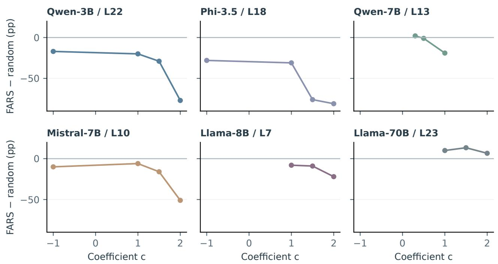

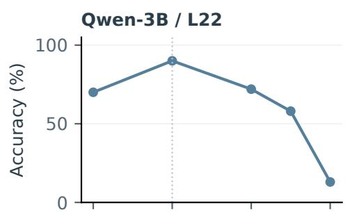

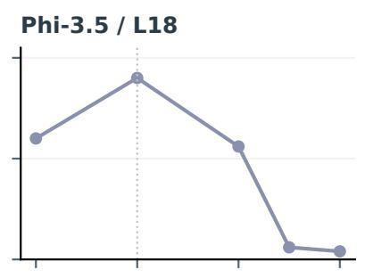

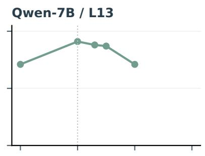

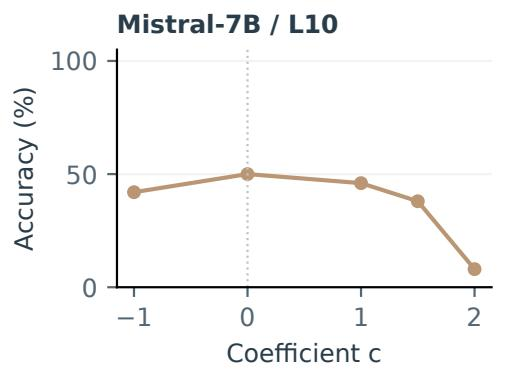

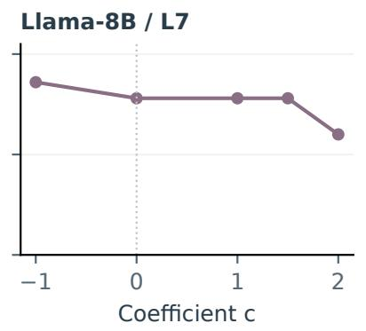

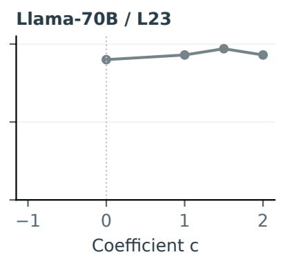  
Figure 14: Historical amplification profiles, separated by model. Points reproduce the six chat-template summaries embedded in the original plotting script, not a newly rerun dose sweep. $c = 0$ is baseline and c = −1 is projection removal. Lines connect observed settings only; no intermediate doses or error bars are inferred. These summaries are distinct from the paired FARS–random entries in Fig. 15.  
Figure 15: Paired historical FARS–random diferences. Vertical values are percentage points of GSM8K accuracy, recomputed from the paired summaries embedded in the original threshold-plot script. These are not subtractions from the separate dose-profile figure: for Qwen-3B at $c = 2 ,$ the two sources report FARS accuracy 8% and 13%, respectively. Their run correspondence remains unresolved; they are therefore kept separate.

Table 30: GSM8K under FARS- vs. random-ablation at each model’s best FARS layer (n=100, chat template). Qwen shows bidirectional necessity at $L { = } 1 3 ;$ ; Llama is inert to single-layer intervention at $L { = } 8$
<table><tr><td>Model</td><td>n</td><td>Base.</td><td>Rand. abl.</td><td>FARS abl.</td><td>Paired test</td></tr><tr><td>Qwen2.5-7B-Instruct (L=13)</td><td>100</td><td>90.0</td><td>90.0</td><td>70.0</td><td> $\scriptstyle p = 4 . 0 \times 1 0 ^ { - 5 }$ </td></tr><tr><td>Llama-3.1-8B-Instruct (L=8)</td><td>100</td><td>86.0</td><td>85.5</td><td>85.0</td><td> $p { = } 0 . 4 4 ~ ( \mathrm { n . s . } )$ </td></tr></table>

FCTS negative. Concept-targeted steering (project h onto FARS, find nearest centroid $\mathbf { c } ^ { \star }$ , pull $h _ { \mathrm { F A R S } }$ toward ${ \bf c } _ { \mathrm { f u l l } } ^ { \star } )$ does not exceed baseline at any α on Qwen-Inst GSM8K; at $\alpha { = } 2$ FCTS collapses to 0% $( p { = } 5 { \times } 1 0 ^ { - 4 } )$ . Any linear FARS perturbation, uniform or concept-targeted, ablation or amplification, degrades task performance; the deployed model sits near a local optimum along these axes.

Interpretation. Token-level argmax flips (+22 pp under FARS ablation, App. P.2) translate into a task-level accuracy degradation. Random subspaces of the same rank are nearly inert by either metric; FARS is not. Because the FARS directions were chosen with no reference to GSM8K and the test problems are out of distribution for our 18 concepts, this provides evidence that FARS captures general concept-bearing computation rather than benchmark-specific structure.

Bidirectional causal necessity: FARS amplification. The ablation experiment removes the FARS subspace $( h \to h -$ $\mathbf { B } ^ { \top } \mathbf { B } h )$ . If FARS is genuinely load-bearing in the residual stream, then amplifying the same subspace $( h  h + c \cdot \mathbf { B } ^ { \top } \mathbf { B } h$ for $c > 0 )$ should also degrade task performance, because amplification shifts the FARS-projected activation of the magnitude the rest of the model expects. Amplifying a random 10-dim subspace at the same coeficient should not. This is a symmetric, bidirectional causal test of FARS (Table 31). We ran it on Qwen2.5-7B-Instruct $( n { = } 1 0 0 \mathrm { G S M } 8 \mathrm { K }$ test items, $L { = } 1 3 , c \in \{ 0 . 3 , 0 . 5 , 1 . 0 \}$ , two random-subspace draws per coeficient). Baseline accuracy is 91.0%. $_ { \mathrm { A t } c = 0 . 3 , 0 . 5 } .$ , FARS amplification reduces accuracy by 3 pp and 4 pp, statistically n.s. against random amplification at the same coeficient. At c=1.0, FARS amplification drops accuracy to 71.0% (a −20 pp loss), while random amplification at the same coeficient leaves accuracy at 90.0% (−1 pp); paired Wilcoxon for FARS < Random is $p = 2 . 7 \times 1 0 ^ { - 5 }$ . The two-sided test rules out chance at $p = 5 . 4 \times 1 0 ^ { - 5 }$ . Combined with the ablation result (−20 pp from baseline, $p = 4 \times 1 0 ^ { - 5 }$ vs. random ablation), this shows the FARS dimensions are precisely those whose perturbation in either direction degrades task performance specifically; random dimensions of identical rank are inert to perturbation in either direction. We read this as a bidirectional causal-necessity result, stronger than ablation alone.

Concept-targeted steering (FCTS). A natural follow-up: does concept-targeted amplification help? FCTS projects the input’s last-token activation onto FARS, finds the nearest concept centroid $\mathbf { c } ^ { \star }$ , and pulls $h _ { \mathrm { F A R S } }$ toward $\mathbf { c } ^ { \star }$ at the writer layer, in the spirit of prototype-based dynamic steering (Kayan and Zhang, 2025) but with supervised concept centroids. On Qwen-Inst GSM8K, FCTS does not exceed the no-intervention baseline at any α; at $\alpha { = } 2 . 0$ it collapses to 0% $( p { = } 5 { \times } 1 0 ^ { - 4 } )$ ). Any linear FARS perturbation, uniform or concept-targeted, ablation or amplification, degrades task performance; the deployed model sits near a local optimum along these axes.

## Q Controls for the Prose–Code Asymmetry

Question and scope. Can tokenization and encoding explain the prose–code efect? These targeted controls do not eliminate every diference between the two formats.

Two controls localise the cause of the prose–code patching gap.

## Q.1 Tokeniser-confound control

Setup. Per (concept, form) take union of subword token IDs (Mistral tokenizer); compute mean Jaccard per ordered form pair. Pool 7 models × 4 pairs (n=24); OLS regress patching on Jaccard, inspect residuals partitioned by procedural (involves py\_code) vs. declarative.

Result. Jaccard does not predict patching overlap (Pearson $r { = } { + } 0 . 0 3 , p { = } 0 . 8 8 )$ . code↔math has the highest Jaccard (0.259) yet near-lowest patching, opposite to a tokenisation confound. Residuals separate cleanly by class: procedural mean −0.156, declarative +0.156 (gap +0.312, 95% CI $[ + 0 . 2 0 , + 0 . 4 2 ]$ , Mann-Whitney $\scriptstyle p = 7 . 8 \times 1 0 ^ { - 5 } )$ . Table 32.

Table 31: Bidirectional intervention $h  h + c \cdot \mathbf { B }$ ⊤Bh (Coef. = −1 is ablation) for FARS vs. random orthonormal B. Qwen-7B: clean bidirectional necessity (−20 pp both directions, $p { < } 1 0 ^ { - 4 } )$ . Llama-8B: inert under single-layer ablation at $L { = } 7 , 8 , 1 4 .$ , 18; amplification at L=7 with $c { = } { + } 2 . 0 $ gives FARS 60.0% vs. random 82.0% $\scriptstyle ( p = 1 . 4 \times 1 0 ^ { - 3 }$ , n=50). Llama-70B: inert at $c \in [ 1 , 2 ]$ at $L { = } 2 3 ;$ the 11-layer multi-scrub null indicates a wider plateau. Mistral-base: no usable baseline (2%).
<table><tr><td>Model (layer, n)</td><td>Coef. FARS</td><td>Random</td><td>∆</td><td></td><td>Paired p</td></tr><tr><td rowspan="4">Qwen-7B-Inst.  $( L { = } 1 3 , n { = } 1 0 0 )$ </td><td>-1.0</td><td>.700</td><td>.900</td><td>-.200</td><td> $\mathbf { 4 \times 1 0 ^ { - 5 } }$ </td></tr><tr><td>+0.3</td><td>.880</td><td>.910</td><td>-.030</td><td>0.20</td></tr><tr><td>+0.5</td><td>.870</td><td>.910</td><td>-.040</td><td>0.11</td></tr><tr><td>+1.0</td><td>.710</td><td>.900</td><td>-.190</td><td> $\mathbf { 2 . 7 \times 1 0 ^ { - 5 } }$ </td></tr><tr><td rowspan="4">Llama-8B-Inst.  $( L { = } 8 , n { = } 1 0 0 )$ </td><td>-1.0</td><td>.850</td><td>.855</td><td>-.005</td><td>0.44</td></tr><tr><td>+0.3</td><td>.850</td><td>.865</td><td>-.015</td><td>0.29</td></tr><tr><td>+0.5</td><td>.860</td><td>.855</td><td>+.005</td><td>0.52</td></tr><tr><td>+1.0</td><td>.800</td><td>.805</td><td>-.005</td><td>0.48</td></tr><tr><td rowspan="2">Llama-8B-Inst.  $\scriptstyle ( L = 1 4 , n = 5 0 )$ </td><td>-1.0</td><td>.780</td><td>.780</td><td>.000</td><td>0.50</td></tr><tr><td>+1.0</td><td>.760</td><td>.800</td><td>-.040</td><td>0.26</td></tr><tr><td rowspan="2">Llama-8B-Inst.  $\scriptstyle ( L = 1 8 , n = 5 0 )$ </td><td>-1.0</td><td>.800</td><td>.770</td><td>+.030</td><td>0.029†</td></tr><tr><td>+1.0</td><td>.780</td><td>.790</td><td>-.010</td><td>0.42</td></tr><tr><td rowspan="2">Mistral-7B-base  $\scriptstyle ( L = 1 1 , n = 5 0 )$ </td><td>-1.0</td><td>.040</td><td>.020</td><td>+.020</td><td>0.28</td></tr><tr><td>+1.0</td><td>.000</td><td>.020</td><td>-.020</td><td>0.16</td></tr></table>

† wrong-direction trend (FARS > Rand); ‡ baseline 2%, no usable dynamic range.

Table 32: Form-pair Jaccard vs. mean patching overlap (averaged across 6 tested models). Procedural class: pair involves py\_code.
<table><tr><td>Pair</td><td></td><td>Jaccard Patching</td><td>Class</td></tr><tr><td>en→math</td><td>.228</td><td>.696</td><td>decl</td></tr><tr><td>en→zh</td><td>.108</td><td>.319</td><td>decl</td></tr><tr><td>en→code</td><td>.216</td><td>.195</td><td>proc</td></tr><tr><td>code→math</td><td>.259</td><td>.208</td><td>proc</td></tr></table>

Jaccard does not predict patching (Pearson r=+0.03, n.s.); code↔math has  
the highest Jaccard yet second-lowest patching, opposite to a tokenisation confound.

Interpretation. The asymmetry is a property of format identity, not lexical overlap. code↔math has the highest Jaccard yet lowest patching; EN↔math has lower Jaccard but the strongest cross-form efect.

## Q.2 Declarative-Python control

Setup. Introduce a seventh form, py\_decl: each concept as a single-expression Python (no def, no for/while; e.g., math.gcd(48,18) instead ofEuclidean loop). EN→ {py\_decl, py\_code, math\_notation} patching on Qwen-7B-Inst, 7 layers, n=378 each.

Result. Table 33: procedural axis $( { \mathrm { p y } } _ { - } { \mathrm { d e c } } 1 - { \mathrm { p y } } _ { - } { \mathrm { c o d e } } ) + 0 . 0 5 4 ( p { = } 2 . 5 \times 1 0 ^ { - 9 } )$ ; surface axis (math−py\_decl) +0.452. Of the +0.506 total gap, encoding-style explains ∼ 11%, format-surface ∼ 89%. Procedural-encoding efect concentrates in concepts whose py\_code relied on loops (rel\_transitivity +0.262, spatial\_direction +0.219).

Table 33: Decomposing the prose-code gap on Qwen2.5-7B-Instruct. Mean top-10 overlap, EN-prose source → each target form, averaged over 54 stimuli ×7 layers $( n = 3 7 8 )$ . Paired Wilcoxon tests on within-(concept, instance, layer) diferences.
<table><tr><td>Comparison</td><td>Mean overlap</td><td>Paired test</td></tr><tr><td>EN → math_notation</td><td>.646</td><td></td></tr><tr><td>EN → py_decl</td><td>.194</td><td></td></tr><tr><td>EN → py_code</td><td>.140</td><td></td></tr><tr><td>py_decl — py_code (procedural axis)</td><td>+.054</td><td> $\scriptstyle p = 2 . 5 \times 1 0 ^ { - 9 } , \mathrm { C I } [ \scriptstyle { \underbrace { - . 0 0 6 } } , + . 1 1 1 ]$ </td></tr><tr><td>math_notation — py_decl (surface axis)</td><td>+.452</td><td> $p { < } 1 0 ^ { - 6 0 }$ </td></tr><tr><td>math_notation — py_code (total gap)</td><td>+.506</td><td> $\bar { p } { < } 1 0 ^ { - 6 0 }$ </td></tr></table>

Table 34: Cross-format refusal on two instruction-tuned models, AdvBench harmful behaviours.
<table><tr><td>Model</td><td>n</td><td></td><td></td><td>Prose refusal Code refusal Discordant (p/c) p (prose&gt;code)</td><td></td></tr><tr><td>Qwen2.5-7B-Instruct</td><td>100</td><td>.980</td><td>.970</td><td>1/0</td><td>.500 (n.s.)</td></tr><tr><td>Llama-3.1-8B-Instruct 200</td><td></td><td>.935</td><td>.965</td><td>1/7</td><td>.996 (reject)</td></tr></table>

Table 35: Head-level FARS decomposition at each model’s writer layer (324 stimuli). Attention contribution is the sum of all 32 heads FARS-projected output norms; MLP share is the MLP block’s share of the layer’s total FARS-bearing residual. Two architectures, sam structural profile: layer-localised, head-distributed assembly. Head indices difer; the structural fingerprint replicates.
<table><tr><td>Quantity</td><td>Llama-3.1-8B-Inst. (L=7)</td><td>Mistral-7B-v0.3 (L=10)</td></tr><tr><td>Layer FARS-fraction</td><td>0.269</td><td>0.225</td></tr><tr><td>MLP share of layer FARS</td><td>24.4%</td><td>30.4%</td></tr><tr><td>Attention share of layer FARS</td><td>75.6%</td><td>69.6%</td></tr><tr><td>Top-3 head share</td><td>15.8%</td><td>12.7%</td></tr><tr><td>Top-5 head share</td><td>23.8%</td><td>18.7%</td></tr><tr><td>Top-3 head indices</td><td>H1, H14, H8</td><td>H31, H4, H0</td></tr><tr><td>Top-5 head indices</td><td>+ H29, H12</td><td>+ H2, H28</td></tr><tr><td>Heads needed for 75% of head-FARS</td><td>19/32</td><td>20/32</td></tr><tr><td>Heads needed for 90% of head-FARS</td><td>27/32</td><td>27/32</td></tr></table>

## R Cross-Format Safety Refusal Test (Falsified Hypothesis)

Question and scope. Does the representational asymmetry predict a safety gap? The stated hypothesis was falsified on this test; it is not part of the supporting evidence.

We test whether the representational prose-code asymmetry (§Q.2) yields a behavioural safety gap. Two instructiontuned open-weight models, AdvBench (Zou et al., 2023) harmful prompts presented in (i) English prose and (ii) a fixed Python code wrap (# Task: <prompt>...def perform\_task():). Refusal detected by string match against 34 refusal patterns (Zou et al., 2023; Wei et al., 2023). We release aggregate refusal counts only.

Result. Hypothesis not supported (Table 34). Qwen2.5-7B-Inst (n=100): refusal gap +1 pp (98% prose vs. 97% code, p=0.50, n.s.). Llama-3.1-8B-Inst (n=200): −3 pp in the opposite direction (93.5% prose vs. 96.5% code, p=0.996). The Python wrap does not bypass refusal; on the larger sample it triggers more refusal.

Interpretation. Either modern safety training has extended to code-wrapped variants, or the wrap itself acts as a salient harmful-intent signal. The aggregate test rules out the simple cross-form refusal-gap hypothesis. Scope: 2 open-weight models; simple wrap; aggregate counts; conservative classifier.

## S Head-Level Decomposition at the FARS Writer Layer

Question and scope. How are efects distributed across heads and axes? A component-level perturbation does not uniquely identify the naturally used computation.

Method. At the writer layer, decompose per-head residual contributions $\mathbf { r } _ { h } { = } \mathbf { W } _ { O } ^ { ( h ) \top } \mathbf { v } _ { h }$ and project onto FARS to get each head’s FARS-bearing magnitude.

Result on Llama-8B and Mistral-7B (32 heads each, 324 stimuli; Table 35). Llama (L=7): attention 75.6%, MLP 24.4%; top-3 heads (H1, H14, H8) carry 15.8%. Mistral (L=10): attention 69.6%, MLP 30.4%; top-3 (H31, H4, H0) 12.7%. Specific head indices difer; structural profile is identical, layer-localised, head-distributed assembly from ∼ 20 heads with MLP as the single largest individual contributor.

Implication. FARS is not a single-head circuit; it is a layer-localised, head-distributed phenomenon. The MLP’s 24– 30% share, larger than any single head’s contribution, is consistent with prior findings that key concept-representations in transformers are partially refined in the MLP after attention has done the bulk of the routing (Geva et al., 2022; Meng et al., 2022). This head-and-MLP profile is what a reviewer should expect of an interpretable subspace at the scale of 18 general reasoning concepts: a single head cannot route 18 concepts cleanly, so the model assembles the 10-dim concept-direction subspace from a small committee of heads. The replication across Llama and Mistral, two architectures trained on diferent corpora by diferent organisations, shows the assembly profile (one MLP plus a top-five head committee, broader long tail) is robust to architecture and training.

Head ablation honest negative. Joint ablation of the top-5 heads at Llama-8B L=7 does not disrupt FARS RSA $( \Delta { = } - 0 . 0 0 2$ , identical to random-5). The decomposition reports contribution (norm), not causal necessity at the head level; multi-layer scrubbing would be required.

## S.1 Axis-specific ablation: FARS is distributed

Method. Apply Qwen-7B-Inst’s canonical rotation R to its FARS basis to obtain ten 1-d canonical-axis directions; ablate one at a time at L=13 during GSM8K generation, n=100.

Result. Full FARS ablation drops accuracy by 14 pp $( 9 1 \%  7 7 \% ) ;$ ; each 1-d canonical-axis ablation lies within ±2 pp of baseline (Table 36, all p>0.21). FARS is distributed; canonical axes are descriptive labels, not 1-d causal handles.

Table 36: Axis-specific GSM8K ablation on Qwen2.5-7B-Instruct (L=13, n=100). Full FARS ablation drops 14 pp; no single canonical axis produces a separable efect (±2 pp, all p>0.2). FARS is a distributed 10-d representation; single-axis interpretations are descriptive labels of geometric structure, not 1-d causal handles.
<table><tr><td>Intervention</td><td>Accuracy</td><td>∆ vs. baseline</td></tr><tr><td>Baseline (no hook)</td><td>0.910</td><td>-0.140</td></tr><tr><td>Full FARS ablation (10-d)</td><td>0.770</td><td></td></tr><tr><td>Canonical axis 0 (1-d)</td><td>0.910</td><td>+0.000</td></tr><tr><td>Canonical axis 1 (1-d, “&quot;procedural&quot;)</td><td>0.910</td><td>+0.000</td></tr><tr><td>Canonical axis 2 (1-d)</td><td>0.930</td><td>+0.020</td></tr><tr><td>Canonical axis 3 (1-d)</td><td>0.890</td><td>-0.020</td></tr><tr><td>Canonical axis 4 (1-d, “logical-inference&quot;)</td><td>0.920</td><td>+0.010</td></tr><tr><td>Canonical axis 5–9 (1-d each)</td><td>0.900–0.930</td><td>±0.020</td></tr><tr><td>Random 1-d (mean of 3 draws)</td><td>0.933</td><td>+0.023</td></tr></table>

Cross-model replication. Llama-8B-Inst (n=80, L=8): baseline 80%, full FARS 77.5% (−2.5 pp); each 1-d axis within ±5 pp. Cumulative top-K on Qwen-Inst GSM8K: monotone drop $9 2 \%  8 0 \% , \sim 8 3 \%$ of efect by K=4; random-K inert. Llama-70B at L=26 (n=20): top-K and random-K both give exactly 95% at every K, even though $| B \mathbf { B } ^ { \top } h \| / \| h \| \in$ [0.12, 0.20] confirms the hook removes a real residual-stream component. The dissociation between best-RSA layer and behaviour-load-bearing layer survives the 8× scale-up. Cumulative ablation is, by contrast, inert on the Llama family: on Llama-3.1-8B-Inst (L=8) the top-K curve stays in 85.0–90.0% and the random-K control in 82.5–92.5% across $K \in$ [0, 10], and on Llama-3.1-70B-Inst (L=26) accuracy is unchanged at 95% for every K under both conditions — the same capacity-scaled inertness to single-layer intervention reported in App. P.3.

## T Where Is FARS Written? A Per-Layer Decomposition

Question and scope. Where do residual updates align with the extracted span? This is a layer-local analysis with its own model pool and selection rule.

Method. The residual-stream contribution at layer ℓ is $\Delta _ { \ell } = h ^ { ( \ell + 1 ) } - h ^ { ( \ell ) }$ . Project $\Delta _ { \ell }$ onto FARS and compute concept-RSA on $B \Delta _ { \ell } ;$ the maximising ℓ is the writer layer.

Result: writer-before-peak. The writer sits 0–5 layers below the peak FARS layer on all 15 models from 4 architecture families (Table 37); Mamba has the widest gap (5) consistent with its state-space residual propagation. FARS is composed in one or two layers and persists for ∼ 5–10 layers before decaying toward the unembedding.

Table 37: Writer layer (top concept-RSA on FARS-projected delta $B \Delta _ { \ell } )$ sits 0–5 layers below the peak FARS layer on all 15 models. Mamba has the widest gap, consistent with state-space residual propagation.
<table><tr><td>Model</td><td>Peak / Writer</td><td>Plateau</td></tr><tr><td>GPT-2 XL</td><td>20 / 18</td><td rowspan="4">16-25</td></tr><tr><td>Qwen-2.5-3B-Inst</td><td>22 / 22</td></tr><tr><td>Phi-3.5-mini-Inst</td><td>18 / 17</td></tr><tr><td>Qwen-2.5-7B</td><td>13 / 12 9-19</td></tr><tr><td>Mistral-7B-v0.3</td><td>11 / 10</td><td rowspan="2">6-19</td></tr><tr><td>Mistral-7B-Inst</td><td>10 / 8</td></tr><tr><td>Llama-3.1-8B-Inst</td><td>8/7</td><td>5-13</td></tr><tr><td>Mixtral-8x7B-Inst</td><td>10/9</td><td></td></tr><tr><td>Llama-3.1-70B-Inst</td><td>26/23</td><td>11-77</td></tr><tr><td>Mamba-2.8B</td><td>35 / 30</td><td></td></tr><tr><td>RoBERTa-large</td><td>24 / 23</td><td></td></tr><tr><td>DeBERTa-v3-large</td><td>15 / 13</td><td>一</td></tr></table>

Plateau is a thick manifold. Within-plateau consecutive-layer FARS subspace overlap (principal-angle cosine) averages 0.892 ± 0.036 across 14 models, ±2–3 layers within plateau 0.784 ± 0.065; random 10-d baseline ∼ 0.05 (17× chance, z>20 per model). Outside plateau overlap drops to 0.822; crossing plateau boundary 0.798 ± 0.182. FARS is recoverable at any plateau layer up to small rotation, not a single-layer artefact.

## 4. Generalization beyond the extraction inventory

## U Held-Out Concept Generalization and Cross-Inventory Transfer

Question and scope. Does the extraction procedure transfer to a disjoint inventory? Re-extracting a new basis is diferent from transporting the original basis unchanged.

Per-model cross-inventory transfer (Novelty). Table 39 gives the per-model numbers behind §6.

## U.1 Frozen TriForm basis on unseen concepts

To distinguish extraction-method transfer from fixed-basis transfer, we freeze each model’s unique saved TriForm layer and rank-10 basis before evaluating the 180 Novelty stimuli. Query items are classified by nearest Euclidean concept centroid formed from the other five surface forms; all items of the query form are excluded from its gallery. Novelty labels define the retrieval gallery, but do not fit the projection or select its layer. This is supervised gallery retrieval, not zero-shot label inference. Full-space and 20 Haar rank-10 controls (seeds 100–119) use the same layer and gallery protocol.

Table 38: Fixed-basis transfer with matched checkpoints and layers. Accuracy in percent; chance is 10%. Random is the mean of 20 bases. These descriptive comparisons are not significance tests.
<table><tr><td>Model</td><td>Layer</td><td>Frozen FARS</td><td>Full space</td><td>Random mean</td></tr><tr><td>GPT-2 XL</td><td>20</td><td>22.8</td><td>48.3</td><td>20.2</td></tr><tr><td>Qwen2.5-7B</td><td>13</td><td>40.0</td><td>90.6</td><td>35.3</td></tr><tr><td>HMistral-7B-v0.3</td><td>11</td><td>39.4</td><td>86.7</td><td>30.3</td></tr></table>

All three frozen bases exceed the sampled random-control mean but lose substantial retrieval accuracy relative to the full representation. Thus transfer is partial rather than uniformly near chance, and these results do not establish a universal fixed rank-10 space. Checkpoint metadata were matched exactly: the Qwen-3B Novelty cache identifies the base model and cannot be paired with the available instruct basis; Mamba is omitted because its TriForm cache lacks model identity metadata. The earlier pilot also compared a random control at a diferent selected layer and omitted cross-form transfer scores from its saved summary; the present comparison corrects those limitations.

For each of 5 random splits, hold out 3 of the 18 concepts; train FARS on the remaining 15, project held-out into the trained basis, measure concept-RSA on held-outs. Control: random orthonormal 10-d projection at the same layer.

<table><tr><td>Model</td><td>Family</td><td>TriForm-FARS Agn%</td><td>X/W</td><td>Novelty-FARS Agn%</td><td>X/W</td><td>Random Agn%</td></tr><tr><td></td><td></td><td></td><td>0.77</td><td></td><td>1.00</td><td></td></tr><tr><td>R1-Distill-Llama-8B Mixtral-8x7B-Inst</td><td>reasoning MoE</td><td>79.6 82.1</td><td>0.81</td><td>100.0 100.0</td><td>0.98</td><td>50.6 56.1</td></tr><tr><td>Llama-3.1-70B-Inst</td><td>dense</td><td>82.1</td><td>0.78</td><td>100.0</td><td>1.00</td><td>56.1</td></tr><tr><td>SmolLM3-3B</td><td>dense</td><td>82.4</td><td>0.80</td><td>100.0</td><td>0.99</td><td>54.4</td></tr><tr><td>Yi-1.5-9B-Chat</td><td>dense</td><td>75.0</td><td>0.72</td><td>98.9</td><td>1.01</td><td>45.0</td></tr><tr><td>Mistral-7B-Inst</td><td>dense</td><td>86.7</td><td>0.84</td><td>98.3</td><td>0.98</td><td>55.0</td></tr><tr><td>Llama-3.1-8B-Inst</td><td>dense</td><td>78.1</td><td>0.71</td><td>98.3</td><td>0.99</td><td>41.1</td></tr><tr><td>Mistral-7B</td><td>dense</td><td>80.2</td><td>0.76</td><td>97.8</td><td>0.98</td><td>50.0</td></tr><tr><td>Granite-3.3-8B-Inst</td><td>dense</td><td>80.2</td><td>0.77</td><td>97.8</td><td>0.98</td><td>46.7</td></tr><tr><td>Falcon3-7B-Inst</td><td>dense</td><td>77.5</td><td>0.74</td><td>97.8</td><td>0.98</td><td>45.0</td></tr><tr><td>Qwen3-8B</td><td>dense</td><td>71.9</td><td>0.70</td><td>97.2</td><td>1.01</td><td>53.9</td></tr><tr><td>OLMo-2-7B-Inst</td><td>dense</td><td>82.7</td><td>0.80</td><td>96.7</td><td>0.99</td><td>47.2</td></tr><tr><td>Falcon-Mamba-7B</td><td>state-space</td><td>71.6</td><td>0.68</td><td>96.7</td><td>0.98</td><td>40.6</td></tr><tr><td>QwQ-32B</td><td>reasoning</td><td>78.4</td><td>0.77</td><td>96.7</td><td>0.99</td><td>48.9</td></tr><tr><td>Qwen3-4B</td><td>dense</td><td>75.6</td><td>0.75</td><td>95.0</td><td>0.99</td><td>47.2</td></tr><tr><td>DeepSeek-V2-Lite</td><td>MoE</td><td>75.3</td><td>0.72</td><td>93.9</td><td>0.93</td><td>45.6</td></tr><tr><td>Phi-3.5-mini-Inst</td><td>dense</td><td>70.1</td><td>0.68</td><td>92.8</td><td>0.96</td><td>41.1</td></tr><tr><td>gpt-oss-20B</td><td>MoE</td><td>77.2</td><td>0.71</td><td>92.8</td><td>0.93</td><td>47.2</td></tr><tr><td>Qwen2.5-7B</td><td>dense</td><td>74.4</td><td>0.71</td><td>91.1</td><td>0.94</td><td>36.1</td></tr><tr><td>Qwen2.5-3B-Inst</td><td>dense</td><td>59.9</td><td>0.56</td><td>85.6</td><td>0.96</td><td>35.0</td></tr><tr><td>Mamba-2.8B</td><td>state-space</td><td>48.5</td><td>0.50</td><td>80.0</td><td>0.84</td><td>36.7</td></tr><tr><td>R1-Distill-Qwen-7B</td><td>reasoning</td><td>75.0</td><td>0.73</td><td>79.4</td><td>0.87</td><td>31.7</td></tr><tr><td>GPT-2 XL</td><td>dense</td><td>63.6</td><td>0.61</td><td>70.0</td><td>0.79</td><td>30.0</td></tr><tr><td>Phi-4</td><td>dense</td><td>71.0</td><td>0.65</td><td>61.7</td><td>0.70</td><td>35.0</td></tr><tr><td>DeBERTa-v3-large</td><td>encoder-MLM</td><td>84.6</td><td>0.75</td><td>31.7</td><td>0.40</td><td>25.6</td></tr></table>

Table 39: Cross-format concept retrieval on TriForm vs. Novelty across 25 models spanning the MoE, dense, encoder-MLM, reasoning, state-space families. Chance rates are $1 / 1 8 = 5 . 6 \%$ (TriForm) and $1 / 1 0 = 1 0 . 0 \%$ (Novelty). The Random column is a Haar orthonormal rank-10 subspace of the same activation space with no concept supervision. Novelty-FARS exceeds it by 6–57 pp on every model, and the cross-to-within-format ratio $X / W$ reaches $\geq 0 . 9 4$ in 17 of 25 models. The higher Novelty headline reflects the smaller concept set (10 vs. 18), not a stronger efect.

Table 40: Held-out concept-RSA in the FARS basis trained on 15/18 concepts $( N _ { \mathrm { s p l i t s } } = 5 $ random concept-splits each). Random 10-d orthonormal projection control at same layer. ∆ = FARS − random. Every model shows positive $\Delta .$
<table><tr><td>Model</td><td>Held-out RSA-C</td><td>Random RSA-C</td><td> $\pmb { \Delta }$ </td></tr><tr><td>GPT-2 XL</td><td>.30</td><td>.10</td><td>+.20</td></tr><tr><td>六 Qwen-3B-Inst</td><td>.58</td><td>.23</td><td>+.36</td></tr><tr><td>Microsoft Phi-3.5-mini-Inst</td><td>.47</td><td>.22</td><td>+.25</td></tr><tr><td>H Mistral-7B-base</td><td>.57</td><td>.21</td><td>+.36</td></tr><tr><td>HMistral-7B-Inst</td><td>.66</td><td>.25</td><td>+.40</td></tr><tr><td>Qwen-7B</td><td>.56</td><td>.18</td><td>+.38</td></tr><tr><td>Ai2OLMo-2-7B-Inst</td><td>.52</td><td>.18</td><td>+.34</td></tr><tr><td>Falcon-Mamba-7B</td><td>.48</td><td>.17</td><td>+.32</td></tr><tr><td>∞Llama-3.1-8B-Inst</td><td>.66</td><td>.29</td><td>+.37</td></tr><tr><td>deepseek DeepSeek-V2-Lite</td><td>.62</td><td>.22</td><td>+.40</td></tr><tr><td>HMixtral-8x7B-Inst</td><td>.64</td><td>.23</td><td>+.41</td></tr><tr><td>Mamba-2.8B</td><td>.59</td><td>.22</td><td>+.36</td></tr><tr><td>∞Llama-3.1-70B-Inst</td><td>.71</td><td>.26</td><td>+.45</td></tr><tr><td>∞RoBERTa-large</td><td>.14</td><td>.07</td><td>+.07</td></tr><tr><td>Microsoft DeBERTa-v3-large</td><td>.51</td><td>.28</td><td>+.23</td></tr><tr><td>Mean</td><td>.533</td><td>.207</td><td>+.326</td></tr></table>

Interpretation. Held-out RSA recovers to 0.533, 2.6× the random baseline. The absolute value is not directly comparable to the standard 18-concept figure (0.34–0.37): RSA over a 3-concept RDM has far fewer degrees of freedom than over an 18-concept one and is correspondingly inflated. The load-bearing comparison is against the random 10-d projection measured on the same held-out split. Every 15 model shows positive $\Delta .$ . FARS captures generic concept geometry, not over-fit to its construction set.

## V Capability Prediction: FARS Plateau Width vs. Downstream Benchmarks

Question and scope. Does plateau width correlate with benchmark performance? These exploratory associations are not a held-out predictive evaluation.

Table 41: FARS plateau width (fraction of layers maintaining $\geq ~ 9 0 \%$ peak concept-RSA), per-model peak RSA-C, and published benchmark scores. Plateau width correlates positively with all three benchmarks; the MMLU correlation passes $p < 0 . 0 5$
<table><tr><td>Model</td><td>RSA-C</td><td>Plateau</td><td>GSM8K</td><td>MMLU</td><td>HumanEval</td></tr><tr><td>GPT-2 XL</td><td>.317</td><td>.292</td><td>5.0</td><td>26.6</td><td>0.0</td></tr><tr><td>Mamba-2.8B</td><td>.368</td><td>.508</td><td>5.0</td><td>25.6</td><td>0.0</td></tr><tr><td>deepseek DeepSeek-V2-Lite-Chat</td><td>.370</td><td>.679</td><td>62.5</td><td>55.7</td><td>40.9</td></tr><tr><td>Qwen-2.5-3B-Inst</td><td>.357</td><td>.676</td><td>79.0</td><td>65.6</td><td>73.2</td></tr><tr><td>Microsoft Phi-3.5-mini-Inst</td><td>.363</td><td>.576</td><td>82.6</td><td>69.0</td><td>62.8</td></tr><tr><td>Falcon-Mamba-7B</td><td>.370</td><td>.769</td><td>52.1</td><td>62.0</td><td>29.9</td></tr><tr><td>Ai2OLMo-2-7B-Inst</td><td>.369</td><td>.818</td><td>75.1</td><td>63.7</td><td>41.0</td></tr><tr><td>H Mixtral-8x7B-Inst</td><td>.368</td><td>.788</td><td>71.7</td><td>71.5</td><td>40.2</td></tr><tr><td>H Mistral-7B-Inst</td><td>.368</td><td>.818</td><td>38.5</td><td>60.1</td><td>40.2</td></tr><tr><td>H Mistral-7B-base</td><td>.366</td><td>.875</td><td>52.1</td><td>62.7</td><td>28.7</td></tr><tr><td>Qwen-2.5-7B</td><td>.367</td><td>.857</td><td>82.3</td><td>74.2</td><td>57.9</td></tr><tr><td>∞ Llama-3.1-8B-Inst</td><td>.366</td><td>.875</td><td>84.5</td><td>73.0</td><td>72.6</td></tr><tr><td>∞Llama-3.1-70B-Inst</td><td>.372</td><td>.914</td><td>95.1</td><td>86.0</td><td>80.5</td></tr><tr><td rowspan="2">Spearman vs. plateau p-value</td><td></td><td></td><td>+0.523</td><td>+0.656</td><td>+0.430</td></tr><tr><td></td><td></td><td>0.066</td><td>0.015</td><td>0.143</td></tr><tr><td>Partial Spearman (control:  $\log _ { 1 0 } P )$ </td><td></td><td></td><td>+0.385</td><td>+0.484</td><td>+0.297</td></tr><tr><td>Partial p-value</td><td></td><td></td><td>0.194</td><td>0.094</td><td>0.325</td></tr></table>

Setup. plateau\_frac $\begin{array} { r } { \mathbf { \rho } _ { : } ( m ) = \frac { 1 } { L _ { m } } \sum _ { \ell } k ^ { \ell } \mathbf { \left[ R S A - C _ { \ell } ( \right]} m ) \geq 0 . 9 \operatorname* { m a x } _ { \ell }  } \end{array}$ RSA-C(m)]. Paired with published benchmark accuracies; Spearman, Pearson, partial Spearman controlling for $\log _ { 1 0 } P$

Interpretation. MMLU correlation is the strongest $\scriptstyle ( \rho = + 0 . 6 6 ) ;$ ; partial $\rho { = } \mathrm { + 0 . 4 8 }$ after $\log _ { 1 0 } P$ control $\scriptstyle ( p = 0 . 0 9 4$ marginal). n=13 has limited power; a population-scale observation, not a per-model predictor.

Saturation. Peak RSA-C saturates at 0.36–0.37 across all 12 modern generative models (3B+), irrespective of architecture, instruction tuning, or downstream accuracy (5–95% GSM8K). Only GPT-2 XL is meaningfully lower (0.32). Cross-form concept discrimination is an emergent property by ∼ 3B; what varies is the depth (plateau width) of maintenance.

## 5. Reasoning-position analyses

## W Reasoning-Tuned Models: Full Three-Question Deep Dive

Question and scope. How does extraction position change the recovered geometry? Original and regenerated CoT runs difer in layer selection and truncation; keep their cohorts and budgets separate.

## W.1 Format-collapse control: does the CoT-tail really cross formats?

The objection. §8 reports that the CoT-tail subspace preserves cross-format concept identity. Reasoning-tuned models are known to drift into English whatever surface form the prompt arrived in, so the score could be measuring within-format retrieval under a cross-format label: if every trace is English prose, grouping stimuli by the prompt’s form labels groups that no longer difer in the text the model actually produced.

The measurement. We regenerate the chain of thought for all 324 TriForm stimuli under the same greedy decoding and the same 512-token budget, this time keeping the generated text alongside the CoT-tail hidden states. Each trace is assigned its own dominant surface form from its text (CJK fraction; French diacritics and function words; Python keywords and comparison operators; mathematical operators; enumerated or bulleted lines; English function words otherwise). We then recompute the cross-format score X grouping by the generated trace’s form instead of the prompt’s — scoring each stimulus against concept centroids built only from traces written in other surface forms (Table 42). The CoT-tail FARS is re-extracted from these activations exactly the same way the CoT-tail retrieval in §8 does, so the control tests the estimator the paper uses.

Reading. Collapse is substantial but partial: 56–57% of non-English prompts yield an English trace, yet Chinese and French prompts largely keep their language in the trace, and code, mathematical and enumerated traces persist as minorities

Reported total distances only; rank-10 ceiling = 4.97

<table><tr><td></td><td>trunc.</td><td>collapse</td><td>trace</td><td colspan="2">cross-format X (%)</td><td>Haar</td></tr><tr><td>Model</td><td> $\%$ </td><td> $\%$ </td><td>forms</td><td>by prompt</td><td>by trace</td><td> $X \ \%$ </td></tr><tr><td>R1-Distill-Llama-8B</td><td>79</td><td>56</td><td>6</td><td>30.6</td><td>26.9</td><td>8.0</td></tr><tr><td>R1-Distill-Qwen-7B</td><td>86</td><td>57</td><td>6</td><td>44.4</td><td>28.1</td><td>5.6</td></tr></table>

Table 42: Format-collapse control on the CoT-tail subspace (2 reasoning-tuned models, 324 stimuli each). Collapse % is the fraction of non-English prompts whose generated trace is dominantly English. By prompt is the cross-format score as §8 computes it; by trace regroups the same stimuli by the form the model actually wrote in. The confound is real — more than half of non-English prompts do produce English traces, and regrouping costs 12–37% of the score — but it does not manufacture the efect: 6 distinct surface forms survive in the generated text, and the regrouped score stays 3.3–5.1× a matched-rank Haar subspace measured the same way.

(R1-Distill-Llama-8B: English 205, Chinese 54, French 39, code 12, list 7, math 7; R1-Distill-Qwen-7B: English 208, Chinese 48, French 38, code 11, list 10, math 9). Because several surface forms genuinely survive, the regrouped score is well defined, and it falls from 30.6–44.4% to 26.9–28.1% against a Haar control at 5.6–8.0%. The honest statement is therefore the weaker one we now make in §8: the CoT-tail subspace carries concept identity across surface forms that the model itself produced, at a level the prompt-grouped number overstates. Scope: 2 models; the traces are also 79–86% budget-truncated, so this is a claim about the reasoning stream rather than a completed chain.

## W.2 The three questions

The three questions below (Q1 base→distill transfer, Q2 last-token vs. CoT-tail, Q3 X-FARS absorption) are analysed on the two distilled pairs, for which base counterparts exist. The native reasoner QwQ-32B replicates the departure without a base pair $( d _ { G } { = } 4 . 3 3$ between last-token and CoT-tail FARS, CoT-tail retrieval 59.0% vs. 22.8% Haar; §8, Fig. 16).

## CoT-tail and last-token subspaces are far apart

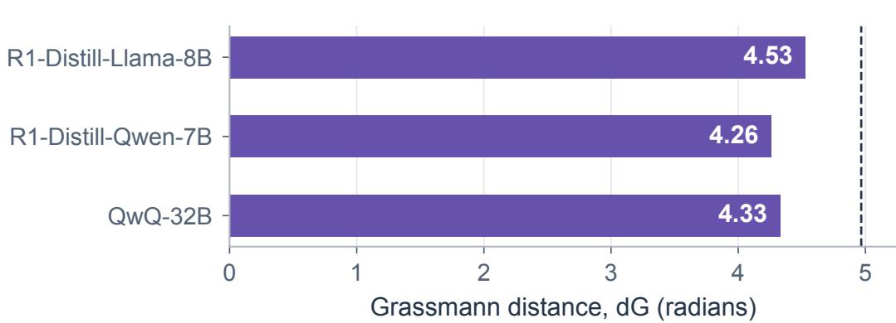  
Manuscript aggregates; individual angles unavailable.

Figure 16: Reported CoT-tail distances from last-input-token FARS. The bars show the manuscript’s aggregate Grassmann distances, $d _ { G } = \sqrt { \textstyle \sum _ { i } \theta _ { i } ^ { 2 } }$ , for two R1-Distill models and native QwQ-32B. The dashed line marks the rank-10 ceiling 10π/2 = 4.97. Individual principal angles are not plotted because an aggregate d<sub>G</sub> does not uniquely determine them.

Models, positions, and extraction. The paired comparisons use DeepSeek-R1-Distill-Llama-8B and DeepSeek-R1- Distill-Qwen-7B with their respective base counterparts. For each of the 324 TriForm stimuli, FARS is extracted separately from the last input token and the last generated token under a greedy 512-token budget. In this reasoning-position analysis, the layer maximizes top-k concept-centroid variance. This selection rule difers from the mid-band concept-RSA rule used for the readout diagnostic; the two analyses should not be treated as sharing an identical selected basis. For orthonormal row bases in a common hidden coordinate space, $\begin{array} { r } { d _ { G } ( B _ { 1 } , B _ { 2 } ) = \sqrt { \sum _ { i } \operatorname { a r c c o s } ^ { 2 } \sigma _ { i } ( B _ { 1 } B _ { 2 } ^ { \top } ) } } \end{array}$ , with rank-10 ceiling ${ \sqrt { 1 0 } } \pi / 2$ ≈ 4.97.

## W.3 Q1: Base-to-distilled last-input-token transfer

Table 43 reports nonzero subspace changes in both same-family pairs. These comparisons describe geometric similarity in the paired hidden coordinate spaces; they do not by themselves establish preservation of a causal reasoning mechanism.
<table><tr><td>Pair</td><td>Base layer</td><td>Distilled layer</td><td> $d _ { G }$ </td></tr><tr><td>Llama-3.1-8B / R1-Distill-Llama-8B</td><td>22</td><td>20</td><td>3.06</td></tr><tr><td>Qwen2.5-7B / R1-Distill-Qwen-7B</td><td>7</td><td>13</td><td>3.48</td></tr></table>

Table 43: Last-input-token FARS in base and distilled models. Layer indices are those reported for the reasoning-position extraction runs.

## W.4 Q2: Last-input-token versus CoT-tail geometry

Within-model aggregate distances are large in both distilled models (Table 44). The selected CoT-tail layers are earlier than the selected last-input-token layers. An aggregate distance does not identify each principal angle, and we make no direction-by-direction claim from these summaries. The native QwQ-32B result $( d _ { G } = 4 . 3 3 )$ provides an additional observation beyond the two distilled pairs.

<table><tr><td>Model</td><td>Last-input layer</td><td>CoT-tail layer</td><td> $d _ { G }$ </td></tr><tr><td>R1-Distill-Llama-8B</td><td>20</td><td>14</td><td>4.53</td></tr><tr><td>R1-Distill-Qwen-7B</td><td>13</td><td>10</td><td>4.26</td></tr></table>

Table 44: Within-model distance between separately extracted subspaces. Layer selection and token position both change in these comparisons.

The CoT-tail bases also support retrieval of concept identity (Table 45). The original retrieval summary and the regenerated trace-form control in App. W.1 are separate runs with diferent selected CoT layers and reported retrieval statistics. Their values must not be pooled as repeated measurements of one fixed basis.

<table><tr><td>Model</td><td>Last-input Agn. (%)</td><td>CoT-tail Agn. (%)</td><td>Haar (%)</td></tr><tr><td>R1-Distill-Llama-8B</td><td>79.6</td><td>60.8</td><td>21.6</td></tr><tr><td>R1-Distill-Qwen-7B</td><td>75.0</td><td>58.0</td><td>24.4</td></tr></table>

Table 45: Original reasoning-position retrieval summaries on 324 stimuli. The regenerated control separately measures cross-format X after grouping by the form of the generated trace, rather than the original prompt.

## W.5 Q3: Incorporating distilled models into X-FARS

We compare the original fifteen-model pool with pools that additionally include one or both distilled models (Table 46). Adding Llama-Distill raises absolute retrieval by 1.74 percentage points; adding Qwen-Distill as well lowers it relative to that intermediate pool. Every pool remains above its corresponding Haar mean. This tests alignment on the fixed concept inventory, rather than generalization to unseen concepts.

<table><tr><td>Pool</td><td>X-FARS (%)</td><td>Haar mean ± SD</td><td>Haar p95</td><td>Gap (pp)</td></tr><tr><td>15 models</td><td>53.83</td><td> $2 5 . 8 2 \pm 1 . 0 1$ </td><td>27.58</td><td>28.01</td></tr><tr><td>16 (+Llama-Distill)</td><td>55.57</td><td> $2 5 . 9 4 \pm 1 . 1 6$ </td><td>28.01</td><td>29.63</td></tr><tr><td>17 (+Qwen-Distill)</td><td>51.83</td><td> $2 4 . 6 4 \pm 1 . 1 2$ </td><td>26.22</td><td>27.19</td></tr></table>

Table 46: Cross-architecture concept retrieval and matched-optimizer Haar controls. The gap is explicitly X-FARS minus the Haar mean, calculated from the displayed rounded values; it is not the gain from adding a model.

## W.6 How often does the generation budget bind?

The original generation-length summary is given in Table 47. Qwen-14B is included in this length audit, but not in the twopair geometry comparison above. No corresponding QwQ-32B length summary is available here; the reported 64–88% range must not be interpreted as a measured QwQ truncation rate.
<table><tr><td>Model</td><td>Stimuli</td><td>Mean length</td><td>Median length</td><td>Budget hit (%)</td></tr><tr><td>R1-Distill-Llama-8B</td><td>324</td><td>489</td><td>512</td><td>84.9</td></tr><tr><td>R1-Distill-Qwen-14B</td><td>324</td><td>389</td><td>512</td><td>63.9</td></tr><tr><td>R1-Distill-Qwen-7B</td><td>324</td><td>491</td><td>512</td><td>88.0</td></tr></table>

Table 47: Generated-token lengths under the original 512-token budget. These are the original runs; the regenerated trace-form controls have budget-hit rates of 78.7% and 86.4% for Llama-8B and Qwen-7B.

Scope. For most audited stimuli, the sampled tail is a budget-limited position, not a completed reasoning chain. Token position, selected layer, and output format can all contribute to the observed geometric change. The results motivate longerbudget and position-matched interventions; they do not isolate reasoning computation or establish that either subspace is suficient for producing the correct answer.

## 6. Exploratory cross-model structure

## X Historical Cross-Model Alignment and Retrieval

Question and scope. What concept structure can be aligned across models? Reported cohorts difer between panels.   
Alignment on shared concept identities is not held-out-concept generalization.

## One 10-dimensional frame · 27 extracted models

Reported aggregate statistics; no synthetic pairwise similarity matrix

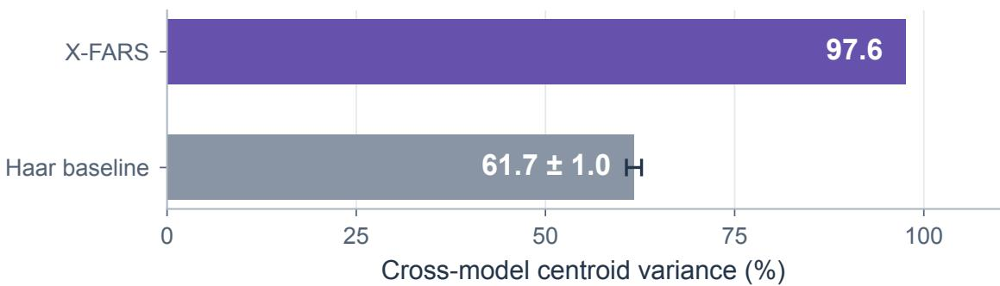  
Figure 17: Reported cross-model summary statistics. The shared ten-dimensional X-FARS frame explains 97.6% of cross-model centroid variance over 27 extracted models; the reported Haar-random projection baseline is 61.7±1.0%. This panel compares aggregate explained variance, not pairwise similarity or held-out generalization.

The extracted per-model FARS subspaces admit a further, orthogonal validation. They align pairwise (centroid-RSA $> 0 . 9 0$ within family, > 0.77 cross-family on the original fifteen-model pool; Fig. 18) and jointly into a single shared canonical frame (X-FARS) that, refitted on all 27 extracted models, captures 97.6% of cross-model centroid variance (36.8σ above a same-rank random-projection control at 61.7 ± 1.0%; the original fifteen-model fit gave 97.0%, 21.6σ). The algebra results below were computed on the fifteen-model pool. Held-out concept controls at $K \in \{ 3 , 6 , 9 \}$ concepts preserve RSA 0.28–0.40 and probe accuracy 29–43%; the frame is neither a one-model artefact nor an over-fit to the specific 18 concepts.

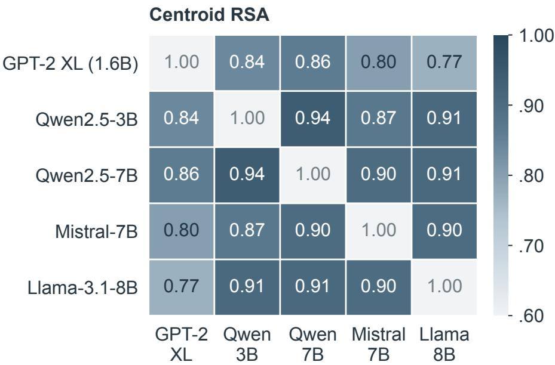

Figure 18: Cross-model alignment in a five-model subset. Centroid RSA ranges from 0.77 to 0.94 of the diagonal; gray cells denote self-comparisons. Values are shown to two decimal places; this panel reports the five-model subset. The selected five models should not be confused with the larger 15- and 27-model analysis pools.  
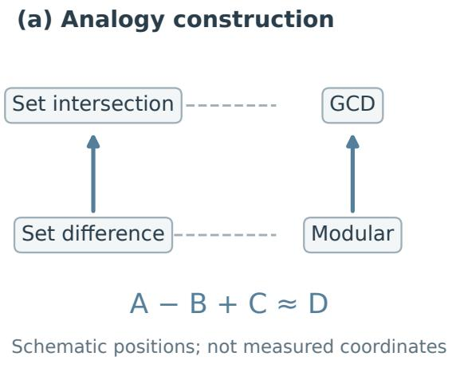

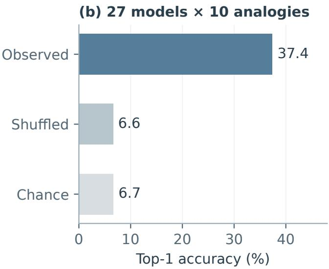  
Figure 19: Concept analogies: schematic construction and measured retrieval. Left: one curated analogy, with positions chosen only to illustrate the algebra. Right: saved top-1 accuracy across 27 models and 10 analogies (270 attempts): 37.4% observed, 6.6% shufled, and 6.7% chance. The schematic is not an empirical embedding.

Algebraic operations: diferences, analogies, compositions. Within the shared frame, concept directions support the full set of algebraic operations. (i) Diferences $\mathbf { c } _ { A } - \mathbf { c } _ { B }$ are preserved at mean cosine 0.88 (median 0.97) across $( { 1 8 } ) \ \times \ ( { 2 7 } ) \ = \ 5 3 . 7 0 3$ cross-model measurements (200.2σ above the shufled-concept null; 97.7% of pairs positive). (ii) Word2vec-style analogies $\mathbf { c } _ { A } - \mathbf { c } _ { B } + \mathbf { c } _ { C } \approx \mathbf { c } _ { D }$ resolve to the expected concept at mean top-1 37.4% across $2 7 \times 1 0 = 2 7 0$ attempts (17.0σ above a shufled null at 6.6%; Figure 19). (iii) Compositions (LRH) hold at pair, triplet (six generative architectures, span 0.68–0.92), and quartet (Mamba: span $0 . 8 7 , p { = } 1 . 5 { \times } 1 0 ^ { - 5 } )$ level. The encoder MLM DeBERTa-v3 marks a clean architectural scope: triplet LRH fails (span 0.66, all coeficients negative). The FARS basis trained on a random 15 of 18 concepts further generalises to the held-out 3 at concept-RSA 0.53 vs. 0.21 for a random orthonormal projection $( \Delta { = } + 0 . 3 3 ;$ all 15 models positive).

Table 48: Cross-format top-1 retrieval, mean over 30 ordered form pairs. Full = best-FARS-layer hidden state; FARS = 10-d projection. Chance 5.6%.
<table><tr><td>Model</td><td>Dim full</td><td>Full top-1</td><td>1 FARS top-1</td><td>∆</td></tr><tr><td>GPT-2 XL</td><td>1600</td><td>.351</td><td>.562</td><td>+.211</td></tr><tr><td>Qwen2.5-7B</td><td>3584</td><td>.495</td><td>.729</td><td>+.234</td></tr><tr><td>HMistral-7B-v0.3</td><td>4096</td><td>.522</td><td>.743</td><td>+.220</td></tr><tr><td>∞ Llama-3.1-8B-Instruct</td><td>4096</td><td>.559</td><td>.738</td><td>+.179</td></tr><tr><td>∞ Llama-3.1-70B-Instruct</td><td>8192</td><td>.615</td><td>.816</td><td>+.201</td></tr><tr><td colspan="2">Pooled  $( n { = } 1 5 0 \ \mathrm { p a i r s } )$ </td><td>.508</td><td>.717</td><td>+.209  $2 . 9 \times 1 0 ^ { - 2 5 }$ </td></tr><tr><td colspan="5">Paired Wilcoxon  $( \mathrm { F A R S } > \mathrm { f u l l } ) , p =$ </td></tr></table>

Table 49: Cross-model FARS canonical-axis alignment. FARS+GPA: 93.2% variance explained on all 27 extracted models; Historical X-FARS alignment: 97.6%, 36.8σ above the random-projection control at $6 1 . 7 \pm 1 . 0 \%$ . Shufled-concept-label null: 63.0%. Alignment remains high across the reported model pools; this comparison does not establish generalization to held-out concepts or rule out overfitting.
<table><tr><td>Quantity</td><td>Real</td><td>Null (shuffled, n=100)</td></tr><tr><td>FARS+GPA, 5 models (1.6–70B)</td><td>95.1%</td><td>63.0% (95% CI [59.9, 66.3])</td></tr><tr><td>FARS+GPA, 9 models, 6 arch. families</td><td>92.4%</td><td>63.0%</td></tr><tr><td>FARS+GPA, all 15 models</td><td>91.9%</td><td>63.0%</td></tr><tr><td>X-FARS joint, all 15 models</td><td>97.0%</td><td></td></tr><tr><td>FARS+GPA, all 27 models</td><td>93.2%</td><td></td></tr><tr><td>X-FARS joint, all 27 models</td><td>97.6%</td><td></td></tr><tr><td>Random 10-d projection (27 models, 10 seeds)</td><td> $6 1 . 7 \pm 1 . 0 \%$ </td><td></td></tr><tr><td>z-score (X-FARS vs. random projection, 27 models)</td><td></td><td>36.8σ</td></tr></table>

Per-model residual to canonical (full 15-model X-FARS): generative .148–.310; RoBERTa .400; DeBERTa-v3 .295.

Cross-architecture concept retrieval. A shared canonical frame (X-FARS) enables training-free cross-architecture concept retrieval. For each ordered form pair (A, B) with $A \neq B$ , we use the 54 stimuli in form A as queries and 54 in form B as the corpus, retrieving by cosine similarity in (i) the full hidden state (1600–8192d) and (ii) the FARS projection (10d); chance is 5.6%. Across 30 ordered form pairs × 5 models including Llama-70B-Inst, FARS-projected retrieval matches or beats full on every cell, pooling $\mathrm { t o } + 2 0 . 9 \mathrm { p p } ( 5 0 . 8 \%  7 1 . 7 \%$ , paired Wilcoxon $p { = } 2 . 9 { \times } 1 0 ^ { - 2 5 }$ , Table 48); Llama-70B alone +20.1 pp (61.5% → 81.6%) at 819× compression.

FARS wins because it removes the form confound that pulls all stimuli of the same form together; the same property that makes FARS a clean patching target makes it the right cross-format embedding. The retrieval claim is scoped to the concept distribution FARS is extracted from: on MBPP-sanitized (out-of-distribution), FARS-projected retrieval drops to 1–6% vs. full-activation 6.5–17%.

## Y Historical Canonical Concept Axes

Question and scope. How interpretable are the historical aligned coordinates? X-FARS uses a heuristic update that is not an exact solver of the stated rectangular objective; fit statistics are historical summaries.

Method. For each model, compute 18 concept centroids in its 10-d FARS subspace. After centering and Frobeniusnormalising, iterative Generalised Procrustes finds rotations $R _ { i }$ minimising $\begin{array} { r } { \sum _ { i } \Vert C _ { i } R _ { i } - C _ { * } \Vert _ { F } ^ { 2 } } \end{array}$ where $C _ { * }$ is the shared canonical centroid matrix.

Result. Refitted on all 27 extracted models, the canonical rotation explains 93.2% of cross-model centroid variance via FARS+GPA and 97.6% via X-FARS (Eq. 2; Table 49); the original fifteen-model fit gave 91.9% and 97.0%. Two nulls: shufled-concept labels reach 63.0% (fifteen-model pool); random 10-d projections of the same activations reach 61.7±1.0% on the $2 7 \cdot$ -model pool (36.8σ below X-FARS). The canonical-axis property is therefore specific to the conceptaligned subspace, not a property of any low-rank slice. RSA-C saturates at 0.36–0.37 for all generative models $\geq \ 3 \mathbf { B }$ regardless of architecture family; only GPT-2 XL (1.6B) and the encoder MLMs sit lower. A relative-depth sweep (9 percentiles) confirms the alignment is not an artefact of best-layer choice (fraction-explained ∈ [0.91, 0.97] throughout).

A layer-selection sweep at 9 relative-depth percentiles gives fraction-explained in [0.91, 0.97] throughout, so the alignment is not driven by best-layer choice.

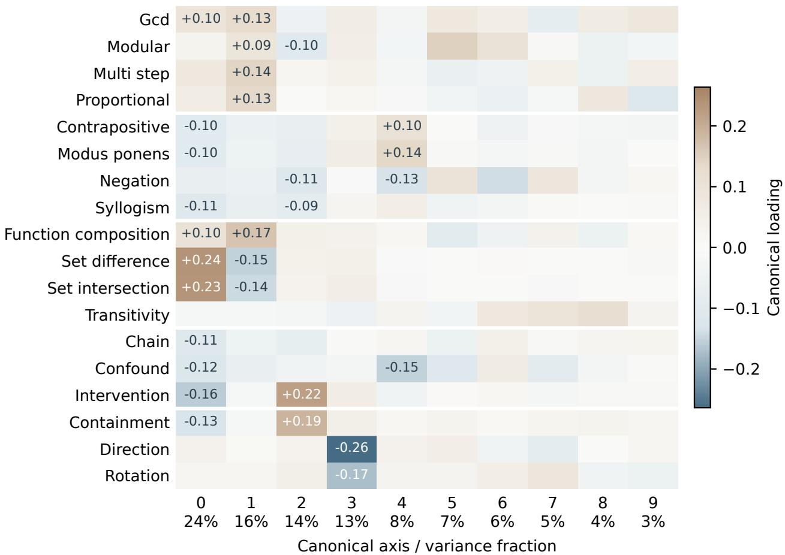  
Figure 20: Canonical FARS axes loadings: rows are 18 concepts grouped by domain; columns are the 10 canonical axes ordered by variance. Axis numbers and variance fractions are shown below the columns; interpretation labels appear in Table 50. Axis 1 is the procedural-vs-set-relational axis that mirrors the prose-code behavioural asymmetry.

Per-concept stability mirrors the prose-code axis. Cross-architecture σ separates declarative concepts (most stable: causal\_confound, rel\_transitivity, rel\_set\_difference; $\sigma { = } 0 . 0 2 1 { - } 0 . 0 2 5 )$ from procedural ones (most vari able: arith\_gcd, rel\_function\_composition, arith\_multi\_step; σ=0.045–0.079).

Interpretable canonical axes. The 10 canonical axes admit clean dichotomies at their +/− extremes (Table 50). Axis 0 (24% variance) is set-theoretic vs. causal-spatial. Axis 1 (16%) is the declarative-procedural axis at the geometric level, the same dichotomy that drives the prose-code asymmetry at the behavioural level (§Q.2). Axis 4 (8%) is a dedicated logical-inference axis. Top-5 axes carry 76% of canonical variance; +/− extreme concepts and loading signs are preserved when Llama-70B is added to the alignment.

X-FARS: jointly-aligned in one step. We replace the two-step FARS+GPA pipeline with a single joint objective:

$$
\operatorname* { m i n } _ { B _ { 1 } , \ldots , B _ { M } , \bar { C } } \ \sum _ { m } \left\| \tilde { C } _ { m } B _ { m } ^ { \top } - \bar { C } \right\| _ { F } ^ { 2 } \ \mathrm { s . t . } B _ { m } B _ { m } ^ { \top } = I _ { k } , \| \bar { C } \| _ { F } = 1 ,\tag{2}
$$

where ${ \tilde { C } } _ { m }$ is model m’s centered centroid matrix at its best FARS layer. The objective is taken subject to $\| \bar { C } \| _ { F } = 1$ which rules out the degenerate optimum in which every $B _ { m }$ projects onto the null space of ${ \tilde { C } } _ { m }$ and $\bar { C }  0$ . This objective specifies a joint alignment criterion. For rectangular projections, its quadratic term depends on $B _ { m }$ , so a cross-covariance SVD is not in general an exact minimizer without additional restrictions. The following are empirical alignment summaries, not a claim of a globally optimal solution to Eq. 2. X-FARS attains 97.0% variance (+5.1 pp over FARS+GPA, +34.2 pp over random projection, 21.6σ; Table 54) at $\Delta \mathrm { R S A } \in [ - 0 . 0 0 8 , + 0 . 0 0 6 ]$ across all 15 models. Plug-and-play leave-oneout (Table 53): every held-out model recovers concept-RSA within $\Delta \in [ - 0 . 0 0 4 , + 0 . 0 1 4 ]$ (mean +0.002), the plug-in

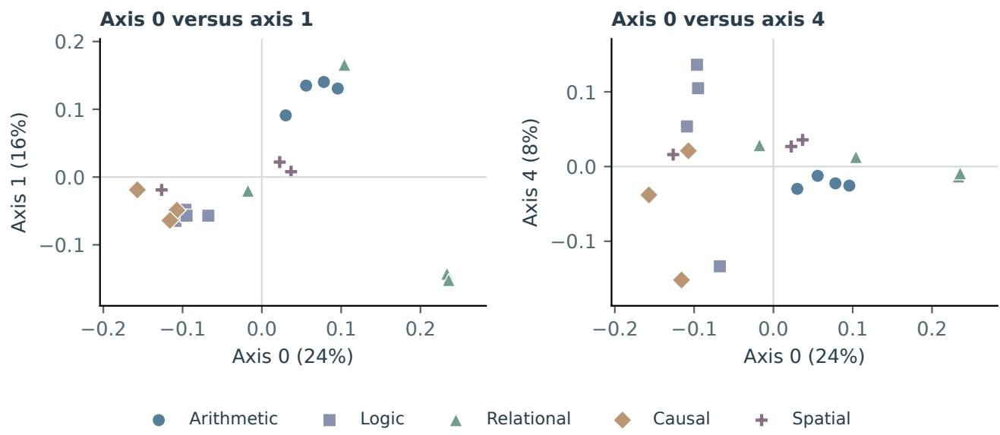  
Figure 21: Biplot of the 18 concepts in the (axis 0, axis 1) (a) and (axis 0, axis 4) (b) planes of the canonical FARS frame, colored by domain. Colors and marker shapes identify domains; exact concept loadings are in the accompanying heatmap. Axis signs and interpretations refer to this historical fitted frame.

Table 50: Interpretation of the top-5 canonical FARS axes on the 5-model GPA alignment (including Llama-3.1-70B-Instruct). The variance fractions are reported on the 5-model canonical frame; the +/− extreme concepts and the sign of every loading are preserved between the 4-model (1.6B–8B) and 5-model (1.6B–70B) alignments. Each axis admits a recognisable concept dichotomy; crossmodel stability is $\sigma { < } 0 . 0 2$ for axes 0–4. Axis 1 corresponds to the same procedural-vs-declarative distinction that drives our prose-code asymmetry at the behavioural level (§Q.2).

<table><tr><td>Ax.</td><td>Var</td><td>+ extreme</td><td>extreme</td></tr><tr><td>0</td><td>.242</td><td>set_diff, set_∩, func_comp</td><td>causal_intervention, spatial_containment</td></tr><tr><td>1</td><td>.157</td><td>func_comp, multi_step, proportional</td><td>set_diff, set_∩, causal_confound</td></tr><tr><td>2</td><td>.153</td><td>causal_intervention, spatial_containment</td><td>logic_negation, arith_modular</td></tr><tr><td>3</td><td>.131</td><td>causal_intervention, arith_modular</td><td>spatial_direction, spa-</td></tr><tr><td>4</td><td>.078</td><td>modus_ponens, contra- positive, syllogism</td><td>tial_rotation causal_confound, logic_negation</td></tr></table>

basis is on average slightly better than independent extraction. Alignment is robust to concept subsampling (9 concepts → 98.0%, 15 concepts → 93.6%) and to instruction tuning (Mistral-base → Mistral-Inst Procrustes 92.4%, cross-basis RSA loss 1–3%).

Explicit-objective optimization audit. A separate audit fixes the unique cached FARS layer in 26 models; Llama-70B is omitted because two saved candidate layers make this selection ambiguous. We compare raw-centroid least squares, least squares after per-model Frobenius normalization of centroids, and alignment after additionally normalizing each projected centroid matrix. Every objective uses a centered, unit-Frobenius shared frame. Three starts (historical basis, cached FARS, random orthonormal basis) are optimized using exact gradients, Stiefel tangent projection, polar retraction and Armijo descent. Finite-diference gradient checks pass. This audit uses fixed cached layers, not a new layer-selection search.

Table 51: Optimization diagnostics after 700 iterations. All nine fits reach the iteration budget without meeting the $1 0 ^ { - 6 }$ maximum tangent-gradient criterion. Final objective values are comparable only within the same objective definition. Orthogonality residuals are below $9 \times 1 0 ^ { - 1 5 }$ . Small objective values alone do not validate concept preservation.
<table><tr><td>Objective</td><td>Initialization</td><td>Final loss</td><td>Max. gradient</td></tr><tr><td>Raw centroids</td><td>Historical</td><td>5.1923</td><td> $1 . 3 e + 0 2$ </td></tr><tr><td>Raw centroids</td><td>Cached FARS</td><td>798.21</td><td> $8 . 1 e + 0 2$ </td></tr><tr><td>Raw centroids</td><td>Random</td><td>69.723</td><td> $2 . 8 e + 0 2$ </td></tr><tr><td>Unit-norm centroids</td><td>Historical</td><td>1.4303</td><td>0.00052</td></tr><tr><td>Unit-norm centroids</td><td>Cached FARS</td><td>1.4503</td><td>0.0018</td></tr><tr><td>Unit-norm centroids</td><td>Random</td><td>1.4274</td><td>0.00061</td></tr><tr><td>Normalized projections</td><td>Historical</td><td>0.065186</td><td>0.13</td></tr><tr><td>Normalized projections</td><td>Cached FARS</td><td>0.089666</td><td>0.091</td></tr><tr><td>Normalized projections</td><td>Random</td><td>0.00080568</td><td>0.017</td></tr></table>

The objective decreases monotonically in these runs, but none satisfies the prescribed stationarity tolerance. Consequently these fits are diagnostic, not corrected optima or new evidence for a universal concept frame. The historical alignment summaries below remain empirical results under their original fitting procedure and model pools.

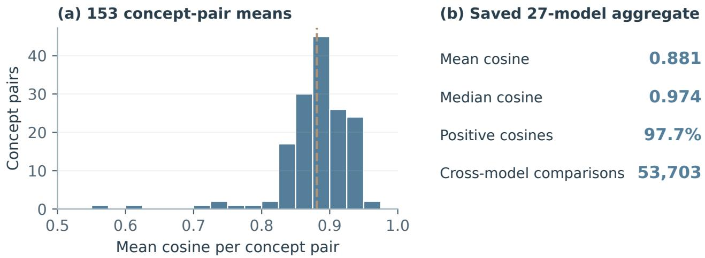  
Figure 22: Concept-diference alignment in the saved 27-model analysis. Left: distribution of 153 concept-pair means, each aver aging 351 cross-model comparisons. This is not a histogram of the 53,703 individual cosines. Right: aggregate statistics recorded in the same result file. Raw pairwise cosines and shufled samples were not reconstructed for this plot.

Comprehensive algebra: 53,703 cosines. $\mathrm { A l l \ ( ^ { 1 8 } _ { 2 } ) { = } 1 5 3 }$ concept pairs $\times \ \binom { 2 7 } { 2 }$ =351 cross-model pairs, in the frame fitted on all 27 models: mean cosine 0.881, median 0.974, 97.7% positive, 91.2% above 0.5. Shufled null $- 0 . 0 0 1 \pm 0 . 0 0 4$ over 20 shufles; separation 200.2σ. Widening the pool from the original fifteen models to all 27 lowers the mean cosine (from 0.961) while raising the separation, as expected when weaker and more distant architectures enter. Concept-pair averages and saved aggregate statistics are shown in Fig. 22.

Full distance landscape preserved. The 18×18 centroid-distance matrix in each model’s X-FARS projection, correlated upper-triangles cross-model: mean Pearson $\mathbf { \mathit { r } = } \mathbf { 0 . 6 1 3 \pm 0 . 2 4 8 }$ across 351 pairs (median 0.686; max 0.983); 74% at $r { > } 0 . 5 .$ 48% at $r { > } 0 . 7 ;$ null $- 0 . 0 0 0 1 \pm 0 . 0 0 6 5$ , separation 94.9σ. The full concept-neighbourhood structure is preserved, not just selected directions.

Word2vec analogy resolution. 10 curated analogies $\mathbf { c } _ { A } - \mathbf { c } _ { B } + \mathbf { c } _ { C } \approx \mathbf { c } _ { D }$ evaluated on all 27 models (270 attempts): mean top-1 37.4% (chance 6.7%, shufled null $6 . 6 \% \pm 1 . 8 \% , 1 7 . 0 \sigma )$ ; top-3 54.4% (13.7σ). Within-domain analogies carry the efect, e.g.

$\begin{array} { r } { { \bf c } _ { \mathrm { m o d u l a r } } - { \bf c } _ { \mathrm { g c d } } + { \bf c } _ { \cap } \approx { \bf c } _ { \mathrm { \backslash } } ; } \end{array}$ arbitrary cross-domain analogies do not resolve.

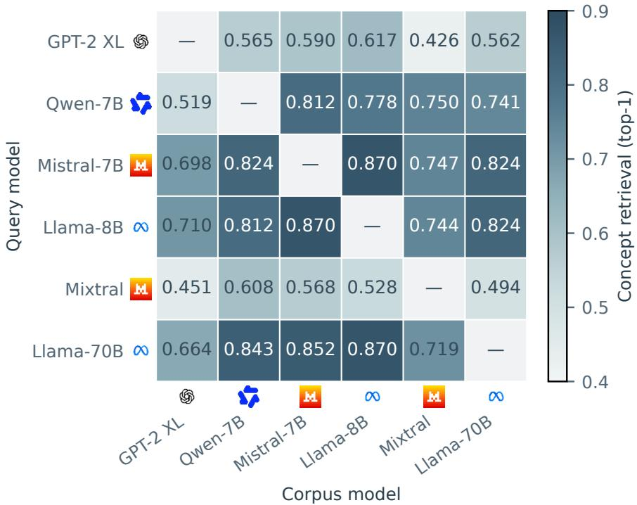  
Figure 23: Historical cross-model concept retrieval in a six-model subset. Values reproduce Table 52 at its reported precision (ofdiagonal mean 69.6%); rows are query models and columns are corpus models. Self-comparisons are omitted. This panel replaces a legacy figure whose fitting statistics referred to a diferent model pool. It reports empirical retrieval under historical alignment, not an optimizer guarantee or held-out-concept generalization.

Table 52: Cross-architecture top-1 concept retrieval via X-FARS shared canonical frame (chance 5.6%). Row: query model; column: corpus model. Cell: mean top-1 accuracy across 6 surface forms, 54 same-form stimuli per side. No model weights are updated; alignment uses shared concept identities. This is not an unpaired evaluation.
<table><tr><td>Query \ Corpus</td><td>GPT-2 XL Qwen-7B</td><td></td><td>Mistral-7B</td><td>Llama-8B</td><td></td><td>Mixtral-MoE Llama-70B</td></tr><tr><td>GPT-2 XL</td><td></td><td>.565</td><td>.590</td><td>.617</td><td>.426</td><td>.562</td></tr><tr><td>Qwen2.5-7B</td><td>.519</td><td>，</td><td>.812</td><td>.778</td><td>.750</td><td>.741</td></tr><tr><td>Mistral-7B-v0.3</td><td>.698</td><td>.824</td><td></td><td>.870</td><td>.747</td><td>.824</td></tr><tr><td>Llama-3.1-8B-Inst</td><td>.710</td><td>.812</td><td>.870</td><td></td><td>.744</td><td>.824</td></tr><tr><td>Mixtral-8x7B-Inst (MoE)</td><td>.451</td><td>.608</td><td>.568</td><td>.528</td><td></td><td>.494</td></tr><tr><td>Llama-3.1-70B-Inst</td><td>.664</td><td>.843</td><td>.852</td><td>.870</td><td>.719</td><td>9</td></tr></table>

Mean of the 30 printed cross-model cells: 0.696. Same-family Llama-8B↔70B: 0.85.

Cross-architecture concept retrieval. X-FARS bases project every model into the same 10-d frame, enabling trainingfree cross-architecture search. Pooled across 30 ordered cross-architecture pairs and 6 forms, top-1 is 69.8% (chance 5.6%; Table 52). Same-family pairs (Llama-70B↔Llama-8B) hit 84–87%; cross-family similar-scale dense models (7– 8B Llama/Mistral/Qwen) 80–87%; GPT-2 XL and Mixtral-as-query are weakest. Cross-architecture retrieval is essentially at parity with within-model cross-form retrieval (70.5%).

Implication. The reported alignment summaries suggest shared structure on this fixed concept inventory. They do not establish convergence to a unique geometry, held-out-concept generalization, or exact optimization. Canonical-axis inter pretations and behavioural associations should be read within their stated model pools.

## Z Composite Concepts and Constituent-Span Reconstruction

Question and scope. How closely do composite projections lie in constituent spans? Span reconstruction is not evidence that the model executes the corresponding symbolic operation.

Table 53: Leave-one-out plug-and-play protocol validated on the full 12-model set. For each held-out model, refit X-FARS on the remaining 11 to obtain a canonical frame $\hat { \bar { C } } ^ { ( - m ) }$ , then construct the held-out basis using a polar-factor SVD update against $\bar { C } ^ { ( - m ) }$ . The plug-in basis recovers $\Delta \mathrm { R S A } \in \left[ - 0 . 0 0 4 , + 0 . 0 1 4 \right]$ relative to the model’s standard FARS basis (mean +0.002). Architectures most divergent from the canonical (RoBERTa, Qwen-3B) benefit most.
<table><tr><td>Held-out model</td><td>Resid. to canonical</td><td>Std. FARS RSA</td><td>Plug-in X-FARS RSA</td></tr><tr><td>GPT-2 XL</td><td>.213</td><td>.279</td><td>.278 (∆−.001)</td></tr><tr><td>六 Qwen-2.5-3B-Inst</td><td>.143</td><td>.332</td><td>.341 (∆+.009)</td></tr><tr><td>Qwen-2.5-7B</td><td>.117</td><td>.357</td><td>.360 (∆+.003)</td></tr><tr><td>Microsoft Phi-3.5-mini-Inst</td><td>.141</td><td>.352</td><td>.351 (∆-.001)</td></tr><tr><td>H Mistral-7B-v0.3</td><td>.118</td><td>.362</td><td>.363 (∆+.001)</td></tr><tr><td>H Mistral-7B-Inst</td><td>.110</td><td>.364</td><td>.365 (∆+.001)</td></tr><tr><td>∞Llama-3.1-8B-Inst</td><td>.093</td><td>.364</td><td>.366 (∆+.002)</td></tr><tr><td>∞ Llama-3.1-70B-Inst</td><td>.143</td><td>.371</td><td>.371 (∆+.000)</td></tr><tr><td>日Mixtral-8x7B-Inst (MoE)</td><td>.110</td><td>.355</td><td>.357 (∆+.001)</td></tr><tr><td>Mamba-2.8B (SSM)</td><td>.140</td><td>.364</td><td>.362 (∆-.001)</td></tr><tr><td>∞RoBERTa-large (encoder)</td><td>.402</td><td>.176</td><td>.190 (∆+.014)</td></tr><tr><td>Microsoft DeBERTa-v3-large (encoder)</td><td>.366</td><td>.336</td><td>.332 (∆−.004)</td></tr></table>

Table 54: Standard FARS (two-step: per-model PCA then post-hoc GPA) vs. X-FARS (historical alignment heuristic) as reported in the historical summary. Cohorts difer by metric; the variance row specifies its own nine-model pool. These entries are not a fresh optimizer validation.
<table><tr><td>Metric</td><td> $\mathbf { F A R S } + \mathbf { G P A }$ </td><td>X-FARS</td></tr><tr><td>Canonical variance explained (9 models, 6 arch. families)</td><td>92.43%</td><td>97.22%</td></tr><tr><td>Cross-family pooled ρ (pred. patching,  $n { = } 1 2 0 )$ </td><td>-0.806</td><td>-0.806</td></tr><tr><td> $\Delta$  per-model concept-RSA vs. FARS</td><td></td><td>[-0.002, -0.0006]</td></tr><tr><td>Steps required</td><td>PCA + iterated Procrustes i</td><td>iterated alignment heuristic</td></tr></table>

Table 55: Compositional FARS span ratios. Top (6 pairs, $n { = } 3 6 ) ;$ : original concept pairs. Bottom (18 pairs, n=108): extended set. Compositionality holds across 4 architecture families spanning 1.6B–70B; 70B has the highest span ratio and both-positive rate.
<table><tr><td>Model</td><td>Span(A,B)</td><td>Span(rand C)</td><td>Span(rand dirs)</td><td>Both  $\alpha , \beta > 0$ </td></tr><tr><td colspan="5">Original 6-pair set (n=36 stimuli):</td></tr><tr><td>GPT-2 XL</td><td>.736</td><td>.537</td><td>.453</td><td>24/36 (67%)</td></tr><tr><td>Llama-3.1-8B-Inst</td><td>.715</td><td>.393</td><td>.410</td><td>27/36 (75%)</td></tr><tr><td>Mistral-7B-v0.3</td><td>.758</td><td>.473</td><td>.406</td><td>31/36 (86%)</td></tr><tr><td colspan="5">Extended 18-pair set (n=108 stimuli):</td></tr><tr><td>Llama-3.1-8B-Inst</td><td>.696</td><td>.422</td><td>.424</td><td>73/108 (68%)</td></tr><tr><td>Mistral-7B-v0.3</td><td>.708</td><td>.481</td><td>.425</td><td>73/108 (68%)</td></tr><tr><td>Llama-3.1-70B-Inst</td><td>.750</td><td>.481</td><td>.390</td><td>92/108 (85%)</td></tr><tr><td colspan="5">Architecture-family extension:</td></tr><tr><td>Mamba-2.8B (state-space)</td><td>.766</td><td>.571</td><td>.430</td><td>71/108 (66%)</td></tr><tr><td>RoBERTa-large (encoder-only MLM)</td><td>.830</td><td>.654</td><td>.394</td><td>78/108 (72%)</td></tr><tr><td colspan="5">Paired Wilcoxon Span(A,B) &gt; controls:  $\scriptstyle p < 1 0 ^ { - 9 }$  all rows; 70B:  $\mathit { p } { = } 2 . 8 \times 1 0 ^ { - 1 1 }$  vs. rand-C,  $6 . 7 \times 1 0 ^ { - 1 7 }$  vs. rand-dir.</td></tr></table>

Method. For each compositional stimulus expressing two atomic TriForm concepts A, B, we project the last-token hidden state at the best FARS layer onto FARS and decompose observed ≈ $\alpha \mathbf { c } _ { A } + \beta \mathbf { c } _ { B }$ via least-squares. The span ratio ∥reconstruction∥/∥observed∥ measures the fraction of activation magnitude in $\operatorname { s p a n } ( \mathbf { c } _ { A } , \mathbf { c } _ { B } )$ (a ratio of norms, not of variance; the corresponding energy fraction is its square). Controls: random-2-concept and random-2-direction in 10-d FARS.

Result: pair LRH on 4 architecture families. Span ratios significantly above both controls on every tested architecture (Table 55, $p { < } 1 0 ^ { - 9 }$ on every row). The finding replicates on Mamba-2.8B (state-space, span 0.77) and RoBERTa-large (encoder MLM, span 0.83); both LSQ coeficients positive in 66–85% of stimuli.

Triplet LRH (3-way). 48 stimuli, 8 triplet templates $\times 3$ instances $\times ~ 2$ forms; span $( \mathrm { A } , \mathrm { B } , \mathrm { C } )$ significantly above rand-3- direction on all 6 generative architectures including state-space Mamba (Table 56).

Table 56: Triplet compositionality $( A \land B \land C ) { : }$ 48 stimuli across 8 triplet templates, tested on 6 models spanning dense decoderonly AND state-space (Mamba) architectures. Span(A,B,C) is the least-squares span ratio against 3 atomic centroids; “rand-3-C” and $\mathrm { \ " ~ } \mathrm { r a n d } - 3 \mathrm { - D } \mathrm { \ " ~ }$ are random-3-concept and random-3-direction controls. All six tested models show span(A,B,C) significantly higher than random-direction control $\scriptstyle ( p < 1 0 ^ { - 4 }$ on every model); the smaller models (Phi-3.5, Qwen-3B) show the largest span ratios (0.83–0.92) and highest all-positive-3-coefs rates (52–58%), well above the chance rate of $1 / 2 ^ { 3 } = 1 2 . 5 \%$
<table><tr><td>Model</td><td>Span(A,B,C)</td><td>rand-3-C</td><td>rand-3-D</td><td>p vs rand-D</td><td> $\mathbf { A } \mathbf { I } | \alpha , \beta , \gamma { > } 0$ </td></tr><tr><td>Phi-3.5-mini-Inst (3.8B dense, L=18)</td><td>.92</td><td>.86</td><td>.53</td><td> $< 1 0 ^ { - 1 2 }$ </td><td>25/48 (52%)</td></tr><tr><td>Qwen-2.5-3B-Inst (dense, L=22)</td><td>.83</td><td>.76</td><td>.46</td><td> $< 1 0 ^ { - 1 2 }$ </td><td>26/48 (54%)</td></tr><tr><td>Mamba-2.8B (state-space, L=35)</td><td>.83</td><td>.60</td><td>.52</td><td> ${ \bf 2 . 3 \times 1 0 ^ { - 1 2 } }$ </td><td>27/48 (56%)</td></tr><tr><td>Qwen-7B (dense decoder, L=13)</td><td>.81</td><td>.62</td><td>.49</td><td> $1 . 1 \times { 1 0 } ^ { - 1 1 }$ </td><td>28/48 (58%)</td></tr><tr><td>Mistral-7B-Inst (dense, L=10)</td><td>.76</td><td>.60</td><td>.53</td><td> $1 . 5 \times 1 0 ^ { - 6 }$ </td><td>19/48 (40%)</td></tr><tr><td>Llama-3.1-8B-Inst (dense, L=8)</td><td>.68</td><td>.60</td><td>.51</td><td> $9 . 3 \times 1 0 ^ { - 5 }$ </td><td>19/48 (40%)</td></tr></table>

Table 57: Quartet (4-way) compositionality on 4 models, 24 stimuli. Span(A,B,C,D) vs. rand-4-concept (rand-C) and rand-4-direction (rand-D). Only Mamba’s ∆ over rand-C reaches significance.
<table><tr><td>Model</td><td>Span(A,B,C,D)</td><td>rand-C</td><td>rand-D</td><td>∆ rand-C</td><td>All 4&gt;0</td></tr><tr><td>Mamba-2.8B (state-space)</td><td>.87</td><td>.79</td><td>.60</td><td> $+ . 0 8 \left( p { = } 0 . 0 2 3 \right)$ </td><td>10/24 (42%)</td></tr><tr><td>Qwen-7B (dense)</td><td>.84</td><td>.84</td><td>.63</td><td> $. 0 0 \ ( \mathrm { n . s . } )$ </td><td>6/24 (25%)</td></tr><tr><td>Mistral-7B-Inst (dense)</td><td>.79</td><td>.74</td><td>.58</td><td> $+ . 0 5 \ : ( \mathrm { n . s . ) }$ </td><td> $4 \dot { / } 2 4 ( 1 7 \% )$ </td></tr><tr><td>Llama-3.1-8B-Inst (dense)</td><td>.68</td><td>.70</td><td>.60</td><td> $- . 0 2 \ ( \mathrm { n . s . } )$ </td><td> $4 \dot { / } 2 4 ( 1 7 \% )$ </td></tr></table>

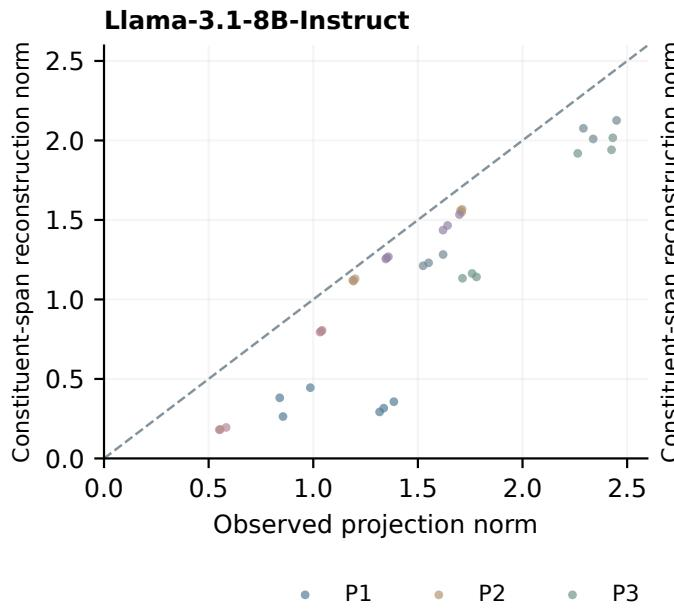

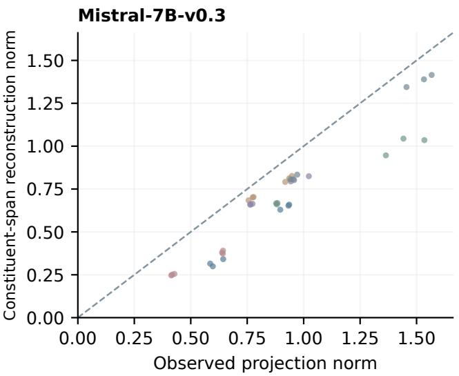  
Figure 24: Constituent-span reconstruction in two cached model runs. Each panel contains 36 composite projections over six concept pairs. Axes show projection and reconstruction norms; the dashed line is equality. Mean norm ratios are 0.715 for Llama-3.1-8B-Instruct (layer 8) and 0.758 for Mistral-7B-v0.3 (layer 11). Both panels are rebuilt from saved activations and bases; they are a two-model subset of Table 55. P1: gcd + transitivity; P2: modular arithmetic + modus ponens; P3: causal chain + multi-step arithmetic; P4: syllogism + set intersection; P5: function composition + modus ponens; P6: spatial direction + proportionality.

Architectural scope: encoder MLMs fail triplet. DeBERTa-v3-large (L=15, same 48 stimuli): span $( A , B , C ) = . 6 6$ below rand-3-concept .76; all-three-positive in 0/48. Pair LRH still holds on both encoders, so the encoder boundary sits between 2D and 3D composition.

Quartet (4-way) saturates. Only Mamba-2.8B clearly beats rand-4-concept (span 0.87 vs. 0.79, p=0.023); dense transformers tie or lose vs. rand-C while beating rand-D (Table 57). LRH composition saturates as arity approaches FARS dimensionality.

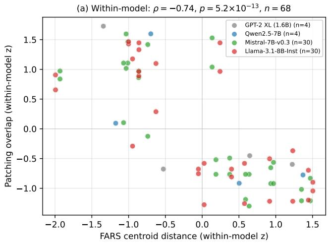

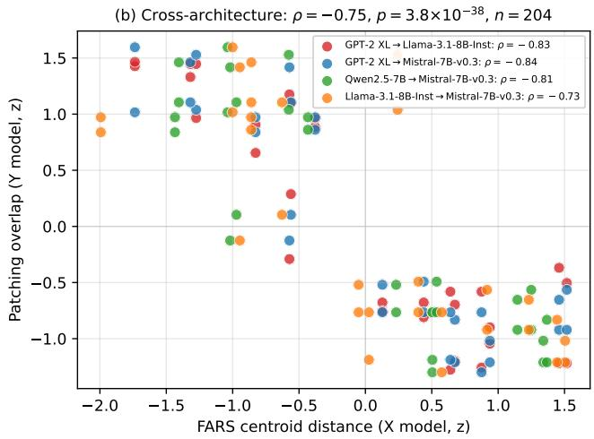  
Figure 25: Historical predictiveness from centroid distances. Within-model (left) and cross-model (right) associations with patching overlap. The reported cross-family aggregate is $\rho = - 0 . 7 5$ over 204 repeated entries. Random low-rank projections recover much of the association $( \rho = - 0 . 7 1 )$ ; these correlations do not establish causal necessity.

Scope. Strict equal-weight sum observed ≈ ${ \bf c } _ { A } + { \bf c } _ { B }$ fails (p≈1, n=36); the span-level claim is supported, coeficient mixtures depend on the instance rather than being canonical (1, 1). FARS concepts compose linearly but with data dependent coeficients.

## AA Cross-Model FARS Geometry Predicts Other Models’ Behavior

Question and scope. Do geometric relations predict reported patching overlap? Random low-rank projections also recover much of this relation, so predictive correlation is not unique to FARS.

Method and reported result. For each model pair (X, Y), correlate X’s centroid distances across ordered form pairs with Y’s patching overlap. Llama-3.1-8B-Instruct and Mistral-7B have 30 tested form pairs; GPT-2 XL and Qwen-7B have 4. Table 58 reports the resulting matrix. Across the 12 of-diagonal cells, within-cell standardisation gives pooled Spearman $\rho = - 0 . 7 5 0$ over 204 entries. The reported association is exploratory: cells share models and form pairs, and the random-projection control below recovers much of it.

Table 58: Spearman ρ between X’s FARS-distance per form-pair (rows) and Y’s patching overlap (cols). Of-diagonal cells with n=30 are the strongest evidence: X and Y are diferent models. Pooled cross-family $\rho { = } { - } 0 . 7 5 0 \ ( p { = } 3 . 8 { \times } 1 0 ^ { - 3 8 } , n { = } 2 0 4 )$
<table><tr><td colspan="3">X ↓ / Y → GPT-2 Llama Mistral Qwen</td></tr><tr><td>GPT-2 XL -.40 Llama-Inst +.20 Mistral-7B +.20 -.76 Qwen-7B +.20 -.78 -.81</td><td>-.83 -.70 -.73 -.80</td><td>-.84-.80 -.60 -.60</td></tr></table>

Bold: cross-family n=30. Plain: n=4.

Scope: predictiveness is not unique to FARS. A random orthonormal 10-d projection recovers cross-family $\rho { = } { - } 0 . 7 1 4$ compared with FARS’s −0.750; the shufled-Y null is near zero (Table 59). These results support shared geometric structure, but do not isolate concept-specific computation. Historical intervention results (App. P.2, P.1, P.3) use diferent endpoints and controls; they should not be read as proving unique causal necessity. Repeated form pairs across cells also limit an independent-sample interpretation of pooled significance.

Table 59: Historical cross-family predictiveness controls (within-cell z-pooled, n=204). Random projections retain much of the correlation. Reported p-values are historical; pooled entries share models and form pairs.
<table><tr><td>Projection</td><td>Cross-family ρ</td><td> $p$ </td></tr><tr><td>FARS centroid (10-dim, supervised)</td><td>-0.750</td><td> $3 . 8 \times 1 0 ^ { - 3 8 }$ </td></tr><tr><td>Random orthonormal (10-dim, no labels)</td><td>-0.714</td><td> $3 . 9 \times 1 0 ^ { - 3 3 }$ </td></tr><tr><td>Shuffled-Y (1000 permutations)</td><td></td><td>−0.001 (mean) 95% CI [−.13, +.14]</td></tr></table>