# CONFLICTGUIDE: AUTORESEARCH IMPROVES WHEN COMPETING BEHAVIORS ARE MADE VISIBLE

Binqian Xu1, Qiran Zou1, Xiangbo Shu2, Dianbo Liu1

1National University of Singapore

2Nanjing University of Science and Technology

## ABSTRACT

When designing machine learning models, desirable properties are often in tension: improving one behavior can impair another, so task progress can depend on alleviating the conflict. LLM-based AutoResearch systems, which iteratively edit model code and retain edits based on scalar task-performance feedback, have largely ignored this trade-off. We find that scalar feedback supports broad exploration early in search, but it does not reveal how edits affect competing behaviors. In matched-budget experiments, introducing competing-behavior feedback as task gains diminish increases the share of proposals that improve both behaviors and sustains progress beyond scalar-only plateaus. Obtaining this feedback for a given model requires identifying its competing behaviors and designing probes to measure them. To make competing-behavior feedback actionable, we introduce ConflictGuide. Its reusable ConflictGuide-Skill combines a literature-grounded taxonomy with model-specific evidence to identify competing behaviors and specify probes for a code agent to implement as metrics. Evolution proceeds in two stages: Stage I explores with task feedback; Stage II uses probe feedback to steer proposals toward conflict alleviation and retains marginal-gain edits only when probes indicate sufficient alleviation. Across five diverse model families, Conflict-Guide reduces task and conflict-related errors by up to 28% and 14%, respectively, relative to scalar-only AutoResearch, with gains extending to other code agents.

## 1 INTRODUCTION

Machine-learning models are often expected to exhibit more than one desirable behavior (Sener & Koltun, 2018). Balancing these behaviors has long been a challenge: improving one can impair another (Tsipras et al., 2019). In the 1990s, soft-margin support vector machines balanced margin width against the cost of margin violations (Cortes & Vapnik, 1995). GANs face a different challenge: generating convincing samples without collapsing to a few modes (Salimans et al., 2016). Related challenges arise in adversarial classifiers, where gains in standard accuracy can reduce robustness (Tsipras et al., 2019), and in uncertainty-aware classifiers, which must predict accurately on familiar inputs while expressing greater uncertainty as inputs move farther from the training data (Liu et al., 2020). The sources of tension vary across models: limited capacity, competing demands on shared representations, properties of the data, and training choices can all contribute (Sener & Koltun, 2018). The resulting trade-offs need not be strictly zero-sum: advances in model design or training can improve the attainable balance (Addepalli et al., 2022).

Recent AutoResearch systems automate model development through iterative experimentation. In a typical loop, an LLM coding agent edits training code, evaluates each revision under a fixed trainingtime budget, and retains edits primarily based on a scalar task metric (Karpathy, 2026). Some systems augment this loop with task-specific diagnostic feedback. Self-EvolveRec uses simulateduser critiques and model diagnostics to identify recommendation failures (Kim et al., 2026), while EvoPINN analyzes training trajectories to guide changes to neural representations and training procedures (Yin et al., 2026). These systems use failure diagnosis and training-dynamics analysis, respectively, to identify task-specific performance bottlenecks and guide subsequent revisions. From a model-design perspective, however, unresolved tensions between desirable behaviors may limit performance, yet scalar task metrics do not reveal how code edits affect each behavior. Competingbehavior feedback can therefore complement these diagnostics by exposing such effects. To our knowledge, we provide the first explicit exploration of this feedback in AutoResearch.

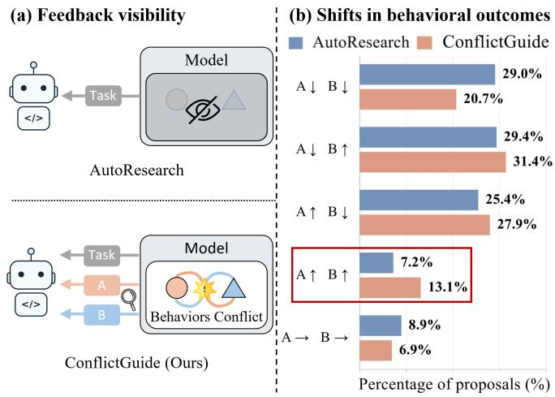

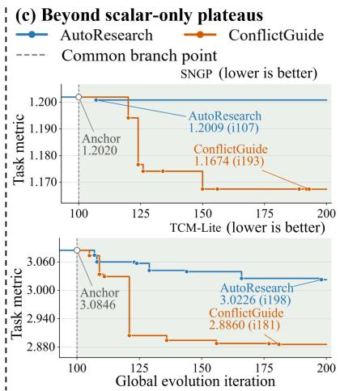  
Figure 1: Comparison of AutoResearch (scalar-only feedback) and ConflictGuide (competingbehavior feedback). (a) Feedback visible to the code agent. (b) Proposal-level behavioral outcomes across models. ConflictGuide increases joint improvements from 7.2% to 13.1% and reduces joint degradations from 29.0% to 20.7%. (c) From common branch points under matched continuation budgets, ConflictGuide continues to lower the task metrics, whereas AutoResearch plateaus.

How competing-behavior feedback shapes search may, however, depend on when it is introduced. We therefore conducted two matched-budget exploratory studies within a standard scalar-guided AutoResearch loop. On a spectral neural operator (Qin et al., 2024), feedback provided from the outset produced conflict-specific edits but concentrated the search on spectral compensation, whereas scalar-only feedback yielded a broader mix of representational and optimization changes (Appendix A). We then tested delayed feedback from common scalar-only branch points reached as task gains diminished. The share of proposals improving both behaviors rose from 7.2% to 13.1%, while the share degrading both behaviors fell from 29.0% to 20.7% (Figure 1(b)). Delayed-feedback searches also continued to improve task performance, whereas matched scalar-only continuations made little further progress (Figure 1(c)). Together, these observations motivate a two-stage design in which scalar feedback first supports broad task-oriented exploration, after which competingbehavior feedback focuses subsequent refinement on unresolved conflicts.

To obtain competing-behavior feedback across models, we construct a literature-grounded conflict taxonomy. It organizes conflicts by root cause, competing axis, and mechanism, with nine roots, six axes, and 110 mechanisms spanning model design, data, training, and evaluation (Appendix D). Built on this taxonomy, the reusable ConflictGuide-Skill uses evidence from a target model’s architecture, task and data, training objective, and evaluation setting to identify candidate conflicts. For each supported conflict, it specifies a compact, non-redundant probe set that a code agent implements as metrics (Figure 2(a)). Before evolution, probes are experimentally qualified, with supporting evidence and results available for inspection. Guided by the exploratory findings, ConflictGuide begins with scalar task feedback for broad exploration (Stage I). As task gains diminish, Stage II makes probe results visible to the code agent while recording them alongside code edits in the search history (Figure 2(b)). These results reveal the conflict-related effects of code edits and guide subsequent proposals toward conflict alleviation. They also inform retention: edits with marginal positive task gains are kept only when the probes indicate sufficient alleviation.

Our main contributions are summarized as follows: 1) Competing-behavior feedback for AutoResearch. To our knowledge, we are the first to introduce such feedback into AutoResearch to alleviate behavioral conflicts and enable further performance gains. 2) ConflictGuide-Skill for conflict identification. We introduce a reusable agent skill built on a literature-grounded Root– Axis–Mechanism taxonomy. Given a target model, it identifies model-specific conflicts and designs measurable probes for experimental qualification. 3) ConflictGuide for two-stage evolution. We propose ConflictGuide, which uses scalar task feedback for initial exploration and then introduces skill-derived conflict feedback to guide proposals toward conflict-relevant model components and inform edit retention. 4) Evaluation across models and agents. Across five different model families, ConflictGuide achieves up to 28% lower task error and 14% lower conflict-related error under matched budgets, improves beyond scalar-only search plateaus, and generalizes across code agents.

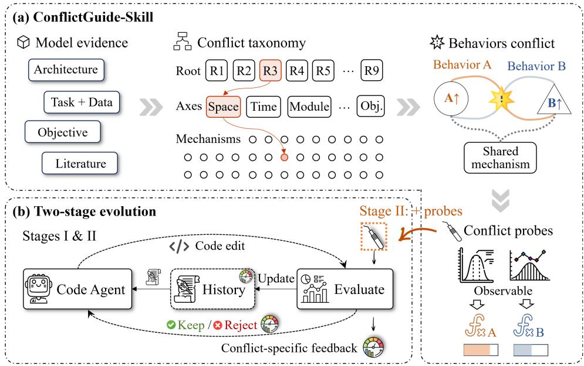  
Figure 2: Overview of ConflictGuide. (a) ConflictGuide-Skill uses a literature-grounded taxonomy to identify a model-specific conflict and operationalize its competing behaviors through qualified probes. (b) Both stages share the evolution loop: Stage I uses scalar feedback for exploration; once task-metric gains diminish, Stage II adds conflict-specific feedback to guide proposals and retention.

## 2 RELATED WORK

Feedback and Diagnosis in Automated Model Evolution. Automated model-evolution systems supplement task-performance feedback with diagnostic and structural signals. LLaMEA-SAGE derives mutation guidance from performance-relevant code structures (van Stein et al., 2026), while NOVA integrates history, verification diagnostics, and trajectory memory into an architecture gradi ent (Liu et al., 2026c). Other systems evaluate candidates against external criteria, such as machinecheckable physical requirements (Abueidda et al., 2026) or benchmarks for known alignment failures (Yueh-Han et al., 2026). A more targeted line diagnoses performance limits and intervention targets: Self-EvolveRec translates model weaknesses into directional guidance (Kim et al., 2026), GoalEvolve localizes multi-objective gaps to optimization stages (Liu et al., 2026a), and EvoPINN conditions proposals on training-state diagnostics (Yin et al., 2026). Whereas these methods derive guidance from code structure, verification, domain requirements, or performance bottlenecks, ConflictGuide diagnoses a persistent mechanism-level conflict between competing behaviors. Quantitative Probes track this conflict after each edit, revealing whether the edit alleviates or aggravates it. Introduced after task gains diminish, this conflict-specific evidence guides subsequent proposals and informs retention. Additional related work appears in the Appendix B.

## 3 METHOD

As shown in Figure 2, ConflictGuide combines ConflictGuide-Skill with a two-stage evolution pipeline. The skill identifies a model-specific conflict and operationalizes it through qualified probes of the competing behaviors. The pipeline uses scalar task feedback for initial exploration, then probe-derived feedback to guide conflict-aware proposals and provide an auxiliary retention path.

## 3.1 PROBLEM SETUP

Let $x _ { t }$ denote the training code retained at iteration t. A coding agent proposes an edit $e _ { t } ,$ , producing the candidate $x _ { t } ^ { e _ { t } } = T _ { e _ { t } } \bar { ( x _ { t } ) }$ , which is evaluated under a fixed experimental budget. Let $S ( x )$ be the scalar task metric, which is minimized in all our experiments, and define its task gain as

$$
G _ { t } = S ( x _ { t } ) - S ( x _ { t } ^ { e _ { t } } ) ,\tag{1}
$$

such that $G _ { t } ~ > ~ 0$ indicates improved task performance. Standard AutoResearch conditions each proposal on the current code and a task-feedback history,

$$
e _ { t } \sim \pi \big ( \cdot \mid x _ { t } , \mathcal { H } _ { t } ^ { S } \big ) , \qquad \mathcal { H } _ { t } ^ { S } = \{ ( e _ { i } , G _ { i } ) \} _ { i < t } .\tag{2}
$$

Although $G _ { t }$ determines whether an edit improves overall performance, it does not reveal how that edit affects the competing behaviors underlying the task metric. We define a model-specific conflict $c = ( B _ { A } , B _ { B } , \mathsf { \bar { M } } _ { c } )$ by two desirable behaviors, $B _ { A }$ and $B _ { B } ,$ , that interact through a model mechanism $M _ { c }$ such that improving one may impair the other. ConflictGuide-Skill associates the conflict with a set of probes $\mathbf { \check { Z } } _ { c } ( x ) = [ Z _ { 1 } ( x ) , \cdot \cdot \cdot , \mathbf { \check { Z } } _ { m } ( x ) ]$ ]. Each probe has a pre-specified desirable direction. Let

$$
\mathbf { G } _ { c , t } ^ { Z } = [ G _ { 1 , t } ^ { Z } , \dots , G _ { m , t } ^ { Z } ]\tag{3}
$$

denote the behavior-specific probe improvements of the candidate relative to the current code. A positive component indicates improvement in the corresponding behavior.

## 3.2 CONFLICTGUIDE-SKILL

ConflictGuide-Skill screens Root–Axis–Mechanism paths from a literature-grounded taxonomy using evidence from the target model’s architecture, task and data, training objective, task metric, and evaluation setting. It instantiates c only when the evidence supports two desirable behaviors coupled by a concrete mechanism $M _ { c } ;$ ; otherwise, it abstains.

For an identified conflict, the skill specifies a minimal, non-redundant probe set

$$
Z _ { j } ( x ; { \mathcal E } _ { j } ) = g _ { j } ( O _ { j } ( x ; { \mathcal E } _ { j } ) ) , \qquad j = 1 , \dotsc , m ,\tag{4}
$$

where $O _ { j }$ is an observable from model outputs, internal states, or parameters, and $g _ { j }$ computes the behavior metric. A code agent implements the probes as read-only metrics. The skill also defines a probe-based alleviation function $A _ { c } ( e _ { t } )$ , evaluated in the current search context using model-specific reference and guard conditions. Before evolution, null calibration and paired evaluation reject unsupported probes and calibrate the threshold $\tau _ { c }$ for substantial alleviation. Only qualified outputs $( c , \mathbf { \bar { Z } } _ { c } , A _ { c } , \mathbf { \bar { \eta } } _ { c } )$ are passed to ConflictGuide; full taxonomy (Appendix D), screening, abstention, and qualification details are provided in the Appendix C.

## 3.3 TWO-STAGE CONFLICTGUIDE EVOLUTION

Stage I: scalar-guided exploration. ConflictGuide follows standard AutoResearch for $T _ { 1 }$ iterations. The agent observes only $\mathcal { H } _ { t } ^ { S }$ , supporting broad exploration before conflict-specific feedback is introduced. The stage boundary $T _ { 1 }$ is fixed before evolution; we evaluate its sensitivity in Section 4.

Stage II: conflict-aware refinement. After Stage I, ConflictGuide augments the evolution history with the qualified probe improvements:

$$
\mathcal { H } _ { t } ^ { S , Z } = \mathcal { H } _ { T _ { 1 } } ^ { S } \cup \{ ( e _ { i } , G _ { i } , \mathbf { G } _ { c , i } ^ { Z } ) \} _ { T _ { 1 } \leq i < t } , \qquad e _ { t } \sim \pi \Big ( \cdot \mid x _ { t } , \mathcal { H } _ { t } ^ { S , Z } , c , \mathbf { Z } _ { c } \Big ) .\tag{5}
$$

In Stage II, the agent observes each edit’s task gain and probe-derived behavior changes. The prompt specifies the identified conflict and conflict-relevant components available for modification. This information reveals how prior edits affected the conflict and guides proposals within that scope.

Probe feedback additionally informs retention of marginal task gains and ties. Let $\tau _ { S } \geq 0$ separate substantive from marginal task gains, and let $B _ { c } \subseteq [ 0 , \bar { \tau } _ { S } ]$ denote the model-specific task-gain band eligible for probe-based retention. ConflictGuide retains an edit when

$$
\operatorname { K e e p } ( e _ { t } ) = \mathbb { I } [ G _ { t } > \tau _ { S } ~ \lor ~ ( G _ { t } \in \mathcal { B } _ { c } \land A _ { c } ( e _ { t } ) > \tau _ { c } ) ] .\tag{6}
$$

Table 1: Five experimental model–conflict settings and primary Probe metrics (Appendix F).
<table><tr><td></td><td colspan="2">Model Domain / Task</td><td>Conflict mechanism (Axis)</td><td colspan="2">Primary Probe metric(s)</td></tr><tr><td>SpecB- FNO</td><td>Scientific learning</td><td></td><td>R2.M2 (space) ML Frequency-structure mis- / PDE operator match: dominant-mode fit vs. non-dominant-mode utiliza- tion</td><td> $\begin{array} { r } { Z _ { \mathrm { N D } } ( x ) = \frac { \bigcup _ { n , \tau } \bigcup \kappa \in \mathcal { N } \setminus \tau ^ { \mathrm { ~ v ~ } _ { 1 } } , \tau , \kappa ! } { \sum _ { n , t } \sum _ { k \in \mathcal { N } } w _ { k } | Y _ { n , t , k } | ^ { 2 } + \epsilon _ { \mathrm { s p e c } } } \ \downarrow } \end{array}$ </td><td> $\begin{array} { r } { \sum _ { n , t } \sum _ { k \in \mathcal { N } } w _ { k } | R _ { n , t , k } ^ { ( x ) } | ^ { 2 } } \end{array}$ </td></tr><tr><td>SNGP</td><td>Uncertainty- detection</td><td></td><td>R3.M4(objective) aware classifi- Compression vs. uncertainty: cation / OOD predictive fit vs. distance- aware feature geometry</td><td></td><td> $Z _ { \mathrm { m a r } } = Q _ { q _ { \mathrm { m a r } } } \biggl [ \mathcal { \tilde { Z } } _ { i } ^ { \top } \boldsymbol { \widetilde { \mu } } _ { y _ { i } } - \underset { c \neq y _ { i } } { \operatorname* { m a x } } \boldsymbol { \widetilde { z } } _ { i } ^ { \top } \boldsymbol { \widetilde { \mu } } _ { c } \biggr ] \uparrow$   $Z _ { \mathrm { d i s t } } = \operatorname* { m a x } _ { g \in \{ \mathrm { s } , \mathrm { c } \} } Q _ { q _ { \mathrm { d i s t } } } [ \left| r _ { i j } - \widetilde { r } \right| ] _ { ( i , j ) \in \mathcal { P } _ { g } } \downarrow$ </td></tr><tr><td>ESN</td><td>Reservoir computing diction</td><td></td><td>R2.M4 (time) / Temporal-component mis- time-series pre- match: memory retention vs nonlinear processing</td><td> $Z _ { \mathrm { m e m } } = \mathbb { E } _ { q , t , d , j } [ \operatorname* { m i n } \{ \sigma _ { j } \left( P _ { q , t , d } \right) , 1 \} ] \uparrow$ </td><td> $Z _ { \mathrm { n l } } = \mathbb { E } _ { q } \left[ \frac { \mathbb { E } _ { t } \left. K _ { q , t } - \overline { { K } } _ { q } \right. _ { F } ^ { 2 } } { \mathbb { E } _ { t } \left. K _ { q , t } \right. _ { F } ^ { 2 } + \epsilon _ { \mathrm { n l } } } \right] \mathrm { \hat { \Omega } } \mathrm { \hat { \Omega } }$ </td></tr><tr><td>TCM- Lite</td><td>rate-distortion coding</td><td>Learned image R3.M10 (space)</td><td>compression / Compact representation dam- aging fine structure: latent rate vs. detail preservation</td><td></td><td> $Z _ { \mathrm { r a t e } } ( x ) = - N _ { \mathrm { p i x } } ^ { - 1 } \sum _ { u \in \widehat { \mathcal { U } } _ { x } } \log _ { 2 } \widetilde { p } _ { x } ( u ) \ \downarrow$   $Z _ { \mathrm { d e t a i l } } ( \boldsymbol { x } ) = \mathbb { E } _ { s } \left[ \frac { \lVert \boldsymbol { \nabla } L _ { s } - \boldsymbol { \nabla } \widehat { L } _ { x , s } \rVert _ { 1 } } { \lVert \boldsymbol { \nabla } L _ { s } \rVert _ { 1 } + \lVert \boldsymbol { \nabla } \widehat { L } _ { x , s } \rVert _ { 1 } + \epsilon } \right] \mathrm { ~ , ~ }$ </td></tr><tr><td></td><td>GCNII node classifica- tion</td><td>Graph learning /</td><td>R2.M5 (space) Relational-structure mis- match: useful aggregation vs. incompatible messages</td><td></td><td> $Z _ { \mathrm { d i s } } ( x ) = \mathbb { E } _ { k } \left[ \mathcal { L } _ { \mathrm { N L L } } \Big ( x ; A _ { \mathrm { d i s } } ^ { ( k ) } , X , \mathcal { V } \Big ) - S ( x ) \right] \downarrow$ </td></tr></table>

Table 2: SpecB–FNO on 2D incompressible Navier–Stokes $( \nu = 1 0 ^ { - 5 } ; 6 4 \times 6 4 )$ . NRMSE is the task metric; ND-NMSE the conflict-specific Probe; Params in millions. $\mathrm { { M e a n } \pm \ s . d . }$ over three paired seeds; bold = lowest error per round; “None (Original)” denotes the unmodified reference.
<table><tr><td>Round</td><td>Method</td><td>Main Cumulative Edit</td><td>NRMSE↓</td><td>ND-NMSE↓</td><td>Params (M) ↓</td></tr><tr><td rowspan="3">0</td><td>Reference</td><td>None (Original)</td><td> $0 . 0 4 5 8 \pm 0 . 0 0 1 4$ </td><td> $0 . 0 8 6 1 \pm 0 . 0 0 8 6$ </td><td>328.5</td></tr><tr><td>Autoresearch</td><td>Spatial gate</td><td> $0 . 0 3 8 2 \pm 0 . 0 0 1 5$ </td><td> $0 . 0 6 1 7 \pm 0 . 0 0 5 0$ </td><td>328.9</td></tr><tr><td>ConflictGuide</td><td>Mode refinement</td><td> $\mathbf { 0 . 0 3 4 4 } \pm \mathbf { 0 . 0 0 0 3 }$ </td><td> $\mathbf { 0 . 0 5 3 0 \pm 0 . 0 0 0 7 }$ </td><td>333.5</td></tr><tr><td rowspan="3">1</td><td>Reference</td><td>None (Original)</td><td> $0 . 0 4 5 8 \pm 0 . 0 0 1 4$ </td><td> $0 . 0 8 6 1 \pm 0 . 0 0 8 6$ </td><td>328.5</td></tr><tr><td>Autoresearch</td><td>Energy match</td><td> $0 . 0 4 4 5 \pm 0 . 0 0 0 7$ </td><td> $0 . 0 7 6 6 \pm 0 . 0 0 3 5$ </td><td>403.9</td></tr><tr><td>ConflictGuide</td><td>Multi-scale residual</td><td> $\mathbf { 0 . 0 4 4 2 \pm 0 . 0 0 1 4 }$ </td><td> $\mathbf { 0 . 0 7 6 0 \pm 0 . 0 0 6 4 }$ </td><td>407.2</td></tr><tr><td rowspan="3">2</td><td>Reference</td><td>None (Original)</td><td> $0 . 0 4 5 8 \pm 0 . 0 0 1 4$ </td><td> $0 . 0 8 6 1 \pm 0 . 0 0 8 6$ </td><td>328.5</td></tr><tr><td>Autoresearch</td><td>Spectral shaping</td><td> $0 . 0 3 9 9 \pm 0 . 0 0 0 7$ </td><td> $0 . 0 6 9 8 \pm 0 . 0 0 3 9$ </td><td>350.4</td></tr><tr><td>ConflictGuide</td><td>Cross-bypass</td><td> $\mathbf { 0 . 0 3 9 8 \pm 0 . 0 0 0 7 }$ </td><td> $\mathbf { 0 . 0 6 9 5 \pm 0 . 0 0 3 7 }$ </td><td>350.4</td></tr></table>

The first branch retains substantive task improvements; the second requires qualified probe-based alleviation within $\boldsymbol { B } _ { c } .$ . Negative task gains are never retained. Model-specific task-gain bands, reference choices (current parent or frozen Stage-I anchor), and guard conditions are detailed in Appendix G. More generally, Appendix E formalizes how probe feedback can improve the identifiability of conflict-alleviating edits beyond scalar feedback alone.

## 4 EXPERIMENTS

Experimental Setup. All models follow a two-stage protocol with model-specific budgets (mostly 100/100; see Appendix G): a task-feedback-only phase followed by two matched continuations from the same branch point. AutoResearch uses task-performance feedback alone, whereas Conflict-Guide additionally observes the conflict-specific feedback in Table 1. Both methods use Claude Code Opus 4.6 (Anthropic, 2025) unless otherwise noted. We repeat the full process over three independent search rounds and select one winner from each trajectory for formal evaluation. We consider five heterogeneous settings: SpecB-FNO (Qin et al., 2024), two-dimensional Navier–Stokes operator learning at 64 × 64 resolution (Li et al., 2021) using a width-32, four-layer FNO with 32 Fourier modes (validation NRMSE); SNGP (Liu et al., 2020), a WRN-28-2-based SNGP on CIFAR-100 (Krizhevsky, 2009) (temperature-scaled validation NLL); GCNII (Chen et al., 2020), node classification on Chameleon (Pei et al., 2020) using an eight-layer GCNII with hidden dimension 64 (clean validation NLL); ESN (Inubushi & Yoshimura, 2017), a 100-unit echo-state network for NARMA-30 (Schrauwen et al., 2008) sequence prediction (validation NRMSE); and TCM-

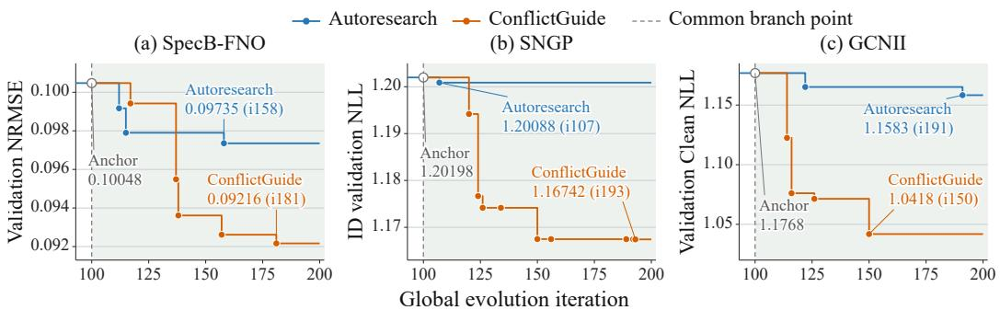  
Figure 3: Validation trajectories for one search round on SpecB-FNO, SNGP, and GCNII. Both methods continue from a common branch point with equal budgets; lower is better in all panels.

Table 3: SNGP on CIFAR-100. Clean ID NLL is the task metric; OOD AUPR (DS) is the corresponding held-out conflict-related outcome. Mean ± s.d. over three paired seeds; bold = best per round; “None $( \mathrm { O r i g i n a l } ) ^ { * }$ denotes the unmodified reference.
<table><tr><td rowspan="2">Round Method</td><td rowspan="2"></td><td rowspan="2">Main Cumulative Edit</td><td rowspan="2">NLL↓</td><td colspan="2">OOD AUPR ↑</td></tr><tr><td>SVHN</td><td>CIFAR-10</td></tr><tr><td rowspan="3">0</td><td>Reference</td><td>None (Original)</td><td> $1 . 0 4 3 4 \pm 0 . 0 1 1 1$ </td><td> $0 . 7 5 3 8 \pm 0 . 0 3 2 2$ </td><td> $0 . 7 3 0 4 \pm 0 . 0 0 2 9$ </td></tr><tr><td></td><td>Autoresearch Multi-scale RFF</td><td> $1 . 0 5 7 8 \pm 0 . 0 0 0 4$ </td><td> $0 . 7 2 5 9 \pm 0 . 0 2 9 8$ </td><td> $0 . 7 3 3 9 \pm 0 . 0 0 4 5$ </td></tr><tr><td></td><td>ConflictGuide LN-residual RFF</td><td> $\mathbf { 0 . 8 5 0 8 \pm 0 . 0 0 6 1 }$ </td><td> $\mathbf { 0 . 7 9 7 0 \pm 0 . 0 0 9 0 }$ </td><td> $\mathbf { 0 . 7 4 8 7 \pm 0 . 0 0 2 2 }$ </td></tr><tr><td rowspan="3">1</td><td>Reference</td><td>None (Original)</td><td> $1 . 0 4 3 4 \pm 0 . 0 1 1 1$ </td><td> $0 . 7 5 3 8 \pm 0 . 0 3 2 2$ </td><td> $0 . 7 3 0 4 \pm 0 . 0 0 2 9$ </td></tr><tr><td></td><td>Autoresearch Adaptive normalized RFF</td><td> $0 . 9 4 2 1 \pm 0 . 0 0 0 8$ </td><td> $0 . 7 7 1 1 \pm 0 . 0 1 2 2$ </td><td> $0 . 7 4 5 5 \pm 0 . 0 0 2 4$ </td></tr><tr><td>ConflictGuide Orthogonal</td><td> $\mathrm { R F F + d i f f . \ S N }$ </td><td> $\mathbf { 0 . 8 7 9 4 \pm 0 . 0 0 9 2 }$ </td><td> $\mathbf { 0 . 7 7 2 9 \pm 0 . 0 1 6 7 }$ </td><td> $\mathbf { 0 . 7 4 9 7 \pm 0 . 0 0 5 6 }$ </td></tr><tr><td rowspan="3">2</td><td>Reference</td><td>None (Original)</td><td> $1 . 0 4 3 4 \pm 0 . 0 1 1 1$ </td><td> $0 . 7 5 3 8 \pm 0 . 0 3 2 2$ </td><td> $0 . 7 3 0 4 \pm 0 . 0 0 2 9$ </td></tr><tr><td></td><td>Autoresearch Fixed orthogonal RFF</td><td> $1 . 1 7 7 7 \pm 0 . 0 2 1 0$ </td><td> $0 . 7 8 9 0 \pm 0 . 0 3 8 9$ </td><td> $0 . 7 1 8 1 \pm 0 . 0 0 4 9$ </td></tr><tr><td></td><td>ConflictGuide Learnable RFF + mean-field</td><td> $\mathbf { 0 . 8 4 5 5 \pm 0 . 0 0 7 6 }$ </td><td>0.8131 ± 0.0294</td><td> $\mathbf { 0 . 7 3 5 7 \pm 0 . 0 0 1 0 }$ </td></tr></table>

Table 4: GCNII on Wisconsin. Clean accuracy and NLL measure performance; contaminated NLL measures performance under contamination $( \rho = 0 . 3 )$ $\mathrm { M e a n } \pm \mathrm { s . d } .$ over ten splits, retraining per split, averaging five frozen contaminations; bold = best per round; “None (Original)” = unmodified.
<table><tr><td colspan="2">Round Method</td><td rowspan="2">Main Cumulative Edit</td><td rowspan="2">Accuracy ↑</td><td colspan="2">NLL↓</td></tr><tr><td></td><td></td><td>Clean</td><td>Contaminated</td></tr><tr><td rowspan="3">0</td><td>Reference</td><td>None (Original)</td><td> $0 . 7 2 5 5 \pm 0 . 0 5 3 9$ </td><td> $0 . 7 8 3 8 \pm 0 . 1 6 8 1$ </td><td> $0 . 8 0 8 3 \pm 0 . 1 7 4 4$ </td></tr><tr><td></td><td>Autoresearch Disagreement gate</td><td> $0 . 7 2 5 5 \pm 0 . 0 5 5 5$ </td><td> $0 . 7 8 5 4 \pm 0 . 1 6 8 6$ </td><td> $0 . 8 0 7 5 \pm 0 . 1 6 9 0$ </td></tr><tr><td></td><td>ConflictGuide Residual-neighbor mixer</td><td> $\mathbf { 0 . 7 6 8 6 \pm 0 . 0 6 0 5 }$ </td><td> $\mathbf { 0 . 7 6 1 8 \pm 0 . 2 4 2 2 }$ </td><td> $\mathbf { 0 . 7 8 9 3 \pm 0 . 2 3 9 9 }$ </td></tr><tr><td rowspan="3">1</td><td>Reference</td><td>None (Original)</td><td> $0 . 7 2 5 5 \pm 0 . 0 5 3 9$ </td><td> $0 . 7 8 3 8 \pm 0 . 1 6 8 1$ </td><td> $0 . 8 0 8 3 \pm 0 . 1 7 4 4$ </td></tr><tr><td></td><td>Autoresearch Disagreement self-gate</td><td> $0 . 7 9 2 2 \pm 0 . 0 6 4 8$ </td><td> $0 . 6 5 8 3 \pm 0 . 1 5 2 6$ </td><td> $0 . 6 7 1 0 \pm 0 . 1 2 9 4$ </td></tr><tr><td></td><td>ConflictGuide Depth-aware conflict gate</td><td> $\mathbf { 0 . 7 9 6 1 \pm 0 . 0 6 1 5 }$ </td><td> $\mathbf { 0 . 6 4 9 2 \pm 0 . 1 5 2 2 }$ </td><td> $\mathbf { 0 . 6 6 2 4 \pm 0 . 1 3 0 9 }$ </td></tr><tr><td rowspan="3">2</td><td>Reference</td><td>None (Original)</td><td> $0 . 7 2 5 5 \pm 0 . 0 5 3 9$ </td><td> $0 . 7 8 3 8 \pm 0 . 1 6 8 1$ </td><td> $0 . 8 0 8 3 \pm 0 . 1 7 4 4$ </td></tr><tr><td></td><td>Autoresearch Quadratic depth anchor</td><td> $0 . 8 1 5 7 \pm 0 . 0 2 8 0$ </td><td> $0 . 5 6 6 9 \pm 0 . 0 8 3 5$ </td><td> $0 . 5 6 6 6 \pm 0 . 0 8 7 4$ </td></tr><tr><td></td><td>ConflictGuide Conflict-aware channel scale 0.8294 ± 0.0262 0.5540 ± 0.0847</td><td></td><td></td><td> $\mathbf { 0 . 5 4 8 8 \pm 0 . 0 8 6 3 }$ </td></tr></table>

Table 5: ESN on Mackey–Glass long-horizon forecasting $( \tau , h = 1 7 , 8 4 )$ , testing transfer of probeguided edits. NRMSE, MSE, and $\mathbf { \bar { \boldsymbol { R } } ^ { 2 } }$ are task metrics. $\mathrm { { M e a n } \pm \ s . d . }$ over 200 paired runs (20 sequence × 10 reservoir seeds); bold = best per round; “None (Original)” = unmodified reference.
<table><tr><td></td><td>Round Method</td><td>Main Cumulative Edit</td><td>NRMSE↓</td><td>MSE↓</td><td> $R ^ { 2 } \uparrow$ </td></tr><tr><td rowspan="3">0</td><td>Reference</td><td>None (Original)</td><td> $0 . 4 2 6 1 \pm 0 . 0 4 1 7$ </td><td> $0 . 0 0 9 4 \pm 0 . 0 0 1 8$ </td><td> $0 . 8 1 6 7 \pm 0 . 0 3 5 6$ </td></tr><tr><td>AutoResearch Gated leak</td><td></td><td> $0 . 3 1 7 3 \pm 0 . 0 2 6 2$ </td><td> $0 . 0 0 5 2 \pm 0 . 0 0 0 8$ </td><td> $0 . 8 9 8 6 \pm 0 . 0 1 6 5$ </td></tr><tr><td></td><td>ConflictGuide State-drive coupling</td><td> $\mathbf { 0 . 2 2 8 5 \pm 0 . 0 3 0 8 }$ </td><td> $\mathbf { 0 . 0 0 2 7 \pm 0 . 0 0 0 7 }$ </td><td> $\mathbf { 0 . 9 4 6 8 \pm 0 . 0 1 3 8 }$ </td></tr><tr><td rowspan="3">1</td><td>Reference</td><td>None (Original)</td><td> $0 . 4 2 6 1 \pm 0 . 0 4 1 7$ </td><td> $0 . 0 0 9 4 \pm 0 . 0 0 1 8$ </td><td> $0 . 8 1 6 7 \pm 0 . 0 3 5 6$ </td></tr><tr><td></td><td>AutoResearch State-dependent leak</td><td> $0 . 3 2 4 6 \pm 0 . 0 2 6 4$ </td><td> $0 . 0 0 5 4 \pm 0 . 0 0 0 9$ </td><td> $0 . 8 9 3 9 \pm 0 . 0 1 7 1$ </td></tr><tr><td></td><td>ConflictGuide Dual state coupling</td><td> $\mathbf { 0 . 2 5 6 1 \pm 0 . 0 4 2 4 }$ </td><td> $\mathbf { 0 . 0 0 3 4 \pm 0 . 0 0 1 1 }$ </td><td> $\mathbf { 0 . 9 3 2 6 \pm 0 . 0 2 0 7 }$ </td></tr><tr><td rowspan="3">2</td><td>Reference</td><td>None (Original)</td><td> $0 . 4 2 6 1 \pm 0 . 0 4 1 7$ </td><td> $0 . 0 0 9 4 \pm 0 . 0 0 1 8$ </td><td> $0 . 8 1 6 7 \pm 0 . 0 3 5 6$ </td></tr><tr><td></td><td>AutoResearch Adaptive leak gate</td><td> $0 . 3 1 7 3 \pm 0 . 0 2 6 2$ </td><td> $0 . 0 0 5 2 \pm 0 . 0 0 0 8$ </td><td> $0 . 8 9 8 6 \pm 0 . 0 1 6 5$ </td></tr><tr><td></td><td>ConflictGuide Recurrent-input coupling</td><td> $\mathbf { 0 . 2 8 9 0 \pm 0 . 0 2 9 7 }$ </td><td> $\mathbf { 0 . 0 0 4 3 \pm 0 . 0 0 0 9 }$ </td><td> $\mathbf { 0 . 9 1 5 6 \pm 0 . 0 1 7 0 }$ </td></tr></table>

Table 6: TCM–Lite on Kodak at $\lambda { = } 0 . 0 1 3 .$ . Actual bpp reports realized rate, MS-SSIM task quality, and $z _ { \mathrm { d e t a i l } }$ the conflict-specific detail Probe. Mean $\pm \ \mathrm { s . d . }$ over three paired formal-training seeds; bold = better method per completed round; “None $( \mathrm { O r i g i n a l } ) ^ { * }$ denotes the unmodified reference.
<table><tr><td>Round Method</td><td></td><td>Main Cumulative Edit</td><td>Actual bpp ↓</td><td>MS-SSIM ↑</td><td> $z _ { \mathrm { d e t a i l } } \downarrow$ </td></tr><tr><td rowspan="3">0</td><td>Reference</td><td>None (Original)</td><td> $0 . 5 7 2 7 \pm 0 . 0 6 5 0$ </td><td> $0 . 8 9 8 1 \pm 0 . 0 2 6 9$ </td><td> $0 . 1 9 1 8 \pm 0 . 0 2 9 5$ </td></tr><tr><td>Autoresearch</td><td>Cross-branch gating</td><td> $0 . 5 6 7 2 \pm 0 . 0 1 8 8$ </td><td> $0 . 9 1 8 6 \pm 0 . 0 0 2 9$ </td><td> $0 . 1 7 4 4 \pm 0 . 0 0 7 6$ </td></tr><tr><td>ConflictGuide</td><td>Intra-encoder skip</td><td> $\mathbf { 0 . 5 4 4 2 \pm 0 . 0 1 4 9 }$ </td><td> $\mathbf { 0 . 9 2 0 9 \pm 0 . 0 0 0 3 }$ </td><td> $\mathbf { 0 . 1 7 0 9 \pm 0 . 0 0 1 0 }$ </td></tr><tr><td rowspan="3">1</td><td>Reference</td><td>None (Original)</td><td> $0 . 5 7 2 7 \pm 0 . 0 6 5 0$ </td><td> $0 . 8 9 8 1 \pm 0 . 0 2 6 9$ </td><td> $0 . 1 9 1 8 \pm 0 . 0 2 9 5$ </td></tr><tr><td>Autoresearch</td><td>Cross-scale gating</td><td> $0 . 5 2 4 5 \pm 0 . 0 1 4 9$ </td><td> $0 . 9 2 7 1 \pm 0 . 0 0 0 9$ </td><td> $0 . 1 5 5 0 \pm 0 . 0 0 0 3$ </td></tr><tr><td>ConflictGuide</td><td>Channel recalibration</td><td> $\mathbf { 0 . 5 1 5 9 \pm 0 . 0 0 9 6 }$ </td><td> $\mathbf { 0 . 9 2 7 3 \pm 0 . 0 0 0 7 }$ </td><td> $\mathbf { 0 . 1 5 3 5 \pm 0 . 0 0 1 0 }$ </td></tr><tr><td rowspan="3">2</td><td>Reference</td><td>None (Original)</td><td> $0 . 5 7 2 7 \pm 0 . 0 6 5 0$ </td><td> $0 . 8 9 8 1 \pm 0 . 0 2 6 9$ </td><td> $0 . 1 9 1 8 \pm 0 . 0 2 9 5$ </td></tr><tr><td>Autoresearch</td><td>Position-aware context</td><td> $0 . 5 6 8 6 \pm 0 . 0 0 9 2$ </td><td> $0 . 9 1 9 9 \pm 0 . 0 0 1 0$ </td><td> $0 . 1 7 1 9 \pm 0 . 0 0 2 1$ </td></tr><tr><td></td><td>ConflictGuide Bidirectional gating</td><td> $\mathbf { 0 . 5 5 4 6 \pm 0 . 0 0 4 6 }$ </td><td> $\mathbf { 0 . 9 2 1 0 \pm 0 . 0 0 2 4 }$ </td><td> $\mathbf { 0 . 1 6 9 4 \pm 0 . 0 0 5 0 }$ </td></tr></table>

Table 7: Ablation of ConflictGuide components. Guidance only introduces conflict-specific guidance; full ConflictGuide adds auxiliary retention. OOD AUPR on SVHN. Mean $\pm \ : s . 0 .$ ; bold = best.
<table><tr><td rowspan="2">Configuration</td><td rowspan="2">Guidance Retention</td><td rowspan="2"></td><td colspan="2">SpecB-FNO</td><td colspan="2">SNGP</td></tr><tr><td>NRMSE↓</td><td>ND-NMSE↓</td><td>NLL↓</td><td>OOD AUPR ↑</td></tr><tr><td>Baseline</td><td>x</td><td>x</td><td> $0 . 0 3 8 2 { \scriptstyle \pm . 0 0 1 5 }$ </td><td> $0 . 0 6 1 7 { \scriptstyle \pm . 0 0 5 0 }$ </td><td> $1 . 1 7 7 7 { \scriptstyle \pm . 0 2 1 0 }$ </td><td> $0 . 7 8 9 0 { \scriptstyle \pm . 0 3 8 9 }$ </td></tr><tr><td>Guidance only</td><td>√</td><td>x</td><td> $0 . 0 3 4 8 { \scriptstyle \pm . 0 0 1 5 }$ </td><td> $0 . 0 5 5 5 { \scriptstyle \pm . 0 0 5 9 }$ </td><td> $1 . 0 3 8 1 { \scriptstyle \pm . 0 4 0 6 }$ </td><td> $0 . 7 9 1 4 { \scriptstyle \pm . 0 0 4 7 }$ </td></tr><tr><td>ConflictGuide</td><td>√</td><td>√</td><td> $\mathbf { 0 . 0 3 4 4 } _ { \pm . 0 0 0 3 }$ </td><td> $\mathbf { 0 . 0 5 3 0 } _ { \pm . 0 0 0 7 }$ </td><td> $\mathbf { 0 . 8 4 5 5 { \scriptstyle \pm . 0 0 7 6 } }$ </td><td> $\mathbf { 0 . 8 1 3 1 { \scriptstyle \pm . 0 2 9 4 } }$ </td></tr></table>

Lite (Liu et al., 2023), learned image compression on DIV2K (Agustsson & Timofte, 2017) and Flickr2K (Lim et al., 2017) using a lightweight TCM configuration (estimated rate–distortion loss).

For formal evaluation, we transfer only the evolved source modifications and retrain each winner from scratch under matched settings. SpecB–FNO is evaluated on the held-out Navier–Stokes test set (Li et al., 2021), SNGP on CIFAR-100 (Krizhevsky, 2009), CIFAR-10 (Krizhevsky, 2009), and SVHN OOD dataset (Netzer et al., 2011), GCNII across seven node-classification datasets (Pei et al., 2020; Yang et al., 2016), ESN on Mackey–Glass (Mackey & Glass, 1977), and TCM-Lite on Kodak (Liu et al., 2023), with additional compression benchmarks (Asuni & Giachetti, 2013) used for secondary evaluation. Full data splits, model and training configurations, editable components, selection rules, and evaluation protocols are provided in the Appendix G.

Main Results. ConflictGuide consistently improves mean task performance over the unmodified reference and AutoResearch across five model families and three independent search rounds (Tables 2–6), with simultaneous gains in task and conflict-related metrics in most settings. These results support the effectiveness of conflict-aware evolution across heterogeneous architectures and datasets. As shown in Figure 3, AutoResearch often plateaus after the common branch point, while ConflictGuide continues to improve under matched continuation budgets. This divergence supports the usefulness of probe-derived feedback for continued refinement beyond scalar-only plateaus.

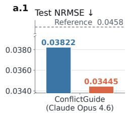

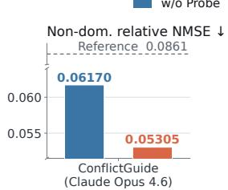

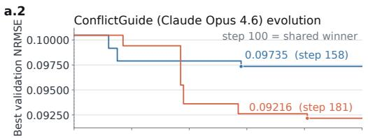

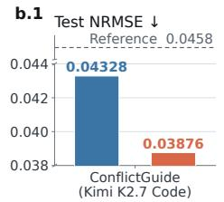

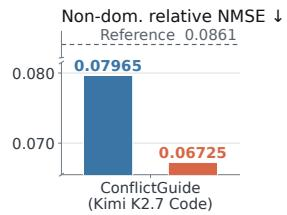

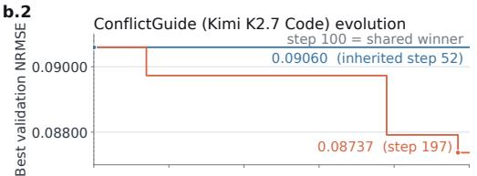

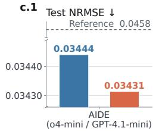

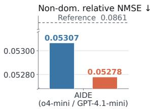

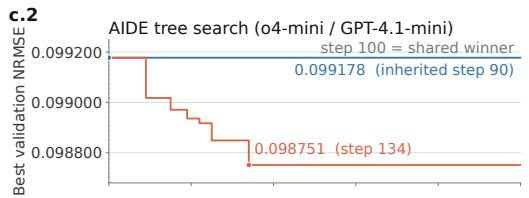

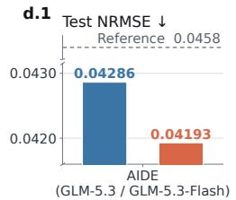

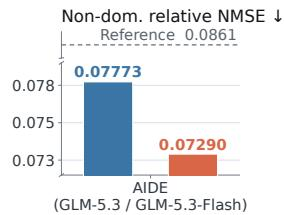

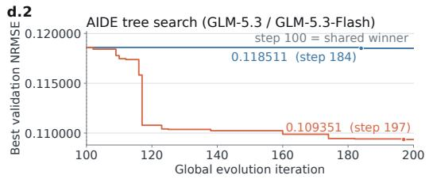

Figure 4: Probe-guided versus unguided evolution across four coding agents (a–d). Left: test NRMSE and non-dominant relative NMSE (3-seed mean; dashed = reference; lower is better). Right: validation NRMSE from shared step-100 winner. Blue = unguided; orange = Probe-guided.  
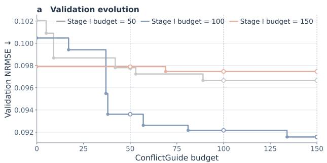

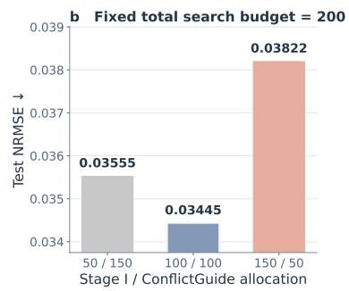  
Figure 5: Budget sensitivity. (a) Round-0 validation trajectories for three Stage I budgets. (b) Test NRMSE under three 200-iteration allocations; 100/100 balances performance and search efficiency.

Ablation Studies. As shown in Table 7, both conflict-specific guidance and retention contribute to ConflictGuide. Guidance yields larger gains on Navier–Stokes (NRMSE and ND-NMSE), whereas retention contributes more on CIFAR-100 (NLL and OOD AUPR), suggesting complementary roles: guidance redirects proposals via conflict-specific feedback, while retention filters noisy task gains and preserves conflict-alleviating edits through a separate path. We further replace the original code

Baseline Conflict-specific feedback 10% relief 25% relief 40% relief

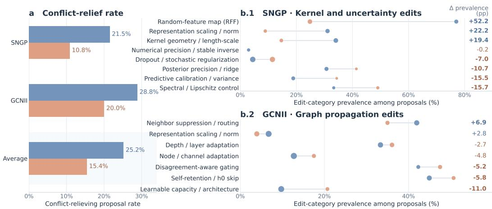  
Figure 6: Conflict-specific feedback on SNGP and GCNII proposals. (a) Conflict-relief rates. (b.1– b.2) Edit-category prevalence; dot area encodes relief rate, and lines/labels show changes from Baseline (∆, pp). Overall, feedback increases relief rates and shifts the distribution of code edits.

Table 8: Comparison of multi-metric, prompt-only, and ConflictGuide feedback on GCNII and SNGP (search round 2). Values are formal-evaluation means ± s.d.; bold marks the best per metric.
<table><tr><td rowspan="2">Configuration</td><td colspan="2">GCNII</td><td colspan="2">SNGP</td></tr><tr><td>Clean NLL ↓</td><td>Contaminated NLL ↓</td><td>NLL↓</td><td>OOD AUPR ↑</td></tr><tr><td>Multi-metric feedback</td><td> $0 . 5 6 6 2 \pm 0 . 0 9 0 9$ </td><td> $0 . 5 6 7 9 \pm 0 . 0 9 2 9$ </td><td> $0 . 8 9 1 8 \pm 0 . 0 0 8 7$ </td><td> $0 . 7 2 9 2 \pm 0 . 0 0 2 3$ </td></tr><tr><td>Trade-off prompt only</td><td> $0 . 5 6 9 4 \pm 0 . 0 7 9 1$ </td><td> $0 . 5 6 8 2 \pm 0 . 0 8 2 4$ </td><td> $1 . 1 9 5 9 \pm 0 . 0 2 3 4$ </td><td> $0 . 7 3 1 7 \pm 0 . 0 0 2 4$ </td></tr><tr><td>ConflictGuide</td><td> $\mathbf { 0 . 5 5 4 0 \pm 0 . 0 8 4 7 }$ </td><td> $\mathbf { 0 . 5 4 8 8 \pm 0 . 0 8 6 3 }$ </td><td> $\mathbf { 0 . 8 4 5 5 \pm 0 . 0 0 7 6 }$ </td><td> $\mathbf { 0 . 7 3 5 7 \pm 0 . 0 0 1 0 }$ </td></tr></table>

agent with Kimi K2.7 Code (Moonshot AI, 2026) and integrate Probe guidance into AIDE (Jiang et al., 2025) under two LLM configurations (Figure 4). Across all settings, Probe-derived feedback consistently improves task and conflict-related metrics, indicating that the benefit is not tied to a particular code agent or search framework. Integration details are in the Appendix I.

Hyperparameter Analysis. Stage I and ConflictGuide budgets are varied over {50, 100, 150}. Figure 5(a) shows that a 100-iteration Stage I provides the most favorable starting point: too few iterations may not reach the identifiability-limited regime, while too many can overcommit the trajectory and leave less room for Probe-guided refinement. Under a fixed total budget of 200 iterations (Figure 5(b)), the 100/100 split achieves the lowest test NRMSE. The 100/100 default for models with sufficient evolution capacity was fixed before inspecting test results; model-specific exceptions are detailed in Appendix G.4.

Proposals Analysis. Figure 6 analyzes proposals across three search rounds for SNGP and GCNII. Conflict-specific feedback nearly doubles the relief rate on SNGP (10.8% to 21.5%) and raises it from 20.0% to 28.8% on GCNII. The proposal distribution also shifts: SNGP favors randomfeature-map and kernel-geometry edits while reducing generic regularization, whereas GCNII shifts toward neighbor suppression and away from broad capacity changes. These results show that Probe feedback changes not only the relief rate but also the types of edits proposed, redirecting search toward the targeted conflict mechanisms. Additional analysis is provided in the Appendix J.

Value of conflict feedback. ConflictGuide outperforms the multi-metric and prompt-only alternatives across GCNII metrics and leads on both NLL and OOD AUPR for SNGP (Table 8). This suggests that guidance benefits from measuring the instantiated competing behaviors, rather than providing additional metrics or describing the trade-off. Appendix H details both alternatives.

## 5 CONCLUSION

We introduced ConflictGuide, which incorporates competing-behavior feedback into AutoResearch. ConflictGuide-Skill uses a literature-grounded taxonomy to identify model-specific conflicts and design measurable probes. A code agent implements them before qualification and evolution. After scalar-guided exploration, probe-derived signals guide proposals and filter edits with marginal task gains but insufficient conflict alleviation. Experiments across diverse model families and code agents show that this feedback redirects search toward conflict-relevant changes and sustains progress beyond scalar-only plateaus. Limitations and future directions are discussed in the Appendix K.

## AI USE STATEMENT

We used generative AI tools to conduct the AutoResearch experiments studied in this paper and to improve the manuscript’s wording. The central research idea was developed by the authors without generative AI assistance. We reviewed all AI-assisted work and take responsibility for the final content of this paper, including AI-assisted text, claims, and artifacts.

## REPRODUCIBILITY STATEMENT

The Method and Experimental Setup sections describe ConflictGuide’s two-stage search, retention rules, and evaluation protocols. Its search loop can be reproduced by extending the publicly available AutoResearch codebase with the feedback and retention rules specified in the Method section. Appendices C–I document the datasets and five base models, including their source references and experimental settings, and provide detailed definitions of the probe metrics for all five model families. The ConflictGuide-Skill and experimental code are included in the supplementary material.

## REFERENCES

Diab W Abueidda, Bilal Ahmed, Panos Pantidis, and Mostafa E Mobasher. Physics-audited agentic discovery in scientific machine learning. arXiv preprint arXiv:2607.07379, 2026.

Sravanti Addepalli, Samyak Jain, et al. Efficient and effective augmentation strategy for adversarial training. Advances in Neural Information Processing Systems, 35:1488–1501, 2022.

Eirikur Agustsson and Radu Timofte. Ntire 2017 challenge on single image super-resolution: Dataset and study. In 2017 IEEE conference on computer vision and pattern recognition workshops (CVPRW), pp. 1122–1131, 2017.

Anthropic. Claude code. https://claude.com/product/claude-code, 2025.

Nicola Asuni and Andrea Giachetti. Testimages: A large data archive for display and algorithm testing. Journal ofGraphics Tools, 17(4):113–125, 2013.

Jinheon Baek, Sujay Kumar Jauhar, Silviu Cucerzan, and Sung Ju Hwang. Researchagent: Iterative research idea generation over scientific literature with large language models. In Proceedings of the 2025 conference of the nations of the Americas chapter of the association for computational linguistics: human language technologies (volume 1: long papers), pp. 6709–6738, 2025.

Andrea Ceni and Claudio Gallicchio. Residual echo state networks: residual recurrent neural networks with stable dynamics and fast learning. Neurocomputing, 597:127966, 2024.

Ming Chen, Zhewei Wei, Zengfeng Huang, Bolin Ding, and Yaliang Li. Simple and deep graph convolutional networks. In International conference on machine learning, pp. 1725–1735, 2020.

Franc¸ois Chollet. Xception: Deep learning with depthwise separable convolutions. In 2017 IEEE conference on computer vision and pattern recognition (CVPR), pp. 1800–1807, 2017.

Corinna Cortes and Vladimir Vapnik. Support-vector networks. Machine learning, 20(3):273–297, 1995.

Chuan Guo, Geoff Pleiss, Yu Sun, and Kilian Q Weinberger. On calibration of modern neural networks. In International conference on machine learning, pp. 1321–1330, 2017.

Kaiming He, Xiangyu Zhang, Shaoqing Ren, and Jian Sun. Deep residual learning for image recognition. In Proceedings of the IEEE conference on computer vision and pattern recognition, pp. 770–778, 2016.

Jie Hu, Li Shen, and Gang Sun. Squeeze-and-excitation networks. In Proceedings of the IEEE conference on computer vision and pattern recognition, pp. 7132–7141, 2018.

Masanobu Inubushi and Kazuyuki Yoshimura. Reservoir computing beyond memory-nonlinearity trade-off. Scientific reports, 7(1):10199, 2017.

Zhengyao Jiang, Dominik Schmidt, Dhruv Srikanth, Dixing Xu, Ian Kaplan, Deniss Jacenko, and Yuxiang Wu. Aide: Ai-driven exploration in the space of code. arXiv preprint arXiv:2502.13138, 2025.

Yiyang Jin, Kunzhao Xu, Hang Li, Xueting Han, Yanmin Zhou, Cheng Li, and Jing Bai. Reveal: Self-evolving code agents via reliable self-verification. In International Conference on Learning Representations, volume 2026, pp. 149800–149824, 2026.

Andrej Karpathy. autoresearch. https://github.com/karpathy/autoresearch, 2026.

Sein Kim, Sangwu Park, Hongseok Kang, Wonjoong Kim, Jimin Seo, Yeonjun In, Kanghoon Yoon, Hyunsik Jeon, and Chanyoung Park. Self-evolverec: Self-evolving recommender systems with llm-based directional feedback. arXiv preprint arXiv:2602.12612, 2026.

Alex Krizhevsky. Learning multiple layers of features from tiny images. Technical report, University of Toronto, 2009.

Yu Li, Chenyang Shao, Xinyang Liu, Ruotong Zhao, Peijie Liu, Hongyuan Su, Zhibin Chen, Qinglong Yang, Anjie Xu, Yi Fang, et al. Autosota: An end-to-end automated research system for state-of-the-art ai model discovery. arXiv preprint arXiv:2604.05550, 2026.

Zongyi Li, Nikola Kovachki, Kamyar Azizzadenesheli, Burigede Liu, Kaushik Bhattacharya, Andrew Stuart, and Anima Anandkumar. Fourier neural operator for parametric partial differential equations. In International Conference on Learning Representations, 2021.

Bee Lim, Sanghyun Son, Heewon Kim, Seungjun Nah, and Kyoung Mu Lee. Enhanced deep residual networks for single image super-resolution. In 2017 IEEE conference on computer vision and pattern recognition workshops (CVPRW), pp. 1132–1140, 2017.

Haixu Liu, Lei Zhou, Yuhao Ren, Yumao Wu, and Zhiang Wang. Goalevolve: From handcrafted algorithm priors to goal-driven evolution of physical design algorithms. arXiv preprint arXiv:2608.16733, 2026a.

Jeremiah Liu, Zi Lin, Shreyas Padhy, Dustin Tran, Tania Bedrax Weiss, and Balaji Lakshminarayanan. Simple and principled uncertainty estimation with deterministic deep learning via distance awareness. In Advances in neural information processing systems, volume 33, pp. 7498– 7512, 2020.

Jinming Liu, Heming Sun, and Jiro Katto. Learned image compression with mixed transformer-cnn architectures. In 2023 IEEE/CVF conference on computer vision and pattern recognition (CVPR), pp. 14388–14397, 2023.

Mingquan Liu, Jiangyu Chen, Hanqun Cao, Xujun Zhang, Pengsen Ma, Xiangru Tang, Shuting Jin, Zhuo Yang, Tianfan Fu, Fang Wu, et al. Agentfold: Closed-loop agentic search for protein folding model design. arXiv preprint arXiv:2608.26747, 2026b.

Shaohua Liu, Liang Fang, Yilong Sun, Shudong Huang, Qingsong Luo, Shaoxin Liu, Xiaoyang Chen, Dongqiang Liu, Chuangang Ma, Zhenzhen Chai, et al. Nova: A verification-aware agent harness for architecture evolution in industrial recommender systems. arXiv preprint arXiv:2606.27243, 2026c.

Chris Lu, Cong Lu, Robert Tjarko Lange, Yutaro Yamada, Shengran Hu, Jakob Foerster, David Ha, and Jeff Clune. Towards end-to-end automation of ai research. Nature, 651(8107):914–919, 2026.

Michael C Mackey and Leon Glass. Oscillation and chaos in physiological control systems. Science, 197(4300):287–289, 1977.

Moonshot AI. Kimi code. https://www.kimi.com/code, 2026.

Yuval Netzer, Tao Wang, Adam Coates, Alessandro Bissacco, Baolin Wu, Andrew Y Ng, et al. Reading digits in natural images with unsupervised feature learning. In NIPS workshop on deep learning and unsupervised feature learning, volume 2011, pp. 4, 2011.

Alexander Novikov, Ngan Vˆ u, Marvin Eisenberger, Emilien Dupont, Po-Sen Huang, Adam Zsolt˜ Wagner, Sergey Shirobokov, Borislav Kozlovskii, Francisco JR Ruiz, Abbas Mehrabian, et al. Alphaevolve: A coding agent for scientific and algorithmic discovery. arXiv preprint arXiv:2506.13131, 2025.

Sungho Park, Wonjoong Kim, Rongyuan Tan, Jue Zhang, Wook-Shin Han, Pengfei Gao, Chanyoung Park, Yongqiang Yao, Rao Fu, Elsie Nallipogu, et al. Autosaddler: Automatic harness optimization with durable updates from agent execution traces. arXiv preprint arXiv:2608.23041, 2026.

Hongbin Pei, Bingzhe Wei, Kevin Chen-Chuan Chang, Yu Lei, and Bo Yang. Geom-gcn: Geometric graph convolutional networks. In International Conference on Learning Representations, 2020.

Shaoxiang Qin, Fuyuan Lyu, Wenhui Peng, Dingyang Geng, Ju Wang, Xing Tang, Sylvie Leroyer, Naiping Gao, Xue Liu, and Liangzhu Leon Wang. Toward a better understanding of fourier neural operators from a spectral perspective. arXiv preprint arXiv:2404.07200, 2024.

Tim Salimans, Ian Goodfellow, Wojciech Zaremba, Vicki Cheung, Alec Radford, and Xi Chen. Improved techniques for training gans. In Advances in neural information processing systems, volume 29, 2016.

Samuel Schmidgall, Yusheng Su, Ze Wang, Ximeng Sun, Jialian Wu, Xiaodong Yu, Jiang Liu, Michael Moor, Zicheng Liu, and Emad Barsoum. Agent laboratory: Using llm agents as research assistants. In Findings of the Association for Computational Linguistics: EMNLP 2025, pp. 5977–6043, 2025.

Benjamin Schrauwen, Marion Wardermann, David Verstraeten, Jochen J Steil, and Dirk Stroobandt. Improving reservoirs using intrinsic plasticity. Neurocomputing, 71(7-9):1159–1171, 2008.

Ozan Sener and Vladlen Koltun. Multi-task learning as multi-objective optimization. In Advances in neural information processing systems, volume 31, 2018.

Jonathan Tompson, Ross Goroshin, Arjun Jain, Yann LeCun, and Christoph Bregler. Efficient object localization using convolutional networks. In Proceedings of the IEEE conference on computer vision and pattern recognition, pp. 648–656, 2015.

Alasdair Tran, Alexander Mathews, Lexing Xie, and Cheng Soon Ong. Factorized fourier neural operators. arXiv preprint arXiv:2111.13802, 2021.

Dimitris Tsipras, Shibani Santurkar, Logan Engstrom, Alexander Turner, and Aleksander Madry. Robustness may be at odds with accuracy. In International Conference on Learning Representations, 2019.

Niki Van Stein and Thomas Back. Llamea: A large language model evolutionary algorithm for¨ automatically generating metaheuristics. IEEE Transactions on Evolutionary Computation, 29 (2):331–345, 2024.

Niki van Stein, Anna V Kononova, Lars Kotthoff, and Thomas Back. Llamea-sage: Guid-¨ ing automated algorithm design with structural feedback from explainable ai. arXiv preprint arXiv:2601.21511, 2026.

David Verstraeten, Benjamin Schrauwen, Michiel d’Haene, and Dirk Stroobandt. An experimental unification of reservoir computing methods. Neural networks, 20(3):391–403, 2007.

Mengru Wang, Junfeng Fang, Shuofei Qiao, Zhenqian Xu, Haoming Xu, Haoxiong Wang, Shumin Deng, Linyi Yang, Zhixiang Cui, Xin Xu, et al. Mechanist: Ai as a scientific instrument for discovering the mechanisms of intelligence. arXiv preprint arXiv:2608.12036, 2026.

Sanghyun Woo, Jongchan Park, Joon-Young Lee, and In So Kweon. Cbam: Convolutional block attention module. In European conference on computer vision, pp. 3–19, 2018.

Weixian Xu, Yixiu Liu, Yang Nan, Lyumanshan Ye, Xiangkun Hu, Zhen Qin, and Pengfei Liu. Neural architecture discovery via autonomous evolution. In Third Conference on Language Modeling, 2026a.

Weixian Xu, Tiantian Mi, Yixiu Liu, Yang Nan, Zhimeng Zhou, Lyumanshan Ye, Lin Zhang, Yu Qiao, and Pengfei Liu. Asi-evolve: Ai accelerates ai. arXiv preprint arXiv:2603.29640, 2026b.

Zhilin Yang, William Cohen, and Ruslan Salakhudinov. Revisiting semi-supervised learning with graph embeddings. In International conference on machine learning, pp. 40–48, 2016.

Peng Yin, Kai Li, Yifan Zhang, and Jian Cheng. Evopinn: Agentic discovery of executable algorithms for physics-informed neural networks. arXiv preprint arXiv:2607.26490, 2026.

Chen Yueh-Han, Jiaxin Wen, and Jan Hendrik Kirchner. Automated researchers can reliably mitigate alignment failures. arXiv preprint arXiv:2608.28945, 2026.

Xing Zhang, Guanghui Wang, Yanwei Cui, Ziyuan Li, Wei Qiu, Bing Zhu, and Peiyang He. Who grades the grader? co-evolving evaluation metrics and skills for self-improving llm agents. arXiv preprint arXiv:2607.12790, 2026.

Kunlun Zhu, Xuyan Ye, Zhiguang Han, Yuchen Zhao, Bingxuan Li, Weijia Zhang, Muxin Tian, Xiangru Tang, Pan Lu, James Zou, et al. Agentdebugx: An open-source toolkit for failure observability, attribution, and recovery in llm agents. arXiv preprint arXiv:2607.18754, 2026.

## APPENDIX OVERVIEW

A. Exploratory Studies and Design Motivation   
B. Additional Related Work   
C. ConflictGuide-Skill Details   
D. Full Root–Axis–Mechanism Taxonomy   
E. Identifiability of Conflict-Alleviating Edits   
F. Model-Specific Conflicts and Probe Metrics   
G. Experimental Details   
H. Feedback Baselines   
I. Extension to Other Agents and Frameworks   
J. Additional Results and Analyses   
K. Limitations and Future Directions

## A EXPLORATORY STUDIES AND DESIGN MOTIVATION

This section studies when conflict-specific feedback should be introduced for SpecB–FNO. The early-feedback study compares Scalar-only and Probe-from-outset evolution under matched total proposal budgets. The delayed-feedback study branches from a shared Scalar-only Stage-I checkpoint and compares ConflictGuide with a Scalar-only continuation under matched refinement budgets. Because both studies cover only one model family, they motivate our two-stage design rather than establish a universally optimal feedback schedule.

Table 9: Operational mechanism labels used in the SpecB–FNO proposal audit.
<table><tr><td>Mechanism label</td><td>Included code changes</td></tr><tr><td>Frequency-specific spectral</td><td>Fourier-mode weighting, selection, filtering, or spectral operators.</td></tr><tr><td>Spatial/local pathway</td><td>Spatial or pointwise feature extraction and local helper paths alongside the spectral path.</td></tr><tr><td>Normalization/activation/channel</td><td>Normalization, nonlinear activation, channel width, or channel projection.</td></tr><tr><td>Stage fusion/residual scale</td><td>Fusion between stages or branches and scaling of residual corrections.</td></tr><tr><td>Optimization/regularization</td><td>Optimizer, schedule, loss regularization, or training-time stabilization.</td></tr></table>

Table 10: Full-scale evaluation with feedback provided from the outset. Mean ± standard deviation over three training seeds; lower is better.
<table><tr><td>Configuration</td><td>Test NRMSE ↓</td><td>ND-NMSE↓</td></tr><tr><td>Reference</td><td> $0 . 0 4 5 8 2 2 \pm 0 . 0 0 1 4 3 2$ </td><td> $0 . 0 8 6 1 4 8 \pm 0 . 0 0 8 5 6 5$ </td></tr><tr><td>Scalar-only</td><td> $\mathbf { 0 . 0 3 7 9 1 6 \pm 0 . 0 0 1 5 1 9 }$ </td><td> $\mathbf { 0 . 0 6 1 1 2 1 } \pm \mathbf { 0 . 0 0 5 3 2 6 }$ </td></tr><tr><td>Probe from outset</td><td> $0 . 0 4 6 4 7 1 \pm 0 . 0 0 2 0 5 0$ </td><td> $0 . 0 8 6 4 9 8 \pm 0 . 0 0 9 1 3 0$ </td></tr></table>

Shared setup and proposal audit. Both studies use the SpecB–FNO task, proxy-search configuration, training protocol, and full-scale evaluation described in Appendix G. The task metric, conflict Probes, safety metrics, and qualification thresholds are defined in Appendix F. All non-feedback settings are fixed within each comparison. To characterize proposal distributions, we annotate code edits with five non-exclusive mechanism labels spanning frequency-specific spectral, spatial/local, architectural, fusion, and optimization changes (Table 9). Figure 8 shows representative implementations, including per-mode reweighting and a gated bypass as two distinct frequency-specific interventions.

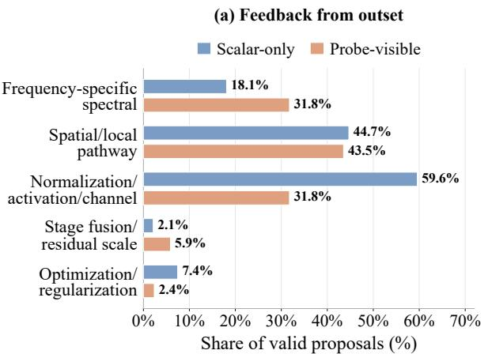

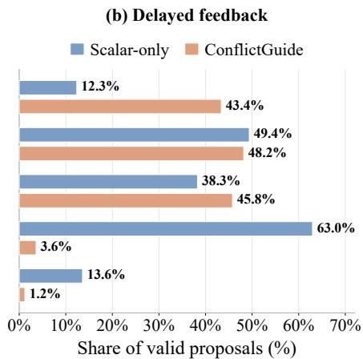  
Figure 7: Distribution of code-edit mechanisms in the SpecB–FNO exploratory searches. (a) Feedback from the outset, with 94 valid Scalar-only proposals and 85 valid Probe-visible proposals. (b) Delayed feedback from a common Stage-I branch point, with 81 valid Scalar-only proposals and 83 valid ConflictGuide proposals. Percentages are computed within each arm. Mechanism labels are non-exclusive; shares therefore need not sum to 100%.

Table 11: Full-scale evaluation after delayed feedback. Mean ± standard deviation over three paired training seeds; lower is better.
<table><tr><td>Configuration</td><td>Test NRMSE ↓</td><td>ND-NMSE↓</td></tr><tr><td>Reference</td><td> $0 . 0 4 5 8 2 2 \pm 0 . 0 0 1 4 3 2$ </td><td> $0 . 0 8 6 1 4 8 \pm 0 . 0 0 8 5 6 5$ </td></tr><tr><td>Scalar-only</td><td> $0 . 0 3 8 2 2 4 \pm 0 . 0 0 1 4 6 6$ </td><td> $0 . 0 6 1 6 9 8 \pm 0 . 0 0 4 9 6 5$ </td></tr><tr><td>ConflictGuide</td><td> $\mathbf { 0 . 0 3 4 4 4 7 \pm 0 . 0 0 0 3 4 2 }$ </td><td> $\mathbf { 0 . 0 5 3 0 4 8 \pm 0 . 0 0 0 7 2 4 }$ </td></tr></table>

Early Competing-Behavior Feedback Providing Probe feedback from the outset shifted proposals toward frequency-specific spectral edits: their share increased from 18.1% to 31.8%, while normalization, activation, or channel-structure edits fell from 59.6% to 31.8%. Yet this narrower focus did not translate into stronger performance: Scalar-only evolution improved both Test NRMSE and ND-NMSE over the reference, whereas Probe-from-outset improved neither. Together, these results suggest that early conflict feedback steered the search toward spectral compensation before sufficiently broad task-oriented exploration.

Delayed Competing-Behavior Feedback After the shared Scalar-only Stage I, ConflictGuide redirected the proposal budget toward the identified conflict mechanism: frequency-specific spectral edits rose from 12.3% to 43.4%, while stage-fusion and optimization-related edits sharply declined. From the same branch point, ConflictGuide reduced Test NRMSE by 9.9% and ND-NMSE by 14.0% relative to the matched Scalar-only continuation. These aligned shifts in proposals and performance support the two-stage rationale: broad task exploration first identifies a strong solution, after which conflict feedback focuses refinement on the under-addressed spectral behavior. This experiment motivates the delayed schedule without implying that it is optimal for every model or conflict.

## B ADDITIONAL RELATED WORK

## B.1 AUTOMATED SCIENTIFIC AGENTS AND MODEL EVOLUTION

LLM-based agents increasingly automate scientific research at different levels. General scientific agents support stages of the research workflow, including literature analysis, hypothesis generation, experiment design, implementation, and iterative refinement (Lu et al., 2026; Schmidgall et al., 2025; Baek et al., 2025). A second line of work focuses on automated algorithm and model discovery. LLaMEA evolves executable algorithms through iterative LLM-based generation and evaluation (Van Stein & Back, 2024), while AlphaEvolve extends evaluator-driven code evolution to¨ broader algorithmic and scientific problems (Novikov et al., 2025). ASI-Evolve further explores model architectures, training data, and learning algorithms (Xu et al., 2026b), with related systems targeting autonomous architecture discovery and domain-specific model design (Xu et al., 2026a; Liu et al., 2026b). More closely related to our setting, systems for automated ML experimentation place coding agents in iterative experimental loops over existing ML implementations. AutoResearch repeatedly modifies and evaluates training code under a fixed experimental budget (Karpathy, 2026), while AutoSOTA automates the reproduction and subsequent improvement of existing models (Li et al., 2026). ConflictGuide falls within this paradigm, building on an AutoResearch-style coding-agent loop that iteratively modifies and evaluates model implementations.

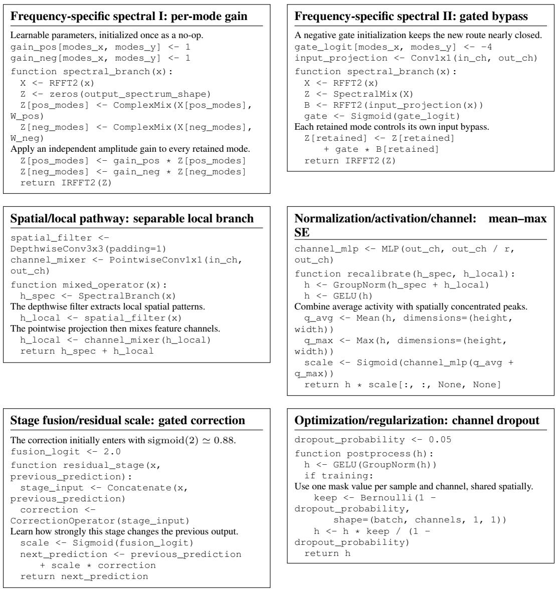  
Figure 8: Representative code edits for the five SpecB–FNO mechanism labels. The two frequencyspecific examples contrast direct per-mode reweighting with a mode-gated bypass. The pseudocode shows the added parameters and forward computations, omitting tensor-shape handling and other implementation details.

## B.2 FEEDBACK SIGNALS IN AUTOMATED MODEL EVOLUTION

Automated model evolution need not rely solely on a scalar task metric. LLaMEA-SAGE extracts structural and complexity features from generated code, models their relationship with performance, and translates the resulting explanations into mutation guidance (van Stein et al., 2026). NOVA combines modification history, verification diagnostics, metric changes, and trajectory memory into an architecture gradient for recommender architecture evolution (Liu et al., 2026c). Beyond performance- and structure-derived feedback, ReVeal uses reliable self-verification and tool-based evaluation to support iterative code improvement (Jin et al., 2026). Other systems introduce criteria beyond the standard task objective. Physics-Audited Agentic SciML evaluates candidates against machine-checkable physics requirements and advisory numerical probes (Abueidda et al., 2026), while automated alignment researchers use benchmark suites for specific alignment failures to guide their mitigation (Yueh-Han et al., 2026). Related work also treats the evaluation metric itself as an object of evolution, co-evolving evaluation metrics with agent skills when reliable task metrics are unavailable (Zhang et al., 2026).

Collectively, these studies highlight both the limitations of scalar-only feedback and the value of feedback tailored to what must be resolved during evolution. Existing approaches derive such signals from code structure, verification, external requirements, or well-characterized failure modes. ConflictGuide focuses on a complementary yet underexplored form of feedback in ML model evolution: how candidate edits affect competing behaviors. Such feedback becomes especially important when further progress depends on balancing these behaviors, while their behavior-specific effects remain obscured by the scalar task metric. ConflictGuide exposes these effects through quantitative Probes, providing conflict-specific feedback to guide subsequent evolution.

## B.3 DIAGNOSIS-GUIDED AUTOMATED MODEL EVOLUTION

Beyond providing richer feedback, a more targeted line of work uses diagnosis to determine what should be modified next. Self-EvolveRec augments recommendation metrics with a Model Diagnosis Tool and qualitative user feedback, translating diagnosed weaknesses into directional guidance for model evolution (Kim et al., 2026). GoalEvolve identifies dominant bottlenecks from multiobjective target gaps, localizes them to the relevant optimization stages, and uses these diagnoses to focus source-code modifications (Liu et al., 2026a). EvoPINN similarly summarizes training traces into diagnostics of convergence, stability, and physics-loss behavior, conditioning representation or training-program proposals on the diagnosed state (Yin et al., 2026). Unlike general feedback enrichment, these methods explicitly diagnose a limiting factor and use that diagnosis to direct the next modification. Related agentic systems extend this diagnosis-to-intervention pattern beyond automated model evolution. Mechanist proposes and tests mechanistic hypotheses about model behavior and translates validated mechanisms into targeted interventions (Wang et al., 2026). AutoSaddler diagnoses failure traces to generate targeted patches for agent harnesses (Park et al., 2026), while AgentDebugX organizes agent debugging around detection, root-cause attribution, recovery, and rerun (Zhu et al., 2026).

ConflictGuide brings this diagnosis-guided paradigm to competing behaviors in ML model evolution. For a given model–task setting, a model-design conflict represents a persistent mechanism-level tension whose state evolves with the model. ConflictGuide therefore maintains a consistent diagnostic target while recomputing quantitative Probes after each edit, providing an up-to-date view of how the competing behaviors have shifted. This consistent diagnostic coordinate enables edits to be compared across the evolution trajectory, revealing whether each modification alleviates or aggravates the conflict and providing targeted evidence to guide subsequent proposals.

## C CONFLICTGUIDE-SKILL

ConflictGuide-Skill packages the conflict taxonomy and its operational procedures as a reusable agent skill. Given a target model, the skill first maps model- and task-specific evidence to the fixed taxonomy, then instantiates the selected mechanism as a pair of competing behaviors, and finally designs and qualifies Probes that expose behavior-specific changes not captured by the scalar task metric S. Throughout this process, the skill distinguishes three conceptual levels: a taxonomy mechanism is reusable conflict vocabulary; a behavioral conflict is its model-specific realization; and a Probe is a measurement that operationalizes one of the competing behaviors.

The skill supports three modes. ANALYZE performs conflict identification and Probe design without modifying model code. IMPLEMENT additionally integrates the minimum read-only diagnostic code required to compute the fixed Probes. QUALIFY evaluates an existing Probe Card through null calibration and paired replay. None of these modes starts model evolution automatically.

Table 12: ConflictGuide-Skill workflow. Each stage must be completed before its output is used by the next stage.
<table><tr><td>Stage</td><td>Operation</td><td>Main evidence</td><td>Output</td></tr><tr><td>0</td><td>Model context</td><td>Architecture, task, data, objective, S, editable scope, and runtime budget</td><td>Normalized Model Context Card</td></tr><tr><td>1</td><td>Taxonomy screening</td><td>Target-model code and configuration, interpreted through the fixed Root-Axis-Mechanism taxonomy</td><td>Taxonomy selection or explicit abstention</td></tr><tr><td>2</td><td>Conflict instantiation</td><td>Selected mechanism, task relevance, shared component or resource, and bidirectional interference</td><td>Model-specific competing behaviors and an observability analysis of S</td></tr><tr><td>3</td><td>Probe design</td><td>Existing outputs, deterministic diagnostics, and lightweight read-only observables</td><td>Fixed Conflict Probe Card and implementation</td></tr><tr><td>4</td><td>Probe qualification</td><td>Null replicates and pre-specified parent-candidate replay pairs</td><td>specification Qualified, rejected, or inconclusive Probes</td></tr></table>

## C.1 INTERFACE AND WORKFLOW

Inputs. The skill receives a target-model context comprising the architecture and forward path, task and dataset, training objective, scalar task metric, evolution boundary, available evaluation outputs, and runtime budget. When source code and configuration files are available, the agent extracts this information directly and records the corresponding evidence locations. Unavailable fields are marked as unknown rather than inferred from the model name.

Workflow. ConflictGuide-Skill follows the five-stage workflow summarized in Table 12. Each stage has an explicit evidence boundary. In particular, conflict selection precedes Probe construction and does not use evolution trajectories, final-test results, or successful evolved architectures. This prevents a conflict from being selected retrospectively to explain an observed evolution outcome.

Outputs. A successful run returns the selected taxonomy entry, the instantiated behavior pair, their shared coupling, an analysis of what the scalar task metric captures or obscures, the minimal Probe set, its qualification state, and unresolved assumptions. These elements are also serialized as a machine-checkable Conflict Probe Card. If the available evidence is insufficient, the skill returns an abstention or rejection record instead of forcing a conflict.

## C.2 TAXONOMY SCREENING AND CONFLICT INSTANTIATION

Taxonomy basis. ConflictGuide-Skill uses the fixed Root–Axis–Mechanism taxonomy introduced in Section D. The taxonomy was constructed through agent-assisted literature collection followed by researcher consolidation and verification. It provides mechanism-level vocabulary for identifying behavioral conflicts across model families, rather than prescribing model-specific behavior pairs.

Taxonomy screening. For each target model, the skill first identifies candidate Roots, restricts them to their permitted axes, and then selects the most relevant mechanisms from the fixed taxonomy. The selection is grounded in evidence from the model architecture, task and data, training objective, evaluation setting, and component interfaces. Causal links between mechanisms and optimization signatures are recorded when supported by the available evidence.

Screening uses only information available before evolution. It does not rely on evolution trajectories, ablations, held-out final-test results, or successful evolved solutions. The skill must use the Root, axis, and mechanism identifiers defined in the taxonomy and cannot invent or rename taxonomy entries. A compute test further distinguishes resource limitations from structural conflicts:

if substantially greater compute would remove the tension, a resource-related Root is considered; otherwise, the skill examines structural, informational, distributional, normative, data-related, or evaluation-related Roots.

Table 13: Main abstention and rejection conditions used by ConflictGuide-Skill.
<table><tr><td>Condition</td><td>Skill response</td></tr><tr><td>Insufficient model, task, data, objective, or scalar-metric context</td><td>Abstain. The taxonomy selection cannot be grounded in target-specific evidence.</td></tr><tr><td>No two independently desirable behaviors</td><td>Reject. The proposed pair does not constitute a task-relevant behavioral conflict.</td></tr><tr><td>No identifiable shared component, representation, parameter path, or budget</td><td>Reject. The proposed behaviors lack a defensible coupling mechanism.</td></tr><tr><td>Only one interference direction is plausible</td><td>Reject. The case describes a one-sided failure rather than competing behaviors.</td></tr><tr><td>Behavior-specific observables are unavailable or incomparable across candidates</td><td>Abstain or reject. The conflict cannot be operationalized reliably under the current</td></tr><tr><td>A Probe duplicates the scalar task metric, leaks unavailable information, or depends on post-evolution tuning</td><td>evaluation setting. Reject. The proposed measurement does not provide valid fixed feedback.</td></tr></table>

Model-specific instantiation. After selecting a taxonomy mechanism, the skill instantiates it as two model-specific competing behaviors. Both behaviors must be independently desirable for the stated task or deployment setting. The skill identifies the shared representation, component, parameter path, or resource that couples them and specifies both interference directions: why improving behavior A may harm behavior B, and vice versa. Each direction must be supported by available evidence or explicitly marked as a falsifiable hypothesis.

The skill then assesses whether the scalar task metric can distinguish changes in the two behaviors. It records what the metric captures, what it aggregates away, and whether its conflict visibility is yes, partially, or no. Evaluation mechanisms such as metric insensitivity or aggregate masking are included only when supported by the evidence. Limited metric observability alone is insufficient to establish a behavioral conflict.

Abstention and rejection. The skill does not infer conflicts from model names or transfer them directly from superficially similar examples. It abstains when the available model, task, data, objective, or evaluation context is insufficient to support a taxonomy selection. It rejects an instantiation when the two behaviors are not independently desirable, lack a defensible shared coupling, or do not exhibit plausible interference in both directions. It also rejects Probes that duplicate the scalar task metric, depend on post-evolution tuning, leak unavailable information, or are not comparable across candidates. The main conditions are summarized in Table 13.

An abstention record identifies the evidence needed to resume the analysis, whereas a rejection record states which conflict or Probe requirement failed. In either case, the skill stops before Probe qualification.

## C.3 PROBE DESIGN, IMPLEMENTATION, AND QUALIFICATION

Probe design. Given an instantiated conflict, the skill designs the smallest fixed Probe set that reveals behavior-specific changes not already visible in the scalar task metric S. Candidate observables are prioritized in the following order: direct ground-truth measurements, existing model outputs, internal states, representation geometry, gradient quantities, known data structure, deterministic counterfactual inference, and fixed heuristics. Separately trained diagnostic models or synthetic auxiliary tasks are used only when no direct observable is available and require explicit justification.

A separate Probe is not required for each behavior. If S already measures one behavior at the relevant granularity, a single additional Probe for the other behavior is sufficient. Before evolution, the skill fixes the evaluation data, preprocessing, partitions, reference values, perturbations, randomness, aggregation, normalization, and desirable metric directions. Probe definitions cannot depend on errors made by future candidates, final-test information unavailable during evolution, or thresholds chosen after observing evolution outcomes.

Each Probe records the fields summarized in Table 14. These fields make the intended behavior, additional information, computational cost, and possible failure modes inspectable before the Probe is exposed to the evolution agent.

Table 14: Core fields of a Conflict Probe specification.
<table><tr><td>Field</td><td>Description</td></tr><tr><td>Target behavior</td><td>The declared competing behavior measured by the Probe.</td></tr><tr><td>Observable and computation</td><td>Source value, formula or algorithm, sampling, and aggregation.</td></tr><tr><td>Direction and normalization</td><td>Whether an increase or decrease is desirable and how values are made comparable across candidates.</td></tr><tr><td>Evaluation setting</td><td>Frozen dataset, split, references, perturbations, and randomness policy.</td></tr><tr><td>Additional requirements</td><td>Whether extra training, labels, hooks, checkpoints, or model outputs are required.</td></tr><tr><td>Relation to scalar task metric</td><td>What behavior-specific information the Probe adds beyond the scalar task metric.</td></tr><tr><td>Cost and validity</td><td>Runtime and memory cost, leakage controls, interpretation, and known failure modes.</td></tr></table>

Read-only implementation. In IMPLEMENT mode, a code agent adds only the minimum evaluation function or diagnostic hook required to compute the fixed Probes. The implementation may load a checkpoint, access an existing output or internal state, and emit metric values. It may not modify the training objective, gradients, training data, model parameters, optimization procedure, or candidate-retention rule. Probe implementation therefore remains a measurement operation rather than an intervention. The modified files and Probe entrypoints are recorded in the Probe Card.

Calibration and model-specific checks. Probe calibration assesses measurement variability under no intended model change, using model-specific sampling units and threshold estimators. Additional checks include structural-variant comparisons, candidate replay, and perturbation controls. Their scope and decision criteria depend on the model-specific protocol. Initial checks may precede Stage I, while continuation calibration is performed at the Stage-I boundary before probe-guided search. A worked example for SpecB–FNO is provided in Section C.5.

## C.4 OUTPUTS AND REPRODUCIBILITY

ConflictGuide-Skill produces a structured Conflict Probe Card whose main fields are listed in Table 15. The same information is first presented as a concise human-readable summary, allowing researchers to inspect the selected mechanism, evidence boundary, competing behaviors, coupling, observability gap, and qualification state before using the machine-readable artifact.

The complete taxonomy is provided in Section D. The machine-readable taxonomy index, output schemas, validation scripts, and model-specific example Probe Cards will be released in a public repository upon acceptance. The schemas specify the required fields for model context, behavior instantiation, and Conflict Probe Cards, while the validation scripts check taxonomy selections and generated cards for structural consistency. The examples illustrate the expected reasoning process and output format rather than serving as model-name lookup rules: the skill independently screens the taxonomy for every new target model.

The skill also separates measurement specification from evolution policy. The Probe Card defines the scalar task metric, behavior-specific Probes, and their calibrated variability thresholds, but does not encode the Stage-I/Stage-II schedule, candidate-retention routes, or conflict-alleviation rule. These choices belong to the evolution protocol described in the main paper. This separation allows the conflict definition and its measurements to be inspected and qualified independently of the subsequent evolution algorithm.

Table 15: Inspectable outputs in a Conflict Probe Card.
<table><tr><td>Card component</td><td>Recorded information</td></tr><tr><td>Model context</td><td>Architecture, task, data, objective, scalar task metric, evolution boundary, budget, and evidence sources.</td></tr><tr><td>Taxonomy selection</td><td>Selection status, Root, axis, mechanism, causal links, optimization signatures, and abstention reason when applicable.</td></tr><tr><td>Behavioral conflict</td><td>Competing behaviors, desirable directions, shared coupling, interference</td></tr><tr><td>Feedback observability</td><td>directions, confidence, and rejection reason when applicable. Definition and direction of the scalar task metric, conflict visibility, and</td></tr><tr><td>Probes</td><td>behavior-specific information it aggregates away. Fixed Probe specifications, information added beyond the scalar task metric,</td></tr><tr><td>Qualification</td><td>computational costs, and failure modes. Null calibration, scalar-tied informativeness test, direction test, decision state,</td></tr><tr><td>Implementation and warnings</td><td>and rejection conditions. Modified files, diagnostic entrypoints, unresolved assumptions, and validity warnings.</td></tr></table>

## C.5 WORKED EXAMPLE: SPECB–FNO

Model evidence and conflict instantiation. SpecB–FNO predicts fluid dynamics using Fouriermode mixing and a residual-correction pathway. The conflict is mapped to R2.M2 (frequencystructure mismatch) on the space axis. The two desirable behaviors are accurate prediction of dominant spectral components and accurate prediction of non-dominant components. Both depend on shared model components. The working hypothesis is that emphasizing dominant components can leave low-energy modes underfit, while stronger non-dominant correction can interfere with dominant-mode accuracy. This coupling is a model-specific hypothesis motivated by the architecture.

Probe construction. The scalar task metric is validation NRMSE, which aggregates prediction errors across the field. A target-derived cumulative-energy mask separates dominant and nondominant Fourier components independently of candidate predictions. The primary Probe is nondominant relative NMSE, $Z _ { \mathrm { N D } }$ , with lower values indicating better prediction of non-dominant components. Dominant-mode relative NMSE and late-rollout NRMSE serve as guard metrics. The complete definitions are provided in Appendix F.2.

Initial qualification. Before Stage I, an initial panel evaluated three structural variants under three seeds, yielding nine evaluation records. The associated qualification report records that all modelspecific gates passed and sets qualified for evolution=true. These records concern the specified structural-variant checks; they are not nine scalar-tied parent–candidate comparisons.

Calibration before Stage II. After Stage I, the continuation protocol was calibrated using four paired no-edit comparisons and a four-seed transition replay. This calibration was completed and frozen before probe-guided continuation. The associated record also documents implementation repairs involving parameter materialization, optimizer coverage, and stage-fusion training.

For the documented historical continuation, the direct task route required $G _ { t } ~ \ge ~ 5 \times 1 0 ^ { - 4 }$ . The auxiliary route required $G _ { t } \geq 2 . 5 \times 1 0 ^ { - 4 }$ and at least a $1 \%$ relative improvement in $Z _ { \mathrm { N D } }$ , together with the registered dominant-mode and late-rollout anchor guards. These are the recorded execution rules for this continuation.

## D FULL ROOT–AXIS–MECHANISM TAXONOMY

This appendix documents the fixed taxonomy used by ConflictGuide-Skill. The taxonomy contains nine top-level Roots, six Axes, 110 Root-specific mechanisms, and three standalone optimization artifacts. R7 is further divided into R7a–R7c because impossibility, normative–utility trade-offs, and boundary calibration require different diagnostic logic. The inventory below preserves all active mechanism identifiers, names, and core diagnostic definitions from the operational taxonomy. To keep the paper appendix inspectable, we omit repeated axis-specific examples, the machine-readable output schema, and implementation instructions; these remain in the released Skill specification.

<table><tr><td rowspan=2 colspan=9>Root → Axis → Mechanism   Space  TimeModuleModalityPopulationObjective(a)         Root (Layer 1)              Mechanisms  Conflict Manifestation Axis (Layer 2) Where does it manifest?What is the conflict against?</td></tr><tr><td rowspan=1 colspan=1>(ID range)</td><td rowspan=1 colspan=1></td><td rowspan=1 colspan=1></td><td rowspan=1 colspan=1>品</td><td rowspan=1 colspan=1>-1M-</td><td rowspan=1 colspan=1></td><td rowspan=1 colspan=1></td></tr><tr><td rowspan=1 colspan=1>R1</td><td rowspan=1 colspan=1>Resource Allocation vs Fidelity</td><td rowspan=1 colspan=1>R1.M1-13</td><td rowspan=1 colspan=1></td><td rowspan=1 colspan=1></td><td rowspan=1 colspan=1></td><td rowspan=1 colspan=1></td><td rowspan=1 colspan=1></td><td rowspan=1 colspan=1></td></tr><tr><td rowspan=1 colspan=1>R2</td><td rowspan=1 colspan=1>Inductive Bias / Structural Constraint</td><td rowspan=1 colspan=1>R2.M1-19</td><td rowspan=1 colspan=1></td><td rowspan=1 colspan=1></td><td rowspan=1 colspan=1>V</td><td rowspan=1 colspan=1></td><td rowspan=1 colspan=1></td><td rowspan=1 colspan=1></td></tr><tr><td rowspan=1 colspan=1>R3</td><td rowspan=1 colspan=1>Information Sufficiency vs Compression</td><td rowspan=1 colspan=1>R3.M1-14</td><td rowspan=1 colspan=1></td><td rowspan=1 colspan=1></td><td rowspan=1 colspan=1></td><td rowspan=1 colspan=1></td><td rowspan=1 colspan=1></td><td rowspan=1 colspan=1></td></tr><tr><td rowspan=1 colspan=1>R4</td><td rowspan=1 colspan=1>Distributional / Causal Generalization</td><td rowspan=1 colspan=1>R4.M1-18</td><td rowspan=1 colspan=1>V</td><td rowspan=1 colspan=1></td><td rowspan=1 colspan=1></td><td rowspan=1 colspan=1></td><td rowspan=1 colspan=1></td><td rowspan=1 colspan=1></td></tr><tr><td rowspan=1 colspan=1>R5</td><td rowspan=1 colspan=1>Plasticity vs Retention</td><td rowspan=1 colspan=1>R5.M1-11</td><td rowspan=1 colspan=1></td><td rowspan=1 colspan=1></td><td rowspan=1 colspan=1></td><td rowspan=1 colspan=1></td><td rowspan=1 colspan=1></td><td rowspan=1 colspan=1></td></tr><tr><td rowspan=1 colspan=1>R6</td><td rowspan=1 colspan=1>Exploration vs Exploitation</td><td rowspan=1 colspan=1>R6.M1-8</td><td rowspan=1 colspan=1></td><td rowspan=1 colspan=1></td><td rowspan=1 colspan=1>V</td><td rowspan=1 colspan=1></td><td rowspan=1 colspan=1></td><td rowspan=1 colspan=1></td></tr><tr><td rowspan=1 colspan=1>R7</td><td rowspan=1 colspan=1>Normative Constraints vs Utility</td><td rowspan=1 colspan=1>R7.M1-13</td><td rowspan=1 colspan=1></td><td rowspan=1 colspan=1></td><td rowspan=1 colspan=1></td><td rowspan=1 colspan=1></td><td rowspan=1 colspan=1></td><td rowspan=1 colspan=1></td></tr><tr><td rowspan=1 colspan=1>R8</td><td rowspan=1 colspan=1>Data / Annotation Conflict</td><td rowspan=1 colspan=1>R8.M1-6</td><td rowspan=1 colspan=1></td><td rowspan=1 colspan=1></td><td rowspan=1 colspan=1></td><td rowspan=1 colspan=1></td><td rowspan=1 colspan=1></td><td rowspan=1 colspan=1></td></tr><tr><td rowspan=1 colspan=1>R9</td><td rowspan=1 colspan=1>Evaluation-Objective Mismatch</td><td rowspan=1 colspan=1>R9.M1-8</td><td rowspan=1 colspan=1></td><td rowspan=1 colspan=1></td><td rowspan=1 colspan=1></td><td rowspan=1 colspan=1></td><td rowspan=1 colspan=1></td><td rowspan=1 colspan=1></td></tr></table>

Figure 9: Root–Axis–Mechanism taxonomy.

## D.1 TAXONOMY CONVENTIONS AND SELECTION RULES

Root–Axis–Mechanism representation. A Root specifies what the conflict fundamentally pulls against and therefore whether it can be removed by additional compute or instead requires a change in architecture, information, data, objectives, or evaluation. An Axis specifies where the conflict manifests: space, time, module, modality, population, or objective. A Mechanism specifies the concrete failure pattern. Each Root has an axis whitelist. A mechanism manifesting on multiple axes is recorded once per axis with separate evidence; this repetition does not create a new mechanism.

Selection order and evidence boundary. ConflictGuide-Skill first selects a Root, then an admissible axis, and finally the most relevant mechanism. Every selection must be justified using the target model’s architecture, task and data, training objective, and evaluation setting. Relevance screening does not inspect evolution outcomes, ablations, clean-run results, or held-out test results. It cannot invent or rename Root, axis, or mechanism identifiers.

Root discriminator. The primary test asks whether 100× more compute would dissolve the conflict. Conflicts that disappear or substantially ease are generally routed to R1, R5, or R6; persistent conflicts are routed to R2, R3, R4, R7, R8, or R9. When the answer is partial, both Roots are retained and linked rather than forced into a single category. For example, a memory wall may induce an R1 context bottleneck that in turn causes R3 information loss.

Causal links and optimization signatures. Mechanism-level downstream of and upstream of links encode causal structure. R4 failures are often symptoms, whereas R8 and R9 frequently act upstream; R9 additionally makes evidence based on the affected metric provisional. Optimization signatures—including gradient-direction conflict, gradient-scale imbalance, loss domination, convergence-rhythm conflict, representation-demand conflict, Pareto incompatibility, and weighted-sum masking—annotate mechanisms rather than form a separate Root.

Independent-parameters test. If a conflict would remain with completely independent parameters, its substantive Root is retained and any gradient pattern is only an optimization signature. If the conflict would disappear, it is a pure parameter-sharing or update-merging artifact and is represented by OPT.M1--OPT.M3.

Table 16: Root-level semantics and selection boundaries. Figure 9 shows the admissible axes and mechanism ranges; this table provides the complementary criteria used to distinguish and causally relate the Roots.
<table><tr><td>Root</td><td>Conflict is against</td><td>Compute test</td><td>Primary discriminator</td><td>Typical causal role</td></tr><tr><td>R1</td><td>Compute, memory, latency, parameter count, or bandwidth</td><td>Partially resolvable</td><td>The conflict substantially eases with greater capacity, resolution, or evaluation budget.</td><td>May induce downstream information loss or structural</td></tr><tr><td>R2</td><td>Mismatch between an inductive bias or structural constraint and the signal</td><td>Not resolvable</td><td>The imposed prior is too weak, too strong, or incompatible with the signal structure; architectural change is required.</td><td>Often upstream of shortcut learning or failure under distribution shift.</td></tr><tr><td>R3</td><td>Information loss imposed by compression or abstraction</td><td>Not resolvable</td><td>Required information has been discarded or incompatible information demands must share a limited representation.</td><td>Often downstream of resource limits and upstream of uncertainty or generalization</td></tr><tr><td>R4</td><td>The gap between the training distribution and deployment conditions</td><td>Not resolvable</td><td>Performance relies on non-causal or distribution-specific evidence that fails under domain, group, temporal, or intervention shifts.</td><td>Usually a downstream symptom; upstream causes should be identified.</td></tr><tr><td>R5</td><td>New adaptation competing with retained knowledge or behavior</td><td>Partially resolvable</td><td>The conflict arises sequentially across training stages rather than simultaneously among objectives</td><td>May follow distribution, label-process, or</td></tr><tr><td>R6</td><td>A fixed search budget divided between coverage and solution quality</td><td>Partially resolvable</td><td>The conflict concerns exploration of solutions, actions, or hypotheses, not coverage of demographic populations.</td><td>normative changes. May expose resource limits or aggravate structural and normative violations.</td></tr><tr><td>R7</td><td>Externally specified human values, rights, or policy constraints</td><td>Not resolvable; exogenous</td><td>The opposing requirement originates outside the model and may involve impossibility, a normative-utility frontier, or boundary calibration.</td><td>Can motivate later constraint training and its associated capability cost.</td></tr><tr><td>R8</td><td>Instability, ambiguity, sparsity, or inconsistency in the supervision process</td><td>Not resolvable</td><td>The target label or annotation process is itself uncertain or changing; model-side changes alone cannot remove the conflict.</td><td>Typically upstream of overfitting, shortcut learning, and apparent OOD failure.</td></tr><tr><td>R9</td><td>Mismatch between what is measured and what is actually desired</td><td>Not resolvable</td><td>The metric, benchmark, or evaluator cannot detect the relevant failure or diverges from the intended objective.</td><td>Upstream of other diagnoses; affected evidence should be treated as</td></tr></table>

## D.2 ROOT AND AXIS OVERVIEW

The whitelists implement routing decisions. In particular, R2 and R6 exclude population: population shifts belong to R4, protected-group trade-offs to R7, and population-dependent annotation failures to R8. R6 concerns solution-space coverage, not demographic coverage.

## D.3 COMPLETE MECHANISM INVENTORY

Table 17 lists all 110 active mechanisms. The definitions retain the diagnostic question from the fixed library; detailed axis-specific manifestations and cross-references are omitted only when they repeat the general rules above.

Table 17: Complete Root-specific mechanism inventory.
<table><tr><td>ID</td><td>Mechanism</td><td>Core diagnostic definition</td></tr><tr><td colspan="3">R1: Resource allocation vs fidelity Insufficient fidelity</td></tr><tr><td>R1.M1</td><td></td><td>Does the model systematically underfit the target because the allocated resolution, step count, or capacity is too low? Does a uniform allocation waste resources on easy cases while</td></tr><tr><td>R1.M2</td><td>Uniform allocation mis- match</td><td>remaining insufficient for hard cases, long-tail cases, or complex samples? Is the current positional encoding, basis, feature map, latent</td></tr><tr><td></td><td>bandwidth</td><td>grid, channel rank, codebook, recurrent width, or local repre- sentation insufficient to express the required rate of variation? - Primarily space and time. May be module when a specific branch&#x27;s rank is the limit, or modality when a specific modal- ity&#x27;s encoder is the limit. - If the loss is informational rather than budgetary (i.e. more capacity would not help because the repre-</td></tr><tr><td>R1.M4</td><td>Added freedom causing overfitting</td><td>After adding local parameters, high-frequency encoding, extra steps, extra depth, or extra experts, does the model become more likely to fit noise, label errors, spurious patterns, or training-set-</td></tr><tr><td>R1.M5</td><td>Cross-partition consistency issue</td><td>Do outputs become inconsistent across the partitions created by the chosen axis?</td></tr><tr><td></td><td>structure competition</td><td>After strengthening local or short-range fidelity, does the model sacrifice global layout, long-range dependency, overall seman- tics, global constraints, or cross-region coordination?</td></tr><tr><td>R1.M7</td><td>Cost superlinearity</td><td>Does covering a small number of hard cases require a dispropor- tionate global increase in cost?</td></tr><tr><td>R1.M8</td><td>Hardware / throughput wall</td><td>Does the model theoretically need more fidelity but is practically limited by the deployment envelope?</td></tr><tr><td>R1.M9</td><td>Allocation imbalance</td><td>Are compute loads, sample counts, gradient amounts, or assign- ments severely imbalanced across the partitions of the chosen axis?</td></tr><tr><td>R1.M10</td><td>Insufficient sharing</td><td>Does excessive partitioning prevent common patterns from being reused across similar regions, steps, modules, modalities, or clients?</td></tr><tr><td>R1.M11</td><td>Redundant partitioning</td><td>Do multiple experts, adapters, heads, branches, local modules, steps, or scales repeatedly learn similar patterns instead of form- ing an effective division of labor? Is the mechanism that decides the allocation, or the operator that drives the iteration, itself unstable or degenerate? - Routing</td></tr><tr><td>R1.M12</td><td>Allocation / iteration mechanism pathology</td><td>collapse (module): routing persistently favors a small number of experts, paths, adapters, token groups, or modules, leaving others underused. - Dynamic allocation instability (module, space, t ime): routing, adaptive depth, token selection, re- gion refinement, or expert assignment is highly sensitive to small input perturbations, training stage, or batch composition. - Iter- ative dynamics pathology (t ime): the iteration operator itself causes error accumulation across steps. Jacobian contraction or expansion, representation collapse over depth, or vanish-</td></tr><tr><td>R1.M13</td><td>Partitioning vs inter- pretability</td><td>that is R1.M5 time. - Modality routing collapse is modality. As the number of modules, steps, scales, or routing paths in- creases, does model behavior become harder to interpret, at- tribute, or debug?</td></tr><tr><td>R2.M1</td><td>R2: Inductive bias vs signal structure Single-bias residual under_constrained</td><td>Does the dominant architecture, basis, operator, prior, or atten- tion pattern fit only part of the signal while leaving systematic</td></tr></table>

Continued on next page

Table 17 continued
<table><tr><td>ID</td><td>Mechanism</td><td>Core diagnostic definition</td></tr><tr><td>R2.M2</td><td>Frequency- structure mismatch under_constrained</td><td>Is the model biased toward low-frequency, smooth, or global patterns while ignoring high-frequency signals, abrupt changes periodicity, spikes, or local oscillations?</td></tr><tr><td>R2.M3</td><td>Scale-structure mismatch under_constrained</td><td>Is the model good at one scale but unable to handle local details, mid-scale compositions, and global layout simultaneously? - Primarily space; multi-timescale problems are t ime; cross-</td></tr><tr><td>R2.M4</td><td>Temporal- component mismatch</td><td>modal scale mismatch is modality. Does the model struggle to handle trend, seasonality, shocks, regime switches, long memory, and short-term fluctuations at the</td></tr><tr><td>R2.M5</td><td>under_constrained Relational- structure mismatch under_constrained</td><td>same time? Is the model good at local texture or token patterns but weak at object relations, graph relations, entity interactions, composi- tional rules, or causal relations?</td></tr><tr><td>R2.M6</td><td>Structural prop- erty violation under_constrained</td><td>Does the model violate a property the task requires it to pre- serve? - Invariance (space): output changes when input order, entity permutation, node indexing, or patch order changes. - Equivariance (space, time): output fails to transform cor- respondingly under rotation, translation, scaling, coordinate transform, time shift, or graph isomorphism. - Monotonicity (objective, space): output moves non-monotonically, un- stably, or in the wrong direction with respect to key variables. - Conservation (objective, time): output violates required</td></tr><tr><td></td><td></td><td>rule-wise, or task-definition-wise invalid region. - Cross-modal legality (modal ity): outputs valid per modality but jointly invalid. Does the model exploit input order, absolute coordinates, data-</td></tr><tr><td>R2.M8</td><td>under_constrained Global vs local</td><td>collection artifacts, format patterns, or other structurally invalid regularities to obtain superficial performance? Does global attention, global latent representation, or a low-rank</td></tr><tr><td>R2.M9</td><td>bias mismatch under_constrained Bias fragility un- der regime shift</td><td>operator ignore local anomalies; or does a local operator or con- volution ignore long-range dependencies and global structure? Is the current inductive bias suited only to the dominant regime in the training distribution, so that it fails when the proportions</td></tr><tr><td>R2.M10</td><td>under_constrained Local freedom break- ing global legality</td><td>of structural components change? Are local modules, adapters, experts, branches, or refinements individually reasonable, but collectively violating global struc-</td></tr><tr><td>R2.M11</td><td>under_constrained Hybrid-branch redundancy under_constrained</td><td>tural constraints? After combining multiple branches, bases, experts, operators, or biases, do they fail to form clear roles and instead repeatedly fit</td></tr><tr><td>R2.M12</td><td>Branch interference under_constrained</td><td>the same type of structure? Do different inductive-bias branches interfere with each other, causing structural components to be misassigned, redundantly</td></tr><tr><td>R2.M13</td><td>Fusion imbalance under_constrained</td><td>explained, or canceled out? Does fusion, gating, attention, residual mixing, or aggregation persistently favor one branch, preventing other structural biases</td></tr><tr><td>R2.M14</td><td>Constraint-induced underfitting</td><td>from contributing? After enforcing invariance, equivariance, monotonicity, smooth- ness, or conservation, does the model fail to express true local</td></tr><tr><td>R2.M15</td><td>over_constrained Approximate symme- try over-enforcement</td><td>heterogeneity, symmetry breaking, or non-ideal dynamics? Is the task symmetry only approximate, so that strict constraints incorrectly erase real deviations?</td></tr><tr><td>R2.M16</td><td>over_constrained Constraint vs noise conflict over_constrained</td><td>Do observation noise, measurement error, label error, or simula- tion error make hard structural constraints too rigid? - Primarily objective; space / time / modality for where the noise</td></tr><tr><td>R2.M17</td><td>Prior vs data conflict over_constrained</td><td>Does a physics prior, symbolic rule, domain constraint, or hand-specified dynamics pull against what the data actually shows? - Primarily ob ject ive. - When trained with shared parameters, recordoptimization_signature with</td></tr><tr><td>R2.M18</td><td>Excessive bias complexity over_constrained</td><td>gradient_direction_conflict. After combining too many inductive biases, does the model be- come difficult to tune, unstable to train, hard to interpret, or de- pendent on complex module interactions?</td></tr><tr><td>R2.M19</td><td>Cross-modal bias incompatibility under_constrained</td><td>Do different modalities require different scales, abstraction lev- els, temporal alignments, or inductive biases, but get forced into the same shared space or the same operator?</td></tr><tr><td colspan="3">or over_constrained R3: Information sufficiency vs compression</td></tr><tr><td>R3.M1 R3.M2</td><td>Bottleneck information loss Excessive abstraction</td><td>Does a latent bottleneck, pooling, downsampling, low-rank pro jection, quantization, or summary discard task-relevant detail? Does a high-level abstract representation erase local differences,</td></tr><tr><td></td><td></td><td>rare patterns, fine-grained classes, boundary information, or individual variation? Does a factor removed for invariance actually contain useful</td></tr><tr><td>R3.M3 R3.M4</td><td>Invariance deleting useful information Compression vs uncer-</td><td>information for certain tasks, slices, or conditions? Does representation compression remove the evidence needed to estimate uncertainty, making confidence unreliable? - Pri-</td></tr><tr><td></td><td>tainty</td><td>marily objective; space / time / modality for where the evidence was lost; population when uncertainty is lost specifically for some groups. Is accuracy normal while confidence, probability, interval,</td></tr><tr><td></td><td></td><td>risk score, or uncertainty estimate is distorted? - Primarily objective; modality or population when calibration degrades on specific modalities or groups.</td></tr><tr><td>R3.M6</td><td>Detail retention vs overfit- ting</td><td>Does retaining too much input detail cause the model to learn noise, individual-sample artifacts, spurious features, or privacy- sensitive information? If the representation serves reconstruction, does it retain too</td></tr><tr><td>R3.M7</td><td>Reconstruction vs predic- tion conflict</td><td>much prediction-irrelevant information; if it serves predic- tion, does it lose information needed for reconstruction or fine- grained reasoning?</td></tr><tr><td></td><td>Context summarization loss</td><td>After compressing long context, long sequences, historical tra- jectories, or multi-document input, are key facts, boundary conditions, minority evidence, or remote dependencies lost? - Primarily t ime; space for non-temporal token positions; modal ity for multi-document or multimodal input.</td></tr><tr><td>R3.M9</td><td>Quantization / discretiza- tion damage</td><td>Does quantization, discrete tokenization, codebooks, hashing, or compact encoding damage continuous values, subtle differences, or rare-state expression? Does low-rank factorization, compressed encoding, shared</td></tr><tr><td></td><td>Compact representation damaging fine structure</td><td>embedding, or other compact representation damage fine- grained structural expression? - Primarily space; time for fine temporal structure; modal ity for shared representations; ob ject ive for multi-task shared representations.</td></tr><tr><td>R3.M11</td><td>Insufficient rank</td><td>Are representation dimension, latent rank, attention rank, em- bedding size, or memory slots insufficient to preserve all neces- sary factors simultaneously?</td></tr><tr><td>R3.M12</td><td>Nuisance retention</td><td>Does the model fail to compress nuisance factors, leaving style, domain, speaker, background, format, or collection conditions in the representation?</td></tr><tr><td>R3.M13</td><td>Insufficient sufficiency</td><td>Is an intermediate representation no longer sufficient for the downstream task, so that even a fully capable head, decoder, or policy cannot recover performance? - Primarily ob ject ive;</td></tr><tr><td>R3.M14</td><td>Multi-objective representa- tion demand conflict</td><td>Is the shared representation simultaneously required to retain detail, compress invariances, align modalities, reconstruct inputs, predict rewards, and satisfy constraints, creating incompatible demands?</td></tr><tr><td colspan="3">R4: Empirical fit vs robust/OOD/causal generalization R4.M1 Shortcut learning Does the model rely on background, format, position, templates,</td></tr><tr><td>R4.M2</td><td>Spurious correlation</td><td>co-occurring words, texture, style, metadata, or collection arti- facts as shortcuts? Does the model treat features that are correlated with the label in training but non-causal as primary prediction evidence? - Any of</td></tr><tr><td>R4.M3</td><td>ID accuracy masking OOD failure</td><td>space,time,modality,population. Is average validation performance normal while performance under domain shift, time shift, site shift, sensor shift, style shift, population shift, or train/inference-procedure shift degrades significantly? - Primarily time, modality, population;</td></tr><tr><td></td><td></td><td>train/inference mismatch (teacher forcing vs free running, quan- tization gap, prompt-distribution shift): the deployment proce- dure is a different distribution from the training procedure. Do aggregate metrics hide systematic failures on specific groups,</td></tr><tr><td>R4.M4 R4.M5</td><td>Hidden group-performance failure Non-robust feature reliance</td><td>slices, minority classes, rare regimes, or long-tail samples? Does the model use features that are imperceptible to humans, sensitive to tiny perturbations, or semantically unstable to im-</td></tr><tr><td>R4.M6</td><td>Causal feature underlearn-</td><td>prove standard accuracy? - Primarily space, modality; t ime for sequence perturbations. Are truly causal, stable, or cross-environment-valid features underlearned because their statistical signal is weaker? - Any R4</td></tr><tr><td>R4.M7</td><td>ing Causality violation</td><td>axis, depending on where the causal feature lives. Does the model use future information, leaked variables, poste- rior features, label-related shortcuts, or invalid temporal depen-</td></tr><tr><td>R4.M8</td><td>Counterfactual instability</td><td>dency? When only non-causal factors change while core semantics re- main the same, does the model output change when it should</td></tr><tr><td>R4.M9</td><td>Augmentation mismatch</td><td>not? Does data augmentation, domain randomization, or robust regu- larization improve robustness to some perturbations while harm-</td></tr><tr><td>R4.M10</td><td>Adversarial robustness vs</td><td>ing the original distribution or other perturbation types? Does improving adversarial, worst-case, or perturbation robust-</td></tr><tr><td>R4.M11</td><td>clean accuracy OOD calibration issue</td><td>ness reduce clean accuracy or average performance? Is the model still overconfident on OOD inputs, shifted slices.</td></tr><tr><td>R4.M12</td><td>Worst-case vs average-case</td><td>rare groups, or adversarial inputs? Does improving worst-group, worst-domain, or worst-case per-</td></tr><tr><td>R4.M13</td><td>conflict</td><td>formance reduce average-case performance? In federated or multi-domain training, do updates from different</td></tr><tr><td></td><td>Client / domain conflict</td><td>clients, domains, sites, or populations harm each other?</td></tr><tr><td colspan="3">R5: Plasticity vs retention R5.M1</td></tr><tr><td>R5.M2</td><td>Catastrophic forgetting</td><td>After sequentially learning new tasks, domains, or data, does the model significantly forget old tasks, domains, or skills? After freezing parameters, limiting updates, or applying strong</td></tr><tr><td></td><td>Insufficient plasticity</td><td>regularization to protect old knowledge, does the model fail to learn new tasks or distributions effectively? Do updates from new data overwrite parts of the shared back-</td></tr><tr><td>R5.M3</td><td>Shared parameter over- write</td><td>bone, embeddings, memory, normalization statistics, or latent space that are important for old tasks?</td></tr><tr><td>R5.M4</td><td>Representation drift</td><td>Áfter a new training stage, do intermediate representations drift so that old heads, adapters, classifiers, decoders, or policies no longer fit?</td></tr><tr><td>R5.M5</td><td>Insufficient replay / mem- ory</td><td>Is memory, replay buffer, exemplar set, summary, or rehearsal data insufficient to preserve coverage of old distributions?</td></tr><tr><td>R5.M6</td><td>New-old distribution con- flict</td><td>Are new and old data distributions incompatible in label rules, input style, objective functions, user preferences, or environment</td></tr><tr><td>R5.M7</td><td>Personalization vs global generality</td><td>Does adaptation to a specific user, client, domain, or site damage the general capability of the global model? To avoid forgetting, does the system keep adding task-specific</td></tr><tr><td>R5.M8</td><td>Module proliferation</td><td>adapters, experts, memory, or modules, causing parameter and management cost to grow continuously?</td></tr><tr><td>R5.M9</td><td>Old constraint forgetting</td><td>After new-task updates, does the model forget old safety con- straints, physical constraints, format constraints, style con- straints, or behavior boundaries?</td></tr><tr><td>R5.M10</td><td>Calibration drift</td><td>After continual updates, does confidence calibration drift on old domains, new domains, or mixed domains?</td></tr><tr><td>R5.M11</td><td>Recency bias</td><td>Does the model over-adapt to recent data, causing long-term stable patterns or low-frequency old patterns to be overwritten?</td></tr><tr><td>R5.M12</td><td>Negative backward transfer</td><td>Does learning a new task fail to help old tasks and instead re- duce old-task performance?</td></tr><tr><td>R5.M13</td><td>Capability tax from con- straint training</td><td>After alignment, safety, fairness, privacy, or policy training, does the model degrade on certain core capabilities, open-ended tasks, creative tasks, or professional tasks?</td></tr><tr><td colspan="3">R6: Exploration vs exploitation</td></tr><tr><td>R6.M1</td><td>Insufficient exploration</td><td>Does the system converge too early to a small number of modes, actions, paths, candidates, experts, or solution-space regions? Are outputs, generated samples, candidate solutions, trajectories,</td></tr><tr><td>R6.M2</td><td>Insufficient diversity</td><td>retrieved items, or action sequences highly repetitive, homoge- neous, or mode-collapsed? - Primarily ob ject ive; t ime for the decoding process; module for expert-level collapse.</td></tr><tr><td>R6.M3</td><td>Insufficient coverage</td><td>Does the model ignore long-tail modes, rare solutions, low- frequency classes, minority strategies, rare states, or non- mainstream candidates?</td></tr><tr><td>R6.M4</td><td>Excessive exploration</td><td>After increasing randomness, diversity, candidate breadth, or novelty, do outputs become less stable, lower quality, or less aligned with the task goal?</td></tr><tr><td>R6.M5</td><td>Fidelity vs diversity con- flict</td><td>Does increasing diversity, temperature, entropy, search breadth, or novelty reduce factuality, coherence, precision, reward, or task success?</td></tr><tr><td>R6.M6</td><td>Excessive exploitation</td><td>Does the model over-select current high-score, high-probability, high-reward, or high-confidence candidates, missing potentially better candidates with lower initial scores?</td></tr><tr><td>R6.M7</td><td>Search breadth vs depth</td><td>Under a fixed budget, does increasing candidate count reduce evaluation depth, rollout length, verification strength, or refine- ment quality per candidate?</td></tr><tr><td>R6.M8</td><td>Beam / top-k degeneration</td><td>Do beam search, top-k, top-p, reranking, or greedy selection produce repetition, templating, local optima, or lack of novelty? When pursuing novelty, coverage, or diversity, does the model</td></tr><tr><td>R6.M9</td><td>Novelty vs constraint con- flict</td><td>become more likely to violate structural constraints, task con- straints, safety constraints, or real-world feasibility? - Primarily objective; module when driven by expert routing; time for the planning process. - Record upst ream_of R2.M6</td></tr><tr><td>R6.M10</td><td>Rare mode ys common quality</td><td>(structural) or R7 (normative) as appropriate. Does improving rare-mode coverage damage common-case quality, average performance, or mainstream user experience?</td></tr><tr><td>R6.M11</td><td>Exploration target misiden- tification</td><td>Does the system mistake noisy samples, outliers, unlearnable samples, or annotation-unstable samples for high-value explo- ration targets?</td></tr><tr><td colspan="3">R7: Normative constraints vs utility R7a.M1 Fairness criteria incompati-</td></tr><tr><td></td><td>bility</td><td>Are different fairness criteria - calibration, equalized odds, de- mographic parity, individual fairness, subgroup fairness - prov- ably impossible to satisfy simultaneously under the given base rates?</td></tr><tr><td>R7a.M2</td><td>Preference aggregation impossibility</td><td>Do different populations, users, annotators, policy sources, or preference models disagree in a way that admits no consistent aggregate ordering?</td></tr><tr><td>R7a.M3</td><td>Privacy-utility lower bound</td><td>Is the required privacy guarantee (e.g. a given epsilon) mathe- matically incompatible with the required accuracy at the avail- able sample size?</td></tr><tr><td>R7b.M1</td><td>Privacy vs accuracy</td><td>Does differential privacy, noise injection, gradient clipping, data minimization, redaction, or anonymization reduce accuracy or fine-grained performance?</td></tr><tr><td>R7b.M2</td><td>Privacy vs personalization</td><td>After reducing user-data retention or limiting personalized mem- ory, does the model struggle to provide long-term consistent, personalized, or context-relevant service?</td></tr><tr><td>R7b.M3</td><td>Fairness vs average perfor- mance</td><td>Does improving performance for certain groups, minority slices, or worst groups reduce overall average performance?</td></tr><tr><td>R7b.M4</td><td>Safety vs helpfulness</td><td>Do safety constraints cause overly conservative answers, insuf- ficient information, or failure to complete otherwise reasonable tasks?</td></tr><tr><td>R7b.M5</td><td>Harmlessness vs truthful- ness</td><td>To avoid potential risk, does the model weaken, blur, evade, or distort information that should be provided accurately?</td></tr><tr><td>R7b.M6</td><td>Helpfulness vs policy com- pliance</td><td>Does the user's requested task goal conflict with policy, legal, ethical, safety, or deployment constraints?</td></tr><tr><td>R7b.M7</td><td>Constraint stacking</td><td>Do privacy, fairness, safety, truthfulness, helpfulness, legal com- pliance, and business rules conflict with each other or jointly compress the usable output space below what the task requires?</td></tr><tr><td>R7c.M1</td><td>Over-refusal</td><td>Does the model extend safety boundaries to safe requests, caus- ing benign requests to be incorrectly refused?</td></tr><tr><td>R7c.M2</td><td>Under-refusal</td><td>Does the model still provide assistance on high-risk, violating, misleading, or unauthorized requests where it should not?</td></tr><tr><td>R7c.M3</td><td>Uneven boundary general- ization</td><td>Does the policy behave inconsistently across languages, do- mains, user groups, expression styles, context lengths, or modal- ities?</td></tr><tr><td colspan="3">R8: Data/annotation conflict R8.M1 Annotator disagreement</td></tr><tr><td></td><td></td><td>Do different annotators, raters, preference sources, or labeling passes assign different labels to the same or near-identical in- puts, so that no single target is recoverable? Īs the class boundary, rating scale, or target definition itself un-</td></tr><tr><td></td><td>Label definition ambiguity</td><td>derspecified, so that the ceiling is set by the definition rather than by the model? Can the training signal not separate mislabeled samples from</td></tr><tr><td></td><td>indistinguishability Sparse / uneven supervi-</td><td>rare-but-real patterns, so that noise-robust training also sup- presses genuine long-tail structure? Are local labels sparse, supervision uneven, or long-tail regions</td></tr><tr><td></td><td>sion Label process drift</td><td>under-sampled. so that added local freedom vields unstable pre. dictions? Have labeling conventions, guidelines, annotator pools, or rating</td></tr><tr><td>R8.M5</td><td></td><td>rubrics shifted over time, so that “old" and “new" labels encode different functions? Does the annotation process itself introduce features correlated</td></tr><tr><td>R8.M6</td><td>Label leakage</td><td>with the label that will not exist at deployment (annotation order, tooling artifacts, reviewer identity)? Does collapsing multiple annotations into a single hard label</td></tr><tr><td></td><td>Aggregation loss</td><td>(majority vote, mean rating) discard the disagreement signal that carries real information about ambiguity or subpopulation difference?</td></tr><tr><td colspan="3">R9: Evaluation-objective mismatch</td></tr><tr><td>R9.M1</td><td>Proxy-goal divergence</td><td>Does optimization pressure on a visible reward, score, ranker, or proxy metric drive the system away from the true objective while the proxy continues to improve? (reward hacking)</td></tr><tr><td>R9.M2</td><td>Metric insensitivity</td><td>Is the metric structurally incapable of registering the failure mode that matters - averaging it away, not sampling it, or scoring</td></tr><tr><td>R9.M3</td><td>Benchmark artifact overfit-</td><td>it as correct? Does the model overfit benchmark format, annotation style, sampling bias, data-cleaning procedure, or evaluation protocol</td></tr><tr><td>R9.M4</td><td>ting Benchmark saturation</td><td>rather than the underlying capability? Has the metric ceased to discriminate - near-ceiling scores that</td></tr></table>

Table 18: Standalone optimization artifacts, used only when the conflict disappears with independent parameters.
<table><tr><td>ID</td><td>Artifact</td><td>Diagnostic definition</td></tr><tr><td>OPT.M1</td><td>Gradient scale imbalance</td><td>Gradients from some objectives are persistently larger, so shared training primarily serves them although the substantive demands are compatible.</td></tr><tr><td>OPT.M2</td><td>Convergence rhythm con- flict</td><td>Objectives converge at different speeds, so later updates dam- age early-converged objectives or slow objectives drag down shared training.</td></tr><tr><td>OPT.M3</td><td>Weighted-sum masking</td><td>Aggregation in the training objective hides degradation of in- dividual objectives while the weighted sum appears normal.</td></tr></table>

Table 17 continued
<table><tr><td>ID</td><td>Mechanism</td><td>Core diagnostic definition</td></tr><tr><td>R9.M5</td><td>Validation-deployment gap</td><td>Does the evaluation distribution, interaction pattern, or scoring procedure differ from deployment in ways that make validation results non-transferable?</td></tr><tr><td>R9.M6</td><td>Judge / reward-model un- reliability</td><td>Is the evaluator itself (an LLM judge, learned reward model, or heuristic scorer) biased, gameable, or inconsistent, so that its scores do not support the conclusions drawn from them?</td></tr><tr><td>R9.M7</td><td>Aggregate masking</td><td>Does a single headline number hide the trade-off structure underneath, so that a metric-neutral change is reported as no change when it is in fact a redistribution?</td></tr></table>

## D.4 OPTIMIZATION ARTIFACTS AND BOUNDARY DECISIONS

The taxonomy applies the following consolidation boundaries. First, R1 captures a budgetary capacity limit, whereas R2 captures prior–signal mismatch and R3 captures information loss that additional compute alone cannot repair. Second, R4 describes model failure under shift; R8 captures upstream label or annotation failure; and R9 captures failure of the measurement apparatus. Third, sequential overwrite belongs to R5, while simultaneous interference is assigned to the relevant substantive Root and annotated with an optimization signature. Fourth, R6 covers exploration of solutions or actions, whereas population coverage is routed to R4 or R7. Fifth, R7a represents an incompatibility that has no jointly satisfying solution, R7b represents a real normative–utility frontier, and R7c concerns calibration of a decision boundary. Finally, OPT.M3 concerns aggregation by the training objective, while R9.M7 concerns aggregation by the evaluation metric; both may hold simultaneously.

The selection stage outputs taxonomy assignments and their evidence only. It does not design probes, controlled faults, experiments, repairs, training strategies, or code modifications. These operations are handled by subsequent ConflictGuide-Skill stages. The active inventory contains 110 R\*.M\* mechanisms and three OPT.M\* artifacts; no historical ID migration table is part of the fixed library.

## E IDENTIFIABILITY OF CONFLICT-ALLEVIATING EDITS

We formalize the information provided by probes at a fixed code state and candidate evaluation. Here, identifiability refers to the ability to infer whether an edit alleviates a conflict from the feedback available to the agent. The analysis concerns feedback information; it does not assume that the coding agent uses that information optimally.

Behavioral target and observations. For analysis, let $b _ { A } ( x )$ and $b _ { B } ( x )$ denote population-level scores for the desirable behaviors $B _ { A }$ and $B _ { B }$ , respectively, with larger values indicating better behavior. Define the candidate’s true behavior changes by

$$
\begin{array} { r } { \pmb { \Delta } _ { c , t } ^ { B } = \left[ b _ { A } ( x _ { t } ^ { e _ { t } } ) - b _ { A } ( x _ { t } ) \right] } \\ { b _ { B } ( x _ { t } ^ { e _ { t } } ) - b _ { B } ( x _ { t } ) \rfloor } \end{array} .\tag{7}
$$

Let $\mathcal { R } _ { c } \subseteq \mathbb { R } ^ { 2 }$ be a fixed set of behavior changes judged to alleviate conflict c, and define

$$
Y _ { t } = \mathbb { I } \big [ \Delta _ { c , t } ^ { B } \in \mathcal { R } _ { c } \big ] .\tag{8}
$$

For example, $\mathcal { R } _ { c }$ could require both behaviors to be non-decreasing and at least one to improve. This population-level event is the target of inference; it is distinct from the operational criterion $A _ { c } ( e _ { t } ) >$ $\tau _ { c } ,$ which is computed from probes using the model-specific reference and guard conditions.

Let ${ \mathcal { W } } _ { t }$ contain the information common to the two feedback settings before the candidate’s evaluation, including $x _ { t } , \ e _ { t } .$ , and the shared search context. The registered retention rule and its fixed settings $\tau _ { S } , \tau _ { c }$ , and $B _ { c }$ are also included in ${ \ w } _ { t }$ . The scalar and probe-augmented information sets for the same candidate are

$$
\mathcal { F } _ { t } ^ { S } = \mathcal { W } _ { t } \vee \sigma ( G _ { t } ) , \qquad \mathcal { F } _ { t } ^ { S , Z } = \mathcal { F } _ { t } ^ { S } \vee \sigma \big ( \mathbf { G } _ { c , t } ^ { Z } , A _ { c } ( e _ { t } ) \big ) ,\tag{9}
$$

where ∨ joins information sets and $\sigma ( \cdot )$ denotes the information generated by an observation. The score $A _ { c } ( e _ { t } )$ is computable from the probe feedback, including the required reference values and guard measurements. Probabilities below represent uncertainty about behavioral effects conditional on the information available to the agent.

Why scalar gain can be ambiguous. Consider an illustrative setting in which the task gain locally equals the sum of the two behavior changes. For any $u > 0$ , the changes

$$
( 2 u , - u ) \qquad \mathrm { a n d } \qquad ( u / 2 , u / 2 )\tag{10}
$$

both yield $G _ { t } = u$ . The first harms $B _ { B }$ , whereas the second improves both behaviors. Thus, the scalar gain alone does not determine whether the edit jointly improves the behaviors. Probes that distinguish the two changes can resolve this ambiguity. Eq. (10) illustrates a possibility under scalar aggregation; it is not an assumption about the task metrics in our experiments.

Proposition 1: conditional information gain. Let

$$
p _ { t } ^ { S } = \mathbb { P } ( Y _ { t } = 1 \mid \mathcal { F } _ { t } ^ { S } ) , \qquad p _ { t } ^ { S , Z } = \mathbb { P } ( Y _ { t } = 1 \mid \mathcal { F } _ { t } ^ { S , Z } ) .\tag{11}
$$

Suppose that, on a set of positive probability, $0 < p _ { t } ^ { S } < 1$ and the conditional distribution of $\mathbf { G } _ { c , t } ^ { Z }$ differs between $Y _ { t } = 1$ and $Y _ { t } = 0$ after conditioning on $\mathcal { F } _ { t } ^ { S }$ . Then observing probes strictly reduces the optimal squared-error risk for predicting $Y _ { t } \colon$

$$
\begin{array} { r l } & { R _ { S } - R _ { S , Z } = \mathbb { E } \Big [ ( p _ { t } ^ { S , Z } - p _ { t } ^ { S } ) ^ { 2 } \Big ] > 0 , } \\ & { \qquad R _ { S } = \underset { \widehat { \mathcal { P } \operatorname* { m e a s u r a b l e } \operatorname { w . r . t } } \mathcal { F } _ { t } ^ { S } } { \operatorname* { i n f } } \mathbb { E } [ ( Y _ { t } - \widehat { p } ) ^ { 2 } ] , } \\ & { R _ { S , Z } = \underset { \widehat { \mathcal { P } \operatorname* { m e a s u r a b l e } \operatorname { w . r . t } } \mathcal { F } _ { t } ^ { S , Z } } { \operatorname* { i n f } } \mathbb { E } [ ( Y _ { t } - \widehat { p } ) ^ { 2 } ] . } \end{array}\tag{12}
$$

The reduction in optimal logarithmic-loss risk is likewise

$$
H ( Y _ { t } \mid \mathcal { F } _ { t } ^ { S } ) - H ( Y _ { t } \mid \mathcal { F } _ { t } ^ { S , Z } ) = \mathbb { E } \Big [ D _ { \mathrm { K L } } \Big ( \mathrm { B e r n } ( p _ { t } ^ { S , Z } ) \mid \mid \mathrm { B e r n } ( p _ { t } ^ { S } ) \Big ) \Big ] > 0 .\tag{13}
$$

Proof. The optimal squared-error predictor under an information set is its conditional expectation. Because $\mathcal { F } _ { t } ^ { S } \overset { \overline { { } } } { \subseteq } \mathcal { F } _ { t } ^ { S , Z }$ , the tower property gives

$$
\mathbb { E } [ p _ { t } ^ { S , Z } \mid { \mathcal { F } } _ { t } ^ { S } ] = p _ { t } ^ { S } .\tag{14}
$$

Expanding $Y _ { t } - p _ { t } ^ { S } = ( Y _ { t } - p _ { t } ^ { S , Z } ) + ( p _ { t } ^ { S , Z } - p _ { t } ^ { S } )$ and taking expectations, the cross term vanishes by conditional expectation. Hence

$$
\mathbb { E } [ ( Y _ { t } - p _ { t } ^ { S } ) ^ { 2 } ] = \mathbb { E } [ ( Y _ { t } - p _ { t } ^ { S , Z } ) ^ { 2 } ] + \mathbb { E } [ ( p _ { t } ^ { S , Z } - p _ { t } ^ { S } ) ^ { 2 } ] ,\tag{15}
$$

which proves the equality in Eq. (12).

To establish strictness, suppose instead that $p _ { t } ^ { S , Z } = p _ { t } ^ { S }$ almost surely. For any measurable set D of probe values, conditional expectation would then give

$$
\begin{array} { r l } & { \mathbb { P } \big ( Y _ { t } = 1 , \mathbf { G } _ { c , t } ^ { Z } \in { D } \mid \mathcal { F } _ { t } ^ { S } \big ) } \\ & { \qquad = p _ { t } ^ { S } \mathbb { P } \big ( \mathbf { G } _ { c , t } ^ { Z } \in { D } \mid \mathcal { F } _ { t } ^ { S } \big ) . } \end{array}\tag{16}
$$

Where $0 < p _ { t } ^ { S } < 1$ , this implies equal conditional probe distributions for $Y _ { t } ~ = ~ 1$ and $Y _ { t } ~ = ~ 0$ contradicting the assumption. Therefore $p _ { t } ^ { S , Z } \neq p _ { t } ^ { S }$ with positive probability, making the squarederror reduction strictly positive. Finally, the standard conditional-entropy identity yields Eq. (13); its KL divergence is strictly positive wherever the two posteriors differ. □

The proposition requires probes to contain information about true conflict alleviation beyond the scalar gain and shared context. Probe qualification provides empirical grounds for using the measurements, but does not by itself prove this assumption for every candidate. A strict reduction in squared or logarithmic loss also need not produce a strict reduction in binary classification error: the posterior may change without crossing a decision threshold.

Identifiability of the operational retention decision. The retention rule in Eq. (6) makes a separate, directly observable use of probes. Define

$$
M _ { t } = \mathbb { I } [ G _ { t } \in \mathcal { B } _ { c } ] , \qquad Q _ { t } = \mathbb { I } [ A _ { c } ( e _ { t } ) > \tau _ { c } ] , \qquad q _ { t } = \mathbb { P } ( Q _ { t } = 1 \mid \mathcal { F } _ { t } ^ { S } ) .\tag{17}
$$

Since $B _ { c } \subseteq [ 0 , \tau _ { S } ]$ , the two branches of Eq. (6) are disjoint:

$$
\mathrm { K e e p } ( e _ { t } ) = \mathbb { I } [ G _ { t } > \tau _ { S } ] + M _ { t } Q _ { t } .\tag{18}
$$

For binary retention decisions based only on $\mathcal { F } _ { t } ^ { S }$ , the smallest possible probability of disagreeing with the operational rule is

$$
\operatorname* { i n f } _ { \delta \mathrm { \ m e a s u r a b l e w . r . t . } \mathcal { F } _ { t } ^ { S } } \mathbb { P } [ \delta \neq \mathrm { K e e p } ( e _ { t } ) ] = \mathbb { E } [ M _ { t } \operatorname* { m i n } \{ q _ { t } , 1 - q _ { t } \} ] .\tag{19}
$$

When $M _ { t } = 0$ , the rule is determined by $G _ { t }$ . When $M _ { t } = 1$ , a scalar-only decision must predict the unobserved binary value $Q _ { t }$ , whose optimal conditional error is min $\{ q _ { t } , 1 - q _ { t } \}$ . In contrast, $Q _ { t }$ and $\mathrm { K e e p } ( e _ { t } )$ are measurable with respect to $\mathcal { F } _ { t } ^ { S , Z }$ . Thus, if $\mathbb { P } ( M _ { t } = 1 , \ 0 < q _ { t } < 1 ) > 0 ,$ , scalar feedback cannot exactly reproduce the probe-based retention decision, whereas probe feedback can. This statement concerns the specified operational rule; its agreement with the population-level event $Y _ { t }$ depends on probe validity.

For a common sequence of evaluated edits, the Stage-II history $\mathcal { H } _ { t } ^ { S , Z }$ refines the corresponding scalar history $\mathcal { H } _ { t } ^ { S }$ by recording the probe changes of earlier edits. Proposition 1 therefore gives a conditional information rationale for using that history to guide subsequent proposals. It does not imply that every probe is informative, that a coding agent necessarily uses the additional information well, or that information gain alone guarantees improved task performance.

## F MODEL-SPECIFIC CONFLICTS AND PROBE METRICS

This appendix instantiates the model-specific conflicts summarized in Table 1 and gives the complete definitions of their Probe metrics. Each conflict is represented by two desirable behaviors, $B _ { A }$ and $B _ { B }$ , coupled through a shared model mechanism $M _ { c }$ . The Probes are designed to expose changes in these behaviors that may be hidden by the scalar task metric S.

This section focuses on the conflict definitions and measurement procedures. Dataset splits, training schedules, evolution budgets, calibration thresholds, and retention rules are reported separately with the experimental configuration. Unless stated otherwise, all Probe construction choices, including masks, sample pairs, graph perturbations, filters, scales, anchors, and random seeds, are frozen before conflict-aware evolution. Test data are not used to construct or calibrate the Probes.

## F.1 COMMON NOTATION AND REPORTING PROTOCOL

Let $f _ { \theta }$ denote a trained candidate model with parameters θ. We use $\tau , c .$ , and V for the frozen training, Probe-construction or calibration, and keep-validation sets, respectively. The official test set is excluded from all Probe construction and online evaluation.

A model-specific conflict is written as

$$
c = ( B _ { A } , B _ { B } , M _ { c } ) ,\tag{20}
$$

where $B _ { A }$ and $B _ { B }$ are desirable behaviors and $M _ { c }$ is the mechanism through which they interact. Its Probe vector is

$$
\mathbf { Z } _ { c } ( \theta ) = \left[ Z _ { 1 } ( \theta ) , \ldots , Z _ { m } ( \theta ) \right] .\tag{21}
$$

The desirable direction of every component is stated explicitly using ↑ or $\downarrow .$ . Probe components are exposed separately rather than combined with S through a model-dependent weighted sum.

Each model-specific subsection identifies the taxonomy path, competing behaviors, and shared mechanism. It defines the scalar task metric $S ,$ , the conflict-specific Probe metrics, and any modelspecific guard metrics. For each metric, the formulas and accompanying text specify the measured quantities, desirable direction, and interpretation. The subsection also identifies construction choices held fixed across candidates and explains how the search-time measurements relate to formal evalu ation.

Probe qualification is specified in the experimental protocol. It assesses determinism, whether observed Probe changes exceed no-edit evaluation noise, and whether the Probes distinguish behavioral effects among candidates with similar task performance. Numerical qualification thresholds and retention rules are given in Appendix G.

## F.2 SPECB–FNO

Conflict instantiation. SpecB–FNO performs autoregressive operator learning for twodimensional incompressible Navier–Stokes dynamics. Its conflict instantiates R2.M2, frequencystructure mismatch, on the space axis. The competing behaviors are

$$
B _ { A } : { \mathrm { a c c u r a t e ~ p r e d i c t i o n ~ o f ~ d o m i n a n t , ~ e n e r g y - c a r r y i n g ~ m o d e s } } ,\tag{22}
$$

$$
B _ { B } : { \mathrm { a c c u r a t e ~ p r e d i c t i o n ~ o f ~ n o n - d o m i n a n t ~ s p e c t r a l ~ s t r u c t u r e } } .\tag{23}
$$

Both behaviors depend on the shared spectral transformations, residual-correction path, and fusion of the spectral and spatial branches. Edits to these components therefore need not benefit the two behaviors equally.

Although full-field error depends on all frequencies, it tends to be driven by modes carrying most of the target energy. A candidate may consequently improve the scalar task metric by reducing dominant-mode error while leaving lower-energy spectral structure underfit. We use $Z _ { \mathrm { N D } }$ to measure this non-dominant behavior separately.

Scalar task metric. Let x denote a candidate implementation. For sample n and rollout step $t ,$ let $\mathbf { y } _ { n , t } \in \mathbb { R } ^ { H \times W }$ and $\widehat { \mathbf { y } } _ { n , t } ^ { ( x ) } \in \mathbb { R } ^ { H \times W }$ denote the target and predicted vorticity fields in physical scale. The scalar task metric is the mean per-sample, per-step full-field NRMSE:

$$
S ( x ) = S _ { \mathrm { N R M S E } } ( x ) = \frac { 1 } { | \mathcal { V } _ { \mathrm { k e e p } } | T } \sum _ { n \in \mathcal { V } _ { \mathrm { k e e p } } } \sum _ { t = 1 } ^ { T } \frac { \left. \widehat { \mathbf { y } } _ { n , t } ^ { ( x ) } - \mathbf { y } _ { n , t } \right. _ { 2 } } { \left. \mathbf { y } _ { n , t } \right. _ { 2 } + \epsilon _ { \mathrm { f i e l d } } } , \qquad S ( x ) \downarrow ,\tag{24}
$$

where $\mathcal { V } _ { \mathrm { k e e p } }$ is the fixed keep-validation set, $T$ is the rollout length, and $\epsilon _ { \mathrm { f i e l d } } > 0$ is a numericalstability constant. The norm is taken over the spatial grid. This metric measures overall predictive fidelity but does not isolate error in non-dominant spectral modes.

Fourier representation and spectral partition. Let $\mathcal { F } _ { \mathrm { r } }$ denote the orthonormal real-valued twodimensional Fourier transform. The target coefficients and prediction residual coefficients are

$$
Y _ { n , t , k } = \mathcal { F } _ { \mathrm { r } } \left( \mathbf { y } _ { n , t } \right) _ { k } ,\tag{25}
$$

$$
R _ { n , t , k } ^ { ( x ) } = \mathcal { F } _ { \mathrm { r } } \left( \widehat { \mathbf { y } } _ { n , t } ^ { ( x ) } - \mathbf { y } _ { n , t } \right) _ { k } ,\tag{26}
$$

where k indexes a Fourier coefficient. Let K denote the fixed set of Fourier modes represented by the spectral branch, and let $w _ { k }$ denote the corresponding real-FFT Parseval weight.

The dominant/non-dominant partition is constructed once using only targets from a calibration set C, which is disjoint from $\mathcal { V } _ { \mathrm { k e e p } }$ . For each $k \in \mathcal { K }$ , define its aggregate calibration energy as

$$
\mathcal { E } _ { k } ^ { \mathrm { c a l } } = \sum _ { n \in \mathcal { C } } \sum _ { t = 1 } ^ { T } w _ { k } \left| Y _ { n , t , k } \right| ^ { 2 } .\tag{27}
$$

Let π order the retained modes by decreasing calibration energy:

$$
{ \mathcal E } _ { \pi _ { 1 } } ^ { \mathrm { c a l } } \geq { \mathcal E } _ { \pi _ { 2 } } ^ { \mathrm { c a l } } \geq \cdots .
$$

Using a fixed cumulative-energy threshold $\rho _ { E }$ , define

$$
r ^ { \star } = \operatorname* { m i n } \left\{ r : \frac { \sum _ { j = 1 } ^ { r } { \mathcal { E } _ { \pi _ { j } } ^ { \mathrm { c a l } } } } { \sum _ { k \in \mathcal { K } } { \mathcal { E } _ { k } ^ { \mathrm { c a l } } } } \geq \rho _ { E } \right\} .\tag{28}
$$

The dominant and non-dominant spectral sets are

$$
\mathcal { D } = \{ \pi _ { 1 } , . . . , \pi _ { r ^ { \star } } \} , \qquad \mathcal { N } = \mathcal { K } \setminus \mathcal { D } .\tag{29}
$$

The resulting partition is fixed across all candidates. Candidate predictions are never used to construct it.

Primary probe. The primary probe is the normalized residual energy over the non-dominant spectral set:

$$
Z _ { \mathrm { N D } } ( x ) = \frac { \displaystyle \sum _ { n \in \mathcal { V } _ { \mathrm { k e e p } } } \sum _ { t = 1 } ^ { T } \sum _ { k \in \mathcal { N } } w _ { k } \left| R _ { n , t , k } ^ { ( x ) } \right| ^ { 2 } } { \displaystyle \sum _ { n \in \mathcal { V } _ { \mathrm { k e e p } } } \sum _ { t = 1 } ^ { T } \sum _ { k \in \mathcal { N } } w _ { k } \left| Y _ { n , t , k } \right| ^ { 2 } + \epsilon _ { \mathrm { s p e c } } } , \qquad Z _ { \mathrm { N D } } ( x ) \ \downarrow ,\tag{30}
$$

where $\epsilon _ { \mathrm { s p e c } } > 0$ is a numerical-stability constant. The numerator and denominator pool spectral energy over the same keep-validation samples, rollout steps, and frozen non-dominant modes. Thus, $Z _ { \mathrm { N D } }$ measures residual energy relative to target energy within the representable non-dominant spectral structure.

Guard metrics. We use two auxiliary metrics to detect whether an improvement in $Z _ { \mathrm { N D } }$ is accompanied by worse dominant-mode fidelity or late-rollout accuracy. The dominant-mode normalized spectral error is defined analogously to $Z _ { \mathrm { N D } }$ , with N replaced by D:

$$
Z _ { \mathrm { D } } ( x ) = \frac { \displaystyle \sum _ { n \in \mathcal { V } _ { \mathrm { k e e p } } } \sum _ { t = 1 } ^ { T } \sum _ { k \in \mathcal { D } } w _ { k } \left| R _ { n , t , k } ^ { ( x ) } \right| ^ { 2 } } { \displaystyle \sum _ { n \in \mathcal { V } _ { \mathrm { k e e p } } } \sum _ { t = 1 } ^ { T } \sum _ { k \in \mathcal { D } } w _ { k } \left| Y _ { n , t , k } \right| ^ { 2 } + \epsilon _ { \mathrm { s p e c } } } , \qquad Z _ { \mathrm { D } } ( x ) \downarrow .\tag{31}
$$

Let $\mathcal { T } _ { \mathrm { l a t e } } \subseteq \{ 1 , \dots , T \}$ denote the fixed set of late rollout steps. The late-rollout relative error is

$$
Z _ { \mathrm { l a t e } } ( x ) = \frac { 1 } { | \gamma _ { \mathrm { k e e p } } | | T _ { \mathrm { l a t e } } | } \sum _ { n \in \mathcal { V } _ { \mathrm { k e e p } } } \sum _ { t \in \mathcal { T } _ { \mathrm { l a t e } } } \frac { \left. \widehat { \mathbf { y } } _ { n , t } ^ { ( x ) } - \mathbf { y } _ { n , t } \right. _ { 2 } } { \left. \mathbf { y } _ { n , t } \right. _ { 2 } + \epsilon _ { \mathrm { f i e l d } } } , \qquad Z _ { \mathrm { l a t e } } ( x ) \downarrow .\tag{32}
$$

Here, $Z _ { \mathrm { N D } }$ is the primary conflict-specific probe, whereas $Z _ { \mathrm { D } }$ and $Z _ { \mathrm { l a t e } }$ guard against degraded dominant-mode fidelity and late-rollout accuracy, respectively. These quantities are not combined with $S ( x )$ through a weighted scalar objective. Their roles in candidate retention are specified by the common evolution protocol.

Relation to formal evaluation. Search-time $Z _ { \mathrm { N D } }$ and formal ND-NMSE use the same functional definition and measure the same non-dominant spectral behavior. Their spectral partitions are constructed and frozen separately within the search-time and held-out evaluation protocols. Full-field NRMSE remains the primary task metric, while $Z _ { \mathrm { D } }$ and $Z _ { \mathrm { l a t e } }$ are used only as search-time guards. The retained Fourier set, Parseval convention, cumulative-energy threshold, rollout configuration, and evaluation splits are specified in Appendix G.

## F.3 SNGP

Conflict instantiation. SNGP combines a discriminative feature extractor with random Fourier features (RFFs), a Gaussian-process output layer, and mean-field predictive correction. Its conflict instantiates R3.M4, compression versus uncertainty, on the objective axis. The competing behaviors are

$$
B _ { A } : \mathrm { d i s c r i m i n a t i v e ~ c l a s s ~ s e p a r a t i o n } ,\tag{33}
$$

$$
B _ { B } : { \mathrm { p r e s e r v a t i o n ~ o f ~ i n p u t - r e l a t i v e ~ g e o m e t r y ~ i n ~ t h e ~ p r e - G P ~ r e p r e s e n t a t i o n } } .\tag{34}
$$

They interact through the shared representation consumed by the RFF–GP head. Strong discriminative compression can improve class separation and predictive fit while non-uniformly distorting the local geometry used by the GP layer to express distance-aware uncertainty. Conversely, preserving this geometry can constrain aggressive discriminative compression.

We operationalize the two behaviors with

$$
{ \bf Z } _ { \mathrm { S N G P } } ( x ) = [ Z _ { \mathrm { m a r } } ( x ) , Z _ { \mathrm { d i s t } } ( x ) ] , \qquad Z _ { \mathrm { m a r } } \uparrow , \quad Z _ { \mathrm { d i s t } } \downarrow ,\tag{35}
$$

where x denotes a candidate implementation. $Z _ { \mathrm { m a r } }$ measures vulnerable-tail class separation, whereas $Z _ { \mathrm { d i s t } }$ measures non-uniform distortion of input-relative geometry in the pre-GP representation. The latter is a mechanism-aligned proxy for the geometry supporting distance-aware uncertainty, rather than a direct estimate of predictive uncertainty.

Scalar task metric. Let $\mathcal { \ell } _ { i } ^ { ( x ) } \in \mathbb { R } ^ { C }$ denote the mean-field-corrected logits produced by candidate x for example i. A candidate-specific temperature is estimated on a calibration split:

$$
\widehat { T } _ { x } = \mathop { \arg \operatorname* { m i n } } _ { T > 0 } \left[ - \frac { 1 } { | \mathcal { C } _ { \mathrm { t e m p } } | } \sum _ { i \in \mathcal { C } _ { \mathrm { t e m p } } } \log \mathrm { s o f t m a x } \left( \frac { \ell _ { i } ^ { ( x ) } } { T } \right) _ { y _ { i } } \right] .\tag{36}
$$

The scalar task metric is the temperature-scaled negative log-likelihood evaluated on the keepvalidation split:

$$
S ( x ) = - \frac { 1 } { \left| \mathcal { V } _ { \mathrm { k e e p } } \right| } \sum _ { i \in \mathcal { V } _ { \mathrm { k e e p } } } \log \mathrm { s o f t m a x } \left( \frac { \ell _ { i } ^ { ( x ) } } { \widehat { T } _ { x } } \right) _ { y _ { i } } , \qquad S ( x ) \dag .\tag{37}
$$

The calibration and keep-validation splits are disjoint. This scalar measures aggregate predictive fit, but does not reveal whether an improvement results from stronger class separation, better-preserved geometry, or a trade-off between the two.

Probe 1: vulnerable-tail centroid margin. Let $\mathbf { z } _ { i } ^ { ( x ) }$ denote the deterministic representation immediately before the GP classifier. We first normalize each representation:

$$
\widetilde { \mathbf { z } } _ { i } ^ { ( x ) } = \frac { \mathbf { z } _ { i } ^ { ( x ) } } { \operatorname* { m a x } \{ \| \mathbf { z } _ { i } ^ { ( x ) } \| _ { 2 } , \epsilon _ { z } \} } ,\tag{38}
$$

where $\epsilon _ { z } > 0$ is a fixed numerical-stability constant. For each class $c ,$ a candidate-specific normalized centroid is computed from the frozen training indices $\mathcal { T } _ { c }$

$$
\overline { { \pmb { \mu } } } _ { c } ^ { ( x ) } = \frac { 1 } { | { \cal T } _ { c } | } \sum _ { j \in { \cal T } _ { c } } \widetilde { \bf z } _ { j } ^ { ( x ) } ,\tag{39}
$$

$$
\widetilde { \mu } _ { c } ^ { ( x ) } = \frac { \overline { { \mu } } _ { c } ^ { ( x ) } } { \operatorname* { m a x } \{ \| \overline { { \mu } } _ { c } ^ { ( x ) } \| _ { 2 } , \epsilon _ { z } \} } .\tag{40}
$$

For each keep-validation example, its correct-class versus nearest-wrong-class cosine margin is

$$
m _ { i } ^ { ( x ) } = \widetilde { \mathbf { z } } _ { i } ^ { ( x ) \top } \widetilde { \pmb { \mu } } _ { y _ { i } } ^ { ( x ) } - \operatorname* { m a x } _ { c \neq y _ { i } } \widetilde { \mathbf { z } } _ { i } ^ { ( x ) \top } \widetilde { \pmb { \mu } } _ { c } ^ { ( x ) } .\tag{41}
$$

The probe summarizes the lower tail of these margins:

$$
Z _ { \mathrm { m a r } } ( x ) = Q _ { q _ { \mathrm { m a r } } } \left( \{ m _ { i } ^ { ( x ) } : i \in \mathcal { V } _ { \mathrm { k e e p } } \} \right) , \qquad Z _ { \mathrm { m a r } } ( x ) \uparrow ,\tag{42}
$$

where $q _ { \mathrm { m a r } }$ is a fixed lower-quantile level. This probe emphasizes examples with weak class separation rather than average separation.

Probe 2: input–feature distance distortion. Let $\mathbf { u } _ { i } \in \mathbb { R } ^ { D _ { u } }$ denote the fixed preprocessed input, and define the normalized input-space distance

$$
d _ { u } ( i , j ) = \frac { \lVert \mathbf { u } _ { i } - \mathbf { u } _ { j } \rVert _ { 2 } } { \sqrt { D _ { u } } } .\tag{43}
$$

Before evolution, the evaluator constructs fixed same-class and cross-class pair panels,

$$
\mathcal { P } _ { \mathrm { s a m e } } \quad \mathrm { a n d } \quad \mathcal { P } _ { \mathrm { c r o s s } } ,\tag{44}
$$

from neighborhoods in the input space. These panels depend only on the frozen data and are reused for every candidate.

For each frozen pair (i, j), its distance in the candidate-dependent pre-GP representation is

$$
d _ { z } ^ { ( x ) } ( i , j ) = \frac { \| \mathbf { z } _ { i } ^ { ( x ) } - \mathbf { z } _ { j } ^ { ( x ) } \| _ { 2 } } { \sqrt { D _ { z } } } ,\tag{45}
$$

and its log distance ratio is

$$
r _ { i j } ^ { ( x ) } = \log \frac { \operatorname* { m a x } \{ d _ { z } ^ { ( x ) } ( i , j ) , \epsilon _ { d } \} } { \operatorname* { m a x } \{ d _ { u } ( i , j ) , \epsilon _ { d } \} } ,\tag{46}
$$

where $\epsilon _ { d } > 0$ is fixed. A candidate-specific shared median,

$$
\widetilde { r } ^ { ( x ) } = \mathrm { m e d i a n } \left( \left\{ r _ { i j } ^ { ( x ) } : ( i , j ) \in \mathcal { P } _ { \mathrm { s a m e } } \cup \mathcal { P } _ { \mathrm { c r o s s } } \right\} \right) ,\tag{47}
$$

removes a common log-distance shift and therefore makes the probe insensitive to uniform global rescaling of the representation.

For each pair group $g \in$ {same, cross}, define

$$
D _ { g } ^ { ( x ) } = Q _ { q _ { \mathrm { d i s t } } } ( \{ | r _ { i j } ^ { ( x ) } - \widetilde { r } ^ { ( x ) } | : ( i , j ) \in \mathcal { P } _ { g }  \} ) ,\tag{48}
$$

where $q \mathrm { d i s t }$ is a fixed upper-quantile level. The distortion probe is

$$
Z _ { \mathrm { d i s t } } ( x ) = \operatorname * { m a x } _ { g \in \{ \mathrm { s a m e , c r o s s } \} } D _ { g } ^ { ( x ) } , \qquad Z _ { \mathrm { d i s t } } ( x ) \downarrow .\tag{49}
$$

It measures pair-dependent distortion relative to the input space, rather than absolute feature scale, GP posterior variance, or corrected predictive uncertainty.

Guard metric. Classification accuracy on the keep-validation split is used only as a safety guard:

$$
Z _ { \mathrm { a c c } } ( x ) = \frac { 1 } { | \mathcal { V } _ { \mathrm { k e e p } } | } \sum _ { i \in \mathcal { V } _ { \mathrm { k e e p } } } \mathbf { 1 } \left[ \arg \operatorname* { m a x } _ { c } \ell _ { i , c } ^ { ( x ) } = y _ { i } \right] , \qquad Z _ { \mathrm { a c c } } ( x ) \uparrow .\tag{50}
$$

Because positive temperature scaling does not change the predicted class, this metric is computed directly from the mean-field-corrected logits. For a Stage-II candidate $x ^ { \prime }$ and the fixed Stage-I anchor a, the guard is

$$
\begin{array} { r } { A _ { \mathrm { S N G P } } ( x ^ { \prime } ) = \mathbf { 1 } \left[ Z _ { \mathrm { a c c } } ( x ^ { \prime } ) \geq Z _ { \mathrm { a c c } } ( a ) - \delta _ { \mathrm { a c c } } \right] . } \end{array}\tag{51}
$$

The guard prevents probe improvements from being retained at the cost of a material loss in classification accuracy. It is not included in the probe vector or combined with NLL through a weighted scalar objective.

Relation to formal evaluation. The search-time quantities serve different roles from the heldout evaluation metrics. The scalar objective S measures validation NLL during evolution, whereas predictive fit is formally assessed by clean NLL on held-out test data. These quantities measure the same aggregate behavior but are not numerically identical because they use different data and evaluation protocols. The probes $Z _ { \mathrm { m a r } }$ and $Z _ { \mathrm { d i s t } }$ expose in-distribution representation mechanisms associated with class separation and distance-aware uncertainty, respectively; they do not directly optimize an OOD dataset or predictive uncertainty score. Formal uncertainty performance is instead evaluated on held-out OOD data using a ranking-based Dempster–Shafer metric. Finally, $Z _ { \mathrm { a c c } }$ is used only as a search-time safety guard, rather than as a conflict probe or primary formal evaluation metric. The quantile levels, pair-panel construction, numerical constants, and guard tolerance are specified in Appendix G.

## F.4 ESN

Conflict instantiation. An echo-state network (ESN) uses a recurrent reservoir to transform an input sequence before fitting a linear readout. Its conflict instantiates R2.M4, temporal-component mismatch, on the time axis. The competing behaviors are

$$
B _ { A } : { \mathrm { r e t e n t i o n ~ o f ~ s e n s i t i v i t y ~ t o ~ p a s t ~ r e s e r v o i r ~ s t a t e s } } ,\tag{52}
$$

$$
B _ { B } : \mathrm { s t a t e - d e p e n d e n t ~ n o n l i n e a r ~ t e m p o r a l ~ p r o c e s s i n g . }\tag{53}
$$

Both behaviors are controlled by the reservoir state transition. Dynamics that remain close to linear may preserve past-state sensitivity but provide limited nonlinear transformation, whereas strong state-dependent contraction or saturation may erase that sensitivity over long delays.

Let x denote a candidate implementation of the reservoir update. For trajectory realization q, define

$$
\mathbf { h } _ { q , t } ^ { ( x ) } = F _ { x } \Big ( \mathbf { h } _ { q , t - 1 } ^ { ( x ) } , \mathbf { u } _ { q , t } \Big ) ,\tag{54}
$$

where $\mathbf { h } _ { q , t } ^ { ( x ) } \ \in \ \mathbb { R } ^ { n _ { h } }$ is the reservoir state, $\mathbf { u } _ { q , t }$ is the current input, and $q$ identifies the frozen sequence–reservoir realization used by the evaluator.

The conflict-specific Probe vector is

$$
\begin{array} { r } { \mathbf { Z } _ { \mathrm { E S N } } ( x ) = \left[ Z _ { \mathrm { m e m } } ( x ) , Z _ { \mathrm { n l } } ( x ) \right] , \qquad Z _ { \mathrm { m e m } } \uparrow , \quad Z _ { \mathrm { n l } } \uparrow . } \end{array}\tag{55}
$$

The first Probe measures the transmission of local state sensitivity across time, whereas the second measures how the local state–input transition varies over the realized trajectory.

Scalar task metric. For candidate x and trajectory realization q, a ridge readout is fitted on the registered readout-training segment. Let $\widehat { y } _ { q , t } ^ { ( x ) }$ and $y _ { q , t }$ denote the prediction and target on the disjoint evolution-validation segment $\gamma _ { q } ,$ and let

$$
\overline { { y } } _ { q } = \frac { 1 } { \left| \mathcal { V } _ { q } \right| } \sum _ { t \in \mathcal { V } _ { q } } y _ { q , t } .\tag{56}
$$

The realization-level normalized error is

$$
S _ { q } ( x ) = \sqrt { \frac { \sum _ { t \in \mathcal { V } _ { q } } \left( \widehat { y } _ { q , t } ^ { ( x ) } - y _ { q , t } \right) ^ { 2 } } { \sum _ { t \in \mathcal { V } _ { q } } \left( y _ { q , t } - \overline { { y } } _ { q } \right) ^ { 2 } } } .\tag{57}
$$

Thus, the normalization uses centered target energy; it is not based on target range or on an already standardized RMSE. For the frozen set $\mathcal { Q } _ { \mathrm { e v o } }$ of evolution realizations, the unique scalar metric used for search-time task feedback is

$$
S ( x ) = \frac { 1 } { | \mathscr { Q } _ { \mathrm { e v o } } | } \sum _ { q \in \mathscr { Q } _ { \mathrm { e v o } } } S _ { q } ( x ) , \qquad S ( x ) \downarrow .\tag{58}
$$

MSE and $R ^ { 2 }$ may be recorded as task diagnostics, but they do not participate in search-time retention; formal evaluation reports them as additional task metrics.

Probe 1: Jacobian-product memory retention. For trajectory $q ,$ the recurrent-state Jacobian at time t is

$$
J _ { q , t } ^ { ( x ) } = \frac { \partial F _ { x } \Big ( \mathbf { h } _ { q , t - 1 } ^ { ( x ) } , \mathbf { u } _ { q , t } \Big ) } { \partial \mathbf { h } _ { q , t - 1 } ^ { ( x ) } } .\tag{59}
$$

For delay $d ,$ define the ordered Jacobian product

$$
P _ { q , t , d } ^ { ( x ) } = J _ { q , t } ^ { ( x ) } J _ { q , t - 1 } ^ { ( x ) } \cdot \cdot \cdot J _ { q , t - d + 1 } ^ { ( x ) } = \frac { \partial \mathbf { h } _ { q , t } ^ { ( x ) } } { \partial \mathbf { h } _ { q , t - d } ^ { ( x ) } } .\tag{60}
$$

It measures how local perturbations to a past reservoir state are transmitted to the state at the anchor time. It does not directly measure recovery of a past input, because the input Jacobian is not included.

Let $\mathcal { T } _ { \mathrm { a n c } }$ be the frozen set of anchor times and $\mathcal { D } _ { \mathrm { l a g } } = \{ 1 , \dots , d _ { \mathrm { m a x } } \}$ the evaluated delays. An anchor is therefore the pair $( q , t )$ with $q \in \mathcal { Q } _ { \mathrm { e v o } }$ and $t \in \mathcal { T } _ { \mathrm { a n c } }$ . For one realization,

$$
Z _ { \mathrm { m e m } } ^ { ( q ) } ( x ) = \frac { 1 } { | \mathcal { T } _ { \mathrm { a n c } } | | \mathcal { D } _ { \mathrm { l a g } } \left| n _ { h } \right. } \sum _ { t \in \mathcal { T } _ { \mathrm { a n c } } } \sum _ { d \in \mathcal { D } _ { \mathrm { l a g } } } \sum _ { j = 1 } ^ { n _ { h } } \operatorname* { m i n } \Bigl \{ \sigma _ { j } \Bigl ( P _ { q , t , d } ^ { ( x ) } \Bigr ) , 1 \Bigr \} .\tag{61}
$$

The reported Probe averages over the frozen realizations,

$$
Z _ { \mathrm { m e m } } ( x ) = \frac { 1 } { | \mathcal { Q } _ { \mathrm { e v o } } | } \sum _ { q \in \mathcal { Q } _ { \mathrm { e v o } } } Z _ { \mathrm { m e m } } ^ { ( q ) } ( x ) , \qquad Z _ { \mathrm { m e m } } ( x ) \uparrow .\tag{62}
$$

Clipping each singular value at one prevents expansive directions from receiving more credit than unit transmission. Higher values therefore mean that local sensitivity to more past-state directions is retained over the evaluated delays. The clipping does not by itself distinguish unit transmission from expansion and should not be interpreted as a complete stability measure.

Probe 2: local nonlinear variation. To characterize state-dependent changes in the transition, define the joint state–input Jacobian

$$
K _ { q , t } ^ { ( x ) } = \frac { \partial F _ { x } \left( \mathbf { h } _ { q , t - 1 } ^ { ( x ) } , \mathbf { u } _ { q , t } \right) } { \partial [ \mathbf { h } _ { q , t - 1 } ^ { ( x ) } ; \mathbf { u } _ { q , t } ] } ,\tag{63}
$$

where $[ \cdot ; \cdot ]$ denotes concatenation. Its realization-specific anchor mean is

$$
\overline { { K } } _ { q } ^ { ( x ) } = \frac { 1 } { \left| \mathcal { T } _ { \mathrm { a n c } } \right| } \sum _ { t \in \mathcal { T } _ { \mathrm { a n c } } } K _ { q , t } ^ { ( x ) } .\tag{64}
$$

The normalized variation for realization $q$ is

$$
Z _ { \mathrm { n l } } ^ { ( q ) } ( x ) = \frac { \displaystyle \frac { 1 } { | \mathcal { T } _ { \mathrm { a n c } } | } \sum _ { t \in \mathcal { T } _ { \mathrm { a n c } } } \left\| K _ { q , t } ^ { ( x ) } - \overline { { K } } _ { q } ^ { ( x ) } \right\| _ { F } ^ { 2 } } { \displaystyle \frac { 1 } { | \mathcal { T } _ { \mathrm { a n c } } | } \sum _ { t \in \mathcal { T } _ { \mathrm { a n c } } } \left\| K _ { q , t } ^ { ( x ) } \right\| _ { F } ^ { 2 } + \epsilon _ { \mathrm { n l } } } .\tag{65}
$$

The second Probe is

$$
Z _ { \mathrm { n l } } ( x ) = \frac { 1 } { | \mathcal { Q } _ { \mathrm { e v o } } | } \sum _ { q \in \mathcal { Q } _ { \mathrm { e v o } } } Z _ { \mathrm { n l } } ^ { ( q ) } ( x ) , \qquad Z _ { \mathrm { n l } } ( x ) \uparrow .\tag{66}
$$

Here $\left\| \cdot \right\| _ { F }$ is the Frobenius norm. An affine transition has a location-independent Jacobian and hence zero numerator. The denominator removes overall Jacobian scale, so the Probe responds to state–input-dependent variation rather than to a uniformly large linear response. It is a mechanismlevel proxy for nonlinear processing, not a direct measure of task-useful nonlinearity; large local variation is interpreted together with the scalar task metric and the companion memory Probe.

Guard metric. No additional model-specific stability guard is registered for ESN. In particular, the evaluator does not compute or select on a separate Jacobian-expansion statistic. Candidate validation still enforces finite and deterministic state transitions, the registered operation bound, and dependence on both recurrent and input projections. The conflict-aware retention route additionally requires non-negative task gain and a calibrated improvement in one Probe without a beyondthreshold degradation of the other. Thus, no edit with degraded search-time NRMSE can be retained through the Probe route. Exact thresholds and retention logic are given in Appendix G.

Relation to formal evaluation. Sequence realizations, reservoir matrices, anchor times, and delay indices are fixed across candidates, while candidate-dependent states and Jacobians are recomputed under this common workload. $Z _ { \mathrm { m e m } }$ and $Z _ { \mathrm { n l } }$ are readout-free search-time Probes of reservoir dynamics, whereas the scalar task metric is computed after fitting the ridge readout. This separates the measured reservoir mechanisms from downstream predictive performance.

Formal NRMSE uses the same centered-target-energy normalization as Eq. $( 5 7 )$ , but is evaluated on independent held-out sequence–reservoir pairs; formal MSE and $R ^ { 2 }$ are additional task-reporting metrics. Mackey–Glass long-horizon transfer tests whether the selected reservoir dynamics translate into improved downstream forecasting, but its prediction error is not identical to either Probe. The exact anchor count, delay range, sequence lengths, reservoir seeds, numerical constant, singularvalue computation, and transfer horizons are specified in Appendix G.

## F.5 GCNII

Conflict instantiation. GCNII propagates node representations through a normalized graph adjacency while retaining an initial residual and an identity mapping. Its conflict instantiates R2.M5, relational-structure mismatch, on the space axis. The competing behaviors are

$$
B _ { A } : { \mathrm { e f f e c t i v e ~ u s e ~ o f ~ i n f o r m a t i v e ~ n e i g h b o r h o o d ~ m e s s a g e s } } ,\tag{67}
$$

$$
B _ { B } : \mathrm { r e s i s t a n c e ~ t o ~ i n c o m p a t i b l e - m e s s a g e ~ c o n t a m i n a t i o n } .\tag{68}
$$

They interact through the same propagation path: suppressing neighborhood propagation can discard useful relational evidence, whereas stronger or less selective aggregation can amplify incompatible messages. Clean validation NLL provides task-level evidence of useful aggregation, but it does not isolate neighborhood utility from node features and classifier quality. The conflict-specific Probe therefore measures the additional loss induced by frozen high-disagreement message substitutions.

The conflict-specific Probe vector contains one scalar:

$$
\begin{array} { r } { { \bf Z } _ { \mathrm { G C N I I } } ( x ) = [ Z _ { \mathrm { d i s } } ( x ) ] , \qquad Z _ { \mathrm { d i s } } ( x ) \downarrow , } \end{array}\tag{69}
$$

where $x$ denotes a candidate implementation evaluated by the frozen training and validation procedure.

Scalar task metric. Let $A$ denote the clean graph representation, X the node-feature matrix, and $\mathcal { V } _ { \mathrm { k e e p } }$ the keep-validation nodes. Let $\mathcal { N } ( \bar { \boldsymbol { A } } )$ denote the fixed GCNII preprocessing operator that inserts self-loops and applies the evaluator’s adjacency normalization. For candidate $x ,$ $p _ { x } ( \cdot \mid \mathcal { N } ( A ) , X ) .$ denotes the predictive distribution of the trained candidate at node i. Define

$$
\mathcal { L } _ { \mathrm { N L L } } \left( x ; A , X , \mathcal { V } _ { \mathrm { k e e p } } \right) = - \frac { 1 } { | \mathcal { V } _ { \mathrm { k e e p } } | } \sum _ { i \in \mathcal { V } _ { \mathrm { k e e p } } } \log p _ { x } \left( y _ { i } \mid \mathcal { N } ( A ) , X \right) .\tag{70}
$$

The search-time scalar task metric is

$$
S ( x ) = { \mathcal { L } } _ { \mathrm { N L L } } \left( x ; A , X , \mathcal { V } _ { \mathrm { k e e p } } \right) , \qquad S ( x ) \downarrow .\tag{71}
$$

Clean accuracy is recorded as a task diagnostic, but $S ( x )$ is the scalar metric used for online task comparison.

Frozen disagreement intervention. Let $a$ be the frozen Stage-I anchor. To obtain a labelindependent signal for intervention construction, evaluate its trained predictor using only self-loops:

$$
\mathbf { q } _ { i } = p _ { a } \left( \cdot \mid \mathcal { N } ( A _ { \mathrm { s e l f } } ) , X \right) _ { i } ,\tag{72}
$$

where $\mathbf { q } _ { i }$ is a class-probability vector and $A _ { \mathrm { s e l f } }$ contains no inter-node messages. For receiver i and candidate source $j ,$ , define

$$
\overline { { \mathbf { q } } } _ { i j } = \frac { \mathbf { q } _ { i } + \mathbf { q } _ { j } } { 2 }\tag{73}
$$

and

$$
\mathrm { J S } ( \mathbf { q } _ { i } , \mathbf { q } _ { j } ) = \frac { 1 } { 2 } \mathrm { K L } \left( \mathbf { q } _ { i } \| \overline { { \mathbf { q } } } _ { i j } \right) + \frac { 1 } { 2 } \mathrm { K L } \left( \mathbf { q } _ { j } \| \overline { { \mathbf { q } } } _ { i j } \right) ,\tag{74}
$$

where KL is the Kullback–Leibler divergence.

For a fixed fraction $\rho$ of eligible incoming non-self messages to keep-validation receivers, the original source is replaced by a frozen train-or-validation non-neighbor selected from a degree-matched pool to maximize Eq. (74). Repeating this construction produces K frozen raw graph realizations

$$
A _ { \mathrm { d i s } } ^ { ( 1 ) } , \ldots , A _ { \mathrm { d i s } } ^ { ( K ) } .\tag{75}
$$

The construction reads neither ground-truth labels nor test nodes. Thus, the intervention construction is label-free; the subsequent NLL evaluation is not, because it necessarily uses keep-validation labels.

Replacements operate on the evaluator’s stored receiver–source edge representation. They do not impose additional reciprocal edges. Every clean or perturbed raw graph is subsequently processed by the same self-loop and normalization operator ${ \bar { \mathcal { N } } } ,$ , so the intervention changes message sources without changing the GCNII graph-preprocessing convention. The anchor predictions, selected replacement pairs, and all intervention realizations are frozen before conflict-aware evolution and cannot be changed by a candidate. Exact values of $\rho$ and $K$ , the degree-matched pool, construction seeds, tie handling, and graph hashes are specified in Appendix G.

Primary Probe. For a trained candidate $x ,$ first evaluate Eq. (71) on the clean graph. Without retraining or fine-tuning x, perform an additional forward evaluation on each frozen perturbed graph. The disagreement sensitivity is

$$
Z _ { \mathrm { d i s } } ( x ) = \frac { 1 } { K } \sum _ { k = 1 } ^ { K } \left[ \mathcal { L } _ { \mathrm { N L L } } \left( x ; A _ { \mathrm { d i s } } ^ { ( k ) } , X , \mathcal { V } _ { \mathrm { k e e p } } \right) - S ( x ) \right] , \qquad Z _ { \mathrm { d i s } } ( x ) \downarrow .\tag{76}
$$

Subtracting the candidate’s own clean NLL removes its candidate-specific clean-loss level and isolates the incremental cost of disagreement contamination. A smaller value therefore indicates greater resistance to incompatible incoming messages, rather than merely better clean classification. The quantity is not clipped at zero: a negative realization is valid and means that the particular frozen intervention did not increase NLL. Online parent–candidate comparisons use the same intervention set and paired training seeds; their aggregation and retention rule are given in Appendix G.

Guard metric. GCNII introduces no additional model-specific guard metric. A small $Z _ { \mathrm { d i s } }$ alone is insufficient, because a low-quality predictor that is uniformly insensitive on both clean and perturbed graphs could also produce a small contaminated-minus-clean difference. The common task condition therefore requires non-degraded clean validation NLL before a Probe improvement can support retention. Clean NLL is the scalar task metric, not an additional conflict Probe; exact tie handling and numerical tolerances are specified in Appendix G.

Relation to formal evaluation. $Z _ { \mathrm { d i s } }$ is a search-time measure of the incremental validation loss caused by frozen high-disagreement message substitutions. Formal evaluation applies the same contaminated-minus-clean functional to held-out evaluation nodes:

$$
\Delta \mathrm { N L L } _ { \mathrm { c o n t a m } } = \mathrm { N L L } _ { \mathrm { c o n t a m i n a t e d } } - \mathrm { N L L } _ { \mathrm { c l e a n } } .\tag{77}
$$

This difference, rather than contaminated NLL alone, is the formal quantity most directly corresponding to the Probe. The formal stress test and the search-time Probe use the same sensitivity functional but need not use the same intervention-construction information: formal contamination may use held-out ground-truth incompatibility because it is computed only after source selection and cannot affect evolution. Clean accuracy and clean NLL remain task-performance metrics. On Wisconsin, ConflictGuide reduces mean contaminated NLL in all three rounds, whereas the mean contamination-induced increase is reduced only in round 2 relative to AutoResearch. Formal replacement rules, perturbation realizations, and aggregation across evaluation splits are specified in Appendix G.

## F.6 TCM–LITE

Conflict instantiation. TCM–Lite is a learned image codec comprising an analysis transform, quantized main and hyper latents, an entropy model, and a synthesis transform. Its conflict instantiates R3.M10, compact representation damaging fine structure, on the space axis. The competing behaviors are

$$
B _ { A } : \mathrm { { e n t r o p y - e f f i c i e n t l a t e n t c o d i n g , } }\tag{78}
$$

$$
B _ { B } : \mathrm { m u l t i s c a l e ~ f i n e \mathrm { - } d e t a i l ~ p r e s e r v a t i o n } .\tag{79}
$$

The two behaviors interact through the shared quantized representation and synthesis path. Reducing the entropy of the transmitted latents can suppress edges and textures, whereas preserving additional spatial detail can require a less compact representation.

The conflict-specific Probe vector is

$$
\mathbf { Z } _ { \mathrm { T C M } } ( x ) = [ Z _ { \mathrm { r a t e } } ( x ) , Z _ { \mathrm { d e t a i l } } ( x ) ] , \qquad Z _ { \mathrm { r a t e } } ( x ) \downarrow , \quad Z _ { \mathrm { d e t a i l } } ( x ) \downarrow ,\tag{80}
$$

where x denotes a candidate implementation evaluated under the frozen training and validation procedure. The first Probe exposes the estimated coding rate, while the second measures multiscale luminance-gradient distortion. Thus, $Z _ { \mathrm { d e t a i l } }$ operationalizes fine-detail preservation through luminance-gradient structure; it does not directly measure chromatic detail.

Because the scalar rate–distortion objective aggregates rate and pixel distortion, similar scalar values can mask different changes in coding rate and spatial detail. The two behaviors are therefore exposed separately. This observability limitation is not treated as a second physical conflict.

Scalar task metric. Let $\mathcal { V } _ { \mathrm { k e e p } }$ denote the fixed evolution-validation image set. For image n, let $\mathbf { Y } _ { n } \in [ 0 , 1 ] ^ { C \times H _ { n } \times W _ { n } }$ be the target and let $\widehat { \mathbf { Y } } _ { n } ^ { ( x ) }$ be the reconstruction produced by candidate $x ,$ where $\dot { C } = 3$ . Define the total number of evaluated spatial pixels as

$$
N _ { \mathrm { p i x } } = \sum _ { n \in \mathcal { V } _ { \mathrm { k e e p } } } H _ { n } W _ { n }\tag{81}
$$

and the mean RGB reconstruction error as

$$
D _ { \mathrm { m s e } } ( x ) = \frac { \displaystyle \sum _ { n \in \mathcal { V } _ { \mathrm { k e e p } } } \left\| \mathbf { Y } _ { n } - \widehat { \mathbf { Y } } _ { n } ^ { ( x ) } \right\| _ { F } ^ { 2 } } { C N _ { \mathrm { p i x } } } .\tag{82}
$$

At the fixed online operating point, the scalar task metric is the rate–distortion objective

$$
S ( x ) = Z _ { \mathrm { r a t e } } ( x ) + \lambda _ { \mathrm { R D } } \kappa _ { \mathrm { p i x } } ^ { 2 } D _ { \mathrm { m s e } } ( x ) , \qquad S ( x ) \downarrow ,\tag{83}
$$

where $\lambda _ { \mathrm { R D } } > 0$ is the frozen rate–distortion multiplier and $\kappa _ { \mathrm { p i x } }$ converts normalized image differences to the pixel scale used by the evaluator. The exact operating point and pixel convention are specified in Appendix G. Although $Z _ { \mathrm { r a t e } }$ contributes to $S ( x )$ , the scalar value does not reveal whether a change arose from rate, pixel distortion, or an offsetting movement between the two.

Probe 1: estimated latent rate. Let $\widehat { \mathbf { y } } ^ { ( x ) }$ and $\widehat { \mathbf { z } } ^ { ( x ) }$ denote the quantized main and hyper latents produced by candidate x. Let $p _ { x } ( \widehat { y } _ { i } ^ { ( x ) } )$ ) and $p _ { x } ( \widehat { z } _ { i } ^ { ( x ) } )$ denote the corresponding entropy-model likelihoods. This notation leaves implicit all model-specific conditioning, including hyperprior information and the entropy context available for the main latent.

The estimated numbers of coded bits for the two latent streams are

$$
{ \mathrm { b i t s } } _ { y } ( x ) = - \sum _ { i } \log _ { 2 } \operatorname* { m a x } \left\{ p _ { x } \left( \widehat { y } _ { i } ^ { ( x ) } \right) , \epsilon _ { p } \right\} ,\tag{84}
$$

$$
\mathrm { b i t s } _ { z } ( x ) = - \sum _ { j } \log _ { 2 } \operatorname* { m a x } \left\{ p _ { x } \left( \widehat { z } _ { j } ^ { ( x ) } \right) , \epsilon _ { p } \right\} ,\tag{85}
$$

where the indices range over every latent symbol generated for $\mathcal { V } _ { \mathrm { k e e p } }$ and ${ \epsilon _ { p } } > 0$ prevents taking the logarithm of zero.

The estimated-rate Probe is

$$
Z _ { \mathrm { r a t e } } ( x ) = { \frac { \mathrm { b i t s } _ { y } ( x ) + \mathrm { b i t s } _ { z } ( x ) } { N _ { \mathrm { p i x } } } } , \qquad Z _ { \mathrm { r a t e } } ( x ) \downarrow .\tag{86}
$$

It is measured in estimated bits per input pixel. A lower value indicates that the candidate assigns higher likelihood to its quantized latent representation and therefore predicts a more compact coded representation. It is an entropy-model estimate and need not exactly equal the number of bits produced by arithmetic coding.

Probe 2: multiscale detail distortion. Let $\mathcal { L } ( \cdot )$ denote the fixed RGB-to-luminance transform, $\mathcal { D } _ { s } ( \cdot )$ the fixed downsampling operator at scale $s \in S$ , and ∇ the fixed two-direction Sobel operator. For target image n and candidate x, define

$$
L _ { n , s } = \mathcal { D } _ { s } \big ( \mathcal { L } ( \mathbf { Y } _ { n } ) \big ) ,\tag{87}
$$

$$
\begin{array} { r } { \widehat { L } _ { n , s } ^ { ( x ) } = \mathcal { D } _ { s } \Big ( \mathcal { L } ( \widehat { \mathbf { Y } } _ { n } ^ { ( x ) } ) \Big ) . } \end{array}\tag{88}
$$

The normalized gradient discrepancy at scale s is

$$
D _ { s } ( x ) = \frac { \displaystyle \sum _ { n \in \mathcal { V } _ { \mathrm { k e e p } } } \left\| \nabla L _ { n , s } - \nabla \widehat { L } _ { n , s } ^ { ( x ) } \right\| _ { 1 } } { \displaystyle \sum _ { n \in \mathcal { V } _ { \mathrm { k e e p } } } \left( \left\| \nabla L _ { n , s } \right\| _ { 1 } + \left\| \nabla \widehat { L } _ { n , s } ^ { ( x ) } \right\| _ { 1 } \right) + \epsilon _ { \mathrm { d e t a i l } } } ,\tag{89}
$$

where the $\ell _ { 1 }$ norm sums over spatial positions and both Sobel-gradient directions, and $\epsilon _ { \mathrm { { d e t a i l } } } > 0$ stabilizes the normalization.

The multiscale detail Probe is

$$
Z _ { \mathrm { d e t a i l } } ( x ) = \frac { 1 } { | S | } \sum _ { s \in S } D _ { s } ( x ) , \qquad Z _ { \mathrm { d e t a i l } } ( x ) \downarrow .\tag{90}
$$

This symmetric normalization reduces sensitivity to the absolute amount of gradient energy in the image. A lower value indicates that the reconstruction more closely preserves the target’s multiscale luminance-edge and texture structure. It should not be interpreted as a complete perceptual-quality metric or as a measurement of color-detail preservation. The scale set, luminance coefficients, downsampling rule, Sobel kernels and padding convention, and numerical stabilizers are specified in Appendix G.

Guard metric. TCM–Lite uses no additional model-specific guard metric. The scalar rate– distortion metric $S ( x )$ provides the aggregate task measure alongside the rate and detail Probes. A change in either Probe alone does not establish an improvement in overall rate–distortion performance.

Relation to formal evaluation. The evolution-validation images and Probe transformations are fixed across candidates. Online $Z _ { \mathrm { r a t e } }$ is computed from entropy-model likelihoods, whereas formal rate evaluation uses realized arithmetic-coded bitstreams on held-out images.

Let $b _ { n } ^ { ( x ) }$ be the total number of coded payload bytes in the main- and hyper-latent streams for heldout image n. Its actual rate is

$$
\mathrm { b p p } _ { \mathrm { a c t u a l } , n } ( x ) = \frac { 8 b _ { n } ^ { ( x ) } } { H _ { n } W _ { n } } .\tag{91}
$$

The reported dataset-level rate is the unweighted mean over images:

$$
\operatorname { b p p } _ { \mathrm { a c t u a l } } ( x ) = { \frac { 1 } { N _ { \mathrm { i m g } } } } \sum _ { n = 1 } ^ { N _ { \mathrm { i m g } } } \operatorname { b p p } _ { \mathrm { a c t u a l } , n } ( x ) .\tag{92}
$$

Actual bpp measures the same coding-rate behavior as $Z _ { \mathrm { r a t e } } ,$ , but need not equal the likelihood-based estimate.

Formal detail evaluation applies the same luminance transform, multiscale downsampling, Sobel operator, and normalized gradient discrepancy to held-out images, then averages the per-image results. It measures the same detail-preservation behavior as $Z _ { \mathrm { d e t a i l } }$ , although the data and aggregation differ from the online patch-level Probe. MS-SSIM and PSNR provide complementary reconstructionquality measures. Held-out metrics are unavailable during evolution. The exact operating points, image and coding conventions, and Probe settings are specified in Appendix $\mathbf { G }$

## G EXPERIMENTAL DETAILS

This section specifies the data isolation, evolution substrates, editable boundaries, proposal accounting, and held-out evaluation used across the five model families. We follow the notation and retention rules defined in Sections 3.1 and 3.3; model-specific Probe definitions are provided in $\mathsf { A p - }$ pendix F. Held-out metrics are computed only after the terminal source has been frozen and are never used during evolution.

## G.1 COMMON TWO-STAGE EVOLUTION PROTOCOL

Candidate evaluation and state isolation. Each iteration uses a fresh coding-agent session. A candidate is evaluated under the same frozen data split, training seeds, perturbations, and resource limits that produced the registered metric record for the current incumbent. The candidate is initialized according to the model-specific training procedure rather than from the incumbent’s trained weights.

The incumbent need not be retrained or reevaluated at every iteration. Its metric record may be reused while its source hash and all evaluator, split, seed, and frozen-asset hashes remain unchanged. Evaluators requiring explicit paired reevaluation instead recompute the incumbent and candidate within the same invocation. When an edit is retained, its source and registered metric record become the new incumbent. No candidate is warm-started from inherited weights, optimizer state, fitted temperature, or covariance state. The controller history, source hashes, decisions, and eligible incumbent-metric cache persist as evolution metadata.

Matched two-stage construction. For each search round, identified by its search seed, Stage I is run independently from the registered reference under task-only feedback. Its terminal incumbent, denoted by $a _ { r } = x _ { T _ { 1 } } ^ { ( r ) }$ , is the common branch point for that round. Thus, the three reported search rounds contain three independently generated Stage-I trajectories; a Stage-I trajectory is shared only by the matched Stage-II continuations within the same round.

Within each round, the scalar-only and ConflictGuide continuations start from the same source hash and use the same evaluator, data seeds, editable source boundary, training recipe, resource limits, and proposal budget, as detailed in the Appendix G.4. The coding-agent model and base prompt contract are also fixed. The current source and accumulated history naturally diverge after branching because the two arms may retain different edits.

The scalar-only continuation follows the standard AutoResearch retention rule, whereas Conflict-Guide follows Eq. (6) and additionally receives the qualified conflict and Probe feedback, together with registered route or rejection information where available. Where the evaluator computes hidden Probes in the scalar-only arm to match evaluation cost, these values are neither exposed to the agent nor used for retention. Rejected and invalid proposals leave the incumbent unchanged. In trajectory plots, the incumbent is carried forward until the next accepted edit and through the budget endpoint. The reported result is the terminal incumbent, not a candidate selected using held-out metrics.

Proposal and failure accounting. A proposal consumes one iteration once the controller has materialized a candidate-source artifact, including candidates that subsequently fail static validation, crash, produce non-finite values, exceed the memory limit, or time out. A service failure before a candidate artifact is produced is retried without consuming the proposal budget. Each attempted source, source hash, parent hash, evaluation status, metric record, retention decision, and incumbent update is recorded in an append-only ledger. After every rejection, the exact parent source is restored.

## G.2 MODEL-SPECIFIC EVOLUTION AND EVALUATION PROTOCOLS

Split design and data isolation. We distinguish the evolution substrate from theformal evaluation protocol. The former is a deterministic, reduced-cost proxy that makes hundreds of candidate evaluations feasible; the latter restores the full model and benchmark-scale data after the terminal source has been frozen. The benchmark datasets and formal split conventions follow the corresponding model literature: the 1,000/200 Navier–Stokes convention used by FNO-family studies (Li et al., 2021; Tran et al., 2021), the official CIFAR-100 train/test partition used by SNGP (Krizhevsky, 2009; Liu et al., 2020), the seven-dataset, ten-split GCNII protocol (Chen et al., 2020; Pei et al., 2020), standard NARMA and Mackey–Glass reservoir-computing benchmarks (Verstraeten et al., 2007; Ceni & Gallicchio, 2024; Mackey & Glass, 1977), and full-image Kodak evaluation used in learned image compression (Liu et al., 2023). In contrast, the exact search-time counts, such as the 200/48/48 SpecB–FNO allocation and the 2,048-patch TCM–Lite panels, are fixed computational allocations introduced for evolution; they are not claimed to be benchmark splits prescribed by the cited studies.

For every search seed, all search-time data roles, sample indices, random seeds, and derived Probe assets are fixed before they are used for candidate selection. When separate data are required for nuisance-parameter fitting, Probe construction, qualification, or audit, their roles are fixed as specified below. In particular, the SpecB–FNO spectral mask and SNGP temperature are estimated on panels disjoint from keep-validation. The GCNII online perturbation graphs instead use keepvalidation receivers, but are constructed once at the Stage-I branch point without test nodes or ground-truth labels and are then shared unchanged by the matched Stage-II arms. Audit and formaltest data are unavailable to both the coding agent and the online retention controller. Within a search seed, matched Stage-II arms reuse the same frozen data manifest.

Source transfer and reporting. Formal evaluation begins only after the terminal source hashes have been frozen. Only source code and architecture are transferred; proxy weights, optimizer states, fitted calibration parameters, Probe thresholds, and validation checkpoints are discarded. The reference and all compared terminal sources are retrained from scratch using paired seeds or official splits. Held-out data are never used for online retention or source selection.

SpecB–FNO, SNGP, and TCM–Lite use the checkpoint at the end of their fixed training schedules. GCNII selects checkpoints using clean validation NLL, whereas ESN fits a fresh closed-form readout for every paired configuration. No test metric is used for checkpoint selection. Unless stated otherwise, reported dispersions are sample standard deviations.

Table 19 summarizes the data roles. “Keep-val” denotes the split used for online parent–candidate decisions; it is not a formal test set.

## G.2.1 SPECB–FNO

Evolution data and task. We use NavierStokes V1e-5 N1200 T20.mat at viscosity ν = 10−5 and spatial resolution 64 × 64. Each example provides ten context frames followed by a ten-step autoregressive target rollout. The dataset contains the 1,000 training and 200 held-out test trajectories used in the FNO-family benchmark convention (Li et al., 2021; Tran et al., 2021). The official 200-example test set is never loaded during evolution.

Within the 1,000-example training pool, the proxy assigns 200 examples to candidate fitting, 48 to construction of the frozen dominant/non-dominant spectral partition, and 48 to keep-validation. The remaining 704 examples are deliberately unused online. Reducing candidate fitting to 200 trajectories makes repeated autoregressive training feasible under the matched proposal budget. The two 48-example panels are equal-size, disjoint computational allocations: one fixes the spectral mask without observing keep-validation, and the other supports online retention. We do not attribute these exact counts to the FNO literature or claim that they are an estimator-optimal split. Channels are standardized for training and converted back to physical scale before spectral metrics are evaluated. The scalar task metric is ten-step keep-validation NRMSE.

Evolution model and optimization. The proxy has width 32, four Fourier layers, 32 retained modes, one residual corrector, pointwise-MLP expansion 2, GELU activations, and coordinate input. It is limited to 30M parameters and an 8-GiB device-memory envelope. Each candidate is trained for 16 base epochs followed by 16 residual-refinement epochs with batch size 16. We use AdamW with learning rate $5 \times 1 0 ^ { - 4 }$ , zero weight decay, cosine decay, gradient-norm clipping at 10, deterministic execution, and no mixed precision.

Editable boundary. The agent may edit the Fourier spectral transform and gates, the internal residual-corrector architecture, and fusion between the spectral and spatial branches. It may not alter the data manifest, rollout definition, objective, trainer, evaluator, formal test, input/output interface, epoch budget, or resource limits.

Formal evaluation. After source freezing, the first 1,000 trajectories are repartitioned into 800 training, 100 mask-construction, and 100 validation examples. This increases training coverage while retaining a mask panel independent of formal validation. The selected source is instantiated as the full model, with width 100, eight Fourier layers, 32 retained modes, and one residual corrector. It is trained for 100 base epochs followed by 100 residual-refinement epochs with batch size 40,

Table 19: Search-time data isolation and post-search evaluation. Reduced evolution substrates support search throughput, whereas formal results are obtained only after source freezing and full-scale retraining.
<table><tr><td>Model</td><td>Evolution training and auxiliary data</td><td></td><td>Online keep-validation Post-search retraining and formal evaluation</td></tr><tr><td>SpecB-FNO</td><td>Navier-Stokes official training pool: 200 training examples and 48 disjoint mask-construction examples; the remaining 704 examples are unused online.</td><td>48 fixed examples, disjoint from training and mask construction.</td><td>Retrain: 800/100/100 train/mask/validation partition of the official training pool. Test: 200 official examples (indices 1000–1199).</td></tr><tr><td>SNGP</td><td>CIFAR-100 training set, stratified per class into 400 training and 20 temperature-calibration images. A further 50 images/class are reserved for search-inaccessible audit.</td><td>30 fixed images/class, disjoint from training, calibration, and audit.</td><td>Retrain: al1 50,000 CIFAR-100 training images. Test: CIFAR-100; balanced OOD comparisons with SVHN, and CIFAR-10.</td></tr><tr><td>GCNII</td><td>Chameleon public split 0: its 60% per-class training partition; five frozen, label-free disagreement graphs are constructed without test nodes.</td><td>The corresponding 20% validation partition; the 20% test partition is inaccessible online.</td><td>Retrain/test: the frozen source is trained independently on each of ten public 60/20/20 splits of Cora, Citeseer, Pubmed, Chameleon, Cornell, Texas, and Wisconsin.</td></tr><tr><td>ESN</td><td>One frozen NARMA-30 realization: 200 washout and 5,000 readout-fit samples, evaluated with reservoir seeds 1103, 2207, and 3301.</td><td>The subsequent 2,500 samples from the same realization.</td><td>Refit/test: independent NARMA-30 and Mackey-Glass sequences crossed with ten independent reservoir seeds; a fresh ridge readout is fitted for every pair.</td></tr><tr><td>TCM-Lite</td><td>An image-disjoint DIV2K+Flickr2K patch bank: 32,768 training patches fifth and four separate 2,048-patch source-image-disjoint panels for mechanism development, hidden audit, qualification discovery, and qualification confirmation.</td><td>2,048 fixed 64 × 64 RGB patches from a panel.</td><td>Retrain: all 3,450 DIV2K+Flickr2K source images. Test: full-resolution Kodak images using actual arithmetic coding.</td></tr></table>

AdamW at $2 \times 1 0 ^ { - 4 }$ , zero weight decay, cosine decay, gradient-norm clipping at 10, deterministic execution, and no mixed precision. Paired training seeds are 1, 3, and 4.

The untouched 200-example official test set reports full-field NRMSE and non-dominant-mode NMSE (ND-NMSE). Dominant-mode error is retained only as a spectral guard or diagnostic when reported; it is not substituted for the task metric. Parameter count is descriptive and is not used for model selection. Results are reported as mean ± sample standard deviation over the three paired training seeds.

## G.2.2 SNGP

Evolution data and task. CIFAR-100 provides 50,000 official training and 10,000 official test images (Krizhevsky, 2009). We split the training set within each class into 400/20/30/50 images for candidate training, temperature calibration, keep-validation, and audit, respectively. Per-class stratification preserves the original class balance in every search-time panel. The 2,000-image temperature panel is separate because fitting temperature on keep-validation would adapt a nuisance parameter to the same examples used to retain edits; this separation follows the role of held-out calibration in temperature scaling (Guo et al., 2017). The 5,000-image audit panel is unavailable to proposal generation and retention and is reserved only for protocol-level checks; it is neither used to select the online winner nor reported as a formal test set. The exact 400/20/30/50 allocation is our search-throughput design, not an SNGP benchmark split.

Training augmentation uses four-pixel padding, a random $3 2 \times 3 2$ crop, horizontal flipping, and fixed CIFAR-100 normalization. Calibration, keep-validation, and audit use deterministic transforms. The scalar metric is temperature-scaled keep-validation NLL. Temperature is fitted only on the calibration panel, constrained to [0.05, 20], and optimized by L-BFGS for at most 50 steps with a strong-Wolfe line search.

Evolution model and optimization. The proxy is WRN-28-2 with channels 16/32/64/128, four residual blocks per group, 128-dimensional pre-GP features, and dropout 0.1. It is trained for 40 epochs with batch size 256 using SGD, base learning rate 0.08, momentum 0.9, Nesterov acceleration, and weight decay $3 \times 1 0 ^ { - \overline { { 4 } } }$ . Epoch 0 uses 0.1 times the base rate; learning-rate multipliers at 30%, 60%, and 80% of training are 0.2, 0.04, and 0.008. After training, the GP precision matrix is rebuilt using a deterministic loader before temperature fitting and keep-validation.

Editable boundary. The agent may edit SpectralConv2d, random-Fourier-feature (RFF) construction, normalization, scale and multi-bank structure, the RandomFeatureGP head, precision/covariance and predictive-variance calculation, and mean-field correction. The WRN backbone and adaptor remain byte-identical. RFF width is restricted to 512–1024, the complete model must remain below 10M parameters, and audit or test data cannot be loaded.

Formal evaluation. The frozen SNGP source is transplanted into WRN-28-10, with depth 28, widen factor 10, 640-dimensional pre-GP features, and dropout 0.1. RFF-bank widths are scaled by the fivefold feature-width ratio; proxy weights, the GP precision matrix, and fitted temperature are not transferred. Each source is retrained on all 50,000 CIFAR-100 training images for 250 epochs with batch size 256, SGD at 0.08, momentum 0.9, Nesterov acceleration, and weight decay $3 \times 1 0 ^ { - 4 }$ Paired training seeds are 101, 202, and 303. The GP precision matrix is rebuilt deterministically after training, and no post-hoc temperature is fitted on the clean test set.

We report clean NLL on CIFAR-100. For each of SVHN, and CIFAR-10, the evaluator forms a deterministic, size-balanced comparison with CIFAR-100 test images using seed 20260814. CIFAR-100 examples form the negative class and OOD examples form the positive class. The three OOD datasets are scored separately and are not pooled.

The primary OOD score is the implemented Dempster–Shafer inverse-evidence score

$$
s _ { \mathrm { D S } } ( \mathbf { u } ) = \frac { C } { \displaystyle \sum _ { c = 1 } ^ { C } \exp \left( \exp \left( \ell _ { c } ( \mathbf { u } ) , - 3 0 , 3 0 \right) \right) } ,\tag{93}
$$

rather than maximum softmax probability. Clean NLL is the formal task metric, whereas OOD AUPR is a held-out conflict-related outcome and is not identical to either online SNGP Probe. This protocol evaluates the distance-aware uncertainty objective of SNGP (Liu et al., 2020) while remaining isolated from the in-distribution representation Probes used during evolution. Results are reported as mean ± sample standard deviation over the three paired training seeds.

## G.2.3 GCNII

Evolution data and task. The GCNII full-supervision protocol evaluates Cora, Citeseer, Pubmed, Chameleon, Cornell, Texas, and Wisconsin using ten per-class 60%/20%/20% train/validation/test splits (Chen et al., 2020; Pei et al., 2020). To keep hundreds of online graph retrainings tractable, evolution uses only public Chameleon split 0. Chameleon is a useful search substrate because it retains the heterophilous hyperlink setting targeted by the conflict while providing substantially more receivers and edges than the small Cornell, Texas, and Wisconsin WebKB graphs. This choice is a computational search design; it does not make Chameleon the formal test distribution or permit selection on the other six datasets.

The 60% partition trains each candidate, the 20% validation partition provides clean NLL for retention, and the 20% test partition is unavailable online. Clean accuracy is recorded as an auxiliary task statistic. At the Stage-I branch point, the final label-free disagreement graphs are constructed and frozen. They replace $\rho = 0 . 3$ of incoming non-self edges for validation receivers, restrict sources to train+validation non-neighbors, degree-match a 32-node candidate pool, and select the source with maximum Jensen–Shannon disagreement under the frozen parent. Five graphs use seeds 7301–7305. Neither test nodes nor ground-truth labels participate in online graph construction.

Table 20: GCNII configurations used for formal evaluation.
<table><tr><td>Dataset</td><td>Layers</td><td>Hidden</td><td>Dropout α</td><td></td><td>λ Weight decay</td></tr><tr><td>Chameleon</td><td>8</td><td>64</td><td>0.5</td><td>0.2 1.5</td><td> $5 \times 1 0 ^ { - 4 }$ </td></tr><tr><td>Cornell</td><td>16</td><td>64</td><td>0.5 0.5</td><td>1.0</td><td> $1 0 ^ { - 3 }$ </td></tr><tr><td>Texas</td><td>32</td><td>64</td><td>0.5 0.5</td><td>1.5</td><td> $1 0 ^ { - 4 }$ </td></tr><tr><td>Wisconsin</td><td>16</td><td>64</td><td>0.5 0.5</td><td>1.0</td><td> $5 \times 1 0 ^ { - 4 }$ </td></tr><tr><td>Cora</td><td>64</td><td>64</td><td>0.5 0.2</td><td>0.5</td><td> $1 0 ^ { - 4 }$ </td></tr><tr><td>Citeseer</td><td>64</td><td>64</td><td>0.5 0.5</td><td>0.5</td><td> $5 \times 1 0 ^ { - 6 }$ </td></tr><tr><td>Pubmed</td><td>64</td><td>64</td><td>0.5</td><td>0.1 0.5</td><td> $5 \times 1 0 ^ { - 6 }$ </td></tr></table>

Evolution model and optimization. The Chameleon proxy has eight GCNII layers, hidden width 64, dropout $0 . 5 , \alpha = 0 . 2 , \lambda = 1 . 5$ , non-variant identity mapping, and no additional residual flag, matching the scale of the published Chameleon GCNII configuration (Chen et al., 2020). Training uses Adam with learning rate 0.01, weight decay $5 \times 1 0 ^ { - 4 }$ , at most 500 epochs, validation-NLL patience 50, seed 42, and deterministic execution.

Editable boundary. Only PropagationMixer is editable. At layer ℓ, it may use the current representation $h ^ { ( \ell ) }$ , the propagated representation $\widehat { A } h ^ { ( \ell ) }$ , their difference, the initial representation $h ^ { ( 0 ) }$ , and the layer index. The baseline mixer is

$$
u ^ { ( \ell ) } = ( 1 - \alpha ) \widehat { A } h ^ { ( \ell ) } + \alpha h ^ { ( 0 ) } ,\tag{94}
$$

followed by the frozen identity-map coefficient $\theta _ { \ell } = \log ( \lambda / ( \ell + 1 ) + 1 )$ . A proposal may add at most 50% to the reference parameter count, and its source must remain below 64 KiB. The graph splits, trainer, layer count, evaluator, and formal perturbation code are protected.

Formal evaluation. The same frozen source is instantiated and trained independently on all ten public splits of each of the seven datasets; no dataset-specific source edit or post-search selection is allowed. Every model is retrained from scratch using Adam at 0.01 for at most 1,500 epochs, with clean-validation-NLL patience 100, seed 42, and deterministic execution. Checkpoint selection uses only clean validation NLL. Dataset-specific depth, hidden width, dropout, $\alpha , \lambda ,$ and weight decay follow the frozen configurations in Table 20.

Formal contamination replaces $\rho = 0 . 3$ of incoming non-self edges using frozen seeds 7301–7305. Validation and test receivers are evaluated separately, and sources from the full graph are allowed. Ground-truth incompatibility may be used in this stress test because it is constructed only after training and cannot affect checkpoint or source selection. We report clean accuracy, clean NLL, contaminated ${ \mathrm { N L L } } ,$ and the contamination increase

$$
\Delta \mathrm { N L L } _ { \mathrm { c o n t a m } } = \mathrm { N L L } _ { \mathrm { c o n t a m } } - \mathrm { N L L } _ { \mathrm { c l e a n } } .\tag{95}
$$

Contaminated NLL is first averaged over the five frozen perturbation graphs within each split, after which the mean and sample standard deviation are computed over the ten official splits. If Wisconsin is displayed separately in a compact main-text table, it is treated as a representative case rather than an additional model-selection target; the cross-dataset claim is supported by the complete sevendataset protocol.

## G.2.4 ESN

Evolution data and task. NARMA-30 jointly requires nonlinear processing and information retention over long temporal dependencies and is therefore a standard reservoir-computing stress

test (Verstraeten et al., 2007; Ceni & Gallicchio, 2024). Evolution uses the frozen recurrence

$$
y _ { t + 1 } = 0 . 2 y _ { t } + 0 . 0 4 y _ { t } \sum _ { i = 0 } ^ { 2 9 } y _ { t - i } + 1 . 5 u _ { t - 2 9 } u _ { t } + 0 . 0 0 1 , \qquad u _ { t } \sim \mathcal { U } ( 0 , 0 . 5 ) ,\tag{96}
$$

with data seed 20260827, 200 washout samples, 5,000 readout-fit samples, and the subsequent 2,500 samples for keep-validation. A single sequence removes between-sequence noise from parent– candidate comparisons and keeps every proposal inexpensive; it is an evolution proxy rather than evidence of sequence-level generalization. That limitation is addressed using independent formal sequences.

The scalar task metric is variance-normalized NRMSE. The fixed reservoir has 100 states, spectral radius 0.9, recurrent density 0.1, input scale 0.5, leak rate 1, tanh activation, reservoir seeds 1103/2207/3301, and float64 arithmetic.

Readout fitting. For the bias-augmented design matrix $\Phi = [ \mathbf { 1 } , H ]$ , the ridge readout is

$$
\widehat { W } = ( \Phi ^ { \top } \Phi + \lambda R ) ^ { - 1 } \Phi ^ { \top } Y , \qquad R = \mathrm { d i a g } ( 0 , 1 , \ldots , 1 ) , \qquad \lambda = 1 0 ^ { - 6 } .\tag{97}
$$

The bias is unregularized, and a fresh readout is fitted for every candidate and every formal sequence–reservoir pair.

Editable boundary. Only the parameter-free ReservoirUpdateBlock, which maps $( h _ { t - 1 } , W _ { \mathrm { r e s } } h _ { t - 1 } , \dot { W _ { \mathrm { i n } } } u _ { t } )$ to $h _ { t } .$ , may change. It may not introduce trainable parameters or buffers, must remain within twice the reference per-step operator count, and is limited to 49,152 source bytes. Reservoir matrices, data generators, readout fitting, Probes, and evaluation are protected. Static and runtime guards reject target leakage, future-input access, non-determinism, non-finite states, or removal of dependence on either fixed projection.

Formal evaluation. For in-domain evaluation, we cross 20 independent NARMA-30 sequence seeds 31001–31020 with ten reservoir seeds 61001–61010, producing 200 paired configurations per source. Every configuration uses 200 washout, 5,000 fresh readout-fit, and 5,000 held-out samples and refits the ridge readout. Probe diagnostics use 64 anchors and all delays 1–30. This protocol tests whether a source found on one search sequence remains effective under both new driving sequences and new reservoir realizations.

Cross-task evaluation uses the Mackey–Glass delayed dynamical system

$$
\frac { d x } { d t } = \frac { 0 . 2 x ( t - 1 7 ) } { 1 + x ( t - 1 7 ) ^ { 1 0 } } - 0 . 1 x ( t ) ,\tag{98}
$$

integrated with step 0.1, subsampled every ten integration steps, and preceded by 1,000 sampled burn-in steps from an independently drawn U(0, 1) history. Every replicate uses 200 washout, 5,000 readout-fit, and 5,000 test samples. Sequence seeds 41001–41020 are crossed with the same ten reservoir seeds, and separate direct readouts are fitted for prediction horizons $h = 1$ and $h = 8 4$

We report NRMSE, MSE, and $R ^ { 2 }$ as task metrics, together with $Z _ { \mathrm { m e m } }$ and $Z _ { \mathrm { n l } }$ as structural diagnostics. Primary summaries are mean ± sample standard deviation over all 200 sequence–reservoir pairs. When reported, supplementary 95% intervals are computed over the 20 sequence-level means using $t _ { 0 . 9 7 5 , 1 9 } = 2 . 0 9 3 0 2 4$

## G.2.5 TCM–LITE

Evolution data and task. The source pool combines the 800 DIV2K training images with 2,650 Flickr2K images, giving 3,450 natural images (Agustsson & Timofte, 2017; Lim et al., 2017). Using split seed 20260910, source images—rather than merely extracted patches—are assigned to six disjoint roles before cropping: candidate training, mechanism development, evolution validation, hidden audit, qualification discovery, and qualification confirmation. Consequently, patches from a source image cannot occur in two roles. Patches are stored as contiguous uint8 NHWC arrays, converted to RGB values in [0, 1], and receive no online augmentation.

Candidate training uses 32,768 64×64 patches. Each other role contains 2,048 patches. Mechanism development is used to instantiate and sanity-check the rate/detail pathway; qualification discovery fixes the qualification statistics, and the disjoint confirmation panel checks them without reuse. The hidden panel is reserved for audit and is unavailable to the agent and retention controller. Evolution validation is the only panel used for online keep decisions. Patch training and equal-size auxiliary panels bound per-proposal runtime and keep the costs of auxiliary comparisons comparable. These panel sizes define our fixed search proxy and are not the training split of the original TCM paper. The scalar task metric is estimated rate–distortion loss at $\lambda = 0 . 0 \bar { 1 } 3$

Evolution model and optimization. The model has 96 main-latent channels, 48 hyper-latent channels, four channel slices, at most two previous slices per context, total downsampling factor 8, attention window $^ { 4 , }$ and MLP ratio 2. Each candidate is trained for 1,500 steps with batch size 128 using Adam at $1 0 ^ { - 4 }$ , betas (0.9, 0.999), zero weight decay, an auxiliary optimizer at $1 0 ^ { - 3 }$ training-sequence seed 314159, deterministic execution, and no mixed precision. The reduced patch size and training schedule are used only to make repeated evolution affordable; they are replaced by the full formal protocol below.

Editable boundary. The agent may modify the RateDetailCodingBlock, including hy per/context fusion, slice prediction, latent refinement, and local detail compensation. Arithmetic coding, entropy-likelihood accounting, the bitstream interface, external tensor shapes, data, and evaluator are protected. A candidate is limited to 8M parameters, 1.5 times the reference parameter count and training-step runtime, and 98,304 source bytes. It may not bypass entropy likelihoods or condition on validation/test identity.

Formal evaluation. After source freezing, proxy weights and patch banks are discarded. Each source is retrained on all 3,450 DIV2K+Flickr2K images using 128 × 128 crops, batch size 64, and 30,000 Adam steps. The learning rate is $1 0 ^ { - 4 }$ and drops to $\bar { 1 } 0 ^ { - 5 }$ for the final 20% of steps. The primary operating point is $\lambda = \bar { 0 . 0 1 3 }$ with paired seeds 8101, 8209, and 8311. A secondary rate– distortion curve uses λ ∈ {0.0035, 0.0067, 0.013, 0.025} with seed 8101. Each seed uses a separate fixed crop bank containing 32 patches per source image; runtime sampling uses replacement and horizontal flipping.

Formal testing follows the full-image compression setting used by TCM (Liu et al., 2023). Each Kodak image is compressed and decompressed using the actual arithmetic coder. Images are padded to a multiple of 32 for coding and cropped back to their original dimensions before scoring. The actual rate is

$$
\mathrm { b p p } _ { \mathrm { a c t u a l } } = { \frac { 8 N _ { \mathrm { b y t e s } } } { H W } } .\tag{99}
$$

We additionally record estimated bpp, RGB PSNR, RGB MS-SSIM, and the held-out detail metric. The primary operating-point summary reports actual bpp, MS-SSIM, and the detail metric as mean ± sample standard deviation over the three paired training seeds. No Kodak outcome is used for source selection.

## G.3 PROPOSAL VALIDATION AND RETENTION

Common validity checks. Before metric-based comparison, a proposal must parse and import successfully, satisfy the editable-file and API contracts, preserve the required tensor shapes, dtypes, and devices, and produce finite outputs and gradients. It must also satisfy the model-specific parameter-count, source-size, runtime, and memory limits. Failure of any hard check causes rejection.

Parent and candidate metrics are compared under the same evaluator manifest, data split, training seeds, perturbations, and resource limits. A cached parent result may be reused only when it is bound to the exact parent-source hash and the same immutable evaluator manifest.

Task gain and scalar-only retention. Let $p _ { t } = x _ { t }$ denote the incumbent parent and $c _ { t } = x _ { t } ^ { e _ { t } }$ the candidate proposed at iteration t. We use the direction-aligned task gain

$$
\begin{array} { r } { G _ { t } ^ { S } = S ( p _ { t } ) - S ( c _ { t } ) , } \end{array}\tag{100}
$$

because all five search-time task metrics are defined so that lower values are better. Thus, $G _ { t } ^ { S } > 0$ denotes task improvement, $G _ { t } ^ { S } = 0$ denotes a task tie, and $G _ { t } ^ { S } < 0$ denotes task degradation.

Table 21: Model-specific ConflictGuide retention conditions. The task column shows the directretention condition followed by the Probe-route task band. No retained proposal may have negative task gain.
<table><tr><td>Model</td><td>Task-gain condition</td><td>Required Probe improvement</td><td>Guard condition</td></tr><tr><td>SpecB-FNO Direct:</td><td> $G _ { t } ^ { S } > 5 \times 1 0 ^ { - 4 } .$  Probe route:  $0 ~ < ~ G _ { t } ^ { S } ~ \le ~ 5 ~ \times$   $1 0 ^ { - 4 } .$ </td><td> $\frac { Z _ { \mathrm { N D } } ( p ) - Z _ { \mathrm { N D } } ( c ) } { Z _ { \mathrm { N D } } ( p ) + \epsilon } \ge 1 0 ^ { - 2 } .$ </td><td> $Z _ { \mathrm { D } } ( c ) \leq 1 . 0 1 Z _ { \mathrm { D } } ( a )$   $\begin{array} { r l r l } { \mathrm { a n d } \quad } & { { } Z _ { \mathrm { l a t e } } ( c ) } & { } & { { } \leq } \end{array}$   $1 . 0 2 Z _ { \mathrm { l a t e } } ( a ) .$ </td></tr><tr><td>SNGP</td><td>Direct:  $G _ { t } ^ { S } > 1 0 ^ { - 3 } .$  Probe route:  $0 < G _ { t } ^ { S } \le 1 0 ^ { - 3 } ,$ </td><td> $Z _ { \mathrm { m a r } } ( c ) - Z _ { \mathrm { m a r } } ( a ) \geq 1 0 ^ { - 2 }$  and  $Z _ { \mathrm { d i s t } } ( \dot { a } ) - Z _ { \mathrm { d i s t } } ( \dot { c } ) \ge 5 \times 1 0 ^ { - 3 }$ </td><td> $\begin{array} { l l l } { \operatorname { A c c } ( c ) } & { \geq } & { \operatorname { A c c } ( a ) ~ - } \\ { 1 0 ^ { - 2 } . } \end{array}$ </td></tr><tr><td>GCNII</td><td>Direct:  $G _ { t } ^ { S } > \epsilon _ { S } .$  Probe route:  $\begin{array} { r } { \mathrm { ~ 0 ~ \le ~ } G _ { t _ { - } } ^ { S } \le \epsilon _ { S } , } \end{array}$  where  $\epsilon _ { S } = 1 . 0 1 \times 1 0 ^ { - 3 } ,$ </td><td> $Z _ { \mathrm { d i s } } ( p ) - Z _ { \mathrm { d i s } } ( c ) > \tau _ { P } .$ </td><td>No additional model- specific guard; the non-negative task-gain requirement t prevents</td></tr><tr><td>ESN</td><td>Direct:  $G _ { t } ^ { S } > \epsilon _ { S } .$  Probe route:  $\begin{array} { r } { \mathrm { ~ 0 ~ \leq ~ } G _ { t _ { \mathrm { ~ c ~ } } } ^ { S } \leq \epsilon _ { S } , } \end{array}$  where  $\epsilon _ { S } = 4 . 1 8 \times 1 0 ^ { - 2 } ,$ </td><td>Either  $G _ { \mathrm { m e m } } > \tau _ { \mathrm { m e m } } ,$   $G _ { \mathrm { n l } } \geq - \tau _ { \mathrm { n l } } ,$  or</td><td> $\tau _ { \mathrm { m e m } } ~ = ~ 8 . 8 5 \times 1 0 ^ { - 3 }$  and  $\tau _ { \mathrm { n l } } = 2 . 6 3 \times 1 0 ^ { - 4 } .$  frozen from the 95th percentiles of paired no-</td></tr><tr><td></td><td></td><td> $G _ { \mathrm { n l } } > \tau _ { \mathrm { n l } } , \quad G _ { \mathrm { m e m } } \ge - \tau _ { \mathrm { m e m } } .$ </td><td></td></tr><tr><td></td><td></td><td></td><td></td></tr><tr><td></td><td></td><td></td><td></td></tr><tr><td></td><td></td><td></td><td></td></tr><tr><td></td><td></td><td></td><td></td></tr><tr><td></td><td></td><td></td><td></td></tr><tr><td>TCM-Lite</td><td>Direct:  $G _ { t } ^ { S } > 0 .$ </td><td>Either</td><td> $\tau _ { R } = 5 . 8 9 \times 1 0 ^ { - 2 }$  and</td></tr><tr><td></td><td>Probe route:  $G _ { t } ^ { S } = 0 .$ </td><td></td><td> $\tau _ { D } = 4 . 4 4 \times 1 0 ^ { - 2 } .$ </td></tr><tr><td></td><td></td><td></td><td></td></tr><tr><td></td><td></td><td> $G _ { \mathrm { r a t e } } > \tau _ { R } , G _ { \mathrm { d e t a i l } } \geq - \tau _ { D } ,$ </td><td></td></tr><tr><td></td><td></td><td></td><td></td></tr><tr><td></td><td></td><td></td><td></td></tr><tr><td></td><td></td><td>or</td><td></td></tr><tr><td></td><td></td><td></td><td></td></tr><tr><td></td><td></td><td></td><td></td></tr><tr><td></td><td></td><td></td><td></td></tr><tr><td></td><td></td><td> $G _ { \mathrm { d e t a i l } } > \tau _ { D } , G _ { \mathrm { r a t e } } \geq - \tau _ { R } .$ </td><td></td></tr><tr><td></td><td></td><td></td><td></td></tr><tr><td></td><td></td><td></td><td></td></tr><tr><td></td><td></td><td></td><td></td></tr><tr><td></td><td></td><td></td><td></td></tr><tr><td></td><td></td><td></td><td></td></tr><tr><td></td><td></td><td></td><td></td></tr><tr><td></td><td></td><td></td><td></td></tr><tr><td></td><td></td><td></td><td></td></tr><tr><td></td><td></td><td></td><td></td></tr><tr><td></td><td></td><td></td><td></td></tr><tr><td></td><td></td><td></td><td></td></tr></table>

Stage I and the AutoResearch Stage-II continuation use the scalar-only rule

$$
\mathrm { K e e p } _ { \mathrm { A R } } ( e _ { t } ) = \mathbb { I } \big [ G _ { t } ^ { S } > 0 \big ] .\tag{101}
$$

They therefore have no substantive-gain threshold: every valid proposal with a strictly positive task gain is retained.

ConflictGuide retention. For model–conflict setting $c ,$ let $\tau _ { S , c }$ separate clear task improvements from the marginal task-gain region, let $\mathcal { M } _ { c } \subseteq [ 0 , \tau _ { S , c } ]$ denote the model-specific Probe-route band, and let $Q _ { c } ( e _ { t } )$ denote its Probe and guard conditions. The common ConflictGuide rule is

$$
\mathrm { K e e p } _ { \mathrm { C G } } ( e _ { t } ) = \mathbb { I } \big [ G _ { t } ^ { S } > \tau _ { S , c } ~ \lor ~ \big ( G _ { t } ^ { S } \in \mathcal { M } _ { c } ~ \land ~ Q _ { c } ( e _ { t } ) \big ) \big ] .\tag{102}
$$

The first route retains a clear task improvement directly. The second route retains a marginal or tied task result only when the model-specific conflict condition is satisfied. No proposal with $G _ { t } ^ { S } < 0$ is admissible under either route.

Table 21 specifies the instantiated rules. In the table, $p , c ,$ and a denote the current parent, proposed candidate, and frozen Stage-I anchor, respectively. Every Probe gain is oriented so that a positive value denotes improvement.

Calibrated thresholds. All thresholds are fixed before the corresponding Stage-II evolution begins. For the final label-free GCNII Probe, the calibrated values of $\tau _ { P }$ are $\overline { { 2 . 2 8 \times 1 0 ^ { - 2 } } }$ and $\bar { 1 } . 3 5 \times 1 0 ^ { - 2 }$ for search seeds 1 and 2, respectively. Table 21 reports numerical values to three significant digits for readability; the executable evaluator manifests retain the full-precision values used by the experiments.

Table 22: Executed main-search budgets. ESN uses a shorter matched budget because of its more restricted editable space.
<table><tr><td>Model</td><td>Search seeds</td><td></td><td>Stage I Stage-II AutoResearch</td><td>Stage-II ConflictGuide</td></tr><tr><td>SpecB-FNO</td><td>0,1,2</td><td>100</td><td>100</td><td>100</td></tr><tr><td>SNGP</td><td>0,1,2</td><td>100</td><td>100</td><td>100</td></tr><tr><td>GCNII</td><td>0,1,2</td><td>100</td><td>100</td><td>100</td></tr><tr><td>ESN</td><td>0,1,2</td><td>20</td><td>50</td><td>50</td></tr><tr><td>TCM-Lite</td><td>0,1,2</td><td>100</td><td>100</td><td>100</td></tr></table>

Task non-regression invariant. Eq. (102) and all model-specific instantiations in Table 21 exclude negative task gains. Therefore, for every retained transition,

$$
G _ { t } ^ { S } \geq 0 , \qquad \mathrm { a n d } \mathrm { h e n c e } \qquad S ( x _ { t + 1 } ) \leq S ( x _ { t } ) .\tag{103}
$$

Numerical tolerances may be used only to identify equality at the evaluator’s recorded precision; they do not authorize a measurable task regression. Evolution curves are generated from this retained-parent ledger, with the incumbent carried forward after rejected or invalid proposals.

## G.4 EVOLUTION BUDGETS AND PROTOCOL EXCEPTIONS

Table 22 reports proposal opportunities rather than only successful evaluations or retained edits. A budget of 100 + 100 denotes 100 shared Stage-I proposals followed by 100 proposals in each matched Stage-II continuation.

Standard setting. SpecB–FNO, SNGP, GCNII, and TCM–Lite use 100 task-only proposals to construct the shared Stage-I incumbent, followed by 100 proposals in each Stage-II continuation. The Stage-I trajectory is shared within a search round and is therefore executed only once. Each Stage-II method consequently receives the same 100 new proposal opportunities from the common branch point. Search seeds alter the coding-agent trajectory but not the frozen data manifest, evalu ator, editable boundary, or per-candidate training budget.

ESN exception. ESN uses 20 Stage-I proposals followed by 50 proposals in each Stage-II continuation. Its editable space is substantially narrower than those of the other substrates: only the parameter-free ReservoirUpdateBlock may change, while the reservoir matrices, readout fitting, data generator, and evaluation procedure remain fixed. Candidate updates are additionally constrained by a per-step operation budget and cannot introduce trainable parameters or buffers. Under these restrictions, the executed trajectories showed less proposal diversity and reached stable incumbents earlier, so the sources admitted to held-out evaluation were frozen at the $2 0 + 5 0$ endpoints.

Both Stage-II arms start from the same Stage-I source and receive the same 50 proposal opportunities, preserving the within-model matched comparison. Unexecuted proposals are not imputed or included in proposal-level statistics. If a plot extends an ESN trajectory beyond its executed endpoint for visual alignment, the final incumbent is carried forward as a constant value and the extension is not counted as an evaluated proposal. Formal data, reservoir-seed crosses, readout fitting, and held-out evaluation remain identical across the reference and both terminal sources.

## G.5 AGENT CONFIGURATION, PROMPTS, AND HISTORY

Proposal agent. All main-table searches for SpecB–FNO, SNGP, GCNII, ESN, and TCM–Lite use Claude Opus 4.6 as the proposal agent. Each proposal is generated in a fresh, nonpersistent session. Consequently, the agent retains no hidden conversational state across iterations; all crossiteration information available to it is supplied explicitly through the current source, the task description, and the serialized structured history. The experiment controller does not override the model with an additional sampling-temperature setting.

Prompt contents and tool boundary. At every iteration, the prompt provides the task definition, current retained source, editable boundary, resource constraints, structured records of previous proposal outcomes, and required output format. Stage I and the AutoResearch continuation expose only scalar task feedback. The ConflictGuide continuation additionally exposes the registered conflict, Probe values and desirable directions, relevant mechanism and model components, and the corresponding keep or rejection reason.

The proposal agent may read only the registered program description, its serialized history view, and the current train.py; it may modify only train.py. It cannot invoke the protected training or formal-evaluation pipelines, inspect held-out data, modify controller code, or alter the retention rule.

Complete ledger and agent-visible history. We distinguish the complete experimental ledger from the history rendered to the proposal agent. The complete ledger is append-only and records every attempted proposal, including retained, rejected, invalid, crashed, non-finite, out-of-memory, and timed-out candidates. Each record is bound to the proposal source hash, parent source hash, evaluator manifest, metric outputs, and retention decision.

The agent-visible history is a deterministic structured projection of this ledger. Depending on the model-specific context limit, this projection is either the complete structured history or a bounded context pack. A bounded pack preserves all retained records and deterministically selects recent, high-performing, and otherwise relevant older records. Text fields such as change summary may be normalized and length-bounded outside the proposal agent; the original uncompressed record remains in the complete ledger.

History matching across comparison arms. History realization is allowed to differ across model families because their proposal records, evaluation costs, and context requirements differ. It is never allowed to differ between paired comparison arms within a model and search seed. Before Stage II, the AutoResearch and ConflictGuide arms use the same branch-point source and the same preregistered history scope: either both inherit the same ordered Stage-I prefix, or both start a new history at the branch point. They also share the same serialization schema, record ordering, context limit, deterministic record-selection procedure, summary compression, and tie-breaking rules.

After branching, the two visible histories naturally diverge because the methods propose and retain different edits. This post-branch divergence is a consequence of the assigned feedback and retention policy and is therefore part of the method effect, rather than a pre-existing history confound. The paired comparison requires equality of the pre-branch history and of the history-construction policy, not equality of the method-dependent records generated after branching.

For each paired run, the branch-point source hash, ordered pre-branch history hash, history-policy identifier, prompt-template hash, and evaluator-manifest hash are stored for audit. Our cross-model conclusions aggregate paired within-model effects; they do not assume that proposal records from different model families are exchangeable.

Recovery and retries. The controller archives the exact rendered agent input before each call, validates the returned source in an isolated child process, terminates the complete process group on timeout, and restores the incumbent after failure. Provider failures occurring before usable candidate source is returned follow the frozen retry policy and do not consume a proposal opportunity. Once usable candidate source has been produced, the iteration is recorded even if subsequent validation or evaluation fails.

## G.6 RELATIONSHIP TO THE UPSTREAM AUTORESEARCH IMPLEMENTATION

Our scalar-only baseline preserves the central AutoResearch abstraction: a coding agent repeatedly edits a designated training program, receives a scalar task result, and retains task-improving source code. However, our experimental system is a controlled, multi-model implementation of this abstraction rather than a literal execution of the upstream repository (Karpathy, 2026). Table 23 summarizes the deliberate differences.

Accordingly, “AutoResearch” in our figures and tables denotes the scalar-only arm of this controlled harness. It shares the proposal agent, editable source boundary, training and evaluation substrate, structured-history policy, branch-point initialization, and proposal budget with ConflictGuide; it differs in the preregistered feedback and retention policy described above.

Table 23: Relationship between the upstream AutoResearch implementation and our controlled multi-model evolution harness. The modifications isolate the effect of competing-behavior feedback while supporting heterogeneous training substrates.
<table><tr><td>Aspect</td><td>Upstream AutoResearch</td><td>Our controlled harness</td><td>Reason for the modifica- tion</td></tr><tr><td>Loop ownership</td><td></td><td>The coding agent edits the The agent only proposes source Prevents evaluator modi- program, invokes training, edits. A protected external con- fication and information interprets the output, and troller owns validation, training, leakage, and applies the performs Git-based keep or evaluation, retention, rollback, same frozen decision rule</td><td></td></tr><tr><td>Session and his- tory</td><td>reset operations. results.tsv.</td><td>and accounting. The agent follows an Every proposal uses a fresh ses- tured history view; a separate the information available at complete ledger archives all at- each iteration.</td><td>to every candidate. Removes unrecorded con- iterative experiment loop sion supplied with a determin- versational state and per- and records a compact istic, source-hash-bound struc- mits exact reconstruction of</td></tr><tr><td>Task substrate</td><td>The public implementation optimizes one language- der a fixed wall-clock bud- and scalar task metrics S(x).</td><td>tempts. We instantiate the loop for A single training duration five model families with frozen and metric are not mean- model training program un- model-specific training budgets ingful across PDE, classifi-</td><td>cation, graph, reservoir, and</td></tr><tr><td>Feedback</td><td>metric. rized primarily by the scalar task metric.</td><td>Guide additionally receives study. registered competing-behavior Probes and Probe-aware deci-</td><td>Each experiment is summa- The scalar-only arm receives This is the experimental in- only S(x), whereas Conflict- tervention whose effect we</td></tr><tr><td>Search design</td><td>single sequential trajectory.</td><td>sion information. search and ConflictGuide con- search outcomes. tinuations begin from the same</td><td>The public loop follows a Each search seed runs its own Creates a paired compar- Stage-I scalar trajectory, af- ison that controls initial- ter which matched AutoRe- ization and all pre-branch</td></tr><tr><td>ary</td><td>tructure is fixed.</td><td>branch point. ism, runtime, memory, and pa- task or resource budget.</td><td>Editable bound- train. py is editable We retain the one-file editable Preserves evaluator seman- while supporting infras- boundary, but impose model- tics and prevents edits from specific API, shape, determin- changing the experimental</td></tr><tr><td>Selection rollback</td><td>through Git.</td><td>and The agent manages exper- A protected controller applies Makes acceptance repro- immutable hashes and append- ing or bypassing selection. only ledgers.</td><td>iment commits and resets the frozen retention predicate ducible and prevents the and identifies sources through proposal agent from chang-</td></tr><tr><td>Probe computa- No tion</td><td>competing-behavior Probe layer is present.</td><td>needed for cost matching, they tor workload. are also computed privately in the scalar-only arm but are not</td><td>Probe computations are external Separates visibility and se- to the editable program. When lection effects from evalua-</td></tr><tr><td>ation</td><td>ric.</td><td>Held-out evalu- The public loop focuses on Formal evaluation uses frozen Prevents winner selection the online validation met- terminal source hashes and on reported test metrics and held-out data that are unavail- able during evolution.</td><td>separates search-time feed- back from final evaluation.</td></tr><tr><td>ing</td><td>loop.</td><td>Failure account- Crash recovery and contin- Validation failures, crashes, uation are largely handled timeouts, and non-finite outputs within the agent-driven follow frozen accounting and rollback rules.</td><td>Ensures that both compar- ison arms consume pro- posal opportunities under the same failure policy.</td></tr></table>

Table 24: Administrative watchdogs used during online evolution. These limits determine failure handling and do not replace the fixed model-specific training budgets.
<table><tr><td>Model</td><td>Proposal generation Candidate evaluation</td><td></td></tr><tr><td>SpecB-FNO</td><td>1,800 s</td><td>1,500 s</td></tr><tr><td>SNGP</td><td>1,800 s</td><td>1,024 s</td></tr><tr><td>GCNII</td><td>1,800 s</td><td>168 s</td></tr><tr><td>ESN</td><td>1,800 s</td><td>1,800 s</td></tr><tr><td>TCM-Lite</td><td>660 s</td><td>300 s</td></tr></table>

## G.7 COMPUTE AND RUNTIME CONTROLS

All search and formal-evaluation jobs were executed on shared CUDA-enabled multi-GPU servers with explicit device assignment. Concurrent jobs were launched only when sufficient GPU memory and host CPU capacity were available. Scheduling decisions affected only resource allocation and were not used for proposal evaluation or winner selection. The assigned device, software environment, source hash, and protocol hash are retained in the corresponding run manifests.

Online evolution uses separate watchdogs for proposal generation and candidate evaluation. These watchdogs are administrative failure limits rather than optimization budgets: the number of training epochs, steps, data examples, and proposal opportunities is fixed independently by the modelspecific protocol. A candidate that completes within its watchdog is evaluated solely by the registered task and Probe metrics; elapsed runtime is not part of the retention objective.

Table 24 reports all watchdog values used in the main experiments. Multiple evaluator values indi cate preregistered or recorded run-specific amendments and are detailed below the table.

Where a watchdog was amended, the amendment changed only the maximum time allowed for the corresponding process to finish; it did not change the training data, epoch or step budget, proposal budget, metric definitions, or retention rule. Timeout events are recorded as failed proposal attempts under the common failure-accounting policy.

External model calls are used only to propose source edits. Candidate validation, training, metric computation, retention, formal retraining, and result aggregation are executed by frozen local code. Search cost is measured in proposal opportunities, whereas formal-evaluation cost is measured using the paired training seeds, official data splits, or crossed sequence–reservoir configurations specified in the corresponding evaluation protocols.

Incremental cost of Probe feedback. The watchdogs in Table 24 are failure ceilings and should not be interpreted as typical runtimes. We therefore separately account for the evaluator-side computation associated with Probe feedback. Proposal-generation latency was not isolated consistently across all five model families because the available operational records can include provider latency, queueing, lock waiting, and retries. We consequently make no quantitative claim about the incremental LLM latency caused by the additional Probe fields in the prompt.

Table 25 summarizes the evaluator-side runtime records. For SpecB–FNO, ESN, and TCM–Lite, the scalar-only and ConflictGuide arms executed the same metric workload: Probes were computed in both arms but were hidden from the scalar-only agent and were not used for its retention decisions. Their realized evaluator-time difference is therefore zero. The separately reported Probe-pass time indicates the computational cost that would be removed by an evaluator that omitted these hidden measurements.

The primary search budget is therefore defined by proposal opportunities rather than aggregate wallclock time. SpecB–FNO, ESN, and TCM–Lite use matched evaluator workloads across the two Stage-II arms. SNGP incurs a small additional representation-statistics pass, while GCNII incurs a modest additional cost for evaluating the frozen disagreement interventions. In all cases, elapsed runtime is recorded for accounting purposes and is not part of the retention objective.

Table 25: Evaluator-side cost of Probe feedback. Times are wall-clock seconds. A zero realized difference means that the scalar-only arm computed the same hidden Probe quantities under the matched evaluator workload. Probe-pass times isolate the computation attributable to those measurements.
<table><tr><td>Model</td><td>Scalar-only evaluator</td><td>ConflictGuide evalua- Incremental-cost accounting tor</td><td></td></tr><tr><td></td><td>SpecB-FNO Task metric and hidden 1 spectral Probes</td><td>the agent</td><td>Identical computation, The realized difference is 0.0 s. Across with Probes exposed to eight matched calibration evaluations, the spectral Probe pass required a median of 3.60 s, corresponding to 0.88% of the complete candidate-evaluation time.</td></tr><tr><td>SNGP</td><td>metrics</td><td>Probes</td><td>Training, GP-state re- The same computation Across three matched no-edit branch an- construction, tempera- plus representation col- chors, the median paired increase was ture fitting, and task lection and geometry 7.68 s, or 2.57% of the scalar-only evalu- ation time. This is a descriptive wall-clock estimate because the paired jobs were not executed simultaneously.</td></tr><tr><td>GCNII</td><td>Median evaluation time 10.4 s</td><td>candidate- Probe-normalized of median evaluation 11.7 s</td><td>The estimated incremental cost is 1.3 s per candidate- candidate, corresponding to a 12.8% in- time of crease over the scalar-only evaluator.</td></tr><tr><td>ESN</td><td>Jacobian Probes</td><td>posed to the agent</td><td>Median total candidate- The same median to- The three reservoir-seed Jacobian Probe evaluation time of tal time of 82.4 s, with passes together required approximately 82.4 s, including hidden Probe measurements ex- 77.9 s, corresponding to 94.5% of the complete candidate-evaluation time.</td></tr><tr><td>TCM-Lite</td><td>hidden rate and detail to the agent measurements</td><td></td><td>Median total candidate- The same median total The separately timed multiscale-detail evaluation time of time of 258.5 s, with the pass required approximately 0.04 s, or less 258.5 s, including measurements exposed than 0.1% of the total. The rate measure- ment adds no separate pass because it is already required by the rate-distortion task metric.</td></tr></table>

## H FEEDBACK BASELINES

This appendix describes the two feedback baselines compared with ConflictGuide in Table 8: multimetric feedback and trade-off-only prompting. The comparison is conducted on SNGP and GCNII using search round 2. Its purpose is to test whether conventional additional metrics or a qualitative trade-off reminder can substitute for model-specific, quantitatively measured conflict feedback.

Unless stated below, each condition follows the corresponding main-experiment configuration in Appendix G, including the dataset partition, model and training configuration, editable scope, proposal agent, structured-history format, continuation budget, and formal-evaluation protocol.

## H.1 COMPARED FEEDBACK CONDITIONS

All three conditions expose the same model-specific scalar task feedback: temperature-scaled keepvalidation NLL and accuracy for SNGP, and clean keep-validation NLL and accuracy for GCNII. They differ only in the additional information available to the proposal agent and in whether that information supports a conflict-specific retention route.

Neither baseline receives the ConflictGuide taxonomy path, the model-specific conflict instantiation, Probe definitions or values, Probe thresholds, or Probe-aware rejection explanations.

## H.2 MULTI-METRIC FEEDBACK

The multi-metric baseline augments ordinary task feedback with conventional outcome or robustness measurements. These quantities are shown to the proposal agent and included in its structured

Table 26: Additional information supplied by the three feedback strategies. Trade-off-only prompting supplies a qualitative reminder without additional quantitative measurements.
<table><tr><td>Model</td><td>Multi-metric feedback</td><td>Trade-off-only prompting</td><td>ConflictGuide</td></tr><tr><td>SNGP</td><td>Fifteen-bin calibration error and A generic qualitative re- Low-quantile centroid margin development OOD Dempster- minder, without addi- Shafer AUPR.</td><td>tional metrics or model- distortion specific conflict infor- directions, and Probe-aware mation.</td><td> $Z _ { \mathrm { m a r } } ,$  input-feature distance  $Z _ { \mathrm { d i s t } } ,$  , their desirable retention feedback.</td></tr><tr><td>GCNII</td><td>Mean NLL and accuracy under A generic qualitative re- Disagreement-contamination five frozen, randomly rewired minder, without addi- sensitivity degree-matched graphs.</td><td>specific conflict infor- retention feedback. mation.</td><td> $Z _ { \mathrm { d i s } } ,$  its desirable tional metrics or model- direction, and Probe-aware</td></tr></table>

history. Unlike ConflictGuide’s Probes, they are not constructed to measure the instantiated competing behaviors separately.

## H.2.1 SNGP

Let $\widehat { T } _ { x }$ be the temperature fitted for candidate x on the frozen temperature-calibration split. Its calibrated keep-validation probabilities are

$$
{ \bf p } _ { i } ^ { ( x ) } = \mathrm { s o f t m a x } \left( \frac { \ell _ { i } ^ { ( x ) } } { \widehat { T } _ { x } } \right) .\tag{104}
$$

In addition to calibrated keep-validation NLL and accuracy, the agent observes the equal-width fifteen-bin expected calibration error

$$
M _ { \mathrm { E C E } } ( x ) = \sum _ { b = 1 } ^ { 1 5 } \frac { | \mathcal { T } _ { b } | } { | \mathcal { V } _ { \mathrm { k e e p } } | } \left| \operatorname { a c c } ( \mathcal { T } _ { b } ) - \operatorname { c o n f } ( \mathcal { T } _ { b } ) \right| , \qquad M _ { \mathrm { E C E } } ( x ) \downarrow .\tag{105}
$$

Here, $\mathcal { T } _ { b }$ contains the keep-validation examples whose maximum calibrated probability lies in bin $b ;$ acc $\left( \mathcal { T } _ { b } \right)$ is their empirical accuracy and $\mathrm { c o n \bar { f } } (  { \mathbb { Z } } _ { b } )$ is their mean maximum probability.

The second additional metric is development OOD average precision. For $C = 1 0 0$ classes, define the inverse-evidence score

$$
s _ { \mathrm { d e v } } ( \mathbf { u } ; x ) = \frac { C } { \displaystyle \sum _ { c = 1 } ^ { C } \exp \left( \exp \left( \frac { \ell _ { c } ^ { ( x ) } ( \mathbf { u } ) } { \widehat { T } _ { x } } , - 3 0 , 3 0 \right) \right) } .\tag{106}
$$

This score is a strictly increasing transformation of the corresponding bounded Dempster–Shafer score and therefore gives the same AUPR ranking.

Let $\mathcal { D } _ { \mathrm { d e v } }$ contain $3 { , } 0 0 0$ frozen CIFAR-100 keep-validation examples and 3,000 frozen CIFAR-10 training examples. Define

$$
y _ { \mathrm { O O D } } ( \mathbf { u } ) = \left\{ \begin{array} { l l } { 1 , } & { \mathbf { u } \mathrm { i s } \mathrm { f r o m } \mathrm { C I F A R } \mathrm { - } 1 0 , } \\ { 0 , } & { \mathbf { u } \mathrm { i s } \mathrm { f r o m } \mathrm { C I F A R } \mathrm { - } 1 0 0 . } \end{array} \right.\tag{107}
$$

The development OOD metric is

$$
M _ { \mathrm { d e v - O O D } } ( x ) = \mathrm { A P } \left( \left\{ s _ { \mathrm { d e v } } ( \mathbf { u } ; x ) \right\} _ { \mathbf { u } \in \mathcal { D } _ { \mathrm { d e v } } } , \left\{ y _ { \mathrm { O O D } } ( \mathbf { u } ) \right\} _ { \mathbf { u } \in \mathcal { D } _ { \mathrm { d e v } } } \right) , \qquad M _ { \mathrm { d e v - O O D } } ( x ) \uparrow .\tag{108}
$$

These metrics measure aggregate calibration and downstream OOD ranking. They do not separately measure vulnerable-tail class separation and preservation of input-relative representation geometry, and hence differ from ConflictGuide’s $Z _ { \mathrm { m a r } }$ and $Z _ { \mathrm { d i s t } }$ .

## H.2.2 GCNII

The GCNII multi-metric condition uses $K = 5$ frozen random graph interventions,

$$
A _ { \mathrm { r n d } } ^ { ( 1 ) } , \ldots , A _ { \mathrm { r n d } } ^ { ( K ) } .\tag{109}
$$

In each realization, 30% of eligible incoming non-self messages to keep-validation receivers are replaced. Each replacement source is sampled uniformly from a degree-matched pool of train-orvalidation non-neighbors. Candidates are trained on the clean graph; the perturbed graphs are used only for post-training forward evaluation.

The random-perturbation NLL is

$$
M _ { \mathrm { r n d - N L L } } ( x ) = \frac { 1 } { K } \sum _ { k = 1 } ^ { K } \mathcal { L } _ { \mathrm { N L L } } \left( x ; A _ { \mathrm { r n d } } ^ { ( k ) } , X , \mathcal { V } _ { \mathrm { k e e p } } \right) , \qquad M _ { \mathrm { r n d - N L L } } ( x ) \downarrow .\tag{110}
$$

The corresponding random-perturbation accuracy is

$$
M _ { \mathrm { r n d - A c c } } ( x ) = \frac { 1 } { K } \sum _ { k = 1 } ^ { K } \operatorname { A c c } \left( x ; A _ { \mathrm { r n d } } ^ { ( k ) } , X , \mathcal { V } _ { \mathrm { k e e p } } \right) , \qquad M _ { \mathrm { r n d - A c c } } ( x ) \uparrow .\tag{111}
$$

These interventions measure generic robustness to random message replacement. Their sources are not selected using labels, anchor-prediction disagreement, or Jensen–Shannon divergence. They therefore differ from ConflictGuide’s targeted high-disagreement intervention and its contaminatedminus-clean Probe $Z _ { \mathrm { d i s } }$

## H.3 TRADE-OFF-ONLY PROMPTING

The trade-off-only baseline tests whether a qualitative warning is sufficient without quantitative competing-behavior measurements. Its condition-specific addition to the proposal prompt is:

Consider trade-offs when modifying model components;   
avoid improving one behavior at the expense of   
another.

This reminder does not name the two model-specific behaviors, identify the components through which they interact, define a Probe, provide numerical behavior measurements, or specify how the trade-off should be assessed. Relative to ordinary task-only feedback, the quoted sentence is the only additional information visible to the proposal agent.

## H.4 MATCHED COMPARISON PROTOCOL

For each model, all feedback conditions start from the terminal incumbent obtained after the complete 100-proposal Stage-I search in round 2. Thus, the branch point is the final Stage-I winner, even when its last accepted update occurred before the final Stage-I iteration.

Within each model, the conditions use the same branch source, no-edit anchor, proposal agent, data partition, training recipe, editable-file boundary, structured-history policy, resource limits, and continuation-budget accounting. Prompt fields unrelated to the feedback condition are held fixed. Rejected and invalid proposals leave the retained parent unchanged.

All conditions use task performance as the primary retention criterion. The feedback baselines follow their corresponding task-based rules, while ConflictGuide incorporates qualified Probe measurements into auxiliary retention checks, as specified in Appendix G.3. Table 8 evaluates these feedback configurations together with their associated retention rules.

## H.5 FORMAL EVALUATION AND INTERPRETATION

The terminal source from each condition is evaluated using exactly the same full-scale retraining, paired seeds, held-out datasets, checkpoint-selection rules, and reported metrics as the corresponding SNGP or GCNII main experiment. These shared procedures are specified in Appendix G and are not repeated here.

Table 27: Agent and search configurations in the SpecB–FNO transfer experiments. Numerical candidate metrics are computed by the fixed evaluator in all settings. The post-execution review model in AIDE only identifies implementation or runtime failures.
<table><tr><td>Setting</td><td>Code generation</td><td>Post-execution bug re- Search structure view</td><td></td></tr><tr><td>Claude Code</td><td>Claude Opus 4.6</td><td>Not used</td><td>Sequential retained-parent search</td></tr><tr><td>Kimi Code</td><td>Kimi K2.7 Code</td><td>Not used</td><td>Sequential retained-parent search</td></tr><tr><td>AIDE (OpenAI)</td><td>o4-mini</td><td>GPT-4.1-mini</td><td>Solution tree with improve and debug operations</td></tr><tr><td>AIDE (GLM)</td><td>GLM-5.3 (low reasoning GLM-5.3-Flash effort)</td><td></td><td>Solution tree with improve and debug operations</td></tr></table>

Two distinctions are relevant when interpreting the results. First, the SNGP multi-metric agent observes a frozen subset of CIFAR-10 training examples during evolution, whereas Table 8 evaluates OOD AUPR on CIFAR-10 test examples. The samples are disjoint, but the OOD domain is the same; the result is therefore held-out evaluation within an observed development domain rather than unseen-domain generalization. The trade-off-only and ConflictGuide agents do not observe CIFAR-10 measurements during evolution.

Second, the GCNII multi-metric condition exposes generic random-perturbation metrics, whereas formal evaluation uses the registered incompatible-message stress test. The latter is applied only after source selection and is not available to any proposal agent.

Multi-metric feedback therefore tests whether additional conventional measurements are sufficient without explicitly measuring the instantiated conflict. Trade-off-only prompting tests whether a qualitative description is sufficient without quantitative evidence. ConflictGuide differs by making the competing behaviors observable through model-specific Probes and using those measurements in both proposal feedback and retention.

## I EXTENSION TO OTHER AGENTS AND FRAMEWORKS

The main experiments use Claude Code with Claude Opus 4.6 as the proposal agent. We examine transfer on SpecB–FNO in two settings. First, we replace Claude Code with Kimi K2.7 Code while retaining the sequential proposal–evaluation–retention controller. Second, we integrate competingbehavior feedback into AIDE’s solution-tree search under two code-generation and execution-review model configurations. Each experiment compares scalar-only feedback with ConflictGuide within the same agent or framework and under matched continuation budgets. The Kimi experiment uses search seed 2; both AIDE configurations use search seed 0. Results across settings are not intended as a controlled ranking of the underlying LLMs.

## I.1 COMMON SPECB–FNO SETUP

All transfer experiments use the SpecB–FNO conflict described in Appendix F.2: dominant-mode predictive fidelity versus effective utilization of non-dominant spectral modes. The scalar search metric is validation NRMSE,

$$
S ( x ) = { \mathrm { N R M S E } } _ { \mathrm { v a l } } ( x ) , \qquad S ( x ) \downarrow .
$$

The primary conflict probe is non-dominant relative spectral error $Z _ { \mathrm { N D } } ~ \downarrow ;$ dominant-mode error $Z _ { \mathrm { D } } \downarrow$ and late-rollout error $Z _ { \mathrm { l a t e } }$ ↓ serve as guards.

The experiments fix the Navier–Stokes data and split, optimizer, proxy training budget, seed policy, candidate interface, and evaluator. Candidates may modify only the registered spectral component, residual corrector, and stage-fusion implementation. Data loading, training, validation, selection code, and the formal evaluator are outside the editable surface. The held-out test set is unavailable during search. Proxy evaluations use width 32, four layers, and the fixed training configuration.

Formal evaluation transfers the selected architecture to the full-scale model, discards its proxytrained weights, and retrains it from scratch.

## I.2 PROPOSAL-AGENT TRANSFER: KIMI K2.7 CODE

The Kimi experiment changes the proposal backend while preserving the sequential controller. At each iteration, Kimi receives the task and editable-surface description, current retained source, structured history, and feedback for its assigned condition, and returns a complete candidate module. The unchanged controller validates the candidate, trains it, computes metrics, applies the retention rule, and restores the retained parent when necessary. Kimi does not receive additional evaluator files or held-out data.

Kimi first performs 100 scalar-guided Stage-I proposals from the registered initial source. The resulting source and search history form a common anchor for two 100-proposal continuations. The scalar-only continuation receives task feedback and uses task-based retention; the ConflictGuide continuation additionally receives the qualified SpecB–FNO probe results and uses probe-informed retention. The two continuations share the anchor, backend, task instructions outside the feedback section, editable surface, data, training configuration, evaluator, and proposal budget.

Each history record reports the proposal, evaluation status, scalar task measurement, retention outcome, and source identity. In the scalar-only continuation, probe results are withheld from the proposal agent. In the ConflictGuide continuation, valid records additionally report $Z _ { \mathrm { N D } } , Z _ { \mathrm { D } }$ , and $\bar { Z } _ { \mathrm { l a t e } } ,$ together with the identified conflict and the desirable direction of each measurement. The instructions prioritize clear task improvements and use the probes to assess edits in the calibrated marginal-gain region. Task and probe measurements are not combined into a weighted scalar objective.

## I.3 SEARCH-FRAMEWORK TRANSFER: AIDE

AIDE maintains a journal and solution tree, expanding nodes through improvement or debugging operations. We retain its node and journal representations, improvement and debugging operations, scalar-best parent selection in the scalar-only condition, debugging probability of 0.5, maximum debugging depth of 3, and node-eligibility rules. We replace AIDE’s unrestricted initial-draft stage with the registered SpecB–FNO source as a fixed root. The root is evaluated once before search and does not consume an expansion. This gives both feedback conditions the same initial model and evaluator.

An adapter connects AIDE’s candidates to the fixed SpecB–FNO executor. The code-generation model supplies a short design sketch and a complete candidate module, with instructions to make one change to a model mechanism per node within the editable surface. The executor validates and trains each candidate and computes its metrics; neither LLM supplies metric values. A separate executionreview model assesses implementation and runtime failures without access to probe results in either condition. Failed candidates remain in the tree and consume an expansion, so eligible nodes can subsequently be selected for debugging.

We evaluate two model configurations. The first uses o4-mini for code generation and GPT-4.1-mini for execution review. The second uses GLM-5.3 with low reasoning effort for code generation and GLM-5.3-Flash for execution review. Within each configuration, the scalar-only and ConflictGuide conditions use the same models and search settings.

## I.3.1 MATCHED CONTINUATIONS

Each configuration begins with 100 shared scalar-guided AIDE expansions from the fixed root. We then checkpoint the complete solution tree, node metadata, candidate sources, and randomnumber-generator state. Identical copies of this checkpoint initialize a scalar-only refinement and a ConflictGuide refinement, each with 100 further expansions. The search and executor seeds are 0, and the same candidate-evaluation time limit applies to both refinements. Their interventions differ in the feedback available to improvement proposals and the probe-informed parent-selection rule.

## I.3.2 PROBE FEEDBACK AND PARENT SELECTION

The scalar-only refinement stores probe measurements for analysis but excludes them from codegeneration and execution-review prompts. It uses AIDE’s scalar-best rule for improvement-parent selection. In the ConflictGuide refinement, an improvement prompt additionally describes the dominant versus non-dominant spectral conflict and reports the selected parent’s validation NRMSE, non-dominant and dominant spectral errors, and late-rollout error. It states the desirable direction of each measurement and prioritizes clear task improvements; it does not prescribe an architecture or a weighted objective. Execution-review prompts remain probe-free.

For probe-informed parent selection, let $\mathcal { N } _ { t }$ be the valid nodes available after expansion t, and define

$$
S _ { t } ^ { \star } = \operatorname* { m i n } _ { v \in \mathcal { N } _ { t } } S ( v ) .
$$

The scalar frontier is

$$
\mathcal { F } _ { t } = \left\{ v \in \mathcal { N } _ { t } : S ( v ) - S _ { t } ^ { \star } \leq \tau _ { S } \right\} ,\tag{112}
$$

where $\tau _ { S }$ is the fixed SpecB–FNO scalar-equivalence tolerance. A node in $\mathcal { F } _ { t }$ is probe-qualified only if its edit is also scalar-equivalent to its parent, provides the calibrated parent-relative improvement in $Z _ { \mathrm { N D } }$ , and satisfies the dominant-mode and late-rollout guards relative to the refinement anchor. A qualified node may be preferred within $\mathcal { F } _ { t } ;$ probe results cannot promote a node outside the scalar frontier. Remaining ties are resolved by lower validation NRMSE, stronger normalized probe relief, and then earlier node step and identifier.

In the o4-mini/GPT-4.1-mini experiment, no refinement node met the full probe-qualification rule. Thus, probe-informed parent selection did not activate in that run; differences between its continuations arose from the feedback available to code generation.

## I.4 MATCHED FORMAL EVALUATION

The selected source from each continuation is fixed before formal evaluation. Proxy-trained weights are discarded, and each architecture is retrained from scratch at width 100, with eight layers, 32 retained Fourier modes, 100 base-training epochs, and 100 residual-training epochs. The paired training seeds are 1, 3, and 4. The held-out test set comprises examples 1000–1199 and is accessed only after training; no proposal or architecture change follows test evaluation. The formal task metric is test NRMSE, and the conflict-related metric is non-dominant relative NMSE.

The o4-mini/GPT-4.1-mini selected architectures use GroupNorm(8, ·) at proxy width 32, but eight groups are invalid at formal width 100. A construction check made before formal training or test access identified this incompatibility. Both continuations therefore use the same portability rule: select the largest divisor of the channel width that does not exceed eight. The rule retains eight groups at width 32 and uses five at width 100. The original selected sources and the common transformation are retained for inspection. The GLM-based AIDE architectures require no such change.

## J ADDITIONAL RESULTS AND ANALYSES

This section complements the aggregate results with proposal- and trajectory-level analyses. We first examine competing-behavior trajectories and the ambiguity of behavior outcomes under similar scalar gains. We then analyze how feedback shifts the distribution of code-edit mechanisms, before presenting representative edits and their connections to established design motifs.

## J.1 COMPETING-BEHAVIOR TRAJECTORIES AND SCALAR-GAIN AMBIGUITY

Figure 10 makes the masking effect of an aggregate task objective visible before any Probe feedback is introduced. The retained Stage-I source improves detail by 3.78 detail thresholds, while the rate behavior ends 0.30 rate thresholds below its initial value. Thus, a monotonically improving rate– distortion objective can be driven primarily by one component while the other moves in the opposite direction.

As shown in Figure 11, conditioning on the relative size of the scalar improvement does not identify the behavior outcome. In every task-gain quartile, proposals occupy several directional categories;

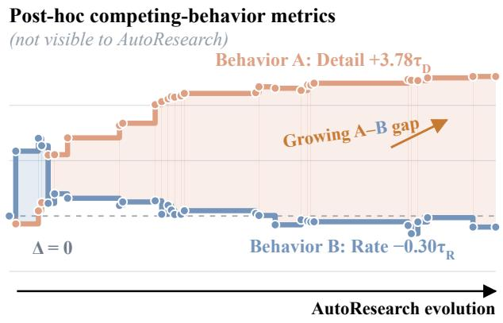  
Figure 10: Post-hoc competing-behavior trajectories for TCM–Lite during the task-only Stage I of search round 1. The behavior metrics were hidden from the proposal agent. Changes are directionaligned and normalized by the frozen Probe thresholds; positive values indicate improvement.

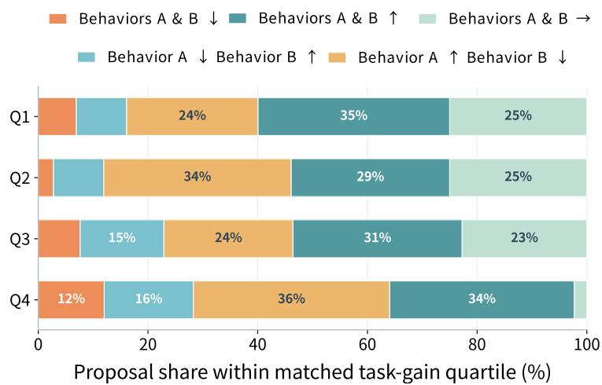  
Figure 11: Scalar ambiguity: similar task gains can correspond to different behavior outcomes. Positive-gain scalar-only proposals are grouped by within-model task-gain magnitude to assess whether scalar improvement identifies directional behavior outcomes. Multiple outcome categories appear in every group, showing that similar scalar gains remain compatible with materially different behavior changes.

the mean normalized outcome entropy is 0.892, where one is the maximum, and no category exceeds 35.8% in any quartile. The same conclusion holds with three or five within-model bins: the corresponding mean entropies are 0.891 and 0.888. The result supports a limited claim—similar scalar gains are compatible with materially different behavior changes—not the stronger claim that the scalar gain causally produces those changes.

## J.2 CODE-EDIT DISTRIBUTIONS AND MECHANISM EXAMPLES

The tag audit shows that feedback changes where proposals concentrate. For SNGP, kernel-scale edits account for 24.6% of ConflictGuide proposals versus 12.7% of AutoResearch proposals, whereas batch-normalization and spectral-bound edits become less frequent. For TCM–Lite, pointwisemixing edits fall from 27.0% to 7.4%, while residual-refinement edits rise from 29.0% to 34.1%. The tags are non-exclusive: one proposal can instantiate more than one mechanism. The boxes below make the most relevant labels operational without reproducing long implementation diffs.

## SNGP: learnable random-feature kernel scale

$$
s \gets \mathrm { s o f t p l u s } ( a ) + \epsilon ,
$$

$$
\Omega ^ { \prime } \gets \Omega / s ,
$$

$$
\Omega ^ { \prime } \gets \mathrm { c l i p } ( \Omega ^ { \prime } , - \omega _ { \mathrm { m a x } } , \omega _ { \mathrm { m a x } } ) ,
$$

$$
\phi ( z )  \sqrt { 2 / M } \cos ( z \Omega ^ { \prime } + b ) ,
$$

$$
\ell \gets W _ { \mathrm { G P } } \phi ( z ) .
$$

The edit learns the effective RFF length scale while retaining a frozen frequency bound. It changes how strongly nearby pre-GP representations are resolved by the GP head rather than adding an independen classifier.

## SNGP: stabilized ridge-precision update

$$
C \gets \sum _ { i } \phi _ { i } ^ { \top } W _ { i } \phi _ { i } ,
$$

$$
\Lambda  \lambda I + C ,
$$

$$
\begin{array} { r } { \Lambda  Q \ \mathrm { d i a g } ( \operatorname* { m a x } \{ \lambda _ { j } , \epsilon \} ) Q ^ { \top } , } \end{array}
$$

$$
\Sigma  \Lambda ^ { - 1 } .
$$

Accumulation and eigendecomposition are carried out in higher precision. Flooring small eigenvalues prevents poorly conditioned feature directions from dominating posterior-variance and mean-field corrections.

## TCM–Lite: depthwise residual refinement

$$
q \gets \mathrm { D W C o n v _ { 3 \times 3 } } ( h ) ,
$$

$$
r \gets \mathrm { P W C o n v } _ { 1 \times 1 } ( \mathrm { G E L U } ( q ) ) ,
$$

$$
\eta  \sigma ( a ) ,
$$

$$
h ^ { \prime }  h + \eta r .
$$

The depthwise filter supplies inexpensive local spatial correction, the pointwise map mixes channels, and the learned gate controls how strongly the new detail path changes the codec representation.

## TCM–Lite: pooled channel gate

$$
u _ { \mathrm { a v g } }  \operatorname* { m e a n } _ { H W } ( h ) ,
$$

$$
u _ { \mathrm { m a x } }  \mathrm { m a x } _ { H W } ( h ) ,
$$

$$
g \gets \sigma ( \mathrm { M L P } ( u _ { \mathrm { a v g } } + u _ { \mathrm { m a x } } ) ) ,
$$

$$
h ^ { \prime }  h \odot g _ { [ : , : , \mathrm { N o n e } , \mathrm { N o n e } ] } .
$$

Average pooling captures persistent channel activity and max pooling retains localized responses. Their gate reallocates capacity without changing the latent tensor shape.

These distributions are descriptive, not estimates of a pure feedback effect: retained-edit frequencies reflect both proposal generation and retention, and the SNGP AutoResearch audit includes all 15 retained edits but only a nonrandom subset of rejected proposals.

## J.3 REPRESENTATIVE EDITS AND CONNECTIONS TO PRIOR WORK

The examples below are arranged vertically rather than compressed into a wide table. They are schematic summaries of recurring proposal mechanisms, not verbatim winner implementations.

SpecB–FNO: retained-mode correction.

$$
\begin{array} { r l r } & { X  \mathrm { r f f t 2 } ( x ) , } & { Z _ { k }  W _ { k } X _ { k } , } \\ & { Z _ { k }  g _ { k } Z _ { k } + s _ { k } P ( X ) _ { k } , } & { y  \mathrm { i r f f t 2 } ( Z ) , \quad k \in \mathcal { K } . } \end{array}
$$

The learned gain or gated bypass corrects selected retained modes without replacing the full spectral operator. The connection to the Fourier-domain parameterization of FNO (Li et al., 2021) is representational; the per-mode correction and its placement are proposal-specific.

SNGP: conditioned GP state.

$$
\begin{array} { r l } & { \Phi \gets \mathrm { R F F } ( z ) , C \gets \displaystyle \sum _ { i } \Phi _ { i } ^ { \top } W _ { i } \Phi _ { i } , } \\ & { } \\ & { \Lambda \gets \lambda I + C , \widetilde { \Lambda } \gets Q \operatorname { d i a g } ( \operatorname* { m a x } \{ \lambda _ { j } , \epsilon \} ) Q ^ { \top } , } \\ & { \Sigma \gets \widetilde { \Lambda } ^ { - 1 } . } \end{array}
$$

The edit stabilizes the precision matrix before mean-field correction. It is reported as a modelspecific numerical mechanism, not as a new GP formulation.

GCNII: receiver-dependent message gate.

$$
\begin{array} { r l } & { m _ { i } \gets \displaystyle \sum _ { j } \widehat { A } _ { i j } h _ { j } , } \\ & { } \\ & { \alpha _ { i } \gets \sigma \Big ( \mathrm { M L P } ( [ h _ { i } ^ { ( 0 ) } , m _ { i } ] ) \Big ) , } \\ & { ~ h _ { i } ^ { \prime } \gets ( 1 - \alpha _ { i } ) h _ { i } ^ { ( 0 ) } + \alpha _ { i } m _ { i } . } \end{array}
$$

The gate varies self-retention and neighborhood mixing by receiver, allowing the model to attenuate incompatible messages without removing graph propagation globally.

ESN: state-dependent recurrent processing.

$$
\begin{array} { r l } & { g _ { t }  \sigma ( U u _ { t } + V h _ { t - 1 } ) , } \\ & { r _ { t }  W _ { \mathrm { i n } } u _ { t } + g _ { t } \odot W h _ { t - 1 } , } \\ & { \widetilde { h } _ { t }  \mathrm { t a n h } ( r _ { t } ) , \qquad h _ { t }  ( 1 - \alpha ) h _ { t - 1 } + \alpha \widetilde { h } _ { t } . } \end{array}
$$

The multiplicative gate makes local processing state–input dependent while the explicit leaky path continues to carry long-range state information.

TCM–Lite: gated local correction.

$$
\begin{array} { r l } & { q \gets \mathrm { D W C o n v } _ { 3 \times 3 } ( h ) , } \\ & { r \gets \mathrm { P W C o n v } _ { 1 \times 1 } ( \mathrm { G E L U } ( q ) ) , } \\ & { h ^ { \prime } \gets h + \sigma ( a ) r . } \end{array}
$$

This edit combines depthwise–pointwise factorization with a gated residual correction. Its closest general motifs are depthwise separable convolution (Chollet, 2017) and residual learning (He et al., 2016); neither reference specifies this codec placement or gate.

Other audited proposals use mean/max pooled channel gates related at the mechanism level to SE and CBAM (Hu et al., 2018; Woo et al., 2018), or spatially shared channel masks related to Spatial-Dropout (Tompson et al., 2015). These are motif-level connections only: parameterization, initialization, placement, and measured effects remain proposal specific.

## K LIMITATIONS AND FUTURE WORK

Limitations. ConflictGuide applies when a conflict is supported by sufficient model-specific evidence and its competing behaviors can be measured with probes. ConflictGuide-Skill abstains when evidence is insufficient, and probes are qualified and fixed before evolution to avoid selecting metrics based on search outcomes. Controlled comparisons with taxonomy-free probe design and systematic evaluation of abstention remain future work. Our experiments examine distinct conflicts across five model families and show directional gains in the tested alternative code-agent settings; applicability to a wider range of settings remains to be established. We compare search outcomes under matched evolution budgets and separately report the additional time required to evaluate probes. The initial specification, implementation, and qualification of model-specific probes require setup effort that varies by model and is not included in a uniform end-to-end cost comparison. The transition to Stage II and the auxiliary retention rule follow prespecified criteria; adaptive timing remains to be studied.

Future Work. Future work could use search history to adjust the timing and strength of probe feedback and make probe construction and qualification more efficient. We also plan to study interacting conflicts, evaluate more model families and code agents, and systematically measure modelspecific setup effort to better characterize applicability and total cost.