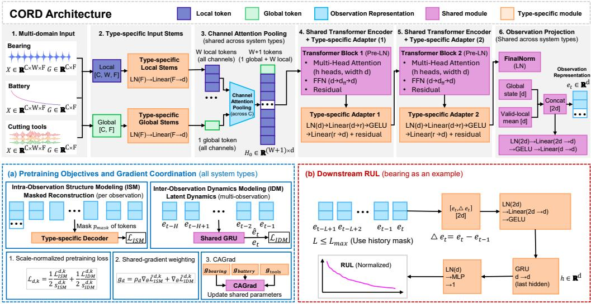
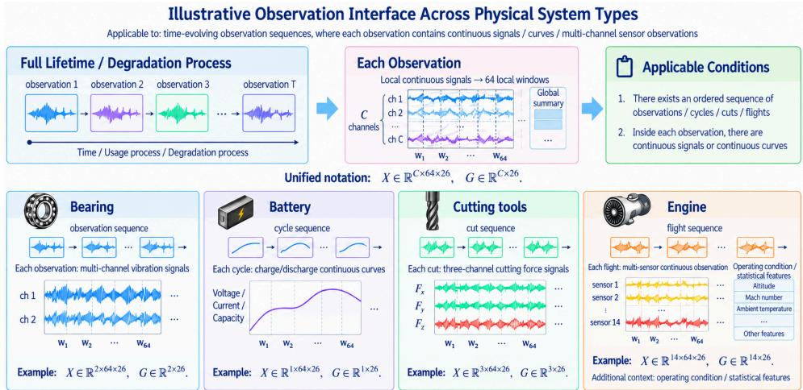
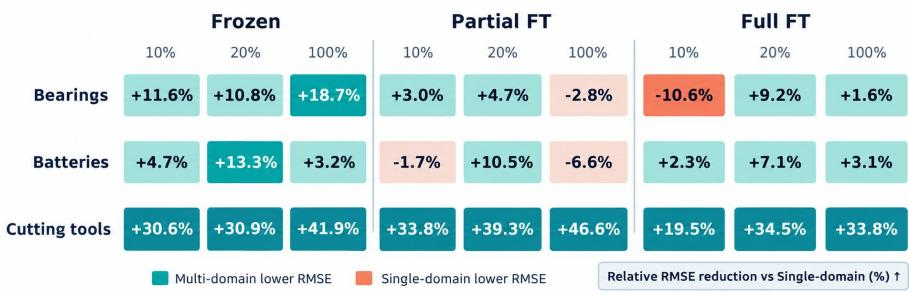
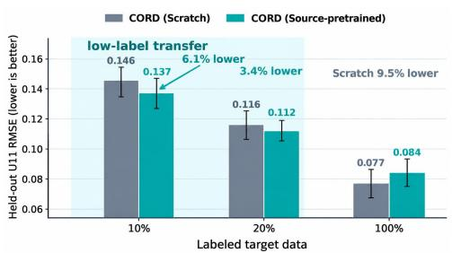
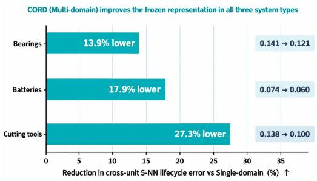
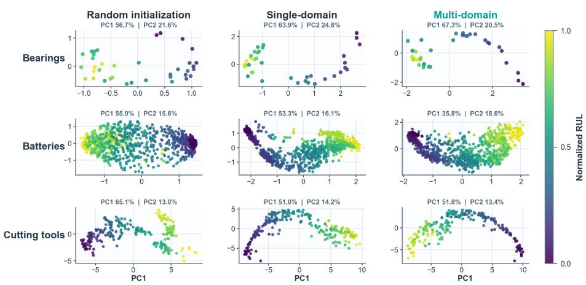
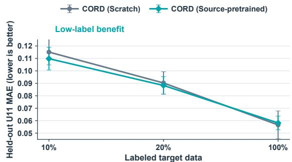
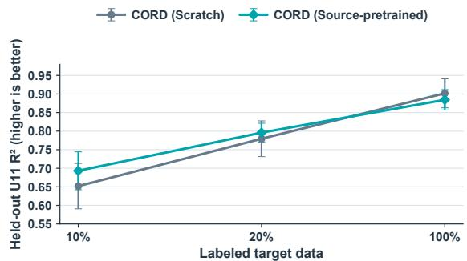

# CORD: LEARNING REUSABLE DEGRADATION REP-RESENTATIONS ACROSS HETEROGENEOUS PHYSICAL SYSTEMS

Haibo Li1, Zhiguo Zeng1 1CentraleSupélec, Université Paris-Saclay haibo.li@centralesupelec.fr zhiguo.zeng@centralesupelec.fr

## ABSTRACT

Can heterogeneous physical degradation systems benefit from joint pretraining and move beyond system-specific prognostics toward reusable cross-system representation learning? CORD combines type-specific observation interfaces with a shared degradation backbone. Its two self-supervised objectives learn at complementary scales: Intra-Observation Structure Modeling (ISM) captures structure within observations, while Inter-Observation Dynamics Modeling (IDM) captures latent degradation evolution across observation histories. We evaluate CORD under two transfer boundaries: Pretraining-Included System Types, where downstream datasets and held-out units are unseen but their system types are represented during source pretraining, and Pretraining-Excluded System Types, where the entire turbofan-engine type is absent from pretraining. Across bearings, batteries, and cutting tools, CORD (Multi-domain) consistently improves over CORD (Single-domain) under Frozen adaptation, provides further gains under Full FT in most settings, and remains competitive with representative external baselines. Source-pretrained initialization also improves low-label adaptation to the pretraining-excluded engine type. Frozen-representation analysis further shows improved cross-unit lifecycle consistency after multi-domain pretraining. Joint pretraining across heterogeneous physical systems thus produces degradation representations reusable across devices, datasets, and system types.

## 1 INTRODUCTION

Physical degradation is observed through system-dependent measurements: bearings through vibration, batteries through electrochemical cycling, cutting tools through machining signals, and turbofan engines through multivariate flight histories. These observations differ in channel semantics, physical units, sampling cadence, and operating context. Industrial prognostics is therefore commonly developed in a system-specific manner, with each model learning degradation patterns from the measurements available for one asset type. Transfer-learning approaches can reduce this isolation by adapting knowledge across operating conditions or related prognostic domains (da Costa et al., 2020; Wang et al., 2026); however, they do not directly answer whether degradation knowledge can be learned jointly across physically different systems whose observations are not semantically aligned.

Large-scale pretraining has produced reusable temporal representations across diverse time-series datasets. MOMENT studies general-purpose representations and limited-supervision adaptation, while Moirai and Time-MoE address heterogeneous forecasting through universal models and sparse mixture-of-experts pretraining (Goswami et al., 2024; Woo et al., 2024; Shi et al., 2025). Tabular foundation models offer another route to data-efficient PHM prediction (Theiler et al., 2026). FeDaL addresses dataset-level heterogeneity in time-series pretraining, and FORMED adapts a shared backbone to medical datasets with different channel structures and tasks (Chen et al., 2026; Huang et al., 2026). Existing work has not established whether physically distinct degradation systems can contribute to a shared representation learner when their sensing semantics are not aligned. Section 2 reviews these directions alongside prognostics transfer.

CORD addresses this problem by keeping observation interfaces type-specific while sharing the degradation backbone across systems. Each interface preserves its system’s sensing semantics while mapping observations into the shared backbone. Two self-supervised objectives train the encoder. Intra-Observation Structure Modeling (ISM) captures structural relationships within a health-state observation, whereas Inter-Observation Dynamics Modeling (IDM) captures how latent health states evolve across observation histories. Lightweight target-aware prediction heads reuse the resulting representation, allowing the encoder to be evaluated independently of any single downstream RUL architecture.

We evaluate CORD under two transfer boundaries. Level I: Generalization under Pretraining-Included System Types evaluates downstream datasets that are entirely excluded from source pretraining while other datasets from the same bearing, battery, or cutting-tool type are available upstream. Level II: Generalization under Pretraining-Excluded System Types removes the complete target system type from source pretraining and introduces it only during downstream adap tation. XJTU-SY bearings (Wang et al., 2020), CALCE CS2 batteries (Center for Advanced Life Cycle Engineering, n.d.), PHM2010 cutting tools (PHM Society, 2010), and N-CMAPSS turbofan engines (Arias Chao et al., 2021) instantiate these two boundaries. Across Level I, CORD (Multi-domain) improves over CORD (Single-domain) in all nine Frozen settings and eight of nine Full-FT settings, while frozen-representation retrieval error decreases by 13.9%, 17.9%, and 27.3% for bearings, batteries, and cutting tools, respectively. At Level II, source pretraining also improves low-label adaptation to the previously unseen turbofan-engine type. These results indicate that the learned degradation representation is reusable beyond individual datasets and devices.

## Our contributions are:

1. Cross-system degradation representation architecture. CORD combines type-specific observation interfaces with a shared degradation backbone, preserving native sensing semantics across physically heterogeneous systems while learning a shared degradation representation.

2. Complementary structure–dynamics pretraining. CORD learns degradation information at two complementary scales: ISM models structural dependencies within an observation, while IDM models latent state evolution across observation histories.

3. Reusable multi-domain pretraining across system boundaries. Multi-domain pretraining improves representation reuse on unseen datasets and supports low-label adaptation to a physical system type entirely excluded from source pretraining.

## 2 RELATED WORK

Time-series foundation models. Large-scale pretraining has produced reusable models across heterogeneous time-series corpora. Forecasting models address variation in frequency, variate structure, and distribution through universal, decoder-based, or generative pretraining (Woo et al., 2024; Das et al., 2024; Ansari et al., 2024; Liu et al., 2024b; Shi et al., 2025). General-purpose and representation-oriented models also learn from temporal structure beyond forecasting targets, including limited-supervision adaptation, time-aware representations, subseries dependencies, and joint reconstruction and autoregression (Goswami et al., 2024; Fraikin et al., 2024; Dong et al., 2024; He et al., 2026). CORD focuses on physical degradation systems whose sensors and mea sured variables may have different meanings. It retains type-specific observation interfaces and shares representation learning above them.

Transfer and representation learning for prognostics. RUL transfer methods address operatingcondition shifts and heterogeneous feature spaces (da Costa et al., 2020; Wang et al., 2026); tabular foundation models provide another interface for heterogeneous PHM tasks (Theiler et al., 2026). CORD learns source representations jointly from multiple physical system types and tests their reuse on held-out datasets and on a target type absent from source pretraining.

Learning under heterogeneous observations. Residual and transfer adapters combine shared transformations with specialized responses (Rebuffi et al., 2017; Houlsby et al., 2019). FeDaL handles dataset-specific heterogeneity in federated pretraining, while FORMED adapts foundation models across medical observation interfaces (Chen et al., 2026; Huang et al., 2026). In CORD, type-specific interfaces preserve the native measurements of each degradation system during centralized self-supervised pretraining of a shared backbone.

  
Figure 1: CORD framework. Type-specific observation interfaces preserve heterogeneous measurement semantics, while a shared Transformer backbone learns reusable degradation representations. ISM models structure within an observation and IDM models evolution across observation histories; target-aware heads reuse the encoder for downstream prognostics. Symbolic dimensions are instantiated in Appendices A.1 and B.

## 3 CORD: REUSABLE DEGRADATION REPRESENTATION LEARNING

## 3.1 PROBLEM SETUP AND TRANSFER BOUNDARIES

Let � denote a physical system type, � a dataset, � an individual unit, and � an ordered observation. A physical system type is a broad category of degrading assets, such as bearings, batteries, cutting tools, or turbofan engines. Each type can contain multiple datasets collected from different units, operating conditions, sensors, and acquisition protocols. The hierarchy is therefore system type → dataset → unit → observation. In the names of source-pretraining regimes, domain denotes a physical system type. A time-indexed sample is represented as a health-state observation $O _ { i , t } ^ { d , k }$ Source pretraining uses system-type set ${ \mathcal { D } } _ { \mathrm { p r e } }$ and dataset collection $\mathcal { P } .$ Shared parameters � and type-specific parameters $\phi _ { d }$ produce $e _ { i , t } = E _ { \theta , \phi _ { d } } ( O _ { i , t } ^ { d , k } )$ . A target-aware readout maps an observation history to scalar remaining useful life (RUL). The primary learning objective is a reusable degradation representation; RUL prediction provides downstream tests of its reuse.

Level I: Generalization under Pretraining-Included System Types. Other datasets from the target system type belong to the source-pretraining collection $\mathcal { P } _ { ; }$ , but the entire downstream target dataset is excluded; training and test units in that dataset are disjoint. Level II: Generalization under Pretraining-Excluded System Types. The target system type $d ^ { \star }$ and all its datasets are excluded from source pretraining. A new interface and prediction model may subsequently be trained using labeled observations from training units; test units do not enter model fitting or protocol selection. Both levels evaluate reuse from the same source-pretrained CORD model under different target boundaries. Frozen adaptation tests what can be read out without changing the encoder; Full FT tests the value of its initialization.

Figure 1 summarizes the complete CORD framework, including type-specific observation interfaces, shared structure–dynamics representation learning, and target-aware downstream adaptation.

  
Figure 2: Observation interfaces across physical system types. Bearing, battery, cutting-tool, and engine observations retain different native signals and channel semantics, while type-specific interfaces expose a common local/global descriptor structure to the shared degradation backbone.

## 3.2 TYPE-SPECIFIC OBSERVATION INTERFACES AND SHARED BACKBONE

For observation � in dataset � and system type �, preprocessing constructs local descriptors $X _ { t } ^ { d , k }$ ∈ $\mathbb { R } ^ { C _ { d , k } \times W \times F }$ , global descriptors $G _ { t } ^ { d , k } \in \mathbb { R } ^ { C _ { d , k } \times F }$ , and validity masks, where � is the number of local windows and � the descriptor dimension. The channel count $C _ { d , k }$ may vary across datasets; padding is masked and excluded from representation computation. Descriptors need not share physical semantics across system types. Separate type-specific local and global stems map them to a common latent width �. The instantiated descriptor definitions and architecture dimensions are reported in Appendices A.1 and B.

Figure 2 illustrates how different physical system types retain their native observation sequences and channel semantics while exposing a common local/global descriptor structure to the shared backbone. Validity-aware channel attention forms local and global tokens. Shared Transformer blocks then process the tokens, while a type-specific residual adapter follows each block:

$$
A _ { d } ( h ) = W _ { 2 , d } \mathrm { G E L U } ( W _ { 1 , d } \mathrm { L N } ( h ) ) , \qquad h  h + A _ { d } ( h ) .\tag{1}
$$

The global state and valid-local mean feed a shared observation projector. Layer widths, adapter initialization, and readout dimensions are specified in Appendix B.

## 3.3 STRUCTURE–DYNAMICS SELF-SUPERVISION

CORD shapes the shared degradation representation at two complementary scales: structure within the current observation and evolution across observation histories.

Intra-Observation Structure Modeling (ISM). ISM masks a fraction $p _ { \mathrm { m a s k } }$ of valid local tokens $( p _ { \mathrm { m a s k } } = 0 . 3 0$ in our experiments) and reconstructs observed descriptor components. The reconstruction decoder is type-specific. If $\Omega _ { \mathrm { m a s k , o b s } }$ indexes masked, observed entries, the objective is

$$
L _ { \mathrm { I S M } } ^ { d , k } = \frac { 1 } { | \Omega _ { \mathrm { m a s k , o b s } } | } \sum _ { ( c , j , f ) \in \Omega _ { \mathrm { m a s k , o b s } } } ( \widehat { X } _ { c , j , f } - X _ { c , j , f } ) ^ { 2 } .\tag{2}
$$

Only observed entries contribute, encouraging contextual descriptor structure within an observation.

Inter-Observation Dynamics Modeling (IDM). IDM predicts the next observation embedding from an �-step history of the same unit using a shared GRU and projection; the reported implementation uses $H = 6 \mathrm { : }$

$$
\widehat { e _ { t } } = Q _ { \psi } ( \mathbf { G } \mathbf { R } \mathbf { U } _ { \psi } ( e _ { t - H } , \ldots , e _ { t - 1 } ) ) , \qquad L _ { \mathrm { I D M } } ^ { d , k } = \mathbf { M } \mathbf { S } \mathbf { E } ( \widehat { e _ { t } } , \mathbf { s } \mathbf { g } ( e _ { t } ) ) .\tag{3}
$$

Gradients are stopped through the target embedding. ISM and IDM update the same encoding system at different observation scales, coupling state structure and state evolution in the shared encoder.

## 3.4 MULTI-DOMAIN PRETRAINING AND TARGET-AWARE ADAPTATION

Coordinated source pretraining. Fixed initial, dataset-specific scales normalize both objectives. Type-specific parameters receive both; shared parameters � receive per-type gradients

$$
g _ { d } = \rho _ { d } \nabla _ { \theta } \widetilde { L } _ { \mathrm { I S M } } ^ { d , k } + \nabla _ { \theta } \widetilde { L } _ { \mathrm { I D M } } ^ { d , k } ,\tag{4}
$$

Conflict-aware coordination aggregates shared gradients across system types (Liu et al., 2021); implementation details are provided in Appendix B. One selected source checkpoint initializes the three represented physical system types.

Target-aware adaptation and evaluation regimes. The downstream prediction heads are targetaware to exploit the reusable representation under each system’s temporal structure. Bearings use a short observation-history GRU, batteries use cycle history and trend, cutting tools use hidden-state fusion and causal temporal modeling, and engines use flight history and operating context. We evaluate three initialization regimes under the transfer boundaries defined in Section 3.1: CORD (Scratch) starts from random initialization, CORD (Single-domain) uses pretraining from the target physical system type only, and CORD (Multi-domain) uses joint pretraining across all represented system types. All three use the same downstream architecture. During target adaptation, Frozen updates only the head, Partial FT updates selected encoder components and the head, and Full FT updates all active encoder parameters and the head. For a pretraining-excluded system type, a new type-specific input interface is randomly initialized, while the shared encoder is initialized from source pretraining.

## 4 EXPERIMENTAL SETUP

## 4.1 DATA AND SOURCE-PRETRAINING BOUNDARIES

Source pretraining uses 19 datasets across three physical system types: seven bearing, seven battery, and five cutting-tool datasets. Table 1 lists the source pools, downstream boundaries, and held-out units. Level-I target datasets are excluded in their entirety while other datasets of the same type are used upstream; Level II excludes the complete turbofan-engine type. Individual source-dataset citations are consolidated in Appendix A.

Table 1: Source-pretraining pools and transfer boundaries. Level-I targets are excluded upstream; Level II excludes the entire turbofan-engine system type.
<table><tr><td>Level / type</td><td>Source-pretraining pool</td><td>Target boundary: adaptation → test</td></tr><tr><td>I / Bearings</td><td>CWRU; FEMTO; Ferrara; IMS; KAIST; SEU; UNSW</td><td>XJTU-SY (Wang et al., 2020): Bearing2_2-2_5 → Bearing2_1</td></tr><tr><td>I / Batteries</td><td>HUST; Michigan; NASA; Oxford; KIT; SDU; XJTU</td><td>CALCE CS2 (Center for Advanced Life Cycle Engineering, n.d.): CS2_35–37 → CS2_38</td></tr><tr><td>I / Cutting tools</td><td>LUH; MATWI; Nonastreda; QIT-CEMC; HMoTP</td><td>PHM2010 (PHM Society, 2010): C1,C4 → C6</td></tr><tr><td>II / Turbofan engines None</td><td></td><td>N-CMAPSS (Arias Chao et al., 2021): U2/U5/U10/U16/U18/U20 → U11</td></tr></table>

## 4.2 TRAINING REGIMES, BASELINES, AND REPORTING

The same architecture is evaluated as CORD (Scratch), CORD (Single-domain), or CORD (Multi domain). External baselines include MLP (Rumelhart et al., 1986), random forest (Breiman, 2001), XGBoost (Chen & Guestrin, 2016), TCN (Bai et al., 2018), PatchTST (Nie et al., 2023), iTransformer (Liu et al., 2024a), and MOMENT (Goswami et al., 2024) with model-appropriate inputs and readouts. We report mean ± SD over five downstream seeds at 10%, 20%, and 100% label budgets. Level-I runs use validation-selected checkpoints. For N-CMAPSS, a fixed 400-update supervised adaptation budget is chosen by grouped cross-validation on the six training engines and then applied to held-out U11 without validation-based early stopping.

## 5 RESULTS

## 5.1 GENERALIZATION UNDER PRETRAINING-INCLUDED SYSTEM TYPES

Table 2 compares CORD regimes on datasets never used in source pretraining. CORD (Multidomain) improves over CORD (Single-domain) in all nine Frozen settings; the cutting-tool RMSE reductions are 30.6%, 30.9%, and 41.9%. Under Full FT, CORD (Multi-domain) improves over CORD (Single-domain) in eight of nine settings. These results show that multi-domain pretraining improves reuse of the learned representation, with consistent gains even when the pretrained encoder is kept fixed.

Table 2: Level-I mean RMSE. Best and second-best values are ranked within each system–budget column; complete metrics are in Appendix C.
<table><tr><td colspan="2"></td><td colspan="3">Bearings</td><td colspan="3">Batteries</td><td colspan="3">Cutting tools</td></tr><tr><td>Source</td><td>Adaptation</td><td>10%</td><td></td><td>20% 100%</td><td>10%</td><td></td><td>20% 100%</td><td>10%</td><td>20%</td><td>100%</td></tr><tr><td>Scratch</td><td></td><td>.1463</td><td>.1400</td><td>.1122</td><td>.0711</td><td>.0680</td><td>.0597</td><td>.1169</td><td>.1007</td><td>.0782</td></tr><tr><td>Single-domain Frozen</td><td></td><td>.1229.1395</td><td></td><td>.1219</td><td>.0739</td><td>.0780</td><td>.0657</td><td>.1245</td><td>.1131</td><td>.1133</td></tr><tr><td>Multi-domain Frozen</td><td></td><td>.1087</td><td>.1245</td><td></td><td>.0991 .0704.0676</td><td></td><td>.0636</td><td>.0864</td><td></td><td>4.0782.0658</td></tr><tr><td>Single-domain Partial FT</td><td></td><td>.1211 .1418.1034 .0714 .0818.0693</td><td></td><td></td><td></td><td></td><td></td><td></td><td></td><td>.1194.1088.0920</td></tr><tr><td>Multi-domain</td><td>Partial FT</td><td>.1175.1351 .1063.0726.0732.0739.0791</td><td></td><td></td><td></td><td></td><td></td><td></td><td>.0660</td><td>.0491</td></tr><tr><td>Single-domain Full FT</td><td></td><td>.1121</td><td>.1464</td><td>.0988</td><td>.0689</td><td>.0735</td><td>.0652 .1082 .0930.0800</td><td></td><td></td><td></td></tr><tr><td>Multi-domain Full FT</td><td></td><td>.1240.1329</td><td></td><td>.0972</td><td>.0673</td><td>.0683</td><td>3.0632</td><td>.0871.0609</td><td></td><td>.0530</td></tr></table>

Figure 3 summarizes the relative effect of Multi-domain versus Single-domain pretraining across Frozen, Partial FT, and Full FT. Multi-domain pretraining yields lower RMSE in all Frozen settings, providing the clearest evidence that the jointly learned representation is more reusable without encoder updates. It retains an advantage in most Partial FT and Full FT settings, although the gains are less uniform after fine-tuning. Cutting tools show the largest and most consistent benefits across all three adaptation strategies.

  
Figure 3: Multi-domain pretraining across adaptation regimes. Cells show the relative RMSE reduction of CORD (Multi-domain) with respect to CORD (Single-domain); the in-figure key identifies which source regime has lower RMSE.

Table 3 compares CORD with representative RUL prediction baselines. The pretrained CORD rows use Full FT as a common adaptation protocol, Scratch starts from random initialization, and MO-MENT is evaluated with a frozen encoder. Other methods use their model-appropriate protocols; complete uncertainty and metrics are in Appendix C.4.

Table 3: RUL prediction comparison: mean RMSE. CORD (Single-domain) and CORD (Multidomain) use Full FT; Scratch trains from random initialization. Each system–budget column ranks all displayed rows.
<table><tr><td></td><td colspan="3">Bearings</td><td colspan="3">Batteries</td><td colspan="3">Cutting tools</td></tr><tr><td>Model</td><td>10%</td><td>20% 100%</td><td></td><td>10%</td><td>20% 100%</td><td></td><td>10%</td><td>20% 100%</td><td></td></tr><tr><td>CORD (Scratch)</td><td>.1463.1400</td><td></td><td>.1122</td><td>.0711</td><td>.0680</td><td>.0597</td><td></td><td></td><td>.1169.1007.0782</td></tr><tr><td>CORD (Single-domain) .1121 .1464</td><td></td><td></td><td>.0988</td><td>.0689.0735</td><td></td><td></td><td></td><td>.0652.1082.0930</td><td>.0800</td></tr><tr><td>CORD (Multi-domain)</td><td>.1240</td><td>.1329</td><td>.0972</td><td>.0673</td><td>.0683</td><td></td><td>.0632 .0871</td><td>.0609</td><td>.0530</td></tr><tr><td>MLP</td><td>.2185 .2307 .2160.1526 .1408.1005</td><td></td><td></td><td></td><td></td><td></td><td>.0991</td><td></td><td>.1085.1177</td></tr><tr><td>Random forest</td><td></td><td></td><td></td><td></td><td></td><td></td><td></td><td></td><td>.1840.1910.1853 .1085.1110.1054 .1117.1202 .1230</td></tr><tr><td>XGBoost</td><td></td><td></td><td></td><td></td><td></td><td></td><td></td><td></td><td>.1494 .1824 .1846.1036.1052 .0992 .1258.1204.1214</td></tr><tr><td>TCN</td><td></td><td></td><td></td><td></td><td></td><td></td><td></td><td></td><td>.2681 .2930.2287 .0807 .0813 .0788 .1409.1266.0722</td></tr><tr><td>PatchTST</td><td>.3019.3338.2663 .0676</td><td></td><td></td><td></td><td>.0722</td><td></td><td></td><td></td><td>.0792 .2258.2103.1810</td></tr><tr><td>iTransformer</td><td></td><td></td><td></td><td></td><td></td><td></td><td></td><td></td><td>.3138.3157 .3071 .0904 .0893 .0813 .2728.2582 .1890</td></tr><tr><td>MOMENT</td><td></td><td></td><td></td><td></td><td></td><td></td><td></td><td></td><td>.3070.3176.2711 .0730.0695.0620.2452 .2431 .2421</td></tr></table>

A CORD regime achieves the lowest displayed RMSE in all nine system–budget columns, with CORD (Multi-domain) obtaining the best result in six of nine and outperforming the representative external baselines across the table. The gains are most pronounced in low-label settings, particularly for cutting tools. As target supervision increases, CORD (Scratch) becomes competitive on some targets, consistent with pretraining providing the largest benefit when labeled target data are limited.

## 5.2 GENERALIZATION UNDER PRETRAINING-EXCLUDED SYSTEM TYPES

N-CMAPSS turbofan engines are entirely absent from source pretraining. Level II uses a fixed 400- update training budget because labeled target data are more limited, avoiding an additional per-seed validation split. The 400-update budget is selected using grouped cross-validation on the six training engines only and then fixed for evaluation on the held-out U11 engine. Table 4 and Figure 4 compare Scratch and source-pretrained initialization under the same 400-update budget. Source-pretrained initialization reduces U11 RMSE from .1463 to .1374 at 10% labels (6.1%) and from .1163 to .1122 at 20% (3.4%); MAE and $R ^ { 2 }$ show the same trend. At 100% labels, Scratch achieves the lower RMSE (.0768 versus .0841). Overall, the benefit of source pretraining is strongest in the low-label regime.

Table 4: Level-II N-CMAPSS U11 results under matched 400-update adaptation (mean $\pm \mathrm { \ S D }$ over five seeds).
<table><tr><td rowspan="2"></td><td colspan="2">RMSE↓</td><td colspan="2">MAE↓</td><td colspan="2"> $R ^ { 2 } \uparrow$ </td></tr><tr><td>Scratch</td><td>Source- pretrained</td><td>Scratch</td><td>Source- pretrained</td><td>Scratch</td><td>Source- pretrained</td></tr><tr><td>10%</td><td>.1463 ± .0134 .1374 ± .0117</td><td></td><td>.1151 ± .0103 .1098 ± .0091</td><td></td><td>.6518 ± .0611</td><td> $. 6 9 3 2 \pm . 0 5 1 0$ </td></tr><tr><td>20%</td><td>.1163 ± .0131 .1122 ± .0069</td><td></td><td>.0903 ± .0090 .0883 ± .0070</td><td></td><td>.7795 ± .0482</td><td> $\mathbf { 7 9 5 9 } \pm \mathbf { . 0 2 5 2 }$ </td></tr><tr><td>100%</td><td>.0768 ± .0154</td><td>.0841 ± .0099</td><td>.0566 ± .0112</td><td>.0582 ± .0055</td><td>.9018 ± .0390</td><td>.8844 ± .0274</td></tr></table>

## 5.3 MULTI-DOMAIN PRETRAINING IMPROVES THE FROZEN REPRESENTATION

Before fitting the RUL heads, we evaluate whether the frozen representation captures lifecycle structure consistently across units. Figure 5 provides a quantitative measure using 5-NN lifecycle error, defined as the normalized-RUL discrepancy between a held-out query and its five nearest referenceunit states. CORD (Multi-domain) reduces this error relative to CORD (Single-domain) by 13.9% for bearings, 17.9% for batteries, and 27.3% for cutting tools, indicating more lifecycle-consistent local neighborhoods. Figure 6 provides a complementary qualitative view of the same representation space. Under multi-domain pretraining, samples within each system type show a clearer and more continuous progression with normalized RUL, consistent with the quantitative reductions in 5-NN lifecycle error.

  
Figure 4: Pretraining-excluded engine transfer. Held-out U11 RMSE under matched 400- update adaptation; whiskers show one sample SD.

  
Figure 5: Multi-domain pretraining improves frozen representation reuse. Bars show relative reductions; callouts show absolute changes.

  
Figure 6: Lifecycle organization in frozen representations. Points are colored by normalized RUL. PCA is fitted independently within each encoder condition and is used only to visualize within-panel lifecycle organization.

## 5.4 ABLATIONS ON OBSERVATION INTERFACES AND PRETRAINING OBJECTIVES

Observation interface. Table 5 compares the proposed Structured Descriptors with Raw-Resampled Inputs under the same Scratch protocol. Structured Descriptors achieve lower RMSE in all nine system–budget settings, with Raw-Resampled Inputs yielding 2.16–3.00× larger errors. This result shows that the performance gain is mainly attributed to the structured observation interface rather than input dimensionality.

Figure 2 illustrates how the same local/global observation structure accommodates native bearing, battery, cutting-tool, and engine measurements before they enter the shared representation backbone.

Table 5: Observation-interface ablation under the matched Scratch protocol. Structured Descriptors are compared with parameter-free Raw-Resampled Inputs using the same input dimensionality and downstream architecture. Entries report mean RMSE over five downstream seeds; lower is better.
<table><tr><td></td><td colspan="3">Bearings</td><td colspan="3">Batteries</td><td colspan="3">Cutting tools</td></tr><tr><td>Input construction</td><td>10%</td><td>20%</td><td>100%</td><td>10%</td><td></td><td>20% 100%</td><td>10%</td><td>20%</td><td>100%</td></tr><tr><td>Structured Descriptors</td><td>.1463</td><td>.1400</td><td>.1122</td><td>.0711</td><td>.0680</td><td>.0597</td><td>.1169</td><td>.1007</td><td>.0782</td></tr><tr><td>Raw-Resampled Inputs .3590</td><td></td><td>.3157</td><td>.3091</td><td>.2131</td><td>.1715</td><td>.1724</td><td>.2845</td><td>.2178</td><td>.1894</td></tr></table>

Inter-observation dynamics (IDM). Table 6 evaluates the contribution of IDM to transfer on the pretraining-excluded turbofan-engine type using N-CMAPSS U11.

Table 6: Pretraining-objective ablation on N-CMAPSS U11. ISM-only and ISM+IDM sourcepretrained encoders use the same fixed 400-update adaptation protocol. Entries are mean RMSE ± sample SD over five seeds; lower is better.
<table><tr><td>Pretraining objective</td><td>10% labels</td><td>20% labels</td><td>100% labels</td></tr><tr><td>ISM only</td><td>0.1725 ± 0.0156</td><td>0.1448 ± 0.0059</td><td>0.0944 ± 0.0189</td></tr><tr><td>ISM + IDM</td><td>0.1374 ± 0.0117</td><td>0.1122 ± 0.0069</td><td>0.0841 ± 0.0099</td></tr><tr><td>RMSE reduction</td><td>20.3%</td><td>22.5%</td><td>10.9%</td></tr></table>

Adding IDM reduces mean RMSE by 20.3%, 22.5%, and 10.9% at 10%, 20%, and 100% labels, respectively. These results show that inter-observation dynamics provide complementary information beyond within-observation structure, with the largest gains under low-label cross-type adaptation. Complete MAE and $R ^ { 2 }$ results are reported in Appendix D.

## 5.5 EFFICIENCY AND REUSABLE DEPLOYMENT

CORD Full FT predictors contain only 0.28–0.38M parameters across the three Level-I systems. With one frozen shared encoder and three heads, deployment uses 657,235 parameters versus 1,022,899 for three extracted copies, reducing parameter storage by 35.75%. These results show that representation reuse can be achieved with a compact shared backbone. Detailed timing and memory results are reported in Appendix G.

## 6 DISCUSSION: WHAT MAKES DEGRADATION REPRESENTATIONS REUSABLE?

Type-specific interfaces enable cross-system representation learning. CORD does not require physical system types to share sensors or variables. Type-specific interfaces preserve systemdependent sensing semantics while mapping observations into a shared degradation backbone. The observation-interface ablation shows that the structured observation interface consistently outperforms matched Raw-Resampled Inputs across the three represented system types.

Structure and dynamics provide complementary pretraining signals. ISM models structural dependencies within individual observations, while IDM models latent state evolution across observation histories. The Level II ablation on the pretraining-excluded engine type shows that adding IDM reduces prediction error across all label budgets, indicating that inter-observation dynamics provide complementary information beyond within-observation structure.

Multi-domain pretraining improves representation reuse across system boundaries. At Level I, CORD (Multi-domain) outperforms CORD (Single-domain) in all nine Frozen settings, while cross-unit 5-NN lifecycle error also decreases for bearings, batteries, and cutting tools. At Level II, source-pretrained initialization improves adaptation to the pretraining-excluded engine type at 10% and 20% labels, while its advantage diminishes at 100%. These results show that multi-domain pretraining supports representation reuse both within represented system types and beyond the sourcepretraining system boundary.

## 7 CONCLUSION

CORD separates heterogeneous observation modeling from shared degradation representation learning. Type-specific interfaces preserve system-dependent measurement semantics, while ISM and IDM capture within-observation structure and inter-observation dynamics in a shared backbone. At Level I, multi-domain pretraining improves frozen representation reuse on held-out bearing, battery, and cutting-tool datasets. At Level II, source pretraining improves low-label adaptation to a pretraining-excluded engine type. Overall, the results demonstrate the feasibility of reusable degra dation representation learning across heterogeneous physical systems.

## AI USE STATEMENT

In this work, we used generative AI tools to assist with literature search, research methodology and experiment design, code implementation and debugging, result analysis and interpretation, figure preparation, and manuscript organization, drafting, and language refinement. We did not use generative AI tools to generate experimental data or to replace the execution and evaluation of the reported experiments. We reviewed all AI-assisted work: literature suggestions were checked against the original sources, generated code was manually inspected and tested, numerical claims were verified against experimental outputs, and AI-assisted text and figures were reviewed and revised by the authors. We take responsibility for the final content of this work, including text, claims, code, analyses, and artifacts produced with the aid of generative AI.

## REPRODUCIBILITY STATEMENT

The experiment packages retain preprocessing implementations, protocol files, checkpoints, perseed metrics, and prediction arrays. Appendices A and B document the data construction, architecture, optimization, and model-selection protocols, while Appendices C–G provide complete results and computational details. The implementations, experiment configurations, and retained experi ment records are available in the GitHub repository.

## ETHICS STATEMENT

The intended application is research on equipment health monitoring. Prediction errors can affect maintenance decisions; these experiments do not establish safety for autonomous operational deployment. Any release of derived data or model artifacts will comply with dataset licenses and redistribution permissions.

## REFERENCES

Abdul Fatir Ansari, Lorenzo Stella, Caner Turkmen, Xiyuan Zhang, Pedro Mercado, Huibin Shen, Oleksandr Shchur, Syama Sundar Rangapuram, Sebastian Pineda Arango, Shubham Kapoor, Jasper Zschiegner, Danielle C. Maddix, Hao Wang, Michael W. Mahoney, Kari Torkkola, Andrew Gordon Wilson, Michael Bohlke-Schneider, and Yuyang Wang. Chronos: Learning the language of time series. Transactions on Machine Learning Research, 2024. URL https: //arxiv.org/abs/2403.07815.

Manuel Arias Chao, Chetan Kulkarni, Kai Goebel, and Olga Fink. Aircraft engine run-to-failure dataset under real flight conditions for prognostics and diagnostics. Data, 6(1):5, 2021. doi: 10.3390/data6010005. URL https://doi.org/10.3390/data6010005.

Luca Arpa, Alberto Gabrielli, Mattia Battarra, and Emiliano Mucchi. University of Ferrara runto-failure vibration dataset of self-aligning double-row ball bearings. Data in Brief, 55:110620, 2024. doi: 10.1016/j.dib.2024.110620. URL https://doi.org/10.1016/j.dib.2024.110620.

Shaojie Bai, J. Zico Kolter, and Vladlen Koltun. An empirical evaluation of generic convolutional and recurrent networks for sequence modeling, 2018. URL https://arxiv.org/abs/1803.01271.

Leo Breiman. Random forests. Machine Learning, 45(1):5–32, 2001. doi: 10.1023/A:1010933404 324. URL https://doi.org/10.1023/A:1010933404324.

Case Western Reserve University Bearing Data Center. CWRU bearing data center. Case School of Engineering, n.d. URL https://engineering.case.edu/bearingdatacenter/welcome.

Center for Advanced Life Cycle Engineering. CALCE battery data: CS2 prismatic cells. University of Maryland battery data archive, n.d. URL https://calce.umd.edu/data.

Shengchao Chen, Guodong Long, Michael Blumenstein, and Jing Jiang. FeDaL: Federated dataset learning for general time series foundation models. In International Conference on Learning Representations, 2026. URL https://proceedings.iclr.cc/paper\_files/paper/2026/hash/a0a53fefef4 c2ad72d5ab79703ba70cb-Abstract-Conference.html.

Tianqi Chen and Carlos Guestrin. XGBoost: A scalable tree boosting system. In Proceedings of the 22nd ACM SIGKDD International Conference on Knowledge Discovery and Data Mining, pp. 785–794, 2016. doi: 10.1145/2939672.2939785. URL https://doi.org/10.1145/2939672.2939785.

Paulo Roberto de Oliveira da Costa, Alp Akçay, Yingqian Zhang, and Uzay Kaymak. Remaining useful lifetime prediction via deep domain adaptation. Reliability Engineering & System Safety, 195:106682, 2020. doi: 10.1016/j.ress.2019.106682. URL https://doi.org/10.1016/j.ress.2019.10 6682.

Abhimanyu Das, Weihao Kong, Rajat Sen, and Yichen Zhou. A decoder-only foundation model for time-series forecasting. In Proceedings of the 41st International Conference on Machine Learning, volume 235, pp. 10148–10167. PMLR, 2024. URL https://proceedings.mlr.press/v235 /das24c.html.

Lars De Pauw, Tom Jacobs, and Toon Goedemé. MATWI: A multimodal automatic tool wear inspection dataset and baseline algorithms. In International Conference on Computer Vision Systems, pp. 255–269, 2023. doi: 10.1007/978-3-031-44137-0\_22. URL https://doi.org/10.1007/978-3-0 31-44137-0\_22.

Berend Denkena, Heinrich Klemme, and Tobias H. Stiehl. Multivariate time series data of milling processes with varying tool wear and machine tools. Data in Brief, 50:109574, 2023. doi: 10.1 016/j.dib.2023.109574. URL https://doi.org/10.1016/j.dib.2023.109574.

Jiaxiang Dong, Haixu Wu, Yuxuan Wang, Yun-Zhong Qiu, Li Zhang, Jianmin Wang, and Mingsheng Long. TimeSiam: A pre-training framework for siamese time-series modeling. In Proceedings of the 41st International Conference on Machine Learning, volume 235, pp. 11412–11436. PMLR, 2024.

Archibald Fraikin, Adrien Bennetot, and Stephanie Allassonniere. T-Rep: Representation learning for time series using time-embeddings. In International Conference on Learning Representations, 2024. URL https://proceedings.iclr.cc/paper\_files/paper/2024/file/84b946c4c4162b29464fc7aa 57e480e1-Paper-Conference.pdf.

Mononito Goswami, Konrad Szafer, Arjun Choudhry, Yifu Cai, Shuo Li, and Artur Dubrawski. MOMENT: A family of open time-series foundation models. In Proceedings of the 41st International Conference on Machine Learning, volume 235, pp. 16115–16152, 2024. URL https://proceedings.mlr.press/v235/goswami24a.html.

Cheng He, Xu Huang, Gangwei Jiang, Zhaoyi Li, Defu Lian, Hong Xie, Enhong Chen, Xijie Liang, Zengrong Zheng, and Patrick P. C. Lee. GTM: A general time-series model for enhanced representation learning of time-series data. In International Conference on Learning Representations, 2026. URL https://proceedings.iclr.cc/paper\_files/paper/2026/hash/0c6639f49f01a8578675303 ce0030233-Abstract-Conference.html.

Neil Houlsby, Andrei Giurgiu, Stanislaw Jastrzebski, Bruna Morrone, Quentin de Laroussilhe, Andrea Gesmundo, Mona Attariyan, and Sylvain Gelly. Parameter-efficient transfer learning for NLP. In Proceedings of the 36th International Conference on Machine Learning, volume 97, pp. 2790–2799, 2019. URL https://proceedings.mlr.press/v97/houlsby19a.html.

David Howey and Christoph Birkl. Oxford battery degradation dataset 1. University of Oxford Research Archive, 2017.

Nan Huang, Haishuai Wang, Zihuai He, Marinka Zitnik, and Xiang Zhang. Repurposing foundation model for generalizable medical time series classification. In International Conference on Learning Representations, 2026. URL https://proceedings.iclr.cc/paper\_files/paper/2026/file/870792 4df5e207fa496f729f49069446-Paper-Conference.pdf.

Wonho Jung, Sung-Hyun Yun, and Yong-Hwa Park. Vibration and temperature run-to-failure dataset of ball bearing for prognostics. Data in Brief, 54:110403, 2024. doi: 10.1016/j.dib.2024.110403. URL https://doi.org/10.1016/j.dib.2024.110403.

J. Lee, H. Qiu, G. Yu, J. Lin, and Rexnord Technical Services. Bearing data set, IMS, university of cincinnati. NASA Ames Prognostics Data Repository, 2007. URL https://data.nasa.gov/dataset/ ims-bearings.

Na Li, Xiao Wang, Wanzhen Wang, Miaomiao Xin, Dongfeng Yuan, and Mingqiang Zhang. A multi-feature dataset of coated end milling cutter tool wear whole life cycle. Scientific Data, 12: 16, 2025.

Bo Liu, Xingchao Liu, Xiaojie Jin, Peter Stone, and Qiang Liu. Conflict-averse gradient descent for multi-task learning. In Advances in Neural Information Processing Systems, 2021. URL https: //proceedings.neurips.cc/paper/2021/hash/9d27fdf2477ffbff837d73ef7ae23db9-Abstract.html.

Yong Liu, Tengge Hu, Haoran Zhang, Haixu Wu, Shiyu Wang, Lintao Ma, and Mingsheng Long. iTransformer: Inverted transformers are effective for time series forecasting. In International Conference on Learning Representations, 2024a. URL https://arxiv.org/abs/2310.06625.

Yong Liu, Haoran Zhang, Chenyu Li, Xiangdong Huang, Jianmin Wang, and Mingsheng Long. Timer: Generative pre-trained transformers are large time series models. In Proceedings of the 41st International Conference on Machine Learning, volume 235, pp. 32369–32399. PMLR, 2024b. URL https://proceedings.mlr.press/v235/liu24cb.html.

Matthias Luh and Thomas Blank. Comprehensive battery aging dataset: Capacity and impedance fade measurements of a lithium-ion NMC/C-SiO cell. Scientific Data, 11:1004, 2024. doi: 10.1 038/s41597-024-03831-x. URL https://doi.org/10.1038/s41597-024-03831-x.

Guijun Ma, Songpei Xu, Benben Jiang, et al. Real-time personalized health status prediction of lithium-ion batteries using deep transfer learning. Energy & Environmental Science, 15:4083– 4094, 2022.

Patrick Nectoux, Rafael Gouriveau, Kamal Medjaher, Emmanuel Ramasso, Brigitte Chebel-Morello, Noureddine Zerhouni, and Christophe Varnier. PRONOSTIA: An experimental platform for bearings accelerated degradation tests. In IEEE Conference on Prognostics and Health Management, pp. 1–8, 2012.

Yuqi Nie, Nam H. Nguyen, Phanwadee Sinthong, and Jayant Kalagnanam. A time series is worth 64 words: Long-term forecasting with transformers. In International Conference on Learning Representations, 2023. URL https://arxiv.org/abs/2211.14730.

PHM Society. 2010 PHM society conference data challenge, 2010. URL https://phmsociety.org/p hm\_competition/2010-phm-society-conference-data-challenge/.

Sylvestre-Alvise Rebuffi, Hakan Bilen, and Andrea Vedaldi. Learning multiple visual domains with residual adapters. In Advances in Neural Information Processing Systems, 2017. URL https: //proceedings.neurips.cc/paper/2017/hash/e7b24b112a44fdd9ee93bdf998c6ca0e-Abstract.html.

David E. Rumelhart, Geoffrey E. Hinton, and Ronald J. Williams. Learning representations by back-propagating errors. Nature, 323(6088):533–536, 1986. doi: 10.1038/323533a0. URL https://doi.org/10.1038/323533a0.

Bhaskar Saha and Kai Goebel. Battery data set. NASA Ames Prognostics Data Repository, 2007.

Siyu Shao, Stephen McAleer, Ruqiang Yan, and Pierre Baldi. Highly accurate machine fault diagnosis using deep transfer learning. IEEE Transactions on Industrial Informatics, 15(4):2446–2455, 2019.

Xiaoming Shi, Shiyu Wang, Yuqi Nie, Dianqi Li, Zhou Ye, Qingsong Wen, and Ming Jin. Time-MoE: Billion-scale time series foundation models with mixture of experts. In International Conference on Learning Representations, 2025. URL https://proceedings.iclr.cc/paper\_files/paper/2 025/hash/558d48c1f08675daa636e09bfe94a89e-Abstract-Conference.html.

Wade A. Smith and Robert B. Randall. Rolling element bearing diagnostics using the case western reserve university data: A benchmark study. Mechanical Systems and Signal Processing, 64–65: 100–131, 2015. doi: 10.1016/j.ymssp.2015.04.021. URL https://doi.org/10.1016/j.ymssp.2015.0 4.021.

Raffael Theiler, Lev Telyatnikov, Leandro von Krannichfeldt, and Olga Fink. Towards unified and data-efficient prognostics and health management with tabular foundation models, 2026. URL https://arxiv.org/abs/2606.05481.

Hubert Truchan and Zahra Ahmadi. Nonastreda multimodal dataset for efficient tool wear state monitoring. Data in Brief, 62:111905, 2025.

Biao Wang, Yaguo Lei, Naipeng Li, and Ningbo Li. A hybrid prognostics approach for estimating remaining useful life of rolling element bearings. IEEE Transactions on Reliability, 69(1):401– 412, 2020. doi: 10.1109/TR.2018.2882682. URL https://doi.org/10.1109/TR.2018.2882682.

Bingsen Wang, Piero Baraldi, Ahmed Shokry, and Enrico Zio. A novel two-stage heterogeneous transfer learning framework for the estimation of the remaining useful life of industrial components. Reliability Engineering & System Safety, 2026. doi: 10.1016/j.ress.2025.111968. URL https://doi.org/10.1016/j.ress.2025.111968.

Fujin Wang, Z. Zhai, Z. Zhao, et al. Physics-informed neural network for lithium-ion battery degradation stable modeling and prognosis. Nature Communications, 15:4332, 2024a.

Runqiong Wang, Qinghua Song, Y. Peng, et al. Toward digital twins for high-performance manufacturing: Tool wear monitoring in high-speed milling of thin-walled parts using domain knowledge. Robotics and Computer-Integrated Manufacturing, 88:102723, 2024b.

Shuquan Wang, Feng Gao, and Hao Tian. Deep sorting of reused batteries for enabling longterm consistency grouping with unknown prior conditions. Cell Reports Physical Science, 6 (7):102657, 2025.

Andrew Weng, Peyman Mohtat, Peter M. Attia, et al. Predicting the impact of formation protocols on battery lifetime immediately after manufacturing. Joule, 5(11):2971–2992, 2021.

Gerald Woo, Chenghao Liu, Akshat Kumar, Caiming Xiong, Silvio Savarese, and Doyen Sahoo. Unified training of universal time series forecasting transformers. In Proceedings of the 41st International Conference on Machine Learning, volume 235, pp. 53140–53164, 2024. URL https://proceedings.mlr.press/v235/woo24a.html.

Hengcheng Zhang, Pietro Borghesani, Robert B. Randall, and Zhongxiao Peng. A benchmark of measurement approaches to track the natural evolution of spall severity in rolling element bearings. Mechanical Systems and Signal Processing, 166:108466, 2022.

## A DATA BOUNDARIES AND OBSERVATION CONSTRUCTION

Source pretraining uses 19 datasets across the three represented physical system types. The downstream datasets are excluded in their entirety from source pretraining. Historical three-channel cutting-tool results are excluded from this study; PHM2010 uses its seven recorded channels. Observation descriptors use 64 local slots and 26 feature dimensions with validity masks. Target construction and dataset-specific preprocessing are recorded in the released manifests. Main-text Table 1 reports the source pools, transfer boundaries, and downstream units in one place.

Table 7: Source-pretraining and downstream target datasets with their direct data-source citations. References are consolidated here to keep the main-text data description readable.
<table><tr><td>System type</td><td>Dataset</td><td>Reference</td></tr><tr><td>Bearings</td><td>CWRU</td><td>(Case Western Reserve University Bearing Data Center, n.d.; Smith &amp; Randall, 2015)</td></tr><tr><td></td><td>FEMTO / PRONOSTIA</td><td>(Nectoux et al., 2012)</td></tr><tr><td></td><td>Ferrara</td><td>(Arpa et al., 2024)</td></tr><tr><td></td><td>IMS</td><td>(Lee et al., 2007)</td></tr><tr><td></td><td>KAIST</td><td>(Jung et al., 2024)</td></tr><tr><td></td><td>SEU</td><td>(Shao et al., 2019)</td></tr><tr><td></td><td>UNSW</td><td>(Zhang et al., 2022)</td></tr><tr><td>Batteries</td><td>HUST</td><td>(Ma et al., 2022)</td></tr><tr><td></td><td>Michigan</td><td>(Weng et al., 2021)</td></tr><tr><td></td><td>NASA</td><td>(Saha &amp; Goebel, 2007)</td></tr><tr><td></td><td>Oxford</td><td>(Howey &amp; Birkl, 2017)</td></tr><tr><td></td><td>KIT NMC/C-SiO</td><td>(Luh &amp; Blank, 2024)</td></tr><tr><td></td><td>SDU</td><td>(Wang et al., 2025)</td></tr><tr><td></td><td>XJTU</td><td>(Wang et al., 2024a)</td></tr><tr><td>Cutting tools</td><td>LUH</td><td>(Denkena et al., 2023)</td></tr><tr><td></td><td>MATWI</td><td>(De Pauw et al., 2023)</td></tr><tr><td></td><td>Nonastreda</td><td>(Truchan &amp; Ahmadi, 2025)</td></tr><tr><td></td><td>QIT-CEMC</td><td>(Li et al., 2025)</td></tr><tr><td></td><td>HMoTP</td><td>(Wang et al., 2024b)</td></tr><tr><td>Downstream targets XJTU-SY bearings</td><td></td><td>(Wang et al., 2020)</td></tr><tr><td></td><td>CALCE CS2 batteries</td><td>(Center for Advanced Life Cycle Engineering, n.d.)</td></tr><tr><td></td><td>PHM2010 cutting tools</td><td>(PHM Society, 2010)</td></tr><tr><td></td><td>N-CMAPSS turbofan engines (Arias Chao et al., 2021)</td><td></td></tr></table>

## A.1 STRUCTURED DESCRIPTOR DEFINITIONS

For the reported implementation, � = 26; Table 8 records the exact feature order used by the three represented system-type interfaces. Identical names in the bearing and cutting-tool columns denote the same statistic applied to different native sensor channels; they do not impose shared channel semantics across system types.

Table 8: Ordered 26-dimensional Structured Descriptors exposed by each source-system observation interface. Bearing and cutting-tool descriptors are computed independently for every valid native sensor channel and local signal window. Battery descriptors are computed over valid local discharge windows; unavailable temperature entries are masked rather than imputed as observations.
<table><tr><td>Index Bearings</td><td></td><td>Batteries</td><td>Cutting tools</td></tr><tr><td></td><td>1 Mean</td><td>Mean voltage</td><td>Mean</td></tr><tr><td></td><td>2 Mean absolute value</td><td>Voltage standard deviation</td><td>Mean absolute value</td></tr><tr><td></td><td>3 Standard deviation</td><td>Minimum voltage</td><td>Standard deviation</td></tr><tr><td></td><td>4 Variance</td><td>Maximum voltage</td><td>Variance</td></tr><tr><td></td><td>5 Root mean square</td><td>Voltage peak-to-peak range</td><td>Root mean square</td></tr><tr><td></td><td>6 Mean-square energy</td><td>Voltage skewness</td><td>Mean-square energy</td></tr><tr><td></td><td>7 Absolute peak amplitude</td><td>Voltage kurtosis</td><td>Absolute peak amplitude</td></tr></table>

Continued on next page.

Table 8 continued.
<table><tr><td>Index Bearings</td><td></td><td>Batteries</td><td>Cutting tools</td></tr><tr><td></td><td>8 Peak-to-peak range</td><td>Voltage slope</td><td>Peak-to-peak range</td></tr><tr><td></td><td>9 Minimum</td><td>Mean absolute voltage derivative</td><td>Minimum</td></tr><tr><td></td><td>10 Maximum</td><td>Mean absolute voltage curvature</td><td>Maximum</td></tr><tr><td></td><td>11 Skewness</td><td>Mean C-rate</td><td>Skewness</td></tr><tr><td></td><td>12 Kurtosis</td><td>C-rate standard deviation</td><td>Kurtosis</td></tr><tr><td></td><td>13 Crest factor</td><td>Minimum C-rate</td><td>Crest factor</td></tr><tr><td></td><td>14 Shape factor</td><td>Maximum C-rate</td><td>Shape factor</td></tr><tr><td></td><td>15 Impulse factor</td><td>Mean absolute C-rate</td><td>Impulse factor</td></tr><tr><td></td><td>16 Clearance factor</td><td>C-rate slope</td><td>Clearance factor</td></tr><tr><td></td><td>17 Root amplitude</td><td>Mean temperature</td><td>Root amplitude</td></tr><tr><td></td><td>18 Zero-crossing rate</td><td>Temperature standard deviation</td><td>Zero-crossing rate</td></tr><tr><td></td><td>19 Spectral centroid</td><td>Minimum temperature</td><td>Spectral centroid</td></tr><tr><td></td><td>20 Spectral bandwidth</td><td>Maximum temperature</td><td>Spectral bandwidth</td></tr><tr><td></td><td>21 Spectral entropy</td><td>Temperature change</td><td>Spectral entropy</td></tr><tr><td></td><td>22 Dominant frequency</td><td>Temperature slope</td><td>Dominant frequency</td></tr><tr><td></td><td>23 Low-band normalized energy</td><td>Local duration</td><td>Low-band normalized energy</td></tr><tr><td></td><td>24 Mid-band normalized energy</td><td>Local capacity</td><td>Mid-band normalized energy</td></tr><tr><td></td><td>25 High-band normalized energy</td><td>Local energy</td><td>High-band normalized energy</td></tr><tr><td>ratio</td><td>26 High/low-band energy</td><td>Mean dV/dQ</td><td>High/low-band energy ratio</td></tr></table>

## B ARCHITECTURE, OPTIMIZATION, AND MODEL SELECTION

The reported implementation uses $W = 6 4$ $F = 2 6$ $d = 9 6$ $h = 4$ $d _ { \mathrm { f f } } = 1 9 2$ , and $r = 2 4$ . Typespecific local and global stems map the descriptors to width �. Validity-aware channel attention yields � local tokens plus one global token. Two shared pre-normalized Transformer blocks use ℎ attention heads and feed-forward width $d _ { \mathrm { f f } } .$ a residual adapter after each block has bottleneck width � and a zero-initialized final map. The global state and valid-local mean form a $2 d \cdot$ -dimensional concatenation, which is projected back to � to produce the observation representation. Cutting-tool prediction may also use the 2�-dimensional final-normalized token readout.

The selected CORD checkpoint uses a bearing-gradient directional projection following CAGrad. For dataset � in system type $d ,$ initial source-training batches fix scales $s _ { \mathrm { I S M } } ^ { d , k }$ and $s _ { \mathrm { I D M } } ^ { d , k }$

$$
\widetilde { L } _ { \mathrm { I S M } } ^ { d , k } = L _ { \mathrm { I S M } } ^ { d , k } / ( 2 s _ { \mathrm { I S M } } ^ { d , k } ) , \qquad \widetilde { L } _ { \mathrm { I D M } } ^ { d , k } = L _ { \mathrm { I D M } } ^ { d , k } / ( 2 s _ { \mathrm { I D M } } ^ { d , k } ) .\tag{5}
$$

System-type-specific stems, adapters, channel embeddings, and decoders receive both normalized components. For shared parameters, Eq. 4 uses fixed ISM coefficients (0.3, 0.3, 1) for bearings, batteries, and cutting tools; IDM is not multiplied by $1 - \rho _ { d }$ . CAGrad uses $\alpha = 0 . 4$ and its rescale = 1 convention. Given its output � and bearing gradient $g _ { b }$ , the implementation then applies

$$
\nu ^ { \prime } = \nu + \frac { [ \| g _ { b } \| ^ { 2 } / D - g _ { b } ^ { \top } \nu ] _ { + } } { \operatorname* { m a x } ( \| g _ { b } \| ^ { 2 } , 1 0 ^ { - 2 0 } ) } g _ { b } , \qquad D = 3 .\tag{6}
$$

This minimum Euclidean correction enforces the specified bearing-gradient directional floor before clipping and AdamW. Single-domain training uses the corresponding interface, scales, and coefficient without multi-domain gradient aggregation.

Each epoch has 20 joint updates, each with batch 32 per active system type and microbatch eight. Source datasets rotate within system types. AdamW uses learning rate and weight decay $1 0 ^ { - 4 }$ , with a 2,000-epoch ceiling, patience 30, and minimum validation improvement $1 0 ^ { = 4 } .$ . Source selection averages dataset loss ratios within system types, then averages system types. The validation total is reconstruction plus 0.2 times dynamics relative to its initial value; it differs from the separately normalized training objective. One joint checkpoint is selected for all represented system types.

The target-aware RUL readouts use nonlinear temporal heads. Bearings use up to six observations and a GRU; batteries use a 20-cycle history/trend head; cutting tools use up to 20 observations, hidden-state fusion, a causal TCN, and a GRU. Engines use seven-flight histories and operating context. Represented-type fine-tuning uses encoder learning rate $3 \times 1 0 ^ { - 4 }$ and head rate $1 0 ^ { - 3 } ;$ CORD (Scratch) uses $1 \bar { 0 ^ { - 3 } }$ . Partial FT updates only designated final encoder components.

## C GENERALIZATION UNDER PRETRAINING-INCLUDED SYSTEM TYPES: COMPLETE RESULTS

Tables report mean ± SD. Red bold marks the lowest displayed mean and blue bold underlined the second-lowest within each physical system type and label budget among the listed adaptation procedures.

## C.1 BEARING

Table 9: Bearing adaptation on XJTU-SY: RMSE, MAE, and $R ^ { 2 }$ at all three label budgets (five seeds).
<table><tr><td>Labels Treatment</td><td></td><td>RMSE</td><td>MAE</td><td> $R ^ { 2 }$ </td></tr><tr><td>10%</td><td>CORD (Scratch)</td><td> $0 . 1 4 6 3 \pm 0 . 0 3 9 3$ </td><td> $0 . 1 1 7 2 \pm 0 . 0 2 9 2$ </td><td> $0 . 7 4 2 8 \pm 0 . 1 4 0 6$ </td></tr><tr><td>10%</td><td>CORD (Single-domain) Frozen</td><td> $0 . 1 2 2 9 \pm 0 . 0 1 7 6$ </td><td> $0 . 0 9 8 4 \pm 0 . 0 2 0 7$ </td><td> $0 . 8 2 5 6 \pm 0 . 0 5 1 9$ </td></tr><tr><td>10%</td><td>CORD (Multi-domain) Frozen</td><td> $\mathbf { 0 . 1 0 8 7 \pm 0 . 0 1 5 3 }$ </td><td> $\mathbf { 0 . 0 8 5 9 \pm 0 . 0 1 1 4 }$ </td><td> $\mathbf { 0 . 8 6 3 5 \pm 0 . 0 3 7 9 }$ </td></tr><tr><td>10%</td><td>CORD (Single-domain) Partial FT</td><td> $0 . 1 2 1 1 \pm 0 . 0 3 1 8$ </td><td> $0 . 0 9 4 4 \pm 0 . 0 2 6 1$ </td><td> $0 . 8 2 4 2 \pm 0 . 0 9 5 9$ </td></tr><tr><td>10%</td><td>CORD (Multi-domain) Partial FT</td><td> $0 . 1 1 7 5 \pm 0 . 0 1 9 0$ </td><td> $0 . 0 9 7 7 \pm 0 . 0 1 5 5$ </td><td> $0 . 8 3 9 7 \pm 0 . 0 5 2 3$ </td></tr><tr><td>10%</td><td>CORD (Single-domain) Full FT</td><td> $\mathbf { 0 . 1 1 2 1 \pm 0 . 0 2 2 4 }$ </td><td> $\mathbf { 0 . 0 8 3 3 \pm 0 . 0 1 4 2 }$ </td><td> $\mathbf { 0 . 8 5 2 6 \pm 0 . 0 6 2 3 }$ </td></tr><tr><td>10%</td><td>CORD (Multi-domain) Full FT</td><td> $0 . 1 2 4 0 \pm 0 . 0 2 8 9$ </td><td> $0 . 0 9 7 9 \pm 0 . 0 2 3 9$ </td><td> $\overline { { 0 . 8 1 7 7 \pm 0 . 0 8 5 9 } }$ </td></tr><tr><td>20%</td><td>CORD (Scratch)</td><td> $0 . 1 4 0 0 \pm 0 . 0 1 4 5$ </td><td> $0 . 1 0 8 1 \pm 0 . 0 1 1 2$ </td><td> $0 . 7 7 5 2 \pm 0 . 0 4 5 3$ </td></tr><tr><td>20%</td><td>CORD (Single-domain) Frozen</td><td> $0 . 1 3 9 5 \pm 0 . 0 1 8 5$ </td><td> $0 . 1 1 4 1 \pm 0 . 0 0 8 6$ </td><td> $0 . 7 7 5 8 \pm 0 . 0 5 8 1$ </td></tr><tr><td>20%</td><td>CORD (Multi-domain) Frozen</td><td> $\mathbf { 0 . 1 2 4 5 \pm 0 . 0 0 9 } 7$ </td><td> $\mathbf { 0 . 0 9 9 4 \pm 0 . 0 0 9 5 }$ </td><td> $\mathbf { 0 . 8 2 2 9 \pm 0 . 0 2 8 3 }$ </td></tr><tr><td>20%</td><td>CORD (Single-domain) Partial FT</td><td> $0 . 1 4 1 8 \pm 0 . 0 2 5 2$ </td><td> $0 . 1 1 2 7 \pm 0 . 0 2 1 0$ </td><td> $0 . 7 6 5 6 \pm 0 . 0 8 7 9$ </td></tr><tr><td>20%</td><td>CORD (Multi-domain) Partial FT</td><td> $0 . 1 3 5 1 \pm 0 . 0 1 7 1$ </td><td> $0 . 1 1 0 8 \pm 0 . 0 1 2 0$ </td><td> $0 . 7 8 9 9 \pm 0 . 0 5 1 6$ </td></tr><tr><td>20%</td><td>CORD (Single-domain) Full FT</td><td> $0 . 1 4 6 4 \pm 0 . 0 1 4 2$ </td><td> $0 . 1 1 0 0 \pm 0 . 0 1 3 2$ </td><td> $0 . 7 5 4 6 \pm 0 . 0 4 7 4$ </td></tr><tr><td>20%</td><td>CORD (Multi-domain) Full FT</td><td> $\underline { { \mathbf { 0 . 1 3 2 9 \pm 0 . 0 2 1 4 } } }$ </td><td> $\underline { { \mathbf { 0 . 1 0 4 4 \pm 0 . 0 1 4 2 } } }$ </td><td> $\underline { { \mathbf { 0 . 7 9 5 1 \pm 0 . 0 6 9 7 } } }$ </td></tr><tr><td>100%</td><td></td><td> $0 . 1 1 2 2 \pm 0 . 0 2 3 3$ </td><td></td><td></td></tr><tr><td>100%</td><td>CORD (Scratch) CORD (Single-domain) Frozen</td><td> $0 . 1 2 1 9 \pm 0 . 0 1 0 7$ </td><td> $0 . 0 8 5 4 \pm 0 . 0 1 4 3$ </td><td> $0 . 8 5 1 9 \pm 0 . 0 6 3 7$ </td></tr><tr><td>100%</td><td>CORD (Multi-domain) Frozen</td><td></td><td> $0 . 0 9 4 0 \pm 0 . 0 0 8 6$ </td><td> $0 . 8 3 0 1 \pm 0 . 0 3 0 8$ </td></tr><tr><td>100%</td><td></td><td> $0 . 0 9 9 1 \pm 0 . 0 1 6 6$   $0 . 1 0 3 4 \pm 0 . 0 1 8 2$ </td><td> $0 . 0 8 0 5 \pm 0 . 0 1 2 1$ </td><td> $0 . 8 8 5 7 \pm 0 . 0 3 7 1$ </td></tr><tr><td>100%</td><td>CORD (Single-domain) Partial FT</td><td> $0 . 1 0 6 3 \pm 0 . 0 1 9 0$ </td><td> $0 . 0 8 0 2 \pm 0 . 0 1 3 1$ </td><td> $0 . 8 7 5 3 \pm 0 . 0 4 5 5$ </td></tr><tr><td>100%</td><td>CORD (Multi-domain) Partial FT</td><td></td><td> $0 . 0 8 4 2 \pm 0 . 0 1 3 7$ </td><td> $0 . 8 6 8 2 \pm 0 . 0 4 8 8$ </td></tr><tr><td></td><td>CORD (Single-domain) Full FT</td><td> $\underline { { \mathbf { 0 . 0 9 8 8 \pm 0 . 0 1 8 4 } } }$ </td><td> $\mathbf { 0 . 0 7 1 8 \pm 0 . 0 1 6 2 }$ </td><td> $\mathbf { 0 . 8 8 5 9 \pm 0 . 0 4 3 6 }$ </td></tr><tr><td>100%</td><td>CORD (Multi-domain) Full FT</td><td> $\mathbf { 0 . 0 9 7 2 \pm 0 . 0 0 7 1 }$ </td><td> $\underline { { \mathbf { 0 . 0 7 4 4 } } } \pm \mathbf { 0 . 0 0 7 6 }$ </td><td> $\mathbf { 0 . 8 9 2 1 \pm 0 . 0 1 6 0 }$ </td></tr></table>

## C.2 BATTERY

Table 10: Battery adaptation on CALCE CS2: RMSE, MAE, and $R ^ { 2 }$ at all three label budgets (five seeds).
<table><tr><td>Labels Treatment</td><td></td><td>RMSE</td><td>MAE</td><td> $R ^ { 2 }$ </td></tr><tr><td>10%</td><td>CORD (Scratch)</td><td> $0 . 0 7 1 1 \pm 0 . 0 0 9 1$ </td><td> $0 . 0 5 1 6 \pm 0 . 0 0 6 5$ </td><td> $0 . 9 3 8 4 \pm 0 . 0 1 4 6$ </td></tr><tr><td>10%</td><td>CORD (Single-domain) Frozen</td><td> $0 . 0 7 3 9 \pm 0 . 0 0 5 9$ </td><td> $0 . 0 5 4 7 \pm 0 . 0 0 4 2$ </td><td> $0 . 9 3 3 9 \pm 0 . 0 1 0 6$ </td></tr><tr><td>10%</td><td>CORD (Multi-domain) Frozen</td><td> $0 . 0 7 0 4 \pm 0 . 0 0 2 8$ </td><td> $0 . 0 5 2 2 \pm 0 . 0 0 1 9$ </td><td> $0 . 9 4 0 2 \pm 0 . 0 0 4 8$ </td></tr><tr><td>10%</td><td>CORD (Single-domain) Partial FT</td><td> $0 . 0 7 1 4 \pm 0 . 0 0 3 0$ </td><td> $0 . 0 5 2 2 \pm 0 . 0 0 1 9$ </td><td> $0 . 9 3 8 5 \pm 0 . 0 0 5 1$ </td></tr><tr><td>10%</td><td>CORD (Multi-domain) Partial FT</td><td> $0 . 0 7 2 6 \pm 0 . 0 0 4 0$ </td><td> $0 . 0 5 2 9 \pm 0 . 0 0 3 1$ </td><td> $0 . 9 3 6 4 \pm 0 . 0 0 7 0$ </td></tr><tr><td>10%</td><td>CORD (Single-domain) Full FT</td><td> $\underline { { \mathbf { 0 . 0 6 8 9 \pm 0 . 0 0 4 8 } } }$ </td><td> $\underline { { \mathbf { 0 . 0 4 9 2 \pm 0 . 0 0 3 5 } } }$ </td><td> $\mathbf { 0 . 9 4 2 6 \pm 0 . 0 0 7 8 }$ </td></tr><tr><td>10%</td><td>CORD (Multi-domain) Full FT</td><td> $\mathbf { 0 . 0 6 7 3 \pm 0 . 0 0 6 4 }$ </td><td> $\mathbf { 0 . 0 4 8 7 \pm 0 . 0 0 4 4 }$ </td><td> $\mathbf { 0 . 9 4 5 0 \pm 0 . 0 1 0 5 }$ </td></tr><tr><td>20%</td><td>CORD (Scratch)</td><td> $\mathbf { 0 . 0 6 8 0 \pm 0 . 0 0 6 0 }$ </td><td> $0 . 0 4 9 7 \pm 0 . 0 0 5 6$ </td><td> $\mathbf { 0 . 9 4 3 9 \pm 0 . 0 1 0 1 }$ </td></tr><tr><td>20%</td><td>CORD (Single-domain) Frozen</td><td> $\overline { { 0 . 0 7 8 0 \pm 0 . 0 0 4 2 } }$ </td><td> $0 . 0 5 6 1 \pm 0 . 0 0 3 8$ </td><td> $0 . 9 2 6 5 \pm 0 . 0 0 8 0$ </td></tr><tr><td>20%</td><td>CORD (Multi-domain) Frozen</td><td> $\mathbf { 0 . 0 6 7 6 \pm 0 . 0 0 1 2 }$ </td><td> $\mathbf { 0 . 0 4 9 4 \pm 0 . 0 0 0 9 }$ </td><td> $\mathbf { 0 . 9 4 5 0 \pm 0 . 0 0 1 9 }$ </td></tr></table>

Continued on next page

<table><tr><td>Labels Treatment</td><td></td><td>RMSE</td><td>MAE</td><td> $R ^ { 2 }$ </td></tr><tr><td>20%</td><td>CORD (Single-domain) Partial FT</td><td> $0 . 0 8 1 8 \pm 0 . 0 0 5 7$ </td><td> $0 . 0 5 9 4 \pm 0 . 0 0 3 8$ </td><td> $0 . 9 1 9 1 \pm 0 . 0 1 0 9$ </td></tr><tr><td>20%</td><td>CORD (Multi-domain) Partial FT</td><td> $0 . 0 7 3 2 \pm 0 . 0 0 5 2$ </td><td> $0 . 0 5 2 4 \pm 0 . 0 0 4 0$ </td><td> $0 . 9 3 5 1 \pm 0 . 0 0 9 2$ </td></tr><tr><td>20%</td><td>CORD (Single-domain) Full FT</td><td> $0 . 0 7 3 5 \pm 0 . 0 0 5 0$ </td><td> $0 . 0 5 3 3 \pm 0 . 0 0 4 4$ </td><td> $0 . 9 3 4 6 \pm 0 . 0 0 8 9$ </td></tr><tr><td>20%</td><td>CORD (Multi-domain) Full FT</td><td> $0 . 0 6 8 3 \pm 0 . 0 0 4 3$ </td><td> $\mathbf { 0 . 0 4 8 4 \pm 0 . 0 0 3 5 }$ </td><td> $0 . 9 4 3 6 \pm 0 . 0 0 7 2$ </td></tr><tr><td>100%</td><td>CORD (Scratch)</td><td> $\mathbf { 0 . 0 5 9 7 \pm 0 . 0 0 8 5 }$ </td><td> $\mathbf { 0 . 0 4 3 5 \pm 0 . 0 0 7 3 }$ </td><td> $\mathbf { 0 . 9 5 6 4 \pm 0 . 0 1 2 5 }$ </td></tr><tr><td>100%</td><td>CORD (Single-domain) Frozen</td><td> $0 . 0 6 5 7 \pm 0 . 0 0 7 0$ </td><td> $0 . 0 4 8 0 \pm 0 . 0 0 5 5$ </td><td> $0 . 9 4 7 5 \pm 0 . 0 1 1 5$ </td></tr><tr><td>100%</td><td>CORD (Multi-domain) Frozen</td><td> $0 . 0 6 3 6 \pm 0 . 0 0 1 8$ </td><td> $\underline { { \mathbf { 0 . 0 4 5 4 \pm 0 . 0 0 2 6 } } }$ </td><td> $0 . 9 5 1 2 \pm 0 . 0 0 2 8$ </td></tr><tr><td>100%</td><td>CORD (Single-domain) Partial FT</td><td> $0 . 0 6 9 3 \pm 0 . 0 0 1 3$ </td><td> $\overline { { 0 . 0 5 0 4 \pm 0 . 0 0 0 5 } }$ </td><td> $0 . 9 4 2 1 \pm 0 . 0 0 2 2$ </td></tr><tr><td>100%</td><td>CORD (Multi-domain) Partial FT</td><td> $0 . 0 7 3 9 \pm 0 . 0 0 8 5$ </td><td> $0 . 0 5 2 7 \pm 0 . 0 0 4 0$ </td><td> $0 . 9 3 3 4 \pm 0 . 0 1 5 9$ </td></tr><tr><td>100%</td><td>CORD (Single-domain) Full FT</td><td> $0 . 0 6 5 2 \pm 0 . 0 0 6 4$ </td><td> $0 . 0 4 6 4 \pm 0 . 0 0 5 4$ </td><td> $0 . 9 4 8 3 \pm 0 . 0 1 0 3$ </td></tr><tr><td>100%</td><td>CORD (Multi-domain) Full FT</td><td> $\underline { { \mathbf { 0 . 0 6 3 2 \pm 0 . 0 0 5 6 } } }$ </td><td> $0 . 0 4 5 8 \pm 0 . 0 0 5 0$ </td><td> $\underline { { \mathbf { 0 . 9 5 1 5 \pm 0 . 0 0 8 6 } } }$ </td></tr></table>

## C.3 CUTTING TOOLS

Table 11: Cutting-tool adaptation on PHM2010: RMSE, MAE, and $R ^ { 2 }$ at all three label budgets (five seeds).
<table><tr><td>Labels Treatment</td><td></td><td>RMSE</td><td>MAE</td><td> $R ^ { 2 }$ </td></tr><tr><td>10%</td><td>CORD (Scratch)</td><td> $0 . 1 1 6 9 \pm 0 . 0 0 5 9$ </td><td> $0 . 0 9 5 9 \pm 0 . 0 0 4 8$ </td><td> $0 . 8 0 7 4 \pm 0 . 0 1 9 1$ </td></tr><tr><td>10%</td><td>CORD (Single-domain) Frozen</td><td> $0 . 1 2 4 5 \pm 0 . 0 1 6 2$ </td><td> $0 . 1 0 4 4 \pm 0 . 0 1 5 5$ </td><td> $0 . 7 7 9 3 \pm 0 . 0 5 9 2$ </td></tr><tr><td>10%</td><td>CORD (Multi-domain) Frozen</td><td> ${ \bf 0 . 0 8 6 4 \pm 0 . 0 0 5 9 }$ </td><td> $\mathbf { 0 . 0 6 7 1 \pm 0 . 0 0 6 0 }$ </td><td> $\mathbf { 0 . 8 9 4 8 \pm 0 . 0 1 4 4 }$ </td></tr><tr><td>10%</td><td>CORD (Single-domain) Partial FT</td><td> $0 . 1 1 9 4 \pm 0 . 0 1 0 5$ </td><td> $\overline { { 0 . 0 9 9 6 \pm 0 . 0 0 8 8 } }$ </td><td> $\overline { { 0 . 7 9 8 6 \pm 0 . 0 3 4 8 } }$ </td></tr><tr><td>10%</td><td>CORD (Multi-domain) Partial FT</td><td> $\mathbf { 0 . 0 7 9 1 \pm 0 . 0 1 1 6 }$ </td><td> $\mathbf { 0 . 0 6 6 8 \pm 0 . 0 1 0 7 }$ </td><td> $\mathbf { 0 . 9 1 0 5 \pm 0 . 0 2 6 7 }$ </td></tr><tr><td>10%</td><td>CORD (Single-domain) Full FT</td><td> $0 . 1 0 8 2 \pm 0 . 0 1 1 0$ </td><td> $0 . 0 9 2 4 \pm 0 . 0 1 0 7$ </td><td> $0 . 8 3 4 0 \pm 0 . 0 3 3 8$ </td></tr><tr><td>10%</td><td>CORD (Multi-domain) Full FT</td><td> $0 . 0 8 7 1 \pm 0 . 0 2 4 5$ </td><td> $0 . 0 7 6 1 \pm 0 . 0 2 0 6$ </td><td> $0 . 8 8 6 7 \pm 0 . 0 6 3 8$ </td></tr><tr><td>20%</td><td>CORD (Scratch)</td><td> $0 . 1 0 0 7 \pm 0 . 0 1 1 3$ </td><td> $0 . 0 8 0 5 \pm 0 . 0 1 1 4$ </td><td> $0 . 8 5 6 1 \pm 0 . 0 3 1 8$ </td></tr><tr><td>20%</td><td>CORD (Single-domain) Frozen</td><td> $0 . 1 1 3 1 \pm 0 . 0 1 6 0$ </td><td> $0 . 0 9 3 7 \pm 0 . 0 1 5 0$ </td><td> $0 . 8 1 7 3 \pm 0 . 0 5 3 2$ </td></tr><tr><td>20%</td><td>CORD (Multi-domain) Frozen</td><td> $0 . 0 7 8 2 \pm 0 . 0 0 8 0$ </td><td> $0 . 0 6 0 7 \pm 0 . 0 0 7 4$ </td><td> $0 . 9 1 3 2 \pm 0 . 0 1 7 7$ </td></tr><tr><td>20%</td><td>CORD (Single-domain) Partial FT</td><td> $0 . 1 0 8 8 \pm 0 . 0 1 0 6$ </td><td> $0 . 0 9 0 3 \pm 0 . 0 1 0 9$ </td><td> $0 . 8 3 2 3 \pm 0 . 0 3 2 2$ </td></tr><tr><td>20%</td><td>CORD (Multi-domain) Partial FT</td><td> $\underline { { \mathbf { 0 . 0 6 6 0 \pm 0 . 0 0 4 9 } } }$ </td><td> $\mathbf { 0 . 0 5 1 4 \pm 0 . 0 0 2 7 }$ </td><td> $\mathbf { 0 . 9 3 8 5 \pm 0 . 0 0 9 2 }$ </td></tr><tr><td>20%</td><td>CORD (Single-domain) Full FT</td><td> $0 . 0 9 3 0 \pm 0 . 0 0 2 3$ </td><td> $0 . 0 7 8 2 \pm 0 . 0 0 4 6$ </td><td> $0 . 8 7 8 5 \pm 0 . 0 0 6 0$ </td></tr><tr><td>20%</td><td>CORD (Multi-domain) Full FT</td><td> $\mathbf { 0 . 0 6 0 9 \pm 0 . 0 0 9 6 }$ </td><td> $\underline { { \mathbf { 0 . 0 5 2 9 \pm 0 . 0 0 9 1 } } }$ </td><td> $\mathbf { 0 . 9 4 6 9 \pm 0 . 0 1 5 2 }$ </td></tr><tr><td>100%</td><td>CORD (Scratch)</td><td> $0 . 0 7 8 2 \pm 0 . 0 2 4 7$ </td><td> $0 . 0 6 0 8 \pm 0 . 0 1 9 7$ </td><td> $0 . 9 0 7 3 \pm 0 . 0 5 3 0$ </td></tr><tr><td>100%</td><td>CORD (Single-domain) Frozen</td><td> $0 . 1 1 3 3 \pm 0 . 0 0 5 6$ </td><td> $0 . 0 9 1 1 \pm 0 . 0 0 6 0$ </td><td> $0 . 8 1 9 1 \pm 0 . 0 1 8 0$ </td></tr><tr><td>100%</td><td>CORD (Multi-domain) Frozen</td><td> $0 . 0 6 5 8 \pm 0 . 0 1 0 9$ </td><td> $0 . 0 5 1 6 \pm 0 . 0 1 0 2$ </td><td> $0 . 9 3 7 8 \pm 0 . 0 1 8 6$ </td></tr><tr><td>100%</td><td>CORD (Single-domain) Partial FT</td><td> $0 . 0 9 2 0 \pm 0 . 0 0 7 7$ </td><td> $0 . 0 7 4 5 \pm 0 . 0 0 6 5$ </td><td> $0 . 8 8 0 5 \pm 0 . 0 1 9 9$ </td></tr><tr><td>100%</td><td>CORD (Multi-domain) Partial FT</td><td> $\mathbf { 0 . 0 4 9 1 \pm 0 . 0 0 7 9 }$ </td><td> $\mathbf { 0 . 0 4 1 3 \pm 0 . 0 0 7 7 }$ </td><td> $\mathbf { 0 . 9 6 5 4 \pm 0 . 0 1 1 1 }$ </td></tr><tr><td>100%</td><td>CORD (Single-domain) Full FT</td><td> $0 . 0 8 0 0 \pm 0 . 0 2 1 6$ </td><td> $0 . 0 6 7 1 \pm 0 . 0 1 9 9$ </td><td> $0 . 9 0 4 8 \pm 0 . 0 4 3 6$ </td></tr><tr><td>100%</td><td>CORD (Multi-domain) Full FT</td><td> $\underline { { \mathbf { 0 . 0 5 3 0 \pm 0 . 0 1 6 5 } } }$ </td><td> $\underline { { \mathbf { 0 . 0 4 3 6 \pm 0 . 0 1 3 6 } } }$ </td><td> $\underline { { \mathbf { 0 . 9 5 7 5 \pm 0 . 0 2 5 0 } } }$ </td></tr></table>

## C.4 RUL PREDICTION BASELINES

The baselines use model-appropriate observations and scalar RUL heads. MOMENT is evaluated with a frozen encoder; the remaining baselines follow their model-appropriate input processing and readout configurations.

## C.4.1 BEARING

Table 12: Bearing RUL prediction comparison at 10% labels (five seeds).
<table><tr><td>Method</td><td>RMSE</td><td>MAE</td><td> $R ^ { 2 }$ </td></tr><tr><td>CORD (Scratch)</td><td> $0 . 1 4 6 3 \pm 0 . 0 3 9 3$ </td><td> $0 . 1 1 7 2 \pm 0 . 0 2 9 2$ </td><td> $0 . 7 4 2 8 \pm 0 . 1 4 0 6$ </td></tr><tr><td>CORD (Single-domain)</td><td> $\mathbf { 0 . 1 1 2 1 \pm 0 . 0 2 2 4 }$ </td><td> $\mathbf { 0 . 0 8 3 3 \pm 0 . 0 1 4 2 }$ </td><td> $\mathbf { 0 . 8 5 2 6 \pm 0 . 0 6 2 3 }$ </td></tr><tr><td>CORD (Multi-domain)</td><td> $\mathbf { 0 . 1 2 4 0 \pm 0 . 0 2 8 9 }$ </td><td> $\underline { { \mathbf { 0 . 0 9 7 9 \pm 0 . 0 2 3 9 } } }$ </td><td> $\mathbf { 0 . 8 1 7 7 \pm 0 . 0 8 5 9 }$ </td></tr><tr><td>MLP</td><td> $\overline { { 0 . 2 1 8 5 \pm 0 . 0 1 7 9 } }$ </td><td> $\overline { { 0 . 1 9 9 2 \pm 0 . 0 1 4 9 } }$ </td><td> $0 . 4 5 4 3 \pm 0 . 0 9 1 9$ </td></tr><tr><td>Random Forest</td><td> $0 . 1 8 4 0 \pm 0 . 0 0 3 5$ </td><td> $0 . 1 6 9 8 \pm 0 . 0 0 3 2$ </td><td> $0 . 6 1 4 8 \pm 0 . 0 1 4 5$ </td></tr><tr><td>XGBoost</td><td> $0 . 1 4 9 4 \pm 0 . 0 0 3 9$ </td><td> $0 . 1 3 6 1 \pm 0 . 0 0 5 4$ </td><td> $0 . 7 4 6 2 \pm 0 . 0 1 3 1$ </td></tr><tr><td>TCN</td><td> $0 . 2 6 8 1 \pm 0 . 0 2 8 6$ </td><td> $0 . 2 1 8 6 \pm 0 . 0 1 7 5$ </td><td> $0 . 1 7 5 7 \pm 0 . 1 7 6 7$ </td></tr><tr><td>PatchTST</td><td> $0 . 3 0 1 9 \pm 0 . 0 3 6 7$ </td><td> $0 . 2 5 4 7 \pm 0 . 0 2 3 8$ </td><td> $- 0 . 0 4 8 2 \pm 0 . 2 4 7 5$ </td></tr><tr><td>iTransformer</td><td> $0 . 3 1 3 8 \pm 0 . 0 2 0 7$ </td><td> $0 . 2 5 1 3 \pm 0 . 0 1 8 4$ </td><td> $- 0 . 1 2 3 2 \pm 0 . 1 4 5 4$ </td></tr><tr><td>MOMENT</td><td> $0 . 3 0 7 0 \pm 0 . 0 0 1 8$ </td><td> $0 . 2 6 9 6 \pm 0 . 0 0 2 1$ </td><td> $- 0 . 0 7 1 4 \pm 0 . 0 1 2 8$ </td></tr></table>

Table 13: Bearing RUL prediction comparison at 20% labels (five seeds).
<table><tr><td>Method</td><td>RMSE</td><td>MAE</td><td> $R ^ { 2 }$ </td></tr><tr><td>CORD (Scratch)</td><td> $\mathbf { 0 . 1 4 0 0 \pm 0 . 0 1 4 5 }$ </td><td> $\mathbf { 0 . 1 0 8 1 \pm 0 . 0 1 1 2 }$ </td><td> $\mathbf { 0 . 7 7 5 2 \pm 0 . 0 4 5 3 }$ </td></tr><tr><td>CORD (Single-domain)</td><td> $0 . 1 4 6 4 \pm 0 . 0 1 4 2$ </td><td> $0 . 1 1 0 0 \pm 0 . 0 1 3 2$ </td><td> $0 . 7 5 4 6 \pm 0 . 0 4 7 4$ </td></tr><tr><td>CORD (Multi-domain)</td><td> $\mathbf { 0 . 1 3 2 9 \pm 0 . 0 2 1 4 }$ </td><td> $\mathbf { 0 . 1 0 4 4 \pm 0 . 0 1 4 2 }$ </td><td> $\mathbf { 0 . 7 9 5 1 \pm 0 . 0 6 9 7 }$ </td></tr><tr><td>MLP</td><td> $0 . 2 3 0 7 \pm 0 . 0 1 2 4$ </td><td> $0 . 2 0 9 3 \pm 0 . 0 1 0 6$ </td><td> $0 . 3 9 3 7 \pm 0 . 0 6 4 4$ </td></tr><tr><td>Random Forest</td><td> $0 . 1 9 1 0 \pm 0 . 0 0 2 2$ </td><td> $0 . 1 6 6 4 \pm 0 . 0 0 1 7$ </td><td> $0 . 5 8 5 3 \pm 0 . 0 0 9 6$ </td></tr><tr><td>XGBoost</td><td> $0 . 1 8 2 4 \pm 0 . 0 0 4 3$ </td><td> $0 . 1 5 4 8 \pm 0 . 0 0 6 0$ </td><td> $0 . 6 2 1 8 \pm 0 . 0 1 7 6$ </td></tr><tr><td>TCN</td><td> $0 . 2 9 3 0 \pm 0 . 0 4 7 7$ </td><td> $0 . 2 3 2 3 \pm 0 . 0 3 2 4$ </td><td> $0 . 0 0 3 5 \pm 0 . 3 3 9 1$ </td></tr><tr><td>PatchTST</td><td> $0 . 3 3 3 8 \pm 0 . 0 0 8 0$ </td><td> $0 . 2 7 3 6 \pm 0 . 0 0 7 8$ </td><td> $- 0 . 2 6 7 0 \pm 0 . 0 6 0 7$ </td></tr><tr><td>iTransformer</td><td> $0 . 3 1 5 7 \pm 0 . 0 2 8 0$ </td><td> $0 . 2 6 1 1 \pm 0 . 0 3 1 4$ </td><td> $- 0 . 1 4 0 4 \pm 0 . 2 0 3 6$ </td></tr><tr><td>MOMENT</td><td> $0 . 3 1 7 6 \pm 0 . 0 0 1 7$ </td><td> $0 . 2 7 6 1 \pm 0 . 0 0 1 4$ </td><td> $- 0 . 1 4 7 1 \pm 0 . 0 1 2 0$ </td></tr></table>

Table 14: Bearing RUL prediction comparison at 100% labels (five seeds).
<table><tr><td>Method</td><td>RMSE</td><td>MAE</td><td> $R ^ { 2 }$ </td></tr><tr><td>CORD (Scratch)</td><td> $0 . 1 1 2 2 \pm 0 . 0 2 3 3$ </td><td> $0 . 0 8 5 4 \pm 0 . 0 1 4 3$ </td><td> $0 . 8 5 1 9 \pm 0 . 0 6 3 7$ </td></tr><tr><td>CORD (Single-domain)</td><td> $\mathbf { 0 . 0 9 8 8 \pm 0 . 0 1 8 4 }$ </td><td> $\mathbf { 0 . 0 7 1 8 \pm 0 . 0 1 6 2 }$ </td><td> $\mathbf { 0 . 8 8 5 9 \pm 0 . 0 4 3 6 }$ </td></tr><tr><td>CORD (Multi-domain)</td><td> $\overline { { { \bf 0 . 0 9 7 2 \pm 0 . 0 0 7 1 } } }$ </td><td> $\underline { { \mathbf { 0 . 0 7 4 4 } \pm \mathbf { 0 . 0 0 7 6 } } }$ </td><td> $\mathbf { 0 . 8 9 2 1 \pm 0 . 0 1 6 0 }$ </td></tr><tr><td>MLP</td><td> $0 . 2 1 6 0 \pm 0 . 0 1 1 4$ </td><td> $0 . 1 9 2 2 \pm 0 . 0 1 0 0$ </td><td> $0 . 4 6 8 5 \pm 0 . 0 5 5 3$ </td></tr><tr><td>Random Forest</td><td> $0 . 1 8 5 3 \pm 0 . 0 0 0 9$ </td><td> $0 . 1 5 7 0 \pm 0 . 0 0 0 9$ </td><td> $0 . 6 0 9 5 \pm 0 . 0 0 4 0$ </td></tr><tr><td>XGBoost</td><td> $0 . 1 8 4 6 \pm 0 . 0 0 3 1$ </td><td> $0 . 1 6 1 9 \pm 0 . 0 0 3 2$ </td><td> $0 . 6 1 2 5 \pm 0 . 0 1 3 0$ </td></tr><tr><td>TCN</td><td> $0 . 2 2 8 7 \pm 0 . 0 0 7 3$ </td><td> $0 . 1 8 9 3 \pm 0 . 0 0 5 8$ </td><td> $0 . 4 0 4 9 \pm 0 . 0 3 8 9$ </td></tr><tr><td>PatchTST</td><td> $0 . 2 6 6 3 \pm 0 . 0 2 4 3$ </td><td> $0 . 2 2 3 0 \pm 0 . 0 1 9 3$ </td><td> $0 . 1 8 8 2 \pm 0 . 1 4 9 7$ </td></tr><tr><td>iTransformer</td><td> $0 . 3 0 7 1 \pm 0 . 0 2 8 1$ </td><td> $0 . 2 4 8 0 \pm 0 . 0 2 0 0$ </td><td> $- 0 . 0 7 9 6 \pm 0 . 1 9 9 6$ </td></tr><tr><td>MOMENT</td><td> $0 . 2 7 1 1 \pm 0 . 0 0 2 3$ </td><td> $0 . 2 2 3 8 \pm 0 . 0 0 2 0$ </td><td> $0 . 1 6 4 6 \pm 0 . 0 1 4 2$ </td></tr></table>

## C.4.2 BATTERY

Table 15: Battery RUL prediction comparison at 10% labels (five seeds).
<table><tr><td>Method</td><td>RMSE</td><td>MAE</td><td> $R ^ { 2 }$ </td></tr><tr><td>CORD (Scratch)</td><td> $0 . 0 7 1 1 \pm 0 . 0 0 9 1$ </td><td> $0 . 0 5 1 6 \pm 0 . 0 0 6 5$ </td><td> $0 . 9 3 8 4 \pm 0 . 0 1 4 6$ </td></tr><tr><td>CORD (Single-domain)</td><td> $0 . 0 6 8 9 \pm 0 . 0 0 4 8$ </td><td> $\underline { { \mathbf { 0 . 0 4 9 2 \pm 0 . 0 0 3 5 } } }$ </td><td> $0 . 9 4 2 6 \pm 0 . 0 0 7 8$ </td></tr><tr><td>CORD (Multi-domain)</td><td> $\mathbf { 0 . 0 6 7 3 \pm 0 . 0 0 6 4 }$ </td><td> $\mathbf { 0 . 0 4 8 7 \pm 0 . 0 0 4 4 }$ </td><td> $\mathbf { 0 . 9 4 5 0 \pm 0 . 0 1 0 5 }$ </td></tr><tr><td>MLP</td><td> $0 . 1 5 2 6 \pm 0 . 0 1 3 0$ </td><td> $0 . 1 0 2 6 \pm 0 . 0 0 7 1$ </td><td> $0 . 7 1 7 8 \pm 0 . 0 4 6 9$ </td></tr><tr><td>Random Forest</td><td> $0 . 1 0 8 5 \pm 0 . 0 0 0 6$ </td><td> $0 . 0 7 2 3 \pm 0 . 0 0 0 3$ </td><td> $0 . 8 5 8 1 \pm 0 . 0 0 1 5$ </td></tr><tr><td>XGBoost</td><td> $0 . 1 0 3 6 \pm 0 . 0 0 3 0$ </td><td> $0 . 0 7 1 6 \pm 0 . 0 0 2 1$ </td><td> $0 . 8 7 0 5 \pm 0 . 0 0 7 4$ </td></tr><tr><td>TCN</td><td> $0 . 0 8 0 7 \pm 0 . 0 0 6 8$ </td><td> $0 . 0 6 2 3 \pm 0 . 0 0 6 2$ </td><td> $0 . 9 2 1 0 \pm 0 . 0 1 2 9$ </td></tr><tr><td>PatchTST</td><td> $\mathbf { 0 . 0 6 7 6 \pm 0 . 0 0 8 0 }$ </td><td> $0 . 0 5 3 5 \pm 0 . 0 0 7 0$ </td><td> $\mathbf { 0 . 9 4 4 3 \pm 0 . 0 1 } 2 3$ </td></tr><tr><td>iTransformer</td><td> $\overline { { 0 . 0 9 0 4 \pm 0 . 0 0 1 8 } }$ </td><td> $0 . 0 6 8 4 \pm 0 . 0 0 1 1$ </td><td> $\overline { { 0 . 9 0 1 5 \pm 0 . 0 0 3 9 } }$ </td></tr><tr><td>MOMENT</td><td> $0 . 0 7 3 0 \pm 0 . 0 0 2 1$ </td><td> $0 . 0 5 9 4 \pm 0 . 0 0 1 7$ </td><td> $0 . 9 3 5 8 \pm 0 . 0 0 3 8$ </td></tr></table>

Table 16: Battery RUL prediction comparison at 20% labels (five seeds).
<table><tr><td>Method</td><td>RMSE</td><td>MAE</td><td> $R ^ { 2 }$ </td></tr><tr><td>CORD (Scratch)</td><td> $\mathbf { 0 . 0 6 8 0 \pm 0 . 0 0 6 0 }$ </td><td> $\mathbf { 0 . 0 4 9 7 \pm 0 . 0 0 5 6 }$ </td><td> $\mathbf { 0 . 9 4 3 9 \pm 0 . 0 1 0 1 }$ </td></tr><tr><td>CORD (Single-domain)</td><td> $0 . 0 7 3 5 \pm 0 . 0 0 5 0$ </td><td> $0 . 0 5 3 3 \pm 0 . 0 0 4 4$ </td><td> $0 . 9 3 4 6 \pm 0 . 0 0 8 9$ </td></tr><tr><td>CORD (Multi-domain)</td><td> $\mathbf { 0 . 0 6 8 3 \pm 0 . 0 0 4 3 }$ </td><td> $\mathbf { 0 . 0 4 8 4 \pm 0 . 0 0 3 5 }$ </td><td> $\mathbf { 0 . 9 4 3 6 \pm 0 . 0 0 7 2 }$ </td></tr><tr><td>MLP</td><td> $\overline { { 0 . 1 4 0 8 \pm 0 . 0 0 8 1 } }$ </td><td> $0 . 0 9 6 8 \pm 0 . 0 0 4 1$ </td><td> $0 . 7 6 0 5 \pm 0 . 0 2 7 5$ </td></tr><tr><td>Random Forest</td><td> $0 . 1 1 1 0 \pm 0 . 0 0 1 1$ </td><td> $0 . 0 7 3 0 \pm 0 . 0 0 0 6$ </td><td> $0 . 8 5 1 6 \pm 0 . 0 0 3 0$ </td></tr><tr><td>XGBoost</td><td> $0 . 1 0 5 2 \pm 0 . 0 0 0 9$ </td><td> $0 . 0 7 2 2 \pm 0 . 0 0 0 5$ </td><td> $0 . 8 6 6 8 \pm 0 . 0 0 2 3$ </td></tr><tr><td>TCN</td><td> $0 . 0 8 1 3 \pm 0 . 0 0 6 4$ </td><td> $0 . 0 6 3 4 \pm 0 . 0 0 5 5$ </td><td> $0 . 9 1 9 9 \pm 0 . 0 1 2 4$ </td></tr><tr><td>PatchTST</td><td> $0 . 0 7 2 2 \pm 0 . 0 0 6 2$ </td><td> $0 . 0 5 4 8 \pm 0 . 0 0 6 3$ </td><td> $0 . 9 3 6 8 \pm 0 . 0 1 0 5$ </td></tr><tr><td>iTransformer</td><td> $0 . 0 8 9 3 \pm 0 . 0 0 4 4$ </td><td> $0 . 0 6 8 5 \pm 0 . 0 0 4 3$ </td><td> $0 . 9 0 3 7 \pm 0 . 0 0 9 6$ </td></tr><tr><td>MOMENT</td><td> $0 . 0 6 9 5 \pm 0 . 0 0 1 3$ </td><td> $0 . 0 5 5 6 \pm 0 . 0 0 1 3$ </td><td> $0 . 9 4 1 8 \pm 0 . 0 0 2 2$ </td></tr></table>

Table 17: Battery RUL prediction comparison at 100% labels (five seeds).
<table><tr><td>Method</td><td>RMSE</td><td>MAE</td><td> $R ^ { 2 }$ </td></tr><tr><td>CORD (Scratch)</td><td> $\mathbf { 0 . 0 5 9 7 \pm 0 . 0 0 8 5 }$ </td><td> $\mathbf { 0 . 0 4 3 5 \pm 0 . 0 0 7 3 }$ </td><td> $\mathbf { 0 . 9 5 6 4 \pm 0 . 0 1 2 5 }$ </td></tr><tr><td>CORD (Single-domain)</td><td> $0 . 0 6 5 2 \pm 0 . 0 0 6 4$ </td><td> $0 . 0 4 6 4 \pm 0 . 0 0 5 4$ </td><td> $0 . 9 4 8 3 \pm 0 . 0 1 0 3$ </td></tr><tr><td>CORD (Multi-domain)</td><td> $0 . 0 6 3 2 \pm 0 . 0 0 5 6$ </td><td> $\mathbf { 0 . 0 4 5 8 \pm 0 . 0 0 5 0 }$ </td><td> $0 . 9 5 1 5 \pm 0 . 0 0 8 6$ </td></tr><tr><td>MLP</td><td> $0 . 1 0 0 5 \pm 0 . 0 0 5 2$ </td><td> $\overline { { 0 . 0 7 6 9 \pm 0 . 0 0 3 2 } }$ </td><td> $0 . 8 7 8 0 \pm 0 . 0 1 2 6$ </td></tr><tr><td>Random Forest</td><td> $0 . 1 0 5 4 \pm 0 . 0 0 0 2$ </td><td> $0 . 0 7 1 2 \pm 0 . 0 0 0 1$ </td><td> $0 . 8 6 6 2 \pm 0 . 0 0 0 5$ </td></tr><tr><td>XGBoost</td><td> $0 . 0 9 9 2 \pm 0 . 0 0 1 3$ </td><td> $0 . 0 6 9 6 \pm 0 . 0 0 1 1$ </td><td> $0 . 8 8 1 4 \pm 0 . 0 0 3 1$ </td></tr><tr><td>TCN</td><td> $0 . 0 7 8 8 \pm 0 . 0 0 5 3$ </td><td> $0 . 0 6 2 2 \pm 0 . 0 0 4 3$ </td><td> $0 . 9 2 5 0 \pm 0 . 0 1 0 1$ </td></tr><tr><td>PatchTST</td><td> $0 . 0 7 9 2 \pm 0 . 0 0 4 9$ </td><td> $0 . 0 5 9 2 \pm 0 . 0 0 4 1$ </td><td> $0 . 9 2 4 2 \pm 0 . 0 0 9 4$ </td></tr><tr><td>iTransformer</td><td> $0 . 0 8 1 3 \pm 0 . 0 0 0 8$ </td><td> $0 . 0 6 1 5 \pm 0 . 0 0 0 8$ </td><td> $0 . 9 2 0 3 \pm 0 . 0 0 1 6$ </td></tr><tr><td>MOMENT</td><td> $\underline { { \mathbf { 0 . 0 6 2 0 \pm 0 . 0 0 2 8 } } }$ </td><td> $0 . 0 4 8 5 \pm 0 . 0 0 2 8$ </td><td> $\underline { { \mathbf { 0 . 9 5 3 6 \pm 0 . 0 0 4 2 } } }$ </td></tr></table>

## C.4.3 CUTTING TOOLS

Table 18: Cutting-tool RUL prediction comparison at 10% labels (five seeds).
<table><tr><td>Method</td><td>RMSE</td><td>MAE</td><td> $R ^ { 2 }$ </td></tr><tr><td>CORD (Scratch)</td><td> $0 . 1 1 6 9 \pm 0 . 0 0 5 9$ </td><td> $0 . 0 9 5 9 \pm 0 . 0 0 4 8$ </td><td> $0 . 8 0 7 4 \pm 0 . 0 1 9 1$ </td></tr><tr><td>CORD (Single-domain)</td><td> $0 . 1 0 8 2 \pm 0 . 0 1 1 0$ </td><td> $0 . 0 9 2 4 \pm 0 . 0 1 0 7$ </td><td> $0 . 8 3 4 0 \pm 0 . 0 3 3 8$ </td></tr><tr><td>CORD (Multi-domain)</td><td> $\mathbf { 0 . 0 8 7 1 \pm 0 . 0 2 4 5 }$ </td><td> $\mathbf { 0 . 0 7 6 1 \pm 0 . 0 2 0 6 }$ </td><td> $\mathbf { 0 . 8 8 6 7 \pm 0 . 0 6 3 8 }$ </td></tr><tr><td>MLP</td><td> $\mathbf { 0 . 0 9 9 1 \pm 0 . 0 1 6 1 }$ </td><td> $\underline { { \mathbf { 0 . 0 7 9 2 } } } \pm \mathbf { 0 . 0 1 } 5 2$ </td><td> $\mathbf { 0 . 8 5 9 1 \pm 0 . 0 4 7 5 }$ </td></tr><tr><td>Random Forest</td><td> $0 . 1 1 1 7 \pm 0 . 0 0 3 4$ </td><td> $0 . 0 9 2 2 \pm 0 . 0 0 4 5$ </td><td> $\overline { { 0 . 8 2 4 4 \pm 0 . 0 1 0 7 } }$ </td></tr><tr><td>XGBoost</td><td> $0 . 1 2 5 8 \pm 0 . 0 0 2 3$ </td><td> $0 . 1 0 2 1 \pm 0 . 0 0 2 1$ </td><td> $0 . 7 7 7 5 \pm 0 . 0 0 8 1$ </td></tr><tr><td>TCN</td><td> $0 . 1 4 0 9 \pm 0 . 0 2 7 0$ </td><td> $0 . 1 1 2 3 \pm 0 . 0 2 2 1$ </td><td> $0 . 7 1 2 8 \pm 0 . 1 0 8 0$ </td></tr><tr><td>PatchTST</td><td> $0 . 2 2 5 8 \pm 0 . 0 1 3 0$ </td><td> $0 . 1 8 3 3 \pm 0 . 0 0 9 0$ </td><td> $0 . 2 8 1 8 \pm 0 . 0 8 2 8$ </td></tr><tr><td>iTransformer</td><td> $0 . 2 7 2 8 \pm 0 . 0 0 8 5$ </td><td> $0 . 2 2 6 8 \pm 0 . 0 0 8 5$ </td><td> $- 0 . 0 4 6 5 \pm 0 . 0 6 5 0$ </td></tr><tr><td>MOMENT</td><td> $0 . 2 4 5 2 \pm 0 . 0 0 5 2$ </td><td> $0 . 2 0 2 3 \pm 0 . 0 0 3 9$ </td><td> $0 . 1 5 4 8 \pm 0 . 0 3 5 8$ </td></tr></table>

Table 19: Cutting-tool RUL prediction comparison at 20% labels (five seeds).
<table><tr><td>Method</td><td>RMSE</td><td>MAE</td><td> $R ^ { 2 }$ </td></tr><tr><td>CORD (Scratch)</td><td> $0 . 1 0 0 7 \pm 0 . 0 1 1 3$ </td><td> $0 . 0 8 0 5 \pm 0 . 0 1 1 4$ </td><td> $0 . 8 5 6 1 \pm 0 . 0 3 1 8$ </td></tr><tr><td>CORD (Single-domain)</td><td> $\underline { { \mathbf { 0 . 0 9 3 0 \pm 0 . 0 0 2 3 } } }$ </td><td> $\mathbf { 0 . 0 7 8 2 \pm 0 . 0 0 4 6 }$ </td><td> $\mathbf { 0 . 8 7 8 5 \pm 0 . 0 0 6 0 }$ </td></tr><tr><td>CORD (Multi-domain)</td><td> $\mathbf { \overline { { 0 . 0 6 0 9 \pm 0 . 0 0 9 6 } } }$ </td><td> $\overline { { { \bf 0 . 0 5 2 9 \pm 0 . 0 0 9 1 } } }$ </td><td> $\mathbf { 0 . 9 4 6 9 \pm 0 . 0 1 } 5 2$ </td></tr><tr><td>MLP</td><td> $0 . 1 0 8 5 \pm 0 . 0 1 3 2$ </td><td> $0 . 0 8 6 2 \pm 0 . 0 1 0 4$ </td><td> $0 . 8 3 2 5 \pm 0 . 0 4 1 4$ </td></tr><tr><td>Random Forest</td><td> $0 . 1 2 0 2 \pm 0 . 0 0 2 4$ </td><td> $0 . 0 9 9 9 \pm 0 . 0 0 2 2$ </td><td> $0 . 7 9 6 8 \pm 0 . 0 0 7 9$ </td></tr><tr><td>XGBoost</td><td> $0 . 1 2 0 4 \pm 0 . 0 0 1 2$ </td><td> $0 . 1 0 1 0 \pm 0 . 0 0 1 8$ </td><td> $0 . 7 9 6 2 \pm 0 . 0 0 4 0$ </td></tr><tr><td>TCN</td><td> $0 . 1 2 6 6 \pm 0 . 0 1 1 7$ </td><td> $0 . 1 0 1 7 \pm 0 . 0 0 9 0$ </td><td> $0 . 7 7 3 0 \pm 0 . 0 4 1 3$ </td></tr><tr><td>PatchTST</td><td> $0 . 2 1 0 3 \pm 0 . 0 0 8 6$ </td><td> $0 . 1 7 3 3 \pm 0 . 0 0 5 7$ </td><td> $0 . 3 7 7 5 \pm 0 . 0 5 0 7$ </td></tr><tr><td>iTransformer</td><td> $0 . 2 5 8 2 \pm 0 . 0 0 8 5$ </td><td> $0 . 2 1 3 7 \pm 0 . 0 0 8 0$ </td><td> $0 . 0 6 2 6 \pm 0 . 0 6 2 9$ </td></tr><tr><td>MOMENT</td><td> $0 . 2 4 3 1 \pm 0 . 0 0 8 0$ </td><td> $0 . 1 9 8 9 \pm 0 . 0 0 5 5$ </td><td> $0 . 1 6 8 9 \pm 0 . 0 5 5 2$ </td></tr></table>

Table 20: Cutting-tool RUL prediction comparison at 100% labels (five seeds).
<table><tr><td>Method</td><td>RMSE</td><td>MAE</td><td> $R ^ { 2 }$ </td></tr><tr><td>CORD (Scratch)</td><td> $0 . 0 7 8 2 \pm 0 . 0 2 4 7$ </td><td> $0 . 0 6 0 8 \pm 0 . 0 1 9 7$ </td><td> $0 . 9 0 7 3 \pm 0 . 0 5 3 0$ </td></tr><tr><td>CORD (Single-domain)</td><td> $0 . 0 8 0 0 \pm 0 . 0 2 1 6$ </td><td> $0 . 0 6 7 1 \pm 0 . 0 1 9 9$ </td><td> $0 . 9 0 4 8 \pm 0 . 0 4 3 6$ </td></tr><tr><td>CORD (Multi-domain)</td><td> $\mathbf { 0 . 0 5 3 0 \pm 0 . 0 1 6 5 }$ </td><td> $\mathbf { 0 . 0 4 3 6 \pm 0 . 0 1 3 6 }$ </td><td> $\mathbf { 0 . 9 5 7 5 \pm 0 . 0 2 5 0 }$ </td></tr><tr><td>MLP</td><td> $0 . 1 1 7 7 \pm 0 . 0 1 2 8$ </td><td> $0 . 0 7 9 4 \pm 0 . 0 0 7 7$ </td><td> $0 . 8 0 3 4 \pm 0 . 0 4 4 9$ </td></tr><tr><td>Random Forest</td><td> $0 . 1 2 3 0 \pm 0 . 0 0 1 4$ </td><td> $0 . 1 0 1 4 \pm 0 . 0 0 2 2$ </td><td> $0 . 7 8 7 4 \pm 0 . 0 0 5 0$ </td></tr><tr><td>XGBoost</td><td> $0 . 1 2 1 4 \pm 0 . 0 0 1 6$ </td><td> $0 . 0 9 9 2 \pm 0 . 0 0 1 1$ </td><td> $0 . 7 9 2 7 \pm 0 . 0 0 5 6$ </td></tr><tr><td>TCN</td><td> $\mathbf { 0 . 0 7 2 2 \pm 0 . 0 0 7 0 }$ </td><td> $\mathbf { 0 . 0 5 8 1 \pm 0 . 0 0 5 7 }$ </td><td> $\mathbf { 0 . 9 2 6 1 \pm 0 . 0 1 4 4 }$ </td></tr><tr><td>PatchTST</td><td> $0 . 1 8 1 0 \pm 0 . 0 1 5 8$ </td><td> $0 . 1 4 8 5 \pm 0 . 0 1 0 3$ </td><td> $0 . 5 3 6 8 \pm 0 . 0 8 0 6$ </td></tr><tr><td>iTransformer</td><td> $0 . 1 8 9 0 \pm 0 . 0 0 3 8$ </td><td> $0 . 1 6 5 7 \pm 0 . 0 0 3 8$ </td><td> $0 . 4 9 7 7 \pm 0 . 0 2 0 4$ </td></tr><tr><td>MOMENT</td><td> $0 . 2 4 2 1 \pm 0 . 0 0 2 2$ </td><td> $0 . 2 1 2 1 \pm 0 . 0 0 3 6$ </td><td> $0 . 1 7 6 3 \pm 0 . 0 1 5 1$ </td></tr></table>

## D GENERALIZATION UNDER PRETRAINING-EXCLUDED SYSTEM TYPES: ENGINE ADAPTATION

The engine comparison isolates initialization. Both conditions use the same observation-interface construction, engine interface, seven-flight context, MSE objective, optimizer, label-budget samples, and 400 supervised optimizer updates. Scratch starts all parameters randomly; Sourcepretrained initializes the reusable encoder from the selected bearing–battery–cutting-tool checkpoint and adapts all trainable components. The 400-update adaptation budget is selected by grouped cross-validation on U2/U5/U10/U16/U18/U20 and then fixed for all final U11 runs. Tables report mean ± sample SD for seeds 42–46. Within each label budget, red bold marks the better mean and blue bold underlined marks the second-best mean.

Table 21: N-CMAPSS U11, 10% labels: matched Scratch and source-pretrained initialization (five seeds).
<table><tr><td>Initialization</td><td>Updates RMSE</td><td></td><td>MAE</td><td> $R ^ { 2 }$ </td></tr><tr><td>CORD (Scratch)</td><td>400</td><td> $\mathbf { 0 . 1 4 6 3 \pm 0 . 0 1 3 4 }$ </td><td> $\mathbf { 0 . 1 1 5 1 \pm 0 . 0 1 0 3 }$ </td><td> $\mathbf { 0 . 6 5 1 8 \pm 0 . 0 6 1 1 }$ </td></tr><tr><td>CORD (Source-pretrained) 400</td><td></td><td> $\mathbf { 0 . 1 3 7 4 \pm 0 . 0 1 1 7 }$ </td><td> $\mathbf { 0 . 1 0 9 8 \pm 0 . 0 0 9 1 }$ </td><td> $\mathbf { 0 . 6 9 3 2 \pm 0 . 0 5 1 0 }$ </td></tr></table>

Table 22: N-CMAPSS U11, 20% labels: matched Scratch and source-pretrained initialization (five seeds).
<table><tr><td>Initialization</td><td>Updates RMSE</td><td></td><td>MAE</td><td> $R ^ { 2 }$ </td></tr><tr><td>CORD (Scratch)</td><td>400</td><td> $\underline { { \mathbf { 0 . 1 1 6 3 \pm 0 . 0 1 3 1 } } }$ </td><td> $\underline { { \mathbf { 0 . 0 9 0 3 \pm 0 . 0 0 9 0 } } }$ </td><td> $\mathbf { 0 . 7 7 9 5 \pm 0 . 0 4 8 2 }$ </td></tr><tr><td>CORD (Source-pretrained) 400</td><td></td><td> $\overline { { { \bf 0 . 1 1 2 2 \pm 0 . 0 0 6 9 } } }$ </td><td> $\mathbf { 0 . 0 8 8 3 \pm 0 . 0 0 7 0 }$ </td><td> $\mathbf { 0 . 7 9 5 9 } \pm \mathbf { 0 . 0 2 5 2 }$ </td></tr></table>

Table 23: N-CMAPSS U11, 100% labels: matched Scratch and source-pretrained initialization (five seeds).
<table><tr><td>Initialization</td><td>Updates RMSE</td><td></td><td>MAE</td><td> $R ^ { 2 }$ </td></tr><tr><td>CORD (Scratch)</td><td>400</td><td> $\mathbf { 0 . 0 7 6 8 \pm 0 . 0 1 5 4 }$ </td><td> $\mathbf { 0 . 0 5 6 6 \pm 0 . 0 1 1 2 }$ </td><td> $\mathbf { 0 . 9 0 1 8 \pm 0 . 0 3 9 0 }$ </td></tr><tr><td>CORD (Source-pretrained) 400</td><td></td><td> $\underline { { \mathbf { 0 . 0 8 4 1 } } } \pm \mathbf { 0 . 0 0 9 9 }$ </td><td> $\mathbf { 0 . 0 5 8 2 \pm 0 . 0 0 5 5 }$ </td><td> $\underline { { \mathbf { 0 . 8 8 4 4 } } } \pm \mathbf { 0 . 0 2 7 4 }$ </td></tr></table>

Table 24 isolates IDM under the matched protocol of Section 5.4; architecture and downstream adaptation are fixed.

Table 24: IDM pretraining ablation on N-CMAPSS U11 (five seeds; 400 adaptation updates).
<table><tr><td></td><td>Labels Pretraining objective</td><td>RMSE↓</td><td>MAE↓</td><td> $R ^ { 2 } \uparrow$ </td></tr><tr><td>10%</td><td>ISM only</td><td> $\mathbf { 0 . 1 7 2 5 1 \pm 0 . 0 1 5 6 2 }$ </td><td> $\underline { { \mathbf { 0 . 1 4 0 8 7 \pm 0 . 0 1 4 0 4 } } }$ </td><td> $\mathbf { 0 . 5 1 6 0 9 \pm 0 . 0 8 4 9 5 }$ </td></tr><tr><td>10%</td><td> $\mathrm { I S M } + \dot { \mathrm { I D M } }$ </td><td> $\overline { { { \bf 0 . 1 3 7 4 2 \pm 0 . 0 1 1 6 9 } } }$ </td><td> $\overline { { { \bf 0 . 1 0 9 7 9 \pm 0 . 0 0 9 1 4 } } }$ </td><td> $\overline { { { \bf 0 . 6 9 3 1 9 \pm 0 . 0 5 1 0 3 } } }$ </td></tr><tr><td>20%</td><td> $\operatorname { I S M o n l y }$ </td><td> $\mathbf { 0 . 1 4 4 7 7 \pm 0 . 0 0 5 8 8 }$ </td><td> $\mathbf { 0 . 1 1 8 7 2 \pm 0 . 0 0 3 9 0 }$ </td><td> $\mathbf { 0 . 6 6 0 9 9 \pm 0 . 0 2 7 7 5 }$ </td></tr><tr><td>20%</td><td> $\mathrm { I S M } + \mathrm { I D M }$ </td><td> $\overline { { { \bf 0 . 1 1 2 2 5 \pm 0 . 0 0 6 8 6 } } }$ </td><td> $\mathbf { 0 . 0 8 8 3 3 \pm 0 . 0 0 6 9 8 }$ </td><td> $\mathbf { 0 . 7 9 5 8 6 \pm 0 . 0 2 5 1 5 }$ </td></tr><tr><td>100%</td><td>ISM only</td><td> $\underline { { \mathbf { 0 . 0 9 4 3 9 \pm 0 . 0 1 8 8 7 } } }$ </td><td> $\underline { { \mathbf { 0 . 0 7 0 9 4 } \pm \mathbf { 0 . 0 1 1 5 6 } } }$ </td><td> $\mathbf { 0 . 8 5 1 4 8 \pm 0 . 0 6 4 4 5 }$ </td></tr><tr><td>100%</td><td> $\mathrm { I S M } + \mathrm { I D M }$ </td><td> $\mathbf { 0 . 0 8 4 1 5 \pm 0 . 0 0 9 8 7 }$ </td><td> $\mathbf { 0 . 0 5 8 1 9 \pm 0 . 0 0 5 4 6 }$ </td><td> $\mathbf { 0 . 8 8 4 3 6 \pm 0 . 0 2 7 4 0 }$ </td></tr></table>

  
Figure 7: Engine MAE under the same matched 400-update protocol as Figure 4. Points and error bars show mean ± one sample SD over five seeds.

  
Figure 8: Engine $R ^ { 2 }$ under the same matched 400-update protocol as Figure 4. Points and error bars show mean ± sample SD over five seeds.

## E FROZEN-REPRESENTATION REUSE

Frozen-encoder analysis uses one selected checkpoint per condition. Held-out unit queries retrieve five nearest reference-unit states, and normalized-RUL discrepancy measures lifecycleneighborhood quality. Bearings and batteries use the 96-dimensional projector and cutting tools the 192-dimensional final-layer normalized hidden representation.

Table 25: Cross-unit 5-NN normalized-RUL error on held-out units. Lower is better. Within each system type, red bold marks the best encoder and blue bold underlined the second-best. Multi-domain pretraining improves over Single-domain for all three system types.
<table><tr><td>System type Encoder</td><td></td><td>5-NN normalized-RUL error</td></tr><tr><td>Bearings</td><td>CORD (Random init.)</td><td>0.2585</td></tr><tr><td>Bearings</td><td>CORD (Single-domain)</td><td>0.1407</td></tr><tr><td>Bearings</td><td>CORD (Multi-domain)</td><td>0.1212</td></tr><tr><td>Batteries</td><td>CORD (Random init.)</td><td>0.0793</td></tr><tr><td>Batteries</td><td>CORD (Single-domain)</td><td>0.0736</td></tr><tr><td>Batteries</td><td>CORD (Multi-domain)</td><td>0.0604</td></tr><tr><td></td><td>Cutting tools CORD (Random init.)</td><td>0.1054</td></tr><tr><td></td><td>Cutting tools CORD (Single-domain)</td><td>0.1376</td></tr><tr><td></td><td>Cutting tools CORD (Multi-domain)</td><td>0.1000</td></tr></table>

Figure 6 visualizes lifecycle organization within the same selected frozen encoder conditions.

## F OBSERVATION INTERFACE: STRUCTURED DESCRIPTORS VERSUS RAW-RESAMPLED INPUTS

This scratch-only comparison uses the same FP32 downstream split and fitting protocol at 10%, 20%, and 100% labels, with seeds 42–46. The Structured-Descriptor condition uses the same Scratch results reported above, whereas the Raw-Resampled condition replaces descriptor extraction with parameter-free resampling of native signal windows to 26 values while retaining the same downstream split and training protocol. Both use 65-token, width-96, two-layer encoders and the corresponding type-specific RUL readouts. The displayed uncertainty is sample SD over downstream seeds on one fixed test unit per system type. In all nine settings, Structured Descriptors are better on all three metrics; they also win all 45 matched-seed comparisons for each metric. The advantage of Structured Descriptors persists at the 100% label budget.

Table 26: Structured Descriptors versus Raw-Resampled Inputs under the matched Scratch protocol: mean $\pm \mathrm { { \ S D } }$ over five seeds. Red bold marks the better input within each system type and label budget; blue underlined marks the other.
<table><tr><td></td><td></td><td>System type Labels Input representation</td><td>RMSE↓</td><td>MAE↓</td><td> $R ^ { 2 } \uparrow$ </td></tr><tr><td rowspan="2">Bearings</td><td rowspan="2">10%</td><td>Structured Descriptors</td><td> $\mathbf { 0 . 1 4 6 3 \pm 0 . 0 3 9 3 }$ </td><td> $\mathbf { 0 . 1 1 7 2 \pm 0 . 0 2 9 2 }$ </td><td> $\mathbf { 0 . 7 4 2 8 \pm 0 . 1 4 0 6 }$ </td></tr><tr><td>Raw-Resampled Inputs</td><td> $\mathbf { 0 . 3 5 9 0 \pm 0 . 0 2 3 7 }$ </td><td> $\underline { { \mathbf { 0 . 3 0 1 6 \pm 0 . 0 2 1 2 } } }$ </td><td> $- 0 . 4 7 0 4 \pm 0 . 1 9 4 7$ </td></tr><tr><td rowspan="2">Bearings</td><td rowspan="2">20%</td><td>Structured Descriptors</td><td> $\mathbf { 0 . 1 4 0 0 \pm 0 . 0 1 4 5 }$ </td><td> $\mathbf { 0 . 1 0 8 1 \pm 0 . 0 1 1 2 }$ </td><td> $\mathbf { 0 . 7 7 5 2 \pm 0 . 0 4 5 3 }$ </td></tr><tr><td>Raw-Resampled Înputs</td><td> $\mathbf { 0 . 3 1 5 7 \pm 0 . 0 1 9 5 }$ </td><td> $\mathbf { 0 . 2 6 9 1 \pm 0 . 0 1 3 1 }$ </td><td> $- 0 . 1 3 6 2 \pm 0 . 1 4 2 8$ </td></tr><tr><td rowspan="2">Bearings</td><td rowspan="2">100%</td><td>Structured Descriptors</td><td> $\mathbf { 0 . 1 1 } 2 2 \pm 0 . 0 2 3 3$ </td><td> $\mathbf { 0 . 0 8 5 4 \pm 0 . 0 1 4 3 }$ </td><td> $\mathbf { 0 . 8 5 1 9 \pm 0 . 0 6 3 7 }$ </td></tr><tr><td>Raw-Resampled Inputs</td><td> $\underline { { \mathbf { 0 . 3 0 9 1 \pm 0 . 0 3 3 8 } } }$ </td><td> $\underline { { \mathbf { 0 . 2 6 1 9 \pm 0 . 0 2 8 3 } } }$ </td><td> $- 0 . 0 9 6 6 \pm 0 . 2 3 2 3$ </td></tr><tr><td rowspan="2">Batteries</td><td rowspan="2">10%</td><td>Structured Descriptors</td><td> $\mathbf { 0 . 0 7 1 1 \pm 0 . 0 0 9 1 }$ </td><td></td><td></td></tr><tr><td>Raw-Resampled Inputs 0.2131 ± 0.0112</td><td></td><td> $\mathbf { 0 . 0 5 1 6 \pm 0 . 0 0 6 5 }$   $\mathbf { 0 . 1 6 6 4 \pm 0 . 0 1 } 3 3$ </td><td> $\mathbf { 0 . 9 3 8 4 \pm 0 . 0 1 4 6 }$   $\mathbf { 0 . 4 5 1 9 \pm 0 . 0 5 7 9 }$ </td></tr><tr><td rowspan="2">Batteries</td><td rowspan="2">20%</td><td>Structured Descriptors</td><td>0.0680 ± 0.0060</td><td></td><td></td></tr><tr><td>Raw-Resampled Inputs 0.1715 ± 0.0065</td><td></td><td> $\mathbf { 0 . 0 4 9 7 \pm 0 . 0 0 5 6 }$   $\underline { { \mathbf { 0 . 1 2 1 3 \pm 0 . 0 0 9 2 } } }$ </td><td> $\mathbf { 0 . 9 4 3 9 \pm 0 . 0 1 0 1 }$   $\mathbf { 0 . 6 4 5 4 \pm 0 . 0 2 6 9 }$ </td></tr><tr><td rowspan="2">Batteries</td><td rowspan="2">100%</td><td>Structured Descriptors</td><td> $\overline { { { \bf 0 . 0 5 9 7 \pm 0 . 0 0 8 5 } } }$ </td><td> $\overline { { { \bf 0 . 0 4 3 5 \pm 0 . 0 0 7 3 } } }$ </td><td> $\mathbf { 0 . 9 5 6 4 \pm 0 . 0 1 2 5 }$ </td></tr><tr><td>Raw-Resampled Inputs</td><td> $\mathbf { 0 . 1 7 2 4 \pm 0 . 0 1 1 3 }$ </td><td> $\mathbf { 0 . 1 0 9 7 \pm 0 . 0 0 7 0 }$ </td><td> $\underline { { \mathbf { 0 . 6 4 0 8 \pm 0 . 0 4 6 3 } } }$ </td></tr><tr><td rowspan="2">Cutting tools 10%</td><td rowspan="2"></td><td></td><td> $\mathbf { 0 . 1 1 6 9 \pm 0 . 0 0 5 9 }$ </td><td></td><td></td></tr><tr><td>Structured Descriptors</td><td></td><td> $\mathbf { 0 . 0 9 5 9 \pm 0 . 0 0 4 8 }$ </td><td> $\mathbf { 0 . 8 0 7 4 \pm 0 . 0 1 9 1 }$ </td></tr><tr><td rowspan="2">Cutting tools 20%</td><td rowspan="2"></td><td>Raw-Resampled Inputs Structured Descriptors</td><td> $\underline { { \mathbf { 0 . 2 8 4 5 \pm 0 . 0 2 2 3 } } }$ </td><td> $\underline { { \mathbf { 0 . 2 3 6 3 \pm 0 . 0 1 5 2 } } }$ </td><td> $\underline { { - 0 . 1 4 3 5 \pm 0 . 1 8 2 8 } }$  11</td></tr><tr><td></td><td> $\mathbf { 0 . 1 0 0 7 \pm 0 . 0 1 1 3 }$ </td><td> $\mathbf { 0 . 0 8 0 5 \pm 0 . 0 1 1 4 }$ </td><td> $\mathbf { 0 . 8 5 6 1 \pm 0 . 0 3 1 8 }$ </td></tr><tr><td rowspan="2">Cutting tools 100%</td><td rowspan="2"></td><td>Raw-Resampled Inputs</td><td> $\underline { { \mathbf { 0 . 2 1 7 8 \pm 0 . 0 4 2 1 } } }$ </td><td> $\underline { { \mathbf { 0 . 1 7 5 5 \pm 0 . 0 3 1 8 } } }$ </td><td> $\underline { { \mathbf { 0 . 3 1 3 2 \pm 0 . 2 6 5 6 } } }$ </td></tr><tr><td>Structured Descriptors Raw-Resampled Inputs</td><td> $\mathbf { 0 . 0 7 8 2 \pm 0 . 0 2 4 7 }$   $\underline { { \mathbf { 0 . 1 8 9 4 } } } \pm \mathbf { 0 . 0 2 5 4 }$ </td><td> $\mathbf { 0 . 0 6 0 8 \pm 0 . 0 1 9 7 }$   $\mathbf { 0 . 1 5 3 1 \pm 0 . 0 2 3 5 }$ </td><td> $\mathbf { 0 . 9 0 7 3 \pm 0 . 0 5 3 0 }$   $\mathbf { 0 . 4 8 8 5 \pm 0 . 1 4 2 1 }$ </td></tr></table>

The Structured-Descriptor condition uses the proposed local and global observation descriptors. Bearings and cutting tools use 26 statistical and spectral coordinates: mean, absolute mean, standard deviation, variance, RMS, energy, peak, peak-to-peak range, minimum, maximum, skewness, kurtosis, crest, shape, impulse, and clearance factors, root amplitude, zero-crossing rate, spectral centroid, spectral bandwidth, spectral entropy, dominant frequency, low-, mid-, and high-band energy, and the high-to-low-band energy ratio. Batteries use voltage mean, standard deviation, minimum, maximum, range, skewness, kurtosis, slope, mean absolute derivative, and mean absolute curvature; C-rate mean, standard deviation, minimum, maximum, mean absolute value, and slope; temperature mean, standard deviation, minimum, maximum, change, and slope; local duration, capacity, and energy; and mean ��/��. Global descriptors use the corresponding coordinates over the complete observation extent, with full-cycle duration and capacity used for batteries when available.

## G COMPUTATIONAL COST AND SHARED DEPLOYMENT

## G.1 FROZEN SHARED DEPLOYMENT

Table 27: Parameter storage for one frozen shared encoder with three task heads versus three separate extracted encoders.
<table><tr><td>Deployment</td><td>Parameters FP32 MiB Relative</td><td></td><td></td></tr><tr><td>One frozen shared encoder + three heads 657,235</td><td></td><td>2.507</td><td>35.75% reduction</td></tr><tr><td>Three extracted encoders + three heads</td><td>1,022,899</td><td>3.902</td><td>Reference</td></tr></table>

The parameter reduction applies when one frozen encoding system serves three specialized heads. Independently fine-tuned encoders diverge and require separate copies. The 35.75% reduction refers to parameter storage under frozen shared deployment; latency is reported separately in Table 28.

## G.2 A100 BENCHMARK

The A100-SXM4-40GB benchmark uses BF16 autocast with FP32 parameters, resident model/input tensors, five warm-up calls, and five measurement rounds. These rounds are timing repetitions, not accuracy seeds. CPU tree-model measurements are excluded from the GPU comparison. Raw-signal preprocessing and total source-pretraining GPU-hours are not included. These costs have different directions and scopes, so no single best/second-best ranking is assigned to the efficiency table. Table 28 reports latency, throughput, memory, and update time as separate efficiency dimensions.

Table 28: A100 inference and training efficiency by system type and predictor. B1 denotes batch-one latency; B32 denotes batch-32 throughput and peak memory.
<table><tr><td>System type</td><td>Model</td><td></td><td>Ch. Parameters</td><td>Trainable B1 ms</td><td></td><td>B32 samples/s B32 MiB Update s</td><td></td><td></td></tr><tr><td>Bearings</td><td>CORD Full</td><td>2</td><td>279,209</td><td>279,209</td><td>6.275</td><td>3,855</td><td>73</td><td>0.338</td></tr><tr><td>Bearings</td><td>CORD Partial</td><td>2</td><td>279,209</td><td>161,145</td><td>6.332</td><td>3,821</td><td>73</td><td>0.261</td></tr><tr><td>Bearings</td><td>CORD Frozen</td><td>2</td><td>279,209</td><td>81,249</td><td>6.349</td><td>3,828</td><td>73</td><td>0.198</td></tr><tr><td>Bearings</td><td>TCN</td><td>2</td><td>85,505</td><td>85,505</td><td>0.779</td><td>41,662</td><td>59</td><td>0.052</td></tr><tr><td>Bearings</td><td>PatchTST</td><td>2</td><td>231,649</td><td>231,649</td><td>2.804</td><td>11,029</td><td>38</td><td>0.166</td></tr><tr><td>Bearings</td><td>iTransformer</td><td>2</td><td>245,953</td><td>245,953</td><td>2.876</td><td>10,643</td><td>38</td><td>0.172</td></tr><tr><td>Bearings</td><td>MOMENT</td><td>2</td><td>109,656,961</td><td>121,505</td><td>19.554</td><td>1,648</td><td>634</td><td>0.350</td></tr><tr><td>Batteries</td><td>CORD Full</td><td>1</td><td>376,137</td><td>376,137</td><td>6.614</td><td>4,702</td><td>160</td><td>0.356</td></tr><tr><td>Batteries</td><td>CORD Partial</td><td>1</td><td>376,137</td><td>258,073</td><td>6.699</td><td>4,623</td><td>160</td><td>0.271</td></tr><tr><td>Batteries</td><td>CORD Frozen</td><td>1</td><td>376,137</td><td>178,177</td><td>6.815</td><td>4,568</td><td>160</td><td>0.210</td></tr><tr><td>Batteries</td><td>TCN</td><td>1</td><td>85,057</td><td>85,057</td><td>0.761</td><td>42,697</td><td>118</td><td>0.053</td></tr><tr><td>Batteries</td><td>PatchTST</td><td>1</td><td>234,529</td><td>234,529</td><td>2.738</td><td>10,891</td><td>41</td><td>0.168</td></tr><tr><td>Batteries</td><td>iTransformer</td><td>1</td><td>289,153</td><td>289,153</td><td>2.840</td><td>10,856</td><td>39</td><td>0.168</td></tr><tr><td>Batteries</td><td>MOMENT</td><td>1</td><td>109,658,497 23,041</td><td></td><td>19.275</td><td>1,637</td><td>557</td><td>0.354</td></tr><tr><td>Cutting tools</td><td>CORD Full</td><td>7</td><td>367,553</td><td>367,553</td><td>5.627</td><td>4,990</td><td>224</td><td>0.291</td></tr><tr><td>Cutting tools</td><td>CORD Partial</td><td>7</td><td>367,553</td><td>249,489</td><td>5.588</td><td>4,914</td><td>223</td><td>0.211</td></tr><tr><td>Cutting tools</td><td>CORD Frozen</td><td>7</td><td>367,553</td><td>169,593</td><td>5.919</td><td>4,853</td><td>223</td><td>0.168</td></tr><tr><td>Cutting tools</td><td>TCN</td><td>7</td><td>88,385</td><td>88,385</td><td>0.766</td><td>34,605</td><td>143</td><td>0.052</td></tr><tr><td>Cutting tools</td><td>PatchTST</td><td>7</td><td>234,337</td><td>234,337</td><td>2.983</td><td>9,088</td><td>91</td><td>0.171</td></tr><tr><td>Cutting tools</td><td>iTransformer</td><td>7</td><td>288,961</td><td>288,961</td><td>2.902</td><td>9,848</td><td>92</td><td>0.172</td></tr><tr><td></td><td>Cutting tools MOMENT</td><td>7</td><td>109,656,961 21,505</td><td></td><td>19.484537</td><td></td><td>1068</td><td>0.351</td></tr></table>