# COVERAGE BEFORE CONTROL: ROUTE-INSTRUCTION GROUNDING AND STEERING FOR CONTROLLABLE RETROSYNTHESIS

Xuemin Chen, Xiaozhuang Song, Xinjian Zhao, Yaoyao Xu, Tianshu Yu\* The Chinese University of Hong Kong, Shenzhen

Shanghai AI Lab

{xueminchen,xiaozhuangsong1,xinjianzhao1,yaoyaoxu}@link.cuhk.edu.cn   
yutianshu@cuhk.edu.cn   
Code: https://github.com/LOGO-CUHKSZ/RIGS

## ABSTRACT

Single-step retrosynthesis models are commonly evaluated by their ability to recover recorded reactions. In practice, chemists may need to choose among several precursor sets for the same product, for example to preserve a particular motif. Recovering a recorded answer alone does not establish this ability to follow a preference. Satisfying such requests requires both coverage of relevant alternatives and control over which alternatives are favored. We introduce Route-Instruction Grounding and Steering (RIGS), a two-stage framework for instruction-conditioned retrosynthesis. Stage A trains a language projector, teaching it which alternatives an instruction favors or discourages. Stage B uses the projector learned in Stage A to steer a frozen generative model through lightweight residual adapters. We construct nested one-to-many training supports by pairing each product with increasing numbers of candidate precursor sets. Extensive experiments demonstrate that broader support helps the model generate a wider range of alternatives, and RIGS can learn to guide generation according to instructions. The relationship between coverage and control is consistent across model scales but non-monotone.

## 1 INTRODUCTION

Retrosynthesis involves deciding which disconnection to pursue (Thakkar et al., 2023). A target molecule can admit several plausible precursor sets (Chen et al., 2019), and a chemist may prefer an alternative that preserves a particular motif (Westerlund et al., 2025). Such preferences call for a model that can generate alternatives for the same product and make its output responsive to a natural-language request. We study this choice at the single-step level; throughout this paper, a route denotes one precursor-set alternative.

Top-k exact-match accuracy is widely used to evaluate single-step retrosynthesis models (Igashov et al., 2024; Wang et al., 2025; 2026). It measures recovery of a recorded precursor set, but can miss other plausible alternatives (Chen et al., 2019; Zagribelnyy et al., 2026). It also does not directly test whether a model can select among alternatives according to a user's request. Preference-guided retrosynthesis helps align route choices with practical goals such as material cost and yield (Liu et al., 2024a). Natural language lets chemists express requirements for each target, such as which transformations to favor or avoid, as explored by Synthegy and Synthelite (Bran et al., 2026; Nguyen et al., 2025). Disconnection prompts and inference-time reward guidance also provide ways to influence generated routes (Thakkar et al., 2023; Yadav et al., 2025). However, learning to ground free-form instructions in preferences among precursor alternatives for the same product and transfer this grounding into direct single-step generation remains less studied. We therefore ask how a generator can learn such preferences without depending on a fixed candidate list at inference.

This question depends on candidate coverage. In a motivating analysis, we construct the USPTO multi-route collection (USPTO-MR) from USPTO-Full (Lowe, 2017) by retaining products with at least two distinct recorded precursor sets (Appendix H.2). Even this multi-route subset contains only 2.37 observed precursor sets per product on average (Table 24). An instruction can promote an alternative only if the generator can produce it. Synthetic expansion supplies additional candidates for base-model training and preference supervision, but broader support alone does not establish responsiveness to language. We therefore distinguish coverage, the alternatives recovered under finite sampling, from control, the instruction-dependent choice among those alternatives near the top of the returned list. This motivates our organizing principle, coverage before control.

We introduce Route-Instruction Grounding and Steering (RIGS) to turn candidate preferences into instruction-conditioned generation. RIGS contains two stages: Stage A trains a language projector using offline comparisons among candidates for the same product, teaching it which alternatives an instruction favors or discourages; Stage B transfers the projector to a lightweight instruction pathway connected through residual adapters to the frozen GraphDiT module of RetroDiT (Wang et al., 2026). At inference, RIGS samples precursor sets directly.

We conduct a systematic experimental evaluation of RIGS to examine how candidate coverage and instruction control interact. Broader training support gives the generator more alternatives to choose from, while instruction guidance can move preferred alternatives toward the top of the returned list. The results reveal a consistent but non-monotone interaction between coverage and control. For the 65M Top30 model, correct instructions improve preferred-set Top-1 recovery by 18.52 percentage points over shuffled instructions. Stage A grounding further helps suppress alternatives that conflict with the instruction, supporting the value of learning preferences before steering generation.

Our contributions are threefold:

• We introduce RIGS, which grounds language in product-local candidate preferences and transfers the learned representation to residual adapters on a frozen discrete-flow generator, enabling direct instruction-conditioned generation without test-time retrieval or reranking.

• We formulate and empirically examine the coverage-before-control principle. A sharedinventory study across four nested synthetic supports, an observed-reaction reference, and two model capacities separates candidate availability from instruction-dependent ranking.

• We provide controlled evaluations that test whether generation follows the instruction's content, isolate the contribution of Stage-A grounding, and assess instruction following with case-specific structural instructions and recorded reaction alternatives from Pistachio.

## 2 RELATED WORK

Single-step retrosynthesis and candidate coverage. RetroBridge models a product-reactant Markov bridge (Igashov et al., 2024), while RetroDiff decomposes generation into stages (Wang et al., 2025) and DiffAlign addresses permutation alignment (Laabid et al., 2025). Existing methods broaden candidate coverage through latent variables (Chen et al., 2019), reaction-class prompts (Toniato et al., 2023), and training-data augmentation. RetroWISE uses synthetic reactions (Zhang et al., 2024), while the Triple Transformer Loop applies templates with predictive filtering (Grandjean et al., 2026). Tran et al. (2026) distinguish failures to propose candidates from failures to rank them highly. We examine how nested training supports affect instruction-dependent generation in RetroDiT's GraphDiT backbone (Wang et al., 2026).

Grounding language in precursor preferences. MolT5 studies molecule-language translation (Edwards et al., 2022), MoleculeSTM learns joint structure-text representations (Liu et al., 2023), and Mol-Instructions develops biomolecular instruction tuning (Fang et al., 2024). In retrosynthesis, T-Rex uses generated descriptions to rank reaction centers and precursors (Liu et al., 2024b), while RetroInText combines descriptions with molecular and route context (Kang et al., 2025). RIGS grounds instructions in preferences among precursor sets for the same product, learning which alternatives to favor or avoid.

Transferring preferences into generation. Multistep planners augment search (Segler et al., 2018; Chen et al., 2020) with Pareto objectives (Hastedt et al., 2026), while Ariadne conditions route generation on depth and starting materials (Morgunov & Batista, 2026). More generally, discrete diffusion models support classifier-based and classifier-free guidance (Schiff et al., 2025). Beyond Search steers autoregressive retrosynthesis with inference-time classifier guidance (Laabid & Garg, 2026), while RetroSynFlow uses Feynman–Kac reward steering (Yadav et al., 2025). RIGS transfers learned precursor preferences to a frozen GraphDiT through residual adapters, enabling direct instruction-conditioned generation.

## 3 RIGS: ROUTE-INSTRUCTION GROUNDING AND STEERING

RIGS learns which candidates an instruction favors, then transfers that representation into a graph generator. We train a separate no-instruction Base model on the corresponding candidate support for each candidate budget and model capacity. Its backbone remains frozen during the two guidance stages. Stage A (Sec. 3.2) learns a language projector from offline preferences; Stage B (Sec. 3.3) connects this projector to generation through residual adapters (Figure 2).

## 3.1 CANDIDATE SUPPORT AND PREFERENCE SUPERVISION

Retrosynthesis templates serve as reusable chemical reaction rules: they encode local substructure patterns and associated bond changes. Matching and applying these rules to a product x with RDChiral (Coley et al., 2019) yields complete precursor molecules by carrying over molecular context outside the matched substructures (Appendix H.4). The resulting precursor sets form the candidate pool $\mathcal { E } ( x )$ We rank these candidates using a heuristic quality score and precursor diversity. The rank rankx(r) is candidate $r { } _ { \mathrm { { s } } }$ first position in this greedy ordering (Appendix H.4, Eq. 11), with smaller ranks selected first. For an integer budget $K \geq 1$ , we take the first $K$ ranks and apply shared graphconstruction checks and deduplication, denoted by Filter, to obtain the Base training support:

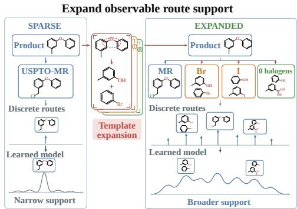  
Figure 1: Support expansion. Template-derived candidates broaden training support before instruction grounding.

$$
\begin{array} { r l } & { \mathcal { A } _ { K } ( x ) = \mathrm { F i l t e r } ( \{ r \in \mathcal { E } ( x ) : \mathrm { r a n k } _ { x } ( r ) \leq K \} ) , } \\ & { \mathcal { A } _ { K _ { 1 } } ( x ) \subseteq \mathcal { A } _ { K _ { 2 } } ( x ) \subseteq \cdots \subseteq \mathcal { A } _ { K _ { m } } ( x ) , \qquad K _ { 1 } < \cdots < K _ { m } . } \end{array}\tag{1}
$$

Within each support $\boldsymbol { \mathcal { A } } _ { K } ( \boldsymbol { x } )$ , we form preferred and avoided candidate sets according to whether they follow a given guidance instruction. These sets provide preference supervision for Stage A grounding and Stage B instruction steering. Details of support construction and guidance labeling are given in Appendices H.4 and H.5.

## 3.2 STAGE A: GENERATOR-FREE GROUNDING

For a target product $x ,$ let $r _ { 1 } , \ldots , r _ { n }$ denote alternative precursor sets and c a natural-language instruction. Stage A learns to align instruction representations with those of preferred candidates. It uses frozen Qwen3-Embedding-8B (Zhang et al., 2025) as the language encoder $E _ { T }$ and a frozen reaction-pair encoder $E _ { R }$ for each product-precursor pair $( x , r _ { i } )$ (Appendix I.1). The language encoder converts each instruction into a sequence of token embeddings. We compute these text features offline and cache them for reuse in both stages. Stage A trains only a projector $P _ { \phi }$ to map the text features into the reaction representation space. We denote the instruction token embeddings by $H _ { c } = E _ { T } ( c )$ , the candidate reaction embedding by $v _ { i } = E _ { R } ( x , r _ { i } )$ , and the projected instruction embeddings by $Z _ { c } = P _ { \phi } ( H _ { c } )$

We use $Z _ { c }$ and $\{ v _ { i } \}$ to predict a preference distribution $\widehat { q } _ { \phi } ^ { c }$ over candidates. We train the projector to match this prediction to the target preference distribution $q ^ { c }$ constructed from offline supervision. The target distribution $q ^ { c }$ assigns higher weights to candidates that better satisfy the instruction. For instruction $c , \mathcal { P } _ { c }$ contains the indices of positive (preferred) candidates, and $\mathcal { N } _ { c }$ contains those of negative (avoided) candidates (Appendix H.5). The objective of Stage A is:

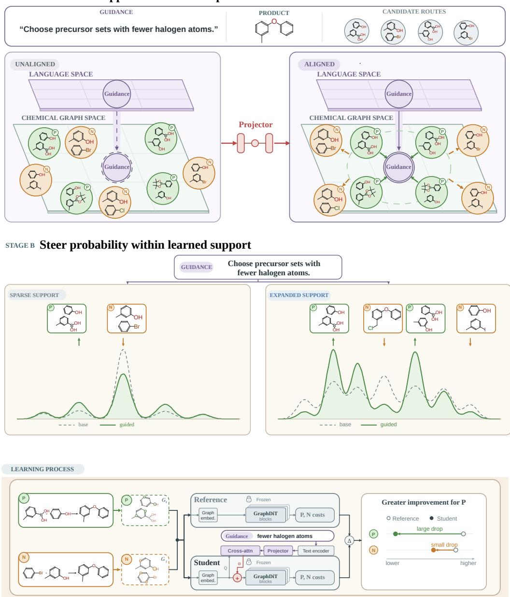  
sTAGE A Ground support-relative route preferences  
Figure 2: RIGS-GraphDiT: grounding and steering. Stage A grounds natural-language guidance against preferred and avoided routes. Stage B transfers this grounding into a residual instruction pathway that steers probability within the frozen generator's learned support.

$$
\begin{array} { r l } { \mathcal { L } _ { A } = \lambda _ { \mathrm { l i s t } } \operatorname { K L } ( q ^ { c } \| \widehat { q } _ { \phi } ^ { c } ) } & { { } + \lambda _ { \mathrm { p a i r } } \mathcal { L } _ { \mathrm { p a i r } } ( \mathcal { P } _ { c } , \mathcal { N } _ { c } ) . } \end{array}\tag{2}
$$

The KL term matches the predicted distribution to the target preference weights, while the pairwise term encourages preferred candidates to receive higher scores than avoided candidates. Appendix I.3 specifies the candidate scoring rule and the pairwise loss. We minimize $\mathcal { L } _ { A }$ by updating only $P _ { \phi } .$ We select $P _ { \phi }$ on the validation set and use its parameters to initialize Stage B with a fresh optimizer. Algorithm 1 summarizes this process.

## 3.3 STAGE B: RESIDUAL INSTRUCTION STEERING

Stage B connects the instruction representation learned in Stage A to the frozen graph generator and reuses the cached text features $H _ { c } = E _ { T } ( c )$ We initialize the projectors from $P _ { \phi ^ { \star } }$ . These projectors transform the cached text features into instruction representations for node-to-text crossattention adapters at selected GraphDiT layers. Let $M _ { c } ^ { ( \ell ) }$ denote the projected text features supplied to layer l. We denote the collection of these projected features by $\hat { M _ { c } }$

At each selected layer $\ell ,$ the adapter $A _ { \ell , \theta }$ uses cross-attention to convert the projector's instruction features $M _ { c } ^ { ( \ell ) }$ into a residual update of the current graph-node states. For node states $h _ { \ell }$ , frozen GraphDiT block $B _ { \ell }$ , and steering strength $\alpha \geq 0$ , the update is

$$
h _ { \ell + 1 } = B _ { \ell } \Big ( h _ { \ell } + \alpha A _ { \ell , \theta } \big ( h _ { \ell } , M _ { c } ^ { ( \ell ) } \big ) \Big ) .\tag{3}
$$

Setting $\alpha = 0$ recovers the Base model. The projector keeps a separate embedding for each instruction token, so each graph node can use different parts of the instruction during generation. The adapters update only node representations. The frozen backbone then uses these updates to adjust edge representations. Appendix I.4 specifies projector sharing and the full masked attention update.

Training objective. We optimize only the projector and adapter parameters $\theta ,$ training the guided model to denoise preferred precursor sets while regularizing its departure from the frozen Base model, which serves as the reference. With steering strength fixed at $\alpha _ { \mathrm { t r a i n } } = 1$ , the core objective is:

$$
\mathcal { L } _ { B , \mathrm { c o r e } } = \lambda _ { \mathrm { p o s } } \mathcal { L } _ { \mathrm { p o s } } + \lambda _ { \mathrm { r a n k } } \mathcal { L } _ { \mathrm { r a n k } } + \lambda _ { \mathrm { r o l l } } \mathcal { L } _ { \mathrm { r o l l } } + \lambda _ { \mathrm { g u a r d } } \mathcal { L } _ { \mathrm { g u a r d } } .\tag{4}
$$

The positive flow-matching loss ${ \mathcal { L } } _ { \mathrm { p o s } }$ directly trains denoising on preferred candidates. Let $G _ { i }$ be the clean precursor graph of candidate $r _ { i }$ and $G _ { i , t }$ its noisy precursor graph at time t. The reference $f _ { 0 }$ and guided model $f _ { \theta , 1 }$ use the same $G _ { i , t }$ , with denoising losses

$$
\begin{array} { r l } & { \qquad D _ { i } ^ { \mathrm { r e f } } = \ell _ { \mathrm { d e n } } ( f _ { 0 } ( G _ { i , t } , \boldsymbol { x } , t ) , G _ { i } ) , } \\ & { \qquad D _ { i } ^ { \mathrm { s t u d e n t } } = \ell _ { \mathrm { d e n } } ( f _ { \theta , 1 } ( G _ { i , t } , \boldsymbol { x } , t , M _ { c } ) , G _ { i } ) . } \end{array}\tag{5}
$$

Here, $\ell _ { \mathrm { d e n } }$ sums the mean node and weighted mean edge cross-entropies over valid positions. The gain $d _ { i } = D _ { i } ^ { \mathrm { r e f } } - D _ { i } ^ { \mathrm { s t u d e n t } }$ is positive when guidance reduces the denoising loss. The ranking loss $\mathcal { L } _ { \mathrm { r a n k } }$ penalizes violations of the margin $d _ { i } - d _ { j } \geq m _ { \mathrm { r a n k } }$ for $i \in \mathcal { P } _ { c }$ and $j \in \mathcal { N } _ { c } ,$ encouraging preferred candidates to benefit more from guidance than avoided candidates. Ranking alone can satisfy this margin by worsening denoising on avoided candidates; ${ \mathcal { L } } _ { \mathrm { p o s } }$ additionally provides a direct training signal to reconstruct preferred candidates.

Two KL penalties regularize deviations from the reference predictions. Let $p _ { \mathrm { r e f } }$ and $p _ { \mathrm { s t u d e n t } }$ denote the models’ categorical predictions at the same node or edge position of a noisy precursor graph. For each product-instruction group $g , K _ { g }$ is the weighted mean node-and-edge KL across its noisy precursor graphs. The penalties take the form

$$
\begin{array} { r } { \mathcal { L } _ { \mathrm { r o l l } } = \langle \mathrm { K L } ( p _ { \mathrm { r e f } } \| p _ { \mathrm { s t u d e n t } } ) \rangle _ { \mathrm { r o l l } } , \mathcal { L } _ { \mathrm { g u a r d } } = \langle [ K _ { g } - \delta _ { \mathrm { K L } } ] _ { + } \rangle _ { g } . } \end{array}\tag{6}
$$

${ \mathcal { L } } _ { \mathrm { r o l l } }$ penalizes prediction drift on noisy precursor graphs encountered during generation, while $\mathcal { L } _ { \mathrm { g u a r d } }$ penalizes only the amount by which a group's mean KL exceeds $\delta _ { \mathrm { K L } }$ . For instructions about numerical properties, we add $\lambda _ { \mathrm { t e a c h } } \mathcal { L } _ { \mathrm { t e a c h } }$ to the core objective. This loss encourages larger denoising gains $d _ { i }$ for candidates whose property values better satisfy the instruction. Appendix I.5 gives the detailed loss definitions, and Appendix D.2 reports their ablation. Algorithms 1 and 2 summarize the two training stages.

Inference. We reuse the Base continuous-time Markov chain (CTMC) sampler (Wang et al., 2026). For product x and instruction c, we cache the projected instruction memory $M _ { c }$ and use $f _ { \theta ^ { \star } , \alpha _ { \mathrm { e v a l } } }$ to supply instruction-conditioned endpoint predictions at each sampling step. To obtain a ranked list of distinct precursor candidates, we canonicalize the valid outputs from B raw draws, merge duplicates, and rank candidates by how often they were sampled. The CTMC rates and update are given in Eqs. (19)–(20); Appendix H.9 specifies the sampling protocol. For each model, we select the checkpoint $\theta ^ { \star }$ and guidance strength $\alpha _ { \mathrm { e v a l } }$ on the validation set, using instruction-following performance and output validity. We keep both fixed during test evaluation. The evaluated scales and selection rules are detailed in Appendix A and Supplementary Section S3.

Algorithm 1: Stage A: generator-free Algorithm 2: Stage B: residual instruction   
grounding steering   
Require: $\mathcal { D } _ { \mathrm { t r } } , \mathcal { D } _ { \mathrm { v a l } } ;$ frozen $E _ { T } , E _ { R }$ Require: $\mathcal { D } _ { \mathrm { t r } } , \mathcal { D } _ { \mathrm { v a l } } ;$ frozen $f _ { 0 } , E _ { T } ; P _ { \phi ^ { \star } }$   
1: Cache $H _ { c } \gets E _ { T } ( c )$ and $v _ { i } \gets E _ { R } ( x , r _ { i } )$ 1: Initialize projectors from $P _ { \phi ^ { \star } } ;$ zero the   
over ${ \mathcal { D } } _ { \mathrm { t r } }$ adapter output projections   
2: for each training iteration do 2: for each training iteration do   
3: Sample groups with cached encoder out- 3:Sample candidate groups and shared   
puts noisy precursor graphs   
4: $Z _ { c } \gets P _ { \phi } ( H _ { c } )$ 4: Compute denoising gains $d _ { i }$ from   
5: Form the predicted preference distribu- Eq. (5)   
tion $\widehat { q } _ { \phi } ^ { c }$ from $\dot { Z } _ { c } , \{ v _ { i } \}$ via Eq. (12) 5: Compute $\mathcal { L } _ { \mathrm { p o s } } , \mathcal { L } _ { \mathrm { r a n k } } , \mathcal { L } _ { \mathrm { g u a r d } }$   
6: Compute $\mathcal { L } _ { A }$ from available labels via 6: Periodically sample guided states and   
Eq. (2) replay them through both models to com-  
7: Update only φ using $\nabla _ { \phi } \mathcal { L } _ { A }$ pute $\mathcal { L } _ { \mathrm { r o l l } }$   
8: end for 7:Form $\mathcal { L } _ { B }$ via Eq. (4); add $\lambda _ { \mathrm { t e a c h } } \mathcal { L } _ { \mathrm { t e a c h } }$   
9: return $P _ { \phi ^ { \star } }$ selected on $\mathcal { D } _ { \mathrm { v a l } }$ for metric instructions   
8:Update only θ using $\nabla _ { \boldsymbol { \theta } } \mathcal { L } _ { B }$   
9: end for   
10: return $f _ { \theta ^ { \star } , \alpha _ { \mathrm { e v a l } } }$ selected on $\mathcal { D } _ { \mathrm { v a l } }$

## 4 EXPERIMENTS

We evaluate how training support affects candidate coverage and instruction alignment in RIGS. We then examine whether instruction grounding and generation-time conditioning improve control, and assess RIGS's applicability across datasets and guidance suites.

## 4.1 EXPERIMENTAL SETUP

Datasets. We compare recorded precursor alternatives in USPTO-MR with synthetic-only template expansions, USPTO-MR-TopK (TopK), for $K \in \{ 1 5 , 3 0 , 4 5 , 6 0 \}$ . USPTO-MR groups reactions from USPTO-Full (Lowe, 2017) by canonical product and retains products with multiple distinct recorded precursor sets. All expansions use a fixed retrosynthesis template library released with DESP (Yu et al., 2024), shared across disjoint product splits. Construction details and support statistics appear in Appendices H.2–H.4.

Natural-language guidance. We construct RDKit5, a natural-language guidance dataset that pairs instructions with preferred and avoided precursor sets. Instructions express preferences such as Choose precursor sets with fewer halogen atoms. We assign these labels using property values computed with RDKit (RDKit contributors, n.d.) within each product's candidate pool (Appendix H.5).

Evaluation setup. We adopt the 8M (Large) and 65M (X-Large) backbone sizes from RetroDiT (Wang et al., 2026). For each support, we evaluate both sizes on one shared Top100 inventory of 1,201 test products. Reference is the support-matched unguided Base; Matched and Shuffled use the same guided model with the case's instruction or a different instruction, respectively. Each arm uses $\bar { B = 1 0 0 }$ raw draws per group without backfilling. We select checkpoints and guidance scales $\alpha _ { \mathrm { e v a l } }$ using validation data and keep them fixed for testing (Appendix A).

Evaluation metrics. Using the first B samples from each product-instruction group, we report two hit rates. $\mathrm { H i t _ { a l l } @ } B$ measures how often these samples contain at least one precursor set from the product's Top100 inventory. $\mathrm { H i t } _ { + } @ B$ measures how often they contain at least one candidate from the instruction's preferred subset. For each test product, we combine outputs from all instruction groups and count how many distinct precursor sets from its Top100 inventory were generated. Pooled recovery sums these counts across test products. For each group, we canonicalize the 100 sampled outputs and rank the distinct valid precursor sets by decreasing sampling frequency. P@ k (↑) and $\mathbf { N } @ \dot { k } \left( \downarrow \right)$ measure how often the top k candidates in this ranking contain at least one preferred or avoided candidate, respectively. Raw validity is the percentage of all sampled outputs that pass RDKit's molecular structure checks, counting repeated outputs each time. For unique-valid count, we remove duplicate valid outputs within each group, then average the remaining counts across groups. Further metric definitions and sampling settings appear in Appendices A and H.9, respectively.

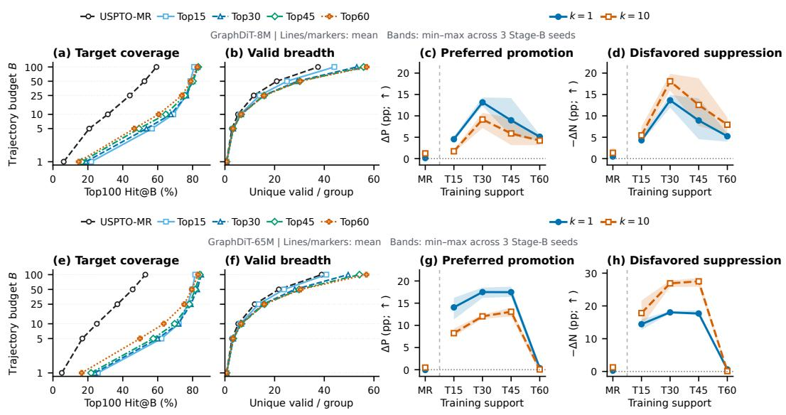  
Figure 3: Candidate coverage and instruction control across training supports. GraphDiT-8M (top) and 65M (bottom) on the same Top100 test inventory, using equal-axis, case-balanced means. Left panels show Reference: (a,e) the rate of sampling at least one candidate from this inventory and (b,f) the number of distinct valid outputs per group, with raw-draw budget B on the vertical axis. Right panels compare Matched with Shuffled instructions at B = 100: (c,g) increases in preferred-set hit rate, $\Delta { \dot { \mathrm { P @ } } } k$ , and (d,h) reductions in avoided-set hit rate, −∆N@k, for k = 1, 10. Positive values indicate better instruction alignment. Control markers show means over three Stage-B training seeds; shaded bands span their minimum and maximum. Each seed uses its validationselected checkpoint and guidance scale; Reference is fixed for each support. Result summaries and seed analyses can be found in Appendices B and C.4, respectively.

## 4.2 BROADER TRAINING SUPPORT IMPROVES CANDIDATE COVERAGE

With the same sampling budget, unguided Reference models trained on Top15 recover more distinct precursor alternatives from the shared Top100 test inventory than those trained on USPTO-MR. Pooled recovery increases from 2,348 to 12,880 for the 8M model and from 1,723 to 13,661 for the 65M model (Table 1). Expanding support from Top15 to Top30 and Top45 further increases pooled recovery, with smaller gains at each step. From Top45 to Top60, pooled recovery is nearly unchanged for the 8M model and decreases for the 65M model, although both models generate more distinct valid outputs (Figure 3 (b,f); Table 1). Thus, generating more different structures does not always mean recovering more candidates in the test inventory. We next examine whether RIGS can use instructions to make preferred alternatives appear earlier in the returned list.

## 4.3 INSTRUCTIONS HELP THE MODEL RETURN CANDIDATES THAT MATCH THE REQUEST

To test whether instructions help preferred candidates rank higher, we compare three conditions: Reference generates without instructions, Matched uses the intended instruction, and Shuffled uses one expressing a different preference. We first compare Matched with Reference to measure the benefit of instruction guidance. At 65M Top30, P@1 increases from 32.93% to 48.83%, while N@ 10 decreases by 34.57 percentage points (Table 1). RIGS more often ranks a preferred candidate first. Its top 10 outputs are also less likely to include an avoided candidate. We then compare Matched with Shuffled to test whether this benefit depends on the instruction's content. At 65M Top30, Matched improves P@1 by 18.52 percentage points over Shuffled. Compared with Shuffled, Matched generates about five more preferred and five fewer avoided outputs per 100 samples on average (Table 20). These comparisons show that RIGS can steer precursor generation according to the instruction's content.

Table 1: Candidate coverage and instruction following at validation-selected settings. Results use B = 100 per group and Stage-B seed 42. Pooled recovery counts distinct product-candidate pairs recovered by Reference from the Top100 inventory across all instruction groups. Effects are in percentage points; positive values indicate improvement. Bold marks maxima in the effect columns within each model size. Absolute rates and Matched-Shuffled intervals appear in Tables 8 and 7, respectively. Matched–Reference intervals for P@1, P@ 10, and N@ 10 appear in Table 9. Threeseed summaries can be found in Appendix C.4.
<table><tr><td rowspan="2">Support</td><td rowspan="2">Reference Pooled recovery</td><td colspan="2">Absolute P@1 (%)</td><td colspan="4">Matched-Shuffled (pp)</td><td colspan="4">Matched–Reference (pp)</td></tr><tr><td>Reference Matched</td><td></td><td>∆P@1</td><td>∆P@10</td><td>-∆N@1</td><td>-∆N@10</td><td>∆P@1</td><td>∆P@10</td><td>-∆N@1</td><td>-∆N@10</td></tr><tr><td colspan="10">GraphDiT-8M</td></tr><tr><td>USPTO-MR</td><td>2,348</td><td>8.48</td><td>8.98</td><td>+0.08</td><td>+2.03</td><td>+0.74</td><td>+1.37|</td><td>+0.51</td><td>+1.91</td><td>+0.86</td><td>+2.54</td></tr><tr><td>Top15</td><td>12,880</td><td>30.16</td><td>34.10</td><td>+4.10</td><td>+1.37</td><td>+3.83</td><td>+4.65</td><td>+3.95</td><td>+0.27</td><td>+4.06</td><td>+5.16</td></tr><tr><td>Top30</td><td>16,922</td><td>30.20</td><td>40.20</td><td>+12.89</td><td>+10.70</td><td>+14.06</td><td>+18.52</td><td>+10.00</td><td>-0.66</td><td>+18.24</td><td>+27.73</td></tr><tr><td>Top45</td><td>17,370</td><td>29.84</td><td>40.63</td><td>+14.18</td><td>+9.53</td><td>+14.06</td><td>+18.79</td><td>+10.78</td><td>+2.62</td><td>+15.20</td><td>+24.92</td></tr><tr><td>Top60</td><td>17,378</td><td>29.22</td><td>33.05</td><td>+5.63</td><td>+4.88</td><td>+5.94</td><td>+8.36</td><td>+3.83</td><td>+1.17</td><td>+5.55</td><td>+10.08</td></tr><tr><td colspan="10">GraphDiT-65M</td><td></td></tr><tr><td>USPTO-MR</td><td>1,723 |</td><td>7.70</td><td>8.16|</td><td>+0.00</td><td>+0.23</td><td>-0.20</td><td>+1.60</td><td>+0.47</td><td>+2.30</td><td>-0.08</td><td>+0.70</td></tr><tr><td>Top15</td><td>13,661</td><td>30.23</td><td>41.25</td><td>+11.29</td><td>+7.50</td><td>+12.66</td><td>+13.83</td><td>+11.02</td><td>+2.42</td><td>+15.00</td><td>+19.57</td></tr><tr><td>Top30</td><td>20,075</td><td>32.93</td><td>48.83</td><td>+18.52</td><td>+12.19</td><td>+17.89</td><td>+27.19</td><td>+15.90</td><td>+4.57</td><td>+16.56</td><td>+34.57</td></tr><tr><td>Top45</td><td>21,562</td><td>30.59</td><td>45.74</td><td>+17.30</td><td>+11.99</td><td>+17.11</td><td>+25.86</td><td>+15.16</td><td>+3.79</td><td>+18.32</td><td>+32.97</td></tr><tr><td>Top60</td><td>19,241</td><td>30.20</td><td>29.14</td><td>+1.09</td><td>+0.35</td><td>+0.39</td><td>+0.63</td><td>-1.05</td><td>-0.43</td><td>-0.23</td><td>+1.72</td></tr></table>

Instruction-following gains vary with training support in a consistent but non-monotone pattern across model capacities. On observed USPTO-MR support, Matched–Shuffled P@1 gains are near zero. They increase at Top15 and are largest at Top30/Top45 (Table 1). At Top30, the gains over unguided generation are concentrated at Top-1: the 65M model improves by 15.90 percentage points at Top-1 and 4.57 at Top-10, while the 8M model improves at Top-1 with little change at Top-10 (Appendix B.2). At Top60, Matched–Shuffled gains decline at both capacities, with little improvement for the 65M model across all three Stage-B seeds (Appendix C.4). Additional analyses examine how guidance strength affects instruction control and output validity and compare supports under alternative training budgets (Appendices C.1–C.3 and B.3).

## 4.4 ROLES OF GROUNDING AND GENERATION-TIME GUIDANCE

We show what Stage A grounding adds to direct Stage-B training and demonstrate the benefits of guiding generation over simply reranking unguided outputs.

Stage-A grounding. We compare 8M Top30 models with Stage A grounding (RIGS) and without it (Direct Stage-B), using the same Stage-B training and inference settings. On a separate test cohort, Stage A grounding increases the Matched–Shuffled reduction in N@ 10 by 6.82 percentage points (Table 2). Stage A trains the projector to score preferred candidates above avoided ones for the same instruction. Consistent with this objective, grounding mainly helps suppress candidates that conflict with the request (Table 15).

Guidance during generation. We compare guidance during generation with post-hoc reranking of unguided Reference outputs, using 100 samples per group for both. RIGS ranks its guided outputs by sampling frequency; the reranker uses a scalar scorer trained on signed RDKit utility. A preferred candidate appears among the samples in about 64% of groups for both methods, but RIGS achieves higher P@1: 32.73% versus 22.23% (Table 3). The reranker lowers N@1, yet its P@1 also falls below the unguided baseline's 24.57%. Thus, this reranker suppresses avoided candidates at the cost of selecting fewer known preferred candidates. RIGS improves both outcomes over unguided generation. Appendix E.1 gives the selector details and full comparison.

Table 2: Effect of Stage-A grounding. On a separate test cohort, we compare 8M Top30 models with and without Stage-A pretraining. Each row shows Matched–Shuffled gains in percentage points; higher is better (Appendix D.1).
<table><tr><td>Variant</td><td>∆P @1</td><td>-∆N @1</td><td>-∆N @10</td></tr><tr><td>RIGS</td><td>+12.77</td><td>+10.69</td><td>+21.21</td></tr><tr><td>Direct Stage-B +11.96</td><td></td><td></td><td>+7.67+14.39</td></tr></table>

Table 3: Generation-time guidance versus reranking. We use 100 raw draws per group for Top30. Hit+ @100 reports how often they include a preferred candidate. Appendix E.1 details the separate cohort.
<table><tr><td>Method</td><td>Hit+@100 P@1↑ N@1↓ (%) (%) (%)</td></tr><tr><td>Reference</td><td>64.80 24.57 25.39 64.80</td></tr><tr><td>Reranking RIGS 63.87</td><td>22.23 3.32 32.73 8.75</td></tr></table>

## 4.5 APPLICABILITY ACROSS DATASETS AND GUIDANCE SUITES

We assess the generality of RIGS across reaction datasets and guidance types. We also present a case study illustrating how RIGS supports multistep retrosynthetic planning.

Table 4: Control across datasets and guidance suites. We evaluate separately trained Top30 models for each dataset and guidance suite. Positive values indicate better instruction alignment. Cohort and aggregation details for Pistachio, Structure, and Metric4 can be found in Appendices G.1, F.1, and G.2, respectively.
<table><tr><td colspan="3"></td><td colspan="2">Matched-Shuffled (pp)</td><td colspan="2">Matched-Reference (pp)</td></tr><tr><td>Reaction data</td><td>Guidance</td><td>Backbone</td><td>∆P@1↑</td><td>−∆N@10↑</td><td>∆P@1↑</td><td>−∆N@10↑</td></tr><tr><td>Pistachio</td><td>RDKit5</td><td>65M</td><td>+1.52</td><td>+7.19</td><td>+0.98</td><td>+13.59</td></tr><tr><td>USPTO</td><td>Structure</td><td>8M</td><td>+3.55</td><td>+3.43</td><td>+5.54</td><td>+10.57</td></tr><tr><td rowspan="2">USPTO</td><td></td><td>65M</td><td>+8.09</td><td>+18.44</td><td>+14.74</td><td>+35.79</td></tr><tr><td>Metric4</td><td>8M</td><td>+5.37</td><td>+7.41</td><td>+4.07</td><td>+8.04</td></tr><tr><td></td><td></td><td>65M</td><td>+15.78</td><td>+21.92</td><td>+13.44</td><td>+27.52</td></tr></table>

Cross-dataset evaluation on Pistachio. To assess the generality of RIGS across reaction datasets, we separately train a 65M Top30 model on Pistachio, a commercial reaction database (Mayfield, 2021). We construct the Top30 training support using the same template library as in the USPTO experiments. We evaluate on a fixed cohort of held-out Pistachio products with recorded precursor alternatives. Details of cohort construction can be found in Appendix G.1. Matched improves P@ 1 by 1.52 percentage points and reduces N@ 10 by 7.19 points relative to Shuffled, with improvements over Reference as well (Table 4). These results support the generality of RIGS across reaction datasets.

Case-specific structural instructions. We use the Structure guidance dataset to test whether RIGS can follow free-form natural-language instructions. We generate case-specific instructions from structural evidence, describing molecular features to retain or avoid. On the test guidance set of 4,606 distinct instructions (Appendix F.1), Matched instructions promote preferred candidates and suppress avoided candidates relative to Shuffled at both model capacities (Table 4). At 65M, P@1 improves by 8.09 percentage points and N@ 10 decreases by 18.44 points. These gains support RIGS's ability to follow case-specific structural requests expressed in free-form natural language.

Synthesis-related guidance. We use the Metric4 guidance dataset to test whether RIGS can follow instructions about synthesis-related properties. Metric4 combines four metrics: reduction in synthetic complexity, procurement burden, halogen count, and ring count (Appendix H.5). The Top30 results show preferred-candidate promotion and avoided-candidate suppression at both capacities (Table 4). Across all synthetic supports, we observe improved instruction following in seven of eight settings (Appendix G.2).

Multistep planning. To examine how RIGS can support multistep retrosynthetic planning, we use it as the single-step precursor generator in a custom value-guided AND-OR tree-search planner inspired by Retro\* (Chen et al., 2020). The planner recursively expands precursor molecules to construct a synthesis route. In this case study, conditioning each expansion on the instruction to use fewer halogen atoms yields a complete route with halogen-free starting materials. This illustrates how RIGS can guide precursor selection across multiple retrosynthetic steps (Figure 9B in Appendix F.3).

## 5 CONCLUSION

We studied how single-step retrosynthesis can generate precursor alternatives that respond to a chemist's preferences. RIGS grounds instructions in preferences among alternatives for the same product, then transfers the learned representation to a frozen graph generator through lightweight residual adapters. Across nested training supports and two model capacities, synthetic expansion improves recovery of known alternatives over observed-reaction training, but further expansion does not monotonically improve coverage or instruction control. Matched-versus-shuffled comparisons show that RIGS can promote preferred candidates and suppress conflicting ones, with Stage-A grounding providing its clearest additional benefit in conflict suppression. Evaluations with casespecific structural instructions further support control beyond predefined molecular descriptors. The results reveal a consistent but non-monotone interaction between coverage and control across model capacities.

## REFERENCES

Andres M. Bran, Théo A. Neukomm, Daniel Armstrong, Zlatko Jončev, and Philippe Schwaller. Chemical reasoning in LLMs unlocks strategy-aware synthesis planning and reaction mechanism elucidation. Matter, 9(5):102812, 2026. doi: 10.1016/j.matt.2026.102812. URL https : // www.sciencedirect.com/science/article/pii/S259023852600175X.

Dominic M. T. Chan, Kevin L. Monaco, Ru-Ping Wang, and Michael P. Winters. New N- and O-arylations with phenylboronic acids and cupric acetate. Tetrahedron Letters, 39(19):2933— 2936, 1998. doi: 10.1016/S0040-4039(98)00503-6. URL https://doi.org/10.1016/ S0040-4039(98)00503-6.

Kavita H. Chandnani and Sampatraj B. Chandalia. Synthesis of m-phenoxybenzaldehyde starting from chlorobenzene and m-cresol: Some aspects of process development. Organic Process Research & Development, 3(6):416–424, 1999. doi: 10.1021/op990028z. URL https : //pubs.acs.org/doi/10.1021/op990028z.

Benson Chen, Tianxiao Shen, Tommi S. Jaakkola, and Regina Barzilay. Learning to make generalizable and diverse predictions for retrosynthesis. arXiv preprint arXiv:1910.09688, 2019. URL https://arxiv.org/abs/1910.09688.

Binghong Chen, Chengtao Li, Hanjun Dai, and Le Song. Retro\*: Learning retrosynthetic planning with neural guided A\* search. In Proceedings of the 37th International Conference on Machine Learning, volume 119 of Proceedings of Machine Learning Research, pp. 1608–1616. PMLR, 2020.URLhttps://proceedings.mlr.press/v119/chen20k.html.

Connor W. Coley, Luke Rogers, William H. Green, and Klavs F. Jensen. SCScore: Synthetic complexity learned from a reaction corpus. Journal of Chemical Information and Modeling, 58(2): 252–261,2018. doi: 10.1021/acs.jcim.7b00622. URL https://doi.org/10.1021/acs. jcim.7b00622.

Connor W. Coley, William H. Green, and Klavs F. Jensen. RDChiral: An RDKit wrapper for handling stereochemistry in retrosynthetic template extraction and application. Journal of Chemical Information and Modeling, 59(6):2529–2537, 2019. doi: 10.1021/acs.jcim.9b00286. URL https://doi.org/10.1021/acs.jcim.9b00286.

Carl Edwards, Tuan Lai, Kevin Ros, Garrett Honke, Kyunghyun Cho, and Heng Ji. Translation between molecules and natural language. In Proceedings of the 2022 Conference on Empirical

Methods in Natural Language Processing, pp. 375–413. Association for Computational Linguistics, 2022. doi: 10.18653/v1/2022.emnlp-main.26. URL https://aclanthology.org/ 2022.emnlp-main.26/.

David A. Evans, Jeffrey L. Katz, and Theodore R. West. Synthesis of diaryl ethers through the copper-promoted arylation of phenols with arylboronic acids: An expedient synthesis of thyroxine. Tetrahedron Letters, 39(19):2937–2940, 1998. doi: 10.1016/S0040-4039(98)00502-4. URL https://doi.0rg/10.1016/S0040-4039(98)00502-4.

Yin Fang, Xiaozhuan Liang, Ningyu Zhang, Kangwei Liu, Rui Huang, Zhuo Chen, Xiaohui Fan, and Huajun Chen. Mol-Instructions: A large-scale biomolecular instruction dataset for large language models. In International Conference on Learning Representations, 2024. URL https://proceedings.iclr.cc/paper\_files/paper/2024/hash/ d346d91999074dd8d6073d4c3b13733b-Abstract-Conference.html.

Yves Grandjean, David Kreutter, and Jean-Louis Reymond. Data augmentation in a triple transformer loop retrosynthesis model. Digital Discovery, 5:653–661, 2026. doi: 10.1039/ D5DD00465A. URL https://pubs.rsc.org/en/content/articlelanding/ 2026/dd/d5dd00465a.

Friedrich Hastedt, Dongda Zhang, and Antonio del Rio-Chanona. From feasible to practical: Paretooptimal synthesis planning. In Proceedings of the 43rd International Conference on Machine Learning,2026.URLhttps://arxiv.org/abs/2605.07521v2.

Ilia Igashov, Arne Schneuing, Marwin Segler, Michael Bronstein, and Bruno Correia. RetroBridge: Modeling retrosynthesis with Markov bridges. In International Conference on Learning Representations,2024. URL https://proceedings.iclr.cc/paper\_files/paper/2024/ hash/acb94e709f02895fd98b5867f0b184f3-Abstract-Conference.html.

Andrei V. Iosub and Shannon S. Stahl. Palladium-catalyzed aerobic oxidative dehydrogenation of cyclohexenes to substituted arene derivatives. Journal of the American Chemical Society, 137(10):3454–3457, 2015. doi: 10.1021/ja512770u. URL https://doi.org/10.1021/ ja512770u.

Chenglong Kang, Xiaoyi Liu, and Fei Guo. RetroInText: A multimodal large language model enhanced framework for retrosynthetic planning via in-context representation learning. In International Conference on Learning Representations, 2025. URL https://proceedings.iclr.cc/paper\_files/paper/2025/hash/ b2fbf1c9bc92e7ef2f6cab2e8a3e09af-Abstract-Conference.html.

Najwa Laabid and Vikas K Garg. Beyond search: Direct model guidance for steerable synthesis planning, 2026.URL https://openreview.net/forum?id=O4Tv5Cmpbv.

Najwa Laabid, Severi Rissanen, Markus Heinonen, Arno Solin, and Vikas Garg. Equivariant denoisers cannot copy graphs: Align your graph diffusion models. In International Conference on Learning Representations, 2025. URL https://proceedings.iclr.cc/paper\_files/paper/2025/hash/ f8f78f8043f35890181a824e53a57134-Abstract-Conference.html.

Pengxiang Ling, Dao Li, and Xingyi Wang. Supported CuO/γ-Al2O3 as heterogeneous catalyst for synthesis of diaryl ether under ligand-free conditions. Journal of Molecular Catalysis A: Chemical, 357:112–116, 2012. doi: 10.1016/j.molcata.2012.01.028. URL https : //www.sciencedirect.com/science/article/pii/S1381116912000489.

Shengchao Liu, Weili Nie, Chengpeng Wang, Jiarui Lu, Zhuoran Qiao, Ling Liu, Jian Tang, Chaowei Xiao, and Animashree Anandkumar. Multi-modal molecule structure-text model for text-based retrieval and editing. Nature Machine Intelligence, 5:1447-1457, 2023. doi: 10.1038/s42256-023-00759-6. URL https://www.nature.com/articles/ s42256-023-00759-6.

Songtao Liu, Hanjun Dai, Yue Zhao, and Peng Liu. Preference optimization for molecule synthesis with conditional residual energy-based models. In Proceedings of the 41st International

Conference on Machine Learning, volume 235 of Proceedings of Machine Learning Research, pp. 30929–30945. PMLR, 2024a. URL https://proceedings.mlr.press/v235/ liu24n.html.

Yifeng Liu, Hanwen Xu, Tangqi Fang, Haocheng Xi, Zixuan Liu, Sheng Zhang, Hoifung Poon, and Sheng Wang. T-Rex: Text-assisted retrosynthesis prediction. arXiv preprint arXiv:2401.14637, 2024b.URLhttps://arxiv.org/abs/2401.14637.

Daniel Lowe. Chemical reactions from US patents (1976–Sep2016). figshare, 2017. URL ht tps : //doi.org/10.6084/m9.figshare.5104873.

John Mayfield. 13,118,970 reactions and counting. NextMove Software, 2021. URL https://nextmovesoftware.com/blog/2021/03/24/ 13118970-reactions-and-counting/.

Anton Morgunov and Victor S. Batista. Project Ariadne: Prompt-conditioned route generation for synthesis planning. arXiv preprint arXiv:2606.24184, 2026. URL https: //arxiv.org/ abs/2606.24184.

Xuan-Vu Nguyen, Daniel Armstrong, Milena Wehrbach, Andres M. Bran, Zlatko Jončev, and Philippe Schwaller. Synthelite: Chemist-aligned and feasibility-aware synthesis planning with LLMs. arXiv preprint arXiv:2512.16424, 2025. URL https://arxiv.org/abs/2512. 16424.

RDKit contributors. RDKit: Open-source cheminformatics, n.d. URL https://www. rdkit. org.

Tatsuya Sagawa and Ryosuke Kojima. ReactionT5: A pre-trained transformer model for accurate chemical reaction prediction with limited data. Journal of Cheminformatics, 17(1): 126, 2025. doi: 10.1186/s13321-025-01075-4. URL https://doi.org/10.1186/ s13321-025-01075-4.

Yair Schiff, Subham Sekhar Sahoo, Hao Phung, Guanghan Wang, Sam Boshar, Hugo Dalla-Torre, Bernardo P. de Almeida, Alexander Rush, Thomas Pierrot, and Volodymyr Kuleshov. Simple guidance mechanisms for discrete diffusion models. In International Conference on Learning Representations, 2025. URL https://proceedings.iclr.cc/paper\_files/paper/ 2025/hash/6cc31b44d88dce8380d36e81485cd07f-Abstract-Conference. html.

Philippe Schwaller, Benjamin Hoover, Jean-Louis Reymond, Hendrik Strobelt, and Teodoro Laino. Extraction of organic chemistry grammar from unsupervised learning of chemical reactions. Science Advances, 7(15):eabe4166, 2021. doi: 10.1126/sciadv.abe4166. URL https : //doi. org/10.1126/sciadv.abe4166.

Marwin H. S. Segler, Mike Preuss, and Mark P. Waller. Planning chemical syntheses with deep neural networks and symbolic AI. Nature, 555:604–610, 2018. doi: 10.1038/nature25978. URL https://doi.org/10.1038/nature25978.

Keith Smith and Dennis Jones. A superior synthesis of diaryl ethers by the use of ultrasound in the Ullmann reaction. Journal of the Chemical Society, Perkin Transactions 1, pp. 407– 408, 1992. doi: 10.1039/P19920000407. URL https://pubs.rsc.org/en/content/ articlelanding/1992/p1/p19920000407.

Xiaozhuang Song, Xuanhao Pan, Xinjian Zhao, Hangting Ye, Shufei Zhang, Jian Tang, and Tianshu Yu. AOT\*: Efficient synthesis planning via LLM-empowered AND-OR tree search. In Findings of the Association for Computational Linguistics: ACL 2026, pp. 34727–34758. Association for Computational Linguistics, 2026. doi: 10.18653/v1/2026.findings-acl.1734. URL https : // aclanthology.org/2026.findings-acl.1734/.

Yichen Tan, José María Muñoz-Molina, Gregory C. Fu, and Jonas C. Peters. Oxygen nucleophiles as reaction partners in photoinduced, copper-catalyzed cross-couplings: O-arylations of phenols at room temperature. Chemical Science, 5:2831-2835, 2014. doi: 10. 1039/C4SC00368C.URLhttps://pubs.rsc.org/en/content/articlelanding/ 2014/sc/c4sc00368c.

Amol Thakkar, Alain C. Vaucher, Andrea Byekwaso, Philippe Schwaller, Alessandra Toniato, and Teodoro Laino. Unbiasing retrosynthesis language models with disconnection prompts. ACS Central Science, 9(7):1488–1498, 2023. doi: 10.1021/acscentsci.3c00372. URL https : // pubs.acs.org/doi/10.1021/acscentsci.3c00372.

Alessandra Toniato, Alain C. Vaucher, Philippe Schwaller, and Teodoro Laino. Enhancing diversity in language based models for single-step retrosynthesis. Digital Discovery, 2:489– 501, 2023. doi: 10.1039/D2DD00110A. URL https://pubs.rsc.org/en/content/ articlelanding/2023/dd/d2dd00110a.

Suong B. A. Tran, Jihye Roh, and Connor W. Coley. Quantifying the failure modes of current one-step retrosynthesis models. Chemical Science, 17(28):14054–14063, 2026. doi: 10.1039/D6SC01323F. URL https://pubs.rsc.org/en/content/articlehtml/ 2026/sc/d6sc01323f.

Zhengkai Tu, Sourabh J. Choure, Mun Hong Fong, Jihye Roh, Itai Levin, Kevin Yu, Joonyoung F. Joung, Nathan Morgan, Shih-Cheng Li, Xiaoqi Sun, Huiqian Lin, Mark Murnin, Jordan P. Liles, Thomas J. Struble, Michael E. Fortunato, Mengjie Liu, William H. Green, Klavs F. Jensen, and Connor W. Coley. ASKCOS: Open-source, data-driven synthesis planning. Accounts of Chemical Research, 58(11):1764–1775, 2025. doi: 10.1021/acs.accounts.5c00155. URL https: //pubs.acs.org/doi/10.1021/acs.accounts.5c00155.

Chenguang Wang, Zihan Zhou, Lei Bai, and Tianshu Yu. Order matters in retrosynthesis: Structureaware generation via reaction-center-guided discrete flow matching. In Proceedings of the 43rd International Conference on Machine Learning, volume 306 of Proceedings of Machine Learning Research,2026. URL https://openreview.net/forum?id=xeH37plPS3.

Yiming Wang, Yuxuan Song, Yiqun Wang, Minkai Xu, Rui Wang, Hao Zhou, and Wei-Ying Ma. RetroDiff: Retrosynthesis as multi-stage distribution interpolation. In Proceedings of the 28th International Conference on Artificial Intelligence and Statistics, volume 258 of Proceedings of Machine Learning Research, pp. 1918–1926. PMLR, 2025. URL https: / /proceedings. mlr.press/v258/wang25e.html.

Annie M. Westerlund, Lakshidaa Saigiridharan, and Samuel Genheden. Human-guided synthesis planning via prompting. Chemical Science, 16:14655–14667, 2025. doi: 10.1039/ D5SC00927H. URL https://pubs.rsc.org/en/content/articlelanding/ 2025/sc/d5sc00927h.

Robin Yadav, Qi Yan, Guy Wolf, Avishek Joey Bose, and Renjie Liao. RETRO SYN-FLOW: Discrete flow-matching for accurate and diverse single-step retrosynthesis. In Advances in Neural Information Processing Systems, volume 38, 2025. URL https://proceedings.neurips.cc/paper\_files/paper/2025/hash/ 4f86833d5cc98ec32e470ef1c8cb82e3-Abstract-Conference.html.

Kevin Yu, Jihye Roh, Ziang Li, Wenhao Gao, Runzhong Wang, and Connor W. Coley. Double-ended synthesis planning with goal-constrained bidirectional search. In Advances in Neural Information Processing Systems, volume 37, 2024. URL https://proceedings.neurips.cc/paper\_files/paper/2024/file/ cd091a4d8e97157d32940428f902c7b0-Paper-Conference.pdf.

Bogdan Zagribelnyy, Ivan Ilin, Maksim Kuznetsov, Nikita Bondarev, Mathieu Reymond, Roman Schutski, Thomas MacDougall, Rim Shayakhmetov, Zulfat Miftakhutdinov, Mikolaj Mizera, Vladimir Aladinskiy, Alex Aliper, and Alex Zhavoronkov. When single answer is not enough: Rethinking single-step retrosynthesis benchmarks for LLMs. arXiv preprint arXiv:2602.03554v2, 2026.URLhttps://arxiv.org/abs/2602.03554v2.

Xu Zhang, Yiming Mo, Wenguan Wang, and Yi Yang. Retrosynthesis prediction enhanced by insilico reaction data augmentation. arXiv preprint arXiv:2402.00086, 2024. URL https : // arxiv.org/abs/2402.00086.

Yanzhao Zhang, Mingxin Li, Dingkun Long, Xin Zhang, Huan Lin, Baosong Yang, Pengjun Xie, An Yang, Dayiheng Liu, Junyang Lin, Fei Huang, and Jingren Zhou. Qwen3 Embedding: Advancing text embedding and reranking through foundation models. arXiv preprint arXiv:2506.05176, 2025.URLhttps://arxiv.org/abs/2506.05176.

## APPENDIX CONTENTS

A Common-inventory protocol and frozen coordinates 15   
B Common Top100 results and diagnostics 16   
B.1 Absolute arm results . 16   
B.2 Returned-list contrasts with the unguided model 16   
B.3 Common-update-ceiling support sensitivity 17   
B.4 Relaxed round-trip coverage and accuracy across candidate ranks 18   
C Calibration and Stage-B seed robustness 19   
C.1 Validation guidance-strength trade-off 20   
C.2 Matched residual-scale sensitivity 20   
C.3 Three-seed frozen-checkpoint inference-scale response 21   
C.4 Complete three-seed analysis across supports and capacities 22   
D Controlled method alternatives 23   
D.1 Direct Stage-B: effect of Stage-A-aligned initialization 23   
D.2 Stage-B loss ablation 24   
E Proposal and selection counterfactuals 25   
E.1 Budgeted proposal-selection counterfactual 25   
F Language and chemistry evidence . 25   
F.1 Free-form structural instructions and the frozen language representation 25   
F.2 A chemistry-audited paired case: fewer precursor halogens 27   
F.3 Downstream multistep planning witnesses 28   
F.4 Direct empirical sampled-mass reallocation 29   
G External and heterogeneous robustness 29   
G.1 Pistachio Top30: control on recorded reaction alternatives 29   
G.2 Applicability to another metric suite 31   
H Data, checkpoint, and evaluation provenance 32   
H.1 Identifiers, data units, and reporting scope 32   
H.2 Construction of USPTO-MR 33   
H.3 Base-generator data matrix 33   
H.4 Synthetic precursor construction and ranking 33   
H.5 Guidance suites and construction 35   
H.6 Guidance-data matrix 35   
H.7 Frozen evaluation cohorts 35   
H.8 Base-generator checkpoint provenance 37   
H.9 Sampling and statistical protocol 37   
Architecture, objectives, and implementation 38   
I.1 Frozen Stage-A representations 38   
1.2 Structure annotation and quality checks . 38   
I.3 Stage-A grounding and exact route scoring 39   
1.4 Stage-B residual adapter path 39   
1.5 Stage-B loss components and metric teacher 39   
1.6 Notation 41   
1.7 Implementation and reproducibility details 41   
J Limitations and Future Work 42

## A COMMON-INVENTORY PROTOCOL AND FROZEN COORDINATES

Controlled support sequence. Top15/30/45/60 are nested synthetic-only prefixes of one productlocal candidate ordering. USPTO-MR is a separate natural-data reference. The primary training recipe uses within-family data passes, so realized update counts differ with support size. Exact budgets appear in Appendix I.7; the common-update-ceiling sensitivity appears in Appendix B.3.

Validation calibration. Calibration targets high Matched P@ 1, with trajectory validity informing scale and checkpoint choice. The primary study retains each run's recorded validation-selected coordinate (Table 5). Supplementary Section S3 documents the support-specific selection rules, including validation gates, fallback decisions, and recorded amendments.

Table 5: Frozen coordinates for the ten USPTO-Guide(RDKit5)-8M-[Support] and USPTO-Guide(RDKit5)–65M–[Support] models in the Common Top100 study. We selected all coordinates on validation before opening the common test; every row uses Reference, Matched, and Shuffled arms.
<table><tr><td>Guided model ID Stage-B epoch  $\alpha _ { \mathrm { e v a l } }$ </td></tr><tr><td>USPTO-Guide(RDKit5)-8M-USPTO-MR 14 .50</td></tr><tr><td>USPTO-Guide(RDKit5)–8M-Top15 6 .20</td></tr><tr><td>USPTO-Guide(RDKit5)-8M-Top30 12 .50</td></tr><tr><td>USPTO-Guide(RDKit5)-8M-Top45 14 .50 USPTO-Guide(RDKit5)-8M-Top60 6 .25</td></tr><tr><td>USPTO-Guide(RDKit5)-65M-USPTO-MR 14 .50</td></tr><tr><td>USPTO-Guide(RDKit5)-65M–Top15 1 .50</td></tr><tr><td>USPTO-Guide(RDKit5)-65M-Top30 14 .50</td></tr><tr><td>USPTO-Guide(RDKit5)–65M-Top45 8 .50</td></tr><tr><td>USPTO-Guide(RDKit5)–65M-Top60 4 .05</td></tr><tr><td></td></tr></table>

Frozen inventory and sampling. The common test contains 1,201 cases, 1,280 paired semantic families, and 2,560 signed groups balanced over five RDKit axes and both polarities. All arms use the shared sampler in Appendix H.9. The ten-model, three-arm study contains 7,680,000 trajectories. Table 28 gives construction-stage accounting.

Evaluation metrics. For each product-instruction group, the raw budget B counts every draw, including invalid outputs. $\mathrm { H i t _ { a l l } @ } B$ is the rate of groups whose first B draws recover any candidate in the frozen inventory; Hit @B restricts this event to the preferred set. Reference coverage tables abbreviate $\mathrm { H i t _ { a l l } @ } B$ as Hit@ $B ;$ the proposal-selection diagnostic uses $\mathrm { H i t } _ { + } @ B$ . Budget curves use $B \in \{ 1 , 5 , 1 0 , 2 5 , 5 0 , 1 0 0 \}$ . For P@k and N@k, we use all 100 raw draws per group, canonicalize and deduplicate valid outputs, and rank the resulting precursor sets by decreasing draw frequency. P@k and N@k are the rates of groups whose top k ranked candidates contain at least one preferred or avoided candidate, respectively; they are set-hit rates, not the fraction of matching candidates in the list.

Raw validity V is the fraction of draws yielding a precursor set that passes RDKit parsing and canonicalization. If $n _ { g }$ draws are valid and $u _ { g }$ are distinct, the group's duplicate rate is $( { n _ { g } } - { u _ { g } } ) / B ;$ unique-valid count averages $u _ { g }$ with the stated cohort weights. Pooled recovery counts distinct product-candidate pairs recovered from the known inventory across all groups. Validity concerns molecular representation, not experimental feasibility.

Contrasts and uncertainty. We report rates as percentages and their differences as percentage points; counts retain their natural units. In three-arm comparisons, ∆ subtracts the named comparator from Matched: Shuffled tests instruction identity, while Reference measures the net guidance effect. Positive ∆P and negative ∆N are favorable; —∆N reverses the suppression sign for readability. ∆V retains the signed validity difference. Aggregation and case-cluster confidence intervals (CIs) follow Appendix H.9; Stage-B seeds 42–44 form a separate robustness analysis.

Data provenance and test overlap. The candidate audit confirms product-wise nesting of the synthetic supports. We retain a 2.03% Top60 catalog-version extension in the provenance records. We inspected earlier Axis4 test reports during protocol development. The named earlier cohort contains 988 products and shares 154 with the 1,201-product Common Top100 cohort (12.82% of Common Top100). Thus the later inventory and generated outputs are new, but the test products are not wholly independent of that exploratory evaluation. We fixed the reported model coordinates before inspecting the Common Top100 outputs.

## B COMMON TOP100 RESULTS AND DIAGNOSTICS

A more diverse sampler need not recover known alternatives more often in its first draw: Top60 produces the most distinct valid outputs at $B = 1 0 0$ but has the lowest Hit@1 among syntheticsupport models at each capacity (Table 6).

Table 6: Reference coverage at the endpoints of the Common Top100 budget curves. Hit, validity and duplicate rate are percentages; pooled recovery counts distinct case-candidate pairs. Rates and mean counts use equal-axis, case-balanced aggregation at both capacities. All columns except Hit@1 use $B = 1 0 0$ , without backfilling.
<table><tr><td></td><td></td><td></td><td></td><td>Unique valid</td><td></td><td>Duplicate</td></tr><tr><td>Support</td><td>Hit@1</td><td>Hit@100</td><td>Pooled</td><td>/group</td><td>Validity</td><td>rate</td></tr><tr><td colspan="7">GraphDiT-8M</td></tr><tr><td>USPTO-MR</td><td>6.17</td><td>59.30</td><td>2,348</td><td>37.475</td><td>63.49</td><td>26.01</td></tr><tr><td>Top15</td><td>21.91</td><td>80.82</td><td>12,880</td><td>44.044</td><td>68.38</td><td>24.34</td></tr><tr><td>Top30</td><td>18.91</td><td>82.89</td><td>16,922</td><td>53.074</td><td>68.09</td><td>15.01</td></tr><tr><td>Top45</td><td>16.56</td><td>83.24</td><td>17,370</td><td>55.828</td><td>67.36</td><td>11.53</td></tr><tr><td>Top60</td><td>14.77</td><td>82.77</td><td>17,378</td><td>57.067</td><td>66.14</td><td>9.07</td></tr><tr><td colspan="7">GraphDiT-65M</td></tr><tr><td>USPTO-MR</td><td>5.08</td><td>52.93</td><td>1,723</td><td>38.938</td><td>63.47</td><td>24.53</td></tr><tr><td>Top15</td><td>25.74</td><td>81.48</td><td>13,661</td><td>40.836</td><td>69.56</td><td>28.72</td></tr><tr><td>Top30</td><td>24.02</td><td>84.96</td><td>20,075</td><td>49.615</td><td>69.21</td><td>19.59</td></tr><tr><td>Top45</td><td>21.84</td><td>84.18</td><td>21,562</td><td>54.159</td><td>69.18</td><td>15.02</td></tr><tr><td>Top60</td><td>16.48</td><td>83.16</td><td>19,241</td><td>56.956</td><td>67.10</td><td>10.14</td></tr></table>

Table 7 retains the early- and late-rank instruction-content contrasts. Top30 and Top45 show clear preferred-route promotion and avoided-route suppression at both capacities; 65M Top60 remains statistically unresolved at these operating points. For the primary 8M comparisons, Top30–Top45 paired intervals include zero, whereas Top30 improves over Top15 and Top60 weakens relative to Top45. Per-axis effects are not uniform, so the primary estimand gives each axis equal weight. Matched–Shuffled validity intervals span zero across all supports; at B = 100, intervals for anyinventory availability and unique-valid breadth also span zero for every expanded support. Together, these results locate the instruction effect mainly in the composition and ranking of sampled outputs.

## B.1 ABSOLUTE ARM RESULTS

The absolute arms in Table 8 expose costs shared by Matched and Shuffled: similar validity between those arms can coexist with a substantial loss relative to Reference. Entries use the primary equalaxis, case-balanced aggregation and the sampling protocol in Appendix H.9. Native Structure results appear in Appendix F.1; Metric4 results appear in Appendix G.2.

## B.2 RETURNED-LIST CONTRASTS WITH THE UNGUIDED MODEL

Table 9 expands the Matched-Reference columns of Table 1 with paired intervals at the frozen primary coordinates, using the aggregation and sampling protocol in Appendix H.9. Early-rank gains need not extend to Top-10: guidance can move an already available preferred route to the front. Avoided-route suppression can remain strong across the list even when later-rank promotion is small.

Table 7: Matched–Shuffled effects at returned ranks 1 and 10 on Common Top100. Entries are percentage-point estimates with 95% paired case-cluster bootstrap intervals, using equal-axis, casebalanced aggregation. Positive ∆P and negative ∆N are favorable. The registered primary coordinates use Stage-B seed 42.
<table><tr><td>Support</td><td>∆P@1</td><td>∆P@10</td><td>∆N@1</td><td>∆N@10</td></tr><tr><td colspan="5">GraphDiT-8M</td></tr><tr><td>USPTO-MR</td><td>+0.08 [−0.66, +0.82]</td><td>+2.03 [+1.05, +3.05]</td><td>-0.74 [-1.48,0.00]</td><td>-1.37 [-2.42, -0.35]</td></tr><tr><td>Top15</td><td>+4.10 [+2.85, +5.31]</td><td>+1.37 [+0.55, +2.19]</td><td>-3.83 [−4.92, -2.70]</td><td>-4.65 [-5.70, -3.59]</td></tr><tr><td>Top30</td><td>+12.89 [+11.02, +14.77]</td><td>+10.70 [+9.22, +12.19]</td><td>-14.06 [-15.70,-12.42]</td><td>-18.52 [-20.27,-16.80]</td></tr><tr><td>Top45</td><td>+14.18 [+12.46, +15.94]</td><td>+9.53 [+8.12, +10.94]</td><td>-14.06</td><td>-18.79 [−15.70, -12.42][−20.47, -17.11]</td></tr><tr><td>Top60</td><td>+5.63 [+4.06, +7.15]</td><td>+4.88 [+3.67, +6.13]</td><td>-5.94 [−7.46,-4.45]</td><td>-8.36 [-9.73, -6.95]</td></tr><tr><td colspan="5">GraphDiT-65M</td></tr><tr><td>USPTO-MR</td><td>+0.00 [−0.63, +0.63] +11.29</td><td>+0.23 [−0.63, +1.09] +7.50</td><td>+0.20 [-0.39,+0.78] -12.66</td><td>-1.60 [-2.46, -0.78] -13.83</td></tr><tr><td>Top15</td><td>[+9.49, +13.13] +18.52</td><td>[+6.21, +8.79] +12.19</td><td>-17.89</td><td>[−14.30, -11.02] [-15.31, -12.31] -27.19</td></tr><tr><td>Top30</td><td>[+16.56, +20.43] +17.30</td><td>[+10.78,+13.59] +11.99</td><td>][-19.61,-16.21] [-28.91, -25.47] -17.11</td><td>-25.86</td></tr><tr><td>Top45</td><td>[+15.39, +19.22]</td><td>[+10.47, +13.56][-18.79, -15.43] [-27.62, -24.06]</td><td></td><td></td></tr><tr><td>Top60</td><td>+1.09 [−0.23, +2.42]</td><td>+0.35 [−0.70, +1.45]</td><td>-0.39 [−1.72, +0.94]</td><td>-0.63 [−1.76, +0.55]</td></tr></table>

## B.3 COMMON-UPDATE-CEILING SUPPORT SENSITIVITY

To examine sensitivity to support-dependent training budgets, we retrained Top15, Top30, and Top45 with common Stage-A/B training ceilings of 125,850/58,730 optimizer updates (effective batch 32, seed 42). We selected each deployment checkpoint and residual scale on validation before inspecting the corresponding Common Top100 outputs. Top60 reuses its primary checkpoint. This sensitivity equalizes adapter-training ceilings, not the selected update counts or the costs of base training and historical reaction-pair pretraining.

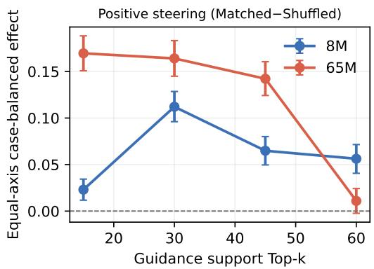

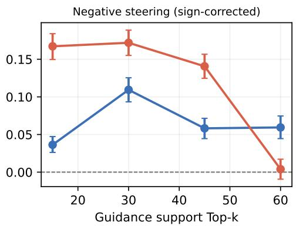  
Figure 4: Common-update-ceiling support-scaling sensitivity. Points are equal-axis, casebalanced Matched–Shuffled effects on the frozen Common Top100 test, shown as probability differences (0.10 = 10 percentage points). Error bars are 95% shared case-cluster bootstrap intervals. The right panel plots —∆N@1 so that larger values are favorable. Top15/30/45 use the common update ceilings above; Top60 reuses its primary checkpoint.

Table 8: Key absolute-arm Common Top100 results (%) at the coordinates in Table 5. Each support lists all three conditions at the same raw-draw budget B = 100.
<table><tr><td>Support</td><td>Arm</td><td>P@1</td><td>P@10</td><td>N@1</td><td>N@10</td><td>Validity</td></tr><tr><td colspan="7">GraphDiT-8M</td></tr><tr><td>USPTO-MR Reference</td><td></td><td>8.477</td><td>25.547</td><td>8.555</td><td>25.391</td><td>63.488</td></tr><tr><td></td><td>Matched</td><td>8.984</td><td>27.461</td><td>7.695</td><td>22.852</td><td>60.816</td></tr><tr><td></td><td>Shuffled</td><td>8.906</td><td>25.430</td><td>8.438</td><td>24.219</td><td>60.913</td></tr><tr><td>Top15</td><td>Reference</td><td>30.156</td><td>58.789</td><td>30.117</td><td>58.242</td><td>68.382</td></tr><tr><td></td><td>Matched</td><td>34.102</td><td>59.062</td><td>26.055</td><td>53.086</td><td>67.084</td></tr><tr><td></td><td>Shuffled</td><td>30.000</td><td>57.695</td><td>29.883</td><td>57.734</td><td>67.148</td></tr><tr><td>Top30</td><td>Reference</td><td>30.195</td><td>58.281</td><td>29.844</td><td>56.484</td><td>68.086</td></tr><tr><td></td><td>Matched</td><td>40.195</td><td>57.617</td><td>11.602</td><td>28.750</td><td>52.605</td></tr><tr><td></td><td>Shuffled</td><td>27.305</td><td>46.914</td><td>25.664</td><td>47.266</td><td>52.712</td></tr><tr><td>Top45</td><td>Reference</td><td>29.844</td><td>56.328</td><td>28.789</td><td>55.664</td><td>67.356</td></tr><tr><td></td><td>Matched</td><td>40.625</td><td>58.945</td><td>13.594</td><td>30.742</td><td>62.611</td></tr><tr><td></td><td>Shuffled</td><td>26.445</td><td>49.414</td><td>27.656</td><td>49.531</td><td>62.457</td></tr><tr><td>Top60</td><td>Reference</td><td>29.219</td><td>55.312</td><td>27.539</td><td>53.867</td><td>66.138</td></tr><tr><td></td><td>Matched</td><td>33.047</td><td>56.484</td><td>21.992</td><td>43.789</td><td>64.696</td></tr><tr><td></td><td>Shuffled</td><td>27.422</td><td>51.602</td><td>27.930</td><td>52.148</td><td>64.700</td></tr><tr><td colspan="7">GraphDiT-65M</td></tr><tr><td>USPTO-MR Reference</td><td></td><td>7.695</td><td>21.562</td><td>7.422</td><td>21.602</td><td>63.470</td></tr><tr><td></td><td>Matched</td><td>8.164</td><td>23.867</td><td>7.500</td><td>20.898</td><td>63.163</td></tr><tr><td></td><td>Shuffled</td><td>8.164</td><td>23.633</td><td>7.305</td><td>22.500</td><td>63.104</td></tr><tr><td>Top15</td><td>Reference</td><td>30.234</td><td>61.055</td><td>31.406</td><td>61.367</td><td>69.555</td></tr><tr><td></td><td>Matched</td><td>41.250</td><td>63.477</td><td>16.406</td><td>41.797</td><td>60.367</td></tr><tr><td></td><td>Shuffled</td><td>29.961</td><td>55.977</td><td>29.063</td><td>55.625</td><td>60.230</td></tr><tr><td>Top30</td><td>Reference</td><td>32.930</td><td>63.281</td><td>29.727</td><td>62.734</td><td>69.209</td></tr><tr><td></td><td>Matched</td><td>48.828</td><td>67.852</td><td>13.164</td><td>28.164</td><td>68.012</td></tr><tr><td></td><td>Shuffled</td><td>30.312</td><td>55.664</td><td>31.055</td><td>55.352</td><td>67.897</td></tr><tr><td>Top45</td><td>Reference</td><td>30.586</td><td>61.211</td><td>30.273</td><td>60.234</td><td>69.182</td></tr><tr><td></td><td>Matched</td><td>45.742</td><td>65.000</td><td>11.953</td><td>27.266</td><td>65.178</td></tr><tr><td></td><td>Shuffled</td><td>28.438</td><td>53.008</td><td>29.063</td><td>53.125</td><td>65.086</td></tr><tr><td>Top60</td><td>Reference</td><td>30.195</td><td>55.586</td><td>27.695</td><td>55.391</td><td>67.099</td></tr><tr><td></td><td>Matched</td><td>29.141</td><td>55.156</td><td>27.930</td><td>53.672</td><td>63.466</td></tr><tr><td></td><td>Shuffled</td><td>28.047</td><td>54.805</td><td>28.320</td><td>54.297</td><td>63.362</td></tr></table>

Positive control survives the common training ceilings (Table 10), but the 8M peak shifts to Top30. Support choice therefore depends on training and selection; candidate count alone does not determine control strength. Reference and Top60 use the primary coordinates summarized in Table 8.

## B.4 RELAXED ROUND-TRIP COVERAGE AND ACCURACY ACROSS CANDIDATE RANKS

This auxiliary analysis evaluates the Top30 65M reference, matched-guidance, and shuffledguidance arms on the same 200 frozen test groups. The guided arms use the validation-selected epoch-14 checkpoint with $\alpha = 0 . 5$ . For each group and arm, we reuse 100 reverse samples generated with 50 sampling steps, canonicalize and deduplicate valid precursor sets, and rank them by sample frequency, breaking ties by canonical SMILES. We evaluate the first $K \in \{ 1 , 3 , 5 , 1 0 \}$ available reverse candidates with a fixed ReactionT5 forward model (Sagawa & Kojima, 2025), using our locally fine-tuned checkpoint.

For candidate precursor set $r _ { g , i }$ in group g, let $x _ { g }$ be the target product and $\mathcal { R } _ { g } ^ { \mathrm { r e f } }$ the frozen collection of canonical positive-reference precursor sets associated with that semantic group. Let $F _ { 1 } ( r )$ be the top-ranked product from the fixed five-beam forward decoder. We accept only this Forward Top-1

Table 9: Returned Top-k changes relative to unguided generation. Cells give Matched-Reference effects in percentage points with 95% paired case-bootstrap intervals. We reverse the sign of avoided-set recovery; larger values are favorable in every column. Both capacities show early-rank preferred gains at Top15/30/45, while higher-rank effects vary.
<table><tr><td>Support</td><td>∆P@1</td><td>∆P@10</td><td>-∆N@10</td></tr><tr><td colspan="4">GraphDiT-8M</td></tr><tr><td>USPTO-MR</td><td>+0.51 [−0.23, +1.25]</td><td>+1.91 [+0.86, +2.97]</td><td>+2.54 [+1.45, +3.63]</td></tr><tr><td>Top15</td><td>+3.95 [+2.66, +5.16]</td><td>+0.27 [−0.55, +1.09]</td><td>+5.16 [+4.14, +6.17]</td></tr><tr><td>Top30</td><td>+10.00 [+8.09, +11.87]</td><td>-0.66 [-2.03, +0.74]</td><td>+27.73 [+25.90, +29.53]</td></tr><tr><td>Top45</td><td>+10.78 [+9.06, +12.50]</td><td>+2.62 [+1.33, +3.91]</td><td>+24.92 [+23.24, +26.72]</td></tr><tr><td>Top60</td><td>+3.83 [+2.27, +5.39]</td><td>+1.17 [−0.08, +2.42]</td><td>+10.08 [+8.71, +11.48]</td></tr><tr><td colspan="4">GraphDiT-65M</td></tr><tr><td>USPTO-MR</td><td>+0.47 [−0.27,+1.25]</td><td>+2.30 [+1.25, +3.40]</td><td>+0.70 [−0.31, +1.72]</td></tr><tr><td>Top15</td><td>+11.02 [+9.41, +12.66]</td><td>+2.42 [+1.29, +3.52]</td><td>+19.57 [+18.01,+21.09]</td></tr><tr><td>Top30</td><td>+15.90 [+14.14,+17.66] +15.16</td><td>+4.57 [+3.40,+5.78] +3.79</td><td>+34.57 [+32.77,+36.37]</td></tr><tr><td>Top45</td><td>[+13.20, +17.11] [+2.38, +5.16] -1.05</td><td></td><td>+32.97 [+31.09, +34.80]</td></tr><tr><td>Top60</td><td>[−2.50, +0.39]</td><td>-0.43 [−1.64, +0.78]</td><td>+1.72 [+0.47, +2.93]</td></tr></table>

product, so the relaxed indicator for an available reverse candidate is

$$
{ \chi } _ { g , i } = { \bf 1 } \big [ F _ { 1 } ( r _ { g , i } ) = x _ { g } \ \vee \ r _ { g , i } \in \mathcal { R } _ { g } ^ { \mathrm { r e f } } \big ] .\tag{7}
$$

We use the same forward checkpoint, empty-reagent interface, and deterministic num\_beams=5, num\_return\_sequences=5 decoding throughout, and ignore beams below rank one. We fix the reverse-candidate ranking before forward evaluation.

For each arm, let $n _ { g } ( K )$ be the number of available candidates among the first K ranks in group g, and define $z _ { g , i } = \chi _ { g , i }$ when rank i is available and $z _ { g , i } = 0$ otherwise. Table 11 reports fixed-slot RT-Accuracy and group-level RT-Coverage across the G = 200 groups:

$$
A _ { \mathrm { R T } } ^ { \mathrm { s l o t } } ( K ) = 1 0 0 \frac { \sum _ { g = 1 } ^ { G } \sum _ { i = 1 } ^ { K } z _ { g , i } } { G K } , \qquad C _ { \mathrm { R T } } ( K ) = 1 0 0 \frac { \sum _ { g = 1 } ^ { G } \mathbf { 1 } [ \sum _ { i = 1 } ^ { K } z _ { g , i } > 0 ] } { G } .\tag{8}
$$

We count missing or invalid candidate ranks as failures and keep them in the accuracy denominator. At K = 1, RT-Accuracy and RT-Coverage are necessarily identical. Every entry retains the reference-precursor shortcut in Eq. (7).

Guidance concentrates relaxed round-trip hits at the first returned candidate: the K = 1 gain has a paired stratified bootstrap 95% interval of [3.00, 13.50] points (10,000 resamples; seed 1042). This advantage fades deeper in the list. At $K = 1 0 ,$ , equal group coverage but lower fixed-slot accuracy means that guidance reaches as many groups with a hit while returning fewer successful candidates per group. This interpretation remains conditional on the relaxed rule, whose reference-precursor shortcut can accept a candidate without forward-model closure.

## C CALIBRATION AND STAGE-B SEED ROBUSTNESS

We examine calibration at fixed checkpoints (Appendices C.1–C.3) and report the full supportcapacity matrix across Stage-B seeds (Appendix C.4). Supplementary Section S3 records the selection rules and validation constraints; Appendix A lists the frozen evaluation coordinates.

Table 10: Common-update-ceiling deployment coordinates and effects. Selected B gives optimizer updates (Top60-equivalent epoch index); reused denotes the primary Top60 coordinates in Table 5. Effects are Matched minus Shuffled in percentage points [95% shared case-cluster CI]; larger ∆P@1 and smaller ∆N@1 are favorable. V denotes raw-draw validity.
<table><tr><td>Support</td><td>Selected B (coord.)</td><td>α</td><td>∆P@1</td><td>∆N@1</td><td>ΔV</td></tr><tr><td colspan="6">8M</td></tr><tr><td>Top15</td><td>58,730 (14)</td><td>.15</td><td>+2.30</td><td>-3.63</td><td>+0.07</td></tr><tr><td></td><td>33,560</td><td></td><td>[+1.17, +3.44]</td><td>[-4.73, -2.62]</td><td>[−0.06,+0.20]</td></tr><tr><td>Top30</td><td>(8)</td><td>.50</td><td>+11.21 [+9.61, +12.85]</td><td>-10.94 [-12.54, -9.34]</td><td>-0.05 [−0.30, +0.20]</td></tr><tr><td>Top45</td><td>50,340</td><td></td><td>+6.48</td><td>-5.82</td><td>+0.07</td></tr><tr><td></td><td>(12)</td><td>.25</td><td>[+4.96, +8.01] +5.62</td><td>[−7.15, -4.45] -5.94</td><td>[−0.11,+0.26] -0.00</td></tr><tr><td>Top60</td><td>reused</td><td>.25</td><td>[+4.06, +7.15]</td><td>[−7.46, -4.45]</td><td>[−0.21, +0.20]</td></tr><tr><td colspan="6">65M</td></tr><tr><td>Top15</td><td>8,390</td><td></td><td>+16.95</td><td>-16.72</td><td>+0.10</td></tr><tr><td></td><td>(2)</td><td>.50</td><td></td><td>[+15.08, +18.83] [−18.40, -14.96] [−0.26, +0.46]</td><td></td></tr><tr><td>Top30</td><td>58,730</td><td></td><td>+16.41</td><td>-17.19</td><td>+0.16</td></tr><tr><td></td><td>(14)</td><td>.50</td><td></td><td>[+14.49, +18.32] [−18.87, -15.51] [−0.18, +0.49]</td><td></td></tr><tr><td></td><td>8,390</td><td></td><td>+14.22</td><td>-14.06</td><td>+0.09</td></tr><tr><td>Top45</td><td>(2)</td><td>.50</td><td>[+12.42, +16.05] [-15.66, -12.46] [−0.30, +0.49]</td><td></td><td></td></tr><tr><td>Top60</td><td>reused</td><td>.05</td><td>+1.09 [−0.23, +2.42]</td><td>-0.39</td><td>+0.10</td></tr></table>

Table 11: Relaxed Forward Top-1 round-trip results (%) for Top30 65M on 200 frozen test groups. Reverse K is the candidate-rank cutoff. Coverage is the fraction of groups with at least one roundtrip hit; Accuracy uses the fixed 200K candidate-slot denominator, counting missing or invalid ranks as failures. Guidance denotes matched guidance, and Shuffled is the shuffled-guidance control. ∆ is Guidance minus Reference in percentage points. Bold marks the highest point estimate for each metric and row. All results include the reference shortcut in Eq. (7).
<table><tr><td rowspan="3">Reverse K</td><td colspan="2">Reference</td><td colspan="2">Guidance</td><td colspan="2">Shuffled</td><td colspan="2">∆(pp)</td></tr><tr><td>Cov.</td><td>Acc.</td><td>Cov.</td><td>Acc.</td><td>Cov.</td><td>Acc.</td><td>Cov.</td><td>Acc.</td></tr><tr><td></td><td>1 63.00</td><td>63.00</td><td>71.00</td><td>71.00</td><td>57.50</td><td>57.50</td><td>+8.00</td><td>+8.00</td></tr><tr><td></td><td>3 76.50</td><td>59.50</td><td>75.00</td><td>62.83</td><td>73.50</td><td>56.83</td><td>-1.50</td><td>+3.33</td></tr><tr><td></td><td>5 79.00</td><td>57.90</td><td>76.50</td><td>57.90</td><td>76.00</td><td>52.60</td><td>-2.50</td><td>0.00</td></tr><tr><td></td><td>10 80.00</td><td>51.25</td><td>80.00</td><td>47.85</td><td>77.00</td><td>42.90</td><td>0.00</td><td>-3.40</td></tr></table>

## C.1 VALIDATION GUIDANCE-STRENGTH TRADE-OFF

At inference, $\alpha = \alpha _ { \mathrm { e v a l } }$ scales the instruction residual applied to the frozen backbone; $\alpha = 0$ recovers the unguided Base model. Stronger intervention can favor preferred routes while disrupting valid generation (Figure 5), motivating calibration using both preference recovery and output validity.

These 65M sweeps use each support's original epoch-14 validation cohort and aggregates. Stars annotate final deployment scales evaluated here at epoch 14; deployed checkpoints may differ. The curves characterize each model's sensitivity to guidance strength, but do not isolate a causal effect of training support. They are separate from the common-inventory test diagnostics below.

## C.2 MATCHED RESIDUAL-SCALE SENSITIVITY

We compare all five 8M supports at $\alpha _ { \mathrm { e v a l } } = . 2 5 ,$ retaining their seed-42 validation-selected checkpoints. This controls inference strength while preserving the support-specific trained models.

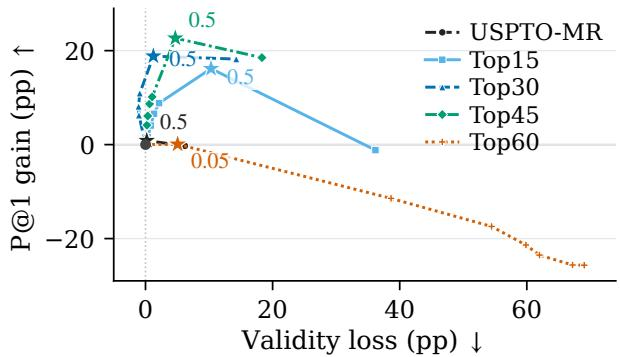  
Figure 5: Guidance-strength trade-off at fixed checkpoints. GraphDiT-65M on each support's original validation cohort at epoch 14. P@1 gain and raw-validity loss are relative to $\alpha = 0 .$ Stars mark final selected scales evaluated at this checkpoint; deployed checkpoints may differ.

Table 12: Matched-scale 8M sensitivity at $\alpha _ { \mathrm { e v a l } } \ = \ . 2 5 .$ Values are equal-axis, case-balanced Matched-Shuffled effects in percentage points. Positive $\Delta \mathrm { P }$ and negative $\Delta \mathrm { N }$ indicate better instruction alignment; $\Delta V$ is the Matched-Shuffled trajectory-validity difference.
<table><tr><td>Support</td><td>∆P@1</td><td>∆P@10</td><td>∆N@1</td><td>∆N@10</td><td> $\Delta V$ </td></tr><tr><td>USPTO-MR</td><td>+0.04</td><td>+0.63</td><td>-0.16</td><td>-1.25</td><td>-0.04</td></tr><tr><td>Top15</td><td>+4.73</td><td>+2.27</td><td>-4.69</td><td>-5.00</td><td>-0.05</td></tr><tr><td>Top30</td><td>+4.80</td><td>+3.28</td><td>-4.22</td><td>-8.67</td><td>-0.08</td></tr><tr><td>Top45</td><td>+6.60</td><td> $+ 4 . 4 1$ </td><td>-6.37</td><td>-9.61</td><td>+0.01</td></tr><tr><td>Top60</td><td>+5.63</td><td> $+ 4 . 8 8$ </td><td>-5.94</td><td>-8.36</td><td>+0.00</td></tr></table>

Matching α narrows the primary Top45–Top60 contrast: their paired 95% intervals include zero at all four recovery endpoints. The selected support ranking therefore depends partly on deployment strength; this comparison alone does not establish an intrinsic advantage for either support.

## C.3 THREE-SEED FROZEN-CHECKPOINT INFERENCE-SCALE RESPONSE

For 8M Top45 and Top60, we hold each seed's validation-selected checkpoint fixed and vary $\alpha \in \{ 0 , . 0 \bar { 5 } , . 1 0 , . 1 5 , . \bar { 2 0 } , . 2 5 , . 5 0 , 1 \}$ , using seeds 42–44 and the paired test schedule from $\mathsf { A p - }$ pendix A. The grid is a post-hoc diagnostic and does not revise validation-selected operating points. Its archived estimand weights distinct cases equally after averaging their signed groups; the selectedpoint tables instead give each axis equal weight.

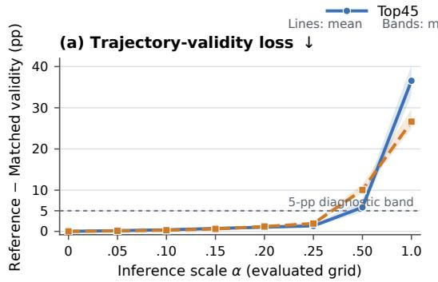

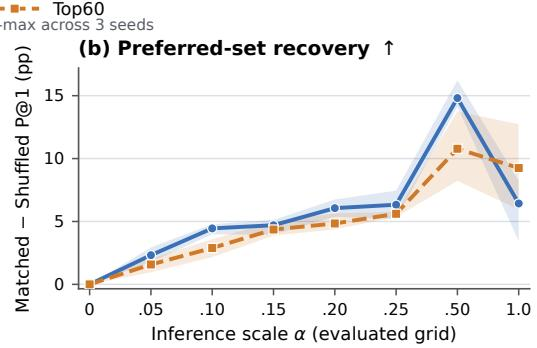  
Figure 6: Fixed-checkpoint scale response across three Stage-B seeds. GraphDiT-8M Top45 and Top60: (a) Reference-minus-Matched trajectory-validity loss; (b) Matched–Shuffled P@ 1 gain, both in percentage points. Lines are seed means and bands span the seedwise minimum and maximum, not confidence intervals. The dashed five-point line is a diagnostic validity-loss reference.

Weak guidance yields similar responses. Raising α from .25 to .50 costs Top60 more validity without a larger P@1 gain, indicating a narrower calibration margin at these checkpoints (Figure 6). Both supports lose substantial validity under strong guidance.

## C.4 COMPLETE THREE-SEED ANALYSIS ACROSS SUPPORTS AND CAPACITIES

Protocol and scope. All ten capacity-support settings in Table 1 have Stage-B seeds 42, 43, and 44. We fix the base generator, Stage-A projector, training corpus, and paired test sampling schedule; each run retains its own archived validation-selected epoch and α under the pipeline's recorded rule, with no test-based reselection. Table 13 uses the same equal-axis, case-balanced aggregation as Table 1. Sample SDs describe conditional Stage-B training-and-selection variation; they are not confidence intervals or estimates of full-pipeline uncertainty. Validity loss is ${ \cal L } _ { \mathrm { v a l } } = V _ { R } - V _ { M }$ where R and M denote Reference and Matched; positive values indicate a guidance cost.

Table 13: All-support Stage-B replication of Table 1, using seeds 42–44. Cells show the mean above ± sample SD $( n = 3 ,$ denominator n — 1), in percentage points. All alignment contrasts are higheris-better; validity loss ${ \cal L } _ { \mathrm { v a l } } = V _ { R } - V _ { M }$ is lower-is-better. F marks 65M Top15, where all three runs use fallback selections that failed the original validation hard gate. Reference is fixed across Stage-B seeds.
<table><tr><td></td><td>Matched-Shuffled</td><td>Matched-Reference</td><td></td><td></td><td>Validity</td></tr><tr><td>Support</td><td>∆P@1 -∆N@10</td><td></td><td>∆P@1 ∆P@10 -∆N@10</td><td></td><td> $L _ { \mathrm { v a l } }$ </td></tr><tr><td colspan="6">GraphDiT-8M</td></tr><tr><td>USPTO-MR</td><td>0.14 ±0.18 4.54</td><td>1.35 0.40 ±0.92 ±0.40 5.46 4.30</td><td>1.16 ±0.93 0.69</td><td>1.74 ±1.44 6.41 ±1.84</td><td>2.08 ±1.59 2.14</td></tr><tr><td>Top15</td><td>±0.61 13.16</td><td>±1.78 18.09</td><td>±0.58 ±0.36 10.70 0.26</td><td>25.81</td><td>±0.81 12.85</td></tr><tr><td>Top30</td><td>±1.02</td><td>±2.01</td><td>±1.29</td><td>±1.16 ±2.42 2.96</td><td>±2.53</td></tr><tr><td>Top45</td><td>8.96 ±4.64</td><td>12.55 ±5.70</td><td>7.30 ±3.24 ±0.95</td><td>14.82 ±8.93</td><td>2.46 ±1.99</td></tr><tr><td>Top60</td><td>5.12 ±0.81</td><td>7.93 ±2.01</td><td>3.74 1.09 ±0.19 ±0.28</td><td>9.10 ±2.36</td><td>1.63 ±0.31</td></tr><tr><td colspan="6">GraphDiT-65M</td></tr><tr><td></td><td>-0.07</td><td>1.25</td><td>0.43 2.04</td><td>0.25</td><td>-0.02</td></tr><tr><td>USPTO-MR</td><td>±0.06 14.05</td><td>±0.40 17.81</td><td>±0.22 ±0.78 13.13 3.19</td><td>±0.57 23.32</td><td>±0.35 8.95</td></tr><tr><td>Top15F</td><td>±2.52 17.50</td><td>±3.91 26.90</td><td>±1.99 15.57</td><td>±0.73 ±4.07 5.00 33.49</td><td>±0.85 1.76</td></tr><tr><td>Top30</td><td>±1.20 17.47</td><td>±1.05 27.50</td><td>±0.44 15.53</td><td>±0.41 ±2.11 4.57 34.78</td><td>±0.82</td></tr><tr><td>Top45</td><td>±1.16</td><td>±1.43</td><td>±0.69</td><td>±0.69 ±1.58</td><td>3.90 ±0.20</td></tr><tr><td>Top60</td><td>0.35 ±0.91</td><td>0.10 ±0.60</td><td>-1.65 ±0.67</td><td>-0.25 0.86 ±0.53 ±0.75</td><td>2.37 ±1.67</td></tr></table>

Control across supports. At 8M, all synthetic supports improve P@1 against both Shuffled and Reference in all three seeds, but Top45's primary maximum varies with training and scale selection. At 65M, Top30/Top45 retain strong gains, whereas Top60's net P@1 effect is negative in every seed. Thus the repeats support reliable control at intermediate supports without fixing a universal best support. The 8M Top30 results also distinguish moving preferred routes to the front from improving their recovery anywhere in the Top-10. USPTO-MR retains near-zero P@1 instructioncontent effects at both capacities.

Validity costs. Stable rank gains can still be costly: 8M Top30 loses substantially more validity than Top45. All three 65M Top15 runs use the archived fallback rule after failing the original validation hard gate, and lose more validity than Top30/Top45. The support comparisons therefore reflect different validity costs and selection rules, not a shared validity budget.

## D CONTROLLED METHOD ALTERNATIVES

## D.1 DIRECT STAGE-B: EFFECT OF STAGE-A-ALIGNED INITIALIZATION

We isolate the contribution of Stage-A-aligned initialization. RIGS (called Joint in the original logs) copies the validation-selected epoch-26 Stage-A projector into each Stage-B projector group; Direct Stage-B (Scratch-B in the logs) uses the same constructor and seed at epoch 0, before any Stage-A update. The arms otherwise share the base checkpoint, adapter topology, trainable scope, Stage-B data and objective, optimizer, update budget, checkpoint coordinates, cohorts, and sampling protocol. The separately reported exact cosine and scalar-head controls in Appendix E.1 instead test frozen-output selection, not Stage-B initialization.

Table 14 retains the matched validation coordinates needed to interpret the ablation. Differences are RIGS minus Direct Stage-B in percentage points. For 8M, both variants select $\alpha _ { \mathrm { e v a l } } = . 5 0$ and share the P@ 1-selected epoch 12 coordinate. For 65M, we fix epoch 14 and compare both variants at the RIGS operating scale $\alpha = . 5 0 ;$ comparing their independently selected scales would confound initialization with deployment selection.

Table 14: Matched-validation summary for the Stage-A initialization ablation. ∆ is RIGS minus Direct Stage-B in percentage points. Larger $\Delta \mathrm { P @ } k ,$ smaller $\Delta { \bf N } @ k ,$ and positive ∆Validity favor RIGS. The 65M row is a matched-scale validation comparison, not a test result.
<table><tr><td>Capacity</td><td> $( e , \alpha _ { \mathrm { e v a l } } )$ </td><td>∆P@1</td><td>∆P@10</td><td>∆N@1</td><td>∆N@10</td><td>∆Validity</td></tr><tr><td>8M</td><td>(12, .50)</td><td>+1.25</td><td> $+ 1 . 4 8$ </td><td>-2.19</td><td>-5.39</td><td>+1.12</td></tr><tr><td>65M</td><td>(14, .50)</td><td>+1.17</td><td>+0.86</td><td>-0.63</td><td>-3.28</td><td>-1.16</td></tr></table>

Avoided-route suppression is the most consistent benefit in the 8M validation sweep: N@10 improves at every checkpoint, whereas preferred-route recovery does not improve uniformly across ranks. The 65M matched-scale sweep also strengthens control, with a modest validity cost. These single-seed diagnostics motivate checking whether the suppression advantage persists on held-out data.

We additionally evaluate the validation-frozen epoch- $1 2 / \alpha = . 5 0 \mathrm { R I G S }$ and Direct Stage-B checkpoints on exactly the same frozen test cohort and sampling schedule. The cohort contains 1,185 cases and 2,560 signed groups, with 100 trajectories per condition. Here “Top60" denotes the frozen evaluation candidate upper bound; we train both models with the Top30 RDKit5 recipe. For each model, the guidance effect is Matched minus Shuffled, and the difference-in-differences (DiD) is Direct Stage-B effect minus RIGS effect.

Table 15: Frozen-test Stage-A initialization difference-in-differences for USPTO-Guide(RDKit5)– 8M–Top30. RIGS and Direct Stage-B use the same epoch-12 checkpoint coordinate, $\alpha _ { \mathrm { e v a l } } = . 5 0$ test cohort, and sampling schedule; M/S denote Matched/Shuffled. Absolute arms are case-balanced percentages; effects and DiD are percentage points. Intervals use 10,000 paired case-cluster bootstrap replicates. For P@k and validity, a negative Direct-minus-RIGS DiD favors RIGS; for N@ k, a positive DiD favors RIGS because lower recovery is better.
<table><tr><td>Metric</td><td>RIGS M</td><td>RIGS S</td><td>Direct M</td><td>Direct S</td><td>RIGS M-S</td><td>Direct M-S</td><td></td><td>Direct-RIGS DiD [95% CI]</td></tr><tr><td>P@1</td><td>24.80</td><td>12.03</td><td>23.26</td><td>11.31</td><td>+12.77</td><td>+11.96</td><td></td><td>-0.82 [-3.47, +1.89]</td></tr><tr><td>P@3</td><td>37.09</td><td>21.56</td><td>34.70</td><td>21.27</td><td>+15.53</td><td>+13.43</td><td></td><td>-2.10 [-4.90, +0.70]</td></tr><tr><td>P@5</td><td>39.83</td><td>25.11</td><td>37.74</td><td>25.36</td><td>+14.73</td><td>+12.38</td><td></td><td>-2.35 [-5.01, +0.37]</td></tr><tr><td>P@10</td><td>42.60</td><td>29.37</td><td>41.39</td><td>28.73</td><td>+13.24</td><td>+12.66</td><td></td><td>-0.58[-3.25, +2.14]</td></tr><tr><td>N@1</td><td>2.93</td><td>13.62</td><td>5.08</td><td>12.74</td><td>-10.69</td><td>-7.67</td><td></td><td>+3.02 [+0.89, +5.19]</td></tr><tr><td>N@3</td><td>5.46</td><td>22.42</td><td>9.76</td><td>22.49</td><td>-16.96</td><td>-12.73</td><td></td><td>+4.23 [+1.91, +6.62]</td></tr><tr><td>N@5</td><td>6.68</td><td>26.50</td><td>12.24</td><td>26.33</td><td>-19.82</td><td>-14.09</td><td></td><td>+5.72 [+3.39, +8.19]</td></tr><tr><td>N@10</td><td>9.00</td><td>30.21</td><td>15.61</td><td>30.00</td><td>-21.21</td><td>-14.39</td><td></td><td>+6.82[+4.36, +9.42]</td></tr><tr><td>Validity</td><td>53.27</td><td>53.28</td><td>52.43</td><td>52.45</td><td>-0.01</td><td>-0.03</td><td></td><td>-0.02 [-0.31, +0.30]</td></tr></table>

The frozen 8M test supports Stage A chiefly as an initialization that helps the adapter reject instruction-incompatible routes. All four N@k DiD intervals favor Stage A, while preferred-route and validity intervals cross zero (Table 15). The evidence does not establish a promotion gain. Intervals are per metric, without multiplicity correction or training-seed uncertainty; the 65M evidence remains validation-only.

## D.2 STAGE-B LOSS ABLATION

We evaluate the five Stage-B objective terms in a single-seed ablation for USPTO-Guide(RDKit5)— 65M-Top30. A fresh complete $P / R / T / G / K$ arm and five leave-one-out arms share the same base checkpoint, the selected Stage-A A0 projector, zero-output adapter initialization, data order, optimizer, 14-epoch / 57,260-update budget, and fixed $\alpha _ { \mathrm { t r a i n } } = 1$ . The complete objective is

$$
\mathcal { L } _ { B , \mathrm { m e t r i c } } = 0 . 1 0 \mathcal { L } _ { \mathrm { p o s } } + 0 . 0 5 \mathcal { L } _ { \mathrm { r a n k } } + 0 . 0 5 \mathcal { L } _ { \mathrm { t e a c h } } + 0 . 0 5 \mathcal { L } _ { \mathrm { g u a r d } } + 1 . 0 0 \mathcal { L } _ { \mathrm { r o l l } } .\tag{9}
$$

The arm labels $P / R / T / G / K$ abbreviate positive DFM, route ranking, metric-teacher KL, fullreference KL guard, and rollout-reference $\mathrm { K L , }$ respectively; they are not new loss symbols. Each leave-one-out arm changes exactly one coefficient to zero.

We evaluate only on a frozen validation cohort of 1,162 case clusters and 2,560 signed groups (256 per axis/polarity cell), at epoch 14 and $\alpha _ { \mathrm { e v a l } } = . 5 0$ . Each Matched or Shuffled condition contains 100 trajectories per group; we reuse the protocol-audited Reference surface. For ablation variant v, we define $E _ { v } ^ { P } = \bar { ( \mathrm { P @ 1 } ) _ { v , \mathrm { M a t c h e d } } } - ( \mathrm { P @ 1 } ) _ { v , \mathrm { S h u f f e d } }$ and $E _ { v } ^ { N } = ( \mathrm { N @ 1 } ) _ { v , \mathrm { S h u f f e d } } - ( \mathrm { N @ 1 } ) _ { v }$ ,Matched, so larger values mean stronger instruction-specific promotion or suppression, respectively. Figure 7 reports $\Delta E ^ { P } = E _ { \mathrm { f u l l } } ^ { P } - E _ { v } ^ { P ^ { * } } , \Delta E ^ { N } = E _ { \mathrm { f u l l } } ^ { N } - E _ { v } ^ { N }$ , and $\Delta V = V _ { \mathrm { f u l l , M a t c h e d } } - V _ { v }$ ,Matched in percentage points. Positive ∆V therefore means that deleting the term reduces validity. The full arm has $\Breve { E ^ { P } } = 1 4 . 8 9 , E ^ { N } = 1 4 . 4 0$ , and Matched validity of 68.97% (Reference: 70.22%), corresponding to a 1.25-point Reference-Matched validity loss. The reported $p _ { \mathrm { H } }$ adjusts the five deletion comparisons by Holm's method separately for each endpoint. The supplementary document reports the full confidence intervals and adjusted $p \textmd { - }$ values under “Stage-B loss ablation: full statistical results."

<table><tr><td>Removed loss term</td><td>Promotion ΔEP</td><td>Suppression ΔEN</td><td>Validity ΔV</td></tr><tr><td>-P Positive DFM</td><td>+10.41</td><td>+9.29</td><td>+6.52*</td></tr><tr><td>-R Route ranking</td><td>+3.41*</td><td>+2.32 米</td><td>-2.82*</td></tr><tr><td>-T Metric-teacher KL</td><td>-0.27</td><td>-1.70</td><td>+3.37*</td></tr><tr><td>-G Full-reference guard</td><td>+0.60</td><td>+0.77</td><td>-2.66*</td></tr><tr><td>—K Rollout-reference KL</td><td>-1.38</td><td>-0.04</td><td>+1.09*</td></tr><tr><td rowspan="2">Full – ablation (pp)</td><td colspan="3"></td></tr><tr><td>Deletion better</td><td></td><td>Full loss better 10</td></tr><tr><td>*pH&lt; 0.05</td><td colspan="3">-10 -5 0 5</td></tr></table>

Figure 7: Stage-B loss ablation. Full-minus-ablation effects (pp) for USPTO-Guide(RDKit5)— 65M–Top30 at epoch 14 and $\alpha _ { \mathrm { e v a l } } = . 5 0$ . Red favors the full loss; blue favors deletion. Asterisks mark $p _ { \mathrm { H } } < . 0 5$ , Holm-adjusted over the five deletions separately for each endpoint. Complete 95% paired-bootstrap intervals and adjusted p-values appear in the supplementary statistical table. This is a single-seed, validation-only comparison.

Positive DFM and route ranking provide the clearest control signal: removing either weakens promotion and suppression, with paired intervals excluding zero. Positive DFM also supports validity, whereas ranking trades validity for control. Metric-teacher and rollout-reference KL support validity without a resolved control gain. Deleting the guard improves validity with unresolved control changes, so this single-seed validation ablation does not establish its intended protective role.

## E PROPOSAL AND SELECTION COUNTERFACTUALS

## E.1 BUDGETED PROPOSAL-SELECTION COUNTERFACTUAL

The USPTO Top30 RDKit5 diagnostic uses the 8M backbone on 1,182 test cases and 2,560 signed groups. Reference generates without instruction guidance; Matched uses the correct instruction at Stage-B epoch 12 and $\alpha = . 5 0$ . Each arm contributes the literal first $B \in \{ 1 , 5 , 1 0 , 2 5 , 5 0 , 1 0 0 \}$ trajectories without invalid or duplicate backfilling. The following selectors reorder the valid distinct candidates in each realized pool, leaving Hit@ B and Unique valid unchanged.

Selectors. Frequency ranks distinct candidates by descending occurrence count across the B raw draws.

Scalar head (s42) applies a width-256 MLP (GELU, dropout 0.1) to normalized instruction and route embeddings and their elementwise product, absolute difference, and cosine. The score also includes log frequency with a learned nonnegative weight. Here s42 denotes training seed 42.

Exact Stage-A cosine ranks candidates by the frozen Stage-A cosine similarity between projected instruction and route embeddings, without additional learned calibration or a frequency term.

RDKit oracle directly orders candidates by the instructed RDKit descriptor: larger values for “more" and smaller values for “fewer." It attains the best descriptor utility in the pool and hence zero RDKit regret; this need not maximize recovery of candidates in the frozen preferred set.

Readout fitting. The scalar head learns the requested RDKit preferences from Referencegenerated training pools, using frozen instruction and route embeddings. We select it by P@ 1 on a separate validation set, then apply the same head across proposal pools. Table 17 reports sensitivity to the training seed. Scalar-head and oracle readouts are evaluation diagnostics; primary inference uses frequency ordering.

Selector metrics. Here Hit@ B means preferred-set $\mathrm { H i t } _ { + } @ B$ . P@ 1/Hit is $1 0 0 \mathrm { P @ 1 / H i t _ { + } @ } B$ , the percentage of groups selecting a preferred candidate first among those whose pool contains one. For signed raw RDKit utility $u _ { g } ( r ) = s _ { g } m _ { g } ( r )$ , with polarity $s _ { g } ~ \in ~ \{ - 1 , + 1 \}$ and descriptor count $m _ { g } ,$ regret is $\begin{array} { r } { \operatorname* { m a x } _ { r \in \mathcal { U } _ { g } ( B ) } u _ { g } ( r ) - u _ { g } ( r _ { g , 1 } ) \colon } \end{array}$ the gap between the best utility in the realized valid pool $\mathcal { U } _ { g } ( B )$ and the first selected candidate. Lower is better. We average regret over groups with nonempty pools and metric values for every candidate, using raw descriptor units rather than the standardized training utility.

Guidance improves which proposal reaches the front without a resolved increase in preferred-set availability. At B = 100, paired 95% intervals resolve higher P@ 1, lower N@1, and fewer uniquevalid candidates under frequency ordering, while the Hit@100 interval includes zero. This pattern supports prioritization of preferred routes within the sampled pool.

Terminal selection exposes a different trade-off. All three scalar heads reduce N@1 and metric regret on both pools while lowering high-budget P@ 1 (Table 17); exact Stage-A cosine is weaker at selecting known positives. Even the RDKit oracle can miss those positives because descriptor optimality and frozen-set membership are different objectives. The trade-off's magnitude varies across head seeds.

## F LANGUAGE AND CHEMISTRY EVIDENCE

## F.1 FREE-FORM STRUCTURAL INSTRUCTIONS AND THE FROZEN LANGUAGE REPRESENTATION

Structure supplies case-specific retain/avoid instructions rather than a fixed descriptor registry or scalar metric teacher. Offline annotation combines product-local RDKit evidence with languagemodel judgments (Appendix I.2). The frozen test split contains 2,229 cases, 6,752 semantic groups, and 4,606 distinct instruction strings. Qwen3-Embedding-8B (Zhang et al., 2025) represents these strings as frozen token features; it does not generate their annotations (Appendix I.1). Sampling and aggregation follow Appendix H.9.

Table 16: Budgeted Top30 proposal and selector results. Panel (a) reports proposal support at representative budgets. Panel (b) reports all selectors used for the primary Reference and Matched pools at B = 100. Hit, P@1, N@ 1, P@ 1/Hit, and duplicate rate are percentages; Unique valid is a mean count, and RDKit regret uses raw descriptor units.
<table><tr><td colspan="5">(a) Literal-prefix proposal support</td></tr><tr><td>Proposal</td><td>B</td><td>Hit@B</td><td>Unique valid</td><td>Duplicate rate</td></tr><tr><td>Reference</td><td>5</td><td>24.38</td><td>3.40</td><td>1.55</td></tr><tr><td>Reference</td><td>25</td><td>50.98</td><td>15.68</td><td>6.08</td></tr><tr><td>Reference</td><td>100</td><td>64.80</td><td>53.53</td><td>15.23</td></tr><tr><td>Matched</td><td>5</td><td>18.44 45.35</td><td>2.64 12.59</td><td>0.62</td></tr><tr><td>Matched</td><td>25</td><td></td><td></td><td>2.42</td></tr><tr><td>Matched</td><td>100</td><td>63.87</td><td>46.95</td><td>6.10</td></tr></table>

(b) B = 100 proposal-selector combinations
<table><tr><td colspan="2"></td><td colspan="5">Unique</td></tr><tr><td>Proposal</td><td>Selector</td><td>Hit@100</td><td>valid</td><td>P@1</td><td>N@1</td><td>P@1/Hit</td><td>RDKit regret</td></tr><tr><td>Reference</td><td>Frequency</td><td>64.80</td><td>53.53</td><td>24.57</td><td>25.39</td><td>37.91</td><td>1.332</td></tr><tr><td>Reference</td><td>Scalar head (s42)</td><td>64.80</td><td>53.53</td><td>22.23</td><td>3.32</td><td>34.30</td><td>0.510</td></tr><tr><td>Reference</td><td>Exact Stage-A cosine</td><td>64.80</td><td>53.53</td><td>5.35</td><td>12.89</td><td>8.26</td><td>1.627</td></tr><tr><td>Reference</td><td>RDKit oracle</td><td>64.80</td><td>53.53</td><td>26.99</td><td>0.35</td><td>41.65</td><td>0.000</td></tr><tr><td>Matched</td><td>Frequency</td><td>63.87</td><td>46.95</td><td>32.73</td><td>8.75</td><td>51.25</td><td>1.342</td></tr><tr><td>Matched</td><td>Scalar head (s42)</td><td>63.87</td><td>46.95</td><td>19.06</td><td>0.62</td><td>29.85</td><td>0.588</td></tr><tr><td>Matched</td><td>Exact Stage-A cosine</td><td>63.87</td><td>46.95</td><td>7.70</td><td>6.48</td><td>12.05</td><td>1.693</td></tr><tr><td>Matched</td><td>RDKit oracle</td><td>63.87</td><td>46.95</td><td>18.48</td><td>0.12</td><td>28.93</td><td>0.000</td></tr></table>

Table 17: Scalar-head seed sensitivity at B = 100 on the frozen test pools. Seed 42 is the registered primary head; seeds 43 and 44 are sensitivity runs. We select checkpoints independently on Reference validation and reuse them without adaptation across proposal sources. P@1 and N@1 are percentages.
<table><tr><td>Proposal</td><td>Head seed</td><td>Selected epoch</td><td>P@1</td><td>N@1</td><td>RDKit regret</td></tr><tr><td>Reference</td><td>42 (primary)</td><td>3</td><td>22.23</td><td>3.32</td><td>0.510</td></tr><tr><td>Reference</td><td>43</td><td>1</td><td>23.05</td><td>9.22</td><td>0.895</td></tr><tr><td>Reference</td><td>44</td><td>2</td><td>22.38</td><td>5.94</td><td>0.677</td></tr><tr><td>Matched (e12)</td><td>42 (primary)</td><td>3</td><td>19.06</td><td>0.62</td><td>0.588</td></tr><tr><td>Matched (e12)</td><td>43</td><td>1</td><td>21.37</td><td>1.13</td><td>0.814</td></tr><tr><td>Matched (e12)</td><td>44</td><td>2</td><td>19.88</td><td>0.86</td><td>0.689</td></tr></table>

We selected the following verbatim test instructions without consulting Matched-Shuffled outcomes. They span different constraint types:

• Core retention and stereochemistry: “Prefer precursors that retain the intact pyrrolidine core with the correct stereochemistry."

• Bond connectivity: “Prefer precursors that already contain the biaryl bond between the phenanthrene core and the pendant phenyl ring."

• Substitution relation: “Prefer precursors with a single halogen substituent ortho or para to the amino group."

• Functional form and route preference: “Prefer precursors that incorporate the tert-butyl carbamate protected amine directly rather than requiring azide or isocyanate intermediates."

• Ring-system exclusion: “Avoid precursors that introduce additional fused or spiro ring systems beyond the target cyclopropane."

• Fragment/source integration: “Avoid precursors that introduce the bromine atom as a salt or separate fragment."

Each instruction combines a case-specific molecular entity with a relation, polarity, or route-form preference. The learned projector transfers its frozen-language features to route scoring and node-totext memory (Eqs. 12 and 15). Matched and Shuffled share the checkpoint and sampling schedule, changing only which instruction enters this pathway.

Table 18: Native-cohort Structure absolute-arm results (%) on 2,229 cases and 6,752 groups. Values average groups; paired case-balanced effects appear in Table 19.  
(a) Preferred-route recovery  
(b) Disfavored-route recovery and validity
<table><tr><td>Arm P@1 P@3 P@5 P@10</td></tr><tr><td>USPTO-Guide(Struct)-8M-Top30 e22,  $\alpha = . 5 0$  Reference 30.554 49.674 57.079 64.114 Matched 35.382 53.525 58.960 63.181</td></tr><tr><td>Shuffled 32.065 49.348 54.902 59.775 USPTO-Guide(Struct)-65M-Top30</td></tr><tr><td> $\mathrm { e } 2 6 , \alpha = 1$  Reference 31.117 51.466 59.064 66.558 Matched 45.053 62.115 66.780 70.172 Shuffled 37.45655.21360.930 65.744</td></tr></table>

<table><tr><td>Arm N@1 N@3 N@5 N@10 Validity</td></tr><tr><td>USPTO-Guide(Struct)-8M-Top30 e22,  $\alpha = . 5 0$  Reference 19.535 36.89344.28351.55569.982</td></tr><tr><td>Matched12.678 26.052 33.79741.41060.567 Shuffled 16.32131.39838.31544.787 60.500</td></tr><tr><td>USPTO-Guide(Struct)-65M-Top30  $\mathbf { e } 2 6 , \alpha = 1$  Reference 24.097 42.210 49.985 58.17571.231 Matched 6.680 14.662 18.824 23.978 64.555</td></tr></table>

Table 19: Case-specific structural control: case-balanced Matched-Shuffled effects in percentage points with 95% case-cluster intervals. Positive ∆P and —∆N indicate promotion and suppression, respectively.
<table><tr><td>Metric</td><td> $8 \mathrm { M } , \mathrm { e } 2 2 , \alpha = . 5 0 $ </td><td> $6 5 \mathbf { M } , \mathbf { e } 2 6 , \alpha = 1$ </td></tr><tr><td>∆P@1</td><td>+3.554 [2.491, 4.598]</td><td>+8.089 [6.910, 9.243]</td></tr><tr><td>∆P@10</td><td>+3.769 [2.939, 4.573]</td><td>+5.003 [4.155, 5.853]</td></tr><tr><td>-∆N@1</td><td>+3.908 [3.082, 4.755]</td><td>+7.799 [6.878, 8.753]</td></tr><tr><td>-∆N@10</td><td>+3.434 [2.525, 4.341]</td><td>+18.444 [17.245, 19.651]</td></tr><tr><td> $\Delta { \mathrm { V a l i d i t y } }$ </td><td>+0.051 [-0.086, +0.190]</td><td>-0.035 [-0.278, +0.212]</td></tr></table>

Both capacities promote preferred routes and suppress avoided routes at Top-1 and Top-10, with intervals excluding zero in the requested direction. These effects support case-specific structural control beyond the fixed metric registry. Using the same case-balanced aggregation, the Matched– Reference P@1 gains and N@10 reductions reported in Table 4 are 5.54 and 10.57 percentage points at 8M, and 14.74 and 35.79 at 65M, respectively. These point estimates average within-case contrasts; subtracting the group-averaged absolute values in Table 18 gives a different weighting.

## F.2 A CHEMISTRY-AUDITED PAIRED CASE: FEWER PRECURSOR HALOGENS

Figure 8 illustrates how a compositional instruction can change the chosen disconnection for a fixed product. The manually audited USPTO Top30 case uses GraphDiT-65M at epoch 14 and the instruction “Choose precursor sets with fewer halogen atoms" for 3-phenoxytoluene, Cc1cccc (Oc2ccccc2) c1. Guidance shifts draws toward the preferred set; the caption reports the validity cost.

We rank non-invalid unique outputs by empirical frequency (ties use first trajectory index) and show five examples per arm that pass manual checks for atom-source consistency, meta regiochemistry, an identifiable reaction class, and primary-literature precedent. These are curated chemistry witnesses, not the unfiltered model Top-5; curation does not alter any quantitative count. The two Reference bromoarene routes have reaction-class precedent for ultrasound-assisted Ullmann coupling (Smith & Jones, 1992). The remaining three Reference routes have exact-product precedent (Ling et al., 2012; Chandnani & Chandalia, 1999; Tan et al., 2014). The Guided examples comprise two closesubstrate Chan-Lam precedents and three reaction-class-only oxidative-dehydrogenation precedents (Chan et al., 1998; Evans et al., 1998; Iosub & Stahl, 2015).

We fix RC-predictor rank 2, the root choice, and trajectory seed 209236. The bottom row then changes from a one-halogen Ullmann disconnection with reaction-class precedent to a zero-halogen, close-substrate Chan-Lam disconnection. It is a qualitative witness of the requested compositional shift; we evaluate aggregate behavior separately.

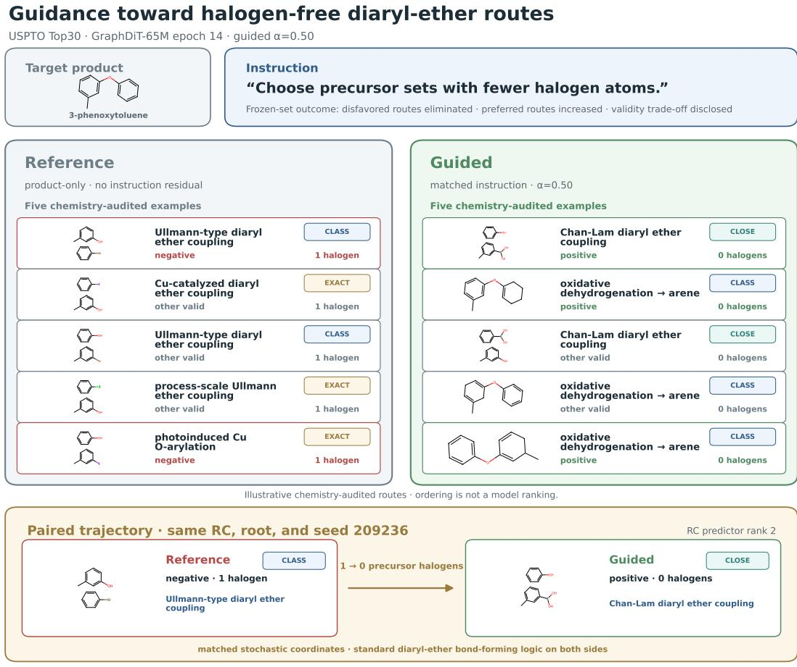  
Evidence: EXACT exact product/pair · CLOSE close substrates in the same class· CLASS reaction-class precedent only  
Figure 8: Chemistry-audited qualitative witness for “Choose precursor sets with fewer halogen atoms."Each column shows five manually reviewed examples selected from frequency-ranked valid unique outputs, not the unfiltered model Top-5. Evidence badges denote exact-product experiments (Exact), close-substrate experiments (Close), and reaction-class-only precedent (Class). The bottom row pairs outputs at fixed RC schedule and seed. Positive/negative labels denote frozen-set membership, independently of the evidence badges. Across all 100 draws, Reference has 21 negative and 19 positive hits at 91% validity; Guided has 0 and 24 at 85% validity.

## F.3 DOWNSTREAM MULTISTEP PLANNING WITNESSES

Figure 9 illustrates how local instruction following can propagate through a multistep search: changing precursor choices redirects later expansions and the resulting terminal precursors. The two paired witnesses establish this possibility; they do not estimate average planning gains, cross-seed stability, or experimental feasibility.

Search method. We use a custom value-guided AND-OR tree-search planner inspired by Retro\* (Chen et al., 2020). Molecule nodes represent alternative reactions (OR), and reaction nodes require all their precursors (AND). A frozen value model estimates the remaining search effort for unexpanded molecules. Reaction costs sum precursor costs, and molecule costs take the minimum over candidate reactions. The planner selects an unresolved molecule in the current lowest-cost partial plan and expands it with RIGS, then updates these costs back toward the target. Guided searches apply the same instruction at every expansion. Search ends when all leaves of a complete route belong to the building-block inventory, no expandable branch remains, or the search reaches 500 expansions per target.

Route-level measures. Route-level reaction-class ambiguity is max $( 1 - p _ { j } )$ , where $p _ { j }$ is the ASKCOS classifier's top-class confidence for reaction j (Tu et al., 2025); lower values indicate more confident classification. Proof depth is the longest chain of reaction steps. Selected reactions and terminal precursors count reaction nodes and leaf precursors, respectively; terminal halogen count sums the halogen atoms over those leaves. A solved proof reaches the planner's terminal-precursor criterion at every leaf.

Ambiguity-low selectedproof. For target pistachio100:038, CC(C) [C@H] (C(=O) OCc1ccccc1)N1C(=O)N[C@@H](COc2ccc(Br) cc2)C1=O, guidance reduces route-level reaction-class ambiguity while changing every selected reaction and terminal precursor, despite equal proof depth. This is a screen-selected computational witness: automatic RDKit parsing and route-continuity checks pass, but we have not manually audited its chemistry.

Halogen-lowplanning case. For target index 20, COCO[C@@H] (/C=C/C=O)CC[C@@H] (C) O[Si] (C) (C) C (C) (C) C, we compare Reference and guided searches using RIGS-GraphDiT-65M. The guided arm uses “Choose precursor sets with fewer halogen atoms" with $\alpha = 0 . 5$ and polarity —1. Guidance changes the root and every later selected reaction, yielding halogen-free terminal precursors (Figure 9B). The local preference thus affects the whole selected plan, including its depth.

## F.4 DIRECT EMPIRICAL SAMPLED-MASS REALLOCATION

Top-k recovery measures whether a route set appears in the returned list; empirical mass measures how often the sampler visits it. We reclassify the frozen Common Top100 trajectories into five mutually exclusive outcomes: preferred, disfavored, neutral Top100, valid outside Top100, or invalid. For semantic group $^ { g , }$ let $\widehat { r } _ { q } ^ { ( b ) }$ be the canonical precursor set decoded from draw b (or an invalid sentinel), and let $\mathcal { \bar { R } } _ { g } ^ { + }$ and $\mathcal { \bar { R } } _ { g } ^ { - }$ be the preferred and avoided precursor sets in its frozen evaluation inventory. The preferred empirical mass in the first B draws is

$$
M _ { + } ( g ; B ) = \frac { 1 } { B } \sum _ { b = 1 } ^ { B } \mathbf { 1 } \left[ \widehat { r } _ { g } ^ { ( b ) } \in \mathcal { R } _ { g } ^ { + } \right] ,\tag{10}
$$

with $M _ { - } ( g ; B )$ defined using $\mathcal { R } _ { g } ^ { - }$ . These sets contain the canonical routes indexed by $\mathcal { P } _ { c }$ and $\mathcal { N } _ { c } ,$ respectively, in the evaluation group. Repeated occurrences count repeatedly; we neither deduplicate outputs nor backfill invalid draws. These quantities are literal frequencies under the frozen 100-draw protocol, not exact model probabilities. We report results at $B = 1 0 0$ , using the equal-axis, casebalanced aggregation and paired bootstrap in Appendix H.9. The signed mass gap is $M _ { + } - M _ { - }$

Matched text reallocates repeated draws toward preferred routes and away from avoided routes at all ten coordinates, with paired intervals excluding zero in both directions (Table 20). Validity contrasts remain unresolved, and invalid draws stay in the denominator. The effect therefore extends beyond changing which route crosses a rank cutoff.

## G EXTERNAL AND HETEROGENEOUS ROBUSTNESS

## G.1 PISTACHIO TOP30: CONTROL ON RECORDED REACTION ALTERNATIVES

We report a 65M Guide(RDKit5) model trained on Pistachio Top30. We select the evaluation cohort from the native Top30 RDKit5 test groups and retain their preference labels. It contains 1,035 products and 2,560 signed groups balanced across the five RDKit axes and both polarities. All three arms use the same fixed cohort and labels. We check the cohort's products and eligible precursor sets against the Pistachio Top100 test inventory of 3,516 products and 17,556 recorded candidate routes. In this data construction, we add template-generated candidates only to training and validation. The evaluation-inventory count differs from the 17,549 accepted graph routes in Table 25, which reports the model-bound graph view.

(Ambiguity-low guidance

## A Ambiguity-low redirects the selected proof

All selected reactions and all terminal precursors differ; chemistry was not manually audited.

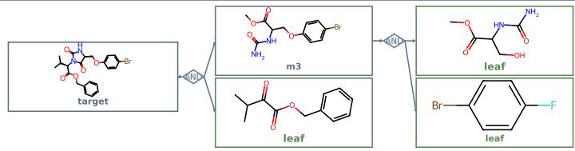  
depth 2 · 3 terminal precursors · route ambiguity 0.006

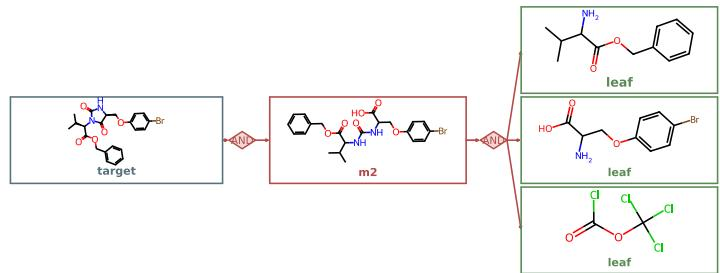  
B Halogen-low removes terminal halogens  
Guidance: "Choose precursor sets with fewer halogen atoms." α=0.5, polarity=-1

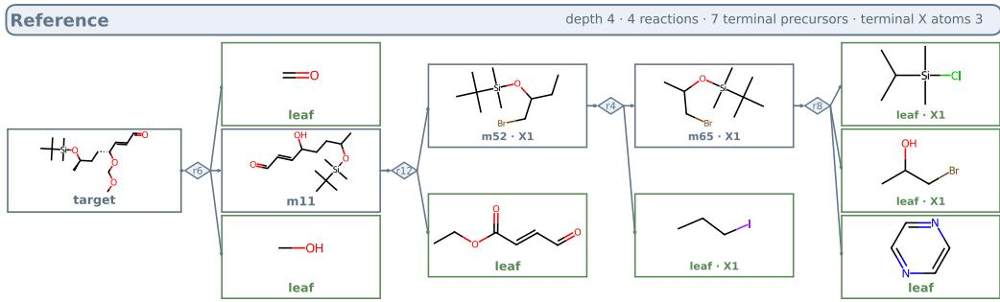  
Halogen-low guidance  
depth 2 ·2 reactions ·5 terminal precursors · terminal X atoms 0

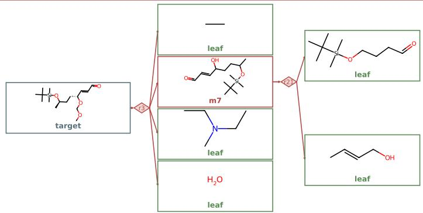  
Figure 9: Selected proofs for two qualitative planning witnesses. (A) Ambiguity-low redirects the route at unchanged depth; chemical feasibility remains unverified. (B) Halogen-low redirects the selected plan; both searches find a complete plan, and both selected plans pass the structural audit. Cards are molecule OR nodes, diamonds are reaction AND nodes, and X n marks n halogen atoms.

Reference, Matched, and different-axis Shuffled share the reaction-center top-5 proposal schedule and sampling seeds, using 100 raw draws per group and 50 steps. Root and trajectory seeds are 20260721 and 42000. Intervals use 10,000 paired case-cluster bootstrap replicates with equal axis weights (seed 1042). Table 21 gives the recorded checkpoint epoch and residual scale alongside all three arms.

Table 20: Direct empirical sampled-mass reallocation at B = 100. Each cell is the equal-axis, case-balanced Matched-Shuffled effect in percentage points, followed by its 95% paired-bootstrap interval. We reverse the sign of disfavored mass, so positive —∆M\_ is favorable. The ten rows are the selected Common Top100 checkpoints registered in Table 5.
<table><tr><td>Capacity</td><td>Support</td><td> $\Delta M _ { + }$ </td><td>-∆M_</td><td> $\Delta ( M _ { + } - M _ { - } )$ </td><td>∆Validity</td></tr><tr><td>8M</td><td>USPTO-MR</td><td>+0.30 [+0.21,+0.39]</td><td>+0.38 [+0.30,+0.46]</td><td>+0.67 [+0.53, +0.82] [−0.33, +0.13]</td><td>-0.10</td></tr><tr><td>8M</td><td>Top15</td><td>+0.94 [+0.82, +1.05] [+0.91, +1.17]</td><td>+1.04</td><td>+1.98 [+1.78, +2.17] [−0.21, +0.09]</td><td>-0.06</td></tr><tr><td>8M</td><td>Top30</td><td>+2.27 [+2.10, +2.44] [+2.09, +2.43]</td><td>+2.26</td><td>+4.53 [+4.24, +4.82]</td><td>-0.11 [−0.43, +0.22]</td></tr><tr><td>8M</td><td>Top45</td><td>+2.67 [+2.48, +2.85]</td><td>+2.69 [+2.50, +2.89]</td><td>+5.36 [+5.04, +5.68]</td><td>+0.15 [−0.18,+0.48]</td></tr><tr><td>8M</td><td>Top60</td><td>+1.26 [+1.15,+1.37]</td><td>+1.20 [+1.09, +1.32]</td><td>+2.46 [+2.28, +2.64]</td><td>0.00 [−0.20,+0.20]</td></tr><tr><td>65M</td><td>USPTO-MR</td><td>+0.12 [+0.04, +0.19] [+0.10, +0.22]</td><td>+0.16</td><td>+0.27 [+0.17,+0.38]</td><td>+0.06 [−0.13,+0.24]</td></tr><tr><td>65M</td><td>Top15</td><td>+3.28  $\begin{array} { c } { { [ + 3 . 0 1 , + 3 . 5 5 ] } } \\ { { + 5 . 1 8 } } \end{array}$ </td><td>+3.26  $^ { [ + 3 . 0 0 , + 3 . 5 3 ] } _ { + 5 . 0 6 }$ </td><td>+6.54</td><td>+0.14 [−0.25, +0.53]</td></tr><tr><td>65M</td><td>Top30</td><td> $\begin{array} { r l } {  { [ + 4 . 8 8 , + 5 . 4 9 ] } } \\ { + 4 . 0 7 } \end{array}$ </td><td> $\begin{array} { c } { { [ + 4 . 7 4 , + 5 . 3 8 ] } } \\ { { + 4 . 0 2 } } \end{array}$ </td><td> $\begin{array} { c } { { [ + 6 . 1 1 , + 6 . 9 8 ] } } \\ { { + 1 0 . 2 4 } } \end{array}$ </td><td>+0.11 [−0.20, +0.44]</td></tr><tr><td>65M</td><td>Top45</td><td>[+3.82, +4.32] [+3.77, +4.27]</td><td></td><td> $\begin{array} { c } { { [ + 9 . 7 1 , + 1 0 . 7 7 ] } } \\ { { + 8 . 0 9 } } \end{array}$  [+7.67, +8.53] [−0.30, +0.48]</td><td>+0.09</td></tr><tr><td>65M</td><td>Top60</td><td>+0.26 [+0.18, +0.35]</td><td>+0.21  $[ + 0 . 1 3 , + 0 . 2 8 ]$ </td><td>+0.47 [+0.35, +0.58] [−0.06, +0.27]</td><td>+0.10</td></tr></table>

Table 21: Pistachio 65M Top30 five-axis results on recorded reaction alternatives. Stage-B checkpoint epoch $e = 1 0 ;$ residual scale $\alpha = 0 . 5 0$ All entries are percentages. Hit @100 measures preferred-set availability; we compute validity over raw draws. P@k/N@k use frequency-ranked unique valid outputs.
<table><tr><td></td><td></td><td colspan="4">Preferred recovery ↑</td><td colspan="4">Disfavored recovery ↓</td><td></td></tr><tr><td>Arm</td><td>Hit+@100</td><td>P@1</td><td>P@3</td><td>P@5</td><td>P@10</td><td>N@1</td><td>N@3</td><td>N@5</td><td>N@10</td><td>Validity</td></tr><tr><td>Reference</td><td>35.59</td><td>3.48</td><td>7.89</td><td>11.52</td><td>18.52</td><td>3.83</td><td>7.77</td><td>10.51</td><td>18.63</td><td>73.82</td></tr><tr><td>Matched</td><td>35.63</td><td>4.45</td><td>10.47</td><td>14.80</td><td>21.29</td><td>0.66</td><td>1.99</td><td>3.20</td><td>5.04</td><td>69.39</td></tr><tr><td>Shuffled</td><td>23.91</td><td>2.93</td><td>5.90</td><td>7.97</td><td>12.62</td><td>2.42</td><td>6.13</td><td>8.83</td><td>12.23</td><td>69.26</td></tr></table>

Control also appears on recorded reaction alternatives: paired 95% intervals resolve preferred-route promotion and avoided-route suppression at Top-10 against Shuffled. Against Reference, P@ 1 and P@10 improve and N@10 falls, while the preferred-set Hit@ 100 interval includes zero. This supports a change in which available routes the model returns first, with a validity cost visible in Table 21.

## G.2 APPLICABILITY TO ANOTHER METRIC SUITE

Metric4 tests the same two-stage framework with a different supervision suite: synthetic-complexity delta, procurement burden, halogen count, and ring count. We train separate models with Metric4 supervision, so the experiment assesses applicability under metric-specific training. All ten settings share a strict-Top100 inventory of 982 products and 2,048 signed groups. Each arm uses RC Top-5 proposals, 100 raw draws per group, and 50 sampling steps; Matched and Shuffled share sampling seeds. We select checkpoints and guidance scales on validation and keep them fixed for testing. Estimates average groups within each case and then average cases; 95% intervals use 10,000 paired case-cluster bootstrap resamples.

Table 22 retains all five supports at both capacities. Seven of the eight synthetic-support settings show preferred Top-1 promotion and avoided Top-10 suppression against Shuffled, and preferred

Top-1 gains over Reference, with intervals excluding zero. The P@1 instruction effect remains unresolved for USPTO-MR and 65M Top60. Validity costs relative to Reference remain visible in the last column; Matched–Shuffled validity intervals include zero at all ten settings. These results support applicability beyond RDKit5, with gains that depend on the support and deployment setting. For the Top30 settings in Table 4, the Matched–Reference reduction in N@10 is additionally 8.04 percentage points (95% CI: [6.52, 9.60]) at 8M and 27.52 points ([25.15, 29.91]) at 65M, using the same case-balanced aggregation and paired bootstrap.

Table 22: Instruction control under Metric4 supervision. Entries are percentage-point effects with 95% confidence intervals. Matched-Shuffled tests instruction identity; Matched-Reference measures gains and validity costs over unguided generation. Positive ∆P and —∆N are favorable; negative ∆Validity indicates a loss. (e, α) gives the validation-selected Stage-B epoch and guidance scale.
<table><tr><td rowspan="2">Support</td><td rowspan="2">(e,α)</td><td colspan="2">Matched-Shuffled</td><td colspan="2">Matched-Reference</td></tr><tr><td>∆P@1</td><td>-∆N@10</td><td>∆P@1</td><td>∆Validity</td></tr><tr><td colspan="6">GraphDiT-8M</td></tr><tr><td>USPTO-MR (14, .50)</td><td></td><td>+0.76 [−0.05, +1.63]</td><td>+2.62 [+1.48, +3.77]</td><td>+1.35 [+0.56, +2.19]</td><td>-1.46 [−1.72, −1.20]</td></tr><tr><td>Top15</td><td>(12, .25)</td><td>+3.46 [+2.14, +4.84] +5.37</td><td>+7.03 [+5.50, +8.61]</td><td>+3.06 [+1.55, +4.58]</td><td>-2.88 [−3.10, −2.65]</td></tr><tr><td>Top30</td><td>(6, .25)</td><td>[+3.69, +7.08]</td><td>+7.41 [+5.91, +8.96]</td><td>+4.07 [+2.34, +5.78]</td><td>-2.76 [-2.97, -2.55]</td></tr><tr><td>Top45</td><td>(14, .50)</td><td>+12.17 [+10.08, +14.21]</td><td>+19.96 [+17.64, +22.30]</td><td>+9.04 [+6.98, +11.05]</td><td>-3.62 [-3.90, -3.34]</td></tr><tr><td>Top60</td><td>(14, .25)</td><td>+6.19 [+4.35, +8.02]</td><td>+10.77 [+8.94, +12.65]</td><td>+4.86 [+3.06, +6.67]</td><td>-1.70 [−1.94, -1.47]</td></tr><tr><td colspan="6">GraphDiT-65M</td></tr><tr><td></td><td>USPTO-MR (12, .50)</td><td>+0.23 [−0.59, +1.04] +7.71</td><td>+1.81 [+0.74, +2.90] +11.35</td><td>+0.82 [+0.08, +1.58] +7.10</td><td>+1.11 [+0.78, +1.46] -2.02</td></tr><tr><td>Top15</td><td>(12, .25)</td><td>[+5.98, +9.47] +15.78</td><td>[+9.60, +13.21] +21.92</td><td>[+5.50, +8.76] +13.44</td><td>[−2.23, -1.80] -0.02</td></tr><tr><td>Top30</td><td>(10, .50)</td><td>[+13.70, +17.90] +15.81</td><td>[+19.50, +24.34] +23.85</td><td>[+11.35, +15.48] +11.25</td><td>[−0.31, +0.28] -5.09</td></tr><tr><td>Top45</td><td>(14, .50)</td><td>[+13.57, +18.05] -1.15</td><td>[+21.16,+26.60] +0.76</td><td>[+9.06, +13.47] -0.84</td><td>[−5.46, -4.70] +0.08</td></tr><tr><td>Top60</td><td>(2, .05)</td><td>[−2.55, +0.20]</td><td>[−0.36, +1.88]</td><td>[-2.27, +0.61]</td><td>[−0.07, +0.23]</td></tr></table>

## H DATA, CHECKPOINT, AND EVALUATION PROVENANCE

## H.1 IDENTIFIERS, DATA UNITS, AND REPORTING SCOPE

Model identifiers follow Dataset-Role-Scale-Support, where Base denotes a no-instruction generator and Guide(Struct), Guide(Metric4), or Guide(RDKit5) identifies the adapter's supervision suite. Scale denotes the 8M or 65M backbone and Support its training candidate view. We report checkpoint, epoch, residual scale, and sampling budget separately. Reference, Matched, and Shuffled denote evaluation conditions, while Null reuses Reference at α = 0.

Tables in this section distinguish the units in Table 23. In compact cells, P/R means usable products (or cases) / graph-executable routes, and G/R means signed semantic groups / graph-bound route keys or rows. The tables report model-bound supervision and base-generator training views. Test G/R denotes the native execution-view size. We describe sampled rollout cohorts, including the shared Top100 evaluations, separately.

Table 23: Counting units used in the data tables.
<table><tr><td>Unit</td><td>Definition</td></tr><tr><td>Product/case</td><td>One split-local canonical target product and its candidate pool.</td></tr><tr><td>Graph route</td><td>One candidate precursor set that survives canonicalization, mapping, graph-capacity, and route-binding checks.</td></tr><tr><td>Semantic group</td><td>One case-instruction-polarity comparison over several routes.</td></tr><tr><td>Paired family</td><td>The two opposite-polarity semantic groups for one case and axis.</td></tr><tr><td></td><td>Candidate occurrence A route appearing inside a semantic group; not a distinct base route.</td></tr></table>

## H.2 CONSTRUCTION OF USPTO-MR

We construct USPTO-MR from USPTO-Full (Lowe, 2017) to capture multiple observed single-step retrosynthetic alternatives for the same product. We remove atom-mapping numbers for molecular identity comparison, canonicalize product and precursor SMILES while preserving stereochemistry, and group reactions by their canonical products. We collapse duplicate precursor combinations within each product group irrespective of fragment ordering and retain products with at least two distinct observed alternatives. We screen reactions for SMILES validity, atom-mapping consistency, identity transformations, and graph-size constraints. Following canonical normalization and deduplication, USPTO-MR contains 32,584 unique products and 77,110 product-precursor pairs. To prevent product overlap across splits, we assign all reactions associated with a canonical product to the same split. For products appearing in multiple original splits, we prioritize test over validation over training, resulting in 19,022 training, 6,098 validation, and 7,464 test products. Each alternative corresponds to a precursor combination recorded in the source dataset.

## H.3 BASE-GENERATOR DATA MATRIX

All synthetic supports use the same library of 270,794 retrosynthesis templates extracted from USPTO-Full and released with DESP (Yu et al., 2024), shared across disjoint product splits. Table 24 summarizes USPTO-MR and its synthetic expansions after preprocessing. Table 25 reports the exact model-bound, graph-executable views rather than upstream candidate rows. For USPTO, the 8M and 65M backbones reuse the same rows at each support. USPTO Top15/30/45/60 are synthetic-only nested prefix views; USPTO-MR is a separate natural-data baseline. Pistachio Top30 expands train and validation, while its registered test split contains only recorded reactions; the reported Pistachio model uses the 65M backbone.

Table 24: USPTO-MR and synthetic expansions. Totals after preprocessing; full split counts in Table 25.
<table><tr><td>Support</td><td>Products</td><td>Precursor sets</td><td>Avg./ product</td></tr><tr><td>USPTO-MR</td><td>32,584</td><td>77,110</td><td>2.37</td></tr><tr><td>Top15</td><td>31,912</td><td>470,308</td><td>14.74</td></tr><tr><td>Top30</td><td>31,912</td><td>922,977</td><td>28.92</td></tr><tr><td>Top45</td><td>31,912</td><td>1,360,737</td><td>42.64</td></tr><tr><td>Top60</td><td>31,912</td><td>1,788,168</td><td>56.03</td></tr></table>

We assign products with evaluation precedence, keeping train, validation, and test disjoint. The USPTO-MR graph cache removes one duplicate precursor-set route from the 77,111-row source. The TopK rows are therefore not raw template counts: they are the routes the corresponding base model can actually sample during optimization.

## H.4 SYNTHETIC PRECURSOR CONSTRUCTION AND RANKING

Candidate generation builds on the template-based reaction validation in AOT\* (Song et al., 2026). Our implementation uses product-side fingerprint screening, exact SMARTS matching, and cached

Table 25: Base-generator data sizes. Each cell is usable products / accepted graph routes (P/R). Both means 8M and 65M use identical data rows; the two backbones still have separate checkpoints. USPTO Top60 reports the frozen model-training view, not the larger later annotation inventory. Pistachio's accepted test graph view (17,549 routes) is separate from the recorded-candidate evaluation inventory (17,556 routes; Appendix G.1).
<table><tr><td>Dataset</td><td>Support</td><td>Scale(s)</td><td>Train P/R</td><td>Validation P/R</td><td>Test P/R</td><td>Total P/R</td></tr><tr><td rowspan="3">USPTO</td><td>USPTO-MR</td><td>Both</td><td>19,022 /</td><td>6,098 /</td><td>7,464 /</td><td>32,584 /</td></tr><tr><td></td><td></td><td>41,488</td><td>14,740</td><td>20,882</td><td>77,110</td></tr><tr><td>Top15</td><td>Both</td><td>18,595/</td><td>5,9751</td><td>7,342 /</td><td>31,912/</td></tr><tr><td rowspan="2">USPTO</td><td></td><td></td><td>274,018</td><td>88,142</td><td>108,148</td><td>470,308</td></tr><tr><td>Top30</td><td>Both</td><td>18,595/</td><td>5,975 1</td><td>7,342 /</td><td>31,912/</td></tr><tr><td rowspan="2">USPTO USPTO</td><td></td><td></td><td>537,777</td><td>172,969</td><td>212,231</td><td>922,977</td></tr><tr><td>Top45</td><td>Both</td><td>18,595/</td><td>5,975 1</td><td>7,342 /</td><td>31,912/</td></tr><tr><td rowspan="2">USPTO</td><td></td><td></td><td>793,099</td><td>254,984</td><td>312,654</td><td>1,360,737</td></tr><tr><td>Top60</td><td>Both</td><td>18,595/ 1,042,205</td><td>5,975/</td><td>7,342 1</td><td>31,912/</td></tr><tr><td rowspan="2">Pistachio</td><td></td><td></td><td></td><td>335,110</td><td>410,853</td><td>1,788,168</td></tr><tr><td>Top30</td><td>65M</td><td>36,931 / 1,189,822</td><td>391/ 13,142</td><td>3,516/ 17,549</td><td>40,838 / 1,220,513</td></tr></table>

RDChiral template execution. A fixed heuristic selector balances quality and precursor diversity; its scores are not calibrated reaction-success probabilities. The accompanying USPTO package supplies the constructed supports and their ordering, so reproduction starts from these fixed data.

Instantiating complete precursor sets. We apply each screened template to the complete product molecule with RDChiral (Coley et al., 2019). Its product-side SMARTS identifies the local reaction environment; atom mappings anchor the precursor-side bond edits and template-specified atoms $( \mathrm { e . g . }$ , leaving groups) to that match. RDChiral carries over molecular context outside the matched pattern from the product, restores non-reacted bonds, and handles stereochemical consistency. Each valid outcome therefore contains complete precursor molecules, whose disconnected components form one precursor set. We remove atom-map labels, canonicalize each component as isomeric SMILES, sort the components while preserving multiplicity, and deduplicate identical sets across template matches, retaining their template provenance. We discard invalid outcomes and the unchanged-product singleton. The quality-diversity selector below then ranks these complete precursor sets to define the TopK supports.

Quality components. For product x and precursor set r, the quality score $Q _ { x } ( r )$ combines four heuristic signals: template support, favoring candidates proposed by multiple distinct templates; template specificity, favoring more detailed product-side reaction patterns; precursor count, favoring two-component sets; and largest-fragment reduction, favoring a smaller largest precursor relative to the product. We take a weighted average with weights 0.35, 0.30, 0.15, and 0.20, respectively, renormalized over the available signals.

Diversity and greedy selection. For the selected set $S ,$ diversity is $D ( r \mid S ) = 1 -$ $\operatorname* { m a x } _ { u \in S }$ Tanimoto( $\dot { \boldsymbol F ( \boldsymbol r ) } , \boldsymbol F ( \boldsymbol u ) \dot { \boldsymbol \mathbf \rho }$ , with $D ( r \mid \emptyset ) = 1$ $F$ is a 2,048-bit, radius-two Morgan fingerprint of the full disconnected precursor set. At each step, the selector maximizes

$$
s _ { x } ( r \mid S ) = 0 . 6 0 Q _ { x } ( r ) + 0 . 4 0 D ( r \mid S )\tag{11}
$$

over the remaining eligible candidates, then adds the chosen candidate to $S$ and updates the similarities. The selector breaks ties by higher $Q _ { x }$ , then higher $D ,$ then lexicographically smaller canonical precursor SMILES. The first retained generating-template identifier is the candidate's primary template. A candidate is eligible while fewer than three previously selected candidates have that primary template; candidates without a primary identifier remain eligible. If no remaining candidate satisfies this quota, the selector relaxes it for that step.

The selector stops after $K$ candidates or when no candidates remain. The selection order defines $\mathrm { r a n k } _ { x } ( r )$ in Section 3.1; each stored select ion\_score is the value of Eq. 11 when the selector chose that candidate. For a fixed input pool and configuration, changing K only changes the stopping point, yielding nested prefixes. The shared graph checks and deduplication in Filter then determine the usable Base training support, whose size can be below K.

## H.5 GUIDANCE SUITES AND CONSTRUCTION

The three guidance suites are different supervision sources and are not interchangeable aliases. Structure guidance is case-specific, whereas Metric4 and RDKit5 use fixed metric registries with opposite signed directions. Table 26 gives the construction method, software provenance, and two verbatim canonical examples from the materialized text pools. The accompanying data schema documents unannotated candidate records (item C2). The supplementary training example (item C3) illustrates the normalized Structure view: we retain Positive/Negative candidates, omit Neutral candidates, and renormalize annotation probabilities over the retained candidates. Structure annotation details appear in Appendix I.2.

Metric values. For Metric4, complexity reduction is the target SCScore minus the mean precursor SCScore (Coley et al., 2018). Procurement burden combines precursor prices with penalties for missing quotes and longer lead times, using ASKCOS buyables data (Tu et al., 2025).

Metric preferences and target weights. Within each product's pool, we normalize RDKit counts using z-scores and complexity reduction and procurement burden using robust z-scores. For normalized values $\widetilde { d } _ { i }$ and instruction direction $s _ { c }$ (+1 for higher, -1 for lower), the upper and lower quartile tails of $s _ { c } \widetilde { d } _ { i }$ define preferred candidates $\mathcal { P } _ { c }$ and avoided candidates $\mathcal { N } _ { c } ,$ including boundary ties. We exclude middle or missing-value candidates and groups without a valid contrast. The Stage-A target is a softmax over the retained candidates:

$$
q _ { i } ^ { c } = \frac { \exp ( s _ { c } \widetilde { d } _ { i } ) } { \sum _ { j \in \mathcal { P } _ { c } \cup \mathcal { N } _ { c } } \exp ( s _ { c } \widetilde { d } _ { j } ) } , \qquad i \in \mathcal { P } _ { c } \cup \mathcal { N } _ { c } .
$$

Appendices H.6 and I.5 describe support filtering and the Stage-B metric teacher, respectively.

## H.6 GUIDANCE-DATA MATRIX

Table 27 combines the three supervision suites. USPTO 8M and 65M models share each supportspecific semantic view; their frozen route-semantic embedding widths differ. We sample the Structure validation and test cohorts once within their registered splits and reuse them across capacities.

After support restriction and graph filtering, RDKit5 and Metric4 retain only guidance groups containing both preferred and avoided candidates. Group counts therefore need not increase monotonically with TopK.

For RDKit5 USPTO Top15 and Top45, R counts retained subset-specific route keys after relabeling;   
for Pistachio, it counts referenced unique or endpoint routes in the exact product-condition view.   
These are graph-bound training identities, not candidate occurrences multiplied by semantic groups.   
Metric4 counts come from the support-specific execution manifests, including the complete frozen Top60 view. Appendix G.2 summarizes all ten settings on the shared strict-Top100 cohort.

## H.7 FROZEN EVALUATION COHORTS

Complete execution views and formal rollout cohorts are distinct. Structure uses 6,752 validation groups from 2,262 cases and 6,752 test groups from 2,229 cases, with a variable number of groups per structural axis. We select the checkpoint and residual scale on validation and keep them fixed for testing. Appendix H.9 specifies the sampling protocol. We describe the RDKit5 Common Top100 cohort below; Appendix G.2 describes the Metric4 cohort.

RDKit5 strict-Top100 common-support scaling cohort. The primary support-scaling experiment uses one shared USPTO Top100 test universe across all training supports. The strict-100 filter precedes family sampling; Table 28 distinguishes the raw candidate inventory from the routes that survive graph binding. Each of the five axes contributes 256 paired families and 512 signed groups. All selected cases have exactly 100 raw candidates, and the frozen RC Top-5 table resolves every selected case. Thus “strict-100" fixes the raw inventory size even when fewer routes survive graph binding. Generation accounting appears in Appendix A.

Table 26: Guidance types, construction methods, and representative canonical instructions. We compute metric values before writing instructions and do not ask the language model to estimate Metric4 or RDKit5 values.
<table><tr><td>Suite</td><td>Signal</td><td>Construction and software</td><td>Two canonical exam- ples</td></tr><tr><td>Structure</td><td>retain/avoid criteria.</td><td>Product-local structural RDKit extracts candidate evi- Prefer precursors that motifs, connectivity, dence; a frozen LLM listwise already contain the fragment count, and annotator proposes at most five imidazole ring directly relative criteria and route pref- attached to the propyl erences. Deterministic filtering chain. forms prefer/avoid views; RXN- Avoid precursors con- Mapper (Schwaller et al., 2021) taining heteroatoms and RDKit bind surviving routes other than bromine to executable graphs.</td><td>and oxygen.</td></tr><tr><td>Metric4</td><td>mosyn. synthetic_ complexity_ delta, procurement_ burden, halogen_atom_ ring_count.</td><td>MOSYN joins deterministic Choose disconnections route metrics; SCScore sup- that deliver a larger plies molecular complexity and reduction in synthetic mosyn. ASKCOS buyables data supplies complexity. procurement inputs. rdkit. computes the two structural with a lighter procure- counts. Pool-normalized signed ment burden. count, and rdkit. tails create the two polarities.</td><td>RDKit Choose precursor sets</td></tr><tr><td>RDKit5</td><td>heterocycle counts.</td><td>RDKit halogen-atom, RDKit atom/ring APIs and fixed Choose precursor sets carbonyl-group, total- SMARTS compute each descrip- with fewer halogen ring, aromatic-ring, and tor over the complete precur- atoms. sor set. Pool-normalized, tie- Choose precursor sets safe signed tails produce labels; with more aromatic deterministic rule-authored tem- rings. plates produce wording.</td><td></td></tr></table>

Table 27: Guidance-data sizes for the reported models. Numeric cells are semantic groups / graphbound route keys or rows (G/R). Each USPTO row applies to both 8M and 65M; the Pistachio row applies to 65M only.
<table><tr><td>Dataset</td><td>Support</td><td>Train G/R</td><td>Validation G/R</td><td>Test G/R</td></tr><tr><td>RDKit5</td><td></td><td></td><td></td><td></td></tr><tr><td>USPTO</td><td>USPTO-MR</td><td>60,404 / 41,488</td><td>20,610 / 14,740</td><td>25,598 / 20,882</td></tr><tr><td>USPTO</td><td>Top15</td><td>82,912 / 261,905</td><td>26,644 / 84,436</td><td>32,370 / 103,112</td></tr><tr><td>USPTO</td><td>Top30</td><td>130,880 / 528,659</td><td>42,116 /170,286</td><td>51,522 / 208,613</td></tr><tr><td>USPTO</td><td>Top45</td><td>99,548 / 768,621</td><td>31,970 / 247,495</td><td>39,110 / 303,070</td></tr><tr><td>USPTO</td><td>Top60</td><td>134,226 / 1,046,897</td><td>43,100 / 336,212</td><td>52,564 / 410,175</td></tr><tr><td>Pistachio</td><td>Top30</td><td>180,460 / 1,034,142</td><td>1,820 / 10,994</td><td>13,542 / 14,738</td></tr><tr><td>Structure</td><td></td><td></td><td></td><td></td></tr><tr><td>USPTO</td><td>Top30</td><td>54,012 / 537,777</td><td>6,752 / 65,473</td><td>6,752 / 64,422</td></tr><tr><td>Metric4</td><td></td><td></td><td></td><td></td></tr><tr><td>USPTO</td><td>USPTO-MR</td><td>90,854 / 41,488</td><td>29,918 / 14,740</td><td>36,964 / 20,882</td></tr><tr><td>USPTO</td><td>Top15</td><td>121,628 / 274,018</td><td>39,084 / 88,142</td><td>47,850 / 108,148</td></tr><tr><td>USPTO</td><td>Top30</td><td>126,094 / 537,777</td><td>40,550 / 172,969</td><td>49,738 / 212,231</td></tr><tr><td>USPTO</td><td>Top45</td><td>131,156 / 793,099</td><td>42,262 / 254,984</td><td>51,668 / 312,654</td></tr><tr><td>USPTO</td><td>Top60</td><td>142,810 /1,065,712</td><td>45,784 / 341,862</td><td>55,956 / 417,568</td></tr><tr><td></td><td></td><td></td><td></td><td></td></tr></table>

Table 28: Size accounting for the strict-Top100 common-support test cohort. We recompute every column on the named case universe: raw routes count the frozen candidate inventory, graph-resolved route keys count routes retained by the frozen graph cache, and paired families and signed groups count the corresponding five-axis semantic records.
<table><tr><td>Case universe / view</td><td>Cases</td><td>Raw route records</td><td>Graph-resolved route keys</td><td>Paired families</td><td>Signed groups</td></tr><tr><td>Up-to-100 source test</td><td>7,342</td><td>733,017</td><td>666,086</td><td>29,320</td><td>58,640</td></tr><tr><td>universe Five-axis graph-bound</td><td>7,269</td><td>725,812</td><td>659,056</td><td>29,314</td><td>58,628</td></tr><tr><td>execution view Exact-100 eligible universe</td><td>7,320</td><td>732,000</td><td>665,146</td><td>29,262</td><td>58,524</td></tr><tr><td>Strict-Top100 formal cohort</td><td>1,201</td><td>120,100</td><td>107,801</td><td>1,280</td><td>2,560</td></tr></table>

## H.8 BASE-GENERATOR CHECKPOINT PROVENANCE

For the USPTO Structure experiments (Appendix F.1), we select the 8M and 65M Base checkpoints by validation deduplicated Top-3 accuracy, at steps 73,728 and 88,105, respectively. Checkpoint selection does not use guidance test outputs.

## H.9 SAMPLING AND STATISTICAL PROTOCOL

Sampling and returned lists. The primary and native-cohort three-arm evaluations use ordered RC Top-5 proposals, 100 raw trajectories per group and physical arm, and 50 flow steps. Matched and Shuffled share reaction-center proposals, root choices, and trajectory seeds. We canonicalize and deduplicate valid outputs, then rank them by frequency, with canonical precursor SMILES breaking ties. Invalid draws remain in the sampling budget. We do not backfill draws or pad short returned lists. Metric Null is the α = 0 view of Reference and adds no physical generation. The separately named selector and chemistry diagnostics specify their own readouts.

Shuffled instructions. For RDKit5 and Metric4, Shuffled samples a different axis within the same suite and split, followed by an available polarity and text pool, each uniformly, and uses canonical wording. These mappings (seed 1042) remain fixed across model settings on the same cohort. Structure selects a donor deterministically from a different product and semantic axis within the same split. Neither policy requires matching polarity. Evaluation retains the original instruction's preferred and avoided sets.

Supplementary cohorts. Appendix H.7 specifies the Structure validation and test cohorts, which have a variable number of groups per structural axis. We sample them without replacement before inference and keep them fixed across model scale, checkpoint, and residual strength. Appendix G.2 specifies the Metric4 cohort and its case-balanced evaluation. The RDKit5 initialization, loss, and proposal-selection studies specify their auxiliary cohorts in Appendices D.1, D.2, and E.1.

Aggregation and uncertainty. RDKit5 Common Top100 rates, mean counts, and paired effects use equal-axis, case-balanced aggregation: we average signed groups within each product-axis pair, products within each axis, and then the five axes equally. Pooled recovery counts distinct product– candidate pairs. For Structure, absolute metrics average groups, whereas paired effects average differences between arms within each case and then average cases. Confidence intervals use 10,000 shared case-cluster bootstrap resamples; Structure uses bootstrap seed 42. Metric4 retains the casebalanced aggregation specified in Appendix G.2. Bootstrap uncertainty describes variation across cases, separately from Stage-B training-seed variation.

## I ARCHITECTURE, OBJECTIVES, AND IMPLEMENTATION

This section specifies the frozen inputs, Stage-A scoring, and Stage-B adapter and loss definitions. For each product-instruction group $g , { \mathcal { C } } _ { g }$ denotes the candidate pool after filtering and deduplication, retaining its construction order. Appendix I.7 lists the training and inference settings.

## I.1 FROZEN STAGE-A REPRESENTATIONS

Encoders. Frozen Qwen3-Embedding-8B (Zhang et al., 2025) supplies 4,096-dimensional instruction-token features. Reaction-pair features come from pretrained reaction-pair encoders (Top30 or Top60; 256-D) or the frozen GraphDiT Base model trained on the corresponding support (Native, 256-D or 512-D). The Top30 reaction-pair encoder was pretrained with Structure supervision; the Top60 version uses a separate pretrained checkpoint. We obtain Native features by pooling the complete product-precursor pair at t = 0 without instructions. We L2-normalize route embeddings and keep the language and route encoders frozen during projector fitting. Table 29 maps experiments to representations.

Table 29: Frozen route encoders in the reported experiments. Native features use the Base model trained on the corresponding support.
<table><tr><td>Guided experiments</td><td>Route encoder</td><td>Dimension</td></tr><tr><td>USPTO 8M Top30: RDKit5, Metric4, and Structure</td><td>Pretrained reaction-pair encoder (Top30)</td><td>256</td></tr><tr><td>USPTO 8M Top15/Top45/Top60: RDKit5 and Metric4</td><td>Pretrained reaction-pair encoder (Top60)</td><td>256</td></tr><tr><td>USPTO-MR 8M: RDKit5 and Metric4</td><td>Native</td><td>256</td></tr><tr><td>USPTO 65M: all RDKit5/Metric4 supports and Top30 Structure</td><td>Native</td><td>512</td></tr><tr><td>Pistachio 65M Top30: RDKit5</td><td>Native</td><td>512</td></tr></table>

Comparison and compute scope. The pretrained reaction-pair encoders use descriptor statistics fitted on their respective Top30 or Top60 training routes; the 8M Top15/Top45 runs reuse the Top60 encoder and its statistics. Guided scaling therefore varies route representations as well as candidate support, while Reference coverage is independent of these embeddings. Generator-free describes projector fitting on cached features: native cache construction runs the frozen GraphDiT backbone, and the reported Stage-A budget excludes cache construction and historical semantic-teacher pretraining.

## I.2 STRUCTURE ANNOTATION AND QUALITY CHECKS

Annotation. The USPTO Structure annotator uses the recorded API alias deepseek-v4-pro (temperature 0.2; we did not record an immutable model revision). Given target and candidate precursor SMILES with RDKit evidence, it proposes up to five relative structural Prefer/Avoid instructions and labels candidates positive, negative, neutral, or excluded. Instructions omit candidate IDs, SMILES, and numeric descriptor values. We request rewards of +1, —1, 0, 0, respectively. To form the listwise target, we apply a temperature-one softmax to returned rewards over non-excluded candidates, then renormalize over the positive and negative candidates that remain after filtering. We supply the saved annotation system prompt as supplementary item P1 (prompts/uspto\_structure\_v2.txt).

Quality checks. Automated checks validate candidate coverage and label-reward consistency, and reject malformed annotations and detected copying of candidate literals. Mapping and graphconstruction checks remove inconsistent or unrepresentable candidates; surviving groups must retain both positive and negative candidates. These checks establish executable preference contrasts. Chemical label correctness and distinctness of instruction axes remain LLM judgments without exhaustive independent expert adjudication.

## I.3 STAGE-A GROUNDING AND EXACT ROUTE SCORING

Let $H _ { c } = E _ { T } ( c )$ denote the instruction-token features, $Z _ { c } = P _ { \phi } ( H _ { c } )$ their projected tokens, and $v _ { i } = E _ { R } ( x , r _ { i } )$ the normalized reaction-pair embedding. Stage A averages the projected token features and normalizes the result to obtain the instruction representation $z _ { c } \mathrm { : }$

$$
\begin{array} { r } { z _ { c } = \mathrm { N o r m } ( \mathrm { M a s k e d M e a n } ( Z _ { c } ) ) , \ } \\ { \widehat { q } _ { \phi , i } ^ { c } = \frac { b _ { g , i } \exp ( \tau z _ { c } ^ { \top } v _ { i } ) } { \sum _ { j } b _ { g , j } \exp ( \tau z _ { c } ^ { \top } v _ { j } ) } . \ ~ } \end{array}\tag{12}
$$

Here τ scales the similarity logits, MaskedMean averages over non-padding instruction tokens, and Norm denotes L2 normalization. The instruction-independent candidate weights come from Structure's heuristic selection scores (Appendix H.4) or RDKit5's recorded route counts (one if absent). We normalize these weights over retained candidates, using uniform weights when all are zero, then floor each normalized value at $1 0 ^ { - 8 }$ to obtain $b _ { g , i }$

The projector output and route embeddings have width 256 at 8M and 512 at 65M. Using the embeddings and listwise distribution in Eq. (12), the exact pairwise term compares raw similarity logits rather than prior-adjusted logits:

$$
\begin{array} { l } { \displaystyle { u _ { i } ( c ) = \tau z _ { c } ^ { \top } v _ { i } , } } \\ { \displaystyle \mathcal { L } _ { \mathrm { p a i r } } = \frac { 1 } { | \mathcal { P } _ { c } | | \mathcal { N } _ { c } | } \sum _ { i \in \mathcal { P } _ { c } } \sum _ { j \in \mathcal { N } _ { c } } [ m _ { \mathrm { p a i r } } - u _ { i } ( c ) + u _ { j } ( c ) ] _ { + } . } \end{array}\tag{13}
$$

The denominator averages all preferred-avoided pairs within a group. Transfer copies only the validation-selected projector parameters and resets optimizer state and training counters; the encoders remain frozen.

## I.4 STAGE-B RESIDUAL ADAPTER PATH

Let I index the adapted layers and $\mathcal { G }$ index the projector-sharing groups. The map $\gamma : \mathcal { T }  \mathcal { G }$ assigns each adapted layer to a group. Each group $\kappa \in \mathcal G$ has a projector $P _ { \kappa , \theta }$ initialized from $P _ { \phi ^ { \star } }$ We write the group's instruction-token memory and the layer-wise memory from Section 3.3 as

$$
M _ { c , \kappa } = P _ { \kappa , \theta } ( H _ { c } ) , \qquad M _ { c } ^ { ( \ell ) } = M _ { c , \gamma ( \ell ) } .\tag{14}
$$

During inference, we cache the collection $M _ { c } = ( M _ { c , \kappa } ) _ { \kappa \in \mathcal { G } }$ . Passing $M _ { c }$ in place of c evaluates the same conditional model with precomputed instruction features. The full masked adapter update is

$$
\begin{array} { r l r } & { \Delta h _ { \ell } ( c ) = A _ { \ell , \theta } ( h _ { \ell } , M _ { c , \gamma ( \ell ) } ) , } & \\ & { A _ { \ell , \theta } ( h , M ) : = m _ { G } \odot \mathrm { A t t n } _ { \ell , \theta } ( \mathrm { L N } ( h ) , M , M ) , } & \\ & { \widetilde { h } _ { \ell } = h _ { \ell } + \alpha \Delta h _ { \ell } ( c ) , } & { h _ { \ell + 1 } = B _ { \ell } ( \widetilde { h } _ { \ell } ) . } \end{array}\tag{15}
$$

Here $\mathrm { A t t n } _ { \ell , \theta }$ is multi-head node-to-text attention and $m _ { G }$ masks generative graph positions. We omit the frozen block's edge-state, product, and time arguments from the notation. Using one-based layer indices, the 8M model shares one projector between layers $\{ 2 , 4 \}$ and another between {6, 8}. The 65M model additionally uses groups {10, 12} and {14, 16}. Èach listed layer has its own crossattention adapter. Figure 10 shows the components and their pre-block assembly.

## I.5 STAGE-B LOSS COMPONENTS AND METRIC TEACHER

For candidate i in group $^ { g , }$ let $D _ { g , i } ^ { \mathrm { s t u d e n t } }$ and $D _ { g , i } ^ { \mathrm { r e f } }$ be the guided and reference denoising losses on the same noisy precursor graph. Define $d _ { g , i } = D _ { q , i } ^ { \mathrm { r e f } } - D _ { q , i } ^ { \mathrm { s t u d e n t } }$ ; positive $d _ { g , i }$ indicates improved denoising under guidance. The four terms in $\mathrm { E q . } ( 4 )$ are deined below.

Positive DFM $( \mathcal { L } _ { \mathrm { p o s } } ) . \quad D _ { g , i } ^ { \mathrm { s t u d e n t } }$ is the full categorical flow-matching loss over all valid node and edge positions. The positive term keeps only preferred candidates $i \in \mathcal { P } _ { c }$ , renormalizes the cached teacher probabilities within that subset, and averages their full losses across eligible groups. It is an absolute likelihood anchor: ranking alone could satisfy a relative comparison by damaging avoided routes without improving preferred ones.

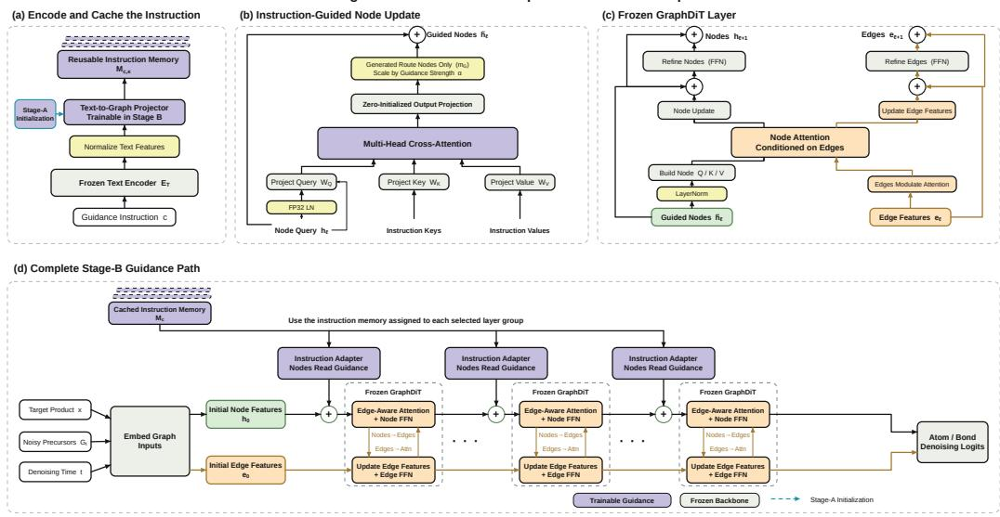  
Figure 10: Stage-B components and assembly. (a) A frozen language encoder and a trainable Stage-A-initialized projector construct reusable instruction-token memory. (b) Node queries attend to that memory through a trainable adapter whose output projection starts at zero; masking, residual scaling, and the node-state skip are explicit. (c) The frozen GraphDiT block propagates the guided node update through its existing node-edge coupling. (d) We reuse the same components at selected pre-block injection sites. The adapters inject guidance directly only into node states; edge states respond inside the frozen backbone.

Raw route ranking $( \mathcal { L } _ { \mathrm { r a n k } } )$ . Within each eligible group, we compare every preferred-avoided pair $( i , j )$ using the uncalibrated gains $d _ { g , i }$ and $d _ { g , j }$ . We apply a one-sided Huber penalty to the margin violation $[ m _ { \mathrm { r a n k } } - ( d _ { g , i } - d _ { g , j } ) ] _ { + } ^ { \bullet }$ , then average the penalty over pairs and groups without rescaling scores within products

Rollout Reference KL $\scriptstyle ( { \mathcal { L } } _ { \mathrm { r o l l } } )$ . During training, we periodically replay noisy precursor graphs visited by the guided sampler through both Student and frozen Reference. The loss averages $\mathrm { K L } ( p _ { \mathrm { r e f } } \| p _ { \mathrm { s t u d e n t } } )$ over every valid node and edge category at those replay states. Unlike a teacherforced penalty, it controls drift on states that the guided model actually reaches.

Full-reference KL guard $( { \mathcal { L } } _ { \mathrm { g u a r d } } ) .$ On shared noisy precursor graphs used for training, the fullstate KL includes every valid node and edge position, including within-group disagreement positions. We average candidate KLs within each group, using endpoint probabilities as weights, to obtain $K _ { g }$ . Writing $\langle \cdot \rangle _ { g }$ for the normalized, group-weighted training average, the unthresholded diagnostic and the guard objective are

$$
\begin{array} { r } { \mathcal { L } _ { \mathrm { f u l l K L } } = \langle K _ { g } \rangle _ { g } , \qquad \mathcal { L } _ { \mathrm { g u a r d } } = \big \langle [ K _ { g } - \delta _ { \mathrm { K L } } ] _ { + } \big \rangle _ { g } . } \end{array}\tag{16}
$$

We apply the threshold before averaging: groups below the tolerance contribute zero. The guard constrains drift on noisy precursor graphs from training candidates; rollout KL covers those reached by the sampler.

The first two terms implement instruction steering and the latter two preserve the base generator. Structure guidance uses this core directly. For metric axis $^ { a , }$ let $x _ { g , i } ^ { ( a ) }$ be the deterministic route metric and let $s _ { g } ^ { ( a ) } = + 1$ request larger values and $s _ { g } ^ { ( a ) } = - 1$ request smaller values. Pool z-scoring subtracts the group mean and divides by its population standard deviation; constant-valued groups are ineligible. The deterministic teacher and Student improvement distribution are

$$
\begin{array} { r l } & { z _ { g , i } ^ { ( a ) } = \mathrm { P o o l Z S c o r e } ( \{ x _ { g , j } ^ { ( a ) } \} _ { j } ) _ { i } , \quad u _ { g , i } ^ { ( a ) } = s _ { g } ^ { ( a ) } z _ { g , i } ^ { ( a ) } , } \\ & { q _ { g , i } ^ { ( a ) } = \mathrm { s o f t m a x } _ { i } ( u _ { g , i } ^ { ( a ) } / T _ { q } ) , \qquad p _ { g , i } = \mathrm { s o f t m a x } _ { i } ( d _ { g , i } / T _ { s } ) . } \end{array}\tag{17}
$$

The metric branch optimizes

$$
\begin{array} { r } { \mathcal { L } _ { \mathrm { t e a c h } } = \mathrm { K L } ( q _ { g } ^ { ( a ) } \| p _ { g } ) , \qquad \mathcal { L } _ { B , \mathrm { m e t r i c } } = \mathcal { L } _ { B , \mathrm { c o r e } } + \lambda _ { \mathrm { t e a c h } } \mathcal { L } _ { \mathrm { t e a c h } } . } \end{array}\tag{18}
$$

$T _ { q }$ is the teacher temperature and $T _ { s }$ is the Student-score temperature; larger values flatten the corresponding distribution. The teacher is an offline deterministic transformation of route metrics, not another neural network, and is absent at inference.

## I.6 NOTATION

Table 30 summarizes the notation used in the method and Algorithms 1 and 2. Within a fixed semantic group, we suppress the group subscript in $x , r _ { i } , c , q ^ { c } , \mathcal { P } _ { c }$ , and $\mathcal { N } _ { c } ;$ superscript  denotes a validation-selected parameter set. In tables and plots, α abbreviates $\alpha _ { \mathrm { e v a l } }$ . Attention diagrams retain the standard $Q / K { \dot { / } } V$ meanings; κ denotes a projector-sharing group. Support size ${ \check { K } } ,$ raw-draw budget B, and returned-list cutoff k are distinct. Contrast order and sign conventions follow the captions.

Table 30: Recurring notation across support construction, two-stage training, and evaluation.
<table><tr><td>Symbol</td><td>Definition</td></tr><tr><td>Support and supervision</td><td></td></tr><tr><td> $x , \ r _ { i }$ </td><td>Product graph and candidate precursor-set graph.</td></tr><tr><td> $\boldsymbol { g } = ( x , c , \mathcal { C } _ { g } , \mathcal { Y } _ { g } )$ </td><td>Product, instruction, indexed pool, and supervision record.</td></tr><tr><td> $\mathcal { D } _ { \mathrm { t r } } , \mathcal { D } _ { \mathrm { v a l } }$ </td><td>Labeled groups for training and validation.</td></tr><tr><td> $K , K _ { x } , \ A _ { K } ( x )$ </td><td>Nominal support size, realized size, and retained ordered template-expansion prefix.</td></tr><tr><td> $\mathcal { P } _ { c } , \mathcal { N } _ { c } , \ q ^ { c }$ </td><td>Preferred/avoided index sets; listwise target distribution.</td></tr><tr><td>Stage A: grounding</td><td></td></tr><tr><td> $E _ { T } , H _ { c } ; E _ { R } , v _ { i }$   $\phi , \phi ^ { \star } , P _ { \phi }$ </td><td>Frozen text/route encoders; token/route features.</td></tr><tr><td> $Z _ { c } , z _ { c } , \hat { q } _ { \phi } ^ { c } , b _ { g , i } , \tau$ </td><td>Projector parameters, selected parameters, and projector. Projected tokens, pooled embedding, predicted pool</td></tr><tr><td></td><td>distribution, endpoint prior, and similarity-logit scale.</td></tr><tr><td> $\mathcal { L } _ { A } , \mathcal { L } _ { \mathrm { p a i r } } ; \lambda _ { \mathrm { l i s t } } , \lambda _ { \mathrm { p a i r } }$ </td><td>Stage-A loss, pairwise term, and listwise/pairwise weights.</td></tr><tr><td>Stage B: residual steering  $\theta , \theta ^ { \star } ; P _ { \kappa , \theta } , A _ { \ell , \theta }$ </td><td></td></tr><tr><td> $\mathcal { T } , \mathcal { G } , \kappa , \gamma ; M _ { c , \kappa }$ </td><td>Trainable/selected parameters; projector; node-to-text adapter. Injection layers; projector groups, index and assignment;</td></tr><tr><td> $M _ { c } ^ { ( \ell ) } , M _ { c }$ </td><td>projected token memory.</td></tr><tr><td> $h _ { \ell } , B _ { \ell } ; \alpha _ { \mathrm { t r a i n } } , \alpha _ { \mathrm { e v a l } }$ </td><td>Per-layer and grouped memories  $( \mathrm { E q . 1 4 } ) .$  Node state, frozen block, and train/eval residual scales.</td></tr><tr><td> $d _ { g , i } = D _ { g , i } ^ { \mathrm { r e f } } - D _ { g , i } ^ { \mathrm { s t u d e n t } }$ </td><td>Guidance-induced reduction in complete-route denoising cost.</td></tr><tr><td> $\mathcal { L } _ { \mathrm { p o s } } , \mathcal { L } _ { \mathrm { r a n k } } , \mathcal { L } _ { \mathrm { r o l l } } , \mathcal { L } _ { \mathrm { g u a r d } }$ </td><td>Preferred-endpoint, ranking, rollout-KL and reference-guard</td></tr><tr><td></td><td>terms of  $\mathcal { L } _ { B , \mathrm { c o r e } } .$ </td></tr><tr><td> $\mathcal { L } _ { \mathrm { t e a c h } } , \mathcal { L } _ { B , \mathrm { m e t r i c } }$ </td><td>Metric-teacher KL and metric-augmented Stage-B loss.</td></tr><tr><td>Sampling and evaluation</td><td></td></tr><tr><td> $B , S ; \rho , G _ { t }$ </td><td>Raw draw budget, flow steps, RC proposal and graph at t.</td></tr><tr><td> $k ; { \mathrm { P @ } } k , { \mathrm { N @ } } k$ </td><td>Returned-list cutoff and preferred/avoided set hit rates.</td></tr><tr><td> $\Delta , \Delta \Delta$ </td><td>Named contrast; difference of contrasts.</td></tr></table>

## I.7 IMPLEMENTATION AND REPRODUCIBILITY DETAILS

Objective coefficients. In the notation of Eq. (2), Stage A uses $\lambda _ { \mathrm { l i s t } } = 1 . 0 , \lambda _ { \mathrm { p a i r } } = 0 . 5 $ pair margin $m _ { \mathrm { p a i r } } = 0 . 1$ , and fixed logit scale $\tau = 1 0$ . Stage B uses $\lambda _ { \mathrm { p o s } } = 0 . 1 0 \mathrm { , ~ } \lambda _ { \mathrm { r a n k } } = 0 . 0 5 ,$ $\lambda _ { \mathrm { r o l l } } = 1 . \dot { 0 } 0 , \lambda _ { \mathrm { g u a r d } } = 0 . 0 5$ , and $\bar { \delta _ { \mathrm { K L } } } = 0 . 0 2$ . Structure guidance uses this core objective directly, whereas the metric branches set $\lambda _ { \mathrm { t e a c h } } = 0 . 0 5$ in Eq. (18) and use $T _ { q } = T _ { s } = 1$ in Eq. (17). We set candidate-score calibration to none; Appendix I.5 specifies the exact score and teacher reductions.

Training settings. Stage A and Stage B use learning rates $1 0 ^ { - 4 }$ and $3 \times 1 0 ^ { - 5 }$ , respectively. For RDKit5 Common Top100, both model sizes train for 30/14 epochs (Stage A/Stage B), with effective batches of 512 semantic groups for USPTO-MR and 32 for synthetic supports. Training uses BF16 mixed precision and seed 42 (43 and 44 for Stage-B robustness repeats), with $\alpha _ { \mathrm { t r a i n } } = 1$ fixed throughout Stage B. Table 31 summarizes Structure training and selected checkpoints; RDKit5 Common Top100 and Metric4 evaluation settings appear in Tables 5 and 22.

Table 31: Structure Top30 training and validation-frozen checkpoints. Training epochs are Stage A/Stage B; the selected Stage-A epoch initializes Stage B, whose test setting is $( e , \alpha _ { \mathrm { e v a l } } )$ Both capacities use Matched-P@1-first selection.
<table><tr><td>Suite / scale</td><td>Training epochs Stage A / B</td><td>Stage-A selected epoch</td><td>Stage-B test  $( e , \alpha _ { \mathrm { e v a l } } )$ </td></tr><tr><td>Structure / 8M</td><td>30 /30</td><td>28</td><td>(22, .50)</td></tr><tr><td>Structure / 65M</td><td>20/30</td><td>20</td><td>(26,1)</td></tr></table>

Inference implementation. Inference scales only the cross-attention output residual by $\alpha _ { \mathrm { e v a l } }$ , not backbone states, Reference logits, or loss weights. Appendix H.9 specifies sampling, readout, and uncertainty.

CTMC sampling. We retain the Base proposal schedule, graph initialization, and CTMC sampler (Wang et al., 2026). Given product $x ,$ instruction $c ,$ and reaction-center proposal $\rho ,$ the guided model $f _ { \theta , \alpha }$ predicts a factorized distribution $\widehat { p } _ { t }$ over terminal precursor graphs from the current graph $G _ { t }$ at time $t \in [ 0 , 1 ]$ . The guided transition rates are

$$
\widehat { R } _ { t } ( G _ { t } , G ^ { \prime } ) = \mathbb { E } _ { \widetilde { G } _ { 1 } \sim \widehat { p } _ { t } } \left[ R _ { t } ( G _ { t } , G ^ { \prime } \mid G _ { 0 } , \widetilde { G } _ { 1 } ) \right] ,\tag{19}
$$

where $R _ { t }$ is the Base sampler's fixed conditional rate and $\widetilde { G } _ { 1 }$ is a possible terminal graph marginalized under the model prediction, not a ground-truth input. The unchanged first-order update is

$$
\operatorname* { P r } ( G _ { t + \Delta t } = G ^ { \prime } \mid G _ { t } , x , \rho , c ) \approx \mathbf { 1 } \{ G ^ { \prime } = G _ { t } \} + \Delta t \widehat { R } _ { t } ( G _ { t } , G ^ { \prime } ) .\tag{20}
$$

Here $\Delta t = 1 / S$ , with $S = 5 0$ steps in the reported evaluations.

## J LIMITATIONS AND FUTURE WORK

Our evaluation focuses primarily on single-step retrosynthesis. The multistep case study illustrates how RIGS can guide a planner, but we have not systematically evaluated its benefits for multistep planning. Future work will integrate RIGS into LLM-guided planning and explore post-training to improve output validity and instruction following.