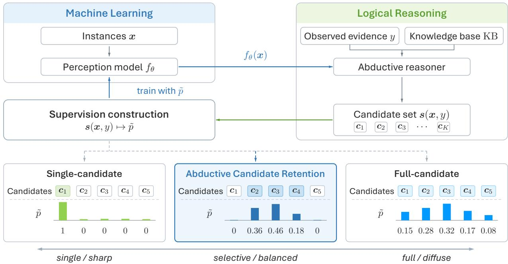
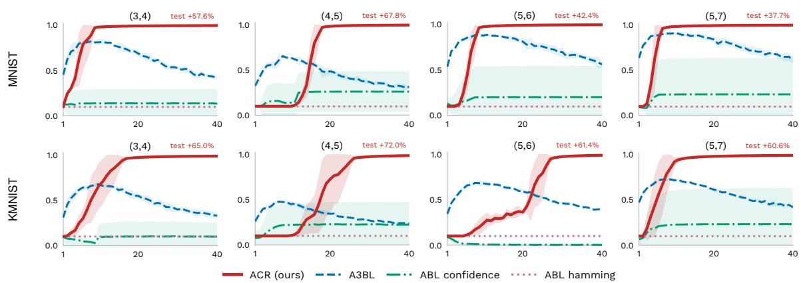
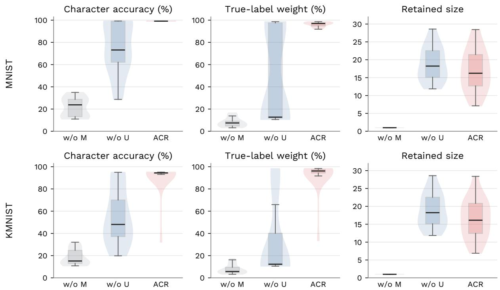
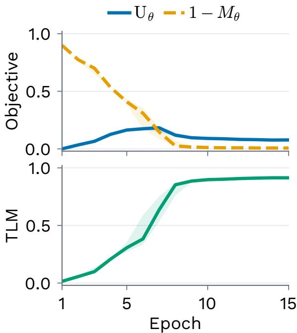
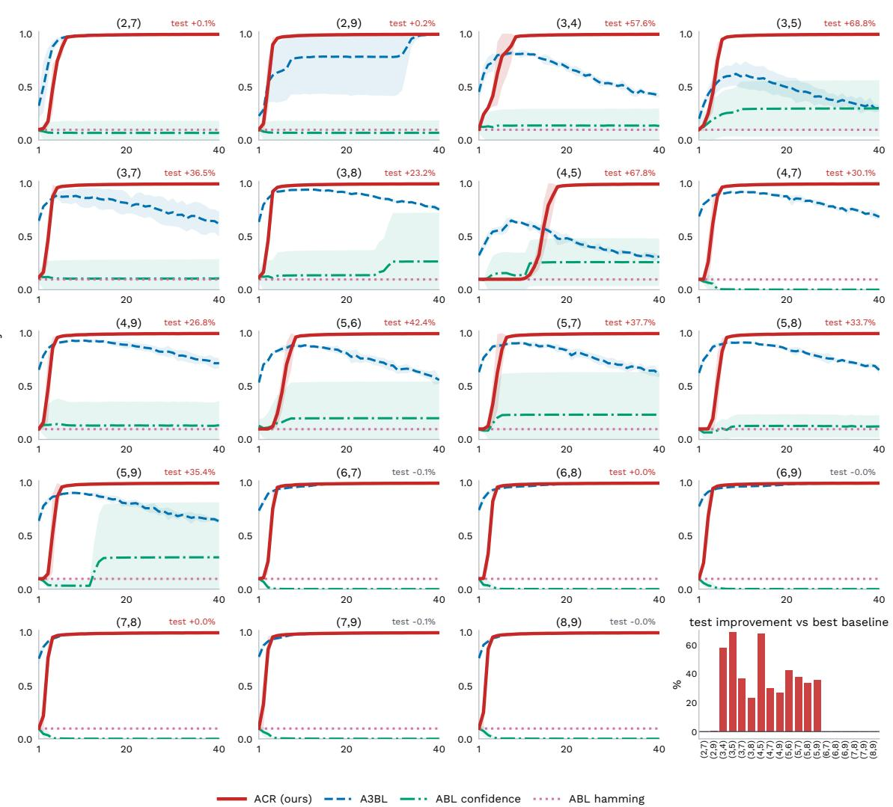
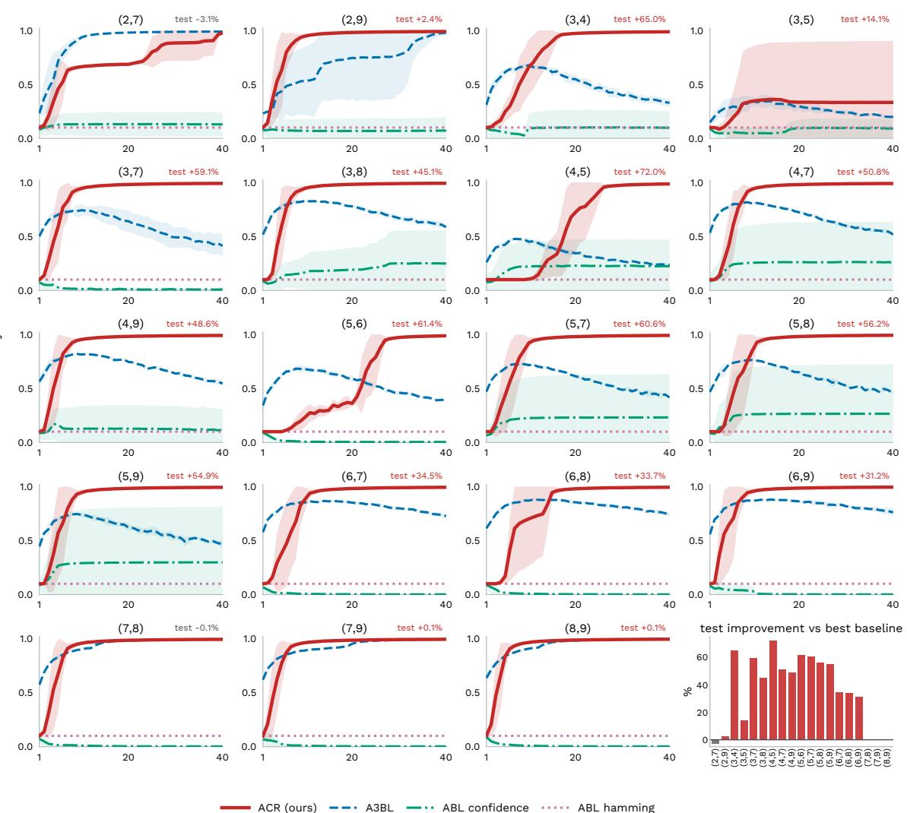

# Candidate Retention for Abductive Learning

Hao-Yuan He Yu Liu Ming Li

School of Artificial Intelligence, Nanjing University National Key Laboratory for Novel Software Technology, Nanjing University {hehy, liuy, lim}@lamda.nju.edu.cn

## Abstract

Abductive learning combines neural perception with symbolic reasoning, using explanations generated by abduction to supervise the perception model. Multiple valid explanations of the same symbolic target can assign conflicting labels to the same inputs. Common policies select a single candidate as a pseudo-label, which may reinforce mistaken assignments, or weight all candidates, which may spread supervision across competing labels. These risks motivate selecting a retained subset to balance supervision sharpness and model-mass coverage. To guide this choice, we bound the coordinate-level supervision error using retained uncertainty, discarded model mass, and model mismatch. For a fixed model and training pair, only the first two terms depend on the retained set. We propose Abductive Candidate Retention (ACR), which uses these terms to guide greedy additions, accepting a candidate when its recovered mass exceeds the increase in retained uncertainty. Experiments show that ACR improves concept accuracy over single-candidate baselines and A3BL in most evaluated aggregated mod-addition settings. Objective ablations support the joint use of uncertainty and posterior mass.

## 1 Introduction

Neuro-symbolic learning integrates neural perception with symbolic reasoning to learn from data and background knowledge. Abductive learning (ABL, Zhou 2019) combines neural perception with symbolic reasoning through abduction (Magnani, 2009): a perception model proposes latent concepts from raw inputs, and when these proposals are inconsistent with the observed evidence, abduction generates candidate concept assignments that entail it. These candidates then supervise the perception model.

However, the background knowledge does not always determine a unique candidate. Consider SUM( , ) = 3: the addition rule admits [ = 0, = 3], [ = 3, = 0], and other assignments. Because diferent candidates label the same images diferently, they create ambiguity in the conceptlevel supervision.

Classical ABL selects one candidate as a pseudo-label using the current model (Dai et al., 2019). A3BL normalizes all valid candidates into a posterior and marginalizes it into soft labels (He et al., 2024b). Selecting one explanation yields sharp labels but can reinforce a mistaken assignment. Retaining more explanations preserves alternatives, while their disagreements can spread supervision across competing labels. We call the choice of which candidates to include candidate retention.

A candidate’s contribution to supervision depends on the label support already retained. Two candidates with equal weights can therefore change supervision diferently: one may reinforce supported labels, while the other adds competing labels. This combination-dependent efect motivates evaluating each addition through the supervision formed by the retained set.

  
Figure 1: Candidate retention in the ABL loop. Upper: abduction returns $\mathbf { \boldsymbol { s } } ( \mathbf { \boldsymbol { x } } , y )$ ; supervision construction marginalizes the retained candidates’ weighted labels to train the perception model. Lower: three retention policies with schematic candidate weights p˜. Shading indicates which candidates are retained.

We propose Abductive Candidate Retention (ACR), which evaluates additions through their recovered model mass and change in coordinate uncertainty (Figure 1). An upper bound on coordinate supervision error contains retained uncertainty, discarded model mass, and model mismatch. For a fixed model and training pair, only the first two depend on the retained set. Let $M _ { \theta } ( R ; \pmb { x } , y )$ denote the retained mass and $\operatorname { U } _ { \theta } ( R ; { \pmb x } , y )$ the average coordinate uncertainty. We score a retained set R by

$$
J _ { \theta } ( R ; \pmb { x } , y ) = \mathrm { U } _ { \theta } ( R ; \pmb { x } , y ) + 1 - M _ { \theta } ( R ; \pmb { x } , y ) .
$$

ACR starts from the highest-weight candidate and adds the candidate that most decreases this criterion, stopping when no addition improves it. Marginalizing the retained weights then supplies concept targets for the neural update.

Our contributions:

1. We analyze candidate retention through the concept supervision induced by a subset and give an upper bound on its coordinate-level error.

2. We develop a greedy rule that evaluates added candidate mass together with changes in coordinate uncertainty, adapting the retained set’s composition and size.

3. We show concept-accuracy gains on most evaluated mod-addition settings, with controlled comparisons and training diagnostics, and evaluate ACR on chess attack and judicial sentencing.

## 2 Problem Setup

Let X be the input space, Z a finite concept set, and Y the target space. In typical ABL tasks, a single symbolic target constrains multiple inputs jointly. Each training example therefore contains

an input sequence $\pmb { x } = ( x _ { j } ) _ { j = 1 } ^ { m } \in \pmb { \chi } ^ { m }$ and an observed target $y \in \mathcal { V }$ . The concept $z _ { j } \in { \mathcal { Z } }$ for each input $x _ { j }$ is hidden.

ABL (Zhou, 2019) combines a perception model with background knowledge KB. For each input $x ,$ the model assigns a probability $f _ { \boldsymbol { \theta } } ( \boldsymbol { k } \mid \boldsymbol { x } )$ to every concept $k \in { \mathcal { Z } }$

The knowledge base defines the candidates that entail the observed target:

$$
\begin{array} { r } { s ( { \boldsymbol x } , { \boldsymbol y } ) = \{ c \in \mathcal { Z } ^ { m } : c \land \mathrm { K B } \mid = { \boldsymbol y } \} . } \end{array}
$$

Training reveals $y ,$ but it does not identify which $\pmb { c } \in \pmb { s } ( \pmb { x } , y )$ matches the inputs. ABL uses these valid candidates to learn the hidden concepts.

Example 1. Consider $\mathtt { S U M } ( \bigstar \bigstar \bigstar , \bigstar \bigstar ) = 3$ . The input contains two unlabeled digit images, and 3 is their observed sum. The valid candidates are [0,3], [1,2], [2,1], and [3,0]. Only one describes the image contents, but its digit labels are unavailable during training.

## 2.1 Existing ABL Supervision

Classical ABL selects one valid candidate and uses it as supervision (Dai et al., 2019). It commonly ranks candidates by confidence or Hamming distance. Under the factorized perception model, candidate confidence is

$$
p _ { \theta } ( { \pmb c } \mid { \pmb x } ) = \prod _ { j = 1 } ^ { m } f _ { \theta } ( c _ { j } \mid x _ { j } ) .
$$

A Hamming score measures the negative distance between c and the predicted concept sequence. Writing either score generically as scoreθ, ABL selects

$$
{ \hat { \pmb { c } } } _ { \theta } \in \arg \operatorname* { m a x } _ { { \pmb { c } } \in { \pmb { s } } ( { \pmb x } , y ) } \mathrm { s c o r e } _ { \theta } ( { \pmb c } ; { \pmb x } ) .
$$

The selected candidate provides hard labels for updating $f _ { \theta }$ . The updated model then reranks the candidates.

$\mathrm { A ^ { 3 } B L }$ keeps all valid candidates and weights them by confidence (He et al., 2024b). Their total confidence is

$$
Z _ { \theta } ( \pmb { x } , y ) = \sum _ { c \in s ( \pmb { x } , y ) } p _ { \theta } ( \pmb { c } \mid \pmb { x } ) .
$$

Normalizing by $Z _ { \theta } ( \boldsymbol { x } , \boldsymbol { y } )$ gives the candidate posterior

$$
w _ { \theta } ( \pmb { c } \mid \pmb { x } , y ) = \frac { p _ { \theta } ( \pmb { c } \mid \pmb { x } ) } { Z _ { \theta } ( \pmb { x } , y ) } , \qquad \pmb { c } \in \pmb { s } ( \pmb { x } , y ) .
$$

We assume $\pmb { s } ( \pmb { x } , y ) \neq \emptyset$ and $Z _ { \theta } ( x , y ) > 0 .$

$\mathrm { A ^ { 3 } B L }$ marginalizes this posterior at each sequence position to construct soft concept targets for $f _ { \theta }$

Classical $\mathrm { A B L }$ and $\mathrm { A ^ { 3 } B L }$ provide the single-candidate and posterior-marginalization reference policies. We next consider how the retained subset shapes concept supervision and use this information to guide selection.

## 3 Abductive Candidate Retention

ACR scores retained sets, converts them into concept targets, and constructs them by greedy selection. Throughout this section, $w _ { \boldsymbol { \theta } } ( \boldsymbol { c } \mid \boldsymbol { x } , \boldsymbol { y } )$ denotes a normalized model-induced distribution over the nonempty valid set $\mathbf { \boldsymbol { s } } ( \mathbf { \boldsymbol { x } } , y )$ . The product posterior above is one choice; task-specific scores are given in Appendix B.

## 3.1 A Retention Criterion

For a training pair, let $R \subseteq s ( x , y )$ be the retained candidate set. Conditioning the candidate distribution on R gives its retained mass and conditional distribution:

$$
M _ { \theta } ( R ; \mathbf { x } , y ) = \sum _ { \mathbf { \Lambda } \in R } w _ { \theta } ( \mathbf { \boldsymbol { c } } \mid \mathbf { \boldsymbol { x } } , y ) ,
$$

$$
q _ { \theta , R } ( c \mid \pmb { x } , \pmb { y } ) = \frac { w _ { \theta } ( \pmb { c } \mid \pmb { x } , \pmb { y } ) } { M _ { \theta } ( R ; \pmb { x } , \pmb { y } ) } \mathbb { I } [ \pmb { c } \in R ] ,
$$

where $M _ { \theta } ( R ; x , y ) > 0$

At position $j ,$ the marginal of $^ { q _ { \theta , R } }$ is

$$
\pi _ { \boldsymbol { \theta } , R , j } ( k ) = \operatorname* { P r } _ { c \sim q _ { \boldsymbol { \theta } , R } ( \cdot | \boldsymbol { x } , y ) } ( c _ { j } = k ) .
$$

Retained uncertainty averages one minus the largest marginal probability across positions:

$$
\mathrm { U } _ { \theta } ( R ; { \pmb x } , { \pmb y } ) = \frac { 1 } { m } \sum _ { j = 1 } ^ { m } \bigg ( 1 - \operatorname* { m a x } _ { k \in \mathcal { Z } } \pi _ { \theta , R , j } ( k ) \bigg ) .
$$

A lower $\operatorname { U } _ { \theta } ( R ; { \pmb x } , y )$ gives sharper concept targets. The discarded posterior mass is $1 - M _ { \theta } ( R ; \pmb { x } , \pmb { y } )$

To relate the retained supervision to concept error, let $P ^ { \star } ( \cdot \mid x , y )$ be the unknown true distribution over valid candidates. It is a point mass when each input sequence has one true candidate.

The retained prediction at position $j$ is

$$
\hat { z } _ { R , j } ( x , y ) \in \arg \operatorname* { m a x } _ { k \in \mathcal { Z } } \pi _ { \theta , R , j } ( k ) .
$$

Its ideal risk is the expected coordinate error under $P ^ { \star }$ :

$$
\mathcal { R } ^ { \star } ( R ; { \pmb x } , { \pmb y } ) = \mathbb { E } _ { c \sim P ^ { \star } ( \cdot \vert { \pmb x } , { \pmb y } ) } \left[ \frac { 1 } { m } \sum _ { j = 1 } ^ { m } \mathbb { I } [ \hat { z } _ { R , j } ( { \pmb x } , { \pmb y } ) \neq c _ { j } ] \right] .
$$

Since $P ^ { \star }$ is unknown, we compare the induced supervision with this distribution through the following upper bound.

Theorem 1. For any positive-mass set $R \subseteq s ( \pmb { x } , y )$ 2

$$
\begin{array} { r l } & { { \mathcal R } ^ { \star } ( R ; { \pmb x } , { \pmb y } ) \leq \mathrm { U } _ { \theta } ( R ; { \pmb x } , { \pmb y } ) + \mathrm { T V } ( P ^ { \star } , { \boldsymbol w } _ { \theta } ) } \\ & { \qquad + 1 - M _ { \theta } ( R ; { \pmb x } , { \pmb y } ) , } \end{array}
$$

where TV denotes total variation distance and both distributions are conditioned on $( { \pmb x } , y )$

Proof. Write $P = P ^ { \star } , w = w _ { \theta } , q _ { R } = q _ { \theta , R }$ , and $M _ { R } = M _ { \theta } ( R )$ , suppressing $( { \pmb x } , y )$ . The coordinate loss $\begin{array} { r } { \ell _ { R } ( \pmb { c } ) = m ^ { - 1 } \sum _ { j } \mathbb { I } [ \hat { z } _ { R , j } \neq c _ { j } ] } \end{array}$ lies in [0, 1], so

$$
\mathbb { E } _ { P } [ \ell _ { R } ] \le \mathbb { E } _ { q _ { R } } [ \ell _ { R } ] + \mathrm { T V } ( P , q _ { R } ) .
$$

The first term equals $\operatorname { U } _ { \boldsymbol { \theta } } ( R )$ . On $R , q _ { R } = w / M _ { R } \geq w ;$ outside R, $q _ { R } = 0$ . The absolute diferences sum to $1 - M _ { R }$ on each part, so $\mathrm { T V } ( w , q _ { R } ) = 1 - M _ { R }$ . By the triangle inequality,

$$
\begin{array} { r } { \mathrm { T V } ( P , q _ { R } ) \leq \mathrm { T V } ( P , w ) + \mathrm { T V } ( w , q _ { R } ) } \\ { = \mathrm { T V } ( P , w ) + 1 - M _ { R } . } \end{array}
$$

Combining the two inequalities proves the result.

Interpretation. Under ${ { q } _ { \theta , R } }$ , the coordinate error equals retained uncertainty. Model mismatch and discarded mass bound the change in expected error when moving to $P ^ { \star }$ . Thus retained mass describes coverage under the model distribution, and its relation to the true explanation depends on model mismatch. For a fixed model and training pair, the mismatch term is constant across R. ACR uses retained uncertainty and discarded mass, the two subset-dependent terms in the bound, to score candidate additions:

$$
J _ { \theta } ( R ; \pmb { x } , y ) = \mathrm { U } _ { \theta } ( R ; \pmb { x } , y ) + 1 - M _ { \theta } ( R ; \pmb { x } , y ) .
$$

Let $C _ { K }$ contain the min $( K , | s | )$ highest-weight candidates, with fixed tie-breaking. Weights remain normalized over $s ,$ so discarded mass includes candidates outside this search pool. The full valid set globally minimizes $J _ { \theta } ;$ the criterion alone does not favor partial retention. ACR uses it to evaluate individual additions along a greedy path from the highest-weight singleton and stops when no addition improves it. This local rule can yield intermediate subsets. Their benefit over the full set is evaluated empirically and is not guaranteed by the bound.

## 3.2 Retained Concept Supervision

At round t, the current parameters $\theta _ { t }$ and retained set $R _ { t }$ define soft targets $\pi _ { t , j } ( k ) = \pi _ { \theta _ { t } , R _ { t } , j } ( k )$ and mass $M _ { t } = M _ { \theta _ { t } } ( R _ { t } ; \pmb { x } , y )$ . Holding these quantities fixed during the neural update gives the normalized cross-entropy loss

$$
\mathcal { L } _ { \mathrm { r e t } } ( \theta ; \pi _ { t } ) = \sum _ { j = 1 } ^ { m } \sum _ { k \in \mathcal { Z } } \pi _ { t , j } ( k ) [ - \log f _ { \theta } ( k \mid x _ { j } ) ] .
$$

Marginalization pools label support across joint explanations. Several candidates can agree at one position while assigning diferent labels elsewhere; their weights add to the same target entry at that position. Every input in a sequence receives a target derived from the same retained distribution. A singleton produces one-hot targets, while retaining the full valid set recovers its full-distribution marginals. Intermediate sets preserve the alternatives that contribute to the selected supervision.

In aggregated mod addition, the implementation uses the original retained weights to form the targets:

$$
\begin{array} { l } { { a _ { t , j } ( k ) = \displaystyle \sum _ { c \in R _ { t } } w _ { \theta _ { t } } ( c \mid x , y ) \mathbb { I } [ c _ { j } = k ] } } \\ { { \ = \ M _ { t } \pi _ { t , j } ( k ) . } } \end{array}
$$

Its loss is $M _ { t } \mathcal { L } _ { \mathrm { r e t } } ( \theta ; \pi _ { t } )$ , with $M _ { t }$ also fixed during the update. The conditional marginals specify the relative label distribution, and retained mass weights the training example. Appendix B gives the scoring and weighting conventions. The standard EM connection for fixed sets, product-posterior weights, and normalized targets is described in Appendix A.1.

## 3.3 Greedy Candidate Retention

We construct $R \subseteq C _ { K }$ by forward selection, starting with the highest-weight candidate. The set expands only when adding a candidate lowers the criterion.

To see how a candidate changes supervision, write $M = M _ { \theta } ( R ; \mathbf { x } , y ) , w _ { c } = w _ { \theta } ( \mathbf { { c } } \mid \mathbf { { x } } , y )$ , and $\pi _ { j } = \pi _ { \theta , R , j }$ . Adding $c \notin R$ yields marginals $\pi _ { j } ^ { + } = \pi _ { \theta , R \cup \{ c \} , j }$ with

$$
\pi _ { j } ^ { + } ( k ) = \frac { M \pi _ { j } ( k ) + w _ { c } \mathbb { I } [ c _ { j } = k ] } { M + w _ { c } } .
$$

The candidate contributes mass to its assigned label at each position. The efect on uncertainty depends on where this support falls relative to the existing label masses. Two candidates with equal weights can therefore produce diferent changes in uncertainty. A weight-only top-k rule ranks them independently of the current retained set. ACR evaluates their efects on the supervision already formed by that set, using the following change in the criterion.

For $\mathbf { \pmb { c } } \in C _ { K } \setminus R ,$ define

$$
\begin{array} { r l } & { \Delta _ { c } J _ { \theta } ( R ) \equiv J _ { \theta } ( R \cup \{ c \} ; \pmb { x } , y ) - J _ { \theta } ( R ; \pmb { x } , y ) } \\ & { \qquad = \mathrm { U } _ { \theta } ( R \cup \{ c \} ; \pmb { x } , y ) - \mathrm { U } _ { \theta } ( R ; \pmb { x } , y ) } \\ & { \qquad - w _ { \theta } ( \pmb { c } \mid \pmb { x } , y ) . } \end{array}
$$

The first diference measures the change in retained ambiguity. The final term rewards the posterior mass recovered by c.

At each step, we select the candidate with the smallest $\Delta _ { c } J _ { \theta } ( R )$ . We add it if this value is negative and stop otherwise.

Algorithm 1 Greedy Candidate Retention   
Require: Pool $C _ { K }$ and full-distribution weights $w _ { \boldsymbol { \theta } } ( \boldsymbol { c } \mid \boldsymbol { x } , \boldsymbol { y } )$   
Ensure: Retained set R   
1: Choose $\pmb { c } _ { 0 } \in$ arg $\operatorname* { m a x } _ { c \in C _ { K } } w _ { \theta } ( \pmb { c } \mid \pmb { x } , y )$   
2: Set $R \gets \{ c _ { 0 } \}$   
3: while $R \neq C _ { K }$ do   
4: Choose   
$\pmb { c } ^ { \dag } \in \arg \operatorname* { m i n } _ { { \pmb { c } } \in C _ { K } \backslash R } \Delta _ { { \pmb { c } } } J _ { \theta } ( R ) .$   
5: if $\Delta _ { c ^ { \dagger } } J _ { \theta } ( R ) \geq 0$ then   
6: break   
7: end if   
8: Update $R  R \cup \{ c ^ { \dag } \}$   
9: end while   
10: return $R .$

Each accepted step strictly lowers $J _ { \theta }$ and adds one candidate, so the algorithm terminates at a one-addition local optimum over $C _ { K }$ . With maintained coordinate label masses, selection takes $O ( N ^ { 2 } m )$ time in the worst case, where $N = | C _ { K } | \leq K$ . At round $t ,$ the selected $R _ { t }$ defines the fixed targets in Section 3.2. Candidate weights and retention are recomputed after the neural update.

## 4 Experiments

We empirically evaluate ACR through two questions:

• How does candidate retention compare with the single-candidate and posterior-weighted policies when valid candidates disagree on hidden concepts?

• What roles do the two terms in the objective play, and how does the retained set change during training?

Table 1: Character accuracy on digit addition (%; mean ± std). $\mathrm { { N / A } } \mathrm { { : } }$ did not finish within 24 hours.
<table><tr><td rowspan="2">Method</td><td colspan="4">MNIST</td><td colspan="4">KMNIST</td></tr><tr><td> $n = 1$ </td><td> $n = 2$ </td><td> $n = 3$ </td><td> $n = 4$ </td><td> $n = 1$ </td><td> $n = 2$ </td><td> $n = 3$ </td><td> $n = 4$ </td></tr><tr><td>DeepStochLog</td><td> $9 9 . 0 0 { \scriptstyle \pm 0 . 1 3 }$ </td><td> $9 8 . 8 8 { \scriptstyle \pm 0 . 0 2 }$ </td><td> $9 8 . 9 4 _ { \pm 0 . 1 5 }$ </td><td> $9 8 . 9 8 _ { \pm 0 . 1 3 }$ </td><td> $9 4 . 0 0 { \scriptstyle \pm 0 . 7 3 }$ </td><td> $9 4 . 0 6 _ { \pm 0 . 3 0 }$ </td><td> $9 4 . 0 0 { \scriptstyle \pm 0 . 2 9 }$ </td><td> $9 3 . 9 3 { \scriptstyle \pm 0 . 4 9 }$ </td></tr><tr><td>NeurASP</td><td> $5 0 . 0 1 _ { \pm 0 . 4 4 }$ </td><td> $1 0 . 2 1 { \scriptstyle \pm 0 . 3 9 }$ </td><td> $1 0 . 2 1 { \scriptstyle \pm 0 . 3 9 }$ </td><td> $\mathrm { N } / \mathrm { A }$ </td><td> $1 0 . 0 1 { \scriptstyle \pm 0 . 5 8 }$ </td><td> $1 0 . 0 5 { \scriptstyle \pm 0 . 5 1 }$ </td><td> $\mathrm { N } / \mathrm { A }$ </td><td> $\mathrm { { N } / A }$ </td></tr><tr><td>DeepProbLog</td><td> $9 7 . 4 2 _ { \pm 0 . 2 9 }$ </td><td> $\mathrm { N } / \mathrm { A }$ </td><td> $\mathrm { { N } / A }$ </td><td> $\mathrm { N } / \mathrm { A }$ </td><td> $8 0 . 5 4 { \scriptstyle \pm 0 . 2 1 }$ </td><td> $\mathrm { N } / \mathrm { A }$ </td><td> $\mathrm { N } / \mathrm { A }$ </td><td> $\mathrm { N } / \mathrm { A }$ </td></tr><tr><td>ABL-hamming</td><td> $9 8 . 4 9 { \scriptstyle \pm 0 . 2 2 }$ </td><td> $9 8 . 6 5 { \scriptstyle \pm 0 . 0 8 }$ </td><td> $9 8 . 6 3 { \scriptstyle \pm 0 . 1 2 }$ </td><td> $6 0 . 4 1 { \scriptstyle \pm 4 0 . 2 7 }$ </td><td> $9 1 . 4 8 { \scriptstyle \pm 0 . 5 4 }$ </td><td> $9 2 . 4 3 { \scriptstyle \pm 0 . 6 5 }$ </td><td> $6 3 . 5 1 { \scriptstyle \pm 3 6 . 9 1 }$ </td><td> $4 7 . 7 4 { \scriptstyle \pm 3 7 . 1 3 }$ </td></tr><tr><td>ABL-confidence</td><td> $7 9 . 3 1 _ { \pm 4 1 . 3 5 }$ </td><td> $7 9 . 3 2 _ { \pm 4 1 . 6 1 }$ </td><td> $7 7 . 1 0 { \scriptstyle \pm 4 3 . 5 3 }$ </td><td> $7 9 . 2 2 _ { \pm 4 1 . 6 5 }$ </td><td> $8 6 . 3 2 _ { \pm 2 5 . 4 0 }$ </td><td> $7 9 . 8 0 _ { \pm 3 4 . 9 1 }$ </td><td> $7 2 . 7 6 _ { \pm 3 8 . 7 5 }$ </td><td> $5 4 . 8 4 _ { \pm 4 2 . 9 7 }$ </td></tr><tr><td> $\mathrm { A ^ { 3 } B L }$ </td><td> $9 8 . 9 2 _ { \pm 0 . 1 5 }$ </td><td> $9 9 . 0 3 { \scriptstyle \pm 0 . 0 9 }$ </td><td> $9 8 . 6 8 _ { \pm 0 . 1 7 }$ </td><td> $9 8 . 4 2 _ { \pm 0 . 0 8 }$ </td><td> $9 4 . 8 4 { \scriptstyle \pm 0 . 2 5 }$ </td><td> $9 4 . 3 1 _ { \pm 0 . 2 1 }$ </td><td> $9 3 . 1 6 _ { \pm 1 . 0 0 }$ </td><td> $9 2 . 9 7 { \scriptstyle \pm 0 . 4 4 }$ </td></tr><tr><td>ACR (ours)</td><td> $9 8 . 9 5 { \scriptstyle \pm 0 . 0 4 }$ </td><td> $9 9 . 0 6 { \scriptstyle \pm 0 . 1 8 }$ </td><td> $9 9 . 0 2 { \scriptstyle \pm 0 . 0 7 }$ </td><td> $9 8 . 9 3 { \scriptstyle \pm 0 . 0 8 }$ </td><td> $9 4 . 4 4 { \scriptstyle \pm 0 . 2 8 }$ </td><td> $9 5 . 1 2 { \scriptstyle \pm 0 . 4 1 }$ </td><td> $9 4 . 4 4 { \scriptstyle \pm 0 . 1 8 }$ </td><td> $9 4 . 3 5 { \scriptstyle \pm 0 . 5 0 }$ </td></tr></table>

  
0.5 0.50.5 0.5 0.5 0.50.5 0.5 0.5 0.5Figure 2: Training curves for four representative modulus pairs per dataset. Annotations show ACR’s accuracy gain in percentage points over the strongest baseline. Full results in Appendix C.

60 ACR (ours) A3BL ABL confidence ABL hammingACR (ours) A3BL ABL confidence ABL hammingSection 4.1 compares retention policies on digit addition (Manhaeve et al., 2018) and aggregated 40mod addition (He and Li, 2025). Section 4.2 examines the two objective terms through ablations 20 2020and retention dynamics. Section 4.3 examines applications to chess attack (Dai et al., 2019) and 0.0 0.00.0 0.0judicial sentencing (Huang et al., 2020).

## 60ACR (ours) A3BL ABL confidence ABL hamming 60 ACR (ourACR (ou4.1 Learning from Ambiguous Explanations

0.5 %0.5 0.50.5 0.5 %We begin with two arithmetic settings where the same observed target admits multiple valid digit assignments.

40 1 20 40 2,7) 2,9) 3,4) 3,5) 3,7) 3,8) 4,5) 4,7) 4,9) 5,6) 5,7) 5,8) 5,9) 6,7) 6,8) 6,9) 7,8) 7,9) 8,9)40 1 20 400.0 1 20 400.040 1 20 400.0 1 20 400.0 ,7) ,9) ,4) ,5) ,7) ,8) ,5) ,7) ,9) ,6) ,7) ,8) ,9) ,7) ,8) ,9) ,8) ,9) ,9)In digit addition, each example contains two sequences of n digit images whose hidden labels form test +0.1% 1.0 (8,9) test +0.1% test improvement vs best baselinetwo integers; training observes only their sum (Manhaeve et al., 2018). For $n = 1$ , SUM( , )=3 60ACR (ours) A3BL ABL confidence ABL hammingreveals the sum 3, while the image labels remain hidden. MNIST (LeCun et al., 1998) and KM-0.5 40%NIST (Clanuwat et al., 2018) supply the images for $n \in \{ 1 , 2 , 3 , 4 \}$ . We report character accuracy on the recovered digit labels, averaged over five runs. As n grows, more hidden decisions must agree 40 1 200.0with the same target.

For these arithmetic tasks, we compare ACR with the single-candidate ABL-hamming and ABL confidence ABL hammingABL-confidence (Dai et al., 2019), and $\mathrm { A ^ { 3 } B I }$ (He et al., 2024b). Digit addition also includes DeepProbLog, NeurASP, and DeepStochLog (Manhaeve et al., 2018; Yang et al., 2020; Winters et al., 2022). For aggregated mod addition, the $\mathrm { A ^ { 3 } B L }$ runs use a top-32 cap and temperature 0.2, retaining all candidates when at most 32 are available.

  
Figure 3: Task-wise ablation distributions across 19 modulus pairs per dataset. Columns: character accuracy, TLM, and retained set size. ACR $\mathrm { w / o }$ mass and ACR w/o $\mathrm { w / o }$ uncertainty $( \mathrm { w } / \mathrm { o }$ M and $\mathrm { w / o }$ U in the panels) remove the mass and uncertainty terms.

Both ACR and $\mathrm { A ^ { 3 } B L }$ maintain high character accuracy across operand lengths, whereas the hard-selection methods have lower means or larger variation across runs (Table 1). On KMNIST, ACR exceeds $\mathrm { A ^ { 3 } B I }$ L for $n \geq 2$ , with gains of 0.81–1.38 percentage points; $\mathrm { A ^ { 3 } B I }$ performs better at $n = 1$

Digit addition tests scaling in the number of hidden positions but uses a single rule per example. Aggregated mod addition introduces a harder coupling: a shared digit predictor must satisfy two modular rules simultaneously. For a modulus $k ,$ each example contains two one-digit images with hidden labels $z _ { 1 } , z _ { 2 }$ and one observed residue:

$$
y _ { k } = ( z _ { 1 } + z _ { 2 } ) { \bmod { k } } .
$$

Each training example samples $k \in \{ k _ { 1 } , k _ { 2 } \}$ and all examples share one digit predictor, so MODSUM $\scriptstyle 3 ( \mathbf { E I } , \mathbf { E I } ) = 0$ and MODSUM $\cdot 4 ( \boxed { 6 1 } , \boxed { 6 1 } ) = 3$ follow diferent modular rules within the same training set. We evaluate 19 modulus pairs with 30,000 examples and three runs per pair (He and Li, 2025).

The representative curves in Figure 2 reveal a diference in learning dynamics: ACR maintains high accuracy after the initial rise, while $\mathrm { A ^ { 3 } B L }$ declines after an earlier peak in some settings. Across the evaluated modulus pairs, ACR improves concept accuracy over $\mathrm { A ^ { 3 } B L }$ in most settings. The gains vary across pairs; Appendix C reports the complete results, including small or negative gains.

## 4.2 Understanding Candidate Retention

The retention objective $J _ { \theta }$ balances retained uncertainty against discarded posterior mass. We study these roles through controlled ablations of the two terms and a training trace of the resulting

Table 2: Objective ablation averaged over all aggregated mod-addition settings (19 modulus pairs $\times$ 2 datasets). ACR achieves the highest accuracy and $\mathrm { T L M } ;$ removing either term degrades both.
<table><tr><td>Method</td><td>Acc. (%)</td><td>TLM(%)</td><td>Size</td></tr><tr><td>ACR  $\mathrm { w / o }$  mass</td><td>20.01</td><td>7.88</td><td>1.00</td></tr><tr><td>ACR  $\mathrm { w / o }$  uncertainty</td><td>65.22</td><td>40.15</td><td>18.76</td></tr><tr><td>ACR</td><td>94.98</td><td>94.25</td><td>16.68</td></tr></table>

supervision. Both use retained true-label weight (TLM) as a diagnostic. Let $z ^ { \star } = ( z _ { j } ^ { \star } ) _ { j = 1 } ^ { m }$ denote the ground-truth concepts; we define

$$
\mathrm { T L M } _ { \theta } ( R ; { \pmb x } , y ) = \frac { 1 } { m } \sum _ { j = 1 } ^ { m } \sum _ { c \in { \cal R } } \widetilde w _ { \theta } ( { \pmb c } \mid { \pmb x } , y ) \mathbb { I } [ c _ { j } = z _ { j } ^ { \star } ] .
$$

Here $\widetilde { w } _ { \theta }$ is the candidate distribution used in the experiments (Appendix B). TLM averages the retained weight assigned to the correct concept without renormalizing over $R ;$ it therefore reflects both retained mass and label quality.

The ablations in Table 2 compare three retention policies under a shared training protocol. Without the mass term, the initial singleton already minimizes uncertainty, $\mathrm { U } _ { \theta } = 0$ , so the strictimprovement rule accepts no additions. Without uncertainty, each positive-weight addition reduces discarded mass, and the rule retains the full search pool of min(32, |s|) candidates. Both controls use the same scoring and raw-weight supervision as ACR.

Averaged over the aggregated mod-addition settings, ACR reaches 94.98% concept accuracy, compared with 20.01% for ACR $\mathrm { w / o }$ mass and 65.22% for ACR $\mathrm { w / o }$ uncertainty (Table 2). Removing either term also lowers retained true-label weight. ACR retains fewer candidates on average than ACR $\mathrm { w / o }$ uncertainty while assigning more weight to correct labels. Figure 3 shows how these diferences vary across modulus pairs.

The representative trace in Figure 4 follows the retained supervision on MNIST mod addition (3, 4). Retained uncertainty rises early and then falls, while discarded mass approaches zero. In this trace, sharper coordinate targets coexist later in training with coverage of nearly all model-posterior mass.

## 4.3 Beyond Arithmetic Reasoning

We next test ACR on two non-arithmetic tasks: chess attack and judicial sentencing, comparing with ABL-hamming, ABL-confidence (Dai et al., 2019), and $\mathrm { A ^ { 3 } B L }$ (He et al., 2024b). In chess attack, MNIST images occupy board squares and map to six piece types (Dai et al., 2019). Training provides square locations and whether any pair attacks; piece labels remain hidden. We report attack and piece accuracy from a single run on about 60,000 training and 10,000 test boards. All methods share the split and 20-epoch schedule; ACR uses five warm-up epochs of $\mathrm { A ^ { 3 } B I }$ supervision before switching to retention-based selection.

Judicial sentencing takes judgment facts as input and predicts discrete sentencing factors, which a knowledge base maps to the observed prison term (Huang et al., 2020). We follow the task setup of Huang et al. and report Macro-F1 and Micro-F1, averaged over five runs.

Warm-started ACR improves more on piece identification than on attack prediction (Table 3). Both marginalization-based methods outperform hard selection, while the judicial task leaves less room for adaptive retention to diferentiate from $\mathrm { A ^ { 3 } B L }$

  
Figure 4: Training dynamics on MNIST mod addition (3, 4). Top: retained uncertainty $\operatorname { U } _ { \theta }$ and discarded mass $1 - M _ { \theta } ;$ bottom: TLM. Lines: medians; bands: interquartile ranges.

Table 3: Results beyond arithmetic. Best in bold.
<table><tr><td rowspan="2">Method</td><td>Chess (%)</td><td colspan="2">Judicial</td></tr><tr><td>Attack Piece</td><td>Macro-F1</td><td>Micro-F1</td></tr><tr><td>ABL-hamming</td><td>69.01 17.95</td><td>0.32470</td><td>0.70256</td></tr><tr><td>ABL-confidence</td><td>69.01 17.95</td><td>0.32470</td><td>0.70256</td></tr><tr><td> $\mathrm { A ^ { 3 } B L }$ </td><td>97.53 87.19</td><td>0.83224</td><td>0.89574</td></tr><tr><td>ACR (ours)</td><td>99.31 98.29</td><td>0.83309</td><td>0.89870</td></tr></table>

## 5 Related Work

In this section, we review the two lines of work most relevant to our method: neuro-symbolic learning and abductive learning.

## 5.1 Neuro-Symbolic Learning

Neuro-symbolic methods connect perception and reasoning through architectures, loss functions, or explicit inference. Early systems embedded declarative rules in connectionist architectures (Towell and Shavlik, 1994; d’Avila Garcez et al., 2002). Logic-as-loss methods translate symbolic constraints into diferentiable objectives (Xu et al., 2018; Roychowdhury et al., 2021); their behavior depends on the chosen relaxation (van Krieken et al., 2022; He et al., 2024a).

Hybrid systems retain an explicit symbolic reasoner. DeepProbLog extends ProbLog with neural predicates (Manhaeve et al., 2018, 2021), NeurASP couples neural perception with answer-set programming (Yang et al., 2020), and DeepStochLog uses stochastic logic programs (Winters et al., 2022). They share a modular connection between neural perception and symbolic reasoning, with diferent mechanisms for exchanging information. In ABL, abduction returns explanations that become labels for the neural update. This feedback interface makes the candidate-to-supervision step explicit: several valid joint assignments can supply diferent labels for the same inputs. ACR studies which of these explanations should contribute to the returned supervision and how their labels combine into concept targets.

## 5.2 Abductive Learning

ABL turns abduction, inferring hypotheses that explain observations under background knowledge (Magnani, 2009), into a learning mechanism whose central aim is to make perception and reasoning mutually beneficial (Zhou, 2019; Dai et al., 2019). The neural model predicts concepts, abduction revises them under the knowledge base, and the revised candidates supervise the next neural update. When several candidates explain the same target, classical ABL selects the one closest to the current prediction, using Hamming distance or model confidence. This decision depends on model quality: at cold start, an unreliable prediction can select a poor pseudo-label, which subsequent updates may reinforce (Tao et al., 2024; He et al., 2024b). ABLSim mitigates this dependence with inter-sample similarity that guides consistency optimization before the classifier becomes reliable (Huang et al., 2021).

Subsequent work extends the loop along three axes. (i) Knowledge scope: GABL enables abduction from inexact ground propositions (Cai et al., 2021), and related methods learn from raw data, semi-supervised signals, or inaccurate rules (Dai and Muggleton, 2021; Huang et al., 2020; Yang et al., 2024). The framework has also been applied to PDE discovery (Gao et al., 2025) and document recognition (Gao et al., 2024). (ii) Identifiability: formal analyses connect learning reliability to knowledge-base structure (Tao et al., 2024; He and Li, 2025). (iii) Reasoning control: C-ABL partitions the knowledge base into sub-bases introduced progressively (Hu et al., 2025).

These advances improve what knowledge is available or how reasoning is structured, but leave a separate design choice: how much of the candidate posterior should return to the neural model as supervision. This choice matters because target-level consistency need not identify the intended latent concepts: diferent candidates can explain one target while assigning diferent concept labels, producing reasoning shortcuts (Marconato et al., 2023; Bortolotti et al., 2024). $\mathrm { A ^ { 3 } B I }$ addresses this ambiguity by weighting every valid candidate under the current model and marginalizing their coordinate labels (He et al., 2024b), avoiding an early single-candidate commitment. Classical ABL and $\mathrm { A ^ { 3 } B I }$ therefore define the single-candidate and marginalization endpoints. ACR develops the intermediate range through a greedy subset-selection criterion combining supervision sharpness and posterior-mass coverage.

## 6 Limitations and Future Directions

ACR operates on the candidate set returned by abduction. Enumeration can become the bottleneck when this space grows combinatorially. The criterion uses unit coeficients, and task-dependent weighting remains unexplored. Our comparisons use fixed K and temperature; validation-selected settings and retained-size-matched controls would further characterize the benefit of the selection rule. The chess result also calls for repeated runs with matched warm-up schedules. Candidate retention alone does not establish identifiability of the intended concept semantics, which is centra to reasoning shortcuts (Marconato et al., 2023).

Future directions include jointly generating and retaining explanations, learning the relative weighting of uncertainty and mass, and extending retention to inaccurate rules or partial labels.

## 7 Conclusion

Candidate retention shapes concept supervision through the labels that explanations support jointly. ACR evaluates each addition by the model mass it recovers and the change it makes to coordinate uncertainty. Our risk bound separates these two selection-dependent quantities from model mismatch; the greedy rule uses them to construct a retained set for each training pair. Experiments show concept-accuracy gains over single-candidate baselines and $\mathrm { A ^ { 3 } B I }$ L in most evaluated aggregated mod-addition settings. Objective ablations support the complementary roles of mass and uncertainty in retaining alternatives while keeping concept targets informative.

## References

Bortolotti, S., Marconato, E., Carraro, T., Morettin, P., van Krieken, E., Vergari, A., Teso, S., and Passerini, A. (2024). A neuro-symbolic benchmark suite for concept quality and reasoning shortcuts. In Advances in Neural Information Processing Systems, volume 37, pages 115861–115905, Vancouver, BC, Canada. Curran Associates, Inc. Datasets and Benchmarks Track.

Cai, L.-W., Dai, W.-Z., Huang, Y.-X., Li, Y.-F., Muggleton, S., and Jiang, Y. (2021). Abductive learning with ground knowledge base. In Proceedings of the 30th International Joint Conference on Artificial Intelligence, pages 1815–1821, Virtual Event / Montreal, Canada. International Joint Conferences on Artificial Intelligence.

Clanuwat, T., Bober-Irizar, M., Kitamoto, A., Lamb, A., Yamamoto, K., and Ha, D. (2018). Deep learning for classical japanese literature. CoRR, abs/1812.01718.

Dai, W.-Z. and Muggleton, S. (2021). Abductive knowledge induction from raw data. In Proceedings of the 30th International Joint Conference on Artificial Intelligence, pages 1845–1851, Virtual Event / Montreal, Canada. International Joint Conferences on Artificial Intelligence.

Dai, W.-Z., Xu, Q., Yu, Y., and Zhou, Z.-H. (2019). Bridging machine learning and logical reasoning by abductive learning. In Advances in Neural Information Processing Systems, volume 32, pages 2815–2826, Vancouver, BC, Canada. Curran Associates, Inc.

d’Avila Garcez, A. S., Broda, K. B., and Gabbay, D. M. (2002). Neural-Symbolic Learning Systems: Foundations and Applications. Perspectives in Neural Computing. Springer-Verlag, London, UK.

Gao, E.-H., Ge, C., Jiang, Y., and Zhou, Z.-H. (2025). Discovering symbolic partial diferential equation by abductive learning. In Advances in Neural Information Processing Systems, volume 38, pages 57359–57385, San Diego, CA, USA and Mexico City, Mexico. Curran Associates, Inc.

Gao, E.-H., Huang, Y.-X., Hu, W.-C., Zhu, X.-H., and Dai, W.-Z. (2024). Knowledge-enhanced historical document segmentation and recognition. In Proceedings of the AAAI Conference on Artificial Intelligence, volume 38, pages 8409–8416, Vancouver, BC, Canada. AAAI Press.

He, H.-Y., Dai, W.-Z., and Li, M. (2024a). Reduced implication-bias logic loss for neuro-symbolic learning. Machine Learning, 113(6):3357–3377.

He, H.-Y. and Li, M. (2025). A learnability analysis on neuro-symbolic learning. In Advances in Neural Information Processing Systems, volume 38, pages 84923–84956, San Diego, CA, USA and Mexico City, Mexico. Curran Associates, Inc.

He, H.-Y., Sun, H., Xie, Z., and Li, M. (2024b). Ambiguity-aware abductive learning. In Proceedings of the 41st International Conference on Machine Learning, volume 235 of Proceedings of Machine Learning Research, pages 18019–18042, Vienna, Austria. PMLR.

Hu, W.-C., Li, Q.-J., Jia, L.-H., Ge, C., Li, Y.-F., Jiang, Y., and Zhou, Z.-H. (2025). Curriculum abductive learning. In Advances in Neural Information Processing Systems, volume 38, pages 174455–174483, San Diego, CA, USA and Mexico City, Mexico. Curran Associates, Inc.

Huang, Y.-X., Dai, W.-Z., Cai, L.-W., Muggleton, S. H., and Jiang, Y. (2021). Fast abductive learning by similarity-based consistency optimization. In Advances in Neural Information Processing Systems, volume 34, pages 26574–26584, Virtual Event. Curran Associates, Inc.

Huang, Y.-X., Dai, W.-Z., Yang, J., Cai, L.-W., Cheng, S., Huang, R., Li, Y.-F., and Zhou, Z.-H. (2020). Semi-supervised Abductive Learning and its application to theft judicial sentencing. In 2020 IEEE International Conference on Data Mining (ICDM), pages 1070–1075, Virtual Event / Sorrento, Italy. IEEE.

LeCun, Y., Bottou, L., Bengio, Y., and Hafner, P. (1998). Gradient-based learning applied to document recognition. Proceedings of the IEEE, 86(11):2278–2324.

Lücke, J. (2019). Truncated variational expectation maximization. arXiv:1610.03113, version 3.

Magnani, L. (2009). Abductive Cognition: The Epistemological and Eco-Cognitive Dimensions of Hypothetical Reasoning, volume 3 of Cognitive Systems Monographs. Springer, Berlin, Heidelberg.

Manhaeve, R., Dumančić, S., Kimmig, A., Demeester, T., and De Raedt, L. (2018). DeepProbLog: Neural probabilistic logic programming. In Advances in Neural Information Processing Systems, volume 31, pages 3753–3763, Montréal, QC, Canada. Curran Associates, Inc.

Manhaeve, R., Dumančić, S., Kimmig, A., Demeester, T., and De Raedt, L. (2021). Neural probabilistic logic programming in DeepProbLog. Artificial Intelligence, 298:103504.

Marconato, E., Teso, S., Vergari, A., and Passerini, A. (2023). Not all neuro-symbolic concepts are created equal: Analysis and mitigation of reasoning shortcuts. In Advances in Neural Information Processing Systems, volume 36, pages 72507–72539, New Orleans, LA, USA. Curran Associates, Inc.

Roychowdhury, S., Diligenti, M., and Gori, M. (2021). Regularizing deep networks with prior knowledge: A constraint-based approach. Knowledge-Based Systems, 222:106989.

Tao, L., Huang, Y.-X., Dai, W.-Z., and Jiang, Y. (2024). Deciphering raw data in neuro-symbolic learning with provable guarantees. In Proceedings of the AAAI Conference on Artificial Intelligence, volume 38, pages 15310–15318, Vancouver, BC, Canada. AAAI Press.

Towell, G. G. and Shavlik, J. W. (1994). Knowledge-based artificial neural networks. Artificial Intelligence, 70(1–2):119–165.

van Krieken, E., Acar, E., and van Harmelen, F. (2022). Analyzing diferentiable fuzzy logic operators. Artificial Intelligence, 302:103602.

Winters, T., Marra, G., Manhaeve, R., and De Raedt, L. (2022). DeepStochLog: Neural stochastic logic programming. In Proceedings of the AAAI Conference on Artificial Intelligence, volume 36, pages 10090–10100, Virtual Event. AAAI Press.

Xu, J., Zhang, Z., Friedman, T., Liang, Y., and Van den Broeck, G. (2018). A semantic loss function for deep learning with symbolic knowledge. In Proceedings of the 35th International Conference on Machine Learning, volume 80 of Proceedings of Machine Learning Research, pages 5502–5511, Stockholm, Sweden. PMLR.

Yang, X.-W., Shao, J.-J., Tu, W.-W., Li, Y.-F., Dai, W.-Z., and Zhou, Z.-H. (2024). Safe abductive learning in the presence of inaccurate rules. In Proceedings of the AAAI Conference on Artificial Intelligence, volume 38, pages 16361–16369, Vancouver, BC, Canada. AAAI Press.

Yang, Z., Ishay, A., and Lee, J. (2020). NeurASP: Embracing neural networks into answer set programming. In Proceedings of the 29th International Joint Conference on Artificial Intelligence, pages 1755–1762, Virtual Event / Yokohama, Japan. International Joint Conferences on Artificial Intelligence.

Zhou, Z.-H. (2019). Abductive Learning: Towards bridging machine learning and logical reasoning. Science China Information Sciences, 62(7):076101.

## Appendix

## A Proofs

## A.1 Fixed-Support EM Connection

This subsection considers the product-posterior choice $w _ { \theta } ( \pmb { c } \ | \ x , y ) = p _ { \theta } ( \pmb { c } \ | \ x ) / Z _ { \theta } ( \pmb { x } , y )$ and normalized retained targets. For a fixed positive-mass set $R ,$ define

$$
\log Z _ { \theta , R } ( \pmb { x } , \pmb { y } ) = \log \sum _ { \pmb { c } \in R } p _ { \theta } ( \pmb { c } \mid \pmb { x } ) .
$$

The following identity is standard in truncated variational EM (Lücke, 2019).

Proposition 1. With product-posterior weights and R fixed during an update, computing $q _ { t } = q _ { \theta _ { t } , R }$ performs the exact E-step for log $Z _ { \theta , R } ( { \pmb x } , { \boldsymbol y } )$ . Holding $q _ { t }$ fixed, an update that reduces

$$
\begin{array} { r } { \mathcal { L } _ { \mathrm { { r e t } } } ( \theta ; q _ { t } ) = - \mathbb { E } _ { c \sim q _ { t } } [ \log p _ { \theta } ( c \mid x ) ] } \end{array}
$$

performs a generalized M-step.

Proof of Proposition 1.

Proof. For any distribution q supported on $R ,$ the standard variational identity gives

$$
\begin{array} { r } { \log Z _ { \theta , R } ( { \pmb x } , { \pmb y } ) = \mathcal { F } _ { { \pmb x } , { \pmb y } } ( { \pmb q } , \theta ) + \mathrm { K L } ( { \pmb q } \| q _ { \theta , R } ) , } \end{array}
$$

where $\mathcal { F } _ { x , y } ( q , \theta ) = \mathbb { E } _ { c \sim q } [ \log p _ { \theta } ( \pmb { c } \mid \pmb { x } ) ] + H ( q ) . \mathrm { ~ A t ~ } \theta = \theta _ { t } .$ , setting $q = q _ { \theta _ { t } , R }$ makes the KL term zero and the bound tight: this is the exact E-step. With $q _ { t }$ fixed, $H ( q _ { t } )$ is constant in $\theta ,$ so reducing $\begin{array} { r } { \mathcal { L } _ { \mathrm { { r e t } } } ( \theta ; q _ { t } ) = - \mathbb { E } _ { q _ { t } } [ \log p _ { \theta } ( \pmb { c } \mid \pmb { x } ) ] } \end{array}$ raises F and thus the likelihood bound, giving a generalized M-step. □

The likelihood statement concerns a fixed support and these normalized product-posterior targets. The task-specific score and raw-weight convention used for aggregated mod addition are specified below.

## B Experimental Protocol

Hardware. All experiments were run on a server with two NVIDIA A100-PCIE GPUs (40 GB each) and two Intel Xeon Platinum 8358 CPUs.

Repeated runs. Digit addition reports mean and standard deviation over five runs. Aggregated mod addition, its ablations, and retention dynamics each use three runs; Figure 4 shows medians and interquartile ranges. Chess attack uses one run with a 20-epoch schedule; ACR uses five warm-up epochs of $\mathrm { A ^ { 3 } B I }$ supervision. Judicial sentencing averages over five runs.

Comparison methods. Comparison methods use their oficial implementations, including the task-specific data splits and hyperparameters, following the evaluation protocols described above. For aggregated mod addition, ACR uses $K = 3 2$ and a temperature of 0.2, the same settings as $\mathrm { A ^ { 3 } B L }$ . The chess warm-up schedule is stated alongside its results.

Reproducibility. The supplementary materials include data-preprocessing, training, and analysis code, together with task-specific configurations and instructions for reproducing all reported results.

## C Full Aggregated Mod-Addition Results

We follow the aggregated mod-addition setup of He and Li (2025) and evaluate all 19 modulus pairs classified as learnable. Figures 5 and 6 report training trajectories for all pairs. ACR achieves higher accuracy than $\mathrm { A ^ { 3 } B L }$ on most pairs in both datasets. The largest gap in favor of the baseline occurs at (2, 7), where $\mathrm { A ^ { 3 } B L }$ leads by about three points.

  
Figure 5: Character-accuracy trajectories for all 19 MNIST modulus pairs. The bottom-right panel summarizes ACR’s test gain over the strongest baseline.

  
Figure 6: Character-accuracy trajectories for all 19 KMNIST modulus pairs. The bottom-right panel summarizes ACR’s test gain over the strongest baseline.