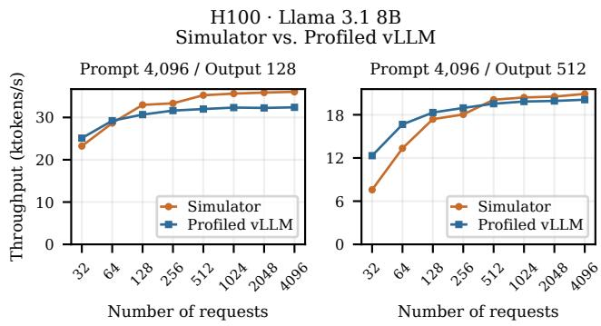
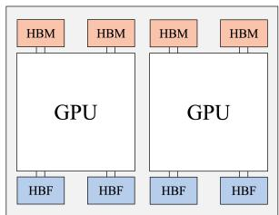
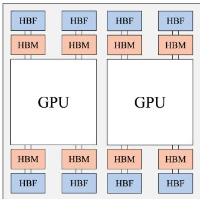
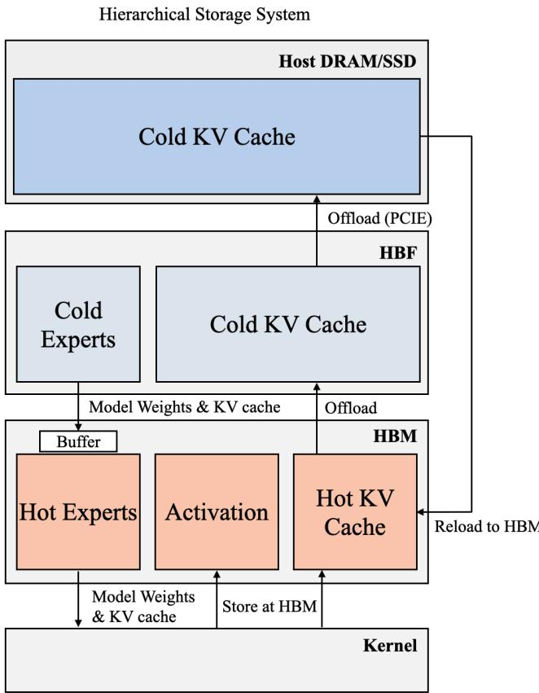
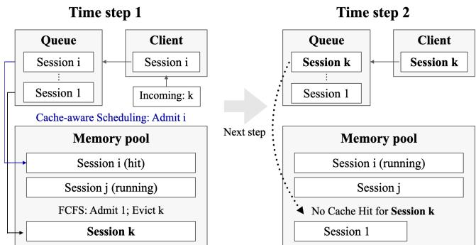
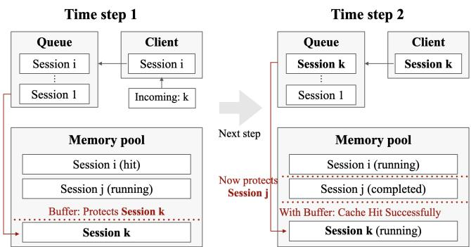
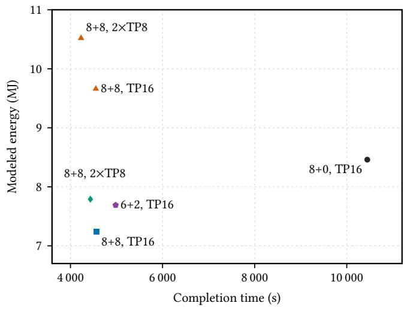
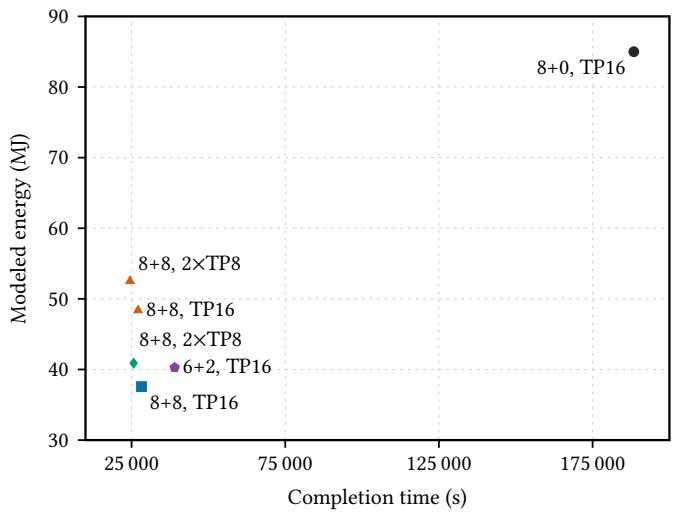

# Characterizing High Bandwidth Flash for LLM Serving

Zack Yu✉ zack.yu@berkeley.edu   
University of California, Berkeley   
Berkeley, California, USA   
Wonjun Kang   
kangwj1995@furiosa.ai   
FuriosaAI   
Seoul, South Korea Chloe Wong   
chloe.wong@berkeley.edu   
University of California, Berkeley   
Berkeley, California, USA   
Youngjin Cho   
youngjin.cho@furiosa.ai   
FuriosaAI   
Seoul, South Korea Kurt Keutzer keutzer@berkeley.edu   
University of California, Berkeley   
Berkeley, California, USA

Coleman Hooper✉ chooper@berkeley.edu University of California, Berkeley Berkeley, California, USA

Michael W. Mahoney mahoneymw@stat.berkeley.edu University of California, Berkeley; ICSI; LBNL Berkeley, California, USA

Amir Gholami✉ amirgh@berkeley.edu University of California, Berkeley; ICSI Berkeley, California, USA

Minjae Lee   
minjae.lee@furiosa.ai   
FuriosaAI   
Seoul, South Korea

Yakun Sophia Shao ysshao@berkeley.edu University of California, Berkeley Berkeley, California, USA

## Abstract

Large language model (LLM) serving requires substantial memory to store model weights and KV caches. As models grow larger and contexts become longer, memory capacity and bandwidth increasingly become bottlenecks for serving performance. Agentic workloads compound this pressure through repeated interactions over growing contexts, making it increasingly important to retain KV state for reuse. High-bandwidth flash (HBF) ofers a way to expand accelerator memory capacity for large language model (LLM) serving, but its access costs and limited write endurance complicate its use. We evaluate HBF for high-throughput agentic serving across system design and scheduling choices to understand when additional capacity improves serving performance and energy eficiency. We introduce an HBM–HBF–host hierarchical storage system and bufered cache-aware scheduling, and use trace-driven simulations to analyze their efects on performance, energy consumption, and HBF write lifetime. Across the evaluated workloads, the fastest HBF-augmented systems reduce completion time by 36.1–87.0% relative to HBM-only systems. Modeled energy savings reach 55.8%, although HBF increases energy consumption on some light work loads. Bufered cache-aware scheduling extends estimated HBF write lifetime from 4.77 to 14.82 years in the evaluated configuration. These results demonstrate the importance of coordinating data placement and scheduling to improve serving eficiency while sustaining a practical HBF write lifetime.

## Keywords

High-bandwidth flash, LLM serving, LLM inference, KV cache management, Hierarchical KV cache, AI infrastructure, LLM serving simulation

## 1 Introduction

LLM serving places competing demands on accelerator memory. Model weights occupy substantial capacity, while KV state grows with context length and the number of active requests. Accelerator compute throughput has historically grown faster than memory bandwidth, widening the gap between how quickly data can be processed and how quickly it can be supplied [5]. Larger batches can improve weight reuse and kernel utilization, but require more memory for active KV state [10, 25]. Retaining cached prefixes adds another demand on capacity, yet can avoid computation when later requests reuse them [36]. A serving system must balance these uses of memory to sustain eficient execution.

Agentic serving makes this balance particularly important. Repeated model calls can extend a shared context with new instructions, intermediate results, and tool outputs [9, 18]. The KV state of a completed request may therefore remain useful for a later call. Admitting more requests can displace this state before it is reused, requiring host reloads or repeated prefill [13]. Long contexts increase both the space needed to retain reusable prefixes and the cost of recovering them. Agentic workloads thus motivate studying memory capacity together with cache retention, rather than treating capacity only as a way to increase batch size.

High-bandwidth flash (HBF) ofers a way to expand device memory and reduce dependence on host storage [6, 24]. Its capacity can accommodate model weights, larger active KV caches, and more reusable prefixes. However, HBF has diferent costs from HBM. In the configuration studied here, HBF reads consume more energy than HBM reads, writes are much slower, and repeated writes consume finite program/erase endurance [6, 19]. Simply adding capacity does not ensure that a serving policy uses it eficiently. Efective use of HBF requires deciding which data belongs in each tier and when admitting more work is worth the resulting cache pressure.

We compare Sandisk’s shared-site architecture, where HBM and HBF share a limited number of sites around the accelerator, with the H3 architecture, where HBM occupies all sites and HBF is chained behind HBM [6, 24].

We introduce an HBM–HBF–host hierarchical storage system that manages weight placement, KV residency, and cache movement across HBM, HBF, host DRAM, and SSD. New KV state and reloaded prefixes enter HBM, while less recently used cache can move to lower tiers as capacity becomes scarce. We complement this hierarchical storage system with bufered cache-aware sched uling, which uses an admission bufer to leave room for decode growth and reduces pressure to evict reusable caches.

We target high-throughput serving settings like synthetic-data generation, asynchronous agent workflows, and reinforcement learning rollouts, where many independent sessions can be processed concurrently. Our focus is on settings that prioritize overall workload completion time and energy eficiency and can tolerate increased per-request latency. In this setting, additional capac ity translates directly into larger batches and more retained KV state. We evaluate the hierarchy and scheduling policy using a request-level simulator with kernel latency models fitted to GPU measurements. The simulator tracks scheduling, cache residency, data movement, and parallel execution while replaying multi-turn workloads for dense and sparse-MoE models. Our evaluation covers both the original traces and synthetically extended conversations, comparing completion time, modeled energy, cache reuse, and esti mated write lifetime. Energy and completion-time decompositions explain how weight reuse, repeated prefill, KV accesses, and data transfers contribute to the observed benefits and costs. This paper makes three contributions:

An HBM–HBF–host hierarchical storage system for LLM serving, with placement and data-movement policies that account for each tier’s capacity and access costs. On the 1 traces for Llama-3.1-405B and GLM-5.2, hybrid systems retaining weights in HBM reduce completion time by 46.0– 56.3% and modeled energy by 14.4–24.1% relative to HBMonly baselines.

• Bufered cache-aware scheduling that preserves reusable KV state through admission control. In the scheduling experiment, reserving 10% headroom reduces completion time by 4.7% and extends estimated HBF write lifetime from 4.77 to 14.82 years relative to unbufered cache-aware scheduling, under the modeled endurance assumptions.

A trace-driven analysis of how workload characteristics, weight and expert placement, and parallelism afect HBF’s value for serving. The analysis identifies the diferent sources of savings in dense and sparse serving and shows how longer conversations change the performance and energy tradeofs.

## 2 Related Work

LLMserving andKV-cache management. Orca, vLLM, and SGLang improve batching, KV-memory management, and prefix reuse [10, 34, 36], while FlexGen coordinates GPU, CPU, and disk resources for throughput-oriented inference [25]. Autellix and ThunderAgent schedule agent programs across model and tool calls [9, 18]; Continuum uses KV-cache time-to-live to balance retention against admission pressure [13]. HiCache, LMCache, and Mooncake support hierarchical or distributed KV storage and reuse [15, 23, 32], with CacheGen and CacheBlend addressing KV compression and cached-context reuse [16, 33]. Our focus is coordinating these storage and scheduling decisions under HBF’s asymmetric access costs and finite write endurance.

HBF andflash-based inference. The Sandisk HBF roadmap and H3 architecture motivate flash capacity near accelerators [6, 24]. Existing flash-based designs cover weight ofloading, SSD-based KV swapping, computation in flash, and vector search [1, 7, 8, 35]. Concurrent HBF serving studies highlight the challenges of storing KV caches in HBF, adopting SSD-style KV backing or restricting HBF to static expert weights, while others identify endurance as a major barrier [14, 22, 27]. We address these challenges through hierarchical placement and bufered cache-aware scheduling to reduce cache churn and repeated writes.

Simulation-based evaluation. LLMServingSim 2.0 models heterogeneous and disaggregated serving infrastructure [3]; ASTRAsim2.0 models distributed training systems [30]; and MemExplorer explores heterogeneous memory designs for agentic-inference NPUs [31]. Our request-level simulation examines how placement and admission decisions afect completion time, energy, and writes across an HBM–HBF–host hierarchy.

## 3 Methodology

## 3.1 Goal of Study

Our goal is to characterize how adding HBF improves LLM serving eficiency and what algorithms are necessary to obtain that improvement. We evaluate high-throughput serving through fixedworkload completion time and modeled energy, without imposing a per-request latency target. We also report cache-hit fractions, KV writes, and an endurance-based lifetime estimate. Comparisons hold the request workload and accelerator count fixed within each experiment. Completion time is the elapsed simulated time required to finish all requests, including arrivals, inter-turn gaps, computation, communication, and cache management. We report mean time per output token (TPOT) to expose the accompanying latency tradeofs.

## 3.2 Simulation Method

Request execution and cache state. The simulator tracks request arrivals and simulates execution asynchronously across model replicas. Each step selects eligible work, performs required cache preparation, executes a forward pass, advances requests, and accounts for subsequent cache movement. Mixed batches can contain both prefill and decode work. Chunked prefill splits prompt processing across steps under a shared prefill-token budget, allowing prefill chunks to execute alongside decode requests with reasonable latency. Decode tokens do not consume this budget. Requests in a session execute in order, and the next turn becomes eligible after the preceding turn completes and its recorded gap elapses. The simulator tracks residency separately in HBM, HBF, host DRAM, and SSD. Prefixes already on the device avoid host reload, prefixes on the host incur transfer service, and unavailable prefixes are computed again. KV state continues to grow during decoding, so active requests can exhaust HBM even without new admissions. We model this decode overflow and the resulting cache eviction and ofload costs, including any reloads needed before subsequent execution.

The simulator operates at request-level, tracking the number of tokens stored in each memory tier rather than individual token positions. We assume that token placement within each tier follows the specified policy.

Kernel Modeling. We calibrate kernel latency models using GPU measurements on NVIDIA H100 and B200. GEMM-style kernels use a roofline model combining launch overhead with compute and memory service time; grouped GEMM accounts for routed tokens and active-expert weights. HBM and HBF service times are added for H3 and combined by their maximum for shared-site GEMM and decode attention.

Attention is modeled separately for prefill and decode. Prefill attention latency depends on the number of query–key pairs evaluated and the attention kernel implementation, while decode uses a fitted memory-bandwidth utilization model. Sparse MLA extrapolates from dense MLA profiles by limiting attention work to the selected keys. The indexer accounts separately for projections, scoring, top-� selection, and index writes, with scoring and selection latency fitted to query count and context length. Indexer scoring uses an FP8 timing proxy while storage and memory-energy accounting remain 16-bit; top-� energy is not calibrated. Mixed-batch and HBF performance are modeled extrapolations from the measured kernels.

Energy Modeling. Energy is accumulated from arithmetic operations, modeled memory accesses, and communication:

$$
E = \sum _ { j } N _ { j } e _ { j } + \sum _ { m } 8 ( R _ { m } e _ { m } ^ { r } + W _ { m } e _ { m } ^ { w } ) + E _ { \mathrm { c o m m } } ,\tag{1}
$$

where $j$ indexes the arithmetic operations in Table $2 , N _ { j }$ is the operation count, and $e _ { j }$ is the corresponding energy per operation. For memory tier �, $R _ { m }$ and $W _ { m }$ are bytes read and written, and $e _ { m } ^ { r }$ and $e _ { m } ^ { w }$ are read and write energy per bit. $E _ { \mathrm { { c o m m } } }$ is the energy consumed by data transfers over communication links. We estimate energy from operation counts and memory and communication trafic, without adding static power consumption. Faster kernels alone therefore do not reduce modeled energy; savings come from fewer operations, less data movement, or accesses to lower-energy memory tiers.

Parallelism Modeling. We model TP [26], EP [12], and data-parallel attention (DPA) [4]. With DPA enabled, each attention DP rank handles its own requests and KV state, including full MLA QKVO projections and indexer work. FFN/MoE execution uses the combined rank batches and the configured TP/EP layout. Attention-rank latency is reduced by a maximum at the modeled synchronization before the shared FFN/communication phase. For models using IndexCache [2], we separately model full layers, which execute the indexer, and shared layers, which reuse an earlier full layer’s sparsetoken selection. For each layer category ${ \mathit { g } } ,$ let $L _ { g }$ denote the number of layers in that category. The forward latency is approximated as follows:

$$
T _ { \mathrm { f o r w a r d } } = \sum _ { g } L _ { g } \left( \operatorname* { m a x } _ { r } T _ { g , r } ^ { \mathrm { a t t n } } + T _ { g } ^ { \mathrm { F F N } } + T _ { g } ^ { \mathrm { c o m m } } \right) .\tag{2}
$$

Energy sums activity across ranks. Independent replicas maintain separate clocks and share modeled host resources; total completion time is the latest replica completion.

  
Figure 1: Simulator versus profiled vLLM on H100: total inputplus-output token throughput. Simulated request lengths follow lognormal distributions with $\sigma = 0 . 5 ;$ host KV ofload is disabled. Each 4,096-request vLLM run includes 20 failed requests.

Communication Modeling. Independent PCIe links can transfer data concurrently, while transfers sharing host DRAM or SSD compete for bandwidth. After startup, let $r _ { i }$ be the fraction of transfer � completed per second. Let $s _ { i , L } , s _ { i , D } ,$ and $s _ { i , S }$ be its standalone bandwidth service times for the local PCIe/device-memory path, host DRAM, and SSD. The local time is the maximum of link and devicememory service times; host times include reads and writes required for staging. For the active transfers in a scheduling call, rates satisfy

$$
\begin{array} { r l r } { \displaystyle 0 \le r _ { i } , } & { } & { r _ { i } s _ { i , L } \le 1 , } \\ { \displaystyle } & { } & { \displaystyle \sum _ { i } r _ { i } s _ { i , D } \le A _ { D } ( t ) , } \\ { \displaystyle } & { } & { \displaystyle \sum _ { i } r _ { i } s _ { i , S } \le A _ { S } ( t ) , } \end{array}\tag{3}
$$

where $A _ { D } ( t ) , A _ { S } ( t ) \in [ 0 , 1 ]$ are the bandwidth fractions available after earlier reservations. The simulator allocates transfer rates subject to these constraints and updates them as transfers start or finish or available bandwidth changes. Dependent transfers execute sequentially, and forward execution waits for the required cache data. GPU collectives include startup overhead plus the maximum of network transfer time and HBM bufer access time.

Comparison with vLLM. We compare our HBM-only simulator with profiled vLLM measurements [10] for Llama-3.1-8B on one NVIDIA H100 GPU. Figure 1 sweeps 32–4,096 single-turn requests, with a mean input length of 4,096 tokens and mean output lengths of 128 or 512 tokens in the simulator. The simulator captures the increase and saturation of throughput, with larger deviations at low request counts for the longer outputs.

## 3.3 Simulation Trace

The workload is derived from LMCache multi-turn agentic sessions [17], containing 24,880 turns in 767 sessions. We preserve each turn’s input length, output length, and inter-turn gap, using model-specific tokenization for input lengths. Output lengths and gaps are retained from the workload. The 25k-turn experiments contain 771 sessions; the 100k-turn experiments contain 3,080 sessions. To reach these counts, we replicate the original conversations as independent sessions, preserving each turn’s input and output lengths. We retain only the required initial turns of the final session to reach the target request count. Replication increases the number of requests without extending their contexts.

We also construct a 5 trace by concatenating five copies of each session, preserving output lengths and within-copy gaps, with zero gaps between copies. Each appended copy’s input lengths are ofset by the preceding copy’s final input-plus-output length. This yields 500k turns across the same 3,080 sessions and increases mean input length from 22,558 to 89,125 tokens.

Sparse-attention lookup. We estimate selected-token placement from ofline GLM sparse-selection profiles. At a fixed reference context of 32,768 tokens, we measure the expected number � � of selected tokens in the most recent � positions and use piecewiselinear interpolation between sampled window sizes. There are at most � = 2, 048 selected tokens per query. For runtime context � and � HBM-resident KV tokens, let $s _ { x } = \operatorname* { m i n } ( x , s )$ . The model uses

$$
h ( x , k ) = \mathrm { c l i p } ( f ( k ) , \operatorname* { m a x } ( 0 , s _ { x } - ( x - k ) ) , \operatorname* { m i n } ( k , s _ { x } ) ) ,
$$

$$
h _ { \mathrm { H B F } } ( x , k ) = s _ { x } - h ( x , k ) .\tag{4}
$$

This preserves the available token counts in both tiers.

Expert lookup. We profiled GLM-5.2’s expert routing on two sessions from the LMCache trace. One serve as training set that determines expert-copy allocation and HBM placement, while the other serve as test set to estimate how many expert copies are accessed in each batch.

## 4 System Overview

## 4.1 ${ \bf H } ^ { 3 }$ versus Sandisk’s Shared-Site Design

We consider two architectures shown in Figure 2. The Sandisk shared-site design places HBM and HBF around the accelerator’s limited space that can attach HBM/HBF stacks. The illustrated configuration divides eight positions into four HBM and four HBF stacks. $\mathrm { H } ^ { 3 }$ design instead connects HBF behind HBM, retaining eight HBM stacks while adding eight HBF stacks. We assume HBM bufering can stage data arriving from HBF to fully hide latency. In this case, the $\mathrm { H } ^ { 3 }$ architecture can provide larger capacity and better bandwidth than the shared-site design.

Let $D _ { H }$ and $D _ { F }$ be fixed amounts of data read from HBM and HBF, and let � be their equal per-stack read bandwidth. Suppose the shared-site design allocates � of its eight positions to HBM and the remaining 8 � to HBF, where $0 < m < 8$ . With concurrent reads from the two tiers, its service time is

$$
T _ { \mathrm { s h a r e d } } = \operatorname* { m a x } \left( \frac { D _ { H } } { m B } , \frac { D _ { F } } { ( 8 - m ) B } \right) .\tag{5}
$$

Even if HBM and HBF reads are serialized in the $\mathrm { H } ^ { 3 }$ design, its read time is no greater than that of the shared-site design.

$$
\begin{array} { l } { \displaystyle T _ { 8 + 8 } = \frac { D _ { H } } { 8 B } + \frac { D _ { F } } { 8 B } } \\ { \displaystyle \quad = \frac { m } { 8 } \frac { D _ { H } } { m B } + \frac { 8 - m } { 8 } \frac { D _ { F } } { ( 8 - m ) B } } \\ { \displaystyle \quad \leq T _ { 8 \mathrm { h a r e d } . } } \end{array}\tag{6}
$$

For GEMM and decode attention, we model HBM and HBF service sequentially for $\mathrm { H } ^ { 3 }$ and concurrently for the shared-site design. Data movement is pipelined across successive memory tiers, assuming overlap in transfer time. However, a chip that uses H3 design will be more expensive than a chip that uses the shared-site design due to more HBM/HBF used, therefore we evaluate both architectures in our simulation studies.

  
(a) Sandisk: 4 HBM + 4 HBF

  
(b) H3: 8 HBM + 8 HBF  
Figure 2: Two memory architectures we considered in this study. The sites refer to the space where HBM/HBF stacks can connect to the accelerator. HBM and HBF compete for shared sites in the first architecture, whereas HBM and HBF are connected sequentially in second architecture. We simulate both architectures.

## 4.2 Hierarchical Storage System

Figure 3 shows the storage hierarchy. HBM contains frequently accessed weights and active data, while HBF expands the on-device working set. Host DRAM and SSD hold state that cannot remain on the accelerator. New KV state and reloaded prefixes are staged in HBM. As space becomes scarce, older KV state moves toward HBF and then the host. State needed by active requests is protected by reference locks subject to the simulator’s capacity and overflow handling.

Weights and activations. Weight placement is fixed for each evaluated configuration. Single-tier experiments place all weights in HBM or HBF; the split MoE configuration places frequently used experts in HBM and the remainder in HBF. Activation writes to HBM since repeatedly writing short-lived activations to flash would consume endurance rapidly.

Cache eviction and ofload. We use request-level least-recently used (LRU) ordering to select eligible cache entries when a memory tier runs out of space. HBM data is demoted to HBF or ofloaded to host DRAM; DRAM data spills to SSD, and SSD data is discarded when necessary. Assuming LRU requests are less likely to be accessed than recently used request, this retains hotter cache on HBM and moves colder cache to the cold memory tiers. Completedsession caches remain available for reuse until evicted. Reference locks exclude active requests from ordinary LRU eviction, although their state can move from HBM to HBF when device capacity permits. Future turns reload ofloaded prefixes and recompute missing ones.

Index-first placement. Sparse attention accesses only a selected subset of KV tokens, but the indexer access all index data across the context. We therefore consider index as hotter data, and separate the residency ofindices and attention KV for more fine-grained data movement. Under HBM pressure, eligible KV is demoted before indices. On reload, indices preferentially return to HBM, displacing eligible KV when necessary. Under HBF pressure, indices are offloaded to the host before attention KV, so that indices can be placed at HBM on reload. These priorities target to place the frequently accessed indices on HBM while placing more sparse KV in HBF.

  
Figure 3: Hierarchical placement of weights, activations, and KV state. Host reload returns to HBM; colder device state can move through HBF to the host. The bufer drawn on the HBF read path is the latency hiding bufer of H3 architecture

## 4.3 Bufered Cache-aware Scheduling

Cache-aware scheduling prioritizes waiting requests with more device-resident prefix tokens, and using queue order to resolve ties. This avoids unnecessary reload or prefill work when a reusable prefix is available. However, ordering alone does not control the amount of active state. If too many requests are admitted, their growing contexts can displace completed session’s KV cache before the next turn reuses it.

We add an admission fraction �  0, 1 . Let � be usable device KV/index capacity after resident weights, � the currently locked footprint, and $A _ { i }$ the footprint newly locked by admitting request �. Admission requires

$$
L + A _ { i } \leq b C .\tag{7}
$$

  
Figure 4: Vanilla cache-aware scheduling can lose a future cache hit. At time step 1, the scheduler selects the cache hit from session �, then admits session 1 in queue order, evicting session �’s cached prefix. When session � returns at time step 2, its prefix is no longer resident.

  
Figure 5: Bufered cache-aware scheduling can preserve a future cache hit. Delaying session 1 leaves session �’s cached prefix resident for reuse at time step 2. Dotted lines illustrate admission headroom: session � is retained at time step 1, and session � completes and remains cached at time step 2.

A 10% bufer uses $b = 0 . 9 ;$ no bufer uses � = 1. In the implementation, $A _ { i }$ accounts for the incoming request’s full context footprint, including any cached prefix newly brought under an active lock. A hit saves computation or movement but does not make the prefix free of capacity cost. Completed-session cache is evictable and is excluded from � until re-admitted.

The threshold is checked at admission, not enforced as a fixed physical partition after every decode token. Active contexts can grow, and completed sessions can release locks while leaving cached data resident. The bufer limits aggregate admission pressure, thus protects residing KV cache, improving cache hit when the followup request gets scheduled by longest cache hit. Although the bufer constrains scheduling larger batches, the benefit of improved cache hit can result in higher throughput. Most importantly, the improved cache-reuse can significantly reduce writes, resolving the challenge of write lifetime when placing KV cache to HBF. As Table 4 shows, the bufer extends estimated HBF write lifetime to over a decade in both evaluated hybrid configurations. Moreover, if the P/E cycle of the released product is lower, or the user wants to be safer in using

Table 1: Per-stack memory assumptions. GB and TB use decimal units. HBF read energy is set to twice HBM's following MemExplorer [31]; $\mathbf { H } ^ { 3 }$ reports up to four times the power consumption [6]. Given limited published HBF write specifications, we use typical SSD write parameters and assume SLC endurance of 100,000 P/E cycles. HBM startup uses the upper end of the reported HBM4 read-latency range, with write startup assumed equal to read.
<table><tr><td>Parameter</td><td>HBM</td><td>HBF</td></tr><tr><td>Capacity (GB)</td><td>24 [20]</td><td>375 [6]</td></tr><tr><td>Read bandwidth (GB/s)</td><td>1,000 [11]</td><td>1,000 [6]</td></tr><tr><td>Write bandwidth (GB/s)</td><td>1,000 [11]</td><td>8</td></tr><tr><td>Read startup (µs)</td><td>0.1 [19]</td><td>20 [6]</td></tr><tr><td>Write startup (μs)</td><td>0.1 [19]</td><td>250</td></tr><tr><td>Read energy (pJ/bit)</td><td>3.4 [21]</td><td>6.8 [31]</td></tr><tr><td>Write energy (pJ/bit)</td><td>3.4 [21]</td><td>100</td></tr><tr><td>Assumed P/E cycles</td><td></td><td>100,000 [27]</td></tr></table>

Table 2: Arithmetic energy parameters at 4 nm, scaled from 7 nm by 0.546 [28, 29, 35].
<table><tr><td>Operation type j</td><td>Energy  $e _ { j }$  (pJ/op)</td></tr><tr><td>FP16 multiply-accumulate</td><td>0.38</td></tr><tr><td>FP32 addition</td><td>0.22</td></tr><tr><td>FP32 multiplication</td><td>0.71</td></tr><tr><td>FP32 exponentiation</td><td>7.4</td></tr><tr><td>FP32 division</td><td>5.6</td></tr><tr><td>FP32 square root</td><td>11.1</td></tr></table>

HBF, we can reduce the value of� to trade throughput for even less admission pressure. This can further increase the lifetime of HBF.

Figures 4 and 5 contrast unbufered and bufered cache-aware admission. Preserving headroom can prevent useful cache from being displaced shortly before reuse. This may reduce instantaneous concurrency, yet improve workload completion time by avoiding later reloads, demotions, and repeated prefill.

## 5 Results

## 5.1 Experimental Setups

All experiments use the simulator’s B200 compute model and 16-bit weight/cache storage assumptions. Indexer latency uses an FP8 scoring proxy, as described in the kernel model. HBM-only devices contain eight 24-GB HBM stacks. Hybrid devices combine 24-GB HBM stacks with 375-GB HBF stacks: the H3-style configuration uses eight stacks of each type, while shared-site configurations divide eight stack sites between HBM and HBF. Stack allocations are specified for each experiment. Table 1 lists the device-memory parameters used in the study.

The host model provides 16 independent DDR5-7200 channels at 57.6 GB/s and 64 GB each, plus 32 SSDs at 8 GB/s and 1 TB each. GPU–host transfers use PCIe Gen5 x16 with approximately 63 GB/s per direction after line coding; GPU collectives use a 900-GB/s modeled NVLink endpoint bandwidth. Shared host bandwidth is aggregated rather than multiplied by the number of simultaneous GPU transfers.

Table 3: Workload and parallelism configuration. TP/EP denotes tensor/expert parallelism with the stated group size; DPA denotes data-parallel attention. 2 TP8/EP8 uses two eight-GPU replicas. The 1 and 5 traces contain 100k and 500k turns; Qwen uses a separate 25k-turn workload.
<table><tr><td>Model</td><td>GPUs</td><td>Turns</td><td>Parallelism</td></tr><tr><td>Qwen3-32B</td><td>1</td><td>25k</td><td>TP1</td></tr><tr><td>Llama-3.1-405B</td><td>8</td><td>100k</td><td>TP8</td></tr><tr><td>GLM-5.2</td><td>16</td><td>100k</td><td>TP16/EP16 + DPA</td></tr><tr><td>GLM-5.2</td><td>16</td><td>100k</td><td>2×TP8/EP8 + DPA</td></tr><tr><td>GLM-5.2</td><td>16</td><td>500k</td><td>TP16/EP16 + DPA</td></tr><tr><td>GLM-5.2</td><td>16</td><td>500k</td><td> $2 { \times } \mathrm { T P 8 } / \mathrm { E P 8 } + \mathrm { D P A }$ </td></tr></table>

The 1 trace contains 100k turns with the original conversation lengths. For GLM, we construct the 5 trace by concatenating five copies of each session and accumulating context across copies, yielding 500k turns over the same sessions. The Qwen scheduling study separately uses 25k turns. Table 3 summarizes model sizes, workload lengths, and parallelism. The Qwen study varies scheduling with weights in HBM. The large-model studies use cache-aware scheduling with a 10% bufer, mixed batches, session-sticky routing, and KV ofload. Llama does not use DPA; GLM uses DPA with either one TP16/EP16 replica or two TP8/EP8 replicas. All GLM points use index-first and the recency-only sparse lookup. All runs use a chunked-prefill budget of 2,048 tokens per scheduling engine per step, shared across prefill requests. For GLM DPA, each attention rank has its own scheduling engine. Each 1 or 5 workload is shared across replicas, not repeated independently on each replica.

Device and host token hit rates use total input tokens as a common denominator. Device includes HBM and HBF; host includes DRAM and SSD. These fractions are measured when requests are admitted for prefill. They are not the fraction of decode accesses served by HBM, and they need not sum to 100% because new or uncached input requires computation. Write counters report modeled KV trafic.

All sessions submit their first request at simulation time zero. Subsequent turns arrive after the preceding turn completes and the recorded inter-turn gap elapses. We measure the time and energy required to complete this fixed workload, without imposing an external request arrival rate.

In the result tables, � � denotes HBM+HBF stack counts per GPU. TPOT is the mean per-request time per output token after the first. Lower completion time, energy, and TPOT are better; bold entries in the Llama and GLM configuration tables mark the minimum in each metric column. All configurations in those two tables use a 10% scheduling bufer.

## 5.2 Scheduling and Write Endurance

Table 4 compares FCFS, cache-aware scheduling, and bufered cacheaware scheduling on Qwen. Reserving admission headroom preserves reusable KV state: on HBM alone, the bufer raises device hits from 6.61% to 56.79% and more than halves HBM KV writes relative to unbufered cache-aware scheduling. The hybrid configurations retain most reusable prefixes on the device with the bufer enabled. Device hits include HBF residency and therefore do not imply HBM-speed access.

Table 4: Qwen3-32B scheduling on one GPU, 25k turns, and HBM-resident weights. Shared-site 4 HBM + 4 HBF divides eight stack sites; H adds eight HBF stacks alongside eight HBM stacks. FCFS means first-come, first-served; Cache aware, 10% reserves 10% admission headroom (bold hybrid rows). Clock is workload completion time; KV writes are key–value-cache writes. Device/host hits are admitted input-token fractions served by HBM or HBF/host DRAM or SSD. Life estimates HBF write endurance via Equation 8; dashes mean no HBF.
<table><tr><td></td><td>Scheduling</td><td>Clock (s)</td><td>Energy (MJ)</td><td>HBM KV writes (TB)</td><td>HBF KV writes (TB)</td><td>Device hit (%)</td><td>Host hit (%)</td><td>Life (years)</td></tr><tr><td>Memory 8HBM</td><td>FCFS</td><td>19,033.77</td><td>2.323</td><td>158.54</td><td>0.00</td><td>0.16</td><td>96.36</td><td>一</td></tr><tr><td>8HBM</td><td>Cache aware</td><td>18,479.17</td><td>2.274</td><td>148.41</td><td>0.00</td><td>6.61</td><td>89.92</td><td>一</td></tr><tr><td>8HBM</td><td>Cache aware, 10%</td><td>16,313.41</td><td>2.245</td><td>69.35</td><td>0.00</td><td>56.79</td><td>39.73</td><td>一</td></tr><tr><td> $4 \mathrm { H B M } + 4 \mathrm { H B F }$ </td><td>FCFS</td><td>23,228.20</td><td>2.983</td><td>8.23</td><td>147.15</td><td>7.30</td><td>89.23</td><td>0.75</td></tr><tr><td> $4 \mathrm { H B M } + 4 \mathrm { H B F }$ </td><td>Cache aware</td><td>20,821.73</td><td>2.849</td><td>7.91</td><td>93.00</td><td>41.72</td><td>54.80</td><td>1.06</td></tr><tr><td> $\mathbf { 4 _ { H B M } } + \mathbf { 4 _ { H B F } }$ </td><td>Cache aware, 10%</td><td>16,614.28</td><td>2.703</td><td>6.89</td><td>7.48</td><td>96.06</td><td>0.47</td><td>10.57</td></tr><tr><td> $8 \mathrm { H B M } + 8 \mathrm { H B F }$ </td><td>FCFS</td><td>13,552.76</td><td>2.758</td><td>9.16</td><td>106.79</td><td>32.84</td><td>63.69</td><td>1.21</td></tr><tr><td> $8 \mathrm { H B M } + 8 \mathrm { H B F }$ </td><td>Cache aware</td><td>10,930.78</td><td>2.659</td><td>7.32</td><td>21.81</td><td>86.87</td><td>9.66</td><td>4.77</td></tr><tr><td> $\mathbf { 8 \ H B M + 8 \ H B F }$ </td><td>Cache aware, 10%</td><td>10,419.17</td><td>2.640</td><td>6.88</td><td>6.69</td><td>96.46</td><td>0.06</td><td>14.82</td></tr></table>

On H3, adding the bufer reduces HBF KV writes by 69.33%, while completion time falls by 4.68%. On shared-site 4+4, writes fall by 91.96% and completion time by 20.21%. Thus, the bufer’s main benefit is reduced cache churn and write trafic. Shared-site 4+4 still finishes 1.84% later than bufered HBM-only serving, showing that greater cache retention does not always yield faster execution.

For HBF capacity $C _ { F } ,$ endurance �, modeled write volume $W _ { F }$ and workload duration �, we estimate

$$
L _ { \mathrm { w r i t e } } = { \frac { P C _ { F } } { W _ { F } / T } } .\tag{8}
$$

Assuming uniform wear, unit write amplification, and 100k P/E cycles, the reduced write rate raises estimated lifetime from 4.77 to 14.82 years for $\mathrm { H } ^ { 3 }$ and from 1.06 to 10.57 years for shared-site 4+4. These are extrapolations of the modeled average write rate. If commercial HBF endurance is lower, increasing admission headroom may reduce evictions and writes at the cost of a smaller active batch; the appropriate bufer depends on workload and device endurance.

## 5.3 Memory Architecture and Weight Placement

Architecture. Tables 5 and 6 compare the dense Llama and sparse-MoE GLM workloads. On the 1 trace, H3 with weights in HBM reduces completion time by 45.95% for Llama and 56.29% for GLM relative to HBM-only serving. Appropriately configured shared-site designs also provide substantial benefits with eight total stack sites: GLM 6+2 reduces completion time by 52.31% and energy by 9.09%. H3 TP16 with HBM weights nevertheless completes sooner, uses less energy, and has lower mean TPOT than this shared-site point. These comparisons evaluate complete configurations, including their placement policies and architecture-specific HBM/HBF service models.

Figure 6 visualizes completion time and modeled energy for six representative configurations from Table 6. The table retains the complete comparison, including all shared-site allocations and TPOT.

Table 5: Llama-3.1-405B weight placement on 8 GPUs with eight-way tensor parallelism (TP8), the 1 trace (100k turns), and a 10% scheduling bufer. � � denotes � HBM and � HBF stacks per GPU; 8+0 is HBM-only and H3 adds HBF stacks alongside HBM. Time is workload completion time; TPOT is mean per-request time per output token after the first. Arrows indicate lower is better; bold marks each column minimum.
<table><tr><td>Configuration</td><td>Time (s) ↓</td><td>Energy (MJ)↓</td><td>TPOT (ms) ↓</td></tr><tr><td>8+0, HBM weights</td><td>39,666</td><td>53.60</td><td>90.85</td></tr><tr><td>H³ 8+8, HBM weights</td><td>21,439</td><td>40.70</td><td>438.61</td></tr><tr><td>H³ 8+8, HBF weights</td><td>21,423</td><td>42.06</td><td>438.27</td></tr></table>

Weight placement and parallelism. For Llama, moving weights to HBF changes completion time little but increases energy by 3.33%. For GLM TP16, it similarly ofers little completion-time benefit while increasing energy by 33.42%, above the HBM-only baseline. Sparse attention reduces KV-read trafic, making weight placement more consequential for GLM’s energy budget.

The H3 split-TP8 configuration retains 160 logical experts plus 32 redundant copies in HBM per replica, with 96 experts in HBF and other weights in HBM. This leaves approximately 23.90 GB HBM per GPU for KV/index state. On the 1 trace, split placement reduces energy by 25.97% relative to all-HBF TP8 weights, at a 4.79% completion-time cost. Relative to TP16 with HBM weights, split TP8 is 2.89% faster but consumes 7.58% more energy. On the 5 trace, TP8 with all weights in HBF finishes fastest, 4.57% sooner than split TP8 but using 28.47% more energy; TP16 with HBM weights uses the least energy. The split configurations assume ideal EP balance and use average expert trafic to approximate rank service; this comparison jointly varies parallelism, placement, redundancy, and the expert-activity estimator.

(a) 1× trace  
Table 6: GLM-5.2 architecture, placement, and parallelism on 16 GPUs with a 10% scheduling bufer. � � denotes � HBM and � HBF stacks per GPU: H3 adds HBF alongside HBM, while shared-site designs divide eight stack sites between them. TP16 is one 16-GPU tensor-parallel replica; 2 TP8 is two 8-GPU replicas, using 16-way and 8-way expert parallelism, respectively, with data-parallel attention. HBM/HBF denotes all weights in that tier; Split places selected experts in HBM, remaining experts in HBF, and other weights in HBM, using ofline expert lookup and ideal expert balance. The 1 /5 traces contain 100k/500k turns with original/extended contexts. Time is workload completion time; TPOT is mean per-request time per output token after the first. On the 5 trace, among the tested shared-site allocations, 4+4 minimizes completion time and 6+2 minimizes energy. Bold marks each column minimum across all configurations. Figure 6 visualizes the completion-time and energy tradeofs for six of these configurations.
<table><tr><td></td><td></td><td></td><td></td><td colspan="3">1× trace</td><td colspan="3">5× trace</td></tr><tr><td>Architecture</td><td>Stacks</td><td>Parallelism</td><td>Weights</td><td>Time (s)</td><td>Energy (MJ)</td><td>TPOT (ms)</td><td>Time (s)</td><td>Energy (MJ)</td><td>TPOT (ms)</td></tr><tr><td>HBM-only</td><td>8+0</td><td>TP16</td><td>HBM</td><td>10,445</td><td>8.46</td><td>234.09</td><td>188,425</td><td>84.99</td><td>216.31</td></tr><tr><td>H3</td><td>8+8</td><td>TP16</td><td>HBM</td><td>4,565</td><td>7.24</td><td>277.79</td><td>28,231</td><td>37.57</td><td>351.29</td></tr><tr><td>H³</td><td>8+8</td><td>TP16</td><td>HBF</td><td>4,551</td><td>9.66</td><td>276.42</td><td>27,117</td><td>48.38</td><td>332.42</td></tr><tr><td>H3</td><td>8+8</td><td>2×TP8</td><td>HBF</td><td>4,230</td><td>10.52</td><td>227.40</td><td>24,489</td><td>52.53</td><td>276.76</td></tr><tr><td>H3</td><td>8+8</td><td>2×TP8</td><td>Split</td><td>4,433</td><td>7.79</td><td>252.61</td><td>25,661</td><td>40.89</td><td>307.66</td></tr><tr><td>Shared-site</td><td>2+6</td><td>TP16</td><td>Split</td><td>6,073</td><td>8.51</td><td>342.12</td><td>35,809</td><td>44.81</td><td>406.36</td></tr><tr><td>Shared-site</td><td>4+4</td><td>TP16</td><td>Split</td><td>5,264</td><td>7.99</td><td>322.72</td><td>33,459</td><td>41.97</td><td>423.71</td></tr><tr><td>Shared-site</td><td>6+2</td><td>TP16</td><td>Split</td><td>4,981</td><td>7.69</td><td>302.87</td><td>39,019</td><td>40.28</td><td>410.47</td></tr></table>

  
(b) 5× trace  
HBM-only, weights on HBM H3, weights on HBM H3, weights on HBF H , weights on both Shared-site, weights on both  
Figure 6: Completion-time and modeled-energy tradeofs for six GLM-5.2 configurations on (a) the 1 and (b) the 5 traces; see Table 6 for configuration details.

Workload and shared-site allocation. The shared-site 2+6, 4+4, and 6+2 configurations retain 15+1, 100+32, and 144+32 logical experts plus redundant copies in HBM, respectively. Each has 32 redundant copies in total; remaining expert copies reside in HBF and other weights remain in HBM. HBM experts are selected by training-profile frequency. The HBM-only and all-HBM-weight H3 references use the original expert-activity model without redundant copies.

On the 1 trace, 6+2 provides the lowest completion time, energy, and mean TPOT among the tested shared-site allocations. On the 5 trace, 4+4 completes 14.25% sooner than 6+2, while 6+2 consumes 4.01% less energy than 4+4. Longer contexts increase KV-space requirements, but expert placement also determines how much HBM remains available to KV. With 144+32 HBM experts, 6+2 achieves 98.11% device hits on the extended trace. The preferred allocation therefore depends on workload and whether completion time or energy is the objective. H3 retains the strongest completiontime results in these comparisons.

Table 7: Energy-savings contributions relative to same-model, same-workload HBM-only energy. Llama denotes Llama-3.1-405B; GLM denotes GLM-5.2. � � gives HBM+HBF stack counts per GPU; 1 /5 denotes the original/extended trace with 100k/500k turns. The 8+8 columns use $\mathbf { H } ^ { 3 }$ with HBM weights; 6+2 and 4+4 use shared-site expert placement. Entries are percentage points: positive values save energy and negative values add cost. KV denotes key–value cache; avoided prefill counts computation only. Other savings are the residual; bold totals may difer due to rounding.
<table><tr><td>Contribution</td><td>Llama 8+8 1×</td><td>GLM 6+2 1X</td><td>GLM 8+8 1X</td><td>GLM 4+4 5×</td><td>GLM 8+8 5×</td></tr><tr><td>Reduced weight reads</td><td>+15.22</td><td>+7.52</td><td>+12.70</td><td>+47.15</td><td>+51.22</td></tr><tr><td>Increased KV/index reads</td><td>-13.16</td><td>-0.75</td><td>-0.60</td><td>-1.51</td><td>-0.50</td></tr><tr><td>Avoided repeated prefill</td><td>+20.25</td><td>0.00</td><td>0.00</td><td>0.00</td><td>0.00</td></tr><tr><td>Other net savings</td><td>+1.74</td><td>+2.31</td><td>+2.31</td><td>+4.97</td><td>+5.07</td></tr><tr><td>Net energy savings</td><td>24.06%</td><td>9.09%</td><td>14.41%</td><td>50.62%</td><td>55.80%</td></tr></table>

Larger batches also introduce a latency tradeof: mean TPOT rises from 90.85 to 438.61 ms for Llama and from 234.09 to 277.79 ms for GLM H with HBM weights on the 1 trace. On the 5 trace, every evaluated hybrid configuration has higher mean TPOT than HBM-only serving. Our high-throughput evaluation therefore does not imply improved per-request latency.

## 5.4 Sources of Energy Savings

Table 7 separates energy savings from weight reuse, KV/index reads, and avoided prefill computation. On the 1 trace, H with HBM weights saves 24.06% of baseline energy for Llama and 14.41% for GLM. Dense serving achieves greater percentage savings here despite its larger HBF KV-read cost: prefix reuse avoids 53.33 million query-token computations, contributing 20.25 percentage points of baseline energy savings. The compared GLM runs perform the same prefill work without recomputation.

Batching amortizes weight loads and reduces kernel launches. Llama’s weight-read energy falls by 77.8%, compared with 18.0% for GLM shared-site 6+2 and 30.5% for GLM H3 8+8. Weight reuse and reduced recomputation lower modeled energy, whereas kernel saturation reduces latency. Rank-local DPA batches and aggregate MoE batches difer in their opportunities for weight reuse.

For H3 GLM with HBM weights, repricing HBF reads from twice to four times HBM read energy at fixed trafic retains 13.09% energy savings, compared with 14.41%. Most read energy in this configuration comes from HBM-resident weights, limiting sensitivity to HBF read energy. This result is placement-specific: shared-site 6+2 also reads expert weights from HBF.

## 5.5 Scope and Limitations

We evaluate high-throughput serving; latency-constrained serving, where small batches limit the benefit of added capacity, is outside the scope of this study. We do not model a production HBF controller, complete package power, wear leveling, or every activation and staging write. Kernel fits and the layer-class approximation limit extrapolation beyond the profiled hardware. Repeating sessions increases ofered work but does not add independently collected conversations. Saved runs check completion counts, queue drainage, token conservation, tier accounting, and reproducibility. We use ordinary autoregressive decoding without speculative decoding.

## 6 Conclusion

For high-throughput LLM serving, high-bandwidth flash can turn added capacity into faster, more energy-eficient execution, but only when data placement and scheduling account for its costs. Combining an HBM–HBF–host hierarchy with bufered cache-aware scheduling, HBF-augmented systems with weights in HBM reduce workload completion time by 46–56% and modeled energy by 14–24% relative to HBM-only serving on the 1 traces for Llama-3.1-405B and GLM-5.2. On the GLM-5.2 5 trace, the HBM-weight configuration achieves a 6.7× speedup and 56% energy savings. These gains come mainly from retaining reusable KV state on the device and amortizing weight reads over larger batches. Write endurance, often cited as the key obstacle to placing KV cache in flash, becomes manageable once admission is controlled: reserving 10% headroom reduces HBF KV writes by 69% and extends estimated write lifetime from 4.8 to 14.8 years. HBF should therefore be co-designed with the scheduler rather than treated as passive overflow capacity.

## References

[1] Keivan Alizadeh, Seyed Iman Mirzadeh, Dmitry Belenko, S. Khatamifard, Minsik Cho, Carlo C Del Mundo, Mohammad Rastegari, and Mehrdad Farajtabar. 2024. LLM in a flash: Eficient Large Language Model Inference with Limited Memory. In Proceedings ofthe 62nd Annual Meeting ofthe Association for Computational Linguistics (Volume 1: Long Papers). Association for Computational Linguistics, 12562–12584. doi:10.18653/v1/2024.acl-long.678

[2] Yushi Bai, Qian Dong, Ting Jiang, Xin Lv, Zhengxiao Du, Aohan Zeng, Jie Tang, and Juanzi Li. 2026. IndexCache: Accelerating Sparse Attention via Cross-Layer Index Reuse. arXiv:2603.12201 doi:10.48550/arXiv.2603.12201

[3] Jaehong Cho, Hyunmin Choi, Guseul Heo, and Jongse Park. 2026. LLMServingSim 2.0: A Unified Simulator for Heterogeneous and Disaggregated LLM Serving Infrastructure. In 2026 IEEE International Symposium on Performance Analysis ofSystems and Software (ISPASS). IEEE, 1–14. doi:10.1109/ispass69572.2026.00012

[4] DeepSeek-AI et al. 2024. DeepSeek-V3 Technical Report. arXiv:2412.19437 doi:10.48550/arXiv.2412.19437

[5] Amir Gholami, Zhewei Yao, Sehoon Kim, Coleman Hooper, Michael W. Mahoney, and Kurt Keutzer. 2024. AI and Memory Wall. IEEE Micro 44, 3 (2024), 33–39. doi:10.1109/mm.2024.3373763

[6] Minho Ha, Euiseok Kim, and Hoshik Kim. 2026. H3: Hybrid Architecture Using High Bandwidth Memory and High Bandwidth Flash for Cost-Eficient LLM Inference. IEEE Computer Architecture Letters 25, 1 (2026), 49–52. doi:10.1109/lca. 2026.3660969

[7] Po-Kai Hsu, Weihong Xu, Qunyou Liu, Tajana Rosing, and Shimeng Yu. 2026. HAVEN: High-Bandwidth Flash Augmented Vector Engine for Large-Scale Approximate Nearest-Neighbor Search Acceleration. arXiv preprint. arXiv:2603.01175 https://arxiv.org/abs/2603.01175v1 Version 1, revised 2026-03- 01.

[8] Inho Jeong, Sunghyeon Woo, Sol Namkung, and Dongsuk Jeon. 2025. HiFC: High-eficiency Flash-based KV Cache Swapping for Scaling LLM Inference. In Advances in Neural Information Processing Systems, Vol. 38, Main Conference. Curran Associates, Inc., 47561–47590. doi:10.52202/085713-1587

[9] Hao Kang, Ziyang Li, Weili Xu, Xinyu Yang, Yinfang Chen, Junxiong Wang, Beidi Chen, Tushar Krishna, Chenfeng Xu, and Simran Arora. 2026. ThunderAgent: A Simple, Fast and Program-Aware Agentic Inference System. arXiv preprint. arXiv:2602.13692 https://arxiv.org/abs/2602.13692v3 Version 3, revised 2026-06- 30.

[10] Woosuk Kwon, Zhuohan Li, Siyuan Zhuang, Ying Sheng, Lianmin Zheng, Cody Hao Yu, Joseph Gonzalez, Hao Zhang, and Ion Stoica. 2023. Eficient Memory Management for Large Language Model Serving with PagedAttention.

In Proceedings of the 29th Symposium on Operating Systems Principles. ACM, 611–626. doi:10.1145/3600006.3613165

[11] Lenovo. [n. d.]. ThinkSystem NVIDIA HGX B200 180GB 1000W GPU Product Guide. Lenovo Press. https://lenovopress.lenovo.com/lp2226-thinksystemnvidia-b200-180gb-1000w-gpu

[12] Dmitry Lepikhin, HyoukJoong Lee, Yuanzhong Xu, Dehao Chen, Orhan Firat, Yanping Huang, Maxim Krikun, Noam Shazeer, and Zhifeng Chen. 2021. GShard: Scaling Giant Models with Conditional Computation and Automatic Sharding. In International Conference on Learning Representations. https://openreview.net forum?id=qrwe7XHTmYb

[13] Hanchen Li, Runyuan He, Qiuyang Mang, Qizheng Zhang, Huanzhi Mao, Xiaokun Chen, Hangrui Zhou, Huanchen Zhang, Alvin Cheung, Joseph Gonzalez, and Ion Stoica. 2025. Continuum: Eficient and Robust Multi-Turn LLM Agent Scheduling with KV Cache Time-to-Live. arXiv preprint. arXiv:2511.02230 https://arxiv.org/abs/2511.02230v7 Version 7, revised 2026-09-08.

[14] Zhuoran Li, Zhuohang Bian, Xin Huang, Yibo Zhao, Guangyu Sun, and Youwei Zhuo. 2026. HBF Sucks? A Full-Stack Characterization of High-Bandwidth Flash for KV-Centric LLM Serving. arXiv preprint. arXiv:2608.11668 https: //arxiv.org/abs/2608.11668v3 Version 3, revised 2026-08-25.

[15] Yuhan Liu, Yihua Cheng, Jiayi Yao, Yuwei An, Xiaokun Chen, Shaoting Feng, Yuyang Huang, Samuel Shen, Rui Zhang, Kuntai Du, and Junchen Jiang. 2025. LMCache: An Eficient KV Cache Layer for Enterprise-Scale LLM Inference. arXiv preprint. arXiv:2510.09665 https://arxiv.org/abs/2510.09665v2 Version 2, revised 2025-12-05.

[16] Yuhan Liu, Hanchen Li, Yihua Cheng, Siddhant Ray, Yuyang Huang, Qizheng Zhang, Kuntai Du, Jiayi Yao, Shan Lu, Ganesh Ananthanarayanan, Michael Maire, Henry Hofmann, Ari Holtzman, and Junchen Jiang. 2024. CacheGen: KV Cache Compression and Streaming for Fast Large Language Model Serving. In Proceedings ofthe ACM SIGCOMM 2024 Conference. ACM, 38–56. doi:10.1145/ 3651890.3672274

[17] LMCache. 2026. LMCache Agentic Dataset: Multi-Turn LLM Agent Sessions for KV Cache Benchmarking. https://huggingface.co/datasets/sammshen/lmcacheagentic-traces

[18] Michael Luo, Xiaoxiang Shi, Colin Cai, Tianjun Zhang, Justin Wong, Yichuan Wang, Chi Wang, Yanping Huang, Zhifeng Chen, Joseph E. Gonzalez, and Ion Stoica. 2025. Autellix: An Eficient Serving Engine for LLM Agents as General Programs. arXiv preprint. arXiv:2502.13965 https://arxiv.org/abs/2502.13965v1 Version 1, revised 2025-02-19.

[19] Xiaoyu Ma and David Patterson. 2026. Challenges and Research Directions for Large Language Model Inference Hardware. Computer 59, 5 (2026), 55–64. doi:10.1109/mc.2026.3652916

[20] Micron Technology. [n. d.]. HBM3E. https://www.micron.com/products/ memory/hbm/hbm3e

[21] Ki-Ill Moon, Ho-Young Son, and Kangwook Lee. 2023. Advanced Packaging Technologies in Memory Applications for Future Generative AI Era. In 2023 International Electron Devices Meeting (IEDM). IEEE, 1–4. doi:10.1109/IEDM45741. 2023.10413890

[22] Vinicius Petrucci, Felippe Zacarias, and Vishal Tanna. 2026. Is High-Bandwidth Flash All You Need?. In 3rd Workshop on Hot Topics in System Infrastructure (HotInfra). Raleigh, NC, USA. https://hotinfra.org/2026/papers/hotinfra26-final83.pdf Workshop co-located with ISCA 2026, June 28, 2026.

[23] Ruoyu Qin, Zheming Li, Weiran He, Jialei Cui, Feng Ren, Mingxing Zhang, Yongwei Wu, Weimin Zheng, and Xinran Xu. 2025. Mooncake: Trading More Storage for Less Computation — A KVCache-centric Architecture for Serving LLM Chatbot. In 23rd USENIX Conference on File and Storage Technologies (FAST 25). USENIX Association, 155–170. https://www.usenix.org/conference/fast25/ presentation/qin

[24] Sandisk. 2025. Sandisk Unveils the Future of Memory Architecture for AI: Introducing High Bandwidth Flash. HBF Fact Sheet / Tech Brief. Sandisk. https://documents.sandisk.com/content/dam/asset-library/en\_us/assets public/sandisk/collateral/company/Sandisk-HBF-Fact-Sheet.pdf

[25] Ying Sheng, Lianmin Zheng, Binhang Yuan, Zhuohan Li, Max Ryabinin, Beidi Chen, Percy Liang, Christopher Re, Ion Stoica, and Ce Zhang. 2023. FlexGen: High-Throughput Generative Inference of Large Language Models with a Single GPU. In Proceedings ofthe 40th International Conference on Machine Learning (Proceedings ofMachine Learning Research, Vol. 202). PMLR, 31094–31116. https: //proceedings.mlr.press/v202/sheng23a.html

[26] Mohammad Shoeybi, Mostofa Patwary, Raul Puri, Patrick LeGresley,Jared Casper, and Bryan Catanzaro. 2019. Megatron-LM: Training Multi-Billion Parameter Language Models Using Model Parallelism. arXiv:1909.08053 doi:10.48550/arXiv. 1909.08053

[27] Dowon Son, Yonggon Park, Hyunuk Cho, Hyungkyu Ham, Onur Mutlu, Sungjin Lee, Gwangsun Kim, and Jisung Park. 2026. Exploring High-Bandwidth Flash for Modern LLM Inference: Opportunities and Challenges. IEEE Computer Architecture Letters 25, 2 (2026), 251–254. doi:10.1109/LCA.2026.3705817

[28] TSMC. 2020. TSMC Showcases Leading Technologies at Online Technology Symposium and OIP Ecosystem Forum. https://pr.tsmc.com/english/news/2729

[29] TSMC. 2021. TSMC Expands Advanced Technology Leadership with N4P Process. https://pr.tsmc.com/english/news/2874

[30] William Won, Taekyung Heo, Saeed Rashidi, Srinivas Sridharan, Sudarshan Srinivasan, and Tushar Krishna. 2023. ASTRA-sim2.0: Modeling Hierarchical Networks and Disaggregated Systems for Large-model Training at Scale. In 2023 IEEE International Symposium on Performance Analysis of Systems and Software (ISPASS). IEEE, 283–294. doi:10.1109/ISPASS57527.2023.00035

[31] Haoran Wu, Zeyu Cao, Yao Lai, Binglei Lou, Jiayi Nie, Can Xiao, Timi Adeniran, Przemyslaw Forys, Kauser Johar, Catriona Wright, Junyi Liu, Kai Shi, Nicholas D. Lane, Rika Antonova, Jianyi Cheng, Timothy Jones, Aaron Zhao, and Robert Mullins. 2026. MemExplorer: Navigating the Heterogeneous Memory Design Space for Agentic Inference NPUs. arXiv preprint. arXiv:2604.16007 https: //arxiv.org/abs/2604.16007v1 Version 1, revised 2026-04-17.

[32] Zhiqiang Xie. 2025. SGLang HiCache: Fast Hierarchical KV Caching with Your Favorite Storage Backends. LMSYS Org blog. https://www.lmsys.org/blog/2025- 09-10-sglang-hicache/ Published September 10, 2025. Accessed September 11, 2026.

[33] Jiayi Yao, Hanchen Li, Yuhan Liu, Siddhant Ray, Yihua Cheng, Qizheng Zhang, Kuntai Du, Shan Lu, and Junchen Jiang. 2025. CacheBlend: Fast Large Language Model Serving for RAG with Cached Knowledge Fusion. In Proceedings ofthe Twentieth European Conference on Computer Systems. ACM, 94–109. doi:10.1145/ 3689031.3696098

[34] Gyeong-In Yu, Joo Seong Jeong, Geon-Woo Kim, Soojeong Kim, and Byung-Gon Chun. 2022. Orca: A Distributed Serving System for Transformer-Based Generative Models. In 16th USENIX Symposium on Operating Systems Design and Implementation (OSDI 22). USENIX Association, 521–538. https://www.usenix. org/conference/osdi22/presentation/yu

[35] Sebastian Zhao, Minseo Kim, Coleman Richard Charles Hooper, Luca Manolache, Michael W. Mahoney, Sophia Shao, Kurt Keutzer, and Amir Gholami. 2026. LLM Inference in a Flash!. In Machine Learning for Computer Architecture and Systems 2026. https://openreview.net/forum?id=gSphYexssc ISCA 2026 workshop, oral presentation.

[36] Lianmin Zheng, Liangsheng Yin, Zhiqiang Xie, Chuyue Sun, Jef Huang, Cody Hao Yu, Shiyi Cao, Christos Kozyrakis, Ion Stoica, Joseph E. Gonzalez, Clark Barrett, and Ying Sheng. 2024. SGLang: Eficient Execution of Structured Language Model Programs. In Advances in Neural Information Processing Systems, Vol. 37. Curran Associates, Inc., 62557–62583. doi:10.52202/079017-2000