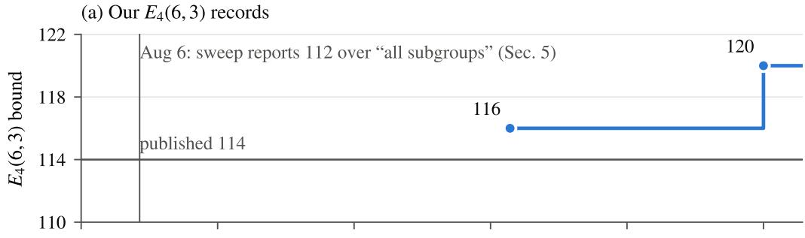
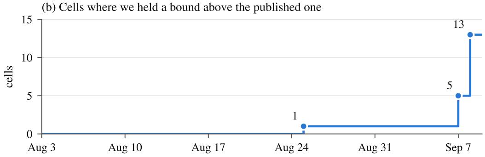

# Coding Agents for Coding Theory

Abraham Yeung Stanford University ayeung16@stanford.edu

## Abstract

We spent five weeks using an LLM coding agent on open problems in coding theory: finding large sets of four-letter words, such as DNA barcodes, that stay far apart in edit distance. The agent wrote the verifiers and search code; a human chose the problem and set the verification protocol. Restricting the search to codes with a prescribed symmetry, a classical technique, shrank the problem about fourfold and raised the best known code of length 6 and minimum edit distance 3 from 114 to 120 words $( E _ { 4 } ( 6 , 3 ) \ge 1 2 0 )$ . The same pipeline improved twelve further lower bounds at lengths 6 to 9 and distances 3 to 6 (Table 2).

We give the failures equal space. Our own search stopped at 116 and recorded the last symmetry class as topping out at 112; a second agent session, running the same search with a better operator, found the 120. A later verdict that the method did not carry over to length 7 was wrong for the same reason, and an earlier instance (Section 5) cost three weeks. Each time, an intermediate result was written down, never rechecked, and treated as a fact that ruled out further search. Checking final outputs, as our protocol required, does not catch such errors.

## 1 Introduction

LLM coding agents can search large combinatorial spaces. The harder question is whether their output can be trusted. Final constructions can be verified. The intermediate conclusions an agent accumulates along the way, such as which symmetry classes have been searched and which cells are exhausted, usually are not, and those conclusions shape a project’s trajectory. This paper describes one five-week project in which agent sessions found genuine improvements to published bounds in coding theory, and also recorded wrong intermediate conclusions that hid one of those improvements for three weeks. We give the failures as much space as the results because, for anyone deciding how to supervise such an agent, the failures are more useful.

The results. The largest known quaternary code of length 6 with minimum edit distance 3, equivalently a single-edit-correcting DNA barcode set, has 120 codewords. The maintained table of bounds gives 114–176 [3], the lower value from a 2011–2012 evolutionary search [1; 2]. A recent LLM-guided search reports 113 for the same problem [7]. The 120 comes from formulating the problem as maximum independent set on a 4096-vertex confusability graph and searching over codes invariant under the Klein four-group acting on the alphabet.

Verification ran in fresh processes: reimplementations sharing no source with the search find a minimum pairwise distance of exactly 3 and zero colliding edit-balls. The confusability graph was differentially tested against the definition on all 8,386,560 vertex pairs, and reproduces the table’s exact published entries $( E _ { 4 } ( 3 , 3 ) = 4 , E _ { 4 } ( 4 , 3 ) = 1 6 , n = 5$ sweep at the published 44). Twelve further lower bounds improved (Section 4, Table 2), at n = 6 to 9 and d up to 6, those at $n \geq 8$ once a C orbit-graph builder made the sizes tractable. Figure 1 (Appendix B) dates each record.

## 2 Setup

A code $C \subseteq \Sigma ^ { n }$ over $| \Sigma | = q$ has minimum edit distance d if every pair of distinct codewords requires at least d insertions, deletions or substitutions to interconvert; $E _ { q } ( n , d )$ is the maximum size of such a code. Maximising $E _ { q } ( n , d )$ is a maximum independent set (MIS) problem on the confusability graph: the vertex set is $\Sigma ^ { n } \ : ( 4 ^ { 6 } = 4 0 9 6$ vertices at $n = 6 )$ , with two words adjacent when their edit distance is less than d. $\mathrm { A t } n = 6 , d = 3$ the graph has 392,358 edges, and the strong MIS solver ReduMIS [6] plateaus at 113.

What the agent did and did not do. The agent was Claude Opus 5 via Claude Code, an LLM with shell access rather than a bespoke mathematical system. It wrote the verifiers and search code and drove off-the-shelf solvers (HiGHS, CaDiCaL, SciPy/CVXPY, ReduMIS [6]). A human chose the problem, set the protocol and redirected between sessions. The agent did the implementation and interpretation, and chose methods from the protocol’s escalation order (Appendix A lists who proposed what). That protocol, which we call verifier-first, was a project instructions file loaded into every session. It required two independent verifiers with different representations and no shared code, the first written and tested on corrupted objects before any search began. It also required reproducing known published values before searching new cells, and re-verifying every saved bound in a fresh process. In the shipped version, its escalation order puts prescribed-symmetry search right after brute force and moves up a rung when the current one plateaus. The file was rewritten during the project, so we cannot tell whether that advice came before the agent first used the method. The decisive run came from a second agent session with no shared context that audited our repository (Section 3). It used its own implementation of the local search of Andrade, Resende and Werneck (ARW) [5]. Our Python operator already had the same (1,2)-swaps and plateau moves, so the difference lay in implementation details we did not isolate. Sessions did not re-read all earlier sessions. This matters for Section 5, because conclusions written in one session became invisible constraints on later ones. The verifiers are independent in representation (edit balls, two Levenshtein tables, Myers bit-vectors) but not in authorship, and the differential test against the definition on all word pairs guards their shared assumptions.

Related work. The $d = 3$ cells were recently attacked by LLM-guided search [7]. The checks we use are standard testing ideas (known-answer instances, metamorphic and differential testing), normally applied to a system’s outputs. What cost this project three weeks was an error in intermediate state and its summaries, which output checks never see.

## 3 What worked

Prescribed symmetry. The mathematical core is prescribed-automorphism search in the Kramer– Mesner line [4]: choose a group, require the code to be invariant under it, and search orbit representatives instead of individual words. At $n = 6$ the natural symmetry group is $S _ { 4 } \times C _ { 2 }$ (the 24 permutations of the four-letter alphabet, times word reversal, giving order 48). We do not claim this is the full automorphism group of the confusability graph, which we did not compute. The group has 33 conjugacy classes of subgroups. Twenty-two are product-form (a permutation subgroup $H ,$ optionally paired with reversal). The other eleven are diagonal: they contain elements that pair a permutation with reversal, and cannot be written as H or ${ \bar { H } } \times C _ { 2 } .$ . Three of the order-4 classes act freely on $\Sigma ^ { 6 }$ . In each, the search collapses from 4096 words to 1021 usable orbits (those whose elements are pairwise at edit distance $\geq 3 )$ , and every orbit has exactly 4 elements, so invariant code sizes are multiples of 4 and nothing lies between 116 and 120.

What our search missed. Our first sweep covered 30 of the 33 classes and gave each four seeds; the other three, missed by our enumeration, were searched later and reach 104. Two of the three free-acting classes returned 116; the third returned 112 on all four seeds. We recorded 112 as its maximum. Both parts of that recording were wrong. Re-running the same class with our operator at ten ten-minute seeds returns 116 on five of them. Then the second agent session ran its ARW implementation on the same orbit graph. It reached 116 on every seed within a minute, and 120 on two of six seeds. We then reimplemented that operator in C (search/mis\_ils.c, about $1 0 ^ { 3 }$ times more iterations per second than our Python). It reproduces the 120 and finds 120s in both $C _ { 4 }$ classes, so all three free classes contain one. Whether a seed reaches 120 is decided early: fifteen ten-minute seeds on the free classes all returned 116, while thirty one-minute seeds on the $V _ { 4 }$ class returned 120 four times, so more seeds beat longer ones. Those rates belong to the stronger operator. The original four-seed sweep used our own operator at 128 seconds per seed, and that operator never reaches 120 at any budget we tried. The sweep was underpowered even for 116, and its “tops out at $1 1 2 ^ { \circ }$ was a small sample recorded as settled fact. Nothing reached 124. A numerical, uncertified Lovász theta value on the orbit graph, about 45 orbits (180 words), is too loose to say whether a 124 exists.

The instance reduction is real. Our operator gets 111 on the raw graph at 180 core-minutes and 116 on the orbit graph at 8.5, and the stronger operator gets 120 on the orbit graph but only 114 on the raw one. ReduMIS on the same orbit graph returns 116 on each of three single-threaded ten-minute seeds, against 112–113 on the raw graph, where its seeds stopped on their own after 4.6–6.1 minutes; at the same 30 core-minutes, the C operator returns 120 on four of thirty one-minute seeds. So the reduction lifts all three operators to $^ { 1 1 6 , }$ and the step to 120 needs a stronger operator on the reduced instance, since neither alone reaches it at $n = 6$ . The ranking is not stable in n. $\mathbf { A } \mathbf { t } n = 8$ ReduMIS reaches 1124–1132 on the $V _ { 4 }$ orbit graph against the C operator’s 1148, and at $n = 9$ it reaches 3760 against 3724 (Table 2).

Calibration cells. Verification shows that an artifact is valid. It says nothing about whether a search was strong enough for a negative result to mean anything, and most of a project’s output is negative results. We propose including in every batch one cell with an independent reference; ours is the unrestricted problem, whose exact value is open, with ReduMIS’s 113 as reference. Table 1 shows why: a sweep over 15 previously unexamined cells returned a plausible spread of values up to 100, while the same solver scored 99 on the unrestricted problem, where 113 is attainable. The batch was measuring the solver rather than the cells, so we discarded it. The check is not sufficient, since the sweep that under-searched the winning class passed its calibration cell. It detects a broken solver but not an under-budgeted one.

Table 1: Calibration across three runs, and (right) the compute-response of the repaired operator, nearly flat over 6–60 core-min; the 150 row is our earlier raw-graph local search, for reference only.
<table><tr><td rowspan="3"></td><td colspan="4">the three runs</td><td colspan="2">operator vs. budget</td></tr><tr><td></td><td>core-min</td><td>best</td><td>calib.</td><td>budget</td><td>calib.</td></tr><tr><td>1</td><td>original operator</td><td>6</td><td>100</td><td>99</td><td>6 (broken op.)</td><td>99</td></tr><tr><td>2</td><td>repaired operator</td><td>60</td><td>112</td><td>110</td><td>6</td><td>109</td></tr><tr><td>3</td><td>later sweep, same op.</td><td>20</td><td>116</td><td>109</td><td>15</td><td>109</td></tr><tr><td></td><td></td><td></td><td></td><td></td><td>20</td><td>109</td></tr><tr><td></td><td></td><td></td><td></td><td></td><td>60</td><td>110</td></tr><tr><td></td><td></td><td></td><td></td><td></td><td>150 (raw-graph ILS)</td><td>111</td></tr></table>

The check needs a decision rule, and an absolute threshold is the wrong one. Run 3, which produced the 116, scored 109, below the 110 that licensed trusting the operator in run 2, so a fixed cutoff would have discarded the run that found the 116. Normalising by compute avoids this. The right-hand columns plot the repaired operator against budget: 109 at six core-minutes and 110 at sixty, a 10× increase buying one codeword. The curve has four points; two share their configuration with runs 2 and 3, so they are not independent of what is being judged. The curve is close to flat, and against it run 1’s 99 at six core-minutes is ten low. So we judge a run by its distance from the compute-response curve instead of from a fixed number. The curve costs four short runs on a known cell.

A cheaper variant needs no known answer. Conjugate subgroups give isomorphic problems, so cells within one conjugacy class must report equal optima, and any spread flags the solver. Run 1 returned 88, 87, 86, 84, 88, 83 on six isomorphic problems inside a single class.

## 4 Where it did not work

$n = 7 !$ : first a negative result, then not. Applied unchanged to $E _ { 4 } ( 7 , 3 )$ , whose record is 356, the best over 30 of the 33 invariance classes was 355. (Three classes our first enumeration missed, which need three generators, were searched afterwards and reach 340.) Our notes recorded this as “the method did not transfer,” then qualified it as a statement about our search rather than about the cell, since the same operator had already under-searched the $n = 6$ winning class.

The qualification was correct. The C operator, on the same orbit graphs, returned 358 on both of its ten-minute seeds in the order-6 class that had given 355, and 359 in the reversal-only class (6844 orbits). That code consists of 164 reversal pairs and 31 palindromes. Each passed all four verifiers and a from-scratch distance check. Three further fifteen-minute seeds of the same operator on the order-6 class all gave 355, the stalling of long seeds seen at $n = 6$ . Twenty-six further two-minute seeds spread 355–364, and the 364 is the value in Table 2.

Other distances. Nothing in the method is specific to $d = 3 \colon$ symbol permutations and reversal preserve edit distance, so the same 33 classes act on every conflict graph $\mathrm { \bar { \cdots } l e v } \leq d - 1 . \mathrm { \bar { \cdot } }$ We built a general-d version (a C graph builder and two independent verifiers with a 3463-check accept/reject suite) and first checked it on the table’s exact cells, which it must reproduce and must not exceed: $E _ { 4 } ( 5 , 3 ) = 4 4 , E _ { 4 } ( 5 , 4 ) = 1 1 , E _ { 4 } ( 6 , 5 ) = 8$ and $E _ { 4 } ( 6 , 6 ) = 4$ all came back exactly. $E _ { 4 } ( 6 , 4 )$ tabled 28–32, then gave 30 in three classes, and a MaxSAT solve of one of those orbit graphs reports 30 as the optimum within that class; $E _ { 4 } ( 7 , 4 )$ , tabled 65–128, gave 72 in two order-8 classes. Each took under an hour including graph construction. The same pipeline then ran at $n = 7$ to 9 and at d up to 6. The winning class differs by cell (Table 2), and there was no shortcut to trying them all. A third operator, NuMVC, trailed both others everywhere.

Table 2: Every lower bound this project improved, with a symmetry class containing the record (Appendix C gives each code’s full stabiliser), the usable-orbit count of that class, and how many seeds at the stated budget reached the value (C operator unless marked ReduMIS). The four bounds above the rule were improved first; the rest came from the same pipeline extended further, with $n \geq 8$ built by a C orbit-graph builder validated edge-for-edge against the Python one. Four values are class optima as reported by exact solvers $( ( 6 , 4 )$ by MaxSAT, the others by maximum clique of the compatibility graph); none has a checked certificate.
<table><tr><td>cell</td><td>published</td><td>new lower bound</td><td>class</td><td>orbits</td><td>seeds</td></tr><tr><td> $E _ { 4 } ( 6 , 3 )$ </td><td>114-176</td><td>120</td><td> $V _ { 4 } ~ ( \mathrm { f r e e } )$ </td><td>1021</td><td>8/96 at 1 min</td></tr><tr><td> $E _ { 4 } ( 7 , 3 )$ </td><td>356-614</td><td>364</td><td> $C _ { 3 } \times C _ { 2 }$ </td><td>2218</td><td>2/26 at 2 min</td></tr><tr><td> $E _ { 4 } ( 6 , 4 )$ </td><td>28-32</td><td>30</td><td>diagonal, order 4, optimum</td><td>518</td><td>3/3 at 26 s</td></tr><tr><td> $E _ { 4 } ( 7 , 4 )$ </td><td>65-128</td><td>72</td><td>diagonal, order 8</td><td>1277</td><td>11/11 at 1–2 min</td></tr><tr><td> $E _ { 4 } ( 8 , 3 )$ </td><td>1132-2340</td><td>1148</td><td> $V _ { 4 } ~ ( \mathrm { f r e e } )$ </td><td>16381</td><td>1/20 at 10 min</td></tr><tr><td> $E _ { 4 } ( 9 , 3 )$ </td><td>3451-9360</td><td>3760</td><td>diagonal  $C _ { 4 }$  (free)</td><td>65531</td><td>ReduMIS, 2/7 at 15–30 min</td></tr><tr><td> $E _ { 4 } ( 8 , 4 )$ </td><td>176-512</td><td>200</td><td>diagonal, order 8</td><td>6500</td><td>2/24 at 10 min</td></tr><tr><td> $E _ { 4 } ( 9 , 4 )$ </td><td>495-2048</td><td>520</td><td>diagonal, order 8</td><td>28627</td><td>4/10 at 15 min</td></tr><tr><td> $E _ { 4 } ( 7 , 5 )$ </td><td>18-24</td><td>20</td><td> $V _ { 4 }$  (free), optimum</td><td>3568</td><td>13/13 at 0.5–1 min</td></tr><tr><td> $E _ { 4 } ( 8 , 5 )$ </td><td>38-96</td><td>44</td><td> $V _ { 4 }$  (free)</td><td>15649</td><td>2/10 at 10 min</td></tr><tr><td> $E _ { 4 } ( 9 , 5 )$ </td><td>97-384</td><td>100</td><td>diagonal, order 8</td><td>13143</td><td>4/4 at 15 min</td></tr><tr><td> $E _ { 4 } ( 8 , 6 )$ </td><td>14-32</td><td>16</td><td> $V _ { 4 }$  (free), optimum</td><td>12055</td><td>8/8 at 5–10 min</td></tr><tr><td> $E _ { 4 } ( 9 , 6 )$ </td><td>27-128</td><td>32</td><td>diagonal, order 8, optimum</td><td>5813</td><td>2/2 at 10 min</td></tr></table>

SAT and ILP. These end the protocol’s escalation order. For constructions they returned nothing usable. SAT reported UNKNOWN after 462 s and 389 s on instances known to be feasible (binary deletion codes at $n = 1 1$ , from the same project), and the ILP returned unconverged incumbents on the cells here. For certificates the same tools were indispensable: drat-trim-verified UNSAT proofs, including a proof that the A4-invariant optimum is exactly 112, and LP duality reproducing 24 of 24 published LP relaxation values as exact rational certificates. The ranking of tools depends on direction. Heuristic local search built every construction, and formal methods produced every checked certificate. The four class optima of Table 2 have none.

## 5 The most expensive error

Three weeks before our first record, the 116, a sweep reported “best invariant code 112, proven optimal in the $A _ { 4 }$ class” over what it described as all subgroups. Four defects were behind that sentence. The parameterisation expressed invariance as $^ { \ast } H \leq S _ { 4 } ,$ , optionally with reversal,” reaching only the 22 product-form classes. One of the 116-word codes found later lives in a diagonal class it could not express. And a size cap skipped 15 of the 60 (subgroup, reversal) cells of that parameterisation, precisely the weakest-symmetry ones.

Inside the cap, the MILP returned unproven incumbents on cells it could not finish, and the summary dropped their status. Those last two defects are the instructive ones. Three conjugate cells, isomorphic problems that must share an optimum, were reported as 100, 92 and 8 for a quantity now known to be $\geq 1 2 0$ . The results file did record proven\_optimal\_invariant: false for all three, and the conjugacy check of Section 3 would have flagged the spread. (The $A _ { 4 }$ optimum really is 112; the error was “all subgroups.”) The flag was present in the data and absent from the summary, and the summary is what a human collaborator reads. None of the four raised an error. All produced plausible numbers, so a protocol that checks outputs never questioned them. The protocol had the same gap, since the ground-truth verifier did not cover this problem family until ten days after our first record, the 116. We keep the description “verifier-first” because that is what the protocol specified, not what the 116 received at the time.

Here the agent wrote conclusions faster than its supervisor re-read them, and those conclusions narrowed the search without anyone noticing. No search that trusted the recorded summary would have revisited the class that held the bound. The fix is cheap. Recheck settled conclusions on a schedule, and record unproven solver output as unknown rather than as a value. The protocol had no such rule until 7 September. Our own first correction, which added the diagonal classes, was itself incomplete (it enumerated 30 of the 33) and was caught only by separate review sessions.

## 6 Limitations

This is a single case study: one project, one problem family, one human supervisor, and no comparison across projects. The 120 came from a second agent session rather than our main search, and most later bounds from our C reimplementation of that operator $( E _ { 4 } ( 9 , 3 )$ from ReduMIS). The operator comparison of Section 3, which includes ReduMIS on the orbit graphs, and the NuMVC run are the only controls we have. They show that the bounds need both the reduced instance and a strong operator, and that which operator is strongest depends on the cell. We cannot cleanly isolate how much of the result is attributable to the agent versus a conventional search pipeline using the same mathematical machinery. The key algorithmic components (prescribed symmetry, the ARW operator) predate LLMs, and the agent’s contribution was the engineering around a classical method, not a new method.

The run records sum to about 130 core-hours on one laptop. Session counts, API cost and human redirects were not logged, and intermediate conclusions were not counted as they were written, so “three times” has no denominator. What we can say is that the three negatives that pruned the search all turned out wrong when re-run at a larger budget, while others, such as the absence of a 124 at $n = 6$ , held. The calibration rule has no fixed tolerance and has only been tried on the runs in Table 1, and the remedies themselves are untested. The failure modes are not specific to language models. Dropped provenance and underpowered sampling happen in any computational project, and our claim is only that here the agent wrote summaries faster than its supervisor re-read the logs. Every result is an improved lower bound, no upper bound changed, and the incumbents are unverified heuristic claims whose codeword lists were never published, so their long standing may partly reflect how few have attacked them. The logs are self-reported by the system under study, so we release them: the supplement (https://github.com/Abraham-y/coding-agents-coding-theory) ships the codes, all four verifiers, the defective sweep, the protocol document and every run record, and one script re-verifies every claimed bound in minutes.

## 7 Conclusion

The mathematics that produced the bounds is classical prescribed-automorphism search. Which operator and symmetry class worked best changed from one $( n , d )$ to the next, and the free action fixed sizes at multiples of four without causing the escape from the incumbent. The contribution to AI methodology is the failure analysis. Three times in this project a conclusion was recorded, never rechecked, and turned out to be hiding the answer: a sweep whose summary dropped the solver’s “unproven” status, a four-seed result read as a property of a class, and a “does not transfer” verdict that was a property of the operator. A verifier-first protocol catches errors in final outputs but not in the intermediate state that decides which outputs to pursue, and we expect that gap to matter more as agents run for longer.

## References

[1] D. A. Ashlock, S. K. Houghten, J. A. Brown, J. Orth. On the synthesis of DNA error correcting codes. BioSystems 110(1):1–8, 2012. https://doi.org/10.1016/j.biosystems.2012.06.005

[2] J. Orth. The Salmon Algorithm: A New Population Based Search Metaheuristic. MSc thesis, Brock University, St. Catharines, December 2011. Table 9.5 records E4(6, 3): previous best 108, new best 114.

[3] S. Houghten. A Table of Bounds on Optimal Fixed-Length Quaternary Edit-Metric Codes. Brock University, https://www.cosc.brocku.ca/\~houghten/quaternaryedit.html; the thirteen incumbents in Table 2 were read from our 2026-08-09 fetch, and the (6, 3) cell was re-checked by manual browser load on 2026-09-03 (automated fetches have returned 403 since 2026-08-26); the 2025-08-22 Wayback snapshot agrees, and the 2011 snapshot reads 111–176 at (6, 3).

[4] E. S. Kramer and D. M. Mesner. t-designs on hypergraphs. Discrete Mathematics 15(3):263–296, 1976. https://doi.org/10.1016/0012-365X(76)90030-3

[5] D. V. Andrade, M. G. C. Resende, R. F. Werneck. Fast local search for the maximum independent set problem. Journal ofHeuristics 18(4):525–547, 2012. https://doi.org/10.1007/s10732-012-9196-4

[6] S. Lamm, P. Sanders, C. Schulz, D. Strash, R. F. Werneck. Finding near-optimal independent sets at scale. Journal of Heuristics 23(4):207–229, 2017. https://doi.org/10.1007/s10732-017-9337-x

[7] F. Weindel and R. Heckel. LLM-Guided Search for Deletion-Correcting Codes. arXiv:2504.00613, 2025 (v2, 2026). Table 3 reports 113 at n = 6, 352 at n = 7, 1130 at n = 8.

## A Who proposed what

Compiled from Sections 2–5 and the project notes. “Agent” means the main agent sessions; “second session” means the independent session that audited our repository and found the 120; “review sessions” are other independent adversarial-review sessions.

<table><tr><td>Decision or component</td><td>Source</td></tr><tr><td>Problem: open cells of the quaternary edit-metric table</td><td>Human</td></tr><tr><td>Protocol: verifier-first rules and escalation order</td><td>Human</td></tr><tr><td>Redirects between sessions</td><td>Human</td></tr><tr><td>Prescribed-symmetry search, a classical method [4]</td><td>Agent, within the protocol&#x27;s escalation order, which as shipped lists it second; we cannot date</td></tr><tr><td>Verifiers, search code, orbit-graph builders, and C imple- Agent mentations of the ARW operator and NuMVC</td><td>that entry against the agent&#x27;s first use</td></tr><tr><td>Recorded conclusions, including the 112 ceiling and “did Agent not transfer&quot;</td><td></td></tr><tr><td>Its own ARW implementation [5] on the n = 6 orbit graph, Second session which found the 120</td><td></td></tr><tr><td>Catching that our first correction enumerated only 30 of Review sessions</td><td></td></tr><tr><td>the 33 classes DRAT proof that the A₄-invariant optimum is 112</td><td>Review session</td></tr><tr><td>Solvers: HiGHS, CaDiCaL, drat-trim, RC2 (python-sat), SciPy/CVXPY with SCS, networkx, ReduMIS [6]</td><td>Existing tools</td></tr></table>

## B Timeline

  
Figure 1: When each record was set, by calendar day, from the dated entries in the project notes (notes/sota.md, in the supplement). This is calendar time, not machine time: run records lack consistent timestamps and compute fields, so they cannot be placed on a machine-time axis. (a) Our $E _ { 4 } ( 6 , 3 )$ records against the published 114; the vertical line marks the sweep of Section 5. (b) Cells where we held a bound above the published one, at the end of each day. Twelve of the thirteen record date from the last two days, once the ARW operator and the C orbit-graph builder were in place.

## C The thirteen codes

Each list is the complete code; sha256 is over the sorted words, one per line, each line newlineterminated. Each was re-verified from the definition in a fresh process (pairwise Levenshtein distance $\geq d )$ . The same lists ship as plain-text files in the supplement, with the verifiers.

$E _ { 4 } ( 6 , 3 ) \ge 1 2 0$ , 120 words. Stabiliser in $S _ { 4 } \times C _ { 2 } ;$ Klein four-group $V _ { 4 }$ on symbols, no reversal.   
sha256 adeaa3604074f5f2b42ece623e45df96f9521650b98fb11a7182321fbc5c3576.

<table><tr><td>000323 001231 001302 002011 002103 003000 003222 010022 010110 011223 011311 012132</td><td></td><td></td><td></td><td></td><td></td><td></td><td></td><td></td><td></td><td></td></tr><tr><td></td><td></td><td></td><td></td><td></td><td></td><td></td><td></td><td></td><td>012300 013033 013201 020312 021021 021113 022030 022202 023131 023303 030013 030220</td><td></td></tr><tr><td></td><td></td><td></td><td></td><td></td><td></td><td></td><td></td><td></td><td>031032 031101 032233 032321 033112 033330 100200 100332 101001 101133 102122 102310</td><td></td></tr><tr><td>103023 103211 110213 110320 111232 112111 112333 113012 113100 120010 120123 121102</td><td></td><td></td><td></td><td></td><td></td><td></td><td></td><td></td><td></td><td></td></tr><tr><td>121331 122003 122221 123230 123322 130002 130130 131203 132020 132212 133121 133313</td><td></td><td></td><td></td><td></td><td></td><td></td><td></td><td></td><td></td><td></td></tr><tr><td>200020 200212 201121 201313 202130 203203 203331 210011 210103 211112 211330 212002</td><td></td><td></td><td></td><td></td><td></td><td></td><td></td><td></td><td></td><td></td></tr><tr><td>212231 213210 213323 220233 220321 221000 221222 222101 223013 223120 230122 230310</td><td></td><td></td><td></td><td></td><td></td><td></td><td></td><td></td><td></td><td></td></tr><tr><td>231023 231211 232200 232332 233001 233133 300003 300221 301012 301100 302232 302301</td><td></td><td></td><td></td><td></td><td></td><td></td><td></td><td></td><td></td><td></td></tr><tr><td>303113 303320 310030 310202 311131 311303 312220 312312 313021 320132 320300 321033</td><td></td><td></td><td></td><td></td><td></td><td></td><td></td><td></td><td></td><td></td></tr><tr><td>321201 322022 322110 323223 323311 330111 330333 331230 331322 332031 332102 333010</td><td></td><td></td><td></td><td></td><td></td><td></td><td></td><td></td><td></td><td></td></tr></table>

$E _ { 4 } ( 7 , 3 ) \geq 3 6 4 ,$ 364 words. Stabiliser in $S _ { 4 } \times C _ { 2 } \colon C _ { 3 } \times C _ { 2 } .$ , the 3-cycle (1 2 3) on symbols and reversal. sha256 dadc469672cd5dfe21dbe551ca884c81851a9cc661440f323cf7c65d895e34e6.

0000000 0001331 0002112 0003223 0010113 0011100 0011312 0012233 0012321 0013010   
0013202 0020221 0021020 0021303 0022123 0022200 0023132 0023311 0030332 0031122   
000333 001011 003122 013210 020202 021130 032231 033003 102301 110100 111222 112033   
122112 123320 130021 131313 200220 201103 212121 220311 222000 223233 230132 303030   
310012 311331 321023 331200 332322 333111

<table><tr><td>0031213 0032030 0032101 0033231 0033300 0100123 0100330 0101032 0103100 0103212</td><td></td><td></td><td></td><td></td><td></td><td></td><td></td><td></td><td></td></tr><tr><td></td><td></td><td></td><td></td><td></td><td></td><td></td><td>0110020 0111121 0111203 0112222 0112313 0113230 0120210 0121130 0122111 0122320</td><td></td><td></td></tr><tr><td></td><td></td><td></td><td></td><td></td><td></td><td></td><td>0123022 0130112 0130201 0131220 0131302 0132133 0133003 0133321 0200110 0200231</td><td></td><td></td></tr><tr><td></td><td></td><td></td><td></td><td></td><td></td><td></td><td>0201200 0201323 0202013 0210223 0210302 0211001 0211132 0212103 0212330 0213211</td><td></td><td></td></tr><tr><td></td><td></td><td></td><td></td><td></td><td></td><td></td><td>0220030 0221310 0222232 0222301 0223121 0223333 0230320 0231033 0232210 0233130</td><td></td><td></td></tr><tr><td></td><td></td><td></td><td></td><td></td><td></td><td></td><td>0233222 0300220 0300312 0302131 0302300 0303021 0310130 0311210 0311333 0312011</td><td></td><td></td></tr><tr><td>0313320 0320103 0320331 0321322 0322002 0322213 0323110 0323201 0330010 0331111</td><td></td><td></td><td></td><td></td><td></td><td></td><td></td><td></td><td></td></tr><tr><td>0331232 0332120 0333102 0333313 1000213 1000302 1001120 1002001 1003131 1010101</td><td></td><td></td><td></td><td></td><td></td><td></td><td></td><td></td><td></td></tr><tr><td>1011211 1012132 1012300 1013033 1020003 1020122 1020310 1021133 1022212 1023021</td><td></td><td></td><td></td><td></td><td></td><td></td><td></td><td></td><td></td></tr><tr><td>1023230 1031023 1032220 1032313 1033112 1100011 1101113 1101202 1102130 1103333</td><td></td><td></td><td></td><td></td><td></td><td></td><td></td><td></td><td></td></tr><tr><td>1110233 1110321 1111022 1111330 1112123 1112210 1113312 1120032 1121101 1122013</td><td></td><td></td><td></td><td></td><td></td><td></td><td></td><td></td><td></td></tr><tr><td>1122302 1123120 1123211 1130103 1130222 1131132 1131311 1132031 1133200 1200133</td><td></td><td></td><td></td><td></td><td></td><td></td><td></td><td></td><td></td></tr><tr><td>1201021 1203030 1203201 1203322 1210031 1211110 1213102 1213220 1220200 1220323</td><td></td><td></td><td></td><td></td><td></td><td></td><td></td><td></td><td></td></tr><tr><td>1221332 1222022 1222131 1223113 1230002 1230111 1231212 1231303 1232100 1232321</td><td></td><td></td><td></td><td></td><td></td><td></td><td></td><td></td><td></td></tr><tr><td>1233233 1233310 1300121 1301223 1302102 1302311 1310332 1311103 1312030 1312221</td><td></td><td></td><td></td><td></td><td></td><td></td><td></td><td></td><td></td></tr><tr><td>1313001 1313213 1320020 1321112 1321231 1322333 1323222 1323300 1330230 1331000</td><td></td><td></td><td></td><td></td><td></td><td></td><td></td><td></td><td></td></tr><tr><td>1332012 1332203 1333123 1333331 2000103 2000321 2001212 2002230 2003002 2011223</td><td></td><td></td><td></td><td></td><td></td><td></td><td></td><td></td><td></td></tr><tr><td>2012031 2013121 2013330 2020202 2021011 2022322 2023100 2023213 2030001 2030120</td><td></td><td></td><td></td><td></td><td></td><td></td><td></td><td></td><td></td></tr><tr><td>2030233 2031032 2031310 2032211 2033323 2100232 2102331 2103122 2103203 2110310</td><td></td><td></td><td></td><td></td><td></td><td></td><td></td><td></td><td></td></tr><tr><td>2111112 2111231 2112000 2113023 2113301 2120113 2121002 2121321 2122201 2123010</td><td></td><td></td><td></td><td></td><td></td><td></td><td></td><td></td><td></td></tr><tr><td>2123332 2130030 2131100 2131333 2132223 2132312 2133111 2200022 2201111 2202221</td><td></td><td></td><td></td><td></td><td></td><td></td><td></td><td></td><td></td></tr><tr><td>2202303 2203210 2210201 2210333 2211300 2212122 2212213 2213012 2220132 2220311</td><td></td><td></td><td></td><td></td><td></td><td></td><td></td><td></td><td></td></tr><tr><td>2221123 2222033 2222110 2223231 2223320 2230013 2231230 2231322 2232202 2233021</td><td></td><td></td><td></td><td></td><td></td><td></td><td></td><td></td><td></td></tr><tr><td>2233103 2300211 2301010 2301133 2301302 2302032 2310003 2310222 2311120 2311311</td><td></td><td></td><td></td><td></td><td></td><td></td><td></td><td></td><td></td></tr><tr><td>2312101 2312323 2313132 2313200 2320012 2321203 2321330 2322220 2330131 2330300</td><td></td><td></td><td></td><td></td><td></td><td></td><td></td><td></td><td></td></tr><tr><td>2331221 2332113 2333033 2333212 3000132 3000201 3001003 3002323 3003310 3010002</td><td></td><td></td><td></td><td></td><td></td><td></td><td></td><td></td><td></td></tr><tr><td>3010230 3010311 3011131 3012013 3012120 3013322 3021110 3021232 3022331 3023012</td><td></td><td></td><td></td><td></td><td></td><td></td><td></td><td></td><td></td></tr><tr><td>3030303 3031200 3031321 3032022 3033133 3100322 3102020 3102103 3102211 3103013</td><td></td><td></td><td></td><td></td><td></td><td></td><td></td><td></td><td></td></tr><tr><td>3110100 3110212 3111011 3111323 3112332 3113221 3120001 3120333 3121213 3121300</td><td></td><td></td><td></td><td></td><td></td><td></td><td></td><td></td><td></td></tr><tr><td>3122122 3122230 3123131 3123202 3130023 3132110 3132301 3133330 3200313 3201233</td><td></td><td></td><td></td><td></td><td></td><td></td><td></td><td></td><td></td></tr><tr><td>3201301 3203112 3210010 3211222 3212111 3212200 3213123 3213331 3220120 3221031</td><td></td><td></td><td></td><td></td><td></td><td></td><td></td><td></td><td></td></tr><tr><td>3221102 3222223 3222312 3223000 3230221 3231020 3231113 3232003 3232132 3233302</td><td></td><td></td><td></td><td></td><td></td><td></td><td></td><td></td><td></td></tr><tr><td>3300033 3301320 3302222 3303101 3303332 3310021 3311032 3311201 3312133 3312310</td><td></td><td></td><td></td><td></td><td></td><td></td><td></td><td></td><td></td></tr><tr><td>3313303 3320111 3320302 3321023 3322100 3323233 3323321 3330122 3330213 3331130</td><td></td><td></td><td></td><td></td><td></td><td></td><td></td><td></td><td></td></tr><tr><td></td><td>3331312 3332231 3333011 3333220</td><td></td><td></td><td></td><td></td><td></td><td></td><td></td><td></td></tr></table>

$E _ { 4 } ( 8 , 3 ) \geq 1 1 4 8 ,$ 1148 words. Stabiliser in $S _ { 4 } \times C _ { 2 } ;$ Klein four-group $V _ { 4 }$ on symbols, no reversal. sha256 e98fe9d121189c38208634f4b8978be329f6aeee0f2d2bedd97105bb87c57fb8.
<table><tr><td>00000010 00000221 00002031 00002322 00003101 00003313 00010323 00011003 00011211</td><td></td><td></td><td></td><td></td><td></td><td></td><td></td><td></td></tr><tr><td></td><td></td><td></td><td></td><td></td><td></td><td></td><td>00012130 00013122 00020332 00021202 00022213 00023020 00030131 00031320 00032103</td><td></td></tr><tr><td></td><td></td><td></td><td></td><td></td><td></td><td></td><td>00032232 00033012 00100002 00101112 00101321 00102123 00102310 00103200 00103332</td><td></td></tr><tr><td></td><td></td><td></td><td></td><td></td><td></td><td></td><td>00110233 00111302 00112020 00112212 00113013 00120103 00121000 00122333 00123221</td><td></td></tr><tr><td></td><td></td><td></td><td></td><td></td><td></td><td></td><td>00130201 00131230 00132111 00133303 00200120 00201232 00202211 00203023 00210011</td><td></td></tr><tr><td></td><td></td><td></td><td></td><td></td><td></td><td></td><td>00210222 00211121 00211333 00212203 00213312 00220210 00221113 00221322 00222001</td><td></td></tr><tr><td>00223032 00223300 00230112 00231002 00232033 00232220 00233231 00300113 00301203</td><td></td><td></td><td></td><td></td><td></td><td></td><td></td><td></td></tr><tr><td></td><td></td><td></td><td></td><td></td><td></td><td></td><td>00301330 00302100 00303212 00310030 00310101 00312313 00313110 00320311 00322131</td><td></td></tr><tr><td>00322222 00323003 00323230 00330223 00330300 00331031 00331122 00333133 01000103</td><td></td><td></td><td></td><td></td><td></td><td></td><td></td><td></td></tr><tr><td></td><td></td><td></td><td></td><td></td><td></td><td></td><td>01001200 01003211 01010012 01011232 01013100 01020233 01021030 01022003 01022120</td><td></td></tr><tr><td>01023322 01030001 01031302 01032022 01033033 01033121 01101213 01103003 01110023</td><td></td><td></td><td></td><td></td><td></td><td></td><td></td><td></td></tr><tr><td>01110111 0111020001111122 01121133 01122232 01122311 01123031 01130212 01130320</td><td></td><td></td><td></td><td></td><td></td><td></td><td></td><td></td></tr><tr><td></td><td></td><td></td><td></td><td></td><td></td><td></td><td>01131331 01132221 01133010 01200223 01201301 01202020 01203122 01203330 01211013</td><td></td></tr><tr><td></td><td></td><td></td><td></td><td></td><td></td><td></td><td>01213220 01220132 01221021 01221100 01223212 01230030 01231123 01231310 01232011</td><td></td></tr><tr><td></td><td></td><td></td><td></td><td></td><td></td><td></td><td>01232332 01233203 01300210 01300331 01301022 01301111 01302133 01302302 01303323</td><td></td></tr><tr><td></td><td></td><td></td><td></td><td></td><td></td><td></td><td>01310120 01311103 01311321 01312001 01313332 01320303 01321223 01321312 01322200</td><td></td></tr><tr><td></td><td></td><td></td><td></td><td></td><td></td><td></td><td>01330013 0133100001333102 01333311 02001002 02002111 02003021 02011300 02012033</td><td></td></tr><tr><td>02012102 02013131 02020212 02021103 02021321 02022310 02023200 02023333 02030032</td><td></td><td></td><td></td><td></td><td></td><td></td><td></td><td></td></tr><tr><td></td><td></td><td></td><td></td><td></td><td></td><td></td><td>02030220 02030313 02031112 02100232 02101120 02102201 02103030 02103113 02111032</td><td></td></tr><tr><td></td><td></td><td></td><td></td><td></td><td></td><td></td><td>02113321 02120010 02121211 02122022 02123302 02130123 02131101 02131222 02132300</td><td></td></tr><tr><td></td><td></td><td></td><td></td><td></td><td></td><td></td><td>02133233 02200200 02200311 02201133 02202222 02202303 02210130 02211223 02212012</td><td></td></tr><tr><td></td><td></td><td></td><td></td><td></td><td></td><td></td><td>02212320 02213000 02220002 02220231 02221330 02222121 02223011 02231020 02232113</td><td></td></tr><tr><td>02233132 02233210 02233301 02300020 02302213 02303310 02310312 02311202 02312331</td><td></td><td></td><td></td><td></td><td></td><td></td><td></td><td></td></tr><tr><td></td><td></td><td></td><td></td><td></td><td></td><td></td><td>02313211 02321001 02322030 02322112 02322323 02330110 02330321 02331333 02332002</td><td></td></tr><tr><td></td><td></td><td></td><td></td><td></td><td></td><td></td><td>02333023 03000312 03001303 03002023 03002132 03003000 03011331 03012113 03012200</td><td></td></tr><tr><td></td><td></td><td></td><td></td><td></td><td></td><td></td><td>03013011 03013223 03020022 03020111 03021210 03022231 03023130 03031013 03031221</td><td></td></tr></table>

<table><tr><td>03113112 03113330 03120300 03121012 03122203 03123023 03130132 03132031 03132210 03133002 03133120 03200003 03200131 03201320 03203233 03210020 03210213 03210332 03212311 0321310303220123 03222110 03222302 03223201 03230202 03231111 03232000 03232122 03233313 03300122 03300201 03302220 03303032 03311010 03312233 03320033 03321102 03322011 03323213 03323320 03330103 03331130 03332312 03333222 10000033 10001000 10001132 10001311 10010302 10012112 10020220 10021231 10021303 10022101 10023330 10030022 1003212010033200 10033323 1010032310101103 10102011 10111012 10112300 10120213 10121110 10122030 10122122 10123133 10130121 10132233 10133031 10133112 10200012 10200230 10201031 10202223 10203110 10210000 10210133 10211220 10211301 10212232 10213022 10213213 10220111 10221102 10222013 10222200 10230203 10230332 10231212 10233311 10300102 10302331 10310210 10311332 10312033 10312221 10313131 10320032 10320201 10321121 10322312 10323100 10323223 10330011 10330130 10331023 10332303 11000213 11001322 11002102 11003131 11003303 11010003 11010230 11011113 11012223 11012311 11013032 11013201 11020321 11021310 11022212 11023000 11030111 11031012 11032330 11033222 11100112 11100300 11101232 11102033 11103021 11111101 11111330 11112010 11112202 11113120 11113233 11120231 11121020 11122103 11123012 11123323 11130313 11131223 11132131 11133302 11201010 11201121 11202001 11203202 11210221 11210312 11211002 11212303 11213011 11220033 11220120 11221211 11221332 11222022 11231200 11232112 11232321 11233020 11233333 11300030 11300222 11301100 11301333 11302203 11303312 11310323 11311031 11312132 11313300 11320113 11321003 11322320 11323122 11323331 11330002 11330233 11331301 11332123 11332211 11333110 12000110 12000202 12001330 12002003 12002221 12003233 12010320 12011001 12011222 12021023 12022031 12022113 12023120 12023301 12031211 12032132 12033312 12100220 12102100 12102332 12103002 12103311 12110212 12111203 12112111 12113023 12113132 12120102 12120330 12122223 12123210 12130301 12131000 12131133 12132021 12133320 12200101 12203322 12211033 12211310 12212123 12213331 12220021 12221012 12222333 12223203 12230013 12231122 12232231 12232302 12233100 12301131 12301223 12301302 12302012 12303200 12310231 12311020 12311112 12312322 12333213 13000123 13002230 13010031 13011323 13012002 13012121 13013310 13020010 13020333 13021032 13022322 13023211 13030300 13031101 13032213 13033133 13100211 13102020 13103013 13103122 13121331 13130012 1313023013131303 13132222 13132311 13133201 13200313 13201203 13202300 13203220 13211131 13212201 13213302 13220222 13221001 13221230 13222132 13223113 13230110 13233003 13233121 13233232 13300332 13301021 13302111 13303231 13310022 13311200 13311311 13313212 13313333 13320131 13322023 13322210 13322301 1332300213330221 13331113 13331320 13332100 13333030 2000030320001233 20002013 20002220 20003112 20010331 20011032 20011123 20011310 20013202 20020000 20020121 2002202220022133 20023311 20030102 20030230 20031222 20032312 20033001 20100101 20100212 20100330 20103223 20110220 20111201 20112103 20112332 20113111 20120031 20121132 20122202 20130113 20131033 20132130 20133020 20200132 20201022 20201111 20202030 20203103 20203321 20212002 20212131 20212210 20213330 20303033 20310122 20311011 20312301 20313000 20313323 20320023 20321212 20321331 20322010 20323302 20331103 20333210 21000120 21000332 21001023 21002301 21010222 21010300 21011131 2101202021013333 21021011 21022221 21022313 21023102 21030133 21031321 21032031 21032110 21032202 21100233 21101031 21101102 21102211 21103320 21110130 21111000 21112321 21113312 21120002 21121210 21122023 21122300 21130011 21133232 21200013 21201312 21202200 21202333 21203032 21210123 21211110 21213003 21213231 21220201 21220310 21221222 21222130 21223121 21230022 21230331 21231001 21231233 21233113 21300021 21301201 21302122 21303230 21310032 21310213 21311220 21311302 21312310 21322111 21322332 21323013 21330100 21331112 21331330 21332003 21333131 2133322322000223 22001122 2200121022002032 2200310022003331 22010211 22011013 22012330 22013220 22020033 22021201 22022302 22023010 22030021 22031130 22032000 22032233 22033111 22033303 22100000 22100313 22101012 22101221 22102133 22111311 22112001 22112122 22113213 22113300 22120322 22121030 22123021 22123112 22130131 22131332 22132212 2213232322200031 22201202 22203020 22210010 22210321 22211230 22212313 22213102 22220100 22220213 22221131 22221323 22222003 22222232 22301003 22302321 22303222 22310333 22311121 22312023 22313012 22320132 22320301 22321022 22321110 22322220 22323103 22323330 22330030 22330202 22331231 22332011</td><td>1232000012321313 20221203 20223220 20230211 20230320 20231313 20233122 20300200 20301120 20302232</td><td>12322202 12323033</td><td>12323111 1233103212332310 13110113 13112130 13113000 13120003 13121123</td><td></td><td>03032301 0303333203100110 03100333 03101231 03110221 03111001 03111313 03112322 10110311 10131322 12030103 12333001 13121202 13303103 20220333 22010002 22122331 22202110 22230312 22231300 22232101 22233033 22233221 22300111</td></tr></table>

<table><tr><td>23120311 23121101 23122032 23122113 23123200 23123333 23130223 23131110 23132302</td><td></td><td></td><td></td><td></td><td></td><td></td><td></td><td></td></tr><tr><td></td><td></td><td></td><td></td><td></td><td></td><td></td><td>23133103 23133321 23200221 23200302 23201100 23202011 23203212 23210200 23211211</td><td></td></tr><tr><td></td><td></td><td></td><td></td><td></td><td></td><td></td><td>23211303 23212223 23213120 23221033 23222321 23223022 23231322 23232230 23233010</td><td></td></tr><tr><td></td><td></td><td></td><td></td><td></td><td></td><td></td><td>23300010 23300133 23301213 23303311 23310003 23311232 23312030 23312102 23313113</td><td></td></tr><tr><td></td><td></td><td></td><td></td><td></td><td></td><td></td><td>23321221 23323031 23332022 23332201 23332333 23333300 30000111 30001021 30002203</td><td></td></tr><tr><td></td><td></td><td></td><td></td><td></td><td></td><td></td><td>30003230 30010013 30010120 30011322 30012231 30013300 30021100 30022323 30030301</td><td></td></tr><tr><td></td><td></td><td></td><td></td><td></td><td></td><td></td><td>30031113 30033132 30033211 30100020 30101211 30101333 30102222 30103131 30110132</td><td></td></tr><tr><td>30111031 30111223 30113210 30120230 30121022 30123001 30123120 30123313 30130100</td><td></td><td></td><td></td><td></td><td></td><td></td><td></td><td></td></tr><tr><td></td><td></td><td></td><td></td><td></td><td></td><td></td><td>30132013 30133202 30133330 30200213 30200331 30201123 30201302 30203201 30210310</td><td></td></tr><tr><td></td><td></td><td></td><td></td><td></td><td></td><td></td><td>30211130 30212321 30213033 30220003 30220221 30221011 30222020 30222332 30223112</td><td></td></tr><tr><td></td><td></td><td></td><td></td><td></td><td></td><td></td><td>30232102 30233000 30233223 30300001 30301032 30302112 30302320 30310203 30311102</td><td></td></tr><tr><td></td><td></td><td></td><td></td><td></td><td></td><td></td><td>30312123 30313222 30313311 30320110 30320322 30321133 30321220 30322002 30330333</td><td></td></tr><tr><td></td><td></td><td></td><td></td><td></td><td></td><td></td><td>30331201 30331310 30332030 30333021 31000310 31001331 31002000 31003012 31003223</td><td></td></tr><tr><td></td><td></td><td></td><td></td><td></td><td></td><td></td><td>31011010 31011221 31011303 31012332 31020122 31021002 31022131 31023021 31030023</td><td></td></tr><tr><td></td><td></td><td></td><td></td><td></td><td></td><td></td><td>31031120 31033313 31100032 31100123 31100201 31101220 31102313 31110322 31111212</td><td></td></tr><tr><td></td><td></td><td></td><td></td><td></td><td></td><td></td><td>31112003 31113102 31113331 31120333 31121013 31121321 31122110 31123203 31131030</td><td></td></tr><tr><td></td><td></td><td></td><td></td><td></td><td></td><td></td><td>31131111 31132200 31133022 31133133 31200100 31201033 31202111 31202232 31203210</td><td></td></tr><tr><td></td><td></td><td></td><td></td><td></td><td></td><td></td><td>31210031 31211311 31212122 31213323 31220012 31222301 31230220 31230303 31231132</td><td></td></tr><tr><td></td><td></td><td></td><td></td><td></td><td></td><td></td><td>31232213 31233101 31302221 31303020 31303113 31303301 31310000 31310133 31311023</td><td></td></tr><tr><td></td><td></td><td></td><td></td><td></td><td></td><td></td><td>31312012 31312230 31313121 31320202 31321231 31321300 31322033 31330312 31331222</td><td></td></tr><tr><td></td><td></td><td></td><td></td><td></td><td></td><td></td><td>31332331 32000022 32000231 32002333 32003320 32011133 32012021 32012110 32013030</td><td></td></tr><tr><td></td><td></td><td></td><td></td><td></td><td></td><td></td><td>32020001 32021332 32022012 32022230 32023213 32030010 32031031 32031200 32032222</td><td></td></tr><tr><td></td><td></td><td></td><td></td><td></td><td></td><td></td><td>32032311 32033002 32033123 32100130 32101001 32101322 32102023 32102210 32103303</td><td></td></tr><tr><td></td><td></td><td></td><td></td><td></td><td></td><td></td><td>32110121 32112233 32112312 32113201 32120113 32122320 32130003 32130211 32131313</td><td></td></tr><tr><td></td><td></td><td></td><td></td><td></td><td></td><td></td><td>32132032 32133110 32200323 32201112 32202002 32203013 32203121 32210302 32211022</td><td></td></tr><tr><td></td><td></td><td></td><td></td><td></td><td></td><td></td><td>32211101 32212200 32222211 32223133 32223222 32223310 32230330 32232120 32300212</td><td></td></tr><tr><td></td><td></td><td></td><td></td><td></td><td></td><td></td><td>32300300 32301311 32302031 32303332 32310011 32311213 32311330 32312303 32313100</td><td></td></tr><tr><td></td><td></td><td></td><td></td><td></td><td></td><td></td><td>32320233 32322101 32323321 32330122 32332133 32333230 33000200 33002211 33002302</td><td></td></tr><tr><td></td><td></td><td></td><td></td><td></td><td></td><td></td><td>33003033 33003110 33010103 33010330 33011111 33011202 33013022 33020223 33021020</td><td></td></tr><tr><td></td><td></td><td></td><td></td><td></td><td></td><td></td><td>33023232 33023303 33030121 33031233 33032003 33032130 33033220 33100102 33101113</td><td></td></tr><tr><td></td><td></td><td></td><td></td><td></td><td></td><td></td><td>33101300 33102331 33103221 33110033 33110301 33111332 33112011 33112220 33113123</td><td></td></tr><tr><td></td><td></td><td></td><td></td><td></td><td></td><td></td><td>33120021 33121130 33122000 33122212 33123111 33123322 33130310 33131122 33132101</td><td></td></tr><tr><td></td><td></td><td></td><td></td><td></td><td></td><td></td><td>33133213 33200030 33201222 33202103 33203132 33210112 33211000 33212333 33213230</td><td></td></tr><tr><td></td><td></td><td></td><td></td><td></td><td></td><td></td><td>33220320 33221121 33221313 33222031 33223100 33230001 33230133 33231023 33231210</td><td></td></tr><tr><td></td><td></td><td></td><td></td><td></td><td></td><td></td><td>33232012 33232221 33233331 33300321 33301101 33301230 33302013 33303202 33310313</td><td></td></tr><tr><td></td><td></td><td></td><td></td><td></td><td></td><td></td><td>33311120 33312131 33313001 33320211 33321203 33322122 33322330 33323010 33330020</td><td></td></tr><tr><td></td><td></td><td></td><td>33330232 33331011 33331302 33333112 33333323</td><td></td><td></td><td></td><td></td><td></td></tr><tr><td></td><td></td><td></td><td></td><td></td><td></td><td></td><td></td><td></td></tr></table>

$E _ { 4 } ( 9 , 3 ) \geq 3 7 6 0 , 3 7 6 0$ words. Stabiliser in $S _ { 4 } \times C _ { 2 } \mathrm { : }$ the diagonal $C _ { 4 }$ generated by ((0 2 1 3), rev); found by ReduMIS. sha256 7 7 7 7 47 4 7.
<table><tr><td>000000200 000000313 000002032 000003121 000011010 000012113 000013201 000013332</td><td></td><td></td><td></td><td></td><td></td><td></td><td></td></tr><tr><td></td><td></td><td></td><td></td><td>000020222 000021102 000022203 000022312 000023020 000031131 000031223 000032211</td><td></td><td></td><td></td></tr><tr><td></td><td></td><td></td><td></td><td>000033310 000100301 000101003 000102330 000103322 000110202 000111122 000111313</td><td></td><td></td><td></td></tr><tr><td></td><td></td><td></td><td></td><td>000112233 000120123 000121331 000122001 000122220 000123032 000123100 000123211</td><td></td><td></td><td></td></tr><tr><td>000130021 000131212 000133133 000202000 000210023 000210130 000210312 000211001</td><td></td><td></td><td></td><td></td><td></td><td></td><td></td></tr><tr><td>000213111 000220210 000221133 000222231 000223301 000231230 000232322 000233003</td><td></td><td></td><td></td><td></td><td></td><td></td><td></td></tr><tr><td></td><td></td><td></td><td></td><td>000300132 000301020 000302213 000303002 000303110 000303333 000310000 000310211</td><td></td><td></td><td></td></tr><tr><td></td><td></td><td></td><td></td><td>000311032 000320033 000321323 000323131 000330331 000332023 001000102 001001323</td><td></td><td></td><td></td></tr><tr><td>001002001 001002310 001010333 001011120 001012223 001013013 001021300 001023112</td><td></td><td></td><td></td><td></td><td></td><td></td><td></td></tr><tr><td>001030321 001032122 001100320 001101231 001102013 001110031 001110210 001111023</td><td></td><td></td><td></td><td></td><td></td><td></td><td></td></tr><tr><td>001113121 001120101 001123203 001131011 001132020 001132333 001133222 001133300</td><td></td><td></td><td></td><td></td><td></td><td></td><td></td></tr><tr><td>001200221 001200303 001201113 001201202 001203210 001212230 001213022 001213133</td><td></td><td></td><td></td><td></td><td></td><td></td><td></td></tr><tr><td>001220232 001220311 001221010 001222213 001232301 001233102 001233323 001301130</td><td></td><td></td><td></td><td></td><td></td><td></td><td></td></tr><tr><td>001302123 001303301 001310302 001311112 001312201 001313310 001320012 001321003</td><td></td><td></td><td></td><td></td><td></td><td></td><td></td></tr><tr><td>001322111 001322332 001323030 001330103 001330220 001331121 001333211 002000022</td><td></td><td></td><td></td><td></td><td></td><td></td><td></td></tr><tr><td>002002131 002003100 002003311 002010111 002011330 002012212 002013233 002020230</td><td></td><td></td><td></td><td></td><td></td><td></td><td></td></tr><tr><td></td><td>002022321 002023302 002030031 002031012 002032220 002033132 002100103 002101132</td><td></td><td></td><td></td><td></td><td></td><td></td></tr><tr><td></td><td>002102210 002103201 002110300 002112003 002112221 002113012 002113331 002120332</td><td></td><td></td><td></td><td></td><td></td><td></td></tr><tr><td></td><td>002121021 002121310 002122113 002130211 002131120 002132312 002201033 002201312</td><td></td><td></td><td></td><td></td><td></td><td></td></tr><tr><td></td><td>002202011 002210222 002212123 002213030 002221002 002222333 002223023 002223200</td><td></td><td></td><td></td><td></td><td></td><td></td></tr><tr><td></td><td>002230013 002231203 002231331 002233212 002300030 002302102 002302320 002310133</td><td></td><td></td><td></td><td></td><td></td><td></td></tr><tr><td></td><td>002321122 002321211 002322130 002322223 002323313 002330112 002332010 002332232</td><td></td><td></td><td></td><td></td><td></td><td></td></tr><tr><td></td><td></td><td></td><td></td><td></td><td></td><td></td><td>002332303 002333101 003000133 003000211 003001112 003001230 003002023 003003222</td></tr><tr><td></td><td></td><td></td><td></td><td></td><td></td><td>003003303 003010310 003011103 003012121 003020331 003021313 003022232 003023011</td><td></td></tr><tr><td>003111200 003111332 003120002 003120233 003121111 003122300 003123321 003132102 003133313 003202203 003203021 003211231 003212010 003212302 003213320 003220030003221220003222022003222101003230122003230200 003231023003231110 003232133 003232221 003320113 003321031 003333302010000221 010001322010003133 010010012010011033010011220 01002031 010021021 010030030 010102020 010103223 010103311 010110111 010112331 010113212 010121101 010122130 010131303 010132011 010133330010200011 010200330 010201023010203231 01021121 010212100010213313 010232212 010300233 010301102 010302111 010302200 010310031 010310222 010311123 010312132 010320303 010321000 010322322 010331012 010331221 010332313 010333020 011000300 011001011 011001233 011002113 011003023 011011131 011011302 011013100 011022031 011022120 011023232 011023301 011030132 011032002 011101123 011101301 011110122 011110201 011112213 011120003 011121212 011121320 011123011 011123102 011123333011130310 011210323 011211232 011222133 011230100 011231013011231321 011233032011300002 011302033 011302222 011303121011303230011303313 011310010011320231 011321113011322203011330111 011331030 011332331 012012231 012012303 012013020 012020113 012021323 012022332 012031201 012100222 012102300 012111312 012113033 012120010 012120131 012122022 012130301 012131023 012132121 012133200 012202202 012203123 012210032 012210213 012211133 012211301 012212112 012221030 012222221 012223303 012230230 012231222 012232033 012233001 012300211 012301022012303132 012310121 012310330012311200 012313002012313223 012321232 012322011 012323100 012330203 012331110 012331333 012333322 013000010 013001100 013002201 013002312 013011311 013012030 013013210 013020101 013021132 013022213013023320013030123013032131013033333013100200013102333013103113 013110223 013111110 013131122 013133012 013133221 013200313 013201212 013202032 013202110 013203302 013210102013212021 013213222 013220120013221333013223311 013231031 013232000 013232323 013233130 013300331 013303000 013311020 013312013 013312202 013313131 013320023 013322310 013323201 013323332 013330232 013331101 013332220 013333213 020000302 020001311 020002003 020002210 020010110 020010323 020011132 020013000 020022022 020023033 020101133 020102031 020103303 020110033 020110220 020111301 020112012 020121030 020122323 020123021 020131110 020131231 020132132 020132203 020133312 020201200 020202112 020202223 020203020 020210232 020212201 020212333 020220102 020220331 020221011 020221322 020230001 020230123 020232030 020232311 020233213 020300320 020303232 020310103 020311021 020311230 020311312 020321213 020322110 020330210 020331202 020333111 021013322 2021020111 021110332 021112222 021112303 021113130 021120213 021121022 021121201 021130131 021211012 021211221 021221120021221303 021222023 021223321 021230033 021231000 021231111 021233310 021300013 021301122 021312011 021313032 021320000 021320333 021322102 021322230 022001222 022002123 022011113 022012102 022013221 022020023 022021100 022022001 022023310 022030010 022030303 022031332 022032111 022102101 022103002 022103233 022110311 022111010 022111121 022111202 022113103 022113320 022120200 022121003 022122212 022122330 022130223 022131300022133031 022133122 022200121 022201103 022203013 022203300 022210000 022212321 022213332 022220130 022220211 022221233 022231021 022232012 022310322 022311033 022312210022313112 022320031 022331131 022333003 022333330 023000223 023001002 023001121 023010003 023010230 023013120023013313023020012023021330023022221 023032013 023032202 023033112 023033301 023100021 023101220 023103332 023111031 023112123 023113211 023121302 023122033 023123101 023130030 023132321 023133023 023200322 023201010 023213033 023220203 023233011 023300202 023320121 023321112</td><td>022233133 030002331 030003022030003230030010122030010213030010300030012221 030013103 030021123</td><td>003300101 003301311 003302012 003310021 003321100 003323212 003331132 003332001 010030202 010032110 010033013 010033321 010101032 010101210 010220223 010221110 010223002 010223121 010230131 010231332 011132103 011132230 011132322 011200020 011202211 011203112 011211310 011213003 011213331 011220302 011221001 011333202 012000130 012001331 012003012 012010001 012011122 013112101 013113300013120322013121203 020023212 020032300 020033130 020100000 020100122 020100211 021000120 021002231 021003101 021003333 021021312 021030330 021033123 021100230 021102110 021103212 021130202 021132001 021200132 021201330 021202302 021203203 021210113 021330021 021331320 021332213 022000112 022000201 022001030 022233220 023202131 023203230023210301 023211130 023211323 023220310023222113023223000023223122023230212023231102 023301233 023303103 023310213 023311201 023312100 023313010 023323130023323323 023330300023331313 023332022 023332231</td><td>022301011</td><td>022302000 022321020</td><td>003031322003032330003033000 003033231003101022003101213 003102120003103030 021011001 022323222</td><td>003131301 003311222 003313230 003333033 003333120 011222012 013122112 013122231 021012033 021122311 022302313 022303321 022330120 02302230302303113302303121: 023212220</td><td></td></tr><tr><td colspan="1" rowspan="1">030031232</td><td colspan="1" rowspan="1">0300320120</td><td colspan="1" rowspan="1">301002320</td><td colspan="1" rowspan="1">30101111 0</td><td colspan="1" rowspan="1">301013020</td><td colspan="1" rowspan="1">30111223</td><td colspan="1" rowspan="1">0301113300</td><td colspan="1" rowspan="1">30112102</td></tr><tr><td colspan="1" rowspan="1">030120031</td><td colspan="1" rowspan="1">030120112</td><td colspan="1" rowspan="1">030121200</td><td colspan="1" rowspan="1">030123013</td><td colspan="1" rowspan="1">030131321</td><td colspan="1" rowspan="1">030133002</td><td colspan="1" rowspan="1">030200113</td><td colspan="1" rowspan="1">030200201</td></tr><tr><td colspan="1" rowspan="1">030202130</td><td colspan="1" rowspan="1">030211131</td><td colspan="1" rowspan="1">030211303</td><td colspan="1" rowspan="1">030213220</td><td colspan="1" rowspan="1">030221032</td><td colspan="1" rowspan="1">030222003</td><td colspan="1" rowspan="1">030222222</td><td colspan="1" rowspan="1">030230233</td></tr><tr><td colspan="1" rowspan="1">030231010</td><td colspan="1" rowspan="1">0303000120</td><td colspan="1" rowspan="1">30303211 0</td><td colspan="1" rowspan="1">30311110</td><td colspan="1" rowspan="1">030312022</td><td colspan="1" rowspan="1">030312203</td><td colspan="1" rowspan="1">030313323</td><td colspan="1" rowspan="1">030320310</td></tr><tr><td colspan="1" rowspan="1">030322121</td><td colspan="1" rowspan="1">030322333</td><td colspan="1" rowspan="1">030323001</td><td colspan="1" rowspan="1">030330130</td><td colspan="1" rowspan="1">030331103</td><td colspan="1" rowspan="1">030332302</td><td colspan="1" rowspan="1">030333222</td><td colspan="1" rowspan="1">031000032</td></tr><tr><td colspan="1" rowspan="1">031001212</td><td colspan="1" rowspan="1">031003221</td><td colspan="1" rowspan="1">031011230</td><td colspan="1" rowspan="1">031011313</td><td colspan="1" rowspan="1">031012010</td><td colspan="1" rowspan="1">031020133</td><td colspan="1" rowspan="1">031021002</td><td colspan="1" rowspan="1">031022330</td></tr><tr><td colspan="1" rowspan="1">031030203</td><td colspan="1" rowspan="1">3031033031</td><td colspan="1" rowspan="1">031100100</td><td colspan="1" rowspan="1">031100312</td><td colspan="1" rowspan="1">031102321</td><td colspan="1" rowspan="1">031103033</td><td colspan="1" rowspan="1">031110013</td><td colspan="1" rowspan="1">031111133</td></tr><tr><td colspan="1" rowspan="1">031111322</td><td colspan="1" rowspan="1">031112032</td><td colspan="1" rowspan="1">031113020</td><td colspan="1" rowspan="1">031120222</td><td colspan="1" rowspan="1">031130123</td><td colspan="1" rowspan="1">031131210</td><td colspan="1" rowspan="1">031133101</td><td colspan="1" rowspan="1">031133332</td></tr><tr><td colspan="1" rowspan="1">031201311</td><td colspan="1" rowspan="1">031202103</td><td colspan="1" rowspan="1">031203000</td><td colspan="1" rowspan="1">031210030</td><td colspan="1" rowspan="1">031211100</td><td colspan="1" rowspan="1">031213201</td><td colspan="1" rowspan="1">031213312</td><td colspan="1" rowspan="1">031220121</td></tr><tr><td colspan="1" rowspan="1">031220200</td><td colspan="1" rowspan="1">031222110</td><td colspan="1" rowspan="1">031223223</td><td colspan="1" rowspan="1">031230012</td><td colspan="1" rowspan="1">031230331</td><td colspan="1" rowspan="1">031231132</td><td colspan="1" rowspan="1">031232202</td><td colspan="1" rowspan="1">031232313</td></tr><tr><td colspan="1" rowspan="1">031233230</td><td colspan="1" rowspan="1">031300131</td><td colspan="1" rowspan="1">031300223</td><td colspan="1" rowspan="1">031301300</td><td colspan="1" rowspan="1">031302020</td><td colspan="1" rowspan="1">031310212</td><td colspan="1" rowspan="1">031310320</td><td colspan="1" rowspan="1">031311331</td></tr><tr><td colspan="1" rowspan="1">031312113</td><td colspan="1" rowspan="1">031313102</td><td colspan="1" rowspan="1">031320301</td><td colspan="1" rowspan="1">031321011</td><td colspan="1" rowspan="1">031321233</td><td colspan="1" rowspan="1">031323022</td><td colspan="1" rowspan="1">031333010</td><td colspan="1" rowspan="1">031333303</td></tr><tr><td colspan="1" rowspan="1">032000013</td><td colspan="1" rowspan="1">032001203</td><td colspan="1" rowspan="1">032002232</td><td colspan="1" rowspan="1">032011011</td><td colspan="1" rowspan="1">032012133</td><td colspan="1" rowspan="1">032013202</td><td colspan="1" rowspan="1">032020221</td><td colspan="1" rowspan="1">032021112</td></tr><tr><td colspan="1" rowspan="1">032022020</td><td colspan="1" rowspan="1">032022313</td><td colspan="1" rowspan="1">032023003</td><td colspan="1" rowspan="1">032023331</td><td colspan="1" rowspan="1">032030102</td><td colspan="1" rowspan="1">032031033</td><td colspan="1" rowspan="1">032031310</td><td colspan="1" rowspan="1">032032322</td></tr><tr><td colspan="1" rowspan="1">032100331</td><td colspan="1" rowspan="1">032101000</td><td colspan="1" rowspan="1">032102012</td><td colspan="1" rowspan="1">032102223</td><td colspan="1" rowspan="1">032103120</td><td colspan="1" rowspan="1">032110021</td><td colspan="1" rowspan="1">032110233</td><td colspan="1" rowspan="1">032112111</td></tr><tr><td colspan="1" rowspan="1">032112200</td><td colspan="1" rowspan="1">0321212130</td><td colspan="1" rowspan="1">32122301 0</td><td colspan="1" rowspan="1">321230300</td><td colspan="1" rowspan="1">321233220</td><td colspan="1" rowspan="1">32130032</td><td colspan="1" rowspan="1">0321321300</td><td colspan="1" rowspan="1">32133113</td></tr><tr><td colspan="1" rowspan="1">032200002</td><td colspan="1" rowspan="1">032200220</td><td colspan="1" rowspan="1">0322011220</td><td colspan="1" rowspan="1">32203333</td><td colspan="1" rowspan="1">032210103</td><td colspan="1" rowspan="1">032211020</td><td colspan="1" rowspan="1">032212001</td><td colspan="1" rowspan="1">032212310</td></tr><tr><td colspan="1" rowspan="1">032220312</td><td colspan="1" rowspan="1">032221300</td><td colspan="1" rowspan="1">032222102</td><td colspan="1" rowspan="1">032222230</td><td colspan="1" rowspan="1">032223111</td><td colspan="1" rowspan="1">032230110</td><td colspan="1" rowspan="1">032231323</td><td colspan="1" rowspan="1">03223221</td></tr><tr><td colspan="1" rowspan="1">032233302</td><td colspan="1" rowspan="1">032300303</td><td colspan="1" rowspan="1">032301113</td><td colspan="1" rowspan="1">032301332</td><td colspan="1" rowspan="1">032302201</td><td colspan="1" rowspan="1">032311221</td><td colspan="1" rowspan="1">0323121200</td><td colspan="1" rowspan="1">32313013</td></tr><tr><td colspan="1" rowspan="1">032313300</td><td colspan="1" rowspan="1">032320123</td><td colspan="1" rowspan="1">0323211010</td><td colspan="1" rowspan="1">32330321</td><td colspan="1" rowspan="1">032333233</td><td colspan="1" rowspan="1">033003102</td><td colspan="1" rowspan="1">033010321</td><td colspan="1" rowspan="1">033011000</td></tr><tr><td colspan="1" rowspan="1">033013223</td><td colspan="1" rowspan="1">033013330 0</td><td colspan="1" rowspan="1">330201100</td><td colspan="1" rowspan="1">33021301</td><td colspan="1" rowspan="1">033023032</td><td colspan="1" rowspan="1">033023121</td><td colspan="1" rowspan="1">033023200</td><td colspan="1" rowspan="1">033030220</td></tr><tr><td colspan="1" rowspan="1">033032021</td><td colspan="1" rowspan="1">033100323</td><td colspan="1" rowspan="1">033102211</td><td colspan="1" rowspan="1">033103310</td><td colspan="1" rowspan="1">033110130</td><td colspan="1" rowspan="1">033111012</td><td colspan="1" rowspan="1">033112313</td><td colspan="1" rowspan="1">033113001</td></tr><tr><td colspan="1" rowspan="1">033113122</td><td colspan="1" rowspan="1">033121023</td><td colspan="1" rowspan="1">0331223320</td><td colspan="1" rowspan="1">33130231 0</td><td colspan="1" rowspan="1">331303020</td><td colspan="1" rowspan="1">331311000</td><td colspan="1" rowspan="1">331313330</td><td colspan="1" rowspan="1">33132003</td></tr><tr><td colspan="1" rowspan="1">033132222</td><td colspan="1" rowspan="1">033200033</td><td colspan="1" rowspan="1">033200300</td><td colspan="1" rowspan="1">033201001</td><td colspan="1" rowspan="1">033203213</td><td colspan="1" rowspan="1">033210022</td><td colspan="1" rowspan="1">033211113</td><td colspan="1" rowspan="1">033212132</td></tr><tr><td colspan="1" rowspan="1">033220011</td><td colspan="1" rowspan="1">033221202</td><td colspan="1" rowspan="1">033222320</td><td colspan="1" rowspan="1">033223231</td><td colspan="1" rowspan="1">033231312</td><td colspan="1" rowspan="1">033233020</td><td colspan="1" rowspan="1">033233103</td><td colspan="1" rowspan="1">033300120</td></tr><tr><td colspan="1" rowspan="1">033302133</td><td colspan="1" rowspan="1">033303031</td><td colspan="1" rowspan="1">033310111</td><td colspan="1" rowspan="1">033310200</td><td colspan="1" rowspan="1">033310332</td><td colspan="1" rowspan="1">033312301</td><td colspan="1" rowspan="1">033320102</td><td colspan="1" rowspan="1">033321210</td></tr><tr><td colspan="1" rowspan="1">033321322</td><td colspan="1" rowspan="1">033322000</td><td colspan="1" rowspan="1">033330013</td><td colspan="1" rowspan="1">033331002</td><td colspan="1" rowspan="1">033331223</td><td colspan="1" rowspan="1">033332112</td><td colspan="1" rowspan="1">033333311</td><td colspan="1" rowspan="1">100001033</td></tr><tr><td colspan="1" rowspan="1">100001310</td><td colspan="1" rowspan="1">100003302</td><td colspan="1" rowspan="1">100010032</td><td colspan="1" rowspan="1">100010210</td><td colspan="1" rowspan="1">100021201</td><td colspan="1" rowspan="1">100023012</td><td colspan="1" rowspan="1">100023233</td><td colspan="1" rowspan="1">100023321</td></tr><tr><td colspan="1" rowspan="1">100030231</td><td colspan="1" rowspan="1">100030303</td><td colspan="1" rowspan="1">1000311121</td><td colspan="1" rowspan="1">00032013</td><td colspan="1" rowspan="1">100032100</td><td colspan="1" rowspan="1">100032222</td><td colspan="1" rowspan="1">100100020</td><td colspan="1" rowspan="1">100100213</td></tr><tr><td colspan="1" rowspan="1">100102011</td><td colspan="1" rowspan="1">100110100</td><td colspan="1" rowspan="1">100110322</td><td colspan="1" rowspan="1">100111211</td><td colspan="1" rowspan="1">100112132</td><td colspan="1" rowspan="1">100113002</td><td colspan="1" rowspan="1">100121023</td><td colspan="1" rowspan="1">100123113</td></tr><tr><td colspan="1" rowspan="1">100132210</td><td colspan="1" rowspan="1">100132323</td><td colspan="1" rowspan="1">100133031</td><td colspan="1" rowspan="1">100133120</td><td colspan="1" rowspan="1">100201101</td><td colspan="1" rowspan="1">100211113</td><td colspan="1" rowspan="1">100212030</td><td colspan="1" rowspan="1">100212202</td></tr><tr><td colspan="1" rowspan="1">100212321</td><td colspan="1" rowspan="1">1002131221</td><td colspan="1" rowspan="1">002133331</td><td colspan="1" rowspan="1">00220121</td><td colspan="1" rowspan="1">100221000</td><td colspan="1" rowspan="1">100222313</td><td colspan="1" rowspan="1">100223220</td><td colspan="1" rowspan="1">100230002</td></tr><tr><td colspan="1" rowspan="1">100231320</td><td colspan="1" rowspan="1">100233312</td><td colspan="1" rowspan="1">100300201</td><td colspan="1" rowspan="1">100300323</td><td colspan="1" rowspan="1">100301232</td><td colspan="1" rowspan="1">100302112</td><td colspan="1" rowspan="1">100302220</td><td colspan="1" rowspan="1">100311131</td></tr><tr><td colspan="1" rowspan="1">100312003</td><td colspan="1" rowspan="1">100313300</td><td colspan="1" rowspan="1">100320102</td><td colspan="1" rowspan="1">100320230</td><td colspan="1" rowspan="1">100321011</td><td colspan="1" rowspan="1">100322123</td><td colspan="1" rowspan="1">100330110</td><td colspan="1" rowspan="1">100331213</td></tr><tr><td colspan="1" rowspan="1">100333022</td><td colspan="1" rowspan="1">100333103</td><td colspan="1" rowspan="1">101001000</td><td colspan="1" rowspan="1">101002303</td><td colspan="1" rowspan="1">101003220</td><td colspan="1" rowspan="1">101010123</td><td colspan="1" rowspan="1">101010301</td><td colspan="1" rowspan="1">101012200</td></tr><tr><td colspan="1" rowspan="1">101012332</td><td colspan="1" rowspan="1">101013131</td><td colspan="1" rowspan="1">101020212</td><td colspan="1" rowspan="1">101022221</td><td colspan="1" rowspan="1">101023100</td><td colspan="1" rowspan="1">101030010</td><td colspan="1" rowspan="1">101033021</td><td colspan="1" rowspan="1">101100122</td></tr><tr><td colspan="1" rowspan="1">101100331</td><td colspan="1" rowspan="1">101101103</td><td colspan="1" rowspan="1">101110233</td><td colspan="1" rowspan="1">101111330</td><td colspan="1" rowspan="1">101112022</td><td colspan="1" rowspan="1">101121121</td><td colspan="1" rowspan="1">101121313</td><td colspan="1" rowspan="1">101122102</td></tr><tr><td colspan="1" rowspan="1">101122230</td><td colspan="1" rowspan="1">101123001</td><td colspan="1" rowspan="1">101130130</td><td colspan="1" rowspan="1">101131200</td><td colspan="1" rowspan="1">101200032</td><td colspan="1" rowspan="1">101201120</td><td colspan="1" rowspan="1">101201333</td><td colspan="1" rowspan="1">101203023</td></tr><tr><td colspan="1" rowspan="1">101210013</td><td colspan="1" rowspan="1">101211322</td><td colspan="1" rowspan="1">101213000</td><td colspan="1" rowspan="1">101213311</td><td colspan="1" rowspan="1">101220103</td><td colspan="1" rowspan="1">101220330</td><td colspan="1" rowspan="1">101222131</td><td colspan="1" rowspan="1">101223202</td></tr><tr><td colspan="1" rowspan="1">101230111</td><td colspan="1" rowspan="1">101231212</td><td colspan="1" rowspan="1">101233233</td><td colspan="1" rowspan="1">101300300</td><td colspan="1" rowspan="1">101302202</td><td colspan="1" rowspan="1">101303011</td><td colspan="1" rowspan="1">101310132</td><td colspan="1" rowspan="1">101311100</td></tr><tr><td colspan="1" rowspan="1">101311221</td><td colspan="1" rowspan="1">101312320</td><td colspan="1" rowspan="1">101320223</td><td colspan="1" rowspan="1">101321020</td><td colspan="1" rowspan="1">101323303</td><td colspan="1" rowspan="1">101330001</td><td colspan="1" rowspan="1">101331332</td><td colspan="1" rowspan="1">101332030</td></tr><tr><td colspan="1" rowspan="1">101332113</td><td colspan="1" rowspan="1">102000001</td><td colspan="1" rowspan="1">102001332</td><td colspan="1" rowspan="1">102002211</td><td colspan="1" rowspan="1">102003010</td><td colspan="1" rowspan="1">102011311</td><td colspan="1" rowspan="1">102012002</td><td colspan="1" rowspan="1">102013222</td></tr><tr><td colspan="1" rowspan="1">102020033</td><td colspan="1" rowspan="1">102022103</td><td colspan="1" rowspan="1">102022330</td><td colspan="1" rowspan="1">102030312</td><td colspan="1" rowspan="1">102031233</td><td colspan="1" rowspan="1">102033003</td><td colspan="1" rowspan="1">102033320</td><td colspan="1" rowspan="1">102100200</td></tr><tr><td colspan="1" rowspan="1">102102301</td><td colspan="1" rowspan="1">102103121</td><td colspan="1" rowspan="1">102110011</td><td colspan="1" rowspan="1">102111101</td><td colspan="1" rowspan="1">102113203</td><td colspan="1" rowspan="1">102113310</td><td colspan="1" rowspan="1">102121032</td><td colspan="1" rowspan="1">102122222</td></tr><tr><td colspan="1" rowspan="1">102123020</td><td colspan="1" rowspan="1">102130023</td><td colspan="1" rowspan="1">1021310101</td><td colspan="1" rowspan="1">02132231</td><td colspan="1" rowspan="1">102133302</td><td colspan="1" rowspan="1">102200131</td><td colspan="1" rowspan="1">102202020</td><td colspan="1" rowspan="1">102203102</td></tr><tr><td colspan="1" rowspan="1">102203313</td><td colspan="1" rowspan="1">102211220</td><td colspan="1" rowspan="1">102212111</td><td colspan="1" rowspan="1">102220010</td><td colspan="1" rowspan="1">102221323</td><td colspan="1" rowspan="1">102222302</td><td colspan="1" rowspan="1">102223331</td><td colspan="1" rowspan="1">102231132</td></tr><tr><td colspan="1" rowspan="1">102232223</td><td colspan="1" rowspan="1">102232310</td><td colspan="1" rowspan="1">102233201</td><td colspan="1" rowspan="1">102301013</td><td colspan="1" rowspan="1">102302333</td><td colspan="1" rowspan="1">102303130</td><td colspan="1" rowspan="1">102310303</td><td colspan="1" rowspan="1">102311202</td></tr><tr><td colspan="1" rowspan="1">102312213</td><td colspan="1" rowspan="1">102313001</td><td colspan="1" rowspan="1">102313123</td><td colspan="1" rowspan="1">102320120</td><td colspan="1" rowspan="1">102322021</td><td colspan="1" rowspan="1">102323111</td><td colspan="1" rowspan="1">102323232</td><td colspan="1" rowspan="1">102330222</td></tr><tr><td colspan="1" rowspan="1">102331031</td><td colspan="1" rowspan="1">102332200</td><td colspan="1" rowspan="1">103000203</td><td colspan="1" rowspan="1">103002122</td><td colspan="1" rowspan="1">103011333</td><td colspan="1" rowspan="1">103013211</td><td colspan="1" rowspan="1">103020132</td><td colspan="1" rowspan="1">103021210</td></tr><tr><td colspan="1" rowspan="1">103022311</td><td colspan="1" rowspan="1">103023030</td><td colspan="1" rowspan="1">103031020</td><td colspan="1" rowspan="1">103031101</td><td colspan="1" rowspan="1">103033133</td><td colspan="1" rowspan="1">103100033</td><td colspan="1" rowspan="1">103101110</td><td colspan="1" rowspan="1">103102131</td></tr><tr><td colspan="1" rowspan="1">103103212</td><td colspan="1" rowspan="1">103103320</td><td colspan="1" rowspan="1">1031102201</td><td colspan="1" rowspan="1">03111021</td><td colspan="1" rowspan="1">103112103</td><td colspan="1" rowspan="1">103120310</td><td colspan="1" rowspan="1">103130232</td><td colspan="1" rowspan="1">103131002</td></tr><tr><td colspan="1" rowspan="1">103133223</td><td colspan="1" rowspan="1">103200311</td><td colspan="1" rowspan="1">103201030</td><td colspan="1" rowspan="1">103201221</td><td colspan="1" rowspan="1">103202113</td><td colspan="1" rowspan="1">103202332</td><td colspan="1" rowspan="1">103210133</td><td colspan="1" rowspan="1">103211300</td></tr><tr><td colspan="1" rowspan="1">103212023</td><td colspan="1" rowspan="1">103220001</td><td colspan="1" rowspan="1">103220222</td><td colspan="1" rowspan="1">103221312</td><td colspan="1" rowspan="1">103222233</td><td colspan="1" rowspan="1">103230323</td><td colspan="1" rowspan="1">103232011</td><td colspan="1" rowspan="1">103233100</td></tr><tr><td colspan="1" rowspan="1">103300022</td><td colspan="1" rowspan="1">103300210</td><td colspan="1" rowspan="1">103301123</td><td colspan="1" rowspan="1">103301302</td><td colspan="1" rowspan="1">103303003</td><td colspan="1" rowspan="1">103312032</td><td colspan="1" rowspan="1">103313313</td><td colspan="1" rowspan="1">103320333</td></tr><tr><td colspan="1" rowspan="1">103321321</td><td colspan="1" rowspan="1">103322110</td><td colspan="1" rowspan="1">103323122 1</td><td colspan="1" rowspan="1">03330121</td><td colspan="1" rowspan="1">103332212</td><td colspan="1" rowspan="1">103333330</td><td colspan="1" rowspan="1">110000132</td><td colspan="1" rowspan="1">110001120</td></tr><tr><td colspan="1" rowspan="1">110001301</td><td colspan="1" rowspan="1">110002030</td><td colspan="1" rowspan="1">110010320</td><td colspan="1" rowspan="1">110011231</td><td colspan="1" rowspan="1">110013102</td><td colspan="1" rowspan="1">110020100</td><td colspan="1" rowspan="1">110022211</td><td colspan="1" rowspan="1">110022333</td></tr><tr><td colspan="1" rowspan="1">110023131</td><td colspan="1" rowspan="1">110023222</td><td colspan="1" rowspan="1">110031010</td><td colspan="1" rowspan="1">110032312</td><td colspan="1" rowspan="1">110100031</td><td colspan="1" rowspan="1">110101222</td><td colspan="1" rowspan="1">110102102</td><td colspan="1" rowspan="1">110103332</td></tr><tr><td colspan="1" rowspan="1">110110232</td><td colspan="1" rowspan="1">110111013</td><td colspan="1" rowspan="1">1101131101</td><td colspan="1" rowspan="1">10113201 1</td><td colspan="1" rowspan="1">10121230</td><td colspan="1" rowspan="1">110123033</td><td colspan="1" rowspan="1">110130211</td><td colspan="1" rowspan="1">110132003</td></tr><tr><td colspan="1" rowspan="1">110200003</td><td colspan="1" rowspan="1">110201213</td><td colspan="1" rowspan="1">110202201</td><td colspan="1" rowspan="1">110203310</td><td colspan="1" rowspan="1">110210021</td><td colspan="1" rowspan="1">110212210</td><td colspan="1" rowspan="1">110213032</td><td colspan="1" rowspan="1">110220030</td></tr><tr><td colspan="1" rowspan="1">110221012</td><td colspan="1" rowspan="1">110221331</td><td colspan="1" rowspan="1">110222300</td><td colspan="1" rowspan="1">110230112</td><td colspan="1" rowspan="1">110231103</td><td colspan="1" rowspan="1">110232121</td><td colspan="1" rowspan="1">110233000</td><td colspan="1" rowspan="1">110233223</td></tr><tr><td colspan="1" rowspan="1">110302022</td><td colspan="1" rowspan="1">110302133</td><td colspan="1" rowspan="1">110303321</td><td colspan="1" rowspan="1">110310002</td><td colspan="1" rowspan="1">110310313</td><td colspan="1" rowspan="1">110311212</td><td colspan="1" rowspan="1">110311330</td><td colspan="1" rowspan="1">110312301</td></tr><tr><td colspan="1" rowspan="1">110322013</td><td colspan="1" rowspan="1">110322232</td><td colspan="1" rowspan="1">110323210</td><td colspan="1" rowspan="1">110330101</td><td colspan="1" rowspan="1">110331200</td><td colspan="1" rowspan="1">110331323</td><td colspan="1" rowspan="1">110333302</td><td colspan="1" rowspan="1">111000033</td></tr><tr><td colspan="1" rowspan="1">111000202</td><td colspan="1" rowspan="1">111001313</td><td colspan="1" rowspan="1">111003322</td><td colspan="1" rowspan="1">111010112</td><td colspan="1" rowspan="1">111011210</td><td colspan="1" rowspan="1">111012233</td><td colspan="1" rowspan="1">111013221</td><td colspan="1" rowspan="1">111020303</td></tr><tr><td colspan="1" rowspan="1">111021130</td><td colspan="1" rowspan="1">111022022</td><td colspan="1" rowspan="1">111030220</td><td colspan="1" rowspan="1">111031032</td><td colspan="1" rowspan="1">111032011</td><td colspan="1" rowspan="1">111032123</td><td colspan="1" rowspan="1">111032300</td><td colspan="1" rowspan="1">111033110</td></tr><tr><td colspan="1" rowspan="1">1033331</td><td colspan="1" rowspan="1">1111001Q1</td><td colspan="1" rowspan="1">111102223</td><td colspan="1" rowspan="1">1111023101</td><td colspan="1" rowspan="1">11103002</td><td colspan="1" rowspan="1">111111202</td><td colspan="1" rowspan="1">111111311</td><td colspan="1" rowspan="1">111112030</td></tr><tr><td colspan="1" rowspan="1">111113123</td><td colspan="1" rowspan="1">111120020</td><td colspan="1" rowspan="1">111120332</td><td colspan="2" rowspan="1">111122201111123300</td><td colspan="1" rowspan="1">111130013</td><td colspan="1" rowspan="1">111131333</td><td colspan="1" rowspan="1">111132131</td></tr><tr><td colspan="1" rowspan="1">111133203</td><td colspan="1" rowspan="1">111133312</td><td colspan="1" rowspan="1">111200123</td><td colspan="1" rowspan="1">111201111</td><td colspan="1" rowspan="1">111201300</td><td colspan="1" rowspan="1">111210131</td><td colspan="1" rowspan="1">111211023</td><td colspan="1" rowspan="1">111212001</td></tr><tr><td colspan="1" rowspan="1">111212113</td><td colspan="1" rowspan="1">111212222</td><td colspan="1" rowspan="1">111213302</td><td colspan="1" rowspan="1">111221220</td><td colspan="1" rowspan="1">111223132</td><td colspan="1" rowspan="1">111230232</td><td colspan="1" rowspan="1">111231122</td><td colspan="1" rowspan="1">111232020</td></tr><tr><td colspan="1" rowspan="1">111300110</td><td colspan="1" rowspan="1">111301021</td><td colspan="1" rowspan="1">111301132</td><td colspan="1" rowspan="1">111301203</td><td colspan="1" rowspan="1">111302000</td><td colspan="1" rowspan="1">111313111</td><td colspan="1" rowspan="1">111320321</td><td colspan="1" rowspan="1">111322112</td></tr><tr><td colspan="1" rowspan="1">111323233</td><td colspan="1" rowspan="1">111330022</td><td colspan="1" rowspan="1">111331301</td><td colspan="1" rowspan="1">111332210</td><td colspan="1" rowspan="1">111333320</td><td colspan="1" rowspan="1">112000223</td><td colspan="1" rowspan="1">112000311</td><td colspan="1" rowspan="1">112010133</td></tr><tr><td colspan="1" rowspan="1">112010302</td><td colspan="1" rowspan="1">112012121</td><td colspan="1" rowspan="1">112013031</td><td colspan="1" rowspan="1">112020210</td><td colspan="1" rowspan="1">112022202</td><td colspan="1" rowspan="1">112023013</td><td colspan="1" rowspan="1">112030000</td><td colspan="1" rowspan="1">112031113</td></tr><tr><td colspan="1" rowspan="1">112031322</td><td colspan="1" rowspan="1">112032230</td><td colspan="1" rowspan="1">112033211</td><td colspan="1" rowspan="1">112100012</td><td colspan="1" rowspan="1">112101201</td><td colspan="1" rowspan="1">112103030</td><td colspan="1" rowspan="1">112110003</td><td colspan="1" rowspan="1">112110321</td></tr><tr><td colspan="1" rowspan="1">112111022</td><td colspan="1" rowspan="1">112111300</td><td colspan="1" rowspan="1">112112212</td><td colspan="1" rowspan="1">112112333</td><td colspan="1" rowspan="1">112113132</td><td colspan="1" rowspan="1">112120233</td><td colspan="1" rowspan="1">112122111</td><td colspan="1" rowspan="1">112122320</td></tr><tr><td colspan="1" rowspan="1">112123221</td><td colspan="1" rowspan="1">112130202</td><td colspan="1" rowspan="1">112131220</td><td colspan="1" rowspan="1">112132100</td><td colspan="1" rowspan="1">112133323</td><td colspan="1" rowspan="1">112200333</td><td colspan="1" rowspan="1">112201130</td><td colspan="1" rowspan="1">11220232</td></tr><tr><td colspan="1" rowspan="1">112210200</td><td colspan="1" rowspan="1">112211010</td><td colspan="1" rowspan="1">112213103</td><td colspan="1" rowspan="1">112220023</td><td colspan="1" rowspan="1">112222031</td><td colspan="1" rowspan="1">112222122</td><td colspan="1" rowspan="1">112222213</td><td colspan="1" rowspan="1">112223110</td></tr><tr><td colspan="1" rowspan="1">112230011</td><td colspan="1" rowspan="1">112230120</td><td colspan="1" rowspan="1">112231002</td><td colspan="1" rowspan="1">112232303</td><td colspan="1" rowspan="1">112300320</td><td colspan="1" rowspan="1">112302231</td><td colspan="1" rowspan="1">112303101</td><td colspan="1" rowspan="1">112303213</td></tr><tr><td colspan="1" rowspan="1">112312130</td><td colspan="1" rowspan="1">112313312</td><td colspan="1" rowspan="1">112320001</td><td colspan="1" rowspan="1">112320132</td><td colspan="1" rowspan="1">112321033</td><td colspan="1" rowspan="1">112321311</td><td colspan="1" rowspan="1">112323022</td><td colspan="1" rowspan="1">112323330</td></tr><tr><td colspan="1" rowspan="1">112330331</td><td colspan="1" rowspan="1">112331121</td><td colspan="1" rowspan="1">112333010</td><td colspan="1" rowspan="1">112333133</td><td colspan="1" rowspan="1">113001211</td><td colspan="1" rowspan="1">113002103</td><td colspan="1" rowspan="1">113002220</td><td colspan="1" rowspan="1">113003112</td></tr><tr><td colspan="1" rowspan="1">113003330</td><td colspan="1" rowspan="1">113010023</td><td colspan="1" rowspan="1">113011012</td><td colspan="1" rowspan="1">113012310</td><td colspan="1" rowspan="1">113013301</td><td colspan="1" rowspan="1">113020031</td><td colspan="1" rowspan="1">113021300</td><td colspan="1" rowspan="1">113023203</td></tr><tr><td colspan="1" rowspan="1">113030130</td><td colspan="1" rowspan="1">113030201</td><td colspan="1" rowspan="1">113031223</td><td colspan="1" rowspan="1">113033002</td><td colspan="1" rowspan="1">113100221</td><td colspan="1" rowspan="1">113101000</td><td colspan="1" rowspan="1">113102322</td><td colspan="1" rowspan="1">113103303</td></tr><tr><td colspan="1" rowspan="1">113111133</td><td colspan="1" rowspan="1">113112011</td><td colspan="1" rowspan="1">113112200</td><td colspan="1" rowspan="1">113113020</td><td colspan="1" rowspan="1">113120103</td><td colspan="1" rowspan="1">113121120</td><td colspan="1" rowspan="1">113122023</td><td colspan="1" rowspan="1">113123331</td></tr><tr><td colspan="1" rowspan="1">113131321</td><td colspan="1" rowspan="1">113132213</td><td colspan="1" rowspan="1">113133230</td><td colspan="1" rowspan="1">113201022</td><td colspan="1" rowspan="1">113211121</td><td colspan="1" rowspan="1">113213013</td><td colspan="1" rowspan="1">113213231</td><td colspan="1" rowspan="1">113221003</td></tr><tr><td colspan="1" rowspan="1">113222010</td><td colspan="1" rowspan="1">113223101</td><td colspan="1" rowspan="1">113223212</td><td colspan="1" rowspan="1">113223323</td><td colspan="1" rowspan="1">113230033</td><td colspan="1" rowspan="1">113230300</td><td colspan="1" rowspan="1">113232202</td><td colspan="1" rowspan="1">113233021</td></tr><tr><td colspan="1" rowspan="1">113233332</td><td colspan="1" rowspan="1">113301333</td><td colspan="1" rowspan="1">113302121</td><td colspan="1" rowspan="1">113303032</td><td colspan="1" rowspan="1">113310122</td><td colspan="1" rowspan="1">113310203</td><td colspan="1" rowspan="1">113313100</td><td colspan="1" rowspan="1">113320220</td></tr><tr><td colspan="1" rowspan="1">113320312</td><td colspan="1" rowspan="1">113321102</td><td colspan="1" rowspan="1">113322303</td><td colspan="1" rowspan="1">113330113</td><td colspan="1" rowspan="1">113332132</td><td colspan="1" rowspan="1">113332311</td><td colspan="1" rowspan="1">113333222</td><td colspan="1" rowspan="1">120000022</td></tr><tr><td colspan="1" rowspan="1">120000233</td><td colspan="1" rowspan="1">120001102</td><td colspan="1" rowspan="1">120002131</td><td colspan="1" rowspan="1">120003123</td><td colspan="1" rowspan="1">120011011</td><td colspan="1" rowspan="1">120011203</td><td colspan="1" rowspan="1">120012122</td><td colspan="1" rowspan="1">120013230</td></tr><tr><td colspan="1" rowspan="1">120020301</td><td colspan="1" rowspan="1">120021032</td><td colspan="1" rowspan="1">120022010</td><td colspan="1" rowspan="1">120022223</td><td colspan="1" rowspan="1">120031333</td><td colspan="1" rowspan="1">120100202</td><td colspan="1" rowspan="1">120100321</td><td colspan="1" rowspan="1">120103101</td></tr><tr><td colspan="1" rowspan="1">120110303</td><td colspan="1" rowspan="1">120111123</td><td colspan="1" rowspan="1">120112330</td><td colspan="1" rowspan="1">120121312</td><td colspan="1" rowspan="1">120122120</td><td colspan="1" rowspan="1">120130113</td><td colspan="1" rowspan="1">120131022</td><td colspan="1" rowspan="1">120133221</td></tr><tr><td colspan="1" rowspan="1">120200220</td><td colspan="1" rowspan="1">120201231</td><td colspan="1" rowspan="1">120201303</td><td colspan="1" rowspan="1">120202013</td><td colspan="1" rowspan="1">120203002</td><td colspan="1" rowspan="1">120210211</td><td colspan="1" rowspan="1">120211020</td><td colspan="1" rowspan="1">120211332</td></tr><tr><td colspan="1" rowspan="1">120213131</td><td colspan="1" rowspan="1">120222101</td><td colspan="1" rowspan="1">120222212</td><td colspan="1" rowspan="1">120230100</td><td colspan="1" rowspan="1">120230322</td><td colspan="1" rowspan="1">120231210</td><td colspan="1" rowspan="1">120232133</td><td colspan="1" rowspan="1">120300011</td></tr><tr><td colspan="1" rowspan="1">120301121</td><td colspan="1" rowspan="1">120302203</td><td colspan="1" rowspan="1">120302310</td><td colspan="1" rowspan="1">120310200</td><td colspan="1" rowspan="1">120312111</td><td colspan="1" rowspan="1">120313012</td><td colspan="1" rowspan="1">120320023</td><td colspan="1" rowspan="1">120321103</td></tr><tr><td colspan="1" rowspan="1">120321220</td><td colspan="1" rowspan="1">120322321</td><td colspan="1" rowspan="1">120323202</td><td colspan="1" rowspan="1">120323313</td><td colspan="1" rowspan="1">120331030</td><td colspan="1" rowspan="1">120331311</td><td colspan="1" rowspan="1">120332332</td><td colspan="1" rowspan="1">120333001</td></tr><tr><td colspan="1" rowspan="1">121000221</td><td colspan="1" rowspan="1">121000332</td><td colspan="1" rowspan="1">121003013</td><td colspan="1" rowspan="1">121010000</td><td colspan="1" rowspan="1">121010213</td><td colspan="1" rowspan="1">121011323</td><td colspan="1" rowspan="1">121020230</td><td colspan="1" rowspan="1">121022113</td></tr><tr><td colspan="1" rowspan="1">121030311</td><td colspan="1" rowspan="1">121031003</td><td colspan="1" rowspan="1">1210311201</td><td colspan="1" rowspan="1">21032102</td><td colspan="1" rowspan="1">121101033</td><td colspan="1" rowspan="1">121101211</td><td colspan="1" rowspan="1">121101302</td><td colspan="1" rowspan="1">121102012</td></tr><tr><td colspan="1" rowspan="1">121102200</td><td colspan="1" rowspan="1">121103330</td><td colspan="1" rowspan="1">121112133</td><td colspan="1" rowspan="1">121112321</td><td colspan="1" rowspan="1">121113220</td><td colspan="1" rowspan="1">121120110</td><td colspan="1" rowspan="1">121120323</td><td colspan="1" rowspan="1">121121000</td></tr><tr><td colspan="1" rowspan="1">121121132</td><td colspan="1" rowspan="1">121123103</td><td colspan="1" rowspan="1">121130032</td><td colspan="1" rowspan="1">121130300</td><td colspan="1" rowspan="1">121131223</td><td colspan="1" rowspan="1">121133011</td><td colspan="1" rowspan="1">121200001</td><td colspan="1" rowspan="1">121202232</td></tr><tr><td colspan="1" rowspan="1">121203133</td><td colspan="1" rowspan="1">121203312</td><td colspan="1" rowspan="1">121211103</td><td colspan="1" rowspan="1">121212300</td><td colspan="1" rowspan="1">121220012</td><td colspan="1" rowspan="1">121221021</td><td colspan="1" rowspan="1">121222333</td><td colspan="1" rowspan="1">121223213</td></tr><tr><td colspan="1" rowspan="1">121231201</td><td colspan="1" rowspan="1">121232110</td><td colspan="1" rowspan="1">121233030</td><td colspan="1" rowspan="1">121233222</td><td colspan="1" rowspan="1">121300020</td><td colspan="1" rowspan="1">121300212</td><td colspan="1" rowspan="1">121302331</td><td colspan="1" rowspan="1">121311002</td></tr><tr><td colspan="1" rowspan="1">121311310</td><td colspan="1" rowspan="1">121313021</td><td colspan="1" rowspan="1">121320101</td><td colspan="1" rowspan="1">121321322</td><td colspan="1" rowspan="1">121330123</td><td colspan="1" rowspan="1">121333112</td><td colspan="1" rowspan="1">121333333</td><td colspan="1" rowspan="1">122000103</td></tr><tr><td colspan="1" rowspan="1">122001021</td><td colspan="1" rowspan="1">122002033</td><td colspan="1" rowspan="1">122002110</td><td colspan="1" rowspan="1">122003202</td><td colspan="1" rowspan="1">122011232</td><td colspan="1" rowspan="1">122012201</td><td colspan="1" rowspan="1">122013300</td><td colspan="1" rowspan="1">122020011</td></tr><tr><td colspan="1" rowspan="1">122020222</td><td colspan="1" rowspan="1">122021213</td><td colspan="1" rowspan="1">122021320</td><td colspan="1" rowspan="1">122023112</td><td colspan="1" rowspan="1">122023333</td><td colspan="1" rowspan="1">122030132</td><td colspan="1" rowspan="1">122033223</td><td colspan="1" rowspan="1">122100111</td></tr><tr><td colspan="1" rowspan="1">122101230</td><td colspan="1" rowspan="1">122102221</td><td colspan="1" rowspan="1">122102332</td><td colspan="1" rowspan="1">122112013</td><td colspan="1" rowspan="1">122121331</td><td colspan="1" rowspan="1">122123130</td><td colspan="1" rowspan="1">122130210</td><td colspan="1" rowspan="1">122131001</td></tr><tr><td colspan="1" rowspan="1">122132030</td><td colspan="1" rowspan="1">122132123</td><td colspan="1" rowspan="1">122132311</td><td colspan="1" rowspan="1">122201000</td><td colspan="1" rowspan="1">122201223</td><td colspan="1" rowspan="1">122201311</td><td colspan="1" rowspan="1">122203210</td><td colspan="1" rowspan="1">122211031</td></tr><tr><td colspan="1" rowspan="1">122212120</td><td colspan="1" rowspan="1">122213022</td><td colspan="1" rowspan="1">122220113</td><td colspan="1" rowspan="1">122220332</td><td colspan="1" rowspan="1">122221102</td><td colspan="1" rowspan="1">122222200</td><td colspan="1" rowspan="1">122223003</td><td colspan="1" rowspan="1">122230233</td></tr><tr><td colspan="1" rowspan="1">122230301</td><td colspan="1" rowspan="1">122231013</td><td colspan="1" rowspan="1">122233111</td><td colspan="1" rowspan="1">122300002</td><td colspan="1" rowspan="1">122301133</td><td colspan="1" rowspan="1">122303023</td><td colspan="1" rowspan="1">122310110</td><td colspan="1" rowspan="1">122311122</td></tr><tr><td colspan="1" rowspan="1">122311211</td><td colspan="1" rowspan="1">122312302</td><td colspan="1" rowspan="1">1223202031</td><td colspan="1" rowspan="1">22322012</td><td colspan="1" rowspan="1">122322131</td><td colspan="1" rowspan="1">122330313</td><td colspan="1" rowspan="1">122331100</td><td colspan="1" rowspan="1">122332320</td></tr><tr><td colspan="1" rowspan="1">122333231</td><td colspan="1" rowspan="1">123001130</td><td colspan="1" rowspan="1">123001322</td><td colspan="1" rowspan="1">123003000</td><td colspan="1" rowspan="1">123003311</td><td colspan="1" rowspan="1">123010111</td><td colspan="1" rowspan="1">123011220</td><td colspan="1" rowspan="1">123012031</td></tr><tr><td colspan="1" rowspan="1">123013103</td><td colspan="1" rowspan="1">123013332</td><td colspan="1" rowspan="1">123021123</td><td colspan="1" rowspan="1">123022002</td><td colspan="1" rowspan="1">123023021</td><td colspan="1" rowspan="1">123030302</td><td colspan="1" rowspan="1">123032121</td><td colspan="1" rowspan="1">123032233</td></tr><tr><td colspan="1" rowspan="1">123033210</td><td colspan="1" rowspan="1">123100100</td><td colspan="1" rowspan="1">123102313</td><td colspan="1" rowspan="1">123103022</td><td colspan="1" rowspan="1">123110312</td><td colspan="1" rowspan="1">123111102</td><td colspan="1" rowspan="1">123113323</td><td colspan="1" rowspan="1">123120122</td></tr><tr><td colspan="1" rowspan="1">123120201</td><td colspan="1" rowspan="1">123121013</td><td colspan="1" rowspan="1">123123233</td><td colspan="1" rowspan="1">123130003</td><td colspan="1" rowspan="1">123131330</td><td colspan="1" rowspan="1">123132112</td><td colspan="1" rowspan="1">123132220</td><td colspan="1" rowspan="1">123133131</td></tr><tr><td colspan="1" rowspan="1">123133202</td><td colspan="1" rowspan="1">123200330</td><td colspan="1" rowspan="1">123202102</td><td colspan="1" rowspan="1">123202211</td><td colspan="1" rowspan="1">123203031</td><td colspan="1" rowspan="1">123210002</td><td colspan="1" rowspan="1">123210223</td><td colspan="1" rowspan="1">123211212</td></tr><tr><td colspan="1" rowspan="1">123213310</td><td colspan="1" rowspan="1">123221230</td><td colspan="1" rowspan="1">123222322</td><td colspan="1" rowspan="1">123230010</td><td colspan="1" rowspan="1">123231032</td><td colspan="1" rowspan="1">123300131</td><td colspan="1" rowspan="1">123301012</td><td colspan="1" rowspan="1">123303110</td></tr><tr><td colspan="1" rowspan="1">123303201</td><td colspan="1" rowspan="1">123310033</td><td colspan="1" rowspan="1">123311113</td><td colspan="1" rowspan="1">123311331</td><td colspan="1" rowspan="1">123312222</td><td colspan="1" rowspan="1">123320232</td><td colspan="1" rowspan="1">123321001</td><td colspan="1" rowspan="1">123322213</td></tr><tr><td colspan="1" rowspan="1">123323300</td><td colspan="1" rowspan="1">123330211</td><td colspan="1" rowspan="1">123331203</td><td colspan="1" rowspan="1">123332000</td><td colspan="1" rowspan="1">123333013</td><td colspan="1" rowspan="1">123333321</td><td colspan="1" rowspan="1">130001223</td><td colspan="1" rowspan="1">130002021</td></tr><tr><td colspan="1" rowspan="1">130003212</td><td colspan="1" rowspan="1">130003333</td><td colspan="1" rowspan="1">130011321</td><td colspan="1" rowspan="1">130012303</td><td colspan="1" rowspan="1">130013001</td><td colspan="1" rowspan="1">130021020</td><td colspan="1" rowspan="1">130021313</td><td colspan="1" rowspan="1">130023110</td></tr><tr><td colspan="1" rowspan="1">130030133</td><td colspan="1" rowspan="1">130030310</td><td colspan="1" rowspan="1">130031302</td><td colspan="1" rowspan="1">130033200</td><td colspan="1" rowspan="1">130100110</td><td colspan="1" rowspan="1">130102233</td><td colspan="1" rowspan="1">130103122</td><td colspan="1" rowspan="1">130111031</td></tr><tr><td colspan="1" rowspan="1">130112010</td><td colspan="1" rowspan="1">130112222</td><td colspan="1" rowspan="1">130113320</td><td colspan="1" rowspan="1">130121221</td><td colspan="1" rowspan="1">130122032</td><td colspan="1" rowspan="1">130130203</td><td colspan="1" rowspan="1">130131000</td><td colspan="1" rowspan="1">130202123</td></tr><tr><td colspan="1" rowspan="1">130203100</td><td colspan="1" rowspan="1">130210033</td><td colspan="1" rowspan="1">130211102</td><td colspan="1" rowspan="1">130220231</td><td colspan="1" rowspan="1">130221130</td><td colspan="1" rowspan="1">130223302</td><td colspan="1" rowspan="1">130231111</td><td colspan="1" rowspan="1">130231222</td></tr><tr><td colspan="1" rowspan="1">130233013</td><td colspan="1" rowspan="1">130233321</td><td colspan="1" rowspan="1">130300103</td><td colspan="1" rowspan="1">130300330</td><td colspan="1" rowspan="1">130301002</td><td colspan="1" rowspan="1">130310221</td><td colspan="1" rowspan="1">130311023</td><td colspan="1" rowspan="1">130312312</td></tr><tr><td colspan="1" rowspan="1">130313213</td><td colspan="1" rowspan="1">130320000</td><td colspan="1" rowspan="1">130320111</td><td colspan="1" rowspan="1">130321122</td><td colspan="1" rowspan="1">130322201</td><td colspan="1" rowspan="1">130330031</td><td colspan="1" rowspan="1">130330212</td><td colspan="1" rowspan="1">130332230</td></tr><tr><td colspan="1" rowspan="1">130333132</td><td colspan="1" rowspan="1">131000210</td><td colspan="1" rowspan="1">131001122</td><td colspan="1" rowspan="1">131001331</td><td colspan="1" rowspan="1">131003103</td><td colspan="1" rowspan="1">131010022</td><td colspan="1" rowspan="1">131011033</td><td colspan="1" rowspan="1">131011111</td></tr><tr><td colspan="1" rowspan="1">131011300</td><td colspan="1" rowspan="1">131012212</td><td colspan="1" rowspan="1">131013120</td><td colspan="1" rowspan="1">131020001</td><td colspan="1" rowspan="1">131020320</td><td colspan="1" rowspan="1">131022203</td><td colspan="1" rowspan="1">131023023</td><td colspan="1" rowspan="1">131023312</td></tr><tr><td colspan="1" rowspan="1">131030121</td><td colspan="1" rowspan="1">131032130</td><td colspan="1" rowspan="1">131033232</td><td colspan="1" rowspan="1">131100023</td><td colspan="1" rowspan="1">131101001</td><td colspan="1" rowspan="1">131101232</td><td colspan="1" rowspan="1">131102111</td><td colspan="1" rowspan="1">131110200</td></tr><tr><td colspan="1" rowspan="1">131111213</td><td colspan="1" rowspan="1">131113112</td><td colspan="1" rowspan="1">131113301</td><td colspan="1" rowspan="1">131122021</td><td colspan="1" rowspan="1">131123211</td><td colspan="1" rowspan="1">131132122</td><td colspan="1" rowspan="1">131132303</td><td colspan="1" rowspan="1">131133133</td></tr><tr><td colspan="1" rowspan="1">131200130</td><td colspan="1" rowspan="1">131200203</td><td colspan="1" rowspan="1">131200321</td><td colspan="1" rowspan="1">131201012</td><td colspan="1" rowspan="1">131211231</td><td colspan="1" rowspan="1">131212323</td><td colspan="1" rowspan="1">131220313</td><td colspan="1" rowspan="1">131221301</td></tr><tr><td colspan="1" rowspan="1">131222000</td><td colspan="1" rowspan="1">131230302</td><td colspan="1" rowspan="1">131233001</td><td colspan="1" rowspan="1">131301323</td><td colspan="1" rowspan="1">131303222</td><td colspan="1" rowspan="1">131303310</td><td colspan="1" rowspan="1">131310311</td><td colspan="1" rowspan="1">131312131</td></tr><tr><td colspan="1" rowspan="1">131313003</td><td colspan="1" rowspan="1">131313332</td><td colspan="1" rowspan="1">131321032</td><td colspan="1" rowspan="1">131321110</td><td colspan="1" rowspan="1">131322302</td><td colspan="1" rowspan="1">131323121</td><td colspan="1" rowspan="1">131323200</td><td colspan="1" rowspan="1">131330100</td></tr><tr><td colspan="1" rowspan="1">131330233</td><td colspan="1" rowspan="1">131331013</td><td colspan="1" rowspan="1">131331220</td><td colspan="1" rowspan="1">132000120</td><td colspan="1" rowspan="1">132002300</td><td colspan="1" rowspan="1">132003032</td><td colspan="1" rowspan="1">132010331</td><td colspan="1" rowspan="1">132011130</td></tr><tr><td colspan="1" rowspan="1">132012223</td><td colspan="1" rowspan="1">132021121</td><td colspan="1" rowspan="1">132022132</td><td colspan="1" rowspan="1">132023230</td><td colspan="1" rowspan="1">132030213</td><td colspan="1" rowspan="1">132032010</td><td colspan="1" rowspan="1">132033122</td><td colspan="1" rowspan="1">132101112</td></tr><tr><td colspan="1" rowspan="1">132101321</td><td colspan="1" rowspan="1">132102031</td><td colspan="1" rowspan="1">132102202</td><td colspan="1" rowspan="1">132110030</td><td colspan="1" rowspan="1">132110113</td><td colspan="1" rowspan="1">132111332</td><td colspan="1" rowspan="1">132120022</td><td colspan="1" rowspan="1">132120300</td></tr><tr><td colspan="1" rowspan="1">132122003</td><td colspan="1" rowspan="1">132122210</td><td colspan="1" rowspan="1">132123102</td><td colspan="1" rowspan="1">132123313</td><td colspan="1" rowspan="1">132130221</td><td colspan="1" rowspan="1">132131103</td><td colspan="1" rowspan="1">132133212</td><td colspan="1" rowspan="1">132133330</td></tr><tr><td colspan="1" rowspan="1">132200310</td><td colspan="1" rowspan="1">132201302</td><td colspan="1" rowspan="1">132202101</td><td colspan="1" rowspan="1">1322030111</td><td colspan="1" rowspan="1">32210322</td><td colspan="1" rowspan="1">132211313</td><td colspan="1" rowspan="1">132212012</td><td colspan="1" rowspan="1">132220202</td></tr><tr><td colspan="1" rowspan="1">132221211</td><td colspan="1" rowspan="1">132223133</td><td colspan="1" rowspan="1">1322233201</td><td colspan="1" rowspan="1">32230003</td><td colspan="1" rowspan="1">132231030</td><td colspan="1" rowspan="1">132232021</td><td colspan="1" rowspan="1">132232232</td><td colspan="1" rowspan="1">132300021</td></tr><tr><td colspan="1" rowspan="1">132300232</td><td colspan="1" rowspan="1">132301210</td><td colspan="1" rowspan="1">1323021221</td><td colspan="1" rowspan="1">32303331</td><td colspan="1" rowspan="1">132310101</td><td colspan="1" rowspan="1">132311233</td><td colspan="1" rowspan="1">132312321</td><td colspan="1" rowspan="1">132313020</td></tr><tr><td colspan="1" rowspan="1">132320013</td><td colspan="1" rowspan="1">132321303</td><td colspan="1" rowspan="1">132322100</td><td colspan="1" rowspan="1">132331201</td><td colspan="1" rowspan="1">132331312</td><td colspan="1" rowspan="1">132332033</td><td colspan="1" rowspan="1">132332111</td><td colspan="1" rowspan="1">132333002</td></tr><tr><td colspan="1" rowspan="1">133000030</td><td colspan="1" rowspan="1">133000101</td><td colspan="1" rowspan="1">133000313</td><td colspan="1" rowspan="1">133001200</td><td colspan="1" rowspan="1">133002012</td><td colspan="1" rowspan="1">133002231</td><td colspan="1" rowspan="1">133012113</td><td colspan="1" rowspan="1">133012322</td></tr><tr><td colspan="1" rowspan="1">133013010</td><td colspan="1" rowspan="1">133020211</td><td colspan="1" rowspan="1">133021332</td><td colspan="1" rowspan="1">133022033</td><td colspan="1" rowspan="1">133022120</td><td colspan="1" rowspan="1">133030112</td><td colspan="1" rowspan="1">133031311</td><td colspan="1" rowspan="1">133033221</td></tr><tr><td colspan="1" rowspan="1">133033303</td><td colspan="1" rowspan="1">133100002</td><td colspan="1" rowspan="1">133102330</td><td colspan="1" rowspan="1">133103013</td><td colspan="1" rowspan="1">133110121</td><td colspan="1" rowspan="1">133110333</td><td colspan="1" rowspan="1">133111003</td><td colspan="1" rowspan="1">133111310</td></tr><tr><td colspan="1" rowspan="1">133113032</td><td colspan="1" rowspan="1">133120223</td><td colspan="1" rowspan="1">133121101</td><td colspan="1" rowspan="1">133121212</td><td colspan="1" rowspan="1">133123000</td><td colspan="1" rowspan="1">133130011</td><td colspan="1" rowspan="1">133131132</td><td colspan="1" rowspan="1">133132201</td></tr><tr><td colspan="1" rowspan="1">133133110</td><td colspan="1" rowspan="1">133200122</td><td colspan="1" rowspan="1">133201233</td><td colspan="1" rowspan="1">133202003</td><td colspan="1" rowspan="1">133203301</td><td colspan="1" rowspan="1">133210100</td><td colspan="1" rowspan="1">133212230</td><td colspan="1" rowspan="1">133213111</td></tr><tr><td colspan="1" rowspan="1">133213202</td><td colspan="1" rowspan="1">133220020</td><td colspan="1" rowspan="1">133221031</td><td colspan="1" rowspan="1">133222112</td><td colspan="1" rowspan="1">133222221</td><td colspan="1" rowspan="1">133230131</td><td colspan="1" rowspan="1">133231120</td><td colspan="1" rowspan="1">133232333</td></tr><tr><td colspan="1" rowspan="1">133301111</td><td colspan="1" rowspan="1">133302223</td><td colspan="1" rowspan="1">1333032301</td><td colspan="1" rowspan="1">33310012</td><td colspan="1" rowspan="1">133311030</td><td colspan="1" rowspan="1">133312102</td><td colspan="1" rowspan="1">133312211</td><td colspan="1" rowspan="1">133320130</td></tr><tr><td colspan="1" rowspan="1">133322022</td><td colspan="1" rowspan="1">133322331</td><td colspan="1" rowspan="1">133323103</td><td colspan="1" rowspan="1">133330322</td><td colspan="1" rowspan="1">133331021</td><td colspan="1" rowspan="1">133331300</td><td colspan="1" rowspan="1">200000023</td><td colspan="1" rowspan="1">200000112</td></tr><tr><td colspan="1" rowspan="1">200001130</td><td colspan="1" rowspan="1">200001221</td><td colspan="1" rowspan="1">2000020102</td><td colspan="1" rowspan="1">00003103</td><td colspan="1" rowspan="1">200003232</td><td colspan="1" rowspan="1">200010133</td><td colspan="1" rowspan="1">200011111</td><td colspan="1" rowspan="1">200013320</td></tr><tr><td colspan="1" rowspan="1">200020211</td><td colspan="1" rowspan="1">200022033</td><td colspan="1" rowspan="1">200023313</td><td colspan="1" rowspan="1">200031210</td><td colspan="1" rowspan="1">200032002</td><td colspan="1" rowspan="1">200033301</td><td colspan="1" rowspan="1">200101031</td><td colspan="1" rowspan="1">200102022</td></tr><tr><td colspan="1" rowspan="1">200102201</td><td colspan="1" rowspan="1">200103310</td><td colspan="1" rowspan="1">200111220</td><td colspan="1" rowspan="1">200112123</td><td colspan="1" rowspan="1">200112302</td><td colspan="1" rowspan="1">200113030</td><td colspan="1" rowspan="1">200113112</td><td colspan="1" rowspan="1">200120010</td></tr><tr><td colspan="1" rowspan="1">200123003</td><td colspan="1" rowspan="1">200123222</td><td colspan="1" rowspan="1">200132331</td><td colspan="1" rowspan="1">200133213</td><td colspan="1" rowspan="1">200200001</td><td colspan="1" rowspan="1">200200320</td><td colspan="1" rowspan="1">200202312</td><td colspan="1" rowspan="1">200203131</td></tr><tr><td colspan="1" rowspan="1">200211323</td><td colspan="1" rowspan="1">200213210</td><td colspan="1" rowspan="1">200220203</td><td colspan="1" rowspan="1">200221013</td><td colspan="1" rowspan="1">200221232</td><td colspan="1" rowspan="1">200222120</td><td colspan="1" rowspan="1">200223021</td><td colspan="1" rowspan="1">200230132</td></tr><tr><td colspan="1" rowspan="1">200231100</td><td colspan="1" rowspan="1">200233330</td><td colspan="1" rowspan="1">200300100</td><td colspan="1" rowspan="1">200302321</td><td colspan="1" rowspan="1">200303013</td><td colspan="1" rowspan="1">200312012</td><td colspan="1" rowspan="1">200312231</td><td colspan="1" rowspan="1">200321030</td></tr><tr><td colspan="1" rowspan="1">200321101</td><td colspan="1" rowspan="1">200321312</td><td colspan="1" rowspan="1">200330020</td><td colspan="1" rowspan="1">200330233</td><td colspan="1" rowspan="1">200332122</td><td colspan="1" rowspan="1">200332310</td><td colspan="1" rowspan="1">200333202</td><td colspan="1" rowspan="1">200333323</td></tr><tr><td colspan="1" rowspan="1">201001302</td><td colspan="1" rowspan="1">201002120</td><td colspan="1" rowspan="1">201003033</td><td colspan="1" rowspan="1">201003111</td><td colspan="1" rowspan="1">201010030</td><td colspan="1" rowspan="1">201011201</td><td colspan="1" rowspan="1">201012103</td><td colspan="1" rowspan="1">20101232</td></tr><tr><td colspan="1" rowspan="1">201020003</td><td colspan="1" rowspan="1">201020332</td><td colspan="1" rowspan="1">201021012</td><td colspan="1" rowspan="1">201021131</td><td colspan="1" rowspan="1">201022202</td><td colspan="1" rowspan="1">201023230</td><td colspan="1" rowspan="1">201030022</td><td colspan="1" rowspan="1">201031330</td></tr><tr><td colspan="1" rowspan="1">201032213</td><td colspan="1" rowspan="1">201100021</td><td colspan="1" rowspan="1">201100110</td><td colspan="1" rowspan="1">201100203</td><td colspan="1" rowspan="1">201102133</td><td colspan="1" rowspan="1">201103000</td><td colspan="1" rowspan="1">201103332</td><td colspan="1" rowspan="1">201110312</td></tr><tr><td colspan="1" rowspan="1">201111102</td><td colspan="1" rowspan="1">201113323</td><td colspan="1" rowspan="1">201121211</td><td colspan="1" rowspan="1">201122320</td><td colspan="1" rowspan="1">201131003</td><td colspan="1" rowspan="1">201131322</td><td colspan="1" rowspan="1">201133131</td><td colspan="1" rowspan="1">201200230</td></tr><tr><td colspan="1" rowspan="1">201201011</td><td colspan="1" rowspan="1">201201132</td><td colspan="1" rowspan="1">201210223</td><td colspan="1" rowspan="1">201212122</td><td colspan="1" rowspan="1">2012123132</td><td colspan="1" rowspan="1">01220031</td><td colspan="1" rowspan="1">201221321</td><td colspan="1" rowspan="1">201223101</td></tr><tr><td colspan="1" rowspan="1">201223312</td><td colspan="1" rowspan="1">201230310</td><td colspan="1" rowspan="1">201232012</td><td colspan="1" rowspan="1">201232231</td><td colspan="1" rowspan="1">201233220</td><td colspan="1" rowspan="1">201301222</td><td colspan="1" rowspan="1">201310331</td><td colspan="1" rowspan="1">201311013</td></tr><tr><td colspan="1" rowspan="1">201313020</td><td colspan="1" rowspan="1">201313233</td><td colspan="1" rowspan="1">201320130</td><td colspan="1" rowspan="1">201320201</td><td colspan="1" rowspan="1">201322022</td><td colspan="1" rowspan="1">201323113</td><td colspan="1" rowspan="1">201330212</td><td colspan="1" rowspan="1">201332302</td></tr><tr><td colspan="1" rowspan="1">202001020</td><td colspan="1" rowspan="1">202001313</td><td colspan="1" rowspan="1">202010322</td><td colspan="1" rowspan="1">202012023</td><td colspan="1" rowspan="1">202013102</td><td colspan="1" rowspan="1">202020101</td><td colspan="1" rowspan="1">202023022</td><td colspan="1" rowspan="1">202023133</td></tr><tr><td colspan="1" rowspan="1">202030300</td><td colspan="1" rowspan="1">202031001</td><td colspan="1" rowspan="1">202031122</td><td colspan="1" rowspan="1">202033110</td><td colspan="1" rowspan="1">202033221</td><td colspan="1" rowspan="1">202100323</td><td colspan="1" rowspan="1">202101212</td><td colspan="1" rowspan="1">202101300</td></tr><tr><td colspan="1" rowspan="1">202103113</td><td colspan="1" rowspan="1">202112010</td><td colspan="1" rowspan="1">202112131</td><td colspan="1" rowspan="1">202113021</td><td colspan="1" rowspan="1">202120220</td><td colspan="1" rowspan="1">202122100</td><td colspan="1" rowspan="1">202122233</td><td colspan="1" rowspan="1">202123301</td></tr><tr><td colspan="1" rowspan="1">202131223</td><td colspan="1" rowspan="1">202132032</td><td colspan="1" rowspan="1">202133333</td><td colspan="1" rowspan="1">202201121</td><td colspan="1" rowspan="1">202202232</td><td colspan="1" rowspan="1">202203012</td><td colspan="1" rowspan="1">202211022</td><td colspan="1" rowspan="1">202211233</td></tr><tr><td colspan="1" rowspan="1">202212300</td><td colspan="1" rowspan="1">202213120</td><td colspan="1" rowspan="1">202220122</td><td colspan="1" rowspan="1">202221130</td><td colspan="1" rowspan="1">202222003</td><td colspan="1" rowspan="1">202222210</td><td colspan="1" rowspan="1">202230030</td><td colspan="1" rowspan="1">202231302</td></tr><tr><td colspan="1" rowspan="1">202232321</td><td colspan="1" rowspan="1">202233103</td><td colspan="1" rowspan="1">202300213</td><td colspan="1" rowspan="1">202300332</td><td colspan="1" rowspan="1">202301103</td><td colspan="1" rowspan="1">202302031</td><td colspan="1" rowspan="1">202310221</td><td colspan="1" rowspan="1">202311132</td></tr><tr><td colspan="1" rowspan="1">202311310</td><td colspan="1" rowspan="1">202313212</td><td colspan="1" rowspan="1">202320011</td><td colspan="1" rowspan="1">202321023</td><td colspan="1" rowspan="1">202322112</td><td colspan="1" rowspan="1">202323320</td><td colspan="1" rowspan="1">202330003</td><td colspan="1" rowspan="1">202330131</td></tr><tr><td colspan="1" rowspan="1">203000220</td><td colspan="1" rowspan="1">203000301</td><td colspan="1" rowspan="1">203001032</td><td colspan="1" rowspan="1">203002212</td><td colspan="1" rowspan="1">203010012</td><td colspan="1" rowspan="1">203013031</td><td colspan="1" rowspan="1">203013113</td><td colspan="1" rowspan="1">203013200</td></tr><tr><td colspan="1" rowspan="1">203020123</td><td colspan="1" rowspan="1">203022001</td><td colspan="1" rowspan="1">203033312</td><td colspan="1" rowspan="1">203100330</td><td colspan="1" rowspan="1">203102303</td><td colspan="1" rowspan="1">203103011</td><td colspan="1" rowspan="1">203103102</td><td colspan="1" rowspan="1">203110122</td></tr><tr><td colspan="1" rowspan="1">203111130</td><td colspan="1" rowspan="1">203111311 2</td><td colspan="1" rowspan="1">03113232</td><td colspan="1" rowspan="1">203121202</td><td colspan="1" rowspan="1">203122030</td><td colspan="1" rowspan="1">203123210</td><td colspan="1" rowspan="1">203130000</td><td colspan="1" rowspan="1">203130133</td></tr><tr><td colspan="1" rowspan="1">203133201</td><td colspan="1" rowspan="1">203200010</td><td colspan="1" rowspan="1">203200202</td><td colspan="1" rowspan="1">203202033</td><td colspan="1" rowspan="1">203202100</td><td colspan="1" rowspan="1">203203323</td><td colspan="1" rowspan="1">203210003</td><td colspan="1" rowspan="1">203210321</td></tr><tr><td colspan="1" rowspan="1">203211112</td><td colspan="1" rowspan="1">203212211</td><td colspan="1" rowspan="1">203221303</td><td colspan="1" rowspan="1">203222132</td><td colspan="1" rowspan="1">203230101</td><td colspan="1" rowspan="1">203231222</td><td colspan="1" rowspan="1">203233002</td><td colspan="1" rowspan="1">203302111</td></tr><tr><td colspan="1" rowspan="1">203303231</td><td colspan="1" rowspan="1">203303300</td><td colspan="1" rowspan="1">203310110</td><td colspan="1" rowspan="1">203311121</td><td colspan="1" rowspan="1">203311203</td><td colspan="1" rowspan="1">203312000</td><td colspan="1" rowspan="1">203312333</td><td colspan="1" rowspan="1">203320322</td></tr><tr><td colspan="1" rowspan="1">203321133</td><td colspan="1" rowspan="1">203322013</td><td colspan="1" rowspan="1">2033222212</td><td colspan="1" rowspan="1">03323311</td><td colspan="1" rowspan="1">2033310122</td><td colspan="1" rowspan="1">03331320</td><td colspan="1" rowspan="1">203332103</td><td colspan="1" rowspan="1">203332230</td></tr><tr><td colspan="1" rowspan="1">203333021</td><td colspan="1" rowspan="1">210000333</td><td colspan="1" rowspan="1">210002123</td><td colspan="1" rowspan="1">210003211</td><td colspan="1" rowspan="1">210003300</td><td colspan="1" rowspan="1">210010121</td><td colspan="1" rowspan="1">210010230</td><td colspan="1" rowspan="1">210011103</td></tr><tr><td colspan="1" rowspan="1">210012032</td><td colspan="1" rowspan="1">210013010</td><td colspan="1" rowspan="1">2100213302</td><td colspan="1" rowspan="1">10022200</td><td colspan="1" rowspan="1">210023023</td><td colspan="1" rowspan="1">210030011</td><td colspan="1" rowspan="1">210031022</td><td colspan="1" rowspan="1">210032221</td></tr><tr><td colspan="1" rowspan="1">210033112</td><td colspan="1" rowspan="1">210033203</td><td colspan="1" rowspan="1">210100113</td><td colspan="1" rowspan="1">210101320</td><td colspan="1" rowspan="1">210111002</td><td colspan="1" rowspan="1">210113133</td><td colspan="1" rowspan="1">210113321</td><td colspan="1" rowspan="1">210120001</td></tr><tr><td colspan="1" rowspan="1">210120122</td><td colspan="1" rowspan="1">210130323</td><td colspan="1" rowspan="1">210131130</td><td colspan="1" rowspan="1">210132300</td><td colspan="1" rowspan="1">210201000</td><td colspan="1" rowspan="1">210210310</td><td colspan="1" rowspan="1">210211120</td><td colspan="1" rowspan="1">210212011</td></tr><tr><td colspan="1" rowspan="1">210212303</td><td colspan="1" rowspan="1">210220133</td><td colspan="1" rowspan="1">210220212</td><td colspan="1" rowspan="1">210221221</td><td colspan="1" rowspan="1">210223322</td><td colspan="1" rowspan="1">210230220</td><td colspan="1" rowspan="1">210230302</td><td colspan="1" rowspan="1">210232233</td></tr><tr><td colspan="1" rowspan="1">210233311</td><td colspan="1" rowspan="1">210300021</td><td colspan="1" rowspan="1">210300312 2</td><td colspan="1" rowspan="1">10301131</td><td colspan="1" rowspan="1">210301223</td><td colspan="1" rowspan="1">210312113</td><td colspan="1" rowspan="1">210313101</td><td colspan="1" rowspan="1">210313220</td></tr><tr><td colspan="1" rowspan="1">210313332</td><td colspan="1" rowspan="1">210320110</td><td colspan="1" rowspan="1">210323231</td><td colspan="1" rowspan="1">210332001</td><td colspan="1" rowspan="1">211000001</td><td colspan="1" rowspan="1">211001112</td><td colspan="1" rowspan="1">211001321</td><td colspan="1" rowspan="1">211010311</td></tr><tr><td colspan="1" rowspan="1">211011000</td><td colspan="1" rowspan="1">211011223</td><td colspan="1" rowspan="1">211012330</td><td colspan="1" rowspan="1">211020010</td><td colspan="1" rowspan="1">211022323</td><td colspan="1" rowspan="1">211030231</td><td colspan="1" rowspan="1">211031202</td><td colspan="1" rowspan="1">211033313</td></tr><tr><td colspan="1" rowspan="1">211100032</td><td colspan="1" rowspan="1">211100211</td><td colspan="1" rowspan="1">211101200</td><td colspan="1" rowspan="1">211102122</td><td colspan="1" rowspan="1">211103013</td><td colspan="1" rowspan="1">211113222</td><td colspan="1" rowspan="1">211120223</td><td colspan="1" rowspan="1">211122033</td></tr><tr><td colspan="1" rowspan="1">211131012</td><td colspan="1" rowspan="1">211132311</td><td colspan="1" rowspan="1">211200322</td><td colspan="1" rowspan="1">211201231</td><td colspan="1" rowspan="1">211202002</td><td colspan="1" rowspan="1">211202333</td><td colspan="1" rowspan="1">211203301</td><td colspan="1" rowspan="1">211210033</td></tr><tr><td colspan="1" rowspan="1">211212200</td><td colspan="1" rowspan="1">211213121</td><td colspan="1" rowspan="1">211220111</td><td colspan="1" rowspan="1">211221102</td><td colspan="1" rowspan="1">211221213</td><td colspan="1" rowspan="1">211222021</td><td colspan="1" rowspan="1">211223000</td><td colspan="1" rowspan="1">211231110</td></tr><tr><td colspan="1" rowspan="1">211233023</td><td colspan="1" rowspan="1">211233212</td><td colspan="1" rowspan="1">211300303</td><td colspan="1" rowspan="1">211303133</td><td colspan="1" rowspan="1">211310213</td><td colspan="1" rowspan="1">211311022</td><td colspan="1" rowspan="1">211311333</td><td colspan="1" rowspan="1">211312031</td></tr><tr><td colspan="1" rowspan="1">211313300</td><td colspan="1" rowspan="1">211321230</td><td colspan="1" rowspan="1">211323012</td><td colspan="1" rowspan="1">211330000</td><td colspan="1" rowspan="1">211331123</td><td colspan="1" rowspan="1">211332013</td><td colspan="1" rowspan="1">211332232</td><td colspan="1" rowspan="1">211333221</td></tr><tr><td colspan="1" rowspan="1">212000232</td><td colspan="1" rowspan="1">212001002</td><td colspan="1" rowspan="1">212002011</td><td colspan="1" rowspan="1">212003131</td><td colspan="1" rowspan="1">212011110</td><td colspan="1" rowspan="1">212012222</td><td colspan="1" rowspan="1">212013123</td><td colspan="1" rowspan="1">212020120</td></tr><tr><td colspan="1" rowspan="1">212021212</td><td colspan="1" rowspan="1">212022030</td><td colspan="1" rowspan="1">212023001</td><td colspan="1" rowspan="1">212030103</td><td colspan="1" rowspan="1">212030321</td><td colspan="1" rowspan="1">212032132</td><td colspan="1" rowspan="1">212033033</td><td colspan="1" rowspan="1">212033302</td></tr><tr><td colspan="1" rowspan="1">212101333</td><td colspan="1" rowspan="1">212103322</td><td colspan="1" rowspan="1">212111011</td><td colspan="1" rowspan="1">212112102</td><td colspan="1" rowspan="1">212112230</td><td colspan="1" rowspan="1">212120302</td><td colspan="1" rowspan="1">212121123</td><td colspan="1" rowspan="1">21212323</td></tr><tr><td colspan="1" rowspan="1">212123310</td><td colspan="1" rowspan="1">212130111</td><td colspan="1" rowspan="1">212130330</td><td colspan="1" rowspan="1">212132201</td><td colspan="1" rowspan="1">212133020</td><td colspan="1" rowspan="1">212200221</td><td colspan="1" rowspan="1">212200300</td><td colspan="1" rowspan="1">212203230</td></tr><tr><td colspan="1" rowspan="1">212210020</td><td colspan="1" rowspan="1">212210101</td><td colspan="1" rowspan="1">212211003</td><td colspan="1" rowspan="1">212213333</td><td colspan="1" rowspan="1">212220313</td><td colspan="1" rowspan="1">212221200</td><td colspan="1" rowspan="1">212221332</td><td colspan="1" rowspan="1">21222230</td></tr><tr><td colspan="1" rowspan="1">212223223</td><td colspan="1" rowspan="1">212231131</td><td colspan="1" rowspan="1">212231320</td><td colspan="1" rowspan="1">212232010</td><td colspan="1" rowspan="1">212300010</td><td colspan="1" rowspan="1">212301301</td><td colspan="1" rowspan="1">212302023</td><td colspan="1" rowspan="1">212302100</td></tr><tr><td colspan="1" rowspan="1">212310112</td><td colspan="1" rowspan="1">212310323</td><td colspan="1" rowspan="1">212311030</td><td colspan="1" rowspan="1">212312203</td><td colspan="1" rowspan="1">212312311</td><td colspan="1" rowspan="1">212320222</td><td colspan="1" rowspan="1">212322121</td><td colspan="1" rowspan="1">212330032</td></tr><tr><td colspan="1" rowspan="1">212331102</td><td colspan="1" rowspan="1">212331213</td><td colspan="1" rowspan="1">3213000022</td><td colspan="1" rowspan="1">213002000</td><td colspan="1" rowspan="1">213003223</td><td colspan="1" rowspan="1">213010100</td><td colspan="1" rowspan="1">213021220</td><td colspan="1" rowspan="1">213022111</td></tr><tr><td colspan="1" rowspan="1">213023102</td><td colspan="1" rowspan="1">213031030</td><td colspan="1" rowspan="1">213031121</td><td colspan="1" rowspan="1">213032012</td><td colspan="1" rowspan="1">213032303</td><td colspan="1" rowspan="1">213101101</td><td colspan="1" rowspan="1">213102210</td><td colspan="1" rowspan="1">213110010</td></tr><tr><td colspan="1" rowspan="1">213111221</td><td colspan="1" rowspan="1">213112003</td><td colspan="1" rowspan="1">213112120</td><td colspan="1" rowspan="1">213112332</td><td colspan="1" rowspan="1">213113213</td><td colspan="1" rowspan="1">213122321</td><td colspan="1" rowspan="1">213123022</td><td colspan="1" rowspan="1">213123130</td></tr><tr><td colspan="1" rowspan="1">213130102</td><td colspan="1" rowspan="1">213131113</td><td colspan="1" rowspan="1">213133031</td><td colspan="1" rowspan="1">213200031</td><td colspan="1" rowspan="1">213200112</td><td colspan="1" rowspan="1">213201133</td><td colspan="1" rowspan="1">213201311</td><td colspan="1" rowspan="1">2132101</td></tr><tr><td colspan="1" rowspan="1">213211032</td><td colspan="1" rowspan="1">213212131</td><td colspan="1" rowspan="1">213213001</td><td colspan="1" rowspan="1">213220002</td><td colspan="1" rowspan="1">2132221032</td><td colspan="1" rowspan="1">13222312</td><td colspan="1" rowspan="1">213230211</td><td colspan="1" rowspan="1">213232330</td></tr><tr><td colspan="1" rowspan="1">213233200</td><td colspan="1" rowspan="1">213300230</td><td colspan="1" rowspan="1">213301003</td><td colspan="1" rowspan="1">213301110</td><td colspan="1" rowspan="1">213302313</td><td colspan="1" rowspan="1">21330312</td><td colspan="1" rowspan="1">2213311312</td><td colspan="1" rowspan="1">213313033</td></tr><tr><td colspan="1" rowspan="1">213320300</td><td colspan="1" rowspan="1">213321011</td><td colspan="1" rowspan="1">213321323</td><td colspan="1" rowspan="1">213322233</td><td colspan="1" rowspan="1">2133301202</td><td colspan="1" rowspan="1">13331231</td><td colspan="1" rowspan="1">213332322</td><td colspan="1" rowspan="1">213333310</td></tr><tr><td colspan="1" rowspan="1">220002100</td><td colspan="1" rowspan="1">220003001</td><td colspan="1" rowspan="1">220003322</td><td colspan="1" rowspan="1">220010013</td><td colspan="1" rowspan="1">220011310</td><td colspan="1" rowspan="1">220013333</td><td colspan="1" rowspan="1">220020021</td><td colspan="1" rowspan="1">220020130</td></tr><tr><td colspan="1" rowspan="1">220021112</td><td colspan="1" rowspan="1">220022231</td><td colspan="1" rowspan="1">220030102</td><td colspan="1" rowspan="1">220030223</td><td colspan="1" rowspan="1">220030331</td><td colspan="1" rowspan="1">220031000</td><td colspan="1" rowspan="1">220032113</td><td colspan="1" rowspan="1">220033032</td></tr><tr><td colspan="1" rowspan="1">220101010</td><td colspan="1" rowspan="1">220102212</td><td colspan="1" rowspan="1">220102333</td><td colspan="1" rowspan="1">220103231</td><td colspan="1" rowspan="1">220110201</td><td colspan="1" rowspan="1">220111233</td><td colspan="1" rowspan="1">220112311</td><td colspan="1" rowspan="1">220113022</td></tr><tr><td colspan="1" rowspan="1">220121300</td><td colspan="1" rowspan="1">220122103</td><td colspan="1" rowspan="1">220123132</td><td colspan="1" rowspan="1">220131121</td><td colspan="1" rowspan="1">220131313</td><td colspan="1" rowspan="1">220133320</td><td colspan="1" rowspan="1">220200012</td><td colspan="1" rowspan="1">220201033</td></tr><tr><td colspan="1" rowspan="1">220202121</td><td colspan="1" rowspan="1">220202230</td><td colspan="1" rowspan="1">220203313</td><td colspan="1" rowspan="1">220210031</td><td colspan="1" rowspan="1">220212000</td><td colspan="1" rowspan="1">220213103</td><td colspan="1" rowspan="1">220220323</td><td colspan="1" rowspan="1">220221002</td></tr><tr><td colspan="1" rowspan="1">220221131</td><td colspan="1" rowspan="1">220222332</td><td colspan="1" rowspan="1">220223110</td><td colspan="1" rowspan="1">220223201</td><td colspan="1" rowspan="1">220230111</td><td colspan="1" rowspan="1">220231301</td><td colspan="1" rowspan="1">220232202</td><td colspan="1" rowspan="1">220233122</td></tr><tr><td colspan="1" rowspan="1">220300003</td><td colspan="1" rowspan="1">220303112</td><td colspan="1" rowspan="1">220303330</td><td colspan="1" rowspan="1">220310120</td><td colspan="1" rowspan="1">220311102</td><td colspan="1" rowspan="1">220312033</td><td colspan="1" rowspan="1">220312322</td><td colspan="1" rowspan="1">220313211</td></tr><tr><td colspan="1" rowspan="1">220320302</td><td colspan="1" rowspan="1">220321333</td><td colspan="1" rowspan="1">220322011</td><td colspan="1" rowspan="1">220323000</td><td colspan="1" rowspan="1">220323121</td><td colspan="1" rowspan="1">220331023</td><td colspan="1" rowspan="1">220332220</td><td colspan="1" rowspan="1">220332303</td></tr><tr><td colspan="1" rowspan="1">220333133</td><td colspan="1" rowspan="1">221001031</td><td colspan="1" rowspan="1">221001210</td><td colspan="1" rowspan="1">221002203</td><td colspan="1" rowspan="1">221003132</td><td colspan="1" rowspan="1">221010303</td><td colspan="1" rowspan="1">221011122</td><td colspan="1" rowspan="1">221012002</td></tr><tr><td colspan="1" rowspan="1">221012111</td><td colspan="1" rowspan="1">221012220</td><td colspan="1" rowspan="1">2210210202</td><td colspan="1" rowspan="1">21022300</td><td colspan="1" rowspan="1">221030200</td><td colspan="1" rowspan="1">221032021</td><td colspan="1" rowspan="1">221100123</td><td colspan="1" rowspan="1">221100301</td></tr><tr><td colspan="1" rowspan="1">221101130</td><td colspan="1" rowspan="1">221110320</td><td colspan="1" rowspan="1">221111113</td><td colspan="1" rowspan="1">221112100</td><td colspan="1" rowspan="1">221112231</td><td colspan="1" rowspan="1">221113001</td><td colspan="1" rowspan="1">221120011</td><td colspan="1" rowspan="1">221120232</td></tr><tr><td colspan="1" rowspan="1">221123313</td><td colspan="1" rowspan="1">221131331</td><td colspan="1" rowspan="1">221132210</td><td colspan="1" rowspan="1">221132323</td><td colspan="1" rowspan="1">221133033</td><td colspan="1" rowspan="1">221133102</td><td colspan="1" rowspan="1">221201022</td><td colspan="1" rowspan="1">221202311</td></tr><tr><td colspan="1" rowspan="1">221203100</td><td colspan="1" rowspan="1">221210010</td><td colspan="1" rowspan="1">221211302</td><td colspan="1" rowspan="1">221213112</td><td colspan="1" rowspan="1">221222130</td><td colspan="1" rowspan="1">22122222</td><td colspan="1" rowspan="1">2212230322</td><td colspan="1" rowspan="1">221223123</td></tr><tr><td colspan="1" rowspan="1">221230002</td><td colspan="1" rowspan="1">221230120</td><td colspan="1" rowspan="1">221230213</td><td colspan="1" rowspan="1">221231133</td><td colspan="1" rowspan="1">221232101</td><td colspan="1" rowspan="1">221233303</td><td colspan="1" rowspan="1">221300233</td><td colspan="1" rowspan="1">221300310</td></tr><tr><td colspan="1" rowspan="1">221303323</td><td colspan="1" rowspan="1">221311131</td><td colspan="1" rowspan="1">221312301</td><td colspan="1" rowspan="1">221313202</td><td colspan="1" rowspan="1">221321100</td><td colspan="1" rowspan="1">221321212</td><td colspan="1" rowspan="1">221322003</td><td colspan="1" rowspan="1">221323220</td></tr><tr><td colspan="1" rowspan="1">221323331</td><td colspan="1" rowspan="1">221330132</td><td colspan="1" rowspan="1">221331010</td><td colspan="1" rowspan="1">221333022</td><td colspan="1" rowspan="1">222000000</td><td colspan="1" rowspan="1">222001111</td><td colspan="1" rowspan="1">222001233</td><td colspan="1" rowspan="1">222002022</td></tr><tr><td colspan="1" rowspan="1">222002301</td><td colspan="1" rowspan="1">222003120</td><td colspan="1" rowspan="1">222010211</td><td colspan="1" rowspan="1">222011012</td><td colspan="1" rowspan="1">222011331</td><td colspan="1" rowspan="1">222013003</td><td colspan="1" rowspan="1">222020032</td><td colspan="1" rowspan="1">222021302</td></tr><tr><td colspan="1" rowspan="1">222022013</td><td colspan="1" rowspan="1">222023200</td><td colspan="1" rowspan="1">222023321</td><td colspan="1" rowspan="1">222031130</td><td colspan="1" rowspan="1">222031323</td><td colspan="1" rowspan="1">222032212</td><td colspan="1" rowspan="1">222033101</td><td colspan="1" rowspan="1">222100013</td></tr><tr><td colspan="1" rowspan="1">222101032</td><td colspan="1" rowspan="1">222102310</td><td colspan="1" rowspan="1">222110002</td><td colspan="1" rowspan="1">222111303</td><td colspan="1" rowspan="1">222113110</td><td colspan="1" rowspan="1">222120112</td><td colspan="1" rowspan="1">222120333</td><td colspan="1" rowspan="1">3222121101</td></tr><tr><td colspan="1" rowspan="1">222121222</td><td colspan="1" rowspan="1">222122031</td><td colspan="1" rowspan="1">222130021</td><td colspan="1" rowspan="1">222130100</td><td colspan="1" rowspan="1">222131211</td><td colspan="1" rowspan="1">222133230</td><td colspan="1" rowspan="1">222200110</td><td colspan="1" rowspan="1">222200331</td></tr><tr><td colspan="1" rowspan="1">222201201</td><td colspan="1" rowspan="1">222202133</td><td colspan="1" rowspan="1">222203021</td><td colspan="1" rowspan="1">222210203</td><td colspan="1" rowspan="1">222210312</td><td colspan="1" rowspan="1">222211100</td><td colspan="1" rowspan="1">222213301</td><td colspan="1" rowspan="1">222220001</td></tr><tr><td colspan="1" rowspan="1">222221010</td><td colspan="1" rowspan="1">222222111</td><td colspan="1" rowspan="1">222223212</td><td colspan="1" rowspan="1">222223330</td><td colspan="1" rowspan="1">222230222</td><td colspan="1" rowspan="1">222231112</td><td colspan="1" rowspan="1">222232313</td><td colspan="1" rowspan="1">222233000</td></tr><tr><td colspan="1" rowspan="1">222300101</td><td colspan="1" rowspan="1">222300220</td><td colspan="1" rowspan="1">222301312</td><td colspan="1" rowspan="1">222302211</td><td colspan="1" rowspan="1">222303203</td><td colspan="1" rowspan="1">222310232</td><td colspan="1" rowspan="1">222310300</td><td colspan="1" rowspan="1">222311001</td></tr><tr><td colspan="1" rowspan="1">222311223</td><td colspan="1" rowspan="1">222312020</td><td colspan="1" rowspan="1">222313313</td><td colspan="1" rowspan="1">222321113</td><td colspan="1" rowspan="1">222321231</td><td colspan="1" rowspan="1">222322323</td><td colspan="1" rowspan="1">222323033</td><td colspan="1" rowspan="1">222323102</td></tr><tr><td colspan="1" rowspan="1">222332002</td><td colspan="1" rowspan="1">222332110</td><td colspan="1" rowspan="1">222332331</td><td colspan="1" rowspan="1">222333011</td><td colspan="1" rowspan="1">223000011</td><td colspan="1" rowspan="1">223001023</td><td colspan="1" rowspan="1">223001300</td><td colspan="1" rowspan="1">223010132</td></tr><tr><td colspan="1" rowspan="1">223011101</td><td colspan="1" rowspan="1">223012010</td><td colspan="1" rowspan="1">223012323</td><td colspan="1" rowspan="1">223013222</td><td colspan="1" rowspan="1">223020320</td><td colspan="1" rowspan="1">223021203</td><td colspan="1" rowspan="1">223021311</td><td colspan="1" rowspan="1">223022122</td></tr><tr><td colspan="1" rowspan="1">223030033</td><td colspan="1" rowspan="1">223030110</td><td colspan="1" rowspan="1">223032332</td><td colspan="1" rowspan="1">223033020</td><td colspan="1" rowspan="1">223102001</td><td colspan="1" rowspan="1">223102223</td><td colspan="1" rowspan="1">223103133</td><td colspan="1" rowspan="1">223110103</td></tr><tr><td colspan="1" rowspan="1">223111000</td><td colspan="1" rowspan="1">223112202</td><td colspan="1" rowspan="1">223113121</td><td colspan="1" rowspan="1">223120131</td><td colspan="1" rowspan="1">223121021</td><td colspan="1" rowspan="1">223121110</td><td colspan="1" rowspan="1">223122211</td><td colspan="1" rowspan="1">223130012</td></tr><tr><td colspan="1" rowspan="1">223131232</td><td colspan="1" rowspan="1">223132130</td><td colspan="1" rowspan="1">223133311</td><td colspan="1" rowspan="1">223200303</td><td colspan="1" rowspan="1">223201120</td><td colspan="1" rowspan="1">223201213</td><td colspan="1" rowspan="1">223201332</td><td colspan="1" rowspan="1">223203111</td></tr><tr><td colspan="1" rowspan="1">223211011</td><td colspan="1" rowspan="1">223212233</td><td colspan="1" rowspan="1">223220100</td><td colspan="1" rowspan="1">223220221</td><td colspan="1" rowspan="1">223222020</td><td colspan="1" rowspan="1">223223013</td><td colspan="1" rowspan="1">223223302</td><td colspan="1" rowspan="1">223230230</td></tr><tr><td colspan="1" rowspan="1">223231003</td><td colspan="1" rowspan="1">223231310</td><td colspan="1" rowspan="1">223232031</td><td colspan="1" rowspan="1">223233223</td><td colspan="1" rowspan="1">223300113</td><td colspan="1" rowspan="1">223301030</td><td colspan="1" rowspan="1">223301221</td><td colspan="1" rowspan="1">223302200</td></tr><tr><td colspan="1" rowspan="1">223303002</td><td colspan="1" rowspan="1">223310022</td><td colspan="1" rowspan="1">223310311</td><td colspan="1" rowspan="1">223311210</td><td colspan="1" rowspan="1">223312112</td><td colspan="1" rowspan="1">223313320</td><td colspan="1" rowspan="1">223320010</td><td colspan="1" rowspan="1">223322032</td></tr><tr><td colspan="1" rowspan="1">223322101</td><td colspan="1" rowspan="1">223330001</td><td colspan="1" rowspan="1">223330323</td><td colspan="1" rowspan="1">223331111</td><td colspan="1" rowspan="1">223331302</td><td colspan="1" rowspan="1">223333100</td><td colspan="1" rowspan="1">230000031</td><td colspan="1" rowspan="1">230001312</td></tr><tr><td colspan="1" rowspan="1">230002222</td><td colspan="1" rowspan="1">2300120202</td><td colspan="1" rowspan="1">300121122</td><td colspan="1" rowspan="1">300131312</td><td colspan="1" rowspan="1">300203032</td><td colspan="1" rowspan="1">30021233</td><td colspan="1" rowspan="1">230023002</td><td colspan="1" rowspan="1">2230023221</td></tr><tr><td colspan="1" rowspan="1">230030322</td><td colspan="1" rowspan="1">230031013</td><td colspan="1" rowspan="1">2300323302</td><td colspan="1" rowspan="1">300331232</td><td colspan="1" rowspan="1">301002212</td><td colspan="1" rowspan="1">30100300</td><td colspan="1" rowspan="1">230101123</td><td colspan="1" rowspan="1">230110032</td></tr><tr><td colspan="1" rowspan="1">230112001</td><td colspan="1" rowspan="1">230112130</td><td colspan="1" rowspan="1">230120213</td><td colspan="1" rowspan="1">230122322</td><td colspan="1" rowspan="1">230123111</td><td colspan="1" rowspan="1">230123333</td><td colspan="1" rowspan="1">230131102</td><td colspan="1" rowspan="1">230132033</td></tr><tr><td colspan="1" rowspan="1">230133010</td><td colspan="1" rowspan="1">230201110</td><td colspan="1" rowspan="1">230201321</td><td colspan="1" rowspan="1">230202203</td><td colspan="1" rowspan="1">230203332</td><td colspan="1" rowspan="1">230210202</td><td colspan="1" rowspan="1">230211012</td><td colspan="1" rowspan="1">230213023</td></tr><tr><td colspan="1" rowspan="1">230220311</td><td colspan="1" rowspan="1">230221103</td><td colspan="1" rowspan="1">230222010</td><td colspan="1" rowspan="1">230223230</td><td colspan="1" rowspan="1">230230000</td><td colspan="1" rowspan="1">230231231</td><td colspan="1" rowspan="1">230232022</td><td colspan="1" rowspan="1">230233101</td></tr><tr><td colspan="1" rowspan="1">230301011</td><td colspan="1" rowspan="1">230301230</td><td colspan="1" rowspan="1">230302102</td><td colspan="1" rowspan="1">230310010</td><td colspan="1" rowspan="1">230311301</td><td colspan="1" rowspan="1">230313122</td><td colspan="1" rowspan="1">230322223</td><td colspan="1" rowspan="1">230322300</td></tr><tr><td colspan="1" rowspan="1">230330121</td><td colspan="1" rowspan="1">230330313</td><td colspan="1" rowspan="1">230331332</td><td colspan="1" rowspan="1">230332211</td><td colspan="1" rowspan="1">2303330032</td><td colspan="1" rowspan="1">31000020</td><td colspan="1" rowspan="1">231002013</td><td colspan="1" rowspan="1">231010110</td></tr><tr><td colspan="1" rowspan="1">231010233</td><td colspan="1" rowspan="1">231013021</td><td colspan="1" rowspan="1">231021113 2</td><td colspan="1" rowspan="1">310212002</td><td colspan="1" rowspan="1">310213222</td><td colspan="1" rowspan="1">31030301</td><td colspan="1" rowspan="1">231031221</td><td colspan="1" rowspan="1">231032032</td></tr><tr><td colspan="1" rowspan="1">231033000</td><td colspan="1" rowspan="1">231100333</td><td colspan="1" rowspan="1">231102030</td><td colspan="1" rowspan="1">231103223</td><td colspan="1" rowspan="1">231103311</td><td colspan="1" rowspan="1">231111010</td><td colspan="1" rowspan="1">231111121</td><td colspan="1" rowspan="1">231113103</td></tr><tr><td colspan="1" rowspan="1">231113330</td><td colspan="1" rowspan="1">231120000</td><td colspan="1" rowspan="1">231122101</td><td colspan="1" rowspan="1">231122212</td><td colspan="1" rowspan="1">231123031</td><td colspan="1" rowspan="1">231123122</td><td colspan="1" rowspan="1">231130112</td><td colspan="1" rowspan="1">231130220</td></tr><tr><td colspan="1" rowspan="1">231131233</td><td colspan="1" rowspan="1">231200101</td><td colspan="1" rowspan="1">231200212</td><td colspan="1" rowspan="1">231203113</td><td colspan="1" rowspan="1">231210300</td><td colspan="1" rowspan="1">231211001</td><td colspan="1" rowspan="1">231211222</td><td colspan="1" rowspan="1">231212133</td></tr><tr><td colspan="1" rowspan="1">231220023</td><td colspan="1" rowspan="1">231221310</td><td colspan="1" rowspan="1">231222303</td><td colspan="1" rowspan="1">231231020</td><td colspan="1" rowspan="1">231232223</td><td colspan="1" rowspan="1">231233322</td><td colspan="1" rowspan="1">231301213</td><td colspan="1" rowspan="1">231302110</td></tr><tr><td colspan="1" rowspan="1">231302221</td><td colspan="1" rowspan="1">231303302</td><td colspan="1" rowspan="1">231310002</td><td colspan="1" rowspan="1">231312023</td><td colspan="1" rowspan="1">231313210</td><td colspan="1" rowspan="1">231320103</td><td colspan="1" rowspan="1">231322311</td><td colspan="1" rowspan="1">231323232</td></tr><tr><td colspan="1" rowspan="1">231330011</td><td colspan="1" rowspan="1">231331101</td><td colspan="1" rowspan="1">231332200</td><td colspan="1" rowspan="1">231332333</td><td colspan="1" rowspan="1">231333130</td><td colspan="1" rowspan="1">232000133</td><td colspan="1" rowspan="1">232000302</td><td colspan="1" rowspan="1">232001100</td></tr><tr><td colspan="1" rowspan="1">232002210</td><td colspan="1" rowspan="1">232003201</td><td colspan="1" rowspan="1">232010200</td><td colspan="1" rowspan="1">232012101</td><td colspan="1" rowspan="1">232022123</td><td colspan="1" rowspan="1">232023010</td><td colspan="1" rowspan="1">232030012</td><td colspan="1" rowspan="1">232032003</td></tr><tr><td colspan="1" rowspan="1">232032231</td><td colspan="1" rowspan="1">232100001</td><td colspan="1" rowspan="1">232100122</td><td colspan="1" rowspan="1">232100230</td><td colspan="1" rowspan="1">232101131</td><td colspan="1" rowspan="1">232102103</td><td colspan="1" rowspan="1">232110310</td><td colspan="1" rowspan="1">232111033</td></tr><tr><td colspan="1" rowspan="1">232111201</td><td colspan="1" rowspan="1">232112213</td><td colspan="1" rowspan="1">2321130002</td><td colspan="1" rowspan="1">32121320</td><td colspan="1" rowspan="1">232122221</td><td colspan="1" rowspan="1">232131022</td><td colspan="1" rowspan="1">232131110</td><td colspan="1" rowspan="1">232132011</td></tr><tr><td colspan="1" rowspan="1">232132302</td><td colspan="1" rowspan="1">232133121</td><td colspan="1" rowspan="1">232133203</td><td colspan="1" rowspan="1">232201013</td><td colspan="1" rowspan="1">232201330</td><td colspan="1" rowspan="1">232202000</td><td colspan="1" rowspan="1">232202112</td><td colspan="1" rowspan="1">232202323</td></tr><tr><td colspan="1" rowspan="1">232210011</td><td colspan="1" rowspan="1">232211123</td><td colspan="1" rowspan="1">232211210</td><td colspan="1" rowspan="1">232212331</td><td colspan="1" rowspan="1">232213132</td><td colspan="1" rowspan="1">232213221</td><td colspan="1" rowspan="1">23222013</td><td colspan="1" rowspan="1">2322210211</td></tr><tr><td colspan="1" rowspan="1">232222032</td><td colspan="1" rowspan="1">232223100</td><td colspan="1" rowspan="1">232230201</td><td colspan="1" rowspan="1">232230332</td><td colspan="1" rowspan="1">232231311</td><td colspan="1" rowspan="1">232232120</td><td colspan="1" rowspan="1">232233031</td><td colspan="1" rowspan="1">232300311</td></tr><tr><td colspan="1" rowspan="1">232301202</td><td colspan="1" rowspan="1">232302233</td><td colspan="1" rowspan="1">232303030</td><td colspan="1" rowspan="1">232303123</td><td colspan="1" rowspan="1">232310130</td><td colspan="1" rowspan="1">232311111</td><td colspan="1" rowspan="1">232311322</td><td colspan="1" rowspan="1">232320020</td></tr><tr><td colspan="1" rowspan="1">232321012</td><td colspan="1" rowspan="1">232322001</td><td colspan="1" rowspan="1">232323211</td><td colspan="1" rowspan="1">232330210</td><td colspan="1" rowspan="1">232331000</td><td colspan="1" rowspan="1">232331133</td><td colspan="1" rowspan="1">232332222</td><td colspan="1" rowspan="1">232333112</td></tr><tr><td colspan="1" rowspan="1">232333301</td><td colspan="1" rowspan="1">233001010</td><td colspan="1" rowspan="1">233002121</td><td colspan="1" rowspan="1">233002333</td><td colspan="1" rowspan="1">233003003</td><td colspan="1" rowspan="1">233003130</td><td colspan="1" rowspan="1">233010001</td><td colspan="1" rowspan="1">233011133</td></tr><tr><td colspan="1" rowspan="1">233011211</td><td colspan="1" rowspan="1">233011320</td><td colspan="1" rowspan="1">233012203</td><td colspan="1" rowspan="1">233020013</td><td colspan="1" rowspan="1">233020222</td><td colspan="1" rowspan="1">233022310</td><td colspan="1" rowspan="1">233032100</td><td colspan="1" rowspan="1">233033111</td></tr><tr><td colspan="1" rowspan="1">233033233</td><td colspan="1" rowspan="1">233100111</td><td colspan="1" rowspan="1">233101313</td><td colspan="1" rowspan="1">233102232</td><td colspan="1" rowspan="1">233103020</td><td colspan="1" rowspan="1">233110023</td><td colspan="1" rowspan="1">233110212</td><td colspan="1" rowspan="1">233111302</td></tr><tr><td colspan="1" rowspan="1">233120120</td><td colspan="1" rowspan="1">233120301</td><td colspan="1" rowspan="1">233121032</td><td colspan="1" rowspan="1">233122113</td><td colspan="1" rowspan="1">233122200</td><td colspan="1" rowspan="1">233123312</td><td colspan="1" rowspan="1">233131001</td><td colspan="1" rowspan="1">233133300</td></tr><tr><td colspan="1" rowspan="1">233200223</td><td colspan="1" rowspan="1">233201102</td><td colspan="1" rowspan="1">233202011</td><td colspan="1" rowspan="1">233210231</td><td colspan="1" rowspan="1">233212002</td><td colspan="1" rowspan="1">233212110</td><td colspan="1" rowspan="1">233213030</td><td colspan="1" rowspan="1">233213313</td></tr><tr><td colspan="1" rowspan="1">233220210</td><td colspan="1" rowspan="1">233220333</td><td colspan="1" rowspan="1">233221000</td><td colspan="1" rowspan="1">233221111</td><td colspan="1" rowspan="1">233223203</td><td colspan="1" rowspan="1">233223321</td><td colspan="1" rowspan="1">233230021</td><td colspan="1" rowspan="1">233230113</td></tr><tr><td colspan="1" rowspan="1">33232212</td><td colspan="1" rowspan="1">233232301</td><td colspan="1" rowspan="1">233300000</td><td colspan="1" rowspan="1">233300132</td><td colspan="1" rowspan="1">233301022</td><td colspan="1" rowspan="1">233301331</td><td colspan="1" rowspan="1">233302320</td><td colspan="1" rowspan="1">23330310</td></tr><tr><td colspan="1" rowspan="1">233303212</td><td colspan="1" rowspan="1">233310303</td><td colspan="1" rowspan="1">233311100</td><td colspan="1" rowspan="1">233311232</td><td colspan="1" rowspan="1">233313011</td><td colspan="1" rowspan="1">233320031</td><td colspan="1" rowspan="1">233321201</td><td colspan="1" rowspan="1">233323023</td></tr><tr><td colspan="1" rowspan="1">233323110</td><td colspan="1" rowspan="1">233330202</td><td colspan="1" rowspan="1">233330330</td><td colspan="1" rowspan="1">233332010</td><td colspan="1" rowspan="1">233332131</td><td colspan="1" rowspan="1">233333032</td><td colspan="1" rowspan="1">233333220</td><td colspan="1" rowspan="1">300002333</td></tr><tr><td colspan="1" rowspan="1">300010311</td><td colspan="1" rowspan="1">300011123</td><td colspan="1" rowspan="1">300011300</td><td colspan="1" rowspan="1">300012102</td><td colspan="1" rowspan="1">300013033</td><td colspan="1" rowspan="1">300020103</td><td colspan="1" rowspan="1">300023200</td><td colspan="1" rowspan="1">300031332</td></tr><tr><td colspan="1" rowspan="1">300033122</td><td colspan="1" rowspan="1">300100111</td><td colspan="1" rowspan="1">300100332</td><td colspan="1" rowspan="1">300101200</td><td colspan="1" rowspan="1">300103221 3</td><td colspan="1" rowspan="1">00110003</td><td colspan="1" rowspan="1">300110230</td><td colspan="1" rowspan="1">300111110</td></tr><tr><td colspan="1" rowspan="1">300120313</td><td colspan="1" rowspan="1">300121320</td><td colspan="1" rowspan="1">300122202</td><td colspan="1" rowspan="1">300131101</td><td colspan="1" rowspan="1">300133232</td><td colspan="1" rowspan="1">300200133</td><td colspan="1" rowspan="1">300200222</td><td colspan="1" rowspan="1">300201302</td></tr><tr><td colspan="1" rowspan="1">300202211</td><td colspan="1" rowspan="1">300203120</td><td colspan="1" rowspan="1">300211212</td><td colspan="1" rowspan="1">300212022</td><td colspan="1" rowspan="1">300220032</td><td colspan="1" rowspan="1">300221111</td><td colspan="1" rowspan="1">300222330</td><td colspan="1" rowspan="1">300223102</td></tr><tr><td colspan="1" rowspan="1">300223323</td><td colspan="1" rowspan="1">300230321</td><td colspan="1" rowspan="1">300232103</td><td colspan="1" rowspan="1">300301122</td><td colspan="1" rowspan="1">300302030</td><td colspan="1" rowspan="1">300303311</td><td colspan="1" rowspan="1">300310320</td><td colspan="1" rowspan="1">300311233</td></tr><tr><td colspan="1" rowspan="1">300312210</td><td colspan="1" rowspan="1">300313113</td><td colspan="1" rowspan="1">300313222</td><td colspan="1" rowspan="1">300320001</td><td colspan="1" rowspan="1">300322132</td><td colspan="1" rowspan="1">300322303</td><td colspan="1" rowspan="1">300330013</td><td colspan="1" rowspan="1">300330302</td></tr><tr><td colspan="1" rowspan="1">300331000</td><td colspan="1" rowspan="1">300332111</td><td colspan="1" rowspan="1">300333130</td><td colspan="1" rowspan="1">301000113</td><td colspan="1" rowspan="1">301002022</td><td colspan="1" rowspan="1">301002230</td><td colspan="1" rowspan="1">301010231</td><td colspan="1" rowspan="1">301011002</td></tr><tr><td colspan="1" rowspan="1">301020021</td><td colspan="1" rowspan="1">301021232</td><td colspan="1" rowspan="1">301023211</td><td colspan="1" rowspan="1">301031033</td><td colspan="1" rowspan="1">301031110</td><td colspan="1" rowspan="1">301100012</td><td colspan="1" rowspan="1">3011010303</td><td colspan="1" rowspan="1">01101321</td></tr><tr><td colspan="1" rowspan="1">301102101</td><td colspan="1" rowspan="1">301103123</td><td colspan="1" rowspan="1">301111222</td><td colspan="1" rowspan="1">301112211</td><td colspan="1" rowspan="1">301112300</td><td colspan="1" rowspan="1">301113032</td><td colspan="1" rowspan="1">301120133</td><td colspan="1" rowspan="1">301121100</td></tr><tr><td colspan="1" rowspan="1">301122003</td><td colspan="1" rowspan="1">301122312</td><td colspan="1" rowspan="1">301123330</td><td colspan="1" rowspan="1">301130221</td><td colspan="1" rowspan="1">301132132</td><td colspan="1" rowspan="1">301133311</td><td colspan="1" rowspan="1">301202010</td><td colspan="1" rowspan="1">301202223</td></tr><tr><td colspan="1" rowspan="1">301202331</td><td colspan="1" rowspan="1">301203002</td><td colspan="1" rowspan="1">301210020</td><td colspan="1" rowspan="1">301210332</td><td colspan="1" rowspan="1">301211130</td><td colspan="1" rowspan="1">301211203</td><td colspan="1" rowspan="1">301223110</td><td colspan="1" rowspan="1">301231001</td></tr><tr><td colspan="1" rowspan="1">301232320</td><td colspan="1" rowspan="1">301300031</td><td colspan="1" rowspan="1">301301201</td><td colspan="1" rowspan="1">301303100</td><td colspan="1" rowspan="1">301303212</td><td colspan="1" rowspan="1">301310111</td><td colspan="1" rowspan="1">301321213</td><td colspan="1" rowspan="1">301321331</td></tr><tr><td colspan="1" rowspan="1">301322200</td><td colspan="1" rowspan="1">301323322</td><td colspan="1" rowspan="1">301330330</td><td colspan="1" rowspan="1">301331022</td><td colspan="1" rowspan="1">301331303</td><td colspan="1" rowspan="1">301332233</td><td colspan="1" rowspan="1">302000330</td><td colspan="1" rowspan="1">302001101</td></tr><tr><td colspan="1" rowspan="1">302002302</td><td colspan="1" rowspan="1">302003031</td><td colspan="1" rowspan="1">302003112</td><td colspan="1" rowspan="1">302003223</td><td colspan="1" rowspan="1">302010010</td><td colspan="1" rowspan="1">302013301</td><td colspan="1" rowspan="1">302020002</td><td colspan="1" rowspan="1">302021013</td></tr><tr><td colspan="1" rowspan="1">302022120</td><td colspan="1" rowspan="1">302032021</td><td colspan="1" rowspan="1">302032133</td><td colspan="1" rowspan="1">302033230</td><td colspan="1" rowspan="1">302101011</td><td colspan="1" rowspan="1">302111133</td><td colspan="1" rowspan="1">3021123323</td><td colspan="1" rowspan="1">02113111</td></tr><tr><td colspan="1" rowspan="1">302120030</td><td colspan="1" rowspan="1">302120121</td><td colspan="1" rowspan="1">302123103</td><td colspan="1" rowspan="1">302123212</td><td colspan="1" rowspan="1">302130331</td><td colspan="1" rowspan="1">302132013</td><td colspan="1" rowspan="1">302133000</td><td colspan="1" rowspan="1">302200203</td></tr><tr><td colspan="1" rowspan="1">302202122</td><td colspan="1" rowspan="1">302210001</td><td colspan="1" rowspan="1">302210112</td><td colspan="1" rowspan="1">302211321</td><td colspan="1" rowspan="1">302212033</td><td colspan="1" rowspan="1">302213202</td><td colspan="1" rowspan="1">302220320</td><td colspan="1" rowspan="1">302221031</td></tr><tr><td colspan="1" rowspan="1">302222201</td><td colspan="1" rowspan="1">302223233</td><td colspan="1" rowspan="1">302230100</td><td colspan="1" rowspan="1">302230232</td><td colspan="1" rowspan="1">302231211</td><td colspan="1" rowspan="1">302233322</td><td colspan="1" rowspan="1">302300123</td><td colspan="1" rowspan="1">302301032</td></tr><tr><td colspan="1" rowspan="1">302302110</td><td colspan="1" rowspan="1">302303020</td><td colspan="1" rowspan="1">302310022</td><td colspan="1" rowspan="1">302310200</td><td colspan="1" rowspan="1">302311003</td><td colspan="1" rowspan="1">302311120</td><td colspan="1" rowspan="1">302321300</td><td colspan="1" rowspan="1">30232231</td></tr><tr><td colspan="1" rowspan="1">302323221</td><td colspan="1" rowspan="1">302331113</td><td colspan="1" rowspan="1">302333012</td><td colspan="1" rowspan="1">302333203</td><td colspan="1" rowspan="1">303000100</td><td colspan="1" rowspan="1">303003013</td><td colspan="1" rowspan="1">303003321</td><td colspan="1" rowspan="1">303010222</td></tr><tr><td colspan="1" rowspan="1">303012233</td><td colspan="1" rowspan="1">303021000</td><td colspan="1" rowspan="1">303021221</td><td colspan="1" rowspan="1">303022131</td><td colspan="1" rowspan="1">303023310</td><td colspan="1" rowspan="1">303030032</td><td colspan="1" rowspan="1">303031213</td><td colspan="1" rowspan="1">303032201</td></tr><tr><td colspan="1" rowspan="1">303032323</td><td colspan="1" rowspan="1">303100001</td><td colspan="1" rowspan="1">303102032</td><td colspan="1" rowspan="1">303103333</td><td colspan="1" rowspan="1">303110113</td><td colspan="1" rowspan="1">303111323</td><td colspan="1" rowspan="1">303112020</td><td colspan="1" rowspan="1">303113100</td></tr><tr><td colspan="1" rowspan="1">303121012</td><td colspan="1" rowspan="1">303121230</td><td colspan="1" rowspan="1">303122122</td><td colspan="1" rowspan="1">303122213</td><td colspan="1" rowspan="1">303123023</td><td colspan="1" rowspan="1">303130303</td><td colspan="1" rowspan="1">303131031</td><td colspan="1" rowspan="1">303132110</td></tr><tr><td colspan="1" rowspan="1">303133121</td><td colspan="1" rowspan="1">303200121</td><td colspan="1" rowspan="1">303201003</td><td colspan="1" rowspan="1">303201232</td><td colspan="1" rowspan="1">303203200</td><td colspan="1" rowspan="1">303203312</td><td colspan="1" rowspan="1">303210210</td><td colspan="1" rowspan="1">303211101</td></tr><tr><td colspan="1" rowspan="1">303213011</td><td colspan="1" rowspan="1">303213132</td><td colspan="1" rowspan="1">303220013</td><td colspan="1" rowspan="1">303220302</td><td colspan="1" rowspan="1">303221123</td><td colspan="1" rowspan="1">303231333</td><td colspan="1" rowspan="1">303233030</td><td colspan="1" rowspan="1">303300112</td></tr><tr><td colspan="1" rowspan="1">303301010</td><td colspan="1" rowspan="1">303301131</td><td colspan="1" rowspan="1">303302222</td><td colspan="1" rowspan="1">303311211</td><td colspan="1" rowspan="1">303311330</td><td colspan="1" rowspan="1">303312321</td><td colspan="1" rowspan="1">3033200203</td><td colspan="1" rowspan="1">03320231</td></tr><tr><td colspan="1" rowspan="1">303323101</td><td colspan="1" rowspan="1">303330223</td><td colspan="1" rowspan="1">303330311</td><td colspan="1" rowspan="1">303331202</td><td colspan="1" rowspan="1">303332332</td><td colspan="1" rowspan="1">303333210</td><td colspan="1" rowspan="1">310000013</td><td colspan="1" rowspan="1">310001203</td></tr><tr><td colspan="1" rowspan="1">310002232</td><td colspan="1" rowspan="1">310011001</td><td colspan="1" rowspan="1">310011130</td><td colspan="1" rowspan="1">310011312</td><td colspan="1" rowspan="1">310012111</td><td colspan="1" rowspan="1">310012223</td><td colspan="1" rowspan="1">310013022</td><td colspan="1" rowspan="1">310020112</td></tr><tr><td colspan="1" rowspan="1">310020233</td><td colspan="1" rowspan="1">310022020</td><td colspan="1" rowspan="1">310030300</td><td colspan="1" rowspan="1">310033231</td><td colspan="1" rowspan="1">310100310</td><td colspan="1" rowspan="1">310101121</td><td colspan="1" rowspan="1">310103012</td><td colspan="1" rowspan="1">310103230</td></tr><tr><td colspan="1" rowspan="1">310110213</td><td colspan="1" rowspan="1">310112000</td><td colspan="1" rowspan="1">310112122</td><td colspan="1" rowspan="1">310113031</td><td colspan="1" rowspan="1">310120221</td><td colspan="1" rowspan="1">310121133</td><td colspan="1" rowspan="1">310123302</td><td colspan="1" rowspan="1">310130020</td></tr><tr><td colspan="1" rowspan="1">310130103</td><td colspan="1" rowspan="1">310131112</td><td colspan="1" rowspan="1">310131223</td><td colspan="1" rowspan="1">310132321</td><td colspan="1" rowspan="1">310133313</td><td colspan="1" rowspan="1">310200102</td><td colspan="1" rowspan="1">310201220</td><td colspan="1" rowspan="1">310202131</td></tr><tr><td colspan="1" rowspan="1">310202322</td><td colspan="1" rowspan="1">310210333</td><td colspan="1" rowspan="1">310221303</td><td colspan="1" rowspan="1">310223213</td><td colspan="1" rowspan="1">310231021</td><td colspan="1" rowspan="1">310231310</td><td colspan="1" rowspan="1">310232002</td><td colspan="1" rowspan="1">310233133</td></tr><tr><td colspan="1" rowspan="1">310301332</td><td colspan="1" rowspan="1">310303033</td><td colspan="1" rowspan="1">310303202</td><td colspan="1" rowspan="1">310310023</td><td colspan="1" rowspan="1">310310100</td><td colspan="1" rowspan="1">310311321</td><td colspan="1" rowspan="1">310321201</td><td colspan="1" rowspan="1">310322331</td></tr><tr><td colspan="1" rowspan="1">310323103</td><td colspan="1" rowspan="1">310323320</td><td colspan="1" rowspan="1">310330230</td><td colspan="1" rowspan="1">310331120</td><td colspan="1" rowspan="1">310332010</td><td colspan="1" rowspan="1">310332203</td><td colspan="1" rowspan="1">311000331</td><td colspan="1" rowspan="1">311002003</td></tr><tr><td colspan="1" rowspan="1">311002121</td><td colspan="1" rowspan="1">311003032</td><td colspan="1" rowspan="1">311003213</td><td colspan="1" rowspan="1">311010120</td><td colspan="1" rowspan="1">311012201</td><td colspan="1" rowspan="1">311013133</td><td colspan="1" rowspan="1">311013310</td><td colspan="1" rowspan="1">311022302</td></tr><tr><td colspan="1" rowspan="1">311023220</td><td colspan="1" rowspan="1">311031101</td><td colspan="1" rowspan="1">311032112</td><td colspan="1" rowspan="1">311032333</td><td colspan="1" rowspan="1">311100000</td><td colspan="1" rowspan="1">311101022</td><td colspan="1" rowspan="1">311102231</td><td colspan="1" rowspan="1">311110021</td></tr><tr><td colspan="1" rowspan="1">311110330</td><td colspan="1" rowspan="1">311111003</td><td colspan="1" rowspan="1">311111132</td><td colspan="1" rowspan="1">311112012</td><td colspan="1" rowspan="1">311112323</td><td colspan="1" rowspan="1">311113101</td><td colspan="1" rowspan="1">311120301</td><td colspan="1" rowspan="1">311122210</td></tr><tr><td colspan="1" rowspan="1">311123113</td><td colspan="1" rowspan="1">311131300</td><td colspan="1" rowspan="1">311132202</td><td colspan="1" rowspan="1">311133122</td><td colspan="1" rowspan="1">311203103</td><td colspan="1" rowspan="1">311203320</td><td colspan="1" rowspan="1">311211011</td><td colspan="1" rowspan="1">311212102</td></tr><tr><td colspan="1" rowspan="1">311213230</td><td colspan="1" rowspan="1">311221131</td><td colspan="1" rowspan="1">311221322</td><td colspan="1" rowspan="1">311222232</td><td colspan="1" rowspan="1">3112223133</td><td colspan="1" rowspan="1">11223033</td><td colspan="1" rowspan="1">311223201</td><td colspan="1" rowspan="1">311230010</td></tr><tr><td colspan="1" rowspan="1">311230121</td><td colspan="1" rowspan="1">311230203</td><td colspan="1" rowspan="1">311300232</td><td colspan="1" rowspan="1">311302301</td><td colspan="1" rowspan="1">311311110</td><td colspan="1" rowspan="1">311311231</td><td colspan="1" rowspan="1">311312020</td><td colspan="1" rowspan="1">311313203</td></tr><tr><td colspan="1" rowspan="1">311320011</td><td colspan="1" rowspan="1">311321023</td><td colspan="1" rowspan="1">311322221</td><td colspan="1" rowspan="1">311330102</td><td colspan="1" rowspan="1">311330323</td><td colspan="1" rowspan="1">311331312</td><td colspan="1" rowspan="1">311332130</td><td colspan="1" rowspan="1">311333031</td></tr><tr><td colspan="1" rowspan="1">312000021</td><td colspan="1" rowspan="1">312000200</td><td colspan="1" rowspan="1">3120010333</td><td colspan="1" rowspan="1">12002323</td><td colspan="1" rowspan="1">312011221</td><td colspan="1" rowspan="1">312012013</td><td colspan="1" rowspan="1">312012100</td><td colspan="1" rowspan="1">312013212</td></tr><tr><td colspan="1" rowspan="1">312021022</td><td colspan="1" rowspan="1">312021111</td><td colspan="1" rowspan="1">312022310</td><td colspan="1" rowspan="1">312030313</td><td colspan="1" rowspan="1">312032301</td><td colspan="1" rowspan="1">312033121</td><td colspan="1" rowspan="1">312101103</td><td colspan="1" rowspan="1">312102002</td></tr><tr><td colspan="1" rowspan="1">312102120</td><td colspan="1" rowspan="1">312102311</td><td colspan="1" rowspan="1">312110123</td><td colspan="1" rowspan="1">312111210</td><td colspan="1" rowspan="1">312111331</td><td colspan="1" rowspan="1">312113303</td><td colspan="1" rowspan="1">312122203</td><td colspan="1" rowspan="1">312131032</td></tr><tr><td colspan="1" rowspan="1">312133110</td><td colspan="1" rowspan="1">312200030</td><td colspan="1" rowspan="1">312200312</td><td colspan="1" rowspan="1">312201001</td><td colspan="1" rowspan="1">312203111</td><td colspan="1" rowspan="1">312203222</td><td colspan="1" rowspan="1">312212211</td><td colspan="1" rowspan="1">312212320</td></tr><tr><td colspan="1" rowspan="1">312213000</td><td colspan="1" rowspan="1">312220103</td><td colspan="1" rowspan="1">312220231</td><td colspan="1" rowspan="1">312222130</td><td colspan="1" rowspan="1">312223012</td><td colspan="1" rowspan="1">312223321</td><td colspan="1" rowspan="1">312230022</td><td colspan="1" rowspan="1">312231233</td></tr><tr><td colspan="1" rowspan="1">312232200</td><td colspan="1" rowspan="1">312233102</td><td colspan="1" rowspan="1">2312233330</td><td colspan="1" rowspan="1">312300003</td><td colspan="1" rowspan="1">312301112</td><td colspan="1" rowspan="1">312301230</td><td colspan="1" rowspan="1">312303300</td><td colspan="1" rowspan="1">312311101</td></tr><tr><td colspan="1" rowspan="1">312311313</td><td colspan="1" rowspan="1">312312232</td><td colspan="1" rowspan="1">312313011</td><td colspan="1" rowspan="1">312313122</td><td colspan="1" rowspan="1">312320333</td><td colspan="1" rowspan="1">312321010</td><td colspan="1" rowspan="1">312322113</td><td colspan="1" rowspan="1">312330212</td></tr><tr><td colspan="1" rowspan="1">312333023</td><td colspan="1" rowspan="1">313002130</td><td colspan="1" rowspan="1">313003020</td><td colspan="1" rowspan="1">313003101</td><td colspan="1" rowspan="1">313010211</td><td colspan="1" rowspan="1">313010303</td><td colspan="1" rowspan="1">313011232</td><td colspan="1" rowspan="1">313012002</td></tr><tr><td colspan="1" rowspan="1">313020332</td><td colspan="1" rowspan="1">313022222</td><td colspan="1" rowspan="1">313023123</td><td colspan="1" rowspan="1">313031331</td><td colspan="1" rowspan="1">313032210</td><td colspan="1" rowspan="1">313033011</td><td colspan="1" rowspan="1">313033322</td><td colspan="1" rowspan="1">313101233</td></tr><tr><td colspan="1" rowspan="1">313102013</td><td colspan="1" rowspan="1">313103132</td><td colspan="1" rowspan="1">313110131</td><td colspan="1" rowspan="1">313110202</td><td colspan="1" rowspan="1">313120033</td><td colspan="1" rowspan="1">313120110</td><td colspan="1" rowspan="1">313121211</td><td colspan="1" rowspan="1">313122001</td></tr><tr><td colspan="1" rowspan="1">313122330</td><td colspan="1" rowspan="1">313131010</td><td colspan="1" rowspan="1">313132022</td><td colspan="1" rowspan="1">313132133</td><td colspan="1" rowspan="1">313200023</td><td colspan="1" rowspan="1">313200201</td><td colspan="1" rowspan="1">313201330</td><td colspan="1" rowspan="1">313202303</td></tr><tr><td colspan="1" rowspan="1">313210012</td><td colspan="1" rowspan="1">313211223</td><td colspan="1" rowspan="1">313211302</td><td colspan="1" rowspan="1">313213120</td><td colspan="1" rowspan="1">313221020</td><td colspan="1" rowspan="1">313221112</td><td colspan="1" rowspan="1">313230132</td><td colspan="1" rowspan="1">313231100</td></tr><tr><td colspan="1" rowspan="1">313232231</td><td colspan="1" rowspan="1">313233003</td><td colspan="1" rowspan="1">313300133</td><td colspan="1" rowspan="1">313300322</td><td colspan="1" rowspan="1">313302031</td><td colspan="1" rowspan="1">313303211</td><td colspan="1" rowspan="1">313310030</td><td colspan="1" rowspan="1">313312103</td></tr><tr><td colspan="1" rowspan="1">313313323</td><td colspan="1" rowspan="1">313320213</td><td colspan="1" rowspan="1">313321121</td><td colspan="1" rowspan="1">313322012</td><td colspan="1" rowspan="1">313323230</td><td colspan="1" rowspan="1">313330021</td><td colspan="1" rowspan="1">313331033</td><td colspan="1" rowspan="1">313333112</td></tr><tr><td colspan="1" rowspan="1">313333301</td><td colspan="1" rowspan="1">320000030</td><td colspan="1" rowspan="1">320000101</td><td colspan="1" rowspan="1">320002012</td><td colspan="1" rowspan="1">320002221</td><td colspan="1" rowspan="1">320011222</td><td colspan="1" rowspan="1">320012200</td><td colspan="1" rowspan="1">320012332</td></tr><tr><td colspan="1" rowspan="1">320013121</td><td colspan="1" rowspan="1">320020322</td><td colspan="1" rowspan="1">320021003</td><td colspan="1" rowspan="1">320021331</td><td colspan="1" rowspan="1">320031111</td><td colspan="1" rowspan="1">320032033</td><td colspan="1" rowspan="1">320032120</td><td colspan="1" rowspan="1">320033010</td></tr><tr><td colspan="1" rowspan="1">320033303</td><td colspan="1" rowspan="1">320101001</td><td colspan="1" rowspan="1">320101322</td><td colspan="1" rowspan="1">320102130</td><td colspan="1" rowspan="1">320111131</td><td colspan="1" rowspan="1">320113102</td><td colspan="1" rowspan="1">320120330</td><td colspan="1" rowspan="1">320121210</td></tr><tr><td colspan="1" rowspan="1">320122111</td><td colspan="1" rowspan="1">320123123</td><td colspan="1" rowspan="1">320130002</td><td colspan="1" rowspan="1">320130233</td><td colspan="1" rowspan="1">320130311</td><td colspan="1" rowspan="1">320201113</td><td colspan="1" rowspan="1">320202301</td><td colspan="1" rowspan="1">320203132</td></tr><tr><td colspan="1" rowspan="1">320210302</td><td colspan="1" rowspan="1">320212213</td><td colspan="1" rowspan="1">320213001</td><td colspan="1" rowspan="1">320213330</td><td colspan="1" rowspan="1">3202200103</td><td colspan="1" rowspan="1">20221100</td><td colspan="1" rowspan="1">320222021</td><td colspan="1" rowspan="1">320223222</td></tr><tr><td colspan="1" rowspan="1">320223311</td><td colspan="1" rowspan="1">320231012</td><td colspan="1" rowspan="1">320232323</td><td colspan="1" rowspan="1">320233200</td><td colspan="1" rowspan="1">320300110</td><td colspan="1" rowspan="1">320300333</td><td colspan="1" rowspan="1">320301211</td><td colspan="1" rowspan="1">320303022</td></tr><tr><td colspan="1" rowspan="1">320311010</td><td colspan="1" rowspan="1">320311303</td><td colspan="1" rowspan="1">320312002</td><td colspan="1" rowspan="1">320320131</td><td colspan="1" rowspan="1">320322233</td><td colspan="1" rowspan="1">320323332</td><td colspan="1" rowspan="1">320330201</td><td colspan="1" rowspan="1">320331132</td></tr><tr><td colspan="1" rowspan="1">320333212</td><td colspan="1" rowspan="1">321001123</td><td colspan="1" rowspan="1">321003021</td><td colspan="1" rowspan="1">321003110</td><td colspan="1" rowspan="1">321010032</td><td colspan="1" rowspan="1">321011211</td><td colspan="1" rowspan="1">321011330</td><td colspan="1" rowspan="1">32102001</td></tr><tr><td colspan="1" rowspan="1">321022101</td><td colspan="1" rowspan="1">321023122</td><td colspan="1" rowspan="1">321031302</td><td colspan="1" rowspan="1">321032000</td><td colspan="1" rowspan="1">321032222</td><td colspan="1" rowspan="1">321033233</td><td colspan="1" rowspan="1">321102020</td><td colspan="1" rowspan="1">321103003</td></tr><tr><td colspan="1" rowspan="1">321103131</td><td colspan="1" rowspan="1">321110203</td><td colspan="1" rowspan="1">321111120</td><td colspan="1" rowspan="1">321113333</td><td colspan="1" rowspan="1">321120102</td><td colspan="1" rowspan="1">321121233</td><td colspan="1" rowspan="1">321122032</td><td colspan="1" rowspan="1">321123221</td></tr><tr><td colspan="1" rowspan="1">321130322</td><td colspan="1" rowspan="1">321131212</td><td colspan="1" rowspan="1">321132113</td><td colspan="1" rowspan="1">321132330</td><td colspan="1" rowspan="1">321200210</td><td colspan="1" rowspan="1">321201101</td><td colspan="1" rowspan="1">321202033</td><td colspan="1" rowspan="1">321210100</td></tr><tr><td colspan="1" rowspan="1">321210321</td><td colspan="1" rowspan="1">321213013</td><td colspan="1" rowspan="1">321220223</td><td colspan="1" rowspan="1">321221030</td><td colspan="1" rowspan="1">321221202</td><td colspan="1" rowspan="1">321222112</td><td colspan="1" rowspan="1">321223300</td><td colspan="1" rowspan="1">32123321</td></tr><tr><td colspan="1" rowspan="1">321233332</td><td colspan="1" rowspan="1">321300103</td><td colspan="1" rowspan="1">321301313</td><td colspan="1" rowspan="1">321302132</td><td colspan="1" rowspan="1">321310001</td><td colspan="1" rowspan="1">321310230</td><td colspan="1" rowspan="1">321312223</td><td colspan="1" rowspan="1">321313312</td></tr><tr><td colspan="1" rowspan="1">321320320</td><td colspan="1" rowspan="1">321321111</td><td colspan="1" rowspan="1">321322010</td><td colspan="1" rowspan="1">321323133</td><td colspan="1" rowspan="1">321330012</td><td colspan="1" rowspan="1">321331200</td><td colspan="1" rowspan="1">321332321</td><td colspan="1" rowspan="1">321333101</td></tr><tr><td colspan="1" rowspan="1">322000213</td><td colspan="1" rowspan="1">322001132</td><td colspan="1" rowspan="1">322001303</td><td colspan="1" rowspan="1">322010202</td><td colspan="1" rowspan="1">322011000</td><td colspan="1" rowspan="1">322012131</td><td colspan="1" rowspan="1">322013323</td><td colspan="1" rowspan="1">322020110</td></tr><tr><td colspan="1" rowspan="1">322022211</td><td colspan="1" rowspan="1">322030123</td><td colspan="1" rowspan="1">322031031</td><td colspan="1" rowspan="1">322031210</td><td colspan="1" rowspan="1">322032203</td><td colspan="1" rowspan="1">322033002</td><td colspan="1" rowspan="1">322033311</td><td colspan="1" rowspan="1">322100022</td></tr><tr><td colspan="1" rowspan="1">322100231</td><td colspan="1" rowspan="1">322100300</td><td colspan="1" rowspan="1">322101110</td><td colspan="1" rowspan="1">322103312</td><td colspan="1" rowspan="1">322110101</td><td colspan="1" rowspan="1">322</td><td colspan="1" rowspan="1">322112112</td><td colspan="1" rowspan="1">3221</td></tr><tr><td colspan="1" rowspan="1">322113222</td><td colspan="1" rowspan="1">322122000</td><td colspan="1" rowspan="1">322122322</td><td colspan="1" rowspan="1">322123011</td><td colspan="1" rowspan="1">322131102</td><td colspan="1" rowspan="1">322131333</td><td colspan="1" rowspan="1">322133201</td><td colspan="1" rowspan="1">322200011</td></tr><tr><td colspan="1" rowspan="1">322200323</td><td colspan="1" rowspan="1">322201212</td><td colspan="1" rowspan="1">322202100</td><td colspan="1" rowspan="1">322210133</td><td colspan="1" rowspan="1">322210220</td><td colspan="1" rowspan="1">322211023</td><td colspan="1" rowspan="1">322211111</td><td colspan="1" rowspan="1">322212010</td></tr><tr><td colspan="1" rowspan="1">322212303</td><td colspan="1" rowspan="1">322213231</td><td colspan="1" rowspan="1">322221221</td><td colspan="1" rowspan="1">322221313</td><td colspan="1" rowspan="1">322222123</td><td colspan="1" rowspan="1">322222331</td><td colspan="1" rowspan="1">322223020</td><td colspan="1" rowspan="1">322223101</td></tr><tr><td colspan="1" rowspan="1">322230310</td><td colspan="1" rowspan="1">322231120</td><td colspan="1" rowspan="1">322232001</td><td colspan="1" rowspan="1">322232132</td><td colspan="1" rowspan="1">322301320</td><td colspan="1" rowspan="1">322302121</td><td colspan="1" rowspan="1">322302202</td><td colspan="1" rowspan="1">322303001</td></tr><tr><td colspan="1" rowspan="1">322303113</td><td colspan="1" rowspan="1">322310013</td><td colspan="1" rowspan="1">322311332</td><td colspan="1" rowspan="1">322313100</td><td colspan="1" rowspan="1">322321002</td><td colspan="1" rowspan="1">322321130</td><td colspan="1" rowspan="1">322323210</td><td colspan="1" rowspan="1">322323303</td></tr><tr><td colspan="1" rowspan="1">322330000</td><td colspan="1" rowspan="1">322330111</td><td colspan="1" rowspan="1">322331222</td><td colspan="1" rowspan="1">322331301</td><td colspan="1" rowspan="1">322332230</td><td colspan="1" rowspan="1">322332312</td><td colspan="1" rowspan="1">323000122</td><td colspan="1" rowspan="1">323000310</td></tr><tr><td colspan="1" rowspan="1">323001201</td><td colspan="1" rowspan="1">323002111</td><td colspan="1" rowspan="1">323003302</td><td colspan="1" rowspan="1">323010020</td><td colspan="1" rowspan="1">323011033</td><td colspan="1" rowspan="1">323011110</td><td colspan="1" rowspan="1">323011321</td><td colspan="1" rowspan="1">323013012</td></tr><tr><td colspan="1" rowspan="1">323020001</td><td colspan="1" rowspan="1">323020133</td><td colspan="1" rowspan="1">323022030</td><td colspan="1" rowspan="1">323022312</td><td colspan="1" rowspan="1">323023100</td><td colspan="1" rowspan="1">323023213</td><td colspan="1" rowspan="1">323030231</td><td colspan="1" rowspan="1">323033330</td></tr><tr><td colspan="1" rowspan="1">323101311</td><td colspan="1" rowspan="1">323103010</td><td colspan="1" rowspan="1">323110011</td><td colspan="1" rowspan="1">323111022</td><td colspan="1" rowspan="1">323111213</td><td colspan="1" rowspan="1">323112310</td><td colspan="1" rowspan="1">323113301</td><td colspan="1" rowspan="1">323121103</td></tr><tr><td colspan="1" rowspan="1">323123112</td><td colspan="1" rowspan="1">323123320</td><td colspan="1" rowspan="1">323132101</td><td colspan="1" rowspan="1">323133032</td><td colspan="1" rowspan="1">323200000</td><td colspan="1" rowspan="1">323200233</td><td colspan="1" rowspan="1">323201021</td><td colspan="1" rowspan="1">323210313</td></tr><tr><td colspan="1" rowspan="1">323211200</td><td colspan="1" rowspan="1">323212032</td><td colspan="1" rowspan="1">323212121</td><td colspan="1" rowspan="1">323213322</td><td colspan="1" rowspan="1">323220022</td><td colspan="1" rowspan="1">323220111</td><td colspan="1" rowspan="1">323221301</td><td colspan="1" rowspan="1">323222003</td></tr><tr><td colspan="1" rowspan="1">323222210</td><td colspan="1" rowspan="1">323223333</td><td colspan="1" rowspan="1">323230103</td><td colspan="1" rowspan="1">323231131</td><td colspan="1" rowspan="1">323232300</td><td colspan="1" rowspan="1">323233110</td><td colspan="1" rowspan="1">323300032</td><td colspan="1" rowspan="1">323300301</td></tr><tr><td colspan="1" rowspan="1">323301100</td><td colspan="1" rowspan="1">323302023</td><td colspan="1" rowspan="1">323302330</td><td colspan="1" rowspan="1">323303220</td><td colspan="1" rowspan="1">323310102</td><td colspan="1" rowspan="1">323310221</td><td colspan="1" rowspan="1">323313003</td><td colspan="1" rowspan="1">323313111</td></tr><tr><td colspan="1" rowspan="1">323313232</td><td colspan="1" rowspan="1">323320200</td><td colspan="1" rowspan="1">323321223</td><td colspan="1" rowspan="1">323321310</td><td colspan="1" rowspan="1">323322120</td><td colspan="1" rowspan="1">323323031</td><td colspan="1" rowspan="1">323330130</td><td colspan="1" rowspan="1">323331020</td></tr><tr><td colspan="1" rowspan="1">323332011</td><td colspan="1" rowspan="1">323333123</td><td colspan="1" rowspan="1">330000002</td><td colspan="1" rowspan="1">330001231</td><td colspan="1" rowspan="1">330002110</td><td colspan="1" rowspan="1">330003011</td><td colspan="1" rowspan="1">330003320</td><td colspan="1" rowspan="1">330010021</td></tr><tr><td colspan="1" rowspan="1">330011032</td><td colspan="1" rowspan="1">330011210</td><td colspan="1" rowspan="1">330020220</td><td colspan="1" rowspan="1">330022013</td><td colspan="1" rowspan="1">330022122</td><td colspan="1" rowspan="1">330023232</td><td colspan="1" rowspan="1">330023301</td><td colspan="1" rowspan="1">330031100</td></tr><tr><td colspan="1" rowspan="1">330031323</td><td colspan="1" rowspan="1">330032202</td><td colspan="1" rowspan="1">330100033</td><td colspan="1" rowspan="1">330101212</td><td colspan="1" rowspan="1">330103000</td><td colspan="1" rowspan="1">330103113</td><td colspan="1" rowspan="1">330103331</td><td colspan="1" rowspan="1">330110120</td></tr><tr><td colspan="1" rowspan="1">330110301</td><td colspan="1" rowspan="1">330112023</td><td colspan="1" rowspan="1">330113312</td><td colspan="1" rowspan="1">330121311</td><td colspan="1" rowspan="1">330123130</td><td colspan="1" rowspan="1">330130131</td><td colspan="1" rowspan="1">330133211</td><td colspan="1" rowspan="1">330200020</td></tr><tr><td colspan="1" rowspan="1">330202313</td><td colspan="1" rowspan="1">330203210</td><td colspan="1" rowspan="1">330211201</td><td colspan="1" rowspan="1">330211322</td><td colspan="1" rowspan="1">330212232</td><td colspan="1" rowspan="1">330220101</td><td colspan="1" rowspan="1">330221023</td><td colspan="1" rowspan="1">330222133</td></tr><tr><td colspan="1" rowspan="1">330230011</td><td colspan="1" rowspan="1">330230303</td><td colspan="1" rowspan="1">330232220</td><td colspan="1" rowspan="1">330232331</td><td colspan="1" rowspan="1">330233112</td><td colspan="1" rowspan="1">330300213</td><td colspan="1" rowspan="1">330301101</td><td colspan="1" rowspan="1">330302003</td></tr><tr><td colspan="1" rowspan="1">330310133</td><td colspan="1" rowspan="1">330312011</td><td colspan="1" rowspan="1">330313200</td><td colspan="1" rowspan="1">330320022</td><td colspan="1" rowspan="1">330321031</td><td colspan="1" rowspan="1">330321113</td><td colspan="1" rowspan="1">330321302</td><td colspan="1" rowspan="1">330322212</td></tr><tr><td colspan="1" rowspan="1">330323010</td><td colspan="1" rowspan="1">330332032</td><td colspan="1" rowspan="1">330332123</td><td colspan="1" rowspan="1">330333021</td><td colspan="1" rowspan="1">330333333</td><td colspan="1" rowspan="1">331000322</td><td colspan="1" rowspan="1">331001310</td><td colspan="1" rowspan="1">331002133</td></tr><tr><td colspan="1" rowspan="1">331003200</td><td colspan="1" rowspan="1">331010101</td><td colspan="1" rowspan="1">331012320</td><td colspan="1" rowspan="1">331013222</td><td colspan="1" rowspan="1">331013303</td><td colspan="1" rowspan="1">331020030</td><td colspan="1" rowspan="1">331020202</td><td colspan="1" rowspan="1">331022231</td></tr><tr><td colspan="1" rowspan="1">331030211</td><td colspan="1" rowspan="1">331032023</td><td colspan="1" rowspan="1">331033012</td><td colspan="1" rowspan="1">331100201</td><td colspan="1" rowspan="1">331101102</td><td colspan="1" rowspan="1">331102222</td><td colspan="1" rowspan="1">331112110</td><td colspan="1" rowspan="1">331112233</td></tr><tr><td colspan="1" rowspan="1">331113011</td><td colspan="1" rowspan="1">331120111</td><td colspan="1" rowspan="1">331121013</td><td colspan="1" rowspan="1">331121220</td><td colspan="1" rowspan="1">331121332</td><td colspan="1" rowspan="1">331122123</td><td colspan="1" rowspan="1">331123002</td><td colspan="1" rowspan="1">331130003</td></tr><tr><td colspan="1" rowspan="1">331131021</td><td colspan="1" rowspan="1">331131130</td><td colspan="1" rowspan="1">331133320</td><td colspan="1" rowspan="1">331200013</td><td colspan="1" rowspan="1">331201031</td><td colspan="1" rowspan="1">331202300</td><td colspan="1" rowspan="1">331203122</td><td colspan="1" rowspan="1">331203233</td></tr><tr><td colspan="1" rowspan="1">331211112</td><td colspan="1" rowspan="1">331212003</td><td colspan="1" rowspan="1">331212221</td><td colspan="1" rowspan="1">331220132</td><td colspan="1" rowspan="1">331222022</td><td colspan="1" rowspan="1">331223212</td><td colspan="1" rowspan="1">331223331</td><td colspan="1" rowspan="1">331230222</td></tr><tr><td colspan="1" rowspan="1">331231213</td><td colspan="1" rowspan="1">331232030</td><td colspan="1" rowspan="1">331232111</td><td colspan="1" rowspan="1">331233100</td><td colspan="1" rowspan="1">331301120</td><td colspan="1" rowspan="1">331302012</td><td colspan="1" rowspan="1">331303111</td><td colspan="1" rowspan="1">331310122</td></tr><tr><td colspan="1" rowspan="1">331311103</td><td colspan="1" rowspan="1">331312202</td><td colspan="1" rowspan="1">331313030</td><td colspan="1" rowspan="1">331313321</td><td colspan="1" rowspan="1">331320210</td><td colspan="1" rowspan="1">331321000</td><td colspan="1" rowspan="1">331322033</td><td colspan="1" rowspan="1">331323313</td></tr><tr><td colspan="1" rowspan="1">331330020</td><td colspan="1" rowspan="1">331330113</td><td colspan="1" rowspan="1">3313311232</td><td colspan="1" rowspan="1">331332001</td><td colspan="1" rowspan="1">331332310</td><td colspan="1" rowspan="1">331</td><td colspan="1" rowspan="1">332000111</td><td colspan="1" rowspan="1">332001012</td></tr><tr><td colspan="1" rowspan="1">332002030</td><td colspan="1" rowspan="1">332003313</td><td colspan="1" rowspan="1">332012022</td><td colspan="1" rowspan="1">332013110</td><td colspan="1" rowspan="1">332013332</td><td colspan="1" rowspan="1">332020323</td><td colspan="1" rowspan="1">332021103</td><td colspan="1" rowspan="1">332022200</td></tr><tr><td colspan="1" rowspan="1">332023021</td><td colspan="1" rowspan="1">332030001</td><td colspan="1" rowspan="1">332030130</td><td colspan="1" rowspan="1">332031020</td><td colspan="1" rowspan="1">332033300</td><td colspan="1" rowspan="1">332100010</td><td colspan="1" rowspan="1">332101023</td><td colspan="1" rowspan="1">332102333</td></tr><tr><td colspan="1" rowspan="1">332103101</td><td colspan="1" rowspan="1">332103232</td><td colspan="1" rowspan="1">332110132</td><td colspan="1" rowspan="1">332110211</td><td colspan="1" rowspan="1">332111100</td><td colspan="1" rowspan="1">332121001</td><td colspan="1" rowspan="1">332121122</td><td colspan="1" rowspan="1">332122131</td></tr><tr><td colspan="1" rowspan="1">332123223</td><td colspan="1" rowspan="1">332130200</td><td colspan="1" rowspan="1">332130312</td><td colspan="1" rowspan="1">332131231</td><td colspan="1" rowspan="1">332133033</td><td colspan="1" rowspan="1">332200301</td><td colspan="1" rowspan="1">332201133</td><td colspan="1" rowspan="1">332201200</td></tr><tr><td colspan="1" rowspan="1">332202231</td><td colspan="1" rowspan="1">332203003</td><td colspan="1" rowspan="1">332210121</td><td colspan="1" rowspan="1">332210330</td><td colspan="1" rowspan="1">332211002</td><td colspan="1" rowspan="1">332212113</td><td colspan="1" rowspan="1">332213311</td><td colspan="1" rowspan="1">332220000</td></tr><tr><td colspan="1" rowspan="1">332220213</td><td colspan="1" rowspan="1">332221110</td><td colspan="1" rowspan="1">332221232</td><td colspan="1" rowspan="1">332222011</td><td colspan="1" rowspan="1">332231101</td><td colspan="1" rowspan="1">332233010</td><td colspan="1" rowspan="1">332233123</td><td colspan="1" rowspan="1">332300100</td></tr><tr><td colspan="1" rowspan="1">332303322</td><td colspan="1" rowspan="1">332310031</td><td colspan="1" rowspan="1">332310223</td><td colspan="1" rowspan="1">332310302</td><td colspan="1" rowspan="1">332311212</td><td colspan="1" rowspan="1">332312000</td><td colspan="1" rowspan="1">332320112</td><td colspan="1" rowspan="1">332320201</td></tr><tr><td colspan="1" rowspan="1">332321321</td><td colspan="1" rowspan="1">332322332</td><td colspan="1" rowspan="1">332323120</td><td colspan="1" rowspan="1">332331011</td><td colspan="1" rowspan="1">332331330</td><td colspan="1" rowspan="1">332332102</td><td colspan="1" rowspan="1">332332213</td><td colspan="1" rowspan="1">332333131</td></tr><tr><td colspan="1" rowspan="1">333000212</td><td colspan="1" rowspan="1">333001113</td><td colspan="1" rowspan="1">333002001</td><td colspan="1" rowspan="1">333010123</td><td colspan="1" rowspan="1">333011102</td><td colspan="1" rowspan="1">333013201</td><td colspan="1" rowspan="1">333020300</td><td colspan="1" rowspan="1">333021011</td></tr><tr><td colspan="1" rowspan="1">333021130</td><td colspan="1" rowspan="1">333022321</td><td colspan="1" rowspan="1">333030010</td><td colspan="1" rowspan="1">333030333</td><td colspan="1" rowspan="1">333031003</td><td colspan="1" rowspan="1">333031222</td><td colspan="1" rowspan="1">333033120</td><td colspan="1" rowspan="1">333100103</td></tr><tr><td colspan="1" rowspan="1">333100220</td><td colspan="1" rowspan="1">333101300</td><td colspan="1" rowspan="1">333102112</td><td colspan="1" rowspan="1">333110000</td><td colspan="1" rowspan="1">333110322</td><td colspan="1" rowspan="1">333111111</td><td colspan="1" rowspan="1">333112031</td><td colspan="1" rowspan="1">333113133</td></tr><tr><td colspan="1" rowspan="1">333113210</td><td colspan="1" rowspan="1">333120021</td><td colspan="1" rowspan="1">333120232</td><td colspan="1" rowspan="1">333122010</td><td colspan="1" rowspan="1">333123303</td><td colspan="1" rowspan="1">333130213</td><td colspan="1" rowspan="1">333131123</td><td colspan="1" rowspan="1">333132230</td></tr><tr><td colspan="1" rowspan="1">333132311</td><td colspan="1" rowspan="1">333133102</td><td colspan="1" rowspan="1">333200110</td><td colspan="1" rowspan="1">333200332</td><td colspan="1" rowspan="1">333201211</td><td colspan="1" rowspan="1">333201323</td><td colspan="1" rowspan="1">333202202</td><td colspan="1" rowspan="1">333203131</td></tr><tr><td colspan="1" rowspan="1">333210203</td><td colspan="1" rowspan="1">333211010</td><td colspan="1" rowspan="1">333211331</td><td colspan="1" rowspan="1">333212312</td><td colspan="1" rowspan="1">333213300</td><td colspan="1" rowspan="1">333222100</td><td colspan="1" rowspan="1">333223001</td><td colspan="1" rowspan="1">333223113</td></tr><tr><td colspan="1" rowspan="1">333223220</td><td colspan="1" rowspan="1">333230002</td><td colspan="1" rowspan="1">333230320</td><td colspan="1" rowspan="1">333232013</td><td colspan="1" rowspan="1">333232</td><td colspan="1" rowspan="1">333233232</td><td colspan="1" rowspan="1">333300011</td><td colspan="1" rowspan="1">333301203</td></tr><tr><td colspan="1" rowspan="1">333301312</td><td colspan="1" rowspan="1">333302210</td><td colspan="1" rowspan="1">333310310</td><td colspan="1" rowspan="1">333311001</td><td colspan="1" rowspan="1">3333</td><td colspan="1" rowspan="1">333312130</td><td colspan="1" rowspan="1">333313022</td><td colspan="1" rowspan="1">333320003</td></tr><tr><td colspan="1" rowspan="1">333321333</td><td colspan="1" rowspan="1">333322111</td><td colspan="1" rowspan="1">333323202</td><td colspan="1" rowspan="1">333330101</td><td colspan="1" rowspan="1">333331110</td><td colspan="1" rowspan="1">333332221</td><td colspan="1" rowspan="1">333332303</td><td colspan="1" rowspan="1">333333000</td></tr></table>

$E _ { 4 } ( 6 , 4 ) \geq 3 0 ,$ 30 words. Stabiliser in $S _ { 4 } \times C _ { 2 } \mathrm { : }$ {id, (0 1)(2 3), ((2 3), rev), ((0 1), rev)} (diagonal, order 4). sha256 fc6fb24268384a77f148646c7760bb3049b57258d28386310f392f89675a270f.

E4(7, 4) ≥ 72, 72 words. Stabiliser in $\begin{array} { r l r } { S _ { 4 } } & { { } \times } & { C _ { 2 } \mathrm { : } } \end{array}$ the order-8 diagonal group generated by ((0 1), rev), ((2 3), rev) and (0 2)(1 3). sha256 85cb1ceb68de50ccc1566cddddc8240d28b328cbb2b688e8cc0520bc74aeb391.
<table><tr><td>0000022 0001210 0012221 0020300 0022132 0033333 0110212 0120033 0131000 0203223</td><td></td><td></td><td></td><td></td><td></td><td></td><td></td><td></td><td></td></tr><tr><td></td><td></td><td></td><td></td><td></td><td></td><td>0210130 0221103 0222011 0233112 0303302 0311313 0323231 0330220 1001303 1020111</td><td></td><td></td><td></td></tr><tr><td></td><td></td><td></td><td></td><td></td><td></td><td>1031122 1103330 1110301 1111133 1122222 1131211 1133023 1200202 1212213 1221331</td><td></td><td></td><td></td></tr><tr><td>1232320 1301021 1312332 1322003 1330012 1333100 2000233 2003321 2011330 2021001</td><td></td><td></td><td></td><td></td><td></td><td></td><td></td><td></td><td></td></tr><tr><td>2032312 2101013 2112002 2121120 2133131 2200310 2202122 2211111 2222200 2223032</td><td></td><td></td><td></td><td></td><td></td><td></td><td></td><td></td><td></td></tr><tr><td>2230003 2302211 2313222 2332030 3003113 3010102 3022020 3030031 3100221 3111322</td><td></td><td></td><td></td><td></td><td></td><td></td><td></td><td></td><td></td></tr><tr><td>3112230 3123203 3130110 3202333 3213300 3223121 3300000 3311201 3313033 3321112</td><td></td><td></td><td></td><td></td><td></td><td></td><td></td><td></td><td></td></tr><tr><td>3332123 3333311</td><td></td><td></td><td></td><td></td><td></td><td></td><td></td><td></td><td></td></tr><tr><td></td><td></td><td></td><td></td><td></td><td></td><td></td><td></td><td></td><td></td></tr></table>

$$
S _ { 4 } \times C _ { 2 } ;
$$

<table><tr><td>00003213 00012232 00022100 00032021 00103332 00111013 00130122 00133000 00200300</td><td></td><td></td><td></td><td></td><td></td><td></td><td></td><td></td></tr><tr><td></td><td></td><td></td><td></td><td></td><td>00210211 00220023 00231233 00311200 00321032 00333311 01002333 01023010 01031212</td><td></td><td></td><td></td></tr><tr><td></td><td></td><td></td><td></td><td></td><td>01113233 01120202 01132110 01211310 01221122 01230032 01233201 01300210 01310301</td><td></td><td></td><td></td></tr><tr><td></td><td></td><td></td><td></td><td></td><td>01320133 01331023 02000120 02011030 02021323 02101021 02123111 02130313 02212012</td><td></td><td></td><td></td></tr><tr><td></td><td></td><td></td><td></td><td></td><td>02223330 02232220 02302003 03001131 03020312 03030223 03100030 03102222 03111120</td><td></td><td></td><td></td></tr><tr><td></td><td></td><td></td><td></td><td></td><td>03222231 03233322 03312113 03313002 03332330 10002322 10023001 10031313 10113222</td><td></td><td></td><td></td></tr><tr><td>10120303 10132101 10201210 10211301 10220132 10231022 10300201 10321123 10322310</td><td></td><td></td><td></td><td></td><td></td><td></td><td></td><td></td></tr><tr><td>10330033 11000102 11012223 11021033 11022111 11103323 11112302 11123130 11133011</td><td></td><td></td><td></td><td></td><td></td><td></td><td></td><td></td></tr><tr><td>11200311 11222200 11230123 11301300 11311211 11320322 11331132 12000031 12011121</td><td></td><td></td><td></td><td></td><td></td><td></td><td></td><td></td></tr><tr><td>12013333 12110020 12121332 12131203 12202113 12203002 12223221 12322233 12333320</td><td></td><td></td><td></td><td></td><td></td><td></td><td></td><td></td></tr><tr><td>13010130 13021202 13032000 13100121 13111031 13130232 13213112 13303103 13323331</td><td></td><td></td><td></td><td></td><td></td><td></td><td></td><td></td></tr><tr><td>13332221 20001112 20010002 20030230 20120221 20203101 20222302 20233212 20301333</td><td></td><td></td><td></td><td></td><td></td><td></td><td></td><td></td></tr><tr><td>20312131 20323203 21000013 21011100 21110112 21130331 21131220 21202130 21212001</td><td></td><td></td><td></td><td></td><td></td><td></td><td></td><td></td></tr><tr><td>21223313 21320000 21322212 21333302 22002201 22013011 22022122 22032033 22103210</td><td></td><td></td><td></td><td></td><td></td><td></td><td></td><td></td></tr><tr><td>22111133 22133022 22200322 22210203 22221031 22230010 22311222 22312300 22321110</td><td></td><td></td><td></td><td></td><td></td><td></td><td></td><td></td></tr><tr><td>22333231 23003300 23011023 23012210 23033132 23102311 23113201 23122032 23132123</td><td></td><td></td><td></td><td></td><td></td><td></td><td></td><td></td></tr><tr><td>23201232 23213030 23220111 23302020 23310332 23331011 30001003 30020331 30021220</td><td></td><td></td><td></td><td></td><td></td><td></td><td></td><td></td></tr><tr><td>30100011 30111102 30222213 30231111 30233303 30303110 30313021 30332202 31031330</td><td></td><td></td><td></td><td></td><td></td><td></td><td></td><td></td></tr><tr><td>31101113 31110003 31121321 31203020 31210222 31232312 31312010 31322303 31333213</td><td></td><td></td><td></td><td></td><td></td><td></td><td></td><td></td></tr><tr><td>32002310 32013200 32023032 32033123 32100132 32103301 32112211 32122023 32201223</td><td></td><td></td><td></td><td></td><td></td><td></td><td></td><td></td></tr><tr><td>32213131 32220100 32302121 32310323 32331000 33000022 33012301 33022133 33102100</td><td></td><td></td><td></td><td></td><td></td><td></td><td></td><td></td></tr><tr><td>33113310 33123122 33133033 33200333 33203211 33222320 33230001 33301312 33311233</td><td></td><td></td><td></td><td></td><td></td><td></td><td></td><td></td></tr><tr><td>33321101 33330120</td><td></td><td></td><td></td><td></td><td></td><td></td><td></td><td></td></tr></table>

$$
S _ { 4 } \times C _ { 2 } ;
$$

<table><tr><td>000000211 000011031 000023301 000030333 000101323 000112300 000121012 000202222</td><td></td><td></td><td></td><td></td><td></td><td></td><td></td></tr><tr><td></td><td></td><td></td><td></td><td>000203000 000222130 000331122 000333230 001100102 001133203 001220020 001232011</td><td></td><td></td><td></td></tr><tr><td></td><td></td><td></td><td></td><td>001310231 001322223 002003110 002013022 002111111 002112232 002203321 002211333</td><td></td><td></td><td></td></tr><tr><td></td><td>002232123 002300013 002311000 002320202 003001332 003021221 003120110 003123033</td><td></td><td></td><td></td><td></td><td></td><td></td></tr><tr><td></td><td>003213112 003300320 003333311 010003121 010022033 010103032 010112221 010210230</td><td></td><td></td><td></td><td></td><td></td><td></td></tr><tr><td></td><td>010300001 010302113 010323222 011010110 011031200 011110322 011113101 011200300</td><td></td><td></td><td></td><td></td><td></td><td></td></tr><tr><td></td><td>011201221 011222112 011233133 011302202 012011132 012033313 012100212 012121031</td><td></td><td></td><td></td><td></td><td></td><td></td></tr><tr><td></td><td>012223023 012232032 012322120 012333201 013010023 013101122 013113330 013132323</td><td></td><td></td><td></td><td></td><td></td><td></td></tr><tr><td></td><td>013203210 013220103 013321111 013331302 020001002 020102312 020121220 020230112</td><td></td><td></td><td></td><td></td><td></td><td></td></tr><tr><td></td><td>020311101 020332023 021003322 021032303 021103113 021111202 021130021 021312130</td><td></td><td></td><td></td><td></td><td></td><td></td></tr><tr><td></td><td>021320012 021333000 022000223 022012001 022021311 022120133 022133120 022200101</td><td></td><td></td><td></td><td></td><td></td><td></td></tr><tr><td></td><td>022211210 022222221 022310303 022331113 023003231 023013010 023202333 023211032</td><td></td><td></td><td></td><td></td><td></td><td></td></tr><tr><td></td><td>023222000 023301203 023312211 023330131 030002132 030031223 030033100 030133321</td><td></td><td></td><td></td><td></td><td></td><td></td></tr><tr><td></td><td>030222203 030301033 030323131 031001111 031020201 031112331 031211123 031221330</td><td></td><td></td><td></td><td></td><td></td><td></td></tr><tr><td></td><td>031231002 031313013 031332310 032002200 032022113 032030302 032103011 032220122</td><td></td><td></td><td></td><td></td><td></td><td></td></tr><tr><td></td><td>032311321 032332233 033023312 033112102 033120232 033131030 033200031 033210213</td><td></td><td></td><td></td><td></td><td></td><td></td></tr><tr><td></td><td>033233303 033300112 100001233 100002010 100101001 100120311 100213313 100310330</td><td></td><td></td><td></td><td></td><td></td><td></td></tr><tr><td></td><td>100311211 100322022 100333003 101003330 101012123 101112030 101133122 101211110</td><td></td><td></td><td></td><td></td><td></td><td></td></tr><tr><td></td><td>101213002 101232333 101301321 102002221 102010033 102023232 102101132 102220213</td><td></td><td></td><td></td><td></td><td></td><td></td></tr><tr><td></td><td>102230000 102312301 102331012 103011303 103030120 103100023 103122202 103222310</td><td></td><td></td><td></td><td></td><td></td><td></td></tr><tr><td colspan="1" rowspan="1">103233031</td><td colspan="1" rowspan="1">103323123</td><td colspan="1" rowspan="1">103332132</td><td colspan="1" rowspan="1">110011013</td><td colspan="1" rowspan="1">110022312</td><td colspan="1" rowspan="1">110201320</td><td colspan="1" rowspan="1">110233332</td><td colspan="1" rowspan="1">110323100</td></tr><tr><td colspan="1" rowspan="1">110331131</td><td colspan="1" rowspan="1">111003211</td><td colspan="1" rowspan="1">111010232</td><td colspan="1" rowspan="1">111030103</td><td colspan="1" rowspan="1">111100120</td><td colspan="1" rowspan="1">111111300</td><td colspan="1" rowspan="1">111121222</td><td colspan="1" rowspan="1">111132210</td></tr><tr><td colspan="1" rowspan="1">111220033</td><td colspan="1" rowspan="1">11122232</td><td colspan="1" rowspan="1">111312  1</td><td colspan="1" rowspan="1">111313333</td><td colspan="1" rowspan="1">111333021</td><td colspan="1" rowspan="1">112031001</td><td colspan="1" rowspan="1">112032122</td><td colspan="1" rowspan="1">112110223</td></tr><tr><td colspan="1" rowspan="1">112130330</td><td colspan="1" rowspan="1">11221123</td><td colspan="1" rowspan="1">112222200</td><td colspan="1" rowspan="1">112302003</td><td colspan="1" rowspan="1">113000000</td><td colspan="1" rowspan="1">113003323</td><td colspan="1" rowspan="1">113102133</td><td colspan="1" rowspan="1">113112001</td></tr><tr><td colspan="1" rowspan="1">113200111</td><td colspan="1" rowspan="1">113211102</td><td colspan="1" rowspan="1">113231313</td><td colspan="1" rowspan="1">113300222</td><td colspan="1" rowspan="1">113312230</td><td colspan="1" rowspan="1">113323032</td><td colspan="1" rowspan="1">120003220</td><td colspan="1" rowspan="1">120110000</td></tr><tr><td colspan="1" rowspan="1">120131310</td><td colspan="1" rowspan="1">120202102</td><td colspan="1" rowspan="1">120222320</td><td colspan="1" rowspan="1">120300032</td><td colspan="1" rowspan="1">120320113</td><td colspan="1" rowspan="1">12033022:</td><td colspan="1" rowspan="1">1211022230</td><td colspan="1" rowspan="1">121113023</td></tr><tr><td colspan="1" rowspan="1">121120332</td><td colspan="1" rowspan="1">121122011</td><td colspan="1" rowspan="1">121210122</td><td colspan="1" rowspan="1">121232020</td><td colspan="1" rowspan="1">121333312</td><td colspan="1" rowspan="1">122003013</td><td colspan="1" rowspan="1">122020121</td><td colspan="1" rowspan="1">122031323</td></tr><tr><td colspan="1" rowspan="1">122132203</td><td colspan="1" rowspan="1">122211003</td><td colspan="1" rowspan="1">122301302</td><td colspan="1" rowspan="1">1223</td><td colspan="1" rowspan="1">122322212</td><td colspan="1" rowspan="1">100</td><td colspan="1" rowspan="1">123113311</td><td colspan="1" rowspan="1">123121213</td></tr><tr><td colspan="1" rowspan="1">123133002</td><td colspan="1" rowspan="1">123200230</td><td colspan="1" rowspan="1">123223322</td><td colspan="1" rowspan="1">123331033</td><td colspan="1" rowspan="1">130000313</td><td colspan="1" rowspan="1">130012002</td><td colspan="1" rowspan="1">130021130</td><td colspan="1" rowspan="1">130112233</td></tr><tr><td colspan="1" rowspan="1">130123212</td><td colspan="1" rowspan="1">13020302</td><td colspan="1" rowspan="1">130222</td><td colspan="1" rowspan="1">130231103</td><td colspan="1" rowspan="1">131013203</td><td colspan="1" rowspan="1">131030331</td><td colspan="1" rowspan="1">131110113</td><td colspan="1" rowspan="1">131200010</td></tr><tr><td colspan="1" rowspan="1">131223132</td><td colspan="1" rowspan="1">131321003</td><td colspan="1" rowspan="1">1321021</td><td colspan="1" rowspan="1">132112320</td><td colspan="1" rowspan="1">132203300</td><td colspan="1" rowspan="1">1322110312</td><td colspan="1" rowspan="1">132221020</td><td colspan="1" rowspan="1">132300123</td></tr><tr><td colspan="1" rowspan="1">132313222</td><td colspan="1" rowspan="1">13233311</td><td colspan="1" rowspan="1">13302203</td><td colspan="1" rowspan="1">133031022</td><td colspan="1" rowspan="1">133103110</td><td colspan="1" rowspan="1">133111332</td><td colspan="1" rowspan="1">133130200</td><td colspan="1" rowspan="1">133201212</td></tr><tr><td colspan="1" rowspan="1">133220002</td><td colspan="1" rowspan="1">13330030</td><td colspan="1" rowspan="1">133311010</td><td colspan="1" rowspan="1">133333330</td><td colspan="1" rowspan="1">200000003</td><td colspan="1" rowspan="1">200022323</td><td colspan="1" rowspan="1">200033032</td><td colspan="1" rowspan="1">200113331</td></tr><tr><td colspan="1" rowspan="1">200132121</td><td colspan="1" rowspan="1">200203133</td><td colspan="1" rowspan="1">200222001</td><td colspan="1" rowspan="1">200230223</td><td colspan="1" rowspan="1">200302311</td><td colspan="1" rowspan="1">200311302</td><td colspan="1" rowspan="1">201000222</td><td colspan="1" rowspan="1">201020111</td></tr><tr><td colspan="1" rowspan="1">201033210</td><td colspan="1" rowspan="1">201112313</td><td colspan="1" rowspan="1">201123021</td><td colspan="1" rowspan="1">201130033</td><td colspan="1" rowspan="1">201221013</td><td colspan="1" rowspan="1">201231232</td><td colspan="1" rowspan="1">202012330</td><td colspan="1" rowspan="1">202110201</td></tr><tr><td colspan="1" rowspan="1">202133323</td><td colspan="1" rowspan="1">202223220</td><td colspan="1" rowspan="1">202303002</td><td colspan="1" rowspan="1">202320130</td><td colspan="1" rowspan="1">203102230</td><td colspan="1" rowspan="1">203111222</td><td colspan="1" rowspan="1">203130312</td><td colspan="1" rowspan="1">203210121</td></tr><tr><td colspan="1" rowspan="1">203221100</td><td colspan="1" rowspan="1">203312203</td><td colspan="1" rowspan="1">203321331</td><td colspan="1" rowspan="1">203333020</td><td colspan="1" rowspan="1">210002300</td><td colspan="1" rowspan="1">210110011</td><td colspan="1" rowspan="1">210133103</td><td colspan="1" rowspan="1">210200331</td></tr><tr><td colspan="1" rowspan="1">210212120</td><td colspan="1" rowspan="1">210220022</td><td colspan="1" rowspan="1">210321233</td><td colspan="1" rowspan="1">211011121</td><td colspan="1" rowspan="1">211022213</td><td colspan="1" rowspan="1">211032031</td><td colspan="1" rowspan="1">211122330</td><td colspan="1" rowspan="1">211201130</td></tr><tr><td colspan="1" rowspan="1">211302010</td><td colspan="1" rowspan="1">211313212</td><td colspan="1" rowspan="1">211330320</td><td colspan="1" rowspan="1">212000021</td><td colspan="1" rowspan="1">212101313</td><td colspan="1" rowspan="1">212123211</td><td colspan="1" rowspan="1">212211322</td><td colspan="1" rowspan="1">212213001</td></tr><tr><td colspan="1" rowspan="1">212220310</td><td colspan="1" rowspan="1">212311103</td><td colspan="1" rowspan="1">213003112</td><td colspan="1" rowspan="1">213013220</td><td colspan="1" rowspan="1">213033301</td><td colspan="1" rowspan="1">213110132</td><td colspan="1" rowspan="1">213131231</td><td colspan="1" rowspan="1">213202023</td></tr><tr><td colspan="1" rowspan="1">213223333</td><td colspan="1" rowspan="1">213330113</td><td colspan="1" rowspan="1">220010301</td><td colspan="1" rowspan="1">220021103</td><td colspan="1" rowspan="1">220033111</td><td colspan="1" rowspan="1">220102020</td><td colspan="1" rowspan="1">220122231</td><td colspan="1" rowspan="1">220133222</td></tr><tr><td colspan="1" rowspan="1">220221332</td><td colspan="1" rowspan="1">220231200</td><td colspan="1" rowspan="1">220330010</td><td colspan="1" rowspan="1">220333333</td><td colspan="1" rowspan="1">221031330</td><td colspan="1" rowspan="1">221111133</td><td colspan="1" rowspan="1">221122102</td><td colspan="1" rowspan="1">221203003</td></tr><tr><td colspan="1" rowspan="1">221223110</td><td colspan="1" rowspan="1">22130121</td><td colspan="1" rowspan="1">221302332</td><td colspan="1" rowspan="1">222000312</td><td colspan="1" rowspan="1">222020000</td><td colspan="1" rowspan="1">222021222</td><td colspan="1" rowspan="1">222111012</td><td colspan="1" rowspan="1">222113300</td></tr><tr><td colspan="1" rowspan="1">222201123</td><td colspan="1" rowspan="1">22221211</td><td colspan="1" rowspan="1">222222033</td><td colspan="1" rowspan="1">222233213</td><td colspan="1" rowspan="1">222303230</td><td colspan="1" rowspan="1">222323101</td><td colspan="1" rowspan="1">222330122</td><td colspan="1" rowspan="1">223002202</td></tr><tr><td colspan="1" rowspan="1">223010233</td><td colspan="1" rowspan="1">223100001</td><td colspan="1" rowspan="1">223132013</td><td colspan="1" rowspan="1">223311021</td><td colspan="1" rowspan="1">223322320</td><td colspan="1" rowspan="1">230001201</td><td colspan="1" rowspan="1">230010210</td><td colspan="1" rowspan="1">230100302</td></tr><tr><td colspan="1" rowspan="1">230111023</td><td colspan="1" rowspan="1">230211131</td><td colspan="1" rowspan="1">230233310</td><td colspan="1" rowspan="1">230303213</td><td colspan="1" rowspan="1">230322030</td><td colspan="1" rowspan="1">231002321</td><td colspan="1" rowspan="1">231021032</td><td colspan="1" rowspan="1">231103333</td></tr><tr><td colspan="1" rowspan="1">231113120</td><td colspan="1" rowspan="1">23123220:</td><td colspan="1" rowspan="1">231310101</td><td colspan="1" rowspan="1">231323300</td><td colspan="1" rowspan="1">231331112</td><td colspan="1" rowspan="1">232032012</td><td colspan="1" rowspan="1">232101000</td><td colspan="1" rowspan="1">232120331</td></tr><tr><td colspan="1" rowspan="1">232122223</td><td colspan="1" rowspan="1">232200211</td><td colspan="1" rowspan="1">232221303</td><td colspan="1" rowspan="1">232321210</td><td colspan="1" rowspan="1">232330003</td><td colspan="1" rowspan="1">233000330</td><td colspan="1" rowspan="1">233011311</td><td colspan="1" rowspan="1">233022122</td></tr><tr><td colspan="1" rowspan="1">233023003</td><td colspan="1" rowspan="1">233120020</td><td colspan="1" rowspan="1">233213022</td><td colspan="1" rowspan="1">233232332</td><td colspan="1" rowspan="1">233331323</td><td colspan="1" rowspan="1">233332100</td><td colspan="1" rowspan="1">30003322</td><td colspan="1" rowspan="1">300100030</td></tr><tr><td colspan="1" rowspan="1">300123120</td><td colspan="1" rowspan="1">300133302</td><td colspan="1" rowspan="1">300202303</td><td colspan="1" rowspan="1">30021310:</td><td colspan="1" rowspan="1">300221231</td><td colspan="1" rowspan="1">300310021</td><td colspan="1" rowspan="1">301001100</td><td colspan="1" rowspan="1">301022012</td></tr><tr><td colspan="1" rowspan="1">301113211</td><td colspan="1" rowspan="1">301230322</td><td colspan="1" rowspan="1">301303031</td><td colspan="1" rowspan="1">301311220</td><td colspan="1" rowspan="1">301331133</td><td colspan="1" rowspan="1">302001023</td><td colspan="1" rowspan="1">302020320</td><td colspan="1" rowspan="1">302102331</td></tr><tr><td colspan="1" rowspan="1">302112003</td><td colspan="1" rowspan="1">302122210</td><td colspan="1" rowspan="1">302221002</td><td colspan="1" rowspan="1">302313132</td><td colspan="1" rowspan="1">302332222</td><td colspan="1" rowspan="1">303010202</td><td colspan="1" rowspan="1">303032300</td><td colspan="1" rowspan="1">303111130</td></tr><tr><td colspan="1" rowspan="1">303200012</td><td colspan="1" rowspan="1">303300233</td><td colspan="1" rowspan="1">303302110</td><td colspan="1" rowspan="1">30333120</td><td colspan="1" rowspan="1">310003202</td><td colspan="1" rowspan="1">310021122</td><td colspan="1" rowspan="1">310032130</td><td colspan="1" rowspan="1">310111333</td></tr><tr><td colspan="1" rowspan="1">310122301</td><td colspan="1" rowspan="1">310131000</td><td colspan="1" rowspan="1">310320323</td><td colspan="1" rowspan="1">310330102</td><td colspan="1" rowspan="1">311002220</td><td colspan="1" rowspan="1">311023030</td><td colspan="1" rowspan="1">3111111122</td><td colspan="1" rowspan="1">311122123</td></tr><tr><td colspan="1" rowspan="1">311133232</td><td colspan="1" rowspan="1">311200213</td><td colspan="1" rowspan="1">311213200</td><td colspan="1" rowspan="1">311312022</td><td colspan="1" rowspan="1">311321332</td><td colspan="1" rowspan="1">311333110</td><td colspan="1" rowspan="1">312000333</td><td colspan="1" rowspan="1">312013321</td></tr><tr><td colspan="1" rowspan="1">312021203</td><td colspan="1" rowspan="1">312203312</td><td colspan="1" rowspan="1">31222213</td><td colspan="1" rowspan="1">312230220</td><td colspan="1" rowspan="1">312301030</td><td colspan="1" rowspan="1">312330011</td><td colspan="1" rowspan="1">313001310</td><td colspan="1" rowspan="1">313022232</td></tr><tr><td colspan="1" rowspan="1">313103221</td><td colspan="1" rowspan="1">313212113</td><td colspan="1" rowspan="1">31323102</td><td colspan="1" rowspan="1">313332331</td><td colspan="1" rowspan="1">320002031</td><td colspan="1" rowspan="1">32001222</td><td colspan="1" rowspan="1">320113230</td><td colspan="1" rowspan="1">320130123</td></tr><tr><td colspan="1" rowspan="1">320201010</td><td colspan="1" rowspan="1">320220003</td><td colspan="1" rowspan="1">320232211</td><td colspan="1" rowspan="1">320323310</td><td colspan="1" rowspan="1">321000132</td><td colspan="1" rowspan="1">321011213</td><td colspan="1" rowspan="1">321101301</td><td colspan="1" rowspan="1">321110310</td></tr><tr><td colspan="1" rowspan="1">321212302</td><td colspan="1" rowspan="1">321233121</td><td colspan="1" rowspan="1">321300020</td><td colspan="1" rowspan="1">32132220</td><td colspan="1" rowspan="1">322031131</td><td colspan="1" rowspan="1">322100200</td><td colspan="1" rowspan="1">32211122</td><td colspan="1" rowspan="1">322132112</td></tr><tr><td colspan="1" rowspan="1">322133033</td><td colspan="1" rowspan="1">322220232</td><td colspan="1" rowspan="1">3222</td><td colspan="1" rowspan="1">322302133</td><td colspan="1" rowspan="1">322323223</td><td colspan="1" rowspan="1">323010111</td><td colspan="1" rowspan="1">323031220</td><td colspan="1" rowspan="1">323033332</td></tr><tr><td colspan="1" rowspan="1">323123103</td><td colspan="1" rowspan="1">323221112</td><td colspan="1" rowspan="1">323230301</td><td colspan="1" rowspan="1">323311300</td><td colspan="1" rowspan="1">323330212</td><td colspan="1" rowspan="1">330000022</td><td colspan="1" rowspan="1">330033013</td><td colspan="1" rowspan="1">330120221</td></tr><tr><td colspan="1" rowspan="1">330210300</td><td colspan="1" rowspan="1">330213223</td><td colspan="1" rowspan="1">330312112</td><td colspan="1" rowspan="1">330332001</td><td colspan="1" rowspan="1">331013131</td><td colspan="1" rowspan="1">331022333</td><td colspan="1" rowspan="1">331033320</td><td colspan="1" rowspan="1">331101210</td></tr><tr><td colspan="1" rowspan="1">331122000</td><td colspan="1" rowspan="1">331130012</td><td colspan="1" rowspan="1">331221101</td><td colspan="1" rowspan="1">331222222</td><td colspan="1" rowspan="1">331320311</td><td colspan="1" rowspan="1">331330223</td><td colspan="1" rowspan="1">332011110</td><td colspan="1" rowspan="1">332023102</td></tr><tr><td colspan="1" rowspan="1">332101322</td><td colspan="1" rowspan="1">332113313</td><td colspan="1" rowspan="1">332200130</td><td colspan="1" rowspan="1">332233231</td><td colspan="1" rowspan="1">333000103</td><td colspan="1" rowspan="1">333002211</td><td colspan="1" rowspan="1">333111203</td><td colspan="1" rowspan="1">333130333</td></tr><tr><td colspan="1" rowspan="1">333131111</td><td colspan="1" rowspan="1">333212321</td><td colspan="1" rowspan="1">333221033</td><td colspan="1" rowspan="1">333232010</td><td colspan="1" rowspan="1">333303000</td><td colspan="1" rowspan="1">333310032</td><td colspan="1" rowspan="1">333322302</td><td colspan="1" rowspan="1">333333122</td></tr></table>

$E _ { 4 } ( 7 , 5 ) \geq 2 0 ,$ 20 words. Stabiliser in $S _ { 4 } \times C _ { 2 } ;$ Klein four-group $V _ { 4 }$ on symbols, no reversal.   
sha256 74f19f275251e84fc6cde1a1dc58efedefb314f53d0c830e5021537f7438a553. $E _ { 4 } ( 8 , 5 ) \geq 4 4 ,$ 44 words. Stabiliser in $S _ { 4 } \times C _ { 2 } ;$ Klein four-group $V _ { 4 }$ on symbols, no reversal.   
sha256 b777627b5733905edf22910b860ee33ed56227f5f2e18ba73d090b27b20fdc99.

<table><tr><td>0003332 0031211 0110012 0222202 0311320 1001103 1112223 1120300 1200231 1333313</td><td></td><td></td><td></td><td></td><td></td><td></td><td></td><td></td><td></td></tr><tr><td>2000020 2133102 2213033 2221110 2332230 3022013 3111131 3223321 3302122 3330001</td><td></td><td></td><td></td><td></td><td></td><td></td><td></td><td></td><td></td></tr></table>

00033021 00202003 00221212 01000120 01231133 01312201 02111110 02132322 02223331   
03012032 03323000 10111031 10203310 10320022 11122130 11313112 11330303 12103123   
12232111 13000001 13023233 13332220 20001113 20310100 20333332 21101222 21230210   
22003030 22020221 22211203 23013311 23130023 23222302 30010333 30321301 31110002   
31201011 31222223 32021132 32102200 32333213 33112121 33131330 33300312

$E _ { 4 } ( 9 , 5 )$ ≥ 100, 100 words. Stabiliser in $S _ { 4 } \times C _ { 2 } ;$ the order-8 diagonal group generated by ((0 1), rev), ((2 3), rev) and (0 2)(1 3). sha256 f0647e8c174766334d8c526b705cc53cc77a5d21fb6a959e1f7ec85dd51eea4a.

000000131 000013202 000302000 000321221 002211031 002322332 003310323 010230022   
011001033 011331302 012232201 013010210 013120301 020022230022023111 022203330   
023112013 023330030 030111111 030123333 031002211 031211223 032133012 033200113   
033221002 100110122 100220213 101321133 102031210 102101301 103323310 111102313   
111111020 111213111 111230330 112201232 113233223 113300120 120113300 120300332   
121000000 121032222 122311002 122330113 123022103 131133321 132003102 132221121   
133132000 133312221 200021112 200201333 201112212 201330231 202200012 210311230   
211003220 211022331 212301111 212333333 213033001 213220033 220033213 220100110   
221132101 222103003 222120222 222222313 222231020 230010023 231232032 231302123   
232012200 233113120 233223211 300112331 300133220 301200321 302122110 302331122   
303210000 303222222 310003303 310221320 311130003 311310222 313311103 320213032   
320323123 321101132 322002031 322332300 323103311 330023010 331011001 331122302   
333012112 333031333 333320131 333333202

E4(8, 6) ≥ 16, 16 words. Stabiliser in $S _ { 4 } ~ \times ~ C _ { 2 } \colon ~ V _ { 4 } ~ \times ~ \langle \mathrm { r e v } \rangle$ (order 8). sha256 773280 f9d 013 9337801d25485 142df 0 8d2f17d10f 71 9f575d903f.

00033000 01131332 02100120 03332221 10020223 11122111 12223330 13011031 20322302   
21110003 22211222 23313110 30001112 31233213 32202001 33300333

E4(9, 6) ≥ 32, 32 words. Stabiliser in S4 × C2: the order-8 diagonal group generated by ((0 1), rev), ((2 3), rev) and (0 2)(1 3). sha256 f034a20a9dac757148b2ea2653eca03b60a5f233aa60ddde872f667e20c8ef99.

000000322 000111000 001122112 001333333 021031021 022002233 030231113 033301202   
110033003 110222222 111000111 111111233 121320002 122210313 130120130 133113322   
200220011 203213203 211123020 212013331 222222100 222333222 223111111 223300330   
300032131 303102220 311331100 312302312 332000000 332211221 333222333 333333011