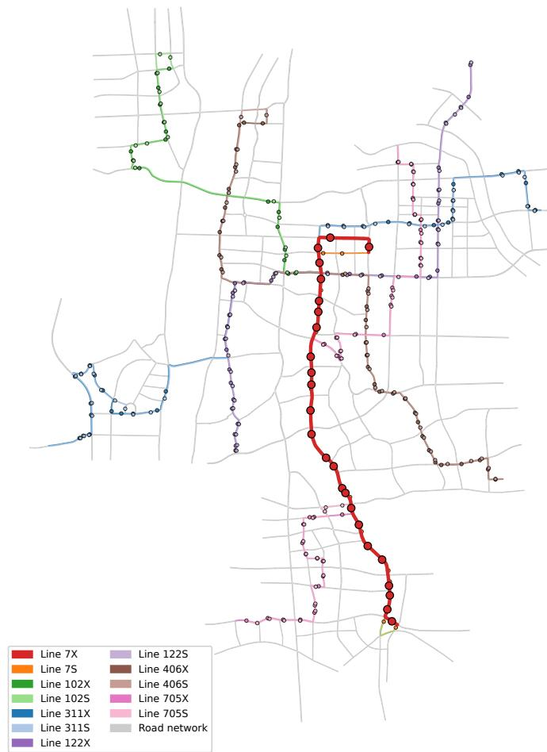

# Completion-Aware Cross-Fidelity Ofline-to-Online Reinforcement Learning for Multi-Line Bus Holding

Yifan Zhanga, Liang Zhenga

aCentral South University, Changsha, Hunan, China

## Abstract

Exploratory reinforcement learning (RL) on an operating bus fleet is impractical, while policies trained only from historical data cannot acquire new experience. Hybrid Ofline-and-Online (H2O) RL combines fixed target replay with simulator interaction, but the inexpensive online simulator can difer from the target in transition and event-duration dynamics. We study this cross-fidelity problem for multi-line bus holding and address a failure mode in which lower generalized passenger time coexists with incomplete passenger journeys.

We formulate asynchronous holding as a 24,000-s chronological semi-Markov decision process (SMDP) with exact passenger-time accounting and a mixed discrete–continuous action. An immutable Simulation of Urban MObility (SUMO) dataset contains 3,284,718 transitions from 240 episodes, eight behavior policies, and 30 environment cells. An improved H2O framework (H2O+) actor is adapted to transit, initialized by implicit Q-learning (IQL), and continued for 25,000 online-simulator decision events. The deployed policy then applies a preregistered completion-safety reserve: in low-load tail-bus states with remaining demand, it raises the physical hold to 60 s. Its direct parent uses the identical actor and inherited action transform but omits this final reserve.

Formal confirmation used 1,350 fresh SUMO episodes: ten independent environment blocks, three demand levels, five training seeds, and 45 fixed physical behaviors. Averaged over the candidate–parent pairs, the reserveaugmented policy reduced generalized passenger time from 2,484.86 to 2,392.73 s per departed passenger (diference −92.12 s; −3.71%), increased

completion from 0.96185 to 0.96650 (diference +0.00466), and reduced unfinished passengers from 655.42 to 578.20. It improved the primary endpoint and satisfied a 0.003 completion noninferiority margin in all ten paired blocks; both one-sided exact sign-test p-values were 0.0009766, so the preregistered intersection–union test passed. Benefits had the same direction at all demand levels and training seeds. The confirmed claim is limited to this fixed candidate versus its fixed direct parent in simulator-to-simulator endpoint evaluation.

Keywords: Bus holding control, ofline-to-online reinforcement learning, completion-aware control, cross-fidelity simulation, passenger welfare

## 1. Introduction

High-frequency bus service is vulnerable to bunching: a delayed vehicle faces more waiting passengers and longer dwell, while its follower faces fewer, causing an initially small headway perturbation to grow (Rezazada et al., 2024). Holding an early bus at selected stops can restore spacing, but it also adds time for passengers already on board (Delgado et al., 2012). Analytical headway control and schedule-reliability control address diferent operational goals (Daganzo, 2009; Xuan et al., 2011); RL can represent richer stochastic and multi-line interactions (Alesiani and Gkiotsalitis, 2018; Wang and Sun, 2020, 2023).

Learning through exploration on an operating fleet is generally unacceptable. Ofline RL can use historical transitions, but its policy is vulnerable outside logged action support. Online learning in a simulator supplies adaptive experience, but an inexpensive model can difer from the target in travel times, dwell propagation, demand events, and the physical duration between asynchronous decisions. H2O RL combines immutable target replay with interaction in an imperfect simulator (Niu et al., 2022); H2O+ generalizes this construction across ofline and online base learners (Niu et al., 2023). The transit question is therefore not only whether simulator interaction improves an ofline policy, but whether the resulting behavior remains service-complete when transferred back to the target simulator.

Bus holding makes this distinction consequential. Stop decisions are asynchronous, several buses can request control at the same physical time, and exact zero hold is much more common than a positive duration. More importantly, an objective that integrates waiting and in-vehicle passenger time does not by itself ensure that journeys finish before a fixed evaluation horizon. During development we observed precisely this objective–constraint mismatch: lower generalized passenger time could coexist with a completion-rate loss large enough to fail a preregistered service boundary. The final policy therefore separates learning from deployment. A frozen H2O+ actor supplies the state dependent action, while a deterministic completion-safety reserve modifies only a bounded set of low-load tail-bus states with remaining demand.

Table 1: Separation of learning, adaptive development, and formal confirmation. Only the final column supplies confirmatory evidence.
<table><tr><td>Frozen learning evidence</td><td>Adaptive development</td><td>Fresh formal confirmation</td></tr><tr><td>Target-SUMO replay; calibrated online simulator; five IQL-initialized H2O+ actors; 25,000 simulator events; fixed endpoint checkpoints.</td><td>Terminal actor taper and deterministic hold transforms were developed over successive preregistered rounds. Development outcomes informed the final completion-safety reserve and therefore five training seeds within are not confirmatory.</td><td>The fixed candidate and fixed direct parent were evaluated on 30 untouched SUMO cells: ten independent blocks crossed with three demand levels. Exact paired block tests used all</td></tr></table>

The resulting evidence chain is summarized in Table 1. The target is a SUMO microsimulation of 12 directional services and 389 scheduled vehicle trips. The ofline replay contains 3,284,718 chronological transitions from 240 complete episodes. The online environment is a causal event-driven simulator with matched timetable, capacity, passenger-journey, state, action, and reward contracts. The final candidate and direct parent share five frozen terminal-quarter actors and difer only in the last deterministic completionsafety transform; lineage controls retain their own frozen actors. Candidate design used prior development outcomes, but the final candidate, direct parent, analysis, and ten-block formal environment were fixed before formal outcomes were accessed.

Formal confirmation comprised 1,350 new SUMO episodes and 45 fixed physical behaviors. Relative to its direct behavior parent, the reserve-augmented policy reduced generalized passenger time by 92.12 s per departed passenger (3.71%), increased completion by 0.00466, and reduced unfinished passengers by 77.22 on average. The primary endpoint improved and the completion noninferiority condition passed in all ten independent blocks. The result is not attributed to density-ratio correction: held-out ratio diagnostics did not generalize, and the sealed actor training used unit simulator weights.

This work makes four contributions. First, it defines a chronological finite-horizon SMDP representation that serializes simultaneous controls while charging exact generalized passenger time once per physical interval. Second, it provides an audited multi-policy target dataset and a causal online simulator under a common transit contract. Third, it combines a stabilized H2O+ actor with an explicit, state-conditioned completion-safety reserve whose direct efect can be isolated against an identical parent. Fourth, it supplies a preregistered formal comparison on fresh environment blocks, with the independent unit, noninferiority margin, and claim boundary fixed before outcome access. The formal claim concerns the final reserve relative to its identical direct parent in this simulator scenario family; Section 6.3 collects the limits on broader interpretation.

## 2. Related Work

The study connects ofline-to-online RL, transfer across transition dynamics, and bus holding. We distinguish the algorithmic lineage from the mechanism that is actually confirmed in the final experiment.

## 2.1. Ofline and ofline-to-online reinforcement learning

Soft actor-critic (SAC) provides the entropy-regularized, of-policy backbone used by the online learners in this study (Haarnoja et al., 2018a). Its later formulation adds automatic entropy-temperature adjustment (Haarnoja et al., 2018b). Conservative Q-learning (CQL) depresses values for actions outside ofline support (Kumar et al., 2020); IQL instead fits an expectile state value and extracts an advantage-weighted policy without evaluating unseen actions in its fitted target (Kostrikov et al., 2021). We use IQL to initialize the frozen H2O+ actors and SAC-style updates for their online continuation.

Ofline-to-online fine-tuning can destroy a useful ofline policy when early online data shift the state–action distribution and bootstrap errors propagate. Balanced replay with a pessimistic critic ensemble is one stabilization route: it prioritizes online and near-on-policy ofline samples (Lee et al., 2021), rather than simply fixing a 50/50 replay split. Calibrated Q-learning (Cal-QL) constrains conservative values to a reference policy’s scale (Nakamoto et al., 2023). Policy expansion (PEX) retains an ofline policy and adaptively composes it with a newly learned policy (Zhang et al., 2023). Reinforcement learning with prior data (RLPD) mixes prior and newly collected replay while learning from random initialization (Ball et al., 2023), whereas warm-start reinforcement learning (WSRL) begins from an ofline policy, collects a frozen-policy warmup bufer, and then trains from online replay (Zhou et al., 2024). These methods motivate the stabilization controls in the development lineage, but the formal comparison in this paper does not claim a universal ranking among their source algorithms.

Reward-guided conservative Q-learning (RG-CQL) has combined ofline training and online fine-tuning for coordinating ride-pooling with public transit (Hu et al., 2025). We therefore make no broad novelty claim for oflineto-online RL in transportation. Our focus is an asynchronous fixed-route holding problem with a target-simulator dynamics gap and an explicit completion boundary.

## 2.2. Transfer across dynamics

Of-dynamics RL corrects source-domain rewards using a conditional target-to-source dynamics log ratio estimated by domain classifiers (Eysenbach et al., 2020). H2O combines a fixed target-domain dataset with interaction in an imperfect simulator and uses dynamics-aware correction when simulator transitions are poorly supported by target dynamics (Niu et al., 2022). H2O+ broadens that construction across ofline and online base learners (Niu et al., 2023).

Our adaptation includes physical event duration in a joint/marginal classifier, but the final training profile uses unit simulator weights. Thus the classifier is a domain-shift diagnostic, not the confirmed mechanism. Its empirical validation is reported in Sections Appendix B.3 and 5.6; the formal comparison isolates the action reserve applied to a fixed learned actor.

## 2.3. Bus holding and service completion

The bus-bunching literature spans demand, supply, and control mechanisms (Rezazada et al., 2024). Daganzo (2009) studies headway-based holding and its stability, whereas Xuan et al. (2011) uses arrival deviations from a virtual schedule to improve schedule reliability. These are distinct control objectives. Delgado et al. (2012) compares holding with boarding limits under passenger-time objectives. Real-time optimization incorporates changing demand and running times (Sánchez-Martínez et al., 2016), while predictive control combines headway forecasts with dynamic holding (Andres and Nair, 2017).

RL formulations include high-frequency single-service control (Alesiani and Gkiotsalitis, 2018), multi-agent dynamic holding (Wang and Sun, 2020), asynchronous multi-agent coordination (Wang and Sun, 2021), and sharedcorridor multi-line control (Wang and Sun, 2023). Asynchronous bus control is therefore not itself a new contribution. Our study instead combines immutable target replay, online interaction in a separate reduced-order simulator, adaptive development of a fixed action transform, and final confirmation on fresh target-simulator cells. The common passenger ledger and the paired final reserve comparison distinguish this evaluation from a generic claim that a new RL learner outperforms existing bus-holding algorithms.

The completion-safety reserve is intentionally simple. It is not a new generic safe-RL algorithm and does not certify arbitrary operational constraints. Instead, it encodes one observed transit requirement: when a lightly loaded tail bus has no follower, a leader exists, and demand remains, suppressing hold can improve accrued time while leaving passengers unfinished. The paired parent comparison changes only the reserve, allowing this concrete mechanism to be tested without reselecting a checkpoint or retraining the actor.

## 3. Problem formulation

We model multi-line bus holding using a finite-horizon SMDP representation (Sutton et al., 1999). The citation supplies the semi-Markov foundation for variable-duration decisions; the serialization and passenger-time ledger below are study-specific. The formulation has three properties that are essential for the study: decisions occur asynchronously at bus-stop events, simultaneous decisions are serialized without duplicating system cost, and the training reward is exact generalized passenger time rather than a headway proxy.

## 3.1. Chronological decision process

One shared policy controls the bus fleet. Let $\mathcal { L }$ be the set of directional services and $\ell \in \mathcal L$ a service index. Physical time advances continuously, but control is requested only when a bus reaches a non-terminal stop. At physical decision time $t _ { m }$ , all controllable arrivals form an ordered batch $\{ e _ { m , 1 } , \hdots , e _ { m , n _ { m } } \}$ , where m indexes physical batches, $n _ { m }$ is the batch size, and $e _ { m , j }$ is the event in position $j .$ . Events are ordered deterministically by service and vehicle identifier. The registered schema supports $1 \leq n _ { m } \leq 1 6$

Simultaneous events are converted into an agent-environment cycle (AEC). Each decision token is uniquely identified by a pair $( m , j )$ , and k enumerates these pairs in chronological AEC order. Every token observes the entire fixed batch and the actions already selected in that batch; the environment advances only after the final action is available. Let $x _ { m , j } ^ { \mathrm { r a w } } \in \mathbb { R } ^ { 1 6 }$ be the 16-feature raw SUMO event observation for $e _ { m , j }$ , where R denotes the real numbers. Removing physical time and the two system-wide passenger counts gives the 13-feature deduplicated local event vector $x _ { m , j } \in \mathbb { R } ^ { 1 3 }$ . Let $N _ { \mathrm { w } } ( t _ { m } )$ and ${ \cal N } _ { \mathrm { v } } ( t _ { m } )$ be the system-wide waiting and in-vehicle passenger counts at batch time $t _ { m }$ . The 245-dimensional raw packed state and the 229-dimensional canonical state are

$$
\begin{array} { r l } & { s _ { k } ^ { \mathrm { r a w } } = \mathrm { p a c k } ( t _ { m } , n _ { m } , j , N _ { \mathrm { w } } ( t _ { m } ) , N _ { \mathrm { v } } ( t _ { m } ) , } \\ & { \qquad x _ { m , 1 } , \ldots , x _ { m , n _ { m } } , \mathrm { p r i o r ~ a c t i o n s } ) \in \mathbb { R } ^ { 2 4 5 } , } \\ & { s _ { k } = \mathrm { n o r m a l i z e } ( s _ { k } ^ { \mathrm { r a w } } ) \in \mathbb { R } ^ { 2 2 9 } . } \end{array}\tag{1}
$$

Here $x _ { m , j } ^ { \mathrm { r a w } }$ contains the service and stop indices, physical time, forward and backward headways and their scheduled targets, eligible stranded and onboard passenger counts, eligible passenger-arrival rate, base dwell time, forward/backward vehicle-presence flags, vehicle capacity, and the two systemwide passenger counts. The packing operation stores the five-value raw batch prefix once, records active slots, inserts the exact actions for earlier slots, and retains the no-hold sentinel for the current and future slots. The normalization operation converts each 13-feature local event vector to 12 dimensionless local features, using capacity to scale passenger counts and demand instead of retaining it as a separate coordinate; together with the active flag and prior action, each canonical slot has width 14. Inactive slots are masked. The raw width is $5 + 1 6 ( 1 + 1 3 + 1 ) = 2 4 5$ , and the canonical width is $5 + 1 6 ( 1 + 1 2 + 1 ) = 2 2 9$ . Here pack denotes this fixed padding and concatenation, and normalize denotes the registered feature scaling and local feature reduction. This representation is centralized; its suficiency as a Markov state is a modeling assumption, discussed in Section 6.3.

Action.. The policy emits one scalar $a _ { k } \in [ - 1 , 1 ]$ . Its physical hold duration is

$$
\tau _ { k } = \frac { a _ { k } + 1 } { 2 } \tau _ { \mathrm { m a x } } , \qquad \tau _ { \mathrm { m a x } } = 6 0 ~ \mathrm { s } ,\tag{2}
$$

where $\tau _ { k }$ is the hold applied at token k and $\tau _ { \mathrm { m a x } }$ is the operational cap. The exact action $a _ { k } = - 1$ means zero hold; all actions in (−1, 1] mean strictly positive holds. Thus one mathematical action has one physical meaning, rather than using separate gate and duration coordinates.

Duration and continuation.. Let $\Delta t _ { k } \ge 0$ be physical time elapsed from token k to token $k + 1$ , and let $z _ { k } \in \{ 0 , 1 \}$ indicate that the transition is terminal. The stored continuation factor is

$$
\Gamma _ { k } = 1 - z _ { k } .\tag{3}
$$

The horizon is $T _ { \mathrm { h o r } } ~ = ~ 2 4 { , } 0 0 0 ~ \mathrm { s }$ and the objective is undiscounted. Consequently, $\Gamma _ { k } ~ = ~ 1$ for every non-terminal transition and $\Gamma _ { k } ~ = ~ 0$ only at the absorbing endpoint. For two consecutive tokens inside one simultaneous batch, $\Delta t _ { k } = 0 ;$ ; the final token of the batch carries the complete positive duration to the next physical batch.

## 3.2. Exact generalized passenger-time reward

Let $N _ { \mathrm { w } } ( t )$ and $N _ { \mathrm { v } } ( t )$ denote the numbers of waiting and in-vehicle passengers at physical time t, respectively. For token k in physical batch $m$ generalized passenger-time cost is

$$
C _ { k } = \omega _ { \mathrm { w } } \int _ { t _ { m } } ^ { t _ { m } + \Delta t _ { k } } N _ { \mathrm { w } } ( u ) \mathrm { d } u + \omega _ { \mathrm { v } } \int _ { t _ { m } } ^ { t _ { m } + \Delta t _ { k } } N _ { \mathrm { v } } ( u ) \mathrm { d } u , \qquad ( \omega _ { \mathrm { w } } , \omega _ { \mathrm { v } } ) = ( 2 , 1 ) ,\tag{4}
$$

where u is the integration variable, $C _ { k }$ is measured in generalized passengerseconds, and $\omega _ { \mathrm { w } }$ and $\omega _ { \mathrm { v } }$ are the fixed waiting- and in-vehicle-time values. The stored dataset reward is

$$
r _ { k } = - C _ { k } .\tag{5}
$$

Thus $r _ { k }$ is stored in physical generalized passenger-seconds; numerical conditioning applied by a trainer is not part of the data contract. Eqs. (4) and (5) define one reward for every token. Because the ledger integrates synchronized system passenger counts, the chronological sum of $C _ { k }$ is nonoverlapping. Intermediate AEC tokens have zero duration and hence zero reward; system cost appears exactly once between physical batches. Proposition 1 in Section Appendix A.1 proves this accounting identity, including the policy-invariant initial interval.

The primary evaluation outcome is full-horizon generalized passenger time per departed passenger. Using all departed passengers avoids conditioning the denominator on policy-dependent trip completion. If $N _ { \mathrm { d e p } }$ and $N _ { \mathrm { c m p } }$ are the numbers of departed and completed passengers in an episode, define the primary endpoint $Y .$ , completion rate $R _ { \mathrm { c m p } } .$ , and unfinished count U by

$$
\begin{array} { r l } & { Y = \frac { \omega _ { \mathrm { w } } \int _ { 0 } ^ { T _ { \mathrm { h o r } } } N _ { \mathrm { w } } ( u ) \mathrm { d } u + \omega _ { \mathrm { v } } \int _ { 0 } ^ { T _ { \mathrm { h o r } } } N _ { \mathrm { v } } ( u ) \mathrm { d } u } { N _ { \mathrm { d e p } } } , } \\ & { R _ { \mathrm { c m p } } = \frac { N _ { \mathrm { c m p } } } { N _ { \mathrm { d e p } } } , \qquad U = N _ { \mathrm { d e p } } - N _ { \mathrm { c m p } } . } \end{array}\tag{6}
$$

Unfinished passengers remain in the waiting or in-vehicle ledger at the horizon, so their accrued time is included in the primary endpoint even though their journeys are incomplete. The primary endpoint also includes the policyinvariant interval before the first controllable event. That interval is excluded from the training return because no action can afect it.

## 3.3. Target and online-simulator environments

The target evaluation environment ${ \mathcal { M } } _ { \mathrm { t g t } }$ is a high-fidelity SUMO 1.25.0 microsimulation (Alvarez Lopez et al., 2018). The ofline replay was collected in its SUMO 1.27.1 counterpart, $\mathcal { M } _ { \mathrm { l o g } }$ , whose transition-duration kernel is denoted $P _ { \log } .$ . Both SUMO environments use the registered transit scenario contracts; Section 5.6 reports the runtime distinction. The online simulator $\mathcal { M } _ { \mathrm { s i m } }$ is a calibrated, event-driven model with the same service, stop, timetable, capacity, passenger journey, state, action, and reward contracts. It executes transfers causally: only a passenger’s first ride leg is initially available, and each subsequent leg is released only after the preceding leg actually alights. The simulator uses calibrated segment runtimes and dwell/boarding mechanics instead of a microscopic road model.

Their shared observation and action contracts allow us to express the diferent dynamics through conditional transition-duration kernels:

$$
P _ { \mathrm { t g t } } ( s ^ { \prime } , \Delta t \mid s , a ) \quad \mathrm { a n d } \quad P _ { \mathrm { s i m } } ( s ^ { \prime } , \Delta t \mid s , a ) ,\tag{7}
$$

where s and $a$ are a current state and action, and $( s ^ { \prime } , \Delta t )$ is the nextstate/duration pair; a prime always denotes a successor state. The two kernels in Eq. (7) are denoted $P _ { \mathrm { t g t } }$ and $P _ { \mathrm { s i m } }$ , respectively. The simulator was accepted only after a preregistered 30-cell fidelity audit against 30 matched SUMO cells; the experiment section reports the audited quantities and thresholds.

## 3.4. Ofline-to-online learning objective

The immutable target replay is

$$
\mathcal { D } _ { \mathrm { o f f } } = \{ ( s _ { \iota } , a _ { \iota } , r _ { \iota } , s _ { \iota } ^ { \prime } , \Gamma _ { \iota } , \Delta t _ { \iota } , z _ { \iota } ) \} _ { \iota = 1 } ^ { N _ { \mathrm { o f f } } } , \qquad N _ { \mathrm { o f f } } = 3 , 2 8 4 , 7 1 8 ,\tag{8}
$$

In Eq. (8), ι indexes an ofline row, $N _ { \mathrm { o f f } }$ is the number of rows, and every tuple component follows Eqs. (1) to (3) and (5). The data comprise 240 complete 24,000-s SUMO episodes: eight behavior policies crossed with 30 registered environment cells formed by ten independent seed blocks and three demand scales. The behavior policies are zero holding, two random hurdle policies, four schedule-adjusted headway-balance policies, and a closed-form myopic welfare policy. They are used for coverage, not as claimed experts.

During learning, interaction is permitted only in $\mathcal { M } _ { \mathrm { s i m } }$ and produces simulator replay $\mathcal { D } _ { \mathrm { s i m } }$ . No target-environment transition is queried online. Given $\mathcal { D } _ { \mathrm { o f f } }$ and a fixed simulator decision-event budget, the H2O RL objective is

$$
\operatorname* { m a x } _ { \pi } J _ { \mathrm { t g t } } ( \pi ) , \qquad J _ { \mathrm { t g t } } ( \pi ) = \mathbb { E } _ { \mathcal { M } _ { \mathrm { t g t } } , \pi } \left[ \sum _ { k = 0 } ^ { K - 1 } r _ { k } \right] ,\tag{9}
$$

where $J _ { \mathrm { t g t } } ( \pi )$ is the expected target-environment return, $\mathbb { E } _ { \mathcal { M } _ { \mathrm { t g t } } , \pi }$ takes expectation over the target kernel and policy, $\pi$ is any admissible policy on the action space [−1, 1], and K is the number of chronological decision tokens before the horizon. The objective in Eq. (9) is evaluated only after training. The learned policy is $\pi _ { \phi }$ , with parameter vector $\phi .$ . Within a fixed exogenous cell, Proposition 1 implies that maximizing the return and minimizing Y give the same policy ordering. Across cells with diferent passenger counts, unnormalized training returns and normalized evaluation means need not assign the same relative weights to demand levels. Importantly, $R _ { \mathrm { c m p } }$ in Eq. (6) is not part of the training reward; it is a separate service constraint at evaluation. This distinction allows a policy to reduce accrued generalized passenger time while leaving more journeys unfinished, and motivates the completion-aware transform in Section 4.4. The setup otherwise matches the H2O setting introduced by Niu et al. (2022) and studied by H2O+ (Niu et al., 2023), while keeping all evidence explicitly simulator-to-simulator.

  
Figure 1: Topology of the twelve directional bus services represented in both the target SUMO environment $\mathcal { M } _ { \mathrm { t g t } }$ and the calibrated online simulator $\mathcal { M } _ { \mathrm { s i m } }$ . The two environments share stop sequences, timetables, capacities, and passenger origin-destination journeys; their trafic and event-propagation mechanisms difer. Line 7X is drawn more heavily only for legibility; policy control covers all 12 services.

## 4. Method

The final controller has two components: a frozen transit-adapted H2O+ actor and a deterministic physical-action transform. Learning supplies a continuous state-dependent holding proposal; the transform calibrates its magnitude and applies a bounded service-completion reserve. No parameter is updated during target-SUMO evaluation.

## 4.1. Structured hurdle actor

The actor, critics, and value function use separate structured state encoders with the same topology. A shared slot network encodes each of the 16 possible event slots. Five pooled views—the current event, active-slot mean, active-slot maximum, previously selected-slot mean, and future-slot mean—are concatenated with the five-value batch prefix and mapped to a 256-dimensional representation. This preserves the ordered action prefix of a simultaneous batch while masking inactive padding.

Because exact zero hold is frequent and operationally distinct from a small positive duration, the actor is a hurdle distribution. Let $p _ { \phi } ^ { + } ( s ) \ = \quad$ sigmoid $( g _ { \phi } ( s ) )$ be the positive-hold probability, where $g _ { \phi } ( s )$ is the gate logit and sigmoid $. ( \zeta ) = 1 / ( 1 + \exp ( - \zeta ) )$ . Conditional on holding, the latent variable $\varsigma \sim \mathcal N ( \mu _ { \phi } ( s ) , \sigma _ { \phi } ^ { 2 } ( s ) )$ follows a normal distribution with mean $\mu _ { \phi } ( s )$ and positive standard deviation $\sigma _ { \phi } ( s )$ . Its positive-branch action is $a ^ { + } =$ 2 sigmoid $( \zeta ) - 1 \in ( - 1 , 1 )$ . The policy measure is

$$
\pi _ { \phi } ( \mathrm { d } a \mid s ) = \left( 1 - p _ { \phi } ^ { + } ( s ) \right) \delta _ { - 1 } ( \mathrm { d } a ) + p _ { \phi } ^ { + } ( s ) f _ { \phi } ( a \mid s ) \mathbb { I } \{ a \in ( - 1 , 1 ) \} \mathrm { d } a ,\tag{10}
$$

where $\delta _ { - 1 }$ is the unit point mass at the no-hold action, $f _ { \phi } ( a \mid s )$ is the conditional logistic-normal action density, $\mathbb { I } \{ \cdot \}$ is one when its condition holds and zero otherwise, and da denotes the continuous-action measure. For likelihoods and entropy, we use the density $\varpi _ { \phi } ( a \mid s )$ with respect to the common point-mass-plus-Lebesgue measure: it is $1 - p _ { \phi } ^ { + } ( s )$ at $a = - 1$ and $p _ { \phi } ^ { + } ( s ) f _ { \phi } ( a \mid s )$ for $- 1 < a < 1$ . Proposition 2 in Section Appendix A.2 derives the density and normalization, and shows that 2 sigmoid $( \mu _ { \phi } ( s ) ) - 1$ is the positive branch’s median, not generally its mean.

Deterministic evaluation uses that median when $p _ { \phi } ^ { + } ( s ) \geq 0 . 5$ and otherwise returns $a = - 1$ . Physical holds are obtained through Eq. (2) and remain in [0, 60] s. The implementation keeps the continuous branch strictly inside $( - 1 , 1 )$ by clipping at floating-point precision; the operational transform can still apply the exact 60-s cap.

The critic has two independently parameterized heads, with two target heads updated by Polyak averaging at rate 0.005. The actor, critic, and value heads each use two 256-unit hidden layers after the structured encoder. Further implementation values are given in Sections Appendix B.1 and Appendix B.2.

## 4.2. Ofline initialization and simulator continuation

Five actors, with training seeds 6201–6205, were initialized by 50,000 IQL updates on the immutable target replay (Kostrikov et al., 2021). For target critic minimum $\begin{array} { r } { \bar { Q } _ { \mathrm { m i n } } ( s , a ) = \operatorname* { m i n } _ { i \in \{ 1 , 2 \} } Q _ { \bar { \theta } _ { i } } ( s , a ) } \end{array}$ and value function $V _ { \nu } ( s )$ the advantage is $A ( s , a ) = \bar { Q } _ { \mathrm { m i n } } ( s , a ) - V _ { \nu } ( s )$ . Here i indexes the two critic heads, $Q _ { \theta _ { i } }$ and $Q _ { \bar { \theta } _ { i } }$ are the online and target state–action value functions with parameter vectors $\theta _ { i }$ and ${ \bar { \theta } } _ { i }$ , and $\nu$ is the value-network parameter vector. All value functions use rewards scaled by $\kappa _ { r } = 1 0 ^ { - 4 }$ inside the trainer, not physical passenger-seconds. The value uses expectile 0.7, and the actor uses the advantage weight

$$
w _ { \mathrm { I Q L } } ( s , a ) = \operatorname* { m i n } \left\{ \exp \left( 3 A ( s , a ) \right) , 1 0 0 \right\} .\tag{11}
$$

Here wIQL is the capped regression weight. The mixed-measure log likelihood log $\varpi _ { \phi } ( a \mid s )$ from Eq. (10) is used for advantage-weighted actor regression.

After a 5,000-event frozen-policy warmup, training continued in the calibrated online simulator with 50/50 target and simulator critic minibatches and a SAC-style actor objective (Haarnoja et al., 2018a,b). Define the entropy-regularized target-state bootstrap by

$$
B _ { \mathrm { S A C } } ( s ^ { \prime } ) = \mathbb { E } _ { a \sim \pi _ { \phi } ( \cdot \vert s ^ { \prime } ) } \left[ \bar { Q } _ { \mathrm { m i n } } ( s ^ { \prime } , a ) - \eta _ { \mathrm { e n t } } \log \varpi _ { \phi } ( a \mid s ^ { \prime } ) \right] ,\tag{12}
$$

where $\eta _ { \mathrm { { e n t } } } > 0$ is the learned entropy temperature and the expectation is over the hurdle policy. The discrete gate is summed exactly and the continuous branch uses one reparameterized sample per state. The online Bellman bootstrap mixed the fixed IQL value and entropy-regularized SAC bootstrap as

$$
B _ { \mathrm { m i x } } ( s ^ { \prime } ) = 0 . 1 V _ { \nu } ( s ^ { \prime } ) + 0 . 9 B _ { \mathrm { S A C } } ( s ^ { \prime } ) .\tag{13}
$$

Here $B _ { \mathrm { m i x } }$ is the mixed target-state value and $V _ { \nu }$ is fixed after IQL initialization. The critic target is

$$
y _ { k } = \kappa _ { r } r _ { k } + \Gamma _ { k } B _ { \mathrm { m i x } } ( s _ { k + 1 } ) ,\tag{14}
$$

where $y _ { k }$ denotes a training target, distinct from the physical evaluation endpoint Y. Eq. (14) uses no additional duration discount. Critics minimize a Huber loss with threshold 1.0 against this target.

The actor and entropy temperature remain frozen through 10,000 simulator events while critics adapt after warmup. On release, actor and temperature updates use simulator states only. The actor learning-rate multiplier ramps from approximately 0.1 to 1 over events $1 0 , 0 0 0 { - } 1 5 , 0 0 0 ;$ the temperature resumes at its full registered rate. Each subsequent actor update is followed by parameter interpolation toward the seed-matched 10,000-event actor, with a fixed interpolation coeficient $5 \times 1 0 ^ { - 5 }$ . The final branches inherited an exact seed-matched optimizer and replay state at 10,000 simulator events and continued to 25,000 events. From event 15,000 through the final actor update before event 25,000, the preregistered terminal-quarter branch linearly tapered the actor learning-rate multiplier from 1 to 0.25 while leaving the remaining update schedule unchanged. Each seed completed 70,000 learner updates in total. Only the 25,000-event endpoint was exported for the final policy; checkpoints were not selected by target-SUMO behavior.

## 4.3. Dynamics-ratio diagnostic

The implementation retains the H2O+ domain-classifier construction for diagnosing transition mismatch (Eysenbach et al., 2020; Niu et al., 2023). A joint classifier uses $( s , a , s ^ { \prime } , \Delta t / T _ { \mathrm { h o r } } )$ and a marginal classifier uses $( s , a )$ With balanced target and simulator classes, their logit diference estimates the logged-target-to-simulator ratio

$$
F _ { \psi _ { J } } ( s , a , s ^ { \prime } , \Delta t / T _ { \mathrm { h o r } } ) - G _ { \psi _ { M } } ( s , a ) \approx \log \frac { P _ { \mathrm { l o g } } ( s ^ { \prime } , \Delta t \mid s , a ) } { P _ { \mathrm { s i m } } ( s ^ { \prime } , \Delta t \mid s , a ) } .\tag{15}
$$

Here $F _ { \psi _ { J } }$ and $G _ { \psi _ { M } }$ are the joint and marginal target-class logits, with parameter vectors $\psi _ { J }$ and $\psi _ { M }$ , respectively; the target class has label one and the simulator class label zero. The ratio concerns conditional densities under a common reference measure, and its estimation requires generalization to the states being evaluated. Because the positive examples come from $\mathcal { M } _ { \mathrm { l o g } }$ , this estimates the logged runtime’s dynamics rather than directly estimating the formal-evaluation kernel $P _ { \mathrm { { t g t } } }$ . Whole trajectories, not randomly interleaved rows, define held-out validation. The five final training runs used unit simulator weights in the critic; the classifier output in Eq. (15) remained diagnostic and never changed a Bellman residual. This matters for interpretation: the formal efect cannot be attributed to learned density-ratio weighting.

## 4.4. Physical action calibration

Let $h _ { \phi } ( s ) \in [ 0 , 6 0 ]$ be the deterministic actor proposal in seconds, obtained from Eq. (2) before any operational transform, and let $\rho = t / T _ { \mathrm { h o r } }$ be the horizon fraction at physical time t. The first transform reduces aggressive learned holds while retaining a transparent headway response. Let $H _ { f } , H _ { b }$ be forward and backward headways, $H _ { f } ^ { * } , H _ { b } ^ { * }$ their targets, and $I _ { f } , I _ { b } \in \{ 0 , 1 \}$ indicate whether the corresponding buses are present. The gain-one headway reserve is

$$
\begin{array} { r } { h _ { \mathrm { h b } } ( s ) = \mathrm { c l i p } \left( \frac { 1 } { 2 } \left[ I _ { b } ( H _ { b } - H _ { b } ^ { * } ) - I _ { f } ( H _ { f } - H _ { f } ^ { * } ) \right] , 0 , 6 0 \right) . } \end{array}\tag{16}
$$

Here $h _ { \mathrm { h \ell } }$ is a headway-based hold in seconds, and $\mathrm { c l i p } ( \cdot , 0 , 6 0 )$ truncates its scalar argument to the operational range. Headways and their targets are also measured in seconds. The calibrated learned action combines the headway response in Eq. (16) with the actor proposal:

$$
h _ { 1 6 } ( s ) = \left\{ \begin{array} { l l } { \operatorname* { m i n } \{ h _ { \phi } ( s ) , \operatorname* { m a x } [ 0 . 1 2 5 h _ { \phi } ( s ) , h _ { \mathrm { h b } } ( s ) ] \} , } & { \rho < 0 . 7 5 \mathrm { a n d } h _ { \phi } ( s ) > 0 , } \\ { 0 . 1 2 5 h _ { \phi } ( s ) , } & { \mathrm { o t h e r w i s e } . } \end{array} \right.\tag{17}
$$

Here $h _ { 1 6 }$ denotes the inherited v16 calibrated holding proposal.

The completion guard is defined from physical state, not critic value. Let $n _ { \mathrm { o n } }$ be onboard passengers, c vehicle capacity, and $\lambda _ { \mathrm { a r r } }$ the eligible passengerarrival rate in passengers per second. For horizon-fraction endpoints $0 \le$ $\rho _ { \mathrm { l o } } < \rho _ { \mathrm { h i } } \le 1$ 2

$$
\mathcal { G } _ { [ \rho _ { \mathrm { l o } } , \rho _ { \mathrm { h i } } ) } ( s ) = \mathbb { I } \left\{ \rho _ { \mathrm { l o } } \leq \rho < \rho _ { \mathrm { h i } } , ~ I _ { f } = 1 , ~ I _ { b } = 0 , \lambda _ { \mathrm { a r r } } > 0 , ~ c > 0 , \frac { n _ { \mathrm { o n } } } { c } \leq 0 . 2 5 \right\} .\tag{18}
$$

Thus the binary guard in Eq. (18) identifies a low-load controlled bus with a vehicle ahead, no vehicle behind, and continuing eligible demand.

Using the proposal in Eq. (17), the direct parent first applies an inherited 20-s tail-service floor only in the later part of the reserve window:

$$
h _ { \mathrm { p a r } } ( s ) = \left\{ \begin{array} { l l } { \operatorname* { m a x } \{ h _ { 1 6 } ( s ) , 2 0 \} , } & { \mathcal { G } _ { [ 0 . 5 0 , 0 . 7 5 ) } ( s ) = 1 , } \\ { h _ { 1 6 } ( s ) , } & { \mathrm { o t h e r w i s e } . } \end{array} \right.\tag{19}
$$

Here $h _ { \mathrm { p a r } }$ is the direct parent’s physical hold. The reserve-augmented candidate changes only the final line of the deployed behavior:

$$
h _ { \mathrm { s a f e } } ( s ) = \left\{ \begin{array} { l l } { \mathrm { m a x } \{ h _ { \mathrm { p a r } } ( s ) , 6 0 \} , } & { \mathcal { G } _ { [ 0 . 1 5 , 0 . 7 5 ) } ( s ) = 1 , } \\ { h _ { \mathrm { p a r } } ( s ) , } & { \mathrm { o t h e r w i s e } . } \end{array} \right.\tag{20}
$$

Here $h _ { \mathrm { s a f e } }$ is the candidate’s physical hold; the subscript names the registered completion-safety variant. Because 60 s is the physical cap, an active reserve sets the hold to exactly 60 s. The candidate and direct parent share the same actor tensor, training seed, checkpoint, state, and inherited transforms. They difer only through Eq. (20). The executed duration $\tau _ { k }$ is $h _ { \mathrm { s a f e } } ( s _ { k } )$ for the candidate and $h _ { \mathrm { p a r } } ( s _ { k } )$ for its parent; the corresponding normalized action is obtained by inverting Eq. (2).

## 4.5. Development and confirmation separation

The transform was not derived from the formal outcomes. Successive preregistered development rounds from v14 through v20 used prior development results to diagnose actor drift, hold magnitude, headway reserve, and completion. Several rounds reused the same nine development cells, so these results are adaptive design evidence rather than confirmation. The 60-s quarter-load candidate, its direct parent, all actor tensors, formal environment blocks, primary endpoint, completion margin, and exact sign tests were frozen before formal outcome access. The formal stage introduced no new training run and permitted no candidate replacement.

## 5. Experiments and Results

The experiment has three evidence layers: ofline data and simulator acceptance, adaptive development, and formal confirmation. Only the last layer is used for the confirmatory efect claim.

## 5.1. Target benchmark and ofline data

The target benchmark uses SUMO on the 12 directional services in Figure 1. Each 24,000-s episode contains the same timetable, vehicle capacities, road network, and 389 scheduled vehicle trips. Passenger demand is evaluated at multipliers 0.75, 1.00, and 1.25. Within an environment block, the three demand levels share one demand-realization seed and one SUMO seed; departure times receive stable-uniform perturbations of at most 120 s.

The immutable ofline file contains 3,284,718 chronological rows from 240 complete episodes. Ten independent environment blocks crossed with three demand levels and eight behavior policies give 30 exogenous cells and 240 trajectories. Behaviors are zero hold, two random hurdle policies, four fixedgain schedule-adjusted headway policies, and a closed-form myopic-welfare policy. They provide action coverage and are not labelled experts. Data collection used SUMO 1.27.1 and Python 3.10.12.

The calibrated online simulator shares the timetable, capacity, journey, state, action, and reward contracts. In a preregistered zero-policy audit over 30 audited cells, every 95% bootstrap interval stayed within its threshold. The registered relative tolerances were 3% for passenger demand, 5% for decision count, 15% for generalized and waiting time, 10% for in-vehicle time, and 5% for completed vehicle-trip duration; completion used an absolute 0.03 tolerance. The largest point gaps were 4.61% for generalized passenger time, 8.75% for waiting time, 1.66% for in-vehicle time, 0.43 percentage points for completion, and 1.04% for completed vehicle-trip duration. A second audit crossed the same cells with seven nonzero interventions. The largest absolute 95% endpoint was 0.00574 for completion, 0.0390 for normalized generalized passenger-time response, 0.0498 for waiting response, 0.0200 for in-vehicle response, 0.2078 for relative mean hold, and 0.0117 for vehicle-trip duration; all were below their preregistered limits. Intervention-response tolerances were 0.03 for absolute completion response, 0.10 for normalized generalized, waiting, and in-vehicle responses, and 0.05 for decision and tripduration responses. Policy-level mean hold and exact-zero-action rate used relative 0.35 and absolute 0.10 limits, respectively. Both audits used 10,000 bootstrap resamples of episode-level quantities within each demand level, resampling SUMO and simulator samples separately. Intervention outcomes were first diferenced against the same environment’s zero-hold outcome; time and count responses were normalized by the corresponding SUMO zero-hold mean. These acceptance audits precede the independent formal test below.

## 5.2. Formal confirmation matrix

Formal evaluation was endpoint-only: no area under a learning curve (AULC) was computed or claimed. The sole candidate was the reserveaugmented policy in Eq. (20). Its direct behavior parent was Eq. (19) with the final 60-s reserve disabled. Five seed-matched actor tensors were fixed before evaluation.

Seven supportive controls were also frozen: the raw v14 terminal-quarter actor, the base H2O+ endpoint, online-only SAC, delayed-actor v10, actorhold v11, actor-ramp v12, and proximal-strong v13. Together with the candidate and direct parent, nine algorithm labels crossed with five training seeds to form 45 physical behaviors. These controls provide lineage context; they do not expand the confirmatory claim beyond candidate versus direct parent.

Ten fresh formal environment blocks used SUMO seeds 8101–8110 and demand realization seeds 8201–8210. None appeared in training or adaptive development. Crossing 10 blocks, three demand levels, and 45 behaviors produced 1,350 new SUMO episodes and 30 fresh environment cells. Formal execution used SUMO/libsumo 1.25.0 under Python 3.8.20. All policies in a cell shared the same exogenous realization.

## 5.3. Endpoints and preregistered inference

The primary endpoint is $Y$ , accrued generalized passenger seconds per departed passenger; lower is better. The service endpoint is $R _ { \mathrm { c m p } }$ , and unfinished passenger count U is reported descriptively, all as defined in Eq. (6). The independent analysis unit is the formal environment block. For each candidate–parent comparison, the five training seeds and three demand levels yield 15 paired observations per block; these are averaged before any sign test. Let $\beta \in \{ 1 , \ldots , 1 0 \}$ index formal blocks, $\xi \in \{ 1 , \ldots , 5 \}$ index training seeds, and $d \in \mathcal { D } _ { \mathrm { d e m } } = \{ 0 . 7 5 , 1 . 0 0 , 1 . 2 5 \}$ denote the demand multiplier. Superscripts safe and par identify the candidate and parent, respectively. Their primary block diference is

$$
\Delta Y _ { \beta } = \frac { 1 } { 1 5 } \sum _ { \xi = 1 } ^ { 5 } \sum _ { d \in \mathcal { D } _ { \mathrm { d e m } } } \left( Y _ { \beta , \xi , d } ^ { \mathrm { s a f e } } - Y _ { \beta , \xi , d } ^ { \mathrm { p a r } } \right) .\tag{21}
$$

The same averaging in Eq. (21) defines $\Delta R _ { \mathrm { c m p } , \beta }$ and $\Delta U _ { \beta }$ . In the tables, $\Delta Y$ $\Delta R _ { \mathrm { c m p } } ,$ and $\Delta U$ denote mean paired diferences over all cells or the stated demand or seed subset.

Primary superiority uses a one-sided exact paired sign test. Completion uses the same test after shifting each block diference by the noninferiority margin $\varepsilon _ { \mathrm { N I } } = 0 . 0 0 3$ : a block is a win when $\Delta R _ { \mathrm { c m p } , \beta } > - \varepsilon _ { \mathrm { N I } }$ . A primary win requires $\Delta Y _ { \beta } < 0$ . Ties are nonwins. For a win count $w \in \{ 0 , \ldots , 1 0 \}$ , the one-sided sign-test probability is

$$
p _ { \mathrm { s i g n } } ( w ) = 2 ^ { - 1 0 } \sum _ { v = w } ^ { 1 0 } { \binom { 1 0 } { v } } ,\tag{22}
$$

where υ is the summation index for possible win counts and $\binom { 1 0 } { \upsilon }$ is the binomial coeficient. At one-sided significance level $\alpha _ { \mathrm { s i g } } = 0 . 0 2 5$ , at least 9 of 10 wins are required by Eq. (22) $( p _ { \mathrm { s i g n } } ( 9 ) = 0 . 0 1 0 7 4 2 )$ . The confirmatory intersection–union test passes only if both primary superiority and completion noninferiority pass. Mean direction, demand-stratum direction, result completeness, and parent artifact and training stability were additional preregistered gates.

Table 2: Formal endpoint means for the preregistered candidate and its direct behavior parent. The diference is candidate minus parent.
<table><tr><td>Policy</td><td>Gen. passenger s/departed</td><td>Completion</td><td>Unfinished</td></tr><tr><td>Direct parent</td><td>2,484.86</td><td>0.96185</td><td>655.42</td></tr><tr><td>Reserve-augmented candidate</td><td>2,392.73</td><td>0.96650</td><td>578.20</td></tr><tr><td>Difference</td><td>-92.12</td><td>+0.00466</td><td>-77.22</td></tr></table>

## 5.4. Confirmed candidate–parent efect

All 1,350 results and all ten 135-job block manifests passed independent validation. Table 2 reports the endpoint means. The candidate reduced the primary endpoint by 92.12 s per departed passenger, a descriptive relative reduction of 3.71%. Completion increased by 0.00466 (0.466 percentage points), and unfinished passengers decreased by 77.22 (11.78%).

The primary diference was negative in all ten blocks, giving 10 of 10 wins and a one-sided exact sign-test value of $p _ { \mathrm { s i g n } } ( 1 0 ) = 0 . 0 0 0 9 7 6 6$ Completion diferences were positive in every block, so completion noninferiority also achieved 10 of 10 wins and $p _ { \mathrm { s i g n } } ( 1 0 ) = 0 . 0 0 0 9 7 6 6$ after the margin shift. The intersection–union test therefore passed. All preregistered artifact, parentstability, mean, demand-stratum, and result-completeness gates passed as well.

The efect was directionally consistent across demand levels (Table 3). Its magnitude increased with demand: the primary reduction ranged from 40.29 s at demand 0.75 to 148.46 s at demand 1.25, while completion improved at every level. It was also directionally consistent for each of the five training seeds: primary diferences ranged from −87.25 to −97.44 s and completion diferences from +0.00444 to +0.00485 (Section Appendix B.5 and table B.3).

## 5.5. Supportive lineage controls

Table 4 gives descriptive means for all fixed algorithm labels. The reserveaugmented candidate had lower generalized passenger time and higher completion than every listed control, including online-only SAC. Its primary block diference versus each control was favorable in all ten blocks. These comparisons were prespecified robustness gates, but the controls do not share the candidate’s exact behavior parent and are not part of the intersection–union confirmatory claim.

Table 3: Candidate-minus-parent formal diferences by demand multiplier. Negative generalized time and unfinished counts are favorable; positive completion is favorable.
<table><tr><td>Demand</td><td>∆Y (s/departed)</td><td> $\Delta R _ { \mathrm { c m p } }$ </td><td>∆U (passengers)</td></tr><tr><td>0.75</td><td>-40.29</td><td>+0.00185</td><td>-21.00</td></tr><tr><td>1.00</td><td>-87.61</td><td>+0.00470</td><td>-70.92</td></tr><tr><td>1.25</td><td>-148.46</td><td>+0.00741</td><td>-139.74</td></tr></table>

Table 4: Descriptive formal means for the fixed candidate, direct parent, raw actor, and lineage controls. Bold denotes the best displayed mean.
<table><tr><td>Algorithm label</td><td>Gen. passenger s/departed</td><td>Completion</td><td>Unfinished passengers</td></tr><tr><td>Reserve-augmented candidate</td><td>2,392.73</td><td>0.96650</td><td>578.20</td></tr><tr><td>Direct behavior parent</td><td>2,484.86</td><td>0.96185</td><td>655.42</td></tr><tr><td>Raw v14 terminal-quarter actor</td><td>2,623.19</td><td>0.96453</td><td>610.03</td></tr><tr><td>Base H2O+</td><td>2,696.98</td><td>0.96288</td><td>637.41</td></tr><tr><td>Online-only SAC</td><td>2,593.85</td><td>0.96232</td><td>648.31</td></tr><tr><td>Delayed actor (v10)</td><td>2,532.20</td><td>0.95894</td><td>702.57</td></tr><tr><td>Actor hold (v11)</td><td>2,569.68</td><td>0.96023</td><td>681.31</td></tr><tr><td>Actor ramp (v12)</td><td>2,585.56</td><td>0.96194</td><td>653.26</td></tr><tr><td>Proximal strong (v13)</td><td>2,581.26</td><td>0.96053</td><td>676.66</td></tr></table>

## 5.6. Data and environment diagnostics

The artifact checks found no nonfinite rows, no passenger-ledger reconstruction error, and 240 terminal rows for 240 trajectories. Nevertheless, four factors qualify algorithmic interpretation. Section Appendix B.4 provides the support counts and dataset-integrity details.

First, the 3.28 million serialized transitions arise from only 30 independent exogenous cells, each reused by eight behavior policies. Statistical evidence must therefore be organized by environment block rather than transition. Second, 80.2246% of ofline actions are exact zero. The final low-load guard appears in 3.91% of ofline rows, and only 3.69% of those guard-state actions are at least 30 s. The 60-s reserve should consequently be interpreted as a bounded operational overlay, not a behavior learned from dense action support.

Third, the ratio diagnostic generalized poorly. Mean joint classifier area under the receiver-operating-characteristic curve (AUC) was 0.9477 on training data and 0.4520 on trajectory-held-out validation data; mean raw validation efective sample size (ESS) fraction was 0.0615. Section Appendix B.3 and table B.2 reports the across-seed diagnostic summary. Unit simulator weights prevented this failure from changing the sealed optimizer, but no dynamics-correction efect is established. Fourth, ofline collection used SUMO 1.27.1 whereas formal evaluation used SUMO/libsumo 1.25.0. The fresh formal result therefore remains favorable in the evaluation runtime, but a paired version-sensitivity experiment was not conducted. Canonical feature clipping was otherwise limited: only 1,565 rows (0.0476%) exceeded the backward-headway cap, and the other audited caps had zero exposure.

## 5.7. Execution and reproducibility

Each formal result binds the method identity, training seed, actor tensor, checkpoint, target dataset, evaluator source, scenario, and runtime. Ten matrix manifests account for all 1,350 files. A frozen analysis produced the reported statistics, and a separate implementation independently recomputed the result count, means, block wins, sign-test value, and all preregistered gates. The closeout also verified that no local SUMO execution occurred during analysis and that formal result files were not modified.

Only result JavaScript Object Notation (JSON) files, matrix manifests, compact logs, and verification metadata were synchronized from the evaluation server. Checkpoints, datasets, optimizer state, replay bufers, and remote workspaces were not duplicated in the paper artifact. This preserves a minimal reproducibility package while the frozen deployment manifest records the larger server-side dependencies. Section Appendix B.6 identifies the compact analysis and verification files.

## 6. Discussion

## 6.1. What the formal result establishes

The formal comparison isolates one mechanism. Candidate and parent share the same five actor tensors, checkpoints, state, and inherited action transform; only the 60-s completion reserve difers. On ten fresh environment blocks, the reserve reduced generalized passenger time and improved completion in every block. The direction also held at every demand level and training seed. This is strong evidence that the fixed reserve improves this simulator-to-simulator endpoint relative to its direct parent under the registered scenario family.

The demand pattern is operationally coherent. The benefit is smallest at demand 0.75 and largest at demand 1.25, where leaving a tail without a follower has greater passenger consequences. The reserve can add local in-vehicle time, but it may also prevent a low-load tail bus from advancing in a way that leaves later demand unserved before the horizon. The formal decrease in unfinished passengers is consistent with the latter mechanism in these scenarios. This interpretation is mechanistic rather than causal at the level of individual passengers because the experiment did not randomize guard activations within a trajectory.

The result does not establish an active density-ratio benefit. Classifier validation was near chance, and final training used unit simulator weights. The learned component should therefore be described as an IQL-initialized, simulator-continued H2O+ actor with mixed replay, not as a successfully ratio-corrected policy. The confirmed contribution is the composition of this fixed actor with the explicit completion-safety reserve.

## 6.2. Why development evidence alone was insuficient

The development history was adaptive. Successive rounds diagnosed actor drift, hold scale, headway reserve, tail service, and completion, and several rounds reused the same nine development cells. A favorable result at one stage could therefore reflect both a real mechanism and accumulated adaptation to those cells. Earlier variants also used diferent service margins in some analyses; passing a looser completion boundary does not imply passing the final 0.003 margin. For these reasons, development improvements were not treated as a formal efect.

The ten-block confirmation was designed to break that feedback loop. Candidate, parent, environment cells, endpoints, margin, and tests were frozen before outcome access. Formal cells were disjoint from training and all development rounds, and candidate replacement was forbidden. This design, rather than the number of development iterations, is what supports the bounded confirmed claim.

## 6.3. Limitations

Data and state representation.. The ofline dataset is large in rows but modest in independent exogenous variation. Simultaneous decisions and long trajectories create millions of correlated SMDP tokens from only 30 environment cells. The five training seeds represent optimizer variation conditional on that fixed data, not five new datasets. Future data collection should prioritize more independent days, demand realizations, and disruption patterns instead of denser serialization of the same cells. The centralized observation also compresses passenger histories and future service availability. Its Markov suficiency is a modeling assumption, not a proved property of the 229-feature encoding. Propositions 1 and 2 establish exact accounting and action normalization, not convergence or a completion guarantee.

Positive-action support is also sparse. Exact zero hold dominates replay, and long holds are uncommon in the final guard states. The completion reserve is therefore intentionally a transparent physical rule rather than a claim that the ofline actor learned reliable values for 60-s actions in these states. A future learned completion controller would need explicit tail-state/action coverage and a constrained or terminal-shortfall objective. Training also uses total accrued cost, whereas evaluation normalizes each episode by departed passengers. Their within-cell ordering agrees by Proposition 1, but crossdemand weighting can difer.

Simulator and runtime scope.. Training data were collected with SUMO 1.27.1, whereas development and formal evaluation were locked to SUMO/libsumo 1.25.0. Because formal performance is measured entirely in 1.25.0, the reported comparison itself is internally paired. The shift nevertheless complicates attribution between algorithm, simulator mismatch, and version-specific behavior. A version-sensitivity matrix with the same fixed policies in both runtimes is needed before claiming runtime-invariant transfer.

The reduced-order online simulator passed zero-policy and interventionresponse audits, but those tests do not cover every state distribution induced by a learned policy. It also approximates transfer-service choice through cal ibrated frequencies rather than a dynamic first-arrival model. Both environments share the same timetable, demand source, capacities, and passenger contract, so the study does not test changes in traveler preferences, fares, dispatch rules, or fleet composition.

Statistical and comparison scope.. The exact sign test does not assume normally distributed efect sizes; it uses independent blocks and a null directional win probability no greater than one half. It reports directional consistency, not a confidence interval for a population-average efect. Ten blocks also provide limited resolution: the smallest attainable one-sided value is 2−10. More independent blocks would support efect-size uncertainty and interaction analyses without relying on episode-level pseudoreplication.

The lineage-control table is useful context but not a set of confirmatory pairwise claims. Only the direct parent removes the final reserve while holding the underlying actor and prior transform fixed. The study is also endpoint-only; it cannot support a statement about learning speed, AULC, or compute eficiency. Likewise, the formal result does not retroactively validate unsuccessful development candidates or the ratio diagnostic.

Operational scope.. The reserve is interpretable and bounded, but it is not a complete deployment safety system. The 60-s cap does not encode terminal layovers, driver rules, accessibility obligations, connection protection, dispatch authority, or incident response. Before a field trial, the fixed policy should be calibrated and evaluated on temporally held-out Automatic Vehicle Location, Automatic Passenger Counting, and fare-collection records, followed by shadow-mode testing with dispatcher review.

The current evidence ends at a provenance-locked simulator-to-simulator confirmation. It supports writing and reporting the bounded result, but not a claim of live passenger benefit. A field study would require separate authorization, operational stopping rules, and independent evaluation days.

## 7. Conclusion

We studied cross-fidelity ofline-to-online RL for asynchronous multi-line bus holding under an exact chronological passenger-time contract. The final controller combines a fixed IQL-initialized, simulator-continued H2O+ actor with a deterministic completion-safety reserve. Relative to the identical direct parent without the final reserve, the fixed candidate reduced generalized passenger time by 92.12 s per departed passenger, increased completion by 0.00466, and reduced unfinished passengers by 77.22. These paired efects were confirmed within a 1,350-episode fresh formal SUMO matrix. Primary superiority and completion noninferiority passed in all ten independent blocks under the preregistered intersection–union test.

The completion-aware reserve improves the fixed parent policy at the registered endpoint in the evaluated SUMO scenario family. Future work should align training and evaluation runtimes, collect more independent environment cells with richer positive-hold support, incorporate completion into the learning objective, and validate the fixed policy against held-out operational records.

## Data and Code Availability

The reproducibility package contains the frozen training and evaluation source, scenario and method manifests, 1,350 formal result records, the registered analysis, and an independent analysis and closeout verification. It excludes duplicated checkpoints, optimizer states, replay bufers, and server workspaces; these are bound through deployment manifests rather than copied into the paper archive. The public repository address will be inserted after double-anonymous review. The final sharing terms for operating data and derived SUMO inputs require author and data-provider confirmation and will be inserted before submission.

## Declaration of Competing Interest

A competing-interest declaration requires confirmation from all authors and will be finalized before submission.

## Funding

Funding information and author-identifying acknowledgements are withheld during double-anonymous review and require author confirmation before submission.

## Declaration of Generative Artificial Intelligence (AI) and AI-Assisted Technologies in the Manuscript Preparation Process

During preparation of this work, the authors used AI-assisted tools for manuscript drafting, language editing, reference verification, LaTeX consistency checks, and code and log inspection. The authors reviewed and verified the resulting text and take full responsibility for the article. No generative-AI-created figure, image, or artwork is included in the manuscript.

Contributor Roles Taxonomy (CRediT) Authorship Contribution Statement

Author contributions are withheld during double-anonymous review.

## Appendix A. Accounting and action-distribution properties

## Appendix A.1. Chronological passenger-time accounting

The following identity justifies the reward accounting in Section 3.2 and its relationship to the reported endpoint.

Proposition 1 (Nonduplicating AEC ledger). Let $t _ { 0 }$ be the first controllable batch time, and suppose the positive-duration batch transitions partition $[ t _ { 0 } , T _ { \mathrm { h o r } } ]$ . Assume the passenger-count functions are integrable. With the serialization in Section 3.1 and costs in Eq. (4),

$$
\sum _ { k = 0 } ^ { K - 1 } C _ { k } = \omega _ { \mathrm { w } } \int _ { t _ { 0 } } ^ { T _ { \mathrm { h o r } } } N _ { \mathrm { w } } ( u ) \mathrm { d } u + \omega _ { \mathrm { v } } \int _ { t _ { 0 } } ^ { T _ { \mathrm { h o r } } } N _ { \mathrm { v } } ( u ) \mathrm { d } u .\tag{A.1}
$$

Define the pre-control cost

$$
C _ { \mathrm { p r e } } = \omega _ { \mathrm { w } } \int _ { 0 } ^ { t _ { 0 } } N _ { \mathrm { w } } ( u ) \mathrm { d } u + \omega _ { \mathrm { v } } \int _ { 0 } ^ { t _ { 0 } } N _ { \mathrm { v } } ( u ) \mathrm { d } u .\tag{A.2}
$$

For $N _ { \mathrm { d e p } } > 0$ , the primary endpoint satisfies

$$
Y = \frac { C _ { \mathrm { p r e } } + \sum _ { k = 0 } ^ { K - 1 } C _ { k } } { N _ { \mathrm { d e p } } } .\tag{A.3}
$$

For a fixed exogenous realization, $C _ { \mathrm { p r e } }$ and $N _ { \mathrm { d e p } }$ are policy-invariant under the registered demand contract.

Proof. Every nonfinal token in a simultaneous batch has $\Delta t _ { k } = 0$ , so both integrals defining its cost vanish. The final token carries exactly the interval from that batch to the next physical batch or the horizon. These intervals do not overlap except at endpoints of zero measure. Finite additivity of the integrals therefore gives Eq. (A.1). Adding the initial interval in Eq. (A.2) gives the full-horizon integrals in Eq. (6), proving Eq. (A.3). There is no control before $t _ { 0 }$ , and passenger departures are fixed by the exogenous demand realization, which proves the final statement. □

## Appendix A.2. Hurdle density and deterministic action

Section 4.1 uses the following distributional property to compute likelihoods and specify deterministic evaluation.

Proposition 2 (Normalized hurdle policy and positive-branch median). For finite $g _ { \phi } ( s )$ and $\mu _ { \phi } ( s )$ and $\sigma _ { \phi } ( s ) > 0$ , let $\mathfrak { n } _ { \phi } ( \cdot \mid s )$ denote the normal density with mean $\mu _ { \phi } ( s )$ and standard deviation $\sigma _ { \phi } ( s )$ The conditional positivebranch density is

$$
f _ { \phi } ( a \mid s ) = { \frac { 2 \mathfrak { n } _ { \phi } ( \zeta ( a ) \mid s ) } { 1 - a ^ { 2 } } } , \qquad \zeta ( a ) = \log { \frac { 1 + a } { 1 - a } } , \quad - 1 < a < 1 ,\tag{A.4}
$$

where $\zeta ( a )$ is the latent coordinate associated with action a. The policy in Eq. (10) is a probability measure, and its conditional positive-branch median is 2 sigmoid $( \mu _ { \phi } ( s ) ) - 1$

Proof. The map $a = 2 { \mathrm { s i g m o i d } } ( \zeta ) - 1$ is a strictly increasing bijection from R to $( - 1 , 1 )$ , with derivative $\mathrm { d } a / \mathrm { d } \zeta = ( 1 - a ^ { 2 } ) / 2$ . Change of variables gives Eq. (A.4) and $\int _ { - 1 } ^ { 1 } f _ { \phi } ( a \mid s )$ da = 1. The continuous mass is therefore $p _ { \phi } ^ { + } ( s )$ ; adding the point mass $1 - p _ { \phi } ^ { + } ( s )$ yields total mass one. The normal latent variable has median $\mu _ { \phi } ( s )$ , and a strictly increasing transformation preserves its median. This proves the deterministic-action statement; nonlinear transformation does not generally preserve the conditional mean. □

## Appendix B. Implementation and provenance details

## Appendix B.1. Structured network implementation

The 229-dimensional canonical state has a five-value batch prefix followed by 16 padded 14-value event slots. Each slot contains an active flag, 12 normalized local features, and the stored prior action. The service index is expanded to a 12-way one-hot code; selected/current status and relative slot position are appended before encoding. One shared slot multilayer perceptron maps each local vector to 128 features. The current slot, active-slot mean, active-slot maximum, previously selected-slot mean, and future-slot mean form five pooled views. A fusion multilayer perceptron combines these views with the five-value prefix to produce 256 state features.

The actor maps the fused features through two 256-unit hidden layers to a gate logit, latent normal mean, and log standard deviation. The log standard deviation is clipped to [−5, 2]. The initial gate bias gives a positivehold probability of approximately 0.35 and the conditional bias favors short holds. The critic ensemble contains two independently parameterized heads after one structured encoder; the target ensemble is an exact structural copy. The value network has a separate encoder and scalar head. Main modules use rectified linear unit activations and no layer normalization.

## Appendix B.2. Frozen training values

Table B.1 lists the principal final-profile values. All optimizers use adaptive moment estimation (Adam). Stored rewards remain physical generalized passenger-seconds; numerical conditioning is applied only inside the trainer. Actions, rewards, continuations, durations, and terminal flags remain single precision.

The terminal-quarter branch reused each seed’s sealed 10,000-event state and continued without restarting optimizer, replay, or simulator chronology. All 15 terminal-taper branches passed artifact and training-stability checks; only the preregistered quarter-rate branch supplied the five actors used by the final candidate. The actor regression uses the weight in Eq. (11); the online critic uses Eq. (14) with Eqs. (12) and (13).

## Appendix B.3. Ratio diagnostic

Target and simulator examples enter each domain-classifier loss in equal numbers. Ofline validation is split by complete environment block, and simulator validation holds out complete trajectories. A diagnostic random stream is separate from optimization sampling. Table B.2 reports the across seed summary that determined interpretation of the ratio module.

The separation between training and validation AUC, together with low raw ESS, shows that the classifier did not supply a usable generalizing correction. The optimizer used unit ratio weights, so the diagnostic failure did not directly perturb critic updates.

## Appendix B.4. Dataset integrity and support

The immutable replay contains 3,284,718 rows, 240 trajectories, 240 terminal rows, and 1,025,206 zero-duration agent-environment-cycle rows. No nonfinite row was found, and chronological passenger-ledger reconstruction had zero maximum error. Exact zero hold accounts for 80.2246% of actions, while 2,145 rows use the exact 60-s upper endpoint. The audit groups uncertainty by complete environment cells rather than treating rows as independent samples.

Table B.1: Final actor-training and architecture values.
<table><tr><td>Parameter</td><td>Value</td></tr><tr><td>Canonical state width</td><td>229</td></tr><tr><td>Maximum event slots</td><td>16</td></tr><tr><td>Slot embedding and fused widths</td><td>128 and 256, respectively</td></tr><tr><td>Actor/critic/value hidden widths</td><td>256, 256</td></tr><tr><td>Critic heads</td><td>2</td></tr><tr><td>Maximum hold</td><td>60 s</td></tr><tr><td>Critic and simulator-actor minibatches</td><td>256 and 128, respectively</td></tr><tr><td>Actor/critic/value/entropy learning rates</td><td> $3 \times 1 0 ^ { - 4 }$ </td></tr><tr><td>Ratio learning rate</td><td> $1 0 ^ { - 4 }$ </td></tr><tr><td>Target update rate</td><td>0.005</td></tr><tr><td>Simulator critic-minibatch fraction</td><td>0.5</td></tr><tr><td>IQL expectile</td><td>0.7</td></tr><tr><td>IQL exponential multiplier</td><td>3</td></tr><tr><td>Maximum IQL actor weight</td><td>100</td></tr><tr><td>Mixed-backup coefficient</td><td>0.1</td></tr><tr><td>Initial entropy temperature</td><td>1.0</td></tr><tr><td>Target entropy</td><td>0.0</td></tr><tr><td>Trainer reward scale  $\kappa _ { r }$ </td><td>10⁻4</td></tr><tr><td>Critic Huber threshold</td><td>1.0</td></tr><tr><td>Actor interpolation coefficient</td><td> $5 \times 1 0 ^ { - 5 }$ </td></tr><tr><td>Offline IQL updates</td><td>50,000</td></tr><tr><td>Frozen-policy warmup</td><td>5,000 events</td></tr><tr><td>Actor/temperature freeze endpoint</td><td>10,000 events</td></tr><tr><td>Actor ramp</td><td>10,000-15,000 events; multiplier approximately 0.1 to 1</td></tr><tr><td>Ratio pretraining</td><td>1,000 updates</td></tr><tr><td>Ratio update interval</td><td>4 learner updates</td></tr><tr><td>Terminal actor taper</td><td>15,000–25,000 events; multiplier</td></tr><tr><td>Total learner updates</td><td>linear 1 to 0.25 70,000</td></tr><tr><td>Fixed actor endpoint</td><td>25,000 simulator events</td></tr><tr><td>Training seeds</td><td>6201-6205</td></tr></table>

Table B.2: Domain-ratio diagnostics across five sealed actor-training seeds.
<table><tr><td>Diagnostic</td><td>Mean</td><td>Minimum</td><td>Maximum</td></tr><tr><td>Training joint AUC</td><td>0.9477</td><td>0.9370</td><td>0.9580</td></tr><tr><td>Held-out joint AUC</td><td>0.4520</td><td>0.4366</td><td>0.4747</td></tr><tr><td>Held-out raw ESS fraction</td><td>0.0615</td><td>0.0100</td><td>0.1530</td></tr></table>

Table B.3: Formal candidate-minus-parent diferences by training seed.
<table><tr><td>Seed  $\Delta Y$ </td><td>(s/departed)</td><td> $\Delta R _ { \mathrm { c m p } }$  ∆U (passengers)</td></tr><tr><td>6201</td><td>-87.25</td><td>+0.00457 -75.43</td></tr><tr><td>6202</td><td>-97.44</td><td>+0.00485 -80.67</td></tr><tr><td>6203</td><td>-94.28</td><td>+0.00478 -79.63 -76.97</td></tr><tr><td>6204</td><td>-93.44</td><td>+0.00465</td></tr><tr><td>6205</td><td>-88.21</td><td>+0.00444 -73.40</td></tr></table>

For the final low-load guard, 128,437 rows (3.91%) satisfy the physicalstate conditions in the audited replay. Among these rows, 5.81%, 3.69%, and 2.17% have behavior holds of at least 20, 30, and 40 s, respectively. These values motivate reporting the final 60-s action as an operational reserve outside dense logged support.

## Appendix B.5. Seed-specific formal efects

Table B.3 shows the candidate-minus-parent efect after averaging each training seed over the ten formal blocks and three demand levels. The direction is the same for all seeds.

## Appendix B.6. Formal evidence package

The formal package records 45 physical behaviors, 30 fresh environment cells, ten complete block manifests, and 1,350 result records. The registered analyzer reads only endpoint results and implements the exact sign tests and gates in Section 5.3. A second analyzer independently recomputes result counts, candidate–parent means, demand and block diferences, win counts, and gate outcomes. A separate closeout verifies source, protocol, environment, method, scheduler, and file-manifest bindings.

The central machine-readable files are:

• formal\_confirmation\_analysis\_v1.json;

• formal\_confirmation\_analysis\_verification\_v1.json;

• evaluation\_closeout\_v1.json; and

• evaluation\_closeout\_verification\_v1.json.

They are stored in the following directory:

reproducibility/ h2oplus\_v20\_formal\_confirmation\_results/

The synchronized package intentionally contains no checkpoint, optimizer, dataset, replay, or remote-workspace copy.

## References

Alesiani, F., Gkiotsalitis, K., 2018. Reinforcement learning-based bus holding for high-frequency services, in: 2018 21st International Conference on Intelligent Transportation Systems (ITSC), IEEE. pp. 3162–3168. doi:10.1109/ITSC.2018.8569473.

Alvarez Lopez, P., Behrisch, M., Bieker-Walz, L., Erdmann, J., Flötteröd, Y.P., Hilbrich, R., Lücken, L., Rummel, J., Wagner, P., Wießner, E., 2018. Microscopic trafic simulation using SUMO, in: 2018 21st International Conference on Intelligent Transportation Systems (ITSC), IEEE. pp. 2575– 2582. doi:10.1109/ITSC.2018.8569938.

Andres, M., Nair, R., 2017. A predictive-control framework to address bus bunching. Transportation Research Part B: Methodological 104, 123–148. doi:10.1016/j.trb.2017.06.013.

Ball, P.J., Smith, L., Kostrikov, I., Levine, S., 2023. Eficient online reinforcement learning with ofline data. arXiv preprint arXiv:2302.02948 URL: https://arxiv.org/abs/2302.02948.

Daganzo, C.F., 2009. A headway-based approach to eliminate bus bunching: Systematic analysis and comparisons. Transportation Research Part B: Methodological 43, 913–921. doi:10.1016/j.trb.2009.04.002.

Delgado, F., Muñoz, J.C., Giesen, R., 2012. How much can holding and/or limiting boarding improve transit performance? Transportation Research Part B: Methodological 46, 1202–1217. doi:10.1016/j.trb.2012.04.005.

Eysenbach, B., Asawa, S., Chaudhari, S., Levine, S., Salakhutdinov, R., 2020. Of-dynamics reinforcement learning: Training for transfer with domain classifiers. arXiv preprint arXiv:2006.13916 URL: https://arxiv.org/ abs/2006.13916.

Haarnoja, T., Zhou, A., Abbeel, P., Levine, S., 2018a. Soft actor-critic: Ofpolicy maximum entropy deep reinforcement learning with a stochastic actor. arXiv preprint arXiv:1801.01290 URL: https://arxiv.org/abs/ 1801.01290.

Haarnoja, T., Zhou, A., Hartikainen, K., Tucker, G., Ha, S., Tan, J., Kumar, V., Zhu, H., Gupta, A., Abbeel, P., Levine, S., 2018b. Soft actorcritic algorithms and applications. arXiv preprint arXiv:1812.05905 URL: https://arxiv.org/abs/1812.05905.

Hu, Y., Dong, T., Li, S., 2025. Coordinating ride-pooling with public transit using reward-guided conservative Q-learning: An ofline training and online fine-tuning reinforcement learning framework. arXiv preprint arXiv:2501.14199 URL: https://arxiv.org/abs/2501.14199.

Kostrikov, I., Nair, A., Levine, S., 2021. Ofline reinforcement learning with implicit Q-learning. arXiv preprint arXiv:2110.06169 URL: https: //arxiv.org/abs/2110.06169.

Kumar, A., Zhou, A., Tucker, G., Levine, S., 2020. Conservative Q-learning for ofline reinforcement learning. arXiv preprint arXiv:2006.04779 URL: https://arxiv.org/abs/2006.04779.

Lee, S., Seo, Y., Lee, K., Abbeel, P., Shin, J., 2021. Ofline-to-online reinforcement learning via balanced replay and pessimistic Q-ensemble. arXiv preprint arXiv:2107.00591 URL: https://arxiv.org/abs/2107.00591.

Nakamoto, M., Zhai, Y., Singh, A., Mark, M.S., Ma, Y., Finn, C., Kumar, A., Levine, S., 2023. Cal-QL: Calibrated ofline RL pre-training for eficient online fine-tuning. arXiv preprint arXiv:2303.05479 URL: https://arxiv.org/abs/2303.05479.

Niu, H., Ji, T., Liu, B., Zhao, H., Zhu, X., Zheng, J., Huang, P., Zhou, G., Hu, J., Zhan, X., 2023. H2O+: An improved framework for hybrid oflineand-online RL with dynamics gaps. arXiv preprint arXiv:2309.12716 URL: https://arxiv.org/abs/2309.12716.

Niu, H., Sharma, S., Qiu, Y., Li, M., Zhou, G., Hu, J., Zhan, X., 2022. When to trust your simulator: Dynamics-aware hybrid ofline-and-online reinforcement learning. arXiv preprint arXiv:2206.13464 URL: https:// arxiv.org/abs/2206.13464.

Rezazada, M., Nassir, N., Tanin, E., Ceder, A., 2024. Bus bunching: A comprehensive review from demand, supply, and decision-making perspectives. Transport Reviews 44, 766–790. doi:10.1080/01441647.2024.2313969.

Sánchez-Martínez, G.E., Koutsopoulos, H.N., Wilson, N.H.M., 2016. Realtime holding control for high-frequency transit with dynamics. Transportation Research Part B: Methodological 83, 1–19. doi:10.1016/j.trb.2015. 11.013.

Sutton, R.S., Precup, D., Singh, S., 1999. Between MDPs and semi-MDPs: A framework for temporal abstraction in reinforcement learning. Artificial Intelligence 112, 181–211. doi:10.1016/S0004-3702(99)00052-1.

Wang, J., Sun, L., 2020. Dynamic holding control to avoid bus bunching: A multi-agent deep reinforcement learning framework. Transportation Research Part C: Emerging Technologies 116, 102661. doi:10.1016/j.trc. 2020.102661.

Wang, J., Sun, L., 2021. Reducing bus bunching with asynchronous multiagent reinforcement learning. arXiv preprint arXiv:2105.00376 URL: https://arxiv.org/abs/2105.00376.

Wang, J., Sun, L., 2023. Multi-objective multi-agent deep reinforcement learning to reduce bus bunching for multiline services with a shared corridor. Transportation Research Part C: Emerging Technologies 155, 104309. doi:10.1016/j.trc.2023.104309.

Xuan, Y., Argote, J., Daganzo, C.F., 2011. Dynamic bus holding strategies for schedule reliability: Optimal linear control and performance analysis. Transportation Research Part B: Methodological 45, 1831–1845. doi:10. 1016/j.trb.2011.07.009.

Zhang, H., Xu, W., Yu, H., 2023. Policy expansion for bridging oflineto-online reinforcement learning. arXiv preprint arXiv:2302.00935 URL: https://arxiv.org/abs/2302.00935.

Zhou, Z., Peng, A., Li, Q., Levine, S., Kumar, A., 2024. Eficient online reinforcement learning fine-tuning need not retain ofline data. arXiv preprint arXiv:2412.07762 URL: https://arxiv.org/abs/2412.07762.