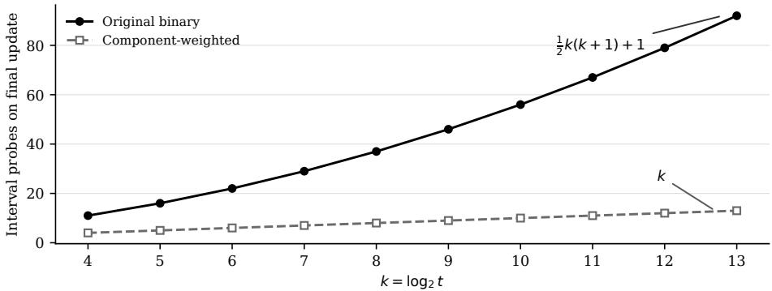

# Component-Weighted Centroid Search for Exact Incremental BPE

Harshit Verma Yale University harshit.verma@yale.edu

Rex Ying Yale University rex.ying@yale.edu

## Abstract

Exact incremental BPE maintains the canonical tokenization state after every appended byte. The recent algorithm of Jiang and Gong [2026] does this in $O ( \log ^ { 2 } t )$ worst-case time, where t is the maximum canonical token length. Its centroid search visits O(log t) components and can pay another $O ( \log t )$ for ordered point location at each one. Within Jiang and Gong’s normalized/proper merge-stage model, we change only that local search. Each interval is weighted by the size of the recursive component it selects, so a move from size m to size $m ^ { \prime }$ costs $O ( 1 + \log ( m / m ^ { \prime } ) )$ . These charges telescope, giving O(log t) time per append and O(n log t) over an n-byte stream, with the same BPE semantics and asymptotic space. We also construct a normalized proper BPE family over a fixed alphabet where count-balanced search uses $\Theta ( \log ^ { 2 } t )$ probes on a reachable update, while the weighted search uses Θ(log t). A Rust implementation matches the predicted probe counts on every tested instance. On ordinary vocabularies the queried degrees are small, however, and the improvement is a worst-case guarantee rather than an average-speed result.

## 1 Introduction

Byte-pair encoding (BPE) is a standard subword layer in language-model pipelines [Sennrich et al., 2016]. Exact incremental tokenization is relevant when a serving session repeatedly appends bytes to a growing prompt or agent trace and needs tokenizer state without retokenizing the complete history. In the incremental version, the input arrives one byte at a time and the tokenizer must retain a last-token/backpointer state after every append. The full canonical tokenization of any prefix can then be recovered from that state. Jiang and Gong [2026] find the longest canonical suffix with augmented Aho–Corasick matching [Aho and Corasick, 1975] and search its suffix-successor tree using a centroid decomposition. Their bound has two logarithms:

$$
\underbrace { O ( \log t ) } _ { \mathrm { c e n t r o i d l e v e l s } } \times \underbrace { O ( \log t ) } _ { \mathrm { o r d e r e d b r a n c h s e a r c h } }
$$

The second logarithm comes from balancing each local search by the number of intervals. But the choices are not equally consequential: one interval may leave a large recursive component while the next leaves a single node. We instead weight an interval by the component left after choosing it. Large remaining subproblems are encountered early, and the cost of a choice is charged to the drop in component size. Matching, validity intervals, and the centroid decomposition are untouched.

There are two points to establish. First, the local charges really do telescope, including gaps and failed searches. Second, the bad count-balanced case must be possible for a normalized BPE dictionary and on an update the tokenizer can actually reach. We prove both and check the construction against an offline heap implementation.

Related work. Berglund and van der Merwe [2023] formalize canonical BPE, give a general local-update procedure, and show that dictionary-dependent finite lookahead suffices for left-to-right streaming; Cognetta and Okazaki [2025] further develop finite-state representations. Mamouras et al. [2026] derive bounded-delay streaming with input-independent memory, while TokTier repairs session appends with widening and fallback [Zhang and Cao, 2026]. These interfaces differ from retaining Jiang and Gong’s exact state after every prefix; we improve that framework. Weight-sensitive and biased ordered search are classical [Mehlhorn, 1975]; our contribution is to weight each interval by its recursive CST component, so the local ratio charges telescope across the full centroid path. The lower bound concerns these two CST schemes, not every incremental tokenizer.

## 2 Component-weighted centroid search

In the normalized/proper model of Jiang and Gong [2026], the canonical suffixes of the current matched token form a suffix-successor tree. A candidate is valid when a retained prefix state lies in its precomputed DFS interval, valid candidates form one root-to-node path, whose deepest node is the new last token. The centroid search tree (CST) recursively decomposes this tree to locate that endpoint. We use two inherited properties: every recursive CST child has at most half the current component’s size, and a failed downward interval lookup is terminal. At state $( C , u )$ , the current component is $C ,$ , its centroid is $u ,$ and $m = | C |$ . When u is valid, its downward neighbors have disjoint ordered intervals $I _ { i } = [ L _ { i } , R _ { i } )$ . Choosing $I _ { i }$ enters a component $C _ { i } \operatorname { o f } C \setminus \{ u \}$ . Give that interval weight $w _ { i } = | C _ { i } |$ and write $\boldsymbol { W } = \sum _ { i } w _ { i }$ . The components are disjoint, so $W \leq m - 1$ , and the centroid property gives $w _ { i } \leq m / 2$

We store the intervals in an alphabetic tree. At each subtree, choose a pivot whose strict left and right sides each have at most half the current weight, and recurse without changing the interval order. At pivot $[ L _ { p } , R _ { p } )$ , a query $x$ goes left when $x < L _ { p } ,$ , right when $x \geq R _ { p }$ , and returns $p$ otherwise. This is the same interval map as before, including queries that land in a gap.

An empty list fails without a probe in $O ( 1 )$ time; below, $W \geq 1$

Lemma 1 (Local ratio bound). A successful queryfor $I _ { i }$ inspects at most $1 + \lceil \log _ { 2 } ( W / w _ { i } ) \rceil$ interval records. An unsuccessful query inspects at most $\dot { 1 } + \lceil \log _ { 2 } \bar { W } \rceil$ records.

Proof. Every failed pivot leaves at most half the previous weight. Before a successful probe the remaining subtree still contains weight $w _ { i } ;$ before a final unsuccessful probe it contains at least one unit. The two bounds follow from these halving inequalities. □

Theorem 1 (Exact $O ( \log t )$ updates). Under the model of Jiang and Gong [2026], componentweighted CST search returns the same exact last token and takes $O ( \log t )$ worst-case time per appended byte. Retaining prefix states over an n-byte stream takes $O ( n \log t )$ time.

Proof. Let $C _ { 0 } , \ldots , C _ { r }$ be the visited components, $m _ { j } = | C _ { j } |$ , and $\Phi _ { j } = \log _ { 2 } m _ { j }$ . Every transition enters a component of at most half the current size, so $r \doteq O ( \log t )$ . On a successful downward move from $C _ { j }$ to $C _ { j + 1 }$ , the chosen interval has weight $m _ { j + 1 }$ . Lemma 1 gives

$$
q _ { j } \leq 1 + \left\lceil \log _ { 2 } \frac { W _ { j } } { m _ { j + 1 } } \right\rceil \leq 2 + \Phi _ { j } - \Phi _ { j + 1 } .
$$

The successful downward moves are a subset of all recursive CST transitions. Every omitted potential drop is nonnegative, so summing over the successful moves is at most $\Phi _ { 0 } - \dot { \Phi _ { r } } \leq \log _ { 2 } \bar { t }$ . Their additive constants contribute another $O ( r )$ . Validity tests and upward transitions cost $O ( 1 )$ per level. By the inherited monotonic-path search, a failed downward lookup terminates the traversal, so there is at most one such lookup, costing $O ( \log t )$ . Initially there is at most one node for each nonempty suffix of the matched token $\tau ,$ hence $m _ { 0 } \leq | \tau | \leq t$

Because the weighted tree evaluates the same ordered intervals, it returns the same interval or failure at every centroid; automaton and history operations are unchanged. Thus the substitution preserves exact BPE semantics. □

With sorted intervals and prefix sums, the straightforward construction takes $O ( d \log d )$ time and $O ( d )$ temporary space. It retains one constant-size descriptor per interval. Appendix A gives the full point-location contract and construction.

  
Figure 1: Exact interval-record probes on the reachable final update. Markers are measurements and curves are the proved formulas for the executable family. $\mathbf { A t } t = 8 1 9 2$ , count-balanced search uses 92 probes and component-weighted search uses 13.

## 3 A reachable separation under BPE semantics

A skewed list of abstract weights is not enough for a BPE lower bound. The intervals have to come from a normalized proper dictionary, in the right order, and the expensive path must occur on a real stream update. The following family does this.

Proposition 1 (Reachable family). For every $k \geq 1$ , there is a normalized proper BPE dictionary over a fixed byte alphabet with a reachable update whose CST, under Jiang and Gong’s stricthalf centroid convention, follows recursively nested heavy components. Its maximum canonical token length is $t = \Theta ( k 2 ^ { k } ) ,$ ; count-balanced search uses $\dot { \Theta ( k ^ { 2 } ) } \overset { - } { = } \Theta ( \log ^ { 2 } t )$ interval probes, while component-weighted search uses $\Theta ( k ) = \Theta ( \log t )$

Start with a one-node tree $T _ { 0 }$ . To make $T _ { j }$ , add a new root with heavy child $T _ { j - 1 }$ and $2 ^ { j - 1 } - 1$ leaf children. Jiang and Gong’s construction descends from the rooted component only into a child strictly larger than half the component. The heavy child has size exactly $| T _ { j } | { \big / } 2 .$ , so the new root is the selected centroid, and its downward component weights are

$$
\underbrace { [ 1 , \dots \cdot \cdot , 1 } _ { 2 ^ { j - 1 } - 1 } , \ 2 ^ { j - 1 } ] .
$$

We represent each node by a canonical suffix token $U _ { p }$ of one target string and each edge by an exact final merge. At level $j ,$ let b be the heavy-child index and q the root index. The left operands $B _ { p }$ of the final merges form the successor-forest chain

$$
B _ { q - 1 }  B _ { q - 2 }  \cdots  B _ { b } , \qquad \operatorname { d f s } ( B _ { q - 1 } ) < \cdots < \operatorname { d f s } ( B _ { b } ) .
$$

The validity intervals therefore appear as $U _ { q - 1 } , \dots , U _ { b }$ with weights $[ 1 , \ldots , 1 , 2 ^ { j - 1 } ]$ . The heavy branch sits at the extreme end. Count balancing spends $\Theta ( j )$ probes to reach it, while the weighted tree tests it first.

A reserved left-context merge invalidates the longest suffix on the final append but leaves the next suffix valid, forcing the CST down the heavy components. Delimiter-protected binary macros turn the executable byte-label construction into an unbounded fixed-alphabet family. Appendices B–C contain the canonicality, interval-order, reachability, and properness details.

In the executable instances $t = 2 ^ { k }$ . The pinned predecessor convention uses exactly $k ( k + 1 ) / 2 + 1$ probes, versus k for the weighted tree. This exact count is implementation-specific; the asymptotic separation only needs the selected interval to remain extreme.

## 4 Evaluation

Setup. We implemented the exact incremental tokenizer with either the original count-balanced search or our component-weighted search; all other components are shared. We measure intervalrecord probes on constructed examples with $t = 1 6 , \ldots , 8 1 9 2$ and on GPT-2, RoBERTa-base, and

GPT-NeoX-20B vocabularies using one million bytes each of English and Rust code. These runs use continuous-byte BPE without model-specific pretokenization, normalization, or special-token handling. Experiments use an Apple M4, Rust 1.97.1, and release builds. Corpus timings use one warm-up and five repetitions; final-update timings use one warm-up batch and 31 repetitions. Code and reproduction artifacts will be released.

Constructed example. The constructed example in Section 3 is designed to expose the worst-case behavior of the original search. Figure 1 matches the predicted quadratic-versus-linear dependence on k. $\mathrm { A t } t = 8 1 9 2$ , the weighted method reduces the probe count from 92 to 13. Median final-update time changes only slightly, from 10.18 µs to 9.73 µs, because interval search is only part of an update. The generator verifies the required tokens, successor edges, suffixes, interval order, component weights, and forced update. Every reachable prefix of the constructed input is also checked against offline heap BPE, and randomized tests cover gaps, boundaries, empty lists, and equal and skewed weights.

Ordinary vocabularies. Both methods return the same token after every corpus byte and pass 1,470 retained-state audits against offline BPE. Across GPT-2, RoBERTa-base, and GPT-NeoX-20B on English and Rust code, the queried degree never exceeds five. Component-weighted search reduces the conditional p99 probe count from five to two, but complete-update time is 0.3%–13.1% slower because the original search is already shallow. We therefore do not claim an average-throughput improvement. The weighted structure also increases retained memory from about 38.3–38.5 MB to 44.6–44.7 MB. A fixed-threshold hybrid can scan small lists and use weighted search only for larger lists, preserving the O(log t) worst-case bound while avoiding the weighted-search overhead on all sampled ordinary-corpus queries. Full timing and probe distributions are reported in Appendix D.

## 5 Scope and conclusion

The constructed family is designed to produce worst-case behavior. Its large interval-list degrees do not occur in the six ordinary-corpus runs. The separation concerns the original count-balanced and proposed component-weighted CST searches, not every exact incremental BPE algorithm. The directly executable examples are limited by packed implementation fields; the fixed-alphabet construction provides the unbounded mathematical family.

Within Jiang and Gong’s exact every-prefix framework, weighting each interval by the recursive component it selects makes the search costs telescope across CST levels. This reduces worst-case update time from $O ( \log ^ { 2 } t )$ to $O ( \log t )$ without changing the returned token. The experiments support the predicted scaling while showing that the method provides worst-case protection rather than a general tokenizer speedup.

## References

Alfred V. Aho and Margaret J. Corasick. Efficient string matching: An aid to bibliographic search. Communications ofthe ACM, 18(6):333–340, 1975. doi: 10.1145/360825.360855.

Martin Berglund and Brink van der Merwe. Formalizing BPE tokenization. Electronic Proceedings in Theoretical Computer Science, 388:16–27, 2023. doi: 10.4204/EPTCS.388.4.

Marco Cognetta and Naoaki Okazaki. Tokenization as finite-state transduction. Computational Linguistics, 51(4):1119–1149, 2025. doi: 10.1162/coli.a.23.

Nicolaas Govert de Bruijn. A combinatorial problem. Proceedings of the Section of Sciences of the Koninklijke Nederlandse Akademie van Wetenschappen te Amsterdam, 49:758–764, 1946.

Shenghu Jiang and Ruihao Gong. Incremental BPE tokenization. In Proceedings of the 43rd International Conference on Machine Learning, volume 306 of Proceedings of Machine Learning Research. PMLR, 2026. Spotlight.

Konstantinos Mamouras, Angela W. Li, and Yudi Yang. An efficient algorithm for streaming BPE tokenization. Proceedings ofthe ACM on Programming Languages, 10(PLDI):2085–2108, June 2026. doi: 10.1145/3808330.

Kurt Mehlhorn. Nearly optimal binary search trees. Acta Informatica, 5:287–295, 1975. doi: 10.1007/BF00264563.

Rico Sennrich, Barry Haddow, and Alexandra Birch. Neural machine translation of rare words with subword units. In Proceedings ofthe 54th Annual Meeting ofthe Associationfor Computational Linguistics (Volume 1: Long Papers), pages 1715–1725, Berlin, Germany, August 2016. Association for Computational Linguistics. doi: 10.18653/v1/P16-1162.

Zhenyu Zhang and Zhichao Cao. TokTier: Exact stateful CPU+GPU tokenization for agentic LLM serving, 2026. arXiv:2607.29678.

## A Formal model and weighted point location

Exact contract. We inherit normalized/proper BPE, canonical tokens, suffix-successor trees, constant-time history access, and the monotonic-path theorem from Jiang and Gong [2026]. After every append, the online operation returns the exact final token of the canonical BPE tokenization and stores a token/backpointer chain. The complete token sequence is recoverable from that chain but is not recopied after every prefix. Jiang and Gong’s eager-output extension adds the cost of emitted output; our substitution leaves that mechanism unchanged.

The computational model is the same word RAM, including constant-time automaton transitions and history queries. A component size is an integer in [1, t] and occupies one $O ( \log t )$ -bit word.

Throughout, $O ( \log t )$ abbreviates $O ( 1 + \log t )$ in the degenerate case $t = 1$

Lemma 2 (Weighted pivot). For positive ordered weights $w _ { 1 } , \ldots , w _ { d }$ with total W, there is an index p whose strict left and right weights are both at most $W / 2$

Proof. Take the smallest p with $\textstyle \sum _ { i \leq p } w _ { i } \geq W / 2$ . Minimality gives $\textstyle \sum _ { i < p } w _ { i } < W / 2$ , while $\textstyle \sum _ { i > p } w _ { i } = W - \sum _ { i \leq p } w _ { i } \leq W / 2 .$ □

Construction. For an ordered interval list $( I _ { i } , w _ { i } ) _ { i = 1 } ^ { d }$ , choose a weighted pivot, store that interval at the root, and recurse on the strict left and right subsequences. Empty subsequences become null pointers. A query at $I _ { p } = [ L _ { p } , R _ { p } )$ executes

$$
x < L _ { p } : \mathrm { l e f t } , \qquad x \geq R _ { p } : \mathrm { r i g h t } , \qquad L _ { p } \leq x < R _ { p } : \mathrm { r e t u r n } p .
$$

For $d = 0 ,$ , it returns failure.

Lemma 3 (Point-location equivalence). The weighted tree returns interval $I _ { i }$ exactly when $x \in I _ { i }$ and returnsfailure exactly when x lies in no stored interval.

Proof. Because intervals are disjoint and ordered, every interval to the left of $I _ { p }$ ends before $L _ { p } ,$ , and every interval to the right begins at or after $R _ { p }$ . The comparison at p therefore discards no possible containing interval. Induction on the recursively stored subsequence proves the claim, including gaps between adjacent intervals. □

Lemma 4 (Weighted depth). For a nonempty list ofpositive integer weights with total W, the depth ofinterval i is at most $1 + \lceil \log _ { 2 } ( W / w _ { i } ) \rceil$ . Every unsuccessful search has depth at most $1 + \lceil \log _ { 2 } \bar { W } \rceil$

Proof. If interval i is not the current pivot, the recursive side containing it has at most half the current total weight. After $h - 1$ descents, that total is at most $W / 2 ^ { h - 1 }$ but at least $w _ { i }$ , which gives the successful bound. For an unsuccessful query that inspects h records, the preceding $h - 1$ descents leave, immediately before the final probe, a subtree of positive integer weight at least 1 and at most $W / 2 ^ { h - 1 }$ , which gives the unsuccessful bound. □

Global accounting. At current component $C _ { j }$ , the total weight of downward intervals is at most $m _ { j } - 1$ . If interval i selects component $C _ { j + 1 }$ , then $w _ { i } = m _ { j + 1 }$ by construction. Hence

$$
q _ { j } \leq 1 + \left\lceil \log _ { 2 } \frac { m _ { j } - 1 } { m _ { j + 1 } } \right\rceil \leq 2 + \log _ { 2 } m _ { j } - \log _ { 2 } m _ { j + 1 } .
$$

All CST transitions decrease component size by at least a factor of two. Successful downward transitions form a subset of those transitions, and all omitted log drops are nonnegative. Their log-ratio terms are therefore bounded by the full telescoping sum

$$
\sum _ { j = 0 } ^ { r - 1 } \bigl ( \log _ { 2 } m _ { j } - \log _ { 2 } m _ { j + 1 } \bigr ) = \log _ { 2 } m _ { 0 } - \log _ { 2 } m _ { r } \leq \log _ { 2 } t .
$$

The additive constants, validity tests, and upward transitions contribute $O ( \log t )$ more. A failed downward lookup is terminal in the inherited search, so there is at most one final miss, also costing $O ( \log t )$ .

Preprocessing and space. Store prefix sums of the weights. In a recursive subarray, binary search for the first cumulative weight reaching half of the subarray total. This gives an ${ \dot { O } } ( d \log { \dot { d } } )$ construction and $O ( d )$ temporary space from already sorted intervals. A preorder layout needs one interval record, one subtree offset, and one component-size field per original interval. Thus the replacement remains linear in the existing downward-interval representation, although the prototype has a larger constant factor (Appendix D).

## B Reachable direct-byte construction

We first give a directly executable family for the tested range. The fixed-alphabet unbounded encoding follows in Appendix C.

Tree topology. Let $n = 2 ^ { k }$ and $r _ { j } = 2 ^ { j } - 1$ . Index the nodes of $T _ { k }$ by postorder positions $0 , \ldots , n - 1$ . We use Jiang and Gong’s implementation convention: starting at the rooted component, descend only into a child strictly larger than half the component. Since the heavy child of $T _ { j }$ has size exactly $2 ^ { j - 1 } = | T _ { j } | / 2$ , this selects the newly added root at every level. For $p \in [ r _ { j - 1 } , r _ { j } )$ , set

$$
\pi ( p ) = r _ { j } ,
$$

and set $\pi ( n - 1 ) = n - 1$ . Thus $r _ { j - 1 }$ is the root of the heavy copy $T _ { j - 1 }$ below $r _ { j }$ , while the remaining nodes in $[ r _ { j - 1 } , r _ { j } )$ are leaves.

Target string and tokens. Choose bytes $a _ { 0 } , \ldots , a _ { n - 2 }$ from $\{ 1 , \ldots , 2 5 4 \}$ so that adjacent pairs $( a _ { p } , a _ { p + 1 } )$ are all distinct; an order-two de Bruijn sequence supplies such a segment in the executable range [de Bruijn, 1946]. Reserve byte 0 as the terminal symbol and 255 as left context. Define

$$
S = a _ { 0 } a _ { 1 } \cdot \cdot \cdot a _ { n - 2 } 0 , \qquad U _ { p } = S [ p : n ) , \qquad P _ { p , q } = S [ p : q ) .
$$

The vocabulary contains all bytes, every required block $P _ { p , \pi ( p ) }$ , every suffix $U _ { p } .$ and the context token 255a .

Position uniqueness. Because all adjacent pairs $( a _ { p } , a _ { p + 1 } )$ are distinct, every substring of $a _ { 0 } \cdots a _ { n - 2 }$ of length at least two occurs at only one position: two occurrences would repeat its first adjacent pair.

We order the merge rules in three phases.

Phase 1: canonical blocks. For each level block $[ b , q ) = [ r _ { j - 1 } , r _ { j } )$ and $p = q - 2 , q - 3 , \ldots , b .$ add

$$
( a _ { p } , P _ { p + 1 , q } ) \mapsto P _ { p , q } .
$$

The length-one block $P _ { q - 1 , q } = a _ { q - 1 }$ is atomic. All block rules have higher priority than the remaining rules.

Phase 2: reserved context. Add

$$
( 2 5 5 , a _ { 0 } ) \mapsto 2 5 5 a _ { 0 } .
$$

Phase 3: target suffixes. For $p = n - 2 , n - 3 , \ldots , 0 ,$ , add

$$
( P _ { p , \pi ( p ) } , U _ { \pi ( p ) } ) \mapsto U _ { p } .\tag{1}
$$

The root $U _ { n - 1 } = 0$ is atomic.

Lemma 5 (Canonical blocks). Every $P _ { p , q }$ introduced in Phase 1 is canonical before any context or target rule is applied.

Proof. Within a level block, the rules build from right to left, so the right operand $P _ { p + 1 , q }$ already exists when the rule for $P _ { p , q }$ is considered. If that operand has length one, uniqueness of $( a _ { p } , a _ { p + 1 } )$ isolates the intended occurrence; if it is longer, position uniqueness isolates the right operand itself. Since level blocks are disjoint and no Phase-1 rule crosses their boundary, induction on decreasing p gives the unique intended block tokenization. □

Lemma 6 (Canonical suffixes and exact successor edges). Every $U _ { p }$ is canonical, and the suffixsuccessor parent of $U _ { p }$ is exactly $U _ { \pi ( p ) }$

Proof. Proceed in decreasing p and assume the claim for larger indices. Phase 1 has higher priority than every target rule and canonically contracts $S [ p : \pi ( p ) )$ to $P _ { p , \pi ( p ) }$ , so no target rule beginning strictly inside this block can fire. By induction, the remaining suffix $S [ \pi ( p ) : n )$ forms $U _ { \pi ( p ) }$ Immediately before the rule for $p ,$ the relevant boundary is therefore exactly $( P _ { p , \pi ( p ) } , U _ { \pi ( p ) } )$ , and Rule (1) creates $U _ { p }$ . Rules for smaller indices have lower priority and cannot preempt it. Removing the final canonical merge leaves its right operand $U _ { \pi ( p ) }$ , which is exactly the inherited suffix-successor parent. □

Lemma 7 (No extra canonical suffix nodes). The canonical vocabulary tokens that are suffixes of S are exactly $U _ { 0 } , \ldots , U _ { n - 1 }$

Proof. The terminal byte 0 occurs only at the end of $S ,$ and every intended $U _ { p }$ ends in it. A Phase-1 block contains no terminal byte, so it cannot equal a nontrivial suffix of ${ \bar { S } } ;$ position uniqueness also prevents it from coinciding with a differently positioned target substring. The context token begins with reserved byte 255, which does not occur in $S .$ . All remaining vocabulary items are atomic bytes or the intended target suffixes. Hence no additional nontrivial canonical token enters the suffix-successor tree of S. □

Lemma 8 (Interval order and local cost). At the centroid corresponding to $U _ { q }$ for level $j ,$ the downward intervals are ordered

$$
U _ { q - 1 } , U _ { q - 2 } , \dots , U _ { b }
$$

and have component weights $[ 1 , \ldots , 1 , 2 ^ { j - 1 } ]$ , with the heavy interval last.

Proof. Write $B _ { p } = P _ { p , q }$ . The Phase-1 construction gives the ancestor chain

$$
B _ { q - 1 }  B _ { q - 2 }  \cdot \cdot \cdot  B _ { b }
$$

in the global successor forest, hence $\mathrm { d f s } ( B _ { q - 1 } ) < \dots < \mathrm { d f s } ( B _ { b } )$ . For target $U _ { p } .$ , the left operand of its final canonical merge is pre $( U _ { p } ) = { \dot { B _ { p } } } ,$ . Jiang and Gong’s validity interval is ordered by the corresponding DFS coordinate, so the intervals occur in the displayed order. By the parent map $\pi ,$ $U _ { b }$ roots the copy of $T _ { j - 1 }$ of size $2 ^ { j - 1 }$ , while every other child is a leaf. Thus the heavy interval is extreme. A count-balanced predecessor tree needs $\Theta ( j )$ probes to reach it among $2 ^ { j - 1 }$ intervals, while the weighted pivot selects it at the root. □

Lemma 9 (Reachable heavy-path update). On the stream 255S, the final append initializes the inherited update at $U _ { 0 } ,$ , the context rule invalidates $U _ { 0 }$ , and the truefinal token is $U _ { 1 }$ . The CST search follows the heavy components of $T _ { k }$

Proof. On the final append, augmented Aho–Corasick reports $U _ { 0 } = S$ as the longest vocabulary token that is a suffix of the raw byte string. Without reserved context, $U _ { 0 }$ is also canonical. On 255S, however, the higher-priority context merge consumes $( 2 5 5 , a _ { 0 } )$ , so the Phase-3 rule that would form $U _ { 0 }$ is no longer applicable. The suffix beginning at position one is untouched and canonically forms $U _ { 1 }$ . Thus $U _ { 0 }$ is the initial candidate while $U _ { 1 }$ is the true last token. The inherited monotonic-path search follows that path, entering the heavy child at every new root and ending with the degree-one miss at the bottom. □

Exact executable counts. The search takes the heavy interval successfully at levels $j = k , k -$ $1 , \ldots , 2 ,$ , then performs a one-interval miss at the bottom. Under the pinned count-balanced predecessor implementation, the successful depths sum to $\textstyle \sum _ { j = 2 } ^ { k } j = k ( k + 1 ) / 2 - 1$ . The terminal miss reads the sole interval during predecessor search and once more for its right endpoint, contributing two probes. Thus

$$
Q _ { \mathrm { b i n a r y } } ( k ) = \frac { k ( k + 1 ) } { 2 } + 1 .
$$

The weighted index reads one record at each of the $k - 1$ successful levels and one at the terminal miss, so $Q _ { \mathrm { w e i g h t e d } } ( k ) = k$ . The exact additive constants are implementation-specific; the $\Theta ( k ^ { 2 } )$ lower bound only requires that the chosen interval be extreme among $2 ^ { j - 1 }$ ordered intervals.

## C Fixed-alphabet unbounded encoding

The direct construction uses one raw label per position and is intentionally finite. We now encode those labels over the fixed alphabet

$$
\{ 0 , 1 , \# , \ S , ! , \emptyset \} .
$$

For $p \in \{ 0 , \ldots , n - 2 \}$ , let

$$
A _ { p } = \# \mathrm { b i n } _ { k } ( p ) \ S , \qquad S ^ { \prime } = A _ { 0 } A _ { 1 } \cdot \cdot \cdot A _ { n - 2 } ! .
$$

All binary codes have length $k .$

First assign higher priority to rules that build every code suffix x\$ from right to left, in increasing suffix length, and then merge

$$
( \# , \mathrm { b i n } _ { k } ( p ) \mathfrak { H } ) \mapsto A _ { p } .
$$

Identical code-suffix strings share one rule. No high-priority rule has $\$ 8$ as a left operand or $\#$ as a right operand, so no rule crosses a $\$ 4$ macro boundary. Each macro therefore becomes its unique token $A _ { p }$ before any simulated block or target rule applies.

Next add the Phase-1 block rules and Phase-3 target rules from Appendix B, treating each $A _ { p }$ as one symbol and ! as the terminal symbol. Place the context rule

$$
( \mathbb { Q } , A _ { 0 } ) \mapsto \mathbb { Q } A _ { 0 }
$$

between those two phases.

Lemma 10 (Macro simulation). After the code-building phase, the canonical tokenization of $S ^ { \prime }$ is $A _ { 0 } A _ { 1 } \cdots A _ { n - 2 } !$ , and no code-building token crosses a $\ S \#$ boundary. Subsequent simulated block, context, and target rules produce exactly the direct construction’s token-level execution with each $a _ { p }$ replaced by $A _ { p } .$

Proof. Code-suffix rules are ordered by increasing suffix length, so each right operand exists before the rule that extends it to the left. Identical suffix strings safely share a rule. No code rule has $\$ 1$ as a left operand or $\#$ as a right operand, so none crosses a macro boundary. Since every code has length $k ,$ the full token $\mathrm { b i n } _ { k } ( p ) \mathfrak { S }$ begins immediately after its preceding $\# .$ , and the next rule forms exactly $A _ { p } .$ All simulated rules have lower priority and therefore first see the displayed macro sequence. Their operands and rule order are isomorphic to Appendix $\mathbf { B } ;$ macro-level adjacent pairs are unique because the $A _ { p }$ are distinct. Internal code tokens end at an internal $\$ 1$ and cannot be suffix nodes of the target ending in !, while @ occurs nowhere in the target. Canonical blocks and suffixes, the exact suffix-node set, interval order, and reachability therefore transfer. Every operand is canonical when used, so the dictionary remains normalized and proper. □

The maximum target length in raw symbols is

$$
t = | S ^ { \prime } | = ( n - 1 ) ( k + 2 ) + 1 = \Theta ( k 2 ^ { k } ) .
$$

Hence log $t = \Theta ( k )$ , which converts the executable $\Theta ( k ^ { 2 } )$ versus $\Theta ( k )$ separation into the fixedalphabet $\Theta ( \log ^ { 2 } t )$ versus $\Theta ( \log t )$ statement of Proposition 1.

## D Implementation and evaluation details

Platform and protocol. Experiments use an Apple M4 (10 cores, 16 GB), Darwin 25.1.0, Rust 1.97.1, and Cargo –release with opt-level=3 and default target features. A single otherwise-idle process is used; macOS provides no supported CPU-affinity control, so runs are unpinned. Corpus timing uses one warm-up and five repetitions. Final-update timing uses one warm-up batch and 31 repetitions and reports medians; initialization reports the median and quartiles of nine separateprocess builds. Inputs are pinned one-million-byte prefixes of Project Gutenberg’s War and Peace and 169 Rust files from TheAlgorithms/Rust.

Instrumentation and certificates. One record probe means reading one stored interval. Endpoint comparisons are counted separately because a weighted miss may test both boundaries of several records. The generator checks every intended token’s canonicality, every prescribed successor edge, the exact canonical-suffix set, interval disjointness and order, weighted-tree permutation and acyclicity, CST component halving, stored-weight equality, the forced $\breve { U _ { 0 } }  U _ { 1 }$ update, and offline BPE equality on every witness prefix. Property tests additionally cover empty lists, gaps, boundaries, equal weights, skewed weights, and randomized ordered interval sets.

Table 1: Search-conditional tails over one million updates. Each tuple is p50/p95/p99/p99.9/max.
<table><tr><td>Vocabulary</td><td>Corpus</td><td>Record probes Binary</td><td>Weighted</td><td>Endpoint comparisons</td><td>Weighted</td></tr><tr><td></td><td></td><td></td><td></td><td>Binary</td><td></td></tr><tr><td>GPT-2</td><td>English</td><td>2/4/5/5/7</td><td>1/2/2/3/4</td><td>2/4/5/5/7</td><td>2/4/4/5/7</td></tr><tr><td>GPT-2</td><td>Code</td><td>2/4/5/6/7</td><td>1/2/2/3/4 1/2/2/3/4</td><td>2/4/5/6/7 2/4/5/5/7</td><td>2/4/4/6/8 2/4/4/5/7</td></tr><tr><td>RoBERTa-base RoBERTa-base</td><td>English Code</td><td>2/4/5/5/7 2/4/5/6/7</td><td>1/2/2/3/4</td><td>2/4/5/6/7</td><td>2/4/4/6/8</td></tr><tr><td>GPT-NeoX-20B</td><td>English</td><td>2/4/5/5/7</td><td>1/2/2/3/3</td><td>2/4/5/5/7</td><td>2/4/4/5/6</td></tr><tr><td>GPT-NeoX-20B</td><td>Code</td><td></td><td>2/4/5/6/8 1/2/2/3/4 2/4/5/6/8</td><td></td><td>2/4/4/6/7</td></tr></table>

Weighted search reduces p99 endpoint comparisons from five to four in every corpus. On the adversarial t = 8192 update, where searches succeed along the heavy path, the endpoint counts are 92 and 14. At 245 checkpoint prefixes for each vocabulary/corpus pair, both modes match offline heap BPE, totaling 1,470 retained-state audits; the witness certificate checks every reachable witness prefix.

Table 2: Ordinary-vocabulary results over one million updates per row. Each paired value is countbalanced → component-weighted. Probes are conditional on entering interval search; time measures the complete update.
<table><tr><td>Vocabulary</td><td>Corpus</td><td>Search (%)</td><td>Max degree p99 probes Max probes</td><td></td><td></td><td>ns/update</td></tr><tr><td>GPT-2</td><td>English</td><td>9.53</td><td>4</td><td>5 → 2</td><td> $7  4$ </td><td> $1 3 . 1 5  1 3 . 7 2$ </td></tr><tr><td>GPT-2</td><td>Code</td><td>7.40</td><td>4</td><td>5 → 2</td><td> $7  4$ </td><td> $9 . 4 9  9 . 6 7$ </td></tr><tr><td>RoBERTa-base</td><td>English</td><td>9.53</td><td>4</td><td> $5  2$ </td><td> $7  4$ </td><td> $1 3 . 2 7  1 4 . 6 5$ </td></tr><tr><td>RoBERTa-base</td><td>Code</td><td>7.40</td><td>4</td><td> $5  2$ </td><td> $7  4$ </td><td> $1 0 . 2 2  1 0 . 2 5$ </td></tr><tr><td>GPT-NeoX-20B</td><td>English</td><td>9.57</td><td>4</td><td> $5  2$ </td><td> $7  3$ </td><td> $1 2 . 7 8  1 4 . 4 5$ </td></tr><tr><td>GPT-NeoX-20B</td><td>Code</td><td>12.26</td><td>5</td><td> $5  2$ </td><td> $8  4$ </td><td> $1 0 . 5 7  1 1 . 1 1$ </td></tr></table>

Construction and memory. Table 3 compares separate binary-only and weighted-only builds. The weighted build still retains sorted interval endpoints because they are needed to handle gaps. Thus “weighted” refers to the replacement index, not to two search trees stored together.

Table 3: Separate-process initialization. Memory is decimal MB; times are median [q1,q3] over nine builds.
<table><tr><td></td><td colspan="2">Retained MB</td><td colspan="2">Search bytes/interval</td><td colspan="2">Initialization ms</td></tr><tr><td>Vocabulary</td><td>Binary</td><td>Weighted</td><td>Binary</td><td>Weighted</td><td>Binary</td><td>Weighted</td></tr><tr><td>GPT-2</td><td>38.50</td><td>44.71</td><td>144.71</td><td>190.17</td><td>41.21 [40.05,43.16]</td><td>49.49 [49.30,50.93]</td></tr><tr><td>RoBERTa-base</td><td>38.50</td><td>44.71</td><td>144.71</td><td>190.17</td><td>41.72 [40.88,42.08]</td><td>49.58 [48.37,49.84]</td></tr><tr><td>GPT-NeoX-20B</td><td>38.32</td><td>44.60</td><td>142.17</td><td></td><td>186.87 39.82 [39.60,39.87]</td><td>54.48 [52.79,55.23]</td></tr></table>

Measured peak heap is 46.4–46.8 MB for binary and 52.7–53.0 MB for weighted. Corpus preparation and vocabulary normalization occur before the timed online loops.

Low-degree hybrid. A practical variant linearly scans degrees at most eight and uses the weighted tree only above that threshold. A fixed threshold preserves the $O ( \log t )$ theorem because each CST level pays only O(1) for the scan. All sampled public-vocabulary queries fall on the linear path, while the adversarial family eventually enters the weighted path. We treat this hybrid as an engineering option rather than part of the asymptotic contribution or the pure-search comparisons in the main paper.